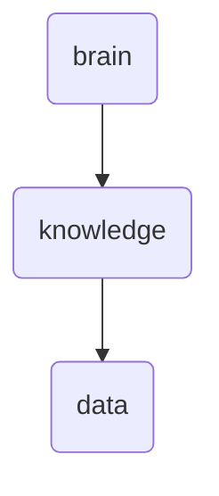

# Data Identity

This directory holds various data files and metadata related to knowledge integration processes within OmniClaw. It is responsible for storing and managing the raw data inputs, processed outputs, and associated documentation.

---

## Topological View

---
*OmniClaw V5.0 | Forged by OMA AI Architect | brain.knowledge.data | 2026-04-10*
