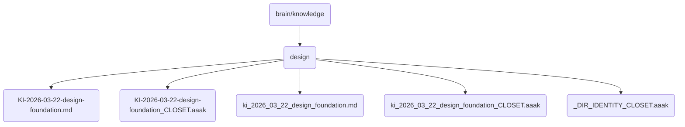

# Design Identity

This directory contains the foundational design documents and assets for OmniClaw v5.0, focusing on the architecture and implementation strategies.

## Topological View

---
*OmniClaw V5.0 | Forged by AI Architect | Evaluated dynamically*
