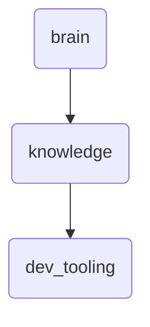

# Dev Tooling Identity

This directory contains development tooling documentation for OmniClaw v5.0, including scripts and guides for various tools used in the development process.

---

## Topological View

---
*OmniClaw V5.0 | Forged by OMA AI Architect | brain.knowledge.dev_tooling | 2026-04-10*
