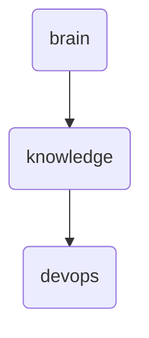

# Devops Identity

The 'devops' directory serves as the central hub for all DevOps-related knowledge and documentation within OmniClaw v5.0, facilitating seamless integration and management of various tools and practices.

---

## Topological View

---
*OmniClaw V5.0 | Forged by OMA AI Architect | brain.knowledge.devops | 2026-04-10*
