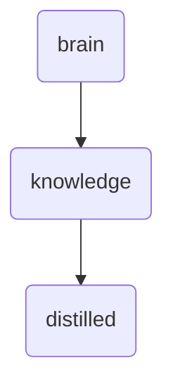

# Distilled Identity

The 'distilled' directory within OmniClaw v5.0 serves as the repository for high-level, synthesized knowledge insights and legacy assimilation records, ensuring efficient access and retrieval.

---

## Topological View

---
*OmniClaw V5.0 | Forged by OMA AI Architect | brain.knowledge.distilled | 2026-04-10*
