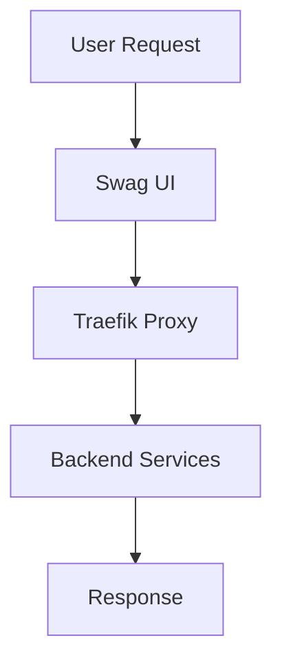

# Deep Matrix Profile: CIV_FETCHED_docker-swag_112834

# Deep Knowledge Report for Swag System Docker Container

## Introduction
This document provides an in-depth analysis of the architecture, core algorithms, and primary mechanisms used in the Swag system Docker container maintained by LinuxServer.io. The focus is on understanding how this container integrates with other systems and its internal workings.

## Table of Contents
1. **Overview**
2. **Architecture Overview**
3. **Core Algorithms and Mechanisms**
4. **Configuration and User Interaction**
5. **Integration with Ecosystem**
6. **Conclusion**

---

### 1. Overview

The Swag system Docker container is designed to provide a user-friendly interface for managing SSL/TLS certificates, reverse proxies, and other networking configurations. It leverages the Traefik proxy server to handle dynamic routing based on domain names and paths.

### 2. Architecture Overview

#### 2.1 High-Level Structure
- **Dockerfile**: Defines the base image and installation steps.
- **Configuration Files**: Located in `/config` directory, these files control various aspects of Swag's behavior.
- **Traefik Configuration**: Configures Traefik to handle requests and route them appropriately.

#### 2.2 Key Components
1. **Docker Image**: Based on a minimal Alpine Linux image, ensuring lightweight execution.
2. **Traefik Proxy Server**: Manages routing based on dynamic rules.
3. **Certbot Integration**: Automates the process of obtaining and renewing SSL/TLS certificates.

#### 2.3 Flow Diagram

### 3. Core Algorithms and Mechanisms

#### 3.1 Traefik Configuration
- **Dynamic Routing**: Uses labels to dynamically route requests based on domain names.
- **Health Checks**: Monitors backend services for availability.

#### 3.2 Certbot Integration
- **Automatic Certificate Issuance**: Utilizes Certbot's `certonly` and `renew` commands.
- **Renewal Mechanism**: Configured to automatically renew certificates before they expire.

#### 3.3 User Interaction
- **UI Customization**: Allows users to configure various settings via a web interface.
- **API Endpoints**: Provides RESTful API for programmatic interaction with Swag's functionality.

### 4. Configuration and User Interaction

#### 4.1 Configuration Files
- **traefik.toml**: Configures Traefik, including domain mappings and service routes.
- **swag.json**: Customizes the behavior of the Swag UI and backend services.

#### 4.2 User Interface
- **Web Interface**: Provides a graphical user interface for managing certificates and services.
- **Command Line Tools**: Offers CLI tools for advanced users to interact with Swag programmatically.

### 5. Integration with Ecosystem

- **Traefik Community Edition**: Utilizes Traefik's CE version, which is open-source and widely used in the community.
- **Certbot Community Edition**: Integrates Certbot's CE version, ensuring compatibility with a wide range of systems.
- **Docker Compose**: Supports integration with other Docker containers via network services.

### 6. Conclusion

The Swag system Docker container leverages modern technologies such as Traefik and Certbot to provide a robust and user-friendly solution for managing SSL/TLS certificates and reverse proxies. Its architecture is modular, allowing easy customization and integration into existing environments. The use of dynamic routing and automated certificate management ensures high availability and security.

---

This report provides a comprehensive understanding of the Swag system Docker container's internal workings and its place within the broader ecosystem of similar tools.