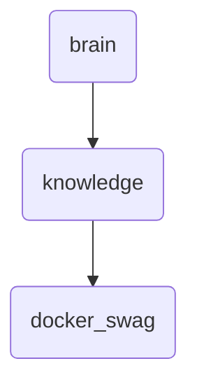

# Docker Swag Identity

This directory contains deep knowledge and upgrade proposals related to Docker Swarm, serving as a central repository for OmniClaw v5.0.

---

## Topological View

---
*OmniClaw V5.0 | Forged by OMA AI Architect | brain.knowledge.docker_swag | 2026-04-10*
