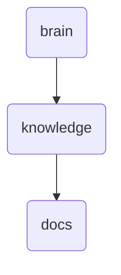

# Docs Identity

This directory holds documentation related to OmniClaw's AI operations, setup guides, and contribution guidelines. It serves as a central repository for knowledge and procedures.

---

## Topological View

---
*OmniClaw V5.0 | Forged by OMA AI Architect | brain.knowledge.docs | 2026-04-10*
