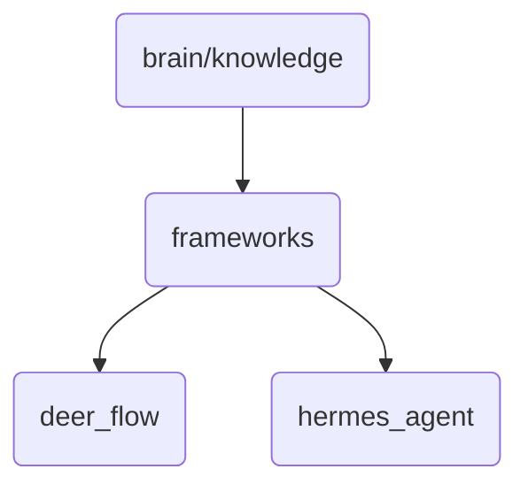

# Frameworks Identity

The 'frameworks' directory contains the core components that enable OmniClaw's v5.0 to function efficiently and effectively.

## Topological View

---
*OmniClaw V5.0 | Forged by AI Architect | Evaluated dynamically*
