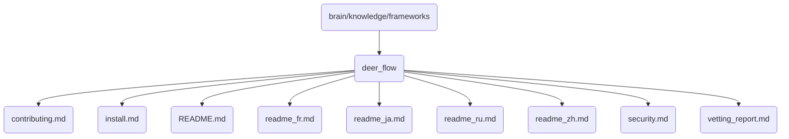

# Deer Flow Identity

Deer Flow is a critical component of OmniClaw v5.0, designed to manage and optimize the flow of data within the system.

## Topological View

---
*OmniClaw V5.0 | Forged by AI Architect | Evaluated dynamically*
