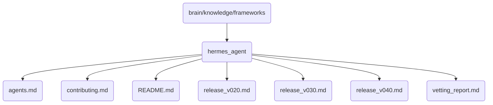

# Hermes Agent Identity

Hermes Agent framework is a critical component of OmniClaw v5.0, responsible for managing and coordinating various agents in the system.

## Topological View

---
*OmniClaw V5.0 | Forged by AI Architect | Evaluated dynamically*
