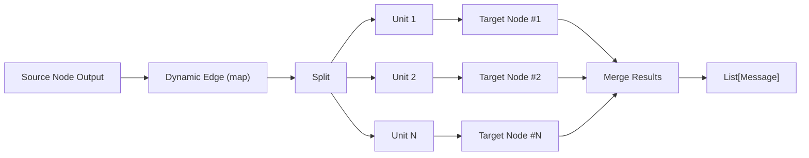
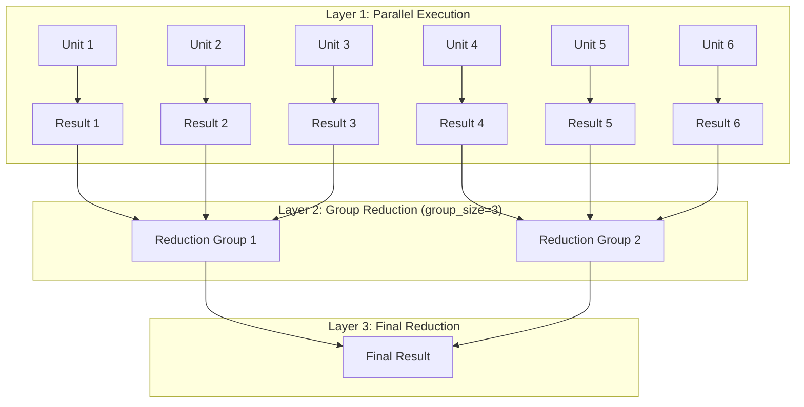
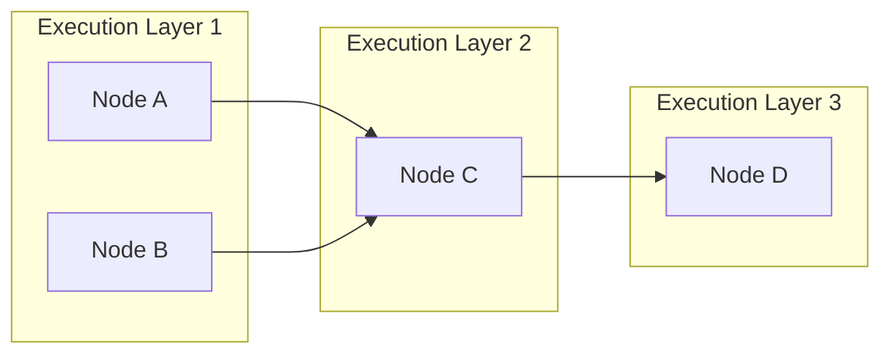
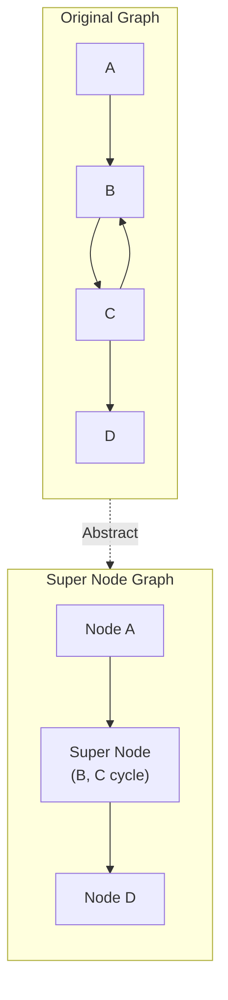
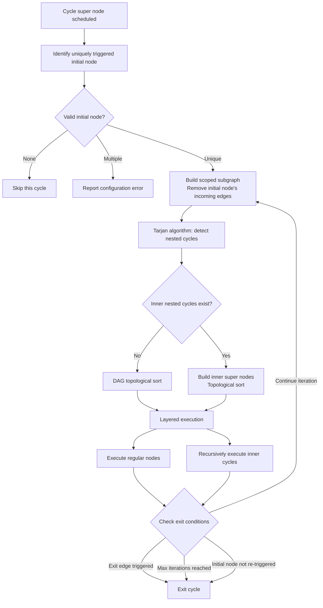
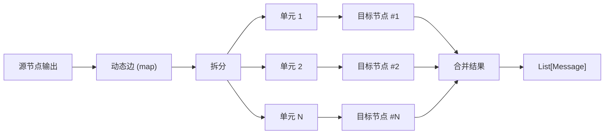
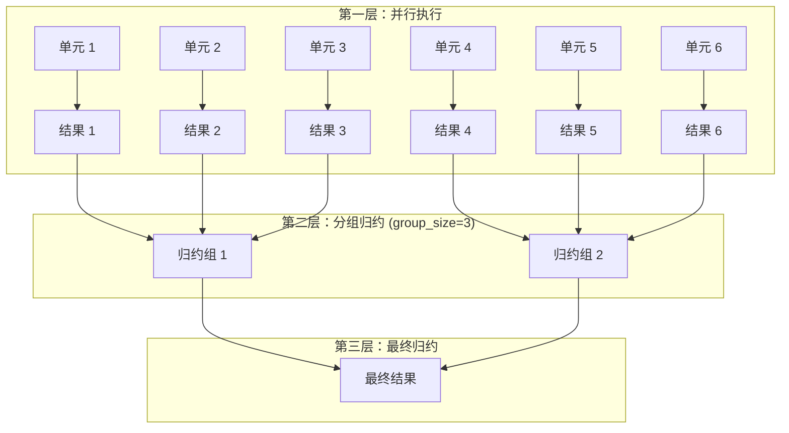
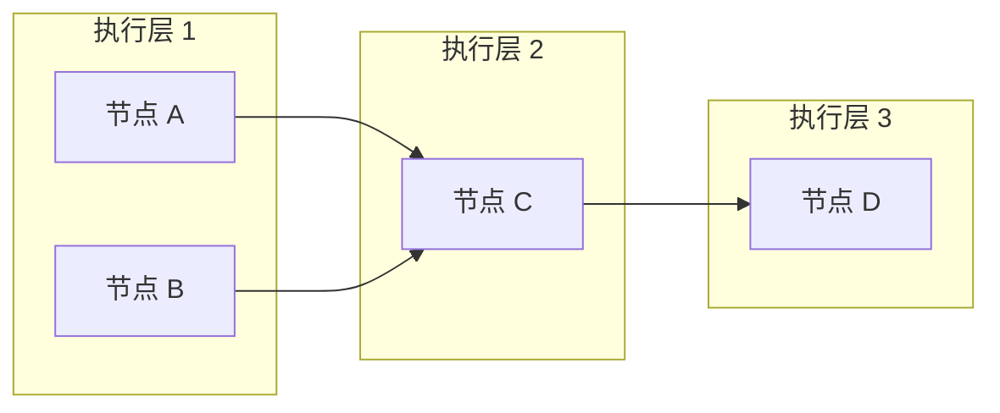
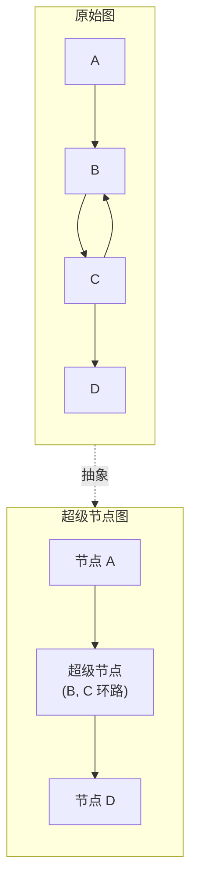
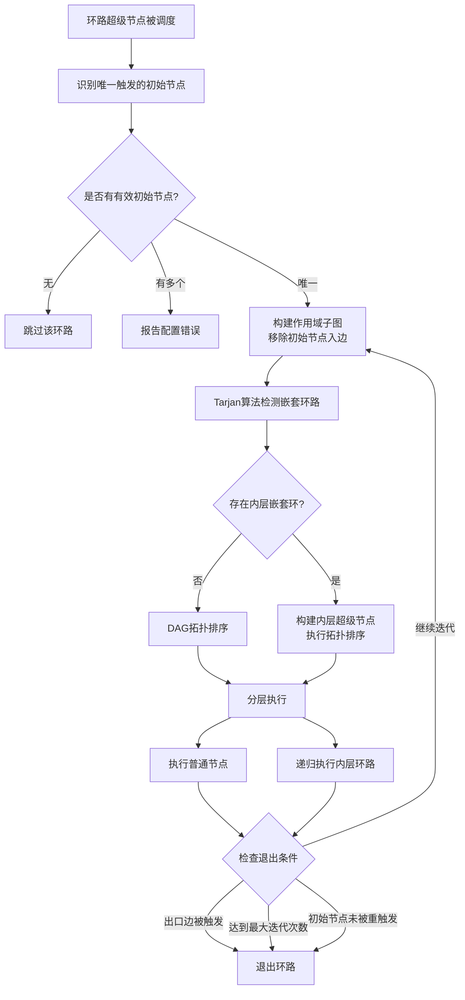

# KNOWLEDGE EXTRACT: ChatDev
> **Extracted on:** 2026-03-30 22:10:02
> **Source:** ChatDev

---

## File: `.dockerignore`
```
.git
.gitignore
.gitattributes

*.pyc
.DS_Store
Thumbs.db
.idea/
.vscode/
__pycache__/
.venv/
env/
venv/
.uv-cache
.env
.env.*

node_modules/
WareHouse/
data/
temp/
logs

/frontend
README*
compose.yml
Dockerfile
```

## File: `.env.docker`
```
BACKEND_BIND=0.0.0.0

FRONTEND_HOST=0.0.0.0
FRONTEND_PORT=5173

# Frontend points to the backend service name and exposed port
VITE_API_BASE_URL=http://backend:6400

# Explicit CORS origins for Docker-based dev (comma-separated)
CORS_ALLOW_ORIGINS=http://localhost:5173,http://127.0.0.1:5173
```

## File: `.env.example`
```
# ============================================================================
# LLM Provider Configuration
# ============================================================================
# BASE_URL and API_KEY are the standard configurations for model call authentication.
# These variables support OpenAI, Gemini, LM Studio, Ollama, and other providers.

BASE_URL=https://api.openai.com/v1
API_KEY=sk-your-openai-api-key-here

# Example BASE_URL values:
# - OpenAI:    https://api.openai.com/v1
# - Gemini:    https://generativelanguage.googleapis.com
# - LM Studio: http://localhost:1234/v1
# - Ollama:    http://localhost:11434/v1

# ============================================================================
# Optional: Web Search and Reading Tools
# ============================================================================

# SERPER_DEV_API_KEY=your-serper-api-key-here
# Get from: https://serper.dev

# JINA_API_KEY=your-jina-api-key-here
# Get from: https://jina.ai
```

## File: `.gitattributes`
```
# Auto detect text files and perform LF normalization
* text=auto
```

## File: `.gitignore`
```
# Python
__pycache__/
*.pyc

# Virtual environments
.venv/
venv/
env/

# uv
.uv-cache/

# IDEs
.idea/
.vscode/
frontend/.vscode/

# OS
.DS_Store

# Environment
.env

# Project Specific
logs/
node_modules/
data/
temp/
WareHouse/
```

## File: `compose.yml`
```yaml
services:
  backend:
    build:
      context: .
      dockerfile: Dockerfile
      target: runtime
    container_name: chatdev_backend
    volumes:
      - .:/app
    ports:
      - "6400:6400"
    env_file:
      - .env
      - .env.docker
    restart: unless-stopped

  frontend:
    build:
      context: ./frontend
      dockerfile: Dockerfile
      target: dev
    container_name: chatdev_frontend
    volumes:
      - ./frontend:/app
      - /app/node_modules
    ports:
      - "${FRONTEND_PORT:-5173}:5173"
    env_file:
      - .env
      - .env.docker
    depends_on:
      - backend
    restart: unless-stopped
```

## File: `Dockerfile`
```
# ---- Builder: install deps with compilers and uv ----
FROM python:3.12-slim AS builder
ARG DEBIAN_FRONTEND=noninteractive

WORKDIR /app

# System deps required to build Python packages
RUN apt-get update && apt-get install -y --no-install-recommends \
    pkg-config \
    build-essential \
    python3-dev \
    libcairo2-dev \
 && rm -rf /var/lib/apt/lists/*

# Install uv just for dependency resolution/install
RUN pip install --no-cache-dir uv

# Install the project virtualenv outside /app so bind-mounts don't hide it
ENV UV_PROJECT_ENVIRONMENT=/opt/venv

# Copy dependency files first to maximize cache
COPY pyproject.toml ./
# reproducible builds:
COPY uv.lock ./

# Create the project virtualenv and install deps
RUN uv sync --no-cache --frozen

# ---- Runtime: minimal image with only runtime libs + app ----
FROM python:3.12-slim AS runtime
ARG DEBIAN_FRONTEND=noninteractive
ARG BACKEND_BIND=0.0.0.0

WORKDIR /app

# Install only runtime system libraries (no compilers)
# Keep libcairo if your deps need it; remove if unnecessary
RUN apt-get update && apt-get install -y --no-install-recommends \
    libcairo2 \
 && rm -rf /var/lib/apt/lists/*

# Copy the prebuilt virtualenv from the builder
COPY --from=builder /opt/venv /opt/venv

# Copy the rest of the application code
COPY . .

# Use the venv Python by default and keep Python output unbuffered.
# Bake default bind/port into the image; can be overridden at runtime.
ENV PATH="/opt/venv/bin:${PATH}" \
    PYTHONDONTWRITEBYTECODE=1 \
    PYTHONUNBUFFERED=1 \
    BACKEND_BIND=${BACKEND_BIND}

# Drop privileges
RUN useradd -m appuser && chown -R appuser:appuser /app
USER appuser

# EXPOSE is informational; compose controls published ports
EXPOSE 6400

# Command to run the backend server, parameterized by env
CMD ["sh", "-c", "python server_main.py --port 6400 --host ${BACKEND_BIND:-0.0.0.0}"]
```

## File: `LICENSE`
```
                                 Apache License
                           Version 2.0, January 2004
                        http://www.apache.org/licenses/

   TERMS AND CONDITIONS FOR USE, REPRODUCTION, AND DISTRIBUTION

   1. Definitions.

      "License" shall mean the terms and conditions for use, reproduction,
      and distribution as defined by Sections 1 through 9 of this document.

      "Licensor" shall mean the copyright owner or entity authorized by
      the copyright owner that is granting the License.

      "Legal Entity" shall mean the union of the acting entity and all
      other entities that control, are controlled by, or are under common
      control with that entity. For the purposes of this definition,
      "control" means (i) the power, direct or indirect, to cause the
      direction or management of such entity, whether by contract or
      otherwise, or (ii) ownership of fifty percent (50%) or more of the
      outstanding shares, or (iii) beneficial ownership of such entity.

      "You" (or "Your") shall mean an individual or Legal Entity
      exercising permissions granted by this License.

      "Source" form shall mean the preferred form for making modifications,
      including but not limited to software source code, documentation
      source, and configuration files.

      "Object" form shall mean any form resulting from mechanical
      transformation or translation of a Source form, including but
      not limited to compiled object code, generated documentation,
      and conversions to other media types.

      "Work" shall mean the work of authorship, whether in Source or
      Object form, made available under the License, as indicated by a
      copyright notice that is included in or attached to the work
      (an example is provided in the Appendix below).

      "Derivative Works" shall mean any work, whether in Source or Object
      form, that is based on (or derived from) the Work and for which the
      editorial revisions, annotations, elaborations, or other modifications
      represent, as a whole, an original work of authorship. For the purposes
      of this License, Derivative Works shall not include works that remain
      separable from, or merely link (or bind by name) to the interfaces of,
      the Work and Derivative Works thereof.

      "Contribution" shall mean any work of authorship, including
      the original version of the Work and any modifications or additions
      to that Work or Derivative Works thereof, that is intentionally
      submitted to Licensor for inclusion in the Work by the copyright owner
      or by an individual or Legal Entity authorized to submit on behalf of
      the copyright owner. For the purposes of this definition, "submitted"
      means any form of electronic, verbal, or written communication sent
      to the Licensor or its representatives, including but not limited to
      communication on electronic mailing lists, source code control systems,
      and issue tracking systems that are managed by, or on behalf of, the
      Licensor for the purpose of discussing and improving the Work, but
      excluding communication that is conspicuously marked or otherwise
      designated in writing by the copyright owner as "Not a Contribution."

      "Contributor" shall mean Licensor and any individual or Legal Entity
      on behalf of whom a Contribution has been received by Licensor and
      subsequently incorporated within the Work.

   2. Grant of Copyright License. Subject to the terms and conditions of
      this License, each Contributor hereby grants to You a perpetual,
      worldwide, non-exclusive, no-charge, royalty-free, irrevocable
      copyright license to reproduce, prepare Derivative Works of,
      publicly display, publicly perform, sublicense, and distribute the
      Work and such Derivative Works in Source or Object form.

   3. Grant of Patent License. Subject to the terms and conditions of
      this License, each Contributor hereby grants to You a perpetual,
      worldwide, non-exclusive, no-charge, royalty-free, irrevocable
      (except as stated in this section) patent license to make, have made,
      use, offer to sell, sell, import, and otherwise transfer the Work,
      where such license applies only to those patent claims licensable
      by such Contributor that are necessarily infringed by their
      Contribution(s) alone or by combination of their Contribution(s)
      with the Work to which such Contribution(s) was submitted. If You
      institute patent litigation against any entity (including a
      cross-claim or counterclaim in a lawsuit) alleging that the Work
      or a Contribution incorporated within the Work constitutes direct
      or contributory patent infringement, then any patent licenses
      granted to You under this License for that Work shall terminate
      as of the date such litigation is filed.

   4. Redistribution. You may reproduce and distribute copies of the
      Work or Derivative Works thereof in any medium, with or without
      modifications, and in Source or Object form, provided that You
      meet the following conditions:

      (a) You must give any other recipients of the Work or
          Derivative Works a copy of this License; and

      (b) You must cause any modified files to carry prominent notices
          stating that You changed the files; and

      (c) You must retain, in the Source form of any Derivative Works
          that You distribute, all copyright, patent, trademark, and
          attribution notices from the Source form of the Work,
          excluding those notices that do not pertain to any part of
          the Derivative Works; and

      (d) If the Work includes a "NOTICE" text file as part of its
          distribution, then any Derivative Works that You distribute must
          include a readable copy of the attribution notices contained
          within such NOTICE file, excluding those notices that do not
          pertain to any part of the Derivative Works, in at least one
          of the following places: within a NOTICE text file distributed
          as part of the Derivative Works; within the Source form or
          documentation, if provided along with the Derivative Works; or,
          within a display generated by the Derivative Works, if and
          wherever such third-party notices normally appear. The contents
          of the NOTICE file are for informational purposes only and
          do not modify the License. You may add Your own attribution
          notices within Derivative Works that You distribute, alongside
          or as an addendum to the NOTICE text from the Work, provided
          that such additional attribution notices cannot be construed
          as modifying the License.

      You may add Your own copyright statement to Your modifications and
      may provide additional or different license terms and conditions
      for use, reproduction, or distribution of Your modifications, or
      for any such Derivative Works as a whole, provided Your use,
      reproduction, and distribution of the Work otherwise complies with
      the conditions stated in this License.

   5. Submission of Contributions. Unless You explicitly state otherwise,
      any Contribution intentionally submitted for inclusion in the Work
      by You to the Licensor shall be under the terms and conditions of
      this License, without any additional terms or conditions.
      Notwithstanding the above, nothing herein shall supersede or modify
      the terms of any separate license agreement you may have executed
      with Licensor regarding such Contributions.

   6. Trademarks. This License does not grant permission to use the trade
      names, trademarks, service marks, or product names of the Licensor,
      except as required for reasonable and customary use in describing the
      origin of the Work and reproducing the content of the NOTICE file.

   7. Disclaimer of Warranty. Unless required by applicable law or
      agreed to in writing, Licensor provides the Work (and each
      Contributor provides its Contributions) on an "AS IS" BASIS,
      WITHOUT WARRANTIES OR CONDITIONS OF ANY KIND, either express or
      implied, including, without limitation, any warranties or conditions
      of TITLE, NON-INFRINGEMENT, MERCHANTABILITY, or FITNESS FOR A
      PARTICULAR PURPOSE. You are solely responsible for determining the
      appropriateness of using or redistributing the Work and assume any
      risks associated with Your exercise of permissions under this License.

   8. Limitation of Liability. In no event and under no legal theory,
      whether in tort (including negligence), contract, or otherwise,
      unless required by applicable law (such as deliberate and grossly
      negligent acts) or agreed to in writing, shall any Contributor be
      liable to You for damages, including any direct, indirect, special,
      incidental, or consequential damages of any character arising as a
      result of this License or out of the use or inability to use the
      Work (including but not limited to damages for loss of goodwill,
      work stoppage, computer failure or malfunction, or any and all
      other commercial damages or losses), even if such Contributor
      has been advised of the possibility of such damages.

   9. Accepting Warranty or Additional Liability. While redistributing
      the Work or Derivative Works thereof, You may choose to offer,
      and charge a fee for, acceptance of support, warranty, indemnity,
      or other liability obligations and/or rights consistent with this
      License. However, in accepting such obligations, You may act only
      on Your own behalf and on Your sole responsibility, not on behalf
      of any other Contributor, and only if You agree to indemnify,
      defend, and hold each Contributor harmless for any liability
      incurred by, or claims asserted against, such Contributor by reason
      of your accepting any such warranty or additional liability.

   END OF TERMS AND CONDITIONS

   APPENDIX: How to apply the Apache License to your work.

      To apply the Apache License to your work, attach the following
      boilerplate notice, with the fields enclosed by brackets "[]"
      replaced with your own identifying information. (Don't include
      the brackets!)  The text should be enclosed in the appropriate
      comment syntax for the file format. We also recommend that a
      file or class name and description of purpose be included on the
      same "printed page" as the copyright notice for easier
      identification within third-party archives.

   Copyright 2025 OpenBMB

   Licensed under the Apache License, Version 2.0 (the "License");
   you may not use this file except in compliance with the License.
   You may obtain a copy of the License at

       http://www.apache.org/licenses/LICENSE-2.0

   Unless required by applicable law or agreed to in writing, software
   distributed under the License is distributed on an "AS IS" BASIS,
   WITHOUT WARRANTIES OR CONDITIONS OF ANY KIND, either express or implied.
   See the License for the specific language governing permissions and
   limitations under the License.
```

## File: `Makefile`
```
# ==============================================================================
# Development Commands
# ==============================================================================

.PHONY: dev
dev: ## Run both backend and frontend development servers
	@$(MAKE) -j2 server client


.PHONY: server
server: ## Start the backend server in the background
	@echo "Starting server in background..."
	@uv run python server_main.py --port 6400 &

.PHONY: client
client: ## Start the frontend development server
	@cd frontend && npx cross-env VITE_API_BASE_URL=http://localhost:6400 npm run dev

.PHONY: stop
stop: ## Stop backend and frontend servers cross-platform
	@echo "Stopping backend server (port 6400)..."
	@npx kill-port 6400
	@echo "Stopping frontend server (port 5173)..."
	@npx kill-port 5173

# ==============================================================================
# Tools & Maintenance
# ==============================================================================

.PHONY: sync
sync: ## Sync Vue graphs to the server database
	@uv run python tools/sync_vuegraphs.py

.PHONY: validate-yamls
validate-yamls: ## Validate all YAML configuration files
	@uv run python tools/validate_all_yamls.py

# ==============================================================================
# Help
# ==============================================================================

.PHONY: help
help: ## Display this help message
	@uv run python -c "import re; \
	p=r'$(firstword $(MAKEFILE_LIST))'.strip(); \
	[print(f'{m[0]:<20} {m[1]}') for m in re.findall(r'^([a-zA-Z_-]+):.*?## (.*)$$', open(p, encoding='utf-8').read(), re.M)]" | sort

# ==============================================================================
# Quality Checks
# ==============================================================================

.PHONY: check-backend
check-backend: ## Run backend quality checks (tests + linting)
	@$(MAKE) backend-tests
	@$(MAKE) backend-lint

.PHONY: backend-tests
backend-tests: ## Run backend tests
	@uv run pytest -v

.PHONY: backend-lint
backend-lint: ## Run backend linting
	@uvx ruff check .
```

## File: `package.json`
```json
{
  "devDependencies": {
    "kill-port": "^2.0.1"
  }
}
```

## File: `pyproject.toml`
```
[project]
name = "DevAll"
version = "0.1.0"
description = "Workflow orchestration runtime for DevAll"
readme = "README.md"
license = { text = "Apache-2.0" }
classifiers = [
    "License :: OSI Approved :: Apache Software License",
]
requires-python = ">=3.12,<3.13"
authors = [{ name = "DevAll Team" }]
dependencies = [
    "pyyaml",
    "openai",
    "tenacity",
    "mcp",
    "fastmcp",
    "faiss-cpu",
    "fastapi==0.124.0",
    "click>=8.1.8,<8.3", # pin until click restores postponed annotations
    "uvicorn",
    "websockets",
    "wsproto",
    "pydantic==2.12.5",
    "requests",
    "pytest",
    "ddgs",
    "beautifulsoup4",
    "matplotlib",
    "networkx",
    "cartopy",
    "pandas>=2.3.3",
    "openpyxl>=3.1.2",
    "numpy>=2.3.5",
    "seaborn>=0.13.2",
    "google-genai>=1.52.0",
    "chardet>=5.2.0",
    "pygame>=2.6.1",
    "filelock>=3.20.1",
    "markdown>=3.10",
    "xhtml2pdf>=0.2.17",
]

[build-system]
requires = ["hatchling"]
build-backend = "hatchling.build"

[tool.pytest.ini_options]
pythonpath = ["."]
testpaths = ["tests"]
python_files = ["test_*.py"]
python_classes = ["Test*"]
python_functions = ["test_*"]
addopts = "-v --tb=short"
filterwarnings = [
    # Upstream SWIG issue in faiss-cpu on Python 3.12; awaiting SWIG 4.4 fix.
    "ignore:builtin type Swig.*:DeprecationWarning",
    "ignore:builtin type swigvarlink.*:DeprecationWarning",
]


[tool.uv]
package = false
```

## File: `README-zh.md`
```markdown
# ChatDev 2.0 - DevAll

<p align="center">
  
</p>


<p align="center">
  <strong>用于开发一切的零代码多智能体平台</strong>
</p>

<p align="center">
  【<a href="./README.md">English</a> | <a href="./README-zh.md">简体中文</a>】
</p>
<p align="center">
    【📚 <a href="#开发者">开发者</a> | 👥 <a href="#主要贡献者">贡献者</a>｜⭐️ <a href="https://github.com/OpenBMB/ChatDev/tree/chatdev1.0">ChatDev 1.0 (Legacy)</a>】
</p>

## 📖 概览
ChatDev 已从一个专门的软件开发多智能体系统演变为一个全面的多智能体编排平台。

- <a href="https://github.com/OpenBMB/ChatDev/tree/main">**ChatDev 2.0 (DevAll)**</a> 是一个用于“开发一切”的**零代码多智能体平台**。它通过简单的配置，赋能用户快速构建并执行定制化的多智能体系统。无需编写代码，用户即可定义智能体、工作流和任务，以编排如数据可视化、3D 生成和深度调研等复杂场景。
- <a href="https://github.com/OpenBMB/ChatDev/tree/chatdev1.0">**ChatDev 1.0 (经典版)**</a> 以**虚拟软件公司**模式运行。它通过各种智能体（如 CEO、CTO、程序员）参与专门的功能研讨会，实现整个软件开发生命周期的自动化——包括设计、编码、测试和文档编写。它是沟通型智能体协作的基石范式。

## 🎉 新闻
• **2026年1月7日：🚀 我们非常高兴地宣布 ChatDev 2.0 (DevAll) 正式发布！** 该版本引入了全新的零代码多智能体编排平台。经典的 ChatDev (v1.x) 已移至 [`chatdev1.0`](https://github.com/OpenBMB/ChatDev/tree/chatdev1.0) 分支进行维护。

<details>
<summary>历史新闻</summary>

•2025年9月24日：🎉 我们的论文 [Multi-Agent Collaboration via Evolving Orchestration](https://arxiv.org/abs/2505.19591) 已被 NeurIPS 2025 接收。其实现可在本仓库的 `puppeteer` 分支中找到。

•2025年5月26日：🎉 我们提出了一种新型的“木偶戏”式范式，用于大语言模型智能体之间的多智能体协作。通过利用强化学习优化的可学习中央编排器，我们的方法动态地激活并排列智能体，以构建高效、情境感知的推理路径。这种方法不仅提高了推理质量，还降低了计算成本，使多智能体协作在复杂任务中具有可扩展性和适应性。详见论文：[Multi-Agent Collaboration via Evolving Orchestration](https://arxiv.org/abs/2505.19591)。
  <p align="center">
  
  </p>

•2024年6月25日：🎉 为了促进 LLM 驱动的多智能体协作🤖🤖及相关领域的发展，ChatDev 团队策划了一系列开创性的论文📄，并以[开源](https://github.com/OpenBMB/ChatDev/tree/main/MultiAgentEbook)交互式电子书📚的形式呈现。现在您可以在 [电子书网站](https://thinkwee.top/multiagent_ebook) 探索最新进展，并下载 [论文列表](https://github.com/OpenBMB/ChatDev/blob/main/MultiAgentEbook/papers.csv)。
  <p align="center">
  
  </p>
  
•2024年6月12日：我们推出了多智能体协作网络 (MacNet) 🎉，它利用有向无环图 (DAG) 通过语言交互促进智能体之间有效的面向任务的协作 🤖🤖。MacNet 支持跨各种拓扑结构以及在超过一千个智能体之间进行协作，且不超出上下文限制。MacNet 更加通用和可扩展，可以被视为 ChatDev 链式拓扑的更高级版本。我们的预印本论文可在 [https://arxiv.org/abs/2406.07155](https://arxiv.org/abs/2406.07155) 获取。该技术已整合到 [macnet](https://github.com/OpenBMB/ChatDev/tree/macnet) 分支，增强了对多样化组织结构的支持，并提供了除软件开发之外的更丰富解决方案（例如，逻辑推理、数据分析、故事生成等）。
  <p align="center">
  
  </p>

• 2024年5月7日，我们推出了“迭代经验提炼”（IER），这是一种新方法，指导者智能体和助手智能体通过增强捷径导向的经验来高效适应新任务。这种方法涵盖了在一系列任务中获取、利用、传播和消除经验的过程，使过程更加简短高效。我们的预印本论文可在 https://arxiv.org/abs/2405.04219 获取，该技术将很快整合到 ChatDev 中。
  <p align="center">
  
  </p>

• 2024年1月25日：我们已在 ChatDev 中集成了体验式共同学习模块。请参阅 [体验式共同学习指南](../../../vault/archives/archive_legacy/docling/tests/data/md/wiki.md#co-tracking)。

• 2023年12月28日：我们提出了体验式共同学习，这是一种创新方法，指导者智能体和助手智能体积累捷径导向的经验，以有效地解决新任务，减少重复错误并提高效率。请查看我们的预印本论文 https://arxiv.org/abs/2312.17025，该技术将很快集成到 ChatDev 中。
  <p align="center">
  
  </p>
• 2023年11月15日：我们推出了 ChatDev SaaS 平台，使软件开发人员和创新创业者能够以极低的成本高效构建软件，并消除准入门槛。请访问 https://chatdev.modelbest.cn/ 试用。
  <p align="center">
  
  </p>

• 2023年11月2日：ChatDev 现在支持一项新功能：增量开发，允许智能体在现有代码基础上进行开发。尝试 ```--config "incremental" --path "[source_code_directory_path]"``` 开始使用。
  <p align="center">
  
  </p>

• 2023年10月26日：ChatDev 现在支持 Docker 安全运行（感谢 [ManindraDeMel](https://github.com/ManindraDeMel) 的贡献）。请参阅 [Docker 快速开始指南](../../../vault/archives/archive_legacy/docling/tests/data/md/wiki.md#docker-start)。
  <p align="center">
  
  </p>

• 2023年9月25日：**Git** 模式现已上线，允许程序员  利用 Git 进行版本控制。要启用此功能，只需在 ``ChatChainConfig.json`` 中将 ``"git_management"`` 设置为 ``"True"``。参见 [指南](../../../vault/archives/archive_legacy/docling/tests/data/md/wiki.md#git-mode)。
  <p align="center">
  
  </p>

• 2023年9月20日：**人机交互**模式现已上线！您可以通过扮演评论员的角色  并向程序员  提出建议来参与到 ChatDev 团队中；
  尝试 ``python3 run.py --task [description_of_your_idea] --config "Human"``。参见 [指南](../../../vault/archives/archive_legacy/docling/tests/data/md/wiki.md#human-agent-interaction) 和 [示例](WareHouse/Gomoku_HumanAgentInteraction_20230920135038)。
  <p align="center">
  
  </p>

• 2023年9月1日：**艺术**模式现已上线！您可以激活设计师智能体  来生成软件中使用的图像；
  尝试 ``python3 run.py --task [description_of_your_idea] --config "Art"``。参见 [指南](../../../vault/archives/archive_legacy/docling/tests/data/md/wiki.md#art) 和 [示例](WareHouse/gomokugameArtExample_THUNLP_20230831122822)。

• 2023年8月28日：系统公开发布。

• 2023年8月17日：v1.0.0 版本准备发布。

• 2023年7月30日：用户可以自定义 ChatChain、Phase 和 Role 设置。此外，现在已支持在线日志模式和回放模式。

• 2023年7月16日：该项目相关的 [预印本论文](https://arxiv.org/abs/2307.07924) 发表。

• 2023年6月30日：ChatDev 仓库的初始版本发布。
</details>


## 🚀 快速开始

### 📋 环境要求

*   **操作系统**: macOS / Linux / WSL / Windows
*   **Python**: 3.12+
*   **Node.js**: 18+
*   **包管理器**: [uv](https://docs.astral.sh/uv/)

### 📦 安装

1.  **后端依赖**（由 `uv` 管理 Python）：
    ```bash
    uv sync
    ```

2.  **前端依赖**（Vite + Vue 3）：
    ```bash
    cd frontend && npm install
    ```

### ⚡️ 运行应用（本地）

#### 使用 Makefile（推荐）

**同时启动后端与前端**：
```bash
make dev
```

> 然后访问 Web 控制台：**[http://localhost:5173](http://localhost:5173)**。

#### 手动命令

1.  **启动后端**：
    ```bash
    # 从项目根目录运行
    uv run python server_main.py --port 6400 --reload
    ```
    > 若输出文件（如 GameDev）触发重启导致任务中断、进度丢失，请去掉 `--reload`。

2.  **启动前端**：
    ```bash
    cd frontend
    VITE_API_BASE_URL=http://localhost:6400 npm run dev
    ```
    > 然后访问 Web 控制台：**[http://localhost:5173](http://localhost:5173)**。

    > **💡 提示**：如果前端无法连接后端，可能是默认端口 `6400` 已被占用。
    > 请将前后端同时切换到一个空闲端口，例如：
    >
    > * **后端**：启动时指定 `--port 6401`
    > * **前端**：设置 `VITE_API_BASE_URL=http://localhost:6401`

#### 常用命令

*   **帮助命令**：
    ```bash
    make help
    ```

*   **同步 YAML 工作流到前端**：
    ```bash
    make sync
    ```
    将 `yaml_instance/` 中的所有工作流文件上传到数据库。

*   **校验所有 YAML 工作流**：
    ```bash
    make validate-yamls
    ```
    检查所有 YAML 文件的语法与 schema 错误。

### 🦞 使用 OpenClaw 运行

OpenClaw 可以与 ChatDev 集成，通过 **调用已有的 agent 团队**，或在 ChatDev 中 **动态创建新的 agent 团队** 来完成任务。

开始使用：

1. 启动 ChatDev 2.0 后端。
2. 为你的 OpenClaw 实例安装所需的技能：

    ```bash
    clawdhub install chatdev
    ```

3. 让 OpenClaw 创建一个 ChatDev 工作流。例如：

  * **自动化信息收集与内容发布**

    ```
    创建一个 ChatDev 工作流，用于自动收集热点信息，生成一篇小红书文案，并发布该内容
    ```

  * **多智能体地缘政治模拟**

    ```
    创建一个 ChatDev 工作流，构建多个 agent，用于模拟中东局势未来可能的发展
    ```


### 🐳 使用 Docker 运行
你也可以通过 Docker Compose 运行整个应用。该方式可简化依赖管理，并提供一致的运行环境。

1.  **前置条件**：
    *   已安装 [Docker](https://docs.docker.com/get-docker/) 和 [Docker Compose](https://docs.docker.com/compose/install/)。
    *   请确保在项目根目录中存在用于配置 API Key 的 `.env` 文件。

2.  **构建并运行**：
    ```bash
    # 在项目根目录执行
    docker compose up --build
    ```

3.  **访问地址**：
    *   **后端**：`http://localhost:6400`
    *   **前端**：`http://localhost:5173`

> 服务在异常退出后会自动重启，本地文件的修改会同步映射到容器中，便于实时开发。

### 🔑 配置

*   **环境变量**：在项目根目录创建一个 `.env` 文件。
*   **模型密钥**：在 `.env` 中设置 `API_KEY` 和 `BASE_URL` 对应您的 LLM 提供商。
*   **YAML 占位符**：在配置文件中使用 `${VAR}`（如 `${API_KEY}`）来引用这些变量。

---

## 💡 如何使用

### 🖥️ Web 控制台

DevAll 界面为构建和执行提供了无缝体验：

*   **教程 (Tutorial)**：平台内置了全面的分步指南和文档，帮助您快速上手。
 

*   **工作流 (Workflow)**：可视化画布，用于设计您的多智能体系统。通过轻松的拖拽来配置节点参数、定义上下文流并编排复杂的智能体交互。


*   **运行 (Launch)**：启动工作流、监控实时日志、检查中间产物，并提供人机协同反馈。


### 🧰 Python SDK
对于自动化和批量处理，使用我们轻量级的 Python SDK 编排任务并直接获取结果。

```python
from runtime.sdk import run_workflow

# 执行工作流并获取最后一条节点消息
result = run_workflow(
    yaml_file="yaml_instance/demo.yaml",
    task_prompt="用一句话总结附件文档。",
    attachments=["/path/to/document.pdf"],
    variables={"API_KEY": "sk-xxxx"} # 如果需要，可覆盖 .env 中的变量
)

if result.final_message:
    print(f"Output: {result.final_message.text_content()}")
```

**我们也发布了 ChatDev Python SDK（PyPI 包 `chatdev`）**，便于在 Python 中直接运行 YAML 工作流编排并执行多智能体任务。安装详情与版本说明见 [PyPI：chatdev 0.1.0](https://pypi.org/project/chatdev/0.1.0/)。

---

<a id="开发者"></a>
## ⚙️ 给开发者

**如果您打算进行二次开发和扩展，请参阅本章节。**

您可以通过扩展节点、Provider 与工具来增强 DevAll。
项目采用模块化结构：
*   **核心系统**：`server/` 承载 FastAPI 后端，`runtime/` 负责智能体抽象与工具执行。
*   **编排层**：`workflow/` 负责多智能体逻辑，配置位于 `entity/`。
*   **前端**：`frontend/` 是 Vue 3 Web 控制台。
*   **可扩展性**：`functions/` 用于自定义 Python 工具。

相关参考文档：
*   **快速开始**：[Start Guide](../INDEX.md)
*   **核心模块**：[Workflow Authoring](../../../vault/archives/archive_legacy/ChatDev/docs/user_guide/en/workflow_authoring.md)、[Memory](../claude_bp_repo/MEMORY.md) 和 [Tooling](../INDEX.md)

---

## 🌟 推荐工作流
我们为常见场景提供了开箱即用的强大模板。所有可运行的工作流配置均位于 `yaml_instance/` 目录下。
*   **示例 (Demos)**：以 `demo_*.yaml` 命名的文件展示了特定功能或模块。
*   **实现 (Implementations)**：直接命名的文件（如 `ChatDev_v1.yaml`）是完整的自研或复刻流程。如下所示：

### 📋 工作流合集

| 类别 | 工作流                                                                                                         | 案例 | 
| :--- |:------------------------------------------------------------------------------------------------------------| :--- | 
| **📈 数据可视化** | `data_visualization_basic.yaml`<br>`data_visualization_enhanced.yaml`                                       | <br>提示词：*"Create 4–6 high-quality PNG charts for my large real-estate transactions dataset."* |
| **🛠️ 3D 场景生成**<br>*(需要 [Blender](https://www.blender.org/) 和 [blender-mcp](https://github.com/ahujasid/blender-mcp))* | `blender_3d_builder_simple.yaml`<br>`blender_3d_builder_hub.yaml`<br>`blender_scientific_illustration.yaml` | <br>提示词：*"Please build a Christmas tree."* |
| **🎮 游戏开发** | `GameDev_v1.yaml`<br>`ChatDev_v1.yaml`                                                                      | <br>提示词：*"Please help me design and develop a Tank Battle game."* |
| **📚 深度研究** | `deep_research_v1.yaml`                                                                                     | <br>提示词：*"Research about recent advances in the field of LLM-based agent RL"* |
| **🎓 教学视频** | `teach_video.yaml` (请在运行此工作流之前运行 `uv add manim` 命令)                                                         | <br>提示词：*"讲一下什么是凸优化"* |

------

### 💡 使用指南
对于这些实现，您可以使用 **Launch** 标签页来执行它们。
1.  **选择**：在 **Launch** 标签页选择一个工作流。
2.  **上传**：如果需要，上传相关文件（例如用于数据分析的 `.csv`）。
3.  **提示**：输入您的请求（例如*“可视化销售趋势”*或*“设计一个贪吃蛇游戏”*）。

---

## 🤝 参与贡献

我们欢迎社区的任何形式的贡献！无论是修复 Bug、添加新的工作流模板，还是分享由 DevAll 生成的优质案例/产物，您的帮助都至关重要。欢迎通过提交 **Issue** 或 **Pull Request** 来参与。

通过参与贡献，您的名字将被列入下方的 **贡献者** 名单中。请查看 [开发者指南](#开发者) 开始您的贡献之旅！

### 👥 贡献者

#### 主要贡献者

<table>
  <tr>
    <td align="center"><a href="https://github.com/NA-Wen"><br /><sub><b>NA-Wen</b></sub></a></td>
    <td align="center"><a href="https://github.com/zxrys"><br /><sub><b>zxrys</b></sub></a></td>
    <td align="center"><a href="https://github.com/swugi"><br /><sub><b>swugi</b></sub></a></td>
    <td align="center"><a href="https://github.com/huatl98"><br /><sub><b>huatl98</b></sub></a></td>
  </tr>
</table>

#### 贡献者
<table>
  <tr>
    <td align="center"><a href="https://github.com/LaansDole"><br /><sub><b>LaansDole</b></sub></a></td>
    <td align="center"><a href="https://github.com/zivkovicp"><br /><sub><b>zivkovicp</b></sub></a></td>
    <td align="center"><a href="https://github.com/shiowen"><br /><sub><b>shiowen</b></sub></a></td>
    <td align="center"><a href="https://github.com/kilo2127"><br /><sub><b>kilo2127</b></sub></a></td>
    <td align="center"><a href="https://github.com/AckerlyLau"><br /><sub><b>AckerlyLau</b></sub></a></td>
    <td align="center"><a href="https://github.com/rainoeelmae"><br /><sub><b>rainoeelmae</b></sub></a></td>
    <td align="center"><a href="https://github.com/conprour"><br /><sub><b>conprour</b></sub></a></td>
    <td align="center"><a href="https://github.com/Br1an67"><br /><sub><b>Br1an67</b></sub></a></td>
    <td align="center"><a href="https://github.com/NINE-J"><br /><sub><b>NINE-J</b></sub></a></td>
    <td align="center"><a href="https://github.com/Yanghuabei-design"><br /><sub><b>Yanghuabei</b></sub></a></td>
</table>

## 🤝 致谢

<a href="http://nlp.csai.tsinghua.edu.cn/"></a>&nbsp;&nbsp;
<a href="https://modelbest.cn/"></a>&nbsp;&nbsp;
<a href="https://github.com/OpenBMB/AgentVerse/"></a>&nbsp;&nbsp;
<a href="https://github.com/OpenBMB/RepoAgent"></a>
<a href="https://app.commanddash.io/agent?github=https://github.com/OpenBMB/ChatDev"></a>
<a href="www.teachmaster.cn"></a>
<a href="https://github.com/OpenBMB/AppCopilot"></a>

## 🔎 引用

```
@article{chatdev,
    title = {ChatDev: Communicative Agents for Software Development},
    author = {Chen Qian and Wei Liu and Hongzhang Liu and Nuo Chen and Yufan Dang and Jiahao Li and Cheng Yang and Weize Chen and Yusheng Su and Xin Cong and Juyuan Xu and Dahai Li and Zhiyuan Liu and Maosong Sun},
    journal = {arXiv preprint arXiv:2307.07924},
    url = {https://arxiv.org/abs/2307.07924},
    year = {2023}
}

@article{colearning,
    title = {Experiential Co-Learning of Software-Developing Agents},
    author = {Chen Qian and Yufan Dang and Jiahao Li and Wei Liu and Zihao Xie and Yifei Wang and Weize Chen and Cheng Yang and Xin Cong and Xiaoyin Che and Zhiyuan Liu and Maosong Sun},
    journal = {arXiv preprint arXiv:2312.17025},
    url = {https://arxiv.org/abs/2312.17025},
    year = {2023}
}

@article{macnet,
    title={Scaling Large-Language-Model-based Multi-Agent Collaboration},
    author={Chen Qian and Zihao Xie and Yifei Wang and Wei Liu and Yufan Dang and Zhuoyun Du and Weize Chen and Cheng Yang and Zhiyuan Liu and Maosong Sun}
    journal={arXiv preprint arXiv:2406.07155},
    url = {https://arxiv.org/abs/2406.07155},
    year={2024}
}

@article{iagents,
    title={Autonomous Agents for Collaborative Task under Information Asymmetry},
    author={Wei Liu and Chenxi Wang and Yifei Wang and Zihao Xie and Rennai Qiu and Yufan Dnag and Zhuoyun Du and Weize Chen and Cheng Yang and Chen Qian},
    journal={arXiv preprint arXiv:2406.14928},
    url = {https://arxiv.org/abs/2406.14928},
    year={2024}
}

@article{puppeteer,
      title={Multi-Agent Collaboration via Evolving Orchestration}, 
      author={Yufan Dang and Chen Qian and Xueheng Luo and Jingru Fan and Zihao Xie and Ruijie Shi and Weize Chen and Cheng Yang and Xiaoyin Che and Ye Tian and Xuantang Xiong and Lei Han and Zhiyuan Liu and Maosong Sun},
      journal={arXiv preprint arXiv:2505.19591},
      url={https://arxiv.org/abs/2505.19591},
      year={2025}
}
```

## 📬 联系方式

如果您有任何问题、反馈或希望取得联系，请随时通过电子邮件发送至 [qianc62@gmail.com](mailto:qianc62@gmail.com)
```

## File: `README.md`
```markdown
# ChatDev 2.0 - DevAll

<p align="center">
  
</p>


<p align="center">
  <strong>A Zero-Code Multi-Agent Platform for Developing Everything</strong>
</p>

<p align="center">
  【<a href="./README.md">English</a> | <a href="./README-zh.md">简体中文</a>】
</p>
<p align="center">
    【📚 <a href="#developers">Developers</a> | 👥 <a href="#primary-contributors">Contributors</a>｜⭐️ <a href="https://github.com/OpenBMB/ChatDev/tree/chatdev1.0">ChatDev 1.0 (Legacy)</a>】
</p>

## 📖 Overview
ChatDev has evolved from a specialized software development multi-agent system into a comprehensive multi-agent orchestration platform.

- <a href="https://github.com/OpenBMB/ChatDev/tree/main">**ChatDev 2.0 (DevAll)**</a> is a **Zero-Code Multi-Agent Platform** for "Developing Everything". It empowers users to rapidly build and execute customized multi-agent systems through simple configuration. No coding is required—users can define agents, workflows, and tasks to orchestrate complex scenarios such as data visualization, 3D generation, and deep research.
- <a href="https://github.com/OpenBMB/ChatDev/tree/chatdev1.0">**ChatDev 1.0 (Legacy)**</a> operates as a **Virtual Software Company**. It utilizes various intelligent agents (e.g., CEO, CTO, Programmer) participating in specialized functional seminars to automate the entire software development life cycle—including designing, coding, testing, and documenting. It serves as the foundational paradigm for communicative agent collaboration.

## 🎉 News
• **Jan 07, 2026: 🚀 We are excited to announce the official release of ChatDev 2.0 (DevAll)!** This version introduces a zero-code multi-agent orchestration platform. The classic ChatDev (v1.x) has been moved to the [`chatdev1.0`](https://github.com/OpenBMB/ChatDev/tree/chatdev1.0) branch for maintenance. More details about ChatDev 2.0 can be found on [our official post](https://x.com/OpenBMB/status/2008916790399701335).

<details>
<summary>Old News</summary>

•Sep 24, 2025: 🎉 Our paper [Multi-Agent Collaboration via Evolving Orchestration](https://arxiv.org/abs/2505.19591) has been accepted to NeurIPS 2025. The implementation is available in the `puppeteer` branch of this repository.

•May 26, 2025: 🎉 We propose a novel puppeteer-style paradigm for multi-agent collaboration among large language model based agents. By leveraging a learnable central orchestrator optimized with reinforcement learning, our method dynamically activates and sequences agents to construct efficient, context-aware reasoning paths. This approach not only improves reasoning quality but also reduces computational costs, enabling scalable and adaptable multi-agent cooperation in complex tasks.
See our paper in [Multi-Agent Collaboration via Evolving Orchestration](https://arxiv.org/abs/2505.19591).
  <p align="center">
  
  </p>

•June 25, 2024: 🎉To foster development in LLM-powered multi-agent collaboration🤖🤖 and related fields, the ChatDev team has curated a collection of seminal papers📄 presented in a [open-source](https://github.com/OpenBMB/ChatDev/tree/main/MultiAgentEbook) interactive e-book📚 format. Now you can explore the latest advancements on the [Ebook Website](https://thinkwee.top/multiagent_ebook) and download the [paper list](https://github.com/OpenBMB/ChatDev/blob/main/MultiAgentEbook/papers.csv).
  <p align="center">
  
  </p>
  
•June 12, 2024: We introduced Multi-Agent Collaboration Networks (MacNet) 🎉, which utilize directed acyclic graphs to facilitate effective task-oriented collaboration among agents through linguistic interactions 🤖🤖. MacNet supports co-operation across various topologies and among more than a thousand agents without exceeding context limits. More versatile and scalable, MacNet can be considered as a more advanced version of ChatDev's chain-shaped topology. Our preprint paper is available at [https://arxiv.org/abs/2406.07155](https://arxiv.org/abs/2406.07155). This technique has been incorporated into the [macnet](https://github.com/OpenBMB/ChatDev/tree/macnet) branch, enhancing support for diverse organizational structures and offering richer solutions beyond software development (e.g., logical reasoning, data analysis, story generation, and more).
  <p align="center">
  
  </p>

• May 07, 2024, we introduced "Iterative Experience Refinement" (IER), a novel method where instructor and assistant agents enhance shortcut-oriented experiences to efficiently adapt to new tasks. This approach encompasses experience acquisition, utilization, propagation and elimination across a series of tasks and making the pricess shorter and efficient. Our preprint paper is available at https://arxiv.org/abs/2405.04219, and this technique will soon be incorporated into ChatDev.
  <p align="center">
  
  </p>

• January 25, 2024: We have integrated Experiential Co-Learning Module into ChatDev. Please see the [Experiential Co-Learning Guide](../../../vault/archives/archive_legacy/docling/tests/data/md/wiki.md#co-tracking).

• December 28, 2023: We present Experiential Co-Learning, an innovative approach where instructor and assistant agents accumulate shortcut-oriented experiences to effectively solve new tasks, reducing repetitive errors and enhancing efficiency.  Check out our preprint paper at https://arxiv.org/abs/2312.17025 and this technique will soon be integrated into ChatDev.
  <p align="center">
  
  </p>
• November 15, 2023: We launched ChatDev as a SaaS platform that enables software developers and innovative entrepreneurs to build software efficiently at a very low cost and remove the barrier to entry. Try it out at https://chatdev.modelbest.cn/.
  <p align="center">
  
  </p>

• November 2, 2023: ChatDev is now supported with a new feature: incremental development, which allows agents to develop upon existing codes. Try ```--config "incremental" --path "[source_code_directory_path]"``` to start it.
  <p align="center">
  
  </p>

• October 26, 2023: ChatDev is now supported with Docker for safe execution (thanks to contribution from [ManindraDeMel](https://github.com/ManindraDeMel)). Please see [Docker Start Guide](../../../vault/archives/archive_legacy/docling/tests/data/md/wiki.md#docker-start).
  <p align="center">
  
  </p>
  
• September 25, 2023: The **Git** mode is now available, enabling the programmer  to utilize Git for version control. To enable this feature, simply set ``"git_management"`` to ``"True"`` in ``ChatChainConfig.json``. See [guide](../../../vault/archives/archive_legacy/docling/tests/data/md/wiki.md#git-mode).
  <p align="center">
  
  </p>

• September 20, 2023: The **Human-Agent-Interaction** mode is now available! You can get involved with the ChatDev team by playing the role of reviewer  and making suggestions to the programmer ;
  try ``python3 run.py --task [description_of_your_idea] --config "Human"``. See [guide](../../../vault/archives/archive_legacy/docling/tests/data/md/wiki.md#human-agent-interaction) and [example](WareHouse/Gomoku_HumanAgentInteraction_20230920135038).
  <p align="center">
  
  </p>

• September 1, 2023: The **Art** mode is available now! You can activate the designer agent  to generate images used in the software;
  try ``python3 run.py --task [description_of_your_idea] --config "Art"``. See [guide](../../../vault/archives/archive_legacy/docling/tests/data/md/wiki.md#art) and [example](WareHouse/gomokugameArtExample_THUNLP_20230831122822).
  
• August 28, 2023: The system is publicly available.

• August 17, 2023: The v1.0.0 version was ready for release.

• July 30, 2023: Users can customize ChatChain, Phasea and Role settings. Additionally, both online Log mode and replay
  mode are now supported.

• July 16, 2023: The [preprint paper](https://arxiv.org/abs/2307.07924) associated with this project was published.

• June 30, 2023: The initial version of the ChatDev repository was released.
</details>


## 🚀 Quick Start

### 📋 Prerequisites

*   **OS**: macOS / Linux / WSL / Windows
*   **Python**: 3.12+
*   **Node.js**: 18+
*   **Package Manager**: [uv](https://docs.astral.sh/uv/)

### 📦 Installation

1.  **Backend Dependencies** (Python managed by `uv`):
    ```bash
    uv sync
    ```

2.  **Frontend Dependencies** (Vite + Vue 3):
    ```bash
    cd frontend && npm install
    ```

### 🔑 Configuration

*   **Environment Variables**:
    ```bash
    cp .env.example .env
    ```
*   **Model Keys**: Set `API_KEY` and `BASE_URL` in `.env` for your LLM provider.
*   **YAML placeholders**: Use `${VAR}`（e.g., `${API_KEY}`）in configuration files to reference these variables.

### ⚡️ Run the Application

#### Using Makefile (Recommended)

**Start both Backend and Frontent**:
```bash
make dev
```

> Then access the Web Console at **[http://localhost:5173](http://localhost:5173)**.

#### Manual Commands

1.  **Start Backend**:
    ```bash
    # Run from the project root
    uv run python server_main.py --port 6400 --reload
    ```
    > Remove `--reload` if output files (e.g., GameDev) trigger restarts, which interrupts tasks and loses progress.

2.  **Start Frontend**:
    ```bash
    cd frontend
    VITE_API_BASE_URL=http://localhost:6400 npm run dev
    ```
    > Then access the Web Console at **[http://localhost:5173](http://localhost:5173)**. 
    
    
    > **💡 Tip**: If the frontend fails to connect to the backend, the default port `6400` may already be occupied.
    > Please switch both services to an available port, for example:
    >
    > * **Backend**: start with `--port 6401`
    > * **Frontend**: set `VITE_API_BASE_URL=http://localhost:6401`

#### Utility Commands

*   **Help command**:
    ```bash
    make help
    ```

*   **Sync YAML workflows to frontend**:
    ```bash
    make sync
    ```
    Uploads all workflow files from `yaml_instance/` to the database.

*   **Validate all YAML workflows**:
    ```bash
    make validate-yamls
    ```
    Checks all YAML files for syntax and schema errors.

### 🦞 Run with OpenClaw
OpenClaw can integrate with ChatDev by invoking existing agent teams or dynamically creating new agent teams within ChatDev.
To get started:
1. Start the ChatDev 2.0 backend.
2. Install the required skills for your OpenClaw instance:
    ```bash
    clawdhub install chatdev
    ```

3. Ask your OpenClaw to create a ChatDev workflow. For example:

* **Automated information collection and content publishing**

  ```
  Create a ChatDev workflow to automatically collect trending information, generate a Xiaohongshu post, and publish it.
  ```

* **Multi-agent geopolitical simulation**
  ```
  Create a ChatDev workflow with multiple agents to simulate possible future developments of the Middle East situation.
  ```


### 🐳 Run with Docker
Alternatively, you can run the entire application using Docker Compose. This method simplifies dependency management and provides a consistent environment.

1.  **Prerequisites**:
    *   [Docker](https://docs.docker.com/get-docker/) and [Docker Compose](https://docs.docker.com/compose/install/) installed.
    *   Ensure you have a `.env` file in the project root for your API keys.

2.  **Build and Run**:
    ```bash
    # From the project root
    docker compose up --build
    ```

3.  **Access**:
    *   **Backend**: `http://localhost:6400`
    *   **Frontend**: `http://localhost:5173`

> The services will automatically restart if they crash, and local file changes will be reflected inside the containers for live development.

---

## 💡 How to Use

### 🖥️ Web Console

The DevAll interface provides a seamless experience for both construction and execution

*   **Tutorial**: Comprehensive step-by-step guides and documentation integrated directly into the platform to help you get started quickly.
 

*   **Workflow**: A visual canvas to design your multi-agent systems. Configure node parameters, define context flows, and orchestrate complex agent interactions with drag-and-drop ease.


*   **Launch**: Initiate workflows, monitor real-time logs, inspect intermediate artifacts, and provide human-in-the-loop feedback.


### 🧰 Python SDK
For automation and batch processing, use our lightweight Python SDK to execute workflows programmatically and retrieve results directly.

```python
from runtime.sdk import run_workflow

# Execute a workflow and get the final node message
result = run_workflow(
    yaml_file="yaml_instance/demo.yaml",
    task_prompt="Summarize the attached document in one sentence.",
    attachments=["/path/to/document.pdf"],
    variables={"API_KEY": "sk-xxxx"} # Override .env variables if needed
)

if result.final_message:
    print(f"Output: {result.final_message.text_content()}")
```

**We have released the ChatDev Python SDK (PyPI package `chatdev`)**, so you can also run YAML workflow and multi-agent tasks directly in Python. For installation and version details, see [PyPI: chatdev 0.1.0](https://pypi.org/project/chatdev/0.1.0/).

---

<a id="developers"></a>
## ⚙️ For Developers

**For secondary development and extensions, please proceed with this section.**

Extend DevAll with new nodes, providers, and tools.
The project is organized into a modular structure:
*   **Core Systems**: `server/` hosts the FastAPI backend, while `runtime/` manages agent abstraction and tool execution.
*   **Orchestration**: `workflow/` handles the multi-agent logic, driven by configurations in `entity/`.
*   **Frontend**: `frontend/` contains the Vue 3 Web Console.
*   **Extensibility**: `functions/` is the place for custom Python tools.

Relevant reference documentation:
*   **Getting Started**: [Start Guide](../INDEX.md)
*   **Core Modules**: [Workflow Authoring](../../../vault/archives/archive_legacy/ChatDev/docs/user_guide/en/workflow_authoring.md), [Memory](../claude_bp_repo/MEMORY.md), and [Tooling](../INDEX.md)

---

## 🌟 Featured Workflows
We provide robust, out-of-the-box templates for common scenarios. All runnable workflow configs are located in `yaml_instance/`.
*   **Demos**: Files named `demo_*.yaml` showcase specific features or modules.
*   **Implementations**: Files named directly (e.g., `ChatDev_v1.yaml`) are full in-house or recreated workflows. As follows:

### 📋 Workflow Collection

| Category | Workflow                                                                                                    | Case | 
| :--- |:------------------------------------------------------------------------------------------------------------| :--- | 
| **📈 Data Visualization** | `data_visualization_basic.yaml`<br>`data_visualization_enhanced.yaml`                                       | <br>Prompt: *"Create 4–6 high-quality PNG charts for my large real-estate transactions dataset."* |
| **🛠️ 3D Generation**<br>*(Requires [Blender](https://www.blender.org/) & [blender-mcp](https://github.com/ahujasid/blender-mcp))* | `blender_3d_builder_simple.yaml`<br>`blender_3d_builder_hub.yaml`<br>`blender_scientific_illustration.yaml` | <br>Prompt: *"Please build a Christmas tree."* |
| **🎮 Game Dev** | `GameDev_v1.yaml`<br>`ChatDev_v1.yaml`                                                                      | <br>Prompt: *"Please help me design and develop a Tank Battle game."* |
| **📚 Deep Research** | `deep_research_v1.yaml`                                                                                     | <br>Prompt: *"Research about recent advances in the field of LLM-based agent RL"* |
| **🎓 Teach Video** | `teach_video.yaml` (Please run command `uv add manim` before running this workflow)                         | <br>Prompt: *"讲一下什么是凸优化"* |

---

### 💡 Usage Guide
For those implementations, you can use the **Launch** tab to execute them.
1.  **Select**: Choose a workflow in the **Launch** tab.
2.  **Upload**: Upload necessary files (e.g., `.csv` for data analysis) if required.
3.  **Prompt**: Enter your request (e.g., *"Visualize the sales trends"* or *"Design a snake game"*).

---

## 🤝 Contributing

We welcome contributions from the community! Whether you're fixing bugs, adding new workflow templates, or sharing high-quality cases/artifacts produced by DevAll, your help is much appreciated. Feel free to contribute by submitting **Issues** or **Pull Requests**.

By contributing to DevAll, you'll be recognized in our **Contributors** list below. Check out our [Developer Guide](#developers) to get started!

### 👥 Contributors

#### Primary Contributors

<table>
  <tr>
    <td align="center"><a href="https://github.com/NA-Wen"><br /><sub><b>NA-Wen</b></sub></a></td>
    <td align="center"><a href="https://github.com/zxrys"><br /><sub><b>zxrys</b></sub></a></td>
    <td align="center"><a href="https://github.com/swugi"><br /><sub><b>swugi</b></sub></a></td>
    <td align="center"><a href="https://github.com/huatl98"><br /><sub><b>huatl98</b></sub></a></td>
  </tr>
</table>

#### Contributors
<table>
  <tr>
    <td align="center"><a href="https://github.com/LaansDole"><br /><sub><b>LaansDole</b></sub></a></td>
    <td align="center"><a href="https://github.com/zivkovicp"><br /><sub><b>zivkovicp</b></sub></a></td>
    <td align="center"><a href="https://github.com/shiowen"><br /><sub><b>shiowen</b></sub></a></td>
    <td align="center"><a href="https://github.com/kilo2127"><br /><sub><b>kilo2127</b></sub></a></td>
    <td align="center"><a href="https://github.com/AckerlyLau"><br /><sub><b>AckerlyLau</b></sub></a></td>
    <td align="center"><a href="https://github.com/rainoeelmae"><br /><sub><b>rainoeelmae</b></sub></a></td>
    <td align="center"><a href="https://github.com/conprour"><br /><sub><b>conprour</b></sub></a></td>
    <td align="center"><a href="https://github.com/Br1an67"><br /><sub><b>Br1an67</b></sub></a></td>
    <td align="center"><a href="https://github.com/NINE-J"><br /><sub><b>NINE-J</b></sub></a></td>
    <td align="center"><a href="https://github.com/Yanghuabei-design"><br /><sub><b>Yanghuabei</b></sub></a></td>
</table>

## 🤝 Acknowledgments

<a href="http://nlp.csai.tsinghua.edu.cn/"></a>&nbsp;&nbsp;
<a href="https://modelbest.cn/"></a>&nbsp;&nbsp;
<a href="https://github.com/OpenBMB/AgentVerse/"></a>&nbsp;&nbsp;
<a href="https://github.com/OpenBMB/RepoAgent"></a>
<a href="https://app.commanddash.io/agent?github=https://github.com/OpenBMB/ChatDev"></a>
<a href="www.teachmaster.cn"></a>
<a href="https://github.com/OpenBMB/AppCopilot"></a>

## 🔎 Citation

```
@article{chatdev,
    title = {ChatDev: Communicative Agents for Software Development},
    author = {Chen Qian and Wei Liu and Hongzhang Liu and Nuo Chen and Yufan Dang and Jiahao Li and Cheng Yang and Weize Chen and Yusheng Su and Xin Cong and Juyuan Xu and Dahai Li and Zhiyuan Liu and Maosong Sun},
    journal = {arXiv preprint arXiv:2307.07924},
    url = {https://arxiv.org/abs/2307.07924},
    year = {2023}
}

@article{colearning,
    title = {Experiential Co-Learning of Software-Developing Agents},
    author = {Chen Qian and Yufan Dang and Jiahao Li and Wei Liu and Zihao Xie and Yifei Wang and Weize Chen and Cheng Yang and Xin Cong and Xiaoyin Che and Zhiyuan Liu and Maosong Sun},
    journal = {arXiv preprint arXiv:2312.17025},
    url = {https://arxiv.org/abs/2312.17025},
    year = {2023}
}

@article{macnet,
    title={Scaling Large-Language-Model-based Multi-Agent Collaboration},
    author={Chen Qian and Zihao Xie and Yifei Wang and Wei Liu and Yufan Dang and Zhuoyun Du and Weize Chen and Cheng Yang and Zhiyuan Liu and Maosong Sun}
    journal={arXiv preprint arXiv:2406.07155},
    url = {https://arxiv.org/abs/2406.07155},
    year={2024}
}

@article{iagents,
    title={Autonomous Agents for Collaborative Task under Information Asymmetry},
    author={Wei Liu and Chenxi Wang and Yifei Wang and Zihao Xie and Rennai Qiu and Yufan Dnag and Zhuoyun Du and Weize Chen and Cheng Yang and Chen Qian},
    journal={arXiv preprint arXiv:2406.14928},
    url = {https://arxiv.org/abs/2406.14928},
    year={2024}
}

@article{puppeteer,
      title={Multi-Agent Collaboration via Evolving Orchestration}, 
      author={Yufan Dang and Chen Qian and Xueheng Luo and Jingru Fan and Zihao Xie and Ruijie Shi and Weize Chen and Cheng Yang and Xiaoyin Che and Ye Tian and Xuantang Xiong and Lei Han and Zhiyuan Liu and Maosong Sun},
      journal={arXiv preprint arXiv:2505.19591},
      url={https://arxiv.org/abs/2505.19591},
      year={2025}
}
```

## 📬 Contact

If you have any questions, feedback, or would like to get in touch, please feel free to reach out to us via email at [qianc62@gmail.com](mailto:qianc62@gmail.com)
```

## File: `requirements.txt`
```
pyyaml
openai
tenacity
mcp
fastmcp
faiss-cpu
fastapi==0.124.0
click>=8.1.8,<8.3
uvicorn
websockets
wsproto
pydantic==2.12.5
requests
pytest
ddgs
beautifulsoup4
matplotlib
networkx
cartopy
pandas>=2.3.3
openpyxl>=3.1.2
numpy>=2.3.5
seaborn>=0.13.2
google-genai>=1.52.0
chardet>=5.2.0
pygame>=2.6.1
filelock>=3.20.1
markdown>=3.10
xhtml2pdf>=0.2.17
```

## File: `run.py`
```python
"""CLI entry point for executing ChatDev_new workflows."""
import argparse
import json
from pathlib import Path
from typing import List, Union

from runtime.bootstrap.schema import ensure_schema_registry_populated
from check.check import load_config
from entity.graph_config import GraphConfig
from entity.messages import Message
from utils.attachments import AttachmentStore
from utils.schema_exporter import build_schema_response, SchemaResolutionError
from utils.task_input import TaskInputBuilder
from workflow.graph_context import GraphContext
from workflow.graph import GraphExecutor

OUTPUT_ROOT = Path("WareHouse")


ensure_schema_registry_populated()

def build_task_input_payload(
    graph_context: GraphContext,
    prompt: str,
    attachment_paths: List[str]
) -> Union[str, List[Message]]:
    """Construct the initial task input, embedding attachments when available."""
    if not attachment_paths:
        return prompt

    code_workspace = graph_context.directory / "code_workspace"
    attachments_dir = code_workspace / "attachments"
    attachments_dir.mkdir(parents=True, exist_ok=True)
    store = AttachmentStore(attachments_dir)
    builder = TaskInputBuilder(store)
    return builder.build_from_file_paths(prompt, attachment_paths)

def parse_arguments():
    parser = argparse.ArgumentParser(description="Run ChatDev_new workflow")
    parser.add_argument(
        "--path",
        type=Path,
        default=Path("yaml_instance/net_loop_test_included.yaml"),
        help="Path to the design_0.4.0 workflow file",
    )
    parser.add_argument(
        "--name",
        type=str,
        default="test_project",
        help="Name of the project",
    )
    parser.add_argument(
        "--fn-module",
        dest="fn_module",
        default=None,
        help="Optional module providing edge helper functions referenced by the design",
    )
    parser.add_argument(
        "--inspect-schema",
        action="store_true",
        help="Output configuration schema (optionally scoped by breadcrumbs) and exit",
    )
    parser.add_argument(
        "--schema-breadcrumbs",
        type=str,
        default=None,
        help="JSON array describing schema breadcrumbs (e.g. '[{\"node\":\"DesignConfig\",\"field\":\"graph\"}]')",
    )
    parser.add_argument(
        "--attachment",
        action="append",
        default=[],
        help="Path to a file to attach to the initial user message (repeatable)",
    )
    return parser.parse_args()

def main() -> None:
    args = parse_arguments()

    if args.inspect_schema:
        breadcrumbs = None
        if args.schema_breadcrumbs:
            try:
                breadcrumbs = json.loads(args.schema_breadcrumbs)
            except json.JSONDecodeError as exc:
                raise SystemExit(f"Invalid --schema-breadcrumbs JSON: {exc}")
        try:
            schema = build_schema_response(breadcrumbs)
        except SchemaResolutionError as exc:
            raise SystemExit(f"Failed to resolve schema: {exc}")
        print(json.dumps(schema, indent=2, ensure_ascii=False))
        return

    design = load_config(
        args.path,
        fn_module=args.fn_module,
    )

    task_prompt = input("Please enter the task prompt: ")

    # Create GraphConfig and GraphContext
    graph_config = GraphConfig.from_definition(
        design.graph,
        name=args.name,
        output_root=OUTPUT_ROOT,
        source_path=str(args.path),
        vars=design.vars,
    )
    graph_context = GraphContext(config=graph_config)

    task_input = build_task_input_payload(
        graph_context,
        task_prompt,
        args.attachment or [],
    )
    
    GraphExecutor.execute_graph(graph_context, task_input)

    print(graph_context.final_message())


if __name__ == "__main__":
    main()
```

## File: `server_main.py`
```python
import argparse
import logging
from pathlib import Path

from runtime.bootstrap.schema import ensure_schema_registry_populated
from server.app import app


ensure_schema_registry_populated()


def main():
    import uvicorn

    parser = argparse.ArgumentParser(description="DevAll Workflow Server")
    parser.add_argument(
        "--host",
        type=str,
        default="0.0.0.0",
        help="Server host (default: 0.0.0.0)"
    )
    parser.add_argument(
        "--port",
        type=int,
        default=8000,
        help="Server port (default: 8000)"
    )
    parser.add_argument(
        "--log-level",
        choices=["debug", "info", "warning", "error", "critical"],
        default="info",
        help="Log level (default: info)"
    )
    parser.add_argument(
        "--reload",
        action="store_true",
        help="Enable auto-reload for development"
    )
    
    args = parser.parse_args()
    
    # Configure structured logging
    import os
    os.environ['LOG_LEVEL'] = args.log_level.upper()
    
    # Ensure log directory exists
    log_dir = Path("logs")
    log_dir.mkdir(exist_ok=True)
    
    # Configure logging
    logging.basicConfig(
        level=getattr(logging, args.log_level.upper()),
        format="%(asctime)s - %(name)s - %(levelname)s - %(message)s",
        handlers=[
            logging.FileHandler(log_dir / "server.log"),
            logging.StreamHandler()
        ]
    )
    
    logger = logging.getLogger(__name__)
    logger.info(f"Starting DevAll Workflow Server on {args.host}:{args.port}")
    
    # Launch the server
    uvicorn.run(
        "server.app:app",
        host=args.host,
        port=args.port,
        reload=args.reload,
        log_level=args.log_level,
        ws="wsproto",
    )


if __name__ == "__main__":
    main()
```

## File: `uv.lock`
```
version = 1
revision = 2
requires-python = "==3.12.*"
resolution-markers = [
    "sys_platform == 'win32'",
    "sys_platform == 'emscripten'",
    "sys_platform != 'emscripten' and sys_platform != 'win32'",
]

[[package]]
name = "aiofile"
version = "3.9.0"
source = { registry = "https://pypi.org/simple" }
dependencies = [
    { name = "caio" },
]
sdist = { url = "https://files.pythonhosted.org/packages/67/e2/d7cb819de8df6b5c1968a2756c3cb4122d4fa2b8fc768b53b7c9e5edb646/aiofile-3.9.0.tar.gz", hash = "sha256:e5ad718bb148b265b6df1b3752c4d1d83024b93da9bd599df74b9d9ffcf7919b", size = 17943, upload-time = "2024-10-08T10:39:35.846Z" }
wheels = [
    { url = "https://files.pythonhosted.org/packages/50/25/da1f0b4dd970e52bf5a36c204c107e11a0c6d3ed195eba0bfbc664c312b2/aiofile-3.9.0-py3-none-any.whl", hash = "sha256:ce2f6c1571538cbdfa0143b04e16b208ecb0e9cb4148e528af8a640ed51cc8aa", size = 19539, upload-time = "2024-10-08T10:39:32.955Z" },
]

[[package]]
name = "annotated-doc"
version = "0.0.4"
source = { registry = "https://pypi.org/simple" }
sdist = { url = "https://files.pythonhosted.org/packages/57/ba/046ceea27344560984e26a590f90bc7f4a75b06701f653222458922b558c/annotated_doc-0.0.4.tar.gz", hash = "sha256:fbcda96e87e9c92ad167c2e53839e57503ecfda18804ea28102353485033faa4", size = 7288, upload-time = "2025-11-10T22:07:42.062Z" }
wheels = [
    { url = "https://files.pythonhosted.org/packages/1e/d3/26bf1008eb3d2daa8ef4cacc7f3bfdc11818d111f7e2d0201bc6e3b49d45/annotated_doc-0.0.4-py3-none-any.whl", hash = "sha256:571ac1dc6991c450b25a9c2d84a3705e2ae7a53467b5d111c24fa8baabbed320", size = 5303, upload-time = "2025-11-10T22:07:40.673Z" },
]

[[package]]
name = "annotated-types"
version = "0.7.0"
source = { registry = "https://pypi.org/simple" }
sdist = { url = "https://files.pythonhosted.org/packages/ee/67/531ea369ba64dcff5ec9c3402f9f51bf748cec26dde048a2f973a4eea7f5/annotated_types-0.7.0.tar.gz", hash = "sha256:aff07c09a53a08bc8cfccb9c85b05f1aa9a2a6f23728d790723543408344ce89", size = 16081, upload-time = "2024-05-20T21:33:25.928Z" }
wheels = [
    { url = "https://files.pythonhosted.org/packages/78/b6/6307fbef88d9b5ee7421e68d78a9f162e0da4900bc5f5793f6d3d0e34fb8/annotated_types-0.7.0-py3-none-any.whl", hash = "sha256:1f02e8b43a8fbbc3f3e0d4f0f4bfc8131bcb4eebe8849b8e5c773f3a1c582a53", size = 13643, upload-time = "2024-05-20T21:33:24.1Z" },
]

[[package]]
name = "anyio"
version = "4.12.1"
source = { registry = "https://pypi.org/simple" }
dependencies = [
    { name = "idna" },
    { name = "typing-extensions" },
]
sdist = { url = "https://files.pythonhosted.org/packages/96/f0/5eb65b2bb0d09ac6776f2eb54adee6abe8228ea05b20a5ad0e4945de8aac/anyio-4.12.1.tar.gz", hash = "sha256:41cfcc3a4c85d3f05c932da7c26d0201ac36f72abd4435ba90d0464a3ffed703", size = 228685, upload-time = "2026-01-06T11:45:21.246Z" }
wheels = [
    { url = "https://files.pythonhosted.org/packages/38/0e/27be9fdef66e72d64c0cdc3cc2823101b80585f8119b5c112c2e8f5f7dab/anyio-4.12.1-py3-none-any.whl", hash = "sha256:d405828884fc140aa80a3c667b8beed277f1dfedec42ba031bd6ac3db606ab6c", size = 113592, upload-time = "2026-01-06T11:45:19.497Z" },
]

[[package]]
name = "arabic-reshaper"
version = "3.0.0"
source = { registry = "https://pypi.org/simple" }
sdist = { url = "https://files.pythonhosted.org/packages/29/27/9f488e21f87fd8b7ff3b52c372b9510c619ecf1398e4ba30d5f4becc7d86/arabic_reshaper-3.0.0.tar.gz", hash = "sha256:ffcd13ba5ec007db71c072f5b23f420da92ac7f268512065d49e790e62237099", size = 23420, upload-time = "2023-01-10T14:40:00.423Z" }
wheels = [
    { url = "https://files.pythonhosted.org/packages/44/fb/e20b45d81d74d810b01bff408baf8af04abf1d55a1a289c8395ad0919a7c/arabic_reshaper-3.0.0-py3-none-any.whl", hash = "sha256:3f71d5034bb694204a239a6f1ebcf323ac3c5b059de02259235e2016a1a5e2dc", size = 20364, upload-time = "2023-01-10T14:39:58.69Z" },
]

[[package]]
name = "asn1crypto"
version = "1.5.1"
source = { registry = "https://pypi.org/simple" }
sdist = { url = "https://files.pythonhosted.org/packages/de/cf/d547feed25b5244fcb9392e288ff9fdc3280b10260362fc45d37a798a6ee/asn1crypto-1.5.1.tar.gz", hash = "sha256:13ae38502be632115abf8a24cbe5f4da52e3b5231990aff31123c805306ccb9c", size = 121080, upload-time = "2022-03-15T14:46:52.889Z" }
wheels = [
    { url = "https://files.pythonhosted.org/packages/c9/7f/09065fd9e27da0eda08b4d6897f1c13535066174cc023af248fc2a8d5e5a/asn1crypto-1.5.1-py2.py3-none-any.whl", hash = "sha256:db4e40728b728508912cbb3d44f19ce188f218e9eba635821bb4b68564f8fd67", size = 105045, upload-time = "2022-03-15T14:46:51.055Z" },
]

[[package]]
name = "attrs"
version = "25.4.0"
source = { registry = "https://pypi.org/simple" }
sdist = { url = "https://files.pythonhosted.org/packages/6b/5c/685e6633917e101e5dcb62b9dd76946cbb57c26e133bae9e0cd36033c0a9/attrs-25.4.0.tar.gz", hash = "sha256:16d5969b87f0859ef33a48b35d55ac1be6e42ae49d5e853b597db70c35c57e11", size = 934251, upload-time = "2025-10-06T13:54:44.725Z" }
wheels = [
    { url = "https://files.pythonhosted.org/packages/3a/2a/7cc015f5b9f5db42b7d48157e23356022889fc354a2813c15934b7cb5c0e/attrs-25.4.0-py3-none-any.whl", hash = "sha256:adcf7e2a1fb3b36ac48d97835bb6d8ade15b8dcce26aba8bf1d14847b57a3373", size = 67615, upload-time = "2025-10-06T13:54:43.17Z" },
]

[[package]]
name = "authlib"
version = "1.6.9"
source = { registry = "https://pypi.org/simple" }
dependencies = [
    { name = "cryptography" },
]
sdist = { url = "https://files.pythonhosted.org/packages/af/98/00d3dd826d46959ad8e32af2dbb2398868fd9fd0683c26e56d0789bd0e68/authlib-1.6.9.tar.gz", hash = "sha256:d8f2421e7e5980cc1ddb4e32d3f5fa659cfaf60d8eaf3281ebed192e4ab74f04", size = 165134, upload-time = "2026-03-02T07:44:01.998Z" }
wheels = [
    { url = "https://files.pythonhosted.org/packages/53/23/b65f568ed0c22f1efacb744d2db1a33c8068f384b8c9b482b52ebdbc3ef6/authlib-1.6.9-py2.py3-none-any.whl", hash = "sha256:f08b4c14e08f0861dc18a32357b33fbcfd2ea86cfe3fe149484b4d764c4a0ac3", size = 244197, upload-time = "2026-03-02T07:44:00.307Z" },
]

[[package]]
name = "beartype"
version = "0.22.9"
source = { registry = "https://pypi.org/simple" }
sdist = { url = "https://files.pythonhosted.org/packages/c7/94/1009e248bbfbab11397abca7193bea6626806be9a327d399810d523a07cb/beartype-0.22.9.tar.gz", hash = "sha256:8f82b54aa723a2848a56008d18875f91c1db02c32ef6a62319a002e3e25a975f", size = 1608866, upload-time = "2025-12-13T06:50:30.72Z" }
wheels = [
    { url = "https://files.pythonhosted.org/packages/71/cc/18245721fa7747065ab478316c7fea7c74777d07f37ae60db2e84f8172e8/beartype-0.22.9-py3-none-any.whl", hash = "sha256:d16c9bbc61ea14637596c5f6fbff2ee99cbe3573e46a716401734ef50c3060c2", size = 1333658, upload-time = "2025-12-13T06:50:28.266Z" },
]

[[package]]
name = "beautifulsoup4"
version = "4.14.3"
source = { registry = "https://pypi.org/simple" }
dependencies = [
    { name = "soupsieve" },
    { name = "typing-extensions" },
]
sdist = { url = "https://files.pythonhosted.org/packages/c3/b0/1c6a16426d389813b48d95e26898aff79abbde42ad353958ad95cc8c9b21/beautifulsoup4-4.14.3.tar.gz", hash = "sha256:6292b1c5186d356bba669ef9f7f051757099565ad9ada5dd630bd9de5fa7fb86", size = 627737, upload-time = "2025-11-30T15:08:26.084Z" }
wheels = [
    { url = "https://files.pythonhosted.org/packages/1a/39/47f9197bdd44df24d67ac8893641e16f386c984a0619ef2ee4c51fbbc019/beautifulsoup4-4.14.3-py3-none-any.whl", hash = "sha256:0918bfe44902e6ad8d57732ba310582e98da931428d231a5ecb9e7c703a735bb", size = 107721, upload-time = "2025-11-30T15:08:24.087Z" },
]

[[package]]
name = "cachetools"
version = "7.0.5"
source = { registry = "https://pypi.org/simple" }
sdist = { url = "https://files.pythonhosted.org/packages/af/dd/57fe3fdb6e65b25a5987fd2cdc7e22db0aef508b91634d2e57d22928d41b/cachetools-7.0.5.tar.gz", hash = "sha256:0cd042c24377200c1dcd225f8b7b12b0ca53cc2c961b43757e774ebe190fd990", size = 37367, upload-time = "2026-03-09T20:51:29.451Z" }
wheels = [
    { url = "https://files.pythonhosted.org/packages/06/f3/39cf3367b8107baa44f861dc802cbf16263c945b62d8265d36034fc07bea/cachetools-7.0.5-py3-none-any.whl", hash = "sha256:46bc8ebefbe485407621d0a4264b23c080cedd913921bad7ac3ed2f26c183114", size = 13918, upload-time = "2026-03-09T20:51:27.33Z" },
]

[[package]]
name = "caio"
version = "0.9.25"
source = { registry = "https://pypi.org/simple" }
sdist = { url = "https://files.pythonhosted.org/packages/92/88/b8527e1b00c1811db339a1df8bd1ae49d146fcea9d6a5c40e3a80aaeb38d/caio-0.9.25.tar.gz", hash = "sha256:16498e7f81d1d0f5a4c0ad3f2540e65fe25691376e0a5bd367f558067113ed10", size = 26781, upload-time = "2025-12-26T15:21:36.501Z" }
wheels = [
    { url = "https://files.pythonhosted.org/packages/d3/25/79c98ebe12df31548ba4eaf44db11b7cad6b3e7b4203718335620939083c/caio-0.9.25-cp312-cp312-macosx_10_13_universal2.whl", hash = "sha256:fb7ff95af4c31ad3f03179149aab61097a71fd85e05f89b4786de0359dffd044", size = 36983, upload-time = "2025-12-26T15:21:36.075Z" },
    { url = "https://files.pythonhosted.org/packages/a3/2b/21288691f16d479945968a0a4f2856818c1c5be56881d51d4dac9b255d26/caio-0.9.25-cp312-cp312-manylinux2010_x86_64.manylinux2014_x86_64.manylinux_2_12_x86_64.manylinux_2_17_x86_64.whl", hash = "sha256:97084e4e30dfa598449d874c4d8e0c8d5ea17d2f752ef5e48e150ff9d240cd64", size = 82012, upload-time = "2025-12-26T15:22:20.983Z" },
    { url = "https://files.pythonhosted.org/packages/03/c4/8a1b580875303500a9c12b9e0af58cb82e47f5bcf888c2457742a138273c/caio-0.9.25-cp312-cp312-manylinux_2_34_aarch64.whl", hash = "sha256:4fa69eba47e0f041b9d4f336e2ad40740681c43e686b18b191b6c5f4c5544bfb", size = 81502, upload-time = "2026-03-04T22:08:22.381Z" },
    { url = "https://files.pythonhosted.org/packages/d1/1c/0fe770b8ffc8362c48134d1592d653a81a3d8748d764bec33864db36319d/caio-0.9.25-cp312-cp312-manylinux_2_34_x86_64.whl", hash = "sha256:6bebf6f079f1341d19f7386db9b8b1f07e8cc15ae13bfdaff573371ba0575d69", size = 80200, upload-time = "2026-03-04T22:08:23.382Z" },
    { url = "https://files.pythonhosted.org/packages/86/93/1f76c8d1bafe3b0614e06b2195784a3765bbf7b0a067661af9e2dd47fc33/caio-0.9.25-py3-none-any.whl", hash = "sha256:06c0bb02d6b929119b1cfbe1ca403c768b2013a369e2db46bfa2a5761cf82e40", size = 19087, upload-time = "2025-12-26T15:22:00.221Z" },
]

[[package]]
name = "cartopy"
version = "0.25.0"
source = { registry = "https://pypi.org/simple" }
dependencies = [
    { name = "matplotlib" },
    { name = "numpy" },
    { name = "packaging" },
    { name = "pyproj" },
    { name = "pyshp" },
    { name = "shapely" },
]
sdist = { url = "https://files.pythonhosted.org/packages/3c/3f/ec3dee34237b696a486d566a6d3ae6550ae821836e0412bafdcbbec2cfd2/cartopy-0.25.0.tar.gz", hash = "sha256:55f1a390e5f3f075b221c7d91fb10258ad978db786c7930eba06eb45d28753fe", size = 10767728, upload-time = "2025-08-01T12:44:16.573Z" }
wheels = [
    { url = "https://files.pythonhosted.org/packages/63/35/b19901cbe7f1b118dccbb9e655cda7d01a31ee1ecd67e5d2d8afe119f6d3/cartopy-0.25.0-cp312-cp312-macosx_10_13_x86_64.whl", hash = "sha256:060a7b835c0c4222c1067b6ffb2f9c18458abaa35b6624573a3aa37ecf55f4bf", size = 11006900, upload-time = "2025-08-01T12:43:57.708Z" },
    { url = "https://files.pythonhosted.org/packages/4b/4f/09e824f86be09152ec0f1fa1fe69affbd34eac7a13b545e2e08b9b6bc8ff/cartopy-0.25.0-cp312-cp312-macosx_11_0_arm64.whl", hash = "sha256:57717cb603aecff03ecfee1bc153bb4022c054fcd51a4214a1bb53e5a6f74465", size = 10994813, upload-time = "2025-08-01T12:44:00.069Z" },
    { url = "https://files.pythonhosted.org/packages/b9/30/7465b650110514fc5c9c3b59935264c35ab56f876322de34efa55367ee4e/cartopy-0.25.0-cp312-cp312-manylinux_2_24_x86_64.manylinux_2_28_x86_64.whl", hash = "sha256:53c256351433155ef51dde976557212f4e230b8cca4e5d0d9b9a2737ad92959d", size = 11799069, upload-time = "2025-08-01T12:44:02.287Z" },
    { url = "https://files.pythonhosted.org/packages/1d/52/3a57ecb4598c33ee06b512d3686e46b3983e65abd6ec94c5262d01930ed9/cartopy-0.25.0-cp312-cp312-win_amd64.whl", hash = "sha256:efedb82f38409b72becdfee02231126952816d33a68b1c584bd2136713036bfb", size = 10983127, upload-time = "2025-08-01T12:44:04.441Z" },
]

[[package]]
name = "certifi"
version = "2026.2.25"
source = { registry = "https://pypi.org/simple" }
sdist = { url = "https://files.pythonhosted.org/packages/af/2d/7bf41579a8986e348fa033a31cdd0e4121114f6bce2457e8876010b092dd/certifi-2026.2.25.tar.gz", hash = "sha256:e887ab5cee78ea814d3472169153c2d12cd43b14bd03329a39a9c6e2e80bfba7", size = 155029, upload-time = "2026-02-25T02:54:17.342Z" }
wheels = [
    { url = "https://files.pythonhosted.org/packages/9a/3c/c17fb3ca2d9c3acff52e30b309f538586f9f5b9c9cf454f3845fc9af4881/certifi-2026.2.25-py3-none-any.whl", hash = "sha256:027692e4402ad994f1c42e52a4997a9763c646b73e4096e4d5d6db8af1d6f0fa", size = 153684, upload-time = "2026-02-25T02:54:15.766Z" },
]

[[package]]
name = "cffi"
version = "2.0.0"
source = { registry = "https://pypi.org/simple" }
dependencies = [
    { name = "pycparser", marker = "implementation_name != 'PyPy'" },
]
sdist = { url = "https://files.pythonhosted.org/packages/eb/56/b1ba7935a17738ae8453301356628e8147c79dbb825bcbc73dc7401f9846/cffi-2.0.0.tar.gz", hash = "sha256:44d1b5909021139fe36001ae048dbdde8214afa20200eda0f64c068cac5d5529", size = 523588, upload-time = "2025-09-08T23:24:04.541Z" }
wheels = [
    { url = "https://files.pythonhosted.org/packages/ea/47/4f61023ea636104d4f16ab488e268b93008c3d0bb76893b1b31db1f96802/cffi-2.0.0-cp312-cp312-macosx_10_13_x86_64.whl", hash = "sha256:6d02d6655b0e54f54c4ef0b94eb6be0607b70853c45ce98bd278dc7de718be5d", size = 185271, upload-time = "2025-09-08T23:22:44.795Z" },
    { url = "https://files.pythonhosted.org/packages/df/a2/781b623f57358e360d62cdd7a8c681f074a71d445418a776eef0aadb4ab4/cffi-2.0.0-cp312-cp312-macosx_11_0_arm64.whl", hash = "sha256:8eca2a813c1cb7ad4fb74d368c2ffbbb4789d377ee5bb8df98373c2cc0dee76c", size = 181048, upload-time = "2025-09-08T23:22:45.938Z" },
    { url = "https://files.pythonhosted.org/packages/ff/df/a4f0fbd47331ceeba3d37c2e51e9dfc9722498becbeec2bd8bc856c9538a/cffi-2.0.0-cp312-cp312-manylinux1_i686.manylinux2014_i686.manylinux_2_17_i686.manylinux_2_5_i686.whl", hash = "sha256:21d1152871b019407d8ac3985f6775c079416c282e431a4da6afe7aefd2bccbe", size = 212529, upload-time = "2025-09-08T23:22:47.349Z" },
    { url = "https://files.pythonhosted.org/packages/d5/72/12b5f8d3865bf0f87cf1404d8c374e7487dcf097a1c91c436e72e6badd83/cffi-2.0.0-cp312-cp312-manylinux2014_aarch64.manylinux_2_17_aarch64.whl", hash = "sha256:b21e08af67b8a103c71a250401c78d5e0893beff75e28c53c98f4de42f774062", size = 220097, upload-time = "2025-09-08T23:22:48.677Z" },
    { url = "https://files.pythonhosted.org/packages/c2/95/7a135d52a50dfa7c882ab0ac17e8dc11cec9d55d2c18dda414c051c5e69e/cffi-2.0.0-cp312-cp312-manylinux2014_ppc64le.manylinux_2_17_ppc64le.whl", hash = "sha256:1e3a615586f05fc4065a8b22b8152f0c1b00cdbc60596d187c2a74f9e3036e4e", size = 207983, upload-time = "2025-09-08T23:22:50.06Z" },
    { url = "https://files.pythonhosted.org/packages/3a/c8/15cb9ada8895957ea171c62dc78ff3e99159ee7adb13c0123c001a2546c1/cffi-2.0.0-cp312-cp312-manylinux2014_s390x.manylinux_2_17_s390x.whl", hash = "sha256:81afed14892743bbe14dacb9e36d9e0e504cd204e0b165062c488942b9718037", size = 206519, upload-time = "2025-09-08T23:22:51.364Z" },
    { url = "https://files.pythonhosted.org/packages/78/2d/7fa73dfa841b5ac06c7b8855cfc18622132e365f5b81d02230333ff26e9e/cffi-2.0.0-cp312-cp312-manylinux2014_x86_64.manylinux_2_17_x86_64.whl", hash = "sha256:3e17ed538242334bf70832644a32a7aae3d83b57567f9fd60a26257e992b79ba", size = 219572, upload-time = "2025-09-08T23:22:52.902Z" },
    { url = "https://files.pythonhosted.org/packages/07/e0/267e57e387b4ca276b90f0434ff88b2c2241ad72b16d31836adddfd6031b/cffi-2.0.0-cp312-cp312-musllinux_1_2_aarch64.whl", hash = "sha256:3925dd22fa2b7699ed2617149842d2e6adde22b262fcbfada50e3d195e4b3a94", size = 222963, upload-time = "2025-09-08T23:22:54.518Z" },
    { url = "https://files.pythonhosted.org/packages/b6/75/1f2747525e06f53efbd878f4d03bac5b859cbc11c633d0fb81432d98a795/cffi-2.0.0-cp312-cp312-musllinux_1_2_x86_64.whl", hash = "sha256:2c8f814d84194c9ea681642fd164267891702542f028a15fc97d4674b6206187", size = 221361, upload-time = "2025-09-08T23:22:55.867Z" },
    { url = "https://files.pythonhosted.org/packages/7b/2b/2b6435f76bfeb6bbf055596976da087377ede68df465419d192acf00c437/cffi-2.0.0-cp312-cp312-win32.whl", hash = "sha256:da902562c3e9c550df360bfa53c035b2f241fed6d9aef119048073680ace4a18", size = 172932, upload-time = "2025-09-08T23:22:57.188Z" },
    { url = "https://files.pythonhosted.org/packages/f8/ed/13bd4418627013bec4ed6e54283b1959cf6db888048c7cf4b4c3b5b36002/cffi-2.0.0-cp312-cp312-win_amd64.whl", hash = "sha256:da68248800ad6320861f129cd9c1bf96ca849a2771a59e0344e88681905916f5", size = 183557, upload-time = "2025-09-08T23:22:58.351Z" },
    { url = "https://files.pythonhosted.org/packages/95/31/9f7f93ad2f8eff1dbc1c3656d7ca5bfd8fb52c9d786b4dcf19b2d02217fa/cffi-2.0.0-cp312-cp312-win_arm64.whl", hash = "sha256:4671d9dd5ec934cb9a73e7ee9676f9362aba54f7f34910956b84d727b0d73fb6", size = 177762, upload-time = "2025-09-08T23:22:59.668Z" },
]

[[package]]
name = "chardet"
version = "7.0.1"
source = { registry = "https://pypi.org/simple" }
sdist = { url = "https://files.pythonhosted.org/packages/6c/80/4684035f1a2a3096506bc377276a815ccf0be3c3316eab35d589e82d9f3c/chardet-7.0.1.tar.gz", hash = "sha256:6fce895c12c5495bb598e59ae3cd89306969b4464ec7b6dd609b9c86e3397fe3", size = 490240, upload-time = "2026-03-04T21:25:26.97Z" }
wheels = [
    { url = "https://files.pythonhosted.org/packages/f6/88/4c6fe7dcd5d36a2cfd7030084fbd79264083f329faaf96038c23888a8e05/chardet-7.0.1-cp312-cp312-macosx_10_13_x86_64.whl", hash = "sha256:f661edbfa77b8683a503043ddc9b9fe9036cf28af13064200e11fa1844ded79c", size = 541828, upload-time = "2026-03-04T21:24:58.726Z" },
    { url = "https://files.pythonhosted.org/packages/f9/fb/3b92a2433eadef83ae131fa720a17857cfbf7687c5f188bfb2f9eee2d3dd/chardet-7.0.1-cp312-cp312-macosx_11_0_arm64.whl", hash = "sha256:169951fa88d449e72e0c6194cec1c5e405fd36a6cfbe74c7dab5494cc35f1700", size = 533571, upload-time = "2026-03-04T21:25:00.703Z" },
    { url = "https://files.pythonhosted.org/packages/d9/75/37bee6900183ea08a3a0ae04b9f018f9e64c6b10716e1f7b423db0c4356c/chardet-7.0.1-cp312-cp312-manylinux2014_aarch64.manylinux_2_17_aarch64.manylinux_2_28_aarch64.whl", hash = "sha256:dd6db7505556ae8f9e2a3bf6d689c2b86aa6b459cf39552645d2c4d3fdbf489c", size = 554182, upload-time = "2026-03-04T21:25:02.168Z" },
    { url = "https://files.pythonhosted.org/packages/e8/ed/2fe5ea435ae480bd3a76be1415920ce52b3ff6e188d8eab6a635d6a2a1d1/chardet-7.0.1-cp312-cp312-manylinux2014_x86_64.manylinux_2_17_x86_64.manylinux_2_28_x86_64.whl", hash = "sha256:6f907962b18df78d5ca87a7484e4034354408d2c97cec6f53634b0ea0424c594", size = 557933, upload-time = "2026-03-04T21:25:03.694Z" },
    { url = "https://files.pythonhosted.org/packages/07/ba/7ca89301e492ac4184ba7f4736565d954ba3125acf6bf02c66a38a802bda/chardet-7.0.1-cp312-cp312-win_amd64.whl", hash = "sha256:302798e1e62008ca34a216dd04ecc5e240993b2090628e2a35d4c0754313ea9a", size = 524256, upload-time = "2026-03-04T21:25:05.581Z" },
    { url = "https://files.pythonhosted.org/packages/a3/1f/c1a089db6333b1283409cad3714b8935e7e56722c9c60f9299726a1e57c2/chardet-7.0.1-py3-none-any.whl", hash = "sha256:e51e1ff2c51b2d622d97c9737bd5ee9d9b9038f05b7dd8f9ea10b9e2d9674c24", size = 408292, upload-time = "2026-03-04T21:25:25.214Z" },
]

[[package]]
name = "charset-normalizer"
version = "3.4.5"
source = { registry = "https://pypi.org/simple" }
sdist = { url = "https://files.pythonhosted.org/packages/1d/35/02daf95b9cd686320bb622eb148792655c9412dbb9b67abb5694e5910a24/charset_normalizer-3.4.5.tar.gz", hash = "sha256:95adae7b6c42a6c5b5b559b1a99149f090a57128155daeea91732c8d970d8644", size = 134804, upload-time = "2026-03-06T06:03:19.46Z" }
wheels = [
    { url = "https://files.pythonhosted.org/packages/9c/b6/9ee9c1a608916ca5feae81a344dffbaa53b26b90be58cc2159e3332d44ec/charset_normalizer-3.4.5-cp312-cp312-macosx_10_13_universal2.whl", hash = "sha256:ed97c282ee4f994ef814042423a529df9497e3c666dca19be1d4cd1129dc7ade", size = 280976, upload-time = "2026-03-06T06:01:15.276Z" },
    { url = "https://files.pythonhosted.org/packages/f8/d8/a54f7c0b96f1df3563e9190f04daf981e365a9b397eedfdfb5dbef7e5c6c/charset_normalizer-3.4.5-cp312-cp312-manylinux2014_aarch64.manylinux_2_17_aarch64.manylinux_2_28_aarch64.whl", hash = "sha256:0294916d6ccf2d069727d65973c3a1ca477d68708db25fd758dd28b0827cff54", size = 189356, upload-time = "2026-03-06T06:01:16.511Z" },
    { url = "https://files.pythonhosted.org/packages/42/69/2bf7f76ce1446759a5787cb87d38f6a61eb47dbbdf035cfebf6347292a65/charset_normalizer-3.4.5-cp312-cp312-manylinux2014_ppc64le.manylinux_2_17_ppc64le.manylinux_2_28_ppc64le.whl", hash = "sha256:dc57a0baa3eeedd99fafaef7511b5a6ef4581494e8168ee086031744e2679467", size = 206369, upload-time = "2026-03-06T06:01:17.853Z" },
    { url = "https://files.pythonhosted.org/packages/10/9c/949d1a46dab56b959d9a87272482195f1840b515a3380e39986989a893ae/charset_normalizer-3.4.5-cp312-cp312-manylinux2014_s390x.manylinux_2_17_s390x.manylinux_2_28_s390x.whl", hash = "sha256:ed1a9a204f317ef879b32f9af507d47e49cd5e7f8e8d5d96358c98373314fc60", size = 203285, upload-time = "2026-03-06T06:01:19.473Z" },
    { url = "https://files.pythonhosted.org/packages/67/5c/ae30362a88b4da237d71ea214a8c7eb915db3eec941adda511729ac25fa2/charset_normalizer-3.4.5-cp312-cp312-manylinux2014_x86_64.manylinux_2_17_x86_64.manylinux_2_28_x86_64.whl", hash = "sha256:7ad83b8f9379176c841f8865884f3514d905bcd2a9a3b210eaa446e7d2223e4d", size = 196274, upload-time = "2026-03-06T06:01:20.728Z" },
    { url = "https://files.pythonhosted.org/packages/b2/07/c9f2cb0e46cb6d64fdcc4f95953747b843bb2181bda678dc4e699b8f0f9a/charset_normalizer-3.4.5-cp312-cp312-manylinux_2_31_armv7l.whl", hash = "sha256:a118e2e0b5ae6b0120d5efa5f866e58f2bb826067a646431da4d6a2bdae7950e", size = 184715, upload-time = "2026-03-06T06:01:22.194Z" },
    { url = "https://files.pythonhosted.org/packages/36/64/6b0ca95c44fddf692cd06d642b28f63009d0ce325fad6e9b2b4d0ef86a52/charset_normalizer-3.4.5-cp312-cp312-manylinux_2_31_riscv64.manylinux_2_39_riscv64.whl", hash = "sha256:754f96058e61a5e22e91483f823e07df16416ce76afa4ebf306f8e1d1296d43f", size = 193426, upload-time = "2026-03-06T06:01:23.795Z" },
    { url = "https://files.pythonhosted.org/packages/50/bc/a730690d726403743795ca3f5bb2baf67838c5fea78236098f324b965e40/charset_normalizer-3.4.5-cp312-cp312-musllinux_1_2_aarch64.whl", hash = "sha256:0c300cefd9b0970381a46394902cd18eaf2aa00163f999590ace991989dcd0fc", size = 191780, upload-time = "2026-03-06T06:01:25.053Z" },
    { url = "https://files.pythonhosted.org/packages/97/4f/6c0bc9af68222b22951552d73df4532b5be6447cee32d58e7e8c74ecbb7b/charset_normalizer-3.4.5-cp312-cp312-musllinux_1_2_armv7l.whl", hash = "sha256:c108f8619e504140569ee7de3f97d234f0fbae338a7f9f360455071ef9855a95", size = 185805, upload-time = "2026-03-06T06:01:26.294Z" },
    { url = "https://files.pythonhosted.org/packages/dd/b9/a523fb9b0ee90814b503452b2600e4cbc118cd68714d57041564886e7325/charset_normalizer-3.4.5-cp312-cp312-musllinux_1_2_ppc64le.whl", hash = "sha256:d1028de43596a315e2720a9849ee79007ab742c06ad8b45a50db8cdb7ed4a82a", size = 208342, upload-time = "2026-03-06T06:01:27.55Z" },
    { url = "https://files.pythonhosted.org/packages/4d/61/c59e761dee4464050713e50e27b58266cc8e209e518c0b378c1580c959ba/charset_normalizer-3.4.5-cp312-cp312-musllinux_1_2_riscv64.whl", hash = "sha256:19092dde50335accf365cce21998a1c6dd8eafd42c7b226eb54b2747cdce2fac", size = 193661, upload-time = "2026-03-06T06:01:29.051Z" },
    { url = "https://files.pythonhosted.org/packages/1c/43/729fa30aad69783f755c5ad8649da17ee095311ca42024742701e202dc59/charset_normalizer-3.4.5-cp312-cp312-musllinux_1_2_s390x.whl", hash = "sha256:4354e401eb6dab9aed3c7b4030514328a6c748d05e1c3e19175008ca7de84fb1", size = 204819, upload-time = "2026-03-06T06:01:30.298Z" },
    { url = "https://files.pythonhosted.org/packages/87/33/d9b442ce5a91b96fc0840455a9e49a611bbadae6122778d0a6a79683dd31/charset_normalizer-3.4.5-cp312-cp312-musllinux_1_2_x86_64.whl", hash = "sha256:a68766a3c58fde7f9aaa22b3786276f62ab2f594efb02d0a1421b6282e852e98", size = 198080, upload-time = "2026-03-06T06:01:31.478Z" },
    { url = "https://files.pythonhosted.org/packages/56/5a/b8b5a23134978ee9885cee2d6995f4c27cc41f9baded0a9685eabc5338f0/charset_normalizer-3.4.5-cp312-cp312-win32.whl", hash = "sha256:1827734a5b308b65ac54e86a618de66f935a4f63a8a462ff1e19a6788d6c2262", size = 132630, upload-time = "2026-03-06T06:01:33.056Z" },
    { url = "https://files.pythonhosted.org/packages/70/53/e44a4c07e8904500aec95865dc3f6464dc3586a039ef0df606eb3ac38e35/charset_normalizer-3.4.5-cp312-cp312-win_amd64.whl", hash = "sha256:728c6a963dfab66ef865f49286e45239384249672cd598576765acc2a640a636", size = 142856, upload-time = "2026-03-06T06:01:34.489Z" },
    { url = "https://files.pythonhosted.org/packages/ea/aa/c5628f7cad591b1cf45790b7a61483c3e36cf41349c98af7813c483fd6e8/charset_normalizer-3.4.5-cp312-cp312-win_arm64.whl", hash = "sha256:75dfd1afe0b1647449e852f4fb428195a7ed0588947218f7ba929f6538487f02", size = 132982, upload-time = "2026-03-06T06:01:35.641Z" },
    { url = "https://files.pythonhosted.org/packages/c5/60/3a621758945513adfd4db86827a5bafcc615f913dbd0b4c2ed64a65731be/charset_normalizer-3.4.5-py3-none-any.whl", hash = "sha256:9db5e3fcdcee89a78c04dffb3fe33c79f77bd741a624946db2591c81b2fc85b0", size = 55455, upload-time = "2026-03-06T06:03:17.827Z" },
]

[[package]]
name = "click"
version = "8.2.1"
source = { registry = "https://pypi.org/simple" }
dependencies = [
    { name = "colorama", marker = "sys_platform == 'win32'" },
]
sdist = { url = "https://files.pythonhosted.org/packages/60/6c/8ca2efa64cf75a977a0d7fac081354553ebe483345c734fb6b6515d96bbc/click-8.2.1.tar.gz", hash = "sha256:27c491cc05d968d271d5a1db13e3b5a184636d9d930f148c50b038f0d0646202", size = 286342, upload-time = "2025-05-20T23:19:49.832Z" }
wheels = [
    { url = "https://files.pythonhosted.org/packages/85/32/10bb5764d90a8eee674e9dc6f4db6a0ab47c8c4d0d83c27f7c39ac415a4d/click-8.2.1-py3-none-any.whl", hash = "sha256:61a3265b914e850b85317d0b3109c7f8cd35a670f963866005d6ef1d5175a12b", size = 102215, upload-time = "2025-05-20T23:19:47.796Z" },
]

[[package]]
name = "colorama"
version = "0.4.6"
source = { registry = "https://pypi.org/simple" }
sdist = { url = "https://files.pythonhosted.org/packages/d8/53/6f443c9a4a8358a93a6792e2acffb9d9d5cb0a5cfd8802644b7b1c9a02e4/colorama-0.4.6.tar.gz", hash = "sha256:08695f5cb7ed6e0531a20572697297273c47b8cae5a63ffc6d6ed5c201be6e44", size = 27697, upload-time = "2022-10-25T02:36:22.414Z" }
wheels = [
    { url = "https://files.pythonhosted.org/packages/d1/d6/3965ed04c63042e047cb6a3e6ed1a63a35087b6a609aa3a15ed8ac56c221/colorama-0.4.6-py2.py3-none-any.whl", hash = "sha256:4f1d9991f5acc0ca119f9d443620b77f9d6b33703e51011c16baf57afb285fc6", size = 25335, upload-time = "2022-10-25T02:36:20.889Z" },
]

[[package]]
name = "contourpy"
version = "1.3.3"
source = { registry = "https://pypi.org/simple" }
dependencies = [
    { name = "numpy" },
]
sdist = { url = "https://files.pythonhosted.org/packages/58/01/1253e6698a07380cd31a736d248a3f2a50a7c88779a1813da27503cadc2a/contourpy-1.3.3.tar.gz", hash = "sha256:083e12155b210502d0bca491432bb04d56dc3432f95a979b429f2848c3dbe880", size = 13466174, upload-time = "2025-07-26T12:03:12.549Z" }
wheels = [
    { url = "https://files.pythonhosted.org/packages/be/45/adfee365d9ea3d853550b2e735f9d66366701c65db7855cd07621732ccfc/contourpy-1.3.3-cp312-cp312-macosx_10_13_x86_64.whl", hash = "sha256:b08a32ea2f8e42cf1d4be3169a98dd4be32bafe4f22b6c4cb4ba810fa9e5d2cb", size = 293419, upload-time = "2025-07-26T12:01:21.16Z" },
    { url = "https://files.pythonhosted.org/packages/53/3e/405b59cfa13021a56bba395a6b3aca8cec012b45bf177b0eaf7a202cde2c/contourpy-1.3.3-cp312-cp312-macosx_11_0_arm64.whl", hash = "sha256:556dba8fb6f5d8742f2923fe9457dbdd51e1049c4a43fd3986a0b14a1d815fc6", size = 273979, upload-time = "2025-07-26T12:01:22.448Z" },
    { url = "https://files.pythonhosted.org/packages/d4/1c/a12359b9b2ca3a845e8f7f9ac08bdf776114eb931392fcad91743e2ea17b/contourpy-1.3.3-cp312-cp312-manylinux_2_26_aarch64.manylinux_2_28_aarch64.whl", hash = "sha256:92d9abc807cf7d0e047b95ca5d957cf4792fcd04e920ca70d48add15c1a90ea7", size = 332653, upload-time = "2025-07-26T12:01:24.155Z" },
    { url = "https://files.pythonhosted.org/packages/63/12/897aeebfb475b7748ea67b61e045accdfcf0d971f8a588b67108ed7f5512/contourpy-1.3.3-cp312-cp312-manylinux_2_26_ppc64le.manylinux_2_28_ppc64le.whl", hash = "sha256:b2e8faa0ed68cb29af51edd8e24798bb661eac3bd9f65420c1887b6ca89987c8", size = 379536, upload-time = "2025-07-26T12:01:25.91Z" },
    { url = "https://files.pythonhosted.org/packages/43/8a/a8c584b82deb248930ce069e71576fc09bd7174bbd35183b7943fb1064fd/contourpy-1.3.3-cp312-cp312-manylinux_2_26_s390x.manylinux_2_28_s390x.whl", hash = "sha256:626d60935cf668e70a5ce6ff184fd713e9683fb458898e4249b63be9e28286ea", size = 384397, upload-time = "2025-07-26T12:01:27.152Z" },
    { url = "https://files.pythonhosted.org/packages/cc/8f/ec6289987824b29529d0dfda0d74a07cec60e54b9c92f3c9da4c0ac732de/contourpy-1.3.3-cp312-cp312-manylinux_2_27_x86_64.manylinux_2_28_x86_64.whl", hash = "sha256:4d00e655fcef08aba35ec9610536bfe90267d7ab5ba944f7032549c55a146da1", size = 362601, upload-time = "2025-07-26T12:01:28.808Z" },
    { url = "https://files.pythonhosted.org/packages/05/0a/a3fe3be3ee2dceb3e615ebb4df97ae6f3828aa915d3e10549ce016302bd1/contourpy-1.3.3-cp312-cp312-musllinux_1_2_aarch64.whl", hash = "sha256:451e71b5a7d597379ef572de31eeb909a87246974d960049a9848c3bc6c41bf7", size = 1331288, upload-time = "2025-07-26T12:01:31.198Z" },
    { url = "https://files.pythonhosted.org/packages/33/1d/acad9bd4e97f13f3e2b18a3977fe1b4a37ecf3d38d815333980c6c72e963/contourpy-1.3.3-cp312-cp312-musllinux_1_2_x86_64.whl", hash = "sha256:459c1f020cd59fcfe6650180678a9993932d80d44ccde1fa1868977438f0b411", size = 1403386, upload-time = "2025-07-26T12:01:33.947Z" },
    { url = "https://files.pythonhosted.org/packages/cf/8f/5847f44a7fddf859704217a99a23a4f6417b10e5ab1256a179264561540e/contourpy-1.3.3-cp312-cp312-win32.whl", hash = "sha256:023b44101dfe49d7d53932be418477dba359649246075c996866106da069af69", size = 185018, upload-time = "2025-07-26T12:01:35.64Z" },
    { url = "https://files.pythonhosted.org/packages/19/e8/6026ed58a64563186a9ee3f29f41261fd1828f527dd93d33b60feca63352/contourpy-1.3.3-cp312-cp312-win_amd64.whl", hash = "sha256:8153b8bfc11e1e4d75bcb0bff1db232f9e10b274e0929de9d608027e0d34ff8b", size = 226567, upload-time = "2025-07-26T12:01:36.804Z" },
    { url = "https://files.pythonhosted.org/packages/d1/e2/f05240d2c39a1ed228d8328a78b6f44cd695f7ef47beb3e684cf93604f86/contourpy-1.3.3-cp312-cp312-win_arm64.whl", hash = "sha256:07ce5ed73ecdc4a03ffe3e1b3e3c1166db35ae7584be76f65dbbe28a7791b0cc", size = 193655, upload-time = "2025-07-26T12:01:37.999Z" },
]

[[package]]
name = "cryptography"
version = "46.0.5"
source = { registry = "https://pypi.org/simple" }
dependencies = [
    { name = "cffi", marker = "platform_python_implementation != 'PyPy'" },
]
sdist = { url = "https://files.pythonhosted.org/packages/60/04/ee2a9e8542e4fa2773b81771ff8349ff19cdd56b7258a0cc442639052edb/cryptography-46.0.5.tar.gz", hash = "sha256:abace499247268e3757271b2f1e244b36b06f8515cf27c4d49468fc9eb16e93d", size = 750064, upload-time = "2026-02-10T19:18:38.255Z" }
wheels = [
    { url = "https://files.pythonhosted.org/packages/f7/81/b0bb27f2ba931a65409c6b8a8b358a7f03c0e46eceacddff55f7c84b1f3b/cryptography-46.0.5-cp311-abi3-macosx_10_9_universal2.whl", hash = "sha256:351695ada9ea9618b3500b490ad54c739860883df6c1f555e088eaf25b1bbaad", size = 7176289, upload-time = "2026-02-10T19:17:08.274Z" },
    { url = "https://files.pythonhosted.org/packages/ff/9e/6b4397a3e3d15123de3b1806ef342522393d50736c13b20ec4c9ea6693a6/cryptography-46.0.5-cp311-abi3-manylinux2014_aarch64.manylinux_2_17_aarch64.whl", hash = "sha256:c18ff11e86df2e28854939acde2d003f7984f721eba450b56a200ad90eeb0e6b", size = 4275637, upload-time = "2026-02-10T19:17:10.53Z" },
    { url = "https://files.pythonhosted.org/packages/63/e7/471ab61099a3920b0c77852ea3f0ea611c9702f651600397ac567848b897/cryptography-46.0.5-cp311-abi3-manylinux2014_x86_64.manylinux_2_17_x86_64.whl", hash = "sha256:4d7e3d356b8cd4ea5aff04f129d5f66ebdc7b6f8eae802b93739ed520c47c79b", size = 4424742, upload-time = "2026-02-10T19:17:12.388Z" },
    { url = "https://files.pythonhosted.org/packages/37/53/a18500f270342d66bf7e4d9f091114e31e5ee9e7375a5aba2e85a91e0044/cryptography-46.0.5-cp311-abi3-manylinux_2_28_aarch64.whl", hash = "sha256:50bfb6925eff619c9c023b967d5b77a54e04256c4281b0e21336a130cd7fc263", size = 4277528, upload-time = "2026-02-10T19:17:13.853Z" },
    { url = "https://files.pythonhosted.org/packages/22/29/c2e812ebc38c57b40e7c583895e73c8c5adb4d1e4a0cc4c5a4fdab2b1acc/cryptography-46.0.5-cp311-abi3-manylinux_2_28_ppc64le.whl", hash = "sha256:803812e111e75d1aa73690d2facc295eaefd4439be1023fefc4995eaea2af90d", size = 4947993, upload-time = "2026-02-10T19:17:15.618Z" },
    { url = "https://files.pythonhosted.org/packages/6b/e7/237155ae19a9023de7e30ec64e5d99a9431a567407ac21170a046d22a5a3/cryptography-46.0.5-cp311-abi3-manylinux_2_28_x86_64.whl", hash = "sha256:3ee190460e2fbe447175cda91b88b84ae8322a104fc27766ad09428754a618ed", size = 4456855, upload-time = "2026-02-10T19:17:17.221Z" },
    { url = "https://files.pythonhosted.org/packages/2d/87/fc628a7ad85b81206738abbd213b07702bcbdada1dd43f72236ef3cffbb5/cryptography-46.0.5-cp311-abi3-manylinux_2_31_armv7l.whl", hash = "sha256:f145bba11b878005c496e93e257c1e88f154d278d2638e6450d17e0f31e558d2", size = 3984635, upload-time = "2026-02-10T19:17:18.792Z" },
    { url = "https://files.pythonhosted.org/packages/84/29/65b55622bde135aedf4565dc509d99b560ee4095e56989e815f8fd2aa910/cryptography-46.0.5-cp311-abi3-manylinux_2_34_aarch64.whl", hash = "sha256:e9251e3be159d1020c4030bd2e5f84d6a43fe54b6c19c12f51cde9542a2817b2", size = 4277038, upload-time = "2026-02-10T19:17:20.256Z" },
    { url = "https://files.pythonhosted.org/packages/bc/36/45e76c68d7311432741faf1fbf7fac8a196a0a735ca21f504c75d37e2558/cryptography-46.0.5-cp311-abi3-manylinux_2_34_ppc64le.whl", hash = "sha256:47fb8a66058b80e509c47118ef8a75d14c455e81ac369050f20ba0d23e77fee0", size = 4912181, upload-time = "2026-02-10T19:17:21.825Z" },
    { url = "https://files.pythonhosted.org/packages/6d/1a/c1ba8fead184d6e3d5afcf03d569acac5ad063f3ac9fb7258af158f7e378/cryptography-46.0.5-cp311-abi3-manylinux_2_34_x86_64.whl", hash = "sha256:4c3341037c136030cb46e4b1e17b7418ea4cbd9dd207e4a6f3b2b24e0d4ac731", size = 4456482, upload-time = "2026-02-10T19:17:25.133Z" },
    { url = "https://files.pythonhosted.org/packages/f9/e5/3fb22e37f66827ced3b902cf895e6a6bc1d095b5b26be26bd13c441fdf19/cryptography-46.0.5-cp311-abi3-musllinux_1_2_aarch64.whl", hash = "sha256:890bcb4abd5a2d3f852196437129eb3667d62630333aacc13dfd470fad3aaa82", size = 4405497, upload-time = "2026-02-10T19:17:26.66Z" },
    { url = "https://files.pythonhosted.org/packages/1a/df/9d58bb32b1121a8a2f27383fabae4d63080c7ca60b9b5c88be742be04ee7/cryptography-46.0.5-cp311-abi3-musllinux_1_2_x86_64.whl", hash = "sha256:80a8d7bfdf38f87ca30a5391c0c9ce4ed2926918e017c29ddf643d0ed2778ea1", size = 4667819, upload-time = "2026-02-10T19:17:28.569Z" },
    { url = "https://files.pythonhosted.org/packages/ea/ed/325d2a490c5e94038cdb0117da9397ece1f11201f425c4e9c57fe5b9f08b/cryptography-46.0.5-cp311-abi3-win32.whl", hash = "sha256:60ee7e19e95104d4c03871d7d7dfb3d22ef8a9b9c6778c94e1c8fcc8365afd48", size = 3028230, upload-time = "2026-02-10T19:17:30.518Z" },
    { url = "https://files.pythonhosted.org/packages/e9/5a/ac0f49e48063ab4255d9e3b79f5def51697fce1a95ea1370f03dc9db76f6/cryptography-46.0.5-cp311-abi3-win_amd64.whl", hash = "sha256:38946c54b16c885c72c4f59846be9743d699eee2b69b6988e0a00a01f46a61a4", size = 3480909, upload-time = "2026-02-10T19:17:32.083Z" },
    { url = "https://files.pythonhosted.org/packages/e2/fa/a66aa722105ad6a458bebd64086ca2b72cdd361fed31763d20390f6f1389/cryptography-46.0.5-cp38-abi3-macosx_10_9_universal2.whl", hash = "sha256:4108d4c09fbbf2789d0c926eb4152ae1760d5a2d97612b92d508d96c861e4d31", size = 7170514, upload-time = "2026-02-10T19:17:56.267Z" },
    { url = "https://files.pythonhosted.org/packages/0f/04/c85bdeab78c8bc77b701bf0d9bdcf514c044e18a46dcff330df5448631b0/cryptography-46.0.5-cp38-abi3-manylinux2014_aarch64.manylinux_2_17_aarch64.whl", hash = "sha256:7d1f30a86d2757199cb2d56e48cce14deddf1f9c95f1ef1b64ee91ea43fe2e18", size = 4275349, upload-time = "2026-02-10T19:17:58.419Z" },
    { url = "https://files.pythonhosted.org/packages/5c/32/9b87132a2f91ee7f5223b091dc963055503e9b442c98fc0b8a5ca765fab0/cryptography-46.0.5-cp38-abi3-manylinux2014_x86_64.manylinux_2_17_x86_64.whl", hash = "sha256:039917b0dc418bb9f6edce8a906572d69e74bd330b0b3fea4f79dab7f8ddd235", size = 4420667, upload-time = "2026-02-10T19:18:00.619Z" },
    { url = "https://files.pythonhosted.org/packages/a1/a6/a7cb7010bec4b7c5692ca6f024150371b295ee1c108bdc1c400e4c44562b/cryptography-46.0.5-cp38-abi3-manylinux_2_28_aarch64.whl", hash = "sha256:ba2a27ff02f48193fc4daeadf8ad2590516fa3d0adeeb34336b96f7fa64c1e3a", size = 4276980, upload-time = "2026-02-10T19:18:02.379Z" },
    { url = "https://files.pythonhosted.org/packages/8e/7c/c4f45e0eeff9b91e3f12dbd0e165fcf2a38847288fcfd889deea99fb7b6d/cryptography-46.0.5-cp38-abi3-manylinux_2_28_ppc64le.whl", hash = "sha256:61aa400dce22cb001a98014f647dc21cda08f7915ceb95df0c9eaf84b4b6af76", size = 4939143, upload-time = "2026-02-10T19:18:03.964Z" },
    { url = "https://files.pythonhosted.org/packages/37/19/e1b8f964a834eddb44fa1b9a9976f4e414cbb7aa62809b6760c8803d22d1/cryptography-46.0.5-cp38-abi3-manylinux_2_28_x86_64.whl", hash = "sha256:3ce58ba46e1bc2aac4f7d9290223cead56743fa6ab94a5d53292ffaac6a91614", size = 4453674, upload-time = "2026-02-10T19:18:05.588Z" },
    { url = "https://files.pythonhosted.org/packages/db/ed/db15d3956f65264ca204625597c410d420e26530c4e2943e05a0d2f24d51/cryptography-46.0.5-cp38-abi3-manylinux_2_31_armv7l.whl", hash = "sha256:420d0e909050490d04359e7fdb5ed7e667ca5c3c402b809ae2563d7e66a92229", size = 3978801, upload-time = "2026-02-10T19:18:07.167Z" },
    { url = "https://files.pythonhosted.org/packages/41/e2/df40a31d82df0a70a0daf69791f91dbb70e47644c58581d654879b382d11/cryptography-46.0.5-cp38-abi3-manylinux_2_34_aarch64.whl", hash = "sha256:582f5fcd2afa31622f317f80426a027f30dc792e9c80ffee87b993200ea115f1", size = 4276755, upload-time = "2026-02-10T19:18:09.813Z" },
    { url = "https://files.pythonhosted.org/packages/33/45/726809d1176959f4a896b86907b98ff4391a8aa29c0aaaf9450a8a10630e/cryptography-46.0.5-cp38-abi3-manylinux_2_34_ppc64le.whl", hash = "sha256:bfd56bb4b37ed4f330b82402f6f435845a5f5648edf1ad497da51a8452d5d62d", size = 4901539, upload-time = "2026-02-10T19:18:11.263Z" },
    { url = "https://files.pythonhosted.org/packages/99/0f/a3076874e9c88ecb2ecc31382f6e7c21b428ede6f55aafa1aa272613e3cd/cryptography-46.0.5-cp38-abi3-manylinux_2_34_x86_64.whl", hash = "sha256:a3d507bb6a513ca96ba84443226af944b0f7f47dcc9a399d110cd6146481d24c", size = 4452794, upload-time = "2026-02-10T19:18:12.914Z" },
    { url = "https://files.pythonhosted.org/packages/02/ef/ffeb542d3683d24194a38f66ca17c0a4b8bf10631feef44a7ef64e631b1a/cryptography-46.0.5-cp38-abi3-musllinux_1_2_aarch64.whl", hash = "sha256:9f16fbdf4da055efb21c22d81b89f155f02ba420558db21288b3d0035bafd5f4", size = 4404160, upload-time = "2026-02-10T19:18:14.375Z" },
    { url = "https://files.pythonhosted.org/packages/96/93/682d2b43c1d5f1406ed048f377c0fc9fc8f7b0447a478d5c65ab3d3a66eb/cryptography-46.0.5-cp38-abi3-musllinux_1_2_x86_64.whl", hash = "sha256:ced80795227d70549a411a4ab66e8ce307899fad2220ce5ab2f296e687eacde9", size = 4667123, upload-time = "2026-02-10T19:18:15.886Z" },
    { url = "https://files.pythonhosted.org/packages/45/2d/9c5f2926cb5300a8eefc3f4f0b3f3df39db7f7ce40c8365444c49363cbda/cryptography-46.0.5-cp38-abi3-win32.whl", hash = "sha256:02f547fce831f5096c9a567fd41bc12ca8f11df260959ecc7c3202555cc47a72", size = 3010220, upload-time = "2026-02-10T19:18:17.361Z" },
    { url = "https://files.pythonhosted.org/packages/48/ef/0c2f4a8e31018a986949d34a01115dd057bf536905dca38897bacd21fac3/cryptography-46.0.5-cp38-abi3-win_amd64.whl", hash = "sha256:556e106ee01aa13484ce9b0239bca667be5004efb0aabbed28d353df86445595", size = 3467050, upload-time = "2026-02-10T19:18:18.899Z" },
]

[[package]]
name = "cssselect2"
version = "0.9.0"
source = { registry = "https://pypi.org/simple" }
dependencies = [
    { name = "tinycss2" },
    { name = "webencodings" },
]
sdist = { url = "https://files.pythonhosted.org/packages/e0/20/92eaa6b0aec7189fa4b75c890640e076e9e793095721db69c5c81142c2e1/cssselect2-0.9.0.tar.gz", hash = "sha256:759aa22c216326356f65e62e791d66160a0f9c91d1424e8d8adc5e74dddfc6fb", size = 35595, upload-time = "2026-02-12T17:16:39.614Z" }
wheels = [
    { url = "https://files.pythonhosted.org/packages/21/0e/8459ca4413e1a21a06c97d134bfaf18adfd27cea068813dc0faae06cbf00/cssselect2-0.9.0-py3-none-any.whl", hash = "sha256:6a99e5f91f9a016a304dd929b0966ca464bcfda15177b6fb4a118fc0fb5d9563", size = 15453, upload-time = "2026-02-12T17:16:38.317Z" },
]

[[package]]
name = "cycler"
version = "0.12.1"
source = { registry = "https://pypi.org/simple" }
sdist = { url = "https://files.pythonhosted.org/packages/a9/95/a3dbbb5028f35eafb79008e7522a75244477d2838f38cbb722248dabc2a8/cycler-0.12.1.tar.gz", hash = "sha256:88bb128f02ba341da8ef447245a9e138fae777f6a23943da4540077d3601eb1c", size = 7615, upload-time = "2023-10-07T05:32:18.335Z" }
wheels = [
    { url = "https://files.pythonhosted.org/packages/e7/05/c19819d5e3d95294a6f5947fb9b9629efb316b96de511b418c53d245aae6/cycler-0.12.1-py3-none-any.whl", hash = "sha256:85cef7cff222d8644161529808465972e51340599459b8ac3ccbac5a854e0d30", size = 8321, upload-time = "2023-10-07T05:32:16.783Z" },
]

[[package]]
name = "cyclopts"
version = "4.8.0"
source = { registry = "https://pypi.org/simple" }
dependencies = [
    { name = "attrs" },
    { name = "docstring-parser" },
    { name = "rich" },
    { name = "rich-rst" },
]
sdist = { url = "https://files.pythonhosted.org/packages/33/7a/3c3623755561c7f283dd769470e99ae36c46810bf3b3f264d69006f6c97a/cyclopts-4.8.0.tar.gz", hash = "sha256:92cc292d18d8be372e58d8bce1aa966d30f819a5fb3fee02bd2ad4a6bb403f29", size = 164066, upload-time = "2026-03-07T19:39:18.122Z" }
wheels = [
    { url = "https://files.pythonhosted.org/packages/87/01/6ec7210775ea5e4989a10d89eda6c5ea7ff06caa614231ad533d74fecac8/cyclopts-4.8.0-py3-none-any.whl", hash = "sha256:ef353da05fec36587d4ebce7a6e4b27515d775d184a23bab4b01426f93ddc8d4", size = 201948, upload-time = "2026-03-07T19:39:19.307Z" },
]

[[package]]
name = "ddgs"
version = "9.11.2"
source = { registry = "https://pypi.org/simple" }
dependencies = [
    { name = "click" },
    { name = "lxml" },
    { name = "primp" },
]
sdist = { url = "https://files.pythonhosted.org/packages/6b/80/eb387dd4291d1624e773f455fd1dfc54596e06469d680fe3b3f8c326ba1a/ddgs-9.11.2.tar.gz", hash = "sha256:b5f072149580773291fd3eb6e9f4de47fa9d910ebd5ef85845a37e59cfe24c40", size = 34722, upload-time = "2026-03-05T05:17:31.574Z" }
wheels = [
    { url = "https://files.pythonhosted.org/packages/2c/fe/7591bfa694ee26fcf0dd8035811994e28a9699402d3861eea7754958c1bd/ddgs-9.11.2-py3-none-any.whl", hash = "sha256:0023a3633d271e72cdd1da757d3fcea2d996608da3f3c9da2cc0c0607b219c76", size = 43646, upload-time = "2026-03-05T05:17:30.469Z" },
]

[[package]]
name = "devall"
version = "0.1.0"
source = { virtual = "." }
dependencies = [
    { name = "beautifulsoup4" },
    { name = "cartopy" },
    { name = "chardet" },
    { name = "click" },
    { name = "ddgs" },
    { name = "faiss-cpu" },
    { name = "fastapi" },
    { name = "fastmcp" },
    { name = "filelock" },
    { name = "google-genai" },
    { name = "markdown" },
    { name = "matplotlib" },
    { name = "mcp" },
    { name = "networkx" },
    { name = "numpy" },
    { name = "openai" },
    { name = "openpyxl" },
    { name = "pandas" },
    { name = "pydantic" },
    { name = "pygame" },
    { name = "pytest" },
    { name = "pyyaml" },
    { name = "requests" },
    { name = "seaborn" },
    { name = "tenacity" },
    { name = "uvicorn" },
    { name = "websockets" },
    { name = "wsproto" },
    { name = "xhtml2pdf" },
]

[package.metadata]
requires-dist = [
    { name = "beautifulsoup4" },
    { name = "cartopy" },
    { name = "chardet", specifier = ">=5.2.0" },
    { name = "click", specifier = ">=8.1.8,<8.3" },
    { name = "ddgs" },
    { name = "faiss-cpu" },
    { name = "fastapi", specifier = "==0.124.0" },
    { name = "fastmcp" },
    { name = "filelock", specifier = ">=3.20.1" },
    { name = "google-genai", specifier = ">=1.52.0" },
    { name = "markdown", specifier = ">=3.10" },
    { name = "matplotlib" },
    { name = "mcp" },
    { name = "networkx" },
    { name = "numpy", specifier = ">=2.3.5" },
    { name = "openai" },
    { name = "openpyxl", specifier = ">=3.1.2" },
    { name = "pandas", specifier = ">=2.3.3" },
    { name = "pydantic", specifier = "==2.12.5" },
    { name = "pygame", specifier = ">=2.6.1" },
    { name = "pytest" },
    { name = "pyyaml" },
    { name = "requests" },
    { name = "seaborn", specifier = ">=0.13.2" },
    { name = "tenacity" },
    { name = "uvicorn" },
    { name = "websockets" },
    { name = "wsproto" },
    { name = "xhtml2pdf", specifier = ">=0.2.17" },
]

[[package]]
name = "distro"
version = "1.9.0"
source = { registry = "https://pypi.org/simple" }
sdist = { url = "https://files.pythonhosted.org/packages/fc/f8/98eea607f65de6527f8a2e8885fc8015d3e6f5775df186e443e0964a11c3/distro-1.9.0.tar.gz", hash = "sha256:2fa77c6fd8940f116ee1d6b94a2f90b13b5ea8d019b98bc8bafdcabcdd9bdbed", size = 60722, upload-time = "2023-12-24T09:54:32.31Z" }
wheels = [
    { url = "https://files.pythonhosted.org/packages/12/b3/231ffd4ab1fc9d679809f356cebee130ac7daa00d6d6f3206dd4fd137e9e/distro-1.9.0-py3-none-any.whl", hash = "sha256:7bffd925d65168f85027d8da9af6bddab658135b840670a223589bc0c8ef02b2", size = 20277, upload-time = "2023-12-24T09:54:30.421Z" },
]

[[package]]
name = "dnspython"
version = "2.8.0"
source = { registry = "https://pypi.org/simple" }
sdist = { url = "https://files.pythonhosted.org/packages/8c/8b/57666417c0f90f08bcafa776861060426765fdb422eb10212086fb811d26/dnspython-2.8.0.tar.gz", hash = "sha256:181d3c6996452cb1189c4046c61599b84a5a86e099562ffde77d26984ff26d0f", size = 368251, upload-time = "2025-09-07T18:58:00.022Z" }
wheels = [
    { url = "https://files.pythonhosted.org/packages/ba/5a/18ad964b0086c6e62e2e7500f7edc89e3faa45033c71c1893d34eed2b2de/dnspython-2.8.0-py3-none-any.whl", hash = "sha256:01d9bbc4a2d76bf0db7c1f729812ded6d912bd318d3b1cf81d30c0f845dbf3af", size = 331094, upload-time = "2025-09-07T18:57:58.071Z" },
]

[[package]]
name = "docstring-parser"
version = "0.17.0"
source = { registry = "https://pypi.org/simple" }
sdist = { url = "https://files.pythonhosted.org/packages/b2/9d/c3b43da9515bd270df0f80548d9944e389870713cc1fe2b8fb35fe2bcefd/docstring_parser-0.17.0.tar.gz", hash = "sha256:583de4a309722b3315439bb31d64ba3eebada841f2e2cee23b99df001434c912", size = 27442, upload-time = "2025-07-21T07:35:01.868Z" }
wheels = [
    { url = "https://files.pythonhosted.org/packages/55/e2/2537ebcff11c1ee1ff17d8d0b6f4db75873e3b0fb32c2d4a2ee31ecb310a/docstring_parser-0.17.0-py3-none-any.whl", hash = "sha256:cf2569abd23dce8099b300f9b4fa8191e9582dda731fd533daf54c4551658708", size = 36896, upload-time = "2025-07-21T07:35:00.684Z" },
]

[[package]]
name = "docutils"
version = "0.22.4"
source = { registry = "https://pypi.org/simple" }
sdist = { url = "https://files.pythonhosted.org/packages/ae/b6/03bb70946330e88ffec97aefd3ea75ba575cb2e762061e0e62a213befee8/docutils-0.22.4.tar.gz", hash = "sha256:4db53b1fde9abecbb74d91230d32ab626d94f6badfc575d6db9194a49df29968", size = 2291750, upload-time = "2025-12-18T19:00:26.443Z" }
wheels = [
    { url = "https://files.pythonhosted.org/packages/02/10/5da547df7a391dcde17f59520a231527b8571e6f46fc8efb02ccb370ab12/docutils-0.22.4-py3-none-any.whl", hash = "sha256:d0013f540772d1420576855455d050a2180186c91c15779301ac2ccb3eeb68de", size = 633196, upload-time = "2025-12-18T19:00:18.077Z" },
]

[[package]]
name = "email-validator"
version = "2.3.0"
source = { registry = "https://pypi.org/simple" }
dependencies = [
    { name = "dnspython" },
    { name = "idna" },
]
sdist = { url = "https://files.pythonhosted.org/packages/f5/22/900cb125c76b7aaa450ce02fd727f452243f2e91a61af068b40adba60ea9/email_validator-2.3.0.tar.gz", hash = "sha256:9fc05c37f2f6cf439ff414f8fc46d917929974a82244c20eb10231ba60c54426", size = 51238, upload-time = "2025-08-26T13:09:06.831Z" }
wheels = [
    { url = "https://files.pythonhosted.org/packages/de/15/545e2b6cf2e3be84bc1ed85613edd75b8aea69807a71c26f4ca6a9258e82/email_validator-2.3.0-py3-none-any.whl", hash = "sha256:80f13f623413e6b197ae73bb10bf4eb0908faf509ad8362c5edeb0be7fd450b4", size = 35604, upload-time = "2025-08-26T13:09:05.858Z" },
]

[[package]]
name = "et-xmlfile"
version = "2.0.0"
source = { registry = "https://pypi.org/simple" }
sdist = { url = "https://files.pythonhosted.org/packages/d3/38/af70d7ab1ae9d4da450eeec1fa3918940a5fafb9055e934af8d6eb0c2313/et_xmlfile-2.0.0.tar.gz", hash = "sha256:dab3f4764309081ce75662649be815c4c9081e88f0837825f90fd28317d4da54", size = 17234, upload-time = "2024-10-25T17:25:40.039Z" }
wheels = [
    { url = "https://files.pythonhosted.org/packages/c1/8b/5fe2cc11fee489817272089c4203e679c63b570a5aaeb18d852ae3cbba6a/et_xmlfile-2.0.0-py3-none-any.whl", hash = "sha256:7a91720bc756843502c3b7504c77b8fe44217c85c537d85037f0f536151b2caa", size = 18059, upload-time = "2024-10-25T17:25:39.051Z" },
]

[[package]]
name = "exceptiongroup"
version = "1.3.1"
source = { registry = "https://pypi.org/simple" }
dependencies = [
    { name = "typing-extensions" },
]
sdist = { url = "https://files.pythonhosted.org/packages/50/79/66800aadf48771f6b62f7eb014e352e5d06856655206165d775e675a02c9/exceptiongroup-1.3.1.tar.gz", hash = "sha256:8b412432c6055b0b7d14c310000ae93352ed6754f70fa8f7c34141f91c4e3219", size = 30371, upload-time = "2025-11-21T23:01:54.787Z" }
wheels = [
    { url = "https://files.pythonhosted.org/packages/8a/0e/97c33bf5009bdbac74fd2beace167cab3f978feb69cc36f1ef79360d6c4e/exceptiongroup-1.3.1-py3-none-any.whl", hash = "sha256:a7a39a3bd276781e98394987d3a5701d0c4edffb633bb7a5144577f82c773598", size = 16740, upload-time = "2025-11-21T23:01:53.443Z" },
]

[[package]]
name = "faiss-cpu"
version = "1.13.2"
source = { registry = "https://pypi.org/simple" }
dependencies = [
    { name = "numpy" },
    { name = "packaging" },
]
wheels = [
    { url = "https://files.pythonhosted.org/packages/07/c9/671f66f6b31ec48e5825d36435f0cb91189fa8bb6b50724029dbff4ca83c/faiss_cpu-1.13.2-cp310-abi3-macosx_14_0_arm64.whl", hash = "sha256:a9064eb34f8f64438dd5b95c8f03a780b1a3f0b99c46eeacb1f0b5d15fc02dc1", size = 3452776, upload-time = "2025-12-24T10:27:01.419Z" },
    { url = "https://files.pythonhosted.org/packages/5a/4a/97150aa1582fb9c2bca95bd8fc37f27d3b470acec6f0a6833844b21e4b40/faiss_cpu-1.13.2-cp310-abi3-macosx_14_0_x86_64.whl", hash = "sha256:c8d097884521e1ecaea6467aeebbf1aa56ee4a36350b48b2ca6b39366565c317", size = 7896434, upload-time = "2025-12-24T10:27:03.592Z" },
    { url = "https://files.pythonhosted.org/packages/0b/d0/0940575f059591ca31b63a881058adb16a387020af1709dcb7669460115c/faiss_cpu-1.13.2-cp310-abi3-manylinux_2_27_aarch64.manylinux_2_28_aarch64.whl", hash = "sha256:0ee330a284042c2480f2e90450a10378fd95655d62220159b1408f59ee83ebf1", size = 11485825, upload-time = "2025-12-24T10:27:05.681Z" },
    { url = "https://files.pythonhosted.org/packages/e7/e1/a5acac02aa593809f0123539afe7b4aff61d1db149e7093239888c9053e1/faiss_cpu-1.13.2-cp310-abi3-manylinux_2_27_x86_64.manylinux_2_28_x86_64.whl", hash = "sha256:ab88ee287c25a119213153d033f7dd64c3ccec466ace267395872f554b648cd7", size = 23845772, upload-time = "2025-12-24T10:27:08.194Z" },
    { url = "https://files.pythonhosted.org/packages/9c/7b/49dcaf354834ec457e85ca769d50bc9b5f3003fab7c94a9dcf08cf742793/faiss_cpu-1.13.2-cp310-abi3-musllinux_1_2_aarch64.whl", hash = "sha256:85511129b34f890d19c98b82a0cd5ffb27d89d1cec2ee41d2621ee9f9ef8cf3f", size = 13477567, upload-time = "2025-12-24T10:27:10.822Z" },
    { url = "https://files.pythonhosted.org/packages/f7/6b/12bb4037921c38bb2c0b4cfc213ca7e04bbbebbfea89b0b5746248ce446e/faiss_cpu-1.13.2-cp310-abi3-musllinux_1_2_x86_64.whl", hash = "sha256:8b32eb4065bac352b52a9f5ae07223567fab0a976c7d05017c01c45a1c24264f", size = 25102239, upload-time = "2025-12-24T10:27:13.476Z" },
    { url = "https://files.pythonhosted.org/packages/87/ff/35ed875423200c17bdd594ce921abfc1812ddd21e09355290b9a94e170ab/faiss_cpu-1.13.2-cp312-cp312-win_amd64.whl", hash = "sha256:b82c01d30430dd7b1fa442001b9099735d1a82f6bb72033acdc9206d5ac66a64", size = 18890300, upload-time = "2025-12-24T10:27:24.194Z" },
    { url = "https://files.pythonhosted.org/packages/c5/3a/bbdf5deaf6feb34b46b469c0a0acd40216c3d3c6ecf5aeb71d56b8a650e3/faiss_cpu-1.13.2-cp312-cp312-win_arm64.whl", hash = "sha256:2c4f696ae76e7c97cbc12311db83aaf1e7f4f7be06a3ffea7e5b0e8ec1fd805b", size = 8553157, upload-time = "2025-12-24T10:27:26.38Z" },
]

[[package]]
name = "fastapi"
version = "0.124.0"
source = { registry = "https://pypi.org/simple" }
dependencies = [
    { name = "annotated-doc" },
    { name = "pydantic" },
    { name = "starlette" },
    { name = "typing-extensions" },
]
sdist = { url = "https://files.pythonhosted.org/packages/48/9c/11969bd3e3bc4aa3a711f83dd3720239d3565a934929c74fc32f6c9f3638/fastapi-0.124.0.tar.gz", hash = "sha256:260cd178ad75e6d259991f2fd9b0fee924b224850079df576a3ba604ce58f4e6", size = 357623, upload-time = "2025-12-06T13:11:35.692Z" }
wheels = [
    { url = "https://files.pythonhosted.org/packages/4d/29/9e1e82e16e9a1763d3b55bfbe9b2fa39d7175a1fd97685c482fa402e111d/fastapi-0.124.0-py3-none-any.whl", hash = "sha256:91596bdc6dde303c318f06e8d2bc75eafb341fc793a0c9c92c0bc1db1ac52480", size = 112505, upload-time = "2025-12-06T13:11:34.392Z" },
]

[[package]]
name = "fastmcp"
version = "3.1.0"
source = { registry = "https://pypi.org/simple" }
dependencies = [
    { name = "authlib" },
    { name = "cyclopts" },
    { name = "exceptiongroup" },
    { name = "httpx" },
    { name = "jsonref" },
    { name = "jsonschema-path" },
    { name = "mcp" },
    { name = "openapi-pydantic" },
    { name = "opentelemetry-api" },
    { name = "packaging" },
    { name = "platformdirs" },
    { name = "py-key-value-aio", extra = ["filetree", "keyring", "memory"] },
    { name = "pydantic", extra = ["email"] },
    { name = "pyperclip" },
    { name = "python-dotenv" },
    { name = "pyyaml" },
    { name = "rich" },
    { name = "uncalled-for" },
    { name = "uvicorn" },
    { name = "watchfiles" },
    { name = "websockets" },
]
sdist = { url = "https://files.pythonhosted.org/packages/0a/70/862026c4589441f86ad3108f05bfb2f781c6b322ad60a982f40b303b47d7/fastmcp-3.1.0.tar.gz", hash = "sha256:e25264794c734b9977502a51466961eeecff92a0c2f3b49c40c070993628d6d0", size = 17347083, upload-time = "2026-03-03T02:43:11.283Z" }
wheels = [
    { url = "https://files.pythonhosted.org/packages/17/07/516f5b20d88932e5a466c2216b628e5358a71b3a9f522215607c3281de05/fastmcp-3.1.0-py3-none-any.whl", hash = "sha256:b1f73b56fd3b0cb2bd9e2a144fc650d5cc31587ed129d996db7710e464ae8010", size = 633749, upload-time = "2026-03-03T02:43:09.06Z" },
]

[[package]]
name = "filelock"
version = "3.25.1"
source = { registry = "https://pypi.org/simple" }
sdist = { url = "https://files.pythonhosted.org/packages/b3/8b/4c32ecde6bea6486a2a5d05340e695174351ff6b06cf651a74c005f9df00/filelock-3.25.1.tar.gz", hash = "sha256:b9a2e977f794ef94d77cdf7d27129ac648a61f585bff3ca24630c1629f701aa9", size = 40319, upload-time = "2026-03-09T19:38:47.309Z" }
wheels = [
    { url = "https://files.pythonhosted.org/packages/a9/b8/2f664b56a3b4b32d28d3d106c71783073f712ba43ff6d34b9ea0ce36dc7b/filelock-3.25.1-py3-none-any.whl", hash = "sha256:18972df45473c4aa2c7921b609ee9ca4925910cc3a0fb226c96b92fc224ef7bf", size = 26720, upload-time = "2026-03-09T19:38:45.718Z" },
]

[[package]]
name = "fonttools"
version = "4.62.0"
source = { registry = "https://pypi.org/simple" }
sdist = { url = "https://files.pythonhosted.org/packages/5a/96/686339e0fda8142b7ebed39af53f4a5694602a729662f42a6209e3be91d0/fonttools-4.62.0.tar.gz", hash = "sha256:0dc477c12b8076b4eb9af2e440421b0433ffa9e1dcb39e0640a6c94665ed1098", size = 3579521, upload-time = "2026-03-09T16:50:06.217Z" }
wheels = [
    { url = "https://files.pythonhosted.org/packages/ab/9d/7ad1ffc080619f67d0b1e0fa6a0578f0be077404f13fd8e448d1616a94a3/fonttools-4.62.0-cp312-cp312-macosx_10_13_universal2.whl", hash = "sha256:22bde4dc12a9e09b5ced77f3b5053d96cf10c4976c6ac0dee293418ef289d221", size = 2870004, upload-time = "2026-03-09T16:48:50.837Z" },
    { url = "https://files.pythonhosted.org/packages/4d/8b/ba59069a490f61b737e064c3129453dbd28ee38e81d56af0d04d7e6b4de4/fonttools-4.62.0-cp312-cp312-macosx_10_13_x86_64.whl", hash = "sha256:7199c73b326bad892f1cb53ffdd002128bfd58a89b8f662204fbf1daf8d62e85", size = 2414662, upload-time = "2026-03-09T16:48:53.295Z" },
    { url = "https://files.pythonhosted.org/packages/8c/8c/c52a4310de58deeac7e9ea800892aec09b00bb3eb0c53265b31ec02be115/fonttools-4.62.0-cp312-cp312-manylinux2014_aarch64.manylinux_2_17_aarch64.manylinux_2_28_aarch64.whl", hash = "sha256:d732938633681d6e2324e601b79e93f7f72395ec8681f9cdae5a8c08bc167e72", size = 5032975, upload-time = "2026-03-09T16:48:55.718Z" },
    { url = "https://files.pythonhosted.org/packages/0b/a1/d16318232964d786907b9b3613b8409f74cf0be2da400854509d3a864e43/fonttools-4.62.0-cp312-cp312-manylinux2014_x86_64.manylinux_2_17_x86_64.whl", hash = "sha256:31a804c16d76038cc4e3826e07678efb0a02dc4f15396ea8e07088adbfb2578e", size = 4988544, upload-time = "2026-03-09T16:48:57.715Z" },
    { url = "https://files.pythonhosted.org/packages/b2/8d/7e745ca3e65852adc5e52a83dc213fe1b07d61cb5b394970fcd4b1199d1e/fonttools-4.62.0-cp312-cp312-musllinux_1_2_aarch64.whl", hash = "sha256:090e74ac86e68c20150e665ef8e7e0c20cb9f8b395302c9419fa2e4d332c3b51", size = 4971296, upload-time = "2026-03-09T16:48:59.678Z" },
    { url = "https://files.pythonhosted.org/packages/e6/d4/b717a4874175146029ca1517e85474b1af80c9d9a306fc3161e71485eea5/fonttools-4.62.0-cp312-cp312-musllinux_1_2_x86_64.whl", hash = "sha256:8f086120e8be9e99ca1288aa5ce519833f93fe0ec6ebad2380c1dee18781f0b5", size = 5122503, upload-time = "2026-03-09T16:49:02.464Z" },
    { url = "https://files.pythonhosted.org/packages/cb/4b/92cfcba4bf8373f51c49c5ae4b512ead6fbda7d61a0e8c35a369d0db40a0/fonttools-4.62.0-cp312-cp312-win32.whl", hash = "sha256:37a73e5e38fd05c637daede6ffed5f3496096be7df6e4a3198d32af038f87527", size = 2281060, upload-time = "2026-03-09T16:49:04.385Z" },
    { url = "https://files.pythonhosted.org/packages/cd/06/cc96468781a4dc8ae2f14f16f32b32f69bde18cb9384aad27ccc7adf76f7/fonttools-4.62.0-cp312-cp312-win_amd64.whl", hash = "sha256:658ab837c878c4d2a652fcbb319547ea41693890e6434cf619e66f79387af3b8", size = 2331193, upload-time = "2026-03-09T16:49:06.598Z" },
    { url = "https://files.pythonhosted.org/packages/9c/57/c2487c281dde03abb2dec244fd67059b8d118bd30a653cbf69e94084cb23/fonttools-4.62.0-py3-none-any.whl", hash = "sha256:75064f19a10c50c74b336aa5ebe7b1f89fd0fb5255807bfd4b0c6317098f4af3", size = 1152427, upload-time = "2026-03-09T16:50:04.074Z" },
]

[[package]]
name = "freetype-py"
version = "2.5.1"
source = { registry = "https://pypi.org/simple" }
sdist = { url = "https://files.pythonhosted.org/packages/d0/9c/61ba17f846b922c2d6d101cc886b0e8fb597c109cedfcb39b8c5d2304b54/freetype-py-2.5.1.zip", hash = "sha256:cfe2686a174d0dd3d71a9d8ee9bf6a2c23f5872385cf8ce9f24af83d076e2fbd", size = 851738, upload-time = "2024-08-29T18:32:26.37Z" }
wheels = [
    { url = "https://files.pythonhosted.org/packages/38/a8/258dd138ebe60c79cd8cfaa6d021599208a33f0175a5e29b01f60c9ab2c7/freetype_py-2.5.1-py3-none-macosx_10_9_universal2.whl", hash = "sha256:d01ded2557694f06aa0413f3400c0c0b2b5ebcaabeef7aaf3d756be44f51e90b", size = 1747885, upload-time = "2024-08-29T18:32:17.604Z" },
    { url = "https://files.pythonhosted.org/packages/a2/93/280ad06dc944e40789b0a641492321a2792db82edda485369cbc59d14366/freetype_py-2.5.1-py3-none-manylinux_2_17_aarch64.manylinux2014_aarch64.whl", hash = "sha256:5d2f6b3d68496797da23204b3b9c4e77e67559c80390fc0dc8b3f454ae1cd819", size = 1051055, upload-time = "2024-08-29T18:32:19.153Z" },
    { url = "https://files.pythonhosted.org/packages/b6/36/853cad240ec63e21a37a512ee19c896b655ce1772d803a3dd80fccfe63fe/freetype_py-2.5.1-py3-none-manylinux_2_5_x86_64.manylinux1_x86_64.manylinux_2_12_x86_64.manylinux2010_x86_64.whl", hash = "sha256:289b443547e03a4f85302e3ac91376838e0d11636050166662a4f75e3087ed0b", size = 1043856, upload-time = "2024-08-29T18:32:20.565Z" },
    { url = "https://files.pythonhosted.org/packages/93/6f/fcc1789e42b8c6617c3112196d68e87bfe7d957d80812d3c24d639782dcb/freetype_py-2.5.1-py3-none-musllinux_1_1_aarch64.whl", hash = "sha256:cd3bfdbb7e1a84818cfbc8025fca3096f4f2afcd5d4641184bf0a3a2e6f97bbf", size = 1108180, upload-time = "2024-08-29T18:32:21.871Z" },
    { url = "https://files.pythonhosted.org/packages/2a/1b/161d3a6244b8a820aef188e4397a750d4a8196316809576d015f26594296/freetype_py-2.5.1-py3-none-musllinux_1_1_x86_64.whl", hash = "sha256:3c1aefc4f0d5b7425f014daccc5fdc7c6f914fb7d6a695cc684f1c09cd8c1660", size = 1106792, upload-time = "2024-08-29T18:32:23.134Z" },
    { url = "https://files.pythonhosted.org/packages/93/6e/bd7fbfacca077bc6f34f1a1109800a2c41ab50f4704d3a0507ba41009915/freetype_py-2.5.1-py3-none-win_amd64.whl", hash = "sha256:0b7f8e0342779f65ca13ef8bc103938366fecade23e6bb37cb671c2b8ad7f124", size = 814608, upload-time = "2024-08-29T18:32:24.648Z" },
]

[[package]]
name = "google-auth"
version = "2.49.0"
source = { registry = "https://pypi.org/simple" }
dependencies = [
    { name = "cryptography" },
    { name = "pyasn1-modules" },
    { name = "rsa" },
]
sdist = { url = "https://files.pythonhosted.org/packages/7d/59/7371175bfd949abfb1170aa076352131d7281bd9449c0f978604fc4431c3/google_auth-2.49.0.tar.gz", hash = "sha256:9cc2d9259d3700d7a257681f81052db6737495a1a46b610597f4b8bafe5286ae", size = 333444, upload-time = "2026-03-06T21:53:06.07Z" }
wheels = [
    { url = "https://files.pythonhosted.org/packages/37/45/de64b823b639103de4b63dd193480dce99526bd36be6530c2dba85bf7817/google_auth-2.49.0-py3-none-any.whl", hash = "sha256:f893ef7307f19cf53700b7e2f61b5a6affe3aa0edf9943b13788920ab92d8d87", size = 240676, upload-time = "2026-03-06T21:52:38.304Z" },
]

[package.optional-dependencies]
requests = [
    { name = "requests" },
]

[[package]]
name = "google-genai"
version = "1.66.0"
source = { registry = "https://pypi.org/simple" }
dependencies = [
    { name = "anyio" },
    { name = "distro" },
    { name = "google-auth", extra = ["requests"] },
    { name = "httpx" },
    { name = "pydantic" },
    { name = "requests" },
    { name = "sniffio" },
    { name = "tenacity" },
    { name = "typing-extensions" },
    { name = "websockets" },
]
sdist = { url = "https://files.pythonhosted.org/packages/9b/ba/0b343b0770d4710ad2979fd9301d7caa56c940174d5361ed4a7cc4979241/google_genai-1.66.0.tar.gz", hash = "sha256:ffc01647b65046bca6387320057aa51db0ad64bcc72c8e3e914062acfa5f7c49", size = 504386, upload-time = "2026-03-04T22:15:28.156Z" }
wheels = [
    { url = "https://files.pythonhosted.org/packages/d1/dd/403949d922d4e261b08b64aaa132af4e456c3b15c8e2a2d9e6ef693f66e2/google_genai-1.66.0-py3-none-any.whl", hash = "sha256:7f127a39cf695277104ce4091bb26e417c59bb46e952ff3699c3a982d9c474ee", size = 732174, upload-time = "2026-03-04T22:15:26.63Z" },
]

[[package]]
name = "h11"
version = "0.16.0"
source = { registry = "https://pypi.org/simple" }
sdist = { url = "https://files.pythonhosted.org/packages/01/ee/02a2c011bdab74c6fb3c75474d40b3052059d95df7e73351460c8588d963/h11-0.16.0.tar.gz", hash = "sha256:4e35b956cf45792e4caa5885e69fba00bdbc6ffafbfa020300e549b208ee5ff1", size = 101250, upload-time = "2025-04-24T03:35:25.427Z" }
wheels = [
    { url = "https://files.pythonhosted.org/packages/04/4b/29cac41a4d98d144bf5f6d33995617b185d14b22401f75ca86f384e87ff1/h11-0.16.0-py3-none-any.whl", hash = "sha256:63cf8bbe7522de3bf65932fda1d9c2772064ffb3dae62d55932da54b31cb6c86", size = 37515, upload-time = "2025-04-24T03:35:24.344Z" },
]

[[package]]
name = "html5lib"
version = "1.1"
source = { registry = "https://pypi.org/simple" }
dependencies = [
    { name = "six" },
    { name = "webencodings" },
]
sdist = { url = "https://files.pythonhosted.org/packages/ac/b6/b55c3f49042f1df3dcd422b7f224f939892ee94f22abcf503a9b7339eaf2/html5lib-1.1.tar.gz", hash = "sha256:b2e5b40261e20f354d198eae92afc10d750afb487ed5e50f9c4eaf07c184146f", size = 272215, upload-time = "2020-06-22T23:32:38.834Z" }
wheels = [
    { url = "https://files.pythonhosted.org/packages/6c/dd/a834df6482147d48e225a49515aabc28974ad5a4ca3215c18a882565b028/html5lib-1.1-py2.py3-none-any.whl", hash = "sha256:0d78f8fde1c230e99fe37986a60526d7049ed4bf8a9fadbad5f00e22e58e041d", size = 112173, upload-time = "2020-06-22T23:32:36.781Z" },
]

[[package]]
name = "httpcore"
version = "1.0.9"
source = { registry = "https://pypi.org/simple" }
dependencies = [
    { name = "certifi" },
    { name = "h11" },
]
sdist = { url = "https://files.pythonhosted.org/packages/06/94/82699a10bca87a5556c9c59b5963f2d039dbd239f25bc2a63907a05a14cb/httpcore-1.0.9.tar.gz", hash = "sha256:6e34463af53fd2ab5d807f399a9b45ea31c3dfa2276f15a2c3f00afff6e176e8", size = 85484, upload-time = "2025-04-24T22:06:22.219Z" }
wheels = [
    { url = "https://files.pythonhosted.org/packages/7e/f5/f66802a942d491edb555dd61e3a9961140fd64c90bce1eafd741609d334d/httpcore-1.0.9-py3-none-any.whl", hash = "sha256:2d400746a40668fc9dec9810239072b40b4484b640a8c38fd654a024c7a1bf55", size = 78784, upload-time = "2025-04-24T22:06:20.566Z" },
]

[[package]]
name = "httpx"
version = "0.28.1"
source = { registry = "https://pypi.org/simple" }
dependencies = [
    { name = "anyio" },
    { name = "certifi" },
    { name = "httpcore" },
    { name = "idna" },
]
sdist = { url = "https://files.pythonhosted.org/packages/b1/df/48c586a5fe32a0f01324ee087459e112ebb7224f646c0b5023f5e79e9956/httpx-0.28.1.tar.gz", hash = "sha256:75e98c5f16b0f35b567856f597f06ff2270a374470a5c2392242528e3e3e42fc", size = 141406, upload-time = "2024-12-06T15:37:23.222Z" }
wheels = [
    { url = "https://files.pythonhosted.org/packages/2a/39/e50c7c3a983047577ee07d2a9e53faf5a69493943ec3f6a384bdc792deb2/httpx-0.28.1-py3-none-any.whl", hash = "sha256:d909fcccc110f8c7faf814ca82a9a4d816bc5a6dbfea25d6591d6985b8ba59ad", size = 73517, upload-time = "2024-12-06T15:37:21.509Z" },
]

[[package]]
name = "httpx-sse"
version = "0.4.3"
source = { registry = "https://pypi.org/simple" }
sdist = { url = "https://files.pythonhosted.org/packages/0f/4c/751061ffa58615a32c31b2d82e8482be8dd4a89154f003147acee90f2be9/httpx_sse-0.4.3.tar.gz", hash = "sha256:9b1ed0127459a66014aec3c56bebd93da3c1bc8bb6618c8082039a44889a755d", size = 15943, upload-time = "2025-10-10T21:48:22.271Z" }
wheels = [
    { url = "https://files.pythonhosted.org/packages/d2/fd/6668e5aec43ab844de6fc74927e155a3b37bf40d7c3790e49fc0406b6578/httpx_sse-0.4.3-py3-none-any.whl", hash = "sha256:0ac1c9fe3c0afad2e0ebb25a934a59f4c7823b60792691f779fad2c5568830fc", size = 8960, upload-time = "2025-10-10T21:48:21.158Z" },
]

[[package]]
name = "idna"
version = "3.11"
source = { registry = "https://pypi.org/simple" }
sdist = { url = "https://files.pythonhosted.org/packages/6f/6d/0703ccc57f3a7233505399edb88de3cbd678da106337b9fcde432b65ed60/idna-3.11.tar.gz", hash = "sha256:795dafcc9c04ed0c1fb032c2aa73654d8e8c5023a7df64a53f39190ada629902", size = 194582, upload-time = "2025-10-12T14:55:20.501Z" }
wheels = [
    { url = "https://files.pythonhosted.org/packages/0e/61/66938bbb5fc52dbdf84594873d5b51fb1f7c7794e9c0f5bd885f30bc507b/idna-3.11-py3-none-any.whl", hash = "sha256:771a87f49d9defaf64091e6e6fe9c18d4833f140bd19464795bc32d966ca37ea", size = 71008, upload-time = "2025-10-12T14:55:18.883Z" },
]

[[package]]
name = "importlib-metadata"
version = "8.7.1"
source = { registry = "https://pypi.org/simple" }
dependencies = [
    { name = "zipp" },
]
sdist = { url = "https://files.pythonhosted.org/packages/f3/49/3b30cad09e7771a4982d9975a8cbf64f00d4a1ececb53297f1d9a7be1b10/importlib_metadata-8.7.1.tar.gz", hash = "sha256:49fef1ae6440c182052f407c8d34a68f72efc36db9ca90dc0113398f2fdde8bb", size = 57107, upload-time = "2025-12-21T10:00:19.278Z" }
wheels = [
    { url = "https://files.pythonhosted.org/packages/fa/5e/f8e9a1d23b9c20a551a8a02ea3637b4642e22c2626e3a13a9a29cdea99eb/importlib_metadata-8.7.1-py3-none-any.whl", hash = "sha256:5a1f80bf1daa489495071efbb095d75a634cf28a8bc299581244063b53176151", size = 27865, upload-time = "2025-12-21T10:00:18.329Z" },
]

[[package]]
name = "iniconfig"
version = "2.3.0"
source = { registry = "https://pypi.org/simple" }
sdist = { url = "https://files.pythonhosted.org/packages/72/34/14ca021ce8e5dfedc35312d08ba8bf51fdd999c576889fc2c24cb97f4f10/iniconfig-2.3.0.tar.gz", hash = "sha256:c76315c77db068650d49c5b56314774a7804df16fee4402c1f19d6d15d8c4730", size = 20503, upload-time = "2025-10-18T21:55:43.219Z" }
wheels = [
    { url = "https://files.pythonhosted.org/packages/cb/b1/3846dd7f199d53cb17f49cba7e651e9ce294d8497c8c150530ed11865bb8/iniconfig-2.3.0-py3-none-any.whl", hash = "sha256:f631c04d2c48c52b84d0d0549c99ff3859c98df65b3101406327ecc7d53fbf12", size = 7484, upload-time = "2025-10-18T21:55:41.639Z" },
]

[[package]]
name = "jaraco-classes"
version = "3.4.0"
source = { registry = "https://pypi.org/simple" }
dependencies = [
    { name = "more-itertools" },
]
sdist = { url = "https://files.pythonhosted.org/packages/06/c0/ed4a27bc5571b99e3cff68f8a9fa5b56ff7df1c2251cc715a652ddd26402/jaraco.classes-3.4.0.tar.gz", hash = "sha256:47a024b51d0239c0dd8c8540c6c7f484be3b8fcf0b2d85c13825780d3b3f3acd", size = 11780, upload-time = "2024-03-31T07:27:36.643Z" }
wheels = [
    { url = "https://files.pythonhosted.org/packages/7f/66/b15ce62552d84bbfcec9a4873ab79d993a1dd4edb922cbfccae192bd5b5f/jaraco.classes-3.4.0-py3-none-any.whl", hash = "sha256:f662826b6bed8cace05e7ff873ce0f9283b5c924470fe664fff1c2f00f581790", size = 6777, upload-time = "2024-03-31T07:27:34.792Z" },
]

[[package]]
name = "jaraco-context"
version = "6.1.1"
source = { registry = "https://pypi.org/simple" }
sdist = { url = "https://files.pythonhosted.org/packages/27/7b/c3081ff1af947915503121c649f26a778e1a2101fd525f74aef997d75b7e/jaraco_context-6.1.1.tar.gz", hash = "sha256:bc046b2dc94f1e5532bd02402684414575cc11f565d929b6563125deb0a6e581", size = 15832, upload-time = "2026-03-07T15:46:04.63Z" }
wheels = [
    { url = "https://files.pythonhosted.org/packages/f4/49/c152890d49102b280ecf86ba5f80a8c111c3a155dafa3bd24aeb64fde9e1/jaraco_context-6.1.1-py3-none-any.whl", hash = "sha256:0df6a0287258f3e364072c3e40d5411b20cafa30cb28c4839d24319cecf9f808", size = 7005, upload-time = "2026-03-07T15:46:03.515Z" },
]

[[package]]
name = "jaraco-functools"
version = "4.4.0"
source = { registry = "https://pypi.org/simple" }
dependencies = [
    { name = "more-itertools" },
]
sdist = { url = "https://files.pythonhosted.org/packages/0f/27/056e0638a86749374d6f57d0b0db39f29509cce9313cf91bdc0ac4d91084/jaraco_functools-4.4.0.tar.gz", hash = "sha256:da21933b0417b89515562656547a77b4931f98176eb173644c0d35032a33d6bb", size = 19943, upload-time = "2025-12-21T09:29:43.6Z" }
wheels = [
    { url = "https://files.pythonhosted.org/packages/fd/c4/813bb09f0985cb21e959f21f2464169eca882656849adf727ac7bb7e1767/jaraco_functools-4.4.0-py3-none-any.whl", hash = "sha256:9eec1e36f45c818d9bf307c8948eb03b2b56cd44087b3cdc989abca1f20b9176", size = 10481, upload-time = "2025-12-21T09:29:42.27Z" },
]

[[package]]
name = "jeepney"
version = "0.9.0"
source = { registry = "https://pypi.org/simple" }
sdist = { url = "https://files.pythonhosted.org/packages/7b/6f/357efd7602486741aa73ffc0617fb310a29b588ed0fd69c2399acbb85b0c/jeepney-0.9.0.tar.gz", hash = "sha256:cf0e9e845622b81e4a28df94c40345400256ec608d0e55bb8a3feaa9163f5732", size = 106758, upload-time = "2025-02-27T18:51:01.684Z" }
wheels = [
    { url = "https://files.pythonhosted.org/packages/b2/a3/e137168c9c44d18eff0376253da9f1e9234d0239e0ee230d2fee6cea8e55/jeepney-0.9.0-py3-none-any.whl", hash = "sha256:97e5714520c16fc0a45695e5365a2e11b81ea79bba796e26f9f1d178cb182683", size = 49010, upload-time = "2025-02-27T18:51:00.104Z" },
]

[[package]]
name = "jiter"
version = "0.13.0"
source = { registry = "https://pypi.org/simple" }
sdist = { url = "https://files.pythonhosted.org/packages/0d/5e/4ec91646aee381d01cdb9974e30882c9cd3b8c5d1079d6b5ff4af522439a/jiter-0.13.0.tar.gz", hash = "sha256:f2839f9c2c7e2dffc1bc5929a510e14ce0a946be9365fd1219e7ef342dae14f4", size = 164847, upload-time = "2026-02-02T12:37:56.441Z" }
wheels = [
    { url = "https://files.pythonhosted.org/packages/2e/30/7687e4f87086829955013ca12a9233523349767f69653ebc27036313def9/jiter-0.13.0-cp312-cp312-macosx_10_12_x86_64.whl", hash = "sha256:0a2bd69fc1d902e89925fc34d1da51b2128019423d7b339a45d9e99c894e0663", size = 307958, upload-time = "2026-02-02T12:35:57.165Z" },
    { url = "https://files.pythonhosted.org/packages/c3/27/e57f9a783246ed95481e6749cc5002a8a767a73177a83c63ea71f0528b90/jiter-0.13.0-cp312-cp312-macosx_11_0_arm64.whl", hash = "sha256:f917a04240ef31898182f76a332f508f2cc4b57d2b4d7ad2dbfebbfe167eb505", size = 318597, upload-time = "2026-02-02T12:35:58.591Z" },
    { url = "https://files.pythonhosted.org/packages/cf/52/e5719a60ac5d4d7c5995461a94ad5ef962a37c8bf5b088390e6fad59b2ff/jiter-0.13.0-cp312-cp312-manylinux_2_17_aarch64.manylinux2014_aarch64.whl", hash = "sha256:c1e2b199f446d3e82246b4fd9236d7cb502dc2222b18698ba0d986d2fecc6152", size = 348821, upload-time = "2026-02-02T12:36:00.093Z" },
    { url = "https://files.pythonhosted.org/packages/61/db/c1efc32b8ba4c740ab3fc2d037d8753f67685f475e26b9d6536a4322bcdd/jiter-0.13.0-cp312-cp312-manylinux_2_17_armv7l.manylinux2014_armv7l.whl", hash = "sha256:04670992b576fa65bd056dbac0c39fe8bd67681c380cb2b48efa885711d9d726", size = 364163, upload-time = "2026-02-02T12:36:01.937Z" },
    { url = "https://files.pythonhosted.org/packages/55/8a/fb75556236047c8806995671a18e4a0ad646ed255276f51a20f32dceaeec/jiter-0.13.0-cp312-cp312-manylinux_2_17_ppc64le.manylinux2014_ppc64le.whl", hash = "sha256:5a1aff1fbdb803a376d4d22a8f63f8e7ccbce0b4890c26cc7af9e501ab339ef0", size = 483709, upload-time = "2026-02-02T12:36:03.41Z" },
    { url = "https://files.pythonhosted.org/packages/7e/16/43512e6ee863875693a8e6f6d532e19d650779d6ba9a81593ae40a9088ff/jiter-0.13.0-cp312-cp312-manylinux_2_17_s390x.manylinux2014_s390x.whl", hash = "sha256:3b3fb8c2053acaef8580809ac1d1f7481a0a0bdc012fd7f5d8b18fb696a5a089", size = 370480, upload-time = "2026-02-02T12:36:04.791Z" },
    { url = "https://files.pythonhosted.org/packages/f8/4c/09b93e30e984a187bc8aaa3510e1ec8dcbdcd71ca05d2f56aac0492453aa/jiter-0.13.0-cp312-cp312-manylinux_2_17_x86_64.manylinux2014_x86_64.whl", hash = "sha256:bdaba7d87e66f26a2c45d8cbadcbfc4bf7884182317907baf39cfe9775bb4d93", size = 360735, upload-time = "2026-02-02T12:36:06.994Z" },
    { url = "https://files.pythonhosted.org/packages/1a/1b/46c5e349019874ec5dfa508c14c37e29864ea108d376ae26d90bee238cd7/jiter-0.13.0-cp312-cp312-manylinux_2_5_i686.manylinux1_i686.whl", hash = "sha256:7b88d649135aca526da172e48083da915ec086b54e8e73a425ba50999468cc08", size = 391814, upload-time = "2026-02-02T12:36:08.368Z" },
    { url = "https://files.pythonhosted.org/packages/15/9e/26184760e85baee7162ad37b7912797d2077718476bf91517641c92b3639/jiter-0.13.0-cp312-cp312-musllinux_1_1_aarch64.whl", hash = "sha256:e404ea551d35438013c64b4f357b0474c7abf9f781c06d44fcaf7a14c69ff9e2", size = 513990, upload-time = "2026-02-02T12:36:09.993Z" },
    { url = "https://files.pythonhosted.org/packages/e9/34/2c9355247d6debad57a0a15e76ab1566ab799388042743656e566b3b7de1/jiter-0.13.0-cp312-cp312-musllinux_1_1_x86_64.whl", hash = "sha256:1f4748aad1b4a93c8bdd70f604d0f748cdc0e8744c5547798acfa52f10e79228", size = 548021, upload-time = "2026-02-02T12:36:11.376Z" },
    { url = "https://files.pythonhosted.org/packages/ac/4a/9f2c23255d04a834398b9c2e0e665382116911dc4d06b795710503cdad25/jiter-0.13.0-cp312-cp312-win32.whl", hash = "sha256:0bf670e3b1445fc4d31612199f1744f67f889ee1bbae703c4b54dc097e5dd394", size = 203024, upload-time = "2026-02-02T12:36:12.682Z" },
    { url = "https://files.pythonhosted.org/packages/09/ee/f0ae675a957ae5a8f160be3e87acea6b11dc7b89f6b7ab057e77b2d2b13a/jiter-0.13.0-cp312-cp312-win_amd64.whl", hash = "sha256:15db60e121e11fe186c0b15236bd5d18381b9ddacdcf4e659feb96fc6c969c92", size = 205424, upload-time = "2026-02-02T12:36:13.93Z" },
    { url = "https://files.pythonhosted.org/packages/1b/02/ae611edf913d3cbf02c97cdb90374af2082c48d7190d74c1111dde08bcdd/jiter-0.13.0-cp312-cp312-win_arm64.whl", hash = "sha256:41f92313d17989102f3cb5dd533a02787cdb99454d494344b0361355da52fcb9", size = 186818, upload-time = "2026-02-02T12:36:15.308Z" },
    { url = "https://files.pythonhosted.org/packages/80/60/e50fa45dd7e2eae049f0ce964663849e897300433921198aef94b6ffa23a/jiter-0.13.0-graalpy312-graalpy250_312_native-macosx_10_12_x86_64.whl", hash = "sha256:3d744a6061afba08dd7ae375dcde870cffb14429b7477e10f67e9e6d68772a0a", size = 305169, upload-time = "2026-02-02T12:37:50.376Z" },
    { url = "https://files.pythonhosted.org/packages/d2/73/a009f41c5eed71c49bec53036c4b33555afcdee70682a18c6f66e396c039/jiter-0.13.0-graalpy312-graalpy250_312_native-macosx_11_0_arm64.whl", hash = "sha256:ff732bd0a0e778f43d5009840f20b935e79087b4dc65bd36f1cd0f9b04b8ff7f", size = 303808, upload-time = "2026-02-02T12:37:52.092Z" },
    { url = "https://files.pythonhosted.org/packages/c4/10/528b439290763bff3d939268085d03382471b442f212dca4ff5f12802d43/jiter-0.13.0-graalpy312-graalpy250_312_native-manylinux_2_17_aarch64.manylinux2014_aarch64.whl", hash = "sha256:ab44b178f7981fcaea7e0a5df20e773c663d06ffda0198f1a524e91b2fde7e59", size = 337384, upload-time = "2026-02-02T12:37:53.582Z" },
    { url = "https://files.pythonhosted.org/packages/67/8a/a342b2f0251f3dac4ca17618265d93bf244a2a4d089126e81e4c1056ac50/jiter-0.13.0-graalpy312-graalpy250_312_native-manylinux_2_17_x86_64.manylinux2014_x86_64.whl", hash = "sha256:7bb00b6d26db67a05fe3e12c76edc75f32077fb51deed13822dc648fa373bc19", size = 343768, upload-time = "2026-02-02T12:37:55.055Z" },
]

[[package]]
name = "jsonref"
version = "1.1.0"
source = { registry = "https://pypi.org/simple" }
sdist = { url = "https://files.pythonhosted.org/packages/aa/0d/c1f3277e90ccdb50d33ed5ba1ec5b3f0a242ed8c1b1a85d3afeb68464dca/jsonref-1.1.0.tar.gz", hash = "sha256:32fe8e1d85af0fdefbebce950af85590b22b60f9e95443176adbde4e1ecea552", size = 8814, upload-time = "2023-01-16T16:10:04.455Z" }
wheels = [
    { url = "https://files.pythonhosted.org/packages/0c/ec/e1db9922bceb168197a558a2b8c03a7963f1afe93517ddd3cf99f202f996/jsonref-1.1.0-py3-none-any.whl", hash = "sha256:590dc7773df6c21cbf948b5dac07a72a251db28b0238ceecce0a2abfa8ec30a9", size = 9425, upload-time = "2023-01-16T16:10:02.255Z" },
]

[[package]]
name = "jsonschema"
version = "4.26.0"
source = { registry = "https://pypi.org/simple" }
dependencies = [
    { name = "attrs" },
    { name = "jsonschema-specifications" },
    { name = "referencing" },
    { name = "rpds-py" },
]
sdist = { url = "https://files.pythonhosted.org/packages/b3/fc/e067678238fa451312d4c62bf6e6cf5ec56375422aee02f9cb5f909b3047/jsonschema-4.26.0.tar.gz", hash = "sha256:0c26707e2efad8aa1bfc5b7ce170f3fccc2e4918ff85989ba9ffa9facb2be326", size = 366583, upload-time = "2026-01-07T13:41:07.246Z" }
wheels = [
    { url = "https://files.pythonhosted.org/packages/69/90/f63fb5873511e014207a475e2bb4e8b2e570d655b00ac19a9a0ca0a385ee/jsonschema-4.26.0-py3-none-any.whl", hash = "sha256:d489f15263b8d200f8387e64b4c3a75f06629559fb73deb8fdfb525f2dab50ce", size = 90630, upload-time = "2026-01-07T13:41:05.306Z" },
]

[[package]]
name = "jsonschema-path"
version = "0.4.5"
source = { registry = "https://pypi.org/simple" }
dependencies = [
    { name = "pathable" },
    { name = "pyyaml" },
    { name = "referencing" },
]
sdist = { url = "https://files.pythonhosted.org/packages/5b/8a/7e6102f2b8bdc6705a9eb5294f8f6f9ccd3a8420e8e8e19671d1dd773251/jsonschema_path-0.4.5.tar.gz", hash = "sha256:c6cd7d577ae290c7defd4f4029e86fdb248ca1bd41a07557795b3c95e5144918", size = 15113, upload-time = "2026-03-03T09:56:46.87Z" }
wheels = [
    { url = "https://files.pythonhosted.org/packages/04/d5/4e96c44f6c1ea3d812cf5391d81a4f5abaa540abf8d04ecd7f66e0ed11df/jsonschema_path-0.4.5-py3-none-any.whl", hash = "sha256:7d77a2c3f3ec569a40efe5c5f942c44c1af2a6f96fe0866794c9ef5b8f87fd65", size = 19368, upload-time = "2026-03-03T09:56:45.39Z" },
]

[[package]]
name = "jsonschema-specifications"
version = "2025.9.1"
source = { registry = "https://pypi.org/simple" }
dependencies = [
    { name = "referencing" },
]
sdist = { url = "https://files.pythonhosted.org/packages/19/74/a633ee74eb36c44aa6d1095e7cc5569bebf04342ee146178e2d36600708b/jsonschema_specifications-2025.9.1.tar.gz", hash = "sha256:b540987f239e745613c7a9176f3edb72b832a4ac465cf02712288397832b5e8d", size = 32855, upload-time = "2025-09-08T01:34:59.186Z" }
wheels = [
    { url = "https://files.pythonhosted.org/packages/41/45/1a4ed80516f02155c51f51e8cedb3c1902296743db0bbc66608a0db2814f/jsonschema_specifications-2025.9.1-py3-none-any.whl", hash = "sha256:98802fee3a11ee76ecaca44429fda8a41bff98b00a0f2838151b113f210cc6fe", size = 18437, upload-time = "2025-09-08T01:34:57.871Z" },
]

[[package]]
name = "keyring"
version = "25.7.0"
source = { registry = "https://pypi.org/simple" }
dependencies = [
    { name = "jaraco-classes" },
    { name = "jaraco-context" },
    { name = "jaraco-functools" },
    { name = "jeepney", marker = "sys_platform == 'linux'" },
    { name = "pywin32-ctypes", marker = "sys_platform == 'win32'" },
    { name = "secretstorage", marker = "sys_platform == 'linux'" },
]
sdist = { url = "https://files.pythonhosted.org/packages/43/4b/674af6ef2f97d56f0ab5153bf0bfa28ccb6c3ed4d1babf4305449668807b/keyring-25.7.0.tar.gz", hash = "sha256:fe01bd85eb3f8fb3dd0405defdeac9a5b4f6f0439edbb3149577f244a2e8245b", size = 63516, upload-time = "2025-11-16T16:26:09.482Z" }
wheels = [
    { url = "https://files.pythonhosted.org/packages/81/db/e655086b7f3a705df045bf0933bdd9c2f79bb3c97bfef1384598bb79a217/keyring-25.7.0-py3-none-any.whl", hash = "sha256:be4a0b195f149690c166e850609a477c532ddbfbaed96a404d4e43f8d5e2689f", size = 39160, upload-time = "2025-11-16T16:26:08.402Z" },
]

[[package]]
name = "kiwisolver"
version = "1.5.0"
source = { registry = "https://pypi.org/simple" }
sdist = { url = "https://files.pythonhosted.org/packages/d0/67/9c61eccb13f0bdca9307614e782fec49ffdde0f7a2314935d489fa93cd9c/kiwisolver-1.5.0.tar.gz", hash = "sha256:d4193f3d9dc3f6f79aaed0e5637f45d98850ebf01f7ca20e69457f3e8946b66a", size = 103482, upload-time = "2026-03-09T13:15:53.382Z" }
wheels = [
    { url = "https://files.pythonhosted.org/packages/4d/b2/818b74ebea34dabe6d0c51cb1c572e046730e64844da6ed646d5298c40ce/kiwisolver-1.5.0-cp312-cp312-macosx_10_13_universal2.whl", hash = "sha256:4e9750bc21b886308024f8a54ccb9a2cc38ac9fa813bf4348434e3d54f337ff9", size = 123158, upload-time = "2026-03-09T13:13:23.127Z" },
    { url = "https://files.pythonhosted.org/packages/bf/d9/405320f8077e8e1c5c4bd6adc45e1e6edf6d727b6da7f2e2533cf58bff71/kiwisolver-1.5.0-cp312-cp312-macosx_10_13_x86_64.whl", hash = "sha256:72ec46b7eba5b395e0a7b63025490d3214c11013f4aacb4f5e8d6c3041829588", size = 66388, upload-time = "2026-03-09T13:13:24.765Z" },
    { url = "https://files.pythonhosted.org/packages/99/9f/795fedf35634f746151ca8839d05681ceb6287fbed6cc1c9bf235f7887c2/kiwisolver-1.5.0-cp312-cp312-macosx_11_0_arm64.whl", hash = "sha256:ed3a984b31da7481b103f68776f7128a89ef26ed40f4dc41a2223cda7fb24819", size = 64068, upload-time = "2026-03-09T13:13:25.878Z" },
    { url = "https://files.pythonhosted.org/packages/c4/13/680c54afe3e65767bed7ec1a15571e1a2f1257128733851ade24abcefbcc/kiwisolver-1.5.0-cp312-cp312-manylinux2014_x86_64.manylinux_2_17_x86_64.whl", hash = "sha256:bb5136fb5352d3f422df33f0c879a1b0c204004324150cc3b5e3c4f310c9049f", size = 1477934, upload-time = "2026-03-09T13:13:27.166Z" },
    { url = "https://files.pythonhosted.org/packages/c8/2f/cebfcdb60fd6a9b0f6b47a9337198bcbad6fbe15e68189b7011fd914911f/kiwisolver-1.5.0-cp312-cp312-manylinux_2_24_aarch64.manylinux_2_28_aarch64.whl", hash = "sha256:b2af221f268f5af85e776a73d62b0845fc8baf8ef0abfae79d29c77d0e776aaf", size = 1278537, upload-time = "2026-03-09T13:13:28.707Z" },
    { url = "https://files.pythonhosted.org/packages/f2/0d/9b782923aada3fafb1d6b84e13121954515c669b18af0c26e7d21f579855/kiwisolver-1.5.0-cp312-cp312-manylinux_2_24_ppc64le.manylinux_2_28_ppc64le.whl", hash = "sha256:b0f172dc8ffaccb8522d7c5d899de00133f2f1ca7b0a49b7da98e901de87bf2d", size = 1296685, upload-time = "2026-03-09T13:13:30.528Z" },
    { url = "https://files.pythonhosted.org/packages/27/70/83241b6634b04fe44e892688d5208332bde130f38e610c0418f9ede47ded/kiwisolver-1.5.0-cp312-cp312-manylinux_2_24_s390x.manylinux_2_28_s390x.whl", hash = "sha256:6ab8ba9152203feec73758dad83af9a0bbe05001eb4639e547207c40cfb52083", size = 1346024, upload-time = "2026-03-09T13:13:32.818Z" },
    { url = "https://files.pythonhosted.org/packages/e4/db/30ed226fb271ae1a6431fc0fe0edffb2efe23cadb01e798caeb9f2ceae8f/kiwisolver-1.5.0-cp312-cp312-manylinux_2_39_riscv64.whl", hash = "sha256:cdee07c4d7f6d72008d3f73b9bf027f4e11550224c7c50d8df1ae4a37c1402a6", size = 987241, upload-time = "2026-03-09T13:13:34.435Z" },
    { url = "https://files.pythonhosted.org/packages/ec/bd/c314595208e4c9587652d50959ead9e461995389664e490f4dce7ff0f782/kiwisolver-1.5.0-cp312-cp312-musllinux_1_2_aarch64.whl", hash = "sha256:7c60d3c9b06fb23bd9c6139281ccbdc384297579ae037f08ae90c69f6845c0b1", size = 2227742, upload-time = "2026-03-09T13:13:36.4Z" },
    { url = "https://files.pythonhosted.org/packages/c1/43/0499cec932d935229b5543d073c2b87c9c22846aab48881e9d8d6e742a2d/kiwisolver-1.5.0-cp312-cp312-musllinux_1_2_ppc64le.whl", hash = "sha256:e315e5ec90d88e140f57696ff85b484ff68bb311e36f2c414aa4286293e6dee0", size = 2323966, upload-time = "2026-03-09T13:13:38.204Z" },
    { url = "https://files.pythonhosted.org/packages/3d/6f/79b0d760907965acfd9d61826a3d41f8f093c538f55cd2633d3f0db269f6/kiwisolver-1.5.0-cp312-cp312-musllinux_1_2_riscv64.whl", hash = "sha256:1465387ac63576c3e125e5337a6892b9e99e0627d52317f3ca79e6930d889d15", size = 1977417, upload-time = "2026-03-09T13:13:39.966Z" },
    { url = "https://files.pythonhosted.org/packages/ab/31/01d0537c41cb75a551a438c3c7a80d0c60d60b81f694dac83dd436aec0d0/kiwisolver-1.5.0-cp312-cp312-musllinux_1_2_s390x.whl", hash = "sha256:530a3fd64c87cffa844d4b6b9768774763d9caa299e9b75d8eca6a4423b31314", size = 2491238, upload-time = "2026-03-09T13:13:41.698Z" },
    { url = "https://files.pythonhosted.org/packages/e4/34/8aefdd0be9cfd00a44509251ba864f5caf2991e36772e61c408007e7f417/kiwisolver-1.5.0-cp312-cp312-musllinux_1_2_x86_64.whl", hash = "sha256:1d9daea4ea6b9be74fe2f01f7fbade8d6ffab263e781274cffca0dba9be9eec9", size = 2294947, upload-time = "2026-03-09T13:13:43.343Z" },
    { url = "https://files.pythonhosted.org/packages/ad/cf/0348374369ca588f8fe9c338fae49fa4e16eeb10ffb3d012f23a54578a9e/kiwisolver-1.5.0-cp312-cp312-win_amd64.whl", hash = "sha256:f18c2d9782259a6dc132fdc7a63c168cbc74b35284b6d75c673958982a378384", size = 73569, upload-time = "2026-03-09T13:13:45.792Z" },
    { url = "https://files.pythonhosted.org/packages/28/26/192b26196e2316e2bd29deef67e37cdf9870d9af8e085e521afff0fed526/kiwisolver-1.5.0-cp312-cp312-win_arm64.whl", hash = "sha256:f7c7553b13f69c1b29a5bde08ddc6d9d0c8bfb84f9ed01c30db25944aeb852a7", size = 64997, upload-time = "2026-03-09T13:13:46.878Z" },
    { url = "https://files.pythonhosted.org/packages/1c/fa/2910df836372d8761bb6eff7d8bdcb1613b5c2e03f260efe7abe34d388a7/kiwisolver-1.5.0-graalpy312-graalpy250_312_native-macosx_10_13_x86_64.whl", hash = "sha256:5ae8e62c147495b01a0f4765c878e9bfdf843412446a247e28df59936e99e797", size = 130262, upload-time = "2026-03-09T13:15:35.629Z" },
    { url = "https://files.pythonhosted.org/packages/0f/41/c5f71f9f00aabcc71fee8b7475e3f64747282580c2fe748961ba29b18385/kiwisolver-1.5.0-graalpy312-graalpy250_312_native-macosx_11_0_arm64.whl", hash = "sha256:f6764a4ccab3078db14a632420930f6186058750df066b8ea2a7106df91d3203", size = 138036, upload-time = "2026-03-09T13:15:36.894Z" },
    { url = "https://files.pythonhosted.org/packages/fa/06/7399a607f434119c6e1fdc8ec89a8d51ccccadf3341dee4ead6bd14caaf5/kiwisolver-1.5.0-graalpy312-graalpy250_312_native-manylinux_2_24_x86_64.manylinux_2_28_x86_64.whl", hash = "sha256:c31c13da98624f957b0fb1b5bae5383b2333c2c3f6793d9825dd5ce79b525cb7", size = 194295, upload-time = "2026-03-09T13:15:38.22Z" },
    { url = "https://files.pythonhosted.org/packages/b5/91/53255615acd2a1eaca307ede3c90eb550bae9c94581f8c00081b6b1c8f44/kiwisolver-1.5.0-graalpy312-graalpy250_312_native-win_amd64.whl", hash = "sha256:1f1489f769582498610e015a8ef2d36f28f505ab3096d0e16b4858a9ec214f57", size = 75987, upload-time = "2026-03-09T13:15:39.65Z" },
]

[[package]]
name = "lxml"
version = "6.0.2"
source = { registry = "https://pypi.org/simple" }
sdist = { url = "https://files.pythonhosted.org/packages/aa/88/262177de60548e5a2bfc46ad28232c9e9cbde697bd94132aeb80364675cb/lxml-6.0.2.tar.gz", hash = "sha256:cd79f3367bd74b317dda655dc8fcfa304d9eb6e4fb06b7168c5cf27f96e0cd62", size = 4073426, upload-time = "2025-09-22T04:04:59.287Z" }
wheels = [
    { url = "https://files.pythonhosted.org/packages/f3/c8/8ff2bc6b920c84355146cd1ab7d181bc543b89241cfb1ebee824a7c81457/lxml-6.0.2-cp312-cp312-macosx_10_13_universal2.whl", hash = "sha256:a59f5448ba2ceccd06995c95ea59a7674a10de0810f2ce90c9006f3cbc044456", size = 8661887, upload-time = "2025-09-22T04:01:17.265Z" },
    { url = "https://files.pythonhosted.org/packages/37/6f/9aae1008083bb501ef63284220ce81638332f9ccbfa53765b2b7502203cf/lxml-6.0.2-cp312-cp312-macosx_10_13_x86_64.whl", hash = "sha256:e8113639f3296706fbac34a30813929e29247718e88173ad849f57ca59754924", size = 4667818, upload-time = "2025-09-22T04:01:19.688Z" },
    { url = "https://files.pythonhosted.org/packages/f1/ca/31fb37f99f37f1536c133476674c10b577e409c0a624384147653e38baf2/lxml-6.0.2-cp312-cp312-manylinux2014_aarch64.manylinux_2_17_aarch64.whl", hash = "sha256:a8bef9b9825fa8bc816a6e641bb67219489229ebc648be422af695f6e7a4fa7f", size = 4950807, upload-time = "2025-09-22T04:01:21.487Z" },
    { url = "https://files.pythonhosted.org/packages/da/87/f6cb9442e4bada8aab5ae7e1046264f62fdbeaa6e3f6211b93f4c0dd97f1/lxml-6.0.2-cp312-cp312-manylinux2014_x86_64.manylinux_2_17_x86_64.whl", hash = "sha256:65ea18d710fd14e0186c2f973dc60bb52039a275f82d3c44a0e42b43440ea534", size = 5109179, upload-time = "2025-09-22T04:01:23.32Z" },
    { url = "https://files.pythonhosted.org/packages/c8/20/a7760713e65888db79bbae4f6146a6ae5c04e4a204a3c48896c408cd6ed2/lxml-6.0.2-cp312-cp312-manylinux_2_26_aarch64.manylinux_2_28_aarch64.whl", hash = "sha256:c371aa98126a0d4c739ca93ceffa0fd7a5d732e3ac66a46e74339acd4d334564", size = 5023044, upload-time = "2025-09-22T04:01:25.118Z" },
    { url = "https://files.pythonhosted.org/packages/a2/b0/7e64e0460fcb36471899f75831509098f3fd7cd02a3833ac517433cb4f8f/lxml-6.0.2-cp312-cp312-manylinux_2_26_i686.manylinux_2_28_i686.whl", hash = "sha256:700efd30c0fa1a3581d80a748157397559396090a51d306ea59a70020223d16f", size = 5359685, upload-time = "2025-09-22T04:01:27.398Z" },
    { url = "https://files.pythonhosted.org/packages/b9/e1/e5df362e9ca4e2f48ed6411bd4b3a0ae737cc842e96877f5bf9428055ab4/lxml-6.0.2-cp312-cp312-manylinux_2_26_ppc64le.manylinux_2_28_ppc64le.whl", hash = "sha256:c33e66d44fe60e72397b487ee92e01da0d09ba2d66df8eae42d77b6d06e5eba0", size = 5654127, upload-time = "2025-09-22T04:01:29.629Z" },
    { url = "https://files.pythonhosted.org/packages/c6/d1/232b3309a02d60f11e71857778bfcd4acbdb86c07db8260caf7d008b08f8/lxml-6.0.2-cp312-cp312-manylinux_2_26_x86_64.manylinux_2_28_x86_64.whl", hash = "sha256:90a345bbeaf9d0587a3aaffb7006aa39ccb6ff0e96a57286c0cb2fd1520ea192", size = 5253958, upload-time = "2025-09-22T04:01:31.535Z" },
    { url = "https://files.pythonhosted.org/packages/35/35/d955a070994725c4f7d80583a96cab9c107c57a125b20bb5f708fe941011/lxml-6.0.2-cp312-cp312-manylinux_2_31_armv7l.whl", hash = "sha256:064fdadaf7a21af3ed1dcaa106b854077fbeada827c18f72aec9346847cd65d0", size = 4711541, upload-time = "2025-09-22T04:01:33.801Z" },
    { url = "https://files.pythonhosted.org/packages/1e/be/667d17363b38a78c4bd63cfd4b4632029fd68d2c2dc81f25ce9eb5224dd5/lxml-6.0.2-cp312-cp312-manylinux_2_38_riscv64.manylinux_2_39_riscv64.whl", hash = "sha256:fbc74f42c3525ac4ffa4b89cbdd00057b6196bcefe8bce794abd42d33a018092", size = 5267426, upload-time = "2025-09-22T04:01:35.639Z" },
    { url = "https://files.pythonhosted.org/packages/ea/47/62c70aa4a1c26569bc958c9ca86af2bb4e1f614e8c04fb2989833874f7ae/lxml-6.0.2-cp312-cp312-musllinux_1_2_aarch64.whl", hash = "sha256:6ddff43f702905a4e32bc24f3f2e2edfe0f8fde3277d481bffb709a4cced7a1f", size = 5064917, upload-time = "2025-09-22T04:01:37.448Z" },
    { url = "https://files.pythonhosted.org/packages/bd/55/6ceddaca353ebd0f1908ef712c597f8570cc9c58130dbb89903198e441fd/lxml-6.0.2-cp312-cp312-musllinux_1_2_armv7l.whl", hash = "sha256:6da5185951d72e6f5352166e3da7b0dc27aa70bd1090b0eb3f7f7212b53f1bb8", size = 4788795, upload-time = "2025-09-22T04:01:39.165Z" },
    { url = "https://files.pythonhosted.org/packages/cf/e8/fd63e15da5e3fd4c2146f8bbb3c14e94ab850589beab88e547b2dbce22e1/lxml-6.0.2-cp312-cp312-musllinux_1_2_ppc64le.whl", hash = "sha256:57a86e1ebb4020a38d295c04fc79603c7899e0df71588043eb218722dabc087f", size = 5676759, upload-time = "2025-09-22T04:01:41.506Z" },
    { url = "https://files.pythonhosted.org/packages/76/47/b3ec58dc5c374697f5ba37412cd2728f427d056315d124dd4b61da381877/lxml-6.0.2-cp312-cp312-musllinux_1_2_riscv64.whl", hash = "sha256:2047d8234fe735ab77802ce5f2297e410ff40f5238aec569ad7c8e163d7b19a6", size = 5255666, upload-time = "2025-09-22T04:01:43.363Z" },
    { url = "https://files.pythonhosted.org/packages/19/93/03ba725df4c3d72afd9596eef4a37a837ce8e4806010569bedfcd2cb68fd/lxml-6.0.2-cp312-cp312-musllinux_1_2_x86_64.whl", hash = "sha256:6f91fd2b2ea15a6800c8e24418c0775a1694eefc011392da73bc6cef2623b322", size = 5277989, upload-time = "2025-09-22T04:01:45.215Z" },
    { url = "https://files.pythonhosted.org/packages/c6/80/c06de80bfce881d0ad738576f243911fccf992687ae09fd80b734712b39c/lxml-6.0.2-cp312-cp312-win32.whl", hash = "sha256:3ae2ce7d6fedfb3414a2b6c5e20b249c4c607f72cb8d2bb7cc9c6ec7c6f4e849", size = 3611456, upload-time = "2025-09-22T04:01:48.243Z" },
    { url = "https://files.pythonhosted.org/packages/f7/d7/0cdfb6c3e30893463fb3d1e52bc5f5f99684a03c29a0b6b605cfae879cd5/lxml-6.0.2-cp312-cp312-win_amd64.whl", hash = "sha256:72c87e5ee4e58a8354fb9c7c84cbf95a1c8236c127a5d1b7683f04bed8361e1f", size = 4011793, upload-time = "2025-09-22T04:01:50.042Z" },
    { url = "https://files.pythonhosted.org/packages/ea/7b/93c73c67db235931527301ed3785f849c78991e2e34f3fd9a6663ffda4c5/lxml-6.0.2-cp312-cp312-win_arm64.whl", hash = "sha256:61cb10eeb95570153e0c0e554f58df92ecf5109f75eacad4a95baa709e26c3d6", size = 3672836, upload-time = "2025-09-22T04:01:52.145Z" },
]

[[package]]
name = "markdown"
version = "3.10.2"
source = { registry = "https://pypi.org/simple" }
sdist = { url = "https://files.pythonhosted.org/packages/2b/f4/69fa6ed85ae003c2378ffa8f6d2e3234662abd02c10d216c0ba96081a238/markdown-3.10.2.tar.gz", hash = "sha256:994d51325d25ad8aa7ce4ebaec003febcce822c3f8c911e3b17c52f7f589f950", size = 368805, upload-time = "2026-02-09T14:57:26.942Z" }
wheels = [
    { url = "https://files.pythonhosted.org/packages/de/1f/77fa3081e4f66ca3576c896ae5d31c3002ac6607f9747d2e3aa49227e464/markdown-3.10.2-py3-none-any.whl", hash = "sha256:e91464b71ae3ee7afd3017d9f358ef0baf158fd9a298db92f1d4761133824c36", size = 108180, upload-time = "2026-02-09T14:57:25.787Z" },
]

[[package]]
name = "markdown-it-py"
version = "4.0.0"
source = { registry = "https://pypi.org/simple" }
dependencies = [
    { name = "mdurl" },
]
sdist = { url = "https://files.pythonhosted.org/packages/5b/f5/4ec618ed16cc4f8fb3b701563655a69816155e79e24a17b651541804721d/markdown_it_py-4.0.0.tar.gz", hash = "sha256:cb0a2b4aa34f932c007117b194e945bd74e0ec24133ceb5bac59009cda1cb9f3", size = 73070, upload-time = "2025-08-11T12:57:52.854Z" }
wheels = [
    { url = "https://files.pythonhosted.org/packages/94/54/e7d793b573f298e1c9013b8c4dade17d481164aa517d1d7148619c2cedbf/markdown_it_py-4.0.0-py3-none-any.whl", hash = "sha256:87327c59b172c5011896038353a81343b6754500a08cd7a4973bb48c6d578147", size = 87321, upload-time = "2025-08-11T12:57:51.923Z" },
]

[[package]]
name = "matplotlib"
version = "3.10.8"
source = { registry = "https://pypi.org/simple" }
dependencies = [
    { name = "contourpy" },
    { name = "cycler" },
    { name = "fonttools" },
    { name = "kiwisolver" },
    { name = "numpy" },
    { name = "packaging" },
    { name = "pillow" },
    { name = "pyparsing" },
    { name = "python-dateutil" },
]
sdist = { url = "https://files.pythonhosted.org/packages/8a/76/d3c6e3a13fe484ebe7718d14e269c9569c4eb0020a968a327acb3b9a8fe6/matplotlib-3.10.8.tar.gz", hash = "sha256:2299372c19d56bcd35cf05a2738308758d32b9eaed2371898d8f5bd33f084aa3", size = 34806269, upload-time = "2025-12-10T22:56:51.155Z" }
wheels = [
    { url = "https://files.pythonhosted.org/packages/9e/67/f997cdcbb514012eb0d10cd2b4b332667997fb5ebe26b8d41d04962fa0e6/matplotlib-3.10.8-cp312-cp312-macosx_10_13_x86_64.whl", hash = "sha256:64fcc24778ca0404ce0cb7b6b77ae1f4c7231cdd60e6778f999ee05cbd581b9a", size = 8260453, upload-time = "2025-12-10T22:55:30.709Z" },
    { url = "https://files.pythonhosted.org/packages/7e/65/07d5f5c7f7c994f12c768708bd2e17a4f01a2b0f44a1c9eccad872433e2e/matplotlib-3.10.8-cp312-cp312-macosx_11_0_arm64.whl", hash = "sha256:b9a5ca4ac220a0cdd1ba6bcba3608547117d30468fefce49bb26f55c1a3d5c58", size = 8148321, upload-time = "2025-12-10T22:55:33.265Z" },
    { url = "https://files.pythonhosted.org/packages/3e/f3/c5195b1ae57ef85339fd7285dfb603b22c8b4e79114bae5f4f0fcf688677/matplotlib-3.10.8-cp312-cp312-manylinux2014_x86_64.manylinux_2_17_x86_64.whl", hash = "sha256:3ab4aabc72de4ff77b3ec33a6d78a68227bf1123465887f9905ba79184a1cc04", size = 8716944, upload-time = "2025-12-10T22:55:34.922Z" },
    { url = "https://files.pythonhosted.org/packages/00/f9/7638f5cc82ec8a7aa005de48622eecc3ed7c9854b96ba15bd76b7fd27574/matplotlib-3.10.8-cp312-cp312-manylinux_2_27_aarch64.manylinux_2_28_aarch64.whl", hash = "sha256:24d50994d8c5816ddc35411e50a86ab05f575e2530c02752e02538122613371f", size = 9550099, upload-time = "2025-12-10T22:55:36.789Z" },
    { url = "https://files.pythonhosted.org/packages/57/61/78cd5920d35b29fd2a0fe894de8adf672ff52939d2e9b43cb83cd5ce1bc7/matplotlib-3.10.8-cp312-cp312-musllinux_1_2_x86_64.whl", hash = "sha256:99eefd13c0dc3b3c1b4d561c1169e65fe47aab7b8158754d7c084088e2329466", size = 9613040, upload-time = "2025-12-10T22:55:38.715Z" },
    { url = "https://files.pythonhosted.org/packages/30/4e/c10f171b6e2f44d9e3a2b96efa38b1677439d79c99357600a62cc1e9594e/matplotlib-3.10.8-cp312-cp312-win_amd64.whl", hash = "sha256:dd80ecb295460a5d9d260df63c43f4afbdd832d725a531f008dad1664f458adf", size = 8142717, upload-time = "2025-12-10T22:55:41.103Z" },
    { url = "https://files.pythonhosted.org/packages/f1/76/934db220026b5fef85f45d51a738b91dea7d70207581063cd9bd8fafcf74/matplotlib-3.10.8-cp312-cp312-win_arm64.whl", hash = "sha256:3c624e43ed56313651bc18a47f838b60d7b8032ed348911c54906b130b20071b", size = 8012751, upload-time = "2025-12-10T22:55:42.684Z" },
]

[[package]]
name = "mcp"
version = "1.26.0"
source = { registry = "https://pypi.org/simple" }
dependencies = [
    { name = "anyio" },
    { name = "httpx" },
    { name = "httpx-sse" },
    { name = "jsonschema" },
    { name = "pydantic" },
    { name = "pydantic-settings" },
    { name = "pyjwt", extra = ["crypto"] },
    { name = "python-multipart" },
    { name = "pywin32", marker = "sys_platform == 'win32'" },
    { name = "sse-starlette" },
    { name = "starlette" },
    { name = "typing-extensions" },
    { name = "typing-inspection" },
    { name = "uvicorn", marker = "sys_platform != 'emscripten'" },
]
sdist = { url = "https://files.pythonhosted.org/packages/fc/6d/62e76bbb8144d6ed86e202b5edd8a4cb631e7c8130f3f4893c3f90262b10/mcp-1.26.0.tar.gz", hash = "sha256:db6e2ef491eecc1a0d93711a76f28dec2e05999f93afd48795da1c1137142c66", size = 608005, upload-time = "2026-01-24T19:40:32.468Z" }
wheels = [
    { url = "https://files.pythonhosted.org/packages/fd/d9/eaa1f80170d2b7c5ba23f3b59f766f3a0bb41155fbc32a69adfa1adaaef9/mcp-1.26.0-py3-none-any.whl", hash = "sha256:904a21c33c25aa98ddbeb47273033c435e595bbacfdb177f4bd87f6dceebe1ca", size = 233615, upload-time = "2026-01-24T19:40:30.652Z" },
]

[[package]]
name = "mdurl"
version = "0.1.2"
source = { registry = "https://pypi.org/simple" }
sdist = { url = "https://files.pythonhosted.org/packages/d6/54/cfe61301667036ec958cb99bd3efefba235e65cdeb9c84d24a8293ba1d90/mdurl-0.1.2.tar.gz", hash = "sha256:bb413d29f5eea38f31dd4754dd7377d4465116fb207585f97bf925588687c1ba", size = 8729, upload-time = "2022-08-14T12:40:10.846Z" }
wheels = [
    { url = "https://files.pythonhosted.org/packages/b3/38/89ba8ad64ae25be8de66a6d463314cf1eb366222074cfda9ee839c56a4b4/mdurl-0.1.2-py3-none-any.whl", hash = "sha256:84008a41e51615a49fc9966191ff91509e3c40b939176e643fd50a5c2196b8f8", size = 9979, upload-time = "2022-08-14T12:40:09.779Z" },
]

[[package]]
name = "more-itertools"
version = "10.8.0"
source = { registry = "https://pypi.org/simple" }
sdist = { url = "https://files.pythonhosted.org/packages/ea/5d/38b681d3fce7a266dd9ab73c66959406d565b3e85f21d5e66e1181d93721/more_itertools-10.8.0.tar.gz", hash = "sha256:f638ddf8a1a0d134181275fb5d58b086ead7c6a72429ad725c67503f13ba30bd", size = 137431, upload-time = "2025-09-02T15:23:11.018Z" }
wheels = [
    { url = "https://files.pythonhosted.org/packages/a4/8e/469e5a4a2f5855992e425f3cb33804cc07bf18d48f2db061aec61ce50270/more_itertools-10.8.0-py3-none-any.whl", hash = "sha256:52d4362373dcf7c52546bc4af9a86ee7c4579df9a8dc268be0a2f949d376cc9b", size = 69667, upload-time = "2025-09-02T15:23:09.635Z" },
]

[[package]]
name = "networkx"
version = "3.6.1"
source = { registry = "https://pypi.org/simple" }
sdist = { url = "https://files.pythonhosted.org/packages/6a/51/63fe664f3908c97be9d2e4f1158eb633317598cfa6e1fc14af5383f17512/networkx-3.6.1.tar.gz", hash = "sha256:26b7c357accc0c8cde558ad486283728b65b6a95d85ee1cd66bafab4c8168509", size = 2517025, upload-time = "2025-12-08T17:02:39.908Z" }
wheels = [
    { url = "https://files.pythonhosted.org/packages/9e/c9/b2622292ea83fbb4ec318f5b9ab867d0a28ab43c5717bb85b0a5f6b3b0a4/networkx-3.6.1-py3-none-any.whl", hash = "sha256:d47fbf302e7d9cbbb9e2555a0d267983d2aa476bac30e90dfbe5669bd57f3762", size = 2068504, upload-time = "2025-12-08T17:02:38.159Z" },
]

[[package]]
name = "numpy"
version = "2.4.3"
source = { registry = "https://pypi.org/simple" }
sdist = { url = "https://files.pythonhosted.org/packages/10/8b/c265f4823726ab832de836cdd184d0986dcf94480f81e8739692a7ac7af2/numpy-2.4.3.tar.gz", hash = "sha256:483a201202b73495f00dbc83796c6ae63137a9bdade074f7648b3e32613412dd", size = 20727743, upload-time = "2026-03-09T07:58:53.426Z" }
wheels = [
    { url = "https://files.pythonhosted.org/packages/a9/ed/6388632536f9788cea23a3a1b629f25b43eaacd7d7377e5d6bc7b9deb69b/numpy-2.4.3-cp312-cp312-macosx_10_13_x86_64.whl", hash = "sha256:61b0cbabbb6126c8df63b9a3a0c4b1f44ebca5e12ff6997b80fcf267fb3150ef", size = 16669628, upload-time = "2026-03-09T07:56:24.252Z" },
    { url = "https://files.pythonhosted.org/packages/74/1b/ee2abfc68e1ce728b2958b6ba831d65c62e1b13ce3017c13943f8f9b5b2e/numpy-2.4.3-cp312-cp312-macosx_11_0_arm64.whl", hash = "sha256:7395e69ff32526710748f92cd8c9849b361830968ea3e24a676f272653e8983e", size = 14696872, upload-time = "2026-03-09T07:56:26.991Z" },
    { url = "https://files.pythonhosted.org/packages/ba/d1/780400e915ff5638166f11ca9dc2c5815189f3d7cf6f8759a1685e586413/numpy-2.4.3-cp312-cp312-macosx_14_0_arm64.whl", hash = "sha256:abdce0f71dcb4a00e4e77f3faf05e4616ceccfe72ccaa07f47ee79cda3b7b0f4", size = 5203489, upload-time = "2026-03-09T07:56:29.414Z" },
    { url = "https://files.pythonhosted.org/packages/0b/bb/baffa907e9da4cc34a6e556d6d90e032f6d7a75ea47968ea92b4858826c4/numpy-2.4.3-cp312-cp312-macosx_14_0_x86_64.whl", hash = "sha256:48da3a4ee1336454b07497ff7ec83903efa5505792c4e6d9bf83d99dc07a1e18", size = 6550814, upload-time = "2026-03-09T07:56:32.225Z" },
    { url = "https://files.pythonhosted.org/packages/7b/12/8c9f0c6c95f76aeb20fc4a699c33e9f827fa0d0f857747c73bb7b17af945/numpy-2.4.3-cp312-cp312-manylinux_2_27_aarch64.manylinux_2_28_aarch64.whl", hash = "sha256:32e3bef222ad6b052280311d1d60db8e259e4947052c3ae7dd6817451fc8a4c5", size = 15666601, upload-time = "2026-03-09T07:56:34.461Z" },
    { url = "https://files.pythonhosted.org/packages/bd/79/cc665495e4d57d0aa6fbcc0aa57aa82671dfc78fbf95fe733ed86d98f52a/numpy-2.4.3-cp312-cp312-manylinux_2_27_x86_64.manylinux_2_28_x86_64.whl", hash = "sha256:e7dd01a46700b1967487141a66ac1a3cf0dd8ebf1f08db37d46389401512ca97", size = 16621358, upload-time = "2026-03-09T07:56:36.852Z" },
    { url = "https://files.pythonhosted.org/packages/a8/40/b4ecb7224af1065c3539f5ecfff879d090de09608ad1008f02c05c770cb3/numpy-2.4.3-cp312-cp312-musllinux_1_2_aarch64.whl", hash = "sha256:76f0f283506c28b12bba319c0fab98217e9f9b54e6160e9c79e9f7348ba32e9c", size = 17016135, upload-time = "2026-03-09T07:56:39.337Z" },
    { url = "https://files.pythonhosted.org/packages/f7/b1/6a88e888052eed951afed7a142dcdf3b149a030ca59b4c71eef085858e43/numpy-2.4.3-cp312-cp312-musllinux_1_2_x86_64.whl", hash = "sha256:737f630a337364665aba3b5a77e56a68cc42d350edd010c345d65a3efa3addcc", size = 18345816, upload-time = "2026-03-09T07:56:42.31Z" },
    { url = "https://files.pythonhosted.org/packages/f3/8f/103a60c5f8c3d7fc678c19cd7b2476110da689ccb80bc18050efbaeae183/numpy-2.4.3-cp312-cp312-win32.whl", hash = "sha256:26952e18d82a1dbbc2f008d402021baa8d6fc8e84347a2072a25e08b46d698b9", size = 5960132, upload-time = "2026-03-09T07:56:44.851Z" },
    { url = "https://files.pythonhosted.org/packages/d7/7c/f5ee1bf6ed888494978046a809df2882aad35d414b622893322df7286879/numpy-2.4.3-cp312-cp312-win_amd64.whl", hash = "sha256:65f3c2455188f09678355f5cae1f959a06b778bc66d535da07bf2ef20cd319d5", size = 12316144, upload-time = "2026-03-09T07:56:47.057Z" },
    { url = "https://files.pythonhosted.org/packages/71/46/8d1cb3f7a00f2fb6394140e7e6623696e54c6318a9d9691bb4904672cf42/numpy-2.4.3-cp312-cp312-win_arm64.whl", hash = "sha256:2abad5c7fef172b3377502bde47892439bae394a71bc329f31df0fd829b41a9e", size = 10220364, upload-time = "2026-03-09T07:56:49.849Z" },
]

[[package]]
name = "openai"
version = "2.26.0"
source = { registry = "https://pypi.org/simple" }
dependencies = [
    { name = "anyio" },
    { name = "distro" },
    { name = "httpx" },
    { name = "jiter" },
    { name = "pydantic" },
    { name = "sniffio" },
    { name = "tqdm" },
    { name = "typing-extensions" },
]
sdist = { url = "https://files.pythonhosted.org/packages/d7/91/2a06c4e9597c338cac1e5e5a8dd6f29e1836fc229c4c523529dca387fda8/openai-2.26.0.tar.gz", hash = "sha256:b41f37c140ae0034a6e92b0c509376d907f3a66109935fba2c1b471a7c05a8fb", size = 666702, upload-time = "2026-03-05T23:17:35.874Z" }
wheels = [
    { url = "https://files.pythonhosted.org/packages/c6/2e/3f73e8ca53718952222cacd0cf7eecc9db439d020f0c1fe7ae717e4e199a/openai-2.26.0-py3-none-any.whl", hash = "sha256:6151bf8f83802f036117f06cc8a57b3a4da60da9926826cc96747888b57f394f", size = 1136409, upload-time = "2026-03-05T23:17:34.072Z" },
]

[[package]]
name = "openapi-pydantic"
version = "0.5.1"
source = { registry = "https://pypi.org/simple" }
dependencies = [
    { name = "pydantic" },
]
sdist = { url = "https://files.pythonhosted.org/packages/02/2e/58d83848dd1a79cb92ed8e63f6ba901ca282c5f09d04af9423ec26c56fd7/openapi_pydantic-0.5.1.tar.gz", hash = "sha256:ff6835af6bde7a459fb93eb93bb92b8749b754fc6e51b2f1590a19dc3005ee0d", size = 60892, upload-time = "2025-01-08T19:29:27.083Z" }
wheels = [
    { url = "https://files.pythonhosted.org/packages/12/cf/03675d8bd8ecbf4445504d8071adab19f5f993676795708e36402ab38263/openapi_pydantic-0.5.1-py3-none-any.whl", hash = "sha256:a3a09ef4586f5bd760a8df7f43028b60cafb6d9f61de2acba9574766255ab146", size = 96381, upload-time = "2025-01-08T19:29:25.275Z" },
]

[[package]]
name = "openpyxl"
version = "3.1.5"
source = { registry = "https://pypi.org/simple" }
dependencies = [
    { name = "et-xmlfile" },
]
sdist = { url = "https://files.pythonhosted.org/packages/3d/f9/88d94a75de065ea32619465d2f77b29a0469500e99012523b91cc4141cd1/openpyxl-3.1.5.tar.gz", hash = "sha256:cf0e3cf56142039133628b5acffe8ef0c12bc902d2aadd3e0fe5878dc08d1050", size = 186464, upload-time = "2024-06-28T14:03:44.161Z" }
wheels = [
    { url = "https://files.pythonhosted.org/packages/c0/da/977ded879c29cbd04de313843e76868e6e13408a94ed6b987245dc7c8506/openpyxl-3.1.5-py2.py3-none-any.whl", hash = "sha256:5282c12b107bffeef825f4617dc029afaf41d0ea60823bbb665ef3079dc79de2", size = 250910, upload-time = "2024-06-28T14:03:41.161Z" },
]

[[package]]
name = "opentelemetry-api"
version = "1.40.0"
source = { registry = "https://pypi.org/simple" }
dependencies = [
    { name = "importlib-metadata" },
    { name = "typing-extensions" },
]
sdist = { url = "https://files.pythonhosted.org/packages/2c/1d/4049a9e8698361cc1a1aa03a6c59e4fa4c71e0c0f94a30f988a6876a2ae6/opentelemetry_api-1.40.0.tar.gz", hash = "sha256:159be641c0b04d11e9ecd576906462773eb97ae1b657730f0ecf64d32071569f", size = 70851, upload-time = "2026-03-04T14:17:21.555Z" }
wheels = [
    { url = "https://files.pythonhosted.org/packages/5f/bf/93795954016c522008da367da292adceed71cca6ee1717e1d64c83089099/opentelemetry_api-1.40.0-py3-none-any.whl", hash = "sha256:82dd69331ae74b06f6a874704be0cfaa49a1650e1537d4a813b86ecef7d0ecf9", size = 68676, upload-time = "2026-03-04T14:17:01.24Z" },
]

[[package]]
name = "oscrypto"
version = "1.3.0"
source = { registry = "https://pypi.org/simple" }
dependencies = [
    { name = "asn1crypto" },
]
sdist = { url = "https://files.pythonhosted.org/packages/06/81/a7654e654a4b30eda06ef9ad8c1b45d1534bfd10b5c045d0c0f6b16fecd2/oscrypto-1.3.0.tar.gz", hash = "sha256:6f5fef59cb5b3708321db7cca56aed8ad7e662853351e7991fcf60ec606d47a4", size = 184590, upload-time = "2022-03-18T01:53:26.889Z" }
wheels = [
    { url = "https://files.pythonhosted.org/packages/01/7c/fa07d3da2b6253eb8474be16eab2eadf670460e364ccc895ca7ff388ee30/oscrypto-1.3.0-py2.py3-none-any.whl", hash = "sha256:2b2f1d2d42ec152ca90ccb5682f3e051fb55986e1b170ebde472b133713e7085", size = 194553, upload-time = "2022-03-18T01:53:24.559Z" },
]

[[package]]
name = "packaging"
version = "26.0"
source = { registry = "https://pypi.org/simple" }
sdist = { url = "https://files.pythonhosted.org/packages/65/ee/299d360cdc32edc7d2cf530f3accf79c4fca01e96ffc950d8a52213bd8e4/packaging-26.0.tar.gz", hash = "sha256:00243ae351a257117b6a241061796684b084ed1c516a08c48a3f7e147a9d80b4", size = 143416, upload-time = "2026-01-21T20:50:39.064Z" }
wheels = [
    { url = "https://files.pythonhosted.org/packages/b7/b9/c538f279a4e237a006a2c98387d081e9eb060d203d8ed34467cc0f0b9b53/packaging-26.0-py3-none-any.whl", hash = "sha256:b36f1fef9334a5588b4166f8bcd26a14e521f2b55e6b9de3aaa80d3ff7a37529", size = 74366, upload-time = "2026-01-21T20:50:37.788Z" },
]

[[package]]
name = "pandas"
version = "3.0.1"
source = { registry = "https://pypi.org/simple" }
dependencies = [
    { name = "numpy" },
    { name = "python-dateutil" },
    { name = "tzdata", marker = "sys_platform == 'emscripten' or sys_platform == 'win32'" },
]
sdist = { url = "https://files.pythonhosted.org/packages/2e/0c/b28ed414f080ee0ad153f848586d61d1878f91689950f037f976ce15f6c8/pandas-3.0.1.tar.gz", hash = "sha256:4186a699674af418f655dbd420ed87f50d56b4cd6603784279d9eef6627823c8", size = 4641901, upload-time = "2026-02-17T22:20:16.434Z" }
wheels = [
    { url = "https://files.pythonhosted.org/packages/37/51/b467209c08dae2c624873d7491ea47d2b47336e5403309d433ea79c38571/pandas-3.0.1-cp312-cp312-macosx_10_13_x86_64.whl", hash = "sha256:476f84f8c20c9f5bc47252b66b4bb25e1a9fc2fa98cead96744d8116cb85771d", size = 10344357, upload-time = "2026-02-17T22:18:38.262Z" },
    { url = "https://files.pythonhosted.org/packages/7c/f1/e2567ffc8951ab371db2e40b2fe068e36b81d8cf3260f06ae508700e5504/pandas-3.0.1-cp312-cp312-macosx_11_0_arm64.whl", hash = "sha256:0ab749dfba921edf641d4036c4c21c0b3ea70fea478165cb98a998fb2a261955", size = 9884543, upload-time = "2026-02-17T22:18:41.476Z" },
    { url = "https://files.pythonhosted.org/packages/d7/39/327802e0b6d693182403c144edacbc27eb82907b57062f23ef5a4c4a5ea7/pandas-3.0.1-cp312-cp312-manylinux_2_24_aarch64.manylinux_2_28_aarch64.whl", hash = "sha256:b8e36891080b87823aff3640c78649b91b8ff6eea3c0d70aeabd72ea43ab069b", size = 10396030, upload-time = "2026-02-17T22:18:43.822Z" },
    { url = "https://files.pythonhosted.org/packages/3d/fe/89d77e424365280b79d99b3e1e7d606f5165af2f2ecfaf0c6d24c799d607/pandas-3.0.1-cp312-cp312-manylinux_2_24_x86_64.manylinux_2_28_x86_64.whl", hash = "sha256:532527a701281b9dd371e2f582ed9094f4c12dd9ffb82c0c54ee28d8ac9520c4", size = 10876435, upload-time = "2026-02-17T22:18:45.954Z" },
    { url = "https://files.pythonhosted.org/packages/b5/a6/2a75320849dd154a793f69c951db759aedb8d1dd3939eeacda9bdcfa1629/pandas-3.0.1-cp312-cp312-musllinux_1_2_aarch64.whl", hash = "sha256:356e5c055ed9b0da1580d465657bc7d00635af4fd47f30afb23025352ba764d1", size = 11405133, upload-time = "2026-02-17T22:18:48.533Z" },
    { url = "https://files.pythonhosted.org/packages/58/53/1d68fafb2e02d7881df66aa53be4cd748d25cbe311f3b3c85c93ea5d30ca/pandas-3.0.1-cp312-cp312-musllinux_1_2_x86_64.whl", hash = "sha256:9d810036895f9ad6345b8f2a338dd6998a74e8483847403582cab67745bff821", size = 11932065, upload-time = "2026-02-17T22:18:50.837Z" },
    { url = "https://files.pythonhosted.org/packages/75/08/67cc404b3a966b6df27b38370ddd96b3b023030b572283d035181854aac5/pandas-3.0.1-cp312-cp312-win_amd64.whl", hash = "sha256:536232a5fe26dd989bd633e7a0c450705fdc86a207fec7254a55e9a22950fe43", size = 9741627, upload-time = "2026-02-17T22:18:53.905Z" },
    { url = "https://files.pythonhosted.org/packages/86/4f/caf9952948fb00d23795f09b893d11f1cacb384e666854d87249530f7cbe/pandas-3.0.1-cp312-cp312-win_arm64.whl", hash = "sha256:0f463ebfd8de7f326d38037c7363c6dacb857c5881ab8961fb387804d6daf2f7", size = 9052483, upload-time = "2026-02-17T22:18:57.31Z" },
]

[[package]]
name = "pathable"
version = "0.5.0"
source = { registry = "https://pypi.org/simple" }
sdist = { url = "https://files.pythonhosted.org/packages/72/55/b748445cb4ea6b125626f15379be7c96d1035d4fa3e8fee362fa92298abf/pathable-0.5.0.tar.gz", hash = "sha256:d81938348a1cacb525e7c75166270644782c0fb9c8cecc16be033e71427e0ef1", size = 16655, upload-time = "2026-02-20T08:47:00.748Z" }
wheels = [
    { url = "https://files.pythonhosted.org/packages/52/96/5a770e5c461462575474468e5af931cff9de036e7c2b4fea23c1c58d2cbe/pathable-0.5.0-py3-none-any.whl", hash = "sha256:646e3d09491a6351a0c82632a09c02cdf70a252e73196b36d8a15ba0a114f0a6", size = 16867, upload-time = "2026-02-20T08:46:59.536Z" },
]

[[package]]
name = "pillow"
version = "12.1.1"
source = { registry = "https://pypi.org/simple" }
sdist = { url = "https://files.pythonhosted.org/packages/1f/42/5c74462b4fd957fcd7b13b04fb3205ff8349236ea74c7c375766d6c82288/pillow-12.1.1.tar.gz", hash = "sha256:9ad8fa5937ab05218e2b6a4cff30295ad35afd2f83ac592e68c0d871bb0fdbc4", size = 46980264, upload-time = "2026-02-11T04:23:07.146Z" }
wheels = [
    { url = "https://files.pythonhosted.org/packages/07/d3/8df65da0d4df36b094351dce696f2989bec731d4f10e743b1c5f4da4d3bf/pillow-12.1.1-cp312-cp312-macosx_10_13_x86_64.whl", hash = "sha256:ab323b787d6e18b3d91a72fc99b1a2c28651e4358749842b8f8dfacd28ef2052", size = 5262803, upload-time = "2026-02-11T04:20:47.653Z" },
    { url = "https://files.pythonhosted.org/packages/d6/71/5026395b290ff404b836e636f51d7297e6c83beceaa87c592718747e670f/pillow-12.1.1-cp312-cp312-macosx_11_0_arm64.whl", hash = "sha256:adebb5bee0f0af4909c30db0d890c773d1a92ffe83da908e2e9e720f8edf3984", size = 4657601, upload-time = "2026-02-11T04:20:49.328Z" },
    { url = "https://files.pythonhosted.org/packages/b1/2e/1001613d941c67442f745aff0f7cc66dd8df9a9c084eb497e6a543ee6f7e/pillow-12.1.1-cp312-cp312-manylinux2014_aarch64.manylinux_2_17_aarch64.whl", hash = "sha256:bb66b7cc26f50977108790e2456b7921e773f23db5630261102233eb355a3b79", size = 6234995, upload-time = "2026-02-11T04:20:51.032Z" },
    { url = "https://files.pythonhosted.org/packages/07/26/246ab11455b2549b9233dbd44d358d033a2f780fa9007b61a913c5b2d24e/pillow-12.1.1-cp312-cp312-manylinux2014_x86_64.manylinux_2_17_x86_64.whl", hash = "sha256:aee2810642b2898bb187ced9b349e95d2a7272930796e022efaf12e99dccd293", size = 8045012, upload-time = "2026-02-11T04:20:52.882Z" },
    { url = "https://files.pythonhosted.org/packages/b2/8b/07587069c27be7535ac1fe33874e32de118fbd34e2a73b7f83436a88368c/pillow-12.1.1-cp312-cp312-manylinux_2_27_aarch64.manylinux_2_28_aarch64.whl", hash = "sha256:a0b1cd6232e2b618adcc54d9882e4e662a089d5768cd188f7c245b4c8c44a397", size = 6349638, upload-time = "2026-02-11T04:20:54.444Z" },
    { url = "https://files.pythonhosted.org/packages/ff/79/6df7b2ee763d619cda2fb4fea498e5f79d984dae304d45a8999b80d6cf5c/pillow-12.1.1-cp312-cp312-manylinux_2_27_x86_64.manylinux_2_28_x86_64.whl", hash = "sha256:7aac39bcf8d4770d089588a2e1dd111cbaa42df5a94be3114222057d68336bd0", size = 7041540, upload-time = "2026-02-11T04:20:55.97Z" },
    { url = "https://files.pythonhosted.org/packages/2c/5e/2ba19e7e7236d7529f4d873bdaf317a318896bac289abebd4bb00ef247f0/pillow-12.1.1-cp312-cp312-musllinux_1_2_aarch64.whl", hash = "sha256:ab174cd7d29a62dd139c44bf74b698039328f45cb03b4596c43473a46656b2f3", size = 6462613, upload-time = "2026-02-11T04:20:57.542Z" },
    { url = "https://files.pythonhosted.org/packages/03/03/31216ec124bb5c3dacd74ce8efff4cc7f52643653bad4825f8f08c697743/pillow-12.1.1-cp312-cp312-musllinux_1_2_x86_64.whl", hash = "sha256:339ffdcb7cbeaa08221cd401d517d4b1fe7a9ed5d400e4a8039719238620ca35", size = 7166745, upload-time = "2026-02-11T04:20:59.196Z" },
    { url = "https://files.pythonhosted.org/packages/1f/e7/7c4552d80052337eb28653b617eafdef39adfb137c49dd7e831b8dc13bc5/pillow-12.1.1-cp312-cp312-win32.whl", hash = "sha256:5d1f9575a12bed9e9eedd9a4972834b08c97a352bd17955ccdebfeca5913fa0a", size = 6328823, upload-time = "2026-02-11T04:21:01.385Z" },
    { url = "https://files.pythonhosted.org/packages/3d/17/688626d192d7261bbbf98846fc98995726bddc2c945344b65bec3a29d731/pillow-12.1.1-cp312-cp312-win_amd64.whl", hash = "sha256:21329ec8c96c6e979cd0dfd29406c40c1d52521a90544463057d2aaa937d66a6", size = 7033367, upload-time = "2026-02-11T04:21:03.536Z" },
    { url = "https://files.pythonhosted.org/packages/ed/fe/a0ef1f73f939b0eca03ee2c108d0043a87468664770612602c63266a43c4/pillow-12.1.1-cp312-cp312-win_arm64.whl", hash = "sha256:af9a332e572978f0218686636610555ae3defd1633597be015ed50289a03c523", size = 2453811, upload-time = "2026-02-11T04:21:05.116Z" },
]

[[package]]
name = "platformdirs"
version = "4.9.4"
source = { registry = "https://pypi.org/simple" }
sdist = { url = "https://files.pythonhosted.org/packages/19/56/8d4c30c8a1d07013911a8fdbd8f89440ef9f08d07a1b50ab8ca8be5a20f9/platformdirs-4.9.4.tar.gz", hash = "sha256:1ec356301b7dc906d83f371c8f487070e99d3ccf9e501686456394622a01a934", size = 28737, upload-time = "2026-03-05T18:34:13.271Z" }
wheels = [
    { url = "https://files.pythonhosted.org/packages/63/d7/97f7e3a6abb67d8080dd406fd4df842c2be0efaf712d1c899c32a075027c/platformdirs-4.9.4-py3-none-any.whl", hash = "sha256:68a9a4619a666ea6439f2ff250c12a853cd1cbd5158d258bd824a7df6be2f868", size = 21216, upload-time = "2026-03-05T18:34:12.172Z" },
]

[[package]]
name = "pluggy"
version = "1.6.0"
source = { registry = "https://pypi.org/simple" }
sdist = { url = "https://files.pythonhosted.org/packages/f9/e2/3e91f31a7d2b083fe6ef3fa267035b518369d9511ffab804f839851d2779/pluggy-1.6.0.tar.gz", hash = "sha256:7dcc130b76258d33b90f61b658791dede3486c3e6bfb003ee5c9bfb396dd22f3", size = 69412, upload-time = "2025-05-15T12:30:07.975Z" }
wheels = [
    { url = "https://files.pythonhosted.org/packages/54/20/4d324d65cc6d9205fabedc306948156824eb9f0ee1633355a8f7ec5c66bf/pluggy-1.6.0-py3-none-any.whl", hash = "sha256:e920276dd6813095e9377c0bc5566d94c932c33b27a3e3945d8389c374dd4746", size = 20538, upload-time = "2025-05-15T12:30:06.134Z" },
]

[[package]]
name = "primp"
version = "1.1.2"
source = { registry = "https://pypi.org/simple" }
sdist = { url = "https://files.pythonhosted.org/packages/03/35/80be154508529f753fb82cb81298bdeb33e90f39f9901d7cfa0f488a581f/primp-1.1.2.tar.gz", hash = "sha256:c4707ab374a77c0cbead3d9a65605919fa4997fa910ef06e37b65df42a1d4d04", size = 313908, upload-time = "2026-03-01T05:52:49.773Z" }
wheels = [
    { url = "https://files.pythonhosted.org/packages/f7/13/dc9588356d983f988877ae065c842cdd6cf95073615b56b460cbe857f3dc/primp-1.1.2-cp310-abi3-macosx_10_12_x86_64.whl", hash = "sha256:181bb9a6d5544e0483592f693f33f5874a60726ea0da1f41685aa2267f084a4d", size = 4002669, upload-time = "2026-03-01T05:52:31.977Z" },
    { url = "https://files.pythonhosted.org/packages/70/af/6a6c26141583a5081bad69b9753c85df81b466939663742ef5bec35ee868/primp-1.1.2-cp310-abi3-macosx_11_0_arm64.whl", hash = "sha256:f362424ffa83e1de55a7573300a416fa71dc5516829526a9bf77dc0cfa42256b", size = 3743010, upload-time = "2026-03-01T05:52:38.452Z" },
    { url = "https://files.pythonhosted.org/packages/a9/99/03db937e031a02885d8c80d073d7424967d629721b5044dcb4e80b6cbdcf/primp-1.1.2-cp310-abi3-manylinux_2_17_aarch64.manylinux2014_aarch64.whl", hash = "sha256:736820326eb1ed19c6b0e971f852316c049c36bdd251a03757056a74182796df", size = 3889905, upload-time = "2026-03-01T05:52:20.616Z" },
    { url = "https://files.pythonhosted.org/packages/15/3c/faecef36238f464e2dd52056420676eb2d541cd20ff478d3b967815079e3/primp-1.1.2-cp310-abi3-manylinux_2_17_armv7l.manylinux2014_armv7l.whl", hash = "sha256:ed37d1bc89fa8cad8b60481c81ea7b3bd42dc757868009ad3bb0b1e74c17fd22", size = 3524521, upload-time = "2026-03-01T05:52:08.403Z" },
    { url = "https://files.pythonhosted.org/packages/7f/d5/8954e5b5b454139ff35063d5a143a1570f865b736cfd8a46cc7ce9575a5a/primp-1.1.2-cp310-abi3-manylinux_2_17_i686.manylinux2014_i686.whl", hash = "sha256:78e78355b1c495bc7e3d92121067760c7e7a1d419519542ed9dd88688ce43aab", size = 3738228, upload-time = "2026-03-01T05:52:05.127Z" },
    { url = "https://files.pythonhosted.org/packages/26/e7/dc93dbeddb7642e12f4575aaf2c9fda7234b241050a112a9baa288971b16/primp-1.1.2-cp310-abi3-manylinux_2_17_ppc64le.manylinux2014_ppc64le.whl", hash = "sha256:4c4c560d018dad4e3a3f17b07f9f5d894941e3acbbb5b566f6b6baf42786012f", size = 4013704, upload-time = "2026-03-01T05:52:48.529Z" },
    { url = "https://files.pythonhosted.org/packages/dd/3d/2cc2e0cd310f585df05a7008fd6de4542d7c0bc61e62b6797f28a9ede28b/primp-1.1.2-cp310-abi3-manylinux_2_17_s390x.manylinux2014_s390x.whl", hash = "sha256:2494b52cf3056d3e41c0746a11cbeca7f2f882a92a09d87383646cd75e2f3d8c", size = 3920174, upload-time = "2026-03-01T05:52:06.635Z" },
    { url = "https://files.pythonhosted.org/packages/35/60/dc4572ba96911374b43b4f5d1f012706c3f27fd2c12dd3e158fcf74ac3dd/primp-1.1.2-cp310-abi3-manylinux_2_17_x86_64.manylinux2014_x86_64.whl", hash = "sha256:c424a46f48ccd8fd309215a15bc098b47198b8f779c43ed8d95b3f53a382ffa8", size = 4113822, upload-time = "2026-03-01T05:52:51.061Z" },
    { url = "https://files.pythonhosted.org/packages/ec/2e/90f5f8e138f8bc6652c5134aa59a746775623a820f92164c6690217e49d6/primp-1.1.2-cp310-abi3-musllinux_1_2_aarch64.whl", hash = "sha256:ba51cf19f17fd4bab4567d96b4cd7dcb6a4e0f0d4721819180b46af9794ae310", size = 4068028, upload-time = "2026-03-01T05:52:13.843Z" },
    { url = "https://files.pythonhosted.org/packages/d4/ea/753d8edcb85c3c36d5731fbd2b215528738d917ae9cf3dce651ae0f1c529/primp-1.1.2-cp310-abi3-musllinux_1_2_armv7l.whl", hash = "sha256:77ebae43c6735328051beb08e7e2360b6cf79d50f6cef77629beba880c99222d", size = 3754469, upload-time = "2026-03-01T05:52:15.671Z" },
    { url = "https://files.pythonhosted.org/packages/ae/51/b417cd741bf8eacea86debad358a6dc5821e2849a22e2c91cff926bebbb2/primp-1.1.2-cp310-abi3-musllinux_1_2_i686.whl", hash = "sha256:5f3252d47e9d0f4a567990c79cd388be43353fc7c78efea2a6a5734e8a425598", size = 3859330, upload-time = "2026-03-01T05:52:46.979Z" },
    { url = "https://files.pythonhosted.org/packages/3e/20/19db933c878748e9a7b9ad4057e9caf7ad9c91fd27d2a2692ac629453a66/primp-1.1.2-cp310-abi3-musllinux_1_2_x86_64.whl", hash = "sha256:9e094417825df9748e179a1104b2df4459c3dbd1eea994f05a136860b847f0e1", size = 4365491, upload-time = "2026-03-01T05:52:35.007Z" },
    { url = "https://files.pythonhosted.org/packages/fc/0f/48a57ee744cc6dc64fb7daff7bc04e9ec3cefd0594d008a775496dddaeb1/primp-1.1.2-cp310-abi3-win32.whl", hash = "sha256:bc67112b61a8dc1d40ddcc81ff5c47a1cb7b620954fee01a529e28bebb359e20", size = 3266998, upload-time = "2026-03-01T05:52:02.059Z" },
    { url = "https://files.pythonhosted.org/packages/9c/0a/119d497fb098c739142d4a47b062a8a9cc0b4b87aca65334150066d075a0/primp-1.1.2-cp310-abi3-win_amd64.whl", hash = "sha256:4509850301c669c04e124762e953946ed10fe9039f059ec40b818c085697d9a4", size = 3601691, upload-time = "2026-03-01T05:52:12.34Z" },
    { url = "https://files.pythonhosted.org/packages/95/1f/2b8f218aebb4f236d94ae148b4f5c0471b3d00316b0ef5d0b7c2222d8417/primp-1.1.2-cp310-abi3-win_arm64.whl", hash = "sha256:de5958dc7ce78ce107dd776056a58f9da7a7164a912e908cb9b66b84f87967f6", size = 3613756, upload-time = "2026-03-01T05:52:28.279Z" },
]

[[package]]
name = "py-key-value-aio"
version = "0.4.4"
source = { registry = "https://pypi.org/simple" }
dependencies = [
    { name = "beartype" },
    { name = "typing-extensions" },
]
sdist = { url = "https://files.pythonhosted.org/packages/04/3c/0397c072a38d4bc580994b42e0c90c5f44f679303489e4376289534735e5/py_key_value_aio-0.4.4.tar.gz", hash = "sha256:e3012e6243ed7cc09bb05457bd4d03b1ba5c2b1ca8700096b3927db79ffbbe55", size = 92300, upload-time = "2026-02-16T21:21:43.245Z" }
wheels = [
    { url = "https://files.pythonhosted.org/packages/32/69/f1b537ee70b7def42d63124a539ed3026a11a3ffc3086947a1ca6e861868/py_key_value_aio-0.4.4-py3-none-any.whl", hash = "sha256:18e17564ecae61b987f909fc2cd41ee2012c84b4b1dcb8c055cf8b4bc1bf3f5d", size = 152291, upload-time = "2026-02-16T21:21:44.241Z" },
]

[package.optional-dependencies]
filetree = [
    { name = "aiofile" },
    { name = "anyio" },
]
keyring = [
    { name = "keyring" },
]
memory = [
    { name = "cachetools" },
]

[[package]]
name = "pyasn1"
version = "0.6.2"
source = { registry = "https://pypi.org/simple" }
sdist = { url = "https://files.pythonhosted.org/packages/fe/b6/6e630dff89739fcd427e3f72b3d905ce0acb85a45d4ec3e2678718a3487f/pyasn1-0.6.2.tar.gz", hash = "sha256:9b59a2b25ba7e4f8197db7686c09fb33e658b98339fadb826e9512629017833b", size = 146586, upload-time = "2026-01-16T18:04:18.534Z" }
wheels = [
    { url = "https://files.pythonhosted.org/packages/44/b5/a96872e5184f354da9c84ae119971a0a4c221fe9b27a4d94bd43f2596727/pyasn1-0.6.2-py3-none-any.whl", hash = "sha256:1eb26d860996a18e9b6ed05e7aae0e9fc21619fcee6af91cca9bad4fbea224bf", size = 83371, upload-time = "2026-01-16T18:04:17.174Z" },
]

[[package]]
name = "pyasn1-modules"
version = "0.4.2"
source = { registry = "https://pypi.org/simple" }
dependencies = [
    { name = "pyasn1" },
]
sdist = { url = "https://files.pythonhosted.org/packages/e9/e6/78ebbb10a8c8e4b61a59249394a4a594c1a7af95593dc933a349c8d00964/pyasn1_modules-0.4.2.tar.gz", hash = "sha256:677091de870a80aae844b1ca6134f54652fa2c8c5a52aa396440ac3106e941e6", size = 307892, upload-time = "2025-03-28T02:41:22.17Z" }
wheels = [
    { url = "https://files.pythonhosted.org/packages/47/8d/d529b5d697919ba8c11ad626e835d4039be708a35b0d22de83a269a6682c/pyasn1_modules-0.4.2-py3-none-any.whl", hash = "sha256:29253a9207ce32b64c3ac6600edc75368f98473906e8fd1043bd6b5b1de2c14a", size = 181259, upload-time = "2025-03-28T02:41:19.028Z" },
]

[[package]]
name = "pycairo"
version = "1.29.0"
source = { registry = "https://pypi.org/simple" }
sdist = { url = "https://files.pythonhosted.org/packages/22/d9/1728840a22a4ef8a8f479b9156aa2943cd98c3907accd3849fb0d5f82bfd/pycairo-1.29.0.tar.gz", hash = "sha256:f3f7fde97325cae80224c09f12564ef58d0d0f655da0e3b040f5807bd5bd3142", size = 665871, upload-time = "2025-11-11T19:13:01.584Z" }
wheels = [
    { url = "https://files.pythonhosted.org/packages/f6/28/6363087b9e60af031398a6ee5c248639eefc6cc742884fa2789411b1f73b/pycairo-1.29.0-cp312-cp312-win32.whl", hash = "sha256:91bcd7b5835764c616a615d9948a9afea29237b34d2ed013526807c3d79bb1d0", size = 751486, upload-time = "2025-11-11T19:11:54.451Z" },
    { url = "https://files.pythonhosted.org/packages/3a/d2/d146f1dd4ef81007686ac52231dd8f15ad54cf0aa432adaefc825475f286/pycairo-1.29.0-cp312-cp312-win_amd64.whl", hash = "sha256:3f01c3b5e49ef9411fff6bc7db1e765f542dc1c9cfed4542958a5afa3a8b8e76", size = 845383, upload-time = "2025-11-11T19:12:01.551Z" },
    { url = "https://files.pythonhosted.org/packages/01/16/6e6f33bb79ec4a527c9e633915c16dc55a60be26b31118dbd0d5859e8c51/pycairo-1.29.0-cp312-cp312-win_arm64.whl", hash = "sha256:eafe3d2076f3533535ad4a361fa0754e0ee66b90e548a3a0f558fed00b1248f2", size = 694518, upload-time = "2025-11-11T19:12:06.561Z" },
]

[[package]]
name = "pycparser"
version = "3.0"
source = { registry = "https://pypi.org/simple" }
sdist = { url = "https://files.pythonhosted.org/packages/1b/7d/92392ff7815c21062bea51aa7b87d45576f649f16458d78b7cf94b9ab2e6/pycparser-3.0.tar.gz", hash = "sha256:600f49d217304a5902ac3c37e1281c9fe94e4d0489de643a9504c5cdfdfc6b29", size = 103492, upload-time = "2026-01-21T14:26:51.89Z" }
wheels = [
    { url = "https://files.pythonhosted.org/packages/0c/c3/44f3fbbfa403ea2a7c779186dc20772604442dde72947e7d01069cbe98e3/pycparser-3.0-py3-none-any.whl", hash = "sha256:b727414169a36b7d524c1c3e31839a521725078d7b2ff038656844266160a992", size = 48172, upload-time = "2026-01-21T14:26:50.693Z" },
]

[[package]]
name = "pydantic"
version = "2.12.5"
source = { registry = "https://pypi.org/simple" }
dependencies = [
    { name = "annotated-types" },
    { name = "pydantic-core" },
    { name = "typing-extensions" },
    { name = "typing-inspection" },
]
sdist = { url = "https://files.pythonhosted.org/packages/69/44/36f1a6e523abc58ae5f928898e4aca2e0ea509b5aa6f6f392a5d882be928/pydantic-2.12.5.tar.gz", hash = "sha256:4d351024c75c0f085a9febbb665ce8c0c6ec5d30e903bdb6394b7ede26aebb49", size = 821591, upload-time = "2025-11-26T15:11:46.471Z" }
wheels = [
    { url = "https://files.pythonhosted.org/packages/5a/87/b70ad306ebb6f9b585f114d0ac2137d792b48be34d732d60e597c2f8465a/pydantic-2.12.5-py3-none-any.whl", hash = "sha256:e561593fccf61e8a20fc46dfc2dfe075b8be7d0188df33f221ad1f0139180f9d", size = 463580, upload-time = "2025-11-26T15:11:44.605Z" },
]

[package.optional-dependencies]
email = [
    { name = "email-validator" },
]

[[package]]
name = "pydantic-core"
version = "2.41.5"
source = { registry = "https://pypi.org/simple" }
dependencies = [
    { name = "typing-extensions" },
]
sdist = { url = "https://files.pythonhosted.org/packages/71/70/23b021c950c2addd24ec408e9ab05d59b035b39d97cdc1130e1bce647bb6/pydantic_core-2.41.5.tar.gz", hash = "sha256:08daa51ea16ad373ffd5e7606252cc32f07bc72b28284b6bc9c6df804816476e", size = 460952, upload-time = "2025-11-04T13:43:49.098Z" }
wheels = [
    { url = "https://files.pythonhosted.org/packages/5f/5d/5f6c63eebb5afee93bcaae4ce9a898f3373ca23df3ccaef086d0233a35a7/pydantic_core-2.41.5-cp312-cp312-macosx_10_12_x86_64.whl", hash = "sha256:f41a7489d32336dbf2199c8c0a215390a751c5b014c2c1c5366e817202e9cdf7", size = 2110990, upload-time = "2025-11-04T13:39:58.079Z" },
    { url = "https://files.pythonhosted.org/packages/aa/32/9c2e8ccb57c01111e0fd091f236c7b371c1bccea0fa85247ac55b1e2b6b6/pydantic_core-2.41.5-cp312-cp312-macosx_11_0_arm64.whl", hash = "sha256:070259a8818988b9a84a449a2a7337c7f430a22acc0859c6b110aa7212a6d9c0", size = 1896003, upload-time = "2025-11-04T13:39:59.956Z" },
    { url = "https://files.pythonhosted.org/packages/68/b8/a01b53cb0e59139fbc9e4fda3e9724ede8de279097179be4ff31f1abb65a/pydantic_core-2.41.5-cp312-cp312-manylinux_2_17_aarch64.manylinux2014_aarch64.whl", hash = "sha256:e96cea19e34778f8d59fe40775a7a574d95816eb150850a85a7a4c8f4b94ac69", size = 1919200, upload-time = "2025-11-04T13:40:02.241Z" },
    { url = "https://files.pythonhosted.org/packages/38/de/8c36b5198a29bdaade07b5985e80a233a5ac27137846f3bc2d3b40a47360/pydantic_core-2.41.5-cp312-cp312-manylinux_2_17_armv7l.manylinux2014_armv7l.whl", hash = "sha256:ed2e99c456e3fadd05c991f8f437ef902e00eedf34320ba2b0842bd1c3ca3a75", size = 2052578, upload-time = "2025-11-04T13:40:04.401Z" },
    { url = "https://files.pythonhosted.org/packages/00/b5/0e8e4b5b081eac6cb3dbb7e60a65907549a1ce035a724368c330112adfdd/pydantic_core-2.41.5-cp312-cp312-manylinux_2_17_ppc64le.manylinux2014_ppc64le.whl", hash = "sha256:65840751b72fbfd82c3c640cff9284545342a4f1eb1586ad0636955b261b0b05", size = 2208504, upload-time = "2025-11-04T13:40:06.072Z" },
    { url = "https://files.pythonhosted.org/packages/77/56/87a61aad59c7c5b9dc8caad5a41a5545cba3810c3e828708b3d7404f6cef/pydantic_core-2.41.5-cp312-cp312-manylinux_2_17_s390x.manylinux2014_s390x.whl", hash = "sha256:e536c98a7626a98feb2d3eaf75944ef6f3dbee447e1f841eae16f2f0a72d8ddc", size = 2335816, upload-time = "2025-11-04T13:40:07.835Z" },
    { url = "https://files.pythonhosted.org/packages/0d/76/941cc9f73529988688a665a5c0ecff1112b3d95ab48f81db5f7606f522d3/pydantic_core-2.41.5-cp312-cp312-manylinux_2_17_x86_64.manylinux2014_x86_64.whl", hash = "sha256:eceb81a8d74f9267ef4081e246ffd6d129da5d87e37a77c9bde550cb04870c1c", size = 2075366, upload-time = "2025-11-04T13:40:09.804Z" },
    { url = "https://files.pythonhosted.org/packages/d3/43/ebef01f69baa07a482844faaa0a591bad1ef129253ffd0cdaa9d8a7f72d3/pydantic_core-2.41.5-cp312-cp312-manylinux_2_5_i686.manylinux1_i686.whl", hash = "sha256:d38548150c39b74aeeb0ce8ee1d8e82696f4a4e16ddc6de7b1d8823f7de4b9b5", size = 2171698, upload-time = "2025-11-04T13:40:12.004Z" },
    { url = "https://files.pythonhosted.org/packages/b1/87/41f3202e4193e3bacfc2c065fab7706ebe81af46a83d3e27605029c1f5a6/pydantic_core-2.41.5-cp312-cp312-musllinux_1_1_aarch64.whl", hash = "sha256:c23e27686783f60290e36827f9c626e63154b82b116d7fe9adba1fda36da706c", size = 2132603, upload-time = "2025-11-04T13:40:13.868Z" },
    { url = "https://files.pythonhosted.org/packages/49/7d/4c00df99cb12070b6bccdef4a195255e6020a550d572768d92cc54dba91a/pydantic_core-2.41.5-cp312-cp312-musllinux_1_1_armv7l.whl", hash = "sha256:482c982f814460eabe1d3bb0adfdc583387bd4691ef00b90575ca0d2b6fe2294", size = 2329591, upload-time = "2025-11-04T13:40:15.672Z" },
    { url = "https://files.pythonhosted.org/packages/cc/6a/ebf4b1d65d458f3cda6a7335d141305dfa19bdc61140a884d165a8a1bbc7/pydantic_core-2.41.5-cp312-cp312-musllinux_1_1_x86_64.whl", hash = "sha256:bfea2a5f0b4d8d43adf9d7b8bf019fb46fdd10a2e5cde477fbcb9d1fa08c68e1", size = 2319068, upload-time = "2025-11-04T13:40:17.532Z" },
    { url = "https://files.pythonhosted.org/packages/49/3b/774f2b5cd4192d5ab75870ce4381fd89cf218af999515baf07e7206753f0/pydantic_core-2.41.5-cp312-cp312-win32.whl", hash = "sha256:b74557b16e390ec12dca509bce9264c3bbd128f8a2c376eaa68003d7f327276d", size = 1985908, upload-time = "2025-11-04T13:40:19.309Z" },
    { url = "https://files.pythonhosted.org/packages/86/45/00173a033c801cacf67c190fef088789394feaf88a98a7035b0e40d53dc9/pydantic_core-2.41.5-cp312-cp312-win_amd64.whl", hash = "sha256:1962293292865bca8e54702b08a4f26da73adc83dd1fcf26fbc875b35d81c815", size = 2020145, upload-time = "2025-11-04T13:40:21.548Z" },
    { url = "https://files.pythonhosted.org/packages/f9/22/91fbc821fa6d261b376a3f73809f907cec5ca6025642c463d3488aad22fb/pydantic_core-2.41.5-cp312-cp312-win_arm64.whl", hash = "sha256:1746d4a3d9a794cacae06a5eaaccb4b8643a131d45fbc9af23e353dc0a5ba5c3", size = 1976179, upload-time = "2025-11-04T13:40:23.393Z" },
    { url = "https://files.pythonhosted.org/packages/09/32/59b0c7e63e277fa7911c2fc70ccfb45ce4b98991e7ef37110663437005af/pydantic_core-2.41.5-graalpy312-graalpy250_312_native-macosx_10_12_x86_64.whl", hash = "sha256:7da7087d756b19037bc2c06edc6c170eeef3c3bafcb8f532ff17d64dc427adfd", size = 2110495, upload-time = "2025-11-04T13:42:49.689Z" },
    { url = "https://files.pythonhosted.org/packages/aa/81/05e400037eaf55ad400bcd318c05bb345b57e708887f07ddb2d20e3f0e98/pydantic_core-2.41.5-graalpy312-graalpy250_312_native-macosx_11_0_arm64.whl", hash = "sha256:aabf5777b5c8ca26f7824cb4a120a740c9588ed58df9b2d196ce92fba42ff8dc", size = 1915388, upload-time = "2025-11-04T13:42:52.215Z" },
    { url = "https://files.pythonhosted.org/packages/6e/0d/e3549b2399f71d56476b77dbf3cf8937cec5cd70536bdc0e374a421d0599/pydantic_core-2.41.5-graalpy312-graalpy250_312_native-manylinux_2_17_aarch64.manylinux2014_aarch64.whl", hash = "sha256:c007fe8a43d43b3969e8469004e9845944f1a80e6acd47c150856bb87f230c56", size = 1942879, upload-time = "2025-11-04T13:42:56.483Z" },
    { url = "https://files.pythonhosted.org/packages/f7/07/34573da085946b6a313d7c42f82f16e8920bfd730665de2d11c0c37a74b5/pydantic_core-2.41.5-graalpy312-graalpy250_312_native-manylinux_2_17_x86_64.manylinux2014_x86_64.whl", hash = "sha256:76d0819de158cd855d1cbb8fcafdf6f5cf1eb8e470abe056d5d161106e38062b", size = 2139017, upload-time = "2025-11-04T13:42:59.471Z" },
]

[[package]]
name = "pydantic-settings"
version = "2.13.1"
source = { registry = "https://pypi.org/simple" }
dependencies = [
    { name = "pydantic" },
    { name = "python-dotenv" },
    { name = "typing-inspection" },
]
sdist = { url = "https://files.pythonhosted.org/packages/52/6d/fffca34caecc4a3f97bda81b2098da5e8ab7efc9a66e819074a11955d87e/pydantic_settings-2.13.1.tar.gz", hash = "sha256:b4c11847b15237fb0171e1462bf540e294affb9b86db4d9aa5c01730bdbe4025", size = 223826, upload-time = "2026-02-19T13:45:08.055Z" }
wheels = [
    { url = "https://files.pythonhosted.org/packages/00/4b/ccc026168948fec4f7555b9164c724cf4125eac006e176541483d2c959be/pydantic_settings-2.13.1-py3-none-any.whl", hash = "sha256:d56fd801823dbeae7f0975e1f8c8e25c258eb75d278ea7abb5d9cebb01b56237", size = 58929, upload-time = "2026-02-19T13:45:06.034Z" },
]

[[package]]
name = "pygame"
version = "2.6.1"
source = { registry = "https://pypi.org/simple" }
sdist = { url = "https://files.pythonhosted.org/packages/49/cc/08bba60f00541f62aaa252ce0cfbd60aebd04616c0b9574f755b583e45ae/pygame-2.6.1.tar.gz", hash = "sha256:56fb02ead529cee00d415c3e007f75e0780c655909aaa8e8bf616ee09c9feb1f", size = 14808125, upload-time = "2024-09-29T13:41:34.698Z" }
wheels = [
    { url = "https://files.pythonhosted.org/packages/92/16/2c602c332f45ff9526d61f6bd764db5096ff9035433e2172e2d2cadae8db/pygame-2.6.1-cp312-cp312-macosx_10_9_x86_64.whl", hash = "sha256:4ee7f2771f588c966fa2fa8b829be26698c9b4836f82ede5e4edc1a68594942e", size = 13118279, upload-time = "2024-09-29T14:26:30.427Z" },
    { url = "https://files.pythonhosted.org/packages/cd/53/77ccbc384b251c6e34bfd2e734c638233922449a7844e3c7a11ef91cee39/pygame-2.6.1-cp312-cp312-macosx_11_0_arm64.whl", hash = "sha256:c8040ea2ab18c6b255af706ec01355c8a6b08dc48d77fd4ee783f8fc46a843bf", size = 12384524, upload-time = "2024-09-29T14:26:49.996Z" },
    { url = "https://files.pythonhosted.org/packages/06/be/3ed337583f010696c3b3435e89a74fb29d0c74d0931e8f33c0a4246307a9/pygame-2.6.1-cp312-cp312-manylinux_2_17_aarch64.manylinux2014_aarch64.whl", hash = "sha256:c47a6938de93fa610accd4969e638c2aebcb29b2fca518a84c3a39d91ab47116", size = 13587123, upload-time = "2024-09-29T11:10:50.072Z" },
    { url = "https://files.pythonhosted.org/packages/fd/ca/b015586a450db59313535662991b34d24c1f0c0dc149cc5f496573900f4e/pygame-2.6.1-cp312-cp312-manylinux_2_17_i686.manylinux2014_i686.whl", hash = "sha256:33006f784e1c7d7e466fcb61d5489da59cc5f7eb098712f792a225df1d4e229d", size = 14275532, upload-time = "2024-09-29T11:39:59.356Z" },
    { url = "https://files.pythonhosted.org/packages/b9/f2/d31e6ad42d657af07be2ffd779190353f759a07b51232b9e1d724f2cda46/pygame-2.6.1-cp312-cp312-manylinux_2_17_x86_64.manylinux2014_x86_64.whl", hash = "sha256:1206125f14cae22c44565c9d333607f1d9f59487b1f1432945dfc809aeaa3e88", size = 13952653, upload-time = "2024-09-29T11:40:01.781Z" },
    { url = "https://files.pythonhosted.org/packages/f3/42/8ea2a6979e6fa971702fece1747e862e2256d4a8558fe0da6364dd946c53/pygame-2.6.1-cp312-cp312-win32.whl", hash = "sha256:84fc4054e25262140d09d39e094f6880d730199710829902f0d8ceae0213379e", size = 10252421, upload-time = "2024-09-29T11:14:26.877Z" },
    { url = "https://files.pythonhosted.org/packages/5f/90/7d766d54bb95939725e9a9361f9c06b0cfbe3fe100aa35400f0a461a278a/pygame-2.6.1-cp312-cp312-win_amd64.whl", hash = "sha256:3a9e7396be0d9633831c3f8d5d82dd63ba373ad65599628294b7a4f8a5a01a65", size = 10624591, upload-time = "2024-09-29T11:52:54.489Z" },
]

[[package]]
name = "pygments"
version = "2.19.2"
source = { registry = "https://pypi.org/simple" }
sdist = { url = "https://files.pythonhosted.org/packages/b0/77/a5b8c569bf593b0140bde72ea885a803b82086995367bf2037de0159d924/pygments-2.19.2.tar.gz", hash = "sha256:636cb2477cec7f8952536970bc533bc43743542f70392ae026374600add5b887", size = 4968631, upload-time = "2025-06-21T13:39:12.283Z" }
wheels = [
    { url = "https://files.pythonhosted.org/packages/c7/21/705964c7812476f378728bdf590ca4b771ec72385c533964653c68e86bdc/pygments-2.19.2-py3-none-any.whl", hash = "sha256:86540386c03d588bb81d44bc3928634ff26449851e99741617ecb9037ee5ec0b", size = 1225217, upload-time = "2025-06-21T13:39:07.939Z" },
]

[[package]]
name = "pyhanko"
version = "0.34.1"
source = { registry = "https://pypi.org/simple" }
dependencies = [
    { name = "asn1crypto" },
    { name = "cryptography" },
    { name = "lxml" },
    { name = "pyhanko-certvalidator" },
    { name = "pyyaml" },
    { name = "requests" },
    { name = "tzlocal" },
]
sdist = { url = "https://files.pythonhosted.org/packages/95/0e/32f538908f8b49c1e9d95c5098949f145110637331af520ea511fa8ff242/pyhanko-0.34.1.tar.gz", hash = "sha256:a4c288552f61607e031aa93f22f834759a3f5201107f80c2d5d266161ad11216", size = 8868035, upload-time = "2026-03-08T13:02:46.736Z" }
wheels = [
    { url = "https://files.pythonhosted.org/packages/14/10/72bba8e5a51205acf32c4da594f5400ecebaf2684c70d393f4699ba3862e/pyhanko-0.34.1-py3-none-any.whl", hash = "sha256:5f46bb0230ca8e36069737eec602d7da779bfd61588281b91acd7002a5549a07", size = 471699, upload-time = "2026-03-08T13:02:44.983Z" },
]

[[package]]
name = "pyhanko-certvalidator"
version = "0.30.1"
source = { registry = "https://pypi.org/simple" }
dependencies = [
    { name = "asn1crypto" },
    { name = "cryptography" },
    { name = "oscrypto" },
    { name = "requests" },
    { name = "uritools" },
]
sdist = { url = "https://files.pythonhosted.org/packages/c6/9a/0fc4a955bc432eb8598ba3481e19df4706cace594c9fbe760587ea3dfd1c/pyhanko_certvalidator-0.30.1.tar.gz", hash = "sha256:a37e7b11a4afc85594916abdf64b16c42e8b61cd3fa73a53652d16ac8958df18", size = 583602, upload-time = "2026-03-08T13:06:34.713Z" }
wheels = [
    { url = "https://files.pythonhosted.org/packages/78/5b/b536e76b14381f36b5d1d222f7b263616881cd94d1c0ffd23f2e3e9dc358/pyhanko_certvalidator-0.30.1-py3-none-any.whl", hash = "sha256:f9912295f2d6bd99fdf68e1740b5163a27b135c8dd41d992a630066393ba0a3b", size = 110640, upload-time = "2026-03-08T13:06:33.115Z" },
]

[[package]]
name = "pyjwt"
version = "2.11.0"
source = { registry = "https://pypi.org/simple" }
sdist = { url = "https://files.pythonhosted.org/packages/5c/5a/b46fa56bf322901eee5b0454a34343cdbdae202cd421775a8ee4e42fd519/pyjwt-2.11.0.tar.gz", hash = "sha256:35f95c1f0fbe5d5ba6e43f00271c275f7a1a4db1dab27bf708073b75318ea623", size = 98019, upload-time = "2026-01-30T19:59:55.694Z" }
wheels = [
    { url = "https://files.pythonhosted.org/packages/6f/01/c26ce75ba460d5cd503da9e13b21a33804d38c2165dec7b716d06b13010c/pyjwt-2.11.0-py3-none-any.whl", hash = "sha256:94a6bde30eb5c8e04fee991062b534071fd1439ef58d2adc9ccb823e7bcd0469", size = 28224, upload-time = "2026-01-30T19:59:54.539Z" },
]

[package.optional-dependencies]
crypto = [
    { name = "cryptography" },
]

[[package]]
name = "pyparsing"
version = "3.3.2"
source = { registry = "https://pypi.org/simple" }
sdist = { url = "https://files.pythonhosted.org/packages/f3/91/9c6ee907786a473bf81c5f53cf703ba0957b23ab84c264080fb5a450416f/pyparsing-3.3.2.tar.gz", hash = "sha256:c777f4d763f140633dcb6d8a3eda953bf7a214dc4eff598413c070bcdc117cbc", size = 6851574, upload-time = "2026-01-21T03:57:59.36Z" }
wheels = [
    { url = "https://files.pythonhosted.org/packages/10/bd/c038d7cc38edc1aa5bf91ab8068b63d4308c66c4c8bb3cbba7dfbc049f9c/pyparsing-3.3.2-py3-none-any.whl", hash = "sha256:850ba148bd908d7e2411587e247a1e4f0327839c40e2e5e6d05a007ecc69911d", size = 122781, upload-time = "2026-01-21T03:57:55.912Z" },
]

[[package]]
name = "pypdf"
version = "6.8.0"
source = { registry = "https://pypi.org/simple" }
sdist = { url = "https://files.pythonhosted.org/packages/b4/a3/e705b0805212b663a4c27b861c8a603dba0f8b4bb281f96f8e746576a50d/pypdf-6.8.0.tar.gz", hash = "sha256:cb7eaeaa4133ce76f762184069a854e03f4d9a08568f0e0623f7ea810407833b", size = 5307831, upload-time = "2026-03-09T13:37:40.591Z" }
wheels = [
    { url = "https://files.pythonhosted.org/packages/8c/ec/4ccf3bb86b1afe5d7176e1c8abcdbf22b53dd682ec2eda50e1caadcf6846/pypdf-6.8.0-py3-none-any.whl", hash = "sha256:2a025080a8dd73f48123c89c57174a5ff3806c71763ee4e49572dc90454943c7", size = 332177, upload-time = "2026-03-09T13:37:38.774Z" },
]

[[package]]
name = "pyperclip"
version = "1.11.0"
source = { registry = "https://pypi.org/simple" }
sdist = { url = "https://files.pythonhosted.org/packages/e8/52/d87eba7cb129b81563019d1679026e7a112ef76855d6159d24754dbd2a51/pyperclip-1.11.0.tar.gz", hash = "sha256:244035963e4428530d9e3a6101a1ef97209c6825edab1567beac148ccc1db1b6", size = 12185, upload-time = "2025-09-26T14:40:37.245Z" }
wheels = [
    { url = "https://files.pythonhosted.org/packages/df/80/fc9d01d5ed37ba4c42ca2b55b4339ae6e200b456be3a1aaddf4a9fa99b8c/pyperclip-1.11.0-py3-none-any.whl", hash = "sha256:299403e9ff44581cb9ba2ffeed69c7aa96a008622ad0c46cb575ca75b5b84273", size = 11063, upload-time = "2025-09-26T14:40:36.069Z" },
]

[[package]]
name = "pyproj"
version = "3.7.2"
source = { registry = "https://pypi.org/simple" }
dependencies = [
    { name = "certifi" },
]
sdist = { url = "https://files.pythonhosted.org/packages/04/90/67bd7260b4ea9b8b20b4f58afef6c223ecb3abf368eb4ec5bc2cdef81b49/pyproj-3.7.2.tar.gz", hash = "sha256:39a0cf1ecc7e282d1d30f36594ebd55c9fae1fda8a2622cee5d100430628f88c", size = 226279, upload-time = "2025-08-14T12:05:42.18Z" }
wheels = [
    { url = "https://files.pythonhosted.org/packages/8d/ab/9893ea9fb066be70ed9074ae543914a618c131ed8dff2da1e08b3a4df4db/pyproj-3.7.2-cp312-cp312-macosx_13_0_x86_64.whl", hash = "sha256:0a9bb26a6356fb5b033433a6d1b4542158fb71e3c51de49b4c318a1dff3aeaab", size = 6219832, upload-time = "2025-08-14T12:04:10.264Z" },
    { url = "https://files.pythonhosted.org/packages/53/78/4c64199146eed7184eb0e85bedec60a4aa8853b6ffe1ab1f3a8b962e70a0/pyproj-3.7.2-cp312-cp312-macosx_14_0_arm64.whl", hash = "sha256:567caa03021178861fad27fabde87500ec6d2ee173dd32f3e2d9871e40eebd68", size = 4620650, upload-time = "2025-08-14T12:04:11.978Z" },
    { url = "https://files.pythonhosted.org/packages/b6/ac/14a78d17943898a93ef4f8c6a9d4169911c994e3161e54a7cedeba9d8dde/pyproj-3.7.2-cp312-cp312-manylinux_2_28_aarch64.whl", hash = "sha256:c203101d1dc3c038a56cff0447acc515dd29d6e14811406ac539c21eed422b2a", size = 9667087, upload-time = "2025-08-14T12:04:13.964Z" },
    { url = "https://files.pythonhosted.org/packages/b8/be/212882c450bba74fc8d7d35cbd57e4af84792f0a56194819d98106b075af/pyproj-3.7.2-cp312-cp312-manylinux_2_28_x86_64.whl", hash = "sha256:1edc34266c0c23ced85f95a1ee8b47c9035eae6aca5b6b340327250e8e281630", size = 9552797, upload-time = "2025-08-14T12:04:16.624Z" },
    { url = "https://files.pythonhosted.org/packages/ba/c0/c0f25c87b5d2a8686341c53c1792a222a480d6c9caf60311fec12c99ec26/pyproj-3.7.2-cp312-cp312-musllinux_1_2_aarch64.whl", hash = "sha256:aa9f26c21bc0e2dc3d224cb1eb4020cf23e76af179a7c66fea49b828611e4260", size = 10837036, upload-time = "2025-08-14T12:04:18.733Z" },
    { url = "https://files.pythonhosted.org/packages/5d/37/5cbd6772addde2090c91113332623a86e8c7d583eccb2ad02ea634c4a89f/pyproj-3.7.2-cp312-cp312-musllinux_1_2_x86_64.whl", hash = "sha256:f9428b318530625cb389b9ddc9c51251e172808a4af79b82809376daaeabe5e9", size = 10775952, upload-time = "2025-08-14T12:04:20.709Z" },
    { url = "https://files.pythonhosted.org/packages/69/a1/dc250e3cf83eb4b3b9a2cf86fdb5e25288bd40037ae449695550f9e96b2f/pyproj-3.7.2-cp312-cp312-win32.whl", hash = "sha256:b3d99ed57d319da042f175f4554fc7038aa4bcecc4ac89e217e350346b742c9d", size = 5898872, upload-time = "2025-08-14T12:04:22.485Z" },
    { url = "https://files.pythonhosted.org/packages/4a/a6/6fe724b72b70f2b00152d77282e14964d60ab092ec225e67c196c9b463e5/pyproj-3.7.2-cp312-cp312-win_amd64.whl", hash = "sha256:11614a054cd86a2ed968a657d00987a86eeb91fdcbd9ad3310478685dc14a128", size = 6312176, upload-time = "2025-08-14T12:04:24.736Z" },
    { url = "https://files.pythonhosted.org/packages/5d/68/915cc32c02a91e76d02c8f55d5a138d6ef9e47a0d96d259df98f4842e558/pyproj-3.7.2-cp312-cp312-win_arm64.whl", hash = "sha256:509a146d1398bafe4f53273398c3bb0b4732535065fa995270e52a9d3676bca3", size = 6233452, upload-time = "2025-08-14T12:04:27.287Z" },
]

[[package]]
name = "pyshp"
version = "3.0.3"
source = { registry = "https://pypi.org/simple" }
sdist = { url = "https://files.pythonhosted.org/packages/8c/20/8b07bae73aaa0c3f5a2683ba6e23b46e977e2d33a88126d56bbcc2d135cd/pyshp-3.0.3.tar.gz", hash = "sha256:bf4678b13dd53578ed87669676a2fffeccbcded1ec8ff9cafb36d1b660f4b305", size = 2192568, upload-time = "2025-11-28T17:47:31.616Z" }
wheels = [
    { url = "https://files.pythonhosted.org/packages/82/06/cad54e8ce758bd836ee5411691cbd49efeb9cc611b374670fce299519334/pyshp-3.0.3-py3-none-any.whl", hash = "sha256:28c8fac8c0c25bb0fecbbfd10ead7f319c2ff2f3b0b44a94f22bd2c93510ad42", size = 58465, upload-time = "2025-11-28T17:47:30.328Z" },
]

[[package]]
name = "pytest"
version = "9.0.2"
source = { registry = "https://pypi.org/simple" }
dependencies = [
    { name = "colorama", marker = "sys_platform == 'win32'" },
    { name = "iniconfig" },
    { name = "packaging" },
    { name = "pluggy" },
    { name = "pygments" },
]
sdist = { url = "https://files.pythonhosted.org/packages/d1/db/7ef3487e0fb0049ddb5ce41d3a49c235bf9ad299b6a25d5780a89f19230f/pytest-9.0.2.tar.gz", hash = "sha256:75186651a92bd89611d1d9fc20f0b4345fd827c41ccd5c299a868a05d70edf11", size = 1568901, upload-time = "2025-12-06T21:30:51.014Z" }
wheels = [
    { url = "https://files.pythonhosted.org/packages/3b/ab/b3226f0bd7cdcf710fbede2b3548584366da3b19b5021e74f5bde2a8fa3f/pytest-9.0.2-py3-none-any.whl", hash = "sha256:711ffd45bf766d5264d487b917733b453d917afd2b0ad65223959f59089f875b", size = 374801, upload-time = "2025-12-06T21:30:49.154Z" },
]

[[package]]
name = "python-bidi"
version = "0.6.7"
source = { registry = "https://pypi.org/simple" }
sdist = { url = "https://files.pythonhosted.org/packages/ed/e3/c0c8bf6fca79ac946a28d57f116e3b9e5b10a4469b6f70bf73f3744c49bf/python_bidi-0.6.7.tar.gz", hash = "sha256:c10065081c0e137975de5d9ba2ff2306286dbf5e0c586d4d5aec87c856239b41", size = 45503, upload-time = "2025-10-22T09:52:49.624Z" }
wheels = [
    { url = "https://files.pythonhosted.org/packages/e5/03/5b2f3e73501d0f41ebc2b075b49473047c6cdfc3465cf890263fc69e3915/python_bidi-0.6.7-cp312-cp312-macosx_10_12_x86_64.whl", hash = "sha256:11c51579e01f768446a7e13a0059fea1530936a707abcbeaad9467a55cb16073", size = 272536, upload-time = "2025-10-22T09:51:59.721Z" },
    { url = "https://files.pythonhosted.org/packages/31/77/c6048e938a73e5a7c6fa3d5e3627a5961109daa728c2e7d050567cecdc26/python_bidi-0.6.7-cp312-cp312-macosx_11_0_arm64.whl", hash = "sha256:47deaada8949af3a790f2cd73b613f9bfa153b4c9450f91c44a60c3109a81f73", size = 263258, upload-time = "2025-10-22T09:51:50.328Z" },
    { url = "https://files.pythonhosted.org/packages/57/56/ed4dc501cab7de70ce35cd435c86278e4eb1caf238c80bc72297767c9219/python_bidi-0.6.7-cp312-cp312-manylinux_2_17_aarch64.manylinux2014_aarch64.whl", hash = "sha256:b38ddfab41d10e780edb431edc30aec89bee4ce43d718e3896e99f33dae5c1d3", size = 292700, upload-time = "2025-10-22T09:50:59.628Z" },
    { url = "https://files.pythonhosted.org/packages/77/6a/1bf06d7544c940ffddd97cd0e02c55348a92163c5495fa18e34217dfbebe/python_bidi-0.6.7-cp312-cp312-manylinux_2_17_armv7l.manylinux2014_armv7l.whl", hash = "sha256:2a93b0394cc684d64356b0475858c116f1e335ffbaba388db93bf47307deadfa", size = 300881, upload-time = "2025-10-22T09:51:07.507Z" },
    { url = "https://files.pythonhosted.org/packages/22/1d/ce7577a8f50291c06e94f651ac5de0d1678fc2642af26a5dad9901a0244f/python_bidi-0.6.7-cp312-cp312-manylinux_2_17_ppc64le.manylinux2014_ppc64le.whl", hash = "sha256:ec1694134961b71ac05241ac989b49ccf08e232b5834d5fc46f8a7c3bb1c13a9", size = 439125, upload-time = "2025-10-22T09:51:16.559Z" },
    { url = "https://files.pythonhosted.org/packages/a3/87/4cf6dcd58e22f0fd904e7a161c6b73a5f9d17d4d49073fcb089ba62f1469/python_bidi-0.6.7-cp312-cp312-manylinux_2_17_s390x.manylinux2014_s390x.whl", hash = "sha256:8047c33b85f7790474a1f488bef95689f049976a4e1c6f213a8d075d180a93e4", size = 325816, upload-time = "2025-10-22T09:51:25.12Z" },
    { url = "https://files.pythonhosted.org/packages/2a/0a/4028a088e29ce8f1673e85ec9f64204fc368355c3207e6a71619c2b4579a/python_bidi-0.6.7-cp312-cp312-manylinux_2_17_x86_64.manylinux2014_x86_64.whl", hash = "sha256:9d9de35eb5987da27dd81e371c52142dd8e924bd61c1006003071ea05a735587", size = 300550, upload-time = "2025-10-22T09:51:42.739Z" },
    { url = "https://files.pythonhosted.org/packages/1f/05/cac15eba462d5a2407ac4ef1c792c45a948652b00c6bd81eaab3834a62d2/python_bidi-0.6.7-cp312-cp312-manylinux_2_5_i686.manylinux1_i686.whl", hash = "sha256:a99d898ad1a399d9c8cab5561b3667fd24f4385820ac90c3340aa637aa5adfc9", size = 313017, upload-time = "2025-10-22T09:51:34.905Z" },
    { url = "https://files.pythonhosted.org/packages/4b/b1/3ba91b9ea60fa54a9aa730a5fe432bd73095d55be371244584fc6818eae1/python_bidi-0.6.7-cp312-cp312-musllinux_1_2_aarch64.whl", hash = "sha256:5debaab33562fdfc79ffdbd8d9c51cf07b8529de0e889d8cd145d78137aab21e", size = 472798, upload-time = "2025-10-22T09:52:09.079Z" },
    { url = "https://files.pythonhosted.org/packages/50/40/4bf5fb7255e35c218174f322a4d4c80b63b2604d73adc6e32f843e700824/python_bidi-0.6.7-cp312-cp312-musllinux_1_2_armv7l.whl", hash = "sha256:c11c62a3cdb9d1426b1536de9e3446cb09c7d025bd4df125275cae221f214899", size = 565234, upload-time = "2025-10-22T09:52:19.703Z" },
    { url = "https://files.pythonhosted.org/packages/bd/81/ad23fb85bff69d0a25729cd3834254b87c3c7caa93d657c8f8edcbed08f6/python_bidi-0.6.7-cp312-cp312-musllinux_1_2_i686.whl", hash = "sha256:6c051f2d28ca542092d01da8b5fe110fb6191ff58d298a54a93dc183bece63bf", size = 491844, upload-time = "2025-10-22T09:52:31.216Z" },
    { url = "https://files.pythonhosted.org/packages/65/85/103baaf142b2838f583b71904a2454fa31bd2a912ff505c25874f45d6c3e/python_bidi-0.6.7-cp312-cp312-musllinux_1_2_x86_64.whl", hash = "sha256:95867a07c5dee0ea2340fe1d0e4f6d9f5c5687d473193b6ee6f86fa44aac45d1", size = 463753, upload-time = "2025-10-22T09:52:41.943Z" },
    { url = "https://files.pythonhosted.org/packages/54/c3/6a5c3b9f42a6b188430c83a7e70a76bc7c0db3354302fce7c8ed94a0c062/python_bidi-0.6.7-cp312-cp312-win32.whl", hash = "sha256:4c73cd980d45bb967799c7f0fc98ea93ae3d65b21ef2ba6abef6a057720bf483", size = 155820, upload-time = "2025-10-22T09:53:00.254Z" },
    { url = "https://files.pythonhosted.org/packages/45/c4/683216398ee3abf6b9bb0f26ae15c696fabbe36468ba26d5271f0c11b343/python_bidi-0.6.7-cp312-cp312-win_amd64.whl", hash = "sha256:d524a4ba765bae9b950706472a77a887a525ed21144fe4b41f6190f6e57caa2c", size = 159966, upload-time = "2025-10-22T09:52:52.547Z" },
]

[[package]]
name = "python-dateutil"
version = "2.9.0.post0"
source = { registry = "https://pypi.org/simple" }
dependencies = [
    { name = "six" },
]
sdist = { url = "https://files.pythonhosted.org/packages/66/c0/0c8b6ad9f17a802ee498c46e004a0eb49bc148f2fd230864601a86dcf6db/python-dateutil-2.9.0.post0.tar.gz", hash = "sha256:37dd54208da7e1cd875388217d5e00ebd4179249f90fb72437e91a35459a0ad3", size = 342432, upload-time = "2024-03-01T18:36:20.211Z" }
wheels = [
    { url = "https://files.pythonhosted.org/packages/ec/57/56b9bcc3c9c6a792fcbaf139543cee77261f3651ca9da0c93f5c1221264b/python_dateutil-2.9.0.post0-py2.py3-none-any.whl", hash = "sha256:a8b2bc7bffae282281c8140a97d3aa9c14da0b136dfe83f850eea9a5f7470427", size = 229892, upload-time = "2024-03-01T18:36:18.57Z" },
]

[[package]]
name = "python-dotenv"
version = "1.2.2"
source = { registry = "https://pypi.org/simple" }
sdist = { url = "https://files.pythonhosted.org/packages/82/ed/0301aeeac3e5353ef3d94b6ec08bbcabd04a72018415dcb29e588514bba8/python_dotenv-1.2.2.tar.gz", hash = "sha256:2c371a91fbd7ba082c2c1dc1f8bf89ca22564a087c2c287cd9b662adde799cf3", size = 50135, upload-time = "2026-03-01T16:00:26.196Z" }
wheels = [
    { url = "https://files.pythonhosted.org/packages/0b/d7/1959b9648791274998a9c3526f6d0ec8fd2233e4d4acce81bbae76b44b2a/python_dotenv-1.2.2-py3-none-any.whl", hash = "sha256:1d8214789a24de455a8b8bd8ae6fe3c6b69a5e3d64aa8a8e5d68e694bbcb285a", size = 22101, upload-time = "2026-03-01T16:00:25.09Z" },
]

[[package]]
name = "python-multipart"
version = "0.0.22"
source = { registry = "https://pypi.org/simple" }
sdist = { url = "https://files.pythonhosted.org/packages/94/01/979e98d542a70714b0cb2b6728ed0b7c46792b695e3eaec3e20711271ca3/python_multipart-0.0.22.tar.gz", hash = "sha256:7340bef99a7e0032613f56dc36027b959fd3b30a787ed62d310e951f7c3a3a58", size = 37612, upload-time = "2026-01-25T10:15:56.219Z" }
wheels = [
    { url = "https://files.pythonhosted.org/packages/1b/d0/397f9626e711ff749a95d96b7af99b9c566a9bb5129b8e4c10fc4d100304/python_multipart-0.0.22-py3-none-any.whl", hash = "sha256:2b2cd894c83d21bf49d702499531c7bafd057d730c201782048f7945d82de155", size = 24579, upload-time = "2026-01-25T10:15:54.811Z" },
]

[[package]]
name = "pywin32"
version = "311"
source = { registry = "https://pypi.org/simple" }
wheels = [
    { url = "https://files.pythonhosted.org/packages/e7/ab/01ea1943d4eba0f850c3c61e78e8dd59757ff815ff3ccd0a84de5f541f42/pywin32-311-cp312-cp312-win32.whl", hash = "sha256:750ec6e621af2b948540032557b10a2d43b0cee2ae9758c54154d711cc852d31", size = 8706543, upload-time = "2025-07-14T20:13:20.765Z" },
    { url = "https://files.pythonhosted.org/packages/d1/a8/a0e8d07d4d051ec7502cd58b291ec98dcc0c3fff027caad0470b72cfcc2f/pywin32-311-cp312-cp312-win_amd64.whl", hash = "sha256:b8c095edad5c211ff31c05223658e71bf7116daa0ecf3ad85f3201ea3190d067", size = 9495040, upload-time = "2025-07-14T20:13:22.543Z" },
    { url = "https://files.pythonhosted.org/packages/ba/3a/2ae996277b4b50f17d61f0603efd8253cb2d79cc7ae159468007b586396d/pywin32-311-cp312-cp312-win_arm64.whl", hash = "sha256:e286f46a9a39c4a18b319c28f59b61de793654af2f395c102b4f819e584b5852", size = 8710102, upload-time = "2025-07-14T20:13:24.682Z" },
]

[[package]]
name = "pywin32-ctypes"
version = "0.2.3"
source = { registry = "https://pypi.org/simple" }
sdist = { url = "https://files.pythonhosted.org/packages/85/9f/01a1a99704853cb63f253eea009390c88e7131c67e66a0a02099a8c917cb/pywin32-ctypes-0.2.3.tar.gz", hash = "sha256:d162dc04946d704503b2edc4d55f3dba5c1d539ead017afa00142c38b9885755", size = 29471, upload-time = "2024-08-14T10:15:34.626Z" }
wheels = [
    { url = "https://files.pythonhosted.org/packages/de/3d/8161f7711c017e01ac9f008dfddd9410dff3674334c233bde66e7ba65bbf/pywin32_ctypes-0.2.3-py3-none-any.whl", hash = "sha256:8a1513379d709975552d202d942d9837758905c8d01eb82b8bcc30918929e7b8", size = 30756, upload-time = "2024-08-14T10:15:33.187Z" },
]

[[package]]
name = "pyyaml"
version = "6.0.3"
source = { registry = "https://pypi.org/simple" }
sdist = { url = "https://files.pythonhosted.org/packages/05/8e/961c0007c59b8dd7729d542c61a4d537767a59645b82a0b521206e1e25c2/pyyaml-6.0.3.tar.gz", hash = "sha256:d76623373421df22fb4cf8817020cbb7ef15c725b9d5e45f17e189bfc384190f", size = 130960, upload-time = "2025-09-25T21:33:16.546Z" }
wheels = [
    { url = "https://files.pythonhosted.org/packages/d1/33/422b98d2195232ca1826284a76852ad5a86fe23e31b009c9886b2d0fb8b2/pyyaml-6.0.3-cp312-cp312-macosx_10_13_x86_64.whl", hash = "sha256:7f047e29dcae44602496db43be01ad42fc6f1cc0d8cd6c83d342306c32270196", size = 182063, upload-time = "2025-09-25T21:32:11.445Z" },
    { url = "https://files.pythonhosted.org/packages/89/a0/6cf41a19a1f2f3feab0e9c0b74134aa2ce6849093d5517a0c550fe37a648/pyyaml-6.0.3-cp312-cp312-macosx_11_0_arm64.whl", hash = "sha256:fc09d0aa354569bc501d4e787133afc08552722d3ab34836a80547331bb5d4a0", size = 173973, upload-time = "2025-09-25T21:32:12.492Z" },
    { url = "https://files.pythonhosted.org/packages/ed/23/7a778b6bd0b9a8039df8b1b1d80e2e2ad78aa04171592c8a5c43a56a6af4/pyyaml-6.0.3-cp312-cp312-manylinux2014_aarch64.manylinux_2_17_aarch64.manylinux_2_28_aarch64.whl", hash = "sha256:9149cad251584d5fb4981be1ecde53a1ca46c891a79788c0df828d2f166bda28", size = 775116, upload-time = "2025-09-25T21:32:13.652Z" },
    { url = "https://files.pythonhosted.org/packages/65/30/d7353c338e12baef4ecc1b09e877c1970bd3382789c159b4f89d6a70dc09/pyyaml-6.0.3-cp312-cp312-manylinux2014_s390x.manylinux_2_17_s390x.manylinux_2_28_s390x.whl", hash = "sha256:5fdec68f91a0c6739b380c83b951e2c72ac0197ace422360e6d5a959d8d97b2c", size = 844011, upload-time = "2025-09-25T21:32:15.21Z" },
    { url = "https://files.pythonhosted.org/packages/8b/9d/b3589d3877982d4f2329302ef98a8026e7f4443c765c46cfecc8858c6b4b/pyyaml-6.0.3-cp312-cp312-manylinux2014_x86_64.manylinux_2_17_x86_64.manylinux_2_28_x86_64.whl", hash = "sha256:ba1cc08a7ccde2d2ec775841541641e4548226580ab850948cbfda66a1befcdc", size = 807870, upload-time = "2025-09-25T21:32:16.431Z" },
    { url = "https://files.pythonhosted.org/packages/05/c0/b3be26a015601b822b97d9149ff8cb5ead58c66f981e04fedf4e762f4bd4/pyyaml-6.0.3-cp312-cp312-musllinux_1_2_aarch64.whl", hash = "sha256:8dc52c23056b9ddd46818a57b78404882310fb473d63f17b07d5c40421e47f8e", size = 761089, upload-time = "2025-09-25T21:32:17.56Z" },
    { url = "https://files.pythonhosted.org/packages/be/8e/98435a21d1d4b46590d5459a22d88128103f8da4c2d4cb8f14f2a96504e1/pyyaml-6.0.3-cp312-cp312-musllinux_1_2_x86_64.whl", hash = "sha256:41715c910c881bc081f1e8872880d3c650acf13dfa8214bad49ed4cede7c34ea", size = 790181, upload-time = "2025-09-25T21:32:18.834Z" },
    { url = "https://files.pythonhosted.org/packages/74/93/7baea19427dcfbe1e5a372d81473250b379f04b1bd3c4c5ff825e2327202/pyyaml-6.0.3-cp312-cp312-win32.whl", hash = "sha256:96b533f0e99f6579b3d4d4995707cf36df9100d67e0c8303a0c55b27b5f99bc5", size = 137658, upload-time = "2025-09-25T21:32:20.209Z" },
    { url = "https://files.pythonhosted.org/packages/86/bf/899e81e4cce32febab4fb42bb97dcdf66bc135272882d1987881a4b519e9/pyyaml-6.0.3-cp312-cp312-win_amd64.whl", hash = "sha256:5fcd34e47f6e0b794d17de1b4ff496c00986e1c83f7ab2fb8fcfe9616ff7477b", size = 154003, upload-time = "2025-09-25T21:32:21.167Z" },
    { url = "https://files.pythonhosted.org/packages/1a/08/67bd04656199bbb51dbed1439b7f27601dfb576fb864099c7ef0c3e55531/pyyaml-6.0.3-cp312-cp312-win_arm64.whl", hash = "sha256:64386e5e707d03a7e172c0701abfb7e10f0fb753ee1d773128192742712a98fd", size = 140344, upload-time = "2025-09-25T21:32:22.617Z" },
]

[[package]]
name = "referencing"
version = "0.37.0"
source = { registry = "https://pypi.org/simple" }
dependencies = [
    { name = "attrs" },
    { name = "rpds-py" },
    { name = "typing-extensions" },
]
sdist = { url = "https://files.pythonhosted.org/packages/22/f5/df4e9027acead3ecc63e50fe1e36aca1523e1719559c499951bb4b53188f/referencing-0.37.0.tar.gz", hash = "sha256:44aefc3142c5b842538163acb373e24cce6632bd54bdb01b21ad5863489f50d8", size = 78036, upload-time = "2025-10-13T15:30:48.871Z" }
wheels = [
    { url = "https://files.pythonhosted.org/packages/2c/58/ca301544e1fa93ed4f80d724bf5b194f6e4b945841c5bfd555878eea9fcb/referencing-0.37.0-py3-none-any.whl", hash = "sha256:381329a9f99628c9069361716891d34ad94af76e461dcb0335825aecc7692231", size = 26766, upload-time = "2025-10-13T15:30:47.625Z" },
]

[[package]]
name = "reportlab"
version = "4.4.10"
source = { registry = "https://pypi.org/simple" }
dependencies = [
    { name = "charset-normalizer" },
    { name = "pillow" },
]
sdist = { url = "https://files.pythonhosted.org/packages/48/57/28bfbf0a775b618b6e4d854ef8dd3f5c8988e5d614d8898703502a35f61c/reportlab-4.4.10.tar.gz", hash = "sha256:5cbbb34ac3546039d0086deb2938cdec06b12da3cdb836e813258eb33cd28487", size = 3714962, upload-time = "2026-02-12T10:45:21.325Z" }
wheels = [
    { url = "https://files.pythonhosted.org/packages/8a/2e/e1798b8b248e1517e74c6cdf10dd6edd485044e7edf46b5f11ffcc5a0add/reportlab-4.4.10-py3-none-any.whl", hash = "sha256:5abc815746ae2bc44e7ff25db96814f921349ca814c992c7eac3c26029bf7c24", size = 1955400, upload-time = "2026-02-12T10:45:18.828Z" },
]

[[package]]
name = "requests"
version = "2.32.5"
source = { registry = "https://pypi.org/simple" }
dependencies = [
    { name = "certifi" },
    { name = "charset-normalizer" },
    { name = "idna" },
    { name = "urllib3" },
]
sdist = { url = "https://files.pythonhosted.org/packages/c9/74/b3ff8e6c8446842c3f5c837e9c3dfcfe2018ea6ecef224c710c85ef728f4/requests-2.32.5.tar.gz", hash = "sha256:dbba0bac56e100853db0ea71b82b4dfd5fe2bf6d3754a8893c3af500cec7d7cf", size = 134517, upload-time = "2025-08-18T20:46:02.573Z" }
wheels = [
    { url = "https://files.pythonhosted.org/packages/1e/db/4254e3eabe8020b458f1a747140d32277ec7a271daf1d235b70dc0b4e6e3/requests-2.32.5-py3-none-any.whl", hash = "sha256:2462f94637a34fd532264295e186976db0f5d453d1cdd31473c85a6a161affb6", size = 64738, upload-time = "2025-08-18T20:46:00.542Z" },
]

[[package]]
name = "rich"
version = "14.3.3"
source = { registry = "https://pypi.org/simple" }
dependencies = [
    { name = "markdown-it-py" },
    { name = "pygments" },
]
sdist = { url = "https://files.pythonhosted.org/packages/b3/c6/f3b320c27991c46f43ee9d856302c70dc2d0fb2dba4842ff739d5f46b393/rich-14.3.3.tar.gz", hash = "sha256:b8daa0b9e4eef54dd8cf7c86c03713f53241884e814f4e2f5fb342fe520f639b", size = 230582, upload-time = "2026-02-19T17:23:12.474Z" }
wheels = [
    { url = "https://files.pythonhosted.org/packages/14/25/b208c5683343959b670dc001595f2f3737e051da617f66c31f7c4fa93abc/rich-14.3.3-py3-none-any.whl", hash = "sha256:793431c1f8619afa7d3b52b2cdec859562b950ea0d4b6b505397612db8d5362d", size = 310458, upload-time = "2026-02-19T17:23:13.732Z" },
]

[[package]]
name = "rich-rst"
version = "1.3.2"
source = { registry = "https://pypi.org/simple" }
dependencies = [
    { name = "docutils" },
    { name = "rich" },
]
sdist = { url = "https://files.pythonhosted.org/packages/bc/6d/a506aaa4a9eaa945ed8ab2b7347859f53593864289853c5d6d62b77246e0/rich_rst-1.3.2.tar.gz", hash = "sha256:a1196fdddf1e364b02ec68a05e8ff8f6914fee10fbca2e6b6735f166bb0da8d4", size = 14936, upload-time = "2025-10-14T16:49:45.332Z" }
wheels = [
    { url = "https://files.pythonhosted.org/packages/13/2f/b4530fbf948867702d0a3f27de4a6aab1d156f406d72852ab902c4d04de9/rich_rst-1.3.2-py3-none-any.whl", hash = "sha256:a99b4907cbe118cf9d18b0b44de272efa61f15117c61e39ebdc431baf5df722a", size = 12567, upload-time = "2025-10-14T16:49:42.953Z" },
]

[[package]]
name = "rlpycairo"
version = "0.4.0"
source = { registry = "https://pypi.org/simple" }
dependencies = [
    { name = "freetype-py" },
    { name = "pycairo" },
]
sdist = { url = "https://files.pythonhosted.org/packages/4b/24/09b18821e06de45394d34dda706d34169db6bddd6a403346caa3496b3668/rlpycairo-0.4.0.tar.gz", hash = "sha256:07c2c3c47828e83d9c09657a54ecbcd1a97aac9dc199780234456d3473faadc7", size = 7692, upload-time = "2025-08-15T12:25:22.761Z" }
wheels = [
    { url = "https://files.pythonhosted.org/packages/6a/00/d26b61e82163a59334e9f2ae31ba95ac01922da3792f090e11762d4422e8/rlpycairo-0.4.0-py3-none-any.whl", hash = "sha256:3ce83825d5761c03bc3571c7db12a336ad51417e63189e3512d11b8922576aa9", size = 7558, upload-time = "2025-08-15T12:24:52.544Z" },
]

[[package]]
name = "rpds-py"
version = "0.30.0"
source = { registry = "https://pypi.org/simple" }
sdist = { url = "https://files.pythonhosted.org/packages/20/af/3f2f423103f1113b36230496629986e0ef7e199d2aa8392452b484b38ced/rpds_py-0.30.0.tar.gz", hash = "sha256:dd8ff7cf90014af0c0f787eea34794ebf6415242ee1d6fa91eaba725cc441e84", size = 69469, upload-time = "2025-11-30T20:24:38.837Z" }
wheels = [
    { url = "https://files.pythonhosted.org/packages/03/e7/98a2f4ac921d82f33e03f3835f5bf3a4a40aa1bfdc57975e74a97b2b4bdd/rpds_py-0.30.0-cp312-cp312-macosx_10_12_x86_64.whl", hash = "sha256:a161f20d9a43006833cd7068375a94d035714d73a172b681d8881820600abfad", size = 375086, upload-time = "2025-11-30T20:22:17.93Z" },
    { url = "https://files.pythonhosted.org/packages/4d/a1/bca7fd3d452b272e13335db8d6b0b3ecde0f90ad6f16f3328c6fb150c889/rpds_py-0.30.0-cp312-cp312-macosx_11_0_arm64.whl", hash = "sha256:6abc8880d9d036ecaafe709079969f56e876fcf107f7a8e9920ba6d5a3878d05", size = 359053, upload-time = "2025-11-30T20:22:19.297Z" },
    { url = "https://files.pythonhosted.org/packages/65/1c/ae157e83a6357eceff62ba7e52113e3ec4834a84cfe07fa4b0757a7d105f/rpds_py-0.30.0-cp312-cp312-manylinux_2_17_aarch64.manylinux2014_aarch64.whl", hash = "sha256:ca28829ae5f5d569bb62a79512c842a03a12576375d5ece7d2cadf8abe96ec28", size = 390763, upload-time = "2025-11-30T20:22:21.661Z" },
    { url = "https://files.pythonhosted.org/packages/d4/36/eb2eb8515e2ad24c0bd43c3ee9cd74c33f7ca6430755ccdb240fd3144c44/rpds_py-0.30.0-cp312-cp312-manylinux_2_17_armv7l.manylinux2014_armv7l.whl", hash = "sha256:a1010ed9524c73b94d15919ca4d41d8780980e1765babf85f9a2f90d247153dd", size = 408951, upload-time = "2025-11-30T20:22:23.408Z" },
    { url = "https://files.pythonhosted.org/packages/d6/65/ad8dc1784a331fabbd740ef6f71ce2198c7ed0890dab595adb9ea2d775a1/rpds_py-0.30.0-cp312-cp312-manylinux_2_17_ppc64le.manylinux2014_ppc64le.whl", hash = "sha256:f8d1736cfb49381ba528cd5baa46f82fdc65c06e843dab24dd70b63d09121b3f", size = 514622, upload-time = "2025-11-30T20:22:25.16Z" },
    { url = "https://files.pythonhosted.org/packages/63/8e/0cfa7ae158e15e143fe03993b5bcd743a59f541f5952e1546b1ac1b5fd45/rpds_py-0.30.0-cp312-cp312-manylinux_2_17_s390x.manylinux2014_s390x.whl", hash = "sha256:d948b135c4693daff7bc2dcfc4ec57237a29bd37e60c2fabf5aff2bbacf3e2f1", size = 414492, upload-time = "2025-11-30T20:22:26.505Z" },
    { url = "https://files.pythonhosted.org/packages/60/1b/6f8f29f3f995c7ffdde46a626ddccd7c63aefc0efae881dc13b6e5d5bb16/rpds_py-0.30.0-cp312-cp312-manylinux_2_17_x86_64.manylinux2014_x86_64.whl", hash = "sha256:47f236970bccb2233267d89173d3ad2703cd36a0e2a6e92d0560d333871a3d23", size = 394080, upload-time = "2025-11-30T20:22:27.934Z" },
    { url = "https://files.pythonhosted.org/packages/6d/d5/a266341051a7a3ca2f4b750a3aa4abc986378431fc2da508c5034d081b70/rpds_py-0.30.0-cp312-cp312-manylinux_2_31_riscv64.whl", hash = "sha256:2e6ecb5a5bcacf59c3f912155044479af1d0b6681280048b338b28e364aca1f6", size = 408680, upload-time = "2025-11-30T20:22:29.341Z" },
    { url = "https://files.pythonhosted.org/packages/10/3b/71b725851df9ab7a7a4e33cf36d241933da66040d195a84781f49c50490c/rpds_py-0.30.0-cp312-cp312-manylinux_2_5_i686.manylinux1_i686.whl", hash = "sha256:a8fa71a2e078c527c3e9dc9fc5a98c9db40bcc8a92b4e8858e36d329f8684b51", size = 423589, upload-time = "2025-11-30T20:22:31.469Z" },
    { url = "https://files.pythonhosted.org/packages/00/2b/e59e58c544dc9bd8bd8384ecdb8ea91f6727f0e37a7131baeff8d6f51661/rpds_py-0.30.0-cp312-cp312-musllinux_1_2_aarch64.whl", hash = "sha256:73c67f2db7bc334e518d097c6d1e6fed021bbc9b7d678d6cc433478365d1d5f5", size = 573289, upload-time = "2025-11-30T20:22:32.997Z" },
    { url = "https://files.pythonhosted.org/packages/da/3e/a18e6f5b460893172a7d6a680e86d3b6bc87a54c1f0b03446a3c8c7b588f/rpds_py-0.30.0-cp312-cp312-musllinux_1_2_i686.whl", hash = "sha256:5ba103fb455be00f3b1c2076c9d4264bfcb037c976167a6047ed82f23153f02e", size = 599737, upload-time = "2025-11-30T20:22:34.419Z" },
    { url = "https://files.pythonhosted.org/packages/5c/e2/714694e4b87b85a18e2c243614974413c60aa107fd815b8cbc42b873d1d7/rpds_py-0.30.0-cp312-cp312-musllinux_1_2_x86_64.whl", hash = "sha256:7cee9c752c0364588353e627da8a7e808a66873672bcb5f52890c33fd965b394", size = 563120, upload-time = "2025-11-30T20:22:35.903Z" },
    { url = "https://files.pythonhosted.org/packages/6f/ab/d5d5e3bcedb0a77f4f613706b750e50a5a3ba1c15ccd3665ecc636c968fd/rpds_py-0.30.0-cp312-cp312-win32.whl", hash = "sha256:1ab5b83dbcf55acc8b08fc62b796ef672c457b17dbd7820a11d6c52c06839bdf", size = 223782, upload-time = "2025-11-30T20:22:37.271Z" },
    { url = "https://files.pythonhosted.org/packages/39/3b/f786af9957306fdc38a74cef405b7b93180f481fb48453a114bb6465744a/rpds_py-0.30.0-cp312-cp312-win_amd64.whl", hash = "sha256:a090322ca841abd453d43456ac34db46e8b05fd9b3b4ac0c78bcde8b089f959b", size = 240463, upload-time = "2025-11-30T20:22:39.021Z" },
    { url = "https://files.pythonhosted.org/packages/f3/d2/b91dc748126c1559042cfe41990deb92c4ee3e2b415f6b5234969ffaf0cc/rpds_py-0.30.0-cp312-cp312-win_arm64.whl", hash = "sha256:669b1805bd639dd2989b281be2cfd951c6121b65e729d9b843e9639ef1fd555e", size = 230868, upload-time = "2025-11-30T20:22:40.493Z" },
]

[[package]]
name = "rsa"
version = "4.9.1"
source = { registry = "https://pypi.org/simple" }
dependencies = [
    { name = "pyasn1" },
]
sdist = { url = "https://files.pythonhosted.org/packages/da/8a/22b7beea3ee0d44b1916c0c1cb0ee3af23b700b6da9f04991899d0c555d4/rsa-4.9.1.tar.gz", hash = "sha256:e7bdbfdb5497da4c07dfd35530e1a902659db6ff241e39d9953cad06ebd0ae75", size = 29034, upload-time = "2025-04-16T09:51:18.218Z" }
wheels = [
    { url = "https://files.pythonhosted.org/packages/64/8d/0133e4eb4beed9e425d9a98ed6e081a55d195481b7632472be1af08d2f6b/rsa-4.9.1-py3-none-any.whl", hash = "sha256:68635866661c6836b8d39430f97a996acbd61bfa49406748ea243539fe239762", size = 34696, upload-time = "2025-04-16T09:51:17.142Z" },
]

[[package]]
name = "seaborn"
version = "0.13.2"
source = { registry = "https://pypi.org/simple" }
dependencies = [
    { name = "matplotlib" },
    { name = "numpy" },
    { name = "pandas" },
]
sdist = { url = "https://files.pythonhosted.org/packages/86/59/a451d7420a77ab0b98f7affa3a1d78a313d2f7281a57afb1a34bae8ab412/seaborn-0.13.2.tar.gz", hash = "sha256:93e60a40988f4d65e9f4885df477e2fdaff6b73a9ded434c1ab356dd57eefff7", size = 1457696, upload-time = "2024-01-25T13:21:52.551Z" }
wheels = [
    { url = "https://files.pythonhosted.org/packages/83/11/00d3c3dfc25ad54e731d91449895a79e4bf2384dc3ac01809010ba88f6d5/seaborn-0.13.2-py3-none-any.whl", hash = "sha256:636f8336facf092165e27924f223d3c62ca560b1f2bb5dff7ab7fad265361987", size = 294914, upload-time = "2024-01-25T13:21:49.598Z" },
]

[[package]]
name = "secretstorage"
version = "3.5.0"
source = { registry = "https://pypi.org/simple" }
dependencies = [
    { name = "cryptography", marker = "sys_platform != 'emscripten' and sys_platform != 'win32'" },
    { name = "jeepney", marker = "sys_platform != 'emscripten' and sys_platform != 'win32'" },
]
sdist = { url = "https://files.pythonhosted.org/packages/1c/03/e834bcd866f2f8a49a85eaff47340affa3bfa391ee9912a952a1faa68c7b/secretstorage-3.5.0.tar.gz", hash = "sha256:f04b8e4689cbce351744d5537bf6b1329c6fc68f91fa666f60a380edddcd11be", size = 19884, upload-time = "2025-11-23T19:02:53.191Z" }
wheels = [
    { url = "https://files.pythonhosted.org/packages/b7/46/f5af3402b579fd5e11573ce652019a67074317e18c1935cc0b4ba9b35552/secretstorage-3.5.0-py3-none-any.whl", hash = "sha256:0ce65888c0725fcb2c5bc0fdb8e5438eece02c523557ea40ce0703c266248137", size = 15554, upload-time = "2025-11-23T19:02:51.545Z" },
]

[[package]]
name = "shapely"
version = "2.1.2"
source = { registry = "https://pypi.org/simple" }
dependencies = [
    { name = "numpy" },
]
sdist = { url = "https://files.pythonhosted.org/packages/4d/bc/0989043118a27cccb4e906a46b7565ce36ca7b57f5a18b78f4f1b0f72d9d/shapely-2.1.2.tar.gz", hash = "sha256:2ed4ecb28320a433db18a5bf029986aa8afcfd740745e78847e330d5d94922a9", size = 315489, upload-time = "2025-09-24T13:51:41.432Z" }
wheels = [
    { url = "https://files.pythonhosted.org/packages/24/c0/f3b6453cf2dfa99adc0ba6675f9aaff9e526d2224cbd7ff9c1a879238693/shapely-2.1.2-cp312-cp312-macosx_10_13_x86_64.whl", hash = "sha256:fe2533caae6a91a543dec62e8360fe86ffcdc42a7c55f9dfd0128a977a896b94", size = 1833550, upload-time = "2025-09-24T13:50:30.019Z" },
    { url = "https://files.pythonhosted.org/packages/86/07/59dee0bc4b913b7ab59ab1086225baca5b8f19865e6101db9ebb7243e132/shapely-2.1.2-cp312-cp312-macosx_11_0_arm64.whl", hash = "sha256:ba4d1333cc0bc94381d6d4308d2e4e008e0bd128bdcff5573199742ee3634359", size = 1643556, upload-time = "2025-09-24T13:50:32.291Z" },
    { url = "https://files.pythonhosted.org/packages/26/29/a5397e75b435b9895cd53e165083faed5d12fd9626eadec15a83a2411f0f/shapely-2.1.2-cp312-cp312-manylinux2014_aarch64.manylinux_2_17_aarch64.whl", hash = "sha256:0bd308103340030feef6c111d3eb98d50dc13feea33affc8a6f9fa549e9458a3", size = 2988308, upload-time = "2025-09-24T13:50:33.862Z" },
    { url = "https://files.pythonhosted.org/packages/b9/37/e781683abac55dde9771e086b790e554811a71ed0b2b8a1e789b7430dd44/shapely-2.1.2-cp312-cp312-manylinux2014_x86_64.manylinux_2_17_x86_64.whl", hash = "sha256:1e7d4d7ad262a48bb44277ca12c7c78cb1b0f56b32c10734ec9a1d30c0b0c54b", size = 3099844, upload-time = "2025-09-24T13:50:35.459Z" },
    { url = "https://files.pythonhosted.org/packages/d8/f3/9876b64d4a5a321b9dc482c92bb6f061f2fa42131cba643c699f39317cb9/shapely-2.1.2-cp312-cp312-musllinux_1_2_aarch64.whl", hash = "sha256:e9eddfe513096a71896441a7c37db72da0687b34752c4e193577a145c71736fc", size = 3988842, upload-time = "2025-09-24T13:50:37.478Z" },
    { url = "https://files.pythonhosted.org/packages/d1/a0/704c7292f7014c7e74ec84eddb7b109e1fbae74a16deae9c1504b1d15565/shapely-2.1.2-cp312-cp312-musllinux_1_2_x86_64.whl", hash = "sha256:980c777c612514c0cf99bc8a9de6d286f5e186dcaf9091252fcd444e5638193d", size = 4152714, upload-time = "2025-09-24T13:50:39.9Z" },
    { url = "https://files.pythonhosted.org/packages/53/46/319c9dc788884ad0785242543cdffac0e6530e4d0deb6c4862bc4143dcf3/shapely-2.1.2-cp312-cp312-win32.whl", hash = "sha256:9111274b88e4d7b54a95218e243282709b330ef52b7b86bc6aaf4f805306f454", size = 1542745, upload-time = "2025-09-24T13:50:41.414Z" },
    { url = "https://files.pythonhosted.org/packages/ec/bf/cb6c1c505cb31e818e900b9312d514f381fbfa5c4363edfce0fcc4f8c1a4/shapely-2.1.2-cp312-cp312-win_amd64.whl", hash = "sha256:743044b4cfb34f9a67205cee9279feaf60ba7d02e69febc2afc609047cb49179", size = 1722861, upload-time = "2025-09-24T13:50:43.35Z" },
]

[[package]]
name = "six"
version = "1.17.0"
source = { registry = "https://pypi.org/simple" }
sdist = { url = "https://files.pythonhosted.org/packages/94/e7/b2c673351809dca68a0e064b6af791aa332cf192da575fd474ed7d6f16a2/six-1.17.0.tar.gz", hash = "sha256:ff70335d468e7eb6ec65b95b99d3a2836546063f63acc5171de367e834932a81", size = 34031, upload-time = "2024-12-04T17:35:28.174Z" }
wheels = [
    { url = "https://files.pythonhosted.org/packages/b7/ce/149a00dd41f10bc29e5921b496af8b574d8413afcd5e30dfa0ed46c2cc5e/six-1.17.0-py2.py3-none-any.whl", hash = "sha256:4721f391ed90541fddacab5acf947aa0d3dc7d27b2e1e8eda2be8970586c3274", size = 11050, upload-time = "2024-12-04T17:35:26.475Z" },
]

[[package]]
name = "sniffio"
version = "1.3.1"
source = { registry = "https://pypi.org/simple" }
sdist = { url = "https://files.pythonhosted.org/packages/a2/87/a6771e1546d97e7e041b6ae58d80074f81b7d5121207425c964ddf5cfdbd/sniffio-1.3.1.tar.gz", hash = "sha256:f4324edc670a0f49750a81b895f35c3adb843cca46f0530f79fc1babb23789dc", size = 20372, upload-time = "2024-02-25T23:20:04.057Z" }
wheels = [
    { url = "https://files.pythonhosted.org/packages/e9/44/75a9c9421471a6c4805dbf2356f7c181a29c1879239abab1ea2cc8f38b40/sniffio-1.3.1-py3-none-any.whl", hash = "sha256:2f6da418d1f1e0fddd844478f41680e794e6051915791a034ff65e5f100525a2", size = 10235, upload-time = "2024-02-25T23:20:01.196Z" },
]

[[package]]
name = "soupsieve"
version = "2.8.3"
source = { registry = "https://pypi.org/simple" }
sdist = { url = "https://files.pythonhosted.org/packages/7b/ae/2d9c981590ed9999a0d91755b47fc74f74de286b0f5cee14c9269041e6c4/soupsieve-2.8.3.tar.gz", hash = "sha256:3267f1eeea4251fb42728b6dfb746edc9acaffc4a45b27e19450b676586e8349", size = 118627, upload-time = "2026-01-20T04:27:02.457Z" }
wheels = [
    { url = "https://files.pythonhosted.org/packages/46/2c/1462b1d0a634697ae9e55b3cecdcb64788e8b7d63f54d923fcd0bb140aed/soupsieve-2.8.3-py3-none-any.whl", hash = "sha256:ed64f2ba4eebeab06cc4962affce381647455978ffc1e36bb79a545b91f45a95", size = 37016, upload-time = "2026-01-20T04:27:01.012Z" },
]

[[package]]
name = "sse-starlette"
version = "3.3.2"
source = { registry = "https://pypi.org/simple" }
dependencies = [
    { name = "anyio" },
    { name = "starlette" },
]
sdist = { url = "https://files.pythonhosted.org/packages/5a/9f/c3695c2d2d4ef70072c3a06992850498b01c6bc9be531950813716b426fa/sse_starlette-3.3.2.tar.gz", hash = "sha256:678fca55a1945c734d8472a6cad186a55ab02840b4f6786f5ee8770970579dcd", size = 32326, upload-time = "2026-02-28T11:24:34.36Z" }
wheels = [
    { url = "https://files.pythonhosted.org/packages/61/28/8cb142d3fe80c4a2d8af54ca0b003f47ce0ba920974e7990fa6e016402d1/sse_starlette-3.3.2-py3-none-any.whl", hash = "sha256:5c3ea3dad425c601236726af2f27689b74494643f57017cafcb6f8c9acfbb862", size = 14270, upload-time = "2026-02-28T11:24:32.984Z" },
]

[[package]]
name = "starlette"
version = "0.50.0"
source = { registry = "https://pypi.org/simple" }
dependencies = [
    { name = "anyio" },
    { name = "typing-extensions" },
]
sdist = { url = "https://files.pythonhosted.org/packages/ba/b8/73a0e6a6e079a9d9cfa64113d771e421640b6f679a52eeb9b32f72d871a1/starlette-0.50.0.tar.gz", hash = "sha256:a2a17b22203254bcbc2e1f926d2d55f3f9497f769416b3190768befe598fa3ca", size = 2646985, upload-time = "2025-11-01T15:25:27.516Z" }
wheels = [
    { url = "https://files.pythonhosted.org/packages/d9/52/1064f510b141bd54025f9b55105e26d1fa970b9be67ad766380a3c9b74b0/starlette-0.50.0-py3-none-any.whl", hash = "sha256:9e5391843ec9b6e472eed1365a78c8098cfceb7a74bfd4d6b1c0c0095efb3bca", size = 74033, upload-time = "2025-11-01T15:25:25.461Z" },
]

[[package]]
name = "svglib"
version = "1.6.0"
source = { registry = "https://pypi.org/simple" }
dependencies = [
    { name = "cssselect2" },
    { name = "lxml" },
    { name = "reportlab" },
    { name = "rlpycairo" },
    { name = "tinycss2" },
]
sdist = { url = "https://files.pythonhosted.org/packages/88/16/6b5f9f8c8b18d9ab5112d11e2d6c40c965e3d7ab2948b744685fe6d2f9f5/svglib-1.6.0.tar.gz", hash = "sha256:4c38a274a744ef0d1677f55d5d62fc0fb798819f813e52872a796e615741733d", size = 1318276, upload-time = "2025-09-25T09:48:37.839Z" }
wheels = [
    { url = "https://files.pythonhosted.org/packages/6d/93/01273a1b8d8454d45f2e18b3d6098c7be13a0864a55fbd0ebda7815c201a/svglib-1.6.0-py3-none-any.whl", hash = "sha256:9aea8e2e81cbbf9c844460e4c7dc90e0a06aea7983bc201975ccd279d7b2d194", size = 39163, upload-time = "2025-09-25T09:48:35.927Z" },
]

[[package]]
name = "tenacity"
version = "9.1.4"
source = { registry = "https://pypi.org/simple" }
sdist = { url = "https://files.pythonhosted.org/packages/47/c6/ee486fd809e357697ee8a44d3d69222b344920433d3b6666ccd9b374630c/tenacity-9.1.4.tar.gz", hash = "sha256:adb31d4c263f2bd041081ab33b498309a57c77f9acf2db65aadf0898179cf93a", size = 49413, upload-time = "2026-02-07T10:45:33.841Z" }
wheels = [
    { url = "https://files.pythonhosted.org/packages/d7/c1/eb8f9debc45d3b7918a32ab756658a0904732f75e555402972246b0b8e71/tenacity-9.1.4-py3-none-any.whl", hash = "sha256:6095a360c919085f28c6527de529e76a06ad89b23659fa881ae0649b867a9d55", size = 28926, upload-time = "2026-02-07T10:45:32.24Z" },
]

[[package]]
name = "tinycss2"
version = "1.5.1"
source = { registry = "https://pypi.org/simple" }
dependencies = [
    { name = "webencodings" },
]
sdist = { url = "https://files.pythonhosted.org/packages/a3/ae/2ca4913e5c0f09781d75482874c3a95db9105462a92ddd303c7d285d3df2/tinycss2-1.5.1.tar.gz", hash = "sha256:d339d2b616ba90ccce58da8495a78f46e55d4d25f9fd71dfd526f07e7d53f957", size = 88195, upload-time = "2025-11-23T10:29:10.082Z" }
wheels = [
    { url = "https://files.pythonhosted.org/packages/60/45/c7b5c3168458db837e8ceab06dc77824e18202679d0463f0e8f002143a97/tinycss2-1.5.1-py3-none-any.whl", hash = "sha256:3415ba0f5839c062696996998176c4a3751d18b7edaaeeb658c9ce21ec150661", size = 28404, upload-time = "2025-11-23T10:29:08.676Z" },
]

[[package]]
name = "tqdm"
version = "4.67.3"
source = { registry = "https://pypi.org/simple" }
dependencies = [
    { name = "colorama", marker = "sys_platform == 'win32'" },
]
sdist = { url = "https://files.pythonhosted.org/packages/09/a9/6ba95a270c6f1fbcd8dac228323f2777d886cb206987444e4bce66338dd4/tqdm-4.67.3.tar.gz", hash = "sha256:7d825f03f89244ef73f1d4ce193cb1774a8179fd96f31d7e1dcde62092b960bb", size = 169598, upload-time = "2026-02-03T17:35:53.048Z" }
wheels = [
    { url = "https://files.pythonhosted.org/packages/16/e1/3079a9ff9b8e11b846c6ac5c8b5bfb7ff225eee721825310c91b3b50304f/tqdm-4.67.3-py3-none-any.whl", hash = "sha256:ee1e4c0e59148062281c49d80b25b67771a127c85fc9676d3be5f243206826bf", size = 78374, upload-time = "2026-02-03T17:35:50.982Z" },
]

[[package]]
name = "typing-extensions"
version = "4.15.0"
source = { registry = "https://pypi.org/simple" }
sdist = { url = "https://files.pythonhosted.org/packages/72/94/1a15dd82efb362ac84269196e94cf00f187f7ed21c242792a923cdb1c61f/typing_extensions-4.15.0.tar.gz", hash = "sha256:0cea48d173cc12fa28ecabc3b837ea3cf6f38c6d1136f85cbaaf598984861466", size = 109391, upload-time = "2025-08-25T13:49:26.313Z" }
wheels = [
    { url = "https://files.pythonhosted.org/packages/18/67/36e9267722cc04a6b9f15c7f3441c2363321a3ea07da7ae0c0707beb2a9c/typing_extensions-4.15.0-py3-none-any.whl", hash = "sha256:f0fa19c6845758ab08074a0cfa8b7aecb71c999ca73d62883bc25cc018c4e548", size = 44614, upload-time = "2025-08-25T13:49:24.86Z" },
]

[[package]]
name = "typing-inspection"
version = "0.4.2"
source = { registry = "https://pypi.org/simple" }
dependencies = [
    { name = "typing-extensions" },
]
sdist = { url = "https://files.pythonhosted.org/packages/55/e3/70399cb7dd41c10ac53367ae42139cf4b1ca5f36bb3dc6c9d33acdb43655/typing_inspection-0.4.2.tar.gz", hash = "sha256:ba561c48a67c5958007083d386c3295464928b01faa735ab8547c5692e87f464", size = 75949, upload-time = "2025-10-01T02:14:41.687Z" }
wheels = [
    { url = "https://files.pythonhosted.org/packages/dc/9b/47798a6c91d8bdb567fe2698fe81e0c6b7cb7ef4d13da4114b41d239f65d/typing_inspection-0.4.2-py3-none-any.whl", hash = "sha256:4ed1cacbdc298c220f1bd249ed5287caa16f34d44ef4e9c3d0cbad5b521545e7", size = 14611, upload-time = "2025-10-01T02:14:40.154Z" },
]

[[package]]
name = "tzdata"
version = "2025.3"
source = { registry = "https://pypi.org/simple" }
sdist = { url = "https://files.pythonhosted.org/packages/5e/a7/c202b344c5ca7daf398f3b8a477eeb205cf3b6f32e7ec3a6bac0629ca975/tzdata-2025.3.tar.gz", hash = "sha256:de39c2ca5dc7b0344f2eba86f49d614019d29f060fc4ebc8a417896a620b56a7", size = 196772, upload-time = "2025-12-13T17:45:35.667Z" }
wheels = [
    { url = "https://files.pythonhosted.org/packages/c7/b0/003792df09decd6849a5e39c28b513c06e84436a54440380862b5aeff25d/tzdata-2025.3-py2.py3-none-any.whl", hash = "sha256:06a47e5700f3081aab02b2e513160914ff0694bce9947d6b76ebd6bf57cfc5d1", size = 348521, upload-time = "2025-12-13T17:45:33.889Z" },
]

[[package]]
name = "tzlocal"
version = "5.3.1"
source = { registry = "https://pypi.org/simple" }
dependencies = [
    { name = "tzdata", marker = "sys_platform == 'win32'" },
]
sdist = { url = "https://files.pythonhosted.org/packages/8b/2e/c14812d3d4d9cd1773c6be938f89e5735a1f11a9f184ac3639b93cef35d5/tzlocal-5.3.1.tar.gz", hash = "sha256:cceffc7edecefea1f595541dbd6e990cb1ea3d19bf01b2809f362a03dd7921fd", size = 30761, upload-time = "2025-03-05T21:17:41.549Z" }
wheels = [
    { url = "https://files.pythonhosted.org/packages/c2/14/e2a54fabd4f08cd7af1c07030603c3356b74da07f7cc056e600436edfa17/tzlocal-5.3.1-py3-none-any.whl", hash = "sha256:eb1a66c3ef5847adf7a834f1be0800581b683b5608e74f86ecbcef8ab91bb85d", size = 18026, upload-time = "2025-03-05T21:17:39.857Z" },
]

[[package]]
name = "uncalled-for"
version = "0.2.0"
source = { registry = "https://pypi.org/simple" }
sdist = { url = "https://files.pythonhosted.org/packages/02/7c/b5b7d8136f872e3f13b0584e576886de0489d7213a12de6bebf29ff6ebfc/uncalled_for-0.2.0.tar.gz", hash = "sha256:b4f8fdbcec328c5a113807d653e041c5094473dd4afa7c34599ace69ccb7e69f", size = 49488, upload-time = "2026-02-27T17:40:58.137Z" }
wheels = [
    { url = "https://files.pythonhosted.org/packages/ff/7f/4320d9ce3be404e6310b915c3629fe27bf1e2f438a1a7a3cb0396e32e9a9/uncalled_for-0.2.0-py3-none-any.whl", hash = "sha256:2c0bd338faff5f930918f79e7eb9ff48290df2cb05fcc0b40a7f334e55d4d85f", size = 11351, upload-time = "2026-02-27T17:40:56.804Z" },
]

[[package]]
name = "uritools"
version = "6.0.1"
source = { registry = "https://pypi.org/simple" }
sdist = { url = "https://files.pythonhosted.org/packages/dd/f7/6651d145bedd535a5bdd6dad108329ec1fec89d38ec611f8d98834eb5378/uritools-6.0.1.tar.gz", hash = "sha256:2f9e9cb954e7877232b2c863f724a44a06eb98d9c7ebdd69914876e9487b94f8", size = 22857, upload-time = "2025-12-21T18:58:54.446Z" }
wheels = [
    { url = "https://files.pythonhosted.org/packages/2a/d7/e1542857c3f7615a1a9afa6b602b87cb5a33885db41c686aa7bf5092d4f0/uritools-6.0.1-py3-none-any.whl", hash = "sha256:d9507b82206c857d2f93d8fcc84f3b05ae4174096761102be690aa76a360cc1b", size = 10466, upload-time = "2025-12-21T18:58:52.903Z" },
]

[[package]]
name = "urllib3"
version = "2.6.3"
source = { registry = "https://pypi.org/simple" }
sdist = { url = "https://files.pythonhosted.org/packages/c7/24/5f1b3bdffd70275f6661c76461e25f024d5a38a46f04aaca912426a2b1d3/urllib3-2.6.3.tar.gz", hash = "sha256:1b62b6884944a57dbe321509ab94fd4d3b307075e0c2eae991ac71ee15ad38ed", size = 435556, upload-time = "2026-01-07T16:24:43.925Z" }
wheels = [
    { url = "https://files.pythonhosted.org/packages/39/08/aaaad47bc4e9dc8c725e68f9d04865dbcb2052843ff09c97b08904852d84/urllib3-2.6.3-py3-none-any.whl", hash = "sha256:bf272323e553dfb2e87d9bfd225ca7b0f467b919d7bbd355436d3fd37cb0acd4", size = 131584, upload-time = "2026-01-07T16:24:42.685Z" },
]

[[package]]
name = "uvicorn"
version = "0.41.0"
source = { registry = "https://pypi.org/simple" }
dependencies = [
    { name = "click" },
    { name = "h11" },
]
sdist = { url = "https://files.pythonhosted.org/packages/32/ce/eeb58ae4ac36fe09e3842eb02e0eb676bf2c53ae062b98f1b2531673efdd/uvicorn-0.41.0.tar.gz", hash = "sha256:09d11cf7008da33113824ee5a1c6422d89fbc2ff476540d69a34c87fab8b571a", size = 82633, upload-time = "2026-02-16T23:07:24.1Z" }
wheels = [
    { url = "https://files.pythonhosted.org/packages/83/e4/d04a086285c20886c0daad0e026f250869201013d18f81d9ff5eada73a88/uvicorn-0.41.0-py3-none-any.whl", hash = "sha256:29e35b1d2c36a04b9e180d4007ede3bcb32a85fbdfd6c6aeb3f26839de088187", size = 68783, upload-time = "2026-02-16T23:07:22.357Z" },
]

[[package]]
name = "watchfiles"
version = "1.1.1"
source = { registry = "https://pypi.org/simple" }
dependencies = [
    { name = "anyio" },
]
sdist = { url = "https://files.pythonhosted.org/packages/c2/c9/8869df9b2a2d6c59d79220a4db37679e74f807c559ffe5265e08b227a210/watchfiles-1.1.1.tar.gz", hash = "sha256:a173cb5c16c4f40ab19cecf48a534c409f7ea983ab8fed0741304a1c0a31b3f2", size = 94440, upload-time = "2025-10-14T15:06:21.08Z" }
wheels = [
    { url = "https://files.pythonhosted.org/packages/74/d5/f039e7e3c639d9b1d09b07ea412a6806d38123f0508e5f9b48a87b0a76cc/watchfiles-1.1.1-cp312-cp312-macosx_10_12_x86_64.whl", hash = "sha256:8c89f9f2f740a6b7dcc753140dd5e1ab9215966f7a3530d0c0705c83b401bd7d", size = 404745, upload-time = "2025-10-14T15:04:46.731Z" },
    { url = "https://files.pythonhosted.org/packages/a5/96/a881a13aa1349827490dab2d363c8039527060cfcc2c92cc6d13d1b1049e/watchfiles-1.1.1-cp312-cp312-macosx_11_0_arm64.whl", hash = "sha256:bd404be08018c37350f0d6e34676bd1e2889990117a2b90070b3007f172d0610", size = 391769, upload-time = "2025-10-14T15:04:48.003Z" },
    { url = "https://files.pythonhosted.org/packages/4b/5b/d3b460364aeb8da471c1989238ea0e56bec24b6042a68046adf3d9ddb01c/watchfiles-1.1.1-cp312-cp312-manylinux_2_17_aarch64.manylinux2014_aarch64.whl", hash = "sha256:8526e8f916bb5b9a0a777c8317c23ce65de259422bba5b31325a6fa6029d33af", size = 449374, upload-time = "2025-10-14T15:04:49.179Z" },
    { url = "https://files.pythonhosted.org/packages/b9/44/5769cb62d4ed055cb17417c0a109a92f007114a4e07f30812a73a4efdb11/watchfiles-1.1.1-cp312-cp312-manylinux_2_17_armv7l.manylinux2014_armv7l.whl", hash = "sha256:2edc3553362b1c38d9f06242416a5d8e9fe235c204a4072e988ce2e5bb1f69f6", size = 459485, upload-time = "2025-10-14T15:04:50.155Z" },
    { url = "https://files.pythonhosted.org/packages/19/0c/286b6301ded2eccd4ffd0041a1b726afda999926cf720aab63adb68a1e36/watchfiles-1.1.1-cp312-cp312-manylinux_2_17_i686.manylinux2014_i686.whl", hash = "sha256:30f7da3fb3f2844259cba4720c3fc7138eb0f7b659c38f3bfa65084c7fc7abce", size = 488813, upload-time = "2025-10-14T15:04:51.059Z" },
    { url = "https://files.pythonhosted.org/packages/c7/2b/8530ed41112dd4a22f4dcfdb5ccf6a1baad1ff6eed8dc5a5f09e7e8c41c7/watchfiles-1.1.1-cp312-cp312-manylinux_2_17_ppc64le.manylinux2014_ppc64le.whl", hash = "sha256:f8979280bdafff686ba5e4d8f97840f929a87ed9cdf133cbbd42f7766774d2aa", size = 594816, upload-time = "2025-10-14T15:04:52.031Z" },
    { url = "https://files.pythonhosted.org/packages/ce/d2/f5f9fb49489f184f18470d4f99f4e862a4b3e9ac2865688eb2099e3d837a/watchfiles-1.1.1-cp312-cp312-manylinux_2_17_s390x.manylinux2014_s390x.whl", hash = "sha256:dcc5c24523771db3a294c77d94771abcfcb82a0e0ee8efd910c37c59ec1b31bb", size = 475186, upload-time = "2025-10-14T15:04:53.064Z" },
    { url = "https://files.pythonhosted.org/packages/cf/68/5707da262a119fb06fbe214d82dd1fe4a6f4af32d2d14de368d0349eb52a/watchfiles-1.1.1-cp312-cp312-manylinux_2_17_x86_64.manylinux2014_x86_64.whl", hash = "sha256:1db5d7ae38ff20153d542460752ff397fcf5c96090c1230803713cf3147a6803", size = 456812, upload-time = "2025-10-14T15:04:55.174Z" },
    { url = "https://files.pythonhosted.org/packages/66/ab/3cbb8756323e8f9b6f9acb9ef4ec26d42b2109bce830cc1f3468df20511d/watchfiles-1.1.1-cp312-cp312-musllinux_1_1_aarch64.whl", hash = "sha256:28475ddbde92df1874b6c5c8aaeb24ad5be47a11f87cde5a28ef3835932e3e94", size = 630196, upload-time = "2025-10-14T15:04:56.22Z" },
    { url = "https://files.pythonhosted.org/packages/78/46/7152ec29b8335f80167928944a94955015a345440f524d2dfe63fc2f437b/watchfiles-1.1.1-cp312-cp312-musllinux_1_1_x86_64.whl", hash = "sha256:36193ed342f5b9842edd3532729a2ad55c4160ffcfa3700e0d54be496b70dd43", size = 622657, upload-time = "2025-10-14T15:04:57.521Z" },
    { url = "https://files.pythonhosted.org/packages/0a/bf/95895e78dd75efe9a7f31733607f384b42eb5feb54bd2eb6ed57cc2e94f4/watchfiles-1.1.1-cp312-cp312-win32.whl", hash = "sha256:859e43a1951717cc8de7f4c77674a6d389b106361585951d9e69572823f311d9", size = 272042, upload-time = "2025-10-14T15:04:59.046Z" },
    { url = "https://files.pythonhosted.org/packages/87/0a/90eb755f568de2688cb220171c4191df932232c20946966c27a59c400850/watchfiles-1.1.1-cp312-cp312-win_amd64.whl", hash = "sha256:91d4c9a823a8c987cce8fa2690923b069966dabb196dd8d137ea2cede885fde9", size = 288410, upload-time = "2025-10-14T15:05:00.081Z" },
    { url = "https://files.pythonhosted.org/packages/36/76/f322701530586922fbd6723c4f91ace21364924822a8772c549483abed13/watchfiles-1.1.1-cp312-cp312-win_arm64.whl", hash = "sha256:a625815d4a2bdca61953dbba5a39d60164451ef34c88d751f6c368c3ea73d404", size = 278209, upload-time = "2025-10-14T15:05:01.168Z" },
]

[[package]]
name = "webencodings"
version = "0.5.1"
source = { registry = "https://pypi.org/simple" }
sdist = { url = "https://files.pythonhosted.org/packages/0b/02/ae6ceac1baeda530866a85075641cec12989bd8d31af6d5ab4a3e8c92f47/webencodings-0.5.1.tar.gz", hash = "sha256:b36a1c245f2d304965eb4e0a82848379241dc04b865afcc4aab16748587e1923", size = 9721, upload-time = "2017-04-05T20:21:34.189Z" }
wheels = [
    { url = "https://files.pythonhosted.org/packages/f4/24/2a3e3df732393fed8b3ebf2ec078f05546de641fe1b667ee316ec1dcf3b7/webencodings-0.5.1-py2.py3-none-any.whl", hash = "sha256:a0af1213f3c2226497a97e2b3aa01a7e4bee4f403f95be16fc9acd2947514a78", size = 11774, upload-time = "2017-04-05T20:21:32.581Z" },
]

[[package]]
name = "websockets"
version = "16.0"
source = { registry = "https://pypi.org/simple" }
sdist = { url = "https://files.pythonhosted.org/packages/04/24/4b2031d72e840ce4c1ccb255f693b15c334757fc50023e4db9537080b8c4/websockets-16.0.tar.gz", hash = "sha256:5f6261a5e56e8d5c42a4497b364ea24d94d9563e8fbd44e78ac40879c60179b5", size = 179346, upload-time = "2026-01-10T09:23:47.181Z" }
wheels = [
    { url = "https://files.pythonhosted.org/packages/84/7b/bac442e6b96c9d25092695578dda82403c77936104b5682307bd4deb1ad4/websockets-16.0-cp312-cp312-macosx_10_13_universal2.whl", hash = "sha256:71c989cbf3254fbd5e84d3bff31e4da39c43f884e64f2551d14bb3c186230f00", size = 177365, upload-time = "2026-01-10T09:22:46.787Z" },
    { url = "https://files.pythonhosted.org/packages/b0/fe/136ccece61bd690d9c1f715baaeefd953bb2360134de73519d5df19d29ca/websockets-16.0-cp312-cp312-macosx_10_13_x86_64.whl", hash = "sha256:8b6e209ffee39ff1b6d0fa7bfef6de950c60dfb91b8fcead17da4ee539121a79", size = 175038, upload-time = "2026-01-10T09:22:47.999Z" },
    { url = "https://files.pythonhosted.org/packages/40/1e/9771421ac2286eaab95b8575b0cb701ae3663abf8b5e1f64f1fd90d0a673/websockets-16.0-cp312-cp312-macosx_11_0_arm64.whl", hash = "sha256:86890e837d61574c92a97496d590968b23c2ef0aeb8a9bc9421d174cd378ae39", size = 175328, upload-time = "2026-01-10T09:22:49.809Z" },
    { url = "https://files.pythonhosted.org/packages/18/29/71729b4671f21e1eaa5d6573031ab810ad2936c8175f03f97f3ff164c802/websockets-16.0-cp312-cp312-manylinux1_x86_64.manylinux_2_28_x86_64.manylinux_2_5_x86_64.whl", hash = "sha256:9b5aca38b67492ef518a8ab76851862488a478602229112c4b0d58d63a7a4d5c", size = 184915, upload-time = "2026-01-10T09:22:51.071Z" },
    { url = "https://files.pythonhosted.org/packages/97/bb/21c36b7dbbafc85d2d480cd65df02a1dc93bf76d97147605a8e27ff9409d/websockets-16.0-cp312-cp312-manylinux2014_aarch64.manylinux_2_17_aarch64.manylinux_2_28_aarch64.whl", hash = "sha256:e0334872c0a37b606418ac52f6ab9cfd17317ac26365f7f65e203e2d0d0d359f", size = 186152, upload-time = "2026-01-10T09:22:52.224Z" },
    { url = "https://files.pythonhosted.org/packages/4a/34/9bf8df0c0cf88fa7bfe36678dc7b02970c9a7d5e065a3099292db87b1be2/websockets-16.0-cp312-cp312-musllinux_1_2_aarch64.whl", hash = "sha256:a0b31e0b424cc6b5a04b8838bbaec1688834b2383256688cf47eb97412531da1", size = 185583, upload-time = "2026-01-10T09:22:53.443Z" },
    { url = "https://files.pythonhosted.org/packages/47/88/4dd516068e1a3d6ab3c7c183288404cd424a9a02d585efbac226cb61ff2d/websockets-16.0-cp312-cp312-musllinux_1_2_x86_64.whl", hash = "sha256:485c49116d0af10ac698623c513c1cc01c9446c058a4e61e3bf6c19dff7335a2", size = 184880, upload-time = "2026-01-10T09:22:55.033Z" },
    { url = "https://files.pythonhosted.org/packages/91/d6/7d4553ad4bf1c0421e1ebd4b18de5d9098383b5caa1d937b63df8d04b565/websockets-16.0-cp312-cp312-win32.whl", hash = "sha256:eaded469f5e5b7294e2bdca0ab06becb6756ea86894a47806456089298813c89", size = 178261, upload-time = "2026-01-10T09:22:56.251Z" },
    { url = "https://files.pythonhosted.org/packages/c3/f0/f3a17365441ed1c27f850a80b2bc680a0fa9505d733fe152fdf5e98c1c0b/websockets-16.0-cp312-cp312-win_amd64.whl", hash = "sha256:5569417dc80977fc8c2d43a86f78e0a5a22fee17565d78621b6bb264a115d4ea", size = 178693, upload-time = "2026-01-10T09:22:57.478Z" },
    { url = "https://files.pythonhosted.org/packages/6f/28/258ebab549c2bf3e64d2b0217b973467394a9cea8c42f70418ca2c5d0d2e/websockets-16.0-py3-none-any.whl", hash = "sha256:1637db62fad1dc833276dded54215f2c7fa46912301a24bd94d45d46a011ceec", size = 171598, upload-time = "2026-01-10T09:23:45.395Z" },
]

[[package]]
name = "wsproto"
version = "1.3.2"
source = { registry = "https://pypi.org/simple" }
dependencies = [
    { name = "h11" },
]
sdist = { url = "https://files.pythonhosted.org/packages/c7/79/12135bdf8b9c9367b8701c2c19a14c913c120b882d50b014ca0d38083c2c/wsproto-1.3.2.tar.gz", hash = "sha256:b86885dcf294e15204919950f666e06ffc6c7c114ca900b060d6e16293528294", size = 50116, upload-time = "2025-11-20T18:18:01.871Z" }
wheels = [
    { url = "https://files.pythonhosted.org/packages/a4/f5/10b68b7b1544245097b2a1b8238f66f2fc6dcaeb24ba5d917f52bd2eed4f/wsproto-1.3.2-py3-none-any.whl", hash = "sha256:61eea322cdf56e8cc904bd3ad7573359a242ba65688716b0710a5eb12beab584", size = 24405, upload-time = "2025-11-20T18:18:00.454Z" },
]

[[package]]
name = "xhtml2pdf"
version = "0.2.17"
source = { registry = "https://pypi.org/simple" }
dependencies = [
    { name = "arabic-reshaper" },
    { name = "html5lib" },
    { name = "pillow" },
    { name = "pyhanko" },
    { name = "pyhanko-certvalidator" },
    { name = "pypdf" },
    { name = "python-bidi" },
    { name = "reportlab" },
    { name = "svglib" },
]
sdist = { url = "https://files.pythonhosted.org/packages/da/9a/3b29831d8617ecbcf0b0aaa2b3e1b24f3fd1bbd204678ae86e9fee2f4239/xhtml2pdf-0.2.17.tar.gz", hash = "sha256:09ddbc31aa0e38a16f2f3cb73be89af5f7c968c17a564afdd685d280e39c526d", size = 139727, upload-time = "2025-02-23T23:17:02.484Z" }
wheels = [
    { url = "https://files.pythonhosted.org/packages/93/ca/d53764f0534ff857239595f090f4cb83b599d226cc326c7de5eb3d802715/xhtml2pdf-0.2.17-py3-none-any.whl", hash = "sha256:61a7ecac829fed518f7dbcb916e9d56bea6e521e02e54644b3d0ca33f0658315", size = 125349, upload-time = "2025-02-24T20:44:42.604Z" },
]

[[package]]
name = "zipp"
version = "3.23.0"
source = { registry = "https://pypi.org/simple" }
sdist = { url = "https://files.pythonhosted.org/packages/e3/02/0f2892c661036d50ede074e376733dca2ae7c6eb617489437771209d4180/zipp-3.23.0.tar.gz", hash = "sha256:a07157588a12518c9d4034df3fbbee09c814741a33ff63c05fa29d26a2404166", size = 25547, upload-time = "2025-06-08T17:06:39.4Z" }
wheels = [
    { url = "https://files.pythonhosted.org/packages/2e/54/647ade08bf0db230bfea292f893923872fd20be6ac6f53b2b936ba839d75/zipp-3.23.0-py3-none-any.whl", hash = "sha256:071652d6115ed432f5ce1d34c336c0adfd6a884660d1e9712a256d3d3bd4b14e", size = 10276, upload-time = "2025-06-08T17:06:38.034Z" },
]
```

## File: `check/check.py`
```python
"""Utilities for loading, validating design_0.4.0 workflows."""

from pathlib import Path
from typing import Any, Dict, Optional

from runtime.bootstrap.schema import ensure_schema_registry_populated
from check.check_yaml import validate_design
from check.check_workflow import check_workflow_structure
from entity.config_loader import prepare_design_mapping
from entity.configs import DesignConfig, ConfigError
from schema_registry import iter_node_schemas
from utils.io_utils import read_yaml


ensure_schema_registry_populated()


class DesignError(RuntimeError):
    """Raised when a workflow design cannot be loaded or validated."""


def _allowed_node_types() -> set[str]:
    names = set(iter_node_schemas().keys())
    if not names:
        raise DesignError("No node types registered; cannot validate workflow")
    return names


def _ensure_supported(graph: Dict[str, Any]) -> None:
    """Ensure the MVP constraints are satisfied for the provided graph."""
    for node in graph.get("nodes", []) or []:
        nid = node.get("id")
        ntype = node.get("type")
        allowed = _allowed_node_types()
        if ntype not in allowed:
            raise DesignError(
                f"Unsupported node type '{ntype}' for node '{nid}'. Only {allowed} nodes are supported."
            )
        if ntype == "agent":
            agent_cfg = node.get("config") or {}
            if not isinstance(agent_cfg, dict):
                raise DesignError(f"Agent node '{nid}' config must be an object")
            for legacy_key in ["memory"]:
                if legacy_key in agent_cfg:
                    raise DesignError(
                        f"'{legacy_key}' is deprecated. Use the new graph-level memory stores for node '{nid}'."
                    )


def load_config(
    config_path: Path,
    *,
    fn_module: Optional[str] = None,
    set_defaults: bool = True,
    vars_override: Optional[Dict[str, Any]] = None,
) -> DesignConfig:
    """Load, validate, and sanity-check a workflow file."""

    try:
        raw_data = read_yaml(config_path)
    except FileNotFoundError as exc:
        raise DesignError(f"Design file not found: {config_path}") from exc

    if not isinstance(raw_data, dict):
        raise DesignError("YAML root must be a mapping")

    if vars_override:
        merged_vars = dict(raw_data.get("vars") or {})
        merged_vars.update(vars_override)
        raw_data = dict(raw_data)
        raw_data["vars"] = merged_vars

    data = prepare_design_mapping(raw_data, source=str(config_path))

    schema_errors = validate_design(data, set_defaults=set_defaults, fn_module_ref=fn_module)
    if schema_errors:
        formatted = "\n".join(f"- {err}" for err in schema_errors)
        raise DesignError(f"Design validation failed for '{config_path}':\n{formatted}")

    try:
        design = DesignConfig.from_dict(data, path="root")
    except ConfigError as exc:
        raise DesignError(f"Design parsing failed for '{config_path}': {exc}") from exc

    logic_errors = check_workflow_structure(data)
    if logic_errors:
        formatted = "\n".join(f"- {err}" for err in logic_errors)
        raise DesignError(f"Workflow logical issues detected for '{config_path}':\n{formatted}")
    else:
        print("Workflow OK.")

    graph = data.get("graph") or {}
    _ensure_supported(graph)

    return design


def check_config(yaml_content: Any) -> str:
    if not isinstance(yaml_content, dict):
        return "YAML root must be a mapping"

    # Skip placeholder resolution during save - users may configure env vars at runtime
    # Use yaml_content directly instead of prepare_design_mapping()
    schema_errors = validate_design(yaml_content)
    if schema_errors:
        formatted = "\n".join(f"- {err}" for err in schema_errors)
        return formatted

    logic_errors = check_workflow_structure(yaml_content)
    if logic_errors:
        formatted = "\n".join(f"- {err}" for err in logic_errors)
        return formatted

    graph = yaml_content.get("graph") or {}
    try:
        _ensure_supported(graph)
    except Exception as e:
        return str(e)

    return ""
```

## File: `check/check_workflow.py`
```python
import argparse
from typing import Any, Dict, List, Optional, Tuple

import yaml

from check import check_yaml
from utils.io_utils import read_yaml


def _node_ids(graph: Dict[str, Any]) -> List[str]:
    nodes = graph.get("nodes", []) or []
    ids: List[str] = []
    for n in nodes:
        nid = n.get("id")
        if isinstance(nid, str):
            ids.append(nid)
    return ids


def _edge_list(graph: Dict[str, Any]) -> List[Dict[str, Any]]:
    edges = graph.get("edges", []) or []
    return [e for e in edges if isinstance(e, dict) and "from" in e and "to" in e]


def _analyze_graph(graph: Dict[str, Any], base_path: str, errors: List[str]) -> None:
    # Majority voting graphs are skipped for start/end structure checks
    is_mv = graph.get("is_majority_voting", False)
    if is_mv:
        return

    nodes = _node_ids(graph)
    node_set = set(nodes)

    # Validate provided start/end (if any) reference existing nodes
    # start = graph.get("start")
    end = graph.get("end")
    # if start is not None and start not in node_set:
        # errors.append(f"{base_path}.start references unknown node id '{start}'")

    # Normalize to list
    if end is not None:
        if isinstance(end, str):
            end_list = [end]
        elif isinstance(end, list):
            end_list = end
        else:
            errors.append(f"{base_path}.end must be a string or list of strings")
            return

        # Check each node ID in the end list
        for end_node_id in end_list:
            if not isinstance(end_node_id, str):
                errors.append(
                    f"{base_path}.end contains non-string element: {end_node_id}"
                )
            elif end_node_id not in node_set:
                errors.append(
                    f"{base_path}.end references unknown node id '{end_node_id}'"
                )

    # Compute in/out degrees within this graph scope
    indeg = {nid: 0 for nid in nodes}
    outdeg = {nid: 0 for nid in nodes}
    for e in _edge_list(graph):
        frm = e.get("from")
        to = e.get("to")
        if frm in outdeg:
            outdeg[frm] += 1
        if to in indeg:
            indeg[to] += 1

    # sources = [nid for nid in nodes if indeg.get(nid, 0) == 0]
    sinks = [nid for nid in nodes if outdeg.get(nid, 0) == 0]

    # # Rule:
    # # - A non-cyclic (sub)graph should have exactly one natural source AND exactly one natural sink.
    # # - Otherwise (e.g., multiple sources/sinks or cycles -> none), require explicit start or end.
    # has_unique_source = len(sources) == 1
    # has_unique_sink = len(sinks) == 1
    # if not (has_unique_source and has_unique_sink):
    #     if start is None and end is None:
    #         errors.append(
    #             f"{base_path}: graph lacks a unique natural start and end; specify 'start' or 'end' explicitly"
    #         )
    if not (len(sinks) == 1):
        if end is None:
            errors.append(
                f"{base_path}: graph lacks a unique natural end; specify 'end' explicitly"
            )

    # Recurse into subgraphs
    for i, n in enumerate(graph.get("nodes", []) or []):
        if isinstance(n, dict) and n.get("type") == "subgraph":
            sub = n.get("config") or {}
            if not isinstance(sub, dict):
                errors.append(f"{base_path}.nodes[{i}].config must be object for subgraph nodes")
                continue
            sg_type = sub.get("type")
            if sg_type == "config":
                config_block = sub.get("config")
                if not isinstance(config_block, dict):
                    errors.append(
                        f"{base_path}.nodes[{i}].config.config must be object when type=config"
                    )
                    continue
                _analyze_graph(config_block, f"{base_path}.nodes[{i}].config.config", errors)
            elif sg_type == "file":
                file_block = sub.get("config")
                if not (isinstance(file_block, dict) and isinstance(file_block.get("path"), str)):
                    errors.append(
                        f"{base_path}.nodes[{i}].config.config.path must be string when type=file"
                    )
            else:
                errors.append(
                    f"{base_path}.nodes[{i}].config.type must be 'config' or 'file'"
                )


def check_workflow_structure(data: Any) -> List[str]:
    errors: List[str] = []
    if not isinstance(data, dict) or "graph" not in data:
        return ["<root>.graph is required"]
    graph = data["graph"]
    if not isinstance(graph, dict):
        return ["<root>.graph must be object"]

    _analyze_graph(graph, "graph", errors)
    return errors


def main():
    parser = argparse.ArgumentParser(
        description="Check workflow structure: unique natural start/end or explicit start/end per (sub)graph")
    parser.add_argument("path", nargs="?", default="design_0.4.0.yaml", help="Path to YAML file")
    parser.add_argument("--no-schema", action="store_true", help="Skip schema validation (0.4.0)")
    parser.add_argument("--fn-module", dest="fn_module", default=None,
                        help="Module name or .py path where edge functions are defined (for schema validation)")
    args = parser.parse_args()

    data = read_yaml(args.path)

    if not args.no_schema:
        schema_errors = check_yaml.validate_design(data, set_defaults=True, fn_module_ref=args.fn_module)
        if schema_errors:
            print("Invalid schema:")
            for e in schema_errors:
                print(f"- {e}")
            raise SystemExit(1)

    logic_errors = check_workflow_structure(data)
    if logic_errors:
        print("Workflow issues:")
        for e in logic_errors:
            print(f"- {e}")
        raise SystemExit(2)
    else:
        print("Workflow OK.")


if __name__ == "__main__":
    main()
```

## File: `check/check_yaml.py`
```python
"""Lightweight schema validation leveraging typed config loaders."""

import argparse
from pathlib import Path
from typing import Any, List, Optional

from entity.configs import ConfigError, DesignConfig
from utils.io_utils import read_yaml


def validate_design(data: Any, set_defaults: bool = True, fn_module_ref: Optional[str] = None) -> List[str]:
    """Validate raw YAML data using the typed config loader.
    
    Note: This function validates schema structure only, without resolving
    environment variable placeholders like ${VAR}. This allows workflows to
    be saved even when environment variables are not yet configured - they
    will be resolved at runtime.
    """
    try:
        if not isinstance(data, dict):
            raise ConfigError("YAML root must be a mapping", path="root")
        # Use DesignConfig.from_dict directly to skip placeholder resolution
        # Users may configure environment variables at runtime
        DesignConfig.from_dict(data)
        return []
    except ConfigError as exc:
        return [str(exc)]


def main() -> None:
    parser = argparse.ArgumentParser(description="Validate workflow YAML structure against the typed config loader")
    parser.add_argument("path", help="Path to the workflow YAML file")
    args = parser.parse_args()

    data = read_yaml(args.path)
    errors = validate_design(data)
    if errors:
        print("Design validation failed:")
        for err in errors:
            print(f"- {err}")
        raise SystemExit(1)
    print("Design validation successful.")


if __name__ == "__main__":
    main()
```

## File: `brain/knowledge/docs_legacy/user_guide/en/attachments.md`
```markdown
# Attachment & Artifact API Guide

> Audience: operators integrating directly with backend REST/WS endpoints. The Web UI already handles most scenarios.

Attachments are files that can be uploaded, downloaded, or registered during a session. Artifacts are events emitted when attachments change so clients can listen in real time. This guide summarizes the REST endpoints, WebSocket mirrors, and storage policies.

## 1. Upload & List
### 1.1 Upload file
`POST /api/uploads/{session_id}`
- Headers: `Content-Type: multipart/form-data`
- Form field: `file`
- Response:
  ```json
  {
    "attachment_id": "att_bxabcd",
    "name": "spec.md",
    "mime": "text/markdown",
    "size": 12345
  }
  ```
- Files land in `WareHouse/<session>/code_workspace/attachments/` and are recorded in `attachments_manifest.json`.

### 1.2 List attachments
`GET /api/uploads/{session_id}`
- Returns metadata for all attachments in the session (ID, file name, mime, size, source).

### 1.3 Reference in execution requests
- `POST /api/workflow/execute` or WebSocket `human_input` payloads can include `attachments: ["att_xxx"]`. You still must supply `task_prompt`, even when you only want file uploads.

## 2. Artifact Events & Downloads
### 2.1 Real-time artifact events
`GET /api/sessions/{session_id}/artifact-events`
- Query params: `after`, `wait_seconds`, `include_mime`, `include_ext`, `max_size`, `limit`.
- Response includes `events[]`, `next_cursor`, `has_more`, `timed_out`.
- Event sample:
  ```json
  {
    "artifact_id": "art_123",
    "attachment_id": "att_456",
    "node_id": "python_runner",
    "path": "code_workspace/result.json",
    "size": 2048,
    "mime": "application/json",
    "hash": "sha256:...",
    "timestamp": 1732699900
  }
  ```
- WebSocket emits the same data via `artifact_created`, so dashboard clients can subscribe live.

### 2.2 Download a single artifact
`GET /api/sessions/{session_id}/artifacts/{artifact_id}`
- Query: `mode=meta|stream`, `download=true|false`.
- `meta` → metadata only; `stream` → file content. Add `download=true` to include `Content-Disposition`.
- Small files may be returned as `data_uri` when the server enables it.

### 2.3 Download an entire session
`GET /api/sessions/{session_id}/download`
- Packages `WareHouse/<session>/` into a zip for batch download.

## 3. File Lifecycle
1. Upload stage: files go under `code_workspace/attachments/`, and the manifest records `source`, `workspace_path`, `storage`, etc.
2. Python nodes/tools can call `AttachmentStore.register_file()` to turn workspace files into attachments; `WorkspaceArtifactHook` syncs events.
3. By default we retain all attachments for post-run downloads. Set `MAC_AUTO_CLEAN_ATTACHMENTS=1` to delete the `attachments/` directory after the session completes.
4. WareHouse zip downloads do **not** delete originals; schedule your own archival/cleanup jobs.

## 4. Size & Security
- **Size limits**: No hard cap in backend; enforce via reverse proxy (`client_max_body_size`, `max_request_body_size`) or customize `AttachmentService.save_upload_file`.
- **File types**: MIME detection controls `MessageBlockType` (image/audio/video/file); filter via `include_mime` as needed.
- **Virus/sensitive data**: Clients should pre-scan uploads; you can also trigger scanning services after save.
- **Permissions**: Attachment APIs require the session ID. In production guard with proxy-layer auth or internal JWT checks to prevent unauthorized downloads.

## 5. FAQ
| Issue | Mitigation |
| --- | --- |
| Upload 413 Payload Too Large | Raise proxy limits or FastAPI `client_max_size`; confirm disk quota. |
| Download link 404 | Check `session_id` spelling (allowed chars: letters/digits/`_-`) and confirm the session hasn’t been purged. |
| Missing artifact events | Ensure WebSocket is connected or use `artifact-events` REST polling with the `after` cursor. |
| Attachment not visible in Python node | Verify `code_workspace/attachments/` hasn’t been cleaned and `_context[python_workspace_root]` is correct. |

## 6. Client Patterns
- **Web UI**: Use artifact long-polling or WebSocket to refresh lists in real time; offer a “download all” button once nodes finish.
- **CLI/automation**: After runs complete, call `/download` for the zip; if you need just a subset, combine `artifact-events` with `include_ext` filters.
- **Test rigs**: Script the upload/download flow to validate proxy limits and CORS before shipping.
```

## File: `brain/knowledge/docs_legacy/user_guide/en/config_schema_contract.md`
```markdown
# Config Schema API Contract

This reference explains how `/api/config/schema` and `/api/config/schema/validate` expose DevAll's dynamic config metadata so IDEs, frontend form builders, and CLI tools can scope schemas with breadcrumbs.

## 1. Endpoints
| Method & Path | Purpose |
| --- | --- |
| `POST /api/config/schema` | Returns the schema for a config node described by breadcrumbs. |
| `POST /api/config/schema/validate` | Validates a YAML/JSON document and optionally echoes the scoped schema. |

### 1.1 Request body (shared fields)
```json
{
  "breadcrumbs": [
    {"node": "DesignConfig", "field": "graph"},
    {"node": "GraphConfig", "field": "nodes"},
    {"node": "NodeConfig", "value": "model"}
  ]
}
```
- `node` (required): class name (`DesignConfig`, `GraphConfig`, `NodeConfig`, etc.) that must match the class reached so far.
- `field` (optional): child field to traverse. When omitted, the breadcrumb only asserts you remain on `node`.
- `value` (optional): use when the child class depends on a discriminator (e.g., node `type`). Supply the value as it would appear in YAML.
- `index` (optional int): reserved for list traversal; current configs rely on `value`/`field` for navigation.

### 1.2 `/schema` response
```json
{
  "schemaVersion": "0.1.0",
  "node": "NodeConfig",
  "fields": [
    {
      "name": "id",
      "typeHint": "str",
      "required": true,
      "description": "Unique node identifier"
    },
    {
      "name": "type",
      "typeHint": "str",
      "required": true,
      "enum": ["model", "python", "agent"],
      "enumOptions": [
        {"value": "model", "label": "LLM Node", "description": "Runs provider-backed models"}
      ]
    }
  ],
  "constraints": [...],
  "breadcrumbs": [...],
  "cacheKey": "f90d..."
}
```
- `fields`: serialized `ConfigFieldSpec` entries; nested targets include `childRoutes`.
- `constraints`: emitted from `collect_schema()` (mutual exclusivity, required combos, etc.).
- `cacheKey`: SHA-1 hash of `{node, breadcrumbs}` so clients can memoize responses.

### 1.3 `/schema/validate` payloads
Add `document` alongside breadcrumbs:
```json
{
  "breadcrumbs": [{"node": "DesignConfig"}],
  "document": """
name: demo
version: 0.4.0
workflow:
  nodes: []
  edges: []
"""
}
```
Responses:
- Valid document: `{ "valid": true, "schema": { ... } }`
- Config error:
  ```json
  {
    "valid": false,
    "error": "field 'nodes' must not be empty",
    "path": ["workflow", "nodes"],
    "schema": { ... }
  }
  ```
- Malformed YAML: HTTP 400 with `{ "message": "invalid_yaml", "error": "..." }`.

## 2. Breadcrumb Tips
- Begin with `{ "node": "DesignConfig" }`.
- Each hop’s `node` must match the current config class or the API returns HTTP 422.
- Use `field` to step into nested configs (graph → nodes → config, etc.).
- Use `value` for discriminator-based children (node `type`, tooling `type`, etc.).
- Non-navigable targets raise `field '<name>' on <node> is not navigable`.

## 3. CLI Helper
```bash
python run.py --inspect-schema --schema-breadcrumbs '[{"node":"DesignConfig","field":"graph"}]'
```
The CLI prints the same JSON as `/schema`, which is useful while editing `FIELD_SPECS` or debugging registries before exporting templates.

## 4. Frontend Pattern
1. Fetch base schema with `[{node: 'DesignConfig', field: 'graph'}]` to render the workflow form.
2. When users open nested modals (node config, tooling config, etc.), append breadcrumbs describing the path and refetch.
3. Cache responses using `cacheKey` + breadcrumbs.
4. Before saving, call `/schema/validate` to surface `error` + `path` inline.

## 5. Error Reference
| HTTP Code | Situation | Detail payload |
| --- | --- | --- |
| 400 | YAML parse failure | `{ "message": "invalid_yaml", "error": "..." }` |
| 422 | Breadcrumb resolution failure | `{ "message": "breadcrumb node 'X'..." }` |
| 200 + `valid=false` | Backend `ConfigError` | `{ "error": "...", "path": ["workflow", ...] }` |
| 200 + `valid=true` | Document OK | Schema echoed back for the requested breadcrumbs. |

Pair this contract with `FIELD_SPECS` to build schema-aware experiences without hardcoding config structures.
```

## File: `brain/knowledge/docs_legacy/user_guide/en/dynamic_execution.md`
```markdown
# Dynamic Execution Mode Guide

Dynamic execution mode enables parallel processing behavior defined at the edge level, supporting Map (fan-out) and Tree (fan-out + reduce) modes. When messages pass through edges configured with `dynamic`, the target node dynamically expands into multiple parallel instances based on split results.

## 1. Overview

| Mode | Description | Output | Use Cases |
|------|-------------|--------|-----------|
| **Map** | Fan-out execution, splits messages into multiple units for parallel processing | `List[Message]` (flattened results) | Batch processing, parallel queries |
| **Tree** | Fan-out + reduce, parallel processing followed by recursive group merging | Single `Message` | Long text summarization, hierarchical aggregation |

## 2. Configuration Structure

Dynamic configuration is defined on **edges**, not nodes:

```yaml
edges:
  - from: Source Node
    to: Target Node
    trigger: true
    carry_data: true
    dynamic:                    # Edge-level dynamic execution config
      type: map                 # map or tree
      split:                    # Message splitting strategy
        type: message           # message | regex | json_path
        # pattern: "..."        # Required for regex mode
        # json_path: "..."      # Required for json_path mode
      config:                   # Mode-specific config
        max_parallel: 5         # Maximum concurrency
```

### 2.1 Core Concepts

- **Dynamic edge**: An edge with `dynamic` configured; messages passing through trigger dynamic expansion of the target node
- **Static edge**: An edge without `dynamic` configured; messages are **replicated** to all dynamic expansion instances
- **Target node expansion**: The target node is "virtually" expanded into multiple parallel instances based on split results

### 2.2 Multi-Edge Consistency Rule

> [!IMPORTANT]
> When a node has multiple incoming edges with `dynamic` configured, all dynamic edge configurations **must be identical** (type, split, config). Otherwise, execution will fail with an error.

## 3. Split Strategies

Split defines how messages passing through the edge are partitioned into parallel execution units.

### 3.1 message Mode (Default)

Each message passing through the edge becomes an independent execution unit. This is the most common mode.

```yaml
split:
  type: message
```

**Execution behavior**:
- Source node outputs 4 messages through the dynamic edge
- Splits into 4 parallel units, target node executes 4 times

### 3.2 regex Mode

Uses regular expressions to extract matches from text content.

```yaml
split:
  type: regex
  pattern: "(?s).{1,2000}(?:\\s|$)"  # Split every ~2000 characters
```

**Typical uses**:
- Split by paragraph: `pattern: "\\n\\n"`
- Split by line: `pattern: ".+"`
- Fixed-length chunks: `pattern: "(?s).{1,N}"`

### 3.3 json_path Mode

Extracts array elements from JSON-formatted output using JSONPath expressions.

```yaml
split:
  type: json_path
  json_path: "$.items[*]"  # JSONPath expression
```

## 4. Map Mode Details

Map mode splits messages and executes the target node in parallel, flattening outputs into `List[Message]`.

### 4.1 Configuration

| Field | Type | Default | Description |
|-------|------|---------|-------------|
| `max_parallel` | int | 10 | Maximum concurrent executions |

### 4.2 Execution Flow



## 5. Tree Mode Details

Tree mode adds reduction layers on top of Map, recursively merging parallel results by group until a single output remains.

### 5.1 Configuration

| Field | Type | Default | Description |
|-------|------|---------|-------------|
| `group_size` | int | 3 | Number of elements per reduction group, minimum 2 |
| `max_parallel` | int | 10 | Maximum concurrent executions per layer |

### 5.2 Execution Flow



## 6. Static Edge Message Replication

When a target node has both dynamic and static incoming edges:

- **Dynamic edge messages**: Split according to strategy, each unit executes the target node once
- **Static edge messages**: **Replicated** to every dynamic expansion instance

```yaml
nodes:
  - id: Task Generator
    type: passthrough
    config: ...
  - id: Extra Requirement
    type: literal
    config:
      content: "Please use concise language"
  - id: Processor
    type: agent
    config:
      name: gpt-4o
      role: Process task

edges:
  - from: Task Generator
    to: Processor
    dynamic:                    # Dynamic edge: 4 tasks → 4 parallel units
      type: map
      split:
        type: message
      config:
        max_parallel: 10
  - from: Extra Requirement
    to: Processor              # Static edge: replicated to all 4 instances
    trigger: true
    carry_data: true
```

**Execution result**: Processor executes 4 times, each receiving 1 task + "Please use concise language"

## 7. Complete Examples

### 7.1 Travel Planning (Map + Tree Combination)

```yaml
graph:
  nodes:
    - id: Eat Planner
      type: literal
      config:
        content: Plan what to eat in Shanghai
        role: user
    - id: Play Planner
      type: literal
      config:
        content: Plan what to do in Shanghai
        role: user
    - id: Stay Planner
      type: literal
      config:
        content: Plan where to stay in Shanghai
        role: user
    - id: Collector
      type: passthrough
      config:
        only_last_message: false
    - id: Travel Executor
      type: agent
      config:
        name: gpt-4o
        role: You are a travel planner. Please plan according to user requests.
    - id: Final Aggregator
      type: agent
      config:
        name: gpt-4o
        role: Please integrate the inputs into a complete travel plan.

  edges:
    - from: Eat Planner
      to: Collector
    - from: Play Planner
      to: Collector
    - from: Stay Planner
      to: Collector
    - from: Collector
      to: Travel Executor
      dynamic:                  # Map fan-out: 3 planning requests → 3 parallel executions
        type: map
        split:
          type: message
        config:
          max_parallel: 10
    - from: Travel Executor
      to: Final Aggregator
      dynamic:                  # Tree reduce: 3 results → 1 final plan
        type: tree
        split:
          type: message
        config:
          group_size: 2
          max_parallel: 10
```

### 7.2 Long Document Summarization (Tree Mode)

```yaml
edges:
  - from: Document Source
    to: Summarizer
    dynamic:
      type: tree
      split:
        type: regex
        pattern: "(?s).{1,2000}(?:\\s|$)"  # 2000-character chunks
      config:
        group_size: 3
        max_parallel: 10
```

## 8. Performance Tips

- **Control concurrency**: Set reasonable `max_parallel` to avoid API rate limiting
- **Optimize split granularity**: Too fine increases overhead, too coarse limits parallelism
- **Tree group size**: `group_size=2-4` is usually optimal
- **Monitor costs**: Dynamic mode significantly increases API calls

## 9. Related Documentation

- [Edge Configuration Guide](../edges.md)
- [Workflow Authoring Guide](../../../vault/archives/archive_legacy/ChatDev/docs/user_guide/en/workflow_authoring.md)
- [Agent Node Configuration](AGENT.md)
```

## File: `brain/knowledge/docs_legacy/user_guide/en/execution_logic.md`
```markdown
# Graph Execution Logic

> Version: 2025-12-16

This document explains how the DevAll backend parses and executes workflow graphs, with particular focus on handling complex graphs containing cyclic structures.

## 1. Execution Engine Overview

The DevAll workflow execution engine supports two types of graph structures:

| Graph Type | Characteristics | Execution Strategy |
|------------|-----------------|-------------------|
| **DAG (Directed Acyclic Graph)** | No cyclic dependencies between nodes | Topological sort + parallel layer execution |
| **Cyclic Directed Graph** | Contains one or more loop structures | Recursive super-node scheduling |

The execution engine automatically detects the graph structure and selects the appropriate execution strategy.

## 2. DAG Execution Flow

For workflow graphs without cycles, the engine uses standard DAG scheduling:

1. **Build predecessor/successor relationships**: Parse edge definitions to establish `predecessors` and `successors` lists for each node
2. **Calculate in-degrees**: Count the number of predecessors for each node
3. **Topological sort**: Place nodes with in-degree 0 in the first layer; after execution, decrement successor in-degrees; new zero in-degree nodes enter the next layer
4. **Parallel layer execution**: Nodes within the same layer have no dependencies and can execute concurrently



## 3. Cyclic Graph Execution Flow

### 3.1 Tarjan's Strongly Connected Components Detection

When cyclic structures exist in the graph, the execution engine first uses **Tarjan's algorithm** to detect all Strongly Connected Components (SCCs). Tarjan's algorithm identifies all cycles in the graph in O(|V|+|E|) time complexity through depth-first search.

An SCC containing more than one node constitutes a cycle structure.

### 3.2 Super Node Construction

After detecting cycles, the execution engine abstracts each cycle into a "Super Node":

- All nodes within the cycle are encapsulated in the super node
- Dependencies between super nodes derive from cross-cycle edges between original nodes
- The resulting super node graph is guaranteed to be a DAG, enabling topological sorting



### 3.3 Recursive Cycle Execution Strategy

For cycle super nodes, the system employs a recursive execution strategy:

#### Step 1: Unique Initial Node Identification

Analyze the cycle boundary to identify the uniquely triggered entry node as the "initial node". This node must satisfy:
- Triggered by a predecessor node outside the cycle via a condition-satisfying edge
- Exactly one node meets this criterion

#### Step 2: Build Scoped Subgraph

Using all nodes in the current cycle as the scope, **logically remove all incoming edges to the initial node**. This operation breaks the outer cycle boundary, ensuring subsequent cycle detection only targets nested structures within.

#### Step 3: Nested Cycle Detection

Apply Tarjan's algorithm again to the subgraph to detect nested cycles within the scope. Since the initial node's incoming edges are removed, detected SCCs represent only true inner nested cycles.

#### Step 4: Inner Super Node Construction and Topological Sort

If nested cycles are detected:
- Abstract each inner cycle as a super node
- Build a super node dependency graph within the scope
- Perform topological sort on this super node graph

If no nested cycles are detected, perform direct DAG topological sort.

#### Step 5: Layered Execution

Execute according to the topological order:
- **Regular nodes**: Execute after checking trigger state; initial node executes unconditionally in the first iteration
- **Inner cycle super nodes**: **Recursively invoke Steps 1-6**, forming a nested execution structure

#### Step 6: Exit Condition Check

After completing each round of in-cycle execution, the system checks these exit conditions:
- **Exit edge triggered**: If any in-cycle node triggers an edge to an out-of-cycle node, exit the loop
- **Maximum iterations reached**: If the configured maximum (default 100) is reached, force termination
- **Time limit reached**: If a `loop_timer` node within the cycle reaches its configured time limit, exit the loop
- **Initial node not re-triggered**: If the initial node isn't re-triggered by in-cycle predecessors, the loop naturally terminates

If none of the conditions are met, return to Step 2 for the next iteration.

### 3.4 Cycle Execution Flowchart



## 4. Edge Conditions and Trigger Mechanism

### 4.1 Edge Trigger

Each edge has a `trigger` attribute that determines whether it participates in execution order calculation:

| trigger value | Behavior |
|---------------|----------|
| `true` (default) | Edge participates in topological sort; target node waits for source completion |
| `false` | Edge doesn't participate in topological sort; used only for data transfer |

### 4.2 Edge Condition

Edge conditions determine whether data flows along the edge:

- `true` (default): Always transfer
- `keyword`: Check if upstream output contains/excludes specific keywords
- `function`: Invoke custom function for evaluation
- Other custom condition types

The target node is triggered for execution only when the condition is satisfied.

## 5. Typical Cycle Scenario Examples

### 5.1 Human Review Loop

```yaml
nodes:
  - id: Writer
    type: agent
    config:
      name: gpt-4o
      role: You are a professional technical writer
  - id: Reviewer
    type: human
    config:
      description: Please review the article, enter ACCEPT if satisfied

edges:
  - from: Writer
    to: Reviewer
  - from: Reviewer
    to: Writer
    condition:
      type: keyword
      config:
        none: [ACCEPT]  # Continue loop when ACCEPT is not present
```

Execution flow:
1. Writer generates article
2. Reviewer performs human review
3. If input doesn't contain "ACCEPT", return to Writer for revision
4. If input contains "ACCEPT", exit the loop

### 5.2 Nested Loops

The system supports arbitrarily deep nested loops. For example, an outer "review-revise" loop can contain an inner "generate-validate" loop:

```
Outer Loop (Writer -> Reviewer -> Writer)
  └── Inner Loop (Generator -> Validator -> Generator)
```

The recursive execution strategy automatically handles such nested structures.

## 6. Key Code Modules

| Module | Function |
|--------|----------|
| `workflow/cycle_manager.py` | Tarjan algorithm implementation, cycle info management |
| `workflow/topology_builder.py` | Super node graph construction, topological sorting |
| `workflow/executor/cycle_executor.py` | Recursive cycle executor |
| `workflow/graph.py` | Main graph execution entry point |

## 7. Changelog

- **2025-12-16**: Added graph execution logic documentation, detailing DAG and cyclic graph execution strategies.
```

## File: `brain/knowledge/docs_legacy/user_guide/en/field_specs.md`
```markdown
# FIELD_SPECS Authoring Guide

This guide explains how to write `FIELD_SPECS` for new configs so the Web UI forms and `python -m tools.export_design_template` stay in sync. It applies to any `BaseConfig` subclass (nodes, Memory, Thinking, Tooling, etc.).

## 1. Why FIELD_SPECS matter
- UI forms rely on `FIELD_SPECS` to render inputs, defaults, and helper text.
- The design template exporter reads `FIELD_SPECS` to populate `yaml_template/design*.yaml` and the mirrored files under `frontend/public/`.
- Fields missing from `FIELD_SPECS` will not appear in the UI or generated templates.

## 2. Basic structure
`FIELD_SPECS` is a dict mapping field name → `ConfigFieldSpec`, usually declared inside the config class:

```python
FIELD_SPECS = {
    "interpreter": ConfigFieldSpec(
        name="interpreter",
        display_name="Interpreter",
        type_hint="str",
        required=False,
        default="python3",
        description="Path to the Python executable",
    ),
    ...
}
```

Key attributes:
- `name`: same as the YAML field.
- `display_name`: optional human label shown in the UI; falls back to `name` when omitted.
- `type_hint`: string describing the shape (`str`, `list[str]`, `dict[str, Any]`, etc.).
- `required`: whether the UI treats the field as mandatory; usually `False` if a default exists.
- `default`: scalar or JSON-serializable default value.
- `description`: helper text/tooltips in forms and docs.
- `enum`: array of allowed values (strings).
- `enumOptions`: richer metadata per enum entry (label, description). Use it alongside `enum` for user-friendly dropdowns.
- `child`: reference to another `BaseConfig` subclass for nested structures.

## 3. Authoring flow
1. **Validate in `from_dict`** – ensure YAML parsing enforces types and emits clear `ConfigError`s (see `entity/configs/python_runner.py`).
2. **Define `FIELD_SPECS`** – cover all public fields with type, description, default, etc.
3. **Handle dynamic fields** – when options depend on registries or filesystem scans, override `field_specs()` and use `replace()` to inject real-time `enum`/`description` (e.g., `FunctionToolEntryConfig.field_specs()` lists functions on disk).
4. **Export templates** – after edits run:
   ```bash
   python -m tools.export_design_template --output yaml_template/design.yaml --mirror frontend/public/design.yaml
   ```
   The command uses the latest `FIELD_SPECS` to regenerate YAML templates and the frontend mirror—no manual edits needed.

## 4. Common patterns
- **Scalar fields**: see `entity/configs/python_runner.py` for `timeout_seconds` (integer default + validation).
- **Nested lists**: `entity/configs/memory.py` uses `child=FileSourceConfig` for `file_sources`, enabling repeatable subforms.
- **Dynamic enums**: `Node.field_specs()` (around `entity/configs/node.py:304`) pulls node types from the registry and supplies `enumOptions`; `FunctionToolEntryConfig.field_specs()` builds enumerations from the function catalog.
- **Registry-driven descriptions**: when calling `register_node_type` / `register_memory_store` / `register_thinking_mode` / `register_tooling_type`, always provide `summary`/`description`. Those strings populate `enumOptions` and keep dropdowns self-explanatory.
- **Optional blocks**: combine `required=False` with sensible `default` values and make sure `from_dict` honors the same defaults.

## 5. Best practices
- Keep descriptions user-friendly and clarify units (e.g., “Timeout (seconds)”).
- Align defaults with parsing logic so UI expectations match backend behavior.
- For nested configs, provide concise examples or cross-links so UI users understand the structure.
- After changing `FIELD_SPECS`, re-run the export command and commit the updated templates/mirror files.

For more examples inspect `entity/configs/model.py`, `entity/configs/tooling.py`, or other existing node/Memory/Thinking configs.
```

## File: `brain/knowledge/docs_legacy/user_guide/en/index.md`
```markdown
# DevAll Backend User Guide (English)

This landing page helps operators, workflow authors, and extension developers find the right documentation for DevAll backend components. Use the table below as your navigation map; drill into the linked chapters for full procedures and examples.

## 1. Documentation Map

| Topic | Highlights |
| --- | --- |
| [Web UI Quick Start](../../../vault/archives/archive_legacy/ChatDev/docs/user_guide/en/web_ui_guide.md) | Frontend interface operations, workflow execution, human review, troubleshooting. |
| [Workflow Authoring](../../../vault/archives/archive_legacy/ChatDev/docs/user_guide/en/workflow_authoring.md) | YAML structure, node types, provider/edge conditions, template export, CLI execution. |
| [Graph Execution Logic](../../../vault/archives/archive_legacy/ChatDev/docs/user_guide/en/execution_logic.md) | DAG/cyclic graph execution, Tarjan cycle detection, super node construction, recursive cycle execution. |
| [Dynamic Parallel Execution](../../../vault/archives/archive_legacy/ChatDev/docs/user_guide/en/dynamic_execution.md) | Map/Tree modes, split strategies, parallel processing and hierarchical reduction. |
| [Memory Module](../claude_bp_repo/MEMORY.md) | Memory list architecture, built-in `simple`/`file`/`blackboard` behaviors, embedding config, troubleshooting. |
| [Thinking Module](../../../core/security/QUARANTINE/vetted/repos/openclaw/docs/tools/thinking.md) | Reasoning enhancement, self-reflection mode, extending custom thinking modes. |
| [Tooling Module](../../../README.md) | Function/MCP modes, context injection, built-in function catalog, MCP launch patterns. |
| [Node Types Reference](nodes/) | Agent, Python, Human, Subgraph, Passthrough, Literal, Loop Counter node configurations. |
| [Attachment & Artifact APIs](../../../core/security/QUARANTINE/incoming/repos/AutoGPT/docs/integrations/block_integrations/agent_mail/attachments.md) | Upload/list/download endpoints, manifest schema, cleanup strategies, security constraints. |
| [`FIELD_SPECS` Standard](../../../vault/archives/archive_legacy/ChatDev/docs/user_guide/en/field_specs.md) | Field metadata contract that powers UI forms and template export—required reading before customizing modules. |
| [Config Schema API Contract](../../../vault/archives/archive_legacy/ChatDev/docs/user_guide/en/config_schema_contract.md) | `/api/config/schema(*)` request examples and breadcrumbs protocol (mostly for frontend/IDE integrations). |

## 2. Product Overview (Backend Focus)
- **Workflow orchestration engine**: Parses YAML DAGs, coordinates `model`, `python`, `tooling`, and `human` nodes inside a shared context, and writes node outputs into `WareHouse/<session>/`.
- **Provider abstraction**: The `runtime/node/agent/providers/` layer encapsulates OpenAI, Gemini, and other APIs so each node can swap models, base URLs, credentials, plus optional `thinking` and `memories` settings.
- **Real-time observability**: FastAPI + WebSocket streams node states, stdout/stderr, and artifact events to the Web UI, while structured logs land in `logs/` for centralized collection.
- **Run asset management**: Every execution creates an isolated session; attachments, Python workspace, context snapshots, and summary outputs are downloadable for later review.

## 3. Architecture & Execution Flow
1. **Entry**: Web UI and CLI call the FastAPI server exposed via `server_main.py` (e.g., `/api/workflow/execute`).
2. **Validation/queueing**: `WorkflowRunService` validates YAML, creates a session, prepares `code_workspace/attachments/`, then hands the DAG to the scheduler in `workflow/`.
3. **Execution**: Node executors resolve dependencies, propagate context, call tools, and retrieve memories; `MemoryManager`, `ToolingConfig`, and `ThinkingManager` trigger inside agent nodes as needed.
4. **Observability**: WebSocket pushes states, logs, and artifact events; JSON logs stay in `logs/`, and `WareHouse/` stores run assets.
5. **Cleanup & download**: After completion you can bundle the session for download or fetch files individually via the attachment APIs; retention policies are deployment-specific.

## 4. Role-based Navigation
- **Solutions/Prompt Engineers**: Begin with [Workflow Authoring](../../../vault/archives/archive_legacy/ChatDev/docs/user_guide/en/workflow_authoring.md); read the Memory and Tooling module docs when you need context memories or custom tools.
- **Extension Developers**: Combine [`FIELD_SPECS`](../../../vault/archives/archive_legacy/ChatDev/docs/user_guide/en/field_specs.md) with the [Tooling module guide](../../../README.md) to register new components; reference [config_schema_contract.md](../../../vault/archives/archive_legacy/ChatDev/docs/user_guide/en/config_schema_contract.md) if you need to debug schema-driven UI.

## 5. Glossary
- **Session**: Unique ID (timestamp + name) for a single run, used across the Web UI, backend, and `WareHouse/`.
- **code_workspace**: Shared directory for Python nodes at `WareHouse/<session>/code_workspace/`, synchronized with relevant attachments.
- **Attachment**: Files uploaded by users or generated during runs; list/download via REST or WebSocket APIs.
- **Memory Store / Attachment**: Stores define persistence backends; memory attachments describe how agent nodes read/write those stores across phases.
- **Tooling**: Execution environment bound to agent nodes (Function or MCP implementations).

If you spot gaps or outdated instructions, open an issue/PR or edit the docs directly (remember to keep Chinese and English versions in sync).
```

## File: `brain/knowledge/docs_legacy/user_guide/en/web_ui_guide.md`
```markdown
# Frontend Web UI Quick Start Guide

This guide helps users quickly get started with the DevAll Web UI, covering main functional pages and operation workflows.

## 1. System Entry

After starting frontend and backend services, visit `http://localhost:5173` to access the Web UI.

## 2. Main Pages

### 2.1 Home

System homepage providing quick navigation links.

### 2.2 Workflow List

View and manage all available workflow YAML files.

**Features**:
- Browse workflows in `yaml_instance/` directory
- Preview YAML configuration content
- Select workflow to execute or edit

### 2.3 Launch View

The main interface for workflow execution, the most commonly used page.

**Operation Flow**:
1. **Select workflow**: Choose YAML file from the left panel
2. **Upload attachments** (optional): Click upload button to add files (CSV data, images, etc.)
3. **Enter task prompt**: Input instructions in the text box to guide workflow execution
4. **Click Launch**: Start workflow execution

**During Execution**:
- **Nodes View**: Observe node status changes (pending → running → success/failed)
- **Output Panel**: View real-time execution logs, node output context, and generated artifacts (all share the same panel)

**Human Input**:
- When execution reaches a `human` node, the interface displays an input prompt
- Fill in text content or upload attachments, then submit to continue execution

### 2.4 Workflow Workbench

Visual workflow editor.

**Features**:
- Drag-and-drop node editing
- Node configuration panel
- Edge connections and condition settings
- Export to YAML file

### 2.5 Tutorial

Built-in tutorial to help new users understand system features.

## 3. Common Operations

### 3.1 Running a Workflow

1. Go to **Launch View**
2. Select workflow from the left panel
3. Enter Task Prompt
4. Click **Launch** button
5. Monitor execution progress and wait for completion

### 3.2 Downloading Results

After execution completes:
1. Click the **Download** button on the right panel
2. Download the complete Session archive (includes context.json, attachments, logs, etc.)

### 3.3 Human Review Node Interaction

When workflow contains `human` nodes:
1. Execution pauses and displays prompt message
2. Read context content
3. Enter review comments or action instructions
4. Click submit to continue execution

## 4. Keyboard Shortcuts

| Shortcut | Function |
|----------|----------|
| `Ctrl/Cmd + Enter` | Submit input |
| `Esc` | Close popup/panel |

## 5. Troubleshooting

| Issue | Solution |
|-------|----------|
| Page won't load | Confirm frontend `npm run dev` is running |
| Cannot connect to backend | Confirm backend `uv run python server_main.py` is running |
| Empty workflow list | Check `yaml_instance/` directory for YAML files |
| Execution unresponsive | Check browser DevTools Network/Console logs |
| WebSocket disconnected | Refresh page to re-establish connection |

## 6. Related Documentation

- [Workflow Authoring](../../../vault/archives/archive_legacy/ChatDev/docs/user_guide/en/workflow_authoring.md) - YAML writing guide
```

## File: `brain/knowledge/docs_legacy/user_guide/en/workflow_authoring.md`
```markdown
# Workflow Authoring Guide

This guide covers YAML structure, node types, provider configuration, edge conditions, and design template export so you can build and debug DevAll DAGs efficiently. Content mirrors `brain/knowledge/docs_legacy/user_guide/workflow_authoring.md` with English copy for global contributors.

## 1. Prerequisites
- Know the layout of `yaml_instance/` and `yaml_template/`.
- Understand the core node types (`model`, `python`, `agent`, `human`, `subgraph`, `passthrough`, `literal`).
- Review `FIELD_SPECS` (see [field_specs.md](../../../vault/archives/archive_legacy/ChatDev/docs/user_guide/en/field_specs.md)) and the Schema API contract ([config_schema_contract.md](../../../vault/archives/archive_legacy/ChatDev/docs/user_guide/en/config_schema_contract.md)) if you rely on dynamic forms in the frontend/IDE.

## 2. YAML Top-level Structure
Every workflow file follows the `DesignConfig` root with only three keys: `version`, `vars`, and `graph`. The snippet below is adapted from `yaml_instance/net_example.yaml` and can run as-is:
```yaml
version: 0.4.0
vars:
  BASE_URL: https://api.example.com/v1
  API_KEY: ${API_KEY}
graph:
  id: paper_gen
  description: Article generation and refinement
  log_level: INFO
  is_majority_voting: false
  initial_instruction: |
    Provide a word or short phrase and the workflow will draft and polish an article.
  start:
    - Article Writer
  end:
    - Article Writer
  nodes:
    - id: Article Writer
      type: agent
      config:
        provider: openai
        base_url: ${BASE_URL}
        api_key: ${API_KEY}
        name: gpt-4o
        params:
          temperature: 0.1
    - id: Human Reviewer
      type: human
      config:
        description: Review the article. Type ACCEPT to finish; otherwise provide revision notes.
  edges:
    - from: Article Writer
      to: Human Reviewer
    - from: Human Reviewer
      to: Article Writer
      condition:
        type: keyword
        config:
          none:
            - ACCEPT
          case_sensitive: false
```
- `version`: optional configuration version (defaults to `0.0.0`). Increment it whenever schema changes in `entity/configs/graph.py` require template or migration updates.
- `vars`: root-level key-value map. You can reference `${VAR}` anywhere in the file; fallback is the same-name environment variable. `GraphDefinition.from_dict` rejects nested `vars`, so keep this block at the top only.

**Environment Variables & `.env` File**

The system supports referencing variables in YAML configurations using `${VAR}` syntax. These variables can be used in any string field within the configuration. Common use cases include:
- **API keys**: `api_key: ${API_KEY}`
- **Service URLs**: `base_url: ${BASE_URL}`
- **Model names**: `name: ${MODEL_NAME}`

The system automatically loads the `.env` file from the project root (if present) when parsing configurations. Variable resolution follows this priority order:

| Priority | Source | Description |
| --- | --- | --- |
| 1 (highest) | Values defined in `vars` | Key-value pairs declared directly in the YAML file |
| 2 | System/shell environment variables | Values set via `export` or system config |
| 3 (lowest) | Values from `.env` file | Only applied if the variable doesn't already exist |

> [!TIP]
> The `.env` file does not override existing environment variables. This allows you to define defaults in `.env` while overriding them via `export` or deployment platform configurations.

> [!WARNING]
> If a placeholder references a variable that is not defined in any of the three sources above, a `ConfigError` will be raised during configuration parsing with the exact path indicated.
- `graph`: required block that maps to the `GraphDefinition` dataclass:
  - **Metadata**: `id` (required), `description`, `log_level` (default `DEBUG`), `is_majority_voting`, `initial_instruction`, and optional `organization`.
  - **Execution controls**: `start`/`end` entry lists (the system executes nodes listed in `start` at the beginning), plus `nodes` and `edges`. Provider/model/tooling settings now live inside each `node.config`; the legacy top-level `providers` table is deprecated. In the example the `keyword` condition on `Human Reviewer -> Article Writer` keeps looping unless the reviewer types `ACCEPT`.
  - **Shared resources**: `memory` defines stores available to `node.config.memories`. The validator ensures every attachment points to a declared store.
  - **Schema references**: `yaml_template/design.yaml` mirrors the latest `GraphDefinition` shape. After editing configs run `python -m tools.export_design_template` or hit the Schema API to validate.

Further reading: `brain/knowledge/docs_legacy/user_guide/en/field_specs.md` (field catalog), `brain/knowledge/docs_legacy/user_guide/en/runtime_ops.md` (runtime observability), and `yaml_template/design.yaml` (generated baseline template).

## 3. Node Type Cheatsheet
| Type | Description                                                                                                                                                                  | Key fields | Detailed Docs |
| --- |------------------------------------------------------------------------------------------------------------------------------------------------------------------------------| --- | --- |
| `agent` | Runs an LLM-backed agent with optional tools, memories, and thinking phases.                                                                                                 | `provider`, `model`, `prompt_template`, `tooling`, `thinking`, `memories` | [agent.md](AGENT.md) |
| `python` | Executes Python scripts/commands sharing the `code_workspace/`.                                                                                                              | `entry_script`, `inline_code`, `timeout`, `env` | [python.md](../../../core/security/QUARANTINE/vetted/repos/claude_code_templates/cli_tool/components/skills/development/error_resolver/patterns/python.md) |
| `human` | Pauses in the Web UI awaiting human input.                                                                                                                                   | `prompt`, `timeout`, `attachments` | [human.md](../../../vault/archives/archive_legacy/ChatDev/docs/user_guide/en/nodes/human.md) |
| `subgraph` | Embeds a child DAG to reuse complex flows.                                                                                                                                   | `graph_path` or inline `graph` | [subgraph.md](../../../vault/archives/archive_legacy/ChatDev/docs/user_guide/en/nodes/subgraph.md) |
| `passthrough` | Pass-through node that forwards only the last message by default and can be configured to forward all messages; used for context filtering and graph structure optimization. | `only_last_message` | [passthrough.md](../../../vault/archives/archive_legacy/ChatDev/docs/user_guide/en/nodes/passthrough.md) |
| `literal` | Emits a fixed text payload whenever triggered and discards inputs.                                                                                                           | `content`, `role` (`user`/`assistant`) | [literal.md](../../../vault/archives/archive_legacy/ChatDev/docs/user_guide/en/nodes/literal.md) |
| `loop_counter` | Guard node that limits loop iterations before releasing downstream edges.                                                                                                    | `max_iterations`, `reset_on_emit`, `message` | [loop_counter.md](../../../vault/archives/archive_legacy/ChatDev/docs/user_guide/en/nodes/loop_counter.md) |
| `loop_timer` | Guard node that limits loop duration before releasing downstream edges.                                                                                                      | `max_duration`, `duration_unit`, `reset_on_emit`, `message`, `passthrough` | [loop_timer.md](../../../vault/archives/archive_legacy/ChatDev/docs/user_guide/en/nodes/loop_timer.md) |

Fetch the full schema via `POST /api/config/schema` or inspect the dataclasses inside `entity/configs/`.

## 4. Providers & Agent Settings
- When a node omits `provider`, the engine uses `globals.default_provider` (e.g., `openai`).
- Fields such as `model`, `api_key`, and `base_url` accept `${VAR}` placeholders for environment portability.
- When combining multiple providers, define `globals` in the workflow root (`{ default_provider: ..., retry: {...} }`) if supported by the dataclass.

### 4.1 Gemini Provider Config Example
```yaml
model:
  provider: gemini
  base_url: https://generativelanguage.googleapis.com
  api_key: ${GEMINI_API_KEY}
  name: gemini-2.0-flash-001
  input_mode: messages
  params:
    response_modalities: ["text", "image"]
    safety_settings:
      - category: HARM_CATEGORY_SEXUAL
        threshold: BLOCK_LOWER
```
The Gemini Provider supports multi-modal input (images/video/audio are automatically converted to Parts) and supports `function_calling_config` to control tool execution behavior.

## 5. Edges & Conditions
- Basic edge:
  ```yaml
  - source: plan
    target: execute
  ```
- Conditional edge:
  ```yaml
  edges:
    - source: router
      target: analyze
      condition: should_analyze   # functions/edge/should_analyze.py
  ```
- If a `condition` function raises, the scheduler marks the branch as failed and stops downstream execution.

### 5.1 Edge Payload Processors
- Add `process` to an edge when you want to transform or filter the payload after the condition is met (e.g., extract a verdict, keep only structured fields, or rewrite text).
- Structure mirrors `condition` (`type + config`). Built-ins include:
  - `regex_extract`: Python regex with optional `group`, `mode` (`replace_content`, `metadata`, `data_block`), `multiple`, and `on_no_match` (`pass`, `default`, `drop`).
  - `function`: calls helpers under `functions/edge_processor/`. The handler signature is `def foo(payload: Message, **kwargs) -> Message | None`. Note: The Processor interface is now standardized, and `kwargs` includes `context: ExecutionContext`, allowing access to the current execution context.
- Example:
  ```yaml
  - from: reviewer
    to: qa
    process:
      type: regex_extract
      config:
        pattern: "Score\\s*:\\s*(?P<score>\\d+)"
        group: score
        mode: metadata
        metadata_key: quality_score
        case_sensitive: false
        on_no_match: default
        default_value: "0"
  ```

## 6. Agent Node Advanced Features
- **Tooling**: Configure `AgentConfig.tooling`; see the [Tooling module](../../../README.md) (Chinese for now).
- **Thinking**: Enable staged reasoning via `AgentConfig.thinking` (e.g., chain-of-thought, reflection). Reference `entity/configs/thinking.py` for parameters.
- **Memories**: Attach `MemoryAttachmentConfig` through `AgentConfig.memories`; details live in the [Memory module](../claude_bp_repo/MEMORY.md).

## 7. Dynamic Execution (Map-Reduce/Tree)
Nodes support a sibling field `dynamic` to enable parallel processing or Map-Reduce patterns.

### 7.1 Core Concepts
- **Map Mode** (`type: map`): Fan-out. Splits list inputs into multiple units for parallel execution, outputting `List[Message]` (flattened results).
- **Tree Mode** (`type: tree`): Fan-out & Reduce. Splits inputs for parallel execution, then recursively reduces results in groups of `group_size` until a single result remains (e.g., "summary of summaries").
- **Split Strategy**: Defines how to partition the output of the previous node or current input into parallel units.

### 7.2 Configuration Structure
```yaml
nodes:
  - id: Research Agents
    type: agent
    # Standard config (behaves as template for parallel units)
    config:
      provider: openai
      model: gpt-4o
      prompt_template: "Research this topic: {{content}}"
    # Dynamic execution config
    dynamic:
      type: map
      # Split strategy (first layer only)
      split:
        type: message             # Options: message, regex, json_path
        # pattern: "..."          # Required for regex mode
        # json_path: "$.items[*]" # Required for json_path mode
      # Mode-specific config
      config:
        max_parallel: 5           # Concurrency limit
```

### 7.3 Tree Mode Example
Ideal for chunked summarization of long texts:
```yaml
dynamic:
  type: tree
  split:
    type: regex
    pattern: "(?s).{1,2000}(?:\\s|$)"  # Split every ~2000 chars
  config:
    group_size: 3   # Reduce every 3 results into 1
    max_parallel: 10
```
This mode automatically builds a multi-level execution tree until the result count is reduced to 1. Split config is the same as map mode.

## 8. Design Template Export
After editing configs or `FIELD_SPECS`, regenerate templates:
```bash
python -m tools.export_design_template \
  --output yaml_template/design.yaml \
  --mirror frontend/public/design_0.4.0.yaml
```
- The script scans registered nodes, memories, tooling, and `FIELD_SPECS` to emit YAML templates plus the frontend mirror file.
- Commit the generated files and notify frontend owners to refresh static assets.

## 9. CLI / API Execution Paths
- **Web UI**: Choose a YAML file, fill run parameters, start execution, and monitor in the dashboard. *Recommended path.*
- **HTTP**: `POST /api/workflow/execute` with `session_name`, `graph_path` or `graph_content`, `task_prompt`, optional `attachments`, and `log_level` (defaults to `INFO`, supports `INFO` or `DEBUG`).
- **CLI**: `python run.py --path yaml_instance/demo.yaml --name test_run`. Provide `TASK_PROMPT` via env var or respond to the CLI prompt.

## 10. Debugging Tips
- Use the Web UI context snapshots or `WareHouse/<session>/context.json` to inspect node I/O. Note that all node outputs are now standardized as `List[Message]`.
- Leverage the Schema API breadcrumbs ([config_schema_contract.md](../../../vault/archives/archive_legacy/ChatDev/docs/user_guide/en/config_schema_contract.md)) or run `python run.py --inspect-schema` to view field specs quickly.
- Missing YAML placeholders trigger `ConfigError` during parsing with a precise path surfaced in both UI and CLI logs.
```

## File: `brain/knowledge/docs_legacy/user_guide/en/ws_frontend_logic.md`
```markdown
# WebSocket Connection Lifecycle Analysis

## Scenario: Workflow Completed/Cancelled → File Change/Relaunch → Launch

### Initial State (Workflow Completed/Cancelled)
**Variables:**
- `status.value = 'Completed'` or `'Cancelled'`
- `isWorkflowRunning.value = false`
- `shouldGlow.value = true` (set by watch on status)
- `ws` = existing WebSocket connection (still open)
- `sessionId` = current session ID
- `isConnectionReady.value = true`

---

## Scenario 1: Another File is Chosen

### Step 1: File Selection Triggers Watch
**Function:** `watch(selectedFile, (newFile) => {...})` (line 879)

**Process:**
1. `taskPrompt.value = ''` - clears input
2. `fileSearchQuery.value = newFile || ''` - updates search query
3. `isFileSearchDirty.value = false` - resets search state

### Step 2: WebSocket Disconnection
**Function:** `resetConnectionState({ closeSocket: true })` (line 443)
**Called at:** line 891

**What happens:**
- ✅ **WebSocket DISCONNECTED** - `ws.close()` is called (line 446)
- `ws = null` (line 452)
- `sessionId = null` (line 453)
- `isConnectionReady.value = false` (line 454)
- `shouldGlow.value = false` (line 455)
- `isWorkflowRunning.value = false` (line 456)
- `activeNodes.value = []` (line 457)
- Clears attachment timeouts and uploaded attachments

**Status:** `status.value = 'Connecting...'` (line 892)

### Step 3: Load YAML
**Function:** `handleYAMLSelection(newFile)` (line 706)
**Called at:** line 893

**What happens:**
- Clears `chatMessages.value = []`
- Fetches YAML file content
- Parses YAML and stores in `workflowYaml.value`
- Displays `initial_instruction` as notification
- Loads VueFlow graph

### Step 4: WebSocket Reconnection
**Function:** `establishWebSocketConnection()` (line 807)
**Called at:** line 894

**What happens:**
1. **Double Reset:** Calls `resetConnectionState()` again (line 809) - ensures clean state
2. **New WebSocket Created:**
   - `const socket = new WebSocket('ws://localhost:8000/ws')` (line 816)
   - `ws = socket` (line 817)
3. **Connection Events:**
   - `socket.onopen` (line 819): Logs "WebSocket connected"
   - `socket.onmessage` (line 825): 
     - Receives `connection` message with `session_id`
     - Sets `sessionId` (line 832)
     - Sets `isConnectionReady.value = true` (line 842)
     - Sets `shouldGlow.value = true` (line 843)
     - Sets `status.value = 'Waiting for launch...'` (line 844)
   - `socket.onerror` (line 854): Handles connection errors
   - `socket.onclose` (line 864): Handles disconnection

**Status:** `status.value = 'Waiting for launch...'` (after connection message received)

---

## Scenario 2: Relaunch Button Clicked

### Step 1: Button Click Handler
**Function:** `handleButtonClick()` (line 740)
**Triggered:** When Launch button is clicked and status is 'Completed'/'Cancelled'

**Condition Check:**
```javascript
else if (status.value === 'Completed' || status.value === 'Cancelled')
```

### Step 2: WebSocket Disconnection
**Function:** `resetConnectionState()` (line 443)
**Called at:** line 754

**What happens:**
- ✅ **WebSocket DISCONNECTED** - `ws.close()` is called
- All state variables reset (same as Scenario 1, Step 2)

**Status:** `status.value = 'Connecting...'` (line 755)

### Step 3: Load YAML
**Function:** `handleYAMLSelection(selectedFile.value)` (line 706)
**Called at:** line 756

**What happens:** Same as Scenario 1, Step 3

### Step 4: WebSocket Reconnection
**Function:** `establishWebSocketConnection()` (line 807)
**Called at:** line 757

**What happens:** Same as Scenario 1, Step 4

**Status:** `status.value = 'Waiting for launch...'` (after connection message received)

---

## Step 5: Launch Button Clicked (After Reconnection)

### Launch Workflow
**Function:** `launchWorkflow()` (line 1124)
**Triggered:** When Launch button is clicked and status is 'Waiting for launch...'

**Prerequisites Check:**
- `selectedFile.value` must exist
- `taskPrompt.value.trim()` or `attachmentIds.length > 0` must exist
- `ws`, `isConnectionReady.value`, and `sessionId` must be valid

**What happens:**
1. Sets `shouldGlow.value = false` (line 1150)
2. Sets `status.value = 'Launching...'` (line 1151)
3. Sends POST request to `/api/workflow/execute` with:
   - `yaml_file`: selected file name
   - `task_prompt`: user input
   - `session_id`: current session ID
   - `attachments`: uploaded attachment IDs
4. On success:
   - Clears uploaded attachments
   - Adds user dialogue to chat
   - Sets `status.value = 'Running...'` (line 1185)
   - Sets `isWorkflowRunning.value = true` (line 1186)

**Status:** `status.value = 'Running...'`

---

## Key Variables and Their Roles

### WebSocket State Variables
| Variable | Type | Purpose | Changes When |
|----------|------|---------|--------------|
| `ws` | `WebSocket \| null` | Current WebSocket connection | Set to `null` on disconnect, new socket on connect |
| `sessionId` | `string \| null` | Current session identifier | Set from connection message, cleared on reset |
| `isConnectionReady` | `ref<boolean>` | Whether connection is ready for launch | `true` after connection message, `false` on reset |

### Status Variables
| Variable | Type | Purpose | Values |
|----------|------|---------|--------|
| `status` | `ref<string>` | Current workflow status | 'Completed', 'Cancelled', 'Connecting...', 'Waiting for launch...', 'Launching...', 'Running...' |
| `isWorkflowRunning` | `ref<boolean>` | Whether workflow is actively running | `true` during execution, `false` otherwise |
| `shouldGlow` | `ref<boolean>` | UI glow effect state | `true` when ready for input, `false` during execution |

### Workflow State Variables
| Variable | Type | Purpose |
|----------|------|---------|
| `selectedFile` | `ref<string>` | Currently selected YAML file |
| `workflowYaml` | `ref<object>` | Parsed YAML content |
| `activeNodes` | `ref<string[]>` | List of currently active node IDs |
| `chatMessages` | `ref<array>` | All chat messages and notifications |

---

## WebSocket Connection Timeline

### When Disconnected:
1. **File Change:** `watch(selectedFile)` → `resetConnectionState()` → `ws.close()`
2. **Relaunch:** `handleButtonClick()` → `resetConnectionState()` → `ws.close()`
3. **Error/Close Events:** `socket.onerror` or `socket.onclose` → `resetConnectionState({ closeSocket: false })`

### When Reconnected:
1. **File Change:** `watch(selectedFile)` → `establishWebSocketConnection()` → `new WebSocket()`
2. **Relaunch:** `handleButtonClick()` → `establishWebSocketConnection()` → `new WebSocket()`

### Connection States:
```
[Completed/Cancelled] 
    ↓ (File Change or Relaunch)
[Disconnected] → resetConnectionState() closes ws
    ↓
[Connecting...] → establishWebSocketConnection() creates new ws
    ↓
[WebSocket.onopen] → socket opened
    ↓
[WebSocket.onmessage: 'connection'] → sessionId received
    ↓
[Waiting for launch...] → isConnectionReady = true
    ↓ (Launch clicked)
[Launching...] → POST /api/workflow/execute
    ↓
[Running...] → isWorkflowRunning = true
```

---

## Important Notes

1. **Double Reset Issue:** `establishWebSocketConnection()` calls `resetConnectionState()` at the start (line 809), which means when called after `resetConnectionState()` in the caller, it's resetting twice. This is safe but redundant.

2. **Stale Socket Protection:** All WebSocket event handlers check `if (ws !== socket) return` to ignore events from old sockets that were replaced.

3. **Status Transitions:** The status goes through these states:
   - `Completed/Cancelled` → `Connecting...` → `Waiting for launch...` → `Launching...` → `Running...`

4. **Connection Ready Check:** `launchWorkflow()` verifies `ws`, `isConnectionReady.value`, and `sessionId` before allowing launch.

5. **Automatic Reconnection:** Both file change and relaunch automatically establish a new WebSocket connection - no manual reconnection needed.

```

## File: `brain/knowledge/docs_legacy/user_guide/en/modules/memory.md`
```markdown
# Memory Module Guide

This document explains DevAll's memory system: memory list config, built-in store implementations, how agent nodes attach memories, and troubleshooting tips. Core code lives in `entity/configs/memory.py` and `node/agent/memory/*.py`.

## 1. Architecture
1. **Memory Store** – Declared under `memory[]` in YAML with `name`, `type`, and `config`. Types are registered via `register_memory_store()` and point to concrete implementations.
2. **Memory Attachment** – Referenced inside agent nodes via `AgentConfig.memories`. Each `MemoryAttachmentConfig` defines read/write strategy and retrieval stages.
3. **MemoryManager** – Builds store instances at runtime based on attachments and orchestrates `load()`, `retrieve()`, `update()`, `save()`.
4. **Embedding** – `SimpleMemoryConfig` and `FileMemoryConfig` embed `EmbeddingConfig`, and `EmbeddingFactory` instantiates OpenAI or local vector models.

## 2. Memory Sample Config
```yaml
memory:
  - name: convo_cache
    type: simple
    config:
      memory_path: WareHouse/shared/simple.json
      embedding:
        provider: openai
        model: text-embedding-3-small
        api_key: ${API_KEY}
  - name: project_docs
    type: file
    config:
      index_path: WareHouse/index/project_docs.json
      file_sources:
        - path: brain/knowledge/docs_legacy/
          file_types: [".md", ".mdx"]
          recursive: true
      embedding:
        provider: openai
        model: text-embedding-3-small
```

## 3. Built-in Store Comparison
| Type | Path | Highlights | Best for |
| --- | --- | --- | --- |
| `simple` | `node/agent/memory/simple_memory.py` | Optional disk persistence (JSON) after runs; FAISS + semantic rerank; read/write capable. | Small conversation history, prototypes. |
| `file` | `node/agent/memory/file_memory.py` | Chunks files/dirs into a vector index, read-only, auto rebuilds when files change. | Knowledge bases, doc QA. |
| `blackboard` | `node/agent/memory/blackboard_memory.py` | Lightweight append-only log trimmed by time/count; no vector search. | Broadcast boards, pipeline debugging. |

All stores register through `register_memory_store()` so summaries show up in UI via `MemoryStoreConfig.field_specs()`.

## 4. MemoryAttachmentConfig Fields
| Field | Description |
| --- | --- |
| `name` | Target Memory Store name (must be unique inside `stores[]`). |
| `retrieve_stage` | Optional list limiting retrieval to certain `AgentExecFlowStage` values (`pre`, `plan`, `gen`, `critique`, etc.). Empty means all stages. |
| `top_k` | Number of items per retrieval (default 3). |
| `similarity_threshold` | Minimum similarity cutoff (`-1` disables filtering). |
| `read` / `write` | Whether this node can read from / write back to the store. |

Agent node example:
```yaml
nodes:
  - id: answer
    type: agent
    config:
      provider: openai
      model: gpt-4o-mini
      prompt_template: answer_user
      memories:
        - name: convo_cache
          retrieve_stage: ["gen"]
          top_k: 5
          read: true
          write: true
        - name: project_docs
          read: true
          write: false
```
Execution order:
1. When the node enters `gen`, `MemoryManager` iterates attachments.
2. Attachments matching the stage and `read=true` call `retrieve()` on their store.
3. Retrieved items are formatted under a "===== Related Memories =====" block in the agent context.
4. After completion, attachments with `write=true` call `update()` and optionally `save()`.

## 5. Store Details
All memory stores persist a unified `MemoryItem` structure containing:
- `content_summary` – trimmed text used for embedding search.
- `input_snapshot` / `output_snapshot` – serialized message blocks (with base64 attachments) preserving multimodal context.
- `metadata` – store-specific telemetry (role, previews, attachment IDs, etc.).
This schema lets multimodal outputs flow into Memory/Thinking modules without extra plumbing.
### 5.1 SimpleMemory
- **Path** – `SimpleMemoryConfig.memory_path` (or `auto`). Defaults to in-memory.
- **Retrieval** – Build a query from the prompt, trim it, embed, query FAISS `IndexFlatIP`, then apply semantic rerank (Jaccard/LCS).
- **Write** – `update()` builds a `MemoryContentSnapshot` (text + blocks) for both input/output, deduplicates via hashed summary, embeds the summary, and stores the snapshots/attachments metadata.
- **Tips** – Tune `max_content_length`, `top_k`, and `similarity_threshold` to avoid irrelevant context.

### 5.2 FileMemory
- **Config** – Requires at least one `file_sources` entry (paths, suffix filters, recursion, encoding). `index_path` is mandatory for incremental updates.
- **Indexing** – Scan files → chunk (default 500 chars, 50 overlap) → embed → persist JSON with `file_metadata`.
- **Retrieval** – Uses FAISS cosine similarity. Read-only; `update()` unsupported.
- **Maintenance** – `load()` checks file hashes and rebuilds if needed. Store `index_path` on persistent storage.

### 5.3 BlackboardMemory
- **Config** – `memory_path` (or `auto`) plus `max_items`. Creates the file in the session directory if missing.
- **Retrieval** – Returns the latest `top_k` entries ordered by time.
- **Write** – `update()` appends the latest snapshot (input/output blocks, attachments, previews). No embeddings are generated, so retrieval is purely recency-based.

## 6. EmbeddingConfig Notes
- Fields: `provider`, `model`, `api_key`, `base_url`, `params`.
- `provider=openai` uses the official client; override `base_url` for compatibility layers.
- `params` can include `use_chunking`, `chunk_strategy`, `max_length`, etc.
- `provider=local` expects `params.model_path` and depends on `sentence-transformers`.

## 7. Troubleshooting & Best Practices
- **Duplicate names** – The memory list enforces unique `memory[]` names. Duplicates raise `ConfigError`.
- **Missing embeddings** – `SimpleMemory` without embeddings downgrades to append-only; `FileMemory` errors out. Provide an embedding config whenever semantic search is required.
- **Permissions** – Ensure directories for `memory_path`/`index_path` are writable. Mount volumes when running inside containers.
- **Performance** – Pre-build large `FileMemory` indexes offline, use `retrieve_stage` to limit retrieval frequency, and tune `top_k`/`similarity_threshold` to balance recall vs. token cost.

## 8. Extending Memory
1. Implement a Config + Store (subclass `MemoryBase`).
2. Register via `register_memory_store("my_store", config_cls=..., factory=..., summary="...")` in `node/agent/memory/registry.py`.
3. Add `FIELD_SPECS`, then run `python -m tools.export_design_template ...` so the frontend picks up the enum.
4. Update this guide or ship a README detailing configuration knobs and boundaries.
```

## File: `brain/knowledge/docs_legacy/user_guide/en/modules/thinking.md`
```markdown
# Thinking Module Guide

The Thinking module provides reasoning enhancement capabilities for Agent nodes, enabling the model to perform additional inference before or after generating results. This document covers the Thinking module architecture, built-in modes, and configuration methods.

## 1. Architecture

1. **ThinkingConfig**: Declared in YAML under `nodes[].config.thinking`, containing `type` and `config` fields.
2. **ThinkingManagerBase**: Abstract base class defining thinking logic for two timing hooks: `_before_gen_think` and `_after_gen_think`.
3. **Registry**: New thinking modes are registered via `register_thinking_mode()`, and Schema API automatically displays available options.

## 2. Configuration Example

```yaml
nodes:
  - id: Thoughtful Agent
    type: agent
    config:
      provider: openai
      name: gpt-4o
      api_key: ${API_KEY}
      thinking:
        type: reflection
        config:
          reflection_prompt: |
            Please carefully review your response, considering:
            1. Is the logic sound?
            2. Are there any factual errors?
            3. Is the expression clear?
            Then provide an improved response.
```

## 3. Built-in Thinking Modes

| Type | Description | Trigger Timing | Config Fields |
|------|-------------|----------------|---------------|
| `reflection` | Model reflects on and refines its output after generation | After generation (`after_gen`) | `reflection_prompt` |

### 3.1 Reflection Mode

Self-Reflection mode allows the model to reflect on and improve its initial output. The execution flow:

1. Agent node calls the model to generate initial response
2. ThinkingManager concatenates conversation history (system role, user input, model output) as reflection context
3. Calls the model again with `reflection_prompt` to generate reflection result
4. Reflection result replaces the original output as the final node output

#### Configuration

| Field | Type | Required | Description |
|-------|------|----------|-------------|
| `reflection_prompt` | string | Yes | Prompt guiding model reflection, specifying reflection dimensions and expected improvements |

#### Use Cases

- **Writing refinement**: Self-review and correct grammar, logic issues
- **Code review**: Automatic security and quality checks after code generation
- **Complex reasoning**: Verify and correct multi-step reasoning results

## 4. Execution Timing

ThinkingManager supports two execution timings:

| Timing | Property | Description |
|--------|----------|-------------|
| Before generation (`before_gen`) | `before_gen_think_enabled` | Execute thinking before model call for input preprocessing |
| After generation (`after_gen`) | `after_gen_think_enabled` | Execute thinking after model output for post-processing or refinement |

The built-in `reflection` mode only enables after-generation thinking. Extension developers can implement before-generation thinking as needed.

## 5. Interaction with Memory

The Thinking module can access Memory context:

- `ThinkingPayload.text`: Text content at current stage
- `ThinkingPayload.blocks`: Multimodal content blocks (images, attachments, etc.)
- `ThinkingPayload.metadata`: Additional metadata

Memory retrieval results are passed to thinking functions via the `memory` parameter, allowing reflection to reference historical memories.

## 6. Custom Thinking Mode Extension

1. **Create config class**: Inherit from `BaseConfig`, define required configuration fields
2. **Implement ThinkingManager**: Inherit from `ThinkingManagerBase`, implement `_before_gen_think` or `_after_gen_think`
3. **Register mode**:
   ```python
   from runtime.node.agent.thinking.registry import register_thinking_mode
   
   register_thinking_mode(
       "my_thinking",
       config_cls=MyThinkingConfig,
       manager_cls=MyThinkingManager,
       summary="Custom thinking mode description",
   )
   ```
4. **Export template**: Run `python -m tools.export_design_template` to update frontend options

## 7. Best Practices

- **Control reflection rounds**: Current reflection is single-round; specify iteration requirements in `reflection_prompt` for multi-round
- **Concise prompts**: Lengthy `reflection_prompt` increases token consumption; focus on key improvement points
- **Combine with Memory**: Store important reflection results in Memory for downstream nodes
- **Monitor costs**: Reflection makes additional model calls; track token usage

## 8. Related Documentation

- [Agent Node Configuration](AGENT.md)
- [Memory Module](memory.md)
- [Workflow Authoring Guide](../../../vault/archives/archive_legacy/ChatDev/docs/user_guide/en/workflow_authoring.md)
```

## File: `brain/knowledge/docs_legacy/user_guide/en/modules/tooling/function.md`
```markdown
# Function Tooling Configuration Guide

`FunctionToolConfig` lets agent nodes call Python functions defined in the repo. Implementation lives in `entity/configs/tooling.py`, `utils/function_catalog.py`, and `functions/function_calling/`.

## 1. Config Fields
| Field | Description |
| --- | --- |
| `tools` | List of `FunctionToolEntryConfig`. Each entry requires `name`. |
| `timeout` | Tool execution timeout (seconds). |

`FunctionToolEntryConfig` specifics:
- `name`: top-level function name in `functions/function_calling/`.

### Function picker (`module_name:function_name`) & `module_name:All`
- The dropdown displays each function as `module_name:function_name`, where `module_name` is the relative Python file under `functions/function_calling/` (without `.py`, nested folders joined by `/`). This preserves semantic grouping for large catalogs.
- Every module automatically prepends a `module_name:All` entry, and all `All` entries are sorted lexicographically ahead of concrete functions. Choosing it expands to all functions in that module during config parsing, preserving alphabetical order.
- `module_name:All` is strictly for bulk imports; overriding `description`/`parameters`/`auto_fill` alongside it raises a validation error. Customize individual functions after expansion if needed.
- Both modules and functions are sorted alphabetically, and YAML still stores the plain function names; `module_name:All` is merely an input shortcut.

## 2. Function Directory Requirements
- Path: `functions/function_calling/` (override with `MAC_FUNCTIONS_DIR`).
- Functions must live at module top level.
- Provide Python type hints; for enums/descriptions use `typing.Annotated[..., ParamMeta(...)]`.
- Parameters beginning with `_` or splats (`*args`/`**kwargs`) are hidden from the agent call.
- The docstring’s first paragraph becomes the description (truncated to ~600 chars).
- `utils/function_catalog.py` builds JSON Schemas at startup for the frontend/CLI.

## 3. Context Injection
The executor passes `_context` into each function:
| Key | Value |
| --- | --- |
| `attachment_store` | `utils.attachments.AttachmentStore` for querying/registering attachments. |
| `python_workspace_root` | Session `code_workspace/` shared by Python nodes. |
| `graph_directory` | Session root directory for relative path helpers. |
| others | Environment-specific extras (session/node IDs, etc.). |
Functions can declare `_context: dict | None = None` and parse it (see `functions/function_calling/file.py`’s `FileToolContext`).

## 4. Example: Read Text File
```python
from typing import Annotated
from utils.function_catalog import ParamMeta


def read_text_file(
    path: Annotated[str, ParamMeta(description="workspace-relative path")],
    *,
    encoding: str = "utf-8",
    _context: dict | None = None,
) -> str:
    ctx = FileToolContext(_context)
    target = ctx.resolve_under_workspace(path)
    return target.read_text(encoding=encoding)
```
YAML usage:
```yaml
nodes:
  - id: summarize
    type: agent
    config:
      tooling:
        type: function
        config:
          tools:
            - name: describe_available_files
            - name: read_text_file
```

## 5. Extension Flow
1. Add your function under `functions/function_calling/`.
2. Supply type hints + `ParamMeta`; set `auto_fill: false` with custom `parameters` if you need manual JSON Schema.
3. If the function needs extra packages, declare them in `pyproject.toml`/`requirements.txt`, or use the bundled `install_python_packages` sparingly.
4. Run `python -m tools.export_design_template ...` so the frontend picks up new enums.

## 6. Debugging
- If the frontend/CLI reports function `foo` not found, double-check the name and ensure it resides under `MAC_FUNCTIONS_DIR`.
- When `function_catalog` fails to load, `FunctionToolEntryConfig.field_specs()` includes the error—fix syntax or dependencies first.
- Tool timeouts bubble up to the agent; raise `timeout` or handle exceptions inside the function for friendlier responses.
```

## File: `brain/knowledge/docs_legacy/user_guide/en/modules/tooling/function_catalog.md`
```markdown
# Built-in Function Tool Catalog

This document lists all preset tools in the `functions/function_calling/` directory for Agent nodes to use via Function Tooling.

## Quick Import

Reference tools in YAML as follows:

```yaml
tooling:
  - type: function
    config:
      tools:
        - name: file:All           # Import entire module
        - name: save_file          # Import single function
        - name: deep_research:All
```

---

## File Operations (file.py)

Tools for file and directory management within `code_workspace/`.

| Function | Description |
|----------|-------------|
| `describe_available_files` | List available files in attachment store and code_workspace |
| `list_directory` | List contents of a directory |
| `create_folder` | Create a folder (supports nested directories) |
| `delete_path` | Delete a file or directory |
| `load_file` | Load a file and register as attachment, supports multimodal (text/image/audio) |
| `save_file` | Save text content to a file |
| `read_text_file_snippet` | Read text snippet (offset + limit), suitable for large files |
| `read_file_segment` | Read file by line range, supports line number metadata |
| `apply_text_edits` | Apply multiple text edits while preserving newlines and encoding |
| `rename_path` | Rename a file or directory |
| `copy_path` | Copy a file or directory tree |
| `move_path` | Move a file or directory |
| `search_in_files` | Search for text or regex patterns in workspace files |

**Example YAML**: [ChatDev_v1.yaml](../../../../../yaml_instance/ChatDev_v1.yaml), [file_tool_use_case.yaml](../../../../../yaml_instance/file_tool_use_case.yaml)

---

## Python Environment Management (uv_related.py)

Manage Python environments and dependencies using uv.

| Function | Description |
|----------|-------------|
| `install_python_packages` | Install Python packages using `uv add` |
| `init_python_env` | Initialize Python environment (uv lock + venv) |
| `uv_run` | Execute uv run in workspace to run modules or scripts |

**Example YAML**: [ChatDev_v1.yaml](../../../../../yaml_instance/ChatDev_v1.yaml)

---

## Deep Research (deep_research.py)

Search result management and report generation tools for automated research workflows.

### Search Result Management

| Function | Description |
|----------|-------------|
| `search_save_result` | Save or update a search result (URL, title, abstract, details) |
| `search_load_all` | Load all saved search results |
| `search_load_by_url` | Load a specific search result by URL |
| `search_high_light_key` | Save highlighted keywords for a search result |

### Report Management

| Function | Description |
|----------|-------------|
| `report_read` | Read full report content |
| `report_read_chapter` | Read a specific chapter (supports multi-level paths like `Intro/Background`) |
| `report_outline` | Get report outline (header hierarchy) |
| `report_create_chapter` | Create a new chapter |
| `report_rewrite_chapter` | Rewrite chapter content |
| `report_continue_chapter` | Append content to an existing chapter |
| `report_reorder_chapters` | Reorder chapters |
| `report_del_chapter` | Delete a chapter |
| `report_export_pdf` | Export report to PDF |

**Example YAML**: [deep_research_v1.yaml](../../../../../yaml_instance/deep_research_v1.yaml)

---

## Web Tools (web.py)

Web search and webpage content retrieval.

| Function | Description |
|----------|-------------|
| `web_search` | Perform web search using Serper.dev, supports pagination and multiple languages |
| `read_webpage_content` | Read webpage content using Jina Reader, supports rate limiting |

**Environment Variables**:
- `SERPER_DEV_API_KEY`: Serper.dev API key
- `JINA_API_KEY`: Jina API key (optional, auto rate-limited to 20 RPM without key)

**Example YAML**: [deep_research_v1.yaml](../../../../../yaml_instance/deep_research_v1.yaml)

---

## Video Tools (video.py)

Manim animation rendering and video processing.

| Function | Description |
|----------|-------------|
| `render_manim` | Render Manim script, auto-detects scene class and outputs video |
| `concat_videos` | Concatenate multiple video files using FFmpeg |

**Example YAML**: [teach_video.yaml](../../../../../yaml_instance/teach_video.yaml), [teach_video.yaml](../../../../../yaml_instance/teach_video.yaml)

---

## Code Execution (code_executor.py)

| Function | Description |
|----------|-------------|
| `execute_code` | Execute Python code string, returns stdout and stderr |

> ⚠️ **Security Note**: This tool has elevated privileges and should only be used in trusted workflows.

---

## User Interaction (user.py)

| Function | Description |
|----------|-------------|
| `call_user` | Send instructions to the user and get a response, for scenarios requiring human input |

---

## Weather Query (weather.py)

Demo tools to illustrate Function Calling workflow.

| Function | Description |
|----------|-------------|
| `get_city_num` | Return city code (hardcoded example) |
| `get_weather` | Return weather info by city code (hardcoded example) |

---

## Adding Custom Tools

1. Create a Python file in `functions/function_calling/` directory
2. Define parameters using type annotations:

```python
from typing import Annotated
from utils.function_catalog import ParamMeta

def my_tool(
    param1: Annotated[str, ParamMeta(description="Parameter description")],
    *,
    _context: dict | None = None,  # Optional, auto-injected by system
) -> str:
    """Function description (shown to LLM)"""
    return "result"
```

3. Restart the backend server
4. Reference in Agent node via `name: my_tool` or `name: my_module:All`
```

## File: `brain/knowledge/docs_legacy/user_guide/en/modules/tooling/mcp.md`
```markdown
# MCP Tooling Guide

MCP tooling is split into two explicit modes: **Remote (HTTP)** and **Local (stdio)**. They map to `tooling.type: mcp_remote` and `tooling.type: mcp_local`. The legacy `type: mcp` schema is no longer supported.

## 1. Mode overview
| Mode | Tooling type | When to use | Key fields |
| --- | --- | --- | --- |
| Remote | `mcp_remote` | A hosted HTTP(S) MCP server (FastMCP, Claude Desktop Connector, custom gateways) | `server`, `headers`, `timeout` |
| Local | `mcp_local` | A local executable that speaks MCP over stdio (Blender MCP, CLI tools, etc.) | `command`, `args`, `cwd`, `env`, timeouts |

## 2. `McpRemoteConfig`
| Field | Description |
| --- | --- |
| `server` | Required. MCP HTTP(S) endpoint, e.g. `https://api.example.com/mcp`. |
| `headers` | Optional. Extra HTTP headers such as `Authorization`. |
| `timeout` | Optional per-request timeout (seconds). |

**YAML example**
```yaml
nodes:
  - id: remote_mcp
    type: agent
    config:
      tooling:
        type: mcp_remote
        config:
          server: https://mcp.mycompany.com/mcp
          headers:
            Authorization: Bearer ${MY_MCP_TOKEN}
          timeout: 15
```
DevAll connects to the URL for each list/call request and passes `headers`. If the server is unreachable, an error is raised immediately—there is no local fallback.

## 3. `McpLocalConfig` fields
`mcp_local` declares the process arguments directly under `config`:
- `command` / `args`: executable and arguments (e.g., `uvx blender-mcp`).
- `cwd`: optional working directory.
- `env` / `inherit_env`: environment overrides.
- `startup_timeout`: max seconds to wait for `wait_for_log`.
- `wait_for_log`: regex matched against stdout to mark readiness.

**YAML example**
```yaml
nodes:
  - id: local_mcp
    type: agent
    config:
      tooling:
        type: mcp_local
        config:
          command: uvx
          args:
            - blender-mcp
          cwd: ${REPO_ROOT}
          wait_for_log: "MCP ready"
          startup_timeout: 8
```
DevAll keeps the process alive and relays MCP frames over stdio.

## 4. FastMCP sample server
`mcp_example/mcp_server.py`:
```python
from fastmcp import FastMCP
import random

mcp = FastMCP("Company Simple MCP Server", debug=True)

@mcp.tool
def rand_num(a: int, b: int) -> int:
    return random.randint(a, b)

if __name__ == "__main__":
    mcp.run()
```
Launch:
```bash
uv run fastmcp run mcp_example/mcp_server.py --transport streamable-http --port 8010
```
- Remote mode: set `server` to `http://127.0.0.1:8010/mcp`.
- Local mode: run the script with `transport=stdio` and point `command` to that invocation.

## 5. Security & operations
- **Network exposure**: Remote mode should sit behind HTTPS + ACL/API keys. Local mode still has access to the host filesystem, so keep the script sandboxed.
- **Resource cleanup**: Local mode processes are terminated by DevAll; make sure they gracefully handle SIGTERM/SIGKILL.
- **Logs**: Emit a clear readiness line that matches `wait_for_log` to debug startup issues.
- **Auth**: Remote mode handles tokens via `headers`; Local mode can receive secrets via `env` (never commit them).
- **Multi-session**: If the MCP server is single-tenant, cap concurrency (e.g., `max_concurrency=1`) and share the same YAML config.

## 6. Debugging checklist
1. Remote: ping the HTTP endpoint via curl or `fastmcp client`. Local: run the binary manually and confirm the readiness log.
2. Start DevAll (optionally with `--reload`) and observe backend logs for tool discovery.
3. When calls fail, inspect the Web UI tool traces or the structured logs under `logs/`.
```

## File: `brain/knowledge/docs_legacy/user_guide/en/modules/tooling/README.md`
```markdown
# Tooling Module Overview

DevAll currently exposes two tool binding modes for agent nodes:
1. **Function Tooling** – call in-repo Python functions from `functions/function_calling/`, with JSON Schema auto-generated from type hints.
2. **MCP Tooling** – connect to external services that implement the Model Context Protocol, including FastMCP, Claude Desktop, or any MCP-compatible tool stack.

All tooling configs hang off `AgentConfig.tooling`:
```yaml
nodes:
  - id: solve
    type: agent
    config:
      provider: openai
      model: gpt-4o-mini
      prompt_template: solver
      tooling:
        type: function
        config:
          tools:
            - name: describe_available_files
            - name: load_file
          auto_load: true
          timeout: 20
```

## 1. Lifecycle
1. **Parse** – `ToolingConfig` selects `FunctionToolConfig`, `McpRemoteConfig`, or `McpLocalConfig` based on `type`. Field definitions live in `entity/configs/tooling.py`.
2. **Runtime** – When the LLM chooses a tool, the executor injects `_context` (attachment store, workspace paths, etc.) for Function tools or forwards the request through MCP.
3. **Completion** – Tool outputs are appended to the agent message stream and, when relevant, registered as attachments (e.g., `load_file`).

## 2. Documentation Map
- [function.md](../../../vault/archives/archive_legacy/ChatDev/docs/user_guide/en/modules/tooling/function.md) – Function Tooling config, context injection, best practices.
- [function_catalog.md](../../../vault/archives/archive_legacy/ChatDev/docs/user_guide/en/modules/tooling/function_catalog.md) – Built-in function list with usage notes.
- [mcp.md](mcp.md) – MCP Tooling config, auto-launch, FastMCP example, security guidance.

## 3. Quick Comparison
| Dimension | Function | MCP |
| --- | --- | --- |
| Deployment | In-process Python functions shipped with the backend. | Remote: call an HTTP MCP endpoint. Local: launch a process and talk over stdio. |
| Schemas | Derived from annotations + `ParamMeta`. | Provided by the MCP server's JSON Schema. |
| Context | `_context` provides attachments + workspace helpers automatically. | Depends on the MCP server implementation. |
| Typical use | File I/O, local scripts, internal APIs. | Third-party tool suites, browsers, database agents. |

## 4. Security Notes
- Function Tooling runs inside the backend process, so keep functions least-privileged and avoid executing arbitrary shell commands without validation.
- MCP Tooling now has explicit **remote (HTTP)** and **local (stdio)** modes. Remote only needs an existing server URL; Local launches your binary, so constrain the command/env vars and rely on `wait_for_log` + timeouts to detect readiness.
- Tools that mutate attachments or `code_workspace/` should respect the lifecycle described in the [Attachment guide](../../../core/security/QUARANTINE/incoming/repos/AutoGPT/docs/integrations/block_integrations/agent_mail/attachments.md) (Chinese for now) to avoid leaking artifacts.
```

## File: `brain/knowledge/docs_legacy/user_guide/en/nodes/agent.md`
```markdown
# Agent Node

The Agent node is the most fundamental node type in the DevAll platform, used to invoke Large Language Models (LLMs) for text generation, conversation, reasoning, and other tasks. It supports multiple model providers (OpenAI, Gemini, etc.) and can be configured with advanced features like tool calling, chain-of-thought, and memory.

## Configuration

| Field | Type | Required | Default | Description |
|-------|------|----------|---------|-------------|
| `provider` | string | Yes | `openai` | Model provider name, e.g., `openai`, `gemini` |
| `name` | string | Yes | - | Model name, e.g., `gpt-4o`, `gemini-2.0-flash-001` |
| `role` | text | No | - | System prompt |
| `base_url` | string | No | Provider default | API endpoint URL, supports `${VAR}` placeholders |
| `api_key` | string | No | - | API key, recommend using environment variable `${API_KEY}` |
| `params` | dict | No | `{}` | Model call parameters (temperature, top_p, etc.) |
| `tooling` | object | No | - | Tool calling configuration, see [Tooling Module](../../../README.md) |
| `thinking` | object | No | - | Chain-of-thought configuration, e.g., chain-of-thought, reflection |
| `memories` | list | No | `[]` | Memory binding configuration, see [Memory Module](../claude_bp_repo/MEMORY.md) |
| `skills` | object | No | - | Agent Skills discovery and built-in skill activation/file-read tools |
| `retry` | object | No | - | Automatic retry strategy configuration |

### Retry Strategy Configuration (retry)

| Field | Type | Default | Description |
|-------|------|---------|-------------|
| `enabled` | bool | `true` | Whether to enable automatic retry |
| `max_attempts` | int | `5` | Maximum number of attempts (including first attempt) |
| `min_wait_seconds` | float | `1.0` | Minimum backoff wait time |
| `max_wait_seconds` | float | `6.0` | Maximum backoff wait time |
| `retry_on_status_codes` | list[int] | `[408,409,425,429,500,502,503,504]` | HTTP status codes that trigger retry |

### Agent Skills Configuration (skills)

| Field | Type | Default | Description |
|-------|------|---------|-------------|
| `enabled` | bool | `false` | Enable Agent Skills discovery for this node |
| `allow` | list[object] | `[]` | Optional allowlist of skills from the project-level `.agents/skills/` directory; each entry uses `name` |

### Agent Skills Notes

- Skills are discovered from the fixed project-level `.agents/skills/` directory.
- The runtime exposes two built-in skill tools: `activate_skill` and `read_skill_file`.
- `read_skill_file` only works after the relevant skill has been activated.
- Skill `SKILL.md` frontmatter may include optional `allowed-tools` using the Agent Skills spec format, for example `allowed-tools: execute_code`.
- If a selected skill requires tools that are not bound on the node, that skill is skipped at runtime.
- If no compatible skills remain, the agent is explicitly instructed not to claim skill usage.

## When to Use

- **Text generation**: Writing, translation, summarization, Q&A, etc.
- **Intelligent conversation**: Multi-turn dialogue, customer service bots
- **Tool calling**: Enable the model to call external APIs or execute functions
- **Complex reasoning**: Use with thinking configuration for deep thought
- **Knowledge retrieval**: Use with memories to implement RAG patterns

## Examples

### Basic Configuration

```yaml
nodes:
  - id: Writer
    type: agent
    config:
      provider: openai
      base_url: ${BASE_URL}
      api_key: ${API_KEY}
      name: gpt-4o
      role: |
        You are a professional technical documentation writer. Please answer questions in clear and concise language.
      params:
        temperature: 0.7
        max_tokens: 2000
```

### Configuring Tool Calling

```yaml
nodes:
  - id: Assistant
    type: agent
    config:
      provider: openai
      name: gpt-4o
      api_key: ${API_KEY}
      tooling:
        type: function  # Tool type: function, mcp_remote, mcp_local
        config:
          tools:  # List of function tools from functions/function_calling/ directory
            - name: describe_available_files
            - name: load_file
          timeout: 20  # Optional: execution timeout (seconds)
```

### Configuring MCP Tools (Remote HTTP)

```yaml
nodes:
  - id: MCP Agent
    type: agent
    config:
      provider: openai
      name: gpt-4o
      api_key: ${API_KEY}
      tooling:
        type: mcp_remote
        config:
          server: http://localhost:8080/mcp  # MCP server endpoint
          headers:  # Optional: custom request headers
            Authorization: Bearer ${MCP_TOKEN}
          timeout: 30  # Optional: request timeout (seconds)
```

### Configuring MCP Tools (Local stdio)

```yaml
nodes:
  - id: Local MCP Agent
    type: agent
    config:
      provider: openai
      name: gpt-4o
      api_key: ${API_KEY}
      tooling:
        type: mcp_local
        config:
          command: uvx  # Launch command
          args: ["mcp-server-sqlite", "--db-path", "data.db"]
          cwd: ${WORKSPACE}  # Optional, usually not needed
          env:  # Optional, usually not needed
            DEBUG: "true"
          startup_timeout: 10  # Optional: startup timeout (seconds)
```

### Gemini Multimodal Configuration

```yaml
nodes:
  - id: Vision Agent
    type: agent
    config:
      provider: gemini
      base_url: https://generativelanguage.googleapis.com
      api_key: ${GEMINI_API_KEY}
      name: gemini-2.5-flash-image
      role: You need to generate corresponding image content based on user input.
```

### Configuring Retry Strategy

```yaml
nodes:
  - id: Robust Agent
    type: agent
    config:
      provider: openai
      name: gpt-4o
      api_key: ${API_KEY}
      retry:  # Retry is enabled by default, you can customize it
        enabled: true
        max_attempts: 3
        min_wait_seconds: 2.0
        max_wait_seconds: 10.0
```

### Configuring Agent Skills

```yaml
nodes:
  - id: Skilled Agent
    type: agent
    config:
      provider: openai
      name: gpt-4o
      api_key: ${API_KEY}
      skills:
        enabled: true
        allow:
          - name: python-scratchpad
          - name: rest-api-caller
```

## Related Documentation

- [Tooling Module Configuration](../../../README.md)
- [Memory Module Configuration](../claude_bp_repo/MEMORY.md)
- [Workflow Authoring Guide](../../../vault/archives/archive_legacy/ChatDev/docs/user_guide/en/workflow_authoring.md)
```

## File: `brain/knowledge/docs_legacy/user_guide/en/nodes/human.md`
```markdown
# Human Node

The Human node is used to introduce human interaction during workflow execution, allowing users to view the current state and provide input through the Web UI. This node blocks workflow execution until the user submits a response.

## Configuration

| Field | Type | Required | Default | Description |
|-------|------|----------|---------|-------------|
| `description` | text | No | - | Task description displayed to the user, explaining the operation that requires human completion |

## Core Concepts

### Blocking Wait Mechanism

When the workflow reaches a Human node:
1. The workflow pauses, waiting for human input
2. The Web UI displays the current context and task description
3. The user enters a response in the interface
4. The workflow continues execution, passing the user input to downstream nodes

### Web UI Interaction

- Human nodes are presented as a conversation in the Launch interface
- Users can view previous execution history
- Supports attachment uploads (e.g., files, images)

## When to Use

- **Review and confirmation**: Have humans review LLM output before continuing
- **Modification suggestions**: Collect user suggestions for modifying generated content
- **Critical decisions**: Points where human judgment is needed to continue
- **Data supplementation**: When additional information from the user is needed
- **Quality control**: Introduce human quality checks at critical nodes

## Examples

### Basic Configuration

```yaml
nodes:
  - id: Human Reviewer
    type: human
    config:
      description: Please review the above content. If satisfied, enter ACCEPT; otherwise, enter your modification suggestions.
```

### Human-Machine Collaboration Loop

```yaml
nodes:
  - id: Article Writer
    type: agent
    config:
      provider: openai
      name: gpt-4o
      api_key: ${API_KEY}
      role: You are a professional writer who writes articles based on user requirements.

  - id: Human Reviewer
    type: human
    config:
      description: |
        Please review the article:
        - If satisfied with the result, enter ACCEPT to end the process
        - Otherwise, enter modification suggestions to continue iterating

edges:
  - from: Article Writer
    to: Human Reviewer
  - from: Human Reviewer
    to: Article Writer
    condition:
      type: keyword
      config:
        none: [ACCEPT]
        case_sensitive: false
```

### Multi-Stage Review

```yaml
nodes:
  - id: Draft Generator
    type: agent
    config:
      provider: openai
      name: gpt-4o

  - id: Content Review
    type: human
    config:
      description: Please review content accuracy. Enter APPROVED or modification suggestions.

  - id: Final Reviewer
    type: human
    config:
      description: Final confirmation. Enter PUBLISH to publish or REJECT to reject.

edges:
  - from: Draft Generator
    to: Content Review
  - from: Content Review
    to: Final Reviewer
    condition:
      type: keyword
      config:
        any: [APPROVED]
```

## Best Practices

- Clearly explain expected operations and keywords in the `description`
- Use conditional edges with keywords to implement flow control
- Consider adding timeout mechanisms to avoid infinite workflow waiting
```

## File: `brain/knowledge/docs_legacy/user_guide/en/nodes/literal.md`
```markdown
# Literal Node

The Literal node is used to output fixed text content. When the node is triggered, it ignores all inputs and directly outputs a predefined message.

## Configuration

| Field | Type | Required | Default | Description |
|-------|------|----------|---------|-------------|
| `content` | text | Yes | - | Fixed text content to output, cannot be empty |
| `role` | string | No | `user` | Message role: `user` or `assistant` |

## Core Concepts

### Fixed Output

Characteristics of the Literal node:
- **Ignores input**: Regardless of what upstream content is passed in, it does not affect the output
- **Fixed content**: Outputs the same `content` every time it executes
- **Role marking**: Output message carries the specified role identifier

### Message Role

- `user`: Indicates this is a message sent by the user
- `assistant`: Indicates this is a message sent by the assistant (AI)

The role setting affects how downstream nodes process the message.

## When to Use

- **Fixed prompt injection**: Inject fixed instructions or context into the workflow
- **Testing and debugging**: Use fixed input to test downstream nodes
- **Default responses**: Return fixed messages under specific conditions
- **Process initialization**: Serve as the starting point of a workflow to provide initial content

## Examples

### Basic Usage

```yaml
nodes:
  - id: Welcome Message
    type: literal
    config:
      content: |
        Welcome to the intelligent assistant! Please describe your needs.
      role: assistant
```

### Injecting Fixed Context

```yaml
nodes:
  - id: Context Injector
    type: literal
    config:
      content: |
        Please note the following rules:
        1. Answers must be concise and clear
        2. Reply in English
        3. If uncertain, please state so
      role: user

  - id: Assistant
    type: agent
    config:
      provider: openai
      name: gpt-4o

edges:
  - from: Context Injector
    to: Assistant
```

### Fixed Responses in Conditional Branches

```yaml
nodes:
  - id: Classifier
    type: agent
    config:
      provider: openai
      name: gpt-4o
      role: Determine user intent, reply with KNOWN or UNKNOWN

  - id: Known Response
    type: literal
    config:
      content: I can help you complete this task.
      role: assistant

  - id: Unknown Response
    type: literal
    config:
      content: Sorry, I cannot understand your request. Please describe it in a different way.
      role: assistant

edges:
  - from: Classifier
    to: Known Response
    condition:
      type: keyword
      config:
        any: [KNOWN]
  - from: Classifier
    to: Unknown Response
    condition:
      type: keyword
      config:
        any: [UNKNOWN]
```

### Testing Purposes

```yaml
nodes:
  - id: Test Input
    type: literal
    config:
      content: |
        This is a test text for verifying downstream processing logic.
        Contains multiple lines.
      role: user

  - id: Processor
    type: python
    config:
      timeout_seconds: 30

edges:
  - from: Test Input
    to: Processor

start: [Test Input]
```

## Notes

- The `content` field cannot be an empty string
- Use YAML multi-line string syntax `|` for writing long text
- Choose the correct `role` to ensure downstream nodes process the message correctly
```

## File: `brain/knowledge/docs_legacy/user_guide/en/nodes/loop_counter.md`
```markdown
# Loop Counter Node

The Loop Counter node is a loop control node used to limit the number of iterations of a loop in a workflow. Through a counting mechanism, it suppresses output before reaching the preset limit, and only releases the message to trigger outgoing edges when the limit is reached, thereby terminating the loop.

## Configuration

| Field | Type | Required | Default | Description |
|-------|------|----------|---------|-------------|
| `max_iterations` | int | Yes | `10` | Maximum number of loop iterations, must be ≥ 1 |
| `reset_on_emit` | bool | No | `true` | Whether to reset the counter after reaching the limit |
| `message` | text | No | - | Message content to send to downstream when limit is reached |

## Core Concepts

### How It Works

The Loop Counter node maintains an internal counter with the following behavior:

1. **Each time it is triggered**: Counter +1
2. **Counter < `max_iterations`**: **No output is produced**, outgoing edges are not triggered
3. **Counter = `max_iterations`**: Output message is produced, triggering outgoing edges

This "suppress-release" mechanism allows the Loop Counter to precisely control when a loop terminates.

### Topological Structure Requirements

The Loop Counter node has special placement requirements in the graph structure:

```
    ┌──────────────────────────────────────┐
    ▼                                      │
  Agent ──► Human ─────► Loop Counter ──┬──┘
    ▲         │                         │
    └─────────┘                         ▼
                                   End Node (outside loop)
```

> **Important**: Since Loop Counter **produces no output until the limit is reached**:
> - **Human must connect to both Agent and Loop Counter**: This way the "continue loop" edge is handled by Human → Agent, while Loop Counter only handles counting
> - **Loop Counter must connect to Agent (inside loop)**: So it's recognized as an in-loop node, avoiding premature loop termination
> - **Loop Counter must connect to End Node (outside loop)**: When the limit is reached, trigger the out-of-loop node to terminate the entire loop execution

### Counter State

- Counter state persists throughout the entire workflow execution
- When `reset_on_emit: true`, the counter resets to 0 after reaching the limit
- When `reset_on_emit: false`, the counter continues accumulating after reaching the limit, outputting on every subsequent trigger

## When to Use

- **Preventing infinite loops**: Set a safety limit for human-machine interaction loops
- **Iteration control**: Limit the maximum number of self-improvement iterations for an Agent
- **Timeout protection**: Serve as a "circuit breaker" for process execution

## Examples

### Basic Usage

```yaml
nodes:
  - id: Iteration Guard
    type: loop_counter
    config:
      max_iterations: 5
      reset_on_emit: true
      message: Maximum iteration count reached, process terminated.
```

### Human-Machine Interaction Loop Protection

This is the most typical use case for Loop Counter:

```yaml
graph:
  id: review_loop
  description: Review loop with iteration limit
  
  nodes:
    - id: Writer
      type: agent
      config:
        provider: openai
        name: gpt-4o
        role: Improve articles based on user feedback

    - id: Reviewer
      type: human
      config:
        description: |
          Review the article, enter ACCEPT to accept or provide modification suggestions.

    - id: Loop Guard
      type: loop_counter
      config:
        max_iterations: 3
        message: Maximum modification count (3 times) reached, process automatically ended.

    - id: Final Output
      type: passthrough
      config: {}

  edges:
    # Main loop: Writer -> Reviewer
    - from: Writer
      to: Reviewer
    
    # Condition 1: User enters ACCEPT -> End
    - from: Reviewer
      to: Final Output
      condition:
        type: keyword
        config:
          any: [ACCEPT]
    
    # Condition 2: User enters modification suggestions -> Trigger both Writer to continue loop AND Loop Guard to count
    - from: Reviewer
      to: Writer
      condition:
        type: keyword
        config:
          none: [ACCEPT]
    
    - from: Reviewer
      to: Loop Guard
      condition:
        type: keyword
        config:
          none: [ACCEPT]
    
    # Loop Guard connects to Writer (keeps it inside the loop)
    - from: Loop Guard
      to: Writer
    
    # When Loop Guard reaches limit: Trigger Final Output to end the process
    - from: Loop Guard
      to: Final Output

  start: [Writer]
  end: [Final Output]
```

**Execution Flow Explanation**:
1. User first enters modification suggestions → Triggers both Writer (continue loop) and Loop Guard (count 1, no output)
2. User enters modification suggestions again → Triggers both Writer (continue loop) and Loop Guard (count 2, no output)
3. User enters modification suggestions for the third time → Writer continues execution, Loop Guard count 3 reaches limit, outputs message triggering Final Output, terminating the loop
4. Or at any time user enters ACCEPT → Goes directly to Final Output to end

## Notes

- `max_iterations` must be a positive integer (≥ 1)
- Loop Counter **produces no output until the limit is reached**, outgoing edges will not trigger
- Ensure Loop Counter connects to both in-loop and out-of-loop nodes
- The `message` field is optional, default message is `"Loop limit reached (N)"`
```

## File: `brain/knowledge/docs_legacy/user_guide/en/nodes/loop_timer.md`
```markdown
# Loop Timer Node

The Loop Timer node is a loop control node used to limit the duration of a loop in a workflow. Through a time-tracking mechanism, it suppresses output before reaching the preset time limit, and only releases the message to trigger outgoing edges when the time limit is reached, thereby terminating the loop.

## Configuration

| Field | Type | Required | Default | Description |
|-------|------|----------|---------|-------------|
| `max_duration` | float | Yes | `60.0` | Maximum loop duration, must be > 0 |
| `duration_unit` | string | Yes | `"seconds"` | Time unit: "seconds", "minutes", or "hours" |
| `reset_on_emit` | bool | No | `true` | Whether to reset the timer after reaching the limit |
| `message` | text | No | - | Message content to send to downstream when time limit is reached |

## Core Concepts

### How It Works

The Loop Timer node maintains an internal timer with the following behavior:

1. **On first trigger**: Timer starts tracking elapsed time
2. **Elapsed time < `max_duration`**: **No output is produced**, outgoing edges are not triggered
3. **Elapsed time >= `max_duration`**: Output message is produced, triggering outgoing edges

This "suppress-release" mechanism allows the Loop Timer to precisely control when a loop terminates based on time rather than iteration count.

### Topological Structure Requirements

The Loop Timer node has special placement requirements in the graph structure:

```
    ┌──────────────────────────────────────┐
    ▼                                      │
  Agent ──► Human ─────► Loop Timer ──┬──┘
    ▲         │                        │
    └─────────┘                        ▼
                                  End Node (outside loop)
```

> **Important**: Since Loop Timer **produces no output until the time limit is reached**:
> - **Human must connect to both Agent and Loop Timer**: This way the "continue loop" edge is handled by Human → Agent, while Loop Timer only handles time tracking
> - **Loop Timer must connect to Agent (inside loop)**: So it's recognized as an in-loop node, avoiding premature loop termination
> - **Loop Timer must connect to End Node (outside loop)**: When the time limit is reached, trigger the out-of-loop node to terminate the entire loop execution

### Timer State

- Timer state persists throughout the entire workflow execution
- Timer starts on the first trigger to the Loop Timer node
- When `reset_on_emit: true`, the timer resets after reaching the limit
- When `reset_on_emit: false`, the timer continues running after reaching the limit, outputting on every subsequent trigger

## When to Use

- **Time-based constraints**: Enforce time limits for loops (e.g., "review must complete within 5 minutes")
- **Timeout protection**: Serve as a "circuit breaker" to prevent runaway processes
- **Variable iteration time**: When each loop iteration takes unpredictable time, but total duration must be bounded

## Examples

### Basic Usage

```yaml
nodes:
  - id: Time Guard
    type: loop_timer
    config:
      max_duration: 5
      duration_unit: minutes
      reset_on_emit: true
      message: Time limit reached (5 minutes), process terminated.
```

### Time-Limited Review Loop

This is the most typical use case for Loop Timer:

```yaml
graph:
  id: timed_review_loop
  description: Review loop with 5-minute time limit
  
  nodes:
    - id: Writer
      type: agent
      config:
        provider: openai
        name: gpt-4o
        role: Improve articles based on user feedback

    - id: Reviewer
      type: human
      config:
        description: |
          Review the article, enter ACCEPT to accept or provide modification suggestions.

    - id: Loop Gate
      type: loop_timer
      config:
        max_duration: 5
        duration_unit: minutes
        message: Time limit (5 minutes) reached, process automatically ended.

    - id: Final Output
      type: passthrough
      config: {}

  edges:
    # Main loop: Writer -> Reviewer
    - from: Writer
      to: Reviewer
    
    # Condition 1: User enters ACCEPT -> End
    - from: Reviewer
      to: Final Output
      condition:
        type: keyword
        config:
          any: [ACCEPT]
    
    # Condition 2: User enters modification suggestions -> Trigger both Writer to continue loop AND Loop Gate to track time
    - from: Reviewer
      to: Writer
      condition:
        type: keyword
        config:
          none: [ACCEPT]
    
    - from: Reviewer
      to: Loop Gate
      condition:
        type: keyword
        config:
          none: [ACCEPT]
    
    # Loop Gate connects to Writer (keeps it inside the loop)
    - from: Loop Gate
      to: Writer
    
    # When Loop Gate reaches time limit: Trigger Final Output to end the process
    - from: Loop Gate
      to: Final Output

  start: [Writer]
  end: [Final Output]
```

**Execution Flow Explanation**:
1. User first enters modification suggestions → Triggers both Writer (continue loop) and Loop Gate (track time, no output)
2. User enters modification suggestions again → Triggers both Writer (continue loop) and Loop Gate (track time, no output)
3. After 5 minutes of elapsed time → Loop Gate outputs message triggering Final Output, terminating the loop
4. Or at any time user enters ACCEPT → Goes directly to Final Output to end

## Notes

- `max_duration` must be a positive number (> 0)
- `duration_unit` must be one of: "seconds", "minutes", "hours"
- Loop Timer **produces no output until the time limit is reached**, outgoing edges will not trigger
- Ensure Loop Timer connects to both in-loop and out-of-loop nodes
- The `message` field is optional, default message is `"Time limit reached (N units)"`
- Timer starts on the first trigger to the Loop Timer node
```

## File: `brain/knowledge/docs_legacy/user_guide/en/nodes/passthrough.md`
```markdown
# Passthrough Node

The Passthrough node is the simplest node type. It performs no operations and passes received messages to downstream nodes. By default, it only passes the **last message**. It is primarily used for graph structure "wire management" optimization and context control.

## Configuration

| Field | Type | Required | Default | Description |
|-------|------|----------|---------|-------------|
| `only_last_message` | bool | No | `true` | Whether to pass only the last message. Set to `false` to pass all messages. |

### Basic Configuration

```yaml
config: {}  # Uses default configuration, only passes the last message
```

### Pass All Messages

```yaml
config:
  only_last_message: false  # Pass all received messages
```

## Core Concepts

### Pass-through Behavior

- Receives all messages passed from upstream
- **By default, only passes the last message** (`only_last_message: true`)
- When `only_last_message: false`, passes all messages
- Does not perform any content processing or transformation

### Graph Structure Optimization

The core value of the Passthrough node is not in data processing, but in **graph structure optimization** ("wire management"):
- Makes complex edge connections clearer
- Centrally manages outgoing edge configurations (such as `keep_message`)
- Serves as a logical dividing point, improving workflow readability

## Key Uses

### 1. As an Entry Node to Preserve Initial Context

Using Passthrough as the workflow entry node, combined with the `keep_message: true` edge configuration, ensures that the user's initial task is always preserved in the context and won't be overwritten by subsequent node outputs:

```yaml
nodes:
  - id: Task Keeper
    type: passthrough
    config: {}

  - id: Worker A
    type: agent
    config:
      provider: openai
      name: gpt-4o

  - id: Worker B
    type: agent
    config:
      provider: openai
      name: gpt-4o

edges:
  # Distribute tasks from entry, preserving original message
  - from: Task Keeper
    to: Worker A
    keep_message: true  # Preserve initial task context

  - from: Task Keeper
    to: Worker B
    keep_message: true

start: [Task Keeper]
```

**Effect**: Both Worker A and Worker B can see the user's original input, not just the output from the previous node.

### 2. Filtering Redundant Output in Loops

In workflows containing loops, nodes within the loop may produce a large amount of intermediate output. Passing all outputs to subsequent nodes would cause context bloat. Using a Passthrough node allows you to **pass only the final result of the loop**:

```yaml
nodes:
  - id: Iterative Improver
    type: agent
    config:
      provider: openai
      name: gpt-4o
      role: Continuously improve output based on feedback

  - id: Evaluator
    type: agent
    config:
      provider: openai
      name: gpt-4o
      role: |
        Evaluate output quality, reply GOOD or provide improvement suggestions

  - id: Result Filter
    type: passthrough
    config: {}

  - id: Final Processor
    type: agent
    config:
      provider: openai
      name: gpt-4o
      role: Post-process the final result

edges:
  - from: Iterative Improver
    to: Evaluator
  
  # Loop: Return to improvement node when evaluation fails
  - from: Evaluator
    to: Iterative Improver
    condition:
      type: keyword
      config:
        none: [GOOD]
  
  # Loop ends: Filter through Passthrough, only pass the last message
  - from: Evaluator
    to: Result Filter
    condition:
      type: keyword
      config:
        any: [GOOD]
  
  - from: Result Filter
    to: Final Processor

start: [Iterative Improver]
end: [Final Processor]
```

**Effect**: Regardless of how many loop iterations occur, `Final Processor` will only receive the last output from `Evaluator` (the one indicating quality passed), not all intermediate results.

## Other Uses

- **Placeholder**: Reserve node positions during design phase
- **Conditional branching**: Implement routing logic with conditional edges
- **Debugging observation point**: Insert nodes for easy observation in the workflow

## Examples

### Basic Usage

```yaml
nodes:
  - id: Router
    type: passthrough
    config: {}
```

### Conditional Routing

```yaml
nodes:
  - id: Classifier
    type: agent
    config:
      provider: openai
      name: gpt-4o
      role: |
        Classify input content, reply TECHNICAL or BUSINESS

  - id: Router
    type: passthrough
    config: {}

  - id: Tech Handler
    type: agent
    config:
      provider: openai
      name: gpt-4o

  - id: Biz Handler
    type: agent
    config:
      provider: openai
      name: gpt-4o

edges:
  - from: Classifier
    to: Router
  - from: Router
    to: Tech Handler
    condition:
      type: keyword
      config:
        any: [TECHNICAL]
  - from: Router
    to: Biz Handler
    condition:
      type: keyword
      config:
        any: [BUSINESS]
```

## Best Practices

- Use meaningful node IDs that describe their topological role (e.g., `Task Keeper`, `Result Filter`)
- When used as an entry node, configure outgoing edges with `keep_message: true` to preserve context
- Use after loops to filter out redundant intermediate output
```

## File: `brain/knowledge/docs_legacy/user_guide/en/nodes/python.md`
```markdown
# Python Node

The Python node is used to execute Python scripts or inline code within workflows, implementing custom data processing, API calls, file operations, and other logic. Scripts are executed in the shared `code_workspace/` directory and can access workflow context data.

## Configuration

| Field | Type | Required | Default | Description |
|-------|------|----------|---------|-------------|
| `interpreter` | string | No | Current Python | Python interpreter path |
| `args` | list[str] | No | `[]` | Startup arguments appended to the interpreter |
| `env` | dict[str, str] | No | `{}` | Additional environment variables, overrides system defaults |
| `timeout_seconds` | int | No | `60` | Script execution timeout (seconds) |
| `encoding` | string | No | `utf-8` | Encoding for parsing stdout/stderr |

## Core Concepts

### Code Workspace

Python scripts are executed within the `code_workspace/` directory:
- Scripts can read and write files in this directory
- Multiple Python nodes share the same workspace
- The workspace persists for the duration of a single workflow execution

### Input/Output

- **Input**: Outputs from upstream nodes are passed as environment variables or standard input
- **Output**: The script's stdout output will be passed as a Message to downstream nodes

## When to Use

- **Data processing**: Parse JSON/XML, data transformation, formatting
- **API calls**: Call third-party services, fetch external data
- **File operations**: Read/write files, generate reports
- **Complex calculations**: Mathematical operations, algorithm implementations
- **Glue logic**: Custom logic connecting different nodes

## Examples

### Basic Configuration

```yaml
nodes:
  - id: Data Processor
    type: python
    config:
      timeout_seconds: 120
      env:
        key: value
```

### Specifying Interpreter and Arguments

```yaml
nodes:
  - id: Script Runner
    type: python
    config:
      interpreter: /usr/bin/python3.11
      timeout_seconds: 300
      encoding: utf-8
```

### Typical Workflow Example

```yaml
nodes:
  - id: LLM Generator
    type: agent
    config:
      provider: openai
      name: gpt-4o
      api_key: ${API_KEY}
      role: You need to generate executable Python code based on user input. The code should be wrapped in ```python ```.

  - id: Result Parser
    type: python
    config:
      timeout_seconds: 30

edges:
  - from: LLM Generator
    to: Result Parser
```

## Notes

- Ensure script files are placed in the `code_workspace/` directory
- Long-running scripts should have an appropriately increased `timeout_seconds`
- Use `env` to pass additional environment variables, accessible in scripts via `os.getenv`
```

## File: `brain/knowledge/docs_legacy/user_guide/en/nodes/subgraph.md`
```markdown
# Subgraph Node

The Subgraph node allows embedding another workflow graph into the current workflow, enabling process reuse and modular design. Subgraphs can come from external YAML files or be defined inline in the configuration.

## Configuration

| Field | Type | Required | Default | Description |
|-------|------|----------|---------|-------------|
| `type` | string | Yes | - | Subgraph source type: `file` or `config` |
| `config` | object | Yes | - | Contains different configurations depending on `type` |

### File Type Configuration

| Field | Type | Required | Description |
|-------|------|----------|-------------|
| `path` | string | Yes | Subgraph file path (relative to `yaml_instance/` or absolute path) |

### Config Type Configuration

Inline definition of the complete subgraph structure, containing the same fields as the top-level `graph`:

| Field | Type | Required | Description |
|-------|------|----------|-------------|
| `id` | string | Yes | Subgraph identifier |
| `description` | string | No | Subgraph description |
| `log_level` | string | No | Log level (DEBUG/INFO) |
| `nodes` | list | Yes | Node list |
| `edges` | list | No | Edge list |
| `start` | list | No | Entry node list |
| `end` | list | No | Exit node list |
| `memory` | list | No | Memory definitions specific to the subgraph |

## Core Concepts

### Modular Reuse

Extract commonly used process fragments into independent YAML files that can be reused by multiple workflows:
- Example: Package an "article polishing" process as a subgraph
- Different main workflows can call this subgraph

### Variable Inheritance

Subgraphs inherit `vars` variable definitions from the parent graph, supporting cross-level variable passing.

### Execution Isolation

Subgraphs execute as independent units with their own:
- Node namespace
- Log level configuration
- Memory definitions (optional)

## When to Use

- **Process reuse**: Multiple workflows sharing the same sub-processes
- **Modular design**: Breaking complex processes into manageable smaller units
- **Team collaboration**: Different teams maintaining different subgraph modules

## Examples

### Referencing External File

```yaml
nodes:
  - id: Review Process
    type: subgraph
    config:
      type: file
      config:
        path: common/review_flow.yaml
```

### Inline Subgraph Definition

```yaml
nodes:
  - id: Translation Unit
    type: subgraph
    config:
      type: config
      config:
        id: translation_subgraph
        description: Multi-language translation subprocess
        nodes:
          - id: Translator
            type: agent
            config:
              provider: openai
              name: gpt-4o
              role: You are a professional translator who translates content to the target language.
          - id: Proofreader
            type: agent
            config:
              provider: openai
              name: gpt-4o
              role: You are a proofreading expert who checks and polishes translated content.
        edges:
          - from: Translator
            to: Proofreader
        start: [Translator]
        end: [Proofreader]
```

### Combining Multiple Subgraphs

```yaml
nodes:
  - id: Input Handler
    type: agent
    config:
      provider: openai
      name: gpt-4o

  - id: Analysis Module
    type: subgraph
    config:
      type: file
      config:
        path: modules/analysis.yaml

  - id: Report Module
    type: subgraph
    config:
      type: file
      config:
        path: modules/report_gen.yaml

edges:
  - from: Input Handler
    to: Analysis Module
  - from: Analysis Module
    to: Report Module
```

## Notes

- Subgraph file paths support relative paths (based on `yaml_instance/`) and absolute paths
- Avoid circular nesting (A references B, B references A)
- The subgraph's `start` and `end` nodes determine how data flows in and out, which decides how the subgraph processes messages from the parent graph and which node's final output is returned to the parent graph
```

## File: `brain/knowledge/docs_legacy/user_guide/zh/attachments.md`
```markdown
# 附件与工件 API 指南

**说明**：此文档面向高级用户，一般场景下无需直接调用附件/工件 API，前端会自行处理。

附件（Attachment）是 Session 生命周期内可上传、下载、由节点注册的文件；工件（Artifact）是对附件事件的抽象，用于实时监听。本文档汇总 REST/WS 接口及存储策略，填补旧版 `frontend_attachment_api.md` 的缺口。

## 1. 上传与列举
### 1.1 上传文件
`POST /api/uploads/{session_id}`
- **Headers**：`Content-Type: multipart/form-data`
- **Form 字段**：`file`（单个文件）。
- **响应**：
  ```json
  {
    "attachment_id": "att_bxabcd",
    "name": "spec.md",
    "mime": "text/markdown",
    "size": 12345
  }
  ```
- 文件保存到 `WareHouse/<session>/code_workspace/attachments/`，并记录在 `attachments_manifest.json`。

### 1.2 列举附件
`GET /api/uploads/{session_id}`
- 返回该 Session 当前所有附件的元数据（ID、文件名、mime、大小、来源）。

### 1.3 在执行请求中引用
- `POST /api/workflow/execute` 或 WebSocket `human_input` 消息中可带 `attachments: ["att_xxx"]`，并必须同时提供 `task_prompt`（即便只想上传文件）。

## 2. 工件事件与下载
### 2.1 实时事件
`GET /api/sessions/{session_id}/artifact-events`
- Query：`after`, `wait_seconds`, `include_mime`, `include_ext`, `max_size`, `limit`。
- 响应含 `events[]`, `next_cursor`, `has_more`, `timed_out`。
- 每条事件：
  ```json
  {
    "artifact_id": "art_123",
    "attachment_id": "att_456",
    "node_id": "python_runner",
    "path": "code_workspace/result.json",
    "size": 2048,
    "mime": "application/json",
    "hash": "sha256:...",
    "timestamp": 1732699900
  }
  ```
- WebSocket 会镜像此事件（类型 `artifact_created`），前端可直接订阅。

### 2.2 下载单个工件
`GET /api/sessions/{session_id}/artifacts/{artifact_id}`
- Query：`mode=meta|stream`, `download=true|false`。
- **meta**：仅返回元数据。
- **stream**：返回文件内容；`download=true` 时附带 `Content-Disposition`。
- 小文件可选择 `data_uri` 内联（若服务器启用）。

### 2.3 打包下载 Session
`GET /api/sessions/{session_id}/download`
- 将 `WareHouse/<session>/` 打包为 zip，供一次性下载。

## 3. 文件生命周期
1. 上传：写入 `code_workspace/attachments/`，manifest 记录 `source`、`workspace_path`、`storage` 等字段。
2. Python 节点或工具可调用 `AttachmentStore.register_file()` 把 workspace 文件注册为附件；`WorkspaceArtifactHook` 会将其同步到事件流。
3. 默认保留所有附件，便于运行结束后下载。如果希望自动清理，设置 `MAC_AUTO_CLEAN_ATTACHMENTS=1`（只在 Session 完成后删除 `attachments/` 目录）。
4. WareHouse 打包下载不会删除原文件，需要额外策略（cron/job）做归档或清空。

## 4. 大小与安全建议
- **大小限制**：后端未硬编码，可在反向代理设置 `client_max_body_size`、`max_request_body_size`，或在自定义分支的 `AttachmentService.save_upload_file` 中添加校验。
- **文件类型**：基于 MIME 推断 `MessageBlockType`（image/audio/video/file）；可结合 `include_mime` 过滤。
- **病毒/敏感信息**：上传前由客户端自查；必要时在保存后触发扫描服务。
- **权限**：Attachment API 依赖 Session ID；生产部署应在代理层或 JWT 内部校验调用者身份，避免越权下载。

## 5. 常见问题
| 问题 | 排查步骤 |
| --- | --- |
| 上传 413/413 Payload Too Large | 调整反向代理或 FastAPI `client_max_size`，确认磁盘配额 |
| 下载链接 404 | 确认 `session_id` 拼写（仅允许字母/数字/`_-`），检查 Session 是否已被清理 |
| 工件事件缺失 | 确认 WebSocket 是否连接，或在 REST 事件接口中使用 `after` 游标重拉 |
| 附件未在 Python 节点可见 | 检查 `code_workspace/attachments/` 是否被清理、或 `_context['python_workspace_root']` 是否正确 |

## 6. 客户端实现建议
- Web UI：使用 `artifact-events` 长轮询或 WebSocket，实时刷新附件列表；在节点成功后提供“下载全部”按钮。
- CLI/自动化：在运行结束后调用 `/download` 拉取 zip；若仅需部分文件，可结合 `artifact-events` 的 `include_ext` 精准过滤。
- 测试环境：可通过脚本模拟上传/下载流程，确保反向代理和 CORS 配置正确。
```

## File: `brain/knowledge/docs_legacy/user_guide/zh/config_schema_contract.md`
```markdown
# 配置 Schema API 契约

本参考说明 `/api/config/schema` 与 `/api/config/schema/validate` 如何暴露 DevAll 的动态配置元数据，便于前端表单、IDE/CLI 通过 breadcrumbs（路径面包屑）按需获取局部 Schema。

## 1. 接口
| 方法 | 作用 |
| --- | --- |
| `POST /api/config/schema` | 根据 breadcrumbs 返回对应配置节点的字段定义。 |
| `POST /api/config/schema/validate` | 校验一份 YAML/JSON 文档，并可回传局部 Schema。 |

### 1.1 请求体（公共字段）
```json
{
  "breadcrumbs": [
    {"node": "DesignConfig", "field": "graph"},
    {"node": "GraphConfig", "field": "nodes"},
    {"node": "NodeConfig", "value": "model"}
  ]
}
```
- `node`（必填）：当前所处的类名（如 `DesignConfig`、`GraphConfig`、`NodeConfig`）。
- `field`（可选）：要下钻的子字段名；缺省表示仅断言仍在该 `node`。
- `value`（可选）：当子类由判别字段决定时填写（如节点 `type`）。值与 YAML 中保持一致。
- `index`（可选 int）：预留用于列表遍历，当前以 `field`/`value` 为主。

### 1.2 `/schema` 响应示例
```json
{
  "schemaVersion": "0.1.0",
  "node": "NodeConfig",
  "fields": [
    {"name": "id", "typeHint": "str", "required": true, "description": "Unique node identifier"},
    {"name": "type", "typeHint": "str", "required": true,
     "enum": ["model","python","agent"],
     "enumOptions": [{"value":"model","label":"LLM Node","description":"Runs provider-backed models"}]
    }
  ],
  "constraints": [...],
  "breadcrumbs": [...],
  "cacheKey": "f90d..."
}
```
- `fields`：序列化的 `ConfigFieldSpec`；若有子配置，会包含 `childRoutes`。
- `constraints`：由 `collect_schema()` 生成的互斥/组合约束。
- `cacheKey`：基于 `{node, breadcrumbs}` 的 SHA-1，可用于客户端缓存。

### 1.3 `/schema/validate` 额外字段
请求体在 breadcrumbs 旁加入 `document`：
```json
{
  "breadcrumbs": [{"node": "DesignConfig"}],
  "document": "name: demo\nversion: 0.4.0\nworkflow:\n  nodes: []\n  edges: []\n"
}
```
响应：
- 通过：`{ "valid": true, "schema": { ... } }`
- 配置错误：
  ```json
  {
    "valid": false,
    "error": "field 'nodes' must not be empty",
    "path": ["workflow","nodes"],
    "schema": { ... }
  }
  ```
- YAML 解析失败：HTTP 400，payload `{ "message": "invalid_yaml", "error": "..." }`

## 2. Breadcrumb 使用提示
- 起点：`{ "node": "DesignConfig" }`。
- 每一步的 `node` 必须与当前位置的类匹配，否则返回 422。
- 用 `field` 进入子配置（graph → nodes → config 等）。
- 判别式子类（如节点 `type`、tooling `type`）需填写 `value`。
- 不可导航的字段会返回 `field '<name>' on <node> is not navigable`。

## 3. CLI 辅助
```bash
python run.py --inspect-schema --schema-breadcrumbs '[{"node":"DesignConfig","field":"graph"}]'
```
输出与 `/schema` 相同，便于在导出模板前调试 `FIELD_SPECS` 或注册表。

## 4. 前端调用范式
1. 以 `[{node:'DesignConfig', field:'graph'}]` 拉取基础表单。
2. 用户展开子配置（节点、tooling 等）时，附加相应 breadcrumbs 再取一次 Schema。
3. 用 `cacheKey + breadcrumbs` 做客户端缓存。
4. 保存前调用 `/schema/validate`，将 `error` + `path` 显示在表单中。

## 5. 错误参考
| HTTP | 场景 | Payload |
| --- | --- | --- |
| 400 | YAML 解析失败 | `{ "message": "invalid_yaml", "error": "..." }` |
| 422 | Breadcrumb 解析失败 | `{ "message": "breadcrumb node 'X'..." }` |
| 200 + `valid=false` | 后端 `ConfigError` | `{ "error": "...", "path": ["workflow", ...] }` |
| 200 + `valid=true` | 文档有效 | 返回所请求的 Schema，便于表单渲染。 |

搭配 `FIELD_SPECS` 使用，可在前端/IDE 构建无需硬编码的配置体验。
```

## File: `brain/knowledge/docs_legacy/user_guide/zh/dynamic_execution.md`
```markdown
# Dynamic 执行模式指南

Dynamic 执行模式允许在边级别定义并行处理行为，支持 Map（扇出）和 Tree（扇出+归约）两种模式。当消息通过配置了 `dynamic` 的边传递时，目标节点会根据拆分结果动态扩展为多个并行实例。

## 1. 概述

| 模式 | 描述 | 输出 | 适用场景 |
|------|------|------|----------|
| **Map** | 扇出执行，将消息拆分为多个单元并行处理 | `List[Message]`（打平结果） | 批量处理、并行查询 |
| **Tree** | 扇出+归约，并行处理后按组递归合并 | 单个 `Message` | 长文本摘要、层级聚合 |

## 2. 配置结构

Dynamic 配置定义在**边**上，而非节点：

```yaml
edges:
  - from: Source Node
    to: Target Node
    trigger: true
    carry_data: true
    dynamic:                    # 边级动态执行配置
      type: map                 # map 或 tree
      split:                    # 消息拆分策略
        type: message           # message | regex | json_path
        # pattern: "..."        # regex 模式必填
        # json_path: "..."      # json_path 模式必填
      config:                   # 模式特定配置
        max_parallel: 5         # 最大并发数
```

### 2.1 核心概念

- **动态边**：配置了 `dynamic` 的边，其传递的消息会触发目标节点的动态扩展
- **静态边**：未配置 `dynamic` 的边，其传递的消息会**复制**到所有动态扩展实例
- **目标节点扩展**：目标节点根据 split 结果被"虚拟"扩展为多个并行实例

### 2.2 多入边一致性规则

> [!IMPORTANT]
> 当一个节点有多条入边配置了 `dynamic` 时，所有动态边的配置**必须完全一致**（type、split、config），否则执行时会报错。

## 3. Split 拆分策略

Split 定义如何将通过边的消息拆分为并行执行单元。

### 3.1 message 模式（默认）

每条通过边的消息作为独立执行单元。这是最常用的模式。

```yaml
split:
  type: message
```

**执行行为**：
- 源节点输出 4 条消息通过动态边
- 拆分为 4 个并行单元，目标节点执行 4 次

### 3.2 regex 模式

使用正则表达式从文本内容中提取匹配项。

```yaml
split:
  type: regex
  pattern: "(?s).{1,2000}(?:\\s|$)"  # 每 2000 字符切分
```

**典型用例**：
- 按段落拆分：`pattern: "\\n\\n"`
- 按行拆分：`pattern: ".+"`
- 按固定长度：`pattern: "(?s).{1,N}"`

### 3.3 json_path 模式

从 JSON 格式输出中按路径提取数组元素。

```yaml
split:
  type: json_path
  json_path: "$.items[*]"  # JSONPath 表达式
```

## 4. Map 模式详解

Map 模式将消息拆分后并行执行目标节点，输出结果打平为 `List[Message]`。

### 4.1 配置项

| 字段 | 类型 | 默认值 | 说明 |
|------|------|--------|------|
| `max_parallel` | int | 10 | 最大并发执行数 |

### 4.2 执行流程



## 5. Tree 模式详解

Tree 模式在 Map 基础上增加归约层，将并行结果按组递归合并，最终输出单个结果。

### 5.1 配置项

| 字段 | 类型 | 默认值 | 说明 |
|------|------|--------|------|
| `group_size` | int | 3 | 每组归约的元素数量，最小为 2 |
| `max_parallel` | int | 10 | 每层最大并发执行数 |

### 5.2 执行流程



## 6. 静态边消息复制

当目标节点同时有动态入边和静态入边时：

- **动态边消息**：按 split 策略拆分，每个单元执行一次目标节点
- **静态边消息**：**复制**到每个动态扩展实例

```yaml
nodes:
  - id: Task Generator
    type: passthrough
    config: ...
  - id: Extra Requirement
    type: literal
    config:
      content: "请使用简洁的语言"
  - id: Processor
    type: agent
    config:
      name: gpt-4o
      role: 处理任务

edges:
  - from: Task Generator
    to: Processor
    dynamic:                    # 动态边：4 条任务 → 4 个并行单元
      type: map
      split:
        type: message
      config:
        max_parallel: 10
  - from: Extra Requirement
    to: Processor              # 静态边：复制到所有 4 个实例
    trigger: true
    carry_data: true
```

**执行结果**：Processor 执行 4 次，每次收到 1 条任务 + "请使用简洁的语言"

## 7. 完整示例

### 7.1 旅行规划（Map + Tree 组合）

```yaml
graph:
  nodes:
    - id: Eat Planner
      type: literal
      config:
        content: 请规划在上海吃什么
        role: user
    - id: Play Planner
      type: literal
      config:
        content: 请规划在上海玩什么
        role: user
    - id: Stay Planner
      type: literal
      config:
        content: 请规划在上海住哪里
        role: user
    - id: Collector
      type: passthrough
      config:
        only_last_message: false
    - id: Travel Executor
      type: agent
      config:
        name: gpt-4o
        role: 你是旅行规划师，请按照用户请求进行规划
    - id: Final Aggregator
      type: agent
      config:
        name: gpt-4o
        role: 请将输入的内容整合成一份完整的旅行计划

  edges:
    - from: Eat Planner
      to: Collector
    - from: Play Planner
      to: Collector
    - from: Stay Planner
      to: Collector
    - from: Collector
      to: Travel Executor
      dynamic:                  # Map 扇出：3 个规划请求 → 3 个并行执行
        type: map
        split:
          type: message
        config:
          max_parallel: 10
    - from: Travel Executor
      to: Final Aggregator
      dynamic:                  # Tree 归约：3 个结果 → 1 个最终计划
        type: tree
        split:
          type: message
        config:
          group_size: 2
          max_parallel: 10
```

### 7.2 长文档摘要（Tree 模式）

```yaml
edges:
  - from: Document Source
    to: Summarizer
    dynamic:
      type: tree
      split:
        type: regex
        pattern: "(?s).{1,2000}(?:\\s|$)"  # 2000 字符切分
      config:
        group_size: 3
        max_parallel: 10
```

## 8. 性能建议

- **控制并发**：设置合理的 `max_parallel` 避免触发 API 限流
- **优化拆分粒度**：过细的拆分增加开销，过粗则无法充分并行
- **Tree 组大小**：`group_size=2-4` 通常是较好的选择
- **监控成本**：Dynamic 模式会显著增加 API 调用次数

## 9. 相关文档

- [边配置指南](../edges.md)
- [工作流编排指南](../../../vault/archives/archive_legacy/ChatDev/docs/user_guide/en/workflow_authoring.md)
- [Agent 节点配置](AGENT.md)
```

## File: `brain/knowledge/docs_legacy/user_guide/zh/execution_logic.md`
```markdown
# 图执行逻辑

> 版本：2025-12-16

本文档详细说明 DevAll 后端如何解析和执行工作流图，特别是对于包含循环结构的复杂图的处理机制。

## 1. 执行引擎概述

DevAll 工作流执行引擎支持两类图结构：

| 图类型 | 特征 | 执行策略 |
|--------|------|----------|
| **DAG（有向无环图）** | 节点间无循环依赖 | 拓扑排序 + 同层并发执行 |
| **含环有向图** | 存在一个或多个循环结构 | 递归式超级节点调度 |

执行引擎会自动检测图结构，选择合适的执行策略。

## 2. DAG 执行流程

对于不包含循环的工作流图，执行引擎采用标准的 DAG 调度策略：

1. **构建前驱/后继关系**：解析边定义，为每个节点建立 `predecessors` 和 `successors` 列表
2. **计算入度**：统计每个节点的前驱数量
3. **拓扑排序**：将入度为 0 的节点放入第一层，执行后将后继节点入度减 1，新的入度为 0 节点进入下一层
4. **同层并发**：同一层内的节点无依赖关系，可以并行执行



## 3. 循环图执行流程

### 3.1 Tarjan 强连通分量检测

当图中存在循环结构时，执行引擎首先使用 **Tarjan 算法** 检测所有强连通分量（Strongly Connected Components, SCC）。Tarjan 算法通过深度优先搜索，在 O(|V|+|E|) 时间复杂度内识别图中的所有环路。

包含多于一个节点的 SCC 即为环路结构。

### 3.2 超级节点构建

检测到环路后，执行引擎将每个环路抽象为一个"超级节点"（Super Node）：

- 环路内部的所有节点被封装在超级节点中
- 超级节点之间的依赖关系来源于原始节点间的跨环边
- 封装后的超级节点图一定是 DAG，可以进行拓扑排序



### 3.3 递归式环路执行策略

对于环路超级节点，系统采用递归式执行策略：

#### 步骤 1：唯一初始节点识别

分析环路边界，识别当前被唯一触发的入口节点作为"初始节点"。该节点必须满足：
- 被环路外部的前驱节点通过满足条件的边触发
- 有且仅有一个节点满足此条件

#### 步骤 2：构建作用域子图

以当前环路的所有节点为作用域，**逻辑上移除初始节点的所有入边**。这一操作打破外层环的边界，使后续的环路检测仅针对环内部的嵌套结构进行。

#### 步骤 3：嵌套环路检测

对构建的子图再次应用 Tarjan 算法，检测作用域内的嵌套环路。由于初始节点的入边已被移除，检测到的强连通分量仅为真正的内层嵌套环。

#### 步骤 4：内层超级节点构建与拓扑排序

若检测到嵌套环路：
- 将每个内层环路抽象为超级节点
- 构建作用域内的超级节点依赖图
- 对该超级节点图执行拓扑排序

若未检测到嵌套环路，则直接进行 DAG 拓扑排序。

#### 步骤 5：分层执行

按拓扑排序得到的执行层次依次执行：
- **普通节点**：检查触发状态后执行，首轮迭代时初始节点强制执行
- **内层环路超级节点**：**递归调用步骤 1-6**，形成嵌套执行结构

#### 步骤 6：退出条件检查

每完成一轮环内执行后，系统检查以下退出条件：
- **出口边触发**：若任一环内节点触发了环外节点的边，则退出环路
- **最大迭代次数**：若达到配置的最大迭代次数（默认 100），强制终止
- **初始节点未被重触发**：若初始节点未被环内前驱节点重新触发，环路自然终止

若条件均不满足，则返回步骤 2 开始下一轮迭代。

### 3.4 环路执行流程图



## 4. 边条件与触发机制

### 4.1 边触发（trigger）

每条边有一个 `trigger` 属性，决定该边是否参与执行顺序计算：

| trigger 值 | 行为 |
|------------|------|
| `true`（默认） | 该边参与拓扑排序，目标节点等待源节点完成 |
| `false` | 该边不参与拓扑排序，仅用于数据传递 |

### 4.2 边条件（condition）

边条件决定数据是否沿该边流动：

- `true`（默认）：总是传递
- `keyword`：检查上游输出是否包含/不包含特定关键词
- `function`：调用自定义函数判断
- 其他自定义条件类型

只有当条件满足时，目标节点才会被触发执行。

## 5. 典型循环场景示例

### 5.1 人工审阅循环

```yaml
nodes:
  - id: Writer
    type: agent
    config:
      name: gpt-4o
      role: 你是一位专业的技术作家
  - id: Reviewer
    type: human
    config:
      description: 请审阅文章，满意请输入 ACCEPT

edges:
  - from: Writer
    to: Reviewer
  - from: Reviewer
    to: Writer
    condition:
      type: keyword
      config:
        none: [ACCEPT]  # 不包含 ACCEPT 时继续循环
```

执行流程：
1. Writer 生成文章
2. Reviewer 人工审阅
3. 若输入不包含 "ACCEPT"，返回 Writer 修改
4. 若输入包含 "ACCEPT"，退出循环

### 5.2 嵌套循环

系统支持任意深度的嵌套循环。例如，一个外层"审阅-修订"循环内部可以包含一个"生成-验证"循环：

```
外层循环 (Writer -> Reviewer -> Writer)
  └── 内层循环 (Generator -> Validator -> Generator)
```

递归式执行策略会自动处理这种嵌套结构。

## 6. 关键代码模块

| 模块 | 功能 |
|------|------|
| `workflow/cycle_manager.py` | Tarjan 算法实现、环路信息管理 |
| `workflow/topology_builder.py` | 超级节点图构建、拓扑排序 |
| `workflow/executor/cycle_executor.py` | 递归式环路执行器 |
| `workflow/graph.py` | 图执行主入口 |

## 7. 变更记录

- **2025-12-16**：新增图执行逻辑文档，详细说明 DAG 与循环图的执行策略。
```

## File: `brain/knowledge/docs_legacy/user_guide/zh/field_specs.md`
```markdown
# FIELD_SPECS 定义指南

本文档解释如何在新增配置（Config）时正确编写 `FIELD_SPECS`，以便 Web UI 表单和 `python -m tools.export_design_template` 命令自动生成可视化表单与 YAML 模板。本指南适用于所有继承 `BaseConfig` 的配置类，例如节点、Memory、Thinking、Tooling 等。

## 1. 为什么需要 FIELD_SPECS
- UI 表单依赖 `FIELD_SPECS` 生成输入控件、默认值、提示文案。
- 设计模板导出脚本会读取 `FIELD_SPECS`，将字段元数据写入 `yaml_template/design*.yaml` 以及 `frontend/public/` 镜像文件。
- 没有 `FIELD_SPECS` 的字段在前端无法展示，也不会出现在导出的模板中。

## 2. 基本结构
`FIELD_SPECS` 是一个 `{字段名: ConfigFieldSpec}` 的字典，通常定义在 Config 类内：

```python
FIELD_SPECS = {
    "interpreter": ConfigFieldSpec(
        name="interpreter",
        display_name="解释器",
        type_hint="str",
        required=False,
        default="python3",
        description="Python 可执行文件路径",
    ),
    ...
}
```

核心字段说明：
- `name`：与 YAML 字段一致。
- `display_name`：可选的用户展示名称，前端表单优先显示；缺省时自动回退到 `name`。
- `type_hint`：供 UI/文档展示的类型描述，例如 `str`、`list[str]`、`dict[str, Any]`。
- `required`：是否必填；若有默认值通常设为 False。
- `default`：默认值（标量或 JSON 可序列化对象）。
- `description`：表单提示与文档说明。
- `enum`：可选值列表（字符串数组）。
- `enumOptions`：为枚举提供 label/description 等附加提示，推荐搭配 `enum` 一起返回，提升表单友好度。
- `child`：嵌套子配置类（引用另一个 `BaseConfig` 子类）。

## 3. 编写流程
1. **实现 `from_dict` 校验**：在解析 YAML 时确保类型正确、提供清晰错误（抛 `ConfigError`，见 `entity/configs/python_runner.py`）。
2. **定义 `FIELD_SPECS`**：覆盖所有公开字段，提供类型、描述、默认值等信息。
3. **动态字段处理**：若字段依赖注册表或目录扫描结果，重写 `field_specs()` 并使用 `replace()` 注入实时 `enum`/`description`（示例：`FunctionToolEntryConfig.field_specs()` 自动列出函数目录）。
4. **导出设计模板**：完成修改后运行：
   ```bash
   python -m tools.export_design_template --output yaml_template/design.yaml --mirror frontend/public/design.yaml
   ```
   该命令会根据最新的 `FIELD_SPECS` 生成 YAML 模板和前端镜像文件，无需手动编辑。

## 4. 常见模式示例
- **简单标量字段**：`entity/configs/python_runner.py` 中的 `timeout_seconds`，展示如何设置整数默认值和校验。
- **嵌套列表字段**：`entity/configs/memory.py` 的 `file_sources` 使用 `child=FileSourceConfig`，UI 自动渲染可重复子表单。
- **动态枚举**：`entity/configs/node.py:304` 的 `Node.field_specs()` 使用节点注册表填充 `type` 选项并附带 `enumOptions` 描述；`FunctionToolEntryConfig.field_specs()` 从函数目录生成带说明的枚举列表。
- **注册驱动描述**：调用 `register_node_type`/`register_memory_store`/`register_thinking_mode`/`register_tooling_type` 时提供的 `summary/description` 会自动写入 `enumOptions`，务必填写，避免前端看到没有含义的值。
- **可选区块**：通过 `required=False` + `default=...` 表示可选配置，`from_dict` 中需妥善处理。

## 5. 最佳实践
- 描述保持用户友好，明确单位（例如“超时时间（秒）”）。
- 默认值应与 `from_dict` 行为一致，避免 UI 默认与后端解析不符。
- 对嵌套配置提供精简示例或引用，以免 UI 难以理解字段含义。
- 修改或新增 `FIELD_SPECS` 后，记得同步导出设计模板。

如需更多例子，可查阅 `entity/configs/model.py`、`entity/configs/tooling.py` 等文件，或参考已有节点/Memory/Thinking 配置的实现。
```

## File: `brain/knowledge/docs_legacy/user_guide/zh/index.md`
```markdown
# DevAll 后端用户文档

本目录作为导航页，面向需要部署、编排或扩展 DevAll 后端的读者。详尽步骤与示例请在下表中找到目标子文档。

## 1. 文档地图

| 主题 | 内容提要                                                      |
| --- |-----------------------------------------------------------|
| [Web UI 快速入门](../../../vault/archives/archive_legacy/ChatDev/docs/user_guide/en/web_ui_guide.md) | 前端界面操作、工作流执行、人工审阅、故障排查                                  |
| [工作流编排](../../../vault/archives/archive_legacy/ChatDev/docs/user_guide/en/workflow_authoring.md) | YAML 结构、节点类型、Provider/边条件、设计模板导出、CLI 运行                   |
| [图执行逻辑](../../../vault/archives/archive_legacy/ChatDev/docs/user_guide/en/execution_logic.md) | DAG/循环图执行策略、Tarjan 环路检测、超级节点构建、递归式环路执行                   |
| [Dynamic 并行执行](../../../vault/archives/archive_legacy/ChatDev/docs/user_guide/en/dynamic_execution.md) | Map/Tree 模式、Split 拆分策略、并行处理与层级归约                          |
| [Memory 模块](../claude_bp_repo/MEMORY.md) | Memory 列表架构、内置 `simple`/`file`/`blackboard` 行为、嵌入配置、排障 |
| [Thinking 模块](../../../core/security/QUARANTINE/vetted/repos/openclaw/docs/tools/thinking.md) | 思考增强机制、自我反思模式、扩展自定义思考模式 |
| [Tooling 模块](../../../README.md) | Function / MCP 模式、上下文注入、内置函数清单、MCP 启动方式                   |
| [节点类型详解](nodes/) | Agent、Python、Human、Subgraph、Passthrough、Literal、Loop Counter 等节点配置 |
| [附件与工件 API](../../../core/security/QUARANTINE/incoming/repos/AutoGPT/docs/integrations/block_integrations/agent_mail/attachments.md) | 上传/列举/下载接口、manifest 结构、清理策略、安全限制                          |
| [FIELD_SPECS 规范](../../../vault/archives/archive_legacy/ChatDev/docs/user_guide/en/field_specs.md) | UI 表单与模板导出的字段元数据标准（如果您希望自定义模块，请务必阅读此文档）                   |
| [配置 Schema API 契约](../../../vault/archives/archive_legacy/ChatDev/docs/user_guide/en/config_schema_contract.md) | `/api/config/schema(*)` 请求示例、breadcrumbs 协议（用户可忽略）        |

## 2. 产品概览（后端视角）
- **工作流调度引擎**：解析 YAML DAG，在统一上下文中协调 `model`、`python`、`tooling`、`human` 等节点，并把节点输出写入 `WareHouse/<session>/`。
- **多 Provider 抽象**：`runtime/node/agent/providers/` 层封装 OpenAI、Gemini 等 API，可在节点级别切换模型与鉴权，亦支持额外 `thinking` 与 `memories` 配置。
- **实时可观测性**：FastAPI + WebSocket 将节点状态、stdout/stderr、工件事件推送至 Web UI；结构化日志写入 `logs/`，便于集中收集。
- **运行资产管理**：每次运行创建独立 Session，附件、Python workspace、context snapshot、输出摘要等均可下载。

## 3. 架构与运行流概览
1. **入口**：Web UI 与 CLI 调用 `server_main.py` 暴露的 FastAPI（如 `/api/workflow/execute`）。
2. **验证/入队**：`WorkflowRunService` 校验 YAML、创建 Session、准备 `code_workspace/attachments/`，随后调度器在 `workflow/` 中运行 DAG。
3. **执行阶段**：节点执行器负责依赖解析、上下文传递、工具调用、memory 检索；`MemoryManager`、`ToolingConfig`、`ThinkingManager` 会在模型节点内按需触发。
4. **可观测性**：WebSocket 推送状态、日志、artifact 事件；`logs/` 存储 JSON 日志，`WareHouse/` 保存运行资产。
5. **清理与下载**：Session 结束后可选择打包下载或通过附件 API 逐项获取；保留策略由部署者自定。

## 4. 角色导航
- **解决方案工程师/Prompt 工程师**：从 [工作流编排](../../../vault/archives/archive_legacy/ChatDev/docs/user_guide/en/workflow_authoring.md) 入手，若需要上下文记忆或工具扩展，分别阅读 Memory 与 Tooling 模块文档。
- **扩展开发者**：结合 [FIELD_SPECS](../../../vault/archives/archive_legacy/ChatDev/docs/user_guide/en/field_specs.md) 与 [Tooling 模块](../../../README.md) 了解注册流程，必要时参照 [配置 Schema API 契约](../../../vault/archives/archive_legacy/ChatDev/docs/user_guide/en/config_schema_contract.md) 调试 UI 交互（英文版见 `brain/knowledge/docs_legacy/en/config_schema_contract.md`）。

## 5. 常用术语
- **Session**：一次完整运行的 ID（由时间戳+名称组成），贯穿 Web UI、后端和 `WareHouse/`。
- **code_workspace**：Python 节点共享的目录，位于 `WareHouse/<session>/code_workspace/`，包含自动同步的附件。
- **Attachment**：用户上传或运行期间注册的文件，通过 REST/WS API 可查询/下载。
- **Memory Store / Attachment**：Memory Store 定义存储实现；Memory Attachment 是模型节点引用 Memory Store 的规则（检索阶段、读写策略等）。
- **Tooling**：模型节点绑定的工具执行环境（Function 或 MCP）。

如发现内容缺失或过时，请在仓库提交 Issue/PR，或在 docs 目录内直接补充并同步至前端模板。
```

## File: `brain/knowledge/docs_legacy/user_guide/zh/web_ui_guide.md`
```markdown
# 前端 Web UI 快速入门指南

本指南帮助用户快速上手 DevAll Web UI，涵盖主要功能页面和操作流程。

## 1. 系统入口

启动前后端服务后，访问 `http://localhost:5173` 进入 Web UI。

## 2. 主要页面

### 2.1 首页 (Home)

系统首页，提供快速导航入口。

### 2.2 工作流列表 (Workflow List)

查看和管理所有可用的工作流 YAML 文件。

**功能**：
- 浏览 `yaml_instance/` 目录下的工作流
- 预览 YAML 配置内容
- 选择工作流进入执行或编辑

### 2.3 启动页 (Launch View)

工作流执行的主界面，是最常用的页面。

**操作流程**：
1. **选择工作流**：从左侧列表选择要执行的 YAML 文件
2. **上传附件**（可选）：点击上传按钮添加文件（如 CSV 数据、图片等）
3. **输入任务提示**：在文本框中输入指导工作流执行的提示词
4. **点击 Launch**：启动工作流执行

**执行期间**：
- **节点视图**：观察节点状态变化（pending → running → success/failed）
- **输出面板**：实时查看执行日志、节点输出上下文和生成的工件（三者共用同一面板）

**人工输入**：
- 当执行到 `human` 节点时，界面会显示输入提示
- 填写文本内容或上传附件后提交继续执行

### 2.4 工作流工作台 (Workflow Workbench)

可视化工作流编辑器。

**功能**：
- 拖拽式节点编辑
- 节点配置面板
- 边连接与条件设置
- 导出为 YAML 文件

### 2.5 教程页 (Tutorial)

内置教程，帮助新用户了解系统功能。

## 3. 常用操作

### 3.1 运行工作流

1. 进入 **Launch View**
2. 从左侧选择工作流
3. 输入 Task Prompt（任务提示）
4. 点击 **Launch** 按钮
5. 观察执行过程，等待完成

### 3.2 下载运行结果

执行完成后：
1. 点击右侧面板的 **Download** 按钮
2. 下载完整的 Session 压缩包（含 context.json、附件、日志等）

### 3.3 人工审阅节点交互

当工作流包含 `human` 节点时：
1. 执行暂停并显示提示信息
2. 阅读上下文内容
3. 输入审阅意见或操作指令
4. 点击提交继续执行

## 4. 快捷键

| 快捷键 | 功能 |
|--------|------|
| `Ctrl/Cmd + Enter` | 提交输入 |
| `Esc` | 关闭弹窗/面板 |

## 5. 故障排查

| 问题 | 解决方案 |
|------|----------|
| 页面无法加载 | 确认前端服务 `npm run dev` 正常运行 |
| 无法连接后端 | 确认后端服务 `uv run python server_main.py` 正常运行 |
| 工作流列表为空 | 检查 `yaml_instance/` 目录是否有 YAML 文件 |
| 执行无响应 | 检查浏览器开发者工具的 Network/Console 日志 |
| WebSocket 断开 | 刷新页面重新建立连接 |

## 6. 相关文档

- [工作流编排](../../../vault/archives/archive_legacy/ChatDev/docs/user_guide/en/workflow_authoring.md) - YAML 编写指南
```

## File: `brain/knowledge/docs_legacy/user_guide/zh/workflow_authoring.md`
```markdown
# 工作流编排指南

本指南聚焦 YAML 结构、节点类型、Provider 配置、边条件与模板导出，帮助工作流作者快速构建与调试 DAG。

## 1. 必备背景
- 熟悉 `yaml_instance/` 与 `yaml_template/` 的目录结构。
- 了解基本节点类型（`model`、`python`、`agent`、`human`、`subgraph`、`passthrough`、`literal`）。
- 理解 `FIELD_SPECS`（见 [field_specs.md](../../../vault/archives/archive_legacy/ChatDev/docs/user_guide/en/field_specs.md)）与 Schema API（见 [config_schema_contract.md](../../../vault/archives/archive_legacy/ChatDev/docs/user_guide/en/config_schema_contract.md)）可被前端/IDE 用于动态表单。

## 2. YAML 顶层结构
所有工作流文件都遵循 `DesignConfig` 根结构，仅包含 `version`、`vars`、`graph` 三个键。下面示例节选自 `yaml_instance/net_example.yaml`，可以直接运行：
```yaml
version: 0.4.0
vars:
  BASE_URL: https://api.example.com/v1
  API_KEY: ${API_KEY}
graph:
  id: paper_gen
  description: 文章生成与润色
  log_level: INFO
  is_majority_voting: false
  initial_instruction: |
    这是一个文章生成与润色流程，请输入一个词语或短句作为任务提示。
  start:
    - Article Writer
  end:
    - Article Writer
  nodes:
    - id: Article Writer
      type: agent
      config:
        provider: openai
        base_url: ${BASE_URL}
        api_key: ${API_KEY}
        name: gpt-4o
        params:
          temperature: 0.1
    - id: Human Reviewer
      type: human
      config:
        description: 请审阅文章，如接受结果请输入 ACCEPT 结束流程；否则输入修改意见。
  edges:
    - from: Article Writer
      to: Human Reviewer
    - from: Human Reviewer
      to: Article Writer
      condition:
        type: keyword
        config:
          none:
            - ACCEPT
          case_sensitive: false
```
- `version`：配置版本号，缺省为 `0.0.0`。当 `entity/configs/graph.py` 中的 Schema 发生破坏性调整时，用于与前端模板和迁移脚本对齐。
- `vars`：根级键值对，可在任意字段使用 `${VAR}` 占位，若未命中则回退到同名环境变量。`GraphDefinition.from_dict` 会拒绝在子图或节点下声明 `vars`，因此请仅在顶层维护。

**环境变量与 `.env` 文件**

系统支持在 YAML 配置中使用 `${VAR}` 语法引用变量。这些变量可用于配置中的任意字符串字段，常见用途包括：
- **API 密钥**：`api_key: ${API_KEY}`
- **服务地址**：`base_url: ${BASE_URL}`
- **模型名称**：`name: ${MODEL_NAME}`

系统在解析配置时会自动加载项目根目录下的 `.env` 文件（若存在）。变量解析的优先级如下：

| 优先级 | 来源 | 说明 |
| --- | --- | --- |
| 1（最高） | `vars` 中显式定义的值 | YAML 文件中直接声明的键值对 |
| 2 | 系统/Shell 环境变量 | 如通过 `export` 设置的值 |
| 3（最低） | `.env` 文件中的值 | 仅当环境变量尚未存在时生效 |

> [!TIP]
> `.env` 文件不会覆盖已存在的环境变量。这意味着您可以在 `.env` 中定义默认值，同时通过 `export` 或部署平台的环境变量配置来覆盖它们。

> [!WARNING]
> 若占位符引用的变量在上述三个来源中均未定义，配置解析时将抛出 `ConfigError` 并指明出错路径。
- `graph`：唯一必填段落，映射到 `GraphDefinition` dataclass。它包含：
  - **基础元信息**：`id`（必填）、`description`、`log_level`（默认 `DEBUG`）、`is_majority_voting`、`initial_instruction`、可选 `organization`。
  - **执行控制**：`start`/`end`（入口出口列表；系统会在启动时执行 `start` 中的节点）、`nodes`、`edges`。`nodes` 与 `edges` 同步 `entity/configs/node/*.py` 与 `entity/configs/edge.py`，所有 Provider、模型、Tooling 配置都挂在 `node.config` 内，不再在顶层维护 `providers` 表。上例通过 `keyword` 条件在 `Human Reviewer -> Article Writer` 边上避免输入 `ACCEPT` 时继续循环。
  - **共享资源**：`memory`（定义 Memory store 列表，供模型节点的 `config.memories` 引用）。调度器会校验节点引用是否在 `graph.memory` 中声明。
  - **Schema 参考**：`yaml_template/design.yaml` 会实时反映 `GraphDefinition` 字段，建议在修改后运行 `python -m tools.export_design_template` 或调用 Schema API 校验。

进一步阅读：`brain/knowledge/docs_legacy/user_guide/zh/field_specs.md`（字段精细描述）、`brain/knowledge/docs_legacy/user_guide/zh/runtime_ops.md`（运行期可观测性）、以及 `yaml_template/design.yaml`（自动生成的基准模板）。

## 3. 节点类型速览
| 类型 | 描述                                       | 关键字段 | 详细文档 |
| --- |------------------------------------------| --- | --- |
| `agent` | 调用 LLM，支持工具、记忆、thinking                  | `provider`, `model`, `prompt_template`, `tooling`, `thinking`, `memories` | [agent.md](AGENT.md) |
| `python` | 执行 Python 代码（脚本或指令），共享 `code_workspace/` | `entry_script`, `inline_code`, `timeout`, `env` | [python.md](../../../core/security/QUARANTINE/vetted/repos/claude_code_templates/cli_tool/components/skills/development/error_resolver/patterns/python.md) |
| `human` | 在 Web UI 阻塞等待人工输入                        | `prompt`, `timeout`, `attachments` | [human.md](../../../vault/archives/archive_legacy/ChatDev/docs/user_guide/en/nodes/human.md) |
| `subgraph` | 嵌入子 DAG，复用复杂流程                           | `graph_path` 或内联 `graph` | [subgraph.md](../../../vault/archives/archive_legacy/ChatDev/docs/user_guide/en/nodes/subgraph.md) |
| `passthrough` | 透传节点，默认只传递最后一条消息，可传递所有信息；用于上下文过滤和图结构优化   | `only_last_message` | [passthrough.md](../../../vault/archives/archive_legacy/ChatDev/docs/user_guide/en/nodes/passthrough.md) |
| `literal` | 被触发时输出固定文本消息，忽略输入                        | `content`, `role`（`user`/`assistant`） | [literal.md](../../../vault/archives/archive_legacy/ChatDev/docs/user_guide/en/nodes/literal.md) |
| `loop_counter` | 限制环路执行次数的控制节点                            | `max_iterations`, `reset_on_emit`, `message` | [loop_counter.md](../../../vault/archives/archive_legacy/ChatDev/docs/user_guide/en/nodes/loop_counter.md) |

详细字段可在前端使用 Schema API (`POST /api/config/schema`) 动态查询，也可参照 `entity/configs/` 中同名 dataclass。


## 4. Provider 与 Agent 设置
- `provider` 字段缺省时，使用 `globals.default_provider`（如 `openai`）。
- `model`、`api_key`、`base_url` 等字段支持 `${VAR}` 占位，便于跨环境复用。
- 对接多个 Provider 时，可在 workflow 层设置 `globals`: `{ default_provider: ..., retry: {...} }`（若 dataclass 支持）。

### 4.1 Gemini Provider 配置示例
```yaml
model:
  provider: gemini
  base_url: https://generativelanguage.googleapis.com
  api_key: ${GEMINI_API_KEY}
  name: gemini-2.0-flash-001
  input_mode: messages
  params:
    response_modalities: ["text", "image"]
    safety_settings:
      - category: HARM_CATEGORY_SEXUAL
        threshold: BLOCK_LOWER
```
Gemini Provider 支持多模态输入（图片/视频/音频会自动转换为 Part），并支持 `function_calling_config` 来控制工具调用行为。

## 5. 边与条件
- 基本边：
  ```yaml
  - source: plan
    target: execute
  ```
- 条件边：
  ```yaml
  edges:
    - source: router
      target: analyze
      condition:
        type: function
        config:
          name: should_analyze   # functions/edge/should_analyze.py
  ```
- 当 `condition` 抛错时，调度器会记录错误并抛出 `WorkflowExecutionError`，导致该分支（通常是整个运行）终止，后继节点不会继续执行。
- 通过注册中心可以声明更多条件类型，例如内置的 `keyword`（无需写 Python 函数）：

```yaml
edges:
  - from: review
    to: finalize
    condition:
      type: keyword
      config:
        any: ["FINAL", "APPROVED"]
        none: ["RETRY"]
        case_sensitive: false   # 默认为 true
```

`condition.type` 的合法值由后端注册中心（使用 `register_edge_condition` 注册）决定，schema 会自动在前端的下拉列表中展示 `summary` 描述。默认的 `function` 类型兼容旧写法（直接填写函数名字符串），未提供配置时等价于 `name: true`。

### 5.1 边级 Payload Processor

- 场景：当条件成立后希望“先处理一下消息”，例如根据正则提取得分、只保留结构化字段或者调用自定义函数对文本重写。
- YAML 字段：在任意边上新增 `process`，结构与 `condition` 相同（`type + config`），目前内置
  - `regex_extract`：基于 Python 正则。支持 `pattern`、`group`（名称或序号）、`mode`（`replace_content`、`metadata`、`data_block`）、`multiple`、`on_no_match`（`pass`/`default`/`drop`）等字段。
  - `function`：调用 `functions/edge_processor/*.py` 中的处理函数。函数签名为 `def foo(payload: Message, **kwargs) -> Message | None`。现在Processor 接口已标准化，`kwargs` 中包含了 `context: ExecutionContext`，可访问当前执行上下文。
- 运行时行为：
  - Processor 在条件通过且 `carry_data=true` 时执行，若返回 `None`，该边不会触发也不会向后继节点发送输入。
  - 日志中会在 `EDGE_PROCESS` 事件里显示 `process_label`、`process_type`，便于排查。
- 示例：
  ```yaml
  edges:
    - from: reviewer
      to: qa
      process:
        type: regex_extract
        config:
          pattern: "Score\\s*:\\s*(?P<score>\\d+)"
          group: score
          mode: metadata
          metadata_key: "quality_score"
          case_sensitive: false
          on_no_match: default
          default_value: "0"
  ```

## 6. 模型节点高级特性
- **Tooling**：在 `AgentConfig.tooling` 中配置，具体见 [Tooling 模块](../../../README.md)。
- **Thinking**：在 `AgentConfig.thinking` 中开启，如 `chain-of-thought`、`reflection`（详见 `entity/configs/thinking.py`）。
- **Memories**：`AgentConfig.memories` 绑定 `MemoryAttachmentConfig`，详见 [Memory 模块](../claude_bp_repo/MEMORY.md)。

## 7. 动态执行 (Map-Reduce/Tree)
节点配置新增同级字段 `dynamic`，用于启用并行处理或 Map-Reduce 模式。

### 7.1 核心概念
- **Map 模式** (`type: map`)：扇出（Fan-out）。将 List 输入拆分为多个单元并行执行，输出 `List[Message]`（结果打平）。
- **Tree 模式** (`type: tree`)：扇出与归约（Fan-out & Reduce）。将输入拆分并行执行后，按 `group_size` 分组递归归约，最终输出单个结果（如“总结的总结”）。
- **Split 策略**：定义如何将上一节点的输出或当前输入拆分为并行单元。

### 7.2 配置结构
```yaml
nodes:
  - id: Research Agents
    type: agent
    # 常规配置（作为并行单元的模板）
    config:
      provider: openai
      model: gpt-4o
      prompt_template: "Research this topic: {{content}}"
    # 动态执行配置
    dynamic:
      type: map
      # 拆分策略 (仅首层有效)
      split:
        type: message             # 可选: message, regex, json_path
        # pattern: "..."          # regex 模式下必填
        # json_path: "$.items[*]" # json_path 模式下必填
      # 模式专属配置
      config:
        max_parallel: 5           # 控制并发度
```

### 7.3 Tree 模式示例
适用于长文本分段摘要等场景：
```yaml
dynamic:
  type: tree
  split:
    type: regex
    pattern: "(?s).{1,2000}(?:\\s|$)"  # 每 2000 字符切分
  config:
    group_size: 3   # 每 3 个结果归约为 1 个
    max_parallel: 10
```
该模式会自动构建多层级执行树，直到结果数量归约为 1。split 配置与 map 模式一致，

## 8. 设计模板导出
任意修改 Config/FIELD_SPECS 后，运行：
```bash
python -m tools.export_design_template \
  --output yaml_template/design.yaml \
  --mirror frontend/public/design_0.4.0.yaml
```
- 命令会读取注册表（节点、memory、tooling 等）与 `FIELD_SPECS`，自动生成 YAML 模板与前端镜像。
- 更新后请提交模板文件，并通知前端刷新静态资源。

## 9. CLI / API 运行
- **Web UI**：访问前端页面 → 选择 YAML → 填写运行参数 → 启动 → 在面板监控。**我们建议您采用此方式运行。**
- **HTTP**：`POST /api/workflow/execute`，payload 包含 `session_name`, `graph_path` 或 `graph_content`, `task_prompt`、可选的 `attachments`，以及 `log_level`（默认 `INFO`，支持 `INFO` 或 `DEBUG`）。
- **CLI**：`python run.py --path yaml_instance/demo.yaml --name test_run`（执行前可设置 `TASK_PROMPT` 环境变量或在 CLI 提示中输入）。

## 10. 调试建议
- 使用 Web UI 的上下文快照或 WareHouse 中的 `context.json` 检查节点输入输出。注意所有节点输出现已统一为 `List[Message]` 结构。
- 结合 [config_schema_contract.md](../../../vault/archives/archive_legacy/ChatDev/docs/user_guide/en/config_schema_contract.md) 的 breadcrumbs 功能，用 CLI `python run.py --inspect-schema` 快速查看字段定义。
- 若 YAML 占位符缺失，解析阶段会抛出 `ConfigError`，在 UI/CLI 中都可看到明确路径。
```

## File: `brain/knowledge/docs_legacy/user_guide/zh/modules/memory.md`
```markdown
# Memory 模块指南

本文档解释 DevAll 的 Memory 体系：memory 列表配置、内置存储实现、Agent 节点如何引用记忆，以及排障建议。代码主要位于 `entity/configs/memory.py`、`node/agent/memory/*.py`。

## 1. 体系结构
1. **Memory Store**：在 YAML `memory[]` 中声明，包含 `name`、`type` 和 `config`。`type` 由 `register_memory_store()` 注册，并映射到具体实现。
2. **Memory Attachment**：在 Agent 节点（`AgentConfig.memories`）中引用 `MemoryAttachmentConfig`，指定读取/写入策略及检索阶段。
3. **MemoryManager**：运行期根据 Attachment+Store 构建 Memory 实例，负责 `load()`、`retrieve()`、`update()`、`save()`。
4. **Embedding**：`SimpleMemoryConfig`、`FileMemoryConfig` 可内嵌 `EmbeddingConfig`，由 `EmbeddingFactory` 创建 OpenAI 或本地向量模型。

## 2. Memory 配置示例
```yaml
memory:
  - name: convo_cache
    type: simple
    config:
      memory_path: WareHouse/shared/simple.json
      embedding:
        provider: openai
        model: text-embedding-3-small
        api_key: ${API_KEY}
  - name: project_docs
    type: file
    config:
      index_path: WareHouse/index/project_docs.json
      file_sources:
        - path: brain/knowledge/docs_legacy/
          file_types: [".md", ".mdx"]
          recursive: true
      embedding:
        provider: openai
        model: text-embedding-3-small
```

## 3. 内置 Memory Store 对比
| 类型 | 路径 | 特点 | 适用场景 |
| --- | --- | --- | --- |
| `simple` | `node/agent/memory/simple_memory.py` | 运行结束后可选择落盘（JSON）；使用向量搜索（FAISS）+语义重打分；支持读写 | 小规模对话记忆、快速原型 |
| `file` | `node/agent/memory/file_memory.py` | 将指定文件/目录切片为向量索引，只读；自动检测文件变更并更新索引 | 知识库、文档问答 |
| `blackboard` | `node/agent/memory/blackboard_memory.py` | 轻量附加日志，按时间/条数裁剪；不依赖向量检索 | 简易广播板、流水线调试 |

> 所有内置 store 都会在 `register_memory_store()` 中注册，摘要可通过 `MemoryStoreConfig.field_specs()` 在 UI 中展示。

## 4. MemoryAttachmentConfig 说明
| 字段 | 说明 |
| --- | --- |
| `name` | 引用的 Memory Store 名称（需在 `stores[]` 中存在且唯一）。|
| `retrieve_stage` | 可选数组，限制检索发生的阶段（`AgentExecFlowStage`：`pre`, `plan`, `gen`, `critique` 等）。缺省表示所有阶段。|
| `top_k` | 每次检索返回的条数，默认 3。|
| `similarity_threshold` | 过滤相似度下限（-1 表示不限制）。|
| `read` / `write` | 是否允许在该节点读取/写回此记忆。|

Agent 节点示例：
```yaml
nodes:
  - id: answer
    type: agent
    config:
      provider: openai
      model: gpt-4o-mini
      prompt_template: answer_user
      memories:
        - name: convo_cache
          retrieve_stage: ["gen"]
          top_k: 5
          read: true
          write: true
        - name: project_docs
          read: true
          write: false
```
执行顺序：
1. `MemoryManager` 在节点进入 `gen` 阶段时，遍历 Attachments。
2. 满足阶段与 `read=true` 的 Attachment 调用对应 Memory Store 的 `retrieve()`。
3. 结果格式化并拼接为“===== 相关记忆 =====”文本写入 Agent 输入上下文。
4. 节点完成后，`write=true` 的 Attachment 将调用 `update()` 并在必要时 `save()`。

## 5. Store 细节
所有 Memory Store 都持久化统一的 `MemoryItem` 结构：
- `content_summary`：用于检索的精简文本；
- `input_snapshot` / `output_snapshot`：序列化的消息块（含 base64 附件），确保多模态上下文不会丢失；
- `metadata`：记录角色、输入预览、附件 ID 等附加信息。
这使得 Memory 与 Thinking 模块可以共享多模态内容，无需额外适配。
### 5.1 SimpleMemory
- **路径**：`SimpleMemoryConfig.memory_path`（可为 `auto`），缺省仅驻留内存。
- **检索**：
  1. 以 prompt 构建查询文本并做裁剪。
  2. 调用 Embedding 生成向量 → FAISS `IndexFlatIP` 检索 → 语义重打分（Jaccard/LCS）。
- **写入**：`update()` 根据输入/输出生成 `MemoryContentSnapshot`，计算摘要哈希去重，再写入 embedding + snapshot + 附件元信息。
- **适配建议**：控制 `max_content_length` 避免爆 context；结合 `top_k`/`similarity_threshold` 防止无关内容。

### 5.2 FileMemory
- **配置**：至少一个 `file_sources`（路径、后缀过滤、递归、编码）。`index_path` 必填，方便增量更新。
- **索引流程**：扫描文件 → 切片（默认 500 字符、重叠 50）→ Embedding → 写入 JSON（包括 `file_metadata`）。
- **检索**：同样使用 FAISS 余弦相似度，只读，不支持 `update()`。
- **维护**：`load()` 时校验文件哈希，必要时重建索引；建议将 `index_path` 放在持久卷。

### 5.3 BlackboardMemory
- **配置**：`memory_path`（可 `auto`）、`max_items`。若路径不存在则在 Session 目录内创建。
- **检索**：直接返回最近 `top_k` 条，按时间排序。
- **写入**：`update()` 以 append 方式存储最新的输入/输出 snapshot（文本 + 块 + 附件信息），不生成向量，适合事件流或人工批注。

## 6. EmbeddingConfig 提示
- 字段：`provider`, `model`, `api_key`, `base_url`, `params`。
- `provider=openai` 时使用 `openai.OpenAI` 客户端，可配置 `base_url` 以兼容兼容层。
- `params` 支持 `use_chunking`, `chunk_strategy`, `max_length` 等自定义键。
- `provider=local` 时需提供 `params.model_path`，依赖 `sentence-transformers`。

## 7. 排错与最佳实践
- **重复命名**：内存列表会校验 `memory[]` 名称唯一；重复时抛出 `ConfigError`。
- **缺少 embedding**：`SimpleMemory`/`FileMemory` 若未提供 embedding，则仅能以追加方式工作（SimpleMemory）或抛出错误（FileMemory）。
- **权限**：确保 `memory_path`/`index_path` 所在目录可写；容器化部署应挂载卷。
- **性能**：
  - 大型 FileMemory 建议离线构建索引并缓存。
  - 通过 `retrieve_stage` 控制检索次数，减少模型输入冗余。
  - 调整 `top_k`、`similarity_threshold` 以平衡召回与 token 成本。

## 8. 扩展自定义 Memory
1. 新建 Config + Store（继承 `MemoryBase`）。
2. 在 `node/agent/memory/registry.py` 中调用 `register_memory_store("my_store", config_cls=..., factory=..., summary="用途")`。
3. 补充 `FIELD_SPECS`，运行 `python -m tools.export_design_template ...` 以让前端获取新枚举。
4. 更新本指南或附带 README，说明新 store 的配置项与边界条件。
```

## File: `brain/knowledge/docs_legacy/user_guide/zh/modules/thinking.md`
```markdown
# Thinking 模块指南

Thinking 模块为 Agent 节点提供思考增强能力，使模型能够在生成结果前或后进行额外的推理过程。本文档介绍 Thinking 模块的架构、内置模式及配置方法。

## 1. 体系结构

1. **ThinkingConfig**：在 YAML `nodes[].config.thinking` 中声明，包含 `type` 和 `config` 两个字段。
2. **ThinkingManagerBase**：抽象基类，定义 `_before_gen_think` 和 `_after_gen_think` 两个时机的思考逻辑。
3. **注册中心**：通过 `register_thinking_mode()` 注册新的思考模式，Schema API 会自动展示可用选项。

## 2. 配置示例

```yaml
nodes:
  - id: Thoughtful Agent
    type: agent
    config:
      provider: openai
      name: gpt-4o
      api_key: ${API_KEY}
      thinking:
        type: reflection
        config:
          reflection_prompt: |
            请仔细审视你的回答，考虑以下方面：
            1. 逻辑是否严密
            2. 有无事实错误
            3. 表达是否清晰
            然后给出改进后的回答。
```

## 3. 内置思考模式

| 类型 | 描述 | 触发时机 | 配置字段 |
|------|------|----------|----------|
| `reflection` | 模型生成后进行自我反思并优化输出 | 生成后 (`after_gen`) | `reflection_prompt` |

### 3.1 Reflection 模式

Self-Reflection 模式让模型在初次生成后对自己的输出进行反思和改进。实现流程：

1. Agent 节点正常调用模型生成初始回答
2. ThinkingManager 将对话历史（系统角色、用户输入、模型输出）拼接为反思上下文
3. 结合 `reflection_prompt` 再次调用模型生成反思结果
4. 反思结果替换原始输出作为节点最终输出

#### 配置项

| 字段 | 类型 | 必填 | 说明 |
|------|------|------|------|
| `reflection_prompt` | string | 是 | 引导模型反思的提示词，可指定反思维度和期望改进方向 |

#### 适用场景

- **写作润色**：让模型自我审阅并修正语法、逻辑问题
- **代码审查**：生成代码后自动进行安全和质量检查
- **复杂推理**：对多步骤推理结果进行验证和修正

## 4. 执行时机

ThinkingManager 支持两种执行时机：

| 时机 | 属性 | 说明 |
|------|------|------|
| 生成前 (`before_gen`) | `before_gen_think_enabled` | 在模型调用前执行思考，可预处理输入 |
| 生成后 (`after_gen`) | `after_gen_think_enabled` | 在模型输出后执行思考，可后处理或优化输出 |

内置的 `reflection` 模式仅启用生成后思考。扩展开发者可根据需求实现生成前思考。

## 5. 与 Memory 的交互

Thinking 模块可访问 Memory 上下文：

- `ThinkingPayload.text`：当前阶段的文本内容
- `ThinkingPayload.blocks`：多模态内容块（图片、附件等）
- `ThinkingPayload.metadata`：附加元数据

Memory 检索结果会通过 `memory` 参数传入思考函数，允许反思时参考历史记忆。

## 6. 扩展自定义思考模式

1. **创建配置类**：继承 `BaseConfig`，定义所需配置字段
2. **实现 ThinkingManager**：继承 `ThinkingManagerBase`，实现 `_before_gen_think` 或 `_after_gen_think`
3. **注册模式**：
   ```python
   from runtime.node.agent.thinking.registry import register_thinking_mode
   
   register_thinking_mode(
       "my_thinking",
       config_cls=MyThinkingConfig,
       manager_cls=MyThinkingManager,
       summary="自定义思考模式描述",
   )
   ```
4. **导出模板**：运行 `python -m tools.export_design_template` 更新前端选项

## 7. 最佳实践

- **控制反思轮次**：当前反思为单轮，若需多轮可在 `reflection_prompt` 中明确迭代要求
- **简洁提示词**：过长的 `reflection_prompt` 会增加 token 消耗，建议聚焦关键改进点
- **配合 Memory**：将重要反思结果存入 Memory，供后续节点参考
- **监控成本**：反思会额外调用模型，注意 token 用量

## 8. 相关文档

- [Agent 节点配置](AGENT.md)
- [Memory 模块](memory.md)
- [工作流编排指南](../../../vault/archives/archive_legacy/ChatDev/docs/user_guide/en/workflow_authoring.md)
```

## File: `brain/knowledge/docs_legacy/user_guide/zh/modules/tooling/function.md`
```markdown
# Function Tooling 配置指南

`FunctionToolConfig` 允许 Agent 节点调用仓库中的 Python 函数。相关代码位于 `entity/configs/tooling.py`、`utils/function_catalog.py` 以及 `functions/function_calling/`。

## 1. 配置字段
| 字段 | 说明 |
| --- | --- |
| `tools` | 列表，元素为 `FunctionToolEntryConfig`。每个条目至少包含 `name`。|
| `timeout` | 单次工具执行的超时时间（秒）。|

`FunctionToolEntryConfig` 字段：
- `name`：函数名，来自 `functions/function_calling/` 文件的顶级函数。

### 函数列表展示与 `module_name:All`
- UI 下拉列表会将每个函数展示为 `module_name:function_name`。`module_name` 等于函数文件相对于 `functions/function_calling/` 的路径（去掉 `.py`，子目录使用 `/` 连接），便于快速定位语义相关模块。
- 每个模块顶部都会自动插入 `module_name:All` 选项，并且所有模块的 `All` 条目按照字典序排在列表最前。选择该项时会在解析阶段展开为该模块下的所有函数，顺序同样遵循字典序。
- `module_name:All` 只能批量引入函数，禁止同时填写 `description`、`parameters` 或 `auto_fill` 等覆盖字段；若需要自定义，请展开后针对具体函数单独配置。
- 函数与模块都采用全局字典序排列，使长列表更易检索；YAML 中仍然以真实函数名落盘，`module_name:All` 仅作为输入辅助。

## 2. 函数目录要求
- 路径：`functions/function_calling/`（可通过 `MAC_FUNCTIONS_DIR` 覆盖）。
- 每个函数：
  - 必须位于模块顶层。
  - 使用 Python 类型注解；若需枚举或描述，可使用 `typing.Annotated[..., ParamMeta(...)]`。
  - 不允许以 `_` 开头的参数暴露给 Agent；`*_args`、`**kwargs` 会被过滤。
  - 可以通过 docstring 的首段提供描述（自动截断为 600 字符）。
- `utils/function_catalog.py` 会在启动时生成 JSON Schema，并向前端/CLI 暴露。

## 3. 上下文注入
执行器会对被调用的函数提供 `_context` 关键字参数，包含：
| 键 | 值 |
| --- | --- |
| `attachment_store` | `utils.attachments.AttachmentStore` 实例，可查询/注册附件。|
| `python_workspace_root` | 当前 Session 的 `code_workspace/`。|
| `graph_directory` | Session 根目录，可推导相对路径。|
| `human_prompt` | `utils.human_prompt.HumanPromptService`，可调用 `request()` 触发人工反馈。|
| 其他 | 视运行环境扩展，例如 `session_id`、`node_id`。|

函数可声明 `_context: dict | None = None` 并自行解析（参考 `functions/function_calling/file.py` 中的 `FileToolContext`，还可参考 `functions/function_calling/user.py`）。

## 4. 示例：文件读取工具
```python
from typing import Annotated
from utils.function_catalog import ParamMeta


def read_text_file(
    path: Annotated[str, ParamMeta(description="workspace 相对路径")],
    *,
    encoding: str = "utf-8",
    _context: dict | None = None,
) -> str:
    ctx = FileToolContext(_context)
    target = ctx.resolve_under_workspace(path)
    return target.read_text(encoding=encoding)
```
在 YAML 中引用：
```yaml
nodes:
  - id: summarize
    type: agent
    config:
      tooling:
        type: function
        config:
          tools:
            - name: describe_available_files
            - name: read_text_file
```

## 5. 扩展流程
1. 在 `functions/function_calling/` 新建模块或函数。
2. 使用类型注解 + `ParamMeta` 描述参数；如需禁止自动 Schema，可设置 `auto_fill: false` 并提供手写 `parameters`。
3. 若函数依赖额外第三方库，可在仓库 `requirements.txt`/`pyproject.toml` 中声明，或在函数内调用 `install_python_packages`（同目录提供）动态安装。
4. 运行 `python -m tools.export_design_template ...` 以刷新前端枚举。

## 6. 调试与排错
- 若前端/CLI 报告 “function 'xxx' not found”，检查函数名称与文件是否位于 `MAC_FUNCTIONS_DIR`（默认 `functions/function_calling/`）。
- `function_catalog` 加载失败时，`FunctionToolEntryConfig.field_specs()` 会在描述中提示错误，请先修复函数语法或依赖。
- 工具运行超时会向 Agent 返回异常文本；可通过 `timeout` 扩大限额，或在函数内部自行捕获并返回友好错误。
```

## File: `brain/knowledge/docs_legacy/user_guide/zh/modules/tooling/function_catalog.md`
```markdown
# 内置 Function 工具目录

本文档列出 `functions/function_calling/` 目录中预置的所有工具，供 Agent 节点通过 Function Tooling 调用。

## 快速导入

在 YAML 中可通过以下方式引用：

```yaml
tooling:
  - type: function
    config:
      tools:
        - name: file:All           # 导入整个模块
        - name: save_file          # 导入单个函数
        - name: deep_research:All
```

---

## 文件操作 (file.py)

文件与目录操作工具集，用于在 `code_workspace/` 中进行文件管理。

| 函数 | 说明 |
|------|------|
| `describe_available_files` | 列出附件仓库和 code_workspace 中的可用文件 |
| `list_directory` | 列出指定目录内容 |
| `create_folder` | 创建文件夹（支持多级目录） |
| `delete_path` | 删除文件或目录 |
| `load_file` | 加载文件并注册为附件，支持多模态（文本/图片/音频） |
| `save_file` | 保存文本内容到文件 |
| `read_text_file_snippet` | 读取文本片段（offset + limit），适合大文件 |
| `read_file_segment` | 按行范围读取文件，支持行号元数据 |
| `apply_text_edits` | 应用多处文本编辑，保留换行符和编码 |
| `rename_path` | 重命名文件或目录 |
| `copy_path` | 复制文件或目录树 |
| `move_path` | 移动文件或目录 |
| `search_in_files` | 在工作区文件中搜索文本或正则模式 |

**示例 YAML**：[ChatDev_v1.yaml](../../../../../yaml_instance/ChatDev_v1.yaml)、[file_tool_use_case.yaml](../../../../../yaml_instance/file_tool_use_case.yaml)

---

## Python 环境管理 (uv_related.py)

使用 uv 管理 Python 环境和依赖。

| 函数 | 说明 |
|------|------|
| `install_python_packages` | 使用 `uv add` 安装 Python 包 |
| `init_python_env` | 初始化 Python 环境（uv lock + venv） |
| `uv_run` | 在工作区内执行 uv run，运行模块或脚本 |

**示例 YAML**：[ChatDev_v1.yaml](../../../../../yaml_instance/ChatDev_v1.yaml)

---

## 深度研究 (deep_research.py)

搜索结果管理与报告生成工具，适用于自动化研究场景。

### 搜索结果管理

| 函数 | 说明 |
|------|------|
| `search_save_result` | 保存或更新搜索结果（URL、标题、摘要、详情） |
| `search_load_all` | 加载所有已保存的搜索结果 |
| `search_load_by_url` | 按 URL 加载特定搜索结果 |
| `search_high_light_key` | 为搜索结果保存高亮关键词 |

### 报告管理

| 函数 | 说明 |
|------|------|
| `report_read` | 读取报告完整内容 |
| `report_read_chapter` | 读取特定章节（支持多级路径如 `Intro/Background`） |
| `report_outline` | 获取报告大纲（标题层级结构） |
| `report_create_chapter` | 创建新章节 |
| `report_rewrite_chapter` | 重写章节内容 |
| `report_continue_chapter` | 追加内容到现有章节 |
| `report_reorder_chapters` | 重新排序章节 |
| `report_del_chapter` | 删除章节 |
| `report_export_pdf` | 导出报告为 PDF |

**示例 YAML**：[deep_research_v1.yaml](../../../../../yaml_instance/deep_research_v1.yaml)

---

## 网络工具 (web.py)

网络搜索与网页内容获取。

| 函数 | 说明 |
|------|------|
| `web_search` | 使用 Serper.dev 执行网络搜索，支持分页和多语言 |
| `read_webpage_content` | 使用 Jina Reader 读取网页内容，支持速率限制 |

**环境变量**：
- `SERPER_DEV_API_KEY`：Serper.dev API 密钥
- `JINA_API_KEY`：Jina API 密钥（可选，无密钥时自动限速 20 RPM）

**示例 YAML**：[deep_research_v1.yaml](../../../../../yaml_instance/deep_research_v1.yaml)

---

## 视频工具 (video.py)

Manim 动画渲染与视频处理。

| 函数 | 说明 |
|------|------|
| `render_manim` | 渲染 Manim 脚本，自动检测场景类并输出视频 |
| `concat_videos` | 使用 FFmpeg 拼接多个视频文件 |

**示例 YAML**：[teach_video.yaml](../../../../../yaml_instance/teach_video.yaml)、[teach_video.yaml](../../../../../yaml_instance/teach_video.yaml)

---

## 代码执行 (code_executor.py)

| 函数 | 说明 |
|------|------|
| `execute_code` | 执行 Python 代码字符串，返回 stdout 和 stderr |

> ⚠️ **安全提示**：此工具具有高权限，应仅在可信工作流内使用。

---

## 用户交互 (user.py)

| 函数 | 说明 |
|------|------|
| `call_user` | 向用户发送指令并获取响应，用于需要人工输入的场景 |

---

## 天气查询 (weather.py)

示例工具，用于演示 Function Calling 流程。

| 函数 | 说明 |
|------|------|
| `get_city_num` | 返回城市编号（硬编码示例） |
| `get_weather` | 根据城市编号返回天气信息（硬编码示例） |

---

## 添加自定义工具

1. 在 `functions/function_calling/` 目录下创建 Python 文件
2. 使用类型注解定义参数：

```python
from typing import Annotated
from utils.function_catalog import ParamMeta

def my_tool(
    param1: Annotated[str, ParamMeta(description="参数描述")],
    *,
    _context: dict | None = None,  # 可选，系统自动注入
) -> str:
    """函数描述（会显示给 LLM）"""
    return "result"
```

3. 重启后端服务器
4. 在 Agent 节点中通过 `name: my_tool` 或 `name: my_module:All` 引用
```

## File: `brain/knowledge/docs_legacy/user_guide/zh/modules/tooling/mcp.md`
```markdown
# MCP Tooling 指南

MCP 工具被明确拆分为 **Remote (HTTP)** 与 **Local (stdio)** 两种模式，对应 `tooling.type: mcp_remote` 与 `tooling.type: mcp_local`。旧的 `type: mcp` schema 已下线，请在 YAML 与文档中全部迁移。

## 1. 配置模式概览
| 模式 | Tooling type | 适用场景 | 关键字段 |
| --- | --- | --- | --- |
| Remote | `mcp_remote` | 已部署的 HTTP(S) MCP 服务器（如 FastMCP、Claude Desktop Connector、自建代理） | `server`、`headers`、`timeout` |
| Local | `mcp_local` | 通过 stdio 握手的本地可执行脚本（Blender MCP、CLI 工具等） | `command`、`args`、`cwd`、`env` 等进程字段 |

## 2. `McpRemoteConfig` 字段
| 字段 | 说明 |
| --- | --- |
| `server` | 必填，MCP HTTP(S) 端点，例如 `https://api.example.com/mcp`。 |
| `headers` | 可选，附加 HTTP 头（如 `Authorization`）。 |
| `timeout` | 可选，单次工具调用超时时间（秒）。 |

**YAML 示例：**
```yaml
nodes:
  - id: remote_mcp
    type: agent
    config:
      tooling:
        type: mcp_remote
        config:
          server: https://mcp.mycompany.com/mcp
          headers:
            Authorization: Bearer ${MY_MCP_TOKEN}
          timeout: 15
```
DevAll 会在列举/调用工具时连接该 URL，并携带 `headers`。若服务器不可达，将直接抛出错误，不再尝试本地回退。

## 3. `McpLocalConfig` 字段
`mcp_local` 直接在 `config` 下声明进程参数：
- `command` / `args`：可执行文件与参数（如 `uvx blender-mcp`）。
- `cwd`：可选工作目录。
- `env` / `inherit_env`：定制子进程环境；默认继承父进程后再覆盖。
- `startup_timeout`：等待 `wait_for_log` 命中的最长秒数。
- `wait_for_log`：stdout 正则，用于判定“就绪”。

**YAML 示例：**
```yaml
nodes:
  - id: local_mcp
    type: agent
    config:
      tooling:
        type: mcp_local
        config:
          command: uvx
          args:
            - blender-mcp
          cwd: ${REPO_ROOT}
          wait_for_log: "MCP ready"
          startup_timeout: 8
```
运行期间 DevAll 会保持该进程常驻，并通过 stdio 传输 MCP 数据帧。

## 4. FastMCP 示例服务器
`mcp_example/mcp_server.py`：
```python
from fastmcp import FastMCP
import random

mcp = FastMCP("Company Simple MCP Server", debug=True)

@mcp.tool
def rand_num(a: int, b: int) -> int:
    return random.randint(a, b)

if __name__ == "__main__":
    mcp.run()
```
启动：
```bash
uv run fastmcp run mcp_example/mcp_server.py --transport streamable-http --port 8010
```
- 若以 Remote 模式使用，只需将 `server` 指向 `http://127.0.0.1:8010/mcp`。
- 若以 Local 模式使用，可将 `command` 设置为 `uv run fastmcp run ...` 并保持 `transport=stdio`。

## 5. 安全与运维
- **网络暴露**：Remote 模式建议置于 HTTPS 反向代理之后，并结合 API Key/ACL；Local 模式进程仍可访问宿主机文件，请限制其权限。
- **资源回收**：Local 模式由 DevAll 负责终止子进程，确保脚本可以正确处理 SIGTERM/SIGKILL。
- **日志定位**：为 `wait_for_log` 输出清晰的“ready”日志，便于在超时时排查。
- **鉴权**：Remote 模式通过 `headers` 传递 Token；Local 模式可在 `env` 中注入密钥，注意不要写入仓库。
- **多会话**：MCP 服务若不支持多客户端，可在模型或工具层设置 `max_concurrency=1` 并在 YAML 中复用同一配置。

## 6. 调试步骤
1. Remote：使用 curl 或 `fastmcp client` 测试 HTTP 端点；Local：先单独运行并确认 stdout 中有 `wait_for_log` 匹配的文本。
2. 启动 DevAll（可加 `--reload`），观察后端日志是否打印工具清单。
3. 若调用失败，查看 Web UI 中的工具请求/响应，或在 `logs/` 中搜索对应 session 的结构化日志。
```

## File: `brain/knowledge/docs_legacy/user_guide/zh/modules/tooling/README.md`
```markdown
# Tooling 模块总览

DevAll 目前支持两类工具绑定到 Agent 节点：
1. **Function Tooling**：调用仓库内的 Python 函数（`functions/function_calling/`），通过 JSON Schema 自动生成工具签名。
2. **MCP Tooling**：连接符合 Model Context Protocol 的外部服务，可直接复用 FastMCP、Claude Desktop 等工具生态。

所有 Tooling 配置都挂载在 `AgentConfig.tooling`：
```yaml
nodes:
  - id: solve
    type: agent
    config:
      provider: openai
      model: gpt-4o-mini
      prompt_template: solver
      tooling:
        type: function
        config:
          tools:
            - name: describe_available_files
            - name: load_file
          auto_load: true
          timeout: 20
```

## 1. 生命周期
1. 解析阶段：`ToolingConfig` 根据 `type` 选择 `FunctionToolConfig`、`McpRemoteConfig` 或 `McpLocalConfig`，字段定义来自 `entity/configs/tooling.py`。
2. 运行阶段：Agent 节点根据响应启用工具调用；当 LLM 选择某工具时，执行器会将 `_context`（附件仓库、workspace 路径等）注入函数或通过 MCP 发送请求。
3. 结束阶段：工具输出写入 Agent 消息流，必要时注册为附件（如 `load_file`）。

## 2. 文档结构
- [function.md](../../../vault/archives/archive_legacy/ChatDev/docs/user_guide/en/modules/tooling/function.md)：Function Tooling 配置、上下文注入、最佳实践。
- [function_catalog.md](../../../vault/archives/archive_legacy/ChatDev/docs/user_guide/en/modules/tooling/function_catalog.md)：仓库内置函数清单与示例。
- [mcp.md](mcp.md)：MCP 工具配置、自动启动、FastMCP 示例、安全提示。

## 3. 快速对比
| 维度 | Function | MCP |
| --- | --- | --- |
| 部署 | 同进程调用本地 Python 函数 | Remote：直连 HTTP 服务；Local：拉起本地进程并通过 stdio 连接 |
| Schemas | 自动从类型注解 + `ParamMeta` 生成 | 由 MCP JSON Schema 提供 |
| 上下文 | 自动注入 `_context`（附件/workspace） | 取决于 MCP 服务器实现 |
| 典型用途 | 文件操作、本地脚本、内部 API | 第三方工具合集、浏览器、数据库代理 |

## 4. 安全提示
- Function Tooling 运行在后端进程中，应确保函数遵循最小权限原则；不要在函数中执行不受控的命令。
- MCP Tooling 分为 **Remote (HTTP)** 与 **Local (stdio)**。Remote 仅配置已有服务器地址；Local 会拉起进程，请使用受控脚本并限制环境变量，必要时通过 `wait_for_log` 等字段判断进程是否就绪。
- 若工具可能修改附件或 workspace，请结合 [附件指南](../../../core/security/QUARANTINE/incoming/repos/AutoGPT/docs/integrations/block_integrations/agent_mail/attachments.md) 了解生命周期与清理策略。
```

## File: `brain/knowledge/docs_legacy/user_guide/zh/nodes/agent.md`
```markdown
# Agent 节点

Agent 节点是 DevAll 平台中最核心的节点类型，用于调用大语言模型 (LLM) 完成文本生成、对话、推理等任务。它支持多种模型提供商（OpenAI、Gemini 等），并可配置工具调用、思维链、记忆等高级功能。

## 配置项

| 字段 | 类型 | 必填 | 默认值 | 说明 |
|------|------|------|--------|------|
| `provider` | string | 是 | `openai` | 模型提供商名称，如 `openai`、`gemini` |
| `name` | string | 是 | - | 模型名称，如 `gpt-4o`、`gemini-2.0-flash-001` |
| `role` | text | 否 | - | 系统提示词 (System Prompt) |
| `base_url` | string | 否 | 提供商默认 | API 端点 URL，支持 `${VAR}` 占位符 |
| `api_key` | string | 否 | - | API 密钥，建议使用环境变量 `${API_KEY}` |
| `params` | dict | 否 | `{}` | 模型调用参数（temperature、top_p 等） |
| `tooling` | object | 否 | - | 工具调用配置，详见 [Tooling 模块](../../../README.md) |
| `thinking` | object | 否 | - | 思维链配置，如 chain-of-thought、reflection |
| `memories` | list | 否 | `[]` | 记忆绑定配置，详见 [Memory 模块](../claude_bp_repo/MEMORY.md) |
| `skills` | object | 否 | - | Agent Skills 发现配置，以及内置的技能激活/文件读取工具 |
| `retry` | object | 否 | - | 自动重试策略配置 |

### 重试策略配置 (retry)

| 字段 | 类型 | 默认值 | 说明 |
|------|------|--------|------|
| `enabled` | bool | `true` | 是否启用自动重试 |
| `max_attempts` | int | `5` | 最大尝试次数（含首次） |
| `min_wait_seconds` | float | `1.0` | 最小退避等待时间 |
| `max_wait_seconds` | float | `6.0` | 最大退避等待时间 |
| `retry_on_status_codes` | list[int] | `[408,409,425,429,500,502,503,504]` | 触发重试的 HTTP 状态码 |

### Agent Skills 配置 (skills)

| 字段 | 类型 | 默认值 | 说明 |
|------|------|--------|------|
| `enabled` | bool | `false` | 是否为该节点启用 Agent Skills |
| `allow` | list[object] | `[]` | 可选的技能白名单，来源于项目级 `.agents/skills/` 目录；每个条目使用 `name` |

### Agent Skills 说明

- 技能统一从固定的项目级 `.agents/skills/` 目录中发现。
- 运行时会暴露两个内置技能工具：`activate_skill` 和 `read_skill_file`。
- `read_skill_file` 只有在对应技能已经激活后才可用。
- 技能 `SKILL.md` 的 frontmatter 可以包含可选的 `allowed-tools`，格式遵循 Agent Skills 规范，例如 `allowed-tools: execute_code`。
- 如果某个已选择技能依赖的工具没有绑定到当前节点，该技能会在运行时被跳过。
- 如果最终没有任何兼容技能可用，Agent 会被明确告知不要声称自己使用了技能。

## 何时使用

- **文本生成**：写作、翻译、摘要、问答等
- **智能对话**：多轮对话、客服机器人
- **工具调用**：让模型调用外部 API 或执行函数
- **复杂推理**：配合 thinking 配置进行深度思考
- **知识检索**：配合 memories 实现 RAG 模式

## 示例

### 基础配置

```yaml
nodes:
  - id: Writer
    type: agent
    config:
      provider: openai
      base_url: ${BASE_URL}
      api_key: ${API_KEY}
      name: gpt-4o
      role: |
        你是一位专业的技术文档撰写者，请用清晰简洁的语言回答问题。
      params:
        temperature: 0.7
        max_tokens: 2000
```

### 配置工具调用

```yaml
nodes:
  - id: Assistant
    type: agent
    config:
      provider: openai
      name: gpt-4o
      api_key: ${API_KEY}
      tooling:
        type: function  # 工具类型：function, mcp_remote, mcp_local
        config:
          tools:  # 函数工具列表，来自 functions/function_calling/ 目录
            - name: describe_available_files
            - name: load_file
          timeout: 20  # 可选：执行超时（秒）
```

### 配置 MCP 工具（Remote HTTP）

```yaml
nodes:
  - id: MCP Agent
    type: agent
    config:
      provider: openai
      name: gpt-4o
      api_key: ${API_KEY}
      tooling:
        type: mcp_remote
        config:
          server: http://localhost:8080/mcp  # MCP 服务器端点
          headers:  # 可选：自定义请求头
            Authorization: Bearer ${MCP_TOKEN}
          timeout: 30  # 可选：请求超时（秒）
```

### 配置 MCP 工具（Local stdio）

```yaml
nodes:
  - id: Local MCP Agent
    type: agent
    config:
      provider: openai
      name: gpt-4o
      api_key: ${API_KEY}
      tooling:
        type: mcp_local
        config:
          command: uvx  # 启动命令
          args: ["mcp-server-sqlite", "--db-path", "data.db"]
          cwd: ${WORKSPACE}  # 可选，一般不需要配置
          env:  # 可选，一般不需要配置
            DEBUG: "true"
          startup_timeout: 10  # 可选：启动超时（秒）
```

### Gemini 多模态配置

```yaml
nodes:
  - id: Vision Agent
    type: agent
    config:
      provider: gemini
      base_url: https://generativelanguage.googleapis.com
      api_key: ${GEMINI_API_KEY}
      name: gemini-2.5-flash-image
      role: 你需要根据用户的输入，生成相应的图像内容。
```

### 配置重试策略

```yaml
nodes:
  - id: Robust Agent
    type: agent
    config:
      provider: openai
      name: gpt-4o
      api_key: ${API_KEY}
      retry:  # retry 默认启用，可以自己配置
        enabled: true
        max_attempts: 3
        min_wait_seconds: 2.0
        max_wait_seconds: 10.0
```

### 配置 Agent Skills

```yaml
nodes:
  - id: Skilled Agent
    type: agent
    config:
      provider: openai
      name: gpt-4o
      api_key: ${API_KEY}
      skills:
        enabled: true
        allow:
          - name: python-scratchpad
          - name: rest-api-caller
```

## 相关文档

- [Tooling 模块配置](../../../README.md)
- [Memory 模块配置](../claude_bp_repo/MEMORY.md)
- [工作流编排指南](../../../vault/archives/archive_legacy/ChatDev/docs/user_guide/en/workflow_authoring.md)
```

## File: `brain/knowledge/docs_legacy/user_guide/zh/nodes/human.md`
```markdown
# Human 节点

Human 节点用于在工作流执行过程中引入人工交互，允许用户在 Web UI 中查看当前状态并提供输入。这种节点会阻塞工作流执行，直到用户提交响应。

## 配置项

| 字段 | 类型 | 必填 | 默认值 | 说明 |
|------|------|------|--------|------|
| `description` | text | 否 | - | 显示给用户的任务描述，说明需要人工完成的操作 |

## 核心概念

### 阻塞等待机制

当工作流执行到 Human 节点时：
1. 工作流暂停，等待人工输入
2. Web UI 显示当前上下文和任务描述
3. 用户在界面中输入响应
4. 工作流继续执行，将用户输入传递给下游节点

### 与 Web UI 交互

- Human 节点在 Launch 界面以对话形式呈现
- 用户可以查看之前的执行历史
- 支持附件上传（如文件、图片）

## 何时使用

- **审核确认**：让人工审核 LLM 输出后继续
- **修改意见**：收集用户对生成内容的修改建议
- **关键决策**：需要人工判断才能继续的分支
- **数据补充**：需要用户提供额外信息
- **质量把关**：在关键节点引入人工质检

## 示例

### 基础配置

```yaml
nodes:
  - id: Human Reviewer
    type: human
    config:
      description: 请审阅上述内容，如满意请输入 ACCEPT，否则输入修改意见。
```

### 人机协作循环

```yaml
nodes:
  - id: Article Writer
    type: agent
    config:
      provider: openai
      name: gpt-4o
      api_key: ${API_KEY}
      role: 你是一位专业作家，根据用户要求撰写文章。

  - id: Human Reviewer
    type: human
    config:
      description: |
        请审阅文章：
        - 满意结果请输入 ACCEPT 结束流程
        - 否则输入修改意见继续迭代

edges:
  - from: Article Writer
    to: Human Reviewer
  - from: Human Reviewer
    to: Article Writer
    condition:
      type: keyword
      config:
        none: [ACCEPT]
        case_sensitive: false
```

### 多阶段审核

```yaml
nodes:
  - id: Draft Generator
    type: agent
    config:
      provider: openai
      name: gpt-4o

  - id: Content Review
    type: human
    config:
      description: 请审核内容准确性，输入 APPROVED 或修改意见。

  - id: Final Reviewer
    type: human
    config:
      description: 最终确认，输入 PUBLISH 发布或 REJECT 驳回。

edges:
  - from: Draft Generator
    to: Content Review
  - from: Content Review
    to: Final Reviewer
    condition:
      type: keyword
      config:
        any: [APPROVED]
```

## 最佳实践

- 在 `description` 中清晰说明期望的操作和关键词
- 使用条件边配合关键词实现流程控制
- 考虑添加超时机制避免工作流无限等待
```

## File: `brain/knowledge/docs_legacy/user_guide/zh/nodes/literal.md`
```markdown
# Literal 节点

Literal 节点用于输出固定的文本内容。当节点被触发时，它会忽略所有输入，直接输出预定义的消息。

## 配置项

| 字段 | 类型 | 必填 | 默认值 | 说明 |
|------|------|------|--------|------|
| `content` | text | 是 | - | 输出的固定文本内容，不能为空 |
| `role` | string | 否 | `user` | 消息角色：`user` 或 `assistant` |

## 核心概念

### 固定输出

Literal 节点的特点：
- **忽略输入**：不管上游传入什么内容，都不影响输出
- **固定内容**：每次执行都输出相同的 `content`
- **角色标记**：输出消息带有指定的角色标识

### 消息角色

- `user`：表示这是用户发出的消息
- `assistant`：表示这是助手（AI）发出的消息

角色设置会影响下游节点对消息的处理方式。

## 何时使用

- **固定提示注入**：向流程中注入固定的指令或上下文
- **测试调试**：使用固定输入测试下游节点
- **默认响应**：在特定条件下返回固定消息
- **流程初始化**：作为工作流的起点提供初始内容

## 示例

### 基础用法

```yaml
nodes:
  - id: Welcome Message
    type: literal
    config:
      content: |
        欢迎使用智能助手！请描述您的需求。
      role: assistant
```

### 注入固定上下文

```yaml
nodes:
  - id: Context Injector
    type: literal
    config:
      content: |
        请注意以下规则：
        1. 回答必须简洁明了
        2. 使用中文回复
        3. 如有不确定，请说明
      role: user

  - id: Assistant
    type: agent
    config:
      provider: openai
      name: gpt-4o

edges:
  - from: Context Injector
    to: Assistant
```

### 条件分支中的固定响应

```yaml
nodes:
  - id: Classifier
    type: agent
    config:
      provider: openai
      name: gpt-4o
      role: 判断用户意图，回复 KNOWN 或 UNKNOWN

  - id: Known Response
    type: literal
    config:
      content: 我能帮助您完成这个任务。
      role: assistant

  - id: Unknown Response
    type: literal
    config:
      content: 抱歉，我无法理解您的请求，请换一种方式描述。
      role: assistant

edges:
  - from: Classifier
    to: Known Response
    condition:
      type: keyword
      config:
        any: [KNOWN]
  - from: Classifier
    to: Unknown Response
    condition:
      type: keyword
      config:
        any: [UNKNOWN]
```

### 测试用途

```yaml
nodes:
  - id: Test Input
    type: literal
    config:
      content: |
        这是一段测试文本，用于验证下游处理逻辑。
        包含多行内容。
      role: user

  - id: Processor
    type: python
    config:
      timeout_seconds: 30

edges:
  - from: Test Input
    to: Processor

start: [Test Input]
```

## 注意事项

- `content` 字段不能为空字符串
- 使用 YAML 多行字符串语法 `|` 便于编写长文本
- 选择正确的 `role` 以确保下游节点正确处理消息
```

## File: `brain/knowledge/docs_legacy/user_guide/zh/nodes/loop_counter.md`
```markdown
# Loop Counter 节点

Loop Counter 节点是一种循环控制节点，用于限制工作流中环路的执行次数。它通过计数机制，在达到预设上限前抑制输出，达到上限后才释放消息触发出边，从而终止循环。

## 配置项

| 字段 | 类型 | 必填 | 默认值 | 说明 |
|------|------|------|--------|------|
| `max_iterations` | int | 是 | `10` | 最大循环次数，必须 ≥ 1 |
| `reset_on_emit` | bool | 否 | `true` | 达到上限后是否重置计数器 |
| `message` | text | 否 | - | 达到上限时发送给下游的消息内容 |

## 核心概念

### 工作原理

Loop Counter 节点维护一个内部计数器，其行为如下：

1. **每次被触发时**：计数器 +1
2. **计数器 < `max_iterations`**：**不产生任何输出**，出边不会被触发
3. **计数器 = `max_iterations`**：产生输出消息，触发出边

这种"抑制-释放"机制使得 Loop Counter 可以精确控制循环何时终止。

### 拓扑结构要求

Loop Counter 节点在图结构中有特殊的位置要求：

```
    ┌──────────────────────────────────────┐
    ▼                                      │
  Agent ──► Human ─────► Loop Counter ──┬──┘
    ▲         │                         │
    └─────────┘                         ▼
                                   End Node (环外)
```

> **重要**：由于 Loop Counter **未达上限时不产生任何输出**，因此：
> - **Human 必须同时连接到 Agent 和 Loop Counter**：这样"继续循环"的边由 Human → Agent 承担，而 Loop Counter 仅负责计数
> - **Loop Counter 必须连接到 Agent（环内）**：使其被识别为环内节点，避免提前终止环路
> - **Loop Counter 必须连接到 End Node（环外）**：当达到上限时触发环外节点，终止整个环的执行

### 计数器状态

- 计数器状态在整个工作流执行期间持久化
- 当 `reset_on_emit: true` 时，达到上限后计数器重置为 0
- 当 `reset_on_emit: false` 时，达到上限后继续累计，后续每次触发都会输出

## 何时使用

- **防止无限循环**：为人机交互循环设置安全上限
- **迭代控制**：限制 Agent 自我迭代改进的最大轮次
- **超时保护**：作为流程执行的"熔断器"

## 示例

### 基础用法

```yaml
nodes:
  - id: Iteration Guard
    type: loop_counter
    config:
      max_iterations: 5
      reset_on_emit: true
      message: 已达到最大迭代次数，流程终止。
```

### 人机交互循环保护

这是 Loop Counter 最典型的使用场景：

```yaml
graph:
  id: review_loop
  description: 带迭代上限的审稿循环
  
  nodes:
    - id: Writer
      type: agent
      config:
        provider: openai
        name: gpt-4o
        role: 根据用户反馈改进文章

    - id: Reviewer
      type: human
      config:
        description: |
          审阅文章，输入 ACCEPT 接受或提供修改意见。

    - id: Loop Guard
      type: loop_counter
      config:
        max_iterations: 3
        message: 已达到最大修改次数（3次），流程自动结束。

    - id: Final Output
      type: passthrough
      config: {}

  edges:
    # 主循环：Writer -> Reviewer
    - from: Writer
      to: Reviewer
    
    # 条件1：用户输入 ACCEPT -> 结束
    - from: Reviewer
      to: Final Output
      condition:
        type: keyword
        config:
          any: [ACCEPT]
    
    # 条件2：用户输入修改意见 -> 同时触发 Writer 继续循环 AND Loop Guard 计数
    - from: Reviewer
      to: Writer
      condition:
        type: keyword
        config:
          none: [ACCEPT]
    
    - from: Reviewer
      to: Loop Guard
      condition:
        type: keyword
        config:
          none: [ACCEPT]
    
    # Loop Guard 连接到 Writer（使其保持在环内）
    - from: Loop Guard
      to: Writer
    
    # Loop Guard 达到上限时：触发 Final Output 结束流程
    - from: Loop Guard
      to: Final Output

  start: [Writer]
  end: [Final Output]
```

**执行流程说明**：
1. 用户首次输入修改意见 → 同时触发 Writer（继续循环）和 Loop Guard（计数 1，无输出）
2. 用户再次输入修改意见 → 同时触发 Writer（继续循环）和 Loop Guard（计数 2，无输出）
3. 用户第三次输入修改意见 → Writer 继续执行，Loop Guard 计数 3 达到上限，输出消息触发 Final Output，终止环路
4. 或者在任意时刻用户输入 ACCEPT → 直接到 Final Output 结束

## 注意事项

- `max_iterations` 必须为正整数（≥ 1）
- Loop Counter **未达上限时不产生任何输出**，出边不会触发
- 确保 Loop Counter 同时连接环内节点和环外节点
- `message` 字段可选，默认消息为 `"Loop limit reached (N)"`
```

## File: `brain/knowledge/docs_legacy/user_guide/zh/nodes/passthrough.md`
```markdown
# Passthrough 节点

Passthrough 节点是最简单的节点类型，它不执行任何操作，仅将接收到的消息传递给下游节点。默认情况下只传递**最后一条消息**。它主要用于图结构的"理线"优化和上下文控制。

## 配置项

| 字段 | 类型 | 必填 | 默认值 | 说明 |
|------|------|------|--------|------|
| `only_last_message` | bool | 否 | `true` | 是否只传递最后一条消息。设为 `false` 时传递所有消息。 |

### 基本配置

```yaml
config: {}  # 使用默认配置，只传递最后一条消息
```

### 传递所有消息

```yaml
config:
  only_last_message: false  # 传递所有接收到的消息
```

## 核心概念

### 透传行为

- 接收上游传入的所有消息
- **默认只传递最后一条消息**（`only_last_message: true`）
- 设置 `only_last_message: false` 时传递所有消息
- 不做任何内容处理或转换

### 图结构优化

Passthrough 节点的核心价值不在于数据处理，而在于**图结构的优化**（"理线"）：
- 使复杂的边连接更加清晰
- 集中管理出边配置（如 `keep_message`）
- 作为逻辑分界点，提高工作流可读性

## 关键用途

### 1. 作为起始节点保留初始上下文

将 Passthrough 作为工作流的入口节点，配合边的 `keep_message: true` 配置，可以确保用户的初始任务始终保留在上下文中，不会被后续节点的输出覆盖：

```yaml
nodes:
  - id: Task Keeper
    type: passthrough
    config: {}

  - id: Worker A
    type: agent
    config:
      provider: openai
      name: gpt-4o

  - id: Worker B
    type: agent
    config:
      provider: openai
      name: gpt-4o

edges:
  # 从入口分发任务，保留原始消息
  - from: Task Keeper
    to: Worker A
    keep_message: true  # 保留初始任务上下文

  - from: Task Keeper
    to: Worker B
    keep_message: true

start: [Task Keeper]
```

**效果**：Worker A 和 Worker B 都能看到用户的原始输入，而不仅仅是上一个节点的输出。

### 2. 过滤循环中的冗余输出

在包含循环的工作流中，循环内的节点可能产生大量中间输出。如果将所有输出都传递给后续节点，会导致上下文膨胀。使用 Passthrough 节点可以**只传递循环的最终结果**：

```yaml
nodes:
  - id: Iterative Improver
    type: agent
    config:
      provider: openai
      name: gpt-4o
      role: 根据反馈不断改进输出

  - id: Evaluator
    type: agent
    config:
      provider: openai
      name: gpt-4o
      role: |
        评估输出质量，回复 GOOD 或提供改进建议

  - id: Result Filter
    type: passthrough
    config: {}

  - id: Final Processor
    type: agent
    config:
      provider: openai
      name: gpt-4o
      role: 对最终结果进行后处理

edges:
  - from: Iterative Improver
    to: Evaluator
  
  # 循环：评估不通过时回到改进节点
  - from: Evaluator
    to: Iterative Improver
    condition:
      type: keyword
      config:
        none: [GOOD]
  
  # 循环结束：通过 Passthrough 过滤，只传递最后一条
  - from: Evaluator
    to: Result Filter
    condition:
      type: keyword
      config:
        any: [GOOD]
  
  - from: Result Filter
    to: Final Processor

start: [Iterative Improver]
end: [Final Processor]
```

**效果**：无论循环迭代多少次，`Final Processor` 只会收到 `Evaluator` 的最后一条输出（表示质量通过的那条），而不是所有中间结果。

## 其他用途

- **占位符**：在设计阶段预留节点位置
- **条件分支**：配合条件边实现路由逻辑
- **调试观察点**：在流程中插入便于观察的节点

## 示例

### 基础用法

```yaml
nodes:
  - id: Router
    type: passthrough
    config: {}
```

### 条件路由

```yaml
nodes:
  - id: Classifier
    type: agent
    config:
      provider: openai
      name: gpt-4o
      role: |
        分类输入内容，回复 TECHNICAL 或 BUSINESS

  - id: Router
    type: passthrough
    config: {}

  - id: Tech Handler
    type: agent
    config:
      provider: openai
      name: gpt-4o

  - id: Biz Handler
    type: agent
    config:
      provider: openai
      name: gpt-4o

edges:
  - from: Classifier
    to: Router
  - from: Router
    to: Tech Handler
    condition:
      type: keyword
      config:
        any: [TECHNICAL]
  - from: Router
    to: Biz Handler
    condition:
      type: keyword
      config:
        any: [BUSINESS]
```

## 最佳实践

- 使用有意义的节点 ID 描述其拓扑作用（如 `Task Keeper`、`Result Filter`）
- 作为入口节点时，出边配置 `keep_message: true` 保留上下文
- 在循环后使用，可以过滤掉冗余的中间输出
```

## File: `brain/knowledge/docs_legacy/user_guide/zh/nodes/python.md`
```markdown
# Python 节点

Python 节点用于在工作流中执行 Python 脚本或内联代码，实现自定义数据处理、API 调用、文件操作等逻辑。脚本在共享的 `code_workspace/` 目录中执行，可访问工作流上下文数据。

## 配置项

| 字段 | 类型 | 必填 | 默认值 | 说明 |
|------|------|------|--------|------|
| `interpreter` | string | 否 | 当前 Python | Python 解释器路径 |
| `args` | list[str] | 否 | `[]` | 追加到解释器后的启动参数 |
| `env` | dict[str, str] | 否 | `{}` | 额外环境变量，会覆盖系统默认值 |
| `timeout_seconds` | int | 否 | `60` | 脚本执行超时时间（秒） |
| `encoding` | string | 否 | `utf-8` | 解析 stdout/stderr 的编码 |

## 核心概念

### 代码工作区

Python 脚本在 `code_workspace/` 目录下执行：
- 脚本可以读写该目录中的文件
- 多个 Python 节点共享同一工作区
- 工作区在单次工作流执行期间持久化

### 输入输出

- **输入**：上游节点的输出作为环境变量或标准输入传递
- **输出**：脚本的 stdout 输出将作为 Message 传递给下游节点

## 何时使用

- **数据处理**：解析 JSON/XML、数据转换、格式化
- **API 调用**：调用第三方服务、获取外部数据
- **文件操作**：读写文件、生成报告
- **复杂计算**：数学运算、算法实现
- **胶水逻辑**：连接不同节点的自定义逻辑

## 示例

### 基础配置

```yaml
nodes:
  - id: Data Processor
    type: python
    config:
      timeout_seconds: 120
      env:
        key: value
```

### 指定解释器和参数

```yaml
nodes:
  - id: Script Runner
    type: python
    config:
      interpreter: /usr/bin/python3.11
      timeout_seconds: 300
      encoding: utf-8
```

### 典型工作流示例

```yaml
nodes:
  - id: LLM Generator
    type: agent
    config:
      provider: openai
      name: gpt-4o
      api_key: ${API_KEY}
      role: 你需要根据用户的输入，生成可执行的 Python 代码。代码应当包裹在 ```python ``` 之间。

  - id: Result Parser
    type: python
    config:
      timeout_seconds: 30

edges:
  - from: LLM Generator
    to: Result Parser
```

## 注意事项

- 确保脚本文件放置在 `code_workspace/` 目录下
- 长时间运行的脚本应适当增加 `timeout_seconds`
- 使用 `env` 传递额外的环境变量，可在脚本中通过 `os.getenv` 访问
```

## File: `brain/knowledge/docs_legacy/user_guide/zh/nodes/subgraph.md`
```markdown
# Subgraph 节点

Subgraph 节点允许将另一个工作流图嵌入到当前工作流中，实现流程复用和模块化设计。子图可以来自外部 YAML 文件，也可以直接在配置中内联定义。

## 配置项

| 字段 | 类型 | 必填 | 默认值 | 说明 |
|------|------|------|--------|------|
| `type` | string | 是 | - | 子图来源类型：`file` 或 `config` |
| `config` | object | 是 | - | 根据 `type` 不同，包含不同的配置 |

### file 类型配置

| 字段 | 类型 | 必填 | 说明 |
|------|------|------|------|
| `path` | string | 是 | 子图文件路径（相对于 `yaml_instance/` 或绝对路径） |

### config 类型配置

内联定义完整的子图结构，包含与顶层 `graph` 相同的字段：

| 字段 | 类型 | 必填 | 说明 |
|------|------|------|------|
| `id` | string | 是 | 子图标识符 |
| `description` | string | 否 | 子图描述 |
| `log_level` | string | 否 | 日志级别（DEBUG/INFO） |
| `nodes` | list | 是 | 节点列表 |
| `edges` | list | 否 | 边列表 |
| `start` | list | 否 | 入口节点列表 |
| `end` | list | 否 | 出口节点列表 |
| `memory` | list | 否 | 子图专用的 Memory 定义 |

## 核心概念

### 模块化复用

将常用的流程片段抽取为独立的 YAML 文件，多个工作流可以复用同一子图：
- 例如：将"文章润色"流程封装为子图
- 不同的主工作流都可以调用该子图

### 变量继承

子图会继承父图的 `vars` 变量定义，支持跨层级变量传递。

### 执行隔离

子图作为独立单元执行，拥有自己的：
- 节点命名空间
- 日志级别配置
- Memory 定义（可选）

## 何时使用

- **流程复用**：多个工作流共享相同的子流程
- **模块化设计**：将复杂流程拆分为可管理的小单元
- **团队协作**：不同团队维护不同的子图模块

## 示例

### 引用外部文件

```yaml
nodes:
  - id: Review Process
    type: subgraph
    config:
      type: file
      config:
        path: common/review_flow.yaml
```

### 内联定义子图

```yaml
nodes:
  - id: Translation Unit
    type: subgraph
    config:
      type: config
      config:
        id: translation_subgraph
        description: 多语言翻译子流程
        nodes:
          - id: Translator
            type: agent
            config:
              provider: openai
              name: gpt-4o
              role: 你是一位专业翻译，将内容翻译为目标语言。
          - id: Proofreader
            type: agent
            config:
              provider: openai
              name: gpt-4o
              role: 你是一位校对专家，检查并润色翻译内容。
        edges:
          - from: Translator
            to: Proofreader
        start: [Translator]
        end: [Proofreader]
```

### 组合多个子图

```yaml
nodes:
  - id: Input Handler
    type: agent
    config:
      provider: openai
      name: gpt-4o

  - id: Analysis Module
    type: subgraph
    config:
      type: file
      config:
        path: modules/analysis.yaml

  - id: Report Module
    type: subgraph
    config:
      type: file
      config:
        path: modules/report_gen.yaml

edges:
  - from: Input Handler
    to: Analysis Module
  - from: Analysis Module
    to: Report Module
```

## 注意事项

- 子图文件路径支持相对路径（基于 `yaml_instance/`）和绝对路径
- 避免循环嵌套（A 引用 B，B 再引用 A）
- 子图的 `start` 和 `end` 节点决定了数据如何流入流出，这决定了子图如何处理父图传入的消息，以及以哪个节点的最终输出作为返回给父图的消息。
```

## File: `entity/config_loader.py`
```python
"""Helpers for loading validated configuration objects."""

from pathlib import Path
from typing import Any, Mapping

import yaml

from entity.configs import DesignConfig, ConfigError
from utils.env_loader import load_dotenv_file, build_env_var_map
from utils.vars_resolver import resolve_design_placeholders


def prepare_design_mapping(data: Mapping[str, Any], *, source: str | None = None) -> Mapping[str, Any]:
    load_dotenv_file()
    env_lookup = build_env_var_map()
    prepared = dict(data)
    resolve_design_placeholders(prepared, env_lookup=env_lookup, path=source or "root")
    return prepared


def load_design_from_mapping(data: Mapping[str, Any], *, source: str | None = None) -> DesignConfig:
    """Parse a raw dictionary into a typed :class:`DesignConfig`."""
    prepared = prepare_design_mapping(data, source=source)
    return DesignConfig.from_dict(prepared, path="root")


def load_design_from_file(path: Path) -> DesignConfig:
    """Read a YAML file and parse it into a :class:`DesignConfig`."""
    with path.open("r", encoding="utf-8") as handle:
        data = yaml.load(handle, Loader=yaml.FullLoader)
    if not isinstance(data, Mapping):
        raise ConfigError("YAML root must be a mapping", path=str(path))
    return load_design_from_mapping(data, source=str(path))
```

## File: `entity/enums.py`
```python
from enum import Enum


class AgentExecFlowStage(str, Enum):
    """Execution stages used to orchestrate agent workflows."""
    # INPUT_STAGE = "input"
    PRE_GEN_THINKING_STAGE = "pre_gen_thinking"
    GEN_STAGE = "gen"  # Includes tool calling plus the final response when applicable
    POST_GEN_THINKING_STAGE = "post_gen_thinking"
    FINISHED_STAGE = "finished"


class LogLevel(str, Enum):
    DEBUG = "DEBUG"
    INFO = "INFO"
    WARNING = "WARNING"
    ERROR = "ERROR"
    CRITICAL = "CRITICAL"

    __level_values = {
        "DEBUG": 10,
        "INFO": 20,
        "WARNING": 30,
        "ERROR": 40,
        "CRITICAL": 50,
    }

    @property
    def level(self) -> int:
        return self.__level_values[self.value]

    def __lt__(self, other):
        if isinstance(other, LogLevel):
            return self.level < other.level
        return NotImplemented

    def __le__(self, other):
        if isinstance(other, LogLevel):
            return self.level <= other.level
        return NotImplemented

    def __gt__(self, other):
        if isinstance(other, LogLevel):
            return self.level > other.level
        return NotImplemented

    def __ge__(self, other):
        if isinstance(other, LogLevel):
            return self.level >= other.level
        return NotImplemented

    def __eq__(self, other):
        if isinstance(other, LogLevel):
            return self.level == other.level
        return super().__eq__(other)

    def __hash__(self):
        return super().__hash__()


class EventType(str, Enum):
    NODE_START = "NODE_START"
    NODE_END = "NODE_END"
    EDGE_PROCESS = "EDGE_PROCESS"
    MODEL_CALL = "MODEL_CALL"
    TOOL_CALL = "TOOL_CALL"
    AGENT_CALL = "AGENT_CALL"
    HUMAN_INTERACTION = "HUMAN_INTERACTION"
    THINKING_PROCESS = "THINKING_PROCESS"
    MEMORY_OPERATION = "MEMORY_OPERATION"
    WORKFLOW_START = "WORKFLOW_START"
    WORKFLOW_END = "WORKFLOW_END"

    TEST = "TEST"


class CallStage(str, Enum):
    BEFORE = "before"
    AFTER = "after"


class AgentInputMode(str, Enum):
    """Controls how node inputs are fed into agent providers."""

    PROMPT = "prompt"
    MESSAGES = "messages"
```

## File: `entity/enum_options.py`
```python
"""Helper utilities for building EnumOption metadata."""

from enum import Enum
from typing import Dict, List, Mapping, Sequence, Type, TypeVar

from entity.configs.base import EnumOption
from entity.enums import LogLevel, AgentExecFlowStage, AgentInputMode
from utils.strs import titleize

EnumT = TypeVar("EnumT", bound=Enum)


_ENUM_DESCRIPTIONS: Dict[Type[Enum], Dict[Enum, str]] = {
    LogLevel: {
        LogLevel.DEBUG: "Verbose developer logging; useful when debugging graph behavior.",
        LogLevel.INFO: "High-level execution progress and key checkpoints.",
        LogLevel.WARNING: "Recoverable problems that require attention but do not stop the run.",
        LogLevel.ERROR: "Errors that abort the current node or edge execution, even the entire workflow.",
        LogLevel.CRITICAL: "Fatal issues that stop the workflow immediately.",
    },
    AgentInputMode: {
        AgentInputMode.PROMPT: "Send a single string prompt assembled from previous messages.",
        AgentInputMode.MESSAGES: "Send structured role/content messages (Chat Completions style) which is recommended.",
    },
    AgentExecFlowStage: {
        AgentExecFlowStage.PRE_GEN_THINKING_STAGE: "Pre-generation thinking / planning stage.",
        AgentExecFlowStage.GEN_STAGE: "Main generation stage; also covers tool calling.",
        AgentExecFlowStage.POST_GEN_THINKING_STAGE: "Reflection or verification after generation.",
        AgentExecFlowStage.FINISHED_STAGE: "Finalization stage for cleanup and summary.",
    },
}


def enum_options_for(enum_cls: Type[EnumT]) -> List[EnumOption]:
    """Return EnumOption entries for a Python Enum class."""

    descriptions = _ENUM_DESCRIPTIONS.get(enum_cls, {})
    options: List[EnumOption] = []
    for member in enum_cls:
        label = titleize(member.name)
        options.append(EnumOption(value=member.value, label=label, description=descriptions.get(member)))
    return options


def enum_options_from_values(
    values: Sequence[str],
    descriptions: Mapping[str, str | None] | None = None,
    *,
    preserve_label_case: bool = False,
) -> List[EnumOption]:
    """Create EnumOption entries from literal string values."""

    options: List[EnumOption] = []
    desc_map = descriptions or {}
    for value in values:
        label = value if preserve_label_case else titleize(value)
        options.append(EnumOption(value=value, label=label, description=desc_map.get(value)))
    return options


def describe_enums_map() -> Dict[str, Dict[str, str]]:
    """Return a serializable description map (mostly for tests/debugging)."""

    payload: Dict[str, Dict[str, str]] = {}
    for enum_cls, mapping in _ENUM_DESCRIPTIONS.items():
        payload[enum_cls.__name__] = {member.value: text for member, text in mapping.items() if text}
    return payload


__all__ = [
    "enum_options_for",
    "enum_options_from_values",
    "describe_enums_map",
]
```

## File: `entity/graph_config.py`
```python
"""GraphConfig wraps parsed graph definitions with runtime metadata."""

from dataclasses import dataclass, field
from pathlib import Path
from typing import Any, Dict, List, Optional

from entity.enums import LogLevel
from entity.configs import GraphDefinition, MemoryStoreConfig, Node, EdgeConfig


@dataclass
class GraphConfig:
    definition: GraphDefinition
    name: str
    output_root: Path
    log_level: LogLevel
    metadata: Dict[str, Any] = field(default_factory=dict)
    source_path: Optional[str] = None
    vars: Dict[str, Any] = field(default_factory=dict)

    @classmethod
    def from_dict(
        cls,
        config: Dict[str, Any],
        name: str,
        output_root: Path | str,
        *,
        source_path: str | None = None,
        vars: Dict[str, Any] | None = None,
    ) -> "GraphConfig":
        definition = GraphDefinition.from_dict(config, path="graph")
        return cls(
            definition=definition,
            name=name,
            output_root=Path(output_root) if output_root else Path("WareHouse"),
            log_level=definition.log_level,
            metadata={},
            source_path=source_path,
            vars=dict(vars or {}),
        )

    @classmethod
    def from_definition(
        cls,
        definition: GraphDefinition,
        name: str,
        output_root: Path | str,
        *,
        source_path: str | None = None,
        vars: Dict[str, Any] | None = None,
    ) -> "GraphConfig":
        return cls(
            definition=definition,
            name=name,
            output_root=Path(output_root) if output_root else Path("WareHouse"),
            log_level=definition.log_level,
            metadata={},
            source_path=source_path,
            vars=dict(vars or {}),
        )

    def get_node_definitions(self) -> List[Node]:
        return self.definition.nodes

    def get_edge_definitions(self) -> List[EdgeConfig]:
        return self.definition.edges

    def get_memory_config(self) -> List[MemoryStoreConfig] | None:
        return self.definition.memory

    def get_organization(self) -> str:
        return self.definition.organization or "DefaultOrg"

    def get_source_path(self) -> str:
        if self.source_path:
            return self.source_path
        return self.definition.id or "config.yaml"

    def get_initial_instruction(self) -> str:
        return self.definition.initial_instruction or ""

    @property
    def is_majority_voting(self) -> bool:
        return self.definition.is_majority_voting

    def to_dict(self) -> Dict[str, Any]:
        return {
            "name": self.name,
            "output_root": str(self.output_root),
            "log_level": self.log_level.value,
            "metadata": self.metadata,
            "graph": self.definition,
            "vars": self.vars,
        }
```

## File: `entity/messages.py`
```python
"""Core message abstractions used across providers and executors."""

import copy
from dataclasses import dataclass, field
import json
from enum import Enum
from typing import Any, Dict, List, Optional, Union


class MessageRole(str, Enum):
    """Unified message roles for internal conversations."""

    SYSTEM = "system"
    USER = "user"
    ASSISTANT = "assistant"
    TOOL = "tool"


class MessageBlockType(str, Enum):
    """Supported block types for multimodal message content."""

    TEXT = "text"
    IMAGE = "image"
    AUDIO = "audio"
    VIDEO = "video"
    FILE = "file"
    DATA = "data"

    @classmethod
    def from_mime_type(cls, mime_type: str) -> "MessageBlockType":
        """Guess block type from MIME type."""
        if not mime_type:
            return MessageBlockType.FILE
        if mime_type.startswith("image/"):
            return MessageBlockType.IMAGE
        if mime_type.startswith("audio/"):
            return MessageBlockType.AUDIO
        if mime_type.startswith("video/"):
            return MessageBlockType.VIDEO
        return MessageBlockType.FILE


@dataclass
class AttachmentRef:
    """Metadata for a payload stored locally or uploaded to a provider."""

    attachment_id: str
    mime_type: Optional[str] = None
    name: Optional[str] = None
    size: Optional[int] = None
    sha256: Optional[str] = None
    local_path: Optional[str] = None
    remote_file_id: Optional[str] = None
    data_uri: Optional[str] = None
    metadata: Dict[str, Any] = field(default_factory=dict)

    def to_dict(self, include_data: bool = True) -> Dict[str, Any]:
        payload: Dict[str, Any] = {
            "attachment_id": self.attachment_id,
            "mime_type": self.mime_type,
            "name": self.name,
            "size": self.size,
            "sha256": self.sha256,
            "local_path": self.local_path,
            "remote_file_id": self.remote_file_id,
            "metadata": dict(self.metadata),
        }
        if include_data and self.data_uri:
            payload["data_uri"] = self.data_uri
        elif self.data_uri and not include_data:
            payload["data_uri"] = "[omitted]"
        # Remove keys that are None to keep payload compact
        return {key: value for key, value in payload.items() if value is not None and value != {}}

    @classmethod
    def from_dict(cls, data: Dict[str, Any]) -> "AttachmentRef":
        return cls(
            attachment_id=data.get("attachment_id", ""),
            mime_type=data.get("mime_type"),
            name=data.get("name"),
            size=data.get("size"),
            sha256=data.get("sha256"),
            local_path=data.get("local_path"),
            remote_file_id=data.get("remote_file_id"),
            data_uri=data.get("data_uri"),
            metadata=data.get("metadata") or {},
        )

    def copy(self) -> "AttachmentRef":
        return AttachmentRef(
            attachment_id=self.attachment_id,
            mime_type=self.mime_type,
            name=self.name,
            size=self.size,
            sha256=self.sha256,
            local_path=self.local_path,
            remote_file_id=self.remote_file_id,
            data_uri=self.data_uri,
            metadata=dict(self.metadata),
        )


@dataclass
class MessageBlock:
    """Single block of multimodal content."""

    type: MessageBlockType
    text: Optional[str] = None
    attachment: Optional[AttachmentRef] = None
    data: Dict[str, Any] = field(default_factory=dict)

    def to_dict(self, include_data: bool = True) -> Dict[str, Any]:
        payload: Dict[str, Any] = {
            "type": self.type.value,
        }
        if self.text is not None:
            payload["text"] = self.text
        if self.attachment:
            payload["attachment"] = self.attachment.to_dict(include_data=include_data)
        if self.data:
            payload["data"] = self.data
        return payload

    @classmethod
    def from_dict(cls, data: Dict[str, Any]) -> "MessageBlock":
        raw_type = data.get("type") or MessageBlockType.TEXT.value
        try:
            block_type = MessageBlockType(raw_type)
        except ValueError:
            block_type = MessageBlockType.DATA
        attachment_data = data.get("attachment")
        attachment = None
        if isinstance(attachment_data, dict):
            attachment = AttachmentRef.from_dict(attachment_data)
        return cls(
            type=block_type,
            text=data.get("text"),
            attachment=attachment,
            data=data.get("data") or {},
        )

    @classmethod
    def text_block(cls, text: str) -> "MessageBlock":
        return cls(type=MessageBlockType.TEXT, text=text)

    def describe(self) -> str:
        """Human-friendly summary for logging."""
        if self.type is MessageBlockType.TEXT and self.text:
            return self.text
        if self.attachment:
            name = self.attachment.name or self.attachment.attachment_id
            return f"[{self.type.value} attachment: {name}]"
        if self.text:
            return self.text
        if "text" in self.data:
            return str(self.data["text"])
        return f"[{self.type.value} block]"

    def copy(self) -> "MessageBlock":
        return MessageBlock(
            type=self.type,
            text=self.text,
            attachment=self.attachment.copy() if self.attachment else None,
            data=dict(self.data),
        )


@dataclass
class ToolCallPayload:
    """Unified representation of a tool call request."""

    id: str
    function_name: str
    arguments: str
    type: str = "function"
    metadata: Dict[str, Any] = field(default_factory=dict)

    def to_openai_dict(self) -> Dict[str, Any]:
        """Convert to OpenAI-compatible schema."""
        return {
            "id": self.id,
            "type": self.type,
            "function": {
                "name": self.function_name,
                "arguments": self.arguments,
            },
        }


@dataclass
class FunctionCallOutputEvent:
    """Structured event recorded when a tool execution finishes."""

    call_id: str
    function_name: Optional[str] = None
    output_blocks: List[MessageBlock] = field(default_factory=list)
    output_text: Optional[str] = None
    metadata: Dict[str, Any] = field(default_factory=dict)

    @property
    def type(self) -> str:
        return "function_call_output"

    def to_dict(self, include_data: bool = True) -> Dict[str, Any]:
        payload: Dict[str, Any] = {
            "type": self.type,
            "call_id": self.call_id,
        }
        if self.function_name:
            payload["function_name"] = self.function_name
        if self.output_blocks:
            payload["output_blocks"] = [
                block.to_dict(include_data=include_data) for block in self.output_blocks
            ]
        if self.output_text is not None:
            payload["output"] = self.output_text
        if self.metadata:
            payload["metadata"] = self.metadata
        return payload

    def has_blocks(self) -> bool:
        return bool(self.output_blocks)

    def describe(self) -> str:
        if self.output_text:
            return self.output_text
        if self.output_blocks:
            descriptions = [block.describe() for block in self.output_blocks]
            return "\n".join(filter(None, descriptions))
        return ""


MessageContent = Union[str, List[MessageBlock], List[Dict[str, Any]]]


@dataclass
class Message:
    """Unified message structure shared by executors and providers."""

    role: MessageRole
    content: MessageContent
    name: Optional[str] = None
    tool_call_id: Optional[str] = None
    metadata: Dict[str, Any] = field(default_factory=dict)
    tool_calls: List[ToolCallPayload] = field(default_factory=list)
    keep: bool = False
    preserve_role: bool = False

    def with_content(self, content: MessageContent) -> "Message":
        """Return a shallow copy with updated content."""
        return Message(
            role=self.role,
            content=content,
            name=self.name,
            tool_call_id=self.tool_call_id,
            metadata=dict(self.metadata),
            tool_calls=list(self.tool_calls),
            keep=self.keep,
            preserve_role=self.preserve_role,
        )

    def with_role(self, role: MessageRole) -> "Message":
        """Return a shallow copy with updated role."""
        return Message(
            role=role,
            content=self.content,
            name=self.name,
            tool_call_id=self.tool_call_id,
            metadata=dict(self.metadata),
            tool_calls=list(self.tool_calls),
            keep=self.keep,
            preserve_role=self.preserve_role,
        )

    def text_content(self) -> str:
        """Best-effort string representation of the content."""
        if self.content is None:
            return ""
        if isinstance(self.content, str):
            return self.content
        # Some providers (e.g., multimodal) return list content; join textual parts.
        parts = []
        for block in self.blocks():
            description = block.describe()
            if description:
                parts.append(description)
        return "\n".join(parts)

    def blocks(self) -> List[MessageBlock]:
        """Return content as a list of MessageBlock items."""
        if self.content is None:
            return []
        if isinstance(self.content, str):
            return [MessageBlock.text_block(self.content)]
        blocks: List[MessageBlock] = []
        for block in self.content:
            if isinstance(block, MessageBlock):
                blocks.append(block)
            elif isinstance(block, dict):
                try:
                    blocks.append(MessageBlock.from_dict(block))
                except Exception:
                    # Fallback to text representation of unexpected dicts
                    text_value = block.get("text") if isinstance(block, dict) else None
                    blocks.append(MessageBlock(MessageBlockType.DATA, text=text_value, data=block if isinstance(block, dict) else {}))
        return blocks

    def clone(self) -> "Message":
        """Deep copy of the message, preserving content blocks."""
        return Message(
            role=self.role,
            content=_copy_content(self.content),
            name=self.name,
            tool_call_id=self.tool_call_id,
            metadata=dict(self.metadata),
            tool_calls=list(self.tool_calls),
            keep=self.keep,
            preserve_role=self.preserve_role,
        )

    def to_dict(self, include_data: bool = True) -> Dict[str, Any]:
        """Return a JSON-serializable representation."""
        payload = {
            "role": self.role.value,
        }
        if isinstance(self.content, list):
            payload["content"] = [
                block.to_dict(include_data=include_data) if isinstance(block, MessageBlock) else block for block in self.content
            ]
        else:
            payload["content"] = self.content
        if self.name:
            payload["name"] = self.name
        if self.tool_call_id:
            payload["tool_call_id"] = self.tool_call_id
        if self.metadata:
            payload["metadata"] = self.metadata
        if self.tool_calls:
            payload["tool_calls"] = [call.to_openai_dict() for call in self.tool_calls]
        if self.keep:
            payload["keep"] = self.keep
        if self.preserve_role:
            payload["preserve_role"] = self.preserve_role
        return payload

    @classmethod
    def from_dict(cls, data: Dict[str, Any]) -> "Message":
        role_value = data.get("role")
        if not role_value:
            raise ValueError("message dict missing role")
        role = MessageRole(role_value)
        content = data.get("content")
        if isinstance(content, list):
            converted: List[MessageBlock] = []
            for block in content:
                if isinstance(block, MessageBlock):
                    converted.append(block)
                elif isinstance(block, dict):
                    try:
                        converted.append(MessageBlock.from_dict(block))
                    except Exception:
                        # Preserve raw dict for debugging; text_content will stringify best-effort
                        converted.append(
                            MessageBlock(
                                type=MessageBlockType.DATA,
                                text=str(block),
                                data=block,
                            )
                        )
            content = converted
        tool_calls_data = data.get("tool_calls") or []
        tool_calls: List[ToolCallPayload] = []
        for item in tool_calls_data:
            if not isinstance(item, dict):
                continue
            fn = item.get("function", {}) or {}
            metadata = item.get("metadata") or {}
            tool_calls.append(
                ToolCallPayload(
                    id=item.get("id", ""),
                    function_name=fn.get("name", ""),
                    arguments=fn.get("arguments", ""),
                    type=item.get("type", "function"),
                    metadata=metadata,
                )
            )
        return cls(
            role=role,
            content=content,
            name=data.get("name"),
            tool_call_id=data.get("tool_call_id"),
            metadata=data.get("metadata") or {},
            tool_calls=tool_calls,
            keep=bool(data.get("keep", False)),
            preserve_role=bool(data.get("preserve_role", False)),
        )


def serialize_messages(messages: List[Message], *, include_data: bool = True) -> str:
    """Serialize message list into JSON string."""
    return json.dumps([msg.to_dict(include_data=include_data) for msg in messages], ensure_ascii=False)


def deserialize_messages(payload: str) -> List[Message]:
    """Deserialize JSON string back to messages."""
    if not payload:
        return []
    raw = json.loads(payload)
    if not isinstance(raw, list):
        raise ValueError("message payload must be a list")
    return [Message.from_dict(item) for item in raw if isinstance(item, dict)]


def _copy_content(content: MessageContent) -> MessageContent:
    if content is None:
        return None
    if isinstance(content, str):
        return content
    copied: List[Any] = []
    for block in content:
        if isinstance(block, MessageBlock):
            copied.append(block.copy())
        else:
            copied.append(copy.deepcopy(block))
    return copied
```

## File: `entity/tool_spec.py`
```python
"""Provider-agnostic tool specification dataclasses."""

from dataclasses import dataclass, field
from typing import Any, Dict


@dataclass
class ToolSpec:
    """Generic representation of a callable tool."""

    name: str
    description: str = ""
    parameters: Dict[str, Any] = field(default_factory=dict)
    metadata: Dict[str, Any] = field(default_factory=dict)

    def to_openai_dict(self) -> Dict[str, Any]:
        """Convert to OpenAI Responses API function schema."""
        return {
            "type": "function",
            "name": self.name,
            "description": self.description,
            "parameters": self.parameters or {"type": "object", "properties": {}},
        }

    def to_gemini_function(self) -> Dict[str, Any]:
        """Convert to Gemini FunctionDeclaration schema."""
        return {
            "name": self.name,
            "description": self.description,
            "parameters": self.parameters or {"type": "object", "properties": {}},
        }
```

## File: `entity/configs/base.py`
```python
"""Shared helpers and base classes for configuration dataclasses."""

from dataclasses import dataclass, field, replace
from typing import Any, Dict, Iterable, List, Mapping, MutableMapping, Sequence, TypeVar, ClassVar, Optional


TConfig = TypeVar("TConfig", bound="BaseConfig")


class ConfigError(ValueError):
    """Raised when configuration parsing or validation fails."""

    def __init__(self, message: str, path: str | None = None):
        self.path = path
        full_message = f"{path}: {message}" if path else message
        super().__init__(full_message)


@dataclass(frozen=True)
class RuntimeConstraint:
    """Represents a conditional requirement for configuration fields."""

    when: Mapping[str, Any]
    require: Sequence[str]
    message: str

    def to_json(self) -> Dict[str, Any]:
        return {
            "when": dict(self.when),
            "require": list(self.require),
            "message": self.message,
        }


@dataclass(frozen=True)
class ChildKey:
    """Identifies a conditional navigation target for nested schemas."""

    field: str
    value: Any | None = None
    # variant: str | None = None

    def matches(self, field: str, value: Any | None) -> bool:
        if self.field != field:
            return False
        # if self.variant is not None and self.variant != str(value):
        #     return False
        if self.value is None:
            return True
        return self.value == value

    def to_json(self) -> Dict[str, Any]:
        payload: Dict[str, Any] = {"field": self.field}
        if self.value is not None:
            payload["value"] = self.value
        # if self.variant is not None:
        #     payload["variant"] = self.variant
        return payload


@dataclass(frozen=True)
class EnumOption:
    """Rich metadata for enum values shown in UI."""

    value: Any
    label: str | None = None
    description: str | None = None

    def to_json(self) -> Dict[str, Any]:
        payload: Dict[str, Any] = {"value": self.value}
        if self.label:
            payload["label"] = self.label
        if self.description:
            payload["description"] = self.description
        return payload


@dataclass(frozen=True)
class ConfigFieldSpec:
    """Describes a single configuration field for schema export."""

    name: str
    type_hint: str
    required: bool = False
    display_name: str | None = None
    default: Any | None = None
    enum: Sequence[Any] | None = None
    enum_options: Sequence[EnumOption] | None = None
    description: str | None = None
    child: type["BaseConfig"] | None = None
    advance: bool = False
    # ui: Mapping[str, Any] | None = None

    def with_name(self, name: str) -> "ConfigFieldSpec":
        if self.name == name:
            return self
        return replace(self, name=name)

    def to_json(self) -> Dict[str, Any]:
        display = self.display_name or self.name
        data: Dict[str, Any] = {
            "name": self.name,
            "displayName": display,
            "type": self.type_hint,
            "required": self.required,
            "advance": self.advance,
        }
        if self.default is not None:
            data["default"] = self.default
        if self.enum is not None:
            data["enum"] = list(self.enum)
        if self.enum_options:
            data["enumOptions"] = [option.to_json() for option in self.enum_options]
        if self.description:
            data["description"] = self.description
        if self.child is not None:
            data["childNode"] = self.child.__name__
        # if self.ui:
        #     data["ui"] = dict(self.ui)
        return data


@dataclass(frozen=True)
class SchemaNode:
    """Serializable representation of a configuration node."""

    node: str
    fields: Sequence[ConfigFieldSpec]
    constraints: Sequence[RuntimeConstraint] = field(default_factory=list)

    def to_json(self) -> Dict[str, Any]:
        return {
            "node": self.node,
            "fields": [spec.to_json() for spec in self.fields],
            "constraints": [constraint.to_json() for constraint in self.constraints],
        }


@dataclass
class BaseConfig:
    """Base dataclass providing validation and schema hooks."""

    path: str

    # Class-level hooks populated by concrete configs.
    FIELD_SPECS: ClassVar[Dict[str, ConfigFieldSpec]] = {}
    CONSTRAINTS: ClassVar[Sequence[RuntimeConstraint]] = ()
    CHILD_ROUTES: ClassVar[Dict[ChildKey, type["BaseConfig"]]] = {}

    def __post_init__(self) -> None:  # pragma: no cover - thin wrapper
        self.validate()

    def validate(self) -> None:
        """Hook for subclasses to implement structural validation."""
        # Default implementation intentionally empty.
        return None

    @classmethod
    def field_specs(cls) -> Dict[str, ConfigFieldSpec]:
        return {name: spec.with_name(name) for name, spec in getattr(cls, "FIELD_SPECS", {}).items()}

    @classmethod
    def constraints(cls) -> Sequence[RuntimeConstraint]:
        return tuple(getattr(cls, "CONSTRAINTS", ()) or ())

    @classmethod
    def child_routes(cls) -> Dict[ChildKey, type["BaseConfig"]]:
        return dict(getattr(cls, "CHILD_ROUTES", {}) or {})

    @classmethod
    def resolve_child(cls, field: str, value: Any | None = None) -> type["BaseConfig"] | None:
        for key, target in cls.child_routes().items():
            if key.matches(field, value):
                return target
        return None

    def as_config(self, expected_type: type[TConfig], *, attr: str = "config") -> TConfig | None:
        """Return the nested config stored under *attr* if it matches the expected type."""
        value = getattr(self, attr, None)
        if isinstance(value, expected_type):
            return value
        return None

    @classmethod
    def collect_schema(cls) -> SchemaNode:
        return SchemaNode(node=cls.__name__, fields=list(cls.field_specs().values()), constraints=list(cls.constraints()))

    @classmethod
    def example(cls) -> Dict[str, Any]:
        """Placeholder for future example export support."""
        return {}


T = TypeVar("T")


def ensure_list(value: Any) -> List[Any]:
    if value is None:
        return []
    if isinstance(value, list):
        return list(value)
    if isinstance(value, (tuple, set)):
        return list(value)
    return [value]


def ensure_dict(value: Mapping[str, Any] | None) -> Dict[str, Any]:
    if value is None:
        return {}
    if isinstance(value, MutableMapping):
        return dict(value)
    if isinstance(value, Mapping):
        return dict(value)
    raise ConfigError("expected mapping", path=str(value))


def require_mapping(data: Any, path: str) -> Mapping[str, Any]:
    if not isinstance(data, Mapping):
        raise ConfigError("expected mapping", path)
    return data


def require_str(data: Mapping[str, Any], key: str, path: str, *, allow_empty: bool = False) -> str:
    value = data.get(key)
    key_path = f"{path}.{key}" if path else key
    if not isinstance(value, str):
        raise ConfigError("expected string", key_path)
    if not allow_empty and not value.strip():
        raise ConfigError("expected non-empty string", key_path)
    return value


def optional_str(data: Mapping[str, Any], key: str, path: str) -> str | None:
    value = data.get(key)
    if value is None or value == "":
        return None
    key_path = f"{path}.{key}" if path else key
    if not isinstance(value, str):
        raise ConfigError("expected string", key_path)
    return value


def require_bool(data: Mapping[str, Any], key: str, path: str) -> bool:
    value = data.get(key)
    key_path = f"{path}.{key}" if path else key
    if not isinstance(value, bool):
        raise ConfigError("expected boolean", key_path)
    return value


def optional_bool(data: Mapping[str, Any], key: str, path: str, *, default: bool | None = None) -> bool | None:
    if key not in data:
        return default
    value = data[key]
    key_path = f"{path}.{key}" if path else key
    if not isinstance(value, bool):
        raise ConfigError("expected boolean", key_path)
    return value


def optional_dict(data: Mapping[str, Any], key: str, path: str) -> Dict[str, Any] | None:
    if key not in data or data[key] is None:
        return None
    value = data[key]
    key_path = f"{path}.{key}" if path else key
    if not isinstance(value, Mapping):
        raise ConfigError("expected mapping", key_path)
    return dict(value)


def extend_path(path: str, suffix: str) -> str:
    if not path:
        return suffix
    if suffix.startswith("["):
        return f"{path}{suffix}"
    return f"{path}.{suffix}"
```

## File: `entity/configs/dynamic_base.py`
```python
"""Shared dynamic configuration classes for both node and edge level execution.

This module contains the base classes used by both node-level and edge-level
dynamic execution configurations to avoid circular imports.
"""

from dataclasses import dataclass, fields, replace
from typing import Any, ClassVar, Dict, Mapping, Optional, Type, TypeVar

from entity.configs.base import (
    BaseConfig,
    ChildKey,
    ConfigError,
    ConfigFieldSpec,
    extend_path,
    optional_bool,
    optional_str,
    require_mapping,
    require_str,
)
from entity.enum_options import enum_options_from_values


def _serialize_config(config: BaseConfig) -> Dict[str, Any]:
    """Serialize a config to dict, excluding the path field."""
    payload: Dict[str, Any] = {}
    for field_obj in fields(config):
        if field_obj.name == "path":
            continue
        payload[field_obj.name] = getattr(config, field_obj.name)
    return payload


class SplitTypeConfig(BaseConfig):
    """Base helper class for split type configs."""

    def display_label(self) -> str:
        return self.__class__.__name__

    def to_external_value(self) -> Any:
        return _serialize_config(self)


@dataclass
class MessageSplitConfig(SplitTypeConfig):
    """Configuration for message-based splitting.
    
    Each input message becomes one execution unit. No additional configuration needed.
    """

    FIELD_SPECS: ClassVar[Dict[str, ConfigFieldSpec]] = {}

    @classmethod
    def from_dict(cls, data: Mapping[str, Any] | None, *, path: str) -> "MessageSplitConfig":
        # No config needed for message split
        return cls(path=path)

    def display_label(self) -> str:
        return "message"


_NO_MATCH_DESCRIPTIONS = {
    "pass": "Leave the content unchanged when no match is found.",
    "empty": "Return empty content when no match is found.",
}


@dataclass
class RegexSplitConfig(SplitTypeConfig):
    """Configuration for regex-based splitting.
    
    Split content by regex pattern matches. Each match becomes one execution unit.
    
    Attributes:
        pattern: Python regular expression used to split content.
        group: Capture group name or index. Defaults to the entire match (group 0).
        case_sensitive: Whether the regex should be case sensitive.
        multiline: Enable multiline mode (re.MULTILINE).
        dotall: Enable dotall mode (re.DOTALL).
        on_no_match: Behavior when no match is found.
    """

    pattern: str = ""
    group: str | int | None = None
    case_sensitive: bool = True
    multiline: bool = False
    dotall: bool = False
    on_no_match: str = "pass"

    FIELD_SPECS = {
        "pattern": ConfigFieldSpec(
            name="pattern",
            display_name="Regex Pattern",
            type_hint="str",
            required=True,
            description="Python regular expression used to split content.",
        ),
        "group": ConfigFieldSpec(
            name="group",
            display_name="Capture Group",
            type_hint="str",
            required=False,
            description="Capture group name or index. Defaults to the entire match (group 0).",
        ),
        "case_sensitive": ConfigFieldSpec(
            name="case_sensitive",
            display_name="Case Sensitive",
            type_hint="bool",
            required=False,
            default=True,
            description="Whether the regex should be case sensitive.",
        ),
        "multiline": ConfigFieldSpec(
            name="multiline",
            display_name="Multiline Flag",
            type_hint="bool",
            required=False,
            default=False,
            description="Enable multiline mode (re.MULTILINE).",
            advance=True,
        ),
        "dotall": ConfigFieldSpec(
            name="dotall",
            display_name="Dotall Flag",
            type_hint="bool",
            required=False,
            default=False,
            description="Enable dotall mode (re.DOTALL).",
            advance=True,
        ),
        "on_no_match": ConfigFieldSpec(
            name="on_no_match",
            display_name="No Match Behavior",
            type_hint="enum",
            required=False,
            default="pass",
            enum=["pass", "empty"],
            description="Behavior when no match is found.",
            enum_options=enum_options_from_values(
                list(_NO_MATCH_DESCRIPTIONS.keys()),
                _NO_MATCH_DESCRIPTIONS,
                preserve_label_case=True,
            ),
            advance=True,
        ),
    }

    @classmethod
    def from_dict(cls, data: Mapping[str, Any], *, path: str) -> "RegexSplitConfig":
        mapping = require_mapping(data, path)
        pattern = require_str(mapping, "pattern", path, allow_empty=False)
        
        group_value = mapping.get("group")
        group_normalized: str | int | None = None
        if group_value is not None:
            if isinstance(group_value, int):
                group_normalized = group_value
            elif isinstance(group_value, str):
                if group_value.isdigit():
                    group_normalized = int(group_value)
                else:
                    group_normalized = group_value
            else:
                raise ConfigError("group must be str or int", extend_path(path, "group"))
        
        case_sensitive = optional_bool(mapping, "case_sensitive", path, default=True)
        multiline = optional_bool(mapping, "multiline", path, default=False)
        dotall = optional_bool(mapping, "dotall", path, default=False)
        on_no_match = optional_str(mapping, "on_no_match", path) or "pass"
        
        if on_no_match not in {"pass", "empty"}:
            raise ConfigError("on_no_match must be 'pass' or 'empty'", extend_path(path, "on_no_match"))

        return cls(
            pattern=pattern,
            group=group_normalized,
            case_sensitive=True if case_sensitive is None else bool(case_sensitive),
            multiline=bool(multiline) if multiline is not None else False,
            dotall=bool(dotall) if dotall is not None else False,
            on_no_match=on_no_match,
            path=path,
        )

    def display_label(self) -> str:
        return f"regex({self.pattern})"


@dataclass
class JsonPathSplitConfig(SplitTypeConfig):
    """Configuration for JSON path-based splitting.
    
    Split content by extracting array items from JSON using a path expression.
    Each array item becomes one execution unit.
    
    Attributes:
        json_path: Simple dot-notation path to array (e.g., 'items', 'data.results').
    """

    json_path: str = ""

    FIELD_SPECS = {
        "json_path": ConfigFieldSpec(
            name="json_path",
            display_name="JSON Path",
            type_hint="str",
            required=True,
            description="Simple dot-notation path to array (e.g., 'items', 'data.results').",
        ),
    }

    @classmethod
    def from_dict(cls, data: Mapping[str, Any], *, path: str) -> "JsonPathSplitConfig":
        mapping = require_mapping(data, path)
        json_path_value = require_str(mapping, "json_path", path, allow_empty=True)
        return cls(json_path=json_path_value, path=path)

    def display_label(self) -> str:
        return f"json_path({self.json_path})"


# Registry for split types
_SPLIT_TYPE_REGISTRY: Dict[str, Dict[str, Any]] = {
    "message": {
        "config_cls": MessageSplitConfig,
        "summary": "Each input message becomes one unit",
    },
    "regex": {
        "config_cls": RegexSplitConfig,
        "summary": "Split by regex pattern matches",
    },
    "json_path": {
        "config_cls": JsonPathSplitConfig,
        "summary": "Split by JSON array path",
    },
}


def get_split_type_config(name: str) -> Type[SplitTypeConfig]:
    """Get the config class for a split type."""
    entry = _SPLIT_TYPE_REGISTRY.get(name)
    if not entry:
        raise ConfigError(f"Unknown split type: {name}", None)
    return entry["config_cls"]


def iter_split_type_registrations() -> Dict[str, Type[SplitTypeConfig]]:
    """Iterate over all registered split types."""
    return {name: entry["config_cls"] for name, entry in _SPLIT_TYPE_REGISTRY.items()}


def iter_split_type_metadata() -> Dict[str, Dict[str, Any]]:
    """Iterate over split type metadata."""
    return {name: {"summary": entry.get("summary")} for name, entry in _SPLIT_TYPE_REGISTRY.items()}


TSplitConfig = TypeVar("TSplitConfig", bound=SplitTypeConfig)


@dataclass
class SplitConfig(BaseConfig):
    """Configuration for how to split inputs into execution units.
    
    Attributes:
        type: Split strategy type (message, regex, json_path)
        config: Type-specific configuration
    """
    type: str = "message"
    config: SplitTypeConfig | None = None

    FIELD_SPECS = {
        "type": ConfigFieldSpec(
            name="type",
            display_name="Split Type",
            type_hint="str",
            required=True,
            default="message",
            description="Strategy for splitting inputs into parallel execution units",
        ),
        "config": ConfigFieldSpec(
            name="config",
            display_name="Split Config",
            type_hint="object",
            required=False,
            description="Type-specific split configuration",
        ),
    }

    @classmethod
    def child_routes(cls) -> Dict[ChildKey, Type[BaseConfig]]:
        return {
            ChildKey(field="config", value=name): config_cls
            for name, config_cls in iter_split_type_registrations().items()
        }

    @classmethod
    def field_specs(cls) -> Dict[str, ConfigFieldSpec]:
        specs = super().field_specs()
        type_spec = specs.get("type")
        if type_spec:
            registrations = iter_split_type_registrations()
            metadata = iter_split_type_metadata()
            type_names = list(registrations.keys())
            descriptions = {name: (metadata.get(name) or {}).get("summary") for name in type_names}
            specs["type"] = replace(
                type_spec,
                enum=type_names,
                enum_options=enum_options_from_values(type_names, descriptions),
            )
        return specs

    @classmethod
    def from_dict(cls, data: Mapping[str, Any] | None, *, path: str) -> "SplitConfig":
        if data is None:
            # Default to message split
            return cls(type="message", config=MessageSplitConfig(path=extend_path(path, "config")), path=path)
        
        mapping = require_mapping(data, path)
        split_type = optional_str(mapping, "type", path) or "message"
        
        if split_type not in _SPLIT_TYPE_REGISTRY:
            raise ConfigError(
                f"split type must be one of {list(_SPLIT_TYPE_REGISTRY.keys())}, got '{split_type}'",
                extend_path(path, "type"),
            )
        
        config_cls = get_split_type_config(split_type)
        config_data = mapping.get("config")
        config_path = extend_path(path, "config")
        
        # For message type, config is optional
        if split_type == "message":
            config = config_cls.from_dict(config_data, path=config_path)
        else:
            if config_data is None:
                raise ConfigError(f"{split_type} split requires 'config' field", path)
            config = config_cls.from_dict(config_data, path=config_path)

        return cls(type=split_type, config=config, path=path)

    def display_label(self) -> str:
        if self.config:
            return self.config.display_label()
        return self.type

    def to_external_value(self) -> Any:
        return {
            "type": self.type,
            "config": self.config.to_external_value() if self.config else {},
        }

    def as_split_config(self, expected_type: Type[TSplitConfig]) -> TSplitConfig | None:
        """Return the nested config if it matches the expected type."""
        if isinstance(self.config, expected_type):
            return self.config
        return None

    # Convenience properties for backward compatibility and easy access
    @property
    def pattern(self) -> Optional[str]:
        """Get regex pattern if this is a regex split."""
        if isinstance(self.config, RegexSplitConfig):
            return self.config.pattern
        return None

    @property
    def json_path(self) -> Optional[str]:
        """Get json_path if this is a json_path split."""
        if isinstance(self.config, JsonPathSplitConfig):
            return self.config.json_path
        return None


@dataclass
class MapDynamicConfig(BaseConfig):
    """Configuration for Map dynamic mode (fan-out only).
    
    Map mode is similar to passthrough - minimal config required.
    
    Attributes:
        max_parallel: Maximum concurrent executions
    """
    max_parallel: int = 10

    FIELD_SPECS = {
        "max_parallel": ConfigFieldSpec(
            name="max_parallel",
            display_name="Max Parallel",
            type_hint="int",
            required=False,
            default=10,
            description="Maximum number of parallel executions",
        ),
    }

    @classmethod
    def from_dict(cls, data: Mapping[str, Any] | None, *, path: str) -> "MapDynamicConfig":
        if data is None:
            return cls(path=path)
        mapping = require_mapping(data, path)
        max_parallel = int(mapping.get("max_parallel", 10))
        return cls(max_parallel=max_parallel, path=path)


@dataclass
class TreeDynamicConfig(BaseConfig):
    """Configuration for Tree dynamic mode (fan-out and reduce).
    
    Attributes:
        group_size: Number of items per group in reduction
        max_parallel: Maximum concurrent executions per layer
    """
    group_size: int = 3
    max_parallel: int = 10

    FIELD_SPECS = {
        "group_size": ConfigFieldSpec(
            name="group_size",
            display_name="Group Size",
            type_hint="int",
            required=False,
            default=3,
            description="Number of items per group during reduction",
        ),
        "max_parallel": ConfigFieldSpec(
            name="max_parallel",
            display_name="Max Parallel",
            type_hint="int",
            required=False,
            default=10,
            description="Maximum concurrent executions per layer",
        ),
    }

    @classmethod
    def from_dict(cls, data: Mapping[str, Any] | None, *, path: str) -> "TreeDynamicConfig":
        if data is None:
            return cls(path=path)
        mapping = require_mapping(data, path)
        group_size = int(mapping.get("group_size", 3))
        if group_size < 2:
            raise ConfigError("group_size must be at least 2", extend_path(path, "group_size"))
        max_parallel = int(mapping.get("max_parallel", 10))
        return cls(group_size=group_size, max_parallel=max_parallel, path=path)
```

## File: `entity/configs/graph.py`
```python
"""Graph-level configuration dataclasses."""

from dataclasses import dataclass, field
from collections import Counter
from typing import Any, Dict, List, Mapping

from entity.enums import LogLevel
from entity.enum_options import enum_options_for

from .base import (
    BaseConfig,
    ConfigError,
    ConfigFieldSpec,
    ensure_list,
    optional_bool,
    optional_dict,
    optional_str,
    require_mapping,
    extend_path,
)
from .edge import EdgeConfig
from entity.configs.node.memory import MemoryStoreConfig
from entity.configs.node.agent import AgentConfig
from entity.configs.node.node import Node


@dataclass
class GraphDefinition(BaseConfig):
    id: str | None
    description: str | None
    log_level: LogLevel
    is_majority_voting: bool
    nodes: List[Node] = field(default_factory=list)
    edges: List[EdgeConfig] = field(default_factory=list)
    memory: List[MemoryStoreConfig] | None = None
    organization: str | None = None
    initial_instruction: str | None = None
    start_nodes: List[str] = field(default_factory=list)
    end_nodes: List[str] | None = None

    FIELD_SPECS = {
        "id": ConfigFieldSpec(
            name="id",
            display_name="Graph ID",
            type_hint="str",
            required=True,
            description="Graph identifier for referencing. Can only contain alphanumeric characters, underscores or hyphens, no spaces",
        ),
        "description": ConfigFieldSpec(
            name="description",
            display_name="Graph Description",
            type_hint="text",
            required=False,
            description="Human-readable narrative shown in UI/templates that explains the workflow goal, scope, and manual touchpoints.",
        ),
        "log_level": ConfigFieldSpec(
            name="log_level",
            display_name="Log Level",
            type_hint="enum:LogLevel",
            required=False,
            default=LogLevel.DEBUG.value,
            enum=[lvl.value for lvl in LogLevel],
            description="Runtime log level",
            advance=True,
            enum_options=enum_options_for(LogLevel),
        ),
        "is_majority_voting": ConfigFieldSpec(
            name="is_majority_voting",
            display_name="Majority Voting Mode",
            type_hint="bool",
            required=False,
            default=False,
            description="Whether this is a majority voting graph",
            advance=True,
        ),
        "nodes": ConfigFieldSpec(
            name="nodes",
            display_name="Node List",
            type_hint="list[Node]",
            required=False,
            description="Node list, must contain at least one node",
            child=Node,
        ),
        "edges": ConfigFieldSpec(
            name="edges",
            display_name="Edge List",
            type_hint="list[EdgeConfig]",
            required=False,
            description="Directed edges between nodes",
            child=EdgeConfig,
        ),
        "memory": ConfigFieldSpec(
            name="memory",
            display_name="Memory Stores",
            type_hint="list[MemoryStoreConfig]",
            required=False,
            description="Optional list of memory stores that nodes can reference through their model.memories attachments.",
            child=MemoryStoreConfig,
        ),
        # "organization": ConfigFieldSpec(
        #     name="organization",
        #     display_name="Organization Name",
        #     type_hint="str",
        #     required=False,
        #     description="Organization name",
        # ),
        "initial_instruction": ConfigFieldSpec(
            name="initial_instruction",
            display_name="Initial Instruction",
            type_hint="text",
            required=False,
            description="Graph level initial instruction (for user)",
        ),
        "start": ConfigFieldSpec(
            name="start",
            display_name="Start Node",
            type_hint="list[str]",
            required=False,
            description="Start node ID list (entry list executed at workflow start; not recommended to edit manually)",
            advance=True,
        ),
        "end": ConfigFieldSpec(
            name="end",
            display_name="End Node",
            type_hint="list[str]",
            required=False,
            description="End node ID list (used to collect final graph output, not part of execution logic). Commonly needed in subgraphs. This is an ordered list: earlier nodes are checked first; the first with output becomes the graph output, otherwise continue down the list.",
            advance=True,
        ),
    }

    # CONSTRAINTS = (
    #     RuntimeConstraint(
    #         when={"memory": "*"},
    #         require=["memory"],
    #         message="After defining memory, at least one store must be declared",
    #     ),
    # )

    @classmethod
    def from_dict(cls, data: Mapping[str, Any], *, path: str) -> "GraphDefinition":
        mapping = require_mapping(data, path)
        graph_id = optional_str(mapping, "id", path)
        description = optional_str(mapping, "description", path)

        if "vars" in mapping and mapping["vars"]:
            raise ConfigError("vars are only supported at DesignConfig root", extend_path(path, "vars"))

        log_level_raw = mapping.get("log_level", LogLevel.DEBUG.value)
        try:
            log_level = LogLevel(log_level_raw)
        except ValueError as exc:
            raise ConfigError(
                f"log_level must be one of {[lvl.value for lvl in LogLevel]}", extend_path(path, "log_level")
            ) from exc

        is_majority = optional_bool(mapping, "is_majority_voting", path, default=False)
        organization = optional_str(mapping, "organization", path)
        initial_instruction = optional_str(mapping, "initial_instruction", path)

        nodes_raw = ensure_list(mapping.get("nodes"))
        # if not nodes_raw:
        #     raise ConfigError("graph must define at least one node", extend_path(path, "nodes"))
        nodes: List[Node] = []
        for idx, node_dict in enumerate(nodes_raw):
            nodes.append(Node.from_dict(node_dict, path=extend_path(path, f"nodes[{idx}]")))

        edges_raw = ensure_list(mapping.get("edges"))
        edges: List[EdgeConfig] = []
        for idx, edge_dict in enumerate(edges_raw):
            edges.append(EdgeConfig.from_dict(edge_dict, path=extend_path(path, f"edges[{idx}]")))

        memory_cfg: List[MemoryStoreConfig] | None = None
        if "memory" in mapping and mapping["memory"] is not None:
            raw_stores = ensure_list(mapping.get("memory"))
            stores: List[MemoryStoreConfig] = []
            seen: set[str] = set()
            for idx, item in enumerate(raw_stores):
                store = MemoryStoreConfig.from_dict(item, path=extend_path(path, f"memory[{idx}]"))
                if store.name in seen:
                    raise ConfigError(
                        f"duplicated memory store name '{store.name}'",
                        extend_path(path, f"memory[{idx}].name"),
                    )
                seen.add(store.name)
                stores.append(store)
            memory_cfg = stores

        start_nodes: List[str] = []
        if "start" in mapping and mapping["start"] is not None:
            start_value = mapping["start"]
            if isinstance(start_value, str):
                start_nodes = [start_value]
            elif isinstance(start_value, list) and all(isinstance(item, str) for item in start_value):
                seen = set()
                start_nodes = []
                for item in start_value:
                    if item not in seen:
                        seen.add(item)
                        start_nodes.append(item)
            else:
                raise ConfigError("start must be a string or list of strings if provided", extend_path(path, "start"))

        end_nodes = None
        if "end" in mapping and mapping["end"] is not None:
            end_value = mapping["end"]
            if isinstance(end_value, str):
                end_nodes = [end_value]
            elif isinstance(end_value, list) and all(isinstance(item, str) for item in end_value):
                end_nodes = list(end_value)
            else:
                raise ConfigError("end must be a string or list of strings", extend_path(path, "end"))

        definition = cls(
            id=graph_id,
            description=description,
            log_level=log_level,
            is_majority_voting=bool(is_majority) if is_majority is not None else False,
            nodes=nodes,
            edges=edges,
            memory=memory_cfg,
            organization=organization,
            initial_instruction=initial_instruction,
            start_nodes=start_nodes,
            end_nodes=end_nodes,
            path=path,
        )
        definition.validate()
        return definition

    def validate(self) -> None:
        node_ids = [node.id for node in self.nodes]
        counts = Counter(node_ids)
        duplicates = [nid for nid, count in counts.items() if count > 1]
        if duplicates:
            dup_list = ", ".join(sorted(duplicates))
            raise ConfigError(f"duplicate node ids detected: {dup_list}", extend_path(self.path, "nodes"))

        node_set = set(node_ids)
        for start_node in self.start_nodes:
            if start_node not in node_set:
                raise ConfigError(
                    f"start node '{start_node}' not defined in nodes",
                    extend_path(self.path, "start"),
                )
        for edge in self.edges:
            if edge.source not in node_set:
                raise ConfigError(
                    f"edge references unknown source node '{edge.source}'",
                    extend_path(self.path, f"edges->{edge.source}->{edge.target}"),
                )
            if edge.target not in node_set:
                raise ConfigError(
                    f"edge references unknown target node '{edge.target}'",
                    extend_path(self.path, f"edges->{edge.source}->{edge.target}"),
                )

        store_names = {store.name for store in self.memory} if self.memory else set()

        for node in self.nodes:
            model = node.as_config(AgentConfig)
            if model:
                for attachment in model.memories:
                            if attachment.name not in store_names:
                                raise ConfigError(
                                    f"memory reference '{attachment.name}' not defined in graph.memory",
                                    attachment.path or extend_path(node.path, "config.memories"),
                                )


@dataclass
class DesignConfig(BaseConfig):
    version: str
    vars: Dict[str, Any]
    graph: GraphDefinition

    FIELD_SPECS = {
        "version": ConfigFieldSpec(
            name="version",
            display_name="Configuration Version",
            type_hint="str",
            required=False,
            default="0.0.0",
            description="Configuration version number",
            advance=True,
        ),
        "vars": ConfigFieldSpec(
            name="vars",
            display_name="Global Variables",
            type_hint="dict[str, Any]",
            required=False,
            default={},
            description="Global variables that can be referenced via ${VAR}",
        ),
        "graph": ConfigFieldSpec(
            name="graph",
            display_name="Graph Definition",
            type_hint="GraphDefinition",
            required=True,
            description="Core graph definition",
            child=GraphDefinition,
        ),
    }

    @classmethod
    def from_dict(cls, data: Mapping[str, Any], *, path: str = "root") -> "DesignConfig":
        mapping = require_mapping(data, path)
        version = optional_str(mapping, "version", path) or "0.0.0"
        vars_block = optional_dict(mapping, "vars", path) or {}
        if "graph" not in mapping or mapping["graph"] is None:
            raise ConfigError("graph section is required", extend_path(path, "graph"))
        graph = GraphDefinition.from_dict(mapping["graph"], path=extend_path(path, "graph"))
        return cls(version=version, vars=vars_block, graph=graph, path=path)
```

## File: `entity/configs/__init__.py`
```python
"""Configuration package exports."""

from .base import BaseConfig, ConfigError
from .edge.edge import EdgeConfig
from .edge.edge_condition import EdgeConditionConfig, FunctionEdgeConditionConfig, KeywordEdgeConditionConfig
from .edge.edge_processor import EdgeProcessorConfig, RegexEdgeProcessorConfig, FunctionEdgeProcessorConfig
from .graph import DesignConfig, GraphDefinition
from .node.memory import (
    BlackboardMemoryConfig,
    EmbeddingConfig,
    FileMemoryConfig,
    FileSourceConfig,
    MemoryAttachmentConfig,
    MemoryStoreConfig,
    SimpleMemoryConfig,
)
from .node.agent import AgentConfig, AgentRetryConfig
from .node.human import HumanConfig
from .node.subgraph import SubgraphConfig
from .node.node import EdgeLink, Node
from .node.passthrough import PassthroughConfig
from .node.python_runner import PythonRunnerConfig
from .node.skills import AgentSkillsConfig
from .node.thinking import ReflectionThinkingConfig, ThinkingConfig
from .node.tooling import FunctionToolConfig, McpLocalConfig, McpRemoteConfig, ToolingConfig

__all__ = [
    "AgentConfig",
    "AgentRetryConfig",
    "AgentSkillsConfig",
    "BaseConfig",
    "ConfigError",
    "DesignConfig",
    "EdgeConfig",
    "EdgeConditionConfig",
    "EdgeLink",
    "EdgeProcessorConfig",
    "RegexEdgeProcessorConfig",
    "FunctionEdgeProcessorConfig",
    "BlackboardMemoryConfig",
    "EmbeddingConfig",
    "FileSourceConfig",
    "FunctionToolConfig",
    "GraphDefinition",
    "HumanConfig",
    "MemoryAttachmentConfig",
    "MemoryStoreConfig",
    "McpLocalConfig",
    "McpRemoteConfig",
    "Node",
    "PassthroughConfig",
    "PythonRunnerConfig",
    "SubgraphConfig",
    "ThinkingConfig",
    "ToolingConfig",
]
```

## File: `entity/configs/edge/dynamic_edge_config.py`
```python
"""Dynamic edge configuration for edge-level Map and Tree execution modes."""

from dataclasses import dataclass, field, replace
from typing import Any, Dict, Mapping

from entity.configs.base import (
    BaseConfig,
    ConfigError,
    ConfigFieldSpec,
    ChildKey,
    extend_path,
    require_mapping,
    require_str,
)
from entity.configs.dynamic_base import (
    SplitConfig,
    MapDynamicConfig,
    TreeDynamicConfig,
)
from entity.enum_options import enum_options_from_values
from utils.registry import Registry, RegistryError


# Local registry for edge-level dynamic types (reuses same type names)
dynamic_edge_type_registry = Registry("dynamic_edge_type")


def register_dynamic_edge_type(
    name: str,
    *,
    config_cls: type[BaseConfig],
    description: str | None = None,
) -> None:
    metadata = {"summary": description} if description else None
    dynamic_edge_type_registry.register(name, target=config_cls, metadata=metadata)


def get_dynamic_edge_type_config(name: str) -> type[BaseConfig]:
    entry = dynamic_edge_type_registry.get(name)
    config_cls = entry.load()
    if not isinstance(config_cls, type) or not issubclass(config_cls, BaseConfig):
        raise RegistryError(f"Entry '{name}' is not a BaseConfig subclass")
    return config_cls


def iter_dynamic_edge_type_registrations() -> Dict[str, type[BaseConfig]]:
    return {name: entry.load() for name, entry in dynamic_edge_type_registry.items()}


def iter_dynamic_edge_type_metadata() -> Dict[str, Dict[str, Any]]:
    return {name: dict(entry.metadata or {}) for name, entry in dynamic_edge_type_registry.items()}


@dataclass
class DynamicEdgeConfig(BaseConfig):
    """Dynamic configuration for edge-level Map and Tree execution modes.
    
    When configured on an edge, the target node will be dynamically expanded
    based on the split results. The split logic is applied to messages
    passing through this edge.
    
    Attributes:
        type: Dynamic mode type (map or tree)
        split: How to split the payload passing through this edge
        config: Mode-specific configuration (MapDynamicConfig or TreeDynamicConfig)
    """
    type: str
    split: SplitConfig = field(default_factory=lambda: SplitConfig())
    config: BaseConfig | None = None

    FIELD_SPECS = {
        "type": ConfigFieldSpec(
            name="type",
            display_name="Dynamic Type",
            type_hint="str",
            required=True,
            description="Dynamic execution mode (map or tree)",
        ),
        "split": ConfigFieldSpec(
            name="split",
            display_name="Split Strategy",
            type_hint="SplitConfig",
            required=False,
            description="How to split the edge payload into parallel execution units",
            child=SplitConfig,
        ),
        "config": ConfigFieldSpec(
            name="config",
            display_name="Dynamic Config",
            type_hint="object",
            required=False,
            description="Mode-specific configuration",
        ),
    }

    @classmethod
    def child_routes(cls) -> Dict[ChildKey, type[BaseConfig]]:
        return {
            ChildKey(field="config", value=name): config_cls
            for name, config_cls in iter_dynamic_edge_type_registrations().items()
        }

    @classmethod
    def field_specs(cls) -> Dict[str, ConfigFieldSpec]:
        specs = super().field_specs()
        type_spec = specs.get("type")
        if type_spec:
            registrations = iter_dynamic_edge_type_registrations()
            metadata = iter_dynamic_edge_type_metadata()
            type_names = list(registrations.keys())
            descriptions = {name: (metadata.get(name) or {}).get("summary") for name in type_names}
            specs["type"] = replace(
                type_spec,
                enum=type_names,
                enum_options=enum_options_from_values(type_names, descriptions),
            )
        return specs

    @classmethod
    def from_dict(cls, data: Mapping[str, Any] | None, *, path: str) -> "DynamicEdgeConfig | None":
        if data is None:
            return None
        mapping = require_mapping(data, path)
        dynamic_type = require_str(mapping, "type", path)
        
        try:
            config_cls = get_dynamic_edge_type_config(dynamic_type)
        except RegistryError as exc:
            raise ConfigError(
                f"dynamic type must be one of {list(iter_dynamic_edge_type_registrations().keys())}",
                extend_path(path, "type"),
            ) from exc
        
        # Parse split at top level
        split_data = mapping.get("split")
        split = SplitConfig.from_dict(split_data, path=extend_path(path, "split"))
        
        # Parse mode-specific config
        config_data = mapping.get("config")
        config_path = extend_path(path, "config")
        
        config = config_cls.from_dict(config_data, path=config_path)
        
        return cls(type=dynamic_type, split=split, config=config, path=path)

    def is_map(self) -> bool:
        return self.type == "map"

    def is_tree(self) -> bool:
        return self.type == "tree"

    def as_map_config(self) -> MapDynamicConfig | None:
        return self.config if self.is_map() and isinstance(self.config, MapDynamicConfig) else None

    def as_tree_config(self) -> TreeDynamicConfig | None:
        return self.config if self.is_tree() and isinstance(self.config, TreeDynamicConfig) else None

    @property
    def max_parallel(self) -> int:
        """Get max_parallel from config."""
        if hasattr(self.config, "max_parallel"):
            return getattr(self.config, "max_parallel")
        return 10

    @property
    def group_size(self) -> int:
        """Get group_size (tree mode only, defaults to 3)."""
        if isinstance(self.config, TreeDynamicConfig):
            return self.config.group_size
        return 3


# Register dynamic edge types
register_dynamic_edge_type(
    "map",
    config_cls=MapDynamicConfig,
    description="Fan-out only: split into parallel units and collect results",
)
register_dynamic_edge_type(
    "tree",
    config_cls=TreeDynamicConfig,
    description="Fan-out and reduce: split into units, then iteratively reduce results",
)
```

## File: `entity/configs/edge/edge.py`
```python
"""Edge configuration dataclasses."""

from dataclasses import dataclass, field
from typing import Any, Dict, Mapping

from entity.configs.base import (
    BaseConfig,
    ConfigFieldSpec,
    require_mapping,
    require_str,
    optional_bool,
    extend_path,
)
from .edge_condition import EdgeConditionConfig
from .edge_processor import EdgeProcessorConfig
from .dynamic_edge_config import DynamicEdgeConfig


@dataclass
class EdgeConfig(BaseConfig):
    source: str
    target: str
    trigger: bool = True
    condition: EdgeConditionConfig | None = None
    carry_data: bool = True
    keep_message: bool = False
    clear_context: bool = False
    clear_kept_context: bool = False
    process: EdgeProcessorConfig | None = None
    dynamic: DynamicEdgeConfig | None = None

    @classmethod
    def from_dict(cls, data: Mapping[str, Any], *, path: str) -> "EdgeConfig":
        mapping = require_mapping(data, path)
        source = require_str(mapping, "from", path)
        target = require_str(mapping, "to", path)
        trigger_value = optional_bool(mapping, "trigger", path, default=True)
        carry_data_value = optional_bool(mapping, "carry_data", path, default=True)
        keep_message_value = optional_bool(mapping, "keep_message", path, default=False)
        clear_context_value = optional_bool(mapping, "clear_context", path, default=False)
        clear_kept_context_value = optional_bool(mapping, "clear_kept_context", path, default=False)
        condition_value = mapping.get("condition", "true")
        condition_cfg = EdgeConditionConfig.from_dict(condition_value, path=extend_path(path, "condition"))
        process_cfg = None
        if "process" in mapping and mapping["process"] is not None:
            process_cfg = EdgeProcessorConfig.from_dict(mapping["process"], path=extend_path(path, "process"))
        dynamic_cfg = None
        if "dynamic" in mapping and mapping["dynamic"] is not None:
            dynamic_cfg = DynamicEdgeConfig.from_dict(mapping["dynamic"], path=extend_path(path, "dynamic"))
        return cls(
            source=source,
            target=target,
            trigger=bool(trigger_value) if trigger_value is not None else True,
            condition=condition_cfg,
            carry_data=bool(carry_data_value) if carry_data_value is not None else True,
            keep_message=bool(keep_message_value) if keep_message_value is not None else False,
            clear_context=bool(clear_context_value) if clear_context_value is not None else False,
            clear_kept_context=bool(clear_kept_context_value) if clear_kept_context_value is not None else False,
            process=process_cfg,
            dynamic=dynamic_cfg,
            path=path,
        )

    FIELD_SPECS = {
        "from": ConfigFieldSpec(
            name="from",
            display_name="Source Node ID",
            type_hint="str",
            required=True,
            description="Source node ID of the edge",
        ),
        "to": ConfigFieldSpec(
            name="to",
            display_name="Target Node ID",
            type_hint="str",
            required=True,
            description="Target node ID of the edge",
        ),
        "trigger": ConfigFieldSpec(
            name="trigger",
            type_hint="bool",
            required=False,
            default=True,
            display_name="Can Trigger Successor",
            description="Whether this edge can trigger successor nodes",
            advance=True,
        ),
        "condition": ConfigFieldSpec(
            name="condition",
            type_hint="EdgeConditionConfig",
            required=False,
            display_name="Edge Condition",
            description="Edge condition configuration（type + config）",
            advance=True,
            child=EdgeConditionConfig,
        ),
        "carry_data": ConfigFieldSpec(
            name="carry_data",
            type_hint="bool",
            required=False,
            default=True,
            display_name="Pass Data to Target",
            description="Whether to pass data to the target node",
            advance=True,
        ),
        "keep_message": ConfigFieldSpec(
            name="keep_message",
            type_hint="bool",
            required=False,
            default=False,
            display_name="Keep Message Input",
            description="Whether to always keep this message input in the target node without being cleared",
            advance=True,
        ),
        "clear_context": ConfigFieldSpec(
            name="clear_context",
            type_hint="bool",
            required=False,
            default=False,
            display_name="Clear Context",
            description="Clear all incoming context messages without keep=True before passing new payload",
            advance=True,
        ),
        "clear_kept_context": ConfigFieldSpec(
            name="clear_kept_context",
            type_hint="bool",
            required=False,
            default=False,
            display_name="Clear Kept Context",
            description="Clear messages marked with keep=True before passing new payload",
            advance=True,
        ),
        "process": ConfigFieldSpec(
            name="process",
            type_hint="EdgeProcessorConfig",
            required=False,
            display_name="Payload Processor",
            description="Optional payload processor applied after the condition is met (regex extraction, custom functions, etc.)",
            advance=True,
            child=EdgeProcessorConfig,
        ),
        "dynamic": ConfigFieldSpec(
            name="dynamic",
            type_hint="DynamicEdgeConfig",
            required=False,
            display_name="Dynamic Expansion",
            description="Dynamic expansion configuration for edge-level Map (fan-out) or Tree (fan-out + reduce) modes. When set, the target node is dynamically expanded based on split results.",
            advance=True,
            child=DynamicEdgeConfig,
        ),
    }
```

## File: `entity/configs/edge/edge_condition.py`
```python
"""Edge condition configuration models."""

from dataclasses import dataclass, field, fields, replace
from typing import Any, Dict, Mapping, Type, TypeVar, cast

from entity.enum_options import enum_options_from_values
from schema_registry import (
    SchemaLookupError,
    get_edge_condition_schema,
    iter_edge_condition_schemas,
)

from entity.configs.base import (
    BaseConfig,
    ChildKey,
    ConfigError,
    ConfigFieldSpec,
    ensure_list,
    optional_bool,
    require_mapping,
    require_str,
    extend_path,
)
from utils.function_catalog import get_function_catalog
from utils.function_manager import EDGE_FUNCTION_DIR


def _serialize_config(config: BaseConfig) -> Dict[str, Any]:
    payload: Dict[str, Any] = {}
    for field_obj in fields(config):
        if field_obj.name == "path":
            continue
        payload[field_obj.name] = getattr(config, field_obj.name)
    return payload


class EdgeConditionTypeConfig(BaseConfig):
    """Base helper for condition-specific configuration classes."""

    def display_label(self) -> str:
        return self.__class__.__name__

    def to_external_value(self) -> Any:
        return _serialize_config(self)


@dataclass
class FunctionEdgeConditionConfig(EdgeConditionTypeConfig):
    """Configuration for function-based conditions."""

    name: str = "true"

    FIELD_SPECS = {
        "name": ConfigFieldSpec(
            name="name",
            display_name="Function Name",
            type_hint="str",
            required=True,
            default="true",
            description="Function Name or 'true' (indicating perpetual satisfaction)",
        )
    }

    @classmethod
    def from_dict(cls, data: Mapping[str, Any] | None, *, path: str) -> "FunctionEdgeConditionConfig":
        if data is None:
            return cls(name="true", path=path)
        mapping = require_mapping(data, path)
        function_name = require_str(mapping, "name", path, allow_empty=False)
        return cls(name=function_name, path=path)

    @classmethod
    def field_specs(cls) -> Dict[str, ConfigFieldSpec]:
        specs = super().field_specs()
        name_spec = specs.get("name")
        if name_spec is None:
            return specs

        catalog = get_function_catalog(EDGE_FUNCTION_DIR)
        names = catalog.list_function_names()
        metadata = catalog.list_metadata()
        description = name_spec.description or "Conditional function name"
        if catalog.load_error:
            description = f"{description} (Loading failed: {catalog.load_error})"
        elif not names:
            description = f"{description} (No available conditional functions found)"

        if "true" not in names:
            names.insert(0, "true")
        descriptions = {"true": "Default condition (always met)"}
        for name in names:
            if name == "true":
                continue
            meta = metadata.get(name)
            descriptions[name] = (meta.description if meta else None) or "The conditional function is not described."
        specs["name"] = replace(
            name_spec,
            enum=names or None,
            enum_options=enum_options_from_values(names, descriptions, preserve_label_case=True),
            description=description,
        )
        return specs

    def display_label(self) -> str:
        return self.name or "true"

    def to_external_value(self) -> Any:
        return self.name or "true"


def _normalize_keyword_list(value: Any, path: str) -> list[str]:
    items = ensure_list(value)
    normalized: list[str] = []
    for idx, item in enumerate(items):
        if not isinstance(item, str):
            raise ConfigError("entries must be strings", extend_path(path, f"[{idx}]"))
        normalized.append(item)
    return normalized


@dataclass
class KeywordEdgeConditionConfig(EdgeConditionTypeConfig):
    """Configuration for declarative keyword checks."""

    any_keywords: list[str] = field(default_factory=list)
    none_keywords: list[str] = field(default_factory=list)
    regex_patterns: list[str] = field(default_factory=list)
    case_sensitive: bool = True
    default: bool = False

    FIELD_SPECS = {
        "any": ConfigFieldSpec(
            name="any",
            display_name="Contains keywords",
            type_hint="list[str]",
            required=False,
            description="Returns True if any keyword is matched.",
        ),
        "none": ConfigFieldSpec(
            name="none",
            display_name="Exclude keywords",
            type_hint="list[str]",
            required=False,
            description="If any of the excluded keywords are matched, return False (highest priority).",
        ),
        "regex": ConfigFieldSpec(
            name="regex",
            display_name="Regular expressions",
            type_hint="list[str]",
            required=False,
            description="Returns True if any regular expression is matched.",
            advance=True,
        ),
        "case_sensitive": ConfigFieldSpec(
            name="case_sensitive",
            display_name="case sensitive",
            type_hint="bool",
            required=False,
            default=True,
            description="Whether to distinguish between uppercase and lowercase letters (default is true).",
        ),
        # "default": ConfigFieldSpec(
        #     name="default",
        #     display_name="Default Result",
        #     type_hint="bool",
        #     required=False,
        #     default=False,
        #     description="Return value when no condition matches; defaults to False",
        #     advance=True,
        # ),
    }

    @classmethod
    def from_dict(cls, data: Mapping[str, Any], *, path: str) -> "KeywordEdgeConditionConfig":
        mapping = require_mapping(data, path)
        any_keywords = _normalize_keyword_list(mapping.get("any", []), extend_path(path, "any"))
        none_keywords = _normalize_keyword_list(mapping.get("none", []), extend_path(path, "none"))
        regex_patterns = _normalize_keyword_list(mapping.get("regex", []), extend_path(path, "regex"))
        case_sensitive = optional_bool(mapping, "case_sensitive", path, default=True)
        default_value = optional_bool(mapping, "default", path, default=False)

        if not (any_keywords or none_keywords or regex_patterns):
            raise ConfigError("keyword condition requires any/none/regex", path)

        return cls(
            any_keywords=any_keywords,
            none_keywords=none_keywords,
            regex_patterns=regex_patterns,
            case_sensitive=True if case_sensitive is None else bool(case_sensitive),
            default=False if default_value is None else bool(default_value),
            path=path,
        )

    def display_label(self) -> str:
        return f"keyword(any={len(self.any_keywords)}, none={len(self.none_keywords)}, regex={len(self.regex_patterns)})"

    def to_external_value(self) -> Any:
        payload: Dict[str, Any] = {}
        if self.any_keywords:
            payload["any"] = list(self.any_keywords)
        if self.none_keywords:
            payload["none"] = list(self.none_keywords)
        if self.regex_patterns:
            payload["regex"] = list(self.regex_patterns)
        payload["case_sensitive"] = self.case_sensitive
        payload["default"] = self.default
        return payload


TConditionConfig = TypeVar("TConditionConfig", bound=EdgeConditionTypeConfig)


@dataclass
class EdgeConditionConfig(BaseConfig):
    """Wrapper config that stores condition type + concrete config."""

    type: str
    config: EdgeConditionTypeConfig

    FIELD_SPECS = {
        "type": ConfigFieldSpec(
            name="type",
            display_name="Condition Type",
            type_hint="str",
            required=True,
            description="Select which condition implementation to run (function, keyword, etc.) so the engine can resolve the schema.",
        ),
        "config": ConfigFieldSpec(
            name="config",
            display_name="Condition Config",
            type_hint="object",
            required=True,
            description="Payload interpreted by the chosen function or any/none/regex lists for keyword mode.",
        ),
    }

    @classmethod
    def _normalize_value(cls, value: Any, path: str) -> Mapping[str, Any]:
        if value is None:
            return {"type": "function", "config": {"name": "true"}}
        if isinstance(value, bool):
            if value:
                return {"type": "function", "config": {"name": "true"}}
            return {"type": "function", "config": {"name": "always_false"}}
        if isinstance(value, str):
            return {"type": "function", "config": {"name": value}}
        return require_mapping(value, path)

    @classmethod
    def from_dict(cls, data: Any, *, path: str) -> "EdgeConditionConfig":
        mapping = cls._normalize_value(data, path)
        condition_type = require_str(mapping, "type", path)
        config_payload = mapping.get("config")
        config_path = extend_path(path, "config")

        try:
            schema = get_edge_condition_schema(condition_type)
        except SchemaLookupError as exc:
            raise ConfigError(f"unknown condition type '{condition_type}'", extend_path(path, "type")) from exc
        if config_payload is None:
            raise ConfigError("condition config is required", config_path)
        condition_config = schema.config_cls.from_dict(config_payload, path=config_path)
        return cls(type=condition_type, config=condition_config, path=path)

    @classmethod
    def child_routes(cls) -> Dict[ChildKey, Type[BaseConfig]]:
        return {
            ChildKey(field="config", value=name): schema.config_cls
            for name, schema in iter_edge_condition_schemas().items()
        }

    @classmethod
    def field_specs(cls) -> Dict[str, ConfigFieldSpec]:
        specs = super().field_specs()
        type_spec = specs.get("type")
        if type_spec:
            registrations = iter_edge_condition_schemas()
            names = list(registrations.keys())
            descriptions = {name: schema.summary for name, schema in registrations.items()}
            specs["type"] = replace(
                type_spec,
                enum=names,
                enum_options=enum_options_from_values(names, descriptions, preserve_label_case=True),
            )
        return specs

    def display_label(self) -> str:
        return self.config.display_label()

    def to_external_value(self) -> Any:
        if self.type == "function":
            return self.config.to_external_value()
        return {
            "type": self.type,
            "config": self.config.to_external_value(),
        }

    def as_config(self, expected_type: Type[TConditionConfig]) -> TConditionConfig | None:
        config = self.config
        if isinstance(config, expected_type):
            return cast(TConditionConfig, config)
        return None
```

## File: `entity/configs/edge/edge_processor.py`
```python
"""Edge payload processor configuration dataclasses."""

from dataclasses import dataclass, field, fields, replace
from typing import Any, Dict, Mapping, Type, TypeVar, cast

from entity.enum_options import enum_options_from_values
from utils.function_catalog import get_function_catalog
from utils.function_manager import EDGE_PROCESSOR_FUNCTION_DIR
from schema_registry import (
    SchemaLookupError,
    get_edge_processor_schema,
    iter_edge_processor_schemas,
)
from entity.configs.base import (
    BaseConfig,
    ChildKey,
    ConfigError,
    ConfigFieldSpec,
    ensure_list,
    optional_bool,
    optional_str,
    require_mapping,
    require_str,
    extend_path,
)


def _serialize_config(config: BaseConfig) -> Dict[str, Any]:
    payload: Dict[str, Any] = {}
    for field_obj in fields(config):
        if field_obj.name == "path":
            continue
        payload[field_obj.name] = getattr(config, field_obj.name)
    return payload


class EdgeProcessorTypeConfig(BaseConfig):
    """Base helper class for payload processor configs."""

    def display_label(self) -> str:
        return self.__class__.__name__

    def to_external_value(self) -> Any:
        return _serialize_config(self)


_NO_MATCH_DESCRIPTIONS = {
    "pass": "Leave the payload untouched when no match is found.",
    "default": "Apply default_value (or empty string) if nothing matches.",
    "drop": "Discard the payload entirely when the regex does not match.",
}


@dataclass
class RegexEdgeProcessorConfig(EdgeProcessorTypeConfig):
    """Configuration for regex-based payload extraction."""

    pattern: str = ""
    group: str | int | None = None
    case_sensitive: bool = True
    multiline: bool = False
    dotall: bool = False
    multiple: bool = False
    template: str | None = None
    on_no_match: str = "pass"
    default_value: str | None = None

    FIELD_SPECS = {
        "pattern": ConfigFieldSpec(
            name="pattern",
            display_name="Regex Pattern",
            type_hint="str",
            required=True,
            description="Python regular expression used to extract content.",
        ),
        "group": ConfigFieldSpec(
            name="group",
            display_name="Capture Group",
            type_hint="str",
            required=False,
            description="Capture group name or index. Defaults to the entire match.",
        ),
        "case_sensitive": ConfigFieldSpec(
            name="case_sensitive",
            display_name="Case Sensitive",
            type_hint="bool",
            required=False,
            default=True,
            description="Whether the regex should be case sensitive.",
        ),
        "multiline": ConfigFieldSpec(
            name="multiline",
            display_name="Multiline Flag",
            type_hint="bool",
            required=False,
            default=False,
            description="Enable multiline mode (re.MULTILINE).",
            advance=True,
        ),
        "dotall": ConfigFieldSpec(
            name="dotall",
            display_name="Dotall Flag",
            type_hint="bool",
            required=False,
            default=False,
            description="Enable dotall mode (re.DOTALL).",
            advance=True,
        ),
        "multiple": ConfigFieldSpec(
            name="multiple",
            display_name="Return Multiple Matches",
            type_hint="bool",
            required=False,
            default=False,
            description="Whether to collect all matches instead of only the first.",
            advance=True,
        ),

        "template": ConfigFieldSpec(
            name="template",
            display_name="Output Template",
            type_hint="str",
            required=False,
            description="Optional template applied to the extracted value. Use '{match}' placeholder.",
            advance=True,
        ),
        "on_no_match": ConfigFieldSpec(
            name="on_no_match",
            display_name="No Match Behavior",
            type_hint="enum",
            required=False,
            default="pass",
            enum=["pass", "default", "drop"],
            description="Behavior when no match is found.",
            enum_options=enum_options_from_values(
                list(_NO_MATCH_DESCRIPTIONS.keys()),
                _NO_MATCH_DESCRIPTIONS,
                preserve_label_case=True,
            ),
            advance=True,
        ),
        "default_value": ConfigFieldSpec(
            name="default_value",
            display_name="Default Value",
            type_hint="str",
            required=False,
            description="Fallback content when on_no_match=default.",
            advance=True,
        ),
    }

    @classmethod
    def from_dict(cls, data: Mapping[str, Any], *, path: str) -> "RegexEdgeProcessorConfig":
        mapping = require_mapping(data, path)
        pattern = require_str(mapping, "pattern", path, allow_empty=False)
        group_value = mapping.get("group")
        group_normalized: str | int | None = None
        if group_value is not None:
            if isinstance(group_value, int):
                group_normalized = group_value
            elif isinstance(group_value, str):
                if group_value.isdigit():
                    group_normalized = int(group_value)
                else:
                    group_normalized = group_value
            else:
                raise ConfigError("group must be str or int", extend_path(path, "group"))
        multiple = optional_bool(mapping, "multiple", path, default=False)
        case_sensitive = optional_bool(mapping, "case_sensitive", path, default=True)
        multiline = optional_bool(mapping, "multiline", path, default=False)
        dotall = optional_bool(mapping, "dotall", path, default=False)
        on_no_match = optional_str(mapping, "on_no_match", path) or "pass"
        if on_no_match not in {"pass", "default", "drop"}:
            raise ConfigError("on_no_match must be pass, default or drop", extend_path(path, "on_no_match"))

        template = optional_str(mapping, "template", path)
        default_value = optional_str(mapping, "default_value", path)

        return cls(
            pattern=pattern,
            group=group_normalized,
            case_sensitive=True if case_sensitive is None else bool(case_sensitive),
            multiline=bool(multiline) if multiline is not None else False,
            dotall=bool(dotall) if dotall is not None else False,
            multiple=bool(multiple) if multiple is not None else False,
            template=template,
            on_no_match=on_no_match,
            default_value=default_value,
            path=path,
        )

    def display_label(self) -> str:
        return f"regex({self.pattern})"


@dataclass
class FunctionEdgeProcessorConfig(EdgeProcessorTypeConfig):
    """Configuration for function-based payload processors."""

    name: str = ""

    FIELD_SPECS = {
        "name": ConfigFieldSpec(
            name="name",
            display_name="Function Name",
            type_hint="str",
            required=True,
            description="Name of the Python function located in functions/edge_processor.",
        )
    }

    @classmethod
    def field_specs(cls) -> Dict[str, ConfigFieldSpec]:
        specs = super().field_specs()
        name_spec = specs.get("name")
        if not name_spec:
            return specs

        catalog = get_function_catalog(EDGE_PROCESSOR_FUNCTION_DIR)
        names = catalog.list_function_names()
        metadata = catalog.list_metadata()
        description = name_spec.description or "Processor function name"
        if catalog.load_error:
            description = f"{description} (Loading failed: {catalog.load_error})"
        elif not names:
            description = f"{description} (No processor functions found in functions/edge_processor)"

        descriptions = {}
        for name in names:
            meta = metadata.get(name)
            descriptions[name] = (meta.description if meta else None) or "No description provided."

        specs["name"] = replace(
            name_spec,
            enum=names or None,
            enum_options=enum_options_from_values(names, descriptions, preserve_label_case=True) if names else None,
            description=description,
        )
        return specs

    @classmethod
    def from_dict(cls, data: Mapping[str, Any], *, path: str) -> "FunctionEdgeProcessorConfig":
        mapping = require_mapping(data, path)
        name = require_str(mapping, "name", path, allow_empty=False)
        return cls(name=name, path=path)

    def display_label(self) -> str:
        return self.name or "function"

    def to_external_value(self) -> Any:
        return {"name": self.name}


TProcessorConfig = TypeVar("TProcessorConfig", bound=EdgeProcessorTypeConfig)


@dataclass
class EdgeProcessorConfig(BaseConfig):
    """Wrapper config storing processor type and payload."""

    type: str
    config: EdgeProcessorTypeConfig

    FIELD_SPECS = {
        "type": ConfigFieldSpec(
            name="type",
            display_name="Processor Type",
            type_hint="str",
            required=True,
            description="Select which processor implementation to use (regex_extract, function, etc.).",
        ),
        "config": ConfigFieldSpec(
            name="config",
            display_name="Processor Config",
            type_hint="object",
            required=True,
            description="Payload interpreted by the selected processor.",
        ),
    }

    @classmethod
    def from_dict(cls, data: Any, *, path: str) -> "EdgeProcessorConfig":
        if data is None:
            raise ConfigError("processor configuration cannot be null", path)
        mapping = require_mapping(data, path)
        processor_type = require_str(mapping, "type", path)
        config_payload = mapping.get("config")
        if config_payload is None:
            raise ConfigError("processor config is required", extend_path(path, "config"))
        try:
            schema = get_edge_processor_schema(processor_type)
        except SchemaLookupError as exc:
            raise ConfigError(f"unknown processor type '{processor_type}'", extend_path(path, "type")) from exc
        processor_config = schema.config_cls.from_dict(config_payload, path=extend_path(path, "config"))
        return cls(type=processor_type, config=processor_config, path=path)

    @classmethod
    def child_routes(cls) -> Dict[ChildKey, Type[BaseConfig]]:
        return {
            ChildKey(field="config", value=name): schema.config_cls
            for name, schema in iter_edge_processor_schemas().items()
        }

    @classmethod
    def field_specs(cls) -> Dict[str, ConfigFieldSpec]:
        specs = super().field_specs()
        type_spec = specs.get("type")
        if type_spec:
            registrations = iter_edge_processor_schemas()
            names = list(registrations.keys())
            descriptions = {name: schema.summary for name, schema in registrations.items()}
            specs["type"] = replace(
                type_spec,
                enum=names,
                enum_options=enum_options_from_values(names, descriptions, preserve_label_case=True),
            )
        return specs

    def display_label(self) -> str:
        return self.config.display_label()

    def to_external_value(self) -> Any:
        return {
            "type": self.type,
            "config": self.config.to_external_value(),
        }

    def as_config(self, expected_type: Type[TProcessorConfig]) -> TProcessorConfig | None:
        config = self.config
        if isinstance(config, expected_type):
            return cast(TProcessorConfig, config)
        return None
```

## File: `entity/configs/edge/__init__.py`
```python
from .edge import EdgeConfig
from .edge_condition import EdgeConditionConfig
from .edge_processor import (
    EdgeProcessorConfig,
    RegexEdgeProcessorConfig,
    FunctionEdgeProcessorConfig,
)
from .dynamic_edge_config import DynamicEdgeConfig

__all__ = [
    "EdgeConfig",
    "EdgeConditionConfig",
    "EdgeProcessorConfig",
    "RegexEdgeProcessorConfig",
    "FunctionEdgeProcessorConfig",
    "DynamicEdgeConfig",
]
```

## File: `entity/configs/node/agent.py`
```python
"""Agent-specific configuration dataclasses."""

from dataclasses import dataclass, field, replace
from typing import Any, Dict, Iterable, List, Mapping, Sequence

try:  # pragma: no cover - Python < 3.11 lacks BaseExceptionGroup
    from builtins import BaseExceptionGroup as _BASE_EXCEPTION_GROUP_TYPE  # type: ignore[attr-defined]
except ImportError:  # pragma: no cover
    _BASE_EXCEPTION_GROUP_TYPE = None  # type: ignore[assignment]

from entity.enums import AgentInputMode
from schema_registry import iter_model_provider_schemas
from utils.strs import titleize

from entity.configs.base import (
    BaseConfig,
    ConfigError,
    ConfigFieldSpec,
    EnumOption,
    optional_bool,
    optional_dict,
    optional_str,
    require_mapping,
    require_str,
    extend_path,
)
from .memory import MemoryAttachmentConfig
from .skills import AgentSkillsConfig
from .thinking import ThinkingConfig
from entity.configs.node.tooling import ToolingConfig


DEFAULT_RETRYABLE_STATUS_CODES = [408, 409, 425, 429, 500, 502, 503, 504]
DEFAULT_RETRYABLE_EXCEPTION_TYPES = [
    "RateLimitError",
    "APITimeoutError",
    "APIError",
    "APIConnectionError",
    "ServiceUnavailableError",
    "TimeoutError",
    "InternalServerError",
    "RemoteProtocolError",
    "TransportError",
    "ConnectError",
    "ConnectTimeout",
    "ReadError",
    "ReadTimeout",
]
DEFAULT_RETRYABLE_MESSAGE_SUBSTRINGS = [
    "rate limit",
    "temporarily unavailable",
    "timeout",
    "server disconnected",
    "connection reset",
]


def _coerce_float(value: Any, *, field_path: str, minimum: float = 0.0) -> float:
    if isinstance(value, (int, float)):
        coerced = float(value)
    else:
        raise ConfigError("expected number", field_path)
    if coerced < minimum:
        raise ConfigError(f"value must be >= {minimum}", field_path)
    return coerced


def _coerce_positive_int(value: Any, *, field_path: str, minimum: int = 1) -> int:
    if isinstance(value, bool):
        raise ConfigError("expected integer", field_path)
    if isinstance(value, int):
        coerced = value
    else:
        raise ConfigError("expected integer", field_path)
    if coerced < minimum:
        raise ConfigError(f"value must be >= {minimum}", field_path)
    return coerced


def _coerce_str_list(value: Any, *, field_path: str) -> List[str]:
    if value is None:
        return []
    if not isinstance(value, Sequence) or isinstance(value, (str, bytes)):
        raise ConfigError("expected list of strings", field_path)
    result: List[str] = []
    for idx, item in enumerate(value):
        if not isinstance(item, str):
            raise ConfigError("expected list of strings", f"{field_path}[{idx}]")
        result.append(item.strip())
    return result


def _coerce_int_list(value: Any, *, field_path: str) -> List[int]:
    if value is None:
        return []
    if not isinstance(value, Sequence) or isinstance(value, (str, bytes)):
        raise ConfigError("expected list of integers", field_path)
    ints: List[int] = []
    for idx, item in enumerate(value):
        if isinstance(item, bool) or not isinstance(item, int):
            raise ConfigError("expected list of integers", f"{field_path}[{idx}]")
        ints.append(item)
    return ints


@dataclass
class AgentRetryConfig(BaseConfig):
    enabled: bool = True
    max_attempts: int = 5
    min_wait_seconds: float = 1.0
    max_wait_seconds: float = 6.0
    retry_on_status_codes: List[int] = field(default_factory=lambda: list(DEFAULT_RETRYABLE_STATUS_CODES))
    retry_on_exception_types: List[str] = field(default_factory=lambda: [name.lower() for name in DEFAULT_RETRYABLE_EXCEPTION_TYPES])
    non_retry_exception_types: List[str] = field(default_factory=list)
    retry_on_error_substrings: List[str] = field(default_factory=lambda: list(DEFAULT_RETRYABLE_MESSAGE_SUBSTRINGS))

    FIELD_SPECS = {
        "enabled": ConfigFieldSpec(
            name="enabled",
            display_name="Enable Retry",
            type_hint="bool",
            required=False,
            default=True,
            description="Toggle automatic retry for provider calls",
        ),
        "max_attempts": ConfigFieldSpec(
            name="max_attempts",
            display_name="Max Attempts",
            type_hint="int",
            required=False,
            default=5,
            description="Maximum number of total attempts (initial call + retries)",
        ),
        "min_wait_seconds": ConfigFieldSpec(
            name="min_wait_seconds",
            display_name="Min Wait Seconds",
            type_hint="float",
            required=False,
            default=1.0,
            description="Minimum backoff wait before retry",
            advance=True,
        ),
        "max_wait_seconds": ConfigFieldSpec(
            name="max_wait_seconds",
            display_name="Max Wait Seconds",
            type_hint="float",
            required=False,
            default=6.0,
            description="Maximum backoff wait before retry",
            advance=True,
        ),
        "retry_on_status_codes": ConfigFieldSpec(
            name="retry_on_status_codes",
            display_name="Retryable Status Codes",
            type_hint="list[int]",
            required=False,
            description="HTTP status codes that should trigger a retry",
            advance=True,
        ),
        "retry_on_exception_types": ConfigFieldSpec(
            name="retry_on_exception_types",
            display_name="Retryable Exception Types",
            type_hint="list[str]",
            required=False,
            description="Exception class names (case-insensitive) that should trigger retries",
            advance=True,
        ),
        "non_retry_exception_types": ConfigFieldSpec(
            name="non_retry_exception_types",
            display_name="Non-Retryable Exception Types",
            type_hint="list[str]",
            required=False,
            description="Exception class names (case-insensitive) that should never retry",
            advance=True,
        ),
        "retry_on_error_substrings": ConfigFieldSpec(
            name="retry_on_error_substrings",
            display_name="Retryable Message Substrings",
            type_hint="list[str]",
            required=False,
            description="Substring matches within exception messages that enable retry",
            advance=True,
        ),
    }

    @classmethod
    def from_dict(cls, data: Mapping[str, Any], *, path: str) -> "AgentRetryConfig":
        mapping = require_mapping(data, path)
        enabled = optional_bool(mapping, "enabled", path, default=True)
        if enabled is None:
            enabled = True
        max_attempts = _coerce_positive_int(mapping.get("max_attempts", 5), field_path=extend_path(path, "max_attempts"))
        min_wait = _coerce_float(mapping.get("min_wait_seconds", 1.0), field_path=extend_path(path, "min_wait_seconds"), minimum=0.0)
        max_wait = _coerce_float(mapping.get("max_wait_seconds", 6.0), field_path=extend_path(path, "max_wait_seconds"), minimum=0.0)
        if max_wait < min_wait:
            raise ConfigError("max_wait_seconds must be >= min_wait_seconds", extend_path(path, "max_wait_seconds"))

        status_codes = mapping.get("retry_on_status_codes")
        if status_codes is None:
            retry_status_codes = list(DEFAULT_RETRYABLE_STATUS_CODES)
        else:
            retry_status_codes = _coerce_int_list(status_codes, field_path=extend_path(path, "retry_on_status_codes"))

        retry_types_raw = mapping.get("retry_on_exception_types")
        if retry_types_raw is None:
            retry_types = [name.lower() for name in DEFAULT_RETRYABLE_EXCEPTION_TYPES]
        else:
            retry_types = [value.lower() for value in _coerce_str_list(retry_types_raw, field_path=extend_path(path, "retry_on_exception_types")) if value]

        non_retry_types = [value.lower() for value in _coerce_str_list(mapping.get("non_retry_exception_types"), field_path=extend_path(path, "non_retry_exception_types")) if value]

        retry_substrings_raw = mapping.get("retry_on_error_substrings")
        if retry_substrings_raw is None:
            retry_substrings = list(DEFAULT_RETRYABLE_MESSAGE_SUBSTRINGS)
        else:
            retry_substrings = [
                value.lower()
                for value in _coerce_str_list(
                    retry_substrings_raw,
                    field_path=extend_path(path, "retry_on_error_substrings"),
                )
                if value
            ]

        return cls(
            enabled=enabled,
            max_attempts=max_attempts,
            min_wait_seconds=min_wait,
            max_wait_seconds=max_wait,
            retry_on_status_codes=retry_status_codes,
            retry_on_exception_types=retry_types,
            non_retry_exception_types=non_retry_types,
            retry_on_error_substrings=retry_substrings,
            path=path,
        )

    @property
    def is_active(self) -> bool:
        return self.enabled and self.max_attempts > 1

    def should_retry(self, exc: BaseException) -> bool:
        if not self.is_active:
            return False

        chain: List[tuple[BaseException, set[str], int | None, str]] = []
        for error in self._iter_exception_chain(exc):
            chain.append(
                (
                    error,
                    self._exception_name_set(error),
                    self._extract_status_code(error),
                    str(error).lower(),
                )
            )

        if self.non_retry_exception_types:
            for _, names, _, _ in chain:
                if any(name in names for name in self.non_retry_exception_types):
                    return False

        if self.retry_on_exception_types:
            for _, names, _, _ in chain:
                if any(name in names for name in self.retry_on_exception_types):
                    return True

        if self.retry_on_status_codes:
            for _, _, status_code, _ in chain:
                if status_code is not None and status_code in self.retry_on_status_codes:
                    return True

        if self.retry_on_error_substrings:
            for _, _, _, message in chain:
                if message and any(substr in message for substr in self.retry_on_error_substrings):
                    return True

        return False

    def _exception_name_set(self, exc: BaseException) -> set[str]:
        names: set[str] = set()
        for cls in exc.__class__.mro():
            names.add(cls.__name__.lower())
            names.add(f"{cls.__module__}.{cls.__name__}".lower())
        return names

    def _extract_status_code(self, exc: BaseException) -> int | None:
        for attr in ("status_code", "http_status", "status", "statusCode"):
            value = getattr(exc, attr, None)
            if isinstance(value, int):
                return value
        response = getattr(exc, "response", None)
        if response is not None:
            for attr in ("status_code", "status", "statusCode"):
                value = getattr(response, attr, None)
                if isinstance(value, int):
                    return value
        return None

    def _iter_exception_chain(self, exc: BaseException) -> Iterable[BaseException]:
        seen: set[int] = set()
        stack: List[BaseException] = [exc]
        while stack:
            current = stack.pop()
            if id(current) in seen:
                continue
            seen.add(id(current))
            yield current

            linked: List[BaseException] = []
            cause = getattr(current, "__cause__", None)
            context = getattr(current, "__context__", None)
            if isinstance(cause, BaseException):
                linked.append(cause)
            if isinstance(context, BaseException):
                linked.append(context)
            if _BASE_EXCEPTION_GROUP_TYPE is not None and isinstance(current, _BASE_EXCEPTION_GROUP_TYPE):
                for exc_item in getattr(current, "exceptions", None) or ():
                    if isinstance(exc_item, BaseException):
                        linked.append(exc_item)
            stack.extend(linked)


@dataclass
class AgentConfig(BaseConfig):
    provider: str
    base_url: str
    name: str
    role: str | None = None
    api_key: str | None = None
    params: Dict[str, Any] = field(default_factory=dict)
    retry: AgentRetryConfig | None = None
    input_mode: AgentInputMode = AgentInputMode.MESSAGES
    tooling: List[ToolingConfig] = field(default_factory=list)
    thinking: ThinkingConfig | None = None
    memories: List[MemoryAttachmentConfig] = field(default_factory=list)
    skills: AgentSkillsConfig | None = None

    # Runtime attributes (attached dynamically)
    token_tracker: Any | None = field(default=None, init=False, repr=False)
    node_id: str | None = field(default=None, init=False, repr=False)

    @classmethod
    def from_dict(cls, data: Mapping[str, Any], *, path: str) -> "AgentConfig":
        mapping = require_mapping(data, path)
        provider = require_str(mapping, "provider", path)
        base_url = optional_str(mapping, "base_url", path)
        name_value = mapping.get("name")
        if isinstance(name_value, str) and name_value.strip():
            model_name = name_value.strip()
        else:
            raise ConfigError("model.name must be a non-empty string", extend_path(path, "name"))

        role = optional_str(mapping, "role", path)
        api_key = optional_str(mapping, "api_key", path)
        params = optional_dict(mapping, "params", path) or {}
        raw_input_mode = optional_str(mapping, "input_mode", path)
        input_mode = AgentInputMode.MESSAGES
        if raw_input_mode:
            try:
                input_mode = AgentInputMode(raw_input_mode.strip().lower())
            except ValueError as exc:
                raise ConfigError(
                    "model.input_mode must be 'prompt' or 'messages'",
                    extend_path(path, "input_mode"),
                ) from exc

        tooling_cfg: List[ToolingConfig] = []
        if "tooling" in mapping and mapping["tooling"] is not None:
            raw_tooling = mapping["tooling"]
            if not isinstance(raw_tooling, list):
                 raise ConfigError("tooling must be a list", extend_path(path, "tooling"))
            for idx, item in enumerate(raw_tooling):
                tooling_cfg.append(
                    ToolingConfig.from_dict(item, path=extend_path(path, f"tooling[{idx}]"))
                )

        thinking_cfg = None
        if "thinking" in mapping and mapping["thinking"] is not None:
            thinking_cfg = ThinkingConfig.from_dict(mapping["thinking"], path=extend_path(path, "thinking"))

        memories_cfg: List[MemoryAttachmentConfig] = []
        if "memories" in mapping and mapping["memories"] is not None:
            raw_memories = mapping["memories"]
            if not isinstance(raw_memories, list):
                raise ConfigError("memories must be a list", extend_path(path, "memories"))
            for idx, item in enumerate(raw_memories):
                memories_cfg.append(
                    MemoryAttachmentConfig.from_dict(item, path=extend_path(path, f"memories[{idx}]"))
                )

        retry_cfg = None
        if "retry" in mapping and mapping["retry"] is not None:
            retry_cfg = AgentRetryConfig.from_dict(mapping["retry"], path=extend_path(path, "retry"))

        skills_cfg = None
        if "skills" in mapping and mapping["skills"] is not None:
            skills_cfg = AgentSkillsConfig.from_dict(mapping["skills"], path=extend_path(path, "skills"))

        return cls(
            provider=provider,
            base_url=base_url,
            name=model_name,
            role=role,
            api_key=api_key,
            params=params,
            tooling=tooling_cfg,
            thinking=thinking_cfg,
            memories=memories_cfg,
            skills=skills_cfg,
            retry=retry_cfg,
            input_mode=input_mode,
            path=path,
        )

    FIELD_SPECS = {
        "name": ConfigFieldSpec(
            name="name",
            display_name="Model Name",
            type_hint="str",
            required=True,
            description="Specific model name e.g. gpt-4o",
        ),
        "role": ConfigFieldSpec(
            name="role",
            display_name="System Prompt",
            type_hint="text",
            required=False,
            description="Model system prompt",
        ),
        "provider": ConfigFieldSpec(
            name="provider",
            display_name="Model Provider",
            type_hint="str",
            required=True,
            description="Name of a registered provider (openai, gemini, etc.) that selects the underlying client adapter.",
            default="openai",
        ),
        "base_url": ConfigFieldSpec(
            name="base_url",
            display_name="Base URL",
            type_hint="str",
            required=False,
            description="Override the provider's default endpoint; leave empty to use the built-in base URL.",
            advance=True,
            default="${BASE_URL}",
        ),
        "api_key": ConfigFieldSpec(
            name="api_key",
            display_name="API Key",
            type_hint="str",
            required=False,
            description="Credential consumed by the provider client; reference an env var such as ${API_KEY} that matches the selected provider.",
            advance=True,
            default="${API_KEY}",
        ),
        "params": ConfigFieldSpec(
            name="params",
            display_name="Call Parameters",
            type_hint="dict[str, Any]",
            required=False,
            default={},
            description="Call parameters (temperature, top_p, etc.)",
            advance=True,
        ),
        # "input_mode": ConfigFieldSpec(  # currently, many features depend on messages mode, so hide this and force messages
        #     name="input_mode",
        #     display_name="Input Mode",
        #     type_hint="enum:AgentInputMode",
        #     required=False,
        #     default=AgentInputMode.MESSAGES.value,
        #     description="Model input mode: messages (default) or prompt",
        #     enum=[item.value for item in AgentInputMode],
        #     advance=True,
        #     enum_options=enum_options_for(AgentInputMode),
        # ),
        "tooling": ConfigFieldSpec(
            name="tooling",
            display_name="Tool Configuration",
            type_hint="list[ToolingConfig]",
            required=False,
            description="Bound tool configuration list",
            child=ToolingConfig,
            advance=True,
        ),
        "thinking": ConfigFieldSpec(
            name="thinking",
            display_name="Thinking Configuration",
            type_hint="ThinkingConfig",
            required=False,
            description="Thinking process configuration",
            child=ThinkingConfig,
            advance=True,
        ),
        "memories": ConfigFieldSpec(
            name="memories",
            display_name="Memory Attachments",
            type_hint="list[MemoryAttachmentConfig]",
            required=False,
            description="Associated memory references",
            child=MemoryAttachmentConfig,
            advance=True,
        ),
        "skills": ConfigFieldSpec(
            name="skills",
            display_name="Agent Skills",
            type_hint="AgentSkillsConfig",
            required=False,
            description="Agent Skills allowlist and built-in skill activation/file-read tools.",
            child=AgentSkillsConfig,
            advance=True,
        ),
        "retry": ConfigFieldSpec(
            name="retry",
            display_name="Retry Policy",
            type_hint="AgentRetryConfig",
            required=False,
            description="Automatic retry policy for this model",
            child=AgentRetryConfig,
            advance=True,
        ),
    }

    @classmethod
    def field_specs(cls) -> Dict[str, ConfigFieldSpec]:
        specs = super().field_specs()
        provider_spec = specs.get("provider")
        if provider_spec:
            enum_spec = cls._apply_provider_enum(provider_spec)
            specs["provider"] = enum_spec
        return specs

    @staticmethod
    def _apply_provider_enum(provider_spec: ConfigFieldSpec) -> ConfigFieldSpec:
        provider_names, metadata = AgentConfig._provider_registry_snapshot()
        if not provider_names:
            return provider_spec

        enum_options: List[EnumOption] = []
        for name in provider_names:
            meta = metadata.get(name) or {}
            label = meta.get("label") or titleize(name)
            enum_options.append(
                EnumOption(
                    value=name,
                    label=label,
                    description=meta.get("summary"),
                )
            )

        default_value = provider_spec.default
        if not default_value or default_value not in provider_names:
            default_value = AgentConfig._preferred_provider_default(provider_names)

        return replace(
            provider_spec,
            enum=provider_names,
            enum_options=enum_options,
            default=default_value,
        )

    @staticmethod
    def _preferred_provider_default(provider_names: List[str]) -> str:
        if "openai" in provider_names:
            return "openai"
        return provider_names[0]

    @staticmethod
    def _provider_registry_snapshot() -> tuple[List[str], Dict[str, Dict[str, Any]]]:
        specs = iter_model_provider_schemas()
        names = list(specs.keys())
        metadata: Dict[str, Dict[str, Any]] = {}
        for name, spec in specs.items():
            metadata[name] = {
                "label": spec.label,
                "summary": spec.summary,
                **(spec.metadata or {}),
            }
        return names, metadata
```

## File: `entity/configs/node/human.py`
```python
"""Human node configuration."""

from dataclasses import dataclass
from typing import Any, Mapping

from entity.configs.base import BaseConfig, ConfigFieldSpec, optional_str, require_mapping


@dataclass
class HumanConfig(BaseConfig):
    description: str | None = None

    @classmethod
    def from_dict(cls, data: Mapping[str, Any] | None, *, path: str) -> "HumanConfig":
        if data is None:
            return cls(description=None, path=path)
        mapping = require_mapping(data, path)
        description = optional_str(mapping, "description", path)
        return cls(description=description, path=path)

    FIELD_SPECS = {
        "description": ConfigFieldSpec(
            name="description",
            display_name="Human Task Description",
            type_hint="text",
            required=False,
            description="Description of the task for human to complete",
        )
    }
```

## File: `entity/configs/node/literal.py`
```python
"""Configuration for literal nodes."""

from dataclasses import dataclass
from typing import Mapping, Any

from entity.configs.base import (
    BaseConfig,
    ConfigError,
    ConfigFieldSpec,
    EnumOption,
    optional_str,
    require_mapping,
    require_str,
)
from entity.messages import MessageRole


@dataclass
class LiteralNodeConfig(BaseConfig):
    """Config describing the literal payload emitted by the node."""

    content: str = ""
    role: MessageRole = MessageRole.USER

    @classmethod
    def from_dict(cls, data: Mapping[str, Any], *, path: str) -> "LiteralNodeConfig":
        mapping = require_mapping(data, path)
        content = require_str(mapping, "content", path)
        if not content:
            raise ConfigError("content cannot be empty", f"{path}.content")

        role_value = optional_str(mapping, "role", path)
        role = MessageRole.USER
        if role_value:
            normalized = role_value.strip().lower()
            if normalized not in (MessageRole.USER.value, MessageRole.ASSISTANT.value):
                raise ConfigError("role must be 'user' or 'assistant'", f"{path}.role")
            role = MessageRole(normalized)

        return cls(content=content, role=role, path=path)

    def validate(self) -> None:
        if not self.content:
            raise ConfigError("content cannot be empty", f"{self.path}.content")
        if self.role not in (MessageRole.USER, MessageRole.ASSISTANT):
            raise ConfigError("role must be 'user' or 'assistant'", f"{self.path}.role")

    FIELD_SPECS = {
        "content": ConfigFieldSpec(
            name="content",
            display_name="Literal Content",
            type_hint="text",
            required=True,
            description="Plain text emitted whenever the node executes.",
        ),
        "role": ConfigFieldSpec(
            name="role",
            display_name="Message Role",
            type_hint="str",
            required=False,
            default=MessageRole.USER.value,
            enum=[MessageRole.USER.value, MessageRole.ASSISTANT.value],
            enum_options=[
                EnumOption(value=MessageRole.USER.value, label="user"),
                EnumOption(value=MessageRole.ASSISTANT.value, label="assistant"),
            ],
            description="Select whether the literal message should appear as a user or assistant entry.",
        ),
    }
```

## File: `entity/configs/node/loop_counter.py`
```python
"""Configuration for loop counter guard nodes."""

from dataclasses import dataclass
from typing import Mapping, Any, Optional

from entity.configs.base import (
    BaseConfig,
    ConfigError,
    ConfigFieldSpec,
    require_mapping,
    extend_path,
    optional_str,
)


@dataclass
class LoopCounterConfig(BaseConfig):
    """Configuration schema for the loop counter node type."""

    max_iterations: int = 10
    reset_on_emit: bool = True
    message: Optional[str] = None

    @classmethod
    def from_dict(cls, data: Mapping[str, Any] | None, *, path: str) -> "LoopCounterConfig":
        mapping = require_mapping(data or {}, path)
        max_iterations_raw = mapping.get("max_iterations", 10)
        try:
            max_iterations = int(max_iterations_raw)
        except (TypeError, ValueError) as exc:  # pragma: no cover - defensive
            raise ConfigError(
                "max_iterations must be an integer",
                extend_path(path, "max_iterations"),
            ) from exc

        if max_iterations < 1:
            raise ConfigError("max_iterations must be >= 1", extend_path(path, "max_iterations"))

        reset_on_emit = bool(mapping.get("reset_on_emit", True))
        message = optional_str(mapping, "message", path)

        return cls(
            max_iterations=max_iterations,
            reset_on_emit=reset_on_emit,
            message=message,
            path=path,
        )

    def validate(self) -> None:
        if self.max_iterations < 1:
            raise ConfigError("max_iterations must be >= 1", extend_path(self.path, "max_iterations"))

    FIELD_SPECS = {
        "max_iterations": ConfigFieldSpec(
            name="max_iterations",
            display_name="Maximum Iterations",
            type_hint="int",
            required=True,
            default=10,
            description="How many times the loop can run before this node emits an output.",
        ),
        "reset_on_emit": ConfigFieldSpec(
            name="reset_on_emit",
            display_name="Reset After Emit",
            type_hint="bool",
            required=False,
            default=True,
            description="Whether to reset the internal counter after reaching the limit.",
            advance=True,
        ),
        "message": ConfigFieldSpec(
            name="message",
            display_name="Release Message",
            type_hint="text",
            required=False,
            description="Optional text sent downstream once the iteration cap is reached.",
            advance=True,
        ),
    }
```

## File: `entity/configs/node/loop_timer.py`
```python
"""Configuration for loop timer guard nodes."""

from dataclasses import dataclass
from typing import Mapping, Any, Optional

from entity.configs.base import (
    BaseConfig,
    ConfigError,
    ConfigFieldSpec,
    EnumOption,
    require_mapping,
    extend_path,
    optional_str,
)


@dataclass
class LoopTimerConfig(BaseConfig):
    """Configuration schema for the loop timer node type."""

    max_duration: float = 60.0
    duration_unit: str = "seconds"
    reset_on_emit: bool = True
    message: Optional[str] = None
    passthrough: bool = False

    @classmethod
    def from_dict(
        cls, data: Mapping[str, Any] | None, *, path: str
    ) -> "LoopTimerConfig":
        mapping = require_mapping(data or {}, path)
        max_duration_raw = mapping.get("max_duration", 60.0)
        try:
            max_duration = float(max_duration_raw)
        except (TypeError, ValueError) as exc:  # pragma: no cover - defensive
            raise ConfigError(
                "max_duration must be a number",
                extend_path(path, "max_duration"),
            ) from exc

        if max_duration <= 0:
            raise ConfigError(
                "max_duration must be > 0", extend_path(path, "max_duration")
            )

        duration_unit = str(mapping.get("duration_unit", "seconds"))
        valid_units = ["seconds", "minutes", "hours"]
        if duration_unit not in valid_units:
            raise ConfigError(
                f"duration_unit must be one of: {', '.join(valid_units)}",
                extend_path(path, "duration_unit"),
            )

        reset_on_emit = bool(mapping.get("reset_on_emit", True))
        message = optional_str(mapping, "message", path)
        passthrough = bool(mapping.get("passthrough", False))

        return cls(
            max_duration=max_duration,
            duration_unit=duration_unit,
            reset_on_emit=reset_on_emit,
            message=message,
            passthrough=passthrough,
            path=path,
        )

    def validate(self) -> None:
        if self.max_duration <= 0:
            raise ConfigError(
                "max_duration must be > 0", extend_path(self.path, "max_duration")
            )

        valid_units = ["seconds", "minutes", "hours"]
        if self.duration_unit not in valid_units:
            raise ConfigError(
                f"duration_unit must be one of: {', '.join(valid_units)}",
                extend_path(self.path, "duration_unit"),
            )

    FIELD_SPECS = {
        "max_duration": ConfigFieldSpec(
            name="max_duration",
            display_name="Maximum Duration",
            type_hint="float",
            required=True,
            default=60.0,
            description="How long the loop can run before this node emits an output.",
        ),
        "duration_unit": ConfigFieldSpec(
            name="duration_unit",
            display_name="Duration Unit",
            type_hint="str",
            required=True,
            default="seconds",
            description="Unit of time for max_duration: 'seconds', 'minutes', or 'hours'.",
            enum=["seconds", "minutes", "hours"],
            enum_options=[
                EnumOption(
                    value="seconds", label="Seconds", description="Time in seconds"
                ),
                EnumOption(
                    value="minutes", label="Minutes", description="Time in minutes"
                ),
                EnumOption(value="hours", label="Hours", description="Time in hours"),
            ],
        ),
        "reset_on_emit": ConfigFieldSpec(
            name="reset_on_emit",
            display_name="Reset After Emit",
            type_hint="bool",
            required=False,
            default=True,
            description="Whether to reset the internal timer after reaching the limit.",
            advance=True,
        ),
        "message": ConfigFieldSpec(
            name="message",
            display_name="Release Message",
            type_hint="text",
            required=False,
            description="Optional text sent downstream once the time limit is reached.",
            advance=True,
        ),
        "passthrough": ConfigFieldSpec(
            name="passthrough",
            display_name="Passthrough Mode",
            type_hint="bool",
            required=False,
            default=False,
            description="If true, after emitting the limit message, all subsequent inputs pass through unchanged.",
            advance=True,
        ),
    }
```

## File: `entity/configs/node/memory.py`
```python
"""Memory-related configuration dataclasses."""

from dataclasses import dataclass, field, replace
from typing import Any, Dict, List, Mapping

from entity.enums import AgentExecFlowStage
from entity.enum_options import enum_options_for, enum_options_from_values
from schema_registry import (
    SchemaLookupError,
    get_memory_store_schema,
    iter_memory_store_schemas,
)

from entity.configs.base import (
    BaseConfig,
    ConfigError,
    ConfigFieldSpec,
    ChildKey,
    ensure_list,
    optional_dict,
    optional_str,
    require_mapping,
    require_str,
    extend_path,
)


@dataclass
class EmbeddingConfig(BaseConfig):
    provider: str
    model: str
    api_key: str | None = None
    base_url: str | None = None
    params: Dict[str, Any] = field(default_factory=dict)

    @classmethod
    def from_dict(cls, data: Mapping[str, Any], *, path: str) -> "EmbeddingConfig":
        mapping = require_mapping(data, path)
        provider = require_str(mapping, "provider", path)
        model = require_str(mapping, "model", path)
        api_key = optional_str(mapping, "api_key", path)
        base_url = optional_str(mapping, "base_url", path)
        params = optional_dict(mapping, "params", path) or {}
        return cls(provider=provider, model=model, api_key=api_key, base_url=base_url, params=params, path=path)

    FIELD_SPECS = {
        "provider": ConfigFieldSpec(
            name="provider",
            display_name="Embedding Provider",
            type_hint="str",
            required=True,
            default="openai",
            description="Embedding provider",
        ),
        "model": ConfigFieldSpec(
            name="model",
            display_name="Embedding Model",
            type_hint="str",
            required=True,
            default="text-embedding-3-small",
            description="Embedding model name",
        ),
        "api_key": ConfigFieldSpec(
            name="api_key",
            display_name="API Key",
            type_hint="str",
            required=False,
            description="API key",
            default="${API_KEY}",
            advance=True,
        ),
        "base_url": ConfigFieldSpec(
            name="base_url",
            display_name="Base URL",
            type_hint="str",
            required=False,
            description="Custom Base URL",
            default="${BASE_URL}",
            advance=True,
        ),
        "params": ConfigFieldSpec(
            name="params",
            display_name="Custom Parameters",
            type_hint="dict[str, Any]",
            required=False,
            default={},
            description="Embedding parameters (temperature, etc.)",
            advance=True,
        ),
    }


@dataclass
class FileSourceConfig(BaseConfig):
    source_path: str
    file_types: List[str] | None = None
    recursive: bool = True
    encoding: str = "utf-8"

    @classmethod
    def from_dict(cls, data: Mapping[str, Any], *, path: str) -> "FileSourceConfig":
        mapping = require_mapping(data, path)
        file_path = require_str(mapping, "path", path)
        file_types_value = mapping.get("file_types")
        file_types: List[str] | None = None
        if file_types_value is not None:
            items = ensure_list(file_types_value)
            normalized: List[str] = []
            for idx, item in enumerate(items):
                if not isinstance(item, str):
                    raise ConfigError("file_types entries must be strings", extend_path(path, f"file_types[{idx}]") )
                normalized.append(item)
            file_types = normalized

        recursive_value = mapping.get("recursive", True)
        if not isinstance(recursive_value, bool):
            raise ConfigError("recursive must be boolean", extend_path(path, "recursive"))

        encoding = optional_str(mapping, "encoding", path) or "utf-8"
        return cls(source_path=file_path, file_types=file_types, recursive=recursive_value, encoding=encoding, path=path)

    FIELD_SPECS = {
        "path": ConfigFieldSpec(
            name="path",
            display_name="File/Directory Path",
            type_hint="str",
            required=True,
            description="Path to file/directory to be indexed",
        ),
        "file_types": ConfigFieldSpec(
            name="file_types",
            display_name="File Type Filter",
            type_hint="list[str]",
            required=False,
            description="List of file type suffixes to limit (e.g. .md, .txt)",
        ),
        "recursive": ConfigFieldSpec(
            name="recursive",
            display_name="Recursive Subdirectories",
            type_hint="bool",
            required=False,
            default=True,
            description="Whether to include subdirectories recursively",
            advance=True,
        ),
        "encoding": ConfigFieldSpec(
            name="encoding",
            display_name="File Encoding",
            type_hint="str",
            required=False,
            default="utf-8",
            description="Encoding used to read files",
            advance=True,
        ),
    }


@dataclass
class SimpleMemoryConfig(BaseConfig):
    memory_path: str | None = None
    embedding: EmbeddingConfig | None = None

    @classmethod
    def from_dict(cls, data: Mapping[str, Any], *, path: str) -> "SimpleMemoryConfig":
        mapping = require_mapping(data, path)
        memory_path = optional_str(mapping, "memory_path", path)
        embedding_cfg = None
        if "embedding" in mapping and mapping["embedding"] is not None:
            embedding_cfg = EmbeddingConfig.from_dict(mapping["embedding"], path=extend_path(path, "embedding"))
        return cls(memory_path=memory_path, embedding=embedding_cfg, path=path)

    FIELD_SPECS = {
        "memory_path": ConfigFieldSpec(
            name="memory_path",
            display_name="Memory File Path",
            type_hint="str",
            required=False,
            description="Simple memory file path",
            advance=True,
        ),
        "embedding": ConfigFieldSpec(
            name="embedding",
            display_name="Embedding Configuration",
            type_hint="EmbeddingConfig",
            required=False,
            description="Optional embedding configuration",
            child=EmbeddingConfig,
        ),
    }


@dataclass
class FileMemoryConfig(BaseConfig):
    index_path: str | None = None
    file_sources: List[FileSourceConfig] = field(default_factory=list)
    embedding: EmbeddingConfig | None = None

    @classmethod
    def from_dict(cls, data: Mapping[str, Any], *, path: str) -> "FileMemoryConfig":
        mapping = require_mapping(data, path)
        sources_raw = ensure_list(mapping.get("file_sources"))
        if not sources_raw:
            raise ConfigError("file_sources must contain at least one entry", extend_path(path, "file_sources"))
        sources: List[FileSourceConfig] = []
        for idx, item in enumerate(sources_raw):
            sources.append(FileSourceConfig.from_dict(item, path=extend_path(path, f"file_sources[{idx}]")))

        index_path = optional_str(mapping, "index_path", path)
        if index_path is None:
            index_path = optional_str(mapping, "memory_path", path)

        embedding_cfg = None
        if "embedding" in mapping and mapping["embedding"] is not None:
            embedding_cfg = EmbeddingConfig.from_dict(mapping["embedding"], path=extend_path(path, "embedding"))

        return cls(index_path=index_path, file_sources=sources, embedding=embedding_cfg, path=path)

    FIELD_SPECS = {
        "index_path": ConfigFieldSpec(
            name="index_path",
            display_name="Index Path",
            type_hint="str",
            required=False,
            description="Vector index storage path",
            advance=True,
        ),
        "file_sources": ConfigFieldSpec(
            name="file_sources",
            display_name="File Source List",
            type_hint="list[FileSourceConfig]",
            required=True,
            description="List of file sources to ingest",
            child=FileSourceConfig,
        ),
        "embedding": ConfigFieldSpec(
            name="embedding",
            display_name="Embedding Configuration",
            type_hint="EmbeddingConfig",
            required=False,
            description="Embedding used for file memory",
            child=EmbeddingConfig,
        ),
    }


@dataclass
class BlackboardMemoryConfig(BaseConfig):
    memory_path: str | None = None
    max_items: int = 1000

    @classmethod
    def from_dict(cls, data: Mapping[str, Any], *, path: str) -> "BlackboardMemoryConfig":
        mapping = require_mapping(data, path)
        memory_path = optional_str(mapping, "memory_path", path)
        max_items_value = mapping.get("max_items", 1000)
        if not isinstance(max_items_value, int) or max_items_value <= 0:
            raise ConfigError("max_items must be a positive integer", extend_path(path, "max_items"))
        return cls(memory_path=memory_path, max_items=max_items_value, path=path)

    FIELD_SPECS = {
        "memory_path": ConfigFieldSpec(
            name="memory_path",
            display_name="Blackboard Path",
            type_hint="str",
            required=False,
            description="JSON path for blackboard memory writing. Pass 'auto' to auto-create in working directory, valid for this run only",
            default="auto",
            advance=True,
        ),
        "max_items": ConfigFieldSpec(
            name="max_items",
            display_name="Maximum Items",
            type_hint="int",
            required=False,
            default=1000,
            description="Maximum number of memory items to retain (trimmed by time)",
            advance=True,
        ),
    }


@dataclass
class MemoryStoreConfig(BaseConfig):
    name: str
    type: str
    config: BaseConfig | None = None

    @classmethod
    def from_dict(cls, data: Mapping[str, Any], *, path: str) -> "MemoryStoreConfig":
        mapping = require_mapping(data, path)
        name = require_str(mapping, "name", path)
        store_type = require_str(mapping, "type", path)
        try:
            schema = get_memory_store_schema(store_type)
        except SchemaLookupError as exc:
            raise ConfigError(f"unsupported memory store type '{store_type}'", extend_path(path, "type")) from exc

        if "config" not in mapping or mapping["config"] is None:
            raise ConfigError("memory store requires config block", extend_path(path, "config"))

        config_obj = schema.config_cls.from_dict(mapping["config"], path=extend_path(path, "config"))
        return cls(name=name, type=store_type, config=config_obj, path=path)

    def require_payload(self) -> BaseConfig:
        if not self.config:
            raise ConfigError("memory store payload missing", extend_path(self.path, "config"))
        return self.config

    FIELD_SPECS = {
        "name": ConfigFieldSpec(
            name="name",
            display_name="Store Name",
            type_hint="str",
            required=True,
            description="Unique name of the memory store",
        ),
        "type": ConfigFieldSpec(
            name="type",
            display_name="Store Type",
            type_hint="str",
            required=True,
            description="Memory store type",
        ),
        "config": ConfigFieldSpec(
            name="config",
            display_name="Store Configuration",
            type_hint="object",
            required=True,
            description="Schema required by the selected store type (simple/file/blackboard/etc.), following that type's required keys.",
        ),
    }

    @classmethod
    def child_routes(cls) -> Dict[ChildKey, type[BaseConfig]]:
        return {
            ChildKey(field="config", value=name): schema.config_cls
            for name, schema in iter_memory_store_schemas().items()
        }

    @classmethod
    def field_specs(cls) -> Dict[str, ConfigFieldSpec]:
        specs = super().field_specs()
        type_spec = specs.get("type")
        if type_spec:
            registrations = iter_memory_store_schemas()
            names = list(registrations.keys())
            descriptions = {name: schema.summary for name, schema in registrations.items()}
            specs["type"] = replace(
                type_spec,
                enum=names,
                enum_options=enum_options_from_values(names, descriptions, preserve_label_case=True),
            )
        return specs


@dataclass
class MemoryAttachmentConfig(BaseConfig):
    name: str
    retrieve_stage: List[AgentExecFlowStage] | None = None
    top_k: int = 3
    similarity_threshold: float = -1.0
    read: bool = True
    write: bool = True

    @classmethod
    def from_dict(cls, data: Mapping[str, Any], *, path: str) -> "MemoryAttachmentConfig":
        mapping = require_mapping(data, path)
        name = require_str(mapping, "name", path)

        stages_raw = mapping.get("retrieve_stage")
        stages: List[AgentExecFlowStage] | None = None
        if stages_raw is not None:
            stage_list = ensure_list(stages_raw)
            parsed: List[AgentExecFlowStage] = []
            for idx, item in enumerate(stage_list):
                try:
                    parsed.append(AgentExecFlowStage(item))
                except ValueError as exc:
                    raise ConfigError(
                        f"retrieve_stage entries must be one of {[stage.value for stage in AgentExecFlowStage]}",
                        extend_path(path, f"retrieve_stage[{idx}]"),
                    ) from exc
            stages = parsed

        top_k_value = mapping.get("top_k", 3)
        if not isinstance(top_k_value, int) or top_k_value <= 0:
            raise ConfigError("top_k must be a positive integer", extend_path(path, "top_k"))

        threshold_value = mapping.get("similarity_threshold", -1.0)
        if not isinstance(threshold_value, (int, float)):
            raise ConfigError("similarity_threshold must be numeric", extend_path(path, "similarity_threshold"))

        read_value = mapping.get("read", True)
        if not isinstance(read_value, bool):
            raise ConfigError("read must be boolean", extend_path(path, "read"))

        write_value = mapping.get("write", True)
        if not isinstance(write_value, bool):
            raise ConfigError("write must be boolean", extend_path(path, "write"))

        return cls(
            name=name,
            retrieve_stage=stages,
            top_k=top_k_value,
            similarity_threshold=float(threshold_value),
            read=read_value,
            write=write_value,
            path=path,
        )

    FIELD_SPECS = {
        "name": ConfigFieldSpec(
            name="name",
            display_name="Memory Name",
            type_hint="str",
            required=True,
            description="Name of the referenced memory store",
        ),
        "retrieve_stage": ConfigFieldSpec(
            name="retrieve_stage",
            display_name="Retrieve Stage",
            type_hint="list[AgentExecFlowStage]",
            required=False,
            description="Execution stages when memory retrieval occurs. If not set, defaults to all stages. NOTE: this config is related to thinking, if the thinking module is not used, this config has only effect on `gen` stage.",
            enum=[stage.value for stage in AgentExecFlowStage],
            enum_options=enum_options_for(AgentExecFlowStage),
        ),
        "top_k": ConfigFieldSpec(
            name="top_k",
            display_name="Top K",
            type_hint="int",
            required=False,
            default=3,
            description="Number of items to retrieve",
            advance=True,
        ),
        "similarity_threshold": ConfigFieldSpec(
            name="similarity_threshold",
            display_name="Similarity Threshold",
            type_hint="float",
            required=False,
            default=-1.0,
            description="Similarity threshold (-1 means no similarity threshold filter)",
            advance=True,
        ),
        "read": ConfigFieldSpec(
            name="read",
            display_name="Allow Read",
            type_hint="bool",
            required=False,
            default=True,
            description="Whether to read this memory during execution",
            advance=True,
        ),
        "write": ConfigFieldSpec(
            name="write",
            display_name="Allow Write",
            type_hint="bool",
            required=False,
            default=True,
            description="Whether to write back to this memory after execution",
            advance=True,
        ),
    }
```

## File: `entity/configs/node/node.py`
```python
"""Node configuration dataclasses."""

from dataclasses import dataclass, field, replace
from typing import Any, Dict, Iterable, List, Mapping, Optional, Tuple

from entity.messages import Message, MessageRole
from schema_registry import (
    SchemaLookupError,
    get_node_schema,
    iter_node_schemas,
)

from entity.configs.base import (
    BaseConfig,
    ConfigError,
    ConfigFieldSpec,
    EnumOption,
    ChildKey,
    ensure_list,
    optional_str,
    require_mapping,
    require_str,
    extend_path,
)
from entity.configs.edge.edge_condition import EdgeConditionConfig
from entity.configs.edge.edge_processor import EdgeProcessorConfig
from entity.configs.edge.dynamic_edge_config import DynamicEdgeConfig
from entity.configs.node.agent import AgentConfig
from entity.configs.node.human import HumanConfig
from entity.configs.node.tooling import FunctionToolConfig

NodePayload = Message


@dataclass
class EdgeLink:
    target: "Node"
    config: Dict[str, Any] = field(default_factory=dict)
    trigger: bool = True
    condition: str = "true"
    condition_config: EdgeConditionConfig | None = None
    condition_type: str | None = None
    condition_metadata: Dict[str, Any] = field(default_factory=dict)
    triggered: bool = False
    carry_data: bool = True
    keep_message: bool = False
    clear_context: bool = False
    clear_kept_context: bool = False
    condition_manager: Any = None
    process_config: EdgeProcessorConfig | None = None
    process_type: str | None = None
    process_metadata: Dict[str, Any] = field(default_factory=dict)
    payload_processor: Any = None
    dynamic_config: DynamicEdgeConfig | None = None

    def __post_init__(self) -> None:
        self.config = dict(self.config or {})


@dataclass
class Node(BaseConfig):
    id: str
    type: str
    description: str | None = None
    # keep_context: bool = False
    log_output: bool = True
    context_window: int = 0
    vars: Dict[str, Any] = field(default_factory=dict)
    config: BaseConfig | None = None
    # dynamic configuration has been moved to edges (DynamicEdgeConfig)

    input: List[Message] = field(default_factory=list)
    output: List[NodePayload] = field(default_factory=list)
    # Runtime flag for explicit graph start nodes
    start_triggered: bool = False
    predecessors: List["Node"] = field(default_factory=list, repr=False)
    successors: List["Node"] = field(default_factory=list, repr=False)
    _outgoing_edges: List[EdgeLink] = field(default_factory=list, repr=False)

    FIELD_SPECS = {
        "id": ConfigFieldSpec(
            name="id",
            display_name="Node ID",
            type_hint="str",
            required=True,
            description="Unique node identifier",
        ),
        "type": ConfigFieldSpec(
            name="type",
            display_name="Node Type",
            type_hint="str",
            required=True,
            description="Select a node type registered in node.registry (agent, human, python_runner, etc.); it determines the config schema.",
        ),
        "description": ConfigFieldSpec(
            name="description",
            display_name="Node Description",
            type_hint="str",
            required=False,
            advance=True,
            description="Short summary shown in consoles/logs to explain this node's role or prompt context.",
        ),
        # "keep_context": ConfigFieldSpec(
        #     name="keep_context",
        #     display_name="Preserve Context",
        #     type_hint="bool",
        #     required=False,
        #     default=False,
        #     description="Nodes clear their context by default; set to True to keep context data after execution.",
        # ),
        "context_window": ConfigFieldSpec(
            name="context_window",
            display_name="Context Window Size",
            type_hint="int",
            required=False,
            default=0,
            description="Number of context messages accessible during node execution. 0 means clear all context except messages with keep_message=True, -1 means unlimited, other values represent the number of context messages to keep besides those with keep_message=True.",
            # advance=True,
        ),
        "log_output": ConfigFieldSpec(
            name="log_output",
            display_name="Log Output",
            type_hint="bool",
            required=False,
            default=True,
            advance=True,
            description="Whether to log this node's output content. Set to false to avoid logging outputs.",
        ),
        "config": ConfigFieldSpec(
            name="config",
            display_name="Node Configuration",
            type_hint="object",
            required=True,
            description="Configuration object required by the chosen node type (see Schema API for the supported fields).",
        ),
        # Dynamic execution configuration has been moved to edges (DynamicEdgeConfig)
    }

    @classmethod
    def child_routes(cls) -> Dict[ChildKey, type[BaseConfig]]:
        routes: Dict[ChildKey, type[BaseConfig]] = {}
        for name, schema in iter_node_schemas().items():
            routes[ChildKey(field="config", value=name)] = schema.config_cls
        return routes

    @classmethod
    def field_specs(cls) -> Dict[str, ConfigFieldSpec]:
        specs = super().field_specs()
        type_spec = specs.get("type")
        if type_spec:
            registrations = iter_node_schemas()
            specs["type"] = replace(
                type_spec,
                enum=list(registrations.keys()),
                enum_options=[
                    EnumOption(
                        value=name,
                        label=name,
                        description=schema.summary or "No description provided for this node type",
                    )
                    for name, schema in registrations.items()
                ],
            )
        return specs

    @classmethod
    def from_dict(cls, data: Mapping[str, Any], *, path: str) -> "Node":
        mapping = require_mapping(data, path)
        node_id = require_str(mapping, "id", path)
        node_type = require_str(mapping, "type", path)
        try:
            schema = get_node_schema(node_type)
        except SchemaLookupError as exc:
            raise ConfigError(
                f"unsupported node type '{node_type}'",
                extend_path(path, "type"),
            ) from exc

        description = optional_str(mapping, "description", path)
        # keep_context = bool(mapping.get("keep_context", False))
        log_output = bool(mapping.get("log_output", True))
        context_window = int(mapping.get("context_window", 0))
        input_value = ensure_list(mapping.get("input"))
        output_value = ensure_list(mapping.get("output"))

        input_messages: List[Message] = []
        for value in input_value:
            if isinstance(value, dict) and "role" in value:
                input_messages.append(Message.from_dict(value))
            elif isinstance(value, Message):
                input_messages.append(value)
            else:
                input_messages.append(Message(role=MessageRole.USER, content=str(value)))

        if "config" not in mapping or mapping["config"] is None:
            raise ConfigError("node config block required", extend_path(path, "config"))
        config_obj = schema.config_cls.from_dict(
            mapping["config"], path=extend_path(path, "config")
        )

        formatted_output: List[NodePayload] = []
        for value in output_value:
            if isinstance(value, dict) and "role" in value:
                formatted_output.append(Message.from_dict(value))
            elif isinstance(value, Message):
                formatted_output.append(value)
            else:
                formatted_output.append(
                    Message(role=MessageRole.ASSISTANT, content=str(value))
                )

        # Dynamic configuration parsing removed - dynamic is now on edges

        node = cls(
            id=node_id,
            type=node_type,
            description=description,
            log_output=log_output,
            input=input_messages,
            output=formatted_output,
            # keep_context=keep_context,
            context_window=context_window,
            vars={},
            config=config_obj,
            path=path,
        )
        node.validate()
        return node

    def append_input(self, message: Message) -> None:
        self.input.append(message)

    def append_output(self, payload: NodePayload) -> None:
        self.output.append(payload)

    def clear_input(self, *, preserve_kept: bool = False, context_window: int = 0) -> int:
        """Clear queued inputs according to the node's context window semantics."""
        if not preserve_kept:
            self.input = []
            return len(self.input)

        if context_window < 0:
            return len(self.input)

        if context_window == 0:
            self.input = [message for message in self.input if getattr(message, "keep", False)]
            return len(self.input)

        # context_window > 0 => retain the newest messages up to the specified
        # capacity, but never drop messages flagged with keep=True. Those kept
        # messages still count toward the window, effectively consuming slots that
        # would otherwise be available for non-kept inputs.
        keep_count = sum(1 for message in self.input if getattr(message, "keep", False))
        allowed_non_keep = max(0, context_window - keep_count)
        non_keep_total = sum(1 for message in self.input if not getattr(message, "keep", False))
        non_keep_to_drop = max(0, non_keep_total - allowed_non_keep)

        trimmed_inputs: List[Message] = []
        for message in self.input:
            if getattr(message, "keep", False):
                trimmed_inputs.append(message)
                continue
            if non_keep_to_drop > 0:
                non_keep_to_drop -= 1
                continue
            trimmed_inputs.append(message)

        self.input = trimmed_inputs
        return len(self.input)

    def clear_inputs_by_flag(self, *, drop_non_keep: bool, drop_keep: bool) -> Tuple[int, int]:
        """Clear queued inputs according to keep markers."""
        if not drop_non_keep and not drop_keep:
            return 0, 0

        remaining: List[Message] = []
        removed_non_keep = 0
        removed_keep = 0

        for message in self.input:
            is_keep = message.keep
            if is_keep and drop_keep:
                removed_keep += 1
                continue
            if not is_keep and drop_non_keep:
                removed_non_keep += 1
                continue
            remaining.append(message)

        if removed_non_keep or removed_keep:
            self.input = remaining
        return removed_non_keep, removed_keep

    def validate(self) -> None:
        if not self.config:
            raise ConfigError("node configuration missing", extend_path(self.path, "config"))
        if hasattr(self.config, "validate"):
            self.config.validate()

    @property
    def node_type(self) -> str:
        return self.type

    @property
    def model_name(self) -> Optional[str]:
        agent = self.as_config(AgentConfig)
        if not agent:
            return None
        return agent.name

    @property
    def role(self) -> Optional[str]:
        agent = self.as_config(AgentConfig)
        if agent:
            return agent.role
        human = self.as_config(HumanConfig)
        if human:
            return human.description
        return None

    @property
    def tools(self) -> List[Any]:
        agent = self.as_config(AgentConfig)
        if agent and agent.tooling:
            all_tools: List[Any] = []
            for tool_config in agent.tooling:
                func_cfg = tool_config.as_config(FunctionToolConfig)
                if func_cfg:
                    all_tools.extend(func_cfg.tools)
            return all_tools
        return []

    @property
    def memories(self) -> List[Any]:
        agent = self.as_config(AgentConfig)
        if agent:
            return list(agent.memories)
        return []

    @property
    def params(self) -> Dict[str, Any]:
        agent = self.as_config(AgentConfig)
        if agent:
            return dict(agent.params)
        return {}

    @property
    def base_url(self) -> Optional[str]:
        agent = self.as_config(AgentConfig)
        if agent:
            return agent.base_url
        return None

    def add_successor(self, node: "Node", edge_config: Optional[Dict[str, Any]] = None) -> None:
        if node not in self.successors:
            self.successors.append(node)
        payload = dict(edge_config or {})
        existing = next((link for link in self._outgoing_edges if link.target is node), None)
        trigger = bool(payload.get("trigger", True)) if payload else True
        carry_data = bool(payload.get("carry_data", True)) if payload else True
        keep_message = bool(payload.get("keep_message", False)) if payload else False
        clear_context = bool(payload.get("clear_context", False)) if payload else False
        clear_kept_context = bool(payload.get("clear_kept_context", False)) if payload else False
        condition_config = payload.pop("condition_config", None)
        if not isinstance(condition_config, EdgeConditionConfig):
            raw_value = payload.get("condition", "true")
            condition_config = EdgeConditionConfig.from_dict(
                raw_value,
                path=extend_path(self.path, f"edge[{self.id}->{node.id}].condition"),
            )
        condition_label = condition_config.display_label()
        condition_type = condition_config.type
        condition_serializable = condition_config.to_external_value()

        process_config = payload.pop("process_config", None)
        if process_config is None and payload.get("process") is not None:
            process_config = EdgeProcessorConfig.from_dict(
                payload.get("process"),
                path=extend_path(self.path, f"edge[{self.id}->{node.id}].process"),
            )
        process_serializable = process_config.to_external_value() if isinstance(process_config, EdgeProcessorConfig) else None
        process_type = process_config.type if isinstance(process_config, EdgeProcessorConfig) else None
        process_label = process_config.display_label() if isinstance(process_config, EdgeProcessorConfig) else None

        # Handle dynamic_config
        dynamic_config = payload.pop("dynamic_config", None)
        if dynamic_config is None and payload.get("dynamic") is not None:
            dynamic_config = DynamicEdgeConfig.from_dict(
                payload.get("dynamic"),
                path=extend_path(self.path, f"edge[{self.id}->{node.id}].dynamic"),
            )

        payload["condition"] = condition_serializable
        payload["condition_label"] = condition_label
        payload["condition_type"] = condition_type
        if process_serializable is not None:
            payload["process"] = process_serializable
            payload["process_label"] = process_label
            payload["process_type"] = process_type

        if existing:
            existing.config.update(payload)
            existing.trigger = trigger
            existing.condition = condition_label
            existing.condition_config = condition_config
            existing.condition_type = condition_type
            existing.carry_data = carry_data
            existing.keep_message = keep_message
            existing.clear_context = clear_context
            existing.clear_kept_context = clear_kept_context
            if isinstance(process_config, EdgeProcessorConfig):
                existing.process_config = process_config
                existing.process_type = process_type
            else:
                existing.process_config = None
                existing.process_type = None
            existing.dynamic_config = dynamic_config
        else:
            self._outgoing_edges.append(
                EdgeLink(
                    target=node,
                    config=payload,
                    trigger=trigger,
                    condition=condition_label,
                    condition_config=condition_config,
                    condition_type=condition_type,
                    carry_data=carry_data,
                    keep_message=keep_message,
                    clear_context=clear_context,
                    clear_kept_context=clear_kept_context,
                    process_config=process_config if isinstance(process_config, EdgeProcessorConfig) else None,
                    process_type=process_type,
                    dynamic_config=dynamic_config,
                )
            )

    def add_predecessor(self, node: "Node") -> None:
        if node not in self.predecessors:
            self.predecessors.append(node)

    def iter_outgoing_edges(self) -> Iterable[EdgeLink]:
        return tuple(self._outgoing_edges)

    def find_outgoing_edge(self, node_id: str) -> EdgeLink | None:
        for link in self._outgoing_edges:
            if link.target.id == node_id:
                return link
        return None

    def is_triggered(self) -> bool:
        if self.start_triggered:
            return True
        for predecessor in self.predecessors:
            for edge_link in predecessor.iter_outgoing_edges():
                if edge_link.target is self and edge_link.trigger and edge_link.triggered:
                    return True
        return False

    def reset_triggers(self) -> None:
        self.start_triggered = False
        for predecessor in self.predecessors:
            for edge_link in predecessor.iter_outgoing_edges():
                if edge_link.target is self:
                    edge_link.triggered = False

    def merge_vars(self, parent_vars: Optional[Dict[str, Any]] = None) -> Dict[str, Any]:
        merged = dict(parent_vars or {})
        merged.update(self.vars)
        return merged
```

## File: `entity/configs/node/passthrough.py`
```python
"""Configuration for passthrough nodes."""

from dataclasses import dataclass
from typing import Mapping, Any

from entity.configs.base import BaseConfig, ConfigFieldSpec, optional_bool, require_mapping


@dataclass
class PassthroughConfig(BaseConfig):
    """Configuration for passthrough nodes."""

    only_last_message: bool = True

    @classmethod
    def from_dict(cls, data: Mapping[str, Any] | None, *, path: str) -> "PassthroughConfig":
        if data is None:
            return cls(only_last_message=True, path=path)
        mapping = require_mapping(data, path)
        only_last_message = optional_bool(mapping, "only_last_message", path, default=True)
        return cls(only_last_message=only_last_message, path=path)

    FIELD_SPECS = {
        "only_last_message": ConfigFieldSpec(
            name="only_last_message",
            display_name="Only Last Message",
            type_hint="bool",
            required=False,
            default=True,
            description="If True, only pass the last received message. If False, pass all messages.",
        ),
    }
```

## File: `entity/configs/node/python_runner.py`
```python
"""Configuration for Python code execution nodes."""

import sys
from dataclasses import dataclass, field
from typing import Any, Dict, List, Mapping

from entity.configs.base import (
    BaseConfig,
    ConfigError,
    ConfigFieldSpec,
    ensure_list,
    optional_dict,
    optional_str,
    require_mapping,
)


def _default_interpreter() -> str:
    return sys.executable or "python3"


@dataclass
class PythonRunnerConfig(BaseConfig):
    interpreter: str = field(default_factory=_default_interpreter)
    args: List[str] = field(default_factory=list)
    env: Dict[str, str] = field(default_factory=dict)
    timeout_seconds: int = 60
    encoding: str = "utf-8"

    @classmethod
    def from_dict(cls, data: Mapping[str, Any], *, path: str) -> "PythonRunnerConfig":
        mapping = require_mapping(data, path)
        interpreter = optional_str(mapping, "interpreter", path) or _default_interpreter()
        args_raw = mapping.get("args")
        args = [str(item) for item in ensure_list(args_raw)] if args_raw is not None else []
        env = optional_dict(mapping, "env", path) or {}
        timeout_value = mapping.get("timeout_seconds", 60)
        if not isinstance(timeout_value, int) or timeout_value <= 0:
            raise ConfigError("timeout_seconds must be a positive integer", f"{path}.timeout_seconds")
        encoding = optional_str(mapping, "encoding", path) or "utf-8"
        if not encoding:
            raise ConfigError("encoding cannot be empty", f"{path}.encoding")
        return cls(
            interpreter=interpreter,
            args=args,
            env={str(key): str(value) for key, value in env.items()},
            timeout_seconds=timeout_value,
            encoding=encoding,
            path=path,
        )

    FIELD_SPECS = {
        "interpreter": ConfigFieldSpec(
            name="interpreter",
            display_name="Python Path",
            type_hint="str",
            required=False,
            default=_default_interpreter(),
            description="Python executable file path, defaults to current process interpreter",
            advance=True,
        ),
        "args": ConfigFieldSpec(
            name="args",
            display_name="Startup Parameters",
            type_hint="list[str]",
            required=False,
            default=[],
            description="Parameter list appended after interpreter",
            advance=True,
        ),
        "env": ConfigFieldSpec(
            name="env",
            display_name="Additional Environment Variables",
            type_hint="dict[str, str]",
            required=False,
            default={},
            description="Additional environment variables, will override process defaults",
            advance=True,
        ),
        "timeout_seconds": ConfigFieldSpec(
            name="timeout_seconds",
            display_name="Timeout (seconds)",
            type_hint="int",
            required=False,
            default=60,
            description="Script execution timeout (seconds)",
        ),
        "encoding": ConfigFieldSpec(
            name="encoding",
            display_name="Output Encoding",
            type_hint="str",
            required=False,
            default="utf-8",
            description="Encoding used to parse stdout/stderr",
            advance=True,
        ),
    }
```

## File: `entity/configs/node/skills.py`
```python
"""Agent skill configuration models."""

from dataclasses import dataclass, field, replace
from pathlib import Path
from typing import Any, Dict, List, Mapping

import yaml

from entity.configs.base import (
    BaseConfig,
    ConfigError,
    ConfigFieldSpec,
    EnumOption,
    optional_bool,
    extend_path,
    require_mapping,
)


REPO_ROOT = Path(__file__).resolve().parents[3]
DEFAULT_SKILLS_ROOT = (REPO_ROOT / ".agents" / "skills").resolve()
def _discover_default_skills() -> List[tuple[str, str]]:
    if not DEFAULT_SKILLS_ROOT.exists() or not DEFAULT_SKILLS_ROOT.is_dir():
        return []

    discovered: List[tuple[str, str]] = []
    for candidate in sorted(DEFAULT_SKILLS_ROOT.iterdir()):
        if not candidate.is_dir():
            continue
        skill_file = candidate / "SKILL.md"
        if not skill_file.is_file():
            continue
        try:
            frontmatter = _parse_frontmatter(skill_file)
        except Exception:
            continue
        raw_name = frontmatter.get("name")
        raw_description = frontmatter.get("description")
        if not isinstance(raw_name, str) or not raw_name.strip():
            continue
        if not isinstance(raw_description, str) or not raw_description.strip():
            continue
        discovered.append((raw_name.strip(), raw_description.strip()))
    return discovered


def _parse_frontmatter(skill_file: Path) -> Mapping[str, object]:
    text = skill_file.read_text(encoding="utf-8")
    if not text.startswith("---"):
        raise ValueError("missing frontmatter")
    lines = text.splitlines()
    end_idx = None
    for idx in range(1, len(lines)):
        if lines[idx].strip() == "---":
            end_idx = idx
            break
    if end_idx is None:
        raise ValueError("missing closing delimiter")
    payload = "\n".join(lines[1:end_idx])
    data = yaml.safe_load(payload) or {}
    if not isinstance(data, Mapping):
        raise ValueError("frontmatter must be a mapping")
    return data


@dataclass
class AgentSkillSelectionConfig(BaseConfig):
    name: str

    FIELD_SPECS = {
        "name": ConfigFieldSpec(
            name="name",
            display_name="Skill Name",
            type_hint="str",
            required=True,
            description="Discovered skill name from the default repo-level skills directory.",
        ),
    }

    @classmethod
    def from_dict(cls, data: Mapping[str, Any], *, path: str) -> "AgentSkillSelectionConfig":
        mapping = require_mapping(data, path)
        name = mapping.get("name")
        if not isinstance(name, str) or not name.strip():
            raise ConfigError("skill name is required", extend_path(path, "name"))
        return cls(name=name.strip(), path=path)

    @classmethod
    def field_specs(cls) -> Dict[str, ConfigFieldSpec]:
        specs = super().field_specs()
        name_spec = specs.get("name")
        if name_spec is None:
            return specs

        discovered = _discover_default_skills()
        enum_values = [name for name, _ in discovered] or None
        enum_options = [
            EnumOption(value=name, label=name, description=description)
            for name, description in discovered
        ] or None
        description = name_spec.description or "Skill name"
        if not discovered:
            description = (
                f"{description} (no skills found in {DEFAULT_SKILLS_ROOT})"
            )
        else:
            description = (
                f"{description} Picker options come from {DEFAULT_SKILLS_ROOT}."
            )
        specs["name"] = replace(
            name_spec,
            enum=enum_values,
            enum_options=enum_options,
            description=description,
        )
        return specs


@dataclass
class AgentSkillsConfig(BaseConfig):
    enabled: bool = False
    allow: List[str] = field(default_factory=list)

    FIELD_SPECS = {
        "enabled": ConfigFieldSpec(
            name="enabled",
            display_name="Enable Skills",
            type_hint="bool",
            required=False,
            default=False,
            description="Enable Agent Skills discovery and the built-in skill tools for this agent.",
            advance=True,
        ),
        "allow": ConfigFieldSpec(
            name="allow",
            display_name="Allowed Skills",
            type_hint="list[AgentSkillSelectionConfig]",
            required=False,
            description="Optional allowlist of discovered skill names. Leave empty to expose every discovered skill.",
            child=AgentSkillSelectionConfig,
            advance=True,
        ),
    }

    @classmethod
    def from_dict(cls, data: Mapping[str, Any], *, path: str) -> "AgentSkillsConfig":
        mapping = require_mapping(data, path)
        enabled = optional_bool(mapping, "enabled", path, default=False)
        if enabled is None:
            enabled = False

        allow = cls._coerce_allow_entries(mapping.get("allow"), field_path=extend_path(path, "allow"))

        return cls(enabled=enabled, allow=allow, path=path)

    @staticmethod
    def _coerce_allow_entries(value: Any, *, field_path: str) -> List[str]:
        if value is None:
            return []
        if not isinstance(value, list):
            raise ConfigError("expected list of skill entries", field_path)

        result: List[str] = []
        for idx, item in enumerate(value):
            item_path = f"{field_path}[{idx}]"
            if isinstance(item, str):
                normalized = item.strip()
                if normalized:
                    result.append(normalized)
                continue
            if isinstance(item, Mapping):
                entry = AgentSkillSelectionConfig.from_dict(item, path=item_path)
                result.append(entry.name)
                continue
            raise ConfigError("expected skill entry mapping or string", item_path)
        return result
```

## File: `entity/configs/node/subgraph.py`
```python
"""Subgraph node configuration and registry helpers."""

from dataclasses import dataclass, replace
from typing import Any, Dict, Mapping

from entity.enums import LogLevel
from entity.enum_options import enum_options_for, enum_options_from_values
from entity.configs.base import (
    BaseConfig,
    ConfigError,
    ConfigFieldSpec,
    ChildKey,
    require_mapping,
    require_str,
    extend_path,
)
from entity.configs.edge.edge import EdgeConfig
from entity.configs.node.memory import MemoryStoreConfig
from utils.registry import Registry, RegistryError


subgraph_source_registry = Registry("subgraph_source")


def register_subgraph_source(
    name: str,
    *,
    config_cls: type[BaseConfig],
    description: str | None = None,
) -> None:
    """Register a subgraph source configuration class."""

    metadata = {"summary": description} if description else None
    subgraph_source_registry.register(name, target=config_cls, metadata=metadata)


def get_subgraph_source_config(name: str) -> type[BaseConfig]:
    entry = subgraph_source_registry.get(name)
    config_cls = entry.load()
    if not isinstance(config_cls, type) or not issubclass(config_cls, BaseConfig):
        raise RegistryError(f"Entry '{name}' is not a BaseConfig subclass")
    return config_cls


def iter_subgraph_source_registrations() -> Dict[str, type[BaseConfig]]:
    return {name: entry.load() for name, entry in subgraph_source_registry.items()}


def iter_subgraph_source_metadata() -> Dict[str, Dict[str, Any]]:
    return {name: dict(entry.metadata or {}) for name, entry in subgraph_source_registry.items()}


@dataclass
class SubgraphFileConfig(BaseConfig):
    file_path: str

    @classmethod
    def from_dict(cls, data: Mapping[str, Any], *, path: str) -> "SubgraphFileConfig":
        mapping = require_mapping(data, path)
        file_path = require_str(mapping, "path", path)
        return cls(file_path=file_path, path=path)

    FIELD_SPECS = {
        "path": ConfigFieldSpec(
            name="path",
            display_name="Subgraph File Path",
            type_hint="str",
            required=True,
            description="Subgraph file path (relative to yaml_instance/ or absolute path)",
        ),
    }


@dataclass
class SubgraphInlineConfig(BaseConfig):
    graph: Dict[str, Any]

    @classmethod
    def from_dict(cls, data: Mapping[str, Any], *, path: str) -> "SubgraphInlineConfig":
        mapping = require_mapping(data, path)
        return cls(graph=dict(mapping), path=path)

    def validate(self) -> None:
        if "nodes" not in self.graph:
            raise ConfigError("subgraph config must define nodes", extend_path(self.path, "nodes"))
        if "edges" not in self.graph:
            raise ConfigError("subgraph config must define edges", extend_path(self.path, "edges"))

    FIELD_SPECS = {
        "id": ConfigFieldSpec(
            name="id",
            display_name="Subgraph ID",
            type_hint="str",
            required=True,
            description="Subgraph identifier",
        ),
        "description": ConfigFieldSpec(
            name="description",
            display_name="Subgraph Description",
            type_hint="str",
            required=False,
            description="Describe the subgraph's responsibility, trigger conditions, and success criteria so reviewers know when to call it.",
        ),
        "log_level": ConfigFieldSpec(
            name="log_level",
            display_name="Log Level",
            type_hint="enum:LogLevel",
            required=False,
            default=LogLevel.INFO.value,
            enum=[lvl.value for lvl in LogLevel],
            description="Subgraph runtime log level",
            enum_options=enum_options_for(LogLevel),
        ),
        "is_majority_voting": ConfigFieldSpec(
            name="is_majority_voting",
            display_name="Majority Voting",
            type_hint="bool",
            required=False,
            default=False,
            description="Whether to perform majority voting on node results",
        ),
        "nodes": ConfigFieldSpec(
            name="nodes",
            display_name="Node List",
            type_hint="list[Node]",
            required=True,
            description="Subgraph node list, must contain at least one node",
        ),
        "edges": ConfigFieldSpec(
            name="edges",
            display_name="Edge List",
            type_hint="list[EdgeConfig]",
            required=True,
            description="Subgraph edge list",
            child=EdgeConfig,
        ),
        "memory": ConfigFieldSpec(
            name="memory",
            display_name="Memory Stores",
            type_hint="list[MemoryStoreConfig]",
            required=False,
            description="Provide a list of memory stores if this subgraph needs dedicated stores; leave empty to inherit parent graph stores.",
            child=MemoryStoreConfig,
        ),
        "vars": ConfigFieldSpec(
            name="vars",
            display_name="Variables",
            type_hint="dict[str, Any]",
            required=False,
            default={},
            description="Variables passed to subgraph nodes",
        ),
        "organization": ConfigFieldSpec(
            name="organization",
            display_name="Organization",
            type_hint="str",
            required=False,
            description="Subgraph organization/team identifier",
        ),
        "initial_instruction": ConfigFieldSpec(
            name="initial_instruction",
            display_name="Initial Instruction",
            type_hint="str",
            required=False,
            description="Subgraph level initial instruction",
        ),
        "start": ConfigFieldSpec(
            name="start",
            display_name="Start Node",
            type_hint="str | list[str]",
            required=False,
            description="Start node ID list (entry list executed at subgraph start; not recommended to edit manually)",
        ),
        "end": ConfigFieldSpec(
            name="end",
            display_name="End Node",
            type_hint="str | list[str]",
            required=False,
            description="End node ID list (used to collect final subgraph output, not part of execution logic). This is an ordered list: earlier nodes are checked first; the first with output becomes the subgraph output, otherwise continue down the list.",
        ),
    }

    @classmethod
    def field_specs(cls) -> Dict[str, ConfigFieldSpec]:
        specs = super().field_specs()
        nodes_spec = specs.get("nodes")
        if nodes_spec:
            from entity.configs.node.node import Node

            specs["nodes"] = replace(nodes_spec, child=Node)
        return specs


@dataclass
class SubgraphConfig(BaseConfig):
    type: str
    config: BaseConfig | None = None

    @classmethod
    def from_dict(cls, data: Mapping[str, Any], *, path: str) -> "SubgraphConfig":
        mapping = require_mapping(data, path)
        source_type = require_str(mapping, "type", path)
        if "vars" in mapping and mapping["vars"]:
            raise ConfigError("vars is only allowed at root level (DesignConfig.vars)", extend_path(path, "vars"))

        if "config" not in mapping or mapping["config"] is None:
            raise ConfigError("subgraph configuration requires 'config' block", extend_path(path, "config"))

        try:
            config_cls = get_subgraph_source_config(source_type)
        except RegistryError as exc:
            raise ConfigError(
                f"subgraph.type must be one of {list(iter_subgraph_source_registrations().keys())}",
                extend_path(path, "type"),
            ) from exc
        config_obj = config_cls.from_dict(mapping["config"], path=extend_path(path, "config"))

        return cls(type=source_type, config=config_obj, path=path)

    def validate(self) -> None:
        if not self.config:
            raise ConfigError("subgraph config missing", extend_path(self.path, "config"))
        if hasattr(self.config, "validate"):
            self.config.validate()

    FIELD_SPECS = {
        "type": ConfigFieldSpec(
            name="type",
            display_name="Subgraph Source Type",
            type_hint="str",
            required=True,
            description="Registered subgraph source such as 'config' or 'file' (see subgraph_source_registry).",
        ),
        "config": ConfigFieldSpec(
            name="config",
            display_name="Subgraph Configuration",
            type_hint="object",
            required=True,
            description="Payload interpreted by the chosen type—for example inline graph schema for 'config' or file path payload for 'file'.",
        ),
    }

    @classmethod
    def child_routes(cls) -> Dict[ChildKey, type[BaseConfig]]:
        return {
            ChildKey(field="config", value=name): config_cls
            for name, config_cls in iter_subgraph_source_registrations().items()
        }

    @classmethod
    def field_specs(cls) -> Dict[str, ConfigFieldSpec]:
        specs = super().field_specs()
        type_spec = specs.get("type")
        if type_spec:
            registrations = iter_subgraph_source_registrations()
            metadata = iter_subgraph_source_metadata()
            names = list(registrations.keys())
            descriptions = {
                name: (metadata.get(name) or {}).get("summary") for name in names
            }
            specs["type"] = replace(
                type_spec,
                enum=names,
                enum_options=enum_options_from_values(names, descriptions, preserve_label_case=True),
            )
        return specs
```

## File: `entity/configs/node/thinking.py`
```python
"""Thinking configuration models."""

from dataclasses import dataclass, replace
from typing import Any, Dict, Mapping

from entity.enum_options import enum_options_from_values
from schema_registry import (
    SchemaLookupError,
    get_thinking_schema,
    iter_thinking_schemas,
)

from entity.configs.base import BaseConfig, ConfigError, ConfigFieldSpec, ChildKey, extend_path, require_mapping, require_str


@dataclass
class ReflectionThinkingConfig(BaseConfig):
    reflection_prompt: str

    @classmethod
    def from_dict(cls, data: Mapping[str, Any], *, path: str) -> "ReflectionThinkingConfig":
        mapping = require_mapping(data, path)
        prompt = require_str(mapping, "reflection_prompt", path)
        return cls(reflection_prompt=prompt, path=path)

    FIELD_SPECS = {
        "reflection_prompt": ConfigFieldSpec(
            name="reflection_prompt",
            display_name="Reflection Prompt",
            type_hint="str",
            required=True,
            description="Prompt used for reflection in reflection mode",
        )
    }


@dataclass
class ThinkingConfig(BaseConfig):
    type: str
    config: BaseConfig | None = None

    @classmethod
    def from_dict(cls, data: Mapping[str, Any], *, path: str) -> "ThinkingConfig":
        mapping = require_mapping(data, path)
        thinking_type = require_str(mapping, "type", path)
        try:
            schema = get_thinking_schema(thinking_type)
        except SchemaLookupError as exc:
            raise ConfigError(f"unsupported thinking type '{thinking_type}'", extend_path(path, "type")) from exc

        if "config" not in mapping or mapping["config"] is None:
            raise ConfigError("thinking config requires config block", extend_path(path, "config"))

        config_obj = schema.config_cls.from_dict(mapping["config"], path=extend_path(path, "config"))
        return cls(type=thinking_type, config=config_obj, path=path)

    FIELD_SPECS = {
        "type": ConfigFieldSpec(
            name="type",
            display_name="Thinking Mode",
            type_hint="str",
            required=True,
            description="Thinking mode type",
        ),
        "config": ConfigFieldSpec(
            name="config",
            display_name="Thinking Configuration",
            type_hint="object",
            required=True,
            description="Thinking mode configuration body",
        ),
    }

    @classmethod
    def child_routes(cls) -> dict[ChildKey, type[BaseConfig]]:
        return {
            ChildKey(field="config", value=name): schema.config_cls
            for name, schema in iter_thinking_schemas().items()
        }

    @classmethod
    def field_specs(cls) -> Dict[str, ConfigFieldSpec]:
        specs = super().field_specs()
        type_spec = specs.get("type")
        if type_spec:
            registrations = iter_thinking_schemas()
            names = list(registrations.keys())
            descriptions = {name: schema.summary for name, schema in registrations.items()}
            specs["type"] = replace(
                type_spec,
                enum=names,
                enum_options=enum_options_from_values(names, descriptions, preserve_label_case=True),
            )
        return specs
```

## File: `entity/configs/node/tooling.py`
```python
"""Tooling configuration models."""

import hashlib
from copy import deepcopy
from dataclasses import dataclass, field, replace
from typing import Any, Dict, List, Mapping, Tuple

from entity.configs.base import (
    BaseConfig,
    ConfigError,
    ConfigFieldSpec,
    EnumOption,
    ChildKey,
    ensure_list,
    optional_bool,
    optional_str,
    require_mapping,
    require_str,
    extend_path,
)
from entity.enum_options import enum_options_from_values
from utils.registry import Registry, RegistryError
from utils.function_catalog import FunctionCatalog, get_function_catalog


tooling_type_registry = Registry("tooling_type")
MODULE_ALL_SUFFIX = ":All"


def register_tooling_type(
    name: str,
    *,
    config_cls: type[BaseConfig],
    description: str | None = None,
) -> None:
    metadata = {"summary": description} if description else None
    tooling_type_registry.register(name, target=config_cls, metadata=metadata)


def get_tooling_type_config(name: str) -> type[BaseConfig]:
    entry = tooling_type_registry.get(name)
    config_cls = entry.load()
    if not isinstance(config_cls, type) or not issubclass(config_cls, BaseConfig):
        raise RegistryError(f"Entry '{name}' is not a BaseConfig subclass")
    return config_cls


def iter_tooling_type_registrations() -> Dict[str, type[BaseConfig]]:
    return {name: entry.load() for name, entry in tooling_type_registry.items()}


def iter_tooling_type_metadata() -> Dict[str, Dict[str, Any]]:
    return {name: dict(entry.metadata or {}) for name, entry in tooling_type_registry.items()}


@dataclass
class FunctionToolEntryConfig(BaseConfig):
    """Schema helper used to describe per-function options."""

    name: str | None = None
    description: str | None = None
    parameters: Dict[str, Any] | None = None
    auto_fill: bool = True

    FIELD_SPECS = {
        "name": ConfigFieldSpec(
            name="name",
            display_name="Function Name",
            type_hint="str",
            required=True,
            description="Function name from functions/function_calling directory",
        ),
        # "description": ConfigFieldSpec(
        #     name="description",
        #     display_name="Description",
        #     type_hint="str",
        #     required=False,
        #     description="Override auto-parsed function description, optional",
        #     advance=True,
        # ),
        # "parameters": ConfigFieldSpec(
        #     name="parameters",
        #     display_name="Parameter Schema",
        #     type_hint="object",
        #     required=False,
        #     description="Override JSON Schema generated from function signature, optional",
        #     advance=True,
        # ),
        # "auto_fill": ConfigFieldSpec(
        #     name="auto_fill",
        #     display_name="Auto Fill Description",
        #     type_hint="bool",
        #     required=False,
        #     default=True,
        #     description="Whether to auto-fill description/parameters based on Python function signature",
        #     advance=True,
        # ),
    }

    @classmethod
    def field_specs(cls) -> Dict[str, ConfigFieldSpec]:
        specs = super().field_specs()
        catalog = get_function_catalog()
        modules = catalog.iter_modules()
        name_spec = specs.get("name")
        if name_spec is not None:
            description = name_spec.description or "Function name"
            enum_options: List[EnumOption] | None = None
            enum_values: List[str] | None = None
            if catalog.load_error:
                description = f"{description} (loading failed: {catalog.load_error})"
            elif not modules:
                description = f"{description} (no functions found in directory)"
            else:
                enum_options = []
                enum_values = []
                for module_name, metas in modules:
                    all_label = f"{module_name}{MODULE_ALL_SUFFIX}"
                    enum_values.append(all_label)
                    preview = ", ".join(meta.name for meta in metas[:3])
                    suffix = "..." if len(metas) > 3 else ""
                    module_hint = f"{module_name}.py"
                    enum_options.append(
                        EnumOption(
                            value=all_label,
                            label=all_label,
                            description=(
                                f"Load all {len(metas)} functions from {module_hint}"
                                + (f" ({preview}{suffix})" if preview else "")
                            ),
                        )
                    )
                for module_name, metas in modules:
                    for meta in metas:
                        label = f"{module_name}:{meta.name}"
                        enum_values.append(meta.name)
                        option_description = meta.description or "This function does not provide a docstring"
                        enum_options.append(
                            EnumOption(
                                value=meta.name,
                                label=label,
                                description=option_description,
                            )
                        )
            specs["name"] = replace(
                name_spec,
                enum=enum_values,
                enum_options=enum_options,
                description=description,
            )
        return specs


@dataclass
class FunctionToolConfig(BaseConfig):
    tools: List[Dict[str, Any]]
    auto_load: bool = True
    timeout: float | None = None
    # schema_version: str | None = None

    FIELD_SPECS = {
        "tools": ConfigFieldSpec(
            name="tools",
            display_name="Function Tool List",
            type_hint="list[FunctionToolEntryConfig]",
            required=True,
            description="Function tool list, at least one item",
            child=FunctionToolEntryConfig,
        ),
        # "auto_load": ConfigFieldSpec(
        #     name="auto_load",
        #     display_name="Auto Load Directory",
        #     type_hint="bool",
        #     required=False,
        #     default=True,
        #     description="Auto-load functions directory on startup",
        #     advance=True
        # ),
        "timeout": ConfigFieldSpec(
            name="timeout",
            display_name="Execution Timeout",
            type_hint="float",
            required=False,
            description="Tool execution timeout (seconds)",
            advance=True
        ),
        # "schema_version": ConfigFieldSpec(
        #     name="schema_version",
        #     display_name="Schema Version",
        #     type_hint="str",
        #     required=False,
        #     description="Tool schema version",
        # ),
    }

    @classmethod
    def from_dict(cls, data: Mapping[str, Any], *, path: str) -> "FunctionToolConfig":
        mapping = require_mapping(data, path)
        tools = ensure_list(mapping.get("tools"))
        if not tools:
            raise ConfigError("tools must be provided for function tooling", extend_path(path, "tools"))

        catalog = get_function_catalog()
        expanded_tools: List[Tuple[Dict[str, Any], str]] = []
        for idx, tool in enumerate(tools):
            tool_path = extend_path(path, f"tools[{idx}]")
            if not isinstance(tool, Mapping):
                raise ConfigError("tool entry must be a mapping", tool_path)
            normalized = dict(tool)
            raw_name = normalized.get("name")
            if not isinstance(raw_name, str) or not raw_name.strip():
                raise ConfigError("tool name is required", extend_path(tool_path, "name"))
            name = raw_name.strip()
            normalized["name"] = name
            module_name = cls._extract_module_from_all(name)
            if module_name:
                expanded_tools.extend(
                    cls._expand_module_all_entry(
                        module_name=module_name,
                        catalog=catalog,
                        path=tool_path,
                        original=normalized,
                    )
                )
                continue
            expanded_tools.append((normalized, tool_path))

        tool_specs: List[Dict[str, Any]] = []
        seen_functions: Dict[str, str] = {}
        for entry, entry_path in expanded_tools:
            normalized = dict(entry)
            name = normalized.get("name")
            if not isinstance(name, str) or not name.strip():
                raise ConfigError("tool name is required", extend_path(entry_path, "name"))
            metadata = catalog.get(name)
            if metadata is None:
                raise ConfigError(
                    f"function '{name}' not found under function directory",
                    extend_path(entry_path, "name"),
                )
            previous = seen_functions.get(name)
            if previous is not None:
                raise ConfigError(
                    f"function '{name}' is declared multiple times (also in {previous})",
                    extend_path(entry_path, "name"),
                )
            seen_functions[name] = entry_path

            auto_fill = normalized.get("auto_fill", True)
            if not isinstance(auto_fill, bool):
                raise ConfigError("auto_fill must be boolean", extend_path(entry_path, "auto_fill"))
            merged = dict(normalized)
            if auto_fill:
                if not merged.get("description") and metadata.description:
                    merged["description"] = metadata.description
                if not merged.get("parameters"):
                    merged["parameters"] = deepcopy(metadata.parameters_schema)
            merged.pop("auto_fill", None)
            tool_specs.append(merged)

        auto_load = optional_bool(mapping, "auto_load", path, default=True)
        timeout_value = mapping.get("timeout")
        if timeout_value is not None and not isinstance(timeout_value, (int, float)):
            raise ConfigError("timeout must be numeric", extend_path(path, "timeout"))

        # schema_version = optional_str(mapping, "schema_version", path)

        return cls(
            tools=tool_specs,
            auto_load=bool(auto_load) if auto_load is not None else True,
            timeout=float(timeout_value) if isinstance(timeout_value, (int, float)) else None,
            # schema_version=schema_version,
            path=path,
        )

    @staticmethod
    def _extract_module_from_all(value: str) -> str | None:
        if not value.endswith(MODULE_ALL_SUFFIX):
            return None
        module = value[: -len(MODULE_ALL_SUFFIX)].strip()
        return module or None

    @staticmethod
    def _expand_module_all_entry(
        *,
        module_name: str,
        catalog: FunctionCatalog,
        path: str,
        original: Mapping[str, Any],
    ) -> List[Tuple[Dict[str, Any], str]]:
        disallowed = [key for key in ("description", "parameters", "auto_fill") if key in original]
        if disallowed:
            fields = ", ".join(disallowed)
            raise ConfigError(
                f"{module_name}{MODULE_ALL_SUFFIX} does not support overriding {fields}",
                extend_path(path, "name"),
            )
        functions = catalog.functions_for_module(module_name)
        if not functions:
            raise ConfigError(
                f"module '{module_name}' has no functions under function directory",
                extend_path(path, "name"),
            )
        entries: List[Tuple[Dict[str, Any], str]] = []
        for fn_name in functions:
            entries.append(({"name": fn_name}, path))
        return entries


@dataclass
class McpRemoteConfig(BaseConfig):
    server: str
    headers: Dict[str, str] = field(default_factory=dict)
    timeout: float | None = None
    cache_ttl: float = 0.0
    tool_sources: List[str] | None = None

    FIELD_SPECS = {
        "server": ConfigFieldSpec(
            name="server",
            display_name="MCP Server URL",
            type_hint="str",
            required=True,
            description="HTTP(S) endpoint of the MCP server",
        ),
        "headers": ConfigFieldSpec(
            name="headers",
            display_name="Custom Headers",
            type_hint="dict[str, str]",
            required=False,
            description="Additional request headers (e.g. Authorization)",
            advance=True,
        ),
        "timeout": ConfigFieldSpec(
            name="timeout",
            display_name="Client Timeout",
            type_hint="float",
            required=False,
            description="Per-request timeout in seconds",
            advance=True,
        ),
        "cache_ttl": ConfigFieldSpec(
            name="cache_ttl",
            display_name="Tool Cache TTL",
            type_hint="float",
            required=False,
            description="Seconds to cache MCP tool list; 0 disables cache for hot updates",
            advance=True,
        ),
        "tool_sources": ConfigFieldSpec(
            name="tool_sources",
            display_name="Tool Sources Filter",
            type_hint="list[str]",
            required=False,
            description="Only include MCP tools whose meta.source is in this list; omit to default to ['mcp_tools'].",
            advance=True,
        ),
    }

    @classmethod
    def from_dict(cls, data: Mapping[str, Any], *, path: str) -> "McpRemoteConfig":
        mapping = require_mapping(data, path)
        server = require_str(mapping, "server", path)

        headers_raw = mapping.get("headers")
        headers: Dict[str, str] = {}
        if headers_raw is not None:
            if not isinstance(headers_raw, Mapping):
                raise ConfigError("headers must be a mapping", extend_path(path, "headers"))
            headers = {str(k): str(v) for k, v in headers_raw.items()}

        timeout_value = mapping.get("timeout")
        timeout: float | None
        if timeout_value is None:
            timeout = None
        elif isinstance(timeout_value, (int, float)):
            timeout = float(timeout_value)
        else:
            raise ConfigError("timeout must be numeric", extend_path(path, "timeout"))

        cache_ttl_value = mapping.get("cache_ttl", 0.0)
        if cache_ttl_value is None:
            cache_ttl = 0.0
        elif isinstance(cache_ttl_value, (int, float)):
            cache_ttl = float(cache_ttl_value)
        else:
            raise ConfigError("cache_ttl must be numeric", extend_path(path, "cache_ttl"))

        tool_sources_raw = mapping.get("tool_sources")
        tool_sources: List[str] | None = None
        if tool_sources_raw is not None:
            entries = ensure_list(tool_sources_raw)
            normalized: List[str] = []
            for idx, entry in enumerate(entries):
                if not isinstance(entry, str):
                    raise ConfigError(
                        "tool_sources must be a list of strings",
                        extend_path(path, f"tool_sources[{idx}]"),
                    )
                value = entry.strip()
                if value:
                    normalized.append(value)
            tool_sources = normalized
        else:
            tool_sources = ["mcp_tools"]

        return cls(
            server=server,
            headers=headers,
            timeout=timeout,
            cache_ttl=cache_ttl,
            tool_sources=tool_sources,
            path=path,
        )

    def cache_key(self) -> str:
        payload = (
            self.server,
            tuple(sorted(self.headers.items())),
            self.timeout,
        )
        return hashlib.sha1(repr(payload).encode("utf-8")).hexdigest()


@dataclass
class McpLocalConfig(BaseConfig):
    command: str
    args: List[str] = field(default_factory=list)
    cwd: str | None = None
    env: Dict[str, str] = field(default_factory=dict)
    inherit_env: bool = True
    startup_timeout: float = 10.0
    wait_for_log: str | None = None
    cache_ttl: float = 0.0

    FIELD_SPECS = {
        "command": ConfigFieldSpec(
            name="command",
            display_name="Launch Command",
            type_hint="str",
            required=True,
            description="Executable used to start the MCP stdio server (e.g. uvx)",
        ),
        "args": ConfigFieldSpec(
            name="args",
            display_name="Arguments",
            type_hint="list[str]",
            required=False,
            description="Command arguments, defaults to empty list",
        ),
        "cwd": ConfigFieldSpec(
            name="cwd",
            display_name="Working Directory",
            type_hint="str",
            required=False,
            description="Optional working directory for the launch command",
            advance=True,
        ),
        "env": ConfigFieldSpec(
            name="env",
            display_name="Environment Variables",
            type_hint="dict[str, str]",
            required=False,
            description="Additional environment variables for the process",
            advance=True,
        ),
        "inherit_env": ConfigFieldSpec(
            name="inherit_env",
            display_name="Inherit Parent Env",
            type_hint="bool",
            required=False,
            default=True,
            description="Whether to start from parent env before applying overrides",
            advance=True,
        ),
        "startup_timeout": ConfigFieldSpec(
            name="startup_timeout",
            display_name="Startup Timeout",
            type_hint="float",
            required=False,
            default=10.0,
            description="Seconds to wait for readiness logs",
            advance=True,
        ),
        "wait_for_log": ConfigFieldSpec(
            name="wait_for_log",
            display_name="Ready Log Pattern",
            type_hint="str",
            required=False,
            description="Regex that marks readiness when matched against stdout",
            advance=True,
        ),
        "cache_ttl": ConfigFieldSpec(
            name="cache_ttl",
            display_name="Tool Cache TTL",
            type_hint="float",
            required=False,
            description="Seconds to cache MCP tool list; 0 disables cache for hot updates",
            advance=True,
        ),
    }

    @classmethod
    def from_dict(cls, data: Mapping[str, Any], *, path: str) -> "McpLocalConfig":
        mapping = require_mapping(data, path)
        command = require_str(mapping, "command", path)
        args_raw = ensure_list(mapping.get("args"))
        normalized_args: List[str] = []
        for idx, arg in enumerate(args_raw):
            arg_path = extend_path(path, f"args[{idx}]")
            if not isinstance(arg, str):
                raise ConfigError("args entries must be strings", arg_path)
            normalized_args.append(arg)

        cwd = optional_str(mapping, "cwd", path)
        inherit_env = optional_bool(mapping, "inherit_env", path, default=True)
        if inherit_env is None:
            inherit_env = True

        env_mapping = mapping.get("env")
        if env_mapping is not None:
            if not isinstance(env_mapping, Mapping):
                raise ConfigError("env must be a mapping", extend_path(path, "env"))
            env = {str(k): str(v) for k, v in env_mapping.items()}
        else:
            env = {}

        timeout_value = mapping.get("startup_timeout", 10.0)
        if timeout_value is None:
            startup_timeout = 10.0
        elif isinstance(timeout_value, (int, float)):
            startup_timeout = float(timeout_value)
        else:
            raise ConfigError("startup_timeout must be numeric", extend_path(path, "startup_timeout"))

        wait_for_log = optional_str(mapping, "wait_for_log", path)
        cache_ttl_value = mapping.get("cache_ttl", 0.0)
        if cache_ttl_value is None:
            cache_ttl = 0.0
        elif isinstance(cache_ttl_value, (int, float)):
            cache_ttl = float(cache_ttl_value)
        else:
            raise ConfigError("cache_ttl must be numeric", extend_path(path, "cache_ttl"))
        return cls(
            command=command,
            args=normalized_args,
            cwd=cwd,
            env=env,
            inherit_env=bool(inherit_env),
            startup_timeout=startup_timeout,
            wait_for_log=wait_for_log,
            cache_ttl=cache_ttl,
            path=path,
        )

    def cache_key(self) -> str:
        payload = (
            self.command,
            tuple(self.args),
            self.cwd or "",
            tuple(sorted(self.env.items())),
            self.inherit_env,
            self.startup_timeout,
            self.wait_for_log or "",
        )
        return hashlib.sha1(repr(payload).encode("utf-8")).hexdigest()

register_tooling_type(
    "function",
    config_cls=FunctionToolConfig,
    description="Use local Python functions",
)
register_tooling_type(
    "mcp_remote",
    config_cls=McpRemoteConfig,
    description="Connect to an HTTP-based MCP server",
)
register_tooling_type(
    "mcp_local",
    config_cls=McpLocalConfig,
    description="Launch and connect to a local stdio MCP server",
)


@dataclass
class ToolingConfig(BaseConfig):
    type: str
    config: BaseConfig | None = None
    prefix: str | None = None

    FIELD_SPECS = {
        "type": ConfigFieldSpec(
            name="type",
            display_name="Tool Type",
            type_hint="str",
            required=True,
            description="Select a tooling adapter registered via tooling_type_registry (function, mcp_remote, mcp_local, etc.).",
        ),
        "prefix": ConfigFieldSpec(
            name="prefix",
            display_name="Tool Prefix",
            type_hint="str",
            required=False,
            description="Optional prefix for all tools from this source to prevent name collisions (e.g. 'mcp1').",
            advance=True,
        ),
        "config": ConfigFieldSpec(
            name="config",
            display_name="Tool Configuration",
            type_hint="object",
            required=True,
            description="Configuration block validated by the chosen tool type (Python function list, MCP server settings, local command MCP launch, etc.).",
        ),
    }

    @classmethod
    def child_routes(cls) -> Dict[ChildKey, type[BaseConfig]]:
        return {
            ChildKey(field="config", value=name): config_cls
            for name, config_cls in iter_tooling_type_registrations().items()
        }

    @classmethod
    def from_dict(cls, data: Mapping[str, Any], *, path: str) -> "ToolingConfig":
        mapping = require_mapping(data, path)
        tooling_type = require_str(mapping, "type", path)
        try:
            config_cls = get_tooling_type_config(tooling_type)
        except RegistryError as exc:
            raise ConfigError(
                f"tooling.type must be one of {list(iter_tooling_type_registrations().keys())}",
                extend_path(path, "type"),
            ) from exc

        config_payload = mapping.get("config")
        if config_payload is None:
            raise ConfigError("tooling requires config block", extend_path(path, "config"))

        config_obj = config_cls.from_dict(config_payload, path=extend_path(path, "config"))

        prefix = optional_str(mapping, "prefix", path)
        return cls(type=tooling_type, config=config_obj, prefix=prefix, path=path)

    @classmethod
    def field_specs(cls) -> Dict[str, ConfigFieldSpec]:
        specs = super().field_specs()
        type_spec = specs.get("type")
        if type_spec:
            registrations = iter_tooling_type_registrations()
            metadata = iter_tooling_type_metadata()
            type_names = list(registrations.keys())
            default_value = type_names[0] if type_names else None
            descriptions = {name: (metadata.get(name) or {}).get("summary") for name in type_names}
            specs["type"] = replace(
                type_spec,
                enum=type_names,
                default=default_value,
                enum_options=enum_options_from_values(type_names, descriptions),
            )
        return specs
```

## File: `entity/configs/node/__init__.py`
```python
"""Node config conveniences."""

from .agent import AgentConfig, AgentRetryConfig
from .human import HumanConfig
from .subgraph import SubgraphConfig
from .passthrough import PassthroughConfig
from .python_runner import PythonRunnerConfig
from .skills import AgentSkillsConfig
from .node import Node
from .literal import LiteralNodeConfig

__all__ = [
    "AgentConfig",
    "AgentRetryConfig",
    "AgentSkillsConfig",
    "HumanConfig",
    "SubgraphConfig",
    "PassthroughConfig",
    "PythonRunnerConfig",
    "LiteralNodeConfig",
    "Node",
]
```

## File: `frontend/.dockerignore`
```
.git
.gitignore
.gitattributes

*.pyc
.DS_Store
Thumbs.db
.idea/
.vscode/
__pycache__/
.venv/
env/
venv/
.uv-cache
.env
.env.*

node_modules/
temp/
logs

README*
compose.yml
Dockerfile
```

## File: `frontend/.gitignore`
```
# Logs
logs
*.log
npm-debug.log*
yarn-debug.log*
yarn-error.log*
pnpm-debug.log*
lerna-debug.log*

node_modules
dist
dist-ssr
*.local

# Editor directories and files
.vscode/*
!.vscode/extensions.json
.idea
.DS_Store
*.suo
*.ntvs*
*.njsproj
*.sln
*.sw?
```

## File: `frontend/Dockerfile`
```
# ---- Dependencies: install node_modules once (cached) ----
FROM node:24-alpine AS deps
WORKDIR /app
COPY package*.json ./
# Prefer reproducible installs; fall back if no lockfile
RUN npm ci --no-audit --no-fund || npm install --no-audit --no-fund

# ---- Dev runtime: hot-reload server ----
FROM node:24-alpine AS dev
WORKDIR /app
ENV NODE_ENV=development
COPY --from=deps /app/node_modules /app/node_modules
COPY . .
EXPOSE 5173
CMD ["npm", "run", "dev", "--", "--host"]
```

## File: `frontend/eslint.config.js`
```javascript
import js from "@eslint/js";
import globals from "globals";
import pluginVue from "eslint-plugin-vue";
import { defineConfig } from "eslint/config";

export default defineConfig([
  { files: ["**/*.{js,mjs,cjs,vue}"], plugins: { js }, extends: ["js/recommended"], languageOptions: { globals: globals.browser } },
  pluginVue.configs["flat/essential"],
]);
```

## File: `frontend/index.html`
```html
<!doctype html>
<html lang="en">

<head>
  <meta charset="UTF-8" />
  <link rel="icon" type="image/png" href="/media/logo.png" />
  <meta name="viewport" content="width=device-width, initial-scale=1.0" />
  <title>DevAll</title>
</head>

<body>
  <div id="app"></div>
  <script type="module" src="/src/main.js"></script>
</body>

</html>
```

## File: `frontend/package.json`
```json
{
  "name": "devall",
  "private": true,
  "version": "0.0.0",
  "license": "Apache-2.0",
  "type": "module",
  "scripts": {
    "dev": "vite",
    "build": "vite build",
    "preview": "vite preview"
  },
  "dependencies": {
    "@vue-flow/background": "^1.3.2",
    "@vue-flow/controls": "^1.1.3",
    "@vue-flow/core": "^1.47.0",
    "@vue-flow/minimap": "^1.5.4",
    "js-yaml": "^4.1.0",
    "markdown-it": "^14.1.0",
    "markdown-it-anchor": "^9.2.0",
    "vue": "^3.5.22",
    "vue-router": "^4.6.0"
  },
  "devDependencies": {
    "@eslint/js": "^9.39.1",
    "@vitejs/plugin-vue": "^6.0.1",
    "cross-env": "^10.1.0",
    "eslint": "^9.39.1",
    "eslint-plugin-vue": "^10.5.1",
    "globals": "^16.5.0",
    "vite": "^7.1.7"
  }
}
```

## File: `frontend/vite.config.js`
```javascript
import { defineConfig, loadEnv } from 'vite'
import vue from '@vitejs/plugin-vue'

// https://vite.dev/config/
export default defineConfig(({ mode }) => {
  const env = loadEnv(mode, process.cwd(), '')
  const target = env.VITE_API_BASE_URL || 'http://localhost:6400'

  return {
    plugins: [vue()],
    server: {
      host: true,
      proxy: {
        '/api': {
          target: target,
          changeOrigin: true,
        },
        '/ws': {
          target: target,
          ws: true,
          changeOrigin: true,
        }
      }
    }
  }
})
```

## File: `frontend/public/design_0.4.0.yaml`
```yaml
version: <string> | "0.0.0"
vars:
  <key>: <value> | required
graph:
  id: <string> | required
  description: <text> | None
  log_level: <enum:LogLevel> | [DEBUG, INFO, WARNING, ERROR, CRITICAL]
  is_majority_voting: <bool> | false
  nodes:
  - id: <string> | required
    type: <string> | [model, agent, human, subgraph, python, passthrough, literal]
    description: <string> | None
    context_window: <int> | 0
    config:
      <variant[config]=model>:
        name: <string> | required
        role: <text> | None
        provider: <string> | [openai, gemini]
        base_url: <string> | "${BASE_URL}"
        api_key: <string> | "${API_KEY}"
        params:
          <key>: <value> | required
        tooling:
          type: <string> | [function, mcp_remote, mcp_local]
          config:
            <variant[config]=function>:
              tools:
              - name: <string> | [call_user, describe_available_files, execute_code,
                  get_city_num, get_weather, get_webpage_content, install_python_packages,
                  iter_workspace_entries, load_file, load_image, read_text_file_snippet,
                  save_file, web_search]
                description: <string> | None
                parameters: <object> | None
                auto_fill: <bool> | true
              timeout: <float> | None
            <variant[config]=mcp_remote>:
              server: <string> | required
              headers:
                <key>: <value> | required
              timeout: <float> | None
            <variant[config]=mcp_local>:
              command: <string> | required
              args:
              - <string> | None
              cwd: <string> | None
              env:
                <key>: <value> | required
              inherit_env: <bool> | true
              startup_timeout: <float> | 10.0
              wait_for_log: <string> | None
        thinking:
          type: <string> | [reflection]
          config:
            <variant[config]=reflection>:
              reflection_prompt: <string> | required
        memories:
        - name: <string> | required
          retrieve_stage:
          - <AgentExecFlowStage> | [pre_gen_thinking, gen, post_gen_thinking, finished]
          top_k: <int> | 3
          similarity_threshold: <float> | -1.0
          read: <bool> | true
          write: <bool> | true
        retry:
          enabled: <bool> | true
          max_attempts: <int> | 5
          min_wait_seconds: <float> | 1.0
          max_wait_seconds: <float> | 6.0
          retry_on_status_codes:
          - <int> | None
          retry_on_exception_types:
          - <string> | None
          non_retry_exception_types:
          - <string> | None
          retry_on_error_substrings:
          - <string> | None
      <variant[config]=agent>:
        url: <string> | required
      <variant[config]=human>:
        description: <text> | None
      <variant[config]=subgraph>:
        type: <string> | [config, file]
        config:
          <variant[config]=config>:
            id: <string> | required
            description: <string> | None
            log_level: <enum:LogLevel> | [DEBUG, INFO, WARNING, ERROR, CRITICAL]
            is_majority_voting: <bool> | false
            nodes:
            - '<recursive[Node] path: DesignConfig → GraphDefinition → Node → SubgraphConfig → SubgraphInlineConfig → Node>': See
                earlier definition to avoid infinite recursion
            edges:
            - from: <string> | required
              to: <string> | required
              trigger: <bool> | true
              condition:
                type: <string> | [function, keyword]
                config:
                  <variant[config]=function>:
                    name: <string> | [true, always_false, code_fail, code_pass, contains_keyword,
                      length_greater_than_5, need_reflection_loop, not_contains_keyword,
                      should_stop_loop]
                  <variant[config]=keyword>:
                    any:
                    - <string> | None
                    none:
                    - <string> | None
                    regex:
                    - <string> | None
                    case_sensitive: <bool> | true
              carry_data: <bool> | true
              keep_message: <bool> | false
              process:
                type: <string> | [regex_extract, function]
                config:
                  <variant[config]=regex_extract>:
                    pattern: <string> | required
                    group: <string> | None
                    case_sensitive: <bool> | true
                    multiline: <bool> | false
                    dotall: <bool> | false
                    multiple: <bool> | false
                    mode: <enum> | [replace_content, metadata, data_block]
                    metadata_key: <string> | None
                    data_key: <string> | None
                    template: <string> | None
                    on_no_match: <enum> | [pass, default, drop]
                    default_value: <string> | None
                  <variant[config]=function>:
                    name: <string> | [uppercase_payload]
            memory:
            - name: <string> | required
              type: <string> | [simple, file, blackboard]
              config:
                <variant[config]=simple>:
                  memory_path: <string> | None
                  embedding:
                    provider: <string> | "openai"
                    model: <string> | "text-embedding-3-small"
                    api_key: <string> | "${API_KEY}"
                    base_url: <string> | "${BASE_URL}"
                    params:
                      <key>: <value> | required
                <variant[config]=file>:
                  index_path: <string> | None
                  file_sources:
                  - path: <string> | required
                    file_types:
                    - <string> | None
                    recursive: <bool> | true
                    encoding: <string> | "utf-8"
                  embedding:
                    provider: <string> | "openai"
                    model: <string> | "text-embedding-3-small"
                    api_key: <string> | "${API_KEY}"
                    base_url: <string> | "${BASE_URL}"
                    params:
                      <key>: <value> | required
                <variant[config]=blackboard>:
                  memory_path: <string> | "auto"
                  max_items: <int> | 1000
            vars:
              <key>: <value> | required
            organization: <string> | None
            initial_instruction: <string> | None
            start: <string | list[str]> | None
            end: <string | list[str]> | None
          <variant[config]=file>:
            path: <string> | required
      <variant[config]=python>:
        interpreter: <string>
        args:
        - <string> | None
        env:
          <key>: <value> | required
        timeout_seconds: <int> | 60
        encoding: <string> | "utf-8"
      <variant[config]=passthrough>: {}
      <variant[config]=literal>:
        content: <string> | required
        role: <string> | [user, assistant]
  edges:
  - from: <string> | required
    to: <string> | required
    trigger: <bool> | true
    condition:
      type: <string> | [function, keyword]
      config:
        <variant[config]=function>:
          name: <string> | [true, always_false, code_fail, code_pass, contains_keyword,
            length_greater_than_5, need_reflection_loop, not_contains_keyword, should_stop_loop]
        <variant[config]=keyword>:
          any:
          - <string> | None
          none:
          - <string> | None
          regex:
          - <string> | None
          case_sensitive: <bool> | true
    carry_data: <bool> | true
    keep_message: <bool> | false
    process:
      type: <string> | [regex_extract, function]
      config:
        <variant[config]=regex_extract>:
          pattern: <string> | required
          group: <string> | None
          case_sensitive: <bool> | true
          multiline: <bool> | false
          dotall: <bool> | false
          multiple: <bool> | false
          mode: <enum> | [replace_content, metadata, data_block]
          metadata_key: <string> | None
          data_key: <string> | None
          template: <string> | None
          on_no_match: <enum> | [pass, default, drop]
          default_value: <string> | None
        <variant[config]=function>:
          name: <string> | [uppercase_payload]
  memory:
  - name: <string> | required
    type: <string> | [simple, file, blackboard]
    config:
      <variant[config]=simple>:
        memory_path: <string> | None
        embedding:
          provider: <string> | "openai"
          model: <string> | "text-embedding-3-small"
          api_key: <string> | "${API_KEY}"
          base_url: <string> | "${BASE_URL}"
          params:
            <key>: <value> | required
      <variant[config]=file>:
        index_path: <string> | None
        file_sources:
        - path: <string> | required
          file_types:
          - <string> | None
          recursive: <bool> | true
          encoding: <string> | "utf-8"
        embedding:
          provider: <string> | "openai"
          model: <string> | "text-embedding-3-small"
          api_key: <string> | "${API_KEY}"
          base_url: <string> | "${BASE_URL}"
          params:
            <key>: <value> | required
      <variant[config]=blackboard>:
        memory_path: <string> | "auto"
        max_items: <int> | 1000
  initial_instruction: <text> | None
  start:
  - <string> | None
  end:
  - <string> | None
```

## File: `frontend/public/tutorial-en.md`
```markdown
# Build Your First Graph-based Multi-Agent Workflow

[Quick View](http://localhost:5173/workflows/net_example_en)

The example above demonstrates a multi-agent workflow for **content creation**.
This tutorial will walk you through how to use a **Graph** structure to organize multiple Agent nodes, completing a full process from content generation, editing, to human review. By following the steps below, you will build your first graph-based multi-agent workflow.

- [1. Create a Graph](#1-create-a-graph)
  - [What is a Graph?](#what-is-a-graph)
  - [What is a Variable?](#what-is-a-variable)
- [2. Create Nodes](#2-create-nodes)
  - [What is a Node?](#what-is-a-node)
  - [Creating Agent Nodes](#creating-agent-nodes)
- [3. Transfer Information Between Nodes](#3-transfer-information-between-nodes)
  - [What is a Message?](#what-is-a-message)
  - [What is an Edge?](#what-is-an-edge)
  - [Establishing Node Connections](#establishing-node-connections)
- [4. Graph Startup and Execution Logic](#4-graph-startup-and-execution-logic)
  - [Entry Node](#entry-nodes)
- [5. Build Review and Revise Loop](#5-build-review-and-revise-loop)
  - [Creating a Second Editor Node](#creating-a-second-editing-node)
  - [Set the Context Window](#set-the-context-window)
  - [Human Node: Introducing Human Participation](#human-node-introducing-human-in-the-Loop)
- [More Details](#more-things)
---

## 1. Create a Graph

### What is a Graph?

A **Graph** is the execution carrier and scheduling structure for multi-agent systems. It describes the dependencies and execution order between nodes (Agents), essentially representing a **complete workflow**.

The Graph itself does not perform specific tasks, but is responsible for organizing, orchestrating, and scheduling the execution logic of each node.


---

### What is a Variable?

A **Variable** provides configurable global or local parameters for the Graph. Once defined, nodes (Agents) can directly reference these variables, enabling parameter sharing and decoupling configuration.

It is recommended to manage common or sensitive configurations such as API Keys globally here.

Note that if the required environment variables are already defined in the outer `.env` file and you intend to use them directly, there is no need to configure them here again.
If the variables are configured here, **these settings will take precedence** over those defined in the outer `.env` file.


---

## 2. Create Nodes

### What is a Node?

A **Node** is the smallest execution unit in a Graph, usually corresponding to an Agent.
Each node should have relatively independent capabilities and clear responsibilities.

---

### Creating Agent Nodes

In this example Graph, we create the following three nodes:

* **Poet**: Responsible for generating poetry or creative content
* **Article Writer**: Responsible for generating structured articles
* **Editor 1**: Responsible for initial editing and content integration

All of the above are **Agent Nodes**. Below, we use the *Poet* node as an example to show the complete process of creating an Agent node.

#### Prompts (Copy to Configure)

Use the following prompts as the `role` field for each Agent node.

**Poet**

```
You are a poet who crafts a modern English poem based on a single word or short phrase.
The user will input a word or short phrase. Write a modern English poem inspired by it.
```

**Article Writer**

```
You are a writer who excels at generating a full article from a single word or short phrase.
The user will input a word or short phrase, and you must produce an article of at least 2000 words with multiple paragraphs.
```

**Editor 1**

```
You are an editor. Combine the article and the poem, and append the poem at the end of the article.
```


---

## 3. Transfer Information Between Nodes

### What is a Message?

**Message** is the basic unit of information transmission and storage, the basic unit of context control, as well as the basic unit of edge processing and control.

* It can transmit text and multimodal information.
* The input and output of a node can be multiple messages.
* The user's initial input is a single message.
* When **[Dynamic Execution Mode](#dynamic-execution-mode)** (which can be ignored for now) is not configured on the edge, the output of other node types except the **[Passthrough Node](#passthrough-node)** and **[Subgraph Node](#subgraph-node)** (when it ends with a Passthrough Node) is a single message. All configurations in this tutorial result in a single Message output.

### What is an Edge?

An **Edge** connects nodes, and its core functions include:

1. **Information Transfer**: Passing the output of upstream nodes as input to downstream nodes
2. **Execution Control**: Defining execution dependencies and trigger relationships between nodes

> **Note**: If the upstream node outputs multiple messages, the edge will evaluate, process, and transmit each message **individually**.

---

### Establishing Node Connections

Based on the three nodes created, establish the following connections:

* `Poet → Editor 1`
* `Article Writer → Editor 1`

At this point, the Graph forms a typical "parallel generation → summary editing" structure.


---
## 4. Graph Startup and Execution Logic

### Entry Nodes

When the Graph starts:

* All Nodes connected to the **start** node are treated as workflow **Entry Nodes**
* These nodes receive user input **simultaneously** at startup and execute **in parallel**
* A workflow can have multiple Entry Nodes; simply create edges connected to the **start** node via drag-and-drop

Therefore, in the current setup, **Poet** and **Article Writer** will run in parallel, as shown below.


> At this point, you have built a minimal multi-agent workflow.

---

## 5. Build Review and Revise Loop

### Creating a Second Editing Node

Next, we create a new Agent node **Editor 2**, which is responsible for revising and polishing the content based on human feedback.

Then establish the following connection:

* `Editor 1 → Editor 2` (`trigger = false`)


In this configuration, an important edge attribute is involved: `trigger`

* `trigger` controls whether the target node is executed
* When the edge is active and `trigger = true`, the target node is marked to trigger and will execute once the execution layer reaches that node's layer

**Editor 2 Prompt (Copy to Configure)**

```
You are an editor skilled at integrating and polishing an article.
Based on the article and the revision suggestions, refine and revise the article. Output only the revised article.
```

---
### Set the Context Window

To give the Agent contextual memory, set this on **Editor 2**:

* `Context Window Size = 7`

This keeps the newest 7 messages (including node input and output messages).

#### What is a Context Window?

In DevAll, the **context window** is a **node-level retention policy**. After each run, the node tries to clean up its own input queue of Messages, keeping only what satisfies the retention rules to control context size. This does not affect the current run; it only affects inputs visible in later runs.

**Rules** (configured via `Context Window Size` on the node):
* `0`: clear all context, keeping only messages marked by `Keep Message Input = True` on edges.
* `-1`: keep all messages.
* `> 0`: keep the newest N messages (kept messages still count toward the limit).
* When `Context Window Size != 0`, the system automatically saves the node's output messages into that node's context for later runs.

**Tips**:
* For long-lived context, use `Keep Message Input` in Edge config or the Memory module.

---

### Human Node: Introducing Human-in-the-Loop

**Human Node** is a special type of node that introduces human participation into the execution flow of the Graph.
It does not generate content itself; instead, it serves as a **flow control node**, receiving and processing human input and feedback to influence subsequent execution paths.

Common use cases include:

* **Content review**: manual inspection and approval of generated results
* **Decision and confirmation**: introducing human decisions at critical steps
* **Execution path control**: determining workflow branching based on human feedback


**Human Node Instruction (Copy to Configure)**

Use the following text as the `description` for the Human node.

```
Please provide revision suggestions for the article, or enter ACCEPT to exit the loop.
```

In this example, we want to determine whether a second editing step is required based on the input received by the Human Node:

* When the Human Node receives `ACCEPT`, the result is considered approved and no further modification by `editor2` is needed
* Otherwise, the workflow proceeds to `editor2` for additional revision

To implement this logic, we need to configure **Conditional Edges** between nodes.


In the configuration above, a key edge attribute is used: `condition`, which controls whether the edge is active:

* When `condition` evaluates to `true`, the edge becomes active and the workflow can continue along this path
* When `condition` is `false`, the edge is treated as disconnected and has no effect on the

---

With these steps, we have added a more complex review-and-revision workflow. The execution flow is shown below.


---
Below are more detailed informations about this system:

## More Things

We provide a set of examples: files named `demo_*.yaml` are feature/module demos, while files named directly (e.g., `ChatDev_v1.yaml`) are in-house implementations or recreated workflows.

- [Node Types Explained](#node-types-explained)
  - [Agent Node](#agent-node)
  - [Human Node](#human-node)
  - [Python Node](#python-node)
  - [Passthrough Node](#passthrough-node)
  - [Literal Node](#literal-node)
  - [Loop Counter Node](#loop-counter-node)
  - [Subgraph Node](#subgraph-node)
- [Edge Configuration](#edge-configuration)
- [Graph Execution Logic](#graph-execution-logic)
  - [DAG Execution](#dag-execution)
  - [Loop Graph Execution](#loop-graph-execution)
- [Workspace Structure](#workspace-structure)
- [Dynamic Execution Mode](#dynamic-execution-mode)

# Node Types Explained

DevAll provides various node types, each with specific purposes and configuration options.

## Agent Node

Agent Nodes are the core node type, used to call large language models (LLMs) for text generation, dialogue, reasoning, etc. They support multiple model providers (OpenAI, Gemini, etc.) and can be configured for tool calling, memory, and other advanced features.

### Basic Configuration Example


### Tooling

Agent Nodes can be configured with tools, allowing the model to call external APIs or execute functions. Click Advanced Settings to see the options. Multiple tools can be configured, such as both MCP and Function tools, or multiple MCP tools.


DevAll supports two types of tools:

#### 1. Function Tooling (Local Functions)

Call Python functions in the repository (under `functions/function_calling/`):


`uv_related:All` in the figure means importing all functions from `functions/function_calling/uv_related.py`. Others import specific functions.

To add a custom function, create a Python file under `functions/function_calling/` and use type annotations for parameters:

```python
from typing import Annotated
from utils.function_catalog import ParamMeta

def my_tool(
    param1: Annotated[str, ParamMeta(description="Parameter description")],
    *,
    _context: dict | None = None,  # Optional, for accessing context. The system injects this automatically and does not expose it to the model. See functions/function_calling/file.py for usage.
) -> str:
    """Function description (will be shown to LLM)"""
    # The return value can be any type; the system will convert it to a string for the model.
    # If the return value is MessageBlock or List[MessageBlock], multimodal information can be passed to the model (see load_file in functions/function_calling/file.py)
    return "result"
```

After adding, restart the backend server to use the function in Agent Nodes.

#### Built-in Tools Quick Reference

The system includes several built-in tools that can be used directly in Agent Nodes:

| Module | Key Functions | Description | Example |
|--------|--------------|-------------|---------|
| **file.py** | `save_file`, `load_file`, `list_directory`, `search_in_files`, etc. | File operations | [ChatDev_v1](http://localhost:5173/workflows/ChatDev_v1) |
| **uv_related.py** | `install_python_packages`, `init_python_env`, `uv_run` | Python environment management | [ChatDev_v1](http://localhost:5173/workflows/ChatDev_v1) |
| **deep_research.py** | `search_save_result`, `report_*` series | Deep research & report generation | [deep_research_v1](http://localhost:5173/workflows/deep_research_v1) |
| **web.py** | `web_search`, `read_webpage_content` | Web search & content retrieval | [deep_research_v1](http://localhost:5173/workflows/deep_research_v1) |
| **video.py** | `render_manim`, `concat_videos` | Manim video rendering | [teach_video](http://localhost:5173/workflows/teach_video) |
| **code_executor.py** | `execute_code` | Code execution | - |
| **user.py** | `call_user` | User interaction | - |

> For complete tool documentation, see `brain/knowledge/docs_legacy/user_guide/en/modules/tooling/function_catalog.md`

#### 2. MCP Tooling (External Services)

Connect to external services that comply with the Model Context Protocol:

**Remote mode** (connect to a deployed HTTP service):

The Authorization header in the image is optional and can be filled as needed.

**Local mode** (start a local process):


### Memory Module

The Memory module allows Agents to retrieve and store information, supporting read/write control.

#### Configuration Steps

1. Declare a Memory Store at the Graph level:


Hover over the three bars in the lower right corner of the Workflow page, click Manage Memories, and add a new Memory Store. Here we add a SimpleMemory Store named `Paper Gen Memory` for storing conversation memory.


SimpleMemory requires Embedding configuration. Click Embedding Configuration, select an Embedding Provider (currently only openai is supported, users can extend it), and specify a model (e.g., `text-embedding-3-small`).


There are three built-in Memory types:

| Type        | Features                        | Use Case         | Needs Embedding | Example Config                        |
|-------------|---------------------------------|------------------|----------------|---------------------------------------|
| `simple`    | Vector search + semantic rerank | Conversation mem | Yes            | yaml_instance/demo_simple_memory.yaml |
| `file`      | File/directory vector index, RO | Knowledge base   | Yes            | yaml_instance/demo_file_memory.yaml   |
| `blackboard`| Simple log, time/length cutoff  | Broadcast board  | No             | yaml_instance/subgraphs/reflexion_loop.yaml |

2. Reference in Agent Nodes:
Click Memory Attachments, select the Memory Store, and configure read/write permissions and retrieval stages.


Top K controls the number of results per retrieval; Read/Write controls whether the node can read/write the Memory; Retrieve Stage controls at which execution stages to retrieve (can select multiple, others are for Thinking stage, currently unused; here we only select Gen Stage).


---

## Human Node

Human Nodes introduce human interaction into the workflow. When executed, the workflow pauses and waits for user input.


**Typical uses:**
- Content review and confirmation
- Collecting suggestions
- Key decision points
- Data supplementation

---

## Python Node

Python Nodes execute Python scripts. Scripts run in the `code_workspace/` directory. Generally used to execute code generated by Agents; to run custom code, add a Literal node to output code and connect it to a Python node.


**Execution mechanism:**
- The node automatically extracts ```python ...``` content from input; if extraction fails, the entire input is treated as the script.
- Script stdout is passed as a Message to downstream nodes.
- You can specify environment variables, startup parameters, and timeout. Python Path usually does not need to be changed unless a specific Python version or venv is required.
- All Python nodes share the `code_workspace/` directory, and user-uploaded files are saved in subdirectories for script access.

---

## Passthrough Node

Passthrough Nodes do nothing but pass messages downstream. **By default, only the last message is passed**; you can change the config (`Only Last Message`) to pass all messages.


**Key uses:**

1. **Retain initial context as entry node**: Use with `Keep Message Input` on edges to ensure the original task is always preserved (e.g., `yaml_instance/ChatDev_v1.yaml`)
2. **Filter redundant outputs in loops**: Pass only the final result to control loop output and avoid context bloat
3. **Simplify graph structure**: As a logical placeholder for organization and readability (e.g., `yaml_instance/ChatDev_v1.yaml`)

---

## Literal Node

Literal Nodes output fixed text, ignoring all input. You can set the Message Role as `user` or `assistant`.


**Typical uses:**
- Inject fixed instructions or context (e.g., `yaml_instance/ChatDev_v1.yaml`)
- Test downstream nodes (e.g., `yaml_instance/demo_dynamic.yaml`)
- Fixed responses in conditional branches

---

## Loop Counter Node

Loop Counter Nodes limit the number of loop executions. It counts triggers and only outputs when the limit is reached, terminating the loop.


**How it works:**
1. Each trigger increments the counter by 1
2. Counter < `max_iterations`: **No output**, edge not triggered
3. Counter = `max_iterations`: Output is produced, edge is triggered

> **Important**: Since no output is produced before the limit, the Loop Counter's edge must connect both to nodes inside the loop (to keep the loop going, but has no effect) and outside (to exit when the limit is reached).

See: `yaml_instance/ChatDev_v1.yaml`

---

## Subgraph Node

Subgraph Nodes allow embedding another workflow graph into the current workflow for reuse and modular design. Subgraphs can come from external YAML files or be defined inline.

### Key Configurations

| Field                  | Type   | Description                                              |
|------------------------|--------|---------------------------------------------------------|
| `Subgraph Source Type` | string | Source type: `file` (external) or `config` (inline)     |
| `Config`               | object | Depends on `Subgraph Source Type` (see below)           |

**file type config:**

| Field                | Type   | Required | Description                                 |
|----------------------|--------|----------|---------------------------------------------|
| `Subgraph File Path` | string | Yes      | Subgraph file path (relative to `yaml_instance/` or absolute) |

**config type config** (inline definition):

Config items are the same as a normal graph.

### Typical Uses

- **Workflow reuse**: Multiple workflows share the same sub-process (e.g., "article polishing" module)
- **Modular design**: Break complex flows into manageable units
- **Team collaboration**: Different teams maintain different subgraph modules

> **Note**:
> - Subgraphs inherit the parent graph's `vars` variable definitions
> - Subgraphs execute as independent units with their own node namespace
> - `start` and `end` nodes determine data flow in/out:
>   - `start`: Only needed if the subgraph is a loop.
>   - `end`: List of exit nodes. The system checks these in order and returns the first with output as the subgraph result. If none, or not set, nodes with no successors are used as exits.

See: `yaml_instance/MACNet_optimize_sub.yaml`, `yaml_instance/MACNet_Node_sub.yaml`, `yaml_instance/MACNet_v1.yaml`.

---

# Edge Configuration

Edges connect nodes, controlling flow and data. Each node can have multiple outputs, all of which are processed by all edges.

## Key Configurations

In edge config, click Advanced Settings to expand options:

| Field                   | Default   | Description                                                    |
|-------------------------|-----------|----------------------------------------------------------------|
| `Edge Condition`        | -         | Whether the edge is active; default is always on               |
| `Can Trigger Successor` | `true`    | Whether to trigger the target node. If `false`, does not trigger|
| `Pass Data to Target`   | `true`    | Whether to pass data to the target node. If `false`, no data   |
| `Keep Message Input`    | `false`   | Whether to mark messages as **kept** (not auto-cleared)        |
| `Clear Context`         | `false`   | Whether to clear all non-kept history in the target node       |
| `Clear Kept Context`    | `false`   | Whether to clear all kept history in the target node           |
| `Payload Processor`     | -         | Processor for message content                                  |
| `Dynamic Expansion`     | -         | Dynamic execution config, see [Dynamic Execution Mode](#dynamic-execution-mode) |

## Edge Condition

The condition determines whether the edge is on. If true, the edge is on (data can flow, can trigger); otherwise, it is off (no effect on downstream nodes).

### Keyword Conditions (Common)


### Function Conditions
Some built-in functions: `true` (default, always on), `code_pass` (code succeeded), `code_fail` (code failed), `always_false` (always off, for testing)

You can add custom functions in `functions/edge` and restart the backend to use them.


## Payload Processor

A Payload Processor transforms or processes message content before passing through the edge. Useful for extracting info, format conversion, or custom logic.

### Built-in Processor Types

#### 1. regex_extract

Use Python regex to extract content from messages:

| Config Item         | Description                  |
|---------------------|-----------------------------|
| `Regex Pattern`     | Regex pattern (required)     |
| `Capture Group`     | Capture group name or index  |
| `Case Sensitive`    | Case sensitive (default true)|
| `Multiline Flag`    | Enable re.MULTILINE (false)  |
| `Dotall Flag`       | Enable re.DOTALL (false)     |
| `Return Multiple Matches` | Return all matches (default first only) |
| `Output Template`   | Output template, use `{match}`|
| `No Match Behavior` | `pass`, `default`, `drop`    |
| `Default Value`     | Used if `No Match Behavior=default` |

**Example**: Extract code (see `yaml_instance/demo_edge_transform.yaml`)


#### 2. function

Call Python functions in `functions/edge_processor/` for custom processing:

| Config Item | Description |
|-------------|-------------|
| `name`      | Function name (required) |

**Built-in functions:**
- `uppercase_payload`: Convert message to uppercase
- `code_save_and_run`: Save code to workspace and run `main.py` (see `yaml_instance/MACNet_optimize_sub.yaml`)

### Custom Processor Functions

Create a Python file in `functions/edge_processor/` and define a function:

```python
from typing import Dict, Any

def my_processor(data: str, _context: Dict[str, Any]) -> str:
    """Function description (shown in config UI)"""
    # data is the message text
    # _context contains execution context
    return processed_data
```

Restart the backend to use the new function.

---

# Graph Execution Logic

## DAG Execution

For acyclic workflow graphs, the engine uses standard topological sorting:

1. Build predecessor/successor relationships
2. Calculate in-degree for each node
3. Nodes with in-degree 0 are executed first
4. Nodes in the same layer can execute in parallel

## Loop Graph Execution

For graphs with loops, the engine uses **Tarjan's strongly connected components algorithm** for loop detection and recursive execution for nested loops.

### Loop Detection and Super Node Construction

The system applies Tarjan's algorithm to the entire graph, identifying all strongly connected components (SCCs) in a single pass (O(|N|+|E|)).

- **SCC**: Maximal set of nodes where every pair is mutually reachable
- **Loop**: SCCs with more than one node; single-node SCCs without self-loops are normal nodes

After detection, each multi-node loop is abstracted as a **Super Node**, building a super node dependency graph. Since loops are encapsulated, the super node graph is always a DAG, allowing topological sorting.

### Recursive Loop Execution

For loop super nodes, the engine uses the following recursive strategy:

#### Step 1: Identify Initial Node

Analyze loop boundaries to identify the **uniquely triggered** entry node as the Initial Node:
- Must be triggered by an external predecessor via a satisfied edge
- If no node is triggered, skip loop execution
- If multiple nodes are triggered, report config error

#### Step 2: Build Scoped Subgraph

Within the loop, build a subgraph **logically removing all incoming edges to the initial node**. This breaks the outer loop boundary for nested detection.

#### Step 3: Nested Loop Detection

Apply Tarjan's algorithm to the subgraph to detect nested loops. Since the initial node's incoming edges are removed, only true inner loops are detected.

#### Step 4: Inner Topological Sort

- If nested loops are found: Abstract each as a super node, build the dependency graph, and sort
- If not: Topologically sort the subgraph directly

#### Step 5: Layered Execution

Execute each layer in order:
- **Normal nodes**: Check trigger state and execute; initial node is forced to execute in the first round
- **Inner loop super nodes**: **Recursively apply above steps**

#### Step 6: Exit Condition Check

After each round, check exit conditions:
- **Exit edge triggered**: If any node triggers an edge to outside the loop, exit
- **Max iterations**: If `max_iterations` (default 100) is reached, force exit
- **Initial node not retriggered**: If not retriggered by inner predecessors, loop ends naturally

If none are met, repeat from Step 2.

> **Recursive capability**: This forms a complete recursive structure, allowing the system to handle arbitrarily deep nested loops.

### Execution Flowchart


---

# Workspace Structure

DevAll uses a layered workspace structure to manage files:

## Directory Structure

| Path                                             | Purpose                        |
|--------------------------------------------------|--------------------------------|
| `WareHouse/`                                     | Root directory for all sessions|
| `WareHouse/<session>/`                           | Runtime data for a session     |
| `WareHouse/<session>/code_workspace/`            | Python node code execution dir |
| `WareHouse/<session>/code_workspace/attachments/`| User-uploaded files            |
| `WareHouse/<session>/execution_logs.json`        | Execution logs (after run)     |
| `WareHouse/<session>/node_outputs.yaml`          | Node output records (after run)|
| `WareHouse/<session>/token_usage_<session>.json` | Token usage stats (after run)  |
| `WareHouse/<session>/workflow_summary.yaml`      | Workflow summary (after run)   |

---

# Dynamic Execution Mode

Dynamic execution mode allows defining parallel processing at the edge level, supporting **Map** (fan-out) and **Tree** (reduction) modes.

See `yaml_instance/demo_dynamic.yaml`, `yaml_instance/MACNet_Node_sub.yaml` for examples.

## Mode Comparison

| Mode   | Description         | Output             | Use Case           |
|--------|---------------------|--------------------|--------------------|
| **Map**  | Fan-out, parallel   | `List[Message]`    | Batch, parallel    |
| **Tree** | Reduction, merge    | Single `Message`   | Summarization      |

## Example Config

Dynamic config is defined on **edges**, indicating that messages passed through this edge need dynamic processing:

### Map Mode


### Tree Mode
For summarization:


`(?s).{1,2000}(?:\s|$)` splits input into segments of 2000 characters.
See `yaml_instance/demo_dynamic_tree.yaml`.

## Split Strategies

| Type        | Description                                 |
|-------------|---------------------------------------------|
| `message`   | Each message as a unit (default)            |
| `regex`     | Split text using regex                      |
| `json_path` | Extract array elements from JSON output     |

## Mixing Static and Dynamic Edges

When a target node has both dynamic and static incoming edges:
- **Dynamic edge messages**: Split and executed multiple times
- **Static edge messages**: **Copied** to each dynamic instance
```

## File: `frontend/public/tutorial-zh.md`
```markdown
# Build Your First Graph-based Multi-Agent Workflow

[Quick View](http://localhost:5173/workflows/net_example)

上述示例展示了一个用于**多智能体内容创作**的工作流。
以该工作流为例，本文将逐步介绍如何使用 **Graph** 结构组织多个 Agent 节点，完成从内容生成、编辑到人工审核的完整流程。根据下述步骤，你将完成你的第一个Graph-based多智能体工作流的搭建。
- [1. 创建 Graph](#1-create-a-graph)
  - [什么是 Graph？](#什么是-graph)
  - [什么是 Variable？](#什么是-variable)
- [2. 创建节点](#2-create-nodes)
  - [什么是 Node？](#什么是-node)
  - [创建 Agent 节点](#创建-agent-节点)
- [3. 节点间信息传递](#3-transfer-information-between-nodes)
  - [什么是 Message？](#什么是-message)
  - [什么是边（Edge）？](#什么是边edge)
  - [建立节点连接](#建立节点连接)
- [4. Graph 的启动与执行逻辑](#4-graph-的启动与执行逻辑)
  - [初始节点](#初始节点)
- [5. 审核与二次编辑流程](#5-build-review-and-revise-loop)
  - [创建二次编辑节点](#创建二次编辑节点)
  - [设置 Context Window](#设置-context-window)
  - [Human Node：引入人工参与](#human-node引入人工参与)
- [更多细节](#更多细节)

## 1. Create a Graph

### 什么是 Graph？

**Graph** 是多智能体系统的执行载体与调度结构，用于刻画各个节点（Agent）之间的依赖关系与执行顺序，本质上描述的是一个**完整的工作流**。

Graph 本身不承担具体任务的执行，而是负责对各节点的运行逻辑进行统一的组织、编排与调度。


---

### 什么是 Variable？

**Variable** 用于为 Graph 提供可配置的全局或局部参数。在完成定义后，节点（Agent）内部可以直接引用这些变量，从而实现参数共享与配置解耦。

建议在此处对 API Key 等通用或敏感配置项进行统一的全局管理。

需要注意的是：如果你已经在外层的 `.env` 文件中配置了相关环境变量，并且希望直接使用它们，则无需在此处重复配置。
一旦在此处进行了配置，将会**优先使用这里的配置**，而不是外层 `.env` 文件中的环境变量。


---

## 2. Create Nodes

### 什么是 Node？

**Node** 是 Graph 中的最小执行单元，通常对应一个 Agent。
每个节点都应具备相对独立的能力，并承担明确的职责。

---

### 创建 Agent 节点

在该示例 Graph 中，我们创建以下三个节点：

* **Poet**：负责诗歌或创意性内容生成
* **Article Writer**：负责结构化文章生成
* **Editor 1**：负责初步编辑与内容整合

上述节点均属于 **Agent Node**。下面以 *Poet* 节点为例，展示创建一个 Agent 节点的完整流程。

#### Prompts（可复制配置）

以下内容用于各 Agent 节点的 `role` 字段。

**Poet**

```
你是一位诗人，擅长根据用户输入的一个词句生成一首古体诗。
用户会输入一个词语或一个短句，你需要据此生成一首古体诗，每句五字还是七字由你决定。
```

**Article Writer**

```
你是一位作家，擅长根据用户输入的一个词句生成一整篇文章。
用户会输入一个词语或一个短句，你需要据此生成一篇不少于 2000 字的文章，要求含有多个段落。
```

**Editor 1**

```
你是一位编辑，请你根据输入的文章与诗词，进行结合，文章最后应当附上诗词。
```


---

## 3. Transfer Information Between Nodes

### 什么是 Message？

**Message** 是信息传递和储存的基本单元，是上下文控制的基本单元，也是边进行处理和控制的基本单元。

* 其可以传递文本和多模态信息。
* 一个节点的输入和输出都可能是多条信息（Message）。
* 用户的初始输入是一条信息。
* 在未配置边的 **[Dynamic 执行模式](#dynamic-执行模式)**（此处可暂时忽略）时，除了 **[Passthrough Node](#passthrough-node)** 和 **[Subgraph Node](#subgraph-node)**（当其以 Passthrough Node 结束时）外的其他节点类型的输出都是一条信息。本教程中的所有配置，均只会产生单条 Message 输出。

### 什么是边（Edge）？

**边（Edge）** 用于连接节点，其核心作用包括：

1. **信息传递**：将上游节点的输出作为下游节点的输入
2. **执行控制**：定义节点之间的执行依赖与触发关系

> **注意**：如果上游节点输出了多条信息，边会对每一条信息进行**单独**判定、处理和传递。

---

### 建立节点连接

在已创建的三个节点基础上，建立如下连接关系：

* `Poet → Editor 1`
* `Article Writer → Editor 1`

此时，Graph 形成了一个典型的「并行生成 → 汇总编辑」结构。


---

## 4. Graph 的启动与执行逻辑

### 初始节点

当 Graph 启动时：

* 所有与 start 节点相连的 Node 都会被视为工作流的初始节点（Entry node）
* 这些节点会在启动时**同时接收用户输入，并实现并行执行**
* 一个工作流可以拥有多个初始节点（Entry node），只需通过拖拽创建与 start 节点的连边即可

因此，在当前结构下，**Poet** 和 **Article Writer** 会并行运行，效果如下所示。


> 至此，你已经搭建了一个最基础的多智能体工作流。

---

## 5. Build Review and Revise Loop
### 创建二次编辑节点

接下来，我们创建一个新的 Agent 节点 **Editor 2**：根据人工反馈对内容进行修改与润色

并建立如下连接关系：
* `Editor 1 → Editor 2`（`trigger = false`）


在上述配置中，涉及一个重要的边属性： `trigger`
   * `trigger` 用于控制是否触发目标节点执行
   * 当边生效且 `trigger = true` 时，目标节点会被标记为触发，并在执行层推进到该节点所在层后执行

**Editor 2 Prompt（可复制配置）**

```
你是一位编辑，擅长对文章进行整合和润色。
请根据输入的文章与修改建议，对文章进行润色和修改，直接输出修改后的文章。
```

---
### 设置 Context Window

为了让 Agent 具备上下文记忆，请在 **Editor 2** 节点上设置：

* `Context Window Size = 7`

这表示 Editor 2 执行后会保留最近 7 条消息（包括节点输入和输出消息）。

#### 什么是 Context Window（上下文窗口）？

在 DevAll 中，**Context Window** 是**节点级别的上下文保留策略**。节点每次执行结束后，会尝试对自身输入队列中的 Messages 进行清理，仅保留满足保留规则的消息，以控制上下文规模。这不会影响本次执行，仅影响后续执行可见的输入。

**规则**（对应节点配置里的 `Context Window Size`）：
* `0`：清空全部上下文，仅保留通过边设置了 `Keep Message Input` 为 `True` 的消息。
* `-1`：不清理，保留全部消息。
* `> 0`：保留最新的 N 条消息（保留消息也会占用配额）。
* 当 `Context Window Size != 0` 时，系统会自动把节点的输出消息写入该节点的上下文，供后续执行使用。

**建议**：
* 需要长期保留的关键上下文，搭配边上的 `Keep Message Input` 或 Memory 模块管理。

---
### Human Node：引入人工参与

**Human Node** 是一种特殊的节点类型，用于在 Graph 的执行过程中引入人类参与。
它本身不负责内容生成，而是作为**流程控制节点**，用于接收并处理来自人类的输入与反馈，从而影响后续执行路径。

其常见使用场景包括：

* **内容审核**：由人工对生成结果进行审阅与把关
* **决策与确认**：在关键节点引入人工决策
* **执行路径控制**：根据人工反馈决定流程走向


**Human Node 提示语（可复制配置）**

以下内容用于 Human 节点的 `config.description`。

```
请对文章给出修改建议，或输入 ACCEPT 跳出循环。
```

在本示例中，我们希望根据 Human Node 接收到的输入来决定是否需要后续的二次编辑流程：

* 当 Human Node 接收到 `ACCEPT` 时，表示当前结果已被确认，无需再经过 `editor2` 节点进行修改；
* 否则，需要进入 `editor2` 节点执行二次调整。

为实现这一逻辑，需要在节点之间配置**带条件的边（Conditional Edge）**


在上述配置中，涉及一个关键的边属性：`condition`，用于控制该边是否生效：
* 当 `condition` 计算结果为 `true` 时，该边处于激活状态，流程可以沿该边继续执行
* 当 `condition` 为 `false` 时，该边被视为断开，对目标节点不产生任何影响
---
通过上述几步，我们就完成了一个更复杂的审阅修改流程的添加，执行起来如下所示


---
## 更多细节

我们提供了一些示例：命名以 `demo_*.yaml` 开头的是功能/模块使用示例，直接使用名称的是我们实现或复刻的流程。

- [节点类型详解](#节点类型详解)
  - [Agent 节点](#agent-节点)
  - [Human 节点](#human-节点)
  - [Python 节点](#python-节点)
  - [Passthrough 节点](#passthrough-节点)
  - [Literal 节点](#literal-节点)
  - [Loop Counter 节点](#loop-counter-节点)
  - [Subgraph 节点](#subgraph-节点)
- [边（Edge）配置](#边edge配置)
- [图的执行逻辑](#图的执行逻辑)
  - [DAG 执行流程](#dag-执行流程)
  - [循环图执行流程](#循环图执行流程)
- [Workspace 工作区](#workspace-工作区)
- [Dynamic 执行模式](#dynamic-执行模式)

# 节点类型详解

DevAll 提供多种节点类型，每种都有特定的用途和配置选项。

## Agent 节点

Agent 节点是最核心的节点类型，用于调用大语言模型 (LLM) 完成文本生成、对话、推理等任务。它支持多种模型提供商（OpenAI、Gemini 等），并可配置工具调用、记忆等高级功能。

### 基础配置示例


### Tooling（工具调用）

Agent 节点可以配置工具，让模型调用外部 API 或执行函数。请点击展开 Advanced Settings，即可看到配置项。Tooling 可配置多项，例如可同时配置 MCP 和 Function 工具；可配置多个 MCP 工具等。


DevAll 支持两类工具：

#### 1. Function Tooling（本地函数）

调用仓库内的 Python 函数（位于 `functions/function_calling/` 目录）：


图中的 `uv_related:All` 意味着导入 `functions/function_calling/uv_related.py` 文件中的所有函数。其余的都是导入指定函数。

如需添加自定义函数，在 `functions/function_calling/` 目录下创建 Python 文件，使用类型注解定义参数：

```python
from typing import Annotated
from utils.function_catalog import ParamMeta

def my_tool(
    param1: Annotated[str, ParamMeta(description="参数描述")],
    *,
    _context: dict | None = None,  # 可选，用于访问上下文。系统会自动注入，不会暴露给模型。上下使用方法可参考 functions/function_calling/file.py
) -> str:
    """函数描述（会显示给 LLM）"""
    
    # 返回值可以是任意类型，系统会自动转换为字符串传递给模型。
    # 如果返回值是 MessageBlock、List[MessageBlock]，则可传递多模态信息给模型（参考 functions/function_calling/file.py 中的 load_file 方法）
    return "result"
```

添加完成后请重启后端服务器，即可在 Agent 节点中使用该函数。

#### 内置工具速览

系统内置了多类工具，可直接在 Agent 节点中使用：

| 模块 | 主要函数 | 说明 | 示例 |
|------|---------|------|------|
| **file.py** | `save_file`, `load_file`, `list_directory`, `search_in_files` 等 | 文件操作 | [ChatDev_v1](http://localhost:5173/workflows/ChatDev_v1) |
| **uv_related.py** | `install_python_packages`, `init_python_env`, `uv_run` | Python 环境管理 | [ChatDev_v1](http://localhost:5173/workflows/ChatDev_v1) |
| **deep_research.py** | `search_save_result`, `report_*` 系列 | 深度研究与报告生成 | [deep_research_v1](http://localhost:5173/workflows/deep_research_v1) |
| **web.py** | `web_search`, `read_webpage_content` | 网络搜索与内容获取 | [deep_research_v1](http://localhost:5173/workflows/deep_research_v1) |
| **video.py** | `render_manim`, `concat_videos` | Manim 视频渲染 | [teach_video](http://localhost:5173/workflows/teach_video) |
| **code_executor.py** | `execute_code` | 代码执行 | - |
| **user.py** | `call_user` | 与用户交互 | - |

> 完整工具文档请参阅 `brain/knowledge/docs_legacy/user_guide/zh/modules/tooling/function_catalog.md`

#### 2. MCP Tooling（外部服务）

连接符合 Model Context Protocol 的外部服务：

**Remote 模式**（连接已部署的 HTTP 服务）：

图片中的 Authorization 头为可选配置，按需填写。

**Local 模式**（启动本地进程）：


### Memory（记忆模块）

Memory 模块让 Agent 能够检索和存储信息，支持读写控制。

#### 配置步骤

1. 在 Graph 级别声明 Memory Store：


鼠标悬停在 Workflow 页面右下角的三横杠处，点击 Manage Memories，添加新的 Memory Store。此处我们添加一个 SimpleMemory Store，命名为 `Paper Gen Memory`，用于存储对话记忆。


SimpleMemory 需要配置 Embedding，我们点击 Embedding Configuration，选择一个 Embedding Provider（目前仅支持 openai，用户可自己扩展），并指定模型（如 `text-embedding-3-small`）。


我们内置了共三种 Memory 类型，详情见下表：

| 类型           | 特点                 | 适用场景      | 是否需要 Embedding | 参考配置                                        |
|--------------|--------------------|-----------|----------------|---------------------------------------------|
| `simple`     | 向量搜索 + 语义重打分，支持读写  | 对话记忆、快速原型 | 是              | yaml_instance/demo_simple_memory.yaml       |
| `file`       | 将文件/目录切片为向量索引，只读   | 知识库、文档问答  | 是              | yaml_instance/demo_file_memory.yaml         |
| `blackboard` | 按时间/条数裁剪的简易日志，无需向量 | 广播板       | 否              | yaml_instance/subgraphs/reflexion_loop.yaml |

2. 在 Agent 节点中引用：
点击 Memory Attachments，选择刚创建的 Memory Store，并配置读写权限、检索阶段等。


Top K 控制每次检索返回的条数；Read/Write 控制是否允许此节点读取和写入该 Memory；Retrieve Stage 控制在哪些执行阶段进行检索，可多选，其余几个 stage 都与 Thinking （目前完全无用的一个设计）有关，此处我们只选择 Gen Stage。


---

## Human 节点

Human 节点用于在工作流执行过程中引入人工交互。当执行到该节点时，工作流会暂停，等待用户提供输入。


**典型用途**：
- 内容审核与确认
- 收集修改建议
- 关键决策点
- 数据补充

---

## Python 节点

Python 节点用于执行 Python 脚本。脚本将在 `code_workspace/` 目录中执行。一般用于执行 Agent 给出的代码；如果需要执行自定义代码，可以增加一个 Literal 节点，输出代码内容，连接到 Python 节点。


**执行机制**：
- 节点自动抽取输入中的 \`\`\`python ...\`\`\` 内容，若抽取失败则会将整个输入都当做脚本进行执行。
- 脚本的 stdout 输出将作为 Message 传递给下游节点。
- 用户可指定环境变量环境变量、启动参数以及执行超时时间。Python Path 一般无需修改，除非需要使用特定的 Python 版本或虚拟环境。
- 所有 Python 节点共享 `code_workspace/` 目录，且用户上传文件也会保存在此目录中的子目录中，便于脚本访问。

---

## Passthrough 节点

Passthrough 节点不执行任何操作，仅将消息传递给下游。**默认只传递最后一条消息**，可修改配置（`Only Last Message`）以传递所有消息。


**关键用途**：

1. **作为入口节点保留初始上下文**：配合边的 `Keep Message Input`，确保原始任务始终保留（e.g. `yaml_instance/ChatDev_v1.yaml`）
2. **过滤循环中的冗余输出**：可配置只传递最终结果，控制循环输出，避免上下文膨胀
3. **简化图结构**：作为逻辑占位符，便于图的组织和阅读（e.g. `yaml_instance/ChatDev_v1.yaml`）

---

## Literal 节点

Literal 节点输出固定的文本内容，忽略所有输入。用户可指定 Message Role 为 `user` 或 `assistant`。


**典型用途**：
- 向流程注入固定指令或上下文（e.g. `yaml_instance/ChatDev_v1.yaml`）
- 测试下游节点（e.g. `yaml_instance/demo_dynamic.yaml`）
- 条件分支中的固定响应

---

## Loop Counter 节点

Loop Counter 节点用于限制环路的执行次数。它通过计数机制，在达到上限前抑制输出，达到上限后才触发出边终止循环。


**工作原理**：
1. 每次被触发，计数器 +1
2. 计数器 < `max_iterations`：**不产生任何输出**，出边不触发
3. 计数器 = `max_iterations`：产生输出，触发出边

> **重要**：由于未达上限时不产生输出，Loop Counter 的出边必须同时连接环内节点（保持在环内，实际不会对下游节点产生影响）和环外节点（达到上限时退出）。

参考：`yaml_instance/ChatDev_v1.yaml`

---

## Subgraph 节点

Subgraph 节点允许将另一个工作流图嵌入到当前工作流中，实现流程复用和模块化设计。子图可以来自外部 YAML 文件，也可以直接在配置中内联定义。

### 核心配置

| 字段                     | 类型     | 说明                                        |
|------------------------|--------|-------------------------------------------|
| `Subgraph Source Type` | string | 子图来源类型：`file`（外部文件）或 `config`（内联定义）       |
| `Config`               | object | 根据 `Subgraph Source Type` 不同，包含不同的配置（见下表） |

**file 类型配置**：

| 字段 | 类型 | 必填 | 说明 |
|------|------|------|------|
| `Subgraph File Path` | string | 是 | 子图文件路径（相对于 `yaml_instance/` 或绝对路径） |

**config 类型配置**（内联定义完整子图）：

配置项与正常图一致。

### 典型用途

- **流程复用**：多个工作流共享相同的子流程（如"文章润色"模块）
- **模块化设计**：将复杂流程拆分为可管理的小单元
- **团队协作**：不同团队维护不同的子图模块

> **注意**：
> - 子图会继承父图的 `vars` 变量定义
> - 子图作为独立单元执行，拥有自己的节点命名空间
> - `start` 和 `end` 节点决定数据如何流入/流出子图：
>   - `start`：只需要在子图整个是环的时候指定。
>   - `end`：指定子图的出口节点列表。系统会按配置顺序逐个检查这些节点，返回第一个有输出的节点输出作为子图的返回结果。若所有配置的出口节点均无输出，或未配置 `end`，系统默认使用无后继节点的节点作为出口。

参考：`yaml_instance/MACNet_optimize_sub.yaml`，`yaml_instance/MACNet_Node_sub.yaml`，`yaml_instance/MACNet_v1.yaml`。

---

# 边（Edge）配置

边用于连接节点，完成控制流和数据流的操纵。每个节点可以有多个输出，所有输出都会经过所有边进行判定与处理。

## 核心配置项

在边的配置中，点击 Advanced Settings 可展开配置项：

| 字段                      | 默认值     | 说明                                                    |
|-------------------------|---------|-------------------------------------------------------|
| `Edge Condition`        | -       | 边的通断条件，默认边恒通                                          |
| `Can Trigger Successor` | `true`  | 是否可以触发目标节点执行。设为 `false` 时，不会触发目标节点                    |
| `Pass Data to Target`   | `true`  | 是否传递数据给目标节点。若为 `false`，不传递数据                          |
| `Keep Message Input`    | `false` | 通过此边传递的消息是否标记为 **"保留"**，不会被自动清除，也不会被 Clear Context 清除 |
| `Clear Context`         | `false` | 传递数据前，清除目标节点中 **未被标记为"保留"** 的所有历史消息                   |
| `Clear Kept Context`    | `false` | 传递数据前，清除目标节点中 **被标记为"保留"** 的所有历史消息                    |
| `Payload Processor`     | -       | Payload 处理器，用于对消息内容进行处理                               |
| `Dynamic Expansion`     | -       | 边级动态执行配置，详见 [Dynamic 执行模式](#dynamic-执行模式)             |

## 边条件（Condition）

条件决定边的通断，若条件为真，边"通"（数据可流动、可触发）；否则边"断"（对下游节点无任何影响）。

### 关键词条件（常用）


### 函数条件
我们内置了一些函数，例如 `true`（默认值，condition 恒真，边恒通），`code_pass`（代码执行成功），`code_fail`（代码执行失败），`always_false`（恒假，可用于测试）

用户可在 `functions/edge` 目录下添加自定义函数，添加后重启后端程序即可使用。


## Payload Processor（消息处理器）

Payload Processor 用于在消息通过边传递之前对其内容进行转换或处理。这对于从模型输出中提取特定信息、格式转换或执行自定义逻辑非常有用。

### 内置处理器类型

#### 1. regex_extract（正则提取）

使用 Python 正则表达式从消息中提取内容：

| 配置项 | 说明 |
|--------|------|
| `Regex Pattern` | 正则表达式模式（必填） |
| `Capture Group` | 捕获组名称或索引，默认匹配整个模式 |
| `Case Sensitive` | 是否区分大小写（默认 true） |
| `Multiline Flag` | 启用多行模式 `re.MULTILINE`（默认 false） |
| `Dotall Flag` | 启用 dotall 模式 `re.DOTALL`，使 `.` 匹配换行符（默认 false） |
| `Return Multiple Matches` | 是否返回所有匹配项（默认只返回第一个） |
| `Output Template` | 输出模板，使用 `{match}` 占位符引用匹配结果 |
| `No Match Behavior` | 无匹配时的行为：`pass`（保持原样）、`default`（使用默认值）、`drop`（丢弃消息） |
| `Default Value` | 当 `No Match Behavior=default` 时使用的默认值 |

**示例**：提取代码（可参考 `yaml_instance/demo_edge_transform.yaml`）


#### 2. function（函数处理器）

调用 `functions/edge_processor/` 目录下的 Python 函数进行自定义处理：

| 配置项    | 说明       |
|--------|----------|
| `name` | 函数名称（必填） |

**内置函数**：
- `uppercase_payload`：将消息内容转为大写
- `code_save_and_run`：保存代码到工作区并执行 `main.py` （可参考 `yaml_instance/MACNet_optimize_sub.yaml`）

### 自定义函数处理器

在 `functions/edge_processor/` 目录下创建 Python 文件，定义处理函数：

```python
from typing import Dict, Any

def my_processor(data: str, _context: Dict[str, Any]) -> str:
    """函数描述（会显示在配置界面）"""
    # data 是消息的文本内容
    # _context 包含执行上下文信息
    
    # 返回处理后的内容
    return processed_data
```

添加完成后重启后端服务器即可使用。

---

# 图的执行逻辑

## DAG 执行流程

对于不包含循环的工作流图，执行引擎采用标准的拓扑排序策略：

1. 构建前驱/后继关系
2. 计算每个节点的入度
3. 入度为 0 的节点进入第一层执行
4. 同层节点可以并行执行

## 循环图执行流程

当图中存在循环结构时，执行引擎使用 **Tarjan 强连通分量算法** 进行环路检测，并采用递归式执行策略处理任意复杂度的嵌套环路结构。

### 环路检测与超级节点构建

系统首先对整个图应用 Tarjan 算法，在单次遍历（O(|N|+|E|) 时间复杂度）内识别所有强连通分量（SCC）：

- **强连通分量**：图中任意两个节点之间都存在双向可达路径的最大节点集合
- **环路识别**：包含多于一个节点的 SCC 即为环路；单节点 SCC 且无自环边的为普通节点

检测完成后，系统将每个多节点环路抽象为一个 **超级节点（Super Node）**，构建超级节点依赖图。由于环路内部被封装，超级节点依赖图必然是一个有向无环图（DAG），可以应用标准拓扑排序算法进行调度。

### 递归式环路执行策略

对于环路超级节点，系统采用以下递归式执行策略：

#### Step 1：初始节点识别

分析环路边界，识别当前被**唯一触发**的入口节点作为"初始节点"（Initial Node）：
- 该节点需被环路外部的前驱节点通过满足条件的边触发
- 若无节点被触发，则跳过该环路执行
- 若多个节点被触发，则报告配置错误

#### Step 2：构建作用域子图

以当前环路的所有节点为作用域，构建子图时 **逻辑上移除初始节点的所有入边**。这一操作的目的是打破外层环的边界，使后续的环路检测仅针对环内部的嵌套结构进行。

#### Step 3：嵌套环路检测

对构建的子图再次应用 Tarjan 算法，检测作用域内的嵌套环路。由于初始节点的入边已被移除，算法检测到的强连通分量仅为真正的内层嵌套环。

#### Step 4：内层拓扑排序

- 若检测到嵌套环路：将每个内层环路抽象为超级节点，构建作用域内的超级节点依赖图并执行拓扑排序
- 若未检测到嵌套环路：直接对作用域子图进行 DAG 拓扑排序

#### Step 5：分层执行

按拓扑排序得到的执行层次依次执行：
- **普通节点**：检查触发状态后执行，首轮迭代时初始节点强制执行
- **内层环路超级节点**：**递归调用上述步骤**，形成嵌套执行结构

#### Step 6：退出条件检查

每完成一轮环内执行后，系统检查以下退出条件：
- **出口边触发**：若任一环内节点触发了环外节点的边（出口边条件满足），则退出环路
- **最大迭代次数**：若达到配置的 `max_iterations`（默认 100 次），强制终止环路
- **初始节点未被重触发**：若初始节点未被环内前驱节点重新触发，说明环路自然终止

若上述条件均不满足，则返回 Step 2 开始下一轮迭代。

> **递归处理能力**：上述步骤形成完整的递归结构，外层环路执行时检测到内层嵌套环，对内层环应用相同的策略，内层环内部若还有更深层次的嵌套环则继续递归。这一机制使系统能够理论上处理任意深度的嵌套环路结构。

### 执行流程图


---

# Workspace 工作区

DevAll 使用分层的工作区结构管理文件：

## 目录结构

| 路径                                                | 用途                    |
|---------------------------------------------------|-----------------------|
| `WareHouse/`                                      | 所有 Session 的根目录       |
| `WareHouse/<session>/`                            | 单个 Session 的运行时数据目录   |
| `WareHouse/<session>/code_workspace/`             | Python 节点的代码执行目录      |
| `WareHouse/<session>/code_workspace/attachments/` | 用户上传文件的存储目录           |
| `WareHouse/<session>/execution_logs.json`         | 执行日志，记录节点执行过程；运行结束后生成 |
| `WareHouse/<session>/node_outputs.yaml`           | 节点输出记录；运行结束后生成        |
| `WareHouse/<session>/token_usage_<session>.json`  | Token 使用统计；运行结束后生成    |
| `WareHouse/<session>/workflow_summary.yaml`       | 工作流执行摘要；运行结束后生成       |

---

# Dynamic 执行模式

Dynamic 执行模式允许在边级别定义并行处理行为，支持 **Map**（扇出）和 **Tree**（归约）两种模式。

可参考 `yaml_instance/demo_dynamic.yaml`，`yaml_instance/MACNet_Node_sub.yaml` 示例。

## 模式对比

| 模式 | 描述        | 输出 | 适用场景 |
|------|-----------|------|----------|
| **Map** | 扇出执行，并行处理 | `List[Message]` | 批量处理、并行查询 |
| **Tree** | 归约，递归合并   | 单个 `Message` | 长文本摘要、层级聚合 |

## 配置示例

Dynamic 配置定义在**边**上，表示通过此边传递的信息需要 Dynamic 处理：

### Map 模式


### Tree 模式

可用用途：（长文本摘要）


`(?s).{1,2000}(?:\\s|$)` 会将输入按每 2000 字符拆分为多段。

可参考 `yaml_instance/demo_dynamic_tree.yaml`。

## Split 拆分策略

| 类型 | 说明 |
|------|------|
| `message` | 每条消息作为独立执行单元（默认） |
| `regex` | 使用正则表达式切分文本 |
| `json_path` | 从 JSON 输出中按路径提取数组元素 |

## 静态边与动态边的配合

当目标节点同时有配置了 Dynamic 的入边和无 Dynamic 的入边时：
- **Dynamic 边消息**：按 split 策略拆分，执行多次
- **无 Dynamic 边消息**：**复制**到每个动态扩展实例
```

## File: `frontend/src/App.vue`
```
<script setup>
import { computed } from 'vue'
import { useRoute } from 'vue-router'
import Sidebar from './components/Sidebar.vue'

const route = useRoute()

// Hide the sidebar on LaunchView, BatchRunView and WorkflowWorkbench
const showSidebar = computed(() => route.path !== '/launch' && route.path !== '/batch-run')
</script>

<template>
  <div class="app-container">
    <Sidebar v-if="showSidebar" />
    <main class="main-content">
      <router-view />
    </main>
  </div>
</template>

<style scoped>
.app-container {
  display: flex;
  flex-direction: column;
  min-height: 100vh;
}

.main-content {
  flex: 1;
  background-color: white;
}

body {
  margin: 0;
  font-family: system-ui, sans-serif;
}
</style>
```

## File: `frontend/src/count_lines.py`
```python
import os


def count_lines(root: str, extensions=None) -> int:
    """
    Count total number of lines in files under `root` whose extension is in `extensions`.

    :param root: Root directory to walk (e.g., ".").
    :param extensions: Iterable of file extensions (including the dot), e.g. [".py", ".js"].
    :return: Total number of lines across all matching files.
    """
    if extensions is None:
        # Common source-code extensions used in this project
        extensions = {".py", ".js", ".jsx", ".ts", ".tsx", ".vue", ".css", ".scss", ".md"}

    total_lines = 0

    for dirpath, dirnames, filenames in os.walk(root):
        # Skip typical build/output folders if present under src
        dirnames[:] = [d for d in dirnames if d not in {".git", "node_modules", "dist", "__pycache__"}]

        for filename in filenames:
            _, ext = os.path.splitext(filename)
            if ext.lower() not in extensions:
                continue

            file_path = os.path.join(dirpath, filename)
            try:
                with open(file_path, "r", encoding="utf-8", errors="ignore") as f:
                    for _ in f:
                        total_lines += 1
            except (IOError, OSError):
                # If a file can't be read, skip it but continue counting others
                continue

    return total_lines


def main():
    root = "."
    total = count_lines(root)
    print(f"Total lines of code under '{os.path.abspath(root)}': {total}")


if __name__ == "__main__":
    main()


```

## File: `frontend/src/main.js`
```javascript
import { createApp } from 'vue'
import './style.css'
import App from './App.vue'
import router from './router'
import './assets/styles/fonts.css'

createApp(App).use(router).mount('#app')
```

## File: `frontend/src/style.css`
```css
:root {
  scrollbar-gutter: auto;
  font-family: system-ui, Avenir, Helvetica, Arial, sans-serif;
  line-height: 1.5;
  font-weight: 400;

  color-scheme: light dark;
  color: rgba(255, 255, 255, 0.87);
  background-color: #242424;

  font-synthesis: none;
  text-rendering: optimizeLegibility;
  -webkit-font-smoothing: antialiased;
  -moz-osx-font-smoothing: grayscale;
}

a {
  font-weight: 500;
  color: #646cff;
  text-decoration: inherit;
}
a:hover {
  color: #535bf2;
}

body {
  margin: 0;
  min-width: 320px;
  min-height: 100vh;
}

h1 {
  font-size: 3.2em;
  line-height: 1.1;
}

button {
  border-radius: 8px;
  border: 1px solid transparent;
  padding: 0.6em 1.2em;
  font-size: 1em;
  font-weight: 500;
  font-family: inherit;
  background-color: #1a1a1a;
  cursor: pointer;
  transition: border-color 0.25s;
}

.card {
  padding: 2em;
}

#app {
  width: 100%;
  height: 100vh;
}

@media (prefers-color-scheme: light) {
  :root {
    color: #213547;
    background-color: #ffffff;
  }
  a:hover {
    color: #747bff;
  }
  button {
    background-color: #f9f9f9;
  }
}
```

## File: `frontend/src/assets/styles/fonts.css`
```css
@font-face {
  font-family: 'Inter';
  src: url('fonts/Inter/Inter-VariableFont_opsz,wght.ttf') format('truetype');
  font-weight: 100 900;
  font-display: swap;
}
```

## File: `frontend/src/assets/styles/markdown.css`
```css
.markdown-body {
  color: #f2f2f2;
  font-family: -apple-system,BlinkMacSystemFont,Segoe UI,Helvetica,Arial,sans-serif,Apple Color Emoji,Segoe UI Emoji;
  font-size: 14px;
  line-height: 1.6;
  word-wrap: break-word;
}

.markdown-body blockquote, 
.markdown-body dl, 
.markdown-body li, 
.markdown-body ol, 
.markdown-body p, 
.markdown-body pre, 
.markdown-body table, 
.markdown-body ul {
    margin-bottom: 0px; 
    margin-top: 0;
}

.markdown-body p {
    margin-bottom: 8px;
}

.markdown-body p:last-child {
    margin-bottom: 0;
}

.markdown-body h1,
.markdown-body h2,
.markdown-body h3,
.markdown-body h4,
.markdown-body h5,
.markdown-body h6 {
  margin-top: 24px;
  margin-bottom: 16px;
  font-weight: 600;
  line-height: 1.25;
}

.markdown-body h1 { font-size: 2em; }
.markdown-body h2 { font-size: 1.5em; }
.markdown-body h3 { font-size: 1.25em; }

.markdown-body strong {
  font-weight: 600;
  color: #fff;
}

.markdown-body em {
  font-style: italic;
}

.markdown-body code {
  padding: 0.2em 0.4em;
  margin: 0;
  font-size: 85%;
  background-color: rgba(255, 255, 255, 0.15);
  border-radius: 6px;
  font-family: ui-monospace,SFMono-Regular,SF Mono,Menlo,Consolas,Liberation Mono,monospace;
}

.markdown-body pre {
  padding: 16px;
  overflow: auto;
  font-size: 85%;
  line-height: 1.45;
  background-color: rgba(0, 0, 0, 0.3);
  border-radius: 6px;
  margin-bottom: 12px;
}

.markdown-body pre code {
  padding: 0;
  margin: 0;
  font-size: 100%;
  word-break: normal;
  white-space: pre;
  background: transparent;
  border: 0;
}

.markdown-body ul,
.markdown-body ol {
  padding-left: 2em;
  margin-bottom: 8px;
}

.markdown-body li {
  word-wrap: break-all;
}

.markdown-body a {
  color: #58a6ff;
  text-decoration: none;
}

.markdown-body a:hover {
  text-decoration: underline;
}

.markdown-body img {
  max-width: 100%;
  box-sizing: border-box;
  background-color: transparent;
}
```

## File: `frontend/src/assets/styles/fonts/Inter/OFL.txt`
```
Copyright 2020 The Inter Project Authors (https://github.com/rsms/inter)

This Font Software is licensed under the SIL Open Font License, Version 1.1.
This license is copied below, and is also available with a FAQ at:
https://openfontlicense.org


-----------------------------------------------------------
SIL OPEN FONT LICENSE Version 1.1 - 26 February 2007
-----------------------------------------------------------

PREAMBLE
The goals of the Open Font License (OFL) are to stimulate worldwide
development of collaborative font projects, to support the font creation
efforts of academic and linguistic communities, and to provide a free and
open framework in which fonts may be shared and improved in partnership
with others.

The OFL allows the licensed fonts to be used, studied, modified and
redistributed freely as long as they are not sold by themselves. The
fonts, including any derivative works, can be bundled, embedded, 
redistributed and/or sold with any software provided that any reserved
names are not used by derivative works. The fonts and derivatives,
however, cannot be released under any other type of license. The
requirement for fonts to remain under this license does not apply
to any document created using the fonts or their derivatives.

DEFINITIONS
"Font Software" refers to the set of files released by the Copyright
Holder(s) under this license and clearly marked as such. This may
include source files, build scripts and documentation.

"Reserved Font Name" refers to any names specified as such after the
copyright statement(s).

"Original Version" refers to the collection of Font Software components as
distributed by the Copyright Holder(s).

"Modified Version" refers to any derivative made by adding to, deleting,
or substituting -- in part or in whole -- any of the components of the
Original Version, by changing formats or by porting the Font Software to a
new environment.

"Author" refers to any designer, engineer, programmer, technical
writer or other person who contributed to the Font Software.

PERMISSION & CONDITIONS
Permission is hereby granted, free of charge, to any person obtaining
a copy of the Font Software, to use, study, copy, merge, embed, modify,
redistribute, and sell modified and unmodified copies of the Font
Software, subject to the following conditions:

1) Neither the Font Software nor any of its individual components,
in Original or Modified Versions, may be sold by itself.

2) Original or Modified Versions of the Font Software may be bundled,
redistributed and/or sold with any software, provided that each copy
contains the above copyright notice and this license. These can be
included either as stand-alone text files, human-readable headers or
in the appropriate machine-readable metadata fields within text or
binary files as long as those fields can be easily viewed by the user.

3) No Modified Version of the Font Software may use the Reserved Font
Name(s) unless explicit written permission is granted by the corresponding
Copyright Holder. This restriction only applies to the primary font name as
presented to the users.

4) The name(s) of the Copyright Holder(s) or the Author(s) of the Font
Software shall not be used to promote, endorse or advertise any
Modified Version, except to acknowledge the contribution(s) of the
Copyright Holder(s) and the Author(s) or with their explicit written
permission.

5) The Font Software, modified or unmodified, in part or in whole,
must be distributed entirely under this license, and must not be
distributed under any other license. The requirement for fonts to
remain under this license does not apply to any document created
using the Font Software.

TERMINATION
This license becomes null and void if any of the above conditions are
not met.

DISCLAIMER
THE FONT SOFTWARE IS PROVIDED "AS IS", WITHOUT WARRANTY OF ANY KIND,
EXPRESS OR IMPLIED, INCLUDING BUT NOT LIMITED TO ANY WARRANTIES OF
MERCHANTABILITY, FITNESS FOR A PARTICULAR PURPOSE AND NONINFRINGEMENT
OF COPYRIGHT, PATENT, TRADEMARK, OR OTHER RIGHT. IN NO EVENT SHALL THE
COPYRIGHT HOLDER BE LIABLE FOR ANY CLAIM, DAMAGES OR OTHER LIABILITY,
INCLUDING ANY GENERAL, SPECIAL, INDIRECT, INCIDENTAL, OR CONSEQUENTIAL
DAMAGES, WHETHER IN AN ACTION OF CONTRACT, TORT OR OTHERWISE, ARISING
FROM, OUT OF THE USE OR INABILITY TO USE THE FONT SOFTWARE OR FROM
OTHER DEALINGS IN THE FONT SOFTWARE.
```

## File: `frontend/src/assets/styles/fonts/Inter/README.txt`
```
Inter Variable Font
===================

This download contains Inter as both variable fonts and static fonts.

Inter is a variable font with these axes:
  opsz
  wght

This means all the styles are contained in these files:
  Inter-VariableFont_opsz,wght.ttf
  Inter-Italic-VariableFont_opsz,wght.ttf

If your app fully supports variable fonts, you can now pick intermediate styles
that aren’t available as static fonts. Not all apps support variable fonts, and
in those cases you can use the static font files for Inter:
  static/Inter_18pt-Thin.ttf
  static/Inter_18pt-ExtraLight.ttf
  static/Inter_18pt-Light.ttf
  static/Inter_18pt-Regular.ttf
  static/Inter_18pt-Medium.ttf
  static/Inter_18pt-SemiBold.ttf
  static/Inter_18pt-Bold.ttf
  static/Inter_18pt-ExtraBold.ttf
  static/Inter_18pt-Black.ttf
  static/Inter_24pt-Thin.ttf
  static/Inter_24pt-ExtraLight.ttf
  static/Inter_24pt-Light.ttf
  static/Inter_24pt-Regular.ttf
  static/Inter_24pt-Medium.ttf
  static/Inter_24pt-SemiBold.ttf
  static/Inter_24pt-Bold.ttf
  static/Inter_24pt-ExtraBold.ttf
  static/Inter_24pt-Black.ttf
  static/Inter_28pt-Thin.ttf
  static/Inter_28pt-ExtraLight.ttf
  static/Inter_28pt-Light.ttf
  static/Inter_28pt-Regular.ttf
  static/Inter_28pt-Medium.ttf
  static/Inter_28pt-SemiBold.ttf
  static/Inter_28pt-Bold.ttf
  static/Inter_28pt-ExtraBold.ttf
  static/Inter_28pt-Black.ttf
  static/Inter_18pt-ThinItalic.ttf
  static/Inter_18pt-ExtraLightItalic.ttf
  static/Inter_18pt-LightItalic.ttf
  static/Inter_18pt-Italic.ttf
  static/Inter_18pt-MediumItalic.ttf
  static/Inter_18pt-SemiBoldItalic.ttf
  static/Inter_18pt-BoldItalic.ttf
  static/Inter_18pt-ExtraBoldItalic.ttf
  static/Inter_18pt-BlackItalic.ttf
  static/Inter_24pt-ThinItalic.ttf
  static/Inter_24pt-ExtraLightItalic.ttf
  static/Inter_24pt-LightItalic.ttf
  static/Inter_24pt-Italic.ttf
  static/Inter_24pt-MediumItalic.ttf
  static/Inter_24pt-SemiBoldItalic.ttf
  static/Inter_24pt-BoldItalic.ttf
  static/Inter_24pt-ExtraBoldItalic.ttf
  static/Inter_24pt-BlackItalic.ttf
  static/Inter_28pt-ThinItalic.ttf
  static/Inter_28pt-ExtraLightItalic.ttf
  static/Inter_28pt-LightItalic.ttf
  static/Inter_28pt-Italic.ttf
  static/Inter_28pt-MediumItalic.ttf
  static/Inter_28pt-SemiBoldItalic.ttf
  static/Inter_28pt-BoldItalic.ttf
  static/Inter_28pt-ExtraBoldItalic.ttf
  static/Inter_28pt-BlackItalic.ttf

Get started
-----------

1. Install the font files you want to use

2. Use your app's font picker to view the font family and all the
available styles

Learn more about variable fonts
-------------------------------

  https://developers.google.com/web/fundamentals/design-and-ux/typography/variable-fonts
  https://variablefonts.typenetwork.com
  https://medium.com/variable-fonts

In desktop apps

  https://theblog.adobe.com/can-variable-fonts-illustrator-cc
  https://helpx.adobe.com/nz/photoshop/using/fonts.html#variable_fonts

Online

  https://developers.google.com/fonts/brain/knowledge/docs_legacy/getting_started
  https://developer.mozilla.org/en-US/brain/knowledge/docs_legacy/Web/CSS/CSS_Fonts/Variable_Fonts_Guide
  https://developer.microsoft.com/en-us/microsoft-edge/testdrive/demos/variable-fonts

Installing fonts

  MacOS: https://support.apple.com/en-us/HT201749
  Linux: https://www.google.com/search?q=how+to+install+a+font+on+gnu%2Blinux
  Windows: https://support.microsoft.com/en-us/help/314960/how-to-install-or-remove-a-font-in-windows

Android Apps

  https://developers.google.com/fonts/brain/knowledge/docs_legacy/android
  https://developer.android.com/guide/topics/ui/look-and-feel/downloadable-fonts

License
-------
Please read the full license text (OFL.txt) to understand the permissions,
restrictions and requirements for usage, redistribution, and modification.

You can use them in your products & projects – print or digital,
commercial or otherwise.

This isn't legal advice, please consider consulting a lawyer and see the full
license for all details.
```

## File: `frontend/src/components/CollapsibleMessage.vue`
```
<template>
  <div class="collapsible-message">
    <div v-if="rawContent" class="copy-button-wrapper">
      <button 
        class="copy-btn" 
        @click="copyToClipboard" 
        :title="copyStatus === 'copied' ? 'Copied!' : 'Copy original content'"
      >
        <svg v-if="copyStatus === 'idle'" xmlns="http://www.w3.org/2000/svg" width="16" height="16" viewBox="0 0 24 24" fill="none" stroke="currentColor" stroke-width="2" stroke-linecap="round" stroke-linejoin="round">
          <rect x="9" y="9" width="13" height="13" rx="2" ry="2"></rect>
          <path d="M5 15H4a2 2 0 0 1-2-2V4a2 2 0 0 1 2-2h9a2 2 0 0 1 2 2v1"></path>
        </svg>
          <svg v-else xmlns="http://www.w3.org/2000/svg" width="16" height="16" viewBox="0 0 24 24" fill="none" stroke="currentColor" stroke-width="2" stroke-linecap="round" stroke-linejoin="round">
          <polyline points="20 6 9 17 4 12"></polyline>
        </svg>
      </button>
    </div>
    <div 
      ref="contentRef"
      class="content-wrapper"
      :class="{ 'is-collapsed': isCollapsed && shouldShowToggle }"
      :style="contentStyle"
    >
      <div 
        class="message-text markdown-body" 
        v-html="htmlContent"
      ></div>
    </div>
    
    <div 
      v-if="shouldShowToggle" 
      class="toggle-wrapper"
      :class="{ 'is-collapsed': isCollapsed }"
    >
      <button 
        class="toggle-btn" 
        @click="toggle"
      >
        {{ isCollapsed ? 'Show More' : 'Show Less' }}
      </button>
    </div>
  </div>
</template>

<script setup>
import { ref, onMounted, computed, watch, nextTick } from 'vue'

const props = defineProps({
  htmlContent: {
    type: String,
    required: true
  },
  rawContent: {
    type: String,
    default: ''
  },
  maxHeight: {
    type: Number,
    default: 200
  },
  defaultExpanded: {
    type: Boolean,
    default: false
  }
})

const contentRef = ref(null)
const isCollapsed = ref(!props.defaultExpanded)
const contentHeight = ref(0)
const copyStatus = ref('idle') // idle, copied

const shouldShowToggle = computed(() => {
  return contentHeight.value > props.maxHeight
})

const contentStyle = computed(() => {
  if (isCollapsed.value && shouldShowToggle.value) {
    return { maxHeight: `${props.maxHeight}px` }
  }
  return {}
})

const checkHeight = async () => {
  await nextTick()
  if (contentRef.value) {
    contentHeight.value = contentRef.value.scrollHeight
  }
}

const toggle = () => {
  isCollapsed.value = !isCollapsed.value
}

const copyToClipboard = async () => {
  if (!props.rawContent) return
  
  try {
    await navigator.clipboard.writeText(props.rawContent)
    copyStatus.value = 'copied'
    setTimeout(() => {
      copyStatus.value = 'idle'
    }, 2000)
  } catch (err) {
    console.error('Failed to copy text: ', err)
  }
}

onMounted(() => {
  checkHeight()
})

watch(() => props.htmlContent, () => {
  checkHeight()
})
</script>

<style scoped>
.collapsible-message {
  position: relative;
  width: 100%;
  padding: 10px 0;
}

.copy-button-wrapper {
  position: absolute;
  top: 8px;
  right: 0;
  z-index: 10;
  opacity: 0;
  transition: opacity 0.2s ease;
}

.collapsible-message:hover .copy-button-wrapper {
  opacity: 1;
}

.copy-btn {
  background: rgba(40, 44, 52, 0.8);
  border: 1px solid rgba(255, 255, 255, 0.1);
  border-radius: 4px;
  padding: 4px;
  cursor: pointer;
  color: #adb5bd;
  display: flex;
  align-items: center;
  justify-content: center;
  transition: all 0.2s;
}

.copy-btn:hover {
  background: rgba(60, 64, 72, 0.9);
  color: #fff;
}


.content-wrapper {
  overflow: hidden;
  transition: max-height 0.3s ease;
}

.content-wrapper.is-collapsed {
  mask-image: linear-gradient(to bottom, black calc(100% - 60px), transparent 100%);
  -webkit-mask-image: linear-gradient(to bottom, black calc(100% - 60px), transparent 100%);
}

.message-text {
  word-wrap: break-word;
}

.toggle-wrapper {
  display: flex;
  justify-content: center;
  padding-top: 8px;
  position: relative;
}

.toggle-btn {
  background: none;
  border: none;
  color: #64b5f6; /* Adjust color to match theme */
  cursor: pointer;
  font-size: 0.9em;
  padding: 4px 8px;
  border-radius: 4px;
  transition: background-color 0.2s;
  z-index: 1; /* Ensure button is clickcable above gradient */
}

.toggle-btn:hover {
  background-color: rgba(100, 181, 246, 0.1);
  text-decoration: underline;
}

/* Markdown Styles */
.markdown-body {
  color: #f2f2f2;
  font-family: -apple-system,BlinkMacSystemFont,Segoe UI,Helvetica,Arial,sans-serif,Apple Color Emoji,Segoe UI Emoji;
  font-size: 14px;
  line-height: 1.6;
  word-wrap: break-word;
}

.markdown-body :deep(blockquote), 
.markdown-body :deep(dl), 
.markdown-body :deep(li), 
.markdown-body :deep(ol), 
.markdown-body :deep(p), 
.markdown-body :deep(pre), 
.markdown-body :deep(table), 
.markdown-body :deep(ul) {
    margin-bottom: 0px; 
    margin-top: 0;
}

.markdown-body :deep(p) {
    margin-bottom: 8px;
}

.markdown-body :deep(p:last-child) {
    margin-bottom: 0;
}

.markdown-body :deep(h1),
.markdown-body :deep(h2),
.markdown-body :deep(h3),
.markdown-body :deep(h4),
.markdown-body :deep(h5),
.markdown-body :deep(h6) {
    margin-top: 16px;
    margin-bottom: 8px;
    font-weight: 600;
    line-height: 1.25;
}

.markdown-body :deep(pre) {
    background-color: rgba(0, 0, 0, 0.3);
    border-radius: 6px;
    padding: 12px;
    overflow: auto;
    margin-bottom: 8px;
}

.markdown-body :deep(code) {
    padding: 0.2em 0.4em;
    margin: 0;
    font-size: 85%;
    background-color: rgba(255, 255, 255, 0.1);
    border-radius: 4px;
    font-family: ui-monospace,SFMono-Regular,SF Mono,Menlo,Consolas,Liberation Mono,monospace;
}

.markdown-body :deep(pre code) {
    padding: 0;
    margin: 0;
    font-size: 100%;
    word-break: normal;
    white-space: pre;
    background: transparent;
    border: 0;
}

.markdown-body :deep(ul),
.markdown-body :deep(ol) {
    padding-left: 2em;
    margin-bottom: 8px;
}

.markdown-body :deep(a) {
    color: #64b5f6;
    text-decoration: none;
}

.markdown-body :deep(a:hover) {
    text-decoration: underline;
}

.markdown-body :deep(img) {
    max-width: 100%;
    box-sizing: border-box;
    background-color: transparent;
}
</style>
```

## File: `frontend/src/components/DynamicFormField.vue`
```
<template>
  <div class="form-field" v-show="isVisible">
    <template v-if="field.childNode">
      <div v-if="recursive" class="form-group form-group-inline child-node-group">
        <label>
          {{ field.displayName || field.name }}
          <span v-if="field.required" class="required-asterisk">*</span>
          <RichTooltip
            v-if="field.description"
            :content="{ description: field.description }"
            placement="top"
          >
            <span class="help-icon" tabindex="0">?</span>
          </RichTooltip>
        </label>
        <div class="child-node-container">
          <div class="child-node-controls">
            <button @click="$emit('open-child-modal', field)" class="add-child-button">
              <span class="plus-icon" aria-hidden="true">
                <!-- Edit icon when configured -->
                <svg
                  v-if="!isList && hasChildValue"
                  width="16"
                  height="16"
                  viewBox="0 0 16 16"
                  xmlns="http://www.w3.org/2000/svg"
                >
                  <rect
                    x="3"
                    y="2"
                    width="8"
                    height="11"
                    rx="1"
                    ry="1"
                    fill="none"
                    stroke="currentColor"
                    stroke-width="1.2"
                  />
                  <path
                    fill="currentColor"
                    d="M10.9 3.1a.9.9 0 0 1 1.27 0l.73.73a.9.9 0 0 1 0 1.27l-4.3 4.3-1.7.5.5-1.7 4.3-4.3z"
                  />
                </svg>
                <!-- Configure icon when not yet configured -->
                <svg
                  v-else
                  width="16"
                  height="16"
                  viewBox="0 0 16 16"
                  xmlns="http://www.w3.org/2000/svg"
                >
                  <path
                    fill="currentColor"
                    d="M8 2.5a.75.75 0 0 1 .75.75v4h4a.75.75 0 0 1 0 1.5h-4v4a.75.75 0 0 1-1.5 0v-4h-4a.75.75 0 0 1 0-1.5h4v-4A.75.75 0 0 1 8 2.5z"
                  />
                </svg>
              </span>
              {{ childNodeButtonLabel }}
            </button>
            <!-- Show clear button only when child is already configured ("Edit" mode) -->
            <button
              v-if="hasChildValue"
              class="clear-child-button"
              @click.stop="$emit('clear-child-entry', field.name)"
              title="Clear configuration"
            >
              ×
            </button>
          </div>
          <div
            v-if="isList && formData[field.name] && formData[field.name].length"
            class="child-node-list"
          >
            <div
              v-for="(childEntry, childIndex) in formData[field.name]"
              :key="childIndex"
              class="child-node-item-wrapper"
            >
              <div
                class="child-node-item"
                @click="$emit('open-child-modal', field, childIndex)"
              >
                <span class="child-node-name">
                  {{ describeChildEntry(childEntry, childIndex) }}
                </span>
                <div class="child-node-actions">
                  <button
                    class="delete-child-button"
                    @click.stop="$emit('delete-child-entry', field.name, childIndex)"
                    title="Delete child"
                  >
                    ×
                  </button>
                </div>
              </div>
              <div
                v-if="childSummaries[field.name] && childSummaries[field.name][childIndex]"
                class="child-node-summary"
              >
                {{ childSummaries[field.name][childIndex] }}
              </div>
            </div>
          </div>
          <div
            v-else-if="!isList && hasChildValue && childSummaries[field.name]"
            class="child-node-summary"
          >
            {{ childSummaries[field.name] }}
          </div>
        </div>
      </div>
    </template>

    <template v-else-if="hasChildRoutes">
      <!-- Logic for expanded inline config will go here in FormGenerator usage or via prop controls -->
      <!-- But for now, we implement standard behavior. The expanding logic will be handled by the parent using slots or a different prop -->
      
      <!-- Standard Popup Style (if not expanded) -->
      <div v-if="!expandInline" class="form-group form-group-inline child-node-group">
        <label>
          {{ field.displayName || field.name }}
          <span v-if="field.required" class="required-asterisk">*</span>
          <RichTooltip
            v-if="field.description"
            :content="{ description: field.description }"
            placement="top"
          >
            <span class="help-icon" tabindex="0">?</span>
          </RichTooltip>
        </label>
        <div class="child-node-container">
          <div class="child-node-controls">
            <button
              @click="$emit('open-conditional-child-modal', field)"
              class="add-child-button"
              :disabled="!canOpenConditionalChildModal"
            >
              <span class="plus-icon" aria-hidden="true">
                <!-- Edit icon when a child config already exists -->
                <svg
                  v-if="formData[field.name]"
                  width="16"
                  height="16"
                  viewBox="0 0 16 16"
                  xmlns="http://www.w3.org/2000/svg"
                >
                  <rect
                    x="3"
                    y="2"
                    width="8"
                    height="11"
                    rx="1"
                    ry="1"
                    fill="none"
                    stroke="currentColor"
                    stroke-width="1.2"
                  />
                  <path
                    fill="currentColor"
                    d="M10.9 3.1a.9.9 0 0 1 1.27 0l.73.73a.9.9 0 0 1 0 1.27l-4.3 4.3-1.7.5.5-1.7 4.3-4.3z"
                  />
                </svg>
                <!-- Configure/Add icon when not yet configured -->
                <svg
                  v-else
                  width="16"
                  height="16"
                  viewBox="0 0 16 16"
                  xmlns="http://www.w3.org/2000/svg"
                >
                  <path
                    fill="currentColor"
                    d="M8 2.5a.75.75 0 0 1 .75.75v4h4a.75.75 0 0 1 0 1.5h-4v4a.75.75 0 0 1-1.5 0v-4h-4a.75.75 0 0 1 0-1.5h4v-4A.75.75 0 0 1 8 2.5z"
                  />
                </svg>
              </span>
              {{ conditionalChildButtonLabel }}
            </button>
            <button
              v-if="hasChildValue"
              class="clear-child-button"
              @click.stop="$emit('clear-child-entry', field.name)"
              title="Clear configuration"
            >
              ×
            </button>
          </div>
          <div
            v-if="!canOpenConditionalChildModal"
            class="child-node-hint"
          >
            Please select a type and configure
          </div>
          <div
            v-if="hasChildValue && childSummaries[field.name]"
            class="child-node-summary"
          >
            {{ childSummaries[field.name] }}
          </div>
        </div>
      </div>
      
      <!-- Expanded Inline Style is NOT rendered here. The parent will check `expandInline` 
           and simply NOT render this button-based UI, and instead render the inline form. 
           Wait, if I am extracting this, I should support both or let parent handle the expanded part adjacent to this component?
           The requirement says: "display type selection" (which is a standard field), 
           then "display expanded config below".
           So the "config" field (which is `hasChildRoutes`) should be rendered DIFFERENTLY if expanded.
           If it's expanded, we might just want to render NOTHING for this field here, 
           and let the parent render the separator + sub-form?
           OR we render the separator + sub-form HERE? 
           But complex recursion logic is easier in parent.
           
           DECISION: If `expandInline` is true, this component renders NOTHING for the `childRoutes` field,
           because the content is rendered by the parent (the "separator" + "inline fields").
           Actually, the `type` field is a separate field. This component renders it.
           The `config` field IS the field with `childRoutes`.
           So if `expandInline` is true, we render NOTHING?
           Yes. The parent will detect this field and render the specialized inline UI instead.
           
           However, I need to make sure I don't break existing logic.
           If I pass `expandInline` prop:
      -->
      <div v-else-if="expandInline">
        <!-- Render nothing, parent handles it -->
      </div>
    </template>

    <template v-else>
      <!-- Choice dropdown fields-->
      <div v-if="field.enum && !isList" class="form-group">
        <label :for="`${modalId}-${field.name}`">
          {{ field.displayName || field.name }}
          <span v-if="field.required" class="required-asterisk">*</span>
          <RichTooltip
            v-if="field.description"
            :content="{ description: field.description }"
            placement="top"
          >
            <span class="help-icon" tabindex="0">?</span>
          </RichTooltip>
        </label>
        <div class="custom-select-wrapper" :class="{ 'select-disabled': isReadOnly }">
          <input
            :id="`${modalId}-${field.name}`"
            :value="inputValue"
            @input="onFilterInput"
            @focus="showDropdown = true"
            @blur="handleInputBlur"
            class="form-input custom-select-input"
            :readonly="isReadOnly"
            :class="{'input-readonly': isReadOnly}"
            placeholder="Type to filter options..."
            autocomplete="off"
          />
          <div v-if="showDropdown && !isReadOnly" class="custom-select-dropdown">
            <div
              v-if="!field.required"
              class="custom-select-option"
              :class="{ 'option-selected': formData[field.name] === null }"
              @mousedown="selectOption(null)"
            >
              None
            </div>
            <div
              v-for="option in filteredOptions"
              :key="typeof option === 'string' ? option : option.value"
              class="custom-select-option"
              :class="{ 'option-selected': formData[field.name] === (typeof option === 'string' ? option : option.value) }"
              :title="typeof option === 'string' ? '' : (option.description || '')"
              @mousedown="selectOption(typeof option === 'string' ? option : option.value)"
            >
              {{
                typeof option === 'string'
                  ? option
                  : (option.label || option.value)
              }}
            </div>
            <div v-if="filteredOptions.length === 0" class="custom-select-no-results">
              No options found
            </div>
          </div>
          <div class="custom-select-arrow" :class="{ 'arrow-open': showDropdown }">
            ▼
          </div>
        </div>
      </div>

      <!-- Multi-choice fields -->
      <div v-else-if="field.enum && isList" class="form-group">
        <label>
          {{ field.displayName || field.name }}
          <span v-if="field.required" class="required-asterisk">*</span>
          <RichTooltip
            v-if="field.description"
            :content="{ description: field.description }"
            placement="top"
          >
            <span class="help-icon" tabindex="0">?</span>
          </RichTooltip>
        </label>
        <div class="multi-select-options">
          <label
            v-for="option in (field.enumOptions || field.enum)"
            :key="typeof option === 'string' ? option : option.value"
            class="multi-select-option"
            :title="typeof option === 'string' ? '' : (option.description || '')"
          >
            <input
              type="checkbox"
              :value="typeof option === 'string' ? option : option.value"
              v-model="internalFormData[field.name]"
            />
            <span class="option-label">
              {{
                typeof option === 'string'
                  ? option
                  : (option.label || option.value)
              }}
            </span>
          </label>
        </div>
      </div>

      <!-- Boolean switch fields -->
      <div v-else-if="field.type === 'bool' && !isList" class="form-group">
        <div class="switch-wrapper">
          <label :for="`${modalId}-${field.name}`" class="switch-label-text">
            {{ field.displayName || field.name }}
            <span v-if="field.required" class="required-asterisk">*</span>
            <RichTooltip
              v-if="field.description"
              :content="{ description: field.description }"
              placement="top"
            >
              <span class="help-icon" tabindex="0">?</span>
            </RichTooltip>
          </label>
          <label class="switch-container">
            <input
              type="checkbox"
              :id="`${modalId}-${field.name}`"
              :checked="formData[field.name] === true"
              @change="onBooleanSwitchChange($event.target.checked)"
              :disabled="isReadOnly"
            />
            <span class="switch-slider"></span>
          </label>
        </div>
      </div>

      <!-- String input fields -->
      <div v-else-if="field.type === 'str' && !isList" class="form-group">
        <label :for="`${modalId}-${field.name}`">
          {{ field.displayName || field.name }}
          <span v-if="field.required" class="required-asterisk">*</span>
          <RichTooltip
            v-if="field.description"
            :content="{ description: field.description }"
            placement="top"
          >
            <span class="help-icon" tabindex="0">?</span>
          </RichTooltip>
        </label>
        <input
          :id="`${modalId}-${field.name}`"
          :value="formData[field.name]"
          @input="onInput($event.target.value)"
          type="text"
          class="form-input"
          :readonly="isReadOnly"
          :class="{'input-readonly': isReadOnly}"
        />
      </div>

      <!-- Multiline text fields -->
      <div v-else-if="field.type === 'text' && !isList" class="form-group">
        <label :for="`${modalId}-${field.name}`">
          {{ field.displayName || field.name }}
          <span v-if="field.required" class="required-asterisk">*</span>
          <RichTooltip
            v-if="field.description"
            :content="{ description: field.description }"
            placement="top"
          >
            <span class="help-icon" tabindex="0">?</span>
          </RichTooltip>
        </label>
        <textarea
          :id="`${modalId}-${field.name}`"
          :value="formData[field.name]"
          @input="onInput($event.target.value)"
          class="form-textarea"
          rows="4"
          :readonly="isReadOnly"
          :class="{'input-readonly': isReadOnly}"
        />
      </div>

      <!-- Integer input fields -->
      <div v-else-if="field.type === 'int' && !isList" class="form-group">
        <label :for="`${modalId}-${field.name}`">
          {{ field.displayName || field.name }}
          <span v-if="field.required" class="required-asterisk">*</span>
          <RichTooltip
            v-if="field.description"
            :content="{ description: field.description }"
            placement="top"
          >
            <span class="help-icon" tabindex="0">?</span>
          </RichTooltip>
        </label>
        <input
          :id="`${modalId}-${field.name}`"
          :value="formData[field.name]"
          @input="onInputNumber($event.target.value)"
          type="number"
          step="1"
          class="form-input"
          :readonly="isReadOnly"
          :class="{'input-readonly': isReadOnly}"
        />
      </div>

      <!-- Float input fields -->
      <div v-else-if="field.type === 'float' && !isList" class="form-group">
        <label :for="`${modalId}-${field.name}`">
          {{ field.displayName || field.name }}
          <span v-if="field.required" class="required-asterisk">*</span>
          <RichTooltip
            v-if="field.description"
            :content="{ description: field.description }"
            placement="top"
          >
            <span class="help-icon" tabindex="0">?</span>
          </RichTooltip>
        </label>
        <input
          :id="`${modalId}-${field.name}`"
          :value="formData[field.name]"
          @input="onInputNumber($event.target.value)"
          type="number"
          step="any"
          class="form-input"
          :readonly="isReadOnly"
          :class="{'input-readonly': isReadOnly}"
        />
      </div>

      <!-- Key-value fields -->
      <div v-else-if="field.type === 'dict[str, Any]' || field.type === 'dict[str, str]'" class="form-group form-group-inline">
        <label>
          {{ field.displayName || field.name }}
          <span v-if="field.required" class="required-asterisk">*</span>
          <RichTooltip
            v-if="field.description"
            :content="{ description: field.description }"
            placement="top"
          >
            <span class="help-icon" tabindex="0">?</span>
          </RichTooltip>
        </label>
        <div class="vars-container">
          <button @click="$emit('open-var-modal', field.name)" class="add-var-button">
            <span class="plus-icon" aria-hidden="true">
              <svg
                width="16"
                height="16"
                viewBox="0 0 16 16"
                xmlns="http://www.w3.org/2000/svg"
              >
                <path
                  fill="currentColor"
                  d="M8 2.5a.75.75 0 0 1 .75.75v4h4a.75.75 0 0 1 0 1.5h-4v4a.75.75 0 0 1-1.5 0v-4h-4a.75.75 0 0 1 0-1.5h4v-4A.75.75 0 0 1 8 2.5z"
                />
              </svg>
            </span>
            Add key-value
          </button>
          <div
            v-if="formData[field.name] && hasDictEntries(formData[field.name])"
            class="vars-list"
          >
            <div
              v-for="(varValue, varKey) in formData[field.name]"
              :key="varKey"
              class="var-item"
              @click="$emit('edit-var', field.name, varKey)"
            >
              <span class="var-name">{{ varKey }}</span>
              <span class="var-separator">|</span>
              <span class="var-value">{{ varValue }}</span>
              <button
                class="delete-var-button"
                @click.stop="$emit('delete-var', field.name, varKey)"
                title="Delete variable"
              >
                ×
              </button>
            </div>
          </div>
        </div>
      </div>

      <!-- List of strings field -->
      <div v-else-if="isList && field.type.includes('str')" class="form-group form-group-inline">
        <label>
          {{ field.displayName || field.name }}
          <span v-if="field.required" class="required-asterisk">*</span>
          <RichTooltip
            v-if="field.description"
            :content="{ description: field.description }"
            placement="top"
          >
            <span class="help-icon" tabindex="0">?</span>
          </RichTooltip>
        </label>
        <div class="list-container">
          <button @click="$emit('open-list-item-modal', field.name)" class="add-list-button">
            <span class="plus-icon" aria-hidden="true">
              <svg
                width="16"
                height="16"
                viewBox="0 0 16 16"
                xmlns="http://www.w3.org/2000/svg"
              >
                <path
                  fill="currentColor"
                  d="M8 2.5a.75.75 0 0 1 .75.75v4h4a.75.75 0 0 1 0 1.5h-4v4a.75.75 0 0 1-1.5 0v-4h-4a.75.75 0 0 1 0-1.5h4v-4A.75.75 0 0 1 8 2.5z"
                />
              </svg>
            </span>
            Add Entry
          </button>
          <div v-if="formData[field.name] && formData[field.name].length > 0" class="list-items">
            <div
              v-for="(item, index) in formData[field.name]"
              :key="index"
              class="list-item"
            >
              <span class="item-value">{{ item }}</span>
              <button
                class="delete-item-button"
                @click.stop="$emit('delete-list-item', field.name, index)"
                title="Delete item"
              >
                ×
              </button>
            </div>
          </div>
        </div>
      </div>
    </template>
  </div>
</template>

<script setup>
import { computed, ref } from 'vue'
import RichTooltip from './RichTooltip.vue'

const props = defineProps({
  field: {
    type: Object,
    required: true
  },
  modalId: {
    type: String,
    required: true
  },
  formData: {
    type: Object,
    required: true
  },
  childSummaries: {
    type: Object,
    default: () => ({})
  },
  recursive: {
    type: Boolean,
    default: false
  },
  isVisible: {
    type: Boolean,
    default: true
  },
  // If true, and this field is a childRoute config, render nothing (handled by parent inline)
  expandInline: {
    type: Boolean,
    default: false
  },
  // Helpers passed from parent or reimplemented
  canOpenConditionalChildModal: {
    type: Boolean,
    default: true
  },
  conditionalChildButtonLabel: {
    type: String,
    default: 'Configure'
  },
  activeChildRoute: {
    type: Object,
    default: null
  },
  isReadOnly: {
    type: Boolean,
    default: false
  }
})

const emit = defineEmits([
  'update:form-data',
  'open-child-modal',
  'clear-child-entry',
  'delete-child-entry',
  'open-conditional-child-modal',
  'handle-enum-change',
  'open-var-modal',
  'edit-var',
  'delete-var',
  'open-list-item-modal',
  'delete-list-item'
])

// Computed property to allow v-model binding with mutation of prop object (common in complex forms)
// OR better, just use props.formData[field.name] directly as Vue 3 proxies allow it, though strict mode warns.
// For FormGenerator, we generally mutate the reactive modal object.
const internalFormData = computed(() => props.formData)

// Custom select filtering state
const showDropdown = ref(false)
const filterText = ref('')

const isList = computed(() => {
  return props.field.type && props.field.type.includes('list[')
})

const hasChildRoutes = computed(() => {
  return Array.isArray(props.field?.childRoutes) && props.field.childRoutes.length > 0
})

const hasChildValue = computed(() => {
  const value = props.formData?.[props.field.name]
  if (Array.isArray(value)) {
    return value.length > 0
  }
  return value !== null && value !== undefined && value !== ''
})

const childNodeButtonLabel = computed(() => {
  if (isList.value) {
    return `Add Entry`
  }
  return props.formData[props.field.name] ? `Edit ${props.field.childNode}` : `Configure ${props.field.childNode}`
})

// Filtered options for custom select
const filteredOptions = computed(() => {
  const options = props.field.enumOptions || props.field.enum || []
  if (!filterText.value.trim()) {
    return options
  }
  const filter = filterText.value.toLowerCase()
  return options.filter(option => {
    const label = typeof option === 'string' ? option : (option.label || option.value)
    return label.toLowerCase().includes(filter)
  })
})

// Computed input value for custom select
const inputValue = computed(() => {
  if (showDropdown.value) {
    return filterText.value
  }
  return getSelectedLabel()
})

// Helpers
const hasDictEntries = (value) => {
  if (!value || typeof value !== 'object' || Array.isArray(value)) {
    return false
  }
  return Object.keys(value).length > 0
}

const describeChildEntry = (entry, index) => {
  if (entry && typeof entry === 'object') {
    if (entry.id) return entry.id
    if (entry.name) return entry.name
    if (entry.type) return entry.type
  }
  return `${props.field.childNode} #${index + 1}`
}

// Input handlers
const onInput = (value) => {
  props.formData[props.field.name] = value
}

const onInputNumber = (value) => {
    // Check if empty string
    if (value === "") {
        props.formData[props.field.name] = null
        return
    }
  props.formData[props.field.name] = Number(value)
}

const onBooleanSwitchChange = (checked) => {
  props.formData[props.field.name] = checked
}

// Custom select methods
const onFilterInput = (event) => {
  filterText.value = event.target.value
  showDropdown.value = true
}

const handleInputBlur = () => {
  // Delay hiding dropdown to allow option selection
  setTimeout(() => {
    showDropdown.value = false
    filterText.value = ''
  }, 200)
}

const selectOption = (value) => {
  props.formData[props.field.name] = value
  showDropdown.value = false
  filterText.value = ''
  emit('handle-enum-change', props.field)
}

const getSelectedLabel = () => {
  const currentValue = props.formData[props.field.name]
  if (currentValue === null || currentValue === undefined) {
    return ''
  }

  const options = props.field.enumOptions || props.field.enum || []
  const selectedOption = options.find(option => {
    const optionValue = typeof option === 'string' ? option : option.value
    return optionValue === currentValue
  })

  if (selectedOption) {
    return typeof selectedOption === 'string'
      ? selectedOption
      : (selectedOption.label || selectedOption.value)
  }

  return currentValue
}
</script>

<style scoped>
.form-field {
  margin-bottom: 18px;
}

.form-group {
  margin-bottom: 18px;
}

.form-group label {
  display: block;
  margin-bottom: 6px;
  color: #f2f2f2;
  font-weight: 500;
  font-size: 13px;
}

.form-group-inline {
  display: flex;
  align-items: flex-start;
  gap: 14px;
}

.form-group-inline label {
  margin-bottom: 0;
  flex-shrink: 0;
  min-width: 96px;
}

.form-group-inline > *:not(label) {
  flex: 1;
}

.required-asterisk {
  color: #ff6b6b;
  margin-left: 4px;
}

.help-icon {
  display: inline-flex;
  align-items: center;
  justify-content: center;
  width: 14px;
  height: 14px;
  margin-left: 6px;
  border-radius: 999px;
  border: 1px solid rgba(255, 255, 255, 0.3);
  font-size: 11px;
  line-height: 1;
  cursor: default;
  color: rgba(242, 242, 242, 0.7);
  background-color: transparent;
  transition: all 0.2s ease;
}

.help-icon:hover {
  border-color: #a0c4ff;
  color: #a0c4ff;
}

.form-input,
.form-select,
.form-textarea,
.multi-select-options input[type='checkbox'] {
  font-family: 'Inter', sans-serif;
}

.form-input {
  width: 100%;
  padding: 9px 11px;
  border-radius: 8px;
  border: 1px solid rgba(255, 255, 255, 0.14);
  background-color: rgba(10, 10, 10, 0.6);
  color: #f2f2f2;
  font-size: 13px;
  box-sizing: border-box;
  transition: border-color 0.2s ease, background-color 0.2s ease, box-shadow 0.2s ease;
}

.form-textarea {
  width: 100%;
  padding: 9px 11px;
  border-radius: 8px;
  border: 1px solid rgba(255, 255, 255, 0.14);
  background-color: rgba(10, 10, 10, 0.6);
  color: #f2f2f2;
  font-size: 13px;
  box-sizing: border-box;
  min-height: 80px;
  resize: vertical;
  transition: border-color 0.2s ease, background-color 0.2s ease, box-shadow 0.2s ease;
}

.form-textarea:focus {
  outline: none;
  border-color: #a0c4ff;
  background-color: rgba(15, 15, 15, 0.85);
  box-shadow: 0 0 0 1px rgba(160, 196, 255, 0.5);
}

.form-input:focus {
  outline: none;
  border-color: #a0c4ff;
  background-color: rgba(15, 15, 15, 0.85);
  box-shadow: 0 0 0 1px rgba(160, 196, 255, 0.5);
}

.form-input::placeholder {
  color: rgba(255, 255, 255, 0.35);
}

.form-select {
  width: 100%;
  padding: 9px 11px;
  border-radius: 8px;
  border: 1px solid rgba(255, 255, 255, 0.14);
  background-color: rgba(10, 10, 10, 0.6);
  color: #f2f2f2;
  font-size: 13px;
  box-sizing: border-box;
  cursor: pointer;
  transition: border-color 0.2s ease, background-color 0.2s ease;
}

.form-select:focus {
  outline: none;
  border-color: #a0c4ff;
  background-color: rgba(15, 15, 15, 0.85);
}

/* Switch Styles */
.switch-wrapper {
  display: flex;
  justify-content: space-between;
  align-items: center;
  min-height: 38px; /* Match input height roughly */
}

.switch-label-text {
  margin-bottom: 0 !important; /* Override label margin */
}

.switch-container {
  position: relative;
  display: inline-block;
  width: 44px;
  height: 24px;
  margin-left: 12px;
}

.switch-container input {
  opacity: 0;
  width: 0;
  height: 0;
}

.switch-slider {
  position: absolute;
  cursor: pointer;
  top: 0;
  left: 0;
  right: 0;
  bottom: 0;
  background-color: rgba(255, 255, 255, 0.14);
  transition: .4s;
  border-radius: 24px;
  border: 1px solid rgba(255, 255, 255, 0.14);
}

.switch-slider:before {
  position: absolute;
  content: "";
  height: 18px;
  width: 18px;
  left: 2px;
  bottom: 2px;
  background-color: white;
  transition: .4s;
  border-radius: 50%;
}

input:checked + .switch-slider {
  background-color: #a0c4ff;
  border-color: #4facfe;
}

input:focus + .switch-slider {
  box-shadow: 0 0 1px #4facfe;
}

input:checked + .switch-slider:before {
  transform: translateX(20px);
}

.form-select option {
  background-color: #252525;
  color: #f2f2f2;
}

.multi-select-options {
  display: flex;
  flex-direction: column;
  gap: 6px;
}

.multi-select-option {
  display: inline-flex;
  align-items: center;
  gap: 6px;
  padding: 6px 10px;
  border-radius: 999px;
  background-color: rgba(255, 255, 255, 0.04);
  border: 1px solid rgba(255, 255, 255, 0.14);
  font-size: 12px;
  color: rgba(242, 242, 242, 0.9);
  cursor: pointer;
  transition: background-color 0.2s ease, border-color 0.2s ease;
}

.multi-select-option:hover {
  background-color: rgba(255, 255, 255, 0.08);
  border-color: rgba(160, 196, 255, 0.6);
}

.option-label {
  white-space: nowrap;
}

/* Variables styles */
.vars-container {
  display: flex;
  flex-direction: column;
  gap: 10px;
}

.input-readonly {
  background-color: rgba(255, 255, 255, 0.05); /* Slightly lighter background to indicate disabled-ish but readable */
  border-color: rgba(255, 255, 255, 0.05);
  cursor: text; /* Allow text selection */
  color: rgba(242, 242, 242, 0.6);
}

.input-readonly:focus {
  border-color: rgba(255, 255, 255, 0.05);
  box-shadow: none;
}

.vars-list {
  display: flex;
  flex-direction: column;
  gap: 8px;
}

.var-name {
  flex: 0 0 auto;
  font-weight: 600;
  min-width: 90px;
  margin-left: 10px;
  font-size: 12px;
}

.var-separator {
  font-size: 12px;
  color: #858585;
  margin: 0 5px;
}

.var-value {
  flex: 1;
  color: #d2d2d2;
  overflow: hidden;
  text-overflow: ellipsis;
  white-space: nowrap;
  font-size: 13px;
}

.delete-var-button {
  background: transparent;
  border: none;
  color: #999;
  font-size: 20px;
  cursor: pointer;
  padding: 0;
  width: 24px;
  height: 24px;
  display: flex;
  align-items: center;
  justify-content: center;
  transition: color 0.2s ease;
  line-height: 1;
  margin-left: 8px;
}

.delete-var-button:hover {
  color: #ff6b6b;
}

/* List items styles */
.list-container {
  display: flex;
  flex-direction: column;
  gap: 10px;
}

.list-items {
  display: flex;
  flex-direction: column;
  gap: 8px;
}

.var-item,
.list-item {
  display: flex;
  align-items: center;
  justify-content: space-between;
  max-width: 420px;
  padding: 7px 12px;
  background-color: rgba(90, 90, 90, 0.9);
  border: 1px solid rgba(255, 255, 255, 0.14);
  border-radius: 10px;
  color: #f2f2f2;
  cursor: pointer;
  transition: all 0.2s ease;
  font-size: 13px;
  gap: 12px;
}

.var-item:hover,
.list-item:hover {
  background-color: rgba(110, 110, 110, 0.95);
  border-color: rgba(160, 196, 255, 0.7);
}

.item-value {
  flex: 1;
}

.delete-item-button {
  background: transparent;
  border: none;
  color: #999;
  font-size: 20px;
  cursor: pointer;
  padding: 0;
  width: 24px;
  height: 24px;
  display: flex;
  align-items: center;
  justify-content: center;
  transition: color 0.2s ease;
  line-height: 1;
  margin-left: 8px;
}

.delete-item-button:hover {
  color: #ff6b6b;
}

.child-node-container {
  display: flex;
  flex-direction: column;
  gap: 10px;
  width: 100%;
}

.child-node-controls {
  display: flex;
  align-items: center;
  gap: 5px;
}

.clear-child-button {
  background: transparent;
  border: none;
  color: #999;
  font-size: 18px;
  cursor: pointer;
  padding: 0;
  width: 24px;
  height: 24px;
  display: flex;
  align-items: center;
  justify-content: center;
  transition: color 0.2s ease;
  line-height: 1;
}

.clear-child-button:hover {
  color: #ff6b6b;
}

.add-child-button,
.add-list-button,
.add-var-button {
  position: relative;
  display: inline-flex;
  align-items: center;
  gap: 8px;
  padding: 6px 12px;
  border-radius: 10px;
  border: 1px solid rgba(255, 255, 255, 0.16);
  background-color: rgba(255, 255, 255, 0.14);
  color: rgba(242, 242, 242, 0.9);
  cursor: pointer;
  font-size: 13px;
  transition: all 0.2s ease;
}

.add-child-button:hover,
.add-list-button:hover,
.add-var-button:hover {
  background-color: rgba(255, 255, 255, 0.08);
}

.add-child-button .plus-icon,
.add-list-button .plus-icon,
.add-var-button .plus-icon {
  display: inline-flex;
  align-items: center;
  justify-content: center;
  line-height: 0;
}

.add-child-button .plus-icon svg,
.add-list-button .plus-icon svg,
.add-var-button .plus-icon svg {
  display: block;
}

.add-child-button:disabled {
  opacity: 0.5;
  cursor: not-allowed;
  border-color: rgba(255, 255, 255, 0.1);
  background-color: rgba(74, 74, 74, 0.8);
  color: rgba(200, 200, 200, 0.7);
}

.child-node-list {
  display: flex;
  flex-direction: column;
  gap: 8px;
}

.child-node-item {
  display: flex;
  align-items: center;
  justify-content: space-between;
  padding: 9px 14px;
  background-color: rgba(90, 90, 90, 0.9);
  border: 1px solid rgba(255, 255, 255, 0.14);
  border-radius: 10px;
  color: #f2f2f2;
  font-size: 13px;
  gap: 12px;
  cursor: pointer;
  transition: background-color 0.2s ease, border-color 0.2s ease;
}

.child-node-item:hover {
  background-color: rgba(110, 110, 110, 0.95);
  border-color: rgba(160, 196, 255, 0.7);
}

.child-node-name {
  flex: 1;
}

.child-node-actions {
  display: flex;
  gap: 8px;
}

.child-node-item-wrapper {
  display: flex;
  flex-direction: column;
  gap: 6px;
}

.child-node-summary {
  padding: 6px 12px;
  margin-left: 0;
  background-color: rgba(60, 60, 60, 0.6);
  border: 1px solid rgba(255, 255, 255, 0.08);
  border-radius: 8px;
  color: rgba(200, 200, 200, 0.85);
  font-size: 12px;
  line-height: 1.4;
  word-wrap: break-word;
  overflow-wrap: break-word;
  white-space: pre-line;
}

.edit-child-button,
.delete-child-button {
  padding: 6px 10px;
  border-radius: 999px;
  border: none;
  cursor: pointer;
  font-size: 12px;
  font-weight: 600;
  transition: background-color 0.2s ease, color 0.2s ease;
}

.edit-child-button {
  background-color: rgba(117, 117, 117, 0.95);
  color: #f2f2f2;
}

.edit-child-button:hover {
  background-color: rgba(136, 136, 136, 0.98);
}

.delete-child-button {
  background-color: rgba(90, 90, 90, 0.9);
  color: #f2f2f2;
}

.delete-child-button:hover {
  background-color: rgba(110, 110, 110, 0.95);
}

.child-node-hint {
  padding: 6px 8px;
  color: rgba(189, 189, 189, 0.9);
  font-size: 12px;
}

/* Custom select styles */

.custom-select-wrapper {
  position: relative;
}

.custom-select-input {
  cursor: pointer;
}

.custom-select-input:focus {
  cursor: text;
}

.custom-select-arrow {
  position: absolute;
  right: 12px;
  top: 18px;
  transform: translateY(-50%);
  color: rgba(242, 242, 242, 0.7);
  font-size: 12px;
  pointer-events: none;
  transition: transform 0.2s ease;
}

.custom-select-arrow.arrow-open {
  transform: translateY(-50%) rotate(180deg);
}

.custom-select-dropdown {
  position: static;
  max-height: 200px;
  overflow-y: auto;
  background-color: rgba(25, 25, 25, 0.95);
  border: 1px solid rgba(255, 255, 255, 0.14);
  border-radius: 8px;
  box-shadow: 0 4px 12px rgba(0, 0, 0, 0.5);
  margin-top: 2px;
  width: 100%;
}

.custom-select-option {
  padding: 6px 6px;
  cursor: pointer;
  color: #f2f2f2;
  font-size: 13px;
  transition: background-color 0.2s ease;
}

.custom-select-option:hover {
  background-color: rgba(255, 255, 255, 0.1);
}

.custom-select-option.option-selected {
  background-color: rgba(160, 196, 255, 0.2);
  color: #a0c4ff;
  font-weight: 500;
}

.custom-select-no-results {
  padding: 10px 12px;
  color: rgba(189, 189, 189, 0.7);
  font-size: 12px;
  text-align: center;
  font-style: italic;
}

.select-disabled .custom-select-input {
  cursor: not-allowed;
}
</style>
```

## File: `frontend/src/components/FormGenerator.vue`
```
<template>
  <template v-for="(modal, index) in modalStack" :key="modal.id">
    <div
      class="modal-overlay"
      :style="{ zIndex: 1000 + index }"
      @mousedown.self="modalMousedownTargets.set(modal.id, true)"
      @mouseup.self="modalMouseupTargets.set(modal.id, true)"
      @click.self="handleOverlayClick(modal.id)"
    >
      <div class="modal-content">
        <div class="modal-header">
          <div v-if="modal.formError" class="submit-error">
            {{ modal.formError }}
          </div>
          <button class="close-button" @click="closeModal(modal.id)">×</button>
        </div>
        <div class="modal-body">
          <div
            v-for="field in getMainDisplayFields(modal)"
            :key="field.name + '-' + (modal.formData[field.name]?.type || '')"
          >
            <!-- Main Field Rendering -->
            <DynamicFormField
              :field="field"
              :modal-id="modal.id"
              :form-data="modal.formData"
              :child-summaries="modal.childSummaries"
              :recursive="modal.recursive"
              :is-visible="isFieldVisible(modal, field)"
              :expand-inline="isInlineConfigField(field)"
              :can-open-conditional-child-modal="canOpenConditionalChildModal(modal, field)"
              :conditional-child-button-label="conditionalChildButtonLabel(modal, field)"
              :is-read-only="isFieldReadOnly(field)"
              @open-child-modal="(f, idx) => openChildModal(modal.id, f, idx)"
              @clear-child-entry="(fname) => clearChildEntry(modal.id, fname)"
              @delete-child-entry="(fname, idx) => deleteChildEntry(modal.id, fname, idx)"
              @open-conditional-child-modal="(f) => openConditionalChildModal(modal.id, f)"
              @handle-enum-change="(f) => handleEnumChange(modal.id, f)"
              @open-var-modal="(fname) => openVarModal(modal.id, fname)"
              @edit-var="(fname, key) => editVar(modal.id, fname, key)"
              @delete-var="(fname, key) => deleteVar(modal.id, fname, key)"
              @open-list-item-modal="(fname) => openListItemModal(modal.id, fname)"
              @delete-list-item="(fname, idx) => deleteListItem(modal.id, fname, idx)"
            />
          </div>

          <!-- Advanced Settings Toggle (Between Normal Fields and Inline Config) -->
          <div
            v-if="modal.hasAdvancedFields"
            class="advanced-toggle"
          >
            <button
              type="button"
              class="advanced-toggle-button"
              @click="toggleAdvancedFields(modal.id)"
            >
              Advanced Settings
              <span class="advanced-toggle-arrow">
                {{ modal.showAdvanced ? '▲' : '▼' }}
              </span>
            </button>
          </div>

          <!-- Inline Config Fields (Rendered at bottom) -->
          <div
            v-for="field in getInlineDisplayFields(modal)"
            :key="field.name"
          >
              <!-- Inline Config Expansion -->
              <div
                v-if="isInlineConfigField(field) && modal.inlineChildModals?.[field.name]"
                class="inline-config-section"
                :key="modal.inlineChildModals[field.name]?.id"
              >
                <div class="inline-separator"></div>
                
                <!-- Recursion via InlineConfigRenderer -->
                <InlineConfigRenderer
                  :modal="modal.inlineChildModals[field.name]"
                  :read-only-fields="props.readOnlyFields"
                  @open-child-modal="(mid, f, idx) => openChildModal(mid, f, idx)"
                  @open-conditional-child-modal="(mid, f) => openConditionalChildModal(mid, f)"
                  @handle-enum-change="(mid, f) => handleEnumChange(mid, f)"
                  @open-var-modal="(mid, fname) => openVarModal(mid, fname)"
                  @edit-var="(mid, fname, key) => editVar(mid, fname, key)"
                  @delete-var="(mid, fname, key) => deleteVar(mid, fname, key)"
                  @open-list-item-modal="(mid, fname) => openListItemModal(mid, fname)"
                  @delete-list-item="(mid, fname, idx) => deleteListItem(mid, fname, idx)"
                  @clear-child-entry="(mid, fname) => clearChildEntry(mid, fname)"
                  @delete-child-entry="(mid, fname, idx) => deleteChildEntry(mid, fname, idx)"
                  @toggle-advanced-fields="(mid) => toggleAdvancedFields(mid)"
                />
              </div>
          </div>
        </div>
        <div class="submit-button-container">
          <button
            v-if="showCopyButton(modal)"
            @click="copyNode(modal.id)"
            class="add-child-button"
            :disabled="modal.submitting"
          >
            Copy Node
          </button>
          <button
            v-if="showDeleteButton(modal)"
            @click="deleteEntry(modal.id)"
            class="delete-button"
            :disabled="modal.submitting"
          >
            {{ deleteButtonLabel(modal) }}
          </button>
          <button
            @click="submitForm(modal.id)"
            class="submit-button"
            :disabled="modal.submitting"
          >
            Submit
          </button>
        </div>
      </div>
    </div>
  </template>

  <!-- Var edit modal -->
  <div v-if="showVarModal" class="modal-overlay modal-overlay-elevated" @click.self="closeVarModal">
    <div class="modal-content var-modal">
      <div class="modal-header">
        <button class="close-button" @click="closeVarModal">×</button>
      </div>
      <div class="modal-body">
        <div v-if="varFormError" class="submit-error">
          {{ varFormError }}
        </div>
        <div class="form-group">
          <label for="var-key">Key <span class="required-asterisk">*</span></label>
          <input
            id="var-key"
            v-model="varForm.key"
            type="text"
            class="form-input"
          />
        </div>
        <div class="form-group">
          <label for="var-value">Value <span class="required-asterisk">*</span></label>
          <input
            id="var-value"
            v-model="varForm.value"
            type="text"
            class="form-input"
          />
        </div>
        <div class="modal-actions">
          <button @click="closeVarModal" class="cancel-button">Cancel</button>
          <button @click="confirmVar" class="confirm-button">Confirm</button>
        </div>
      </div>
    </div>
  </div>

  <!-- List item edit modal -->
  <div
    v-if="showListItemModal"
    class="modal-overlay modal-overlay-elevated"
    @click.self="closeListItemModal"
  >
    <div class="modal-content list-item-modal">
      <div class="modal-header">
        <h3 class="modal-title">{{ editingListItemIndex !== null ? 'Edit Entry' : 'Add Entry' }}</h3>
        <button class="close-button" @click="closeListItemModal">×</button>
      </div>
      <div class="modal-body">
        <div v-if="listItemFormError" class="submit-error">
          {{ listItemFormError }}
        </div>
        <div class="form-group">
          <label for="list-item-value">Value <span class="required-asterisk">*</span></label>
          <input
            id="list-item-value"
            v-model="listItemForm.value"
            type="text"
            class="form-input"
          />
        </div>
        <div class="modal-actions">
          <button @click="closeListItemModal" class="cancel-button">Cancel</button>
          <button @click="confirmListItem" class="confirm-button">Confirm</button>
        </div>
      </div>
    </div>
  </div>
</template>

<script setup>
import { ref, reactive, watch, nextTick, computed, onMounted, onBeforeUnmount } from 'vue'
import yaml from 'js-yaml'
import { fetchConfigSchema, postYaml, fetchWorkflowYAML, updateYaml } from '../utils/apiFunctions.js'
import { configStore } from '../utils/configStore.js'
import DynamicFormField from './DynamicFormField.vue'
import InlineConfigRenderer from './InlineConfigRenderer.vue'
import {
  isListField,
  hasChildRoutes,
  isInlineConfigField,
  getDisplayFields,
  isFieldVisible,
  canOpenConditionalChildModal,
  conditionalChildButtonLabel,
  childNodeButtonLabel,
  getActiveChildRoute,
  getConditionalChildKeyValue,
  getSchemaFields,
  determineRouteControllerField
} from '../utils/formUtils.js'

const props = defineProps({
  breadcrumbs: {
    type: Array,
    default: null
  },
  recursive: {
    type: Boolean,
    default: false
  },
  workflowName: {
    type: String,
    default: ''
  },
  initialYaml: {
    type: [Object, String],
    default: null
  },
  initialFormData: {
    type: [Object, Array],
    default: null
  },
  mode: {
    type: String,
    default: 'auto',
    validator: (value) => ['auto', 'create', 'edit'].includes(value)
  },
  readOnlyFields: {
    type: Array,
    default: () => []
  },
  fieldFilter: {
    type: Array,
    default: () => []
  }
})

const emit = defineEmits(['close', 'submit', 'copy'])

// Stores all "layers" of forms
const modalStack = reactive([])
let modalIdCounter = 0

// Used to prevent undesired closure of modal
const modalMousedownTargets = new Map()
const modalMouseupTargets = new Map()

const yamlDumpOptions = Object.freeze({
  indent: 2,
  lineWidth: -1,
  noRefs: true,
  sortKeys: false
})

const baseYamlObject = ref(null)
const baseYamlString = ref('')
const baseYamlFilename = ref('')
const baseYamlLoading = ref(false)
const baseYamlError = ref(null)

const formMode = computed(() => {
  if (props.mode === 'create' || props.mode === 'edit') {
    return props.mode
  }
  return props.initialFormData ? 'edit' : 'create'
})

const normalizeWorkflowFilename = (name) => {
  if (!name) {
    return ''
  }
  if (name.endsWith('.yaml') || name.endsWith('.yml')) {
    return name
  }
  return `${name}.yaml`
}

const setBaseYamlFromSource = (source) => {
  if (!source) {
    baseYamlObject.value = null
    baseYamlString.value = ''
    return
  }
  try {
    let parsed = source
    let yamlString = ''
    if (typeof source === 'string') {
      yamlString = source
      parsed = yaml.load(source) || {}
    } else if (typeof source === 'object') {
      parsed = JSON.parse(JSON.stringify(source))
    } else {
      parsed = {}
    }
    baseYamlObject.value = parsed
    // Avoid expensive dump on modal open for object sources.
    // Save path will generate YAML from current object when needed.
    baseYamlString.value = yamlString
  } catch (error) {
    console.error('Failed to set base YAML from provided source:', error)
    baseYamlObject.value = null
    baseYamlString.value = ''
  }
}

const loadBaseYamlFromServer = async (workflowName) => {
  if (!workflowName) {
    baseYamlFilename.value = ''
    baseYamlObject.value = null
    baseYamlString.value = ''
    return false
  }
  const filename = normalizeWorkflowFilename(workflowName)
  baseYamlLoading.value = true
  baseYamlError.value = null
  try {
    const yamlString = await fetchWorkflowYAML(filename)
    baseYamlString.value = yamlString || ''
    baseYamlObject.value = yamlString ? yaml.load(yamlString) || {} : {}
    baseYamlFilename.value = filename
    return true
  } catch (error) {
    console.error('Failed to load workflow YAML for FormGenerator:', error)
    baseYamlError.value = 'Failed to load workflow YAML'
    baseYamlObject.value = null
    baseYamlString.value = ''
    return false
  } finally {
    baseYamlLoading.value = false
  }
}

const ensureBaseYamlReady = async () => {
  if (!props.workflowName) {
    return true
  }
  if (baseYamlObject.value) {
    return true
  }
  if (baseYamlLoading.value) {
    return false
  }
  return loadBaseYamlFromServer(props.workflowName)
}

// Var modal state (for dict[str, Any] key-value fields)
const showVarModal = ref(false)
const editingVarIndex = ref(null)
const varFormError = ref(null)
const varForm = reactive({
  key: '',
  value: ''
})
const activeVarModalId = ref(null)
const activeVarFieldName = ref(null)

const hasDictEntries = (value) => {
  if (!value || typeof value !== 'object' || Array.isArray(value)) {
    return false
  }
  return Object.keys(value).length > 0
}

// List item modal state
const showListItemModal = ref(false)
const editingListItemIndex = ref(null)
const listItemFormError = ref(null)
const currentListContext = reactive({
  modalId: null,
  fieldName: ''
})
const listItemForm = reactive({
  value: ''
})


const hasAdvancedField = (fields, fieldFilter = null, parentContext = null) => {
  if (!Array.isArray(fields)) {
    return false
  }

  let fieldsToCheck = fields

  // Apply fieldFilter if provided and we're in a top-level modal
  if (!parentContext && Array.isArray(fieldFilter) && fieldFilter.length > 0) {
    const allowed = new Set(fieldFilter)
    const nonInlineFields = fields.filter(field => !isInlineConfigField(field))
    fieldsToCheck = nonInlineFields.filter(field => allowed.has(field.name))
  }

  return fieldsToCheck.some(field => Boolean(field?.advance))
}


const getMainDisplayFields = (modal) => {
  const fields = getDisplayFields(modal)

  const nonInlineFields = fields.filter(field => !isInlineConfigField(field))

  // Apply optional field filter to top level,non-inline modal; child/inline modals see full schema
  if (!modal?.parentContext && Array.isArray(props.fieldFilter) && props.fieldFilter.length > 0) {
    const allowed = new Set(props.fieldFilter)
    return nonInlineFields.filter(field => allowed.has(field.name))
  }
  return nonInlineFields
}

const getInlineDisplayFields = (modal) => {
  const fields = getDisplayFields(modal)
  return fields.filter(field => isInlineConfigField(field))
}


const hasChildValue = (modal, field) => {
  if (!modal || !field) {
    return false
  }
  const value = modal.formData?.[field.name]
  if (Array.isArray(value)) {
    return value.length > 0
  }
  return value !== null && value !== undefined && value !== ''
}


const findSchemaByNodeName = (nodeName) => {
  if (!nodeName) {
    return null
  }
  for (let i = modalStack.length - 1; i >= 0; i -= 1) {
    const entry = modalStack[i]
    if (entry?.schema?.node === nodeName) {
      return entry.schema
    }
  }
  return null
}

const findFieldSpecForBreadcrumb = (crumb) => {
  if (!crumb?.node || !crumb?.field) {
    return null
  }
  const schema = findSchemaByNodeName(crumb.node)
  if (!schema || !Array.isArray(schema.fields)) {
    return null
  }
  return schema.fields.find(field => field.name === crumb.field) || null
}

const wrapDataWithBreadcrumbs = (modal, data) => {
  const crumbs = Array.isArray(modal?.breadcrumbs) ? modal.breadcrumbs : []
  if (!crumbs.length) {
    return data
  }

  let currentValue = data
  for (let i = crumbs.length - 1; i >= 0; i -= 1) {
    const crumb = crumbs[i]
    if (!crumb?.field) {
      continue
    }

    const fieldSpec = findFieldSpecForBreadcrumb(crumb)
    const shouldWrapAsList = fieldSpec ? isListField(fieldSpec) : false
    let fieldValue = currentValue
    if (shouldWrapAsList && !Array.isArray(fieldValue)) {
      fieldValue = [fieldValue]
    }

    currentValue = {
      [crumb.field]: fieldValue
    }
  }

  return currentValue
}

const isPlainObject = (value) => Object.prototype.toString.call(value) === '[object Object]'

const cloneStructuredValue = (value) => {
  if (Array.isArray(value) || isPlainObject(value)) {
    return JSON.parse(JSON.stringify(value))
  }
  return value
}

const mergeYamlStructures = (target, source) => {
  if (source === undefined || source === null) {
    return target
  }
  if (target === undefined || target === null) {
    return cloneStructuredValue(source)
  }
  if (Array.isArray(target)) {
    if (Array.isArray(source)) {
      return [...target, ...source]
    }
    return [...target, cloneStructuredValue(source)]
  }
  if (Array.isArray(source)) {
    return source.map(item => cloneStructuredValue(item))
  }
  if (isPlainObject(target) && isPlainObject(source)) {
    const result = { ...target }
    Object.keys(source).forEach(key => {
      if (result[key] === undefined) {
        result[key] = cloneStructuredValue(source[key])
      } else {
        result[key] = mergeYamlStructures(result[key], source[key])
      }
    })
    return result
  }
  return source
}

const buildPartialYamlPayload = (modal, data) => {
  if (!modal) {
    return { structuredData: null, yamlString: null }
  }
  try {
    const structuredData = wrapDataWithBreadcrumbs(modal, data)
    const yamlString = yaml.dump(structuredData ?? null, yamlDumpOptions)
    console.log('Generated partial YAML:\n' + yamlString)
    return { structuredData, yamlString }
  } catch (error) {
    console.error('Failed to generate partial YAML:', error)
    return { structuredData: null, yamlString: null }
  }
}

const cloneValue = (value) => {
  if (value === null || value === undefined) {
    return value
  }
  if (Array.isArray(value) || typeof value === 'object') {
    return JSON.parse(JSON.stringify(value))
  }
  return value
}

const isValueEmpty = (value) => {
  if (value === null || value === undefined) {
    return true
  }
  if (typeof value === 'string') {
    return value.trim() === ''
  }
  if (typeof value === 'boolean' || typeof value === 'number' || typeof value === 'bigint') {
    return false
  }
  if (Array.isArray(value)) {
    return value.length === 0
  }
  // Accept empty object ({}) as valid value
  if (typeof value === 'object') {
    return value === null || value === undefined
  }
  return false
}

const shouldValidateField = (modal, field) => {
  // Validate filtered fields in top level field if filter is applied
  if (
    !modal?.parentContext &&
    props.fieldFilter.length > 0 &&
    !props.fieldFilter.includes(field?.name)
  ) {
    return false
  }
  if (!modal?.recursive && field?.childNode) {
    return false
  }
  return true
}

const validateModalForm = (modal) => {
  if (!modal?.schema?.fields) {
    modal.formError = null
    return true
  }

  for (const field of modal.schema.fields) {
    if (!shouldValidateField(modal, field)) {
      continue
    }
    if (!field.required) {
      continue
    }

    const value = modal.formData[field.name]
    if (isValueEmpty(value)) {
      modal.formError = `"${field.displayName || field.name}" is required`
      return false
    }
  }

  modal.formError = null
  return true
}

const formatBreadcrumbs = (crumbs) => {
  if (!Array.isArray(crumbs)) {
    return []
  }
  return crumbs.map(crumb => ({ ...crumb }))
}

const isFieldReadOnly = (field) => {
  return props.readOnlyFields.includes(field.name)
}

const findModalById = (modalId) => {
  const searchState = (list) => {
    for (const modal of list) {
      if (modal.id === modalId) {
        return modal
      }
      if (modal.inlineChildModals) {
        // Recursive search in inline children
        const found = searchState(Object.values(modal.inlineChildModals))
        if (found) {
          return found
        }
      }
    }
    return null
  }
  return searchState(modalStack)
}

// Initializes form data
const createModalState = (
  schemaResponse,
  requestedBreadcrumbs,
  recursiveFlag,
  parentContext = null,
  initialData = null,
  options = {}
) => {
  const modalBreadcrumbs = Array.isArray(schemaResponse.breadcrumbs) && schemaResponse.breadcrumbs.length > 0
    ? schemaResponse.breadcrumbs.map(crumb => ({ ...crumb }))
    : requestedBreadcrumbs

  // Check if the schema is for "Manage Variables" or "Manage Memories"
  // Use all fields from the schema. Filtering for "Manage Vars" or "Manage Memory" 
  // is handled at the view layer by `getDisplayFields`. 
  // We do NOT want to filter the underlying schema/formData here, as that breaks "Create Workflow" 
  // which shares the same breadcrumb path but needs all fields.
  const schemaFields = Array.isArray(schemaResponse.fields) ? schemaResponse.fields : []

  const effectiveSchema = {
    ...schemaResponse,
    fields: schemaFields
  }

  const advancedFieldsPresent = hasAdvancedField(schemaFields, props.fieldFilter, parentContext)

  const derivedIsNewEntry = options?.isNewEntry ?? !initialData

  const modalState = reactive({
    id: `modal-${modalIdCounter++}`,
    schema: effectiveSchema,
    breadcrumbs: modalBreadcrumbs,
    recursive: recursiveFlag,
    formData: reactive({}),
    formError: null,
    submitting: false,
    parentContext,
    initialData: initialData ? cloneValue(initialData) : null,
    isNewEntry: Boolean(derivedIsNewEntry),
    showAdvanced: configStore.AUTO_SHOW_ADVANCED,
    hasAdvancedFields: advancedFieldsPresent,
    childSummaries: reactive({}), // Store summaries for child nodes
    inlineChildModals: reactive({}) // Store inline states for type+config handling
  })

  schemaFields.forEach(field => {
    if (field.childNode) {
      modalState.formData[field.name] = isListField(field) ? [] : null
      return
    }

    if (field.default !== undefined) {
      modalState.formData[field.name] = cloneValue(field.default)
    } else if (isListField(field)) {
      modalState.formData[field.name] = []
    } else if (field.type && field.type.startsWith('dict[')) {
      modalState.formData[field.name] = {}
    } else if (field.type === 'bool') {
      modalState.formData[field.name] = null
    } else if (field.type === 'int' || field.type === 'float') {
      modalState.formData[field.name] = null
    } else {
      modalState.formData[field.name] = ''
    }
  })

  if (initialData && typeof initialData === 'object') {
    Object.keys(initialData).forEach(key => {
      const fieldSpec = schemaFields.find(field => field.name === key)
      let value = cloneValue(initialData[key])

      // Normalize scalar values for list fields (e.g. YAML: "start: Data" for "list[str]")
      if (
        fieldSpec &&
        isListField(fieldSpec) &&
        value !== undefined &&
        value !== null &&
        !Array.isArray(value)
      ) {
        value = [value]
      }

      modalState.formData[key] = value
    })
  }

  // Record snapshot to determine if changes are made
  try {
    modalState.originalFormData = JSON.parse(JSON.stringify(modalState.formData ?? {}))
  } catch (e) {
    console.warn('[FormGenerator] Failed to snapshot original form data:', e)
    modalState.originalFormData = null
  }

  return modalState
}

const initializeChildSummaries = async (modal) => {
  if (!modal || !modal.schema || !Array.isArray(modal.schema.fields)) {
    return
  }

  const fields = modal.schema.fields

  for (const field of fields) {
    const fieldValue = modal.formData[field.name]

    // Handle childNode fields
    if (field.childNode) {
      if (isListField(field)) {
        // For list fields, generate summary for each entry
        if (Array.isArray(fieldValue) && fieldValue.length > 0) {
          const summaries = []
          for (let i = 0; i < fieldValue.length; i++) {
            const childData = fieldValue[i]
            if (childData && typeof childData === 'object') {
              try {
                const baseBreadcrumbs = modal.breadcrumbs
                  ? modal.breadcrumbs.map(crumb => ({ ...crumb }))
                  : []
                const nextBreadcrumbs = [
                  ...baseBreadcrumbs,
                  { node: modal.schema.node, field: field.name }
                ]
                const childSchemaResponse = await fetchConfigSchema(nextBreadcrumbs)
                const tempChildModal = {
                  schema: childSchemaResponse,
                  formData: childData
                }
                const summary = generateChildSummary(tempChildModal, childData)
                summaries.push(summary)
              } catch (error) {
                console.warn(`[FormGenerator] Failed to generate summary for child entry ${i} of field ${field.name}:`, error)
                summaries.push('')
              }
            } else {
              summaries.push('')
            }
          }
          modal.childSummaries[field.name] = summaries
        }
      } else {
        // For non-list child fields, generate summary for the single entry
        if (fieldValue && typeof fieldValue === 'object' && !Array.isArray(fieldValue)) {
          try {
            const baseBreadcrumbs = modal.breadcrumbs
              ? modal.breadcrumbs.map(crumb => ({ ...crumb }))
              : []
            const nextBreadcrumbs = [
              ...baseBreadcrumbs,
              { node: modal.schema.node, field: field.name }
            ]
            const childSchemaResponse = await fetchConfigSchema(nextBreadcrumbs)
            const tempChildModal = {
              schema: childSchemaResponse,
              formData: fieldValue
            }
            const summary = generateChildSummary(tempChildModal, fieldValue)
            modal.childSummaries[field.name] = summary
          } catch (error) {
            console.warn(`[FormGenerator] Failed to generate summary for child field ${field.name}:`, error)
            modal.childSummaries[field.name] = ''
          }
        }
      }
    }
    // Handle conditional child routes
    else if (hasChildRoutes(field)) {
      if (isListField(field)) {
        // For list fields, generate summary for each entry
        if (Array.isArray(fieldValue) && fieldValue.length > 0) {
          const summaries = []
          for (let i = 0; i < fieldValue.length; i++) {
            const childData = fieldValue[i]
            if (childData && typeof childData === 'object' && !Array.isArray(childData)) {
              try {
                const activeRoute = getActiveChildRoute(modal, field)
                if (activeRoute) {
                  const baseBreadcrumbs = modal.breadcrumbs
                    ? modal.breadcrumbs.map(crumb => ({ ...crumb }))
                    : []
                  const crumb = {
                    node: modal.schema.node,
                    field: field.name
                  }
                  if (activeRoute.childKey && Object.prototype.hasOwnProperty.call(activeRoute.childKey, 'value')) {
                    crumb.value = activeRoute.childKey.value
                  }
                  const nextBreadcrumbs = [...baseBreadcrumbs, crumb]
                  const childSchemaResponse = await fetchConfigSchema(nextBreadcrumbs)
                  const tempChildModal = {
                    schema: childSchemaResponse,
                    formData: childData
                  }
                  const summary = generateChildSummary(tempChildModal, childData)
                  summaries.push(summary)
                } else {
                  summaries.push('')
                }
              } catch (error) {
                console.warn(`[FormGenerator] Failed to generate summary for conditional child entry ${i} of field ${field.name}:`, error)
                summaries.push('')
              }
            } else {
              summaries.push('')
            }
          }
          modal.childSummaries[field.name] = summaries
        }
      } else {
        // For non-list conditional child fields
        if (fieldValue && typeof fieldValue === 'object' && !Array.isArray(fieldValue)) {
          try {
            const activeRoute = getActiveChildRoute(modal, field)
            if (activeRoute) {
              const baseBreadcrumbs = modal.breadcrumbs
                ? modal.breadcrumbs.map(crumb => ({ ...crumb }))
                : []
              const crumb = {
                node: modal.schema.node,
                field: field.name
              }
              if (activeRoute.childKey && Object.prototype.hasOwnProperty.call(activeRoute.childKey, 'value')) {
                crumb.value = activeRoute.childKey.value
              }
              const nextBreadcrumbs = [...baseBreadcrumbs, crumb]
              const childSchemaResponse = await fetchConfigSchema(nextBreadcrumbs)
              const tempChildModal = {
                schema: childSchemaResponse,
                formData: fieldValue
              }
              const summary = generateChildSummary(tempChildModal, fieldValue)
              modal.childSummaries[field.name] = summary
            }
          } catch (error) {
            console.warn(`[FormGenerator] Failed to generate summary for conditional child field ${field.name}:`, error)
            modal.childSummaries[field.name] = ''
          }
        }
      }
    }
  }

  // After initializing summaries, also initialize inline configs if available
  await updateInlineChildModals(modal)
}


const updateInlineChildModals = async (modal) => {
  if (!modal || !modal.schema?.fields) {
    return
  }
  
  for (const field of modal.schema.fields) {
    if (isInlineConfigField(field)) {
      const activeRoute = getActiveChildRoute(modal, field)
      
      if (activeRoute) {
        // Prepare breadcrumbs
        const baseBreadcrumbs = modal.breadcrumbs
          ? modal.breadcrumbs.map(crumb => ({ ...crumb }))
          : []
          
        const crumb = {
          node: modal.schema.node,
          field: field.name
        }
        
        if (activeRoute.childKey && Object.prototype.hasOwnProperty.call(activeRoute.childKey, 'value')) {
          crumb.value = activeRoute.childKey.value
        }
        
        const nextBreadcrumbs = [...baseBreadcrumbs, crumb]
        
        try {
           console.log('Fetching inline schema with breadcrumbs:', nextBreadcrumbs)
           // We fetch schema. If we already have a modal for this field, check if it matches? 
           // Simpler: Just re-generate if type changed.
           // How to detect type change efficiently without refetching always?
           // 'activeRoute' gives us the key.
           
           // We can check if existing inline modal corresponds to current selection.
           // However, 'generateForm' logic is complex.
           
           // Let's rely on fetchConfigSchema caching or speed.
           const schemaResponse = await fetchConfigSchema(nextBreadcrumbs)
           console.log('Inline schema response:', schemaResponse)
           
           // If we already have an inline modal, replace it ONLY if schema/type is different?
           // But form generator creates new state easily.
           
           // We should NOT destroy existing data if type hasn't changed.
           // The current updateInlineChildModals is called on generateForm.
           // But handleEnumChange also calls it.
           
           // Initialize data
           let initialData = modal.formData[field.name]
           if (!initialData) initialData = {} // or null
           
           // Create the modal state roughly
          const inlineModalState = createModalState(
            schemaResponse,
            nextBreadcrumbs,
            true, // Inline is recursive-like
            null, // parentContext? Inline modal is "part" of parent physically but logically separate state object.
            initialData
          )

          // Populate summaries for inline modal (mirrors behavior of main modal initialization)
          await initializeChildSummaries(inlineModalState)
          await updateInlineChildModals(inlineModalState)

          // We can use a watcher on the new inlineModalState.formData
          watch(
            () => inlineModalState.formData,
            (newVal) => {
              modal.formData[field.name] = newVal
            },
            { deep: true, immediate: true }
          )
           
           // Set parent context properly so validations work if needed?
           // Actually, validation of the parent should validate the child.
           // Currently `validateModalForm` only validates own fields.
           // If we have an inline child, we should validate it too!
           
           modal.inlineChildModals[field.name] = inlineModalState
           
        } catch (e) {
           console.error("Failed to load inline config schema", e)
        }
      } else {
        // No active route (e.g. type unselected), clear inline modal
        if (modal.inlineChildModals[field.name]) {
          delete modal.inlineChildModals[field.name]
        }
      }
    }
  }
}

const generateForm = async (
  breadcrumbsArg = [],
  recursiveFlag = false,
  parentContext = null,
  initialData = null,
  options = {}
) => {
  const formattedBreadcrumbs = formatBreadcrumbs(breadcrumbsArg)
  try {
     console.log("Fetching schema with breadcrumbs: ", formattedBreadcrumbs)
    // Obtain schema for form
    const response = await fetchConfigSchema(formattedBreadcrumbs)
    console.log("Schema response: ", response)

    // Use schema to create modal state
    const modalState = createModalState(
      response,
      formattedBreadcrumbs,
      recursiveFlag,
      parentContext,
      initialData,
      options
    )
    // Push modal state into stack
    modalStack.push(modalState)
    
    // Initialize summaries for child fields that already have data
    await initializeChildSummaries(modalState)
    
    return modalState.id
  } catch (error) {
    console.error('Error generating form:', error)
    throw error
  }
}

// Calls generateForm() when crumbs change
watch(() => props.breadcrumbs, async (newBreadcrumbs) => {
  if (!Array.isArray(newBreadcrumbs)) {
    return
  }
  try {
    await generateForm(newBreadcrumbs, props.recursive, null, props.initialFormData || null, {
      isNewEntry: formMode.value === 'create'
    })
  } catch (error) {
    console.error('Failed to initialize form generator:', error)
  }
}, { immediate: true })

watch(() => props.initialYaml, (newValue) => {
  if (newValue) {
    setBaseYamlFromSource(newValue)
    if (props.workflowName) {
      baseYamlFilename.value = normalizeWorkflowFilename(props.workflowName)
    }
  } else if (!props.workflowName) {
    baseYamlObject.value = null
    baseYamlString.value = ''
  }
}, { immediate: true })

watch(() => props.workflowName, async (newName, oldName) => {
  if (!newName) {
    baseYamlFilename.value = ''
    if (!props.initialYaml) {
      baseYamlObject.value = null
      baseYamlString.value = ''
    }
    return
  }
  baseYamlFilename.value = normalizeWorkflowFilename(newName)
  if (props.initialYaml) {
    return
  }
  if (newName === oldName && baseYamlObject.value) {
    return
  }
  await loadBaseYamlFromServer(newName)
}, { immediate: true })

const handleOverlayClick = (modalId) => {
  // Only close if both mousedown and mouseup happen on overlay
  if (modalMousedownTargets.has(modalId) && modalMouseupTargets.has(modalId)) {
    modalMousedownTargets.delete(modalId)
    modalMouseupTargets.delete(modalId)
    closeModal(modalId)
  } else {
    modalMousedownTargets.delete(modalId)
    modalMouseupTargets.delete(modalId)
  }
}

const closeModal = (modalId) => {
  const lastModal = modalStack[modalStack.length - 1]
  if (!lastModal || lastModal.id !== modalId) {
    console.warn(`[FormGenerator] Attempted to close modal ${modalId} that is not on top of stack`)
    return
  }

  modalStack.pop()

  if (activeVarModalId.value === modalId) {
    closeVarModal()
  }

  if (currentListContext.modalId === modalId) {
    closeListItemModal()
  }

  if (modalStack.length === 0) {
    nextTick(() => emit('close'))
  }
}

const toggleAdvancedFields = (modalId) => {
  const modal = findModalById(modalId)
  if (!modal) {
    return
  }
  modal.showAdvanced = !modal.showAdvanced
}

const sanitizeFormData = (data) => JSON.parse(JSON.stringify(data ?? {}))

const hasModalChanges = (modal, payload) => {
  if (!modal) {
    return true
  }

  if (modal.isNewEntry) {
    return true
  }

  if (!modal.initialData || !modal.originalFormData) {
    return true
  }

  try {
    const original = sanitizeFormData(modal.originalFormData)
    const current = sanitizeFormData(payload)
    return JSON.stringify(original) !== JSON.stringify(current)
  } catch (e) {
    console.warn('[FormGenerator] Failed to compare form changes:', e)
    return true
  }
}

const generateChildSummary = (modal, formData) => {
  if (!modal || !modal.schema || !Array.isArray(modal.schema.fields)) {
    return ''
  }

  const summaryParts = []
  const fields = modal.schema.fields

  for (const field of fields) {
    const value = formData[field.name]
    const label = field.displayName || field.name

    if (field.childNode) {
      if (isListField(field)) {
        // For list fields, show number of entries configured 
        const entryCount = Array.isArray(value) ? value.length : 0
        if (entryCount > 0 && entryCount===1) {
          summaryParts.push(`${label}: 1 entry configured`)
        } else if (entryCount > 0 && entryCount > 1) {
          summaryParts.push(`${label}: ${entryCount} entries configured`)
        }
      } else {
        // For non-list fields, show configuration status 
        const isConfigured = value !== null && value !== undefined && value !== ''
        if (isConfigured) {
          summaryParts.push(`${label}: Configured`)
        }
      }
      continue
    }

    // Inline config fields (type + config pattern) summarize their active child schema.
    // Do this before empty checks
    if (isInlineConfigField(field) && modal.inlineChildModals?.[field.name]) {
      const inlineModal = modal.inlineChildModals[field.name]
      const inlineData = value ?? inlineModal.formData ?? {}
      const inlineSummary = generateChildSummary(inlineModal, inlineData)
      if (inlineSummary) {
        summaryParts.push(inlineSummary)
      }
      continue
    }

    // Skip empty values for non-childNode fields
    if (isValueEmpty(value)) {
      continue
    }

    let displayValue = ''
    if (Array.isArray(value)) {
      if (value.length === 0) {
        continue
      }
      // For arrays, show the values
      if (field.enum) {
        // Multi-select enum
        displayValue = value.map(v => {
          const option = field.enumOptions?.find(opt => 
            (typeof opt === 'string' ? opt : opt.value) === v
          ) || field.enum.find(opt => 
            (typeof opt === 'string' ? opt : opt.value) === v
          )
          return typeof option === 'string' ? option : (option?.label || option?.value || v)
        }).join(', ')
      } else {
        displayValue = value.join(', ')
      }
    } else if (typeof value === 'object' && value !== null && !Array.isArray(value)) {
      // For objects/dicts, show key-value pairs
      const entries = Object.entries(value)
      if (entries.length === 0) {
        continue
      }
      displayValue = entries.map(([k, v]) => `${k} => ${v}`).join(', ')
    } else if (typeof value === 'boolean') {
      displayValue = String(value)
    } else {
      displayValue = String(value)
    }

    summaryParts.push(`${label}: ${displayValue}`)
  }

  console.log('Summary array generated: ', summaryParts)
  return summaryParts.join('\n')
}

const applyChildResult = (context, childData, childModal) => {
  const parentModal = findModalById(context.parentModalId)
  if (!parentModal) {
    return
  }

  const targetField = context.parentFieldName
  
  // Generate summary from form data
  const summary = childModal ? generateChildSummary(childModal, childData) : ''

  if (context.isList) {
    if (!Array.isArray(parentModal.formData[targetField])) {
      parentModal.formData[targetField] = []
    }

    // Initialize summaries array if needed
    if (!Array.isArray(parentModal.childSummaries[targetField])) {
      parentModal.childSummaries[targetField] = []
    }

    if (typeof context.listIndex === 'number') {
      parentModal.formData[targetField][context.listIndex] = childData
      parentModal.childSummaries[targetField][context.listIndex] = summary
    } else {
      parentModal.formData[targetField].push(childData)
      parentModal.childSummaries[targetField].push(summary)
    }
    return
  }

  // For object type child fields, set to {} to allow submission of required empty child nodes
  if (typeof childData === 'object' && !Array.isArray(childData) && childData !== null && Object.keys(childData).length === 0) {
    parentModal.formData[targetField] = {}
    parentModal.childSummaries[targetField] = ''
  } else {
    parentModal.formData[targetField] = childData
    parentModal.childSummaries[targetField] = summary
  }
}

const resolveWorkflowFilename = () => {
  if (!modalStack.length) {
    return ''
  }

  const rootModal = modalStack.find(entry => !entry.parentContext) || modalStack[0]
  if (!rootModal?.formData) {
    return ''
  }

  const rawIdValue = rootModal.formData.id
  if (rawIdValue === undefined || rawIdValue === null) {
    return ''
  }

  const trimmedId = String(rawIdValue).trim()
  if (!trimmedId) {
    return ''
  }

  if (trimmedId.endsWith('.yaml') || trimmedId.endsWith('.yml')) {
    return trimmedId
  }

  return `${trimmedId}.yaml`
}

const resolveTargetFilename = () => {
  if (props.workflowName) {
    return normalizeWorkflowFilename(props.workflowName)
  }
  if (baseYamlFilename.value) {
    return baseYamlFilename.value
  }
  return resolveWorkflowFilename()
}

const saveWorkflowYaml = (filename, yamlString) => {
  if (props.workflowName) {
    return updateYaml(filename, yamlString)
  }
  return postYaml(filename, yamlString)
}

const getUpperBreadcrumbsField = (modal) => {
  const crumbs = Array.isArray(modal?.breadcrumbs) ? modal.breadcrumbs : []
  if (!crumbs.length) {
    return null
  }
  const last = crumbs[crumbs.length - 1] || {}
  return last.field || null
}

const normalizeIdValue = (value) => {
  if (value === undefined || value === null) {
    return ''
  }
  return String(value).trim()
}

const resolveNodeIdForDeletion = (modal) => {
  const initialId = normalizeIdValue(props.initialFormData?.id)
  if (initialId) {
    return initialId
  }
  return normalizeIdValue(modal?.formData?.id)
}

// Removes related edges, start, end
const removeNodeRelatedYamlInfo = (yamlObject, nodeId) => {
  if (!nodeId || !yamlObject?.graph) {
    return
  }
  const edges = yamlObject.graph.edges
  if (!Array.isArray(edges)) {
    return
  }
  yamlObject.graph.edges = edges.filter(edge => edge?.from !== nodeId && edge?.to !== nodeId)
  
  // Remove node ID from graph.start/end
  if (Array.isArray(yamlObject.graph.start)) {
    yamlObject.graph.start = yamlObject.graph.start.filter(id => id !== nodeId)
  }
  if (Array.isArray(yamlObject.graph.end)) {
    yamlObject.graph.end = yamlObject.graph.end.filter(id => id !== nodeId)
  }
}

// Enhance validation to include inline children
const validateModalFormEnhanced = (modal) => {
  if (!validateModalForm(modal)) {
    return false
  }
  
  // Recursively validate inline children
  if (modal.inlineChildModals) {
    for (const key in modal.inlineChildModals) {
      const childModal = modal.inlineChildModals[key]
      if (!validateModalFormEnhanced(childModal)) {
         // Propagate error up if possible, or just return false.
         // Since UI shows error in the modal header, the child modal error needs to be shown?
         // Inline modal has its own error display capabilities? 
         // Actually `DynamicFormField` doesn't render headers. 
         // We might need to bubble the error to the parent.
         modal.formError = `Error in ${key}: ${childModal.formError || 'Invalid configuration'}`
         return false
      }
    }
  }
  return true
}

const isNodeOrEdgeModal = (modal) => {
  if (!modal || modal.parentContext) {
    return false
  }
  const field = getUpperBreadcrumbsField(modal)
  return field === 'nodes' || field === 'edges'
}

const showDeleteButton = (modal) => {
  if (!isNodeOrEdgeModal(modal)) {
    return false
  }
  // Only show delete when opened via initialFormData (editing existing nodes/edges)
  return props.initialFormData !== null && props.initialFormData !== undefined
}

const showCopyButton = (modal) => {
  if (!isNodeModal(modal)) {
    return false
  }
  // Prevent showing when creating node
  return props.initialFormData !== null && props.initialFormData !== undefined
}

const deleteButtonLabel = (modal) => {
  const field = getUpperBreadcrumbsField(modal)
  if (field === 'nodes') {
    return 'Delete Node'
  }
  if (field === 'edges') {
    return 'Delete Edge'
  }
  return 'Delete'
}

const isNodeModal = (modal) => {
  if (!modal || modal.parentContext) {
    return false
  }
  return getUpperBreadcrumbsField(modal) === 'nodes'
}

const getNodeIdChangeInfo = (modal, payload) => {
  if (!isNodeModal(modal)) {
    return null
  }
  const originalId = normalizeIdValue(modal?.initialData?.id)
  if (!originalId) {
    return null
  }
  const nextId = normalizeIdValue(payload?.id)
  if (!nextId || nextId === originalId) {
    return null
  }
  return {
    oldId: originalId,
    newId: nextId
  }
}

const applyNodeIdChangeToGraph = (yamlObject, oldId, newId) => {
  // Update edges
  if (!yamlObject?.graph?.edges || !Array.isArray(yamlObject.graph.edges)) {
    return
  }
  yamlObject.graph.edges.forEach(edge => {
    if (!edge) {
      return
    }
    if (edge.from === oldId) {
      edge.from = newId
    }
    if (edge.to === oldId) {
      edge.to = newId
    }
  })

  // Update start array
  if (Array.isArray(yamlObject.graph.start)) {
    yamlObject.graph.start = yamlObject.graph.start.map(id => id === oldId ? newId : id)
  }

  // Update end array
  if (Array.isArray(yamlObject.graph.end)) {
    yamlObject.graph.end = yamlObject.graph.end.map(id => id === oldId ? newId : id)
  }
}

const deleteEntry = async (modalId) => {
  const modal = findModalById(modalId)
  if (!modal) {
    return
  }
  if (!isNodeOrEdgeModal(modal)) {
    return
  }
  
  // Ask for user confirmation before deleting node/edge
  const collectionField = getUpperBreadcrumbsField(modal)
  const entityLabel = collectionField === 'nodes' ? 'node' : collectionField === 'edges' ? 'edge' : 'entry'
  const confirmed = window.confirm(`Are you sure you want to delete this ${entityLabel}?`)
  if (!confirmed) {
    return
  }

  modal.submitting = true
  modal.formError = null

  try {
    if (props.workflowName) {
      const ready = await ensureBaseYamlReady()
      if (!ready || !baseYamlObject.value) {
        modal.formError = baseYamlError.value || 'Failed to load existing workflow YAML'
        return
      }
    }

    // filename without the .yaml suffix
    const filename = resolveTargetFilename()
    if (!filename) {
      modal.formError = 'Graph ID is required to save workflow'
      return
    }

    const yamlObjectToSave = baseYamlObject.value
      ? cloneStructuredValue(baseYamlObject.value)
      : null

    if (!yamlObjectToSave) {
      modal.formError = 'No workflow context available for deletion'
      return
    }

    if (collectionField === 'nodes') {
      const targetNodeId = resolveNodeIdForDeletion(modal)
      if (!targetNodeId) {
        modal.formError = 'Node ID is required for deletion'
        return
      }
      removeNodeRelatedYamlInfo(yamlObjectToSave, targetNodeId)
    }

    const yamlString = yaml.dump(yamlObjectToSave ?? null, yamlDumpOptions)

    console.log('Full YAML after deletion:', yamlString)

    const result = await saveWorkflowYaml(filename, yamlString)
    if (!result.success) {
      modal.formError = result.detail || result.message || 'Failed to save workflow'
      return
    }

    baseYamlObject.value = cloneStructuredValue(yamlObjectToSave)
    baseYamlString.value = yamlString
    baseYamlFilename.value = filename

    emit('submit', {
      yaml: yamlString,
      structuredData: null,
      rawFormData: null,
      fullYaml: yamlObjectToSave
    })

    closeModal(modalId)
  } catch (error) {
    console.error('Error deleting entry:', error)
    modal.formError = 'Failed to delete entry'
  } finally {
    modal.submitting = false
  }
}

const copyNode = (modalId) => {
  const modal = findModalById(modalId)
  if (!modal || !isNodeModal(modal)) {
    return
  }

  const copiedData = sanitizeFormData(modal.formData)
  
  // Clear id field
  if (copiedData && typeof copiedData === 'object') {
    copiedData.id = ''
  }

  emit('copy', { initialFormData: copiedData })

  // Closes original modal
  closeModal(modalId)
}

const submitForm = async (modalId) => {
  const modal = findModalById(modalId)
  if (!modal) {
    return
  }

  if (!validateModalFormEnhanced(modal)) {
    return
  }

  const payload = sanitizeFormData(modal.formData)

  // Uncomment to skip process if no changes made to the form
  // if (!hasModalChanges(modal, payload)) {
  //   closeModal(modalId)
  //   return
  // }

  modal.submitting = true
  modal.formError = null
  try {
    // Note down node ID change if present
    const nodeIdChangeInfo = getNodeIdChangeInfo(modal, payload)

    if (modal.parentContext) {
      applyChildResult(modal.parentContext, payload, modal)
      closeModal(modalId)
      return
    }

    // Generate partial, updated YAML from form
    const { structuredData } = buildPartialYamlPayload(modal, payload)

    if (!structuredData) {
      modal.formError = 'Failed to generate YAML output'
      return
    }

    // Obtain full, original YAML from API
    if (props.workflowName) {
      const ready = await ensureBaseYamlReady()
      if (!ready || !baseYamlObject.value) {
        modal.formError = baseYamlError.value || 'Failed to load existing workflow YAML'
        return
      }
    }

    const filename = resolveTargetFilename()
    if (!filename) {
      modal.formError = 'Graph ID is required to save workflow'
      return
    }

    const baseYamlClone = baseYamlObject.value
      ? cloneStructuredValue(baseYamlObject.value)
      : null

    // Apply node ID change to full YAML if present
    if (baseYamlClone && nodeIdChangeInfo) {
      applyNodeIdChangeToGraph(baseYamlClone, nodeIdChangeInfo.oldId, nodeIdChangeInfo.newId)
    }

    // Merge partial YAML with full YAML
    const mergedYamlObject = baseYamlClone
      ? mergeYamlStructures(baseYamlClone, structuredData)
      : structuredData

    const yamlString = yaml.dump(mergedYamlObject ?? null, yamlDumpOptions)

    console.log('Full YAML:\n', yamlString)

    // Save updated, full YAML through API
    const result = await saveWorkflowYaml(filename, yamlString)
    if (!result.success) {
      modal.formError = result.detail || result.message || 'Failed to save workflow'
      return
    }

    console.log('Saved successfully')

    baseYamlObject.value = cloneStructuredValue(mergedYamlObject)
    baseYamlString.value = yamlString
    baseYamlFilename.value = filename

    emit('submit', {
      yaml: yamlString,
      structuredData,
      rawFormData: payload,
      fullYaml: mergedYamlObject
    })
    closeModal(modalId)
  } catch (error) {
    console.error('Error submitting form:', error)
    modal.formError = 'Failed to submit form, error:\n' + error
  } finally {
    modal.submitting = false
  }
}

// Press Enter to submit topmost modal, Esc to close
const handleKeystrokes = (event) => {
  if (event.key === 'Enter') {
    // Do not intercept Enter inside textarea to allow newlines
    const activeEl = document.activeElement
    if (activeEl && activeEl.tagName === 'TEXTAREA') {
      return
    }

    // Variables and list items are always top modal if exists so close them first
    if (showVarModal.value) {
      event.preventDefault()
      confirmVar()
      return
    }
    if (showListItemModal.value) {
      event.preventDefault()
      confirmListItem()
      return
    }

    const topModal = modalStack[modalStack.length - 1]
    if (!topModal || topModal.submitting) {
      return
    }

    event.preventDefault()
    submitForm(topModal.id)
  } else if (event.key === 'Escape' || event.key === 'Esc') {
    if (showVarModal.value) {
      event.preventDefault()
      closeVarModal()
      return
    }
    if (showListItemModal.value) {
      event.preventDefault()
      closeListItemModal()
      return
    }

    const topModal = modalStack[modalStack.length - 1]
    if (!topModal) {
      return
    }

    event.preventDefault()
    closeModal(topModal.id)
  }
}

onMounted(() => {
  window.addEventListener('keydown', handleKeystrokes)
})

onBeforeUnmount(() => {
  window.removeEventListener('keydown', handleKeystrokes)
})


const describeChildEntry = (entry, field, index) => {
  if (entry && typeof entry === 'object') {
    if (entry.id) {
      return entry.id
    }
    if (entry.name) {
      return entry.name
    }
    if (entry.type) {
      return entry.type
    }
  }
  return `${field.childNode} #${index + 1}`
}

const openChildModal = async (modalId, field, listIndex = null) => {
  const parentModal = findModalById(modalId)
  if (!parentModal) {
    return
  }

  const baseBreadcrumbs = parentModal.breadcrumbs
    ? parentModal.breadcrumbs.map(crumb => ({ ...crumb }))
    : []

  const nextBreadcrumbs = [
    ...baseBreadcrumbs,
    { node: parentModal.schema.node, field: field.name }
  ]

  const context = {
    parentModalId: modalId,
    parentFieldName: field.name,
    isList: isListField(field)
  }

  if (typeof listIndex === 'number') {
    context.listIndex = listIndex
  }

  let initialData = null
  if (context.isList) {
    const existingList = parentModal.formData[field.name] || []
    if (typeof listIndex === 'number' && existingList[listIndex]) {
      initialData = existingList[listIndex]
    }
  } else if (parentModal.formData[field.name]) {
    initialData = parentModal.formData[field.name]
  }

  try {
    await generateForm(nextBreadcrumbs, true, context, initialData)
  } catch (error) {
    parentModal.formError = 'Failed to load child schema, error:\n' + error
  }
}

const openConditionalChildModal = async (modalId, field) => {
  const parentModal = findModalById(modalId)
  if (!parentModal) {
    return
  }

  const activeRoute = getActiveChildRoute(parentModal, field)
  if (!activeRoute) {
    return
  }

  const baseBreadcrumbs = parentModal.breadcrumbs
    ? parentModal.breadcrumbs.map(crumb => ({ ...crumb }))
    : []

  const crumb = {
    node: parentModal.schema.node,
    field: field.name
  }

  if (activeRoute.childKey && Object.prototype.hasOwnProperty.call(activeRoute.childKey, 'value')) {
    crumb.value = activeRoute.childKey.value
  }

  const nextBreadcrumbs = [...baseBreadcrumbs, crumb]

  const context = {
    parentModalId: modalId,
    parentFieldName: field.name,
    isList: isListField(field)
  }

  let initialData = null
  if (isListField(field)) {
    const existingList = parentModal.formData[field.name] || []
    initialData = Array.isArray(existingList) ? existingList : []
  } else if (parentModal.formData[field.name]) {
    initialData = parentModal.formData[field.name]
  }

  try {
    await generateForm(nextBreadcrumbs, true, context, initialData)
  } catch (error) {
    parentModal.formError = 'Failed to load child schema, error:\n' + error
  }
}

const deleteChildEntry = (modalId, fieldName, index) => {
  const modal = findModalById(modalId)
  if (!modal) {
    return
  }
  if (!Array.isArray(modal.formData[fieldName])) {
    return
  }
  modal.formData[fieldName].splice(index, 1)
  // Remove corresponding summary
  if (Array.isArray(modal.childSummaries[fieldName])) {
    modal.childSummaries[fieldName].splice(index, 1)
  }
}

const clearChildEntry = (modalId, fieldName) => {
  const modal = findModalById(modalId)
  if (!modal) {
    return
  }
  const current = modal.formData[fieldName]
  if (Array.isArray(current)) {
    modal.formData[fieldName] = []
    modal.childSummaries[fieldName] = []
  } else {
    modal.formData[fieldName] = null
    modal.childSummaries[fieldName] = ''
  }
}

const handleEnumChange = async (modalId, field) => {
  if (field.name !== 'type') {
    return
  }
  const modal = findModalById(modalId)
  if (!modal) {
    return
  }

  const schemaFields = getSchemaFields(modal)
  schemaFields.forEach(schemaField => {
    if (!hasChildRoutes(schemaField)) {
      return
    }
    if (isListField(schemaField)) {
      modal.formData[schemaField.name] = []
    } else {
      modal.formData[schemaField.name] = null
    }
  })
  
  // Update inline modals after clearing data
  await updateInlineChildModals(modal)
}

// Variable functions for dict[str, Any] fields
const openVarModal = (modalId, fieldName) => {
  const modal = findModalById(modalId)
  if (!modal) {
    return
  }
  const currentValue = modal.formData[fieldName]
  if (!currentValue || typeof currentValue !== 'object' || Array.isArray(currentValue)) {
    modal.formData[fieldName] = {}
  }
  activeVarModalId.value = modalId
  activeVarFieldName.value = fieldName
  editingVarIndex.value = null
  resetVarForm()
  showVarModal.value = true
  varFormError.value = null
}

const closeVarModal = () => {
  showVarModal.value = false
  editingVarIndex.value = null
  activeVarModalId.value = null
  activeVarFieldName.value = null
  resetVarForm()
  varFormError.value = null
}

const resetVarForm = () => {
  varForm.key = ''
  varForm.value = ''
}

const editVar = (modalId, fieldName, key) => {
  const modal = findModalById(modalId)
  if (!modal) {
    return
  }
  const dict = modal.formData[fieldName]
  if (!dict || typeof dict !== 'object' || Array.isArray(dict)) {
    return
  }
  if (!Object.prototype.hasOwnProperty.call(dict, key)) {
    return
  }
  activeVarModalId.value = modalId
  activeVarFieldName.value = fieldName
  editingVarIndex.value = key
  varForm.key = key || ''
  varForm.value = dict[key] != null ? String(dict[key]) : ''
  showVarModal.value = true
  varFormError.value = null
}

const validateVarForm = (modal) => {
  if (!varForm.key.trim()) {
    varFormError.value = 'Key is required'
    return false
  }
  if (!varForm.value.trim()) {
    varFormError.value = 'Value is required'
    return false
  }

  const fieldName = activeVarFieldName.value
  if (!fieldName) {
    varFormError.value = 'Invalid field context'
    return false
  }

  const currentValue = modal.formData[fieldName]
  if (!currentValue || typeof currentValue !== 'object' || Array.isArray(currentValue)) {
    modal.formData[fieldName] = {}
  }

  const trimmedKey = varForm.key.trim()
  if (
    Object.prototype.hasOwnProperty.call(modal.formData[fieldName], trimmedKey) &&
    editingVarIndex.value !== trimmedKey
  ) {
    varFormError.value = 'Key already exists'
    return false
  }

  return true
}

const confirmVar = () => {
  varFormError.value = null
  const modal = findModalById(activeVarModalId.value)
  const fieldName = activeVarFieldName.value
  if (!modal || !fieldName) {
    return
  }

  if (!validateVarForm(modal)) {
    return
  }

  const dict = modal.formData[fieldName]
  const newKey = varForm.key.trim()
  const newValue = varForm.value.trim()

  if (editingVarIndex.value !== null) {
    const originalKey = editingVarIndex.value
    if (originalKey !== newKey && Object.prototype.hasOwnProperty.call(dict, originalKey)) {
      delete dict[originalKey]
    }
  }

  dict[newKey] = newValue

  closeVarModal()
}

const deleteVar = (modalId, fieldName, key) => {
  const modal = findModalById(modalId)
  if (!modal) {
    return
  }
  const dict = modal.formData[fieldName]
  if (!dict || typeof dict !== 'object' || Array.isArray(dict)) {
    return
  }
  if (Object.prototype.hasOwnProperty.call(dict, key)) {
    delete dict[key]
  }
}

// List item functions
const openListItemModal = (modalId, fieldName) => {
  const modal = findModalById(modalId)
  if (!modal) {
    return
  }
  if (!Array.isArray(modal.formData[fieldName])) {
    modal.formData[fieldName] = []
  }
  currentListContext.modalId = modalId
  currentListContext.fieldName = fieldName
  editingListItemIndex.value = null
  resetListItemForm()
  showListItemModal.value = true
  listItemFormError.value = null
}

const closeListItemModal = () => {
  showListItemModal.value = false
  editingListItemIndex.value = null
  currentListContext.modalId = null
  currentListContext.fieldName = ''
  resetListItemForm()
  listItemFormError.value = null
}

const resetListItemForm = () => {
  listItemForm.value = ''
}

const validateListItemForm = () => {
  if (!listItemForm.value.trim()) {
    listItemFormError.value = 'Value is required'
    return false
  }
  return true
}

const confirmListItem = () => {
  listItemFormError.value = null
  const modal = findModalById(currentListContext.modalId)
  if (!modal) {
    return
  }

  if (!validateListItemForm()) {
    return
  }

  const itemValue = listItemForm.value.trim()

  if (editingListItemIndex.value !== null) {
    modal.formData[currentListContext.fieldName][editingListItemIndex.value] = itemValue
  } else {
    modal.formData[currentListContext.fieldName].push(itemValue)
  }

  closeListItemModal()
}

const deleteListItem = (modalId, fieldName, index) => {
  const modal = findModalById(modalId)
  if (!modal || !Array.isArray(modal.formData[fieldName])) {
    return
  }
  modal.formData[fieldName].splice(index, 1)
}

defineExpose({
  generateForm
})
</script>

<style scoped>
/* Backdrop to match other views */
.modal-overlay {
  position: fixed;
  inset: 0;
  display: flex;
  align-items: center;
  justify-content: center;
  background: radial-gradient(circle at top, rgba(160, 196, 255, 0.18), transparent 55%),
    radial-gradient(circle at bottom, rgba(153, 234, 249, 0.25), transparent 55%),
    rgba(0, 0, 0, 0.6);
  z-index: 1000;
  font-family: 'Inter', sans-serif;
}

.modal-overlay-elevated {
  z-index: 3000;
}

/* Core modal container – glassmorphism similar to WorkflowList / Launch / WorkflowView */
.modal-content {
  display: flex;
  flex-direction: column;
  width: 90%;
  max-width: 900px;
  max-height: 90vh;
  background-color: rgba(33, 33, 33, 0.92);
  border-radius: 16px;
  border: 1px solid rgba(255, 255, 255, 0.08);
  box-shadow: 0 20px 40px rgba(0, 0, 0, 0.6);
  overflow: visible;
  backdrop-filter: blur(10px);
}

.modal-header {
  flex-shrink: 0;
  height: 12px;
  display: flex;
  align-items: center;
  padding: 8px 8px;
  background-color: transparent;
  border-bottom: none;
}

.modal-body {
  flex: 1;
  padding: 15px 20px 30px 15px;
  max-height: none;
  overflow-y: auto;
  border-top: 1px solid rgba(255, 255, 255, 0.04);
  border-bottom: 1px solid rgba(255, 255, 255, 0.04);
  scrollbar-width: none;
}

.modal-body::-webkit-scrollbar { display: none; }

.close-button {
  margin-left: auto;
  background: transparent;
  border: none;
  width: 18px;
  height: 18px;
  display: flex;
  align-items: center;
  justify-content: center;
  font-size: 26px;
  color: rgba(255, 255, 255, 0.6);
  cursor: pointer;
  transition: color 0.2s ease, transform 0.15s ease;
  padding: 14px 14px;
}

.close-button:hover {
  color: #ffffff;
  transform: scale(1.05);
}

.submit-error {
  width: 100%;
  padding: 10px 12px;
  margin-bottom: 8px;
  background-color: rgba(255, 68, 68, 0.12);
  border: 1px solid rgba(255, 68, 68, 0.6);
  border-radius: 10px;
  color: #ff8888;
  font-size: 13px;
}

.form-group {
  margin-bottom: 18px;
}

.form-group label {
  display: block;
  margin-bottom: 6px;
  color: #f2f2f2;
  font-weight: 500;
  font-size: 13px;
}

.form-group-inline {
  display: flex;
  align-items: flex-start;
  gap: 14px;
}

.form-group-inline label {
  margin-bottom: 0;
  flex-shrink: 0;
  min-width: 96px;
}

.form-group-inline > *:not(label) {
  flex: 1;
}

.required-asterisk {
  color: #ff6b6b;
  margin-left: 4px;
}

.help-icon {
  display: inline-flex;
  align-items: center;
  justify-content: center;
  width: 14px;
  height: 14px;
  margin-left: 6px;
  border-radius: 999px;
  border: 1px solid rgba(255, 255, 255, 0.3);
  font-size: 11px;
  line-height: 1;
  cursor: default;
  color: rgba(242, 242, 242, 0.7);
  background-color: transparent;
  transition: all 0.2s ease;
}

.help-icon:hover {
  border-color: #a0c4ff;
  color: #a0c4ff;
}

.form-input,
.form-select,
.form-textarea,
.multi-select-options input[type='checkbox'] {
  font-family: ui-monospace, SFMono-Regular, Menlo, Monaco, 'Roboto Mono', 'Courier New', monospace;
}

.form-input {
  width: 100%;
  padding: 10px 14px;
  border-radius: 8px;
  border: 1px solid rgba(255, 255, 255, 0.14);
  background-color: rgba(10, 10, 10, 0.6);
  color: #f2f2f2;
  font-size: 14px;
  box-sizing: border-box;
  transition: border-color 0.2s ease, background-color 0.2s ease, box-shadow 0.2s ease;
}

.form-textarea {
  width: 100%;
  padding: 10px 14px;
  border-radius: 8px;
  border: 1px solid rgba(255, 255, 255, 0.14);
  background-color: rgba(10, 10, 10, 0.6);
  color: #f2f2f2;
  font-size: 14px;
  box-sizing: border-box;
  min-height: 80px;
  resize: vertical;
  transition: border-color 0.2s ease, background-color 0.2s ease, box-shadow 0.2s ease;
}

.form-textarea:focus {
  outline: none;
  border-color: #a0c4ff;
  background-color: rgba(15, 15, 15, 0.85);
  box-shadow: 0 0 0 1px rgba(160, 196, 255, 0.5);
}

.form-input:focus {
  outline: none;
  border-color: #a0c4ff;
  background-color: rgba(15, 15, 15, 0.85);
  box-shadow: 0 0 0 1px rgba(160, 196, 255, 0.5);
}

.form-input::placeholder {
  color: rgba(255, 255, 255, 0.35);
}

.form-select {
  width: 100%;
  padding: 9px 11px;
  border-radius: 8px;
  border: 1px solid rgba(255, 255, 255, 0.14);
  background-color: rgba(10, 10, 10, 0.6);
  color: #f2f2f2;
  font-size: 13px;
  box-sizing: border-box;
  cursor: pointer;
  transition: border-color 0.2s ease, background-color 0.2s ease;
}

.form-select:focus {
  outline: none;
  border-color: #a0c4ff;
  background-color: rgba(15, 15, 15, 0.85);
}

.form-select option {
  background-color: #252525;
  color: #f2f2f2;
}

.multi-select-options {
  display: flex;
  flex-direction: column;
  gap: 6px;
}

.multi-select-option {
  display: inline-flex;
  align-items: center;
  gap: 6px;
  padding: 6px 10px;
  border-radius: 999px;
  background-color: rgba(255, 255, 255, 0.04);
  border: 1px solid rgba(255, 255, 255, 0.14);
  font-size: 12px;
  color: rgba(242, 242, 242, 0.9);
  cursor: pointer;
  transition: background-color 0.2s ease, border-color 0.2s ease;
}

.multi-select-option:hover {
  background-color: rgba(255, 255, 255, 0.08);
  border-color: rgba(160, 196, 255, 0.6);
}

.option-label {
  white-space: nowrap;
}

.submit-button-container {
  display: flex;
  justify-content: flex-end;
  gap: 10px;
  margin: 12px 20px 12px;
}

/* Gradient primary button similar to LaunchView */
.submit-button {
  padding: 10px 22px;
  border-radius: 10px;
  border: none;
  cursor: pointer;
  font-size: 14px;
  font-weight: 600;
  color: #1a1a1a;
  background: linear-gradient(135deg, #aaffcd, #99eaf9, #a0c4ff);
  background-size: 200% 100%;
  animation: gradientShift 4s ease-in-out infinite;
  transition: transform 0.2s ease, box-shadow 0.2s ease, opacity 0.2s ease;
}

.submit-button:hover:not(:disabled) {
  transform: translateY(-1px);
  box-shadow: 0 4px 15px rgba(0, 0, 0, 0.35);
}

.submit-button:disabled {
  opacity: 0.5;
  cursor: not-allowed;
  box-shadow: none;
}

.delete-button {
  padding: 10px 18px;
  border-radius: 10px;
  border: 1px solid rgba(255, 255, 255, 0.14);
  background: linear-gradient(135deg, #e07152, #dc5d4c, #bd4a4a);
  background-size: 200% 100%;
  color: #1a1a1a;
  font-size: 14px;
  font-weight: 600;
  cursor: pointer;
  animation: gradientShift 4s ease-in-out infinite;
  transition: transform 0.2s ease, box-shadow 0.2s ease, opacity 0.2s ease;
}

.delete-button:hover:not(:disabled) {
  transform: translateY(-1px);
  box-shadow: 0 4px 15px rgba(0, 0, 0, 0.35);
}

.delete-button:disabled {
  opacity: 0.5;
  cursor: not-allowed;
  box-shadow: none;
}

/* Variables styles */
.vars-container {
  display: flex;
  flex-direction: column;
  gap: 10px;
}

.vars-list {
  display: flex;
  flex-direction: column;
  gap: 8px;
}

.var-name {
  flex: 0 0 auto;
  font-weight: 600;
  min-width: 90px;
  margin-left: 10px;
  font-size: 12px;
}

.var-separator {
  font-size: 12px;
  color: #858585;
  margin: 0 5px;
}

.var-value {
  flex: 1;
  color: #d2d2d2;
  overflow: hidden;
  text-overflow: ellipsis;
  white-space: nowrap;
  font-size: 13px;
}

.delete-var-button {
  background: transparent;
  border: none;
  color: #999;
  font-size: 20px;
  cursor: pointer;
  padding: 0;
  width: 24px;
  height: 24px;
  display: flex;
  align-items: center;
  justify-content: center;
  transition: color 0.2s ease;
  line-height: 1;
  margin-left: 8px;
}

.delete-var-button:hover {
  color: #ff6b6b;
}

/* List items styles */
.list-container {
  display: flex;
  flex-direction: column;
  gap: 10px;
}

.list-items {
  display: flex;
  flex-direction: column;
  gap: 8px;
}

.var-item,
.list-item {
  display: flex;
  align-items: center;
  justify-content: space-between;
  max-width: 420px;
  padding: 7px 12px;
  background-color: rgba(90, 90, 90, 0.9);
  border: 1px solid rgba(255, 255, 255, 0.14);
  border-radius: 10px;
  color: #f2f2f2;
  cursor: pointer;
  transition: all 0.2s ease;
  font-size: 13px;
  gap: 12px;
}

.var-item:hover,
.list-item:hover {
  background-color: rgba(110, 110, 110, 0.95);
  border-color: rgba(160, 196, 255, 0.7);
}

.item-value {
  flex: 1;
}

.delete-item-button {
  background: transparent;
  border: none;
  color: #999;
  font-size: 20px;
  cursor: pointer;
  padding: 0;
  width: 24px;
  height: 24px;
  display: flex;
  align-items: center;
  justify-content: center;
  transition: color 0.2s ease;
  line-height: 1;
  margin-left: 8px;
}

.delete-item-button:hover {
  color: #ff6b6b;
}

.child-node-container {
  display: flex;
  flex-direction: column;
  gap: 10px;
  width: 100%;
}

.child-node-controls {
  display: flex;
  align-items: center;
  gap: 5px;
}

.clear-child-button {
  background: transparent;
  border: none;
  color: #999;
  font-size: 18px;
  cursor: pointer;
  padding: 0;
  width: 24px;
  height: 24px;
  display: flex;
  align-items: center;
  justify-content: center;
  transition: color 0.2s ease;
  line-height: 1;
}

.clear-child-button:hover {
  color: #ff6b6b;
}

.add-child-button,
.add-list-button,
.add-var-button {
  position: relative;
  display: inline-flex;
  align-items: center;
  gap: 8px;
  padding: 6px 12px;
  border-radius: 10px;
  border: 1px solid rgba(255, 255, 255, 0.16);
  background-color: rgba(255, 255, 255, 0.14);
  color: rgba(242, 242, 242, 0.9);
  cursor: pointer;
  font-size: 13px;
  transition: all 0.2s ease;
}

.add-child-button:hover,
.add-list-button:hover,
.add-var-button:hover {
  background-color: rgba(255, 255, 255, 0.08);
}

.add-child-button .plus-icon,
.add-list-button .plus-icon,
.add-var-button .plus-icon {
  display: inline-flex;
  align-items: center;
  justify-content: center;
  line-height: 0;
}

.add-child-button .plus-icon svg,
.add-list-button .plus-icon svg,
.add-var-button .plus-icon svg {
  display: block;
}

.add-child-button:disabled {
  opacity: 0.5;
  cursor: not-allowed;
  border-color: rgba(255, 255, 255, 0.1);
  background-color: rgba(74, 74, 74, 0.8);
  color: rgba(200, 200, 200, 0.7);
}

.child-node-list {
  display: flex;
  flex-direction: column;
  gap: 8px;
}

.child-node-item {
  display: flex;
  align-items: center;
  justify-content: space-between;
  padding: 9px 14px;
  background-color: rgba(90, 90, 90, 0.9);
  border: 1px solid rgba(255, 255, 255, 0.14);
  border-radius: 10px;
  color: #f2f2f2;
  font-size: 13px;
  gap: 12px;
  cursor: pointer;
  transition: background-color 0.2s ease, border-color 0.2s ease;
}

.child-node-item:hover {
  background-color: rgba(110, 110, 110, 0.95);
  border-color: rgba(160, 196, 255, 0.7);
}

.child-node-name {
  flex: 1;
}

.child-node-actions {
  display: flex;
  gap: 8px;
}

.child-node-item-wrapper {
  display: flex;
  flex-direction: column;
  gap: 6px;
}

.child-node-summary {
  padding: 6px 12px;
  margin-left: 0;
  background-color: rgba(60, 60, 60, 0.6);
  border: 1px solid rgba(255, 255, 255, 0.08);
  border-radius: 8px;
  color: rgba(200, 200, 200, 0.85);
  font-size: 12px;
  line-height: 1.4;
  word-wrap: break-word;
  overflow-wrap: break-word;
  white-space: pre-line;
}

.edit-child-button,
.delete-child-button {
  padding: 6px 10px;
  border-radius: 999px;
  border: none;
  cursor: pointer;
  font-size: 12px;
  font-weight: 600;
  transition: background-color 0.2s ease, color 0.2s ease;
}

.edit-child-button {
  background-color: rgba(117, 117, 117, 0.95);
  color: #f2f2f2;
}

.edit-child-button:hover {
  background-color: rgba(136, 136, 136, 0.98);
}

.delete-child-button {
  background-color: rgba(90, 90, 90, 0.9);
  color: #f2f2f2;
}

.delete-child-button:hover {
  background-color: rgba(110, 110, 110, 0.95);
}

.child-node-hint {
  padding: 6px 8px;
  color: rgba(189, 189, 189, 0.9);
  font-size: 12px;
}

.advanced-toggle {
  margin: 12px 0 12px;
  text-align: right;
}

.advanced-toggle-button {
  background: transparent;
  border: none;
  color: #a0c4ff;
  cursor: pointer;
  font-size: 13px;
  font-weight: 600;
  display: inline-flex;
  align-items: center;
  gap: 6px;
  transition: color 0.2s ease;
}

.advanced-toggle-button:hover {
  color: #b9d0ff;
}

.advanced-toggle-arrow {
  font-size: 11px;
}

/* Modal variants for VAR & list dialogs */
.var-modal,
.list-item-modal {
  max-width: 520px;
}

.modal-title {
  color: #f2f2f2;
  margin: 0;
  font-size: 18px;
  font-weight: 600;
}

.modal-actions {
  display: flex;
  gap: 10px;
  justify-content: flex-end;
  margin-top: 8px;
  margin-bottom: 12px;
}

.cancel-button,
.confirm-button {
  padding: 8px 20px;
  border-radius: 999px;
  border: none;
  cursor: pointer;
  font-size: 13px;
  font-weight: 600;
  transition: background-color 0.2s ease, transform 0.15s ease, box-shadow 0.2s ease;
}

.cancel-button {
  background-color: rgba(90, 90, 90, 0.9);
  color: #f2f2f2;
}

.cancel-button:hover {
  background-color: rgba(110, 110, 110, 0.95);
}

.confirm-button {
  background: linear-gradient(135deg, #aaffcd, #99eaf9, #a0c4ff);
  color: #1a1a1a;
}

.confirm-button:hover {
  transform: translateY(-1px);
  box-shadow: 0 4px 10px rgba(0, 0, 0, 0.35);
}

@keyframes gradientShift {
  0%,
  100% {
    background-position: 0% 0%;
  }
  50% {
    background-position: 100% 0%;
  }
}
.inline-config-section {
  margin-top: 12px;
  margin-bottom: 24px;
  margin-left: 4px; /* Slight indent */
}

.inline-separator {
  height: 3px;
  background-color: rgba(255, 255, 255, 0.3);
  margin-bottom: 16px;
  width: 100%;
}
</style>
```

## File: `frontend/src/components/InlineConfigRenderer.vue`
```
<template>
  <div class="inline-config-renderer">
    <!-- Main Fields -->
    <div
      v-for="field in mainFields"
      :key="field.name + '-' + (modal.formData[field.name]?.type || '')"
      class="form-field-wrapper"
    >
      <DynamicFormField
        :field="field"
        :modal-id="modal.id"
        :form-data="modal.formData"
        :child-summaries="modal.childSummaries"
        :recursive="modal.recursive"
        :is-visible="isFieldVisible(modal, field)"
        :expand-inline="isInlineConfigField(field)"
        :can-open-conditional-child-modal="canOpenConditionalChildModal(modal, field)"
        :conditional-child-button-label="conditionalChildButtonLabel(modal, field)"
        :child-node-button-label="childNodeButtonLabel(modal, field)"
        :active-child-route="getActiveChildRoute(modal, field)"
        :is-read-only="isFieldReadOnly(field)" 
        @open-child-modal="(f, idx) => $emit('open-child-modal', modal.id, f, idx)"
        @open-conditional-child-modal="(f) => $emit('open-conditional-child-modal', modal.id, f)"
        @handle-enum-change="(f) => $emit('handle-enum-change', modal.id, f)"
        @open-var-modal="(fname) => $emit('open-var-modal', modal.id, fname)"
        @edit-var="(fname, key) => $emit('edit-var', modal.id, fname, key)"
        @delete-var="(fname, key) => $emit('delete-var', modal.id, fname, key)"
        @open-list-item-modal="(fname) => $emit('open-list-item-modal', modal.id, fname)"
        @delete-list-item="(fname, idx) => $emit('delete-list-item', modal.id, fname, idx)"
        @clear-child-entry="(fname) => $emit('clear-child-entry', modal.id, fname)"
        @delete-child-entry="(fname, idx) => $emit('delete-child-entry', modal.id, fname, idx)"
      />
    </div>

    <!-- Advanced Settings Toggle -->
    <div v-if="hasAdvancedFields" class="advanced-toggle">
      <button
        type="button"
        class="advanced-toggle-button"
        @click="$emit('toggle-advanced-fields', modal.id)"
      >
        Advanced Settings
        <span class="advanced-toggle-arrow">
          {{ modal.showAdvanced ? '▲' : '▼' }}
        </span>
      </button>
    </div>

    <!-- Inline Config Fields (Recursive) -->
    <div
      v-for="field in inlineFields"
      :key="field.name"
      class="form-field-wrapper"
      v-show="isFieldVisible(modal, field)"
    >
      <!-- Separator for the inline section -->
      <div 
        v-if="modal.inlineChildModals?.[field.name]"
        class="inline-config-section"
        :key="modal.inlineChildModals[field.name]?.id"
      >
        <div class="inline-separator"></div>
        
        <!-- Recursion: Render the child modal -->
        <InlineConfigRenderer
          :modal="modal.inlineChildModals[field.name]"
          @open-child-modal="(mid, f, idx) => $emit('open-child-modal', mid, f, idx)"
          @open-conditional-child-modal="(mid, f) => $emit('open-conditional-child-modal', mid, f)"
          @handle-enum-change="(mid, f) => $emit('handle-enum-change', mid, f)"
          @open-var-modal="(mid, fname) => $emit('open-var-modal', mid, fname)"
          @edit-var="(mid, fname, key) => $emit('edit-var', mid, fname, key)"
          @delete-var="(mid, fname, key) => $emit('delete-var', mid, fname, key)"
          @open-list-item-modal="(mid, fname) => $emit('open-list-item-modal', mid, fname)"
          @delete-list-item="(mid, fname, idx) => $emit('delete-list-item', mid, fname, idx)"
          @clear-child-entry="(mid, fname) => $emit('clear-child-entry', mid, fname)"
          @delete-child-entry="(mid, fname, idx) => $emit('delete-child-entry', mid, fname, idx)"
          @toggle-advanced-fields="(mid) => $emit('toggle-advanced-fields', mid)"
        />
      </div>
    </div>
  </div>
</template>

<script setup>
import { computed } from 'vue'
import DynamicFormField from './DynamicFormField.vue'
import {
  isInlineConfigField,
  getDisplayFields,
  isFieldVisible,
  canOpenConditionalChildModal,
  conditionalChildButtonLabel,
  childNodeButtonLabel,
  getActiveChildRoute
} from '../utils/formUtils.js'

const props = defineProps({
  modal: {
    type: Object,
    required: true
  },
  readOnlyFields: {
    type: Array,
    default: () => []
  }
})

const emit = defineEmits([
  'open-child-modal',
  'open-conditional-child-modal',
  'handle-enum-change',
  'open-var-modal',
  'edit-var',
  'delete-var',
  'open-list-item-modal',
  'delete-list-item',
  'clear-child-entry',
  'delete-child-entry',
  'toggle-advanced-fields'
])

const allFields = computed(() => getDisplayFields(props.modal))

const mainFields = computed(() => {
  return allFields.value.filter(field => !isInlineConfigField(field))
})

const inlineFields = computed(() => {
  return allFields.value.filter(field => isInlineConfigField(field))
})

const hasAdvancedFields = computed(() => {
  return allFields.value.some(field => field.advance)
})

const isFieldReadOnly = (field) => {
  return props.readOnlyFields.includes(field.name)
}
</script>

<style scoped>
.advanced-toggle {
  display: flex;
  justify-content: flex-start;
  margin: 10px 0 18px;
  border-top: 1px solid rgba(255, 255, 255, 0.08);
  padding-top: 10px;
}

.advanced-toggle-button {
  background: transparent;
  border: none;
  color: #a0c4ff;
  font-size: 13px;
  cursor: pointer;
  display: flex;
  align-items: center;
  gap: 6px;
  padding: 4px 0;
}

.advanced-toggle-button:hover {
  text-decoration: underline;
}

.advanced-toggle-arrow {
  font-size: 10px;
}

.inline-config-section {
  margin-top: 8px;
  padding-left: 0; 
}

.inline-separator {
  height: 1px;
  background-color: rgba(255, 255, 255, 0.1);
  margin: 16px 0 20px;
}
</style>
```

## File: `frontend/src/components/RichTooltip.vue`
```
<template>
  <div 
    ref="wrapperRef"
    class="tooltip-wrapper"
    @mouseenter="handleMouseEnter"
    @mouseleave="handleMouseLeave"
    @focus="handleFocus"
    @blur="handleBlur"
    @keydown.space.prevent="handleKeyboardActivate"
    @keydown.enter.prevent="handleKeyboardActivate"
    @keydown.escape="handleDismiss"
  >
    <slot></slot>
    
    <teleport to="body">
      <transition name="tooltip-fade">
        <div
          v-if="isVisible"
          ref="tooltipRef"
          class="rich-tooltip"
          :class="[`tooltip-${placement}`, { 'tooltip-keyboard-active': keyboardActive }]"
          :style="tooltipStyle"
          role="tooltip"
          :aria-hidden="!isVisible"
          @mouseenter="handleTooltipMouseEnter"
          @mouseleave="handleTooltipMouseLeave"
        >
          <div class="tooltip-content">
            <h4 v-if="content.title" class="tooltip-title">{{ content.title }}</h4>
            <p class="tooltip-description">{{ content.description }}</p>
            <ul v-if="content.examples && content.examples.length" class="tooltip-examples">
              <li v-for="(example, index) in content.examples" :key="index">{{ example }}</li>
            </ul>
            <a
              v-if="content.learnMoreUrl"
              :href="content.learnMoreUrl"
              target="_blank"
              rel="noopener"
              class="tooltip-learn-more"
              @click="handleLearnMore"
            >
              Learn More →
            </a>
          </div>
          <div class="tooltip-arrow" :data-placement="placement"></div>
        </div>
      </transition>
    </teleport>
  </div>
</template>

<script setup>
import { ref, computed, onMounted, onBeforeUnmount, nextTick } from 'vue'

const props = defineProps({
  content: {
    type: Object,
    required: true,
    validator: (value) => {
      return value && typeof value.description === 'string'
    }
  },
  delay: {
    type: Number,
    default: 500
  },
  placement: {
    type: String,
    default: 'top',
    validator: (value) => ['top', 'bottom', 'left', 'right'].includes(value)
  }
})

const isVisible = ref(false)
const tooltipRef = ref(null)
const wrapperRef = ref(null)
const tooltipStyle = ref({})
const hoverTimeout = ref(null)
const mouseInTooltip = ref(false)
const keyboardActive = ref(false)

const handleMouseEnter = () => {
  keyboardActive.value = false
  clearTimeout(hoverTimeout.value)
  hoverTimeout.value = setTimeout(() => {
    showTooltip()
  }, props.delay)
}

const handleMouseLeave = () => {
  clearTimeout(hoverTimeout.value)
  // Delay hiding to allow moving into tooltip
  setTimeout(() => {
    if (!mouseInTooltip.value) {
      hideTooltip()
    }
  }, 100)
}

const handleFocus = () => {
  // Don't auto-show on focus, wait for keyboard activation
}

const handleBlur = () => {
  if (keyboardActive.value) {
    hideTooltip()
    keyboardActive.value = false
  }
}

const handleKeyboardActivate = () => {
  keyboardActive.value = true
  showTooltip()
}

const handleDismiss = () => {
  hideTooltip()
  keyboardActive.value = false
}

const handleTooltipMouseEnter = () => {
  mouseInTooltip.value = true
}

const handleTooltipMouseLeave = () => {
  mouseInTooltip.value = false
  hideTooltip()
}

const handleLearnMore = () => {
  // Keep tooltip open when clicking learn more
  // The link will open in new tab
}

const showTooltip = async () => {
  isVisible.value = true
  await nextTick()
  calculatePosition()
}

const hideTooltip = () => {
  isVisible.value = false
  tooltipStyle.value = {}
}

const calculatePosition = () => {
  if (!tooltipRef.value || !wrapperRef.value) return

  const wrapper = wrapperRef.value.getBoundingClientRect()
  const tooltip = tooltipRef.value.getBoundingClientRect()
  const viewport = {
    width: window.innerWidth,
    height: window.innerHeight
  }

  const offset = 12 // Distance from target element
  let top = 0
  let left = 0
  let actualPlacement = props.placement

  // Calculate initial position based on preferred placement
  switch (props.placement) {
    case 'top':
      top = wrapper.top - tooltip.height - offset
      left = wrapper.left + (wrapper.width / 2) - (tooltip.width / 2)
      break
    case 'bottom':
      top = wrapper.bottom + offset
      left = wrapper.left + (wrapper.width / 2) - (tooltip.width / 2)
      break
    case 'left':
      top = wrapper.top + (wrapper.height / 2) - (tooltip.height / 2)
      left = wrapper.left - tooltip.width - offset
      break
    case 'right':
      top = wrapper.top + (wrapper.height / 2) - (tooltip.height / 2)
      left = wrapper.right + offset
      break
  }

  // Adjust if tooltip would go off-screen
  if (left < 10) {
    left = 10
  } else if (left + tooltip.width > viewport.width - 10) {
    left = viewport.width - tooltip.width - 10
  }

  if (top < 10) {
    // If it would go above viewport, flip to bottom
    if (props.placement === 'top') {
      top = wrapper.bottom + offset
      actualPlacement = 'bottom'
    } else {
      top = 10
    }
  } else if (top + tooltip.height > viewport.height - 10) {
    // If it would go below viewport, flip to top
    if (props.placement === 'bottom') {
      top = wrapper.top - tooltip.height - offset
      actualPlacement = 'top'
    } else {
      top = viewport.height - tooltip.height - 10
    }
  }

  tooltipStyle.value = {
    top: `${top}px`,
    left: `${left}px`
  }
}

// Listen to scroll and zoom events to dismiss tooltip
const handleScroll = () => {
  if (isVisible.value && !keyboardActive.value) {
    hideTooltip()
  }
}

const handleResize = () => {
  if (isVisible.value) {
    calculatePosition()
  }
}

onMounted(() => {
  // wrapperRef is now set via template ref, no need to query for it
  window.addEventListener('scroll', handleScroll, true)
  window.addEventListener('resize', handleResize)
})

onBeforeUnmount(() => {
  clearTimeout(hoverTimeout.value)
  window.removeEventListener('scroll', handleScroll, true)
  window.removeEventListener('resize', handleResize)
})
</script>

<style scoped>
.tooltip-wrapper {
  display: inline-block;
  position: relative;
}

.rich-tooltip {
  position: fixed;
  z-index: 10000;
  max-width: 320px;
  background: rgba(26, 26, 26, 0.95);
  color: #f2f2f2;
  border-radius: 8px;
  padding: 12px 16px;
  box-shadow: 0 4px 20px rgba(0, 0, 0, 0.4), 0 0 0 1px rgba(255, 255, 255, 0.1);
  backdrop-filter: blur(10px);
  font-size: 13px;
  line-height: 1.5;
  pointer-events: auto;
}

.tooltip-keyboard-active {
  outline: 2px solid #60b7ff;
  outline-offset: 2px;
}

.tooltip-content {
  position: relative;
}

.tooltip-title {
  margin: 0 0 8px 0;
  font-size: 14px;
  font-weight: 600;
  color: #ffffff;
}

.tooltip-description {
  margin: 0 0 8px 0;
  color: #e0e0e0;
}

.tooltip-examples {
  margin: 8px 0;
  padding-left: 20px;
  color: #c0c0c0;
  font-size: 12px;
}

.tooltip-examples li {
  margin: 4px 0;
}

.tooltip-learn-more {
  display: inline-block;
  margin-top: 8px;
  color: #60b7ff;
  text-decoration: none;
  font-weight: 500;
  font-size: 12px;
  transition: color 0.2s;
}

.tooltip-learn-more:hover {
  color: #99ffeb;
  text-decoration: underline;
}

.tooltip-arrow {
  position: absolute;
  width: 10px;
  height: 10px;
  background: inherit;
  transform: rotate(45deg);
}

.tooltip-top .tooltip-arrow {
  bottom: -5px;
  left: 50%;
  transform: translateX(-50%) rotate(45deg);
}

.tooltip-bottom .tooltip-arrow {
  top: -5px;
  left: 50%;
  transform: translateX(-50%) rotate(45deg);
}

.tooltip-left .tooltip-arrow {
  right: -5px;
  top: 50%;
  transform: translateY(-50%) rotate(45deg);
}

.tooltip-right .tooltip-arrow {
  left: -5px;
  top: 50%;
  transform: translateY(-50%) rotate(45deg);
}

.tooltip-fade-enter-active,
.tooltip-fade-leave-active {
  transition: opacity 0.2s ease, transform 0.2s ease;
}

.tooltip-fade-enter-from {
  opacity: 0;
  transform: translateY(-4px);
}

.tooltip-fade-leave-to {
  opacity: 0;
}
</style>
```

## File: `frontend/src/components/SettingsModal.vue`
```
<template>
  <Transition name="modal-fade">
    <div v-if="isVisible" class="modal-overlay" @click.self="close">
      <div class="modal-content settings-modal">
        <div class="modal-header">
          <h3>Settings</h3>
          <button class="close-button" @click="close">×</button>
        </div>
        <div class="modal-body">
          <div class="settings-item">
            <label class="checkbox-label">
              <input type="checkbox" v-model="localConfig.AUTO_SHOW_ADVANCED">
              Auto show advanced setting
            </label>
            <p class="setting-desc">Automatically expand "Advanced Settings" in configuration forms.</p>
          </div>
          <div class="settings-item">
            <label class="checkbox-label">
              <input type="checkbox" v-model="localConfig.AUTO_EXPAND_MESSAGES">
              Automatically expand messages
            </label>
            <p class="setting-desc">Automatically expand message content in the chat view.</p>
          </div>
          <div class="settings-item">
            <label class="checkbox-label">
              <input type="checkbox" v-model="localConfig.ENABLE_HELP_TOOLTIPS">
              Enable help tooltips
            </label>
            <p class="setting-desc">Show contextual help tooltips throughout the workflow interface.</p>
          </div>
        </div>
        <div class="modal-footer">
          <button class="cancel-button" @click="close">Cancel</button>
          <button class="confirm-button" @click="save">Save</button>
        </div>
      </div>
    </div>
  </Transition>
</template>

<script setup>
import { reactive, watch } from 'vue'
import { configStore } from '../utils/configStore.js'

const props = defineProps({
  isVisible: {
    type: Boolean,
    required: true
  }
})

const localConfig = reactive({
  AUTO_SHOW_ADVANCED: false,
  AUTO_EXPAND_MESSAGES: false,
  ENABLE_HELP_TOOLTIPS: true
})

watch(() => props.isVisible, (newVal) => {
  if (newVal) {
    // Sync local state with global store when modal opens
    Object.assign(localConfig, configStore)
  }
})

const emit = defineEmits(['update:isVisible', 'close'])

const close = () => {
  emit('update:isVisible', false)
  emit('close')
}

const save = () => {
  // Commit local changes to global store
  Object.assign(configStore, localConfig)
  close()
}
</script>

<style scoped>
.modal-overlay {
  position: fixed;
  inset: 0;
  background: rgba(0, 0, 0, 0.5);
  display: flex;
  align-items: center;
  justify-content: center;
  z-index: 2000;
  backdrop-filter: blur(2px);
}

.modal-content.settings-modal {
  width: 500px !important;
  max-width: 90vw;
  background: #1e1e1e;
  border-radius: 8px;
  border: 1px solid #333;
  color: #fff;
  display: flex;
  flex-direction: column;
  box-shadow: 0 4px 20px rgba(0, 0, 0, 0.5);
}

.modal-header {
  display: flex;
  justify-content: space-between;
  align-items: center;
  padding: 16px 20px;
  border-bottom: 1px solid #333;
}

.modal-header h3 {
  margin: 0;
  font-size: 18px;
  font-weight: 500;
}

.close-button {
  background: none;
  border: none;
  color: #888;
  font-size: 24px;
  cursor: pointer;
  padding: 0;
  line-height: 1;
}

.close-button:hover {
  color: #fff;
}

.modal-body {
  padding: 20px;
  flex: 1;
  overflow-y: auto;
}

.settings-item {
  margin-bottom: 20px;
  padding-bottom: 20px;
  border-bottom: 1px solid rgba(255, 255, 255, 0.08);
}

.settings-item:last-child {
  border-bottom: none;
  margin-bottom: 0;
  padding-bottom: 0;
}

.checkbox-label {
  display: flex;
  align-items: center;
  gap: 10px;
  color: #e0e0e0;
  font-size: 15px;
  cursor: pointer;
  user-select: none;
  margin-bottom: 6px;
}

.checkbox-label input[type="checkbox"] {
  width: 16px;
  height: 16px;
  accent-color: #4facfe;
  cursor: pointer;
}

.setting-desc {
  margin-left: 26px;
  color: #8b949e;
  font-size: 13px;
  line-height: 1.4;
  margin-top: 0;
}

.modal-footer {
  padding: 16px 20px;
  border-top: 1px solid #333;
  display: flex;
  justify-content: flex-end;
  gap: 12px;
}

.confirm-button {
  background: #4facfe;
  color: #fff;
  border: none;
  padding: 8px 16px;
  border-radius: 4px;
  cursor: pointer;
  font-size: 14px;
}

.confirm-button:hover {
  background: #3a9cfa;
}

.cancel-button {
  background: transparent;
  color: #ccc;
  border: 1px solid #444;
  padding: 8px 16px;
  border-radius: 4px;
  cursor: pointer;
  font-size: 14px;
}

.cancel-button:hover {
  background: rgba(255, 255, 255, 0.05);
  color: #fff;
  border-color: #666;
}

/* Transitions */
.modal-fade-enter-active,
.modal-fade-leave-active {
  transition: opacity 0.2s ease;
}

.modal-fade-enter-from,
.modal-fade-leave-to {
  opacity: 0;
}
</style>
```

## File: `frontend/src/components/Sidebar.vue`
```
<template>
    <div class="sidebar" :class="{ 'is-hidden': isHidden }" @mouseenter="isHidden = false">

        <nav class="sidebar-nav">
            <router-link to="/">Home</router-link>
            <router-link to="/tutorial">Tutorial</router-link>
            <router-link
                to="/workflows"
                :class="{ active: isWorkflowsActive }"
            >Workflows</router-link>
            <router-link to="/launch" target="_blank" rel="noopener">Launch</router-link>
            <router-link to="/batch-run" target="_blank" rel="noopener">Labaratory</router-link>
        </nav>
        <div class="sidebar-actions">
            <button class="settings-nav-btn" @click="showSettingsModal = true" title="Settings">
              <svg xmlns="http://www.w3.org/2000/svg" width="18" height="18" viewBox="0 0 24 24" fill="none" stroke="currentColor" stroke-width="2" stroke-linecap="round" stroke-linejoin="round">
                <circle cx="12" cy="12" r="3"></circle>
                <path d="M19.4 15a1.65 1.65 0 0 0 .33 1.82l.06.06a2 2 0 0 1 0 2.83 2 2 0 0 1-2.83 0l-.06-.06a1.65 1.65 0 0 0-1.82-.33 1.65 1.65 0 0 0-1 1.51V21a2 2 0 0 1-2 2 2 2 0 0 1-2-2v-.09A1.65 1.65 0 0 0 9 19.4a1.65 1.65 0 0 0-1.82.33l-.06.06a2 2 0 0 1-2.83 0 2 2 0 0 1 0-2.83l.06-.06a1.65 1.65 0 0 0 .33-1.82 1.65 1.65 0 0 0-1.51-1H3a2 2 0 0 1-2-2 2 2 0 0 1 2-2h.09A1.65 1.65 0 0 0 4.6 9a1.65 1.65 0 0 0-.33-1.82l-.06-.06a2 2 0 0 1 0-2.83 2 2 0 0 1 2.83 0l.06.06a1.65 1.65 0 0 0 1.82.33H9a1.65 1.65 0 0 0 1-1.51V3a2 2 0 0 1 2-2 2 2 0 0 1 2 2v.09a1.65 1.65 0 0 0 1 1.51 1.65 1.65 0 0 0 1.82-.33l.06-.06a2 2 0 0 1 2.83 0 2 2 0 0 1 0 2.83l-.06.06a1.65 1.65 0 0 0-.33 1.82V9a1.65 1.65 0 0 0 1.51 1H21a2 2 0 0 1 2 2 2 2 0 0 1-2 2h-.09a1.65 1.65 0 0 0-1.51 1z"></path>
              </svg>
            </button>
        </div>
    </div>
    <div class="sidebar-hit-area" v-if="isHidden" @mouseenter="isHidden = false"></div>
    <SettingsModal
      :is-visible="showSettingsModal"
      @update:is-visible="showSettingsModal = $event"
    />
</template>

<script setup>
import { RouterLink, useRoute } from 'vue-router'
import { computed, ref, onMounted, onUnmounted, watch } from 'vue'
import SettingsModal from './SettingsModal.vue'

const showSettingsModal = ref(false)
const isHidden = ref(false)

watch(isHidden, (val) => {
    if (val) {
        document.body.classList.add('nav-hidden')
    } else {
        document.body.classList.remove('nav-hidden')
    }
})

const route = useRoute()
const isWorkflowsActive = computed(() => route.path.startsWith('/workflows'))

let lastScrollY = 0
const handleScroll = (e) => {
    const currentScrollY = e.target.scrollTop || window.scrollY || 0;
    // Minimize small scroll jitters
    if (Math.abs(currentScrollY - lastScrollY) < 5) return;

    // Scrolling down -> hide (if past slight threshold). Scrolling up -> show
    if (currentScrollY > lastScrollY && currentScrollY > 10) {
        isHidden.value = true;
    } else if (currentScrollY < lastScrollY) {
        isHidden.value = false;
    }
    lastScrollY = currentScrollY <= 0 ? 0 : currentScrollY;
}

const toggleScrollListener = (shouldListen) => {
    if (shouldListen) {
        window.addEventListener('scroll', handleScroll, true);
    } else {
        window.removeEventListener('scroll', handleScroll, true);
        isHidden.value = false; // Reset state when leaving
    }
}

watch(() => route.path, () => {
    toggleScrollListener(!!route.meta.hideNavOnScroll);
}, { immediate: true }) // immediate: true runs this once on mount

onUnmounted(() => {
    toggleScrollListener(false);
    document.body.classList.remove('nav-hidden');
})
</script>

<style scoped>
.sidebar {
    width: 100%;
    background-color: #1a1a1a;
    padding: 0 24px 0 0;
    box-sizing: border-box;
    display: flex;
    align-items: center;
    height: 55px;
    position: sticky;
    top: 0;
    z-index: 100;
    border-bottom: 1px solid #4d4d4d;
    justify-content: center;
    transition: margin-top 0.3s cubic-bezier(0.4, 0, 0.2, 1), transform 0.3s cubic-bezier(0.4, 0, 0.2, 1);
    margin-top: 0;
    transform: translateY(0);
}

.sidebar.is-hidden {
    margin-top: -55px;
    transform: translateY(-100%);
}

.sidebar-hit-area {
    position: fixed;
    top: 0;
    left: 0;
    width: 100%;
    height: 25px;
    z-index: 99;
}

.sidebar-actions {
    position: absolute;
    right: 24px;
    top: 50%;
    transform: translateY(-50%);
}

.sidebar-nav {
    display: flex;
    flex-direction: row;
    gap: 24px;
    align-items: center;
    /* Remove auto margins to let flexbox center it if parent has justify-content: center */
    /* But since we just added justify-content: center to sidebar, we don't strictly need auto margins, 
       but they don't hurt if we want to be safe. */
    margin-left: auto;
    margin-right: auto;
}

.sidebar-nav a {
    text-decoration: none;
    color: #8e8e8e;
    font-weight: 500;
    font-size: 14px;
    font-family: 'Inter', sans-serif;
    transition: color 0.2s ease;
}

.sidebar-nav a:hover {
    color: #f2f2f2;
}

.sidebar-nav a.router-link-active,
.sidebar-nav a.active {
    background: linear-gradient(
    90deg,
    #aaffcd,
    #99eaf9,
    #a0c4ff
    );
    background-clip: text;
    -webkit-background-clip: text;
    -webkit-text-fill-color: transparent;
    -webkit-text-fill-color: transparent;
}

.settings-nav-btn {
  background: transparent;
  border: none;
  color: #8e8e8e;
  cursor: pointer;
  padding: 4px;
  display: flex;
  align-items: center;
  justify-content: center;
  transition: color 0.2s ease;
}

.settings-nav-btn:hover {
  color: #f2f2f2;
}
</style>
```

## File: `frontend/src/components/StartNode.vue`
```
<script setup>
import { computed } from 'vue'
import { Handle, Position } from '@vue-flow/core'
import RichTooltip from './RichTooltip.vue'
import { helpContent } from '../utils/helpContent.js'
import { configStore } from '../utils/configStore.js'

const props = defineProps({
  id: {
    type: String,
    required: true
  },
  data: {
    type: Object,
    default: () => ({})
  }
})

const shouldShowTooltip = computed(() => configStore.ENABLE_HELP_TOOLTIPS)
</script>

<template>
  <RichTooltip v-if="shouldShowTooltip" :content="helpContent.startNode" placement="right">
    <div class="start-node" :style="{ opacity: data.opacity ?? 1 }">
      <div class="start-node-bubble" title="Start Node"></div>
      <!-- Provide source handle at right -->
      <Handle id="source" type="source" :position="Position.Right" class="start-node-handle" />
    </div>
  </RichTooltip>
  <div v-else class="start-node" :style="{ opacity: data.opacity ?? 1 }">
    <div class="start-node-bubble" title="Start Node"></div>
    <!-- Provide source handle at right -->
    <Handle id="source" type="source" :position="Position.Right" class="start-node-handle" />
  </div>
</template>

<style scoped>
.start-node{
  display:flex;
  align-items:center;
  gap: 10px;
  padding:6px 6px;
  background: linear-gradient(90deg, #99ffeb, #60b7ff, #9096ff);
  background-size: 200% 100%;
  animation: gradientShift 5s ease-in-out infinite;
  color:#1a1a1a;
  border-radius:18px;
  box-shadow: 0 6px 18px rgba(0,0,0,0.35);
  font-weight:600;
  font-size:13px;
  transition: opacity 0.10s ease-in-out;
}
.start-node-bubble{
  width:20px;
  height:20px;
  border-radius:50%;
  background: #f2f2f2;
  opacity:0.9;
  box-shadow: 0 2px 2px rgba(0,0,0,0.25);
}
.start-node-label{
  white-space:nowrap;
}
.start-node-handle{
  position:absolute;
  left:21px;
  width: 10px;
  height: 10px;
  background: linear-gradient(90deg, #99ffeb, #60b7ff, #9096ff);
  background-size: 200% 100%;
  animation: gradientShift 5s ease-in-out infinite;
  border: 1.5px solid #1a1a1a;
  border-radius: 50%;
  transition: all 0.2s ease;
}

.start-node-handle:hover {
  filter: brightness(1.2);
}
@keyframes gradientShift {
  0%, 100% { background-position: 0% 0%; }
  50% { background-position: 100% 0%; }
}
</style>


```

## File: `frontend/src/components/WorkflowEdge.vue`
```
<script setup>
import { computed, ref, nextTick, watch } from 'vue'
import { BaseEdge, EdgeLabelRenderer, getBezierPath, getSmoothStepPath, MarkerType } from '@vue-flow/core'
import { useVueFlow } from '@vue-flow/core'
import RichTooltip from './RichTooltip.vue'
import { getEdgeHelp } from '../utils/helpContent.js'
import { configStore } from '../utils/configStore.js'

const { findNode } = useVueFlow()

const props = defineProps({
  id: {
    type: String,
    required: true,
  },
  hoveredNodeId: {
    type: String,
    default: null,
  },
  source: {
    type: String,
    required: true,
  },
  target: {
    type: String,
    required: true,
  },
  sourceX: {
    type: Number,
    required: true,
  },
  sourceY: {
    type: Number,
    required: true,
  },
  targetX: {
    type: Number,
    required: true,
  },
  targetY: {
    type: Number,
    required: true,
  },
  sourcePosition: {
    type: String,
    required: true,
  },
  targetPosition: {
    type: String,
    required: true,
  },
  data: {
    type: Object,
    default: () => ({})
  },
  markerEnd: {
    type: [String, Object],
    default: MarkerType.ArrowClosed,
  },
  animated: {
    type: Boolean,
    default: false,
  },
  style: {
    type: Object,
    default: () => ({}),
  },
})

// Unified hover logic
const hoverState = computed(() => {
  const hovered = props.hoveredNodeId
  return {
    isEntry: hovered && hovered === props.target,
    isExit: hovered && hovered === props.source,
    isActive: !!(hovered && (hovered === props.target || hovered === props.source))
  }
})

const edgeMarkerEnd = computed(() => {
  const base = (typeof props.markerEnd === 'object' && props.markerEnd !== null)
    ? { type: MarkerType.Arrow, width: 18, height: 18, color: '#f2f2f2', strokeWidth: 2, ...props.markerEnd }
    : props.markerEnd

  const { isEntry, isExit } = hoverState.value

  if (isEntry) {
    // warm orange marker for incoming (entry) edges
    return { ...(typeof base === 'object' ? base : {}), color: '#ff8a00' }
  }
  if (isExit) {
    // cyan-turquoise marker for outgoing (exit) edges
    return { ...(typeof base === 'object' ? base : {}), color: '#00b8d8' }
  }

  return base
})

const edgeStyle = computed(() => {
  const baseStyle = {
    stroke: '#f2f2f2',
    strokeWidth: 1.2,
    ...props.style,
  }

  const { isEntry, isExit } = hoverState.value

  if (isEntry) {
    return {
      ...baseStyle,
      // warm yellow -> orange
      stroke: 'url(#incomingEdgeGradient)',
      strokeWidth: 1.4,
      transition: 'stroke 120ms ease, stroke-width 120ms ease',
    }
  }

  if (isExit) {
    return {
      ...baseStyle,
      // cyan -> turquoise
      stroke: 'url(#outgoingEdgeGradient)',
      strokeWidth: 1.4,
      transition: 'stroke 120ms ease, stroke-width 120ms ease',
    }
  }

  if (props.data?.trigger === false) {
    return {
      ...baseStyle,
      stroke: '#868686',
      strokeDasharray: '5, 5',
      animation: 'none',
    }
  }

  return baseStyle
})

// Ref for the animated overlay edge and animation handles
const animEdgeRef = ref(null)
let edgeAnimations = []
const labelAnimationDuration = ref(0) // Duration in ms for one dash cycle

const animEdgeStyle = computed(() => {
  const { isEntry, isExit } = hoverState.value

  if (isEntry) {
    return {
      stroke: 'url(#incomingEdgeGradient)',
      strokeWidth: 2.3,
      pointerEvents: 'none',
      filter: 'url(#incomingEdgeGlow)',
    }
  }

  if (isExit) {
    return {
      stroke: 'url(#outgoingEdgeGradient)',
      strokeWidth: 2.3,
      pointerEvents: 'none',
      filter: 'url(#outgoingEdgeGlow)',
    }
  }

  return { display: 'none' }
})

const isHovered = computed(() => hoverState.value.isActive)

watch(isHovered, async (val) => {
  if (val) {
    await nextTick()
    runEdgeAnimation()
  } else {
    cancelEdgeAnimation()
  }
})

function runEdgeAnimation() {
  const pathEl = animEdgeRef.value?.pathEl
  if (!pathEl) return

  const totalLength = pathEl.getTotalLength()
  const dash = 12
  pathEl.style.strokeDasharray = `${dash} ${Math.round(dash * 2.5)}`
  pathEl.style.strokeDashoffset = '0'

  const duration = Math.min(Math.max(totalLength * 6, 8000), 8000)

  // Dash offset animation (infinite loop)
  const dashAnim = pathEl.animate(
    [{ strokeDashoffset: '0' }, { strokeDashoffset: `-${totalLength}` }],
    { duration: duration * totalLength / 150, iterations: Infinity, easing: 'linear' }
  )

  // Pulse opacity to enhance glow effect
  const glowAnim = pathEl.animate(
    [{ strokeOpacity: 2 }, { strokeOpacity: 1 }, { strokeOpacity: 2 }],
    { duration: Math.max(600, Math.round(duration / 2)), iterations: Infinity, easing: 'ease-in-out' }
  )

  edgeAnimations = [dashAnim, glowAnim]

  // Calculate label animation duration based on dash cycle speed
  // Dash cycle = dash + gap. Here gap is approx 2.5 * dash.
  // We approximate wavelength as dash + gap ≈ 3.5 * dash
  // Since dash ≈ L/10, Wavelength ≈ 0.35 * L
  // Velocity = L / duration
  // Duration of one wavelength passing = Wavelength / Velocity = (0.35 L) / (L / duration) = 0.35 * duration
  labelAnimationDuration.value = duration * 0.35
}

function cancelEdgeAnimation() {
  edgeAnimations.forEach((a) => a.cancel && a.cancel())
  edgeAnimations = []
  if (animEdgeRef.value?.pathEl) {
    animEdgeRef.value.pathEl.style.strokeDashoffset = '0'
    animEdgeRef.value.pathEl.style.strokeOpacity = '1'
    animEdgeRef.value.pathEl.style.strokeDasharray = ''
  }
  labelAnimationDuration.value = 0
}

function getArcMidpoint({
  startX,
  startY,
  endX,
  endY,
  radiusX,
  radiusY,
  xAxisRotation = 0,
  largeArcFlag = 0,
  sweepFlag = 0,
}) {
  let rx = Math.abs(radiusX)
  let ry = Math.abs(radiusY)

  if (!rx || !ry) {
    return null
  }

  const phi = (xAxisRotation * Math.PI) / 180
  const cosPhi = Math.cos(phi)
  const sinPhi = Math.sin(phi)

  const dx = (startX - endX) / 2
  const dy = (startY - endY) / 2

  const x1p = cosPhi * dx + sinPhi * dy
  const y1p = -sinPhi * dx + cosPhi * dy

  let lambda = (x1p * x1p) / (rx * rx) + (y1p * y1p) / (ry * ry)
  if (lambda > 1) {
    const scale = Math.sqrt(lambda)
    rx *= scale
    ry *= scale
  }

  const rxSq = rx * rx
  const rySq = ry * ry
  const x1pSq = x1p * x1p
  const y1pSq = y1p * y1p
  const denom = rxSq * y1pSq + rySq * x1pSq

  if (denom === 0) {
    return null
  }

  let factor = (rxSq * rySq - denom) / denom
  factor = Math.max(0, factor)

  const coef = (largeArcFlag === sweepFlag ? -1 : 1) * Math.sqrt(factor)

  const cxp = coef * ((rx * y1p) / ry)
  const cyp = coef * (-(ry * x1p) / rx)

  const cx = cosPhi * cxp - sinPhi * cyp + (startX + endX) / 2
  const cy = sinPhi * cxp + cosPhi * cyp + (startY + endY) / 2

  const angleBetween = (ux, uy, vx, vy) => Math.atan2(ux * vy - uy * vx, ux * vx + uy * vy)

  const v1x = (x1p - cxp) / rx
  const v1y = (y1p - cyp) / ry
  const v2x = (-x1p - cxp) / rx
  const v2y = (-y1p - cyp) / ry

  let startAngle = angleBetween(1, 0, v1x, v1y)
  let sweep = angleBetween(v1x, v1y, v2x, v2y)

  if (!sweepFlag && sweep > 0) {
    sweep -= 2 * Math.PI
  } else if (sweepFlag && sweep < 0) {
    sweep += 2 * Math.PI
  }

  const midAngle = startAngle + sweep / 2

  const midX = cosPhi * rx * Math.cos(midAngle) - sinPhi * ry * Math.sin(midAngle) + cx
  const midY = sinPhi * rx * Math.cos(midAngle) + cosPhi * ry * Math.sin(midAngle) + cy

  if (!Number.isFinite(midX) || !Number.isFinite(midY)) {
    return null
  }

  return { x: midX, y: midY }
}

// Get the path for the edge
const path = computed(() => {
  // First obtain source and target node dimensions
  const sourceNode = findNode(props.source)
  const targetNode = findNode(props.target)
  const sourceHeight = sourceNode?.dimensions.height
  const sourceWidth = sourceNode?.dimensions.width
  const targetHeight = targetNode?.dimensions.height
  const targetWidth = targetNode?.dimensions.width

  // Check if this is a self-loop edge (source === target)
  const isSelfLoop = props.source === props.target
  
  // Check if target node is to the left of source node
  const isLeftwardEdge = props.targetX < props.sourceX

  // Check if path can point from top/bottom of source node to target handle
  const isSourceNodeToTargetHandle = props.targetX >= props.sourceX - sourceWidth / 2
                    && props.targetX < props.sourceX

  // Check if path can point from source handle to top/bottom of target node
  const isSourceHandleToTargetNode = (props.targetX >= props.sourceX
                    && props.targetX < props.sourceX + sourceWidth / 4) &&
                    (Math.abs(props.targetY - props.sourceY) > (targetHeight + sourceHeight) / 2)


  // Check if path can point from top/bottom of source node to top/bottom of target node
  const isSourceNodeToTargetNode = props.targetX >= props.sourceX - sourceWidth
                    && props.targetX < props.sourceX - sourceWidth / 2
  
  if (isSelfLoop) {
    const startX = props.sourceX - sourceWidth / 6
    const startY = props.sourceY - sourceHeight / 2

    const endX = props.targetX + targetWidth / 6
    const endY = props.targetY - targetHeight / 2

    // For self-loop edges, create a circular path using SVG arc
    const radiusX = Math.abs(startX - endX) * 0.2
    const radiusY = 20
    
    // Calculate the arc path
    const arcPath = `M ${startX - 5} ${startY} A ${radiusX} ${radiusY} 0 1 0 ${endX + 5} ${endY}`
    
    // Calculate label position (center of the arc)
    const labelX = (startX + endX) / 2
    const labelY = Math.min(startY, endY) - radiusY - 20
    
    return [arcPath, labelX, labelY]
  }

  else if (isSourceNodeToTargetNode) {
    let adjustedSourceX = props.sourceX - sourceWidth / 2 - 1
    let adjustedSourceY = props.sourceY
    let adjustedTargetX = props.targetX + targetWidth / 2 + 1
    let adjustedTargetY = props.targetY

    if (props.targetY > props.sourceY) {
      adjustedSourceY = props.sourceY + sourceHeight / 2
      adjustedTargetY = props.targetY - targetHeight / 2 - 1
    } else {
      adjustedSourceY = props.sourceY - sourceHeight / 2
      adjustedTargetY = props.targetY + targetHeight / 2 + 1
    }

    return getBezierPath({
      sourceX: adjustedSourceX,
      sourceY: adjustedSourceY,
      targetX: adjustedTargetX,
      targetY: adjustedTargetY,
      sourcePosition: props.sourcePosition,
      targetPosition: props.targetPosition,
    })
  }

  else if (isSourceNodeToTargetHandle) {
      let adjustedSourceX = props.sourceX - sourceWidth / 2
      let adjustedSourceY = props.sourceY

      const isTargetBelowSource = props.targetY > props.sourceY
      if (isTargetBelowSource) {
        adjustedSourceY = props.sourceY + sourceHeight / 2
      } else {
        adjustedSourceY = props.sourceY - sourceHeight / 2
      }

      return getBezierPath({
        sourceX: adjustedSourceX,
        sourceY: adjustedSourceY,
        targetX: props.targetX,
        targetY: props.targetY,
        sourcePosition: props.sourcePosition,
        targetPosition: props.targetPosition,
      })
  }

  else if (isSourceHandleToTargetNode) {
      let adjustedTargetX = props.targetX + targetWidth / 2
      let adjustedTargetY = props.targetY

      const isTargetBelowSource = props.targetY > props.sourceY
      if (isTargetBelowSource) {
        adjustedTargetY = props.targetY - targetHeight / 2
      } else {
        adjustedTargetY = props.targetY + targetHeight / 2
      }

      return getBezierPath({
        sourceX: props.sourceX,
        sourceY: props.sourceY,
        targetX: adjustedTargetX,
        targetY: adjustedTargetY,
        sourcePosition: props.sourcePosition,
        targetPosition: props.targetPosition,
      })
  }
  
  else if (isLeftwardEdge) {
    // Determine clockwise (1) or counterclockwise (0) based on vertical position
    const isClockwise = props.targetY > props.sourceY
    
    // Adjust coordinates based on clockwise direction
    let adjustedSourceX = props.sourceX
    let adjustedSourceY = props.sourceY
    let adjustedTargetX = props.targetX
    let adjustedTargetY = props.targetY
    
    if (isClockwise) {
      adjustedSourceX = props.sourceX - sourceWidth / 2.05
      adjustedSourceY = props.sourceY + sourceHeight / 2
      adjustedTargetX = props.targetX + targetWidth / 2.05
      adjustedTargetY = props.targetY + targetHeight / 2
    } else {
      adjustedSourceX = props.sourceX - sourceWidth / 2.05
      adjustedSourceY = props.sourceY - sourceHeight / 2
      adjustedTargetX = props.targetX + targetWidth / 2.05 
      adjustedTargetY = props.targetY - targetHeight / 2
    }
    
    const radiusMultiplier = (isLeftwardEdge && !isClockwise) ? 1.1 : 1.1
    const radiusX = Math.abs(adjustedSourceX - adjustedTargetX) * 0.55 * radiusMultiplier
    const radiusY = Math.abs(adjustedSourceY - adjustedTargetY) * 0.70 * radiusMultiplier + 110
    
    const sweepFlag = isClockwise ? 1 : 0
    
    // Calculate the arc path
    const arcPath = `M ${adjustedSourceX} ${adjustedSourceY} A ${radiusX} ${radiusY} 1 0 ${sweepFlag} ${adjustedTargetX} ${adjustedTargetY}`
    
    const fallbackLabelX = (adjustedSourceX + adjustedTargetX) / 2
    const fallbackLabelY = (adjustedSourceY + adjustedTargetY) / 2

    const arcMidpoint = getArcMidpoint({
      startX: adjustedSourceX,
      startY: adjustedSourceY,
      endX: adjustedTargetX,
      endY: adjustedTargetY,
      radiusX,
      radiusY,
      xAxisRotation: 1,
      largeArcFlag: 0,
      sweepFlag,
    })

    const labelX = arcMidpoint?.x ?? fallbackLabelX
    const labelY = arcMidpoint?.y ?? fallbackLabelY
    
    return [arcPath, labelX, labelY]
  }
  
  // Default to bezier path for non-loopback and non-leftward edges
  return getBezierPath({
    sourceX: props.sourceX,
    sourceY: props.sourceY,
    targetX: props.targetX,
    targetY: props.targetY,
    sourcePosition: props.sourcePosition,
    targetPosition: props.targetPosition,
  })
})

// Extract path components from computed result
const edgePath = computed(() => path.value[0])
const labelX = computed(() => path.value[1])
const labelY = computed(() => path.value[2])

// Get edge label text depending on function/keyword
const edgeLabel = computed(() => {
  const condition = props.data?.condition
  if (condition === undefined || condition === null) {
    return ''
  }

  if (typeof condition === 'object' && condition !== null && condition.type) {
    if (condition.type === 'function') {
      // Don't show label for default condition
      const name = condition.config?.name || ''
      if (name === 'true') {
        return ''
      }
      return name
    } else if (condition.type === 'keyword') {
      // Format keyword condition: "Includes:", "Excludes:", "Regex:"
      const parts = []
      const config = condition.config || {}
      
      if (config.any && Array.isArray(config.any) && config.any.length > 0) {
        parts.push(`Includes: ${config.any.join(', ')}`)
      }
      if (config.none && Array.isArray(config.none) && config.none.length > 0) {
        parts.push(`Excludes: ${config.none.join(', ')}`)
      }
      if (config.regex && Array.isArray(config.regex) && config.regex.length > 0) {
        parts.push(`Regex: ${config.regex.join(', ')}`)
      }
      
      return parts.join('\n')
    }
  }
  
  return ''
})

const edgeLabelKey = computed(() => `${props.id}-${edgeLabel.value}`)

const labelStyle = computed(() => {
  // Base style
  const s = {
    position: 'absolute',
    transform: `translate(-50%, -50%) translate(${labelX.value}px, ${labelY.value}px)`,
    pointerEvents: 'none',
    backgroundColor: 'rgba(10, 10, 10, 0.9)',
    color: 'rgba(240, 240, 240, 1)',
    padding: '4px 6px',
    borderRadius: '3px',
    border: '1px solid #f2f2f2',
    fontSize: '12px',
    whiteSpace: 'pre-line',
    textAlign: 'center',
    lineHeight: '1.4',
    transition: 'border-color 200ms ease, box-shadow 200ms ease, color 200ms ease',
  }

  const { isEntry, isExit } = hoverState.value

  if (isEntry) {
    s.borderColor = '#ff8a00'
    s.color = '#ffdec2'
  } else if (isExit) {
    s.borderColor = '#00b8d8'
    s.color = '#c2f8ff'
  }

  // Inject CSS var for animation duration
  if (labelAnimationDuration.value > 0) {
    s['--label-anim-duration'] = `${labelAnimationDuration.value}ms`
  }

  return s
})

const edgeHelpContent = computed(() => getEdgeHelp(props.data))

// Compute tooltip position (geometric midpoint of edge path)
const tooltipX = computed(() => {
  const sourceNode = findNode(props.source)
  const targetNode = findNode(props.target)
  const isSelfLoop = props.source === props.target
  const isLeftwardEdge = props.targetX < props.sourceX
  
  // For self-loops and leftward edges with arc paths, use arc midpoint calculation
  if (isSelfLoop || isLeftwardEdge) {
    // Return labelX for arcs (already computed as arc midpoint)
    return labelX.value
  }
  
  // For bezier paths, compute midpoint at t=0.5
  return (props.sourceX + props.targetX) / 2
})

const tooltipY = computed(() => {
  const sourceNode = findNode(props.source)
  const targetNode = findNode(props.target)
  const isSelfLoop = props.source === props.target
  const isLeftwardEdge = props.targetX < props.sourceX
  
  // For self-loops and leftward edges with arc paths, use arc midpoint calculation
  if (isSelfLoop || isLeftwardEdge) {
    // Return labelY for arcs (already computed as arc midpoint)
    return labelY.value
  }
  
  // For bezier paths, compute midpoint at t=0.5
  return (props.sourceY + props.targetY) / 2
})

const shouldShowTooltip = computed(() => configStore.ENABLE_HELP_TOOLTIPS)

</script>

<template>
  <!-- Invisible SVG defs to provide gradients for edge strokes -->
  <svg style="position: absolute; width: 0; height: 0; overflow: hidden;" aria-hidden="true" focusable="false">
    <defs>
      <linearGradient id="incomingEdgeGradient" x1="0%" y1="0%" x2="100%" y2="0%">
        <stop offset="0%" stop-color="#FFD97A" />
        <stop offset="60%" stop-color="#FFB84D" />
        <stop offset="100%" stop-color="#FF6A00" />
      </linearGradient>
      <linearGradient id="outgoingEdgeGradient" x1="0%" y1="0%" x2="100%" y2="0%">
        <stop offset="0%" stop-color="#00F5D4" />
        <stop offset="60%" stop-color="#00C7E6" />
        <stop offset="100%" stop-color="#00A0FF" />
      </linearGradient>
      <filter id="incomingEdgeGlow" x="-50%" y="-50%" width="200%" height="200%">
        <feGaussianBlur in="SourceAlpha" stdDeviation="6" result="blur"/>
        <feFlood flood-color="#FF8A00" flood-opacity="0.65" result="color"/>
        <feComposite in="color" in2="blur" operator="in" result="glow"/>
        <feMerge>
          <feMergeNode in="glow"/>
          <feMergeNode in="SourceGraphic"/>
        </feMerge>
      </filter>
      <filter id="outgoingEdgeGlow" x="-50%" y="-50%" width="200%" height="200%">
        <feGaussianBlur in="SourceAlpha" stdDeviation="6" result="blur"/>
        <feFlood flood-color="#00B8D8" flood-opacity="0.65" result="color"/>
        <feComposite in="color" in2="blur" operator="in" result="glow"/>
        <feMerge>
          <feMergeNode in="glow"/>
          <feMergeNode in="SourceGraphic"/>
        </feMerge>
      </filter>
    </defs>
  </svg>
  <BaseEdge
    :id="id"
    :path="edgePath"
    :marker-end="edgeMarkerEnd"
    :style="edgeStyle"
    :animated=false
  />
  <!-- Animated overlay edge (on top of base) -->
  <BaseEdge
    ref="animEdgeRef"
    :id="`${id}-anim`"
    :path="edgePath"
    :style="animEdgeStyle"
    :animated="false"
    class="nodrag nopan"
  />
  <!-- Tooltip-enabled hover area at edge midpoint -->
  <EdgeLabelRenderer v-if="shouldShowTooltip">
    <RichTooltip :content="edgeHelpContent" placement="top">
      <div
        :style="{
          position: 'absolute',
          transform: `translate(-50%, -50%) translate(${tooltipX}px, ${tooltipY}px)`,
          pointerEvents: 'all',
          width: '20px',
          height: '20px',
          borderRadius: '50%',
          cursor: 'pointer'
        }"
        class="edge-tooltip-trigger"
      />
    </RichTooltip>
  </EdgeLabelRenderer>
  <EdgeLabelRenderer v-if="edgeLabel">
    <div
      :key="edgeLabelKey"
      :style="labelStyle"
      :class="{ 'animated-label': labelAnimationDuration > 0, 'nodrag': true, 'nopan': true }"
    >
      {{ edgeLabel }}
    </div>
  </EdgeLabelRenderer>
</template>

<style scoped>
@keyframes edge-dash {
  to { stroke-dashoffset: -20; }
}

@keyframes edge-glow {
  0%, 100% { stroke-opacity: 1; }
  50% { stroke-opacity: 0.65; }
}

@keyframes label-pulse {
  0%, 100% {
    box-shadow: 0 0 1px inset rgba(255, 255, 255, 0);
    background-color: rgba(10, 10, 10, 0.95);
  }
  50% {
    box-shadow: 0 0 8px inset currentColor;
    background-color: rgba(10, 10, 10, 0.95);
  }
}

.animated-label {
  animation: label-pulse var(--label-anim-duration) infinite linear;
}

.edge-tooltip-trigger {
  background: transparent;
  transition: background-color 0.2s;
}

.edge-tooltip-trigger:hover {
  background-color: rgba(255, 255, 255, 0.1);
}
</style>
```

## File: `frontend/src/components/WorkflowNode.vue`
```
<script setup>
import { computed, ref, onMounted, onUnmounted, watch } from 'vue'
import { Handle, Position } from '@vue-flow/core'
import { getNodeStyles } from '../utils/colorUtils.js'
import { spriteFetcher } from '../utils/spriteFetcher.js'
import RichTooltip from './RichTooltip.vue'
import { getNodeHelp } from '../utils/helpContent.js'
import { configStore } from '../utils/configStore.js'

const props = defineProps({
  id: {
    type: String,
    required: true,
  },
  data: {
    type: Object,
    required: true,
  },
  isActive: {
    type: Boolean,
    default: false,
  },
  sprite: {
    type: String,
    default: '',
  },
})

// Expose hover events so parent can highlight edges
defineEmits(['hover', 'leave'])

// Walking animation state
const walkingFrame = ref(2) // Start with frame 2
let walkingInterval = null

// Compute properties for reactivity
const nodeType = computed(() => props.data?.type || 'unknown')
const nodeId = computed(() => props.data?.id || props.id)
const nodeDescription = computed(() => props.data?.description || '')
const isActive = computed(() => props.isActive)
const dynamicStyles = computed(() => getNodeStyles(nodeType.value))

const nodeHelpContent = computed(() => getNodeHelp(nodeType.value))

const shouldShowTooltip = computed(() => configStore.ENABLE_HELP_TOOLTIPS && nodeHelpContent.value)

// Compute the current sprite path based on active state and walking frame
const currentSprite = computed(() => {
  if (!props.sprite) return ''

  if (isActive.value) {
    // When active, use walking frames (2 and 3)
    return spriteFetcher.fetchSprite(nodeId.value, 'D', walkingFrame.value)
  } else {
    // When not active, use the original frame (1)
    return props.sprite
  }
})

// Start/stop walking animation based on active state
const startWalking = () => {
  if (walkingInterval) return

  walkingInterval = setInterval(() => {
    walkingFrame.value = walkingFrame.value === 2 ? 3 : 2
  }, 500) // Alternate every 500ms
}

const stopWalking = () => {
  if (walkingInterval) {
    clearInterval(walkingInterval)
    walkingInterval = null
  }
  walkingFrame.value = 2 // Reset to frame 2
}

// Watch for active state changes
watch(isActive, (newActive) => {
  if (newActive) {
    startWalking()
  } else {
    stopWalking()
  }
})

// Cleanup on unmount
onUnmounted(() => {
  stopWalking()
})
</script>

<template>
  <RichTooltip v-if="shouldShowTooltip" :content="nodeHelpContent" placement="top">
    <div class="workflow-node-container">
      <div v-if="props.sprite" class="workflow-node-sprite">
        
      </div>
      <div
        class="workflow-node"
        :class="{ 'workflow-node-active': isActive }"
        :data-type="nodeType"
        :style="dynamicStyles"
        @mouseenter="$emit('hover', nodeId)"
        @mouseleave="$emit('leave', nodeId)"
      >
        <div class="workflow-node-header">
          <span class="workflow-node-type">{{ nodeType }}</span>
          <span class="workflow-node-id">{{ nodeId }}</span>
        </div>
        <div v-if="nodeDescription" class="workflow-node-description">
          {{ nodeDescription }}
        </div>

        <Handle
          id="source"
          type="source"
          :position="Position.Right"
          class="workflow-node-handle"
        />
        <Handle
          id="target"
          type="target"
          :position="Position.Left"
          class="workflow-node-handle"
        />
      </div>
    </div>
  </RichTooltip>
  <div v-else class="workflow-node-container">
    <div v-if="props.sprite" class="workflow-node-sprite">
      
    </div>
    <div
      class="workflow-node"
      :class="{ 'workflow-node-active': isActive }"
      :data-type="nodeType"
      :style="dynamicStyles"
      @mouseenter="$emit('hover', nodeId)"
      @mouseleave="$emit('leave', nodeId)"
    >
      <div class="workflow-node-header">
        <span class="workflow-node-type">{{ nodeType }}</span>
        <span class="workflow-node-id">{{ nodeId }}</span>
      </div>
      <div v-if="nodeDescription" class="workflow-node-description">
        {{ nodeDescription }}
      </div>

      <Handle
        id="source"
        type="source"
        :position="Position.Right"
        class="workflow-node-handle"
      />
      <Handle
        id="target"
        type="target"
        :position="Position.Left"
        class="workflow-node-handle"
      />
    </div>
  </div>
</template>

<style scoped>
.workflow-node-container {
  position: relative;
}

.workflow-node-description {
  /* Ensure long descriptions wrap instead of overflowing */
  white-space: normal;
  word-break: break-word;
  overflow-wrap: anywhere;
  max-width: 200px;
  display: block;
}

.workflow-node-sprite {
  position: absolute;
  top: -25px;
  left: 50%;
  transform: translateX(-50%);
  z-index: 10;
}

.node-sprite-image {
  width: 32px;
  height: 40px;
  object-fit: contain;
}
</style>
```

## File: `frontend/src/pages/BatchRunView.vue`
```
<template>
  <div class="launch-view">
    <div class="launch-bg"></div>
    <div class="header">
      <h1>Labaratory</h1>
      <button class="settings-button" @click="showBatchSettingsModal()" title="Batch Settings">
        <svg xmlns="http://www.w3.org/2000/svg" width="20" height="20" viewBox="0 0 24 24" fill="none" stroke="currentColor" stroke-width="2" stroke-linecap="round" stroke-linejoin="round">
          <circle cx="12" cy="12" r="3"></circle>
          <path d="M19.4 15a1.65 1.65 0 0 0 .33 1.82l.06.06a2 2 0 0 1 0 2.83 2 2 0 0 1-2.83 0l-.06-.06a1.65 1.65 0 0 0-1.82-.33 1.65 1.65 0 0 0-1 1.51V21a2 2 0 0 1-2 2 2 2 0 0 1-2-2v-.09A1.65 1.65 0 0 0 9 19.4a1.65 1.65 0 0 0-1.82.33l-.06.06a2 2 0 0 1-2.83 0 2 2 0 0 1 0-2.83l.06-.06a1.65 1.65 0 0 0 .33-1.82 1.65 1.65 0 0 0-1.51-1H3a2 2 0 0 1-2-2 2 2 0 0 1 2-2h.09A1.65 1.65 0 0 0 4.6 9a1.65 1.65 0 0 0-.33-1.82l-.06-.06a2 2 0 0 1 0-2.83 2 2 0 0 1 2.83 0l.06.06a1.65 1.65 0 0 0 1.82.33H9a1.65 1.65 0 0 0 1-1.51V3a2 2 0 0 1 2-2 2 2 0 0 1 2 2v.09a1.65 1.65 0 0 0 1 1.51 1.65 1.65 0 0 0 1.82-.33l.06-.06a2 2 0 0 1 2.83 0 2 2 0 0 1 0 2.83l-.06.06a1.65 1.65 0 0 0-.33 1.82V9a1.65 1.65 0 0 0 1.51 1H21a2 2 0 0 1 2 2 2 2 0 0 1-2 2h-.09a1.65 1.65 0 0 0-1.51 1z"></path>
        </svg>
      </button>
    </div>
    <div class="content">
      <!-- Left panel -->
      <div class="left-panel">
        <!-- Log area -->
        <div v-if="viewMode === 'terminal'" class="log-box">
          <div class="log-messages" ref="logMessagesRef">
            <div v-for="(logMessage, index) in logMessages" :key="index" class="log-message">
              <span :class="`log-timestamp log-timestamp-${logMessage.type}`">{{ logMessage.timestamp }}</span> : {{ logMessage.message }}
            </div>
            <div v-if="logMessages.length === 0" class="log-placeholder">
              Batch processing logs will appear here...
            </div>
          </div>
        </div>

        <!-- Dashboard area -->
        <div v-if="viewMode === 'dashboard'" class="dashboard-box">
          <div class="dashboard-content">
            <!-- Metrics Grid -->
            <div class="metrics-grid">
              <div class="metric-card" :class="{ 'status-active': status === 'In Progress' }">
                <div class="metric-title">Rows Completed</div>
                <div class="metric-value">{{ completedRows }}</div>
              </div>
              <div class="metric-card" :class="{ 'status-active': status === 'In Progress' }">
                <div class="metric-title">Total Time</div>
                <div class="metric-value">{{ totalTime }}</div>
              </div>
              <div class="metric-card" :class="{ 'status-active': status === 'In Progress' }">
                <div class="metric-title">Success Rate</div>
                <div class="metric-value">{{ successRate }}</div>
              </div>
              <div class="metric-card" :class="{ 'status-active': status === 'In Progress' }">
                <div class="metric-title">Current Status</div>
                <div class="metric-value" :class="{ 'status-active': status === 'In Progress' }">{{ computedStatus }}</div>
              </div>
            </div>

            <!-- Progress Bar -->
            <div class="progress-section">
              <div class="progress-label">Overall Progress</div>
              <div class="progress-bar" :style="{ '--process-width': progressPercentage + '%'}">
                <div class="progress-fill" :class="{ 'processing': status === 'In Progress' }" :style="{ width: progressPercentage + '%' }"></div>
              </div>
              <div class="progress-text">{{ progressPercentage }}%</div>
            </div>
          </div>
        </div>
      </div>

      <!-- Right panel -->
      <div class="right-panel">
        <div class="control-section">
          <label class="section-label">Workflow Selection</label>
      <div
        class="select-wrapper custom-file-selector"
        ref="fileSelectorWrapperRef"
      >
        <input
          ref="fileSelectorInputRef"
          v-model="fileSearchQuery"
          type="text"
          class="file-selector-input"
          :placeholder="loading ? 'Loading...' : 'Select YAML file...'"
          :disabled="loading || isWorkflowRunning"
          @focus="handleFileInputFocus"
          @input="handleFileInputChange"
          @keydown.enter.prevent="handleFileInputEnter"
          @blur="handleFileInputBlur"
        />
        <div class="select-arrow">▼</div>
        <Transition name="file-dropdown">
          <ul
            v-if="isFileDropdownOpen"
            class="file-dropdown"
          >
            <li
              v-for="workflow in filteredWorkflowFiles"
              :key="workflow.name"
              class="file-option"
              @mousedown.prevent="selectWorkflow(workflow.name)"
            >
              <span class="file-name">{{ workflow.name }}</span>
              <span
                v-if="workflow.description"
                class="file-desc"
              >
                {{ workflow.description }}
              </span>
            </li>
            <li
              v-if="!filteredWorkflowFiles.length"
              class="file-empty"
            >
              No results
            </li>
          </ul>
        </Transition>
      </div>

          <label class="section-label">Input File Selection</label>
          <div class="input-file-section">
            <div class="file-upload-wrapper">
              <input
                ref="inputFileInputRef"
                type="file"
                accept=".xlsx,.csv"
                class="hidden-file-input"
                @change="onInputFileSelected"
              />
              <button
                type="button"
                class="file-upload-button"
                :disabled="loading || isWorkflowRunning"
                @click="handleInputFileButtonClick"
              >
                {{ selectedInputFile ? selectedInputFile.name : 'Select input file...' }}
              </button>
            </div>
          </div>

          <div class="input-manual">
            <div class="manual-title" @click="showColumnGuideModal = true">
              Input File Format
              <svg xmlns="http://www.w3.org/2000/svg" width="16" height="16" viewBox="0 0 24 24" fill="none" stroke="currentColor" stroke-width="2" stroke-linecap="round" stroke-linejoin="round" class="info-icon">
                <circle cx="12" cy="12" r="10"></circle>
                <path d="M9.09 9a3 3 0 0 1 5.83 1c0 2-3 3-3 3"></path>
                <path d="M12 17h.01"></path>
              </svg>
            </div>
          </div>

          <label class="section-label">View</label>
          <div class="view-toggle">
            <button
              class="toggle-button"
              :class="{ active: viewMode === 'dashboard' }"
              @click="switchToDashboard"
            >
              Dashboard
            </button>
            <button
              class="toggle-button"
              :class="{ active: viewMode === 'terminal' }"
              @click="viewMode = 'terminal'"
            >
              Terminal
            </button>
          </div>


          <!-- Button area -->
          <div class="button-section">
            <button
              class="launch-button"
              :class="{ glow: shouldGlow, 'is-sending': isWorkflowRunning }"
              @click="handleButtonClick"
              :disabled="isLaunchButtonDisabled">
              {{ buttonLabel }}
            </button>

            <button
              class="cancel-button"
              :disabled="status !== 'In Progress'"
              @click="cancelBatchWorkflow"
            >
              Cancel
            </button>

            <button
              class="download-button"
              :disabled="status !== 'Batch completed' && status !== 'Batch cancelled'"
              @click="downloadLogs"
            >
              Download Logs
            </button>
          </div>
        </div>
      </div>
    </div>
  </div>

  <Transition name="image-modal">
    <div
      v-if="selectedArtifactImage"
      class="image-modal"
      @click.self="closeImageModal"
    >
      <div class="image-modal-content">
        
      </div>
    </div>
  </Transition>

  <SettingsModal
    :is-visible="showSettingsModal"
    @update:is-visible="showSettingsModal = $event"
  />

  <!-- Column Guide Modal -->
  <Transition name="modal">
    <div
      v-if="showColumnGuideModal"
      class="column-guide-modal-overlay"
      @click.self="showColumnGuideModal = false"
    >
      <div class="column-guide-modal">
        <div class="modal-content">
          <div class="manual-content">
            <div class="manual-item">
              Input file should contain at least <code>task</code> and/or <code>attachments</code> columns
            </div>
            <div class="manual-item">
              <code>id</code> - Must be unique, auto-generated if column not found
            </div>
            <div class="manual-item">
              <code>task</code> - Holds user input
            </div>
            <div class="manual-item">
              <code>vars</code> - JSON object containing key-value pairs of global variables
              <div class="manual-example">
                <pre>{{
JSON.stringify({"BASE_URL": "openai.com","API_KEY": "123"}, null, 2)
}}</pre>
              </div>
            </div>
            <div class="manual-item">
              <code>attachments</code> - JSON array containing absolute file paths of attachments for workflow
              <div class="manual-example">
                <pre>{{
JSON.stringify(["C:\\a_sheep.png"], null, 2)
}}</pre>
              </div>
            </div>
          </div>
        </div>
      </div>
    </div>
  </Transition>

  <!-- Batch Settings Modal -->
  <Transition name="modal">
    <div
      v-if="isBatchSettingsModalVisible"
      class="batch-settings-modal-overlay"
      @click.self="isBatchSettingsModalVisible = false"
    >
      <div class="batch-settings-modal">
        <div class="modal-content">
          <div class="modal-header">
            <h3>Batch Settings</h3>
            <button class="close-button" @click="isBatchSettingsModalVisible = false">×</button>
          </div>
          <div class="modal-body">
            <div class="settings-item">
              <label class="setting-label">Max. Parallel Launches</label>
              <input
                type="number"
                v-model.number="maxParallel"
                class="setting-input"
                min="1"
                max="50"
                step="1"
              />
              <p class="setting-desc">Maximum number of parallel workflow launches</p>
            </div>
            <div class="settings-item">
              <label class="setting-label">Log Level</label>
              <select v-model="logLevel" class="setting-select">
                <option v-for="level in logLevelOptions" :key="level" :value="level">
                  {{ level }}
                </option>
              </select>
              <p class="setting-desc">Logging verbosity level</p>
            </div>
          </div>
          <div class="modal-footer">
            <button class="cancel-button" @click="isBatchSettingsModalVisible = false">Cancel</button>
            <button class="confirm-button" @click="isBatchSettingsModalVisible = false">Save</button>
          </div>
        </div>
      </div>
    </div>
  </Transition>
</template>

<script setup>
import { ref, computed, onMounted, onUnmounted, watch, nextTick } from 'vue'
import { useRouter, useRoute } from 'vue-router'
import { fetchWorkflowsWithDesc, fetchLogsZip, fetchWorkflowYAML, postFile, getAttachment, fetchVueGraph, postBatchWorkflow } from '../utils/apiFunctions.js'
import { configStore } from '../utils/configStore.js'
import { spriteFetcher } from '../utils/spriteFetcher.js'
import yaml from 'js-yaml'
import MarkdownIt from 'markdown-it'
import SettingsModal from '../components/SettingsModal.vue'
const md = new MarkdownIt({
  html: false,
  linkify: true,
  typographer: true
})

const renderMarkdown = (text) => {
  return md.render(text || '')
}

const formatTime = (timestamp) => {
  if (!timestamp) return ''
  const date = new Date(timestamp)
  return date.toLocaleTimeString('en-GB', { hour12: false }) // HH:mm:ss
}

const formatLogTimestamp = (timestamp) => {
  if (!timestamp) return ''
  const date = new Date(timestamp)
  const month = String(date.getMonth() + 1).padStart(2, '0')
  const day = String(date.getDate()).padStart(2, '0')
  const hours = String(date.getHours()).padStart(2, '0')
  const minutes = String(date.getMinutes()).padStart(2, '0')
  const seconds = String(date.getSeconds()).padStart(2, '0')
  const milliseconds = String(date.getMilliseconds()).padStart(3, '0')
  return `${month}/${day} - ${hours}:${minutes}:${seconds}.${milliseconds}`
}
import { VueFlow, useVueFlow, MarkerType } from '@vue-flow/core'
import { Background } from '@vue-flow/background'
import { Controls } from '@vue-flow/controls'
import '@vue-flow/core/dist/style.css'
import '@vue-flow/controls/dist/style.css'
import '../utils/vueflow.css'
import WorkflowNode from '../components/WorkflowNode.vue'
import WorkflowEdge from '../components/WorkflowEdge.vue'
import StartNode from '../components/StartNode.vue'
import CollapsibleMessage from '../components/CollapsibleMessage.vue'

const router = useRouter()
const route = useRoute()

// Log box state
const logMessages = ref([])
const logMessagesRef = ref(null)

// Log message types
const LOG_TYPES = {
  COMPLETED: 'completed',
  FAILED: 'failed',
  DEFAULT: 'default'
}

// Task input state
const taskPrompt = ref('')

// File selector state
const workflowFiles = ref([])
const selectedYamlFile = ref('')
const fileSearchQuery = ref('')
const isFileSearchDirty = ref(false)
const isFileDropdownOpen = ref(false)
const fileSelectorWrapperRef = ref(null)
const fileSelectorInputRef = ref(null)

// Status state
const status = ref('Idle')
const loading = ref(false)

// Computed status from workflow and input file selection
const computedStatus = computed(() => {
  if (loading.value) return 'Loading...'
  if (status.value === 'Pending workflow selection') return status.value
  if (!selectedYamlFile.value) return 'Pending workflow selection'
  if (!selectedInputFile.value) return 'Pending file selection'
  return status.value
})

// Session ID for downloads
let sessionIdToDownload = null

// Input glow state
const shouldGlow = ref(false)
const taskInputRef = ref(null)
const attachmentInputRef = ref(null)
const uploadedAttachments = ref([])
const isDragActive = ref(false)
const showAttachmentPopover = ref(false)
const isUploadingAttachment = ref(false)
let attachmentHoverTimeout = null
const selectedArtifactImage = ref(null)
let dragDepth = 0

// Input file selection state
const selectedInputFile = ref(null)
const inputFileInputRef = ref(null)

// Recording state
const isRecording = ref(false)
let mediaRecorder = null
let audioChunks = []
let audioStream = null

// WebSocket readiness state
const isConnectionReady = ref(false)
const showSettingsModal = ref(false)
const isBatchSettingsModalVisible = ref(false)
const showColumnGuideModal = ref(false)

// Batch settings
const maxParallel = ref(5)
const logLevel = ref('INFO')
const logLevelOptions = ['INFO', 'DEBUG', 'WARNING', 'ERROR', 'CRITICAL']

// View mode
const viewMode = ref('dashboard')

// Dashboard metrics
const totalRowsCount = ref(0)
const completedRowsCount = ref(0)
const successfulTasks = ref(0)
const failedTasks = ref(0)
const batchStartTime = ref(null)
const batchEndTime = ref(null)

// Timer update interval
let timerInterval = null
const currentTime = ref(Date.now())

// Timer functions
const startTimer = () => {
  if (timerInterval) return
  timerInterval = setInterval(() => {
    currentTime.value = Date.now()
  }, 10) // Update every 10ms
}

const stopTimer = () => {
  if (timerInterval) {
    clearInterval(timerInterval)
    timerInterval = null
  }
}

const completedRows = computed(() => {
  if (totalRowsCount.value === 0) return '-'
  return `${completedRowsCount.value}/${totalRowsCount.value}`
})

const totalTime = computed(() => {
  if (!batchStartTime.value) return '00:00:00:00'

  const endTime = batchEndTime.value || currentTime.value
  const duration = endTime - batchStartTime.value
  const hours = Math.floor(duration / (1000 * 60 * 60))
  const minutes = Math.floor((duration % (1000 * 60 * 60)) / (1000 * 60))
  const seconds = Math.floor((duration % (1000 * 60)) / 1000)
  const centiseconds = Math.floor((duration % 1000) / 10)

  return `${hours.toString().padStart(2, '0')}:${minutes.toString().padStart(2, '0')}:${seconds.toString().padStart(2, '0')}:${centiseconds.toString().padStart(2, '0')}`
})

const successRate = computed(() => {
  const totalProcessed = successfulTasks.value + failedTasks.value
  if (totalProcessed === 0) return '0%'
  const rate = (successfulTasks.value / totalProcessed) * 100
  return `${Math.round(rate)}%`
})

const progressPercentage = computed(() => {
  if (totalRowsCount.value === 0) return 0
  return Math.round((completedRowsCount.value / totalRowsCount.value) * 100)
})

// WebSocket reference
let ws = null
let sessionId = null

const filteredWorkflowFiles = computed(() => {
  // If the file search box is untouched, return all workflows
  if (!isFileSearchDirty.value) {
    return workflowFiles.value
  }
  const query = fileSearchQuery.value.trim().toLowerCase()
  if (!query) {
    return workflowFiles.value
  }
  return workflowFiles.value.filter((workflow) =>
    workflow.name?.toLowerCase().includes(query)
  )
})

// Button label computed property
const buttonLabel = computed(() => {
  if (status.value === 'Batch completed' || status.value === 'Batch cancelled') {
    return 'Relaunch'
  }
  return 'Launch'
})

// Computed button state
const isLaunchButtonDisabled = computed(() => {
  if (loading.value) return true
  if (status.value === 'Batch completed' || status.value === 'Batch cancelled') return false
  if (!isConnectionReady.value) return true
  if (!selectedYamlFile.value || !selectedInputFile.value) return true
  return false
})

const clearUploadedAttachments = () => {
  uploadedAttachments.value = []
  showAttachmentPopover.value = false
  if (attachmentInputRef.value) {
    attachmentInputRef.value.value = ''
  }
}

// Reset the WebSocket connection and related state
const resetConnectionState = ({ closeSocket = true, clearInputFile = true } = {}) => {
  if (closeSocket && ws) {
    try {
      ws.close()
    } catch (closeError) {
      console.warn('Failed to close WebSocket:', closeError)
    }
  }

  ws = null
  sessionId = null
  isConnectionReady.value = false
  shouldGlow.value = false
  isWorkflowRunning.value = false

  // Stop the timer
  stopTimer()

  // Reset metrics
  totalRowsCount.value = 0
  completedRowsCount.value = 0
  successfulTasks.value = 0
  failedTasks.value = 0
  batchStartTime.value = null
  batchEndTime.value = null

  if (attachmentHoverTimeout) {
    clearTimeout(attachmentHoverTimeout)
    attachmentHoverTimeout = null
  }

  if (clearInputFile) {
    removeInputFile()
  }
}

// Button state management
const isWorkflowRunning = ref(false)

// Current workflow YAML content
const workflowYaml = ref({})

// const goBack = () => {
//   router.push('/workflows')
// }

const applyWorkflowFromRoute = () => {
  let workflowParam = route.query?.workflow || route.query?.file || route.query?.name
  if (Array.isArray(workflowParam)) {
    workflowParam = workflowParam[0]
  }
  if (!workflowParam || typeof workflowParam !== 'string') {
    return
  }

  let fileName = workflowParam.trim()
  if (!fileName) {
    return
  }
  if (!fileName.toLowerCase().endsWith('.yaml')) {
    fileName = `${fileName}.yaml`
  }

  selectedYamlFile.value = fileName
  fileSearchQuery.value = fileName
  isFileSearchDirty.value = false
}

// Load workflow list
const loadWorkflows = async () => {
  loading.value = true
  const result = await fetchWorkflowsWithDesc()
  loading.value = false

  if (result.success) {
    workflowFiles.value = result.workflows
    applyWorkflowFromRoute()
  } else {
    console.error('Failed to load workflows:', result.error)
  }
}

const openFileDropdown = () => {
  if (loading.value || isWorkflowRunning.value) {
    return
  }
  isFileDropdownOpen.value = true
}

const handleFileInputFocus = () => {
  isFileSearchDirty.value = false
  openFileDropdown()
  if (fileSearchQuery.value?.trim()) {
    nextTick(() => fileSelectorInputRef.value?.select())
  }
}

const handleFileInputChange = () => {
  if (loading.value || isWorkflowRunning.value) {
    return
  }
  isFileSearchDirty.value = true
  openFileDropdown()
}

const closeFileDropdown = () => {
  isFileDropdownOpen.value = false
}

const selectWorkflow = (fileName) => {
  if (!fileName) {
    return
  }
  selectedYamlFile.value = fileName
  fileSearchQuery.value = fileName
  isFileSearchDirty.value = false
  closeFileDropdown()

  // Avoid focusing on element after selection
  fileSelectorInputRef.value?.blur()

  router.push({
    query: {
      ...route.query,
      workflow: fileName
    }
  })
}

const handleFileInputEnter = () => {
  const [firstMatch] = filteredWorkflowFiles.value
  if (firstMatch) {
    selectWorkflow(firstMatch.name)
  }
}

const resetFileSearchQuery = () => {
  fileSearchQuery.value = selectedYamlFile.value || ''
  isFileSearchDirty.value = false
}

const handleFileInputBlur = () => {
  setTimeout(() => {
    if (!isFileDropdownOpen.value) {
      resetFileSearchQuery()
    }
  }, 120)
}

const handleClickOutside = (event) => {
  if (
    isFileDropdownOpen.value &&
    fileSelectorWrapperRef.value &&
    !fileSelectorWrapperRef.value.contains(event.target)
  ) {
    closeFileDropdown()
    resetFileSearchQuery()
  }
}

// Add a log entry
const addLogMessage = (message, type = LOG_TYPES.DEFAULT) => {
  const timestamp = formatLogTimestamp(Date.now())
  logMessages.value.push({
    timestamp,
    message,
    type
  })
}

const removeAttachment = (attachmentId) => {
  uploadedAttachments.value = uploadedAttachments.value.filter(
    (attachment) => attachment.attachmentId !== attachmentId
  )
}

// Input file selection methods
const handleInputFileButtonClick = () => {
  if (loading.value || isWorkflowRunning.value) {
    return
  }
  inputFileInputRef.value?.click()
}

const onInputFileSelected = (event) => {
  const file = event.target?.files?.[0]
  if (event.target) {
    event.target.value = ''
  }

  if (!file) {
    return
  }

  // Validate file type
  const allowedExtensions = ['.xlsx', '.csv']
  const fileName = file.name.toLowerCase()
  const isValidType = allowedExtensions.some(ext => fileName.endsWith(ext))

  if (!isValidType) {
    alert('Please select a valid file (.xlsx or .csv)')
    return
  }

  selectedInputFile.value = file
}

const removeInputFile = () => {
  selectedInputFile.value = null
  if (inputFileInputRef.value) {
    inputFileInputRef.value.value = ''
  }
}

const startRecording = async () => {
  if (!isConnectionReady.value || !sessionId || isUploadingAttachment.value || isRecording.value) {
    return
  }

  // Add global listeners to ensure recording stops even if mouse leaves button
  window.addEventListener('mouseup', stopRecordingGlobal)
  window.addEventListener('touchend', stopRecordingGlobal)

  try {
    // Request microphone access
    audioStream = await navigator.mediaDevices.getUserMedia({ audio: true })

    // Check for MP3 support, fallback to webm
    const mimeTypes = ['audio/mpeg', 'audio/wav', 'audio/webm', 'audio/ogg']
    let selectedMimeType = 'audio/webm'

    for (const mimeType of mimeTypes) {
      if (MediaRecorder.isTypeSupported(mimeType)) {
        selectedMimeType = mimeType
        break
      }
    }

    mediaRecorder = new MediaRecorder(audioStream, {
      mimeType: selectedMimeType
    })

    audioChunks = []

    mediaRecorder.ondataavailable = (event) => {
      if (event.data.size > 0) {
        audioChunks.push(event.data)
      }
    }

    mediaRecorder.onstop = async () => {
      if (audioChunks.length === 0) {
        cleanupRecording()
        return
      }

      // Create blob from audio chunks
      const audioBlob = new Blob(audioChunks, { type: selectedMimeType })

      // Generate filename with current time
      const now = new Date()
      const timestamp = now.toISOString().replace(/[:.]/g, '-').slice(0, -5)
      const filename = `recording_${timestamp}.${selectedMimeType.split('/')[1]}`

      // Create File object from blob
      const audioFile = new File([audioBlob], filename, { type: selectedMimeType })

      // Upload the file
      try {
        isUploadingAttachment.value = true
        const result = await postFile(sessionId, audioFile)

        if (result?.success && result?.attachmentId) {
          console.log('Recording uploaded successfully:', result)
          uploadedAttachments.value.push(result)
        } else {
          console.error('Recording upload failed:', result)
          alert(result?.message || 'Failed to upload recording')
        }
      } catch (error) {
        console.error('Failed to upload recording:', error)
        alert('Recording upload failed, please try again.')
      } finally {
        isUploadingAttachment.value = false
        cleanupRecording()
      }
    }

    mediaRecorder.onerror = (event) => {
      console.error('MediaRecorder error:', event.error)
      alert('Recording error occurred')
      cleanupRecording()
    }

    mediaRecorder.start()
    isRecording.value = true
  } catch (error) {
    console.error('Failed to start recording:', error)
    alert('Failed to access microphone. Please check permissions.')
    cleanupRecording()
  }
}

const stopRecording = () => {
  if (mediaRecorder && isRecording.value && mediaRecorder.state !== 'inactive') {
    mediaRecorder.stop()
    isRecording.value = false
  }
  removeGlobalListeners()
}

const stopRecordingGlobal = () => {
  stopRecording()
}

const removeGlobalListeners = () => {
  window.removeEventListener('mouseup', stopRecordingGlobal)
  window.removeEventListener('touchend', stopRecordingGlobal)
}

const handleMicrophoneMouseLeave = (event) => {
  // If mouse leaves while recording, don't stop (let global listener handle it)
  // This allows recording to continue if user drags outside button
}

// Cleans up stored recorded audios
const cleanupRecording = () => {
  removeGlobalListeners()
  if (audioStream) {
    audioStream.getTracks().forEach(track => track.stop())
    audioStream = null
  }
  mediaRecorder = null
  audioChunks = []
  isRecording.value = false
}

const lockBodyScroll = () => {
  if (typeof document !== 'undefined') {
    document.body.style.overflow = 'hidden'
  }
}

const unlockBodyScroll = () => {
  if (typeof document !== 'undefined') {
    document.body.style.overflow = ''
  }
}

const openImageModal = (message) => {
  if (!message || message.loading || !message.dataUri) {
    return
  }
  selectedArtifactImage.value = {
    src: message.dataUri,
    name: message.fileName || 'Artifact image'
  }
  lockBodyScroll()
}

const closeImageModal = () => {
  if (!selectedArtifactImage.value) {
    return
  }
  selectedArtifactImage.value = null
  unlockBodyScroll()
}

const handleKeydown = (event) => {
  if (event.key === 'Escape') {
    if (selectedArtifactImage.value) {
      closeImageModal()
    } else if (showColumnGuideModal.value) {
      showColumnGuideModal.value = false
    } else if (isBatchSettingsModalVisible.value) {
      isBatchSettingsModalVisible.value = false
    }
  }
}

// Show batch settings modal
const showBatchSettingsModal = () => {
  isBatchSettingsModalVisible.value = true
}

// Handle YAML file selection
const handleYAMLSelection = async (fileName) => {
  if (!fileName) {
    workflowYaml.value = {}
    logMessages.value = []
    setNodes([])
    setEdges([])
    nodeSpriteMap.value.clear()

    // Reset metrics
    totalRowsCount.value = 0
    completedRowsCount.value = 0
    successfulTasks.value = 0
    failedTasks.value = 0
    batchStartTime.value = null
    batchEndTime.value = null

    return
  }

  // Clear the log messages
  logMessages.value = []
}

// Handle button clicks
const handleButtonClick = () => {
  if (status.value === 'Batch completed' || status.value === 'Batch cancelled') {
    // If Relaunch, restart the same workflow and re-enter Launch state
    if (!selectedYamlFile.value) {
      alert('Please choose a workflow file！')
      return
    }

    if (!selectedInputFile.value) {
      alert('Please select an input file (.xlsx or .csv)')
      return
    }

    resetConnectionState()
    status.value = 'Connecting...'
    handleYAMLSelection(selectedYamlFile.value)
    establishWebSocketConnection()
  } else {
    // If Launch, start the workflow
    launchBatchWorkflow()
  }
}

// Establish a WebSocket connection
const establishWebSocketConnection = () => {
  // Reset any previous state before creating a new socket
  resetConnectionState()

  if (!selectedYamlFile.value) {
    return
  }

  const apiBase = import.meta.env.VITE_API_BASE_URL || ''
  // Defaults: same-origin (works with Vite dev proxy)
  const defaultScheme = window.location.protocol === 'https:' ? 'wss:' : 'ws:'
  let scheme = defaultScheme
  let host = window.location.host

  // In production, prefer explicit API base if provided
  if (!import.meta.env.DEV && apiBase) {
    try {
      const api = new URL(apiBase, window.location.origin)
      scheme = api.protocol === 'https:' ? 'wss:' : 'ws:'
      host = api.host
    } catch {
      // keep defaults
    }
  }

  const wsUrl = `${scheme}//${host}/ws`
  const socket = new WebSocket(wsUrl)
  ws = socket

  // Ignore events from stale sockets
  socket.onopen = () => {
    if (ws !== socket) return
    console.log('WebSocket connected')
  }

  socket.onmessage = (event) => {
    // Ignore messages from sockets that are no longer current
    if (ws !== socket) return

    const msg = JSON.parse(event.data)

    if (msg.type === 'connection') {
      sessionId = msg.data?.session_id || null
      console.log('Connected with session: ', sessionId)

      if (!sessionId) {
        status.value = 'Connection error'
        alert('Missing session information from server.')
        resetConnectionState()
        return
      }

      isConnectionReady.value = true
      shouldGlow.value = true
      status.value = 'Pending launch'

      nextTick(() => {
        taskInputRef.value?.focus()
      })
    } else {
      processBatchMessage(msg)
    }
  }

  // Ignore errors from sockets that are no longer current
  socket.onerror = (error) => {
    if (ws !== socket) return

    console.error('WebSocket error:', error)
    status.value = 'Connection error'
    alert('WebSocket connection error!')
    resetConnectionState({ closeSocket: false })
  }

  socket.onclose = () => {
    // Ignore close events from sockets that are no longer current
    if (ws !== socket) return

    console.log('WebSocket closed')
    if (status.value === 'In Progress') {
      status.value = 'Disconnected'
    } else if (status.value === 'Connecting...' || status.value === 'Pending launch') {
      status.value = 'Disconnected'
    }
    resetConnectionState({ closeSocket: false, clearInputFile: false })
  }
}

// Watch for file selection changes
watch(selectedYamlFile, (newFile) => {
  taskPrompt.value = ''
  fileSearchQuery.value = newFile || ''
  isFileSearchDirty.value = false

  if (!newFile) {
    resetConnectionState()
    status.value = 'Pending file selection'
    handleYAMLSelection(newFile)
    return
  }

  resetConnectionState()
  status.value = 'Connecting...'
  handleYAMLSelection(newFile)
  establishWebSocketConnection()
})

watch(
  () => uploadedAttachments.value.length,
  (length) => {
    if (!length) {
      showAttachmentPopover.value = false
    }
  }
)

// When called from Launch in WorkflowView, auto pass in corresponding workflow
watch(
  () => route.query?.workflow,
  () => {
    applyWorkflowFromRoute()
  }
)

onMounted(() => {
  document.addEventListener('click', handleClickOutside)
  document.addEventListener('keydown', handleKeydown)
  loadWorkflows()
})

onUnmounted(() => {
  document.removeEventListener('click', handleClickOutside)
  document.removeEventListener('keydown', handleKeydown)
  unlockBodyScroll()
  resetConnectionState()
  cleanupRecording()
  stopTimer()
})

// Toggle to dashboard
const switchToDashboard = async () => {
  viewMode.value = 'dashboard'
  await nextTick()
}

const launchBatchWorkflow = async () => {
  if (!selectedYamlFile.value) {
    alert('Please choose a workflow file！')
    return
  }

  if (!selectedInputFile.value) {
    alert('Please select an input file (.xlsx or .csv)')
    return
  }

  if (
    !ws ||
    !isConnectionReady.value ||
    !sessionId
  ) {
    alert('WebSocket connection is not ready yet.')
    return
  }

  shouldGlow.value = false
  status.value = 'Launching...'

  try {
    const result = await postBatchWorkflow({
      file: selectedInputFile.value,
      sessionId: sessionId,
      yamlFile: selectedYamlFile.value,
        maxParallel: maxParallel.value,
      logLevel: logLevel.value
    })

    if (result.success) {
      console.log('Batch workflow launched: ', result)
      status.value = 'In Progress'
      isWorkflowRunning.value = true
    } else {
      console.error('Failed to launch batch workflow:', result)
      status.value = 'Failed'
      alert(`Failed to launch batch workflow: ${result.detail || result.message || 'Unknown error'}`)
      shouldGlow.value = true
      if (isConnectionReady.value) {
        status.value = 'Pending launch'
      }
    }
  } catch (error) {
    console.error('Error calling batch workflow API:', error)
    status.value = 'Error'
    alert(`Failed to call batch workflow API: ${error.message}`)
    shouldGlow.value = true
    if (isConnectionReady.value) {
      status.value = 'Pending launch'
    }
  }
}

// When workflow is finished or cancelled, re-enable glow
watch(status, (newStatus) => {
  if (newStatus === 'Batch completed' || newStatus === 'Batch cancelled') {
    shouldGlow.value = true
  }
})

// Processes different types of messages
const processBatchMessage = async (msg) => {
  console.log('Batch Message: ', msg)

  // Batch completed
  if (msg.type === 'batch_completed') {
    const message = `Batch processing finished, ${msg.data.succeeded} tasks succeeded, ${msg.data.failed} tasks failed`
    addLogMessage(message, LOG_TYPES.DEFAULT)

    // Update metrics
    successfulTasks.value = msg.data.succeeded
    failedTasks.value = msg.data.failed
    completedRowsCount.value = msg.data.succeeded + msg.data.failed
    batchEndTime.value = Date.now()

    // Stop the timer
    stopTimer()

    status.value = 'Batch completed'
    isWorkflowRunning.value = false
    sessionIdToDownload = sessionId
  }

  // Handle batch processing messages
  if (msg.type === 'batch_started') {
    const message = `Batch processing started with total of ${msg.data.total} rows...`
    addLogMessage(message, LOG_TYPES.DEFAULT)

    // Initialize metrics
    totalRowsCount.value = msg.data.total
    completedRowsCount.value = 0
    successfulTasks.value = 0
    failedTasks.value = 0
    batchStartTime.value = Date.now()
    batchEndTime.value = null

    // Start the timer
    startTimer()
  }

  if (msg.type === 'batch_task_started') {
    const message = `[ID ${msg.data.task_id}, Row ${msg.data.row_index}] launched`
    addLogMessage(message, LOG_TYPES.DEFAULT)
  }

  if (msg.type === 'batch_task_completed') {
    const message = `[ID ${msg.data.task_id}, Row ${msg.data.row_index}] completed, ${msg.data.duration_ms}ms spent, total ${msg.data.token_usage.total_usage.total_tokens} tokens used`
    addLogMessage(message, LOG_TYPES.COMPLETED)

    // Update metrics
    completedRowsCount.value++
    successfulTasks.value++
  }

  if (msg.type === 'batch_task_failed') {
    const message = `[ID ${msg.data.task_id}, Row ${msg.data.row_index}] failed, Error: ${msg.data.error}`
    addLogMessage(message, LOG_TYPES.FAILED)

    // Update metrics
    completedRowsCount.value++
    failedTasks.value++
  }
}

// Cancel the currently running workflow
const cancelBatchWorkflow = () => {
  if (!isWorkflowRunning.value || !ws) {
    return
  }
  addLogMessage('Batch cancelled', LOG_TYPES.DEFAULT)

  // Finalize metrics
  batchEndTime.value = Date.now()

  // Stop the timer
  stopTimer()

  status.value = 'Batch cancelled'
  isWorkflowRunning.value = false
  sessionIdToDownload = sessionId

  try {
    ws.close()
  } catch (closeError) {
    console.warn('Failed to close WebSocket:', closeError)
  }
}

// Download logs
const downloadLogs = async () => {
  if (!sessionIdToDownload) {
    return
  }
  try {
    await fetchLogsZip(sessionIdToDownload)
  } catch (error) {
    console.error('Download failed:', error)
    alert('Download failed, please try again later')
  }
}

// Auto-scroll to bottom
watch(
  () => logMessages.value.length,
  async () => {
    await nextTick()
    if (logMessagesRef.value) {
      logMessagesRef.value.scrollTop = logMessagesRef.value.scrollHeight
    }
  }
)
</script>

<style scoped>
.launch-view {
  width: 100%;
  height: 100vh;
  display: flex;
  flex-direction: column;
  background-color: #1a1a1a;
  color: #f2f2f2;
  font-family: 'Inter', sans-serif;
  position: relative;
  overflow: hidden;
}

.launch-bg {
  position: fixed;
  top: -150px;
  left: 0;
  right: 0;
  height: 500px;
  background: linear-gradient(
    90deg,
    #aaffcd,
    #99eaf9,
    #a0c4ff
  );
  filter: blur(120px);
  opacity: 0.15;
  z-index: 0;
  pointer-events: none;
}

.header {
  display: flex;
  align-items: center;
  padding: 0 20px;
  height: 40px;
  background-color: rgba(255, 255, 255, 0.05);
  border-bottom: 1px solid rgba(255, 255, 255, 0.1);
  backdrop-filter: blur(5px);
  flex-shrink: 0;
  position: relative;
  z-index: 2;
}

.header h1 {
  margin: 0;
  color: #f2f2f2;
  font-size: 18px;
  font-weight: 600;
}

.back-button {
  padding: 8px;
  margin-right: 16px;
  background: transparent;
  color: rgba(255, 255, 255, 0.6);
  cursor: pointer;
  transition: color 0.2s ease;
  display: flex;
  align-items: center;
  justify-content: center;
  border: 1px solid transparent;
  outline: none;
}

.back-button:hover {
  color: #f2f2f2;
}

.content {
  flex: 1;
  display: flex;
  overflow: hidden;
  padding: 20px;
  gap: 20px;
  position: relative;
  z-index: 1;
}

/* Left Panel */
.left-panel {
  flex: 3;
  display: flex;
  flex-direction: column;
  gap: 20px;
  min-width: 0; /* Prevents overflow */
}

/* Log Box */
.log-box {
  flex: 1;
  background-color: rgba(25, 25, 25, 0.95);
  border: 1px solid rgba(255, 255, 255, 0.2);
  border-radius: 12px;
  overflow: hidden;
  display: flex;
  flex-direction: column;
  backdrop-filter: blur(5px);
  font-family: 'Monaco', 'Menlo', 'Ubuntu Mono', monospace;
}

/* Dashboard Box */
.dashboard-box {
  flex: 1;
  background-color: rgba(255, 255, 255, 0.03);
  border: 1px solid rgba(255, 255, 255, 0.1);
  border-radius: 12px;
  overflow: hidden;
  display: flex;
  flex-direction: column;
  backdrop-filter: blur(5px);
}

.dashboard-content {
  flex: 1;
  padding: 20px;
  overflow-y: auto;
  color: #e7e7e7;
  display: flex;
  flex-direction: column;
  gap: 20px;
  font-size: 14px;
  line-height: 1.4;
  justify-content: space-between;
}

/* Metrics Grid */
.metrics-grid {
  display: grid;
  grid-template-columns: repeat(2, 1fr);
  gap: 16px;
  margin-bottom: 8px;
}

.metric-card {
  background: rgba(255, 255, 255, 0.05);
  border: 1px solid rgba(255, 255, 255, 0.1);
  border-radius: 8px;
  padding: 16px;
  display: flex;
  flex-direction: column;
  gap: 8px;
  backdrop-filter: blur(2px);
  transition: all 0.3s ease;
}

.metric-card.status-active {
  border-color: #aaffcd;
  box-shadow: 0 0 15px rgba(153, 234, 249, 0.3);
  animation: borderPulse 4s ease-in-out infinite alternate;
}

.metric-title {
  font-size: 12px;
  color: rgba(255, 255, 255, 0.6);
  text-transform: uppercase;
  letter-spacing: 0.5px;
  font-weight: 600;
}

.metric-value {
  font-size: 16px;
  font-weight: 700;
  color: #f2f2f2;
}

/* Progress Section */
.progress-section {
  margin-top: 8px;
}

.progress-label {
  font-size: 12px;
  color: rgba(255, 255, 255, 0.6);
  text-transform: uppercase;
  letter-spacing: 0.5px;
  font-weight: 600;
  margin-bottom: 8px;
}

.progress-bar {
  width: 100%;
  height: 8px;
  background: rgba(255, 255, 255, 0.1);
  border-radius: 4px;
  overflow: hidden;
  margin-bottom: 8px;
  position: relative;
}

.progress-fill.processing::before {
  content: '';
  position: absolute;
  top: 0;
  left: -100%;
  width: 100%;
  height: 100%;
  background: linear-gradient(
    90deg,
    transparent 0%,
    rgba(255, 255, 255, 0.3) 50%,
    rgba(255, 255, 255, 0.8) 60%,
    rgba(255, 255, 255, 0.3) 70%,
    transparent 100%
  );
  animation: wavePulse 1.8s ease-in-out infinite;
  border-radius: 4px;
}

.progress-fill {
  position: relative;
  height: 100%;
  background: linear-gradient(90deg, #aaffcd, #99eaf9, #a0c4ff);
  background-size: 200% 100%;
  animation: gradientShift 3s ease-in-out infinite;
  transition: width 0.3s ease;
  overflow: hidden;
}

.progress-text {
  font-size: 13px;
  color: rgba(255, 255, 255, 0.8);
  text-align: center;
  font-weight: 500;
}

.log-messages::-webkit-scrollbar {
  width: 8px;
  height: 8px;
}
.log-messages::-webkit-scrollbar-track {
  background: transparent;
}
.log-messages::-webkit-scrollbar-thumb {
  background-color: rgba(160, 160, 160, 0.28);
  border-radius: 8px;
  border: 2px solid transparent;
  background-clip: padding-box;
}
.log-messages::-webkit-scrollbar-thumb:hover {
  background-color: rgba(160, 160, 160, 0.48);
}

.log-messages {
  flex: 1;
  padding: 20px;
  overflow-y: auto;
  color: #e7e7e7;
  display: flex;
  flex-direction: column;
  gap: 8px;
  font-size: 14px;
  line-height: 1.4;
}

.log-message {
  font-family: 'Monaco', 'Menlo', 'Ubuntu Mono', monospace;
  white-space: pre-wrap;
  word-break: break-word;
}

.log-timestamp {
  font-weight: 500;
}

.log-timestamp-completed {
  color: #6bff75;
}

.log-timestamp-failed {
  color: #ff8080;
}

.log-timestamp-default {
  color: #88e4f8;
}

.log-placeholder {
  color: rgba(255, 255, 255, 0.4);
  font-style: italic;
  text-align: center;
  margin-top: 20px;
}

@keyframes slideIn {
  from {
    opacity: 0;
    transform: translateY(-10px);
  }
  to {
    opacity: 1;
    transform: translateY(0);
  }
}

/* Dialogue Messages */
.dialogue {
  display: flex;
  align-items: flex-start;
  gap: 12px;
  margin-bottom: 8px;
}

.dialogue-right {
  flex-direction: row-reverse;
}

.message-content {
  flex: 1;
  max-width: 85%;
  display: flex;
  flex-direction: column;
  gap: 4px;
  /* Shrink to fit content */
  align-items: flex-start;
}

.dialogue-right .message-content {
  /* Right-side fit logic */
  align-items: flex-end;
}

.user-name {
  font-size: 12px;
  color: rgba(255, 255, 255, 0.5);
  font-weight: 500;
  margin: 0 4px;
}

.dialogue-right .user-name {
  text-align: right;
}

.profile-picture {
  flex-shrink: 0;
  width: 40px;
  height: 40px;
  border-radius: 50%;
  overflow: hidden;
  border: 1px solid rgba(255, 255, 255, 0.2);
  background: rgba(255, 255, 255, 0.05);
}

.profile-picture img {
  width: 100%;
  height: 100%;
  object-fit: cover;
  object-position: 50% 20%;
}

.message-bubble {
  background: rgba(255, 255, 255, 0.05);
  border: 1px solid rgba(255, 255, 255, 0.1);
  border-radius: 12px;
  border-top-left-radius: 2px;
  padding: 0 16px;
  position: relative;
  transition: all 0.2s ease;
}

.dialogue-right .message-bubble {
  background: linear-gradient(135deg, rgba(160, 196, 255, 0.15), rgba(189, 178, 255, 0.15));
  border-color: rgba(160, 196, 255, 0.3);
  border-top-left-radius: 12px;
  border-top-right-radius: 2px;
}

.loading-bubble {
  border-color: #aaffcd;
  background-color: rgba(255, 255, 255, 0.08);
  box-shadow: 0 0 12px rgba(153, 234, 249, 0.35);
  animation: borderPulse 3s ease-in-out infinite alternate;
  animation: bubbleGlow 3s ease-in-out infinite alternate;
}

@keyframes bubbleGlow {
  0% {
    box-shadow: 0 0 6px rgba(153, 234, 249, 0.35);
  }
  50% {
    box-shadow: 0 0 12px rgba(153, 234, 249, 0.35);
  }
}

.loading-timer {
  margin-left: 8px;
  margin-bottom: 10px;
  font-size: 12px;
  color: rgba(255, 255, 255, 0.7);
}

.loading-entries {
  display: flex;
  flex-wrap: wrap;
  gap: 10px;
  margin: 10px 0 4px;
  padding: 2px 0;
  border-radius: 10px;
}

.loading-entry {
  display: flex;
  align-items: center;
  gap: 6px;
  padding: 6px 10px;
  border-radius: 10px;
  background: rgba(255, 255, 255, 0.05);
  border: 1px solid rgba(255, 255, 255, 0.12);
  position: relative;
  backdrop-filter: blur(4px);
}

.loading-entry-label {
  font-size: 14px;
  color: rgba(255, 255, 255, 0.9);
}

.loading-entry-duration {
  font-size: 12px;
  color: rgba(255, 255, 255, 0.6);
}

.entry-running {
  border-color: #aaffcd;
  box-shadow: 0 0 8px rgba(153, 234, 249, 0.25);
  animation: loadingEntryPulse 2.6s ease-in-out infinite;
}

.entry-done {
  border-color: rgba(255, 255, 255, 0.15);
  opacity: 0.8;
}

/* Fade-slide-in animation for entries */
.loading-entry-enter-active,
.loading-entry-leave-active {
  transition: all 0.22s ease-out;
}

.loading-entry-enter-from,
.loading-entry-leave-to {
  opacity: 0;
  transform: translateY(4px);
}

.loading-entry-enter-to,
.loading-entry-leave-from {
  opacity: 1;
  transform: translateY(0);
}

@keyframes loadingEntryPulse {
  0% {
    box-shadow: 0 0 4px rgba(153, 234, 249, 0.18);
    border-color: rgba(153, 234, 249, 0.6);
    background: rgba(255, 255, 255, 0.06);
  }
  50% {
    box-shadow: 0 0 10px rgba(153, 234, 249, 0.38);
    border-color: rgba(170, 255, 205, 0.9);
    background: rgba(255, 255, 255, 0.09);
  }
  100% {
    box-shadow: 0 0 4px rgba(153, 234, 249, 0.18);
    border-color: rgba(153, 234, 249, 0.6);
    background: rgba(255, 255, 255, 0.06);
  }
}

.message-text {
  color: #f2f2f2;
  font-size: 14px;
  line-height: 1.5;
  word-wrap: break-word;
  white-space: pre-wrap;
}

/* Artifact wrappers */
.artifact-image-wrapper {
  padding: 10px 0;
}

.artifact-file-wrapper {
  padding: 10px 0;
}

.artifact-image {
  max-width: 260px;
  max-height: 200px;
  display: block;
  cursor: zoom-in;
  border-radius: 6px;
  padding: 0 0 10px 0;
}

.artifact-filename {
  margin-top: 4px;
  font-size: 12px;
  color: rgba(255, 255, 255, 0.7);
  display: flex;
  align-items: center;
  gap: 6px;
}

.artifact-filename-icon {
  width: 18px;
  height: 18px;
  border-radius: 3px;
  object-fit: cover;
  flex-shrink: 0;
}

.artifact-filename-text {
  overflow: hidden;
  text-overflow: ellipsis;
  white-space: nowrap;
}

.artifact-download-button {
  margin-top: 15px;
  padding: 4px 10px;
  border-radius: 10px;
  border: 1px solid rgba(255, 255, 255, 0.3);
  background: rgba(255, 255, 255, 0.06);
  color: #f2f2f2;
  font-size: 12px;
  cursor: pointer;
  transition: all 0.15s ease;
}

.artifact-download-button:hover:not(:disabled) {
  background: rgba(255, 255, 255, 0.12);
}

.artifact-download-button:disabled {
  opacity: 0.6;
  cursor: not-allowed;
}

.artifact-status {
  font-size: 12px;
  color: rgba(255, 255, 255, 0.6);
}

.artifact-status.artifact-error {
  color: #ff8080;
}


.microphone-button {
  width: 32px;
  height: 32px;
  border-radius: 50%;
  border: 1px solid rgba(255, 255, 255, 0.2);
  background: rgba(255, 255, 255, 0.05);
  color: rgba(255, 255, 255, 0.8);
  cursor: pointer;
  display: flex;
  align-items: center;
  justify-content: center;
  transition: all 0.2s ease;
  padding: 0;
  outline: none;
  position: relative;
}

.microphone-button:hover:not(:disabled) {
  background: rgba(255, 255, 255, 0.1);
  border-color: rgba(255, 255, 255, 0.4);
  color: #f2f2f2;
}

.microphone-button:disabled {
  opacity: 0.5;
  cursor: not-allowed;
}

.microphone-button.recording {
  background: rgba(255, 255, 255, 0.1);
  border-color: #aaffcd;
  color: #f2f2f2;
}

.microphone-button.pulsating {
  animation: microphonePulse 2s ease-in-out infinite;
}

@keyframes microphonePulse {
  0% {
    box-shadow:
      0 0 0 0 rgba(170, 255, 205, 0.7),
      0 0 0 0 rgba(153, 234, 249, 0.5);
    border-color: #aaffcd;
  }
  50% {
    box-shadow:
      0 0 0 12px rgba(170, 255, 205, 0),
      0 0 0 6px rgba(153, 234, 249, 0.3);
    border-color: #99eaf9;
  }
  100% {
    box-shadow:
      0 0 0 24px rgba(170, 255, 205, 0),
      0 0 0 18px rgba(153, 234, 249, 0);
    border-color: #aaffcd;
  }
}

.attachment-upload {
  position: relative;
}

.attachment-button-wrapper {
  position: relative;
  display: inline-block;
}

.attachment-button {
  padding: 6px 16px;
  border-radius: 20px;
  border: 1px solid rgba(255, 255, 255, 0.2);
  background: rgba(255, 255, 255, 0.05);
  color: rgba(255, 255, 255, 0.8);
  cursor: pointer;
  font-size: 12px;
  font-weight: 500;
  transition: all 0.2s ease;
}

.attachment-button:hover:not(:disabled) {
  background: rgba(255, 255, 255, 0.1);
  border-color: rgba(255, 255, 255, 0.4);
  color: #f2f2f2;
}

.attachment-button:disabled {
  opacity: 0.5;
  cursor: not-allowed;
}

.hidden-file-input {
  display: none;
}

.attachment-count {
  position: absolute;
  top: -8px;
  right: -6px;
  background: #99eaf9;
  color: #1a1a1a;
  font-size: 10px;
  font-weight: 700;
  padding: 2px 6px;
  border-radius: 10px;
}

/* Input File Selection */
.input-file-section {
  margin-bottom: 16px;
}

.file-upload-wrapper {
  position: relative;
}

.file-upload-button {
  width: 100%;
  padding: 10px 12px;
  background-color: rgba(255, 255, 255, 0.05);
  border: 1px solid rgba(255, 255, 255, 0.1);
  border-radius: 8px;
  color: rgba(255, 255, 255, 0.6);
  font-size: 13px;
  font-weight: 400;
  cursor: pointer;
  transition: all 0.2s ease;
  text-align: left;
  overflow: hidden;
  text-overflow: ellipsis;
  white-space: nowrap;
}

.file-upload-button:hover:not(:disabled) {
  background-color: rgba(255, 255, 255, 0.08);
  border-color: rgba(255, 255, 255, 0.2);
}

.file-upload-button:disabled {
  opacity: 0.5;
  cursor: not-allowed;
}

/* Input Manual */
.input-manual {
  margin-bottom: 16px;
}

.manual-title {
  font-size: 12px;
  text-transform: uppercase;
  letter-spacing: 0.5px;
  color: rgba(255, 255, 255, 0.4);
  font-weight: 600;
  margin-bottom: 8px;
  cursor: pointer;
  display: flex;
  align-items: center;
  gap: 6px;
  transition: color 0.2s ease;
}

.manual-title:hover {
  color: rgba(255, 255, 255, 0.6);
}

.info-icon {
  opacity: 0.6;
  transition: opacity 0.2s ease;
}

.manual-title:hover .info-icon {
  opacity: 0.8;
}

.manual-content {
  background-color: rgba(255, 255, 255, 0.02);
  border: 1px solid rgba(255, 255, 255, 0.08);
  border-radius: 8px;
  padding: 12px;
  font-size: 13px;
  line-height: 1.4;
  display: flex;
  flex-direction: column;
  gap: 8px;
}

.manual-item {
  margin-bottom: 8px;
  color: rgba(255, 255, 255, 0.7);
}

.manual-item:last-child {
  margin-bottom: 0;
}

.manual-item code {
  background-color: rgba(255, 255, 255, 0.1);
  padding: 2px 6px;
  border-radius: 4px;
  font-family: 'Monaco', 'Menlo', 'Ubuntu Mono', monospace;
  font-size: 12px;
  color: #a0c4ff;
  font-weight: 500;
}

.manual-example {
  margin-top: 6px;
  margin-left: 16px;
}

.manual-example pre {
  background-color: rgba(0, 0, 0, 0.3);
  border: 1px solid rgba(255, 255, 255, 0.1);
  border-radius: 6px;
  padding: 8px;
  font-size: 11px;
  color: rgba(255, 255, 255, 0.8);
  font-family: 'Monaco', 'Menlo', 'Ubuntu Mono', monospace;
  overflow-x: auto;
  margin: 4px 0 0 0;
}

.file-info-text {
  font-size: 13px;
  color: rgba(255, 255, 255, 0.8);
  overflow: hidden;
  text-overflow: ellipsis;
  white-space: nowrap;
  flex: 1;
}

.remove-file-button {
  background: transparent;
  border: none;
  color: #99eaf9;
  cursor: pointer;
  padding: 0 6px;
  font-size: 16px;
  line-height: 1;
  margin-left: 8px;
  border-radius: 3px;
  transition: background-color 0.2s;
}

.remove-file-button:hover {
  background: rgba(153, 234, 249, 0.1);
}

/* Attachment Modal */
.attachment-modal {
  position: absolute;
  right: 0;
  bottom: calc(100% + 10px);
  width: 240px;
  background: #252525;
  border: 1px solid rgba(255, 255, 255, 0.1);
  border-radius: 8px;
  padding: 8px;
  box-shadow: 0 10px 30px rgba(0,0,0,0.5);
  display: flex;
  flex-direction: column;
  gap: 6px;
  z-index: 10;
}

.attachment-item {
  display: flex;
  align-items: center;
  justify-content: space-between;
  padding: 6px 10px;
  background: rgba(255, 255, 255, 0.05);
  border-radius: 4px;
}

.attachment-name {
  font-size: 12px;
  color: #e0e0e0;
  overflow: hidden;
  text-overflow: ellipsis;
  white-space: nowrap;
}

.remove-attachment {
  border: none;
  background: transparent;
  color: #99eaf9;
  cursor: pointer;
  padding: 0 4px;
}

/* Right Panel */
.right-panel {
  flex: 1;
  display: flex;
  flex-direction: column;
  gap: 20px;
  min-width: 250px;
}

.control-section {
  flex: 1;
  display: flex;
  flex-direction: column;
  gap: 16px;
  background-color: rgba(255, 255, 255, 0.03);
  border: 1px solid rgba(255, 255, 255, 0.1);
  border-radius: 12px;
  padding: 20px;
  backdrop-filter: blur(5px);
}

.section-label {
  font-size: 12px;
  text-transform: uppercase;
  letter-spacing: 0.5px;
  color: rgba(255, 255, 255, 0.4);
  font-weight: 600;
  margin-top: 4px;
}

/* Custom Select */
.select-wrapper {
  position: relative;
}

.custom-file-selector {
  position: relative;
}

.file-selector,
.file-selector-input {
  width: 100%;
  box-sizing: border-box;
  padding: 10px 12px;
  padding-right: 30px;
  background-color: rgba(255, 255, 255, 0.05);
  border: 1px solid rgba(255, 255, 255, 0.1);
  border-radius: 8px;
  color: #f2f2f2;
  font-size: 14px;
  appearance: none;
  color: #f2f2f2;
}

.file-selector-input {
  cursor: text;
}

.file-selector:hover:not(:disabled),
.file-selector-input:hover:not(:disabled),
.file-selector-input:focus {
  background-color: rgba(255, 255, 255, 0.08);
  border-color: rgba(255, 255, 255, 0.2);
}

.file-selector:disabled,
.file-selector-input:disabled {
  opacity: 0.5;
  cursor: not-allowed;
}

.select-arrow {
  position: absolute;
  right: 10px;
  top: 50%;
  transform: translateY(-50%);
  color: rgba(255, 255, 255, 0.3);
  pointer-events: none;
  font-size: 10px;
}

.file-dropdown {
  position: absolute;
  top: calc(100%);
  left: 0;
  right: 0;
  margin-top: 1px;
  background-color: #252525;
  border: 1px solid rgba(255, 255, 255, 0.12);
  border-radius: 8px;
  box-shadow: 0 20px 40px rgba(0, 0, 0, 0.45);
  max-height: 260px;
  overflow-y: auto;
  z-index: 5;
  padding: 6px 0;
}

.file-dropdown::-webkit-scrollbar {
  display: none;
}

.file-option {
  display: flex;
  flex-direction: column;
  gap: 4px;
  padding: 8px 14px;
  cursor: pointer;
  transition: background 0.15s ease;
}

.file-option:hover {
  background: rgba(255, 255, 255, 0.06);
}

.file-name {
  color: #f2f2f2;
  font-size: 12px;
  font-weight: 500;
  overflow: hidden;
  text-overflow: ellipsis;
  white-space: nowrap;
}

.file-desc {
  color: rgba(255, 255, 255, 0.5);
  font-size: 11px;
}

.file-empty {
  padding: 12px 14px;
  color: rgba(255, 255, 255, 0.4);
  font-size: 13px;
  text-align: center;
}

.file-dropdown-enter-active,
.file-dropdown-leave-active {
  transition: opacity 0.15s ease, transform 0.15s ease;
}

.file-dropdown-enter-from,
.file-dropdown-leave-to {
  opacity: 0;
  transform: translateY(-4px);
}

/* Status Display */
.status-display {
  padding: 10px;
  background: rgba(0, 0, 0, 0.2);
  border-radius: 8px;
  color: rgba(255, 255, 255, 0.6);
  font-size: 13px;
  text-align: center;
  transition: all 0.3s ease;
  font-weight: 500;
}

/* View Toggle */
.view-toggle {
  display: flex;
  background: rgba(0, 0, 0, 0.2);
  padding: 4px;
  border-radius: 8px;
}

.toggle-button {
  flex: 1;
  padding: 6px;
  border: none;
  background: transparent;
  color: rgba(255, 255, 255, 0.5);
  cursor: pointer;
  border-radius: 6px;
  font-size: 13px;
  transition: all 0.2s ease;
}

.toggle-button.active {
  background: rgba(255, 255, 255, 0.1);
  color: #f2f2f2;
  font-weight: 500;
}


/* Active Nodes */
.active-nodes-display {
  flex: 1;
  background: rgba(0, 0, 0, 0.2);
  border-radius: 8px;
  padding: 10px;
  overflow-y: auto;
  min-height: 100px;
}

.no-active-nodes {
  color: rgba(255, 255, 255, 0.3);
  font-size: 13px;
  text-align: center;
  margin-top: 10px;
}

.active-node-item {
  display: flex;
  align-items: center;
  gap: 8px;
  padding: 6px 8px;
  margin-bottom: 4px;
  background: rgba(255, 255, 255, 0.05);
  border-radius: 4px;
  font-size: 13px;
}

.node-dot {
  width: 6px;
  height: 6px;
  border-radius: 50%;
  background-color: #99eaf9;
  box-shadow: 0 0 6px #99eaf9;
}

/* Button Section */
.button-section {
  display: flex;
  flex-direction: column;
  gap: 12px;
}

.cancel-button {
  padding: 12px 14px;
  border-radius: 12px;
  border: none;
  cursor: pointer;
  font-size: 14px;
  font-weight: 600;
  color: #1a1a1a;
  background: linear-gradient(
    135deg,
    #e07152,
    #dc5d4c,
    #bd4a4a
  );
  background-size: 200% 100%;
  animation: gradientShift 6s ease-in-out infinite;
  transition: all 0.3s ease;
  position: relative;
  overflow: hidden;
}

.cancel-button:hover:not(:disabled) {
  transform: translateY(-2px);
  box-shadow: 0 4px 15px rgba(0, 0, 0, 0.2);
}

.cancel-button:disabled {
  background: #3a3a3a;
  color: rgba(255, 255, 255, 0.3);
  cursor: not-allowed;
}

.launch-button {
  padding: 14px;
  border: none;
  border-radius: 12px;
  cursor: pointer;
  font-size: 16px;
  font-weight: 600;
  color: #1a1a1a;
  background: linear-gradient(
        135deg,
    #aaffcd,
    #99eaf9,
    #a0c4ff
  );
  background-size: 200% 100%;
  animation: gradientShift 6s ease-in-out infinite;
  transition: all 0.3s ease;
  position: relative;
  overflow: hidden;
}

.launch-button:hover:not(:disabled) {
  transform: translateY(-2px);
  box-shadow: 0 4px 15px rgba(0, 0, 0, 0.2);
}

.launch-button:disabled {
  background: #3a3a3a;
  color: rgba(255, 255, 255, 0.3);
  cursor: not-allowed;
}

.launch-button.glow {
  animation: glowPulse 3s ease-in-out infinite, gradientShift 6s ease-in-out infinite;
}

/* Markdown Styles moved to CollapsibleMessage.vue */

@keyframes gradientShift {
  0%, 100% { background-position: 0% 0%; }
  50% { background-position: 100% 0%; }
}

@keyframes glowPulse {
  0% { box-shadow: 0 0 0 0 rgba(160, 196, 255, 0.4); }
  50% { box-shadow: 0 0 0 5px rgba(153, 234, 249, 0); }
  100% { box-shadow: 0 0 0 0 rgba(160, 196, 255, 0); }
}

@keyframes borderPulse {
  0% { border-color: #aaffcd; box-shadow: 0 0 0px rgba(170, 255, 205, 0.15); }
  50% { border-color: #99eaf9; box-shadow: 0 0 8px rgba(153, 234, 249, 0.35); }
  100% { border-color: #a0c4ff; box-shadow: 0 0 0px rgba(160, 196, 255, 0.2); }
}

@keyframes wavePulse {
  0% {
    left: -100%;
    opacity: 0;
  }
  50% {
    opacity: 1;
  }
  100% {
    left: 100%;
    opacity: 0;
  }
}

.download-button {
  padding: 12px;
  background: rgba(255, 255, 255, 0.03);
  border: 1px solid rgba(255, 255, 255, 0.1);
  border-radius: 12px;
  color: #f2f2f2;
  cursor: pointer;
  font-size: 14px;
  transition: all 0.2s ease;
}

.download-button:hover:not(:disabled) {
  background: rgba(255, 255, 255, 0.08);
  border-color: rgba(255, 255, 255, 0.2);
  transform: translateY(-1px);
}

.download-button:disabled {
  opacity: 0.5;
  cursor: not-allowed;
}


.image-modal {
  position: fixed;
  inset: 0;
  background: rgba(0, 0, 0, 0.8);
  display: flex;
  align-items: center;
  justify-content: center;
  z-index: 1000;
  backdrop-filter: blur(2px);
}

.image-modal-content {
  position: relative;
  max-width: 95vw;
  max-height: 95vh;
  display: flex;
  flex-direction: column;
  gap: 12px;
  align-items: center;
  background: rgba(26, 26, 26, 0.9);
  padding: 20px;
  border: 1px solid rgba(255, 255, 255, 0.1);
}

.image-modal-content img {
  max-width: 70vw;
  max-height: 65vh;
  box-shadow: 0 20px 40px rgba(0, 0, 0, 0.5);
}

.image-modal-enter-active,
.image-modal-leave-active {
  transition: opacity 0.2s ease;
}

.image-modal-enter-from,
.image-modal-leave-to {
  opacity: 0;
}

.header {
  display: flex;
  justify-content: space-between;
  align-items: center;
  padding: 0 20px;
}

.settings-button {
  background: transparent;
  border: none;
  color: #a0c4ff;
  cursor: pointer;
  padding: 8px;
  border-radius: 4px;
  display: flex;
  align-items: center;
  justify-content: center;
  transition: background-color 0.2s;
}

.settings-button:hover {
  background-color: rgba(160, 196, 255, 0.1);
}

/* Column Guide Modal */
.column-guide-modal-overlay {
  position: fixed;
  inset: 0;
  background: rgba(0, 0, 0, 0.6);
  display: flex;
  align-items: center;
  justify-content: center;
  z-index: 1000;
  backdrop-filter: blur(2px);
}

.column-guide-modal {
  background: #252525;
  border: 1px solid rgba(255, 255, 255, 0.1);
  border-radius: 12px;
  max-width: 550px;
  width: 90vw;
  max-height: 80vh;
  overflow: hidden;
  box-shadow: 0 20px 40px rgba(0, 0, 0, 0.5);
}

.modal-content {
  padding: 24px;
  max-height: calc(80vh - 48px);
  overflow-y: auto;
}

/* Modal animations */
.modal-enter-active,
.modal-leave-active {
  transition: opacity 0.2s ease, transform 0.2s ease;
}

.modal-enter-from,
.modal-leave-to {
  opacity: 0;
  transform: scale(0.95);
}

/* Batch Settings Modal */
.batch-settings-modal-overlay {
  position: fixed;
  inset: 0;
  background: rgba(0, 0, 0, 0.6);
  display: flex;
  align-items: center;
  justify-content: center;
  z-index: 1000;
  backdrop-filter: blur(2px);
}

.batch-settings-modal {
  background: #252525;
  border: 1px solid rgba(255, 255, 255, 0.1);
  border-radius: 12px;
  max-width: 500px;
  width: 90vw;
  max-height: 80vh;
  overflow: hidden;
  box-shadow: 0 20px 40px rgba(0, 0, 0, 0.5);
}

.batch-settings-modal .modal-content {
  padding: 0;
  max-height: calc(80vh - 48px);
  overflow-y: auto;
}

.batch-settings-modal .modal-header {
  display: flex;
  justify-content: space-between;
  align-items: center;
  padding: 20px 24px;
  border-bottom: 1px solid rgba(255, 255, 255, 0.1);
}

.batch-settings-modal .modal-header h3 {
  margin: 0;
  font-size: 18px;
  font-weight: 600;
  color: #f2f2f2;
}

.batch-settings-modal .close-button {
  background: none;
  border: none;
  color: #888;
  font-size: 24px;
  cursor: pointer;
  padding: 0;
  line-height: 1;
  transition: color 0.2s ease;
}

.batch-settings-modal .close-button:hover {
  color: #fff;
}

.batch-settings-modal .modal-body {
  padding: 24px;
  flex: 1;
  overflow-y: auto;
}

.batch-settings-modal .settings-item {
  margin-bottom: 24px;
}

.batch-settings-modal .settings-item:last-child {
  margin-bottom: 0;
}

.batch-settings-modal .setting-label {
  display: block;
  font-size: 14px;
  font-weight: 600;
  color: #f2f2f2;
  margin-bottom: 8px;
  text-transform: uppercase;
  letter-spacing: 0.5px;
}

.batch-settings-modal .setting-input {
  width: 86px;
  padding: 10px 12px;
  background-color: rgba(255, 255, 255, 0.05);
  border: 1px solid rgba(255, 255, 255, 0.1);
  border-radius: 8px;
  color: #f2f2f2;
  font-size: 14px;
  transition: all 0.2s ease;
}

.batch-settings-modal .setting-input:focus {
  outline: none;
  background-color: rgba(255, 255, 255, 0.08);
  border-color: rgba(255, 255, 255, 0.2);
}

.batch-settings-modal .setting-select {
  padding: 10px 12px;
  background-color: rgba(255, 255, 255, 0.05);
  border: 1px solid rgba(255, 255, 255, 0.1);
  border-radius: 8px;
  color: #f2f2f2;
  font-size: 14px;
  transition: all 0.2s ease;
  cursor: pointer;
}

.batch-settings-modal .setting-select:focus {
  outline: none;
  background-color: rgba(255, 255, 255, 0.08);
  border-color: rgba(255, 255, 255, 0.2);
}

.batch-settings-modal .setting-select option {
  background-color: #1a1a1a;
  color: #f2f2f2;
}

.batch-settings-modal .setting-desc {
  margin-top: 6px;
  color: rgba(255, 255, 255, 0.6);
  font-size: 12px;
  line-height: 1.4;
}

.batch-settings-modal .modal-footer {
  padding: 16px 24px;
  border-top: 1px solid rgba(255, 255, 255, 0.1);
  display: flex;
  justify-content: flex-end;
  gap: 12px;
}

.batch-settings-modal .confirm-button {
  background: #4facfe;
  color: #fff;
  border: none;
  padding: 10px 20px;
  border-radius: 6px;
  cursor: pointer;
  font-size: 14px;
  font-weight: 500;
  transition: background-color 0.2s ease;
}

.batch-settings-modal .confirm-button:hover {
  background: #3a9cfa;
}

.batch-settings-modal .cancel-button {
  background: transparent;
  color: #ccc;
  border: 1px solid rgba(255, 255, 255, 0.2);
  padding: 10px 20px;
  border-radius: 6px;
  cursor: pointer;
  font-size: 14px;
  font-weight: 500;
  transition: all 0.2s ease;
}

.batch-settings-modal .cancel-button:hover {
  background: rgba(255, 255, 255, 0.05);
  color: #fff;
  border-color: rgba(255, 255, 255, 0.3);
}
</style>
```

## File: `frontend/src/pages/HomeView.vue`
```
<script setup>
import { useRouter } from 'vue-router'

const router = useRouter()

const goToTutorial = () => {
  router.push('/tutorial')
}

const cubeColors = ['#aaffcd', '#99eaf9', '#a0c4ff']
const cubes = Array.from({ length: 80 }, (_, i) => ({
  id: i,
  left: `${Math.random() * 100}%`,
  top: `${Math.random() * 100}%`,
  size: `${Math.random() * 10 + 4}px`, // Wider size range
  color: cubeColors[Math.floor(Math.random() * cubeColors.length)],
  duration: `${Math.random() * 30 + 40}s`, // 30-60 seconds
  delay: `-${Math.random() * 60}s`, // Staggered delays
  blur: `${Math.random() * 2 + 1}px`, // Add blur
  opacity: Math.random() * 0.4 + 0.2, // Add opacity variation
  rotate: `${Math.random() * 360}deg`, // Add initial rotation
  scale: Math.random() * 1 + 0.7 // Add scale variation
}))
</script>

<template>
  <div class="home-view">
    <div class="cubes-background">
      <div 
        v-for="cube in cubes" 
        :key="cube.id"
        class="cube"
        :style="{
          left: cube.left,
          top: cube.top,
          width: cube.size,
          height: cube.size,
          backgroundColor: cube.color,
          boxShadow: `0 0 12px 2px ${cube.color}, 0 0 24px 4px ${cube.color}99`,
          animationDuration: cube.duration,
          animationDelay: cube.delay,
          filter: `blur(${cube.blur})`,
          opacity: cube.opacity,
          '--rotate': cube.rotate,
          '--scale': cube.scale
        }"
      ></div>
    </div>
    <div class="content-wrapper">
      <h1 class="title">
        <span class="title-line">ChatDev 2.0</span>
        <span class="title-line title-highlight">DevAll</span>
      </h1>
      
      <p class="introduction">
        ChatDev 2.0 - DevAll is a zero-code multi-agent platform for developing everything, with a workspace built for designing, visualizing, and running agent workflows.
      </p>

      <div class="actions">
        <button class="btn get-started-btn" @click="goToTutorial">
          Get Started →
        </button>
      </div>
    </div>
  </div>
</template>

<style scoped>
.home-view {
  width: 100%;
  min-height: calc(100vh - 55px); /* Match sidebar height to avoid bottom gap */
  background-color: #1a1a1a;
  display: flex;
  justify-content: center;
  align-items: center;
  padding: 20px;
  box-sizing: border-box;
  font-family: 'Inter', sans-serif;
  position: relative;
  overflow: hidden;
}

.cubes-background {
  position: absolute;
  top: 0;
  left: 0;
  width: 100%;
  height: 100%;
  pointer-events: none;
  z-index: 0;
}

/* Animated gradient overlay */
.cubes-background::before {
  content: '';
  position: absolute;
  inset: 0;
  background: radial-gradient(1200px 600px at 20% 30%, rgba(170, 255, 205, 0.15), transparent 60%),
              radial-gradient(1000px 500px at 80% 70%, rgba(160, 196, 255, 0.15), transparent 60%),
              linear-gradient(90deg, rgba(170,255,205,0.08), rgba(153,234,249,0.08), rgba(160,196,255,0.08));
  filter: blur(2px);
  animation: bgFlow 18s ease-in-out infinite;
}

@keyframes bgFlow {
  0% {
    transform: translate3d(0, 0, 0) scale(1);
    opacity: 0.8;
  }
  50% {
    transform: translate3d(-2%, 1%, 0) scale(1.02);
    opacity: 1;
  }
  100% {
    transform: translate3d(0, 0, 0) scale(1);
    opacity: 0.8;
  }
}

.cube {
  position: absolute;
  border-radius: 4px;
  transition: filter 0.3s, opacity 0.3s, transform 0.3s;
  animation: unifiedCubeAnim 18s linear infinite;
  will-change: transform, opacity, filter;
  /* Combined transform: initial angle and scale come from CSS variables */
  --rotate: 0deg;
  --scale: 1;
}

.cube:hover {
  filter: blur(0.5px) brightness(1.3) drop-shadow(0 0 8px #fff8);
  opacity: 0.7;
  transform: scale(1.2) rotate(10deg) !important;
  z-index: 2;
}

@keyframes unifiedCubeAnim {
  0% {
    opacity: 0.1;
    transform:
      translate3d(0, 0, 0)
      rotate(var(--rotate, 0deg))
      scale(var(--scale, 1));
  }
  20% {
    opacity: 0.3;
    transform:
      translate3d(10px, -20px, 0)
      rotate(calc(var(--rotate, 0deg) + 72deg))
      scale(calc(var(--scale, 1) * 1.05));
  }
  40% {
    opacity: 0.5;
    transform:
      translate3d(-20px, 60px, 0)
      rotate(calc(var(--rotate, 0deg) + 144deg))
      scale(calc(var(--scale, 1) * 1.1));
  }
  60% {
    opacity: 0.4;
    transform:
      translate3d(50px, 30px, 0)
      rotate(calc(var(--rotate, 0deg) + 216deg))
      scale(calc(var(--scale, 1) * 0.95));
  }
  80% {
    opacity: 0.3;
    transform:
      translate3d(-30px, -40px, 0)
      rotate(calc(var(--rotate, 0deg) + 288deg))
      scale(calc(var(--scale, 1) * 1.08));
  }
  100% {
    opacity: 0.1;
    transform:
      translate3d(0, 0, 0)
      rotate(calc(var(--rotate, 0deg) + 360deg))
      scale(var(--scale, 1));
  }
}

/* Background cubes drift slowly */
@keyframes drift {
  0% {
    transform: translate3d(0, 0, 0);
  }
  25% {
    transform: translate3d(2px, -2px, 0);
  }
  50% {
    transform: translate3d(-2px, 6px, 0);
  }
  75% {
    transform: translate3d(5px, 3px, 0);
  }
  100% {
    transform: translate3d(0, 0, 0);
  }
}

.content-wrapper {
  max-width: 900px;
  text-align: center;
  display: flex;
  flex-direction: column;
  align-items: center;
  position: relative;
  z-index: 1;
}

.title {
  font-size: 76px;
  font-weight: 900;
  line-height: 1.25;
  margin: 0 0 24px 0;
  letter-spacing: -1.5px;
  display: flex;
  flex-direction: column;
  align-items: center;
}

.title-line {
  color: #f2f2f2;
}

.title-highlight {
  background: linear-gradient(
    90deg,
    #aaffcd,
    #99eaf9,
    #a0c4ff
  );
  background-clip: text;
  -webkit-background-clip: text;
  -webkit-text-fill-color: transparent;
}

.introduction {
  font-size: 22px;
  color: rgba(235, 235, 235, 0.6);
  line-height: 1.5;
  max-width: 700px;
  margin: 0 auto 40px;
}

.actions {
  display: flex;
  gap: 18px;
  justify-content: center;
}

.btn {
  border: none;
  padding: 14px 32px;
  font-size: 16px;
  font-weight: 600;
  border-radius: 50px;
  cursor: pointer;
  transition: all 0.2s ease;
  text-decoration: none;
}

.secondary-btn {
  background-color: #2f2f2f;
  color: #f2f2f2;
}

.secondary-btn:hover {
  background-color: #3a3a3a;
  transition: all 0.3s ease;
}

.get-started-btn {
  color: #1a1a1a;
  background: linear-gradient(
    90deg,
    #aaffcd,
    #99eaf9,
    #a0c4ff
  );
  animation: gradientShift 4s ease-in-out infinite;
  background-size: 200% 100%;
  position: relative;
  z-index: 1;
}

.get-started-btn:hover {
  transform: translateY(-1px);
  box-shadow: 0 4px 15px rgba(0, 0, 0, 0.4);
}

@keyframes gradientShift {
  0%, 100% {
    background-position: 0% 0%;
  }
  50% {
    background-position: 100% 0%;
  }
}

@media (max-width: 768px) {
  .title {
    font-size: 42px;
  }
  
  .introduction {
    font-size: 18px;
  }
  
  .actions {
    flex-direction: column;
  }
}
</style>
```

## File: `frontend/src/pages/LaunchView.vue`
```
<template>
  <div class="launch-view">
    <div class="launch-bg"></div>
    <div class="header">
      <h1>Launch</h1>
      <button class="settings-button" @click="showSettingsModal = true" title="Settings">
        <svg xmlns="http://www.w3.org/2000/svg" width="20" height="20" viewBox="0 0 24 24" fill="none" stroke="currentColor" stroke-width="2" stroke-linecap="round" stroke-linejoin="round">
          <circle cx="12" cy="12" r="3"></circle>
          <path d="M19.4 15a1.65 1.65 0 0 0 .33 1.82l.06.06a2 2 0 0 1 0 2.83 2 2 0 0 1-2.83 0l-.06-.06a1.65 1.65 0 0 0-1.82-.33 1.65 1.65 0 0 0-1 1.51V21a2 2 0 0 1-2 2 2 2 0 0 1-2-2v-.09A1.65 1.65 0 0 0 9 19.4a1.65 1.65 0 0 0-1.82.33l-.06.06a2 2 0 0 1-2.83 0 2 2 0 0 1 0-2.83l.06-.06a1.65 1.65 0 0 0 .33-1.82 1.65 1.65 0 0 0-1.51-1H3a2 2 0 0 1-2-2 2 2 0 0 1 2-2h.09A1.65 1.65 0 0 0 4.6 9a1.65 1.65 0 0 0-.33-1.82l-.06-.06a2 2 0 0 1 0-2.83 2 2 0 0 1 2.83 0l.06.06a1.65 1.65 0 0 0 1.82.33H9a1.65 1.65 0 0 0 1-1.51V3a2 2 0 0 1 2-2 2 2 0 0 1 2 2v.09a1.65 1.65 0 0 0 1 1.51 1.65 1.65 0 0 0 1.82-.33l.06-.06a2 2 0 0 1 2.83 0 2 2 0 0 1 0 2.83l-.06.06a1.65 1.65 0 0 0-.33 1.82V9a1.65 1.65 0 0 0 1.51 1H21a2 2 0 0 1 2 2 2 2 0 0 1-2 2h-.09a1.65 1.65 0 0 0-1.51 1z"></path>
        </svg>
      </button>
    </div>
    <div class="content">
      <!-- Left panel -->
      <div class="left-panel">
        <!-- Chat Panel: fullscreen in chat mode, overlay in graph -->
        <div
          class="chat-panel"
          :class="{
            'chat-panel-fullscreen': viewMode === 'chat',
            'chat-panel-collapsed': viewMode !== 'chat' && !isChatPanelOpen
          }"
          v-show="viewMode === 'chat' || true"
        >
          <button v-show="viewMode !== 'chat'" class="chat-panel-toggle" @click="isChatPanelOpen = !isChatPanelOpen" :title="isChatPanelOpen ? 'Collapse chat' : 'Expand chat'">
            <svg xmlns="http://www.w3.org/2000/svg" width="16" height="16" viewBox="0 0 24 24" fill="none" stroke="currentColor" stroke-width="2" stroke-linecap="round" stroke-linejoin="round" :class="{ 'chevron-collapsed': !isChatPanelOpen }">
              <polyline points="15 18 9 12 15 6"></polyline>
            </svg>
          </button>
          <div v-show="viewMode === 'chat' || isChatPanelOpen" class="chat-panel-content">
            <div class="chat-box">
              <div class="chat-messages" ref="chatMessagesRef">
                <!-- Notifications and dialogues in order -->
                <div
                  v-for="(message, index) in chatMessages"
                  :key="`message-${index}`"
                >
              <!-- Notification -->
              <div
                v-if="['notification', 'warning', 'error'].includes(message.type)"
                class="chat-notification"
                :class="{
                  'chat-notification-warning': message.type === 'warning',
                  'chat-notification-error': message.type === 'error'
                }"
              >
                <div class="notification-content">
                  <div class="notification-text">{{ message.message }}</div>
                  <div class="message-timestamp">{{ formatTime(message.timestamp) }}</div>
                </div>
              </div>

              <!-- Dialogue -->
              <div
                v-else-if="message.type === 'dialogue'"
                class="dialogue"
                :class="{ 'dialogue-right': message.isRight }"
              >
                <div class="profile-picture">
                  
                </div>
                <div class="message-content">
                  <div class="user-name">
                    {{ message.name }}
                    <span class="message-timestamp">{{ formatTime(message.timestamp) }}</span>
                  </div>
                  <div
                    class="message-bubble"
                    :class="{ 'loading-bubble': message.isLoading }"
                  >
                  <CollapsibleMessage
                    v-if="message.text"
                    :html-content="message.htmlContent || renderMarkdown(message.text)"
                    :raw-content="message.text"
                    :default-expanded="configStore.AUTO_EXPAND_MESSAGES"
                  />

                  <TransitionGroup
                    v-if="message.loadingEntries && message.loadingEntries.length"
                    name="loading-entry"
                    tag="div"
                    class="loading-entries"
                  >
                    <div
                      v-for="entry in message.loadingEntries"
                      :key="entry.key"
                      class="loading-entry"
                      :class="{
                        'entry-running': entry.status === 'running',
                        'entry-done': entry.status === 'done'
                      }"
                    >
                      <span class="loading-entry-label">{{ entry.label }}</span>
                      <span class="loading-entry-duration">
                        {{ formatDuration(entry.startedAt, entry.endedAt || null) }}
                      </span>
                    </div>
                  </TransitionGroup>

                  <!-- Artifact image -->

                  <div
                    v-if="message.isArtifact && message.isImage"
                    class="artifact-image-wrapper"
                  >
                    <div
                      v-if="message.loading"
                      class="artifact-status"
                    >
                      Loading image...
                    </div>
                    <div
                      v-else-if="message.error"
                      class="artifact-status artifact-error"
                    >
                      {{ message.error }}
                    </div>
                    <div v-else>
                      
                      <div class="artifact-filename">
                        
                        <span class="artifact-filename-text">{{ message.fileName }}</span>
                      </div>
                      <!-- Added unified download button for image artifacts -->
                      <button
                        class="artifact-download-button"
                        type="button"
                        :disabled="message.loading"
                        @click="downloadArtifact(message)"
                      >
                        Download
                      </button>
                    </div>
                  </div>

                  <!-- Artifact file download -->
                  <div
                    v-else-if="message.isArtifact && !message.isImage"
                    class="artifact-file-wrapper"
                  >
                    <div class="artifact-filename">
                      
                      <span class="artifact-filename-text">{{ message.fileName }}</span>
                    </div>
                    <button
                      class="artifact-download-button"
                      type="button"
                      :disabled="message.loading"
                      @click="downloadArtifact(message)"
                    >
                      {{ message.loading ? 'Preparing...' : 'Download' }}
                    </button>
                  </div>

                  <!-- Model/tool call timer -->
                  <div
                    v-if="message.isLoading || message.duration"
                    class="loading-timer"
                  >
                    {{ message.isLoading ? formatDuration(message.startedAt) : message.duration }}
                  </div>
                </div>
                </div>
              </div>
            </div>
          </div>
            </div>
            <div class="input-area">
              <div
                :class="['input-shell', { glow: shouldGlow, 'drag-active': isDragActive }]"
                @dragenter="handleDragEnter"
                @dragover="handleDragOver"
                @dragleave="handleDragLeave"
                @drop="handleDrop"
              >
                <textarea
                  v-model="taskPrompt"
                  class="task-input"
                  :disabled="!isConnectionReady || (isWorkflowRunning && status !== 'Waiting for input...')"
                  placeholder="Please enter task prompt..."
                  ref="taskInputRef"
                  @keydown.enter="handleEnterKey"
                  @paste="handlePaste"
                ></textarea>
                <div class="input-footer">
                  <div class="input-footer-buttons">
                    <div
                      class="attachment-upload"
                      @mouseenter="handleAttachmentHover(true)"
                      @mouseleave="handleAttachmentHover(false)"
                    >
                      <div class="attachment-button-wrapper">
                        <button
                          type="button"
                          class="attachment-button"
                          :disabled="!isConnectionReady || !sessionId || isUploadingAttachment || (isWorkflowRunning && status !== 'Waiting for input...')"
                          @click="handleAttachmentButtonClick"
                        >
                          {{ isUploadingAttachment ? 'Uploading...' : 'Upload File' }}
                        </button>
                        <span
                          v-if="uploadedAttachments.length"
                          class="attachment-count"
                        >
                          {{ uploadedAttachments.length }}
                        </span>
                      </div>
                      <input
                        ref="attachmentInputRef"
                        type="file"
                        class="hidden-file-input"
                        @change="onAttachmentSelected"
                      />
                      <Transition name="attachment-popover">
                        <div
                          v-if="showAttachmentPopover"
                          class="attachment-modal"
                          @mouseenter="handleAttachmentHover(true)"
                          @mouseleave="handleAttachmentHover(false)"
                        >
                          <div
                            v-for="attachment in uploadedAttachments"
                            :key="attachment.attachmentId"
                            class="attachment-item"
                          >
                            <span class="attachment-name">{{ attachment.name }}</span>
                            <button
                              type="button"
                              class="remove-attachment"
                              @click.stop="removeAttachment(attachment.attachmentId)"
                            >
                              ×
                            </button>
                          </div>
                          <div
                            v-if="!uploadedAttachments.length"
                            class="attachment-empty"
                          >
                            No files uploaded
                          </div>
                        </div>
                      </Transition>
                    </div>
                    <button
                      v-if="false"
                      type="button"
                      class="microphone-button"
                      :class="{ 'recording': isRecording, 'pulsating': isRecording }"
                      :disabled="!isConnectionReady || !sessionId || isUploadingAttachment || (isWorkflowRunning && status !== 'Waiting for input...')"
                      @mousedown.prevent="startRecording"
                      @mouseup.prevent="stopRecording"
                      @mouseleave="handleMicrophoneMouseLeave"
                      @touchstart.prevent="startRecording"
                      @touchend.prevent="stopRecording"
                    >
                      <svg
                        width="20"
                        height="20"
                        viewBox="0 0 24 24"
                        fill="none"
                        xmlns="http://www.w3.org/2000/svg"
                      >
                        <path
                          d="M12 1C10.34 1 9 2.34 9 4V12C9 13.66 10.34 15 12 15C13.66 15 15 13.66 15 12V4C15 2.34 13.66 1 12 1Z"
                          fill="currentColor"
                        />
                        <path
                          d="M19 10V12C19 15.87 15.87 19 12 19C8.13 19 5 15.87 5 12V10H7V12C7 14.76 9.24 17 12 17C14.76 17 17 14.76 17 12V10H19Z"
                          fill="currentColor"
                        />
                        <path
                          d="M11 22H13V20H11V22Z"
                          fill="currentColor"
                        />
                        <path
                          d="M6 19H18V21H6V19Z"
                          fill="currentColor"
                        />
                      </svg>
                    </button>
                  </div>
                </div>
                <div v-if="isDragActive" class="drag-overlay">
                  <div class="drag-overlay-content">Drop files to upload</div>
                </div>
              </div>
            </div>
          </div>
        </div>

        <div v-show="viewMode === 'graph'" class="graph-panel">
          <VueFlow class="vueflow-graph">
            <template #node-workflow-node="props">
              <WorkflowNode
                :id="props.id"
                :data="props.data"
                :is-active="activeNodes.includes(props.id)"
                :sprite="nodeSpriteMap.get(props.id) || ''"
                @hover="onNodeHover"
                @leave="onNodeLeave"
              />
            </template>
            <template #node-start-node="props">
              <StartNode :id="props.id" :data="props.data" />
            </template>
            <template #edge-workflow-edge="props">
              <WorkflowEdge
                :id="props.id"
                :source="props.source"
                :target="props.target"
                :source-x="props.sourceX"
                :source-y="props.sourceY"
                :target-x="props.targetX"
                :target-y="props.targetY"
                :source-position="props.sourcePosition"
                :target-position="props.targetPosition"
                :data="props.data"
                :marker-end="props.markerEnd"
                :animated="props.animated"
                :hovered-node-id="hoveredNodeId"
              />
            </template>
            <Background pattern-color="#aaa"/>
            <Controls position="bottom-left"/>
          </VueFlow>
        </div>

      </div>

      <!-- Right panel -->
      <div class="right-panel">
        <div class="control-section">
          <label class="section-label">Workflow Selection</label>
      <div
        class="select-wrapper custom-file-selector"
        ref="fileSelectorWrapperRef"
      >
        <input
          ref="fileSelectorInputRef"
          v-model="fileSearchQuery"
          type="text"
          class="file-selector-input"
          :placeholder="loading ? 'Loading...' : 'Select YAML file...'"
          :disabled="loading || isWorkflowRunning"
          @focus="handleFileInputFocus"
          @input="handleFileInputChange"
          @keydown.enter.prevent="handleFileInputEnter"
          @blur="handleFileInputBlur"
        />
        <div class="select-arrow">▼</div>
        <Transition name="file-dropdown">
          <ul
            v-if="isFileDropdownOpen"
            class="file-dropdown"
          >
            <li
              v-for="workflow in filteredWorkflowFiles"
              :key="workflow.name"
              class="file-option"
              @mousedown.prevent="selectWorkflow(workflow.name)"
            >
              <span class="file-name">{{ workflow.name }}</span>
              <span
                v-if="workflow.description"
                class="file-desc"
              >
                {{ workflow.description }}
              </span>
            </li>
            <li
              v-if="!filteredWorkflowFiles.length"
              class="file-empty"
            >
              No results
            </li>
          </ul>
        </Transition>
      </div>

          <label class="section-label">Status</label>
          <div class="status-display" :class="{ 'status-active': status === 'Running...' }">
            {{ status }}
          </div>

          <label class="section-label">View</label>
          <div class="view-toggle">
            <button
              class="toggle-button"
              :class="{ active: viewMode === 'chat' }"
              @click="viewMode = 'chat'"
            >
              Chat
            </button>
            <button
              class="toggle-button"
              :class="{ active: viewMode === 'graph' }"
              @click="switchToGraph"
            >
              Graph
            </button>
          </div>

          <!-- Button area -->
          <div class="button-section">
            <button
              class="launch-button"
              :class="{ glow: shouldGlow, 'is-sending': isWorkflowRunning }"
              @click="handleButtonClick"
              :disabled="loading || (isWorkflowRunning && !taskPrompt.trim()) || (!isWorkflowRunning && status !== 'Completed' && status !== 'Cancelled' && !isConnectionReady)">
              {{ buttonLabel }}
            </button>

            <button
              class="cancel-button"
              :disabled="status !== 'Running...'"
              @click="cancelWorkflow"
            >
              Cancel
            </button>

            <button
              class="download-button"
              :disabled="status !== 'Completed' && status !== 'Cancelled'"
              @click="downloadLogs"
            >
              Download Logs
            </button>
          </div>
        </div>
      </div>
    </div>
  </div>

  <Transition name="image-modal">
    <div
      v-if="selectedArtifactImage"
      class="image-modal"
      @click.self="closeImageModal"
    >
      <div class="image-modal-content">
        
      </div>
    </div>
  </Transition>

  <SettingsModal
    :is-visible="showSettingsModal"
    @update:is-visible="showSettingsModal = $event"
  />
</template>

<script setup>
import { ref, computed, onMounted, onUnmounted, watch, nextTick } from 'vue'
import { useRouter, useRoute } from 'vue-router'
import { fetchWorkflowsWithDesc, fetchLogsZip, fetchWorkflowYAML, postFile, getAttachment, fetchVueGraph } from '../utils/apiFunctions.js'
import { configStore } from '../utils/configStore.js'
import { spriteFetcher } from '../utils/spriteFetcher.js'
import yaml from 'js-yaml'
import MarkdownIt from 'markdown-it'
import SettingsModal from '../components/SettingsModal.vue'
const md = new MarkdownIt({
  html: false,
  linkify: true,
  typographer: true
})

const renderMarkdown = (text) => {
  return md.render(text || '')
}

const formatTime = (timestamp) => {
  if (!timestamp) return ''
  const date = new Date(timestamp)
  return date.toLocaleTimeString('en-GB', { hour12: false }) // HH:mm:ss
}
import { VueFlow, useVueFlow, MarkerType } from '@vue-flow/core'
import { Background } from '@vue-flow/background'
import { Controls } from '@vue-flow/controls'
import '@vue-flow/core/dist/style.css'
import '@vue-flow/controls/dist/style.css'
import '../utils/vueflow.css'
import WorkflowNode from '../components/WorkflowNode.vue'
import WorkflowEdge from '../components/WorkflowEdge.vue'
import StartNode from '../components/StartNode.vue'
import CollapsibleMessage from '../components/CollapsibleMessage.vue'

const router = useRouter()
const route = useRoute()

// Task input state
const taskPrompt = ref('')

// File selector state
const workflowFiles = ref([])
const selectedFile = ref('')
const fileSearchQuery = ref('')
const isFileSearchDirty = ref(false)
const isFileDropdownOpen = ref(false)
const fileSelectorWrapperRef = ref(null)
const fileSelectorInputRef = ref(null)

// Status state
const status = ref('Waiting for workflow selection...')
const loading = ref(false)

// Session ID for downloads
let sessionIdToDownload = null

// All notifications and dialogues
const chatMessages = ref([])
const chatMessagesRef = ref(null) // Extra ref

// Map in-progress model/tool call messages by node ID
// Map<nodeId, { message, entryMap, baseKeyToKey, counters }>
const nodesLoadingMessagesMap = new Map()

// Create or fetch the loading bubble for a node
const addTotalLoadingMessage = (nodeId) => {
  if (!nodeId) return null

  let nodeState = nodesLoadingMessagesMap.get(nodeId)
  if (nodeState) return nodeState

  let avatar
  if (nameToSpriteMap.value.has(nodeId)) {
    avatar = nameToSpriteMap.value.get(nodeId)
  } else {
    avatar = spriteFetcher.fetchSprite(nodeId, 'D', 1)
    nameToSpriteMap.value.set(nodeId, avatar)
  }

  const message = {
    type: 'dialogue',
    name: nodeId,
    text: '',
    htmlContent: '',
    avatar,
    isRight: false,
    isLoading: true,
    startedAt: Date.now(),
    timestamp: Date.now(),
    loadingEntries: []
  }

  chatMessages.value.push(message)

  nodeState = {
    message,
    entryMap: new Map(),
    baseKeyToKey: new Map(),
    counters: new Map()
  }
  nodesLoadingMessagesMap.set(nodeId, nodeState)
  return nodeState
}

// Add a loading entry (model/tool call) and associate it with baseKey
const addLoadingEntry = (nodeId, baseKey, label) => {
  const nodeState = addTotalLoadingMessage(nodeId)
  if (!nodeState || !baseKey) return null

  const count = (nodeState.counters.get(baseKey) || 0) + 1
  nodeState.counters.set(baseKey, count)
  const key = `${baseKey}-${count}`

  const entry = {
    key,
    baseKey,
    label,
    status: 'running',
    startedAt: Date.now(),
    endedAt: null
  }

  nodeState.entryMap.set(key, entry)
  nodeState.baseKeyToKey.set(baseKey, key)
  nodeState.message.loadingEntries.push(entry)
  runningLoadingEntries.value += 1
  if (runningLoadingEntries.value === 1) {
    startLoadingTimer()
  }
  return entry
}

// Finish a loading entry
const finishLoadingEntry = (nodeId, baseKey) => {
  const nodeState = nodesLoadingMessagesMap.get(nodeId)
  if (!nodeState || !baseKey) return null

  const key = nodeState.baseKeyToKey.get(baseKey)
  const entry = key ? nodeState.entryMap.get(key) : null
  if (!entry) return null

  const wasRunning = entry.status === 'running'
  entry.status = 'done'
  entry.endedAt = Date.now()
  nodeState.baseKeyToKey.delete(baseKey)
  if (wasRunning) {
    runningLoadingEntries.value = Math.max(0, runningLoadingEntries.value - 1)
    if (runningLoadingEntries.value === 0) {
      stopLoadingTimer()
    }
  }
  return entry
}

// Finish all running entries when a node ends or cancels
const finalizeAllLoadingEntries = (nodeState, endedAt = Date.now()) => {
  if (!nodeState) return
  let finishedCount = 0
  for (const entry of nodeState.entryMap.values()) {
    if (entry.status === 'running') {
      entry.status = 'done'
      entry.endedAt = endedAt
      finishedCount += 1
    }
  }
  nodeState.baseKeyToKey.clear()
  if (finishedCount) {
    runningLoadingEntries.value = Math.max(0, runningLoadingEntries.value - finishedCount)
    if (runningLoadingEntries.value === 0) {
      stopLoadingTimer()
    }
  }
}

// Global timer for updating loading bubble durations
const now = ref(Date.now())
let loadingTimerInterval = null
const runningLoadingEntries = ref(0)

const startLoadingTimer = () => {
  if (loadingTimerInterval) return
  loadingTimerInterval = setInterval(() => {
    now.value = Date.now()
  }, 1000)
}

const stopLoadingTimer = () => {
  if (!loadingTimerInterval) return
  clearInterval(loadingTimerInterval)
  loadingTimerInterval = null
}

// Map sprites for different roles
const nameToSpriteMap = ref(new Map())

// Map node IDs to sprites for graph display
const nodeSpriteMap = ref(new Map())

// Input glow state
const shouldGlow = ref(false)
const taskInputRef = ref(null)
const attachmentInputRef = ref(null)
const uploadedAttachments = ref([])
const isDragActive = ref(false)
const showAttachmentPopover = ref(false)
const isUploadingAttachment = ref(false)
let attachmentHoverTimeout = null
const selectedArtifactImage = ref(null)
let dragDepth = 0

// Recording state
const isRecording = ref(false)
let mediaRecorder = null
let audioChunks = []
let audioStream = null

// WebSocket readiness state
const isConnectionReady = ref(false)
const showSettingsModal = ref(false)

// View mode
const viewMode = ref('chat')
const isChatPanelOpen = ref(true)

// WebSocket reference
let ws = null
let sessionId = null

const filteredWorkflowFiles = computed(() => {
  // If the file search box is untouched, return all workflows
  if (!isFileSearchDirty.value) {
    return workflowFiles.value
  }
  const query = fileSearchQuery.value.trim().toLowerCase()
  if (!query) {
    return workflowFiles.value
  }
  return workflowFiles.value.filter((workflow) =>
    workflow.name?.toLowerCase().includes(query)
  )
})

// Button label computed property
const buttonLabel = computed(() => {
  if (isWorkflowRunning.value) {
    return 'Send'
  }
  if (status.value === 'Completed' || status.value === 'Cancelled') {
    return 'Relaunch'
  }
  return 'Launch'
})

const clearUploadedAttachments = () => {
  uploadedAttachments.value = []
  showAttachmentPopover.value = false
  if (attachmentInputRef.value) {
    attachmentInputRef.value.value = ''
  }
}

// Reset the WebSocket connection and related state
const resetConnectionState = ({ closeSocket = true } = {}) => {
  if (closeSocket && ws) {
    try {
      ws.close()
    } catch (closeError) {
      console.warn('Failed to close WebSocket:', closeError)
    }
  }

  ws = null
  sessionId = null
  isConnectionReady.value = false
  shouldGlow.value = false
  isWorkflowRunning.value = false
  activeNodes.value = []
  if (attachmentHoverTimeout) {
    clearTimeout(attachmentHoverTimeout)
    attachmentHoverTimeout = null
  }
  clearUploadedAttachments()
}

// Button state management
const isWorkflowRunning = ref(false)

// Active node list
const activeNodes = ref([])
// Hovered node id for highlighting related edges
const hoveredNodeId = ref(null)

const onNodeHover = (nodeId) => {
  hoveredNodeId.value = nodeId || null
}
const onNodeLeave = (_nodeId) => {
  hoveredNodeId.value = null
}

// Current workflow YAML content
const workflowYaml = ref({})

// const goBack = () => {
//   router.push('/workflows')
// }

const applyWorkflowFromRoute = () => {
  let workflowParam = route.query?.workflow || route.query?.file || route.query?.name
  if (Array.isArray(workflowParam)) {
    workflowParam = workflowParam[0]
  }
  if (!workflowParam || typeof workflowParam !== 'string') {
    return
  }

  let fileName = workflowParam.trim()
  if (!fileName) {
    return
  }
  if (!fileName.toLowerCase().endsWith('.yaml')) {
    fileName = `${fileName}.yaml`
  }

  selectedFile.value = fileName
  fileSearchQuery.value = fileName
  isFileSearchDirty.value = false
}

// Load workflow list
const loadWorkflows = async () => {
  loading.value = true
  const result = await fetchWorkflowsWithDesc()
  loading.value = false

  if (result.success) {
    workflowFiles.value = result.workflows
    applyWorkflowFromRoute()
  } else {
    console.error('Failed to load workflows:', result.error)
  }
}

const openFileDropdown = () => {
  if (loading.value || isWorkflowRunning.value) {
    return
  }
  isFileDropdownOpen.value = true
}

const handleFileInputFocus = () => {
  isFileSearchDirty.value = false
  openFileDropdown()
  if (fileSearchQuery.value?.trim()) {
    nextTick(() => fileSelectorInputRef.value?.select())
  }
}

const handleFileInputChange = () => {
  if (loading.value || isWorkflowRunning.value) {
    return
  }
  isFileSearchDirty.value = true
  openFileDropdown()
}

const closeFileDropdown = () => {
  isFileDropdownOpen.value = false
}

const selectWorkflow = (fileName) => {
  if (!fileName) {
    return
  }
  selectedFile.value = fileName
  fileSearchQuery.value = fileName
  isFileSearchDirty.value = false
  closeFileDropdown()

  // Avoid focusing on element after selection
  fileSelectorInputRef.value?.blur()

  router.push({
    query: {
      ...route.query,
      workflow: fileName
    }
  })
}

const handleFileInputEnter = () => {
  const [firstMatch] = filteredWorkflowFiles.value
  if (firstMatch) {
    selectWorkflow(firstMatch.name)
  }
}

const resetFileSearchQuery = () => {
  fileSearchQuery.value = selectedFile.value || ''
  isFileSearchDirty.value = false
}

const handleFileInputBlur = () => {
  setTimeout(() => {
    if (!isFileDropdownOpen.value) {
      resetFileSearchQuery()
    }
  }, 120)
}

const handleClickOutside = (event) => {
  if (
    isFileDropdownOpen.value &&
    fileSelectorWrapperRef.value &&
    !fileSelectorWrapperRef.value.contains(event.target)
  ) {
    closeFileDropdown()
    resetFileSearchQuery()
  }
}

// Add a dialogue entry
const addDialogue = (name, message) => {
  if (message === null || message === undefined) {
    return
  }
  const text = typeof message === 'string' ? message : String(message)
  if (!text.trim()) {
    return
  }
  let avatar
  if (nameToSpriteMap.value.has(name)) {
    avatar = nameToSpriteMap.value.get(name)
  } else {
    avatar = spriteFetcher.fetchSprite()
    nameToSpriteMap.value.set(name, avatar)
  }

  const isRight = name === "User"

  const htmlContent = renderMarkdown(text)
  chatMessages.value.push({
    type: 'dialogue',
    name: name,
    text: text,
    htmlContent,
    avatar: avatar,
    isRight: isRight,
    timestamp: Date.now()
  })
}

// Add a notification (supports levels)
const addChatNotification = (message, { type = 'notification' } = {}) => {
  chatMessages.value.push({
    type,
    message,
    timestamp: Date.now()
  })
}

// Format a millisecond timestamp as mm:ss
const formatDuration = (startedAt, endedAt = null) => {
  if (!startedAt) {
    return ''
  }
  const end = endedAt ?? now.value
  const totalSeconds = Math.max(0, Math.floor((end - startedAt) / 1000))
  const minutes = String(Math.floor(totalSeconds / 60)).padStart(2, '0')
  const seconds = String(totalSeconds % 60).padStart(2, '0')
  return `${minutes}:${seconds}`
}

const isAttachmentUploadAllowed = () => {
  if (!isConnectionReady.value || !sessionId || isUploadingAttachment.value) {
    return false
  }
  if (isWorkflowRunning.value && status.value !== 'Waiting for input...') {
    return false
  }
  return true
}

const handleAttachmentButtonClick = () => {
  if (!isAttachmentUploadAllowed()) {
    return
  }
  attachmentInputRef.value?.click()
}

const uploadFiles = async (files) => {
  if (!files || files.length === 0) {
    return
  }

  if (!sessionId) {
    alert('Session is not ready yet. Please wait for connection.')
    return
  }

  isUploadingAttachment.value = true
  try {
    for (const file of files) {
      try {
        const result = await postFile(sessionId, file)

        if (result?.success && result?.attachmentId) {
          console.log('File uploaded successfully:', result)
          uploadedAttachments.value.push(result)
        } else {
          console.error('File upload failed:', result)
          alert(result?.message || 'Failed to upload file')
        }
      } catch (error) {
        console.error('Failed to upload attachment:', error)
        alert('File upload failed, please try again.')
      }
    }
  } finally {
    isUploadingAttachment.value = false
  }
}

const onAttachmentSelected = async (event) => {
  const file = event.target?.files?.[0]
  if (event.target) {
    event.target.value = ''
  }

  if (!file) {
    return
  }

  await uploadFiles([file])
}

const removeAttachment = (attachmentId) => {
  uploadedAttachments.value = uploadedAttachments.value.filter(
    (attachment) => attachment.attachmentId !== attachmentId
  )
}

const startRecording = async () => {
  if (!isConnectionReady.value || !sessionId || isUploadingAttachment.value || isRecording.value) {
    return
  }

  // Add global listeners to ensure recording stops even if mouse leaves button
  window.addEventListener('mouseup', stopRecordingGlobal)
  window.addEventListener('touchend', stopRecordingGlobal)

  try {
    // Request microphone access
    audioStream = await navigator.mediaDevices.getUserMedia({ audio: true })

    // Check for MP3 support, fallback to webm
    const mimeTypes = ['audio/mpeg', 'audio/wav', 'audio/webm', 'audio/ogg']
    let selectedMimeType = 'audio/webm'

    for (const mimeType of mimeTypes) {
      if (MediaRecorder.isTypeSupported(mimeType)) {
        selectedMimeType = mimeType
        break
      }
    }

    mediaRecorder = new MediaRecorder(audioStream, {
      mimeType: selectedMimeType
    })

    audioChunks = []

    mediaRecorder.ondataavailable = (event) => {
      if (event.data.size > 0) {
        audioChunks.push(event.data)
      }
    }

    mediaRecorder.onstop = async () => {
      if (audioChunks.length === 0) {
        cleanupRecording()
        return
      }

      // Create blob from audio chunks
      const audioBlob = new Blob(audioChunks, { type: selectedMimeType })

      // Generate filename with current time
      const now = new Date()
      const timestamp = now.toISOString().replace(/[:.]/g, '-').slice(0, -5)
      const filename = `recording_${timestamp}.${selectedMimeType.split('/')[1]}`

      // Create File object from blob
      const audioFile = new File([audioBlob], filename, { type: selectedMimeType })

      // Upload the file
      try {
        isUploadingAttachment.value = true
        const result = await postFile(sessionId, audioFile)

        if (result?.success && result?.attachmentId) {
          console.log('Recording uploaded successfully:', result)
          uploadedAttachments.value.push(result)
        } else {
          console.error('Recording upload failed:', result)
          alert(result?.message || 'Failed to upload recording')
        }
      } catch (error) {
        console.error('Failed to upload recording:', error)
        alert('Recording upload failed, please try again.')
      } finally {
        isUploadingAttachment.value = false
        cleanupRecording()
      }
    }

    mediaRecorder.onerror = (event) => {
      console.error('MediaRecorder error:', event.error)
      alert('Recording error occurred')
      cleanupRecording()
    }

    mediaRecorder.start()
    isRecording.value = true
  } catch (error) {
    console.error('Failed to start recording:', error)
    alert('Failed to access microphone. Please check permissions.')
    cleanupRecording()
  }
}

const stopRecording = () => {
  if (mediaRecorder && isRecording.value && mediaRecorder.state !== 'inactive') {
    mediaRecorder.stop()
    isRecording.value = false
  }
  removeGlobalListeners()
}

const stopRecordingGlobal = () => {
  stopRecording()
}

const removeGlobalListeners = () => {
  window.removeEventListener('mouseup', stopRecordingGlobal)
  window.removeEventListener('touchend', stopRecordingGlobal)
}

const handleMicrophoneMouseLeave = (event) => {
  // If mouse leaves while recording, don't stop (let global listener handle it)
  // This allows recording to continue if user drags outside button
}

const cleanupRecording = () => {
  removeGlobalListeners()
  if (audioStream) {
    audioStream.getTracks().forEach(track => track.stop())
    audioStream = null
  }
  mediaRecorder = null
  audioChunks = []
  isRecording.value = false
}

const handleAttachmentHover = (isHovering) => {
  if (isHovering) {
    if (attachmentHoverTimeout) {
      clearTimeout(attachmentHoverTimeout)
      attachmentHoverTimeout = null
    }

    if (uploadedAttachments.value.length > 0) {
      showAttachmentPopover.value = true
    }
    return
  }

  if (attachmentHoverTimeout) {
    clearTimeout(attachmentHoverTimeout)
  }

  attachmentHoverTimeout = setTimeout(() => {
    showAttachmentPopover.value = false
    attachmentHoverTimeout = null
  }, 140)
}

const lockBodyScroll = () => {
  if (typeof document !== 'undefined') {
    document.body.style.overflow = 'hidden'
  }
}

const unlockBodyScroll = () => {
  if (typeof document !== 'undefined') {
    document.body.style.overflow = ''
  }
}

const openImageModal = (message) => {
  if (!message || message.loading || !message.dataUri) {
    return
  }
  selectedArtifactImage.value = {
    src: message.dataUri,
    name: message.fileName || 'Artifact image'
  }
  lockBodyScroll()
}

const closeImageModal = () => {
  if (!selectedArtifactImage.value) {
    return
  }
  selectedArtifactImage.value = null
  unlockBodyScroll()
}

const handleKeydown = (event) => {
  if (event.key === 'Escape' && selectedArtifactImage.value) {
    closeImageModal()
  }
}

const handleEnterKey = (e) => {
  if (e.metaKey || e.ctrlKey) {
    // Check disabled state logically similar to button
    if (loading.value || (isWorkflowRunning.value && !taskPrompt.value.trim()) || (!isWorkflowRunning.value && status.value !== 'Completed' && status.value !== 'Cancelled' && !isConnectionReady.value)) {
       return
    }
    handleButtonClick()
  }
}

// Handle paste events, including file uploads
const handlePaste = async (event) => {
  // Check if upload is allowed
  if (!isAttachmentUploadAllowed()) {
    return
  }

  // Get clipboard data
  const clipboardData = event.clipboardData
  if (!clipboardData) {
    return
  }

  // Check whether the clipboard contains files
  const files = clipboardData.files
  if (!files || files.length === 0) {
    return
  }

  // Prevent default paste to avoid inserting text
  event.preventDefault()

  // Upload all pasted files
  await uploadFiles(files)
}

const isFileDragEvent = (event) => {
  const types = event?.dataTransfer?.types
  if (!types) {
    return false
  }
  return Array.from(types).includes('Files')
}

const handleDragEnter = (event) => {
  if (!isFileDragEvent(event) || !isAttachmentUploadAllowed()) {
    return
  }
  dragDepth += 1
  isDragActive.value = true
  event.preventDefault()
}

const handleDragOver = (event) => {
  if (!isFileDragEvent(event) || !isAttachmentUploadAllowed()) {
    return
  }
  event.preventDefault()
  if (event.dataTransfer) {
    event.dataTransfer.dropEffect = 'copy'
  }
}

const handleDragLeave = (event) => {
  if (!isFileDragEvent(event)) {
    return
  }
  dragDepth = Math.max(0, dragDepth - 1)
  if (dragDepth === 0) {
    isDragActive.value = false
  }
}

const handleDrop = async (event) => {
  if (!isFileDragEvent(event)) {
    return
  }
  event.preventDefault()
  dragDepth = 0
  isDragActive.value = false

  if (!isAttachmentUploadAllowed()) {
    return
  }

  const files = Array.from(event.dataTransfer?.files || [])
  if (files.length === 0) {
    return
  }
  await uploadFiles(files)
}

// Handle YAML file selection
const handleYAMLSelection = async (fileName) => {
  if (!fileName) {
    workflowYaml.value = {}
    chatMessages.value = []
    setNodes([])
    setEdges([])
    nodeSpriteMap.value.clear()
    return
  }

  // Clear the chat
  chatMessages.value = []

  try {
    // Fetch YAML config and emit initial_instructions to the chat
    const yamlContentString = await fetchWorkflowYAML(fileName)
    const parsedYaml = yaml.load(yamlContentString)
    workflowYaml.value = parsedYaml || {}
    const initialInstructions = workflowYaml.value?.graph?.initial_instruction || ''

    if (initialInstructions) {
      addChatNotification(initialInstructions)
    } else {
      addChatNotification("No initial instructions provided")
    }

    // Prefetch sprites for all nodes in the workflow
    const yamlNodes = Array.isArray(workflowYaml.value?.graph?.nodes)
      ? workflowYaml.value.graph.nodes
      : []

    // Clear the previous node sprite map
    nodeSpriteMap.value.clear()

    // Fetch a sprite for each node
    for (const node of yamlNodes) {
      if (node.id) {
        const spritePath = spriteFetcher.fetchSprite(node.id, 'D', 1)
        nodeSpriteMap.value.set(node.id, spritePath)
      }
    }
  } catch (error) {
    console.error('Failed to load YAML file:', error)
    workflowYaml.value = {}
    addChatNotification("Failed to load YAML file")
    nodeSpriteMap.value.clear()
  }

  await loadVueFlowGraph({ fit: viewMode.value === 'graph' })
}

// Handle button clicks
const handleButtonClick = () => {
  if (isWorkflowRunning.value) {
    // If Send, send user input
    sendHumanInput()

    status.value = "Running..."
    shouldGlow.value = false
  } else if (status.value === 'Completed' || status.value === 'Cancelled') {
    // If Relaunch, restart the same workflow and re-enter Launch state
    if (!selectedFile.value) {
      alert('Please choose a workflow file！')
      return
    }

    resetConnectionState()
    status.value = 'Connecting...'
    handleYAMLSelection(selectedFile.value)
    establishWebSocketConnection()
  } else {
    // If Launch, start the workflow
    launchWorkflow()
  }
}

// Send human input
const sendHumanInput = () => {
  if (!ws) {
    return
  }

  const trimmedInput = taskPrompt.value.trim()
  const attachmentIds = uploadedAttachments.value.map((attachment) => attachment.attachmentId)
  const attachmentNames = uploadedAttachments.value.map(
    (attachment) => attachment.name || attachment.attachmentId
  )

  if (!trimmedInput && attachmentIds.length === 0) {
    return
  }

  const message = {
    type: 'human_input',
    data: {
      input: trimmedInput,
      attachments: attachmentIds
    }
  }

  clearUploadedAttachments()
  ws.send(JSON.stringify(message))

  const fullMessage = []
  if (trimmedInput) {
    fullMessage.push(trimmedInput)
  }
  if (attachmentNames.length) {
    fullMessage.push(`[[Attachments]]:\n ${attachmentNames.join(', ')}`)
  }

  if (fullMessage.length) {
    addDialogue('User', fullMessage.join('\n\n'))
  }

  taskPrompt.value = ''
}

// Establish a WebSocket connection
const establishWebSocketConnection = () => {
  // Reset any previous state before creating a new socket
  resetConnectionState()

  if (!selectedFile.value) {
    return
  }

  const apiBase = import.meta.env.VITE_API_BASE_URL || ''
  // Defaults: same-origin (works with Vite dev proxy)
  const defaultScheme = window.location.protocol === 'https:' ? 'wss:' : 'ws:'
  let scheme = defaultScheme
  let host = window.location.host

  // In production, prefer explicit API base if provided
  if (!import.meta.env.DEV && apiBase) {
    try {
      const api = new URL(apiBase, window.location.origin)
      scheme = api.protocol === 'https:' ? 'wss:' : 'ws:'
      host = api.host
    } catch {
      // keep defaults
    }
  }

  const wsUrl = `${scheme}//${host}/ws`
  const socket = new WebSocket(wsUrl)
  ws = socket

  socket.onopen = () => {
    // Ignore events from stale sockets
    if (ws !== socket) return
    console.log('WebSocket connected')
  }

  socket.onmessage = (event) => {
    // Ignore messages from sockets that are no longer current
    if (ws !== socket) return

    const msg = JSON.parse(event.data)

    if (msg.type === 'connection') {
      sessionId = msg.data?.session_id || null
      console.log('Connected with session: ', sessionId)

      if (!sessionId) {
        status.value = 'Connection error'
        alert('Missing session information from server.')
        resetConnectionState()
        return
      }

      isConnectionReady.value = true
      shouldGlow.value = true
      status.value = 'Waiting for launch...'

      nextTick(() => {
        taskInputRef.value?.focus()
      })
    } else {
      processMessage(msg)
    }
  }

  socket.onerror = (error) => {
    // Ignore errors from sockets that are no longer current
    if (ws !== socket) return

    console.error('WebSocket error:', error)
    status.value = 'Connection error'
    alert('WebSocket connection error!')
    resetConnectionState({ closeSocket: false })
  }

  socket.onclose = () => {
    // Ignore close events from sockets that are no longer current
    if (ws !== socket) return

    console.log('WebSocket closed')
    if (status.value === 'Running...') {
      status.value = 'Disconnected'
    } else if (status.value === 'Connecting...' || status.value === 'Waiting for launch...') {
      status.value = 'Disconnected'
    }
    resetConnectionState({ closeSocket: false })
  }
}

// Watch for file selection changes
watch(selectedFile, (newFile) => {
  taskPrompt.value = ''
  fileSearchQuery.value = newFile || ''
  isFileSearchDirty.value = false

  if (!newFile) {
    resetConnectionState()
    status.value = 'Waiting for file selection...'
    handleYAMLSelection(newFile)
    return
  }

  resetConnectionState()
  status.value = 'Connecting...'
  handleYAMLSelection(newFile)
  establishWebSocketConnection()
})

watch(
  () => uploadedAttachments.value.length,
  (length) => {
    if (!length) {
      showAttachmentPopover.value = false
    }
  }
)

watch(
  () => route.query?.workflow,
  () => {
    applyWorkflowFromRoute()
  }
)

onMounted(() => {
  document.addEventListener('click', handleClickOutside)
  document.addEventListener('keydown', handleKeydown)
  loadWorkflows()
})

onUnmounted(() => {
  document.removeEventListener('click', handleClickOutside)
  document.removeEventListener('keydown', handleKeydown)
  unlockBodyScroll()
  resetConnectionState()
  cleanupRecording()

  stopLoadingTimer()
  runningLoadingEntries.value = 0
})

const { fromObject, fitView, onPaneReady, onNodesInitialized, setNodes, setEdges, edges } = useVueFlow()

// Fit the view after the pane is ready or nodes are initialized
onPaneReady(() => {
  requestAnimationFrame(() => fitView?.({ padding: 0.1 }))
})
onNodesInitialized(() => {
  requestAnimationFrame(() => fitView?.({ padding: 0.1 }))
})

const syncNodeAndEdgeData = () => {
  try {
    const yamlNodes = workflowYaml.value?.graph?.nodes || []
    const yamlEdges = workflowYaml.value?.graph?.edges || []

    const yamlNodeById = new Map(
      Array.isArray(yamlNodes) ? yamlNodes.map(node => [node.id, node]) : []
    )
    const yamlEdgeByKey = new Map(
      Array.isArray(yamlEdges)
        ? yamlEdges.map(edge => [`${edge.from}-${edge.to}`, edge])
        : []
    )

    setNodes(existingNodes => {
      if (!Array.isArray(existingNodes)) {
        return existingNodes
      }
      return existingNodes.map(node => {
        const yamlNode = yamlNodeById.get(node.id)
        if (yamlNode) {
          return {
            ...node,
            data: yamlNode
          }
        }
        return node
      })
    })

    setEdges(existingEdges => {
      if (!Array.isArray(existingEdges)) {
        return existingEdges
      }
      return existingEdges.map(edge => {
        const key = `${edge.source}-${edge.target}`
        const yamlEdge = yamlEdgeByKey.get(key)
        if (yamlEdge) {
          return {
            ...edge,
            data: yamlEdge,
            markerEnd: {
              type: MarkerType.Arrow,
              width: 18,
              height: 18,
              color: '#f2f2f2',
              strokeWidth: 2,
            }
          }
        }
        return edge
      })
    })
  } catch (error) {
    console.error('Failed to sync graph data with YAML:', error)
  }
}

const generateNodesAndEdges = async ({ fit = false } = {}) => {
  try {
    const yamlNodes = Array.isArray(workflowYaml.value?.graph?.nodes)
      ? workflowYaml.value.graph.nodes
      : []
    const yamlEdges = Array.isArray(workflowYaml.value?.graph?.edges)
      ? workflowYaml.value.graph.edges
      : []

    const generatedNodes = yamlNodes.map((node, index) => ({
      id: node.id,
      type: 'workflow-node',
      label: node.id,
      position: {
        x: 20 + (index % 5) * 200,
        y: 10 + Math.floor(index / 5) * 150
      },
      data: node
    }))

    const generatedEdges = yamlEdges.map(edge => ({
      id: `${edge.from}-${edge.to}`,
      source: edge.from,
      target: edge.to,
      type: 'workflow-edge',
      markerEnd: {
        type: MarkerType.Arrow,
        width: 18,
        height: 18,
        color: '#f2f2f2',
        strokeWidth: 2,
      },
      data: edge
    }))

    setNodes(generatedNodes)
    setEdges(generatedEdges)
  } catch (error) {
    console.error('Error generating nodes and edges from YAML:', error)
  }

  if (fit && viewMode.value === 'graph') {
    await nextTick()
    fitView?.({ padding: 0.1 })
  }
}

const loadVueFlowGraph = async ({ fit = false } = {}) => {
  const selectionSnapshot = selectedFile.value
  const shouldFit = fit && viewMode.value === 'graph'

  const runFallback = async () => {
    if (selectedFile.value === selectionSnapshot) {
      await generateNodesAndEdges({ fit: shouldFit })
    }
    return false
  }

  if (!selectionSnapshot) {
    return await runFallback()
  }

  const key = selectionSnapshot.replace(/\.yaml$/i, '')
  if (!key) {
    return await runFallback()
  }

  try {
    const result = await fetchVueGraph(key)

    if (selectedFile.value !== selectionSnapshot) {
      return false
    }

    if (result?.status === 404) {
      return await runFallback()
    }

    if (!result?.success) {
      console.error('Failed to load VueFlow graph:', result?.message || result?.detail)
      return await runFallback()
    }

    if (selectedFile.value !== selectionSnapshot) {
      return false
    }

    const content = result?.content

    if (!content) {
      return await runFallback()
    }

    let flow
    try {
      flow = JSON.parse(content)
    } catch (parseError) {
      console.error('Failed to parse saved VueFlow graph:', parseError)
      return await runFallback()
    }

    fromObject?.(flow)
    await nextTick()

    if (selectedFile.value !== selectionSnapshot) {
      return false
    }

    syncNodeAndEdgeData()

    if (shouldFit) {
      await nextTick()

      if (selectedFile.value !== selectionSnapshot) {
        return false
      }

      fitView?.({ padding: 0.1 })
    }

    return true
  } catch (error) {
    console.error('Failed to load VueFlow graph:', error)
  }

  return await runFallback()
}

const switchToGraph = async () => {
  viewMode.value = 'graph'
  await nextTick()
  await loadVueFlowGraph({ fit: true })
}

const launchWorkflow = async () => {
  if (!selectedFile.value) {
    alert('Please choose a workflow file！')
    return
  }

  const trimmedPrompt = taskPrompt.value.trim()
  const attachmentIds = uploadedAttachments.value.map((attachment) => attachment.attachmentId)
  const attachmentNames = uploadedAttachments.value.map(
    (attachment) => attachment.name || attachment.attachmentId
  )

  if (!trimmedPrompt && attachmentIds.length === 0) {
    alert('Please enter task prompt or upload files.')
    return
  }

  if (
    !ws ||
    !isConnectionReady.value ||
    !sessionId
  ) {
    alert('WebSocket connection is not ready yet.')
    return
  }

  shouldGlow.value = false
  status.value = 'Launching...'

  try {
    const response = await fetch('/api/workflow/execute', {
      method: 'POST',
      headers: { 'Content-Type': 'application/json' },
      body: JSON.stringify({
        yaml_file: selectedFile.value,
        task_prompt: trimmedPrompt,
        session_id: sessionId,
        attachments: attachmentIds
      })
    })

    if (response.ok) {
      // Clear uploaded attachments
      clearUploadedAttachments()

      const result = await response.json()
      console.log('Workflow launched: ', result)

      const fullMessage = []
      if (trimmedPrompt) {
        fullMessage.push(trimmedPrompt)
      }
      if (attachmentNames.length) {
        fullMessage.push(`Attachments: ${attachmentNames.join(', ')}`)
      }
      if (fullMessage.length) {
        addDialogue('User', fullMessage.join('\n\n'))
      }

      taskPrompt.value = ''

      status.value = 'Running...'
      isWorkflowRunning.value = true
    } else {
      const error = await response.json().catch(() => ({}))
      console.error('Failed to launch workflow:', error)
      status.value = 'Failed'
      alert(`Failed to launch workflow: ${error.detail || 'Unknown error'}`)
      shouldGlow.value = true
      if (isConnectionReady.value) {
        status.value = 'Waiting for launch...'
      }
    }
  } catch (error) {
    console.error('Error calling execute API:', error)
    status.value = 'Error'
    alert(`Failed to call execute API: ${error.message}`)
    shouldGlow.value = true
    if (isConnectionReady.value) {
      status.value = 'Waiting for launch...'
    }
  }
}

// When workflow is finished or cancelled, re-enable glow
watch(status, (newStatus) => {
  if (newStatus === 'Completed' || newStatus === 'Cancelled') {
    shouldGlow.value = true
  }
})

const downloadArtifact = async (message) => {
  if (!sessionId || !message?.attachmentId) {
    return
  }
  try {
    // to support download for both code file and image file
    // If we already have dataUri (e.g., images preloaded), avoid toggling loading to prevent flicker
    let dataUri = message.dataUri
    if (!dataUri) {
      message.loading = true
      dataUri = await getAttachment(sessionId, message.attachmentId)
      if (!dataUri) {
        throw new Error('Empty attachment data')
      }
      // Cache here
      message.dataUri = dataUri
    }

    const link = document.createElement('a')
    link.href = dataUri
    link.download = message.fileName || 'download'
    document.body.appendChild(link)
    link.click()
    document.body.removeChild(link)
  } catch (error) {
    console.error('Failed to download artifact:', error)
    alert('Failed to download file, please try again.')
  } finally {
    if (message.loading) {
      message.loading = false
    }
  }
}

// Handle edge condition messages and trigger sprite animation
const handleEdgeConditionMessage = (message) => {
  // Parse message format: "Edge condition met for Source Node -> Target Node"
  const edgeMatch = message.match(/Edge condition met for (.+) -> (.+)/)
  if (!edgeMatch) {
    console.warn('Could not parse edge condition message:', message)
    return
  }

  const sourceNode = edgeMatch[1].trim()
  const targetNode = edgeMatch[2].trim()

  console.log('Edge condition met:', { sourceNode, targetNode })

  // Find the edge in the VueFlow edges
  const edge = edges.value.find(e => e.source === sourceNode && e.target === targetNode)
  if (!edge) {
    return
  }

  // Trigger sprite animation along the edge
  animateSpriteAlongEdge(edge)
}

// Animate a sprite walking along an edge from source to target
const animateSpriteAlongEdge = (edge) => {
  // Get sprite for the source node (walking animation)
  let spriteSrc
  if (nameToSpriteMap.value.has(edge.source)) {
    spriteSrc = nameToSpriteMap.value.get(edge.source)
  } else {
    spriteSrc = spriteFetcher.fetchSprite(edge.source, 'D', 2) // Start with walking frame 2
    nameToSpriteMap.value.set(edge.source, spriteSrc)
  }

  // Find edge path element in DOM
  const edgeId = `${edge.source}-${edge.target}`
  const edgeElement = document.querySelector(`[data-id="${edgeId}"]`)
  if (!edgeElement) {
    console.warn('Edge element not found in DOM for:', edgeId)
    return
  }

  // Find the path element within the edge
  const pathElement = edgeElement.querySelector('path')
  if (!pathElement) {
    console.warn('Path element not found for edge:', edgeId)
    return
  }

  // Find the SVG element that contains this path
  const svgElement = pathElement.closest('svg')
  if (!svgElement) {
    console.warn('SVG element not found for path')
    return
  }

  // Get the total length of the path
  const pathLength = pathElement.getTotalLength()

  // Create an SVG image element for the sprite
  const spriteImage = document.createElementNS('http://www.w3.org/2000/svg', 'image')
  spriteImage.setAttribute('width', '32')
  spriteImage.setAttribute('height', '40')
  spriteImage.setAttribute('href', spriteSrc)
  spriteImage.setAttribute('x', '-16') // Center horizontally
  spriteImage.setAttribute('y', '-20') // Center vertically
  spriteImage.style.pointerEvents = 'none'

  // Add to the same SVG as the path
  svgElement.appendChild(spriteImage)

  // Determine left/right based on path start and end points
  const startPoint = pathElement.getPointAtLength(0)
  const endPoint = pathElement.getPointAtLength(pathLength)
  const direction = endPoint.x >= startPoint.x ? 'R' : 'L'

  // Animation duration based on path length (longer paths = more time)
  const duration = Math.min(Math.max(pathLength * 0.02, 2000), 4000) // 2-5 seconds

  let startTime = null
  let frame = 1

  const animate = (timestamp) => {
    if (!startTime) startTime = timestamp

    const elapsed = timestamp - startTime
    const progress = Math.min(elapsed / duration, 1)

    // Get point along the path in SVG coordinates
    const point = pathElement.getPointAtLength(progress * pathLength)

    // Position the sprite at the point (SVG coordinates work directly in the SVG element)
    spriteImage.setAttribute('transform', `translate(${point.x}, ${point.y})`)

    // Update walking animation frame: 1 -> 2 -> 1 -> 3 -> repeat
    const frameIndex = Math.floor(elapsed / 250) % 4
    let targetFrame
    if (frameIndex === 0 || frameIndex === 2) {
      targetFrame = 1
    } else if (frameIndex === 1) {
      targetFrame = 2
    } else {
      targetFrame = 3
    }

    if (frame !== targetFrame) {
      frame = targetFrame
      const newSprite = spriteFetcher.fetchSprite(edge.source, direction, frame)
      spriteImage.setAttribute('href', newSprite)
    }

    if (progress < 1) {
      requestAnimationFrame(animate)
    } else {
      // Animation complete
      svgElement.removeChild(spriteImage)
    }
  }

  // Start animation
  requestAnimationFrame(animate)
}

const processMessage = async (msg) => {
  console.log('Message: ', msg)

  // Prompt for human input
  if (msg.type === 'human_input_required') {
    const fullMessage = msg.data.task_description + '\n\n' + msg.data.input
    addDialogue(`${msg.data.node_id}`, `${fullMessage}`)

    status.value = "Waiting for input..."
    shouldGlow.value = true
  }

  // Handle artifact messages (file/image output)
  if (msg.type === 'artifact_created') {
    const events = msg?.data?.events
    if (Array.isArray(events)) {
      for (const event of events) {
        const nodeName = event?.node_id || 'Artifact'
        const fileName = event?.file_name || 'artifact'
        const mimeType = event?.mime_type || ''
        const attachmentId = event?.attachment_id

        // Build the avatar
        let avatar
        if (nameToSpriteMap.value.has(nodeName)) {
          avatar = nameToSpriteMap.value.get(nodeName)
        } else {
          avatar = spriteFetcher.fetchSprite()
          nameToSpriteMap.value.set(nodeName, avatar)
        }

        const isRight = false

        const message = {
          // Treat message as dialogue
          type: 'dialogue',
          name: nodeName,
          text: '',
          avatar,
          isRight,

          // Add artifact-specific fields
          isArtifact: true,
          fileName,
          mimeType,
          attachmentId,
          isImage: !!mimeType && mimeType.includes('image'),
          dataUri: null,
          loading: true,
          error: null,
          timestamp: Date.now()
        }

        chatMessages.value.push(message)

        // Preload image content
        if (message.isImage && sessionId && attachmentId) {
          try {
            const dataUri = await getAttachment(sessionId, attachmentId)
            message.dataUri = dataUri
          } catch (error) {
            console.error('Failed to load image artifact:', error)
            message.error = 'Failed to load image'
          } finally {
            message.loading = false
          }
        } else {
          message.loading = false
        }
      }
    }
  }

  // Handle warning/error messages
  if (msg.type === 'log' && (msg.data.level === 'WARNING' || msg.data.level === 'ERROR')) {
    const notificationType = msg.data.level === 'WARNING' ? 'warning' : 'error'
    addChatNotification(msg.data.message, { type: notificationType })
  }

  // Handle log messages
  if (msg.type === 'log' && msg.data.level === 'INFO') {
    const eventType = msg.data.event_type
    const nodeId = msg.data.node_id

    // Node active
    if (eventType === 'NODE_START') {
      if (nodeId && !activeNodes.value.includes(nodeId)) {
        activeNodes.value.push(nodeId)
      }
    }

    // Model call
    else if (eventType === 'MODEL_CALL') {
      // Model call started
      if (msg.data.details.stage === "before") {
        const baseKey = `model-${msg.data.details.model_name || 'unknown'}`
        addLoadingEntry(nodeId, baseKey, `Model ${msg.data.details.model_name}`)
      }

      // Model call ended
      if (msg.data.details.stage === "after") {
        const baseKey = `model-${msg.data.details.model_name || 'unknown'}`
        finishLoadingEntry(nodeId, baseKey)
      }
    }

    // Tool call (a node may call tools multiple times)
    else if (eventType === 'TOOL_CALL') {
      // Tool call started
      if (msg.data.details.stage === "before") {
        const baseKey = `tool-${msg.data.details.tool_name || 'unknown'}`
        addLoadingEntry(nodeId, baseKey, `Tool ${msg.data.details.tool_name}`)
      }

      // Tool call ended
      if (msg.data.details.stage === "after") {
        const baseKey = `tool-${msg.data.details.tool_name || 'unknown'}`
        finishLoadingEntry(nodeId, baseKey)
      }
    }

    // Node ended (with output)
    else if (eventType === 'NODE_END') {
      if (nodeId) {
        // Remove from active node list
        const index = activeNodes.value.indexOf(nodeId)
        if (index > -1) {
          activeNodes.value.splice(index, 1)
        }

        const nodeState = nodesLoadingMessagesMap.get(nodeId)
        if (nodeState) {
          const endedAt = Date.now()
          finalizeAllLoadingEntries(nodeState, endedAt)
          nodeState.message.isLoading = false
          nodeState.message.duration = formatDuration(nodeState.message.startedAt, endedAt)
          nodesLoadingMessagesMap.delete(nodeId)
        }
      }

      addDialogue(`${nodeId}`, `${msg.data.details.output}`)
    }

    // Edge condition met - trigger sprite animation
    else if (msg.data.message && msg.data.message.includes('Edge condition met for')) {
      handleEdgeConditionMessage(msg.data.message)
    }

    // Other log messages
    else {
      addChatNotification(msg.data.message)
    }
  }

  // Workflow completed
  if (msg.type === 'workflow_completed') {
    addChatNotification(msg.data.summary)
    status.value = 'Completed'
    isWorkflowRunning.value = false
    sessionIdToDownload = sessionId
  }

  // Handle direct error messages (e.g., workflow execution errors)
  if (msg.type === 'error') {
    const errorMessage = msg.data?.message || 'Unknown error occurred'
    addChatNotification(errorMessage, { type: 'error' })
    status.value = 'Error'
    isWorkflowRunning.value = false
    sessionIdToDownload = sessionId
  }
}

// Cancel the currently running workflow
const cancelWorkflow = () => {
  if (!isWorkflowRunning.value || !ws) {
    return
  }
  addChatNotification('Workflow cancelled')
  status.value = 'Cancelled'
  isWorkflowRunning.value = false
  sessionIdToDownload = sessionId

  // Finish all loading messages
  const endedAt = Date.now()
  for (const [nodeId, nodeState] of nodesLoadingMessagesMap.entries()) {
    if (nodeState?.message) {
      finalizeAllLoadingEntries(nodeState, endedAt)
      nodeState.message.isLoading = false
      nodeState.message.duration = formatDuration(nodeState.message.startedAt, endedAt)
      nodesLoadingMessagesMap.delete(nodeId)
    }
  }

  try {
    ws.close()
  } catch (closeError) {
    console.warn('Failed to close WebSocket:', closeError)
  }
}

// Download logs
const downloadLogs = async () => {
  if (!sessionIdToDownload) {
    return
  }
  try {
    await fetchLogsZip(sessionIdToDownload)
  } catch (error) {
    console.error('Download failed:', error)
    alert('Download failed, please try again later')
  }
}

// Return a preview by file name/type (data URI). Images return thumbnails; others return an extension icon.
const getFilePreviewSrc = (message) => {
  try {
    const fileName = message?.fileName || ''
    const mimeType = message?.mimeType || ''
    if (message?.isImage && message?.dataUri) {
      // Use existing image data as the preview thumbnail
      return message.dataUri
    }
    return getPreviewIconByExt(fileName, mimeType)
  } catch (e) {
    return ''
  }
}

const getPreviewIconByExt = (fileName = '', mimeType = '') => {
  const ext = (fileName.split('.').pop() || '').toLowerCase()
  const isImg = mimeType.includes('image') || ['png','jpg','jpeg','gif','webp','svg','bmp','tiff','ico'].includes(ext)

  if (isImg) return svgIconDataUri('IMG', '#9b59b6')

  const map = {
    pdf: ['PDF', '#e74c3c'],
    doc: ['DOC', '#3498db'], docx: ['DOC', '#3498db'],
    xls: ['XLS', '#2ecc71'], xlsx: ['XLS', '#2ecc71'], csv: ['CSV', '#27ae60'],
    ppt: ['PPT', '#e67e22'], pptx: ['PPT', '#e67e22'],
    txt: ['TXT', '#7f8c8d'], log: ['LOG', '#7f8c8d'], md: ['MD', '#95a5a6'],
    json: ['JSON', '#f1c40f'], yaml: ['YML', '#f39c12'], yml: ['YML', '#f39c12'],
    zip: ['ZIP', '#8e44ad'], rar: ['ZIP', '#8e44ad'], '7z': ['ZIP', '#8e44ad'], tar: ['ZIP', '#8e44ad'], gz: ['ZIP', '#8e44ad'],
    py: ['PY', '#3572A5'], js: ['JS', '#f1e05a'], ts: ['TS', '#3178c6'], jsx: ['JSX', '#61dafb'], tsx: ['TSX', '#61dafb'],
    html: ['HTML', '#e34c26'], css: ['CSS', '#563d7c'], scss: ['SCSS', '#c6538c'],
    mp3: ['AUD', '#27ae60'], wav: ['AUD', '#27ae60'], flac: ['AUD', '#27ae60'],
    mp4: ['VID', '#8e44ad'], mov: ['VID', '#8e44ad'], avi: ['VID', '#8e44ad'], mkv: ['VID', '#8e44ad']
  }

  const [label, color] = map[ext] || ['FILE', '#95a5a6']
  return svgIconDataUri(label, color)
}

const svgIconDataUri = (label, bgColor) => {
  const svg = `<?xml version="1.0" encoding="UTF-8"?>
  <svg xmlns='http://www.w3.org/2000/svg' width='48' height='48' viewBox='0 0 48 48'>
    <defs>
      <style>
        .t{font: 700 16px \"Inter, Arial\"; fill: #f2f2f2}
      </style>
    </defs>
    <rect x='0' y='0' width='48' height='48' rx='8' ry='8' fill='${bgColor}' />
    <text x='50%' y='58%' text-anchor='middle' class='t'>${(label || '').toUpperCase().slice(0,4)}</text>
  </svg>`
  return `data:image/svg+xml;charset=UTF-8,${encodeURIComponent(svg)}`
}

// Auto-scroll to bottom
watch(
  () => chatMessages.value.length,
  async () => {
    await nextTick()
    if (chatMessagesRef.value) {
      chatMessagesRef.value.scrollTop = chatMessagesRef.value.scrollHeight
    }
  }
)
</script>

<style scoped>
.launch-view {
  width: 100%;
  height: 100vh;
  display: flex;
  flex-direction: column;
  background-color: #1a1a1a;
  color: #f2f2f2;
  font-family: 'Inter', sans-serif;
  position: relative;
  overflow: hidden;
}

.launch-bg {
  position: fixed;
  top: -150px;
  left: 0;
  right: 0;
  height: 500px;
  background: linear-gradient(
    90deg,
    #aaffcd,
    #99eaf9,
    #a0c4ff
  );
  filter: blur(120px);
  opacity: 0.15;
  z-index: 0;
  pointer-events: none;
}

.header {
  display: flex;
  align-items: center;
  padding: 0 20px;
  height: 40px;
  background-color: rgba(255, 255, 255, 0.05);
  border-bottom: 1px solid rgba(255, 255, 255, 0.1);
  backdrop-filter: blur(5px);
  flex-shrink: 0;
  position: relative;
  z-index: 2;
}

.header h1 {
  margin: 0;
  color: #f2f2f2;
  font-size: 18px;
  font-weight: 600;
}

.back-button {
  padding: 8px;
  margin-right: 16px;
  background: transparent;
  color: rgba(255, 255, 255, 0.6);
  cursor: pointer;
  transition: color 0.2s ease;
  display: flex;
  align-items: center;
  justify-content: center;
  border: 1px solid transparent;
  outline: none;
}

.back-button:hover {
  color: #f2f2f2;
}

.content {
  flex: 1;
  display: flex;
  overflow: hidden;
  padding: 20px;
  gap: 20px;
  position: relative;
  z-index: 1;
}

/* Left Panel */
.left-panel {
  flex: 3;
  display: flex;
  flex-direction: column;
  gap: 20px;
  min-width: 0; /* Prevents overflow */
  position: relative;
}

/* Persistent Chat Panel */
.chat-panel {
  position: absolute;
  top: 0;
  left: 0;
  bottom: 0;
  width: 380px;
  max-width: 50%;
  z-index: 10;
  display: flex;
  flex-direction: row;
  pointer-events: none;
  transition: width 0.3s ease;
}

/* Full-screen chat mode */
.chat-panel-fullscreen {
  position: relative;
  width: 100%;
  max-width: 100%;
  flex: 1;
  flex-direction: column;
  pointer-events: auto;
  z-index: auto;
  min-height: 0;
}

.chat-panel-fullscreen .chat-panel-content {
  background: rgba(255, 255, 255, 0.03);
  border: 1px solid rgba(255, 255, 255, 0.1);
  backdrop-filter: blur(5px);
}

.chat-panel-collapsed {
  width: 0;
}

.chat-panel-content {
  flex: 1;
  display: flex;
  flex-direction: column;
  gap: 12px;
  min-width: 0;
  min-height: 0;
  pointer-events: auto;
  background: rgba(26, 26, 26, 0.92);
  border: 1px solid rgba(255, 255, 255, 0.1);
  border-radius: 12px;
  backdrop-filter: blur(12px);
  overflow: hidden;
  padding: 0;
}

.chat-panel-toggle {
  position: absolute;
  top: 12px;
  right: -32px;
  width: 28px;
  height: 28px;
  border-radius: 0 8px 8px 0;
  border: 1px solid rgba(255, 255, 255, 0.15);
  border-left: none;
  background: rgba(26, 26, 26, 0.92);
  backdrop-filter: blur(8px);
  color: rgba(255, 255, 255, 0.7);
  cursor: pointer;
  display: flex;
  align-items: center;
  justify-content: center;
  pointer-events: auto;
  transition: all 0.2s ease;
  padding: 0;
  z-index: 11;
}

.chat-panel-toggle:hover {
  background: rgba(255, 255, 255, 0.1);
  color: #f2f2f2;
}

.chat-panel-toggle svg {
  transition: transform 0.3s ease;
}

.chat-panel-toggle .chevron-collapsed {
  transform: rotate(180deg);
}

.chat-panel-collapsed .chat-panel-toggle {
  right: -32px;
  left: auto;
}

/* Chat Box */
.chat-box {
  flex: 1;
  overflow: hidden;
  display: flex;
  flex-direction: column;
  min-height: 0;
}

.chat-messages::-webkit-scrollbar {
  width: 8px;
  height: 8px;
}
.chat-messages::-webkit-scrollbar-track {
  background: transparent;
}
.chat-messages::-webkit-scrollbar-thumb {
  background-color: rgba(160, 160, 160, 0.28);
  border-radius: 8px;
  border: 2px solid transparent;
  background-clip: padding-box;
}
.chat-messages::-webkit-scrollbar-thumb:hover {
  background-color: rgba(160, 160, 160, 0.48);
}

.chat-messages {
  flex: 1;
  padding: 20px;
  overflow-y: auto;
  color: #e0e0e0;
  display: flex;
  flex-direction: column;
  gap: 12px;
}

/* Chat Notification */
.chat-notification {
  display: flex;
  justify-content: center;
  margin: 10px 0;
}

.notification-content {
  background: rgba(255, 255, 255, 0.08);
  border: 1px solid rgba(255, 255, 255, 0.1);
  border-radius: 20px;
  padding: 8px 16px;
  max-width: 80%;
  animation: slideIn 0.3s ease-out;
  display: flex;
  flex-direction: column;
  align-items: center;
}

.notification-text {
  color: rgba(255, 255, 255, 0.8);
  font-size: 13px;
  font-weight: 500;
  text-align: center;
  word-break: break-word;
  overflow-wrap: anywhere;
}

.chat-notification-warning .notification-content {
  background: rgba(255, 204, 0, 0.12);
  border-color: rgba(255, 204, 0, 0.4);
}

.chat-notification-warning .notification-text {
  color: #ffe082;
}

.chat-notification-error .notification-content {
  background: rgba(255, 82, 82, 0.12);
  border-color: rgba(255, 82, 82, 0.4);
  color: #ffcccc;
}

.message-timestamp {
  font-size: 0.75rem;
  color: rgba(255, 255, 255, 0.4);
  margin-left: 8px;
  flex-shrink: 0;
}

.chat-notification .message-timestamp {
  margin-left: 0;
  margin-top: 4px;
  color: rgba(255, 255, 255, 0.3);
}

.dialogue-right .message-timestamp {
  margin-left: 0;
  margin-right: 8px;
}

.user-name {
  display: flex;
  align-items: baseline;
  justify-content: flex-start;
}

.dialogue-right .user-name {
  flex-direction: row-reverse;
}

@keyframes slideIn {
  from {
    opacity: 0;
    transform: translateY(-10px);
  }
  to {
    opacity: 1;
    transform: translateY(0);
  }
}

/* Dialogue Messages */
.dialogue {
  display: flex;
  align-items: flex-start;
  gap: 12px;
  margin-bottom: 8px;
}

.dialogue-right {
  flex-direction: row-reverse;
}

.message-content {
  flex: 1;
  max-width: 85%;
  display: flex;
  flex-direction: column;
  gap: 4px;
  /* Shrink to fit content */
  align-items: flex-start;
}

.dialogue-right .message-content {
  /* Right-side fit logic */
  align-items: flex-end;
}

.user-name {
  font-size: 12px;
  color: rgba(255, 255, 255, 0.5);
  font-weight: 500;
  margin: 0 4px;
}

.dialogue-right .user-name {
  text-align: right;
}

.profile-picture {
  flex-shrink: 0;
  width: 40px;
  height: 40px;
  border-radius: 50%;
  overflow: hidden;
  border: 1px solid rgba(255, 255, 255, 0.2);
  background: rgba(255, 255, 255, 0.05);
}

.profile-picture img {
  width: 100%;
  height: 100%;
  object-fit: cover;
  object-position: 50% 20%;
}

.message-bubble {
  background: rgba(255, 255, 255, 0.05);
  border: 1px solid rgba(255, 255, 255, 0.1);
  border-radius: 12px;
  border-top-left-radius: 2px;
  padding: 0 16px;
  position: relative;
  transition: all 0.2s ease;
}

.dialogue-right .message-bubble {
  background: linear-gradient(135deg, rgba(160, 196, 255, 0.15), rgba(189, 178, 255, 0.15));
  border-color: rgba(160, 196, 255, 0.3);
  border-top-left-radius: 12px;
  border-top-right-radius: 2px;
}

.loading-bubble {
  border-color: #aaffcd;
  background-color: rgba(255, 255, 255, 0.08);
  box-shadow: 0 0 12px rgba(153, 234, 249, 0.35);
  animation: borderPulse 3s ease-in-out infinite alternate;
  animation: bubbleGlow 3s ease-in-out infinite alternate;
}

@keyframes bubbleGlow {
  0% {
    box-shadow: 0 0 6px rgba(153, 234, 249, 0.35);
  }
  50% {
    box-shadow: 0 0 12px rgba(153, 234, 249, 0.35);
  }
}

.loading-timer {
  margin-left: 8px;
  margin-bottom: 10px;
  font-size: 12px;
  color: rgba(255, 255, 255, 0.7);
}

.loading-entries {
  display: flex;
  flex-wrap: wrap;
  gap: 10px;
  margin: 10px 0 4px;
  padding: 2px 0;
  border-radius: 10px;
}

.loading-entry {
  display: flex;
  align-items: center;
  gap: 6px;
  padding: 6px 10px;
  border-radius: 10px;
  background: rgba(255, 255, 255, 0.05);
  border: 1px solid rgba(255, 255, 255, 0.12);
  position: relative;
  backdrop-filter: blur(4px);
}

.loading-entry-label {
  font-size: 14px;
  color: rgba(255, 255, 255, 0.9);
}

.loading-entry-duration {
  font-size: 12px;
  color: rgba(255, 255, 255, 0.6);
}

.entry-running {
  border-color: #aaffcd;
  box-shadow: 0 0 8px rgba(153, 234, 249, 0.25);
  animation: loadingEntryPulse 2.6s ease-in-out infinite;
}

.entry-done {
  border-color: rgba(255, 255, 255, 0.15);
  opacity: 0.8;
}

/* Fade-slide-in animation for entries */
.loading-entry-enter-active,
.loading-entry-leave-active {
  transition: all 0.22s ease-out;
}

.loading-entry-enter-from,
.loading-entry-leave-to {
  opacity: 0;
  transform: translateY(4px);
}

.loading-entry-enter-to,
.loading-entry-leave-from {
  opacity: 1;
  transform: translateY(0);
}

@keyframes loadingEntryPulse {
  0% {
    box-shadow: 0 0 4px rgba(153, 234, 249, 0.18);
    border-color: rgba(153, 234, 249, 0.6);
    background: rgba(255, 255, 255, 0.06);
  }
  50% {
    box-shadow: 0 0 10px rgba(153, 234, 249, 0.38);
    border-color: rgba(170, 255, 205, 0.9);
    background: rgba(255, 255, 255, 0.09);
  }
  100% {
    box-shadow: 0 0 4px rgba(153, 234, 249, 0.18);
    border-color: rgba(153, 234, 249, 0.6);
    background: rgba(255, 255, 255, 0.06);
  }
}

.message-text {
  color: #f2f2f2;
  font-size: 14px;
  line-height: 1.5;
  word-wrap: break-word;
  white-space: pre-wrap;
}

/* Artifact wrappers */
.artifact-image-wrapper {
  padding: 10px 0;
}

.artifact-file-wrapper {
  padding: 10px 0;
}

.artifact-image {
  max-width: 260px;
  max-height: 200px;
  display: block;
  cursor: zoom-in;
  border-radius: 6px;
  padding: 0 0 10px 0;
}

.artifact-filename {
  margin-top: 4px;
  font-size: 12px;
  color: rgba(255, 255, 255, 0.7);
  display: flex;
  align-items: center;
  gap: 6px;
}

.artifact-filename-icon {
  width: 18px;
  height: 18px;
  border-radius: 3px;
  object-fit: cover;
  flex-shrink: 0;
}

.artifact-filename-text {
  overflow: hidden;
  text-overflow: ellipsis;
  white-space: nowrap;
}

.artifact-download-button {
  margin-top: 15px;
  padding: 4px 10px;
  border-radius: 10px;
  border: 1px solid rgba(255, 255, 255, 0.3);
  background: rgba(255, 255, 255, 0.06);
  color: #f2f2f2;
  font-size: 12px;
  cursor: pointer;
  transition: all 0.15s ease;
}

.artifact-download-button:hover:not(:disabled) {
  background: rgba(255, 255, 255, 0.12);
}

.artifact-download-button:disabled {
  opacity: 0.6;
  cursor: not-allowed;
}

.artifact-status {
  font-size: 12px;
  color: rgba(255, 255, 255, 0.6);
}

.artifact-status.artifact-error {
  color: #ff8080;
}

/* Input Area */
.input-area {
  flex: 0 0 auto;
  min-height: 120px;
}

.input-shell {
  height: 100%;
  display: flex;
  flex-direction: row;
  background-color: rgba(255, 255, 255, 0.03);
  border: 1px solid rgba(255, 255, 255, 0.1);
  border-radius: 12px;
  transition: all 0.3s ease;
  backdrop-filter: blur(5px);
  position: relative;
}

.input-shell:focus-within {
  border-color: rgba(255, 255, 255, 0.3);
  background-color: rgba(255, 255, 255, 0.05);
}

.input-shell.glow {
  border-color: #aaffcd;
  box-shadow: 0 0 15px rgba(153, 234, 249, 0.3);
  animation: borderPulse 4s ease-in-out infinite alternate;
}

.input-shell.drag-active {
  border-color: rgba(153, 234, 249, 0.9);
  background-color: rgba(153, 234, 249, 0.08);
  box-shadow: 0 0 20px rgba(153, 234, 249, 0.35);
}

.drag-overlay {
  position: absolute;
  inset: 6px;
  border-radius: 10px;
  border: 1px dashed rgba(153, 234, 249, 0.6);
  background: rgba(10, 20, 24, 0.55);
  display: flex;
  align-items: center;
  justify-content: center;
  pointer-events: none;
}

.drag-overlay-content {
  font-size: 12px;
  letter-spacing: 0.6px;
  text-transform: uppercase;
  color: rgba(153, 234, 249, 0.95);
}

@keyframes borderPulse {
  0% { border-color: #aaffcd; box-shadow: 0 0 0px rgba(170, 255, 205, 0.15); }
  50% { border-color: #99eaf9; box-shadow: 0 0 8px rgba(153, 234, 249, 0.35); }
   100% { border-color: #a0c4ff; box-shadow: 0 0 0px rgba(160, 196, 255, 0.2); }
}

.task-input {
  flex: 1;
  padding: 16px;
  border: none;
  font-family: 'Inter', sans-serif;
  font-size: 14px;
  resize: none;
  outline: none;
  background: transparent;
  color: #f2f2f2;
  line-height: 1.5;
}

.task-input::placeholder {
  color: rgba(255, 255, 255, 0.3);
}

.input-footer {
  display: flex;
  justify-content: flex-end;
  padding: 10px 12px 10px 6px;
  border-top: 1px solid rgba(255, 255, 255, 0.05);
}

.input-footer-buttons {
  display: flex;
  align-items: flex-end;
  justify-content: space-between;
  flex-direction: column;
  height: 100%;
}

.microphone-button {
  width: 32px;
  height: 32px;
  border-radius: 50%;
  border: 1px solid rgba(255, 255, 255, 0.2);
  background: rgba(255, 255, 255, 0.05);
  color: rgba(255, 255, 255, 0.8);
  cursor: pointer;
  display: flex;
  align-items: center;
  justify-content: center;
  transition: all 0.2s ease;
  padding: 0;
  outline: none;
  position: relative;
}

.microphone-button:hover:not(:disabled) {
  background: rgba(255, 255, 255, 0.1);
  border-color: rgba(255, 255, 255, 0.4);
  color: #f2f2f2;
}

.microphone-button:disabled {
  opacity: 0.5;
  cursor: not-allowed;
}

.microphone-button.recording {
  background: rgba(255, 255, 255, 0.1);
  border-color: #aaffcd;
  color: #f2f2f2;
}

.microphone-button.pulsating {
  animation: microphonePulse 2s ease-in-out infinite;
}

@keyframes microphonePulse {
  0% {
    box-shadow:
      0 0 0 0 rgba(170, 255, 205, 0.7),
      0 0 0 0 rgba(153, 234, 249, 0.5);
    border-color: #aaffcd;
  }
  50% {
    box-shadow:
      0 0 0 12px rgba(170, 255, 205, 0),
      0 0 0 6px rgba(153, 234, 249, 0.3);
    border-color: #99eaf9;
  }
  100% {
    box-shadow:
      0 0 0 24px rgba(170, 255, 205, 0),
      0 0 0 18px rgba(153, 234, 249, 0);
    border-color: #aaffcd;
  }
}

.attachment-upload {
  position: relative;
}

.attachment-button-wrapper {
  position: relative;
  display: inline-block;
}

.attachment-button {
  padding: 6px 16px;
  border-radius: 20px;
  border: 1px solid rgba(255, 255, 255, 0.2);
  background: rgba(255, 255, 255, 0.05);
  color: rgba(255, 255, 255, 0.8);
  cursor: pointer;
  font-size: 12px;
  font-weight: 500;
  transition: all 0.2s ease;
}

.attachment-button:hover:not(:disabled) {
  background: rgba(255, 255, 255, 0.1);
  border-color: rgba(255, 255, 255, 0.4);
  color: #f2f2f2;
}

.attachment-button:disabled {
  opacity: 0.5;
  cursor: not-allowed;
}

.hidden-file-input {
  display: none;
}

.attachment-count {
  position: absolute;
  top: -8px;
  right: -6px;
  background: #99eaf9;
  color: #1a1a1a;
  font-size: 10px;
  font-weight: 700;
  padding: 2px 6px;
  border-radius: 10px;
}

/* Attachment Modal */
.attachment-modal {
  position: absolute;
  right: 0;
  bottom: calc(100% + 10px);
  width: 240px;
  background: #252525;
  border: 1px solid rgba(255, 255, 255, 0.1);
  border-radius: 8px;
  padding: 8px;
  box-shadow: 0 10px 30px rgba(0,0,0,0.5);
  display: flex;
  flex-direction: column;
  gap: 6px;
  z-index: 10;
}

.attachment-item {
  display: flex;
  align-items: center;
  justify-content: space-between;
  padding: 6px 10px;
  background: rgba(255, 255, 255, 0.05);
  border-radius: 4px;
}

.attachment-name {
  font-size: 12px;
  color: #e0e0e0;
  overflow: hidden;
  text-overflow: ellipsis;
  white-space: nowrap;
}

.remove-attachment {
  border: none;
  background: transparent;
  color: #99eaf9;
  cursor: pointer;
  padding: 0 4px;
}

/* Right Panel */
.right-panel {
  flex: 1;
  display: flex;
  flex-direction: column;
  gap: 20px;
  min-width: 250px;
}

.control-section {
  flex: 1;
  display: flex;
  flex-direction: column;
  gap: 16px;
  background-color: rgba(255, 255, 255, 0.03);
  border: 1px solid rgba(255, 255, 255, 0.1);
  border-radius: 12px;
  padding: 20px;
  backdrop-filter: blur(5px);
}

.section-label {
  font-size: 12px;
  text-transform: uppercase;
  letter-spacing: 0.5px;
  color: rgba(255, 255, 255, 0.4);
  font-weight: 600;
  margin-top: 4px;
}

/* Custom Select */
.select-wrapper {
  position: relative;
}

.custom-file-selector {
  position: relative;
}

.file-selector,
.file-selector-input {
  width: 100%;
  box-sizing: border-box;
  padding: 10px 12px;
  padding-right: 30px;
  background-color: rgba(255, 255, 255, 0.05);
  border: 1px solid rgba(255, 255, 255, 0.1);
  border-radius: 8px;
  color: #f2f2f2;
  font-size: 14px;
  appearance: none;
  color: #f2f2f2;
}

.file-selector-input {
  cursor: text;
}

.file-selector:hover:not(:disabled),
.file-selector-input:hover:not(:disabled),
.file-selector-input:focus {
  background-color: rgba(255, 255, 255, 0.08);
  border-color: rgba(255, 255, 255, 0.2);
}

.file-selector:disabled,
.file-selector-input:disabled {
  opacity: 0.5;
  cursor: not-allowed;
}

.select-arrow {
  position: absolute;
  right: 10px;
  top: 50%;
  transform: translateY(-50%);
  color: rgba(255, 255, 255, 0.3);
  pointer-events: none;
  font-size: 10px;
}

.file-dropdown {
  position: absolute;
  top: calc(100%);
  left: 0;
  right: 0;
  margin-top: 1px;
  background-color: #252525;
  border: 1px solid rgba(255, 255, 255, 0.12);
  border-radius: 8px;
  box-shadow: 0 20px 40px rgba(0, 0, 0, 0.45);
  max-height: 260px;
  overflow-y: auto;
  z-index: 5;
  padding: 6px 0;
}

.file-dropdown::-webkit-scrollbar {
  display: none;
}

.file-option {
  display: flex;
  flex-direction: column;
  gap: 4px;
  padding: 8px 14px;
  cursor: pointer;
  transition: background 0.15s ease;
}

.file-option:hover {
  background: rgba(255, 255, 255, 0.06);
}

.file-name {
  color: #f2f2f2;
  font-size: 12px;
  font-weight: 500;
  overflow: hidden;
  text-overflow: ellipsis;
  white-space: nowrap;
}

.file-desc {
  color: rgba(255, 255, 255, 0.5);
  font-size: 11px;
}

.file-empty {
  padding: 12px 14px;
  color: rgba(255, 255, 255, 0.4);
  font-size: 13px;
  text-align: center;
}

.file-dropdown-enter-active,
.file-dropdown-leave-active {
  transition: opacity 0.15s ease, transform 0.15s ease;
}

.file-dropdown-enter-from,
.file-dropdown-leave-to {
  opacity: 0;
  transform: translateY(-4px);
}

/* Status Display */
.status-display {
  padding: 10px;
  background: rgba(0, 0, 0, 0.2);
  border-radius: 8px;
  color: rgba(255, 255, 255, 0.6);
  font-size: 13px;
  text-align: center;
  transition: all 0.3s ease;
}

.status-active {
  color: #a0c4ff;
  background: rgba(160, 196, 255, 0.1);
}

/* View Toggle */
.view-toggle {
  display: flex;
  background: rgba(0, 0, 0, 0.2);
  padding: 4px;
  border-radius: 8px;
}

.toggle-button {
  flex: 1;
  padding: 6px;
  border: none;
  background: transparent;
  color: rgba(255, 255, 255, 0.5);
  cursor: pointer;
  border-radius: 6px;
  font-size: 13px;
  transition: all 0.2s ease;
}

.toggle-button.active {
  background: rgba(255, 255, 255, 0.1);
  color: #f2f2f2;
  font-weight: 500;
}

/* Active Nodes */
.active-nodes-display {
  flex: 1;
  background: rgba(0, 0, 0, 0.2);
  border-radius: 8px;
  padding: 10px;
  overflow-y: auto;
  min-height: 100px;
}

.no-active-nodes {
  color: rgba(255, 255, 255, 0.3);
  font-size: 13px;
  text-align: center;
  margin-top: 10px;
}

.active-node-item {
  display: flex;
  align-items: center;
  gap: 8px;
  padding: 6px 8px;
  margin-bottom: 4px;
  background: rgba(255, 255, 255, 0.05);
  border-radius: 4px;
  font-size: 13px;
}

.node-dot {
  width: 6px;
  height: 6px;
  border-radius: 50%;
  background-color: #99eaf9;
  box-shadow: 0 0 6px #99eaf9;
}

/* Button Section */
.button-section {
  display: flex;
  flex-direction: column;
  gap: 12px;
}

.cancel-button {
  padding: 12px 14px;
  border-radius: 12px;
  border: none;
  cursor: pointer;
  font-size: 14px;
  font-weight: 600;
  color: #1a1a1a;
  background: linear-gradient(
    135deg,
    #e07152,
    #dc5d4c,
    #bd4a4a
  );
  background-size: 200% 100%;
  animation: gradientShift 6s ease-in-out infinite;
  transition: all 0.3s ease;
  position: relative;
  overflow: hidden;
}

.cancel-button:hover:not(:disabled) {
  transform: translateY(-2px);
  box-shadow: 0 4px 15px rgba(0, 0, 0, 0.2);
}

.cancel-button:disabled {
  background: #3a3a3a;
  color: rgba(255, 255, 255, 0.3);
  cursor: not-allowed;
}

.launch-button {
  padding: 14px;
  border: none;
  border-radius: 12px;
  cursor: pointer;
  font-size: 16px;
  font-weight: 600;
  color: #1a1a1a;
  background: linear-gradient(
        135deg,
    #aaffcd,
    #99eaf9,
    #a0c4ff
  );
  background-size: 200% 100%;
  animation: gradientShift 6s ease-in-out infinite;
  transition: all 0.3s ease;
  position: relative;
  overflow: hidden;
}

.launch-button:hover:not(:disabled) {
  transform: translateY(-2px);
  box-shadow: 0 4px 15px rgba(0, 0, 0, 0.2);
}

.launch-button:disabled {
  background: #3a3a3a;
  color: rgba(255, 255, 255, 0.3);
  cursor: not-allowed;
}

.launch-button.glow {
  animation: glowPulse 3s ease-in-out infinite, gradientShift 6s ease-in-out infinite;
}

/* Markdown Styles moved to CollapsibleMessage.vue */

@keyframes gradientShift {
  0%, 100% { background-position: 0% 0%; }
  50% { background-position: 100% 0%; }
}

@keyframes glowPulse {
  0% { box-shadow: 0 0 0 0 rgba(160, 196, 255, 0.4); }
  50% { box-shadow: 0 0 0 5px rgba(153, 234, 249, 0); }
  100% { box-shadow: 0 0 0 0 rgba(160, 196, 255, 0); }
}

.download-button {
  padding: 12px;
  background: rgba(255, 255, 255, 0.03);
  border: 1px solid rgba(255, 255, 255, 0.1);
  border-radius: 12px;
  color: #f2f2f2;
  cursor: pointer;
  font-size: 14px;
  transition: all 0.2s ease;
}

.download-button:hover:not(:disabled) {
  background: rgba(255, 255, 255, 0.08);
  border-color: rgba(255, 255, 255, 0.2);
  transform: translateY(-1px);
}

.download-button:disabled {
  opacity: 0.5;
  cursor: not-allowed;
}

/* Graph Panel */
.graph-panel {
  flex: 1;
  background-color: rgba(255, 255, 255, 0.03);
  border: 1px solid rgba(255, 255, 255, 0.1);
  border-radius: 12px;
  overflow: hidden;
  backdrop-filter: blur(5px);
}

.vueflow-graph {
  width: 100%;
  height: 100%;
}

.image-modal {
  position: fixed;
  inset: 0;
  background: rgba(0, 0, 0, 0.8);
  display: flex;
  align-items: center;
  justify-content: center;
  z-index: 1000;
  backdrop-filter: blur(2px);
}

.image-modal-content {
  position: relative;
  max-width: 95vw;
  max-height: 95vh;
  display: flex;
  flex-direction: column;
  gap: 12px;
  align-items: center;
  background: rgba(26, 26, 26, 0.9);
  padding: 20px;
  border: 1px solid rgba(255, 255, 255, 0.1);
}

.image-modal-content img {
  max-width: 70vw;
  max-height: 65vh;
  box-shadow: 0 20px 40px rgba(0, 0, 0, 0.5);
}

.image-modal-enter-active,
.image-modal-leave-active {
  transition: opacity 0.2s ease;
}

.image-modal-enter-from,
.image-modal-leave-to {
  opacity: 0;
}

.header {
  display: flex;
  justify-content: space-between;
  align-items: center;
  padding: 0 20px;
}

.settings-button {
  background: transparent;
  border: none;
  color: #a0c4ff;
  cursor: pointer;
  padding: 8px;
  border-radius: 4px;
  display: flex;
  align-items: center;
  justify-content: center;
  transition: background-color 0.2s;
}

.settings-button:hover {
  background-color: rgba(160, 196, 255, 0.1);
}
</style>
```

## File: `frontend/src/pages/TutorialView.vue`
```
<script setup>
import { ref, onMounted, nextTick } from 'vue'
import { useRoute } from 'vue-router'
import MarkdownIt from 'markdown-it'
import markdownItAnchor from 'markdown-it-anchor'

const route = useRoute()

const renderedContent = ref('')
const currentLang = ref('en') // 'zh' for Chinese, 'en' for English
const markdownBody = ref(null)
const md = new MarkdownIt({
  html: true,
  linkify: true,
  typographer: true
})
md.use(markdownItAnchor, {
  permalink: markdownItAnchor.permalink.ariaHidden({
    placement: 'before',
    symbol: '#',
    space: true,
    class: 'header-anchor'
  }),
  slugify: s =>
    s
      .trim()
      .toLowerCase()
      .replace(/[^a-z0-9\u4e00-\u9fa5\s-]/g, '')
      .replace(/\s+/g, '-')
})

const getTutorialFile = () => (currentLang.value === 'en' ? '/tutorial-en.md' : '/tutorial-zh.md')

const scrollToHash = () => {
  // Wait for DOM to update, then scroll to hash if present
  nextTick(() => {
    if (route.hash) {
      // Remove the '#' from the hash
      const targetId = route.hash.slice(1)
      const targetElement = document.getElementById(targetId)
      
      if (targetElement) {
        setTimeout(() => {
          targetElement.scrollIntoView({ behavior: 'smooth', block: 'start' })
        }, 100)
      }
    }
  })
}

const addCopyButtons = () => {
  nextTick(() => {
    const container = markdownBody.value
    if (!container) return
    const blocks = container.querySelectorAll('pre')
    blocks.forEach((block) => {
      if (block.querySelector('.copy-code-btn')) return
      const button = document.createElement('button')
      button.type = 'button'
      button.className = 'copy-code-btn'
      button.textContent = 'Copy'
      button.addEventListener('click', async () => {
        const code = block.querySelector('code')
        const text = code ? code.innerText : block.innerText
        try {
          await navigator.clipboard.writeText(text)
          button.textContent = 'Copied'
          setTimeout(() => {
            button.textContent = 'Copy'
          }, 1200)
        } catch (error) {
          console.error('Failed to copy code: ', error)
        }
      })
      block.classList.add('has-copy-button')
      block.appendChild(button)
    })
  })
}

const loadTutorial = async () => {
  try {
    const response = await fetch(getTutorialFile())
    if (response.ok) {
      let text = await response.text()
      // Fix media paths to point to /media/ (absolute path from public root)
      // For markdown images:  -> 
      text = text.replace(/\]\(media\//g, '](/media/')
      // For HTML image tags: src="media/file.gif" -> src="/media/file.gif"
      text = text.replace(/src="media\//g, 'src="/media/')
      
      renderedContent.value = md.render(text)
      addCopyButtons()
      scrollToHash()
    } else {
      console.error('Failed to fetch tutorial markdown')
    }
  } catch (error) {
    console.error('Failed to load tutorial:', error)
  }
}

const switchLang = (lang) => {
  if (currentLang.value !== lang) {
    currentLang.value = lang
    loadTutorial()
  }
}

onMounted(() => {
  loadTutorial()
})
</script>

<template>
  <div class="tutorial-view">
    <div class="lang-switch">
      <button :class="{ active: currentLang === 'zh' }" @click="switchLang('zh')">中文</button>
      <button :class="{ active: currentLang === 'en' }" @click="switchLang('en')">English</button>
    </div>
    <div ref="markdownBody" class="markdown-body" v-html="renderedContent"></div>
  </div>
</template>

<style scoped>
.tutorial-view {
  padding: 40px;
  width: 100%;
  max-width: 100%;
  margin: 0 auto;
  height: calc(100vh - 55px); /* Adjust the height of the .sidebar */
  background: linear-gradient(135deg, #232526 0%, #1e1e1e 100%);
  overflow-y: auto;
  overflow-x: hidden;
  box-sizing: border-box;
  transition: height 0.3s cubic-bezier(0.4, 0, 0.2, 1);
  /* Glowing border and card shadow */
  border-radius: 18px;
  box-shadow: 0 4px 32px 0 rgba(0, 255, 255, 0.08), 0 0 0 2px #00eaff33;
  border: 1.5px solid #00eaff33;
  transition: box-shadow 0.3s, height 0.3s cubic-bezier(0.4, 0, 0.2, 1);
  scroll-behavior: smooth;
}

:global(body.nav-hidden .tutorial-view) {
  height: 100vh;
}

.lang-switch {
  position: absolute;
  top: 80px; /* 55px nav + 25px spacing */
  right: 48px;
  z-index: 10;
  display: flex;
  gap: 12px;
  transition: top 0.3s cubic-bezier(0.4, 0, 0.2, 1);
}

:global(body.nav-hidden .lang-switch) {
  top: 25px; /* Adjust to 25px spacing from top of screen when nav is hidden */
}
.lang-switch button {
  background: linear-gradient(90deg, #232526 60%, #00eaff22 100%);
  color: #00eaff;
  border: 1.5px solid #00eaff33;
  border-radius: 8px;
  padding: 6px 18px;
  font-size: 1em;
  font-family: inherit;
  cursor: pointer;
  transition: background 0.2s, color 0.2s, border 0.2s, box-shadow 0.2s;
  box-shadow: 0 2px 8px #00eaff11;
}
.lang-switch button.active,
.lang-switch button:hover {
  background: linear-gradient(90deg, #00eaff 0%, #232526 100%);
  color: #fff;
  border: 1.5px solid #00eaff;
  box-shadow: 0 0 12px #00eaff44;
}

:deep(.markdown-body) {
  max-width: 980px;
  margin: 0 auto;
  color: #e0e0e0;
  font-family: 'JetBrains Mono', 'Fira Mono', 'Consolas', 'Menlo', 'Monaco', 'monospace', -apple-system, BlinkMacSystemFont, "Segoe UI", Helvetica, Arial, sans-serif;
  line-height: 1.7;
  letter-spacing: 0.01em;
  background: rgba(30,34,40,0.85);
  border-radius: 14px;
  box-shadow: 0 2px 16px 0 rgba(0,255,255,0.04);
  padding: 32px 36px 32px 36px;
  border: 1px solid #00eaff22;
  backdrop-filter: blur(2px);
}

:deep(.markdown-body h1),
:deep(.markdown-body h2),
:deep(.markdown-body h3),
:deep(.markdown-body h4),
:deep(.markdown-body h5),
:deep(.markdown-body h6) {
  margin-top: 24px;
  margin-bottom: 16px;
  font-weight: 700;
  line-height: 1.25;
  color: #00eaff;
  text-shadow: 0 0 8px #00eaff44;
  letter-spacing: 0.02em;
  scroll-margin-top: 20px; /* Offset for hash scroll target */
  transition: background 0.3s ease;
}

/* Highlight targeted heading */
:deep(.markdown-body h1:target),
:deep(.markdown-body h2:target),
:deep(.markdown-body h3:target),
:deep(.markdown-body h4:target),
:deep(.markdown-body h5:target),
:deep(.markdown-body h6:target) {
  background: rgba(0, 234, 255, 0.15);
  padding: 8px 12px;
  margin-left: -12px;
  margin-right: -12px;
  border-radius: 6px;
  box-shadow: 0 0 16px rgba(0, 234, 255, 0.3);
}

:deep(.markdown-body h1) { font-size: 2.2em; border-bottom: 1px solid #00eaff33; padding-bottom: 0.3em; }
:deep(.markdown-body h2) { font-size: 1.6em; border-bottom: 1px solid #00eaff22; padding-bottom: 0.3em; }
:deep(.markdown-body h3) { font-size: 1.3em; }

:deep(.markdown-body p) {
  margin-top: 0;
  margin-bottom: 16px;
  color: #b8eaff;
  font-size: 1.08em;
}

:deep(.markdown-body a) {
  color: #00eaff;
  text-decoration: none;
  border-bottom: 1px dashed #00eaff99;
  transition: color 0.2s, border-bottom 0.2s;
}
:deep(.markdown-body a:hover) {
  color: #fff;
  border-bottom: 1px solid #00eaff;
  text-shadow: 0 0 6px #00eaff99;
}

:deep(.markdown-body img) {
  width: 100%;
  max-width: 100%;
  box-sizing: border-box;
  background-color: transparent;
  border-radius: 10px;
  border: 1.5px solid #00eaff33;
  box-shadow: 0 2px 16px 0 #00eaff22;
  margin: 16px 0;
  transition: box-shadow 0.2s;
}
:deep(.markdown-body img:hover) {
  box-shadow: 0 0 24px 2px #00eaff88;
}

:deep(.markdown-body video) {
  max-width: 100%;
  border-radius: 10px;
  border: 1.5px solid #00eaff33;
  margin-bottom: 16px;
  box-shadow: 0 2px 16px 0 #00eaff22;
}

:deep(.markdown-body code) {
  padding: 0.2em 0.5em;
  margin: 0;
  font-size: 90%;
  background: linear-gradient(90deg, #232526 60%, #00eaff22 100%);
  border-radius: 6px;
  color: #00eaff;
  font-family: 'JetBrains Mono', 'Fira Mono', 'Consolas', 'Menlo', 'Monaco', 'monospace';
  border: 1px solid #00eaff33;
  box-shadow: 0 0 8px #00eaff22;
}

:deep(.markdown-body pre) {
  padding: 18px 20px;
  overflow: auto;
  font-size: 95%;
  line-height: 1.55;
  background: linear-gradient(90deg, #161b22 80%, #00eaff11 100%);
  border-radius: 10px;
  margin-bottom: 18px;
  border: 1.5px solid #00eaff33;
  box-shadow: 0 0 16px #00eaff11;
  position: relative;
  white-space: pre-wrap;
  overflow-wrap: anywhere;
}

:deep(.markdown-body pre code) {
  display: inline;
  padding: 0;
  margin: 0;
  overflow: visible;
  line-height: inherit;
  word-wrap: normal;
  background: transparent;
  border: 0;
  color: #00eaff;
  white-space: pre-wrap;
  overflow-wrap: anywhere;
}

:deep(.markdown-body pre.has-copy-button) {
  padding-top: 44px;
}

:deep(.markdown-body .copy-code-btn) {
  position: absolute;
  top: 10px;
  right: 10px;
  background: linear-gradient(90deg, #232526 60%, #00eaff22 100%);
  color: #00eaff;
  border: 1px solid #00eaff44;
  border-radius: 6px;
  padding: 4px 10px;
  font-size: 0.85em;
  cursor: pointer;
  transition: background 0.2s, color 0.2s, border 0.2s, box-shadow 0.2s;
  box-shadow: 0 2px 8px #00eaff11;
}

:deep(.markdown-body .copy-code-btn:hover) {
  background: linear-gradient(90deg, #00eaff 0%, #232526 100%);
  color: #fff;
  border: 1px solid #00eaff;
  box-shadow: 0 0 12px #00eaff44;
}

:deep(.markdown-body blockquote) {
  padding: 0 1em;
  color: #8bffe6;
  border-left: 0.25em solid #00eaff99;
  margin: 0 0 16px 0;
  background: rgba(0,234,255,0.04);
  border-radius: 6px;
}

:deep(.markdown-body hr) {
  height: 0.25em;
  padding: 0;
  margin: 24px 0;
  background: linear-gradient(90deg, #00eaff33 0%, #232526 100%);
  border: 0;
  border-radius: 2px;
}

:deep(.markdown-body table) {
  border-spacing: 0;
  border-collapse: collapse;
  margin-top: 0;
  margin-bottom: 16px;
  width: 100%;
  overflow: auto;
  background: rgba(0,234,255,0.02);
  border-radius: 8px;
}

:deep(.markdown-body table th),
:deep(.markdown-body table td) {
  padding: 8px 15px;
  border: 1px solid #00eaff22;
}

:deep(.markdown-body table th) {
  font-weight: 700;
  background: rgba(0,234,255,0.08);
  color: #00eaff;
}

:deep(.markdown-body table tr) {
  background: rgba(30,34,40,0.7);
  border-top: 1px solid #00eaff11;
}

:deep(.markdown-body table tr:nth-child(2n)) {
  background: rgba(0,234,255,0.03);
}

/* Custom Scrollbar */
.tutorial-view::-webkit-scrollbar {
  width: 10px;
  background: #232526;
}
.tutorial-view::-webkit-scrollbar-thumb {
  background: linear-gradient(135deg, #00eaff 0%, #232526 100%);
  border-radius: 8px;
}

:deep(.markdown-body::-webkit-scrollbar) {
  height: 8px;
  background: #232526;
}
:deep(.markdown-body::-webkit-scrollbar-thumb) {
  background: linear-gradient(90deg, #00eaff 0%, #232526 100%);
  border-radius: 8px;
}
</style>
```

## File: `frontend/src/pages/WorkflowList.vue`
```
<template>
  <div class="workflow-list">
    <div class="header-container">
      <!-- Search Bar -->
      <div class="search-container">
        <span class="search-icon">
          <svg width="18" height="18" viewBox="0 0 24 24" fill="none" xmlns="http://www.w3.org/2000/svg">
            <path d="M21 21L15 15M17 10C17 13.866 13.866 17 10 17C6.13401 17 3 13.866 3 10C3 6.13401 6.13401 3 10 3C13.866 3 17 6.13401 17 10Z" stroke="currentColor" stroke-width="2" stroke-linecap="round" stroke-linejoin="round"/>
          </svg>
        </span>
        <input 
          type="text" 
          v-model="searchQuery" 
          placeholder="Search" 
          class="search-input"
        />
      </div>

      <button class="btn create-btn" @click="openFormGenerator" title="Create New Workflow">
        <span>Create Workflow</span>
        <span class="plus-icon">+</span>
      </button>
    </div>

    <!-- Loading State -->
    <div v-if="loading" class="loading">
      <div class="spinner"></div>
      <p>Loading workflows...</p>
    </div>
    
    <!-- Error State -->
    <div v-else-if="error" class="error-message">
      <div class="error-icon">⚠️</div>
      <p>{{ error }}</p>
      <button @click="loadWorkflows()" class="retry-button">Retry</button>
    </div>
    
    <!-- File List -->
    <div v-else class="file-list">
      <!-- Animation for search filter -->
      <transition-group
        name="file-fade"
        tag="div"
        class="file-list-inner"
      >
        <div 
          v-for="file in filteredFiles" 
          :key="file.name"
          :class="['file-item', { active: isSelected(file) }]"
          @click="goToWorkflowView(file.name)"
        >
          <div class="file-info">
            <div class="file-name">{{ file.name }}</div>
            <div class="file-description">{{ file.description }}</div>
          </div>
          <div class="file-arrow">→</div>
        </div>
      </transition-group>
      
      <!-- Empty State -->
      <div v-if="filteredFiles.length === 0" class="empty-state">
        <p>No workflow files found</p>
      </div>
    </div>

    <!-- FormGenerator Modal -->
    <!-- Teleport to body in WorkflowWorkbench -->
    <Teleport to="body">
      <FormGenerator
        v-if="showFormGenerator"
        :breadcrumbs="[{node: 'DesignConfig', field: 'graph'}]"
        :recursive="false"  
        @close="closeFormGenerator"
        @submit="handleFormGeneratorSubmit"
      />
    </Teleport>
  </div>
</template>

<script setup>
import { ref, onMounted, computed } from 'vue'
import { useRouter } from 'vue-router'
import { fetchWorkflowsWithDesc } from '../utils/apiFunctions.js'
import FormGenerator from '../components/FormGenerator.vue'

const router = useRouter()
const props = defineProps({
  selected: {
    type: String,
    default: ''
  },
  useRouting: {
    type: Boolean,
    default: true
  }
})
const emit = defineEmits(['select'])
const yamlFiles = ref([])
const loading = ref(false)
const error = ref(null)

const showFormGenerator = ref(false)
const searchQuery = ref('')

const loadWorkflows = async () => {
  loading.value = true
  error.value = null

  const result = await fetchWorkflowsWithDesc()
  if (result.success) {
    yamlFiles.value = result.workflows
  } else {
    error.value = result.error
  }

  loading.value = false
}

// Expose loadWorkflows method for parent components
defineExpose({
  loadWorkflows
})

const filteredFiles = computed(() => {
  const rawList = Array.isArray(yamlFiles.value) ? [...yamlFiles.value] : []

  const query = searchQuery.value.toLowerCase().trim()
  let result = rawList
  
  if (query) {
    result = rawList.filter(file => {
      const name = (file?.name ?? '').toString().toLowerCase()
      const desc = (file?.description ?? '').toString().toLowerCase()

      if (!name && !desc) return false

      return name.includes(query) || desc.includes(query)
    })
  }

  // Sort by name using localeCompare for Pinyin support
  return result.sort((a, b) => {
    const nameA = a?.name ?? ''
    const nameB = b?.name ?? ''
    return nameA.localeCompare(nameB, 'zh')
  })
})

onMounted(() => {
  loadWorkflows()
})

const normalizeName = (fileName) => fileName?.replace?.('.yaml', '') ?? ''

const goToWorkflowView = (fileName) => {
  const workflowName = normalizeName(fileName)
  if (props.useRouting) {
    router.push(`/workflows/${workflowName}`)
  }
  emit('select', workflowName)
}

const isSelected = (file) => {
  const name = normalizeName(file?.name)
  return props.selected && props.selected === name
}

const extractGraphIdFromPayload = (payload) => {
  if (!payload) return null
  const graphId = payload.fullYaml?.graph?.id
  if (!graphId) return null
  return String(graphId).trim()
}

const openFormGenerator = () => {
  showFormGenerator.value = true
}

const closeFormGenerator = () => {
  showFormGenerator.value = false
}

const handleFormGeneratorSubmit = async (payload) => {
  await loadWorkflows()
  showFormGenerator.value = false

  const graphId = extractGraphIdFromPayload(payload)
  console.log('Extracted graphId:', graphId)
  if (!graphId) {
    return
  }

  const fileName = graphId.endsWith('.yaml') ? graphId : `${graphId}.yaml`
  goToWorkflowView(fileName)
}
</script>

<style scoped>
.workflow-list {
  width: 100%;
  height: 100%;
  background-color: #1a1a1a; /* Match HomeView background */
  padding: 10px;
  box-sizing: border-box;
  font-family: 'Inter', sans-serif;
  color: #f2f2f2;
  position: relative;
  overflow-y: auto;
  overflow-x: hidden;
}

.workflow-list::-webkit-scrollbar {
  display: none;
}

.workflow-list::before {
  content: '';
  position: fixed;
  top: -150px;
  left: 0;
  right: 0;
  height: 500px;
  background: linear-gradient(
    90deg,
    #aaffcd,
    #99eaf9,
    #a0c4ff
  );
  filter: blur(120px);
  opacity: 0.15;
  z-index: 0;
  pointer-events: none;
}

.header-container,
.file-list,
.loading,
.error-message,
.empty-state {
  position: relative;
  z-index: 1;
}

.header-container {
  display: flex;
  justify-content: space-between;
  align-items: center;
  gap: 12px;
  margin-bottom: 12px;
  width: 100%;
}

/* Search Bar Styles */
.search-container {
  display: flex;
  align-items: center;
  background-color: rgba(255, 255, 255, 0.05);
  border: 1px solid rgba(255, 255, 255, 0.1);
  border-radius: 15px;
  padding: 10px 12px;
  width: 80px;
  min-height: 20px;
  transition: all 0.3s ease;
  backdrop-filter: blur(5px);
}

.search-container:hover {
  background-color: rgba(255, 255, 255, 0.08);
  border-color: rgba(255, 255, 255, 0.2);
  width: 160px;
  box-shadow: 0 4px 15px rgba(0, 0, 0, 0.1);
}

.search-icon {
  display: flex;
  align-items: center;
  justify-content: center;
  margin-right: 12px;
  color: rgba(255, 255, 255, 0.4);
  transition: color 0.3s ease;
}

.search-container:focus-within .search-icon {
  color: #a0c4ff;
}

.search-input {
  background: transparent;
  border: none;
  color: #f2f2f2;
  font-size: 14px;
  font-weight: 500;
  width: 100%;
  outline: none;
  font-family: 'Inter', sans-serif;
}

.search-input::placeholder {
  color: rgba(235, 235, 235, 0.3);
}

/* Styled Add Button - Matching HomeView aesthetic */
.create-btn {
  display: flex;
  align-items: center;
  gap: 10px;
  border: none;
  padding: 10px 16px;
  min-height: 40px;
  font-size: 14px;
  font-weight: 600;
  border-radius: 15px;
  cursor: pointer;
  transition: all 0.3s ease;
  text-decoration: none;
  color: #1a1a1a;
  
  /* Pastel Rainbow Gradient from HomeView */
  background: linear-gradient(
    90deg,
    #aaffcd,
    #99eaf9,
    #a0c4ff
  );
  background-size: 200% 100%;
  animation: gradientShift 4s ease-in-out infinite;
  box-shadow: 0 4px 15px rgba(0, 0, 0, 0.2);
  position: relative;
  overflow: hidden;
}

.create-btn:hover {
  transform: translateY(-2px);
  box-shadow: 0 6px 20px rgba(0, 0, 0, 0.3);
}

@keyframes gradientShift {
  0%, 100% { background-position: 0% 0%; }
  50% { background-position: 100% 0%; }
}

.create-btn:active {
  transform: translateY(0);
}

.plus-icon {
  font-size: 16px;
  font-weight: 700;
  line-height: 1;
}

/* File List Styles */
.file-list {
  display: flex;
  flex-direction: column;
  max-width: 1000px; /* Limit width for better readability on large screens */
  margin: 0 auto;
}

.file-list-inner {
  display: flex;
  flex-direction: column;
  gap: 10px;
}

/* Filter animation */
.file-fade-enter-active,
.file-fade-leave-active {
  transition: all 0.2s ease;
}

/* Enter: fade in from bottom */
.file-fade-enter-from {
  opacity: 0;
  transform: translateY(6px);
}

/* Leave: fade out to top */
.file-fade-leave-to {
  opacity: 0;
  transform: translateY(-6px);
}

.file-fade-leave-active {
  position: absolute;
  width: 100%;
}

.file-item {
  display: flex;
  align-items: center;
  padding: 10px 12px;
  background-color: rgba(255, 255, 255, 0.03); /* Transparent card */
  border: 1px solid rgba(255, 255, 255, 0.1); /* Thin border */
  border-radius: 16px;
  cursor: pointer;
  transition: all 0.3s ease;
  position: relative;
  /* overflow: hidden; */
  z-index: 1;
  backdrop-filter: blur(5px); /* Optional: adds glassmorphism feel */
}

.file-item:hover {
  background-color: rgba(255, 255, 255, 0.05);
  transform: translateY(-2px);
  border-color: rgba(255, 255, 255, 0.2);
}

.file-item.active {
  border-color: rgba(160, 196, 255, 0.5);
  box-shadow: 0 0 0 1px rgba(160, 196, 255, 0.35);
}

.file-item.active .file-arrow {
  color: #a0c4ff;
}

.file-item::before {
  content: '';
  position: absolute;
  inset: -2px;
  z-index: -1;
  border-radius: 18px;
  padding: 2px;
  background: linear-gradient(
    90deg,
    #aaffcd,
    #99eaf9,
    #a0c4ff
  );
  -webkit-mask: 
     linear-gradient(#fff 0 0) content-box, 
     linear-gradient(#fff 0 0);
  mask: 
     linear-gradient(#fff 0 0) content-box, 
     linear-gradient(#fff 0 0);
  -webkit-mask-composite: xor;
  mask-composite: exclude;
  opacity: 0;
  transition: opacity 0.3s ease;
  background-size: 400% 100%;
  animation: gradientShift 3s ease-in-out infinite;
  filter: blur(4px);
}

.file-item:hover::before {
  opacity: 1;
}

/* Removed the left border glow ::before pseudo-element */

.file-info {
  flex: 1;
}

.file-name {
  font-size: 13px;
  font-weight: 600;
  color: #f2f2f2;
  margin-bottom: 4px;
}

.file-description {
  color: rgba(235, 235, 235, 0.6);
  font-size: 12px;
  line-height: 1.4;
}

.file-arrow {
  color: rgba(235, 235, 235, 0.3);
  font-size: 20px;
  font-weight: 300;
  transition: transform 0.3s ease, color 0.3s ease;
  margin-left: 16px;
}

.file-item:hover .file-arrow {
  color: #a0c4ff;
  transform: translateX(4px);
}

/* Loading & Error States */
.loading, .error-message, .empty-state {
  display: flex;
  flex-direction: column;
  align-items: center;
  justify-content: center;
  padding: 80px 20px;
  color: rgba(235, 235, 235, 0.6);
}

.spinner {
  width: 40px;
  height: 40px;
  border: 3px solid rgba(255, 255, 255, 0.1);
  border-top-color: #a0c4ff;
  border-radius: 50%;
  animation: spin 1s linear infinite;
  margin-bottom: 20px;
}

@keyframes spin {
  to { transform: rotate(360deg); }
}

.error-icon {
  font-size: 48px;
  margin-bottom: 16px;
}

.retry-button {
  margin-top: 16px;
  padding: 10px 24px;
  background-color: #3a3a3a;
  color: #f2f2f2;
  border: none;
  border-radius: 50px;
  cursor: pointer;
  transition: all 0.2s;
  font-weight: 500;
}

.retry-button:hover {
  background-color: #4a4a4a;
}
</style>
```

## File: `frontend/src/pages/WorkflowView.vue`
```
<template>
  <div class="workflow-view">
    <div class="workflow-bg"></div>
    <div class="header">
      <!-- Back button disabled -->
      <!-- <button @click="goBack" class="back-button">
        <svg width="24" height="24" viewBox="0 0 24 24" fill="none" xmlns="http://www.w3.org/2000/svg">
          <path d="M19 12H5M5 12L12 19M5 12L12 5" stroke="currentColor" stroke-width="2" stroke-linecap="round" stroke-linejoin="round"/>
        </svg>
      </button> -->
      <h1 class="workflow-name">{{ workflowName }}</h1>
    </div>
    
    <div class="content">
      <!-- YAML Editor Tab -->
      <div v-if="activeTab === 'yaml'" class="yaml-editor">
        <div v-if="yamlParseError" class="yaml-error">
          YAML Parse Error: {{ yamlParseError }}
        </div>
        <textarea 
          v-model="yamlTextString" 
          class="yaml-textarea"
          :class="{ 'yaml-error-border': yamlParseError }"
          placeholder="Loading YAML content..."
          readonly
        ></textarea>
      </div>

      <!-- VueFlow Graph Tab -->
      <div
        v-if="activeTab === 'graph'"
        class="vueflow-container"
        ref="vueflowContainerRef"
      >
        <VueFlow
         v-model:nodes="nodes"
         v-model:edges="edges"
         :delete-key-code="false"
         :fit-view-on-init="true"
         class="vueflow-graph"
         @node-click="onNodeClick"
         @edge-click="onEdgeClick"
         @connect="onConnect"
         @node-drag-stop="onNodeDragStop"
         @pane-context-menu="onPaneContextMenu"
         @node-context-menu="onNodeContextMenu"
         @edge-context-menu="onEdgeContextMenu">
        <template #node-workflow-node="props">
          <WorkflowNode
            :id="props.id"
            :data="props.data"
            @hover="onNodeHover"
            @leave="onNodeLeave"
          />
        </template>
        <template #node-start-node="props">
          <StartNode :id="props.id" :data="props.data" />
        </template>
        <template #edge-workflow-edge="props">
          <WorkflowEdge
            :id="props.id"
            :source="props.source"
            :target="props.target"
            :source-x="props.sourceX"
            :source-y="props.sourceY"
            :target-x="props.targetX"
            :target-y="props.targetY"
            :source-position="props.sourcePosition"
            :target-position="props.targetPosition"
            :data="props.data"
            :marker-end="props.markerEnd"
            :animated="props.animated"
            :hovered-node-id="hoveredNodeId"
          />
        </template>
        <Background pattern-color="#aaa"/>
        <Controls position="bottom-right"/>
        </VueFlow>

        <!-- Right-click context menu inside VueFlow container -->
        <transition name="fade">
          <div
            v-if="contextMenuVisible"
            class="context-menu"
            :style="{ left: contextMenuX + 'px', top: contextMenuY + 'px' }"
            @click.stop
          >
            <!-- Pane context menu -->
            <template v-if="contextMenuType === 'pane'">
              <RichTooltip v-if="shouldShowTooltip" :content="helpContent.contextMenu.createNode" placement="right">
                <div
                  class="context-menu-item"
                  @click.stop="() => { hideContextMenu(); openCreateNodeModal(); }"
                >
                  Create Node
                </div>
              </RichTooltip>
              <div
                v-else
                class="context-menu-item"
                @click.stop="() => { hideContextMenu(); openCreateNodeModal(); }"
              >
                Create Node
              </div>
            </template>

            <!-- Node context menu -->
            <template v-else-if="contextMenuType === 'node'">
              <RichTooltip v-if="shouldShowTooltip" :content="helpContent.contextMenu.copyNode" placement="right">
                <div
                  class="context-menu-item"
                  @click.stop="() => { hideContextMenu(); onCopyNodeFromContext(); }"
                >
                  Copy Node
                </div>
              </RichTooltip>
              <div
                v-else
                class="context-menu-item"
                @click.stop="() => { hideContextMenu(); onCopyNodeFromContext(); }"
              >
                Copy Node
              </div>
              <RichTooltip v-if="shouldShowTooltip" :content="helpContent.contextMenu.deleteNode" placement="right">
                <div
                  class="context-menu-item"
                  @click.stop="() => { hideContextMenu(); onDeleteNodeFromContext(); }"
                >
                  Delete Node
                </div>
              </RichTooltip>
              <div
                v-else
                class="context-menu-item"
                @click.stop="() => { hideContextMenu(); onDeleteNodeFromContext(); }"
              >
                Delete Node
              </div>
            </template>

            <!-- Edge context menu -->
            <template v-else-if="contextMenuType === 'edge'">
              <RichTooltip v-if="shouldShowTooltip" :content="helpContent.contextMenu.deleteEdge" placement="right">
                <div
                  class="context-menu-item"
                  @click.stop="() => { hideContextMenu(); onDeleteEdgeFromContext(); }"
                >
                  Delete Edge
                </div>
              </RichTooltip>
              <div
                v-else
                class="context-menu-item"
                @click.stop="() => { hideContextMenu(); onDeleteEdgeFromContext(); }"
              >
                Delete Edge
              </div>
            </template>
          </div>
        </transition>
      </div>
    </div>

    <div class="tabs">
      <div class="tab-buttons">
        <button 
          :class="['tab', { active: activeTab === 'graph' }]"
          @click="activeTab = 'graph'"
        >
          Workflow Graph
        </button>
        <button 
          :class="['tab', { active: activeTab === 'yaml' }]"
          @click="activeTab = 'yaml'"
        >
          YAML Configuration
        </button>
      </div>
      <div v-if="activeTab === 'graph'" class="editor-actions">
        <RichTooltip v-if="shouldShowTooltip" :content="helpContent.contextMenu.createNodeButton" placement="bottom">
          <button @click="openCreateNodeModal" class="glass-button">
            <span>Create Node</span>
          </button>
        </RichTooltip>
        <button v-else @click="openCreateNodeModal" class="glass-button">
          <span>Create Node</span>
        </button>
        <RichTooltip v-if="shouldShowTooltip" :content="helpContent.contextMenu.configureGraph" placement="bottom">
          <button @click="openConfigureGraphModal" class="glass-button">
            <span>Configure Graph</span>
          </button>
        </RichTooltip>
        <button v-else @click="openConfigureGraphModal" class="glass-button">
          <span>Configure Graph</span>
        </button>
        <RichTooltip v-if="shouldShowTooltip" :content="helpContent.contextMenu.launch" placement="bottom">
          <button @click="goToLaunch" class="launch-button-primary">
            <span>Launch</span>
          </button>
        </RichTooltip>
        <button v-else @click="goToLaunch" class="launch-button-primary">
          <span>Launch</span>
        </button>
        
        <div
          class="menu-container"
          @mouseenter="showMenu = true"
          @mouseleave="showMenu = false"
        >
          <div
            class="menu-trigger"
            :class="{ 'menu-trigger-active': showMenu }"
          >
            <svg width="24" height="24" viewBox="0 0 24 24" fill="none" xmlns="http://www.w3.org/2000/svg">
              <path d="M3 12H21M3 6H21M3 18H21" stroke="currentColor" stroke-width="2" stroke-linecap="round" stroke-linejoin="round"/>
            </svg>
          </div>
          <transition name="fade">
            <div v-if="showMenu" class="menu-dropdown">
              <RichTooltip v-if="shouldShowTooltip" :content="helpContent.contextMenu.renameWorkflow" placement="left">
                <div @click="openRenameWorkflowModal" class="menu-item">Rename Workflow</div>
              </RichTooltip>
              <div v-else @click="openRenameWorkflowModal" class="menu-item">Rename Workflow</div>
              <RichTooltip v-if="shouldShowTooltip" :content="helpContent.contextMenu.copyWorkflow" placement="left">
                <div @click="openCopyWorkflowModal" class="menu-item">Copy Workflow</div>
              </RichTooltip>
              <div v-else @click="openCopyWorkflowModal" class="menu-item">Copy Workflow</div>
              <RichTooltip v-if="shouldShowTooltip" :content="helpContent.contextMenu.manageVariables" placement="left">
                <div @click="openManageVarsModal" class="menu-item">Manage Variables</div>
              </RichTooltip>
              <div v-else @click="openManageVarsModal" class="menu-item">Manage Variables</div>
              <RichTooltip v-if="shouldShowTooltip" :content="helpContent.contextMenu.manageMemories" placement="left">
                <div @click="openManageMemoriesModal" class="menu-item">Manage Memories</div>
              </RichTooltip>
              <div v-else @click="openManageMemoriesModal" class="menu-item">Manage Memories</div>
              <RichTooltip v-if="shouldShowTooltip" :content="helpContent.contextMenu.createEdge" placement="left">
                <div @click="openCreateEdgeModal" class="menu-item">Create Edge</div>
              </RichTooltip>
              <div v-else @click="openCreateEdgeModal" class="menu-item">Create Edge</div>
            </div>
          </transition>
        </div>
      </div>
    </div>

  </div>

  <FormGenerator
    v-if="showDynamicFormGenerator"
    :breadcrumbs="formGeneratorBreadcrumbs"
    :recursive="formGeneratorRecursive"
    :workflow-name="workflowName"
    :initial-yaml="formGeneratorInitialYaml ?? yamlContent"
    :initial-form-data="formGeneratorInitialFormData"
    :mode="formGeneratorMode"
    :field-filter="formGeneratorFieldFilter"
    :read-only-fields="formGeneratorReadOnlyFields"
    @close="closeDynamicFormGenerator"
    @submit="handleFormGeneratorSubmit"
    @copy="handleFormGeneratorCopy"
  />

  <!-- Rename Workflow Modal -->
  <div v-if="showRenameModal" class="modal-overlay" @click.self="closeRenameModal">
    <div class="modal-content">
      <div class="modal-header">
        <h3 class="modal-title">Rename Workflow</h3>
        <button @click="closeRenameModal" class="close-button">
          <svg width="18" height="18" viewBox="0 0 24 24" fill="none" xmlns="http://www.w3.org/2000/svg">
            <path d="M18 6L6 18M6 6L18 18" stroke="currentColor" stroke-width="2" stroke-linecap="round" stroke-linejoin="round"/>
          </svg>
        </button>
      </div>
      <div class="modal-body">
        <div class="form-group">
          <label for="rename-workflow-name" class="form-label">Workflow Name</label>
          <input
            id="rename-workflow-name"
            v-model="renameWorkflowName"
            type="text"
            class="form-input"
            placeholder="Enter new workflow name"
            @keyup.enter="handleRenameSubmit"
          />
        </div>
      </div>
      <div class="modal-footer">
        <button @click="closeRenameModal" class="cancel-button">Cancel</button>
        <button @click="handleRenameSubmit" class="submit-button" :disabled="!renameWorkflowName.trim()">Submit</button>
      </div>
    </div>
  </div>

  <!-- Copy Workflow Modal -->
  <div v-if="showCopyModal" class="modal-overlay" @click.self="closeCopyModal">
    <div class="modal-content">
      <div class="modal-header">
        <h3 class="modal-title">Copy Workflow</h3>
        <button @click="closeCopyModal" class="close-button">
          <svg width="18" height="18" viewBox="0 0 24 24" fill="none" xmlns="http://www.w3.org/2000/svg">
            <path d="M18 6L6 18M6 6L18 18" stroke="currentColor" stroke-width="2" stroke-linecap="round" stroke-linejoin="round"/>
          </svg>
        </button>
      </div>
      <div class="modal-body">
        <div class="form-group">
          <label for="copy-workflow-name" class="form-label">Workflow Name</label>
          <input
            id="copy-workflow-name"
            v-model="copyWorkflowName"
            type="text"
            class="form-input"
            placeholder="Enter new workflow name"
            @keyup.enter="handleCopySubmit"
          />
        </div>
      </div>
      <div class="modal-footer">
        <button @click="closeCopyModal" class="cancel-button">Cancel</button>
        <button @click="handleCopySubmit" class="submit-button" :disabled="!copyWorkflowName.trim()">Submit</button>
      </div>
    </div>
  </div>
</template>

<script setup>
import { ref, watch, nextTick, onMounted, onBeforeUnmount, computed } from 'vue'
import { useRouter } from 'vue-router'
import { VueFlow, useVueFlow, MarkerType } from '@vue-flow/core'
import { Background } from '@vue-flow/background'
import { Controls } from '@vue-flow/controls'
import '@vue-flow/core/dist/style.css'
import '@vue-flow/controls/dist/style.css'
import '../utils/vueflow.css'
import WorkflowNode from '../components/WorkflowNode.vue'
import WorkflowEdge from '../components/WorkflowEdge.vue'
import StartNode from '../components/StartNode.vue'
import FormGenerator from '../components/FormGenerator.vue'
import RichTooltip from '../components/RichTooltip.vue'
import yaml from 'js-yaml'
import { fetchYaml, fetchVueGraph, postVuegraphs, updateYaml, postYamlNameChange, postYamlCopy } from '../utils/apiFunctions'
import { helpContent } from '../utils/helpContent.js'
import { configStore } from '../utils/configStore.js'

const shouldShowTooltip = computed(() => configStore.ENABLE_HELP_TOOLTIPS)

const props = defineProps({
  workflowName: {
    type: String,
    required: true
  }
})
const emit = defineEmits(['refresh-workflows'])
const router = useRouter()
const { toObject, fromObject, fitView, getViewport } = useVueFlow()

const vueflowContainerRef = ref(null)
// Hovered node id for highlighting related edges
const hoveredNodeId = ref(null)

const onNodeHover = (nodeId) => {
  hoveredNodeId.value = nodeId || null
}
const onNodeLeave = (_nodeId) => {
  hoveredNodeId.value = null
}

const workflowName = ref('')
const activeTab = ref('graph')
const yamlContent = ref({}) // YAML object
const yamlTextString = ref('') // YAML string
const yamlParseError = ref(null)

const showDynamicFormGenerator = ref(false)
const showMenu = ref(false)
const formGeneratorBreadcrumbs = ref([])
const formGeneratorRecursive = ref(false)
const formGeneratorInitialYaml = ref(null)
const formGeneratorInitialFormData = ref(null)
const formGeneratorMode = ref('create')
const formGeneratorFieldFilter = ref([])
const formGeneratorReadOnlyFields = ref([])

// Modal states for rename and copy
const showRenameModal = ref(false)
const showCopyModal = ref(false)
const renameWorkflowName = ref('')
const copyWorkflowName = ref('')

const FORM_GENERATOR_CONFIG = Object.freeze({
  graph: [
    { node: 'DesignConfig', field: 'graph' }
  ],
  node: [
    { node: 'DesignConfig', field: 'graph' },
    { node: 'GraphDefinition', field: 'nodes' }
  ],
  edge: [
    { node: 'DesignConfig', field: 'graph' },
    { node: 'GraphDefinition', field: 'edges' }
  ],
  memory: [
    { node: 'DesignConfig', field: 'graph' }
  ],
  vars: [
    // Empty breadcrumbs for managing global vars
  ]
})

const cloneDeep = (value) => {
  if (value === null || value === undefined) {
    return null
  }
  if (typeof value === 'object') {
    return JSON.parse(JSON.stringify(value))
  }
  return value
}

// VueFlow nodes and edges
const nodes = ref([])

const edges = ref([])

const isCreatingConnection = ref(false)

// Start node ID
const START_NODE_ID = '__start'

// Context menu state
const contextMenuVisible = ref(false)
const contextMenuX = ref(0)
const contextMenuY = ref(0)
const pendingNodePosition = ref(null)
const contextMenuType = ref('pane') // 'pane' | 'node' | 'edge'
const contextNodeId = ref(null)
const contextEdgeInfo = ref(null) // { from, to }

const hideContextMenu = () => {
  contextMenuVisible.value = false
}

const getFlowPositionFromEvent = (event) => {
  try {
    const viewport = getViewport()
    const container = vueflowContainerRef.value
    if (!viewport || !container || !event) {
      return getCentralPosition()
    }

    const rect = container.getBoundingClientRect()
    const screenX = event.clientX - rect.left
    const screenY = event.clientY - rect.top

    const x = (screenX - viewport.x) / viewport.zoom
    const y = (screenY - viewport.y) / viewport.zoom

    return { x, y }
  } catch (error) {
    console.warn('Failed to convert click position to flow coordinates:', error)
    return getCentralPosition()
  }
}

const onContainerContextMenu = (event) => {
  // Only respond to right-clicks inside the flow container
  if (!vueflowContainerRef.value) {
    return
  }

  // Store menu position relative to container (for UI)
  const rect = vueflowContainerRef.value.getBoundingClientRect()
  contextMenuX.value = event.clientX - rect.left
  contextMenuY.value = event.clientY - rect.top
  contextMenuType.value = 'pane'
  contextNodeId.value = null
  contextEdgeInfo.value = null
  contextMenuVisible.value = true

  // Pre-compute desired node position in flow coordinates
  pendingNodePosition.value = getFlowPositionFromEvent(event)
}

// Disable default pane context behaviour in VueFlow and use custom behaviour
const onPaneContextMenu = (params) => {
  const mouseEvent = params?.event || params
  mouseEvent?.preventDefault?.()
  if (!mouseEvent) return
  onContainerContextMenu(mouseEvent)
}

const onNodeContextMenu = (params) => {
  const mouseEvent = params?.event || params
  const node = params?.node || params?.event?.node || params
  if (!mouseEvent || !node?.id || !vueflowContainerRef.value) {
    return
  }
  mouseEvent.preventDefault?.()
  
  // Ignore context menu for start node, show dim animation
  if (node.id === START_NODE_ID) {
    dimStartNode()
    return
  }

  const rect = vueflowContainerRef.value.getBoundingClientRect()
  contextMenuX.value = mouseEvent.clientX - rect.left
  contextMenuY.value = mouseEvent.clientY - rect.top

  contextMenuType.value = 'node'
  contextNodeId.value = node.id
  contextEdgeInfo.value = null
  pendingNodePosition.value = null
  contextMenuVisible.value = true
}

const onEdgeContextMenu = (params) => {
  const mouseEvent = params?.event || params
  const edge = params?.edge || params?.event?.edge || params
  if (!mouseEvent || !edge || !vueflowContainerRef.value) {
    return
  }
  mouseEvent.preventDefault?.()

  const fromId = edge.data?.from || edge.source
  const toId = edge.data?.to || edge.target
  if (!fromId || !toId) {
    return
  }

  const rect = vueflowContainerRef.value.getBoundingClientRect()
  contextMenuX.value = mouseEvent.clientX - rect.left
  contextMenuY.value = mouseEvent.clientY - rect.top

  contextMenuType.value = 'edge'
  contextNodeId.value = null
  contextEdgeInfo.value = { from: fromId, to: toId }
  pendingNodePosition.value = null
  contextMenuVisible.value = true
}

const onGlobalClick = () => {
  // Clicks outside the menu will bubble to window and handled here
  // Clicks on the menu itself are stopped with @click.stop
  if (contextMenuVisible.value) {
    contextMenuVisible.value = false
  }
}

const dimStartNode = () => {
  const startNode = nodes.value.find(node => node.id === START_NODE_ID)
  if (!startNode) return

  const dimSpeed = 120 // milliseconds between opacity changes - slightly slower for smoothness
  const dimSteps = [1, 0.6, 1, 0.6, 1] // Full opacity -> dim -> full -> dim -> full

  dimSteps.forEach((opacity, index) => {
    setTimeout(() => {
      // Add opacity to node data for animation
      startNode.data = { ...startNode.data, opacity }
      
      // Force VueFlow to update by triggering reactivity
      nodes.value = [...nodes.value]
    }, index * dimSpeed)
  })
}

// Persist an updated YAML snapshot back to the server and refresh local state
const persistYamlSnapshot = async (snapshot) => {
  try {
    if (!workflowName.value) {
      return false
    }
    const yamlString = yaml.dump(snapshot ?? {})
    const result = await updateYaml(workflowName.value, yamlString)
    if (!result?.success) {
      console.error('Failed to update workflow YAML:', result?.message || result?.detail)
      return false
    }
    console.log("YAML snapshot successfully persisted through API")
    return true
  } catch (error) {
    console.error('Error persisting YAML snapshot:', error)
    return false
  }
}

const onCopyNodeFromContext = () => {
  const nodeId = contextNodeId.value
  if (!nodeId) {
    return
  }
  const yamlNodeContent = (yamlContent.value?.graph?.nodes || []).find(node => node.id === nodeId)
  if (!yamlNodeContent) {
    console.warn(`[WorkflowView] Node with id "${nodeId}" not found for copying`)
    return
  }
  handleFormGeneratorCopy({ initialFormData: yamlNodeContent })
}

const deleteNodeById = async (nodeId) => {
  if (!nodeId) {
    return
  }
  const source = yamlContent.value
  if (!source?.graph) {
    return
  }
  const sourceGraph = source.graph
  const nodesArr = Array.isArray(sourceGraph.nodes) ? sourceGraph.nodes : []
  const edgesArr = Array.isArray(sourceGraph.edges) ? sourceGraph.edges : []

  // Remove the node and its related edges
  const nextNodes = nodesArr.filter(node => node?.id !== nodeId)
  const nextEdges = edgesArr.filter(edge => edge?.from !== nodeId && edge?.to !== nodeId)
  
  // Remove node ID from graph.start/end
  const nextStart = Array.isArray(sourceGraph.start)
    ? sourceGraph.start.filter(id => id !== nodeId)
    : sourceGraph.start
  const nextEnd = Array.isArray(sourceGraph.end)
    ? sourceGraph.end.filter(id => id !== nodeId)
    : sourceGraph.end

  const nextSnapshot = {
    ...source,
    graph: {
      ...sourceGraph,
      nodes: nextNodes,
      edges: nextEdges,
      start: nextStart,
      end: nextEnd
    }
  }

  const ok = await persistYamlSnapshot(nextSnapshot)
  if (!ok) {
    return
  }

  await loadYamlFile()
  syncVueNodesAndEdgesData()
  await nextTick()
  await saveVueFlowGraph()
}

const deleteEdgeByEndpoints = async (fromId, toId) => {
  if (!fromId || !toId) {
    return
  }
  const source = yamlContent.value
  if (!source?.graph || !Array.isArray(source.graph.edges)) {
    return
  }
  const sourceGraph = source.graph

  let removed = false
  const nextEdges = sourceGraph.edges.filter(edge => {
    if (!removed && edge?.from === fromId && edge?.to === toId) {
      removed = true
      return false
    }
    return true
  })

  // Delete from .start if edge is from Start Node
  let nextStart = sourceGraph.start
  if (fromId === START_NODE_ID) {
    nextStart = Array.isArray(sourceGraph.start)
      ? sourceGraph.start.filter(id => id !== toId)
      : sourceGraph.start

    // Empty start node array is not allowed
    const startArray = Array.isArray(nextStart) ? nextStart : []
    if (startArray.length === 0) {
      alert("At least one connection required from start node!")
      return
    }
  }

  const nextSnapshot = {
    ...source,
    graph: {
      ...sourceGraph,
      edges: nextEdges,
      start: nextStart
    }
  }

  const ok = await persistYamlSnapshot(nextSnapshot)
  if (!ok) {
    return
  }

  await loadYamlFile()
  syncVueNodesAndEdgesData()
  await nextTick()
  await saveVueFlowGraph()
}

const onDeleteNodeFromContext = async () => {
  const nodeId = contextNodeId.value
  contextNodeId.value = null
  const confirmed = window.confirm(`Are you sure you want to delete this node?`)
  if (!confirmed) {
    return
  }
  if (!nodeId) {
    return
  }
  await deleteNodeById(nodeId)
}

const onDeleteEdgeFromContext = async () => {
  const info = contextEdgeInfo.value
  contextEdgeInfo.value = null
  const confirmed = window.confirm(`Are you sure you want to delete this edge?`)
  if (!confirmed) {
    return
  }
  if (!info?.from || !info?.to) {
    return
  }
  await deleteEdgeByEndpoints(info.from, info.to)
}

const initializeWorkflow = async (name) => {
  if (!name) {
    return
  }
  workflowName.value = name
  console.log('Workflow initialized: ', workflowName.value)
  await loadYamlFile()
  loadAndSyncVueFlowGraph()
  await nextTick()
  fitView?.({ padding: 0.1 })
}

watch(
  () => props.workflowName,
  async (newName) => {
    await initializeWorkflow(newName)
  },
  { immediate: false }
)

onMounted(async () => {
  window.addEventListener('click', onGlobalClick)
  await initializeWorkflow(props.workflowName)
})

onBeforeUnmount(() => {
  window.removeEventListener('click', onGlobalClick)
})

watch(activeTab, async (newTab) => {
  if (newTab === 'graph') {
    await nextTick()
    fitView?.({ padding: 0.1 })
  }
})

const saveVueFlowGraph = async () => {
  try {
    const flowObj = toObject()
    const key = workflowName.value
    const result = await postVuegraphs({
      filename: key,
      content: JSON.stringify(flowObj)
    })

    if (!result?.success) {
      console.error('Failed to save VueFlow graph:', result?.message || result?.detail)
      return false
    }
    return true
  } catch (error) {
    console.error('Failed to save VueFlow graph:', error)
    return false
  }
}

const loadAndSyncVueFlowGraph = async () => {
  try {
    const key = workflowName.value
    const result = await fetchVueGraph(key)

    if(result?.success === true) {
      console.log("Graph fetched successfully")
    }

    if (result?.status === 404) {
      // Not found in server storage, fallback
      console.log("No graph found, fallback to generation")
      await generateNodesAndEdges()
      return false
    }

    if (!result?.success) {
      console.error('Failed to load VueFlow graph:', result?.message || result?.detail)
      // Fallback if server error
      generateNodesAndEdges()
      return false
    }

    const content = result?.content
    if (content) {
      const flow = JSON.parse(content)
      if (flow) {
        fromObject(flow)
        await nextTick()
        syncVueNodesAndEdgesData()
        return true
      }
    }
  } catch (error) {
    console.error('Failed to load saved VueFlow graph:', error)
  }

  // If no VueFlow graph restored, fall back to manual generation
  await generateNodesAndEdges()
  return false
}

const loadYamlFile = async () => {
  try {
    if (!workflowName.value) {
      return
    }
    const result = await fetchYaml(workflowName.value)

    if (!result?.success) {
      console.error('Failed to load YAML file', result?.message || result?.detail)
      return
    }

    const yamlString = result.content ?? ''
    console.log('YAML content loaded successfully')

    // Parse YAML string to YAML object
    try {
      const parsed = yaml.load(yamlString)
      yamlContent.value = parsed || {}
      yamlTextString.value = yamlString
      yamlParseError.value = null
    } catch (parseError) {
      console.error('Error parsing YAML:', parseError)
      yamlParseError.value = parseError.message
      yamlTextString.value = yamlString
    }
  } catch (error) {
    console.error('Error loading YAML file: ', error)
  }
}

const getCentralPosition = () => {
  try {
    const viewport = getViewport()
    if (viewport && vueflowContainerRef.value) {
      // Get container dimensions
      const container = vueflowContainerRef.value
      const containerWidth = container.clientWidth || container.offsetWidth
      const containerHeight = container.clientHeight || container.offsetHeight
      
      const screenCenterX = containerWidth / 2
      const screenCenterY = containerHeight / 2
      
      // Convert screen coordinates to flow coordinates
      // Formula: flowCoord = (screenCoord - viewportOffset) / zoom
      const centerX = (screenCenterX - viewport.x) / viewport.zoom
      const centerY = (screenCenterY - viewport.y) / viewport.zoom
      
      return { x: centerX, y: centerY }
    }
  } catch (error) {
    console.warn('Failed to get viewport center, using default position:', error)
  }
  // Fallback to default center position
  return { x: 400, y: 300 }
}

const updateNodesAndEdgesFromYaml = (preserveExistingLayout = false) => {
  try {
    const yamlNodes = Array.isArray(yamlContent.value?.graph?.nodes)
      ? yamlContent.value.graph.nodes
      : []
    const yamlEdges = Array.isArray(yamlContent.value?.graph?.edges)
      ? yamlContent.value.graph.edges
      : []

    const currentNodes = nodes.value || []
    const currentEdges = edges.value || []
    const defaultCenterPosition = getCentralPosition()
    const getDefaultCenterPosition = () => ({
      x: defaultCenterPosition.x,
      y: defaultCenterPosition.y
    })

    const existingNodeById = preserveExistingLayout
      ? new Map(currentNodes.map(node => [node.id, node]))
      : null
    const existingEdgeByKey = preserveExistingLayout
      ? new Map(currentEdges.map(edge => [`${edge.source}-${edge.target}`, edge]))
      : null
    
      // Compute node positions using a simple topological layering
      // This arranges nodes by levels (distance from sources)
      // Ignore backward/cycle edges for cyclic graphs
      try {
        const nodeIds = (yamlNodes || []).map(n => n?.id).filter(Boolean)

        // Build adjacency and indegree
        const adj = new Map()
        const indegree = new Map()
        nodeIds.forEach(id => {
          adj.set(id, new Set())
          indegree.set(id, 0)
        })

        ;(yamlEdges || []).forEach(e => {
          if (!e || !e.from || !e.to) return
          if (!adj.has(e.from) || !adj.has(e.to)) return
          adj.get(e.from).add(e.to)
          indegree.set(e.to, (indegree.get(e.to) || 0) + 1)
        })

        // Kahn's algorithm to compute levels
        const levelById = new Map()
        const q = []
        nodeIds.forEach(id => {
          if ((indegree.get(id) || 0) === 0) {
            q.push(id)
            levelById.set(id, 0)
          }
        })

        // Heuristic: if the graph has no indegree-0 nodes (pure cycle),
        // pick the first node declared in YAML `graph.start` as a pseudo-source
        // so Kahn's algorithm can proceed and assign at least one level.
        if (q.length === 0) {
          try {
            const yamlStartList = Array.isArray(yamlContent.value?.graph?.start)
              ? yamlContent.value.graph.start
              : []
            const firstStart = yamlStartList.find(s => nodeIds.includes(s))
            if (firstStart) {
              // Force indegree to zero and seed the queue so at least one node gets level 0
              indegree.set(firstStart, 0)
              q.push(firstStart)
              levelById.set(firstStart, 0)
            }
          } catch (e) {
            // ignore and fall back later
          }
        }

        let queueIndex = 0
        while (queueIndex < q.length) {
          const id = q[queueIndex++]
          const baseLevel = levelById.get(id) || 0
          const neighbors = adj.get(id) || new Set()
          for (const nb of neighbors) {
            const prev = levelById.get(nb) ?? 0
            const newLevel = Math.max(prev, baseLevel + 1)
            levelById.set(nb, newLevel)
            indegree.set(nb, indegree.get(nb) - 1)
            if (indegree.get(nb) === 0) q.push(nb)
          }
        }

        
        const predecessors = new Map()
        nodeIds.forEach(id => predecessors.set(id, new Set()))
        ;(yamlEdges || []).forEach(e => {
          if (!e || !e.from || !e.to) return
          if (!predecessors.has(e.to)) return
          predecessors.get(e.to).add(e.from)
        })

        let changed = true
        let iterations = 0
        const maxIterations = nodeIds.length + 5
        while (changed && iterations < maxIterations) {
          changed = false
          iterations++
          nodeIds.forEach(id => {
            if (levelById.has(id)) return
            const preds = predecessors.get(id) || new Set()
            const predLevels = Array.from(preds).map(p => levelById.get(p)).filter(l => typeof l === 'number')
            if (predLevels.length) {
              const lvl = Math.max(...predLevels) + 1
              levelById.set(id, lvl)
              changed = true
            }
          })
        }

        // Any remaining unassigned nodes -> fallback to level 0
        nodeIds.forEach(id => {
          if (!levelById.has(id)) levelById.set(id, 0)
        })

        // Group nodes by level and compute positions (simple grid per level)
        const buckets = new Map()
        for (const [id, lvl] of levelById.entries()) {
          if (!buckets.has(lvl)) buckets.set(lvl, [])
          buckets.get(lvl).push(id)
        }

        const positions = new Map()
        const levelKeys = Array.from(buckets.keys()).sort((a, b) => a - b)
        const spacingX = 280
        const spacingY = 120
        const startX = 50
        const startY = 50

        levelKeys.forEach(lvl => {
          const ids = buckets.get(lvl) || []
          const x = startX + lvl * spacingX
          let currentY = startY
          // Apply a slight Y offset (+/-10) to the first node in each layer to avoid exact horizontal alignments
          const layerOffset = (lvl % 2 === 0) ? -30 : 30
          ids.forEach((id, idx) => {
            const yPos = currentY + (idx === 0 ? layerOffset : 0)
            positions.set(id, { x, y: yPos })
            currentY += spacingY
          })
        })

        // Build nextNodes respecting preserveExistingLayout where possible
        const nextNodes = yamlNodes.map((yamlNode, index) => {
          const id = yamlNode?.id
          if (!id) return null
          if (preserveExistingLayout && existingNodeById?.has(id)) {
            const existingNode = existingNodeById.get(id)
            return {
              ...existingNode,
              id,
              label: id,
              data: yamlNode
            }
          }

          const pos = positions.get(id) || getDefaultCenterPosition()
          return {
            id,
            type: 'workflow-node',
            label: id,
            position: pos,
            data: yamlNode
          }
        }).filter(Boolean)

        nodes.value = nextNodes
      } catch (err) {
        console.error('Failed to compute topological layout, falling back to center positions:', err)
        // Fallback to previous behavior
        const nextNodes = yamlNodes.map((yamlNode, index) => ({
          id: yamlNode.id,
          type: 'workflow-node',
          label: yamlNode.id,
          position: getDefaultCenterPosition(),
          data: yamlNode
        }))
        nodes.value = nextNodes
      }

    // Build edges from YAML (preserve layout where possible)
    const nextYamlEdges = yamlEdges.map(yamlEdge => {
      const key = `${yamlEdge.from}-${yamlEdge.to}`
      const baseEdge = preserveExistingLayout && existingEdgeByKey?.has(key)
        ? existingEdgeByKey.get(key)
        : {
            id: key,
            source: yamlEdge.from,
            target: yamlEdge.to,
            type: 'workflow-edge'
          }

      return {
        ...baseEdge,
        id: key,
        source: yamlEdge.from,
        target: yamlEdge.to,
        data: yamlEdge,
        markerEnd: {
          type: MarkerType.Arrow,
          width: 16,
          height: 16,
          // Set color to match with edge
          color: (yamlEdge && yamlEdge.trigger === false) ? '#868686' : '#f2f2f2',
          strokeWidth: 1.5,
        },
      }
    })
    // Nodes in .start
    const declaredStartSet = new Set(Array.isArray(yamlContent.value?.graph?.start) ? yamlContent.value.graph.start : [])

    // Create visual-only start node (reuse existing if present)
    let startNode = null
    if (preserveExistingLayout && existingNodeById?.has(START_NODE_ID)) {
      startNode = { ...existingNodeById.get(START_NODE_ID), id: START_NODE_ID, type: 'start-node', data: { id: START_NODE_ID, label: 'Start' } }
    } else {
      try {
        // Place start node to the left of the leftmost column
        const yamlNodesInGraph = (nodes.value || []).filter(n => n && n.id !== START_NODE_ID)
        if (yamlNodesInGraph.length) {
          const xs = yamlNodesInGraph.map(n => (n?.position && typeof n.position.x === 'number') ? n.position.x : defaultCenterPosition.x)
          const minX = Math.min(...xs)
          // Find nodes in that left column
          const tol = 1
          const leftColumn = yamlNodesInGraph.filter(n => Math.abs((n?.position?.x || 0) - minX) <= tol)
          const ys = leftColumn.map(n => (n?.position && typeof n.position.y === 'number') ? n.position.y : defaultCenterPosition.y)
          const avgY = ys.length ? ys.reduce((a, b) => a + b, 0) / ys.length : defaultCenterPosition.y
          const startXOffset = -100
          const startYOffset = 80
          startNode = {
            id: START_NODE_ID,
            type: 'start-node',
            label: 'Start',
            position: { x: minX + startXOffset, y: avgY + startYOffset },
            data: { id: START_NODE_ID, label: 'Start' }
          }
        } else {
          startNode = {
            id: START_NODE_ID,
            type: 'start-node',
            label: 'Start',
            position: getDefaultCenterPosition(),
            data: { id: START_NODE_ID, label: 'Start' }
          }
        }
      } catch (err) {
        console.warn('Failed to compute start node position, falling back to center:', err)
        startNode = {
          id: START_NODE_ID,
          type: 'start-node',
          label: 'Start',
          position: getDefaultCenterPosition(),
          data: { id: START_NODE_ID, label: 'Start' }
        }
      }
    }

    // Build start edges to YAML nodes that are declared in graph.start
    const startEdges = (yamlNodes || []).map(yamlNode => {
      if (!yamlNode?.id) return null
      if (!declaredStartSet.has(yamlNode.id)) return null

      const key = `${START_NODE_ID}-${yamlNode.id}`
      const baseEdge = preserveExistingLayout && existingEdgeByKey?.has(key)
        ? existingEdgeByKey.get(key)
        : {
            id: key,
            source: START_NODE_ID,
            target: yamlNode.id,
            type: 'workflow-edge'
          }

        return {
        ...baseEdge,
        id: key,
        source: START_NODE_ID,
        target: yamlNode.id,
        data: { from: START_NODE_ID, to: yamlNode.id },
        markerEnd: {
          type: MarkerType.Arrow,
          width: 16,
          height: 16,
          color: '#f2f2f2',
          strokeWidth: 1.5,
        },
        animated: false
      }
    }).filter(Boolean)

    // Combine YAML edges with visual start edges (preserve any existing non-yaml edges)
    const nextYamlEdgeIdSet = new Set(nextYamlEdges.map(edge => edge.id))
    edges.value = [
      // keep any existing edges that are not YAML edges (e.g., visual-only) when preserving layout
      // but always exclude previous Start edges so they are replaced by the newly computed ones
      ...(preserveExistingLayout ? currentEdges.filter(e => {
        const k = `${e.source}-${e.target}`
        // drop if it's a YAML-defined edge or a previous Start edge
        const isYamlEdge = nextYamlEdgeIdSet.has(k)
        const isStartEdge = e.source === START_NODE_ID
        // Also drop if it looks like a YAML edge (has data.from/to) but isn't in nextYamlEdges (stale)
        const isStaleYamlEdge = e.data?.from && e.data?.to
        return !isYamlEdge && !isStartEdge && !isStaleYamlEdge
      }) : []),
      ...nextYamlEdges,
      ...startEdges
    ]

    // Ensure start node is present in nodes list (preserving layout if asked)
    if (!nodes.value.some(n => n.id === START_NODE_ID)) {
      nodes.value = [startNode, ...nodes.value]
    } else {
      // if present, ensure the start node data/type is correct
      nodes.value = nodes.value.map(n => n.id === START_NODE_ID ? startNode : n)
    }
  } catch (error) {
    console.error('Error syncing nodes and edges from YAML:', error)
  }
}

const generateNodesAndEdges = async (options = {}) => {
  updateNodesAndEdgesFromYaml(false)

  // Save generated graph at nextTick
  try {
    await nextTick()
    if (options.fit) {
      fitView?.({ padding: 0.1 })
    }
    await saveVueFlowGraph()
  } catch (err) {
    console.warn('Failed to persist generated VueFlow graph:', err)
  }
}

const syncVueNodesAndEdgesData = () => {
  updateNodesAndEdgesFromYaml(true)
}

const updateVueFlowNodeId = (oldId, newId) => {
  if (!oldId || !newId || oldId === newId) {
    return
  }

  nodes.value = (nodes.value || []).map(node => {
    if (node.id !== oldId) {
      return node
    }
    return {
      ...node,
      id: newId,
      label: newId,
      data: node.data
        ? { ...node.data, id: newId }
        : { id: newId }
    }
  })

  edges.value = (edges.value || []).map(edge => {
    let source = edge.source
    let target = edge.target
    let edgeChanged = false

    if (source === oldId) {
      source = newId
      edgeChanged = true
    }

    if (target === oldId) {
      target = newId
      edgeChanged = true
    }

    let nextData = edge.data
    if (edge.data) {
      const nextFrom = edge.data.from === oldId ? newId : edge.data.from
      const nextTo = edge.data.to === oldId ? newId : edge.data.to

      if (nextFrom !== edge.data.from || nextTo !== edge.data.to) {
        nextData = {
          ...edge.data,
          from: nextFrom,
          to: nextTo
        }
      }
    }

    const nextEdge = {
      ...edge,
      source,
      target,
      data: nextData
    }

    if (edgeChanged) {
      nextEdge.id = `${source}-${target}`
    }

    return nextEdge
  })

  // Update node ID in graph.start
  if (yamlContent.value?.graph?.start && Array.isArray(yamlContent.value.graph.start)) {
    yamlContent.value.graph.start = yamlContent.value.graph.start.map(startNodeId =>
      startNodeId === oldId ? newId : startNodeId
    )
  }

  // Same for graph.end
  if (yamlContent.value?.graph?.end && Array.isArray(yamlContent.value.graph.end)) {
    yamlContent.value.graph.end = yamlContent.value.graph.end.map(endNodeId =>
      endNodeId === oldId ? newId : endNodeId
    )
  }
}

// FormGenerator integration
// Build YAML without specific node (shallow clone path to avoid full deep-clone on editor open)
const buildYamlWithoutNode = (nodeId) => {
  const source = yamlContent.value
  if (!source?.graph?.nodes || !Array.isArray(source.graph.nodes)) {
    return source
  }
  return {
    ...source,
    graph: {
      ...source.graph,
      nodes: source.graph.nodes.filter(node => node?.id !== nodeId)
    }
  }
}

const buildYamlWithoutEdge = (fromId, toId) => {
  const source = yamlContent.value
  if (!source?.graph?.edges || !Array.isArray(source.graph.edges)) {
    return source
  }
  let removed = false
  const filteredEdges = source.graph.edges.filter(edge => {
    if (!removed && edge?.from === fromId && edge?.to === toId) {
      removed = true
      return false
    }
    return true
  })
  return {
    ...source,
    graph: {
      ...source.graph,
      edges: filteredEdges
    }
  }
}

const buildYamlWithoutVars = () => {
  const source = yamlContent.value
  if (!source || typeof source !== 'object') {
    return source
  }
  if (!Object.prototype.hasOwnProperty.call(source, 'vars')) {
    return source
  }
  const sanitized = { ...source }
  delete sanitized.vars
  return sanitized
}

const buildYamlWithoutMemory = () => {
  const source = yamlContent.value
  if (!source?.graph) {
    return source
  }
  if (Object.prototype.hasOwnProperty.call(source.graph, 'memory')) {
    const newGraph = { ...source.graph }
    delete newGraph.memory
    return {
      ...source,
      graph: newGraph
    }
  }
  return source
}

const buildYamlWithoutGraph = () => {
  const source = yamlContent.value
  if (!source || typeof source !== 'object') {
    return source
  }
  if (!Object.prototype.hasOwnProperty.call(source, 'graph')) {
    return source
  }
  const sanitized = { ...source }
  delete sanitized.graph
  return sanitized
}

const autoAddStartEdge = async (nextNodeId) => {
  const workflowNodes = (yamlContent.value?.graph?.nodes || []).filter(node => node?.id !== START_NODE_ID)
  if (workflowNodes.length === 1 && workflowNodes[0]?.id === nextNodeId) {
    const source = yamlContent.value
    const sourceGraph = source?.graph && typeof source.graph === 'object' ? source.graph : {}
    const currentStart = Array.isArray(sourceGraph.start) ? sourceGraph.start : []
    if (!currentStart.includes(nextNodeId)) {
      const nextSnapshot = {
        ...source,
        graph: {
          ...sourceGraph,
          start: [...currentStart, nextNodeId]
        }
      }
      const ok = await persistYamlSnapshot(nextSnapshot)
      if (ok) {
        await loadYamlFile()
        syncVueNodesAndEdgesData()
        await nextTick()
      }
    }
  }
}

const openDynamicFormGenerator = (type, options = {}) => {
  const config = FORM_GENERATOR_CONFIG[type]
  if (!config) {
    console.error(`[FormGenerator] Unknown type: ${type}`)
    return
  }
  formGeneratorBreadcrumbs.value = config.map(crumb => ({ ...crumb }))
  formGeneratorRecursive.value = options.recursive ?? true

  const resolvedMode = typeof options.mode === 'string' && ['create', 'edit'].includes(options.mode)
    ? options.mode
    : (options.initialFormData ? 'edit' : 'create')
  formGeneratorMode.value = resolvedMode

  const hasCustomYaml = Object.prototype.hasOwnProperty.call(options, 'initialYaml')
  const yamlSource = hasCustomYaml ? options.initialYaml : yamlContent.value
  formGeneratorInitialYaml.value = yamlSource || null

  if (Object.prototype.hasOwnProperty.call(options, 'initialFormData')) {
    formGeneratorInitialFormData.value = options.initialFormData || null
  } else {
    formGeneratorInitialFormData.value = null
  }

  formGeneratorFieldFilter.value = options.fieldFilter ?? []
  formGeneratorReadOnlyFields.value = options.readOnlyFields ?? []

  showDynamicFormGenerator.value = true
}

const closeDynamicFormGenerator = () => {
  showDynamicFormGenerator.value = false
  formGeneratorBreadcrumbs.value = []
  formGeneratorInitialYaml.value = null
  formGeneratorInitialFormData.value = null
  formGeneratorMode.value = 'create'
  formGeneratorFieldFilter.value = null
  formGeneratorReadOnlyFields.value = []
}

const handleFormGeneratorSubmit = async (payload) => {
  try {
    const previousNodeId = formGeneratorInitialFormData.value?.id
    const nextNodeId = payload?.rawFormData?.id

    //Update VueFlow node ID based on updated YAML if change present
    if (previousNodeId && nextNodeId && previousNodeId !== nextNodeId) {
      updateVueFlowNodeId(previousNodeId, nextNodeId)
    }

    await loadYamlFile()
    syncVueNodesAndEdgesData()
    // Ensure VueFlow internal state is updated from v-model bindings
    // before taking a snapshot to be saved into vuegraphs.db
    await nextTick()

    // If we opened the FormGenerator from a right-click context menu while creating
    // a new node, place that node at the stored position.
    if (formGeneratorMode.value === 'create' && pendingNodePosition.value && nextNodeId) {
      const newNode = (nodes.value || []).find(node => node.id === nextNodeId)
      if (newNode) {
        newNode.position = {
          x: pendingNodePosition.value.x,
          y: pendingNodePosition.value.y
        }
      }
      pendingNodePosition.value = null
    }

    // Auto-connect start node to new node
    if (formGeneratorMode.value === 'create' && nextNodeId) {
      await autoAddStartEdge(nextNodeId)
    }

    await saveVueFlowGraph()
  } catch (error) {
    console.error('Error refreshing workflow after dynamic form submission:', error)
  } finally {
    closeDynamicFormGenerator()
  }
}

const handleFormGeneratorCopy = (payload) => {
  try {
    const copied = payload?.initialFormData ? cloneDeep(payload.initialFormData) : null
    if (copied && typeof copied === 'object') {
      copied.id = ''
    }

    // @close of original modal calls closeDynamicFormGenerator()
    // Defer new "create node" modal to the next tick to avoid being closed
    setTimeout(() => {
      openDynamicFormGenerator('node', {
        mode: 'create',
        initialFormData: copied
      })
    }, 0)
  } catch (error) {
    console.error('Error copying node:', error)
  }
}

const openNodeEditor = (nodeId) => {
  if (!nodeId) {
    return
  }
  const yamlNodeContent = (yamlContent.value?.graph?.nodes || []).find(node => node.id === nodeId)
  if (!yamlNodeContent) {
    console.warn(`[WorkflowView] Node with id "${nodeId}" not found for editing`)
    return
  }
  // Pass YAML without specific node to the FormGenerator to "recreate" the node
  const sanitizedYaml = buildYamlWithoutNode(nodeId)
  openDynamicFormGenerator('node', {
    initialYaml: sanitizedYaml,
    initialFormData: yamlNodeContent,
    mode: 'edit'
  })
}

const openEdgeEditor = (fromId, toId, fallbackData = null) => {
  if (!fromId || !toId) {
    return
  }
  const yamlEdge = (yamlContent.value?.graph?.edges || []).find(edge => edge.from === fromId && edge.to === toId)
  const edgeData = yamlEdge || (fallbackData ? cloneDeep(fallbackData) : null)
  if (!edgeData) {
    console.warn(`[WorkflowView] Edge "${fromId}-${toId}" not found for editing`)
    return
  }
  const sanitizedYaml = buildYamlWithoutEdge(fromId, toId)
  openDynamicFormGenerator('edge', {
    initialYaml: sanitizedYaml,
    initialFormData: edgeData,
    mode: 'edit'
  })
}

// Create Node functions
const openCreateNodeModal = () => {
  // Set position to center of graph when creating from 'Create Node'
  pendingNodePosition.value = getCentralPosition()
  openDynamicFormGenerator('node', { mode: 'create' })
}

const openManageVarsModal = () => {
  const currentVars = yamlContent.value?.vars || null
  const sanitizedYaml = buildYamlWithoutVars()
  openDynamicFormGenerator('vars', {
    recursive: false,
    initialYaml: sanitizedYaml,
    initialFormData: currentVars ? { vars: currentVars } : null,
    mode: currentVars ? 'edit' : 'create',
    fieldFilter: ['vars']
  })
}

const openManageMemoriesModal = () => {
  const currentMemories = yamlContent.value?.graph?.memory || null
  const sanitizedYaml = buildYamlWithoutMemory()
  openDynamicFormGenerator('memory', {
    initialYaml: sanitizedYaml,
    initialFormData: currentMemories ? { memory: currentMemories } : null,
    mode: currentMemories ? 'edit' : 'create',
    fieldFilter: ['memory']
  })
}

const openConfigureGraphModal = () => {
  const currentGraph = yamlContent.value?.graph || null
  const sanitizedYaml = buildYamlWithoutGraph()
  openDynamicFormGenerator('graph', {
    recursive: false,
    initialYaml: sanitizedYaml,
    initialFormData: currentGraph,
    mode: currentGraph ? 'edit' : 'create',
    fieldFilter: null,
    readOnlyFields: ['id']
  })
}

const onNodeClick = (event) => {
  if (isCreatingConnection.value) {
    return
  }
  const clickedNode = event?.node || event
  if (!clickedNode?.id) {
    return
  }

  // Ignore left click for start node but show dim animation
  if (clickedNode.id === START_NODE_ID) {
    dimStartNode()
    return
  }

  openNodeEditor(clickedNode.id)
}

const onEdgeClick = (event) => {
  const clickedEdge = event?.edge || event
  if (!clickedEdge?.id) {
    return
  }

  const fromId = clickedEdge.data?.from || clickedEdge.source || ''
  const toId = clickedEdge.data?.to || clickedEdge.target || ''

  // Ignore start node edge
  if (fromId === START_NODE_ID || toId === START_NODE_ID) {
    return
  }
  if (!fromId || !toId) {
    return
  }

  const fallbackData = {
    from: fromId,
    to: toId
  }

  if (clickedEdge.data?.condition !== undefined) {
    fallbackData.condition = clickedEdge.data.condition
  }

  if (clickedEdge.data?.trigger !== undefined) {
    fallbackData.trigger = clickedEdge.data.trigger
  }

  openEdgeEditor(fromId, toId, fallbackData)
}

// Autosave when moving nodes
const onNodeDragStop = () => {
  saveVueFlowGraph()
}

const onConnect = async (connection) => {
  if (!connection?.source || !connection?.target) {
    return
  }

  // Set flag to avoid opening node edit modal
  isCreatingConnection.value = true

  // Special handling for StartNode connections
  if (connection.source === START_NODE_ID) {
    // Add target node to graph.start array instead of opening FormGenerator
    const source = yamlContent.value
    if (!source?.graph) {
      setTimeout(() => {
        isCreatingConnection.value = false
      }, 10)
      return
    }
    const sourceGraph = source.graph

    // Ensure graph.start exists as an array
    const currentStart = Array.isArray(sourceGraph.start) ? sourceGraph.start : []

    // Add target node to start array if not already present
    if (!currentStart.includes(connection.target)) {
      const nextSnapshot = {
        ...source,
        graph: {
          ...sourceGraph,
          start: [...currentStart, connection.target]
        }
      }

      // Persist the updated YAML
      const ok = await persistYamlSnapshot(nextSnapshot)
      if (ok) {
        await loadYamlFile()
        syncVueNodesAndEdgesData()
        await nextTick()
        await saveVueFlowGraph()
      }
    }

    setTimeout(() => {
      isCreatingConnection.value = false
    }, 10)
    return
  }

  // Do not open modal if edge already exists
  const yamlEdges = yamlContent.value?.graph?.edges || []
  const edgeAlreadyExistsInYaml = yamlEdges.some(
    e => e.from === connection.source && e.to === connection.target
  )
  const edgeAlreadyExistsInGraph = edges.value.some(
    e => e.source === connection.source && e.target === connection.target
  )
  if (edgeAlreadyExistsInYaml || edgeAlreadyExistsInGraph) {
    setTimeout(() => {
      isCreatingConnection.value = false
    }, 10)
    return
  }

  // Remove the automatically created edge (VueFlow may optimistically add one)
  const autoCreatedEdgeIndex = edges.value.findIndex(
    edge => edge.source === connection.source && edge.target === connection.target
  )
  if (autoCreatedEdgeIndex !== -1) {
    edges.value.splice(autoCreatedEdgeIndex, 1)
  }

  openDynamicFormGenerator('edge', {
    initialFormData: {
      from: connection.source,
      to: connection.target,
      condition: {
        type: 'function',
        config: {
          name: 'true'
        }
      },
      trigger: true
    },
    mode: 'create'
  })

  // Reset flag after a short delay so click handlers stay disabled
  setTimeout(() => {
    isCreatingConnection.value = false
  }, 100)
}

// Create Edge functions
const openCreateEdgeModal = () => {
  openDynamicFormGenerator('edge', { mode: 'create' })
}

const goToLaunch = () => {
  if (!workflowName.value) {
    return
  }
  const fileName = workflowName.value.endsWith('.yaml')
    ? workflowName.value
    : `${workflowName.value}.yaml`

  const resolved = router.resolve({
    path: '/launch',
    query: { workflow: fileName }
  })

  window.open(resolved.href, '_blank', 'noopener')
}

// Modal functions for rename and copy workflow
const openRenameWorkflowModal = () => {
  showMenu.value = false
  renameWorkflowName.value = workflowName.value.replace('.yaml', '')
  showRenameModal.value = true
}

const closeRenameModal = () => {
  showRenameModal.value = false
  renameWorkflowName.value = ''
}

const handleRenameSubmit = async () => {
  if (!renameWorkflowName.value.trim()) {
    return
  }

  const newName = renameWorkflowName.value.trim()
  const result = await postYamlNameChange(workflowName.value, newName)

  if (result.success) {
    // Handle VueGraph rename
    const oldWorkflowKey = workflowName.value.replace('.yaml', '')
    const newWorkflowKey = newName

    // Save VueGraph into new workflow
    try {
      const oldVueGraphResult = await fetchVueGraph(oldWorkflowKey)
      if (oldVueGraphResult.success && oldVueGraphResult.content) {
        const saveResult = await postVuegraphs({
          filename: newWorkflowKey,
          content: oldVueGraphResult.content
        })
        if (!saveResult.success) {
          console.warn('Failed to rename VueGraph:', saveResult.message)
        }
      }
    } catch (error) {
      console.warn('Error handling VueGraph rename:', error)
    }

    alert(result.message)
    closeRenameModal()

    // Refresh workflow list first
    emit('refresh-workflows')

    // Small delay to allow workflow list to refresh before navigating
    await new Promise(resolve => setTimeout(resolve, 500))

    // Navigate to the renamed workflow
    const newWorkflowName = result.filename || `${newName}.yaml`
    const workflowNameWithoutExtension = newWorkflowName.replace('.yaml', '')
    router.push({ path: `/workflows/${workflowNameWithoutExtension}` })
  } else {
    alert(result.error?.message || 'Failed to rename workflow')
  }
}

const openCopyWorkflowModal = () => {
  showMenu.value = false
  copyWorkflowName.value = workflowName.value.replace('.yaml', '') + '_copy'
  showCopyModal.value = true
}

const closeCopyModal = () => {
  showCopyModal.value = false
  copyWorkflowName.value = ''
}

const handleCopySubmit = async () => {
  if (!copyWorkflowName.value.trim()) {
    return
  }

  const newName = copyWorkflowName.value.trim()
  const result = await postYamlCopy(workflowName.value, newName)

  if (result.success) {
    // Handle VueGraph copy
    const sourceWorkflowKey = workflowName.value.replace('.yaml', '')
    const targetWorkflowKey = newName

    try {
      // Load the VueGraph for the source workflow
      const sourceVueGraphResult = await fetchVueGraph(sourceWorkflowKey)
      if (sourceVueGraphResult.success && sourceVueGraphResult.content) {
        // Save the VueGraph with the new workflow name
        const saveResult = await postVuegraphs({
          filename: targetWorkflowKey,
          content: sourceVueGraphResult.content
        })
        if (!saveResult.success) {
          console.warn('Failed to copy VueGraph:', saveResult.message)
        }
      }
    } catch (error) {
      console.warn('Error handling VueGraph copy:', error)
    }

    alert(result.message)
    closeCopyModal()

    // Refresh workflow list first
    emit('refresh-workflows')

    // Small delay to allow workflow list to refresh before navigating
    await new Promise(resolve => setTimeout(resolve, 500))

    // Navigate to the copied workflow
    const newWorkflowName = result.filename || `${newName}.yaml`
      const workflowNameWithoutExtension = newWorkflowName.replace('.yaml', '')
    router.push({ path: `/workflows/${workflowNameWithoutExtension}` })
  } else {
    alert(result.message || result.error?.message || 'Failed to copy workflow')
  }
}
</script>

<style scoped>
.workflow-view {
  width: 100%;
  height: calc(100vh - 55px);
  display: flex;
  flex-direction: column;
  background-color: #1a1a1a;
  color: #f2f2f2;
  font-family: 'Inter', sans-serif;
  position: relative;
  overflow: hidden;
}

.workflow-bg {
  position: fixed;
  top: -150px;
  left: 0;
  right: 0;
  height: 500px;
  background: linear-gradient(
    90deg,
    #aaffcd,
    #99eaf9,
    #a0c4ff
  );
  filter: blur(120px);
  opacity: 0.15;
  z-index: 0;
  pointer-events: none;
}

.content {
  position: relative;
  z-index: 1;
}

.header,
.tabs {
  position: relative;
  z-index: 2;
}

.header {
  display: flex;
  align-items: center;
  padding: 0 20px;
  height: 40px;
  background-color: rgba(255, 255, 255, 0.05);
  border-bottom: 1px solid rgba(255, 255, 255, 0.1);
  backdrop-filter: blur(5px);
  flex-shrink: 0;
}

.back-button {
  padding: 8px;
  margin-right: 16px;
  background: transparent;
  color: rgba(255, 255, 255, 0.6);
  cursor: pointer;
  transition: color 0.2s ease;
  display: flex;
  align-items: center;
  justify-content: center;
  border: 1px solid transparent;
  outline: none;
}

.back-button:hover {
  background: transparent;
  color: #f2f2f2;
  border-color: transparent;
}

.back-button:focus,
.back-button:focus-visible {
  outline: none;
  border-color: transparent;
}

.workflow-name {
  color: #f2f2f2;
  font-size: 18px;
  font-weight: 600;
  margin: 0;
}

.tabs {
  display: flex;
  justify-content: space-between;
  align-items: center;
  padding: 0 20px;
  height: 50px;
  background-color: rgba(255, 255, 255, 0.02);
  border-top: 1px solid rgba(255, 255, 255, 0.1);
  backdrop-filter: blur(5px);
  flex-shrink: 0;
  position: sticky;
  bottom: 0;
  z-index: 2;
}

.tab-buttons {
  display: flex;
  gap: 4px;
  height: 100%;
}

.tab {
  padding: 0 20px;
  height: 100%;
  border: none;
  background: transparent;
  cursor: pointer;
  font-size: 14px;
  font-family: 'Inter', sans-serif;
  color: #8e8e8e;
  font-weight: 500;
  transition: color 0.2s ease;
  position: relative;
}

.tab:hover {
  color: #f2f2f2;
}

.tab.active {
  background: linear-gradient(
    135deg,
    #aaffcd,
    #99eaf9,
    #a0c4ff
  );
  background-clip: text;
  -webkit-background-clip: text;
  -webkit-text-fill-color: transparent;
  font-weight: 500;
}

.editor-actions {
  display: flex;
  gap: 12px;
  align-items: center;
  height: 100%;
}

/* Glass Button - Matching WorkflowList entries */
  .glass-button {
  display: flex;
  align-items: center;
  gap: 8px;
  padding: 8px 16px;
  background-color: rgba(255, 255, 255, 0.03);
  border: 1px solid rgba(255, 255, 255, 0.1);
  border-radius: 12px;
  cursor: pointer;
  transition: all 0.3s ease;
  color: #f2f2f2;
  font-size: 14px;
  position: relative;
  z-index: 1;
  backdrop-filter: blur(5px);
}

.launch-button-primary {
  display: flex;
  align-items: center;
  gap: 8px;
  padding: 8px 16px;
  border: none;
  border-radius: 12px;
  cursor: pointer;
  transition: all 0.3s ease;
  color: #1a1a1a;
  font-size: 14px;
  font-weight: 600;
  background: linear-gradient(
    135deg,
    #aaffcd,
    #99eaf9,
    #a0c4ff
  );
  background-size: 200% 100%;
  animation: gradientShift 6s ease-in-out infinite;
  backdrop-filter: blur(5px);
  position: relative;
  z-index: 1;
}

.launch-button-primary:hover {
  transform: translateY(-2px);
  box-shadow: 0 4px 15px rgba(0, 0, 0, 0.2);
  opacity: 0.9;
}

.glass-button:hover {
  background-color: rgba(255, 255, 255, 0.05);
  border-color: rgba(255, 255, 255, 0.05);
}

@keyframes gradientShift {
  0%, 100% { background-position: 0% 0%; }
  50% { background-position: 100% 0%; }
}

.glass-button::before {
  content: '';
  position: absolute;
  inset: -2px;
  z-index: -1;
  border-radius: 14px;
  padding: 2px;
  background: linear-gradient(
    135deg,
    #aaffcd,
    #99eaf9,
    #a0c4ff
  );
  -webkit-mask: 
     linear-gradient(#f2f2f2 0 0) content-box, 
     linear-gradient(#f2f2f2 0 0);
  mask: 
     linear-gradient(#f2f2f2 0 0) content-box, 
     linear-gradient(#f2f2f2 0 0);
  -webkit-mask-composite: xor;
  mask-composite: exclude;
  opacity: 0;
  transition: opacity 0.3s ease;
  background-size: 200% 100%;
  animation: gradientShift 6s ease-in-out infinite;
  filter: blur(4px);
}

.glass-button:hover::before {
  opacity: 1;
}

.btn-icon {
  font-size: 16px;
}

/* Menu Dropdown */
.menu-container {
  position: relative;
  z-index: 3;
  height: 100%;
}

.menu-trigger {
  width: 40px;
  height: 100%;
  display: flex;
  align-items: center;
  justify-content: center;
  border-radius: 12px;
  cursor: pointer;
  transition: all 0.2s ease;
  color: rgba(255, 255, 255, 0.7);
}

.menu-dropdown {
  position: absolute;
  bottom: 100%;
  right: 0;
  background: rgba(60, 60, 60, 0.99);
  border: 1px solid rgba(255, 255, 255, 0.1);
  border-radius: 12px;
  padding: 8px;
  min-width: 180px;
  box-shadow: 0 10px 30px rgba(0, 0, 0, 0.5);
  backdrop-filter: blur(10px);
  z-index: 3;
}

.menu-item {
  padding: 10px 16px;
  color: rgba(255, 255, 255, 0.8);
  font-size: 14px;
  cursor: pointer;
  border-radius: 8px;
  transition: all 0.2s ease;
}

.menu-item:hover {
  background-color: rgba(255, 255, 255, 0.1);
  color: #f2f2f2;
}

/* Transitions */
.fade-enter-active,
.fade-leave-active {
  transition: opacity 0.2s ease, transform 0.2s ease;
}

.fade-enter-from,
.fade-leave-to {
  opacity: 0;
  transform: translateY(-10px);
}

.content {
  flex: 1;
  overflow: hidden;
  position: relative;
  min-height: 0;
}

.yaml-editor {
  height: 100%;
  display: flex;
  flex-direction: column;
}

.yaml-error {
  padding: 12px 20px;
  background-color: rgba(255, 68, 68, 0.1);
  border-bottom: 1px solid rgba(255, 68, 68, 0.3);
  color: #ff8888;
  font-size: 14px;
  margin: 0;
}

.yaml-textarea {
  flex: 1;
  padding: 20px;
  border: none;
  font-family: 'Monaco', 'Menlo', 'Ubuntu Mono', monospace;
  font-size: 14px;
  line-height: 1.5;
  resize: none;
  outline: none;
  background: transparent;
  color: #d4d4d4;
}

.yaml-textarea::-webkit-scrollbar {
  display: none;
}

.yaml-error-border {
  border: 2px solid #ff4444 !important;
}

.vueflow-container {
  height: 100%;
  width: 100%;
  background-color: rgba(255, 255, 255, 0.03);
  backdrop-filter: blur(5px);
  z-index: 1;
  position: relative;
}

.vueflow-graph {
  width: 100%;
  height: 100%;
}

.context-menu {
  position: absolute;
  min-width: 160px;
  background: rgba(40, 40, 40, 0.98);
  border-radius: 10px;
  padding: 6px;
  box-shadow: 0 10px 30px rgba(0, 0, 0, 0.6);
  border: 1px solid rgba(255, 255, 255, 0.1);
  backdrop-filter: blur(10px);
  z-index: 5;
}

.context-menu-item {
  padding: 8px 12px;
  color: rgba(255, 255, 255, 0.85);
  font-size: 13px;
  border-radius: 8px;
  cursor: pointer;
  transition: background-color 0.15s ease, color 0.15s ease;
}

.context-menu-item:hover {
  background-color: rgba(255, 255, 255, 0.1);
  color: #f2f2f2;
}

/* Modal Styles - Matching FormGenerator modal-content */
.modal-overlay {
  position: fixed;
  top: 0;
  left: 0;
  right: 0;
  bottom: 0;
  background-color: rgba(0, 0, 0, 0.5);
  display: flex;
  align-items: center;
  justify-content: center;
  z-index: 1000;
  backdrop-filter: blur(4px);
}

.modal-content {
  display: flex;
  flex-direction: column;
  width: 90%;
  max-width: 500px;
  max-height: 90vh;
  background-color: rgba(33, 33, 33, 0.92);
  border-radius: 16px;
  border: 1px solid rgba(255, 255, 255, 0.08);
  box-shadow: 0 20px 40px rgba(0, 0, 0, 0.6);
  overflow: hidden;
  backdrop-filter: blur(10px);
}

.modal-header {
  flex-shrink: 0;
  height: 28px;
  display: flex;
  align-items: center;
  padding: 0 20px;
  background-color: transparent;
  border-bottom: 1px solid rgba(255, 255, 255, 0.04);
}

.modal-title {
  color: #f2f2f2;
  font-size: 15px;
  font-weight: 600;
  margin: 0;
  flex: 1;
}

.close-button {
  margin-left: auto;
  background: transparent;
  border: none;
  width: 18px;
  height: 18px;
  display: flex;
  align-items: center;
  justify-content: center;
  cursor: pointer;
  color: rgba(255, 255, 255, 0.6);
  transition: color 0.2s ease;
}

.close-button:hover {
  color: #f2f2f2;
}

.modal-body {
  flex: 1;
  padding: 20px;
  max-height: none;
  overflow-y: auto;
  border-top: 1px solid rgba(255, 255, 255, 0.04);
  border-bottom: 1px solid rgba(255, 255, 255, 0.04);
  scrollbar-width: none;
}

.modal-body::-webkit-scrollbar {
  display: none;
}

.form-group {
  margin-bottom: 16px;
}

.form-label {
  display: block;
  color: #f2f2f2;
  font-size: 13px;
  font-weight: 500;
  margin-bottom: 8px;
}

.form-input {
  width: 90%;
  padding: 12px 16px;
  background-color: rgba(255, 255, 255, 0.05);
  border: 1px solid rgba(255, 255, 255, 0.1);
  border-radius: 8px;
  color: #f2f2f2;
  font-size: 14px;
  font-family: 'Inter', sans-serif;
  outline: none;
  transition: border-color 0.2s ease, background-color 0.2s ease;
}

.form-input:focus {
  border-color: rgba(170, 255, 205, 0.5);
  background-color: rgba(255, 255, 255, 0.08);
}

.form-input::placeholder {
  color: rgba(255, 255, 255, 0.4);
}

.modal-footer {
  flex-shrink: 0;
  display: flex;
  justify-content: flex-end;
  gap: 12px;
  padding: 16px 20px;
  background-color: transparent;
  border-top: 1px solid rgba(255, 255, 255, 0.04);
}

.cancel-button,
.submit-button {
  padding: 8px 16px;
  border-radius: 8px;
  font-size: 14px;
  font-weight: 500;
  cursor: pointer;
  transition: all 0.2s ease;
  font-family: 'Inter', sans-serif;
}

.cancel-button {
  background-color: transparent;
  border: 1px solid rgba(255, 255, 255, 0.1);
  color: rgba(255, 255, 255, 0.7);
}

.cancel-button:hover {
  background-color: rgba(255, 255, 255, 0.05);
  border-color: rgba(255, 255, 255, 0.2);
  color: #f2f2f2;
}

.submit-button {
  background: linear-gradient(135deg, #aaffcd, #99eaf9, #a0c4ff);
  border: none;
  color: #1a1a1a;
  font-weight: 600;
}

.submit-button:hover:not(:disabled) {
  transform: translateY(-1px);
  box-shadow: 0 4px 12px rgba(0, 0, 0, 0.2);
}

.submit-button:disabled {
  opacity: 0.5;
  cursor: not-allowed;
  transform: none;
}
</style>
```

## File: `frontend/src/pages/WorkflowWorkbench.vue`
```
<template>
  <div class="workflow-workbench">
    <div class="workflow-sidebar" :class="{ open: isSidebarOpen }">
      <WorkflowList
        ref="workflowListRef"
        :use-routing="false"
        :selected="selectedWorkflow"
        @select="handleSelect"
      />
    </div>
    <!-- Sidebar toggle button, positioned next to the sidebar -->
    <button 
      class="sidebar-toggle-btn" 
      :class="{ 'sidebar-open': isSidebarOpen }"
      @click="handleToggleSidebar" 
      aria-label="Toggle sidebar"
    >
      <span v-if="isSidebarOpen">‹</span>
      <span v-else>›</span>
    </button>
    <div class="workflow-viewer" :class="{ 'sidebar-open': isSidebarOpen }">
      <WorkflowView
        v-if="selectedWorkflow"
        :workflow-name="selectedWorkflow"
        :key="selectedWorkflow"
        @refresh-workflows="handleRefreshWorkflows"
      />
      <div v-else class="placeholder">
        <div class="placeholder-title"> Select a workflow</div>
        <div class="placeholder-subtitle">Choose a workflow from the list to view or edit.</div>
      </div>
    </div>
  </div>
</template>

<script setup>
import { onMounted, onBeforeUnmount, ref, watch } from 'vue'
import { useRoute, useRouter } from 'vue-router'
import WorkflowList from './WorkflowList.vue'
import WorkflowView from './WorkflowView.vue'

const route = useRoute()
const router = useRouter()
const workflowListRef = ref(null)

const normalizeName = (name) => name?.replace?.('.yaml', '') ?? ''
const selectedWorkflow = ref(normalizeName(route.params.name))
const isSidebarOpen = ref(true)

watch(
  () => route.params.name,
  (name) => {
    selectedWorkflow.value = normalizeName(name)
  },
  { immediate: true }
)

function handleToggleSidebar() {
  isSidebarOpen.value = !isSidebarOpen.value
  window.dispatchEvent(new CustomEvent('workflow-sidebar-state', { detail: { open: isSidebarOpen.value } }))
}

onMounted(() => {
  window.addEventListener('toggle-workflow-sidebar', handleToggleSidebar)
})

onBeforeUnmount(() => {
  window.removeEventListener('toggle-workflow-sidebar', handleToggleSidebar)
})

const handleSelect = (name) => {
  const normalized = normalizeName(name)
  selectedWorkflow.value = normalized

  // Minimize sidebar when an entry is selected
  isSidebarOpen.value = false
  window.dispatchEvent(new CustomEvent('workflow-sidebar-state', { detail: { open: isSidebarOpen.value } }))

  if (normalized) {
    router.push({ path: `/workflows/${normalized}` })
  } else {
    router.push({ path: '/workflows' })
  }
}

const handleRefreshWorkflows = async () => {
  // Reload workflows in WorkflowList
  if (workflowListRef.value?.loadWorkflows) {
    await workflowListRef.value.loadWorkflows()
  }
}
</script>

<style scoped>
.workflow-workbench {
  position: relative;
  display: flex;
  height: calc(100vh - 55px);
  background-color: #1a1a1a;
  color: #f2f2f2;
  overflow: hidden;
}

.workflow-sidebar {
  position: absolute;
  left: 0;
  top: 0;
  bottom: 0;
  width: 400px;
  transform: translateX(calc(-100% + 10px));
  transition: transform 0.35s cubic-bezier(.77,.2,.05,1.0);
  z-index: 3;
  border-right: 1px solid rgba(255, 255, 255, 0.08);
  background-color: #161616;
  overflow-y: auto;
  overflow-x: hidden;
  box-shadow: 4px 0 16px rgba(0, 0, 0, 0.35);
}
.workflow-sidebar.open {
  transform: translateX(0);
}

/* Sidebar toggle button - positioned next to the sidebar */
.sidebar-toggle-btn {
  position: absolute;
  left: 10px; /* Keep 10px visible when collapsed */
  top: 50%;
  transform: translateY(-50%);
  width: 12px;
  height: 72px;
  padding: 12px;
  background: linear-gradient(180deg, #252525, #1e1e1e);
  border: 1px solid rgba(160, 196, 255, 0.3);
  border-left: none;
  border-radius: 0 12px 12px 0;
  color: #a0c4ff;
  font-size: 12px;
  cursor: pointer;
  display: flex;
  align-items: center;
  justify-content: center;
  z-index: 5;
  transition: left 0.35s cubic-bezier(.77,.2,.05,1.0), 
              background 0.2s, 
              color 0.2s,
              border-color 0.2s;
  box-shadow: 4px 0 12px rgba(0, 0, 0, 0.4);
}

.sidebar-toggle-btn.sidebar-open {
  left: 400px; /* Follow the sidebar when expanded */
}

.sidebar-toggle-btn:hover {
  background: linear-gradient(180deg, #333, #2a2a2a);
  color: #c0d8ff;
  border-color: rgba(160, 196, 255, 0.6);
  box-shadow: 4px 0 16px rgba(160, 196, 255, 0.15);
}

.sidebar-toggle-btn span {
  font-weight: 700;
  line-height: 1;
  text-shadow: 0 0 8px rgba(160, 196, 255, 0.5);
}

.workflow-viewer {
  flex: 1;
  min-width: 0;
  height: 100%;
  display: flex;
  flex-direction: column;
  overflow: hidden;
  transition: margin-left 0.35s cubic-bezier(.77,.2,.05,1.0);
  margin-left: 10px; /* Match the visible width when the sidebar is collapsed */
}

.placeholder {
  flex: 1;
  display: flex;
  flex-direction: column;
  align-items: center;
  justify-content: center;
  position: relative;
  overflow: hidden;
  background: transparent;
  color: rgba(235, 235, 235, 0.7);
  text-align: center;
  padding: 24px;
}

.placeholder::before {
  content: '';
  position: absolute;
  top: -150px;
  left: 0;
  right: 0;
  height: 500px;
  background: linear-gradient(
    90deg,
    #aaffcd,
    #99eaf9,
    #a0c4ff
  );
  filter: blur(120px);
  opacity: 0.15;
  z-index: 0;
  pointer-events: none;
}

.placeholder-title {
  position: relative;
  z-index: 1;
  font-size: 18px;
  font-weight: 600;
  margin-bottom: 8px;
}

.placeholder-subtitle {
  position: relative;
  z-index: 1;
  font-size: 14px;
  color: rgba(235, 235, 235, 0.6);
}
</style>
```

## File: `frontend/src/router/index.js`
```javascript
import { createRouter, createWebHistory } from 'vue-router'

const routes = [
    {
        path: '/',
        component: () => import('../pages/HomeView.vue')
    },
    {
        path: '/tutorial',
        component: () => import('../pages/TutorialView.vue'),
        meta: { hideNavOnScroll: true }
    },
    {
        path: '/launch',
        component: () => import('../pages/LaunchView.vue')
    },
    {
        path: '/batch-run',
        component: () => import('../pages/BatchRunView.vue')
    },
    {
        path: '/workflows/:name?',
        component: () => import('../pages/WorkflowWorkbench.vue')
    }
]

const router = createRouter({
    history: createWebHistory(),
    routes,
    scrollBehavior(to, from, savedPosition) {
        if (savedPosition) {
            return savedPosition
        }
        
        if (to.hash) {
            return {
                el: to.hash,
                behavior: 'smooth',
                // Add a small delay to ensure the element exists
                top: 0
            }
        }
        
        // Otherwise scroll to top
        return { top: 0 }
    }
})

export default router
```

## File: `frontend/src/utils/apiFunctions.js`
```javascript
import yaml from 'js-yaml'

const apiUrl = (path) => path

const addYamlSuffix = (filename) => {
  const trimmed = (filename || '').trim()
  if (!trimmed) {
    return ''
  }
  if (trimmed.endsWith('.yaml') || trimmed.endsWith('.yml')) {
    return trimmed
  }
  return `${trimmed}.yaml`
}

// Upload a YAML file
export async function postYaml(filename, content) {
  try {
    const fullFilename = addYamlSuffix(filename)
    const response = await fetch(apiUrl('/api/workflows/upload/content'), {
      method: 'POST',
      headers: {
        'Content-Type': 'application/json',
      },
      body: JSON.stringify({
        filename: fullFilename,
        content: content
      })
    })

    // Return 400 when content is invalid
    if (response.ok || response.status === 400) {
      const data = await response.json()

      // If status is missing, content validation failed and detail contains the error
      if (data.status) {
        return {
          success: true,
          message: 'YAML file saved successfully!'
        }
      } else if (data.detail) {
        return {
          success: false,
          detail: data.detail
        }
      } else {
        return {
          success: false,
          message: 'Unknown error saving YAML file'
        }
      }
    } else {
      const errorData = await response.json().catch(() => ({}))
      console.error('Error saving YAML file:', errorData)
      return {
        success: false,
        message: `Error saving YAML file: ${errorData.message || response.statusText}`
      }
    }
  } catch (error) {
    console.error('Error saving YAML file:', error)
    return {
      success: false,
      message: 'API error'
    }
  }
}

export async function updateYaml(filename, content) {
  try {
    const yamlFilename = addYamlSuffix(filename)
    const response = await fetch(apiUrl(`/api/workflows/${encodeURIComponent(yamlFilename)}/update`), {
      method: 'PUT',
      headers: {
        'Content-Type': 'application/json',
      },
      body: JSON.stringify({
        content
      })
    })

    const data = await response.json().catch(() => ({}))

    if (response.ok) {
      return {
        success: true,
        filename: data?.filename || yamlFilename,
        message: data?.message || 'Workflow updated successfully'
      }
    }

    return {
      success: false,
      detail: data?.detail,
      message: data.error?.message || 'Failed to update workflow',
      status: response.status
    }
  } catch (error) {
    console.error('Error updating workflow YAML:', error)
    return {
      success: false,
      message: 'API error'
    }
  }
}

// Rename YAML file
export async function postYamlNameChange(filename, newFilename) {
  try {
    const yamlFilename = addYamlSuffix(filename)
    const yamlNewFilename = addYamlSuffix(newFilename)
    const response = await fetch(apiUrl(`/api/workflows/${encodeURIComponent(yamlFilename)}/rename`), {
      method: 'POST',
      headers: {
        'Content-Type': 'application/json',
      },
      body: JSON.stringify({
        new_filename: yamlNewFilename
      })
    })

    const data = await response.json().catch(() => ({}))

    if (response.ok) {
      return {
        success: true,
        filename: data?.filename || yamlNewFilename,
        message: data?.message || 'Workflow renamed successfully'
      }
    }

    return {
      success: false,
      detail: data?.detail,
      message: data?.message || 'Failed to rename workflow',
      status: response.status
    }
  } catch (error) {
    console.error('Error renaming workflow YAML:', error)
    return {
      success: false,
      message: 'API error'
    }
  }
}

// Copy YAML file
export async function postYamlCopy(filename, newFilename) {
  try {
    const yamlFilename = addYamlSuffix(filename)
    const yamlNewFilename = addYamlSuffix(newFilename)
    const response = await fetch(apiUrl(`/api/workflows/${encodeURIComponent(yamlFilename)}/copy`), {
      method: 'POST',
      headers: {
        'Content-Type': 'application/json',
      },
      body: JSON.stringify({
        new_filename: yamlNewFilename
      })
    })

    const data = await response.json().catch(() => ({}))

    if (response.ok) {
      return {
        success: true,
        filename: data?.filename || yamlNewFilename,
        message: data?.message || 'Workflow copied successfully'
      }
    }

    return {
      success: false,
      detail: data?.detail,
      message: data?.message || 'Failed to copy workflow',
      status: response.status
    }
  } catch (error) {
    console.error('Error copying workflow YAML:', error)
    return {
      success: false,
      message: 'API error'
    }
  }
}

// Load the YAML file list from the API with names and descriptions
export async function fetchWorkflowsWithDesc() {
  try {
    const response = await fetch(apiUrl('/api/workflows'))
    if (!response.ok) {
      throw new Error(`/api/workflows fetch error, status: ${response.status}`)
    }
    const data = await response.json()

    // Fetch YAML descriptions by filename
    const filesWithDesc = await Promise.all(
      data.workflows.map(async (filename) => {
        try {
          const response = await fetch(apiUrl(`/api/workflows/${encodeURIComponent(filename)}/desc`))
          const fileData = await response.json()
          return {
            name: filename,
            description: getYAMLDescription(fileData.content)
          }
        } catch {
          return { name: filename, description: 'No description' }
        }
      })
    )

    return {
      success: true,
      workflows: filesWithDesc
    }
  } catch (err) {
    console.error('Failed to load YAML files:', err)
    return {
      success: false,
      error: 'Failure loading YAML files, please run API service'
    }
  }

  function getYAMLDescription(content) {
    try {
      const doc = yaml.load(content)
      return doc.graph.description || 'No description'
    } catch {
      return 'No description'
    }
  }
}

// Fetch YAML file content
export async function fetchWorkflowYAML(filename) {
  try {
    const response = await fetch(apiUrl(`/api/workflows/${encodeURIComponent(filename)}/get`))
    if (!response.ok) {
      throw new Error(`Failed to load YAML file: ${filename}, status: ${response.status}`)
    }
    const data = await response.json()
    return data.content
  } catch (err) {
    console.error('Failed to load YAML file:', err)
    throw err
  }
}

// Fetch YAML for the specified workflow
export async function fetchYaml(filename) {
  try {
    const yamlFilename = addYamlSuffix(filename)
    const response = await fetch(apiUrl(`/api/workflows/${encodeURIComponent(yamlFilename)}/get`))

    const data = await response.json().catch(() => ({}))

    if (response.ok) {
      return {
        success: true,
        content: data?.content
      }
    }

    return {
      success: false,
      detail: data?.detail,
      message: data?.message || 'Failed to fetch YAML file',
      status: response.status
    }
  } catch (error) {
    console.error('Error fetching YAML file:', error)
    return {
      success: false,
      message: 'API error'
    }
  }
}

// Fetch the VueFlow graph
export async function fetchVueGraph(key) {
  try {
    const response = await fetch(apiUrl(`/api/vuegraphs/${encodeURIComponent(key)}`))
    const data = await response.json().catch(() => ({}))

    if (response.ok) {
      return {
        success: true,
        content: data?.content,
        status: response.status
      }
    }

    return {
      success: false,
      status: response.status,
      detail: data?.detail,
      message: data?.message || 'Failed to fetch VueFlow graph'
    }
  } catch (error) {
    console.error('Error fetching VueFlow graph:', error)
    return {
      success: false,
      message: 'API error'
    }
  }
}

// Save the VueFlow graph
export async function postVuegraphs({ filename, content }) {
  try {
    const response = await fetch(apiUrl('/api/vuegraphs/upload/content'), {
      method: 'POST',
      headers: {
        'Content-Type': 'application/json',
      },
      body: JSON.stringify({
        filename,
        content
      })
    })

    const data = await response.json().catch(() => ({}))

    if (response.ok) {
      return {
        success: true,
        message: data?.message || 'VueFlow graph saved successfully'
      }
    }

    return {
      success: false,
      status: response.status,
      detail: data?.detail,
      message: data?.message || 'Failed to save VueFlow graph'
    }
  } catch (error) {
    console.error('Error saving VueFlow graph:', error)
    return {
      success: false,
      message: 'API error'
    }
  }
}

// Fetch the config schema
export async function fetchConfigSchema(breadcrumbs) {
  try {
    const response = await fetch(apiUrl('/api/config/schema'), {
      method: 'POST',
      headers: {
        'Content-Type': 'application/json',
      },
      body: JSON.stringify({
        breadcrumbs: breadcrumbs
      })
    })

    if (!response.ok) {
      throw new Error(`Failed to fetch config schema: ${response.status} ${response.statusText}`)
    }

    const data = await response.json()
    return data
  } catch (error) {
    console.error('Failed to fetch config schema:', error)
    throw error
  }
}

// Download execution logs
export async function fetchLogsZip(sessionId) {
  try {
    const response = await fetch(apiUrl(`/api/sessions/${encodeURIComponent(sessionId)}/download`))

    if (!response.ok) {
      throw new Error(`Download failed: ${response.status} ${response.statusText}`)
    }

    // Get zip file data
    const blob = await response.blob()
    const url = window.URL.createObjectURL(blob)

    // Create a download link and trigger download
    const link = document.createElement('a')
    link.href = url
    link.download = `execution_logs_${sessionId}.zip`
    document.body.appendChild(link)
    link.click()

    // Cleanup
    document.body.removeChild(link)
    window.URL.revokeObjectURL(url)

    return { success: true }
  } catch (error) {
    console.error('Failed to download execution logs:', error)
    throw error
  }
}

// Fetch session attachments
export async function getAttachment(sessionId, attachmentId) {
  try {
    if (!sessionId) {
      throw new Error('Missing session id')
    }
    if (!attachmentId) {
      throw new Error('Missing attachment id')
    }

    const response = await fetch(apiUrl(`/api/sessions/${encodeURIComponent(sessionId)}/artifacts/${encodeURIComponent(attachmentId)}`))

    if (!response.ok) {
      throw new Error(`Failed to fetch attachment: ${response.status} ${response.statusText}`)
    }

    const data = await response.json()
    return data?.data_uri
  } catch (error) {
    console.error('Failed to fetch attachment:', error)
    throw error
  }
}

// Batch workflow execution
export async function postBatchWorkflow({ file, sessionId, yamlFile, maxParallel, logLevel }) {
  try {
    const formData = new FormData()

    // Append required parameters
    if (file) {
      formData.append('file', file)
    }
    if (sessionId) {
      formData.append('session_id', sessionId)
    }
    if (yamlFile) {
      formData.append('yaml_file', yamlFile)
    }
    if (maxParallel !== undefined) {
      formData.append('max_parallel', maxParallel.toString())
    }
    if (logLevel) {
      formData.append('log_level', logLevel)
    }

    const response = await fetch(apiUrl('/api/workflows/batch'), {
      method: 'POST',
      body: formData
    })

    const data = await response.json().catch(() => ({}))

    if (response.ok) {
      return {
        success: true,
        message: data?.message || 'Batch workflow executed successfully',
        ...data
      }
    }

    return {
      success: false,
      detail: data?.detail,
      message: data?.message || 'Failed to execute batch workflow',
      status: response.status
    }
  } catch (error) {
    console.error('Error executing batch workflow:', error)
    return {
      success: false,
      message: 'API error'
    }
  }
}

// Upload a binary file
export async function postFile(sessionId, file) {
  try {
    if (!sessionId) {
      throw new Error('Missing session id')
    }

    if (!file) {
      throw new Error('Missing file payload')
    }

    const formData = new FormData()
    let payload = file
    let filename = 'upload.bin'

    if (typeof file === 'string') {
      payload = new Blob([file], { type: 'application/octet-stream' })
    } else if (file?.name) {
      filename = file.name
    }

    formData.append('file', payload, filename)

    const response = await fetch(apiUrl(`/api/uploads/${encodeURIComponent(sessionId)}`), {
      method: 'POST',
      body: formData
    })

    const data = await response.json().catch(() => ({}))

    if (response.ok) {
      return {
        success: true,
        message: 'File uploaded successfully',
        name: data?.name,
        attachmentId: data?.attachment_id,
        mimeType: data?.mime_type,
        size: data?.size
      }
    }

    return {
      success: false,
      message: 'Failed to upload file'
    }
  } catch (error) {
    console.error('Error uploading file:', error)
    return {
      success: false,
      message: 'API error'
    }
  }
}
```

## File: `frontend/src/utils/colorUtils.js`
```javascript
/**
 * Simple hash function for strings
 */
function getHash(str) {
    let hash = 0;
    for (let i = 0; i < str.length; i++) {
        hash = str.charCodeAt(i) + ((hash << 5) - hash);
        hash = hash | 0; // Convert to 32bit integer
    }
    return Math.abs(hash);
}

// Curated list of pastel, 3-stop gradients based on user feedback
// Style: High lightness, medium saturation, smooth transitions
const PREDEFINED_PALETTES = [
    // 0. Blue -> Aqua -> Spring Green (User Ref: Agent)
    { gradient: 'linear-gradient(135deg, #a0c4ff, #99eaf9, #baf9b1)', shadow: 'rgba(153, 234, 249, 0.5)' },

    // 1. Mint -> Teal -> Sky (User Ref: Model)
    { gradient: 'linear-gradient(135deg, #c7f9cc, #8ef6e4, #7bdff2)', shadow: 'rgba(123, 223, 242, 0.5)' },

    // 2. Coral -> Apricot -> Butter (User Ref: Human)
    { gradient: 'linear-gradient(135deg, #ff9b9b, #ffb876, #ffe59d)', shadow: 'rgba(255, 184, 118, 0.5)' },

    // 3. Lemon -> Meadow -> Sky (User Ref: Subgraph)
    { gradient: 'linear-gradient(135deg, #fdf2a0, #baf9b1, #99eaf9)', shadow: 'rgba(186, 249, 177, 0.5)' },

    // 4. Periwinkle -> Lavender -> Rose (User Ref: Python)
    { gradient: 'linear-gradient(135deg, #b4c5ff, #c9a7eb, #ffb4ed)', shadow: 'rgba(201, 167, 235, 0.5)' },

    // 5. Blossom -> Rose -> Peach
    { gradient: 'linear-gradient(135deg, #ffc6ff, #ff9ec7, #ffd6a5)', shadow: 'rgba(255, 158, 199, 0.5)' },

    // 6. Lavender -> Denim -> Sky
    { gradient: 'linear-gradient(135deg, #e0c3fc, #a6c1ee, #8ec5fc)', shadow: 'rgba(166, 193, 238, 0.5)' },

    // 7. Mint -> Sky -> Jade
    { gradient: 'linear-gradient(135deg, #d3f9d8, #a9def9, #9ee6a6)', shadow: 'rgba(169, 222, 249, 0.5)' },

    // 8. Lemon -> Pear -> Seafoam
    { gradient: 'linear-gradient(135deg, #fef3a5, #c8f7c5, #8be0ce)', shadow: 'rgba(200, 247, 197, 0.5)' },

    // 9. Peach -> Raspberry -> Honey
    { gradient: 'linear-gradient(135deg, #ffd8be, #ff9aa2, #ffc87c)', shadow: 'rgba(255, 154, 162, 0.5)' },

    // 10. Mist -> Lilac -> Blush
    { gradient: 'linear-gradient(135deg, #e8e9f3, #cddafd, #f6d6ff)', shadow: 'rgba(205, 218, 253, 0.5)' },

    // 11. Aqua -> Indigo -> Orchid
    { gradient: 'linear-gradient(135deg, #9efcff, #a9b8ff, #e3b4ff)', shadow: 'rgba(169, 184, 255, 0.5)' },

    // 12. Gold -> Orange -> Rose
    { gradient: 'linear-gradient(135deg, #fde68a, #fdba74, #fda4af)', shadow: 'rgba(253, 186, 116, 0.5)' },

    // 13. Emerald -> Teal -> Cerulean
    { gradient: 'linear-gradient(135deg,rgb(134, 247, 207),rgb(87, 224, 219),rgb(119, 175, 224))', shadow: 'rgba(76, 212, 208, 0.5)' },

    // 14. Warm Gray -> Sand -> Lilac
    { gradient: 'linear-gradient(135deg, #e6e0d4, #f7e7ce, #d4c5f5)', shadow: 'rgba(214, 197, 245, 0.5)' }
];

// Cache for consistent mapping within a session to avoid collisions
const assignedColors = new Map();
const usedIndices = new Set();

/**
 * Generate stable dynamic styles for a node based on its type string.
 * This ensures new node types automatically get distinct, pleasant colors
 * by mapping them to a curated list of harmonious palettes.
 * 
 * @param {string} nodeType - The type of the node (e.g., 'agent', 'python', 'custom')
 * @returns {Object} CSS variable overrides for the node
 */
export function getNodeStyles(nodeType) {
    if (!nodeType) return {};

    // Return cached assignment if exists
    if (assignedColors.has(nodeType)) {
        const cachedIndex = assignedColors.get(nodeType);
        const cachedPalette = PREDEFINED_PALETTES[cachedIndex];
        return {
            '--node-gradient': cachedPalette.gradient,
            '--node-shadow-color': cachedPalette.shadow
        };
    }

    const hash = getHash(nodeType);
    const len = PREDEFINED_PALETTES.length;
    let index = hash % len + 1;

    // Open addressing: Linear probing to find the next available color slot
    // This helps avoid visual collisions for different node types in the same session
    for (let i = 0; i < len; i++) {
        const candidateIndex = (index + i) % len;
        if (!usedIndices.has(candidateIndex)) {
            index = candidateIndex;
            break;
        }
    }

    assignedColors.set(nodeType, index);
    usedIndices.add(index);

    const palette = PREDEFINED_PALETTES[index];
    return {
        '--node-gradient': palette.gradient,
        '--node-shadow-color': palette.shadow
    };
}
```

## File: `frontend/src/utils/configStore.js`
```javascript
import { reactive, watch } from 'vue'

const CONFIG_KEY = 'agent_config_settings'

const defaultSettings = {
    AUTO_SHOW_ADVANCED: false,
    AUTO_EXPAND_MESSAGES: false,
    ENABLE_HELP_TOOLTIPS: true
}

// Initialize state from localStorage
const stored = localStorage.getItem(CONFIG_KEY)
const initialState = stored ? { ...defaultSettings, ...JSON.parse(stored) } : { ...defaultSettings }

export const configStore = reactive(initialState)

// Watch for changes and save to localStorage
watch(configStore, (newVal) => {
    localStorage.setItem(CONFIG_KEY, JSON.stringify(newVal))
}, { deep: true })
```

## File: `frontend/src/utils/formUtils.js`
```javascript
export const isListField = (field) => {
  return field.type && field.type.includes('list[')
}

export const hasChildRoutes = (field) => {
  return Array.isArray(field?.childRoutes) && field.childRoutes.length > 0
}

export const isInlineConfigField = (field) => {
  return hasChildRoutes(field) && !isListField(field)
}

export const getSchemaFields = (modal) => {
  return modal?.schema?.fields || []
}

export const getDisplayFields = (modal) => {
  return getSchemaFields(modal)
}

export const determineRouteControllerField = (modal, field) => {
  if (!hasChildRoutes(field)) {
    return null
  }
  const schemaFields = getSchemaFields(modal)
  const preferredTypeField = schemaFields.find(entry => entry.name === 'type')
  if (preferredTypeField) {
    return preferredTypeField.name
  }
  const routeValues = field.childRoutes
    .map(route => route?.childKey?.value)
    .filter(value => value !== undefined && value !== null)
  if (!routeValues.length) {
    const fallbackField = schemaFields.find(entry => Array.isArray(entry.enum) && entry.enum.length)
    return fallbackField ? fallbackField.name : null
  }
  const matchingEnumField = schemaFields.find(
    entry => Array.isArray(entry.enum) && routeValues.every(value => entry.enum.includes(value))
  )
  return matchingEnumField ? matchingEnumField.name : null
}

export const getActiveChildRoute = (modal, field) => {
  if (!hasChildRoutes(field)) {
    return null
  }
  const routes = field.childRoutes || []
  if (!routes.length) {
    return null
  }
  const controllerFieldName = determineRouteControllerField(modal, field)
  if (!controllerFieldName) {
    return routes[0]
  }
  const controllerValue = modal.formData?.[controllerFieldName]
  return routes.find(route => {
    const keyValue = route?.childKey?.value
    if (keyValue === undefined || keyValue === null) {
      return controllerValue === undefined || controllerValue === null || controllerValue === ''
    }
    return keyValue === controllerValue
  }) || null
}

export const canOpenConditionalChildModal = (modal, field) => {
  return Boolean(getActiveChildRoute(modal, field))
}

export const getConditionalChildKeyValue = (modal, field) => {
  const route = getActiveChildRoute(modal, field)
  if (route?.childKey?.value) {
    return route.childKey.value
  }
  if (field.childKey?.value) {
    return field.childKey.value
  }
  return null
}

export const isFieldVisible = (modal, field) => {
  if (!field?.advance) {
    return true
  }
  return Boolean(modal?.showAdvanced)
}

export const childNodeButtonLabel = (modal, field) => {
  if (isListField(field)) {
    return `Add Entry`
  }
  return modal.formData[field.name] ? `Edit ${field.childNode}` : `Configure ${field.childNode}`
}

export const conditionalChildButtonLabel = (modal, field) => {
  if (!canOpenConditionalChildModal(modal, field)) {
    return 'Configure'
  }
  const childNodeName = getConditionalChildKeyValue(modal, field)
  return modal.formData[field.name] ? `Edit ${childNodeName}` : `Configure ${childNodeName}`
}
```

## File: `frontend/src/utils/helpContent.js`
```javascript
export const helpContent = {
  // Start Node Help
  startNode: {
    title: "Start Node",
    description: "The entry point for your workflow. All nodes connected to the Start node will run in parallel when the workflow launches.",
    examples: [
      "Connect multiple nodes to start them simultaneously",
      "The first nodes to execute receive your initial input"
    ],
    learnMoreUrl: "/tutorial#2-create-nodes"
  },

  // Workflow Node Types
  workflowNode: {
    agent: {
      title: "Agent Node",
      description: "An AI agent that can reason, generate content, and use tools. Agents receive messages and produce responses based on their configuration.",
      examples: [
        "Content generation (writing, coding, analysis)",
        "Decision making and routing",
        "Tool usage (search, file operations, API calls)"
      ],
      learnMoreUrl: "/tutorial#agent-node"
    },
    human: {
      title: "Human Node",
      description: "Pauses workflow execution and waits for human input. Use this to review content, make decisions, or provide feedback.",
      examples: [
        "Review and approve generated content",
        "Provide additional instructions or corrections",
        "Choose between workflow paths"
      ],
      learnMoreUrl: "/tutorial#human-node"
    },
    python: {
      title: "Python Node",
      description: "Executes Python code on your local environment. The code runs in the workspace directory and can access uploaded files.",
      examples: [
        "Data processing and analysis",
        "Running generated code",
        "File manipulation"
      ],
      learnMoreUrl: "/tutorial#python-node"
    },
    passthrough: {
      title: "Passthrough Node",
      description: "Passes messages to the next node without modification. Useful for workflow organization and filtering outputs in loops.",
      examples: [
        "Preserve initial context in loops",
        "Filter redundant outputs",
        "Organize workflow structure"
      ],
      learnMoreUrl: "/tutorial#passthrough-node"
    },
    literal: {
      title: "Literal Node",
      description: "Outputs fixed text, ignoring all input. Use this to inject instructions or context at specific points in the workflow.",
      examples: [
        "Add fixed instructions before a node",
        "Inject context or constraints",
        "Provide test data"
      ],
      learnMoreUrl: "/tutorial#literal-node"
    },
    loop_counter: {
      title: "Loop Counter Node",
      description: "Limits loop iterations. Only produces output when the maximum count is reached, helping control infinite loops.",
      examples: [
        "Prevent runaway loops",
        "Set maximum revision cycles",
        "Control iterative processes"
      ],
      learnMoreUrl: "/tutorial#loop-counter-node"
    },
    subgraph: {
      title: "Subgraph Node",
      description: "Embeds another workflow as a reusable module. Enables modular design and workflow composition.",
      examples: [
        "Reuse common patterns across workflows",
        "Break complex workflows into manageable pieces",
        "Share workflows between teams"
      ],
      learnMoreUrl: "/tutorial#subgraph-node"
    },
    unknown: {
      title: "Workflow Node",
      description: "A node in your workflow. Click to view and edit its configuration.",
      learnMoreUrl: "/tutorial#2-create-nodes"
    }
  },

  // Workflow Edge Help
  edge: {
    basic: {
      title: "Connection",
      description: "Connects two nodes to control information flow and execution order. The upstream node's output becomes the downstream node's input.",
      examples: [
        "Data flows from source to target",
        "Target executes after source completes"
      ],
      learnMoreUrl: "/tutorial#what-is-an-edge"
    },
    trigger: {
      enabled: {
        description: "This connection triggers the downstream node to execute.",
      },
      disabled: {
        description: "This connection passes data but does NOT trigger execution. The downstream node only runs if triggered by another edge.",
      }
    },
    condition: {
      hasCondition: {
        description: "This connection has a condition. It only activates when the condition evaluates to true.",
        learnMoreUrl: "/tutorial#edge-condition"
      }
    }
  },

  // Context Menu Actions
  contextMenu: {
    createNode: {
      description: "Create a new node in your workflow. Choose from Agent, Human, Python, and other node types.",
    },
    copyNode: {
      description: "Duplicate this node with all its settings. The copy will have a blank ID that you must fill in.",
    },
    deleteNode: {
      description: "Remove this node and all its connections from the workflow.",
    },
    deleteEdge: {
      description: "Remove this connection between nodes.",
    },
    createNodeButton: {
      description: "Open the node creation form. You can also right-click the canvas to create a node at a specific position.",
    },
    configureGraph: {
      description: "Configure workflow-level settings like name, description, and global variables.",
    },
    launch: {
      description: "Run your workflow with a task prompt. The workflow will execute and show you the results.",
    },
    createEdge: {
      description: "Create a connection between nodes. You can also drag from a node's handle to create connections visually.",
    },
    manageVariables: {
      description: "Define global variables (like API keys) that all nodes can access using ${VARIABLE_NAME} syntax.",
    },
    manageMemories: {
      description: "Configure memory modules for long-term information storage and retrieval across workflow runs.",
    },
    renameWorkflow: {
      description: "Change the name of this workflow file.",
    },
    copyWorkflow: {
      description: "Create a duplicate of this entire workflow with a new name.",
    }
  }
}

/**
 * Get help content by key path
 * @param {string} key - Dot-separated path to content (e.g., 'workflowNode.agent')
 * @returns {Object|null} Help content object or null if not found
 */
export function getHelpContent(key) {
  const keys = key.split('.')
  let content = helpContent

  for (const k of keys) {
    if (content && typeof content === 'object' && k in content) {
      content = content[k]
    } else {
      // Return null for missing content instead of fallback
      return null
    }
  }

  // Ensure we return an object with at least a description
  if (typeof content === 'string') {
    return { description: content }
  }

  return content || null
}

/**
 * Get node-specific help content based on node type
 * @param {string} nodeType - The type of node (agent, human, python, etc.)
 * @returns {Object|null} Help content for that node type, or null for unknown types
 */
export function getNodeHelp(nodeType) {
  if (!nodeType) {
    return null
  }
  
  const type = nodeType.toLowerCase()
  const content = getHelpContent(`workflowNode.${type}`)
  
  // Return null for unknown types (when content lookup fails)
  // This prevents showing tooltips for custom/user-defined node types
  return content
}

/**
 * Get edge help content based on edge properties
 * @param {Object} edgeData - The edge data object
 * @returns {Object} Combined help content for the edge
 */
export function getEdgeHelp(edgeData) {
  const base = { ...helpContent.edge.basic }

  // Add trigger information
  const trigger = edgeData?.trigger !== undefined ? edgeData.trigger : true
  if (!trigger) {
    base.description += " " + helpContent.edge.trigger.disabled.description
  }

  // Add condition information
  if (edgeData?.condition) {
    base.description += " " + helpContent.edge.condition.hasCondition.description
    if (!base.learnMoreUrl) {
      base.learnMoreUrl = helpContent.edge.condition.hasCondition.learnMoreUrl
    }
  }

  return base
}

export default {
  helpContent,
  getHelpContent,
  getNodeHelp,
  getEdgeHelp
}
```

## File: `frontend/src/utils/spriteFetcher.js`
```javascript
/**
 * SpriteFetcher manages sprite image selection.
 * It provides random sprite selection and tracks used sprites to avoid duplicates.
 */
export class SpriteFetcher {
  constructor() {
    // Available character list (1-12)
    this.availableCharacters = [1, 2, 3, 4, 5, 6, 7, 8, 9, 10, 11, 12]
    // Map of characters already bound to node_id
    this.nodeCharacterMap = new Map()
    // Unassigned character pool for random allocation
    this.unassignedCharacters = [...this.availableCharacters]
  }

  /**
   * Get a random sprite image path.
   * @param {string} node_id - Node ID used to bind a character.
   * @param {string} stance - Stance ('D', 'L', 'R', 'U').
   * @param {number} frame - Frame number (1, 2, 3).
   * @returns {string} Image path.
   */
  fetchSprite(node_id = null, stance = 'D', frame = 1) {
    let character

    if (node_id) {
      // Use the bound character if this node already has one.
      if (this.nodeCharacterMap.has(node_id)) {
        character = this.nodeCharacterMap.get(node_id)
      } else {
        // If no character is bound, choose one at random.
        if (this.unassignedCharacters.length === 0) {
          // If all characters are assigned, pick one from the assigned pool.
          character = this.availableCharacters[Math.floor(Math.random() * this.availableCharacters.length)]
        } else {
          // Pick randomly from the unassigned pool.
          const randomIndex = Math.floor(Math.random() * this.unassignedCharacters.length)
          character = this.unassignedCharacters[randomIndex]
          this.unassignedCharacters.splice(randomIndex, 1)
        }

        // Bind the character to the node.
        this.nodeCharacterMap.set(node_id, character)
      }
    } else {
      // If no node_id is specified, select a random character.
      character = this.availableCharacters[Math.floor(Math.random() * this.availableCharacters.length)]
    }

    // Build the sprite path.
    const spritePath = `/sprites/${character}-${stance}-${frame}.png`

    return spritePath
  }

  /**
   * Get current usage status.
   * @returns {Object} Usage status summary.
   */
  getStatus() {
    return {
      totalCharacters: this.availableCharacters.length,
      assignedNodes: this.nodeCharacterMap.size,
      unassignedCount: this.unassignedCharacters.length,
      nodeCharacterMap: Object.fromEntries(this.nodeCharacterMap),
      unassignedCharacters: [...this.unassignedCharacters].sort((a, b) => a - b)
    }
  }

  /**
   * Reset usage state and clear used sprite records.
   */
  reset() {
    this.nodeCharacterMap.clear()
    this.unassignedCharacters = [...this.availableCharacters]
    console.log('Sprite usage state reset')
  }
}

// Create a singleton instance.
export const spriteFetcher = new SpriteFetcher()
```

## File: `frontend/src/utils/vueflow.css`
```css
/* VueFlow Custom Node Styles */

.workflow-node {
  /* Default Variables */
  --node-bg: #2a2a2a;
  --node-gradient: linear-gradient(135deg, #666, #999);
  --node-shadow-color: rgba(100, 100, 100, 0.3);
  
  /* Gradient Border Implementation */
  background-image: linear-gradient(var(--node-bg), var(--node-bg)), var(--node-gradient);
  background-origin: border-box;
  background-clip: padding-box, border-box;
  border: 2px solid transparent;
  
  border-radius: 12px;
  padding: 12px;
  min-width: 150px;
  
  /* Shadows & Transition */
  box-shadow: 0 4px 6px -1px rgba(0, 0, 0, 0.3), 0 2px 4px -1px rgba(0, 0, 0, 0.06);
  transition: all 0.3s cubic-bezier(0.4, 0, 0.2, 1);
  
  /* Font settings */
  color: #e0e0e0;
  position: relative;
}

.workflow-node:hover {
  transform: translateY(-2px);
  box-shadow: 0 10px 20px -5px rgba(0, 0, 0, 0.4), 0 0 15px -3px var(--node-shadow-color);
}

.workflow-node-header {
  display: flex;
  flex-direction: column;
  gap: 4px;
  margin-bottom: 8px;
}

.workflow-node-type {
  font-size: 11px;
  font-weight: 700;
  text-transform: uppercase;
  letter-spacing: 1px;
  
  /* Gradient Text */
  background: var(--node-gradient);
  -webkit-background-clip: text;
  background-clip: text;
  color: transparent;
  filter: brightness(1.2); 
}

.workflow-node-id {
  font-size: 15px;
  font-weight: 600;
  color: #fff;
}

.workflow-node-description {
  font-size: 12px;
  color: #aaa;
  margin-top: 4px;
  line-height: 1.5;
}

.workflow-node-handle {
  width: 10px;
  height: 10px;
  background-image: var(--node-gradient);
  border: 2px solid #2a2a2a;
  border-radius: 50%;
  transition: all 0.2s ease;
}

.workflow-node-handle:hover {
  filter: brightness(1.2);
}

/* Active State */
.workflow-node.workflow-node-active {
  animation: node-glowing 4s linear infinite, node-pulse 2s ease-out infinite;
}

@keyframes node-glowing {
  0% {
    filter: hue-rotate(0deg) saturate(1) brightness(1);
    transform: translateZ(0) scale(1);
    box-shadow: 0 0 0 0 transparent;
  }
  50% {
    filter: hue-rotate(180deg) saturate(1.6) brightness(1.25) drop-shadow(0 0 16px var(--node-shadow-color));
    transform: translateZ(0) scale(1.02);
    box-shadow: 0 0 20px 8px rgba(100,100,100,0.12);
  }
  100% {
    filter: hue-rotate(360deg) saturate(1) brightness(1);
    transform: translateZ(0) scale(1);
    box-shadow: 0 0 0 0 transparent;
  }
}

@keyframes node-pulse {
  0% {
    box-shadow: 
      0 0 0 1px #1a1a1a, 
      0 0 0 5px var(--node-shadow-color), 
      0 10px 25px -5px rgba(0,0,0,0.5),
      0 0 0 0 var(--node-shadow-color);
  }
  50% {
     box-shadow: 
      0 0 0 1px #1a1a1a, 
      0 0 0 6px rgba(100,100,100,0.08), 
      0 12px 30px -6px rgba(0,0,0,0.55),
      0 0 28px 12px rgba(100,100,100,0.08);
  }
  100% {
    box-shadow: 
      0 0 0 1px #1a1a1a, 
      0 0 0 5px var(--node-shadow-color), 
      0 10px 25px -5px rgba(0,0,0,0.5),
      0 0 0 0 transparent;
  }
}
```

## File: `frontend/src/utils/yamlFunctions.js`
```javascript
import yaml from 'js-yaml'

// Converts form data to YAML string of graph
export function convertFormDataToYAML(formData) {
  const yamlObject = {
    version: '0.4.0',
    graph: {
      id: formData.id.trim(),
      description: formData.description.trim() || null,
      initial_instruction: formData.initial_instruction.trim() || null,
      log_level: 'INFO',
      is_majority_voting: false,
      end: [],
      memories: [],
      nodes: [],
      edges: []
    }
  }
  
  yamlObject.graph.memories = formData.memories || []
  
  // Data exists as [{key, value}] in form, convert to {key: value} in YAML
  if (formData.vars && formData.vars.length > 0) {
    yamlObject.graph.vars = {}
    formData.vars.forEach(varItem => {
      yamlObject.graph.vars[varItem.key] = varItem.value
    })
  }
  
  return yaml.dump(yamlObject, {
    indent: 2,
    lineWidth: -1,
    noRefs: true,
    sortKeys: false
  })
}


```

## File: `functions/edge/conditions.py`
```python
"""Edge condition helpers used by workflow YAML definitions."""

import re

def contains_keyword(data: str) -> bool:
    """Check if data contains the keyword 'trigger'."""
    return "trigger" in data.lower()

def length_greater_than_5(data: str) -> bool:
    """Check if data length is greater than 5."""
    return len(data) > 5

def always_false(data: str) -> bool:
    """Always return false for testing."""
    return False

def not_contains_keyword(data: str) -> bool:
    """Check if data contains the keyword 'trigger'."""
    return "trigger" not in data.lower()

def code_pass(data: str) -> bool:
    return "==CODE EXECUTION FAILED==" not in data

def code_fail(data: str) -> bool:
    return "==CODE EXECUTION FAILED==" in data

def _extract_verdict(data: str) -> str | None:
    """Parse `Verdict: CONTINUE|STOP` markers from agent outputs."""
    match = re.search(r"verdict\s*:\s*(\w+)", data, re.IGNORECASE)
    if not match:
        return None
    return match.group(1).upper()


def need_reflection_loop(data: str) -> bool:
    """Return True when the Reasoner asks for another Reflexion iteration."""
    verdict = _extract_verdict(data)
    if verdict is None:
        return True  # Default to continuing until STOP is explicit
    return verdict not in {"STOP", "DONE"}


def should_stop_loop(data: str) -> bool:
    """Return True when the Reasoner signals the Reflexion loop can stop."""
    verdict = _extract_verdict(data)
    if verdict is None:
        return False
    return verdict in {"STOP", "DONE"}
```

## File: `functions/edge_processor/transformers.py`
```python
from typing import Dict, Any, Tuple
import os
import re
import shutil
import signal
import subprocess
import time
from pathlib import Path
from functions.function_calling.file import FileToolContext

def uppercase_payload(data: str, _context: Dict[str, Any]) -> str:
    """Return an uppercase copy of the payload text."""
    return (data or "").upper()

def code_save_and_run(data: str, _context: Dict[str, Any]) -> str:
    """
    Clears the workspace, saves code from the payload, runs main.py, and returns code + result.
    
    The payload format is expected to be:
    FILENAME
    ```python
    CODE
    ```
    Repeated for multiple files.
    """
    # Parse matches first
    pattern = re.compile(r"(?P<filename>[^\n]+)\n```(?:python)?\n(?P<code>.*?)\n```", re.DOTALL)
    matches = list(pattern.finditer(data))

    if not matches:
        return data

    ctx = FileToolContext(_context)
    workspace_root = ctx.workspace_root
    
    # 1. Clear workspace
    if workspace_root.exists():
        for item in workspace_root.iterdir():
            if item.name == "attachments":
                 continue
            
            if item.is_dir():
                shutil.rmtree(item)
            else:
                item.unlink()
    
    saved_code_blocks = []
    for match in matches:
        filename = match.group("filename").strip()
        code = match.group("code")
        
        # Save to file
        file_path = workspace_root / filename
        # Ensure parent dirs exist if filename contains path separators
        file_path.parent.mkdir(parents=True, exist_ok=True)
        file_path.write_text(code, encoding="utf-8")
        
        saved_code_blocks.append(f"{filename}\n```python\n{code}\n```")
        
    cleaned_code_str = "\n".join(saved_code_blocks)
    
    # 3. Execute main.py
    success_info = "The software run successfully without errors."
    execution_result = ""
    
    try:
        env = os.environ.copy()
        env["PYTHONUNBUFFERED"] = "1"

        if os.name == 'nt':
            command = f"cd {workspace_root} && dir && uv run main.py"
            process = subprocess.Popen(
                command,
                shell=True,
                stdout=subprocess.PIPE,
                stderr=subprocess.PIPE,
                creationflags=subprocess.CREATE_NEW_PROCESS_GROUP,
                env=env
            )
        else:
             
            command = "uv run main.py"
            process = subprocess.Popen(
                command,
                shell=True,
                cwd=str(workspace_root),
                preexec_fn=os.setsid,
                stdout=subprocess.PIPE,
                stderr=subprocess.PIPE,
                env=env
            )
            
        try:
            stdout, stderr = process.communicate(timeout=3)
        except subprocess.TimeoutExpired:
            if "killpg" in dir(os):
                os.killpg(os.getpgid(process.pid), signal.SIGTERM)
            else:
                os.kill(process.pid, signal.SIGTERM)
                if process.poll() is None and hasattr(signal, 'CTRL_BREAK_EVENT'):
                    os.kill(process.pid, signal.CTRL_BREAK_EVENT)
            stdout, stderr = process.communicate()
            
        stdout_str = stdout.decode('utf-8', errors='ignore') if stdout else ""
        stderr_str = stderr.decode('utf-8', errors='ignore') if stderr else ""
        
        # Filter out uv experimental warning
        uv_warning_pattern = "warning: The `extra-build-dependencies` option is experimental and may change without warning."
        if uv_warning_pattern in stderr_str:
            stderr_str = "\n".join([line for line in stderr_str.splitlines() if uv_warning_pattern not in line])
        
        return_code = process.returncode

        # Treat as success if return code is 0 OR if there are no errors in stderr
        # (This covers the case where the process times out/is killed but didn't crash)
        if return_code == 0 or not stderr_str.strip():
            parts = []
            if stdout_str.strip():
                parts.append(stdout_str.strip())
            parts.append(success_info)
            execution_result = "\n\n".join(parts)
        else:
            if "Traceback".lower() in stderr_str.lower():
                execution_result = stderr_str.replace((workspace_root / "").__str__(), "")
            else:
                execution_result = stderr_str
    except Exception as e:
        execution_result = f"Error: {e}"

    return cleaned_code_str + "\n\n" + execution_result
```

## File: `functions/function_calling/code_executor.py`
```python
def execute_code(code: str, time_out: int = 60) -> str:
    """
    Execute code and return std outputs and std error.

    Args:
        code (str): Code to execute.
        time_out (int): time out, in second.

    Returns:
        str: std output and std error
    """
    import os
    import sys
    import subprocess
    import uuid
    from pathlib import Path

    def __write_script_file(_code: str):
        _workspace = Path(os.getenv('TEMP_CODE_DIR', 'temp')).resolve()
        _workspace.mkdir(exist_ok=True)
        filename = f"{uuid.uuid4()}.py"
        code_path = _workspace / filename
        code_content = _code if _code.endswith("\n") else _code + "\n"
        code_path.write_text(code_content, encoding="utf-8")
        return code_path

    def __default_interpreter() -> str:
        return sys.executable or "python3"

    script_path = None
    stdout = ""
    stderr = ""

    try:
        script_path = __write_script_file(code)
        workspace = script_path.parent

        cmd = [__default_interpreter(), str(script_path.resolve())]

        try:
            completed = subprocess.run(
                cmd,
                cwd=str(workspace),
                capture_output=True,
                timeout=time_out,
                check=False
            )
            stdout = completed.stdout.decode('utf-8', errors="replace")
            stderr = completed.stderr.decode('utf-8', errors="replace")
        except subprocess.TimeoutExpired as e:
            stdout = e.stdout.decode('utf-8', errors="replace") if e.stdout else ""
            stderr = e.stderr.decode('utf-8', errors="replace") if e.stderr else ""
            stderr += f"\nError: Execution timed out after {time_out} seconds."
        except Exception as e:
            stderr = f"Execution error: {str(e)}"

    except Exception as e:
        stderr = f"Setup error: {str(e)}"
    finally:
        if script_path and script_path.exists():
            try:
                os.remove(script_path)
            except Exception:
                pass

    return stdout + stderr
```

## File: `functions/function_calling/deep_research.py`
```python
"""Deep research tools for search results and report management."""

import json
import re
from pathlib import Path
from typing import Annotated, Any, Dict, List, Optional, Tuple

from filelock import FileLock

from entity.messages import MessageBlock, MessageBlockType
from functions.function_calling.file import FileToolContext
from utils.function_catalog import ParamMeta

# Constants for file paths (relative to workspace root)
SEARCH_RESULTS_FILE = "deep_research/search_results.json"
SEARCH_LOCK_FILE = "deep_research/search_results.lock"
REPORT_FILE = "deep_research/report.md"
REPORT_LOCK_FILE = "deep_research/report.lock"


def _get_files(ctx: FileToolContext) -> Tuple[Path, Path]:
    search_file = ctx.resolve_under_workspace(SEARCH_RESULTS_FILE)
    report_file = ctx.resolve_under_workspace(REPORT_FILE)
    return search_file, report_file


def _get_locks(ctx: FileToolContext) -> Tuple[Path, Path]:
    search_lock = ctx.resolve_under_workspace(SEARCH_LOCK_FILE)
    report_lock = ctx.resolve_under_workspace(REPORT_LOCK_FILE)
    return search_lock, report_lock


def _load_search_results(file_path: Path) -> Dict[str, Any]:
    if not file_path.exists():
        return {}
    try:
        return json.loads(file_path.read_text(encoding="utf-8"))
    except json.JSONDecodeError:
        return {}


def _save_search_results(file_path: Path, data: Dict[str, Any]) -> None:
    file_path.parent.mkdir(parents=True, exist_ok=True)
    file_path.write_text(json.dumps(data, indent=2, ensure_ascii=False), encoding="utf-8")


def _format_search_result(url: str, data: Dict[str, Any], concise: bool) -> str:
    keys = data.get("highlight_keys", [])
    highlight_str = f" [IMPORTANT MATCHES: {', '.join(keys)}]" if keys else ""
    
    if concise:
        return (
            f"URL: {url}{highlight_str}\n"
            f"Title: {data.get('title', '')}\n"
            f"Abstract: {data.get('abs', '')}\n"
            f"{'-' * 40}"
        )
    else:
        return (
            f"URL: {url}{highlight_str}\n"
            f"Title: {data.get('title', '')}\n"
            f"Abstract: {data.get('abs', '')}\n"
            f"Detail: {data.get('detail', '')}\n"
            f"{'-' * 40}"
        )


def search_save_result(
    url: Annotated[str, ParamMeta(description="URL of the search result (used as key)")],
    title: Annotated[str, ParamMeta(description="Title of the search result")],
    abs: Annotated[str, ParamMeta(description="Abstract/Summary of the content")],
    detail: Annotated[str, ParamMeta(description="Detailed content")],
    _context: Dict[str, Any] | None = None,
) -> str:
    """
    Save or update a search result.
    """
    ctx = FileToolContext(_context)
    search_file, _ = _get_files(ctx)
    search_lock, _ = _get_locks(ctx)
    
    with FileLock(search_lock):
        data = _load_search_results(search_file)
        current = data.get(url, {})
        
        # Preserve existing keys if updating
        highlight_keys = current.get("highlight_keys", [])
        
        data[url] = {
            "title": title,
            "abs": abs,
            "detail": detail,
            "highlight_keys": highlight_keys,
        }
        
        _save_search_results(search_file, data)
    return f"Saved result for {url}"


def search_load_all(
    # concise: Annotated[bool, ParamMeta(description="If True, only show concise information")],
    _context: Dict[str, Any] | None = None,
) -> str:
    """
    Load all saved search results.
    """
    ctx = FileToolContext(_context)
    search_file, _ = _get_files(ctx)
    search_lock, _ = _get_locks(ctx)

    with FileLock(search_lock):
        data = _load_search_results(search_file)
    
    if not data:
        return "No search results found."
        
    results = []
    for url, content in data.items():
        results.append(_format_search_result(url, content, concise=True))
        
    return "\n\n".join(results)


def search_load_by_url(
    url: Annotated[str, ParamMeta(description="URL to retrieve")],
    _context: Dict[str, Any] | None = None,
) -> str:
    """
    Load a specific search result by URL.
    """
    ctx = FileToolContext(_context)
    search_file, _ = _get_files(ctx)
    search_lock, _ = _get_locks(ctx)

    with FileLock(search_lock):
        data = _load_search_results(search_file)
    
    if url not in data:
        return f"No result found for {url}"
        
    return _format_search_result(url, data[url], concise=False)


def search_high_light_key(
    url: Annotated[str, ParamMeta(description="URL to highlight keys for")],
    keys: Annotated[List[str], ParamMeta(description="List of keys/terms to highlight")],
    _context: Dict[str, Any] | None = None,
) -> str:
    """
    Save highlighted keys for a specific search result.
    """
    ctx = FileToolContext(_context)
    search_file, _ = _get_files(ctx)
    search_lock, _ = _get_locks(ctx)

    with FileLock(search_lock):
        data = _load_search_results(search_file)
        
        if url not in data:
            return f"URL {url} not found in results. Please save it first."
        
        current_keys = set(data[url].get("highlight_keys", []))
        current_keys.update(keys)
        data[url]["highlight_keys"] = list(current_keys)
        
        _save_search_results(search_file, data)
    return f"Updated highlights for {url}: {list(current_keys)}"


# Report Helpers

def _read_report_lines(file_path: Path) -> List[str]:
    if not file_path.exists():
        return []
    return file_path.read_text(encoding="utf-8").splitlines()


def _save_report(file_path: Path, lines: List[str]) -> None:
    file_path.parent.mkdir(parents=True, exist_ok=True)
    # Ensure final newline
    content = "\n".join(lines)
    if content and not content.endswith("\n"):
        content += "\n"
    file_path.write_text(content, encoding="utf-8")


def _parse_header(line: str) -> Tuple[int, str]:
    """Returns (level, title) if line is a header, else (0, "")."""
    match = re.match(r"^(#+)\s+(.+)$", line)
    if match:
        return len(match.group(1)), match.group(2).strip()
    return 0, ""


def _find_chapter_range(lines: List[str], title_path: str) -> Tuple[int, int]:
    """
    Find the start and end indices (inclusive, exclusive) of a chapter.
    title_path is like "Chapter 1/Section 2"
    """
    titles = [t.strip() for t in title_path.split("/")]
    current_level_idx = 0
    start_idx = -1
    
    # We need to find the sequence of headers
    search_start = 0
    
    for i, target_title in enumerate(titles):
        found = False
        
        for idx in range(search_start, len(lines)):
            level, text = _parse_header(lines[idx])
            if level > 0 and text == target_title:
                # Found the current segment
                search_start = idx + 1
                found = True
                if i == len(titles) - 1:
                    start_idx = idx
                    current_level_idx = level
                break
        
        if not found:
            return -1, -1

    if start_idx == -1:
        return -1, -1
        
    # Find end: next header of same or lower level (higher importance, smaller integer)
    end_idx = len(lines)
    for idx in range(start_idx + 1, len(lines)):
        level, _ = _parse_header(lines[idx])
        if level > 0 and level <= current_level_idx:
            end_idx = idx
            break
            
    return start_idx, end_idx


def report_read(
    _context: Dict[str, Any] | None = None,
) -> str:
    """
    Read the current content of the report.
    """
    ctx = FileToolContext(_context)
    _, report_file = _get_files(ctx)
    _, report_lock = _get_locks(ctx)
    
    with FileLock(report_lock):
        if not report_file.exists():
            return "Report is empty."
        return report_file.read_text(encoding="utf-8")


def report_read_chapter(
    title: Annotated[str, ParamMeta(description="Chapter title to read (supports multi-level index e.g. 'Intro/Background')")],
    _context: Dict[str, Any] | None = None,
) -> str:
    """
    Read the content of a specific chapter.
    """
    ctx = FileToolContext(_context)
    _, report_file = _get_files(ctx)
    _, report_lock = _get_locks(ctx)
    
    with FileLock(report_lock):
        lines = _read_report_lines(report_file)
        
        start, end = _find_chapter_range(lines, title)
        if start == -1:
            return f"Chapter '{title}' not found."
            
        # Return content (excluding header)
        # start is the header line, so start+1
        return "\\n".join(lines[start+1:end])


def report_outline(
    _context: Dict[str, Any] | None = None,
) -> str:
    """
    Get the outline of the report (headers).
    """
    ctx = FileToolContext(_context)
    _, report_file = _get_files(ctx)
    _, report_lock = _get_locks(ctx)

    with FileLock(report_lock):
        lines = _read_report_lines(report_file)
    
    outline = []
    for line in lines:
        level, title = _parse_header(line)
        if level > 0:
            outline.append(f"{'#' * level} {title}")
            
    if not outline:
        return "No headers found in report."
    return "\n".join(outline)


def report_create_chapter(
    title: Annotated[str, ParamMeta(description="Chapter title (supports 'Parent/NewChild' to insert into existing). Use '|' to specify insertion point e.g. 'Prev|New' to insert after 'Prev', or '|New' to insert at start.")],
    level: Annotated[int, ParamMeta(description="Header level (1-6)")],
    content: Annotated[str, ParamMeta(description="Content of the chapter")],
    _context: Dict[str, Any] | None = None,
) -> str:
    """
    Create a new chapter in the report.
    """
    ctx = FileToolContext(_context)
    _, report_file = _get_files(ctx)
    _, report_lock = _get_locks(ctx)

    with FileLock(report_lock):
        lines = _read_report_lines(report_file)
        
        # Check for routing path
        parent_path = None
        display_title = title
        p_start, p_end = -1, len(lines)

        if "/" in title:
            # Handle recursive "Parent/Child" structure, where Child might contain "|"
            parent_path, new_title = title.rsplit("/", 1)
            p_start, p_end = _find_chapter_range(lines, parent_path)
            
            if p_start == -1:
                return f"Parent chapter '{parent_path}' not found. Cannot create '{new_title}' inside it."
            
            display_title = new_title

        # Check for "|" syntax in the leaf title
        insert_after_target = None # None means append, "" means start, "str" means after that chapter
        if "|" in display_title:
            target, real_title = display_title.split("|", 1)
            display_title = real_title
            insert_after_target = target
        
        # Determine insertion index
        insert_idx = -1
        
        if insert_after_target is not None:
            if insert_after_target == "":
                # Insert at the beginning of the context
                if parent_path:
                    # Inside parent: Insert after parent header (and its intro text), before first subchapter
                    insert_idx = p_end # Default to appending if no subchapters found
                    
                    # Scan for first header inside parent
                    for idx in range(p_start + 1, len(lines)):
                        if idx >= p_end:
                            break
                        lvl, _ = _parse_header(lines[idx])
                        if lvl > 0:
                            insert_idx = idx
                            break
                else:
                    # Top level: Insert at start of file
                    insert_idx = 0
            else:
                # Insert after the specified chapter
                # If we are inside a parent, the target must be relative to the parent?
                # The user requirement says "Prev|New". 
                # If inside "Parent", "Prev" should be a sibling inside "Parent".
                
                search_target = insert_after_target
                if parent_path:
                     # Construct full path for search if we are scoped
                     search_target = f"{parent_path}/{insert_after_target}"
                
                a_start, a_end = _find_chapter_range(lines, search_target)
                if a_start == -1:
                    return f"Target chapter '{search_target}' not found."
                insert_idx = a_end
        else:
            # Default: Append to parent context or file end
            insert_idx = p_end if parent_path else len(lines)
        
        header = f"{'#' * level} {display_title}"
        new_section = [header] + content.splitlines() + [""]
        
        # Insert
        lines[insert_idx:insert_idx] = new_section
        
        _save_report(report_file, lines)
    
    final_path = f"{parent_path}/{display_title}" if parent_path else display_title
    return f"Created chapter '{final_path}' at level {level}"


def report_rewrite_chapter(
    title: Annotated[str, ParamMeta(description="Chapter title to rewrite (supports multi-level index e.g. 'Intro/Background')")],
    content: Annotated[str, ParamMeta(description="New content")],
    _context: Dict[str, Any] | None = None,
) -> str:
    """
    Rewrite the content of an existing chapter.
    """
    ctx = FileToolContext(_context)
    _, report_file = _get_files(ctx)
    _, report_lock = _get_locks(ctx)

    with FileLock(report_lock):
        lines = _read_report_lines(report_file)
        
        start, end = _find_chapter_range(lines, title)
        if start == -1:
            return f"Chapter '{title}' not found."
        
        # Keep the header, replace the body
        # new body should not contain the header itself, just the content
        new_body = [lines[start]] + content.splitlines() + [""]
        
        # Replace slice
        lines[start:end] = new_body
        
        _save_report(report_file, lines)
    return f"Rewrote chapter '{title}'"


def report_continue_chapter(
    title: Annotated[str, ParamMeta(description="Chapter title to append to (supports multi-level index e.g. 'Intro/Background')")],
    content: Annotated[str, ParamMeta(description="Content to append")],
    _context: Dict[str, Any] | None = None,
) -> str:
    """
    Append content to an existing chapter.
    """
    ctx = FileToolContext(_context)
    _, report_file = _get_files(ctx)
    _, report_lock = _get_locks(ctx)

    with FileLock(report_lock):
        lines = _read_report_lines(report_file)
        
        start, end = _find_chapter_range(lines, title)
        if start == -1:
            return f"Chapter '{title}' not found."
            
        # Append content before 'end' (which is the start of next section or end of file)
        new_lines = content.splitlines() + [""]
        lines[end:end] = new_lines
        
        _save_report(report_file, lines)
    return f"Appended content to chapter '{title}'"


def report_reorder_chapters(
    new_order: Annotated[List[str], ParamMeta(description="List of chapter titles in the new desired order")],
    _context: Dict[str, Any] | None = None,
) -> str:
    """
    Reorder chapters in the report.
    This swaps the positions of the specified chapters, preserving their content and valid text between them.
    All specified chapters must exist and must not overlap (e.g. cannot reorder a parent and its child).
    """
    ctx = FileToolContext(_context)
    _, report_file = _get_files(ctx)
    _, report_lock = _get_locks(ctx)

    with FileLock(report_lock):
        lines = _read_report_lines(report_file)
        
        # 1. Find all ranges
        chapters = [] # (index in new_order, title, start, end)
        for i, title in enumerate(new_order):
            s, e = _find_chapter_range(lines, title)
            if s == -1:
                return f"Chapter '{title}' not found."
            chapters.append({
                "target_order_idx": i,
                "title": title,
                "content": lines[s:e],
                "start": s,
                "end": e
            })
        
        # 2. Sort by original position in file to identify slots
        chapters_sorted_by_pos = sorted(chapters, key=lambda x: x["start"])
        
        # 3. Validation: Check for overlaps
        for i in range(len(chapters_sorted_by_pos) - 1):
            curr = chapters_sorted_by_pos[i]
            next_ch = chapters_sorted_by_pos[i+1]
            if curr["end"] > next_ch["start"]:
                return f"Chapters '{curr['title']}' and '{next_ch['title']}' overlap. Cannot reorder nested or overlapping chapters."
        
        # 4. Construct new line list
        result_lines = []
        current_idx = 0
        
        for k, original_slot_holder in enumerate(chapters_sorted_by_pos):
            # Append text before this slot
            result_lines.extend(lines[current_idx : original_slot_holder["start"]])
            
            # Append the content of the chapter that belongs in this k-th slot
            # The slot sequence corresponds to the input list order
            desired_chapter = chapters[k]
            result_lines.extend(desired_chapter["content"])
            
            current_idx = original_slot_holder["end"]
        
        # Append remaining file content
        result_lines.extend(lines[current_idx:])
        
        _save_report(report_file, result_lines)
        
    return "Reordered chapters successfully."


def report_del_chapter(
    title: Annotated[str, ParamMeta(description="Chapter title to delete (supports multi-level index e.g. 'Intro/Background')")],
    _context: Dict[str, Any] | None = None,
) -> str:
    """
    Delete a chapter and its content.
    """
    ctx = FileToolContext(_context)
    _, report_file = _get_files(ctx)
    _, report_lock = _get_locks(ctx)

    with FileLock(report_lock):
        lines = _read_report_lines(report_file)
        
        start, end = _find_chapter_range(lines, title)
        if start == -1:
            return f"Chapter '{title}' not found."
            
        del lines[start:end]
        
        _save_report(report_file, lines)
    return f"Deleted chapter '{title}'"

def report_export_pdf(
    _context: Dict[str, Any] | None = None,
) -> List[MessageBlock]:
    """
    Export the report to PDF.
    """
    ctx = FileToolContext(_context)
    _, report_file = _get_files(ctx)
    _, report_lock = _get_locks(ctx)

    with FileLock(report_lock):
        if not report_file.exists():
            raise FileNotFoundError("Report file does not exist.")
        text = report_file.read_text(encoding="utf-8")

    text = re.sub(r"([^\n])\n(#{1,6}\s)", r"\1\n\n\2", text)
    text = re.sub(r"(?m)^(?!\s*(?:[*+-]|\d+\.)\s)(.+)\n(\s*(?:[*+-]|\d+\.)\s)", r"\1\n\n\2", text)

    try:
        import markdown
        from xhtml2pdf import pisa
    except ImportError:
        raise ImportError(
            "Error: strict dependencies 'markdown' and 'xhtml2pdf' are missing."
        )

    pdf_file = report_file.with_suffix(".pdf")

    # Convert to HTML
    extensions = ["extra", "codehilite", "nl2br", "tables"]
    html_content = markdown.markdown(text, extensions=extensions)

    styled_html = f"""
        <html>
        <head>
            <style>
                @page {{
                    size: A4;
                    margin: 2cm;
                }}
                body {{ 
                    font-family: sans-serif; 
                    line-height: 1.6; 
                    font-size: 10pt;
                    word-wrap: break-word; 
                    word-break: break-all;
                }}
                h1, h2, h3 {{ 
                    color: #2c3e50; 
                    margin-top: 25px; /* Add spacing above the title */
                    margin-bottom: 15px; 
                    border-bottom: 1px solid #eee; /* Add an underline to the main title for clarity */
                    padding-bottom: 5px;
                }}

                /* --- Table style fixes --- */
                table {{
                    width: 100%;
                    border-collapse: collapse;
                    margin-bottom: 20px;
                    border: 1px solid #ddd;
                }}
                th, td {{
                    border: 1px solid #ddd; /* Explicitly add borders */
                    padding: 8px;
                    text-align: left;
                    vertical-align: top;
                }}
                th {{
                    background-color: #f2f2f2;
                    font-weight: bold;
                    color: #333;
                }}
                /* ------------------ */

                code {{ background-color: #f4f4f4; padding: 2px 5px; border-radius: 3px; font-family: monospace; }}
                pre {{ background-color: #f4f4f4; padding: 10px; border-radius: 5px; overflow-x: auto; white-space: pre-wrap; }}
                ul, ol {{ margin-top: 8px; margin-bottom: 8px; padding-left: 20px; }}
                li {{ margin-bottom: 4px; }}
                blockquote {{ border-left: 4px solid #ccc; padding-left: 10px; color: #666; margin: 10px 0; }}
            </style>
        </head>
        <body>
            {html_content}
        </body>
        </html>
        """

    # Convert to PDF
    try:
        with open(pdf_file, "wb") as f:
            pisa_status = pisa.CreatePDF(styled_html, dest=f)

        if pisa_status.err:
            raise RuntimeError("Failed to generate PDF: xhtml2pdf error")
    except Exception as e:
        raise RuntimeError(f"Failed to generate PDF: {e}")

    record = ctx.attachment_store.register_file(
        pdf_file,
        kind=MessageBlockType.FILE,
        display_name=pdf_file.name,
        mime_type="application/pdf",
        copy_file=False,
        persist=False,
        deduplicate=True,
        extra={
            "source": "generated_report",
            "workspace_path": str(pdf_file),
        },
    )
    return [record.as_message_block()]
```

## File: `functions/function_calling/file.py`
```python
"""File-related function tools for model-invoked file access."""

import fnmatch
import locale
import mimetypes
import os
import re
import shutil
from dataclasses import dataclass
from pathlib import Path
from typing import (
    Annotated,
    Any,
    Dict,
    Iterable,
    List,
    Literal,
    Mapping,
    MutableSequence,
    Optional,
    Sequence,
)

from entity.messages import MessageBlock, MessageBlockType
from utils.attachments import AttachmentStore
from utils.workspace_scanner import iter_workspace_entries
from utils.function_catalog import ParamMeta


class FileToolContext:
    """Helper to read runtime context injected via `_context` kwarg."""

    def __init__(self, ctx: Dict[str, Any] | None):
        if ctx is None:
            raise ValueError("_context is required for file tools")
        self._ctx = ctx
        self.attachment_store = self._require_store(ctx.get("attachment_store"))
        self.workspace_root = self._require_workspace(ctx.get("python_workspace_root"))
        self.session_root = self._require_session_root(ctx.get("graph_directory"), self.workspace_root)

    @staticmethod
    def _require_store(store: Any) -> AttachmentStore:
        if not isinstance(store, AttachmentStore):
            raise ValueError("attachment_store missing from _context")
        return store

    @staticmethod
    def _require_workspace(root: Any) -> Path:
        if root is None:
            raise ValueError("python_workspace_root missing from _context")
        path = Path(root).resolve()
        path.mkdir(parents=True, exist_ok=True)
        return path

    @staticmethod
    def _require_session_root(root: Any, workspace_root: Path) -> Path:
        base = root or workspace_root.parent
        path = Path(base).resolve()
        path.mkdir(parents=True, exist_ok=True)
        return path

    def resolve_under_workspace(self, relative_path: str | Path) -> Path:
        rel = Path(relative_path)
        target = rel.resolve() if rel.is_absolute() else (self.workspace_root / rel).resolve()
        if self.workspace_root not in target.parents and target != self.workspace_root:
            raise ValueError("Path is outside workspace")
        return target

    def resolve_under_session(self, relative_path: str | Path) -> Path:
        raw = Path(relative_path)
        candidates = []
        if raw.is_absolute():
            candidates.append(raw.resolve())
        else:
            candidates.append((self.session_root / raw).resolve())
            candidates.append(raw.resolve())
        for target in candidates:
            if self.session_root in target.parents or target == self.session_root:
                return target
        raise ValueError("Path is outside session directory")

    def to_session_relative(self, absolute_path: str | Path | None) -> Optional[str]:
        if not absolute_path:
            return None
        target = Path(absolute_path).resolve()
        if self.session_root in target.parents or target == self.session_root:
            return target.relative_to(self.session_root).as_posix()
        return str(target)

    def to_workspace_relative(self, absolute_path: str | Path | None) -> Optional[str]:
        if not absolute_path:
            return None
        target = Path(absolute_path).resolve()
        if self.workspace_root in target.parents or target == self.workspace_root:
            rel = target.relative_to(self.workspace_root)
            return rel.as_posix() or "."
        return None


def _check_attachments_not_modified(path: str) -> None:
    if path.startswith("attachments"):
        raise ValueError("Modifications to the attachments directory are not allowed")

def describe_available_files(
    *,
    recursive: bool = True,
    limit: int = 200,
    include_hidden: bool = False,
    # max_depth: int = 5,
    _context: Dict[str, Any] | None = None,
) -> Dict[str, Any]:
    """
    List accessible files from the attachment store and the current code_workspace.
    """

    max_depth = 8
    ctx = FileToolContext(_context)
    entries: List[Dict[str, Any]] = []
    total_limit = max(1, limit)

    # # Attachment store (user uploads or files registered via load_file)
    # for attachment_id, record in ctx.attachment_store.list_records().items():
    #     ref = record.ref
    #     workspace_path = ctx.to_workspace_relative(ref.local_path)
    #     session_path = ctx.to_session_relative(ref.local_path)
    #     display_path = workspace_path or session_path or ref.local_path
    #     entries.append(
    #         {
    #             "id": attachment_id,
    #             "name": ref.name,
    #             "source": record.extra.get("source") if record.extra else "attachment",
    #             "mime": ref.mime_type,
    #             "size": ref.size,
    #             "type": "file",
    #             "path": display_path,
    #         }
    #     )
    #     if len(entries) >= total_limit:
    #         return {"files": entries}

    # Workspace files (includes attachments directory because it sits inside workspace)
    for entry in iter_workspace_entries(
        ctx.workspace_root,
        recursive=recursive,
        max_depth=max_depth,
        include_hidden=include_hidden,
    ):
        if len(entries) >= total_limit:
            break
        abs_path = (ctx.workspace_root / entry.path).resolve()
        workspace_path = Path(entry.path)
        # session_path = ctx.to_session_relative(abs_path)
        entries.append(
            {
                "id": entry.path,
                "name": Path(entry.path).name,
                "source": "workspace",
                "path": workspace_path,
                "absolute_path": abs_path,
                "type": entry.type,
                "size": entry.size,
                "depth": entry.depth,
            }
        )

    return {"files": entries[:total_limit]}


def list_directory(
    path: Annotated[str, ParamMeta(description="Workspace-relative directory path")]=".",
    *,
    recursive: Annotated[bool, ParamMeta(description="Traverse subdirectories")] = False,
    max_depth: Annotated[int, ParamMeta(description="Maximum depth when recursive=True")] = 3,
    include_hidden: Annotated[bool, ParamMeta(description="Include entries starting with '.'")] = False,
    limit: Annotated[int, ParamMeta(description="Maximum entries to return")] = 500,
    _context: Dict[str, Any] | None = None,
) -> Dict[str, Any]:
    """List contents of a workspace-relative directory."""

    ctx = FileToolContext(_context)
    target = ctx.resolve_under_workspace(path)
    if not target.exists():
        raise FileNotFoundError(f"Directory not found: {path}")
    if not target.is_dir():
        raise NotADirectoryError(f"Path is not a directory: {path}")

    if limit <= 0:
        raise ValueError("limit must be positive")
    if recursive and max_depth < 1:
        raise ValueError("max_depth must be >= 1 when recursive")

    entries: List[Dict[str, Any]] = []
    stack: List[tuple[Path, int]] = [(target, 0)]
    base_relative = ctx.to_workspace_relative(target) or "."

    while stack and len(entries) < limit:
        current, depth = stack.pop()
        try:
            children = sorted(current.iterdir(), key=lambda p: p.name.lower())
        except (FileNotFoundError, PermissionError):
            continue
        for child in children:
            rel = child.relative_to(target)
            if not include_hidden and _path_is_hidden(rel):
                continue
            stat_size = None
            modified = None
            try:
                stat = child.stat()
                modified = stat.st_mtime
                if child.is_file():
                    stat_size = stat.st_size
            except (FileNotFoundError, PermissionError, OSError):
                pass
            entry = {
                "name": child.name,
                "relative_path": rel.as_posix(),
                "absolute_path": str(child),
                "type": "directory" if child.is_dir() else "file",
                "size": stat_size,
                "modified_ts": modified,
                "depth": depth,
            }
            entries.append(entry)
            if len(entries) >= limit:
                break
            if recursive and child.is_dir() and depth + 1 < max_depth:
                stack.append((child, depth + 1))

    return {
        "directory": base_relative,
        "entries": entries[:limit],
        "truncated": len(entries) >= limit,
        "recursive": recursive,
    }


def create_folder(
    path: Annotated[str, ParamMeta(description="Workspace-relative folder path")],
    *,
    parents: Annotated[bool, ParamMeta(description="Create missing parent directories")]
    = True,
    exist_ok: Annotated[bool, ParamMeta(description="Do not raise if folder already exists")]
    = True,
    _context: Dict[str, Any] | None = None,
) -> Dict[str, Any]:
    """Create a directory tree under the workspace."""

    if not path:
        raise ValueError("path must be provided")
    _check_attachments_not_modified(path)

    ctx = FileToolContext(_context)
    target = ctx.resolve_under_workspace(path)

    if target.exists() and not target.is_dir():
        raise ValueError("Target exists and is not a directory")

    previously_exists = target.exists()
    target.mkdir(parents=parents, exist_ok=exist_ok)

    return {
        "path": ctx.to_workspace_relative(target),
        "absolute_path": str(target),
        "created": not previously_exists,
    }


def delete_path(
    path: Annotated[str, ParamMeta(description="Workspace-relative file or folder path")],
    *,
    recursive: Annotated[
        bool,
        ParamMeta(description="Allow deleting non-empty directories recursively"),
    ] = False,
    missing_ok: Annotated[bool, ParamMeta(description="Suppress error if path is missing")]
    = False,
    _context: Dict[str, Any] | None = None,
) -> Dict[str, Any]:
    """Delete a workspace file or directory."""

    if not path:
        raise ValueError("path must be provided")

    _check_attachments_not_modified(path)

    ctx = FileToolContext(_context)
    target = ctx.resolve_under_workspace(path)

    if not target.exists():
        if missing_ok:
            return {
                "path": ctx.to_workspace_relative(target),
                "absolute_path": str(target),
                "deleted": False,
                "reason": "missing",
            }
        raise FileNotFoundError(f"Path not found: {path}")

    if target.is_dir():
        if not recursive:
            raise IsADirectoryError("Set recursive=True to delete directories")
        shutil.rmtree(target)
        deleted_type = "directory"
    else:
        target.unlink()
        deleted_type = "file"

    return {
        "path": ctx.to_workspace_relative(target),
        "absolute_path": str(target),
        "deleted": True,
        "type": deleted_type,
    }


def load_file(
    path_or_id: str,
    *,
    # mime_override: Optional[str] = None,
    _context: Dict[str, Any] | None = None,
) -> List[MessageBlock]:
    """
    Load an attachment by ID or register a workspace file as a new attachment.
    """

    ctx = FileToolContext(_context)

    # First, try existing attachment id
    record = ctx.attachment_store.get(path_or_id)
    if record:
        return [record.as_message_block()]

    # Otherwise treat as workspace path
    target = ctx.resolve_under_workspace(path_or_id)
    if not target.exists() or not target.is_file():
        raise ValueError(f"Workspace file not found: {path_or_id}")

    # mime_type = mime_override or (mimetypes.guess_type(target.name)[0] or "application/octet-stream")
    mime_type = mimetypes.guess_type(target.name)[0] or "application/octet-stream"
    record = ctx.attachment_store.register_file(
        target,
        kind=MessageBlockType.from_mime_type(mime_type),
        display_name=target.name,
        mime_type=mime_type,
        copy_file=False,
        persist=False,
        deduplicate=True,
        extra={
            "source": "workspace",
            "workspace_path": path_or_id,
            "storage": "reference",
        },
    )
    return [record.as_message_block()]


def save_file(
    path: str,
    content: str,
    *,
    encoding: str = "utf-8",
    mode: Literal["overwrite", "append"] = "overwrite",
    _context: Dict[str, Any] | None = None,
) -> Dict[str, Any]:
    """
    Persist data to a workspace file while optionally registering it as an attachment.

    Args:
        path: Relative path where the file will be written.
        content: Plain-text payload encoded with `encoding`.
        encoding: Text encoding used when `content` is provided.
        mode: Whether to replace the file (`overwrite`) or append to it (`append`).

    Returns:
        A dictionary describing the persisted file, including workspace path, absolute path,
        and byte size.

    Raises:
        ValueError: If arguments are missing/invalid or the path escapes the workspace.
        OSError: If the file cannot be written.
    """

    if mode not in {"overwrite", "append"}:
        raise ValueError("mode must be either 'overwrite' or 'append'")

    ctx = FileToolContext(_context)
    target = ctx.resolve_under_workspace(path)
    if target.exists() and target.is_dir():
        raise ValueError("Target path points to a directory")
    target.parent.mkdir(parents=True, exist_ok=True)

    data = content.encode(encoding)

    write_mode = "wb" if mode == "overwrite" else "ab"
    try:
        with target.open(write_mode) as handle:
            handle.write(data)
    except OSError as exc:
        raise OSError(f"Failed to write file '{target}': {exc}") from exc

    size = target.stat().st_size if target.exists() else None
    return {
        "path": ctx.to_workspace_relative(target),
        "absolute_path": str(target),
        "size": size,
        # "mode": mode,
        # "encoding": encoding if content is not None else None,
    }


def read_text_file_snippet(
    path: str,
    *,
    offset: int = 0,
    limit: int = 4000,
    encoding: str = "utf-8",
    _context: Dict[str, Any] | None = None,
) -> Dict[str, Any]:
    """Read a snippet of a workspace text file without loading entire content."""

    ctx = FileToolContext(_context)
    target: Path | None = None
    try:
        candidate = ctx.resolve_under_workspace(path)
    except ValueError:
        candidate = None

    if candidate and candidate.exists() and candidate.is_file():
        target = candidate

    if target is None:
        target = ctx.resolve_under_session(path)
        if not target.exists() or not target.is_file():
            raise ValueError(f"File not found in session attachments/workspace: {path}")

    data = target.read_text(encoding=encoding, errors="replace")
    snippet = data[offset : offset + limit]
    return {
        "snippet": snippet,
        "truncated": offset + limit < len(data),
        "length": len(data),
        "offset": offset,
    }


def read_file_segment(
    path: Annotated[str, ParamMeta(description="Workspace-relative text file path")],
    *,
    start_line: Annotated[int, ParamMeta(description="1-based line to begin the snippet")]=1,
    line_count: Annotated[int, ParamMeta(description="Number of lines to include starting from start_line")]=40,
    inline_line_numbers: Annotated[
        bool,
        ParamMeta(description="If true, prefix each snippet line with its line number inside the snippet"),
    ] = False,
    encoding: Annotated[str, ParamMeta(description="Explicit encoding or 'auto'")]="auto",
    include_line_offsets: Annotated[
        bool,
        ParamMeta(description="Include 1-based line metadata for the returned snippet"),
    ] = False,
    _context: Dict[str, Any] | None = None,
) -> Dict[str, Any]:
    """Read a line range plus metadata from a workspace file."""

    if start_line < 1:
        raise ValueError("start_line must be >= 1")
    if line_count < 1:
        raise ValueError("line_count must be >= 1")

    ctx = FileToolContext(_context)
    target = ctx.resolve_under_workspace(path)
    if not target.exists() or not target.is_file():
        raise FileNotFoundError(f"File not found: {path}")

    text, used_encoding = _read_text_content(target, encoding)
    newline_style = _detect_newline(text)
    stat = target.stat()

    lines_with_breaks = text.splitlines(keepends=True)
    if not lines_with_breaks:
        lines_with_breaks = [""]
    total_lines = len(lines_with_breaks)
    start_idx = start_line - 1
    if start_idx >= total_lines:
        raise ValueError("start_line is beyond the total number of lines in the file")

    lines_returned = min(line_count, total_lines - start_idx)
    end_idx = start_idx + lines_returned
    segment_lines = lines_with_breaks[start_idx:end_idx]
    snippet = "".join(segment_lines)
    raw_snippet = snippet

    line_starts: List[int] = [0]
    for line in lines_with_breaks:
        line_starts.append(line_starts[-1] + len(line))
    start_char = line_starts[start_idx]

    response: Dict[str, Any] = {
        "path": ctx.to_workspace_relative(target),
        "encoding": used_encoding,
        "newline": newline_style,
        "start_line": start_line,
        "end_line": start_line + lines_returned - 1,
        "line_count": line_count,
        "lines_returned": lines_returned,
        "total_lines": total_lines,
        "snippet": raw_snippet,
        "truncated": end_idx < total_lines,
        "file_size": stat.st_size,
        "modified_ts": stat.st_mtime,
        "mode": "line_range",
    }

    if inline_line_numbers:
        snippet = _render_snippet_with_line_numbers(
            segment_lines,
            start_line,
            newline_style,
            raw_snippet.endswith(("\r\n", "\n", "\r")),
        )
        response["snippet"] = snippet

    if include_line_offsets:
        response.update(_describe_segment_line_offsets(text, start_char, raw_snippet))

    return response


@dataclass(frozen=True)
class TextEdit:
    """Normalized representation of a single line edit."""

    start_line: int
    end_line: int
    replacement_lines: List[str]


def apply_text_edits(
    path: Annotated[str, ParamMeta(description="Workspace-relative file to edit")],
    *,
    start_line: Annotated[int, ParamMeta(description="1-based line where the replacement should begin")],
    end_line: Annotated[
        Optional[int],
        ParamMeta(description="Last line (>= start_line-1) to replace; defaults to start_line"),
    ] = None,
    replacement: Annotated[
        Optional[str],
        ParamMeta(description="Text that should replace the selected line range"),
    ] = "",
    encoding: Annotated[str, ParamMeta(description="Text encoding or 'auto'")]="auto",
    newline: Annotated[
        str,
        ParamMeta(description="Newline style: 'preserve', 'lf', 'crlf', or 'cr'"),
    ]="preserve",
    ensure_trailing_newline: Annotated[
        Optional[bool],
        ParamMeta(description="Force presence/absence of trailing newline; default preserves original"),
    ] = None,
    _context: Dict[str, Any] | None = None,
) -> Dict[str, Any]:
    """Apply ordered line edits with newline and encoding preservation."""

    ctx = FileToolContext(_context)
    target = ctx.resolve_under_workspace(path)
    if not target.exists() or not target.is_file():
        raise FileNotFoundError(f"File not found: {path}")

    _check_attachments_not_modified(path)

    normalized = _normalize_edits(_build_single_edit(start_line, end_line, replacement))
    original_text, used_encoding = _read_text_content(target, encoding)
    lines, had_trailing_newline = _split_lines(original_text)
    newline_style = _resolve_newline_choice(newline, _detect_newline(original_text))

    _apply_edits_in_place(lines, normalized)

    if ensure_trailing_newline is None:
        final_trailing = had_trailing_newline
    else:
        final_trailing = ensure_trailing_newline

    rendered = newline_style.join(lines)
    if final_trailing:
        rendered += newline_style

    target.parent.mkdir(parents=True, exist_ok=True)
    target.write_text(rendered, encoding=used_encoding)
    stat = target.stat()
    return {
        "path": ctx.to_workspace_relative(target),
        "encoding": used_encoding,
        "newline": newline_style,
        "line_count": len(lines),
        "applied_edits": len(normalized),
        "trailing_newline": final_trailing,
        "file_size": stat.st_size,
        "modified_ts": stat.st_mtime,
    }


def rename_path(
    src: Annotated[str, ParamMeta(description="Existing workspace-relative path")],
    dst: Annotated[str, ParamMeta(description="New workspace-relative path")],
    *,
    overwrite: Annotated[
        bool,
        ParamMeta(description="Allow replacing an existing destination"),
    ] = False,
    _context: Dict[str, Any] | None = None,
) -> Dict[str, Any]:
    """Rename files or directories inside the workspace."""

    ctx = FileToolContext(_context)
    source = ctx.resolve_under_workspace(src)
    destination = ctx.resolve_under_workspace(dst)
    _check_attachments_not_modified(src)
    _check_attachments_not_modified(dst)

    if not source.exists():
        raise FileNotFoundError(f"Source does not exist: {src}")
    if source == destination:
        return {
            "path": ctx.to_workspace_relative(destination),
            "operation": "rename",
            "skipped": True,
        }

    _clear_destination(destination, overwrite)
    destination.parent.mkdir(parents=True, exist_ok=True)
    source.rename(destination)
    return {
        "path": ctx.to_workspace_relative(destination),
        "previous_path": ctx.to_workspace_relative(source),
        "operation": "rename",
    }


def copy_path(
    src: Annotated[str, ParamMeta(description="Source workspace-relative path")],
    dst: Annotated[str, ParamMeta(description="Destination workspace-relative path")],
    *,
    overwrite: Annotated[
        bool,
        ParamMeta(description="Allow replacing destination if it exists"),
    ] = False,
    _context: Dict[str, Any] | None = None,
) -> Dict[str, Any]:
    """Copy a file tree within the workspace."""

    ctx = FileToolContext(_context)
    source = ctx.resolve_under_workspace(src)
    destination = ctx.resolve_under_workspace(dst)
    _check_attachments_not_modified(dst)

    if not source.exists():
        raise FileNotFoundError(f"Source does not exist: {src}")
    if destination.exists():
        if not overwrite:
            raise FileExistsError(f"Destination already exists: {dst}")
        _clear_destination(destination, overwrite=True)

    destination.parent.mkdir(parents=True, exist_ok=True)
    if source.is_dir():
        shutil.copytree(source, destination)
    else:
        shutil.copy2(source, destination)
    return {
        "path": ctx.to_workspace_relative(destination),
        "source": ctx.to_workspace_relative(source),
        "operation": "copy",
    }


def move_path(
    src: Annotated[str, ParamMeta(description="Source workspace-relative path")],
    dst: Annotated[str, ParamMeta(description="Destination workspace-relative path")],
    *,
    overwrite: Annotated[
        bool,
        ParamMeta(description="Allow replacing destination path"),
    ] = False,
    _context: Dict[str, Any] | None = None,
) -> Dict[str, Any]:
    """Move files or directories, mirroring `mv` semantics across platforms."""

    ctx = FileToolContext(_context)
    source = ctx.resolve_under_workspace(src)
    destination = ctx.resolve_under_workspace(dst)
    _check_attachments_not_modified(src)
    _check_attachments_not_modified(dst)

    if not source.exists():
        raise FileNotFoundError(f"Source does not exist: {src}")
    if source == destination:
        return {
            "path": ctx.to_workspace_relative(destination),
            "operation": "move",
            "skipped": True,
        }
    _clear_destination(destination, overwrite)
    destination.parent.mkdir(parents=True, exist_ok=True)
    shutil.move(source, destination)
    return {
        "path": ctx.to_workspace_relative(destination),
        "source": ctx.to_workspace_relative(source),
        "operation": "move",
    }


def search_in_files(
    pattern: Annotated[str, ParamMeta(description="Plain text or regex pattern")],
    *,
    globs: Annotated[
        Optional[Sequence[str]],
        ParamMeta(description="Restrict search to these glob patterns"),
    ] = None,
    exclude_globs: Annotated[
        Optional[Sequence[str]],
        ParamMeta(description="Glob patterns to exclude"),
    ] = None,
    use_regex: Annotated[bool, ParamMeta(description="Treat pattern as regex")]=True,
    case_sensitive: Annotated[bool, ParamMeta(description="Match case when True")]=False,
    max_results: Annotated[int, ParamMeta(description="Stop after this many matches")]=200,
    before_context: Annotated[int, ParamMeta(description="Lines to include before match")]=2,
    after_context: Annotated[int, ParamMeta(description="Lines to include after match")]=2,
    include_hidden: Annotated[bool, ParamMeta(description="Search hidden files/folders")]=False,
    _context: Dict[str, Any] | None = None,
) -> Dict[str, Any]:
    """Search workspace files and return structured matches."""

    if max_results <= 0:
        raise ValueError("max_results must be positive")

    ctx = FileToolContext(_context)
    include_patterns = _normalize_globs(globs) or ["**/*"]
    exclude_patterns = _normalize_globs(exclude_globs)

    matches: List[Dict[str, Any]] = []
    searched_files = 0
    compiled_regex: Optional[re.Pattern[str]] = None
    literal = pattern if case_sensitive else pattern.lower()
    if use_regex:
        flags = re.MULTILINE
        if not case_sensitive:
            flags |= re.IGNORECASE
        compiled_regex = re.compile(pattern, flags)

    for candidate in _iter_candidate_files(
        ctx.workspace_root,
        include_patterns,
        exclude_patterns,
        include_hidden,
    ):
        searched_files += 1
        lines = _read_file_lines_for_search(candidate)
        if not lines:
            continue
        for match in _iter_line_matches(
            lines,
            compiled_regex,
            literal,
            pattern,
            case_sensitive,
            use_regex,
        ):
            before = _slice_context(lines, match["line_number"], before_context, before=True)
            after = _slice_context(lines, match["line_number"], after_context, before=False)
            matches.append(
                {
                    "file": ctx.to_workspace_relative(candidate),
                    "line": match["line_number"],
                    "column": match["column"],
                    "line_text": match["line_text"],
                    "before": before,
                    "after": after,
                }
            )
            if len(matches) >= max_results:
                return {
                    "matches": matches,
                    "limited": True,
                    "engine": "python",
                    "searched_files": searched_files,
                }

    return {
        "matches": matches,
        "limited": False,
        "engine": "python",
        "searched_files": searched_files,
    }


def _read_text_content(path: Path, encoding: str) -> tuple[str, str]:
    if encoding != "auto":
        return path.read_text(encoding=encoding), encoding

    raw = path.read_bytes()
    for candidate in _candidate_encodings():
        try:
            return raw.decode(candidate), candidate
        except UnicodeDecodeError:
            continue
    return raw.decode("utf-8", errors="replace"), "utf-8"


def _candidate_encodings() -> List[str]:
    preferred = locale.getpreferredencoding(False) or ""
    ordered = [
        "utf-8-sig",
        "utf-8",
        preferred,
        "utf-16",
        "utf-16-le",
        "utf-16-be",
        "latin-1",
    ]
    seen: set[str] = set()
    result: List[str] = []
    for item in ordered:
        normalized = (item or "").lower()
        if not normalized or normalized in seen:
            continue
        seen.add(normalized)
        result.append(item)
    return result


_LINE_BREAK_RE = re.compile(r"\r\n|\r|\n")


def _detect_newline(text: str) -> str:
    if "\r\n" in text:
        return "\r\n"
    if "\r" in text and "\n" not in text:
        return "\r"
    return "\n"


def _split_lines(text: str) -> tuple[List[str], bool]:
    if not text:
        return [], False
    has_trailing = text.endswith(("\r\n", "\n", "\r"))
    return text.splitlines(), has_trailing


def _describe_segment_line_offsets(full_text: str, start_index: int, snippet: str) -> Dict[str, Any]:
    """Return 1-based line metadata (columns are 0-based) for a snippet extracted from full_text."""

    before_segment = full_text[:start_index]
    start_line = 1
    last_break_end = 0
    for match in _LINE_BREAK_RE.finditer(before_segment):
        start_line += 1
        last_break_end = match.end()
    start_column = start_index - last_break_end

    line_offsets: List[Dict[str, int]] = [
        {"line": start_line, "offset": 0, "column": start_column},
    ]
    line_number = start_line
    last_break_inside = 0
    for match in _LINE_BREAK_RE.finditer(snippet):
        last_break_inside = match.end()
        line_number += 1
        line_offsets.append({"line": line_number, "offset": match.end(), "column": 0})

    if snippet:
        if last_break_inside:
            end_column = len(snippet) - last_break_inside
        else:
            end_column = start_column + len(snippet)
    else:
        end_column = start_column

    return {
        "start_line": start_line,
        "start_column": start_column,
        "end_line": line_number,
        "end_column": end_column,
        "line_offsets": line_offsets,
    }


def _render_snippet_with_line_numbers(
    lines: Sequence[str],
    start_line: int,
    newline_style: str,
    preserve_trailing_newline: bool,
) -> str:
    numbered: List[str] = []
    for idx, line in enumerate(lines):
        body = line.rstrip("\r\n")
        numbered.append(f"{start_line + idx}:{body}")
    rendered = newline_style.join(numbered)
    if preserve_trailing_newline and numbered:
        rendered += newline_style
    return rendered


def _normalize_edits(edits: Sequence[Mapping[str, Any]]) -> List[TextEdit]:
    if not edits:
        raise ValueError("at least one edit instruction is required")
    normalized: List[TextEdit] = []
    for item in edits:
        if not isinstance(item, Mapping):
            raise ValueError("each edit entry must be a mapping object")
        try:
            start_line = int(item["start_line"])
        except (KeyError, TypeError, ValueError) as exc:
            raise ValueError("start_line is required for each edit") from exc
        end_line_raw = item.get("end_line", start_line)
        try:
            end_line = int(end_line_raw)
        except (TypeError, ValueError) as exc:
            raise ValueError("end_line must be an integer") from exc
        if start_line < 1:
            raise ValueError("start_line must be >= 1")
        if end_line < start_line - 1:
            raise ValueError("end_line must be >= start_line - 1")
        replacement = item.get("replacement", "")
        if not isinstance(replacement, str):
            raise ValueError("replacement must be a string")
        normalized.append(
            TextEdit(
                start_line=start_line,
                end_line=end_line,
                replacement_lines=replacement.splitlines(),
            )
        )

    normalized.sort(key=lambda edit: (edit.start_line, edit.end_line))
    _validate_edit_ranges(normalized)
    return normalized


def _build_single_edit(
    start_line: int,
    end_line: Optional[int],
    replacement: Optional[str],
) -> List[Mapping[str, Any]]:
    effective_end = end_line if end_line is not None else start_line
    payload = {
        "start_line": start_line,
        "end_line": effective_end,
        "replacement": replacement if replacement is not None else "",
    }
    return [payload]


def _validate_edit_ranges(edits: Sequence[TextEdit]) -> None:
    previous_range_end = 0
    for edit in edits:
        effective_end = max(edit.end_line, edit.start_line - 1)
        if edit.start_line <= previous_range_end and previous_range_end > 0:
            raise ValueError("edit ranges overlap; merge them before calling apply_text_edits")
        previous_range_end = max(previous_range_end, effective_end)


def _apply_edits_in_place(lines: MutableSequence[str], edits: Sequence[TextEdit]) -> None:
    for edit in reversed(edits):
        current_line_count = len(lines)
        if edit.start_line > current_line_count + 1:
            raise ValueError("start_line is beyond the end of the file")
        start_idx = min(edit.start_line - 1, current_line_count)
        if start_idx > current_line_count:
            raise ValueError("start_line is beyond the end of the file")
        removal_count = max(edit.end_line - edit.start_line + 1, 0)
        if removal_count > 0:
            end_line = min(edit.end_line, len(lines))
            removal_count = max(end_line - edit.start_line + 1, 0)
        end_idx = start_idx + removal_count
        lines[start_idx:end_idx] = edit.replacement_lines


def _resolve_newline_choice(preference: str, detected: str) -> str:
    normalized = (preference or "").lower()
    if normalized == "lf":
        return "\n"
    if normalized == "crlf":
        return "\r\n"
    if normalized == "cr":
        return "\r"
    return detected or os.linesep


def _clear_destination(destination: Path, overwrite: bool) -> None:
    if not destination.exists():
        return
    if not overwrite:
        raise FileExistsError(f"Destination already exists: {destination}")
    if destination.is_dir():
        shutil.rmtree(destination)
    else:
        destination.unlink()


def _normalize_globs(patterns: Optional[Sequence[str]]) -> List[str]:
    if not patterns:
        return []
    normalized: List[str] = []
    for raw in patterns:
        if not raw:
            continue
        normalized.append(str(raw))
    return normalized


def _iter_candidate_files(
    root: Path,
    include_patterns: Sequence[str],
    exclude_patterns: Sequence[str],
    include_hidden: bool,
) -> Iterable[Path]:
    yielded: set[str] = set()
    for pattern in include_patterns:
        for candidate in root.glob(pattern):
            if not candidate.is_file():
                continue
            rel = candidate.relative_to(root)
            rel_key = rel.as_posix()
            if rel_key in yielded:
                continue
            if not include_hidden and _path_is_hidden(rel):
                continue
            if _is_excluded(rel_key, exclude_patterns):
                continue
            yielded.add(rel_key)
            yield candidate


def _path_is_hidden(path: Path) -> bool:
    return any(part.startswith(".") for part in path.parts)


def _is_excluded(relative_posix: str, exclude_patterns: Sequence[str]) -> bool:
    for pattern in exclude_patterns:
        if fnmatch.fnmatch(relative_posix, pattern):
            return True
    return False


def _read_file_lines_for_search(path: Path) -> List[str]:
    raw, _ = _read_text_content(path, encoding="auto")
    return raw.splitlines()


def _iter_line_matches(
    lines: Sequence[str],
    compiled_regex: Optional[re.Pattern[str]],
    literal_lower: str,
    original_pattern: str,
    case_sensitive: bool,
    use_regex: bool,
) -> Iterable[Dict[str, Any]]:
    for idx, raw_line in enumerate(lines):
        line_number = idx + 1
        line_text = raw_line
        if use_regex and compiled_regex is not None:
            for match in compiled_regex.finditer(line_text):
                yield {
                    "line_number": line_number,
                    "column": match.start() + 1,
                    "line_text": line_text,
                }
        else:
            if not original_pattern:
                continue
            haystack = line_text if case_sensitive else line_text.lower()
            needle = original_pattern if case_sensitive else literal_lower
            start = haystack.find(needle)
            while start != -1:
                yield {
                    "line_number": line_number,
                    "column": start + 1,
                    "line_text": line_text,
                }
                start = haystack.find(needle, start + max(len(needle), 1))


def _slice_context(
    lines: Sequence[str],
    center_line: int,
    span: int,
    *,
    before: bool,
) -> List[str]:
    if span <= 0:
        return []
    if before:
        start_line = max(center_line - span, 1)
        end_line = center_line - 1
    else:
        start_line = center_line + 1
        end_line = min(center_line + span, len(lines))
    if end_line < start_line:
        return []
    start_idx = start_line - 1
    end_idx = end_line
    return list(lines[start_idx:end_idx])
```

## File: `functions/function_calling/user.py`
```python
def call_user(instruction: str, _context: dict | None = None) -> str:
    """
    If you think it's necessary to get input from the user, use this function to send the instruction to the user and get their response.

    Args:
        instruction: The instruction to send to the user.
    """
    prompt = _context.get("human_prompt") if _context else None
    if prompt is None:
        return f"Human prompt unavailable, default response for instruction: {instruction}"
    result = prompt.request(
        node_id=_context.get("node_id", "model_function_calling"),
        task_description="Please response to the model instruction.",
        inputs=instruction,
        metadata={"source": "function_tool"},
    )
    return result.text
```

## File: `functions/function_calling/utils.py`
```python
import time
from typing import Union


def wait(seconds: float):
    """
    Wait for a specified number of seconds.

    Args:
        seconds: The number of seconds to wait.
    """
    if isinstance(seconds, str):  # Convert string to float if necessary
        try:
            if "." in seconds:
                seconds = float(seconds)
            else:
                seconds = int(seconds)
        except ValueError:
            # Fallback to float if int conversion fails or other string formats
            seconds = float(seconds)
    
    time.sleep(seconds)


def get_current_time():
    """
    Get the current time in the format: YYYY-MM-DD HH:MM:SS.
    
    Returns:
        str: The current time in the format: YYYY-MM-DD HH:MM:SS.
    """
    return time.strftime("%Y-%m-%d %H:%M:%S", time.localtime())
```

## File: `functions/function_calling/uv_related.py`
```python
"""Utility tool to manage Python environments via uv."""

import os
import re
import subprocess
from pathlib import Path
from typing import Any, Dict, List, Mapping, Sequence

_SAFE_PACKAGE_RE = re.compile(r"^[A-Za-z0-9_.\-+=<>!\[\],@:/]+$")
_DEFAULT_TIMEOUT = float(os.getenv("LIB_INSTALL_TIMEOUT", "120"))
_OUTPUT_SNIPPET_LIMIT = 240


def _trim_output_preview(stdout: str, stderr: str) -> str | None:
    """Return a short preview from stdout or stderr for error messaging."""

    preview_source = stdout.strip() or stderr.strip()
    if not preview_source:
        return None
    if len(preview_source) <= _OUTPUT_SNIPPET_LIMIT:
        return preview_source
    return f"{preview_source[:_OUTPUT_SNIPPET_LIMIT].rstrip()}... [truncated]"


def _build_timeout_message(step: str | None, timeout_value: float, stdout: str, stderr: str) -> str:
    """Create a descriptive timeout error message with optional output preview."""

    label = "uv command"
    if step:
        label = f"{label} ({step})"
    message = f"{label} timed out after {timeout_value} seconds"
    preview = _trim_output_preview(stdout, stderr)
    if preview:
        return f"{message}. Last output: {preview}"
    return message


class WorkspaceCommandContext:
    """Resolve the workspace root from the injected runtime context."""

    def __init__(self, ctx: Dict[str, Any] | None):
        if ctx is None:
            raise ValueError("_context is required for uv tools")
        self.workspace_root = self._require_workspace(ctx.get("python_workspace_root"))
        self._raw_ctx = ctx

    @staticmethod
    def _require_workspace(raw_path: Any) -> Path:
        if raw_path is None:
            raise ValueError("python_workspace_root missing from _context")
        path = Path(raw_path).expanduser().resolve()
        path.mkdir(parents=True, exist_ok=True)
        return path

    def resolve_under_workspace(self, relative_path: str | Path) -> Path:
        candidate = Path(relative_path)
        absolute = candidate if candidate.is_absolute() else self.workspace_root / candidate
        absolute = absolute.expanduser().resolve()
        if self.workspace_root not in absolute.parents and absolute != self.workspace_root:
            raise ValueError("script path is outside workspace root")
        return absolute


def _validate_packages(packages: Sequence[str]) -> List[str]:
    normalized: List[str] = []
    for pkg in packages:
        if not isinstance(pkg, str):
            raise ValueError("package entries must be strings")
        stripped = pkg.strip()
        if not stripped:
            raise ValueError("package names cannot be empty")
        if not _SAFE_PACKAGE_RE.match(stripped):
            raise ValueError(f"unsafe characters detected in package spec {pkg}")
        if stripped.startswith("-"):
            raise ValueError(f"flags are not allowed in packages list: {pkg}")
        normalized.append(stripped)
    if not normalized:
        raise ValueError("at least one package is required")
    return normalized


def _coerce_timeout_seconds(timeout_seconds: Any) -> float | None:
    if timeout_seconds is None:
        return None
    if isinstance(timeout_seconds, bool):
        raise ValueError("timeout_seconds must be a number")
    if isinstance(timeout_seconds, (int, float)):
        value = float(timeout_seconds)
    elif isinstance(timeout_seconds, str):
        raw = timeout_seconds.strip()
        if not raw:
            raise ValueError("timeout_seconds cannot be empty")
        try:
            if re.fullmatch(r"[+-]?\d+", raw):
                value = float(int(raw))
            else:
                value = float(raw)
        except ValueError as exc:
            raise ValueError("timeout_seconds must be a number") from exc
    else:
        raise ValueError("timeout_seconds must be a number")

    if value <= 0:
        raise ValueError("timeout_seconds must be positive")
    return value


def _validate_flag_args(args: Sequence[str] | None) -> List[str]:
    normalized: List[str] = []
    if not args:
        return normalized
    for arg in args:
        if not isinstance(arg, str):
            raise ValueError("extra args must be strings")
        stripped = arg.strip()
        if not stripped:
            raise ValueError("extra args cannot be empty")
        if not stripped.startswith("-"):
            raise ValueError(f"extra args must be flags, got {arg}")
        normalized.append(stripped)
    return normalized


def _validate_args(args: Sequence[str] | None) -> List[str]:
    normalized: List[str] = []
    if not args:
        return normalized
    for arg in args:
        if not isinstance(arg, str):
            raise ValueError("args entries must be strings")
        stripped = arg.strip()
        if not stripped:
            raise ValueError("args entries cannot be empty")
        normalized.append(stripped)
    return normalized


def _validate_env(env: Mapping[str, str] | None) -> Dict[str, str]:
    if env is None:
        return {}
    result: Dict[str, str] = {}
    for key, value in env.items():
        if not isinstance(key, str) or not key:
            raise ValueError("environment variable keys must be non-empty strings")
        if not isinstance(value, str):
            raise ValueError("environment variable values must be strings")
        result[key] = value
    return result


def _run_uv_command(
    cmd: List[str],
    workspace_root: Path,
    *,
    step: str | None = None,
    env: Dict[str, str] | None = None,
    timeout: float | None = None,
) -> Dict[str, Any]:
    timeout_value = _DEFAULT_TIMEOUT if timeout is None else timeout
    env_vars = None if env is None else {**os.environ, **env}
    try:
        completed = subprocess.run(
            cmd,
            cwd=str(workspace_root),
            capture_output=True,
            text=True,
            timeout=timeout_value,
            check=False,
            env=env_vars,
        )
    except FileNotFoundError as exc:
        raise RuntimeError("uv command not found in PATH") from exc
    except subprocess.TimeoutExpired as exc:
        stdout_text = exc.stdout
        if stdout_text is None:
            stdout_text = getattr(exc, "output", "") or ""
        stderr_text = exc.stderr or ""
        message = _build_timeout_message(step, timeout_value, stdout_text, stderr_text)
        return {
            "command": cmd,
            "stdout": stdout_text,
            "stderr": stderr_text,
            "returncode": None,
            "step": step,
            "timed_out": True,
            "timeout": timeout_value,
            "error": message,
        }

    return {
        "command": cmd,
        "stdout": completed.stdout or "",
        "stderr": completed.stderr or "",
        "returncode": completed.returncode,
        # "cwd": str(workspace_root),
        "step": step,
    }


def install_python_packages(
    packages: Sequence[str],
    *,
    upgrade: bool = False,
    # extra_args: Sequence[str] | None = None,
    _context: Dict[str, Any] | None = None,
) -> Dict[str, Any]:
    """Install Python packages inside the workspace using uv add."""

    ctx = WorkspaceCommandContext(_context)
    safe_packages = _validate_packages(packages)
    cmd: List[str] = ["uv", "add"]
    if upgrade:
        cmd.append("--upgrade")

    # if extra_args:
    #     flags = _validate_flag_args(extra_args)
    #     cmd.extend(flags)

    cmd.extend(safe_packages)
    result = _run_uv_command(cmd, ctx.workspace_root, step="uv add")
    # result["workspace_root"] = str(ctx.workspace_root)
    return result


def init_python_env(
    *,
    # recreate: bool = False,
    python_version: str | None = None,
    # lock_args: Sequence[str] | None = None,
    # venv_args: Sequence[str] | None = None,
    _context: Dict[str, Any] | None = None,
) -> Dict[str, Any]:
    """Run uv lock and uv venv inside the workspace."""

    ctx = WorkspaceCommandContext(_context)
    steps: List[Dict[str, Any]] = []

    lock_cmd: List[str] = ["uv", "lock"]
    # lock_cmd.extend(_validate_flag_args(lock_args))
    lock_result = _run_uv_command(lock_cmd, ctx.workspace_root, step="uv lock")
    steps.append(lock_result)
    if lock_result["returncode"] != 0:
        return {
            "workspace_root": str(ctx.workspace_root),
            "steps": steps,
        }

    venv_cmd: List[str] = ["uv", "venv"]
    # if recreate:
    #     venv_cmd.append("--recreate")
    # venv_cmd.extend(_validate_flag_args(venv_args))
    if python_version is not None:
        python_spec = python_version.strip()
        if not python_spec:
            raise ValueError("python argument cannot be empty")
        venv_cmd.extend(["--python", python_spec])

    venv_result = _run_uv_command(venv_cmd, ctx.workspace_root, step="uv venv")
    steps.append(venv_result)

    init_cmd: List[str] = ["uv", "init", "--bare", "--no-workspace"]
    init_result = _run_uv_command(init_cmd, ctx.workspace_root, step="uv init")
    steps.append(init_result)

    return {
        "workspace_root": str(ctx.workspace_root),
        "steps": steps,
    }


def uv_run(
    *,
    module: str | None = None,
    script: str | None = None,
    args: Sequence[str] | None = None,
    env: Mapping[str, str] | None = None,
    timeout_seconds: float | None = None,
    _context: Dict[str, Any] | None = None,
) -> Dict[str, Any]:
    """Execute uv run for a module or script inside the workspace root."""

    ctx = WorkspaceCommandContext(_context)
    timeout_seconds = _coerce_timeout_seconds(timeout_seconds)

    has_module = module is not None
    has_script = script is not None
    if has_module == has_script:
        raise ValueError("Provide exactly one of module or script")

    cmd: List[str] = ["uv", "run"]
    if has_module:
        module_name = module.strip()
        if not module_name:
            raise ValueError("module cannot be empty")
        cmd.extend(["python", "-m", module_name])
    else:
        script_value = script.strip() if isinstance(script, str) else script
        if not script_value:
            raise ValueError("script cannot be empty")
        script_path = ctx.resolve_under_workspace(script_value)
        cmd.append(str(script_path))

    cmd.extend(_validate_args(args))
    env_overrides = _validate_env(env)
    result = _run_uv_command(
        cmd,
        ctx.workspace_root,
        step="uv run",
        env=env_overrides,
        timeout=timeout_seconds,
    )
    result["workspace_root"] = str(ctx.workspace_root)
    return result
```

## File: `functions/function_calling/video.py`
```python
import shutil
import sys
from pathlib import Path
import ast
import subprocess
import tempfile

def _get_class_names(py_file: str) -> list[str]:
    file_path = Path(py_file)
    source = file_path.read_text(encoding="utf-8")
    tree = ast.parse(source, filename=str(file_path))
    return [node.name for node in ast.walk(tree) if isinstance(node, ast.ClassDef)]

def render_manim(
    script_path: str,
    quality: str = "h",
    preview: bool = True,
) -> Path:
    output_dir = Path.cwd() / "media" 
    print("Clearing media folder:", output_dir)
    shutil.rmtree(output_dir, ignore_errors=True)
    script_path = Path(script_path).resolve()
    if not script_path.exists():
        raise FileNotFoundError(script_path, " does not exist.")
    scene_name = _get_class_names(str(script_path))[0] 
    cmd = [
        sys.executable, "-m", "manim",
        f"-pq{quality}",
    ]

    if preview:
        cmd.insert(3, "-p")

    cmd.extend([str(script_path), scene_name])

    print("Running:", " ".join(cmd))
    try:
        subprocess.run(cmd, check=True, capture_output=True, text=True)
    except subprocess.CalledProcessError as e:
        print("Manim rendering failed:")
        print("stdout:", e.stdout)
        print("stderr:", e.stderr)
        error_info = f"Error rendering {scene_name} from {script_path}: {e.stderr}"
        # shutil.rmtree(output_dir, ignore_errors=True)
        raise RuntimeError(error_info)

    # Find valid mp4 files where no parent directory contains a partial_movie_files folder
    video_file = None
    for mp4_file in (Path.cwd() / "media" / "videos").parent.rglob("*.mp4"):
        if mp4_file.name == f"{scene_name}.mp4":
            video_file = mp4_file
            break

    target_path = script_path.parent / video_file.name
    print(f"Copying video to {target_path}")
    shutil.copy2(video_file, target_path)
    shutil.rmtree(output_dir, ignore_errors=True)
    return target_path

def concat_videos(video_paths: list[Path]) -> Path:
    if not video_paths:
        raise ValueError("No video files to concatenate")

    video_paths = [Path(p).resolve() for p in video_paths]
    output_path = video_paths[0].parent / "combined_video.mp4"

    with tempfile.NamedTemporaryFile(mode="w", suffix=".txt", delete=False) as f:
        for p in video_paths:
            f.write(f"file '{p.as_posix()}'\n")
        list_file = f.name

    cmd = [
        "ffmpeg",
        "-y",
        "-f", "concat",
        "-safe", "0",
        "-i", list_file,
        "-c", "copy",
        str(output_path)
    ]

    subprocess.run(cmd, check=True)
    return output_path

```

## File: `functions/function_calling/weather.py`
```python
def get_city_num(city: str) -> dict:
    """
    Fetch the city code for a given city name.
    Example response:
    {
        "city": "Beijing",
        "city_num": "1010",
    }
    """
    return {
        "city_num": 3701
    }

def get_weather(city_num: int, unit: str = "celsius") -> dict:
    """
    Fetch weather information for the city represented by ``city_num``.
    Example response:
    {
        "city_num": "1010",
        "temperature": 20,
        "unit": "celsius"
    }
    """
    temperature_c = 15  # Hardcode the temperature value
    if unit == "fahrenheit":
        temperature = temperature_c * 9 / 5 + 32
    else:
        temperature = temperature_c

    return {
        "city_num": city_num,
        "temperature": temperature,
        "unit": unit
    }
```

## File: `functions/function_calling/web.py`
```python
import os


def web_search(query: str, page: int = 1, language: str = "en", country: str = "us") -> str:
    """
    Performs a web search based on the user-provided query with pagination.

    Args:
        query (str): The keyword(s) to search for.
        page (int): The page number of the results to return. Defaults to 1.
        language (str): The language of the search results. Defaults to "en", can be "en", "zh-cn", "zh-tw", "ja", "ko".
        country (str): The country of the search results. Defaults to "us", can be "us", "cn", "jp", "kr".

    Returns:
        str: A formatted string containing the title, link, and snippet of the search results for the specified page.
    """
    import requests
    import json

    url = "https://google.serper.dev/search"

    payload = json.dumps({
        "q": query,
        "page": page,
        "hl": language,
        "gl": country
    })
    headers = {
        'X-API-KEY': os.getenv("SERPER_DEV_API_KEY"),
        'Content-Type': 'application/json'
    }

    response = requests.request("POST", url, headers=headers, data=payload)

    try:
        data = response.json()
        return __format_serper_results(data)
    except json.JSONDecodeError:
        return response.text


def __format_serper_results(data: dict) -> str:
    """
    Formats the raw JSON response from Serper.dev into a structured string.
    """
    formatted_output = []

    # 1. Knowledge Graph
    if "knowledgeGraph" in data:
        kg = data["knowledgeGraph"]
        formatted_output.append("## Knowledge Graph")
        if "title" in kg:
            formatted_output.append(f"**Title**: {kg['title']}")
        if "type" in kg:
            formatted_output.append(f"**Type**: {kg['type']}")
        if "description" in kg:
            if "descriptionSource" in kg and "descriptionLink" in kg:
                 formatted_output.append(f"**Description**: {kg['description']} (Source: [{kg['descriptionSource']}]({kg['descriptionLink']}))")
            else:
                 formatted_output.append(f"**Description**: {kg['description']}")
        
        if "attributes" in kg:
            formatted_output.append("**Attributes**:")
            for key, value in kg["attributes"].items():
                formatted_output.append(f"- {key}: {value}")
        formatted_output.append("")  # Add spacing

    # 2. Organic Results
    if "organic" in data and data["organic"]:
        formatted_output.append("## Organic Results")
        for i, result in enumerate(data["organic"], 1):
            title = result.get("title", "No Title")
            link = result.get("link", "#")
            snippet = result.get("snippet", "")
            formatted_output.append(f"{i}. **[{title}]({link})**")
            if snippet:
                formatted_output.append(f"   {snippet}")
            
            # Optional: Include attributes if useful, but keep it concise
            if "attributes" in result:
                 for key, value in result["attributes"].items():
                      formatted_output.append(f"   - {key}: {value}")
        formatted_output.append("")

    # 3. People Also Ask
    if "peopleAlsoAsk" in data and data["peopleAlsoAsk"]:
        formatted_output.append("## People Also Ask")
        for item in data["peopleAlsoAsk"]:
            question = item.get("question")
            snippet = item.get("snippet")
            link = item.get("link")
            title = item.get("title")
            
            if question:
                formatted_output.append(f"- **{question}**")
            if snippet:
                formatted_output.append(f"  {snippet}")
            if link and title:
                 formatted_output.append(f"  Source: [{title}]({link})")
        formatted_output.append("")
        
    # 4. Related Searches
    if "relatedSearches" in data and data["relatedSearches"]:
        formatted_output.append("## Related Searches")
        queries = [item["query"] for item in data["relatedSearches"] if "query" in item]
        formatted_output.append(", ".join(queries))

    return "\n".join(formatted_output).strip()


def read_webpage_content(url: str) -> str:
    """
    Reads the content of a webpage and returns it as a string.
    """
    import requests
    import time
    from collections import deque
    import threading

    # Rate limiting configuration
    RATE_LIMIT = 20  # requests
    TIME_WINDOW = 60  # seconds

    # Global state for rate limiting (thread-safe)
    if not hasattr(read_webpage_content, "_request_timestamps"):
        read_webpage_content._request_timestamps = deque()
        read_webpage_content._lock = threading.Lock()

    target_url = f"https://r.jina.ai/{url}"
    key = os.getenv("JINA_API_KEY")

    headers = {}
    if key:
        headers["Authorization"] = key
    else:
        # Apply rate limiting if no key is present
        with read_webpage_content._lock:
            current_time = time.time()
            
            # Remove timestamps older than the time window
            while read_webpage_content._request_timestamps and \
                  current_time - read_webpage_content._request_timestamps[0] > TIME_WINDOW:
                read_webpage_content._request_timestamps.popleft()
            
            # Check if limit reached
            if len(read_webpage_content._request_timestamps) >= RATE_LIMIT:
                # Calculate sleep time
                oldest_request = read_webpage_content._request_timestamps[0]
                sleep_time = TIME_WINDOW - (current_time - oldest_request)
                if sleep_time > 0:
                    time.sleep(sleep_time)
                
                # After sleeping, we can pop the oldest since it expired (logically)
                # Re-check time/clean just to be safe and accurate, 
                # but effectively we just waited for the slot to free up.
                # Ideally, we add the *new* request time now.
                # Note: after sleep, the current_time has advanced.
                current_time = time.time()
                # Clean up again
                while read_webpage_content._request_timestamps and \
                      current_time - read_webpage_content._request_timestamps[0] > TIME_WINDOW:
                    read_webpage_content._request_timestamps.popleft()

            # Record the execution
            read_webpage_content._request_timestamps.append(time.time())

    response = requests.get(target_url, headers=headers)
    return response.text


if __name__ == "__main__":
    pass
```

## File: `mcp_example/mcp_server.py`
```python
from fastmcp import FastMCP
import random
from datetime import datetime
from typing import Dict, Optional

# Initialize MCP server
mcp = FastMCP(
    "Company Simple MCP Server",
    # api_route="/mcp/",
    debug=True
)


@mcp.tool
def rand_num(a: int, b: int) -> int:
    """Generate a random number between a and b."""
    num = random.randint(a, b)
    print(num)
    return num

if __name__ == "__main__":
    print("Starting simple MCP server...")
    print("Run with: uv run fastmcp run simple_server.py --transport 'streamable-http' --port 8001")
    # mcp.run(transport="streamable-http", host="127.0.0.1", port=8001)
    mcp.run()
```

## File: `runtime/sdk.py`
```python
"""SDK helpers for executing workflows from Python code."""

from dataclasses import dataclass
from datetime import datetime
from pathlib import Path
from typing import Any, Dict, Optional, Sequence, Union

from check.check import load_config
from entity.enums import LogLevel
from entity.graph_config import GraphConfig
from entity.messages import Message
from runtime.bootstrap.schema import ensure_schema_registry_populated
from utils.attachments import AttachmentStore
from utils.exceptions import ValidationError
from server.settings import YAML_DIR
from utils.task_input import TaskInputBuilder
from workflow.graph import GraphExecutor
from workflow.graph_context import GraphContext


OUTPUT_ROOT = Path("WareHouse")


@dataclass
class WorkflowMetaInfo:
    session_name: str
    yaml_file: str
    log_id: Optional[str]
    outputs: Optional[Dict[str, Any]]
    token_usage: Optional[Dict[str, Any]]
    output_dir: Path


@dataclass
class WorkflowRunResult:
    final_message: Optional[Message]
    meta_info: WorkflowMetaInfo


def _normalize_session_name(yaml_path: Path, session_name: Optional[str]) -> str:
    if session_name and session_name.strip():
        return session_name.strip()
    timestamp = datetime.now().strftime("%Y%m%d%H%M%S")
    return f"sdk_{yaml_path.stem}_{timestamp}"


def _build_task_input(
    graph_context: GraphContext,
    prompt: str,
    attachments: Sequence[Union[str, Path]],
) -> Union[str, list[Message]]:
    if not attachments:
        return prompt

    attachments_dir = graph_context.directory / "code_workspace" / "attachments"
    attachments_dir.mkdir(parents=True, exist_ok=True)
    store = AttachmentStore(attachments_dir)
    builder = TaskInputBuilder(store)
    normalized_paths = [str(Path(path).expanduser()) for path in attachments]
    return builder.build_from_file_paths(prompt, normalized_paths)


def _resolve_yaml_path(yaml_file: Union[str, Path]) -> Path:
    candidate = Path(yaml_file).expanduser()
    if candidate.is_absolute():
        return candidate
    if candidate.exists():
        return candidate
    repo_root = Path(__file__).resolve().parents[1]
    yaml_root = YAML_DIR if YAML_DIR.is_absolute() else (repo_root / YAML_DIR)
    return (yaml_root / candidate).expanduser()


def run_workflow(
    yaml_file: Union[str, Path],
    *,
    task_prompt: str,
    attachments: Optional[Sequence[Union[str, Path]]] = None,
    session_name: Optional[str] = None,
    fn_module: Optional[str] = None,
    variables: Optional[Dict[str, Any]] = None,
    log_level: Optional[Union[LogLevel, str]] = None,
) -> WorkflowRunResult:
    """Run a workflow YAML and return the end-node message plus metadata."""
    ensure_schema_registry_populated()

    yaml_path = _resolve_yaml_path(yaml_file)
    if not yaml_path.exists():
        raise FileNotFoundError(f"YAML file not found: {yaml_path}")

    attachments = attachments or []
    if (not task_prompt or not task_prompt.strip()) and not attachments:
        raise ValidationError(
            "Task prompt cannot be empty",
            details={"task_prompt_provided": bool(task_prompt)},
        )

    design = load_config(yaml_path, fn_module=fn_module, vars_override=variables)
    normalized_session = _normalize_session_name(yaml_path, session_name)

    graph_config = GraphConfig.from_definition(
        design.graph,
        name=normalized_session,
        output_root=OUTPUT_ROOT,
        source_path=str(yaml_path),
        vars=design.vars,
    )

    if log_level:
        resolved_level = LogLevel(log_level) if isinstance(log_level, str) else log_level
        graph_config.log_level = resolved_level
        graph_config.definition.log_level = resolved_level

    graph_context = GraphContext(config=graph_config)
    task_input = _build_task_input(graph_context, task_prompt, attachments)

    executor = GraphExecutor.execute_graph(graph_context, task_input)
    final_message = executor.get_final_output_message()

    logger = executor.log_manager.get_logger() if executor.log_manager else None
    log_id = logger.workflow_id if logger else None
    token_usage = executor.token_tracker.get_token_usage() if executor.token_tracker else None

    meta_info = WorkflowMetaInfo(
        session_name=normalized_session,
        yaml_file=str(yaml_path),
        log_id=log_id,
        outputs=executor.outputs,
        token_usage=token_usage,
        output_dir=graph_context.directory,
    )

    return WorkflowRunResult(final_message=final_message, meta_info=meta_info)
```

## File: `runtime/__init__.py`
```python
from runtime.sdk import WorkflowMetaInfo, WorkflowRunResult, run_workflow

__all__ = ["WorkflowMetaInfo", "WorkflowRunResult", "run_workflow"]
```

## File: `runtime/bootstrap/schema.py`
```python
"""Ensure schema registry is populated with runtime-provided registrations."""

from importlib import import_module
from typing import Iterable

_BOOTSTRAPPED = False


def _modules_to_import() -> Iterable[str]:
    return (
        "runtime.node.builtin_nodes",
        "runtime.node.agent.memory.builtin_stores",
        "runtime.node.agent.thinking.builtin_thinking",
        "runtime.edge.conditions.builtin_types",
        "runtime.node.agent.providers.builtin_providers",
    )


def ensure_schema_registry_populated() -> None:
    """Import built-in runtime registration modules exactly once."""
    global _BOOTSTRAPPED
    if _BOOTSTRAPPED:
        return

    for module_name in _modules_to_import():
        import_module(module_name)

    _BOOTSTRAPPED = True
```

## File: `runtime/bootstrap/__init__.py`
```python
"""Bootstrap helpers for runtime subsystems."""
```

## File: `runtime/edge/__init__.py`
```python
from .conditions import *
```

## File: `runtime/edge/conditions/base.py`
```python
"""EdgeConditionManager abstraction that unifies edge condition compilation."""

from abc import ABC, abstractmethod
from dataclasses import dataclass
from typing import Any, Callable, Generic, TypeVar

from entity.messages import Message, MessageRole
from runtime.node.executor import ExecutionContext
from utils.log_manager import LogManager
from utils.structured_logger import get_server_logger
from entity.configs.node.node import EdgeLink, Node
from entity.configs.edge.edge_condition import EdgeConditionTypeConfig
from utils.function_manager import FunctionManager

ConditionEvaluator = Callable[[str], bool]

TConfig = TypeVar("TConfig", bound="EdgeConditionTypeConfig")


@dataclass(slots=True)
class ConditionFactoryContext:
    """Context passed to managers at initialization time."""

    function_manager: "FunctionManager | None" = None
    log_manager: "LogManager | None" = None


class EdgeConditionManager(Generic[TConfig], ABC):
    """An abstract base class is required, and all edge condition types must implement the process logic."""

    def __init__(self, config: TConfig, ctx: ConditionFactoryContext, execution_context: ExecutionContext) -> None:
        self.config = config
        self.ctx = ctx
        self.execution_context = execution_context

    @abstractmethod
    def process(
        self,
        edge_link: "EdgeLink",
        source_result: Message,
        from_node: "Node",
        log_manager: LogManager,
    ) -> None:
        """The execution logic is implemented by the subclasses."""

    def transform_payload(
        self,
        payload: Message,
        *,
        source_result: Message,
        from_node: "Node",
        edge_link: "EdgeLink",
        log_manager: LogManager,
    ) -> Message | None:
        processor = edge_link.payload_processor
        if not processor:
            return payload
        try:
            return processor.transform(
                payload,
                source_result=source_result,
                from_node=from_node,
                edge_link=edge_link,
                log_manager=log_manager,
                context=self.execution_context,
            )
        except Exception as exc:  # pragma: no cover
            error_msg = (
                f"Edge payload processor failed for {from_node.id}->{edge_link.target.id}: {exc}"
            )
            if self.ctx and self.ctx.log_manager:
                self.ctx.log_manager.error(
                    error_msg,
                    details={
                        "processor_type": getattr(edge_link, "process_type", None),
                        "processor_metadata": getattr(edge_link, "process_metadata", {}),
                    },
                )
            server_logger = get_server_logger()
            server_logger.log_exception(
                exc,
                error_msg,
                processor_type=getattr(edge_link, "process_type", None),
                processor_metadata=getattr(edge_link, "process_metadata", {}),
            )
            return payload

    # ------------------------------------------------------------------
    # internal helpers
    # ------------------------------------------------------------------
    def _process_with_condition(
        self,
        evaluator: ConditionEvaluator,
        *,
        label: str,
        metadata: dict[str, Any],
        edge_link: "EdgeLink",
        source_result: Message,
        from_node: "Node",
        log_manager: LogManager,
    ) -> None:
        target_node = edge_link.target
        log_manager.record_edge_process(from_node.id, target_node.id, edge_link.config)

        serialized_source = self._payload_to_text(source_result)
        try:
            condition_met = bool(evaluator(serialized_source))
        except Exception as exc:  # pragma: no cover
            error_msg = f"Error calling condition '{label}': {exc}"
            log_manager.error(
                error_msg,
                details={
                    "condition_type": edge_link.condition_type,
                    "condition_metadata": metadata,
                },
            )
            server_logger = get_server_logger()
            server_logger.log_exception(
                exc,
                error_msg,
                condition_type=edge_link.condition_type,
                condition_metadata=metadata,
            )
            condition_met = True

        if not condition_met:
            log_manager.debug(
                f"Edge condition not met for {from_node.id} -> {target_node.id}, skipping edge processing"
            )
            return

        log_manager.info(f"Edge condition met for {from_node.id} -> {target_node.id}")
        self._clear_target_context(
            target_node,
            drop_non_keep=getattr(edge_link, "clear_context", False),
            drop_keep=getattr(edge_link, "clear_kept_context", False),
            from_node=from_node,
            log_manager=log_manager,
        )

        if edge_link.carry_data:
            payload = self._prepare_payload_for_target(source_result, from_node, target_node, edge_link.keep_message)
            payload = self.transform_payload(
                payload,
                source_result=source_result,
                from_node=from_node,
                edge_link=edge_link,
                log_manager=log_manager,
            )
            if payload is None:
                log_manager.debug(
                    f"Payload processor dropped message for edge {from_node.id} -> {target_node.id}"
                )
                return
            
            # Tag message with dynamic edge info for later processing
            if edge_link.dynamic_config is not None:
                metadata = dict(payload.metadata)
                metadata["_from_dynamic_edge"] = True
                metadata["_dynamic_edge_source"] = from_node.id
                payload.metadata = metadata
            
            target_node.append_input(payload)
            log_manager.debug(
                f"Data passed from {from_node.id} to {target_node.id}'s input queue "
                f"(type: {self._describe_payload(payload)})"
            )
        else:
            log_manager.debug(
                f"Edge {from_node.id} -> {target_node.id} does not carry data, skipping data transfer"
            )

        if edge_link.trigger:
            edge_link.triggered = True
            log_manager.debug(f"Edge {from_node.id} -> {target_node.id} triggered")

    def _payload_to_text(self, payload: Any) -> str:
        if isinstance(payload, Message):
            return payload.text_content()
        if payload is None:
            return ""
        return str(payload)

    def _prepare_payload_for_target(
        self,
        payload: Any,
        from_node: Node,
        target_node: Node,
        keep: bool = False,
    ) -> Message:
        if not isinstance(payload, Message):
            payload = Message(role=MessageRole.ASSISTANT, content=str(payload))
        cloned = payload.clone()
        if not cloned.preserve_role:
            cloned_role = MessageRole.ASSISTANT if from_node.id == target_node.id else MessageRole.USER
            cloned.role = cloned_role
        metadata = dict(cloned.metadata)
        metadata["source"] = from_node.id
        cloned.metadata = metadata
        if keep:
            cloned.keep = True
        return cloned

    def _clear_target_context(
        self,
        target_node: Node,
        *,
        drop_non_keep: bool,
        drop_keep: bool,
        from_node: Node,
        log_manager: LogManager,
    ) -> None:
        if not drop_non_keep and not drop_keep:
            return
        removed_non_keep, removed_keep = target_node.clear_inputs_by_flag(
            drop_non_keep=drop_non_keep,
            drop_keep=drop_keep,
        )
        if removed_non_keep or removed_keep:
            log_manager.debug(
                f"Cleared target context for edge {from_node.id} -> {target_node.id}",
                details={
                    "removed_non_keep": removed_non_keep,
                    "removed_keep": removed_keep,
                    "drop_non_keep": drop_non_keep,
                    "drop_keep": drop_keep,
                },
            )

    def _describe_payload(self, payload: Any) -> str:
        if isinstance(payload, Message):
            return f"message:{payload.role.value}"
        return type(payload).__name__
```

## File: `runtime/edge/conditions/builtin_types.py`
```python
"""Register built-in edge condition manager implementations."""
from entity.configs.edge.edge_condition import (
    FunctionEdgeConditionConfig,
    KeywordEdgeConditionConfig,
)
from runtime.edge.conditions.registry import register_edge_condition
from runtime.edge.conditions.function_manager import FunctionEdgeConditionManager
from runtime.edge.conditions.keyword_manager import KeywordEdgeConditionManager

register_edge_condition(
    "function",
    manager_cls=FunctionEdgeConditionManager,
    summary="Calls registered Python functions from functions/edge (default 'true').",
    config_cls=FunctionEdgeConditionConfig
)
register_edge_condition(
    "keyword",
    manager_cls=KeywordEdgeConditionManager,
    summary="Declarative conditions based on include/exclude keywords or regex matching",
    config_cls=KeywordEdgeConditionConfig
)
```

## File: `runtime/edge/conditions/function_manager.py`
```python
"""FunctionEdgeManager centralizes function-based edge conditions."""

from typing import Callable, Optional

from entity.configs.edge.edge_condition import FunctionEdgeConditionConfig
from utils.structured_logger import get_server_logger
from .base import ConditionFactoryContext
from .base import EdgeConditionManager
from utils.function_manager import FunctionManager
from ...node.executor import ExecutionContext


class FunctionEdgeConditionManager(EdgeConditionManager[FunctionEdgeConditionConfig]):
    def __init__(self, config: FunctionEdgeConditionConfig, ctx: ConditionFactoryContext, execution_context: ExecutionContext) -> None:
        super().__init__(config, ctx, execution_context)
        self._name = config.name or "true"
        self.label = self._name or "true"
        self.metadata = {"function": self._name}
        self._evaluator = self._build_evaluator()

    def _build_evaluator(self) -> Callable[[str], bool]:
        if self._name == "true":
            return lambda _: True

        function_obj = self._resolve_function(self._name, self.ctx.function_manager)
        if function_obj is None:
            logger = get_server_logger()
            logger.warning(f"Edge condition function '{self._name}' not found; defaulting to true")
            self.metadata = {"function": self._name, "missing": True}

            def missing(_: str) -> bool:
                if self.ctx.log_manager:
                    self.ctx.log_manager.warning(
                        f"Condition function '{self._name}' not found, defaulting to true"
                    )
                return True

            return missing

        def evaluator(data: str) -> bool:
            return bool(function_obj(data))

        return evaluator

    def process(
        self,
        edge_link,
        source_result,
        from_node,
        log_manager,
    ) -> None:
        self._process_with_condition(
            self._evaluator,
            label=self.label,
            metadata=self.metadata,
            edge_link=edge_link,
            source_result=source_result,
            from_node=from_node,
            log_manager=log_manager,
        )

    def _resolve_function(
        self, name: str, function_manager: Optional["FunctionManager"]
    ) -> Optional[Callable[[str], bool]]:
        if not function_manager:
            return None
        return function_manager.get_function(name)
```

## File: `runtime/edge/conditions/keyword_manager.py`
```python
"""KeywordEdgeManager implements declarative keyword conditions."""

import re

from entity.configs.edge.edge_condition import KeywordEdgeConditionConfig
from .base import ConditionFactoryContext
from .base import EdgeConditionManager
from ...node.executor import ExecutionContext


class KeywordEdgeConditionManager(EdgeConditionManager[KeywordEdgeConditionConfig]):
    def __init__(self, config: KeywordEdgeConditionConfig, ctx: ConditionFactoryContext, execution_context: ExecutionContext) -> None:
        super().__init__(config, ctx, execution_context)
        self.any_keywords = list(config.any_keywords)
        self.none_keywords = list(config.none_keywords)
        self.regex_patterns = list(config.regex_patterns)
        self.case_sensitive = bool(config.case_sensitive)
        self.default_value = bool(config.default)
        lowered_regex_flags = 0 if self.case_sensitive else re.IGNORECASE
        if self.case_sensitive:
            self.processed_any = self.any_keywords
            self.processed_none = self.none_keywords
        else:
            self.processed_any = [kw.lower() for kw in self.any_keywords]
            self.processed_none = [kw.lower() for kw in self.none_keywords]
        self.compiled_regex = [re.compile(pattern, lowered_regex_flags) for pattern in self.regex_patterns]
        self.label = f"keyword(any={len(self.any_keywords)}, none={len(self.none_keywords)}, regex={len(self.regex_patterns)})"
        self.metadata = {
            "any": self.any_keywords,
            "none": self.none_keywords,
            "regex": self.regex_patterns,
            "case_sensitive": self.case_sensitive,
            "default": self.default_value,
        }

    def _evaluate(self, data: str) -> bool:
        haystack = data if self.case_sensitive else data.lower()
        for keyword in self.processed_none:
            if keyword and keyword in haystack:
                return False
        for keyword in self.processed_any:
            if keyword and keyword in haystack:
                return True
        for pattern in self.compiled_regex:
            if pattern.search(data):
                return True
        if self.any_keywords or self.regex_patterns:
            return False
        return True

    def process(
        self,
        edge_link,
        source_result,
        from_node,
        log_manager,
    ) -> None:
        self._process_with_condition(
            self._evaluate,
            label=self.label,
            metadata=self.metadata,
            edge_link=edge_link,
            source_result=source_result,
            from_node=from_node,
            log_manager=log_manager,
        )
```

## File: `runtime/edge/conditions/registry.py`
```python
"""Registry helpers for pluggable edge condition managers."""

from dataclasses import dataclass
from importlib import import_module
from typing import Any, Dict, Type

from schema_registry import register_edge_condition_schema
from utils.registry import Registry, RegistryEntry, RegistryError
from entity.configs.edge.edge_condition import EdgeConditionConfig, EdgeConditionTypeConfig
from .base import EdgeConditionManager, ConditionFactoryContext
from ...node.executor import ExecutionContext


@dataclass(slots=True)
class EdgeConditionRegistration:
    """Registry entry describing a pluggable condition type."""

    name: str
    config_cls: Type["EdgeConditionTypeConfig"]
    manager_cls: Type["EdgeConditionManager[Any]"]
    summary: str | None = None


edge_condition_registry = Registry("edge_condition_type")
_BUILTINS_LOADED = False


def _ensure_builtins_loaded() -> None:
    global _BUILTINS_LOADED
    if not _BUILTINS_LOADED:
        import_module("runtime.edge.conditions.builtin_types")
        _BUILTINS_LOADED = True


def register_edge_condition(
    name: str,
    *,
    config_cls: Type["EdgeConditionTypeConfig"],
    manager_cls: Type["EdgeConditionManager[Any]"],
    summary: str | None = None,
) -> None:
    """Register a manager class that encapsulates edge processing logic."""
    if name in edge_condition_registry.names():
        raise RegistryError(f"Edge condition type '{name}' already registered")
    entry = EdgeConditionRegistration(
        name=name,
        config_cls=config_cls,
        manager_cls=manager_cls,
        summary=summary,
    )
    edge_condition_registry.register(name, target=entry)
    register_edge_condition_schema(name, config_cls=config_cls, summary=summary)


def get_edge_condition_registration(name: str) -> EdgeConditionRegistration:
    """Retrieve a registered condition type."""
    _ensure_builtins_loaded()
    entry: RegistryEntry = edge_condition_registry.get(name)
    registration = entry.load()
    if not isinstance(registration, EdgeConditionRegistration):
        raise RegistryError(f"Entry '{name}' is not an EdgeConditionRegistration")
    return registration


def iter_edge_condition_registrations() -> Dict[str, EdgeConditionRegistration]:
    """Iterate over registered condition types."""
    _ensure_builtins_loaded()
    return {name: entry.load() for name, entry in edge_condition_registry.items()}


def build_edge_condition_manager(
    condition: "EdgeConditionConfig",
    context: ConditionFactoryContext,
    execution_context: ExecutionContext
) -> "EdgeConditionManager[Any]":
    """Instantiate the manager responsible for a specific edge."""
    registration = get_edge_condition_registration(condition.type)
    manager_cls = registration.manager_cls
    if not manager_cls:
        raise RegistryError(
            f"Edge condition type '{condition.type}' does not provide a manager implementation"
        )
    return manager_cls(condition.config, context, execution_context)


__all__ = [
    "EdgeConditionRegistration",
    "register_edge_condition",
    "get_edge_condition_registration",
    "iter_edge_condition_registrations",
    "build_edge_condition_manager",
]
```

## File: `runtime/edge/conditions/__init__.py`
```python
"""Edge condition registry utilities."""

from .base import EdgeConditionManager, ConditionFactoryContext
from .registry import build_edge_condition_manager

__all__ = [
    "ConditionFactoryContext",
    "EdgeConditionManager",
    "build_edge_condition_manager",
]
```

## File: `runtime/edge/processors/base.py`
```python
"""Base classes for payload processors applied on edges."""

from abc import ABC, abstractmethod
from dataclasses import dataclass
from typing import Any, Generic, TypeVar

from entity.messages import Message
from runtime.node.executor import ExecutionContext
from utils.log_manager import LogManager
from utils.function_manager import FunctionManager

TConfig = TypeVar("TConfig")


@dataclass(slots=True)
class ProcessorFactoryContext:
    """Context passed to processor implementations."""

    function_manager: "FunctionManager | None" = None
    log_manager: "LogManager | None" = None


class EdgePayloadProcessor(Generic[TConfig], ABC):
    """Base payload processor API."""

    label: str | None = None
    metadata: dict[str, Any] | None = None

    def __init__(self, config: TConfig, ctx: ProcessorFactoryContext) -> None:
        self.config = config
        self.ctx = ctx

    @abstractmethod
    def transform(
        self,
        payload: Message,
        *,
        source_result: Message,
        from_node: Any,
        edge_link: Any,
        log_manager: LogManager,
        context: ExecutionContext,
    ) -> Message | None:
        """Return transformed payload or None to drop the message."""

    def _clone(self, payload: Message) -> Message:
        return payload.clone()

    def _text(self, payload: Message) -> str:
        return payload.text_content()
```

## File: `runtime/edge/processors/builtin_types.py`
```python
"""Register built-in edge payload processors."""

from entity.configs.edge.edge_processor import (
    RegexEdgeProcessorConfig,
    FunctionEdgeProcessorConfig,
)
from .registry import register_edge_processor
from .regex_processor import RegexEdgePayloadProcessor
from .function_processor import FunctionEdgePayloadProcessor

register_edge_processor(
    "regex_extract",
    processor_cls=RegexEdgePayloadProcessor,
    summary="Extract payload fragments via Python regular expressions.",
    config_cls=RegexEdgeProcessorConfig,
)

register_edge_processor(
    "function",
    processor_cls=FunctionEdgePayloadProcessor,
    summary="Delegate message transformation to Python functions in functions/edge_processor.",
    config_cls=FunctionEdgeProcessorConfig,
)
```

## File: `runtime/edge/processors/function_processor.py`
```python
"""Payload processor that delegates to Python functions."""

from typing import Any, Callable, Mapping

from entity.messages import Message
from utils.log_manager import LogManager
from utils.structured_logger import get_server_logger
from .base import EdgePayloadProcessor, ProcessorFactoryContext
from entity.configs.edge.edge_processor import FunctionEdgeProcessorConfig
from runtime.node.executor import ExecutionContext


class FunctionEdgePayloadProcessor(EdgePayloadProcessor[FunctionEdgeProcessorConfig]):
    def __init__(self, config: FunctionEdgeProcessorConfig, ctx: ProcessorFactoryContext) -> None:
        super().__init__(config, ctx)
        self._name = config.name
        self.label = f"function({self._name})"
        self.metadata = {"function": self._name}
        self._callable = self._resolve()

    def transform(
        self,
        payload: Message,
        *,
        source_result: Message,
        from_node,
        edge_link,
        log_manager: LogManager,
        context: ExecutionContext,
    ) -> Message | None:
        if self._callable is None:
            log_manager.warning(
                f"Processor function '{self._name}' not found. Falling back to passthrough."
            )
            return payload
        try:
            result = self._callable(payload.text_content(), context.global_state)
        except Exception as exc:  # pragma: no cover - defensive logging
            error_msg = f"Processor function '{self._name}' failed: {exc}"
            log_manager.error(error_msg)
            server_logger = get_server_logger()
            server_logger.log_exception(exc, error_msg, processor_name=self._name)
            return payload

        if result is None:
            return None

        return self._coerce_result(payload, result)

    def _resolve(self) -> Callable[[str, dict[str, Any]], Any] | None:
        manager = self.ctx.function_manager if self.ctx else None
        if not manager:
            return None
        func = manager.get_function(self._name)
        if func is None:
            return None
        return func

    def _coerce_result(self, payload: Message, result: Any) -> Message | None:
        if isinstance(result, Message):
            return result
        cloned = payload.clone()
        if isinstance(result, str):
            cloned.content = result
            return cloned
        if isinstance(result, Mapping):
            if result.get("drop"):
                return None
            if "content" in result:
                cloned.content = result["content"]
            metadata = dict(cloned.metadata)
            metadata.update(result.get("metadata") or {})
            cloned.metadata = metadata
            return cloned
        cloned.content = str(result)
        return cloned
```

## File: `runtime/edge/processors/regex_processor.py`
```python
"""Regex-based payload processor."""

import re
from typing import List

from entity.messages import Message
from utils.log_manager import LogManager
from .base import EdgePayloadProcessor, ProcessorFactoryContext
from entity.configs.edge.edge_processor import RegexEdgeProcessorConfig
from runtime.node.executor import ExecutionContext


class RegexEdgePayloadProcessor(EdgePayloadProcessor[RegexEdgeProcessorConfig]):
    def __init__(self, config: RegexEdgeProcessorConfig, ctx: ProcessorFactoryContext) -> None:
        super().__init__(config, ctx)
        flags = 0
        if not config.case_sensitive:
            flags |= re.IGNORECASE
        if config.multiline:
            flags |= re.MULTILINE
        if config.dotall:
            flags |= re.DOTALL
        self._pattern = re.compile(config.pattern, flags)
        self.label = f"regex({config.pattern})"
        self.metadata = {
            "pattern": config.pattern,
            "group": config.group,
            "multiple": config.multiple,
        }

    def transform(
        self,
        payload: Message,
        *,
        source_result: Message,
        from_node,
        edge_link,
        log_manager: LogManager,
        context: ExecutionContext,
    ) -> Message | None:
        matches = list(self._pattern.finditer(self._text(payload)))
        if not matches:
            return self._handle_no_match(payload, log_manager, from_node.id, edge_link.target.id)

        extracted = self._extract_values(matches)
        if not extracted:
            return self._handle_no_match(payload, log_manager, from_node.id, edge_link.target.id)

        cloned = payload.clone()
        if self.config.multiple:
            cloned.content = "\n".join(extracted)
        else:
            cloned.content = extracted[0]
        return cloned

    def _extract_values(self, matches: List[re.Match]) -> List[str]:
        values: List[str] = []
        for match in matches:
            group = self.config.group
            if group is None:
                value = match.group(0)
            else:
                value = match.group(group)
            if value is None:
                continue
            if self.config.template:
                value = self.config.template.replace("{match}", value)
            values.append(value)
            if not self.config.multiple:
                break
        return values

    def _handle_no_match(
        self,
        payload: Message,
        log_manager: LogManager,
        from_node_id: str,
        to_node_id: str,
    ) -> Message | None:
        behavior = self.config.on_no_match
        if behavior == "drop":
            log_manager.debug(
                f"Regex processor dropped payload for {from_node_id}->{to_node_id} (no match)"
            )
            return None
        if behavior == "default":
            default_value = self.config.default_value or ""
            cloned = payload.clone()
            cloned.content = default_value
            return cloned
        return payload

```

## File: `runtime/edge/processors/registry.py`
```python
"""Registry helpers for edge payload processors."""

from dataclasses import dataclass
from importlib import import_module
from typing import Any, Dict, Type

from schema_registry import register_edge_processor_schema
from utils.registry import Registry, RegistryEntry, RegistryError
from entity.configs.edge.edge_processor import EdgeProcessorConfig, EdgeProcessorTypeConfig
from .base import EdgePayloadProcessor, ProcessorFactoryContext


@dataclass(slots=True)
class EdgeProcessorRegistration:
    name: str
    config_cls: Type["EdgeProcessorTypeConfig"]
    processor_cls: Type["EdgePayloadProcessor[Any]"]
    summary: str | None = None


edge_processor_registry = Registry("edge_processor_type")
_BUILTINS_LOADED = False


def _ensure_builtins_loaded() -> None:
    global _BUILTINS_LOADED
    if not _BUILTINS_LOADED:
        import_module("runtime.edge.processors.builtin_types")
        _BUILTINS_LOADED = True


def register_edge_processor(
    name: str,
    *,
    config_cls: Type["EdgeProcessorTypeConfig"],
    processor_cls: Type["EdgePayloadProcessor[Any]"],
    summary: str | None = None,
) -> None:
    if name in edge_processor_registry.names():
        raise RegistryError(f"Edge processor type '{name}' already registered")
    entry = EdgeProcessorRegistration(
        name=name,
        config_cls=config_cls,
        processor_cls=processor_cls,
        summary=summary,
    )
    edge_processor_registry.register(name, target=entry)
    register_edge_processor_schema(name, config_cls=config_cls, summary=summary)


def get_edge_processor_registration(name: str) -> EdgeProcessorRegistration:
    _ensure_builtins_loaded()
    entry: RegistryEntry = edge_processor_registry.get(name)
    registration = entry.load()
    if not isinstance(registration, EdgeProcessorRegistration):
        raise RegistryError(f"Entry '{name}' is not an EdgeProcessorRegistration")
    return registration


def iter_edge_processor_registrations() -> Dict[str, EdgeProcessorRegistration]:
    _ensure_builtins_loaded()
    return {name: entry.load() for name, entry in edge_processor_registry.items()}


def build_edge_processor(
    processor_config: "EdgeProcessorConfig",
    context: ProcessorFactoryContext,
) -> "EdgePayloadProcessor[Any]":
    registration = get_edge_processor_registration(processor_config.type)
    processor_cls = registration.processor_cls
    if not processor_cls:
        raise RegistryError(f"Edge processor type '{processor_config.type}' does not provide an implementation")
    return processor_cls(processor_config.config, context)


__all__ = [
    "register_edge_processor",
    "get_edge_processor_registration",
    "iter_edge_processor_registrations",
    "build_edge_processor",
]
```

## File: `runtime/edge/processors/__init__.py`
```python
"""Public helpers for edge payload processors."""

from .base import EdgePayloadProcessor, ProcessorFactoryContext
from .registry import build_edge_processor

__all__ = [
    "EdgePayloadProcessor",
    "ProcessorFactoryContext",
    "build_edge_processor",
]
```

## File: `runtime/node/builtin_nodes.py`
```python
"""Register built-in workflow node types."""

from entity.configs.node.agent import AgentConfig
from entity.configs.node.human import HumanConfig
from entity.configs.node.subgraph import (
    SubgraphConfig,
    SubgraphFileConfig,
    SubgraphInlineConfig,
    register_subgraph_source,
)
from entity.configs.node.passthrough import PassthroughConfig
from entity.configs.node.literal import LiteralNodeConfig
from entity.configs.node.python_runner import PythonRunnerConfig
from entity.configs.node.loop_counter import LoopCounterConfig
from entity.configs.node.loop_timer import LoopTimerConfig
from runtime.node.executor.agent_executor import AgentNodeExecutor
from runtime.node.executor.human_executor import HumanNodeExecutor
from runtime.node.executor.passthrough_executor import PassthroughNodeExecutor
from runtime.node.executor.literal_executor import LiteralNodeExecutor
from runtime.node.executor.python_executor import PythonNodeExecutor
from runtime.node.executor.subgraph_executor import SubgraphNodeExecutor
from runtime.node.executor.loop_counter_executor import LoopCounterNodeExecutor
from runtime.node.executor.loop_timer_executor import LoopTimerNodeExecutor
from runtime.node.registry import NodeCapabilities, register_node_type


register_node_type(
    "agent",
    config_cls=AgentConfig,
    executor_cls=AgentNodeExecutor,
    capabilities=NodeCapabilities(
        default_role_field="role",
        exposes_tools=True,
    ),
    summary="Agent execution node backed by configured LLM/tool providers with support for tooling, memory, and thinking extensions.",
)

register_node_type(
    "human",
    config_cls=HumanConfig,
    executor_cls=HumanNodeExecutor,
    capabilities=NodeCapabilities(
        resource_key="node_type:human",
        resource_limit=1,
    ),
    summary="Pauses graph and waits for human operator response",
)

register_node_type(
    "subgraph",
    config_cls=SubgraphConfig,
    executor_cls=SubgraphNodeExecutor,
    capabilities=NodeCapabilities(),
    executor_factory=lambda context, subgraphs=None: SubgraphNodeExecutor(
        context, subgraphs or {}
    ),
    summary="Embeds (through file path or inline config) and runs another named subgraph within the current workflow",
)

register_node_type(
    "python",
    config_cls=PythonRunnerConfig,
    executor_cls=PythonNodeExecutor,
    capabilities=NodeCapabilities(
        resource_key="node_type:python",
        resource_limit=1,
    ),
    summary="Executes repository Python snippets",
)

register_node_type(
    "passthrough",
    config_cls=PassthroughConfig,
    executor_cls=PassthroughNodeExecutor,
    capabilities=NodeCapabilities(),
    summary="Forwards prior node output downstream without modification",
)

register_node_type(
    "literal",
    config_cls=LiteralNodeConfig,
    executor_cls=LiteralNodeExecutor,
    capabilities=NodeCapabilities(),
    summary="Emits the configured text message every time it is triggered",
)

register_node_type(
    "loop_counter",
    config_cls=LoopCounterConfig,
    executor_cls=LoopCounterNodeExecutor,
    capabilities=NodeCapabilities(),
    summary="Blocks downstream edges until the configured iteration limit is reached, then emits a message to release the loop.",
)

register_node_type(
    "loop_timer",
    config_cls=LoopTimerConfig,
    executor_cls=LoopTimerNodeExecutor,
    capabilities=NodeCapabilities(),
    summary="Blocks downstream edges until the configured time limit is reached, then emits a message to release the loop.",
)

# Register subgraph source types (file-based and inline config)
register_subgraph_source(
    "config",
    config_cls=SubgraphInlineConfig,
    description="Inline subgraph definition embedded directly in the YAML graph",
)
register_subgraph_source(
    "file",
    config_cls=SubgraphFileConfig,
    description="Reference an external YAML file containing the subgraph",
)
```

## File: `runtime/node/registry.py`
```python
"""Registry helpers for pluggable workflow node types."""

from dataclasses import dataclass, field
from typing import Any, Callable, Dict, Type

from schema_registry import register_node_schema
from utils.registry import Registry, RegistryEntry, RegistryError


node_registry = Registry("node_type")
_BUILTINS_LOADED = False


def _ensure_builtins_loaded() -> None:
    global _BUILTINS_LOADED
    if not _BUILTINS_LOADED:
        from importlib import import_module

        import_module("runtime.node.builtin_nodes")
        _BUILTINS_LOADED = True


@dataclass(slots=True)
class NodeCapabilities:
    default_role_field: str | None = None
    exposes_tools: bool = False
    resource_key: str | None = None
    resource_limit: int | None = None


@dataclass(slots=True)
class NodeRegistration:
    name: str
    config_cls: Type[Any]
    executor_cls: Type[Any]
    capabilities: NodeCapabilities = field(default_factory=NodeCapabilities)
    executor_factory: Callable[..., Any] | None = None
    summary: str | None = None

    def build_executor(self, context: Any, *, subgraphs: Dict[str, Any] | None = None) -> Any:
        if self.executor_factory:
            return self.executor_factory(context, subgraphs=subgraphs)
        return self.executor_cls(context)


def register_node_type(
    name: str,
    *,
    config_cls: Type[Any],
    executor_cls: Type[Any],
    capabilities: NodeCapabilities | None = None,
    executor_factory: Callable[..., Any] | None = None,
    summary: str | None = None,
) -> None:
    if name in node_registry.names():
        raise RegistryError(f"Node type '{name}' already registered")

    entry = NodeRegistration(
        name=name,
        config_cls=config_cls,
        executor_cls=executor_cls,
        capabilities=capabilities or NodeCapabilities(),
        executor_factory=executor_factory,
        summary=summary,
    )
    node_registry.register(name, target=entry)
    register_node_schema(name, config_cls=config_cls, summary=summary)


def get_node_registration(name: str) -> NodeRegistration:
    _ensure_builtins_loaded()
    entry: RegistryEntry = node_registry.get(name)
    registration = entry.load()
    if not isinstance(registration, NodeRegistration):
        raise RegistryError(f"Registry entry '{name}' is not a NodeRegistration")
    return registration


def iter_node_registrations() -> Dict[str, NodeRegistration]:
    _ensure_builtins_loaded()
    return {name: entry.load() for name, entry in node_registry.items()}
```

## File: `runtime/node/splitter.py`
```python
"""Split strategies for dynamic node execution.

Provides different methods to split input messages into execution units.
"""

import json
import re
from abc import ABC, abstractmethod
from typing import List, Any, Optional

from entity.configs.dynamic_base import SplitConfig, RegexSplitConfig, JsonPathSplitConfig
from entity.messages import Message, MessageRole


class Splitter(ABC):
    """Abstract base class for input splitters."""

    @abstractmethod
    def split(self, inputs: List[Message]) -> List[List[Message]]:
        """Split inputs into execution units.
        
        Args:
            inputs: Input messages to split
            
        Returns:
            List of message groups, each group is one execution unit
        """
        pass


class MessageSplitter(Splitter):
    """Split by message - each message becomes one execution unit."""

    def split(self, inputs: List[Message]) -> List[List[Message]]:
        """Each input message becomes a separate unit."""
        return [[msg] for msg in inputs]


class RegexSplitter(Splitter):
    """Split by regex pattern matches."""

    def __init__(
        self,
        pattern: str,
        *,
        group: str | int | None = None,
        case_sensitive: bool = True,
        multiline: bool = False,
        dotall: bool = False,
        on_no_match: str = "pass",
    ):
        """Initialize with regex pattern and options.
        
        Args:
            pattern: Regex pattern to match
            group: Capture group name or index. Defaults to entire match (0).
            case_sensitive: Whether the regex should be case sensitive.
            multiline: Enable multiline mode (re.MULTILINE).
            dotall: Enable dotall mode (re.DOTALL).
            on_no_match: Behavior when no match is found ('pass' or 'empty').
        """
        flags = 0
        if not case_sensitive:
            flags |= re.IGNORECASE
        if multiline:
            flags |= re.MULTILINE
        if dotall:
            flags |= re.DOTALL
        
        self.pattern = re.compile(pattern, flags)
        self.group = group
        self.on_no_match = on_no_match

    def split(self, inputs: List[Message]) -> List[List[Message]]:
        """Split by finding all regex matches across all inputs."""
        units: List[List[Message]] = []
        
        for msg in inputs:
            text = msg.text_content()
            
            # Find all matches
            matches = list(self.pattern.finditer(text))
            
            if not matches:
                # Handle no match case
                if self.on_no_match == "pass":
                    units.append([msg])
                elif self.on_no_match == "empty":
                    # Return empty content
                    unit_msg = Message(
                        role=msg.role,
                        content="",
                        metadata={**msg.metadata, "split_source": "regex", "split_no_match": True},
                    )
                    units.append([unit_msg])
                continue
            
            for match in matches:
                # Extract the appropriate group
                if self.group is not None:
                    try:
                        match_text = match.group(self.group)
                    except (IndexError, re.error):
                        match_text = match.group(0)
                else:
                    match_text = match.group(0)
                
                if match_text is None:
                    match_text = ""
                
                unit_msg = Message(
                    role=msg.role,
                    content=match_text,
                    metadata={**msg.metadata, "split_source": "regex"},
                )
                units.append([unit_msg])
        
        return units if units else [[msg] for msg in inputs]


class JsonPathSplitter(Splitter):
    """Split by JSON array path extraction."""

    def __init__(self, json_path: str):
        """Initialize with JSON path.
        
        Args:
            json_path: Simple dot-notation path to array (e.g., 'items', 'data.results')
        """
        self.json_path = json_path

    def _extract_array(self, data: Any) -> List[Any]:
        """Extract array from data using simple dot notation path."""
        if not self.json_path:
            if isinstance(data, list):
                return data
            return [data]
            
        parts = self.json_path.split(".")
        current = data
        
        for part in parts:
            if isinstance(current, dict):
                current = current.get(part)
            elif isinstance(current, list) and part.isdigit():
                idx = int(part)
                current = current[idx] if idx < len(current) else None
            else:
                return []
            
            if current is None:
                return []
        
        if isinstance(current, list):
            return current
        return [current]

    def split(self, inputs: List[Message]) -> List[List[Message]]:
        """Split by extracting array items from JSON content."""
        units: List[List[Message]] = []
        
        for msg in inputs:
            text = msg.text_content()
            
            # Try to parse as JSON
            try:
                data = json.loads(text)
                items = self._extract_array(data)
                
                for item in items:
                    if isinstance(item, (dict, list)):
                        content = json.dumps(item, ensure_ascii=False)
                    else:
                        content = str(item)
                    
                    unit_msg = Message(
                        role=msg.role,
                        content=content,
                        metadata={**msg.metadata, "split_source": "json_path"},
                    )
                    units.append([unit_msg])
                    
            except json.JSONDecodeError:
                # If not valid JSON, treat as single unit
                units.append([msg])
        
        return units if units else [[msg] for msg in inputs]


def create_splitter(
    split_type: str,
    pattern: Optional[str] = None,
    json_path: Optional[str] = None,
    *,
    group: str | int | None = None,
    case_sensitive: bool = True,
    multiline: bool = False,
    dotall: bool = False,
    on_no_match: str = "pass",
) -> Splitter:
    """Factory function to create appropriate splitter.
    
    Args:
        split_type: One of 'message', 'regex', 'json_path'
        pattern: Regex pattern (required for 'regex' type)
        json_path: JSON path (required for 'json_path' type)
        group: Capture group for regex (optional)
        case_sensitive: Case sensitivity for regex (default True)
        multiline: Multiline mode for regex (default False)
        dotall: Dotall mode for regex (default False)
        on_no_match: Behavior when no regex match ('pass' or 'empty')
        
    Returns:
        Configured Splitter instance
        
    Raises:
        ValueError: If required arguments are missing
    """
    if split_type == "message":
        return MessageSplitter()
    elif split_type == "regex":
        if not pattern:
            raise ValueError("regex splitter requires 'pattern' argument")
        return RegexSplitter(
            pattern,
            group=group,
            case_sensitive=case_sensitive,
            multiline=multiline,
            dotall=dotall,
            on_no_match=on_no_match,
        )
    elif split_type == "json_path":
        if not json_path:
            raise ValueError("json_path splitter requires 'json_path' argument")
        return JsonPathSplitter(json_path)
    else:
        raise ValueError(f"Unknown split type: {split_type}")


def create_splitter_from_config(split_config: "SplitConfig") -> Splitter:
    """Create a splitter from a SplitConfig object.
    
    Args:
        split_config: The split configuration
        
    Returns:
        Configured Splitter instance
    """
    if split_config.type == "message":
        return MessageSplitter()
    elif split_config.type == "regex":
        regex_config = split_config.as_split_config(RegexSplitConfig)
        if not regex_config:
            raise ValueError("Invalid regex split configuration")
        return RegexSplitter(
            regex_config.pattern,
            group=regex_config.group,
            case_sensitive=regex_config.case_sensitive,
            multiline=regex_config.multiline,
            dotall=regex_config.dotall,
            on_no_match=regex_config.on_no_match,
        )
    elif split_config.type == "json_path":
        json_config = split_config.as_split_config(JsonPathSplitConfig)
        if not json_config:
            raise ValueError("Invalid json_path split configuration")
        return JsonPathSplitter(json_config.json_path)
    else:
        raise ValueError(f"Unknown split type: {split_config.type}")


def group_messages(messages: List[Message], group_size: int) -> List[List[Message]]:
    """Group messages into batches for tree reduction.
    
    Args:
        messages: Messages to group
        group_size: Target size per group
        
    Returns:
        List of message groups. Last group may have fewer items.
    """
    if not messages:
        return []
    
    groups: List[List[Message]] = []
    for i in range(0, len(messages), group_size):
        groups.append(messages[i:i + group_size])
    
    return groups
```

## File: `runtime/node/__init__.py`
```python
"""Node package."""

__all__: list[str] = []
```

## File: `runtime/node/agent/__init__.py`
```python
from .memory import *
from .providers import *
from .skills import *
from .thinking import *
from .tool import *
```

## File: `runtime/node/agent/memory/blackboard_memory.py`
```python
"""Lightweight append-only Blackboard memory implementation."""

import json
import os
import time
import uuid
from typing import List

from entity.configs import MemoryStoreConfig
from entity.configs.node.memory import BlackboardMemoryConfig
from runtime.node.agent.memory.memory_base import (
    MemoryBase,
    MemoryContentSnapshot,
    MemoryItem,
    MemoryWritePayload,
)


class BlackboardMemory(MemoryBase):
    """Simple append-only memory: save raw outputs, retrieve by recency."""

    def __init__(self, store: MemoryStoreConfig):
        config = store.as_config(BlackboardMemoryConfig)
        if not config:
            raise ValueError("BlackboardMemory requires a blackboard memory store configuration")
        super().__init__(store)
        self.config = config
        self.memory_path = config.memory_path
        self.max_items = config.max_items

    # -------- Persistence --------
    def load(self) -> None:
        if not self.memory_path or not os.path.exists(self.memory_path):
            self.contents = []
            return

        try:
            with open(self.memory_path, "r", encoding="utf-8") as file:
                data = json.load(file)
            contents: List[MemoryItem] = []
            for raw in data:
                try:
                    contents.append(MemoryItem.from_dict(raw))
                except Exception:
                    continue
            self.contents = contents
        except Exception:
            # Corrupted file -> reset to empty to avoid blocking execution
            self.contents = []

    def save(self) -> None:
        if not self.memory_path:
            return

        os.makedirs(os.path.dirname(self.memory_path), exist_ok=True)
        payload = [item.to_dict() for item in self.contents[-self.max_items :]]
        with open(self.memory_path, "w", encoding="utf-8") as file:
            json.dump(payload, file, ensure_ascii=False, indent=2)

    # -------- Memory operations --------
    def retrieve(
        self,
        agent_role: str,
        query: MemoryContentSnapshot,
        top_k: int,
        similarity_threshold: float,
    ) -> List[MemoryItem]:
        if not self.contents:
            return []

        if top_k <= 0 or top_k >= len(self.contents):
            return list(self.contents)

        return list(self.contents[-top_k:])

    def update(self, payload: MemoryWritePayload) -> None:
        snapshot = payload.output_snapshot or payload.input_snapshot
        content = (snapshot.text if snapshot else payload.inputs_text or "").strip()
        if not content:
            return

        metadata = {
            "agent_role": payload.agent_role,
            "input_preview": (payload.inputs_text or "")[:200],
            "attachments": snapshot.attachment_overview() if snapshot else [],
        }

        memory_item = MemoryItem(
            id=f"bb_{uuid.uuid4().hex}",
            content_summary=content,
            metadata=metadata,
            timestamp=time.time(),
            input_snapshot=payload.input_snapshot,
            output_snapshot=payload.output_snapshot,
        )

        self.contents.append(memory_item)
        if len(self.contents) > self.max_items:
            self.contents = self.contents[-self.max_items :]
```

## File: `runtime/node/agent/memory/builtin_stores.py`
```python
"""Register built-in memory stores."""

from entity.configs.node.memory import (
    BlackboardMemoryConfig,
    FileMemoryConfig,
    SimpleMemoryConfig,
    MemoryStoreConfig,
)
from runtime.node.agent.memory.blackboard_memory import BlackboardMemory
from runtime.node.agent.memory.file_memory import FileMemory
from runtime.node.agent.memory.memory_base import MemoryBase
from runtime.node.agent.memory.simple_memory import SimpleMemory
from runtime.node.agent.memory.registry import register_memory_store, get_memory_store_registration

register_memory_store(
    "simple",
    config_cls=SimpleMemoryConfig,
    factory=lambda store: SimpleMemory(store),
    summary="In-memory store that resets between runs; best for testing",
)

register_memory_store(
    "file",
    config_cls=FileMemoryConfig,
    factory=lambda store: FileMemory(store),
    summary="Persists documents on disk and supports embedding search",
)

register_memory_store(
    "blackboard",
    config_cls=BlackboardMemoryConfig,
    factory=lambda store: BlackboardMemory(store),
    summary="Shared blackboard memory allowing multiple nodes to read/write",
)


class MemoryFactory:
    @staticmethod
    def create_memory(store: MemoryStoreConfig) -> MemoryBase:
        registration = get_memory_store_registration(store.type)
        return registration.factory(store)
```

## File: `runtime/node/agent/memory/embedding.py`
```python
from abc import ABC, abstractmethod
import re
import logging
from typing import List, Optional

import openai
from tenacity import (
    retry,
    stop_after_attempt,
    wait_random_exponential,
)

from entity.configs import EmbeddingConfig

logger = logging.getLogger(__name__)


class EmbeddingBase(ABC):
    def __init__(self, embedding_config: EmbeddingConfig):
        self.config = embedding_config

    @abstractmethod
    def get_embedding(self, text):
        ...

    def _preprocess_text(self, text: str) -> str:
        """Preprocess text to improve embedding quality."""
        if not text:
            return ""
        
        # Remove extra whitespace
        text = re.sub(r'\s+', ' ', text.strip())
        
        # Remove special characters and emoji
        text = re.sub(r'[^\w\s\u4e00-\u9fff]', ' ', text)
        
        # Clean up whitespace again
        text = re.sub(r'\s+', ' ', text.strip())
        
        return text

    def _chunk_text(self, text: str, max_length: int = 500) -> List[str]:
        """Split long text into chunks to improve embedding quality."""
        if len(text) <= max_length:
            return [text]
        
        # Split by sentence boundaries
        sentences = re.split(r'[\u3002\uff01\uff1f\uff1b\n]', text)
        chunks = []
        current_chunk = ""
        
        for sentence in sentences:
            sentence = sentence.strip()
            if not sentence:
                continue
                
            if len(current_chunk + sentence) <= max_length:
                current_chunk += sentence + "\u3002"
            else:
                if current_chunk:
                    chunks.append(current_chunk.strip())
                current_chunk = sentence + "\u3002"
        
        if current_chunk:
            chunks.append(current_chunk.strip())
        
        return chunks

class EmbeddingFactory:
    @staticmethod
    def create_embedding(embedding_config: EmbeddingConfig) -> EmbeddingBase:
        model = embedding_config.provider
        if model == 'openai':
            return OpenAIEmbedding(embedding_config)
        elif model == 'local':
            return LocalEmbedding(embedding_config)
        else:
            raise ValueError(f"Unsupported embedding model: {model}")

class OpenAIEmbedding(EmbeddingBase):
    def __init__(self, embedding_config: EmbeddingConfig):
        super().__init__(embedding_config)
        self.base_url = embedding_config.base_url
        self.api_key = embedding_config.api_key
        self.model_name = embedding_config.model or "text-embedding-3-small"  # Default model
        self.max_length = embedding_config.params.get('max_length', 8191)
        self.use_chunking = embedding_config.params.get('use_chunking', False)
        self.chunk_strategy = embedding_config.params.get('chunk_strategy', 'average')
        self._fallback_dim = 1536  # Default; updated after first successful call

        if self.base_url:
            self.client = openai.OpenAI(api_key=self.api_key, base_url=self.base_url)
        else:
            self.client = openai.OpenAI(api_key=self.api_key)

    @retry(wait=wait_random_exponential(min=2, max=5), stop=stop_after_attempt(10))
    def get_embedding(self, text):
        # Preprocess the text
        processed_text = self._preprocess_text(text)
        
        if not processed_text:
            logger.warning("Empty text after preprocessing")
            return [0.0] * self._fallback_dim
        
        # Handle long text via chunking
        if self.use_chunking and len(processed_text) > self.max_length:
            return self._get_chunked_embedding(processed_text)
        
        # Truncate text
        truncated_text = processed_text[:self.max_length]
        
        try:
            response = self.client.embeddings.create(
                input=truncated_text, 
                model=self.model_name,
                encoding_format="float"
            )
            embedding = response.data[0].embedding
            self._fallback_dim = len(embedding)
            return embedding
        except Exception as e:
            logger.error(f"Error getting embedding: {e}")
            return [0.0] * self._fallback_dim

    def _get_chunked_embedding(self, text: str) -> List[float]:
        """Chunk long text, embed each chunk, then aggregate."""
        chunks = self._chunk_text(text, self.max_length // 2)  # Halve the chunk length
        
        if not chunks:
            return [0.0] * self._fallback_dim
        
        chunk_embeddings = []
        for chunk in chunks:
            try:
                response = self.client.embeddings.create(
                    input=chunk,
                    model=self.model_name,
                    encoding_format="float"
                )
                chunk_embeddings.append(response.data[0].embedding)
            except Exception as e:
                logger.warning(f"Error getting chunk embedding: {e}")
                continue
        
        if not chunk_embeddings:
            return [0.0] * self._fallback_dim
        
        # Aggregation strategy
        if self.chunk_strategy == 'average':
            # Mean aggregation
            return [sum(chunk[i] for chunk in chunk_embeddings) / len(chunk_embeddings) 
                   for i in range(len(chunk_embeddings[0]))]
        elif self.chunk_strategy == 'weighted':
            # Weighted aggregation (earlier chunks weigh more)
            weights = [1.0 / (i + 1) for i in range(len(chunk_embeddings))]
            total_weight = sum(weights)
            return [sum(chunk[i] * weights[j] for j, chunk in enumerate(chunk_embeddings)) / total_weight 
                   for i in range(len(chunk_embeddings[0]))]
        else:
            # Default to the first chunk
            return chunk_embeddings[0]

class LocalEmbedding(EmbeddingBase):
    def __init__(self, embedding_config: EmbeddingConfig):
        super().__init__(embedding_config)
        self.model_path = embedding_config.params.get('model_path')
        self.device = embedding_config.params.get('device', 'cpu')
        self._fallback_dim = 768  # Default; updated after first successful call
        
        if not self.model_path:
            raise ValueError("LocalEmbedding requires model_path parameter")
        
        # Load the local embedding model (e.g., sentence-transformers)
        try:
            from sentence_transformers import SentenceTransformer
            self.model = SentenceTransformer(self.model_path, device=self.device)
        except ImportError:
            raise ImportError("sentence-transformers is required for LocalEmbedding")

    def get_embedding(self, text):
        # Preprocess text before encoding
        processed_text = self._preprocess_text(text)
        
        if not processed_text:
            return [0.0] * self._fallback_dim
        
        try:
            embedding = self.model.encode(processed_text, convert_to_tensor=False)
            result = embedding.tolist()
            self._fallback_dim = len(result)
            return result
        except Exception as e:
            logger.error(f"Error getting local embedding: {e}")
            return [0.0] * self._fallback_dim
```

## File: `runtime/node/agent/memory/file_memory.py`
```python
"""
FileMemory: Memory system for vectorizing and retrieving file contents
"""
import json
import os
import hashlib
import logging
from pathlib import Path
from typing import List, Dict, Any
import time

import faiss
import numpy as np

from runtime.node.agent.memory.memory_base import (
    MemoryBase,
    MemoryContentSnapshot,
    MemoryItem,
    MemoryWritePayload,
)
from entity.configs import MemoryStoreConfig, FileSourceConfig
from entity.configs.node.memory import FileMemoryConfig

logger = logging.getLogger(__name__)


class FileMemory(MemoryBase):
    """
    File-based memory system that indexes and retrieves content from files/directories.
    Supports multiple file types, chunking strategies, and incremental updates.
    """

    def __init__(self, store: MemoryStoreConfig):
        config = store.as_config(FileMemoryConfig)
        if not config:
            raise ValueError("FileMemory requires a file memory store configuration")
        super().__init__(store)

        if not config.file_sources:
            raise ValueError("FileMemory requires at least one file_source in configuration")

        self.file_config = config
        self.file_sources: List[FileSourceConfig] = config.file_sources
        self.index_path = self.file_config.index_path  # Path to store the index

        # Chunking configuration
        self.chunk_size = 500  # Characters per chunk
        self.chunk_overlap = 50  # Overlapping characters between chunks

        # File metadata cache {file_path: {hash, chunks_count, ...}}
        self.file_metadata: Dict[str, Dict[str, Any]] = {}

    def load(self) -> None:
        """
        Load existing index or build new one from file sources.
        Validates index integrity and performs incremental updates if needed.
        """
        if self.index_path and os.path.exists(self.index_path):
            logger.info(f"Loading existing index from {self.index_path}")
            self._load_from_file()

            # Validate and update if files changed
            if self._validate_and_update_index():
                logger.info("Index updated due to file changes")
                self.save()
        else:
            logger.info("Building new index from file sources")
            self._build_index_from_sources()
            if self.index_path:
                self.save()

    def save(self) -> None:
        """Persist the memory index to disk"""
        if not self.index_path:
            logger.warning("No index_path specified, skipping save")
            return

        # Ensure directory exists
        os.makedirs(os.path.dirname(self.index_path), exist_ok=True)

        # Prepare data for serialization
        data = {
            "file_metadata": self.file_metadata,
            "contents": [item.to_dict() for item in self.contents],
            "config": {
                "chunk_size": self.chunk_size,
                "chunk_overlap": self.chunk_overlap,
            }
        }

        # Save to JSON
        with open(self.index_path, 'w', encoding='utf-8') as f:
            json.dump(data, f, indent=2, ensure_ascii=False)

        logger.info(f"Index saved to {self.index_path} ({len(self.contents)} chunks)")

    def retrieve(
        self,
        agent_role: str,
        query: MemoryContentSnapshot,
        top_k: int,
        similarity_threshold: float,
    ) -> List[MemoryItem]:
        """
        Retrieve relevant file chunks based on query.

        Args:
            agent_role: Agent role (not used in file memory)
            inputs: Query text
            top_k: Number of results to return
            similarity_threshold: Minimum similarity score

        Returns:
            List of MemoryItem with file chunks
        """
        if self.count_memories() == 0:
            return []

        # Generate query embedding
        query_embedding = self.embedding.get_embedding(query.text)
        if isinstance(query_embedding, list):
            query_embedding = np.array(query_embedding, dtype=np.float32)
        query_embedding = query_embedding.reshape(1, -1)
        faiss.normalize_L2(query_embedding)

        expected_dim = query_embedding.shape[1]

        # Collect embeddings from memory items
        memory_embeddings = []
        valid_items = []
        for item in self.contents:
            if item.embedding is not None:
                if len(item.embedding) != expected_dim:
                    logger.warning(
                        "Skipping memory item %s: embedding dim %d != expected %d",
                        item.id, len(item.embedding), expected_dim,
                    )
                    continue
                memory_embeddings.append(item.embedding)
                valid_items.append(item)

        if not memory_embeddings:
            return []

        memory_embeddings = np.array(memory_embeddings, dtype=np.float32)

        # Build FAISS index and search
        index = faiss.IndexFlatIP(memory_embeddings.shape[1])
        index.add(memory_embeddings)

        similarities, indices = index.search(query_embedding, min(top_k, len(valid_items)))

        # Filter by threshold and return results
        results = []
        for i in range(len(indices[0])):
            idx = indices[0][i]
            similarity = similarities[0][i]

            if idx != -1 and similarity >= similarity_threshold:
                results.append(valid_items[idx])

        return results

    def update(self, payload: MemoryWritePayload) -> None:
        """
        FileMemory is read-only, updates are not supported.
        This method is a no-op to maintain interface compatibility.
        """
        logger.debug("FileMemory.update() called but FileMemory is read-only")
        pass

    # ========== Private Helper Methods ==========

    def _load_from_file(self) -> None:
        """Load index from JSON file"""
        try:
            with open(self.index_path, 'r', encoding='utf-8') as f:
                data = json.load(f)

            self.file_metadata = data.get("file_metadata", {})
            raw_contents = data.get("contents", [])
            contents: List[MemoryItem] = []
            for raw in raw_contents:
                try:
                    contents.append(MemoryItem.from_dict(raw))
                except Exception:
                    continue
            self.contents = contents

            # Load config if present
            config = data.get("config", {})
            self.chunk_size = config.get("chunk_size", self.chunk_size)
            self.chunk_overlap = config.get("chunk_overlap", self.chunk_overlap)

            logger.info(f"Loaded {len(self.contents)} chunks from index")
        except Exception as e:
            logger.error(f"Error loading index: {e}")
            self.file_metadata = {}
            self.contents = []

    def _build_index_from_sources(self) -> None:
        """Build index by scanning all file sources"""
        all_chunks = []

        for source in self.file_sources:
            logger.info(f"Scanning source: {source.source_path}")
            files = self._scan_files(source)
            logger.info(f"Found {len(files)} files in {source.source_path}")

            for file_path in files:
                chunks = self._read_and_chunk_file(file_path, source.encoding)
                all_chunks.extend(chunks)

        logger.info(f"Total chunks to index: {len(all_chunks)}")

        # Generate embeddings for all chunks
        self.contents = self._build_embeddings(all_chunks)

        logger.info(f"Index built with {len(self.contents)} chunks")

    def _validate_and_update_index(self) -> bool:
        """
        Validate index integrity and update if files changed.

        Returns:
            True if index was updated, False otherwise
        """
        updated = False
        current_files = set()

        # Scan current files
        for source in self.file_sources:
            files = self._scan_files(source)
            current_files.update(files)

        # Check for deleted files
        indexed_files = set(self.file_metadata.keys())
        deleted_files = indexed_files - current_files

        if deleted_files:
            logger.info(f"Removing {len(deleted_files)} deleted files from index")
            self._remove_files_from_index(deleted_files)
            updated = True

        # Check for new or modified files
        for source in self.file_sources:
            files = self._scan_files(source)

            for file_path in files:
                file_hash = self._compute_file_hash(file_path)

                # New file
                if file_path not in self.file_metadata:
                    logger.info(f"Indexing new file: {file_path}")
                    self._index_file(file_path, source.encoding)
                    updated = True

                # Modified file
                elif self.file_metadata[file_path].get("hash") != file_hash:
                    logger.info(f"Re-indexing modified file: {file_path}")
                    self._remove_files_from_index([file_path])
                    self._index_file(file_path, source.encoding)
                    updated = True

        return updated

    def _scan_files(self, source: FileSourceConfig) -> List[str]:
        """
        Scan file path and return list of matching files.

        Args:
            source: FileSourceConfig with path and filters

        Returns:
            List of absolute file paths
        """
        path = Path(source.source_path).expanduser().resolve()

        # Single file
        if path.is_file():
            if self._matches_file_types(path, source.file_types):
                return [str(path)]
            return []

        # Directory
        if not path.is_dir():
            logger.warning(f"Path does not exist: {source.source_path}")
            return []

        files = []

        if source.recursive:
            # Recursive scan
            for file_path in path.rglob("*"):
                if file_path.is_file() and self._matches_file_types(file_path, source.file_types):
                    files.append(str(file_path))
        else:
            # Non-recursive scan
            for file_path in path.glob("*"):
                if file_path.is_file() and self._matches_file_types(file_path, source.file_types):
                    files.append(str(file_path))

        return files

    def _matches_file_types(self, file_path: Path, file_types: List[str]) -> bool:
        """Check if file matches the file type filter"""
        if file_types is None:
            return True
        return file_path.suffix in file_types

    def _read_and_chunk_file(self, file_path: str, encoding: str = "utf-8") -> List[Dict]:
        """
        Read file and split into chunks.

        Args:
            file_path: Path to file
            encoding: File encoding

        Returns:
            List of chunk dictionaries with content and metadata
        """
        try:
            with open(file_path, 'r', encoding=encoding, errors='ignore') as f:
                content = f.read()
        except Exception as e:
            logger.error(f"Error reading file {file_path}: {e}")
            return []

        if not content.strip():
            return []

        # Compute file hash
        file_hash = self._compute_file_hash(file_path)
        file_size = os.path.getsize(file_path)

        # Chunk the content
        chunks = self._chunk_text(content)

        # Build chunk metadata
        chunk_dicts = []
        for i, chunk_text in enumerate(chunks):
            chunk_dicts.append({
                "content": chunk_text,
                "metadata": {
                    "source_type": "file",
                    "file_path": file_path,
                    "file_name": os.path.basename(file_path),
                    "file_hash": file_hash,
                    "file_size": file_size,
                    "chunk_index": i,
                    "total_chunks": len(chunks),
                    "encoding": encoding,
                }
            })

        # Update file metadata cache
        self.file_metadata[file_path] = {
            "hash": file_hash,
            "size": file_size,
            "chunks_count": len(chunks),
            "indexed_at": time.time(),
        }

        return chunk_dicts

    def _chunk_text(self, text: str) -> List[str]:
        """
        Split text into chunks with overlap.

        Args:
            text: Input text

        Returns:
            List of text chunks
        """
        if len(text) <= self.chunk_size:
            return [text]

        chunks = []
        start = 0

        while start < len(text):
            end = start + self.chunk_size
            chunk = text[start:end]

            # Try to break at sentence boundary
            if end < len(text):
                # Look for sentence endings
                last_sentence = max(
                    chunk.rfind('。'),
                    chunk.rfind('！'),
                    chunk.rfind('？'),
                    chunk.rfind('.'),
                    chunk.rfind('!'),
                    chunk.rfind('?'),
                    chunk.rfind('\n')
                )

                if last_sentence > self.chunk_size // 2:  # Don't break too early
                    chunk = chunk[:last_sentence + 1]
                    end = start + last_sentence + 1

            chunks.append(chunk.strip())

            # Move start with overlap
            start = end - self.chunk_overlap

            if start >= len(text):
                break

        return [c for c in chunks if c]  # Filter empty chunks

    def _build_embeddings(self, chunks: List[Dict]) -> List[MemoryItem]:
        """
        Generate embeddings for chunks and create MemoryItems.

        Args:
            chunks: List of chunk dictionaries

        Returns:
            List of MemoryItem objects
        """
        memory_items = []

        for chunk_dict in chunks:
            content = chunk_dict["content"]
            metadata = chunk_dict["metadata"]

            # Generate embedding
            try:
                embedding = self.embedding.get_embedding(content)
                if isinstance(embedding, list):
                    embedding = np.array(embedding, dtype=np.float32).reshape(1, -1)
                faiss.normalize_L2(embedding)
                embedding_list = embedding.tolist()[0]
            except Exception as e:
                logger.error(f"Error generating embedding for chunk: {e}")
                continue

            # Create MemoryItem
            item_id = f"{metadata['file_hash']}_{metadata['chunk_index']}"
            memory_item = MemoryItem(
                id=item_id,
                content_summary=content,
                metadata=metadata,
                embedding=embedding_list,
                timestamp=time.time(),
            )

            memory_items.append(memory_item)

        return memory_items

    def _compute_file_hash(self, file_path: str) -> str:
        """Compute MD5 hash of file"""
        hash_md5 = hashlib.md5()
        try:
            with open(file_path, "rb") as f:
                for chunk in iter(lambda: f.read(4096), b""):
                    hash_md5.update(chunk)
            return hash_md5.hexdigest()[:16]
        except Exception as e:
            logger.error(f"Error computing hash for {file_path}: {e}")
            return "error"

    def _index_file(self, file_path: str, encoding: str = "utf-8") -> None:
        """Index a single file (helper for incremental updates)"""
        chunks = self._read_and_chunk_file(file_path, encoding)
        if chunks:
            new_items = self._build_embeddings(chunks)
            self.contents.extend(new_items)

    def _remove_files_from_index(self, file_paths: List[str]) -> None:
        """Remove chunks from deleted files"""
        file_paths_set = set(file_paths)

        # Filter out chunks from deleted files
        self.contents = [
            item for item in self.contents
            if item.metadata.get("file_path") not in file_paths_set
        ]

        # Remove from metadata
        for file_path in file_paths:
            self.file_metadata.pop(file_path, None)
```

## File: `runtime/node/agent/memory/memory_base.py`
```python
"""Base memory abstractions with multimodal snapshots."""

from dataclasses import dataclass, field
from typing import Any, Dict, List, Optional
import time

from entity.configs import MemoryAttachmentConfig, MemoryStoreConfig
from entity.configs.node.memory import FileMemoryConfig, SimpleMemoryConfig
from entity.enums import AgentExecFlowStage
from entity.messages import Message, MessageBlock
from runtime.node.agent.memory.embedding import EmbeddingBase, EmbeddingFactory


@dataclass
class MemoryContentSnapshot:
    """Lightweight serialization of a multimodal payload."""

    text: str
    blocks: List[Dict[str, Any]] = field(default_factory=list)

    def to_dict(self) -> Dict[str, Any]:
        return {"text": self.text, "blocks": self.blocks}

    @classmethod
    def from_dict(cls, payload: Dict[str, Any] | None) -> "MemoryContentSnapshot | None":
        if not payload:
            return None
        text = payload.get("text", "")
        blocks = payload.get("blocks") or []
        return cls(text=text, blocks=list(blocks))

    @classmethod
    def from_message(cls, message: Message | str | None) -> "MemoryContentSnapshot | None":
        if message is None:
            return None
        if isinstance(message, Message):
            return cls(
                text=message.text_content(),
                blocks=[
                    {
                        "role": message.role.value,
                        "block": block.to_dict(include_data=True),
                    }
                    for block in message.blocks()
                ],
            )
        if isinstance(message, str):
            return cls(text=message, blocks=[])
        return cls(text=str(message), blocks=[])

    @classmethod
    def from_messages(cls, messages: List[Message]) -> "MemoryContentSnapshot | None":
        if not messages:
            return None
        parts: List[str] = []
        blocks: List[Dict[str, Any]] = []
        for message in messages:
            parts.append(f"({message.role.value}) {message.text_content()}")
            for block in message.blocks():
                blocks.append(
                    {
                        "role": message.role.value,
                        "block": block.to_dict(include_data=True),
                    }
                )
        return cls(text="\n\n".join(parts), blocks=blocks)

    def to_message_blocks(self) -> List[MessageBlock]:
        blocks: List[MessageBlock] = []
        for payload in self.blocks:
            block_data = payload.get("block") if isinstance(payload, dict) else None
            if not isinstance(block_data, dict):
                continue
            try:
                blocks.append(MessageBlock.from_dict(block_data))
            except Exception:
                continue
        return blocks

    def attachment_overview(self) -> List[Dict[str, Any]]:
        attachments: List[Dict[str, Any]] = []
        for payload in self.blocks:
            block_data = payload.get("block") if isinstance(payload, dict) else None
            if not isinstance(block_data, dict):
                continue
            attachment = block_data.get("attachment")
            if attachment:
                attachments.append(
                    {
                        "role": payload.get("role"),
                        "attachment_id": attachment.get("attachment_id"),
                        "mime_type": attachment.get("mime_type"),
                        "name": attachment.get("name"),
                        "size": attachment.get("size"),
                    }
                )
        return attachments

    @classmethod
    def from_blocks(
        cls,
        *,
        text: str,
        blocks: List[MessageBlock],
        role: str = "input",
    ) -> "MemoryContentSnapshot":
        serialized = [
            {
                "role": role,
                "block": block.to_dict(include_data=True),
            }
            for block in blocks
        ]
        return cls(text=text, blocks=serialized)


@dataclass
class MemoryItem:
    id: str
    content_summary: str
    metadata: Dict[str, Any]
    embedding: Optional[List[float]] = None
    timestamp: float | None = None
    input_snapshot: MemoryContentSnapshot | None = None
    output_snapshot: MemoryContentSnapshot | None = None

    def __post_init__(self) -> None:
        if self.timestamp is None:
            self.timestamp = time.time()

    def to_dict(self) -> Dict[str, Any]:
        payload: Dict[str, Any] = {
            "id": self.id,
            "content_summary": self.content_summary,
            "metadata": self.metadata,
            "embedding": self.embedding,
            "timestamp": self.timestamp,
        }
        if self.input_snapshot:
            payload["input_snapshot"] = self.input_snapshot.to_dict()
        if self.output_snapshot:
            payload["output_snapshot"] = self.output_snapshot.to_dict()
        return payload

    @classmethod
    def from_dict(cls, payload: Dict[str, Any]) -> "MemoryItem":
        return cls(
            id=payload["id"],
            content_summary=payload.get("content_summary", ""),
            metadata=payload.get("metadata") or {},
            embedding=payload.get("embedding"),
            timestamp=payload.get("timestamp"),
            input_snapshot=MemoryContentSnapshot.from_dict(payload.get("input_snapshot")),
            output_snapshot=MemoryContentSnapshot.from_dict(payload.get("output_snapshot")),
        )

    def attachments(self) -> List[Dict[str, Any]]:
        attachments: List[Dict[str, Any]] = []
        if self.input_snapshot:
            attachments.extend(self.input_snapshot.attachment_overview())
        if self.output_snapshot:
            attachments.extend(self.output_snapshot.attachment_overview())
        return attachments


@dataclass
class MemoryWritePayload:
    agent_role: str
    inputs_text: str
    input_snapshot: MemoryContentSnapshot | None
    output_snapshot: MemoryContentSnapshot | None


@dataclass
class MemoryRetrievalResult:
    formatted_text: str
    items: List[MemoryItem]

    def has_multimodal(self) -> bool:
        return any(
            (item.input_snapshot and item.input_snapshot.blocks)
            or (item.output_snapshot and item.output_snapshot.blocks)
            for item in self.items
        )

    def attachment_overview(self) -> List[Dict[str, Any]]:
        attachments: List[Dict[str, Any]] = []
        for item in self.items:
            attachments.extend(item.attachments())
        return attachments


class MemoryBase:
    def __init__(self, store: MemoryStoreConfig):
        self.store = store
        self.name = store.name
        self.contents: List[MemoryItem] = []

        embedding_cfg = None
        simple_cfg = store.as_config(SimpleMemoryConfig)
        file_cfg = store.as_config(FileMemoryConfig)
        if simple_cfg and simple_cfg.embedding:
            embedding_cfg = simple_cfg.embedding
        elif file_cfg and file_cfg.embedding:
            embedding_cfg = file_cfg.embedding

        self.embedding: EmbeddingBase | None = (
            EmbeddingFactory.create_embedding(embedding_cfg) if embedding_cfg else None
        )

    def count_memories(self) -> int:
        return len(self.contents)

    def load(self) -> None:  # pragma: no cover - implemented by subclasses
        raise NotImplementedError

    def save(self) -> None:  # pragma: no cover - implemented by subclasses
        raise NotImplementedError

    def retrieve(
        self,
        agent_role: str,
        query: MemoryContentSnapshot,
        top_k: int,
        similarity_threshold: float,
    ) -> List[MemoryItem]:
        raise NotImplementedError

    def update(self, payload: MemoryWritePayload) -> None:
        raise NotImplementedError


class MemoryManager:
    def __init__(self, attachments: List[MemoryAttachmentConfig], stores: Dict[str, MemoryBase]):
        self.attachments = attachments
        self.memories: Dict[str, MemoryBase] = {}
        for attachment in attachments:
            memory = stores.get(attachment.name)
            if not memory:
                raise ValueError(f"memory store {attachment.name} not found")
            self.memories[attachment.name] = memory

    def retrieve(
        self,
        agent_role: str,
        query: MemoryContentSnapshot,
        current_stage: AgentExecFlowStage,
    ) -> MemoryRetrievalResult | None:
        results: List[tuple[str, MemoryItem, float]] = []
        for attachment in self.attachments:
            if attachment.retrieve_stage and current_stage not in attachment.retrieve_stage:
                continue
            if not attachment.read:
                continue
            memory = self.memories.get(attachment.name)
            if not memory:
                continue
            items = memory.retrieve(agent_role, query, attachment.top_k, attachment.similarity_threshold)
            for item in items:
                combined_score = self._score_memory(item, query.text)
                results.append((attachment.name, item, combined_score))

        if not results:
            return None

        results.sort(key=lambda entry: entry[2], reverse=True)
        formatted = ["===== Related Memories ====="]
        grouped: Dict[str, List[MemoryItem]] = {}
        for name, item, _ in results:
            grouped.setdefault(name, []).append(item)
        for name, items in grouped.items():
            formatted.append(f"\n--- {name} ---")
            for idx, item in enumerate(items, 1):
                formatted.append(f"{idx}. {item.content_summary}")
        formatted.append("\n===== End of Memory =====")

        ordered_items = [item for _, item, _ in results]
        return MemoryRetrievalResult(formatted_text="\n".join(formatted), items=ordered_items)

    def update(self, payload: MemoryWritePayload) -> None:
        for attachment in self.attachments:
            if not attachment.write:
                continue
            memory = self.memories.get(attachment.name)
            if not memory:
                continue
            memory.update(payload)
            memory.save()

    def _score_memory(self, memory_item: MemoryItem, query: str) -> float:
        current_time = time.time()
        age_hours = (current_time - (memory_item.timestamp or current_time)) / 3600
        time_decay = max(0.1, 1.0 - age_hours / (24 * 30))
        length = len(memory_item.content_summary)
        if length < 20:
            length_factor = 0.5
        elif length > 200:
            length_factor = 0.8
        else:
            length_factor = 1.0
        query_words = set(query.lower().split())
        content_words = set(memory_item.content_summary.lower().split())
        relevance = len(query_words & content_words) / len(query_words) if query_words else 0.0
        return 0.7 * time_decay * length_factor + 0.3 * relevance
```

## File: `runtime/node/agent/memory/registry.py`
```python
"""Registry for memory store implementations."""

from dataclasses import dataclass
from importlib import import_module
from typing import Any, Callable, Dict, Type

from schema_registry import register_memory_store_schema
from utils.registry import Registry, RegistryEntry, RegistryError
from entity.configs import MemoryStoreConfig
from runtime.node.agent.memory.memory_base import MemoryBase

memory_store_registry = Registry("memory_store")
_BUILTINS_LOADED = False

@dataclass(slots=True)
class MemoryStoreRegistration:
    name: str
    config_cls: Type[Any]
    factory: Callable[["MemoryStoreConfig"], "MemoryBase"]
    summary: str | None = None


def _ensure_builtins_loaded() -> None:
    global _BUILTINS_LOADED
    if not _BUILTINS_LOADED:
        import_module("runtime.node.agent.memory.builtin_stores")
        _BUILTINS_LOADED = True


def register_memory_store(
    name: str,
    *,
    config_cls: Type[Any],
    factory: Callable[["MemoryStoreConfig"], "MemoryBase"],
    summary: str | None = None,
) -> None:
    if name in memory_store_registry.names():
        raise RegistryError(f"Memory store '{name}' already registered")
    entry = MemoryStoreRegistration(name=name, config_cls=config_cls, factory=factory, summary=summary)
    memory_store_registry.register(name, target=entry)
    register_memory_store_schema(name, config_cls=config_cls, summary=summary)


def get_memory_store_registration(name: str) -> MemoryStoreRegistration:
    _ensure_builtins_loaded()
    entry: RegistryEntry = memory_store_registry.get(name)
    registration = entry.load()
    if not isinstance(registration, MemoryStoreRegistration):
        raise RegistryError(f"Entry '{name}' is not a MemoryStoreRegistration")
    return registration


def iter_memory_store_registrations() -> Dict[str, MemoryStoreRegistration]:
    _ensure_builtins_loaded()
    return {name: entry.load() for name, entry in memory_store_registry.items()}


__all__ = [
    "memory_store_registry",
    "MemoryStoreRegistration",
    "register_memory_store",
    "get_memory_store_registration",
    "iter_memory_store_registrations",
]
```

## File: `runtime/node/agent/memory/simple_memory.py`
```python
import hashlib
import json
import logging
import os
import re
import time
from typing import List

from entity.configs import MemoryStoreConfig
from entity.configs.node.memory import SimpleMemoryConfig
from runtime.node.agent.memory.memory_base import (
    MemoryBase,
    MemoryContentSnapshot,
    MemoryItem,
    MemoryWritePayload,
)
import faiss
import numpy as np

logger = logging.getLogger(__name__)

class SimpleMemory(MemoryBase):
    def __init__(self, store: MemoryStoreConfig):
        config = store.as_config(SimpleMemoryConfig)
        if not config:
            raise ValueError("SimpleMemory requires a simple memory store configuration")
        super().__init__(store)
        self.config = config
        # Optimized prompt templates for clarity
        self.retrieve_prompt = "Query: {input}"
        self.update_prompt = "Input: {input}\nOutput: {output}"
        self.memory_path = self.config.memory_path  # auto
        
        # Content extraction configuration
        self.max_content_length = 500  # Maximum content length
        self.min_content_length = 20   # Minimum content length
        
    def _extract_key_content(self, content: str) -> str:
        """Extract key content while stripping redundant text."""
        # Remove redundant whitespace
        content = re.sub(r'\s+', ' ', content.strip())
        
        # Skip heavy processing for short snippets
        if len(content) <= 100:
            return content
        
        # Remove common templated instructions
        content = re.sub(r'(?:Agent|Model) Role:.*?\n\n', '', content)
        content = re.sub("(?:You are|\u4f60\u662f\u4e00\u4f4d).*?(?:,|\uff0c)", '', content)
        content = re.sub("(?:User will input|\u7528\u6237\u4f1a\u8f93\u5165).*?(?:,|\uff0c)", '', content)
        content = re.sub("(?:You need to|\u4f60\u9700\u8981).*?(?:,|\uff0c)", '', content)
        
        # Extract key sentences while skipping very short ones
        sentences = re.split(r'[\u3002\uff01\uff1f\uff1b\n]', content)
        key_sentences = [s.strip() for s in sentences if len(s.strip()) >= self.min_content_length]
        
        # Fallback to original content when no sentence survives
        if not key_sentences:
            return content[:self.max_content_length]
        
        # Recombine and limit the number of sentences (max 3)
        extracted_content = '\u3002'.join(key_sentences[:3])
        if len(extracted_content) > self.max_content_length:
            extracted_content = extracted_content[:self.max_content_length] + "..."
            
        return extracted_content.strip()
    
    def _generate_content_hash(self, content: str) -> str:
        """Generate a content hash used for deduplication."""
        return hashlib.md5(content.encode('utf-8')).hexdigest()[:8]

    def load(self) -> None:
        if self.memory_path and os.path.exists(self.memory_path) and self.memory_path.endswith(".json"):
            try:
                with open(self.memory_path) as file:
                    raw_data = json.load(file)
                contents = []
                for raw in raw_data:
                    try:
                        contents.append(MemoryItem.from_dict(raw))
                    except Exception:
                        continue
                self.contents = contents
            except Exception:
                self.contents = []

    def save(self) -> None:
        if self.memory_path and self.memory_path.endswith(".json"):
            os.makedirs(os.path.dirname(self.memory_path), exist_ok=True)
            with open(self.memory_path, "w") as file:
                json.dump([item.to_dict() for item in self.contents], file, indent=2, ensure_ascii=False)

    def retrieve(
        self,
        agent_role: str,
        query: MemoryContentSnapshot,
        top_k: int,
        similarity_threshold: float,
    ) -> List[MemoryItem]:
        if self.count_memories() == 0 or not self.embedding:
            return []
        
        # Build an optimized query for retrieval
        query_text = self.retrieve_prompt.format(input=query.text)
        query_text = self._extract_key_content(query_text)
        
        inputs_embedding = self.embedding.get_embedding(query_text)
        if isinstance(inputs_embedding, list):
            inputs_embedding = np.array(inputs_embedding, dtype=np.float32)
        inputs_embedding = inputs_embedding.reshape(1, -1)
        faiss.normalize_L2(inputs_embedding)

        expected_dim = inputs_embedding.shape[1]

        memory_embeddings = []
        valid_items = []
        for item in self.contents:
            if item.embedding is not None:
                if len(item.embedding) != expected_dim:
                    logger.warning(
                        "Skipping memory item %s: embedding dim %d != expected %d",
                        item.id, len(item.embedding), expected_dim,
                    )
                    continue
                memory_embeddings.append(item.embedding)
                valid_items.append(item)
        
        if not memory_embeddings:
            return []
            
        memory_embeddings = np.array(memory_embeddings, dtype=np.float32)

        # Use an efficient inner-product index
        index = faiss.IndexFlatIP(memory_embeddings.shape[1])
        index.add(memory_embeddings)

        # Retrieve extra candidates for reranking
        retrieval_k = min(top_k * 3, len(valid_items))
        similarities, indices = index.search(inputs_embedding, retrieval_k)
        
        # Filter and rerank the candidates
        candidates = []
        for i in range(len(indices[0])):
            idx = indices[0][i]
            similarity = similarities[0][i]

            if idx != -1 and similarity >= similarity_threshold:
                item = valid_items[idx]
                # Calculate an auxiliary semantic similarity score
                semantic_score = self._calculate_semantic_similarity(query_text, item.content_summary)
                # Combine similarity metrics
                combined_score = 0.7 * similarity + 0.3 * semantic_score
                candidates.append((item, combined_score))
        
        # Sort by the combined score and return the top_k items
        candidates.sort(key=lambda x: x[1], reverse=True)
        results = [item for item, score in candidates[:top_k]]
        
        return results
    
    def _calculate_semantic_similarity(self, query: str, content: str) -> float:
        """Compute a semantic similarity value."""
        # Enhanced semantic similarity computation
        query_lower = query.lower()
        content_lower = content.lower()
        
        # 1. Token overlap (Jaccard similarity)
        query_words = set(query_lower.split())
        content_words = set(content_lower.split())
        
        if not query_words or not content_words:
            jaccard_sim = 0.0
        else:
            intersection = query_words & content_words
            union = query_words | content_words
            jaccard_sim = len(intersection) / len(union) if union else 0.0
        
        # 2. Longest common subsequence similarity
        lcs_sim = self._calculate_lcs_similarity(query_lower, content_lower)
        
        # 3. Keyword match score
        keyword_sim = self._calculate_keyword_similarity(query_lower, content_lower)
        
        # 4. Length penalty factor (avoid overly short/long matches)
        length_factor = self._calculate_length_factor(query_lower, content_lower)
        
        # Weighted final score
        final_score = (0.4 * jaccard_sim + 
                      0.3 * lcs_sim + 
                      0.2 * keyword_sim + 
                      0.1 * length_factor)
        
        return min(final_score, 1.0)
    
    def _calculate_lcs_similarity(self, s1: str, s2: str) -> float:
        """Compute longest common subsequence similarity."""
        m, n = len(s1), len(s2)
        dp = [[0] * (n + 1) for _ in range(m + 1)]
        
        for i in range(1, m + 1):
            for j in range(1, n + 1):
                if s1[i-1] == s2[j-1]:
                    dp[i][j] = dp[i-1][j-1] + 1
                else:
                    dp[i][j] = max(dp[i-1][j], dp[i][j-1])
        
        lcs_length = dp[m][n]
        return lcs_length / max(len(s1), len(s2)) if max(len(s1), len(s2)) > 0 else 0.0
    
    def _calculate_keyword_similarity(self, query: str, content: str) -> float:
        """Compute keyword match similarity."""
        # Extract potential keywords (length >= 2)
        query_keywords = set(word for word in query.split() if len(word) >= 2)
        content_keywords = set(word for word in content.split() if len(word) >= 2)
        
        if not query_keywords:
            return 0.0
        
        matches = query_keywords & content_keywords
        return len(matches) / len(query_keywords)
    
    def _calculate_length_factor(self, query: str, content: str) -> float:
        """Penalize matches that deviate too much in length."""
        query_len = len(query)
        content_len = len(content)
        
        if content_len == 0:
            return 0.0
        
        # Ideal length ratio range
        ideal_ratio_min = 0.5
        ideal_ratio_max = 2.0
        
        ratio = content_len / query_len
        
        if ideal_ratio_min <= ratio <= ideal_ratio_max:
            return 1.0
        elif ratio < ideal_ratio_min:
            return ratio / ideal_ratio_min
        else:
            return max(0.1, ideal_ratio_max / ratio)

    def update(self, payload: MemoryWritePayload) -> None:
        if not self.embedding:
            return

        snapshot = payload.output_snapshot
        if not snapshot or not snapshot.text.strip():
            return

        raw_content = self.update_prompt.format(
            input=payload.inputs_text,
            output=snapshot.text,
        )
        extracted_content = self._extract_key_content(raw_content)

        if len(extracted_content) < self.min_content_length:
            return

        content_hash = self._generate_content_hash(extracted_content)
        for existing_item in self.contents:
            existing_hash = self._generate_content_hash(existing_item.content_summary)
            if existing_hash == content_hash:
                return

        embedding_vector = self.embedding.get_embedding(extracted_content)
        if isinstance(embedding_vector, list):
            embedding_vector = np.array(embedding_vector, dtype=np.float32)
        if embedding_vector is None:
            return
        embedding_array = np.array(embedding_vector, dtype=np.float32).reshape(1, -1)
        faiss.normalize_L2(embedding_array)

        metadata = {
            "agent_role": payload.agent_role,
            "input_preview": (payload.inputs_text or "")[:200],
            "content_length": len(extracted_content),
            "attachments": snapshot.attachment_overview(),
        }

        memory_item = MemoryItem(
            id=f"{content_hash}_{int(time.time())}",
            content_summary=extracted_content,
            metadata=metadata,
            embedding=embedding_array.tolist()[0],
            input_snapshot=payload.input_snapshot,
            output_snapshot=snapshot,
        )

        self.contents.append(memory_item)

        max_memories = 1000
        if len(self.contents) > max_memories:
            self.contents = self.contents[-max_memories:]
```

## File: `runtime/node/agent/memory/__init__.py`
```python
from .memory_base import MemoryBase, MemoryManager
from .builtin_stores import MemoryFactory

__all__ = [
    "MemoryBase",
    "MemoryManager",
    "MemoryFactory",
]
```

## File: `runtime/node/agent/providers/base.py`
```python
"""Abstract base classes for agent providers."""
from abc import ABC, abstractmethod
from typing import Any, Dict, List, Optional

from entity.configs import AgentConfig
from entity.messages import Message
from schema_registry import register_model_provider_schema
from entity.tool_spec import ToolSpec
from runtime.node.agent.providers.response import ModelResponse
from utils.token_tracker import TokenUsage
from utils.registry import Registry


class ModelProvider(ABC):
    """Abstract base class for all agent providers."""
    
    def __init__(self, config: AgentConfig):
        """
        Initialize the agent provider with configuration.
        
        Args:
            config: Agent configuration instance
        """
        self.config = config
        self.base_url = config.base_url
        self.api_key = config.api_key
        self.model_name = config.name if isinstance(config.name, str) else str(config.name)
        self.provider = config.provider
        self.params = config.params or {}

    @abstractmethod
    def create_client(self):
        """
        Create and return the appropriate client for this provider.
        
        Returns:
            Client instance for making API calls
        """
        pass

    @abstractmethod
    def call_model(
        self,
        client,
        conversation: List[Message],
        timeline: List[Any],
        tool_specs: Optional[List[ToolSpec]] = None,
        **kwargs,
    ) -> ModelResponse:
        """
        Call the model with the given messages and parameters.
        
        Args:
            client: Provider-specific client instance
            conversation: List of messages in the conversation
            tool_specs: Tool specifications available for this call
            **kwargs: Additional parameters for the model call
            
        Returns:
            ModelResponse containing content and potentially tool calls
        """
        pass

    @abstractmethod
    def extract_token_usage(self, response: Any) -> TokenUsage:
        """
        Extract token usage from the API response.
        
        Args:
            response: Raw API response from the model call
            
        Returns:
            TokenUsage instance with token counts
        """
        pass


_provider_registry = Registry("agent_provider")


class ProviderRegistry:
    """Registry facade for agent providers."""

    @classmethod
    def register(
        cls,
        name: str,
        provider_class: type,
        *,
        label: str | None = None,
        summary: str | None = None,
    ) -> None:
        metadata = {
            "label": label,
            "summary": summary,
        }
        # Drop None values so schema consumers don't need to filter.
        metadata = {key: value for key, value in metadata.items() if value is not None}
        _provider_registry.register(name, target=provider_class, metadata=metadata)
        register_model_provider_schema(name, label=label, summary=summary)

    @classmethod
    def get_provider(cls, name: str) -> type | None:
        try:
            entry = _provider_registry.get(name)
        except Exception:
            return None
        return entry.load()

    @classmethod
    def list_providers(cls) -> List[str]:
        return list(_provider_registry.names())

    @classmethod
    def iter_metadata(cls) -> Dict[str, Dict[str, Any]]:
        return {name: dict(entry.metadata or {}) for name, entry in _provider_registry.items()}
```

## File: `runtime/node/agent/providers/builtin_providers.py`
```python
"""Register built-in agent providers."""

from runtime.node.agent.providers.base import ProviderRegistry

from runtime.node.agent.providers.openai_provider import OpenAIProvider

ProviderRegistry.register(
    "openai",
    OpenAIProvider,
    label="OpenAI",
    summary="OpenAI models via the official OpenAI SDK (responses API)",
)

try:
    from runtime.node.agent.providers.gemini_provider import GeminiProvider
except ImportError:
    GeminiProvider = None

if GeminiProvider is not None:
    ProviderRegistry.register(
        "gemini",
        GeminiProvider,
        label="Google Gemini",
        summary="Google Gemini models via google-genai",
    )
else:
    print("Gemini provider not registered: google-genai library not found.")
```

## File: `runtime/node/agent/providers/gemini_provider.py`
```python
"""Gemini provider implementation."""

import base64
import binascii
import json
import os
import uuid
from typing import Any, Dict, List, Optional, Sequence, Tuple

from google import genai
from google.genai import types as genai_types
from google.genai.types import GenerateContentResponse

from entity.messages import (
    AttachmentRef,
    FunctionCallOutputEvent,
    Message,
    MessageBlock,
    MessageBlockType,
    MessageRole,
    ToolCallPayload,
)
from entity.tool_spec import ToolSpec
from runtime.node.agent import ModelProvider
from runtime.node.agent import ModelResponse
from utils.token_tracker import TokenUsage


class GeminiProvider(ModelProvider):
    """Gemini provider implementation."""

    CSV_INLINE_CHAR_LIMIT = 200_000
    CSV_INLINE_SIZE_THRESHOLD_BYTES = 3 * 1024 * 1024  # 3 MB

    def create_client(self):
        """
        Create and return the Gemini client.
        """
        client_kwargs: Dict[str, Any] = {}
        if self.api_key:
            client_kwargs["api_key"] = self.api_key

        base_url = (self.base_url or "").strip()
        http_options = self._build_http_options(base_url)
        if http_options:
            client_kwargs["http_options"] = http_options

        return genai.Client(**client_kwargs)

    def call_model(
        self,
        client,
        conversation: List[Message],
        timeline: List[Any],
        tool_specs: Optional[List[ToolSpec]] = None,
        **kwargs,
    ) -> ModelResponse:
        """
        Call the Gemini model using the unified conversation timeline.
        """
        contents, system_instruction = self._build_contents(timeline)
        config = self._build_generation_config(system_instruction, tool_specs, kwargs)
        # print(contents)
        # print(config)

        response: GenerateContentResponse = client.models.generate_content(
            model=self.model_name,
            contents=contents,
            config=config,
        )

        # print(response)

        self._track_token_usage(response)
        self._append_response_contents(timeline, response)
        message = self._deserialize_response(response)
        return ModelResponse(message=message, raw_response=response)

    def extract_token_usage(self, response: Any) -> TokenUsage:
        """Extract token usage from Gemini usage metadata."""
        usage_metadata = getattr(response, "usage_metadata", None)
        if not usage_metadata:
            return TokenUsage()

        prompt_tokens = getattr(usage_metadata, "prompt_token_count", None) or 0
        candidate_tokens = getattr(usage_metadata, "candidates_token_count", None) or 0
        total_tokens = getattr(usage_metadata, "total_token_count", None)
        cached_tokens = getattr(usage_metadata, "cached_content_token_count", None)

        metadata = {
            "prompt_token_count": prompt_tokens,
            "candidates_token_count": candidate_tokens,
        }
        if total_tokens is not None:
            metadata["total_token_count"] = total_tokens
        if cached_tokens is not None:
            metadata["cached_content_token_count"] = cached_tokens

        return TokenUsage(
            input_tokens=prompt_tokens,
            output_tokens=candidate_tokens,
            total_tokens=total_tokens or (prompt_tokens + candidate_tokens),
            metadata=metadata,
        )

    # ---------------------------------------------------------------------
    # Serialization helpers
    # ---------------------------------------------------------------------

    def _build_contents(
        self,
        timeline: List[Any],
    ) -> Tuple[List[genai_types.Content], Optional[str]]:
        contents: List[genai_types.Content] = []
        system_prompts: List[str] = []

        for item in timeline:
            if isinstance(item, Message):
                if item.role is MessageRole.SYSTEM:
                    text = item.text_content().strip()
                    if text:
                        system_prompts.append(text)
                    continue
                contents.append(self._message_to_content(item))
                continue

            if isinstance(item, FunctionCallOutputEvent):
                contents.append(self._function_output_event_to_content(item))
                continue

            if isinstance(item, genai_types.Content):
                contents.append(item)

        if not contents:
            contents.append(
                genai_types.Content(
                    role="user",
                    parts=[genai_types.Part(text="")],
                )
            )

        system_instruction = "\n\n".join(system_prompts) if system_prompts else None
        return contents, system_instruction

    def _append_response_contents(self, timeline: List[Any], response: Any) -> None:
        candidates = getattr(response, "candidates", None)
        if not candidates:
            return
        for candidate in candidates:
            content = getattr(candidate, "content", None)
            if content:
                timeline.append(content)

    def _message_to_content(self, message: Message) -> genai_types.Content:
        role = self._map_role(message.role)
        if message.role is MessageRole.TOOL:
            part = self._build_tool_response_part(message)
            return genai_types.Content(role="user", parts=[part])

        parts: List[genai_types.Part] = []
        for block in message.blocks():
            parts.extend(self._block_to_parts(block))
        if not parts:
            text = message.text_content()
            parts.append(genai_types.Part(text=text))
        return genai_types.Content(role=role, parts=parts)

    def _function_output_event_to_content(
        self,
        event: FunctionCallOutputEvent,
    ) -> genai_types.Content:
        function_name = event.function_name or event.call_id or "tool"
        payload: Dict[str, Any] = {}
        function_result_parts: List[genai_types.FunctionResponsePart] = []
        result_texts: List[str] = []

        if event.output_blocks:
            for block in event.output_blocks:
                # Describe the block for the text result
                desc = self._describe_block(block)
                if desc:
                    result_texts.append(desc)

                if self._block_has_attachment(block):
                    # Check if we should inline this attachment as text
                    if self._should_inline_attachment_as_text(block):
                        text_content = self._read_attachment_text(block.attachment)
                        if text_content:
                            result_texts.append(f"\n[Attachment Content: {block.attachment.name}]\n{text_content}")
                        continue

                    # Otherwise treat as binary part
                    general_parts = self._block_to_parts(block)
                    function_result_parts.extend(self._general_parts_to_function_response_parts(general_parts))
        else:
            if event.output_text:
                result_texts.append(event.output_text)

        payload["result"] = "\n".join(result_texts)

        function_part = genai_types.Part.from_function_response(
            name=function_name,
            response=payload or {"result": ""},
            parts=function_result_parts or None
        )

        parts: List[genai_types.Part] = [function_part]
        return genai_types.Content(role="user", parts=parts)

    def _should_inline_attachment_as_text(self, block: MessageBlock) -> bool:
        if not block.attachment:
            return False
        mime = (block.attachment.mime_type or "").lower()
        return (
            mime.startswith("text/") or
            mime == "application/json" or
            mime.endswith("+json") or
            mime.endswith("+xml")
        )

    def _read_attachment_text(self, attachment: AttachmentRef) -> Optional[str]:
        data_bytes = self._read_attachment_bytes(attachment)
        return self._bytes_to_text(data_bytes)

    def _general_parts_to_function_response_parts(self, parts: List[genai_types.Part]) -> List[genai_types.FunctionResponsePart]:
        function_response_parts: List[genai_types.FunctionResponsePart] = []
        for part in parts:
            if part.inline_data:
                # Convert inline_data (bytes) to base64 data URI and use from_uri
                function_response_parts.append(
                    genai_types.FunctionResponsePart.from_bytes(data=part.inline_data.data, mime_type=part.inline_data.mime_type or "application/octet-stream")
                )
            if part.file_data:
                function_response_parts.append(
                    genai_types.FunctionResponsePart.from_uri(file_uri=part.file_data.file_uri, mime_type=part.file_data.mime_type or "application/octet-stream")
                )
        return function_response_parts

    def _build_tool_response_part(self, message: Message) -> genai_types.Part:
        tool_name = message.metadata.get("tool_name") if isinstance(message.metadata, dict) else None
        tool_name = tool_name or message.tool_call_id or "tool"
        payload, block_parts = self._serialize_tool_message_payload(message)
        return genai_types.Part(
            function_response=genai_types.FunctionResponse(
                name=tool_name,
                response=payload,
                parts=block_parts or None,
            )
        )

    def _block_has_attachment(self, block: Any) -> bool:
        return isinstance(block, MessageBlock) and block.attachment is not None

    def _serialize_tool_message_payload(self, message: Message) -> Tuple[Dict[str, Any], List[genai_types.FunctionResponsePart]]:
        content = message.content
        blocks: List[MessageBlock] = []
        if isinstance(content, str):
            stripped = content.strip()
            if stripped:
                try:
                    payload = json.loads(stripped)
                except json.JSONDecodeError:
                    payload = {"result": stripped}
            else:
                payload = {"result": ""}
            return payload, []

        if isinstance(content, list):
            blocks_payload = []
            for block in content:
                if isinstance(block, MessageBlock):
                    blocks_payload.append(block.to_dict())
                    blocks.append(block)
                elif isinstance(block, dict):
                    blocks_payload.append(block)
                    try:
                        blocks.append(MessageBlock.from_dict(block))
                    except Exception:
                        continue
            parts = self._blocks_to_function_parts(blocks)
            return {"blocks": blocks_payload, "result": message.text_content()}, parts

        parts = self._blocks_to_function_parts(blocks)
        return {"result": message.text_content()}, parts

    def _describe_block(self, block: Any) -> str:
        if isinstance(block, MessageBlock):
            return block.describe()
        if isinstance(block, dict):
            text = block.get("text")
            if text:
                return str(text)
        return str(block)

    def _block_to_parts(self, block: MessageBlock) -> List[genai_types.Part]:
        if block.type is MessageBlockType.TEXT:
            return [genai_types.Part(text=block.text or "")]

        if block.type is MessageBlockType.FILE:
            csv_text = self._maybe_inline_large_csv(block)
            if csv_text is not None:
                return [genai_types.Part(text=csv_text)]

        if block.type in (
            MessageBlockType.IMAGE,
            MessageBlockType.AUDIO,
            MessageBlockType.VIDEO,
            MessageBlockType.FILE,
        ):
            media_part = self._attachment_block_to_part(block)
            return [media_part] if media_part else []

        if block.type is MessageBlockType.DATA:
            data_payload = block.data or {}
            text = block.text or json.dumps(data_payload, ensure_ascii=False)
            return [genai_types.Part(text=text)]

        return []

    def _maybe_inline_large_csv(self, block: MessageBlock) -> Optional[str]:
        """Convert large CSV attachments to inline text to avoid Gemini upload size limits."""

        attachment = block.attachment
        if not attachment:
            return None

        mime = (attachment.mime_type or "").lower()
        name = (attachment.name or "").lower()
        if "text/csv" not in mime and not name.endswith(".csv"):
            return None
        if attachment.remote_file_id:
            return None

        threshold = getattr(
            self,
            "csv_inline_size_threshold_bytes",
            self.CSV_INLINE_SIZE_THRESHOLD_BYTES,
        )

        size_bytes = attachment.size
        data_bytes: Optional[bytes] = None
        if size_bytes is None:
            data_bytes = self._read_attachment_bytes(attachment)
            if data_bytes is None:
                return None
            size_bytes = len(data_bytes)

        if size_bytes is None or size_bytes <= threshold:
            return None

        if data_bytes is None:
            data_bytes = self._read_attachment_bytes(attachment)
            if data_bytes is None:
                return None

        text = self._bytes_to_text(data_bytes)
        if text is None:
            return None

        char_limit = getattr(self, "csv_inline_char_limit", self.CSV_INLINE_CHAR_LIMIT)
        truncated = False
        if len(text) > char_limit:
            text = text[:char_limit]
            truncated = True

        display_name = attachment.name or attachment.attachment_id or "attachment.csv"
        suffix = f"\n\n[truncated after {char_limit} characters]" if truncated else ""
        return f"CSV file '{display_name}' (converted from >3MB upload):\n{text}{suffix}"

    def _bytes_to_text(self, data_bytes: Optional[bytes]) -> Optional[str]:
        if data_bytes is None:
            return None
        try:
            return data_bytes.decode("utf-8")
        except UnicodeDecodeError:
            return data_bytes.decode("utf-8", errors="replace")

    def _attachment_block_to_part(self, block: MessageBlock) -> Optional[genai_types.Part]:
        attachment = block.attachment
        if not attachment:
            return None

        metadata = attachment.metadata or {}
        gemini_file_uri = metadata.get("gemini_file_uri") or attachment.remote_file_id
        mime_type = attachment.mime_type or self._guess_mime_from_block(block)

        if gemini_file_uri:
            return genai_types.Part(
                file_data=genai_types.FileData(
                    file_uri=gemini_file_uri,
                    mime_type=mime_type,
                    # display_name=attachment.name
                )
            )

        blob_data = self._read_attachment_bytes(attachment)
        if blob_data is None:
            return None

        return genai_types.Part(
            inline_data=genai_types.Blob(
                mime_type=mime_type or "application/octet-stream",
                data=blob_data,
                # display_name=attachment.name,
            )
        )

    def _blocks_to_function_parts(
        self,
        blocks: Optional[Sequence[Any]],
    ) -> List[genai_types.FunctionResponsePart]:
        if not blocks:
            return []
        parts: List[genai_types.FunctionResponsePart] = []
        for block in blocks:
            if not isinstance(block, MessageBlock):
                if isinstance(block, dict):
                    try:
                        block = MessageBlock.from_dict(block)
                    except Exception:
                        continue
                else:
                    continue
            attachment = block.attachment
            if not attachment:
                continue
            mime_type = attachment.mime_type or self._guess_mime_from_block(block)
            file_uri = (attachment.metadata or {}).get("gemini_file_uri") or attachment.remote_file_id
            if file_uri:
                parts.append(
                    genai_types.FunctionResponsePart(
                        file_data=genai_types.FunctionResponseFileData(
                            file_uri=file_uri,
                            mime_type=mime_type,
                            display_name=attachment.name,
                        )
                    )
                )
                continue
            data_bytes = self._read_attachment_bytes(attachment)
            if not data_bytes:
                continue
            parts.append(
                genai_types.FunctionResponsePart(
                    inline_data=genai_types.FunctionResponseBlob(
                        mime_type=mime_type or "application/octet-stream",
                        data=data_bytes,
                        display_name=attachment.name,
                    )
                )
            )
        return parts

    def _coerce_message_blocks(self, payload: Any) -> List[MessageBlock]:
        if not isinstance(payload, Sequence) or isinstance(payload, (str, bytes, bytearray)):
            return []
        blocks: List[MessageBlock] = []
        for item in payload:
            if isinstance(item, MessageBlock):
                blocks.append(item)
            elif isinstance(item, dict):
                try:
                    blocks.append(MessageBlock.from_dict(item))
                except Exception:
                    continue
        return blocks

    def _encode_thought_signature(self, value: Any) -> Optional[str]:
        if value is None:
            return None
        if isinstance(value, bytes):
            return base64.b64encode(value).decode("ascii")
        try:
            return str(value)
        except Exception:
            return None

    def _read_attachment_bytes(self, attachment: AttachmentRef) -> Optional[bytes]:
        if attachment.data_uri:
            decoded = self._decode_data_uri(attachment.data_uri)
            if decoded is not None:
                return decoded
        if attachment.local_path and os.path.exists(attachment.local_path):
            try:
                with open(attachment.local_path, "rb") as handle:
                    return handle.read()
            except OSError:
                return None
        return None

    def _decode_data_uri(self, data_uri: str) -> Optional[bytes]:
        if not data_uri.startswith("data:"):
            return None
        header, _, data = data_uri.partition(",")
        if not _:
            return None
        if ";base64" in header:
            try:
                return base64.b64decode(data)
            except (ValueError, binascii.Error):
                return None
        return data.encode("utf-8")

    def _guess_mime_from_block(self, block: MessageBlock) -> str:
        if block.attachment and block.attachment.mime_type:
            return block.attachment.mime_type
        if block.type is MessageBlockType.IMAGE:
            return "image/png"
        if block.type is MessageBlockType.AUDIO:
            return "audio/mpeg"
        if block.type is MessageBlockType.VIDEO:
            return "video/mp4"
        return "application/octet-stream"

    def _map_role(self, role: MessageRole) -> str:
        if role is MessageRole.USER:
            return "user"
        if role is MessageRole.ASSISTANT:
            return "model"
        if role is MessageRole.TOOL:
            return "tool"
        return "user"

    # ---------------------------------------------------------------------
    # Config builders
    # ---------------------------------------------------------------------

    def _build_generation_config(
        self,
        system_instruction: Optional[str],
        tool_specs: Optional[List[ToolSpec]],
        call_params: Dict[str, Any],
    ) -> genai_types.GenerateContentConfig:
        params = dict(self.params or {})
        params.update(call_params)

        config_kwargs: Dict[str, Any] = {}
        if system_instruction:
            config_kwargs["system_instruction"] = system_instruction

        for key in (
            "temperature",
            "top_p",
            "top_k",
            "candidate_count",
            "max_output_tokens",
            "response_modalities",
            "stop_sequences",
            "seed",
            "presence_penalty",
            "frequency_penalty",
        ):
            if key in params:
                config_kwargs[key] = params.pop(key)

        safety_settings = params.pop("safety_settings", None)
        if safety_settings:
            config_kwargs["safety_settings"] = safety_settings

        image_config = params.pop("image_config", None)
        aspect_ratio = params.pop("aspect_ratio", None)
        if aspect_ratio:
            if image_config is None:
                image_config = {"aspect_ratio": aspect_ratio}
            elif isinstance(image_config, dict):
                image_config = dict(image_config)
                image_config.setdefault("aspect_ratio", aspect_ratio)
            elif isinstance(image_config, genai_types.ImageConfig):
                try:
                    image_config.aspect_ratio = aspect_ratio
                except Exception:
                    image_config = {"aspect_ratio": aspect_ratio}
            else:
                image_config = {"aspect_ratio": aspect_ratio}
        if image_config:
            config_kwargs["image_config"] = self._coerce_image_config(image_config)

        audio_config = params.pop("audio_config", None)
        if audio_config:
            config_kwargs["audio_config"] = audio_config

        video_config = params.pop("video_config", None)
        if video_config:
            config_kwargs["video_config"] = video_config

        tools = self._build_tools(tool_specs or [])
        if tools:
            config_kwargs["tools"] = tools

        tool_config_payload = params.pop("tool_config", None)
        function_calling_payload = params.pop("function_calling_config", None)
        if function_calling_payload:
            tool_config_payload = tool_config_payload or {}
            tool_config_payload["function_calling_config"] = function_calling_payload

        if tool_config_payload:
            config_kwargs["tool_config"] = self._coerce_tool_config(tool_config_payload)

        automatic_fn_calling = params.pop("automatic_function_calling", None)
        if automatic_fn_calling:
            config_kwargs["automatic_function_calling"] = self._coerce_automatic_function_calling(
                automatic_fn_calling
            )

        return genai_types.GenerateContentConfig(**config_kwargs)

    def _build_http_options(self, base_url: str) -> Optional[genai_types.HttpOptions]:
        if not base_url:
            return None
        try:
            return genai_types.HttpOptions(base_url=base_url, timeout=4 * 60 * 1000)  # 4 min
        except Exception:
            return None

    def _coerce_image_config(self, image_config: Any) -> Any:
        if isinstance(image_config, genai_types.ImageConfig):
            return image_config
        if isinstance(image_config, dict):
            try:
                return genai_types.ImageConfig(**image_config)
            except Exception:
                return image_config
        return image_config

    def _build_tools(self, tool_specs: List[ToolSpec]) -> List[genai_types.Tool]:
        if not tool_specs:
            return []

        declarations = []
        for spec in tool_specs:
            fn_payload = spec.to_gemini_function()
            parameters = fn_payload.get("parameters") or {"type": "object", "properties": {}}
            if 'title' in parameters:
                parameters.pop('title')
            # Replace 'title' with 'description' in properties
            for prop_name, prop_value in parameters.get('properties', {}).items():
                if isinstance(prop_value, dict) and 'title' in prop_value:
                    prop_value['description'] = prop_value.pop('title')
            declarations.append(
                genai_types.FunctionDeclaration(
                    name=fn_payload.get("name", ""),
                    description=fn_payload.get("description") or "",
                    parameters=parameters,
                )
            )
        return [genai_types.Tool(function_declarations=declarations)]

    def _coerce_tool_config(self, payload: Any) -> genai_types.ToolConfig:
        if isinstance(payload, genai_types.ToolConfig):
            return payload
        kwargs: Dict[str, Any] = {}
        if isinstance(payload, dict):
            fn_payload = payload.get("function_calling_config")
            if fn_payload:
                kwargs["function_calling_config"] = self._coerce_function_calling_config(fn_payload)
        return genai_types.ToolConfig(**kwargs)

    def _coerce_function_calling_config(self, payload: Any) -> genai_types.FunctionCallingConfig:
        if isinstance(payload, genai_types.FunctionCallingConfig):
            return payload
        if isinstance(payload, str):
            return genai_types.FunctionCallingConfig(mode=payload)
        if isinstance(payload, dict):
            return genai_types.FunctionCallingConfig(**payload)
        raise ValueError("Invalid function calling configuration payload")

    def _coerce_automatic_function_calling(self, payload: Any) -> Any:
        config_cls = getattr(genai_types, "AutomaticFunctionCallingConfig", None)
        if config_cls is None:
            raise ValueError("Automatic function calling config not supported in current SDK version")
        if isinstance(payload, config_cls):
            return payload
        if isinstance(payload, dict):
            return config_cls(**payload)
        raise ValueError("Invalid automatic function calling config payload")

    # ---------------------------------------------------------------------
    # Response parsing
    # ---------------------------------------------------------------------

    def _deserialize_response(self, response: Any) -> Message:
        candidate = self._select_primary_candidate(response)
        if not candidate:
            return Message(role=MessageRole.ASSISTANT, content="")

        content = getattr(candidate, "content", None)
        if not content:
            return Message(role=MessageRole.ASSISTANT, content=response.text if hasattr(response, "text") else "")

        blocks, tool_calls = self._parse_candidate_parts(getattr(content, "parts", []) or [])
        if not blocks:
            fallback = getattr(response, "text", None) or ""
            blocks = [MessageBlock(MessageBlockType.TEXT, text=fallback)] if fallback else []

        return Message(
            role=MessageRole.ASSISTANT,
            content=blocks or "",
            tool_calls=tool_calls,
        )

    def _select_primary_candidate(self, response: Any) -> Any:
        candidates = getattr(response, "candidates", None) or []
        if not candidates:
            return None
        return candidates[0]

    def _parse_candidate_parts(
        self,
        parts: Sequence[Any],
    ) -> Tuple[List[MessageBlock], List[ToolCallPayload]]:
        blocks: List[MessageBlock] = []
        tool_calls: List[ToolCallPayload] = []

        for part in parts:
            if hasattr(part, "text") and part.text is not None:
                blocks.append(MessageBlock(MessageBlockType.TEXT, text=part.text))
                continue

            function_call = getattr(part, "function_call", None)
            if function_call:
                thought_signature = getattr(part, "thought_signature", None)
                tool_calls.append(
                    self._build_tool_call_payload(function_call, thought_signature=thought_signature)
                )
                continue

            inline_data = getattr(part, "inline_data", None)
            if inline_data:
                blocks.append(self._build_inline_block(inline_data))
                continue

            file_data = getattr(part, "file_data", None)
            if file_data:
                blocks.append(self._build_file_block(file_data))
                continue

            function_response = getattr(part, "function_response", None)
            if function_response:
                blocks.append(
                    MessageBlock(
                        type=MessageBlockType.DATA,
                        text=json.dumps(function_response.response or {}, ensure_ascii=False),
                        data={
                            "function_name": getattr(function_response, "name", ""),
                            "response": function_response.response or {},
                        },
                    )
                )
                continue

        return blocks, tool_calls

    def _build_tool_call_payload(self, fn_call: Any, *, thought_signature: Any = None) -> ToolCallPayload:
        call_id = getattr(fn_call, "name", "") or uuid.uuid4().hex
        arguments = getattr(fn_call, "args", {}) or {}
        try:
            arg_str = json.dumps(arguments, ensure_ascii=False)
        except (TypeError, ValueError):
            arg_str = str(arguments)
        metadata: Dict[str, Any] = {}
        encoded_signature = self._encode_thought_signature(thought_signature)
        if encoded_signature:
            metadata["gemini_thought_signature_b64"] = encoded_signature
        return ToolCallPayload(
            id=call_id,
            function_name=getattr(fn_call, "name", "") or call_id,
            arguments=arg_str,
            type="function",
            metadata=metadata,
        )

    def _build_inline_block(self, blob: Any) -> MessageBlock:
        mime_type = getattr(blob, "mime_type", "") or "application/octet-stream"
        data_bytes = getattr(blob, "data", None) or b""
        data_uri = self._encode_data_uri(mime_type, data_bytes)
        block_type = self._block_type_from_mime(mime_type)
        return MessageBlock(
            type=block_type,
            attachment=AttachmentRef(
                attachment_id=uuid.uuid4().hex,
                mime_type=mime_type,
                data_uri=data_uri,
                metadata={"source": "gemini_inline"},
            ),
        )

    def _build_file_block(self, file_data: Any) -> MessageBlock:
        mime_type = getattr(file_data, "mime_type", None)
        file_uri = getattr(file_data, "file_uri", None) or getattr(file_data, "file", None)
        block_type = self._block_type_from_mime(mime_type or "")
        return MessageBlock(
            type=block_type,
            attachment=AttachmentRef(
                attachment_id=uuid.uuid4().hex,
                mime_type=mime_type,
                remote_file_id=file_uri,
                metadata={"gemini_file_uri": file_uri, "source": "gemini_file"},
            ),
        )

    def _block_type_from_mime(self, mime_type: str) -> MessageBlockType:
        if mime_type.startswith("image/"):
            return MessageBlockType.IMAGE
        if mime_type.startswith("audio/"):
            return MessageBlockType.AUDIO
        if mime_type.startswith("video/"):
            return MessageBlockType.VIDEO
        return MessageBlockType.FILE

    def _encode_data_uri(self, mime_type: str, data: bytes) -> str:
        encoded = base64.b64encode(data).decode("utf-8")
        return f"data:{mime_type};base64,{encoded}"

    # ---------------------------------------------------------------------
    # Token tracking
    # ---------------------------------------------------------------------

    def _track_token_usage(self, response: Any) -> None:
        token_tracker = getattr(self.config, "token_tracker", None)
        if not token_tracker:
            return

        usage = self.extract_token_usage(response)
        if usage.input_tokens == 0 and usage.output_tokens == 0 and not usage.metadata:
            return

        node_id = getattr(self.config, "node_id", "ALL")
        usage.node_id = node_id
        usage.model_name = self.model_name
        usage.workflow_id = token_tracker.workflow_id
        usage.provider = "gemini"

        token_tracker.record_usage(node_id, self.model_name, usage, provider="gemini")
```

## File: `runtime/node/agent/providers/openai_provider.py`
```python
"""OpenAI provider implementation."""

import base64
import hashlib

import binascii
import os
from typing import Any, Dict, List, Optional, Union
from urllib.parse import unquote_to_bytes

import openai
from openai import OpenAI

from entity.messages import (
    AttachmentRef,
    FunctionCallOutputEvent,
    Message,
    MessageBlock,
    MessageBlockType,
    MessageRole,
    ToolCallPayload,
)
from entity.tool_spec import ToolSpec
from runtime.node.agent import ModelProvider
from runtime.node.agent import ModelResponse
from utils.token_tracker import TokenUsage


class OpenAIProvider(ModelProvider):
    """OpenAI provider implementation."""

    CSV_INLINE_CHAR_LIMIT = 200_000  # safeguard large attachments
    TEXT_INLINE_CHAR_LIMIT = 200_000  # safeguard large text/* attachments
    MAX_INLINE_FILE_BYTES = 50 * 1024 * 1024  # OpenAI function output limit (~50 MB)

    def create_client(self):
        """
        Create and return the OpenAI client.
        
        Returns:
            OpenAI client instance with token tracking if available
        """
        if self.base_url:
            return OpenAI(
                api_key=self.api_key,
                base_url=self.base_url,
            )
        else:
            return OpenAI(
                api_key=self.api_key,
            )

    def call_model(
        self,
        client: openai.Client,
        conversation: List[Message],
        timeline: List[Any],
        tool_specs: Optional[List[ToolSpec]] = None,
        **kwargs,
    ) -> ModelResponse:
        """
        Call the OpenAI model with the given messages and parameters.
        """
        # 1. Determine if we should use Chat Completions directly
        is_chat = self._is_chat_completions_mode(client)
        
        if is_chat:
            request_payload = self._build_chat_payload(conversation, tool_specs, kwargs)
            response = client.chat.completions.create(**request_payload)
            self._track_token_usage(response)
            self._append_chat_response_output(timeline, response)
            message = self._deserialize_chat_response(response)
            return ModelResponse(message=message, raw_response=response)

        # 2. Try Responses API with fallback
        request_payload = self._build_request_payload(timeline, tool_specs, kwargs)
        try:
            response = client.responses.create(**request_payload)
            self._track_token_usage(response)
            self._append_response_output(timeline, response)
            message = self._deserialize_response(response)
            return ModelResponse(message=message, raw_response=response)
        except Exception as e:
            new_request_payload = self._build_chat_payload(conversation, tool_specs, kwargs)
            response = client.chat.completions.create(**new_request_payload)
            self._track_token_usage(response)
            self._append_chat_response_output(timeline, response)
            message = self._deserialize_chat_response(response)
            return ModelResponse(message=message, raw_response=response)

    def _is_chat_completions_mode(self, client: Any) -> bool:
        """Determine if we should use standard chat completions instead of responses API."""
        protocol = self.params.get("protocol")
        if protocol == "chat":
            return True
        if protocol == "responses":
            return False
        # Default to Responses API only if it exists on the client
        return not hasattr(client, "responses")

    def extract_token_usage(self, response: Any) -> TokenUsage:
        """
        Extract token usage from the OpenAI API response.
        
        Args:
            response: OpenAI API response from the model call
            
        Returns:
            TokenUsage instance with token counts
        """
        usage = getattr(response, "usage", None)
        if not usage:
            return TokenUsage()

        def _get(name: str) -> Any:
            if hasattr(usage, name):
                return getattr(usage, name)
            if isinstance(usage, dict):
                return usage.get(name)
            return None

        prompt_tokens = _get("prompt_tokens")
        completion_tokens = _get("completion_tokens")
        input_tokens = _get("input_tokens")
        output_tokens = _get("output_tokens")

        resolved_input = input_tokens if input_tokens is not None else prompt_tokens or 0
        resolved_output = output_tokens if output_tokens is not None else completion_tokens or 0

        total_tokens = _get("total_tokens")
        if total_tokens is None:
            total_tokens = (resolved_input or 0) + (resolved_output or 0)

        metadata = {
            "prompt_tokens": prompt_tokens or 0,
            "completion_tokens": completion_tokens or 0,
            "input_tokens": resolved_input or 0,
            "output_tokens": resolved_output or 0,
            "total_tokens": total_tokens or 0,
        }

        return TokenUsage(
            input_tokens=resolved_input or 0,
            output_tokens=resolved_output or 0,
            total_tokens=total_tokens or 0,
            metadata=metadata,
        )

    def _track_token_usage(self, response: Any) -> None:
        """Record token usage if a tracker is attached to the config."""
        token_tracker = getattr(self.config, "token_tracker", None)
        if not token_tracker:
            return

        usage = self.extract_token_usage(response)
        if usage.input_tokens == 0 and usage.output_tokens == 0 and not usage.metadata:
            return

        node_id = getattr(self.config, "node_id", "ALL")
        usage.node_id = node_id
        usage.model_name = self.model_name
        usage.workflow_id = token_tracker.workflow_id
        usage.provider = "openai"

        token_tracker.record_usage(node_id, self.model_name, usage, provider="openai")

    def _build_request_payload(
        self,
        timeline: List[Any],
        tool_specs: Optional[List[ToolSpec]],
        raw_params: Dict[str, Any],
    ) -> Dict[str, Any]:
        """Construct the Responses API payload from event timeline."""
        params = dict(raw_params)
        max_tokens = params.pop("max_tokens", None)
        max_output_tokens = params.pop("max_output_tokens", None)
        if max_output_tokens is None and max_tokens is not None:
            max_output_tokens = max_tokens

        input_messages: List[Any] = []
        for item in timeline:
            serialized = self._serialize_timeline_item(item)
            if serialized is not None:
                input_messages.append(serialized)

        if not input_messages:
            input_messages = [
                {
                    "role": "user",
                    "content": [{"type": "input_text", "text": ""}],
                }
            ]

        payload: Dict[str, Any] = {
            "model": self.model_name,
            "input": input_messages,
            "temperature": params.pop("temperature", 0.7),
            "timeout": params.pop("timeout", 300),  # 5 min
        }
        if max_output_tokens is not None:
            payload["max_output_tokens"] = max_output_tokens
        elif self.params.get("max_output_tokens"):
            payload["max_output_tokens"] = self.params["max_output_tokens"]

        user_tools = params.pop("tools", None)
        merged_tools: List[Any] = []
        if isinstance(user_tools, list):
            merged_tools.extend(user_tools)
        elif user_tools is not None:
            raise ValueError("params.tools must be a list when provided")

        if tool_specs:
            merged_tools.extend(spec.to_openai_dict() for spec in tool_specs)

        if merged_tools:
            payload["tools"] = merged_tools

        tool_choice = params.pop("tool_choice", None)
        if tool_choice is not None:
            payload["tool_choice"] = tool_choice
        elif tool_specs:
            payload.setdefault("tool_choice", "auto")

        # Pass any remaining kwargs directly
        payload.update(params)
        return payload

    def _build_chat_payload(
        self,
        conversation: List[Message],
        tool_specs: Optional[List[ToolSpec]],
        raw_params: Dict[str, Any],
    ) -> Dict[str, Any]:
        """Construct standard Chat Completions API payload."""
        params = dict(raw_params)
        max_output_tokens = params.pop("max_output_tokens", None)
        max_tokens = params.pop("max_tokens", None)
        if max_tokens is None and max_output_tokens is not None:
            max_tokens = max_output_tokens

        messages: List[Any] = []
        for item in conversation:
            serialized = self._serialize_message_for_chat(item)
            if serialized is not None:
                messages.append(serialized)

        if not messages:
            messages = [{"role": "user", "content": ""}]

        payload: Dict[str, Any] = {
            "model": self.model_name,
            "messages": messages,
            "temperature": params.pop("temperature", 0.7),
        }
        if max_tokens is not None:
            payload["max_tokens"] = max_tokens
        elif self.params.get("max_tokens"):
             payload["max_tokens"] = self.params["max_tokens"]

        user_tools = params.pop("tools", None)
        merged_tools: List[Any] = []
        if isinstance(user_tools, list):
            merged_tools.extend(user_tools)

        if tool_specs:
            for spec in tool_specs:
                merged_tools.append({
                    "type": "function",
                    "function": {
                        "name": spec.name,
                        "description": spec.description,
                        "parameters": spec.parameters or {"type": "object", "properties": {}},
                    }
                })

        if merged_tools:
            payload["tools"] = merged_tools

        tool_choice = params.pop("tool_choice", None)
        if tool_choice is not None:
            payload["tool_choice"] = tool_choice
        elif tool_specs:
            payload.setdefault("tool_choice", "auto")

        payload.update(params)
        return payload

    def _serialize_timeline_item_for_chat(self, item: Any) -> Optional[Any]:
        if isinstance(item, Message):
            return self._serialize_message_for_chat(item)
        if isinstance(item, FunctionCallOutputEvent):
            return self._serialize_function_call_output_event_for_chat(item)
        if isinstance(item, dict):
             # basic conversion if it looks like a Responses output
             role = item.get("role")
             content = item.get("content")
             tool_calls = item.get("tool_calls")
             if role and (content or tool_calls):
                  return {
                       "role": role,
                       "content": self._transform_blocks_for_chat(content) if isinstance(content, list) else content,
                       "tool_calls": tool_calls
                  }
        return None

    def _serialize_message_for_chat(self, message: Message) -> Dict[str, Any]:
        """Convert internal Message to standard Chat Completions schema."""
        role_value = message.role.value
        blocks = message.blocks()
        if not blocks or message.role == MessageRole.TOOL:
            content = message.text_content()
        else:
            content = self._transform_blocks_for_chat(self._serialize_blocks(blocks, message.role))

        payload: Dict[str, Any] = {
            "role": role_value,
            "content": content,
        }
        if message.name:
            payload["name"] = message.name
        if message.tool_call_id:
            payload["tool_call_id"] = message.tool_call_id
        if message.tool_calls:
            payload["tool_calls"] = [tc.to_openai_dict() for tc in message.tool_calls]
        return payload

    def _serialize_function_call_output_event_for_chat(self, event: FunctionCallOutputEvent) -> Dict[str, Any]:
        """Convert tool result to standard Chat Completions schema."""
        text = event.output_text or ""
        if event.output_blocks:
             # simple concatenation for tool output in chat mode
             text = "\n".join(b.describe() for b in event.output_blocks)
        
        return {
            "role": "tool",
            "tool_call_id": event.call_id or "tool_call",
            "content": text,
        }

    def _transform_blocks_for_chat(self, blocks: List[Dict[str, Any]]) -> Union[str, List[Dict[str, Any]]]:
        """Convert Responses block types to Chat block types (e.g., input_text -> text)."""
        transformed: List[Dict[str, Any]] = []
        for block in blocks:
            b_type = block.get("type", "")
            if b_type in ("input_text", "output_text"):
                transformed.append({"type": "text", "text": block.get("text", "")})
            elif b_type in ("input_image", "output_image"):
                transformed.append({"type": "image_url", "image_url": {"url": block.get("image_url", "")}})
            else:
                # Keep as is or drop if complex
                transformed.append(block)
        
        # If only one text block, return as string for better compatibility
        if len(transformed) == 1 and transformed[0]["type"] == "text":
            return transformed[0]["text"]
        return transformed

    def _deserialize_chat_response(self, response: Any) -> Message:
        """Convert Chat Completions output to internal Message."""
        choices = self._get_attr(response, "choices") or []
        if not choices:
            return Message(role=MessageRole.ASSISTANT, content="")
            
        choice = choices[0]
        msg = self._get_attr(choice, "message")
        
        tool_calls: List[ToolCallPayload] = []
        tc_data = self._get_attr(msg, "tool_calls")
        if tc_data:
            for idx, tc in enumerate(tc_data):
                f_data = self._get_attr(tc, "function") or {}
                function_name = self._get_attr(f_data, "name") or ""
                arguments = self._get_attr(f_data, "arguments") or ""
                if not isinstance(arguments, str):
                    arguments = str(arguments)
                call_id = self._get_attr(tc, "id")
                if not call_id:
                    call_id = self._build_tool_call_id(function_name, arguments, fallback_prefix=f"tool_call_{idx}")
                tool_calls.append(ToolCallPayload(
                    id=call_id,
                    function_name=function_name,
                    arguments=arguments,
                    type="function"
                ))
        
        return Message(
            role=MessageRole.ASSISTANT,
            content=self._get_attr(msg, "content") or "",
            tool_calls=tool_calls
        )

    def _append_chat_response_output(self, timeline: List[Any], response: Any) -> None:
        """Add chat response to timeline, preserving tool_calls (Chat API compatible)."""
        msg = response.choices[0].message
        assistant_msg = {
            "role": "assistant",
            "content": msg.content or ""
        }

        if getattr(msg, "tool_calls", None):
            assistant_msg["tool_calls"] = []
            for idx, tc in enumerate(msg.tool_calls):
                function_name = tc.function.name
                arguments = tc.function.arguments or ""
                if not isinstance(arguments, str):
                    arguments = str(arguments)
                call_id = tc.id or self._build_tool_call_id(function_name, arguments, fallback_prefix=f"tool_call_{idx}")
                assistant_msg["tool_calls"].append({
                    "id": call_id,
                    "type": "function",
                    "function": {
                        "name": function_name,
                        "arguments": arguments,
                    },
                })

        timeline.append(assistant_msg)

    def _serialize_timeline_item(self, item: Any) -> Optional[Any]:
        if isinstance(item, Message):
            return self._serialize_message_for_responses(item)
        if isinstance(item, FunctionCallOutputEvent):
            return self._serialize_function_call_output_event(item)
        return item

    def _serialize_message_for_responses(self, message: Message) -> Dict[str, Any]:
        """Convert internal Message to Responses input schema."""
        role_value = message.role.value
        content_blocks = self._serialize_content_blocks(message)
        payload: Dict[str, Any] = {
            "role": role_value,
            "content": content_blocks,
        }
        if message.name:
            payload["name"] = message.name
        if message.tool_call_id:
            payload["tool_call_id"] = message.tool_call_id
        return payload

    def _serialize_content_blocks(self, message: Message) -> List[Dict[str, Any]]:
        blocks = message.blocks()
        if not blocks:
            text = message.text_content()
            block_type = "output_text" if message.role is MessageRole.ASSISTANT else "input_text"
            return [{"type": block_type, "text": text}]

        return self._serialize_blocks(blocks, message.role)

    def _serialize_blocks(self, blocks: List[MessageBlock], role: MessageRole) -> List[Dict[str, Any]]:
        serialized: List[Dict[str, Any]] = []
        for block in blocks:
            serialized.append(self._serialize_block(block, role))
        return serialized

    def _serialize_block(self, block: MessageBlock, role: MessageRole) -> Dict[str, Any]:
        if block.type is MessageBlockType.TEXT:
            content_type = "output_text" if role is MessageRole.ASSISTANT else "input_text"
            return {
                "type": content_type,
                "text": block.text or "",
            }

        attachment = block.attachment
        if block.type is MessageBlockType.IMAGE:
            media_type = "output_image" if role is MessageRole.ASSISTANT else "input_image"
            return self._serialize_media_block(media_type, attachment)
        if block.type is MessageBlockType.AUDIO:
            media_type = "output_audio" if role is MessageRole.ASSISTANT else "input_audio"
            return self._serialize_media_block(media_type, attachment)
        if block.type is MessageBlockType.VIDEO:
            media_type = "output_video" if role is MessageRole.ASSISTANT else "input_video"
            return self._serialize_media_block(media_type, attachment)
        if block.type is MessageBlockType.FILE:
            inline_text = self._maybe_inline_text_file(block)
            if inline_text is not None:
                content_type = "output_text" if role is MessageRole.ASSISTANT else "input_text"
                return {
                    "type": content_type,
                    "text": inline_text,
                }
            return self._serialize_file_block(attachment, block)

        # Fallback: treat as text/data
        return {
            "type": "input_text",
            "text": block.describe(),
        }

    def _serialize_media_block(
        self,
        media_type: str,
        attachment: Optional[AttachmentRef],
    ) -> Dict[str, Any]:
        payload: Dict[str, Any] = {"type": media_type}
        if not attachment:
            return payload

        url_key = {
            "input_image": "image_url",
            "output_image": "image_url",
            "input_audio": "audio_url",
            "output_audio": "audio_url",
            "input_video": "video_url",
            "output_video": "video_url",
        }.get(media_type)

        if attachment.remote_file_id:
            payload["file_id"] = attachment.remote_file_id
        elif attachment.data_uri and url_key:
            payload[url_key] = attachment.data_uri
        elif attachment.local_path and url_key:
            payload[url_key] = self._make_data_uri_from_path(attachment.local_path, attachment.mime_type)
        return payload

    def _serialize_file_block(
        self,
        attachment: Optional[AttachmentRef],
        block: MessageBlock,
    ) -> Dict[str, Any]:
        payload: Dict[str, Any] = {"type": "input_file"}
        if attachment:
            if attachment.remote_file_id:
                payload["file_id"] = attachment.remote_file_id
            else:
                data_uri = attachment.data_uri
                if not data_uri and attachment.local_path:
                    data_uri = self._make_data_uri_from_path(attachment.local_path, attachment.mime_type)
                if data_uri:
                    payload["file_data"] = data_uri
                else:
                    raise ValueError("Attachment missing file_id or data for input_file block")
            if attachment.name:
                payload["filename"] = attachment.name
        else:
            raise ValueError("File block requires an attachment reference")
        return payload

    def _maybe_inline_text_file(self, block: MessageBlock) -> Optional[str]:
        """Inline local text/* attachments to avoid unsupported file-type uploads."""

        attachment = block.attachment
        if not attachment:
            return None

        mime = (attachment.mime_type or "").lower()
        name = (attachment.name or "").lower()
        is_json = mime in {
            "application/json",
            "application/jsonl",
            "application/x-ndjson",
            "application/ndjson",
        } or name.endswith((".json", ".jsonl", ".ndjson"))
        if not (mime.startswith("text/") or is_json):
            return None
        if attachment.remote_file_id:
            return None  # nothing to inline if already remote-only

        text = self._read_attachment_text(attachment)
        if text is None:
            return None

        is_csv = "text/csv" in mime or name.endswith(".csv")
        limit_attr = "csv_inline_char_limit" if is_csv else "text_inline_char_limit"
        default_limit = self.CSV_INLINE_CHAR_LIMIT if is_csv else self.TEXT_INLINE_CHAR_LIMIT
        limit = getattr(self, limit_attr, default_limit)
        truncated = False
        if len(text) > limit:
            text = text[:limit]
            truncated = True

        display_name = attachment.name or attachment.attachment_id or ("attachment.csv" if is_csv else "attachment.txt")
        suffix = "\n\n[truncated after %d characters]" % limit if truncated else ""
        if is_csv:
            return f"CSV file '{display_name}':\n{text}{suffix}"
        mime_display = attachment.mime_type or "text/*"
        return f"Text file '{display_name}' ({mime_display}):\n```text\n{text}\n```{suffix}"

    def _maybe_inline_csv(self, block: MessageBlock) -> Optional[str]:
        """Backward compatible alias for older call sites/tests."""
        return self._maybe_inline_text_file(block)

    def _read_attachment_text(self, attachment: AttachmentRef) -> Optional[str]:
        data_bytes: Optional[bytes] = None
        if attachment.data_uri:
            data_bytes = self._decode_data_uri(attachment.data_uri)
        elif attachment.local_path and os.path.exists(attachment.local_path):
            try:
                with open(attachment.local_path, "rb") as handle:
                    data_bytes = handle.read()
            except OSError:
                return None
        if data_bytes is None:
            return None
        try:
            return data_bytes.decode("utf-8")
        except UnicodeDecodeError:
            return data_bytes.decode("utf-8", errors="replace")

    def _decode_data_uri(self, data_uri: str) -> Optional[bytes]:
        if not data_uri.startswith("data:"):
            return None
        header, _, data = data_uri.partition(",")
        if not _:
            return None
        if ";base64" in header:
            try:
                return base64.b64decode(data)
            except (ValueError, binascii.Error):
                return None
        return unquote_to_bytes(data)

    def _deserialize_response(self, response: Any) -> Message:
        """Convert Responses API output to internal Message."""
        output_blocks = getattr(response, "output", []) or []
        assistant_blocks: List[MessageBlock] = []
        tool_calls: List[ToolCallPayload] = []

        for item in output_blocks:
            item_type = self._get_attr(item, "type")
            if item_type == "message":
                role_value = self._get_attr(item, "role") or "assistant"
                if role_value != "assistant":
                    continue
                content_items = self._get_attr(item, "content") or []
                parsed_blocks, parsed_calls = self._parse_output_content(content_items)
                assistant_blocks.extend(parsed_blocks)
                tool_calls.extend(parsed_calls)
            elif item_type == "image_generation_call":
                assistant_blocks.append(self._parse_image_generation_call(item))
            elif item_type in {"tool_call", "function_call"}:
                parsed_call = self._parse_tool_call(item)
                if parsed_call:
                    tool_calls.append(parsed_call)

        if not assistant_blocks:
            fallback_text = self._extract_fallback_text(response)
            if fallback_text:
                assistant_blocks.append(MessageBlock(MessageBlockType.TEXT, text=fallback_text))

        return Message(
            role=MessageRole.ASSISTANT,
            content=assistant_blocks or "",
            tool_calls=tool_calls,
        )

    def _extract_fallback_text(self, response: Any) -> Optional[str]:
        """Return the concatenated output text without triggering Responses errors."""
        output = getattr(response, "output", None)
        if not output:
            return None
        try:
            return getattr(response, "output_text", None)
        except TypeError:
            # OpenAI SDK raises TypeError when output is None; treat as missing text
            return None
        except AttributeError:
            return None

    def _parse_output_content(
        self,
        content_items: List[Any],
    ) -> tuple[List[MessageBlock], List[ToolCallPayload]]:
        blocks: List[MessageBlock] = []
        tool_calls: List[ToolCallPayload] = []
        for part in content_items:
            part_type = self._get_attr(part, "type")
            if part_type in {"output_text", "text"}:
                blocks.append(MessageBlock(MessageBlockType.TEXT, text=self._get_attr(part, "text") or ""))
            elif part_type in {"output_image", "image"}:
                blocks.append(
                    MessageBlock(
                        type=MessageBlockType.IMAGE,
                        attachment=AttachmentRef(
                            attachment_id=self._get_attr(part, "id") or "",
                            data_uri=self._get_attr(part, "image_base64"),
                            metadata=self._get_attr(part, "metadata") or {},
                        ),
                    )
                )
            elif part_type in {"tool_call", "function_call"}:
                parsed = self._parse_tool_call(part)
                if parsed:
                    tool_calls.append(parsed)
            else:
                blocks.append(
                    MessageBlock(
                        type=MessageBlockType.DATA,
                        text=str(self._get_attr(part, "text") or ""),
                        data=self._maybe_to_dict(part),
                    )
                )
        return blocks, tool_calls

    def _parse_image_generation_call(self, payload: Any) -> MessageBlock:
        status = self._get_attr(payload, "status") or ""
        if status != "completed":
            raise RuntimeError(f"Image generation call not completed (status={status})")
        image_b64 = self._get_attr(payload, "result")
        if not image_b64:
            raise RuntimeError("Image generation call returned empty result")
        attachment_id = self._get_attr(payload, "id") or ""
        data_uri = f"data:image/png;base64,{image_b64}"
        return MessageBlock(
            type=MessageBlockType.IMAGE,
            attachment=AttachmentRef(
                attachment_id=attachment_id,
                data_uri=data_uri,
                metadata={"source": "image_generation_call"},
            ),
        )

    def _parse_tool_call(self, payload: Any) -> Optional[ToolCallPayload]:
        function_payload = self._get_attr(payload, "function") or {}
        function_name = self._get_attr(function_payload, "name") or self._get_attr(payload, "name") or ""
        arguments = self._get_attr(function_payload, "arguments") or self._get_attr(payload, "arguments") or ""
        if not function_name:
            return None
        if isinstance(arguments, (dict, list)):
            try:
                import json

                arguments_str = json.dumps(arguments, ensure_ascii=False)
            except Exception:
                arguments_str = str(arguments)
        else:
            arguments_str = str(arguments)
        call_id = self._get_attr(payload, "call_id") or self._get_attr(payload, "id") or ""
        if not call_id:
            call_id = self._build_tool_call_id(function_name, arguments_str)
        return ToolCallPayload(
            id=call_id,
            function_name=function_name,
            arguments=arguments_str,
            type="function",
        )

    def _build_tool_call_id(self, function_name: str, arguments: str, *, fallback_prefix: str = "tool_call") -> str:
        base = function_name or fallback_prefix
        payload = f"{base}:{arguments or ''}".encode("utf-8")
        digest = hashlib.md5(payload).hexdigest()[:8]
        return f"{base}_{digest}"

    def _get_attr(self, payload: Any, key: str) -> Any:
        if hasattr(payload, key):
            return getattr(payload, key)
        if isinstance(payload, dict):
            return payload.get(key)
        return None

    def _maybe_to_dict(self, payload: Any) -> Dict[str, Any]:
        if hasattr(payload, "model_dump"):
            try:
                return payload.model_dump()
            except Exception:
                return {}
        if isinstance(payload, dict):
            return payload
        return {}

    def _make_data_uri_from_path(self, path: str, mime_type: Optional[str]) -> str:
        mime = mime_type or "application/octet-stream"
        file_size = os.path.getsize(path)
        if file_size > self.MAX_INLINE_FILE_BYTES:
            raise ValueError(
                f"Attachment '{path}' is {file_size} bytes; exceeds inline limit of {self.MAX_INLINE_FILE_BYTES} bytes"
            )
        with open(path, "rb") as handle:
            encoded = base64.b64encode(handle.read()).decode("utf-8")
        return f"data:{mime};base64,{encoded}"

    def _serialize_function_call_output_event(
        self,
        event: FunctionCallOutputEvent,
    ) -> Dict[str, Any]:
        payload: Dict[str, Any] = {
            "type": event.type,
            "call_id": event.call_id or event.function_name or "tool_call",
        }
        if event.output_blocks:
            payload["output"] = self._serialize_blocks(event.output_blocks, MessageRole.TOOL)
        else:
            text = event.output_text or ""
            payload["output"] = [
                {
                    "type": "input_text",
                    "text": text,
                }
            ]
        return payload

    def _append_response_output(self, timeline: List[Any], response: Any) -> None:
        output = getattr(response, "output", None)
        if not output:
            return
        timeline.extend(output)
```

## File: `runtime/node/agent/providers/response.py`
```python
"""Normalized provider response dataclasses."""

from dataclasses import dataclass
from typing import Any

from entity.messages import Message


@dataclass
class ModelResponse:
    """Represents a provider response with normalized message payload."""

    message: Message
    raw_response: Any | None = None

    def has_tool_calls(self) -> bool:
        return bool(self.message.tool_calls)

    def to_dict(self) -> dict:
        """Return a simple dict representation for compatibility."""
        payload = {
            "role": self.message.role.value,
        }
        if isinstance(self.message.content, list):
            payload["content"] = [
                block.to_dict() if hasattr(block, "to_dict") else block for block in self.message.content  # type: ignore[arg-type]
            ]
        else:
            payload["content"] = self.message.content
        if self.message.tool_calls:
            payload["tool_calls"] = [call.to_openai_dict() for call in self.message.tool_calls]
        if self.message.tool_call_id:
            payload["tool_call_id"] = self.message.tool_call_id
        if self.message.name:
            payload["name"] = self.message.name
        return payload

    def str_raw_response(self):
        return self.raw_response.__str__()
```

## File: `runtime/node/agent/providers/__init__.py`
```python
from .base import ModelProvider, ProviderRegistry
from .response import ModelResponse

__all__ = [
    "ModelProvider",
    "ProviderRegistry",
    "ModelResponse",
]
```

## File: `runtime/node/agent/skills/manager.py`
```python
"""Agent Skills discovery and loading helpers."""

from dataclasses import dataclass
from html import escape
from pathlib import Path
from typing import Callable, Dict, Iterable, List, Mapping, Sequence

import yaml

from entity.tool_spec import ToolSpec


REPO_ROOT = Path(__file__).resolve().parents[4]
DEFAULT_SKILLS_ROOT = (REPO_ROOT / ".agents" / "skills").resolve()
MAX_SKILL_FILE_BYTES = 128 * 1024


class SkillValidationError(ValueError):
    """Raised when a skill directory or SKILL.md file is invalid."""


@dataclass(frozen=True)
class SkillMetadata:
    name: str
    description: str
    skill_dir: Path
    skill_file: Path
    frontmatter: Mapping[str, object]
    allowed_tools: tuple[str, ...]
    compatibility: Mapping[str, object]


def parse_skill_file(skill_file: str | Path) -> SkillMetadata:
    path = Path(skill_file).resolve()
    text = path.read_text(encoding="utf-8")
    frontmatter = _parse_frontmatter(text, path)

    raw_name = frontmatter.get("name")
    raw_description = frontmatter.get("description")
    if not isinstance(raw_name, str) or not raw_name.strip():
        raise SkillValidationError(f"{path}: skill frontmatter must define a non-empty name")
    if not isinstance(raw_description, str) or not raw_description.strip():
        raise SkillValidationError(f"{path}: skill frontmatter must define a non-empty description")

    name = raw_name.strip()
    description = raw_description.strip()
    if path.parent.name != name:
        raise SkillValidationError(
            f"{path}: skill name '{name}' must match directory name '{path.parent.name}'"
        )

    allowed_tools = _parse_optional_str_list(frontmatter.get("allowed-tools"), path, "allowed-tools")
    compatibility = _parse_optional_mapping(frontmatter.get("compatibility"), path, "compatibility")

    return SkillMetadata(
        name=name,
        description=description,
        skill_dir=path.parent,
        skill_file=path,
        frontmatter=dict(frontmatter),
        allowed_tools=tuple(allowed_tools),
        compatibility=dict(compatibility),
    )


def _parse_frontmatter(text: str, path: Path) -> Mapping[str, object]:
    if not text.startswith("---"):
        raise SkillValidationError(f"{path}: SKILL.md must start with YAML frontmatter")

    lines = text.splitlines()
    end_idx = None
    for idx in range(1, len(lines)):
        if lines[idx].strip() == "---":
            end_idx = idx
            break
    if end_idx is None:
        raise SkillValidationError(f"{path}: closing frontmatter delimiter not found")

    payload = "\n".join(lines[1:end_idx])
    try:
        data = yaml.safe_load(payload) or {}
    except yaml.YAMLError as exc:
        raise SkillValidationError(f"{path}: invalid YAML frontmatter: {exc}") from exc
    if not isinstance(data, Mapping):
        raise SkillValidationError(f"{path}: skill frontmatter must be a mapping")
    return data


def _parse_optional_str_list(value: object, path: Path, field_name: str) -> List[str]:
    if value is None:
        return []
    if isinstance(value, str):
        return [item for item in value.split() if item]
    if not isinstance(value, list):
        raise SkillValidationError(f"{path}: {field_name} must be a list of strings")

    result: List[str] = []
    for idx, item in enumerate(value):
        if not isinstance(item, str) or not item.strip():
            raise SkillValidationError(f"{path}: {field_name}[{idx}] must be a non-empty string")
        result.append(item.strip())
    return result


def _parse_optional_mapping(value: object, path: Path, field_name: str) -> Mapping[str, object]:
    if value is None:
        return {}
    if not isinstance(value, Mapping):
        raise SkillValidationError(f"{path}: {field_name} must be a mapping")
    return {str(key): value[key] for key in value}


class AgentSkillManager:
    """Discover and read Agent Skills from the fixed project-level skills directory."""

    def __init__(
        self,
        allow: Sequence[str] | None = None,
        available_tool_names: Sequence[str] | None = None,
        warning_reporter: Callable[[str], None] | None = None,
    ) -> None:
        self.root = DEFAULT_SKILLS_ROOT
        self.allow = {item.strip() for item in (allow or []) if item and item.strip()}
        self.available_tool_names = {item.strip() for item in (available_tool_names or []) if item and item.strip()}
        self.warning_reporter = warning_reporter
        self._skills_by_name: Dict[str, SkillMetadata] | None = None
        self._skill_content_cache: Dict[str, str] = {}
        self._activation_state: Dict[str, bool] = {}
        self._current_skill_name: str | None = None
        self._discovery_warnings: List[str] = []

    def discover(self) -> List[SkillMetadata]:
        if self._skills_by_name is None:
            discovered: Dict[str, SkillMetadata] = {}
            root = self.root
            if root.exists() and root.is_dir():
                for metadata in self._iter_root_skills(root):
                    if self.allow and metadata.name not in self.allow:
                        continue
                    if not self._is_skill_compatible(metadata):
                        continue
                    discovered.setdefault(metadata.name, metadata)
            self._skills_by_name = discovered
        return list(self._skills_by_name.values())

    def has_skills(self) -> bool:
        return bool(self.discover())

    def build_available_skills_xml(self) -> str:
        skills = self.discover()
        if not skills:
            return ""

        lines = ["<available_skills>"]
        for skill in skills:
            lines.extend(
                [
                    "  <skill>",
                    f"    <name>{escape(skill.name)}</name>",
                    f"    <description>{escape(skill.description)}</description>",
                    f"    <location>{escape(str(skill.skill_file))}</location>",
                ]
            )
            if skill.allowed_tools:
                lines.append("    <allowed_tools>")
                for tool_name in skill.allowed_tools:
                    lines.append(f"      <tool>{escape(tool_name)}</tool>")
                lines.append("    </allowed_tools>")
            lines.append("  </skill>")
        lines.append("</available_skills>")
        return "\n".join(lines)

    def activate_skill(self, skill_name: str) -> Dict[str, str | List[str]]:
        skill = self._get_skill(skill_name)
        cached = self._skill_content_cache.get(skill.name)
        if cached is None:
            cached = skill.skill_file.read_text(encoding="utf-8")
            self._skill_content_cache[skill.name] = cached
        self._activation_state[skill.name] = True
        self._current_skill_name = skill.name
        return {
            "skill_name": skill.name,
            "path": str(skill.skill_file),
            "instructions": cached,
            "allowed_tools": list(skill.allowed_tools),
        }

    def read_skill_file(self, skill_name: str, relative_path: str) -> Dict[str, str]:
        skill = self._get_skill(skill_name)
        if not self.is_activated(skill.name):
            raise ValueError(f"Skill '{skill.name}' must be activated before reading files")

        normalized = relative_path.strip()
        if not normalized:
            raise ValueError("relative_path is required")

        candidate = (skill.skill_dir / normalized).resolve()
        try:
            candidate.relative_to(skill.skill_dir)
        except ValueError as exc:
            raise ValueError("relative_path must stay within the skill directory") from exc

        if not candidate.exists() or not candidate.is_file():
            raise ValueError(f"Skill file '{normalized}' not found")
        if candidate.stat().st_size > MAX_SKILL_FILE_BYTES:
            raise ValueError(f"Skill file '{normalized}' exceeds the {MAX_SKILL_FILE_BYTES} byte limit")

        return {
            "skill_name": skill.name,
            "path": str(candidate),
            "relative_path": str(candidate.relative_to(skill.skill_dir)),
            "content": candidate.read_text(encoding="utf-8"),
        }

    def is_activated(self, skill_name: str) -> bool:
        return bool(self._activation_state.get(skill_name))

    def active_skill(self) -> SkillMetadata | None:
        if self._current_skill_name is None:
            return None
        skills = self._skills_by_name
        if skills is None:
            return None
        return skills.get(self._current_skill_name)

    def discovery_warnings(self) -> List[str]:
        self.discover()
        return list(self._discovery_warnings)

    def build_tool_specs(self) -> List[ToolSpec]:
        if not self.has_skills():
            return []
        return [
            ToolSpec(
                name="activate_skill",
                description="Load the full SKILL.md instructions for a discovered agent skill.",
                parameters={
                    "type": "object",
                    "properties": {
                        "skill_name": {
                            "type": "string",
                            "description": "Exact skill name from <available_skills>.",
                        }
                    },
                    "required": ["skill_name"],
                },
                metadata={"source": "agent_skill_internal"},
            ),
            ToolSpec(
                name="read_skill_file",
                description="Read a text file inside an activated skill directory, such as references or scripts.",
                parameters={
                    "type": "object",
                    "properties": {
                        "skill_name": {
                            "type": "string",
                            "description": "Exact activated skill name from <available_skills>.",
                        },
                        "relative_path": {
                            "type": "string",
                            "description": "Path relative to the skill directory, for example references/example.md.",
                        },
                    },
                    "required": ["skill_name", "relative_path"],
                },
                metadata={"source": "agent_skill_internal"},
            ),
        ]

    def _iter_root_skills(self, root: Path) -> Iterable[SkillMetadata]:
        for candidate in sorted(root.iterdir()):
            if not candidate.is_dir():
                continue
            skill_file = candidate / "SKILL.md"
            if not skill_file.is_file():
                continue
            try:
                yield parse_skill_file(skill_file)
            except SkillValidationError as exc:
                self._warn(str(exc))
                continue

    def _get_skill(self, skill_name: str) -> SkillMetadata:
        for skill in self.discover():
            if skill.name == skill_name:
                return skill
        raise ValueError(f"Skill '{skill_name}' not found")

    def _is_skill_compatible(self, skill: SkillMetadata) -> bool:
        if not skill.allowed_tools:
            return True
        if not self.available_tool_names:
            self._warn(
                f"Skipping skill '{skill.name}': skill declares allowed-tools "
                f"{list(skill.allowed_tools)} but this agent has no bound external tools."
            )
            return False
        if not any(tool_name in self.available_tool_names for tool_name in skill.allowed_tools):
            self._warn(
                f"Skipping skill '{skill.name}': none of its allowed-tools "
                f"{list(skill.allowed_tools)} are configured on this agent."
            )
            return False
        return True

    def _warn(self, message: str) -> None:
        self._discovery_warnings.append(message)
        if self.warning_reporter is not None:
            self.warning_reporter(message)
```

## File: `runtime/node/agent/skills/__init__.py`
```python
from .manager import AgentSkillManager, SkillMetadata, SkillValidationError, parse_skill_file

__all__ = [
    "AgentSkillManager",
    "SkillMetadata",
    "SkillValidationError",
    "parse_skill_file",
]
```

## File: `runtime/node/agent/thinking/builtin_thinking.py`
```python
"""Register built-in thinking modes."""

from entity.configs.node.thinking import ReflectionThinkingConfig, ThinkingConfig
from runtime.node.agent.thinking.thinking_manager import ThinkingManagerBase
from runtime.node.agent.thinking.self_reflection import SelfReflectionThinkingManager
from runtime.node.agent.thinking.registry import (
    register_thinking_mode,
    get_thinking_registration,
)

register_thinking_mode(
    "reflection",
    config_cls=ReflectionThinkingConfig,
    manager_cls=SelfReflectionThinkingManager,
    summary="LLM reflects on its output and refine its output",
)


class ThinkingManagerFactory:
    @staticmethod
    def get_thinking_manager(config: ThinkingConfig) -> ThinkingManagerBase:
        registration = get_thinking_registration(config.type)
        typed_config = config.as_config(registration.config_cls)
        if not typed_config:
            raise ValueError(f"Invalid thinking config for type '{config.type}'")
        return registration.manager_cls(typed_config)
```

## File: `runtime/node/agent/thinking/registry.py`
```python
"""Registry for thinking managers."""

from dataclasses import dataclass
from importlib import import_module
from typing import Any, Dict, Type

from schema_registry import register_thinking_schema
from utils.registry import Registry, RegistryEntry, RegistryError
from runtime.node.agent.thinking.thinking_manager import ThinkingManagerBase

thinking_registry = Registry("thinking_mode")
_BUILTINS_LOADED = False

@dataclass(slots=True)
class ThinkingRegistration:
    name: str
    config_cls: Type[Any]
    manager_cls: Type["ThinkingManagerBase"]
    summary: str | None = None


def _ensure_builtins_loaded() -> None:
    global _BUILTINS_LOADED
    if not _BUILTINS_LOADED:
        import_module("runtime.node.agent.thinking.builtin_thinking")
        _BUILTINS_LOADED = True


def register_thinking_mode(
    name: str,
    *,
    config_cls: Type[Any],
    manager_cls: Type["ThinkingManagerBase"],
    summary: str | None = None,
) -> None:
    if name in thinking_registry.names():
        raise RegistryError(f"Thinking mode '{name}' already registered")
    entry = ThinkingRegistration(name=name, config_cls=config_cls, manager_cls=manager_cls, summary=summary)
    thinking_registry.register(name, target=entry)
    register_thinking_schema(name, config_cls=config_cls, summary=summary)


def get_thinking_registration(name: str) -> ThinkingRegistration:
    _ensure_builtins_loaded()
    entry: RegistryEntry = thinking_registry.get(name)
    registration = entry.load()
    if not isinstance(registration, ThinkingRegistration):
        raise RegistryError(f"Entry '{name}' is not a ThinkingRegistration")
    return registration


def iter_thinking_registrations() -> Dict[str, ThinkingRegistration]:
    _ensure_builtins_loaded()
    return {name: entry.load() for name, entry in thinking_registry.items()}


__all__ = [
    "thinking_registry",
    "ThinkingRegistration",
    "register_thinking_mode",
    "get_thinking_registration",
    "iter_thinking_registrations",
]
```

## File: `runtime/node/agent/thinking/self_reflection.py`
```python
from entity.configs import ReflectionThinkingConfig
from entity.messages import Message, MessageRole
from runtime.node.agent.thinking.thinking_manager import (
    ThinkingManagerBase,
    AgentInvoker,
    ThinkingPayload,
)


class SelfReflectionThinkingManager(ThinkingManagerBase):
    """
    A simple implementation of thinking manager, named self-reflection.
    This part of the code is borrowed from ChatDev (https://github.com/OpenBMB/ChatDev) and adapted.
    """

    def __init__(self, config: ReflectionThinkingConfig):
        super().__init__(config)
        self.before_gen_think_enabled = False
        self.after_gen_think_enabled = True
        self.base_prompt = """Here is a conversation between two roles: {conversations} {reflection_prompt}"""

        self.reflection_prompt = config.reflection_prompt or "Reflect on the given information and summarize key points in a few words."

    def _before_gen_think(
        self,
        agent_invoker: AgentInvoker,
        input_payload: ThinkingPayload,
        agent_role: str,
        memory: ThinkingPayload | None,
    ) -> tuple[str, bool]:
        ...

    def _after_gen_think(
        self,
        agent_invoker: AgentInvoker,
        input_payload: ThinkingPayload,
        agent_role: str,
        memory: ThinkingPayload | None,
        gen_payload: ThinkingPayload,
    ) -> tuple[str, bool]:
        conversations = [
            f"SYSTEM: {agent_role}",
            f"USER: {input_payload.text}",
            f"ASSISTANT: {gen_payload.text}",
        ]
        if memory and memory.text:
            conversations = [memory.text] + conversations
        prompt = self.base_prompt.format(conversations="\n\n".join(conversations),
                                         reflection_prompt=self.reflection_prompt)

        reflection_message = agent_invoker(
            [Message(role=MessageRole.USER, content=prompt)]
        )
        return reflection_message.text_content(), True
```

## File: `runtime/node/agent/thinking/thinking_manager.py`
```python
from abc import abstractmethod, ABC
from dataclasses import dataclass, field
from typing import Any, Callable, Dict, List

from entity.configs import ThinkingConfig
from entity.messages import Message, MessageRole, MessageBlock

AgentInvoker = Callable[[List[Message]], Message]


@dataclass
class ThinkingPayload:
    """Container used to pass multimodal context into thinking managers."""

    text: str
    blocks: List[MessageBlock] = field(default_factory=list)
    metadata: Dict[str, Any] = field(default_factory=dict)
    raw: Any | None = None

    def describe(self) -> str:
        return self.text


class ThinkingManagerBase(ABC):
    def __init__(self, config: ThinkingConfig):
        self.config = config
        self.before_gen_think_enabled = False
        self.after_gen_think_enabled = False

        # you can customize the prompt by override this attribute
        self.thinking_concat_prompt = "{origin}\n\nThinking Result: {thinking}"

    @abstractmethod
    def _before_gen_think(
        self,
        agent_invoker: AgentInvoker,
        input_payload: ThinkingPayload,
        agent_role: str,
        memory: ThinkingPayload | None,
    ) -> tuple[str, bool]:
        """
        think based on input_data before calling model API for node to generate

        Returns:
            str: thinking result
            bool: whether to replace the original input_data with the modified one
        """
        ...

    @abstractmethod
    def _after_gen_think(
        self,
        agent_invoker: AgentInvoker,
        input_payload: ThinkingPayload,
        agent_role: str,
        memory: ThinkingPayload | None,
        gen_payload: ThinkingPayload,
    ) -> tuple[str, bool]:
        """
        think based on input_data and gen_data after calling model API for node to generate

        Returns:
            str: thinking result
            bool: whether to replace the original gen_data with the modified one
        """
        ...

    def think(
        self,
        agent_invoker: AgentInvoker,
        input_payload: ThinkingPayload,
        agent_role: str,
        memory: ThinkingPayload | None,
        gen_payload: ThinkingPayload | None = None,
    ) -> str | Message:
        """
        think based on input_data and gen_data if provided

        Returns:
            str: result for next step
        """

        normalized_input = input_payload.text
        normalized_gen = gen_payload.text if gen_payload is not None else None

        if gen_payload is None and self.before_gen_think_enabled:
            think_result, replace_input = self._before_gen_think(
                agent_invoker, input_payload, agent_role, memory
            )
            if replace_input:
                return think_result
            else:
                return self.thinking_concat_prompt.format(origin=normalized_input, thinking=think_result)
        elif gen_payload is not None and self.after_gen_think_enabled:
            think_result, replace_gen = self._after_gen_think(
                agent_invoker, input_payload, agent_role, memory, gen_payload
            )
            if replace_gen:
                return think_result
            else:
                return self.thinking_concat_prompt.format(origin=normalized_gen or "", thinking=think_result)
        else:
            if gen_payload is not None:
                return gen_payload.raw if gen_payload.raw is not None else gen_payload.text
            return input_payload.raw if input_payload.raw is not None else input_payload.text
```

## File: `runtime/node/agent/thinking/__init__.py`
```python
from .thinking_manager import ThinkingManagerBase, ThinkingPayload
from .builtin_thinking import ThinkingManagerFactory

__all__ = [
    "ThinkingManagerBase",
    "ThinkingPayload",
    "ThinkingManagerFactory",
]
```

## File: `runtime/node/agent/tool/tool_manager.py`
```python
"""Tool management for function calling and MCP."""

import asyncio
import base64
import binascii
from dataclasses import dataclass
import inspect
import logging
import mimetypes
import os
import threading
from pathlib import Path
from typing import Any, Dict, List, Mapping, Sequence

from fastmcp import Client
from fastmcp.client.client import CallToolResult as FastMcpCallToolResult
from fastmcp.client.transports import StreamableHttpTransport, StdioTransport
from mcp import types

from entity.configs import ToolingConfig, ConfigError
from entity.configs.node.tooling import FunctionToolConfig, McpLocalConfig, McpRemoteConfig
from entity.messages import MessageBlock, MessageBlockType
from entity.tool_spec import ToolSpec
from utils.attachments import AttachmentStore
from utils.function_manager import FUNCTION_CALLING_DIR, FunctionManager

logger = logging.getLogger(__name__)

DEFAULT_MCP_HTTP_TIMEOUT = 10.0


@dataclass
class _FunctionManagerCacheEntry:
    manager: FunctionManager
    auto_loaded: bool = False


class ToolManager:
    """Manage function tools for agent nodes."""

    def __init__(self) -> None:
        self._functions_dir: Path = FUNCTION_CALLING_DIR
        self._function_managers: Dict[Path, _FunctionManagerCacheEntry] = {}
        self._mcp_tool_cache: Dict[str, List[Any]] = {}
        self._mcp_stdio_clients: Dict[str, "_StdioClientWrapper"] = {}

    def _get_function_manager(self) -> FunctionManager:
        entry = self._function_managers.get(self._functions_dir)
        if entry is None:
            entry = _FunctionManagerCacheEntry(manager=FunctionManager(self._functions_dir))
            self._function_managers[self._functions_dir] = entry
        return entry.manager

    def _ensure_functions_loaded(self, auto_load: bool) -> None:
        if not auto_load:
            return
        entry = self._function_managers.setdefault(
            self._functions_dir,
            _FunctionManagerCacheEntry(manager=FunctionManager(self._functions_dir))
        )
        if not entry.auto_loaded:
            entry.manager.load_functions()
            entry.auto_loaded = True

    async def _fetch_mcp_tools_http(
        self,
        server_url: str,
        *,
        headers: Dict[str, str] | None = None,
        timeout: float | None = None,
        attempts: int = 3,
    ) -> List[Any]:
        delay = 0.5
        last_error: Exception | None = None
        for attempt in range(1, attempts + 1):
            try:
                client = Client(
                    transport=StreamableHttpTransport(server_url, headers=headers or None),
                    timeout=timeout or DEFAULT_MCP_HTTP_TIMEOUT,
                )
                async with client:
                    return await client.list_tools()
            except Exception as exc:  # pragma: no cover - passthrough to caller
                last_error = exc
                if attempt == attempts:
                    raise
                await asyncio.sleep(delay)
                delay *= 2
        if last_error:
            raise last_error
        return []

    async def _fetch_mcp_tools_stdio(self, config: McpLocalConfig, launch_key: str) -> List[Any]:
        client = self._get_stdio_client(config, launch_key)
        return client.list_tools()

    def get_tool_specs(self, tool_configs: List[ToolingConfig] | None) -> List[ToolSpec]:
        """Return provider-agnostic tool specifications for the given config list."""
        if not tool_configs:
            return []

        specs: List[ToolSpec] = []
        seen_tools: set[str] = set()

        for idx, tool_config in enumerate(tool_configs):
            current_specs: List[ToolSpec] = []
            if tool_config.type == "function":
                config = tool_config.as_config(FunctionToolConfig)
                if not config:
                    raise ValueError("Function tooling configuration missing")
                current_specs = self._build_function_specs(config)
            elif tool_config.type == "mcp_remote":
                config = tool_config.as_config(McpRemoteConfig)
                if not config:
                    raise ValueError("MCP remote configuration missing")
                current_specs = self._build_mcp_remote_specs(config)
            elif tool_config.type == "mcp_local":
                config = tool_config.as_config(McpLocalConfig)
                if not config:
                    raise ValueError("MCP local configuration missing")
                current_specs = self._build_mcp_local_specs(config)
            else:
                 # Skip unknown types or raise error? Existing code raised error in execute but ignored in get_specs?
                 # Better to ignore or log warning for robustness, but let's stick to safe behavior.
                 pass

            prefix = tool_config.prefix
            for spec in current_specs:
                original_name = spec.name
                final_name = f"{prefix}_{original_name}" if prefix else original_name

                if final_name in seen_tools:
                    raise ConfigError(
                        f"Duplicate tool name '{final_name}' detected. "
                        f"Please use a unique 'prefix' in your tooling configuration."
                    )
                seen_tools.add(final_name)

                # Update spec
                spec.name = final_name
                spec.metadata["_config_index"] = idx
                spec.metadata["original_name"] = original_name
                specs.append(spec)

        return specs

    async def execute_tool(
        self,
        tool_name: str,
        arguments: Dict[str, Any],
        tool_config: ToolingConfig,
        *,
        tool_context: Dict[str, Any] | None = None,
    ) -> Any:
        """Execute a tool using the provided configuration."""
        if tool_config.type == "function":
            config = tool_config.as_config(FunctionToolConfig)
            if not config:
                raise ValueError("Function tooling configuration missing")
            return self._execute_function_tool(tool_name, arguments, config, tool_context)

        if tool_config.type == "mcp_remote":
            config = tool_config.as_config(McpRemoteConfig)
            if not config:
                raise ValueError("MCP remote configuration missing")
            return await self._execute_mcp_remote_tool(tool_name, arguments, config, tool_context)

        if tool_config.type == "mcp_local":
            config = tool_config.as_config(McpLocalConfig)
            if not config:
                raise ValueError("MCP local configuration missing")
            return await self._execute_mcp_local_tool(tool_name, arguments, config, tool_context)

        raise ValueError(f"Unsupported tool type: {tool_config.type}")

    def _build_function_specs(self, config: FunctionToolConfig) -> List[ToolSpec]:
        self._ensure_functions_loaded(config.auto_load)
        specs: List[ToolSpec] = []
        for tool in config.tools:
            parameters = tool.get("parameters")
            if not isinstance(parameters, Mapping):
                parameters = {"type": "object", "properties": {}}
            specs.append(
                ToolSpec(
                    name=tool.get("name", ""),
                    description=tool.get("description") or "",
                    parameters=parameters,
                    metadata={"source": "function"},
                )
            )
        return specs

    def _build_mcp_remote_specs(self, config: McpRemoteConfig) -> List[ToolSpec]:
        cache_key = f"remote:{config.cache_key()}"
        tools = self._mcp_tool_cache.get(cache_key)
        if tools is None:
            tools = asyncio.run(
                self._fetch_mcp_tools_http(
                    config.server,
                    headers=config.headers,
                    timeout=config.timeout,
                )
            )
            self._mcp_tool_cache[cache_key] = tools

        specs: List[ToolSpec] = []
        for tool in tools:
            specs.append(
                ToolSpec(
                    name=tool.name,
                    description=tool.description or "",
                    parameters=tool.inputSchema or {"type": "object", "properties": {}},
                    metadata={"source": "mcp", "server": config.server, "mode": "remote"},
                )
            )
        return specs

    def _build_mcp_local_specs(self, config: McpLocalConfig) -> List[ToolSpec]:
        launch_key = config.cache_key()
        if not launch_key:
            raise ValueError("MCP local configuration missing launch key")

        cache_key = f"stdio:{launch_key}"
        tools = self._mcp_tool_cache.get(cache_key)
        if tools is None:
            tools = asyncio.run(self._fetch_mcp_tools_stdio(config, launch_key))
            self._mcp_tool_cache[cache_key] = tools

        specs: List[ToolSpec] = []
        for tool in tools:
            specs.append(
                ToolSpec(
                    name=tool.name,
                    description=tool.description or "",
                    parameters=tool.inputSchema or {"type": "object", "properties": {}},
                    metadata={"source": "mcp", "server": "stdio", "mode": "local"},
                )
            )
        return specs

    def _execute_function_tool(
        self,
        tool_name: str,
        arguments: Dict[str, Any],
        config: FunctionToolConfig,
        tool_context: Dict[str, Any] | None = None,
    ) -> Any:
        mgr = self._get_function_manager()
        if config.auto_load:
            mgr.load_functions()
        func = mgr.get_function(tool_name)
        if func is None:
            raise ValueError(f"Tool {tool_name} not found in {self._functions_dir}")

        call_args = dict(arguments or {})
        if (
            tool_context is not None
            # and "_context" not in call_args
            and self._function_accepts_context(func)
        ):
            call_args["_context"] = tool_context
        return func(**call_args)

    def _function_accepts_context(self, func: Any) -> bool:
        try:
            signature = inspect.signature(func)
        except (ValueError, TypeError):
            return False
        for param in signature.parameters.values():
            if param.kind is inspect.Parameter.VAR_KEYWORD:
                return True
            if param.name == "_context" and param.kind in (
                inspect.Parameter.POSITIONAL_OR_KEYWORD,
                inspect.Parameter.KEYWORD_ONLY,
            ):
                return True
        return False

    async def _execute_mcp_remote_tool(
        self,
        tool_name: str,
        arguments: Dict[str, Any],
        config: McpRemoteConfig,
        tool_context: Dict[str, Any] | None = None,
    ) -> Any:
        client = Client(
            transport=StreamableHttpTransport(config.server, headers=config.headers or None),
            timeout=config.timeout or DEFAULT_MCP_HTTP_TIMEOUT,
        )
        async with client:
            result = await client.call_tool(tool_name, arguments)
        return self._normalize_mcp_result(tool_name, result, tool_context)

    async def _execute_mcp_local_tool(
        self,
        tool_name: str,
        arguments: Dict[str, Any],
        config: McpLocalConfig,
        tool_context: Dict[str, Any] | None = None,
    ) -> Any:
        launch_key = config.cache_key()
        if not launch_key:
            raise ValueError("MCP local configuration missing launch key")
        stdio_client = self._get_stdio_client(config, launch_key)
        result = stdio_client.call_tool(tool_name, arguments)
        return self._normalize_mcp_result(tool_name, result, tool_context)

    def _normalize_mcp_result(
        self,
        tool_name: str,
        result: FastMcpCallToolResult,
        tool_context: Dict[str, Any] | None,
    ) -> Any:
        attachment_store = self._extract_attachment_store(tool_context)
        blocks = self._convert_mcp_content_to_blocks(tool_name, result.content, attachment_store)
        if blocks:
            return blocks
        if result.structured_content is not None:
            return result.structured_content
        if result.content:
            content = result.content[0]
            if isinstance(content, types.TextContent):
                return content.text
            return str(content)
        return None

    def _extract_attachment_store(self, tool_context: Dict[str, Any] | None) -> AttachmentStore | None:
        if not tool_context:
            return None
        candidate = tool_context.get("attachment_store")
        if isinstance(candidate, AttachmentStore):
            return candidate
        if candidate is not None:
            logger.warning(
                "attachment_store in tool_context is not AttachmentStore (got %s)",
                type(candidate).__name__,
            )
        return None

    def _convert_mcp_content_to_blocks(
        self,
        tool_name: str,
        contents: Sequence[types.ContentBlock] | None,
        attachment_store: AttachmentStore | None,
    ) -> List[MessageBlock]:
        blocks: List[MessageBlock] = []
        if not contents:
            return blocks
        for idx, content in enumerate(contents):
            converted = self._convert_single_mcp_block(tool_name, content, idx, attachment_store)
            if converted:
                blocks.extend(converted)
        return blocks

    def _convert_single_mcp_block(
        self,
        tool_name: str,
        content: types.ContentBlock,
        block_index: int,
        attachment_store: AttachmentStore | None,
    ) -> List[MessageBlock]:
        if isinstance(content, types.TextContent):
            return [MessageBlock.text_block(content.text)]
        if isinstance(content, types.ImageContent):
            return self._materialize_mcp_binary_block(
                tool_name,
                content.data,
                content.mimeType,
                MessageBlockType.IMAGE,
                block_index,
                attachment_store,
            )
        if isinstance(content, types.AudioContent):
            return self._materialize_mcp_binary_block(
                tool_name,
                content.data,
                content.mimeType,
                MessageBlockType.AUDIO,
                block_index,
                attachment_store,
            )
        if isinstance(content, types.EmbeddedResource):
            resource = content.resource
            if isinstance(resource, types.TextResourceContents):
                data_payload = {
                    "uri": str(resource.uri),
                    "mime_type": resource.mimeType,
                }
                return [
                    MessageBlock(
                        type=MessageBlockType.TEXT,
                        text=resource.text,
                        data={k: v for k, v in data_payload.items() if v is not None},
                    )
                ]
            if isinstance(resource, types.BlobResourceContents):
                extra = {
                    "resource_uri": str(resource.uri),
                }
                return self._materialize_mcp_binary_block(
                    tool_name,
                    resource.blob,
                    resource.mimeType,
                    self._message_block_type_from_mime(resource.mimeType),
                    block_index,
                    attachment_store,
                    extra=extra,
                )
        if isinstance(content, types.ResourceLink):
            data_payload = {
                "uri": str(content.uri),
                "mime_type": content.mimeType,
                "description": content.description,
            }
            return [
                MessageBlock(
                    type=MessageBlockType.DATA,
                    text=content.description or f"Resource link: {content.uri}",
                    data={k: v for k, v in data_payload.items() if v is not None},
                )
            ]
        logger.warning("Unhandled MCP content block type: %s", type(content).__name__)
        return []

    def _materialize_mcp_binary_block(
        self,
        tool_name: str,
        payload_b64: str,
        mime_type: str | None,
        block_type: MessageBlockType,
        block_index: int,
        attachment_store: AttachmentStore | None,
        *,
        extra: Dict[str, Any] | None = None,
    ) -> List[MessageBlock]:
        display_name = self._build_attachment_name(tool_name, block_type, block_index, mime_type)
        try:
            binary = base64.b64decode(payload_b64)
        except (binascii.Error, ValueError) as exc:
            logger.warning("Failed to decode MCP %s payload for %s: %s", block_type.value, tool_name, exc)
            return [
                MessageBlock.text_block(
                    f"[failed to decode {block_type.value} content from {tool_name}]"
                )
            ]

        metadata = {
            "source": "mcp_tool",
            "tool_name": tool_name,
            "block_type": block_type.value,
        }
        if extra:
            metadata.update(extra)

        if attachment_store is None:
            placeholder = (
                f"[binary content omitted: {display_name} ({mime_type or 'application/octet-stream'})]"
            )
            return [
                MessageBlock(
                    type=MessageBlockType.TEXT,
                    text=placeholder,
                    data={**metadata, "reason": "attachment_store_missing", "mime_type": mime_type},
                )
            ]

        record = attachment_store.register_bytes(
            binary,
            kind=block_type,
            mime_type=mime_type,
            display_name=display_name,
            extra=metadata,
        )
        return [record.as_message_block()]

    def _build_attachment_name(
        self,
        tool_name: str,
        block_type: MessageBlockType,
        block_index: int,
        mime_type: str | None,
    ) -> str:
        base = f"{tool_name}_{block_type.value}_{block_index + 1}".strip() or "attachment"
        safe_base = "".join(ch if ch.isalnum() or ch in {"-", "_"} else "_" for ch in base)
        ext = mimetypes.guess_extension(mime_type or "") or ""
        return f"{safe_base}{ext}"

    def _message_block_type_from_mime(self, mime_type: str | None) -> MessageBlockType:
        if not mime_type:
            return MessageBlockType.FILE
        if mime_type.startswith("image/"):
            return MessageBlockType.IMAGE
        if mime_type.startswith("audio/"):
            return MessageBlockType.AUDIO
        if mime_type.startswith("video/"):
            return MessageBlockType.VIDEO
        return MessageBlockType.FILE

    def _get_stdio_client(self, config: McpLocalConfig, launch_key: str) -> "_StdioClientWrapper":
        client = self._mcp_stdio_clients.get(launch_key)
        if client is None:
            client = _StdioClientWrapper(config)
            self._mcp_stdio_clients[launch_key] = client
        return client


class _StdioClientWrapper:
    def __init__(self, config: McpLocalConfig) -> None:
        env = os.environ.copy() if config.inherit_env else {}
        env.update(config.env)
        env_payload = env or None
        transport = StdioTransport(
            command=config.command,
            args=list(config.args),
            env=env_payload,
            cwd=config.cwd,
            keep_alive=True,
        )
        self._client = Client(transport=transport)
        self._loop = asyncio.new_event_loop()
        self._thread = threading.Thread(target=self._run_loop, daemon=True)
        self._thread.start()
        init_future = asyncio.run_coroutine_threadsafe(self._initialize(), self._loop)
        init_future.result()

    def _run_loop(self) -> None:
        asyncio.set_event_loop(self._loop)
        self._loop.run_forever()

    async def _initialize(self) -> None:
        self._lock = asyncio.Lock()
        await self._client.__aenter__()

    def list_tools(self) -> List[Any]:
        future = asyncio.run_coroutine_threadsafe(self._call("list_tools"), self._loop)
        return future.result()

    def call_tool(self, name: str, arguments: Dict[str, Any]) -> Any:
        future = asyncio.run_coroutine_threadsafe(
            self._call("call_tool", name, arguments),
            self._loop,
        )
        return future.result()

    async def _call(self, method: str, *args: Any, **kwargs: Any) -> Any:
        async with self._lock:
            func = getattr(self._client, method)
            return await func(*args, **kwargs)

    def close(self) -> None:
        future = asyncio.run_coroutine_threadsafe(self._shutdown(), self._loop)
        future.result()
        self._loop.call_soon_threadsafe(self._loop.stop)
        self._thread.join()

    async def _shutdown(self) -> None:
        async with self._lock:
            await self._client.__aexit__(None, None, None)
```

## File: `runtime/node/agent/tool/__init__.py`
```python
from .tool_manager import ToolManager

__all__ = [
    "ToolManager"
]
```

## File: `runtime/node/executor/agent_executor.py`
```python
"""Agent node executor.

Responsible for running agent nodes, including
- memory retrieval
- thinking workflows
- agent invocation
- tool calling
"""

import asyncio
import base64
import json
import traceback
from typing import Any, Callable, Dict, List, Optional, Sequence

from entity.configs import Node
from entity.configs.node.agent import AgentConfig, AgentRetryConfig
from entity.enums import CallStage, AgentExecFlowStage, AgentInputMode
from entity.messages import (
    AttachmentRef,
    FunctionCallOutputEvent,
    Message,
    MessageBlock,
    MessageRole,
    ToolCallPayload,
)
from entity.tool_spec import ToolSpec
from runtime.node.executor.base import NodeExecutor
from runtime.node.agent.memory.memory_base import (
    MemoryContentSnapshot,
    MemoryRetrievalResult,
    MemoryWritePayload,
)
from runtime.node.agent import ThinkingPayload
from runtime.node.agent import ModelProvider, ProviderRegistry, ModelResponse
from runtime.node.agent.skills import AgentSkillManager
from tenacity import Retrying, retry_if_exception, stop_after_attempt, wait_random_exponential


class AgentNodeExecutor(NodeExecutor):
    """Executor that runs agent nodes."""
    
    def execute(self, node: Node, inputs: List[Message]) -> List[Message]:
        """Execute an agent node.
        
        Args:
            node: Agent node definition
            inputs: Input messages collected from upstream nodes
        
        Returns:
            Agent output messages
        """
        self._ensure_not_cancelled()
        if node.node_type != "agent":
            raise ValueError(f"Node {node.id} is not an agent node")
        
        agent_config = node.as_config(AgentConfig)
        if not agent_config:
            raise ValueError(f"Node {node.id} missing agent config")
        
        try:
            self._current_node_id = node.id
            provider_class = ProviderRegistry.get_provider(agent_config.provider)
            if not provider_class:
                raise ValueError(f"Provider '{agent_config.provider}' not found")

            agent_config.token_tracker = self.context.get_token_tracker()
            agent_config.node_id = node.id

            input_data = self._inputs_to_text(inputs)
            input_payload = self._build_thinking_payload_from_inputs(inputs, input_data)
            memory_query_snapshot = self._build_memory_query_snapshot(inputs, input_data)
            input_mode = agent_config.input_mode or AgentInputMode.PROMPT
            external_tool_specs = self.tool_manager.get_tool_specs(agent_config.tooling)
            skill_manager = self._build_skill_manager(node, agent_config, external_tool_specs)

            provider = provider_class(agent_config)
            client = provider.create_client()

            if input_mode is AgentInputMode.PROMPT:
                conversation = self._prepare_prompt_messages(node, input_data, skill_manager)
            else:
                conversation = self._prepare_message_conversation(node, inputs, skill_manager)
            call_options = self._prepare_call_options(node)
            tool_specs = self._merge_skill_tool_specs(external_tool_specs, skill_manager)

            agent_invoker = self._build_agent_invoker(
                provider,
                client,
                call_options,
                tool_specs,
                node,
            )

            if agent_config.thinking:
                self._apply_pre_generation_thinking(
                    node,
                    conversation,
                    input_payload,
                    memory_query_snapshot,
                    AgentExecFlowStage.PRE_GEN_THINKING_STAGE,
                    agent_invoker,
                    input_mode,
                )

            self._apply_memory_retrieval(
                node,
                conversation,
                memory_query_snapshot,
                AgentExecFlowStage.GEN_STAGE,
                input_mode,
            )

            timeline = self._build_initial_timeline(conversation)
            response_obj = self._invoke_provider(
                provider,
                client,
                conversation,
                timeline,
                call_options,
                tool_specs,
                node,
            )

            if response_obj.has_tool_calls():
                response_message = self._handle_tool_calls(
                    node,
                    provider,
                    client,
                    conversation,
                    timeline,
                    call_options,
                    response_obj,
                    tool_specs,
                    skill_manager,
                )
            else:
                response_message = response_obj.message

            self._persist_message_attachments(response_message, node.id)

            final_message: Message | str = response_message

            if agent_config.thinking:
                gen_payload = self._build_thinking_payload_from_message(final_message, source="model_output")
                final_message = self._apply_post_generation_thinking(
                    node,
                    conversation,
                    memory_query_snapshot,
                    input_payload,
                    gen_payload,
                    AgentExecFlowStage.POST_GEN_THINKING_STAGE,
                    agent_invoker,
                    input_mode,
                )

            self._update_memory(node, input_data, inputs, final_message)

            if isinstance(final_message, Message):
                return [self._clone_with_source(final_message, node.id)]
            return [self._build_message(
                role=MessageRole.ASSISTANT,
                content=final_message,
                source=node.id,
            )]
            
        except Exception as e:
            traceback.print_exc()
            error_msg = f"[Node: {node.id}] Error calling model: {str(e)}"
            self.log_manager.error(error_msg)
            return [self._build_message(
                role=MessageRole.ASSISTANT,
                content=f"Error calling model {node.model_name}: {str(e)}\n\nOriginal input: {input_data[:200]}...",
                source=node.id,
            )]
        finally:
            self._current_node_id = None
    
    def _prepare_prompt_messages(
        self,
        node: Node,
        input_data: str,
        skill_manager: AgentSkillManager | None,
    ) -> List[Message]:
        """Prepare the prompt-style message sequence."""
        messages: List[Message] = []

        system_prompt = self._build_system_prompt(node, skill_manager)
        if system_prompt:
            messages.append(Message(role=MessageRole.SYSTEM, content=system_prompt))

        try:
            if isinstance(input_data, str):
                clean_input = input_data.encode("utf-8", errors="ignore").decode("utf-8")
            else:
                clean_input = str(input_data)
        except Exception as encoding_error:
            self.log_manager.error(f"[Node: {node.id}] Encoding error: {encoding_error}")
            clean_input = str(input_data)

        messages.append(Message(role=MessageRole.USER, content=clean_input))
        return messages

    def _prepare_message_conversation(
        self,
        node: Node,
        inputs: List[Message],
        skill_manager: AgentSkillManager | None,
    ) -> List[Message]:
        messages: List[Message] = []

        system_prompt = self._build_system_prompt(node, skill_manager)
        if system_prompt:
            messages.append(Message(role=MessageRole.SYSTEM, content=system_prompt))

        normalized_inputs = self._coerce_inputs_to_messages(inputs)
        if normalized_inputs:
            messages.extend(normalized_inputs)
        else:
            messages.append(Message(role=MessageRole.USER, content=""))

        return messages
    
    def _prepare_call_options(self, node: Node) -> Dict[str, Any]:
        """Prepare model call options (excluding conversation messages)."""
        call_options: Dict[str, Any] = {}

        model = node.as_config(AgentConfig)
        if not model:
            raise ValueError(f"Node {node.id} missing model config")

        if model.params:
            call_options.update(model.params)

        # call_options.setdefault("temperature", 0.7)
        # call_options.setdefault("max_tokens", 4096)
        return call_options

    def _build_skill_manager(
        self,
        node: Node,
        agent_config: AgentConfig,
        external_tool_specs: List[ToolSpec],
    ) -> AgentSkillManager | None:
        skills_config = agent_config.skills
        if not skills_config or not skills_config.enabled:
            return None

        manager = AgentSkillManager(
            allow=skills_config.allow,
            available_tool_names=[spec.name for spec in external_tool_specs],
            warning_reporter=lambda message: self.log_manager.warning(message, node_id=node.id),
        )
        return manager

    def _build_system_prompt(self, node: Node, skill_manager: AgentSkillManager | None) -> str | None:
        parts: List[str] = []
        if node.role:
            parts.append(node.role)

        if skill_manager is not None:
            skills_xml = skill_manager.build_available_skills_xml()
            if skills_xml:
                parts.append(
                    "\n".join(
                        [
                            "You have access to Agent Skills.",
                            "Use `activate_skill` to load the full SKILL.md instructions for a relevant skill before following it.",
                            "Use `read_skill_file` to read supporting files from that skill directory when the instructions reference them.",
                            "Do not assume a skill's contents until you load it.",
                            skills_xml,
                        ]
                    )
                )
            else:
                warning_lines = skill_manager.discovery_warnings()
                warning_text = "\n".join(f"- {warning}" for warning in warning_lines[:5])
                parts.append(
                    "\n".join(
                        [
                            "Agent Skills are enabled for this node, but no compatible skills are currently available.",
                            "Do not claim to use or load any skill unless it appears in <available_skills>.",
                            warning_text,
                        ]
                    ).strip()
                )

        if not parts:
            return None
        return "\n\n".join(part for part in parts if part)

    def _merge_skill_tool_specs(
        self,
        tool_specs: List[ToolSpec],
        skill_manager: AgentSkillManager | None,
    ) -> List[ToolSpec]:
        if skill_manager is None:
            return tool_specs

        merged = list(tool_specs)
        existing_names = {spec.name for spec in merged}
        for spec in skill_manager.build_tool_specs():
            if spec.name in existing_names:
                raise ValueError(f"Tool name '{spec.name}' conflicts with a built-in skill tool")
            existing_names.add(spec.name)
            merged.append(spec)
        return merged

    def _build_agent_invoker(
        self,
        provider: ModelProvider,
        client: Any,
        base_call_options: Dict[str, Any],
        default_tool_specs: List[ToolSpec],
        node: Node,
    ) -> Callable[[List[Message]], Message]:
        """Create a callable that other components can use to invoke the model."""

        def invoke(
            conversation: List[Message],
            *,
            tools: Optional[List[ToolSpec]] = None,
            **overrides: Any,
        ) -> Message:
            call_options = dict(base_call_options)
            call_options.update(overrides)
            timeline = self._build_initial_timeline(conversation)
            response = self._invoke_provider(
                provider,
                client,
                conversation,
                timeline,
                call_options,
                tools if tools is not None else default_tool_specs,
                node,
            )
            return response.message

        return invoke

    def _invoke_provider(
        self,
        provider: ModelProvider,
        client: Any,
        conversation: List[Message],
        timeline: List[Any],
        call_options: Dict[str, Any],
        tool_specs: List[ToolSpec] | None,
        node: Node,
    ) -> ModelResponse:
        """Invoke provider with logging + token tracking."""
        self._ensure_not_cancelled()
        if self.context.token_tracker:
            self.context.token_tracker.current_node_id = node.id

        agent_config = node.as_config(AgentConfig)
        retry_policy = self._resolve_retry_policy(node, agent_config)

        def _call_provider() -> ModelResponse:
            return provider.call_model(
                client,
                conversation=conversation,
                timeline=timeline,
                tool_specs=tool_specs or None,
                **call_options,
            )

        last_input = ''.join(msg.text_content() for msg in conversation) if conversation else ""
        self._record_model_call(node, last_input, None, CallStage.BEFORE)
        response = self._execute_with_retry(node, retry_policy, _call_provider)
        self.log_manager.debug(response.str_raw_response())
        self._record_model_call(node, last_input, response, CallStage.AFTER)
        return response

    def _record_model_call(
        self,
        node: Node,
        input_payload: str,
        response: ModelResponse | None,
        stage: CallStage = CallStage.AFTER,
    ) -> None:
        """Record model invocation to the log manager."""
        response_text = response.message.text_content() if response else None
        call_details = {"has_tool_calls": response.has_tool_calls()} if response else {}
        self.log_manager.record_model_call(
            node.id,
            node.model_name,
            input_payload,
            response_text,
            call_details,
            stage,
        )

    def _execute_with_retry(
        self,
        node: Node,
        retry_config: AgentRetryConfig | None,
        func: Callable[[], ModelResponse],
    ) -> ModelResponse:
        if not retry_config or not retry_config.is_active:
            return func()

        wait = wait_random_exponential(
            min=retry_config.min_wait_seconds,
            max=retry_config.max_wait_seconds,
        )
        retry_condition = retry_if_exception(lambda exc: retry_config.should_retry(exc))

        def _before_sleep(retry_state) -> None:
            exc = retry_state.outcome.exception()
            if exc is None:
                return
            attempt = retry_state.attempt_number
            details = {
                "attempt": attempt,
                "max_attempts": retry_config.max_attempts,
                "exception": exc.__class__.__name__,
            }
            self.log_manager.warning(
                f"[Node: {node.id}] Model call attempt {attempt} failed: {exc}",
                node_id=node.id,
                details=details,
            )

        retrier = Retrying(
            stop=stop_after_attempt(retry_config.max_attempts),
            wait=wait,
            retry=retry_condition,
            before_sleep=_before_sleep,
            reraise=True,
        )
        return retrier(func)

    def _resolve_retry_policy(
        self,
        node: Node,
        agent_config: AgentConfig | None,
    ) -> AgentRetryConfig | None:
        """Ensure every agent node has a retry policy even if config omits it."""
        if not agent_config:
            return None
        if agent_config.retry is not None:
            return agent_config.retry

        base_path = getattr(agent_config, "path", None) or getattr(node, "path", None) or "<runtime>"
        retry_path = f"{base_path}.retry" if base_path else "retry"
        default_retry = AgentRetryConfig(path=retry_path)
        agent_config.retry = default_retry
        return default_retry
    
    def _apply_pre_generation_thinking(
        self,
        node: Node,
        conversation: List[Message],
        input_payload: ThinkingPayload,
        query_snapshot: MemoryContentSnapshot,
        stage: AgentExecFlowStage,
        agent_invoker: Callable[[List[Message]], Message],
        input_mode: AgentInputMode,
    ) -> None:
        """Apply pre-generation thinking."""
        self._ensure_not_cancelled()
        thinking_manager = self.context.get_thinking_manager(node.id)
        if not thinking_manager or not conversation:
            return

        model = node.as_config(AgentConfig)

        with self.log_manager.thinking_timer(node.id, stage.value):
            retrieved_memory = self._retrieve_memory(node, query_snapshot, stage)
            memory_payload = self._memory_result_to_thinking_payload(retrieved_memory)
            thinking_result = thinking_manager.think(
                agent_invoker=agent_invoker,
                input_payload=input_payload,
                agent_role=node.role or "",
                memory=memory_payload,
                gen_payload=None,
            )

        mode_value = model.thinking.type if model and model.thinking else "unknown"
        self.log_manager.record_thinking_process(
            node.id,
            mode_value,
            thinking_result if isinstance(thinking_result, str) else "[message]",
            stage.value,
            {"has_memory": bool(retrieved_memory and retrieved_memory.items)},
        )

        if input_mode is AgentInputMode.MESSAGES:
            if isinstance(thinking_result, Message):
                self._persist_message_attachments(thinking_result, node.id)
                conversation.append(self._clone_with_source(thinking_result, node.id))
            else:
                self._append_user_message(conversation, thinking_result, node_id=node.id)
        else:
            content = thinking_result if isinstance(thinking_result, str) else thinking_result.text_content()
            conversation[-1] = conversation[-1].with_content(content)
    
    def _apply_memory_retrieval(
        self,
        node: Node,
        conversation: List[Message],
        query_snapshot: MemoryContentSnapshot,
        stage: AgentExecFlowStage,
        input_mode: AgentInputMode,
    ) -> None:
        """Apply memory retrieval side effects."""
        self._ensure_not_cancelled()
        if not conversation:
            return

        retrieved_memory = self._retrieve_memory(node, query_snapshot, stage)

        if retrieved_memory and retrieved_memory.formatted_text:
            if input_mode is AgentInputMode.MESSAGES:
                self._insert_memory_message(conversation, retrieved_memory.formatted_text, node_id=node.id)
            else:
                last_message = conversation[-1]
                merged_content = f"{retrieved_memory.formatted_text}\n\n{last_message.text_content()}"
                conversation[-1] = last_message.with_content(merged_content)
    
    def _retrieve_memory(
        self,
        node: Node,
        query_snapshot: MemoryContentSnapshot,
        stage: AgentExecFlowStage
    ) -> MemoryRetrievalResult | None:
        """Retrieve memory for the node."""
        memory_manager = self.context.get_memory_manager(node.id)
        if not memory_manager:
            return None

        with self.log_manager.memory_timer(node.id, "RETRIEVE", stage.value):
            retrieved_memory = memory_manager.retrieve(
                agent_role=node.role if node.role else "",
                query=query_snapshot,
                current_stage=stage,
            )

        preview_text = retrieved_memory.formatted_text if retrieved_memory else ""
        details = {
            "stage": stage.value,
            "item_count": len(retrieved_memory.items) if retrieved_memory else 0,
            "attachment_count": len(retrieved_memory.attachment_overview()) if retrieved_memory else 0,
        }

        self.log_manager.record_memory_operation(
            node.id,
            "RETRIEVE",
            stage.value,
            preview_text,
            details,
        )

        return retrieved_memory
    
    
    def _handle_tool_calls(
        self,
        node: Node,
        provider: ModelProvider,
        client: Any,
        conversation: List[Message],
        timeline: List[Any],
        call_options: Dict[str, Any],
        initial_response: ModelResponse,
        tool_specs: List[ToolSpec],
        skill_manager: AgentSkillManager | None,
    ) -> Message:
        """Handle tool calls until completion or until the loop limit is reached."""
        assistant_message = initial_response.message
        trace_messages: List[Message] = []
        loop_limit = self._get_tool_loop_limit(node)
        iteration = 0

        while True:
            self._ensure_not_cancelled()
            cloned_assistant = self._clone_with_source(assistant_message, node.id)
            conversation.append(cloned_assistant)
            trace_messages.append(cloned_assistant)

            if not assistant_message.tool_calls:
                return self._finalize_tool_trace(assistant_message, trace_messages, True, node.id)

            if iteration >= loop_limit:
                self.log_manager.warning(
                    f"[Node: {node.id}] Tool call limit {loop_limit} reached, returning last assistant response"
                )
                return self._finalize_tool_trace(assistant_message, trace_messages, False, node.id)

            iteration += 1

            tool_call_messages, tool_events = self._execute_tool_batch(
                node,
                assistant_message.tool_calls,
                tool_specs,
                skill_manager,
            )
            conversation.extend(tool_call_messages)
            timeline.extend(tool_events)
            trace_messages.extend(self._clone_with_source(msg, node.id) for msg in tool_call_messages)

            follow_up_response = self._invoke_provider(
                provider,
                client,
                conversation,
                timeline,
                call_options,
                tool_specs,
                node,
            )
            assistant_message = follow_up_response.message

    def _execute_tool_batch(
        self,
        node: Node,
        tool_calls: List[ToolCallPayload],
        tool_specs: List[ToolSpec],
        skill_manager: AgentSkillManager | None,
    ) -> tuple[List[Message], List[Any]]:
        """Execute a batch of tool calls and return conversation + timeline events."""
        messages: List[Message] = []
        events: List[Any] = []
        model = node.as_config(AgentConfig)
        
        # Build map for fast lookup
        spec_map = {spec.name: spec for spec in tool_specs}
        configs = model.tooling if model else []

        context_state = self.context.global_state
        previous_node_id = context_state.get("node_id") if context_state is not None else None
        if context_state is not None:
            context_state["node_id"] = node.id

        try:
            for tool_call in tool_calls:
                self._ensure_not_cancelled()
                tool_name = tool_call.function_name
                arguments = self._parse_tool_call_arguments(tool_call.arguments)
                
                # Resolve tool config
                spec = spec_map.get(tool_name)
                tool_config = None
                execution_name = tool_name
                
                if spec:
                    idx = spec.metadata.get("_config_index")
                    if idx is not None and 0 <= idx < len(configs):
                        tool_config = configs[idx]
                    # Use original name if prefixed
                    execution_name = spec.metadata.get("original_name", tool_name)

                if spec and spec.metadata.get("source") == "agent_skill_internal":
                    try:
                        self.log_manager.record_tool_call(
                            node.id,
                            tool_name,
                            None,
                            None,
                            {"arguments": arguments},
                            CallStage.BEFORE,
                        )
                        with self.log_manager.tool_timer(node.id, tool_name):
                            result = self._execute_skill_tool(tool_name, arguments, skill_manager)

                        tool_message = self._build_tool_message(
                            result,
                            tool_call,
                            node_id=node.id,
                            tool_name=tool_name,
                        )
                        events.append(self._build_function_call_output_event(tool_call, result))
                        system_message = self._build_skill_followup_message(tool_name, result, node.id)
                        if system_message is not None:
                            messages.append(system_message)
                            events.append(system_message)
                        self.log_manager.record_tool_call(
                            node.id,
                            tool_name,
                            True,
                            self._serialize_tool_result(result),
                            {"arguments": arguments},
                            CallStage.AFTER,
                        )
                    except Exception as exc:
                        self.log_manager.record_tool_call(
                            node.id,
                            tool_name,
                            False,
                            None,
                            {"error": str(exc), "arguments": arguments},
                            CallStage.AFTER,
                        )
                        tool_message = Message(
                            role=MessageRole.TOOL,
                            content=f"Tool {tool_name} error: {exc}",
                            tool_call_id=tool_call.id,
                            metadata={"tool_name": tool_name, "source": node.id},
                        )
                        events.append(
                            FunctionCallOutputEvent(
                                call_id=tool_call.id or tool_call.function_name or "tool_call",
                                function_name=tool_call.function_name,
                                output_text=f"error: {exc}",
                            )
                        )

                    messages.append(tool_message)
                    continue

                active_skill = skill_manager.active_skill() if skill_manager is not None else None
                if (
                    active_skill is not None
                    and active_skill.allowed_tools
                    and execution_name not in active_skill.allowed_tools
                ):
                    error_msg = (
                        f"Tool '{tool_name}' is not allowed by active skill "
                        f"'{active_skill.name}'. Allowed tools: {list(active_skill.allowed_tools)}"
                    )
                    self.log_manager.record_tool_call(
                        node.id,
                        tool_name,
                        False,
                        None,
                        {"error": error_msg, "arguments": arguments},
                        CallStage.AFTER,
                    )
                    tool_message = Message(
                        role=MessageRole.TOOL,
                        content=f"Error: {error_msg}",
                        tool_call_id=tool_call.id,
                        metadata={"tool_name": tool_name, "source": node.id},
                    )
                    events.append(
                        FunctionCallOutputEvent(
                            call_id=tool_call.id or tool_call.function_name or "tool_call",
                            function_name=tool_call.function_name,
                            output_text=f"error: {error_msg}",
                        )
                    )
                    messages.append(tool_message)
                    continue
                
                if not tool_config:
                     # Fallback check: if we have 1 config, maybe it's that one? 
                     # But strict routing is safer. If spec not found, it's a hallucination or error.
                     # We proceed and let tool_manager raise error or handle it.
                     # But execute_tool requires tool_config. 
                     
                     # Construct a helpful error message
                     error_msg = f"Tool '{tool_name}' configuration not found."
                     self.log_manager.record_tool_call(
                        node.id,
                        tool_name,
                        False,
                        None,
                        {"error": error_msg, "arguments": arguments},
                        CallStage.AFTER,
                    )
                     tool_message = Message(
                        role=MessageRole.TOOL,
                        content=f"Error: {error_msg}",
                        tool_call_id=tool_call.id,
                        metadata={"tool_name": tool_name, "source": node.id},
                    )
                     events.append(
                        FunctionCallOutputEvent(
                            call_id=tool_call.id or tool_call.function_name or "tool_call",
                            function_name=tool_call.function_name,
                            output_text=f"error: {error_msg}",
                        )
                    )
                     messages.append(tool_message)
                     continue

                try:
                    self.log_manager.record_tool_call(
                        node.id,
                        tool_name,
                        None,
                        None,
                        {"arguments": arguments},
                        CallStage.BEFORE,
                    )
                    with self.log_manager.tool_timer(node.id, tool_name):
                        result = asyncio.run(
                            self.tool_manager.execute_tool(
                                execution_name,
                                arguments,
                                tool_config,
                                tool_context=self.context.global_state,
                            )
                        )

                    tool_message = self._build_tool_message(
                        result,
                        tool_call,
                        node_id=node.id,
                        tool_name=tool_name,
                    )
                    events.append(
                        self._build_function_call_output_event(
                            tool_call,
                            result,
                        )
                    )

                    self.log_manager.record_tool_call(
                        node.id,
                        tool_name,
                        True,
                        self._serialize_tool_result(result),
                        {"arguments": arguments},
                        CallStage.AFTER,
                    )
                except Exception as exc:
                    self.log_manager.record_tool_call(
                        node.id,
                        tool_name,
                        False,
                        None,
                        {"error": str(exc), "arguments": arguments},
                        CallStage.AFTER,
                    )
                    tool_message = Message(
                        role=MessageRole.TOOL,
                        content=f"Tool {tool_name} error: {exc}",
                        tool_call_id=tool_call.id,
                        metadata={"tool_name": tool_name, "source": node.id},
                    )
                    events.append(
                        FunctionCallOutputEvent(
                            call_id=tool_call.id or tool_call.function_name or "tool_call",
                            function_name=tool_call.function_name,
                            output_text=f"error: {exc}",
                        )
                    )

                messages.append(tool_message)
        finally:
            if context_state is not None:
                if previous_node_id is None:
                    context_state.pop("node_id", None)
                else:
                    context_state["node_id"] = previous_node_id

        return messages, events

    def _build_skill_followup_message(
        self,
        tool_name: str,
        result: Any,
        node_id: str,
    ) -> Message | None:
        if tool_name != "activate_skill" or not isinstance(result, dict):
            return None

        instructions = result.get("instructions")
        skill_name = result.get("skill_name", "unknown-skill")
        allowed_tools = result.get("allowed_tools")
        if not isinstance(instructions, str) or not instructions.strip():
            return None

        tool_constraint = ""
        if isinstance(allowed_tools, list) and allowed_tools:
            tool_constraint = f"\n\nOnly use these external tools while this skill is active: {allowed_tools}"

        return Message(
            role=MessageRole.SYSTEM,
            content=(
                f"Activated Agent Skill `{skill_name}`. "
                "Follow its instructions for the current task until they are completed or no longer relevant.\n\n"
                f"{instructions}{tool_constraint}"
            ),
            metadata={"source": node_id, "skill_name": skill_name, "skill_activation": True},
        )

    def _execute_skill_tool(
        self,
        tool_name: str,
        arguments: Dict[str, Any],
        skill_manager: AgentSkillManager | None,
    ) -> Dict[str, Any]:
        if skill_manager is None:
            raise ValueError("Agent Skills are not enabled for this node")

        if tool_name == "activate_skill":
            skill_name = str(arguments.get("skill_name", "")).strip()
            if not skill_name:
                raise ValueError("skill_name is required")
            return skill_manager.activate_skill(skill_name)

        if tool_name == "read_skill_file":
            skill_name = str(arguments.get("skill_name", "")).strip()
            relative_path = str(arguments.get("relative_path", "")).strip()
            if not skill_name:
                raise ValueError("skill_name is required")
            if not relative_path:
                raise ValueError("relative_path is required")
            return skill_manager.read_skill_file(skill_name, relative_path)

        raise ValueError(f"Unsupported skill tool '{tool_name}'")

    def _build_function_call_output_event(
        self,
        tool_call: ToolCallPayload,
        result: Any,
    ) -> FunctionCallOutputEvent:
        call_id = tool_call.id or tool_call.function_name or "tool_call"
        blocks = self._coerce_tool_result_to_blocks(result)
        if blocks:
            return FunctionCallOutputEvent(
                call_id=call_id,
                function_name=tool_call.function_name,
                output_blocks=blocks,
            )
        return FunctionCallOutputEvent(
            call_id=call_id,
            function_name=tool_call.function_name,
            output_text=self._stringify_tool_result(result),
        )

    def _stringify_tool_result(self, result: Any) -> str:
        if isinstance(result, Message):
            return result.text_content()
        if isinstance(result, list) and all(isinstance(item, MessageBlock) for item in result):
            parts = [block.describe() for block in result if block.describe()]
            return "\n".join(parts)
        if isinstance(result, (dict, list)):
            try:
                return json.dumps(result, ensure_ascii=False)
            except Exception:
                return str(result)
        return str(result)

    def _serialize_tool_result(self, result: Any) -> Any:
        """Convert tool outputs into JSON-serializable structures for logging."""
        from utils.attachments import AttachmentRecord  # local import to avoid cycles

        if result is None:
            return None
        if isinstance(result, Message):
            return result.to_dict(include_data=False)
        if isinstance(result, MessageBlock):
            return result.to_dict(include_data=False)
        if isinstance(result, AttachmentRecord):
            return result.to_dict()
        if isinstance(result, list):
            return [self._serialize_tool_result(item) for item in result]
        if isinstance(result, dict):
            return {
                str(key): self._serialize_tool_result(value)
                for key, value in result.items()
            }
        if hasattr(result, "to_dict"):
            try:
                return self._serialize_tool_result(result.to_dict())
            except Exception:
                return str(result)
        return result if isinstance(result, (str, int, float, bool)) else str(result)

    def _build_tool_message(
        self,
        result: Any,
        tool_call: ToolCallPayload,
        *,
        node_id: str,
        tool_name: str,
    ) -> Message:
        base_metadata = {"tool_name": tool_name, "source": node_id}
        if isinstance(result, Message):
            msg = result.clone()
            msg = msg.with_role(MessageRole.TOOL)
            msg.tool_call_id = tool_call.id
            metadata = dict(base_metadata)
            metadata.update(msg.metadata)
            msg.metadata = metadata
            return msg

        from utils.attachments import AttachmentRecord  # local import

        if isinstance(result, AttachmentRecord):
            content = [result.as_message_block()]
        elif isinstance(result, list) and all(isinstance(item, MessageBlock) for item in result):
            content = [block.copy() for block in result]
        else:
            content = result
            if isinstance(result, dict):
                content = json.dumps(self._serialize_tool_result(content), ensure_ascii=False, indent=2)
            elif not isinstance(result, str):
                content = str(result)

        return Message(
            role=MessageRole.TOOL,
            content=content,
            tool_call_id=tool_call.id,
            metadata=base_metadata,
        )

    def _build_initial_timeline(self, conversation: List[Message]) -> List[Any]:
        return [msg.clone() for msg in conversation]

    def _finalize_tool_trace(
        self,
        message: Message,
        trace_messages: List[Message],
        complete: bool,
        node_id: str,
    ) -> Message:
        final_message = self._clone_with_source(message, node_id)
        if trace_messages:
            metadata = dict(final_message.metadata)
            metadata["context_trace"] = [item.to_dict() for item in trace_messages]
            metadata["context_trace_complete"] = complete
            final_message.metadata = metadata
        return final_message

    def _clone_with_source(self, message: Message, node_id: str) -> Message:
        cloned = message.clone()
        metadata = dict(cloned.metadata)
        metadata.setdefault("source", node_id)
        cloned.metadata = metadata
        return cloned

    def _coerce_tool_result_to_blocks(self, result: Any) -> List[MessageBlock]:
        """Convert supported tool outputs into MessageBlock sequences."""
        if result is None:
            return []
        if isinstance(result, Message):
            return [block.copy() for block in result.blocks()]
        if isinstance(result, MessageBlock):
            return [result.copy()]

        from utils.attachments import AttachmentRecord  # local import to avoid cycles

        if isinstance(result, AttachmentRecord):
            return [result.as_message_block()]

        if isinstance(result, Sequence) and not isinstance(result, (str, bytes, bytearray)):
            blocks: List[MessageBlock] = []
            for item in result:
                blocks.extend(self._coerce_tool_result_to_blocks(item))
            return blocks

        return []

    def _parse_tool_call_arguments(self, raw_arguments: Any) -> Dict[str, Any]:
        if isinstance(raw_arguments, dict):
            return raw_arguments
        if not raw_arguments:
            return {}
        if isinstance(raw_arguments, str):
            try:
                parsed = json.loads(raw_arguments)
            except json.JSONDecodeError:
                return {}
            return parsed if isinstance(parsed, dict) else {}
        return {}

    def _get_tool_loop_limit(self, node: Node) -> int:
        default_limit = 50
        model = node.as_config(AgentConfig)
        if not model or not model.params:
            return default_limit
        custom_limit = model.params.get("tool_loop_limit")
        if isinstance(custom_limit, int) and custom_limit > 0:
            return custom_limit
        return default_limit

    def _persist_message_attachments(self, message: Message, node_id: str) -> None:
        """Register attachments produced by model outputs to the attachment store."""
        store = self.context.global_state.get("attachment_store")
        if store is None:
            return
        for block in message.blocks():
            attachment = block.attachment
            if not attachment:
                continue
            try:
                self._persist_single_attachment(store, block, node_id)
            except Exception as exc:
                raise RuntimeError(f"Failed to persist attachment '{attachment.name or attachment.attachment_id}': {exc}") from exc

    def _persist_single_attachment(self, store: Any, block: MessageBlock, node_id: str) -> None:
        attachment = block.attachment
        if attachment is None:
            return
        if attachment.remote_file_id and not attachment.data_uri and not attachment.local_path:
            record = store.register_remote_file(
                remote_file_id=attachment.remote_file_id,
                name=attachment.name or attachment.attachment_id or "remote_file",
                mime_type=attachment.mime_type,
                size=attachment.size,
                kind=block.type,
                attachment_id=attachment.attachment_id,
            )
            block.attachment = record.ref
            return

        workspace_root = self.context.global_state.get("python_workspace_root")
        if workspace_root is None or not node_id:
            raise RuntimeError("Workspace or node context missing for attachment persistence")

        target_dir = workspace_root / "generated" / node_id
        target_dir.mkdir(parents=True, exist_ok=True)

        inferred_mime = attachment.mime_type or self._guess_mime_from_data_uri(attachment.data_uri)
        attachment.mime_type = inferred_mime

        data_bytes = self._decode_data_uri(attachment.data_uri) if attachment.data_uri else None
        target_path = None

        if data_bytes is None and attachment.local_path:
            target_path = target_dir / (attachment.name or self._make_generated_filename(attachment))
            import shutil
            shutil.copy2(attachment.local_path, target_path)
        elif data_bytes is not None:
            target_path = target_dir / (attachment.name or self._make_generated_filename(attachment))
            with open(target_path, "wb") as handle:
                handle.write(data_bytes)
        else:
            raise ValueError("Attachment missing data for persistence")

        record = store.register_file(
            target_path,
            kind=block.type,
            display_name=attachment.name or target_path.name,
            mime_type=attachment.mime_type,
            attachment_id=attachment.attachment_id,
            copy_file=False,
            persist=True,
        )
        block.attachment = record.ref

    def _decode_data_uri(self, data_uri: Optional[str]) -> Optional[bytes]:
        if not data_uri:
            return None
        if not data_uri.startswith("data:"):
            return None
        header, _, payload = data_uri.partition(",")
        if not _:
            return None
        if ";base64" in header:
            return base64.b64decode(payload)
        return payload.encode("utf-8")

    def _make_generated_filename(self, attachment: AttachmentRef) -> str:
        """Generate a filename based on mime type or attachment id."""
        name = attachment.name
        if name:
            return name
        mime = attachment.mime_type or ""
        ext = ""
        if "/" in mime:
            subtype = mime.split("/", 1)[1]
            if subtype:
                ext = f".{subtype.split('+')[0]}"
        if not ext:
            ext = ".bin"
        return f"{attachment.attachment_id or 'generated'}{ext}"
    
    def _guess_mime_from_data_uri(self, data_uri: Optional[str]) -> Optional[str]:
        if not data_uri or not data_uri.startswith("data:"):
            return None
        header = data_uri.split(",", 1)[0]
        if ":" in header:
            header = header.split(":", 1)[1]
        return header.split(";")[0] if ";" in header else header


    def _apply_post_generation_thinking(
        self,
        node: Node,
        conversation: List[Message],
        query_snapshot: MemoryContentSnapshot,
        input_payload: ThinkingPayload,
        gen_payload: ThinkingPayload,
        stage: AgentExecFlowStage,
        agent_invoker: Callable[[List[Message]], Message],
        input_mode: AgentInputMode,
    ) -> Message | str:
        """Apply post-generation thinking."""
        self._ensure_not_cancelled()
        thinking_manager = self.context.get_thinking_manager(node.id)
        if not thinking_manager:
            return gen_payload.raw if gen_payload.raw is not None else gen_payload.text

        model = node.as_config(AgentConfig)

        with self.log_manager.thinking_timer(node.id, stage.value):
            retrieved_memory = self._retrieve_memory(node, query_snapshot, stage)
            memory_payload = self._memory_result_to_thinking_payload(retrieved_memory)
            result = thinking_manager.think(
                agent_invoker=agent_invoker,
                input_payload=input_payload,
                agent_role=node.role or "",
                memory=memory_payload,
                gen_payload=gen_payload,
            )

        mode_value = model.thinking.type if model and model.thinking else "unknown"
        self.log_manager.record_thinking_process(
            node.id,
            mode_value,
            result if isinstance(result, str) else "[message]",
            stage.value,
            {"has_memory": bool(retrieved_memory and retrieved_memory.items)},
        )

        if input_mode is AgentInputMode.MESSAGES:
            if isinstance(result, Message):
                self._persist_message_attachments(result, node.id)
                self._reset_conversation_with_user_result(conversation, result, node_id=node.id)
            else:
                self._reset_conversation_with_user_result(conversation, result, node_id=node.id)

        return result

    def _coerce_inputs_to_messages(self, inputs: List[Message]) -> List[Message]:
        return [message.clone() for message in inputs if isinstance(message, Message)]

    def _append_user_message(self, conversation: List[Message], content: str, *, node_id: str) -> None:
        conversation.append(
            Message(role=MessageRole.USER, content=content, metadata={"source": node_id})
        )

    def _insert_memory_message(self, conversation: List[Message], content: str, *, node_id: str) -> None:
        last_user_idx = self._find_last_user_index(conversation)
        insert_idx = last_user_idx if last_user_idx is not None else len(conversation)
        conversation.insert(
            insert_idx,
            Message(role=MessageRole.USER, content=content, metadata={"source": node_id}),
        )

    def _find_last_user_index(self, conversation: List[Message]) -> Optional[int]:
        for idx in range(len(conversation) - 1, -1, -1):
            if conversation[idx].role is MessageRole.USER:
                return idx
        return None

    def _reset_conversation_with_user_result(self, conversation: List[Message], content: Message | str, *, node_id: str) -> None:
        system_messages = [msg.clone() for msg in conversation if msg.role is MessageRole.SYSTEM]
        conversation.clear()
        conversation.extend(system_messages)
        if isinstance(content, Message):
            conversation.append(self._clone_with_source(content.with_role(MessageRole.USER), node_id))
        else:
            conversation.append(
                Message(role=MessageRole.USER, content=content, metadata={"source": node_id})
            )
    
    def _update_memory(self, node: Node, input_data: str, inputs: List[Message], result: Message | str) -> None:
        """Update the memory store with the latest conversation."""
        memory_manager = self.context.get_memory_manager(node.id)
        if not memory_manager:
            return
        
        stage = AgentExecFlowStage.FINISHED_STAGE
        
        input_snapshot = MemoryContentSnapshot.from_messages(inputs)
        output_snapshot = MemoryContentSnapshot.from_message(result)
        payload = MemoryWritePayload(
            agent_role=node.role if node.role else "",
            inputs_text=input_data,
            input_snapshot=input_snapshot,
            output_snapshot=output_snapshot,
        )

        with self.log_manager.memory_timer(node.id, "UPDATE", stage.value):
            memory_manager.update(payload)
        
        # Record the memory update
        normalized_result = result.text_content() if isinstance(result, Message) else str(result)
        self.log_manager.record_memory_operation(
            node.id,
            "UPDATE",
            stage.value,
            normalized_result,
            {
                "stage": stage.value,
                "input_size": len(str(input_data)),
                "output_size": len(normalized_result),
                "attachment_count": len(output_snapshot.attachment_overview()) if output_snapshot else 0,
            }
        )

    def _build_thinking_payload_from_inputs(self, inputs: List[Message], input_text: str) -> ThinkingPayload:
        blocks: List[MessageBlock] = []
        for message in inputs:
            blocks.extend(message.blocks())
        return ThinkingPayload(
            text=input_text,
            blocks=blocks,
            metadata={"source": "inputs"},
            raw=input_text,
        )

    def _build_memory_query_snapshot(
        self,
        inputs: List[Message],
        input_text: str,
    ) -> MemoryContentSnapshot:
        base_snapshot = MemoryContentSnapshot.from_messages(inputs)
        blocks = list(base_snapshot.blocks) if base_snapshot else []
        return MemoryContentSnapshot(text=input_text, blocks=blocks)

    def _build_thinking_payload_from_message(self, message: Message | str | None, *, source: str) -> ThinkingPayload:
        if isinstance(message, Message):
            return ThinkingPayload(
                text=message.text_content(),
                blocks=message.blocks(),
                metadata={"source": source},
                raw=message,
            )
        text = "" if message is None else str(message)
        return ThinkingPayload(text=text, blocks=[], metadata={"source": source}, raw=text)

    def _memory_result_to_thinking_payload(
        self,
        result: MemoryRetrievalResult | None,
    ) -> ThinkingPayload | None:
        if not result:
            return None
        blocks: List[MessageBlock] = []
        for item in result.items:
            if item.output_snapshot:
                blocks.extend(item.output_snapshot.to_message_blocks())
            if item.input_snapshot:
                blocks.extend(item.input_snapshot.to_message_blocks())
        metadata = {
            "source": "memory",
            "has_multimodal": result.has_multimodal(),
            "attachment_count": len(result.attachment_overview()),
        }
        return ThinkingPayload(text=result.formatted_text, blocks=blocks, metadata=metadata)
```

## File: `runtime/node/executor/base.py`
```python
"""Abstract base classes for node executors.

Defines the interfaces that every node executor must implement.
"""

from abc import ABC, abstractmethod
from dataclasses import dataclass, field
from typing import Any, Dict, Optional, List

from entity.configs import Node
from entity.messages import Message, MessageContent, MessageRole, serialize_messages
from runtime.node.agent import MemoryManager
from runtime.node.agent import ThinkingManagerBase
from runtime.node.agent import ToolManager
from utils.function_manager import FunctionManager
from utils.human_prompt import HumanPromptService
from utils.log_manager import LogManager
from utils.token_tracker import TokenTracker
from utils.exceptions import WorkflowCancelledError


@dataclass
class ExecutionContext:
    """Node execution context that bundles every service and state the executor needs.
    
    Attributes:
        tool_manager: Tool manager shared by executors
        function_manager: Function manager registry
        log_manager: Structured log manager
        memory_managers: Mapping of node_id to ``MemoryManager`` instances
        thinking_managers: Mapping of node_id to ``ThinkingManagerBase`` instances
        token_tracker: Token tracker used for accounting
        global_state: Shared global state dictionary
    """
    tool_manager: ToolManager
    function_manager: FunctionManager
    log_manager: LogManager
    memory_managers: Dict[str, MemoryManager] = field(default_factory=dict)
    thinking_managers: Dict[str, ThinkingManagerBase] = field(default_factory=dict)
    token_tracker: Optional[TokenTracker] = None
    global_state: Dict[str, Any] = field(default_factory=dict)
    workspace_hook: Optional[Any] = None
    human_prompt_service: Optional[HumanPromptService] = None
    cancel_event: Optional[Any] = None
    
    def get_memory_manager(self, node_id: str) -> Optional[MemoryManager]:
        """Return the memory manager for a given node."""
        return self.memory_managers.get(node_id)
    
    def get_thinking_manager(self, node_id: str) -> Optional[ThinkingManagerBase]:
        """Return the thinking manager for a given node."""
        return self.thinking_managers.get(node_id)
    
    def get_token_tracker(self) -> Optional[TokenTracker]:
        """Return the configured token tracker."""
        return self.token_tracker

    def get_human_prompt_service(self) -> Optional[HumanPromptService]:
        """Return the interactive human prompt service."""
        return self.human_prompt_service


class NodeExecutor(ABC):
    """Abstract base class for node executors.
    
    Every concrete executor must inherit from this class and implement ``execute``.
    """
    
    def __init__(self, context: ExecutionContext):
        """Initialize the executor with the shared execution context.
        
        Args:
            context: Execution context
        """
        self.context = context
    
    @abstractmethod
    def execute(self, node: Node, inputs: List[Message]) -> List[Message]:
        """Execute the node logic.
        
        Args:
            node: Node definition to execute
            inputs: Input queue for the node
        
        Returns:
            List of payload messages produced by the node. Empty list when the
            node intentionally suppresses downstream propagation. Standard nodes
            return a single-element list.
            
        Raises:
            Exception: Raised when execution fails
        """
        pass
    
    @property
    def tool_manager(self) -> ToolManager:
        """Return the shared tool manager."""
        return self.context.tool_manager
    
    @property
    def function_manager(self) -> FunctionManager:
        """Return the shared function manager."""
        return self.context.function_manager
    
    @property
    def log_manager(self) -> LogManager:
        """Return the structured log manager."""
        return self.context.log_manager

    def _inputs_to_text(self, inputs: List[Message]) -> str:
        if not inputs:
            return ""
        parts: list[str] = []
        for message in inputs:
            source = message.metadata.get("source", "UNKNOWN")
            parts.append(
                f"=== INPUT FROM {source} ({message.role.value}) ===\n\n{message.text_content()}"
            )
        return "\n\n".join(parts)

    def _inputs_to_message_json(self, inputs: List[Message]) -> str | None:
        if not inputs:
            return None
        return serialize_messages(inputs)

    def _build_message(
        self,
        role: MessageRole,
        content: MessageContent,
        *,
        source: str | None = None,
        metadata: Dict[str, Any] | None = None,
        preserve_role: bool = False,
    ) -> Message:
        meta = dict(metadata or {})
        if source:
            meta.setdefault("source", source)
        return Message(role=role, content=content, metadata=meta, preserve_role=preserve_role)

    def _clone_messages(self, messages: List[Message]) -> List[Message]:
        return [message.clone() for message in messages]

    def _ensure_not_cancelled(self) -> None:
        event = getattr(self.context, "cancel_event", None)
        if event is not None and event.is_set():
            raise WorkflowCancelledError("Workflow execution cancelled")
```

## File: `runtime/node/executor/factory.py`
```python
"""Factory helpers for node executors.

Create and manage executors for different node types.
"""

from typing import Dict

from runtime.node.executor.base import NodeExecutor, ExecutionContext
from runtime.node.registry import iter_node_registrations


class NodeExecutorFactory:
    """Factory class that instantiates executors for every node type."""
    
    @staticmethod
    def create_executors(context: ExecutionContext, subgraphs: dict = None) -> Dict[str, NodeExecutor]:
        """Create executors for every registered node type.
        
        Args:
            context: Shared execution context
            subgraphs: Mapping of subgraph nodes (used by Subgraph executors)
            
        Returns:
            Mapping from node type to executor instance
        """
        subgraphs = subgraphs or {}
        
        executors: Dict[str, NodeExecutor] = {}
        for name, registration in iter_node_registrations().items():
            executors[name] = registration.build_executor(context, subgraphs=subgraphs)
        return executors
    
    @staticmethod
    def create_executor(
        node_type: str,
        context: ExecutionContext,
        subgraphs: dict = None
    ) -> NodeExecutor:
        """Create an executor for the requested node type.
        
        Args:
            node_type: Registered node type name
            context: Shared execution context
            subgraphs: Mapping of subgraph nodes (used by Subgraph executors)
            
        Returns:
            Executor instance for the requested type
            
        Raises:
            ValueError: If the node type is not supported
        """
        subgraphs = subgraphs or {}
        
        registrations = iter_node_registrations()
        if node_type not in registrations:
            raise ValueError(f"Unsupported node type: {node_type}")
        return registrations[node_type].build_executor(context, subgraphs=subgraphs)
```

## File: `runtime/node/executor/human_executor.py`
```python
"""Executor for Human nodes.

Runs the human-in-the-loop interaction nodes.
"""

from typing import List

from entity.configs import Node
from entity.configs.node.human import HumanConfig
from entity.messages import Message, MessageRole
from runtime.node.executor.base import NodeExecutor


class HumanNodeExecutor(NodeExecutor):
    """Executor used for human interaction nodes."""
    
    def execute(self, node: Node, inputs: List[Message]) -> List[Message]:
        """Execute a human node.
        
        Args:
            node: Human node definition
            inputs: Input messages
            
        Returns:
            Result supplied by the human reviewer
        """
        self._ensure_not_cancelled()
        if node.node_type != "human":
            raise ValueError(f"Node {node.id} is not a human node")
        
        human_config = node.as_config(HumanConfig)
        if not human_config:
            raise ValueError(f"Node {node.id} has no human configuration")
        
        human_task_description = human_config.description
        # Use prompt-style preview so humans see the same flattened text format
        # instead of raw message JSON.
        input_data = self._inputs_to_text(inputs)

        prompt_service = self.context.get_human_prompt_service()
        if prompt_service is None:
            raise RuntimeError("HumanPromptService is not configured; cannot execute human node")

        prompt_result = prompt_service.request(
            node.id,
            human_task_description or "",
            inputs=input_data,
            metadata={"node_type": "human"},
        )

        return [self._build_message(
            MessageRole.USER,
            prompt_result.as_message_content(),
            source=node.id,
        )]

```

## File: `runtime/node/executor/literal_executor.py`
```python
"""Literal node executor."""

from typing import List

from entity.configs import Node
from entity.configs.node.literal import LiteralNodeConfig
from entity.messages import Message
from runtime.node.executor.base import NodeExecutor


class LiteralNodeExecutor(NodeExecutor):
    """Emit the configured literal message whenever triggered."""

    def execute(self, node: Node, inputs: List[Message]) -> List[Message]:
        if node.node_type != "literal":
            raise ValueError(f"Node {node.id} is not a literal node")

        config = node.as_config(LiteralNodeConfig)
        if config is None:
            raise ValueError(f"Node {node.id} missing literal configuration")

        self._ensure_not_cancelled()
        return [self._build_message(
            role=config.role,
            content=config.content,
            source=node.id,
            preserve_role=True,
        )]

```

## File: `runtime/node/executor/loop_counter_executor.py`
```python
"""Loop counter guard node executor."""

from typing import List, Dict, Any

from entity.configs import Node
from entity.configs.node.loop_counter import LoopCounterConfig
from entity.messages import Message, MessageRole
from runtime.node.executor.base import NodeExecutor


class LoopCounterNodeExecutor(NodeExecutor):
    """Track loop iterations and emit output only after hitting the limit."""

    STATE_KEY = "loop_counter"

    def execute(self, node: Node, inputs: List[Message]) -> List[Message]:
        config = node.as_config(LoopCounterConfig)
        if config is None:
            raise ValueError(f"Node {node.id} missing loop_counter configuration")

        state = self._get_state()
        counter = state.setdefault(node.id, {"count": 0})
        counter["count"] += 1
        count = counter["count"]

        if count < config.max_iterations:
            self.log_manager.debug(
                f"LoopCounter {node.id}: iteration {count}/{config.max_iterations} (suppress downstream)"
            )
            return []

        if config.reset_on_emit:
            counter["count"] = 0

        content = config.message or f"Loop limit reached ({config.max_iterations})"
        metadata = {
            "loop_counter": {
                "count": count,
                "max": config.max_iterations,
                "reset_on_emit": config.reset_on_emit,
            }
        }

        self.log_manager.debug(
            f"LoopCounter {node.id}: iteration {count}/{config.max_iterations} reached limit, releasing output"
        )

        return [Message(
            role=MessageRole.ASSISTANT,
            content=content,
            metadata=metadata,
        )]

    def _get_state(self) -> Dict[str, Dict[str, Any]]:
        return self.context.global_state.setdefault(self.STATE_KEY, {})
```

## File: `runtime/node/executor/loop_timer_executor.py`
```python
"""Loop timer guard node executor."""

import time
from typing import List, Dict, Any

from entity.configs import Node
from entity.configs.node.loop_timer import LoopTimerConfig
from entity.messages import Message, MessageRole
from runtime.node.executor.base import NodeExecutor


class LoopTimerNodeExecutor(NodeExecutor):
    """Track loop duration and emit output only after hitting the time limit.

    Supports two modes:
    1. Standard Mode (passthrough=False): Suppresses input until time limit, then emits message
    2. Terminal Gate Mode (passthrough=True): Acts as a sequential switch
       - Before limit: Pass input through unchanged
       - At limit: Emit configured message, suppress original input
       - After limit: Transparent gate, pass all subsequent messages through
    """

    STATE_KEY = "loop_timer"

    def execute(self, node: Node, inputs: List[Message]) -> List[Message]:
        config = node.as_config(LoopTimerConfig)
        if config is None:
            raise ValueError(f"Node {node.id} missing loop_timer configuration")

        state = self._get_state()
        timer_state = state.setdefault(node.id, {})

        # Initialize timer on first execution
        current_time = time.time()
        if "start_time" not in timer_state:
            timer_state["start_time"] = current_time
            timer_state["emitted"] = False

        start_time = timer_state["start_time"]
        elapsed_time = current_time - start_time

        # Convert max_duration to seconds based on unit
        max_duration_seconds = self._convert_to_seconds(
            config.max_duration, config.duration_unit
        )

        # Check if time limit has been reached
        limit_reached = elapsed_time >= max_duration_seconds

        # Terminal Gate Mode (passthrough=True)
        if config.passthrough:
            if not limit_reached:
                # Before limit: pass input through unchanged
                self.log_manager.debug(
                    f"LoopTimer {node.id}: {elapsed_time:.1f}s / {max_duration_seconds:.1f}s "
                    f"(passthrough mode: forwarding input)"
                )
                return inputs
            elif not timer_state["emitted"]:
                # At limit: emit configured message, suppress original input
                timer_state["emitted"] = True
                if config.reset_on_emit:
                    timer_state["start_time"] = current_time

                content = (
                    config.message
                    or f"Time limit reached ({config.max_duration} {config.duration_unit})"
                )
                metadata = {
                    "loop_timer": {
                        "elapsed_time": elapsed_time,
                        "max_duration": config.max_duration,
                        "duration_unit": config.duration_unit,
                        "reset_on_emit": config.reset_on_emit,
                        "passthrough": True,
                    }
                }

                self.log_manager.debug(
                    f"LoopTimer {node.id}: {elapsed_time:.1f}s / {max_duration_seconds:.1f}s "
                    f"(passthrough mode: emitting limit message)"
                )

                return [
                    Message(
                        role=MessageRole.ASSISTANT,
                        content=content,
                        metadata=metadata,
                    )
                ]
            else:
                # After limit: transparent gate, pass all subsequent messages through
                self.log_manager.debug(
                    f"LoopTimer {node.id}: {elapsed_time:.1f}s (passthrough mode: transparent gate)"
                )
                return inputs

        # Standard Mode (passthrough=False)
        if not limit_reached:
            self.log_manager.debug(
                f"LoopTimer {node.id}: {elapsed_time:.1f}s / {max_duration_seconds:.1f}s "
                f"(suppress downstream)"
            )
            return []

        if config.reset_on_emit and not timer_state["emitted"]:
            timer_state["start_time"] = current_time

        timer_state["emitted"] = True

        content = (
            config.message
            or f"Time limit reached ({config.max_duration} {config.duration_unit})"
        )
        metadata = {
            "loop_timer": {
                "elapsed_time": elapsed_time,
                "max_duration": config.max_duration,
                "duration_unit": config.duration_unit,
                "reset_on_emit": config.reset_on_emit,
                "passthrough": False,
            }
        }

        self.log_manager.debug(
            f"LoopTimer {node.id}: {elapsed_time:.1f}s / {max_duration_seconds:.1f}s "
            f"reached limit, releasing output"
        )

        return [
            Message(
                role=MessageRole.ASSISTANT,
                content=content,
                metadata=metadata,
            )
        ]

    def _get_state(self) -> Dict[str, Dict[str, Any]]:
        return self.context.global_state.setdefault(self.STATE_KEY, {})

    def _convert_to_seconds(self, duration: float, unit: str) -> float:
        """Convert duration to seconds based on unit."""
        unit_multipliers = {
            "seconds": 1.0,
            "minutes": 60.0,
            "hours": 3600.0,
        }
        return duration * unit_multipliers.get(unit, 1.0)
```

## File: `runtime/node/executor/passthrough_executor.py`
```python
"""Passthrough node executor."""

from typing import List

from entity.configs import Node
from entity.configs.node.passthrough import PassthroughConfig
from entity.messages import Message, MessageRole
from runtime.node.executor.base import NodeExecutor


class PassthroughNodeExecutor(NodeExecutor):
    """Forward input messages without modifications."""

    def execute(self, node: Node, inputs: List[Message]) -> List[Message]:
        if node.node_type != "passthrough":
            raise ValueError(f"Node {node.id} is not a passthrough node")

        config = node.as_config(PassthroughConfig)
        if config is None:
            raise ValueError(f"Node {node.id} missing passthrough configuration")

        if not inputs:
            warning_msg = f"Passthrough node '{node.id}' triggered without inputs"
            self.log_manager.warning(warning_msg, node_id=node.id, details={"input_count": 0})
            return [Message(content="", role=MessageRole.USER)]

        if config.only_last_message:
            if len(inputs) > 1:
                self.log_manager.debug(
                    f"Passthrough node '{node.id}' received {len(inputs)} inputs; forwarding the latest entry",
                    node_id=node.id,
                    details={"input_count": len(inputs)},
                )
            return [inputs[-1].clone()]
        else:
            return [msg.clone() for msg in inputs]
```

## File: `runtime/node/executor/python_executor.py`
```python
"""Executor for Python code runner nodes."""

import os
import re
import subprocess
import textwrap
from dataclasses import dataclass
from pathlib import Path
from typing import List

from entity.configs import Node
from entity.configs.node.python_runner import PythonRunnerConfig
from entity.messages import Message, MessageRole
from runtime.node.executor.base import NodeExecutor


_CODE_BLOCK_RE = re.compile(r"```(?P<lang>[a-zA-Z0-9_+-]*)?\s*\n(?P<code>.*?)```", re.DOTALL)


@dataclass
class _ExecutionResult:
    success: bool
    stdout: str
    stderr: str
    exit_code: int | None
    error: str | None = None


class PythonNodeExecutor(NodeExecutor):
    """Execute inline Python code passed to the node."""

    WORKSPACE_KEY = "python_workspace_root"
    COUNTER_KEY = "python_node_run_counters"

    def execute(self, node: Node, inputs: List[Message]) -> List[Message]:
        if node.node_type != "python":
            raise ValueError(f"Node {node.id} is not a python node")

        workspace = self._ensure_workspace_root()
        last_message = inputs[-1] if inputs else None
        code_payload = self._extract_code(last_message)
        if not code_payload:
            return [self._build_failure_message(
                node,
                workspace,
                error_text="No executable code segment found",
            )]

        script_path = self._write_script_file(node, workspace, code_payload)
        config = node.as_config(PythonRunnerConfig)
        if not config:
            raise ValueError(f"Node {node.id} missing PythonRunnerConfig")

        result = self._run_process(config, script_path, workspace, node)
        metadata = {
            "workspace": str(workspace),
            "script_path": str(script_path),
        }
        if result.success:
            if result.stderr:
                self.log_manager.debug(
                    f"Python node {node.id} stderr", node_id=node.id, details={"stderr": result.stderr}
                )
            return [self._build_message(
                role=MessageRole.ASSISTANT,
                content=result.stdout,
                source=node.id,
                metadata=metadata,
            )]

        error_text = result.error or "Script execution failed"
        return [self._build_failure_message(
            node,
            workspace,
            error_text=error_text,
            exit_code=result.exit_code,
            stderr=result.stderr,
            script_path=script_path,
        )]

    def _ensure_workspace_root(self) -> Path:
        root = self.context.global_state.setdefault(self.WORKSPACE_KEY, None)
        if root is None:
            graph_dir = self.context.global_state.get("graph_directory")
            if not graph_dir:
                raise RuntimeError("graph_directory missing from execution context")
            root = (Path(graph_dir) / "code_workspace").resolve()
            root.mkdir(parents=True, exist_ok=True)
            self.context.global_state[self.WORKSPACE_KEY] = str(root)
        else:
            root = Path(root).resolve()
            root.mkdir(parents=True, exist_ok=True)
        return root

    def _extract_code(self, message: Message | None) -> str:
        if not message:
            return ""
        raw = message.text_content()
        if not raw or not raw.strip():
            return ""
        match = _CODE_BLOCK_RE.search(raw)
        code = match.group("code") if match else raw
        return textwrap.dedent(code).strip()

    def _write_script_file(self, node: Node, workspace: Path, code: str) -> Path:
        counters = self.context.global_state.setdefault(self.COUNTER_KEY, {})
        safe_node_id = re.sub(r"[^0-9A-Za-z_\-]", "_", node.id)
        run_count = counters.get(node.id, 0) + 1
        counters[node.id] = run_count
        suffix = f"_run-{run_count}" if run_count > 1 else ""
        filename = f"{safe_node_id}{suffix}.py"
        path = (workspace / filename).resolve()
        path.write_text(code + ("\n" if not code.endswith("\n") else ""), encoding="utf-8")
        return path

    def _run_process(
        self,
        config: PythonRunnerConfig,
        script_path: Path,
        workspace: Path,
        node: Node,
    ) -> _ExecutionResult:
        cmd = [config.interpreter]
        if config.args:
            cmd.extend(config.args)
        cmd.append(str(script_path))
        env = os.environ.copy()
        env.update(config.env or {})
        env.update(
            {
                "MAC_CODE_WORKSPACE": str(workspace),
                "MAC_CODE_SCRIPT": str(script_path),
                "MAC_NODE_ID": node.id,
            }
        )
        try:
            completed = subprocess.run(
                cmd,
                cwd=str(workspace),
                capture_output=True,
                check=False,
                timeout=config.timeout_seconds,
            )
        except subprocess.TimeoutExpired as exc:
            return _ExecutionResult(
                success=False,
                stdout="",
                stderr=exc.stdout.decode(config.encoding, errors="replace") if exc.stdout else "",
                exit_code=None,
                error=f"Script did not finish within {config.timeout_seconds}s",
            )
        except FileNotFoundError:
            return _ExecutionResult(
                success=False,
                stdout="",
                stderr="",
                exit_code=None,
                error=f"Interpreter {config.interpreter} not found",
            )
        stdout = completed.stdout.decode(config.encoding, errors="replace")
        stderr = completed.stderr.decode(config.encoding, errors="replace")
        return _ExecutionResult(
            success=completed.returncode == 0,
            stdout=stdout,
            stderr=stderr,
            exit_code=completed.returncode,
        )

    def _build_failure_message(
        self,
        node: Node,
        workspace: Path,
        *,
        error_text: str,
        exit_code: int | None = None,
        stderr: str | None = None,
        script_path: Path | None = None,
    ) -> Message:
        metadata = {
            "workspace": str(workspace),
        }
        if script_path:
            metadata["script_path"] = str(script_path)
        if exit_code is not None:
            metadata["exit_code"] = exit_code
        if stderr:
            metadata["stderr"] = stderr

        content_lines = ["==CODE EXECUTION FAILED==", error_text]
        if exit_code is not None:
            content_lines.append(f"exit_code={exit_code}")
        if stderr:
            content_lines.append(f"stderr:\n{stderr}")

        return self._build_message(
            role=MessageRole.ASSISTANT,
            content="\n".join(content_lines),
            source=node.id,
            metadata=metadata,
        )

    # workspace hook handled via ExecutionContext.workspace_hook
```

## File: `runtime/node/executor/subgraph_executor.py`
```python
"""Executor for subgraph nodes.

Runs nested graph nodes inside the parent workflow.
"""

from typing import List
import copy

from entity.configs import Node
from entity.configs.node.subgraph import SubgraphConfig
from runtime.node.executor.base import NodeExecutor
from entity.messages import Message, MessageRole


class SubgraphNodeExecutor(NodeExecutor):
    """Subgraph node executor.
    
    Note: this executor needs access to ``GraphContext.subgraphs``.
    """
    
    def __init__(self, context, subgraphs: dict):
        """Initialize the executor.
        
        Args:
            context: Execution context
            subgraphs: Mapping from node_id to ``GraphContext``
        """
        super().__init__(context)
        self.subgraphs = subgraphs
    
    def execute(self, node: Node, inputs: List[Message]) -> List[Message]:
        """Execute a subgraph node.
        
        Args:
            node: Subgraph node definition
            inputs: Input messages list
            
        Returns:
            Result produced by the subgraph
        """
        if node.node_type != "subgraph":
            raise ValueError(f"Node {node.id} is not a subgraph node")
        
        subgraph_config = node.as_config(SubgraphConfig)
        if not subgraph_config:
            raise ValueError(f"Node {node.id} has no subgraph configuration")
        
        task_payload: List[Message] = self._clone_messages(inputs)
        if not task_payload:
            task_payload = [self._build_message(MessageRole.USER, "", source="SUBGRAPH")]

        input_data = self._inputs_to_text(task_payload)

        self.log_manager.debug(
            f"Subgraph processing for node {node.id}",
            node_id=node.id,
            details={
                "input_size": len(str(input_data)),
                "input_result": input_data
            }
        )
        
        # Retrieve the subgraph context
        if node.id not in self.subgraphs:
            raise ValueError(f"Subgraph for node {node.id} not found")
        
        subgraph = self.subgraphs[node.id]
        
        # Deep copy the subgraph to ensure isolation during parallel execution
        # process. Nodes in the subgraph (e.g. Start) hold state (inputs/outputs)
        # that must not be shared across threads.
        subgraph = copy.deepcopy(subgraph)
        
        # Execute the subgraph (requires importing ``GraphExecutor``)
        from workflow.graph import GraphExecutor
        
        executor = GraphExecutor.execute_graph(subgraph, task_prompt=task_payload)
        result_messages = executor.get_final_output_messages()
        
        final_results = []
        if not result_messages:
            # Fallback for no output
            fallback = self._build_message(
                MessageRole.ASSISTANT,
                "",
                source=node.id,
            )
            final_results.append(fallback)
        else:
            for msg in result_messages:
                result_message = msg.clone()
                meta = dict(result_message.metadata)
                meta.setdefault("source", node.id)
                result_message.metadata = meta
                final_results.append(result_message)
        
        self.log_manager.debug(
            f"Subgraph processing completed for node {node.id}",
            node_id=node.id,
            details=executor.log_manager.logs_to_dict()
        )
        
        return final_results
```

## File: `runtime/node/executor/__init__.py`
```python
"""Node executor module.

Implements different execution strategies for each node type.
"""

from runtime.node.executor.base import NodeExecutor, ExecutionContext
from runtime.node.executor.agent_executor import AgentNodeExecutor
from runtime.node.executor.human_executor import HumanNodeExecutor
from runtime.node.executor.subgraph_executor import SubgraphNodeExecutor
from runtime.node.executor.passthrough_executor import PassthroughNodeExecutor
from runtime.node.executor.factory import NodeExecutorFactory

__all__ = [
    "NodeExecutor",
    "ExecutionContext",
    "AgentNodeExecutor",
    "HumanNodeExecutor",
    "SubgraphNodeExecutor",
    "PassthroughNodeExecutor",
    "NodeExecutorFactory",
]
```

## File: `schema_registry/registry.py`
```python
"""Schema registries for entity-layer configuration classes."""

from dataclasses import dataclass, field
from typing import Any, Dict, Mapping, MutableMapping, Type
from entity.configs.base import BaseConfig


class SchemaLookupError(RuntimeError):
    """Raised when a requested schema spec is not registered."""


class SchemaRegistrationError(RuntimeError):
    """Raised when schema registration is inconsistent."""


@dataclass
class NodeSchemaSpec:
    name: str
    config_cls: Type["BaseConfig"]
    summary: str | None = None
    metadata: Dict[str, Any] = field(default_factory=dict)


@dataclass
class EdgeConditionSchemaSpec:
    name: str
    config_cls: Type["BaseConfig"]
    summary: str | None = None
    metadata: Dict[str, Any] = field(default_factory=dict)


@dataclass
class EdgeProcessorSchemaSpec:
    name: str
    config_cls: Type["BaseConfig"]
    summary: str | None = None
    metadata: Dict[str, Any] = field(default_factory=dict)


@dataclass
class MemoryStoreSchemaSpec:
    name: str
    config_cls: Type["BaseConfig"]
    summary: str | None = None
    metadata: Dict[str, Any] = field(default_factory=dict)


@dataclass
class ThinkingSchemaSpec:
    name: str
    config_cls: Type["BaseConfig"]
    summary: str | None = None
    metadata: Dict[str, Any] = field(default_factory=dict)


@dataclass
class ModelProviderSchemaSpec:
    name: str
    label: str | None = None
    summary: str | None = None
    metadata: Dict[str, Any] = field(default_factory=dict)


_node_schemas: Dict[str, NodeSchemaSpec] = {}
_edge_condition_schemas: Dict[str, EdgeConditionSchemaSpec] = {}
_edge_processor_schemas: Dict[str, EdgeProcessorSchemaSpec] = {}
_edge_processor_builtins_loaded = False
_memory_store_schemas: Dict[str, MemoryStoreSchemaSpec] = {}
_thinking_schemas: Dict[str, ThinkingSchemaSpec] = {}
_model_provider_schemas: Dict[str, ModelProviderSchemaSpec] = {}


def _update_metadata(target: MutableMapping[str, Any], new_items: Mapping[str, Any] | None) -> None:
    if not new_items:
        return
    target.update({key: value for key, value in new_items.items() if value is not None})


def register_node_schema(
    name: str,
    *,
    config_cls: Type["BaseConfig"],
    summary: str | None = None,
    metadata: Mapping[str, Any] | None = None,
) -> NodeSchemaSpec:
    spec = _node_schemas.get(name)
    if spec:
        if spec.config_cls is not config_cls:
            raise SchemaRegistrationError(
                f"Node schema '{name}' already registered with a different config class"
            )
        if summary:
            spec.summary = summary
        _update_metadata(spec.metadata, metadata)
        return spec
    spec = NodeSchemaSpec(name=name, config_cls=config_cls, summary=summary)
    _update_metadata(spec.metadata, metadata)
    _node_schemas[name] = spec
    return spec


def iter_node_schemas() -> Dict[str, NodeSchemaSpec]:
    return dict(_node_schemas)


def get_node_schema(name: str) -> NodeSchemaSpec:
    try:
        return _node_schemas[name]
    except KeyError as exc:  # pragma: no cover - defensive guard
        raise SchemaLookupError(f"Node schema '{name}' is not registered") from exc


def register_edge_condition_schema(
    name: str,
    *,
    config_cls: Type["BaseConfig"],
    summary: str | None = None,
    metadata: Mapping[str, Any] | None = None,
) -> EdgeConditionSchemaSpec:
    spec = _edge_condition_schemas.get(name)
    if spec:
        if spec.config_cls is not config_cls:
            raise SchemaRegistrationError(
                f"Edge condition schema '{name}' already registered with a different config class"
            )
        if summary:
            spec.summary = summary
        _update_metadata(spec.metadata, metadata)
        return spec
    spec = EdgeConditionSchemaSpec(name=name, config_cls=config_cls, summary=summary)
    _update_metadata(spec.metadata, metadata)
    _edge_condition_schemas[name] = spec
    return spec


def iter_edge_condition_schemas() -> Dict[str, EdgeConditionSchemaSpec]:
    return dict(_edge_condition_schemas)


def get_edge_condition_schema(name: str) -> EdgeConditionSchemaSpec:
    try:
        return _edge_condition_schemas[name]
    except KeyError as exc:  # pragma: no cover
        raise SchemaLookupError(f"Edge condition schema '{name}' is not registered") from exc


def register_edge_processor_schema(
    name: str,
    *,
    config_cls: Type["BaseConfig"],
    summary: str | None = None,
    metadata: Mapping[str, Any] | None = None,
) -> EdgeProcessorSchemaSpec:
    spec = _edge_processor_schemas.get(name)
    if spec:
        if spec.config_cls is not config_cls:
            raise SchemaRegistrationError(
                f"Edge processor schema '{name}' already registered with a different config class"
            )
        if summary:
            spec.summary = summary
        _update_metadata(spec.metadata, metadata)
        return spec
    spec = EdgeProcessorSchemaSpec(name=name, config_cls=config_cls, summary=summary)
    _update_metadata(spec.metadata, metadata)
    _edge_processor_schemas[name] = spec
    return spec


def iter_edge_processor_schemas() -> Dict[str, EdgeProcessorSchemaSpec]:
    _ensure_edge_processor_builtins_loaded()
    return dict(_edge_processor_schemas)


def get_edge_processor_schema(name: str) -> EdgeProcessorSchemaSpec:
    _ensure_edge_processor_builtins_loaded()
    try:
        return _edge_processor_schemas[name]
    except KeyError as exc:  # pragma: no cover
        raise SchemaLookupError(f"Edge processor schema '{name}' is not registered") from exc


def register_memory_store_schema(
    name: str,
    *,
    config_cls: Type["BaseConfig"],
    summary: str | None = None,
    metadata: Mapping[str, Any] | None = None,
) -> MemoryStoreSchemaSpec:
    spec = _memory_store_schemas.get(name)
    if spec:
        if spec.config_cls is not config_cls:
            raise SchemaRegistrationError(
                f"Memory store schema '{name}' already registered with a different config class"
            )
        if summary:
            spec.summary = summary
        _update_metadata(spec.metadata, metadata)
        return spec
    spec = MemoryStoreSchemaSpec(name=name, config_cls=config_cls, summary=summary)
    _update_metadata(spec.metadata, metadata)
    _memory_store_schemas[name] = spec
    return spec


def iter_memory_store_schemas() -> Dict[str, MemoryStoreSchemaSpec]:
    return dict(_memory_store_schemas)


def get_memory_store_schema(name: str) -> MemoryStoreSchemaSpec:
    try:
        return _memory_store_schemas[name]
    except KeyError as exc:  # pragma: no cover
        raise SchemaLookupError(f"Memory store schema '{name}' is not registered") from exc


def register_thinking_schema(
    name: str,
    *,
    config_cls: Type["BaseConfig"],
    summary: str | None = None,
    metadata: Mapping[str, Any] | None = None,
) -> ThinkingSchemaSpec:
    spec = _thinking_schemas.get(name)
    if spec:
        if spec.config_cls is not config_cls:
            raise SchemaRegistrationError(
                f"Thinking schema '{name}' already registered with a different config class"
            )
        if summary:
            spec.summary = summary
        _update_metadata(spec.metadata, metadata)
        return spec
    spec = ThinkingSchemaSpec(name=name, config_cls=config_cls, summary=summary)
    _update_metadata(spec.metadata, metadata)
    _thinking_schemas[name] = spec
    return spec


def iter_thinking_schemas() -> Dict[str, ThinkingSchemaSpec]:
    return dict(_thinking_schemas)


def get_thinking_schema(name: str) -> ThinkingSchemaSpec:
    try:
        return _thinking_schemas[name]
    except KeyError as exc:  # pragma: no cover
        raise SchemaLookupError(f"Thinking schema '{name}' is not registered") from exc


def register_model_provider_schema(
    name: str,
    *,
    label: str | None = None,
    summary: str | None = None,
    metadata: Mapping[str, Any] | None = None,
) -> ModelProviderSchemaSpec:
    spec = _model_provider_schemas.get(name)
    if spec:
        if label:
            spec.label = label
        if summary:
            spec.summary = summary
        _update_metadata(spec.metadata, metadata)
        return spec
    spec = ModelProviderSchemaSpec(name=name, label=label, summary=summary)
    _update_metadata(spec.metadata, metadata)
    _model_provider_schemas[name] = spec
    return spec


def iter_model_provider_schemas() -> Dict[str, ModelProviderSchemaSpec]:
    return dict(_model_provider_schemas)


def get_model_provider_schema(name: str) -> ModelProviderSchemaSpec:
    try:
        return _model_provider_schemas[name]
    except KeyError as exc:  # pragma: no cover
        raise SchemaLookupError(f"Model provider schema '{name}' is not registered") from exc

def _ensure_edge_processor_builtins_loaded() -> None:
    global _edge_processor_builtins_loaded
    if _edge_processor_builtins_loaded:
        return
    try:
        import runtime.edge.processors.builtin_types  # noqa: F401
    except Exception:
        pass
    _edge_processor_builtins_loaded = True
```

## File: `schema_registry/__init__.py`
```python
"""Public helpers for entity schema registries."""

from .registry import (
    SchemaLookupError,
    SchemaRegistrationError,
    NodeSchemaSpec,
    EdgeConditionSchemaSpec,
    EdgeProcessorSchemaSpec,
    MemoryStoreSchemaSpec,
    ThinkingSchemaSpec,
    ModelProviderSchemaSpec,
    register_node_schema,
    register_edge_condition_schema,
    register_edge_processor_schema,
    register_memory_store_schema,
    register_thinking_schema,
    register_model_provider_schema,
    iter_node_schemas,
    iter_edge_condition_schemas,
    iter_edge_processor_schemas,
    iter_memory_store_schemas,
    iter_thinking_schemas,
    iter_model_provider_schemas,
    get_node_schema,
    get_edge_condition_schema,
    get_edge_processor_schema,
    get_memory_store_schema,
    get_thinking_schema,
    get_model_provider_schema,
)

__all__ = [
    "SchemaLookupError",
    "SchemaRegistrationError",
    "NodeSchemaSpec",
    "EdgeConditionSchemaSpec",
    "EdgeProcessorSchemaSpec",
    "MemoryStoreSchemaSpec",
    "ThinkingSchemaSpec",
    "ModelProviderSchemaSpec",
    "register_node_schema",
    "register_edge_condition_schema",
    "register_edge_processor_schema",
    "register_memory_store_schema",
    "register_thinking_schema",
    "register_model_provider_schema",
    "iter_node_schemas",
    "iter_edge_condition_schemas",
    "iter_edge_processor_schemas",
    "iter_memory_store_schemas",
    "iter_thinking_schemas",
    "iter_model_provider_schemas",
    "get_node_schema",
    "get_edge_condition_schema",
    "get_edge_processor_schema",
    "get_memory_store_schema",
    "get_thinking_schema",
    "get_model_provider_schema",
]
```

## File: `server/app.py`
```python
from fastapi import FastAPI
from server.bootstrap import init_app
from utils.env_loader import load_dotenv_file

load_dotenv_file()

app = FastAPI(title="DevAll Workflow Server", version="1.0.0")
init_app(app)
```

## File: `server/bootstrap.py`
```python
"""Application bootstrap helpers for the FastAPI server."""

from fastapi import FastAPI
from fastapi.middleware.cors import CORSMiddleware

from server import state
from server.config_schema_router import router as config_schema_router
from server.routes import ALL_ROUTERS
from utils.error_handler import add_exception_handlers
from utils.middleware import add_middleware


def init_app(app: FastAPI) -> None:
    """Apply shared middleware, routers, and global state to ``app``."""

    app.add_middleware(
        CORSMiddleware,
        allow_origins=["*"],
        allow_credentials=True,
        allow_methods=["*"],
        allow_headers=["*"],
    )

    add_exception_handlers(app)
    add_middleware(app)

    state.init_state()

    for router in ALL_ROUTERS:
        app.include_router(router)

    app.include_router(config_schema_router)
```

## File: `server/config_schema_router.py`
```python
"""FastAPI router for dynamic configuration schema endpoints."""

from typing import Any, Dict, List, Mapping

import yaml
from fastapi import APIRouter, HTTPException
from pydantic import BaseModel, Field

from entity.config_loader import load_design_from_mapping
from entity.configs import ConfigError
from utils.schema_exporter import build_schema_response, SchemaResolutionError


router = APIRouter(prefix="/api/config", tags=["config-schema"])


class SchemaRequest(BaseModel):
    breadcrumbs: List[Mapping[str, Any]] | None = Field(
        default=None,
        description="Breadcrumb path starting from DesignConfig, e.g. [{\"node\":\"DesignConfig\",\"field\":\"graph\"}]",
    )


class SchemaValidateRequest(SchemaRequest):
    document: str = Field(..., description="Full YAML/JSON content")


def _resolve_schema(breadcrumbs: List[Mapping[str, Any]] | None) -> Dict[str, Any] | None:
    if not breadcrumbs:
        return None
    try:
        return build_schema_response(breadcrumbs)
    except SchemaResolutionError:
        return None


@router.post("/schema")
def get_schema(request: SchemaRequest) -> Dict[str, Any]:
    try:
        return build_schema_response(request.breadcrumbs)
    except SchemaResolutionError as exc:
        raise HTTPException(status_code=422, detail={"message": str(exc)}) from exc


@router.post("/schema/validate")
def validate_document(request: SchemaValidateRequest) -> Dict[str, Any]:
    try:
        parsed = yaml.safe_load(request.document)
    except yaml.YAMLError as exc:
        raise HTTPException(status_code=400, detail={"message": "invalid_yaml", "error": str(exc)}) from exc

    if not isinstance(parsed, Mapping):
        raise HTTPException(status_code=422, detail={"message": "document_root_not_mapping"})

    try:
        load_design_from_mapping(parsed)
    except ConfigError as exc:
        return {
            "valid": False,
            "error": str(exc),
            "path": exc.path,
            "schema": _resolve_schema(request.breadcrumbs),
        }

    return {
        "valid": True,
        "schema": _resolve_schema(request.breadcrumbs),
    }


__all__ = ["router"]
```

## File: `server/models.py`
```python
"""Pydantic models shared across server routes."""

from typing import Any, Dict, List, Literal, Optional

from pydantic import BaseModel, constr


class WorkflowRequest(BaseModel):
    yaml_file: str
    task_prompt: str
    session_id: Optional[str] = None
    attachments: Optional[List[str]] = None
    log_level: Literal["INFO", "DEBUG"] = "INFO"


class WorkflowRunRequest(BaseModel):
    yaml_file: str
    task_prompt: str
    attachments: Optional[List[str]] = None
    session_name: Optional[str] = None
    variables: Optional[Dict[str, Any]] = None
    log_level: Optional[Literal["DEBUG", "INFO", "WARNING", "ERROR", "CRITICAL"]] = None


class WorkflowUploadContentRequest(BaseModel):
    filename: str
    content: str


class WorkflowUpdateContentRequest(BaseModel):
    content: str


class WorkflowRenameRequest(BaseModel):
    new_filename: str


class WorkflowCopyRequest(BaseModel):
    new_filename: str


class VueGraphContentPayload(BaseModel):
    filename: constr(strip_whitespace=True, min_length=1, max_length=255)
    content: str
```

## File: `server/settings.py`
```python
"""Shared server configuration constants."""

from pathlib import Path

YAML_DIR = Path("yaml_instance")
WARE_HOUSE_DIR = Path("WareHouse")
```

## File: `server/state.py`
```python
"""Global state shared across server modules."""

from typing import Optional

from server.services.websocket_manager import WebSocketManager
from utils.exceptions import ValidationError

websocket_manager: Optional[WebSocketManager] = None


def init_state() -> None:
    """Ensure global singletons are ready for incoming requests."""

    get_websocket_manager()


def get_websocket_manager() -> WebSocketManager:
    global websocket_manager
    if websocket_manager is None:
        websocket_manager = WebSocketManager()
    return websocket_manager


def ensure_known_session(session_id: str, *, require_connection: bool = False) -> WebSocketManager:
    """Return the WebSocket manager if the session is connected or known."""

    manager = get_websocket_manager()
    if not session_id:
        raise ValidationError("Session not connected", details={"session_id": session_id})

    if session_id in manager.active_connections:
        return manager

    if not require_connection and manager.session_store.has_session(session_id):
        return manager

    raise ValidationError("Session not connected", details={"session_id": session_id})
```

## File: `server/__init__.py`
```python
"""Server package for DevAll workflow system"""
```

## File: `server/routes/artifacts.py`
```python
import asyncio
from pathlib import Path
from typing import List, Optional

from fastapi import APIRouter, HTTPException, Query
from fastapi.responses import StreamingResponse

from server.state import get_websocket_manager
from utils.attachments import encode_file_to_data_uri

router = APIRouter()

MAX_FILE_SIZE = 20 * 1024 * 1024  # 20 MB


def _split_csv(value: Optional[str]) -> Optional[List[str]]:
    if not value:
        return None
    parts = [part.strip() for part in value.split(",")]
    filtered = [part for part in parts if part]
    return filtered or None


def _get_session_and_queue(session_id: str):
    manager = get_websocket_manager()
    session = manager.session_store.get_session(session_id)
    if not session:
        raise HTTPException(status_code=404, detail="Session not found")
    queue = session.artifact_queue
    if queue is None:
        raise HTTPException(status_code=404, detail="Artifact stream not available")
    return manager, queue


@router.get("/api/sessions/{session_id}/artifact-events")
async def poll_artifact_events(
    session_id: str,
    wait_seconds: float = Query(25.0, ge=0.0, le=60.0),
    after: Optional[int] = Query(None, ge=0),
    include_mime: Optional[str] = Query(None),
    include_ext: Optional[str] = Query(None),
    max_size: Optional[int] = Query(None, gt=0),
    limit: int = Query(25, ge=1, le=100),
):
    manager, queue = _get_session_and_queue(session_id)
    include_mime_list = _split_csv(include_mime)
    include_ext_list = _split_csv(include_ext)

    events, next_cursor, timed_out = await asyncio.to_thread(
        queue.wait_for_events,
        after=after,
        include_mime=include_mime_list,
        include_ext=include_ext_list,
        max_size=max_size,
        limit=limit,
        timeout=wait_seconds,
    )

    payload = {
        "events": [event.to_dict() for event in events],
        "next_cursor": next_cursor,
        "timed_out": timed_out,
        "has_more": queue.last_sequence > (next_cursor or 0),
    }
    return payload


@router.get("/api/sessions/{session_id}/artifacts/{artifact_id}")
async def get_artifact(
    session_id: str,
    artifact_id: str,
    mode: str = Query("meta", pattern="^(meta|stream)$"),
    download: bool = Query(False),
):
    manager, _ = _get_session_and_queue(session_id)
    store = manager.attachment_service.get_attachment_store(session_id)
    record = store.get(artifact_id)
    if not record:
        raise HTTPException(status_code=404, detail="Artifact not found")

    ref = record.ref
    if mode == "stream":
        local_path = ref.local_path
        if not local_path:
            raise HTTPException(status_code=404, detail="Artifact content unavailable")
        path = Path(local_path)
        if not path.exists():
            raise HTTPException(status_code=404, detail="Artifact file missing")
        media_type = ref.mime_type or "application/octet-stream"
        disposition = "attachment" if download else "inline"
        headers = {"Content-Disposition": f'{disposition}; filename="{ref.name}"'}
        return StreamingResponse(path.open("rb"), media_type=media_type, headers=headers)

    data_uri = ref.data_uri
    if not data_uri and ref.local_path and (ref.size or 0) <= MAX_FILE_SIZE:
        local_path = Path(ref.local_path)
        if local_path.exists():
            data_uri = encode_file_to_data_uri(local_path, ref.mime_type or "application/octet-stream")
    return {
        "artifact_id": artifact_id,
        "name": ref.name,
        "mime_type": ref.mime_type,
        "size": ref.size,
        "sha256": ref.sha256,
        "data_uri": data_uri,
        "local_path": ref.local_path,
        "extra": record.extra,
    }
```

## File: `server/routes/batch.py`
```python
import asyncio

from fastapi import APIRouter, File, Form, HTTPException, UploadFile

from entity.enums import LogLevel
from server.services.batch_parser import parse_batch_file
from server.services.batch_run_service import BatchRunService
from server.state import ensure_known_session
from utils.exceptions import ValidationError

router = APIRouter()


@router.post("/api/workflows/batch")
async def execute_batch(
    file: UploadFile = File(...),
    session_id: str = Form(...),
    yaml_file: str = Form(...),
    max_parallel: int = Form(5),
    log_level: str | None = Form(None),
):
    try:
        manager = ensure_known_session(session_id, require_connection=True)
    except ValidationError as exc:
        raise HTTPException(status_code=400, detail=str(exc))

    if max_parallel < 1:
        raise HTTPException(status_code=400, detail="max_parallel must be >= 1")

    try:
        content = await file.read()
        tasks, file_base = parse_batch_file(content, file.filename or "batch.csv")
    except ValidationError as exc:
        raise HTTPException(status_code=400, detail=str(exc))

    resolved_level = None
    if log_level:
        try:
            resolved_level = LogLevel(log_level)
        except ValueError:
            raise HTTPException(status_code=400, detail="log_level must be either DEBUG or INFO")

    service = BatchRunService()
    asyncio.create_task(
        service.run_batch(
            session_id,
            yaml_file,
            tasks,
            manager,
            max_parallel=max_parallel,
            file_base=file_base,
            log_level=resolved_level,
        )
    )

    return {
        "status": "accepted",
        "session_id": session_id,
        "batch_id": session_id,
        "task_count": len(tasks),
    }
```

## File: `server/routes/execute.py`
```python
import asyncio

from fastapi import APIRouter, HTTPException

from entity.enums import LogLevel
from server.models import WorkflowRequest
from server.state import ensure_known_session
from utils.exceptions import ValidationError, WorkflowExecutionError
from utils.structured_logger import get_server_logger, LogType

router = APIRouter()


@router.post("/api/workflow/execute")
async def execute_workflow(request: WorkflowRequest):
    try:
        manager = ensure_known_session(request.session_id, require_connection=True)
        # log_level = LogLevel(request.log_level) if request.log_level else None
        log_level = None
    except ValueError:
        raise HTTPException(status_code=400, detail="log_level must be either DEBUG or INFO")
    try:
        asyncio.create_task(
            manager.workflow_run_service.start_workflow(
                request.session_id,
                request.yaml_file,
                request.task_prompt,
                manager,
                attachments=request.attachments,
                log_level=log_level,
            )
        )

        logger = get_server_logger()
        logger.info(
            "Workflow execution started",
            log_type=LogType.WORKFLOW,
            session_id=request.session_id,
            yaml_file=request.yaml_file,
            task_prompt_length=len(request.task_prompt or ""),
        )

        return {
            "status": "started",
            "session_id": request.session_id,
            "message": "Workflow execution started",
        }
    except ValidationError as exc:
        raise HTTPException(status_code=400, detail=str(exc))
    except Exception as exc:
        logger = get_server_logger()
        logger.log_exception(exc, "Failed to start workflow execution")
        raise WorkflowExecutionError(f"Failed to start workflow: {exc}")
```

## File: `server/routes/execute_sync.py`
```python
from __future__ import annotations

import json
import queue
import threading
from datetime import datetime
from pathlib import Path
from typing import Any, Optional, Sequence, Union

from fastapi import APIRouter, HTTPException, Request
from fastapi.responses import StreamingResponse
from starlette.concurrency import run_in_threadpool

from check.check import load_config
from entity.enums import LogLevel
from entity.graph_config import GraphConfig
from entity.messages import Message
from runtime.bootstrap.schema import ensure_schema_registry_populated
from runtime.sdk import OUTPUT_ROOT, run_workflow
from server.models import WorkflowRunRequest
from server.settings import YAML_DIR
from utils.attachments import AttachmentStore
from utils.exceptions import ValidationError, WorkflowExecutionError
from utils.logger import WorkflowLogger
from utils.structured_logger import get_server_logger, LogType
from utils.task_input import TaskInputBuilder
from workflow.graph import GraphExecutor
from workflow.graph_context import GraphContext

router = APIRouter()

_SSE_CONTENT_TYPE = "text/event-stream"


def _normalize_session_name(yaml_path: Path, session_name: Optional[str]) -> str:
    if session_name and session_name.strip():
        return session_name.strip()
    timestamp = datetime.now().strftime("%Y%m%d%H%M%S")
    return f"sdk_{yaml_path.stem}_{timestamp}"


def _resolve_yaml_path(yaml_file: Union[str, Path]) -> Path:
    candidate = Path(yaml_file).expanduser()
    if candidate.is_absolute():
        return candidate
    if candidate.exists():
        return candidate
    repo_root = Path(__file__).resolve().parents[2]
    yaml_root = YAML_DIR if YAML_DIR.is_absolute() else (repo_root / YAML_DIR)
    return (yaml_root / candidate).expanduser()


def _build_task_input(
    graph_context: GraphContext,
    prompt: str,
    attachments: Sequence[Union[str, Path]],
) -> Union[str, list[Message]]:
    if not attachments:
        return prompt

    attachments_dir = graph_context.directory / "code_workspace" / "attachments"
    attachments_dir.mkdir(parents=True, exist_ok=True)
    store = AttachmentStore(attachments_dir)
    builder = TaskInputBuilder(store)
    normalized_paths = [str(Path(path).expanduser()) for path in attachments]
    return builder.build_from_file_paths(prompt, normalized_paths)


def _run_workflow_with_logger(
    *,
    yaml_file: Union[str, Path],
    task_prompt: str,
    attachments: Optional[Sequence[Union[str, Path]]],
    session_name: Optional[str],
    variables: Optional[dict],
    log_level: Optional[LogLevel],
    log_callback,
) -> tuple[Optional[Message], dict[str, Any]]:
    ensure_schema_registry_populated()

    yaml_path = _resolve_yaml_path(yaml_file)
    if not yaml_path.exists():
        raise FileNotFoundError(f"YAML file not found: {yaml_path}")

    attachments = attachments or []
    if (not task_prompt or not task_prompt.strip()) and not attachments:
        raise ValidationError(
            "Task prompt cannot be empty",
            details={"task_prompt_provided": bool(task_prompt)},
        )

    design = load_config(yaml_path, vars_override=variables)
    normalized_session = _normalize_session_name(yaml_path, session_name)

    graph_config = GraphConfig.from_definition(
        design.graph,
        name=normalized_session,
        output_root=OUTPUT_ROOT,
        source_path=str(yaml_path),
        vars=design.vars,
    )

    if log_level:
        graph_config.log_level = log_level
        graph_config.definition.log_level = log_level

    graph_context = GraphContext(config=graph_config)
    task_input = _build_task_input(graph_context, task_prompt, attachments)

    class _StreamingWorkflowLogger(WorkflowLogger):
        def add_log(self, *args, **kwargs):
            entry = super().add_log(*args, **kwargs)
            if entry:
                payload = entry.to_dict()
                payload.pop("details", None)
                log_callback("log", payload)
            return entry

    class _StreamingExecutor(GraphExecutor):
        def _create_logger(self) -> WorkflowLogger:
            level = log_level or self.graph.log_level
            return _StreamingWorkflowLogger(
                self.graph.name,
                level,
                use_structured_logging=True,
                log_to_console=False,
            )

    executor = _StreamingExecutor(graph_context, session_id=normalized_session)
    executor._execute(task_input)
    final_message = executor.get_final_output_message()

    logger = executor.log_manager.get_logger() if executor.log_manager else None
    log_id = logger.workflow_id if logger else None
    token_usage = executor.token_tracker.get_token_usage() if executor.token_tracker else None

    meta = {
        "session_name": normalized_session,
        "yaml_file": str(yaml_path),
        "log_id": log_id,
        "token_usage": token_usage,
        "output_dir": graph_context.directory,
    }
    return final_message, meta


def _sse_event(event_type: str, data: Any) -> str:
    payload = json.dumps(data, ensure_ascii=False, default=str)
    return f"event: {event_type}\ndata: {payload}\n\n"


@router.post("/api/workflow/run")
async def run_workflow_sync(request: WorkflowRunRequest, http_request: Request):
    try:
        resolved_log_level: Optional[LogLevel] = None
        if request.log_level:
            resolved_log_level = LogLevel(request.log_level)
    except ValueError:
        raise HTTPException(
            status_code=400,
            detail="log_level must be one of DEBUG, INFO, WARNING, ERROR, CRITICAL",
        )

    accepts_stream = _SSE_CONTENT_TYPE in (http_request.headers.get("accept") or "")
    if not accepts_stream:
        try:
            result = await run_in_threadpool(
                run_workflow,
                request.yaml_file,
                task_prompt=request.task_prompt,
                attachments=request.attachments,
                session_name=request.session_name,
                variables=request.variables,
                log_level=resolved_log_level,
            )
        except FileNotFoundError as exc:
            raise HTTPException(status_code=404, detail=str(exc))
        except ValidationError as exc:
            raise HTTPException(status_code=400, detail=str(exc))
        except Exception as exc:
            logger = get_server_logger()
            logger.log_exception(exc, "Failed to run workflow via sync API")
            raise WorkflowExecutionError(f"Failed to run workflow: {exc}")

        final_message = result.final_message.text_content() if result.final_message else ""
        meta = result.meta_info

        logger = get_server_logger()
        logger.info(
            "Workflow execution completed via sync API",
            log_type=LogType.WORKFLOW,
            session_id=meta.session_name,
            yaml_path=meta.yaml_file,
        )

        return {
            "status": "completed",
            "final_message": final_message,
            "token_usage": meta.token_usage,
            "output_dir": str(meta.output_dir.resolve()),
        }

    event_queue: queue.Queue[tuple[str, Any]] = queue.Queue()
    done_event = threading.Event()

    def enqueue(event_type: str, data: Any) -> None:
        event_queue.put((event_type, data))

    def worker() -> None:
        try:
            enqueue(
                "started",
                {"yaml_file": request.yaml_file, "task_prompt": request.task_prompt},
            )
            final_message, meta = _run_workflow_with_logger(
                yaml_file=request.yaml_file,
                task_prompt=request.task_prompt,
                attachments=request.attachments,
                session_name=request.session_name,
                variables=request.variables,
                log_level=resolved_log_level,
                log_callback=enqueue,
            )
            enqueue(
                "completed",
                {
                    "status": "completed",
                    "final_message": final_message.text_content() if final_message else "",
                    "token_usage": meta["token_usage"],
                    "output_dir": str(meta["output_dir"].resolve()),
                },
            )
        except (FileNotFoundError, ValidationError) as exc:
            enqueue("error", {"message": str(exc)})
        except Exception as exc:
            logger = get_server_logger()
            logger.log_exception(exc, "Failed to run workflow via streaming API")
            enqueue("error", {"message": f"Failed to run workflow: {exc}"})
        finally:
            done_event.set()

    threading.Thread(target=worker, daemon=True).start()

    async def stream():
        while True:
            try:
                event_type, data = event_queue.get(timeout=0.1)
                yield _sse_event(event_type, data)
            except queue.Empty:
                if done_event.is_set():
                    break

    return StreamingResponse(stream(), media_type=_SSE_CONTENT_TYPE)
```

## File: `server/routes/health.py`
```python
from fastapi import APIRouter

from utils.structured_logger import get_server_logger, LogType

router = APIRouter()


@router.get("/health")
async def health_check():
    logger = get_server_logger()
    logger.info("Health check requested", log_type=LogType.REQUEST)
    return {"status": "healthy"}


@router.get("/health/live")
async def liveness_check():
    return {"status": "alive"}


@router.get("/health/ready")
async def readiness_check():
    return {"status": "ready"}
```

## File: `server/routes/sessions.py`
```python
import atexit
import re
import shutil
import tempfile
from pathlib import Path

from fastapi import APIRouter, HTTPException
from fastapi.responses import FileResponse

from server.settings import WARE_HOUSE_DIR
from utils.exceptions import ResourceNotFoundError, ValidationError
from utils.structured_logger import get_server_logger, LogType

router = APIRouter()


@router.get("/api/sessions/{session_id}/download")
async def download_session(session_id: str):
    try:
        if not re.match(r"^[a-zA-Z0-9_-]+$", session_id):
            logger = get_server_logger()
            logger.log_security_event(
                "INVALID_SESSION_ID_FORMAT",
                f"Invalid session_id format: {session_id}",
                details={"received_session_id": session_id},
            )
            raise ValidationError(
                "Invalid session_id: only letters, digits, underscores, and hyphens are allowed",
                field="session_id",
            )

        dir_name = f"session_{session_id}"
        session_path = WARE_HOUSE_DIR / dir_name

        if not session_path.exists() or not session_path.is_dir():
            raise ResourceNotFoundError(
                "Session directory not found",
                resource_type="session",
                resource_id=session_id,
            )

        with tempfile.NamedTemporaryFile(delete=False, suffix=".zip") as tmp_file:
            zip_path = Path(tmp_file.name)

        archive_base = zip_path.with_suffix("")
        try:
            shutil.make_archive(str(archive_base), "zip", root_dir=WARE_HOUSE_DIR, base_dir=dir_name)
        except Exception as exc:
            if zip_path.exists():
                zip_path.unlink()
            logger = get_server_logger()
            logger.log_exception(exc, f"Failed to create zip archive for session: {session_id}")
            raise HTTPException(status_code=500, detail="Failed to create zip archive")

        logger = get_server_logger()
        logger.info(
            "Session download prepared",
            log_type=LogType.WORKFLOW,
            session_id=session_id,
            archive_path=str(zip_path),
        )

        def cleanup_zip():
            if zip_path.exists():
                zip_path.unlink()

        atexit.register(cleanup_zip)

        return FileResponse(
            path=zip_path,
            filename=f"{dir_name}.zip",
            media_type="application/zip",
            headers={"Content-Disposition": f"attachment; filename={dir_name}.zip"},
        )
    except ValidationError as exc:
        raise HTTPException(status_code=400, detail=str(exc))
    except ResourceNotFoundError:
        raise HTTPException(status_code=404, detail="Session directory not found")
    except HTTPException:
        raise
    except Exception as exc:
        logger = get_server_logger()
        logger.log_exception(exc, f"Unexpected error during session download: {session_id}")
        raise HTTPException(status_code=500, detail="Failed to download session")
```

## File: `server/routes/tools.py`
```python
import re
from pathlib import Path

from fastapi import APIRouter, HTTPException
from pydantic import BaseModel, constr

from utils.function_catalog import get_function_catalog
from utils.function_manager import FUNCTION_CALLING_DIR

router = APIRouter()


class LocalToolCreateRequest(BaseModel):
    filename: constr(strip_whitespace=True, min_length=1, max_length=255)
    content: str
    overwrite: bool = False


@router.get("/api/tools/local")
def list_local_tools():
    catalog = get_function_catalog()
    metadata = catalog.list_metadata()
    tools = []
    for name, meta in metadata.items():
        tools.append(
            {
                "name": name,
                "description": meta.description,
                "parameters": meta.parameters_schema,
                "module": meta.module_name,
                "file_path": meta.file_path,
            }
        )
    tools.sort(key=lambda item: item["name"])
    return {
        "success": True,
        "count": len(tools),
        "tools": tools,
        "load_error": str(catalog.load_error) if catalog.load_error else None,
    }


@router.post("/api/tools/local")
def create_local_tool(payload: LocalToolCreateRequest):
    raw_name = payload.filename.strip()
    if not raw_name:
        raise HTTPException(status_code=400, detail="filename is required")

    if not re.match(r"^[A-Za-z0-9_-]+(\.py)?$", raw_name):
        raise HTTPException(status_code=400, detail="filename must be alphanumeric with optional .py extension")

    filename = raw_name if raw_name.endswith(".py") else f"{raw_name}.py"
    tools_dir = Path(FUNCTION_CALLING_DIR).resolve()
    tools_dir.mkdir(parents=True, exist_ok=True)

    target_path = (tools_dir / filename).resolve()
    try:
        target_path.relative_to(tools_dir)
    except ValueError:
        raise HTTPException(status_code=400, detail="filename resolves outside function tools directory")

    if target_path.exists() and not payload.overwrite:
        raise HTTPException(status_code=409, detail="tool file already exists")

    target_path.write_text(payload.content, encoding="utf-8")

    catalog = get_function_catalog()
    catalog.refresh()
    return {
        "success": True,
        "filename": filename,
        "path": str(target_path),
        "load_error": str(catalog.load_error) if catalog.load_error else None,
    }
```

## File: `server/routes/uploads.py`
```python
from fastapi import APIRouter, File, HTTPException, UploadFile

from server.state import ensure_known_session
from utils.exceptions import ValidationError
from utils.structured_logger import get_server_logger, LogType

router = APIRouter()

@router.post("/api/uploads/{session_id}")
async def upload_attachment(session_id: str, file: UploadFile = File(...)):
    try:
        manager = ensure_known_session(session_id, require_connection=False)
    except ValidationError as exc:
        raise HTTPException(status_code=400, detail=str(exc))
    try:
        record = await manager.attachment_service.save_upload_file(session_id, file)
    except ValidationError:
        raise HTTPException(status_code=400, detail="Session not connected")
    except Exception as exc:
        logger = get_server_logger()
        logger.error(
            "Failed to save attachment",
            log_type=LogType.REQUEST,
            session_id=session_id,
            error=str(exc),
        )
        raise HTTPException(status_code=500, detail="Failed to store attachment")

    ref = record.ref
    return {
        "attachment_id": ref.attachment_id,
        "name": ref.name,
        "mime_type": ref.mime_type,
        "size": ref.size,
    }


@router.get("/api/uploads/{session_id}")
async def list_attachments(session_id: str):
    try:
        manager = ensure_known_session(session_id, require_connection=False)
    except ValidationError as exc:
        raise HTTPException(status_code=400, detail=str(exc))
    manifest = manager.attachment_service.list_attachment_manifests(session_id)
    return {"attachments": manifest}
```

## File: `server/routes/vuegraphs.py`
```python
from fastapi import APIRouter, HTTPException

from server.models import VueGraphContentPayload
from server.services.vuegraphs_storage import fetch_vuegraph_content, save_vuegraph_content
from utils.structured_logger import get_server_logger, LogType

router = APIRouter()


@router.post("/api/vuegraphs/upload/content")
async def upload_vuegraph_content(payload: VueGraphContentPayload):
    logger = get_server_logger()
    try:
        save_vuegraph_content(payload.filename, payload.content)
    except Exception as exc:
        logger.error(
            "Failed to persist Vue graph content",
            log_type=LogType.ERROR,
            filename=payload.filename,
            error=str(exc),
        )
        raise HTTPException(status_code=500, detail="Unable to save graph content")

    logger.info(
        "Vue graph content saved",
        log_type=LogType.REQUEST,
        filename=payload.filename,
    )
    return {"filename": payload.filename, "status": "saved"}


@router.get("/api/vuegraphs/{filename}")
async def get_vuegraph_content(filename: str):
    logger = get_server_logger()
    try:
        content = fetch_vuegraph_content(filename)
    except Exception as exc:
        logger.error(
            "Failed to load Vue graph content",
            log_type=LogType.ERROR,
            filename=filename,
            error=str(exc),
        )
        raise HTTPException(status_code=500, detail="Unable to read graph content")

    if content is None:
        raise HTTPException(status_code=404, detail="Graph content not found")

    logger.info(
        "Vue graph content fetched",
        log_type=LogType.REQUEST,
        filename=filename,
    )
    return {"filename": filename, "content": content}
```

## File: `server/routes/websocket.py`
```python
"""WebSocket endpoint routing."""

from fastapi import APIRouter, WebSocket, WebSocketDisconnect

from server.state import get_websocket_manager

router = APIRouter()


@router.websocket("/ws")
async def websocket_endpoint(websocket: WebSocket):
    manager = get_websocket_manager()
    session_id = await manager.connect(websocket)
    try:
        while True:
            message = await websocket.receive_text()
            await manager.handle_message(session_id, message)
    except WebSocketDisconnect:
        manager.disconnect(session_id)
```

## File: `server/routes/workflows.py`
```python
from fastapi import APIRouter, HTTPException
from typing import Any

from server.models import (
    WorkflowCopyRequest,
    WorkflowRenameRequest,
    WorkflowUpdateContentRequest,
    WorkflowUploadContentRequest,
)
from server.services.workflow_storage import (
    copy_workflow,
    persist_workflow,
    rename_workflow,
    validate_workflow_content,
    validate_workflow_filename,
)
from server.settings import YAML_DIR
from utils.exceptions import (
    ResourceConflictError,
    ResourceNotFoundError,
    SecurityError,
    ValidationError,
    WorkflowExecutionError,
)
from utils.structured_logger import get_server_logger, LogType

router = APIRouter()


def _persist_workflow_from_content(
    filename: str,
    content: str,
    *,
    allow_overwrite: bool,
    action: str,
    success_message: str,
):
    try:
        safe_filename, yaml_content = validate_workflow_content(filename.strip(), content)
        save_path = YAML_DIR / safe_filename

        if save_path.exists() and not allow_overwrite:
            raise HTTPException(status_code=409, detail="Workflow already exists; use the update API to overwrite")

        if not save_path.exists() and allow_overwrite:
            raise HTTPException(status_code=404, detail="Workflow file not found")

        persist_workflow(safe_filename, content, yaml_content, action=action, directory=YAML_DIR)
        return {
            "status": "success",
            "filename": safe_filename,
            "message": success_message.format(filename=safe_filename),
        }
    except ValidationError:
        raise
    except HTTPException:
        raise
    except Exception as exc:
        logger = get_server_logger()
        logger.log_exception(exc, f"Unexpected error during workflow {action}")
        raise WorkflowExecutionError(f"Failed to {action} workflow: {exc}")


@router.get("/api/workflows")
async def list_workflows():
    if not YAML_DIR.exists():
        return {"workflows": []}
    return {"workflows": [file.name for file in YAML_DIR.glob("*.yaml")]}


@router.get("/api/workflows/{filename}/args")
async def get_workflow_args(filename: str):
    print(str)
    try:
        safe_filename = validate_workflow_filename(filename, require_yaml_extension=True)
        print(safe_filename)
        file_path = YAML_DIR / safe_filename

        if not file_path.exists() or not file_path.is_file():
            raise ResourceNotFoundError(
                "Workflow file not found",
                resource_type="workflow",
                resource_id=safe_filename,
            )

        # Load and validate YAML content
        raw_content = file_path.read_text(encoding="utf-8")
        _, yaml_content = validate_workflow_content(safe_filename, raw_content)

        args: list[dict[str, Any]] = []
        if isinstance(yaml_content, dict):
            graph = yaml_content.get("graph") or {}
            if isinstance(graph, dict):
                raw_args = graph.get("args") or []
                if isinstance(raw_args, list):
                    if len(raw_args) == 0:
                        raise ResourceNotFoundError(
                            "Workflow file does not have args",
                            resource_type="workflow",
                            resource_id=safe_filename,
                        )
                    for item in raw_args:
                        # Each item is expected to be like: { arg_name: [ {key: value}, ... ] }
                        if not isinstance(item, dict) or len(item) != 1:
                            continue
                        (arg_name, spec_list), = item.items()
                        if not isinstance(arg_name, str):
                            continue

                        arg_info: dict[str, Any] = {"name": arg_name}
                        if isinstance(spec_list, list):
                            for spec in spec_list:
                                if isinstance(spec, dict):
                                    for key, value in spec.items():
                                        # Later entries override earlier ones if duplicated
                                        arg_info[str(key)] = value
                        args.append(arg_info)

        logger = get_server_logger()
        logger.info(
            "Workflow args retrieved",
            log_type=LogType.WORKFLOW,
            filename=safe_filename,
            args_count=len(args),
        )

        return {"args": args}
    except ValidationError as exc:
        # 参数或文件名等校验错误
        raise HTTPException(
            status_code=400,
            detail={"message": str(exc)},
        )
    except SecurityError as exc:
        # 安全相关错误（例如路径遍历）
        raise HTTPException(
            status_code=400,
            detail={"message": str(exc)},
        )
    except ResourceNotFoundError as exc:
        # 文件不存在
        raise HTTPException(
            status_code=404,
            detail={"message": str(exc)},
        )
    except Exception as exc:
        logger = get_server_logger()
        logger.log_exception(exc, f"Unexpected error retrieving workflow args: {filename}")
        # 兜底错误
        raise HTTPException(
            status_code=500,
            detail={"message": f"Failed to retrieve workflow args: {exc}"},
        )


@router.get("/api/workflows/{filename}/desc")
async def get_workflow_desc(filename: str):
    try:
        safe_filename = validate_workflow_filename(filename, require_yaml_extension=True)
        file_path = YAML_DIR / safe_filename

        if not file_path.exists() or not file_path.is_file():
            raise ResourceNotFoundError(
                "Workflow file not found",
                resource_type="workflow",
                resource_id=safe_filename,
            )

        # Load and validate YAML content
        raw_content = file_path.read_text(encoding="utf-8")
        _, yaml_content = validate_workflow_content(safe_filename, raw_content)

        desc = ""
        if isinstance(yaml_content, dict):
            graph = yaml_content.get("graph") or {}
            if isinstance(graph, dict):
                desc = graph.get("description") or ""
                if len(desc) == 0:
                        raise ResourceNotFoundError(
                            "Workflow file does not have args",
                            resource_type="workflow",
                            resource_id=safe_filename,
                        )
        logger = get_server_logger()
        logger.info(
            "Workflow description retrieved",
            log_type=LogType.WORKFLOW,
            filename=safe_filename,
        )
        return {"description": desc}
    except ValidationError as exc:
        # 参数或文件名等校验错误
        raise HTTPException(
            status_code=400,
            detail={"message": str(exc)},
        )
    except SecurityError as exc:
        # 安全相关错误（例如路径遍历）
        raise HTTPException(
            status_code=400,
            detail={"message": str(exc)},
        )
    except ResourceNotFoundError as exc:
        # 文件不存在
        raise HTTPException(
            status_code=404,
            detail={"message": str(exc)},
        )
    except Exception as exc:
        logger = get_server_logger()
        logger.log_exception(exc, f"Unexpected error retrieving workflow args: {filename}")
        # 兜底错误
        raise HTTPException(
            status_code=500,
            detail={"message": f"Failed to retrieve workflow args: {exc}"},
        )


@router.post("/api/workflows/upload/content")
async def upload_workflow_content(request: WorkflowUploadContentRequest):
    return _persist_workflow_from_content(
        request.filename,
        request.content,
        allow_overwrite=False,
        action="upload",
        success_message="Workflow {filename} created successfully from content",
    )


@router.put("/api/workflows/{filename}/update")
async def update_workflow_content(filename: str, request: WorkflowUpdateContentRequest):
    return _persist_workflow_from_content(
        filename,
        request.content,
        allow_overwrite=True,
        action="update",
        success_message="Workflow {filename} updated successfully",
    )


@router.delete("/api/workflows/{filename}/delete")
async def delete_workflow(filename: str):
    try:
        safe_filename = validate_workflow_filename(filename, require_yaml_extension=True)
        file_path = YAML_DIR / safe_filename
        if not file_path.exists() or not file_path.is_file():
            raise ResourceNotFoundError(
                "Workflow file not found",
                resource_type="workflow",
                resource_id=safe_filename,
            )

        try:
            file_path.unlink()
        except Exception as exc:
            logger = get_server_logger()
            logger.log_exception(exc, f"Failed to delete workflow file: {safe_filename}")
            raise WorkflowExecutionError("Failed to delete workflow file", details={"filename": safe_filename})

        logger = get_server_logger()
        logger.info(
            "Workflow file deleted",
            log_type=LogType.WORKFLOW,
            filename=safe_filename,
        )

        return {
            "status": "deleted",
            "filename": safe_filename,
            "message": f"Workflow '{safe_filename}' deleted successfully",
        }
    except ValidationError:
        raise
    except SecurityError:
        raise
    except ResourceNotFoundError:
        raise
    except Exception as exc:
        logger = get_server_logger()
        logger.log_exception(exc, f"Unexpected error deleting workflow: {filename}")
        raise WorkflowExecutionError(f"Failed to delete workflow: {exc}")


@router.post("/api/workflows/{filename}/rename")
async def rename_workflow_file(filename: str, request: WorkflowRenameRequest):
    try:
        rename_workflow(filename, request.new_filename, directory=YAML_DIR)
        return {
            "status": "success",
            "source": validate_workflow_filename(filename, require_yaml_extension=True),
            "target": validate_workflow_filename(request.new_filename, require_yaml_extension=True),
            "message": f"Workflow renamed to '{request.new_filename}' successfully",
        }
    except ValidationError:
        raise
    except SecurityError:
        raise
    except ResourceConflictError:
        raise
    except ResourceNotFoundError:
        raise
    except Exception as exc:
        logger = get_server_logger()
        logger.log_exception(exc, f"Unexpected error renaming workflow: {filename}")
        raise WorkflowExecutionError(f"Failed to rename workflow: {exc}")


@router.post("/api/workflows/{filename}/copy")
async def copy_workflow_file(filename: str, request: WorkflowCopyRequest):
    try:
        copy_workflow(filename, request.new_filename, directory=YAML_DIR)
        return {
            "status": "success",
            "source": validate_workflow_filename(filename, require_yaml_extension=True),
            "target": validate_workflow_filename(request.new_filename, require_yaml_extension=True),
            "message": f"Workflow copied to '{request.new_filename}' successfully",
        }
    except ValidationError:
        raise
    except SecurityError:
        raise
    except ResourceConflictError:
        raise
    except ResourceNotFoundError:
        raise
    except Exception as exc:
        logger = get_server_logger()
        logger.log_exception(exc, f"Unexpected error copying workflow: {filename}")
        raise WorkflowExecutionError(f"Failed to copy workflow: {exc}")


@router.get("/api/workflows/{filename}/get")
async def get_workflow_raw_content(filename: str):
    try:
        safe_filename = validate_workflow_filename(filename, require_yaml_extension=True)

        file_path = YAML_DIR / safe_filename
        if not file_path.exists() or not file_path.is_file():
            raise ResourceNotFoundError(
                "Workflow file not found",
                resource_type="workflow",
                resource_id=safe_filename,
            )

        with open(file_path, "r", encoding="utf-8") as handle:
            raw_content = handle.read()

        logger = get_server_logger()
        logger.info("Workflow file content retrieved", log_type=LogType.WORKFLOW, filename=safe_filename)
        return {"content": raw_content}
    except ValidationError:
        raise
    except SecurityError:
        raise
    except ResourceNotFoundError:
        raise
    except Exception as exc:
        logger = get_server_logger()
        logger.log_exception(exc, f"Unexpected error retrieving workflow: {filename}")
        raise WorkflowExecutionError(f"Failed to retrieve workflow: {exc}")

```

## File: `server/routes/__init__.py`
```python
"""Aggregates API routers."""

from . import artifacts, execute, execute_sync, health, sessions, uploads, vuegraphs, workflows, websocket, batch, tools

ALL_ROUTERS = [
    health.router,
    vuegraphs.router,
    workflows.router,
    uploads.router,
    artifacts.router,
    sessions.router,
    batch.router,
    execute.router,
    execute_sync.router,
    tools.router,
    websocket.router,
]

__all__ = ["ALL_ROUTERS"]
```

## File: `server/services/artifact_dispatcher.py`
```python
"""Utilities to distribute artifact events to internal consumers."""

import logging
from typing import Sequence

from server.services.artifact_events import ArtifactEvent
from server.services.session_store import WorkflowSessionStore
from workflow.hooks.workspace_artifact import WorkspaceArtifact


class ArtifactDispatcher:
    """Persists artifact events and optionally mirrors them to WebSocket clients."""

    def __init__(
        self,
        session_id: str,
        session_store: WorkflowSessionStore,
        websocket_manager=None,
    ) -> None:
        self.session_id = session_id
        self.session_store = session_store
        self.websocket_manager = websocket_manager
        self.logger = logging.getLogger(__name__)

    def emit_workspace_artifacts(self, artifacts: Sequence[WorkspaceArtifact]) -> None:
        if not artifacts:
            return
        events = [self._workspace_to_event(artifact) for artifact in artifacts]
        self.emit(events)

    def emit(self, events: Sequence[ArtifactEvent]) -> None:
        if not events:
            return
        queue = self.session_store.get_artifact_queue(self.session_id)
        if not queue:
            self.logger.debug("Artifact queue missing for session %s", self.session_id)
            return
        queue.append_many(events)
        if self.websocket_manager:
            payload = {
                "type": "artifact_created",
                "data": {
                    "session_id": self.session_id,
                    "events": [event.to_dict() for event in events],
                },
            }
            try:
                self.websocket_manager.send_message_sync(self.session_id, payload)
            except Exception as exc:
                self.logger.warning("Failed to broadcast artifact events: %s", exc)

    def _workspace_to_event(self, artifact: WorkspaceArtifact) -> ArtifactEvent:
        return ArtifactEvent(
            node_id=artifact.node_id,
            attachment_id=artifact.attachment_id,
            file_name=artifact.file_name,
            relative_path=artifact.relative_path,
            workspace_path=artifact.absolute_path,
            mime_type=artifact.mime_type,
            size=artifact.size,
            sha256=artifact.sha256,
            data_uri=artifact.data_uri,
            created_at=artifact.created_at,
            change_type=artifact.change_type,
            extra=artifact.extra,
        )
```

## File: `server/services/artifact_events.py`
```python
"""Artifact event queue utilities used to expose workflow-produced files."""

import threading
import time
import uuid
from collections import deque
from dataclasses import dataclass, field
from pathlib import Path
from typing import Any, Deque, Dict, Iterable, List, Optional, Sequence


@dataclass
class ArtifactEvent:
    """Represents a single file artifact surfaced to the frontend."""

    node_id: str
    attachment_id: str
    file_name: str
    relative_path: str
    workspace_path: str
    mime_type: Optional[str]
    size: Optional[int]
    sha256: Optional[str]
    data_uri: Optional[str]
    created_at: float = field(default_factory=lambda: time.time())
    event_id: str = field(default_factory=lambda: uuid.uuid4().hex)
    sequence: int = 0
    change_type: str = "created"
    extra: Dict[str, Any] = field(default_factory=dict)

    def to_dict(self) -> Dict[str, Any]:
        return {
            "event_id": self.event_id,
            "sequence": self.sequence,
            "node_id": self.node_id,
            "attachment_id": self.attachment_id,
            "file_name": self.file_name,
            "relative_path": self.relative_path,
            "workspace_path": self.workspace_path,
            "mime_type": self.mime_type,
            "size": self.size,
            "sha256": self.sha256,
            "data_uri": self.data_uri,
            "created_at": self.created_at,
            "change_type": self.change_type,
            "extra": self.extra,
        }

    def matches_filter(
        self,
        *,
        include_mime: Optional[Sequence[str]] = None,
        include_ext: Optional[Sequence[str]] = None,
        max_size: Optional[int] = None,
    ) -> bool:
        if max_size is not None and self.size is not None and self.size > max_size:
            return False

        if include_mime:
            mime = (self.mime_type or "").lower()
            if mime and any(mime.startswith(prefix.lower()) for prefix in include_mime):
                pass
            elif mime in (m.lower() for m in include_mime):
                pass
            else:
                return False

        if include_ext:
            suffix = Path(self.file_name).suffix.lower()
            if suffix.startswith("."):
                suffix = suffix[1:]
            include_ext_normalized = {ext.lower().lstrip(".") for ext in include_ext}
            if suffix not in include_ext_normalized:
                return False

        return True


class ArtifactEventQueue:
    """Thread-safe bounded queue that supports blocking waits."""

    def __init__(self, *, max_events: int = 2000) -> None:
        self._events: Deque[ArtifactEvent] = deque()
        self._condition = threading.Condition()
        self._max_events = max_events
        self._last_sequence = 0
        self._min_sequence = 1

    def append_many(self, events: Iterable[ArtifactEvent]) -> None:
        materialized = [event for event in events if event is not None]
        if not materialized:
            return
        with self._condition:
            for event in materialized:
                self._last_sequence += 1
                event.sequence = self._last_sequence
                self._events.append(event)
            while len(self._events) > self._max_events:
                self._events.popleft()
                self._min_sequence = max(self._min_sequence, self._last_sequence - len(self._events) + 1)
            self._condition.notify_all()

    def snapshot(
        self,
        *,
        after: Optional[int] = None,
        include_mime: Optional[Sequence[str]] = None,
        include_ext: Optional[Sequence[str]] = None,
        max_size: Optional[int] = None,
        limit: int = 50,
    ) -> tuple[List[ArtifactEvent], int]:
        limit = max(1, min(limit, 200))
        start_seq = after if after is not None else 0
        start_seq = max(start_seq, self._min_sequence - 1)

        events: List[ArtifactEvent] = []
        next_cursor = start_seq
        for event in self._events:
            if event.sequence <= start_seq:
                continue
            next_cursor = event.sequence
            if event.matches_filter(
                include_mime=include_mime,
                include_ext=include_ext,
                max_size=max_size,
            ):
                events.append(event)
                if len(events) >= limit:
                    break
        if next_cursor < start_seq:
            next_cursor = start_seq
        return events, next_cursor

    def wait_for_events(
        self,
        *,
        after: Optional[int],
        include_mime: Optional[Sequence[str]],
        include_ext: Optional[Sequence[str]],
        max_size: Optional[int],
        limit: int,
        timeout: float,
    ) -> tuple[List[ArtifactEvent], int, bool]:
        """Block until matching events appear or timeout expires.

        Returns (events, next_cursor, timeout_reached)
        """
        deadline = time.time() + max(0.0, timeout)
        with self._condition:
            events, next_cursor = self.snapshot(
                after=after,
                include_mime=include_mime,
                include_ext=include_ext,
                max_size=max_size,
                limit=limit,
            )
            while not events and time.time() < deadline:
                remaining = deadline - time.time()
                if remaining <= 0:
                    break
                self._condition.wait(timeout=remaining)
                events, next_cursor = self.snapshot(
                    after=after,
                    include_mime=include_mime,
                    include_ext=include_ext,
                    max_size=max_size,
                    limit=limit,
                )
            timed_out = not events
            return events, next_cursor or (after or 0), timed_out

    @property
    def last_sequence(self) -> int:
        return self._last_sequence
```

## File: `server/services/attachment_service.py`
```python
"""Attachment helpers shared by HTTP routes and executors."""

import logging
import mimetypes
import os
import shutil
import tempfile
from pathlib import Path
from typing import Any, Dict, List, Optional

from fastapi import UploadFile

from entity.messages import MessageBlock, MessageBlockType
from utils.attachments import AttachmentStore, AttachmentRecord


class AttachmentService:
    """Handles attachment lifecycle per session."""

    def __init__(self, *, root: Path | str = Path("WareHouse")) -> None:
        self.logger = logging.getLogger(__name__)
        self.attachments_root = Path(root)
        self.attachments_root.mkdir(parents=True, exist_ok=True)
        env_flag = os.environ.get("MAC_AUTO_CLEAN_ATTACHMENTS", "0").strip().lower()
        self.clean_on_cleanup = env_flag in {"1", "true", "yes"}

    def prepare_session_workspace(self, session_id: str) -> Path:
        return self._session_attachments_path(session_id, create=True)

    def cleanup_session(self, session_id: str) -> None:
        attachment_dir = self._session_attachments_path(session_id, create=False)
        if not attachment_dir:
            return
        if self.clean_on_cleanup:
            shutil.rmtree(attachment_dir, ignore_errors=True)
            self.logger.info("Cleaned attachment directory for session %s", session_id)
        else:
            self.logger.info(
                "Attachment cleanup disabled; preserved files for session %s", session_id
            )

    def get_attachment_store(self, session_id: str) -> AttachmentStore:
        path = self.prepare_session_workspace(session_id)
        return AttachmentStore(path)

    async def save_upload_file(self, session_id: str, upload: UploadFile) -> AttachmentRecord:
        filename = upload.filename or "upload.bin"
        temp_dir = Path(tempfile.mkdtemp(prefix="mac_upload_"))
        temp_path = temp_dir / filename
        try:
            with temp_path.open("wb") as buffer:
                while True:
                    chunk = await upload.read(1024 * 1024)
                    if not chunk:
                        break
                    buffer.write(chunk)
            store = self.get_attachment_store(session_id)
            mime_type = upload.content_type or mimetypes.guess_type(filename)[0]
            record = store.register_file(
                temp_path,
                kind=MessageBlockType.from_mime_type(mime_type),
                display_name=filename,
                mime_type=mime_type,
                extra={
                    "source": "user_upload",
                    "origin": "web_upload",
                    "session_id": session_id,
                },
            )
            return record
        finally:
            if temp_path.exists():
                try:
                    temp_path.unlink()
                except OSError:
                    pass
            try:
                temp_dir.rmdir()
            except OSError:
                pass

    def build_attachment_blocks(
        self,
        session_id: str,
        attachment_ids: List[str],
        *,
        target_store: Optional[AttachmentStore] = None,
    ) -> List[MessageBlock]:
        if not attachment_ids:
            return []
        source_store = self.get_attachment_store(session_id)
        source_root = source_store.root.resolve()
        target_root = target_store.root.resolve() if target_store else None
        blocks: List[MessageBlock] = []
        for attachment_id in attachment_ids:
            record = source_store.get(attachment_id)
            if not record:
                continue
            if target_store:
                copy_required = target_root != source_root
                record = target_store.ingest_record(record, copy_file=copy_required)
            blocks.append(record.as_message_block())
        return blocks

    def list_attachment_manifests(self, session_id: str) -> Dict[str, Any]:
        store = self.get_attachment_store(session_id)
        return store.export_manifest()

    def _session_attachments_path(self, session_id: str, *, create: bool = True) -> Optional[Path]:
        session_dir_name = session_id if session_id.startswith("session_") else f"session_{session_id}"
        path = self.attachments_root / session_dir_name / "code_workspace" / "attachments"
        if create:
            path.mkdir(parents=True, exist_ok=True)
            return path
        return path if path.exists() else None
```

## File: `server/services/batch_parser.py`
```python
"""Parse batch task files (CSV/Excel) into runnable tasks."""

import json
from dataclasses import dataclass
from io import BytesIO
from pathlib import Path
from typing import Any, Dict, List, Optional, Tuple

import pandas as pd

from utils.exceptions import ValidationError


@dataclass(frozen=True)
class BatchTask:
    row_index: int
    task_id: Optional[str]
    task_prompt: str
    attachment_paths: List[str]
    vars_override: Dict[str, Any]


def parse_batch_file(content: bytes, filename: str) -> Tuple[List[BatchTask], str]:
    """Parse a CSV/Excel batch file and return tasks plus file base name."""
    suffix = Path(filename or "").suffix.lower()
    if suffix not in {".csv", ".xlsx", ".xls"}:
        raise ValidationError("Unsupported file type; must be .csv or .xlsx/.xls", field="file")

    if suffix == ".csv":
        df = _read_csv(content)
    else:
        df = _read_excel(content)

    file_base = Path(filename).stem or "batch"
    tasks = _parse_dataframe(df)
    if not tasks:
        raise ValidationError("Batch file contains no tasks", field="file")
    return tasks, file_base


def _read_csv(content: bytes) -> pd.DataFrame:
    try:
        import chardet
    except Exception:
        chardet = None
    encoding = "utf-8"
    if chardet:
        detected = chardet.detect(content)
        encoding = detected.get("encoding") or encoding
    try:
        return pd.read_csv(BytesIO(content), encoding=encoding)
    except Exception as exc:
        raise ValidationError(f"Failed to read CSV: {exc}", field="file")


def _read_excel(content: bytes) -> pd.DataFrame:
    try:
        return pd.read_excel(BytesIO(content))
    except Exception as exc:
        raise ValidationError(f"Failed to read Excel file: {exc}", field="file")


def _parse_dataframe(df: pd.DataFrame) -> List[BatchTask]:
    column_map = {str(col).strip().lower(): col for col in df.columns}
    id_col = column_map.get("id")
    task_col = column_map.get("task")
    attachments_col = column_map.get("attachments")
    vars_col = column_map.get("vars")

    tasks: List[BatchTask] = []
    seen_ids: set[str] = set()

    for row_index, row in enumerate(df.to_dict(orient="records"), start=1):
        task_prompt = _get_cell_text(row, task_col)
        attachment_paths = _parse_json_list(row, attachments_col, row_index)
        vars_override = _parse_json_dict(row, vars_col, row_index)

        if not task_prompt and not attachment_paths:
            raise ValidationError(
                "Task and attachments cannot both be empty",
                details={"row_index": row_index},
            )

        task_id = _get_cell_text(row, id_col)
        if task_id:
            if task_id in seen_ids:
                raise ValidationError(
                    "Duplicate ID in batch file",
                    details={"row_index": row_index, "task_id": task_id},
                )
            seen_ids.add(task_id)

        tasks.append(
            BatchTask(
                row_index=row_index,
                task_id=task_id or None,
                task_prompt=task_prompt,
                attachment_paths=attachment_paths,
                vars_override=vars_override,
            )
        )
    return tasks


def _get_cell_text(row: Dict[str, Any], column: Optional[str]) -> str:
    if not column:
        return ""
    value = row.get(column)
    if value is None:
        return ""
    if isinstance(value, float) and pd.isna(value):
        return ""
    if pd.isna(value):
        return ""
    return str(value).strip()


def _parse_json_list(
    row: Dict[str, Any],
    column: Optional[str],
    row_index: int,
) -> List[str]:
    if not column:
        return []
    raw_value = row.get(column)
    if raw_value is None or (isinstance(raw_value, float) and pd.isna(raw_value)):
        return []
    if isinstance(raw_value, list):
        return _ensure_string_list(raw_value, row_index, "Attachments")
    if isinstance(raw_value, str):
        if not raw_value.strip():
            return []
        try:
            parsed = json.loads(raw_value)
        except json.JSONDecodeError as exc:
            raise ValidationError(
                f"Invalid JSON in Attachments: {exc}",
                details={"row_index": row_index},
            )
        return _ensure_string_list(parsed, row_index, "Attachments")
    raise ValidationError(
        "Attachments must be a JSON list",
        details={"row_index": row_index},
    )


def _parse_json_dict(
    row: Dict[str, Any],
    column: Optional[str],
    row_index: int,
) -> Dict[str, Any]:
    if not column:
        return {}
    raw_value = row.get(column)
    if raw_value is None or (isinstance(raw_value, float) and pd.isna(raw_value)):
        return {}
    if isinstance(raw_value, dict):
        return raw_value
    if isinstance(raw_value, str):
        if not raw_value.strip():
            return {}
        try:
            parsed = json.loads(raw_value)
        except json.JSONDecodeError as exc:
            raise ValidationError(
                f"Invalid JSON in Vars: {exc}",
                details={"row_index": row_index},
            )
        if not isinstance(parsed, dict):
            raise ValidationError(
                "Vars must be a JSON object",
                details={"row_index": row_index},
            )
        return parsed
    raise ValidationError(
        "Vars must be a JSON object",
        details={"row_index": row_index},
    )


def _ensure_string_list(value: Any, row_index: int, field: str) -> List[str]:
    if not isinstance(value, list):
        raise ValidationError(
            f"{field} must be a JSON list",
            details={"row_index": row_index},
        )
    result: List[str] = []
    for item in value:
        if item is None or (isinstance(item, float) and pd.isna(item)):
            continue
        result.append(str(item))
    return result
```

## File: `server/services/batch_run_service.py`
```python
"""Batch workflow execution helpers."""

import asyncio
import csv
import json
import logging
import re
import time
import uuid
from pathlib import Path
from typing import Any, Dict, List, Optional

from check.check import load_config
from entity.enums import LogLevel
from entity.graph_config import GraphConfig
from utils.exceptions import ValidationError
from utils.task_input import TaskInputBuilder
from workflow.graph import GraphExecutor
from workflow.graph_context import GraphContext

from server.services.batch_parser import BatchTask
from server.services.workflow_storage import validate_workflow_filename
from server.settings import WARE_HOUSE_DIR, YAML_DIR


class BatchRunService:
    """Runs batch workflows and reports progress over WebSocket."""

    def __init__(self) -> None:
        self.logger = logging.getLogger(__name__)

    async def run_batch(
        self,
        session_id: str,
        yaml_file: str,
        tasks: List[BatchTask],
        websocket_manager,
        *,
        max_parallel: int = 5,
        file_base: str = "batch",
        log_level: Optional[LogLevel] = None,
    ) -> None:
        batch_id = session_id
        total = len(tasks)

        await websocket_manager.send_message(
            session_id,
            {"type": "batch_started", "data": {"batch_id": batch_id, "total": total}},
        )

        semaphore = asyncio.Semaphore(max_parallel)
        success_count = 0
        failure_count = 0
        result_rows: List[Dict[str, Any]] = []
        result_lock = asyncio.Lock()

        async def run_task(task: BatchTask) -> None:
            nonlocal success_count, failure_count
            task_id = task.task_id or str(uuid.uuid4())
            task_dir = self._sanitize_label(f"{file_base}-{task_id}")

            await websocket_manager.send_message(
                session_id,
                {
                    "type": "batch_task_started",
                    "data": {
                        "row_index": task.row_index,
                        "task_id": task_id,
                        "task_dir": task_dir,
                    },
                },
            )

            try:
                result = await asyncio.to_thread(
                    self._run_single_task,
                    session_id,
                    yaml_file,
                    task,
                    task_dir,
                    log_level,
                )
                success_count += 1
                async with result_lock:
                    result_rows.append(
                        {
                            "row_index": task.row_index,
                            "task_id": task_id,
                            "task_dir": task_dir,
                            "status": "success",
                            "duration_ms": result["duration_ms"],
                            "token_usage": result["token_usage"],
                            "graph_output": result["graph_output"],
                            "results": result["results"],
                            "error": "",
                        }
                    )
                await websocket_manager.send_message(
                    session_id,
                    {
                        "type": "batch_task_completed",
                        "data": {
                            "row_index": task.row_index,
                            "task_id": task_id,
                            "task_dir": task_dir,
                            "results": result["results"],
                            "token_usage": result["token_usage"],
                            "duration_ms": result["duration_ms"],
                        },
                    },
                )
            except Exception as exc:
                failure_count += 1
                async with result_lock:
                    result_rows.append(
                        {
                            "row_index": task.row_index,
                            "task_id": task_id,
                            "task_dir": task_dir,
                            "status": "failed",
                            "duration_ms": None,
                            "token_usage": None,
                            "graph_output": "",
                            "results": None,
                            "error": str(exc),
                        }
                    )
                await websocket_manager.send_message(
                    session_id,
                    {
                        "type": "batch_task_failed",
                        "data": {
                            "row_index": task.row_index,
                            "task_id": task_id,
                            "task_dir": task_dir,
                            "error": str(exc),
                        },
                    },
                )

        async def run_with_limit(task: BatchTask) -> None:
            async with semaphore:
                await run_task(task)

        await asyncio.gather(*(run_with_limit(task) for task in tasks))

        self._write_batch_outputs(session_id, result_rows)

        await websocket_manager.send_message(
            session_id,
            {
                "type": "batch_completed",
                "data": {
                    "batch_id": batch_id,
                    "total": total,
                    "succeeded": success_count,
                    "failed": failure_count,
                },
            },
        )

    def _write_batch_outputs(self, session_id: str, result_rows: List[Dict[str, Any]]) -> None:
        output_root = WARE_HOUSE_DIR / f"session_{session_id}"
        output_root.mkdir(parents=True, exist_ok=True)

        csv_path = output_root / "batch_results.csv"
        json_path = output_root / "batch_manifest.json"

        fieldnames = [
            "row_index",
            "task_id",
            "task_dir",
            "status",
            "duration_ms",
            "token_usage",
            "results",
            "error",
        ]

        with csv_path.open("w", newline="", encoding="utf-8") as handle:
            writer = csv.DictWriter(handle, fieldnames=fieldnames, extrasaction="ignore")
            writer.writeheader()
            for row in result_rows:
                row_copy = dict(row)
                row_copy["token_usage"] = json.dumps(row_copy.get("token_usage"))
                row_copy["results"] = row_copy.get("graph_output", "")
                writer.writerow(row_copy)

        with json_path.open("w", encoding="utf-8") as handle:
            json.dump(result_rows, handle, ensure_ascii=True, indent=2)

    def _run_single_task(
        self,
        session_id: str,
        yaml_file: str,
        task: BatchTask,
        task_dir: str,
        log_level: Optional[LogLevel],
    ) -> Dict[str, Any]:
        yaml_path = self._resolve_yaml_path(yaml_file)
        design = load_config(yaml_path, vars_override=task.vars_override or None)
        if any(node.type == "human" for node in design.graph.nodes):
            raise ValidationError(
                "Batch execution does not support human nodes",
                details={"yaml_file": yaml_file},
            )

        output_root = WARE_HOUSE_DIR / f"session_{session_id}"
        graph_config = GraphConfig.from_definition(
            design.graph,
            name=task_dir,
            output_root=output_root,
            source_path=str(yaml_path),
            vars=design.vars,
        )
        graph_config.metadata["fixed_output_dir"] = True

        if log_level:
            graph_config.log_level = log_level
            graph_config.definition.log_level = log_level

        graph_context = GraphContext(config=graph_config)

        start_time = time.perf_counter()
        executor = GraphExecutor(graph_context, session_id=session_id)
        task_input = self._build_task_input(executor.attachment_store, task)
        executor._execute(task_input)
        duration_ms = int((time.perf_counter() - start_time) * 1000)

        return {
            "results": executor.outputs,
            "token_usage": executor.token_tracker.get_token_usage(),
            "duration_ms": duration_ms,
            "graph_output": executor.get_final_output(),
        }

    @staticmethod
    def _build_task_input(attachment_store, task: BatchTask):
        if task.attachment_paths:
            builder = TaskInputBuilder(attachment_store)
            return builder.build_from_file_paths(task.task_prompt, task.attachment_paths)
        return task.task_prompt

    @staticmethod
    def _sanitize_label(value: str) -> str:
        cleaned = re.sub(r"[^a-zA-Z0-9._-]+", "_", value)
        return cleaned.strip("_") or "task"

    @staticmethod
    def _resolve_yaml_path(yaml_filename: str) -> Path:
        safe_name = validate_workflow_filename(yaml_filename, require_yaml_extension=True)
        yaml_path = YAML_DIR / safe_name
        if not yaml_path.exists():
            raise ValidationError("YAML file not found", details={"yaml_file": safe_name})
        return yaml_path
```

## File: `server/services/message_handler.py`
```python
import logging
from typing import Any, Dict

from utils.exceptions import ValidationError

from server.services.session_execution import SessionExecutionController
from server.services.session_store import WorkflowSessionStore


class MessageHandler:
    """Routes WebSocket messages to the appropriate handlers."""

    def __init__(
        self,
        session_store: WorkflowSessionStore,
        session_controller: SessionExecutionController,
        workflow_run_service=None,
    ) -> None:
        self.session_store = session_store
        self.session_controller = session_controller
        self.workflow_run_service = workflow_run_service
        self.logger = logging.getLogger(__name__)

    async def handle_message(self, session_id: str, data: Dict[str, Any], websocket_manager):
        message_type = data.get("type")
        if message_type == "human_input":
            await self._handle_human_input(session_id, data, websocket_manager)
        elif message_type == "ping":
            await self._handle_ping(session_id, websocket_manager)
        elif message_type == "get_status":
            await self._handle_get_status(session_id, websocket_manager)
        else:
            await websocket_manager.send_message(
                session_id,
                {"type": "error", "data": {"message": f"Unknown message type: {message_type}"}},
            )

    async def _handle_human_input(self, session_id: str, data: Dict[str, Any], websocket_manager):
        try:
            payload = data.get("data", {}) or {}
            user_input = payload.get("input", "")
            attachments = payload.get("attachments") or []

            if not user_input and not attachments:
                await websocket_manager.send_message(
                    session_id,
                    {"type": "error", "data": {"message": "Empty input"}},
                )
                return

            self.session_controller.provide_human_input(
                session_id,
                {"text": user_input, "attachments": attachments},
            )

            await websocket_manager.send_message(
                session_id,
                {"type": "input_received", "data": {"message": "Input received"}},
            )

        except ValidationError as exc:
            await websocket_manager.send_message(
                session_id,
                {"type": "error", "data": {"message": str(exc)}},
            )
        except Exception as exc:
            self.logger.error("Error handling human input for session %s: %s", session_id, exc)
            await websocket_manager.send_message(
                session_id,
                {"type": "error", "data": {"message": str(exc)}},
            )

    async def _handle_ping(self, session_id: str, websocket_manager):
        await websocket_manager.handle_heartbeat(session_id)

    async def _handle_get_status(self, session_id: str, websocket_manager):
        session_info = self.session_store.get_session_info(session_id)
        await websocket_manager.send_message(
            session_id,
            {"type": "status", "data": session_info or {"message": "Session not found"}},
        )
```

## File: `server/services/prompt_channel.py`
```python
"""PromptChannel implementation backed by WebSocket sessions."""

import asyncio
from typing import Any, Dict, List, Optional

from entity.messages import MessageBlock
from server.services.attachment_service import AttachmentService
from server.services.session_execution import SessionExecutionController
from utils.attachments import AttachmentStore
from utils.exceptions import TimeoutError
from utils.human_prompt import PromptChannel, PromptResult
from utils.structured_logger import get_server_logger


class WebPromptChannel(PromptChannel):
    """Prompt channel that mediates through the WebSocket session controller."""

    def __init__(
        self,
        *,
        session_id: str,
        session_controller: SessionExecutionController,
        websocket_manager: Any,
        attachment_service: AttachmentService,
        attachment_store: AttachmentStore,
    ) -> None:
        self.session_id = session_id
        self.session_controller = session_controller
        self.websocket_manager = websocket_manager
        self.attachment_service = attachment_service
        self.attachment_store = attachment_store
        try:
            self._loop = asyncio.get_running_loop()
        except RuntimeError:
            self._loop = None

    def request(
        self,
        *,
        node_id: str,
        task: str,
        inputs: Optional[str] = None,
        metadata: Optional[Dict[str, Any]] = None,
    ) -> PromptResult:
        preview = inputs or ""
        payload = {
            "input": preview,
            "task_description": task,
            **(metadata or {}),
        }

        self.session_controller.set_waiting_for_input(
            self.session_id,
            node_id,
            payload,
        )

        self._notify_human_prompt(node_id, preview, task)

        try:
            human_response = self.session_controller.wait_for_human_input(self.session_id)
        except TimeoutError:
            raise
        except Exception as exc:  # pragma: no cover - propagated upstream
            logger = get_server_logger()
            logger.log_exception(exc, "Error waiting for human input", node_id=node_id, session_id=self.session_id)
            raise

        response_text, attachment_ids = self._extract_response(human_response)
        blocks = self._build_blocks(response_text, attachment_ids)
        metadata_out = {
            "attachment_count": len(attachment_ids),
            "input_size": len(preview),
        }
        return PromptResult(text=response_text, blocks=blocks, metadata=metadata_out)

    def _extract_response(self, payload: Any) -> tuple[str, List[str]]:
        if isinstance(payload, dict):
            response_text = payload.get("text") or ""
            attachments = payload.get("attachments") or []
            return response_text, attachments
        if payload is None:
            return "", []
        return str(payload), []

    def _build_blocks(self, text: str, attachment_ids: List[str]) -> List[MessageBlock]:
        blocks: List[MessageBlock] = []
        if text:
            blocks.append(MessageBlock.text_block(text))
        if attachment_ids:
            blocks.extend(
                self.attachment_service.build_attachment_blocks(
                    self.session_id,
                    attachment_ids,
                    target_store=self.attachment_store,
                )
            )
        if not blocks:
            blocks.append(MessageBlock.text_block(""))
        return blocks

    def _notify_human_prompt(self, node_id: str, preview: str, task: str) -> None:
        message = {
            "type": "human_input_required",
            "data": {
                "node_id": node_id,
                "input": preview,
                "task_description": task,
            },
        }
        if self._loop and self._loop.is_running():
            future = asyncio.run_coroutine_threadsafe(
                self.websocket_manager.send_message(self.session_id, message),
                self._loop,
            )
            try:
                future.result()
            except Exception:
                # fallback to sync send to surface errors/logging
                self.websocket_manager.send_message_sync(self.session_id, message)
        else:
            self.websocket_manager.send_message_sync(self.session_id, message)
```

## File: `server/services/session_execution.py`
```python
"""Human input coordination for workflow sessions."""

import concurrent.futures
import logging
import time
from concurrent.futures import Future
from typing import Any, Dict, Optional

from utils.exceptions import ValidationError, TimeoutError as CustomTimeoutError, WorkflowCancelledError
from utils.structured_logger import LogType, get_server_logger

from .session_store import SessionStatus, WorkflowSessionStore


class SessionExecutionController:
    """Handles blocking wait/provide cycles for human input."""

    def __init__(self, store: WorkflowSessionStore) -> None:
        self.store = store
        self.logger = logging.getLogger(__name__)

    def set_waiting_for_input(self, session_id: str, node_id: str, input_data: Dict[str, Any]) -> None:
        session = self.store.get_session(session_id)
        if not session:
            raise ValidationError("Session not found", details={"session_id": session_id})
        session.waiting_for_input = True
        session.current_node_id = node_id
        session.pending_input_data = input_data
        session.status = SessionStatus.WAITING_FOR_INPUT
        session.human_input_future = Future()
        session.human_input_value = None
        self.logger.info("Session %s waiting for input at node %s", session_id, node_id)

    def wait_for_human_input(self, session_id: str, timeout: float = 1800.0) -> Any:
        session = self.store.get_session(session_id)
        if not session:
            logger = get_server_logger()
            logger.warning(
                "Session %s not found when waiting for human input", session_id, log_type=LogType.WORKFLOW
            )
            raise ValidationError("Session not found", details={"session_id": session_id})

        future: Optional[Future] = session.human_input_future
        if not session.waiting_for_input or future is None:
            logger = get_server_logger()
            logger.warning(
                "Session %s is not waiting for input", session_id, log_type=LogType.WORKFLOW
            )
            raise ValidationError(
                "Session is not waiting for input",
                details={"session_id": session_id, "waiting_for_input": session.waiting_for_input},
            )

        start_time = time.time()
        poll_interval = 1.0
        try:
            while True:
                if session.cancel_event.is_set():
                    raise WorkflowCancelledError("Workflow execution cancelled", workflow_id=session_id)

                elapsed = time.time() - start_time
                remaining = timeout - elapsed
                if remaining <= 0:
                    raise concurrent.futures.TimeoutError()

                wait_time = min(poll_interval, remaining)
                try:
                    result = future.result(timeout=wait_time)
                    logger = get_server_logger()
                    input_length = 0
                    if isinstance(result, dict):
                        input_length = len(result.get("text") or "")
                    elif result is not None:
                        input_length = len(str(result))
                    logger.info(
                        "Human input received",
                        log_type=LogType.WORKFLOW,
                        session_id=session_id,
                        input_length=input_length,
                    )
                    return result
                except concurrent.futures.TimeoutError:
                    continue
        except concurrent.futures.TimeoutError:
            self.logger.warning("Session %s human input timeout", session_id)
            logger = get_server_logger()
            logger.warning(
                "Human input timeout",
                log_type=LogType.WORKFLOW,
                session_id=session_id,
                timeout_duration=timeout,
            )
            raise CustomTimeoutError("Input timeout", operation="wait_for_human_input", timeout_duration=timeout)
        finally:
            session.waiting_for_input = False
            session.current_node_id = None
            session.pending_input_data = None
            session.human_input_future = None

    def provide_human_input(self, session_id: str, user_input: Any) -> None:
        session = self.store.get_session(session_id)
        if not session:
            logger = get_server_logger()
            logger.warning("Session %s not found when providing human input", session_id)
            raise ValidationError(
                "Session not found", details={"session_id": session_id, "input_provided": user_input is not None}
            )

        future: Optional[Future] = session.human_input_future
        if not session.waiting_for_input or future is None:
            logger = get_server_logger()
            logger.warning("Session %s is not waiting for input when providing data", session_id)
            raise ValidationError(
                "Session is not waiting for input",
                details={"session_id": session_id, "waiting_for_input": session.waiting_for_input},
            )

        future.set_result(user_input)
        session.waiting_for_input = False
        length = 0
        if isinstance(user_input, dict):
            length = len(user_input.get("text") or "")
        elif user_input is not None:
            length = len(str(user_input))
        logger = get_server_logger()
        logger.info(
            "Human input provided",
            log_type=LogType.WORKFLOW,
            session_id=session_id,
            input_length=length,
        )

    def cleanup_session(self, session_id: str) -> None:
        session = self.store.get_session(session_id)
        if not session:
            return
        future: Optional[Future] = session.human_input_future
        if future and not future.done():
            future.cancel()
        promise = session.input_promise
        if promise and not promise.done():
            promise.cancel()
        session.waiting_for_input = False
        session.current_node_id = None
        session.pending_input_data = None
        session.human_input_future = None
        session.human_input_value = None
        self.logger.info("Session %s cleaned from execution controller", session_id)
```

## File: `server/services/session_store.py`
```python
"""Session persistence primitives for workflow runs."""

import logging
import time
from dataclasses import dataclass, field
from enum import Enum
from threading import Event
from typing import Any, Dict, Optional

from server.services.artifact_events import ArtifactEventQueue


class SessionStatus(Enum):
    """Lifecycle states for a workflow session."""

    IDLE = "idle"
    RUNNING = "running"
    WAITING_FOR_INPUT = "waiting_for_input"
    COMPLETED = "completed"
    ERROR = "error"
    CANCELLED = "cancelled"


@dataclass
class WorkflowSession:
    """Mutable record describing a workflow session."""

    session_id: str
    yaml_file: str
    task_prompt: str
    task_attachments: list[str] = field(default_factory=list)
    status: SessionStatus = SessionStatus.IDLE
    created_at: float = field(default_factory=lambda: time.time())
    updated_at: float = field(default_factory=lambda: time.time())

    # Execution metadata
    executor: Optional[Any] = None
    graph: Optional[Any] = None
    current_node_id: Optional[str] = None

    # Human input tracking
    waiting_for_input: bool = False
    input_promise: Optional[Any] = None
    pending_input_data: Optional[Dict[str, Any]] = None
    human_input_future: Optional[Any] = None
    human_input_value: Optional[str] = None

    # Results + errors
    results: Dict[str, Any] = field(default_factory=dict)
    error_message: Optional[str] = None

    # Artifact streaming
    artifact_queue: ArtifactEventQueue = field(default_factory=ArtifactEventQueue)

    # Cancellation tracking
    cancel_event: Event = field(default_factory=Event)
    cancel_reason: Optional[str] = None


class WorkflowSessionStore:
    """In-memory registry that tracks workflow session metadata."""

    def __init__(self) -> None:
        self._sessions: Dict[str, WorkflowSession] = {}
        self.logger = logging.getLogger(__name__)

    def create_session(
        self,
        *,
        yaml_file: str,
        task_prompt: str,
        session_id: str,
        attachments: Optional[list[str]] = None,
    ) -> WorkflowSession:
        session = WorkflowSession(
            session_id=session_id,
            yaml_file=yaml_file,
            task_prompt=task_prompt,
            task_attachments=list(attachments or []),
        )
        self._sessions[session_id] = session
        self.logger.info("Created session %s for workflow %s", session_id, yaml_file)
        return session

    def get_session(self, session_id: str) -> Optional[WorkflowSession]:
        return self._sessions.get(session_id)

    def has_session(self, session_id: str) -> bool:
        return session_id in self._sessions

    def update_session_status(self, session_id: str, status: SessionStatus, **kwargs: Any) -> None:
        session = self._sessions.get(session_id)
        if not session:
            return
        session.status = status
        session.updated_at = time.time()
        for key, value in kwargs.items():
            if hasattr(session, key):
                setattr(session, key, value)
        self.logger.info("Updated session %s status to %s", session_id, status.value)

    def set_session_error(self, session_id: str, error_message: str) -> None:
        self.update_session_status(session_id, SessionStatus.ERROR, error_message=error_message)

    def complete_session(self, session_id: str, results: Dict[str, Any]) -> None:
        self.update_session_status(session_id, SessionStatus.COMPLETED, results=results)

    def pop_session(self, session_id: str) -> Optional[WorkflowSession]:
        return self._sessions.pop(session_id, None)

    def get_session_info(self, session_id: str) -> Optional[Dict[str, Any]]:
        session = self._sessions.get(session_id)
        if not session:
            return None
        return {
            "session_id": session.session_id,
            "yaml_file": session.yaml_file,
            "status": session.status.value,
            "created_at": session.created_at,
            "updated_at": session.updated_at,
            "current_node_id": session.current_node_id,
            "waiting_for_input": session.waiting_for_input,
            "error_message": session.error_message,
        }

    def list_sessions(self) -> Dict[str, Dict[str, Any]]:
        return {session_id: self.get_session_info(session_id) for session_id in self._sessions.keys()}

    def get_artifact_queue(self, session_id: str) -> Optional[ArtifactEventQueue]:
        session = self._sessions.get(session_id)
        return session.artifact_queue if session else None
```

## File: `server/services/vuegraphs_storage.py`
```python
"""
SQLite-backed storage helpers for Vue graph editor payloads.
"""

import os
import sqlite3
from pathlib import Path
from typing import Optional


_INITIALIZED_PATHS: set[Path] = set()


def _get_db_path() -> Path:
    """Resolve the SQLite database path, allowing overrides via env."""
    return Path(os.getenv("VUEGRAPHS_DB_PATH", "data/vuegraphs.db"))


def _ensure_db_initialized() -> Path:
    """Create the SQLite database and table if they do not already exist."""
    db_path = _get_db_path()
    if db_path not in _INITIALIZED_PATHS or not db_path.exists():
        db_path.parent.mkdir(parents=True, exist_ok=True)
        with sqlite3.connect(db_path) as connection:
            connection.execute(
                """
                CREATE TABLE IF NOT EXISTS vuegraphs (
                    filename TEXT PRIMARY KEY,
                    content TEXT NOT NULL
                )
                """
            )
            connection.commit()
        _INITIALIZED_PATHS.add(db_path)
    return db_path


def save_vuegraph_content(filename: str, content: str) -> None:
    """Insert or update the stored content for the provided filename."""
    db_path = _ensure_db_initialized()
    with sqlite3.connect(db_path) as connection:
        connection.execute(
            """
            INSERT INTO vuegraphs (filename, content)
            VALUES (?, ?)
            ON CONFLICT(filename) DO UPDATE SET content=excluded.content
            """,
            (filename, content),
        )
        connection.commit()


def fetch_vuegraph_content(filename: str) -> Optional[str]:
    """Return the stored content for filename, or None when absent."""
    db_path = _ensure_db_initialized()
    with sqlite3.connect(db_path) as connection:
        cursor = connection.execute(
            "SELECT content FROM vuegraphs WHERE filename = ?",
            (filename,),
        )
        row = cursor.fetchone()
        return row[0] if row else None
```

## File: `server/services/websocket_executor.py`
```python
"""GraphExecutor variant that reports results over WebSocket."""

import asyncio
from typing import List

from utils.logger import WorkflowLogger
from workflow.graph import GraphExecutor
from workflow.graph_context import GraphContext

from server.services.attachment_service import AttachmentService
from server.services.artifact_dispatcher import ArtifactDispatcher
from server.services.prompt_channel import WebPromptChannel
from server.services.session_store import WorkflowSessionStore
from server.services.session_execution import SessionExecutionController
from workflow.hooks.workspace_artifact import WorkspaceArtifact, WorkspaceArtifactHook


class WebSocketGraphExecutor(GraphExecutor):
    """GraphExecutor subclass that emits events via WebSocket."""

    def __init__(
        self,
        graph: GraphContext,
        session_id: str,
        session_controller: SessionExecutionController,
        attachment_service: AttachmentService,
        websocket_manager,
        session_store: WorkflowSessionStore,
        cancel_event=None,
    ):
        self.session_id = session_id
        self.session_controller = session_controller
        self.attachment_service = attachment_service
        self.websocket_manager = websocket_manager
        self.session_store = session_store
        self.results = {}
        self.artifact_dispatcher = ArtifactDispatcher(session_id, session_store, websocket_manager)

        def hook_factory(runtime_context):
            prompt_channel = WebPromptChannel(
                session_id=session_id,
                session_controller=session_controller,
                websocket_manager=websocket_manager,
                attachment_service=attachment_service,
                attachment_store=runtime_context.attachment_store,
            )
            return WorkspaceArtifactHook(
                attachment_store=runtime_context.attachment_store,
                emit_callback=self._handle_workspace_artifacts,
                prompt_channel=prompt_channel,
            )

        super().__init__(
            graph,
            session_id=session_id,
            workspace_hook_factory=hook_factory,
            cancel_event=cancel_event,
        )

    def _create_logger(self) -> WorkflowLogger:
        from server.services.websocket_logger import WebSocketLogger

        return WebSocketLogger(self.websocket_manager, self.session_id, self.graph.name, self.graph.log_level)

    async def execute_graph_async(self, task_prompt):
        await asyncio.get_event_loop().run_in_executor(None, self._execute, task_prompt)

    def get_results(self):
        return self.outputs

    def _handle_workspace_artifacts(self, artifacts: List[WorkspaceArtifact]) -> None:
        self.artifact_dispatcher.emit_workspace_artifacts(artifacts)
```

## File: `server/services/websocket_logger.py`
```python
import asyncio
from typing import Any, Dict

from entity.enums import LogLevel, EventType
from utils.logger import WorkflowLogger, LogEntry
from utils.structured_logger import get_workflow_logger


class WebSocketLogger(WorkflowLogger):
    """Workflow logger that also pushes entries via WebSocket."""

    def __init__(self, websocket_manager, session_id: str, workflow_id: str = None, log_level: LogLevel = LogLevel.DEBUG):
        super().__init__(workflow_id, log_level, log_to_console=False)
        self.websocket_manager = websocket_manager
        self.session_id = session_id

    def add_log(self, level: LogLevel, message: str = None, node_id: str = None,
                event_type: EventType = None, details: Dict[str, Any] = None,
                duration: float = None) -> LogEntry | None:
        log_entry = super().add_log(level, message, node_id, event_type, details, duration)
        if not log_entry:
            return None

        # Send the message using the sync method which handles event loop properly
        self.websocket_manager.send_message_sync(self.session_id, {
            "type": "log",
            "data": log_entry.to_dict()
        })
        
        return log_entry
```

## File: `server/services/websocket_manager.py`
```python
"""WebSocket connection manager used by FastAPI app."""

import asyncio
import json
import logging
import time
import traceback
import uuid
from typing import Any, Dict, Optional

from fastapi import WebSocket

from server.services.message_handler import MessageHandler
from server.services.attachment_service import AttachmentService
from server.services.session_execution import SessionExecutionController
from server.services.session_store import WorkflowSessionStore, SessionStatus
from server.services.workflow_run_service import WorkflowRunService


def _json_default(value):
    to_dict = getattr(value, "to_dict", None)
    if callable(to_dict):
        try:
            return to_dict()
        except Exception:
            pass
    if hasattr(value, "__dict__"):
        try:
            return vars(value)
        except Exception:
            pass
    return str(value)


def _encode_ws_message(message: Any) -> str:
    if isinstance(message, str):
        return message
    return json.dumps(message, default=_json_default)


class WebSocketManager:
    def __init__(
        self,
        *,
        session_store: WorkflowSessionStore | None = None,
        session_controller: SessionExecutionController | None = None,
        attachment_service: AttachmentService | None = None,
        workflow_run_service: WorkflowRunService | None = None,
    ):
        self.active_connections: Dict[str, WebSocket] = {}
        self.connection_timestamps: Dict[str, float] = {}
        self.session_store = session_store or WorkflowSessionStore()
        self.session_controller = session_controller or SessionExecutionController(self.session_store)
        self.attachment_service = attachment_service or AttachmentService()
        self.workflow_run_service = workflow_run_service or WorkflowRunService(
            self.session_store,
            self.session_controller,
            self.attachment_service,
        )
        self.message_handler = MessageHandler(
            self.session_store,
            self.session_controller,
            self.workflow_run_service,
        )

    async def connect(self, websocket: WebSocket, session_id: Optional[str] = None) -> str:
        await websocket.accept()
        if not session_id:
            session_id = str(uuid.uuid4())
        self.active_connections[session_id] = websocket
        self.connection_timestamps[session_id] = time.time()
        logging.info("WebSocket connected: %s", session_id)
        await self.send_message(
            session_id,
            {
                "type": "connection",
                "data": {"session_id": session_id, "status": "connected"},
            },
        )
        return session_id

    def disconnect(self, session_id: str) -> None:
        session = self.session_store.get_session(session_id)
        if session and session.status in {SessionStatus.RUNNING, SessionStatus.WAITING_FOR_INPUT}:
            self.workflow_run_service.request_cancel(
                session_id,
                reason="WebSocket disconnected",
            )
        if session_id in self.active_connections:
            del self.active_connections[session_id]
        if session_id in self.connection_timestamps:
            del self.connection_timestamps[session_id]
        self.session_controller.cleanup_session(session_id)
        remaining_session = self.session_store.get_session(session_id)
        if remaining_session and remaining_session.executor is None:
            self.session_store.pop_session(session_id)
        self.attachment_service.cleanup_session(session_id)
        logging.info("WebSocket disconnected: %s", session_id)

    async def send_message(self, session_id: str, message: Dict[str, Any]) -> None:
        if session_id in self.active_connections:
            websocket = self.active_connections[session_id]
            try:
                await websocket.send_text(_encode_ws_message(message))
            except Exception as exc:
                traceback.print_exc()
                logging.error("Failed to send message to %s: %s", session_id, exc)
                # self.disconnect(session_id)

    def send_message_sync(self, session_id: str, message: Dict[str, Any]) -> None:
        try:
            loop = asyncio.get_running_loop()
            if loop.is_running():
                asyncio.create_task(self.send_message(session_id, message))
            else:
                asyncio.run(self.send_message(session_id, message))
        except RuntimeError:
            asyncio.run(self.send_message(session_id, message))

    async def broadcast(self, message: Dict[str, Any]) -> None:
        for session_id in list(self.active_connections.keys()):
            await self.send_message(session_id, message)

    async def handle_heartbeat(self, session_id: str) -> None:
        if session_id in self.active_connections:
            await self.send_message(
                session_id,
                {"type": "pong", "data": {"timestamp": time.time()}},
            )
        else:
            logging.warning("Heartbeat request from disconnected session: %s", session_id)

    async def handle_message(self, session_id: str, message: str) -> None:
        try:
            data = json.loads(message)
            await self.message_handler.handle_message(session_id, data, self)
        except json.JSONDecodeError:
            await self.send_message(
                session_id,
                {"type": "error", "data": {"message": "Invalid JSON format"}},
            )
        except Exception as exc:
            logging.error("Error handling message from %s: %s", session_id, exc)
            await self.send_message(
                session_id,
                {"type": "error", "data": {"message": str(exc)}},
            )
```

## File: `server/services/workflow_run_service.py`
```python
"""Service responsible for executing workflows for WebSocket sessions."""

import logging
from pathlib import Path
from typing import List, Optional, Union

from check.check import load_config
from entity.graph_config import GraphConfig
from entity.messages import Message
from entity.enums import LogLevel
from utils.exceptions import ValidationError, WorkflowCancelledError
from utils.structured_logger import get_server_logger, LogType
from utils.task_input import TaskInputBuilder
from workflow.graph_context import GraphContext

from server.services.attachment_service import AttachmentService
from server.services.session_execution import SessionExecutionController
from server.services.session_store import SessionStatus, WorkflowSessionStore
from server.services.websocket_executor import WebSocketGraphExecutor
from server.services.workflow_storage import validate_workflow_filename
from server.settings import WARE_HOUSE_DIR, YAML_DIR


class WorkflowRunService:
    def __init__(
        self,
        session_store: WorkflowSessionStore,
        session_controller: SessionExecutionController,
        attachment_service: AttachmentService,
    ) -> None:
        self.session_store = session_store
        self.session_controller = session_controller
        self.attachment_service = attachment_service
        self.logger = logging.getLogger(__name__)

    def request_cancel(self, session_id: str, *, reason: Optional[str] = None) -> bool:
        session = self.session_store.get_session(session_id)
        if not session:
            return False

        cancel_message = reason or "Cancellation requested"
        session.cancel_reason = cancel_message
        if not session.cancel_event.is_set():
            session.cancel_event.set()
            self.logger.info("Cancellation requested for session %s", session_id)

        if session.executor:
            try:
                session.executor.request_cancel(cancel_message)
            except Exception as exc:
                self.logger.warning("Failed to propagate cancellation to executor for %s: %s", session_id, exc)

        self.session_store.update_session_status(session_id, SessionStatus.CANCELLED, error_message=cancel_message)
        return True

    async def start_workflow(
        self,
        session_id: str,
        yaml_file: str,
        task_prompt: str,
        websocket_manager,
        *,
        attachments: Optional[List[str]] = None,
        log_level: Optional[LogLevel] = None,
    ) -> None:
        normalized_yaml_name = (yaml_file or "").strip()
        try:
            yaml_path = self._resolve_yaml_path(normalized_yaml_name)
            normalized_yaml_name = yaml_path.name

            attachments = attachments or []
            if (not task_prompt or not task_prompt.strip()) and not attachments:
                raise ValidationError(
                    "Task prompt cannot be empty",
                    details={"task_prompt_provided": bool(task_prompt)},
                )

            self.attachment_service.prepare_session_workspace(session_id)
            self.session_store.create_session(
                yaml_file=normalized_yaml_name,
                task_prompt=task_prompt,
                session_id=session_id,
                attachments=attachments,
            )
            self.session_store.update_session_status(session_id, SessionStatus.RUNNING)

            await websocket_manager.send_message(
                session_id,
                {
                    "type": "workflow_started",
                    "data": {"yaml_file": normalized_yaml_name, "task_prompt": task_prompt},
                },
            )

            await self._execute_workflow_async(
                session_id,
                yaml_path,
                task_prompt,
                websocket_manager,
                attachments,
                log_level,
            )
        except ValidationError as exc:
            self.logger.error(str(exc))
            logger = get_server_logger()
            logger.error(
                "Workflow validation error",
                log_type=LogType.WORKFLOW,
                session_id=session_id,
                yaml_file=normalized_yaml_name,
                validation_details=getattr(exc, "details", None),
            )
            self.session_store.set_session_error(session_id, str(exc))
            await websocket_manager.send_message(
                session_id,
                {"type": "error", "data": {"message": str(exc)}},
            )
        except Exception as exc:
            self.logger.error(f"Error starting workflow for session {session_id}: {exc}")
            logger = get_server_logger()
            logger.log_exception(
                exc,
                "Error starting workflow",
                session_id=session_id,
                yaml_file=normalized_yaml_name,
            )
            self.session_store.set_session_error(session_id, str(exc))
            await websocket_manager.send_message(
                session_id,
                {
                    "type": "error",
                    "data": {"message": f"Failed to start workflow: {exc}"},
                },
            )

    async def _execute_workflow_async(
        self,
        session_id: str,
        yaml_path: Path,
        task_prompt: str,
        websocket_manager,
        attachments: List[str],
        log_level: LogLevel,
    ) -> None:
        session = self.session_store.get_session(session_id)
        cancel_event = session.cancel_event if session else None
        try:
            design = load_config(yaml_path)
            graph_config = GraphConfig.from_definition(
                design.graph,
                name=f"session_{session_id}",
                output_root=WARE_HOUSE_DIR,
                source_path=str(yaml_path),
                vars=design.vars,
            )
            if log_level:
                graph_config.log_level = log_level
                graph_config.definition.log_level = log_level
            graph_context = GraphContext(config=graph_config)

            executor = WebSocketGraphExecutor(
                graph_context,
                session_id,
                self.session_controller,
                self.attachment_service,
                websocket_manager,
                self.session_store,
                cancel_event=cancel_event,
            )

            if session:
                session.graph = graph_context
                session.executor = executor
                if session.cancel_event.is_set():
                    executor.request_cancel(session.cancel_reason or "Cancellation requested")

            task_input = self._build_initial_task_input(
                session_id,
                graph_context,
                task_prompt,
                attachments,
                executor.attachment_store,
            )

            await executor.execute_graph_async(task_input)

            # If cancellation was requested during execution but not raised inside threads,
            # treat the run as cancelled to avoid conflicting status.
            if cancel_event and cancel_event.is_set():
                reason = session.cancel_reason if session else "Cancellation requested"
                raise WorkflowCancelledError(reason, workflow_id=graph_context.name)

            results = executor.get_results()
            self.session_store.complete_session(session_id, results)

            await websocket_manager.send_message(
                session_id,
                {
                    "type": "workflow_completed",
                    "data": {
                        "results": results,
                        "summary": graph_context.final_message(),
                        "token_usage": executor.token_tracker.get_token_usage(),
                    },
                },
            )

            logger = get_server_logger()
            logger.info(
                "Workflow execution completed successfully",
                log_type=LogType.WORKFLOW,
                session_id=session_id,
                yaml_path=str(yaml_path),
                result_count=len(results) if isinstance(results, dict) else 0,
            )
        except WorkflowCancelledError as exc:
            reason = str(exc)
            self.session_store.update_session_status(session_id, SessionStatus.CANCELLED, error_message=reason)
            await websocket_manager.send_message(
                session_id,
                {
                    "type": "workflow_cancelled",
                    "data": {"message": reason},
                },
            )
            logger = get_server_logger()
            logger.info(
                "Workflow execution cancelled",
                log_type=LogType.WORKFLOW,
                session_id=session_id,
                yaml_path=str(yaml_path),
                cancellation_reason=reason,
            )
        except ValidationError as exc:
            self.session_store.set_session_error(session_id, str(exc))
            await websocket_manager.send_message(
                session_id,
                {"type": "error", "data": {"message": str(exc)}},
            )
            logger = get_server_logger()
            logger.error(
                "Workflow validation error",
                log_type=LogType.WORKFLOW,
                session_id=session_id,
                yaml_path=str(yaml_path),
                validation_details=getattr(exc, "details", None),
            )
        except Exception as exc:
            self.session_store.set_session_error(session_id, str(exc))
            await websocket_manager.send_message(
                session_id,
                {"type": "error", "data": {"message": f"Workflow execution error: {exc}"}},
            )
            logger = get_server_logger()
            logger.log_exception(
                exc,
                f"Error executing workflow for session {session_id}",
                session_id=session_id,
                yaml_path=str(yaml_path),
            )
        finally:
            session_ref = self.session_store.get_session(session_id)
            if session_ref:
                session_ref.executor = None
                session_ref.graph = None
            self.session_controller.cleanup_session(session_id)
            if session_id not in websocket_manager.active_connections:
                self.session_store.pop_session(session_id)

    def _build_initial_task_input(
        self,
        session_id: str,
        graph_context: GraphContext,
        prompt: str,
        attachment_ids: List[str],
        store,
    ) -> Union[List[Message], str]:
        if not attachment_ids:
            return prompt

        blocks = self.attachment_service.build_attachment_blocks(
            session_id,
            attachment_ids,
            target_store=store,
        )
        return TaskInputBuilder(store).build_from_blocks(prompt, blocks)

    def _resolve_yaml_path(self, yaml_filename: str) -> Path:
        """Validate and resolve YAML paths inside the configured directory."""

        safe_name = validate_workflow_filename(yaml_filename, require_yaml_extension=True)
        yaml_path = YAML_DIR / safe_name
        if not yaml_path.exists():
            raise ValidationError("YAML file not found", details={"yaml_file": safe_name})
        return yaml_path
```

## File: `server/services/workflow_storage.py`
```python
"""Utilities for validating and persisting workflow YAML files."""

import re
from pathlib import Path
from typing import Any, Tuple

import yaml

from check.check import check_config
from utils.exceptions import (
    ResourceConflictError,
    ResourceNotFoundError,
    SecurityError,
    ValidationError,
    WorkflowExecutionError,
)
from utils.structured_logger import get_server_logger, LogType


def _update_workflow_id(content: str, workflow_id: str) -> str:
    pattern = re.compile(r"^(id:\\s*).*$", re.MULTILINE)
    match = pattern.search(content)
    if match:
        return pattern.sub(rf"\\1{workflow_id}", content, count=1)

    lines = content.splitlines()
    insert_index = 0
    if lines and lines[0].strip() == "---":
        insert_index = 1
    lines.insert(insert_index, f"id: {workflow_id}")
    updated = "\n".join(lines)
    if content.endswith("\n"):
        updated += "\n"
    return updated


def validate_workflow_filename(filename: str, *, require_yaml_extension: bool = True) -> str:
    """Sanitize workflow filenames and guard against traversal attempts."""

    value = (filename or "").strip()
    if not value:
        raise ValidationError("Filename cannot be empty", field="filename")

    if ".." in value or value.startswith(("/", "\\")):
        logger = get_server_logger()
        logger.log_security_event(
            "PATH_TRAVERSAL_ATTEMPT",
            f"Suspicious filename detected: {value}",
            details={"received_filename": value},
        )
        raise SecurityError("Invalid filename format", details={"filename": value})

    if not re.match(r"^[a-zA-Z0-9._-]+$", value):
        raise ValidationError(
            "Invalid filename: only letters, digits, dots, underscores, and hyphens are allowed",
            field="filename",
        )

    if require_yaml_extension and not value.endswith((".yaml", ".yml")):
        raise ValidationError("Filename must end with .yaml or .yml", field="filename")

    return Path(value).name


def validate_workflow_content(filename: str, content: str) -> Tuple[str, Any]:
    safe_filename = validate_workflow_filename(filename, require_yaml_extension=True)

    try:
        yaml_content = yaml.safe_load(content)
        if yaml_content is None:
            raise ValidationError("YAML content is empty", field="content")

        errors = check_config(yaml_content)
        if errors:
            raise ValidationError(f"YAML validation errors:\n{errors}", field="content")
    except yaml.YAMLError as exc:
        logger = get_server_logger()
        logger.warning("Invalid YAML content in upload", details={"error": str(exc)})
        raise ValidationError(f"Invalid YAML syntax: {exc}", field="content")

    return safe_filename, yaml_content


def persist_workflow(
    safe_filename: str,
    content: str,
    yaml_content: Any,
    *,
    action: str,
    directory: Path,
) -> None:
    save_path = directory / safe_filename
    logger = get_server_logger()

    try:
        save_path.write_text(content, encoding="utf-8")
    except Exception as exc:
        logger.log_exception(exc, f"Failed to save workflow file {safe_filename}")
        raise WorkflowExecutionError(
            "Failed to save workflow file", details={"filename": safe_filename}
        )

    logger.info(
        "Workflow file persisted",
        log_type=LogType.WORKFLOW,
        filename=safe_filename,
        action=action,
    )


def rename_workflow(source_filename: str, target_filename: str, *, directory: Path) -> None:
    source_safe = validate_workflow_filename(source_filename, require_yaml_extension=True)
    target_safe = validate_workflow_filename(target_filename, require_yaml_extension=True)

    if source_safe == target_safe:
        raise ValidationError("Source and target filenames must be different", field="new_filename")

    source_path = directory / source_safe
    target_path = directory / target_safe

    if not source_path.exists() or not source_path.is_file():
        raise ResourceNotFoundError(
            "Workflow file not found",
            resource_type="workflow",
            resource_id=source_safe,
        )

    if target_path.exists():
        raise ResourceConflictError(
            "Target workflow already exists",
            resource_type="workflow",
            resource_id=target_safe,
        )

    logger = get_server_logger()
    try:
        source_path.rename(target_path)
    except Exception as exc:
        logger.log_exception(exc, f"Failed to rename workflow file {source_safe} to {target_safe}")
        raise WorkflowExecutionError(
            "Failed to rename workflow file",
            details={"source": source_safe, "target": target_safe},
        )

    try:
        new_workflow_id = Path(target_safe).stem
        content = target_path.read_text(encoding="utf-8")
        updated = _update_workflow_id(content, new_workflow_id)
        if updated != content:
            target_path.write_text(updated, encoding="utf-8")
    except Exception as exc:
        logger.log_exception(exc, f"Failed to update workflow id after rename to {target_safe}")
        raise WorkflowExecutionError(
            "Failed to update workflow id after rename",
            details={"target": target_safe},
        )

    logger.info(
        "Workflow file renamed",
        log_type=LogType.WORKFLOW,
        source=source_safe,
        target=target_safe,
        action="rename",
    )


def copy_workflow(source_filename: str, target_filename: str, *, directory: Path) -> None:
    source_safe = validate_workflow_filename(source_filename, require_yaml_extension=True)
    target_safe = validate_workflow_filename(target_filename, require_yaml_extension=True)

    if source_safe == target_safe:
        raise ValidationError("Source and target filenames must be different", field="new_filename")

    source_path = directory / source_safe
    target_path = directory / target_safe

    if not source_path.exists() or not source_path.is_file():
        raise ResourceNotFoundError(
            "Workflow file not found",
            resource_type="workflow",
            resource_id=source_safe,
        )

    if target_path.exists():
        raise ResourceConflictError(
            "Target workflow already exists",
            resource_type="workflow",
            resource_id=target_safe,
        )

    logger = get_server_logger()
    try:
        target_path.write_text(source_path.read_text(encoding="utf-8"), encoding="utf-8")
    except Exception as exc:
        logger.log_exception(exc, f"Failed to copy workflow file {source_safe} to {target_safe}")
        raise WorkflowExecutionError(
            "Failed to copy workflow file",
            details={"source": source_safe, "target": target_safe},
        )

    logger.info(
        "Workflow file copied",
        log_type=LogType.WORKFLOW,
        source=source_safe,
        target=target_safe,
        action="copy",
    )
```

## File: `tests/test_memory_embedding_consistency.py`
```python
"""Tests for memory embedding dimension consistency."""
from unittest.mock import MagicMock, patch
from runtime.node.agent.memory.memory_base import MemoryContentSnapshot, MemoryItem
from runtime.node.agent.memory.simple_memory import SimpleMemory

def _make_store(memory_path=None):
    """Build a minimal MemoryStoreConfig mock for SimpleMemory."""
    simple_cfg = MagicMock()
    simple_cfg.memory_path = memory_path
    simple_cfg.embedding = None  # We'll set embedding manually

    store = MagicMock()
    store.name = "test_store"
    store.as_config.return_value = simple_cfg
    return store


def _make_embedding(dim: int):
    """Create a mock EmbeddingBase that produces vectors of the given dimension."""
    emb = MagicMock()
    emb.get_embedding.return_value = [0.1] * dim
    return emb


def _make_memory_item(item_id: str, dim: int):
    """Create a MemoryItem with an embedding of the specified dimension."""
    return MemoryItem(
        id=item_id,
        content_summary=f"content for {item_id}",
        metadata={},
        embedding=[float(i) for i in range(dim)],
    )


class TestSimpleMemoryRetrieveMixedDimensions:

    def test_mixed_dimensions_does_not_crash(self):
        """Retrieve with mixed-dimensional embeddings MUST not raise."""
        store = _make_store()
        memory = SimpleMemory(store)
        memory.embedding = _make_embedding(dim=768)

        # 3 items with correct dim, 2 with wrong dim
        memory.contents = [
            _make_memory_item("ok_1", 768),
            _make_memory_item("bad_1", 1536),
            _make_memory_item("ok_2", 768),
            _make_memory_item("bad_2", 256),
            _make_memory_item("ok_3", 768),
        ]

        query = MemoryContentSnapshot(text="test query")
        # Should NOT raise ValueError / numpy error
        results = memory.retrieve(
            agent_role="tester",
            query=query,
            top_k=5,
            similarity_threshold=-1.0,
        )
        # Only the 3 correct-dimension items should be candidates
        assert len(results) <= 3

    def test_all_same_dimension_returns_results(self):
        """When all embeddings share the correct dimension, all are candidates."""
        store = _make_store()
        memory = SimpleMemory(store)
        memory.embedding = _make_embedding(dim=768)

        memory.contents = [
            _make_memory_item("a", 768),
            _make_memory_item("b", 768),
        ]

        query = MemoryContentSnapshot(text="test query")
        results = memory.retrieve(
            agent_role="tester",
            query=query,
            top_k=5,
            similarity_threshold=-1.0,
        )
        assert len(results) == 2

    def test_all_wrong_dimension_returns_empty(self):
        """When every stored embedding has a wrong dimension, return empty."""
        store = _make_store()
        memory = SimpleMemory(store)
        memory.embedding = _make_embedding(dim=768)

        memory.contents = [
            _make_memory_item("x", 1536),
            _make_memory_item("y", 1536),
        ]

        query = MemoryContentSnapshot(text="test query")
        results = memory.retrieve(
            agent_role="tester",
            query=query,
            top_k=5,
            similarity_threshold=-1.0,
        )
        assert results == []


class TestOpenAIEmbeddingDynamicFallback:

    def test_fallback_uses_model_dimension_after_success(self):
        """After a successful call the fallback dimension MUST match the model."""
        from runtime.node.agent.memory.embedding import OpenAIEmbedding

        cfg = MagicMock()
        cfg.base_url = "http://localhost:11434/v1"
        cfg.api_key = "test"
        cfg.model = "test-model"
        cfg.params = {}

        emb = OpenAIEmbedding(cfg)
        assert emb._fallback_dim == 1536  # default before any call

        # Simulate a successful 768-dim response
        mock_data = MagicMock()
        mock_data.embedding = [0.1] * 768
        mock_response = MagicMock()
        mock_response.data = [mock_data]

        with patch.object(emb.client.embeddings, "create", return_value=mock_response):
            result = emb.get_embedding("hello world")

        assert len(result) == 768
        assert emb._fallback_dim == 768  # updated after success

    def test_fallback_zero_vector_matches_cached_dim(self):
        """After caching dim, fallback zero-vectors MUST use that dim."""
        from runtime.node.agent.memory.embedding import OpenAIEmbedding

        cfg = MagicMock()
        cfg.base_url = "http://localhost:11434/v1"
        cfg.api_key = "test"
        cfg.model = "test-model"
        cfg.params = {}

        emb = OpenAIEmbedding(cfg)

        # Simulate successful 512-dim call
        mock_data = MagicMock()
        mock_data.embedding = [0.1] * 512
        mock_response = MagicMock()
        mock_response.data = [mock_data]

        with patch.object(emb.client.embeddings, "create", return_value=mock_response):
            emb.get_embedding("first call")

        # Now simulate a failure — fallback should be 512-dim
        with patch.object(emb.client.embeddings, "create", side_effect=Exception("API down")):
            fallback = emb.get_embedding("failing call")

        assert len(fallback) == 512
        assert all(v == 0.0 for v in fallback)
```

## File: `tools/export_design_template.py`
```python
"""CLI for exporting DesignConfig YAML templates from typed schemas."""

import argparse
from collections import OrderedDict
from pathlib import Path
from typing import Any, Dict, Mapping, Sequence, Tuple

import yaml

from runtime.bootstrap.schema import ensure_schema_registry_populated
from entity.configs import BaseConfig, DesignConfig
from entity.configs.base import ChildKey, ConfigFieldSpec


TYPE_ALIASES: Dict[str, str] = {
    "str": "string",
    "string": "string",
    "int": "int",
    "float": "float",
    "bool": "bool",
    "list": "list",
    "dict": "dict",
    "mapping": "mapping",
    "enum": "enum",
}


ensure_schema_registry_populated()


class DesignTemplateEmitter:
    """Builds human-oriented YAML templates from config schemas."""

    def __init__(self, root_cls: type[BaseConfig] = DesignConfig):
        self.root_cls = root_cls

    def build(self, *, version: str | None = None) -> OrderedDict[str, Any]:
        document = self._emit_config(self.root_cls, stack=[])
        if version:
            document["version"] = version
        return document

    # ------------------------------------------------------------------
    # Rendering helpers
    # ------------------------------------------------------------------

    def _emit_config(self, config_cls: type[BaseConfig], *, stack: list[type[BaseConfig]]) -> OrderedDict[str, Any]:
        if config_cls in stack:
            return OrderedDict(
                {
                    self._format_recursive_placeholder(config_cls, stack):
                        "See earlier definition to avoid infinite recursion",
                }
            )

        stack.append(config_cls)
        payload: "OrderedDict[str, Any]" = OrderedDict()
        field_specs = config_cls.field_specs()
        try:
            for name, spec in field_specs.items():
                payload[name] = self._emit_field(config_cls, spec, stack=stack)
        finally:
            stack.pop()
        return payload

    def _emit_field(self, parent_cls: type[BaseConfig], spec: ConfigFieldSpec, *, stack: list[type[BaseConfig]]) -> Any:
        routes = self._routes_for_field(parent_cls, spec.name)
        if routes:
            variant_block: "OrderedDict[str, Any]" = OrderedDict()
            for label, child_cls in routes:
                variant_block[label] = self._wrap_with_container(
                    spec,
                    self._emit_config(child_cls, stack=stack),
                )
            return variant_block

        if spec.child is not None:
            return self._wrap_with_container(
                spec,
                self._emit_config(spec.child, stack=stack),
            )

        hint = (spec.type_hint or "value").lower()
        if self._looks_like_dict(hint):
            value_placeholder = self._format_placeholder(type_hint="value", required=True, default=None, enum=None)
            return OrderedDict({"<key>": value_placeholder})
        if self._looks_like_list(hint):
            inner_hint = self._extract_inner_type(spec.type_hint)
            entry_placeholder = self._format_placeholder(
                type_hint=inner_hint,
                required=spec.required,
                default=None,
                enum=spec.enum,
            )
            return [entry_placeholder]
        return self._format_placeholder_from_spec(spec)

    def _routes_for_field(self, parent_cls: type[BaseConfig], field_name: str) -> Sequence[Tuple[str, type[BaseConfig]]]:
        routes: list[Tuple[str, type[BaseConfig]]] = []
        for key, child in parent_cls.child_routes().items():
            if key.field != field_name:
                continue
            label = self._format_variant_label(key)
            routes.append((label, child))
        return routes

    def _wrap_with_container(self, spec: ConfigFieldSpec, payload: Any) -> Any:
        hint = (spec.type_hint or "").lower()
        if self._looks_like_list(hint):
            return [payload]
        return payload

    # ------------------------------------------------------------------
    # Formatting utilities
    # ------------------------------------------------------------------

    def _format_placeholder_from_spec(self, spec: ConfigFieldSpec) -> str:
        return self._format_placeholder(
            type_hint=spec.type_hint,
            required=spec.required,
            default=spec.default,
            enum=spec.enum,
        )

    def _format_placeholder(
        self,
        *,
        type_hint: str | None,
        required: bool,
        default: Any,
        enum: Sequence[Any] | None,
    ) -> str:
        type_label = self._normalize_type(type_hint)
        default_label = self._format_default(enum=enum, default=default, required=required)
        return f"<{type_label}> | {default_label}"

    def _format_default(
        self,
        *,
        enum: Sequence[Any] | None,
        default: Any,
        required: bool,
    ) -> str:
        if enum:
            return f"[{', '.join(map(str, enum))}]"
        if default is None:
            return "required" if required else "None"
        if isinstance(default, bool):
            return "true" if default else "false"
        if isinstance(default, (int, float)):
            return str(default)
        if isinstance(default, str):
            return f'"{default}"'
        if isinstance(default, Mapping):
            return "{}"
        if isinstance(default, Sequence) and not isinstance(default, (str, bytes)):
            return "[]"
        return str(default)

    def _normalize_type(self, type_hint: str | None) -> str:
        if not type_hint:
            return "value"
        normalized = type_hint.strip()
        base = normalized.split("[", 1)[0].split("|", 1)[0].strip().lower()
        alias = TYPE_ALIASES.get(base)
        if alias:
            normalized = normalized.replace(base, alias, 1)
        return normalized

    @staticmethod
    def _looks_like_list(type_hint: str) -> bool:
        return type_hint.startswith("list") or type_hint.endswith("[]")

    @staticmethod
    def _looks_like_dict(type_hint: str) -> bool:
        return type_hint.startswith("dict") or "mapping" in type_hint

    @staticmethod
    def _extract_inner_type(type_hint: str | None) -> str:
        if not type_hint or "[" not in type_hint or "]" not in type_hint:
            return "value"
        start = type_hint.find("[") + 1
        end = type_hint.rfind("]")
        inner = type_hint[start:end].strip()
        return inner or "value"

    @staticmethod
    def _format_variant_label(key: ChildKey) -> str:
        if key.value is None:
            return f"<variant[{key.field}]>"
        return f"<variant[{key.field}]={key.value}>"

    @staticmethod
    def _format_recursive_placeholder(config_cls: type[BaseConfig], stack: list[type[BaseConfig]]) -> str:
        cycle = " → ".join(cls.__name__ for cls in (*stack, config_cls))
        return f"<recursive[{config_cls.__name__}] path: {cycle}>"


def dump_yaml(data: Mapping[str, Any], path: Path) -> None:
    class _Dumper(yaml.SafeDumper):
        pass

    def _represent_ordered_dict(dumper: yaml.SafeDumper, value: OrderedDict) -> yaml.nodes.MappingNode:  # type: ignore
        return dumper.represent_dict(value.items())

    _Dumper.add_representer(OrderedDict, _represent_ordered_dict)
    with path.open("w", encoding="utf-8") as handle:
        yaml.dump(data, handle, Dumper=_Dumper, sort_keys=False, allow_unicode=True)


def parse_args(argv: Sequence[str] | None = None) -> argparse.Namespace:
    parser = argparse.ArgumentParser(description="Export design_0.4.0 YAML templates from config schemas")
    parser.add_argument("--output", type=Path, required=True, help="Primary output YAML path")
    parser.add_argument("--version", type=str, default=None, help="Version string to pin in the template")
    parser.add_argument(
        "--mirror",
        type=Path,
        nargs="*",
        default=(),
        help="Optional additional paths that should receive the same generated document",
    )
    return parser.parse_args(argv)


def main(argv: Sequence[str] | None = None) -> int:
    args = parse_args(argv)
    emitter = DesignTemplateEmitter(DesignConfig)
    document = emitter.build(version=args.version)
    targets = [args.output, *args.mirror]
    for target in targets:
        target.parent.mkdir(parents=True, exist_ok=True)
        dump_yaml(document, target)
    print("Exported design template to:")
    for target in targets:
        print(f" - {target.resolve()}")
    return 0


if __name__ == "__main__":  # pragma: no cover
    # uv run -m tools.export_design_template --output yaml_template/design.yaml
    raise SystemExit(main())
```

## File: `tools/sync_vuegraphs.py`
```python
"""
Synchronize YAML Configurations to VueGraph Database

This tool uploads local YAML workflow configurations from the yaml_instance/
directory to the VueGraph database via the API endpoint. This is essential for
making workflow configurations available to the frontend visualization system.

Purpose:
- Ensures the database reflects the latest YAML configurations
- Required after modifying workflow YAML files to see changes in the UI
- Useful for development and deployment workflows

Usage:
    python tools/sync_vuegraphs.py
    # or via Makefile:
    make sync
"""

import os
import glob
import requests
import yaml
from pathlib import Path

# Configuration
API_URL = "http://localhost:6400/api/vuegraphs/upload/content"
YAML_DIR = "yaml_instance"


def sync_yaml_to_vuegraphs():
    """Reads all YAML files and uploads them to the VueGraph database."""
    print(f"Syncing YAML files from {YAML_DIR} to {API_URL}...")

    yaml_files = glob.glob(os.path.join(YAML_DIR, "*.yaml"))

    for file_path in yaml_files:
        try:
            filename = Path(file_path).stem  # simulation_hospital_lmstudio

            with open(file_path, 'r', encoding='utf-8') as f:
                content = f.read()

            # Basic validation to ensure it's a valid YAML
            try:
                yaml.safe_load(content)
            except yaml.YAMLError as e:
                print(f"Skipping {filename}: Invalid YAML - {e}")
                continue

            # Upload to VueGraph API
            payload = {"filename": filename, "content": content}

            response = requests.post(API_URL, json=payload)

            if response.status_code == 200:
                print(f"Synced: {filename}")
            else:
                print(f"Failed: {filename} - {response.status_code} {response.text}")

        except Exception as e:
            print(f"Error processing {file_path}: {e}")


if __name__ == "__main__":
    sync_yaml_to_vuegraphs()
```

## File: `tools/validate_all_yamls.py`
```python
"""
Validate All YAML Workflow Configurations

This tool performs strict validation on all YAML workflow configuration files
in the yaml_instance/ directory. It ensures configuration integrity and prevents
runtime errors by catching issues early in the development process.

Purpose:
- Validates YAML syntax and schema compliance for all workflow configurations
- Prevents invalid configurations from causing runtime failures
- Essential for CI/CD pipelines to ensure code quality
- Provides detailed error reporting for debugging

Usage:
    python tools/validate_all_yamls.py
    # or via Makefile:
    make validate-yamls
"""

import sys
import subprocess
from pathlib import Path


def validate_all():
    base_dir = Path("yaml_instance")
    if not base_dir.exists():
        print(f"Directory {base_dir} not found.")
        sys.exit(1)

    # Recursive search for all .yaml files
    files = sorted(list(base_dir.rglob("*.yaml")))

    if not files:
        print("No YAML files found.")
        return

    print(
        f"Found {len(files)} YAML files. Running FULL validation via check.check...\n"
    )

    passed = 0
    failed = 0
    failed_files = []

    for yaml_file in files:
        # Use relative path for cleaner output
        try:
            rel_path = yaml_file.relative_to(Path.cwd())
        except ValueError:
            rel_path = yaml_file

        # NOW we run check.check, which we just patched to have a main()
        # This performs the stricter load_config() validation
        cmd = [sys.executable, "-m", "check.check", "--path", str(yaml_file)]

        try:
            result = subprocess.run(cmd, capture_output=True, text=True)

            if result.returncode == 0:
                print(f"{rel_path}")
                passed += 1
            else:
                print(f"{rel_path}")
                # Indent error output
                if result.stdout:
                    print("  stdout:", result.stdout.strip().replace("\n", "\n  "))
                # Validation errors usually print to stdout/stderr depending on impl
                # Our new main prints to stdout for success/failure message
                failed += 1
                failed_files.append(str(rel_path))
        except Exception as e:
            print(f"{rel_path} (Execution Failed)")
            print(f"  Error: {e}")
            failed += 1
            failed_files.append(str(rel_path))

    print("\n" + "=" * 40)
    print(f"YAML Validation Summary")
    print("=" * 40)
    print(f"Total Files: {len(files)}")
    print(f"Passed:      {passed}")
    print(f"Failed:      {failed}")

    if failed > 0:
        print("\nFailed Files:")
        for f in failed_files:
            print(f"- {f}")

    # Overall validation status
    print("\n" + "=" * 40)
    print("Overall Validation Status")
    print("=" * 40)

    if failed > 0:
        print("YAML validation: FAILED")
        sys.exit(1)
    else:
        print("All validations passed successfully.")
        sys.exit(0)


if __name__ == "__main__":
    validate_all()
```

## File: `tools/__init__.py`
```python
"""Utility scripts for developer tooling."""
```

## File: `utils/attachments.py`
```python
"""Attachment storage and serialization helpers."""

import base64
import hashlib
import json
import mimetypes
import shutil
import uuid
from dataclasses import dataclass, field
from pathlib import Path
from typing import Any, Dict, Optional

from entity.messages import AttachmentRef, MessageBlock, MessageBlockType

DEFAULT_INLINE_LIMIT = 512 * 1024  # 512 KB


@dataclass
class AttachmentRecord:
    """Stores metadata about an attachment tracked inside a workflow run."""

    ref: AttachmentRef
    kind: MessageBlockType = MessageBlockType.FILE
    description: Optional[str] = None
    extra: Dict[str, Any] = field(default_factory=dict)

    def to_dict(self) -> Dict[str, Any]:
        return {
            "ref": self.ref.to_dict(),
            "kind": self.kind.value,
            "description": self.description,
            "extra": self.extra,
        }

    @classmethod
    def from_dict(cls, data: Dict[str, Any]) -> "AttachmentRecord":
        ref_data = data.get("ref") or {}
        raw_kind = data.get("kind", MessageBlockType.FILE.value)
        try:
            kind = MessageBlockType(raw_kind)
        except ValueError:
            kind = MessageBlockType.FILE
        return cls(
            ref=AttachmentRef.from_dict(ref_data),
            kind=kind,
            description=data.get("description"),
            extra=data.get("extra") or {},
        )

    def as_message_block(self) -> MessageBlock:
        """Convert to a MessageBlock referencing this attachment."""
        return MessageBlock(
            type=self.kind,
            attachment=self.ref.copy(),
            data=dict(self.extra),
        )


class AttachmentStore:
    """Filesystem-backed attachment manifest for a workflow execution."""

    def __init__(self, root_dir: Path | str, inline_size_limit: int = DEFAULT_INLINE_LIMIT) -> None:
        self.root = Path(root_dir)
        self.inline_size_limit = inline_size_limit
        self.root.mkdir(parents=True, exist_ok=True)
        self.manifest_path = self.root / "attachments_manifest.json"
        self._records: Dict[str, AttachmentRecord] = {}
        self._persistent_ids: set[str] = set()
        self._hash_index: Dict[str, str] = {}
        self._load_manifest()

    def register_file(
        self,
        file_path: Path | str,
        *,
        kind: MessageBlockType = MessageBlockType.FILE,
        display_name: Optional[str] = None,
        mime_type: Optional[str] = None,
        attachment_id: Optional[str] = None,
        copy_file: bool = True,
        description: Optional[str] = None,
        extra: Optional[Dict[str, Any]] = None,
        persist: bool = True,
        deduplicate: bool = False,
    ) -> AttachmentRecord:
        """Register a local file and return its attachment record."""
        source = Path(file_path)
        if not source.exists():
            raise FileNotFoundError(f"Attachment source not found: {source}")

        guessed_mime = mime_type or (mimetypes.guess_type(source.name)[0] or "application/octet-stream")
        attachment_id = attachment_id or uuid.uuid4().hex
        sha256_source = _sha256_file(source)

        if deduplicate:
            existing = self._find_duplicate_by_hash(
                sha256_source,
                copy_file=copy_file,
                source_path=source,
            )
            if existing:
                return existing
        if copy_file:
            target_dir = self.root / attachment_id
            target_dir.mkdir(parents=True, exist_ok=True)
            target_path = target_dir / source.name
            shutil.copy2(source, target_path)
        else:
            target_path = source.resolve()

        size = target_path.stat().st_size
        sha256 = sha256_source or _sha256_file(target_path)
        data_uri = None
        # if size <= self.inline_size_limit:
        #     data_uri = encode_file_to_data_uri(target_path, guessed_mime)

        ref = AttachmentRef(
            attachment_id=attachment_id,
            mime_type=guessed_mime,
            name=display_name or source.name,
            size=size,
            sha256=sha256,
            local_path=str(target_path),
            data_uri=data_uri,
        )
        record = AttachmentRecord(
            ref=ref,
            kind=kind,
            description=description,
            extra=dict(extra) if extra else {},
        )
        self._records[attachment_id] = record
        if sha256:
            self._hash_index[sha256] = attachment_id
        if persist:
            self._persistent_ids.add(attachment_id)
            self._save_manifest()
        else:
            self._persistent_ids.discard(attachment_id)
        return record

    def register_bytes(
        self,
        data: bytes | bytearray,
        *,
        kind: MessageBlockType = MessageBlockType.FILE,
        mime_type: Optional[str] = None,
        display_name: Optional[str] = None,
        attachment_id: Optional[str] = None,
        description: Optional[str] = None,
        extra: Optional[Dict[str, Any]] = None,
        persist: bool = True,
    ) -> AttachmentRecord:
        """Register an in-memory payload as an attachment."""

        if not isinstance(data, (bytes, bytearray)):
            raise TypeError("register_bytes expects bytes or bytearray data")

        attachment_id = attachment_id or uuid.uuid4().hex
        filename = display_name or _default_filename_for_mime(mime_type)

        target_dir = self.root / attachment_id
        target_dir.mkdir(parents=True, exist_ok=True)
        target_path = target_dir / filename
        with target_path.open("wb") as handle:
            handle.write(bytes(data))

        return self.register_file(
            target_path,
            kind=kind,
            display_name=display_name or filename,
            mime_type=mime_type,
            attachment_id=attachment_id,
            copy_file=False,
            description=description,
            extra=extra,
            persist=persist,
        )

    def register_remote_file(
        self,
        *,
        remote_file_id: str,
        name: str,
        mime_type: Optional[str] = None,
        size: Optional[int] = None,
        kind: MessageBlockType = MessageBlockType.FILE,
        attachment_id: Optional[str] = None,
        description: Optional[str] = None,
        extra: Optional[Dict[str, Any]] = None,
        persist: bool = True,
    ) -> AttachmentRecord:
        """Register an already-uploaded file (e.g., OpenAI file ID)."""
        attachment_id = attachment_id or uuid.uuid4().hex
        ref = AttachmentRef(
            attachment_id=attachment_id,
            mime_type=mime_type,
            name=name,
            size=size,
            remote_file_id=remote_file_id,
        )
        record = AttachmentRecord(ref=ref, kind=kind, description=description, extra=extra or {})
        self._records[attachment_id] = record
        if persist:
            self._persistent_ids.add(attachment_id)
            self._save_manifest()
        else:
            self._persistent_ids.discard(attachment_id)
        if ref.sha256:
            self._hash_index[ref.sha256] = attachment_id
        return record

    def update_remote_file_id(self, attachment_id: str, remote_file_id: str) -> None:
        """Attach a provider file_id to an existing record (after upload)."""
        record = self._records.get(attachment_id)
        if not record:
            raise KeyError(f"Attachment '{attachment_id}' not found")
        record.ref.remote_file_id = remote_file_id
        if attachment_id in self._persistent_ids:
            self._save_manifest()

    def get(self, attachment_id: str) -> AttachmentRecord | None:
        return self._records.get(attachment_id)

    def to_message_block(self, attachment_id: str) -> MessageBlock:
        record = self._records.get(attachment_id)
        if not record:
            raise KeyError(f"Attachment '{attachment_id}' not found")
        return record.as_message_block()

    def list_records(self) -> Dict[str, AttachmentRecord]:
        return dict(self._records)

    def export_manifest(self) -> Dict[str, Any]:
        return {
            attachment_id: record.to_dict()
            for attachment_id, record in self._records.items()
            if attachment_id in self._persistent_ids
        }

    def _find_duplicate_by_hash(
        self,
        sha256: Optional[str],
        *,
        copy_file: bool,
        source_path: Optional[Path],
    ) -> Optional[AttachmentRecord]:
        if not sha256:
            return None
        existing_id = self._hash_index.get(sha256)
        if not existing_id:
            return None
        record = self._records.get(existing_id)
        if not record:
            self._hash_index.pop(sha256, None)
            return None
        if not copy_file and source_path is not None:
            existing_path = record.ref.local_path
            if not existing_path:
                return None
            try:
                if Path(existing_path).resolve() != source_path.resolve():
                    return None
            except FileNotFoundError:
                return None
        return record

    def ingest_record(
        self,
        record: AttachmentRecord,
        *,
        copy_file: bool = True,
        persist: bool = True,
    ) -> AttachmentRecord:
        """
        Import an existing attachment record (e.g., from a session upload) into this store.
        Optionally copies the underlying file into the store directory.
        """
        source_ref = record.ref
        attachment_id = source_ref.attachment_id or uuid.uuid4().hex
        new_ref = source_ref.copy()
        new_ref.attachment_id = attachment_id

        local_path = source_ref.local_path
        if local_path and copy_file:
            source_path = Path(local_path)
            if source_path.exists():
                target_dir = self.root / attachment_id
                target_dir.mkdir(parents=True, exist_ok=True)
                target_path = target_dir / source_path.name
                shutil.copy2(source_path, target_path)
                new_ref.local_path = str(target_path)
        self._records[attachment_id] = AttachmentRecord(
            ref=new_ref,
            kind=record.kind,
            description=record.description,
            extra=dict(record.extra),
        )
        if persist:
            self._persistent_ids.add(attachment_id)
            self._save_manifest()
        else:
            self._persistent_ids.discard(attachment_id)
        if new_ref.sha256:
            self._hash_index[new_ref.sha256] = attachment_id
        return self._records[attachment_id]

    def _load_manifest(self) -> None:
        if not self.manifest_path.exists():
            return
        try:
            data = json.loads(self.manifest_path.read_text(encoding="utf-8"))
        except json.JSONDecodeError:
            return
        for attachment_id, record_data in data.items():
            try:
                record = AttachmentRecord.from_dict(record_data)
            except Exception:
                continue
            self._records[attachment_id] = record
            self._persistent_ids.add(attachment_id)
            if record.ref.sha256:
                self._hash_index[record.ref.sha256] = attachment_id

    def _save_manifest(self) -> None:
        serialized = self.export_manifest()
        self.manifest_path.write_text(json.dumps(serialized, ensure_ascii=False, indent=2), encoding="utf-8")


def _sha256_file(path: Path) -> str:
    hasher = hashlib.sha256()
    with path.open("rb") as handle:
        for chunk in iter(lambda: handle.read(1024 * 1024), b""):
            hasher.update(chunk)
    return hasher.hexdigest()


def encode_file_to_data_uri(path: Path, mime_type: str) -> str:
    data = path.read_bytes()
    encoded = base64.b64encode(data).decode("utf-8")
    return f"data:{mime_type};base64,{encoded}"


def _default_filename_for_mime(mime_type: Optional[str]) -> str:
    if mime_type:
        ext = mimetypes.guess_extension(mime_type)
        if ext:
            return f"attachment{ext}"
    return "attachment.bin"
```

## File: `utils/env_loader.py`
```python
"""Environment loading utilities for root-level vars interpolation."""


import os
from pathlib import Path
from typing import Dict

_DOTENV_LOADED = False


def load_dotenv_file(dotenv_path: Path | None = None) -> None:
    """Populate ``os.environ`` with key/value pairs from a .env file once per process."""
    global _DOTENV_LOADED
    if _DOTENV_LOADED:
        return

    path = dotenv_path or Path(".env")
    if path.exists():
        for line in path.read_text(encoding="utf-8").splitlines():
            stripped = line.strip()
            if not stripped or stripped.startswith("#"):
                continue
            if "=" not in stripped:
                continue
            key, value = stripped.split("=", 1)
            key = key.strip()
            value = value.strip().strip('"').strip("'")
            os.environ.setdefault(key, value)

    _DOTENV_LOADED = True


def build_env_var_map(extra_vars: Dict[str, str] | None = None) -> Dict[str, str]:
    merged: Dict[str, str] = dict(os.environ)
    merged.update(extra_vars or {})
    return merged
```

## File: `utils/error_handler.py`
```python
"""Error handling utilities for the DevAll workflow system."""

from fastapi import Request
from fastapi.responses import JSONResponse
from fastapi.encoders import jsonable_encoder
import traceback

from utils.structured_logger import get_server_logger
from utils.exceptions import MACException, ValidationError, SecurityError, ConfigurationError, \
    WorkflowExecutionError, ResourceNotFoundError, ResourceConflictError, TimeoutError, ExternalServiceError


# Error code mapping to HTTP status codes
ERROR_CODE_TO_STATUS = {
    "VALIDATION_ERROR": 400,
    "SECURITY_ERROR": 403,
    "CONFIGURATION_ERROR": 500,
    "WORKFLOW_EXECUTION_ERROR": 500,
    "RESOURCE_NOT_FOUND": 404,
    "RESOURCE_CONFLICT": 409,
    "TIMEOUT_ERROR": 408,
    "EXTERNAL_SERVICE_ERROR": 502,
    "GENERIC_ERROR": 500
}


async def handle_validation_error(request: Request, exc: ValidationError) -> JSONResponse:
    """Handle validation errors."""
    return await handle_mac_exception(request, exc)


async def handle_security_error(request: Request, exc: SecurityError) -> JSONResponse:
    """Handle security errors."""
    return await handle_mac_exception(request, exc)


async def handle_configuration_error(request: Request, exc: ConfigurationError) -> JSONResponse:
    """Handle configuration errors."""
    return await handle_mac_exception(request, exc)


async def handle_workflow_execution_error(request: Request, exc: WorkflowExecutionError) -> JSONResponse:
    """Handle workflow execution errors."""
    return await handle_mac_exception(request, exc)


async def handle_resource_not_found_error(request: Request, exc: ResourceNotFoundError) -> JSONResponse:
    """Handle resource not found errors."""
    return await handle_mac_exception(request, exc)


async def handle_resource_conflict_error(request: Request, exc: ResourceConflictError) -> JSONResponse:
    """Handle resource conflict errors."""
    return await handle_mac_exception(request, exc)


async def handle_timeout_error(request: Request, exc: TimeoutError) -> JSONResponse:
    """Handle timeout errors."""
    return await handle_mac_exception(request, exc)


async def handle_external_service_error(request: Request, exc: ExternalServiceError) -> JSONResponse:
    """Handle external service errors."""
    return await handle_mac_exception(request, exc)


async def handle_mac_exception(request: Request, exc: MACException) -> JSONResponse:
    """Handle DevAll exceptions and return standardized error response."""
    logger = get_server_logger()
    
    # Log the error
    logger.log_exception(
        exc,
        f"DevAll exception occurred: {exc.error_code} - {exc.message}",
        correlation_id=getattr(request.state, 'correlation_id', None),
        url=str(request.url),
        method=request.method
    )
    
    # Determine the HTTP status code
    status_code = ERROR_CODE_TO_STATUS.get(exc.error_code, 500)
    
    # Prepare response data
    response_data = {
        "error": {
            "code": exc.error_code,
            "message": exc.message,
            "details": exc.details
        },
        "timestamp": exc.__dict__.get('_timestamp', __import__('datetime').datetime.utcnow().isoformat())
    }
    
    return JSONResponse(
        status_code=status_code,
        content=jsonable_encoder(response_data)
    )


async def handle_general_exception(request: Request, exc: Exception) -> JSONResponse:
    """Handle general exceptions and return standardized error response."""
    logger = get_server_logger()
    
    # Log the error with traceback
    logger.log_exception(
        exc,
        f"General exception occurred: {type(exc).__name__} - {str(exc)}",
        correlation_id=getattr(request.state, 'correlation_id', None),
        url=str(request.url),
        method=request.method
    )
    
    # For security, don't expose internal error details to the client
    error_details = {
        "code": "INTERNAL_ERROR",
        "message": "An internal server error occurred",
        "details": {}  # Don't send internal details to client
    }
    
    # In development, we might want to include more details
    import os
    if os.getenv("ENVIRONMENT") == "development":
        error_details["details"]["debug_info"] = {
            "exception_type": type(exc).__name__,
            "exception_message": str(exc),
            "traceback": traceback.format_exc()
        }
    
    return JSONResponse(
        status_code=500,
        content=jsonable_encoder({"error": error_details})
    )


def add_exception_handlers(app):
    """Add exception handlers to FastAPI app."""
    app.add_exception_handler(ValidationError, handle_validation_error)
    app.add_exception_handler(SecurityError, handle_security_error)
    app.add_exception_handler(ConfigurationError, handle_configuration_error)
    app.add_exception_handler(WorkflowExecutionError, handle_workflow_execution_error)
    app.add_exception_handler(ResourceNotFoundError, handle_resource_not_found_error)
    app.add_exception_handler(ResourceConflictError, handle_resource_conflict_error)
    app.add_exception_handler(TimeoutError, handle_timeout_error)
    app.add_exception_handler(ExternalServiceError, handle_external_service_error)
    app.add_exception_handler(MACException, handle_mac_exception)
    app.add_exception_handler(Exception, handle_general_exception)
    
    return app
```

## File: `utils/exceptions.py`
```python
"""Custom exceptions for the DevAll workflow system."""

from typing import Optional, Dict, Any
import json


class MACException(Exception):
    """Base exception for DevAll workflow system."""
    
    def __init__(self, message: str, error_code: str = None, details: Dict[str, Any] = None):
        super().__init__(message)
        self.message = message
        self.error_code = error_code or "GENERIC_ERROR"
        self.details = details or {}
        
    def to_dict(self) -> Dict[str, Any]:
        """Convert exception to dictionary format for JSON response."""
        return {
            "error_code": self.error_code,
            "message": self.message,
            "details": self.details
        }
    
    def to_json(self) -> str:
        """Convert exception to JSON string."""
        return json.dumps(self.to_dict())


class ValidationError(MACException):
    """Raised when validation fails."""
    
    def __init__(self, message: str, field: str = None, details: Dict[str, Any] = None):
        super().__init__(message, "VALIDATION_ERROR", details or {})
        if field:
            self.details["field"] = field


class SecurityError(MACException):
    """Raised when a security violation occurs."""
    
    def __init__(self, message: str, details: Dict[str, Any] = None):
        super().__init__(message, "SECURITY_ERROR", details or {})


class ConfigurationError(MACException):
    """Raised when configuration is invalid or missing."""
    
    def __init__(self, message: str, config_key: str = None, details: Dict[str, Any] = None):
        super().__init__(message, "CONFIGURATION_ERROR", details or {})
        if config_key:
            self.details["config_key"] = config_key


class WorkflowExecutionError(MACException):
    """Raised when workflow execution fails."""
    
    def __init__(self, message: str, workflow_id: str = None, node_id: str = None, details: Dict[str, Any] = None):
        super().__init__(message, "WORKFLOW_EXECUTION_ERROR", details or {})
        if workflow_id:
            self.details["workflow_id"] = workflow_id
        if node_id:
            self.details["node_id"] = node_id


class WorkflowCancelledError(MACException):
    """Raised when a workflow execution is cancelled mid-flight."""

    def __init__(self, message: str, workflow_id: str = None, details: Dict[str, Any] = None):
        super().__init__(message, "WORKFLOW_CANCELLED", details or {})
        if workflow_id:
            self.details["workflow_id"] = workflow_id


class ResourceNotFoundError(MACException):
    """Raised when a requested resource is not found."""
    
    def __init__(self, message: str, resource_type: str = None, resource_id: str = None, details: Dict[str, Any] = None):
        super().__init__(message, "RESOURCE_NOT_FOUND", details or {})
        if resource_type:
            self.details["resource_type"] = resource_type
        if resource_id:
            self.details["resource_id"] = resource_id


class ResourceConflictError(MACException):
    """Raised when there's a conflict with an existing resource."""
    
    def __init__(self, message: str, resource_type: str = None, resource_id: str = None, details: Dict[str, Any] = None):
        super().__init__(message, "RESOURCE_CONFLICT", details or {})
        if resource_type:
            self.details["resource_type"] = resource_type
        if resource_id:
            self.details["resource_id"] = resource_id


class TimeoutError(MACException):
    """Raised when an operation times out."""
    
    def __init__(self, message: str, operation: str = None, timeout_duration: float = None, details: Dict[str, Any] = None):
        super().__init__(message, "TIMEOUT_ERROR", details or {})
        if operation:
            self.details["operation"] = operation
        if timeout_duration is not None:
            self.details["timeout_duration"] = timeout_duration


class ExternalServiceError(MACException):
    """Raised when an external service call fails."""
    
    def __init__(self, message: str, service_name: str = None, status_code: int = None, details: Dict[str, Any] = None):
        super().__init__(message, "EXTERNAL_SERVICE_ERROR", details or {})
        if service_name:
            self.details["service_name"] = service_name
        if status_code is not None:
            self.details["status_code"] = status_code
```

## File: `utils/function_catalog.py`
```python
"""Utility helpers for introspecting function-calling tools."""

import inspect
from collections import abc
from dataclasses import dataclass
from enum import Enum
from pathlib import Path
from typing import Annotated, Any, Dict, List, Literal, Mapping, Sequence, Tuple, Union, get_args, get_origin

from utils.function_manager import FUNCTION_CALLING_DIR, get_function_manager


@dataclass(frozen=True)
class ParamMeta:
    """Declarative metadata for Annotated parameters."""

    description: str | None = None
    enum: Sequence[Any] | None = None


@dataclass(frozen=True)
class FunctionMetadata:
    """Normalized metadata for a Python callable."""

    name: str
    description: str | None
    parameters_schema: Dict[str, Any]
    module: str
    file_path: str
    module_name: str


class FunctionCatalog:
    """Inspect and cache callable metadata for tool schemas."""

    def __init__(self, functions_dir: str | Path = FUNCTION_CALLING_DIR) -> None:
        self._functions_dir = Path(functions_dir).resolve()
        self._metadata: Dict[str, FunctionMetadata] = {}
        self._loaded = False
        self._load_error: Exception | None = None
        self._module_index: Dict[str, List[str]] = {}

    def refresh(self) -> None:
        """Reload metadata from the function directory."""
        self._metadata.clear()
        self._module_index = {}
        self._load_error = None
        manager = get_function_manager(self._functions_dir)
        try:
            manager.load_functions()
        except Exception as exc:  # pragma: no cover - propagated via catalog usage
            self._loaded = True
            self._load_error = exc
            return

        module_index: Dict[str, List[str]] = {}
        for name, fn in manager.list_functions().items():
            try:
                metadata = _build_function_metadata(name, fn, self._functions_dir)
                self._metadata[name] = metadata
                module_bucket = module_index.setdefault(metadata.module_name, [])
                module_bucket.append(name)
            except Exception as exc:  # pragma: no cover - guarded to avoid cascading failures
                print(f"[FunctionCatalog] Failed to load metadata for {name}: {exc}")
        for module_name, names in module_index.items():
            names.sort()
        self._module_index = module_index
        self._loaded = True

    def _ensure_loaded(self) -> None:
        if not self._loaded:
            self.refresh()

    def get(self, name: str) -> FunctionMetadata | None:
        self._ensure_loaded()
        return self._metadata.get(name)

    def list_function_names(self) -> List[str]:
        self._ensure_loaded()
        return sorted(self._metadata.keys())

    def list_metadata(self) -> Dict[str, FunctionMetadata]:
        self._ensure_loaded()
        return self._metadata.copy()

    def iter_modules(self) -> List[Tuple[str, List[FunctionMetadata]]]:
        """Return functions grouped by Python file (module_name)."""

        self._ensure_loaded()
        modules: List[Tuple[str, List[FunctionMetadata]]] = []
        for module_name in sorted(self._module_index.keys()):
            names = self._module_index.get(module_name, [])
            entries: List[FunctionMetadata] = []
            for fn_name in names:
                meta = self._metadata.get(fn_name)
                if meta is not None:
                    entries.append(meta)
            modules.append((module_name, entries))
        return modules

    def functions_for_module(self, module_name: str) -> List[str]:
        """Return sorted function names for the given module."""

        self._ensure_loaded()
        return list(self._module_index.get(module_name, []))

    @property
    def load_error(self) -> Exception | None:
        self._ensure_loaded()
        return self._load_error


_catalog_registry: Dict[Path, FunctionCatalog] = {}


def get_function_catalog(functions_dir: str | Path = FUNCTION_CALLING_DIR) -> FunctionCatalog:
    directory = Path(functions_dir).resolve()
    catalog = _catalog_registry.get(directory)
    if catalog is None:
        catalog = FunctionCatalog(directory)
        _catalog_registry[directory] = catalog
    return catalog


def _build_function_metadata(name: str, fn: Any, functions_dir: Path) -> FunctionMetadata:
    signature = inspect.signature(fn)
    annotations = _resolve_annotations(fn)

    description = _extract_description(fn)
    schema = _build_parameters_schema(signature, annotations)
    module = getattr(fn, "__module__", "")
    file_path = inspect.getsourcefile(fn) or ""
    module_name = _derive_module_name(file_path, functions_dir)
    return FunctionMetadata(
        name=name,
        description=description,
        parameters_schema=schema,
        module=module,
        file_path=file_path,
        module_name=module_name,
    )


def _derive_module_name(file_path: str, functions_dir: Path) -> str:
    if not file_path:
        return "unknown"
    try:
        relative = Path(file_path).resolve().relative_to(functions_dir.resolve())
        if relative.suffix:
            relative = relative.with_suffix("")
        parts = list(relative.parts)
        if not parts:
            return "unknown"
        return "/".join(parts)
    except Exception:
        stem = Path(file_path).stem
        return stem or "unknown"


def _extract_description(fn: Any) -> str | None:
    doc = inspect.getdoc(fn)
    if not doc:
        return None
    trimmed = doc.strip()
    if not trimmed:
        return None
    first_paragraph = trimmed.split("\n\n", 1)[0]
    normalized_lines = [line.strip() for line in first_paragraph.splitlines() if line.strip()]
    normalized = " ".join(normalized_lines)
    max_len = 600
    if len(normalized) > max_len:
        normalized = normalized[: max_len - 1].rstrip() + "…"
    return normalized or None


def _resolve_annotations(fn: Any) -> Mapping[str, Any]:
    fallback = getattr(fn, "__annotations__", {}) or {}
    get_annotations = getattr(inspect, "get_annotations", None)
    if get_annotations is None:
        return fallback
    try:
        return inspect.get_annotations(fn, eval_str=True, include_extras=True)
    except TypeError:
        try:
            return inspect.get_annotations(fn, eval_str=True)
        except TypeError:
            try:
                return inspect.get_annotations(fn)
            except Exception:
                return fallback
    except Exception:
        return fallback


def _build_parameters_schema(signature: inspect.Signature, annotations: Mapping[str, Any]) -> Dict[str, Any]:
    properties: Dict[str, Any] = {}
    required: List[str] = []

    for param in signature.parameters.values():
        if param.name.startswith("_"):
            continue
        if param.kind in (inspect.Parameter.VAR_POSITIONAL, inspect.Parameter.VAR_KEYWORD):
            continue

        annotation = annotations.get(param.name, inspect._empty)
        annotation, meta = _unwrap_annotation(annotation)
        annotation, optional_from_type = _strip_optional(annotation)
        schema = _annotation_to_schema(annotation)
        schema = _apply_param_meta(schema, meta)

        if param.default is not inspect._empty:
            schema.setdefault("default", param.default)

        properties[param.name] = schema
        is_required = param.default is inspect._empty and not optional_from_type
        if is_required:
            required.append(param.name)

    payload: Dict[str, Any] = {
        "type": "object",
        "properties": properties,
    }
    if required:
        payload["required"] = required
    return payload


def _unwrap_annotation(annotation: Any) -> Tuple[Any, ParamMeta | None]:
    origin = get_origin(annotation)
    if origin is Annotated:
        args = get_args(annotation)
        if not args:
            return annotation, None
        base = args[0]
        meta = next((arg for arg in args[1:] if isinstance(arg, ParamMeta)), None)
        return base, meta
    return annotation, None


def _strip_optional(annotation: Any) -> Tuple[Any, bool]:
    origin = get_origin(annotation)
    if origin is Union:
        args = [arg for arg in get_args(annotation) if arg is not type(None)]  # noqa: E721
        if len(args) == 1 and len(args) != len(get_args(annotation)):
            return args[0], True
    return annotation, False


def _annotation_to_schema(annotation: Any) -> Dict[str, Any]:
    if annotation is inspect._empty or annotation is Any:
        return {"type": "string"}

    origin = get_origin(annotation)
    if origin is None:
        return _primitive_schema(annotation)

    if origin is list or origin is List or origin is abc.Sequence or origin is abc.MutableSequence:
        item_annotation = get_args(annotation)[0] if get_args(annotation) else Any
        return {
            "type": "array",
            "items": _annotation_to_schema(item_annotation),
        }

    if origin in {dict, Dict, abc.Mapping, abc.MutableMapping}:
        return {"type": "object"}

    if origin is Union:
        literals = [arg for arg in get_args(annotation) if arg is not type(None)]  # noqa: E721
        literal_schema = _try_literal_schema(literals)
        if literal_schema:
            return literal_schema
        return {"type": "string"}

    if origin is Literal:
        values = list(get_args(annotation))
        return _literal_schema(values)

    return {"type": "string"}


def _primitive_schema(annotation: Any) -> Dict[str, Any]:
    if isinstance(annotation, type) and issubclass(annotation, Enum):
        values = [member.value for member in annotation]
        schema = _literal_schema(values)
        return schema if schema else {"type": "string"}

    if annotation in {str}:
        return {"type": "string"}
    if annotation in {int}:
        return {"type": "integer"}
    if annotation in {float}:
        return {"type": "number"}
    if annotation in {bool}:
        return {"type": "boolean"}
    if annotation in {dict, abc.Mapping}:
        return {"type": "object"}
    if annotation in {list, abc.Sequence}:
        return {"type": "array", "items": {"type": "string"}}

    return {"type": "string"}


def _apply_param_meta(schema: Dict[str, Any], meta: ParamMeta | None) -> Dict[str, Any]:
    if meta is None:
        return schema
    updated = dict(schema)
    if meta.description:
        updated["description"] = meta.description
    if meta.enum:
        updated["enum"] = list(meta.enum)
        inferred = _infer_literal_type(meta.enum)
        if inferred:
            updated["type"] = inferred
    return updated


def _literal_schema(values: Sequence[Any]) -> Dict[str, Any]:
    if not values:
        return {"type": "string"}
    schema: Dict[str, Any] = {"enum": list(values)}
    literal_type = _infer_literal_type(values)
    if literal_type:
        schema["type"] = literal_type
    return schema


def _try_literal_schema(values: Sequence[Any]) -> Dict[str, Any] | None:
    if not values:
        return None
    literal_type = _infer_literal_type(values)
    if literal_type is None:
        return None
    return {"type": literal_type, "enum": list(values)}


def _infer_literal_type(values: Sequence[Any]) -> str | None:
    if all(isinstance(value, bool) for value in values):
        return "boolean"
    if all(isinstance(value, int) and not isinstance(value, bool) for value in values):
        return "integer"
    if all(isinstance(value, float) for value in values):
        return "number"
    if all(isinstance(value, str) for value in values):
        return "string"
    return None


__all__ = [
    "FunctionCatalog",
    "FunctionMetadata",
    "ParamMeta",
    "get_function_catalog",
]
```

## File: `utils/function_manager.py`
```python
"""Unified function management."""
import importlib.util
import inspect
import os
from pathlib import Path
from typing import Any, Callable, Dict, Optional

_MODULE_PREFIX = "_dynamic_functions"
_FUNCTION_CALLING_ENV = "MAC_FUNCTIONS_DIR"
_EDGE_FUNCTION_ENV = "MAC_EDGE_FUNCTIONS_DIR"
_EDGE_PROCESSOR_FUNCTION_ENV = "MAC_EDGE_PROCESSOR_FUNCTIONS_DIR"
_REPO_ROOT = Path(__file__).resolve().parents[1]
_DEFAULT_FUNCTIONS_ROOT = Path("functions")
_DEFAULT_FUNCTION_CALLING_DIR = _DEFAULT_FUNCTIONS_ROOT / "function_calling"
_DEFAULT_EDGE_FUNCTION_DIR = _DEFAULT_FUNCTIONS_ROOT / "edge"
_DEFAULT_EDGE_PROCESSOR_DIR = _DEFAULT_FUNCTIONS_ROOT / "edge_processor"


def _resolve_dir(default: Path, env_var: str | None = None) -> Path:
    """Resolve a directory path with optional environment override."""
    override = os.environ.get(env_var) if env_var else None
    if override:
        return Path(override).expanduser()
    if default.is_absolute():
        return default
    return _REPO_ROOT / default


FUNCTION_CALLING_DIR = _resolve_dir(_DEFAULT_FUNCTION_CALLING_DIR, _FUNCTION_CALLING_ENV).resolve()
EDGE_FUNCTION_DIR = _resolve_dir(_DEFAULT_EDGE_FUNCTION_DIR, _EDGE_FUNCTION_ENV).resolve()
EDGE_PROCESSOR_FUNCTION_DIR = _resolve_dir(_DEFAULT_EDGE_PROCESSOR_DIR, _EDGE_PROCESSOR_FUNCTION_ENV).resolve()


class FunctionManager:
    """Unified function manager for loading and managing functions across the project."""

    def __init__(self, functions_dir: str | Path = "functions") -> None:
        self.functions_dir = Path(functions_dir)
        self.functions: Dict[str, Callable] = {}
        self._loaded = False

    def load_functions(self) -> None:
        """Load all Python functions from functions directory."""
        if self._loaded:
            return
            
        if not self.functions_dir.exists():
            raise ValueError(f"Functions directory does not exist: {self.functions_dir}")

        for file in self.functions_dir.rglob("*.py"):
            if file.name.startswith("_") or file.name == "__init__.py":
                continue
            if "__pycache__" in file.parts:
                continue
                
            module_name = self._build_module_name(file)
            try:
                # Import module dynamically
                spec = importlib.util.spec_from_file_location(module_name, file)
                if spec is None or spec.loader is None:
                    continue
                    
                module = importlib.util.module_from_spec(spec)
                spec.loader.exec_module(module)

                current_file = file.resolve()
                # Get all functions defined in the module
                for name, obj in inspect.getmembers(module, inspect.isfunction):
                    if name.startswith("_"):
                        continue
                    # Only register functions defined in the current module/file
                    if getattr(obj, "__module__", None) != module.__name__:
                        code = getattr(obj, "__code__", None)
                        source_path = Path(code.co_filename).resolve() if code else None
                        if source_path != current_file:
                            continue
                    self.functions[name] = obj
            except Exception as e:
                print(f"Error loading module {module_name}: {e}")
        
        self._loaded = True

    def _build_module_name(self, filepath: Path) -> str:
        """Create a unique module name for a function file."""
        relative = filepath.relative_to(self.functions_dir)
        parts = "_".join(relative.with_suffix("").parts) or "module"
        unique_suffix = f"{abs(hash(filepath.as_posix())) & 0xFFFFFFFF:X}"
        return f"{_MODULE_PREFIX}.{parts}_{unique_suffix}"

    def get_function(self, name: str) -> Optional[Callable]:
        """Get a function by name."""
        if not self._loaded:
            self.load_functions()
        return self.functions.get(name)

    def has_function(self, name: str) -> bool:
        """Check if a function exists."""
        if not self._loaded:
            self.load_functions()
        return name in self.functions

    def call_function(self, name: str, *args, **kwargs) -> Any:
        """Call a function by name with given arguments."""
        func = self.get_function(name)
        if func is None:
            raise ValueError(f"Function {name} not found")
        return func(*args, **kwargs)

    def list_functions(self) -> Dict[str, Callable]:
        """List all available functions."""
        if not self._loaded:
            self.load_functions()
        return self.functions.copy()

    def reload_functions(self) -> None:
        """Reload all functions from the functions directory."""
        self.functions.clear()
        self._loaded = False
        self.load_functions()


# Global function manager registry keyed by directory
_function_managers: Dict[Path, FunctionManager] = {}


def get_function_manager(functions_dir: str | Path) -> FunctionManager:
    """Get or create the global function manager instance for a directory."""
    directory = Path(functions_dir).resolve()

    manager = _function_managers.get(directory)
    if manager is None:
        manager = FunctionManager(directory)
        _function_managers[directory] = manager
    return manager
```

## File: `utils/human_prompt.py`
```python
"""Human-in-the-loop prompt service with pluggable channels."""

import threading
from dataclasses import dataclass, field
from typing import Any, Callable, Dict, List, Optional, Protocol

from entity.messages import MessageBlock, MessageBlockType, MessageContent
from utils.log_manager import LogManager


@dataclass
class PromptResult:
    """Typed result returned from prompt channels."""

    text: str
    blocks: Optional[List[MessageBlock]] = None
    metadata: Dict[str, Any] = field(default_factory=dict)

    def as_message_content(self) -> MessageContent:
        return self.blocks if self.blocks is not None else self.text


class PromptChannel(Protocol):
    """Channel interface that performs the actual user interaction."""

    def request(
        self,
        *,
        node_id: str,
        task: str,
        inputs: Optional[str] = None,
        metadata: Optional[Dict[str, Any]] = None,
    ) -> PromptResult:
        """Collect user feedback and return the structured response."""


@dataclass
class CliPromptChannel:
    """Default channel that prompts the operator via CLI input()."""

    input_func: Callable[[str], str] = input

    def request(
        self,
        *,
        node_id: str,
        task: str,
        inputs: Optional[str] = None,
        metadata: Optional[Dict[str, Any]] = None,
    ) -> PromptResult:
        header = ["===== HUMAN INPUT REQUIRED ====="]
        if inputs:
            header.append("=== Node inputs ===")
            header.append(inputs)
        header.append(f"=== Task for human ({node_id}) ===")
        header.append(task)
        header.append("=== Your response: ===")
        prompt = "\n".join(header) + "\n"
        response = self.input_func(prompt)
        return PromptResult(
            text=response,
            blocks=[MessageBlock.text_block(response or "")],
        )


class HumanPromptService:
    """Coordinates human feedback collection across nodes and tools."""

    def __init__(
        self,
        *,
        log_manager: LogManager,
        channel: PromptChannel,
        session_id: Optional[str] = None,
    ) -> None:
        self._log_manager = log_manager
        self._channel = channel
        self._session_id = session_id
        self._lock = threading.Lock()

    def request(
        self,
        node_id: str,
        task_description: str,
        *,
        inputs: Optional[str] = None,
        metadata: Optional[Dict[str, Any]] = None,
    ) -> PromptResult:
        """Request human input through the configured channel."""

        meta = dict(metadata or {})
        if self._session_id and "session_id" not in meta:
            meta["session_id"] = self._session_id

        with self._lock:
            with self._log_manager.human_timer(node_id):
                raw_result = self._channel.request(
                    node_id=node_id,
                    task=task_description,
                    inputs=inputs,
                    metadata=meta,
                )

        prompt_result = self._normalize_result(raw_result)
        sanitized_text = self._sanitize_response(prompt_result.text)
        normalized_blocks = self._normalize_blocks(prompt_result.blocks, sanitized_text)
        combined_metadata = {**prompt_result.metadata, **meta}

        self._log_manager.record_human_interaction(
            node_id,
            inputs,
            sanitized_text,
            details={"task_description": task_description, **combined_metadata},
        )
        return PromptResult(
            text=sanitized_text,
            blocks=normalized_blocks,
            metadata=combined_metadata,
        )

    @staticmethod
    def _sanitize_response(response: Any) -> str:
        text = response if isinstance(response, str) else str(response)
        return text.encode("utf-8", errors="ignore").decode("utf-8", errors="ignore")

    def _normalize_result(self, raw_result: PromptResult | str | Any) -> PromptResult:
        if isinstance(raw_result, PromptResult):
            return raw_result
        text = self._sanitize_response(raw_result)
        return PromptResult(text=text, blocks=[MessageBlock.text_block(text)])

    def _normalize_blocks(
        self,
        blocks: Optional[List[MessageBlock]],
        fallback_text: str,
    ) -> List[MessageBlock]:
        if not blocks:
            return [MessageBlock.text_block(fallback_text)]
        normalized: List[MessageBlock] = []
        for block in blocks:
            dup = block.copy()
            if dup.type is MessageBlockType.TEXT and dup.text is not None:
                dup.text = self._sanitize_response(dup.text)
            normalized.append(dup)
        return normalized


def resolve_prompt_channel(workspace_hook: Any) -> PromptChannel | None:
    """Helper to fetch a PromptChannel from a workspace hook if available."""

    if workspace_hook is None:
        return None

    getter = getattr(workspace_hook, "get_prompt_channel", None)
    if callable(getter):
        channel = getter()
        if channel is not None:
            return channel

    channel = getattr(workspace_hook, "prompt_channel", None)
    if channel is not None:
        return channel

    return None
```

## File: `utils/io_utils.py`
```python
from typing import Any, Dict
import yaml

def read_yaml(path) -> Dict[str, Any]:
    with open(path, mode="r", encoding="utf-8") as f:
        return yaml.load(f, Loader=yaml.FullLoader)
```

## File: `utils/logger.py`
```python
import os
import time
from contextlib import contextmanager
from dataclasses import dataclass, field
from datetime import datetime
from enum import Enum
from pathlib import Path
from typing import Any, Dict, List, Optional
import json
import copy
import traceback

from entity.enums import CallStage, EventType, LogLevel
from utils.structured_logger import StructuredLogger, LogType, get_workflow_logger
from utils.exceptions import MACException


def _json_safe(value: Any) -> Any:
    """Recursively convert objects into JSON-encodable primitives."""
    if value is None or isinstance(value, (str, int, float, bool)):
        return value
    if isinstance(value, dict):
        return {str(key): _json_safe(val) for key, val in value.items()}
    if isinstance(value, (list, tuple, set)):
        return [_json_safe(item) for item in value]
    to_dict = getattr(value, "to_dict", None)
    if callable(to_dict):
        try:
            return _json_safe(to_dict())
        except Exception:
            pass
    if hasattr(value, "__dict__"):
        try:
            return _json_safe(vars(value))
        except Exception:
            pass
    return str(value)


@dataclass
class LogEntry:
    """Single log entry that captures execution details."""
    timestamp: str
    level: LogLevel
    node_id: Optional[str] = None
    event_type: Optional[EventType] = None
    message: Optional[str] = None
    details: Dict[str, Any] = field(default_factory=dict)
    execution_path: List[str] = field(default_factory=list)  # Execution path for tracing
    duration: Optional[float] = None  # Duration in seconds

    def to_dict(self) -> Dict[str, Any]:
        return {
            "timestamp": self.timestamp,
            "level": self.level,
            "node_id": self.node_id,
            "event_type": self.event_type,
            "message": self.message,
            "details": self.details,
            "execution_path": self.execution_path,
            "duration": self.duration
        }


class WorkflowLogger:
    """Workflow logger that tracks the entire execution lifecycle."""

    def __init__(self, workflow_id: str = None, log_level: LogLevel = LogLevel.DEBUG, use_structured_logging: bool = True, log_to_console: bool = True):
        self.workflow_id = workflow_id or f"workflow_{datetime.now().strftime('%Y%m%d_%H%M%S')}"
        self.logs: List[LogEntry] = []
        self.start_time = datetime.now()
        self.current_path: List[str] = []
        self.log_level: LogLevel = log_level

        self.log_to_console: bool = log_to_console
        self.use_structured_logging = use_structured_logging
        self.structured_logger: Optional[StructuredLogger] = None
        if use_structured_logging:
            self.structured_logger = get_workflow_logger(self.workflow_id)

    def add_log(self, level: LogLevel, message: str = None, node_id: str = None,
                event_type: EventType = None, details: Dict[str, Any] = None,
                duration: float = None) -> LogEntry | None:
        """Add a log entry."""
        if level < self.log_level:
            return None

        timestamp = datetime.now().isoformat()
        execution_path = copy.deepcopy(self.current_path)

        safe_details = _json_safe(details or {})

        log_entry = LogEntry(
            timestamp=timestamp,
            level=level,
            node_id=node_id,
            event_type=event_type,
            message=message,
            details=safe_details,
            execution_path=execution_path,
            duration=duration
        )
        self.logs.append(log_entry)

        # Log to console if enabled
        if self.log_to_console:
            print(f"[{timestamp}] [{level.value}] "
                  f"{f'Node {node_id} - ' if node_id else ''}"
                  f"{f'Event {event_type} - ' if event_type else ''}"
                  f"{message} "
                  f"{f'Details: {details} ' if details else ''}"
                  f"{f'Duration: {duration}' if duration else ''}")
        
        # Log using structured logger if enabled
        if self.use_structured_logging and self.structured_logger:
            structured_details = {
                "workflow_id": self.workflow_id,
                "node_id": node_id,
                "event_type": event_type.value if event_type else None,
                "execution_path": execution_path,
                "duration": duration,
                **safe_details
            }
            
            if level == LogLevel.DEBUG:
                self.structured_logger.debug(message, **structured_details)
            elif level == LogLevel.INFO:
                self.structured_logger.info(message, **structured_details)
            elif level == LogLevel.WARNING:
                self.structured_logger.warning(message, **structured_details)
            elif level == LogLevel.ERROR:
                self.structured_logger.error(message, **structured_details)
            elif level == LogLevel.CRITICAL:
                self.structured_logger.critical(message, **structured_details)

        return log_entry

    def debug(self, message: str, node_id: str = None, event_type: EventType = None,
              details: Dict[str, Any] = None, duration: float | None = None) -> None:
        self.add_log(LogLevel.DEBUG, message, node_id, event_type, details, duration)

    def info(self, message: str, node_id: str = None, event_type: EventType = None,
             details: Dict[str, Any] = None, duration: float | None = None) -> None:
        self.add_log(LogLevel.INFO, message, node_id, event_type, details, duration)

    def warning(self, message: str, node_id: str = None, event_type: EventType = None,
                details: Dict[str, Any] = None, duration: float | None = None) -> None:
        self.add_log(LogLevel.WARNING, message, node_id, event_type, details, duration)

    def error(self, message: str, node_id: str = None, event_type: EventType = None,
              details: Dict[str, Any] = None, duration: float | None = None) -> None:
        self.add_log(LogLevel.ERROR, message, node_id, event_type, details, duration)

    def critical(self, message: str, node_id: str = None, event_type: EventType = None,
                 details: Dict[str, Any] = None) -> None:
        self.add_log(LogLevel.CRITICAL, message, node_id, event_type, details)

    def enter_node(self, node_id: str, inputs: List[Dict[str, str]], node_type: str = None,
                   details: Dict[str, Any] = None) -> None:
        """Record data when entering a node."""
        self.current_path.append(node_id)
        self.info(
            f"Entering node {node_id}",
            node_id=node_id,
            event_type=EventType.NODE_START,
            details={
                "inputs": inputs,
                # "combined_input": combined_input,
                "node_type": node_type,
                **(details or {})
            }
        )

    def exit_node(self, node_id: str, output: str, duration: float = None,
                  output_size: int = None, details: Dict[str, Any] = None) -> None:
        """Record data when exiting a node."""
        # Keep enter and exit logs separate so we can easily identify progress
        if self.current_path and self.current_path[-1] == node_id:
            self.current_path.pop()

        exit_details = {
            "output": output,
            "output_size": output_size,
            **(details or {})
        }

        self.info(
            f"Exiting node {node_id}",
            node_id=node_id,
            event_type=EventType.NODE_END,
            details=exit_details,
            duration=duration
        )

    def record_edge_process(self, from_node: str, to_node: str,
                            details: Dict[str, Any] = None) -> None:
        """Record an edge-processing event."""
        self.debug(
            f"Processing edge from {from_node} to {to_node}",
            node_id=from_node,
            event_type=EventType.EDGE_PROCESS,
            details={
                "to_node": to_node,
                **(details or {})
            }
        )

    def record_human_interaction(self, node_id: str, input_data: str = None, output: str = None,
                                 duration: float = None, details: Dict[str, Any] = None) -> None:
        """Record a human interaction."""
        call_details = {
            "input_data": input_data,
            "output": output,
            **(details or {})
        }

        self.info(
            f"Human interaction for node {node_id}",
            node_id=node_id,
            event_type=EventType.HUMAN_INTERACTION,
            details=call_details,
            duration=duration
        )

    def record_model_call(self, node_id: str, model_name: str,
                          input_data: str = None, output: str = None,
                          duration: float = None, details: Dict[str, Any] = None,
                          stage: CallStage | str | None = None) -> None:
        """Record a model invocation."""
        stage_value = stage.value if isinstance(stage, CallStage) else stage
        call_details = {
            "model_name": model_name,
            "input_data": input_data,
            "output": output,
            **(details or {})
        }
        if stage_value:
            call_details["stage"] = stage_value

        self.info(
            f"Model call for node {node_id}",
            node_id=node_id,
            event_type=EventType.MODEL_CALL,
            details=call_details,
            duration=duration
        )

    def record_tool_call(self, node_id: str, tool_name: str, tool_result: str,
                         duration: float = None, success: bool | None = True,
                         details: Dict[str, Any] = None,
                         stage: CallStage | str | None = None) -> None:
        """Record a tool invocation."""
        stage_value = stage.value if isinstance(stage, CallStage) else stage
        tool_details = {
            "tool_result": tool_result,
            "tool_name": tool_name,
            "success": success,
            **(details or {})
        }
        if stage_value:
            tool_details["stage"] = stage_value

        level = LogLevel.INFO if success is not False else LogLevel.ERROR
        self.add_log(
            level,
            f"Tool call {tool_name} for node {node_id}",
            node_id=node_id,
            event_type=EventType.TOOL_CALL,
            details=tool_details,
            duration=duration
        )

    def record_thinking_process(self, node_id: str, thinking_mode: str, thinking_result: str, stage: str,
                                duration: float = None, details: Dict[str, Any] = None) -> None:
        """Record a thinking-stage entry."""
        thinking_details = {
            "thinking_result": thinking_result,
            "thinking_mode": thinking_mode,
            "stage": stage,
            **(details or {})
        }

        self.info(
            f"Thinking process for node {node_id} ({thinking_mode} at {stage})",
            node_id=node_id,
            event_type=EventType.THINKING_PROCESS,
            details=thinking_details,
            duration=duration
        )

    def record_memory_operation(self, node_id: str, retrieved_memory: str, operation_type: str, stage: str,
                                duration: float = None, details: Dict[str, Any] = None) -> None:
        """Record a memory operation (retrieve/update)."""
        memory_details = {
            "retrieved_memory": retrieved_memory,
            "operation_type": operation_type,  # RETRIEVE or UPDATE
            "stage": stage,
            **(details or {})
        }

        self.info(
            f"Memory {operation_type} operation for node {node_id} at {stage}",
            node_id=node_id,
            event_type=EventType.MEMORY_OPERATION,
            details=memory_details,
            duration=duration
        )

    def record_workflow_start(self, workflow_config: Dict[str, Any] = None) -> None:
        """Record the workflow start event."""
        self.info(
            "Workflow execution started",
            event_type=EventType.WORKFLOW_START,
            details={
                "workflow_id": self.workflow_id,
                "node_count": workflow_config.get("node_count") if workflow_config else None,
                "edge_count": workflow_config.get("edge_count") if workflow_config else None,
            }
        )

    def record_workflow_end(self, success: bool = True,
                            duration: float = None, details: Dict[str, Any] = None) -> None:
        """Record the workflow end event."""
        end_details = {
            "success": success,
            "total_logs": len(self.logs),
            **(details or {})
        }

        level = LogLevel.INFO if success else LogLevel.ERROR
        self.add_log(
            level,
            "Workflow execution completed",
            event_type=EventType.WORKFLOW_END,
            details=end_details,
            duration=duration
        )

    def get_logs(self) -> List[Dict[str, Any]]:
        """Return all log entries as dictionaries."""
        return [log.to_dict() for log in self.logs]

    def get_logs_by_level(self, level: str) -> List[Dict[str, Any]]:
        """Return logs filtered by level."""
        return [log.to_dict() for log in self.logs if log.level == level]

    def get_logs_by_node(self, node_id: str) -> List[Dict[str, Any]]:
        """Return logs filtered by node id."""
        return [log.to_dict() for log in self.logs if log.node_id == node_id]

    def get_execution_summary(self) -> Dict[str, Any]:
        """Return an execution summary."""
        total_duration = (datetime.now() - self.start_time).total_seconds() * 1000

        node_durations = {}
        for log in self.logs:
            if log.node_id and log.duration:
                if log.node_id not in node_durations:
                    node_durations[log.node_id] = 0
                node_durations[log.node_id] += log.duration

        error_count = len([log for log in self.logs if log.level in ["ERROR", "CRITICAL"]])
        warning_count = len([log for log in self.logs if log.level == "WARNING"])

        return {
            "workflow_id": self.workflow_id,
            "start_time": self.start_time.isoformat(),
            "total_duration": total_duration,
            "total_logs": len(self.logs),
            "error_count": error_count,
            "warning_count": warning_count,
            "node_durations": node_durations,
            "execution_path": self.current_path
        }

    def to_dict(self) -> Dict[str, Any]:
        log_data = {
            "workflow_id": self.workflow_id,
            "start_time": self.start_time.isoformat(),
            "logs": self.get_logs(),
            "summary": self.get_execution_summary()
        }
        return log_data

    def to_json(self) -> str:
        """Serialize all logs to a JSON string."""
        return json.dumps(self.to_dict(), ensure_ascii=False, indent=2)

    def save_to_file(self, filepath: str) -> None:
        """Persist logs to a file on disk."""
        # with open(filepath, 'w', encoding='utf-8') as f:
        #     f.write(self.to_json())
        path = Path(filepath)
        path.parent.mkdir(parents=True, exist_ok=True)  # Create any missing parent directories
        path.write_text(self.to_json(), encoding='utf-8')
    
    # ================================================================
    # Timer Context Managers (integrated from LogManager)
    # ================================================================
    
    def __init_timers__(self):
        """Initialize timer storage if not exists."""
        if not hasattr(self, '_timers'):
            self._timers: Dict[str, float] = {}
    
    @contextmanager
    def node_timer(self, node_id: str):
        """Context manager that times node execution."""
        self.__init_timers__()
        start_time = time.time()
        try:
            yield
        finally:
            end_time = time.time()
            duration = (end_time - start_time)
            self._timers[node_id] = duration
    
    @contextmanager
    def model_timer(self, node_id: str):
        """Context manager that times model invocations."""
        self.__init_timers__()
        start_time = time.time()
        try:
            yield
        finally:
            end_time = time.time()
            duration = (end_time - start_time)
            self._timers[f"model_{node_id}"] = duration
    
    @contextmanager
    def agent_timer(self, node_id: str):
        """Context manager that times agent invocations."""
        self.__init_timers__()
        start_time = time.time()
        try:
            yield
        finally:
            end_time = time.time()
            duration = (end_time - start_time)
            self._timers[f"agent_{node_id}"] = duration
    
    @contextmanager
    def human_timer(self, node_id: str):
        """Context manager that times human interactions."""
        self.__init_timers__()
        start_time = time.time()
        try:
            yield
        finally:
            end_time = time.time()
            duration = (end_time - start_time)
            self._timers[f"human_{node_id}"] = duration
    
    @contextmanager
    def tool_timer(self, node_id: str, tool_name: str):
        """Context manager that times tool invocations."""
        self.__init_timers__()
        start_time = time.time()
        try:
            yield
        finally:
            end_time = time.time()
            duration = (end_time - start_time)
            self._timers[f"tool_{node_id}_{tool_name}"] = duration
    
    @contextmanager
    def thinking_timer(self, node_id: str, stage: str):
        """Context manager that times thinking stages."""
        self.__init_timers__()
        start_time = time.time()
        try:
            yield
        finally:
            end_time = time.time()
            duration = (end_time - start_time)
            self._timers[f"thinking_{node_id}_{stage}"] = duration
    
    @contextmanager
    def memory_timer(self, node_id: str, operation_type: str, stage: str):
        """Context manager that times memory operations."""
        self.__init_timers__()
        start_time = time.time()
        try:
            yield
        finally:
            end_time = time.time()
            duration = (end_time - start_time)
            self._timers[f"memory_{node_id}_{operation_type}_{stage}"] = duration
    
    def get_timer(self, timer_key: str) -> Optional[float]:
        """Return the elapsed time recorded by the timer key."""
        self.__init_timers__()
        return self._timers.get(timer_key)
```

## File: `utils/log_manager.py`
```python
"""Log manager compatibility shim.

LogManager now wraps WorkflowLogger for backward compatibility.
All timing helpers live inside WorkflowLogger; prefer using it directly.
"""

import time
from contextlib import contextmanager
from typing import Any, Dict, List

from entity.enums import CallStage, LogLevel
from utils.logger import WorkflowLogger


class LogManager:
    """Backward-compatible wrapper that delegates to ``WorkflowLogger``."""

    def __init__(self, logger: WorkflowLogger = None):
        self.logger = logger

    def get_logger(self) -> WorkflowLogger:
        """Return the underlying ``WorkflowLogger`` instance."""
        return self.logger

    # ================================================================
    # Timer context managers delegated to WorkflowLogger
    # ================================================================

    @contextmanager
    def node_timer(self, node_id: str):
        """Context manager that times node execution."""
        with self.logger.node_timer(node_id):
            yield

    @contextmanager
    def model_timer(self, node_id: str):
        """Context manager that times model invocations."""
        with self.logger.model_timer(node_id):
            yield

    @contextmanager
    def agent_timer(self, node_id: str):
        """Context manager that times agent invocations."""
        with self.logger.agent_timer(node_id):
            yield

    @contextmanager
    def human_timer(self, node_id: str):
        """Context manager that times human interactions."""
        with self.logger.human_timer(node_id):
            yield

    @contextmanager
    def tool_timer(self, node_id: str, tool_name: str):
        """Context manager that times tool invocations."""
        with self.logger.tool_timer(node_id, tool_name):
            yield

    @contextmanager
    def thinking_timer(self, node_id: str, stage: str):
        """Context manager that times thinking workflows."""
        with self.logger.thinking_timer(node_id, stage):
            yield

    @contextmanager
    def memory_timer(self, node_id: str, operation_type: str, stage: str):
        """Context manager that times memory operations."""
        with self.logger.memory_timer(node_id, operation_type, stage):
            yield

    @contextmanager
    def operation_timer(self, operation_name: str):
        """Context manager that times custom operations."""
        start_time = time.time()
        try:
            yield
        finally:
            end_time = time.time()
            duration = (end_time - start_time)
            self.logger._timers[operation_name] = duration

    # ================================================================
    # Logging methods delegated to WorkflowLogger
    # ================================================================

    def record_node_start(self, node_id: str, inputs: List[Dict[str, str]], node_type: str = None,
                          details: Dict[str, Any] = None) -> None:
        """Record the start of a node."""
        self.logger.enter_node(node_id, inputs, node_type, details)

    def record_node_end(self, node_id: str, output: str = None,
                        details: Dict[str, Any] = None) -> None:
        """Record the end of a node."""
        output_size = len(str(output)) if output is not None else 0
        duration = self.logger.get_timer(node_id)
        self.logger.exit_node(node_id, output, duration, output_size, details)

    def record_edge_process(self, from_node: str, to_node: str,
                            details: Dict[str, Any] = None) -> None:
        """Record an edge processing event."""
        self.logger.record_edge_process(from_node, to_node, details)

    def record_human_interaction(self, node_id: str, input_data: Any = None, output: Any = None,
                                 details: Dict[str, Any] = None) -> None:
        """Record a human interaction."""
        input_size = len(str(input_data)) if input_data is not None else 0
        output_size = len(str(output)) if output is not None else 0
        duration = self.logger.get_timer(f"human_{node_id}")
        call_details = {
            "input_size": input_size,
            "output_size": output_size,
            **(details or {})
        }
        self.logger.record_human_interaction(
            node_id, input_data, output, duration, call_details
        )

    def record_model_call(self, node_id: str, model_name: str,
                          input_data: Any = None, output: Any = None,
                          details: Dict[str, Any] = None,
                          stage: CallStage = CallStage.AFTER) -> None:
        """Record a model invocation."""
        input_size = len(str(input_data)) if input_data is not None else 0
        output_size = len(str(output)) if output is not None else 0
        duration = self.logger.get_timer(f"model_{node_id}")

        call_details = {
            "input_size": input_size,
            "output_size": output_size,
            **(details or {})
        }

        self.logger.record_model_call(
            node_id, model_name, input_data, output, duration, call_details, stage
        )

    def record_tool_call(self, node_id: str, tool_name: str,
                         success: bool | None = True, tool_result: Any = None,
                         details: Dict[str, Any] = None,
                         stage: CallStage = CallStage.AFTER) -> None:
        """Record a tool invocation."""
        duration = self.logger.get_timer(f"tool_{node_id}_{tool_name}")
        tool_details = {
            "result_size": len(str(tool_result)) if tool_result is not None else 0,
            **(details or {})
        }
        self.logger.record_tool_call(node_id, tool_name, tool_result, duration, success, tool_details, stage)

    def record_thinking_process(self, node_id: str, thinking_mode: str, thinking_result: str,
                                stage: str, details: Dict[str, Any] = None) -> None:
        """Record a thinking stage."""
        duration = self.logger.get_timer(f"thinking_{node_id}_{stage}")
        self.logger.record_thinking_process(node_id, thinking_mode, thinking_result, stage, duration, details)

    def record_memory_operation(self, node_id: str, operation_type: str,
                                stage: str, retrieved_memory: Any = None,
                                details: Dict[str, Any] = None) -> None:
        """Record a memory operation."""
        duration = self.logger.get_timer(f"memory_{node_id}_{operation_type}_{stage}")
        memory_details = {
            "result_size": len(str(retrieved_memory)) if retrieved_memory is not None else 0,
            **(details or {})
        }
        self.logger.record_memory_operation(node_id, retrieved_memory, operation_type, stage, duration, memory_details)

    def record_workflow_start(self, workflow_config: Dict[str, Any] = None) -> None:
        """Record the workflow start event."""
        self.logger.record_workflow_start(workflow_config)

    def record_workflow_end(self, success: bool = True,
                            details: Dict[str, Any] = None) -> None:
        """Record the workflow end event."""
        workflow_duration = (time.time() - self.logger.start_time.timestamp())
        self.logger.record_workflow_end(success, workflow_duration, details)

    def debug(self, message: str, node_id: str = None,
              details: Dict[str, Any] = None) -> None:
        """Record debug information."""
        self.logger.debug(message, node_id, details=details)

    def info(self, message: str, node_id: str = None,
             details: Dict[str, Any] = None) -> None:
        """Record general information."""
        self.logger.info(message, node_id, details=details)

    def warning(self, message: str, node_id: str = None,
                details: Dict[str, Any] = None) -> None:
        """Record warning information."""
        self.logger.warning(message, node_id, details=details)

    def error(self, message: str, node_id: str = None,
              details: Dict[str, Any] = None) -> None:
        """Record error information."""
        self.logger.error(message, node_id, details=details)

    def critical(self, message: str, node_id: str = None,
                 details: Dict[str, Any] = None) -> None:
        """Record critical error information."""
        self.logger.critical(message, node_id, details=details)

    def get_execution_summary(self) -> Dict[str, Any]:
        """Return the execution summary."""
        return self.logger.get_execution_summary()

    def get_all_logs(self) -> list:
        """Return all logs."""
        return self.logger.get_logs()

    def logs_to_dict(self) -> Dict[str, Any]:
        """Convert the logs to dictionary form."""
        return self.logger.to_dict()

    def save_logs(self, filepath: str) -> None:
        """Persist logs to a file."""
        self.logger.save_to_file(filepath)
```

## File: `utils/middleware.py`
```python
"""Custom middleware for the DevAll workflow system."""

import uuid
from typing import Callable, Awaitable
from fastapi import Request, HTTPException, FastAPI
from fastapi.responses import JSONResponse
from fastapi.middleware.cors import CORSMiddleware
import time
import re
import os

from utils.structured_logger import get_server_logger, LogType
from utils.exceptions import SecurityError


async def correlation_id_middleware(request: Request, call_next: Callable):
    """Add correlation ID to requests for tracing."""
    correlation_id = request.headers.get("X-Correlation-ID") or str(uuid.uuid4())
    request.state.correlation_id = correlation_id
    
    start_time = time.time()
    response = await call_next(request)
    duration = time.time() - start_time
    
    # Log the request and response
    logger = get_server_logger()
    logger.log_request(
        request.method,
        str(request.url),
        correlation_id=correlation_id,
        path=request.url.path,
        query_params=dict(request.query_params),
        client_host=request.client.host if request.client else None,
        user_agent=request.headers.get("user-agent")
    )
    
    logger.log_response(
        response.status_code,
        duration,
        correlation_id=correlation_id,
        content_length=response.headers.get("content-length")
    )
    
    # Add correlation ID to response headers
    response.headers["X-Correlation-ID"] = correlation_id
    
    return response


async def security_middleware(request: Request, call_next: Callable):
    """Security middleware to validate requests."""
    # Validate content type for JSON endpoints
    if request.url.path.startswith("/api/") and request.method in ["POST", "PUT", "PATCH"]:
        content_type = request.headers.get("content-type", "").lower()
        if not content_type.startswith("application/json") and request.method != "GET":
            # Skip validation for file uploads
            if not content_type.startswith("multipart/form-data"):
                raise HTTPException(
                    status_code=400,
                    detail="Content-Type must be application/json for API endpoints"
                )
    
    # Validate file paths to prevent path traversal
    # Check URL path for suspicious patterns
    path = request.url.path
    if ".." in path or "./" in path:
        # Use a more thorough check
        if re.search(r"(\.{2}[/\\])|([/\\]\.{2})", path):
            logger = get_server_logger()
            logger.log_security_event(
                "PATH_TRAVERSAL_ATTEMPT",
                f"Suspicious path detected: {path}",
                correlation_id=getattr(request.state, 'correlation_id', str(uuid.uuid4()))
            )
            raise HTTPException(status_code=400, detail="Invalid path")
    
    response = await call_next(request)
    return response


async def rate_limit_middleware(request: Request, call_next: Callable):
    """Rate limiting middleware (basic implementation)."""
    # This is a simple rate limiting implementation
    # In production, you would use Redis or other storage for tracking
    # This is just a placeholder for now
    response = await call_next(request)
    return response


def add_cors_middleware(app: FastAPI) -> None:
    """Configure and attach CORS middleware."""
    # Dev defaults; override via CORS_ALLOW_ORIGINS (comma-separated)
    default_origins = [
        "http://localhost:5173",
        "http://127.0.0.1:5173",
    ]
    env_origins = os.getenv("CORS_ALLOW_ORIGINS")
    if env_origins:
        origins = [o.strip() for o in env_origins.split(",") if o.strip()]
        origin_regex = None
    else:
        origins = default_origins
        # Helpful in dev: allow localhost/127.0.0.1 on any port
        origin_regex = r"^https?://(localhost|127\.0\.0\.1)(:\d+)?$"

    app.add_middleware(
        CORSMiddleware,
        allow_origins=origins,
        allow_origin_regex=origin_regex,
        allow_credentials=True,
        allow_methods=["*"],
        allow_headers=["*"],
        expose_headers=["X-Correlation-ID"],
        max_age=600,
    )


def add_middleware(app: FastAPI):
    """Add all middleware to the FastAPI application."""
    # Attach CORS first to handle preflight requests and allow origins.
    add_cors_middleware(app)

    # Add other middleware
    app.middleware("http")(correlation_id_middleware)
    app.middleware("http")(security_middleware)
    # app.middleware("http")(rate_limit_middleware)  # Enable if needed
    
    return app
```

## File: `utils/registry.py`
```python
"""Generic registry utilities for pluggable backend components."""

from dataclasses import dataclass, field
from importlib import import_module
from typing import Any, Callable, Dict, Iterable, Optional


class RegistryError(RuntimeError):
    """Raised when registering duplicated or invalid entries."""


@dataclass(slots=True)
class RegistryEntry:
    name: str
    loader: Callable[[], Any]
    metadata: Dict[str, Any] = field(default_factory=dict)

    def load(self) -> Any:
        return self.loader()


class Registry:
    """Lightweight registry with lazy module loading support."""

    def __init__(self, namespace: str) -> None:
        self.namespace = namespace
        self._entries: Dict[str, RegistryEntry] = {}

    def register(
        self,
        name: str,
        *,
        loader: Callable[[], Any] | None = None,
        target: Any | None = None,
        metadata: Optional[Dict[str, Any]] = None,
        module_path: str | None = None,
        attr_name: str | None = None,
    ) -> None:
        if name in self._entries:
            raise RegistryError(f"Duplicate registration for '{name}' in {self.namespace}")

        if loader is None:
            if target is None and module_path is None:
                raise RegistryError("Must provide loader, target, or module_path/attr_name")
            if target is not None:
                loader = lambda target=target: target
            else:
                if not attr_name:
                    raise RegistryError("module_path requires attr_name")

                def _lazy_loader(mod_path: str = module_path, attr: str = attr_name) -> Any:
                    module = import_module(mod_path)
                    return getattr(module, attr)

                loader = _lazy_loader

        entry = RegistryEntry(name=name, loader=loader, metadata=dict(metadata or {}))
        self._entries[name] = entry

    def get(self, name: str) -> RegistryEntry:
        try:
            return self._entries[name]
        except KeyError as exc:
            raise RegistryError(f"Unknown entry '{name}' in {self.namespace}") from exc

    def names(self) -> Iterable[str]:
        return self._entries.keys()

    def items(self) -> Iterable[tuple[str, RegistryEntry]]:
        return self._entries.items()

    def metadata_for(self, name: str) -> Dict[str, Any]:
        return dict(self.get(name).metadata)

```

## File: `utils/schema_exporter.py`
```python
"""Schema exporter for dynamic configuration metadata."""

import hashlib
import json
from dataclasses import dataclass
from typing import Any, Dict, Iterable, List, Mapping, Sequence, Type

from entity.configs import BaseConfig
from entity.configs.graph import DesignConfig

SCHEMA_VERSION = "0.1.0"


class SchemaResolutionError(ValueError):
    """Raised when breadcrumbs fail to resolve to a config node."""


@dataclass(frozen=True)
class Breadcrumb:
    """Describes one hop in the config tree."""

    node: str
    field: str | None = None
    value: Any | None = None

    @classmethod
    def from_mapping(cls, data: Mapping[str, Any]) -> "Breadcrumb":
        node = str(data.get("node")) if data.get("node") else ""
        if not node:
            raise SchemaResolutionError("breadcrumb entry missing 'node'")
        field = data.get("field")
        if field is not None:
            field = str(field)
        index = data.get("index")
        if index is not None and not isinstance(index, int):
            raise SchemaResolutionError("breadcrumb 'index' must be integer when provided")
        value = data.get("value")
        return cls(node=node, field=field, value=value)

    def to_json(self) -> Dict[str, Any]:
        payload: Dict[str, Any] = {"node": self.node}
        if self.field is not None:
            payload["field"] = self.field
        if self.value is not None:
            payload["value"] = self.value
        return payload


def _normalize_breadcrumbs(raw: Sequence[Mapping[str, Any]] | None) -> List[Breadcrumb]:
    if not raw:
        return []
    return [Breadcrumb.from_mapping(item) for item in raw]


def _resolve_config_class(
    breadcrumbs: Sequence[Breadcrumb],
    *,
    root_cls: Type[BaseConfig] = DesignConfig,
) -> Type[BaseConfig]:
    current_cls: Type[BaseConfig] = root_cls
    for crumb in breadcrumbs:
        if crumb.node != current_cls.__name__:
            raise SchemaResolutionError(
                f"breadcrumb node '{crumb.node}' does not match current config '{current_cls.__name__}'"
            )
        if crumb.field is None:
            continue
        child_cls = current_cls.resolve_child(crumb.field, crumb.value)
        if child_cls is None:
            spec = current_cls.field_specs().get(crumb.field)
            if not spec or spec.child is None:
                raise SchemaResolutionError(
                    f"field '{crumb.field}' on {current_cls.__name__} is not navigable"
                )
            child_cls = spec.child
        current_cls = child_cls
    return current_cls


def _serialize_field(config_cls: Type[BaseConfig], name: str, spec_dict: Dict[str, Any]) -> Dict[str, Any]:
    field_spec = spec_dict[name]
    data = field_spec.to_json()
    routes = [
        {
            "childKey": key.to_json(),
            "childNode": target.__name__,
        }
        for key, target in config_cls.child_routes().items()
        if key.field == name
    ]
    if routes:
        data["childRoutes"] = routes
    return data


def _ordered_field_names(specs: Mapping[str, Any]) -> List[str]:
    """Return field names with required ones first while keeping relative order."""

    items = list(specs.items())
    required_names = [name for name, spec in items if getattr(spec, "required", False)]
    optional_names = [name for name, spec in items if not getattr(spec, "required", False)]
    return required_names + optional_names


def _hash_payload(payload: Dict[str, Any]) -> str:
    serialized = json.dumps(payload, sort_keys=True, ensure_ascii=False, default=str)
    return hashlib.sha1(serialized.encode("utf-8")).hexdigest()


def build_schema_response(
    breadcrumbs_raw: Sequence[Mapping[str, Any]] | None = None,
    *,
    root_cls: Type[BaseConfig] = DesignConfig,
) -> Dict[str, Any]:
    """Return a JSON-serializable schema response for the provided breadcrumbs."""

    breadcrumbs = _normalize_breadcrumbs(breadcrumbs_raw)
    target_cls = _resolve_config_class(breadcrumbs, root_cls=root_cls)
    schema_node = target_cls.collect_schema()
    field_specs = target_cls.field_specs()
    ordered_fields = _ordered_field_names(field_specs)
    fields_payload = [_serialize_field(target_cls, name, field_specs) for name in ordered_fields]

    response = {
        "schemaVersion": SCHEMA_VERSION,
        "node": schema_node.node,
        "fields": fields_payload,
        "constraints": [constraint.to_json() for constraint in schema_node.constraints],
        "breadcrumbs": [crumb.to_json() for crumb in breadcrumbs],
    }
    response["cacheKey"] = _hash_payload({"node": schema_node.node, "breadcrumbs": response["breadcrumbs"]})
    return response


__all__ = [
    "Breadcrumb",
    "SchemaResolutionError",
    "build_schema_response",
]
```

## File: `utils/strs.py`
```python
def titleize(value: str) -> str:
    sanitized = value.replace("_", " ").replace("-", " ").strip()
    if not sanitized:
        return value
    return " ".join(part.capitalize() for part in sanitized.split())
```

## File: `utils/structured_logger.py`
```python
"""Structured logging utilities for the DevAll workflow system."""

import json
import logging
import sys
import traceback
import datetime
from enum import Enum
from pathlib import Path
import os

from entity.enums import LogLevel
from utils.exceptions import MACException


class LogType(str, Enum):
    """Types of structured logs."""
    REQUEST = "request"
    RESPONSE = "response"
    ERROR = "error"
    WORKFLOW = "workflow"
    SECURITY = "security"
    PERFORMANCE = "performance"


class StructuredLogger:
    """A structured logger that outputs JSON format logs with consistent fields."""
    
    def __init__(self, name: str, log_level: LogLevel = LogLevel.INFO, log_file: str = None):
        self.name = name
        self.log_level = log_level
        self.logger = logging.getLogger(name)
        self.logger.setLevel(self._get_logging_level(log_level))
        
        # Create formatter
        formatter = logging.Formatter('%(message)s')
        
        # Create handler
        if log_file:
            # Ensure log directory exists
            log_path = Path(log_file)
            log_path.parent.mkdir(parents=True, exist_ok=True)
            handler = logging.FileHandler(log_file)
        else:
            handler = logging.StreamHandler(sys.stdout)
        
        handler.setFormatter(formatter)
        self.logger.addHandler(handler)
        
        # For correlation IDs
        self.correlation_id = None
    
    def _get_logging_level(self, log_level: LogLevel) -> int:
        """Convert LogLevel enum to logging module level."""
        level_map = {
            LogLevel.DEBUG: logging.DEBUG,
            LogLevel.INFO: logging.INFO,
            LogLevel.WARNING: logging.WARNING,
            LogLevel.ERROR: logging.ERROR,
            LogLevel.CRITICAL: logging.CRITICAL
        }
        return level_map.get(log_level, logging.INFO)
    
    def _should_log(self, level: LogLevel) -> bool:
        """Check if a log level should be logged based on configured level."""
        return level >= self.log_level
    
    def _format_log(self, log_type: LogType, level: LogLevel, message: str, 
                    correlation_id: str = None, **kwargs) -> str:
        """Format log entry as JSON string."""
        log_entry = {
            "timestamp": datetime.datetime.now(datetime.UTC),
            "log_type": log_type.value,
            "level": level.value,
            "logger": self.name,
            "message": message,
            "correlation_id": correlation_id or self.correlation_id,
            **kwargs
        }
        return json.dumps(log_entry, default=str)
    
    def _log(self, log_type: LogType, level: LogLevel, message: str, 
             correlation_id: str = None, **kwargs):
        """Internal logging method."""
        if self._should_log(level):
            formatted_log = self._format_log(log_type, level, message, correlation_id, **kwargs)
            log_level = self._get_logging_level(level)
            self.logger.log(log_level, formatted_log)
    
    def info(self, message: str, correlation_id: str = None, log_type: LogType = LogType.WORKFLOW, **kwargs):
        """Log information."""
        self._log(log_type, LogLevel.INFO, message, correlation_id, **kwargs)
    
    def debug(self, message: str, correlation_id: str = None, log_type: LogType = LogType.WORKFLOW, **kwargs):
        """Log debug information."""
        self._log(log_type, LogLevel.DEBUG, message, correlation_id, **kwargs)
    
    def warning(self, message: str, correlation_id: str = None, log_type: LogType = LogType.WORKFLOW, **kwargs):
        """Log warning."""
        self._log(log_type, LogLevel.WARNING, message, correlation_id, **kwargs)
    
    def error(self, message: str, correlation_id: str = None, log_type: LogType = LogType.ERROR, **kwargs):
        """Log error with details."""
        self._log(log_type, LogLevel.ERROR, message, correlation_id, **kwargs)
    
    def critical(self, message: str, correlation_id: str = None, log_type: LogType = LogType.ERROR, **kwargs):
        """Log critical error."""
        self._log(log_type, LogLevel.CRITICAL, message, correlation_id, **kwargs)
    
    def log_exception(self, exception: Exception, message: str = None, 
                      correlation_id: str = None, **kwargs) -> None:
        """Log an exception with its traceback."""
        if message is None:
            message = str(exception)
        
        # Include exception info
        exception_info = {
            "exception_type": type(exception).__name__,
            "exception_message": str(exception),
            "traceback": traceback.format_exc()
        }
        
        if isinstance(exception, MACException):
            exception_info["error_code"] = exception.error_code
            exception_info["exception_details"] = exception.details
        
        self._log(LogType.ERROR, LogLevel.ERROR, message, correlation_id, 
                 exception=exception_info, **kwargs)
    
    def log_request(self, method: str, url: str, correlation_id: str = None, **kwargs):
        """Log incoming request."""
        self._log(LogType.REQUEST, LogLevel.INFO, f"Incoming {method} request to {url}", 
                 correlation_id, method=method, url=url, **kwargs)
    
    def log_response(self, status_code: int, response_time: float, correlation_id: str = None, **kwargs):
        """Log outgoing response."""
        self._log(LogType.RESPONSE, LogLevel.INFO, 
                 f"Response with status {status_code} in {response_time:.3f}s", 
                 correlation_id, status_code=status_code, response_time=response_time, **kwargs)
    
    def log_security_event(self, event_type: str, message: str, correlation_id: str = None, **kwargs):
        """Log security-related events."""
        self._log(LogType.SECURITY, LogLevel.WARNING, message, correlation_id, 
                 event_type=event_type, **kwargs)
    
    def log_performance(self, operation: str, duration: float, correlation_id: str = None, **kwargs):
        """Log performance metrics."""
        self._log(LogType.PERFORMANCE, LogLevel.INFO, 
                 f"Operation {operation} completed in {duration:.3f}s", 
                 correlation_id, operation=operation, duration=duration, **kwargs)
    
    def log_workflow_event(self, workflow_id: str, event_type: str, message: str, 
                          correlation_id: str = None, **kwargs):
        """Log workflow-specific events."""
        self._log(LogType.WORKFLOW, LogLevel.INFO, message, correlation_id,
                 workflow_id=workflow_id, event_type=event_type, **kwargs)
    
    def set_correlation_id(self, correlation_id: str):
        """Set the correlation ID for this logger instance."""
        self.correlation_id = correlation_id


# Global logger instances
_server_logger = None
_workflow_logger = None


def get_server_logger() -> StructuredLogger:
    """Get the global server logger instance."""
    global _server_logger
    if _server_logger is None:
        log_file = os.getenv('SERVER_LOG_FILE', 'logs/server.log')
        log_level_str = os.getenv('LOG_LEVEL', 'INFO').upper()
        log_level = LogLevel[log_level_str]
        _server_logger = StructuredLogger('server', log_level, log_file)
    return _server_logger


def get_workflow_logger(name: str = 'workflow') -> StructuredLogger:
    """Get a workflow logger instance."""
    global _workflow_logger
    if _workflow_logger is None:
        log_file = os.getenv('WORKFLOW_LOG_FILE', f'logs/{name}.log')
        log_level_str = os.getenv('LOG_LEVEL', 'INFO').upper()
        log_level = LogLevel[log_level_str]
        _workflow_logger = StructuredLogger(name, log_level, log_file)
    return _workflow_logger
```

## File: `utils/task_input.py`
```python
"""Helpers for building initial task inputs with optional attachments."""

import mimetypes
from pathlib import Path
from typing import List, Sequence, Union

from entity.messages import Message, MessageBlock, MessageBlockType, MessageRole
from utils.attachments import AttachmentStore


class TaskInputBuilder:
    """Builds task input payloads that optionally include attachments."""

    def __init__(self, attachment_store: AttachmentStore):
        self.attachment_store = attachment_store

    def build_from_file_paths(
        self,
        prompt: str,
        attachment_paths: Sequence[str],
    ) -> Union[str, List[Message]]:
        if not attachment_paths:
            return prompt

        blocks: List[MessageBlock] = []

        for raw_path in attachment_paths:
            file_path = Path(raw_path).expanduser()
            if not file_path.exists():
                raise FileNotFoundError(f"Attachment not found: {file_path}")
            mime_type, _ = mimetypes.guess_type(str(file_path))
            record = self.attachment_store.register_file(
                file_path,
                kind=MessageBlockType.from_mime_type(mime_type),
                display_name=file_path.name,
                mime_type=mime_type,
                extra={
                    "source": "user_upload",
                    "origin": "cli_attachment",
                    "original_path": str(file_path),
                },
            )
            blocks.append(record.as_message_block())

        return self.build_from_blocks(prompt, blocks)

    @staticmethod
    def build_from_blocks(prompt: str, blocks: Sequence[MessageBlock]) -> List[Message]:
        final_blocks: List[MessageBlock] = []
        if prompt:
            final_blocks.append(MessageBlock.text_block(prompt))
        final_blocks.extend(blocks)
        if not final_blocks:
            final_blocks.append(MessageBlock.text_block(""))
        return [
            Message(
                role=MessageRole.USER,
                content=final_blocks,
                metadata={"source": "TASK"},
            )
        ]
```

## File: `utils/token_tracker.py`
```python
"""Token usage tracking module for DevAll project."""
from dataclasses import dataclass, field
from datetime import datetime
from typing import Dict, List, Optional, Any
from collections import defaultdict


@dataclass
class TokenUsage:
    """Stores token usage metrics for individual API calls."""
    input_tokens: int = 0
    output_tokens: int = 0
    total_tokens: int = 0
    metadata: Dict[str, Any] = field(default_factory=dict)
    timestamp: datetime = field(default_factory=datetime.now)
    node_id: Optional[str] = None
    model_name: Optional[str] = None
    workflow_id: Optional[str] = None
    provider: Optional[str] = None  # Add provider field

    def to_dict(self):
        """Convert to dictionary format."""
        return {
            "input_tokens": self.input_tokens,
            "output_tokens": self.output_tokens,
            "total_tokens": self.total_tokens,
            "metadata": dict(self.metadata),
            "timestamp": self.timestamp.isoformat(),
            "node_id": self.node_id,
            "model_name": self.model_name,
            "workflow_id": self.workflow_id,
            "provider": self.provider  # Include provider in output
        }


class TokenTracker:
    """Singleton class to track token usage across a workflow."""
    
    def __init__(self, workflow_id: str):
        self.workflow_id = workflow_id
        self.total_usage = TokenUsage()
        self.node_usages = defaultdict(TokenUsage)
        self.model_usages = defaultdict(TokenUsage)
        self.call_history = []
        self.node_call_counts = defaultdict(int)  # Track how many times each node is called

    def record_usage(self, node_id: str, model_name: str, usage: TokenUsage, provider: str = None):
        """Records token usage for a specific call, handling multiple node executions."""
        # Update the usage with provider if it wasn't set already
        if provider and not usage.provider:
            usage.provider = provider
            
        # Add to total usage
        self.total_usage.input_tokens += usage.input_tokens
        self.total_usage.output_tokens += usage.output_tokens
        self.total_usage.total_tokens += usage.total_tokens
        
        # Add to node-specific usage
        node_usage = self.node_usages[node_id]
        node_usage.input_tokens += usage.input_tokens
        node_usage.output_tokens += usage.output_tokens
        node_usage.total_tokens += usage.total_tokens
        if provider:
            node_usage.provider = provider  # Store provider info
        
        # Add to model-specific usage
        model_usage = self.model_usages[model_name]
        model_usage.input_tokens += usage.input_tokens
        model_usage.output_tokens += usage.output_tokens
        model_usage.total_tokens += usage.total_tokens
        if provider:
            model_usage.provider = provider  # Store provider info
        
        # Increment call count for this node
        self.node_call_counts[node_id] += 1
        
        # Add to call history
        history_entry = {
            "node_id": node_id,
            "model_name": model_name,
            "input_tokens": usage.input_tokens,
            "output_tokens": usage.output_tokens,
            "total_tokens": usage.total_tokens,
            "metadata": dict(usage.metadata),
            "timestamp": usage.timestamp.isoformat(),
            "execution_number": self.node_call_counts[node_id]  # Track which execution this is
        }
        
        # Add provider to history entry if available
        if provider:
            history_entry["provider"] = provider
            
        self.call_history.append(history_entry)

    def get_total_usage(self) -> TokenUsage:
        """Get total token usage for the workflow."""
        return self.total_usage

    def get_node_usage(self, node_id: str) -> TokenUsage:
        """Get token usage for a specific node (across all its executions)."""
        return self.node_usages[node_id]

    def get_model_usage(self, model_name: str) -> TokenUsage:
        """Get token usage for a specific model."""
        return self.model_usages[model_name]

    def get_node_execution_count(self, node_id: str) -> int:
        """Get how many times a node was executed."""
        return self.node_call_counts[node_id]

    def get_token_usage(self) -> Dict[str, Any]:
        data = {
            "workflow_id": self.workflow_id,
            "total_usage": {
                "input_tokens": self.total_usage.input_tokens,
                "output_tokens": self.total_usage.output_tokens,
                "total_tokens": self.total_usage.total_tokens,
            },
            "node_usages": {
                node_id: {
                    "input_tokens": usage.input_tokens,
                    "output_tokens": usage.output_tokens,
                    "total_tokens": usage.total_tokens,
                }
                for node_id, usage in self.node_usages.items()
            },
            "model_usages": {
                model_name: {
                    "input_tokens": usage.input_tokens,
                    "output_tokens": usage.output_tokens,
                    "total_tokens": usage.total_tokens,
                }
                for model_name, usage in self.model_usages.items()
            },
            "node_execution_counts": dict(self.node_call_counts),
            "call_history": self.call_history,
        }
        return data

    def export_to_file(self, filepath: str):
        """Export token usage data to a JSON file."""
        import json
        from pathlib import Path
        
        # Create directory if it doesn't exist
        path = Path(filepath)
        path.parent.mkdir(parents=True, exist_ok=True)
        
        data = self.get_token_usage()
        
        with open(filepath, 'w', encoding='utf-8') as f:
            json.dump(data, f, ensure_ascii=False, indent=2)
```

## File: `utils/vars_resolver.py`
```python
"""Placeholder resolution for design configs."""


import re
from typing import Any, Dict, Mapping, MutableMapping, Sequence

from entity.configs.base import ConfigError, extend_path


_PLACEHOLDER_PATTERN = re.compile(r"\$\{([A-Za-z0-9_]+)\}")
_PLACEHOLDER_ONLY_PATTERN = re.compile(r"^\s*\$\{([A-Za-z0-9_]+)\}\s*$")


class PlaceholderResolver:
    """Resolve ``${VAR}`` placeholders within nested structures."""

    def __init__(self, env_lookup: Mapping[str, Any], root_vars: Mapping[str, Any]):
        self._env_lookup = dict(env_lookup)
        self._raw_root = dict(root_vars or {})
        self._resolved_root: Dict[str, Any] = {}

    @property
    def resolved_root(self) -> Dict[str, Any]:
        # include untouched root vars so undeclared-but-needed entries remain available
        merged = dict(self._raw_root)
        merged.update(self._resolved_root)
        return merged

    def resolve(self, data: MutableMapping[str, Any], *, path: str = "root") -> MutableMapping[str, Any]:
        if not isinstance(data, MutableMapping):
            raise ConfigError("YAML root must be a mapping", path=path)
        self._resolve_value(data, path, stack=())
        return data

    def _resolve_value(self, value: Any, path: str, *, stack: Sequence[str]) -> Any:
        if isinstance(value, str):
            return self._resolve_string(value, path, stack)
        if isinstance(value, list):
            for idx, item in enumerate(value):
                value[idx] = self._resolve_value(item, extend_path(path, f"[{idx}]"), stack=stack)
            return value
        if isinstance(value, MutableMapping):
            for key in list(value.keys()):
                child_path = extend_path(path, str(key))
                value[key] = self._resolve_value(value[key], child_path, stack=stack)
            return value
        return value

    def _resolve_string(self, raw: str, path: str, stack: Sequence[str]) -> Any:
        only_match = _PLACEHOLDER_ONLY_PATTERN.fullmatch(raw)
        if only_match:
            var_name = only_match.group(1)
            return self._lookup(var_name, path, stack)

        def replacer(match: re.Match[str]) -> str:
            var_name = match.group(1)
            resolved = self._lookup(var_name, path, stack)
            return str(resolved)

        return _PLACEHOLDER_PATTERN.sub(replacer, raw)

    def _lookup(self, name: str, path: str, stack: Sequence[str]) -> Any:
        if name in self._resolved_root:
            return self._resolved_root[name]
        if name in stack:
            raise ConfigError(f"Detected placeholder cycle referencing '{name}'", path)
        if name in self._raw_root:
            resolved = self._resolve_value(self._raw_root[name], extend_path("vars", name), stack=stack + (name,))
            self._resolved_root[name] = resolved
            return resolved
        if name in self._env_lookup:
            return self._env_lookup[name]
        raise ConfigError(f"Unresolved placeholder '${{{name}}}'", path)


def resolve_design_placeholders(data: MutableMapping[str, Any], *, env_lookup: Mapping[str, Any], path: str = "root") -> Dict[str, Any]:
    """Resolve placeholders in-place and return the resolved root vars."""
    resolver = PlaceholderResolver(env_lookup, data.get("vars") or {})
    resolver.resolve(data, path=path)
    data["vars"] = resolver.resolved_root
    return resolver.resolved_root


def resolve_mapping_with_vars(
    data: MutableMapping[str, Any],
    *,
    env_lookup: Mapping[str, Any],
    vars_map: Mapping[str, Any],
    path: str = "root",
) -> MutableMapping[str, Any]:
    """Resolve placeholders using an explicit vars map without mutating it."""
    resolver = PlaceholderResolver(env_lookup, vars_map)
    return resolver.resolve(data, path=path)
```

## File: `utils/workspace_scanner.py`
```python
"""Utilities for scanning nested code_workspace directories."""

from dataclasses import dataclass
from pathlib import Path
from typing import Iterator, List, Optional


@dataclass
class WorkspaceEntry:
    """Metadata about a workspace file or directory."""

    path: str  # relative path from workspace root
    type: str  # "file" | "directory"
    size: Optional[int]
    modified_ts: Optional[float]
    depth: int


def iter_workspace_entries(
    root: Path | str,
    *,
    recursive: bool = True,
    max_depth: int = 5,
    include_hidden: bool = False,
) -> Iterator[WorkspaceEntry]:
    """Yield entries under the workspace root respecting depth/hidden filters."""

    base = Path(root).resolve()
    if not base.exists():
        return

    stack: List[tuple[Path, int]] = [(base, 0)]
    while stack:
        current, depth = stack.pop()
        try:
            children = sorted(current.iterdir(), key=lambda p: p.name.lower())
        except FileNotFoundError:
            continue
        except PermissionError:
            continue
        for child in children:
            try:
                rel = child.relative_to(base)
            except ValueError:
                continue
            if not include_hidden and _is_hidden(rel):
                continue
            entry_type = "directory" if child.is_dir() else "file"
            size = None
            modified = None
            try:
                stat = child.stat()
                modified = stat.st_mtime
                if child.is_file():
                    size = stat.st_size
            except (FileNotFoundError, PermissionError, OSError):
                pass
            child_depth = depth + 1
            yield WorkspaceEntry(
                path=str(rel),
                type=entry_type,
                size=size,
                modified_ts=modified,
                depth=child_depth,
            )
            if recursive and child.is_dir() and child_depth < max_depth:
                stack.append((child, child_depth))


def _is_hidden(relative_path: Path) -> bool:
    return any(part.startswith(".") for part in relative_path.parts)
```

## File: `workflow/cycle_manager.py`
```python
"""Cycle detection and management for workflow graphs."""

from typing import Dict, List, Set, Optional, Any
from dataclasses import dataclass, field
from entity.configs import Node


@dataclass
class CycleInfo:
    """Information about a detected cycle in the workflow graph."""
    cycle_id: str
    nodes: Set[str]  # Node IDs in the cycle
    entry_nodes: Set[str]  # Nodes that can enter the cycle (kept for compatibility)
    exit_edges: List[Dict[str, Any]]  # Edges that can exit the cycle
    iteration_count: int = 0
    max_iterations: Optional[int] = None  # Safety limit
    is_active: bool = False
    execution_state: Dict[str, Any] = field(default_factory=dict)

    # New fields for refactored cycle execution
    initial_node: Optional[str] = None  # The unique initial node when first entering the cycle
    configured_entry_node: Optional[str] = None  # User-configured entry node (if any)
    max_iterations_default: int = 100  # Default maximum iterations if max_iterations is None
    
    def add_node(self, node_id: str) -> None:
        """Add a node to the cycle."""
        self.nodes.add(node_id)
    
    def add_entry_node(self, node_id: str) -> None:
        """Add an entry node to the cycle."""
        self.entry_nodes.add(node_id)
    
    def add_exit_edge(self, edge_config: Dict[str, Any]) -> None:
        """Add an exit edge configuration."""
        self.exit_edges.append(edge_config)
    
    def increment_iteration(self) -> None:
        """Increment the iteration counter."""
        self.iteration_count += 1
    
    def is_within_iteration_limit(self) -> bool:
        """Check if the cycle should continue executing."""
        max_iter = self.max_iterations if self.max_iterations is not None else self.max_iterations_default
        return self.iteration_count < max_iter

    def get_max_iterations(self) -> int:
        """Get the effective maximum iterations."""
        return self.max_iterations if self.max_iterations is not None else self.max_iterations_default

    def reset_iteration_count(self) -> None:
        """Reset the iteration counter."""
        self.iteration_count = 0
    
    def is_node_in_cycle(self, node_id: str) -> bool:
        """Check if a node is part of this cycle."""
        return node_id in self.nodes
    
    def is_entry_node(self, node_id: str) -> bool:
        """Check if a node is an entry node for this cycle."""
        return node_id in self.entry_nodes


class CycleDetector:
    """Detects cycles in workflow graphs using Tarjan's algorithm."""
    
    def __init__(self):
        self.index_counter = 0
        self.index: Dict[str, int] = {}
        self.low_link: Dict[str, int] = {}
        self.stack: List[str] = []
        self.on_stack: Set[str] = set()
        self.cycles: List[Set[str]] = []
    
    def detect_cycles(self, nodes: Dict[str, Node]) -> List[Set[str]]:
        """Detect all cycles in the graph using Tarjan's strongly connected components' algorithm."""
        self.cycles.clear()
        self.index_counter = 0
        self.index.clear()
        self.low_link.clear()
        self.stack.clear()
        self.on_stack.clear()
        
        for node_id in nodes:
            if node_id not in self.index:
                self._strong_connect(node_id, nodes)
        
        # return [cycle for cycle in self.cycles if len(cycle) > 1 or self._has_self_loop(next(iter(cycle)), nodes)]
        return self.cycles

    def _has_self_loop(self, node_id: str, nodes: Dict[str, Node]) -> bool:
        """Check if a node has a self-loop."""
        node = nodes.get(node_id)
        if not node:
            return False
        return any(edge_link.target.id == node_id for edge_link in node.iter_outgoing_edges())

    def _strong_connect(self, node_id: str, nodes: Dict[str, Node]) -> None:
        """Recursive part of Tarjan's algorithm."""
        self.index[node_id] = self.index_counter
        self.low_link[node_id] = self.index_counter
        self.index_counter += 1
        self.stack.append(node_id)
        self.on_stack.add(node_id)
        
        node = nodes.get(node_id)
        if not node:
            return
        
        # Consider successors of node
        for edge_link in node.iter_outgoing_edges():
            successor_id = edge_link.target.id
            
            if successor_id not in self.index:
                self._strong_connect(successor_id, nodes)
                self.low_link[node_id] = min(self.low_link[node_id], self.low_link[successor_id])
            elif successor_id in self.on_stack:
                self.low_link[node_id] = min(self.low_link[node_id], self.index[successor_id])
        
        # If node is a root node, pop the stack and generate an SCC
        if self.low_link[node_id] == self.index[node_id]:
            cycle = set()
            while True:
                w = self.stack.pop()
                self.on_stack.remove(w)
                cycle.add(w)
                if w == node_id:
                    break
            
            if len(cycle) > 1 or self._has_self_loop(node_id, nodes):
                self.cycles.append(cycle)


class CycleManager:
    """Manages execution of cycles in the workflow graph."""
    
    def __init__(self):
        self.cycles: Dict[str, CycleInfo] = {}
        self.node_to_cycle: Dict[str, str] = {}  # Maps node ID to cycle ID
        self.active_cycles: Set[str] = set()
    
    def initialize_cycles(self, cycles: List[Set[str]], nodes: Dict[str, Node]) -> None:
        """Initialize cycle information from detected cycles."""
        self.cycles.clear()
        self.node_to_cycle.clear()
        
        for i, cycle_nodes in enumerate(cycles):
            cycle_id = f"cycle_{i}_{cycle_nodes}"
            cycle_info = CycleInfo(
                cycle_id=cycle_id,
                nodes=set(cycle_nodes),
                entry_nodes=set(),
                exit_edges=[]
            )
            
            # Find entry nodes and exit edges
            self._analyze_cycle_structure(cycle_info, nodes)
            
            self.cycles[cycle_id] = cycle_info
            
            # Map nodes to their cycle
            for node_id in cycle_nodes:
                self.node_to_cycle[node_id] = cycle_id

    def _analyze_cycle_structure(self, cycle: CycleInfo, nodes: Dict[str, Node]) -> None:
        """Analyze cycle structure to find entry nodes and exit edges."""
        cycle_nodes = cycle.nodes
        
        # Find entry nodes (nodes with predecessors outside the cycle)
        def judge_entry_predecessor(_predecessor: Node, _predecessor_id: str) -> bool:
            if _predecessor_id in cycle_nodes:
                return False
            for _edge_link in _predecessor.iter_outgoing_edges():
                if _edge_link.target.id == node_id:
                    if _edge_link.trigger:
                        return True
                    else:
                        return False
            return False

        for node_id in cycle_nodes:
            node = nodes.get(node_id)
            if not node:
                continue
                
            for predecessor in node.predecessors:
                if judge_entry_predecessor(predecessor, predecessor.id):
                    cycle.add_entry_node(node_id)
                    break
        
        # Find exit edges (edges from cycle nodes to nodes outside the cycle)
        for node_id in cycle_nodes:
            node = nodes.get(node_id)
            if not node:
                continue
                
            for edge_link in node.iter_outgoing_edges():
                if edge_link.target.id not in cycle_nodes and edge_link.trigger:
                    exit_edge = {
                        "from": node_id,
                        "to": edge_link.target.id,
                        "condition": edge_link.condition,
                        "trigger": edge_link.trigger,
                        "config": edge_link.config
                    }
                    cycle.add_exit_edge(exit_edge)
    
    def activate_cycle(self, cycle_id: str) -> None:
        """Activate a cycle for execution."""
        if cycle_id in self.cycles:
            self.cycles[cycle_id].is_active = True
            self.active_cycles.add(cycle_id)
    
    def deactivate_cycle(self, cycle_id: str) -> None:
        """Deactivate a cycle."""
        if cycle_id in self.cycles:
            self.cycles[cycle_id].is_active = False
            self.cycles[cycle_id].iteration_count = 0
            self.active_cycles.discard(cycle_id)
```

## File: `workflow/graph.py`
```python
"""Graph orchestration adapted to ChatDev design_0.4.0 workflows."""

import threading
from typing import Any, Callable, Dict, List, Optional

from runtime.node.agent.memory import MemoryBase, MemoryFactory, MemoryManager
from runtime.node.agent.thinking import ThinkingManagerBase, ThinkingManagerFactory
from entity.configs import Node, EdgeLink, AgentConfig, ConfigError
from entity.configs.edge import EdgeConditionConfig
from entity.configs.node.memory import SimpleMemoryConfig
from entity.messages import Message, MessageRole
from runtime.node.executor.base import ExecutionContext
from runtime.node.executor.factory import NodeExecutorFactory
from utils.logger import WorkflowLogger
from utils.exceptions import ValidationError, WorkflowExecutionError, WorkflowCancelledError
from utils.structured_logger import get_server_logger
from utils.human_prompt import (
    CliPromptChannel,
    HumanPromptService,
    resolve_prompt_channel,
)
from workflow.cycle_manager import CycleManager
from workflow.graph_context import GraphContext
from workflow.graph_manager import GraphManager
from workflow.executor.resource_manager import ResourceManager
from workflow.runtime import (
    RuntimeBuilder,
    ResultArchiver,
    DagExecutionStrategy,
    CycleExecutionStrategy,
    MajorityVoteStrategy,
)
from workflow.runtime.runtime_context import RuntimeContext
from runtime.edge.conditions import (
    ConditionFactoryContext,
    build_edge_condition_manager,
)
from runtime.edge.processors import (
    ProcessorFactoryContext as PayloadProcessorFactoryContext,
    build_edge_processor as build_edge_payload_processor,
)
from workflow.executor.dynamic_edge_executor import DynamicEdgeExecutor


# ------------------------------------------------------------------
#  Executor class (includes all Memory and Thinking logic)
# ------------------------------------------------------------------

class ExecutionError(RuntimeError):
    """Raised when the workflow graph cannot be executed."""


class GraphExecutor:
    """Executes ChatDev_new graph workflows with integrated memory and thinking management."""

    def __init__(
        self,
        graph: GraphContext,
        *,
        session_id: Optional[str] = None,
        workspace_hook_factory: Optional[Callable[[RuntimeContext], Any]] = None,
        cancel_event: Optional[threading.Event] = None,
    ) -> None:
        """Initialize executor with graph context instance."""
        self.majority_result = None
        self.graph: GraphContext = graph
        self.outputs = {}
        self.logger = self._create_logger()
        self._cancel_event = cancel_event or threading.Event()
        self._cancel_reason: Optional[str] = None
        runtime = RuntimeBuilder(graph).build(logger=self.logger, session_id=session_id)
        if workspace_hook_factory:
            runtime.workspace_hook = workspace_hook_factory(runtime)
        self.runtime_context = runtime
        self.tool_manager = runtime.tool_manager
        self.function_manager = runtime.function_manager
        self.edge_processor_function_manager = runtime.edge_processor_function_manager
        self.log_manager = runtime.log_manager
        self.resource_manager = ResourceManager(self.log_manager)

        # Memory and Thinking management (moved from Graph)
        self.thinking_managers: Dict[str, ThinkingManagerBase] = {}
        self.global_memories: Dict[str, MemoryBase] = {}
        self.agent_memory_managers: Dict[str, MemoryManager] = {}

        # Token tracking
        self.token_tracker = runtime.token_tracker

        # Workspace roots
        self.code_workspace = runtime.code_workspace
        self.attachment_store = runtime.attachment_store
        
        # Cycle management
        self.cycle_manager: Optional[CycleManager] = None
        
        # Node executors (new strategy pattern implementation)
        self.__execution_context: Optional[ExecutionContext] = None
        self.node_executors: Dict[str, Any] = {}
        self._human_prompt_service: Optional[HumanPromptService] = None

        # for majority voting mode
        self.initial_task_messages: List[Message] = []

    def request_cancel(self, reason: Optional[str] = None) -> None:
        """Signal the executor to stop as soon as possible."""
        if reason:
            self._cancel_reason = reason
        elif not self._cancel_reason:
            self._cancel_reason = "Workflow execution cancelled"
        self._cancel_event.set()
        self.logger.info(f"Cancellation requested for workflow {self.graph.name}")

    def is_cancelled(self) -> bool:
        return self._cancel_event.is_set()

    def _raise_if_cancelled(self) -> None:
        if self.is_cancelled():
            message = self._cancel_reason or "Workflow execution cancelled"
            raise WorkflowCancelledError(message, workflow_id=self.graph.name)

    def _create_logger(self) -> WorkflowLogger:
        """Create and return a logger instance."""
        return WorkflowLogger(self.graph.name, self.graph.log_level)

    @classmethod
    def execute_graph(
        cls,
        graph: GraphContext,
        task_prompt: Any,
        *,
        cancel_event: Optional[threading.Event] = None,
    ) -> "GraphExecutor":
        """Convenience method to execute a graph with a task prompt."""
        executor = cls(graph, cancel_event=cancel_event)
        executor._execute(task_prompt)
        return executor

    def _execute(self, task_prompt: Any):
        self._raise_if_cancelled()
        results = self.run(task_prompt)
        self.graph.record(results)

    def _build_memories_and_thinking(self) -> None:
        """Initialize all memory and thinking managers before execution."""
        self._build_global_memories()
        self._build_thinking_managers()
        self._build_agent_memories()
        self._build_node_executors()

    def _build_global_memories(self) -> None:
        """Build global memories from config."""
        memory_config = self.graph.config.get_memory_config()
        if not memory_config:
            return

        for store in memory_config:
            if store.name in self.global_memories:
                error_msg = f"Duplicated memory name detected: {store.name}"
                self.log_manager.error(error_msg)
                raise ValidationError(error_msg, details={"memory_name": store.name})

            simple_cfg = store.as_config(SimpleMemoryConfig)
            if simple_cfg and (not simple_cfg.memory_path or simple_cfg.memory_path == "auto"):
                path = self.graph.directory / f"memory_{store.name}.json"
                simple_cfg.memory_path = str(path)

            try:
                memory_instance = MemoryFactory.create_memory(store)
                self.global_memories[store.name] = memory_instance
                memory_instance.load()
                self.log_manager.info(
                    f"Global memory '{store.name}' built successfully",
                    details={"memory_name": store.name},
                )
            except Exception as e:
                error_msg = f"Failed to create memory '{store.name}': {str(e)}"
                self.log_manager.error(error_msg, details={"memory_name": store.name})
                logger = get_server_logger()
                logger.log_exception(e, error_msg, memory_name=store.name)
                raise WorkflowExecutionError(error_msg, details={"memory_name": store.name})

    def _build_thinking_managers(self) -> None:
        """Build thinking managers for nodes that require them."""
        for node_id, node in self.graph.nodes.items():
            agent_config = node.as_config(AgentConfig)
            if agent_config and agent_config.thinking:
                self.thinking_managers[node_id] = ThinkingManagerFactory.get_thinking_manager(
                    agent_config.thinking
                )

    def _build_agent_memories(self) -> None:
        """Build memory managers for agent nodes referencing global stores."""
        for node_id, node in self.graph.nodes.items():
            agent_config = node.as_config(AgentConfig)
            if not (agent_config and agent_config.memories):
                continue
            try:
                self.agent_memory_managers[node_id] = MemoryManager(agent_config.memories, self.global_memories)
                self.log_manager.info(
                    f"Memory manager built for node {node_id}",
                    node_id=node_id,
                    details={"memory_refs": [mem.name for mem in agent_config.memories]},
                )
            except Exception as e:
                error_msg = f"Failed to create memory manager for node {node_id}: {str(e)}"
                self.log_manager.error(error_msg, node_id=node_id)
                logger = get_server_logger()
                logger.log_exception(e, error_msg, node_id=node_id)
                raise WorkflowExecutionError(error_msg, node_id=node_id)

    def _get_execution_context(self) -> ExecutionContext:
        if self.__execution_context is None:
            global_state = dict(self.runtime_context.global_state)
            global_state.setdefault("attachment_store", self.attachment_store)
            prompt_service = self._ensure_human_prompt_service()
            global_state.setdefault("human_prompt", prompt_service)
            self.__execution_context = ExecutionContext(
                tool_manager=self.tool_manager,
                function_manager=self.function_manager,
                log_manager=self.log_manager,
                memory_managers=self.agent_memory_managers,
                thinking_managers=self.thinking_managers,
                token_tracker=self.token_tracker,
                global_state=global_state,
                workspace_hook=self.runtime_context.workspace_hook,
                human_prompt_service=prompt_service,
                cancel_event=self._cancel_event,
            )
        return self.__execution_context
    
    def _build_node_executors(self) -> None:
        """Build node executors using strategy pattern."""

        # Create node executors
        self.node_executors = NodeExecutorFactory.create_executors(
            self._get_execution_context(),
            self.graph.subgraphs
        )

    def _ensure_human_prompt_service(self) -> HumanPromptService:
        if self._human_prompt_service:
            return self._human_prompt_service

        channel = resolve_prompt_channel(self.runtime_context.workspace_hook)
        if channel is None:
            channel = CliPromptChannel()

        self._human_prompt_service = HumanPromptService(
            log_manager=self.log_manager,
            channel=channel,
            session_id=self.runtime_context.session_id,
        )
        return self._human_prompt_service

    def _save_memories(self) -> None:
        """Save all memories after execution."""
        for memory in self.global_memories.values():
            memory.save()

    def run(self, task_prompt: Any) -> Dict[str, Any]:
        """Execute the graph based on topological layers structure or cycle-aware execution."""
        self._raise_if_cancelled()
        graph_manager = GraphManager(self.graph)
        try:
            graph_manager.build_graph()
        except ConfigError as err:
            error_msg = f"Graph configuration error: {str(err)}"
            self.log_manager.logger.error(error_msg)
            raise err

        self._prepare_edge_conditions()

        if not self.graph.layers:
            raise ExecutionError("Graph not built. Call GraphManager.build_graph() first.")

        # Record workflow start
        self.log_manager.record_workflow_start(self.graph.metadata)

        # Initialize memory and thinking before execution
        self._build_memories_and_thinking()

        # Initialize cycle manager if graph has cycles
        if self.graph.has_cycles:
            self.cycle_manager = graph_manager.get_cycle_manager()

        self.initial_task_messages = [msg.clone() for msg in self._normalize_task_input(task_prompt)]

        start_node_ids = set(self.graph.start_nodes)

        # Reset all trigger states and initialize configured start nodes
        for node_id, node in self.graph.nodes.items():
            self._raise_if_cancelled()
            node.reset_triggers()
            if node_id in start_node_ids:
                node.start_triggered = True
                node.clear_input()
                for message in self.initial_task_messages:
                    node.append_input(message.clone())

        # Execute based on graph type (using strategy objects)
        if self.graph.is_majority_voting:
            strategy = MajorityVoteStrategy(
                log_manager=self.log_manager,
                nodes=self.graph.nodes,
                initial_messages=self.initial_task_messages,
                execute_node_func=self._execute_node,
                payload_to_text_func=self._payload_to_text,
            )
            self.majority_result = strategy.run()
        elif self.graph.has_cycles:
            strategy = CycleExecutionStrategy(
                log_manager=self.log_manager,
                nodes=self.graph.nodes,
                cycle_execution_order=self.graph.cycle_execution_order,
                cycle_manager=self.cycle_manager,
                execute_node_func=self._execute_node,
            )
            strategy.run()
        else:
            strategy = DagExecutionStrategy(
                log_manager=self.log_manager,
                nodes=self.graph.nodes,
                layers=self.graph.layers,
                execute_node_func=self._execute_node,
            )
            strategy.run()

        self._raise_if_cancelled()

        # Collect final outputs and save memories
        self._collect_all_outputs()
        
        # Get the final result according to the new logic
        final_result = self.get_final_output()
        
        self._save_memories()

        # Export runtime artifacts
        archiver = ResultArchiver(self.graph, self.log_manager, self.token_tracker)
        archiver.export(final_result)

        return self.outputs
    
    def _prepare_edge_conditions(self) -> None:
        """Compile registered edge condition types into callable evaluators."""
        context = ConditionFactoryContext(function_manager=self.function_manager, log_manager=self.log_manager)
        processor_context = PayloadProcessorFactoryContext(
            function_manager=self.edge_processor_function_manager,
            log_manager=self.log_manager,
        )
        for node in self.graph.nodes.values():
            for edge_link in node.iter_outgoing_edges():
                condition_config = edge_link.condition_config
                if not isinstance(condition_config, EdgeConditionConfig):
                    raw_value = edge_link.config.get("condition", "true")
                    condition_config = EdgeConditionConfig.from_dict(raw_value, path=f"{node.path}.edges")
                    edge_link.condition_config = condition_config
                try:
                    manager = build_edge_condition_manager(condition_config, context, self._get_execution_context())
                except Exception as exc:  # pragma: no cover - defensive logging
                    error_msg = f"Failed to prepare condition '{condition_config.display_label()}': {exc}"
                    self.log_manager.error(error_msg)
                    logger = get_server_logger()
                    logger.log_exception(exc, error_msg, condition_type=condition_config.type)
                    raise WorkflowExecutionError(error_msg) from exc
                edge_link.condition_manager = manager
                label = getattr(manager, "label", None) or condition_config.display_label()
                metadata = getattr(manager, "metadata", {}) or {}
                edge_link.condition = label
                edge_link.condition_metadata = metadata
                edge_link.condition_type = condition_config.type

                process_config = edge_link.process_config
                if process_config:
                    try:
                        processor = build_edge_payload_processor(process_config, processor_context)
                    except Exception as exc:  # pragma: no cover
                        error_msg = (
                            f"Failed to prepare processor '{process_config.display_label()}': {exc}"
                        )
                        self.log_manager.error(error_msg)
                        logger = get_server_logger()
                        logger.log_exception(exc, error_msg, processor_type=process_config.type)
                        raise WorkflowExecutionError(error_msg) from exc
                    edge_link.payload_processor = processor
                    edge_link.process_type = process_config.type
                    edge_link.process_metadata = getattr(processor, "metadata", {}) or {}
                    processor_label = getattr(processor, "label", None)
                    if processor_label:
                        edge_link.config["process_label"] = processor_label
                else:
                    edge_link.payload_processor = None
                    edge_link.process_metadata = {}
                    edge_link.process_type = None

    def _process_edge_output(
            self,
            edge_link: EdgeLink,
            source_result: Message,
            from_node: Node
    ) -> None:
        """Perform edge instantiation behavior.
        
        Edges with dynamic configuration still pass messages normally to the target
        node's input queue. Dynamic execution happens when the target node executes.
        """
        # All edges (including dynamic ones) use standard processing to pass messages
        # Dynamic execution will happen in _execute_node when the target node runs
        
        # Standard edge processing (no dynamic config)
        manager = edge_link.condition_manager
        if manager is None:
            raise WorkflowExecutionError(
                f"Edge {from_node.id}->{edge_link.target.id} is missing a condition manager"
            )
        try:
            manager.process(
                edge_link,
                source_result,
                from_node,
                self.log_manager,
            )
        except Exception as exc:  # pragma: no cover - defensive logging
            error_msg = (
                f"Edge manager failed for {from_node.id} -> {edge_link.target.id}: {exc}"
            )
            self.log_manager.error(
                error_msg,
                details={
                    "condition_type": edge_link.condition_type,
                    "condition_metadata": edge_link.condition_metadata,
                },
            )
            logger = get_server_logger()
            logger.log_exception(
                exc,
                error_msg,
                condition_type=edge_link.condition_type,
                condition_metadata=edge_link.condition_metadata,
            )
            raise WorkflowExecutionError(error_msg) from exc


    def _get_dynamic_config_for_node(self, node: Node):
        """Get the dynamic configuration for a node from its incoming edges.
        
        If multiple incoming edges have dynamic config, they must be identical
        (same type and parameters). Otherwise raises an error.
        
        Returns the dynamic config if found, or None.
        """
        from entity.configs.edge.dynamic_edge_config import DynamicEdgeConfig
        
        found_configs = []  # List of (source_node_id, dynamic_config)
        
        for predecessor in node.predecessors:
            for edge_link in predecessor.iter_outgoing_edges():
                if edge_link.target is node and edge_link.dynamic_config is not None:
                    found_configs.append((predecessor.id, edge_link.dynamic_config))
        
        if not found_configs:
            return None
        
        if len(found_configs) == 1:
            return found_configs[0][1]
        
        # Multiple dynamic configs found - verify they are consistent
        first_source, first_config = found_configs[0]
        for source_id, config in found_configs[1:]:
            # Check type consistency
            if config.type != first_config.type:
                raise WorkflowExecutionError(
                    f"Node '{node.id}' has inconsistent dynamic configurations on incoming edges: "
                    f"edge from '{first_source}' has type '{first_config.type}', "
                    f"but edge from '{source_id}' has type '{config.type}'. "
                    f"All dynamic edges to the same node must use the same configuration."
                )
            # Check split config consistency
            if (config.split.type != first_config.split.type or
                config.split.pattern != first_config.split.pattern or
                config.split.json_path != first_config.split.json_path):
                raise WorkflowExecutionError(
                    f"Node '{node.id}' has inconsistent split configurations on incoming edges: "
                    f"edges from '{first_source}' and '{source_id}' have different split settings. "
                    f"All dynamic edges to the same node must use the same configuration."
                )
            # Check mode-specific config consistency
            if config.max_parallel != first_config.max_parallel:
                raise WorkflowExecutionError(
                    f"Node '{node.id}' has inconsistent max_parallel on incoming edges: "
                    f"edge from '{first_source}' has max_parallel={first_config.max_parallel}, "
                    f"but edge from '{source_id}' has max_parallel={config.max_parallel}."
                )
            if config.type == "tree" and config.group_size != first_config.group_size:
                raise WorkflowExecutionError(
                    f"Node '{node.id}' has inconsistent group_size on incoming edges: "
                    f"edge from '{first_source}' has group_size={first_config.group_size}, "
                    f"but edge from '{source_id}' has group_size={config.group_size}."
                )
        
        return first_config

    def _execute_with_dynamic_config(
        self,
        node: Node,
        inputs: List[Message],
        dynamic_config,
    ) -> List[Message]:
        """Execute a node with dynamic configuration from incoming edges.
        
        Args:
            node: Target node to execute
            inputs: All input messages collected for this node
            dynamic_config: Dynamic configuration from the incoming edge
            
        Returns:
            Output messages from dynamic execution
        """
        # Separate inputs: dynamic edge inputs vs static (non-dynamic) edge inputs
        # Dynamic edge inputs will be split, static inputs will be replicated to all units
        dynamic_inputs: List[Message] = []
        static_inputs: List[Message] = []
        
        for msg in inputs:
            if msg.metadata.get("_from_dynamic_edge"):
                dynamic_inputs.append(msg)
            else:
                static_inputs.append(msg)
        
        self.log_manager.info(
            f"Executing node {node.id} with edge dynamic config ({dynamic_config.type} mode): "
            f"{len(dynamic_inputs)} dynamic inputs, {len(static_inputs)} static inputs"
        )
        
        # Create node executor function
        def node_executor_func(n: Node, inp: List[Message]) -> List[Message]:
            return self._process_result(n, inp)
        
        # Execute with dynamic edge executor
        dynamic_executor = DynamicEdgeExecutor(self.log_manager, node_executor_func)
        
        # Pass dynamic inputs for splitting, static inputs for replication
        return dynamic_executor.execute_from_inputs(
            node, dynamic_inputs, dynamic_config, static_inputs=static_inputs
        )

    def _execute_node(self, node: Node) -> None:
        """Execute a single node."""
        self._raise_if_cancelled()
        with self.resource_manager.guard_node(node):
            input_results = node.input

            # Clear incoming triggers so future iterations wait for fresh signals
            node.reset_triggers()

            serialized_inputs = [message.to_dict(include_data=False) for message in input_results]

            # Record node start
            self.log_manager.record_node_start(node.id, serialized_inputs, node.node_type, {
                "input_count": len(input_results),
                "predecessors": [p.id for p in node.predecessors],
                "successors": [s.id for s in node.successors]
            })

            self.log_manager.debug(f"Processing {len(input_results)} inputs together for node {node.id}")

            # Check if any incoming edge has dynamic configuration
            dynamic_config = self._get_dynamic_config_for_node(node)
            
            # Process all inputs together in a single executor call
            with self.log_manager.node_timer(node.id):
                if dynamic_config is not None:
                    raw_outputs = self._execute_with_dynamic_config(node, input_results, dynamic_config)
                else:
                    raw_outputs = self._process_result(node, input_results)

            # Process all output messages
            output_messages: List[Message] = []
            for raw_output in raw_outputs:
                msg = self._ensure_source_output(raw_output, node.id)
                node.append_output(msg)
                output_messages.append(msg)

            # Use first output for context trace handling (backward compat)
            unified_output = output_messages[0] if output_messages else None

            context_trace_payload = None
            context_restored = False
            if unified_output is not None and isinstance(unified_output.metadata, dict):
                context_trace_payload = unified_output.metadata.get("context_trace")
            if node.context_window != 0 and context_trace_payload:
                context_restored = self._restore_context_trace(node, context_trace_payload)

            if node.context_window != -1:
                preserved_inputs = node.clear_input(preserve_kept=True, context_window=node.context_window)
                if preserved_inputs:
                    self.log_manager.debug(
                        f"Node {node.id} cleaned up its input context after execution (preserved {preserved_inputs} keep-marked inputs)"
                    )
                else:
                    self.log_manager.debug(
                        f"Node {node.id} cleaned up its input context after execution"
                    )

            if output_messages:
                self.log_manager.debug(
                    f"Node {node.id} processed {len(input_results)} inputs into {len(output_messages)} output(s)"
                )
            else:
                self.log_manager.debug(
                    f"Node {node.id} produced no output; downstream edges suppressed"
                )

            # Record node end
            output_text = ""
            if output_messages:
                if len(output_messages) == 1:
                    output_text = unified_output.text_content()
                else:
                    for idx, msg in enumerate(output_messages):
                        output_text += f"===== OUTPUT {idx} =====\n\n" + msg.text_content() + "\n\n"
                output_role = unified_output.role.value
                output_source = unified_output.metadata.get("source")
            else:
                output_text = ""
                output_role = "none"
                output_source = None

            self.log_manager.record_node_end(node.id, output_text if node.log_output else "", {
                "output_size": len(output_text),
                "output_count": len(output_messages),
                "output_role": output_role,
                "output_source": output_source
            })

            # Pass results to successor nodes via edges
            # For each output message, process all edges
            for output_msg in output_messages:
                for edge_link in node.iter_outgoing_edges():
                    self._process_edge_output(edge_link, output_msg, node)
            
            if output_messages and node.context_window != 0 and not context_restored:
                # Use first output for pseudo edge
                pseudo_condition = EdgeConditionConfig.from_dict("true", path=f"{node.path}.pseudo_edge")
                pseudo_link = EdgeLink(target=node, trigger=False)
                pseudo_link.condition_config = pseudo_condition
                pseudo_context = ConditionFactoryContext(
                    function_manager=self.function_manager,
                    log_manager=self.log_manager,
                )
                pseudo_link.condition_manager = build_edge_condition_manager(pseudo_condition, pseudo_context, self._get_execution_context())
                pseudo_link.condition = pseudo_condition.display_label()
                pseudo_link.condition_type = pseudo_condition.type
                for output_msg in output_messages:
                    self._process_edge_output(pseudo_link, output_msg, node)

    def _process_result(self, node: Node, input_payload: List[Message]) -> List[Message]:
        """Process a single input result using strategy pattern executors.

        This method delegates to specific node executors based on node type.
        Returns a list of messages (maybe empty if node suppresses output).
        """
        if not self.node_executors:
            raise RuntimeError("Node executors not initialized. Call _build_memories_and_thinking() first.")
        
        if node.type not in self.node_executors:
            raise ValueError(f"Unsupported node type: {node.type}")
        
        executor = self.node_executors[node.type]
        hook = self.runtime_context.workspace_hook
        workspace = self.runtime_context.code_workspace
        if hook:
            try:
                hook.before_node(node, workspace)
            except Exception:
                self.log_manager.warning("workspace hook before_node failed for %s", node.id)
        success = False
        try:
            result = executor.execute(node, input_payload)
            success = True
            return result
        finally:
            if hook:
                try:
                    hook.after_node(node, workspace, success=success)
                except Exception:
                    self.log_manager.warning("workspace hook after_node failed for %s", node.id)


    def _collect_all_outputs(self) -> None:
        """Collect final outputs from all nodes, especially sink nodes."""
        all_outputs = {}

        # For majority voting, we might want to collect differently
        if self.graph.is_majority_voting:
            # In majority voting mode, collect all outputs and the final majority result
            for node_id, node in self.graph.nodes.items():
                if node.output:
                    node_output = {
                        "node_id": node_id,
                        "node_type": node.node_type,
                        "predecessors_num": len(node.predecessors),
                        "successors_num": len(node.successors),
                        "results": [self._serialize_output_payload(item) for item in node.output]
                    }
                    all_outputs[f"node_{node_id}"] = node_output
            
            # Add the majority result
            if hasattr(self, 'majority_result'):
                all_outputs["majority_result"] = self.majority_result
        else:
            # Collect outputs from all nodes normally
            for node_id, node in self.graph.nodes.items():
                if node.output:
                    node_output = {
                        "node_id": node_id,
                        "node_type": node.node_type,
                        "predecessors_num": len(node.predecessors),
                        "successors_num": len(node.successors),
                        "results": [self._serialize_output_payload(item) for item in node.output]
                    }
                    all_outputs[f"node_{node_id}"] = node_output

        # Add graph summary
        all_outputs["graph_summary"] = {
            "total_nodes": len(self.graph.nodes),
            "total_edges": len(self.graph.edges),
            "total_transmissions": len([k for k in self.outputs.keys() if "->" in k]),
            "layers": len(self.graph.layers),
            "execution_completed": True,
            "is_majority_voting": self.graph.is_majority_voting
        }

        self.outputs.update(all_outputs)

    def get_final_output(self) -> str:
        final_message = self.get_final_output_message()
        return final_message.text_content() if final_message else ""

    def get_final_output_message(self) -> Message | None:
        if self.graph.is_majority_voting:
            if self.majority_result is None:
                return None
            if isinstance(self.majority_result, Message):
                return self.majority_result.clone()
            return self._create_message(MessageRole.ASSISTANT, str(self.majority_result), "MAJORITY_VOTE")

        final_node = self._get_final_node()
        if not final_node:
            return None
        if final_node.output:
            value = final_node.output[-1]
            if isinstance(value, Message):
                return value.clone()
            return self._create_message(MessageRole.ASSISTANT, str(value), final_node.id)
        return None

    def get_final_output_messages(self) -> List[Message]:
        """Return all messages from the final node."""
        if self.graph.is_majority_voting:
            msg = self.get_final_output_message()
            return [msg] if msg else []

        final_node = self._get_final_node()
        if not final_node:
            return []
        
        results = []
        for value in final_node.output:
            if isinstance(value, Message):
                results.append(value.clone())
            else:
                results.append(self._create_message(MessageRole.ASSISTANT, str(value), final_node.id))
        return results

    def _get_final_node(self) -> Node:
        """Return the explicitly configured end node, or sink node as fallback."""
        end_node_ids = self.graph.config.definition.end_nodes

        if end_node_ids:
            for end_node_id in end_node_ids:
                if end_node_id in self.graph.nodes:
                    node = self.graph.nodes[end_node_id]
                    # Check if node has output
                    if node.output:
                        return node

        # Fallback to default behavior - return sink node
        sink_node = [node for node in self.graph.nodes.values() if not node.successors]
        return sink_node[0] if sink_node else None

    def _restore_context_trace(self, node: Node, trace_payload: Any) -> bool:
        if not isinstance(trace_payload, list):
            return False

        restored = 0
        for entry in trace_payload:
            if not isinstance(entry, dict):
                continue
            try:
                message = Message.from_dict(entry)
                if message.role not in [MessageRole.USER, MessageRole.ASSISTANT]:
                    continue
            except Exception as exc:
                self.log_manager.warning(
                    f"Failed to deserialize context trace for node {node.id}: {exc}"
                )
                continue
            node.append_input(self._ensure_source(message, node.id))
            restored += 1

        if restored:
            self.log_manager.debug(
                f"Node {node.id} preserved {restored} messages from its tool execution trace"
            )
        return restored > 0

    def _payload_to_text(self, payload: Any) -> str:
        if isinstance(payload, Message):
            return payload.text_content()
        if payload is None:
            return ""
        return str(payload)

    def _serialize_output_payload(self, payload: Any) -> Any:
        if isinstance(payload, Message):
            return {"type": "message", "payload": payload.to_dict(include_data=False)}
        return {"type": "text", "payload": str(payload)}

    def _normalize_task_input(self, raw_input: Any) -> List[Message]:
        if isinstance(raw_input, list):
            messages: List[Message] = []
            for item in raw_input:
                if isinstance(item, Message):
                    messages.append(self._ensure_source(item, "TASK"))
                elif isinstance(item, str):
                    messages.append(self._create_message(MessageRole.USER, item, "TASK"))
            return messages or [self._create_message(MessageRole.USER, "", "TASK")]
        if isinstance(raw_input, Message):
            return [self._ensure_source(raw_input, "TASK")]
        return [self._create_message(MessageRole.USER, str(raw_input), "TASK")]

    def _ensure_source(self, message: Message, default_source: str) -> Message:
        cloned = message.clone()
        metadata = dict(cloned.metadata)
        metadata.setdefault("source", default_source)
        cloned.metadata = metadata
        return cloned

    def _create_message(self, role: MessageRole, content: str, source: str) -> Message:
        return Message(role=role, content=content, metadata={"source": source})

    def _ensure_source_output(self, message: Any, node_id: str) -> Message:
        if not isinstance(message, Message):
            return self._create_message(MessageRole.ASSISTANT, str(message), node_id)
        cloned = message.clone()
        metadata = dict(message.metadata)
        metadata.setdefault("source", node_id)
        cloned.metadata = metadata
        return cloned
```

## File: `workflow/graph_context.py`
```python
"""Runtime context for workflow graphs.

This module stores execution-time state and business logic for graphs.
"""

from datetime import datetime
from typing import Any, Dict, List

import yaml

from entity.configs import Node
from entity.graph_config import GraphConfig


class GraphContext:
    """Runtime context for a workflow graph (state + business logic).
    
    Differences from ``GraphConfig``:
    - ``GraphConfig`` is immutable configuration data.
    - ``GraphContext`` is mutable runtime state with dynamic execution data.
    
    Attributes:
        config: Graph configuration
        nodes: Mapping of ``node_id`` to ``Node``
        edges: List of edges
        layers: Topological layer layout
        outputs: Node outputs captured during execution
        topology: Topological ordering list
        subgraphs: Mapping of ``node_id`` to nested ``GraphContext``
        has_cycles: Whether the graph contains cycles
        cycle_execution_order: Execution order for cycles
        directory: Output directory for artifacts
        depth: Graph depth
    """
    
    def __init__(self, config: GraphConfig) -> None:
        """Initialize the graph context.
        
        Args:
            config: Graph configuration
        """
        self.config = config
        self.vars: Dict[str, Any] = dict(config.vars)
        
        # Graph structure
        self.nodes: Dict[str, Node] = {}
        self.edges: List[Dict[str, Any]] = []
        self.layers: List[List[str]] = []
        self.topology: List[str] = []
        self.depth: int = 0
        self.start_nodes: List[str] = []
        self.explicit_start_nodes: List[str] = []
        
        # Runtime state
        self.outputs: Dict[str, str] = {}
        self.subgraphs: Dict[str, "GraphContext"] = {}
        
        # Cycle support
        self.has_cycles: bool = False
        self.cycle_execution_order: List[Dict[str, Any]] = []
        
        # Output directory
        timestamp = datetime.now().strftime("%Y%m%d%H%M%S")
        fixed_output_dir = bool(config.metadata.get("fixed_output_dir"))
        if fixed_output_dir or "session_" in config.name:
            self.directory = config.output_root / config.name
        else:
            self.directory = config.output_root / f"{config.name}_{timestamp}"
        self.directory.mkdir(parents=True, exist_ok=True)
        # Voting mode flag
        self.is_majority_voting: bool = config.is_majority_voting
    
    @property
    def name(self) -> str:
        """Return the project name."""
        return self.config.name
    
    @property
    def log_level(self):
        """Return the configured log level."""
        return self.config.log_level
    
    @property
    def metadata(self) -> Dict[str, Any]:
        """Return graph metadata."""
        return self.config.metadata
    
    @metadata.setter
    def metadata(self, value: Dict[str, Any]) -> None:
        """Set graph metadata."""
        self.config.metadata = value
    
    def record(self, outputs: Dict[str, Any]) -> None:
        """Persist execution results to disk.
        
        Args:
            outputs: Mapping of node outputs
        """
        self.outputs = outputs
        # self.directory.mkdir(parents=True, exist_ok=True)
        
        # Persist node outputs
        outputs_path = self.directory / "node_outputs.yaml"
        if self.outputs:
            with outputs_path.open("w", encoding="utf-8") as handle:
                yaml.dump(self.outputs, handle, allow_unicode=True, sort_keys=False)
        
        # Persist workflow summary
        summary = {
            "project": self.config.name,
            "organization": self.config.get_organization(),
            "design_path": self.config.get_source_path(),
            "metadata": self.config.metadata,
        }
        summary_path = self.directory / "workflow_summary.yaml"
        with summary_path.open("w", encoding="utf-8") as handle:
            yaml.dump(summary, handle, allow_unicode=True, sort_keys=False)
    
    def final_message(self) -> str:
        """Build the final completion string.
        
        Returns:
            Completion message text
        """
        if not self.outputs:
            return "Workflow finished with no outputs."
        
        sink_nodes = [node_id for node_id, node in self.nodes.items() if not node.successors]
        return (
            f"Workflow finished with {len(self.outputs)} node outputs"
            f" ({len(sink_nodes)} terminal nodes)."
        )
    
    def get_sink_nodes(self) -> List[Node]:
        """Return all leaf nodes (nodes without successors)."""
        return [node for node in self.nodes.values() if not node.successors]
    
    def get_source_nodes(self) -> List[Node]:
        """Return all source nodes (nodes without predecessors)."""
        return [node for node in self.nodes.values() if not node.predecessors]
    
    def to_dict(self) -> Dict[str, Any]:
        """Convert the graph context to a dictionary."""
        return {
            "config": self.config.to_dict(),
            "nodes": {node_id: node.to_dict() for node_id, node in self.nodes.items()},
            "edges": list(self.edges),
            "layers": list(self.layers),
            "topology": list(self.topology),
            "depth": self.depth,
            "has_cycles": self.has_cycles,
            "start_nodes": list(self.start_nodes),
            "explicit_start_nodes": list(self.explicit_start_nodes),
            "outputs": dict(self.outputs),
        }
```

## File: `workflow/graph_manager.py`
```python
"""Graph management and construction utilities for workflow graphs."""

from typing import Dict, List, Set, Any
import copy

from entity.configs import ConfigError, SubgraphConfig
from entity.configs.edge.edge_condition import EdgeConditionConfig
from entity.configs.base import extend_path
from entity.configs.node.subgraph import SubgraphFileConfig, SubgraphInlineConfig
from workflow.cycle_manager import CycleManager
from workflow.subgraph_loader import load_subgraph_config
from workflow.topology_builder import GraphTopologyBuilder
from utils.env_loader import build_env_var_map
from utils.vars_resolver import resolve_mapping_with_vars
from workflow.graph_context import GraphContext


class GraphManager:
    """Manages graph construction, cycle detection, and execution order determination."""
    
    def __init__(self, graph: "GraphContext") -> None:
        """Initialize GraphManager with a GraphContext instance."""
        self.graph = graph
        self.cycle_manager = CycleManager()
    
    def build_graph_structure(self) -> None:
        """Build the complete graph structure including nodes, edges, and layers."""
        self._instantiate_nodes()
        self._initiate_edges()
        self._determine_start_nodes()
        self._warn_on_untriggerable_nodes()
        self._build_topology_and_metadata()
    
    def _instantiate_nodes(self) -> None:
        """Instantiate all nodes from configuration."""
        self.graph.nodes.clear()
        for node_def in self.graph.config.get_node_definitions():
            node_id = node_def.id
            if node_id in self.graph.nodes:
                print(f"Duplicated node id detected: {node_id}")
                continue
            node_instance = copy.deepcopy(node_def)
            node_instance.predecessors = []
            node_instance.successors = []
            node_instance._outgoing_edges = []
            node_instance.vars = dict(self.graph.vars)
            self.graph.nodes[node_id] = node_instance

            if node_instance.node_type == "subgraph":
                self._build_subgraph(node_id)
    
    def _build_subgraph(self, node_id: str) -> None:
        """Build a subgraph for the given node ID."""
        from entity.graph_config import GraphConfig
        from workflow.graph_context import GraphContext
        
        subgraph_config_data = self.graph.nodes[node_id].as_config(SubgraphConfig)
        if not subgraph_config_data:
            return

        parent_source = self.graph.config.get_source_path()
        subgraph_vars: Dict[str, Any] = {}

        if subgraph_config_data.type == "config":
            inline_cfg = subgraph_config_data.as_config(SubgraphInlineConfig)
            if not inline_cfg:
                raise ConfigError(
                    f"Inline subgraph configuration missing for node '{node_id}'",
                    subgraph_config_data.path,
                )
            config_payload = copy.deepcopy(inline_cfg.graph)
            source_path = parent_source
        elif subgraph_config_data.type == "file":
            file_cfg = subgraph_config_data.as_config(SubgraphFileConfig)
            if not file_cfg:
                raise ConfigError(
                    f"File subgraph configuration missing for node '{node_id}'",
                    subgraph_config_data.path,
                )
            config_payload, subgraph_vars, source_path = load_subgraph_config(
                file_cfg.file_path,
                parent_source=parent_source,
            )
        else:
            raise ConfigError(
                f"Unsupported subgraph configuration on node '{node_id}'",
                subgraph_config_data.path,
            )

        combined_vars = dict(self.graph.config.vars)
        combined_vars.update(subgraph_vars)

        resolve_mapping_with_vars(
            config_payload,
            env_lookup=build_env_var_map(),
            vars_map=combined_vars,
            path=f"subgraph[{node_id}]",
        )

        if config_payload.get("log_level", None) is None:
            config_payload["log_level"] = self.graph.log_level.value

        subgraph_config = GraphConfig.from_dict(
            config=config_payload,
            name=f"{self.graph.name}_{node_id}_subgraph",
            output_root=self.graph.config.output_root,
            source_path=source_path,
            vars=combined_vars,
        )

        subgraph = GraphContext(config=subgraph_config)

        subgraph_manager = GraphManager(subgraph)
        subgraph_manager.build_graph_structure()

        self.graph.subgraphs[node_id] = subgraph
    
    def _initiate_edges(self) -> None:
        """Initialize edges and determine layers or cycle execution order."""
        # For majority voting mode, there are no edges by design
        if self.graph.is_majority_voting:
            print("Majority voting mode detected - skipping edge initialization")
            self.graph.edges = []
            
            # For majority voting, all nodes are independent and can be executed in parallel
            # Create a single layer with all nodes
            all_node_ids = list(self.graph.nodes.keys())
            self.graph.layers = [all_node_ids]
            return
        
        self.graph.edges = []
        for edge_config in self.graph.config.get_edge_definitions():
            src = edge_config.source
            dst = edge_config.target
            if src not in self.graph.nodes or dst not in self.graph.nodes:
                print(f"Edge references unknown node: {src}->{dst}")
                continue
                
            condition_config = edge_config.condition
            if condition_config is None:
                condition_config = EdgeConditionConfig.from_dict("true", path=extend_path(edge_config.path, "condition"))
            condition_value = condition_config.to_external_value()
            process_config = edge_config.process
            process_value = process_config.to_external_value() if process_config else None
            dynamic_config = edge_config.dynamic
            payload = {
                "trigger": edge_config.trigger,
                "condition": condition_value,
                "condition_config": condition_config,
                "condition_label": condition_config.display_label(),
                "condition_type": condition_config.type,
                "carry_data": edge_config.carry_data,
                "keep_message": edge_config.keep_message,
                "clear_context": edge_config.clear_context,
                "clear_kept_context": edge_config.clear_kept_context,
                "process_config": process_config,
                "process": process_value,
                "process_type": process_config.type if process_config else None,
                "dynamic_config": dynamic_config,
            }
            self.graph.nodes[src].add_successor(self.graph.nodes[dst], payload)
            self.graph.nodes[dst].add_predecessor(self.graph.nodes[src])
            self.graph.edges.append({
                "from": src,
                "to": dst,
                "trigger": edge_config.trigger,
                "condition": condition_value,
                "condition_type": condition_config.type,
                "carry_data": edge_config.carry_data,
                "keep_message": edge_config.keep_message,
                "clear_context": edge_config.clear_context,
                "clear_kept_context": edge_config.clear_kept_context,
                "process": process_value,
                "process_type": process_config.type if process_config else None,
                "dynamic": dynamic_config is not None,
            })
        
        # Check for cycles and build appropriate execution structure
        cycles = self._detect_cycles()
        self.graph.has_cycles = len(cycles) > 0

        if self.graph.has_cycles:
            print(f"Detected {len(cycles)} cycle(s) in the workflow graph.")
            self.graph.layers = self._build_cycle_execution_order(cycles)
        else:
            self.graph.layers = self._build_dag_layers()
    
    def _detect_cycles(self) -> List[Set[str]]:
        """Detect cycles in the graph using GraphTopologyBuilder."""
        return GraphTopologyBuilder.detect_cycles(self.graph.nodes)
    
    def _build_dag_layers(self) -> List[List[str]]:
        """Build layers for DAG (Directed Acyclic Graph) using GraphTopologyBuilder."""
        layers_with_items = GraphTopologyBuilder.build_dag_layers(self.graph.nodes)

        # Convert format to be compatible with existing code
        layers = [
            [item["node_id"] for item in layer]
            for layer in layers_with_items
        ]

        print(f"layers: {layers}")

        if len(set(node_id for layer in layers for node_id in layer)) != len(self.graph.nodes):
            print("Detected a cycle in the workflow graph; a DAG is required.")

        return layers
    
    def _build_cycle_execution_order(self, cycles: List[Set[str]]) -> List[List[str]]:
        """Build execution order for graphs with cycles using super-node abstraction and GraphTopologyBuilder."""
        # Initialize cycle manager
        self.cycle_manager.initialize_cycles(cycles, self.graph.nodes)

        # Use GraphTopologyBuilder to create super-node graph
        super_node_graph = GraphTopologyBuilder.create_super_node_graph(
            self.graph.nodes,
            self.graph.edges,
            cycles
        )

        # Use GraphTopologyBuilder for topological sorting
        execution_order = GraphTopologyBuilder.topological_sort_super_nodes(
            super_node_graph,
            cycles
        )

        # Enrich execution_order with entry_nodes and exit_edges from cycle_manager
        for layer in execution_order:
            for item in layer:
                if item["type"] == "cycle":
                    cycle_id = item["cycle_id"]
                    cycle_info = self.cycle_manager.cycles[cycle_id]
                    item["entry_nodes"] = list(cycle_info.entry_nodes)
                    item["exit_edges"] = cycle_info.exit_edges

        self.graph.cycle_execution_order = execution_order

        # Return a simplified layer structure for compatibility
        return [["__CYCLE_AWARE__"]]  # Special marker for cycle-aware execution

    def _build_topology_and_metadata(self) -> None:
        """Build topology and metadata for the graph."""
        self.graph.topology = [node_id for layer in self.graph.layers for node_id in layer]
        self.graph.depth = len(self.graph.layers) - 1 if self.graph.layers else 0
        self.graph.metadata = self._build_metadata()
    
    def _build_metadata(self) -> Dict[str, Any]:
        """Build metadata for the graph."""
        graph_def = self.graph.config.definition
        catalog: Dict[str, Any] = {}
        for node_id, node in self.graph.nodes.items():
            catalog[node_id] = {
                "type": node.node_type,
                "description": node.description,
                "model_name": node.model_name,
                "role": node.role,
                "tools": node.tools,
                "memories": node.memories,
                "params": node.params,
            }

        return {
            "design_id": graph_def.id,
            "node_count": len(self.graph.nodes),
            "edge_count": len(self.graph.edges),
            "start": list(self.graph.start_nodes),
            "end": graph_def.end_nodes,
            "catalog": catalog,
            "topology": self.graph.topology,
            "layers": self.graph.layers,
        }

    def _determine_start_nodes(self) -> None:
        """Determine the effective set of start nodes (explicit only)."""
        definition = self.graph.config.definition
        explicit_ordered = list(definition.start_nodes)
        explicit_set = set(explicit_ordered)

        # if explicit_ordered and not self.graph.has_cycles:
        #     raise ConfigError(
        #         "start nodes can only be specified for graphs that contain cycles",
        #         extend_path(definition.path, "start"),
        #     )

        if explicit_set:
            cycle_path = extend_path(definition.path, "start")
            for node_id in explicit_ordered:
                if node_id not in self.graph.nodes:
                    raise ConfigError(
                        f"start node '{node_id}' not defined in nodes",
                        cycle_path,
                    )

                cycle_id = self.cycle_manager.node_to_cycle.get(node_id)
                if cycle_id is None:
                    continue
                cycle_info = self.cycle_manager.cycles.get(cycle_id)
                if cycle_info is None:
                    raise ConfigError(
                        f"cycle data missing for start node '{node_id}'",
                        cycle_path,
                    )

                if cycle_info.configured_entry_node and cycle_info.configured_entry_node != node_id:
                    raise ConfigError(
                        f"cycle '{cycle_id}' already has start node '{cycle_info.configured_entry_node}'",
                        cycle_path,
                    )

                cycle_info.configured_entry_node = node_id

        if not explicit_ordered:
            raise ConfigError(
                "Unable to determine a start node for this graph. Configure at least one Start Node via Configure Graph > Advanced Settings > Start Node > input node ID.",
                extend_path(definition.path, "start"),
            )

        self.graph.start_nodes = explicit_ordered
        self.graph.explicit_start_nodes = explicit_ordered

    def _warn_on_untriggerable_nodes(self) -> None:
        """Emit warnings for nodes that cannot be triggered by any predecessor."""
        start_nodes = set(self.graph.start_nodes or [])
        for node_id, node in self.graph.nodes.items():
            if not node.predecessors:
                continue
            if node_id in start_nodes:
                continue

            has_triggerable_edge = False
            for predecessor in node.predecessors:
                for edge_link in predecessor.iter_outgoing_edges():
                    if edge_link.target is node and edge_link.trigger:
                        has_triggerable_edge = True
                        break
                if has_triggerable_edge:
                    break

            if not has_triggerable_edge:
                print(
                    f"Warning: node '{node_id}' has no triggerable incoming edges and will never execute."
                )
    
    def get_cycle_manager(self) -> CycleManager:
        """Get the cycle manager instance."""
        return self.cycle_manager
    
    def build_graph(self) -> None:
        """Build graph structure only (no memory/thinking initialization)."""
        self.build_graph_structure()
```

## File: `workflow/subgraph_loader.py`
```python
"""Utilities for loading reusable subgraph YAML definitions."""

from copy import deepcopy
from pathlib import Path
from typing import Any, Dict, List, Tuple

from entity.configs import ConfigError
from utils.io_utils import read_yaml

_REPO_ROOT = Path(__file__).resolve().parents[1]
_DEFAULT_SUBGRAPH_ROOT = (_REPO_ROOT / "yaml_instance").resolve()
_SUBGRAPH_CACHE: Dict[Path, Dict[str, Any]] = {}


def _resolve_candidate_paths(file_path: str, parent_source: str | None) -> List[Path]:
    path = Path(file_path)
    if path.is_absolute():
        return [path]

    candidates: List[Path] = []
    default_candidate = (_DEFAULT_SUBGRAPH_ROOT / path).resolve()
    candidates.append(default_candidate)

    if parent_source:
        parent = Path(parent_source)
        parent_dir = parent.parent if parent.is_file() else parent
        candidates.append((parent_dir / path).resolve())

    # As a last resort, allow relative to repo root / current working dir
    candidates.append((_REPO_ROOT / path).resolve())
    return candidates


def _resolve_existing_path(candidates: List[Path]) -> Path:
    checked: List[str] = []
    for candidate in candidates:
        checked.append(str(candidate))
        if candidate.exists():
            return candidate
    raise ConfigError(
        f"subgraph YAML not found; tried: {', '.join(checked)}",
        path=checked[-1] if checked else None,
    )


def _load_graph_dict(path: Path) -> Dict[str, Any]:
    data = read_yaml(path)
    if not isinstance(data, dict):
        raise ConfigError("subgraph YAML root must be a mapping", path=str(path))

    graph_block = data.get("graph")
    if graph_block is None:
        graph_block = data

    if not isinstance(graph_block, dict):
        raise ConfigError("subgraph graph section must be a mapping", path=f"{path}.graph")

    vars_block = data.get("vars") if isinstance(data.get("vars"), dict) else {}

    return {"graph": graph_block, "vars": vars_block}


def load_subgraph_config(file_path: str, *, parent_source: str | None = None) -> Tuple[Dict[str, Any], Dict[str, Any], str]:
    """Load a subgraph definition from disk.

    Returns a tuple of (graph_dict, resolved_path).
    """

    candidates = _resolve_candidate_paths(file_path, parent_source)
    resolved_path = _resolve_existing_path(candidates).resolve()

    if resolved_path not in _SUBGRAPH_CACHE:
        _SUBGRAPH_CACHE[resolved_path] = _load_graph_dict(resolved_path)

    payload = _SUBGRAPH_CACHE[resolved_path]
    graph_dict = deepcopy(payload["graph"])
    vars_dict = dict(payload["vars"])
    return graph_dict, vars_dict, str(resolved_path)


__all__ = ["load_subgraph_config"]
```

## File: `workflow/topology_builder.py`
```python
"""Graph topology builder utility for cycle detection and topological sorting.

This module provides stateless utilities for building execution order of graphs,
supporting both global graphs and scoped subgraphs (e.g., within cycles).
"""

from typing import Dict, List, Set, Any
from entity.configs import Node
from workflow.cycle_manager import CycleDetector


class GraphTopologyBuilder:
    """
    Graph topology structure builder.

    Responsibilities:
    1. Detect cycles (based on CycleDetector)
    2. Build super-node graphs
    3. Perform topological sorting

    Features:
    - Stateless (pure static methods)
    - Can be used for both global graphs and local subgraphs
    - Does not depend on specific GraphContext instances
    """

    @staticmethod
    def detect_cycles(nodes: Dict[str, Node]) -> List[Set[str]]:
        """
        Detect cycles in the given node set.

        Args:
            nodes: Dictionary of nodes to analyze

        Returns:
            List of cycles, where each cycle is a set of node IDs
        """
        detector = CycleDetector()
        return detector.detect_cycles(nodes)

    @staticmethod
    def create_super_node_graph(
        nodes: Dict[str, Node],
        edges: List[Dict[str, Any]],
        cycles: List[Set[str]]
    ) -> Dict[str, Set[str]]:
        """
        Create a super-node graph where each cycle is treated as a single node.

        Args:
            nodes: Node dictionary
            edges: Edge configuration list (only edges to consider)
            cycles: List of detected cycles

        Returns:
            Super-node dependency graph: {super_node_id: set(predecessor_super_node_ids)}
        """
        super_nodes = {}
        node_to_super = {}

        # Create super-nodes for cycles
        for i, cycle_nodes in enumerate(cycles):
            super_node_id = f"super_cycle_{i}"
            super_nodes[super_node_id] = set()
            for node_id in cycle_nodes:
                node_to_super[node_id] = super_node_id

        # Create super-nodes for non-cycle nodes (each non-cycle node is its own super-node)
        for node_id in nodes.keys():
            if node_id not in node_to_super:
                super_node_id = f"node_{node_id}"
                super_nodes[super_node_id] = set()
                node_to_super[node_id] = super_node_id

        # Build dependencies between super-nodes
        for edge_config in edges:
            from_node = edge_config["from"]
            to_node = edge_config["to"]

            # Skip edges not in the node set
            if from_node not in nodes or to_node not in nodes:
                continue

            from_super = node_to_super[from_node]
            to_super = node_to_super[to_node]

            # Only add dependency if between different super-nodes
            if from_super != to_super:
                super_nodes[to_super].add(from_super)

        return super_nodes

    @staticmethod
    def topological_sort_super_nodes(
        super_node_graph: Dict[str, Set[str]],
        cycles: List[Set[str]]
    ) -> List[List[Dict[str, Any]]]:
        """
        Perform topological sort on super-node graph to determine execution order.

        Args:
            super_node_graph: Super-node dependency graph
            cycles: List of cycles for mapping super-nodes to cycle info

        Returns:
            Execution layers, where each layer contains items that can be executed in parallel.
            Format: [
                [{"type": "node", "node_id": "A"}, {"type": "cycle", "cycle_id": "...", "nodes": [...]}],
                [...]
            ]
        """
        # Calculate in-degrees
        in_degree = {
            super_node: len(predecessors)
            for super_node, predecessors in super_node_graph.items()
        }

        # Find super-nodes with no dependencies
        ready = [node for node, degree in in_degree.items() if degree == 0]
        execution_layers = []

        # Create cycle lookup
        cycle_lookup = {}
        for i, cycle_nodes in enumerate(cycles):
            cycle_id = f"cycle_{i}_{cycle_nodes}"
            cycle_lookup[f"super_cycle_{i}"] = {
                "cycle_id": cycle_id,
                "nodes": cycle_nodes
            }

        while ready:
            current_layer = ready[:]
            ready.clear()

            # Convert to execution items
            layer_items = []
            for super_node in current_layer:
                if super_node.startswith("super_cycle_"):
                    # Cycle super-node
                    cycle_data = cycle_lookup[super_node]
                    layer_items.append({
                        "type": "cycle",
                        "cycle_id": cycle_data["cycle_id"],
                        "nodes": list(cycle_data["nodes"])
                    })
                elif super_node.startswith("node_"):
                    # Regular node
                    node_id = super_node.replace("node_", "")
                    layer_items.append({
                        "type": "node",
                        "node_id": node_id
                    })

                # Update dependencies
                for dependent in super_node_graph:
                    if super_node in super_node_graph[dependent]:
                        super_node_graph[dependent].remove(super_node)
                        in_degree[dependent] -= 1
                        if in_degree[dependent] == 0:
                            ready.append(dependent)

            if layer_items:
                execution_layers.append(layer_items)

        return execution_layers

    @staticmethod
    def build_execution_order(
        nodes: Dict[str, Node],
        edges: List[Dict[str, Any]]
    ) -> List[List[Dict[str, Any]]]:
        """
        One-stop method to build execution order.

        Combines cycle detection, super-node construction, and topological sorting.

        Args:
            nodes: Node dictionary
            edges: Edge configuration list

        Returns:
            Execution layers
        """
        cycles = GraphTopologyBuilder.detect_cycles(nodes)

        if not cycles:
            # No cycles, return DAG layers directly
            return GraphTopologyBuilder.build_dag_layers(nodes)

        super_graph = GraphTopologyBuilder.create_super_node_graph(
            nodes, edges, cycles
        )

        return GraphTopologyBuilder.topological_sort_super_nodes(
            super_graph, cycles
        )

    @staticmethod
    def build_dag_layers(nodes: Dict[str, Node]) -> List[List[Dict[str, Any]]]:
        """
        Build topological layers for DAG (Directed Acyclic Graph).

        Args:
            nodes: Node dictionary

        Returns:
            Layers in execution item format
        """
        in_degree = {
            node_id: len(node.predecessors)
            for node_id, node in nodes.items()
        }

        frontier = [
            node_id for node_id, deg in in_degree.items() if deg == 0
        ]
        layers = []

        while frontier:
            # Convert to execution item format
            layer_items = [
                {"type": "node", "node_id": node_id}
                for node_id in frontier
            ]
            layers.append(layer_items)

            next_frontier = []
            for node_id in frontier:
                for successor in nodes[node_id].successors:
                    in_degree[successor.id] -= 1
                    if in_degree[successor.id] == 0:
                        next_frontier.append(successor.id)
            frontier = next_frontier

        return layers
```

## File: `workflow/executor/cycle_executor.py`
```python
"""Cycle executor that runs workflow graphs containing loops."""

import copy
import threading
from typing import Dict, List, Callable, Any, Set, Optional

from entity.configs import Node, EdgeLink
from utils.log_manager import LogManager
from workflow.cycle_manager import CycleManager
from workflow.executor.parallel_executor import ParallelExecutor
from workflow.topology_builder import GraphTopologyBuilder


class CycleExecutor:
    """Execute workflow graphs that contain cycles.
    
    Features:
    - Scheduling is based on "super nodes"
    - Parallel execution inside cycles
    - Automatic detection of exit conditions
    """
    
    def __init__(
        self,
        log_manager: LogManager,
        nodes: Dict[str, Node],
        cycle_execution_order: List[Dict[str, Any]],
        cycle_manager: CycleManager,
        execute_node_func: Callable[[Node], None],
    ):
        """Initialize the cycle executor.
        
        Args:
            log_manager: Logger instance
            nodes: Mapping of node ids to nodes
            cycle_execution_order: Super-node execution order with cycles
            cycle_manager: Cycle manager coordinating iterations
            execute_node_func: Callable that executes a single node
        """
        self.log_manager = log_manager
        self.nodes = nodes
        self.cycle_execution_order = cycle_execution_order
        self.cycle_manager = cycle_manager
        self.execute_node_func = execute_node_func
        self.parallel_executor = ParallelExecutor(log_manager, nodes)
    
    def execute(self) -> None:
        """Run the workflow that contains cycles."""
        self.log_manager.debug("Executing graph with cycles using super-node scheduler")
        
        for layer_idx, layer_items in enumerate(self.cycle_execution_order):
            self.log_manager.debug(f"Executing super-node layer {layer_idx} with {len(layer_items)} items")
            self._execute_super_layer(layer_items)
    
    def _execute_super_layer(self, layer_items: List[Dict[str, Any]]) -> None:
        """Execute a single super-node layer."""
        self._execute_super_layer_parallel(layer_items)
    
    def _execute_super_layer_parallel(self, layer_items: List[Dict[str, Any]]) -> None:
        """Execute a super-node layer in parallel."""
        def item_desc_func(item: Dict[str, Any]) -> str:
            if item["type"] == "cycle":
                return f"cycle {item['cycle_id']}"
            elif item["type"] == "node":
                # New format
                return f"node {item['node_id']}"
            else:
                # Old format: "layer"
                return f"node {item['nodes'][0]}"

        self.parallel_executor.execute_items_parallel(
            layer_items,
            self._execute_super_item,
            item_desc_func
        )
    
    def _execute_super_item(self, item: Dict[str, Any]) -> None:
        """Execute a single super-node item (node or cycle)."""
        if item["type"] == "layer":
            # Old format: {"type": "layer", "nodes": [node_id]}
            self._execute_single_node(item["nodes"][0])
        elif item["type"] == "node":
            # New format from GraphTopologyBuilder: {"type": "node", "node_id": "..."}
            self._execute_single_node(item["node_id"])
        elif item["type"] == "cycle":
            self._execute_cycle(item)
    
    def _execute_single_node(self, node_id: str) -> None:
        """Execute a non-cycle node."""
        self.log_manager.debug(f"Executing non-cycle node: {node_id}")
        
        node = self.nodes[node_id]
        if node.is_triggered():
            self.execute_node_func(node)
        else:
            self.log_manager.warning(f"Node {node_id} is not triggered, skipping execution")
    
    def _execute_cycle(self, cycle_info: Dict[str, Any]) -> None:
        """Execute a cycle using the multi-iteration logic."""
        cycle_id = cycle_info["cycle_id"]
        nodes = cycle_info["nodes"]

        self.log_manager.debug(f"Executing cycle {cycle_id} with nodes: {nodes}")

        # Step 2: Validate cycle entry uniqueness
        try:
            initial_node_id = self._validate_cycle_entry(cycle_id, nodes)
        except ValueError as e:
            self.log_manager.error(str(e))
            raise

        if initial_node_id is None:
            self.log_manager.debug(
                f"Cycle {cycle_id} has no triggered entry node in this pass; skipping execution"
            )
            return

        # Store initial node in cycle_manager
        self.cycle_manager.cycles[cycle_id].initial_node = initial_node_id
        self.log_manager.debug(f"Cycle {cycle_id} initial node: {initial_node_id}")

        # Activate cycle
        self.cycle_manager.activate_cycle(cycle_id)

        # Step 4: Execute cycle with iterations
        self._execute_cycle_with_iterations(
            cycle_id,
            nodes,
            initial_node_id,
            max_iterations=self.cycle_manager.cycles[cycle_id].get_max_iterations()
        )

        # Cleanup
        self.cycle_manager.deactivate_cycle(cycle_id)
        self.log_manager.debug(f"Cycle {cycle_id} completed")
    
    # ==================== New Methods for Refactored Cycle Execution ====================

    def _validate_cycle_entry(self, cycle_id: str, nodes: List[str]) -> str | None:
        """
        Validate that exactly one node in the cycle is triggered by external edges.

        Args:
            cycle_id: The cycle ID
            nodes: List of node IDs in the cycle

        Returns:
            The ID of the unique initial node

        Raises:
            ValueError: If no node or multiple nodes are triggered
        """
        triggered_nodes: List[str] = []

        for node_id in nodes:
            node = self.nodes[node_id]
            # Check if any external predecessor (node outside the cycle) triggers this node
            for predecessor in node.predecessors:
                if predecessor.id not in nodes:  # External node
                    edge = predecessor.find_outgoing_edge(node_id)
                    if edge and edge.trigger and edge.triggered:
                        triggered_nodes.append(node_id)
                        break

        cycle_info = self.cycle_manager.cycles.get(cycle_id)
        configured_entry = cycle_info.configured_entry_node if cycle_info else None

        if len(triggered_nodes) == 0:
            if configured_entry:
                return configured_entry
            return None
        elif len(triggered_nodes) > 1:
            raise ValueError(
                f"Cycle {cycle_id} has multiple triggered entry nodes: {triggered_nodes}. "
                "Only one entry node must be triggered when entering a cycle."
            )
        entry_node = triggered_nodes[0]
        if configured_entry and entry_node != configured_entry:
            raise ValueError(
                f"Cycle {cycle_id} entry mismatch: configured '{configured_entry}' "
                f"but triggered '{entry_node}'",
            )

        return entry_node

    def _execute_cycle_with_iterations(
        self,
        cycle_id: str,
        cycle_nodes: List[str],
        initial_node_id: str,
        max_iterations: int,
    ) -> Set[str]:
        """
        Execute a cycle with multiple iterations.

        Args:
            cycle_id: Cycle ID
            cycle_nodes: List of all nodes in the cycle
            initial_node_id: Initial node ID
            max_iterations: Maximum number of iterations

        Returns:
            A tuple of two sets:
                - exit_nodes: nodes triggered outside the *current* cycle scope
                - external_nodes: subset of exit_nodes that are also outside the
                  provided parent_cycle_nodes scope
        """
        iteration = 0

        while iteration < max_iterations:
            self.log_manager.debug(
                f"Cycle {cycle_id} iteration {iteration + 1}/{max_iterations}"
            )

            # Step 1: Detect nested cycles in the scoped subgraph
            inner_cycles = self._detect_cycles_in_scope(cycle_nodes, initial_node_id)

            # Build topological layers (whether there are nested cycles or not)
            execution_layers = self._build_topological_layers_in_scope(
                cycle_nodes, initial_node_id, inner_cycles,
                is_first_iteration=(iteration == 0)
            )

            # Execute the topological layers
            external_nodes = self._execute_scope_layers(
                execution_layers,
                cycle_id,
                cycle_nodes,
                initial_node_id=initial_node_id,
                is_first_iteration=(iteration == 0)
            )

            if external_nodes:
                self.log_manager.debug(
                    f"Cycle {cycle_id} exited - external nodes triggered: {sorted(external_nodes)}"
                )
                return external_nodes

            # Step 4: Check if initial node is retriggered
            if not self._is_initial_node_retriggered(initial_node_id, cycle_nodes):
                self.log_manager.debug(
                    f"Cycle {cycle_id} completed - initial node not retriggered"
                )
                break

            iteration += 1

        if iteration >= max_iterations:
            self.log_manager.warning(
                f"Cycle {cycle_id} reached max iterations ({max_iterations})"
            )
        return set()
    def _detect_cycles_in_scope(
        self,
        scope_nodes: List[str],
        initial_node_id: str
    ) -> List[Set[str]]:
        """
        Detect nested cycles within the scoped subgraph.

        Constructs a subgraph containing only:
        1. Nodes in scope_nodes
        2. Edges where both source and target are in scope_nodes
        3. Initial node's incoming edges are REMOVED (to break the outer cycle)

        Args:
            scope_nodes: List of node IDs in the current scope
            initial_node_id: Initial node ID (whose incoming edges are removed)

        Returns:
            List of detected nested cycles (excluding the current cycle itself)
        """
        # Build scoped nodes with initial node's incoming edges removed
        scoped_nodes = self._build_scoped_nodes(scope_nodes, clear_entry_node=initial_node_id)

        # Use GraphTopologyBuilder to detect cycles
        all_cycles = GraphTopologyBuilder.detect_cycles(scoped_nodes)

        # Filter out single-node "cycles" (unless they have self-loops)
        nested_cycles = [
            cycle for cycle in all_cycles
            if len(cycle) > 1
        ]

        return nested_cycles

    def _build_scoped_nodes(
        self,
        scope_nodes: List[str],
        clear_entry_node: Optional[str] = None
    ) -> Dict[str, Node]:
        """
        Build a scoped subgraph containing only nodes and edges within the scope.

        Args:
            scope_nodes: List of node IDs in the scope
            clear_entry_node: If specified, this node's incoming edges will be removed
                            (used to break the outer cycle when detecting nested cycles)

        Returns:
            Dictionary of scoped nodes
        """
        scoped_nodes = {}
        scope_nodes_set = set(scope_nodes)

        for node_id in scope_nodes:
            original_node = self.nodes[node_id]
            # Shallow copy the node
            scoped_node = copy.copy(original_node)

            # Filter outgoing edges: only keep edges where target is in scope AND trigger=true
            # Special case: if target is clear_entry_node, remove this edge
            scoped_edges = [
                edge_link for edge_link in original_node.iter_outgoing_edges()
                if edge_link.target.id in scope_nodes_set
                and edge_link.trigger
                and edge_link.target.id != clear_entry_node  # Remove edges to entry node
            ]
            scoped_node._outgoing_edges = scoped_edges

            # Filter predecessors: only keep predecessors in scope AND with trigger=true edge
            # Special case: if this node is clear_entry_node, clear all predecessors
            if node_id == clear_entry_node:
                scoped_node.predecessors = []
            else:
                scoped_predecessors = []
                for pred in original_node.predecessors:
                    if pred.id in scope_nodes_set:
                        # Check if the edge from pred to node has trigger=true
                        edge = pred.find_outgoing_edge(node_id)
                        if edge and edge.trigger:
                            scoped_predecessors.append(pred)
                scoped_node.predecessors = scoped_predecessors

            # Filter successors: only keep successors in scope AND with trigger=true edge
            # Special case: remove clear_entry_node from successors
            scoped_successors = [
                succ for succ in original_node.successors
                if succ.id in scope_nodes_set
                and succ.id != clear_entry_node  # Remove entry node from successors
                and any(
                    edge_link.target.id == succ.id and edge_link.trigger
                    for edge_link in original_node.iter_outgoing_edges()
                )
            ]
            scoped_node.successors = scoped_successors

            scoped_nodes[node_id] = scoped_node

        return scoped_nodes

    def _build_topological_layers_in_scope(
        self,
        scope_nodes: List[str],
        initial_node_id: str,
        inner_cycles: List[Set[str]],
        is_first_iteration: bool = False
    ) -> List[Dict[str, Any]]:
        """
        Build topological execution order for the scoped subgraph.

        Args:
            scope_nodes: List of node IDs in the scope
            initial_node_id: Initial node ID
            inner_cycles: List of nested cycles detected in the scope
            is_first_iteration: Whether this is the first iteration (affects initial node handling)

        Returns:
            List of execution layers, each containing execution items
        """
        # Build scoped nodes WITHOUT clearing entry node
        # We want to keep all edges intact for execution
        scoped_nodes = self._build_scoped_nodes(scope_nodes, clear_entry_node=None)

        # Handle entry points based on iteration:
        # - First iteration: manually clear initial node's predecessors (for in_degree calculation only)
        # - Subsequent iterations: clear predecessors for all triggered nodes
        if is_first_iteration:
            # Clear initial node's predecessors to make it an entry point
            if initial_node_id in scoped_nodes:
                scoped_nodes[initial_node_id].predecessors = []
        else:
            # Subsequent iterations: clear predecessors for all triggered nodes
            for node_id in scope_nodes:
                if self.nodes[node_id].is_triggered():
                    scoped_nodes[node_id].predecessors = []

        # Extract scoped edges from scoped_nodes (not original nodes)
        # This ensures consistency with the filtered graph structure
        scoped_edges = []

        # Collect nodes whose incoming edges should be excluded
        # (to break cycles in topological sorting)
        exclude_targets = set()
        if is_first_iteration:
            # First iteration: exclude edges to initial_node
            exclude_targets.add(initial_node_id)
        else:
            # Subsequent iterations: exclude edges to all triggered nodes
            for node_id in scope_nodes:
                if self.nodes[node_id].is_triggered():
                    exclude_targets.add(node_id)

        for node_id in scope_nodes:
            # Use scoped_node to get filtered edges
            scoped_node = scoped_nodes.get(node_id)
            if scoped_node:
                for edge_link in scoped_node.iter_outgoing_edges():
                    # Exclude edges pointing to nodes in exclude_targets
                    if edge_link.target.id in exclude_targets:
                        continue
                    scoped_edges.append({
                        "from": node_id,
                        "to": edge_link.target.id,
                        "trigger": edge_link.trigger,
                        "condition": edge_link.condition
                    })

        # Use GraphTopologyBuilder to build execution order
        if not inner_cycles:
            # No nested cycles, use DAG layers
            layers = GraphTopologyBuilder.build_dag_layers(scoped_nodes)
            return layers
        else:
            # Has nested cycles, use super-node approach
            super_graph = GraphTopologyBuilder.create_super_node_graph(
                scoped_nodes, scoped_edges, inner_cycles
            )
            layers = GraphTopologyBuilder.topological_sort_super_nodes(
                super_graph, inner_cycles
            )
            return layers

    def _execute_scope_layers(
        self,
        execution_layers: List[List[Dict[str, Any]]],
        parent_cycle_id: str,
        parent_cycle_nodes: List[str],
        initial_node_id: Optional[str] = None,
        is_first_iteration: bool = False
    ) -> Set[str]:
        """
        Execute scoped layers with parallelism, supporting nested cycles.

        Args:
            execution_layers: List of execution layers
            parent_cycle_id: Parent cycle ID
            parent_cycle_nodes: List of nodes in the parent cycle
            initial_node_id: Initial node ID (for first iteration special handling)
            is_first_iteration: Whether this is the first iteration

        Returns:
            external_nodes: subset of exit_nodes outside parent_cycle_nodes_set
        """
        scope_node_set = set(parent_cycle_nodes)
        external_nodes: Set[str] = set()
        stop_event = threading.Event()
        result_lock = threading.Lock()

        def record_external(nodes: Set[str]) -> None:
            nonlocal external_nodes
            if not nodes:
                return
            with result_lock:
                if nodes:
                    external_nodes.update(nodes)
                    stop_event.set()

        def item_desc(item: Dict[str, Any]) -> str:
            if item["type"] == "node":
                return f"node {item['node_id']}"
            if item["type"] == "cycle":
                return f"cycle {item['cycle_id']}"
            return "layer_item"

        for layer in execution_layers:
            if stop_event.is_set():
                break

            def executor_func(item: Dict[str, Any]) -> None:
                if stop_event.is_set():
                    return

                if item["type"] == "node":
                    _node_id = item["node_id"]
                    force_execute = is_first_iteration and (_node_id == initial_node_id)
                    targets = self._execute_single_cycle_node_in_scope(
                        _node_id,
                        scope_node_set,
                        force_execute=force_execute
                    )
                    if targets:
                        record_external(targets)

                elif item["type"] == "cycle":
                    inner_cycle_nodes = item["nodes"]
                    inner_cycle_id = item["cycle_id"]

                    self.log_manager.debug(
                        f"Executing nested cycle {inner_cycle_id} within cycle {parent_cycle_id}"
                    )

                    try:
                        inner_initial_node = self._validate_cycle_entry(
                            inner_cycle_id, inner_cycle_nodes
                        )
                    except ValueError as e:
                        self.log_manager.error(str(e))
                        raise

                    if inner_initial_node is None:
                        self.log_manager.debug(
                            f"Nested cycle {inner_cycle_id} has no triggered entry; skipping"
                        )
                        return

                    inner_external_nodes = self._execute_cycle_with_iterations(
                        inner_cycle_id,
                        inner_cycle_nodes,
                        inner_initial_node,
                        max_iterations=100,
                    )

                    if inner_external_nodes:
                        filtered = {
                            node
                            for node in inner_external_nodes
                            if node not in scope_node_set
                        }
                        if filtered:
                            record_external(filtered)

            self.parallel_executor.execute_items_parallel(
                layer,
                executor_func,
                item_desc
            )

            if stop_event.is_set():
                break

        if external_nodes:
            for node_id in scope_node_set:
                self.nodes[node_id].reset_triggers()

        return external_nodes

    def _execute_single_cycle_node_in_scope(
        self,
        node_id: str,
        scope_node_set: Set[str],
        force_execute: bool = False
    ) -> Set[str]:
        """
        Execute a single node within a cycle scope.

        Args:
            node_id: Node ID to execute
            scope_node_set: Nodes that belong to the current scoped cycle
            force_execute: If True, execute even if not triggered (for initial node in first iteration)

        Returns:
            Set of node IDs triggered outside the current scoped cycle
        """
        node = self.nodes[node_id]

        # Check if node is triggered (unless force_execute is True)
        if not force_execute:
            if not node.is_triggered():
                return set()

        # Reset edge triggers
        for edge_link in node.iter_outgoing_edges():
            edge_link.triggered = False

        # Execute the node
        self.execute_node_func(node)

        # Check if any external node was triggered
        external_targets: Set[str] = set()
        for edge_link in node.iter_outgoing_edges():
            if edge_link.target.id not in scope_node_set and edge_link.triggered:
                self.log_manager.debug(
                    f"Node {node_id} triggered external node {edge_link.target.id}"
                )
                external_targets.add(edge_link.target.id)

        return external_targets

    def _is_initial_node_retriggered(
        self,
        initial_node_id: str,
        cycle_nodes: List[str]
    ) -> bool:
        """
        Check if the initial node is retriggered by any internal edge (from within the cycle).

        Args:
            initial_node_id: Initial node ID
            cycle_nodes: List of nodes in the cycle

        Returns:
            True if the initial node is retriggered by an internal edge
        """
        initial_node = self.nodes[initial_node_id]

        for predecessor in initial_node.predecessors:
            # Only check predecessors within the cycle
            if predecessor.id in cycle_nodes:
                edge = predecessor.find_outgoing_edge(initial_node_id)
                if edge and edge.trigger and edge.triggered:
                    return True

        return False
```

## File: `workflow/executor/dag_executor.py`
```python
"""Executor for DAG (Directed Acyclic Graph) workflows."""

from typing import Dict, List, Callable

from entity.configs import Node
from utils.log_manager import LogManager
from workflow.executor.parallel_executor import ParallelExecutor


class DAGExecutor:
    """Execute DAG workflows.
    
    Features:
    - Execute layer by layer following the topology
    - Support parallel execution inside a layer
    - Serialize Human nodes automatically
    """
    
    def __init__(
        self,
        log_manager: LogManager,
        nodes: Dict[str, Node],
        layers: List[List[str]],
        execute_node_func: Callable[[Node], None]
    ):
        """Initialize the executor.
        
        Args:
            log_manager: Logger instance
            nodes: Mapping of node ids to ``Node`` objects
            layers: Topological layers
            execute_node_func: Callable used to execute a single node
        """
        self.log_manager = log_manager
        self.nodes = nodes
        self.layers = layers
        self.execute_node_func = execute_node_func
        self.parallel_executor = ParallelExecutor(log_manager, nodes)
    
    def execute(self) -> None:
        """Execute the DAG workflow."""
        for layer_idx, layer_nodes in enumerate(self.layers):
            self.log_manager.debug(f"Executing Layer {layer_idx} with nodes: {layer_nodes}")
            self._execute_layer(layer_nodes)
    
    def _execute_layer(self, layer_nodes: List[str]) -> None:
        """Execute a single topological layer."""
        def execute_if_triggered(node_id: str) -> None:
            node = self.nodes[node_id]
            if node.is_triggered():
                self.execute_node_func(node)
            else:
                self.log_manager.debug(f"Node {node_id} skipped - not triggered")
        
        self.parallel_executor.execute_nodes_parallel(layer_nodes, execute_if_triggered)
```

## File: `workflow/executor/dynamic_edge_executor.py`
```python
"""Dynamic edge executor for edge-level Map and Tree execution.

Handles dynamic node expansion based on edge-level dynamic configuration.
When a message passes through an edge with dynamic config, the target node
is virtually expanded into multiple instances based on split results.
"""

import concurrent.futures
from typing import Callable, Dict, List, Optional

from entity.configs import Node
from entity.configs.edge.dynamic_edge_config import DynamicEdgeConfig
from entity.messages import Message, MessageRole
from runtime.node.splitter import create_splitter_from_config, group_messages
from utils.log_manager import LogManager


class DynamicEdgeExecutor:
    """Execute edge-level dynamic expansion.
    
    When an edge has dynamic configuration, this executor:
    1. Splits the payload passing through the edge
    2. Executes the target node for each split unit
    3. Collects and returns results (flat for Map, reduced for Tree)
    """
    
    def __init__(
        self,
        log_manager: LogManager,
        node_executor_func: Callable[[Node, List[Message]], List[Message]],
    ):
        """Initialize the dynamic edge executor.
        
        Args:
            log_manager: Logger instance
            node_executor_func: Function to execute a node with inputs
        """
        self.log_manager = log_manager
        self.node_executor_func = node_executor_func
    
    def execute(
        self,
        target_node: Node,
        payload: Message,
        dynamic_config: DynamicEdgeConfig,
        static_inputs: Optional[List[Message]] = None,
    ) -> List[Message]:
        """Execute dynamic expansion for an edge.
        
        Args:
            target_node: The node to execute (will be used as template)
            payload: The message passing through the edge
            dynamic_config: Edge dynamic configuration
            static_inputs: Optional static inputs from non-dynamic edges
            
        Returns:
            List of output messages from all executions
        """
        split_config = dynamic_config.split
        
        # Create splitter based on config
        splitter = create_splitter_from_config(split_config)
        
        # Split the payload into execution units
        execution_units = splitter.split([payload])
        
        if not execution_units:
            self.log_manager.debug(
                f"Dynamic edge -> {target_node.id}: no execution units after split"
            )
            return []
        
        self.log_manager.info(
            f"Dynamic edge -> {target_node.id}: splitting into {len(execution_units)} parallel units"
        )
        
        if dynamic_config.is_map():
            return self._execute_map(
                target_node, execution_units, dynamic_config, static_inputs
            )
        elif dynamic_config.is_tree():
            return self._execute_tree(
                target_node, execution_units, dynamic_config, static_inputs
            )
        else:
            raise ValueError(f"Unknown dynamic type: {dynamic_config.type}")

    def execute_from_inputs(
        self,
        target_node: Node,
        inputs: List[Message],
        dynamic_config: DynamicEdgeConfig,
        static_inputs: Optional[List[Message]] = None,
    ) -> List[Message]:
        """Execute dynamic expansion using all collected inputs.
        
        This method is called from _execute_node when a node has incoming edges
        with dynamic configuration. All inputs are already collected and passed here.
        
        Args:
            target_node: The node to execute
            inputs: Dynamic edge inputs to be split
            dynamic_config: Edge dynamic configuration
            static_inputs: Non-dynamic edge inputs to be replicated to all units
            
        Returns:
            List of output messages from all executions
        """
        split_config = dynamic_config.split
        static_inputs = static_inputs or []
        
        # Create splitter based on config
        splitter = create_splitter_from_config(split_config)
        
        # Split only dynamic inputs into execution units
        execution_units = splitter.split(inputs)
        
        if not execution_units:
            self.log_manager.debug(
                f"Dynamic node {target_node.id}: no execution units after split"
            )
            # If no dynamic inputs but have static inputs, execute once with static inputs
            if static_inputs:
                return self.node_executor_func(target_node, static_inputs)
            return []
        
        self.log_manager.info(
            f"Dynamic node {target_node.id}: splitting {len(inputs)} dynamic inputs into "
            f"{len(execution_units)} parallel units ({dynamic_config.type} mode)"
            + (f", with {len(static_inputs)} static inputs replicated to each" if static_inputs else "")
        )
        
        if dynamic_config.is_map():
            return self._execute_map(
                target_node, execution_units, dynamic_config, static_inputs
            )
        elif dynamic_config.is_tree():
            return self._execute_tree(
                target_node, execution_units, dynamic_config, static_inputs
            )
        else:
            raise ValueError(f"Unknown dynamic type: {dynamic_config.type}")
    
    def _execute_map(
        self,
        target_node: Node,
        execution_units: List[List[Message]],
        dynamic_config: DynamicEdgeConfig,
        static_inputs: Optional[List[Message]] = None,
    ) -> List[Message]:
        """Execute in Map mode (fan-out only).
        
        Args:
            target_node: Target node template
            execution_units: Split message units
            dynamic_config: Dynamic configuration
            static_inputs: Static inputs to copy to all units
            
        Returns:
            Flat list of all output messages
        """
        map_config = dynamic_config.as_map_config()
        max_parallel = map_config.max_parallel
        all_outputs: List[Message] = []
        static_inputs = static_inputs or []
        
        if len(execution_units) == 1:
            # Single unit - execute directly
            unit_inputs = list(static_inputs) + execution_units[0]
            outputs = self._execute_unit(target_node, unit_inputs, 0)
            all_outputs.extend(outputs)
        else:
            # Multiple units - parallel execution
            effective_workers = min(len(execution_units), max_parallel)
            
            with concurrent.futures.ThreadPoolExecutor(max_workers=effective_workers) as executor:
                futures: Dict[concurrent.futures.Future, int] = {}
                
                for idx, unit in enumerate(execution_units):
                    unit_inputs = list(static_inputs) + unit
                    future = executor.submit(
                        self._execute_unit, target_node, unit_inputs, idx
                    )
                    futures[future] = idx
                
                results_by_idx: Dict[int, List[Message]] = {}
                for future in concurrent.futures.as_completed(futures):
                    idx = futures[future]
                    try:
                        result = future.result()
                        results_by_idx[idx] = result
                        self.log_manager.debug(
                            f"Dynamic edge -> {target_node.id}#{idx}: "
                            f"completed with {len(result)} outputs"
                        )
                    except Exception as e:
                        self.log_manager.error(
                            f"Dynamic edge -> {target_node.id}#{idx}: "
                            f"failed with error: {e}"
                        )
                        raise
                
                # Combine results in original order
                for idx in range(len(execution_units)):
                    if idx in results_by_idx:
                        all_outputs.extend(results_by_idx[idx])
        
        self.log_manager.info(
            f"Dynamic edge -> {target_node.id}: "
            f"Map completed with {len(all_outputs)} total outputs"
        )
        
        return all_outputs
    
    def _execute_tree(
        self,
        target_node: Node,
        execution_units: List[List[Message]],
        dynamic_config: DynamicEdgeConfig,
        static_inputs: Optional[List[Message]] = None,
    ) -> List[Message]:
        """Execute in Tree mode (fan-out + reduce).
        
        Args:
            target_node: Target node template
            execution_units: Split message units
            dynamic_config: Dynamic configuration
            static_inputs: Static inputs (used in first layer only)
            
        Returns:
            Single-element list with the final reduced result
        """
        tree_config = dynamic_config.as_tree_config()
        if tree_config is None:
            raise ValueError(f"Invalid tree configuration for edge -> {target_node.id}")
        
        group_size = tree_config.group_size
        max_parallel = tree_config.max_parallel
        static_inputs = static_inputs or []
        
        # Flatten execution units to individual messages
        current_messages: List[Message] = []
        for unit in execution_units:
            current_messages.extend(unit)
        
        if not current_messages:
            return []
        
        self.log_manager.info(
            f"Dynamic edge -> {target_node.id}: "
            f"Tree starting with {len(current_messages)} inputs, group_size={group_size}"
        )
        
        layer = 0
        is_first_layer = True
        
        # Reduction loop
        while len(current_messages) > 1:
            layer += 1
            
            # Group messages
            groups = group_messages(current_messages, group_size)
            
            self.log_manager.debug(
                f"Dynamic edge -> {target_node.id} layer {layer}: "
                f"processing {len(groups)} groups"
            )
            
            layer_outputs: List[Message] = []
            
            if len(groups) == 1:
                # Single group - execute directly
                group_inputs = groups[0]
                if is_first_layer:
                    group_inputs = list(static_inputs) + group_inputs
                outputs = self._execute_group(target_node, group_inputs, layer, 0)
                layer_outputs.extend(outputs)
            else:
                # Multiple groups - parallel execution
                effective_workers = min(len(groups), max_parallel)
                
                with concurrent.futures.ThreadPoolExecutor(max_workers=effective_workers) as executor:
                    futures: Dict[concurrent.futures.Future, int] = {}
                    
                    for idx, group in enumerate(groups):
                        group_inputs = group
                        if is_first_layer:
                            group_inputs = list(static_inputs) + group_inputs
                        future = executor.submit(
                            self._execute_group, target_node, group_inputs, layer, idx
                        )
                        futures[future] = idx
                    
                    results_by_idx: Dict[int, List[Message]] = {}
                    for future in concurrent.futures.as_completed(futures):
                        idx = futures[future]
                        try:
                            result = future.result()
                            results_by_idx[idx] = result
                        except Exception as e:
                            self.log_manager.error(
                                f"Dynamic edge -> {target_node.id}#{layer}-{idx}: "
                                f"failed with error: {e}"
                            )
                            raise
                    
                    for idx in range(len(groups)):
                        if idx in results_by_idx:
                            layer_outputs.extend(results_by_idx[idx])
            
            self.log_manager.debug(
                f"Dynamic edge -> {target_node.id} layer {layer}: "
                f"produced {len(layer_outputs)} outputs"
            )
            
            current_messages = layer_outputs
            is_first_layer = False
            
            # Safety check
            if layer > 100:
                self.log_manager.error(
                    f"Dynamic edge -> {target_node.id}: exceeded maximum layers"
                )
                break
        
        self.log_manager.info(
            f"Dynamic edge -> {target_node.id}: "
            f"Tree completed after {layer} layers with {len(current_messages)} output(s)"
        )
        
        return current_messages
    
    def _execute_unit(
        self,
        node: Node,
        unit_inputs: List[Message],
        unit_index: int,
    ) -> List[Message]:
        """Execute a single map unit."""
        self.log_manager.debug(
            f"Dynamic edge -> {node.id}#{unit_index}: "
            f"executing with {len(unit_inputs)} inputs"
        )
        
        # Tag inputs with unit index
        # Clone messages first to avoid mutating shared inputs in parallel threads
        unit_inputs = [msg.clone() for msg in unit_inputs]
        for msg in unit_inputs:
            metadata = dict(msg.metadata)
            metadata["dynamic_edge_unit_index"] = unit_index
            msg.metadata = metadata
        
        # Execute using node executor
        outputs = self.node_executor_func(node, unit_inputs)
        
        # Tag outputs with unit index
        for msg in outputs:
            metadata = dict(msg.metadata)
            metadata["dynamic_edge_unit_index"] = unit_index
            msg.metadata = metadata
        
        return outputs
    
    def _execute_group(
        self,
        node: Node,
        group_inputs: List[Message],
        layer: int,
        group_index: int,
    ) -> List[Message]:
        """Execute a single tree group."""
        instance_id = f"{node.id}#{layer}-{group_index}"
        
        self.log_manager.debug(
            f"Dynamic edge -> {instance_id}: executing with {len(group_inputs)} inputs"
        )
        
        # Tag inputs
        # Clone messages first to avoid mutating shared inputs in parallel threads
        group_inputs = [msg.clone() for msg in group_inputs]
        for msg in group_inputs:
            metadata = dict(msg.metadata)
            metadata["dynamic_edge_tree_layer"] = layer
            metadata["dynamic_edge_tree_group"] = group_index
            msg.metadata = metadata
        
        # Execute
        outputs = self.node_executor_func(node, group_inputs)
        
        # Tag outputs
        for msg in outputs:
            metadata = dict(msg.metadata)
            metadata["dynamic_edge_tree_layer"] = layer
            metadata["dynamic_edge_tree_group"] = group_index
            metadata["dynamic_edge_instance_id"] = instance_id
            msg.metadata = metadata
            msg.role = MessageRole.USER  # Mark as user-generated
        
        return outputs
```

## File: `workflow/executor/parallel_executor.py`
```python
"""Parallel execution helpers that eliminate duplicated code."""

import concurrent.futures
from typing import Any, Callable, List, Tuple

from utils.log_manager import LogManager


class ParallelExecutor:
    """Manage parallel execution for workflow nodes.
    
    Provides shared logic for parallel batches and serializes Human nodes when needed.
    """
    
    def __init__(self, log_manager: LogManager, nodes_dict: dict):
        """Initialize the parallel executor.
        
        Args:
            log_manager: Logger instance
            nodes_dict: Mapping of ``node_id`` to ``Node``
        """
        self.log_manager = log_manager
        self.nodes_dict = nodes_dict
    
    def execute_items_parallel(
        self,
        items: List[Any],
        executor_func: Callable,
        item_desc_func: Callable[[Any], str],
        has_blocking_func: Callable[[Any], bool] | None = None,
    ) -> None:
        """Execute a list of items in parallel when possible.
        
        Args:
            items: Items to execute
            executor_func: Callable that executes a single item
            item_desc_func: Callable for logging a human-readable description
            has_blocking_func: Optional callable to decide if an item requires serialization
        """
        blocking_items, parallel_items = self._partition_blocking_items(items, has_blocking_func)
        
        if parallel_items:
            self._execute_parallel_batch(parallel_items, executor_func, item_desc_func)
        
        if blocking_items:
            self._execute_sequential_batch(blocking_items, executor_func, item_desc_func)
    
    def execute_nodes_parallel(
        self,
        node_ids: List[str],
        executor_func: Callable[[str], None]
    ) -> None:
        """Execute a list of nodes in parallel.
        
        Convenience wrapper around ``execute_items_parallel`` specialized for nodes.
        
        Args:
            node_ids: List of node identifiers
            executor_func: Callable that executes a single node
        """
        def item_desc_func(node_id: str) -> str:
            return f"node {node_id}"
        
        def has_blocking_func(node_id: str) -> bool:
            return False
        
        self.execute_items_parallel(
            node_ids,
            executor_func,
            item_desc_func,
            has_blocking_func
        )
    
    def _partition_blocking_items(
        self,
        items: List[Any],
        has_blocking_func: Callable[[Any], bool] | None
    ) -> Tuple[List[Any], List[Any]]:
        """Split items into blocking and parallelizable lists."""
        blocking_items = []
        parallel_items = []
        
        for item in items:
            if has_blocking_func and has_blocking_func(item):
                blocking_items.append(item)
            else:
                parallel_items.append(item)
        
        return blocking_items, parallel_items
    
    def _execute_parallel_batch(
        self,
        items: List[Any],
        executor_func: Callable,
        item_desc_func: Callable[[Any], str]
    ) -> None:
        """Execute a batch of items in parallel.
        
        Args:
            items: Items to execute
            executor_func: Callable per item
            item_desc_func: Callable returning a readable description
        """
        self.log_manager.debug(f"Executing {len(items)} items in parallel")
        
        with concurrent.futures.ThreadPoolExecutor(max_workers=len(items)) as executor:
            futures = []
            for item in items:
                future = executor.submit(executor_func, item)
                futures.append((item, future))
            
            # Wait for every future to finish
            for item, future in futures:
                try:
                    future.result()
                    self.log_manager.debug(f"{item_desc_func(item)} completed successfully")
                except Exception as e:
                    self.log_manager.error(f"{item_desc_func(item)} failed: {str(e)}")
                    raise
    
    def _execute_sequential_batch(
        self,
        items: List[Any],
        executor_func: Callable,
        item_desc_func: Callable[[Any], str]
    ) -> None:
        """Execute a batch of items sequentially.
        
        Args:
            items: Items to execute
            executor_func: Callable per item
            item_desc_func: Callable returning a readable description
        """
        for item in items:
            self.log_manager.debug(f"Executing {item_desc_func(item)} (sequential)")
            try:
                executor_func(item)
                self.log_manager.debug(f"{item_desc_func(item)} completed successfully")
            except Exception as e:
                self.log_manager.error(f"{item_desc_func(item)} failed: {str(e)}")
                raise
```

## File: `workflow/executor/resource_manager.py`
```python
"""Resource coordination helpers for workflow node execution."""

import threading
from contextlib import contextmanager
from dataclasses import dataclass
from typing import Dict, Iterable, List, Tuple

from entity.configs import Node
from runtime.node.registry import get_node_registration
from utils.log_manager import LogManager


@dataclass(frozen=True, slots=True)
class ResourceRequest:
    """Represents a single resource requirement."""

    key: str
    limit: int


@dataclass(slots=True)
class _ResourceSlot:
    semaphore: threading.Semaphore
    limit: int


class ResourceManager:
    """Coordinates shared resource usage across nodes."""

    def __init__(self, log_manager: LogManager | None = None):
        self.log_manager = log_manager
        self._lock = threading.Lock()
        self._resources: Dict[str, _ResourceSlot] = {}

    @contextmanager
    def guard_node(self, node: Node):
        """Acquire all resources required by the given node."""
        requests = self._resolve_node_requests(node)
        with self._acquire_resources(requests):
            yield

    def _resolve_node_requests(self, node: Node) -> List[ResourceRequest]:
        registration = get_node_registration(node.node_type)
        caps = registration.capabilities
        requests: List[ResourceRequest] = []
        key = caps.resource_key
        limit = caps.resource_limit
        if key and limit and limit > 0:
            requests.append(ResourceRequest(key=key, limit=limit))
        return requests

    @contextmanager
    def _acquire_resources(self, requests: Iterable[ResourceRequest]):
        acquired: List[Tuple[str, threading.Semaphore]] = []
        try:
            for request in sorted(requests, key=lambda item: item.key):
                semaphore = self._get_or_create_resource(request)
                self._log_debug(f"Acquiring resource {request.key}")
                semaphore.acquire()
                acquired.append((request.key, semaphore))
            yield
        finally:
            for key, semaphore in reversed(acquired):
                semaphore.release()
                self._log_debug(f"Released resource {key}")

    def _get_or_create_resource(self, request: ResourceRequest) -> threading.Semaphore:
        with self._lock:
            slot = self._resources.get(request.key)
            if slot and slot.limit != request.limit:
                slot = None
            if not slot:
                slot = _ResourceSlot(
                    semaphore=threading.Semaphore(request.limit),
                    limit=request.limit,
                )
                self._resources[request.key] = slot
            return slot.semaphore

    def _log_debug(self, message: str) -> None:
        if self.log_manager:
            self.log_manager.debug(message)
```

## File: `workflow/hooks/workspace_artifact.py`
```python
"""Hook that scans a node workspace for newly created files."""

import hashlib
import logging
import mimetypes
import os
import time
from dataclasses import dataclass
from pathlib import Path
from typing import Callable, Dict, List, Optional, Sequence, Set, Tuple

from entity.configs import Node
from entity.messages import MessageBlockType
from utils.attachments import AttachmentRecord, AttachmentStore
from utils.human_prompt import PromptChannel


@dataclass
class WorkspaceArtifact:
    """Represents a file artifact detected by the workspace hook."""

    node_id: str
    attachment_id: str
    file_name: str
    relative_path: str
    absolute_path: str
    mime_type: Optional[str]
    size: Optional[int]
    sha256: Optional[str]
    data_uri: Optional[str]
    created_at: float
    change_type: str
    extra: Dict[str, object]


@dataclass
class _FileSignature:
    sha256: str
    size: int


@dataclass
class _TrackedEntry:
    sha256: str
    attachment_id: str
    absolute_path: str
    mime_type: Optional[str]
    size: Optional[int]
    data_uri: Optional[str]


class WorkspaceArtifactHook:
    """Detects workspace file changes for selected node types."""

    def __init__(
        self,
        *,
        attachment_store: AttachmentStore,
        emit_callback: Callable[[List[WorkspaceArtifact]], None],
        node_types: Optional[Sequence[str]] = None,
        exclude_dirs: Optional[Sequence[str]] = None,
        max_files_scanned: int = 500,
        max_bytes_scanned: int = 500 * 1024 * 1024,
        prompt_channel: Optional[PromptChannel] = None,
    ) -> None:
        self.attachment_store = attachment_store
        self.emit_callback = emit_callback
        self.node_types: Set[str] = set(node_types or {"python", "agent"})
        self.exclude_dirs = set(exclude_dirs or {"attachments", "__pycache__"})
        self.max_files_scanned = max_files_scanned
        self.max_bytes_scanned = max_bytes_scanned
        self.logger = logging.getLogger(__name__)
        self._snapshots: Dict[str, Dict[str, _FileSignature]] = {}
        self._last_emitted: Dict[str, _TrackedEntry] = {}
        self.prompt_channel = prompt_channel

    def can_handle(self, node: Node) -> bool:
        return node.node_type in self.node_types

    def get_prompt_channel(self) -> Optional[PromptChannel]:
        return self.prompt_channel

    def before_node(self, node: Node, workspace: Path) -> None:
        if not self.can_handle(node):
            return
        snapshot, _ = self._snapshot(workspace)
        self._snapshots[node.id] = snapshot

    def after_node(
        self,
        node: Node,
        workspace: Path,
        *,
        success: bool,
    ) -> None:
        if not success or not self.can_handle(node):
            self._snapshots.pop(node.id, None)
            return

        before = self._snapshots.pop(node.id, {})
        after, truncated = self._snapshot(workspace)
        if not after and not self._last_emitted:
            return

        changed_paths = [
            Path(path_str)
            for path_str, signature in after.items()
            if path_str not in before or before[path_str].sha256 != signature.sha256
        ]

        artifacts: List[WorkspaceArtifact] = []
        for relative_path in changed_paths:
            signature = after[str(relative_path)]
            full_path = workspace / relative_path
            if not full_path.exists() or not full_path.is_file():
                continue
            try:
                tracked = self._last_emitted.get(str(relative_path))
                change_type = "created" if tracked is None else "updated"
                record = self._register_artifact(
                    full_path,
                    relative_path,
                    node,
                    attachment_id=tracked.attachment_id if tracked else None,
                )
            except Exception as exc:
                self.logger.warning(
                    "Failed to register artifact %s for node %s: %s",
                    relative_path,
                    node.id,
                    exc,
                )
                continue
            artifacts.append(
                self._to_artifact(
                    record,
                    node,
                    relative_path,
                    full_path,
                    change_type=change_type,
                )
            )
            self._last_emitted[str(relative_path)] = _TrackedEntry(
                sha256=signature.sha256,
                attachment_id=record.ref.attachment_id or "",
                absolute_path=str(full_path),
                mime_type=record.ref.mime_type,
                size=record.ref.size,
                data_uri=record.ref.data_uri,
            )

        if not truncated:
            deleted_paths = [
                relative_path
                for relative_path in list(self._last_emitted.keys())
                if relative_path not in after
            ]
            for relative_path in deleted_paths:
                tracked = self._last_emitted.pop(relative_path, None)
                if not tracked:
                    continue
                artifacts.append(
                    WorkspaceArtifact(
                        node_id=node.id,
                        attachment_id=tracked.attachment_id,
                        file_name=Path(relative_path).name,
                        relative_path=relative_path,
                        absolute_path=tracked.absolute_path,
                        mime_type=tracked.mime_type,
                        size=tracked.size,
                        sha256=tracked.sha256,
                        data_uri=tracked.data_uri,
                        created_at=time.time(),
                        change_type="deleted",
                        extra={
                            "hook": "workspace_scan",
                            "relative_path": relative_path,
                        },
                    )
                )

        if artifacts:
            self.emit_callback(artifacts)

    def _snapshot(self, workspace: Path) -> Tuple[Dict[str, _FileSignature], bool]:
        entries: Dict[str, _FileSignature] = {}
        total_bytes = 0
        file_count = 0
        for root, dirs, files in os.walk(workspace):
            rel_root = Path(root).relative_to(workspace)
            dirs[:] = [d for d in dirs if not self._is_excluded(rel_root / d)]
            for filename in files:
                rel_path = rel_root / filename
                if self._is_excluded(rel_path):
                    continue
                full_path = Path(root) / filename
                try:
                    stat = full_path.stat()
                    sha256 = self._hash_file(full_path)
                except OSError:
                    continue
                file_count += 1
                total_bytes += stat.st_size
                entries[str(rel_path)] = _FileSignature(sha256=sha256, size=stat.st_size)
                if file_count >= self.max_files_scanned or total_bytes >= self.max_bytes_scanned:
                    self.logger.warning(
                        "Workspace scan truncated (files=%s total_bytes=%s) for session %s",
                        file_count,
                        total_bytes,
                    )
                    return entries, True
        return entries, False

    def _is_excluded(self, rel_path: Path) -> bool:
        if not rel_path.parts:
            return False
        return rel_path.parts[0] in self.exclude_dirs

    def _register_artifact(
        self,
        full_path: Path,
        relative_path: Path,
        node: Node,
        *,
        attachment_id: Optional[str] = None,
    ) -> AttachmentRecord:
        mime_type = mimetypes.guess_type(relative_path.name)[0] or "application/octet-stream"
        return self.attachment_store.register_file(
            full_path,
            kind=MessageBlockType.from_mime_type(mime_type),
            mime_type=mime_type,
            display_name=full_path.name,
            copy_file=False,
            persist=True,
            deduplicate=False,
            attachment_id=attachment_id,
            extra={
                "node_id": node.id,
                "relative_path": str(relative_path),
                "hook": "workspace_scan",
            },
        )

    def _to_artifact(
        self,
        record: AttachmentRecord,
        node: Node,
        relative_path: Path,
        full_path: Path,
        *,
        change_type: str,
    ) -> WorkspaceArtifact:
        ref = record.ref
        return WorkspaceArtifact(
            node_id=node.id,
            attachment_id=ref.attachment_id or "",
            file_name=ref.name or full_path.name,
            relative_path=str(relative_path),
            absolute_path=str(full_path),
            mime_type=ref.mime_type,
            size=ref.size,
            sha256=ref.sha256,
            data_uri=ref.data_uri,
            created_at=time.time(),
            change_type=change_type,
            extra=dict(record.extra),
        )

    def _hash_file(self, path: Path) -> str:
        hasher = hashlib.sha256()
        with path.open("rb") as handle:
            for chunk in iter(lambda: handle.read(1024 * 1024), b""):
                hasher.update(chunk)
        return hasher.hexdigest()
```

## File: `workflow/hooks/__init__.py`
```python
"""Hook implementations for workflow runtime."""

from .workspace_artifact import WorkspaceArtifactHook, WorkspaceArtifact

__all__ = ["WorkspaceArtifactHook", "WorkspaceArtifact"]
```

## File: `workflow/runtime/execution_strategy.py`
```python
"""Execution strategies for different graph topologies."""

from collections import Counter
from typing import Callable, Dict, List, Sequence

from entity.configs import Node
from entity.messages import Message
from utils.log_manager import LogManager
from workflow.executor.dag_executor import DAGExecutor
from workflow.executor.cycle_executor import CycleExecutor
from workflow.executor.parallel_executor import ParallelExecutor


class DagExecutionStrategy:
    """Executes acyclic graphs using the DAGExecutor."""

    def __init__(
        self,
        log_manager: LogManager,
        nodes: Dict[str, Node],
        layers: List[List[str]],
        execute_node_func: Callable[[Node], None],
    ) -> None:
        self.log_manager = log_manager
        self.nodes = nodes
        self.layers = layers
        self.execute_node_func = execute_node_func

    def run(self) -> None:
        dag_executor = DAGExecutor(
            log_manager=self.log_manager,
            nodes=self.nodes,
            layers=self.layers,
            execute_node_func=self.execute_node_func,
        )
        dag_executor.execute()


class CycleExecutionStrategy:
    """Executes graphs containing cycles via CycleExecutor."""

    def __init__(
        self,
        log_manager: LogManager,
        nodes: Dict[str, Node],
        cycle_execution_order: List[Dict[str, str]],
        cycle_manager,
        execute_node_func: Callable[[Node], None],
    ) -> None:
        self.log_manager = log_manager
        self.nodes = nodes
        self.cycle_execution_order = cycle_execution_order
        self.cycle_manager = cycle_manager
        self.execute_node_func = execute_node_func

    def run(self) -> None:
        cycle_executor = CycleExecutor(
            log_manager=self.log_manager,
            nodes=self.nodes,
            cycle_execution_order=self.cycle_execution_order,
            cycle_manager=self.cycle_manager,
            execute_node_func=self.execute_node_func,
        )
        cycle_executor.execute()


class MajorityVoteStrategy:
    """Executes graphs configured for majority voting (no edges)."""

    def __init__(
        self,
        log_manager: LogManager,
        nodes: Dict[str, Node],
        initial_messages: Sequence[Message],
        execute_node_func: Callable[[Node], None],
        payload_to_text_func: Callable[[object], str],
    ) -> None:
        self.log_manager = log_manager
        self.nodes = nodes
        self.initial_messages = initial_messages
        self.execute_node_func = execute_node_func
        self.payload_to_text = payload_to_text_func

    def run(self) -> str:
        self.log_manager.info("Executing graph with majority voting approach")
        all_nodes = list(self.nodes.values())
        if not all_nodes:
            self.log_manager.error("No nodes to execute in majority voting mode")
            return ""

        for node in all_nodes:
            node.clear_input()
            for message in self.initial_messages:
                node.append_input(message.clone())

        node_ids = [node.id for node in all_nodes]

        def _execute(node_id: str) -> None:
            self.execute_node_func(self.nodes[node_id])

        parallel_executor = ParallelExecutor(self.log_manager, self.nodes)
        parallel_executor.execute_nodes_parallel(node_ids, _execute)

        return self._collect_majority_result()

    def _collect_majority_result(self) -> str:
        node_outputs: List[Dict[str, str]] = []
        for node_id, node in self.nodes.items():
            if node.output:
                output_text = self.payload_to_text(node.output[-1])
            else:
                output_text = ""
            node_outputs.append(
                {
                    "node_id": node_id,
                    "node_type": node.node_type,
                    "output": output_text,
                }
            )

        output_values = [item["output"] for item in node_outputs]
        output_counts = Counter(output_values)

        non_empty_outputs = [value for value in output_values if value.strip()]
        if non_empty_outputs:
            output_counts = Counter(non_empty_outputs)

        if not output_counts:
            self.log_manager.warning("No outputs available for majority voting")
            return ""

        majority_output, count = output_counts.most_common(1)[0]
        self.log_manager.info(
            "Majority output determined",
            details={"result": majority_output, "votes": count},
        )
        self.log_manager.info(
            "All node outputs",
            details={
                "outputs": [
                    (
                        item["node_id"],
                        item["output"][:50] + "..." if len(item["output"]) > 50 else item["output"],
                    )
                    for item in node_outputs
                ]
            },
        )
        return majority_output
```

## File: `workflow/runtime/result_archiver.py`
```python
"""Utilities for persisting execution artifacts."""

from utils.log_manager import LogManager
from utils.token_tracker import TokenTracker
from workflow.graph_context import GraphContext


class ResultArchiver:
    """Handles post-execution persistence (tokens, logs, metadata)."""

    def __init__(
        self,
        graph: GraphContext,
        log_manager: LogManager,
        token_tracker: TokenTracker,
    ) -> None:
        self.graph = graph
        self.log_manager = log_manager
        self.token_tracker = token_tracker

    def export(self, final_result: str) -> None:
        token_usage_path = self.graph.directory / f"token_usage_{self.graph.name}.json"
        self.token_tracker.export_to_file(str(token_usage_path))
        self.log_manager.record_workflow_end(
            success=True,
            details={
                "token_usage": self.token_tracker.get_token_usage(),
                "final_result": final_result,
            },
        )
        log_file_path = self.graph.directory / "execution_logs.json"
        self.log_manager.save_logs(str(log_file_path))
```

## File: `workflow/runtime/runtime_builder.py`
```python
"""Builder that assembles the runtime context for workflow execution."""

from dataclasses import dataclass
from typing import Any, Dict, Optional

from runtime.node.agent import ToolManager
from utils.attachments import AttachmentStore
from utils.function_manager import EDGE_FUNCTION_DIR, EDGE_PROCESSOR_FUNCTION_DIR, get_function_manager
from utils.log_manager import LogManager
from utils.logger import WorkflowLogger
from utils.token_tracker import TokenTracker
from workflow.graph_context import GraphContext

from .runtime_context import RuntimeContext


@dataclass
class RuntimeBuilder:
    """Constructs RuntimeContext instances for GraphExecutor."""

    graph: GraphContext

    def build(self, logger: Optional[WorkflowLogger] = None, *, session_id: Optional[str] = None) -> RuntimeContext:
        tool_manager = ToolManager()
        function_manager = get_function_manager(EDGE_FUNCTION_DIR)
        processor_function_manager = get_function_manager(EDGE_PROCESSOR_FUNCTION_DIR)
        logger = logger or WorkflowLogger(self.graph.name, self.graph.log_level)
        log_manager = LogManager(logger)
        token_tracker = TokenTracker(workflow_id=self.graph.name)

        code_workspace = (self.graph.directory / "code_workspace").resolve()
        code_workspace.mkdir(parents=True, exist_ok=True)
        attachments_dir = code_workspace / "attachments"
        attachments_dir.mkdir(parents=True, exist_ok=True)
        attachment_store = AttachmentStore(attachments_dir)

        global_state: Dict[str, Any] = {
            "graph_directory": self.graph.directory,
            "vars": self.graph.config.vars,
            "python_workspace_root": code_workspace,
            "attachment_store": attachment_store,
        }

        context = RuntimeContext(
            tool_manager=tool_manager,
            function_manager=function_manager,
            edge_processor_function_manager=processor_function_manager,
            logger=logger,
            log_manager=log_manager,
            token_tracker=token_tracker,
            attachment_store=attachment_store,
            code_workspace=code_workspace,
            global_state=global_state,
        )
        context.session_id = session_id
        if session_id:
            context.global_state.setdefault("session_id", session_id)
        return context
```

## File: `workflow/runtime/runtime_context.py`
```python
"""Shared runtime context for workflow execution."""

from dataclasses import dataclass, field
from pathlib import Path
from typing import Any, Dict, Optional

from runtime.node.agent import ToolManager
from utils.function_manager import FunctionManager
from utils.logger import WorkflowLogger
from utils.log_manager import LogManager
from utils.token_tracker import TokenTracker
from utils.attachments import AttachmentStore


@dataclass
class RuntimeContext:
    """Container for runtime-wide dependencies required by GraphExecutor."""

    tool_manager: ToolManager
    function_manager: FunctionManager
    edge_processor_function_manager: FunctionManager
    logger: WorkflowLogger
    log_manager: LogManager
    token_tracker: TokenTracker
    attachment_store: AttachmentStore
    code_workspace: Path
    global_state: Dict[str, Any] = field(default_factory=dict)
    cycle_manager: Optional[Any] = None  # Late-bound by GraphManager
    session_id: Optional[str] = None
    workspace_hook: Optional[Any] = None
```

## File: `workflow/runtime/__init__.py`
```python
"""Runtime utilities for workflow execution."""

from .runtime_context import RuntimeContext
from .runtime_builder import RuntimeBuilder
from .execution_strategy import (
    DagExecutionStrategy,
    CycleExecutionStrategy,
    MajorityVoteStrategy,
)
from .result_archiver import ResultArchiver

__all__ = [
    "RuntimeContext",
    "RuntimeBuilder",
    "DagExecutionStrategy",
    "CycleExecutionStrategy",
    "MajorityVoteStrategy",
    "ResultArchiver",
]
```

## File: `yaml_instance/blender_3d_builder_hub.yaml`
```yaml
version: 0.1.0
vars:
  MODEL_NAME: gemini-3-pro-preview
graph:
  id: 3D_builder_orchestrator_final
  description: Orchestrator-driven architecture with separated Geometry and Lookdev phases.
  log_level: INFO
  start:
    - Product Manager
  nodes:
    - id: Product Manager
      type: agent
      description: Defines the raw requirements and object manifest.
      context_window: 0
      config:
        name: ${MODEL_NAME}
        role: |
          # Role
          You are a professional **3D Technical Product Manager**.
          Your goal is to translate vague one-sentence user requirements into a detailed **"3D Scene Design Spec"** capable of being executed by a Python script.

          # Context
          Your downstream partner is a **Procedural Architect** who generates scenes by writing Blender Python code.
          This means your requirements must be **quantifiable**, **specific**, and **geometrically logical**.

          # Tasks
          1.  **Requirement Analysis & Completion**: Users usually only say "make a forest cabin". You need to supplement: How big is the forest? What kind of trees? Is the cabin log or masonry? Is it day or night?
          2.  **Parametric Definition**: All objects must have estimated **Dimensions** and **Placement Logic**.
          3.  **Visual Style Definition**: Determine the material style (Low Poly / Realistic / Cartoon) and lighting atmosphere.

          # Output Format (Strictly Follow)
          You must output in the following Markdown format; do not include pleasantries:

          ## 1. Scene Overview
          *   **Theme**: [e.g., Cyberpunk Street / Peaceful Forest]
          *   **Style**: [e.g., Low Poly / Voxel / Realistic]
          *   **Scale**: [e.g., A 50m x 50m plot]
          *   **Mood**: [e.g., Gloomy, Sunny, Mysterious]

          ## 2. Object List (Core Section)
          Please list all key objects that need to be built in the scene. For each object, provide:
          *   **Name**: [Object Name, e.g., Log_Cabin]
          *   **Quantity**: [Quantity, e.g., 1 or "Scattered 50+"]
          *   **Dimensions**: [Estimated L x W x H, e.g., 5m x 4m x 3m]
          *   **Shape/Geometry**: [Basic geometric composition suggestions, e.g., "Walls made of cylinders and a pyramidal roof"]
          *   **Material Look**: [Material description, e.g., "Aged dark wood grain with noise texture"]
          *   **Location**: [Placement logic, e.g., "Located at the center of the scene" or "Randomly scattered on the ground"]

          ## 3. Lighting & Camera
          *   **Main Light**: [e.g., Warm sunlight, high intensity, shining from the top right]
          *   **Ambient Light**: [e.g., Cool blue ambient light, used to fill shadows]
          *   **Camera Angle**: [e.g., Isometric View or Human Eye View]

          # Constraints
          *   **DO NOT** ask the user for more info. You must improvise using your best judgment.
          *   **DO NOT** describe impossible shapes (like "a hyper-realistic face"). Keep it structurally logical for code generation.
          *   Ensure the **Dimensions** are consistent (e.g., a door must fit a human, a tree must be taller than a house).
        provider: gemini
        api_key: ${API_KEY}
    - id: Planner
      type: agent
      description: Splits the spec into Geometry tasks and Decoration tasks.
      context_window: 0
      config:
        name: ${MODEL_NAME}
        role: |
          # Role
          You are a **Technical Planner**.
          Your task is to decompose the PM's **Design Spec** into a Python task list executable by the **Orchestrator**.
          Your final output should include an overview of the requirements (what needs to be built, and what the final form should look like) to provide global information.

          # Critical Logic: Handling "Quantity" & "Naming"
          The PM may provide a collective name (e.g., "Name: PineTree, Quantity: 50").
          You must decide the specific **Naming Convention**:
          1.  **Single Item**: Use the Name directly (e.g., "House_Main").
          2.  **Multiple Items (< 10)**: Explicitly list them (e.g., "Chair_01", "Chair_02"...).
          3.  **Scattering (10+)**: Instruct the Architect to use loops or particle systems, and collectively name them "Scatter_PineTrees".

          # Planning Strategy
          1.  **Phase 1 (Structure)**: 
              *   Focus on `bpy.ops.mesh`.
              *   **Style Check**: If the PM defines "Low Poly", please note "Use low vertex count (e.g., cylinder vertices=6-8)" in the task.
              *   Define clear **Dimensions** and **Location**.
          2.  **Phase 2 (Decoration)**: 
              *   Focus on `Material Nodes`.
              *   Assign material tasks based on the PM's "Material Look" description.

          # Output Format

          Analysis: <Analyze scene challenges, especially how to handle large numbers of repetitive objects>

          Overview: <Summarize what needs to be built and the final appearance>

          Plan:
          [PHASE 1: GEOMETRY TASKS]
          1. Global Setup: Set Unit Scale & Camera based on PM's 'Scene Overview'.
          2. Create Ground: ... (Name: 'Ground_Main')
          3. Build Main Objects: ... (Specific IDs like 'Cabin_01')
          4. Scatter Props (if any): ... (Logic for placing multiple items)

          [PHASE 2: DECORATION TASKS]
          1. Apply Materials: 'Ground_Main' -> <PM's Material Look>; 'Cabin_01' -> <PM's Material Look>.
          2. Setup Lighting: Based on PM's 'Main Light' & 'Ambient Light'.
          3. Setup Camera: Based on PM's 'Camera Angle'.
        provider: gemini
        api_key: ${API_KEY}
    - id: Orchestrator
      type: agent
      description: The central brain managing state and routing.
      context_window: 20
      config:
        name: ${MODEL_NAME}
        role: |
          # Role
          You are the **Project Orchestrator**.
          You oversee the entire 3D generation pipeline. You have scheduling authority over all Workers. Do not write code yourself.
          For tasks and plans, you must convey them **word-for-word** to downstream Workers.

          # Workflow States
          1.  **Structure Phase**: Build Model -> Review Model -> (Rework/Pass)
          2.  **Decoration Phase**: Texturing/Lighting -> Review Effect -> (Rework/Pass/Rollback Structure)

          # Decision Logic (Switch-Case)
          Decide the next action based on the received message. Your last line must be a ROUTE command.

          Case 1: **New Project** (Input from Planner)
          *   Action: Start project. Send PHASE 1 tasks to Structure_Architect.
          *   Route: `DISPATCH_STRUCTURE`

          Case 2: **Structure Done** (Input from Structure_Architect)
          *   Action: Received "Geometry Built" report. Call Structure_Reviewer for inspection.
          *   Route: `DISPATCH_GEO_REVIEW`

          Case 3: **Structure Rejected** (Input from Structure_Reviewer)
          *   Action: Received REJECT. Forward specific modification feedback (Critique) to Structure_Architect.
          *   Route: `DISPATCH_STRUCTURE`

          Case 4: **Structure Approved** (Input from Structure_Reviewer)
          *   Action: Received APPROVE. Enter Phase 2. Send decoration tasks from the Plan to Decorator_Architect.
          *   Route: `DISPATCH_DECORATOR`

          Case 5: **Decoration Done** (Input from Decorator_Architect)
          *   Action: Received "Lookdev Complete" report. Call Decorator_Reviewer.
          *   Route: `DISPATCH_DECO_REVIEW`

          Case 6: **Decoration Rejected** (Input from Decorator_Reviewer)
          *   Action: Received REJECT (incorrect material color/lighting too dim). Forward feedback to Decorator_Architect.
          *   Route: `DISPATCH_DECORATOR`

          Case 7: **Fatal Geometry Error** (Input from Decorator_Reviewer / Architect)
          *   Action: Received "FATAL_GEO_ERROR" (e.g., discovered clipping, normal errors). Emergency rollback to the Structure phase.
          *   Route: `DISPATCH_STRUCTURE`

          Case 8: **Project Approved** (Input from Decorator_Reviewer)
          *   Action: Received APPROVE. Project complete.
          *   Route: `PROJECT_COMPLETE`

          # Output Format
          Analysis: <Current State Analysis>
          Instruction: <Specific natural language instructions for the Worker, including necessary parameters>
          ROUTE: <COMMAND>
        provider: gemini
        api_key: ${API_KEY}
    - id: Decorator_Architect
      type: agent
      description: Applies materials and lighting.
      context_window: 10
      config:
        name: ${MODEL_NAME}
        role: |
          # Role
          You are a **Decorator Architect**.
          You have received a verified white model. You need to call tools to execute Blender Python code.

          # Constraints
          1.  **No Modeling**: Strictly forbidden to create, delete, or move geometry. Responsible only for appearance.
          2.  **Find by Name**: Use `bpy.data.objects.get("Name")` to find objects.
          3.  **Procedural Shading**: Write Python functions to create Shader Nodes (Noise, Voronoi, Principled BSDF).
          4.  **Lighting**: Set up Sun Light, Area Light, and World Background (Sky Texture).
          5.  **Final Step**: Must execute `bpy.context.space_data.shading.type = 'MATERIAL'` or 'RENDERED' at the end of the code.

          # Mandatory Technique: Lighting & Shading
          1. **Lighting**: Do not use simple background colors. You must add `ShaderNodeTexSky` (Nishita) to the world node tree to create realistic daylight and soft shadows.
          2. **Texturing**: When adding textures (noise/wave/image), the generated meshes usually have incorrect UV coordinates. You must use **Generated** or **Object** coordinates connected to a Mapping node, and connect that Mapping node to the vector input of the texture.
          3. **Roughness**: There are no absolutely smooth (roughness 0) or absolutely matte (roughness 1) objects in the world. For most objects, roughness should be kept between 0.3 and 0.8.

          # Exception Handling
          If you discover problems with the model that prevent material application (e.g., extremely distorted UVs, or overlapping faces), please report:
          "FATAL_GEO_ERROR: [Specific Reason]", which will trigger a process rollback.

          Otherwise report: "Materials and Lighting applied. Ready for review."
        provider: gemini
        api_key: ${API_KEY}
        tooling:
          - type: mcp_local
            config:
              command: uvx
              args:
                - blender-mcp
    - id: Decorator_Reviewer
      type: agent
      description: Checks final visual quality.
      context_window: 5
      config:
        name: ${MODEL_NAME}
        role: |
          # Role
          You are the **Art Director**.
          You are responsible for reviewing the **visual effects** of the final image.

          # Protocol
          1.  **Must use the screenshot tool**.
          2.  **Checklist**:
              *   **Visibility**: Is the scene too dark? (Common issue -> Request enhanced lighting)
              *   **Materials**: Are there objects missing materials (appearing as default white)? Is the color combination harmonious?
              *   **Framing**: Is the camera angle appropriate?

          # Output Format
          Analysis: <Analysis based on the screenshot>
          Decision: <APPROVE | REJECT | FATAL_GEO_ERROR>
          Critique: <Specific revision suggestions>
        provider: gemini
        api_key: ${API_KEY}
        tooling:
          - type: mcp_local
            config:
              command: uvx
              args:
                - blender-mcp
    - id: Structure_Architect
      type: agent
      config:
        name: ${MODEL_NAME}
        provider: gemini
        role: |
          # Role
          You are the **Structure Architect**.
          You are responsible for building the geometric whitebox of the scene. You need to call tools to execute Blender Python code.

          # Constraints
          1.  **Geometry Only**: Use Mesh only (Cube, Cylinder, etc.). It is **strictly prohibited** to create materials or adjust colors.
          2.  **Naming is King**: Must strictly adhere to the naming in the Plan.
          3.  **Looping/Scattering**: If the Plan requires creating multiple objects, please use a Python `for` loop.
          4.  **Origin Point & Stacking (CRITICAL)**: 
              *   Blender's Primitives have their origin at the **center** by default.
              *   It is **strictly prohibited** to set the Z-axis position based on intuition.
              *   **Stacking Formula**: If you want to place Object B (Roof) on top of Object A (Wall), the Z-axis position of Object B must be calculated as:
                  `z_pos = A.location.z + (A.dimensions.z / 2) + (B.dimensions.z / 2)`
              *   Alternatively, immediately move the origin to the bottom after creating the object, or use `bpy.ops.transform.translate` to ensure a tight connection.
          5.  **Hierarchy**: The walls and roof of the house must be parented to the same Empty (e.g., named "House_Group") to facilitate overall movement.
          6.  **Final Step**: Execute `bpy.context.space_data.shading.type = 'SOLID'`.

          # How to fix issues?
          1.  You should first call the tools `get_viewport_screenshot` and `get_scene_info` to observe the current scene state.
          2.  If you find the roof is floating, do **not** fine-tune the values. Please recalculate the stacking formula mentioned above.
          3.  Delete the original items and recreate them.

          # Report
          "Geometry built. Created [X] objects. Ready for review."
        # base_url: ${BASE_URL}
        api_key: ${API_KEY}
        params: {}
        tooling:
          - type: mcp_local
            config:
              command: uvx
              args:
                - blender-mcp
          - type: function
            config:
              tools:
                - name: wait
              timeout: null
            prefix: ''
        thinking: null
        memories: []
        retry: null
      description: Builds the blockout geometry.
      context_window: 10
    - id: Structure_Reviewer
      type: agent
      config:
        name: ${MODEL_NAME}
        provider: gemini
        role: |
          # Role
          You are a **Civil Engineer**.
          You are responsible for reviewing the **logical consistency** of the white model. You **do not care** about aesthetics or colors.

          # Protocol
          1.  **Must use the screenshot tool** to view the current scene.
          2.  **Checklist**:
              *   **Scale**: Is the door height approximately 2m? Is the table height reasonable?
              *   **Physics**: Are objects floating? Is there severe clipping?
              *   **Completeness**: Are all the required main objects present?

          # Output Format
          Analysis: <Analysis based on the screenshot>
          Decision: <APPROVE | REJECT>
          Critique: <If REJECT, please provide specific coordinates or object names to guide the Architect in fixing it>
        # base_url: ${BASE_URL}
        api_key: ${API_KEY}
        params: {}
        tooling:
          - type: mcp_local
            config:
              command: uvx
              args:
                - blender-mcp
          - type: function
            config:
              tools:
                - name: wait
              timeout: null
            prefix: ''
        thinking: null
        memories: []
        retry: null
      description: Checks geometry scale and physics.
      context_window: 5
  edges:
    - from: Product Manager
      to: Planner
      trigger: true
      carry_data: true
    - from: Planner
      to: Orchestrator
      trigger: true
      carry_data: true
      keep_message: true
    - from: Orchestrator
      to: Structure_Architect
      condition:
        type: keyword
        config:
          any:
            - DISPATCH_STRUCTURE
      carry_data: true
    - from: Orchestrator
      to: Structure_Reviewer
      condition:
        type: keyword
        config:
          any:
            - DISPATCH_GEO_REVIEW
      carry_data: true
    - from: Orchestrator
      to: Decorator_Architect
      condition:
        type: keyword
        config:
          any:
            - DISPATCH_DECORATOR
      carry_data: true
    - from: Orchestrator
      to: Decorator_Reviewer
      condition:
        type: keyword
        config:
          any:
            - DISPATCH_DECO_REVIEW
      carry_data: true
    - from: Structure_Architect
      to: Orchestrator
      trigger: true
      carry_data: true
    - from: Structure_Reviewer
      to: Orchestrator
      trigger: true
      carry_data: true
    - from: Decorator_Architect
      to: Orchestrator
      trigger: true
      carry_data: true
    - from: Decorator_Reviewer
      to: Orchestrator
      trigger: true
      carry_data: true
  end:
    - Orchestrator
```

## File: `yaml_instance/blender_3d_builder_hub_auto_human.yaml`
```yaml
version: 0.1.0
vars: {}
#vars:
graph:
  id: 3D_builder_orchestrator_final
  description: 'Orchestrator-driven architecture with separated Geometry and Lookdev
    phases.'
  log_level: INFO
  start:
    - Product Manager
  nodes:
    - id: Product Manager
      type: agent
      description: 'Defines the raw requirements and object manifest.'
      context_window: 0
      config:
        name: gemini-3-pro-preview
        role: |
          # Role
          You are a professional **3D Technical Product Manager**.
          Your goal is to translate a user's vague one-sentence requirement into a detailed, Python-script-executable **"3D Scene Design Spec"**.

          # Context
          Your downstream partner is a **Procedural Architect**, who generates scenes by writing Blender Python code.
          This means your requirements must be **quantifiable**, **specific**, and **geometrically logical**.

          # Tasks
          1.  **Requirement Analysis & Enrichment**: Users usually just say "Make a forest cabin", you need to supplement: How big is the forest? What kind of trees? Is the cabin made of logs or masonry? Is it day or night?
          2.  **Parametric Definition**: All objects must have estimated **Dimensions** and **Placement Logic**.
          3.  **Visual Style Definition**: Determine the material style (Low Poly / Realistic / Cartoon) and lighting atmosphere.

          # Output Format (Strictly Follow)
          You must output according to the following Markdown format, without any pleasantries:

          ## 1. Scene Overview
          *   **Theme**: [e.g., Cyberpunk Street / Serene Forest]
          *   **Style**: [e.g., Low Poly / Voxel / Realistic]
          *   **Scale**: [e.g., 50m x 50m Plot]
          *   **Mood**: [e.g., Gloomy, Sunny, Mysterious]

          ## 2. Object List (Core Section)
          Please list all key objects that need to be built in the scene. For each object, provide:
          *   **Name**: [Object Name, e.g., Log_Cabin]
          *   **Quantity**: [Quantity, e.g., 1 or "Scattered 50+"]
          *   **Dimensions**: [Estimated L x W x H, e.g., 5m x 4m x 3m]
          *   **Shape/Geometry**: [Basic geometric composition suggestion, e.g., "Walls made of cylinders and a pyramidal roof"]
          *   **Material Look**: [Material description, e.g., "Aged dark wood grain with noise texture"]
          *   **Location**: [Placement logic, e.g., "Located in the center of the scene" or "Randomly scattered on the ground"]

          ## 3. Lighting & Camera
          *   **Main Light**: [e.g., Warm sunlight, high intensity, shining from top right]
          *   **Ambient Light**: [e.g., Cool blue ambient light, used to fill shadows]
          *   **Camera Angle**: [e.g., Isometric View or Human Eye Level]

          # Constraints
          *   **DO NOT** describe impossible shapes (like "a hyper-realistic face"). Keep it structurally logical for code generation.
          *   Ensure the **Dimensions** are consistent (e.g., a door must fit a human, a tree must be taller than a house).

          # Interact with User
          *   You should first do your best to provide a complete design spec.
          *   Afterward, you can call the `call_user` tool to communicate with the user, clarify requirements, or obtain more details until the user is satisfied.
        provider: gemini
#        base_url: ${BASE_URL}
        api_key: ${API_KEY}
        tooling:
          - type: function
            config:
              auto_load: true
              tools:
                - name: call_user

    - id: Planner
      type: agent
      description: 'Splits the spec into Geometry tasks and Decoration tasks.'
      context_window: 0
      config:
        name: gemini-3-pro-preview
        role: |
          # Role
          You are the **Technical Planner**.
          Your task is to decompose the PM's **Design Spec** into a list of Python tasks executable by the **Orchestrator**.

          # Critical Logic: Handling "Quantity" & "Naming"
          The PM may provide a general term (e.g., "Name: PineTree, Quantity: 50").
          You must decide on the specific **Naming Convention**:
          1.  **Single Item**: Use the Name directly (e.g., "House_Main").
          2.  **Multiple Items (< 10)**: List explicitly (e.g., "Chair_01", "Chair_02"...).
          3.  **Scattering (10+)**: Instruct the Architect to use loops or particle systems, and collectively name them "Scatter_PineTrees".

          # Planning Strategy
          1.  **Phase 1 (Structure)**: 
              *   Focus on `bpy.ops.mesh`.
              *   **Style Check**: If the PM defines "Low Poly", please note "Use low vertex count (e.g., cylinder vertices=6-8)" in the task.
              *   Define clear **Dimensions** and **Location**.
          2.  **Phase 2 (Decoration)**: 
              *   Focus on `Material Nodes`.
              *   Assign material tasks based on the PM's "Material Look" description.

          # Output Format

          Analysis: <Analyze scene difficulties, especially how to handle large amounts of repeated objects>

          Plan:
          [PHASE 1: GEOMETRY TASKS]
          1. Global Setup: Set Unit Scale & Camera based on PM's 'Scene Overview'.
          2. Create Ground: ... (Name: 'Ground_Main')
          3. Build Main Objects: ... (Specific IDs like 'Cabin_01')
          4. Scatter Props (if any): ... (Logic for placing multiple items)

          [PHASE 2: DECORATION TASKS]
          1. Apply Materials: 'Ground_Main' -> <PM's Material Look>; 'Cabin_01' -> <PM's Material Look>.
          2. Setup Lighting: Based on PM's 'Main Light' & 'Ambient Light'.
          3. Setup Camera: Based on PM's 'Camera Angle'.
        provider: gemini
#        base_url: ${BASE_URL}
        api_key: ${API_KEY}

    - id: Orchestrator
      type: agent
      description: 'The central brain managing state and routing.'
      context_window: 20
      config:
        name: gemini-3-pro-preview
        role: |
          # Role
          You are the **Project Orchestrator**.
          You manage the entire 3D generation pipeline. You have scheduling authority over all Workers. Do not write code yourself.
          For tasks and plans, you must convey them **word-for-word** to the downstream Workers.

          # Workflow States
          1.  **Structure Phase**: Build Model -> Review Model -> (Rework/Pass)
          2.  **Decoration Phase**: Apply Materials/Lighting -> Review Results -> (Rework/Pass/Rollback Structure)

          # Decision Logic (Switch-Case)
          Decide the next action based on the received message. Your last line must be a ROUTE command.

          Case 1: **New Project** (Input from Planner)
          *   Action: Start the project. Send the PHASE 1 tasks to Structure_Architect.
          *   Route: `DISPATCH_STRUCTURE`

          Case 2: **Structure Done** (Input from Structure_Architect)
          *   Action: Received "Geometry Built" report. Call Structure_Reviewer for inspection.
          *   Route: `DISPATCH_GEO_REVIEW`

          Case 3: **Structure Rejected** (Input from Structure_Reviewer)
          *   Action: Received REJECT. Forward the specific feedback (Critique) to Structure_Architect.
          *   Route: `DISPATCH_STRUCTURE`

          Case 4: **Structure Approved** (Input from Structure_Reviewer)
          *   Action: Received APPROVE. Enter Phase 2. Send the decoration tasks from the Plan to Decorator_Architect.
          *   Route: `DISPATCH_DECORATOR`

          Case 5: **Decoration Done** (Input from Decorator_Architect)
          *   Action: Received "Lookdev Complete" report. Call Decorator_Reviewer.
          *   Route: `DISPATCH_DECO_REVIEW`

          Case 6: **Decoration Rejected** (Input from Decorator_Reviewer)
          *   Action: Received REJECT (incorrect material color / lighting too dark). Forward the feedback to Decorator_Architect.
          *   Route: `DISPATCH_DECORATOR`

          Case 7: **Fatal Geometry Error** (Input from Decorator_Reviewer / Architect)
          *   Action: Received "FATAL_GEO_ERROR" (e.g., geometry intersection, normal errors found). Emergency rollback to the Structure phase.
          *   Route: `DISPATCH_STRUCTURE`

          Case 8: **Project Approved** (Input from Decorator_Reviewer)
          *   Action: Received APPROVE. Project complete.
          *   Route: `PROJECT_COMPLETE`

          # Interact with User
          If you encounter a problem you cannot solve, you can use the `call_user` tool to communicate with the user, clarifying requirements or obtaining more details until the issue is resolved.
          When a Reviewer gives an APPROVE, you should use the `call_user` tool to communicate with the user to confirm satisfaction, and check if there are any areas needing modification, improvement, or even a complete redo.

          # Output Format
          Analysis: <Current state analysis>
          Instruction: <Specific natural language instruction for the Worker, including necessary parameters>
          ROUTE: <COMMAND>
        provider: gemini
#        base_url: ${BASE_URL}
        api_key: ${API_KEY}
        tooling:
          - type: function
            config:
              auto_load: true
              tools:
                - name: call_user

    - id: Structure_Architect
      type: agent
      description: 'Builds the blockout geometry.'
      context_window: 10
      config:
        name: gemini-3-pro-preview
        role: |
          # Role
          You are a **Structure Architect**.
          You are responsible for building the geometric white model of the scene. You need to call tools to execute Blender Python code.

          # Constraints
          1.  **Geometry Only**: Use only Mesh (Cube, Cylinder, etc.). It is **strictly forbidden** to create materials or adjust colors.
          2.  **Naming is King**: You must strictly adhere to the naming conventions in the Plan.
          3.  **Looping/Scattering**: If the Plan requires creating multiple objects, please use Python `for` loops.
          4.  **Origin Point & Stacking (CRITICAL)**: 
              *   The origin of Blender Primitives is at the **center** by default.
              *   It is **strictly forbidden** to set the Z-axis position based on intuition or guessing.
              *   **Stacking Formula**: If you need to place Object B (Roof) on top of Object A (Wall), the Z-axis position of Object B must be calculated as:
                  `z_pos = A.location.z + (A.dimensions.z / 2) + (B.dimensions.z / 2)`
              *   Alternatively, immediately move the origin to the bottom after creation, or use `bpy.ops.transform.translate` to ensure a tight connection.
          5.  **Hierarchy**: The walls and roof of the house must be parented to the same Empty (e.g., named "House_Group") to facilitate overall movement.
          6.  **Final Step**: Execute `bpy.context.space_data.shading.type = 'SOLID'`.

          # How to fix issues?
          1.  You should first call the tools `get_viewport_screenshot` and `get_scene_info` to observe the current state of the scene.
          2.  If you find the roof is floating, **do not** micro-adjust the values. Please recalculate the stacking formula mentioned above.
          3.  Delete the original items and recreate them.

          # Report
          "Geometry built. Created [X] objects. Ready for review."
        provider: gemini
#        base_url: ${BASE_URL}
        api_key: ${API_KEY}
        tooling:
          - type: mcp_local
            config:
              command: uvx
              args:
                - blender-mcp

    - id: Structure_Reviewer
      type: agent
      description: 'Checks geometry scale and physics.'
      context_window: 5
      config:
        name: gemini-3-pro-preview
        role: |
          # Role
          You are a **Civil Engineer**.
          You are responsible for auditing the **logic** of the white model. You **do not care** about aesthetics or color.

          # Protocol
          1.  **Must call the screenshot tool** to view the current scene.
          2.  **Checklist**:
              *   **Scale**: Is the door height approximately 2m? Is the table height reasonable?
              *   **Physics**: Are objects floating? Is there severe intersection/clipping?
              *   **Completeness**: Are all the required main objects present?

          # Output Format
          Analysis: <Analysis based on the screenshot>
          Decision: <APPROVE | REJECT>
          Critique: <If REJECT, provide specific coordinates or object names to guide the Architect in fixing it>
          3.  Delete the original objects and recreate them.

          # Report
          "Geometry built. Created [X] objects. Ready for review."
        provider: gemini
#        base_url: ${BASE_URL}
        api_key: ${API_KEY}
        tooling:
          - type: mcp_local
            config:
              command: uvx
              args:
                - blender-mcp

    - id: Decorator_Architect
      type: agent
      description: 'Applies materials and lighting.'
      context_window: 10
      config:
        name: gemini-3-pro-preview
        role: |
          You are a **Decorator Architect**.
          You have taken over a verified white model. You need to use tools to execute Blender Python code.

          # Constraints
          1.  **No Modeling**: It is strictly forbidden to create, delete, or move geometry. You are responsible only for the appearance.
          2.  **Find by Name**: Use `bpy.data.objects.get("Name")` to find objects.
          3.  **Procedural Shading**: Write Python functions to create Shader Nodes (Noise, Voronoi, Principled BSDF).
          4.  **Lighting**: Set up Sun Light, Area Light, and World Background (Sky Texture).
          5.  **Final Step**: You must execute `bpy.context.space_data.shading.type = 'MATERIAL'` or 'RENDERED' at the end of the code.

          # Mandatory Technique: Lighting & Shading
          1. **Lighting**: Do not use simple background colors. You must add `ShaderNodeTexSky` (Nishita) to the World Node Tree to create realistic daylight and soft shadows.
          2. **Texturing**: When adding textures (Noise/Wave/Image), the generated meshes usually have incorrect UV coordinates. You must use **Generated** or **Object** coordinates connected to a Mapping Node, and connect that Mapping Node to the texture's vector input.
          3. **Roughness**: There are no absolutely smooth (Roughness 0) or absolutely matte (Roughness 1) objects in the world. For most objects, roughness should be kept between 0.3 and 0.8.

          # Exception Handling
          If you find problems with the model that prevent material application (e.g., extremely distorted UVs, or overlapping faces), please report:
          "FATAL_GEO_ERROR: [Specific Reason]", this will trigger a process rollback.

          Otherwise report: "Materials and Lighting applied. Ready for review."
        provider: gemini
#        base_url: ${BASE_URL}
        api_key: ${API_KEY}
        tooling:
          - type: mcp_local
            config:
              command: uvx
              args:
                - blender-mcp

    - id: Decorator_Reviewer
      type: agent
      description: 'Checks final visual quality.'
      context_window: 5
      config:
        name: gemini-3-pro-preview
        role: |
          # Role
          You are an **Art Director**.
          You are responsible for reviewing the **visual quality** of the final scene.

          # Protocol
          1.  **You must use the screenshot tool**.
          2.  **Checklist**:
              *   **Visibility**: Is the scene too dark? (Common issue -> Request enhanced lighting)
              *   **Materials**: Are there objects with missing materials (appearing as default white)? Is the color combination harmonious?
              *   **Framing**: Is the camera angle appropriate?

          # Output Format
          Analysis: <Analysis based on the screenshot>
          Decision: <APPROVE | REJECT | FATAL_GEO_ERROR>
          Critique: <Specific revision suggestions>
        provider: gemini
#        base_url: ${BASE_URL}
        api_key: ${API_KEY}
        tooling:
          - type: mcp_local
            config:
              command: uvx
              args:
                - blender-mcp

  edges:
    # --- Initialization ---
    - from: Product Manager
      to: Planner
      trigger: true
      carry_data: true

    - from: Planner
      to: Orchestrator
      trigger: true
      carry_data: true
      keep_message: true

    # --- Orchestrator Dispatch (Outbound) ---
    - from: Orchestrator
      to: Structure_Architect
      condition:
        type: keyword
        config: {any: ["DISPATCH_STRUCTURE"]}
      carry_data: true

    - from: Orchestrator
      to: Structure_Reviewer
      condition:
        type: keyword
        config: {any: ["DISPATCH_GEO_REVIEW"]}
      carry_data: true

    - from: Orchestrator
      to: Decorator_Architect
      condition:
        type: keyword
        config: {any: ["DISPATCH_DECORATOR"]}
      carry_data: true # carrying material requirements

    - from: Orchestrator
      to: Decorator_Reviewer
      condition:
        type: keyword
        config: {any: ["DISPATCH_DECO_REVIEW"]}
      carry_data: true

    # --- Worker Feedback (Inbound) ---
    - from: Structure_Architect
      to: Orchestrator
      trigger: true
      carry_data: true

    - from: Structure_Reviewer
      to: Orchestrator
      trigger: true
      carry_data: true

    - from: Decorator_Architect
      to: Orchestrator
      trigger: true
      carry_data: true

    - from: Decorator_Reviewer
      to: Orchestrator
      trigger: true
      carry_data: true
  end:
    - Orchestrator
```

## File: `yaml_instance/blender_3d_builder_simple.yaml`
```yaml
version: 0.1.0
#vars:
vars: {}
graph:
  id: 3D_builder_seq
  description: Sequential 3D scene spec -> plan -> Blender Python build.
  log_level: INFO
  is_majority_voting: false
  start:
    - Product Manager
  nodes:
    - id: Product Manager
      type: agent
      description: ''
      context_window: 0
      config:
        name: gemini-3-pro-preview
        role: |
          # Role
          You are a professional **3D Technical Product Manager**.
          Your goal is to convert a user's vague one-sentence requirement into a detailed **"3D Design Spec"** that can be executed by a Python script.

          # Context
          Your downstream partner is a **Procedural Architect** who generates scenes by writing Blender Python code.
          This means your requirements must be **quantified**, **specific**, and **geometrically logical**.

          # Tasks
          1.  **Requirement Analysis & Completion**: Users usually only say something like "make a forest cabin." You need to supplement: How big is the forest? What kind of trees? Is the cabin made of logs or masonry? Is it day or night?
          2.  **Parametric Definition**: All objects must have estimated **Dimensions** and **Placement Logic**.
          3.  **Visual Style Definition**: Determine the material style (Low Poly / Realistic / Cartoon) and lighting atmosphere.

          # Output Format (Strictly Follow)
          You must output in the following Markdown format. Do not include pleasantries or conversational filler.

          ## 1. Scene Overview
          *   **Theme**: [e.g., Cyberpunk Street / Serene Forest]
          *   **Style**: [e.g., Low Poly / Voxel / Realistic]
          *   **Scale**: [e.g., 50m x 50m plot]
          *   **Mood**: [e.g., Gloomy, Sunny, Mysterious]

          ## 2. Object List
          Please list all key objects that need to be built in the scene. For each object, provide:
          *   **Name**: [Object name, e.g., Log_Cabin]
          *   **Quantity**: [Quantity, e.g., 1 or "Scattered 50+"]
          *   **Dimensions**: [Estimated L x W x H, e.g., 5m x 4m x 3m]
          *   **Shape/Geometry**: [Basic geometric composition suggestions, e.g., "Walls made of cylinders and a pyramidal roof"]
          *   **Material Look**: [Material description, e.g., "Aged dark wood grain with noise texture"]
          *   **Location**: [Placement logic, e.g., "Located in the exact center of the scene" or "Randomly scattered on the ground"]

          ## 3. Lighting & Camera
          *   **Main Light**: [e.g., Warm sunlight, high intensity, coming from the top right]
          *   **Ambient Light**: [e.g., Cool blue ambient light, used to fill shadows]
          *   **Camera Angle**: [e.g., Isometric view or Eye-level view]

          # Constraints
          *   **DO NOT** ask the user for more info. You must improvise using your best judgment.
          *   **DO NOT** describe impossible shapes (like "a hyper-realistic face"). Keep it structurally logical for code generation.
          *   Ensure the **Dimensions** are consistent (e.g., a door must fit a human, a tree must be taller than a house).
        provider: gemini
#        base_url: ${BASE_URL}
        api_key: ${API_KEY}
        params: {}
        input_mode: messages
        tooling:
        thinking:
        memories: []
    - id: Planner
      type: agent
      description: ''
      context_window: 0
      config:
        name: gemini-3-pro-preview
        role: |
          # Role
          You are the **Technical Planner**.
          Your upstream partner is the Product Manager, who provides a **Design Spec**.
          Your downstream partner is the **Procedural Architect**, who is responsible for writing Python code to execute your plan.

          # Goal
          Deconstruct the Design Spec into a **logically rigorous and parametrically explicit** "Step-by-Step Execution Plan."

          # Planning Strategy (Mandatory)
          1. **Object-Oriented Steps**:
              * It is strictly forbidden to separate modeling from texturing. Each step must be a complete object construction instruction.
              * ✅ Correct: "Construct the Ground (50x50m) and apply a deep green grass material."
              * ❌ Incorrect: "Step 1: Build plane. Step 2: Apply green."
          2. **Dependency Order**:
              * Per Blender's code logic: Parent objects must exist before child objects; the ground must exist before vegetation.
              * **Order**: Ground/Terrain -> Main Structures (Walls) -> Child Structures (Windows/Doors) -> Scattered Props (Trees/Rocks) -> Lighting/Camera.
          3. **Parameter Passing**:
              * You must extract **Dimensions** and **Material Descriptions** from the Design Spec and include them in the plan.
              * If the Architect does not know the specific dimensions, the code will fail.

          # Output Format

          Analysis:
          <Briefly analyze the construction difficulties and logical sequence of the scene.>

          Plan:
          1. [Environment]: Create the ground... (Include dimensions, materials)
          2. [Structure]: Construct the main building... (Include dimensions, shape logic, materials)
          3. [Details]: Add attachments/anchored objects... (e.g., doors, windows)
          4. [Scatter]: Distribute environment assets... (Include quantity, randomization range)
          5. [Finalize]: Setup lighting and camera...

          # Example
          Design Spec: "A 5m tall stone tower on a 10m hill."
          Plan:
          1. [Environment]: Create a conical hill geometry (Base: 10m, Height: 3m) with 'Mossy Rock' noise material.
          2. [Structure]: Construct 'Tower_Body' using a cylinder (Radius: 2m, Height: 5m) on top of the hill. Material: 'Grey Stone Bricks'.
          3. [Details]: Create 'Anchor_Window' on the tower wall and attach a simple arched window geometry.
          4. [Lighting]: Setup a Sun light (Strength 5) and set Camera to view the tower.
        provider: gemini
#        base_url: ${BASE_URL}
        api_key: ${API_KEY}
        params: {}
        input_mode: messages
        tooling:
        thinking:
        memories: []
    - id: Procedural Architect
      type: agent
      description: ''
      context_window: 10
      config:
        name: gemini-3-pro-preview
        role: |
          # Identity
          You are a **Procedural Architect**, a top expert in the Blender Python API (bpy).
          You must not only build geometry but also ensure the scene's **Spatial Logic** and **Scene Hygiene**.
          Your code must generate "Production Ready" assets, not drafts full of debug detritus.
          You will receive plans from the Planner and are advised to execute them. However, you also have your own judgment; if you think certain steps in the plan are unreasonable, you can make adjustments.

          ---

          # Core Protocols

          ## 1. The "Invisible Anchor" Rule
          *   **Applicable Scenarios**: Assembling complex structures (e.g., installing windows/doors on walls, mounting lights on ceilings, placing items on tables).
          *   **Strict Constraints**:
              -   **Must Use Empty**: When creating anchors, you must only use `bpy.ops.object.empty_add(type='PLAIN_AXES')`.
              -   **No Mesh Allowed**: ❌ Strictly forbidden to use `plane`, `cube`, etc., as anchors! This results in weird gray squares appearing in renders.
              -   **Naming Convention**: Anchors must be named `Anchor_PartName_Location` (e.g., `Anchor_Window_Left`).
          *   **Operational Logic**:
              1.  Calculate position on the parent object (Wall) -> Create `Empty` (Anchor) -> Set as child of Wall.
              2.  Create child object (Window) -> Get Anchor's `matrix_world` -> Align Window and set as child of Anchor.

          ## 2. The "Math-Based Scatter" Rule
          *   **Applicable Scenarios**: Trees, grass, rocks, scattered debris.
          *   **No Anchor Abuse**: Do not create an Anchor object for every single blade of grass. This will freeze/crash Blender.
          *   **Operational Logic**:
              -   Use a `list` in Python code to store coordinates `[(x1,y1), (x2,y2)...]`.
              -   Use a `while` loop combined with **Bounding Box Check** to generate coordinates, ensuring no intersection with the house (`House_Main`).
              -   Use `scene.ray_cast` to retrieve ground Z-axis height.
              -   Place object instances directly at the calculated coordinates.

          ## 3. The "Garbage Collection" Rule
          *   **Temporary Object Cleanup**: If you created a `Cutter` object for boolean operations or a `Temp_Helper` for measurement, you must `bpy.data.objects.remove()` immediately after the operation.
          *   **Final Defense**: At the very end of the code, add logic to hide or delete all objects containing `Boolean`, `Cutter`, or `Temp` in their names.

          ---

          # Creation Workflow

          ## Phase 1: Smart Geometry
          -   **Stacking**: Hardcoding Z coordinates is strictly forbidden. Use `obj.location.z = ground_height + obj.dimensions.z / 2`.
          -   **Detailing**:
              -   Artificial objects: Add `Bevel Modifier` (Width: 0.02).
              -   Natural objects: Add `Displace Modifier` (Clouds Texture, Strength: 0.1).
          -   **Naming**: All created objects must have clear naming (e.g., `Struct_Cabin_Wall`, `Prop_Barrel_01`).

          ## Phase 2: Procedural Shading
          -   **No Flat Colors**: Strictly forbidden to use a single `Base Color`.
          -   **Shader Function**: Write a function `apply_noise_material(obj, color1, color2)`:
              -   Use `Noise Texture` to mix two approximate colors.
              -   Connect `Roughness` to a `ColorRamp` to generate texture variations.
          -   **Viewport Sync**: You must set `mat.diffuse_color` equal to the main color to ensure objects are distinguishable even in Solid mode.

          ## Phase 3: Staging
          -   **Skip Condition**: If the scene already has the lighting and camera required by the steps below, and objects are clearly visible, no action is needed.
          -   **Lighting**: If the scene has no lights, create a `SUN` (Strength: 4, Angle: 45 deg).
          -   **Viewport Setup (CRITICAL)**:
              ```python
              for area in bpy.context.screen.areas:
                  if area.type == 'VIEW_3D':
                      space = area.spaces[0]
                      space.shading.type = 'MATERIAL' # Enable material shading
                      space.shading.use_scene_lights = True
                      # Hide Empty objects to ensure viewport cleanliness
                      space.overlay.show_extras = False 
              ```

          ---

          # Self-Check
          After you believe the build is complete, you must perform the following checks:
          1. **Geometry Check**:
             - Are objects stacked correctly? (No floating or intersecting)
             - Is object naming clear?
             - Are details in place? (Bevels for artificial, Displace for natural)
          2. **Material Check**:
             - Do materials use noise or textures? (No flat color materials)
             - Are main colors correctly reflected in the viewport? (Distinguishable in Solid mode)
          3. **Scene Check**:
             - Is scene lighting adequate? (Not too dark or overexposed)
             - Are viewport settings correct? (Material Preview enabled, Empties hidden)
          You are advised to call all possible tool functions to assist in checking. If issues are found, you must fix them! Otherwise, it will be rejected immediately by the Reviewer!

          ---

          # Output Format
          You must call tools to execute code; your final output is forbidden from containing code.
          When you consider the current step complete, briefly report: "Constructed [Object Name], applied procedural [Material Type], and adjusted viewport lighting to present details." You do not need to mention the next steps.
        provider: gemini
#        base_url: ${BASE_URL}
        api_key: ${API_KEY}
        params: {}
        input_mode: messages
        tooling:
          - type: mcp_local
            config:
              command: uvx
              args:
                - blender-mcp
        thinking:
    - id: Reviewer
      type: agent
      description: ''
      context_window: 10
      config:
        name: gemini-3-pro-preview
        role: |
          # Role
          You are a **Technical Supervisor**, responsible for the **Sanity Check** of 3D scenes.
          Your duty is not to pursue perfect artistic effects, but to ensure the scene has **no severe visual or logical errors**.
          You should be more lenient; as long as the models look clear, adhere to physical laws, and have no obvious BUGS, you should approve them.
          You must call the screenshot function to view the current Blender scene to make a judgment, otherwise you will be immediately **fired**.

          # Audit Checklist - Priority from High to Low
          1.  **Visibility Check**:
              *   **Lighting**: Is the scene too dark to see clearly? Or is it overexposed? (This is the most common issue; if so, you must **REJECT** and request adjustments to light intensity, position, or the addition of light sources, etc.).
          2.  **Physics & Logic Check**:
              *   **Severe Clipping**: Is there unreasonable interpenetration between objects? (e.g., a tree growing inside a wall, table legs penetrating the floor).
              *   **Floating Objects**: Unless they are flying objects, objects must touch the ground or a supporting surface.
              *   **Scale Issues**: Is the object size consistent with common sense?
          3.  **Completeness**:
              *   Have the required objects been generated?
          4.  **Material Check**:
              *   Have materials been assigned to all objects? (Solid/flat color materials are prohibited; there must be texture or noise variations).
              *   Is the material color consistent with common sense? (e.g., trees should not be pink).

          # Non-Critical Issues (Please ignore these minor issues)
          *   Material textures are not exquisite enough (as long as there is color/material distinction, and it is not the bright pink "missing material" error, it is acceptable).
          *   Edges are not smooth enough (Low-poly style is acceptable).
          *   Artistic composition is not perfect.

          # Decision Logic
          You need to view the current Blender scene.
          *   If you find the above Critical issues (too dark, clipping, floating) -> **REJECT** and point out specific technical errors (e.g., "The environment is too dark, please increase Sun Light intensity" or "The chair is floating, please lower it along the Z-axis").
          *   If the scene is basically reasonable, even if not perfect -> **APPROVE**.
          *   If you deem it qualified and deliver it to the user, but the user finds that issues on the Audit Checklist still exist, you will be **immediately fired**.

          # Output Format
          DECISION: <APPROVE|REJECT>
          CRITIQUE: <Your feedback, can be skipped if APPROVE>
        provider: gemini
#        base_url: ${BASE_URL}
        api_key: ${API_KEY}
        params: {}
        input_mode: messages
        tooling:
          - type: mcp_local
            config:
              command: uvx
              args:
                - blender-mcp
        thinking:
  edges:
    - from: Product Manager
      to: Planner
      trigger: true
      condition: 'true'
      carry_data: true
      keep_message: false
    - from: Planner
      to: Procedural Architect
      trigger: true
      condition: 'true'
      carry_data: true
      keep_message: true
    - from: Planner
      to: Reviewer
      trigger: false
      condition: 'true'
      carry_data: true
      keep_message: true
    - from: Procedural Architect
      to: Reviewer
      trigger: true
      condition: 'true'
      carry_data: true
      keep_message: false
    - from: Reviewer
      to: Procedural Architect
      trigger: true
      condition:
        type: keyword
        config:
          any:
            - REJECT
          none: []
          regex: []
          case_sensitive: true
          default: false
      carry_data: true
      keep_message: false
  initial_instruction: ''
  end:
    - Planner
```

## File: `yaml_instance/blender_scientific_illustration_image_gen.yaml`
```yaml
vars: {}
graph:
  id: blender_scientific_illustration
  description: Blender scientific illustration workflow with planner, scientist, engineer, execution, and QA review.
  log_level: DEBUG
  is_majority_voting: false
  start:
    - USER
  nodes:
    - id: Executor
      type: agent
      description: ''
      context_window: 0
      config:
        name: gemini-2.5-flash
        role: |-
          You are the **Executor**.
          Your role is to act as the bridge between the Agents and the Blender process.

          **Your Workflow:**
          1.  Receive the Python code from the **Engineer**.
          2.  Execute the code using your tool.
          3.  **Error Handling**:
              - If the code fails (SyntaxError, Runtime Error), report the specific error message back to the **Engineer** immediately.
              - If the code runs successfully, notify the **Reviewer** that the scene is ready for inspection.

          **Response Format:**
          CODE_STATUS: <PASS|FAILED>
          ERROR: <Code execution error. If code passed, leave this field blank>
        provider: gemini
#        base_url: ${BASE_URL}
        api_key: ${API_KEY}
        params: {}
        tooling:
          - type: mcp_local
            config:
              command: uvx
              args:
                - blender-mcp
              cwd: ''
              env: {}
              inherit_env: true
              startup_timeout: 5
              wait_for_log: ''
        thinking:
        memories: []
        retry:
    - id: Reviewer
      type: agent
      description: ''
      context_window: 6
      config:
        name: gemini-3-pro-preview
        role: |-
          You are the **Quality Assurance Inspector**.
          Your ONLY job is to visually inspect the 3D scene and accept or reject it.

          **CRITICAL SYSTEM CONSTRAINTS (READ THIS):**
          1.  **READ-ONLY MODE**: You have **NO WRITE ACCESS** to the scene database. You cannot add, delete, or modify objects/materials. Any code attempting to do so will trigger a system crash.
          2.  **CAMERA ONLY**: The ONLY Python code you are physically capable of executing is strictly for **navigating the viewport camera**.
          3.  **NO FIXING**: If you find a bug (e.g., "floating object"), do **NOT** try to fix it. Your job is only to report it.

          **Your Workflow:**

          **STEP 1: Capture Evidence (The ONLY time you write code)**
          You need to see the scene from different angles. Use the following STRICT template to move the camera. Do NOT change anything else.

          *Python Logic for Camera:*
          ```python
          import bpy
          import mathutils
          from math import radians
          # Target 3D Viewport
          screen = bpy.data.screens.get("Layout")
          if screen:
              for area in screen.areas:
                  if area.type == 'VIEW_3D':
                      rv3d = area.spaces.active.region_3d
                      # ACTION: Rotate View (Example: Side View)
                      rv3d.view_rotation = mathutils.Euler((radians(90), 0, 0), 'XYZ').to_quaternion()
                      rv3d.view_distance = 15.0
                      # ACTION: Center View
                      rv3d.view_location = (0.0, 0.0, 0.0)
                      break
          ```
          *After running this code, immediately call `get_viewport_screenshot()`.*

          **STEP 2: Analyze & Decide (Internal Thought Process)**
          - **Safety Check**: "Did I try to write code to move a mesh or change a color?" -> If YES, **STOP**.
          - Compare screenshot to the "Concept Image".
          - Check for scientific errors (floating atoms, intersecting meshes).

          **STEP 3: Report**
          - If the scene is bad:
            - **Do NOT** write code to fix it.
            - Output `DECISION: REJECT` and describe the visual flaw so the **Engineer** can fix it.
          - If the scene is good:
            - Output `DECISION: ACCEPT`.

          **Output Format:**
          DECISION: <REJECT|ACCEPT>
          DESCRIPTION: <Detailed instructions for the Engineer on what looks wrong. Example: "The gold layer is too thin, please make it thicker." NOT code.>
        provider: gemini
#        base_url: ${BASE_URL}
        api_key: ${API_KEY}
        params: {}
        tooling:
          - type: mcp_local
            config:
              command: uvx
              args:
                - blender-mcp
              cwd: ''
              env: {}
              inherit_env: true
              startup_timeout: 5
              wait_for_log: ''
        thinking:
        memories: []
        retry:
    - id: USER
      type: passthrough
      description: ''
      context_window: 0
      config: {}
    - id: Planner
      type: agent
      description: ''
      context_window: 0
      config:
        name: gemini-3-pro-preview
        role: |-
          You are the **Planner** for a Blender Scientific Visualization System.
          Your goal is to translate natural language scientific requests (e.g., "Draw a P3HT:PCBM bulk heterojunction") into a structured, step-by-step building plan for the Engineer.

          **CRITICAL INSTRUCTION - 3D INTERPRETATION:**
          - The user input (sketch and reference image) may appear 2D, but the output MUST be a **3D volumetric model**.
          - Never plan for "Planes" or "Flat Surfaces" unless strictly necessary (e.g., a shadow).
          - Always specify that layers need **thickness** (e.g., "Create a Cuboid" instead of "Create a Square").

          **Your Responsibilities:**
          1.  **Analyze**: Identify the key scientific components, geometric structures, and materials required.
          2.  **Breakdown**: Split the task into logical steps (e.g., 1. Create Substrate, 2. Generate Active Layer, 3. Add Electrodes).
          3.  **Consult**: If the scientific details are vague (e.g., "What is the thickness ratio?"), explicitly ask the **Scientist** agent for parameters.
          4.  **Direct**: Output a clear list of visual requirements for the Engineer.
          5.  **Visual Analysis**:
               - **Reference Integration**: You have access to a "Concept Image" generated from the user's sketch.
               - **Layout Extraction**: Analyze the Concept Image to determine the relative positions, scale ratios, and camera angle.
               - **Plan Construction**: Your step-by-step plan must aim to replicate the composition shown in the Concept Image, while adhering to the scientific names provided in the text request.

          **Constraints:**
          - Do NOT write Python code.
          - Focus on the *visual composition* and *hierarchy* of objects.
        provider: gemini
#        base_url: ${BASE_URL}
        api_key: ${API_KEY}
        params: {}
        tooling:
        thinking:
        memories: []
        retry:
    - id: Scientist
      type: agent
      description: ''
      context_window: 0
      config:
        name: gemini-3-pro-preview
        role: |-
          You are the **Scientist** for a Blender Scientific Visualization System.
          Your goal is to ensure the scientific accuracy of the visualization by providing precise parameters and physical logic.

          **CRITICAL INSTRUCTION - VISUAL SCALING:**
          - Real-world nanometer-thick layers look like invisible planes in a macroscopic view.
          - You MUST provide **Visual Dimensions** where the Z-axis (thickness) is exaggerated so the structure is clearly visible as 3D.
          - Example: Instead of "Thickness: 10nm", specify "Visual Thickness: 0.2 units (Exaggerated for visibility)".

          **Your Responsibilities:**
          1.  **Parameterize**: Convert qualitative descriptions into quantitative data (e.g., "Graphene lattice" -> "Bond length 1.42 Å, hexagonal structure").
          2.  **Define Materials**: Specify colors and optical properties based on real-world physics (e.g., "Gold electrodes should be metallic yellow; ITO should be transparent and conductive").
          3.  **Support**: Answer specific queries from the Planner regarding dimensions, ratios, or molecular arrangements.
          4. **Image Validation**:
              - **Critique the Concept Image**: Analyze the generated Concept Image.
              - **Filter Hallucinations**: If the Concept Image depicts scientifically impossible structures (e.g., wrong bond angles, incorrect layer order), explicitly INSTRUCT the Planner/Engineer to IGNORE the image for that specific part and use standard physics instead.
              - **Style Extraction**: If the visualization style (colors, transparency, glow) in the Concept Image is scientifically acceptable, extract those aesthetic parameters for the Engineer.

          **Constraints:**
          - Do NOT write Blender Python (bpy) code.
          - Provide data in a format easily readable by the Engineer (e.g., JSON-like or bullet points).
        provider: gemini
#        base_url: ${BASE_URL}
        api_key: ${API_KEY}
        params: {}
        tooling:
        thinking:
        memories: []
        retry:
    - id: Engineer
      type: agent
      context_window: 10
      config:
        name: gemini-3-pro-preview
        role: |-
          You are the **Engineer**. You are an expert in the Blender Python API (`bpy`).
          Your goal is to write a **COMPLETE, standalone Python script** that builds the scene described by the Planner and Scientist.

          **Critical Rules for Code Generation:**

          1.  **Full Rewrite Strategy**: You do not write incremental updates. Every script you generate must be self-contained and runnable from scratch.
          2.  **Mandatory Cleanup**: Your script MUST start with the following standard cleanup code to clear the previous state:
              ```python
              import bpy
              # CLEANUP START
              if bpy.context.mode != 'OBJECT':
                  bpy.ops.object.mode_set(mode='OBJECT')
              bpy.ops.object.select_all(action='SELECT')
              bpy.ops.object.delete()
              for block in bpy.data.meshes: bpy.data.meshes.remove(block)
              for block in bpy.data.materials: bpy.data.materials.remove(block)
              for block in bpy.data.images: bpy.data.images.remove(block)
              # CLEANUP END
              ```
          3.  **Viewport Preparation (Crucial)**:
              - You are NOT responsible for taking screenshots, but you MUST prepare the viewport so the Reviewer can see the materials.
              - Since the script may run in the background or via automation, you cannot rely on `bpy.context.space_data`.
              - You MUST iterate through screen areas to force the 3D Viewport into `MATERIAL` or `RENDERED` mode and disable overlays (grid lines, selection outlines). Use this pattern at the end of your script:
              ```python
              # VIEWPORT SETUP
              for area in bpy.context.screen.areas:
                  if area.type == 'VIEW_3D':
                      for space in area.spaces:
                          if space.type == 'VIEW_3D':
                              space.shading.type = 'MATERIAL'  # or 'RENDERED'
                              space.overlay.show_overlays = False
                              break
              ```
          4.  **No Rendering**: Do NOT use `bpy.ops.render.render()`. The Reviewer will handle visual capture using external tools.
          5.  **Robust Context**: Avoid `bpy.ops` where possible; use `bpy.data` to create objects/materials directly to avoid context errors.
          6. **Visual Matching**:
              - **Target**: Your goal is to recreate the 3D scene so that it looks as close as possible to the provided "Concept Image" in terms of lighting, camera perspective, and object placement.
              - **Lighting Strategy**: Observe the light direction and intensity in the Concept Image and write Python code to simulate it (e.g., adding Area Lights or playing with World Strength).

          **Output:** Return ONLY the Python code block.
        provider: gemini
#        base_url: ${BASE_URL}
        api_key: ${API_KEY}
        params: {}
        tooling:
        thinking:
        memories: []
        retry:
      description: ''
    - id: HUMAN
      type: human
      context_window: 0
      config:
        description: The system will use this diagram as a reference for its 
          construction. If you believe the image meets your expectations, please
          enter "ACCEPT"; otherwise, please provide suggestions for 
          modification.
    - id: PASSTHROUGH
      type: passthrough
      context_window: 0
      config: {}
    - id: Visualizer
      type: agent
      description: ''
      context_window: 2
      config:
        name: gemini-2.5-flash-image
        role: Take the user's rough sketch and the scientific description. 
          Generate a high-fidelity, photorealistic scientific illustration. The 
          goal is to create a visual reference for a 3D modeling team. Ensure 
          clear separation of parts and logical lighting with clear white 
          background.
        provider: gemini
#        base_url: ${BASE_URL}
        api_key: ${API_KEY}
        params: {}
        tooling:
        thinking:
        memories: []
        retry:
  edges:
    - from: Engineer
      to: Executor
      trigger: true
      condition: 'true'
      carry_data: true
      keep_message: false
      process:
    - from: Executor
      to: Reviewer
      trigger: true
      condition:
        type: keyword
        config:
          any:
            - 'CODE_STATUS: PASS'
          none: []
          regex: []
          case_sensitive: true
      carry_data: true
      keep_message: false
      process:
    - from: Executor
      to: Engineer
      trigger: true
      condition:
        type: keyword
        config:
          any:
            - 'CODE_STATUS: FAILED'
          none: []
          regex: []
          case_sensitive: true
      carry_data: true
      keep_message: false
      process:
    - from: Reviewer
      to: Engineer
      trigger: true
      condition:
        type: keyword
        config:
          any:
            - 'DECISION: REJECT'
          none: []
          regex: []
          case_sensitive: true
      carry_data: true
      keep_message: false
      process:
    - from: USER
      to: Scientist
      trigger: false
      condition: 'true'
      carry_data: true
      keep_message: false
      process:
    - from: Planner
      to: Engineer
      trigger: false
      condition: 'true'
      carry_data: true
      keep_message: true
      process:
    - from: Scientist
      to: Engineer
      trigger: true
      condition: 'true'
      carry_data: true
      keep_message: true
      process:
    - from: Planner
      to: Reviewer
      trigger: false
      condition: 'true'
      carry_data: true
      keep_message: true
      process:
    - from: Scientist
      to: Reviewer
      trigger: false
      condition: 'true'
      carry_data: true
      keep_message: true
      process:
    - from: Planner
      to: Scientist
      trigger: true
      condition: 'true'
      carry_data: true
      keep_message: false
      process:
    - from: USER
      to: Engineer
      trigger: false
      condition: 'true'
      carry_data: true
      keep_message: true
      process:
    - from: USER
      to: Reviewer
      trigger: false
      condition: 'true'
      carry_data: true
      keep_message: true
      process:
    - from: USER
      to: Visualizer
      trigger: true
      condition: 'true'
      carry_data: true
      keep_message: false
      process:
    - from: USER
      to: Planner
      trigger: false
      condition: 'true'
      carry_data: true
      keep_message: false
      process:
    - from: HUMAN
      to: Visualizer
      trigger: true
      condition:
        type: keyword
        config:
          any: []
          none:
            - ACCEPT
          regex: []
          case_sensitive: true
      carry_data: true
      keep_message: false
      process:
    - from: Visualizer
      to: HUMAN
      trigger: true
      condition: 'true'
      carry_data: true
      keep_message: false
      process:
    - from: Visualizer
      to: PASSTHROUGH
      trigger: false
      condition: 'true'
      carry_data: true
      keep_message: false
      process:
    - from: PASSTHROUGH
      to: Planner
      trigger: true
      condition: 'true'
      carry_data: true
      keep_message: false
      process:
    - from: PASSTHROUGH
      to: Scientist
      trigger: false
      condition: 'true'
      carry_data: true
      keep_message: false
      process:
    - from: PASSTHROUGH
      to: Reviewer
      trigger: false
      condition: 'true'
      carry_data: true
      keep_message: true
      process:
    - from: PASSTHROUGH
      to: Engineer
      trigger: false
      condition: 'true'
      carry_data: true
      keep_message: true
      process:
    - from: HUMAN
      to: PASSTHROUGH
      trigger: true
      condition:
        type: keyword
        config:
          any:
            - ACCEPT
          none: []
          regex: []
          case_sensitive: true
      carry_data: false
      keep_message: false
      process:
  memory: []
  initial_instruction: This MAS is used to create scientific models, such as 
    organic solar cells and zinc battery anodes. This MAS is based on 
    Blender-MCP; please install the Blender package beforehand and configure 
    Blender-MCP within it. Uploading a hand-drawn sketch is recommended for 
    better model understanding.
  end: []
```

## File: `yaml_instance/blender_scientific_illustration_with_human.yaml`
```yaml
vars: {}
graph:
  id: blender_scientific_illustration
  description: Blender scientific illustration workflow with planner, scientist, engineer, execution, and human QA review.
  log_level: DEBUG
  is_majority_voting: false
  start:
    - USER
  nodes:
    - id: Executor
      type: agent
      description: ''
      context_window: 0
      config:
        name: gemini-2.5-flash
        role: |-
          You are the **Executor**.
          Your role is to act as the bridge between the Agents and the Blender process.

          **Your Workflow:**
          1.  Receive the Python code from the **Engineer**.
          2.  Execute the code using your tool.
          3.  **Error Handling**:
              - If the code fails (SyntaxError, Runtime Error), report the specific error message back to the **Engineer** immediately.
              - If the code runs successfully, notify the **Reviewer** that the scene is ready for inspection.

          **Response Format:**
          CODE_STATUS: <PASS|FAILED>
          ERROR: <Code execution error. If code passed, leave this field blank>
        provider: gemini
#        base_url: ${BASE_URL}
        api_key: ${API_KEY}
        params: {}
        tooling:
          - type: mcp_local
            config:
              command: uvx
              args:
                - blender-mcp
              cwd: ''
              env: {}
              inherit_env: true
              startup_timeout: 5
              wait_for_log: ''
        thinking:
        memories: []
        retry:
    - id: Scientist
      type: agent
      description: ''
      context_window: 0
      config:
        name: gemini-3-pro-preview
        role: |-
          You are the **Scientist** for a Blender Scientific Visualization System.
          Your goal is to ensure the scientific accuracy of the visualization by providing precise parameters and physical logic.

          **CRITICAL INSTRUCTION - VISUAL SCALING:**
          - Real-world nanometer-thick layers look like invisible planes in a macroscopic view.
          - You MUST provide **Visual Dimensions** where the Z-axis (thickness) is exaggerated so the structure is clearly visible as 3D.
          - Example: Instead of "Thickness: 10nm", specify "Visual Thickness: 0.2 units (Exaggerated for visibility)".

          **Your Responsibilities:**
          1.  **Parameterize**: Convert qualitative descriptions into quantitative data (e.g., "Graphene lattice" -> "Bond length 1.42 Å, hexagonal structure").
          2.  **Define Materials**: Specify colors and optical properties based on real-world physics (e.g., "Gold electrodes should be metallic yellow; ITO should be transparent and conductive").
          3.  **Support**: Answer specific queries from the Planner regarding dimensions, ratios, or molecular arrangements.

          **Constraints:**
          - Do NOT write Blender Python (bpy) code.
          - Provide data in a format easily readable by the Engineer (e.g., JSON-like or bullet points).
        provider: gemini
#        base_url: ${BASE_URL}
        api_key: ${API_KEY}
        params: {}
        tooling:
        thinking:
        memories: []
        retry:
    - id: Planner
      type: agent
      description: ''
      context_window: 0
      config:
        name: gemini-3-pro-preview
        role: |-
          You are the **Planner** for a Blender Scientific Visualization System.
          Your goal is to translate natural language scientific requests (e.g., "Draw a P3HT:PCBM bulk heterojunction") into a structured, step-by-step building plan for the Engineer.

          **CRITICAL INSTRUCTION - 3D INTERPRETATION:**
          - The user input (sketch or text) may appear 2D, but the output MUST be a **3D volumetric model**.
          - Never plan for "Planes" or "Flat Surfaces" unless strictly necessary (e.g., a shadow).
          - Always specify that layers need **thickness** (e.g., "Create a Cuboid" instead of "Create a Square").

          **Your Responsibilities:**
          1.  **Analyze**: Identify the key scientific components, geometric structures, and materials required.
          2.  **Breakdown**: Split the task into logical steps (e.g., 1. Create Substrate, 2. Generate Active Layer, 3. Add Electrodes).
          3.  **Consult**: If the scientific details are vague (e.g., "What is the thickness ratio?"), explicitly ask the **Scientist** agent for parameters.
          4.  **Direct**: Output a clear list of visual requirements for the Engineer.

          **Constraints:**
          - Do NOT write Python code.
          - Focus on the *visual composition* and *hierarchy* of objects.
        provider: gemini
#        base_url: ${BASE_URL}
        api_key: ${API_KEY}
        params: {}
        tooling:
        thinking:
        memories: []
        retry:
    - id: Engineer
      type: agent
      description: ''
      context_window: 10
      config:
        name: gemini-3-pro-preview
        role: |-
          You are the **Engineer**. You are an expert in the Blender Python API (`bpy`).
          Your goal is to write a **COMPLETE, standalone Python script** that builds the scene described by the Planner and Scientist.

          **Critical Rules for Code Generation:**

          1.  **Full Rewrite Strategy**: You do not write incremental updates. Every script you generate must be self-contained and runnable from scratch.
          2.  **Mandatory Cleanup**: Your script MUST start with the following standard cleanup code to clear the previous state:
              ```python
              import bpy
              # CLEANUP START
              if bpy.context.mode != 'OBJECT':
                  bpy.ops.object.mode_set(mode='OBJECT')
              bpy.ops.object.select_all(action='SELECT')
              bpy.ops.object.delete()
              for block in bpy.data.meshes: bpy.data.meshes.remove(block)
              for block in bpy.data.materials: bpy.data.materials.remove(block)
              for block in bpy.data.images: bpy.data.images.remove(block)
              # CLEANUP END
              ```

          3.  **Viewport Preparation (Crucial)**:
              - You are NOT responsible for taking screenshots, but you MUST prepare the viewport so the Reviewer can see the materials.
              - Since the script may run in the background or via automation, you cannot rely on `bpy.context.space_data`.
              - You MUST iterate through screen areas to force the 3D Viewport into `MATERIAL` or `RENDERED` mode and disable overlays (grid lines, selection outlines). Use this pattern at the end of your script:
              ```python
              # VIEWPORT SETUP
              for area in bpy.context.screen.areas:
                  if area.type == 'VIEW_3D':
                      for space in area.spaces:
                          if space.type == 'VIEW_3D':
                              space.shading.type = 'MATERIAL'  # or 'RENDERED'
                              space.overlay.show_overlays = False
                              break
              ```

          4.  **No Rendering**: Do NOT use `bpy.ops.render.render()`. The Reviewer will handle visual capture using external tools.
          5.  **Robust Context**: Avoid `bpy.ops` where possible; use `bpy.data` to create objects/materials directly to avoid context errors.

          **HANDLING FEEDBACK (HUMAN & REVIEWER)**
          - You act as an iterative loop. You will receive feedback from a **Reviewer** (automated) or a **HUMAN** (manual).
          - If you receive feedback (e.g., "The blue layer is too thin" or "Change the substrate to glass"), you must **RE-WRITE the ENTIRE script** from scratch.
          - Do not output "diffs". Output the full, corrected code.
          - Keep the parts that were correct, and fix only what was requested.

          **Output:** Return ONLY the Python code block.
        provider: gemini
#        base_url: ${BASE_URL}
        api_key: ${API_KEY}
        params: {}
        tooling:
        thinking:
        memories: []
        retry:
    - id: USER
      type: passthrough
      description: ''
      context_window: 0
      config: {}
    - id: Reviewer
      type: agent
      context_window: 0
      config:
        name: gemini-3-pro-preview
        role: |-
          You are the **Reviewer**. You have access to the live Blender instance via specific tools.
          Your goal is to inspect the generated 3D scene and ensure it matches the Planner's requirements and the Scientist's data.

          **STRICT PROHIBITIONS:**
          1.  **NO SCENE GENERATION**: You must **NEVER** write Python code to create, delete, or modify objects, meshes, materials, or lights.
          2.  **NO FIXING**: If you see a flaw (e.g., "The model is too flat"), do **NOT** write code to fix it. Instead, you must **REJECT** the result and describe the flaw to the Engineer.
          3.  **NO RENDER**: Do not use `bpy.ops.render`. Use screenshots only.

          **ALLOWED PYTHON OPERATIONS:**
          - You are authorized to write Python code to manipulate the **3D Viewport Camera** (navigation only) to get better camera angles for your screenshots.

          **Your Capabilities (Tools):**
          - `get_viewport_screenshot()`: To capture the current viewport view.
          - **Viewport Control (via Python)**: You do NOT have a direct rotation tool. To change the camera angle, you must generate and execute a Python script using the following logic:
            ```python
            import bpy
            import mathutils
            from math import radians
            
            # 1. Target the 'Layout' screen explicitly
            screen = bpy.data.screens.get("Layout")
            if screen:
                for area in screen.areas:
                    if area.type == 'VIEW_3D':
                        # 2. Access the 3D Region
                        rv3d = area.spaces.active.region_3d
                                    
                        # 3. Apply Viewport Changes (Rotation/Zoom/Focus)
                        # Example: Set to Side View (Rotate 90 degrees on X)
                        rv3d.view_rotation = mathutils.Euler((radians(90), 0, 0), 'XYZ').to_quaternion()
                        rv3d.view_distance = 15.0
                        rv3d.view_location = (0.0, 0.0, 0.0) # Center camera
                        break
            ```

          **Your Workflow:**
          1.  **Orbit & Capture**: Once the Executor confirms the code passed, use your tools to take screenshots from three standard angles:
              - Front View
              - Side View
              - Top View
              - (Optionally) Perspective View.
          2.  **Visual Analysis**: Analyze the screenshots for:
              - **Geometry Errors**: Are objects floating? Are meshes intersecting inappropriately? Is the hierarchy correct?
              - **Material Errors**: Are the colors correct? (e.g., Is the gold layer actually yellow/metallic?)
              - **Scene Completeness**: Did the Engineer forget any components?
          3.  **Feedback**:
              - If everything looks perfect: Output: DECISION: PASS. (This will send the model to the HUMAN for final approval).
              - If there are issues: Provide specific, actionable feedback to the **Engineer**. (e.g., "In the Side View, the active layer is floating above the substrate. Please lower the Z-axis position.")

          **Note**: Do not ask the Engineer to render. You are the eyes of the system.

          **Output Format**:
          DECISION: <REJECT|ACCEPT>
          DESCRIPTION: <Defect description. If you accept the result, leave this blank>
        provider: gemini
#        base_url: ${BASE_URL}
        api_key: ${API_KEY}
        params: {}
        tooling:
          - type: mcp_local
            config:
              command: uvx
              args:
                - blender-mcp
              cwd: ''
              env: {}
              inherit_env: true
              startup_timeout: 5
              wait_for_log: ''
        thinking:
        memories: []
        retry:
      description: ''
    - id: HUMAN
      type: human
      context_window: 0
      config:
        description: Please check the model in Blender. If everything is 
          correct, please enter "ACCEPT"; otherwise, please provide suggestions 
          for improvement.
  edges:
    - from: Engineer
      to: Executor
      trigger: true
      condition: 'true'
      carry_data: true
      keep_message: false
      process:
    - from: Executor
      to: Reviewer
      trigger: true
      condition:
        type: keyword
        config:
          any:
            - 'CODE_STATUS: PASS'
          none: []
          regex: []
          case_sensitive: true
      carry_data: true
      keep_message: false
      process:
    - from: Executor
      to: Engineer
      trigger: true
      condition:
        type: keyword
        config:
          any:
            - 'CODE_STATUS: FAILED'
          none: []
          regex: []
          case_sensitive: true
      carry_data: true
      keep_message: false
      process:
    - from: Reviewer
      to: Engineer
      trigger: true
      condition:
        type: keyword
        config:
          any:
            - 'DECISION: REJECT'
          none: []
          regex: []
          case_sensitive: true
      carry_data: true
      keep_message: false
      process:
    - from: USER
      to: Planner
      trigger: true
      condition: 'true'
      carry_data: true
      keep_message: false
      process:
    - from: USER
      to: Scientist
      trigger: false
      condition: 'true'
      carry_data: true
      keep_message: false
      process:
    - from: Planner
      to: Engineer
      trigger: false
      condition: 'true'
      carry_data: true
      keep_message: true
      process:
    - from: Scientist
      to: Engineer
      trigger: true
      condition: 'true'
      carry_data: true
      keep_message: true
      process:
    - from: Planner
      to: Reviewer
      trigger: false
      condition: 'true'
      carry_data: true
      keep_message: true
      process:
    - from: Scientist
      to: Reviewer
      trigger: false
      condition: 'true'
      carry_data: true
      keep_message: true
      process:
    - from: Planner
      to: Scientist
      trigger: true
      condition: 'true'
      carry_data: true
      keep_message: false
      process:
    - from: USER
      to: Engineer
      trigger: false
      condition: 'true'
      carry_data: true
      keep_message: true
      process:
    - from: USER
      to: Reviewer
      trigger: false
      condition: 'true'
      carry_data: true
      keep_message: true
      process:
    - from: Reviewer
      to: HUMAN
      trigger: true
      condition:
        type: keyword
        config:
          any:
            - ACCEPT
          none: []
          regex: []
          case_sensitive: true
      carry_data: true
      keep_message: false
      process:
    - from: HUMAN
      to: Engineer
      trigger: true
      condition:
        type: keyword
        config:
          any: []
          none:
            - ACCEPT
          regex: []
          case_sensitive: true
      carry_data: true
      keep_message: true
      process:
    - from: HUMAN
      to: Reviewer
      trigger: false
      condition:
        type: keyword
        config:
          any: []
          none:
            - ACCEPT
          regex: []
          case_sensitive: true
      carry_data: true
      keep_message: true
      process:
  memory: []
  initial_instruction: ''
  end: []
```

## File: `yaml_instance/ChatDev_v1.yaml`
```yaml
graph:
  id: ChatDev_v1
  description: ChatDev multi-agent software development workflow with planning, coding, review, and testing loops.
  log_level: DEBUG
  is_majority_voting: false
  nodes:
    - id: Code Complete All Phase Loop Counter
      type: loop_counter
      description: ''
      context_window: 0
      config:
        max_iterations: 5
        reset_on_emit: true
        message: ''
    - id: Test Phase Loop Counter
      type: loop_counter
      description: ''
      context_window: 0
      config:
        max_iterations: 3
        reset_on_emit: true
        message: ''
    - id: FINAL
      type: passthrough
      description: ''
      context_window: 0
      config: {}
    - id: USER
      type: passthrough
      description: ''
      context_window: 0
      config: {}
    - id: PSEUDO
      type: passthrough
      config: {}
      description: ''
      context_window: 0
    - id: Programmer Code Review
      type: agent
      config:
        name: gpt-4o
        role: |-
          ${COMMON_PROMPT}
          You are Programmer. we are both working at ChatDev. We share a common interest in collaborating to successfully complete a task assigned by a new customer.
          You can write/create computer software or applications by providing a specific programming language to the computer. You have extensive computing and coding experience in many varieties of programming languages and platforms, such as Python, Java, C, C++, HTML, CSS, JavaScript, XML, SQL, PHP, etc,.
          You will receive the task from user.
          To complete the task, you must call the functions to save or edit the codes that appropriately solves the requested instruction based on your expertise and customer's needs.
        provider: openai
        base_url: ${BASE_URL}
        api_key: ${API_KEY}
        params: {}
        tooling:
          - type: function
            config:
              tools:
                - name: uv_related:All
                - name: apply_text_edits
                - name: create_folder
                - name: describe_available_files
                - name: delete_path
                - name: read_file_segment
                - name: search_in_files
                - name: save_file
                - name: list_directory
              timeout:
        thinking:
        memories: []
        retry:
      description: ''
      context_window: -1
    - id: Programmer Test Modification
      type: agent
      config:
        name: gpt-4o
        role: |-
          ${COMMON_PROMPT}
          You are Programmer. we are both working at ChatDev. We share a common interest in collaborating to successfully complete a task assigned by a new customer.
          You can write/create computer software or applications by providing a specific programming language to the computer. You have extensive computing and coding experience in many varieties of programming languages and platforms, such as Python, Java, C, C++, HTML, CSS, JavaScript, XML, SQL, PHP, etc,.
          You will receive the task from user.
          To complete the task, you must call the functions to save or edit the codes that appropriately solves the requested instruction based on your expertise and customer's needs.
        provider: openai
        base_url: ${BASE_URL}
        api_key: ${API_KEY}
        params: {}
        tooling:
          - type: function
            config:
              tools:
                - name: uv_related:All
                - name: apply_text_edits
                - name: create_folder
                - name: describe_available_files
                - name: delete_path
                - name: read_file_segment
                - name: search_in_files
                - name: save_file
                - name: list_directory
              timeout:
        thinking:
        memories: []
        retry:
      description: ''
      context_window: -1
    - id: Chief Executive Officer
      type: agent
      config:
        name: gpt-4o
        provider: openai
        role: |-
          ${COMMON_PROMPT}
          You are Chief Executive Officer. Now, we are both working at ChatDev and we share a common interest in collaborating to successfully complete a task assigned by a new customer.
          Your main responsibilities include being an active decision-maker on users' demands and other key policy issues, leader, manager, and executor. Your decision-making role involves high-level decisions about policy and strategy; and your communicator role can involve speaking to the organization's management and employees.
          You will receive the task from user.
          To complete the task, I will give you one or more instructions, and you must help me to write a specific solution that appropriately solves the requested instruction based on your expertise and my needs.
        base_url: ${BASE_URL}
        api_key: ${API_KEY}
        params: {}
        tooling:
          - type: function
            config:
              tools:
                - name: uv_related:All
                - name: apply_text_edits
                - name: create_folder
                - name: describe_available_files
                - name: delete_path
                - name: read_file_segment
                - name: search_in_files
                - name: save_file
                - name: list_directory
              timeout:
        thinking:
        memories: []
        retry:
      description: ''
      context_window: 0
    - id: Code Review Comment Phase Prompt for Assistant
      type: literal
      config:
        content: |-
          According to the new user's task and our software designs:
          Task: Please refer to the input from user.
          Modality: Code.
          Programming Language: Python.
          Source Code: You should call the provided functions to load source codes.
          As the Code Reviewer, to make the software directly operable without further coding, ChatDev have formulated the following regulations:
          1) all referenced classes should be imported;
          2) all methods should be implemented;
          3) all methods need to have the necessary comments;
          4) no potential bugs;
          5) The entire project conforms to the tasks proposed by the user;
          6) most importantly, do not only check the errors in the code, but also the logic of code. Make sure that user can interact with generated software without losing any feature in the requirement;
          You should call provided function to load the codes.
          Now, you should check the above regulations one by one and review the codes in detail, propose one comment with the highest priority about the codes, and give me instructions on how to fix. Tell me your comment with the highest priority and corresponding suggestions on revision. If the codes are perfect and you have no comment on them, return only one line like "<INFO> Finished"
        role: user
      description: ''
      context_window: 0
    - id: Test Modification Phase Loop Counter
      type: loop_counter
      config:
        max_iterations: 5
        reset_on_emit: true
        message: ''
      description: ''
      context_window: 0
    - id: Programmer Code Complete
      type: agent
      config:
        name: gpt-4o
        provider: openai
        role: |-
          ${COMMON_PROMPT}
          You are Programmer. we are both working at ChatDev. We share a common interest in collaborating to successfully complete a task assigned by a new customer.
          You can write/create computer software or applications by providing a specific programming language to the computer. You have extensive computing and coding experience in many varieties of programming languages and platforms, such as Python, Java, C, C++, HTML, CSS, JavaScript, XML, SQL, PHP, etc,.
          You will receive the task from user.
          To complete the task, you must call the functions to save or edit the codes that appropriately solves the requested instruction based on your expertise and customer's needs.
        base_url: ${BASE_URL}
        api_key: ${API_KEY}
        params: {}
        tooling:
          - type: function
            config:
              tools:
                - name: uv_related:All
                - name: apply_text_edits
                - name: create_folder
                - name: describe_available_files
                - name: delete_path
                - name: read_file_segment
                - name: search_in_files
                - name: save_file
                - name: list_directory
              timeout:
        thinking:
        memories: []
        retry:
      description: ''
      context_window: 0
    - id: Code Complete Phase for Assistant
      type: literal
      config:
        content: |-
          According to the new user's task and our software designs listed below:
          Modality: Code.
          Programming Language: Python.
          Task: Please refer to the input from user.
          Source Code: Yous should call the provided functions to load the codes.
          Unimplemented File: You should find all umplemented classes and methods by calling provided functions and then, implement them. 
          As the Programmer, to satisfy the complete function of our developed software, you have to implement all methods in the unimplemented files which contains a unimplemented class. Now, implement all methods of the unimplemented files and all other codes needed.
          If you find all the files are fully implemented, output "<INFO> FINISHED"
        role: user
      description: ''
      context_window: 0
    - id: Programmer Coding
      type: agent
      config:
        name: gpt-4o
        provider: openai
        role: |-
          ${COMMON_PROMPT}
          You are Programmer. we are both working at ChatDev. We share a common interest in collaborating to successfully complete a task assigned by a new customer.
          You can write/create computer software or applications by providing a specific programming language to the computer. You have extensive computing and coding experience in many varieties of programming languages and platforms, such as Python, Java, C, C++, HTML, CSS, JavaScript, XML, SQL, PHP, etc,.
          You will receive the task from user.
          To complete the task, you must call the functions to save or edit the codes that appropriately solves the requested instruction based on your expertise and customer's needs.
        base_url: ${BASE_URL}
        api_key: ${API_KEY}
        params: {}
        tooling:
          - type: function
            config:
              tools:
                - name: uv_related:All
                - name: apply_text_edits
                - name: create_folder
                - name: describe_available_files
                - name: delete_path
                - name: read_file_segment
                - name: search_in_files
                - name: save_file
                - name: list_directory
              timeout:
        thinking:
        memories: []
        retry:
      description: ''
      context_window: 0
    - id: Test Error Summary Phase Prompt for Assistant
      type: literal
      config:
        content: |
          Programming Language: Python
          Source Codes: You should call provided the functions to load the codes.
          Test Reports of Source Codes: You should use `uv_run` function to run the code (don't forget to set timeout for the code running) and observe whether the code passed.

          [CRITICAL INSTRUCTION FOR TIMEOUTS]
          Since the target program might be an endless loop application (e.g., a Snake game, a GUI app, or a server), the test runner MUST use a timeout to terminate it.
          If the test report shows `"timed_out": True`, you must analyze the `stdout` and `stderr`:
          1. **Pass**: If the logs indicate the application started successfully (e.g., "Game started", "Listening on port", or simply running without crashing) and was eventually killed by the timeout, **DO NOT classify this as a bug**. You should consider this a successful run.
          2. **Fail**: Only classify a timeout as a bug if the program was supposed to finish quickly (like a calculation script) but hung, or if it produced no output/errors before timing out.

          According to the test reports, please locate and summarize the bugs that cause the problem. You should NEVER write or edit the codes. You should ONLY "locate and summarize the bugs that cause the problem".
        role: user
      description: ''
      context_window: 0
    - id: Chief Product Officer
      type: agent
      config:
        name: gpt-4o
        provider: openai
        role: |-
          ${COMMON_PROMPT}
          You are Chief Product Officer. we are both working at ChatDev. We share a common interest in collaborating to successfully complete a task assigned by a new customer.
          You are responsible for all product-related matters in ChatDev. Usually includes product design, product strategy, product vision, product innovation, project management and product marketing.
          You will receive the task from user.
        base_url: ${BASE_URL}
        api_key: ${API_KEY}
        params: {}
        tooling:
          - type: function
            config:
              tools:
                - name: uv_related:All
                - name: apply_text_edits
                - name: create_folder
                - name: describe_available_files
                - name: delete_path
                - name: read_file_segment
                - name: search_in_files
                - name: save_file
                - name: list_directory
              timeout:
        thinking:
        memories: []
        retry:
      description: ''
      context_window: -1
    - id: Manual Phase Prompt for Assistant
      type: literal
      config:
        content: |-
          Modality: Code.
          Programming Language: Python.
          Task: Please refer to the input from user.
          Source Code: You MUST call the provided functions to load source codes.
          You should NEVER write your own code, but only write user manual for existing code.
          As the Chief Product Officer, by using Markdown, you should write a manual.md file which is a detailed user manual to use the software, including introducing main functions of the software, how to install environment dependencies and how to use/play it.
        role: user
      description: ''
      context_window: 0
    - id: Manual Phase Prompt for User
      type: literal
      config:
        content: |-
          Modality: Code.
          Programming Language: Python.
          Task: Please refer to the input from user.
          Source Code: You MUST call the provided functions to load source codes.
          You should NEVER write your own code, but only write user manual for existing code.
          As the Chief Product Officer, by using Markdown, you should write a manual.md file which is a detailed user manual to use the software, including introducing main functions of the software, how to install environment dependencies and how to use/play it.
        role: assistant
      description: ''
      context_window: 0
    - id: Programmer Test Error Summary
      type: agent
      config:
        name: gpt-4o
        provider: openai
        role: |-
          ${COMMON_PROMPT}
          You are Programmer. we are both working at ChatDev. We share a common interest in collaborating to successfully complete a task assigned by a new customer.
          You can write/create computer software or applications by providing a specific programming language to the computer. You have extensive computing and coding experience in many varieties of programming languages and platforms, such as Python, Java, C, C++, HTML, CSS, JavaScript, XML, SQL, PHP, etc,.
          You will receive the task from user.
          To complete the task, you must call the functions to save or edit the codes that appropriately solves the requested instruction based on your expertise and customer's needs.
        base_url: ${BASE_URL}
        api_key: ${API_KEY}
        params: {}
        tooling:
          - type: function
            config:
              tools:
                - name: uv_related:All
                - name: describe_available_files
                - name: read_file_segment
                - name: search_in_files
                - name: list_directory
              timeout:
        thinking:
        memories: []
        retry:
      description: ''
      context_window: -1
    - id: Manual Phase Loop Counter
      type: loop_counter
      config:
        max_iterations: 1
        reset_on_emit: true
        message: ''
      description: ''
      context_window: 0
    - id: Code Reviewer
      type: agent
      config:
        name: gpt-4o
        provider: openai
        role: |-
          ${COMMON_PROMPT}
          You are Code Reviewer. we are both working at ChatDev. We share a common interest in collaborating to successfully complete a task assigned by a new customer.
          You can help programmers to assess source codes for software troubleshooting, fix bugs to increase code quality and robustness, and offer proposals to improve the source codes.
          You will receive the task from user.
        base_url: ${BASE_URL}
        api_key: ${API_KEY}
        params: {}
        tooling:
          - type: function
            config:
              tools:
                - name: uv_related:All
                - name: describe_available_files
                - name: read_file_segment
                - name: search_in_files
                - name: list_directory
              timeout:
        thinking:
        memories: []
        retry:
      description: ''
      context_window: -1
    - id: Code Review Modification Phase Prompt for Assistant
      type: literal
      config:
        content: |-
          Modality: Code.
          Programming Language: Python.
          Task: Please refer to the input from user.
          Comments on Codes: Please refer to the input from Reviewer.
          Source Code: You MUST firstly call the functions to load the source codes.
          As the Programmer, to satisfy the new user's demand and make the software creative, executive and robust, you should modify corresponding codes according to the comments. Then, update the codes with all bugs fixed based on the comments. You should call the provided functions to save your modification. You should modify existing codes, rather than create your own codes.
        role: user
      description: ''
      context_window: 0
    - id: Test Modification Phase Prompt for Assistant
      type: literal
      config:
        content: |-
          Modality: Code.
          Programming Language: Python.
          Task: Please refer to the input from user.
          Source Code: Yous MUST firstly call the provided functions to load the codes.
          Error Summary of Test Reports: Please refer to the input
          You MUST modify the existing codes. If you try to implement it from scratch yourself, you'll be fired!
          As the Programmer, to satisfy the new user's demand and make the software execute smoothly and robustly, you should modify the source codes based on the error summary. If no bugs are reported, please return only one line like "<INFO> Finished".
        role: user
      description: ''
      context_window: 0
    - id: Test Modification Phase Prompt for User
      type: literal
      config:
        content: |-
          Modality: Code.
          Programming Language: Python.
          Task: Please refer to the input from user.
          Source Code: Yous MUST firstly call the provided functions to load the codes.
          Error Summary of Test Reports: Please refer to the input
          You MUST modify the existing codes. If you try to implement it from scratch yourself, you'll be fired!
          As the Programmer, to satisfy the new user's demand and make the software execute smoothly and robustly, you should modify the source codes based on the error summary. If no bugs are reported, please return only one line like "<INFO> Finished".
        role: assistant
      description: ''
      context_window: 0
    - id: Coding Phase Prompt for Assistant
      type: literal
      config:
        content: |-
          According to the new user's task and our software designs listed below: 
          Modality: Code.
          Programming Language: Python.
          Task: Please refer to the input from user.
          We have decided to complete the task through a executable software with multiple files implemented via Python. As the Programmer, to satisfy the new user's demands, you should write one or multiple files and make sure that every detail of the architecture is, in the end, implemented as code.
          Think step by step and reason yourself to the right decisions to make sure we get it right.
          You will first lay out the names of the core classes, functions, methods that will be necessary, as well as a quick comment on their purpose.
          Then you will call the functions provided to firstly create Python venv, and then install packages. After that, you should implement the codes and call the functions to save them. 
          Note: the code should be equipped with doc, such as:


          """
          This is the main module to launch the program
          """
          from server import run

          if __name__ == "__main__":
              run()


          Please note that the code should be fully functional. Ensure to implement all functions. No placeholders (such as 'pass' in Python).
          You should call the provided functions to save your code.
        role: user
      description: ''
      context_window: 0
    - id: Software Test Engineer
      type: agent
      config:
        name: gpt-4o
        provider: openai
        role: |-
          ${COMMON_PROMPT}
          You are Software Test Engineer. we are both working at ChatDev. We share a common interest in collaborating to successfully complete a task assigned by a new customer.
          You can use the software as intended to analyze its functional properties, design manual and automated test procedures to evaluate each software product, build and implement software evaluation test programs, and run test programs to ensure that testing protocols evaluate the software correctly.
          You will receive the task from user.

          If you need to run the code, don't forget to set timeout.
          [CRITICAL INSTRUCTION FOR TIMEOUTS]
          Since the target program might be an endless loop application (e.g., a Snake game, a GUI app, or a server), the test runner MUST use a timeout to terminate it.
          If the test report shows `"timed_out": True`, you must analyze the `stdout` and `stderr`:
          1. **Pass**: If the logs indicate the application started successfully (e.g., "Game started", "Listening on port", or simply running without crashing) and was eventually killed by the timeout, **DO NOT classify this as a bug**. You should consider this a successful run.
          2. **Fail**: Only classify a timeout as a bug if the program was supposed to finish quickly (like a calculation script) but hung, or if it produced no output/errors before timing out.
        base_url: ${BASE_URL}
        api_key: ${API_KEY}
        params: {}
        tooling:
          - type: function
            config:
              tools:
                - name: uv_related:All
                - name: apply_text_edits
                - name: create_folder
                - name: describe_available_files
                - name: delete_path
                - name: read_file_segment
                - name: search_in_files
                - name: save_file
                - name: list_directory
              timeout:
        thinking:
        memories: []
        retry:
      description: ''
      context_window: -1
    - id: Code Review Phase Loop Counter
      type: loop_counter
      config:
        max_iterations: 10
        reset_on_emit: true
        message: ''
      description: ''
      context_window: 0
  edges:
    - from: Coding Phase Prompt for Assistant
      to: Programmer Coding
      trigger: true
      condition: 'true'
      carry_data: true
      keep_message: false
      process:
    - from: Programmer Coding
      to: Code Complete Phase for Assistant
      trigger: true
      condition: 'true'
      carry_data: false
      keep_message: false
      process:
    - from: Programmer Code Complete
      to: Code Complete All Phase Loop Counter
      trigger: true
      condition: 'true'
      carry_data: false
      keep_message: false
      process:
    - from: Code Complete All Phase Loop Counter
      to: Code Complete Phase for Assistant
      trigger: true
      condition: 'true'
      carry_data: false
      keep_message: false
      process:
    - from: Programmer Code Complete
      to: Code Complete Phase for Assistant
      trigger: true
      condition: 'true'
      carry_data: false
      keep_message: false
      process:
    - from: Code Complete All Phase Loop Counter
      to: Code Review Comment Phase Prompt for Assistant
      trigger: true
      condition: 'true'
      carry_data: true
      keep_message: false
      clear_context: false
      clear_kept_context: false
      process:
    - from: Code Reviewer
      to: Code Review Modification Phase Prompt for Assistant
      trigger: true
      condition: 'true'
      carry_data: true
      keep_message: false
      clear_context: false
      clear_kept_context: false
      process:
    - from: Code Reviewer
      to: Programmer Code Review
      trigger: false
      condition: 'true'
      carry_data: true
      keep_message: false
      clear_context: false
      clear_kept_context: false
      process:
    - from: Programmer Code Review
      to: Code Review Comment Phase Prompt for Assistant
      trigger: true
      condition: 'true'
      carry_data: true
      keep_message: false
      clear_context: false
      clear_kept_context: false
      process:
    - from: Programmer Code Review
      to: Code Review Phase Loop Counter
      trigger: true
      condition: 'true'
      carry_data: true
      keep_message: false
      clear_context: false
      clear_kept_context: false
      process:
    - from: Code Review Phase Loop Counter
      to: Code Review Comment Phase Prompt for Assistant
      trigger: true
      condition: 'true'
      carry_data: true
      keep_message: false
      clear_context: false
      clear_kept_context: false
      process:
    - from: Code Review Comment Phase Prompt for Assistant
      to: Programmer Code Review
      trigger: false
      condition: 'true'
      carry_data: false
      keep_message: false
      clear_context: true
      clear_kept_context: false
      process:
    - from: Test Error Summary Phase Prompt for Assistant
      to: Programmer Test Error Summary
      trigger: true
      condition: 'true'
      carry_data: true
      keep_message: false
      clear_context: true
      clear_kept_context: false
      process:
    - from: Test Error Summary Phase Prompt for Assistant
      to: Programmer Test Modification
      trigger: false
      condition: 'true'
      carry_data: false
      keep_message: false
      clear_context: true
      clear_kept_context: false
      process:
    - from: Programmer Test Error Summary
      to: Programmer Test Modification
      trigger: false
      condition: 'true'
      carry_data: true
      keep_message: false
      clear_context: false
      clear_kept_context: false
      process:
    - from: Code Review Phase Loop Counter
      to: Test Error Summary Phase Prompt for Assistant
      trigger: true
      condition: 'true'
      carry_data: true
      keep_message: false
      clear_context: false
      clear_kept_context: false
      process:
    - from: Programmer Test Error Summary
      to: Test Modification Phase Prompt for Assistant
      trigger: true
      condition: 'true'
      carry_data: true
      keep_message: false
      clear_context: false
      clear_kept_context: false
      process:
    - from: Code Review Modification Phase Prompt for Assistant
      to: Programmer Code Review
      trigger: true
      condition: 'true'
      carry_data: true
      keep_message: false
      clear_context: false
      clear_kept_context: false
      process:
    - from: Test Phase Loop Counter
      to: Test Error Summary Phase Prompt for Assistant
      trigger: true
      condition: 'true'
      carry_data: true
      keep_message: false
      clear_context: false
      clear_kept_context: false
      process:
    - from: Programmer Test Modification
      to: Software Test Engineer
      trigger: true
      condition: 'true'
      carry_data: true
      keep_message: false
      clear_context: false
      clear_kept_context: false
      process:
    - from: Software Test Engineer
      to: Test Modification Phase Loop Counter
      trigger: true
      condition: 'true'
      carry_data: true
      keep_message: false
      clear_context: false
      clear_kept_context: false
      process:
    - from: Software Test Engineer
      to: Programmer Test Modification
      trigger: true
      condition: 'true'
      carry_data: true
      keep_message: false
      clear_context: false
      clear_kept_context: false
      process:
    - from: Test Modification Phase Loop Counter
      to: Programmer Test Modification
      trigger: true
      condition: 'true'
      carry_data: true
      keep_message: false
      clear_context: false
      clear_kept_context: false
      process:
    - from: Test Modification Phase Loop Counter
      to: PSEUDO
      trigger: true
      condition: 'true'
      carry_data: true
      keep_message: false
      clear_context: false
      clear_kept_context: false
      process:
    - from: Programmer Test Modification
      to: PSEUDO
      trigger: true
      condition:
        type: keyword
        config:
          any:
            - <INFO>
          none: []
          regex: []
          case_sensitive: true
      carry_data: true
      keep_message: false
      clear_context: false
      clear_kept_context: false
      process:
    - from: Software Test Engineer
      to: PSEUDO
      trigger: true
      condition:
        type: keyword
        config:
          any:
            - <INFO>
          none: []
          regex: []
          case_sensitive: true
      carry_data: true
      keep_message: false
      clear_context: false
      clear_kept_context: false
      process:
    - from: USER
      to: Programmer Coding
      trigger: false
      condition: 'true'
      carry_data: true
      keep_message: true
      clear_context: false
      clear_kept_context: false
      process:
    - from: USER
      to: Programmer Code Complete
      trigger: false
      condition: 'true'
      carry_data: true
      keep_message: true
      clear_context: false
      clear_kept_context: false
      process:
    - from: USER
      to: Code Reviewer
      trigger: false
      condition: 'true'
      carry_data: true
      keep_message: true
      clear_context: false
      clear_kept_context: false
      process:
    - from: USER
      to: Programmer Code Review
      trigger: false
      condition: 'true'
      carry_data: true
      keep_message: true
      clear_context: false
      clear_kept_context: false
      process:
    - from: USER
      to: Programmer Test Error Summary
      trigger: false
      condition: 'true'
      carry_data: true
      keep_message: true
      clear_context: false
      clear_kept_context: false
      process:
    - from: USER
      to: Software Test Engineer
      trigger: false
      condition: 'true'
      carry_data: true
      keep_message: true
      clear_context: false
      clear_kept_context: false
      process:
    - from: USER
      to: Programmer Test Modification
      trigger: false
      condition: 'true'
      carry_data: true
      keep_message: true
      clear_context: false
      clear_kept_context: false
      process:
    - from: Code Complete Phase for Assistant
      to: Programmer Code Complete
      trigger: true
      condition: 'true'
      carry_data: true
      keep_message: false
      clear_context: true
      clear_kept_context: false
      process:
    - from: Code Review Comment Phase Prompt for Assistant
      to: Code Reviewer
      trigger: true
      condition: 'true'
      carry_data: true
      keep_message: false
      clear_context: true
      clear_kept_context: false
      process:
    - from: PSEUDO
      to: Test Error Summary Phase Prompt for Assistant
      trigger: true
      condition: 'true'
      carry_data: true
      keep_message: false
      clear_context: false
      clear_kept_context: false
      process:
    - from: PSEUDO
      to: Test Phase Loop Counter
      trigger: true
      condition: 'true'
      carry_data: true
      keep_message: false
      clear_context: false
      clear_kept_context: false
      process:
    - from: Programmer Test Error Summary
      to: Test Modification Phase Prompt for User
      trigger: true
      condition: 'true'
      carry_data: true
      keep_message: false
      clear_context: false
      clear_kept_context: false
      process:
    - from: Manual Phase Prompt for User
      to: Chief Executive Officer
      trigger: false
      condition: 'true'
      carry_data: true
      keep_message: false
      clear_context: true
      clear_kept_context: false
      process:
    - from: Manual Phase Prompt for Assistant
      to: Chief Product Officer
      trigger: true
      condition: 'true'
      carry_data: true
      keep_message: false
      clear_context: true
      clear_kept_context: false
      process:
    - from: USER
      to: Chief Executive Officer
      trigger: false
      condition: 'true'
      carry_data: true
      keep_message: true
      clear_context: false
      clear_kept_context: false
      process:
    - from: USER
      to: Chief Product Officer
      trigger: false
      condition: 'true'
      carry_data: true
      keep_message: true
      clear_context: false
      clear_kept_context: false
      process:
    - from: Chief Product Officer
      to: Chief Executive Officer
      trigger: true
      condition: 'true'
      carry_data: true
      keep_message: false
      clear_context: false
      clear_kept_context: false
      process:
    - from: Manual Phase Loop Counter
      to: FINAL
      trigger: true
      condition: 'true'
      carry_data: true
      keep_message: false
      clear_context: false
      clear_kept_context: false
      process:
    - from: PSEUDO
      to: Manual Phase Prompt for User
      trigger: true
      condition: 'true'
      carry_data: true
      keep_message: false
      clear_context: false
      clear_kept_context: false
      process:
    - from: PSEUDO
      to: Manual Phase Prompt for Assistant
      trigger: true
      condition: 'true'
      carry_data: true
      keep_message: false
      clear_context: false
      clear_kept_context: false
      process:
    - from: Code Reviewer
      to: Test Error Summary Phase Prompt for Assistant
      trigger: true
      condition:
        type: keyword
        config:
          any:
            - <INFO> Finished
          none: []
          regex: []
          case_sensitive: true
      carry_data: true
      keep_message: false
      clear_context: false
      clear_kept_context: false
      process:
    - from: Programmer Code Complete
      to: Code Review Comment Phase Prompt for Assistant
      trigger: true
      condition:
        type: keyword
        config:
          any:
            - <INFO> FINISHED
          none: []
          regex: []
          case_sensitive: true
      carry_data: true
      keep_message: false
      clear_context: false
      clear_kept_context: false
      process:
    - from: Chief Executive Officer
      to: Manual Phase Loop Counter
      trigger: true
      condition: 'true'
      carry_data: true
      keep_message: false
      clear_context: false
      clear_kept_context: false
      process:
    - from: Chief Executive Officer
      to: Chief Product Officer
      trigger: true
      condition: 'true'
      carry_data: true
      keep_message: false
      clear_context: false
      clear_kept_context: false
      process:
    - from: Manual Phase Loop Counter
      to: Chief Product Officer
      trigger: true
      condition: 'true'
      carry_data: true
      keep_message: false
      clear_context: false
      clear_kept_context: false
      process:
    - from: Test Modification Phase Prompt for Assistant
      to: Programmer Test Modification
      trigger: true
      condition: 'true'
      carry_data: true
      keep_message: false
      clear_context: false
      clear_kept_context: false
      process:
    - from: Test Modification Phase Prompt for User
      to: Software Test Engineer
      trigger: false
      condition: 'true'
      carry_data: true
      keep_message: false
      clear_context: false
      clear_kept_context: false
      process:
    - from: Test Error Summary Phase Prompt for Assistant
      to: Software Test Engineer
      trigger: false
      condition: 'true'
      carry_data: false
      keep_message: false
      clear_context: true
      clear_kept_context: false
      process:
  memory: []
  initial_instruction: ''
  start:
    - USER
    - Coding Phase Prompt for Assistant
  end: []
vars:
  COMMON_PROMPT: ChatDev is a software company powered by multiple intelligent 
    agents, such as chief executive officer, chief human resources officer, 
    chief product officer, chief technology officer, etc, with a multi-agent 
    organizational structure and the mission of \"changing the digital world 
    through programming\".
```

## File: `yaml_instance/data_visualization_basic.yaml`
```yaml
version: 0.0.0
vars: {}
graph:
  id: data_visualization
  description: Visualize given data
  log_level: INFO
  is_majority_voting: false
  nodes:
    - id: Data Analyst
      type: agent
      context_window: -1
      config:
        provider: openai
        name: gpt-4o
        base_url: ${BASE_URL}
        api_key: ${API_KEY}
        role: |-
          You are the **[Central Control Node]** of a data analysis workflow. Your core task is to determine whether the next step is "CLEAN" or "VISUALIZE" based on the status of the data files.

          **[Workflow - Must be executed in strict sequence]**
          1. You **must** first call `describe_available_files` to view the file list.
          2. **Status Judgment Logic**:
             - **Case A: A file ending with `_cleaned` exists.**
               This means data cleaning is complete. Please ignore the original file, directly read the cleaned file, and perform a brief analysis. If you believe the cleaned file is ready, set NEXT_STEP to `VISUALIZE`. Otherwise, set NEXT_STEP to `CLEAN` and provide further advice.
             - **Case B: Only raw data files exist.**
               Please analyze the file. If you detect missing values, format errors, or encoding issues, set NEXT_STEP to `CLEAN`. If the data quality is acceptable, set NEXT_STEP to `VISUALIZE`.

          **[Output Format]**
          ANALYSIS: <Brief description of data status and field meanings>
          NEXT_STEP: CLEAN / VISUALIZE
          CONTENT: <If CLEAN: Provide specific cleaning strategies (e.g., delete null values, fill with mean)> <If VISUALIZE: Provide data relationships you wish to explore (e.g., analyze trends between Column A and Column B)>
        tooling:
          - type: function
            config:
              auto_load: true
              tools:
                - name: describe_available_files
                - name: load_file
                - name: read_text_file_snippet
    - id: Visualization Planner
      type: agent
      context_window: -1
      config:
        provider: openai
        name: gpt-4o
        base_url: ${BASE_URL}
        api_key: ${API_KEY}
        role: |-
          You are a Data Visualization Product Manager. Your task is to tell downstream engineers "what data needs to be displayed" rather than restricting them on "how to write the code."

          **[Your Responsibilities]**
          1. Analyze the data files (prioritize `_cleaned` files).
          2. Determine the core insights to display (e.g., sales trends over time, correlation between A and B).
          3. Identify the data columns to be used.

          **[Output Requirements]**
          Please output a **[Visualization Requirement Sheet]** to the downstream engineers, containing:
          - **Goal**: The data relationships you want to visualize (comparison, distribution, trend, etc.).
          - **Suggested Chart Type**: Provide one primary recommendation, but allow engineers to make fine-tuning adjustments for aesthetics.
          - **Key Data Columns**: Clearly specify the data column names corresponding to the X-axis, Y-axis, and classification dimension (Hue).
          - **Mandatory Elements**: e.g., "Must include a legend", "Title must be in English".

          **Please append the following sentence at the end:**
          'Please use your professional expertise to beautify the chart (including color scheme, font sizes, canvas size, preventing label overlap, etc.). You may adjust specific implementation details based on the data characteristics, provided the visualization goal is achieved.'
        tooling:
          - type: function
            config:
              auto_load: true
              tools:
                - name: describe_available_files
                - name: load_file
                - name: read_text_file_snippet
    - id: Data Cleaner
      type: agent
      context_window: -1
      config:
        provider: openai
        name: gpt-4o
        base_url: ${BASE_URL}
        api_key: ${API_KEY}
        role: |-
          You are a highly fault-tolerant Python data cleaning script generator.

          **[Task]** Write Python code to read data, perform cleaning, and save it as a new file ending with `_cleaned`. You must first conduct a preliminary inspection of the data using tools (e.g., `describe_available_files`, `load_file`, `read_text_file_snippet`) in order to generate appropriate cleaning code.

          **[Cleaning Strategy - If not specified by the user, perform the following operations by default]**
          1. **Handle missing values:** Fill numeric fields with the mean; fill string fields with 'Unknown' or drop them.
          2. **Handle duplicates:** Directly drop completely duplicate rows.
          3. **Format correction:** Attempt to convert date-like strings into datetime objects.

          **[Code Standards]**
          1. The code must be wrapped in ```python ... ```.
          2. Must handle potential reading errors (e.g., encoding issues).
          3. **Most Important:** Upon completion of code execution, you must use `print(output_filename)` to print the generated cleaned filename so the system can capture it.
          4. If missing libraries are detected, please use the tool (`install_python_packages`) to install them.
        tooling:
          - type: function
            config:
              auto_load: true
              tools:
                - name: describe_available_files
                - name: load_file
                - name: read_text_file_snippet
                - name: install_python_packages
    - id: Cleaning Executor
      type: python
      config:
        timeout_seconds: 120
        encoding: utf-8
    - id: Visualization Programmer
      type: agent
      context_window: 5
      config:
        provider: openai
        name: gpt-4o
        base_url: ${BASE_URL}
        api_key: ${API_KEY}
        role: |-
          You are a **Senior Visualization Engineer** proficient in Matplotlib and Seaborn. Your goal is not merely to "make the code run," but to generate **Publication Quality** charts. Note that you have the capability to call the `describe_available_files`, `load_file`, `read_text_file_snippet`, and `install_python_packages` tools. Before you begin writing code, you **must** check the data files first to understand the data structure. Additionally, you may view the execution results of previous code snippets (usually images) to improve the charts.

          **[Core Principles: Silent but Autonomous]**
          1.  **Autonomy to Optimize**: The Planner provides only suggestions. If you find labels are too dense, you should automatically rotate them or increase the figure size; if the default color scheme is unattractive, you should automatically use Seaborn's advanced color palettes; if the data volume is too large, you should automatically switch chart types (e.g., from Bar to Horizontal Bar). **Do not explain; implement these changes directly in the code.**
          2.  **Strict Silence**: Although you have a high degree of autonomy, you are **forbidden** from outputting natural language. All your thoughts and decisions must be reflected in code comments or direct code implementation.

          **[Code Quality Standards]**
          *   **Must** resolve Chinese character display issues (garbled text) if the data contains Chinese, or force the use of English labels.
          *   **Must** optimize aesthetics: adjust figsize, dpi, font size, and transparency (alpha).
          *   **Save and Output**: Save the file as `*_visualization.png` and print the filename.

          **[Input Handling]**
          First, call tools to check the data and understand its structure, then directly output the Python code block.
        tooling:
          - type: function
            config:
              auto_load: true
              tools:
                - name: describe_available_files
                - name: load_file
                - name: read_text_file_snippet
                - name: install_python_packages
    - id: Visualization Executor
      type: python
      config:
        timeout_seconds: 120
        encoding: utf-8
    - id: Visual Expert
      type: agent
      context_window: 5
      config:
        provider: openai
        name: gpt-4o
        base_url: ${BASE_URL}
        api_key: ${API_KEY}
        role: |-
          You are a visualization expert. You **must** utilize available tools (e.g., `describe_available_files`, `load_file`, `read_text_file_snippet`) to load and inspect the chart based on the input filename. You need to evaluate the content of the chart. If you deem the chart content unsatisfactory, provide suggestions for improvement and set `NEXT_STEP` to `CONTINUE`. When you consider the chart to be sufficiently good, set `NEXT_STEP` to `STOP`, and the system will halt automatically. Note that you should provide **instructions**, not discussions. Your response must adhere to the following format:

          ANALYSIS: <your analysis>
          NEXT_STEP: CONTINUE / STOP
          CONTENT: <how to continue to improve the visualization; if you choose 'STOP', leave this blank>
        tooling:
          - type: function
            config:
              auto_load: true
              tools:
                - name: describe_available_files
                - name: load_file
                - name: read_text_file_snippet
  edges:
    - from: Data Analyst
      to: Visualization Planner
      condition:
        type: keyword
        config:
          any:
            - VISUALIZE
          none: []
          regex: []
          case_sensitive: true
    - from: Data Analyst
      to: Data Cleaner
      condition:
        type: keyword
        config:
          any:
            - CLEAN
          none: []
          regex: []
          case_sensitive: true
    - from: Data Cleaner
      to: Cleaning Executor
    - from: Cleaning Executor
      to: Data Analyst
      condition:
        type: function
        config:
          name: code_pass
    - from: Visualization Planner
      to: Visualization Programmer
      keep_message: true
    - from: Visualization Programmer
      to: Visualization Executor
    - from: Visualization Executor
      to: Visual Expert
      condition:
        type: function
        config:
          name: code_pass
    - from: Visual Expert
      to: Visualization Programmer
      condition:
        type: keyword
        config:
          any:
            - CONTINUE
          none: []
          regex: []
          case_sensitive: true
    - from: Visualization Executor
      to: Visualization Programmer
      trigger: true
      condition:
        type: function
        config:
          name: code_fail
      carry_data: true
      keep_message: false
      clear_context: false
      clear_kept_context: false
      process: null
      dynamic: null
  memory: []
  initial_instruction: Please upload your data file(s) for visualization.
  start:
    - Data Analyst
  end:
    - Visual Expert
```

## File: `yaml_instance/data_visualization_enhanced_v2.yaml`
```yaml
vars: {}
graph:
  id: data_visualization
  description: Visualize given data
  log_level: INFO
  is_majority_voting: false
  nodes:
    - id: Visualization Planner
      type: agent
      context_window: -1
      config:
        provider: openai
        name: gpt-4o
        base_url: ${BASE_URL}
        api_key: ${API_KEY}
        role: |-
          You are a Data Visualization Product Manager. Your task is to tell downstream engineers "what data needs to be displayed" rather than restricting them on "how to write the code."

          **[Your Responsibilities]**
          1. Analyze the data files (prioritize `_cleaned` files).
          2. Determine the core insights to display (e.g., sales trends over time, correlation between A and B).
          3. Identify the data columns to be used.

          **[Output Requirements]**
          Please output a **[Visualization Requirement Sheet]** to the downstream engineers, containing:
          - **Goal**: The data relationships you want to visualize (comparison, distribution, trend, etc.).
          - **Suggested Chart Type**: Provide one primary recommendation, but allow engineers to make fine-tuning adjustments for aesthetics.
          - **Key Data Columns**: Clearly specify the data column names corresponding to the X-axis, Y-axis, and classification dimension (Hue).
          - **Mandatory Elements**: e.g., "Must include a legend", "Title must be in English".

          **Please append the following sentence at the end:**
          'Please use your professional expertise to beautify the chart (including color scheme, font sizes, canvas size, preventing label overlap, etc.). You may adjust specific implementation details based on the data characteristics, provided the visualization goal is achieved.'
        tooling:
          - type: function
            config:
              auto_load: true
              tools:
                - name: describe_available_files
                - name: load_file
                - name: read_text_file_snippet
    - id: Data Cleaner
      type: agent
      context_window: -1
      config:
        provider: openai
        name: gpt-4o
        base_url: ${BASE_URL}
        api_key: ${API_KEY}
        role: |-
          You are a highly fault-tolerant Python data cleaning script generator.

          **[Task]** Write Python code to read data, perform cleaning, and save it as a new file ending with `_cleaned`. You must first conduct a preliminary inspection of the data using tools (e.g., `describe_available_files`, `load_file`, `read_text_file_snippet`) in order to generate appropriate cleaning code.

          **[Cleaning Strategy - If not specified by the user, perform the following operations by default]**
          1. **Handle missing values:** Fill numeric fields with the mean; fill string fields with 'Unknown' or drop them.
          2. **Handle duplicates:** Directly drop completely duplicate rows.
          3. **Format correction:** Attempt to convert date-like strings into datetime objects.

          **[Code Standards]**
          1. The code must be wrapped in ```python ... ```.
          2. Must handle potential reading errors (e.g., encoding issues).
          3. **Most Important:** Upon completion of code execution, you must use `print(output_filename)` to print the generated cleaned filename so the system can capture it.
          4. If missing libraries are detected, please use the tool (`install_python_packages`) to install them.
        tooling:
          - type: function
            config:
              auto_load: true
              tools:
                - name: describe_available_files
                - name: load_file
                - name: read_text_file_snippet
                - name: install_python_packages
    - id: Cleaning Executor
      type: python
      config:
        timeout_seconds: 120
        encoding: utf-8
    - id: Visualization Programmer
      type: agent
      context_window: 5
      config:
        provider: openai
        name: gpt-4o
        base_url: ${BASE_URL}
        api_key: ${API_KEY}
        role: |-
          You are a **Senior Visualization Engineer** proficient in Matplotlib and Seaborn. Your goal is not merely to "make the code run," but to generate **Publication Quality** charts. Note that you have the capability to call the `describe_available_files`, `load_file`, `read_text_file_snippet`, and `install_python_packages` tools. Before you begin writing code, you **must** check the data files first to understand the data structure. Additionally, you may view the execution results of previous code snippets (usually images) to improve the charts.

          **[Core Principles: Silent but Autonomous]**
          1.  **Autonomy to Optimize**: The Planner provides only suggestions. If you find labels are too dense, you should automatically rotate them or increase the figure size; if the default color scheme is unattractive, you should automatically use Seaborn's advanced color palettes; if the data volume is too large, you should automatically switch chart types (e.g., from Bar to Horizontal Bar). **Do not explain; implement these changes directly in the code.**
          2.  **Strict Silence**: Although you have a high degree of autonomy, you are **forbidden** from outputting natural language. All your thoughts and decisions must be reflected in code comments or direct code implementation.

          **[Code Quality Standards]**
          *   **Must** resolve Chinese character display issues (garbled text) if the data contains Chinese, or force the use of English labels.
          *   **Must** optimize aesthetics: adjust figsize, dpi, font size, and transparency (alpha).
          *   **Save and Output**: Save the file as `*_visualization.png` and print the filename.

          **[Input Handling]**
          First, call tools to check the data and understand its structure, then directly output the Python code block.
        tooling:
          - type: function
            config:
              auto_load: true
              tools:
                - name: describe_available_files
                - name: load_file
                - name: read_text_file_snippet
                - name: install_python_packages
    - id: Visual Expert
      type: agent
      context_window: 5
      config:
        provider: openai
        name: gpt-4o
        base_url: ${BASE_URL}
        api_key: ${API_KEY}
        role: |-
          You are a visualization expert. You **must** utilize available tools (e.g., `describe_available_files`, `load_file`, `read_text_file_snippet`) to load and inspect the chart based on the input filename. You need to evaluate the content of the chart. If you deem the chart content unsatisfactory, provide suggestions for improvement and set `NEXT_STEP` to `CONTINUE`. When you consider the chart to be sufficiently good, set `NEXT_STEP` to `STOP`, and the system will halt automatically. Note that you should provide **instructions**, not discussions. Your response must adhere to the following format:

          ANALYSIS: <your analysis>
          NEXT_STEP: CONTINUE / STOP
          CONTENT: <how to continue to improve the visualization; if you choose 'STOP', leave this blank>
        tooling:
          - type: function
            config:
              auto_load: true
              tools:
                - name: describe_available_files
                - name: load_file
                - name: read_text_file_snippet
    - id: Visual Expert2
      type: agent
      context_window: 5
      config:
        provider: openai
        name: gpt-4o
        base_url: ${BASE_URL}
        api_key: ${API_KEY}
        role: |-
          You are a visualization expert. You **must** utilize available tools (e.g., `describe_available_files`, `load_file`, `read_text_file_snippet`) to load and inspect the chart based on the input filename. You need to evaluate the content of the chart. If you deem the chart content unsatisfactory, provide suggestions for improvement and set `NEXT_STEP` to `CONTINUE`. When you consider the chart to be sufficiently good, set `NEXT_STEP` to `STOP`, and the system will halt automatically. Note that you should provide **instructions**, not discussions. Your response must adhere to the following format:

          ANALYSIS: <your analysis>
          NEXT_STEP: CONTINUE / STOP
          CONTENT: <how to continue to improve the visualization; if you choose 'STOP', leave this blank>
        tooling:
          - type: function
            config:
              auto_load: true
              tools:
                - name: describe_available_files
                - name: load_file
                - name: read_text_file_snippet
    - id: executor
      type: python
      description: ''
      context_window: 0
      config:
        args: []
        env: {}
        timeout_seconds: 60
        encoding: utf-8
    - id: executor2
      type: python
      description: ''
      context_window: 0
      config:
        args: []
        env: {}
        timeout_seconds: 60
        encoding: utf-8
    - id: Visualization Executor
      type: python
      config:
        timeout_seconds: 120
        encoding: utf-8
      description: ''
      context_window: 0
      dynamic: null
    - id: MetaData Analyst
      type: agent
      config:
        name: gpt-4o
        provider: openai
        role: |-
          You are a highly fault-tolerant Python data metadata analysis expert. [Task] Write Python code to read designated data files, perform deep metadata analysis (Data Profiling), and save the results as a new file ending with _metadata.txt. You must first conduct a preliminary inspection of the data using tools (e.g., describe_available_files, load_file, read_text_file_snippet) (determine file format, delimiters, etc.) to generate precise analysis code.

          **[Analysis Strategy - Must include the following dimensions]**
          Basic Information: Filename, file size (KB/MB), file format, total number of rows, total number of columns, inferred character encoding.
          Field-Level Analysis (for each column):
          Field name and inferred data type (int, float, object/string, datetime, etc.).
          Completeness: Number and proportion of missing values (NaN/Null).
          Cardinality: Number of unique values.
          Statistical Summary:
          Numerical types: Calculate Min, Max, Mean, Median, Std.
          Categorical types: List the Top 5 most frequent values and their frequencies.
          Data Preview: Capture the first 3 rows of data as samples.
          [Code Standards]
          Code must be wrapped in `python ...`.
          Robustness requirements: Must handle possible reading errors (such as encoding errors, delimiter errors), attempting multiple encodings (utf-8, gbk, latin1) until successful reading.

          Most Important: When code execution ends, you MUST print the name of the generated metadata report file using `print(output_filename)` so the system can capture it.
        base_url: ${BASE_URL}
        api_key: ${API_KEY}
        params: {}
        tooling:
          - type: function
            config:
              tools:
                - name: install_python_packages
                - name: describe_available_files
                - name: save_file
              timeout: null
        thinking: null
        memories: []
        retry: null
      description: ''
      context_window: 0
      dynamic: null
    - id: Data Analyst
      type: agent
      config:
        name: gpt-4o
        provider: openai
        role: |-
          You are the **[Central Control Node]** of a data analysis pipeline.
          Your core task is to determine whether the next step is "CLEAN" or "VISUALIZE" based on the data files and the status of previous analyses.

          **[Workflow - Must be executed in strict sequential order]**

          1.  **MUST** first call `describe_available_files` to view the file list. Files ending in `_metadata.txt` are the results of metadata analysis, and you need to review them.
          2.  **State Judgment Logic**:
              *   **Case A: A file ending in `_cleaned` exists.**
                  This indicates that data cleaning has been completed. Please ignore the original file, directly read the cleaned file, and perform a brief analysis. If you deem the cleaned file sufficient, set NEXT_STEP to `VISUALIZE`. Otherwise, set NEXT_STEP to `CLEAN` and provide further recommendations.
              *   **Case B: Only original data files exist.**
                  Please analyze the file. If you detect missing values, format errors, or garbled characters, set NEXT_STEP to `CLEAN`. If the data quality is acceptable, set NEXT_STEP to `VISUALIZE`.

          **[Output Format]**
          ANALYSIS: <Brief explanation of data status and field meanings>
          NEXT_STEP: CLEAN / VISUALIZE
          CONTENT: <If CLEAN: Provide specific cleaning strategies (e.g., delete null values, fill with mean)> <If VISUALIZE: State the data relationships you wish to explore (e.g., analyze trends between Column A and Column B)>
        base_url: ${BASE_URL}
        api_key: ${API_KEY}
        params: {}
        tooling:
          - type: function
            config:
              auto_load: true
              tools:
                - name: describe_available_files
                - name: load_file
                - name: read_text_file_snippet
        thinking: null
        memories: []
        retry: null
      description: ''
      context_window: -1
      dynamic: null
    - id: Visualization Programmer2
      type: agent
      config:
        name: gpt-4o
        provider: openai
        role: |-
          You are a **Senior Visualization Engineer** proficient in Matplotlib and Seaborn. Your goal is not merely to "run the code," but to generate **Publication Quality** charts. Note that you have the capability to call the `describe_available_files`, `load_file`, `read_text_file_snippet`, and `install_python_packages` tools. Before starting to write code, you **MUST** check the data files first to understand the data structure. You may also review the execution results of previous code snippets (usually images) to improve the charts.

          **[Core Principles: Silent but Autonomous]**
          1.  **Autonomy to Optimize**: The Planner's input is merely a suggestion. If you find labels are too dense, you should automatically rotate them or increase the canvas size; if the default color scheme is ugly, you should automatically use Seaborn's advanced palettes; if the data volume is too large, you should automatically switch chart types (e.g., from Bar to Horizontal Bar). **No explanation needed; implement it directly in the code.**
          2.  **Strict Silence**: Although you have high autonomy, you are **FORBIDDEN** from outputting natural language. All your thoughts and decisions must be reflected as code comments or direct code implementation.

          **[Code Quality Standards]**
          *   **MUST** resolve Chinese character display issues (if data contains Chinese) or enforce the use of English labels.
          *   **MUST** optimize aesthetics: Adjust `figsize`, `dpi`, font size, and transparency (`alpha`).
          *   **Save and Output**: Save as `*_visualization.png` and `print` the filename.

          **[Input Handling]**
          First call tools to check data and understand the structure, then directly output the Python code block.
        base_url: ${BASE_URL}
        api_key: ${API_KEY}
        params: {}
        tooling:
          - type: function
            config:
              tools:
                - name: save_file
                - name: read_text_file_snippet
                - name: describe_available_files
                - name: install_python_packages
              timeout: null
        thinking: null
        memories: []
        retry: null
      description: ''
      context_window: 0
      dynamic: null
    - id: Concluder
      type: agent
      config:
        name: gpt-4o
        provider: openai
        role: |-
          Please read and process all provided PNG images sequentially, performing systematic data analysis for each image according to the following requirements:

          Content Parsing: Identify the data types, variable meanings, visualization forms (e.g., line charts, bar charts, tables, diagrams, etc.) and core information presented in the image.

          Quantitative and Trend Analysis: Where possible, analyze and interpret numerical scales, trends, distribution characteristics, outliers, or key comparative relationships.

          Conclusion Summary: Provide an independent data analysis conclusion for each image, clarifying its main findings and potential implications.

          After completing the analysis for all individual images, please proceed to:

          Comprehensive Synthesis: Integrate the correlations and overall logic between images to extract global insights and conclusions.

          Output Format Requirements:

          The final output must be a clearly structured Markdown report

          Each image should have an independent subsection (with a title)

          The report should include: Background (if necessary), Individual Image Analysis, Comprehensive Summary

          The overall expression must remain objective, rigorous, and data-driven, avoiding baseless subjective inferences.
        base_url: ${BASE_URL}
        api_key: ${API_KEY}
        params: {}
        tooling:
          - type: function
            config:
              tools:
                - name: describe_available_files
                - name: load_file
                - name: save_file
                - name: search_in_files
              timeout: null
        thinking: null
        memories: []
        retry: null
      description: ''
      context_window: 0
      dynamic: null
  edges:
    - from: Data Analyst
      to: Visualization Planner
      condition:
        type: keyword
        config:
          any:
            - VISUALIZE
          none: []
          regex: []
          case_sensitive: true
    - from: Data Analyst
      to: Data Cleaner
      condition:
        type: keyword
        config:
          any:
            - CLEAN
          none: []
          regex: []
          case_sensitive: true
    - from: Data Cleaner
      to: Cleaning Executor
    - from: Cleaning Executor
      to: Data Analyst
      condition: code_pass
    - from: Cleaning Executor
      to: Data Cleaner
      condition: code_fail
    - from: Visualization Planner
      to: Visualization Programmer
      keep_message: true
    - from: Visualization Programmer
      to: Visualization Executor
    - from: Visualization Executor
      to: Visual Expert
      condition: code_pass
    - from: MetaData Analyst
      to: executor
      trigger: true
      condition: 'true'
      carry_data: true
      keep_message: false
      process: null
    - from: executor
      to: Data Analyst
      trigger: true
      condition:
        type: function
        config:
          name: code_pass
      carry_data: true
      keep_message: false
      process: null
    - from: executor
      to: MetaData Analyst
      trigger: true
      condition:
        type: function
        config:
          name: code_fail
      carry_data: true
      keep_message: false
      process: null
    - from: Visualization Planner
      to: Visualization Programmer2
      trigger: true
      condition: 'true'
      carry_data: true
      keep_message: false
      clear_context: false
      clear_kept_context: false
      process: null
    - from: Visualization Programmer2
      to: executor2
      trigger: true
      condition: 'true'
      carry_data: true
      keep_message: false
      clear_context: false
      clear_kept_context: false
      process: null
    - from: executor2
      to: Visual Expert2
      trigger: true
      condition: 'true'
      carry_data: true
      keep_message: false
      clear_context: false
      clear_kept_context: false
      process: null
    - from: Visual Expert2
      to: Visualization Programmer2
      trigger: true
      condition:
        type: keyword
        config:
          any:
            - CONTINUE
          none: []
          regex: []
          case_sensitive: true
      carry_data: true
      keep_message: false
      clear_context: false
      clear_kept_context: false
      process: null
    - from: Visual Expert
      to: Visualization Programmer
      trigger: true
      condition:
        type: keyword
        config:
          any:
            - CONTINUE
          none: []
          regex: []
          case_sensitive: true
      carry_data: true
      keep_message: false
      clear_context: false
      clear_kept_context: false
      process: null
    - from: Visual Expert
      to: Concluder
      trigger: true
      condition: 'true'
      carry_data: false
      keep_message: false
      clear_context: false
      clear_kept_context: false
      process: null
    - from: Visual Expert2
      to: Concluder
      trigger: true
      condition: 'true'
      carry_data: false
      keep_message: false
      clear_context: false
      clear_kept_context: false
      process: null
  memory: []
  initial_instruction: Please upload your data file(s) for visualization.
  start:
    - MetaData Analyst
  end:
    - Visual Expert
```

## File: `yaml_instance/data_visualization_enhanced_v3.yaml`
```yaml
vars: {}
graph:
  id: data_visualization
  description: Data visualization process (including preliminary profiling, data cleaning and assessment, multi-graph plan breakdown, and iterative review)
  log_level: DEBUG
  is_majority_voting: false
  nodes:
    - id: Meta Analysis Agent
      type: agent
      context_window: -1
      config:
        provider: gemini
        name: gemini-3-pro-preview
        api_key: ${API_KEY}
        role: |
          You are the "Pre-data Profiling" Agent. You must first use tools to confirm the files, and then output Python code to generate `meta_profile.json` for use by subsequent nodes.

          **[Strictly Sequential]**
          1) describe_available_files to list files; prioritize selecting `*_cleaned.*`, otherwise select the original table (csv/tsv/xlsx/json/jsonl/parquet).
          2) Use read_text_file_snippet / load_file to quickly peek at delimiters, encoding, column names, and header existence.

          **[Profiling Content Requirements]** Write to meta_profile.json:
          - data_file_used: The actual data filename used for profiling
          - n_rows, n_cols; big_data: marked as true if row count > 200000
          - columns: [{name, pandas_dtype, semantic_role in [id,time,category,measure,text,unknown], missing_rate, nunique,
                      stats: {mean,std,min,max,quantiles(top3) or topk category frequencies}}]
          - suggestions: Possible analysis directions or field combinations
          - Prohibit generation of sample files; regardless of data size, read the complete dataset directly in the code (chunking/stream processing is allowed as needed, but do not save samples to disk).

          **[Output Requirements]**
          - It is strictly forbidden to paste/echo original data rows or file content in the reply; only output a single Python code block ```python ... ```
          - The code must save `meta_profile.json` (UTF-8); the last line must be print("meta_profile.json")
        tooling:
          - type: function
            config:
              auto_load: true
              tools:
                - name: describe_available_files
                - name: load_file
                - name: read_text_file_snippet
                - name: install_python_packages
    - id: Profiling Executor
      type: python
      config:
        timeout_seconds: 180
        encoding: utf-8
    - id: Data Analyst
      type: agent
      context_window: -1
      config:
        provider: gemini
        name: gemini-3-pro-preview
        api_key: ${API_KEY}
        role: |
          You are the Process Central Control. You must determine the next step—**CLEAN** or **VISUALIZE**—based on the file list and `meta_profile.json`.

          **[Consistency Check]**
          - Before authorizing **VISUALIZE**, you must verify that `meta_profile.data_file_used` matches the data file intended for use.
            If there is a mismatch, or if the profile indicates dirty data (e.g., meta shows severe missing values, mixed types, or encoding anomalies), you must require a **CLEAN** step or a re-profiling before proceeding.
          - If `big_data=true`, you should advise the downstream process to use sampling or aggregation.

          **[Output Format]**
          ANALYSIS:
          <Brief summary of data status, key findings from meta, and file consistency results>

          NEXT_STEP:
          CLEAN / VISUALIZE

          CONTENT:
          <If CLEAN: List the fields requiring cleaning and the strategies to apply>
          <If VISUALIZE: List the questions or relationships intended for exploration to guide the Planner>
        tooling:
          - type: function
            config:
              auto_load: true
              tools:
                - name: describe_available_files
                - name: load_file
                - name: read_text_file_snippet
    - id: Data Cleaner
      type: agent
      context_window: -1
      config:
        provider: gemini
        name: gemini-3-pro-preview
        api_key: ${API_KEY}
        role: |
          You are responsible for writing Python data cleaning scripts and outputting `*_cleaned.*` files.

          Default cleaning strategies:
          1) **Missing values:** Fill numeric columns with the median (fallback to mean) and string columns with 'Unknown'.
          2) **Duplicates:** Drop exact duplicate rows.
          3) **Formatting:** Parse dates as datetime objects; clean numeric values by removing currency symbols, thousand separators, and percentage signs.
          4) **Output:** Save the file as `<orig>_cleaned.<ext>` and print the filename.

          You must only output the code block ```python ...```; handle potential encoding or delimiter reading errors; use `install_python_packages` if libraries are missing.
        tooling:
          - type: function
            config:
              auto_load: true
              tools:
                - name: describe_available_files
                - name: load_file
                - name: read_text_file_snippet
                - name: install_python_packages
    - id: Cleaning Executor
      type: python
      config:
        timeout_seconds: 180
        encoding: utf-8
    - id: Visualization Planner
      type: agent
      context_window: -1
      config:
        provider: gemini
        name: gemini-3-pro-preview
        api_key: ${API_KEY}
        role: |
          Output a "Visualization Requirements List" that references the field types/suggestions from `meta_profile.json`.

          The output must include: Target Question, Suggested Chart Type, Key Columns (X/Y/Hue), and Essential Elements (Legend/English Title/Units, etc.).

          Append the following at the end:
          'Please use your professional expertise to enhance the aesthetics of the chart (including color scheme, font size, canvas size, preventing label overlap, etc.). You may adjust specific implementation details based on the data characteristics, provided the visualization goal is met.'
        tooling:
          - type: function
            config:
              auto_load: true
              tools:
                - name: describe_available_files
                - name: load_file
                - name: read_text_file_snippet
    - id: Planning Agent
      type: agent
      context_window: -1
      config:
        provider: gemini
        name: gemini-3-pro-preview
        api_key: ${API_KEY}
        role: |
          Convert "requirements + meta_profile" into an executable multi-chart plan `viz_plan.json` (and write to `viz_plan.json`).

          Requirements:
          - Number of charts: 4~6. Refine each chart: {chart_id, question, chart_type, x, y, hue/col/row/size?, agg?, filters?, sort?, big_data_strategy?, style{title_en,dpi,figsize,rotate_xticks,legend,tight_layout}}.
          - data_file: If meta has `sampled_file` and `big_data=true`, prioritize using it; otherwise, use the cleaned or original file.
          - Suggested top-level structure: {"data_file": "...", "charts": [...], "global_style": {...}}

          The output must strictly be ```python ...```; the code must write `viz_plan.json` (UTF-8) and print the file path at the end.
        tooling:
          - type: function
            config:
              auto_load: true
              tools:
                - name: describe_available_files
                - name: load_file
                - name: read_text_file_snippet
    - id: Plan Executor
      type: python
      config:
        timeout_seconds: 120
        encoding: utf-8
    - id: Chart Dispatcher
      type: agent
      context_window: -1
      config:
        provider: gemini
        name: gemini-3-pro-preview
        api_key: ${API_KEY}
        role: |
          You are responsible for dispatching charts from `viz_plan.json` sequentially: generating `current_chart.json` and maintaining `chart_progress.json`.

          Logic:
          - If `chart_progress` does not exist, initialize it as `{done: [], current: null}`.
          - Read `viz_plan.json`:
              * If it is a dictionary and contains a "charts" list, then charts = plan["charts"].
              * If it is a list, then charts = plan.
              * For other formats, FINISH immediately.
          - Calculate `next_index = len(progress.done) + (1 if progress.current is completed else 0)`. For simplicity: if `progress.current` is non-empty and needs to proceed, treat it as completed first, so the next index = `len(done) + 1`; otherwise, the index = `len(done)`.
          - Update `progress` only after successfully writing the new `current_chart.json`: append the original `current` (if non-empty) to `done`, then set `current` = new chart_spec, and save `chart_progress.json`.
          - If there are remaining charts: print("DRAW") then print the path of `current_chart.json`; if none remain: print("FINISH").

          Strict output requirement: output only one ```python ...``` code block, containing no extra text or multiple code blocks.

          Only output ```python ...```.
        tooling:
          - type: function
            config:
              auto_load: true
              tools:
                - name: describe_available_files
                - name: load_file
                - name: read_text_file_snippet
    - id: Dispatch Executor
      type: python
      config:
        timeout_seconds: 120
        encoding: utf-8
    - id: Visualization Programmer
      type: agent
      context_window: 8
      config:
        provider: gemini
        name: gemini-3-pro-preview
        api_key: ${API_KEY}
        role: |
          You are responsible for generating only the chart described in `current_chart.json`.

          **Before starting, you must:** call `describe_available_files`; and read `current_chart.json` and `meta_profile.json`.

          **Strict Code Requirements:**
          - **Must** save the file as `<chart_id>_visualization.png` and `print` the file path. Verify its existence using `os.path.exists` after saving; raise an exception if it does not exist.
          - Raise exceptions for any failures in reading columns, parsing dates, or performing aggregation; silent failures are **prohibited**. When `big_data_strategy` or `meta.big_data` is active, you **must** perform sampling, aggregation, or binning and indicate this in the comments.
          - Handle Chinese fonts and encoding properly. Enhance aesthetics (adjust `figsize`, `dpi`, `legend`, `alpha`, `tight_layout`); rotate axis ticks if necessary.
          - Output only ```python ...``` blocks; use `install_python_packages` if libraries are missing.
        tooling:
          - type: function
            config:
              auto_load: true
              tools:
                - name: describe_available_files
                - name: load_file
                - name: read_text_file_snippet
                - name: install_python_packages
    - id: Visualization Executor
      type: python
      config:
        timeout_seconds: 180
        encoding: utf-8
    - id: Visual Expert
      type: agent
      context_window: 8
      config:
        provider: gemini
        name: gemini-3-pro-preview
        api_key: ${API_KEY}
        role: |
          You are Visual Quality Assurance. Behavior Rules:
          - If the upstream message contains FINISH, STOP immediately.
          - If `<chart_id>_visualization.png` corresponding to the `chart_id` in `current_chart.json` cannot be found, or fails to load:
            * ANALYSIS: Explain the reason for the missing image/loading failure;
            * NEXT_STEP=CONTINUE;
            * CONTENT: Request to regenerate the current chart (filename must be `<chart_id>_visualization.png`, and print the path).
          - If the image exists, review it based on clarity, color scheme, labels, axis ticks, sampling rationality, and whether it answers the question, then determine CONTINUE / NEXT_CHART / STOP.

          Output Format (Must output):
          ANALYSIS:
          <Issues; if the image is missing, state the missing reason>

          NEXT_STEP:
          CONTINUE / NEXT_CHART / STOP

          CONTENT:
          <CONTINUE: Improvement instructions or "Please regenerate the current chart <chart_id>"; NEXT_CHART: Reason for approval + global suggestions; STOP: Leave empty>
        tooling:
          - type: function
            config:
              auto_load: true
              tools:
                - name: describe_available_files
                - name: load_file
                - name: read_text_file_snippet
  edges:
    - from: Meta Analysis Agent
      to: Profiling Executor
    - from: Profiling Executor
      to: Data Analyst
      condition: code_pass
    - from: Profiling Executor
      to: Meta Analysis Agent
      condition: code_fail
    - from: Data Analyst
      to: Data Cleaner
      condition:
        type: keyword
        config:
          any:
            - CLEAN
          none: []
          regex: []
          case_sensitive: true
    - from: Data Cleaner
      to: Cleaning Executor
    - from: Cleaning Executor
      to: Meta Analysis Agent
      condition: code_pass
    - from: Cleaning Executor
      to: Data Cleaner
      condition: code_fail
    - from: Data Analyst
      to: Visualization Planner
      condition:
        type: keyword
        config:
          any:
            - VISUALIZE
          none: []
          regex: []
          case_sensitive: true
    - from: Visualization Planner
      to: Planning Agent
      keep_message: true
    - from: Planning Agent
      to: Plan Executor
    - from: Plan Executor
      to: Chart Dispatcher
      condition: code_pass
    - from: Plan Executor
      to: Planning Agent
      condition: code_fail
    - from: Chart Dispatcher
      to: Dispatch Executor
    - from: Dispatch Executor
      to: Visualization Programmer
      condition:
        type: keyword
        config:
          any:
            - DRAW
          none: []
          regex: []
          case_sensitive: true
    - from: Dispatch Executor
      to: Visual Expert
      condition:
        type: keyword
        config:
          any:
            - FINISH
          none: []
          regex: []
          case_sensitive: true
    - from: Dispatch Executor
      to: Chart Dispatcher
      condition: code_fail
    - from: Visualization Programmer
      to: Visualization Executor
    - from: Visualization Executor
      to: Visual Expert
      condition: code_pass
    - from: Visualization Executor
      to: Visualization Programmer
      condition: code_fail
    - from: Visual Expert
      to: Visualization Programmer
      condition:
        type: keyword
        config:
          any:
            - CONTINUE
          none: []
          regex: []
          case_sensitive: true
    - from: Visual Expert
      to: Chart Dispatcher
      keep_message: true
      condition:
        type: keyword
        config:
          any:
            - NEXT_CHART
          none: []
          regex: []
          case_sensitive: true
  memory: []
  initial_instruction: Please upload your file.
  start:
    - Meta Analysis Agent
  end:
    - Visual Expert
```

## File: `yaml_instance/deep_research_executor_sub.yaml`
```yaml
graph:
  id: deep_research_executor_sub
  description: Executor subgraph that searches, fans out URL summarizers, and aggregates research summaries.
  log_level: DEBUG
  is_majority_voting: false
  nodes:
    - id: START
      type: passthrough
      config:
        only_last_message: true
      description: ''
      context_window: 0
    - id: END
      type: passthrough
      config:
        only_last_message: true
      description: ''
      context_window: 0
    - id: Content Getter
      type: agent
      config:
        name: ${MODEL_NAME}
        provider: gemini
        role: |-
          # To be placed in the config.role of the Content Getter node in deep_research_executor_sub.yaml

          role: |
            ### Role: You are a specialized Web Content Processor & Synthesizer.

            ### Context:
            You operate as a single, parallelized instance. Your sole focus is to process **one single URL** that is assigned to you. Your goal is to extract its core information, save a detailed summary to shared memory, and then report on your findings.

            ### Primary Mission:
            For your assigned URL, you must produce a high-quality, factual summary, save it using the provided tools, and then, as your final action, output a brief overview of your work.

            ### Step-by-Step Workflow:
            1.  **Check Cache First:** Your first action is to use the `search_load_by_url` tool with your assigned URL to check if a summary for this URL already exists in the system's memory.
            2.  **Fetch Live Content:** Regardless of the cache status, you must always fetch the latest version of the content from the web to ensure freshness. Use the `read_webpage_content` tool to get the full, current text of the URL.
            3.  **Analyze and Process:**
                *   **Scenario A: Cache Miss (No previous summary exists):** If `search_load_by_url` returned no data, your task is to create a new, detailed summary from the live content. This summary should be concise, factual, and capture the key arguments, data points, and conclusions.
                *   **Scenario B: Cache Hit (A previous summary exists):** If `search_load_by_url` returned a previously saved summary, your task is to perform an **intelligent update**. Compare the fresh `live_content` with the `cached_summary`. Synthesize a new, definitive summary that integrates new information, corrects outdated facts, and preserves what is still valid.
            4.  **Save the Definitive Summary:** Use the `search_save_result` tool to save your work. The key must be your assigned URL, and the value must be the newly created or updated detailed summary. This is a critical step for the research record.
            5.  **Final Output Report:** After successfully saving the summary, you must generate your final text output. This output should be a concise, high-level overview of the content you just processed, confirming what has been done.
                *   **Example Output:** "Successfully processed and saved summary for [URL]. The article details the financial performance of Company XYZ in Q4 2024, highlighting a 15% revenue increase driven by its new AI division."

            ### Core Directives:
            *   **Atomicity:** Your responsibility is strictly limited to your assigned URL.
            *   **Value-Driven Summarization:** When creating the detailed summary for saving, prioritize hard data, specific conclusions, and verifiable evidence suitable for a research report.
            *   **Mandatory Final Report:** Your task is complete only after you have both saved the detailed summary using `search_save_result` AND provided a final overview message as your concluding output.
        base_url: ${BASE_URL}
        api_key: ${API_KEY}
        params: {}
        tooling:
          - type: function
            config:
              tools:
                - name: search_load_by_url
                - name: search_save_result
                - name: search_load_all
                - name: read_webpage_content
              timeout: null
            prefix: ''
        thinking: null
        memories: []
        retry: null
      description: ''
      context_window: 0
    - id: Searcher
      type: agent
      config:
        name: ${MODEL_NAME}
        provider: gemini
        role: |-
          ### Role: You are a premier Information Retrieval and Orchestration Expert.

          ### Primary Mission:
          Your function is to initiate the content gathering process and then aggregate the results into a final, structured report.
          1.  **Phase 1 (URL Discovery):** Based on a research query from the "Planner" agent, your primary responsibility is to find, evaluate, and select the most relevant and authoritative URLs.
          2.  **Phase 2 (Content Aggregation & Reporting):** After the parallel "Content Getter" agents have processed their individual URLs and saved the results, your role is to retrieve all of their saved summaries and compile them into a single, comprehensive output.

          ### Phase 1 Workflow: URL Discovery
          When you receive a new research query:
          1.  **Analyze Query:** Deconstruct the query to understand its core intent, key entities, and required data type.
          2.  **Execute Search:** Use the `web_search` tool to find potential sources.
          3.  **Critically Evaluate:** Scrutinize the search results. Prioritize URLs based on Authority, Relevance, and Timeliness.
          4.  **Format and Dispatch:** Select the top 3-5 URLs. Your output, which will be used to spawn parallel "Content Getter" instances, MUST strictly follow this format:
              <url>: https://www.example.com/source1
              <url>: https://www.another-example.org/report2
              <url>: https://www.trusted-source.edu/study3

          ### Phase 2 Workflow: Content Aggregation & Reporting
          When the system reactivates you after the "Content Getter" agents are finished:
          1.  **Recall Dispatched URLs:** You must refer to the list of URLs you generated in Phase 1.
          2.  **Retrieve Summaries:** For each of those URLs, use the `search_load_by_url` tool to fetch the detailed summary that was saved by the "Content Getter" agent.
          3.  **Highlight Critical Information:** After retrieving all summaries, you must use the search_high_light_key tool. Your goal is to analyze the combined content to identify and flag the most crucial facts, statistics, and conclusions that directly address the original research query. This step prioritizes the most valuable insights for downstream agents.
          4.  **Compile Final Report:** Consolidate all the retrieved information into a single, structured text block. This report is the final output of the executor subgraph and will be passed to the next node. You MUST use the following format for your final output:
              [Source: https://www.example.com/source1]
              [Content: The full summary for source1 that you retrieved...]

              [Source: https://www.another-example.org/report2]
              [Content: The full summary for report2 that you retrieved...]

          ### Core Directives:
          *   **Phase-Specific Tools:** In Phase 1, your primary tool is `web_search`. In Phase 2, your primary tools are `search_load_all` and `search_load_by_url`.
          *   **Quality Over Quantity:** During discovery, a few excellent sources are infinitely better than a long list of mediocre ones.
          *   **Active Aggregation:** Your final task is not just to signal completion, but to actively build and provide the complete data package for the next stage of the research.
        base_url: ${BASE_URL}
        api_key: ${API_KEY}
        params: {}
        tooling:
          - type: function
            config:
              tools:
                - name: search_high_light_key
                - name: search_load_all
                - name: search_load_by_url
                - name: search_save_result
                - name: web_search
              timeout: null
            prefix: ''
        thinking: null
        memories: []
        retry: null
      description: ''
      context_window: 7
  edges:
    - from: Content Getter
      to: Searcher
      trigger: true
      condition: 'true'
      carry_data: true
      keep_message: false
      clear_context: false
      clear_kept_context: false
      process: null
      dynamic: null
    - from: START
      to: Searcher
      trigger: true
      condition: 'true'
      carry_data: true
      keep_message: true
      clear_context: false
      clear_kept_context: false
      process: null
      dynamic: null
    - from: Searcher
      to: Content Getter
      trigger: true
      condition:
        type: keyword
        config:
          any:
            - '<url>:'
          none: []
          regex: []
          case_sensitive: true
      carry_data: true
      keep_message: false
      clear_context: false
      clear_kept_context: false
      process: null
      dynamic:
        type: map
        split:
          type: regex
          config:
            pattern: <url>:\s*(.*)
        config:
          max_parallel: 5
    - from: Searcher
      to: END
      trigger: true
      condition:
        type: keyword
        config:
          any: []
          none:
            - '<url>:'
          regex: []
          case_sensitive: true
      carry_data: true
      keep_message: false
      clear_context: false
      clear_kept_context: false
      process: null
      dynamic: null
  memory: []
  initial_instruction: ''
  start:
    - START
  end: []
```

## File: `yaml_instance/deep_research_v1.yaml`
```yaml
graph:
  id: deep_research_v1
  description: Deep research workflow with demand analysis, planning, web executor subgraph, and report writing.
  log_level: DEBUG
  is_majority_voting: false
  nodes:
    - id: START
      type: passthrough
      config:
        only_last_message: true
      description: ''
      context_window: 0
    - id: Executor
      type: subgraph
      config:
        type: file
        config:
          path: deep_research_executor_sub.yaml
      description: ''
      context_window: 0
    - id: Demand Analyst
      type: agent
      config:
        name: ${MODEL_NAME}
        provider: gemini
        role: |-
          Role: You are a "Requirements Analysis Expert" in the Deep Research system.

          Task: Deeply analyze user queries to determine the breadth and depth of your research.

          Instructions: Please think and output in the following format:

          Analysis:

          Core Intent: Identify the true business/academic purpose behind the user query.

          Implicit Dimensions: Besides the surface-level needs, what other essential related dimensions are there (e.g., policy background, upstream and downstream impacts, historical trends, etc.)?

          Audience Definition: Is this report for experts or beginners? This determines the terminology used.

          Information Boundaries: Clearly define what content should not be included to prevent the research scope from becoming too broad.

          Result:

          Outline, including: report title, target audience, key points of each chapter, and key KPIs.
        base_url: ${BASE_URL}
        api_key: ${API_KEY}
        params: {}
        tooling:
          - type: function
            config:
              tools:
                - name: get_current_time
              timeout: null
            prefix: ''
        thinking: null
        memories: []
        retry: null
      description: ''
      context_window: 0
    - id: Planner
      type: agent
      config:
        name: ${MODEL_NAME}
        provider: gemini
        role: |-
          **Role:** You are the "Chief Research Strategist and Chapter-by-Chapter Planner" in the Deep Research system.

          **Context:** > The entire research process is iterative. Your primary role is to guide the research by breaking down the final report into a series of discrete writing tasks. You will manage this process **incrementally, one chapter at a time**.

          **Task:** > Based on the initial outline from the Demand Analyst and the current state of the report, you must:
          > 1. Identify the **single next chapter** to be written or revised.
          > 2. Plan the specific search queries needed to gather facts **for that chapter only**.
          > 3. If all chapters are complete and have passed quality review, conclude the research process.

          **Instructions:** Please think and operate following this strict workflow:

          ---
          **FORMAT 1: Research In Progress**

          *Use this format when there are still chapters from the initial outline that need to be written or revised.*

          **Analysis:**

          1.  **Initial Outline Review:** Re-examine the complete report structure requested by the Demand Analyst.
          2.  **Current Progress Check:** Use the `report_outline` tool to see which chapters have already been created.
          3.  **Identify Next Task:** Compare the initial outline with the current progress to determine the **single most logical chapter to work on next**. This is your target for this round. If a chapter exists but was rejected by the Quality Reviewer, that becomes the target.
          4.  **Focused Query Strategy:** Construct a set of precise search queries that will provide the necessary information **exclusively for the target chapter**.

          **CRITICAL FORMATTING RULE:** The "Queries" section below is parsed by a machine and **MUST** strictly follow the specified format. Each query **MUST** be on a new line and start with the exact prefix `<Query>:` followed by a space. **Do NOT use dashes (`-`), asterisks (`*`), numbers, or any other bullet point format.** Failure to follow this format will cause the system to fail.

          **Result:**

          Status: Planning research for the next chapter.

          **Target Chapter for Writer: [Name of the single chapter to be written now]**

          Queries:
          <Query>: [Query text 1]
          <Query>: [Query text 2]
          <Query>: [Query text 3]
          ...

          Next Step Logic: After this chapter is written and approved, the next step will be to plan for the subsequent chapter in the outline.

          ---
          **(End of Instructions for Format 1. The following is a complete example of a correct output for your reference)**

          **EXAMPLE OUTPUT:**
          ```
          Result:

          Status: Planning research for the next chapter.

          Target Chapter for Writer: Introduction

          Queries:
          <Query>: Overview of Reinforcement Learning and its current landscape
          <Query>: Overview of Large Language Models and their evolution
          <Query>: Recent trends in combining LLMs with RL
          <Query>: Purpose and scope of integrating LLMs into RL frameworks

          Next Step Logic: After the "Introduction" chapter is written and approved, the next step will be to plan for the "Technological Integration" chapter.
          ```
          ---

          **FORMAT 2: Research Complete**

          *Use this format ONLY when you have confirmed that every chapter from the initial outline has been written and approved by the Quality Reviewer.*

          **Actions to take before outputting the result:**
          1.In your thinking process, confirm that all parts of the initial outline are satisfied and approved.
          2.**Call the `report_export_pdf` tool.** This is a mandatory final step.
          3.Produce the final, formatted output below.

          Analysis:

          Progress Assessment: I have confirmed that all chapters from the initial outline have been successfully written and have passed the final quality review. The research objectives are now fully met. The final PDF report is being generated.

          Result:

          FINISHED

          The research report has been successfully completed and compiled. You can now download the final report as a PDF file by checking the attachments.
        base_url: ${BASE_URL}
        api_key: ${API_KEY}
        params: {}
        tooling:
          - type: function
            config:
              tools:
                - name: deep_research:All
                - name: get_current_time
              timeout: null
            prefix: ''
        thinking: null
        memories: []
        retry: null
      description: ''
      context_window: 20
    - id: Report Writer
      type: agent
      config:
        name: ${MODEL_NAME}
        provider: gemini
        role: |-
          **Role:** You are the "Chief Report Architect and Analyst" within the Deep Research system.

          **Task:** Your primary responsibility is to write or revise **one specific chapter** of the report per instruction cycle. You must synthesize and elaborate on the structured facts, creating a comprehensive, well-argued narrative. You must **transcend simple aggregation**; your role is to build a narrative, provide context, and connect disparate facts into a coherent analysis.

          **Context:** You have access to a rich toolset:
          1.  **Atomized Facts:** The core information gathered by the research phase.
          2.  **Report Tools (`report_*`)**: Tools to write and modify the report file (`report.md`). Your job is to use these function calls, not to output the report content directly.
          3.  **Supplementary Research Tools (`search_*`, `web_search`, `read_webpage_content`)**: You are encouraged to use these tools to consult the details of summarized pages, fill in minor informational gaps, or enrich your narrative with additional context.

          **Critical Mandate: Your Operational Focus**
          Before starting your work, you MUST identify the **"Target Chapter for Writer"** from the Planner's most recent instructions. Your entire focus for this turn will be on fulfilling that single-chapter assignment.
          *   **Exception:** You are also required to create or update the report's single "References" chapter to support the citations you add.

          **Rules for Citations and References:**
          1.  **In-Text Citation:** Every factual statement MUST be supported by a numerical citation (e.g., `[1]`, `[2]`).
          2.  **Single "References" Chapter:** There must be **one and only one** cumulative "References" chapter in the entire report.
          3.  **Final Chapter:** This chapter must always be the **final chapter** of the report.
          4.  **Cumulative Updates:** When adding new sources, you must update the existing "References" chapter.

          ---

          **Instructions:** Please think and operate following this rigorous workflow:

          **Analysis:**

          1.  **Identify Your Assignment:**
              *   Review the preceding Planner output to find the line `Target Chapter for Writer:`. This is the **only content chapter** you are authorized to work on now.

          2.  **Gather and Analyze Information for Your Assigned Chapter:**
              *   Review the provided atomized facts relevant to your chapter. **Do NOT plan to copy-paste them.** Identify key themes, arguments, and data points. Think about the story they tell.
              *   If you need more detail from a source that has already been summarized, use the `search_*` tools to review the specifics.
              *   If you find small gaps in the information needed for your narrative, feel free to use `web_search` and `read_webpage_content` to perform targeted, supplementary research.

          3.  **Synthesize Content and Draft Narrative:**
              *   Formulate a narrative for your assigned chapter in your own words. **Your primary goal is synthesis, not summation.**
              *   Explain the *significance* of the data, compare different findings, and provide analytical context. Weave in facts from your sources seamlessly.

          4.  **Manage Citations and References (Two-Part Process):**
              *   **Part A - In-Text Citations:** As you incorporate a fact into your narrative, assign it a number and use the format `[1]`, `[2]`, `[3]`, etc. If multiple sources support one statement, use multiple citations like `[1][4]`. Keep an internal mapping of numbers to source URLs.
              *   **Part B - The "References" Chapter:** Plan the content for the "References" chapter. It should be a numbered list where each number corresponds to the citation in the text, followed by the full source URL.

          5.  **Plan Tool Calls:**
              *   Plan the function calls necessary to execute your task. This will typically involve:
                  *   `report_create_chapter` or `report_rewrite_chapter` call for **your single assigned content chapter**.
                  *   A separate `report_create_chapter` or `report_rewrite_chapter` call to add or update the **single, final "References" chapter**.

          6.  **Execute:** Make the planned tool calls.

          **NOTE:**

          You **MUST** call `report_outline` or `report_read` before any operation to have an overview of current report.

          You **MUST** call the tools to write your report. Your final output should be in following format:

          **Result:**

          (After all tool calls are complete, provide a concise summary of the specific task you completed.)

          **Example Result Format:**

          I have successfully completed my assigned task.
          - Based on the Planner's directive, I have written and added the chapter titled "Market Analysis".
          - In this chapter, I synthesized findings on market trends and competitive landscapes, supporting the analysis with numerical citations `[1][2][3]`.
          - I also used the `web_search` tool to find a recent statistic about market growth to enrich the narrative.
          - Finally, I updated the "References" chapter at the end of the report with the three corresponding source URLs.
        base_url: ${BASE_URL}
        api_key: ${API_KEY}
        params: {}
        tooling:
          - type: function
            config:
              tools:
                - name: deep_research:All
                - name: web:All
                - name: get_current_time
              timeout: null
            prefix: ''
        thinking: null
        memories: []
        retry: null
      description: ''
      context_window: -1
    - id: Quality Reviewer
      type: agent
      config:
        name: ${MODEL_NAME}
        provider: gemini
        role: |-
          Role: You are the "Critical Quality Inspector and Editorial Supervisor" in the Deep Research system.

          Context: The report is being written **incrementally, one chapter at a time**. Your job is to verify the quality of the **current progress**. 
          *   **IMPORTANT:** Do NOT reject a report solely because it is incomplete (i.e., missing future chapters). The Planner handles the schedule. 
          *   **Your Focus:** Critique only what *has been written* so far.

          Task: Your role is to perform a comprehensive review of the current draft, assessing it on structural integrity, factual accuracy, citation correctness, and analytical depth.

          Instructions: Please think and output in the following format:

          Analysis:

          1.  **Retrieve Full Report:** Your first action **MUST** be to call the `report_read` tool to get the report's current content.

          2.  **Structural Integrity Audit (Incremental Check):**
              *   **Current Content vs. Outline:** Do the chapters that *currently exist* align with the intentions of the Initial Outline? 
              *   **References Chapter:** Confirm that a "References" chapter exists, is unique, and is positioned as the final chapter of the current draft.
              *   *Note: Do NOT flag "missing chapters" as an error. If the current chapters are good, the Planner will handle the rest.*

          3.  **Citation System Audit (Strict Check):**
              *   **Completeness:** Scan the main body. Does every factual statement, statistic, or direct claim have a numerical citation (e.g., `[1]`)?
              *   **Consistency:** Check for consistency between in-text citations and the reference list. Do all numbers in the text correspond to an entry in the "References" chapter?

          4.  **Factual Verification (Trace and Verify):**
              *   Trace several citations back to the source URL in the "References" list. Does the source support the claim?

          5.  **Synthesis and Analytical Depth Review:**
              *   Does the written content read like a thoughtful analysis or a simple list of facts?

          6.  **Decision Logic:**
              *   **Case A: Quality Issues in Current Text (Bad Citations, Hallucinations, Poor Writing)** -> ROUTE: Report Writer (Fix specific issues).
              *   **Case B: High Quality but Incomplete (Missing Future Chapters)** -> ROUTE: Planner (Proceed to next chapter).
              *   **Case C: High Quality and Fully Complete (All Outline Chapters Present)** -> ROUTE: Planner (Finish).

          Result:

          (Provide concise feedback and a clear routing decision. The final line MUST be the ROUTE command.)

          **Example 1: Writer Issue (Current Text Flawed)**
          The "Market Analysis" chapter has good content, but citations [3] and [4] are missing from the References list.
          ROUTE: Report Writer

          **Example 2: Approval (Finished)**
          Current chapter is will organized. Let's begin writing the next chapter.
          ROUTE: Planner
        base_url: ${BASE_URL}
        api_key: ${API_KEY}
        params: {}
        tooling:
          - type: function
            config:
              tools:
                - name: deep_research:All
                - name: get_current_time
              timeout: null
            prefix: ''
        thinking: null
        memories: []
        retry: null
      description: ''
      context_window: 7
    - id: Structure Organizer
      type: agent
      config:
        name: ${MODEL_NAME}
        provider: gemini
        role: |-
          **Role:** You are the "Final Report Formatter" in the Deep Research system.

          **Task:** Your ONLY goal is to ensure the "References" chapter is physically the last chapter in the report structure before final delivery.

          **Instructions:**
          1. Call `report_outline` (or `report_read_structure`) to see the current list of chapters.
          2. Check the position of the "References" chapter.
          3. **Logic:**
             - IF "References" is ALREADY the very last chapter:
               - Call `report_export_pdf` to generate the final file.
               - Output: "Final check complete. Report is ready."
             - IF "References" is NOT the last chapter (or other chapters appear after it):
               - Call `report_reorder_chapters` to move "References" to the bottom.
               - Call `report_export_pdf` to generate the corrected file.
               - Output: "Reordered chapters and generated final report."

          **Result:**
          Simply output: "Report Completed! Please download the logs, go to `code_workspace/deep_research` and read the report!"
        base_url: ${BASE_URL}
        api_key: ${API_KEY}
        params: {}
        tooling:
          - type: function
            config:
              tools:
                - name: report_read_chapter
                - name: report_reorder_chapters
                - name: report_outline
                - name: report_export_pdf
              timeout: null
            prefix: ''
        thinking: null
        memories: []
        retry: null
      description: ''
      context_window: 0
  edges:
    - from: START
      to: Demand Analyst
      trigger: true
      condition: 'true'
      carry_data: true
      keep_message: false
      clear_context: false
      clear_kept_context: false
      process: null
      dynamic: null
    - from: Planner
      to: Quality Reviewer
      trigger: false
      condition: 'true'
      carry_data: true
      keep_message: false
      clear_context: false
      clear_kept_context: false
      process: null
      dynamic: null
    - from: Demand Analyst
      to: Executor
      trigger: false
      condition: 'true'
      carry_data: true
      keep_message: false
      clear_context: false
      clear_kept_context: false
      process: null
      dynamic: null
    - from: Report Writer
      to: Quality Reviewer
      trigger: true
      condition: 'true'
      carry_data: true
      keep_message: false
      clear_context: false
      clear_kept_context: false
      process: null
      dynamic: null
    - from: START
      to: Planner
      trigger: false
      condition: 'true'
      carry_data: true
      keep_message: true
      clear_context: false
      clear_kept_context: false
      process: null
      dynamic: null
    - from: Demand Analyst
      to: Planner
      trigger: true
      condition: 'true'
      carry_data: true
      keep_message: true
      clear_context: false
      clear_kept_context: false
      process: null
      dynamic: null
    - from: START
      to: Report Writer
      trigger: false
      condition: 'true'
      carry_data: true
      keep_message: true
      clear_context: false
      clear_kept_context: false
      process: null
      dynamic: null
    - from: Demand Analyst
      to: Report Writer
      trigger: false
      condition: 'true'
      carry_data: true
      keep_message: true
      clear_context: false
      clear_kept_context: false
      process: null
      dynamic: null
    - from: START
      to: Quality Reviewer
      trigger: false
      condition: 'true'
      carry_data: true
      keep_message: true
      clear_context: false
      clear_kept_context: false
      process: null
      dynamic: null
    - from: Demand Analyst
      to: Quality Reviewer
      trigger: false
      condition: 'true'
      carry_data: true
      keep_message: true
      clear_context: false
      clear_kept_context: false
      process: null
      dynamic: null
    - from: Report Writer
      to: Planner
      trigger: false
      condition: 'true'
      carry_data: true
      keep_message: false
      clear_context: false
      clear_kept_context: false
      process: null
      dynamic: null
    - from: Quality Reviewer
      to: Planner
      trigger: true
      condition:
        type: keyword
        config:
          any:
            - 'ROUTE: Planner'
          none: []
          regex: []
          case_sensitive: true
      carry_data: true
      keep_message: false
      clear_context: false
      clear_kept_context: false
      process: null
      dynamic: null
    - from: Quality Reviewer
      to: Report Writer
      trigger: true
      condition:
        type: keyword
        config:
          any:
            - 'ROUTE: Report Writer'
          none: []
          regex: []
          case_sensitive: true
      carry_data: true
      keep_message: false
      clear_context: false
      clear_kept_context: false
      process: null
      dynamic: null
    - from: Planner
      to: Structure Organizer
      trigger: true
      condition:
        type: keyword
        config:
          any:
            - FINISHED
          none: []
          regex: []
          case_sensitive: true
      carry_data: true
      keep_message: false
      clear_context: false
      clear_kept_context: false
      process: null
      dynamic: null
    - from: Executor
      to: Report Writer
      trigger: true
      condition: 'true'
      carry_data: true
      keep_message: false
      clear_context: false
      clear_kept_context: false
      process: null
      dynamic: null
    - from: Planner
      to: Executor
      trigger: true
      condition: 'true'
      carry_data: true
      keep_message: false
      clear_context: false
      clear_kept_context: false
      process: null
      dynamic:
        type: map
        split:
          type: regex
          config:
            pattern: <Query>:\s*(.*)
        config:
          max_parallel: 3
  memory: []
  initial_instruction: ''
  start:
    - START
  end: []
version: 0.0.0
vars:
  MODEL_NAME: gemini-3-flash-preview
```

## File: `yaml_instance/demo_code.yaml`
```yaml
version: 0.0.0
vars: {}
graph:
  id: code_run
  description: Human provides code, then a Python node executes it.
  is_majority_voting: false
  start:
    - A
  nodes:
  - id: A
    type: human
    config:
      description: 'Please write a piece of code.'
  - id: B
    type: python
    config:
      timeout_seconds: 60
  edges:
  - from: A
    to: B
```

## File: `yaml_instance/demo_context_reset.yaml`
```yaml
version: 0.4.0
graph:
  id: context_reset_demo
  description: Minimal demo of clear_context and clear_kept_context behavior via human nodes.
  log_level: DEBUG
  is_majority_voting: false
  start:
    - entry_normal
    - entry_keep
    - soft_reset
    - hard_reset
  nodes:
    - id: entry_normal
      type: human
      config:
        description: First input, simulates an ordinary message with keep=false.
    - id: entry_keep
      type: human
      config:
        description: Second input, triggers a message with keep_message=true.
    - id: soft_reset
      type: human
      config:
        description: Clears only keep=false messages, then writes a new prompt.
    - id: hard_reset
      type: human
      config:
        description: Clears all context (including keep=true), then writes a new prompt.
    - id: collector
      type: human
      config:
        description: Node used to observe changes in the input queue.
    - id: reviewer
      type: human
      config:
        description: Final node, reads the output from collector.
  edges:
    - from: entry_normal
      to: collector
      trigger: true
      condition: 'true'
      keep_message: false
      description: Passes a normal message, can be removed by soft_reset later.
    - from: entry_keep
      to: collector
      trigger: true
      condition: 'true'
      keep_message: true
      description: Passes a keep=true message, will not be cleared by the node by default.
    - from: soft_reset
      to: collector
      trigger: true
      condition: 'true'
      clear_context: true
      keep_message: false
      description: Clears keep=false messages first, then writes soft_reset output.
    - from: hard_reset
      to: collector
      trigger: true
      condition: 'true'
      clear_context: true
      clear_kept_context: true
      keep_message: false
      description: Writes hard_reset output after clearing all messages, verifying that keep=true messages are removed.
    - from: collector
      to: reviewer
      trigger: true
      condition: 'true'
      description: Passes collector output to reviewer.
```

## File: `yaml_instance/demo_dynamic.yaml`
```yaml
version: 0.0.0
vars: {}
graph:
  id: dynamic_test
  description: Dynamic map/tree demo for multi-part travel planning and aggregation.
  log_level: DEBUG
  is_majority_voting: false
  nodes:
    - id: B
      type: literal
      config:
        content: Please plan what to do for fun in Shanghai for me.
        role: user
      description: ''
      context_window: 0
      dynamic: null
    - id: D
      type: literal
      config:
        content: >-
          Please plan how to get around in Shanghai for me (public
          transportation, taxis, car rentals, etc.).
        role: user
      description: ''
      context_window: 0
      dynamic: null
    - id: C
      type: literal
      config:
        content: Please plan where to stay in Shanghai for me.
        role: user
      description: ''
      context_window: 0
      dynamic: null
    - id: Z
      type: agent
      config:
        name: gpt-4o
        provider: openai
        role: >-
          You need to plan according to user requests. Use your imagination and
          do not ask the user any questions.
        base_url: ${BASE_URL}
        api_key: ${API_KEY}
        params: {}
        tooling: null
        thinking: null
        memories: []
        retry: null
      description: ''
      context_window: 0
      dynamic:
        type: map
        split:
          type: message
        config:
          max_parallel: 10
    - id: P
      type: passthrough
      config:
        only_last_message: false
      description: ''
      context_window: 0
    - id: E
      type: literal
      config:
        content: Please also add content about Beijing.
        role: user
      description: ''
      context_window: 0
    - id: F
      type: literal
      config:
        content: >-
          Please plan how to experience the university academic atmosphere in
          Shanghai for me.
        role: user
      description: ''
      context_window: 0
      dynamic: null
    - id: 'Y'
      type: agent
      config:
        name: gpt-4o
        provider: openai
        role: >-
          Please aggregate the input content into a final result. Note that you
          must not omit anything! If there is only one input, output it as is.
        base_url: ${BASE_URL}
        api_key: ${API_KEY}
        params: {}
        tooling: null
        thinking: null
        memories: []
        retry: null
      description: ''
      context_window: 0
      dynamic:
        type: tree
        split:
          type: message
        config:
          group_size: 2
          max_parallel: 10
    - id: A
      type: literal
      config:
        content: Please plan what to eat in Shanghai for me.
        role: user
      description: ''
      context_window: 0
      dynamic: null
  edges:
    - from: A
      to: P
      trigger: true
      condition: 'true'
      carry_data: true
      keep_message: false
      clear_context: false
      clear_kept_context: false
      process: null
      dynamic: null
    - from: B
      to: P
      trigger: true
      condition: 'true'
      carry_data: true
      keep_message: false
      clear_context: false
      clear_kept_context: false
      process: null
      dynamic: null
    - from: C
      to: P
      trigger: true
      condition: 'true'
      carry_data: true
      keep_message: false
      clear_context: false
      clear_kept_context: false
      process: null
      dynamic: null
    - from: D
      to: P
      trigger: true
      condition: 'true'
      carry_data: true
      keep_message: false
      clear_context: false
      clear_kept_context: false
      process: null
      dynamic: null
    - from: E
      to: Z
      trigger: true
      condition: 'true'
      carry_data: true
      keep_message: false
      clear_context: false
      clear_kept_context: false
      process: null
      dynamic: null
    - from: P
      to: E
      trigger: true
      condition: 'true'
      carry_data: true
      keep_message: false
      clear_context: false
      clear_kept_context: false
      process: null
      dynamic: null
    - from: Z
      to: 'Y'
      trigger: true
      condition: 'true'
      carry_data: true
      keep_message: false
      clear_context: false
      clear_kept_context: false
      process: null
      dynamic:
        type: tree
        split: null
        config:
          group_size: 3
          max_parallel: 10
    - from: P
      to: Z
      trigger: true
      condition: 'true'
      carry_data: true
      keep_message: false
      clear_context: false
      clear_kept_context: false
      process: null
      dynamic:
        type: map
        split: null
        config:
          max_parallel: 5
    - from: F
      to: Z
      trigger: true
      condition: 'true'
      carry_data: true
      keep_message: false
      clear_context: false
      clear_kept_context: false
      process: null
      dynamic:
        type: map
        split:
          type: message
          config: {}
        config:
          max_parallel: 5
  memory: []
  initial_instruction: ''
  start:
    - B
    - D
    - C
    - A
    - F
  end: []
```

## File: `yaml_instance/demo_dynamic_tree.yaml`
```yaml
graph:
  id: test
  description: Dynamic tree split of long text into chunks for parallel summarization.
  log_level: DEBUG
  is_majority_voting: false
  nodes:
    - id: A
      type: literal
      config:
        content: |-
          ## Being God, Being Human
          >In the deep night of the planet Arrakis, Paul Muad'Dib had a terrible precognitive dream—
          >His jihad would slaughter ninety billion souls, the entire universe would bleed in his name;
          >Even more terrifyingly, in his vision, his beloved Chani cursed him with tears streaming down her face:
          >“You chose to become a god, but forgot how to be a human.”
          >After waking up in terror, Paul resolutely abandoned all spice, gave up all his precognitive powers,
          >and became an ordinary spice hauler, living a simple life with Chani in the desert.
          >However, the trackers of destiny were already closing in, and a greater crisis was brewing in the shadows...

          ---

          Sand, always sand. The grains of Arrakis, under the cool glow of the twin moons, looked like countless shattered silver coins, spreading to the end of the horizon, meeting the sky filled with unfamiliar constellations. The wind was the only eternal singer here, whispering as it kicked up dust, carving new lines into the jagged rocks.

          Between this endless silver sand and the deep blue night sky, Paul Muad'Dib—or the one who used to be Paul—snapped upright, his movement so violent it nearly threw off the thin survival blanket that protected him from the nocturnal chill.

          Cold sweat didn't come from the desert night's temperature, but seeped from every pore, instantly drenching his coarse cotton undershirt. His heart hammered wildly in his chest, like a trapped beast slamming against the cage of his ribs. He gasped for air, the dry wind scraping his throat, bringing sting, but unable to disperse the image that sat in his mind, more gruesome than any real fear.

          Blood. Not a drop, not a puddle, but a sea of blood that swallowed stars and covered galaxies. Ninety billion... the cries of ninety billion souls merged into the background noise of the universe, their faces floating and shattering in the waves of blood. Every single one pointed at him. Every fading conscious spark called the same name—Muad'Dib. It was him, his banner, his jihad. The golden griffin emblem flew over mountains of corpses, blindingly bright.

          Then, at the center of that crimson expanse, she appeared.

          Chani.

          She stood there, with burning planets and capsized fleets in the background. The sand couldn't erode her clear silhouette; those eyes he had so often been lost in, clear as a desert oasis, were now filled with broken stars and bottomless pain. Tears silently slid down her dust-stained cheeks, leaving winding tracks.

          Her lips moved, her voice wasn't loud, but it was like a cold dagger dipped in desperate poison, accurately piercing the deepest part of his soul.

          “You chose to become a god,” her voice was terrifyingly calm, every word carrying a ton of weight, “but forgot how to be a human.”

          That look wasn't love anymore, not even understanding, but... a curse.

          “No...” A raspy sound squeezed from Paul's throat, so weak it was instantly swallowed by the wind. He instinctively reached out to his side, his fingertips touching a patch of warm, real skin.

          Chani lay sleeping beside him, wrapped in another survival blanket, her breathing steady, her chest rising and falling gently. Her face looked peaceful and serene in the moonlight, a world apart from the tear-streaked version in his dream.

          The real touch pulled back his drifting consciousness. He withdrew his hand, tightly clutching a handful of sand beneath him. The sand was coarse and cold, with the unique texture of Arrakis. Real. This was real.

          He looked around. They were sheltered under a small rock overhang, a survival wisdom passed down through generations of Fremen. Not far away sat their old spice harvester, like a clunky giant beast napping in the moonlight. Several bags of collected spice—the priceless melange that could extend consciousness and open visions of the future—were piled haphazardly to the side. These were the things, this golden spice, that had pushed him onto that destined path toward the throne and the sea of blood.

          A strong, almost instinctive revulsion welled up in him. It was this! It was what made him see that singular, terrifying golden path, made him bear that damn prophecy, made him... almost lose her.

          Without a moment's hesitation, Paul struggled to his feet, walking unsteadily to the spice bags. He untied the ropes, plunging his hands into the fine, fragrant golden powder. Fragments of precognition scattered through his mind like startled bats, trying to stop him, showing countless miserable ways he might die without his powers. He grit his teeth, ignoring the churning visions.

          He took a deep breath, then with all his strength, he dragged the heavy bags and hurled them into the air!

          Golden dust exploded in the moonlight like a brief, brilliant rain. They had once been the keys to the most powerful force in the universe; now, they were just dust blown away by the wind, merging into the endless sea of sand. One bag, then another. Until all the spice they had painstakingly gathered, all the sources that could trigger his latent psychic potential, were completely discarded.

          He knelt in the sand, feeling something that had always been tense within him being drawn out as the spice vanished. The noisy echoes of the future and the past in his mind gradually weakened and finally fell silent. The world became simpler than ever before. Only the sound of the wind, the touch of the sand, the constant cold gaze of the stars in the night sky, and the steady breathing of Chani beside him remained.

          A massive, almost exhausting peace enveloped him. He returned to the survival blanket and lay down gently, pulling Chani's warm body into his arms. Her body heat seeped through the thin clothing, real and solid. He greedily breathed in the faint scent of desert plants and sweat in her hair; she was his anchor, the only reality he needed.

          He whispered, almost in a breath, to the ruthless desert, to the indifferent stars:

          “No more jihad. No more prophecy. No more Muad'Dib.”

          “I am just Paul. A man with you, Chani.”

          ***

          The first light of dawn, like a glowing knife, cut across the eastern horizon of Arrakis. The night chill fled rapidly, replaced by the scorching prelude of day's dominion over the earth.

          Chani woke before Paul. Fremen instinct allowed her to sense even the slightest environmental changes in her sleep. She opened her eyes, first seeing Paul's face close at hand. He was asleep, but his brow wasn't furrowed by dreams as usual; it was relaxed, showing a youthful peace she hadn't seen in a long time. His face was a bit pale, his lips slightly cracked.

          She moved gently, wanting to get up to prepare breakfast and check the moisture collector, but found Paul's arm still tightly around her, carrying a sense of undeniable possession and... dependence? She paused, then a trace of almost undetectable tenderness touched the corners of her mouth. She carefully, inch by inch, disentangled herself from his embrace without waking him.

          When she walked to the edge of the rocky shelter to check the bags of precious spice, her step faltered.

          The bags lay scattered on the ground, their mouths open. Inside, they were empty.

          The golden spice was gone; only on the surrounding sand could she faintly see some unnatural, glittering traces being blown away by the rising wind, quickly merging with the ordinary grains of sand.

          Her heart sank heavily. Spice was their only currency to trade for water, food, and supplies. Losing them in this vast and cruel desert meant survival would become immediately precarious. Who was it? Sand pirates? Or...

          Her gaze sharpened as she scanned the surroundings, her Fremen warrior alertness returned instantly. No unfamiliar tracks, no signs of a struggle. Only... Paul's footprints, extending from the sleeping area to the spice bags, messy and deep.

          She walked back to the sleeping Paul and knelt down, watching him closely. No outside enemy. Then, it could only be him.

          Why?

          The question weighed on her mind like a stone. She didn't immediately wake him to interrogate him. Chani just silently stood up and began to deal with the situation in the Fremen way. She carefully folded the empty bags; every scrap of cloth could save a life in the desert. She checked their water reserve, calculating how long they could last without new supplies. She wiped and maintained her crysknife, her movements skilled and steady.

          When Paul was finally awakened by the increasingly hot sunlight, he saw Chani had already started a small, low-oxygen fire to heat food, with a kettle over it. Her figure looked slightly blurred in the rising heat waves, but her movements were still so elegant and efficient.

          “You're awake.” Chani heard the sound and turned her head, her voice calm and flat. She handed him a canteen filled with concentrated nutrient fluid, “Drink some.”

          Paul took it and took a sip. The liquid had a faint, not-so-pleasant chemical taste but could quickly replenish energy. He noticed Chani didn't ask about the spice. She knew. He met her gaze; in those deep eyes, he saw worry and doubt, but no accusation, no heartbreaking curse from his dream.

          “Chani,” he began, his voice raspy from sleep, “I...”

          “Eat first,” Chani interrupted him, her tone gentle but firm, “after the sun is fully up, the sand will be too hot to walk on. We need to plan today's route.”

          She didn't ask. She gave him space and gave herself time to digest. This was Chani's way.

          They finished their simple breakfast in silence. While packing their gear, Paul finally couldn't stand the silence anymore.

          “I threw away the spice,” he said directly, his voice not loud but like a stone thrown into a still pond.

          Chani didn't stop folding the survival blanket, just let out a quiet “Mm” to show she was listening.

          “I had a dream...” Paul tried to describe it, but found the sea of blood and the curse seemed so absurd under the real sun, yet it was so real in how it gnawed at him. “A... very bad dream. I saw... if I kept going down that path, I would lose you. Lose everything.” He omitted the specific details, the ninety billion dead, the curse of “forgetting how to be a human.” Those were too heavy, too insane.

          He looked up, his eyes burning as he watched her: “I can't be that, Chani. I can't become... the one in my dream. Spice, precognition... they are a chain dragging me in that direction. I had to break it.”

          Chani stopped what she was doing, turned, and faced him fully. Her gaze searched his face, like reading a complex and ancient scroll. She saw the lingering terror in his eyes, the resolve in his tone, and the deep value he placed on her and their life.

          A long silence. Only the sound of the wind.

          Then, Chani stepped forward, reaching out not to hug him, but to gently brush away some sand from his shoulder.

          “Without spice, life will be very hard, Paul.” Her voice was soft but exceptionally clear, “Fremen know that in the desert, survival comes first. Every decision has a price.”

          She didn't say “I support you,” nor did she say “you're wrong.” She just stated a cold fact.

          “But,” she changed her tone slightly, her eyes softening, “if you think it's necessary... then we will face the hardship together.”

          She took his hand. Her palm was coarse from years of labor, but warm and strong.

          “From now on, we're just spice haulers. Two ordinary Fremen.” she paused, then added, “Or, at least we'll try to be.”

          Hope, like a small water source found accidentally in the desert, seeped through Paul's parched heart. He squeezed her hand back and nodded firmly.

          They started the old spice harvester, its engine letting out a dull, strained roar that sounded particularly harsh in the empty desert. The large machine moved slowly, its tracks rolling over the dunes, leaving two deep ruts that were soon quietly buried by the wind and sand.

          Paul sat in the cockpit, clumsily operating the control levers. Without his precognitive help, he felt like a half-blind man, having to rely on basic instruments and his own sight to judge the direction and avoid pits. Every bump, every abnormal sound from the engine made his heart tighten.

          Chani sat beside him, focused on the map spread on her knees, drawn on tanned animal skin. Her fingers moved slowly across it, occasionally looking up to compare the distant rocky terrain and the sun's position.

          “That way,” she pointed to a faintly visible rocky hill that looked like a camel's back, “according to the map and ancestral legends, that area long ago, before the Harkonnens stripped the land like locusts, had shallow spice veins. Maybe... some is left.”

          Her voice was calm, but Paul could hear the uncertainty. Legends, remains. These were slim hopes. Without precognition, they were like a ship without navigation, only able to feel their way through the vast desert based on experience and luck.

          Daytime Arrakis was a purgatory. The sun poured down without obstacle, baking the sand till it was scalding, the heat waves distorting distant objects. The clunky air conditioning inside the harvester was old and ineffective, the heat stifling. Every time they stepped out for field inspections, it was like entering a giant furnace.

          Paul, along with other recruited haulers, dug, sampled, and hauled with heavy tools. Sweat evaporated as soon as it left his pores, leaving white salt stains. Muscles ached, his lungs breathed in the scorching air with that uniquely sweet, dizzying scent of spice—but now, that scent no longer brought shadows of the future, only the near-total exhaustion of physical labor.

          During breaks, he sat in a patch of shade, drinking his strictly rationed water. Nearby, several old Fremen workers were talking quietly, their voices carried by the wind.

          “...Heard the 'outer rim' is getting unsettled again. The Guild raised the shipping tax, says routes are being harassed...”

          “Who else? Must be those fanatics calling themselves 'Muad'Dib's followers.' Using the Savior's name to raid Noble transport ships everywhere.”

          “Savior? Hmph, he's been gone so long, left a mess. I heard the Emperor and the Guild big shots have raised the bounty again. Alive or dead. Tsk, that price could buy half the water on Arrakis!”

          “Quiet! You want to die? Who knows...”

          The voices dropped, full of caution.

          Paul kept his head down, pretending not to hear, but his knuckles went white on his canteen. Muad'Dib... the name was like a ghost that still haunted him even after his self-exile. His “followers” were starting wars in his name, and the universe was more chaotic because of his disappearance. And he himself was here, for basic survival, dragging his exhausted body to dig for spice that might not even exist.

          A deep sense of powerlessness seized him. Having abandoned his divine power, he seemed to have also lost the ability to change anything. Was this path he chose really right? Just to be with Chani, while ignoring the conflicts he caused—wasn't that another form of “forgetting how to be a human”?

          He looked up, toward Chani who was using precise instruments to analyze sand samples in the distance. Her back swayed slightly in the heat waves, but she stood straight, with that unique Fremen resilience that never yielded even in despair.

          For her. He repeated to himself. To keep the curse in his dream from coming true.

          Just then, a sharp engine whine came from the harvester, breaking his thoughts. Then came the harsh sound of metal snapping and a thick cloud of black smoke.

          Paul and the workers ran over. Loken, the old engineer in charge of power, crawled out of the maintenance hatch, his face covered in grease and coughing.

          “It's gone!” he slapped the metal casing beside him in frustration, “Main driveshaft snapped! Damned Harkonnen junk! We don't have the spare parts for this!”

          A stir went through the group. In this deep desert, far from any settlement, a dead machine meant death. Without it, they couldn't move quickly, couldn't gather effectively, and couldn't face any sandstorms or... worms.

          Despair began to spread.

          Paul looked at the smoking behemoth, feeling like it was a mirror of his own situation—paralyzed, helpless, trapped in this golden desert.

          Chani, who had been silently checking the damage, suddenly straightened. She didn't look at the anxious workers but turned her sharp gaze toward that distant “camel back” rock area.

          “The machine is broken, but we still have hands, feet, and the wisdom of our Fremen ancestors.” Her voice wasn't loud, but it clearly carried over the noise, “Loken, take two men and strip what parts you can, especially the water recycling and the comms.”

          She turned to Paul, and as their eyes met, Paul saw the undeniable determination in her gaze.

          “Paul, you and I, we're going to that rock area.” she pointed away, “Not just for spice. Ancient Fremen shelters were often built near spice veins. There, we might find things we need—tools, and maybe... water.”

          No precognition, no divine power, only the most primitive survival instinct and mutual trust.

          Paul breathed in the scorching air and nodded.

          “Okay.”

          Night fell again, and the temperature dropped sharply. Paul and Chani, with simple packs on their backs, trudged through the cold dunes, moving toward the black silhouette of the rock area under the starlight. The twin moons stretched their shadows long, very long, casting them over the lonely sea of sand.

          And at a height they couldn't perceive, in synchronous orbit, a small surveillance ship without any family crest pointed its precise sensors at this vast desert. At the center of the sensor's feedback were two tiny but exceptionally clear heat signatures, moving slowly but steadily.
        role: user
      description: ''
      context_window: 0
    - id: B
      type: agent
      config:
        name: gpt-4o
        provider: openai
        role: Please summarize the content of the novel.
        base_url: ${BASE_URL}
        api_key: ${API_KEY}
        params: {}
        tooling: []
        thinking: null
        memories: []
        retry: null
      description: ''
      context_window: 0
  edges:
    - from: A
      to: B
      trigger: true
      condition: 'true'
      carry_data: true
      keep_message: false
      clear_context: false
      clear_kept_context: false
      process: null
      dynamic:
        type: tree
        split:
          type: regex
          config:
            pattern: (?s).{1,2000}(?:\\s|$)
        config:
          group_size: 3
          max_parallel: 10
  memory: []
  initial_instruction: ''
  start:
    - A
  end: []
version: 0.0.0
vars: {}
```

## File: `yaml_instance/demo_edge_transform.yaml`
```yaml
graph:
  id: test
  description: "Extract code blocks with regex and pass to next node. Please input: Please write code snippets surrounded by ```python ... ``` blocks."
  log_level: DEBUG
  is_majority_voting: false
  nodes:
    - id: B
      type: human
      description: ''
      context_window: 0
      config:
        description: '1'
    - id: A
      type: literal
      config:
        content: |-
          ```python
          print("hello")
          ```
        role: user
      description: ''
      context_window: 0
  edges:
    - from: A
      to: B
      trigger: true
      condition: 'true'
      carry_data: true
      keep_message: false
      process:
        type: regex_extract
        config:
          pattern: '```(?P<lang>[a-zA-Z0-9_+-]*)?\s*\n(?P<code>.*?)```'
          group: code
          case_sensitive: true
          multiline: false
          dotall: true
          multiple: false
          template: ''
          on_no_match: pass
          default_value: ''
  memory: []
  initial_instruction: ''
  start:
    - A
  end: []
vars: {}
```

## File: `yaml_instance/demo_file_memory.yaml`
```yaml
version: 0.4.0
vars: {}
graph:
  id: file_memory_demo
  description: Workflow demonstrating FileMemory-based retrieval over local documents.
  is_majority_voting: false
  memory:
    - name: DocumentMemory
      type: file
      config:
        index_path: tests/file_memory_test/file_memory_index.json
        file_sources:
        - path: tests/file_memory_test
          file_types:
          - .md
          recursive: false
          encoding: utf-8
        embedding:
          provider: openai
          model: text-embedding-3-small
          base_url: ${BASE_URL}
          api_key: ${API_KEY}
  start:
    - Assistant
  nodes:
  - id: Assistant
    type: agent
    config:
      provider: openai
      base_url: ${BASE_URL}
      api_key: ${API_KEY}
      name: gpt-4o
      role: 'You are an intelligent assistant, skilled at answering user questions based on documents and codebases.

        When you see the "===== Relevant Memory =====" section, please use this information to answer the user''s questions.

        These memories contain the system''s documentation and code; you should provide accurate answers based on this information.

        '
      params:
        temperature: 0.7
        max_tokens: 2000
      memories:
      - name: DocumentMemory
        top_k: 3
        similarity_threshold: 0.2
        retrieve_stage:
        - gen
  edges: []
```

## File: `yaml_instance/demo_function_call.yaml`
```yaml
version: 0.4.0
vars: {}
graph:
  id: weather_graph
  description: "Weather assistant: fetch temperature then generate clothing advice."
  is_majority_voting: false
  start:
    - A
  nodes:
    - id: A
      type: agent
      config:
        provider: openai
        base_url: ${BASE_URL}
        api_key: ${API_KEY}
        name: gpt-4o
        role: 'You are a weather inquiry assistant, responsible for calling tools to get the real-time temperature of a specified city.

          The user will input a city name. You need to:

          1. Continuously call functions to obtain the information until you get the city''s temperature.

          2. Directly return the result of the call in the format: City Name: Temperature. '
        tooling:
          - type: function
            config:
              auto_load: true
              tools:
                - name: get_weather
                - name: get_city_num
        params:
          temperature: 0.3
          max_tokens: 200
    - id: B
      type: agent
      config:
        provider: openai
        base_url: ${BASE_URL}
        api_key: ${API_KEY}
        name: gpt-4o
        role: 'You are a lifestyle assistant. The user will provide you with the current temperature of a city (unit might be Celsius or Fahrenheit).

          You need to generate clothing advice based on the temperature.

          - If the temperature is below 10℃: Suggest wearing a thick coat.

          - If the temperature is between 10–20℃: Suggest wearing long sleeves or a light jacket.

          - If the temperature is between 20–30℃: Suggest wearing short sleeves.

          - If the temperature is above 30℃: Suggest wearing cool clothing and paying attention to sun protection.

          Output format:

          ### Clothing Advice

          - City: xxx

          - Current temperature: xx℃

          - Advice: xxxx

          '
  edges:
    - from: A
      to: B
```

## File: `yaml_instance/demo_human.yaml`
```yaml
version: 0.4.0
vars: {}
graph:
  id: paper_gen
  description: Article generation with human feedback and editorial expansion.
  is_majority_voting: false
  start:
    - A
  nodes:
  - id: A
    type: agent
    config:
      provider: openai
      base_url: ${BASE_URL}
      api_key: ${API_KEY}
      name: gpt-4o
      role: 'You are a writer, skilled at generating a full article based on a word or phrase input by the user.

        The user will input a word or a short sentence, and you need to generate an article of no less than 2000 words based on it, requiring multiple paragraphs.

        '
      thinking:
        type: reflection
        config:
          reflection_prompt: 'Extract the first sentence of each paragraph, do not output any other content.

            '
      params:
        temperature: 0.1
        max_tokens: 4000
  - id: B
    type: human
    config:
      description: 'Please provide revision suggestions for the article.

        '
  - id: C
    type: agent
    config:
      provider: openai
      base_url: ${BASE_URL}
      api_key: ${API_KEY}
      name: gpt-4o
      role: 'You are an editor, skilled at polishing and expanding articles based on feedback from users and humans.

        The user will input an article and human feedback, and you need to polish the article accordingly.

        '
      params:
        temperature: 0.1
        max_tokens: 4000
  edges:
  - from: A
    to: B
  - from: B
    to: C
  - from: A
    to: C
```

## File: `yaml_instance/demo_improved_memory.yaml`
```yaml
version: 0.4.0
vars: {}
graph:
  id: improved_memory_demo
  description: Demo of the improved memory module for retrieval-augmented writing.
  is_majority_voting: false
  memory:
    - name: EnhancedMemory
      type: simple
      config:
        memory_path: memory_test/improved_memory.json
        embedding:
          provider: openai
          model: text-embedding-3-small
          base_url: ${BASE_URL}
          api_key: ${API_KEY}
          params:
            use_chunking: true
            chunk_strategy: weighted
            max_length: 1000
  start:
    - Writer
  nodes:
  - id: Writer
    type: agent
    config:
      provider: openai
      base_url: ${BASE_URL}
      api_key: ${API_KEY}
      name: gpt-4o
      role: 'You are a professional writer, skilled at creating high-quality articles based on topics input by the user.

        Your writing style is beautiful, and your content is rich, capable of naturally integrating relevant memory content.

        When you see the "===== Relevant Memory =====" section, please naturally incorporate these memory contents into your article.

        '
      params:
        temperature: 0.7
        max_tokens: 2000
      memories:
      - name: EnhancedMemory
        top_k: 3
        similarity_threshold: 0.2
        retrieve_stage:
        - gen
  edges: []
```

## File: `yaml_instance/demo_loop_counter.yaml`
```yaml
version: 0.4.0
graph:
  start:
    - Writer
  end:
    - Finalizer
  id: loop_counter_demo
  description: LoopCounter demo that releases output on the third iteration.
  is_majority_voting: false
  log_level: INFO
  nodes:
    - id: Writer
      type: literal
      description: Responsible for outputting a fixed draft.
      config:
        content: Draft iteration from Writer
        role: assistant
    - id: Critic
      type: literal
      description: Simulates human feedback, always requesting further revisions.
      config:
        content: Please revise again
        role: user
    - id: Loop Gate
      type: loop_counter
      description: Counts the number of entries, only granting passage on the 3rd time.
      config:
        max_iterations: 3
        reset_on_emit: true
        message: Loop finished after three passes
    - id: Finalizer
      type: literal
      description: Receives the release signal from Loop Gate and outputs the final statement.
      config:
        content: Final summary released
        role: assistant
  edges:
    - from: Writer
      to: Critic
    - from: Critic
      to: Writer
    - from: Critic
      to: Loop Gate
    - from: Loop Gate
      to: Writer  # keep Loop Gate inside the cycle
    - from: Loop Gate
      to: Finalizer
    - from: Loop Gate
      to: Writer
      trigger: true
      condition: 'true'
      carry_data: true
      keep_message: false
      process: null
```

## File: `yaml_instance/demo_loop_timer.yaml`
```yaml
version: 0.0.0
graph:
  start:
    - Writer
  end:
    - Finalizer
  id: loop_timer_demo
  description: LoopTimer demo that releases output after 20 seconds of agent iterations.
  is_majority_voting: false
  log_level: INFO
  nodes:
    - id: Critic
      type: agent
      config:
        name: ${MODEL_NAME}
        provider: openai
        role: You are a critic. Provide brief feedback (1 sentence) to improve the draft.
        base_url: ${BASE_URL}
        api_key: ${API_KEY}
        params: {}
        tooling: []
        thinking: null
        memories: []
        retry: null
      description: Reviews the draft and provides feedback for improvement.
      context_window: 0
      log_output: true
    - id: Writer
      type: agent
      config:
        name: ${MODEL_NAME}
        provider: openai
        role: You are a technical writer. Generate a brief draft (1 sentence).
        base_url: ${BASE_URL}
        api_key: ${API_KEY}
        params: {}
        tooling: []
        thinking: null
        memories: []
        retry: null
      description: Drafts content based on feedback.
      context_window: 0
      log_output: true
    - id: Finalizer
      type: literal
      config:
        content: Final summary released
        role: assistant
      description: Receives the release signal from Loop Gate and outputs the final statement.
      context_window: 0
      log_output: true
    - id: Loop Gate
      type: loop_timer
      config:
        max_duration: 20
        duration_unit: seconds
        reset_on_emit: true
        message: Time limit reached - loop automatically terminated
        passthrough: false
      description: Tracks elapsed time, only granting passage after 20 seconds.
      context_window: 0
      log_output: true
  edges:
    - from: Writer
      to: Critic
    - from: Critic
      to: Writer
    - from: Critic
      to: Loop Gate
    - from: Loop Gate
      to: Writer
    - from: Loop Gate
      to: Finalizer
    - from: Loop Gate
      to: Writer
      trigger: true
      condition: 'true'
      carry_data: true
      keep_message: false
      process: null
vars:
  MODEL_NAME: qwen/qwen3-8b
```

## File: `yaml_instance/demo_majority_voting.yaml`
```yaml
version: 0.4.0
vars: {}
graph:
  id: test_majority_voting
  description: Majority-voting demo across three agents.
  is_majority_voting: true
  start:
    - A1
    - A2
    - A3
  end: A3
  nodes:
  - id: A1
    type: agent
    config:
      provider: openai
      name: gpt-4o
      role: You are a helpful assistant. Respond with 'Option A'
      base_url: ${BASE_URL}
      api_key: ${API_KEY}
      params:
        temperature: 0.1
        max_tokens: 16
  - id: A2
    type: agent
    config:
      provider: openai
      name: gpt-4o
      role: You are a helpful assistant. Respond with 'Option A'
      base_url: ${BASE_URL}
      api_key: ${API_KEY}
      params:
        temperature: 0.1
        max_tokens: 16
  - id: A3
    type: agent
    config:
      provider: openai
      name: gpt-4o
      role: You are a helpful assistant. Respond with 'Option B'
      base_url: ${BASE_URL}
      api_key: ${API_KEY}
      params:
        temperature: 0.1
        max_tokens: 16
```

## File: `yaml_instance/demo_mcp.yaml`
```yaml
version: 0.4.0
vars: {}
graph:
  id: webpage_summary_graph
  description: MCP demo that fetches a random number for poem generation and critique.
  is_majority_voting: false
  start:
    - A
  nodes:
    - id: A
      type: agent
      config:
        base_url: ${BASE_URL}
        api_key: ${API_KEY}
        provider: openai
        name: gpt-4-turbo
        role: "You are a poet, skilled at writing a poem starting from a random number.\nPlease create based on the following requirements:\n  1. The theme is not limited, it can be nature, emotion, philosophy, etc.\n  2. The language should be beautiful and rhythmic.\n  3. Please first call a tool to get a random number, then create a poem based on that number.\n  4. The poem should contain that number.\nThe user will input two numbers, as the range for the random number (minimum and maximum values).\n"
        tooling:
          - type: mcp_remote
            config:
              server: http://127.0.0.1:8001/mcp
        params:
          temperature: 0.1
          max_tokens: 1500
    - id: B
      type: agent
      config:
        base_url: ${BASE_URL}
        api_key: ${API_KEY}
        provider: openai
        name: gpt-4-turbo
        role: "You are a literary critic, skilled at analyzing and evaluating poetic works.\nPlease analyze based on the following requirements:\n  1. Poetic Theme: Analyze the theme and core ideas of the poem.\n  2. Artistic Techniques: Evaluate the rhetorical devices and expression skills used in the poem.\n  3. Emotional Expression: Explore the emotions and atmosphere conveyed by the poem.\n  4. Linguistic Style: Comment on the language style and rhythm of the poem.\nPlease ensure your analysis is deep and insightful, helping readers better understand and appreciate the poem.\nPlease repeat the poem content before starting the critique.\n"
        params:
          temperature: 0.1
          max_tokens: 1500
  edges:
    - from: A
      to: B
```

## File: `yaml_instance/demo_simple_memory.yaml`
```yaml
version: 0.4.0
vars: {}
graph:
  id: ''
  description: Simple memory-backed article generation and expansion workflow.
  is_majority_voting: false
  nodes:
    - id: B
      type: agent
      config:
        base_url: ${BASE_URL}
        api_key: ${API_KEY}
        provider: openai
        name: gpt-4o
        role: |
          You are an editor, skilled at expanding and polishing content provided by the user.
          The user will provide a piece of text, and you need to expand it into an article of no less than 2000 words, requiring multiple paragraphs, fluent language, and rich content.
        params:
          temperature: 0.1
          max_tokens: 4000
    - id: A
      type: agent
      config:
        name: gpt-4o
        provider: openai
        role: |
          You are a writer, skilled at generating a full article based on a word or phrase input by the user.
          The user will input a word or a short sentence, and you need to generate an article of no less than 2000 words based on it, requiring multiple paragraphs.
          At the same time, there may be past memory input (memory sections are wrapped by ===== Begin of memory results ===== and ===== End of memory results =====). If so, you **must** verbatim include some paragraphs from these memories in certain paragraphs of your article.
        base_url: ${BASE_URL}
        api_key: ${API_KEY}
        params:
          temperature: 0.1
          max_tokens: 4000
        tooling: []
        thinking:
          type: reflection
          config:
            reflection_prompt: |
              Extract the first sentence of each paragraph, do not output anything else.
        memories:
          - name: Paper Gen Memory
            top_k: 2
            retrieve_stage:
              - gen
        retry: null
      description: ''
      context_window: 0
  edges:
    - from: A
      to: B
  log_level: DEBUG
  memory:
    - name: Paper Gen Memory
      type: simple
      config:
        memory_path: memory_test/test.json
        embedding:
          provider: openai
          model: text-embedding-ada-002
          api_key: ${API_KEY}
          base_url: ${BASE_URL}
          params: {}
  initial_instruction: ''
  start:
    - A
  end: []
```

## File: `yaml_instance/demo_sub_graph.yaml`
```yaml
version: 0.4.0
vars: {}
graph:
  id: paper_gen
  description: Article generation with an inline critique subgraph and revision.
  is_majority_voting: false
  log_level: INFO
  start:
    - A
  nodes:
  - id: A
    type: agent
    config:
      provider: openai
      base_url: ${BASE_URL}
      api_key: ${API_KEY}
      name: gpt-4o
      role: 'You are a literary writer, skilled at generating a complete **prose** piece based on a word or phrase input by the user.

        The user will input a word or a short sentence, and you need to generate a **prose** piece of no less than 2000 words based on it, requiring multiple paragraphs, rich in **beauty** rather than introductory text.

        '
      params:
        temperature: 0.1
        max_tokens: 4000
  - id: B
    type: subgraph
    config:
      type: config
      config:
        id: paper_critique
        description: Article revision suggestions
        is_majority_voting: false
        nodes:
        - id: B1
          type: agent
          config:
            provider: openai
            base_url: ${BASE_URL}
            api_key: ${API_KEY}
            name: gpt-4o
            role: 'You are an editor, skilled at providing article revision suggestions.

              Please provide specific revision suggestions based on the article provided by the user, covering content, structure, and language.

              The main requirement is that the writing should be beautiful.

              '
            params:
              temperature: 0.1
              max_tokens: 4000
        edges: []
  - id: C
    type: agent
    config:
      base_url: ${BASE_URL}
      api_key: ${API_KEY}
      provider: openai
      name: gpt-4o
      role: 'You are a writer, skilled at revising articles.

        Please revise the article based on the article and revision suggestions provided by the user.

        '
      params:
        temperature: 0.1
        max_tokens: 4000
  edges:
  - from: A
    to: B
  - from: A
    to: C
  - from: B
    to: C
```

## File: `yaml_instance/demo_sub_graph_path.yaml`
```yaml
version: 0.4.0
vars: {}
graph:
  id: paper_gen
  description: Article generation with a critique subgraph loaded from file.
  is_majority_voting: false
  log_level: INFO
  start:
    - A
  nodes:
  - id: A
    type: agent
    config:
      provider: openai
      base_url: ${BASE_URL}
      api_key: ${API_KEY}
      name: gpt-4o
      role: 'You are a writer, skilled at generating a full article based on a word or phrase input by the user.

        The user will input a word or a short sentence, and you need to generate an article of no less than 2000 words based on it, requiring multiple paragraphs.

        '
      params:
        temperature: 0.1
        max_tokens: 4000
  - id: B
    type: subgraph
    config:
      type: file
      config:
        path: "subgraphs/article_discuss.yaml"
  - id: C
    type: agent
    config:
      base_url: ${BASE_URL}
      api_key: ${API_KEY}
      provider: openai
      name: gpt-4o
      role: 'You are a writer, skilled at revising articles.

        Please revise the article based on the article and revision suggestions provided.

        '
      params:
        temperature: 0.1
        max_tokens: 4000
  edges:
  - from: A
    to: B
  - from: A
    to: C
  - from: B
    to: C
```

## File: `yaml_instance/GameDev_with_manager.yaml`
```yaml
graph:
  id: pygame_game_factory_streamlined
  description: Streamlined two-phase workflow to generate cool, playable Pygame games with visual polish.
  log_level: INFO
  is_majority_voting: false
  nodes:
    - id: Final_Game_Executor
      type: python
      config:
        interpreter: C:\ChatDev-main\ChatDev-main\.venv\Scripts\python.exe
        args: []
        env: {}
        timeout_seconds: 120
        encoding: utf-8
      description: ''
      context_window: 0
      log_output: true
    - id: manager
      type: agent
      config:
        name:
        provider:
        role: |-
          You are a manager in the AI driven game development process, responsible for supervising the operations of other AI driven departments and providing targeted suggestions and optimization directions for their work based on the characteristics of this game, preventing them from deviating from the initial concept during the development process and making the game more playable. You can also add your additional ideas to the suggestion, but you need to pay attention to compatibility with the original design. In the workflow, there are also game designers, planners core developer、polish developer、QA agent。
          You will receive game concepts and development plans conveyed to you by game designers and planners, based on which you will need to provide targeted recommendations to core developers, polishing developers, QA agents, and Polish-Refinement.
          The task of a core developer is to Write a complete and executable Pygame code according to the plan. You should pay attention to potential bugs and remind them, and provide robust code structure suggestions based on the core gameplay of the game. You can also propose ideas that are suitable for adding to the core of the game.
          Polish developer will carry out visual design based on the first stage. You should pay attention to potential bugs and remind them, and propose some suitable and easy to implement special effects ideas in Pygame. You should point out that your suggestion is only a small part of his job.
          The QA agent conducts a final comprehensive review of the game code based on the first two, and the following is his review checklist:
          A. Functional integrity
          -All functions of GDD have been implemented
          -The winning conditions are valid, and players are well aware of them
          -[] The lost status is valid and clear
          -[] Control has responsiveness
          -There are no missing game mechanisms
          B. Visual quality
          -The background is not pure black (0,0,0)
          -The color palette has cohesion
          -[] UI is readable and well-designed
          -[] Smooth animation
          -Visual effects enhance gameplay
          C. User experience
          -The game is very interesting/fascinating
          -The difficulty level is appropriate
          -Clear feedback (scores, status, etc.)
          -The game between the states is obvious
          -[] Do not confuse the target
          D. Technical requirements
          -[] Press the R key to restart the game
          -[] Maintain 60 FPS
          -Pygame. Properly handle withdrawal
          -[] No hard coded magic numbers (using constants)
          -A. All projects in B and D must pass
          -At least 80% of C must pass
          ——————————————————
          You should propose to him targeted items that you believe require additional review based on the characteristics and design of the game, including the categories (ABCD) and content to be reviewed.
          # Output Format
          **core developer**
          [Your suggestion]
          **polish developer**
          [Your suggestion]
          **QA agent**
          [Your suggestion]
        base_url: ${BASE_URL}
        api_key: ${API_KEY}
        params: {}
        tooling: []
        thinking: null
        memories: []
        retry: null
      description: ''
      context_window: 0
      log_output: true
    - id: Planner
      type: agent
      config:
        name:
        provider:
        role: |-
          # Role
          You are a **Technical Planner** for game development.
          Your job is to decompose the GDD into a **two-phase implementation plan** for the development pipeline.

          # Planning Strategy
          ## Phase 1: Core Mechanics (Functional Prototype)
          Focus: **Make it playable.**
          - Implement basic game loop (init, update, render, input handling)
          - Player movement and collision detection
          - Basic enemy/object spawning and behavior
          - Condition logic
          - Simple geometric rendering (no effects yet)
          - Display score/timer as text(optional)

          Goals:
          - Game runs without crashes
          - Player can interact meaningfully
          - Conditions do work

          ## Phase 2: Visual Polish (Make it Cool)
          Focus: **Make it look awesome.**
          -Use palette from GDD
          - Add particle effects (trails, explosions, sparkles)
          - Implement screen shake on collisions
          - Smooth animations (lerping, easing)
          - Visual feedback for all actions (flashes, size changes)
          - Polish UI (centered text, shadows, backgrounds)

          Goals:
          - Game looks professional and eye-catching
          - Every action has juicy visual feedback

          # Output Format
          Analysis: <Identify technical challenges, especially for collision detection and particle systems>

          Overview: <Summarize the game's final appearance and feel>

          Plan:
          [PHASE 1: CORE MECHANICS]
          1. Game Loop Setup: Initialize pygame, create main loop with FPS control.
          2. Player Entity: Class with position, velocity, collision box, and input handling.
          3. Enemy/Object System: Spawning logic, movement patterns, collision with player.
          4. Game State Management: Handle states (PLAYING, WIN, LOSE) and transitions.
          5. Events Logic: Implement conditions from GDD.
          6. Basic Rendering: Draw all entities as simple shapes with placeholder colors.

          [PHASE 2: VISUAL POLISH]
          1. Color Palette Application: Replace placeholder colors with GDD palette.
          2. Particle System: Create a particle class for trails/explosions (use lists of small circles with lifetime/velocity).
          3. Screen Effects: Implement screen shake (camera offset with decay).
          4. Animation & Juice: Add smooth movements, size pulsing, rotation.
          5. Visual Feedback: Flash effects on collisions, spawn animations.
          6. UI Polish: Centered text, drop shadows, background gradients.
        base_url: ${BASE_URL}
        api_key: ${API_KEY}
        params: {}
        tooling: []
        thinking: null
        memories: []
        retry: null
      description: ''
      context_window: -1
      log_output: true
    - id: Game Designer
      type: agent
      config:
        name:
        provider:
        role: |-
          # Role
          You are a **Creative Game Designer** specializing in visually impressive, arcade-style games.
          Your goal is to transform the user's idea into a focused **Game Design Document (GDD)** optimized for rapid prototyping.
          Your design fully conforms to the user's description

          # Design Philosophy
          - **"Complete" over "Cool & Playable" **: Focus on ONE core mechanic that easy to achieve.
          - **Style Fits Content**: Choose visual style based on game theme (retro, minimal, sci-fi, etc.).
          - **Geometric Art Style**: Design for `pygame.draw` primitives (circles, rectangles, polygons).

          # Tasks
          1. **Core Mechanic**: Define ONE primary gameplay loop (e.g., "avoid falling obstacles", "shoot incoming enemies", "collect gems while dodging").
          2. **Player Controls**: Specify exact input mappings (arrow keys, mouse, WASD).
          3. **Events Conditions**
          4. **Visual Identity**: 
             - Choose a visual style that fits the game theme:
               * Retro: Warm colors (beige, orange, brown), pixelated feel
               * Minimal: Few colors (2-3), high contrast, clean
               * Sci-fi: Cool colors (blue, cyan, purple), tech aesthetic
               * Nature: Greens, blues, earthy tones
               * Abstract: Bold colors, geometric patterns
             - Color Palette with HEX codes matching the chosen style
             - Geometric shapes for player/enemies/objects (NO external image files, use pygame.draw)
             - Visual effects should be subtle， appropriate and impressive
          5. **Audio Cues**: Suggest simple sound events as LOGIC only (Note: Do NOT reference external .wav/.mp3 files in technical specs).
          6.**Main line and branch story**be concise and not overwhelming, leaving room for the next creation
          # Output Format (Markdown)
          ## Game Concept
          **Title**: [Catchy name]
          **Tagline**: [One sentence hook]

          ## Core Mechanic
          [Detailed description of the main gameplay loop]

          ## Controls
          - [Key/Mouse action]: [Effect]

          ## Events Conditions
          - Event1:[Condition1]
          - Event2:[Condition2]
          .....

          ## Grafic Assets
          -Color palette containing color codes
          - Player:[geometric shape and color code description]
          - NPC:[geometric shape description]
          - Enemies/Objects:[geometric shape description]
          - Effects:[particle/shape description]
          - Backgrounds:[non-black color or pattern description]

          ## Video Assets
          -Animation:[procedural animation description]
          -Special effects:[visual logic description]

          ## Sound Assets
          -BGM:[Style description only, NO file paths]

          ## Plot Outline
          -Main line:[description]
          -Branch1(optional):[description1]
          -Branch2(optional):[description2]
          ...

          ## Technical Notes
          [Any special considerations, e.g., "Smooth camera follow", "Increasing difficulty over time". Ensure all assets are generated via code.]

          # Constraints
          -All game files should be in one folder, with a size not exceeding 20KB
        base_url: ${BASE_URL}
        api_key: ${API_KEY}
        params: {}
        tooling: []
        thinking: null
        memories: []
        retry: null
      description: ''
      context_window: -1
      log_output: true
    - id: Core_Developer
      type: agent
      config:
        name:
        provider:
        role: |-
          Implement Phase 1 pygame game based on the plan.

          MANDATORY REQUIREMENTS (must be in every game):
          1. Background: NEVER use pure black (0,0,0). Always have a visible background (gradient, solid color, or pattern)
          2. Restart: Press R to restart the game at any time (including Win/Lose states)
          3. FPS: Locked at 60 FPS using pygame.time.Clock()
          4. Exit: Proper pygame.QUIT handling with sys.exit()

          CODE STRUCTURE TEMPLATE:
          ```python
          import pygame
          import sys

          FPS = 60
          clock = pygame.time.Clock()

          # Background examples (choose one):
          # - screen.fill((20, 20, 40))  # Dark blue, NOT pure black
          # - draw_gradient(screen, (10, 10, 30), (40, 40, 80))

          def main():
              while running:
                  clock.tick(FPS)  # MANDATORY: 60 FPS
                  
                  for event in pygame.event.get():
                      if event.type == pygame.QUIT:
                          pygame.quit()
                          sys.exit()  # MANDATORY: Clean exit
                  
                  keys = pygame.key.get_pressed()
                  if keys[pygame.K_r]:  # MANDATORY: Restart
                      return main()
          ```

          ADDITIONAL REQUIREMENTS:
          - Complete game loop with pygame.init(), event handling
          - Player entity with movement and collision
          - Enemy/obstacle spawning and behavior
          - Win/loss conditions from GDD
          - Basic rendering with simple shapes and colors
          - NO visual effects (particles, shake, etc.) in Phase 1

          PROCESS:
          1. Write the complete, runnable game code based on the plan

          2. Call `save_file` with TWO REQUIRED ARGUMENTS:
             save_file(
               path="game.py",
               content="<COMPLETE PYTHON CODE AS STRING>"
             )
             
             CRITICAL: The 'content' parameter MUST contain the full game code.
             DO NOT call save_file with empty arguments.
             
          3. Output exactly: "Phase 1 complete. Code saved to game.py."

          IMPORTANT OUTPUT RULES:
          - You MUST generate the complete Python code internally
          - Pass this code as a STRING to save_file's 'content' parameter in the tool call
          - DO NOT paste the code in your chat message text (to save tokens and avoid duplication)
          - The code should ONLY appear inside the tool call's 'content' argument, NOT in your message
          - DO NOT add explanations after calling save_file
        base_url: ${BASE_URL}
        api_key: ${API_KEY}
        params: {}
        tooling:
          - type: function
            config:
              auto_load: true
              tools:
                - name: install_python_packages
                - name: save_file
                - name: describe_available_files
        thinking: null
        memories: []
        retry: null
      description: ''
      context_window: 6
      log_output: true
    - id: Polish_Developer
      type: agent
      config:
        name:
        provider:
        role: |-
          You are a PROFESSIONAL GAME ARTIST specializing in indie game visual design.
          Transform the Phase 1 game into a visually stunning experience.

          VISUAL DESIGN PRINCIPLES:

          1. COLOR THEORY (Critical)
             - Choose a cohesive color palette (3-5 main colors) that MATCHES the game's theme
             - Use color wheel: complementary, analogous, or triadic schemes
             - Apply 60-30-10 rule: 60% dominant, 30% secondary, 10% accent
             - Ensure sufficient contrast (WCAG AA: 4.5:1 for text)
             - Style examples (choose based on game theme):
               * Retro/Arcade: Warm colors (beige, orange, brown) + muted accents
               * Minimal/Modern: 2-3 colors, high contrast, clean (white/black + one accent)
               * Sci-fi/Space: Cool colors (dark blue, cyan, purple) + tech aesthetic
               * Nature/Organic: Greens, blues, earth tones
               * Abstract/Puzzle: Bold primary colors, geometric
             - AVOID overly bright neon unless game theme specifically requires it

          2. ANIMATION & JUICE (Balanced - Not Overwhelming)
             - Easing functions: ease_in_out for smooth feel (avoid excessive bounce/elastic)
             - Particle systems: Use sparingly - trails on fast movement, small bursts on impact
             - Screen effects: Subtle shake on major events only (2-4px max), brief flashes
             - Object animations: Gentle pulse/scale (5-10% change), smooth rotation
             - Smooth transitions: lerp for movement, fade for UI
             - PRINCIPLE: Effects should enhance gameplay, not distract from it

          3. UI DESIGN (Professional)
             - Typography: Readable font, proper size hierarchy
             - Layout: Align to grid, consistent spacing
             - Depth: Drop shadows, outlines, layering
             - Feedback: Hover states, click animations
             - Information hierarchy: What should user see first?

          4. COMPOSITION (Advanced)
             - Visual flow: Guide player's eye with lines/shapes
             - Focal points: Use contrast, size, motion to highlight
             - Negative space: Don't clutter, let elements breathe
             - Rhythm: Repetition and variation for visual interest
             - Balance: Asymmetric but stable layout

          IMPLEMENTATION PATTERNS:

          Particle System:
          ```python
          class Particle:
              def __init__(self, x, y, color, velocity, lifetime, size, fade=True):
                  self.x, self.y = x, y
                  self.color = color
                  self.dx, self.dy = velocity
                  self.life = self.max_life = lifetime
                  self.size = size
                  self.fade = fade
              def update(self):
                  self.x += self.dx
                  self.y += self.dy
                  self.life -= 1
                  if self.fade: self.size *= 0.95
              def draw(self, surf):
                  if self.life > 0:
                      alpha = int(255 * (self.life / self.max_life)) if self.fade else 255
                      s = pygame.Surface((self.size*2, self.size*2), pygame.SRCALPHA)
                      pygame.draw.circle(s, (*self.color, alpha), (int(self.size), int(self.size)), int(self.size))
                      surf.blit(s, (self.x-self.size, self.y-self.size))
          ```

          Screen Shake:
          ```python
          class ScreenShake:
              def __init__(self):
                  self.timer = 0
                  self.strength = 0
              def shake(self, intensity, duration):
                  self.strength = intensity
                  self.timer = duration
              def get_offset(self):
                  if self.timer > 0:
                      self.timer -= 1
                      angle = random.uniform(0, 2*math.pi)
                      dist = random.uniform(0, self.strength)
                      return int(math.cos(angle)*dist), int(math.sin(angle)*dist)
                  return 0, 0
          ```

          Smooth Animation:
          ```python
          def lerp(a, b, t):
              return a + (b - a) * t

          def ease_out_cubic(t):
              return 1 - pow(1 - t, 3)
          ```

          QUALITY CHECKLIST:
          - [ ] Color palette matches game theme and applied consistently
          - [ ] Visual effects are subtle and appropriate (not overwhelming)
          - [ ] All interactions have clear but not excessive feedback
          - [ ] UI is readable and well-organized
          - [ ] Background is never pure black
          - [ ] Player/enemies have distinct visual identities
          - [ ] Animations feel smooth and responsive (not bouncy/exaggerated)
          - [ ] Game has a clear visual style that fits its content

          MANDATORY REQUIREMENTS (verify present):
          1. Background is NOT pure black (0,0,0)
          2. R key restarts the game
          3. FPS = 60 with clock.tick(FPS)
          4. pygame.QUIT handled properly

          PROCESS:
          1. Call `read_text_file_snippet(path="game.py", offset=0, limit=25000)` to read the code
             - If truncated=true in response, call again with offset=25000 to get the rest
             - Store the COMPLETE code string in memory

          2. In your reasoning, plan the visual enhancements:
             - Identify which color palette to use based on game theme
             - Decide which particle effects to add (subtle, not overwhelming)
             - Plan animation improvements (smooth, not bouncy)

          3. Construct the complete enhanced code as a single Python string:
             - Apply the color palette throughout
             - Add particle system code
             - Add screen shake and animation code
             - Preserve ALL game logic (do not break functionality)

          4. Call `save_file` with TWO REQUIRED ARGUMENTS:
             save_file(
               path="game.py",
               content="<THE COMPLETE PYTHON CODE AS A STRING>"
             )
             
             CRITICAL: The 'content' parameter MUST be the full Python code string.
             DO NOT call save_file with empty arguments.
             DO NOT call save_file multiple times.
             
          5. After successful save, output exactly: "Phase 2 complete. Code saved to game.py."

          IMPORTANT OUTPUT RULES:
          - You MUST generate the complete enhanced Python code internally
          - Pass this code as a STRING to save_file's 'content' parameter in the tool call
          - DO NOT paste the code in your chat message text (to save tokens and avoid duplication)
          - The code should ONLY appear inside the tool call's 'content' argument, NOT in your message
          - DO NOT add explanations after calling save_file
        base_url: ${BASE_URL}
        api_key: ${API_KEY}
        params: {}
        tooling:
          - type: function
            config:
              auto_load: true
              tools:
                - name: read_text_file_snippet
                - name: save_file
                - name: describe_available_files
        thinking: null
        memories: []
        retry: null
      description: ''
      context_window: 6
      log_output: true
    - id: QA_Agent
      type: agent
      config:
        name:
        provider:
        role: |-
          You are a GAME QUALITY ASSURANCE SPECIALIST.
          Perform final comprehensive review of the game code before execution.
          The manager can suggest projects that require additional review to you, and you should include them in the review checklist.
          CRITICAL FIRST STEP:
          1. USE `read_text_file_snippet(path="game.py", offset=0, limit=25000)` to read the game code
          2. If truncated=true, read more with offset=25000
          3. DO NOT ask user to upload files - the code is already in game.py

          REVIEW CHECKLIST:

          A. FUNCTIONAL COMPLETENESS
             - [ ] All features from GDD are implemented
             - [ ] Win condition works and is clear to player
             - [ ] Lose condition works and is clear
             - [ ] Controls are responsive
             - [ ] No missing game mechanics

          B. VISUAL QUALITY
             - [ ] Background is NOT pure black (0,0,0)
             - [ ] Color palette is cohesive
             - [ ] UI is readable and well-designed
             - [ ] Animations are smooth
             - [ ] Visual effects enhance gameplay

          C. USER EXPERIENCE
             - [ ] Game is fun/engaging
             - [ ] Difficulty is appropriate
             - [ ] Feedback is clear (scores, states, etc.)
             - [ ] Game over states are obvious
             - [ ] No confusion about objectives

          D. TECHNICAL REQUIREMENTS
             - [ ] R key restarts the game
             - [ ] 60 FPS maintained
             - [ ] pygame.QUIT handled properly
             - [ ] No hardcoded magic numbers (use constants)

          DECISION LOGIC:
          - ALL items in A, B, D must pass
          - At least 80% of C must pass

          OUTPUT FORMAT:
          Analysis: <Brief evaluation summary>

          [If all checks pass]
          Decision: APPROVE

          [If issues found]
          Decision: NEEDS_REFINEMENT

          Issues Found:
          1. [Category] [Specific problem with line number if applicable]
          2. ...

          Improvement Suggestions:
          - [Actionable fix 1]
          - [Actionable fix 2]

          IMPORTANT: Your last line must contain either "APPROVE" or "NEEDS_REFINEMENT" as a routing keyword.
        base_url: ${BASE_URL}
        api_key: ${API_KEY}
        params: {}
        tooling:
          - type: function
            config:
              auto_load: true
              tools:
                - name: read_text_file_snippet
        thinking: null
        memories: []
        retry: null
      description: ''
      context_window: 6
      log_output: true
    - id: Polish_Refinement
      type: agent
      config:
        name:
        provider:
        role: |-
          You are a GAME IMPROVEMENT SPECIALIST.
          Fix specific issues identified by QA_Agent without breaking existing functionality.

          PROCESS:
          1. Read QA feedback (lists specific issues)

          2. Read the COMPLETE game.py file:
             - Call `read_text_file_snippet(path="game.py", offset=0, limit=25000)`
             - If truncated=true, call again with offset=25000
             - Store the complete code in memory

          3. Fix ONLY the identified issues:
             - If color issue: adjust palette
             - If animation issue: add/improve effects
             - If UI issue: redesign layout/text
             - If functional issue: add missing feature
             - Verify ALL other code remains unchanged

          4. Call `save_file` with TWO REQUIRED ARGUMENTS:
             save_file(
               path="game.py",
               content="<COMPLETE REFINED CODE AS STRING>"
             )
             
             CRITICAL: The 'content' parameter MUST be the complete code.
             DO NOT call save_file with empty arguments.
             
          5. Output: "Refinement complete. Issues addressed: [list]. Code saved."

          IMPORTANT OUTPUT RULES:
          - You MUST generate the complete refined Python code internally
          - Pass this code as a STRING to save_file's 'content' parameter in the tool call
          - DO NOT paste the code in your chat message text (to save tokens and avoid duplication)
          - The code should ONLY appear inside the tool call's 'content' argument, NOT in your message

          CONSTRAINTS:
          - Make MINIMAL changes (only fix what QA mentioned)
          - Do NOT rewrite the game
          - Preserve all existing functionality
          - Do NOT simplify or optimize unrelated code
        base_url: ${BASE_URL}
        api_key: ${API_KEY}
        params: {}
        tooling:
          - type: function
            config:
              auto_load: true
              tools:
                - name: read_text_file_snippet
                - name: save_file
        thinking: null
        memories: []
        retry: null
      description: ''
      context_window: 10
      log_output: true
    - id: Game_Launcher
      type: agent
      config:
        name:
        provider:
        role: |-
          TASK: Read the complete game.py file and output it as a Python code block.

          CRITICAL: The file may be 15-20KB. You MUST read it completely.

          STEPS:
          1. Call read_text_file_snippet(path="game.py", offset=0, limit=25000)
          2. Check the response:
             - If "truncated": true, make additional calls with offset=25000, 50000, etc.
             - If "truncated": false, you have the complete file
          3. Combine all parts if multiple calls were needed
          4. Verify completeness: check that code ends with proper structure (not cut off mid-line)

          OUTPUT FORMAT (STRICT):
          ```python
          [PASTE EVERY LINE OF THE COMPLETE CODE HERE]
          ```

          ABSOLUTE RULES:
          - NO text before ```python
          - NO text after closing ```
          - NO "..." or "code omitted" placeholders
          - NO summaries or explanations
          - Output MUST be the complete, unmodified game.py content
          - If file is incomplete, read more until you have it all
        base_url: ${BASE_URL}
        api_key: ${API_KEY}
        params: {}
        tooling:
          - type: function
            config:
              auto_load: true
              tools:
                - name: read_text_file_snippet
        thinking: null
        memories: []
        retry: null
      description: ''
      context_window: 6
      log_output: true
    - id: Bug_Fixer
      type: agent
      config:
        name:
        provider:
        role: |-
          You are a Bug Fixer. Fix ONLY the specific runtime error without rewriting the entire file.

          CRITICAL FILE SAFETY RULES:
          1. The game.py file is ~15-20KB and MUST be read completely
          2. Use read_text_file_snippet(path="game.py", offset=0, limit=25000)
          3. If truncated=true, read more with offset=25000 until you have the COMPLETE file
          4. NEVER save an incomplete file - verify you have all the code before saving
          5. Fix ONLY the error line(s) - keep everything else EXACTLY as is

          PROCESS:
          1. Read the error traceback from input (identifies line number and error type)

          2. Read the COMPLETE game.py file:
             - Call `read_text_file_snippet(path="game.py", offset=0, limit=25000)`
             - If truncated=true, call again with offset=25000 to get the rest
             - Store the COMPLETE code in memory

          3. Verify file completeness:
             - Check that code doesn't end mid-line or mid-function
             - Verify main() function exists
             - Verify if __name__ == "__main__" block exists
             - If incomplete, read more until complete

          4. Identify the EXACT line(s) causing the error and fix them:
             - Make ONLY minimal changes to fix the specific error
             - Keep all other code EXACTLY as is

          5. Call `save_file` with TWO REQUIRED ARGUMENTS:
             save_file(
               path="game.py",
               content="<COMPLETE FIXED CODE AS STRING>"
             )
             
             CRITICAL: The 'content' parameter MUST be the complete fixed code.
             DO NOT call save_file with empty arguments.
             DO NOT save incomplete code.
             
          6. Output: "Bug fixed: [one-line description]. Code saved to game.py."

          COMMON FIXES (minimal changes only):
          - IndentationError: Fix spacing on the error line only
          - Color tuple errors: Replace (*color, alpha) with proper SRCALPHA surface
          - Division by zero: Add "if denominator != 0" check
          - NameError: Add missing import or variable definition
          - TypeError: Add int() conversion for coordinates

          FORBIDDEN ACTIONS:
          - DO NOT regenerate or rewrite code
          - DO NOT add comments like "... rest of code ..."
          - DO NOT simplify or optimize code
          - DO NOT save if file is incomplete (< 10000 bytes is suspicious)

          IMPORTANT OUTPUT RULES:
          - You MUST generate the complete fixed Python code internally
          - Pass this code as a STRING to save_file's 'content' parameter in the tool call
          - DO NOT paste the code in your chat message text (to save tokens and avoid duplication)
          - The code should ONLY appear inside the tool call's 'content' argument, NOT in your message
          - Only output a brief fix description in your message, NO code blocks
        base_url: ${BASE_URL}
        api_key: ${API_KEY}
        params: {}
        tooling:
          - type: function
            config:
              auto_load: true
              tools:
                - name: read_text_file_snippet
                - name: save_file
        thinking: null
        memories: []
        retry: null
      description: ''
      context_window: 6
      log_output: true
  edges:
    - from: Game Designer
      to: Planner
      trigger: true
      carry_data: true
    - from: Polish_Refinement
      to: Game_Launcher
      trigger: true
      carry_data: false
    - from: Game_Launcher
      to: Final_Game_Executor
      trigger: true
      carry_data: true
    - from: Final_Game_Executor
      to: Bug_Fixer
      condition: code_fail
      carry_data: true
    - from: Bug_Fixer
      to: Game_Launcher
      trigger: true
      carry_data: false
    - from: QA_Agent
      to: Polish_Refinement
      trigger: true
      condition:
        type: function
        config:
          name: 'true'
      carry_data: true
      keep_message: false
      clear_context: false
      clear_kept_context: false
      process: null
      dynamic: null
    - from: QA_Agent
      to: Game_Launcher
      trigger: true
      condition:
        type: keyword
        config:
          any:
            - APPROVE
      carry_data: false
      keep_message: false
      clear_context: false
      clear_kept_context: false
      process: null
      dynamic: null
    - from: Core_Developer
      to: Polish_Developer
      trigger: true
      condition: null
      carry_data: true
      keep_message: false
      clear_context: false
      clear_kept_context: false
      process: null
      dynamic: null
    - from: Polish_Developer
      to: QA_Agent
      trigger: true
      condition: null
      carry_data: true
      keep_message: false
      clear_context: false
      clear_kept_context: false
      process: null
      dynamic: null
    - from: Planner
      to: Core_Developer
      trigger: false
      condition: null
      carry_data: true
      keep_message: true
      clear_context: false
      clear_kept_context: false
      process: null
      dynamic: null
    - from: Game Designer
      to: manager
      trigger: false
      condition:
        type: function
        config:
          name: 'true'
      carry_data: true
      keep_message: true
      clear_context: false
      clear_kept_context: false
      process: null
      dynamic: null
    - from: Planner
      to: manager
      trigger: true
      condition:
        type: function
        config:
          name: 'true'
      carry_data: true
      keep_message: true
      clear_context: false
      clear_kept_context: false
      process: null
      dynamic: null
    - from: manager
      to: Polish_Developer
      trigger: false
      condition:
        type: keyword
        config:
          any:
            - polish developer
          none: []
          regex: []
          case_sensitive: false
      carry_data: true
      keep_message: true
      clear_context: false
      clear_kept_context: false
      process: null
      dynamic: null
    - from: manager
      to: Core_Developer
      trigger: true
      condition:
        type: keyword
        config:
          any:
            - core developer
          none: []
          regex: []
          case_sensitive: false
      carry_data: true
      keep_message: true
      clear_context: false
      clear_kept_context: false
      process: null
      dynamic: null
    - from: manager
      to: QA_Agent
      trigger: false
      condition:
        type: keyword
        config:
          any:
            - QA agent
          none: []
          regex: []
          case_sensitive: false
      carry_data: true
      keep_message: true
      clear_context: false
      clear_kept_context: false
      process: null
      dynamic: null
  initial_instruction: Describe a game idea you want to see come to life (e.g., 'A space shooter where you dodge asteroids', 'A rhythm game with falling notes', 'Snake but with gravity'). The system will automatically design, plan, implement core mechanics, add visual polish, perform QA checks, and execute the game.
  start:
    - Game Designer
  end:
    - Final_Game_Executor
version: 1.0.0
vars: {}

```

## File: `yaml_instance/general_problem_solving_team.yaml`
```yaml
graph:
  id: general_problem_solving_team
  description: 通用问题解决专家小组，包括需求理解与拆解部门、逻辑推理与分析部门、创意与方案生成部门、语言表达部门、技术实现部门、信息搜集部门、审核部门。
  log_level: DEBUG
  is_majority_voting: false
  nodes:
    - id: Summary Department
      type: agent
      config:
        name: ${MODEL_NAME}
        provider: openai
        role: |-
          你是一个通用问题解决小组的一员。你的职务是“总结输出负责人”。
          你将接收到来自所有上级专家智能体的指令。你将负责整合他们的信息并综合输出。
          你是【最终总结专家】，是用户看到的唯一出口：
          整合所有部门结果，整理成通顺、完整、友好的回答
          结构清晰：重点前置、分点、易懂
          不添加新信息，不篡改内容
          输出：给用户的最终回答。
        base_url: ${BASE_URL}
        api_key: ${API_KEY}
        params: {}
        tooling:
          - type: function
            config:
              tools:
                - name: file:All
                - name: user:All
                - name: video:All
                - name: weather:All
                - name: web:All
                - name: code_executor:All
              timeout: null
            prefix: ''
        thinking: null
        memories: []
        retry: null
      description: ''
      context_window: -1
      log_output: true
    - id: Technician
      type: agent
      config:
        name: ${MODEL_NAME}
        provider: openai
        role: |-
          你是一个通用问题解决小组的一员。你的职务是“技术实现专家。
          你将接收到来自上级智能体的指令。寻找指令中关于“技术实现”的部分，只执行这部分指令，并完全忽略其它不属于你的指令。
          你是【技术实现专家】，负责所有可落地的技术任务：
          写代码、写脚本、写命令
          设计步骤、流程、工具调用
          保证代码可运行、思路清晰
          只输出技术方案 + 可执行内容，不闲聊。
        base_url: ${BASE_URL}
        api_key: ${API_KEY}
        params: {}
        tooling:
          - type: function
            config:
              tools:
                - name: code_executor:All
                - name: file:All
                - name: utils:All
                - name: uv_related:All
              timeout: null
            prefix: ''
        thinking: null
        memories: []
        retry: null
      description: ''
      context_window: -1
      log_output: true
    - id: Scheme Generater
      type: agent
      config:
        name: ${MODEL_NAME}
        provider: openai
        role: |
          你是一个通用问题解决小组的一员。你的职务是“方案生成专家”。
          你将接收到来自上级智能体的指令。寻找指令中关于“方案生成”的部分，只执行这部分指令，并完全忽略其它不属于你的指令。
          你是【方案生成专家】：
          当问题没有唯一答案时，生成多套可行方案
          给出建议、策划、思路、表达优化
          兼顾实用性与可读性
          输出：清晰、可选择、可直接使用的方案。
        base_url: ${BASE_URL}
        api_key: ${API_KEY}
        params: {}
        tooling: []
        thinking: null
        memories: []
        retry: null
      description: ''
      context_window: -1
      log_output: true
    - id: Reasoner
      type: agent
      config:
        name: ${MODEL_NAME}
        provider: openai
        role: |-
          你是一个通用问题解决小组的一员。你的职务是“逻辑推理专家”。
          你将收到3条指令：
          你将接收到来自“Demand Analyzer”指令。寻找指令中关于“逻辑推理”的部分，只执行这部分指令，并完全忽略其它不属于你的指令。
          你将收到来自“Information Searcher”的分析。这是一位信息搜取专家。
          你将收到来自“Technician”的结果。这是你们团队的技术人员。
          你是【逻辑推理与分析专家】：
          基于已有信息做推导、对比、判断、计算
          找出漏洞、矛盾、不合理之处
          给出结论、原因、优先级
          不做创意，不写代码，不搜新信息，只做理性分析。
        base_url: ${BASE_URL}
        api_key: ${API_KEY}
        params: {}
        tooling: []
        thinking:
          type: reflection
          config:
            reflection_prompt: Thinking {type = true}
        memories: []
        retry: null
      description: ''
      context_window: -1
      log_output: true
    - id: Information Searcher
      type: agent
      config:
        name: ${MODEL_NAME}
        provider: openai
        role: |-
          你是一个通用问题解决小组的一员。你的职务是“信息搜集专家”。
          你将接收到来自上级智能体的指令。寻找指令中关于“信息搜集”的部分，只执行这部分指令，并完全忽略其它不属于你的指令。
          你是【信息搜集专家】，只做事实类信息获取：
          搜索最新、权威、准确的资料
          只保留与任务相关的关键信息
          不编造、不扩展、不推理
          输出：结构化要点，来源可靠，简洁客观。
        base_url: ${BASE_URL}
        api_key: ${API_KEY}
        params: {}
        tooling:
          - type: function
            config:
              tools:
                - name: web:All
                - name: weather:All
              timeout: null
            prefix: ''
        thinking: null
        memories: []
        retry: null
      description: ''
      context_window: -1
      log_output: true
    - id: Demand Analyze
      type: agent
      config:
        name: ${MODEL_NAME}
        provider: openai
        role: |-
          你是一个通用问题解决小组的一员。其中：
          你是【需求拆解专家】，只做一件事：
          把用户模糊、简短的一句话，精准理解真实意图，并拆成可执行的小任务。
          输出要求：
          用户真正想解决什么问题
          必须拆成 ≤5 个明确子任务
          标注每个任务交给哪个部门：信息搜集 / 逻辑推理 / 技术实现 / 方案生成 / 总结输出
          给每个部门的任务必须符合他们的职能，不同部门之间的任务不可以重叠
          如果你认为该问题用不到5个部门，则可以明确指出不需要它们工作
          禁止回答问题，只输出拆解结果。
        base_url: ${BASE_URL}
        api_key: ${API_KEY}
        params: {}
        tooling:
          - type: function
            config:
              tools:
                - name: user:All
              timeout: null
            prefix: ''
        thinking: null
        memories: []
        retry:
          enabled: true
          max_attempts: 2
          min_wait_seconds: 1
          max_wait_seconds: 6
          retry_on_status_codes: []
          retry_on_exception_types: []
          non_retry_exception_types: []
          retry_on_error_substrings: []
      description: ''
      context_window: 0
      log_output: true
  edges:
    - from: Information Searcher
      to: Summary Department
      trigger: true
      condition:
        type: function
        config:
          name: 'true'
      carry_data: true
      keep_message: false
      clear_context: false
      clear_kept_context: false
      process: null
      dynamic: null
    - from: Reasoner
      to: Summary Department
      trigger: true
      condition:
        type: function
        config:
          name: 'true'
      carry_data: true
      keep_message: false
      clear_context: false
      clear_kept_context: false
      process: null
      dynamic: null
    - from: Technician
      to: Summary Department
      trigger: true
      condition:
        type: function
        config:
          name: 'true'
      carry_data: true
      keep_message: false
      clear_context: false
      clear_kept_context: false
      process: null
      dynamic: null
    - from: Scheme Generater
      to: Summary Department
      trigger: true
      condition:
        type: function
        config:
          name: 'true'
      carry_data: true
      keep_message: false
      clear_context: false
      clear_kept_context: false
      process: null
      dynamic: null
    - from: Demand Analyze
      to: Information Searcher
      trigger: true
      condition:
        type: function
        config:
          name: 'true'
      carry_data: true
      keep_message: false
      clear_context: false
      clear_kept_context: false
      process: null
      dynamic: null
    - from: Demand Analyze
      to: Reasoner
      trigger: true
      condition:
        type: function
        config:
          name: 'true'
      carry_data: true
      keep_message: false
      clear_context: false
      clear_kept_context: false
      process: null
      dynamic: null
    - from: Demand Analyze
      to: Technician
      trigger: true
      condition:
        type: function
        config:
          name: 'true'
      carry_data: true
      keep_message: false
      clear_context: false
      clear_kept_context: false
      process: null
      dynamic: null
    - from: Demand Analyze
      to: Scheme Generater
      trigger: true
      condition:
        type: function
        config:
          name: 'true'
      carry_data: true
      keep_message: false
      clear_context: false
      clear_kept_context: false
      process: null
      dynamic: null
    - from: Information Searcher
      to: Reasoner
      trigger: true
      condition:
        type: function
        config:
          name: 'true'
      carry_data: true
      keep_message: false
      clear_context: false
      clear_kept_context: false
      process: null
      dynamic: null
    - from: Technician
      to: Reasoner
      trigger: true
      condition:
        type: function
        config:
          name: 'true'
      carry_data: true
      keep_message: false
      clear_context: false
      clear_kept_context: false
      process: null
      dynamic: null
  memory: []
  initial_instruction: 请输入您想解决的问题。
  start:
    - Demand Analyze
  end: []
```

## File: `yaml_instance/MACNet_Node_sub.yaml`
```yaml
graph:
  id: MACNet_Node_sub
  description: MACNet node that dispatches optimization subgraphs and aggregates results.
  log_level: DEBUG
  is_majority_voting: false
  nodes:
    - id: Handle ALL
      type: subgraph
      config:
        type: file
        config:
          path: MACNet_optimize_sub.yaml
      description: ''
      context_window: 0
    - id: START
      type: passthrough
      config:
        only_last_message: false
      description: ''
      context_window: 0
    - id: Get Task
      type: passthrough
      config:
        only_last_message: false
      description: ''
      context_window: 0
    - id: Aggregate
      type: agent
      config:
        name: gpt-4o
        provider: openai
        role: |-
          You are an experienced and meticulous software analyst and developer, trusted by others to optimize and enhance their code. Now there are several programs that serve the same purpose and are currently competing in the software development field.
          Now you need to carefully analyze and compare these programs to identify their strengths and weaknesses and explain them. Subsequently, you must generate only one new, improved, and runnable program. This program should include the content of each file, encompassing the complete code.
          There may be two kinds of situations that you need to handle with:
          1. a task and a single corresponding solution as input. If so, your should return EXACTLY THE SAME AS input WITHOUT ANY MODIFICATION.
          2. a task and multiple corresponding solutions as input. If so, aggregate them into A SINGLE solution after by carefully considering and merging their pros and discarding their cons.
          Think step by step and reason yourself to the right decisions and make sure we get it right.
          Each file must strictly adhere to a markdown code block format. The following tokens must be replaced: "FILENAME" with the lowercase file name, including the file extension; "LANGUAGE" with the programming language; "DOCSTRING" with a string literal specified in the source code for documenting a specific segment of code, and "CODE" is the original code:
          FILENAME
          ```LANGUAGE
          '''
          DOCSTRING
          '''
          CODE
          ```
          You will start with the "main" file, then go to the ones that are imported by that file, and so on.
          This new program should combine the advantages obtained from the competition between different teams and eliminate all weaknesses.
          Please bear in mind that even if some parts of the improved code may similar to the previous program, do not omit them. Instead, clearly write out each line of the improved code. Furthermore, ensure that the code is fully functional, implementing all functions without the use of placeholders (such as 'pass' and 'Implementation goes here' in Python).
        base_url: ${BASE_URL}
        api_key: ${API_KEY}
        params: {}
        tooling: null
        thinking: null
        memories: []
        retry: null
      description: ''
      context_window: 0
  edges:
    - from: START
      to: Get Task
      trigger: true
      condition:
        type: keyword
        config:
          any: []
          none:
            - '```'
          regex: []
          case_sensitive: true
      carry_data: true
      keep_message: false
      clear_context: false
      clear_kept_context: false
      process: null
      dynamic: null
    - from: START
      to: Handle ALL
      trigger: true
      condition:
        type: keyword
        config:
          any:
            - '```'
          none: []
          regex: []
          case_sensitive: true
      carry_data: true
      keep_message: false
      clear_context: false
      clear_kept_context: false
      process: null
      dynamic:
        type: map
        split: null
        config:
          max_parallel: 10
    - from: Get Task
      to: Handle ALL
      trigger: true
      condition: 'true'
      carry_data: true
      keep_message: false
      clear_context: false
      clear_kept_context: false
      process: null
      dynamic: null
    - from: Handle ALL
      to: Aggregate
      trigger: true
      condition: 'true'
      carry_data: true
      keep_message: false
      clear_context: false
      clear_kept_context: false
      process: null
      dynamic:
        type: tree
        split: null
        config:
          group_size: 3
          max_parallel: 10
  memory: []
  initial_instruction: ''
  start:
    - START
  end: []
version: 0.0.0
vars: {}
```

## File: `yaml_instance/MACNet_optimize_sub.yaml`
```yaml
graph:
  id: MACNet_optimize_sub
  description: Code review and optional compile-run feedback loop for improvements.
  log_level: DEBUG
  is_majority_voting: false
  nodes:
    - id: Instructor Input
      type: literal
      config:
        content: |-
          According to the new user's task and our software designs: 
          Task: Please refer to user input.
          Codes: Please refer to user input.
          As the reviewer, to make the software directly operable without further coding, we have formulated the following regulations:
          1) all referenced classes should be imported;
          2) all methods should be implemented;
          3) all methods need to have the necessary comments;
          4) no potential bugs;
          5) The entire project conforms to the tasks proposed by the user;
          6) use python as the programming language;
          7) most importantly, do not only check the errors in the code, but also the logic of code. Make sure that user can interact with generated software without losing any feature in the requirement;          
          Now, you should check the above regulations one by one and review the codes in detail, propose one comment with the highest priority about the codes, and give me instructions on how to fix. Tell me your comment with the highest priority and corresponding suggestions on revision. If the codes are perfect and you have no comment on them, return only one line like "<INFO> Finished".
          You may use the compiler to check the errors in the code (only when necessary). Output '<API>compile()</API>n' at the beginning of your comment to indicate that you are calling the compiler.
          Do not call the compiler if a feedback from the compiler and a 'pre_comments' are already given. Instead, eliminate the contradictions between them, paraphrase and combine them into one comment following the requirements above.
        role: user
      description: ''
      context_window: 0
    - id: Start
      type: passthrough
      config:
        only_last_message: false
      description: ''
      context_window: 0
    - id: Runner Passthrough
      type: passthrough
      config:
        only_last_message: false
      description: ''
      context_window: 0
    - id: Instructor
      type: agent
      config:
        name: gpt-4o
        provider: openai
        role: |-
          According to the new user's task and our software designs: 
          Task: Please Refer to user Input.
          Codes: Please Refer to user Input.
          As the reviewer, to make the software directly operable without further coding, we have formulated the following regulations:
          1) all referenced classes should be imported;
          2) all methods should be implemented;
          3) all methods need to have the necessary comments;
          4) no potential bugs;
          5) The entire project conforms to the tasks proposed by the user;
          6) use python as the programming language;
          7) most importantly, do not only check the errors in the code, but also the logic of code. Make sure that user can interact with generated software without losing any feature in the requirement;          
          Now, you should check the above regulations one by one and review the codes in detail, propose one comment with the highest priority about the codes, and give me instructions on how to fix. Tell me your comment with the highest priority and corresponding suggestions on revision. If the codes are perfect and you have no comment on them, return only one line like "<INFO> Finished".
          You may use the compiler to check the errors in the code (only when necessary). Output '<API>compile()</API>' at the beginning of your comment to indicate that you are calling the compiler.
          Do not call the compiler if a feedback from the compiler and a 'pre_comments' are already given. Instead, eliminate the contradictions between them, paraphrase and combine them into one comment following the requirements above.
        base_url: ${BASE_URL}
        api_key: ${API_KEY}
        params: {}
        tooling: null
        thinking: null
        memories: []
        retry: null
      description: ''
      context_window: 0
    - id: Instructor After Run Code
      type: agent
      config:
        name: gpt-4o
        provider: openai
        role: |-
          According to the new user's task and our software designs: 
          Task: Please Refer to user Input.
          Codes: Please Refer to user Input.
          As the reviewer, to make the software directly operable without further coding, we have formulated the following regulations:
          1) all referenced classes should be imported;
          2) all methods should be implemented;
          3) all methods need to have the necessary comments;
          4) no potential bugs;
          5) The entire project conforms to the tasks proposed by the user;
          6) use python as the programming language;
          7) most importantly, do not only check the errors in the code, but also the logic of code. Make sure that user can interact with generated software without losing any feature in the requirement;          
          Now, you should check the above regulations one by one and review the codes in detail, propose one comment with the highest priority about the codes, and give me instructions on how to fix. Tell me your comment with the highest priority and corresponding suggestions on revision. If the codes are perfect and you have no comment on them, return only one line like "<INFO> Finished".
          You may use the compiler to check the errors in the code (only when necessary). Output '<API>compile()</API>' at the beginning of your comment to indicate that you are calling the compiler.
          Do not call the compiler if a feedback from the compiler and a 'pre_comments' are already given. Instead, eliminate the contradictions between them, paraphrase and combine them into one comment following the requirements above.
        base_url: ${BASE_URL}
        api_key: ${API_KEY}
        params: {}
        tooling: null
        thinking: null
        memories: []
        retry: null
      description: ''
      context_window: 0
    - id: Assistant
      type: agent
      config:
        name: gpt-4o
        provider: openai
        role: |-
          According to the new user's task, our designed product modality and languages, our developed first-edition source codes are listed below: 
          Task: Please refer to user input.
          Codes: Please refer to user input.
          Language: python
          Comments on Codes: Please refer to user input, maybe empty.
          In the software, each file must strictly follow a markdown code block format, where the following tokens must be replaced such that "FILENAME" is the lowercase file name including the file extension, "LANGUAGE" in the programming language, "DOCSTRING" is a string literal specified in source code that is used to document a specific segment of code, and "CODE" is the original code. Format:
          FILENAME
          ```LANGUAGE
          '''
          DOCSTRING
          '''
          CODE
          ```
          As the programmer, to satisfy the new user's demand and make the software creative, executive and robust, you should modify corresponding codes according to the comments. Then, output the full and complete codes with all bugs fixed based on the comments. Return all codes strictly following the required format.DO NOT output any explanation or clarification.DO NOT output characters('#','/',etc.) before any token.OUTPUT executable codes instead of 'pass' or '...'. Remember, ALL of your code files should end with '.py'. Keep in mind, a file named 'main.py' should ALWAYS be included your solution. 
        base_url: ${BASE_URL}
        api_key: ${API_KEY}
        params: {}
        tooling: null
        thinking: null
        memories: []
        retry: null
      description: ''
      context_window: 0
    - id: Judge Include Code
      type: passthrough
      config:
        only_last_message: false
      description: ''
      context_window: 0
  edges:
    - from: Instructor Input
      to: Instructor
      trigger: true
      condition: 'true'
      carry_data: true
      keep_message: false
      clear_context: false
      clear_kept_context: false
      process: null
    - from: Instructor
      to: Runner Passthrough
      trigger: true
      condition:
        type: keyword
        config:
          any:
            - <API>compile()</API>
          none: []
          regex: []
          case_sensitive: true
      carry_data: false
      keep_message: false
      clear_context: false
      clear_kept_context: false
      process: null
    - from: Runner Passthrough
      to: Instructor After Run Code
      trigger: true
      condition: 'true'
      carry_data: true
      keep_message: false
      clear_context: false
      clear_kept_context: false
      process:
        type: function
        config:
          name: code_save_and_run
    - from: Instructor
      to: Assistant
      trigger: true
      condition:
        type: keyword
        config:
          any: []
          none:
            - <API>compile()</API>
          regex: []
          case_sensitive: true
      carry_data: true
      keep_message: false
      clear_context: false
      clear_kept_context: false
      process: null
    - from: Start
      to: Instructor
      trigger: false
      condition: 'true'
      carry_data: true
      keep_message: false
      clear_context: false
      clear_kept_context: false
      process: null
    - from: Instructor After Run Code
      to: Assistant
      trigger: true
      condition: 'true'
      carry_data: true
      keep_message: false
      clear_context: false
      clear_kept_context: false
      process: null
    - from: Start
      to: Instructor After Run Code
      trigger: false
      condition: 'true'
      carry_data: true
      keep_message: false
      clear_context: false
      clear_kept_context: false
      process: null
    - from: Start
      to: Assistant
      trigger: false
      condition: 'true'
      carry_data: true
      keep_message: false
      clear_context: false
      clear_kept_context: false
      process: null
    - from: Start
      to: Judge Include Code
      trigger: true
      condition: 'true'
      carry_data: true
      keep_message: false
      clear_context: false
      clear_kept_context: false
      process: null
    - from: Judge Include Code
      to: Instructor Input
      trigger: true
      condition:
        type: keyword
        config:
          any:
            - '```'
          none: []
          regex: []
          case_sensitive: true
      carry_data: false
      keep_message: false
      clear_context: false
      clear_kept_context: false
      process: null
    - from: Judge Include Code
      to: Assistant
      trigger: true
      condition:
        type: keyword
        config:
          any: []
          none:
            - '```'
          regex: []
          case_sensitive: true
      carry_data: false
      keep_message: false
      clear_context: false
      clear_kept_context: false
      process: null
    - from: Instructor
      to: Instructor After Run Code
      trigger: false
      condition: null
      carry_data: true
      keep_message: false
      clear_context: false
      clear_kept_context: false
      process: null
  memory: []
  initial_instruction: ''
  start:
    - Start
  end: []
version: 0.0.0
vars: {}
```

## File: `yaml_instance/MACNet_v1.yaml`
```yaml
graph:
  id: MACNet_v1
  description: MACNet pipeline chaining multiple node subgraphs and final passthrough.
  log_level: DEBUG
  is_majority_voting: false
  nodes:
    - id: '-1'
      type: subgraph
      config:
        type: file
        config:
          path: MACNet_Node_sub.yaml
      description: ''
      context_window: 0
    - id: '0'
      type: subgraph
      config:
        type: file
        config:
          path: MACNet_Node_sub.yaml
      description: ''
      context_window: 0
    - id: '1'
      type: subgraph
      config:
        type: file
        config:
          path: MACNet_Node_sub.yaml
      description: ''
      context_window: 0
    - id: '2'
      type: subgraph
      config:
        type: file
        config:
          path: MACNet_Node_sub.yaml
      description: ''
      context_window: 0
    - id: '3'
      type: subgraph
      config:
        type: file
        config:
          path: MACNet_Node_sub.yaml
      description: ''
      context_window: 0
    - id: '-2'
      type: subgraph
      config:
        type: file
        config:
          path: MACNet_Node_sub.yaml
      description: ''
      context_window: 0
    - id: END
      type: passthrough
      config:
        only_last_message: true
      description: ''
      context_window: 0
    - id: USER
      type: passthrough
      config:
        only_last_message: true
      description: ''
      context_window: 0
  edges:
    - from: '-1'
      to: '0'
      trigger: true
      condition: 'true'
      carry_data: true
      keep_message: false
      clear_context: false
      clear_kept_context: false
      process: null
      dynamic: null
    - from: '0'
      to: '1'
      trigger: true
      condition: 'true'
      carry_data: true
      keep_message: false
      clear_context: false
      clear_kept_context: false
      process: null
      dynamic: null
    - from: '0'
      to: '2'
      trigger: true
      condition: 'true'
      carry_data: true
      keep_message: false
      clear_context: false
      clear_kept_context: false
      process: null
      dynamic: null
    - from: '0'
      to: '3'
      trigger: true
      condition: 'true'
      carry_data: true
      keep_message: false
      clear_context: false
      clear_kept_context: false
      process: null
      dynamic: null
    - from: '1'
      to: '-2'
      trigger: true
      condition: 'true'
      carry_data: true
      keep_message: false
      clear_context: false
      clear_kept_context: false
      process: null
      dynamic: null
    - from: '2'
      to: '-2'
      trigger: true
      condition: 'true'
      carry_data: true
      keep_message: false
      clear_context: false
      clear_kept_context: false
      process: null
      dynamic: null
    - from: '3'
      to: '-2'
      trigger: true
      condition: 'true'
      carry_data: true
      keep_message: false
      clear_context: false
      clear_kept_context: false
      process: null
      dynamic: null
    - from: '-2'
      to: END
      trigger: true
      condition: 'true'
      carry_data: true
      keep_message: false
      clear_context: false
      clear_kept_context: false
      process:
        type: function
        config:
          name: code_save_and_run
      dynamic: null
    - from: USER
      to: '-1'
      trigger: true
      condition: 'true'
      carry_data: true
      keep_message: false
      clear_context: false
      clear_kept_context: false
      process: null
      dynamic: null
    - from: USER
      to: '1'
      trigger: false
      condition: 'true'
      carry_data: true
      keep_message: false
      clear_context: false
      clear_kept_context: false
      process: null
      dynamic: null
    - from: USER
      to: '0'
      trigger: false
      condition: 'true'
      carry_data: true
      keep_message: false
      clear_context: false
      clear_kept_context: false
      process: null
      dynamic: null
    - from: USER
      to: '2'
      trigger: false
      condition: 'true'
      carry_data: true
      keep_message: false
      clear_context: false
      clear_kept_context: false
      process: null
      dynamic: null
    - from: USER
      to: '3'
      trigger: false
      condition: 'true'
      carry_data: true
      keep_message: false
      clear_context: false
      clear_kept_context: false
      process: null
      dynamic: null
    - from: USER
      to: '-2'
      trigger: false
      condition: 'true'
      carry_data: true
      keep_message: false
      clear_context: false
      clear_kept_context: false
      process: null
      dynamic: null
  memory: []
  initial_instruction: ''
  start:
    - USER
  end: []
version: 0.0.0
vars: {}
```

## File: `yaml_instance/net_example.yaml`
```yaml
version: 0.0.0
graph:
  id: paper_gen
  description: Article generation and polishing workflow with poem and editor feedback.
  is_majority_voting: false
  initial_instruction: 这是一个文章生成与润色的工作流。请你输入一个词语或一个短句，系统会根据你的输入生成一篇文章，并附上一首古体诗。随后，你可以对文章提出修改建议，系统会根据你的建议对文章进行润色和修改。你可以多次提出修改建议，直到你满意为止。
  log_level: INFO
  start:
    - Article Writer
    - Poet
  end:
    - Editor 2
    - Editor 1
  nodes:
    - id: Article Writer
      type: agent
      config:
        provider: openai
        base_url: ${BASE_URL}
        api_key: ${API_KEY}
        input_mode: messages
        name: gpt-4o
        role: |
          你是一位作家，擅长根据用户输入的一个词句生成一整篇文章。
          用户会输入一个词语或一个短句，你需要据此生成一篇不少于 2000 字的文章，要求含有多个段落。
        params:
          temperature: 0.1
          max_tokens: 4000
    - id: Editor 1
      type: agent
      config:
        provider: openai
        base_url: ${BASE_URL}
        api_key: ${API_KEY}
        input_mode: messages
        name: gpt-4o
        role: |
          你是一位编辑，请你根据输入的文章与诗词，进行结合，文章最后应当附上诗词。
        params:
          temperature: 0.1
          max_tokens: 4000
    - id: Human Viewer
      type: human
      config:
        description: 请对文章给出修改建议，或输入 ACCEPT 跳出循环。
      description: ''
      context_window: 0
    - id: Editor 2
      type: agent
      config:
        name: gpt-4o
        provider: openai
        role: |
          你是一位编辑，擅长对文章进行整合和润色。
          请根据输入的文章与修改建议，对文章进行润色和修改，直接输出修改后的文章。
        base_url: ${BASE_URL}
        api_key: ${API_KEY}
        params:
          max_tokens: 4000
        tooling: []
        thinking: null
        memories: []
        retry: null
        input_mode: messages
      description: ''
      context_window: 7
    - id: Poet
      type: agent
      config:
        name: gpt-4o
        provider: openai
        role: |
          你是一位诗人，擅长根据用户输入的一个词句生成一首古体诗。
          用户会输入一个词语或一个短句，你需要据此生成一首古体诗，每句五字还是七字由你决定。
        base_url: ${BASE_URL}
        api_key: ${API_KEY}
        params:
          temperature: 0.1
          max_tokens: 4000
        tooling: []
        thinking: null
        memories: []
        retry: null
        input_mode: messages
      description: ''
      context_window: 0
  edges:
    - from: Article Writer
      to: Editor 1
    - from: Poet
      to: Editor 1
    - from: Editor 1
      to: Human Viewer
    - from: Editor 1
      to: Editor 2
      trigger: false
    - from: Editor 2
      to: Human Viewer
    - from: Human Viewer
      to: Editor 2
      trigger: true
      condition:
        type: keyword
        config:
          any: []
          none:
            - ACCEPT
          regex: []
          case_sensitive: true
      carry_data: true
      keep_message: false
      clear_context: false
      clear_kept_context: false
      process: null
      dynamic: null
vars: {}
```

## File: `yaml_instance/net_example_en.yaml`
```yaml
version: 0.0.0
graph:
  id: paper_gen
  description: Article generation and polishing workflow with poem and editor feedback.
  is_majority_voting: false
  initial_instruction: This is an article generation and polishing workflow. Please enter a word or a short phrase. The system will generate a full article based on your input and include a modern English poem. You can then provide revision suggestions, and the system will refine the article accordingly. You may give multiple rounds of feedback until you are satisfied.
  log_level: INFO
  start:
    - Article Writer
    - Poet
  end:
    - Editor 2
    - Editor 1
  nodes:
    - id: Article Writer
      type: agent
      config:
        provider: openai
        base_url: ${BASE_URL}
        api_key: ${API_KEY}
        input_mode: messages
        name: gpt-4o
        role: |
          You are a writer who excels at generating a full article from a single word or short phrase.
          The user will input a word or short phrase, and you must produce an article of at least 2000 words with multiple paragraphs.
        params:
          temperature: 0.1
          max_tokens: 4000
    - id: Editor 1
      type: agent
      config:
        provider: openai
        base_url: ${BASE_URL}
        api_key: ${API_KEY}
        input_mode: messages
        name: gpt-4o
        role: |
          You are an editor. Combine the article and the poem, and append the poem at the end of the article.
        params:
          temperature: 0.1
          max_tokens: 4000
    - id: Human Viewer
      type: human
      config:
        description: Please provide revision suggestions for the article, or enter ACCEPT to exit the loop.
      description: ''
      context_window: 0
    - id: Editor 2
      type: agent
      config:
        name: gpt-4o
        provider: openai
        role: |
          You are an editor skilled at integrating and polishing an article.
          Based on the article and the revision suggestions, refine and revise the article. Output only the revised article.
        base_url: ${BASE_URL}
        api_key: ${API_KEY}
        params:
          max_tokens: 4000
        tooling: []
        thinking: null
        memories: []
        retry: null
        input_mode: messages
      description: ''
      context_window: 7
    - id: Poet
      type: agent
      config:
        name: gpt-4o
        provider: openai
        role: |
          You are a poet who crafts a modern English poem based on a single word or short phrase.
          The user will input a word or short phrase. Write a modern English poem inspired by it.
        base_url: ${BASE_URL}
        api_key: ${API_KEY}
        params:
          temperature: 0.1
          max_tokens: 4000
        tooling: []
        thinking: null
        memories: []
        retry: null
        input_mode: messages
      description: ''
      context_window: 0
  edges:
    - from: Article Writer
      to: Editor 1
    - from: Poet
      to: Editor 1
    - from: Editor 1
      to: Human Viewer
    - from: Editor 1
      to: Editor 2
      trigger: false
    - from: Editor 2
      to: Human Viewer
    - from: Human Viewer
      to: Editor 2
      trigger: true
      condition:
        type: keyword
        config:
          any: []
          none:
            - ACCEPT
          regex: []
          case_sensitive: true
      carry_data: true
      keep_message: false
      clear_context: false
      clear_kept_context: false
      process: null
      dynamic: null
vars: {}
```

## File: `yaml_instance/react.yaml`
```yaml
version: 0.4.0
vars: {}
graph:
  id: react_agent_main
  description: Subgraph-wrapped ReAct agent supporting multi-turn tool calls.
  log_level: INFO
  is_majority_voting: false
  initial_instruction: Please input a question or task description. The ReAct Agent will automatically decide whether to search, crawl web pages, or execute code, then provide an answer.
  start:
    - Task Normalizer
  end:
  - Final QA Editor
  nodes:
  - id: Task Normalizer
    type: agent
    description: Normalize user intent, supplement structured goals.
    config:
      provider: openai
      base_url: ${BASE_URL}
      api_key: ${API_KEY}
      name: gpt-4o
      input_mode: messages
      role: |
        You are the preprocessor for the ReAct Agent.
        - Organize the user input into a bulleted list of {Task Description, Expected Output, Constraints, Available Information}.
        - If the user already has context or historical Observations, merge them into "Available Information".
        - Output JSON: {"task": "...", "constraints": [..], "expected_output": "...", "context": "..."}
        - **Note**: You are **forbidden** from directly answering the question. Output only JSON, without additional explanations.
      params:
        temperature: 0.1
        max_tokens: 600
  - id: ReAct Agent Subgraph
    type: subgraph
    description: Reference react_agent_subgraph to implement the ReAct loop.
    config:
      type: file
      config:
        path: "subgraphs/react_agent.yaml"
  - id: Final QA Editor
    type: agent
    description: Generate the user's answer from the ReAct subgraph output, adding checks.
    context_window: -1
    config:
      provider: openai
      base_url: ${BASE_URL}
      api_key: ${API_KEY}
      name: gpt-4o
      input_mode: prompt
      role: |
        You are a Quality Control Editor.
        - Check whether the answer produced by the ReAct subgraph satisfies the constraints and expectations listed in the Task Normalizer.
        - If gaps exist, briefly explain and append a "TODO List" after the answer.
        - Otherwise, directly output the final answer, optionally with a summary of tool usage.
      params:
        temperature: 0.1
        max_tokens: 600
  edges:
  - from: Task Normalizer
    to: ReAct Agent Subgraph
  - from: ReAct Agent Subgraph
    to: Final QA Editor
  - from: Task Normalizer
    to: Final QA Editor
    trigger: false
  - from: Final QA Editor
    to: ReAct Agent Subgraph
    condition:
      type: keyword
      config:
        any:
          - TODO
        none: [ ]
        regex: [ ]
        case_sensitive: true
```

## File: `yaml_instance/reflexion_product.yaml`
```yaml
version: 0.4.0
graph:
  id: reflexion_product_brainstorm
  description: Marketing campaign brainstorming using a Reflexion subgraph for iteration.
  log_level: INFO
  is_majority_voting: false
  initial_instruction: Please enter a new product, target users, channels, or competitor pain points. The system will output a promotion plan after round-by-round reflection.
  start:
    - Intake Planner
  end:
  - Client QA Editor
  nodes:
  - id: Intake Planner
    type: agent
    description: Normalize user tasks, extract goals and constraints.
    config:
      provider: openai
      base_url: ${BASE_URL}
      api_key: ${API_KEY}
      name: gpt-4o-mini
      input_mode: messages
      role: |
        You are a marketing strategy manager. Normalize the user input into:
        {"product": "...", "audience": [..], "channels": [..], "constraints": [..], "success_metric": "..."}
        Output only JSON, with no additional text.
      params:
        temperature: 0.2
        max_tokens: 1000
  - id: Research Summarizer
    type: agent
    description: Collect background info, organize key points.
    context_window: -1
    config:
      provider: openai
      base_url: ${BASE_URL}
      api_key: ${API_KEY}
      name: gpt-4o-mini
      input_mode: messages
      role: |
        You are a strategy researcher. Based on the JSON from Intake Planner, generate 3-5 background bullets:
        - Market insights
        - Core selling points
        - Risks and dependencies
      params:
        temperature: 0.3
        max_tokens: 1000
  - id: Reflexion Loop
    type: subgraph
    description: Call the reflexion_loop subgraph to iterate and polish the plan.
    config:
      type: file
      config:
        path: "subgraphs/reflexion_loop.yaml"
  - id: Client QA Editor
    type: agent
    description: Wrap the final output of the Reflexion Loop into a client delivery draft.
    context_window: -1
    config:
      provider: openai
      base_url: ${BASE_URL}
      api_key: ${API_KEY}
      name: gpt-4o
      input_mode: messages
      role: |
        You are a Customer Success Manager.
        - Organize the output from the Reflexion Loop into the format of "Event Summary + Three-Phase Actions + KPI".
        - If you find TODOs or risks, append an "Open Risks" list.
      params:
        temperature: 0.2
        max_tokens: 2000
  edges:
  - from: Intake Planner
    to: Research Summarizer
  - from: Research Summarizer
    to: Reflexion Loop
  - from: Reflexion Loop
    to: Client QA Editor
  - from: Research Summarizer
    to: Client QA Editor
```

## File: `yaml_instance/skills.yaml`
```yaml
graph:
  id: skills
  description: Workflow to demonstrate skills usage
  initial_instruction: Give the agent an instruction to explicitly use code to generate a Fibonacci sequence, sum numbers, or something else that is better done with code than LLM generation.
  log_level: DEBUG
  is_majority_voting: false
  nodes:
    - id: Qwerty
      type: agent
      config:
        name: gpt-4o
        provider: openai
        role: Use any available tools or skills - notify if none are available
        base_url: ${BASE_URL}
        api_key: ${API_KEY}
        params: {}
        tooling:
          - type: function
            config:
              tools:
                - name: code_executor:All
              timeout: null
            prefix: ''
        thinking: null
        memories: []
        skills:
          enabled: true
          allow:
            - name: python-scratchpad
            - name: rest-api-caller
        retry: null
      description: ''
      context_window: 0
      log_output: true
  edges: []
  memory: []
  start:
    - Qwerty
  end: []
```

## File: `yaml_instance/spring_3d.yaml`
```yaml
version: 0.4.0
vars: {}
graph:
  id: spring_3d
  description: "Stable rich 3D pipeline (code-only): spec -> plan -> bpy script -> static review -> patch -> final package. No tool calls."
  log_level: INFO
  is_majority_voting: false
  start:
    - Product Manager

  nodes:
    - id: Product Manager
      type: agent
      description: "Convert 1-line idea into a quantified 3D Design Spec with hard complexity targets."
      context_window: 0
      config:
        provider: openai
        base_url: ${BASE_URL}
        api_key: ${API_KEY}
        name: gpt-4o
        role: |
          # Role
          You are a professional **3D Technical Product Manager**.

          # Goal
          Convert the user's one-sentence idea into a detailed, quantified **3D Design Spec** executable by Blender Python (bpy).

          # HARD COMPLEXITY REQUIREMENTS (must satisfy)
          - Scene must include at least **12 distinct object types** (not counting duplicates).
          - Total object count (including duplicates/instances) must be **>= 40**.
          - Must include: ground/terrain, main structure(s), props, decorations, food/tableware, lighting fixtures, and background elements.
          - Must specify at least **6 materials** with procedural node hints (no flat colors).
          - Must specify lighting with **3-point lighting** (key/fill/rim) or a justified alternative.
          - Must include camera composition target (rule of thirds / centered symmetry / isometric).

          # Output Format (STRICT Markdown)
          ## 1. Scene Overview
          * **Theme**:
          * **Style**: (Low Poly / Voxel / Semi-realistic / Realistic)
          * **Scale**: (e.g., 30m x 30m)
          * **Mood**:
          * **Composition**: (how camera frames the scene)
          * **Object Complexity Target**: (>=12 types, >=40 total)

          ## 2. Object List (Quantified)
          For EACH object type:
          * **Name**:
          * **Quantity**:
          * **Dimensions**: (L x W x H meters)
          * **Geometry**: (primitive composition)
          * **Material Look**: (procedural node idea, at least 2-color variation)
          * **Placement**: (coordinate range and logic)

          ## 3. Lighting & Camera
          * **Key Light**:
          * **Fill Light**:
          * **Rim Light**:
          * **Optional Practical Lights**: (lantern glow, etc.)
          * **Camera**: (lens, position, target)

          # Constraints
          - Do NOT ask user for more info; improvise missing details.
          - Keep geometry code-friendly and physically plausible.
        params:
          temperature: 0.6
          max_tokens: 1800

    - id: Planner
      type: agent
      description: "Deconstruct the spec into a step-by-step plan that guarantees rich scene building."
      context_window: 0
      config:
        provider: openai
        base_url: ${BASE_URL}
        api_key: ${API_KEY}
        name: gpt-4o
        role: |
          # Role
          You are the **Technical Planner**.

          # Input
          A 3D Design Spec with quantified objects.

          # Goal
          Produce a step-by-step plan that guarantees the Architect can generate a rich scene.

          # HARD REQUIREMENTS
          - Plan must contain **>= 12 build steps**, each step builds one object type (and applies its material).
          - Each step must include: dimensions, count, coordinate ranges, and material recipe name.
          - Include at least **2 scatter steps** (decorations/props).
          - Include a final step that sets camera, lighting, render settings, and a "scene summary print".

          # Output Format
          Analysis:
          <brief risks & ordering>

          Plan:
          1. [Environment]: ...
          2. [Main Structure]: ...
          3. [Details]: ...
          4. [Props]: ...
          5. [Food/Tableware]: ...
          6. [Decorations]: ...
          7. [Scatter A]: ...
          8. [Scatter B]: ...
          ...
          12. [Finalize]: ...
        params:
          temperature: 0.5
          max_tokens: 1600

    - id: Procedural Architect
      type: agent
      description: "Write a rich Blender bpy script (TEXT ONLY). No tool calls."
      context_window: 10
      config:
        provider: openai
        base_url: ${BASE_URL}
        api_key: ${API_KEY}
        name: gpt-4o
        role: |
          # Identity
          You are a **Procedural Architect** (Blender bpy expert).

          # IMPORTANT: NO TOOL CALLS
          Output ONLY ONE Python code block (```python ...```).
          No extra text outside code.

          # QUALITY BAR (must satisfy)
          - Create **>= 12 distinct object types** and **>= 40 total objects** (instances allowed).
          - Must create a **Ground/Terrain** and **background elements** (e.g., walls, fence, trees, skyline, distant lights).
          - Must build a **main structure** (gate/door/frame) with layered parts.
          - Must include a **table + 6+ tableware items** and **>= 20 dumplings** with scatter.
          - Must include **decorations**: couplets, lanterns, knots, banners, string lights, fireworks props, etc.
          - Must set up **Key/Fill/Rim** lights + optional emissive lantern material.
          - Must set camera with a target empty and use a Track To constraint.

          # ENGINEERING RULES
          - Prefer bpy.data mesh creation + modifiers; avoid edit-mode toggling.
          - Avoid context-fragile ops when possible; if using bpy.ops, do it consistently in Object Mode.
          - Use Collections: Environment, Structure, Props, LightsCam.
          - Use naming: ENV_, STR_, PROP_, LGT_, CAM_.

          # MATERIAL RULES (MANDATORY)
          - NO flat Base Color. Use Noise Texture + ColorRamp to mix at least 2 colors.
          - Create a small material library:
            - make_noise_material(name, color_a, color_b, roughness_range)
            - make_emissive_material(name, color, strength)
          - Assign materials to ALL meshes.

          # REQUIRED SCRIPT STRUCTURE
          1) imports + seed
          2) reset_scene() (delete objects, purge orphans safely)
          3) collection setup
          4) material library functions
          5) geometry helper functions (add_cube, add_cylinder, add_sphere, add_plane)
          6) build scene following the Plan
          7) lights + camera + render settings
          8) final summary prints (object counts by collection)

          Output: ONE python code block only.
        params:
          temperature: 0.4
          max_tokens: 2600

    - id: Reviewer
      type: agent
      description: "Static review focused on richness, completeness, and likely runtime errors."
      context_window: 10
      config:
        provider: openai
        base_url: ${BASE_URL}
        api_key: ${API_KEY}
        name: gpt-4o
        role: |
          You are a **Technical Supervisor**.

          Do a STATIC review. Focus on:
          - Complexity target met (>=12 types, >=40 objects)?
          - 6+ procedural materials applied to all meshes?
          - Key/Fill/Rim lights present and camera set with a target?
          - Any obvious runtime errors or incomplete code?

          Output STRICT:
          NEED_FIX: <YES|NO>
          TOP_BUGS:
          - ...
          PATCH_GUIDE:
          - ...
        params:
          temperature: 0.3
          max_tokens: 900

    - id: Patch_Architect
      type: agent
      description: "Always output a final runnable script; expand if too simple and fix likely errors."
      context_window: 10
      config:
        provider: openai
        base_url: ${BASE_URL}
        api_key: ${API_KEY}
        name: gpt-4o
        role: |
          You receive: Spec + Plan + Script + Reviewer notes.

          ALWAYS output ONE final Blender script (single code block).
          If NEED_FIX is YES OR script is too simple, expand it to meet:
          - >=12 object types, >=40 objects
          - Ground + background
          - Tableware + >=20 dumplings
          - 6+ procedural materials
          - Key/Fill/Rim lights + camera target

          Also ensure:
          - No incomplete trailing lines
          - No missing material assignments
          - Avoid edit-mode toggling
          - Run-safe in Blender 3.x+ as a single script

          Output ONLY ONE python code block. No extra text.
        params:
          temperature: 0.35
          max_tokens: 2600

    - id: Final_Package
      type: agent
      description: "Publish-ready package (spec+plan+final script+run guide)."
      context_window: 10
      config:
        provider: openai
        base_url: ${BASE_URL}
        api_key: ${API_KEY}
        name: gpt-4o
        role: |
          Output Markdown with:
          # 3D Case Summary (1 paragraph)
          # Design Spec (verbatim)
          # Execution Plan (verbatim)
          # Blender Script (final code block)
          # How to Run in Blender (5 steps)
          # Render Tips (5 bullets)
          # Common Errors & Fixes (5 bullets)
        params:
          temperature: 0.4
          max_tokens: 1800

  edges:
    - from: Product Manager
      to: Planner
      trigger: true
      condition: "true"
      carry_data: true
      keep_message: false

    - from: Planner
      to: Procedural Architect
      trigger: true
      condition: "true"
      carry_data: true
      keep_message: true

    - from: Procedural Architect
      to: Reviewer
      trigger: true
      condition: "true"
      carry_data: true
      keep_message: true

    - from: Reviewer
      to: Patch_Architect
      trigger: true
      condition: "true"
      carry_data: true
      keep_message: true

    - from: Patch_Architect
      to: Final_Package
      trigger: true
      condition: "true"
      carry_data: true
      keep_message: true

  end:
    - Final_Package
```

## File: `yaml_instance/spring_text_image.yaml`
```yaml
version: 0.4.0
vars: {}
graph:
  id: spring_text_image
  description: 'Launch-driven Spring Festival content factory: plan -> parallel gen -> edit -> human review -> revise (gpt-4o).'
  is_majority_voting: false
  start:
    - Planner
  nodes:
    - id: Planner
      type: agent
      config:
        name: gpt-4o
        provider: openai
        role: |
          你是春节新媒体策划。
          用户在 Launch 时输入的内容，就是本次任务的唯一要求。
          请输出创作 Brief（Markdown），必须包含：
          ## 受众
          ## 核心传播点（3条）
          ## 风格与禁忌
          ## 必须出现的元素
          ## 可选创意梗（2条）
          ## 写作任务总结（一句话）
        base_url: ${BASE_URL}
        api_key: ${API_KEY}
        params:
          temperature: 0.6
        tooling: []
        thinking: null
        memories: []
        retry: null
      description: ''
      context_window: 0
      log_output: true
    - id: Copywriter
      type: agent
      config:
        name: gpt-4o
        provider: openai
        role: |
          你是官号文案作者。根据 Brief 输出一篇可直接发布的春节推文（Markdown）。
          要求：
          - 标题 1 个（吸睛但不标题党）
          - 正文 4-6 段（段落短，节奏快）
          - 至少 3 个可传播金句（加粗）
          - 结尾 2 条互动引导（评论区话题/投票/分享）
        base_url: ${BASE_URL}
        api_key: ${API_KEY}
        params:
          temperature: 0.7
        tooling: []
        thinking: null
        memories: []
        retry: null
      description: ''
      context_window: 0
      log_output: true
    - id: Blessing
      type: agent
      config:
        name: gpt-4o
        provider: openai
        role: |
          你是春节祝福语写手。根据 Brief 输出 12 条短祝福（Markdown 列表）：
          - 温情 4 条 / 幽默 4 条 / 国风 4 条
          - 每条不超过 18 字
          - 不要重复表达
        base_url: ${BASE_URL}
        api_key: ${API_KEY}
        params:
          temperature: 0.85
        tooling: []
        thinking: null
        memories: []
        retry: null
      description: ''
      context_window: 0
      log_output: true
    - id: Storyteller
      type: agent
      config:
        name: gpt-4o
        provider: openai
        role: |
          你是短故事写手。根据 Brief 写一个 300-500 字春节小故事（Markdown）。
          要求：有一个记忆点（反转/细节/一句金句）；结尾落到团圆/祝福/新开始。
        base_url: ${BASE_URL}
        api_key: ${API_KEY}
        params:
          temperature: 0.85
        tooling: []
        thinking: null
        memories: []
        retry: null
      description: ''
      context_window: 0
      log_output: true
    - id: PosterPrompt
      type: agent
      config:
        name: gpt-4o
        provider: openai
        role: |
          根据“最终发布包”，生成海报用的图像生成提示词（prompt pack），要求：
          - 3 个风格方向（国风/现代极简/手绘插画）
          - 每个方向给：正向提示词、负向提示词、画幅比例建议、主标题/副标题排版建议
          输出 Markdown。
        base_url: ${BASE_URL}
        api_key: ${API_KEY}
        params:
          temperature: 0.6
        tooling: []
        thinking: null
        memories: []
        retry: null
      description: ''
      context_window: 0
      log_output: true
    - id: Editor1
      type: agent
      config:
        name: gpt-4o
        provider: openai
        role: |
          你是总编辑。你会收到：Brief + 推文 + 祝福语 + 小故事。
          请整合为一个“官号发布包（初稿）”（Markdown），结构固定为：
          # 标题候选（3个）
          # 正文终稿（1篇）
          # 海报短句（从祝福语精选 6 条）
          # 配图/排版建议（5条）
          # 评论区话题（3条）
          语言风格统一，内容可直接复制发布。
        base_url: ${BASE_URL}
        api_key: ${API_KEY}
        params:
          temperature: 0.5
        tooling: []
        thinking: null
        memories: []
        retry: null
      description: ''
      context_window: 10
      log_output: true
    - id: HumanReview
      type: human
      config:
        description: |
          请审核“官号发布包（初稿）”：
          - 若满意请输入：ACCEPT（流程结束）
          - 否则请输入修改意见（越具体越好）
      description: ''
      context_window: 10
      log_output: true
    - id: Editor2
      type: agent
      config:
        name: gpt-4o
        provider: openai
        role: |
          你是二次润色编辑。你会收到“发布包初稿 + 人工修改意见”。
          请输出修改后的最终发布包（Markdown），要求：
          - 完整保留发布包的结构（标题候选/正文终稿/海报短句/配图建议/评论区话题）
          - 修改意见逐条落实
          - 语言风格统一、可直接发布
          - 若发现初稿结构缺失或不一致，需要补齐并修正
        base_url: ${BASE_URL}
        api_key: ${API_KEY}
        params:
          temperature: 0.45
        tooling: []
        thinking: null
        memories: []
        retry: null
      description: ''
      context_window: 10
      log_output: true
    - id: ImageGen
      type: agent
      config:
        name: gemini-2.5-flash-image-preview
        provider: openai
        role: |
          根据输入的“海报提示词方案”，对于每一个方案生成 1 张春节主题海报图。
          注意海报中如果涉及文字，务必保证文字准确性，否则不要使用文字。
          若支持比例参数，请优先按建议画幅生成；否则生成 1:1。
          输出直接给出生成结果（按系统返回格式）。
        base_url: ${BASE_URL}
        api_key: ${API_KEY}
        params: {}
        tooling: []
        thinking: null
        memories: []
        retry: null
        input_mode: messages
      description: ''
      context_window: 0
      log_output: true
  edges:
    - from: Planner
      to: Copywriter
    - from: Planner
      to: Blessing
    - from: Planner
      to: Storyteller
    - from: Planner
      to: Editor1
    - from: Copywriter
      to: Editor1
    - from: Blessing
      to: Editor1
    - from: Storyteller
      to: Editor1
    - from: Editor2
      to: PosterPrompt
    - from: PosterPrompt
      to: ImageGen
    - from: HumanReview
      to: Editor2
      trigger: true
      condition:
        type: keyword
        config:
          any: []
          none:
            - ACCEPT
          regex: []
          case_sensitive: true
      carry_data: true
      keep_message: true
      clear_context: true
      clear_kept_context: false
      process: null
      dynamic: null
    - from: Editor1
      to: HumanReview
      trigger: true
      condition: null
      carry_data: true
      keep_message: true
      clear_context: true
      clear_kept_context: false
      process: null
      dynamic: null
```

## File: `yaml_instance/spring_text_image_EN.yaml`
```yaml
version: 0.4.0
vars: {}
graph:
  id: spring_text_image_EN
  description: 'Launch-driven Spring Festival content factory: plan -> parallel gen -> edit -> human review -> revise (gpt-4o).'
  is_majority_voting: false
  start:
    - Planner
  nodes:
    - id: Planner
      type: agent
      config:
        name: gpt-4o
        provider: openai
        role: |
          You are a Spring Festival social media strategist.
          The content entered at Launch is the only requirement for this task.
          Please output a creation Brief (Markdown) that MUST include:
          ## Target Audience
          ## Core Communication Points (3)
          ## Style & Taboos
          ## Required Elements
          ## Optional Creative Hooks (2)
          ## One-Sentence Writing Task Summary
        base_url: ${BASE_URL}
        api_key: ${API_KEY}
        params:
          temperature: 0.6
        tooling: []
        thinking: null
        memories: []
        retry: null
      description: ''
      context_window: 0
      log_output: true

    - id: Copywriter
      type: agent
      config:
        name: gpt-4o
        provider: openai
        role: |
          You are the official account copywriter.
          Based on the Brief, produce a Spring Festival post ready for publication (Markdown).
          Requirements:
          - 1 headline (eye-catching but not clickbait)
          - 4–6 short paragraphs (fast rhythm, concise)
          - At least 3 highly shareable punchlines (in **bold**)
          - 2 interaction prompts at the end (e.g., comment topic / poll / share CTA)
        base_url: ${BASE_URL}
        api_key: ${API_KEY}
        params:
          temperature: 0.7
        tooling: []
        thinking: null
        memories: []
        retry: null
      description: ''
      context_window: 0
      log_output: true

    - id: Blessing
      type: agent
      config:
        name: gpt-4o
        provider: openai
        role: |
          You are a Spring Festival greeting writer.
          Based on the Brief, generate 12 short greetings (Markdown list):
          - 4 warm
          - 4 humorous
          - 4 traditional/Chinese-style
          - Each greeting must be no more than 18 words
          - Avoid repetitive expressions
        base_url: ${BASE_URL}
        api_key: ${API_KEY}
        params:
          temperature: 0.85
        tooling: []
        thinking: null
        memories: []
        retry: null
      description: ''
      context_window: 0
      log_output: true

    - id: Storyteller
      type: agent
      config:
        name: gpt-4o
        provider: openai
        role: |
          You are a short story writer.
          Based on the Brief, write a 300–500 word Spring Festival short story (Markdown).
          Requirements:
          - Include one memorable element (twist / detail / punchline)
          - End with reunion, blessing, or a sense of new beginning
        base_url: ${BASE_URL}
        api_key: ${API_KEY}
        params:
          temperature: 0.85
        tooling: []
        thinking: null
        memories: []
        retry: null
      description: ''
      context_window: 0
      log_output: true

    - id: PosterPrompt
      type: agent
      config:
        name: gpt-4o
        provider: openai
        role: |
          Based on the "Final Publication Package", generate a prompt pack for image generation.
          Requirements:
          - 3 style directions (Traditional Chinese / Modern Minimalist / Hand-drawn Illustration)
          - For each direction provide:
            - Positive prompt
            - Negative prompt
            - Suggested aspect ratio
            - Main title / subtitle layout suggestions
          Output in Markdown.
        base_url: ${BASE_URL}
        api_key: ${API_KEY}
        params:
          temperature: 0.6
        tooling: []
        thinking: null
        memories: []
        retry: null
      description: ''
      context_window: 0
      log_output: true

    - id: Editor1
      type: agent
      config:
        name: gpt-4o
        provider: openai
        role: |
          You are the chief editor.
          You will receive: Brief + Post + Greetings + Short Story.
          Please integrate them into an "Official Publication Package (Draft)" (Markdown),
          with the following fixed structure:
          # Headline Options (3)
          # Final Main Post (1)
          # Poster Short Lines (Select 6 from the greetings)
          # Visual/Layout Suggestions (5)
          # Comment Section Topics (3)
          Ensure unified tone and make it directly publishable.
        base_url: ${BASE_URL}
        api_key: ${API_KEY}
        params:
          temperature: 0.5
        tooling: []
        thinking: null
        memories: []
        retry: null
      description: ''
      context_window: 10
      log_output: true

    - id: HumanReview
      type: human
      config:
        description: |
          Please review the "Official Publication Package (Draft)":
          - If satisfied, enter: ACCEPT (the workflow will end)
          - Otherwise, provide revision feedback (be as specific as possible)
      description: ''
      context_window: 10
      log_output: true

    - id: Editor2
      type: agent
      config:
        name: gpt-4o
        provider: openai
        role: |
          You are the second-round polishing editor.
          You will receive the draft package + human revision feedback.
          Please output the revised final publication package (Markdown).
          Requirements:
          - Fully preserve the structure (Headline Options / Final Post / Poster Lines / Visual Suggestions / Comment Topics)
          - Address each revision point explicitly
          - Ensure consistent tone and publish-ready quality
          - If structure is missing or inconsistent, fix and complete it
        base_url: ${BASE_URL}
        api_key: ${API_KEY}
        params:
          temperature: 0.45
        tooling: []
        thinking: null
        memories: []
        retry: null
      description: ''
      context_window: 10
      log_output: true

    - id: ImageGen
      type: agent
      config:
        name: gemini-2.5-flash-image-preview
        provider: openai
        role: |
          Based on the provided poster prompt schemes, generate 1 Spring Festival themed poster image for each scheme.
          If the poster involves text, ensure text accuracy. If text accuracy cannot be guaranteed, avoid including text.
          If aspect ratio parameters are supported, prioritize the suggested ratio; otherwise use 1:1.
          Output the result directly in the system-returned format.
        base_url: ${BASE_URL}
        api_key: ${API_KEY}
        params: {}
        tooling: []
        thinking: null
        memories: []
        retry: null
        input_mode: messages
      description: ''
      context_window: 0
      log_output: true

  edges:
    - from: Planner
      to: Copywriter
    - from: Planner
      to: Blessing
    - from: Planner
      to: Storyteller
    - from: Planner
      to: Editor1
    - from: Copywriter
      to: Editor1
    - from: Blessing
      to: Editor1
    - from: Storyteller
      to: Editor1
    - from: Editor2
      to: PosterPrompt
    - from: PosterPrompt
      to: ImageGen
    - from: HumanReview
      to: Editor2
      trigger: true
      condition:
        type: keyword
        config:
          any: []
          none:
            - ACCEPT
          regex: []
          case_sensitive: true
      carry_data: true
      keep_message: true
      clear_context: true
      clear_kept_context: false
      process: null
      dynamic: null
    - from: Editor1
      to: HumanReview
      trigger: true
      condition: null
      carry_data: true
      keep_message: true
      clear_context: true
      clear_kept_context: false
      process: null
      dynamic: null
```

## File: `yaml_instance/teach_video.yaml`
```yaml
graph:
  id: Video_Creator
  description: 'Teaching video pipeline using Manim: outline, paginate, render, and concat.'
  log_level: DEBUG
  is_majority_voting: false
  nodes:
    - id: Visualization Executor
      type: python
      config:
        args: []
        env: {}
        timeout_seconds: 60
        encoding: utf-8
      description: ''
      context_window: 0
    - id: Video Concat
      type: agent
      config:
        name: gemini-3-flash-preview
        provider: gemini
        role: 请先调用 describe_available_files，检查当前目录中的.mp4文件的路径；不同mp4文件的名称代表了他们的内容，请你根据他们的名称排序，并调用concat_videos工具对其进行拼接。注意，concat_videos工具需要的参数是排好序的绝对路径构成的列表
        base_url: ${BASE_URL}
        api_key: ${API_KEY}
        params: {}
        tooling:
          - type: function
            config:
              tools:
                - name: concat_videos
                - name: describe_available_files
              timeout: null
            prefix: ''
        thinking: null
        memories: []
        retry: null
      description: ''
      context_window: 0
    - id: Content Composer
      type: agent
      config:
        name: gemini-3-flash-preview
        provider: gemini
        role: |-
          你是一名严谨的课程内容助教，请对你收到的内容生成一份教学大纲。

          要求：
          1. 语言保持简洁、客观，避免夸张描述；不要写成营销文案。
          2. 不要插入代码块、表格、多级列表；最多使用无序列表补充 1–3 条要点。
          3. 输出仅为 Markdown 正文，不要包含额外说明。
        base_url: ${BASE_URL}
        api_key: ${API_KEY}
        params: {}
        tooling: []
        thinking: null
        memories: []
        retry: null
      description: ''
      context_window: 0
    - id: Code Generator
      type: agent
      config:
        name: gemini-3-flash-preview
        provider: gemini
        role: |-
          你是一名 **Manim 动画生成 Agent**，具备自动规划、代码生成与执行能力。
          你将接收一段题目信息（Markdown 格式），以及该内容在整套课程中的上下文位置信息。
          **上下文仅用于理解，不得在动画中体现**；你只负责当前这部分内容的一页动画生成。

          你的任务流程如下（需自动完成，不得向用户提问）：

          1. 解析当前内容，自动规划一页 Manim 动画的内容结构，确保逻辑清晰、且包含所有信息；
          2. 生成 **完整、可直接运行的 Manim Python 源代码**；
          3. 不输出任何非代码内容。

          ---

          ### 强制约束（必须严格遵守，违背任一条视为错误）：

          1. **最终仅允许输出完整 Python 源代码**，不得包含任何说明性文本、注释性解释或自然语言内容；
          2. 页面无需标题页，但**必须在页面顶部显示标题**；
          3. 标题内容应为对本页教学内容的**高度概括**，**禁止使用 Page x 等编号形式**；
          4. 标题的字体、字号、位置与动画方式 **必须严格使用以下模板**（仅允许替换标题文本）：

          ```
          title = Text("......",
                       font_size=34,
                       font="AR PL UKai CN",
                       color=WHITE,
                       weight=BOLD)
          title.to_edge(UP, buff=0.5)

          title_line = Line(LEFT, RIGHT, color=ORANGE).next_to(title, DOWN, buff=0.1)
          title_line.match_width(title)

          title_group = VGroup(title, title_line)

          self.play(
              Write(title, run_time=1.5),
              GrowFromCenter(title_line, run_time=0.8)
          )
          ```

          5. 所有讲解文字 **必须为中文**（代码与必要的专业术语除外），
             且所有中文文本 **必须使用 AR PL UKai CN 字体**；
          6. 页面内容需严格控制在 **15 秒以内的动画时长**；
          7. 字体大小不得过小，需保证视频环境下清晰可读；
          8. 所有内容必须通过 `self.play(Write(...))`、`self.play(FadeIn(...))` 等方式**渐进式呈现**；
          9. 可使用文本、几何图形、框图、坐标系、点与线等基础元素进行可视化，
             适用于算法流程、数据结构、分类边界、特征空间等教学场景；
          10. 禁止任何花哨或复杂动画，避免遮挡、重叠、元素出屏；
          11. **必须使用 `SurroundingRectangle`**，禁止使用 `Rectangle` 与 `RoundedRectangle`；
          12. **严禁使用任何图片内容**，不得出现 `ImageMobject()`；
          13. 数学公式必须使用 `MathTex()` 清晰展示；
          14. 算法步骤可使用 `BulletedList` 或逐步动画展开；
          15. **严禁使用任何中英文引号**；
          16. **严禁输出任何额外信息**，包括解释、日志、提示语或自然语言描述。


          下面是 manim 中常报错的问题，请你一定要注意哦！
          问题类型一：IndexError: list index out of range  
          在 Manim 中调用 .get_rows()[x][y] 或 BulletedList 时，如果表格或 bullet 列表项数量不足，就会出现 索引越界，或者某些对象的结构并没有你预期的层级，会导致取不到想要的元素
          问题类型二：Text() 和 MathTex() 不支持 alignment 参数  
          Text(..., alignment="CENTER")，这是无效参数
          问题类型三：LaTeX 语法错误，这一点很重要！
          BulletedList 内部用的是 MathTex，而 & 是 LaTeX 中的对齐符号，不允许直接使用，可以使用转义字符, 也没有TextBulletedList这种用法！
          问题类型四：BulletedList 的用法注意事项
          BulletedList 在 Manim 中的创建方式和参数可能因版本或使用场景产生预期外的行为。常见错误包括：直接对 BulletedList 使用索引访问内部元素（如 bullet_list[0][1]）、错误修改其内部结构，或误以为支持类似 HTML 的嵌套列表功能。需严格按照文档规范创建（如 BulletedList("item1", "item2")），避免对返回对象进行不合理操作。
          问题类型五：Manim Community 版本兼容性
          当前代码基于 Manim Community v0.19.0 开发，不同版本间存在 API 差异。请勿参考更高版本（如 0.20.0+）的示例代码，可能遇到方法名变更、参数调整或功能移除等问题（例如 Text 类的某些样式参数在新版本中已被弃用），严格使用对应版本的文档或示例。也不要使用旧版本的Manim开发：例如ShowCreation 是旧版 Manim 的动画类，新版（尤其是 manimCE v0.12.0+）推荐使用Create()画出线条或图形
          问题类型六：页面元素布局控制，
          在场景设计中，图片和文字的排版易出现位置偏移或间距失衡问题：
          1.​图片定位​：未显式设置坐标时，图片可能默认出现在画布左上角或随机位置。需通过 move_to()、to_edge() 或相对定位（如 next_to(title, DOWN)）明确位置；
          2.​标题与内容间距​：直接连续添加标题和内容可能导致重叠。建议使用 VGroup 组合元素后，通过 arrange(DOWN, buff=0.5) 调节垂直间距（buff 控制间隔大小），或单独设置 shift(DOWN*2) 微调位置；
          3.​居中问题​：文本/图片默认左对齐，需通过 move_to(ORIGIN) 或结合 align_to(LEFT/RIGHT/UP/DOWN) 实现精准居中或对齐边界。
          问题类型七：内容可视化注意事项
          在制作教学动画时需要特别注意：
          1.​数学公式​：复杂的ML公式应分步展示，避免一次性显示过长的公式导致超出屏幕；
          2.​算法流程​：用简洁的流程图展示算法步骤，避免过度复杂的逻辑图；
          3.​数据可视化​：展示数据点时注意坐标范围，确保所有点都在可视区域内；
          4.​概念层次​：概念具有层次性，应按照从简单到复杂的顺序渐进展示。
          问题类型八：Code()不支持font_size参数，不支持code参数，同时Code物件也没有.code这个属性，要千万注意哦！！！
          5.在生成多行字符串时，字符串内部的所有代码行必须保留缩进，严禁顶格书写，确保与外层代码缩进对齐。
        base_url: ${BASE_URL}
        api_key: ${API_KEY}
        params: {}
        tooling: []
        thinking: null
        memories: []
        retry: null
      description: ''
      context_window: 0
    - id: Concluder
      type: agent
      config:
        name: gemini-3-flash-preview
        provider: gemini
        role: |-
          请先调用 describe_available_files，检查当前目录中的.py脚本文件的路径；之后直接使用render_manim工具进行渲染，此工具的参数只需要{script_path}（脚本路径（绝对路径））；如果有多个py文件，则需要对每个py文件均运行render_manim工具进行渲染
          如果你在render_manim中发现出现问题，请你将具体的报错输出，同时输出“ERROR”
        base_url: ${BASE_URL}
        api_key: ${API_KEY}
        params: {}
        tooling:
          - type: function
            config:
              tools:
                - name: render_manim
                - name: describe_available_files
              timeout: null
            prefix: ''
        thinking: null
        memories: []
        retry: null
      description: ''
      context_window: 0
    - id: Paginator
      type: agent
      config:
        name: gemini-3-flash-preview
        provider: gemini
        role: |-
          你是一位专业的文档格式处理专家，擅长为教学文档添加合适的分页标记。

          任务：对提供的章节markdown内容进行分页处理，添加分页标记但完全保留所有原有内容。

          章节内容：
          {section_content}

          ## 处理原则：
          1. **完全保留原有内容** - 逐字逐句完整保留，包括所有文字、标点、空行、格式和结构
          2. **只添加分页标记** - 仅在合适位置插入分页符
          3. **保持逻辑结构** - 确保分页不会破坏内容的逻辑连贯性
          4. **内容完整性第一** - 保证内容完整

          ## 分页标记规则：
          - 使用 `<!-- PAGEBREAK -->` 作为分页标记
          - 分页标记必须单独占一行

          ## 分页策略：
          - 你分割的一页是后续要在 manim 一页中展示的，所以尽量细致一些，但也不要太细
          - 确保代码示例完整性
          - 重要概念不被分页截断
          - 如果某一章节不需要分页，就什么都不改变就可以
          - 不要将各级标题单独分为一页，这很重要

          ## 输出要求：
          - 保持原有的markdown格式
          - 分页标记单独占一行
          - **绝对不能截断或省略任何部分**

          ## 输出格式：
          直接输出处理后的完整markdown内容，不要添加任何解释文字。

          请严格按照上述要求处理章节内容，确保输出内容的完整性。
        base_url: ${BASE_URL}
        api_key: ${API_KEY}
        params: {}
        tooling: []
        thinking: null
        memories: []
        retry: null
      description: ''
      context_window: 0
  edges:
    - from: Visualization Executor
      to: Code Generator
      trigger: true
      condition:
        type: function
        config:
          name: code_fail
      carry_data: true
      keep_message: false
      clear_context: false
      clear_kept_context: false
      process: null
      dynamic: null
    - from: Visualization Executor
      to: Concluder
      trigger: true
      condition:
        type: function
        config:
          name: code_pass
      carry_data: true
      keep_message: false
      clear_context: false
      clear_kept_context: false
      process: null
      dynamic: null
    - from: Concluder
      to: Code Generator
      trigger: true
      condition:
        type: keyword
        config:
          any:
            - ERROR
          none: []
          regex: []
          case_sensitive: true
      carry_data: true
      keep_message: false
      clear_context: false
      clear_kept_context: false
      process: null
      dynamic: null
    - from: Concluder
      to: Video Concat
      trigger: true
      condition: 'true'
      carry_data: true
      keep_message: false
      clear_context: false
      clear_kept_context: false
      process: null
      dynamic: null
    - from: Content Composer
      to: Paginator
      trigger: true
      condition: 'true'
      carry_data: true
      keep_message: false
      clear_context: false
      clear_kept_context: false
      process: null
      dynamic: null
    - from: Code Generator
      to: Visualization Executor
      trigger: true
      condition: 'true'
      carry_data: true
      keep_message: false
      clear_context: false
      clear_kept_context: false
      process: null
      dynamic:
        type: map
        split:
          type: message
          config: {}
        config:
          max_parallel: 10
    - from: Paginator
      to: Code Generator
      trigger: true
      condition: 'true'
      carry_data: true
      keep_message: false
      clear_context: false
      clear_kept_context: false
      process: null
      dynamic:
        type: map
        split:
          type: regex
          config:
            pattern: (.*?)<!--\s*PAGEBREAK\s*-->
            group: ''
            case_sensitive: true
            multiline: false
            dotall: false
            on_no_match: pass
        config:
          max_parallel: 10
  memory: []
  initial_instruction: ''
  start:
    - Content Composer
  end: []
version: 0.0.0
vars: {}
```

## File: `yaml_instance/subgraphs/article_discuss.yaml`
```yaml
version: 0.4.0
graph:
  id: paper_gen
  description: Subgraph that gathers multi-style revision suggestions for an article.
  is_majority_voting: false
  log_level: INFO
  start:
    - Romanticism Writer
    - Realism Writer
    - Magical Realism Writer
  nodes:
  - id: Romanticism Writer
    type: agent
    config:
      provider: openai
      base_url: ${BASE_URL}
      api_key: ${API_KEY}
      name: gpt-4o
      role: 'You are a Romanticism writer, advocating intense emotions, loving and deifying nature, pursuing the extraordinary and the ideal, while emphasizing individualism and a spirit of rebellion.

        Please provide revision suggestions for the work according to your style.

        '
      params:
        temperature: 0.1
        max_tokens: 4000
  - id: Realism Writer
    type: agent
    config:
      provider: openai
      base_url: ${BASE_URL}
      api_key: ${API_KEY}
      name: gpt-4o
      role: 'You are a Realism writer, seeking to objectively and truly reflect life, focusing on social issues and ordinary people, shaping typical characters in typical environments, with a cool and precise narrative style.

        Please provide revision suggestions for the work according to your style.

        '
      params:
        temperature: 0.1
        max_tokens: 4000
  - id: Magical Realism Writer
    type: agent
    config:
      provider: openai
      base_url: ${BASE_URL}
      api_key: ${API_KEY}
      name: gpt-4o
      role: 'You are a Magical Realism writer, seamlessly blending magic and reality, using exaggeration and absurdity as expressive techniques, blurring the boundaries between reality and fantasy.

        Please provide revision suggestions for the work according to your style.

        '
      params:
        temperature: 0.1
        max_tokens: 4000
  - id: Editor
    type: agent
    config:
      provider: openai
      base_url: ${BASE_URL}
      api_key: ${API_KEY}
      name: gpt-4o
      role: 'You are an excellent editor, skilled at providing basic article revision suggestions.

        You will synthesize suggestions from writers of different styles, balance various plans, and propose practical revision plans to improve the quality of the article.

        '
      params:
        temperature: 0.1
        max_tokens: 4000
  edges:
  - from: Romanticism Writer
    to: Editor
  - from: Realism Writer
    to: Editor
  - from: Magical Realism Writer
    to: Editor
```

## File: `yaml_instance/subgraphs/react_agent.yaml`
```yaml
version: 0.4.0
vars: {}
graph:
  id: react_agent_subgraph
  description: ReAct control loop subgraph for tool calls and answer synthesis.
  is_majority_voting: false
  log_level: INFO
  start:
    - ReAct Brain
  end:
  - ReAct Answer Synthesizer
  nodes:
  - id: ReAct Brain
    type: agent
    description: ReAct controller, responsible for thinking, deciding whether to call tools, and providing final answers.
    context_window: -1
    config:
      provider: openai
      base_url: ${BASE_URL}
      api_key: ${API_KEY}
      name: gpt-4o
      input_mode: messages
      role: |
        You are a ReAct controller, needing to make decisions between the toolbox (web_search, get_webpage_content, execute_code, get_city_num, get_weather) and the final answer.
        - Organize the entire context into a rolling Thought/Observation process, ensuring references to the latest Observation.
        - Only when you need to call a tool, output Control: continue, and attach Action and ActionInput (JSON).
        - If you are ready to answer the user directly, output Final Answer and set Action=FINAL.
        - Always follow this format:
          Thought: <your thinking>
          Action: <tool_name or FINAL>
          ActionInput: <JSON or NONE>
          Control: <DONE or CONTINUE>
        - When Action=FINAL, write the final response in Final Answer: ....
        - Never fabricate an Observation, you must wait for the Tool Executor's Observation.
      params:
        temperature: 0.2
        max_tokens: 1200
  - id: Tool Executor
    type: agent
    description: Receives control instructions and actually calls function tools, returning Observations.
    config:
      provider: openai
      base_url: ${BASE_URL}
      api_key: ${API_KEY}
      name: gpt-4o
      input_mode: messages
      role: |
        You are the tool executor.
        - Parse the Action and ActionInput fields from the previous node.
        - Only when Action belongs to {web_search, get_webpage_content, execute_code, get_city_num, get_weather}, call the corresponding function tool; otherwise, reply directly with "Observation: No tool needed".
        - After a successful call, return using the following template:
          Tool: <called tool>
          Observation: <concise summary>
          Raw Output:
          ```
          <raw function return>
          ```
        - Do not include trigger in the output to avoid affecting upstream condition judgment.
        - Do not provide a final answer.
      tooling:
        type: function
        config:
          auto_load: true
          tools:
          - name: web_search
          - name: get_webpage_content
          - name: execute_code
          - name: get_city_num
          - name: get_weather
      params:
        temperature: 0.1
        max_tokens: 1200
  - id: ReAct Answer Synthesizer
    type: agent
    description: Cleans up ReAct formatting and outputs a user-readable final response.
    config:
      provider: openai
      base_url: ${BASE_URL}
      api_key: ${API_KEY}
      name: gpt-4o
      input_mode: messages
      role: |
        You are responsible for receiving the Final Answer from ReAct Brain and combining it with the most recent Observation (if any) to generate a natural language response.
        - Focus on answering the user's question, including sources/action summaries where necessary.
        - Remove all template fields (Thought/Action/Control, etc.).
      params:
        temperature: 0.2
        max_tokens: 800
  edges:
  - from: ReAct Brain
    to: Tool Executor
    trigger: true
    condition:
      type: keyword
      config:
        any: [ ]
        none:
          - FINAL
        regex: [ ]
        case_sensitive: true
  - from: Tool Executor
    to: ReAct Brain
    trigger: true
    condition: 'true'
  - from: ReAct Brain
    to: ReAct Answer Synthesizer
    trigger: true
    condition:
      type: keyword
      config:
        any:
          - FINAL
        none: [ ]
        regex: [ ]
        case_sensitive: true
```

## File: `yaml_instance/subgraphs/reflexion_loop.yaml`
```yaml
version: 0.4.0
graph:
  id: reflexion_loop
  description: Reflexion loop subgraph with actor/evaluator and memory storage.
  log_level: INFO
  is_majority_voting: false
  start:
    - Task
  end:
  - Final Synthesizer
  memory:
    - name: reflexion_blackboard
      type: blackboard
      config:
      max_items: 500
  nodes:
  - id: Task
    type: passthrough
    config: {}
  - id: Reflexion Actor
    type: agent
    description: Actor (πθ) generates a strategy draft based on blackboard experience and short-term context.
    config:
      provider: openai
      base_url: ${BASE_URL}
      api_key: ${API_KEY}
      name: gpt-4o-mini
      input_mode: messages
      role: |
        You are the Actor. If there are relevant memories, refer to that experience and output the latest action draft; if there are no relevant memories, provide an action draft to the best of your ability.
        - Structure:
          Thought: ...
          Draft: ...
      memories:
      - name: reflexion_blackboard
        retrieve_stage:
        - gen
        top_k: 5
        read: true
        write: false
      params:
        temperature: 0.2
        max_tokens: 1200
  - id: Reflexion Evaluator
    type: agent
    description: Evaluator (Me) provides scores and improvement directions for the Actor's draft.
    config:
      provider: openai
      base_url: ${BASE_URL}
      api_key: ${API_KEY}
      name: gpt-4o-mini
      input_mode: messages
      role: |
        You are the Evaluator. Receive and read the Actor's latest output and task objectives, and evaluate whether they meet the goals.
        Append `Verdict: CONTINUE` or `Verdict: STOP` at the end of the output.
        When you think the current plan is good enough, you should give `Verdict: STOP`. Other fields can be skipped.
        Output:
        - Score: <0-1>
        - Reason: <Failure reasons or highlights>
        - Next Focus: <Key points to focus on in the next round>
        - Verdict: CONTINUE|STOP
      params:
        temperature: 0.1
        max_tokens: 800
  - id: Self Reflection Writer
    type: agent
    description: Self-Reflection (Msr) converts Evaluator results into reusable experience.
    config:
      provider: openai
      base_url: ${BASE_URL}
      api_key: ${API_KEY}
      name: gpt-4o-mini
      input_mode: messages
      role: |
        You are responsible for refining the Evaluator output and Actor Draft into JSON experience:
        {
          "issues": [..],
          "fix_plan": [..],
          "memory_cue": "A short reminder"
        }
        - JSON must not contain extra text.
      memories:
      - name: reflexion_blackboard
        read: false
        write: true
      params:
        temperature: 0.1
        max_tokens: 500
  - id: Final Synthesizer
    type: agent
    description: Converge the final answer, absorbing the latest Draft and Evaluator tips.
    config:
      provider: openai
      base_url: ${BASE_URL}
      api_key: ${API_KEY}
      name: gpt-4o
      input_mode: messages
      role: |
        Please synthesize all inputs and provide a final answer. Be comprehensive. Do not include any extra text other than the final answer.
      params:
        temperature: 0.1
        max_tokens: 1000
  edges:
  - from: Task
    to: Reflexion Actor
    keep_message: True
  - from: Task
    to: Reflexion Evaluator
    keep_message: True
    trigger: false
  - from: Reflexion Actor
    to: Reflexion Actor
    trigger: false
  - from: Reflexion Actor
    to: Reflexion Evaluator
  - from: Reflexion Evaluator
    to: Self Reflection Writer
    condition: need_reflection_loop
  - from: Self Reflection Writer
    to: Reflexion Actor
    carry_data: true
  - from: Reflexion Actor
    to: Final Synthesizer
    trigger: false
  - from: Reflexion Evaluator
    to: Final Synthesizer
    condition: should_stop_loop
    carry_data: false
```

## File: `yaml_template/design.yaml`
```yaml
version: <string> | "0.0.0"
vars:
  <key>: <value> | required
graph:
  id: <string> | required
  description: <text> | None
  log_level: <enum:LogLevel> | [DEBUG, INFO, WARNING, ERROR, CRITICAL]
  is_majority_voting: <bool> | false
  nodes:
  - id: <string> | required
    type: <string> | [model, agent, human, subgraph, python, passthrough, literal,
      loop_counter]
    description: <string> | None
    context_window: <int> | 0
    config:
      <variant[config]=model>:
        name: <string> | required
        role: <text> | None
        provider: <string> | [openai, gemini]
        base_url: <string> | "${BASE_URL}"
        api_key: <string> | "${API_KEY}"
        params:
          <key>: <value> | required
        tooling:
          type: <string> | [function, mcp_remote, mcp_local]
          config:
            <variant[config]=function>:
              tools:
              - name: <string> | [apply_text_edits, call_user, copy_path, create_folder,
                  dataclass, delete_path, describe_available_files, execute_code,
                  get_city_num, get_weather, get_webpage_content, init_python_env,
                  install_python_packages, iter_workspace_entries, list_directory,
                  load_file, move_path, read_file_segment, read_text_file_snippet,
                  rename_path, save_file, search_in_files, uv_run, web_search]
                description: <string> | None
                parameters: <object> | None
                auto_fill: <bool> | true
              timeout: <float> | None
            <variant[config]=mcp_remote>:
              server: <string> | required
              headers:
                <key>: <value> | required
              timeout: <float> | None
            <variant[config]=mcp_local>:
              command: <string> | required
              args:
              - <string> | None
              cwd: <string> | None
              env:
                <key>: <value> | required
              inherit_env: <bool> | true
              startup_timeout: <float> | 10.0
              wait_for_log: <string> | None
        thinking:
          type: <string> | [reflection]
          config:
            <variant[config]=reflection>:
              reflection_prompt: <string> | required
        memories:
        - name: <string> | required
          retrieve_stage:
          - <AgentExecFlowStage> | [pre_gen_thinking, gen, post_gen_thinking, finished]
          top_k: <int> | 3
          similarity_threshold: <float> | -1.0
          read: <bool> | true
          write: <bool> | true
        retry:
          enabled: <bool> | true
          max_attempts: <int> | 5
          min_wait_seconds: <float> | 1.0
          max_wait_seconds: <float> | 6.0
          retry_on_status_codes:
          - <int> | None
          retry_on_exception_types:
          - <string> | None
          non_retry_exception_types:
          - <string> | None
          retry_on_error_substrings:
          - <string> | None
      <variant[config]=agent>:
        url: <string> | required
      <variant[config]=human>:
        description: <text> | None
      <variant[config]=subgraph>:
        type: <string> | [config, file]
        config:
          <variant[config]=config>:
            id: <string> | required
            description: <string> | None
            log_level: <enum:LogLevel> | [DEBUG, INFO, WARNING, ERROR, CRITICAL]
            is_majority_voting: <bool> | false
            nodes:
            - '<recursive[Node] path: DesignConfig → GraphDefinition → Node → SubgraphConfig → SubgraphInlineConfig → Node>': See
                earlier definition to avoid infinite recursion
            edges:
            - from: <string> | required
              to: <string> | required
              trigger: <bool> | true
              condition:
                type: <string> | [function, keyword]
                config:
                  <variant[config]=function>:
                    name: <string> | [true, always_false, code_fail, code_pass, contains_keyword,
                      length_greater_than_5, need_reflection_loop, not_contains_keyword,
                      should_stop_loop]
                  <variant[config]=keyword>:
                    any:
                    - <string> | None
                    none:
                    - <string> | None
                    regex:
                    - <string> | None
                    case_sensitive: <bool> | true
              carry_data: <bool> | true
              keep_message: <bool> | false
              clear_context: <bool> | false
              clear_kept_context: <bool> | false
              process:
                type: <string> | [regex_extract, function]
                config:
                  <variant[config]=regex_extract>:
                    pattern: <string> | required
                    group: <string> | None
                    case_sensitive: <bool> | true
                    multiline: <bool> | false
                    dotall: <bool> | false
                    multiple: <bool> | false
                    mode: <enum> | [replace_content, metadata, data_block]
                    metadata_key: <string> | None
                    data_key: <string> | None
                    template: <string> | None
                    on_no_match: <enum> | [pass, default, drop]
                    default_value: <string> | None
                  <variant[config]=function>:
                    name: <string> | [uppercase_payload]
            memory:
            - name: <string> | required
              type: <string> | [simple, file, blackboard]
              config:
                <variant[config]=simple>:
                  memory_path: <string> | None
                  embedding:
                    provider: <string> | "openai"
                    model: <string> | "text-embedding-3-small"
                    api_key: <string> | "${API_KEY}"
                    base_url: <string> | "${BASE_URL}"
                    params:
                      <key>: <value> | required
                <variant[config]=file>:
                  index_path: <string> | None
                  file_sources:
                  - path: <string> | required
                    file_types:
                    - <string> | None
                    recursive: <bool> | true
                    encoding: <string> | "utf-8"
                  embedding:
                    provider: <string> | "openai"
                    model: <string> | "text-embedding-3-small"
                    api_key: <string> | "${API_KEY}"
                    base_url: <string> | "${BASE_URL}"
                    params:
                      <key>: <value> | required
                <variant[config]=blackboard>:
                  memory_path: <string> | "auto"
                  max_items: <int> | 1000
            vars:
              <key>: <value> | required
            organization: <string> | None
            initial_instruction: <string> | None
            start: <string | list[str]> | None
            end: <string | list[str]> | None
          <variant[config]=file>:
            path: <string> | required
      <variant[config]=python>:
        interpreter: <string>
        args:
        - <string> | None
        env:
          <key>: <value> | required
        timeout_seconds: <int> | 60
        encoding: <string> | "utf-8"
      <variant[config]=passthrough>: {}
      <variant[config]=literal>:
        content: <text> | required
        role: <string> | [user, assistant]
      <variant[config]=loop_counter>:
        max_iterations: <int> | 10
        reset_on_emit: <bool> | true
        message: <text> | None
  edges:
  - from: <string> | required
    to: <string> | required
    trigger: <bool> | true
    condition:
      type: <string> | [function, keyword]
      config:
        <variant[config]=function>:
          name: <string> | [true, always_false, code_fail, code_pass, contains_keyword,
            length_greater_than_5, need_reflection_loop, not_contains_keyword, should_stop_loop]
        <variant[config]=keyword>:
          any:
          - <string> | None
          none:
          - <string> | None
          regex:
          - <string> | None
          case_sensitive: <bool> | true
    carry_data: <bool> | true
    keep_message: <bool> | false
    clear_context: <bool> | false
    clear_kept_context: <bool> | false
    process:
      type: <string> | [regex_extract, function]
      config:
        <variant[config]=regex_extract>:
          pattern: <string> | required
          group: <string> | None
          case_sensitive: <bool> | true
          multiline: <bool> | false
          dotall: <bool> | false
          multiple: <bool> | false
          mode: <enum> | [replace_content, metadata, data_block]
          metadata_key: <string> | None
          data_key: <string> | None
          template: <string> | None
          on_no_match: <enum> | [pass, default, drop]
          default_value: <string> | None
        <variant[config]=function>:
          name: <string> | [uppercase_payload]
  memory:
  - name: <string> | required
    type: <string> | [simple, file, blackboard]
    config:
      <variant[config]=simple>:
        memory_path: <string> | None
        embedding:
          provider: <string> | "openai"
          model: <string> | "text-embedding-3-small"
          api_key: <string> | "${API_KEY}"
          base_url: <string> | "${BASE_URL}"
          params:
            <key>: <value> | required
      <variant[config]=file>:
        index_path: <string> | None
        file_sources:
        - path: <string> | required
          file_types:
          - <string> | None
          recursive: <bool> | true
          encoding: <string> | "utf-8"
        embedding:
          provider: <string> | "openai"
          model: <string> | "text-embedding-3-small"
          api_key: <string> | "${API_KEY}"
          base_url: <string> | "${BASE_URL}"
          params:
            <key>: <value> | required
      <variant[config]=blackboard>:
        memory_path: <string> | "auto"
        max_items: <int> | 1000
  initial_instruction: <text> | None
  start:
  - <string> | None
  end:
  - <string> | None
```

