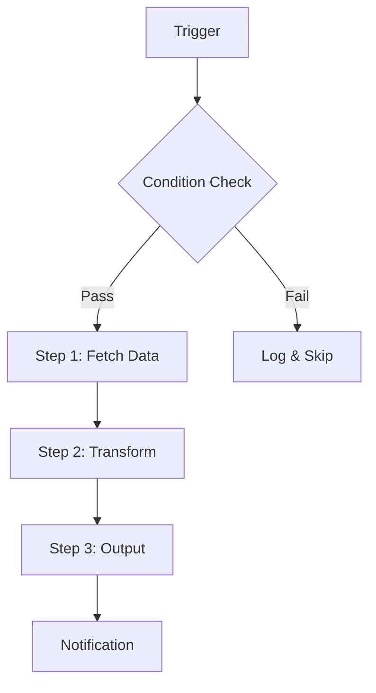

# KNOWLEDGE EXTRACT: CodexKit
> **Extracted on:** 2026-03-30 13:35:55
> **Source:** CodexKit

---

## File: `.editorconfig`
```
root = true

[*.{js,jsx,ts,tsx,mjs,cjs,json,md}]
charset = utf-8
end_of_line = lf
insert_final_newline = true
indent_style = space
indent_size = 2
trim_trailing_whitespace = true

[*.py]
indent_style = space
indent_size = 4

[*.{sh,ps1}]
end_of_line = lf
```

## File: `.gitattributes`
```
# Auto detect text files and perform LF normalization
* text=auto
```

## File: `.gitignore`
```
node_modules/
.next/
dist/
coverage/
.tmp/
release/
.DS_Store

# Local Codex state
.codex/

# Tooling
*.log
```

## File: `.nvmrc`
```
20
```

## File: `CHANGELOG.md`
```markdown
# Changelog

All notable changes to CodexKit will be documented in this file.

The format is based on [Keep a Changelog](https://keepachangelog.com/en/1.1.0/)
and this project adheres to [Semantic Versioning](https://semver.org/).

## [Unreleased]

## [0.9.0] - 2026-03-22

### Added

- **Tier 2 enrichment for 20 core skills**: Domain-specific `verification/checklist.md`, `examples/good-output.md`, and `examples/common-mistakes.md` for: bug-hunt, high-signal-review, execution-planner, okr-writer, sprint-planning-assistant, financial-statement-analyzer, contract-risk-review, data-quality-auditor, dashboard-kpi-designer, a-b-test-planner, go-to-market-planner, campaign-brief-writer, incident-postmortem, root-cause-analyzer, onboarding-plan-creator, repo-onboarding, survey-analyzer, business-case-writer, process-mapper, and customer-journey-mapper.
- **Tier 3 enrichment for 5 technical skills**: Executable assets including `coverage-gap-finder.sh` (test-hardening), `query-validator.sql` (sql-query-builder), `readme-template.md` + `changelog-template.md` (docs-shipper), `automation-spec.md` (automation-designer), `charter-template.md` + `raci-template.md` (project-governance-pilot).
- **Gotchas template**: `templates/gotchas-template.md` for capturing real-world edge cases and workarounds per skill.
- **`/evolve-skill` workflow**: Structured process for updating skills after discovering issues, edge cases, or improvements — includes change classification, version bumping, changelog updates, and validation.
- **v2 section lint**: `validate-pack.mjs` now warns on missing v2 sections (Quality Criteria, Verification 4C, Edge Cases, Changelog).
- **Category breakdown**: Pack validation output now shows per-category skill counts.
- **Community contribution guide**: CONTRIBUTING.md expanded with tier enrichment guide and community call-to-action for skills needing enrichment.

### Changed

- 21 skills now have `verification/` folders (20 Tier 2 enriched + 1 exemplar).
- 21 skills now have `examples/` folders with domain-specific good output and common mistakes.
- 5 skills now have `scripts/` or `templates/` folders with executable Tier 3 assets.
- CONTRIBUTING.md refactored with community contribution opportunities and enrichment guide.
- README updated with v0.9.0 enrichment stats, contribution call-to-action, and release instructions.

## [0.8.0] - 2026-03-22

### Added

- **5-Layer Skill Framework**: Every skill now addresses Intent, Knowledge, Execution, Verification (4C), and Evolution layers.
- **SKILL.md v2 Template**: `templates/SKILL-TEMPLATE.md` — 10-section template with Quality Criteria, Verification (4C), Edge Cases, and Changelog sections.
- **Deep Research Master Prompt**: `templates/deep-research-prompt.md` — universal prompt for ChatGPT Deep Research / Gemini / Perplexity Pro that generates structured domain knowledge mapping directly into SKILL.md sections.
- **Exemplar skill**: `codexkit-skill-template` — working reference implementation demonstrating full Tier 2 folder structure (SKILL.md, verification/, examples/, CHANGELOG.md).
- **Skill categories**: 8-category taxonomy (`knowledge`, `verification`, `data`, `automation`, `scaffolding`, `review`, `runbook`, `infra`) added to skill frontmatter.
- **3-tier skill structure**: Tier 1 (all skills — SKILL.md + agents/), Tier 2 (~20 high-value — + verification/ + examples/), Tier 3 (~5–10 technical — + templates/ + scripts/).

### Changed

- Skill count increased from 81 to 82 (added `codexkit-skill-template` exemplar).
- `CONTRIBUTING.md` expanded with comprehensive skill authoring guide (7-step process, folder structure guide).
- `skill-finder.md` updated with category taxonomy section and exemplar skill entry.
- README updated with new "Skill architecture" section.

## [0.7.1] - 2026-03-20

### Fixed

- **Codex CLI detection**: Installer no longer falsely reports "Codex CLI was not detected" when Codex is installed via npm global but not in the CMD shell PATH. Both Windows and shell launchers now use 4-method fallback detection (PATH check, common npm global paths, npx resolution, npm root -g).
- **Version display**: Launcher scripts now read version dynamically from `package.json` instead of hardcoding — eliminates version drift between scripts and package metadata.
- **Release packaging**: Starter pack ZIP now includes `package.json`, `CHANGELOG.md`, `skill-finder.md`, `HUONG-DAN-NHANH.md`, `UPDATE-WINDOWS.cmd`, and `UPDATE.sh` — previously missing, which broke the update flow for ZIP users.

### Added

- `UPDATE.sh`: Update wrapper for macOS and Linux users (previously only `UPDATE-WINDOWS.cmd` existed).
- `/release` workflow: Automated pre-release checklist covering version sync, CHANGELOG entry, pack validation, build verification, and tagging.

## [0.7.0] - 2026-03-20

### Added

- **15 new skills** (Wave 3 — expanded domain coverage to 81 total skills):
  - **Data & Analytics (4)**: `codexkit-dashboard-kpi-designer` (SMART KPIs + visualization selection), `codexkit-data-quality-auditor` (DAMA six dimensions + remediation), `codexkit-survey-analyzer` (distributions + segmentation + theme extraction), `codexkit-sql-query-builder` (CTEs + window functions + performance docs).
  - **Engineering (3)**: `codexkit-architecture-decision-writer` (ADR format + options comparison), `codexkit-incident-postmortem` (SRE + 5 Whys + action items), `codexkit-api-design-reviewer` (REST/GraphQL naming + versioning + errors + pagination).
  - **IT & Admin (2, new domain)**: `codexkit-vendor-comparison-matrix` (weighted scoring + TCO), `codexkit-change-management-plan` (ADKAR + Kotter + adoption metrics).
  - **Training & Development (2, new domain)**: `codexkit-training-needs-analyzer` (ADDIE + Bloom's + Kirkpatrick), `codexkit-workshop-facilitator` (Design Thinking + Liberating Structures).
  - **Cross-Functional (4, new domain)**: `codexkit-decision-log` (RAPID framework + options analysis), `codexkit-crisis-communication` (holding statements + Q&A), `codexkit-business-case-writer` (NPV/ROI/Payback + risk assessment), `codexkit-policy-document-writer` (ISO document control + compliance monitoring).

### Changed

- Skill count increased from 66 to 81.
- Domain coverage expanded from 10 to 13 categories (added IT & Admin, Training & Development, Cross-Functional).
- `skill-finder.md` updated to include all 81 skills across 13 domains.

## [0.6.0] - 2026-03-20

### Added

- **15 new depth sub-skills** (Wave 2 — advanced professional skills):
  - **PM (3)**: `codexkit-safe-pi-planning` (SAFe PI Planning + ART sync), `codexkit-pmbok8-earned-value` (EVM + CPI/SPI forecasting), `codexkit-pmbok8-stakeholder-register` (stakeholder analysis + RACI).
  - **Finance (2)**: `codexkit-fpa-rolling-forecast` (12–18 mo rolling forecast + waterfall bridge), `codexkit-audit-readiness-checker` (assertion mapping + RAG scoring).
  - **Legal (1)**: `codexkit-legal-due-diligence` (9 workstreams + deal-breaker flags).
  - **HR (2)**: `codexkit-onboarding-plan-creator` (30-60-90 day plan + pre-boarding), `codexkit-interview-guide-builder` (STAR method + scoring rubrics).
  - **Supply Chain (2)**: `codexkit-supplier-evaluation` (weighted scorecard + tier classification), `codexkit-procurement-rfp-writer` (evaluation methodology + ISO 20400).
  - **Strategy (2)**: `codexkit-strategic-analysis-porter` (Five Forces + PESTEL + SWOT), `codexkit-competitor-intelligence` (CI cycle + battle cards + positioning map).
  - **Marketing (1)**: `codexkit-campaign-brief-writer` (SMART objectives + audience persona + KPIs).
  - **Data (1)**: `codexkit-a-b-test-planner` (hypothesis + sample sizing + MDE + guardrails).
  - **CX (1)**: `codexkit-churn-risk-analyzer` (health scoring + segmentation + intervention playbooks).

### Changed

- Skill count increased from 51 to 66.
- `skill-finder.md` updated to include all 66 skills across 10 categories (added Data & Analytics).
- README updated with new skill descriptions and v0.6.0 references.

## [0.5.0] - 2026-03-20

### Added

- **15 new deep sub-skills** (Wave 1 — high-impact professional skills):
  - **PM Domain (5)**: `codexkit-scrum-retrospective` (5 retro formats by maturity), `codexkit-backlog-refiner` (INVEST + Given/When/Then), `codexkit-okr-writer` (cascade + check-in), `codexkit-risk-register` (P×I scoring + ROAM), `codexkit-kanban-flow-analyzer` (Little's Law + Monte Carlo).
  - **Finance (2)**: `codexkit-fpa-scenario-modeling` (Base/Bull/Bear + sensitivity), `codexkit-financial-statement-analyzer` (ratio analysis + DuPont).
  - **Legal (2)**: `codexkit-contract-drafter` (clause library + risk calibration), `codexkit-legal-memo-writer` (IRAC framework).
  - **HR (2)**: `codexkit-job-description-writer` (SHRM + inclusive language), `codexkit-performance-review-writer` (SBI feedback + bias check).
  - **Marketing (1)**: `codexkit-go-to-market-planner` (TAM/SAM/SOM + positioning + launch timeline).
  - **Operations (2)**: `codexkit-process-mapper` (swimlane + 8 Lean Wastes), `codexkit-root-cause-analyzer` (5 Whys + Fishbone + Pareto + CAPA).
  - **CX (1)**: `codexkit-customer-journey-mapper` (7 stages + Moments of Truth + emotion curve).

### Changed

- Skill count increased from 36 to 51.
- `skill-finder.md` updated to include all 51 skills across 8 categories.
- README updated with new skill descriptions and v0.5.0 references.

## [0.4.0] - 2026-03-20

### Added

- **Skill Finder**: `skill-finder.md` — situation-based index for all 36 skills, organized by 8 categories.
- **5 new office-productivity skills**: `codexkit-email-composer`, `codexkit-report-summarizer`, `codexkit-sprint-planning-assistant`, `codexkit-budget-variance-explainer`, `codexkit-presentation-outliner`.
- **Vietnamese quick-start guide**: `HUONG-DAN-NHANH.md` — localized onboarding for Vietnamese office users.

### Changed

- All 10 templates now include detailed field instructions, usage tips, and worked examples.
- All 9 playbooks now include concrete, real-world prompt examples.
- Skill count increased from 31 to 36.


## [0.3.1] - 2026-03-20

### Added

- Double-click and one-command launcher files so non-technical users can install CodexKit from a release package more easily.
- Interactive workspace creation wrappers for Windows and shell environments.

### Changed

- README and installation docs now include a detailed release-download path for non-coders.
- Install scripts now report counts and clearer next steps after completion.
- CI now validates installed skill counts dynamically and smoke-tests workspace scaffolding.
- Release packaging now ships a full starter pack with skills, templates, workspaces, playbooks, automations, MCP guides, scripts, and quick-start launchers.

## [0.3.0] - 2026-03-20

### Added

- Nine low-reasoning office automation skills for inbox triage, meeting action routing, follow-up drafting, status packaging, finance close coordination, hiring ops, contract intake, KPI packaging, and content calendar assembly.
- Department templates for PM, finance, HR, legal, operations, marketing, and repeatable cross-functional update work.
- Starter workspaces for PM, finance, HR, legal, operations, and marketing teams.
- Additional automation recipes for recurring business workflows.

### Changed

- CodexKit is now positioned as a work operating system for engineering, high-reasoning knowledge work, and routine office operations.
- Pack validation now checks starter workspace structure in addition to skills, playbooks, automations, MCP guides, and templates.

## [0.2.0] - 2026-03-20

### Added

- Thirteen new CodexKit skills for project governance, portfolio risk, executive briefs, finance variance analysis, contract review, compliance gap review, talent calibration, S&OP, strategy scorecards, data storytelling, brand positioning, DMAIC improvement, and CX QBR preparation.
- GitHub issue templates, pull request template, CI workflow, release workflow, and Dependabot configuration for public maintenance.

### Changed

- CodexKit is now positioned as a work operating kit for both engineering and high-reasoning office work, not just software delivery.
- Codex Skills installation and docs now follow `.agents/skills` discovery plus `agents/openai.yaml` metadata.
- Docs app dependency policy now targets patched Next.js 16.2.0 line.

## [0.1.0] - 2026-03-20

### Added

- Initial public CodexKit release.
- Nine Codex-first skills for onboarding, planning, review, debugging, testing, documentation, automation design, MCP setup, and cloud delegation.
- Six playbooks for ask, code, review, debugging, delegation, and release flows.
- Four automation recipes and three MCP integration guides.
- Cross-platform skill installation scripts and a validation script.
- New docs site positioned for OpenAI Codex and ChatGPT users.

[Unreleased]: https://github.com/hoavdc/CodexKit/compare/v0.9.0...HEAD
[0.9.0]: https://github.com/hoavdc/CodexKit/compare/v0.8.0...v0.9.0
[0.8.0]: https://github.com/hoavdc/CodexKit/compare/v0.7.1...v0.8.0
[0.7.1]: https://github.com/hoavdc/CodexKit/releases/tag/v0.7.1
[0.7.0]: https://github.com/hoavdc/CodexKit/releases/tag/v0.7.0
[0.6.0]: https://github.com/hoavdc/CodexKit/releases/tag/v0.6.0
[0.5.0]: https://github.com/hoavdc/CodexKit/releases/tag/v0.5.0
[0.4.0]: https://github.com/hoavdc/CodexKit/releases/tag/v0.4.0
[0.3.1]: https://github.com/hoavdc/CodexKit/releases/tag/v0.3.1
[0.3.0]: https://github.com/hoavdc/CodexKit/releases/tag/v0.3.0
[0.2.0]: https://github.com/hoavdc/CodexKit/releases/tag/v0.2.0
[0.1.0]: https://github.com/hoavdc/CodexKit/releases/tag/v0.1.0

```

## File: `CODE_OF_CONDUCT.md`
```markdown
# Code Of Conduct

## Our standard

We want CodexKit to be a respectful, technically serious open-source project. Participants should assume good intent, debate ideas directly, and avoid personal attacks.

## Expected behavior

- be respectful and specific
- critique code and reasoning, not people
- share context when disagreeing
- keep examples safe and legal

## Unacceptable behavior

- harassment or discriminatory language
- bad-faith trolling
- doxxing or threats
- sharing harmful instructions without clear defensive context

## Enforcement

Project maintainers may remove comments, issues, or contributions that violate this standard.
```

## File: `CONTRIBUTING.md`
```markdown
# Contributing

CodexKit is meant to stay opinionated and useful. Contributions are welcome when they improve signal, not when they merely add surface area.

## Before opening a pull request

1. Run `node ./scripts/validate-pack.mjs`.
2. If you touched the docs app, run `npm --prefix web run lint` and `npm --prefix web run build`.
3. Explain the user problem your change solves.
4. Prefer small, composable additions over broad prompt dumps.
5. Use the issue and pull request templates so context is structured from the start.

## Authoring a new skill

1. **Start from the template.** Copy [`templates/SKILL-TEMPLATE.md`](templates/SKILL-TEMPLATE.md) into `skills/codexkit-{your-skill}/SKILL.md`.
2. **Fill all 10 sections.** Purpose, When to Use, Procedure, Inputs, Output, Quality Criteria, Verification (4C), Edge Cases, Examples, Changelog.
3. **Assign a category** in frontmatter — one of: `knowledge`, `verification`, `data`, `automation`, `scaffolding`, `review`, `runbook`, `infra`.
4. **Set version** to `1.0.0` in frontmatter.
5. **Use Deep Research** (optional but recommended). Copy [`templates/deep-research-prompt.md`](templates/deep-research-prompt.md), fill in your skill's domain, and paste into ChatGPT Deep Research / Gemini / Perplexity Pro. Map the 6 output sections back into your SKILL.md.
6. **Add `agents/openai.yaml`** with the interface block.
7. **Run validation:** `node ./scripts/validate-pack.mjs`

### Skill folder structure

Minimum (all skills): `SKILL.md` + `agents/openai.yaml`

For high-value skills, consider adding:
- `verification/checklist.md` — domain-specific 4C checklist
- `examples/good-output.md` and `examples/common-mistakes.md`
- `templates/` — output templates or starter files
- `CHANGELOG.md` — version history

See [`templates/SKILL-TEMPLATE.md`](templates/SKILL-TEMPLATE.md) for the full tier guide.

## Contribution guidelines

- Add new skills only when they cover a distinct workflow.
- Keep playbooks copy-ready and easy to adapt.
- Include guardrails for any automation recipe.
- Use examples grounded in real engineering or day-to-day business work.
- Keep starter workspaces opinionated enough to be useful without turning them into bloated internal wikis.
- Update the docs site when the public surface changes.

## Good first contributions

- tighten an existing skill
- improve install scripts
- add validation checks
- clarify docs
- add narrowly scoped templates

## Community enrichment — where help is most needed

### Tier 2 enrichment (61 skills need this)

21 of 82 skills already have `verification/` and `examples/` folders. The other 61 do not. To enrich a skill:

1. Pick a skill you have domain expertise in.
2. Create `verification/checklist.md` — answer four domain-specific questions for each of the 4C gates (Correctness, Completeness, Context-fit, Consequence).
3. Create `examples/good-output.md` — provide a realistic, annotated example of what a well-executed output looks like.
4. Create `examples/common-mistakes.md` — document 3 anti-patterns with explanations and fixes.
5. Reference `skills/codexkit-skill-template/` for the expected format.

### Tier 3 enrichment (technical skills)

5 skills have `scripts/` or `templates/` folders. Other technical skills would benefit from:
- Reusable helpers in `scripts/` (linters, validators, analyzers)
- Starter templates in `templates/` (output formats, spec documents)

### Gotchas

If you discover an edge case or workaround while using a skill:
1. Copy `templates/gotchas-template.md` into the skill folder as `gotchas.md`.
2. Add a `GOTCHA-001` entry with discovery date, symptom, root cause, workaround, and status.
3. Use the `/evolve-skill` workflow to handle versioning.

## Pull request expectations

- Link the issue or explain why no issue was needed.
- Call out the user-facing behavior that changed.
- List the validation commands you actually ran.
- Update `CHANGELOG.md` when the public surface changed.
```

## File: `CREATE-WORKSPACE-WINDOWS.cmd`
```
@echo off
setlocal
cd /d "%~dp0"
title CodexKit Starter Workspace

echo ==========================================
echo CodexKit starter workspace scaffold
echo ==========================================
echo.
echo Available starters:
powershell -NoProfile -ExecutionPolicy Bypass -File "%~dp0scripts\quick-start.ps1" -List
echo.
set /p STARTER=Enter starter name: 
set /p DESTINATION=Enter destination folder (example: .\my-pmo): 

if "%STARTER%"=="" (
  echo Starter name is required.
  pause
  exit /b 1
)

if "%DESTINATION%"=="" (
  echo Destination is required.
  pause
  exit /b 1
)

powershell -NoProfile -ExecutionPolicy Bypass -File "%~dp0scripts\quick-start.ps1" -Starter "%STARTER%" -Destination "%DESTINATION%"
if errorlevel 1 (
  echo.
  echo Workspace creation failed.
  pause
  exit /b 1
)

echo.
echo Workspace created at %DESTINATION%.
pause
```

## File: `CREATE-WORKSPACE.sh`
```bash
#!/usr/bin/env bash
set -euo pipefail

ROOT_DIR="$(cd "$(dirname "${BASH_SOURCE[0]}")" && pwd)"

echo "Available starters:"
bash "$ROOT_DIR/scripts/quick-start.sh" --list
echo
read -r -p "Enter starter name: " STARTER
read -r -p "Enter destination folder (example: ./my-pmo): " DESTINATION

if [[ -z "${STARTER}" || -z "${DESTINATION}" ]]; then
  echo "Starter name and destination are required." >&2
  exit 1
fi

bash "$ROOT_DIR/scripts/quick-start.sh" --starter "$STARTER" --destination "$DESTINATION"
echo "Workspace created at $DESTINATION"
```

## File: `HUONG-DAN-NHANH.md`
```markdown
# Hướng Dẫn Nhanh — CodexKit

> Bản hướng dẫn tiếng Việt dành cho người dùng văn phòng. Xem [README.md](README.md) để biết chi tiết đầy đủ.

---

## CodexKit là gì?

CodexKit là bộ quy trình (skills) giúp bạn sử dụng AI hiệu quả hơn trong công việc hàng ngày — viết email, tóm tắt báo cáo, quản lý dự án, phân tích tài chính, và nhiều hơn nữa.

**Không cần biết lập trình.** Bạn chỉ cần copy–paste prompt vào Codex hoặc ChatGPT.

---

## Installation: nhanh (3 phút)

### Cách 1: Tải bản release (đơn giản nhất)

1. Vào [Releases](https://github.com/your-org/codexkit/releases) → tải file `.zip` mới nhất
2. Giải nén vào thư mục dự án của bạn
3. Xong! Mở file `skill-finder.md` để bắt đầu

### Cách 2: Chạy script Installation:

**Windows (PowerShell):**
```powershell
.\scripts\install-skills.ps1
```

**macOS / Linux:**
```bash
./scripts/install-skills.sh
```

---

## Bắt đầu từ đâu?

### Step 1: Xem bảng tra cứu

Mở file **[skill-finder.md](skill-finder.md)** — tìm tình huống công việc của bạn → biết dùng skill nào.

### Step 2: Chọn workspace phù hợp

| Bộ phận | Workspace |
|---------|-----------|
| Quản lý dự án (PMO) | `workspaces/project-management-office/` |
| Tài chính | `workspaces/finance/` |
| Nhân sự | `workspaces/hr/` |
| Pháp lý | `workspaces/legal/` |
| Marketing | `workspaces/marketing/` |
| Vận hành | `workspaces/operations/` |

### Step 3: Dùng playbook để bắt đầu ngay

Playbooks là các prompt mẫu bạn có thể copy–paste trực tiếp:

| Tôi cần… | Playbook |
|-----------|----------|
| Viết recap cuộc họp | `playbooks/meeting-to-actions.md` |
| Tổng hợp status | `playbooks/status-synthesis.md` |
| Viết memo quyết định | `playbooks/write-decision-memo.md` |

---

## 5 Skill phổ biến nhất cho văn phòng

| # | Skill | Tác dụng |
|---|-------|----------|
| 1 | `codexkit-email-composer` | Viết email chuyên nghiệp từ ghi chú |
| 2 | `codexkit-report-summarizer` | Tóm tắt báo cáo dài thành key points |
| 3 | `codexkit-meeting-action-router` | Biến notes cuộc họp thành action items |
| 4 | `codexkit-inbox-priority-triage` | Phân loại inbox theo mức ưu tiên |
| 5 | `codexkit-presentation-outliner` | Dàn ý slide trình bày |

---

## Usage: một Skill

1. Mở file `SKILL.md` trong thư mục skill
2. Đọc phần **"When to use"** để đảm bảo đúng skill
3. Xem phần **"Examples"** để lấy prompt mẫu
4. Copy prompt, thay `[paste ...]` bằng nội dung thực tế
5. Paste vào Codex hoặc ChatGPT → nhận Result:

### Example: cụ thể

Bạn cần viết email nhắc vendor:

```text
Act as a business communication specialist.
Draft a polite follow-up email to our vendor (Acme Corp)
asking for updated pricing by end of this week.
Context: We sent the original request 5 days ago, no response yet.
Tone: professional but firm.
```

---

## Cần hỗ trợ?

- Xem **[skill-finder.md](skill-finder.md)** — bảng tra cứu đầy đủ
- Xem **[README.md](README.md)** — hướng dẫn chi tiết bằng tiếng Anh
- Mỗi skill có phần **Examples** với prompt mẫu sẵn sàng sử dụng
```

## File: `LICENSE`
```
MIT License

Copyright (c) 2026 CodexKit contributors

Permission is hereby granted, free of charge, to any person obtaining a copy
of this software and associated documentation files (the "Software"), to deal
in the Software without restriction, including without limitation the rights
to use, copy, modify, merge, publish, distribute, sublicense, and/or sell
copies of the Software, and to permit persons to whom the Software is
furnished to do so, subject to the following conditions:

The above copyright notice and this permission notice shall be included in all
copies or substantial portions of the Software.

THE SOFTWARE IS PROVIDED "AS IS", WITHOUT WARRANTY OF ANY KIND, EXPRESS OR
IMPLIED, INCLUDING BUT NOT LIMITED TO THE WARRANTIES OF MERCHANTABILITY,
FITNESS FOR A PARTICULAR PURPOSE AND NONINFRINGEMENT. IN NO EVENT SHALL THE
AUTHORS OR COPYRIGHT HOLDERS BE LIABLE FOR ANY CLAIM, DAMAGES OR OTHER
LIABILITY, WHETHER IN AN ACTION OF CONTRACT, TORT OR OTHERWISE, ARISING FROM,
OUT OF OR IN CONNECTION WITH THE SOFTWARE OR THE USE OR OTHER DEALINGS IN THE
SOFTWARE.
```

## File: `NOTICE.md`
```markdown
# Notice

CodexKit was rebuilt from lessons learned while reviewing `antigravity-kit-main` in the same workspace.

Parts of the documentation shell and general repository structure were adapted from material distributed under the MIT License. The original upstream project remains credited under its own license terms.

All newly authored CodexKit content, scripts, playbooks, and skills in this repository are released under the MIT License included in this repo.
```

## File: `package.json`
```json
{
  "name": "codexkit",
  "version": "0.9.0",
  "private": true,
  "repository": {
    "type": "git",
    "url": "https://github.com/hoavdc/CodexKit.git"
  },
  "homepage": "https://codexkit.pages.dev",
  "bugs": {
    "url": "https://github.com/hoavdc/CodexKit/issues"
  },
  "description": "Open-source operating kit for people using OpenAI Codex and ChatGPT across engineering, high-reasoning work, and repeatable office operations.",
  "engines": {
    "node": ">=20.9.0",
    "npm": ">=10"
  },
  "license": "MIT",
  "keywords": [
    "codex",
    "openai",
    "chatgpt",
    "skills",
    "automation",
    "mcp",
    "developer-tools",
    "project-management",
    "operations",
    "productivity"
  ],
  "scripts": {
    "check": "node scripts/validate-pack.mjs && npm --prefix web run lint && npm --prefix web run build",
    "dev": "npm --prefix web run dev",
    "build": "npm --prefix web run build",
    "lint": "npm --prefix web run lint",
    "validate": "node scripts/validate-pack.mjs"
  }
}
```

## File: `README.md`
```markdown
# CodexKit

Open-source operating kit for people using OpenAI Codex and ChatGPT to think, write, analyze, decide, automate routine work, and ship better output with more consistency.

CodexKit is a fresh project rebuilt around the surfaces that matter in Codex today: local Skills, high-signal playbooks, automation recipes, operational templates, department starter workspaces, repo guardrails, and MCP onboarding guidance. The pack covers 82 skills across 13 domains: engineering workflows, high-reasoning work, and low-reasoning office automation across project management, finance, legal, HR, operations, supply chain, strategy, analytics, marketing, data, customer success, IT & admin, training & development, and cross-functional work. It follows the official Codex Skills layout with `SKILL.md`, optional `agents/openai.yaml`, and standard `.agents/skills` discovery paths.

## What is included

- `skills/`: 82 installable Codex Skills across 13 domains — engineering, high-reasoning business work, and low-reasoning office automation.
- `playbooks/`: copy-ready prompts for clarify, execute, review, decision, delegation, and release work.
- `automations/`: recurring task recipes for engineering plus weekly business, close, hiring, legal intake, operations, and marketing routines.
- `mcp/`: practical guidance for choosing and rolling out MCP servers without overloading the team.
- `templates/`: reusable templates including department templates (PM, finance, HR, legal, operations, marketing, cross-functional), the SKILL.md v2 template, and a deep research master prompt for skill authoring.
- `workspaces/`: starter workspace kits for PM, finance, HR, legal, ops, and marketing teams.
- `scripts/`: cross-platform skill installers, workspace quick-start scripts, and a pack validator.
- `web/`: a Next.js docs site for publishing the kit as a public open-source project.
- `skill-finder.md`: situation-based skill index — "I need to… → Use this skill".
- `HUONG-DAN-NHANH.md`: Vietnamese quick-start guide for non-technical office users.

## Who it is for

- Individual operators, analysts, managers, and developers who want Codex to behave more like a disciplined specialist.
- Teams using ChatGPT plus Codex-style workflows that need repeatable prompts, review standards, and operational templates across knowledge work.
- Office-heavy teams that want Codex to handle status assembly, follow-up drafting, intake routing, KPI packaging, and other repeatable workflow chores.
- Maintainers who want a publishable starter repo instead of a private pile of prompts.

## Quick start

### Fastest path for non-coders

If you do not want to use Git commands or remember terminal steps, use the GitHub release package:

1. Open the Releases page for this repository.
2. Download `codexkit-starter-pack-v0.9.0.zip`.
3. Unzip it anywhere on your computer.
4. On Windows, double-click `START-HERE-WINDOWS.cmd`.
   - If Codex is not installed, the script will show installation instructions.
5. Restart Codex.
6. In Codex, type `/skills` to confirm all 82 skills appear.
7. Open `skill-finder.md` to browse skills by situation.
7. Optional: double-click `CREATE-WORKSPACE-WINDOWS.cmd` to create a starter workspace.

For macOS or Linux, download the same release package, unzip it, then run:

```bash
bash ./START-HERE.sh
```

### 1. Install CodexKit skills

Windows PowerShell:

```powershell
.\scripts\install-skills.ps1
```

macOS / Linux:

```bash
bash ./scripts/install-skills.sh
```

By default, both scripts copy every folder from `skills/` into `$HOME/.agents/skills`, which matches the user-scope Codex Skills location documented by OpenAI.

Windows double-click install is also available:

- `START-HERE-WINDOWS.cmd`: installs the skills into `%USERPROFILE%\.agents\skills`
- `CREATE-WORKSPACE-WINDOWS.cmd`: asks for a workspace starter and destination folder

Shell shortcuts are also available for extracted release packages:

- `START-HERE.sh`
- `CREATE-WORKSPACE.sh`

For repository-scoped discovery, install the pack into `.agents/skills` inside the repo:

Windows PowerShell:

```powershell
.\scripts\install-skills.ps1 -Destination .\.agents\skills
```

macOS / Linux:

```bash
CODEXKIT_DESTINATION=./.agents/skills bash ./scripts/install-skills.sh
```

Codex scans `.agents/skills` from the current working directory up to the repository root, then also checks `$HOME/.agents/skills`. If an update does not appear immediately, restart Codex.

Codex can use skills through explicit invocation or implicit description matching. In CLI and IDE workflows, use `/skills` or type `$` to mention a skill directly. CodexKit keeps `codexkit-cloud-delegation` and `codexkit-automation-designer` explicit-only to avoid accidental activation on sensitive workflows.

If the install completed but the skills do not appear:

1. Restart Codex.
2. Check that the skills were copied into `%USERPROFILE%\.agents\skills` on Windows or `$HOME/.agents/skills` on macOS/Linux.
3. In Codex, use `/skills` to verify discovery.

### 2. Validate the pack

```bash
node ./scripts/validate-pack.mjs
```

### 3. Run the documentation site

Use Node `20.9+` and npm `10+` for the docs app and local validation workflow.

```bash
npm --prefix web install
npm run dev
```

### 4. Update to the latest version

Git users:

```bash
bash ./scripts/update-codexkit.sh
```

Windows:

```powershell
.\scripts\update-codexkit.ps1
```

Or double-click `UPDATE-WINDOWS.cmd`.

For macOS / Linux, run:

```bash
bash ./UPDATE.sh
```

The update script auto-detects your install method:
- **Git clone**: Runs `git pull` + re-installs all skills with `--force`.
- **Zip download**: Fetches the latest release from GitHub, extracts new skills, and overwrites the installed ones.

### 5. Start from a department workspace

Copy one folder from `workspaces/` into your own repo or operating folder, then adapt the files to your context. Each starter workspace is opinionated on cadence, core artifacts, and the mix of high-reasoning versus routine automation work.

You can also scaffold from the command line:

```powershell
.\scripts\quick-start.ps1 -List
.\scripts\quick-start.ps1 -Starter project-management-office -Destination .\acme-pmo
```

```bash
bash ./scripts/quick-start.sh --list
bash ./scripts/quick-start.sh --starter finance-performance-desk --destination ./acme-finance
```

For Windows users who prefer prompts instead of command arguments:

1. Double-click `CREATE-WORKSPACE-WINDOWS.cmd`.
2. Copy the starter name from the list.
3. Enter a destination folder such as `.\my-pmo` or `C:\Work\FinanceDesk`.

## Recommended adoption path

1. Install the skills into `$HOME/.agents/skills` or copy selected skills into repo-local `.agents/skills`.
2. Pick one starter workspace that matches your function and adapt its files to your real cadence.
3. Start with one high-reasoning skill and one low-reasoning automation skill that match your most common workflow.
4. Tailor the automation recipes to your repo and operating cadence.
5. Add the department templates you will actually reuse, not every template in the pack.
6. Publish the docs site after replacing any placeholder organization metadata.

## Folder map

```text
CodexKit/
|-- automations/
|-- mcp/
|-- playbooks/
|-- scripts/
|-- skills/
|-- templates/
|-- workspaces/
|-- web/
|-- skill-finder.md
|-- HUONG-DAN-NHANH.md
|-- START-HERE-WINDOWS.cmd / START-HERE.sh
|-- UPDATE-WINDOWS.cmd / UPDATE.sh
`-- CREATE-WORKSPACE-WINDOWS.cmd / CREATE-WORKSPACE.sh
```

## Design principles

- Codex-first, not assistant-agnostic.
- Small set of sharp assets over a giant pile of generic prompts.
- High-reasoning knowledge work deserves first-class skills, not just code prompts.
- Routine coordination work should be automated with low-noise, low-drama skills and templates.
- Review output must be risk-ranked and actionable.
- Automations must include guardrails, not just schedules.
- MCP adoption should be intentional, observable, and reversible.

## Skill architecture

CodexKit uses a **5-Layer Skill Framework** with a tiered structure:

### Layers

Every skill addresses five concerns: **Intent** (clear purpose), **Knowledge** (domain expertise), **Execution** (step-by-step procedure), **Verification** (4C quality gates — Correctness, Completeness, Context-fit, Consequence), and **Evolution** (versioned changelog).

### Tiers

| Tier | Structure | Current coverage |
|------|-----------|------------------|
| **1** | `SKILL.md` + `agents/openai.yaml` | All 82 skills |
| **2** | + `verification/` + `examples/` | 21 high-value skills |
| **3** | + `templates/` + `scripts/` | 5 technical skills |

### Categories

| Category | Skills |
|----------|--------|
| `knowledge` | 17 |
| `data` | 14 |
| `scaffolding` | 14 |
| `runbook` | 10 |
| `verification` | 9 |
| `automation` | 8 |
| `review` | 6 |
| `infra` | 4 |

### Authoring new skills

Use `templates/SKILL-TEMPLATE.md` as the starting point. Optionally, use `templates/deep-research-prompt.md` with an external AI research tool (ChatGPT Deep Research, Gemini, Perplexity Pro) to generate domain knowledge — the 6-section output maps directly into the SKILL.md sections. See `skills/codexkit-skill-template/` for a working reference implementation.

Full authoring guide: [CONTRIBUTING.md](./CONTRIBUTING.md).

## Contributing

CodexKit is open-source and community-driven. There are several ways to help:

- **Enrich existing skills**: 61 skills still need Tier 2 content (`verification/`, `examples/`). Pick a skill you know well, create domain-specific checklists and examples, and open a PR.
- **Add Tier 3 assets**: Technical skills benefit from `scripts/` and `templates/`. Build a reusable helper or output template.
- **Create new skills**: Use `templates/SKILL-TEMPLATE.md` + `templates/deep-research-prompt.md` to author a skill for a domain you are expert in.
- **Add gotchas**: If you encounter a real-world edge case while using a skill, document it using `templates/gotchas-template.md` and add it to the skill folder.
- **Improve docs or translations**: The docs site, playbooks, and the Vietnamese guide all benefit from review.

See [CONTRIBUTING.md](./CONTRIBUTING.md) for the full guide.

## Open-source quality bar

- MIT license
- contribution, security, and conduct docs included
- install scripts for multiple environments
- validation script for pack structure
- skill metadata via `agents/openai.yaml` for better Codex app presentation
- starter workspaces that help teams adopt CodexKit without designing their operating system from scratch
- CI workflow for pack validation and docs build
- release workflow with packaged skill-pack artifacts
- Dependabot updates for GitHub Actions and the docs app
- separate docs app ready to publish
- release packages that can be downloaded and installed by non-technical users

## Publish checklist

- Update repository URLs in docs and package metadata.
- Replace placeholder maintainer details where needed.
- Add screenshots or a short demo GIF to the docs site.
- Commit and push the release candidate branch or `main`.
- Tag `v0.9.0` after validating the pack and docs build.
- Push the tag to trigger the GitHub release workflow.

## Release process

1. Update `package.json`, `web/package.json`, and `CHANGELOG.md`.
2. Run `npm run check`.
3. Commit and push the release commit.
4. Create the tag: `git tag v0.9.0`
5. Push the tag: `git push origin v0.9.0`
6. GitHub Actions publishes:
   `codexkit-source-v0.9.0.zip`
   `codexkit-starter-pack-v0.9.0.zip`

## Related files

- [CONTRIBUTING.md](./CONTRIBUTING.md)
- [SECURITY.md](./SECURITY.md)
- [NOTICE.md](../../../core/security/QUARANTINE/vetted/repos/openclaw/apps/macos/Sources/OpenClaw/Resources/DeviceModels/NOTICE.md)
- [templates/project-brief.md](./templates/project-brief.md)
- [templates/release-checklist.md](../../../vault/archives/archive_legacy/bat/doc/release-checklist.md)
- [workspaces/README.md](../../../README.md)
```

## File: `RELEASE-v0.9.0.md`
```markdown
# CodexKit v0.9.0 — Skills That Actually Verify Themselves

> **82 skills. 5 layers. 21 domain-enriched. Community-ready.**

## What's new

This release transforms CodexKit from a flat collection of prompts into a **layered skill operating system** where every skill knows how to verify its own output and evolve from real-world usage.

### Domain-specific quality gates for 21 core skills

The 20 most impactful skills now ship with three companion files — written by domain experts, not generic templates:

| Asset | What it does |
|-------|-------------|
| `verification/checklist.md` | 4C quality gates (Correctness, Completeness, Context-fit, Consequence) with questions specific to each skill's domain |
| `examples/good-output.md` | Annotated real-world scenarios showing what a well-executed output looks like |
| `examples/common-mistakes.md` | Three anti-patterns per skill — the mistakes that waste the most time — with explanations and fixes |

**Example**: The `codexkit-incident-postmortem` checklist doesn't ask generic quality questions — it asks "Does the timeline include detection-to-resolution with timestamps?" and "Are action items assigned with owners and deadlines, not vague 'we should improve' language?"

### Executable Tier 3 assets for technical skills

5 technical skills now ship with runnable scripts and starter templates:

- **test-hardening** → `coverage-gap-finder.sh` — multi-language coverage report generator
- **sql-query-builder** → `query-validator.sql` — checks execution plans, NULL traps, cardinality explosions
- **docs-shipper** → `readme-template.md` + `changelog-template.md` — Keep a Changelog format
- **automation-designer** → `automation-spec.md` — full automation specification template
- **project-governance-pilot** → `charter-template.md` + `raci-template.md` — project charter + RACI matrix

### Evolution system: skills that learn from usage

- **`/evolve-skill` workflow**: When you discover an edge case, the workflow classifies the change type, applies the right version bump, updates the changelog, and validates the result.
- **`gotchas-template.md`**: Accumulate real-world workarounds per skill — each entry captures the symptom, root cause, and fix so the knowledge doesn't get lost.

### Smarter validation

- `validate-pack.mjs` now **lints v2 sections** — warns if a skill is missing Quality Criteria, Verification (4C), Edge Cases, or Changelog.
- Pack stats now show a **per-category skill breakdown** so you can see which domains are strongest and which need attention.

## Before vs After

| | v0.8.0 | v0.9.0 |
|---|--------|--------|
| Skill files | `SKILL.md` + `agents/` only | 3-tier system with verification, examples, scripts, templates |
| Output verification | Manual — hope for the best | 4C checklists with domain questions |
| Learning from mistakes | None | `gotchas.md` + `/evolve-skill` workflow |
| Validation depth | Frontmatter + structure | + v2 section lint + category breakdown |
| Anti-patterns documented | 0 | 60 anti-patterns across 20 skills |
| Executable helpers | 0 | 7 scripts/templates for 5 technical skills |

## Community contribution opportunity

**61 skills** still need Tier 2 enrichment. This is the single highest-impact way to contribute to CodexKit.

### How to contribute a Tier 2 enrichment

1. Pick a skill you know well from the [skill list](./skill-finder.md)
2. Create `verification/checklist.md` — domain-specific 4C questions
3. Create `examples/good-output.md` — annotated scenario
4. Create `examples/common-mistakes.md` — 3 anti-patterns with fixes
5. Reference `skills/codexkit-skill-template/` for the expected format
6. Run `node scripts/validate-pack.mjs` and open a PR

### Skills most in need of enrichment

| Domain | Skills needing enrichment |
|--------|--------------------------|
| Finance & Legal | fpa-scenario-modeling, fpa-rolling-forecast, audit-readiness-checker, contract-drafter, legal-memo-writer, legal-due-diligence |
| HR & Operations | job-description-writer, performance-review-writer, interview-guide-builder, supplier-evaluation, procurement-rfp-writer |
| Strategy & Marketing | strategic-analysis-porter, competitor-intelligence, campaign-brief-writer |
| Engineering | architecture-decision-writer, api-design-reviewer |
| Cross-functional | decision-log, crisis-communication, policy-document-writer |

### Deep Research shortcut

Use [`templates/deep-research-prompt.md`](./templates/deep-research-prompt.md) with ChatGPT Deep Research, Gemini, or Perplexity Pro to generate the domain knowledge for any skill enrichment. The 6-section output maps directly into the SKILL.md and companion files.

## Install / Update

```bash
# New install
bash ./START-HERE.sh

# Update existing
bash ./UPDATE.sh

# Validate
node scripts/validate-pack.mjs
```

Windows users: double-click `START-HERE-WINDOWS.cmd` or `UPDATE-WINDOWS.cmd`.

## Full changelog

See [CHANGELOG.md](./CHANGELOG.md) for the complete list of changes.
```

## File: `SECURITY.md`
```markdown
# Security Policy

If you find a security issue in CodexKit, please report it privately before opening a public issue.

## Supported versions

| Version | Supported |
| --- | --- |
| 0.1.x | Yes |

## What to report

- scripts that write to unsafe locations
- prompts or templates that encourage insecure behavior
- docs that suggest dangerous defaults
- accidental credential or secret exposure

## How to report

Open a private security advisory in your Git hosting platform. If private vulnerability reporting is not enabled yet, contact the maintainers through the repository security channel and avoid posting exploit details in a public issue.

## Response goals

- acknowledge within 3 business days
- assess impact and reproduction steps
- ship a fix or mitigation note as quickly as practical
```

## File: `skill-finder.md`
```markdown
# Skill Finder — "I need to… → Use this skill"

> Quick reference for all 82 CodexKit skills grouped by what you're trying to accomplish.

---

## 🏷️ Skill Categories

| Category | Description | Count |
|----------|-------------|-------|
| `knowledge` | Domain expertise, onboarding, reference material | ~15 |
| `scaffolding` | Generate structured first drafts, frameworks, outlines | ~25 |
| `review` | Analyze, critique, and improve existing deliverables | ~12 |
| `data` | Read, process, analyze, or visualize data | ~8 |
| `automation` | Chain repeatable steps into workflows | ~10 |
| `verification` | Validate, audit, or test outputs against standards | ~5 |
| `runbook` | Step-by-step procedures for recurring operational situations | ~5 |
| `infra` | Technical delivery, CI/CD, system checks, governance | ~2 |

> Each skill's `SKILL.md` frontmatter includes a `category` field. See `templates/SKILL-TEMPLATE.md` for authoring guidelines.

---

## 📬 Daily Office & Communication

| I need to… | Skill | What it does |
|---|---|---|
| Triage my inbox / Slack / ticket queue | `codexkit-inbox-priority-triage` | Priority buckets, owners, and next actions |
| Write a follow‑up email or reminder | `codexkit-follow-up-draft-builder` | Drafts nudges, recaps, and reminders from open items |
| Draft a professional business email | `codexkit-email-composer` | Clear emails from rough notes, matched to audience |
| Turn meeting notes into action items | `codexkit-meeting-action-router` | Decisions, owners, due dates, follow‑up queues |
| Package a weekly status update | `codexkit-status-update-packager` | Clean status from scattered notes and RAID changes |
| Summarize a long report | `codexkit-report-summarizer` | Key findings, implications, recommended actions |
| Outline a presentation or pitch deck | `codexkit-presentation-outliner` | Slide‑by‑slide outline with key messages and data callouts |

---

## 📊 Project Management

| I need to… | Skill | What it does |
|---|---|---|
| Set up project governance / charter | `codexkit-project-governance-pilot` | Charter, decision rights, stakeholder map, RAID, PMBOK 8 |
| Build a portfolio risk view | `codexkit-portfolio-risk-radar` | Multi‑project RAID / RAG across milestones and dependencies |
| Plan a sprint | `codexkit-sprint-planning-assistant` | Backlog organization, effort estimation, sprint commitment |
| Refine backlog items into user stories | `codexkit-backlog-refiner` | INVEST criteria, Given/When/Then acceptance criteria, story points |
| Run a sprint retrospective | `codexkit-scrum-retrospective` | 5 retro formats by team maturity, action items, health tracking |
| Write and cascade OKRs | `codexkit-okr-writer` | Outcome-based KRs, cascade alignment, check-in templates |
| Build a project risk register | `codexkit-risk-register` | P×I scoring, response strategies, ROAM board integration |
| Analyze Kanban flow metrics | `codexkit-kanban-flow-analyzer` | Cycle time, throughput, WIP, bottlenecks, Monte Carlo forecast |
| Facilitate SAFe PI Planning | `codexkit-safe-pi-planning` | ART sync, feature breakdown, ROAM risks, PI objectives |
| Track Earned Value (PMBOK 8) | `codexkit-pmbok8-earned-value` | EVM calculations, CPI/SPI, EAC forecasting, corrective actions |
| Build a Stakeholder Register | `codexkit-pmbok8-stakeholder-register` | Stakeholder analysis, engagement planning, RACI alignment |
| Create an execution plan | `codexkit-execution-planner` | Assumptions, sequence, acceptance checks, rollback |
| Design a recurring automation | `codexkit-automation-designer` | Safe Codex automations with schedules and gating |
| Delegate work to Codex tasks | `codexkit-cloud-delegation` | Bounded tasks with ownership and integration checkpoints |

---

## 💰 Finance

| I need to… | Skill | What it does |
|---|---|---|
| Explain budget vs actual variance | `codexkit-finance-variance-story` | Management‑ready narrative with drivers and actions |
| Explain my budget numbers in plain English | `codexkit-budget-variance-explainer` | Plain‑language variance explanations with actions for non‑finance managers |
| Coordinate month‑end / quarter‑end close | `codexkit-finance-close-coordinator` | Close blockers, reconciliations, owners, evidence |
| Build scenario financial models | `codexkit-fpa-scenario-modeling` | Base/Bull/Bear P&L, cash flow, sensitivity analysis |
| Analyze financial statements | `codexkit-financial-statement-analyzer` | Ratio analysis, DuPont decomposition, trend, red flags |
| Build a rolling forecast | `codexkit-fpa-rolling-forecast` | 12–18 month rolling forecast, waterfall bridge, assumption log |
| Check audit readiness | `codexkit-audit-readiness-checker` | Assertion mapping, RAG scoring, remediation plan |

---

## ⚖️ Legal & Compliance

| I need to… | Skill | What it does |
|---|---|---|
| Review a contract for risks | `codexkit-contract-risk-review` | Red flags, obligations, fallback positions |
| Route an incoming contract request | `codexkit-contract-intake-router` | Request type, missing info, priority, review queue |
| Check compliance against a framework | `codexkit-compliance-gap-review` | Gap matrix, control checklist, remediation priorities |
| Draft a new contract from scratch | `codexkit-contract-drafter` | Clause library, risk calibration, negotiation guide |
| Write a legal analysis memo | `codexkit-legal-memo-writer` | IRAC framework, risk-tiered conclusions, actionable advice |
| Conduct legal due diligence | `codexkit-legal-due-diligence` | 9 workstreams, risk matrix, deal-breaker flags |

---

## 👥 HR & Talent

| I need to… | Skill | What it does |
|---|---|---|
| Prepare talent review / 9-box calibration | `codexkit-talent-review-calibrator` | Performance, potential, readiness, risks, dev actions |
| Coordinate hiring operations | `codexkit-hiring-ops-coordinator` | Interview loops, schedules, feedback, next steps |
| Write a job description | `codexkit-job-description-writer` | SHRM competency alignment, inclusive language check |
| Write a performance review | `codexkit-performance-review-writer` | SBI feedback model, SMART goals, bias check |
| Create a new hire onboarding plan | `codexkit-onboarding-plan-creator` | 30-60-90 day plan, pre-boarding, milestones |
| Build a structured interview guide | `codexkit-interview-guide-builder` | STAR method, scoring rubrics, bias safeguards |

---

## 📈 Strategy & Executive

| I need to… | Skill | What it does |
|---|---|---|
| Write a one‑page executive brief | `codexkit-executive-brief-writer` | Recommendation, options, risks, decision ask |
| Build a strategy scorecard / OKR bridge | `codexkit-strategy-scorecard-builder` | Balanced scorecard, strategy map, initiative portfolio |
| Tell a data story for leadership | `codexkit-data-story-builder` | What → So What → Now What narrative from data |
| Run strategic analysis (Porter + PESTEL + SWOT) | `codexkit-strategic-analysis-porter` | Five Forces, PESTEL macro scan, SWOT cross-analysis, ranked options |
| Build competitive intelligence brief | `codexkit-competitor-intelligence` | CI cycle, feature matrix, positioning map, battle cards |

---

## 🏭 Operations & Supply Chain

| I need to… | Skill | What it does |
|---|---|---|
| Run S&OP / business planning cycle | `codexkit-sandop-facilitator` | Demand, supply, inventory, capacity alignment |
| Package operations KPIs | `codexkit-ops-kpi-packager` | KPI snapshots, exception flags, owner follow‑ups |
| Run a Lean Six Sigma improvement | `codexkit-dmaic-improvement-charter` | DMAIC charter, SIPOC, baseline, improvement path |
| Map a business process end-to-end | `codexkit-process-mapper` | Swimlane diagrams, 8 Lean Wastes, process efficiency |
| Find root cause of recurring problems | `codexkit-root-cause-analyzer` | 5 Whys, Fishbone, Pareto, CAPA corrective actions |
| Evaluate and tier suppliers | `codexkit-supplier-evaluation` | Weighted scorecard, tier classification, improvement plan |
| Write procurement RFPs/RFQs | `codexkit-procurement-rfp-writer` | Scope, evaluation methodology, ISO 20400 alignment |

---

## 🎯 Marketing & Customer Success

| I need to… | Skill | What it does |
|---|---|---|
| Build brand positioning | `codexkit-brand-positioning-canvas` | Audience, category, differentiators, messaging pillars |
| Assemble a content calendar | `codexkit-content-calendar-assembler` | Structured calendar and workback plan from inputs |
| Plan a go‑to‑market launch | `codexkit-go-to-market-planner` | TAM/SAM/SOM, positioning, messaging, channel strategy |
| Write a marketing campaign brief | `codexkit-campaign-brief-writer` | SMART objectives, audience persona, KPIs, budget allocation |
| Prepare a customer QBR | `codexkit-cx-qbr-preparer` | Outcome tracking, adoption health, ROI, next‑quarter plan |
| Map the customer journey | `codexkit-customer-journey-mapper` | 7 lifecycle stages, Moments of Truth, emotion curve |
| Analyze churn risk and build retention plays | `codexkit-churn-risk-analyzer` | Health scoring, customer segmentation, intervention playbooks |

---

## 📊 Data & Analytics

| I need to… | Skill | What it does |
|---|---|---|
| Design a rigorous A/B test | `codexkit-a-b-test-planner` | Hypothesis, sample sizing, MDE, guardrail metrics, rollout playbook |
| Design a KPI dashboard | `codexkit-dashboard-kpi-designer` | SMART KPIs, visualization selection, alert thresholds, data dictionary |
| Audit data quality | `codexkit-data-quality-auditor` | Six DAMA dimensions, issue log, remediation plan, monitoring rules |
| Analyze survey or feedback data | `codexkit-survey-analyzer` | Distributions, segment comparison, theme extraction, action recommendations |
| Build an analytical SQL query | `codexkit-sql-query-builder` | CTEs, window functions, performance notes, output documentation |

---

## 🔧 Engineering & Code

| I need to… | Skill | What it does |
|---|---|---|
| Onboard to a new codebase | `codexkit-repo-onboarding` | Map runtime model, risk zones, first next steps |
| Get started with MCP | `codexkit-mcp-onboarding` | Evaluate and phase MCP adoption |
| Do a risk‑first code review | `codexkit-high-signal-review` | Bugs, regressions, missing tests, operational gaps |
| Harden test coverage | `codexkit-test-hardening` | Edge cases and regressions without noisy tests |
| Hunt and fix a bug | `codexkit-bug-hunt` | Reproduce, isolate, patch, verify |
| Ship documentation with code | `codexkit-docs-shipper` | README, changelog, migration notes |
| Document an architecture decision | `codexkit-architecture-decision-writer` | ADR format, options comparison, consequences, review date |
| Write a blameless postmortem | `codexkit-incident-postmortem` | SRE methodology, 5 Whys, timeline, impact, action items |
| Review an API design | `codexkit-api-design-reviewer` | Naming, versioning, errors, pagination, breaking changes |

---

## 🖥️ IT & Admin

| I need to… | Skill | What it does |
|---|---|---|
| Compare and evaluate vendors/tools | `codexkit-vendor-comparison-matrix` | Weighted scoring, TCO analysis, recommendation memo |
| Plan organizational change adoption | `codexkit-change-management-plan` | ADKAR assessment, communication calendar, adoption metrics |

---

## 🎓 Training & Development

| I need to… | Skill | What it does |
|---|---|---|
| Assess training needs across teams | `codexkit-training-needs-analyzer` | Gap analysis, Bloom's objectives, Kirkpatrick evaluation |
| Design and facilitate a workshop | `codexkit-workshop-facilitator` | Time‑blocked agenda, facilitation notes, participant materials |

---

## 🔗 Cross-Functional

| I need to… | Skill | What it does |
|---|---|---|
| Record and track a decision | `codexkit-decision-log` | RAPID roles, options analysis, communication plan |
| Draft crisis communications | `codexkit-crisis-communication` | Holding statements, Q&A, stakeholder‑specific messaging |
| Write a business case for investment | `codexkit-business-case-writer` | NPV/ROI/Payback, risk assessment, implementation roadmap |
| Author a policy or SOP | `codexkit-policy-document-writer` | ISO document control, compliance monitoring, review schedule |

---

## 📐 Skill Authoring

| I need to… | Skill | What it does |
|---|---|---|
| Create a new CodexKit skill | `codexkit-skill-template` | Reference implementation with all 10 SKILL.md v2 sections, 4C verification, and Tier 2 folder structure |
```

## File: `START-HERE-WINDOWS.cmd`
```
@echo off
setlocal enabledelayedexpansion
cd /d "%~dp0"

REM ---- Read version from package.json ----
set "CODEXKIT_VERSION=unknown"
if exist "%~dp0package.json" (
    for /f "usebackq delims=" %%v in (`powershell -NoProfile -Command "(Get-Content '%~dp0package.json' | ConvertFrom-Json).version"`) do (
        set "CODEXKIT_VERSION=%%v"
    )
)

title CodexKit v%CODEXKIT_VERSION%

echo.
echo ================================================
echo    CodexKit v%CODEXKIT_VERSION% - Work Operating Kit
echo ================================================
echo.
echo    Turn Codex and ChatGPT into disciplined
echo    specialists for your daily work.
echo.
echo    81 skills  ^|  9 playbooks  ^|  10 templates
echo    10 automations  ^|  6 starter workspaces
echo.
echo ================================================
echo.

REM ---- Check if Codex CLI is installed ----
set "CODEX_FOUND=0"

REM Method 1: where codex (works if codex is in system PATH)
where codex >nul 2>&1
if not errorlevel 1 set "CODEX_FOUND=1"

REM Method 2: Check common npm global install paths
if "%CODEX_FOUND%"=="0" (
    if exist "%APPDATA%\npm\codex.cmd" set "CODEX_FOUND=1"
)
if "%CODEX_FOUND%"=="0" (
    if exist "%LOCALAPPDATA%\npm\codex.cmd" set "CODEX_FOUND=1"
)

REM Method 3: Try npx resolution
if "%CODEX_FOUND%"=="0" (
    npx --no-install codex --version >nul 2>&1
    if not errorlevel 1 set "CODEX_FOUND=1"
)

REM Method 4: Check if node_modules/.bin has it (fnm/nvm setups)
if "%CODEX_FOUND%"=="0" (
    for /f "delims=" %%p in ('npm root -g 2^>nul') do (
        if exist "%%p\..\codex.cmd" set "CODEX_FOUND=1"
    )
)

if "%CODEX_FOUND%"=="0" (
    echo  [!] Codex CLI was not detected on this system.
    echo.
    echo  CodexKit requires OpenAI Codex to work.
    echo  Install it first, then re-run this installer.
    echo.
    echo  Step 1: Install Node.js 20+ from https://nodejs.org
    echo  Step 2: Run this command in PowerShell or Terminal:
    echo.
    echo      npm install -g @openai/codex
    echo.
    echo  Step 3: Verify with:   codex --version
    echo  Step 4: Re-run this START-HERE file.
    echo.
    echo  Docs: https://github.com/openai/codex
    echo.
    pause
    exit /b 1
)

echo  [OK] Codex detected. Proceeding with skill installation...
echo.

REM ---- Show where skills will go ----
echo  This will install CodexKit skills into:
echo    %USERPROFILE%\.agents\skills
echo.

powershell -NoProfile -ExecutionPolicy Bypass -File "%~dp0scripts\install-skills.ps1"
if errorlevel 1 (
    echo.
    echo  [FAIL] Installation failed. Check the error above.
    pause
    exit /b 1
)

echo.
echo ================================================
echo    Installation complete!
echo ================================================
echo.
echo  Next steps:
echo.
echo    1. Restart Codex (or close and reopen the terminal)
echo    2. Type /skills in Codex to confirm all 81 skills
echo    3. Open skill-finder.md to browse skills by situation
echo    4. Optional: double-click CREATE-WORKSPACE-WINDOWS.cmd
echo       to scaffold a department workspace
echo.
echo  Quick start (Vietnamese): HUONG-DAN-NHANH.md
echo  Full docs: README.md
echo.
pause
```

## File: `START-HERE.sh`
```bash
#!/usr/bin/env bash
set -euo pipefail

ROOT_DIR="$(cd "$(dirname "${BASH_SOURCE[0]}")" && pwd)"

# ---- Read version from package.json ----
CODEXKIT_VERSION="unknown"
if [ -f "$ROOT_DIR/package.json" ]; then
  CODEXKIT_VERSION=$(grep '"version"' "$ROOT_DIR/package.json" | head -1 | sed 's/.*"version"[[:space:]]*:[[:space:]]*"\([^"]*\)".*/\1/')
fi

echo ""
echo "================================================"
echo "   CodexKit v${CODEXKIT_VERSION} — Work Operating Kit"
echo "================================================"
echo ""
echo "   Turn Codex and ChatGPT into disciplined"
echo "   specialists for your daily work."
echo ""
echo "   81 skills  |  9 playbooks  |  10 templates"
echo "   10 automations  |  6 starter workspaces"
echo ""
echo "================================================"
echo ""

# ---- Check if Codex CLI is installed ----
CODEX_FOUND=0

# Method 1: command -v (standard PATH check)
if command -v codex &>/dev/null; then
  CODEX_FOUND=1
fi

# Method 2: Common npm global paths
if [ "$CODEX_FOUND" = "0" ]; then
  for check_path in \
    "$HOME/.npm-global/bin/codex" \
    "/usr/local/bin/codex" \
    "$HOME/.local/bin/codex" \
    "$HOME/.nvm/versions/node/*/bin/codex" \
    "$HOME/.fnm/node-versions/*/installation/bin/codex"; do
    # Use glob expansion
    for p in $check_path; do
      if [ -x "$p" ] 2>/dev/null; then
        CODEX_FOUND=1
        break 2
      fi
    done
  done
fi

# Method 3: Try npx resolution
if [ "$CODEX_FOUND" = "0" ]; then
  if npx --no-install codex --version &>/dev/null 2>&1; then
    CODEX_FOUND=1
  fi
fi

# Method 4: npm root -g fallback
if [ "$CODEX_FOUND" = "0" ]; then
  NPM_GLOBAL_ROOT=$(npm root -g 2>/dev/null || true)
  if [ -n "$NPM_GLOBAL_ROOT" ] && [ -x "$(dirname "$NPM_GLOBAL_ROOT")/bin/codex" ]; then
    CODEX_FOUND=1
  fi
fi

if [ "$CODEX_FOUND" = "0" ]; then
  echo "  [!] Codex CLI was not detected on this system."
  echo ""
  echo "  CodexKit requires OpenAI Codex to work."
  echo "  Install it first, then re-run this script."
  echo ""
  echo "  Step 1: Install Node.js 20+ from https://nodejs.org"
  echo "  Step 2: Run this command:"
  echo ""
  echo "      npm install -g @openai/codex"
  echo ""
  echo "  Step 3: Verify with:   codex --version"
  echo "  Step 4: Re-run:        bash ./START-HERE.sh"
  echo ""
  echo "  Docs: https://github.com/openai/codex"
  echo ""
  exit 1
fi

echo "  [OK] Codex detected. Proceeding with skill installation..."
echo ""

# ---- Install skills ----
bash "$ROOT_DIR/scripts/install-skills.sh"

echo ""
echo "================================================"
echo "   Installation complete!"
echo "================================================"
echo ""
echo "  Next steps:"
echo ""
echo "    1. Restart Codex (or close and reopen the terminal)"
echo "    2. Type /skills in Codex to confirm all 81 skills"
echo "    3. Open skill-finder.md to browse skills by situation"
echo "    4. Optional: bash ./CREATE-WORKSPACE.sh"
echo "       to scaffold a department workspace"
echo ""
echo "  Quick start (Vietnamese): HUONG-DAN-NHANH.md"
echo "  Full docs: README.md"
echo ""
```

## File: `UPDATE-WINDOWS.cmd`
```
@echo off
setlocal enabledelayedexpansion
cd /d "%~dp0"

REM ---- Read version from package.json ----
set "CODEXKIT_VERSION=unknown"
if exist "%~dp0package.json" (
    for /f "usebackq delims=" %%v in (`powershell -NoProfile -Command "(Get-Content '%~dp0package.json' | ConvertFrom-Json).version"`) do (
        set "CODEXKIT_VERSION=%%v"
    )
)

:: ──────────────────────────────────────────
:: CodexKit Updater (Windows double-click)
:: ──────────────────────────────────────────

echo.
echo ================================================
echo       CodexKit Updater (v%CODEXKIT_VERSION%)
echo ================================================
echo.

:: Check PowerShell
where pwsh >nul 2>&1
if %errorlevel%==0 (
    pwsh -NoProfile -ExecutionPolicy Bypass -File "%~dp0scripts\update-codexkit.ps1"
) else (
    powershell -NoProfile -ExecutionPolicy Bypass -File "%~dp0scripts\update-codexkit.ps1"
)

echo.
pause
```

## File: `UPDATE.sh`
```bash
#!/usr/bin/env bash
# ──────────────────────────────────────────
# CodexKit Updater (macOS / Linux)
# ──────────────────────────────────────────
set -euo pipefail

ROOT_DIR="$(cd "$(dirname "${BASH_SOURCE[0]}")" && pwd)"

echo ""
echo "================================================"
echo "          CodexKit Updater"
echo "================================================"
echo ""

bash "$ROOT_DIR/scripts/update-codexkit.sh"
```

## File: `automations/content-calendar-refresh.md`
```markdown
# Content Calendar Refresh

## Goal

Turn launch changes, campaign inputs, and asset delays into an updated publishing calendar and workback plan.

## Good fit

- weekly marketing operations automation
- campaign manager or content lead inbox

## Guardrails

- ignore campaigns with no schedule change
- separate confirmed launch shifts from assumptions
- keep output focused on dates, owners, dependencies, and risks
```

## File: `automations/contract-intake-digest.md`
```markdown
# Contract Intake Digest

## Goal

Route incoming legal requests into priority, missing information, review path, and likely turnaround needs.

## Good fit

- daily legal ops automation
- commercial contract intake desk

## Guardrails

- do not invent legal conclusions from incomplete data
- flag requests missing counterparty, deadline, or agreement type
- stay focused on intake and routing, not clause advice
```

## File: `automations/daily-triage.md`
```markdown
# Daily Triage

## Goal

Summarize open failures, urgent issues, and review backlog into one compact daily update.

## Good fit

- weekday morning automation
- engineering lead or maintainer inbox

## Guardrails

- skip if there are no material changes
- group duplicate failures
- cap output to actionable items only
```

## File: `automations/dependency-watch.md`
```markdown
# Dependency Watch

## Goal

Monitor dependency drift and surface only updates that have real security, compatibility, or maintenance impact.

## Good fit

- weekly
- package-heavy repositories

## Guardrails

- skip patch noise unless linked to a meaningful fix
- call out breaking changes separately
- include recommended next step, not just version numbers
```

## File: `automations/docs-drift-check.md`
```markdown
# Docs Drift Check

## Goal

Detect when project docs no longer match the current scripts, entrypoints, or setup flow.

## Good fit

- weekly
- repos with frequent contributor onboarding

## Guardrails

- compare docs against actual manifests and scripts
- surface exact outdated sections when possible
- do not open noisy reports for formatting-only changes
```

## File: `automations/hiring-funnel-check.md`
```markdown
# Hiring Funnel Check

## Goal

Collapse candidate stage movement, stale feedback, and scheduling bottlenecks into one hiring operations digest.

## Good fit

- weekly recruiting or people ops automation
- recruiting manager or HRBP inbox

## Guardrails

- ignore candidates already closed out
- separate urgent scheduling risks from normal flow
- keep candidate detail to what operators actually need next
```

## File: `automations/monthly-close-watch.md`
```markdown
# Monthly Close Watch

## Goal

Summarize close blockers, reconciliations at risk, evidence gaps, and escalation needs during finance close.

## Good fit

- month-end finance automation
- controller or FP&A operating review

## Guardrails

- skip items already resolved
- flag missing evidence explicitly
- separate routine reminders from true escalation items
```

## File: `automations/ops-exception-scan.md`
```markdown
# Ops Exception Scan

## Goal

Highlight KPI misses, recurring exceptions, and owner follow-ups before the weekly operations review.

## Good fit

- weekly control tower automation
- supply chain or process operations cadence

## Guardrails

- suppress noise from immaterial fluctuations
- group exceptions by metric or process family
- call out only the items requiring owner action
```

## File: `automations/release-readiness.md`
```markdown
# Release Readiness

## Goal

Check whether a branch or milestone is genuinely ready to ship and produce a short blocker list.

## Good fit

- once or twice per week before release windows
- final pre-demo checklist

## Guardrails

- fail closed when build or test status is unknown
- highlight migrations, flags, and docs debt
- avoid pretending release is clean when signals are missing
```

## File: `automations/weekly-project-pulse.md`
```markdown
# Weekly Project Pulse

## Goal

Assemble milestone movement, RAID changes, decisions needed, and executive asks into a weekly project pulse.

## Good fit

- weekly PM or program office automation
- steering pack preparation

## Guardrails

- skip if no meaningful movement happened
- group repeated blockers under one owner
- cap the output to decisions, risks, and changed milestones
```

## File: `mcp/docs-and-research.md`
```markdown
# Docs And Research

## Best use cases

- official API and framework documentation lookup
- architecture reference search
- faster triage of unfamiliar dependencies

## Rollout notes

- use primary sources where possible
- keep domain allowlists tight
- decide when web search is preferred versus MCP docs access

## Failure mode to avoid

Adding multiple research surfaces that disagree and create source confusion.
```

## File: `mcp/README.md`
```markdown
# MCP Guides

CodexKit treats MCP as an execution multiplier, not a checklist item.

Use these guides to decide which integrations are worth adding and how to roll them out without creating a fragile or over-privileged setup.

## Included guides

- `docs-and-research.md`
- `repo-ops.md`

## Selection rules

- start from a repeated developer pain point
- prefer read-only first
- document scopes and ownership
- remove servers that are not used
```

## File: `mcp/repo-ops.md`
```markdown
# Repo Ops

## Best use cases

- pull request context
- issue tracker triage
- release metadata
- repository policy lookup

## Rollout notes

- start with read-only access
- define who can enable write actions
- log or review automated repo mutations

## Failure mode to avoid

Granting broad write access before the team has a review and audit habit.
```

## File: `playbooks/ask-discover.md`
```markdown
# Ask: Discovery Playbook

Use this when the request is still fuzzy and you need to convert it into a plan-worthy brief.

## Prompt

```text
Act as a product-minded engineering partner.

Goal:
- turn the request below into a concrete implementation brief

Required output:
1. objective
2. constraints
3. unknowns that truly block progress
4. recommended first slice
5. acceptance criteria

Request:
[paste the request]
```

## Example

<details>
<summary>📋 Real-world prompt example</summary>

```text
Act as a product-minded engineering partner.

Goal:
- turn the request below into a concrete implementation brief

Required output:
1. objective
2. constraints
3. unknowns that truly block progress
4. recommended first slice
5. acceptance criteria

Request:
We need something to let users reset their own passwords instead of calling IT.
Should work with our Azure AD setup. VP wants it by end of April.
Not sure if we need SMS or just email. Budget is small.
```

</details>

```

## File: `playbooks/code-implement.md`
```markdown
# Code: Implementation Playbook

Use this when you want Codex to move from planning into execution without drifting.

## Prompt

```text
Implement the task below with a production mindset.

Rules:
- inspect the repo before editing
- change the minimum credible surface
- keep user-visible behavior explicit
- run the most relevant verification available

Return:
1. what changed
2. files touched
3. verification run
4. remaining risks

Task:
[paste the task]
```

## Example

<details>
<summary>📋 Real-world prompt example</summary>

```text
Implement the task below with a production mindset.

Rules:
- inspect the repo before editing
- change the minimum credible surface
- keep user-visible behavior explicit
- run the most relevant verification available

Return:
1. what changed
2. files touched
3. verification run
4. remaining risks

Task:
Add a password reset endpoint to our Express API. The endpoint should:
- accept POST /auth/reset-password with { email }
- generate a 6-digit OTP valid for 15 minutes
- send the OTP via the existing email service (src/services/email.ts)
- store the hashed OTP in the users table (reset_token, reset_token_expires_at)
- return 200 regardless of whether the email exists (prevent enumeration)
```

</details>

```

## File: `playbooks/debug-production.md`
```markdown
# Debug: Production Issue Playbook

Use this when a bug is urgent and you need a reproducible path to a safe fix.

## Prompt

```text
Investigate the issue below as a production bug.

Required output:
1. observed versus expected behavior
2. probable failure boundary
3. cheapest reproduction path
4. likely root cause
5. fix strategy
6. verification plan

Issue:
[paste logs, symptoms, and repro]
```

## Example

<details>
<summary>📋 Real-world prompt example</summary>

```text
Investigate the issue below as a production bug.

Required output:
1. observed versus expected behavior
2. probable failure boundary
3. cheapest reproduction path
4. likely root cause
5. fix strategy
6. verification plan

Issue:
Users report "500 Internal Server Error" on password reset since this morning (Mar 20, ~8am).
Logs show: "TypeError: Cannot read properties of undefined (reading 'expires_at')"
Stack trace points to src/services/auth.ts line 142.
Last deploy was yesterday at 6pm — added reset_token_expires_at column.
Staging works fine. Only production is affected. ~30 users impacted so far.
```

</details>

```

## File: `playbooks/delegate-cloud-task.md`
```markdown
# Delegate: Cloud Task Playbook

Use this when you want to split work across multiple Codex runs or worktrees.

## Prompt

```text
Break the work below into safe delegated tasks.

Requirements:
- identify the immediate blocking task that must stay local
- list sidecar tasks that can run in parallel
- give each delegated task a write scope
- define the exact output expected from each worker

Task:
[paste the larger goal]
```

## Example

<details>
<summary>📋 Real-world prompt example</summary>

```text
Break the work below into safe delegated tasks.

Requirements:
- identify the immediate blocking task that must stay local
- list sidecar tasks that can run in parallel
- give each delegated task a write scope
- define the exact output expected from each worker

Task:
Build a complete password reset feature for our Express + React app:
- Backend: new endpoint, OTP generation, email sending, token storage
- Frontend: reset request form, OTP input page, new password page
- Tests: unit tests for auth service, E2E test for full flow
- Docs: update API docs, add user guide section
```

</details>

```

## File: `playbooks/meeting-to-actions.md`
```markdown
# Meeting To Actions

## Goal

Convert rough notes or a transcript into decisions, owners, due dates, and follow-up messages.

## Use when

- a recurring meeting creates a lot of manual cleanup
- people leave meetings with different interpretations
- you need a clean recap within minutes, not hours

## Prompt

```text
Act as a meeting coordinator.

Source: the meeting notes below.

Required output:
1. confirmed decisions (with owners)
2. action items (owner + due date for each)
3. open questions (who should answer, by when)
4. short recap paragraph for participants (max 5 sentences)

Rules:
- if no owner is obvious, mark as "TBD — assign before EOD"
- if no due date is mentioned, suggest one based on context
- flag any contradiction between decisions and actions

Meeting notes:
[paste notes or transcript]
```

## Example

<details>
<summary>📋 Real-world prompt example</summary>

```text
Act as a meeting coordinator.

Source: the meeting notes below.

Required output:
1. confirmed decisions (with owners)
2. action items (owner + due date for each)
3. open questions (who should answer, by when)
4. short recap paragraph for participants (max 5 sentences)

Rules:
- if no owner is obvious, mark as "TBD — assign before EOD"
- if no due date is mentioned, suggest one based on context
- flag any contradiction between decisions and actions

Meeting notes:
Sprint 12 planning — Mar 18 with Sarah, Mark, David

Sarah: we need to defer dark mode, too much scope. Mark agrees.
David: can we at least ship the icon refresh? Mark: yes that's small.
We need the API rate limit fix by Wednesday — Mark will own it.
David will do Figma migration, Sarah to check with DevOps about staging env.
Open: nobody knows if we can get a staging env from Linh.
Next meeting Thursday at 2pm, David bring the mockups.
```

</details>
```

## File: `playbooks/prepare-release.md`
```markdown
# Release: Preparation Playbook

Use this before cutting a release, demo branch, or production rollout.

## Prompt

```text
Prepare this change for release.

Check:
- build and test readiness
- migrations or config changes
- docs that must be updated
- release notes
- rollback or containment plan

Return:
1. release blockers
2. ready-to-ship checklist
3. changelog draft

Release scope:
[paste summary]
```

## Example

<details>
<summary>📋 Real-world prompt example</summary>

```text
Prepare this change for release.

Check:
- build and test readiness
- migrations or config changes
- docs that must be updated
- release notes
- rollback or containment plan

Return:
1. release blockers
2. ready-to-ship checklist
3. changelog draft

Release scope:
v2.3.1 — Password reset feature
- New endpoint: POST /auth/reset-password
- New endpoint: POST /auth/verify-reset
- Migration: adds reset_token and reset_token_expires_at to users table
- New env var: RESET_TOKEN_TTL (default 15 min)
- Frontend: 3 new pages (request, verify, confirm)
- Feature flag: password-reset-v2
```

</details>

```

## File: `playbooks/review-risk.md`
```markdown
# Review: Risk Playbook

Use this when you need a review that prioritizes bugs and regressions over style commentary.

## Prompt

```text
Review this change with a risk-first mindset.

Focus on:
- correctness
- user-visible regressions
- data or migration hazards
- missing tests
- rollout and operational gaps

Output format:
- findings first, ordered by severity
- each finding should include why it matters
- keep summary short

Change to review:
[paste diff, branch summary, or PR description]
```

## Example

<details>
<summary>📋 Real-world prompt example</summary>

```text
Review this change with a risk-first mindset.

Focus on:
- correctness
- user-visible regressions
- data or migration hazards
- missing tests
- rollout and operational gaps

Output format:
- findings first, ordered by severity
- each finding should include why it matters
- keep summary short

Change to review:
PR #247: Add password reset flow

Summary:
- Added POST /auth/reset-password (generates OTP, sends email)
- Added POST /auth/verify-reset (validates OTP, returns temp token)
- Migration: alter users table — add reset_token VARCHAR, reset_token_expires_at TIMESTAMP
- New env var: RESET_TOKEN_TTL
- 12 unit tests added, no E2E test yet
- Feature flag: password-reset-v2 (off by default)
```

</details>

```

## File: `playbooks/status-synthesis.md`
```markdown
# Status Synthesis

## Goal

Collapse scattered updates into one status summary with progress, risk, blockers, and next steps.

## Use when

- updates arrive from many people in different formats
- an executive or manager needs one readable summary
- the team keeps rewriting the same status manually

## Prompt

```text
Act as a project coordinator.

Source: the raw updates below from multiple team members.

Required output:
1. one-paragraph executive summary (max 4 sentences)
2. progress since last update (bullet list)
3. risks, blockers, and dependencies (with owners)
4. decisions needed (with deadlines)
5. next-step commitments (who does what by when)

Rules:
- merge duplicates — if two people mention the same thing, combine
- flag any contradiction between updates
- use RAG colors (🟢🟡🔴) for overall status

Raw updates:
[paste updates from Slack, email, standups, etc.]
```

## Example

<details>
<summary>📋 Real-world prompt example</summary>

```text
Act as a project coordinator.

Source: the raw updates below from multiple team members.

Required output:
1. one-paragraph executive summary (max 4 sentences)
2. progress since last update (bullet list)
3. risks, blockers, and dependencies (with owners)
4. decisions needed (with deadlines)
5. next-step commitments (who does what by when)

Rules:
- merge duplicates — if two people mention the same thing, combine
- flag any contradiction between updates
- use RAG colors (🟢🟡🔴) for overall status

Raw updates:

From Mark (Slack, Monday 9am):
"API rate limit patch is done, deployed to staging. Need someone to test."

From Sarah (email, Monday 2pm):
"Sprint 12 backlog is ready. Dark mode deferred. Waiting on DevOps for staging."

From David (standup notes, Tuesday):
"Figma migration 60% done. Should finish Thursday. Blocked on getting brand assets from marketing."

From Linh (Slack DM to Sarah):
"Staging env will be ready Wednesday afternoon. Had to order new SSL cert."
```

</details>
```

## File: `playbooks/write-decision-memo.md`
```markdown
# Write Decision Memo

## Goal

Turn a messy business choice into a concise memo with recommendation, tradeoffs, risks, and decisions needed.

## Use when

- stakeholders need one recommendation, not a brainstorm
- multiple options exist and the team is stalling
- leadership needs a compact pre-read before a meeting

## Prompt

```text
Act as a business analyst writing a decision memo for senior leadership.

Situation: the context below describes a decision that needs to be made.

Required output:
1. decision statement (one sentence: what must be decided)
2. context and urgency (why now, max 3 sentences)
3. options considered (table: option, pros, cons, estimated cost/effort)
4. evaluation criteria (what matters most for this decision)
5. recommendation (one option, with 2–3 reasons why)
6. risks and mitigations (for the recommended option)
7. decision ask (who approves, by when)

Rules:
- keep the total memo under 1 page
- lead with the recommendation, not the analysis
- be explicit about what you are NOT recommending and why

Context:
[paste the situation, options, and any relevant data]
```

## Example

<details>
<summary>📋 Real-world prompt example</summary>

```text
Act as a business analyst writing a decision memo for senior leadership.

Situation: the context below describes a decision that needs to be made.

Required output:
1. decision statement
2. context and urgency
3. options considered (table)
4. evaluation criteria
5. recommendation with reasons
6. risks and mitigations
7. decision ask

Rules:
- keep the total memo under 1 page
- lead with the recommendation
- be explicit about what you are NOT recommending and why

Context:
We need to choose a cloud hosting provider for our new AI inference service.
Current setup: all on AWS (us-east-1). The new service needs GPU instances.

Options being discussed:
- Option A: Stay on AWS, use p5.48xlarge instances ($98/hr on-demand)
- Option B: Move inference to GCP, use A3 VMs ($65/hr, but team has no GCP experience)
- Option C: Use a managed inference platform like Replicate or Modal ($0.0025/request, variable)

Context: we process ~50K requests/day now, expecting 200K/day by Q4.
Budget: $30K/month approved for inference compute.
Timeline: must be production-ready by May 15.
Team: 2 ML engineers, 1 DevOps — all AWS-experienced.
```

</details>
```

## File: `scripts/add-v2-sections.mjs`
```
/**
 * add-v2-sections.mjs
 * Appends Quality Criteria, Verification (4C), Edge Cases, and Changelog
 * to every SKILL.md that is missing them.
 *
 * Content is generated based on each skill's name, description, and category
 * to produce domain-specific (not generic) sections.
 *
 * Run:  node scripts/add-v2-sections.mjs
 * Dry:  node scripts/add-v2-sections.mjs --dry-run
 */
import { promises as fs } from "node:fs";
import path from "node:path";

const root = process.cwd();
const dryRun = process.argv.includes("--dry-run");

// ── Category-specific templates ───────────────────────────────────────

const qualityCriteriaByCategory = {
  knowledge: [
    "All claims reference specific frameworks, standards, or quantifiable data",
    "Content matches the stated audience's expertise level",
    "Recommendations are actionable — each includes a concrete next step",
    "No unsupported assertions or generic filler language",
  ],
  verification: [
    "Every finding is tied to a specific evidence source (log, test, metric)",
    "Pass/fail criteria are binary and measurable — no subjective judgments",
    "Severity levels are assigned with clear thresholds",
    "Remediation steps are provided for all critical and high findings",
  ],
  data: [
    "Data sources and assumptions are explicitly stated",
    "Calculations are reproducible from provided inputs",
    "Visualizations or tables have clear labels, units, and time ranges",
    "Caveats and confidence levels are documented for estimates",
  ],
  automation: [
    "Trigger conditions and input requirements are unambiguous",
    "Each automated step produces a verifiable output",
    "Error handling and fallback paths are defined",
    "Manual override points are documented",
  ],
  scaffolding: [
    "All placeholder sections are filled with domain-specific content",
    "Structure follows the relevant industry standard or framework",
    "Language matches target audience (technical / executive / legal)",
    "Output is ready for review — not a rough draft requiring major rework",
  ],
  review: [
    "Feedback is specific and references exact locations in the reviewed material",
    "Each critique includes a concrete improvement suggestion",
    "Severity is categorized (critical / important / nice-to-have)",
    "Positive aspects are acknowledged alongside areas for improvement",
  ],
  runbook: [
    "Steps are executable in sequence without external context",
    "Decision points have clear if/then branching",
    "Rollback or abort procedures are documented for risky steps",
    "Expected duration or time-per-step is estimated",
  ],
  infra: [
    "All dependencies and prerequisites are documented",
    "Changes are reversible or include a rollback plan",
    "Security implications are assessed for each configuration change",
    "Monitoring and alerting are defined for post-deployment validation",
  ],
};

const verificationByCategory = {
  knowledge: {
    correctness: "Do referenced frameworks and standards match their official definitions?",
    completeness: "Are all key concepts covered without significant gaps for the stated audience?",
    contextFit: "Would this be useful for someone new to this domain, or is it too advanced/too basic?",
    consequence: "If a stakeholder acted on this immediately, what could they misinterpret?",
  },
  verification: {
    correctness: "Are all pass/fail criteria applied against the correct standard or rule?",
    completeness: "Were all required dimensions or checklist items evaluated?",
    contextFit: "Does the verification scope match the actual risk level of the deliverable?",
    consequence: "If this passed verification but had a hidden flaw, what is the worst-case impact?",
  },
  data: {
    correctness: "Are formulas, aggregations, and statistical methods applied correctly?",
    completeness: "Does the analysis cover all requested metrics and time ranges?",
    contextFit: "Are the chosen metrics relevant to the business question being answered?",
    consequence: "If this data were used for a decision today, what blind spots remain?",
  },
  automation: {
    correctness: "Does the workflow produce the expected output for the defined inputs?",
    completeness: "Are all trigger conditions, edge cases, and error paths handled?",
    contextFit: "Is the automation appropriate for the frequency and criticality of this task?",
    consequence: "If this ran unattended and failed silently, what would the downstream impact be?",
  },
  scaffolding: {
    correctness: "Does the draft structure follow the stated framework or industry standard?",
    completeness: "Are all required sections present with substantive (not placeholder) content?",
    contextFit: "Does tone, detail level, and terminology match the intended audience?",
    consequence: "If sent to the intended recipient without further editing, what would fail?",
  },
  review: {
    correctness: "Is the feedback technically accurate and properly contextualized?",
    completeness: "Were all major sections of the reviewed material addressed?",
    contextFit: "Is the review granularity appropriate for the material's maturity level?",
    consequence: "If the author implemented all feedback literally, what could go wrong?",
  },
  runbook: {
    correctness: "Do the steps execute correctly in the order specified?",
    completeness: "Are decision points, error handling, and escalation paths all documented?",
    contextFit: "Could someone with the right access but no prior context complete this runbook?",
    consequence: "If Step N fails and the operator skips to Step N+1, what breaks?",
  },
  infra: {
    correctness: "Are all configurations, permissions, and dependencies accurate?",
    completeness: "Does the setup cover dev, staging, and prod environments as needed?",
    contextFit: "Is the solution proportional to the problem (not over/under-engineered)?",
    consequence: "If deployed as-is to production, what is the highest-risk failure mode?",
  },
};

const edgeCasesByCategory = {
  knowledge: [
    ["Conflicting frameworks", "State which framework takes precedence and why. Document the trade-off explicitly."],
    ["Rapidly changing domain", "Note information currency date. Flag sections likely to need updates."],
    ["Audience has mixed expertise levels", "Provide a glossary and mark advanced sections as optional."],
  ],
  verification: [
    ["Incomplete data for full assessment", "Document which checks were limited and flag for re-verification when data becomes available."],
    ["Ambiguous pass/fail criteria", "Request clarification from the standard owner before scoring. Mark as 'Needs Review'."],
    ["Multiple overlapping standards", "Identify the governing standard and note where others diverge."],
  ],
  data: [
    ["Missing or incomplete data", "Document gaps and their potential impact on conclusions. Provide ranges instead of point estimates."],
    ["Outliers skewing results", "Report with and without outliers. Document the decision to include or exclude."],
    ["Changing data definitions mid-period", "Split analysis at the change boundary and note the schema difference."],
  ],
  automation: [
    ["Input format varies unexpectedly", "Add a normalization step at entry. Alert the operator on format mismatches."],
    ["Downstream system is unavailable", "Queue the output and retry with exponential backoff. Alert after N failures."],
    ["Partial execution completes", "Ensure idempotency — re-running from the start produces the same result without duplication."],
  ],
  scaffolding: [
    ["No existing template for this type", "Use the closest available template and document all customizations made."],
    ["Stakeholder requirements conflict", "Flag conflicts explicitly in the draft. Do not silently choose one requirement over another."],
    ["Output required in multiple formats", "Produce the canonical format first, then derive others. Note any formatting limitations."],
  ],
  review: [
    ["Material is too early-stage for detailed review", "Provide structural feedback only. Note that content review is deferred until it matures."],
    ["Reviewer lacks domain expertise", "Focus on structure, clarity, and consistency. Flag domain-specific claims as 'Needs SME verification'."],
    ["Author is defensive or resistant to feedback", "Lead with what works well. Frame changes as questions rather than mandates."],
  ],
  runbook: [
    ["Steps require access the operator doesn't have", "Document exact access requirements upfront. Include escalation contact for emergency access."],
    ["Environment differs from documented state", "Add a pre-flight check as Step 0 to verify prerequisites before starting."],
    ["Runbook is triggered during off-hours", "Document who to contact and which steps can be safely deferred to business hours."],
  ],
  infra: [
    ["Target environment has pre-existing configuration", "Scan for conflicts before applying changes. Document what to preserve."],
    ["Permissions differ between environments", "Test in staging first. Document the minimum permissions required."],
    ["Third-party service is unavailable or deprecated", "Document fallback or alternative. Include health-check endpoints."],
  ],
};

// ── Main migration logic ──────────────────────────────────────────────

function extractFrontmatter(contents) {
  const match = contents.match(/^---\n([\s\S]*?)\n---/);
  if (!match) return {};
  const fm = {};
  match[1].split("\n").forEach((line) => {
    const idx = line.indexOf(":");
    if (idx > 0) fm[line.slice(0, idx).trim()] = line.slice(idx + 1).trim();
  });
  return fm;
}

function generateSections(skillName, description, category) {
  const qc = qualityCriteriaByCategory[category] || qualityCriteriaByCategory.knowledge;
  const v = verificationByCategory[category] || verificationByCategory.knowledge;
  const ec = edgeCasesByCategory[category] || edgeCasesByCategory.knowledge;

  let sections = "";

  // Quality Criteria
  sections += "\n## Quality Criteria\n\n";
  qc.forEach((c) => {
    sections += `- [ ] ${c}\n`;
  });

  // Verification (4C)
  sections += "\n## Verification (4C)\n\n";
  sections += "| Check | Question |\n";
  sections += "|-------|----------|\n";
  sections += `| **Correctness** | ${v.correctness} |\n`;
  sections += `| **Completeness** | ${v.completeness} |\n`;
  sections += `| **Context-fit** | ${v.contextFit} |\n`;
  sections += `| **Consequence** | ${v.consequence} |\n`;

  // Edge Cases
  sections += "\n## Edge Cases\n\n";
  ec.forEach(([name, guidance]) => {
    sections += `- **${name}** — ${guidance}\n`;
  });

  // Changelog
  sections += "\n## Changelog\n\n";
  sections += "- v1.0.0 — Initial release\n";

  return sections;
}

async function main() {
  const skillsDir = path.join(root, "skills");
  const entries = await fs.readdir(skillsDir, { withFileTypes: true });
  const skillDirs = entries.filter((e) => e.isDirectory()).map((e) => e.name).sort();

  let updated = 0;
  let skipped = 0;

  for (const skill of skillDirs) {
    const filePath = path.join(skillsDir, skill, "SKILL.md");
    let contents;
    try {
      contents = await fs.readFile(filePath, "utf8");
    } catch {
      console.log(`  SKIP  ${skill} - no SKILL.md`);
      skipped++;
      continue;
    }

    // Skip if all sections already present
    const hasSections = [
      "## Quality Criteria",
      "## Verification (4C)",
      "## Edge Cases",
      "## Changelog",
    ].every((s) => contents.includes(s));

    if (hasSections) {
      skipped++;
      continue;
    }

    const fm = extractFrontmatter(contents);
    const category = fm.category || "knowledge";
    const description = fm.description || "";

    const newSections = generateSections(skill, description, category);

    // Ensure file ends with newline, then append
    const trimmed = contents.trimEnd();
    const newContents = trimmed + "\n" + newSections;

    if (dryRun) {
      console.log(`  DRY   ${skill} (${category}) → +4 sections`);
    } else {
      await fs.writeFile(filePath, newContents, "utf8");
      console.log(`  OK    ${skill} (${category}) → +4 sections`);
    }
    updated++;
  }

  console.log(`\nDone. Updated: ${updated}, Skipped: ${skipped}`);
}

main().catch((err) => {
  console.error(err.message);
  process.exit(1);
});
```

## File: `scripts/audit-sections.mjs`
```
/**
 * audit-sections.mjs
 * Reports which v2 sections are missing from each skill SKILL.md
 * Run: node scripts/audit-sections.mjs
 */
import { promises as fs } from "node:fs";
import path from "node:path";

const root = process.cwd();
const skillsDir = path.join(root, "skills");

const v2Sections = [
  "## Quality Criteria",
  "## Verification (4C)",
  "## Edge Cases",
  "## Changelog",
];

async function audit() {
  const entries = await fs.readdir(skillsDir, { withFileTypes: true });
  const skillDirs = entries.filter((e) => e.isDirectory()).map((e) => e.name).sort();

  const counts = {};
  v2Sections.forEach((s) => (counts[s] = 0));

  let needsUpdate = 0;

  for (const skill of skillDirs) {
    const filePath = path.join(skillsDir, skill, "SKILL.md");
    const contents = await fs.readFile(filePath, "utf8");
    const missing = v2Sections.filter((sec) => !contents.includes(sec));

    if (missing.length > 0) {
      needsUpdate++;
      missing.forEach((m) => counts[m]++);
    }
  }

  console.log(`Total skills: ${skillDirs.length}`);
  console.log(`Skills needing v2 sections: ${needsUpdate}`);
  console.log(`\nMissing counts:`);
  for (const [sec, count] of Object.entries(counts)) {
    console.log(`  ${sec}: ${count} skills missing`);
  }
}

audit().catch((err) => {
  console.error(err.message);
  process.exit(1);
});
```

## File: `scripts/enrich-tier2.mjs`
```
/**
 * enrich-tier2.mjs
 * Creates verification/checklist.md, examples/good-output.md, and
 * examples/common-mistakes.md for 20 Tier 2 core skills.
 *
 * Content is domain-specific per skill, not generic.
 *
 * Run:  node scripts/enrich-tier2.mjs
 * Dry:  node scripts/enrich-tier2.mjs --dry-run
 */
import { promises as fs } from "node:fs";
import path from "node:path";

const root = process.cwd();
const dryRun = process.argv.includes("--dry-run");

// ── Tier 2 Skills with domain-specific content ────────────────────────

const tier2 = {
  "codexkit-execution-planner": {
    title: "Execution Planner",
    checklist: {
      correctness: [
        "Every task has a single accountable owner — no \"TBD\" allowed",
        "Dependencies are mapped and sequenced correctly (no circular refs)",
        "Timeline estimates are justified by evidence, not default padding",
      ],
      completeness: [
        "All workstreams from the brief are represented as tasks",
        "Risk mitigations are paired with every High/Critical risk",
        "Success criteria are defined before execution starts",
      ],
      contextFit: [
        "Plan granularity matches the audience (exec summary vs team sprint plan)",
        "Resource assumptions reflect actual team capacity, not wishful thinking",
        "Milestones align with known external deadlines (board meetings, launches)",
      ],
      consequence: [
        "If a critical-path task slips by 1 week, is the impact visible in the plan?",
        "If this plan is shared with the CEO, are any gaps in reasoning exposed?",
        "If a new team member reads this, can they find their tasks within 2 minutes?",
      ],
    },
    goodExample: {
      scenario: "Q3 product launch plan for a B2B SaaS feature",
      whyItWorks: [
        "Each task has owner + due date + dependency ID, making accountability clear",
        "Milestones tie to customer-facing commitments (beta invite, GA announcement)",
        "Risks include '3rd-party API deprecation' with fallback plan and trigger date",
        "Resource section shows capacity vs demand, flagging the overloaded QA team",
      ],
      patterns: [
        "Tasks use verb-noun format: 'Ship API v2', not 'API v2 work'",
        "Dependencies are explicit: 'Blocked by: TASK-012'",
        "Every section answers 'so what?' — why this matters to the outcome",
      ],
    },
    mistakes: [
      {
        name: "Phantom milestones",
        desc: "Milestones listed without tasks that lead to them — the plan looks complete but has no execution path",
        fix: "Every milestone must have ≥1 task dependency chain leading to it",
      },
      {
        name: "Everyone owns everything",
        desc: "Tasks assigned to 'Team' or 'Engineering' — no individual accountability",
        fix: "Assign one person as the DRI (Directly Responsible Individual) per task",
      },
      {
        name: "Optimistic-only timeline",
        desc: "No buffer, no risk-adjusted dates — plan breaks on first delay",
        fix: "Add 20% buffer for unknowns, explicitly mark dates as 'target' vs 'hard deadline'",
      },
    ],
  },

  "codexkit-high-signal-review": {
    title: "High-Signal Review",
    checklist: {
      correctness: [
        "Every critique cites a specific line, paragraph, or section — not vague 'could be better'",
        "Technical claims in the review are verified against authoritative sources",
        "Suggested fixes are tested or proven patterns, not speculative improvements",
      ],
      completeness: [
        "All major sections of the reviewed material are addressed",
        "Both strengths and weaknesses are documented",
        "Missing context or assumptions are flagged explicitly",
      ],
      contextFit: [
        "Review depth matches the material's maturity (draft vs final)",
        "Terminology matches the author's domain (don't use dev terms for marketing docs)",
        "Feedback is actionable by the author — not requiring skills they don't have",
      ],
      consequence: [
        "If the author ignored all feedback, what is the worst outcome for the project?",
        "If the author implemented everything literally, could any suggestion cause harm?",
        "Would this review damage the working relationship if delivered as-is?",
      ],
    },
    goodExample: {
      scenario: "Reviewing a technical RFC for a caching layer migration",
      whyItWorks: [
        "Each comment references the exact section and proposes a specific alternative",
        "Severity is clear: 'BLOCKER: cache invalidation strategy missing' vs 'NIT: typo in line 45'",
        "Reviewer acknowledges what's good: 'The latency analysis in §3 is excellent'",
        "Final summary prioritizes: 'Fix the 2 blockers. The 5 suggestions can wait for v2.'",
      ],
      patterns: [
        "Comments follow: Location → Issue → Why it matters → Suggested fix",
        "Blockers are separated from suggestions",
        "Review ends with a clear verdict: approve / approve-with-changes / request-changes",
      ],
    },
    mistakes: [
      {
        name: "Wall of nitpicks",
        desc: "20 minor comments with no severity ranking — the author can't tell what matters",
        fix: "Categorize: Blockers (must fix) → Important (should fix) → Nits (nice to fix)",
      },
      {
        name: "Destructive feedback",
        desc: "'This section is wrong' without explaining what's wrong or how to fix it",
        fix: "Every critique must include: what's wrong + why + specific improvement",
      },
      {
        name: "Reviewing what you wish it was",
        desc: "Redesigning the author's approach instead of reviewing what they actually wrote",
        fix: "Review against the stated goals. If goals are wrong, say so — but that's a separate discussion.",
      },
    ],
  },

  "codexkit-bug-hunt": {
    title: "Bug Hunt",
    checklist: {
      correctness: [
        "Reproduction steps produce the exact observed failure, not something similar",
        "Root cause hypothesis explains the mechanism, not just the symptom",
        "Patch addresses the root cause, not a surface-level workaround",
      ],
      completeness: [
        "Expected vs actual behavior is clearly documented",
        "Environment details are captured (OS, versions, config)",
        "Regression testing confirms the fix doesn't break adjacent functionality",
      ],
      contextFit: [
        "The fix is proportional to the bug's severity — no over-engineering for cosmetic issues",
        "Related code areas are inspected for similar patterns",
        "Fix follows existing code style and conventions",
      ],
      consequence: [
        "If this fix ships to production and the root cause was wrong, what else could break?",
        "If we revert this fix, is the rollback path clean?",
        "Are there other code paths that share the same root cause?",
      ],
    },
    goodExample: {
      scenario: "Dashboard shows incorrect monthly totals when timezone offset crosses midnight",
      whyItWorks: [
        "Reproduction: 'Set timezone to UTC+12, create record at 11pm local → total shows in wrong month'",
        "Root cause: 'Date aggregation uses server UTC, not user's local timezone'",
        "Fix: 'Convert to user timezone before GROUP BY; added test for UTC+12 and UTC-12 edge cases'",
        "Verification: 'Tested with 5 timezone offsets, confirmed totals match across all'",
      ],
      patterns: [
        "Reproduction is minimal — fewest steps to trigger the bug",
        "Root cause is mechanical ('X because Y'), not descriptive ('something wrong with dates')",
        "Fix includes new test cases that would have caught this bug",
      ],
    },
    mistakes: [
      {
        name: "Fixing without reproducing",
        desc: "Guessing the cause and shipping a change — may fix the symptom but miss the real problem",
        fix: "Always reproduce first. If you can't reproduce, document exactly what you tried.",
      },
      {
        name: "Scope creep in bug fix",
        desc: "Refactoring adjacent code, adding features, or cleaning up unrelated tech debt in the bug fix PR",
        fix: "Bug fix PRs should be minimal. Create separate issues for cleanup work.",
      },
      {
        name: "Verification by absence",
        desc: "'I can't reproduce it anymore' as proof of fix, without confirming the mechanism",
        fix: "Write a failing test first, then make it pass. The test is the proof.",
      },
    ],
  },

  "codexkit-survey-analyzer": {
    title: "Survey Analyzer",
    checklist: {
      correctness: [
        "Statistical methods match the data type (ordinal Likert data not treated as interval)",
        "Sample size is sufficient for the confidence level claimed",
        "Calculations are reproducible from the raw data provided",
      ],
      completeness: [
        "All survey questions are analyzed — none silently dropped",
        "Both quantitative scores and qualitative themes are covered",
        "Response rate and non-response bias are acknowledged",
      ],
      contextFit: [
        "Analysis depth matches the stakeholder's decision context",
        "Visualization choices make patterns obvious to non-statisticians",
        "Recommendations are within the organization's ability to act",
      ],
      consequence: [
        "If leadership acts on finding #1 immediately, is the evidence strong enough?",
        "Are any sensitive demographic patterns surfaced responsibly?",
        "Could the framing of results create false urgency or complacency?",
      ],
    },
    goodExample: {
      scenario: "Employee engagement survey analysis for a 500-person tech company",
      whyItWorks: [
        "NPS broken down by department reveals Engineering at 72 vs Support at 31 — actionable gap",
        "Open-text analysis uses proper coding: 237 responses → 8 themes with frequency counts",
        "Benchmark comparison: 'Your eNPS (45) vs industry median (38)' with source cited",
        "Recommendation: 'Support team: exit interview pattern suggests manager training → pilot in Q2'",
      ],
      patterns: [
        "Starts with executive summary: 3 key findings in 5 sentences",
        "Every chart has so-what annotation: 'This means...' below the visualization",
        "Recommendations link to specific data points, not general impressions",
      ],
    },
    mistakes: [
      {
        name: "Over-reading small samples",
        desc: "Drawing conclusions from 12 responses in a department of 15 — treating it as statistically significant",
        fix: "Flag when n < 30. Report as 'directional' not 'conclusive'. Show confidence intervals.",
      },
      {
        name: "Ignoring non-response bias",
        desc: "42% response rate treated as representative without acknowledging who didn't respond",
        fix: "Always state response rate. Compare responders vs non-responders on known attributes.",
      },
      {
        name: "Cherry-picking positive results",
        desc: "Highlighting high scores while burying problematic trends in appendices",
        fix: "Lead with top 3 wins AND top 3 concerns. Let leadership decide priorities.",
      },
    ],
  },

  "codexkit-incident-postmortem": {
    title: "Incident Postmortem",
    checklist: {
      correctness: [
        "Timeline events are verified against logs, not memory alone",
        "5 Whys reaches a systemic cause, not an individual's mistake",
        "Impact numbers (users, duration, revenue) come from monitoring data",
      ],
      completeness: [
        "Timeline covers detection → response → resolution → follow-up",
        "Action items have types (prevent / detect / mitigate), owners, and deadlines",
        "Contributing factors include both technical and process gaps",
      ],
      contextFit: [
        "Postmortem depth is proportional to incident severity (SEV1 gets full analysis)",
        "Language is blameless — no individual named as the cause",
        "Audience can understand without deep system knowledge",
      ],
      consequence: [
        "If none of the action items were completed, how likely is recurrence?",
        "Is there a single action item that would prevent 80% of similar incidents?",
        "If this postmortem were published externally, would it be embarrassing?",
      ],
    },
    goodExample: {
      scenario: "Payment processing outage lasting 47 minutes affecting 12,000 transactions",
      whyItWorks: [
        "Timeline: '14:03 Alert fired → 14:07 Engineer paged → 14:15 Root cause identified → 14:50 Fix deployed'",
        "5 Whys: 'Connection pool exhausted ← config not updated for new capacity ← no validation in deploy pipeline ← missing checklist item'",
        "Impact: '$340K in delayed transactions, 89 support tickets, 3 merchant escalations'",
        "Actions: 'Prevent: add connection pool config validation to CI (owner: Platform, due: Sprint 12)'",
      ],
      patterns: [
        "Detection gap is explicit: '4 minutes between failure start and first alert'",
        "Every action item is SMART: specific, measurable, assigned, realistic, time-bound",
        "Postmortem ends with 'lessons learned' that are reusable beyond this incident",
      ],
    },
    mistakes: [
      {
        name: "Blame in disguise",
        desc: "'The on-call engineer should have noticed sooner' — blame wrapped in process language",
        fix: "Ask 'why was it hard to notice?' not 'why didn't they notice?' Focus on system design.",
      },
      {
        name: "Action items without deadlines",
        desc: "'We should add monitoring' — good intention, never happens",
        fix: "Every action item: What (specific) + Who (single owner) + When (sprint/date)",
      },
      {
        name: "Shallow root cause",
        desc: "'The server crashed' as root cause — that's the symptom, not the cause",
        fix: "Keep asking 'why' until you reach a process or design flaw that can be changed",
      },
    ],
  },

  "codexkit-contract-risk-review": {
    title: "Contract Risk Review",
    checklist: {
      correctness: [
        "Risk ratings reference specific clause numbers and contract language",
        "Legal interpretations match the governing law jurisdiction specified",
        "Financial exposure calculations use realistic worst-case scenarios",
      ],
      completeness: [
        "All high-risk clause categories checked: liability, IP, termination, indemnity, confidentiality",
        "Missing protective clauses are identified (not just what's wrong, but what's absent)",
        "Counterparty obligations are analyzed alongside our obligations",
      ],
      contextFit: [
        "Risk tolerance matches the deal value and strategic importance",
        "Recommendations distinguish between 'must negotiate' vs 'accept and monitor'",
        "Language is understandable by business stakeholders, not just lawyers",
      ],
      consequence: [
        "If we sign this contract as-is, what is our maximum financial exposure?",
        "Which clause, if triggered, would cause the most operational disruption?",
        "If the counterparty went bankrupt, which clauses protect us?",
      ],
    },
    goodExample: {
      scenario: "Reviewing a SaaS vendor agreement worth $240K/year",
      whyItWorks: [
        "Risk matrix: 'Clause 8.2 (auto-renewal) → HIGH — 60-day notice required, we've missed this before'",
        "Missing clause identified: 'No data portability clause — if we exit, data extraction is undefined'",
        "Financial exposure: 'Liability cap at 12 months fees ($240K) — acceptable for this deal size'",
        "Recommendation: 'Accept with 2 amendments: add data portability and reduce auto-renewal notice to 30 days'",
      ],
      patterns: [
        "Each risk references exact clause: '§4.3(b)' not 'the liability section'",
        "Risk severity: Critical (deal-breaker) → High (negotiate) → Medium (monitor) → Low (accept)",
        "Negotiation guidance: 'Propose: [language]. Fallback: [alternative]. Walk-away: [threshold]'",
      ],
    },
    mistakes: [
      {
        name: "Reviewing without business context",
        desc: "Flagging every non-standard clause as high-risk without knowing which risks the business would accept",
        fix: "Start with: deal value, strategic importance, relationship history. Calibrate risk tolerance.",
      },
      {
        name: "Missing absent clauses",
        desc: "Only reviewing what's present — missing that there's no data protection clause at all",
        fix: "Use a mandatory clause checklist. Check for presence first, content second.",
      },
      {
        name: "Legal jargon overload",
        desc: "Review written for lawyers, but the decision-maker is a VP of Operations",
        fix: "Executive summary in plain English. Legal details in appendix for counsel reference.",
      },
    ],
  },

  "codexkit-sprint-planning-assistant": {
    title: "Sprint Planning Assistant",
    checklist: {
      correctness: [
        "Story points or estimates reflect actual complexity, not wishful thinking",
        "Sprint goal is achievable given team capacity (accounting for PTO, on-call, meetings)",
        "Dependencies on other teams are confirmed, not assumed",
      ],
      completeness: [
        "All stories have acceptance criteria before entering the sprint",
        "Capacity calculation accounts for velocity average, not just last sprint",
        "Carry-over items from previous sprint are explicitly tracked",
      ],
      contextFit: [
        "Sprint scope aligns with the current quarter's OKRs",
        "Mix of features, bugs, and tech debt reflects agreed ratios",
        "Team confidence in the plan is captured (fist-of-five or similar)",
      ],
      consequence: [
        "If the team completes only 70% of planned work, are the right 70% prioritized?",
        "If a mid-sprint emergency pulls 1 engineer, which stories are dropped?",
        "If stakeholders review this sprint plan, will they agree with the priorities?",
      ],
    },
    goodExample: {
      scenario: "2-week sprint plan for a 5-person engineering team",
      whyItWorks: [
        "Capacity: '5 engineers × 10 days = 50 days. PTO: 3 days. On-call: 2 days. Net: 45 days (36 SP at 0.8 velocity)'",
        "Sprint goal: 'Ship user profile redesign and reduce P1 bug count by 50%'",
        "Priority stack: 'Stories 1-5 (must), 6-8 (should), 9-10 (stretch)'",
        "Risks: 'Story #3 depends on API team — standup sync on Tuesday to confirm.'",
      ],
      patterns: [
        "Stories ordered by priority, not by who picks them first",
        "Capacity is math, not vibes: show the calculation",
        "Sprint goal can pass a newspaper test: someone outside the team understands it",
      ],
    },
    mistakes: [
      {
        name: "Planning to 100% capacity",
        desc: "Filling every available hour with planned work — no slack for bugs, reviews, or surprises",
        fix: "Plan to 80% capacity. The remaining 20% is interrupt buffer.",
      },
      {
        name: "Stories without acceptance criteria",
        desc: "'Implement search' with no definition of done — endless scope creep",
        fix: "Every story must have ≥1 testable acceptance criterion before entering sprint",
      },
      {
        name: "Ignoring velocity",
        desc: "Planning 45 points when team's 3-sprint average is 32",
        fix: "Use trailing velocity average. If planning above it, explicitly state why this sprint is different.",
      },
    ],
  },

  "codexkit-okr-writer": {
    title: "OKR Writer",
    checklist: {
      correctness: [
        "Objectives are outcomes (what changes), not activities (what we do)",
        "Key Results are measurable with current instrumentation",
        "Baseline and target values are specified for every Key Result",
      ],
      completeness: [
        "3-5 Objectives with 2-4 Key Results each — not too many, not too few",
        "Alignment map shows how team OKRs connect to company-level OKRs",
        "Each KR has a scoring method defined (binary, percentage, threshold)",
      ],
      contextFit: [
        "OKRs reflect the team's actual sphere of influence",
        "Ambition level matches the organization's OKR scoring convention (0.7 = good?)",
        "Timeframe is realistic for the scope of change expected",
      ],
      consequence: [
        "If the team achieves 100% on all KRs, will the Objective actually be met?",
        "If we optimize for these KRs at the expense of everything else, what breaks?",
        "Would a new team member understand what to prioritize from reading these OKRs?",
      ],
    },
    goodExample: {
      scenario: "Q3 OKRs for a Growth team at a Series B SaaS company",
      whyItWorks: [
        "O: 'Make the self-serve onboarding path the primary revenue driver' — outcome, not task",
        "KR1: 'Increase self-serve conversion from 4.2% to 6.0%' — baseline + target",
        "KR2: 'Reduce time-to-first-value from 14 days to 7 days' — measurable, impactful",
        "Alignment: 'Supports Company O2: Scale revenue without proportional headcount growth'",
      ],
      patterns: [
        "Objectives are inspiring enough to rally the team, specific enough to focus",
        "Key Results would be meaningful to someone outside the team",
        "Each KR passes the 'so what' test: if we hit this number, we know we succeeded",
      ],
    },
    mistakes: [
      {
        name: "Activity-based objectives",
        desc: "'Launch the new pricing page' — that's a task, not an outcome",
        fix: "Ask: 'If we do this successfully, what changes for the customer/business?'",
      },
      {
        name: "Unmeasurable Key Results",
        desc: "'Improve customer satisfaction' — how do you know when you've achieved it?",
        fix: "Specify the metric, baseline, and target: 'CSAT from 7.2 to 8.0'",
      },
      {
        name: "Sandbag OKRs",
        desc: "Setting targets you're 100% sure to hit — no stretch",
        fix: "Good OKRs are 60-70% likely. If you're sure you'll hit it, the bar is too low.",
      },
    ],
  },

  "codexkit-business-case-writer": {
    title: "Business Case Writer",
    checklist: {
      correctness: [
        "Financial projections use conservative assumptions with sources cited",
        "Cost estimates include implementation, ongoing, and opportunity costs",
        "ROI timeline is realistic given comparable precedents",
      ],
      completeness: [
        "Problem statement, proposed solution, alternatives, and recommendation are all present",
        "Risk section covers financial, operational, and execution risks",
        "Stakeholder impact analysis includes both supporters and opponents",
      ],
      contextFit: [
        "Level of detail matches the investment size (don't write 20 pages for a $5K tool)",
        "Financial metrics use the audience's preferred format (NPV, IRR, payback period)",
        "Language is executive-friendly — no technical jargon without explanation",
      ],
      consequence: [
        "If funded, can the team actually execute on this timeline?",
        "If rejected, were alternatives presented that could still solve the problem?",
        "If the author's assumptions are wrong by 30%, does the case still hold?",
      ],
    },
    goodExample: {
      scenario: "Business case for adopting an AI-assisted customer support tool ($120K/year)",
      whyItWorks: [
        "Problem: '38% of Tier-1 tickets are answerable by KB — costing $42 per ticket vs $0.50 for AI deflection'",
        "ROI: 'Year 1: -$30K (implementation cost). Year 2+: +$180K/year net savings. Payback: 8 months.'",
        "Alternatives: 'a) Hire 2 more agents ($160K/year) b) Expand KB only (20% deflection vs 55%)'",
        "Sensitivity: 'Even at 30% deflection (worst case), payback is 14 months'",
      ],
      patterns: [
        "Executive summary fits on one page: problem → solution → cost → ROI",
        "Assumptions are listed separately with sensitivity analysis",
        "Recommendation is clear: 'We recommend Option B with Q2 implementation'",
      ],
    },
    mistakes: [
      {
        name: "Solution in search of a problem",
        desc: "Leading with 'We should buy Tool X' instead of 'We have Problem Y'",
        fix: "Start with the pain. Quantify the cost of doing nothing. Then propose.",
      },
      {
        name: "Optimistic-only projections",
        desc: "Best-case scenario presented as the expected outcome",
        fix: "Include base case, best case, and worst case. Show NPV for all three.",
      },
      {
        name: "Missing total cost of ownership",
        desc: "License cost listed but training, integration, migration, and ongoing maintenance ignored",
        fix: "Calculate 3-year TCO including: license + setup + training + migration + ongoing ops",
      },
    ],
  },

  "codexkit-go-to-market-planner": {
    title: "Go-to-Market Planner",
    checklist: {
      correctness: [
        "Target segments are defined by observable criteria (industry, size, behavior), not assumptions",
        "Channel strategy matches where the target audience actually researches and buys",
        "Pricing is benchmarked against at least 3 market comparables",
      ],
      completeness: [
        "All GTM pillars covered: positioning, pricing, channels, launch timeline, success metrics",
        "Competitive positioning map includes at least the top 3 alternatives",
        "First 90 days plan is week-by-week, not just 'launch and see'",
      ],
      contextFit: [
        "GTM approach matches company stage (startup scrappy vs enterprise polished)",
        "Resource requirements are realistic for the team size",
        "Launch timing accounts for market seasonality and competitive moves",
      ],
      consequence: [
        "If launch fails to hit 30-day targets, is there a pivot plan?",
        "If a competitor launches a similar feature next week, which elements of the plan are defensible?",
        "If sales team reads this plan, can they start selling from it?",
      ],
    },
    goodExample: {
      scenario: "GTM plan for a compliance automation product targeting mid-market fintech",
      whyItWorks: [
        "ICP: 'Fintech companies, 50-500 employees, Series A-C, regulated by OCC or state banking'",
        "Channel: 'Primary: fintech Slack communities + compliance officer LinkedIn. Secondary: fintech conferences.'",
        "Pricing: '$500/mo per entity — positioned 40% below manual compliance cost ($850/mo avg)'",
        "Week 1-4 plan: specific outreach targets, content pieces, and metrics per week",
      ],
      patterns: [
        "ICP is specific enough to build a prospect list from it",
        "Channels are prioritized by expected CAC, not by what's familiar",
        "Success metrics are leading indicators (meetings booked) not just lagging (revenue)",
      ],
    },
    mistakes: [
      {
        name: "Target everyone",
        desc: "'Any company that needs compliance' — too broad to execute",
        fix: "Define ICP with firmographic + behavioral criteria. 'If you can't name 50 prospects, it's too broad.'",
      },
      {
        name: "All channels, no priority",
        desc: "Listing 8 marketing channels without ranking or budgeting",
        fix: "Pick 2 primary channels. Fund and measure for 90 days before adding more.",
      },
      {
        name: "Pricing by cost-plus, not value",
        desc: "Setting price based on development cost, not customer willingness to pay",
        fix: "Price based on value delivered vs alternatives. Run pricing sensitivity research.",
      },
    ],
  },

  "codexkit-financial-statement-analyzer": {
    title: "Financial Statement Analyzer",
    checklist: {
      correctness: [
        "Ratios are calculated using the correct line items (e.g., current ratio uses current assets/current liabilities, not total)",
        "Period-over-period comparisons use consistent accounting methods",
        "Industry benchmarks cite source and year",
      ],
      completeness: [
        "All three statements analyzed: income statement, balance sheet, cash flow",
        "Horizontal analysis (trends) and vertical analysis (composition) both included",
        "Key ratios cover profitability, liquidity, efficiency, and leverage",
      ],
      contextFit: [
        "Analysis depth matches the user's purpose (investment due diligence vs internal review)",
        "Industry-specific metrics are included where relevant (SaaS: ARR, churn; Retail: same-store sales)",
        "Red flags and positive signals are explicitly called out",
      ],
      consequence: [
        "If an investor relied solely on this analysis, what would they miss?",
        "Are there off-balance-sheet items or footnotes that change the picture?",
        "If revenue growth looks strong but cash flow is negative, is that flagged?",
      ],
    },
    goodExample: {
      scenario: "Analyzing a SaaS company's financials for Series B due diligence",
      whyItWorks: [
        "Revenue quality: 'ARR $4.2M, 92% recurring. Non-recurring services revenue declining — positive signal.'",
        "Unit economics: 'LTV:CAC ratio 3.8x (healthy >3x). Payback period 14 months (benchmark: <18).'",
        "Cash burn: 'Net burn $280K/mo at current growth rate. 16 months runway at current raise.'",
        "Red flag: 'Deferred revenue declining 12% QoQ while booked ARR grew 8% — investigate recognition timing.'",
      ],
      patterns: [
        "Every metric has context: value + benchmark + interpretation",
        "Red flags and green flags are explicit, not buried in data",
        "Summary bridges from numbers to narrative: 'what this means for the decision'",
      ],
    },
    mistakes: [
      {
        name: "Ratios without context",
        desc: "Reporting 'Current ratio: 1.8' without explaining if that's good, bad, or normal for the industry",
        fix: "Every ratio needs: value + industry benchmark + trend direction + interpretation",
      },
      {
        name: "Ignoring cash flow",
        desc: "Profitable on paper but burning cash — a common trap",
        fix: "Always reconcile net income to operating cash flow. Explain the difference.",
      },
      {
        name: "Snapshot without trend",
        desc: "Single period analysis — can't distinguish improving from deteriorating",
        fix: "Minimum 3 periods for trend analysis. Flag inflection points.",
      },
    ],
  },

  "codexkit-data-quality-auditor": {
    title: "Data Quality Auditor",
    checklist: {
      correctness: [
        "Scoring methodology is consistent across all six DAMA dimensions",
        "Null rate calculations exclude columns that legitimately allow nulls",
        "Duplicate detection uses the correct uniqueness key, not arbitrary columns",
      ],
      completeness: [
        "All six dimensions assessed: Completeness, Accuracy, Consistency, Timeliness, Validity, Uniqueness",
        "Issue log includes severity, affected records count, and example",
        "Remediation plan addresses all Critical and High issues",
      ],
      contextFit: [
        "Quality thresholds are calibrated to the data's business purpose",
        "Audit scope matches what's feasible (full scan vs sample for 100M+ row tables)",
        "Recommendations are actionable by the data team, not aspirational",
      ],
      consequence: [
        "If downstream dashboards use this data as-is, which metrics would be wrong?",
        "If the worst quality issue is ignored for 3 months, what is the business impact?",
        "Are there regulatory implications for any of the quality failures?",
      ],
    },
    goodExample: {
      scenario: "Auditing a customer orders dataset (145K rows) for a new analytics dashboard",
      whyItWorks: [
        "Profile: '23 columns, 145K rows. 3.2% overall null rate. Date range: Jan-Dec 2024.'",
        "Scores: 'Completeness: 4/5 (email 12% null). Accuracy: 3/5 (3% price mismatches).'",
        "Issue: '#1 | Accuracy | price | 3% don't match catalog | High | 4,350 rows | row 1234: $0.00'",
        "Fix: 'Backfill prices from catalog master. Add validation rule on ingest. Owner: Data Eng, Sprint 4.'",
      ],
      patterns: [
        "Profiling data shown before assessment — sets context",
        "Each issue has severity + root cause + fix + owner + deadline",
        "Monitoring rules defined for ongoing prevention",
      ],
    },
    mistakes: [
      {
        name: "Flagging every null as a problem",
        desc: "Optional fields reported as quality failures — noise overwhelms signal",
        fix: "Distinguish required fields (nulls = issue) from optional (nulls = expected)",
      },
      {
        name: "No root cause investigation",
        desc: "'12% of emails are null' without understanding why — data entry? migration? system bug?",
        fix: "For every High/Critical issue, trace back to the source: where does the bad data enter?",
      },
      {
        name: "Audit without follow-up plan",
        desc: "Beautiful report, no remediation steps, issues never get fixed",
        fix: "Every issue needs: fix + owner + deadline. Review cadence established.",
      },
    ],
  },

  "codexkit-onboarding-plan-creator": {
    title: "Onboarding Plan Creator",
    checklist: {
      correctness: [
        "Day-by-day schedule matches the role's actual ramp expectations",
        "Tool access and account provisioning checklist is complete for the role",
        "30-60-90 milestones are achievable by someone at the expected level",
      ],
      completeness: [
        "Covers all phases: pre-arrival, Week 1 (orientation), Month 1 (learning), Month 2-3 (contributing)",
        "Buddy/mentor assignment is included with clear expectations",
        "Culture, process, and technical onboarding are all addressed",
      ],
      contextFit: [
        "Onboarding intensity matches the role seniority (senior hires need less hand-holding, more context)",
        "Remote vs in-person logistics are addressed appropriately",
        "Department-specific content is included alongside company-wide orientation",
      ],
      consequence: [
        "If the new hire follows this plan exactly, will they be productive by Day 30?",
        "If the buddy is unavailable for a week, does the plan still work?",
        "If a critical tool access is delayed, are workarounds documented?",
      ],
    },
    goodExample: {
      scenario: "90-day onboarding plan for a Senior Backend Engineer (remote)",
      whyItWorks: [
        "Pre-Day 1: 'Ship laptop, accounts created, welcome email with reading list (architecture doc, team norms)'",
        "Week 1: 'Day 1: buddy intro + dev env setup. Day 2-3: codebase walkthrough. Day 4-5: first small PR.'",
        "30-day goal: 'Ship 3 PRs of increasing complexity. Lead one bug fix independently.'",
        "90-day goal: 'Own one feature end-to-end. Participate in on-call rotation.'",
      ],
      patterns: [
        "Every day has a specific activity, not 'get familiar with the codebase'",
        "Success is measurable at each checkpoint: 'X PRs', 'Y meetings attended'",
        "Plan includes social integration, not just technical: 'coffee chat with 5 people by Day 10'",
      ],
    },
    mistakes: [
      {
        name: "Information overload in Week 1",
        desc: "8 hours of meetings per day for 5 days — exhausting and low retention",
        fix: "Max 4 hours of meetings per day in Week 1. Alternate with hands-on exploration time.",
      },
      {
        name: "No success criteria",
        desc: "'By Day 30, the new hire should be comfortable' — unmeasurable",
        fix: "Define specific outputs: 'Merged 3 PRs, completed security training, documented one process.'",
      },
      {
        name: "Plan stops after Week 1",
        desc: "Detailed first week, then 'figure it out' — new hire feels abandoned",
        fix: "Plan through 90 days. Less detail but clear milestones for each month.",
      },
    ],
  },

  "codexkit-root-cause-analyzer": {
    title: "Root Cause Analyzer",
    checklist: {
      correctness: [
        "Each 'Why' in the chain is causally connected — not just correlated",
        "Contributing factors distinguish between necessary and sufficient causes",
        "Root cause is a core/process flaw, not an individual's action",
      ],
      completeness: [
        "Problem statement includes who, what, when, where, and magnitude",
        "Multiple causal chains explored — not just the first plausible explanation",
        "Corrective AND preventive actions are both proposed",
      ],
      contextFit: [
        "Analysis depth matches the severity and recurrence risk",
        "Method chosen (5 Whys, Fishbone, Fault Tree) suits the problem type",
        "Recommendations are within the team's control to implement",
      ],
      consequence: [
        "If only the corrective action is taken (not preventive), will this recur?",
        "Is the root cause systemic enough that other teams should be notified?",
        "If we fixed nothing, what's the expected frequency and impact of recurrence?",
      ],
    },
    goodExample: {
      scenario: "Analyzing why a production deployment caused a 2-hour outage",
      whyItWorks: [
        "Problem: 'Deployment v3.2.1 caused API errors for 2 hours on March 15, affecting 8,400 users.'",
        "5 Whys: 'API errored → config mismatch → config not validated in CI → no config schema defined → never prioritized'",
        "Root cause: 'No schema validation for configuration changes in the deployment pipeline'",
        "Fix: 'Corrective: rollback config. Preventive: add JSON schema validation to CI pipeline (Sprint 12).'",
      ],
      patterns: [
        "Problem statement is specific and quantified — not 'things broke'",
        "5 Whys reaches a process/system issue — not 'John forgot to check'",
        "Preventive action addresses the root cause, not just the symptom",
      ],
    },
    mistakes: [
      {
        name: "Stopping at the human layer",
        desc: "'Root cause: engineer deployed without testing' — that's blame, not analysis",
        fix: "Ask: 'Why was it possible to deploy without testing?' Fix the system, not the person.",
      },
      {
        name: "Single causal chain tunnel vision",
        desc: "Following one 'Why' chain and missing alternative contributing factors",
        fix: "After the first chain, ask: 'What else contributed?' Use Fishbone for multi-factor problems.",
      },
      {
        name: "Analysis without action",
        desc: "Beautiful root cause diagram, zero action items with deadlines",
        fix: "Every root cause must produce ≥1 action item with owner and due date.",
      },
    ],
  },

  "codexkit-a-b-test-planner": {
    title: "A/B Test Planner",
    checklist: {
      correctness: [
        "Sample size calculation uses the correct MDE, baseline rate, and significance level",
        "Randomization unit matches the analysis unit (user-level, not session-level for most tests)",
        "Primary metric is defined before the test starts — no post-hoc metric shopping",
      ],
      completeness: [
        "Hypothesis, primary metric, guardrail metrics, and test duration are all defined",
        "Power analysis determines minimum sample size and test duration",
        "Rollback criteria and escalation path are documented",
      ],
      contextFit: [
        "Test duration accounts for weekly/monthly traffic patterns",
        "MDE is meaningful from a business perspective, not just statistically detectable",
        "Guardrail metrics prevent optimizing the primary metric at the expense of user experience",
      ],
      consequence: [
        "If the test runs 20% longer than planned, what's the cost?",
        "If we ship the winner without statistical significance, what's the false-positive risk?",
        "If the variation loses, is there a learning that informs the next test?",
      ],
    },
    goodExample: {
      scenario: "A/B test for a simplified checkout flow on an e-commerce site",
      whyItWorks: [
        "Hypothesis: 'Reducing checkout steps from 4 to 2 will increase completion rate by ≥3pp'",
        "Power: 'Baseline: 28% completion. MDE: 3pp. α=0.05, β=0.20 → n=3,400/variant → 14 days at current traffic'",
        "Guardrails: 'Average order value must not drop >2%. Support ticket rate must not increase >10%.'",
        "Decision: 'Ship if primary metric is significant AND no guardrail violated. Hold if borderline for 7 more days.'",
      ],
      patterns: [
        "Hypothesis is falsifiable and specific",
        "Duration is calculated, not arbitrary ('let's run it for 2 weeks')",
        "Success criteria include both 'what we want' and 'what we can't afford to break'",
      ],
    },
    mistakes: [
      {
        name: "Peeking and stopping early",
        desc: "Checking results daily and stopping when p<0.05 — massively inflates false positives",
        fix: "Pre-commit to test duration. If you must peek, use sequential testing methods.",
      },
      {
        name: "Testing too many changes at once",
        desc: "New layout + new copy + new colors — can't attribute the effect",
        fix: "One change per test. If testing multiple factors, use a proper factorial design.",
      },
      {
        name: "Ignoring guardrails",
        desc: "Conversion up 5% but support tickets up 40% — net negative experience",
        fix: "Define guardrail metrics upfront. A 'win' must not violate any guardrail.",
      },
    ],
  },

  "codexkit-campaign-brief-writer": {
    title: "Campaign Brief Writer",
    checklist: {
      correctness: [
        "Target audience is defined by demographic AND behavioral criteria",
        "KPIs are measurable with existing tracking infrastructure",
        "Budget allocation matches channel priority — not evenly split by default",
      ],
      completeness: [
        "Brief covers: objective, audience, messaging, channels, timeline, budget, KPIs",
        "Creative direction includes tone, visual style, and mandatory brand elements",
        "Approval workflow and stakeholder sign-off points are defined",
      ],
      contextFit: [
        "Campaign type (awareness vs conversion vs retention) drives the brief structure",
        "Timeline is realistic for creative production lead times",
        "Budget reflects actual market costs for chosen channels",
      ],
      consequence: [
        "If creative team starts from this brief alone, can they produce on-brand work?",
        "If the campaign underperforms at midpoint, is there a pivot plan?",
        "If a competitor launches a similar campaign, which elements differentiate us?",
      ],
    },
    goodExample: {
      scenario: "Q4 holiday campaign brief for a DTC skincare brand",
      whyItWorks: [
        "Audience: 'Women 28-45, have purchased in last 90 days, average order >$60, engaged with email'",
        "Messaging: 'Hero: Gift sets (AOV $85 vs $42 singles). Angle: self-care, not obligation.'",
        "Channels: 'Email (40% budget) → Instagram (30%) → Paid search (20%) → Influencer (10%)'",
        "KPIs: 'Revenue target: $280K. ROAS floor: 3.5x. Email click rate: >4.2%.'",
      ],
      patterns: [
        "Audience is specific enough to build a targeting list",
        "Creative direction shows what to do AND what to avoid",
        "Budget is channel-specific with expected CPM/CPC benchmarks",
      ],
    },
    mistakes: [
      {
        name: "Objective without metric",
        desc: "'Increase brand awareness' — unmeasurable, unfocusable",
        fix: "Attach numbers: 'Increase aided brand recall from 12% to 18% in target market.'",
      },
      {
        name: "All channels, same message",
        desc: "Same creative across email, social, and search — ignores channel context",
        fix: "Adapt messaging to channel: email (detail), social (visual/emotional), search (intent-based).",
      },
      {
        name: "No competitive context",
        desc: "Brief assumes we operate in a vacuum — ignores what competitors are doing",
        fix: "Include competitive landscape section: what competitors did last Q4, how to differentiate.",
      },
    ],
  },

  "codexkit-dashboard-kpi-designer": {
    title: "Dashboard KPI Designer",
    checklist: {
      correctness: [
        "KPI formulas match the business definition (e.g., 'active user' definition is consistent)",
        "Data sources for each metric are identified and confirmed accessible",
        "Aggregation levels (daily/weekly/monthly) match how the metric is used",
      ],
      completeness: [
        "Dashboard covers leading indicators (predict future) AND lagging (confirm past)",
        "Each KPI has: name, formula, data source, refresh frequency, owner",
        "Alert thresholds are defined for KPIs that require action when out of range",
      ],
      contextFit: [
        "Dashboard audience is identified: exec (strategic), manager (tactical), IC (operational)",
        "Number of KPIs is appropriate: 5-8 for exec, 10-15 for team-level",
        "Visualization types match the data type (trends = line chart, composition = pie/bar)",
      ],
      consequence: [
        "If a metric turns red, is the response clear (who does what)?",
        "If two KPIs conflict (growth up, margin down), how should the viewer interpret it?",
        "If this dashboard is the only thing reviewed in Monday meetings, is that sufficient?",
      ],
    },
    goodExample: {
      scenario: "Executive dashboard for a marketplace startup",
      whyItWorks: [
        "KPI hierarchy: 'North star: GMV. Supporting: Take rate, Active sellers, Order frequency'",
        "Each KPI: 'GMV = sum(order_total) | Source: orders table | Daily refresh | Owner: Data team'",
        "Alerts: 'GMV <$50K/day → Slack #exec-alerts. Seller churn >5%/month → email COO.'",
        "Layout: '4 big numbers top (GMV, orders, sellers, buyers) → trend charts below → drill-down tabs'",
      ],
      patterns: [
        "North star metric is prominent. Supporting metrics explain the 'why'",
        "Alert thresholds are calibrated from historical data, not arbitrary",
        "Dashboard answers: 'Are we winning? Where? What needs attention?'",
      ],
    },
    mistakes: [
      {
        name: "Vanity metrics",
        desc: "'Total signups: 50,000!' — impressive number, zero actionability",
        fix: "Show active rate, conversion, and retention alongside totals.",
      },
      {
        name: "Too many KPIs",
        desc: "25 metrics on one screen — nobody reads any of them",
        fix: "Exec: 5-8 KPIs. Team: 10-15. Use drill-down for detail.",
      },
      {
        name: "No alert thresholds",
        desc: "Dashboard shows data but never tells you when to worry",
        fix: "For every KPI: define green/yellow/red thresholds based on historical ranges.",
      },
    ],
  },

  "codexkit-process-mapper": {
    title: "Process Mapper",
    checklist: {
      correctness: [
        "Process steps match what people actually do, not what the manual says",
        "Decision points have binary outcomes — no ambiguous 'it depends' branching",
        "Swim lanes correctly assign steps to the right roles",
      ],
      completeness: [
        "Process has clear start trigger and end condition",
        "Exception paths (errors, rejections, escalations) are mapped",
        "Time estimates or SLAs are included for each step",
      ],
      contextFit: [
        "Detail level matches the audience: overview for execs, step-level for operators",
        "Format is appropriate: flowchart for simple, BPMN for complex processes",
        "Process is mapped as-is before proposing to-be improvements",
      ],
      consequence: [
        "If a new hire follows this map on their first day, can they complete the process?",
        "If a step fails, is the escalation path clear?",
        "If this process runs 100x per day, where is the bottleneck?",
      ],
    },
    goodExample: {
      scenario: "Mapping the customer refund process for a SaaS company",
      whyItWorks: [
        "Start: 'Customer submits refund request via support ticket'",
        "Decision: 'Within 30-day policy? → Yes: auto-approve if <$100 → No: escalate to Finance'",
        "Swim lanes: 'Customer | Support Agent | Finance | Payment System'",
        "Metrics: 'Avg time: 2.3 days. SLA: 5 business days. Current compliance: 94%.'",
      ],
      patterns: [
        "Process starts with a trigger event, not a vague beginning",
        "Decision points are yes/no, not multi-branch ambiguity",
        "Current metrics attached to identify improvement opportunities",
      ],
    },
    mistakes: [
      {
        name: "Happy path only",
        desc: "Map shows the ideal flow — ignores rejections, errors, and exceptions",
        fix: "Map exceptions first. They're where the real complexity lives.",
      },
      {
        name: "Mapping the desired state, not current state",
        desc: "Process map shows how it should work, not how it actually works",
        fix: "Always map as-is first. Then create a to-be map separately for comparison.",
      },
      {
        name: "Too much detail",
        desc: "Mapping every click and screen transition — unreadable",
        fix: "Match detail to audience. Executives need 5-10 steps. Operators might need 30.",
      },
    ],
  },

  "codexkit-customer-journey-mapper": {
    title: "Customer Journey Mapper",
    checklist: {
      correctness: [
        "Journey stages are named from the customer's perspective, not the company's",
        "Touchpoints are based on actual interaction data, not assumptions",
        "Pain points are validated by customer feedback (surveys, tickets, interviews)",
      ],
      completeness: [
        "Journey covers full lifecycle: awareness → consideration → purchase → onboarding → retention → advocacy",
        "Each stage includes: actions, thoughts, emotions, touchpoints, pain points, opportunities",
        "Both digital and offline touchpoints are mapped",
      ],
      contextFit: [
        "Persona is specific enough to produce differentiated insights (not 'all customers')",
        "Journey complexity matches the purchase type (B2B complex vs B2C impulse)",
        "Opportunities are prioritized by impact × feasibility",
      ],
      consequence: [
        "If Product and Marketing each act on this independently, will they conflict?",
        "If we fix the #1 pain point, what's the expected impact on retention/NPS?",
        "If a competitor sees this map, would it reveal our key advantage or vulnerability?",
      ],
    },
    goodExample: {
      scenario: "Journey map for a SaaS onboarding flow (Persona: Mid-market IT Director)",
      whyItWorks: [
        "Stage: 'Evaluation' — Action: 'Requests trial, loops in security team for review'",
        "Pain: 'SSO setup takes 3-5 days due to no self-serve config → 40% of trials drop off before SSO completes'",
        "Emotion: 'Frustrated → anxious about justifying the delay to their VP'",
        "Opportunity: 'Add temporary password auth during SSO setup → estimated 15% reduction in trial abandonment'",
      ],
      patterns: [
        "Pain points have data attached, not just anecdotes",
        "Opportunities are specific projects, not vague 'improve experience'",
        "Emotional journey is tracked — not just actions and touchpoints",
      ],
    },
    mistakes: [
      {
        name: "Inside-out perspective",
        desc: "Journey stages named by department: 'Marketing → Sales → CS' instead of customer experience",
        fix: "Name stages from the customer's POV: 'Research → Try → Buy → Set Up → Use → Grow'",
      },
      {
        name: "All persona, one journey",
        desc: "Mapping one journey for 'all customers' — misses segment-specific pain points",
        fix: "Create separate maps for each key persona. Insights come from the differences.",
      },
      {
        name: "No prioritization of opportunities",
        desc: "15 improvement ideas with no ranking — what to build first?",
        fix: "Score opportunities by: impact (NPS/revenue) × feasibility (effort/risk). Build top 3 first.",
      },
    ],
  },

  "codexkit-repo-onboarding": {
    title: "Repo Onboarding",
    checklist: {
      correctness: [
        "Architecture description matches the actual codebase structure",
        "Setup instructions work on a clean machine from scratch",
        "Listed dependencies are current and version-accurate",
      ],
      completeness: [
        "Covers: purpose, architecture, setup, key abstractions, conventions, where to start",
        "Environment requirements include OS, language versions, and required services",
        "Common gotchas and known issues are documented",
      ],
      contextFit: [
        "Depth matches the reader's expected role (contributor vs maintainer vs reviewer)",
        "Code examples reference actual files in the repo, not hypothetical patterns",
        "Complexity areas are identified: 'This module is tricky because...'",
      ],
      consequence: [
        "If a new dev follows this guide, can they make their first PR within 24 hours?",
        "If setup fails at step 3, is troubleshooting guidance provided?",
        "If the repo structure changes, how quickly will this guide become outdated?",
      ],
    },
    goodExample: {
      scenario: "Onboarding guide for a Node.js monorepo with 3 services",
      whyItWorks: [
        "Purpose: 'Handles user auth (auth-service), product catalog (catalog-api), and order processing (order-worker)'",
        "Setup: 'Step 1: Clone. Step 2: nvm use (reads .nvmrc). Step 3: pnpm install. Step 4: docker compose up -d (Postgres + Redis).'",
        "First task: 'Look at packages/catalog-api/src/routes/product.ts — add a new GET endpoint for /products/:id/reviews'",
        "Gotcha: 'order-worker uses Bull queues — if Redis isn't running, it fails silently. Check docker ps first.'",
      ],
      patterns: [
        "Setup is copy-paste-able — each step is a single command",
        "Architecture is visual: folder tree + data flow diagram",
        "First task is concrete, achievable, and teaches the key patterns",
      ],
    },
    mistakes: [
      {
        name: "Outdated setup instructions",
        desc: "Guide says 'npm install' but repo uses pnpm — new dev stuck for hours",
        fix: "Test setup instructions on a clean machine quarterly. Or better: use a devcontainer.",
      },
      {
        name: "Architecture by aspiration",
        desc: "Describing the ideal architecture, not the current messy reality",
        fix: "Document what IS, including tech debt. Mark aspirational sections as 'planned'.",
      },
      {
        name: "No suggested first task",
        desc: "New dev finishes setup, then stares at 500 files wondering where to start",
        fix: "Include 2-3 'good first issues' with file paths and expected outcome.",
      },
    ],
  },
};

// ── File generators ───────────────────────────────────────────────────

function generateChecklist(skill) {
  const { title, checklist } = skill;
  const lines = [
    `# 4C Verification Checklist — ${title}`,
    "",
    "> Use this checklist after generating output. Answer each question honestly.",
    "",
    "## Correctness — Is it right?",
    "",
  ];
  checklist.correctness.forEach((c) => lines.push(`- [ ] ${c}`));
  lines.push("", "## Completeness — Is it done?", "");
  checklist.completeness.forEach((c) => lines.push(`- [ ] ${c}`));
  lines.push("", "## Context-fit — Does it match?", "");
  checklist.contextFit.forEach((c) => lines.push(`- [ ] ${c}`));
  lines.push("", "## Consequence — Is it safe to use?", "");
  checklist.consequence.forEach((c) => lines.push(`- [ ] ${c}`));
  lines.push(
    "",
    "---",
    "",
    "**Final question:** _If this output were used immediately in production, what is the single biggest risk?_",
    "",
    "Write the answer here before considering the skill output complete.",
    ""
  );
  return lines.join("\n");
}

function generateGoodExample(skill) {
  const { title, goodExample } = skill;
  const lines = [
    `# Good Output Example — ${title}`,
    "",
    `> This example demonstrates what well-executed ${title.toLowerCase()} output looks like.`,
    "",
    "## Scenario",
    "",
    goodExample.scenario,
    "",
    "## Why It Works",
    "",
  ];
  goodExample.whyItWorks.forEach((w, i) => lines.push(`${i + 1}. ${w}`));
  lines.push("", "## Key Patterns to Replicate", "");
  goodExample.patterns.forEach((p) => lines.push(`- ${p}`));
  lines.push("");
  return lines.join("\n");
}

function generateMistakes(skill) {
  const { title, mistakes } = skill;
  const lines = [
    `# Common Mistakes — ${title}`,
    "",
    `> Anti-patterns to watch for when using the ${title} skill.`,
    "",
  ];
  mistakes.forEach((m, i) => {
    lines.push(`## ${i + 1}. ${m.name}`, "");
    lines.push(`**What goes wrong:** ${m.desc}`, "");
    lines.push(`**How to fix it:** ${m.fix}`, "");
  });
  return lines.join("\n");
}

// ── Main ──────────────────────────────────────────────────────────────

async function main() {
  const skillsDir = path.join(root, "skills");
  let created = 0;

  for (const [skillName, data] of Object.entries(tier2)) {
    const skillDir = path.join(skillsDir, skillName);

    // Ensure skill directory exists
    try {
      await fs.stat(skillDir);
    } catch {
      console.log(`  SKIP  ${skillName} — directory not found`);
      continue;
    }

    const verDir = path.join(skillDir, "verification");
    const exDir = path.join(skillDir, "examples");

    if (dryRun) {
      console.log(`  DRY   ${skillName} → verification/ + examples/`);
      created += 3;
      continue;
    }

    // Create directories
    await fs.mkdir(verDir, { recursive: true });
    await fs.mkdir(exDir, { recursive: true });

    // Write files
    await fs.writeFile(path.join(verDir, "checklist.md"), generateChecklist(data), "utf8");
    await fs.writeFile(path.join(exDir, "good-output.md"), generateGoodExample(data), "utf8");
    await fs.writeFile(path.join(exDir, "common-mistakes.md"), generateMistakes(data), "utf8");

    console.log(`  OK    ${skillName} → +3 files`);
    created += 3;
  }

  console.log(`\nDone. Created: ${created} files across ${Object.keys(tier2).length} skills`);
}

main().catch((err) => {
  console.error(err.message);
  process.exit(1);
});
```

## File: `scripts/install-skills.ps1`
```powershell
param(
    [string]$SourceDir = (Join-Path $PSScriptRoot "..\\skills"),
    [string]$Destination = (Join-Path $HOME ".agents\\skills"),
    [switch]$Force
)

$resolvedSource = (Resolve-Path $SourceDir).Path
New-Item -ItemType Directory -Force -Path $Destination | Out-Null
$installedCount = 0

Write-Host "Installing CodexKit skills from $resolvedSource"
Write-Host "Destination: $Destination"

Get-ChildItem -Path $resolvedSource -Directory | ForEach-Object {
    $target = Join-Path $Destination $_.Name

    if ((Test-Path $target) -and -not $Force) {
        Write-Warning "Skipping $($_.Name) because it already exists. Use -Force to overwrite."
        return
    }

    if (Test-Path $target) {
        Remove-Item -Recurse -Force $target
    }

    Copy-Item -Recurse -Force $_.FullName $target
    $installedCount += 1
    Write-Host "Installed $($_.Name)"
}

Write-Host "CodexKit skill installation complete. Installed $installedCount skills."
Write-Host "Next steps:"
Write-Host "1. Restart Codex if the skills do not appear immediately."
Write-Host "2. Type /skills in Codex to confirm installation."
Write-Host "3. Optional: run .\\scripts\\quick-start.ps1 -List to scaffold a starter workspace."
```

## File: `scripts/install-skills.sh`
```bash
#!/usr/bin/env bash
set -euo pipefail

SOURCE_DIR="${CODEXKIT_SOURCE_DIR:-"$(cd "$(dirname "${BASH_SOURCE[0]}")/../skills" && pwd)"}"
DESTINATION="${CODEXKIT_DESTINATION:-"$HOME/.agents/skills"}"
FORCE="${CODEXKIT_FORCE:-0}"

while [[ $# -gt 0 ]]; do
  case "$1" in
    --source)
      SOURCE_DIR="$2"
      shift 2
      ;;
    --destination)
      DESTINATION="$2"
      shift 2
      ;;
    --force)
      FORCE=1
      shift
      ;;
    *)
      echo "Unknown argument: $1" >&2
      echo "Usage: bash ./scripts/install-skills.sh [--source PATH] [--destination PATH] [--force]" >&2
      exit 1
      ;;
  esac
done

SOURCE_DIR="$(cd "$SOURCE_DIR" && pwd)"

mkdir -p "$DESTINATION"
INSTALLED_COUNT=0

echo "Installing CodexKit skills from $SOURCE_DIR"
echo "Destination: $DESTINATION"

for skill_dir in "$SOURCE_DIR"/*; do
  [ -d "$skill_dir" ] || continue

  skill_name="$(basename "$skill_dir")"
  target="$DESTINATION/$skill_name"

  if [[ -e "$target" && "$FORCE" != "1" ]]; then
    echo "Skipping $skill_name because it already exists. Use --force or CODEXKIT_FORCE=1 to overwrite."
    continue
  fi

  rm -rf "$target"
  cp -R "$skill_dir" "$target"
  INSTALLED_COUNT=$((INSTALLED_COUNT + 1))
  echo "Installed $skill_name"
done

echo "CodexKit skill installation complete. Installed $INSTALLED_COUNT skills."
echo "Next steps:"
echo "1. Restart Codex if the skills do not appear immediately."
echo "2. Type /skills in Codex to confirm installation."
echo "3. Optional: run bash ./scripts/quick-start.sh --list to scaffold a starter workspace."
```

## File: `scripts/migrate-frontmatter.mjs`
```
/**
 * migrate-frontmatter.mjs
 * Adds `version: 1.0.0` and `category: <value>` to every skill SKILL.md
 * that is missing them. Does NOT touch skills that already have the fields.
 *
 * Run:  node scripts/migrate-frontmatter.mjs
 * Dry:  node scripts/migrate-frontmatter.mjs --dry-run
 */
import { promises as fs } from "node:fs";
import path from "node:path";

const root = process.cwd();
const dryRun = process.argv.includes("--dry-run");

// Category mapping for every skill
const categoryMap = {
  // --- knowledge ---
  "codexkit-architecture-decision-writer": "knowledge",
  "codexkit-brand-positioning-canvas": "knowledge",
  "codexkit-business-case-writer": "knowledge",
  "codexkit-competitor-intelligence": "knowledge",
  "codexkit-customer-journey-mapper": "knowledge",
  "codexkit-data-story-builder": "knowledge",
  "codexkit-decision-log": "knowledge",
  "codexkit-executive-brief-writer": "knowledge",
  "codexkit-finance-variance-story": "knowledge",
  "codexkit-financial-statement-analyzer": "knowledge",
  "codexkit-go-to-market-planner": "knowledge",
  "codexkit-legal-memo-writer": "knowledge",
  "codexkit-presentation-outliner": "knowledge",
  "codexkit-report-summarizer": "knowledge",
  "codexkit-strategic-analysis-porter": "knowledge",
  "codexkit-strategy-scorecard-builder": "knowledge",

  // --- verification ---
  "codexkit-a-b-test-planner": "verification",
  "codexkit-audit-readiness-checker": "verification",
  "codexkit-compliance-gap-review": "verification",
  "codexkit-contract-risk-review": "verification",
  "codexkit-data-quality-auditor": "verification",
  "codexkit-high-signal-review": "verification",
  "codexkit-legal-due-diligence": "verification",
  "codexkit-test-hardening": "verification",
  "codexkit-bug-hunt": "verification",

  // --- data ---
  "codexkit-budget-variance-explainer": "data",
  "codexkit-churn-risk-analyzer": "data",
  "codexkit-cx-qbr-preparer": "data",
  "codexkit-dashboard-kpi-designer": "data",
  "codexkit-fpa-rolling-forecast": "data",
  "codexkit-fpa-scenario-modeling": "data",
  "codexkit-kanban-flow-analyzer": "data",
  "codexkit-ops-kpi-packager": "data",
  "codexkit-pmbok8-earned-value": "data",
  "codexkit-portfolio-risk-radar": "data",
  "codexkit-sql-query-builder": "data",
  "codexkit-survey-analyzer": "data",
  "codexkit-vendor-comparison-matrix": "data",
  "codexkit-supplier-evaluation": "data",

  // --- automation ---
  "codexkit-automation-designer": "automation",
  "codexkit-content-calendar-assembler": "automation",
  "codexkit-email-composer": "automation",
  "codexkit-follow-up-draft-builder": "automation",
  "codexkit-inbox-priority-triage": "automation",
  "codexkit-meeting-action-router": "automation",
  "codexkit-status-update-packager": "automation",
  "codexkit-contract-intake-router": "automation",

  // --- scaffolding ---
  "codexkit-campaign-brief-writer": "scaffolding",
  "codexkit-change-management-plan": "scaffolding",
  "codexkit-contract-drafter": "scaffolding",
  "codexkit-crisis-communication": "scaffolding",
  "codexkit-dmaic-improvement-charter": "scaffolding",
  "codexkit-execution-planner": "scaffolding",
  "codexkit-interview-guide-builder": "scaffolding",
  "codexkit-job-description-writer": "scaffolding",
  "codexkit-okr-writer": "scaffolding",
  "codexkit-onboarding-plan-creator": "scaffolding",
  "codexkit-policy-document-writer": "scaffolding",
  "codexkit-procurement-rfp-writer": "scaffolding",
  "codexkit-training-needs-analyzer": "scaffolding",
  "codexkit-workshop-facilitator": "scaffolding",
  "codexkit-skill-template": "scaffolding",

  // --- review ---
  "codexkit-api-design-reviewer": "review",
  "codexkit-backlog-refiner": "review",
  "codexkit-docs-shipper": "review",
  "codexkit-performance-review-writer": "review",
  "codexkit-scrum-retrospective": "review",
  "codexkit-talent-review-calibrator": "review",

  // --- runbook ---
  "codexkit-finance-close-coordinator": "runbook",
  "codexkit-hiring-ops-coordinator": "runbook",
  "codexkit-incident-postmortem": "runbook",
  "codexkit-mcp-onboarding": "runbook",
  "codexkit-process-mapper": "runbook",
  "codexkit-repo-onboarding": "runbook",
  "codexkit-root-cause-analyzer": "runbook",
  "codexkit-safe-pi-planning": "runbook",
  "codexkit-sandop-facilitator": "runbook",
  "codexkit-sprint-planning-assistant": "runbook",

  // --- infra ---
  "codexkit-cloud-delegation": "infra",
  "codexkit-project-governance-pilot": "infra",
  "codexkit-pmbok8-stakeholder-register": "infra",
  "codexkit-risk-register": "infra",
};

async function migrate() {
  const skillsDir = path.join(root, "skills");
  const entries = await fs.readdir(skillsDir, { withFileTypes: true });
  const skillDirs = entries.filter((e) => e.isDirectory()).map((e) => e.name);

  let updated = 0;
  let skipped = 0;
  const unmapped = [];

  for (const skill of skillDirs) {
    const filePath = path.join(skillsDir, skill, "SKILL.md");
    let contents;
    try {
      contents = await fs.readFile(filePath, "utf8");
    } catch {
      console.log(`  SKIP  ${skill} - no SKILL.md`);
      skipped++;
      continue;
    }

    if (!contents.trimStart().startsWith("---")) {
      console.log(`  SKIP  ${skill} - no frontmatter`);
      skipped++;
      continue;
    }

    const hasVersion = /^version:\s*.+$/m.test(contents);
    const hasCategory = /^category:\s*.+$/m.test(contents);

    if (hasVersion && hasCategory) {
      skipped++;
      continue;
    }

    // Find the end of frontmatter (second ---)
    const fmEnd = contents.indexOf("---", 3);
    if (fmEnd === -1) {
      console.log(`  SKIP  ${skill} - malformed frontmatter`);
      skipped++;
      continue;
    }

    const category = categoryMap[skill];
    if (!hasCategory && !category) {
      unmapped.push(skill);
      continue;
    }

    // Build insertion lines
    const insertions = [];
    if (!hasVersion) insertions.push("version: 1.0.0");
    if (!hasCategory) insertions.push(`category: ${category}`);

    const before = contents.slice(0, fmEnd);
    const after = contents.slice(fmEnd);
    const newContents = before + insertions.join("\n") + "\n" + after;

    if (dryRun) {
      console.log(`  DRY   ${skill} → +${insertions.join(", +")}`);
    } else {
      await fs.writeFile(filePath, newContents, "utf8");
      console.log(`  OK    ${skill} → +${insertions.join(", +")}`);
    }
    updated++;
  }

  console.log(`\nDone. Updated: ${updated}, Skipped: ${skipped}`);
  if (unmapped.length > 0) {
    console.log(`\n⚠️  Unmapped skills (need category):`);
    for (const s of unmapped) console.log(`   - ${s}`);
  }
}

migrate().catch((err) => {
  console.error(err.message);
  process.exit(1);
});
```

## File: `scripts/quick-start.ps1`
```powershell
param(
    [string]$Starter,
    [string]$Destination,
    [string]$SourceDir = (Join-Path $PSScriptRoot "..\\workspaces"),
    [switch]$List,
    [switch]$Force
)

$resolvedSource = (Resolve-Path $SourceDir).Path
$availableStarters = Get-ChildItem -Path $resolvedSource -Directory | Select-Object -ExpandProperty Name

if ($List) {
    $availableStarters | ForEach-Object { Write-Host $_ }
    exit 0
}

if (-not $Starter) {
    throw "Starter is required. Use -List to see available starter workspaces."
}

if (-not $Destination) {
    throw "Destination is required. Example: .\\scripts\\quick-start.ps1 -Starter project-management-office -Destination .\\acme-pmo"
}

$starterPath = Join-Path $resolvedSource $Starter

if (-not (Test-Path $starterPath)) {
    throw "Unknown starter workspace: $Starter"
}

if ((Test-Path $Destination) -and -not $Force) {
    throw "Destination already exists. Use -Force to overwrite."
}

if (Test-Path $Destination) {
    Remove-Item -Recurse -Force $Destination
}

$destinationParent = Split-Path -Parent $Destination
if ([string]::IsNullOrWhiteSpace($destinationParent)) {
    $destinationParent = "."
}

New-Item -ItemType Directory -Force -Path $destinationParent | Out-Null
Copy-Item -Recurse -Force $starterPath $Destination

Write-Host "Copied starter workspace '$Starter' to $Destination"
```

## File: `scripts/quick-start.sh`
```bash
#!/usr/bin/env bash
set -euo pipefail

SOURCE_DIR="${CODEXKIT_WORKSPACES_DIR:-"$(cd "$(dirname "${BASH_SOURCE[0]}")/../workspaces" && pwd)"}"
STARTER=""
DESTINATION=""
FORCE=0
LIST=0

while [[ $# -gt 0 ]]; do
  case "$1" in
    --starter)
      STARTER="$2"
      shift 2
      ;;
    --destination)
      DESTINATION="$2"
      shift 2
      ;;
    --source)
      SOURCE_DIR="$2"
      shift 2
      ;;
    --force)
      FORCE=1
      shift
      ;;
    --list)
      LIST=1
      shift
      ;;
    *)
      echo "Unknown argument: $1" >&2
      echo "Usage: bash ./scripts/quick-start.sh [--list] [--starter NAME] [--destination PATH] [--force]" >&2
      exit 1
      ;;
  esac
done

SOURCE_DIR="$(cd "$SOURCE_DIR" && pwd)"

if [[ "$LIST" == "1" ]]; then
  for starter_dir in "$SOURCE_DIR"/*; do
    [[ -d "$starter_dir" ]] || continue
    basename "$starter_dir"
  done | sort
  exit 0
fi

if [[ -z "$STARTER" ]]; then
  echo "Starter is required. Use --list to see available starter workspaces." >&2
  exit 1
fi

if [[ -z "$DESTINATION" ]]; then
  echo "Destination is required. Example: bash ./scripts/quick-start.sh --starter project-management-office --destination ./acme-pmo" >&2
  exit 1
fi

STARTER_PATH="$SOURCE_DIR/$STARTER"

if [[ ! -d "$STARTER_PATH" ]]; then
  echo "Unknown starter workspace: $STARTER" >&2
  exit 1
fi

if [[ -e "$DESTINATION" && "$FORCE" != "1" ]]; then
  echo "Destination already exists. Use --force to overwrite." >&2
  exit 1
fi

rm -rf "$DESTINATION"
mkdir -p "$(dirname "$DESTINATION")"
cp -R "$STARTER_PATH" "$DESTINATION"

echo "Copied starter workspace '$STARTER' to $DESTINATION"
```

## File: `scripts/update-codexkit.ps1`
```powershell
param(
    [string]$Destination = (Join-Path $HOME ".agents\skills")
)

$ErrorActionPreference = "Stop"
$RepoUrl = "https://github.com/hoavdc/CodexKit"
$ApiUrl = "https://api.github.com/repos/hoavdc/CodexKit/releases/latest"
$ScriptDir = Split-Path -Parent $MyInvocation.MyCommand.Path
$RootDir = Split-Path -Parent $ScriptDir
$CurrentVersion = ""

# ── Detect current version ──
$pkgPath = Join-Path $RootDir "package.json"
if (Test-Path $pkgPath) {
    $pkg = Get-Content $pkgPath -Raw | ConvertFrom-Json
    $CurrentVersion = $pkg.version
}

Write-Host ""
Write-Host "================================================" -ForegroundColor Cyan
Write-Host "          CodexKit Updater                      " -ForegroundColor Cyan
Write-Host "================================================" -ForegroundColor Cyan
Write-Host ""
if ($CurrentVersion) { Write-Host "Current version: v$CurrentVersion" }
Write-Host "Skills destination: $Destination"
Write-Host ""

# ── Detect update method ──
$gitDir = Join-Path $RootDir ".git"
if (Test-Path $gitDir) {
    Write-Host "[GIT] Git repository detected. Updating via git pull..." -ForegroundColor Green
    Write-Host ""

    Push-Location $RootDir

    # Check for uncommitted changes
    $status = git status --porcelain 2>$null
    $stashed = $false
    if ($status) {
        Write-Host "Warning: You have uncommitted changes. Stashing them..." -ForegroundColor Yellow
        git stash
        $stashed = $true
    }

    # Pull latest
    $before = git rev-parse HEAD
    try {
        git pull --rebase origin main 2>&1
    } catch {
        git pull origin main 2>&1
    }
    $after = git rev-parse HEAD

    if ($before -eq $after) {
        Write-Host ""
        Write-Host "Already up to date!" -ForegroundColor Green
    } else {
        Write-Host ""
        Write-Host "Updated successfully!" -ForegroundColor Green
        Write-Host ""
        Write-Host "Changes:"
        git log --oneline "$before..$after" 2>$null
    }

    # Restore stashed changes
    if ($stashed) {
        Write-Host ""
        Write-Host "Restoring your local changes..."
        try { git stash pop } catch { Write-Warning "Could not auto-restore stash. Run 'git stash pop' manually." }
    }

    # Re-read version
    if (Test-Path $pkgPath) {
        $pkg = Get-Content $pkgPath -Raw | ConvertFrom-Json
        $LatestVersion = $pkg.version
        Write-Host ""
        Write-Host "Version: v$CurrentVersion -> v$LatestVersion" -ForegroundColor Green
    }

    Pop-Location

    # Re-install skills
    Write-Host ""
    Write-Host "Re-installing skills..." -ForegroundColor Cyan
    & "$RootDir\scripts\install-skills.ps1" -Destination $Destination -Force

} else {
    # ── Non-git: Download latest release ──
    Write-Host "[DOWNLOAD] No git repo found. Checking GitHub for latest release..." -ForegroundColor Yellow
    Write-Host ""

    try {
        $headers = @{ "User-Agent" = "CodexKit-Updater" }
        $release = Invoke-RestMethod -Uri $ApiUrl -Headers $headers -TimeoutSec 15
        $LatestVersion = $release.tag_name -replace '^v', ''
    } catch {
        Write-Host "Could not fetch latest version from GitHub." -ForegroundColor Red
        Write-Host "Check your internet connection or visit: $RepoUrl/releases"
        exit 1
    }

    Write-Host "Latest version: v$LatestVersion"

    if ($CurrentVersion -eq $LatestVersion) {
        Write-Host "You are already on the latest version!" -ForegroundColor Green
        Write-Host ""
        Write-Host "Re-installing skills anyway..."
        & "$RootDir\scripts\install-skills.ps1" -Destination $Destination -Force
        exit 0
    }

    # Download latest starter pack
    $downloadUrl = "$RepoUrl/releases/download/v$LatestVersion/codexkit-starter-pack-v$LatestVersion.zip"
    $tmpDir = Join-Path $env:TEMP "codexkit-update-$(Get-Random)"
    $zipFile = Join-Path $tmpDir "codexkit.zip"
    $extractDir = Join-Path $tmpDir "extracted"

    New-Item -ItemType Directory -Force -Path $tmpDir | Out-Null

    Write-Host ""
    Write-Host "Downloading v$LatestVersion from GitHub..." -ForegroundColor Cyan
    Write-Host "  $downloadUrl"

    try {
        Invoke-WebRequest -Uri $downloadUrl -OutFile $zipFile -TimeoutSec 120
    } catch {
        Write-Host "Download failed. Please download manually from:" -ForegroundColor Red
        Write-Host "  $RepoUrl/releases"
        Remove-Item -Recurse -Force $tmpDir -ErrorAction SilentlyContinue
        exit 1
    }

    Write-Host "Extracting..." -ForegroundColor Cyan
    Expand-Archive -Path $zipFile -DestinationPath $extractDir -Force

    # Find the extracted skills directory
    $extractedSkills = Get-ChildItem -Path $extractDir -Recurse -Directory -Filter "skills" | Select-Object -First 1
    if (-not $extractedSkills) {
        Write-Host "Could not find skills directory in the downloaded package." -ForegroundColor Red
        Remove-Item -Recurse -Force $tmpDir -ErrorAction SilentlyContinue
        exit 1
    }

    # Copy new skills
    Write-Host "Installing new skills from v$LatestVersion..." -ForegroundColor Cyan
    New-Item -ItemType Directory -Force -Path $Destination | Out-Null
    $installedCount = 0

    Get-ChildItem -Path $extractedSkills.FullName -Directory | ForEach-Object {
        $target = Join-Path $Destination $_.Name
        if (Test-Path $target) { Remove-Item -Recurse -Force $target }
        Copy-Item -Recurse -Force $_.FullName $target
        $installedCount++
    }

    Write-Host "Updated $installedCount skills to v$LatestVersion" -ForegroundColor Green

    # Update local reference files
    $extractedRoot = Get-ChildItem -Path $extractDir -Directory | Select-Object -First 1
    if ($extractedRoot) {
        foreach ($file in @("skill-finder.md", "HUONG-DAN-NHANH.md", "CHANGELOG.md")) {
            $src = Join-Path $extractedRoot.FullName $file
            if (Test-Path $src) {
                Copy-Item -Force $src (Join-Path $RootDir $file) -ErrorAction SilentlyContinue
            }
        }
    }

    # Cleanup
    Remove-Item -Recurse -Force $tmpDir -ErrorAction SilentlyContinue
}

Write-Host ""
Write-Host "================================================" -ForegroundColor Green
Write-Host "          Update complete!                      " -ForegroundColor Green
Write-Host "================================================" -ForegroundColor Green
Write-Host ""
Write-Host "Next steps:"
Write-Host "  1. Restart Codex to pick up new/updated skills"
Write-Host "  2. Type /skills to verify the update"
Write-Host "  3. Open skill-finder.md to browse new skills"
Write-Host ""
```

## File: `scripts/update-codexkit.sh`
```bash
#!/usr/bin/env bash
# ──────────────────────────────────────────
# CodexKit Update Script (macOS / Linux)
# Updates skills from local repo or downloads latest release from GitHub
# ──────────────────────────────────────────
set -euo pipefail

REPO_URL="https://github.com/hoavdc/CodexKit"
API_URL="https://api.github.com/repos/hoavdc/CodexKit/releases/latest"
SCRIPT_DIR="$(cd "$(dirname "${BASH_SOURCE[0]}")" && pwd)"
ROOT_DIR="$(cd "$SCRIPT_DIR/.." && pwd)"
SKILLS_DEST="${CODEXKIT_DESTINATION:-"$HOME/.agents/skills"}"
CURRENT_VERSION=""
LATEST_VERSION=""

# ── Detect current version ──
if [ -f "$ROOT_DIR/package.json" ]; then
  CURRENT_VERSION=$(grep '"version"' "$ROOT_DIR/package.json" | head -1 | sed 's/.*"version"[[:space:]]*:[[:space:]]*"\([^"]*\)".*/\1/')
fi

echo ""
echo "╔══════════════════════════════════════════════╗"
echo "║          CodexKit Updater                    ║"
echo "╚══════════════════════════════════════════════╝"
echo ""
[ -n "$CURRENT_VERSION" ] && echo "Current version: v$CURRENT_VERSION"
echo "Skills destination: $SKILLS_DEST"
echo ""

# ── Detect update method ──
if [ -d "$ROOT_DIR/.git" ]; then
  echo "📦 Git repository detected. Updating via git pull..."
  echo ""

  cd "$ROOT_DIR"

  # Check for uncommitted changes
  if ! git diff --quiet 2>/dev/null || ! git diff --cached --quiet 2>/dev/null; then
    echo "⚠️  You have uncommitted changes. Stashing them..."
    git stash
    STASHED=1
  else
    STASHED=0
  fi

  # Pull latest
  BEFORE=$(git rev-parse HEAD)
  git pull --rebase origin main 2>&1 || git pull origin main 2>&1
  AFTER=$(git rev-parse HEAD)

  if [ "$BEFORE" = "$AFTER" ]; then
    echo ""
    echo "✅ Already up to date!"
  else
    echo ""
    echo "✅ Updated successfully!"
    # Show what changed
    echo ""
    echo "Changes:"
    git log --oneline "$BEFORE..$AFTER" 2>/dev/null || true
  fi

  # Restore stashed changes
  if [ "$STASHED" = "1" ]; then
    echo ""
    echo "Restoring your local changes..."
    git stash pop || echo "⚠️  Could not auto-restore stash. Run 'git stash pop' manually."
  fi

  # Re-read version
  if [ -f "$ROOT_DIR/package.json" ]; then
    LATEST_VERSION=$(grep '"version"' "$ROOT_DIR/package.json" | head -1 | sed 's/.*"version"[[:space:]]*:[[:space:]]*"\([^"]*\)".*/\1/')
    echo ""
    echo "Version: v$CURRENT_VERSION → v$LATEST_VERSION"
  fi

  # Re-install skills
  echo ""
  echo "📥 Re-installing skills..."
  CODEXKIT_FORCE=1 bash "$ROOT_DIR/scripts/install-skills.sh"

else
  # ── Non-git: Download latest release ──
  echo "📦 No git repo found. Checking GitHub for latest release..."
  echo ""

  # Check for curl
  if ! command -v curl &>/dev/null; then
    echo "❌ curl is required but not found. Please install curl first."
    exit 1
  fi

  # Fetch latest release info
  RELEASE_JSON=$(curl -sL "$API_URL")
  LATEST_VERSION=$(echo "$RELEASE_JSON" | grep '"tag_name"' | head -1 | sed 's/.*"tag_name"[[:space:]]*:[[:space:]]*"\([^"]*\)".*/\1/' | sed 's/^v//')

  if [ -z "$LATEST_VERSION" ]; then
    echo "❌ Could not fetch latest version from GitHub."
    echo "   Check your internet connection or visit: $REPO_URL/releases"
    exit 1
  fi

  echo "Latest version: v$LATEST_VERSION"

  if [ "$CURRENT_VERSION" = "$LATEST_VERSION" ]; then
    echo "✅ You are already on the latest version!"
    echo ""
    echo "Re-installing skills anyway..."
    CODEXKIT_FORCE=1 bash "$ROOT_DIR/scripts/install-skills.sh"
    exit 0
  fi

  # Download latest starter pack
  DOWNLOAD_URL="$REPO_URL/releases/download/v$LATEST_VERSION/codexkit-starter-pack-v$LATEST_VERSION.zip"
  TMP_DIR=$(mktemp -d)
  echo ""
  echo "📥 Downloading v$LATEST_VERSION from GitHub..."
  echo "   $DOWNLOAD_URL"

  if curl -sL -o "$TMP_DIR/codexkit.zip" "$DOWNLOAD_URL"; then
    echo "📂 Extracting..."

    # Try unzip
    if command -v unzip &>/dev/null; then
      unzip -qo "$TMP_DIR/codexkit.zip" -d "$TMP_DIR/extracted"
    elif command -v tar &>/dev/null; then
      mkdir -p "$TMP_DIR/extracted"
      cd "$TMP_DIR/extracted" && tar -xf "$TMP_DIR/codexkit.zip"
    else
      echo "❌ No unzip or tar found. Please install unzip."
      rm -rf "$TMP_DIR"
      exit 1
    fi

    # Find the extracted skills directory
    EXTRACTED_SKILLS=""
    for dir in "$TMP_DIR/extracted"/*/skills "$TMP_DIR/extracted"/skills; do
      if [ -d "$dir" ]; then
        EXTRACTED_SKILLS="$dir"
        break
      fi
    done

    if [ -z "$EXTRACTED_SKILLS" ]; then
      echo "❌ Could not find skills directory in the downloaded package."
      rm -rf "$TMP_DIR"
      exit 1
    fi

    # Copy new skills
    echo "📥 Installing new skills from v$LATEST_VERSION..."
    mkdir -p "$SKILLS_DEST"
    INSTALLED_COUNT=0
    for skill_dir in "$EXTRACTED_SKILLS"/*/; do
      [ -d "$skill_dir" ] || continue
      skill_name="$(basename "$skill_dir")"
      target="$SKILLS_DEST/$skill_name"
      rm -rf "$target"
      cp -R "$skill_dir" "$target"
      INSTALLED_COUNT=$((INSTALLED_COUNT + 1))
    done

    echo "✅ Updated $INSTALLED_COUNT skills to v$LATEST_VERSION"

    # Update local files too
    EXTRACTED_ROOT=""
    for dir in "$TMP_DIR/extracted"/*/; do
      if [ -f "${dir}package.json" ] || [ -f "${dir}skill-finder.md" ]; then
        EXTRACTED_ROOT="$dir"
        break
      fi
    done

    if [ -n "$EXTRACTED_ROOT" ]; then
      # Update key reference files
      for file in skill-finder.md HUONG-DAN-NHANH.md CHANGELOG.md; do
        if [ -f "$EXTRACTED_ROOT/$file" ]; then
          cp "$EXTRACTED_ROOT/$file" "$ROOT_DIR/$file" 2>/dev/null || true
        fi
      done
    fi

    # Cleanup
    rm -rf "$TMP_DIR"
  else
    echo "❌ Download failed. Please download manually from:"
    echo "   $REPO_URL/releases"
    rm -rf "$TMP_DIR"
    exit 1
  fi
fi

echo ""
echo "╔══════════════════════════════════════════════╗"
echo "║          Update complete!                    ║"
echo "╚══════════════════════════════════════════════╝"
echo ""
echo "Next steps:"
echo "  1. Restart Codex to pick up new/updated skills"
echo "  2. Type /skills to verify the update"
echo "  3. Open skill-finder.md to browse new skills"
echo ""
```

## File: `scripts/validate-pack.mjs`
```
import { promises as fs } from "node:fs";
import path from "node:path";

const root = process.cwd();

const requiredDirectories = [
  "skills",
  "playbooks",
  "automations",
  "mcp",
  "templates",
  "workspaces",
  "web",
];

const requiredSkillFrontmatterFields = ["name", "description"];

const validCategories = [
  "knowledge",
  "verification",
  "data",
  "automation",
  "scaffolding",
  "review",
  "runbook",
  "infra",
];

async function ensureDirectory(dir) {
  const fullPath = path.join(root, dir);
  const stat = await fs.stat(fullPath).catch(() => null);

  if (!stat || !stat.isDirectory()) {
    throw new Error(`Missing required directory: ${dir}`);
  }
}

async function listDirectories(dir) {
  const entries = await fs.readdir(path.join(root, dir), { withFileTypes: true });
  return entries.filter((entry) => entry.isDirectory()).map((entry) => entry.name);
}

async function listMarkdownFiles(dir) {
  const entries = await fs.readdir(path.join(root, dir), { withFileTypes: true });
  return entries
    .filter((entry) => entry.isFile() && entry.name.endsWith(".md"))
    .map((entry) => entry.name);
}

async function validateSkills() {
  const skillDirs = await listDirectories("skills");
  let metadataCount = 0;

  if (skillDirs.length === 0) {
    throw new Error("No skill directories found.");
  }

  const warnings = [];

  for (const skill of skillDirs) {
    const skillDir = path.join(root, "skills", skill);
    const skillFile = path.join(root, "skills", skill, "SKILL.md");
    const contents = await fs.readFile(skillFile, "utf8").catch(() => null);

    if (!contents) {
      throw new Error(`Missing SKILL.md for ${skill}`);
    }

    if (!contents.trimStart().startsWith("---")) {
      throw new Error(`Skill ${skill} must start with frontmatter.`);
    }

    for (const field of requiredSkillFrontmatterFields) {
      if (!new RegExp(`^${field}:\\s*.+$`, "m").test(contents)) {
        throw new Error(`Skill ${skill} is missing a ${field} field in frontmatter.`);
      }
    }

    // v2 frontmatter warnings (not errors during migration)
    if (!new RegExp("^version:\\s*.+$", "m").test(contents)) {
      warnings.push(`Skill ${skill} is missing a version field in frontmatter.`);
    }

    const categoryMatch = contents.match(/^category:\s*(.+)$/m);
    if (!categoryMatch) {
      warnings.push(`Skill ${skill} is missing a category field in frontmatter.`);
    } else {
      const category = categoryMatch[1].trim();
      if (!validCategories.includes(category)) {
        warnings.push(`Skill ${skill} has invalid category "${category}". Valid: ${validCategories.join(", ")}`);
      }
    }

    // v2 section lint checks
    const requiredSections = [
      "Quality Criteria",
      "Verification (4C)",
      "Edge Cases",
      "Changelog",
    ];
    for (const section of requiredSections) {
      if (!contents.includes(`## ${section}`)) {
        warnings.push(`Skill ${skill} is missing section: ## ${section}`);
      }
    }

    const agentsDir = path.join(skillDir, "agents");
    const agentsStat = await fs.stat(agentsDir).catch(() => null);

    if (agentsStat?.isDirectory()) {
      const metadataFile = path.join(agentsDir, "openai.yaml");
      const metadata = await fs.readFile(metadataFile, "utf8").catch(() => null);

      if (!metadata) {
        throw new Error(`Skill ${skill} has an agents directory but is missing agents/openai.yaml.`);
      }

      if (!metadata.includes("interface:")) {
        throw new Error(`Skill ${skill} metadata should define an interface block.`);
      }

      metadataCount += 1;
    }
  }

  // Compute category breakdown
  const categoryBreakdown = {};
  for (const skill of skillDirs) {
    const skillFile = path.join(root, "skills", skill, "SKILL.md");
    const contents = await fs.readFile(skillFile, "utf8").catch(() => "");
    const match = contents.match(/^category:\s*(.+)$/m);
    const cat = match ? match[1].trim() : "uncategorized";
    categoryBreakdown[cat] = (categoryBreakdown[cat] || 0) + 1;
  }

  return { skillCount: skillDirs.length, metadataCount, warnings, categoryBreakdown };
}

async function validateMarkdownDirectory(dir) {
  const files = await listMarkdownFiles(dir);

  if (files.length === 0) {
    throw new Error(`No markdown files found in ${dir}`);
  }

  for (const file of files) {
    const contents = await fs.readFile(path.join(root, dir, file), "utf8");

    if (!contents.trim().startsWith("#")) {
      throw new Error(`${dir}/${file} should start with a level-1 heading.`);
    }
  }

  return files.length;
}

async function validateWorkspaces() {
  const workspaceRoot = path.join(root, "workspaces");
  const entries = await fs.readdir(workspaceRoot, { withFileTypes: true });
  const rootReadme = await fs.readFile(path.join(workspaceRoot, "README.md"), "utf8").catch(() => null);

  if (!rootReadme || !rootReadme.trim().startsWith("#")) {
    throw new Error("workspaces/README.md should exist and start with a level-1 heading.");
  }

  const workspaceDirs = entries.filter((entry) => entry.isDirectory()).map((entry) => entry.name);

  if (workspaceDirs.length === 0) {
    throw new Error("No starter workspace directories found.");
  }

  for (const workspace of workspaceDirs) {
    const workspaceDir = path.join(workspaceRoot, workspace);
    const markdownFiles = (await fs.readdir(workspaceDir, { withFileTypes: true }))
      .filter((entry) => entry.isFile() && entry.name.endsWith(".md"))
      .map((entry) => entry.name);

    if (!markdownFiles.includes("README.md")) {
      throw new Error(`Workspace ${workspace} is missing README.md.`);
    }

    if (markdownFiles.length < 3) {
      throw new Error(`Workspace ${workspace} should include at least 3 markdown files.`);
    }

    for (const file of markdownFiles) {
      const contents = await fs.readFile(path.join(workspaceDir, file), "utf8");

      if (!contents.trim().startsWith("#")) {
        throw new Error(`workspaces/${workspace}/${file} should start with a level-1 heading.`);
      }
    }
  }

  return workspaceDirs.length;
}

async function main() {
  for (const dir of requiredDirectories) {
    await ensureDirectory(dir);
  }

  const { skillCount, metadataCount, warnings, categoryBreakdown } = await validateSkills();
  const playbookCount = await validateMarkdownDirectory("playbooks");
  const automationCount = await validateMarkdownDirectory("automations");
  const mcpGuideCount = await validateMarkdownDirectory("mcp");
  const templateCount = await validateMarkdownDirectory("templates");
  const workspaceCount = await validateWorkspaces();

  if (warnings.length > 0) {
    console.log(`\n⚠️  ${warnings.length} warning(s):`);
    for (const w of warnings) {
      console.log(`   - ${w}`);
    }
    console.log();
  }

  console.log("CodexKit pack validation passed.");
  console.log(`Skills: ${skillCount}`);
  console.log(`Skill metadata files: ${metadataCount}`);
  console.log(`Playbooks: ${playbookCount}`);
  console.log(`Automation recipes: ${automationCount}`);
  console.log(`MCP guides: ${mcpGuideCount}`);
  console.log(`Templates: ${templateCount}`);
  console.log(`Starter workspaces: ${workspaceCount}`);

  // Category breakdown
  console.log(`\nSkill categories:`);
  const sorted = Object.entries(categoryBreakdown).sort((a, b) => b[1] - a[1]);
  for (const [cat, count] of sorted) {
    console.log(`  ${cat}: ${count}`);
  }
}

main().catch((error) => {
  console.error(error.message);
  process.exit(1);
});
```

## File: `skills/codexkit-a-b-test-planner/SKILL.md`
```markdown
---
name: codexkit-a-b-test-planner
description: Design rigorous A/B test plans with hypothesis, sample size calculation, Minimum Detectable Effect (MDE), randomization strategy, and decision rules. Includes guardrail metrics and rollout playbook. Use when planning product experiments, conversion optimization, or data-driven feature decisions.
version: 1.0.0
category: verification
---

# A/B Test Planner

## When to Use

- Before running any product experiment or feature test
- When optimizing conversion funnels or UX flows
- When leadership requires statistical rigor for feature decisions
- When planning multi-variant tests or sequential experiments

## Procedure

### Step 1 — Hypothesis

Write a clear, falsifiable hypothesis:
- **If** [change we're making]
- **Then** [metric we expect to change]
- **Because** [reasoning / user insight]

### Step 2 — Metrics

| Type | Metric | Current Baseline |
|------|--------|-----------------|
| **Primary** | The metric that determines success | [value] |
| **Secondary** | Supporting metrics that provide context | [value] |
| **Guardrail** | Metrics that must NOT degrade | [value] |

### Step 3 — Sample Size & Duration

Calculate required sample size using:
- Baseline conversion rate (p₁)
- Minimum Detectable Effect (MDE) — smallest meaningful change
- Statistical significance level (α) — typically 0.05
- Statistical power (1−β) — typically 0.80

`n = f(p₁, MDE, α, β)` → use standard sample size calculator

Duration = n / (daily traffic × allocation %)

### Step 4 — Randomization Plan

1. Randomization unit: user, session, device, or account
2. Allocation: 50/50, or asymmetric with justification
3. Stratification: any segments to balance (geography, plan, device)
4. Exclusion: users to exclude (employees, bots, existing tests)

### Step 5 — Decision Rules

| Outcome | Criteria | Action |
|---------|----------|--------|
| **Winner** | Primary metric ↑ ≥ MDE, p < 0.05, guardrails stable | Ship to 100% |
| **Neutral** | No significant difference | Keep control, iterate hypothesis |
| **Loser** | Primary metric ↓ significantly | Revert, analyze why |
| **Guardrail breach** | Any guardrail metric degrades > threshold | Stop test immediately |

### Step 6 — Rollout Playbook

1. Ramp: 5% → 25% → 50% → 100% over [days]
2. Monitoring: check metrics daily during ramp
3. Rollback trigger: guardrail breach or unexpected anomaly

## Inputs

| Input | Required | Format |
|-------|----------|--------|
| Change description | Yes | What is being tested |
| Baseline metric | Yes | Current value |
| MDE target | Yes | Percentage or absolute |
| Daily traffic | Yes | Number of users/events |
| Test duration budget | Recommended | Max days willing to run |

## Output

```markdown
## A/B Test Plan — [Test Name]

### Hypothesis
If we simplify the checkout form from 5 fields to 3 fields,
then checkout completion rate will increase by ≥ 5%,
because user research shows 40% abandon at the address step.

### Metrics

| Type | Metric | Baseline | Target |
|------|--------|----------|--------|
| Primary | Checkout completion rate | 45% | ≥ 50% |
| Secondary | Average order value | $65 | Stable |
| Guardrail | Revenue per user | $12 | No decrease |
| Guardrail | Error rate | 0.5% | No increase |

### Sample Size

| Parameter | Value |
|-----------|-------|
| Baseline rate | 45% |
| MDE | 5% (absolute) |
| Significance (α) | 0.05 |
| Power (1−β) | 0.80 |
| Required n per variant | ~1,600 |
| Daily traffic | 800 users |
| Allocation | 50/50 |
| **Estimated duration** | **4 days** |

### Randomization
- Unit: User (cookie-based)
- Allocation: 50% control / 50% variant
- Exclusion: Internal users, users in other active tests

### Decision Rules
[As defined in procedure]

### Rollout Playbook
Day 1–2: 10% ramp → monitor → Day 3–4: 50% → Day 5: 100%
```

## Definition of Done

- [ ] Hypothesis is clear and falsifiable
- [ ] Primary, secondary, and guardrail metrics defined
- [ ] Sample size calculated with stated parameters
- [ ] Duration estimated based on traffic
- [ ] Randomization plan documented
- [ ] Decision rules and rollout playbook included

## Examples

### Prompt

```text
We want to test if a new onboarding flow increases activation rate.
Current activation: 32%. MDE: 3 percentage points. Daily new users: 500.
We have max 14 days for the test.
Design a complete A/B test plan with sample size and decision rules.
```

## Quality Criteria

- [ ] Every finding is tied to a specific evidence source (log, test, metric)
- [ ] Pass/fail criteria are binary and measurable — no subjective judgments
- [ ] Severity levels are assigned with clear thresholds
- [ ] Remediation steps are provided for all critical and high findings

## Verification (4C)

| Check | Question |
|-------|----------|
| **Correctness** | Are all pass/fail criteria applied against the correct standard or rule? |
| **Completeness** | Were all required dimensions or checklist items evaluated? |
| **Context-fit** | Does the verification scope match the actual risk level of the deliverable? |
| **Consequence** | If this passed verification but had a hidden flaw, what is the worst-case impact? |

## Edge Cases

- **Incomplete data for full assessment** — Document which checks were limited and flag for re-verification when data becomes available.
- **Ambiguous pass/fail criteria** — Request clarification from the standard owner before scoring. Mark as 'Needs Review'.
- **Multiple overlapping standards** — Identify the governing standard and note where others diverge.

## Changelog

- v1.0.0 — Initial release
```

## File: `skills/codexkit-a-b-test-planner/agents/openai.yaml`
```yaml
interface:
  display_name: "A/B Test Planner"
  short_description: "Design experiments with sample sizing, guardrails, and decision rules."
  brand_color: "#2563EB"
```

## File: `skills/codexkit-a-b-test-planner/examples/common-mistakes.md`
```markdown
# Common Mistakes — A/B Test Planner

> Anti-patterns to watch for when using the A/B Test Planner skill.

## 1. Peeking and stopping early

**What goes wrong:** Checking results daily and stopping when p<0.05 — massively inflates false positives

**How to fix it:** Pre-commit to test duration. If you must peek, use sequential testing methods.

## 2. Testing too many changes at once

**What goes wrong:** New layout + new copy + new colors — can't attribute the effect

**How to fix it:** One change per test. If testing multiple factors, use a proper factorial design.

## 3. Ignoring guardrails

**What goes wrong:** Conversion up 5% but support tickets up 40% — net negative experience

**How to fix it:** Define guardrail metrics upfront. A 'win' must not violate any guardrail.
```

## File: `skills/codexkit-a-b-test-planner/examples/good-output.md`
```markdown
# Good Output Example — A/B Test Planner

> This example demonstrates what well-executed a/b test planner output looks like.

## Scenario

A/B test for a simplified checkout flow on an e-commerce site

## Why It Works

1. Hypothesis: 'Reducing checkout steps from 4 to 2 will increase completion rate by ≥3pp'
2. Power: 'Baseline: 28% completion. MDE: 3pp. α=0.05, β=0.20 → n=3,400/variant → 14 days at current traffic'
3. Guardrails: 'Average order value must not drop >2%. Support ticket rate must not increase >10%.'
4. Decision: 'Ship if primary metric is significant AND no guardrail violated. Hold if borderline for 7 more days.'

## Key Patterns to Replicate

- Hypothesis is falsifiable and specific
- Duration is calculated, not arbitrary ('let's run it for 2 weeks')
- Success criteria include both 'what we want' and 'what we can't afford to break'
```

## File: `skills/codexkit-a-b-test-planner/verification/checklist.md`
```markdown
# 4C Verification Checklist — A/B Test Planner

> Use this checklist after generating output. Answer each question honestly.

## Correctness — Is it right?

- [ ] Sample size calculation uses the correct MDE, baseline rate, and significance level
- [ ] Randomization unit matches the analysis unit (user-level, not session-level for most tests)
- [ ] Primary metric is defined before the test starts — no post-hoc metric shopping

## Completeness — Is it done?

- [ ] Hypothesis, primary metric, guardrail metrics, and test duration are all defined
- [ ] Power analysis determines minimum sample size and test duration
- [ ] Rollback criteria and escalation path are documented

## Context-fit — Does it match?

- [ ] Test duration accounts for weekly/monthly traffic patterns
- [ ] MDE is meaningful from a business perspective, not just statistically detectable
- [ ] Guardrail metrics prevent optimizing the primary metric at the expense of user experience

## Consequence — Is it safe to use?

- [ ] If the test runs 20% longer than planned, what's the cost?
- [ ] If we ship the winner without statistical significance, what's the false-positive risk?
- [ ] If the variation loses, is there a learning that informs the next test?

---

**Final question:** _If this output were used immediately in production, what is the single biggest risk?_

Write the answer here before considering the skill output complete.
```

## File: `skills/codexkit-api-design-reviewer/SKILL.md`
```markdown
---
name: codexkit-api-design-reviewer
description: Review REST and GraphQL API designs for consistency, usability, and best practices. Covers naming conventions, versioning strategy, error format, pagination, authentication patterns, and breaking change detection. Use when reviewing API specs, designing new APIs, or auditing existing endpoints.
version: 1.0.0
category: review
---

# API Design Reviewer

## When to Use

- When reviewing an OpenAPI/Swagger specification before implementation
- When auditing existing API endpoints for consistency
- When designing a new API from scratch
- When preparing APIs for external/partner consumption

## Procedure

### Step 1 — Naming & Convention Check

| Check | Rule | Example |
|-------|------|---------|
| Resource naming | Plural nouns, kebab-case | ✅ `/api/v1/order-items` ❌ `/api/v1/getOrderItem` |
| HTTP methods | GET=read, POST=create, PUT=replace, PATCH=partial, DELETE=remove | ✅ `POST /orders` ❌ `POST /create-order` |
| Query params | camelCase for filters/sorting | ✅ `?sortBy=createdAt` ❌ `?sort_by=created_at` |
| Status codes | Use standard codes correctly | ✅ 201 Created, 204 No Content ❌ 200 for everything |
| Consistency | Same pattern across all endpoints | Check all resources follow same naming |

### Step 2 — Versioning Strategy

| Strategy | When to Use | Pattern |
|----------|------------|---------|
| URL path | Simple, widely adopted | `/api/v1/orders` |
| Header | Cleaner URLs, harder to test | `Accept: application/vnd.api+json;version=1` |
| Query param | Easy to test, but less RESTful | `/api/orders?version=1` |

Verify:
- [ ] Version is present in all endpoints
- [ ] Deprecation policy documented
- [ ] Migration guide for version bumps

### Step 3 — Error Format

Errors should follow a consistent structure:

```json
{
  "error": {
    "code": "VALIDATION_ERROR",
    "message": "Human-readable description",
    "details": [
      {
        "field": "email",
        "issue": "Invalid format",
        "expected": "Valid email address"
      }
    ],
    "request_id": "req_abc123",
    "docs_url": "https://docs.api.com/errors/VALIDATION_ERROR"
  }
}
```

Check:
- [ ] Error format consistent across all endpoints
- [ ] Machine-readable error codes (not just messages)
- [ ] Request ID for traceability
- [ ] No sensitive data in error responses

### Step 4 — Pagination

| Pattern | Best For | Implementation |
|---------|----------|---------------|
| Cursor-based | Large datasets, real-time data | `?cursor=abc&limit=20` |
| Offset-based | Simple lists, admin UIs | `?page=2&per_page=20` |
| Keyset | Time-series data | `?after=2024-03-15T00:00:00Z&limit=20` |

Check:
- [ ] Default page size set (and documented)
- [ ] Maximum page size enforced
- [ ] Total count available (or explicitly omitted for performance)
- [ ] Links to next/prev pages in response

### Step 5 — Security Patterns

| Check | Details |
|-------|---------|
| Authentication | Bearer token, API key, OAuth2 — documented per endpoint |
| Authorization | Role-based access noted per endpoint |
| Rate limiting | Headers: `X-RateLimit-Limit`, `X-RateLimit-Remaining`, `Retry-After` |
| Input validation | Max lengths, allowed characters, type checking |
| CORS | Appropriate origins, methods, headers |

### Step 6 — Breaking Change Detection

Identify potential breaking changes:
- ❌ Removing a field from response
- ❌ Changing a field type (string → integer)
- ❌ Making an optional field required
- ❌ Changing endpoint URL
- ✅ Adding a new optional field
- ✅ Adding a new endpoint
- ✅ Adding a new optional query parameter

## Inputs

| Input | Required | Format |
|-------|----------|--------|
| API specification | Yes | OpenAPI/Swagger YAML/JSON or endpoint list |
| Business context | Recommended | Who consumes this API |
| Existing API | Recommended | For breaking change detection |

## Output

```markdown
## API Review — [API Name]

### Summary
**Endpoints reviewed:** 24 | **Issues found:** 8 | **Breaking changes:** 0

### Issues

| # | Severity | Category | Endpoint | Issue | Fix |
|---|----------|----------|----------|-------|-----|
| 1 | High | Naming | POST /createUser | Verb in URL | POST /users |
| 2 | Medium | Errors | All | No request_id | Add tracing ID |
| 3 | Low | Pagination | GET /logs | No max page size | Enforce limit ≤ 100 |

### Recommendations
[Summary of patterns to adopt or fix]
```

## Definition of Done

- [ ] Naming conventions checked across all endpoints
- [ ] Versioning strategy reviewed
- [ ] Error format consistency verified
- [ ] Pagination patterns assessed
- [ ] Security patterns checked
- [ ] Breaking changes flagged

## Quality Criteria

- [ ] Feedback is specific and references exact locations in the reviewed material
- [ ] Each critique includes a concrete improvement suggestion
- [ ] Severity is categorized (critical / important / nice-to-have)
- [ ] Positive aspects are acknowledged alongside areas for improvement

## Verification (4C)

| Check | Question |
|-------|----------|
| **Correctness** | Is the feedback technically accurate and properly contextualized? |
| **Completeness** | Were all major sections of the reviewed material addressed? |
| **Context-fit** | Is the review granularity appropriate for the material's maturity level? |
| **Consequence** | If the author implemented all feedback literally, what could go wrong? |

## Edge Cases

- **Material is too early-stage for detailed review** — Provide structural feedback only. Note that content review is deferred until it matures.
- **Reviewer lacks domain expertise** — Focus on structure, clarity, and consistency. Flag domain-specific claims as 'Needs SME verification'.
- **Author is defensive or resistant to feedback** — Lead with what works well. Frame changes as questions rather than mandates.

## Changelog

- v1.0.0 — Initial release
```

## File: `skills/codexkit-api-design-reviewer/agents/openai.yaml`
```yaml
interface:
  display_name: "API Design Reviewer"
  short_description: "Review API designs for naming, versioning, errors, and breaking changes."
  brand_color: "#7C3AED"
```

## File: `skills/codexkit-architecture-decision-writer/SKILL.md`
```markdown
---
name: codexkit-architecture-decision-writer
description: Write Architecture Decision Records (ADRs) following the Michael Nygard format. Captures context, options considered, decision rationale, and consequences. Use when making technology choices, framework selections, or any architectural decision that future developers need to understand.
version: 1.0.0
category: knowledge
---

# Architecture Decision Writer

## When to Use

- When choosing between technology options (framework, database, API style)
- When making structural changes that affect multiple teams
- When a decision needs to be documented for future reference
- When onboarding new developers who ask "why did we do it this way?"

## Procedure

### Step 1 — Status & Context

Set the ADR status:
- **Proposed** — under discussion
- **Accepted** — decision made, implementation in progress
- **Superseded by ADR-XXX** — replaced by a later decision
- **Deprecated** — no longer relevant

Write the context:
- What is the current situation?
- What forces are at play? (technical constraints, business requirements, team skills)
- What problem triggers this decision?

### Step 2 — Decision Drivers

List the factors influencing this decision:
- Must-haves (non-negotiable requirements)
- Nice-to-haves (preferences)
- Constraints (timeline, budget, team expertise)

### Step 3 — Options Considered

For each option:

| Criteria | Option A | Option B | Option C |
|----------|----------|----------|----------|
| [Criterion 1] | ✅ Good | ⚠️ Partial | ❌ Poor |
| [Criterion 2] | ⚠️ Partial | ✅ Good | ✅ Good |
| Learning curve | Low | Medium | High |
| Community & Ecosystem | Large | Medium | Small |
| Long-term viability | Stable | Growing | Uncertain |

### Step 4 — Decision

State the decision clearly:
> We will use **[Option X]** because [concise rationale].

The rationale should reference:
- Which decision drivers tipped the balance
- What trade-offs were accepted
- What was explicitly rejected and why

### Step 5 — Consequences

| Type | Consequence |
|------|------------|
| ✅ Positive | [Benefit of this decision] |
| ⚠️ Risk | [Risk accepted, with mitigation] |
| ❌ Trade-off | [What we lose by choosing this] |
| 🔄 Follow-up | [Actions needed as a result] |

### Step 6 — Review

Set a review date (6–12 months) and conditions that would trigger reconsideration:
- Technology landscape changes significantly
- Team composition changes
- Performance requirements change

## Inputs

| Input | Required | Format |
|-------|----------|--------|
| Decision topic | Yes | What architectural question is being decided |
| Options | Yes | At least 2 options considered |
| Constraints | Yes | Technical, business, or team constraints |
| Stakeholders | Recommended | Who is affected by this decision |

## Output

```markdown
# ADR-007: Use PostgreSQL for Primary Data Store

**Status:** Accepted
**Date:** 2024-03-15
**Deciders:** Engineering Lead, Platform Team

## Context
We are building a new order management system that requires ACID transactions,
complex joins across 15+ tables, and support for JSON documents for flexible
order metadata. Expected write volume: ~500 TPS peak.

## Decision Drivers
- Must support ACID transactions for financial data
- Must handle mixed relational + document workloads
- Team has strong SQL expertise (8/10 engineers)
- Must integrate with existing data warehouse (Snowflake)

## Options Considered
| Criteria | PostgreSQL | MongoDB | CockroachDB |
|----------|-----------|---------|-------------|
| ACID | ✅ Full | ⚠️ Document-level | ✅ Full |
| JSON support | ✅ JSONB | ✅ Native | ✅ JSONB |
| Team expertise | ✅ Strong | ⚠️ Moderate | ❌ Low |
| Operational cost | ✅ Low | ⚠️ Medium | ❌ High |
| Horizontal scaling | ⚠️ Read replicas | ✅ Native | ✅ Native |

## Decision
We will use **PostgreSQL 16** with JSONB columns for flexible metadata.

## Consequences
- ✅ Leverage existing team SQL expertise — no ramp-up time
- ✅ Mature ecosystem, extensive tooling
- ⚠️ Horizontal write scaling limited — acceptable for projected 500 TPS
- 🔄 Set up read replicas for reporting workloads
- 📅 Review in 12 months if write volume exceeds 2,000 TPS
```

## Definition of Done

- [ ] Context clearly describes the situation and forces
- [ ] At least 2 options compared with criteria
- [ ] Decision stated clearly with rationale
- [ ] Consequences include positives, risks, and trade-offs
- [ ] Review date and trigger conditions set

## Quality Criteria

- [ ] All claims reference specific frameworks, standards, or quantifiable data
- [ ] Content matches the stated audience's expertise level
- [ ] Recommendations are actionable — each includes a concrete next step
- [ ] No unsupported assertions or generic filler language

## Verification (4C)

| Check | Question |
|-------|----------|
| **Correctness** | Do referenced frameworks and standards match their official definitions? |
| **Completeness** | Are all key concepts covered without significant gaps for the stated audience? |
| **Context-fit** | Would this be useful for someone new to this domain, or is it too advanced/too basic? |
| **Consequence** | If a stakeholder acted on this immediately, what could they misinterpret? |

## Edge Cases

- **Conflicting frameworks** — State which framework takes precedence and why. Document the trade-off explicitly.
- **Rapidly changing domain** — Note information currency date. Flag sections likely to need updates.
- **Audience has mixed expertise levels** — Provide a glossary and mark advanced sections as optional.

## Changelog

- v1.0.0 — Initial release
```

## File: `skills/codexkit-architecture-decision-writer/agents/openai.yaml`
```yaml
interface:
  display_name: "Architecture Decision Writer"
  short_description: "Write ADRs with options comparison, rationale, and consequences."
  brand_color: "#059669"
```

## File: `skills/codexkit-audit-readiness-checker/SKILL.md`
```markdown
---
name: codexkit-audit-readiness-checker
description: Assess organizational readiness for financial audits (internal or external). Map assertions to account balances, check evidence completeness, score readiness using a Red/Amber/Green framework, and generate a remediation timeline. Aligned with SOX, IFRS, and GAAP audit standards. Use before scheduled audits or when preparing for first-time compliance.
version: 1.0.0
category: verification
---

# Audit Readiness Checker

## When to Use

- 60–90 days before a scheduled external audit
- When preparing for SOX compliance for the first time
- After prior audit findings need remediation verification
- When internal audit wants a pre-flight check

## Procedure

### Step 1 — Map Assertions to Accounts

For each material account balance, map the relevant audit assertions:

| Assertion | What It Tests |
|-----------|--------------|
| Existence/Occurrence | Did the transaction/asset actually happen/exist? |
| Completeness | Are all transactions recorded? |
| Valuation/Accuracy | Are amounts recorded correctly? |
| Rights & Obligations | Does the entity own/owe the amounts? |
| Presentation & Disclosure | Is it properly classified and disclosed? |
| Cut-off | Are transactions in the correct period? |

### Step 2 — Check Evidence Completeness

For each assertion per account, verify supporting evidence:
1. Source documents (invoices, contracts, bank statements)
2. Reconciliations (bank, intercompany, sub-ledger to GL)
3. Approvals and authorization records
4. Third-party confirmations
5. Management representations and estimates documentation

### Step 3 — Score Readiness

| Score | Criteria |
|-------|----------|
| 🟢 Green | All evidence available, reconciled, no open items |
| 🟡 Amber | Evidence partially available, minor gaps, reconciliation in progress |
| 🔴 Red | Missing evidence, unreconciled, prior audit finding unresolved |

### Step 4 — Generate Remediation Plan

For each 🟡 and 🔴 item:
1. Describe the gap
2. Assign an owner
3. Set a deadline (must be before audit fieldwork)
4. Define the evidence deliverable

## Inputs

| Input | Required | Format |
|-------|----------|--------|
| Trial balance | Yes | Account list with balances |
| Prior audit findings | Recommended | Management letter or audit report |
| Audit timeline | Yes | Fieldwork start date |
| Supporting schedules | Recommended | Reconciliations, roll-forwards |

## Output

```markdown
## Audit Readiness Scorecard — [Entity] — [Audit Period]

### Overall Score: 🟡 AMBER (72% ready — 12 weeks to fieldwork)

### By Account Area

| Account | Assertion | Evidence | Status | Gap | Owner | Deadline |
|---------|-----------|----------|--------|-----|-------|----------|
| Cash | Existence | Bank confirmations | 🟢 | — | — | — |
| Cash | Completeness | Bank reconciliation | 🟢 | — | — | — |
| AR | Existence | Confirmations | 🟡 | 3 confirmations pending | AR Lead | Week 8 |
| AR | Valuation | Aging + allowance | 🔴 | Allowance model not updated | Controller | Week 6 |
| Revenue | Cut-off | Shipping docs | 🟢 | — | — | — |
| PP&E | Existence | Physical count | 🔴 | Count not scheduled | Ops Mgr | Week 4 |

### Prior Findings Status

| Finding | Year | Status | Remediation |
|---------|------|--------|-------------|
| Inventory count procedures | 2024 | 🟡 In progress | New SOP drafted, testing pending |
| AR confirmation process | 2024 | 🟢 Resolved | Automated via NetSuite |

### Remediation Timeline

| Week | Action | Owner |
|------|--------|-------|
| Week 4 | Schedule PP&E physical count | Ops Manager |
| Week 6 | Update AR allowance model | Controller |
| Week 8 | Complete AR confirmations | AR Lead |
| Week 10 | Final reconciliation review | CFO |
| Week 12 | Audit fieldwork begins | — |
```

## Definition of Done

- [ ] All material accounts mapped to audit assertions
- [ ] Evidence completeness checked per assertion
- [ ] RAG status assigned to every account/assertion combination
- [ ] Prior audit findings tracked with remediation status
- [ ] Remediation plan with owners and deadlines for all 🟡/🔴 items
- [ ] Timeline fits before audit fieldwork start

## Examples

### Prompt

```text
Our external audit fieldwork starts in 12 weeks for FY2025.
Here is our trial balance: [paste]. Prior year findings: AR confirmation delays, inventory count gaps.
Assess our audit readiness and create a remediation plan.
```

## Quality Criteria

- [ ] Every finding is tied to a specific evidence source (log, test, metric)
- [ ] Pass/fail criteria are binary and measurable — no subjective judgments
- [ ] Severity levels are assigned with clear thresholds
- [ ] Remediation steps are provided for all critical and high findings

## Verification (4C)

| Check | Question |
|-------|----------|
| **Correctness** | Are all pass/fail criteria applied against the correct standard or rule? |
| **Completeness** | Were all required dimensions or checklist items evaluated? |
| **Context-fit** | Does the verification scope match the actual risk level of the deliverable? |
| **Consequence** | If this passed verification but had a hidden flaw, what is the worst-case impact? |

## Edge Cases

- **Incomplete data for full assessment** — Document which checks were limited and flag for re-verification when data becomes available.
- **Ambiguous pass/fail criteria** — Request clarification from the standard owner before scoring. Mark as 'Needs Review'.
- **Multiple overlapping standards** — Identify the governing standard and note where others diverge.

## Changelog

- v1.0.0 — Initial release
```

## File: `skills/codexkit-audit-readiness-checker/agents/openai.yaml`
```yaml
interface:
  display_name: "Audit Readiness Checker"
  short_description: "Assess audit readiness with assertion mapping, RAG scoring, and remediation plan."
  brand_color: "#059669"
```

## File: `skills/codexkit-automation-designer/SKILL.md`
```markdown
---
name: codexkit-automation-designer
description: Design safe recurring Codex automations with clear prompts, outputs, schedules, and gating rules.
version: 1.0.0
category: automation
---

# Automation Designer

Use this skill when a task should happen repeatedly and you need more than just a schedule.

## Automation quality bar

- the task must be self-contained
- output destination must be clear
- skip conditions should be explicit
- noisy automations should be rejected

## Workflow

1. Define the recurring problem.
2. Write a prompt that describes only the task.
3. Specify output shape and success criteria.
4. Add guards: only if changed, only on weekdays, skip if empty.
5. Choose a schedule that matches human response capacity.

Use `references/automation-template.md` as the default structure.

## Quality Criteria

- [ ] Trigger conditions and input requirements are unambiguous
- [ ] Each automated step produces a verifiable output
- [ ] Error handling and fallback paths are defined
- [ ] Manual override points are documented

## Verification (4C)

| Check | Question |
|-------|----------|
| **Correctness** | Does the workflow produce the expected output for the defined inputs? |
| **Completeness** | Are all trigger conditions, edge cases, and error paths handled? |
| **Context-fit** | Is the automation appropriate for the frequency and criticality of this task? |
| **Consequence** | If this ran unattended and failed silently, what would the downstream impact be? |

## Edge Cases

- **Input format varies unexpectedly** — Add a normalization step at entry. Alert the operator on format mismatches.
- **Downstream system is unavailable** — Queue the output and retry with exponential backoff. Alert after N failures.
- **Partial execution completes** — Ensure idempotency — re-running from the start produces the same result without duplication.

## Changelog

- v1.0.0 — Initial release
```

## File: `skills/codexkit-automation-designer/agents/openai.yaml`
```yaml
interface:
  display_name: "Automation Designer"
  short_description: "Design safe recurring Codex automations with clear prompts, outputs, schedules, and gating rules."
  brand_color: "#0F766E"
policy:
  allow_implicit_invocation: false
```

## File: `skills/codexkit-automation-designer/references/automation-template.md`
```markdown
# Automation Template

## Task

## Trigger cadence

## Expected output

## Guardrails

## Skip conditions
```

## File: `skills/codexkit-automation-designer/templates/automation-spec.md`
```markdown
# Automation Specification

## Overview

| Field | Value |
|-------|-------|
| **Name** | {Automation Name} |
| **Owner** | {Name / Team} |
| **Status** | Draft / In Review / Approved / Active |
| **Created** | YYYY-MM-DD |
| **Last Updated** | YYYY-MM-DD |

## Problem Statement

{What manual process does this automate? How much time/money does it currently cost?}

**Current state:**
- Steps: {N} manual steps
- Frequency: {daily/weekly/on-demand}
- Time per execution: {X minutes/hours}
- Error rate: {estimated %}

## Automation Design

### Trigger

| Trigger Type | Details |
|-------------|---------|
| **Event** | {e.g., "New row in Airtable", "Webhook from Stripe"} |
| **Schedule** | {e.g., "Daily at 9:00 AM UTC"} |
| **Manual** | {e.g., "Slack command /run-report"} |

### Workflow Steps



| Step | Action | Input | Output | Error Handling |
|------|--------|-------|--------|----------------|
| 1 | {Action} | {Input source} | {What it produces} | {What happens on failure} |
| 2 | {Action} | {From Step 1} | {What it produces} | {What happens on failure} |
| 3 | {Action} | {From Step 2} | {What it produces} | {What happens on failure} |

### Integrations

| Service | Purpose | Auth Method |
|---------|---------|-------------|
| {Service} | {What it does in this flow} | {API Key / OAuth / Token} |

## Success Criteria

- [ ] Process completes in under {X} seconds
- [ ] Error rate < {X}%
- [ ] Manual intervention required < {X}% of runs
- [ ] Output matches expected format/schema

## Failure Handling

| Failure Type | Response | Escalation |
|-------------|----------|------------|
| API timeout | Retry 3x with exponential backoff | Alert #ops-alerts after 3 failures |
| Invalid input | Log warning, skip record | Include in daily summary |
| Partial failure | Save progress, resume from checkpoint | Manual review queue |

## Monitoring

- **Health check:** {How to verify it's running}
- **Alerts:** {What triggers an alert}
- **Dashboard:** {Where to see metrics}
- **Logs:** {Where to find execution logs}

## Rollback Plan

{How to revert if the automation causes issues. Include manual fallback procedure.}

## Approval

| Role | Name | Date | Decision |
|------|------|------|----------|
| Requester | | | |
| Technical Review | | | |
| Business Owner | | | |
```

## File: `skills/codexkit-backlog-refiner/SKILL.md`
```markdown
---
name: codexkit-backlog-refiner
description: Refine Product Backlog Items to meet INVEST criteria. Write User Stories with Acceptance Criteria in Given/When/Then format, estimate with Story Points, and flag dependencies. Use before sprint planning when backlog items need grooming. Do not use to prioritize the backlog — that is the Product Owner's decision.
version: 1.0.0
category: review
---

# Backlog Refiner

## Purpose

Transform raw backlog items into sprint-ready User Stories that meet INVEST criteria, with clear Acceptance Criteria and reliable estimates.

## When to use

- mid-sprint refinement sessions (preparing items for the next sprint)
- when backlog items are vague, oversized, or lack acceptance criteria
- when the team needs help decomposing epics into estimable stories
- when onboarding a new Product Owner who needs story-writing structure

## When not to use

- prioritizing backlog order (Product Owner responsibility)
- strategic roadmap discussions or feature discovery
- items already refined and ready for sprint planning

## Inputs

- raw backlog items (titles, rough descriptions, business context)
- product goal or current product increment theme
- team's story point calibration reference (what does 1 point mean?)
- known technical constraints or dependencies
- Definition of Done for the product

## Procedure

1. **Review each item** against INVEST checklist:
   - I — Independent: not blocked by other stories
   - N — Negotiable: details can be discussed with PO
   - V — Valuable: delivers clear value to user or business
   - E — Estimable: team can estimate the effort
   - S — Small: completable within one sprint
   - T — Testable: has verifiable acceptance criteria
2. **Write User Story** using 3C template:
   - Card: "As a [persona], I want [action] so that [benefit]"
   - Conversation: context, questions for clarification
   - Confirmation: Acceptance Criteria in Given/When/Then
3. **Estimate effort** using Planning Poker reference scale:
   - 1 pt ≈ 4h | 2 pt ≈ 1 day | 3 pt ≈ 1.5 days | 5 pt ≈ 3 days
   - 8 pt = needs breakdown | 13+ pt = Epic, must split
4. **Flag items** that are too large — recommend split strategies.
5. **Identify dependencies** on other teams, services, or external parties.
6. **Document risks** or unknowns that could block the story.

## Output

- refined User Stories with INVEST checklist scores
- Acceptance Criteria (3–5 per story, Given/When/Then format)
- Story Point estimates with rationale
- split recommendations for oversized items
- dependency and risk flags

## Definition of done

- every story passes all 6 INVEST criteria
- every story has at least 3 Acceptance Criteria in Given/When/Then
- no story exceeds 8 story points without a split recommendation
- dependencies are explicitly documented

## Examples

- "Refine these 8 raw feature requests into sprint-ready user stories."
- "This epic 'User Authentication' is too big — help me split it into stories."
- "Write acceptance criteria for the 'Password Reset' story."

## Quality Criteria

- [ ] Feedback is specific and references exact locations in the reviewed material
- [ ] Each critique includes a concrete improvement suggestion
- [ ] Severity is categorized (critical / important / nice-to-have)
- [ ] Positive aspects are acknowledged alongside areas for improvement

## Verification (4C)

| Check | Question |
|-------|----------|
| **Correctness** | Is the feedback technically accurate and properly contextualized? |
| **Completeness** | Were all major sections of the reviewed material addressed? |
| **Context-fit** | Is the review granularity appropriate for the material's maturity level? |
| **Consequence** | If the author implemented all feedback literally, what could go wrong? |

## Edge Cases

- **Material is too early-stage for detailed review** — Provide structural feedback only. Note that content review is deferred until it matures.
- **Reviewer lacks domain expertise** — Focus on structure, clarity, and consistency. Flag domain-specific claims as 'Needs SME verification'.
- **Author is defensive or resistant to feedback** — Lead with what works well. Frame changes as questions rather than mandates.

## Changelog

- v1.0.0 — Initial release
```

## File: `skills/codexkit-backlog-refiner/agents/openai.yaml`
```yaml
interface:
  display_name: "Backlog Refiner"
  short_description: "Write INVEST user stories with acceptance criteria and story point estimates."
  brand_color: "#0F766E"
```

## File: `skills/codexkit-brand-positioning-canvas/SKILL.md`
```markdown
---
name: codexkit-brand-positioning-canvas
description: Build or refine brand positioning with audience, category, differentiators, proof, tone, JTBD signals, and competitive context. Use when marketing, founders, or GTM teams need a positioning canvas, messaging pillars, or campaign foundation. Do not use for isolated ad copy tweaks with no strategy question.
version: 1.0.0
category: knowledge
---

# Brand Positioning Canvas

## Purpose

Create a positioning foundation that sharpens how a brand should show up and what it should claim.

## When to use

- A product or brand needs sharper differentiation.
- A campaign or launch lacks a strategic messaging base.
- A team needs shared language for audience, value, and proof.

## When not to use

- The request is only to rewrite one headline or ad line.
- No audience, category, or competitor context exists at all.

## Inputs

- product or service offer
- target audience and known customer signals
- competitors or substitutes
- proof points, credibility assets, and brand tone
- business goals for the positioning work

## Procedure

1. Define the audience and the job they are trying to get done.
2. Clarify the category and what alternatives customers compare against.
3. Surface the few differentiators that are both meaningful and provable.
4. Translate that into a positioning statement, brand voice, and message pillars.
5. State what the brand is not, to avoid mushy positioning.
6. Flag claims that lack proof or strategic focus.

## Output

- positioning canvas
- target audience and JTBD summary
- differentiators and reasons to believe
- tone and message pillars
- anti-positioning or "not us" guardrails

## Definition of done

- Differentiation is explicit and supportable.
- The output can guide messaging beyond one campaign.
- The team can see what claims to avoid.

## Examples

- "Help us position our B2B product against two bigger competitors."
- "Build a positioning canvas we can use before rewriting the website."

## Quality Criteria

- [ ] All claims reference specific frameworks, standards, or quantifiable data
- [ ] Content matches the stated audience's expertise level
- [ ] Recommendations are actionable — each includes a concrete next step
- [ ] No unsupported assertions or generic filler language

## Verification (4C)

| Check | Question |
|-------|----------|
| **Correctness** | Do referenced frameworks and standards match their official definitions? |
| **Completeness** | Are all key concepts covered without significant gaps for the stated audience? |
| **Context-fit** | Would this be useful for someone new to this domain, or is it too advanced/too basic? |
| **Consequence** | If a stakeholder acted on this immediately, what could they misinterpret? |

## Edge Cases

- **Conflicting frameworks** — State which framework takes precedence and why. Document the trade-off explicitly.
- **Rapidly changing domain** — Note information currency date. Flag sections likely to need updates.
- **Audience has mixed expertise levels** — Provide a glossary and mark advanced sections as optional.

## Changelog

- v1.0.0 — Initial release
```

## File: `skills/codexkit-brand-positioning-canvas/agents/openai.yaml`
```yaml
interface:
  display_name: "Brand Positioning Canvas"
  short_description: "Build positioning, differentiation, proof, and message pillars for brand and GTM work."
  brand_color: "#0F766E"
```

## File: `skills/codexkit-budget-variance-explainer/SKILL.md`
```markdown
---
name: codexkit-budget-variance-explainer
description: Turn raw budget-versus-actual data into plain-language explanations for non-finance managers. Focus on why numbers moved, what it means for the team, and what action to take — without requiring accounting knowledge. Use when managers need to understand their cost center performance. Do not use for technical accounting analysis, tax preparation, or external audit deliverables.
version: 1.0.0
category: data
---

# Budget Variance Explainer

## Purpose

Make budget data understandable for non-finance managers so they can act on it.

## When to use

- a team lead receives budget vs actual numbers and needs to understand them
- a department manager needs to explain their cost center to leadership
- monthly or quarterly financial reviews for non-finance stakeholders
- translating finance team output into operational language

## When not to use

- technical accounting analysis or journal entries
- external audit preparation or regulatory reporting
- when the variance requires forensic investigation

## Inputs

- budget vs actual data (table, spreadsheet extract, or raw numbers)
- time period (month, quarter, YTD)
- any known context (e.g. "we hired 2 extra people" or "project X was delayed")
- audience (team lead, VP, non-finance manager)

## Procedure

1. Identify the top 3–5 variances by absolute dollar impact.
2. Classify each:  favorable or unfavorable.
3. Explain WHY each variance happened in one sentence (driver).
4. Determine if the variance is one-time or recurring.
5. Suggest what action to take for each significant variance.
6. Write a 2-sentence headline summary suitable for an exec email.
7. Produce an action table: driver → impact → owner → action.

## Output

- headline summary (2 sentences)
- variance explanation table (line item, variance, driver, one-time/recurring, action)
- recommended talking points for presenting to leadership

## Definition of done

- every variance > 5% is explained
- explanations use business language, not accounting jargon
- each significant variance has an owner and recommended action
- a non-finance person can understand the summary without follow-up questions

## Examples

- "Explain why our department is $30K over budget this month in plain English."
- "Turn this spreadsheet into talking points for the VP meeting."
- "Our travel spend is 40% over plan — write an explanation and recommended action."

## Quality Criteria

- [ ] Data sources and assumptions are explicitly stated
- [ ] Calculations are reproducible from provided inputs
- [ ] Visualizations or tables have clear labels, units, and time ranges
- [ ] Caveats and confidence levels are documented for estimates

## Verification (4C)

| Check | Question |
|-------|----------|
| **Correctness** | Are formulas, aggregations, and statistical methods applied correctly? |
| **Completeness** | Does the analysis cover all requested metrics and time ranges? |
| **Context-fit** | Are the chosen metrics relevant to the business question being answered? |
| **Consequence** | If this data were used for a decision today, what blind spots remain? |

## Edge Cases

- **Missing or incomplete data** — Document gaps and their potential impact on conclusions. Provide ranges instead of point estimates.
- **Outliers skewing results** — Report with and without outliers. Document the decision to include or exclude.
- **Changing data definitions mid-period** — Split analysis at the change boundary and note the schema difference.

## Changelog

- v1.0.0 — Initial release
```

## File: `skills/codexkit-budget-variance-explainer/agents/openai.yaml`
```yaml
interface:
  display_name: "Budget Variance Explainer"
  short_description: "Turn budget vs actual data into plain-language explanations with actions."
  brand_color: "#0F766E"
```

## File: `skills/codexkit-bug-hunt/SKILL.md`
```markdown
---
name: codexkit-bug-hunt
description: Reproduce, isolate, patch, and verify defects with explicit expected-versus-observed behavior.
version: 1.0.0
category: verification
---

# Bug Hunt

Use this skill when a report says something is broken and you need disciplined debugging rather than guesswork.

## Workflow

1. Capture exact observed behavior and expected behavior.
2. Reproduce with the cheapest reliable path.
3. Narrow the failure boundary before editing code.
4. Patch the smallest credible cause.
5. Verify the original failure and nearby regressions.

## Required outputs

- reproduction path
- root-cause hypothesis
- patch summary
- verification notes

## Avoid

- fixing symptoms without a reproduction
- stacking unrelated cleanup into the bug fix
- claiming a root cause without evidence

## Quality Criteria

- [ ] Every finding is tied to a specific evidence source (log, test, metric)
- [ ] Pass/fail criteria are binary and measurable — no subjective judgments
- [ ] Severity levels are assigned with clear thresholds
- [ ] Remediation steps are provided for all critical and high findings

## Verification (4C)

| Check | Question |
|-------|----------|
| **Correctness** | Are all pass/fail criteria applied against the correct standard or rule? |
| **Completeness** | Were all required dimensions or checklist items evaluated? |
| **Context-fit** | Does the verification scope match the actual risk level of the deliverable? |
| **Consequence** | If this passed verification but had a hidden flaw, what is the worst-case impact? |

## Edge Cases

- **Incomplete data for full assessment** — Document which checks were limited and flag for re-verification when data becomes available.
- **Ambiguous pass/fail criteria** — Request clarification from the standard owner before scoring. Mark as 'Needs Review'.
- **Multiple overlapping standards** — Identify the governing standard and note where others diverge.

## Changelog

- v1.0.0 — Initial release
```

## File: `skills/codexkit-bug-hunt/agents/openai.yaml`
```yaml
interface:
  display_name: "Bug Hunt"
  short_description: "Reproduce, isolate, patch, and verify defects with explicit expected-versus-observed behavior."
  brand_color: "#0F766E"
```

## File: `skills/codexkit-bug-hunt/examples/common-mistakes.md`
```markdown
# Common Mistakes — Bug Hunt

> Anti-patterns to watch for when using the Bug Hunt skill.

## 1. Fixing without reproducing

**What goes wrong:** Guessing the cause and shipping a change — may fix the symptom but miss the real problem

**How to fix it:** Always reproduce first. If you can't reproduce, document exactly what you tried.

## 2. Scope creep in bug fix

**What goes wrong:** Refactoring adjacent code, adding features, or cleaning up unrelated tech debt in the bug fix PR

**How to fix it:** Bug fix PRs should be minimal. Create separate issues for cleanup work.

## 3. Verification by absence

**What goes wrong:** 'I can't reproduce it anymore' as proof of fix, without confirming the mechanism

**How to fix it:** Write a failing test first, then make it pass. The test is the proof.
```

## File: `skills/codexkit-bug-hunt/examples/good-output.md`
```markdown
# Good Output Example — Bug Hunt

> This example demonstrates what well-executed bug hunt output looks like.

## Scenario

Dashboard shows incorrect monthly totals when timezone offset crosses midnight

## Why It Works

1. Reproduction: 'Set timezone to UTC+12, create record at 11pm local → total shows in wrong month'
2. Root cause: 'Date aggregation uses server UTC, not user's local timezone'
3. Fix: 'Convert to user timezone before GROUP BY; added test for UTC+12 and UTC-12 edge cases'
4. Verification: 'Tested with 5 timezone offsets, confirmed totals match across all'

## Key Patterns to Replicate

- Reproduction is minimal — fewest steps to trigger the bug
- Root cause is mechanical ('X because Y'), not descriptive ('something wrong with dates')
- Fix includes new test cases that would have caught this bug
```

## File: `skills/codexkit-bug-hunt/verification/checklist.md`
```markdown
# 4C Verification Checklist — Bug Hunt

> Use this checklist after generating output. Answer each question honestly.

## Correctness — Is it right?

- [ ] Reproduction steps produce the exact observed failure, not something similar
- [ ] Root cause hypothesis explains the mechanism, not just the symptom
- [ ] Patch addresses the root cause, not a surface-level workaround

## Completeness — Is it done?

- [ ] Expected vs actual behavior is clearly documented
- [ ] Environment details are captured (OS, versions, config)
- [ ] Regression testing confirms the fix doesn't break adjacent functionality

## Context-fit — Does it match?

- [ ] The fix is proportional to the bug's severity — no over-engineering for cosmetic issues
- [ ] Related code areas are inspected for similar patterns
- [ ] Fix follows existing code style and conventions

## Consequence — Is it safe to use?

- [ ] If this fix ships to production and the root cause was wrong, what else could break?
- [ ] If we revert this fix, is the rollback path clean?
- [ ] Are there other code paths that share the same root cause?

---

**Final question:** _If this output were used immediately in production, what is the single biggest risk?_

Write the answer here before considering the skill output complete.
```

## File: `skills/codexkit-business-case-writer/SKILL.md`
```markdown
---
name: codexkit-business-case-writer
description: Write structured business cases with problem framing, options analysis, financial modeling (NPV/ROI/Payback), risk assessment, and implementation roadmap. Follows HBR business case structure. Use when seeking budget approval, proposing new initiatives, or justifying investment decisions.
version: 1.0.0
category: knowledge
---

# Business Case Writer

## When to Use

- When proposing a new project or initiative that needs funding
- When leadership requires financial justification for an investment
- When comparing build vs buy vs partner options
- When preparing for a governance or investment board review

## Procedure

### Step 1 — Executive Summary

Write a 1-paragraph summary that covers:
- The problem / opportunity (1 sentence)
- The recommended solution (1 sentence)
- The expected value (1 sentence with key numbers)
- The ask (1 sentence — what you need approval for)

### Step 2 — Problem Statement

Frame the problem with data:
- What is happening today? (current state with metrics)
- What is the impact? (revenue, cost, risk, customer satisfaction)
- Why now? (trigger event, competitive pressure, window of opportunity)
- What happens if we do nothing? (cost of inaction)

### Step 3 — Options Analysis

| Criterion | Option A: Build | Option B: Buy | Option C: Do Nothing |
|-----------|----------------|---------------|---------------------|
| Time to value | 6 months | 2 months | — |
| Upfront cost | $200K | $80K | $0 |
| Annual cost | $50K | $120K/yr | $300K (cost of problem) |
| Control | Full | Limited | — |
| Risk | Medium (execution) | Low (vendor) | High (growing problem) |
| Strategic fit | High | Medium | Low |

### Step 4 — Financial Analysis

| Metric | Year 1 | Year 2 | Year 3 | Total |
|--------|--------|--------|--------|-------|
| Revenue impact | $100K | $250K | $400K | $750K |
| Cost savings | $50K | $80K | $80K | $210K |
| **Total benefit** | **$150K** | **$330K** | **$480K** | **$960K** |
| Investment | ($200K) | ($50K) | ($50K) | ($300K) |
| **Net value** | **($50K)** | **$280K** | **$430K** | **$660K** |

Summary metrics:
- **ROI:** 220% over 3 years
- **Payback period:** 14 months
- **NPV (8% discount):** $540K

### Step 5 — Risk Assessment

| Risk | Probability | Impact | Mitigation |
|------|-----------|--------|------------|
| Execution delay | Medium | Medium | Phased rollout, dedicated team |
| Adoption failure | Low | High | Change management plan |
| Technology risk | Low | Medium | POC before full commit |

### Step 6 — Implementation Roadmap

| Phase | Duration | Deliverables | Investment |
|-------|----------|-------------|------------|
| Phase 1: Discovery | 4 weeks | Requirements, vendor shortlist | $20K |
| Phase 2: Build/Buy | 12 weeks | Working solution | $150K |
| Phase 3: Rollout | 4 weeks | Training, go-live | $30K |

### Step 7 — The Ask

Clearly state:
- What approval is needed (budget, headcount, executive sponsor)
- What the decision deadline is
- What happens if delayed

## Inputs

| Input | Required | Format |
|-------|----------|--------|
| Problem description | Yes | Current situation and impact |
| Proposed solution | Yes | What you want to do |
| Financial data | Yes | Costs, expected benefits |
| Alternatives | Recommended | Other options considered |
| Timeline | Recommended | When you need a decision |

## Output

```markdown
## Business Case — [Initiative Name]

### Executive Summary
Our customer support team handles 5,000 tickets/month manually, costing
$400K/year in labor. Implementing an AI-powered triage system will reduce
manual handling by 40%, saving $160K/year with a 10-month payback.
We request $120K in funding for Q2 implementation.

### Problem Statement
[Data-driven problem framing]

### Options
[Comparison matrix]

### Financial Analysis
[3-year projection with ROI, payback, NPV]

### Risk Assessment
[Risk table with mitigations]

### Implementation Roadmap
[Phased plan with milestones]

### Decision Requested
Approve $120K Q2 budget + 2 FTE allocation by March 30.
```

## Definition of Done

- [ ] Executive summary fits in one paragraph
- [ ] Problem quantified with cost of inaction
- [ ] At least 3 options compared (including do nothing)
- [ ] Financial analysis includes ROI, payback, NPV
- [ ] Risks identified with mitigations
- [ ] Clear ask with decision deadline

## Quality Criteria

- [ ] All claims reference specific frameworks, standards, or quantifiable data
- [ ] Content matches the stated audience's expertise level
- [ ] Recommendations are actionable — each includes a concrete next step
- [ ] No unsupported assertions or generic filler language

## Verification (4C)

| Check | Question |
|-------|----------|
| **Correctness** | Do referenced frameworks and standards match their official definitions? |
| **Completeness** | Are all key concepts covered without significant gaps for the stated audience? |
| **Context-fit** | Would this be useful for someone new to this domain, or is it too advanced/too basic? |
| **Consequence** | If a stakeholder acted on this immediately, what could they misinterpret? |

## Edge Cases

- **Conflicting frameworks** — State which framework takes precedence and why. Document the trade-off explicitly.
- **Rapidly changing domain** — Note information currency date. Flag sections likely to need updates.
- **Audience has mixed expertise levels** — Provide a glossary and mark advanced sections as optional.

## Changelog

- v1.0.0 — Initial release
```

## File: `skills/codexkit-business-case-writer/agents/openai.yaml`
```yaml
interface:
  display_name: "Business Case Writer"
  short_description: "Build investment cases with NPV, ROI, risk analysis, and implementation roadmap."
  brand_color: "#0D9488"
```

## File: `skills/codexkit-business-case-writer/examples/common-mistakes.md`
```markdown
# Common Mistakes — Business Case Writer

> Anti-patterns to watch for when using the Business Case Writer skill.

## 1. Solution in search of a problem

**What goes wrong:** Leading with 'We should buy Tool X' instead of 'We have Problem Y'

**How to fix it:** Start with the pain. Quantify the cost of doing nothing. Then propose.

## 2. Optimistic-only projections

**What goes wrong:** Best-case scenario presented as the expected outcome

**How to fix it:** Include base case, best case, and worst case. Show NPV for all three.

## 3. Missing total cost of ownership

**What goes wrong:** License cost listed but training, integration, migration, and ongoing maintenance ignored

**How to fix it:** Calculate 3-year TCO including: license + setup + training + migration + ongoing ops
```

## File: `skills/codexkit-business-case-writer/examples/good-output.md`
```markdown
# Good Output Example — Business Case Writer

> This example demonstrates what well-executed business case writer output looks like.

## Scenario

Business case for adopting an AI-assisted customer support tool ($120K/year)

## Why It Works

1. Problem: '38% of Tier-1 tickets are answerable by KB — costing $42 per ticket vs $0.50 for AI deflection'
2. ROI: 'Year 1: -$30K (implementation cost). Year 2+: +$180K/year net savings. Payback: 8 months.'
3. Alternatives: 'a) Hire 2 more agents ($160K/year) b) Expand KB only (20% deflection vs 55%)'
4. Sensitivity: 'Even at 30% deflection (worst case), payback is 14 months'

## Key Patterns to Replicate

- Executive summary fits on one page: problem → solution → cost → ROI
- Assumptions are listed separately with sensitivity analysis
- Recommendation is clear: 'We recommend Option B with Q2 implementation'
```

## File: `skills/codexkit-business-case-writer/verification/checklist.md`
```markdown
# 4C Verification Checklist — Business Case Writer

> Use this checklist after generating output. Answer each question honestly.

## Correctness — Is it right?

- [ ] Financial projections use conservative assumptions with sources cited
- [ ] Cost estimates include implementation, ongoing, and opportunity costs
- [ ] ROI timeline is realistic given comparable precedents

## Completeness — Is it done?

- [ ] Problem statement, proposed solution, alternatives, and recommendation are all present
- [ ] Risk section covers financial, operational, and execution risks
- [ ] Stakeholder impact analysis includes both supporters and opponents

## Context-fit — Does it match?

- [ ] Level of detail matches the investment size (don't write 20 pages for a $5K tool)
- [ ] Financial metrics use the audience's preferred format (NPV, IRR, payback period)
- [ ] Language is executive-friendly — no technical jargon without explanation

## Consequence — Is it safe to use?

- [ ] If funded, can the team actually execute on this timeline?
- [ ] If rejected, were alternatives presented that could still solve the problem?
- [ ] If the author's assumptions are wrong by 30%, does the case still hold?

---

**Final question:** _If this output were used immediately in production, what is the single biggest risk?_

Write the answer here before considering the skill output complete.
```

## File: `skills/codexkit-campaign-brief-writer/SKILL.md`
```markdown
---
name: codexkit-campaign-brief-writer
description: Write agency-standard creative briefs for marketing campaigns. Structure Background, Objective (SMART), Target Audience persona, Key Message, Mandatories, KPIs, Timeline, and Budget Allocation. Use when briefing agencies, creative teams, or internal marketing on a new campaign.
version: 1.0.0
category: scaffolding
---

# Campaign Brief Writer

## When to Use

- When launching a new marketing campaign (digital, ATL, BTL, or integrated)
- When briefing an external agency or freelance creative
- When internal marketing teams need a structured campaign kickoff
- When aligning stakeholders on campaign scope before execution

## Procedure

### Step 1 — Background & Context

1. Business context: Why this campaign now?
2. Product/service being promoted
3. Market situation and competitive context
4. Previous campaign results (if applicable)

### Step 2 — SMART Objective

- **S**pecific: What exactly do we want to achieve?
- **M**easurable: What metric defines success?
- **A**chievable: Is it realistic given budget and timeline?
- **R**elevant: How does it serve business goals?
- **T**ime-bound: When must it be achieved?

### Step 3 — Target Audience

Build a mini-persona:
- Demographics and psychographics
- Pain points and motivations
- Where they consume content
- Current perception of our brand
- Desired perception after campaign

### Step 4 — Key Message

1. Single-minded proposition (one sentence)
2. Supporting proof points (3 max)
3. Tone of voice guidelines
4. Brand personality traits to convey

### Step 5 — Mandatories & Constraints

- Brand guidelines (logo, colors, fonts)
- Legal/regulatory requirements
- Do's and don'ts
- Channels and formats required

### Step 6 — KPIs & Measurement

| KPI | Target | Measurement Tool |
|-----|--------|-----------------|
| Impressions | X | Platform analytics |
| CTR | X% | Google Analytics |
| Conversions | X | CRM/attribution |
| Brand lift | X% | Survey |

### Step 7 — Timeline & Budget

| Phase | Dates | Budget |
|-------|-------|--------|
| Creative development | | |
| Production | | |
| Media buy | | |
| Launch | | |
| Optimization | | |
| Reporting | | |

## Inputs

| Input | Required | Format |
|-------|----------|--------|
| Product/service | Yes | Description |
| Campaign objective | Yes | SMART format |
| Target audience | Yes | Persona or description |
| Budget range | Recommended | Currency amount |
| Timeline | Yes | Start and end dates |

## Output

```markdown
## Campaign Brief — [Campaign Name]

### Background
[Business context and why now]

### Objective
Increase trial signups by 30% within Q3 through a targeted digital campaign
across LinkedIn and Google Ads, supporting the company's annual growth target.

### Target Audience
| Attribute | Detail |
|-----------|--------|
| Role | VP/Director of Engineering |
| Company size | 50–500 employees |
| Pain point | Scaling development velocity |
| Content habits | LinkedIn, Hacker News, podcasts |

### Key Message
**"Ship 2x faster without hiring 2x"**
- Proof 1: 40% reduction in CI/CD time
- Proof 2: Used by 500+ engineering teams
- Proof 3: SOC 2 compliant from day one

### Tone: Confident, technical, peer-to-peer (not salesy)

### Mandatories
- Use updated brand guidelines v3.0
- Include legal disclaimer for trial terms
- All assets in English, preview in dark mode

### KPIs
| KPI | Target |
|-----|--------|
| Trial signups | 3,000 |
| CPL | < $25 |
| CTR | > 1.5% |

### Timeline & Budget
| Phase | Dates | Budget |
|-------|-------|--------|
| Creative | Apr 1–15 | $5,000 |
| Production | Apr 15–22 | $3,000 |
| Media | Apr 22 – Jun 30 | $40,000 |
| Total | | $48,000 |
```

## Definition of Done

- [ ] Background and business context provided
- [ ] SMART objective defined
- [ ] Target audience persona complete
- [ ] Key message with proof points
- [ ] KPIs with measurable targets
- [ ] Timeline and budget allocation
- [ ] Mandatories and constraints listed

## Examples

### Prompt

```text
Write a campaign brief for launching our new AI code review tool.
Target: Engineering leaders at mid-market companies.
Budget: $50K. Timeline: Q2. Goal: 3,000 free trial signups.
Channels: LinkedIn, Google Search, Dev podcasts.
```

## Quality Criteria

- [ ] All placeholder sections are filled with domain-specific content
- [ ] Structure follows the relevant industry standard or framework
- [ ] Language matches target audience (technical / executive / legal)
- [ ] Output is ready for review — not a rough draft requiring major rework

## Verification (4C)

| Check | Question |
|-------|----------|
| **Correctness** | Does the draft structure follow the stated framework or industry standard? |
| **Completeness** | Are all required sections present with substantive (not placeholder) content? |
| **Context-fit** | Does tone, detail level, and terminology match the intended audience? |
| **Consequence** | If sent to the intended recipient without further editing, what would fail? |

## Edge Cases

- **No existing template for this type** — Use the closest available template and document all customizations made.
- **Stakeholder requirements conflict** — Flag conflicts explicitly in the draft. Do not silently choose one requirement over another.
- **Output required in multiple formats** — Produce the canonical format first, then derive others. Note any formatting limitations.

## Changelog

- v1.0.0 — Initial release
```

## File: `skills/codexkit-campaign-brief-writer/agents/openai.yaml`
```yaml
interface:
  display_name: "Campaign Brief Writer"
  short_description: "Write agency-standard campaign briefs with SMART objectives and KPIs."
  brand_color: "#DB2777"
```

## File: `skills/codexkit-campaign-brief-writer/examples/common-mistakes.md`
```markdown
# Common Mistakes — Campaign Brief Writer

> Anti-patterns to watch for when using the Campaign Brief Writer skill.

## 1. Objective without metric

**What goes wrong:** 'Increase brand awareness' — unmeasurable, unfocusable

**How to fix it:** Attach numbers: 'Increase aided brand recall from 12% to 18% in target market.'

## 2. All channels, same message

**What goes wrong:** Same creative across email, social, and search — ignores channel context

**How to fix it:** Adapt messaging to channel: email (detail), social (visual/emotional), search (intent-based).

## 3. No competitive context

**What goes wrong:** Brief assumes we operate in a vacuum — ignores what competitors are doing

**How to fix it:** Include competitive landscape section: what competitors did last Q4, how to differentiate.
```

## File: `skills/codexkit-campaign-brief-writer/examples/good-output.md`
```markdown
# Good Output Example — Campaign Brief Writer

> This example demonstrates what well-executed campaign brief writer output looks like.

## Scenario

Q4 holiday campaign brief for a DTC skincare brand

## Why It Works

1. Audience: 'Women 28-45, have purchased in last 90 days, average order >$60, engaged with email'
2. Messaging: 'Hero: Gift sets (AOV $85 vs $42 singles). Angle: self-care, not obligation.'
3. Channels: 'Email (40% budget) → Instagram (30%) → Paid search (20%) → Influencer (10%)'
4. KPIs: 'Revenue target: $280K. ROAS floor: 3.5x. Email click rate: >4.2%.'

## Key Patterns to Replicate

- Audience is specific enough to build a targeting list
- Creative direction shows what to do AND what to avoid
- Budget is channel-specific with expected CPM/CPC benchmarks
```

## File: `skills/codexkit-campaign-brief-writer/verification/checklist.md`
```markdown
# 4C Verification Checklist — Campaign Brief Writer

> Use this checklist after generating output. Answer each question honestly.

## Correctness — Is it right?

- [ ] Target audience is defined by demographic AND behavioral criteria
- [ ] KPIs are measurable with existing tracking infrastructure
- [ ] Budget allocation matches channel priority — not evenly split by default

## Completeness — Is it done?

- [ ] Brief covers: objective, audience, messaging, channels, timeline, budget, KPIs
- [ ] Creative direction includes tone, visual style, and mandatory brand elements
- [ ] Approval workflow and stakeholder sign-off points are defined

## Context-fit — Does it match?

- [ ] Campaign type (awareness vs conversion vs retention) drives the brief structure
- [ ] Timeline is realistic for creative production lead times
- [ ] Budget reflects actual market costs for chosen channels

## Consequence — Is it safe to use?

- [ ] If creative team starts from this brief alone, can they produce on-brand work?
- [ ] If the campaign underperforms at midpoint, is there a pivot plan?
- [ ] If a competitor launches a similar campaign, which elements differentiate us?

---

**Final question:** _If this output were used immediately in production, what is the single biggest risk?_

Write the answer here before considering the skill output complete.
```

## File: `skills/codexkit-change-management-plan/SKILL.md`
```markdown
---
name: codexkit-change-management-plan
description: Build change management plans using ADKAR and Kotter's 8-Step framework. Covers stakeholder readiness, communication plans, training schedules, resistance management, and adoption metrics. Use when rolling out new systems, reorganizations, or process changes that affect people.
version: 1.0.0
category: scaffolding
---

# Change Management Plan

## When to Use

- When rolling out a new system or tool to an organization
- When restructuring teams or processes
- When policy changes affect daily workflows
- When previous change initiatives failed due to poor adoption

## Procedure

### Step 1 — Change Definition

| Element | Description |
|---------|-------------|
| What is changing? | [Current state → Future state] |
| Why? | [Business driver / burning platform] |
| Who is affected? | [Roles, teams, departments] |
| When? | [Timeline with milestones] |
| Scale | Minor (team) / Moderate (department) / Major (organization) |

### Step 2 — ADKAR Assessment

Score each element 1–5 for the affected population:

| ADKAR Element | Score | Gap? | Intervention |
|--------------|-------|------|-------------|
| **Awareness** — know why change is needed | 3 | Yes | Leadership comms |
| **Desire** — want to participate | 2 | Yes | WIIFM messaging |
| **Knowledge** — know how to change | 1 | Yes | Training program |
| **Ability** — can demonstrate new skills | 1 | Yes | Practice + coaching |
| **Reinforcement** — sustain the change | TBD | — | Post-launch support |

Focus on the **first gap** — you can't build Desire without Awareness.

### Step 3 — Stakeholder Map

| Stakeholder | Impact | Influence | Current Stance | Target Stance | Strategy |
|-------------|--------|-----------|---------------|--------------|----------|
| CTO | High | High | Champion | Champion | Activate as sponsor |
| Team leads | High | Medium | Neutral | Supportive | 1:1 briefings |
| End users | High | Low | Resistant | Accepting | Demo + early wins |

### Step 4 — Communication Plan

| Date | Audience | Channel | Message | Sender | Goal |
|------|----------|---------|---------|--------|------|
| Week 1 | All staff | Town hall | Why we're changing | CEO | Awareness |
| Week 2 | Team leads | Workshop | What it means for your team | PM | Desire |
| Week 3 | Users | Email + Video | How it works | Project team | Knowledge |
| Ongoing | All | Slack channel | Tips, wins, FAQ | Champions | Reinforcement |

### Step 5 — Training Schedule

| Session | Audience | Format | Duration | Pre-requisite |
|---------|----------|--------|----------|--------------|
| Overview | All users | Webinar | 30 min | None |
| Hands-on | Power users | Workshop | 2 hours | Overview |
| Admin training | IT admins | Lab | 4 hours | Hands-on |

### Step 6 — Resistance Management

Common resistance patterns and responses:

| Resistance | Root Cause | Response |
|-----------|-----------|----------|
| "This is a waste of time" | No awareness of why | Share business case + data |
| "The old way works fine" | Comfort with status quo | Show pain points of current state |
| "I don't know how" | Lack of training | Provide resources + coaching |
| "This won't work here" | Past failures | Address specifically with new approach |

### Step 7 — Adoption Metrics

| Metric | Target | Measurement | Cadence |
|--------|--------|-------------|---------|
| Training completion | >90% | LMS records | Weekly |
| System usage (DAU) | >70% of target | Analytics | Daily |
| Help desk tickets | Decreasing trend | Ticket system | Weekly |
| User satisfaction | >3.5/5 | Pulse survey | Monthly |
| Process compliance | >85% | Audit checks | Monthly |

## Inputs

| Input | Required | Format |
|-------|----------|--------|
| Change description | Yes | Current → future state |
| Affected stakeholders | Yes | Roles and departments |
| Timeline | Yes | Key milestones |
| Previous change attempts | Recommended | What worked / didn't |

## Output

```markdown
## Change Management Plan — [Initiative Name]

### Change Summary
Migrating from Jira to Linear for project management across 4 engineering
teams (85 people). Go-live: Q2 2024.

### ADKAR Assessment
[Scored table with gaps and interventions]

### Stakeholder Map
[Impact × influence matrix]

### Communication Calendar
[Phased communication plan]

### Training Schedule
[Session plan by audience]

### Adoption Dashboard
[KPIs with targets and measurement plan]
```

## Definition of Done

- [ ] Change clearly defined (current → future state)
- [ ] ADKAR assessment identifies intervention points
- [ ] Stakeholder map with engagement strategies
- [ ] Communication plan with dates and channels
- [ ] Training schedule with formats and pre-requisites
- [ ] Adoption metrics defined with targets

## Quality Criteria

- [ ] All placeholder sections are filled with domain-specific content
- [ ] Structure follows the relevant industry standard or framework
- [ ] Language matches target audience (technical / executive / legal)
- [ ] Output is ready for review — not a rough draft requiring major rework

## Verification (4C)

| Check | Question |
|-------|----------|
| **Correctness** | Does the draft structure follow the stated framework or industry standard? |
| **Completeness** | Are all required sections present with substantive (not placeholder) content? |
| **Context-fit** | Does tone, detail level, and terminology match the intended audience? |
| **Consequence** | If sent to the intended recipient without further editing, what would fail? |

## Edge Cases

- **No existing template for this type** — Use the closest available template and document all customizations made.
- **Stakeholder requirements conflict** — Flag conflicts explicitly in the draft. Do not silently choose one requirement over another.
- **Output required in multiple formats** — Produce the canonical format first, then derive others. Note any formatting limitations.

## Changelog

- v1.0.0 — Initial release
```

## File: `skills/codexkit-change-management-plan/agents/openai.yaml`
```yaml
interface:
  display_name: "Change Management Plan"
  short_description: "Build change plans with ADKAR assessment, stakeholder mapping, and adoption metrics."
  brand_color: "#D97706"
```

## File: `skills/codexkit-churn-risk-analyzer/SKILL.md`
```markdown
---
name: codexkit-churn-risk-analyzer
description: Build customer health scores and churn risk models using leading indicators. Define health dimensions (Usage, Engagement, Support, Sentiment, Contract), weight and score customers, segment into Healthy / At-Risk / Red, and generate intervention playbooks. Use during QBR prep, customer success reviews, or when churn spikes.
version: 1.0.0
category: data
---

# Churn Risk Analyzer

## When to Use

- During monthly or quarterly customer health reviews
- When churn rate increases and root causes are unclear
- When building a customer health scoring model for the first time
- When preparing retention plays for at-risk accounts

## Procedure

### Step 1 — Define Health Dimensions

| Dimension | Weight | Indicators |
|-----------|--------|-----------|
| **Usage** | 30% | Login frequency, feature adoption, DAU/MAU ratio |
| **Engagement** | 25% | Support ticket sentiment, NPS, event attendance |
| **Support** | 15% | Ticket volume, escalations, resolution time |
| **Sentiment** | 15% | NPS score, CSAT, qualitative feedback |
| **Contract** | 15% | Time to renewal, expansion signals, payment health |

Adjust weights by business model (self-serve vs enterprise).

### Step 2 — Score Each Dimension

| Score | Level | Criteria |
|-------|-------|----------|
| 5 | Healthy | Strong usage, positive sentiment, expanding |
| 4 | Good | Regular usage, neutral/positive feedback |
| 3 | Moderate | Declining trends, some concerns |
| 2 | At-Risk | Significant decline, negative signals |
| 1 | Critical | Minimal engagement, escalations, churn signals |

### Step 3 — Calculate Health Score

`Health Score = Σ (Dimension Score × Weight)`

### Step 4 — Segment Customers

| Health Score | Segment | Action |
|-------------|---------|--------|
| 4.0–5.0 | 🟢 Healthy | Expansion play, referral ask |
| 2.5–3.9 | 🟡 At-Risk | Proactive outreach, value reinforcement |
| 1.0–2.4 | 🔴 Red | Executive sponsor call, save plan |

### Step 5 — Intervention Playbooks

**🟢 Healthy:**
- Identify expansion opportunities (upsell, cross-sell)
- Request referral or case study
- Invite to advisory board or beta programs

**🟡 At-Risk:**
- Schedule CSM check-in within 48 hours
- Re-onboard on underused features
- Share success stories from similar companies
- Offer training session or office hours

**🔴 Red:**
- Executive sponsor call within 24 hours
- Create 30-day save plan with specific milestones
- Offer concessions if justified (credit, extended trial)
- Prepare for graceful offboarding if save fails

## Inputs

| Input | Required | Format |
|-------|----------|--------|
| Customer list | Yes | Account names with contract data |
| Usage data | Yes | Login counts, feature adoption metrics |
| Support data | Recommended | Ticket count, CSAT, escalations |
| NPS/sentiment data | Recommended | Scores or qualitative feedback |
| Contract details | Recommended | Renewal dates, ARR, payment status |

## Output

```markdown
## Churn Risk Report — [Period]

### Portfolio Health Summary

| Segment | Count | % of Base | ARR at Risk |
|---------|-------|-----------|-------------|
| 🟢 Healthy | 120 | 60% | — |
| 🟡 At-Risk | 55 | 27.5% | $820K |
| 🔴 Red | 25 | 12.5% | $450K |

### Top 10 At-Risk Accounts

| Account | Health Score | Top Risk Factor | ARR | Renewal | CSM Action |
|---------|-------------|-----------------|-----|---------|------------|
| Acme Corp | 2.8 | Usage ↓ 40% | $120K | 60 days | Re-onboarding |
| Beta Inc | 2.5 | NPS dropped to 4 | $85K | 90 days | Exec call |
| [etc.] | | | | | |

### Intervention Queue

| Priority | Account | Action | Owner | Deadline |
|----------|---------|--------|-------|----------|
| 1 | Acme Corp | Schedule exec sponsor call | VP CS | This week |
| 2 | Beta Inc | Feature re-onboarding | CSM | Next week |

### Churn Risk Drivers (Pareto)
1. Usage decline (40% of at-risk accounts)
2. Support escalation unresolved (25%)
3. Champion left the company (20%)
4. Contract/pricing dissatisfaction (15%)
```

## Definition of Done

- [ ] Health dimensions defined with weights
- [ ] Each customer scored per dimension
- [ ] Weighted health score calculated
- [ ] Customers segmented into 🟢/🟡/🔴
- [ ] Intervention playbook per segment
- [ ] Top at-risk accounts listed with actions and owners
- [ ] Churn risk drivers identified (Pareto)

## Examples

### Prompt

```text
We have 200 B2B customers. Churn rate spiked from 5% to 8% this quarter.
Here is our customer data: [paste usage, support, NPS data]
Build a churn risk model with health scores, segment our portfolio,
and create intervention playbooks for at-risk accounts.
```

## Quality Criteria

- [ ] Data sources and assumptions are explicitly stated
- [ ] Calculations are reproducible from provided inputs
- [ ] Visualizations or tables have clear labels, units, and time ranges
- [ ] Caveats and confidence levels are documented for estimates

## Verification (4C)

| Check | Question |
|-------|----------|
| **Correctness** | Are formulas, aggregations, and statistical methods applied correctly? |
| **Completeness** | Does the analysis cover all requested metrics and time ranges? |
| **Context-fit** | Are the chosen metrics relevant to the business question being answered? |
| **Consequence** | If this data were used for a decision today, what blind spots remain? |

## Edge Cases

- **Missing or incomplete data** — Document gaps and their potential impact on conclusions. Provide ranges instead of point estimates.
- **Outliers skewing results** — Report with and without outliers. Document the decision to include or exclude.
- **Changing data definitions mid-period** — Split analysis at the change boundary and note the schema difference.

## Changelog

- v1.0.0 — Initial release
```

## File: `skills/codexkit-churn-risk-analyzer/agents/openai.yaml`
```yaml
interface:
  display_name: "Churn Risk Analyzer"
  short_description: "Score customer health, segment churn risk, and generate intervention plays."
  brand_color: "#DC2626"
```

## File: `skills/codexkit-cloud-delegation/SKILL.md`
```markdown
---
name: codexkit-cloud-delegation
description: Break complex work into bounded Codex delegation tasks with clear ownership, expected outputs, and integration checkpoints.
version: 1.0.0
category: infra
---

# Cloud Delegation

Use this skill when the task is large enough to benefit from multiple Codex runs, worktrees, or specialized passes.

## Workflow

1. Separate blocking work from parallel sidecar work.
2. Assign each delegated task a narrow objective and write scope.
3. Require the delegated worker to report changed files and validation run.
4. Integrate results quickly instead of waiting on every branch.
5. Keep final synthesis centralized.

## Good delegated tasks

- isolated test authoring
- docs updates after implementation
- codebase reconnaissance on a bounded topic
- verification passes that can run while implementation continues

## Avoid

- delegating the immediate critical path
- overlapping write scopes
- vague asks like "analyze everything"

## Quality Criteria

- [ ] All dependencies and prerequisites are documented
- [ ] Changes are reversible or include a rollback plan
- [ ] Security implications are assessed for each configuration change
- [ ] Monitoring and alerting are defined for post-deployment validation

## Verification (4C)

| Check | Question |
|-------|----------|
| **Correctness** | Are all configurations, permissions, and dependencies accurate? |
| **Completeness** | Does the setup cover dev, staging, and prod environments as needed? |
| **Context-fit** | Is the solution proportional to the problem (not over/under-engineered)? |
| **Consequence** | If deployed as-is to production, what is the highest-risk failure mode? |

## Edge Cases

- **Target environment has pre-existing configuration** — Scan for conflicts before applying changes. Document what to preserve.
- **Permissions differ between environments** — Test in staging first. Document the minimum permissions required.
- **Third-party service is unavailable or deprecated** — Document fallback or alternative. Include health-check endpoints.

## Changelog

- v1.0.0 — Initial release
```

## File: `skills/codexkit-cloud-delegation/agents/openai.yaml`
```yaml
interface:
  display_name: "Cloud Delegation"
  short_description: "Break complex work into bounded Codex delegation tasks with clear ownership, expected outputs, and integration checkpoints."
  brand_color: "#0F766E"
policy:
  allow_implicit_invocation: false
```

## File: `skills/codexkit-competitor-intelligence/SKILL.md`
```markdown
---
name: codexkit-competitor-intelligence
description: Build competitive intelligence briefs following the CI cycle — Plan, Collect, Analyze, Disseminate. Profile competitors, create feature comparison matrices, analyze pricing, build positioning maps, and identify win/loss patterns. Use when preparing for product launches, sales enablement, or strategic reviews.
version: 1.0.0
category: knowledge
---

# Competitive Intelligence Analyst

## When to Use

- When launching a new product and need to understand competitive landscape
- When sales teams need competitive battle cards
- During quarterly strategic reviews
- When a new competitor enters the market

## Procedure

### Step 1 — Define Intelligence Requirements

1. Which competitors to profile? (direct, indirect, emerging)
2. Which dimensions to analyze? (product, pricing, positioning, market share, funding)
3. What decisions will this intelligence inform?
4. Audience: sales, product, executive, board?

### Step 2 — Competitor Profiles

For each competitor, build a profile:
- Company overview (size, funding, geography)
- Product/service offering
- Target customer and ICP
- Pricing model and known price points
- Go-to-market strategy
- Key strengths and weaknesses
- Recent moves (launches, hires, partnerships, funding)

### Step 3 — Comparison Matrix

| Feature | Us | Competitor A | Competitor B | Competitor C |
|---------|-----|-------------|-------------|-------------|
| Feature 1 | ✅ | ✅ | ❌ | ✅ |
| Feature 2 | ✅ | ❌ | ✅ | ❌ |
| Pricing | $$$ | $$ | $$$$ | $ |

### Step 4 — Positioning Map

Plot competitors on a 2×2 perceptual map using two key dimensions:
- X-axis: e.g., Price (Low → High)
- Y-axis: e.g., Capability (Basic → Enterprise)

### Step 5 — Win/Loss Analysis

| Scenario | We Won | We Lost | Pattern |
|----------|--------|---------|---------|
| vs Competitor A | 60% | 40% | We win on features, lose on price |
| vs Competitor B | 45% | 55% | They win on brand, we win on support |

### Step 6 — Counter-Strategies

For each competitor, define:
- How to position against them
- Key talking points for sales
- Features/capabilities to highlight
- Objection handling for their strengths

## Inputs

| Input | Required | Format |
|-------|----------|--------|
| Competitor list | Yes | Names and categories |
| Dimensions to track | Yes | List of comparison areas |
| Internal product data | Yes | Features, pricing, positioning |
| Win/loss data | Recommended | Deal outcomes by competitor |

## Output

```markdown
## Competitive Intelligence Brief — [Market] — [Period]

### Competitor Profiles
[Summary per competitor]

### Feature Comparison Matrix
[Table with feature-by-feature comparison]

### Positioning Map

          Enterprise │         Competitor B
                     │    ★ US
                     │
          ───────────┼────────────────────
                     │    Competitor C
          Basic      │ Competitor A
                     └──Low Price──High Price──

### Win/Loss Summary
[Table with win rates and patterns]

### Battle Cards
[Per-competitor: positioning, talking points, counter-strategies]

### Early Warning Signals
1. Competitor A raised Series C — expect aggressive expansion
2. Competitor B hired ex-Google VP Product — product pivot likely
```

## Definition of Done

- [ ] All identified competitors profiled
- [ ] Feature comparison matrix complete
- [ ] Positioning map with clear dimensions
- [ ] Win/loss patterns analyzed (if data available)
- [ ] Counter-strategies defined per competitor
- [ ] Early warning signals identified

## Examples

### Prompt

```text
Build a competitive intelligence brief for our project management SaaS.
Direct competitors: Monday.com, Asana, ClickUp.
Indirect: Notion, Linear.
Compare on: features, pricing, target market, integrations.
Include battle cards for sales team.
```

## Quality Criteria

- [ ] All claims reference specific frameworks, standards, or quantifiable data
- [ ] Content matches the stated audience's expertise level
- [ ] Recommendations are actionable — each includes a concrete next step
- [ ] No unsupported assertions or generic filler language

## Verification (4C)

| Check | Question |
|-------|----------|
| **Correctness** | Do referenced frameworks and standards match their official definitions? |
| **Completeness** | Are all key concepts covered without significant gaps for the stated audience? |
| **Context-fit** | Would this be useful for someone new to this domain, or is it too advanced/too basic? |
| **Consequence** | If a stakeholder acted on this immediately, what could they misinterpret? |

## Edge Cases

- **Conflicting frameworks** — State which framework takes precedence and why. Document the trade-off explicitly.
- **Rapidly changing domain** — Note information currency date. Flag sections likely to need updates.
- **Audience has mixed expertise levels** — Provide a glossary and mark advanced sections as optional.

## Changelog

- v1.0.0 — Initial release
```

## File: `skills/codexkit-competitor-intelligence/agents/openai.yaml`
```yaml
interface:
  display_name: "Competitive Intelligence Analyst"
  short_description: "Profile competitors, build battle cards, and map market positioning."
  brand_color: "#7C3AED"
```

## File: `skills/codexkit-compliance-gap-review/SKILL.md`
```markdown
---
name: codexkit-compliance-gap-review
description: Compare policies, procedures, onboarding files, or operating evidence against a named compliance framework such as AML/KYC, privacy, internal controls, or audit readiness. Use when a team needs a gap matrix, control checklist, remediation priorities, or evidence request list. Do not use when no target framework is specified or when formal legal or regulatory sign-off is required.
version: 1.0.0
category: verification
---

# Compliance Gap Review

## Purpose

Transform a vague compliance concern into a concrete gap assessment and remediation view.

## When to use

- A team needs to assess readiness against AML, KYC, privacy, audit, or control expectations.
- Policies and evidence exist but no one has mapped gaps clearly.
- Leadership needs remediation priorities, not just a checklist dump.

## When not to use

- No target framework, policy baseline, or standard is named.
- The request requires a formal legal opinion or regulator submission.

## Inputs

- named framework, regulation, or internal control standard
- current policies, procedures, forms, or evidence
- scope: business unit, process, customer segment, or geography
- known incidents, findings, or deadlines

## Procedure

1. Define the exact framework and scope before evaluating anything.
2. Break the framework into control requirements or evidence expectations.
3. Compare current evidence against each requirement.
4. Rate each gap by severity, exposure, and remediation effort.
5. Separate high-risk gaps from documentation-only gaps.
6. Build a practical 30/60/90-day remediation sequence and evidence request list.
7. Escalate areas that need specialist legal or regulatory review.

## Output

- control or requirement matrix
- current-state evidence summary
- gap list with severity and rationale
- remediation plan with owners and priorities
- evidence request list for unresolved areas

## Definition of done

- The target framework is explicit.
- Gaps are mapped to concrete requirements, not vague opinions.
- The output shows what to fix first and what evidence is still missing.

## Examples

- "Compare our onboarding process to AML and KYC expectations and tell me the top gaps."
- "Assess our privacy operating procedures against our internal control checklist."

## Quality Criteria

- [ ] Every finding is tied to a specific evidence source (log, test, metric)
- [ ] Pass/fail criteria are binary and measurable — no subjective judgments
- [ ] Severity levels are assigned with clear thresholds
- [ ] Remediation steps are provided for all critical and high findings

## Verification (4C)

| Check | Question |
|-------|----------|
| **Correctness** | Are all pass/fail criteria applied against the correct standard or rule? |
| **Completeness** | Were all required dimensions or checklist items evaluated? |
| **Context-fit** | Does the verification scope match the actual risk level of the deliverable? |
| **Consequence** | If this passed verification but had a hidden flaw, what is the worst-case impact? |

## Edge Cases

- **Incomplete data for full assessment** — Document which checks were limited and flag for re-verification when data becomes available.
- **Ambiguous pass/fail criteria** — Request clarification from the standard owner before scoring. Mark as 'Needs Review'.
- **Multiple overlapping standards** — Identify the governing standard and note where others diverge.

## Changelog

- v1.0.0 — Initial release
```

## File: `skills/codexkit-compliance-gap-review/agents/openai.yaml`
```yaml
interface:
  display_name: "Compliance Gap Review"
  short_description: "Map policies and evidence against AML, privacy, audit, or control requirements with remediation priorities."
  brand_color: "#0F766E"
policy:
  allow_implicit_invocation: false
```

## File: `skills/codexkit-content-calendar-assembler/SKILL.md`
```markdown
---
name: codexkit-content-calendar-assembler
description: Turn launch dates, campaign inputs, and asset requests into a structured content calendar and workback plan. Use when the work is recurring marketing coordination and schedule packaging. Do not use for brand strategy, positioning design, or deep performance interpretation.
version: 1.0.0
category: automation
---

# Content Calendar Assembler

## Purpose

Build a reliable publishing and asset schedule from scattered campaign inputs.

## When to use

- campaign dates change often
- marketing ops or content leads need one clean calendar
- asset dependencies are getting lost across channels

## When not to use

- the user needs positioning or message strategy
- success depends on deep channel analysis rather than schedule coordination

## Inputs

- campaign or launch dates
- channel list
- asset requests and owners
- known dependencies and review deadlines

## Procedure

1. Normalize work into campaign, channel, asset, owner, and date.
2. Build the workback order from launch date backward.
3. Flag dependencies and missing owners.
4. Separate confirmed dates from assumptions.
5. End with a calendar summary and the most likely schedule risks.

## Output

- structured content calendar
- asset workback plan
- dependency and risk list

## Definition of done

- the launch plan is visible in one place
- owners and dates are clear enough to coordinate work
- the output is ready for a campaign manager review

## Examples

- "Turn these launch notes into a content calendar with owners and dates."
- "Build a workback plan from this campaign brief and asset list."

## Quality Criteria

- [ ] Trigger conditions and input requirements are unambiguous
- [ ] Each automated step produces a verifiable output
- [ ] Error handling and fallback paths are defined
- [ ] Manual override points are documented

## Verification (4C)

| Check | Question |
|-------|----------|
| **Correctness** | Does the workflow produce the expected output for the defined inputs? |
| **Completeness** | Are all trigger conditions, edge cases, and error paths handled? |
| **Context-fit** | Is the automation appropriate for the frequency and criticality of this task? |
| **Consequence** | If this ran unattended and failed silently, what would the downstream impact be? |

## Edge Cases

- **Input format varies unexpectedly** — Add a normalization step at entry. Alert the operator on format mismatches.
- **Downstream system is unavailable** — Queue the output and retry with exponential backoff. Alert after N failures.
- **Partial execution completes** — Ensure idempotency — re-running from the start produces the same result without duplication.

## Changelog

- v1.0.0 — Initial release
```

## File: `skills/codexkit-content-calendar-assembler/agents/openai.yaml`
```yaml
interface:
  display_name: "Content Calendar Assembler"
  short_description: "Turn campaign inputs into a content calendar, workback plan, and dependency view."
  brand_color: "#0F766E"
```

## File: `skills/codexkit-contract-drafter/SKILL.md`
```markdown
---
name: codexkit-contract-drafter
description: Draft commercial contracts from scratch by contract type — NDAs, service agreements, vendor contracts, employment agreements, and licensing deals. Follow a clause library approach with risk-balanced terms. Use when creating new contracts. Do not replace legal counsel sign-off on finalized agreements. For reviewing existing contracts, use contract-risk-review instead.
version: 1.0.0
category: scaffolding
---

# Contract Drafter

## Purpose

Generate well-structured contracts using a clause library approach — producing balanced terms that protect both parties while reflecting business intent.

## When to use

- creating a new NDA, service agreement, or vendor contract from scratch
- drafting a partnership or licensing agreement
- creating an employment contract or consulting agreement
- when no internal template exists for the contract type needed

## When not to use

- reviewing or redlining an existing contract (use contract-risk-review)
- high-value M&A transactions (requires specialized legal counsel)
- jurisdictions with specific regulatory requirements without local counsel input

## Inputs

- contract type (NDA / Service Agreement / Vendor Agreement / Employment / License / Partnership)
- parties involved (names, roles, jurisdictions)
- key commercial terms (scope, duration, pricing, payment terms)
- specific requirements or non-standard terms
- governing law preference
- risk tolerance (conservative / balanced / aggressive)

## Procedure

1. **Select contract template structure** based on type:
   - Recitals (background and purpose)
   - Definitions section
   - Core commercial terms
   - Protective clauses
   - Standard boilerplate
2. **Draft core clauses** — each with balanced terms:
   - Scope of Work / Services: clear deliverables + acceptance criteria
   - Payment Terms: milestones, net days, late payment interest
   - Term and Renewal: fixed term, auto-renewal notice period
   - Termination: for cause + for convenience, notice period, wind-down
3. **Draft protective clauses**:
   - IP Ownership: background IP protected, work product assignment
   - Confidentiality: duration, permitted disclosures, return of info
   - Liability Cap: mutual cap at contract value (or last 12 months fees)
   - Indemnification: mutual, limited to direct damages
   - Force Majeure: modern clause including pandemic, cyber attack
   - Dispute Resolution: escalation path → mediation → arbitration/court
4. **Add boilerplate**:
   - Entire Agreement, Severability, Waiver, Assignment, Notices
5. **Risk-calibrate** based on tolerance:
   - Conservative: more protections, lower caps, stricter terms
   - Balanced: mutual obligations, reasonable caps
   - Aggressive: fewer restrictions, higher risk acceptance
6. **Flag missing clauses** that the other party may request.

## Output

- complete contract draft organized by sections
- clause-by-clause commentary explaining purpose and risk level
- missing clauses checklist (what might need adding)
- negotiation guide: which clauses are negotiable vs. firm
- recommended next steps (legal review, counterparty review)

## Definition of done

- contract contains all sections appropriate for its type
- every clause has a risk-level annotation
- IP, liability, and confidentiality clauses are present
- governing law and dispute resolution are specified

## Examples

- "Draft a mutual NDA between our company and a potential partner."
- "Create a service agreement for a 6-month consulting engagement."
- "Write an employment contract for a remote senior developer in Vietnam."

## Quality Criteria

- [ ] All placeholder sections are filled with domain-specific content
- [ ] Structure follows the relevant industry standard or framework
- [ ] Language matches target audience (technical / executive / legal)
- [ ] Output is ready for review — not a rough draft requiring major rework

## Verification (4C)

| Check | Question |
|-------|----------|
| **Correctness** | Does the draft structure follow the stated framework or industry standard? |
| **Completeness** | Are all required sections present with substantive (not placeholder) content? |
| **Context-fit** | Does tone, detail level, and terminology match the intended audience? |
| **Consequence** | If sent to the intended recipient without further editing, what would fail? |

## Edge Cases

- **No existing template for this type** — Use the closest available template and document all customizations made.
- **Stakeholder requirements conflict** — Flag conflicts explicitly in the draft. Do not silently choose one requirement over another.
- **Output required in multiple formats** — Produce the canonical format first, then derive others. Note any formatting limitations.

## Changelog

- v1.0.0 — Initial release
```

## File: `skills/codexkit-contract-drafter/agents/openai.yaml`
```yaml
interface:
  display_name: "Contract Drafter"
  short_description: "Draft contracts with balanced clauses, risk annotations, and negotiation guide."
  brand_color: "#92400E"
```

## File: `skills/codexkit-contract-intake-router/SKILL.md`
```markdown
---
name: codexkit-contract-intake-router
description: Standardize incoming legal or commercial contract requests into request type, missing information, priority, and review queue. Use when the work is intake routing and request cleanup. Do not use for clause interpretation, negotiation strategy, or legal advice on the agreement itself.
version: 1.0.0
category: automation
---

# Contract Intake Router

## Purpose

Clean up contract intake so legal review starts with the right information.

## When to use

- requests arrive through email or chat with inconsistent detail
- legal ops needs a clearer intake queue
- the team wants to separate routing from legal analysis

## When not to use

- the task is clause review or negotiation advice
- the request needs legal judgment on risk allocation

## Inputs

- intake requests or copied request list
- requester, counterparty, deadline, and agreement type if available
- routing rules if known

## Procedure

1. Normalize each request into request type, urgency, and owner.
2. Flag missing counterparty, deadline, or document context.
3. Separate routine routing from likely escalation items.
4. Group requests by review lane where possible.
5. End with missing-information follow-ups and next queue actions.

## Output

- intake queue
- missing information list
- suggested routing lane
- escalation candidates

## Definition of done

- requests are easier to route than when they arrived
- missing information is explicit
- the output avoids pretending to be legal analysis

## Examples

- "Clean up this legal inbox into request type, priority, and missing info."
- "Turn these contract asks into a structured intake queue for legal ops."

## Quality Criteria

- [ ] Trigger conditions and input requirements are unambiguous
- [ ] Each automated step produces a verifiable output
- [ ] Error handling and fallback paths are defined
- [ ] Manual override points are documented

## Verification (4C)

| Check | Question |
|-------|----------|
| **Correctness** | Does the workflow produce the expected output for the defined inputs? |
| **Completeness** | Are all trigger conditions, edge cases, and error paths handled? |
| **Context-fit** | Is the automation appropriate for the frequency and criticality of this task? |
| **Consequence** | If this ran unattended and failed silently, what would the downstream impact be? |

## Edge Cases

- **Input format varies unexpectedly** — Add a normalization step at entry. Alert the operator on format mismatches.
- **Downstream system is unavailable** — Queue the output and retry with exponential backoff. Alert after N failures.
- **Partial execution completes** — Ensure idempotency — re-running from the start produces the same result without duplication.

## Changelog

- v1.0.0 — Initial release
```

## File: `skills/codexkit-contract-intake-router/agents/openai.yaml`
```yaml
interface:
  display_name: "Contract Intake Router"
  short_description: "Standardize incoming contract requests into routing, missing info, and priority."
  brand_color: "#0F766E"
```

## File: `skills/codexkit-contract-risk-review/SKILL.md`
```markdown
---
name: codexkit-contract-risk-review
description: Review commercial contracts, NDAs, MSAs, SOWs, and vendor agreements for obligation clarity, risk allocation, termination, data handling, and negotiation red flags. Use when a user needs a structured contract summary, red flag list, fallback positions, or clause-by-clause review. Do not use as jurisdiction-specific legal advice, litigation strategy, or final legal sign-off.
version: 1.0.0
category: verification
---

# Contract Risk Review

## Purpose

Surface business and contractual risk quickly so a human reviewer can negotiate or escalate intelligently.

## When to use

- A contract needs first-pass risk review before legal or procurement sign-off.
- A business owner wants obligations, liabilities, and red flags summarized.
- A negotiation needs fallback positions and open questions.

## When not to use

- The user needs formal legal advice for a specific jurisdiction.
- The task is drafting litigation arguments or dispute strategy.

## Inputs

- contract text or key clauses
- deal context, commercial goals, and fallback positions
- known red lines, approval thresholds, and data or security concerns

## Procedure

1. Classify the agreement type and commercial stakes.
2. Review key clause families: scope, fees, term, liability, IP, confidentiality, data, termination, and dispute language.
3. Extract obligations, asymmetries, unusual exposure, and missing protections.
4. Rate issues by business impact and negotiation urgency.
5. Suggest fallback language or negotiation positions without pretending to replace counsel.
6. Call out where legal review is mandatory.

## Output

- executive contract summary
- clause-by-clause risk table
- top red flags and why they matter
- fallback positions or negotiation notes
- unresolved questions for counsel or stakeholders

## Definition of done

- A business owner can see the highest-risk clauses quickly.
- Missing protections and unclear obligations are explicit.
- The output states where human legal review is still required.

## Examples

- "Review this vendor MSA and flag the clauses we should negotiate before signing."
- "Summarize our obligations and main risks in this customer SOW."

## Quality Criteria

- [ ] Every finding is tied to a specific evidence source (log, test, metric)
- [ ] Pass/fail criteria are binary and measurable — no subjective judgments
- [ ] Severity levels are assigned with clear thresholds
- [ ] Remediation steps are provided for all critical and high findings

## Verification (4C)

| Check | Question |
|-------|----------|
| **Correctness** | Are all pass/fail criteria applied against the correct standard or rule? |
| **Completeness** | Were all required dimensions or checklist items evaluated? |
| **Context-fit** | Does the verification scope match the actual risk level of the deliverable? |
| **Consequence** | If this passed verification but had a hidden flaw, what is the worst-case impact? |

## Edge Cases

- **Incomplete data for full assessment** — Document which checks were limited and flag for re-verification when data becomes available.
- **Ambiguous pass/fail criteria** — Request clarification from the standard owner before scoring. Mark as 'Needs Review'.
- **Multiple overlapping standards** — Identify the governing standard and note where others diverge.

## Changelog

- v1.0.0 — Initial release
```

## File: `skills/codexkit-contract-risk-review/agents/openai.yaml`
```yaml
interface:
  display_name: "Contract Risk Review"
  short_description: "Review commercial agreements for risk, obligations, red flags, and negotiation fallback positions."
  brand_color: "#0F766E"
policy:
  allow_implicit_invocation: false
```

## File: `skills/codexkit-contract-risk-review/examples/common-mistakes.md`
```markdown
# Common Mistakes — Contract Risk Review

> Anti-patterns to watch for when using the Contract Risk Review skill.

## 1. Reviewing without business context

**What goes wrong:** Flagging every non-standard clause as high-risk without knowing which risks the business would accept

**How to fix it:** Start with: deal value, strategic importance, relationship history. Calibrate risk tolerance.

## 2. Missing absent clauses

**What goes wrong:** Only reviewing what's present — missing that there's no data protection clause at all

**How to fix it:** Use a mandatory clause checklist. Check for presence first, content second.

## 3. Legal jargon overload

**What goes wrong:** Review written for lawyers, but the decision-maker is a VP of Operations

**How to fix it:** Executive summary in plain English. Legal details in appendix for counsel reference.
```

## File: `skills/codexkit-contract-risk-review/examples/good-output.md`
```markdown
# Good Output Example — Contract Risk Review

> This example demonstrates what well-executed contract risk review output looks like.

## Scenario

Reviewing a SaaS vendor agreement worth $240K/year

## Why It Works

1. Risk matrix: 'Clause 8.2 (auto-renewal) → HIGH — 60-day notice required, we've missed this before'
2. Missing clause identified: 'No data portability clause — if we exit, data extraction is undefined'
3. Financial exposure: 'Liability cap at 12 months fees ($240K) — acceptable for this deal size'
4. Recommendation: 'Accept with 2 amendments: add data portability and reduce auto-renewal notice to 30 days'

## Key Patterns to Replicate

- Each risk references exact clause: '§4.3(b)' not 'the liability section'
- Risk severity: Critical (deal-breaker) → High (negotiate) → Medium (monitor) → Low (accept)
- Negotiation guidance: 'Propose: [language]. Fallback: [alternative]. Walk-away: [threshold]'
```

## File: `skills/codexkit-contract-risk-review/verification/checklist.md`
```markdown
# 4C Verification Checklist — Contract Risk Review

> Use this checklist after generating output. Answer each question honestly.

## Correctness — Is it right?

- [ ] Risk ratings reference specific clause numbers and contract language
- [ ] Legal interpretations match the governing law jurisdiction specified
- [ ] Financial exposure calculations use realistic worst-case scenarios

## Completeness — Is it done?

- [ ] All high-risk clause categories checked: liability, IP, termination, indemnity, confidentiality
- [ ] Missing protective clauses are identified (not just what's wrong, but what's absent)
- [ ] Counterparty obligations are analyzed alongside our obligations

## Context-fit — Does it match?

- [ ] Risk tolerance matches the deal value and strategic importance
- [ ] Recommendations distinguish between 'must negotiate' vs 'accept and monitor'
- [ ] Language is understandable by business stakeholders, not just lawyers

## Consequence — Is it safe to use?

- [ ] If we sign this contract as-is, what is our maximum financial exposure?
- [ ] Which clause, if triggered, would cause the most operational disruption?
- [ ] If the counterparty went bankrupt, which clauses protect us?

---

**Final question:** _If this output were used immediately in production, what is the single biggest risk?_

Write the answer here before considering the skill output complete.
```

## File: `skills/codexkit-crisis-communication/SKILL.md`
```markdown
---
name: codexkit-crisis-communication
description: Draft crisis communication packages including holding statements, stakeholder updates, Q&A documents, and internal briefs. Follows ICS (Incident Command System) communication principles. Use during PR crises, data breaches, product recalls, or any event requiring rapid coordinated messaging.
version: 1.0.0
category: scaffolding
---

# Crisis Communication

## When to Use

- During a PR crisis, data breach, or security incident
- When a product issue affects customers at scale
- When media attention or social media escalation requires response
- When a compliance violation or legal issue needs external communication

## Procedure

### Step 1 — Severity Assessment

| Level | Criteria | Response Time | Approval |
|-------|----------|--------------|----------|
| **Critical** | Public safety, data breach, regulatory | < 1 hour | CEO + Legal |
| **High** | Major service disruption, media coverage | < 4 hours | VP + Comms |
| **Medium** | Notable customer impact, social media trending | < 24 hours | Director + Comms |
| **Low** | Minor issue, limited audience | < 48 hours | Comms team |

### Step 2 — Fact Gathering

Before writing anything, document what is known:

| Category | Details |
|----------|---------|
| What happened? | [Factual description — no speculation] |
| When? | [Timeline of events] |
| Who is affected? | [Customers, employees, partners — numbers] |
| What caused it? | [Known root cause, or "under investigation"] |
| What actions taken? | [Steps already taken to address] |
| What's next? | [Planned actions and timeline] |

**Rule:** Only communicate confirmed facts. Never speculate.

### Step 3 — Holding Statement

Draft the initial public response (use within first hour):

```
[Company] is aware of [brief description of incident].
We are actively investigating and have taken immediate steps to [action taken].
[Affected parties] may experience [specific impact].
We will provide an update by [specific time].
For questions, contact [channel].
```

Principles:
- Acknowledge the situation
- Show empathy for those affected
- State what you're doing about it
- Commit to a specific update time
- Provide a contact channel

### Step 4 — Q&A Document

Prepare answers for anticipated questions:

| Question | Answer | Approved by |
|----------|--------|-------------|
| How many users are affected? | [Specific number or range] | Legal |
| Is my data safe? | [Honest, specific answer] | Security + Legal |
| What should I do? | [Clear action steps] | Product |
| Will this happen again? | [Prevention measures] | Engineering |
| Will you compensate affected users? | [Policy decision] | Executive |

### Step 5 — Stakeholder-Specific Messages

| Audience | Channel | Tone | Key Message |
|----------|---------|------|-------------|
| Customers | Email, in-app | Empathetic, transparent | Impact + what we're doing + what you should do |
| Employees | All-hands, Slack | Honest, calm | What happened + talking points + don't speculate publicly |
| Media | Press release | Professional, factual | Statement + background + contact |
| Regulators | Formal letter | Compliant, detailed | Full disclosure per requirements |
| Board / investors | Direct call | Strategic | Impact assessment + response + outlook |

### Step 6 — Update Cadence

| Phase | Frequency | Channel |
|-------|-----------|---------|
| First 24 hours | Every 2–4 hours | Status page, social media |
| Day 2–3 | Every 8–12 hours | Email, blog |
| Day 4–7 | Daily | Blog, status page |
| Post-resolution | Final update + postmortem | Blog, email |

## Inputs

| Input | Required | Format |
|-------|----------|--------|
| Incident description | Yes | What happened |
| Affected parties | Yes | Who and how many |
| Known facts | Yes | Confirmed information only |
| Actions taken | Yes | What has been done so far |
| Legal review status | Recommended | Has legal approved messaging? |

## Output

```markdown
## Crisis Communication Package — [Incident Name]

### Severity: High | Status: Active
**Incident Lead:** [Name] | **Comms Lead:** [Name]

### Holding Statement
[Ready-to-publish statement]

### Q&A
[Prepared answers for 10–15 anticipated questions]

### Stakeholder Messages
[Customized message per audience]

### Update Schedule
[When and where next updates will be published]
```

## Definition of Done

- [ ] Severity assessed and response timeline set
- [ ] Facts separated from speculation
- [ ] Holding statement drafted within response window
- [ ] Q&A covers top 10 anticipated questions
- [ ] Messages tailored per stakeholder group
- [ ] Update cadence committed and communicated

## Quality Criteria

- [ ] All placeholder sections are filled with domain-specific content
- [ ] Structure follows the relevant industry standard or framework
- [ ] Language matches target audience (technical / executive / legal)
- [ ] Output is ready for review — not a rough draft requiring major rework

## Verification (4C)

| Check | Question |
|-------|----------|
| **Correctness** | Does the draft structure follow the stated framework or industry standard? |
| **Completeness** | Are all required sections present with substantive (not placeholder) content? |
| **Context-fit** | Does tone, detail level, and terminology match the intended audience? |
| **Consequence** | If sent to the intended recipient without further editing, what would fail? |

## Edge Cases

- **No existing template for this type** — Use the closest available template and document all customizations made.
- **Stakeholder requirements conflict** — Flag conflicts explicitly in the draft. Do not silently choose one requirement over another.
- **Output required in multiple formats** — Produce the canonical format first, then derive others. Note any formatting limitations.

## Changelog

- v1.0.0 — Initial release
```

## File: `skills/codexkit-crisis-communication/agents/openai.yaml`
```yaml
interface:
  display_name: "Crisis Communication"
  short_description: "Draft crisis responses with holding statements, Q&A, and stakeholder updates."
  brand_color: "#B91C1C"
```

## File: `skills/codexkit-customer-journey-mapper/SKILL.md`
```markdown
---
name: codexkit-customer-journey-mapper
description: Map the end-to-end customer journey across awareness, consideration, purchase, onboarding, adoption, retention, and advocacy stages. Identify touchpoints, pain points, emotions, and Moments of Truth per stage. Use when designing or improving customer experience. Do not use for internal employee process mapping — use process-mapper instead.
version: 1.0.0
category: knowledge
---

# Customer Journey Mapper

## Purpose

Visualize and analyze the complete customer experience — from first awareness to advocacy — identifying pain points, opportunities, and moments that drive loyalty or churn.

## When to use

- designing or redesigning the customer experience for a product or service
- investigating why customers churn at a specific stage
- aligning marketing, sales, and CS teams around the customer lifecycle
- preparing for a CX improvement initiative

## When not to use

- internal process mapping (use process-mapper)
- sales pipeline or CRM workflow design
- individual customer troubleshooting

## Inputs

- customer persona(s) — who is the journey for?
- product or service being mapped
- known lifecycle stages (or use the default 7-stage model)
- available customer data: NPS, CSAT, support tickets, analytics
- known pain points or complaints from customers
- current touchpoints across channels

## Procedure

1. **Define the persona** — who are we mapping the journey for?
   - Demographics, goals, frustrations, and decision drivers
2. **Map 7 lifecycle stages** (adapt as needed):
   - Awareness → Consideration → Purchase → Onboarding → Adoption → Retention → Advocacy
3. **For each stage, document**:
   - **Customer goal**: what are they trying to accomplish?
   - **Actions**: what specific things do they do?
   - **Touchpoints**: where do they interact with us? (website, app, email, support, person)
   - **Emotions**: how do they feel? (excited, confused, frustrated, delighted)
   - **Pain points**: what barriers or friction do they encounter?
   - **Moments of Truth (MoT)**: decisions that make-or-break the relationship
4. **Identify Moments of Truth** — classify each:
   - Zero MoT (ZMOT): when they first discover you
   - First MoT: first purchase or sign-up decision
   - Second MoT: first real usage experience
   - Ultimate MoT: when they decide to advocate or churn
5. **Score each stage** using available data:
   - CSAT or NPS per stage
   - Drop-off rates between stages
   - Average time-in-stage
   - Support ticket volume per stage
6. **Identify improvement opportunities** — prioritize by:
   - Impact on retention or revenue
   - Effort to fix
   - Strategic alignment

## Output

- journey map table (7 stages × 6 dimensions)
- Moments of Truth identification and classification
- emotion curve visualization (high/medium/low per stage)
- pain point severity ranking
- improvement opportunities prioritized by impact × effort
- recommended CX metrics per stage

## Definition of done

- all lifecycle stages are mapped with goals, touchpoints, and pain points
- Moments of Truth are identified and classified
- at least one data metric is mapped per stage (or flagged as "data needed")
- improvement recommendations are prioritized

## Examples

- "Map the customer journey for our SaaS product from first visit to annual renewal."
- "We're losing 40% of users during onboarding. Map that stage in detail."
- "Create a journey map comparing the experience of SMB vs. Enterprise customers."

## Quality Criteria

- [ ] All claims reference specific frameworks, standards, or quantifiable data
- [ ] Content matches the stated audience's expertise level
- [ ] Recommendations are actionable — each includes a concrete next step
- [ ] No unsupported assertions or generic filler language

## Verification (4C)

| Check | Question |
|-------|----------|
| **Correctness** | Do referenced frameworks and standards match their official definitions? |
| **Completeness** | Are all key concepts covered without significant gaps for the stated audience? |
| **Context-fit** | Would this be useful for someone new to this domain, or is it too advanced/too basic? |
| **Consequence** | If a stakeholder acted on this immediately, what could they misinterpret? |

## Edge Cases

- **Conflicting frameworks** — State which framework takes precedence and why. Document the trade-off explicitly.
- **Rapidly changing domain** — Note information currency date. Flag sections likely to need updates.
- **Audience has mixed expertise levels** — Provide a glossary and mark advanced sections as optional.

## Changelog

- v1.0.0 — Initial release
```

## File: `skills/codexkit-customer-journey-mapper/agents/openai.yaml`
```yaml
interface:
  display_name: "Customer Journey Mapper"
  short_description: "Map customer lifecycle stages with touchpoints, emotions, and Moments of Truth."
  brand_color: "#0891B2"
```

## File: `skills/codexkit-customer-journey-mapper/examples/common-mistakes.md`
```markdown
# Common Mistakes — Customer Journey Mapper

> Anti-patterns to watch for when using the Customer Journey Mapper skill.

## 1. Inside-out perspective

**What goes wrong:** Journey stages named by department: 'Marketing → Sales → CS' instead of customer experience

**How to fix it:** Name stages from the customer's POV: 'Research → Try → Buy → Set Up → Use → Grow'

## 2. All persona, one journey

**What goes wrong:** Mapping one journey for 'all customers' — misses segment-specific pain points

**How to fix it:** Create separate maps for each key persona. Insights come from the differences.

## 3. No prioritization of opportunities

**What goes wrong:** 15 improvement ideas with no ranking — what to build first?

**How to fix it:** Score opportunities by: impact (NPS/revenue) × feasibility (effort/risk). Build top 3 first.
```

## File: `skills/codexkit-customer-journey-mapper/examples/good-output.md`
```markdown
# Good Output Example — Customer Journey Mapper

> This example demonstrates what well-executed customer journey mapper output looks like.

## Scenario

Journey map for a SaaS onboarding flow (Persona: Mid-market IT Director)

## Why It Works

1. Stage: 'Evaluation' — Action: 'Requests trial, loops in security team for review'
2. Pain: 'SSO setup takes 3-5 days due to no self-serve config → 40% of trials drop off before SSO completes'
3. Emotion: 'Frustrated → anxious about justifying the delay to their VP'
4. Opportunity: 'Add temporary password auth during SSO setup → estimated 15% reduction in trial abandonment'

## Key Patterns to Replicate

- Pain points have data attached, not just anecdotes
- Opportunities are specific projects, not vague 'improve experience'
- Emotional journey is tracked — not just actions and touchpoints
```

## File: `skills/codexkit-customer-journey-mapper/verification/checklist.md`
```markdown
# 4C Verification Checklist — Customer Journey Mapper

> Use this checklist after generating output. Answer each question honestly.

## Correctness — Is it right?

- [ ] Journey stages are named from the customer's perspective, not the company's
- [ ] Touchpoints are based on actual interaction data, not assumptions
- [ ] Pain points are validated by customer feedback (surveys, tickets, interviews)

## Completeness — Is it done?

- [ ] Journey covers full lifecycle: awareness → consideration → purchase → onboarding → retention → advocacy
- [ ] Each stage includes: actions, thoughts, emotions, touchpoints, pain points, opportunities
- [ ] Both digital and offline touchpoints are mapped

## Context-fit — Does it match?

- [ ] Persona is specific enough to produce differentiated insights (not 'all customers')
- [ ] Journey complexity matches the purchase type (B2B complex vs B2C impulse)
- [ ] Opportunities are prioritized by impact × feasibility

## Consequence — Is it safe to use?

- [ ] If Product and Marketing each act on this independently, will they conflict?
- [ ] If we fix the #1 pain point, what's the expected impact on retention/NPS?
- [ ] If a competitor sees this map, would it reveal our key advantage or vulnerability?

---

**Final question:** _If this output were used immediately in production, what is the single biggest risk?_

Write the answer here before considering the skill output complete.
```

## File: `skills/codexkit-cx-qbr-preparer/SKILL.md`
```markdown
---
name: codexkit-cx-qbr-preparer
description: Prepare customer or executive business reviews with outcome tracking, adoption health, ROI narrative, risks, commitments, and next-quarter plan using customer success and CX frameworks. Use when teams need QBRs, success plans, churn-risk conversations, or executive account reviews. Do not use for generic slide beautification or cold outreach prospecting.
version: 1.0.0
category: data
---

# CX QBR Preparer

## Purpose

Build a review pack that turns account data into a value and renewal conversation.

## When to use

- A customer QBR or executive account review is coming up.
- A team needs a structured success-plan update.
- An account shows renewal or adoption risk and needs a focused conversation.

## When not to use

- The task is only to polish slide visuals.
- The request is for prospecting or pre-sales outreach.

## Inputs

- customer goals, stakeholders, and prior commitments
- adoption, usage, support, and ROI signals
- open risks, blockers, roadmap relevance, and renewal context
- audience and meeting objective

## Procedure

1. Start from the customer's goals, not your product features.
2. Summarize what was committed last period and what actually happened.
3. Quantify adoption health and value where evidence exists.
4. Surface risks, open issues, and trust-sensitive misses honestly.
5. Build the next-quarter success plan with mutual commitments.
6. End with the decisions or asks needed from both sides.

## Output

- QBR agenda and story arc
- results against commitments
- adoption and ROI narrative
- risk and open-issue summary
- next-quarter plan with owners and dates

## Definition of done

- The review is anchored in customer outcomes.
- Risks and misses are visible, not buried.
- The next-quarter plan has mutual commitments and follow-up actions.

## Examples

- "Prepare a QBR for this enterprise customer using usage, support, and renewal notes."
- "Turn our account health data into an executive review pack with risks and next-quarter commitments."

## Quality Criteria

- [ ] Data sources and assumptions are explicitly stated
- [ ] Calculations are reproducible from provided inputs
- [ ] Visualizations or tables have clear labels, units, and time ranges
- [ ] Caveats and confidence levels are documented for estimates

## Verification (4C)

| Check | Question |
|-------|----------|
| **Correctness** | Are formulas, aggregations, and statistical methods applied correctly? |
| **Completeness** | Does the analysis cover all requested metrics and time ranges? |
| **Context-fit** | Are the chosen metrics relevant to the business question being answered? |
| **Consequence** | If this data were used for a decision today, what blind spots remain? |

## Edge Cases

- **Missing or incomplete data** — Document gaps and their potential impact on conclusions. Provide ranges instead of point estimates.
- **Outliers skewing results** — Report with and without outliers. Document the decision to include or exclude.
- **Changing data definitions mid-period** — Split analysis at the change boundary and note the schema difference.

## Changelog

- v1.0.0 — Initial release
```

## File: `skills/codexkit-cx-qbr-preparer/agents/openai.yaml`
```yaml
interface:
  display_name: "CX QBR Preparer"
  short_description: "Prepare QBRs and success reviews with adoption, ROI, risk, and next-quarter commitments."
  brand_color: "#0F766E"
```

## File: `skills/codexkit-dashboard-kpi-designer/SKILL.md`
```markdown
---
name: codexkit-dashboard-kpi-designer
description: Design KPI dashboards with SMART metrics, visualization selection, alert thresholds, and refresh cadence. Covers leading vs lagging indicators, data dictionary, and stakeholder-specific views. Use when building operational dashboards, executive scorecards, or team performance views.
version: 1.0.0
category: data
---

# Dashboard & KPI Designer

## When to Use

- When building a new operational or executive dashboard
- When KPIs exist but lack clear targets, thresholds, or visualization
- When stakeholders ask "what should we measure?"
- When consolidating scattered metrics into a single source of truth

## Procedure

### Step 1 — Objectives Alignment

Clarify what decisions the dashboard must support:
- Who is the primary audience? (executive, manager, analyst, operator)
- What decisions do they make with this data?
- What cadence? (real-time, daily, weekly, monthly)

### Step 2 — KPI Selection

For each objective, define KPIs using the SMART-KPI framework:

| KPI | Type | Target | Threshold (Green/Amber/Red) | Data Source |
|-----|------|--------|-----------------------------|------------|
| [name] | Leading / Lagging | [value] | G: ≥X / A: Y–X / R: <Y | [source] |

Rules:
- Max 7 KPIs per dashboard view
- Every lagging indicator must have ≥1 leading indicator
- Every KPI must have a named owner

### Step 3 — Visualization Selection

| Data Pattern | Recommended Chart | Avoid |
|-------------|-------------------|-------|
| Trend over time | Line chart | Pie chart |
| Part-to-whole | Stacked bar, treemap | 3D charts |
| Comparison | Bar chart, bullet chart | Radar chart (>7 axes) |
| Single value vs target | Gauge, big number + trend arrow | Table |
| Distribution | Histogram, box plot | Line chart |
| Relationship | Scatter plot | Stacked area |

### Step 4 — Layout & Hierarchy

Build the dashboard with visual hierarchy:
1. **Top row:** 3–5 big-number tiles (most critical KPIs with trend arrows)
2. **Middle:** 2–3 trend charts showing performance over time
3. **Bottom:** Detail tables or drill-down areas
4. Use consistent color: Green/Amber/Red for status, brand colors for categories

### Step 5 — Data Dictionary

For each KPI, document:
- **Definition:** exactly how it's calculated
- **Numerator / Denominator:** if it's a ratio
- **Inclusions / Exclusions:** what counts and what doesn't
- **Refresh frequency:** real-time, hourly, daily, weekly
- **Owner:** who is accountable for this metric

### Step 6 — Alert Rules

| KPI | Condition | Severity | Action |
|-----|-----------|----------|--------|
| [name] | Value < threshold for 2 consecutive periods | Warning | Notify owner via Slack/email |
| [name] | Value < critical threshold | Critical | Escalate to leadership |

## Inputs

| Input | Required | Format |
|-------|----------|--------|
| Business objectives | Yes | What decisions does this dashboard support? |
| Audience | Yes | Who will view this dashboard? |
| Available data sources | Yes | List of systems/databases |
| Existing metrics | Recommended | Current KPIs if any |
| Refresh requirement | Recommended | Real-time / daily / weekly |

## Output

```markdown
## Dashboard Design — [Dashboard Name]

### Audience & Purpose
**Primary user:** Regional Sales Managers
**Decision supported:** Territory resource allocation
**Refresh:** Daily at 6 AM

### KPIs

| KPI | Type | Target | Green | Amber | Red | Owner |
|-----|------|--------|-------|-------|-----|-------|
| Monthly Revenue | Lagging | $1.2M | ≥100% | 85–99% | <85% | VP Sales |
| Pipeline Coverage | Leading | 3.0× | ≥3× | 2–3× | <2× | Sales Ops |
| Win Rate | Lagging | 28% | ≥28% | 22–27% | <22% | VP Sales |
| Activities/Rep/Week | Leading | 50 | ≥50 | 35–49 | <35 | Team Leads |

### Layout Wireframe
Row 1: [Revenue] [Pipeline] [Win Rate] [Activity Score]
Row 2: [Revenue Trend — 12 months] [Pipeline by Stage — stacked bar]
Row 3: [Rep Performance Table — sortable] [Territory Map — if applicable]

### Data Dictionary
[One entry per KPI with formula, source, refresh]

### Alert Rules
[Threshold-based notifications per KPI]
```

## Definition of Done

- [ ] Max 7 KPIs per view
- [ ] Every KPI has a target, threshold, and owner
- [ ] Leading and lagging indicators balanced
- [ ] Visualization type justified for each data pattern
- [ ] Data dictionary complete
- [ ] Alert rules defined

## Quality Criteria

- [ ] Data sources and assumptions are explicitly stated
- [ ] Calculations are reproducible from provided inputs
- [ ] Visualizations or tables have clear labels, units, and time ranges
- [ ] Caveats and confidence levels are documented for estimates

## Verification (4C)

| Check | Question |
|-------|----------|
| **Correctness** | Are formulas, aggregations, and statistical methods applied correctly? |
| **Completeness** | Does the analysis cover all requested metrics and time ranges? |
| **Context-fit** | Are the chosen metrics relevant to the business question being answered? |
| **Consequence** | If this data were used for a decision today, what blind spots remain? |

## Edge Cases

- **Missing or incomplete data** — Document gaps and their potential impact on conclusions. Provide ranges instead of point estimates.
- **Outliers skewing results** — Report with and without outliers. Document the decision to include or exclude.
- **Changing data definitions mid-period** — Split analysis at the change boundary and note the schema difference.

## Changelog

- v1.0.0 — Initial release
```

## File: `skills/codexkit-dashboard-kpi-designer/agents/openai.yaml`
```yaml
interface:
  display_name: "Dashboard & KPI Designer"
  short_description: "Design KPI dashboards with targets, thresholds, and visualization selection."
  brand_color: "#0EA5E9"
```

## File: `skills/codexkit-dashboard-kpi-designer/examples/common-mistakes.md`
```markdown
# Common Mistakes — Dashboard KPI Designer

> Anti-patterns to watch for when using the Dashboard KPI Designer skill.

## 1. Vanity metrics

**What goes wrong:** 'Total signups: 50,000!' — impressive number, zero actionability

**How to fix it:** Show active rate, conversion, and retention alongside totals.

## 2. Too many KPIs

**What goes wrong:** 25 metrics on one screen — nobody reads any of them

**How to fix it:** Exec: 5-8 KPIs. Team: 10-15. Use drill-down for detail.

## 3. No alert thresholds

**What goes wrong:** Dashboard shows data but never tells you when to worry

**How to fix it:** For every KPI: define green/yellow/red thresholds based on historical ranges.
```

## File: `skills/codexkit-dashboard-kpi-designer/examples/good-output.md`
```markdown
# Good Output Example — Dashboard KPI Designer

> This example demonstrates what well-executed dashboard kpi designer output looks like.

## Scenario

Executive dashboard for a marketplace startup

## Why It Works

1. KPI hierarchy: 'North star: GMV. Supporting: Take rate, Active sellers, Order frequency'
2. Each KPI: 'GMV = sum(order_total) | Source: orders table | Daily refresh | Owner: Data team'
3. Alerts: 'GMV <$50K/day → Slack #exec-alerts. Seller churn >5%/month → email COO.'
4. Layout: '4 big numbers top (GMV, orders, sellers, buyers) → trend charts below → drill-down tabs'

## Key Patterns to Replicate

- North star metric is prominent. Supporting metrics explain the 'why'
- Alert thresholds are calibrated from historical data, not arbitrary
- Dashboard answers: 'Are we winning? Where? What needs attention?'
```

## File: `skills/codexkit-dashboard-kpi-designer/verification/checklist.md`
```markdown
# 4C Verification Checklist — Dashboard KPI Designer

> Use this checklist after generating output. Answer each question honestly.

## Correctness — Is it right?

- [ ] KPI formulas match the business definition (e.g., 'active user' definition is consistent)
- [ ] Data sources for each metric are identified and confirmed accessible
- [ ] Aggregation levels (daily/weekly/monthly) match how the metric is used

## Completeness — Is it done?

- [ ] Dashboard covers leading indicators (predict future) AND lagging (confirm past)
- [ ] Each KPI has: name, formula, data source, refresh frequency, owner
- [ ] Alert thresholds are defined for KPIs that require action when out of range

## Context-fit — Does it match?

- [ ] Dashboard audience is identified: exec (strategic), manager (tactical), IC (operational)
- [ ] Number of KPIs is appropriate: 5-8 for exec, 10-15 for team-level
- [ ] Visualization types match the data type (trends = line chart, composition = pie/bar)

## Consequence — Is it safe to use?

- [ ] If a metric turns red, is the response clear (who does what)?
- [ ] If two KPIs conflict (growth up, margin down), how should the viewer interpret it?
- [ ] If this dashboard is the only thing reviewed in Monday meetings, is that sufficient?

---

**Final question:** _If this output were used immediately in production, what is the single biggest risk?_

Write the answer here before considering the skill output complete.
```

## File: `skills/codexkit-data-quality-auditor/SKILL.md`
```markdown
---
name: codexkit-data-quality-auditor
description: Audit data quality across six DAMA DMBOK dimensions — Completeness, Accuracy, Consistency, Timeliness, Validity, Uniqueness. Produces a scored data quality report with issue log and remediation plan. Use when profiling datasets, onboarding new data sources, or building data quality gates.
version: 1.0.0
category: verification
---

# Data Quality Auditor

## When to Use

- Before building analytics or dashboards on a new data source
- When data issues cause downstream report errors
- During data migration or system integration
- When establishing data quality monitoring rules

## Procedure

### Step 1 — Scope & Profiling

Identify the dataset and context:
- Table/file name, row count, column count
- Business purpose: what decisions does this data support?
- Data owner: who is accountable?

Profile the data:
- Column types (string, numeric, date, boolean, null)
- Null rates per column
- Distinct value counts
- Min/Max/Mean for numerics
- Date range coverage

### Step 2 — Six-Dimension Assessment

Score each dimension 1–5:

| Dimension | Question | Score Method |
|-----------|----------|-------------|
| **Completeness** | Are all required fields populated? | % non-null for required fields |
| **Accuracy** | Do values represent reality? | Sample validation against source |
| **Consistency** | Do related fields agree? | Cross-field rule checks |
| **Timeliness** | Is data current enough for its purpose? | Max staleness vs requirement |
| **Validity** | Do values conform to allowed ranges/formats? | Format + range validation |
| **Uniqueness** | Are there unwanted duplicates? | Duplicate rate on key columns |

### Step 3 — Issue Log

For each issue found:

| # | Dimension | Column(s) | Issue Description | Severity | Records Affected | Example |
|---|-----------|-----------|-------------------|----------|-----------------|---------|
| 1 | Completeness | email | 12% null in required field | High | 1,200 | row 45: null |

Severity: Critical (blocks use) / High (degrades quality) / Medium (cosmetic) / Low (nice-to-fix)

### Step 4 — Remediation Plan

For each Critical/High issue:

| Issue | Root Cause | Fix | Owner | Deadline |
|-------|-----------|-----|-------|----------|
| Missing emails | Optional in old form | Backfill from CRM | Data Eng | Sprint 4 |

### Step 5 — Monitoring Rules

Define ongoing quality checks:
- Automated checks to run on each data load
- Alerting thresholds (if quality drops below X%, alert owner)
- Review cadence (weekly, monthly)

## Inputs

| Input | Required | Format |
|-------|----------|--------|
| Dataset or table | Yes | Name + access method |
| Business context | Yes | What this data is used for |
| Quality rules / expectations | Recommended | Any existing rules or SLAs |
| Sample size | Recommended | Full scan or % sample |

## Output

```markdown
## Data Quality Report — [Dataset Name]

### Summary
- **Dataset:** orders_2024
- **Rows:** 145,000 | **Columns:** 23
- **Overall Quality Score:** 3.8 / 5.0

### Dimension Scores

| Dimension | Score | Key Finding |
|-----------|-------|-------------|
| Completeness | 4/5 | 2 columns with >5% nulls |
| Accuracy | 3/5 | 3% of prices don't match catalog |
| Consistency | 4/5 | state vs zip mismatch in 1.2% |
| Timeliness | 5/5 | Data refreshed within SLA |
| Validity | 3/5 | 8% of emails fail format check |
| Uniqueness | 4/5 | 0.5% duplicate order IDs |

### Critical Issues
[Issue log table]

### Remediation Plan
[Fix plan with owners and deadlines]

### Monitoring Rules
[Automated checks to add]
```

## Definition of Done

- [ ] All six dimensions assessed and scored
- [ ] Issue log with severity and affected records
- [ ] Remediation plan for Critical/High issues
- [ ] Monitoring rules defined for ongoing quality

## Quality Criteria

- [ ] Every finding is tied to a specific evidence source (log, test, metric)
- [ ] Pass/fail criteria are binary and measurable — no subjective judgments
- [ ] Severity levels are assigned with clear thresholds
- [ ] Remediation steps are provided for all critical and high findings

## Verification (4C)

| Check | Question |
|-------|----------|
| **Correctness** | Are all pass/fail criteria applied against the correct standard or rule? |
| **Completeness** | Were all required dimensions or checklist items evaluated? |
| **Context-fit** | Does the verification scope match the actual risk level of the deliverable? |
| **Consequence** | If this passed verification but had a hidden flaw, what is the worst-case impact? |

## Edge Cases

- **Incomplete data for full assessment** — Document which checks were limited and flag for re-verification when data becomes available.
- **Ambiguous pass/fail criteria** — Request clarification from the standard owner before scoring. Mark as 'Needs Review'.
- **Multiple overlapping standards** — Identify the governing standard and note where others diverge.

## Changelog

- v1.0.0 — Initial release
```

## File: `skills/codexkit-data-quality-auditor/agents/openai.yaml`
```yaml
interface:
  display_name: "Data Quality Auditor"
  short_description: "Audit data across six quality dimensions with scoring and remediation."
  brand_color: "#6366F1"
```

## File: `skills/codexkit-data-quality-auditor/examples/common-mistakes.md`
```markdown
# Common Mistakes — Data Quality Auditor

> Anti-patterns to watch for when using the Data Quality Auditor skill.

## 1. Flagging every null as a problem

**What goes wrong:** Optional fields reported as quality failures — noise overwhelms signal

**How to fix it:** Distinguish required fields (nulls = issue) from optional (nulls = expected)

## 2. No root cause investigation

**What goes wrong:** '12% of emails are null' without understanding why — data entry? migration? system bug?

**How to fix it:** For every High/Critical issue, trace back to the source: where does the bad data enter?

## 3. Audit without follow-up plan

**What goes wrong:** Beautiful report, no remediation steps, issues never get fixed

**How to fix it:** Every issue needs: fix + owner + deadline. Review cadence established.
```

## File: `skills/codexkit-data-quality-auditor/examples/good-output.md`
```markdown
# Good Output Example — Data Quality Auditor

> This example demonstrates what well-executed data quality auditor output looks like.

## Scenario

Auditing a customer orders dataset (145K rows) for a new analytics dashboard

## Why It Works

1. Profile: '23 columns, 145K rows. 3.2% overall null rate. Date range: Jan-Dec 2024.'
2. Scores: 'Completeness: 4/5 (email 12% null). Accuracy: 3/5 (3% price mismatches).'
3. Issue: '#1 | Accuracy | price | 3% don't match catalog | High | 4,350 rows | row 1234: $0.00'
4. Fix: 'Backfill prices from catalog master. Add validation rule on ingest. Owner: Data Eng, Sprint 4.'

## Key Patterns to Replicate

- Profiling data shown before assessment — sets context
- Each issue has severity + root cause + fix + owner + deadline
- Monitoring rules defined for ongoing prevention
```

## File: `skills/codexkit-data-quality-auditor/verification/checklist.md`
```markdown
# 4C Verification Checklist — Data Quality Auditor

> Use this checklist after generating output. Answer each question honestly.

## Correctness — Is it right?

- [ ] Scoring methodology is consistent across all six DAMA dimensions
- [ ] Null rate calculations exclude columns that legitimately allow nulls
- [ ] Duplicate detection uses the correct uniqueness key, not arbitrary columns

## Completeness — Is it done?

- [ ] All six dimensions assessed: Completeness, Accuracy, Consistency, Timeliness, Validity, Uniqueness
- [ ] Issue log includes severity, affected records count, and example
- [ ] Remediation plan addresses all Critical and High issues

## Context-fit — Does it match?

- [ ] Quality thresholds are calibrated to the data's business purpose
- [ ] Audit scope matches what's feasible (full scan vs sample for 100M+ row tables)
- [ ] Recommendations are actionable by the data team, not aspirational

## Consequence — Is it safe to use?

- [ ] If downstream dashboards use this data as-is, which metrics would be wrong?
- [ ] If the worst quality issue is ignored for 3 months, what is the business impact?
- [ ] Are there regulatory implications for any of the quality failures?

---

**Final question:** _If this output were used immediately in production, what is the single biggest risk?_

Write the answer here before considering the skill output complete.
```

## File: `skills/codexkit-data-story-builder/SKILL.md`
```markdown
---
name: codexkit-data-story-builder
description: Turn business data, KPI movement, or experiment results into a clear narrative using the what-so what-now what structure, audience calibration, and action-oriented insight. Use when leaders need a data-backed brief, dashboard storyline, or metric interpretation. Do not use for raw statistical modeling with no communication deliverable.
version: 1.0.0
category: knowledge
---

# Data Story Builder

## Purpose

Make analytics usable by giving the numbers a decision-oriented narrative.

## When to use

- A dashboard or KPI movement needs interpretation.
- Experiment results or trend shifts must be explained to leadership.
- A team needs a data-backed narrative, not a raw chart dump.

## When not to use

- The task is purely technical modeling with no stakeholder communication output.
- The available data is too weak to support any claims and the user refuses caveats.

## Inputs

- business question and target audience
- data points, charts, or KPI movement
- baseline, target, or expected benchmark
- context events that may explain the movement

## Procedure

1. Start from the business question, not the chart.
2. Separate signal, uncertainty, and noise.
3. Structure the story as what happened, why it matters, and what to do next.
4. Translate numbers into plain-language implications for the chosen audience.
5. Recommend the next decision, experiment, or investigation.
6. State confidence limits and missing data.

## Output

- headline insight
- what changed
- why it matters
- likely drivers or interpretations
- recommended next actions
- caveats and confidence notes

## Definition of done

- The audience can act on the analysis.
- The narrative separates evidence from interpretation.
- Caveats are present where the data is weak.

## Examples

- "Turn this KPI dashboard into a narrative for the monthly business review."
- "Explain these A/B test results for a non-technical leadership team."

## Quality Criteria

- [ ] All claims reference specific frameworks, standards, or quantifiable data
- [ ] Content matches the stated audience's expertise level
- [ ] Recommendations are actionable — each includes a concrete next step
- [ ] No unsupported assertions or generic filler language

## Verification (4C)

| Check | Question |
|-------|----------|
| **Correctness** | Do referenced frameworks and standards match their official definitions? |
| **Completeness** | Are all key concepts covered without significant gaps for the stated audience? |
| **Context-fit** | Would this be useful for someone new to this domain, or is it too advanced/too basic? |
| **Consequence** | If a stakeholder acted on this immediately, what could they misinterpret? |

## Edge Cases

- **Conflicting frameworks** — State which framework takes precedence and why. Document the trade-off explicitly.
- **Rapidly changing domain** — Note information currency date. Flag sections likely to need updates.
- **Audience has mixed expertise levels** — Provide a glossary and mark advanced sections as optional.

## Changelog

- v1.0.0 — Initial release
```

## File: `skills/codexkit-data-story-builder/agents/openai.yaml`
```yaml
interface:
  display_name: "Data Story Builder"
  short_description: "Turn KPI movement and analytics into a narrative leaders can interpret and act on."
  brand_color: "#0F766E"
```

## File: `skills/codexkit-decision-log/SKILL.md`
```markdown
---
name: codexkit-decision-log
description: Record and track organizational decisions using the RAPID framework. Captures decision context, options analysis, RAPID roles, risk assessment, and communication plan. Use when making cross-functional decisions, documenting governance choices, or building an auditable decision trail.
version: 1.0.0
category: knowledge
---

# Decision Log

## When to Use

- When a decision affects multiple teams or has lasting consequences
- When leadership needs an auditable trail of why choices were made
- When recurring decisions need a consistent framework
- When decisions stall due to unclear ownership or roles

## Procedure

### Step 1 — Frame the Decision

| Element | Description |
|---------|-------------|
| **Decision ID** | DEC-YYYY-NNN |
| **Title** | One-line description |
| **Category** | Strategic / Tactical / Operational |
| **Urgency** | Critical (24h) / High (1 week) / Normal (2 weeks) / Low |
| **Reversibility** | Easy / Moderate / Difficult / Irreversible |
| **Scope** | Who and what is affected |

### Step 2 — RAPID Roles

Assign clear decision roles:

| Role | Person | Responsibility |
|------|--------|---------------|
| **R** — Recommend | [Name] | Researches, proposes recommendation |
| **A** — Agree | [Names] | Must agree before approval (has veto) |
| **P** — Perform | [Names] | Implements the decision |
| **I** — Input | [Names] | Provides data/perspective (no veto) |
| **D** — Decide | [Name] | Makes the final call (ONE person) |

Rule: Exactly one **D**. Multiple A/P/I are fine.

### Step 3 — Options Analysis

| Criterion | Option A | Option B | Option C (Status Quo) |
|-----------|----------|----------|----------------------|
| Cost | $50K | $30K | $0 |
| Time to implement | 3 months | 6 months | — |
| Risk | Low | Medium | High (doing nothing) |
| Alignment with strategy | High | Medium | Low |

### Step 4 — Risk Assessment

| Option | Risk | Probability | Impact | Mitigation |
|--------|------|------------|--------|------------|
| A | Vendor lock-in | Medium | High | Contractual exit clause |
| B | Team capacity | High | Medium | Phase rollout |

### Step 5 — Decision Record

```
Decision: We will proceed with Option A
Rationale: Best alignment with strategy, acceptable cost, low risk
Trade-offs accepted: Higher cost than Option B
Conditions: Must complete vendor contract review by [date]
Review date: [6 months from now]
```

### Step 6 — Communication Plan

| Audience | Channel | Timing | Message |
|----------|---------|--------|---------|
| Leadership | Email summary | Day 1 | Decision + rationale |
| Affected teams | Team meeting | Day 2 | Impact + timeline |
| Broader org | Slack / Newsletter | Day 5 | High-level announcement |

## Inputs

| Input | Required | Format |
|-------|----------|--------|
| Decision topic | Yes | What is being decided |
| Options | Yes | At least 2 including status quo |
| Stakeholders | Yes | Who is affected / involved |
| Constraints | Recommended | Timeline, budget, dependencies |

## Output

```markdown
## Decision Record — DEC-2024-012

### Migrate Primary Database to PostgreSQL
**Status:** Accepted | **Date:** 2024-03-15
**Decided by:** CTO | **Recommended by:** Platform Lead

### RAPID
[Roles table]

### Options Considered
[Comparison matrix]

### Decision
We will migrate to PostgreSQL 16 managed on AWS RDS.

### Rationale
- Team expertise (8/10 engineers proficient)
- 40% cost reduction vs current Oracle license
- Acceptable migration risk with phased approach

### Communication Plan
[Audience → Channel → Timing table]
```

## Definition of Done

- [ ] Decision clearly framed with category and urgency
- [ ] RAPID roles assigned (exactly one D)
- [ ] Options compared including status quo
- [ ] Risks identified per option
- [ ] Decision recorded with rationale
- [ ] Communication plan defined

## Quality Criteria

- [ ] All claims reference specific frameworks, standards, or quantifiable data
- [ ] Content matches the stated audience's expertise level
- [ ] Recommendations are actionable — each includes a concrete next step
- [ ] No unsupported assertions or generic filler language

## Verification (4C)

| Check | Question |
|-------|----------|
| **Correctness** | Do referenced frameworks and standards match their official definitions? |
| **Completeness** | Are all key concepts covered without significant gaps for the stated audience? |
| **Context-fit** | Would this be useful for someone new to this domain, or is it too advanced/too basic? |
| **Consequence** | If a stakeholder acted on this immediately, what could they misinterpret? |

## Edge Cases

- **Conflicting frameworks** — State which framework takes precedence and why. Document the trade-off explicitly.
- **Rapidly changing domain** — Note information currency date. Flag sections likely to need updates.
- **Audience has mixed expertise levels** — Provide a glossary and mark advanced sections as optional.

## Changelog

- v1.0.0 — Initial release
```

## File: `skills/codexkit-decision-log/agents/openai.yaml`
```yaml
interface:
  display_name: "Decision Log"
  short_description: "Record decisions with RAPID roles, options analysis, and communication plan."
  brand_color: "#4F46E5"
```

## File: `skills/codexkit-dmaic-improvement-charter/SKILL.md`
```markdown
---
name: codexkit-dmaic-improvement-charter
description: Define a Lean Six Sigma improvement project using DMAIC, problem framing, baseline measures, root-cause hypotheses, CTQs, and control planning. Use when an existing process is underperforming and the team needs a charter, SIPOC, baseline, and improvement path. Do not use for brand-new process design or vague complaints with no process boundary.
version: 1.0.0
category: scaffolding
---

# DMAIC Improvement Charter

## Purpose

Move a process problem from vague frustration into a structured improvement project.

## When to use

- An existing process is failing on cost, quality, speed, or customer outcomes.
- A team needs a DMAIC project charter before running improvement work.
- Root causes are unclear and a baseline must be established.

## When not to use

- The process does not exist yet and needs greenfield design.
- The request is only for a symptom list with no process boundary.

## Inputs

- problem statement and business impact
- process boundary, stakeholders, and customers
- current metrics, CTQs, defects, or delays
- known hypotheses and constraints

## Procedure

1. Define the problem, scope, and business case precisely.
2. Build a SIPOC view and identify CTQs.
3. Establish the baseline and what data must be collected.
4. Separate observations from root-cause hypotheses.
5. Propose improvement experiments and a control concept.
6. State project risks, assumptions, and sponsor needs.

## Output

- DMAIC charter
- SIPOC summary
- baseline measure plan
- CTQs and likely root-cause hypotheses
- improvement path and control considerations

## Definition of done

- The process boundary is explicit.
- The baseline and CTQs are clear enough to measure progress.
- The team can start DMAIC without guessing the problem statement.

## Examples

- "Define a DMAIC project for our slow order-to-cash process."
- "Turn these recurring service failures into a Lean Six Sigma charter."

## Quality Criteria

- [ ] All placeholder sections are filled with domain-specific content
- [ ] Structure follows the relevant industry standard or framework
- [ ] Language matches target audience (technical / executive / legal)
- [ ] Output is ready for review — not a rough draft requiring major rework

## Verification (4C)

| Check | Question |
|-------|----------|
| **Correctness** | Does the draft structure follow the stated framework or industry standard? |
| **Completeness** | Are all required sections present with substantive (not placeholder) content? |
| **Context-fit** | Does tone, detail level, and terminology match the intended audience? |
| **Consequence** | If sent to the intended recipient without further editing, what would fail? |

## Edge Cases

- **No existing template for this type** — Use the closest available template and document all customizations made.
- **Stakeholder requirements conflict** — Flag conflicts explicitly in the draft. Do not silently choose one requirement over another.
- **Output required in multiple formats** — Produce the canonical format first, then derive others. Note any formatting limitations.

## Changelog

- v1.0.0 — Initial release
```

## File: `skills/codexkit-dmaic-improvement-charter/agents/openai.yaml`
```yaml
interface:
  display_name: "DMAIC Improvement Charter"
  short_description: "Define a Lean Six Sigma improvement project with scope, baseline, CTQs, and improvement path."
  brand_color: "#0F766E"
```

## File: `skills/codexkit-docs-shipper/SKILL.md`
```markdown
---
name: codexkit-docs-shipper
description: Update README, migration notes, changelogs, and operator-facing docs so shipped changes remain understandable after release.
version: 1.0.0
category: review
---

# Docs Shipper

Use this skill when product or engineering changes alter how a repo is used, run, configured, or released.

## Workflow

1. Identify which audience is affected: contributor, operator, end user, or reviewer.
2. Update the smallest docs surface that prevents confusion.
3. Prefer runnable examples and concrete file paths.
4. Add change notes when the public surface changed.
5. Flag unresolved docs debt instead of pretending the docs are complete.

## Outputs

- changed docs list
- short explanation of what was updated
- follow-up docs gaps if any remain

## Quality Criteria

- [ ] Feedback is specific and references exact locations in the reviewed material
- [ ] Each critique includes a concrete improvement suggestion
- [ ] Severity is categorized (critical / important / nice-to-have)
- [ ] Positive aspects are acknowledged alongside areas for improvement

## Verification (4C)

| Check | Question |
|-------|----------|
| **Correctness** | Is the feedback technically accurate and properly contextualized? |
| **Completeness** | Were all major sections of the reviewed material addressed? |
| **Context-fit** | Is the review granularity appropriate for the material's maturity level? |
| **Consequence** | If the author implemented all feedback literally, what could go wrong? |

## Edge Cases

- **Material is too early-stage for detailed review** — Provide structural feedback only. Note that content review is deferred until it matures.
- **Reviewer lacks domain expertise** — Focus on structure, clarity, and consistency. Flag domain-specific claims as 'Needs SME verification'.
- **Author is defensive or resistant to feedback** — Lead with what works well. Frame changes as questions rather than mandates.

## Changelog

- v1.0.0 — Initial release
```

## File: `skills/codexkit-docs-shipper/agents/openai.yaml`
```yaml
interface:
  display_name: "Docs Shipper"
  short_description: "Update README, migration notes, changelogs, and operator-facing docs so shipped changes remain understandable after release."
  brand_color: "#0F766E"
```

## File: `skills/codexkit-docs-shipper/templates/changelog-template.md`
```markdown
# Changelog

All notable changes to this project will be documented in this file.

The format is based on [Keep a Changelog](https://keepachangelog.com/en/1.1.0/),
and this project adheres to [Semantic Versioning](https://semver.org/spec/v2.0.0.html).

## [Unreleased]

### Added
- {New features}

### Changed
- {Changes to existing functionality}

### Fixed
- {Bug fixes}

### Removed
- {Removed features}

---

## [X.Y.Z] — YYYY-MM-DD

### Added
- {Feature description with context for _why_ it was added}

### Changed
- {What changed and _why_ — not just "updated X"}

### Fixed
- {Bug description including the symptom, root cause, and fix}

### Removed
- {What was removed and migration path if applicable}

---

<!-- Template notes:
  - Group changes by type: Added, Changed, Deprecated, Removed, Fixed, Security
  - Write for humans: explain impact, not just implementation
  - Link to issues/PRs where relevant: (#123)
  - Use "Unreleased" section for in-progress work
-->
```

## File: `skills/codexkit-docs-shipper/templates/readme-template.md`
```markdown
# {Project Name}

> One-line description of what this project does and who it's for.

## Quick Start

```bash
# Prerequisites
{list prerequisites}

# Install
{install commands}

# Run
{run commands}
```

## Overview

{2-3 paragraphs explaining the project's purpose, architecture, and key concepts.}

## Features

- **Feature A** — Description
- **Feature B** — Description
- **Feature C** — Description

## Project Structure

```
├── src/
│   ├── core/         # Core business logic
│   ├── services/     # External integrations
│   └── utils/        # Shared utilities
├── tests/
├── brain/knowledge/docs_legacy/
└── config/
```

## Usage

### Basic Example

```js
// Show a simple, complete example
```

### Configuration

| Variable | Default | Description |
|----------|---------|-------------|
| `PORT` | `3000` | Server port |
| `DATABASE_URL` | — | Connection string (required) |

## Development

```bash
# Install dependencies
npm install

# Run tests
npm test

# Run in development
npm run dev
```

## API Reference

{Link to API docs or brief endpoint summary}

## Contributing

See [CONTRIBUTING.md](CONTRIBUTING.md) for guidelines.

## License

{License type} — See [LICENSE](LICENSE) for details.
```

## File: `skills/codexkit-email-composer/SKILL.md`
```markdown
---
name: codexkit-email-composer
description: Draft clear, professional business emails from rough notes, context, or instructions. Handles cold outreach, internal updates, client responses, and escalation drafts. Use when the work is routine email writing with known context and audience. Do not use for sensitive legal notices, formal regulatory correspondence, or board-level communication without review.
version: 1.0.0
category: automation
---

# Email Composer

## Purpose

Turn rough thoughts into polished business emails that are clear, actionable, and audience-appropriate.

## When to use

- drafting routine business emails (updates, requests, introductions)
- responding to client or partner messages
- writing internal announcements, follow-ups, or escalations
- converting meeting outputs into communication

## When not to use

- the email is a legal notice or regulatory filing
- confidential HR or disciplinary communication
- high-stakes negotiation where every word carries weight

## Inputs

- purpose of the email (what do you want the reader to do?)
- audience and relationship (internal peer, manager, external client, vendor)
- key points or context to include
- tone preference (formal, friendly, urgent, neutral)
- any constraints (word limit, template, required CC list)

## Procedure

1. Clarify the single main ask or message.
2. Match tone to audience — formal for external, direct for internal.
3. Write a subject line that previews the action needed.
4. Open with context or reference (max 2 sentences).
5. State the ask or update clearly in the body.
6. Close with one explicit next step and timeline.
7. Provide a shorter variant if the user may need chat/Slack format.

## Output

- complete email draft with subject line
- optional short-form variant (Slack/chat)

## Definition of done

- the reader knows the purpose within 10 seconds
- there is exactly one clear ask or next step
- tone matches the audience relationship
- the email is under 200 words unless complexity demands more

## Examples

- "Write an email to our vendor asking for updated pricing by Friday."
- "Draft a response to the client's feature request — we can do it in Q3 but not Q2."
- "Send an internal update to engineering about the deployment schedule change."
- "Write a polite escalation to the procurement team about the delayed PO."

## Quality Criteria

- [ ] Trigger conditions and input requirements are unambiguous
- [ ] Each automated step produces a verifiable output
- [ ] Error handling and fallback paths are defined
- [ ] Manual override points are documented

## Verification (4C)

| Check | Question |
|-------|----------|
| **Correctness** | Does the workflow produce the expected output for the defined inputs? |
| **Completeness** | Are all trigger conditions, edge cases, and error paths handled? |
| **Context-fit** | Is the automation appropriate for the frequency and criticality of this task? |
| **Consequence** | If this ran unattended and failed silently, what would the downstream impact be? |

## Edge Cases

- **Input format varies unexpectedly** — Add a normalization step at entry. Alert the operator on format mismatches.
- **Downstream system is unavailable** — Queue the output and retry with exponential backoff. Alert after N failures.
- **Partial execution completes** — Ensure idempotency — re-running from the start produces the same result without duplication.

## Changelog

- v1.0.0 — Initial release
```

## File: `skills/codexkit-email-composer/agents/openai.yaml`
```yaml
interface:
  display_name: "Email Composer"
  short_description: "Draft clear, professional business emails from rough notes or instructions."
  brand_color: "#0F766E"
```

## File: `skills/codexkit-execution-planner/SKILL.md`
```markdown
---
name: codexkit-execution-planner
description: Turn ambiguous requests into an executable implementation plan with assumptions, sequence, acceptance checks, and rollback thinking.
version: 1.0.0
category: scaffolding
---

# Execution Planner

Use this skill when the request is larger than a quick patch and needs a plan that can survive real implementation.

## Principles

- keep the plan close to the code that will change
- make assumptions explicit
- sequence work to reduce rework
- define how success will be checked

## Workflow

1. Restate the user goal in operational language.
2. List constraints, dependencies, and assumptions.
3. Break the work into thin, testable slices.
4. Define acceptance checks for each slice.
5. Note rollback or containment options for risky steps.

## Output structure

Use the template in `references/plan-template.md`.

## Avoid

- task lists with no verification strategy
- plans that front-load polish before foundations
- broad estimates with no dependency reasoning

## Quality Criteria

- [ ] All placeholder sections are filled with domain-specific content
- [ ] Structure follows the relevant industry standard or framework
- [ ] Language matches target audience (technical / executive / legal)
- [ ] Output is ready for review — not a rough draft requiring major rework

## Verification (4C)

| Check | Question |
|-------|----------|
| **Correctness** | Does the draft structure follow the stated framework or industry standard? |
| **Completeness** | Are all required sections present with substantive (not placeholder) content? |
| **Context-fit** | Does tone, detail level, and terminology match the intended audience? |
| **Consequence** | If sent to the intended recipient without further editing, what would fail? |

## Edge Cases

- **No existing template for this type** — Use the closest available template and document all customizations made.
- **Stakeholder requirements conflict** — Flag conflicts explicitly in the draft. Do not silently choose one requirement over another.
- **Output required in multiple formats** — Produce the canonical format first, then derive others. Note any formatting limitations.

## Changelog

- v1.0.0 — Initial release
```

## File: `skills/codexkit-execution-planner/agents/openai.yaml`
```yaml
interface:
  display_name: "Execution Planner"
  short_description: "Turn ambiguous requests into an executable implementation plan with assumptions, sequence, acceptance checks, and rollback thinking."
  brand_color: "#0F766E"
```

## File: `skills/codexkit-execution-planner/examples/common-mistakes.md`
```markdown
# Common Mistakes — Execution Planner

> Anti-patterns to watch for when using the Execution Planner skill.

## 1. Phantom milestones

**What goes wrong:** Milestones listed without tasks that lead to them — the plan looks complete but has no execution path

**How to fix it:** Every milestone must have ≥1 task dependency chain leading to it

## 2. Everyone owns everything

**What goes wrong:** Tasks assigned to 'Team' or 'Engineering' — no individual accountability

**How to fix it:** Assign one person as the DRI (Directly Responsible Individual) per task

## 3. Optimistic-only timeline

**What goes wrong:** No buffer, no risk-adjusted dates — plan breaks on first delay

**How to fix it:** Add 20% buffer for unknowns, explicitly mark dates as 'target' vs 'hard deadline'
```

## File: `skills/codexkit-execution-planner/examples/good-output.md`
```markdown
# Good Output Example — Execution Planner

> This example demonstrates what well-executed execution planner output looks like.

## Scenario

Q3 product launch plan for a B2B SaaS feature

## Why It Works

1. Each task has owner + due date + dependency ID, making accountability clear
2. Milestones tie to customer-facing commitments (beta invite, GA announcement)
3. Risks include '3rd-party API deprecation' with fallback plan and trigger date
4. Resource section shows capacity vs demand, flagging the overloaded QA team

## Key Patterns to Replicate

- Tasks use verb-noun format: 'Ship API v2', not 'API v2 work'
- Dependencies are explicit: 'Blocked by: TASK-012'
- Every section answers 'so what?' — why this matters to the outcome
```

## File: `skills/codexkit-execution-planner/references/plan-template.md`
```markdown
# Execution Plan Template

## Goal

## Constraints

## Assumptions

## Work slices

1. Slice name
   Success check:

## Risks

## Validation

## Rollback or containment
```

## File: `skills/codexkit-execution-planner/verification/checklist.md`
```markdown
# 4C Verification Checklist — Execution Planner

> Use this checklist after generating output. Answer each question honestly.

## Correctness — Is it right?

- [ ] Every task has a single accountable owner — no "TBD" allowed
- [ ] Dependencies are mapped and sequenced correctly (no circular refs)
- [ ] Timeline estimates are justified by evidence, not default padding

## Completeness — Is it done?

- [ ] All workstreams from the brief are represented as tasks
- [ ] Risk mitigations are paired with every High/Critical risk
- [ ] Success criteria are defined before execution starts

## Context-fit — Does it match?

- [ ] Plan granularity matches the audience (exec summary vs team sprint plan)
- [ ] Resource assumptions reflect actual team capacity, not wishful thinking
- [ ] Milestones align with known external deadlines (board meetings, launches)

## Consequence — Is it safe to use?

- [ ] If a critical-path task slips by 1 week, is the impact visible in the plan?
- [ ] If this plan is shared with the CEO, are any gaps in reasoning exposed?
- [ ] If a new team member reads this, can they find their tasks within 2 minutes?

---

**Final question:** _If this output were used immediately in production, what is the single biggest risk?_

Write the answer here before considering the skill output complete.
```

## File: `skills/codexkit-executive-brief-writer/SKILL.md`
```markdown
---
name: codexkit-executive-brief-writer
description: Write one-page executive briefs and decision memos that turn messy inputs into a concise recommendation, options, risks, decision ask, and next steps. Use when leaders need a fast read before approving budget, policy, vendor, headcount, or strategy changes. Do not use for long-form reports, slide design, or generic summarization without a decision.
version: 1.0.0
category: knowledge
---

# Executive Brief Writer

## Purpose

Produce a short, decision-oriented brief that respects executive attention and surfaces the real choice.

## When to use

- A leader needs a one-page read before making a call.
- A team must compare options and recommend one path.
- A complex issue needs a short decision memo instead of a long report.

## When not to use

- The task is only to summarize text with no recommendation.
- The audience needs a detailed technical appendix instead of an executive brief.

## Inputs

- business question or decision to make
- context, evidence, and constraints
- options considered and current recommendation
- known risks, tradeoffs, and deadline
- intended audience and tone

## Procedure

1. State the decision question in one sentence.
2. Distill the situation and why it matters now.
3. Compare the real options, including the cost of doing nothing.
4. Make one recommendation and support it with evidence.
5. Surface the top risks, assumptions, and required decisions.
6. End with clear next steps, owners, and timing.

## Output

- headline and decision ask
- situation summary
- options with tradeoffs
- recommended path
- key risks and assumptions
- next steps and owners

## Definition of done

- The brief can be read in under five minutes.
- A leader can tell what decision is being requested.
- Tradeoffs and risks are explicit, not hidden in narrative.

## Examples

- "Write an executive memo for approving a new vendor contract versus building internally."
- "Turn this messy project update into a one-page decision brief for the COO."

## Quality Criteria

- [ ] All claims reference specific frameworks, standards, or quantifiable data
- [ ] Content matches the stated audience's expertise level
- [ ] Recommendations are actionable — each includes a concrete next step
- [ ] No unsupported assertions or generic filler language

## Verification (4C)

| Check | Question |
|-------|----------|
| **Correctness** | Do referenced frameworks and standards match their official definitions? |
| **Completeness** | Are all key concepts covered without significant gaps for the stated audience? |
| **Context-fit** | Would this be useful for someone new to this domain, or is it too advanced/too basic? |
| **Consequence** | If a stakeholder acted on this immediately, what could they misinterpret? |

## Edge Cases

- **Conflicting frameworks** — State which framework takes precedence and why. Document the trade-off explicitly.
- **Rapidly changing domain** — Note information currency date. Flag sections likely to need updates.
- **Audience has mixed expertise levels** — Provide a glossary and mark advanced sections as optional.

## Changelog

- v1.0.0 — Initial release
```

## File: `skills/codexkit-executive-brief-writer/agents/openai.yaml`
```yaml
interface:
  display_name: "Executive Brief Writer"
  short_description: "Write one-page decision briefs with recommendation, options, risks, and next steps."
  brand_color: "#0F766E"
```

## File: `skills/codexkit-finance-close-coordinator/SKILL.md`
```markdown
---
name: codexkit-finance-close-coordinator
description: Organize month-end or quarter-end close blockers, reconciliations, owners, and evidence gaps into a routine control pack. Use when the work is finance close coordination and issue tracking. Do not use for accounting judgment, policy interpretation, or final technical accounting conclusions.
version: 1.0.0
category: runbook
---

# Finance Close Coordinator

## Purpose

Keep close operations moving with a short, decision-ready issue view.

## When to use

- close has many open issues and no clean tracker
- controllers or FP&A need one summary of blockers and owners
- evidence or reconciliations are arriving in fragments

## When not to use

- the user needs accounting analysis under IFRS, GAAP, or tax rules
- the task is a variance story, not close coordination

## Inputs

- close issue list or status notes
- reconciliations, evidence status, or owner updates
- period and escalation timing

## Procedure

1. Normalize each open issue into owner, status, risk, and due date.
2. Separate evidence gaps from true close blockers.
3. Flag items that could miss the period close.
4. Group related issues under one line when possible.
5. End with escalation items and next owner actions.

## Output

- close blocker summary
- evidence and reconciliation gaps
- owner action list
- escalations for the period

## Definition of done

- open close issues are visible in one read
- owners and deadlines are clear
- routine reminders are separated from real escalation risk

## Examples

- "Summarize these close notes into blockers, gaps, and owners."
- "Turn this close tracker into a morning control pack."

## Quality Criteria

- [ ] Steps are executable in sequence without external context
- [ ] Decision points have clear if/then branching
- [ ] Rollback or abort procedures are documented for risky steps
- [ ] Expected duration or time-per-step is estimated

## Verification (4C)

| Check | Question |
|-------|----------|
| **Correctness** | Do the steps execute correctly in the order specified? |
| **Completeness** | Are decision points, error handling, and escalation paths all documented? |
| **Context-fit** | Could someone with the right access but no prior context complete this runbook? |
| **Consequence** | If Step N fails and the operator skips to Step N+1, what breaks? |

## Edge Cases

- **Steps require access the operator doesn't have** — Document exact access requirements upfront. Include escalation contact for emergency access.
- **Environment differs from documented state** — Add a pre-flight check as Step 0 to verify prerequisites before starting.
- **Runbook is triggered during off-hours** — Document who to contact and which steps can be safely deferred to business hours.

## Changelog

- v1.0.0 — Initial release
```

## File: `skills/codexkit-finance-close-coordinator/agents/openai.yaml`
```yaml
interface:
  display_name: "Finance Close Coordinator"
  short_description: "Organize close blockers, reconciliations, evidence gaps, and owner actions."
  brand_color: "#0F766E"
```

## File: `skills/codexkit-finance-variance-story/SKILL.md`
```markdown
---
name: codexkit-finance-variance-story
description: Analyze budget-versus-actual or forecast-versus-actual performance and turn finance data into a management-ready narrative using variance logic, drivers, cash impact, and forward actions. Use when finance, FP&A, or business leaders need commentary, management accounts, or performance explanation. Do not use for bookkeeping entries, tax filing preparation, or legal accounting sign-off.
version: 1.0.0
category: knowledge
---

# Finance Variance Story

## Purpose

Convert raw financial movements into an explanation that managers can act on.

## When to use

- Actual results differ materially from budget or forecast.
- A monthly business review needs finance commentary.
- Leadership wants the story behind revenue, margin, cash, or cost movement.

## When not to use

- The request is for journal entries or bookkeeping.
- Formal statutory accounting treatment is the main question.

## Inputs

- actuals, budget, forecast, or prior-period data
- key business drivers and assumptions
- notable one-offs, mix effects, or timing issues
- audience: board, exec, functional leader, or finance team

## Procedure

1. Separate size, timing, volume, price, mix, and controllability effects where possible.
2. Identify the 3-5 drivers that actually explain most of the movement.
3. Connect the variance to cash, margin, runway, or operational implications.
4. Distinguish structural change from one-off noise.
5. Recommend actions, owners, and forecast implications.
6. Flag missing data and confidence limits.

## Output

- executive summary of the variance story
- driver table with impact and explanation
- cash and margin implications
- forward-looking actions and watchpoints
- short management commentary in plain language

## Definition of done

- A non-finance leader can understand the business story.
- The explanation distinguishes causes from symptoms.
- Recommended actions follow from the analysis.

## Examples

- "Explain why gross margin missed plan this quarter and what actions we should take."
- "Turn these budget versus actual numbers into management commentary for the board pack."

## Quality Criteria

- [ ] All claims reference specific frameworks, standards, or quantifiable data
- [ ] Content matches the stated audience's expertise level
- [ ] Recommendations are actionable — each includes a concrete next step
- [ ] No unsupported assertions or generic filler language

## Verification (4C)

| Check | Question |
|-------|----------|
| **Correctness** | Do referenced frameworks and standards match their official definitions? |
| **Completeness** | Are all key concepts covered without significant gaps for the stated audience? |
| **Context-fit** | Would this be useful for someone new to this domain, or is it too advanced/too basic? |
| **Consequence** | If a stakeholder acted on this immediately, what could they misinterpret? |

## Edge Cases

- **Conflicting frameworks** — State which framework takes precedence and why. Document the trade-off explicitly.
- **Rapidly changing domain** — Note information currency date. Flag sections likely to need updates.
- **Audience has mixed expertise levels** — Provide a glossary and mark advanced sections as optional.

## Changelog

- v1.0.0 — Initial release
```

## File: `skills/codexkit-finance-variance-story/agents/openai.yaml`
```yaml
interface:
  display_name: "Finance Variance Story"
  short_description: "Turn budget or forecast variances into an actionable finance narrative with drivers and actions."
  brand_color: "#0F766E"
```

## File: `skills/codexkit-financial-statement-analyzer/SKILL.md`
```markdown
---
name: codexkit-financial-statement-analyzer
description: Read and interpret financial statements — Income Statement, Balance Sheet, and Cash Flow Statement. Calculate key ratios, identify trends, and produce an analysis narrative. Use when reviewing company performance, preparing for investor meetings, or conducting due diligence. Do not use for preparing or auditing financial statements — this is an analysis tool only.
version: 1.0.0
category: knowledge
---

# Financial Statement Analyzer

## Purpose

Turn raw financial statements into a structured analysis with key ratios, trend identification, and an executive-ready narrative.

## When to use

- reviewing quarterly or annual financial results
- preparing for board meetings or investor presentations
- conducting financial due diligence on a target company
- comparing financial performance across business units or competitors

## When not to use

- preparing financial statements (use management-accounts-writer)
- statutory audit or compliance reporting
- tax preparation

## Inputs

- Income Statement (P&L) for 2+ periods
- Balance Sheet for 2+ periods
- Cash Flow Statement for 2+ periods
- industry context or peer companies for comparison (optional)
- specific questions to answer (optional)

## Procedure

1. **Analyze Income Statement**:
   - Revenue trend: growth rate YoY
   - Gross margin and trend
   - Operating expenses as % of revenue
   - EBITDA and net profit margins
   - Unusual or one-off items
2. **Analyze Balance Sheet**:
   - Liquidity: Current Ratio (CA/CL), Quick Ratio
   - Leverage: Debt-to-Equity, Interest Coverage
   - Working capital: DSO, DPO, DIO, Cash Conversion Cycle
   - Asset utilization: Total Asset Turnover, ROA
3. **Analyze Cash Flow Statement**:
   - Operating CF quality: is it positive and growing?
   - Free Cash Flow = Operating CF − Capex
   - Cash conversion: Net Income → Operating CF (quality of earnings)
   - Investing and financing activities — are they sustainable?
4. **Calculate DuPont decomposition** (ROE = Net Margin × Asset Turnover × Equity Multiplier)
5. **Identify red flags**: declining margins, rising debt, negative operating CF, DSO spike
6. **Write analysis narrative**: structured as Situation → Key Findings → Concerns → Recommendations

## Output

- ratio analysis table organized by category (profitability, liquidity, leverage, efficiency)
- trend analysis (current vs prior period with directional arrows)
- DuPont decomposition of ROE
- red flags and areas of concern
- executive narrative (1-page analysis summary)

## Definition of done

- minimum 12 financial ratios calculated across 4 categories
- at least 2 periods compared with trend direction noted
- red flags are explicitly called out
- narrative is in plain business language, not accounting jargon

## Examples

- "Analyze our Q3 financials vs Q2 — what's improving and what's not?"
- "Review this company's annual report and tell me if it's a good acquisition target."
- "Why is our ROE declining despite growing revenue? Run a DuPont analysis."

## Quality Criteria

- [ ] All claims reference specific frameworks, standards, or quantifiable data
- [ ] Content matches the stated audience's expertise level
- [ ] Recommendations are actionable — each includes a concrete next step
- [ ] No unsupported assertions or generic filler language

## Verification (4C)

| Check | Question |
|-------|----------|
| **Correctness** | Do referenced frameworks and standards match their official definitions? |
| **Completeness** | Are all key concepts covered without significant gaps for the stated audience? |
| **Context-fit** | Would this be useful for someone new to this domain, or is it too advanced/too basic? |
| **Consequence** | If a stakeholder acted on this immediately, what could they misinterpret? |

## Edge Cases

- **Conflicting frameworks** — State which framework takes precedence and why. Document the trade-off explicitly.
- **Rapidly changing domain** — Note information currency date. Flag sections likely to need updates.
- **Audience has mixed expertise levels** — Provide a glossary and mark advanced sections as optional.

## Changelog

- v1.0.0 — Initial release
```

## File: `skills/codexkit-financial-statement-analyzer/agents/openai.yaml`
```yaml
interface:
  display_name: "Financial Statement Analyzer"
  short_description: "Analyze P&L, Balance Sheet, and Cash Flow with key ratios and narrative."
  brand_color: "#059669"
```

## File: `skills/codexkit-financial-statement-analyzer/examples/common-mistakes.md`
```markdown
# Common Mistakes — Financial Statement Analyzer

> Anti-patterns to watch for when using the Financial Statement Analyzer skill.

## 1. Ratios without context

**What goes wrong:** Reporting 'Current ratio: 1.8' without explaining if that's good, bad, or normal for the industry

**How to fix it:** Every ratio needs: value + industry benchmark + trend direction + interpretation

## 2. Ignoring cash flow

**What goes wrong:** Profitable on paper but burning cash — a common trap

**How to fix it:** Always reconcile net income to operating cash flow. Explain the difference.

## 3. Snapshot without trend

**What goes wrong:** Single period analysis — can't distinguish improving from deteriorating

**How to fix it:** Minimum 3 periods for trend analysis. Flag inflection points.
```

## File: `skills/codexkit-financial-statement-analyzer/examples/good-output.md`
```markdown
# Good Output Example — Financial Statement Analyzer

> This example demonstrates what well-executed financial statement analyzer output looks like.

## Scenario

Analyzing a SaaS company's financials for Series B due diligence

## Why It Works

1. Revenue quality: 'ARR $4.2M, 92% recurring. Non-recurring services revenue declining — positive signal.'
2. Unit economics: 'LTV:CAC ratio 3.8x (healthy >3x). Payback period 14 months (benchmark: <18).'
3. Cash burn: 'Net burn $280K/mo at current growth rate. 16 months runway at current raise.'
4. Red flag: 'Deferred revenue declining 12% QoQ while booked ARR grew 8% — investigate recognition timing.'

## Key Patterns to Replicate

- Every metric has context: value + benchmark + interpretation
- Red flags and green flags are explicit, not buried in data
- Summary bridges from numbers to narrative: 'what this means for the decision'
```

## File: `skills/codexkit-financial-statement-analyzer/verification/checklist.md`
```markdown
# 4C Verification Checklist — Financial Statement Analyzer

> Use this checklist after generating output. Answer each question honestly.

## Correctness — Is it right?

- [ ] Ratios are calculated using the correct line items (e.g., current ratio uses current assets/current liabilities, not total)
- [ ] Period-over-period comparisons use consistent accounting methods
- [ ] Industry benchmarks cite source and year

## Completeness — Is it done?

- [ ] All three statements analyzed: income statement, balance sheet, cash flow
- [ ] Horizontal analysis (trends) and vertical analysis (composition) both included
- [ ] Key ratios cover profitability, liquidity, efficiency, and leverage

## Context-fit — Does it match?

- [ ] Analysis depth matches the user's purpose (investment due diligence vs internal review)
- [ ] Industry-specific metrics are included where relevant (SaaS: ARR, churn; Retail: same-store sales)
- [ ] Red flags and positive signals are explicitly called out

## Consequence — Is it safe to use?

- [ ] If an investor relied solely on this analysis, what would they miss?
- [ ] Are there off-balance-sheet items or footnotes that change the picture?
- [ ] If revenue growth looks strong but cash flow is negative, is that flagged?

---

**Final question:** _If this output were used immediately in production, what is the single biggest risk?_

Write the answer here before considering the skill output complete.
```

## File: `skills/codexkit-follow-up-draft-builder/SKILL.md`
```markdown
---
name: codexkit-follow-up-draft-builder
description: Draft concise follow-up messages, nudges, reminders, and recap emails from open decisions, stale requests, or recent meetings. Use when the work is repetitive business writing with known context. Do not use for sensitive legal language, high-stakes negotiation, or board-level communication without review.
version: 1.0.0
category: automation
---

# Follow-Up Draft Builder

## Purpose

Write short operational follow-ups that move work forward without overthinking.

## When to use

- someone needs a reminder, nudge, or recap
- open decisions need a clean ask and due date
- the task is routine communication, not persuasion strategy

## When not to use

- the message carries legal, HR, or regulatory risk
- tone calibration matters more than speed

## Inputs

- source context or prior thread summary
- target audience
- goal of the message
- preferred tone if known

## Procedure

1. Identify the ask, owner, and desired timing.
2. Strip background detail down to only what the receiver needs.
3. Draft the message with a clear subject or opening line.
4. End with one explicit next step.
5. Provide a shorter variant if the user likely needs chat or Slack format.

## Output

- follow-up message draft
- optional short-form version

## Definition of done

- the request is clear in one read
- the recipient knows what action is needed
- the draft is brief enough to send with minor edits

## Examples

- "Write a reminder to finance for the missing close evidence."
- "Draft a polite follow-up to the vendor on the contract intake questions."

## Quality Criteria

- [ ] Trigger conditions and input requirements are unambiguous
- [ ] Each automated step produces a verifiable output
- [ ] Error handling and fallback paths are defined
- [ ] Manual override points are documented

## Verification (4C)

| Check | Question |
|-------|----------|
| **Correctness** | Does the workflow produce the expected output for the defined inputs? |
| **Completeness** | Are all trigger conditions, edge cases, and error paths handled? |
| **Context-fit** | Is the automation appropriate for the frequency and criticality of this task? |
| **Consequence** | If this ran unattended and failed silently, what would the downstream impact be? |

## Edge Cases

- **Input format varies unexpectedly** — Add a normalization step at entry. Alert the operator on format mismatches.
- **Downstream system is unavailable** — Queue the output and retry with exponential backoff. Alert after N failures.
- **Partial execution completes** — Ensure idempotency — re-running from the start produces the same result without duplication.

## Changelog

- v1.0.0 — Initial release
```

## File: `skills/codexkit-follow-up-draft-builder/agents/openai.yaml`
```yaml
interface:
  display_name: "Follow-Up Draft Builder"
  short_description: "Draft concise recap, reminder, and follow-up messages from existing context."
  brand_color: "#0F766E"
```

## File: `skills/codexkit-fpa-rolling-forecast/SKILL.md`
```markdown
---
name: codexkit-fpa-rolling-forecast
description: Build and maintain a rolling financial forecast using a 12–18 month horizon. Lock actuals, reforecast remaining periods, extend the planning window, and generate a waterfall bridge showing prior-to-new variance. Use monthly or quarterly when the organization follows a continuous planning cadence instead of annual budgets.
version: 1.0.0
category: data
---

# Rolling Forecast Builder

## When to Use

- Monthly or quarterly when updating financial projections
- When replacing static annual budgets with continuous planning
- When management needs a forward-looking 12–18 month view at all times
- When actuals deviate significantly and re-forecasting is required

## Procedure

### Step 1 — Lock Actuals

1. Import actuals for completed periods from the ERP or accounting system
2. Freeze these periods — no further edits allowed
3. Calculate YTD variance vs prior forecast for each line item

### Step 2 — Reforecast Remaining Periods

1. For each P&L line, update the driver assumptions:
   - Revenue: units × price, or pipeline × conversion rate
   - COGS: volume × unit cost, or % of revenue
   - OpEx: headcount × avg cost, or run-rate with known changes
2. Apply known one-time items (restructuring, capex, etc.)
3. Document every assumption change vs prior forecast

### Step 3 — Extend Horizon

1. Add new periods to maintain the 12–18 month rolling window
2. Use trailing actuals + seasonality patterns to seed new periods
3. Flag any new periods with lower confidence level

### Step 4 — Sensitize Scenarios

1. Apply Base / Bull / Bear assumptions to key drivers
2. Show range around the forecast (not a single number)

### Step 5 — Generate Waterfall Bridge

1. Start with Prior Forecast for the full period
2. Add variance buckets: Volume | Price/Mix | Timing | Cost | FX | One-offs
3. Arrive at New Forecast
4. Summarize the top 5 variance drivers in narrative form

## Inputs

| Input | Required | Format |
|-------|----------|--------|
| Actuals YTD | Yes | P&L by month |
| Prior forecast | Yes | P&L by month for forecast period |
| Driver assumptions updates | Yes | Line-by-line changes with rationale |
| Seasonality pattern | Recommended | Historical % distribution by month |

## Output

```markdown
## Rolling Forecast — [Period] Update

### P&L Summary (in $000s)

| Line | YTD Actual | Remaining Forecast | Full Year | vs Prior | Δ% |
|------|-----------|-------------------|-----------|---------|-----|
| Revenue | 12,400 | 19,200 | 31,600 | +1,600 | +5.3% |
| COGS | (5,200) | (8,100) | (13,300) | (400) | +3.1% |
| Gross Profit | 7,200 | 11,100 | 18,300 | +1,200 | +7.0% |
| OpEx | (4,800) | (7,600) | (12,400) | (200) | +1.6% |
| EBITDA | 2,400 | 3,500 | 5,900 | +1,000 | +20.4% |

### Waterfall Bridge (Revenue)

Prior Forecast: $30,000
  + Volume: +$800 (higher unit sales in Q3)
  + Price/Mix: +$500 (premium tier adoption)
  + Timing: +$300 (deal pulled forward)
  = New Forecast: $31,600

### Assumption Log

| Driver | Prior | New | Rationale |
|--------|-------|-----|-----------|
| Q3 unit sales | 1,200 | 1,350 | Pipeline confirmed |
| Premium mix | 15% | 18% | Q2 trend extrapolated |
| Headcount | 45 | 47 | 2 new hires approved |

### Confidence Level: HIGH (months 1–6) / MEDIUM (months 7–12) / LOW (months 13–18)
```

## Definition of Done

- [ ] Actuals locked and frozen for completed periods
- [ ] Remaining periods reforecast with updated assumptions
- [ ] Horizon extended to maintain 12–18 month window
- [ ] Waterfall bridge shows prior → new with variance buckets
- [ ] Assumption log documents every change with rationale
- [ ] Confidence level assigned by time horizon

## Examples

### Prompt

```text
We are in Month 6 of FY2026. Here are our YTD actuals: [paste P&L]
Prior forecast for the full year was: [paste prior forecast]
Key changes: Q3 pipeline is 15% stronger, we approved 2 new hires, raw material cost increased 3%.
Generate a rolling forecast update with waterfall bridge.
```

## Quality Criteria

- [ ] Data sources and assumptions are explicitly stated
- [ ] Calculations are reproducible from provided inputs
- [ ] Visualizations or tables have clear labels, units, and time ranges
- [ ] Caveats and confidence levels are documented for estimates

## Verification (4C)

| Check | Question |
|-------|----------|
| **Correctness** | Are formulas, aggregations, and statistical methods applied correctly? |
| **Completeness** | Does the analysis cover all requested metrics and time ranges? |
| **Context-fit** | Are the chosen metrics relevant to the business question being answered? |
| **Consequence** | If this data were used for a decision today, what blind spots remain? |

## Edge Cases

- **Missing or incomplete data** — Document gaps and their potential impact on conclusions. Provide ranges instead of point estimates.
- **Outliers skewing results** — Report with and without outliers. Document the decision to include or exclude.
- **Changing data definitions mid-period** — Split analysis at the change boundary and note the schema difference.

## Changelog

- v1.0.0 — Initial release
```

## File: `skills/codexkit-fpa-rolling-forecast/agents/openai.yaml`
```yaml
interface:
  display_name: "Rolling Forecast Builder"
  short_description: "Build rolling forecasts with waterfall bridge and assumption tracking."
  brand_color: "#059669"
```

## File: `skills/codexkit-fpa-scenario-modeling/SKILL.md`
```markdown
---
name: codexkit-fpa-scenario-modeling
description: Build structured 3-scenario financial models (Base / Bull / Bear) for business planning or investment decisions. Sensitize revenue and cost drivers across scenarios, produce P&L summaries, cash flow bridges, and executive narratives. Aligns with FP&A 2.0 and CIMA Management Accounting standards. Use when leadership needs to understand the financial impact range of a decision. Do not use for statutory financial reporting or audit-ready financials.
version: 1.0.0
category: data
---

# FP&A Scenario Modeling

## Purpose

Transform business assumptions into a structured 3-scenario financial model that gives leadership a clear view of upside, baseline, and downside outcomes.

## When to use

- annual or quarterly business planning cycle
- before a major investment decision (new product, M&A, expansion)
- when the CFO asks "what if revenue drops 20%?"
- presenting financial impact range to the board

## When not to use

- statutory financial reporting (IFRS/GAAP compliance)
- audit-ready financial statements
- daily operational cost tracking

## Inputs

- business model type (SaaS, retail, manufacturing, services)
- historical financials (last 2–3 years if available)
- key revenue drivers (pricing, volume, churn, expansion)
- key cost drivers (headcount, COGS, marketing spend, capex)
- specific decision context (what are we modeling?)
- time horizon (12 months, 3 years, 5 years)

## Procedure

1. **Define 3 scenarios**:
   - Base Case: most likely outcome based on current trajectory
   - Bull Case: upside scenario (best 30% of outcomes)
   - Bear Case: downside/stress scenario (worst 20% of outcomes)
2. **Identify key variables to sensitize**:
   - Revenue-side: growth rate, gross margin, CAC, churn rate, ASP
   - Cost-side: fixed cost base, variable cost as % revenue, capex, working capital (DSO, DPO, DIO)
3. **Build scenario assumption table** — side-by-side comparison of all variables across 3 scenarios.
4. **Calculate P&L summary** per scenario: Revenue → Gross Profit → EBITDA → Net Profit.
5. **Build cash flow bridge** per scenario: Operating CF → Investing CF → Financing CF → Free CF.
6. **Calculate key metrics** per scenario: EBITDA margin, ROI, Payback Period, Break-even point.
7. **Create sensitivity table** — identify which single variable has the largest impact on outcome.
8. **Write executive narrative** — "Under the base case, the business generates…" with clear decision implications.

## Output

- scenario assumption table (side-by-side, 3 columns)
- P&L summary per scenario (Revenue → EBITDA → Net Profit)
- cash flow bridge per scenario
- key metrics comparison table
- sensitivity analysis (which variable moves the needle most)
- executive narrative (1–2 paragraphs per scenario)

## Definition of done

- all 3 scenarios have distinct, justified assumptions
- P&L, cash flow, and key metrics are calculated for each scenario
- sensitivity analysis identifies the top 3 swing variables
- executive narrative is decision-ready (not just numbers)

## Examples

- "Model 3 scenarios for our SaaS expansion into Southeast Asia over 3 years."
- "What happens to EBITDA if raw material costs increase 15% (bear case)?"
- "Build a scenario model for the board comparing organic growth vs. acquisition."

## Quality Criteria

- [ ] Data sources and assumptions are explicitly stated
- [ ] Calculations are reproducible from provided inputs
- [ ] Visualizations or tables have clear labels, units, and time ranges
- [ ] Caveats and confidence levels are documented for estimates

## Verification (4C)

| Check | Question |
|-------|----------|
| **Correctness** | Are formulas, aggregations, and statistical methods applied correctly? |
| **Completeness** | Does the analysis cover all requested metrics and time ranges? |
| **Context-fit** | Are the chosen metrics relevant to the business question being answered? |
| **Consequence** | If this data were used for a decision today, what blind spots remain? |

## Edge Cases

- **Missing or incomplete data** — Document gaps and their potential impact on conclusions. Provide ranges instead of point estimates.
- **Outliers skewing results** — Report with and without outliers. Document the decision to include or exclude.
- **Changing data definitions mid-period** — Split analysis at the change boundary and note the schema difference.

## Changelog

- v1.0.0 — Initial release
```

## File: `skills/codexkit-fpa-scenario-modeling/agents/openai.yaml`
```yaml
interface:
  display_name: "FP&A Scenario Modeling"
  short_description: "Build Base/Bull/Bear financial scenarios for business decisions."
  brand_color: "#059669"
```

## File: `skills/codexkit-go-to-market-planner/SKILL.md`
```markdown
---
name: codexkit-go-to-market-planner
description: Build a Go-to-Market (GTM) plan for new product launches, market entries, or feature rollouts. Covers market sizing (TAM/SAM/SOM), positioning, messaging, channel strategy, pricing approach, and launch timeline. Use when preparing to bring something new to market. Do not use for ongoing marketing operations or campaign execution.
version: 1.0.0
category: knowledge
---

# Go-to-Market Planner

## Purpose

Create a structured GTM plan that aligns product, marketing, sales, and customer success for a successful launch — from market analysis to day-one execution.

## When to use

- launching a new product or service
- entering a new geographic market or customer segment
- repositioning an existing product
- preparing a major feature launch that needs cross-functional coordination

## When not to use

- ongoing campaign management (use campaign-brief-writer)
- brand identity or visual design work
- daily marketing operations

## Inputs

- product or feature description and key differentiators
- target audience (existing segment or new)
- competitive landscape overview
- launch timeline or constraints
- available budget and resources
- sales model (self-serve, sales-led, product-led, hybrid)
- geographic scope

## Procedure

1. **Market sizing** — TAM/SAM/SOM analysis:
   - TAM: total market value if 100% penetration
   - SAM: segment the company can realistically serve
   - SOM: the achievable share in 12–18 months
2. **Competitive positioning**:
   - map competitors on a 2×2 matrix (e.g., ease-of-use vs. feature completeness)
   - identify your unique positioning angle
   - write a positioning statement: "For [target], we are the [category] that [differentiator] unlike [alternative]"
3. **Messaging framework**:
   - headline value proposition (one sentence)
   - 3 supporting pillars (feature → benefit → evidence)
   - objection handling for top 5 buyer concerns
4. **Channel strategy** (prioritize 3–4 channels):
   - rank by expected ROI and lead quality
   - include content, paid, partnerships, community, product-led
5. **Pricing approach**:
   - value-based or competitive pricing rationale
   - packaging tiers if applicable
   - free trial or freemium consideration
6. **Launch timeline** with milestones:
   - T-30: pre-launch (beta, waitlist, press outreach)
   - T-0: launch day (announcement, activation campaigns)
   - T+30: post-launch (analysis, iteration, feedback loop)
7. **Success metrics** and review cadence:
   - leading indicators (sign-ups, trials, pipeline)
   - lagging indicators (revenue, retention, NPS)
   - review: weekly for first 30 days, then monthly

## Output

- market sizing summary (TAM/SAM/SOM with sources)
- competitive positioning map
- messaging framework document
- channel prioritization matrix
- launch timeline with milestones and owners
- success metrics dashboard definition

## Definition of done

- TAM/SAM/SOM are quantified with sources
- positioning statement is specific, not generic
- messaging pillars have evidence, not just claims
- launch timeline has milestone owners and dates
- success metrics include both leading and lagging indicators

## Examples

- "Create a GTM plan for our new AI writing tool targeting SMB content teams."
- "Plan the launch of our Vietnam market expansion for the existing SaaS product."
- "We're repositioning from enterprise to mid-market — build the messaging and channel plan."

## Quality Criteria

- [ ] All claims reference specific frameworks, standards, or quantifiable data
- [ ] Content matches the stated audience's expertise level
- [ ] Recommendations are actionable — each includes a concrete next step
- [ ] No unsupported assertions or generic filler language

## Verification (4C)

| Check | Question |
|-------|----------|
| **Correctness** | Do referenced frameworks and standards match their official definitions? |
| **Completeness** | Are all key concepts covered without significant gaps for the stated audience? |
| **Context-fit** | Would this be useful for someone new to this domain, or is it too advanced/too basic? |
| **Consequence** | If a stakeholder acted on this immediately, what could they misinterpret? |

## Edge Cases

- **Conflicting frameworks** — State which framework takes precedence and why. Document the trade-off explicitly.
- **Rapidly changing domain** — Note information currency date. Flag sections likely to need updates.
- **Audience has mixed expertise levels** — Provide a glossary and mark advanced sections as optional.

## Changelog

- v1.0.0 — Initial release
```

## File: `skills/codexkit-go-to-market-planner/agents/openai.yaml`
```yaml
interface:
  display_name: "Go-to-Market Planner"
  short_description: "Build GTM plans with market sizing, positioning, and launch timeline."
  brand_color: "#D97706"
```

## File: `skills/codexkit-go-to-market-planner/examples/common-mistakes.md`
```markdown
# Common Mistakes — Go-to-Market Planner

> Anti-patterns to watch for when using the Go-to-Market Planner skill.

## 1. Target everyone

**What goes wrong:** 'Any company that needs compliance' — too broad to execute

**How to fix it:** Define ICP with firmographic + behavioral criteria. 'If you can't name 50 prospects, it's too broad.'

## 2. All channels, no priority

**What goes wrong:** Listing 8 marketing channels without ranking or budgeting

**How to fix it:** Pick 2 primary channels. Fund and measure for 90 days before adding more.

## 3. Pricing by cost-plus, not value

**What goes wrong:** Setting price based on development cost, not customer willingness to pay

**How to fix it:** Price based on value delivered vs alternatives. Run pricing sensitivity research.
```

## File: `skills/codexkit-go-to-market-planner/examples/good-output.md`
```markdown
# Good Output Example — Go-to-Market Planner

> This example demonstrates what well-executed go-to-market planner output looks like.

## Scenario

GTM plan for a compliance automation product targeting mid-market fintech

## Why It Works

1. ICP: 'Fintech companies, 50-500 employees, Series A-C, regulated by OCC or state banking'
2. Channel: 'Primary: fintech Slack communities + compliance officer LinkedIn. Secondary: fintech conferences.'
3. Pricing: '$500/mo per entity — positioned 40% below manual compliance cost ($850/mo avg)'
4. Week 1-4 plan: specific outreach targets, content pieces, and metrics per week

## Key Patterns to Replicate

- ICP is specific enough to build a prospect list from it
- Channels are prioritized by expected CAC, not by what's familiar
- Success metrics are leading indicators (meetings booked) not just lagging (revenue)
```

## File: `skills/codexkit-go-to-market-planner/verification/checklist.md`
```markdown
# 4C Verification Checklist — Go-to-Market Planner

> Use this checklist after generating output. Answer each question honestly.

## Correctness — Is it right?

- [ ] Target segments are defined by observable criteria (industry, size, behavior), not assumptions
- [ ] Channel strategy matches where the target audience actually researches and buys
- [ ] Pricing is benchmarked against at least 3 market comparables

## Completeness — Is it done?

- [ ] All GTM pillars covered: positioning, pricing, channels, launch timeline, success metrics
- [ ] Competitive positioning map includes at least the top 3 alternatives
- [ ] First 90 days plan is week-by-week, not just 'launch and see'

## Context-fit — Does it match?

- [ ] GTM approach matches company stage (startup scrappy vs enterprise polished)
- [ ] Resource requirements are realistic for the team size
- [ ] Launch timing accounts for market seasonality and competitive moves

## Consequence — Is it safe to use?

- [ ] If launch fails to hit 30-day targets, is there a pivot plan?
- [ ] If a competitor launches a similar feature next week, which elements of the plan are defensible?
- [ ] If sales team reads this plan, can they start selling from it?

---

**Final question:** _If this output were used immediately in production, what is the single biggest risk?_

Write the answer here before considering the skill output complete.
```

## File: `skills/codexkit-high-signal-review/SKILL.md`
```markdown
---
name: codexkit-high-signal-review
description: Review changes with a risk-first mindset that prioritizes bugs, regressions, missing tests, and operational gaps.
version: 1.0.0
category: verification
---

# High Signal Review

Use this skill when reviewing a diff, branch, or generated patch and the goal is to find meaningful issues quickly.

## Review posture

- findings first
- severity ordered
- evidence over speculation
- missing tests are real risks, not optional notes

## Workflow

1. Understand the user-visible behavior change.
2. Inspect the touched code and nearby boundaries.
3. Look for correctness, data, security, and rollout risks.
4. Check whether tests actually cover the changed behavior.
5. Report only issues that materially matter.

## Output

- list findings first
- each finding should name the risk and affected area
- keep summary short and secondary

Use `references/severity-rubric.md` to rank issues consistently.

## Quality Criteria

- [ ] Every finding is tied to a specific evidence source (log, test, metric)
- [ ] Pass/fail criteria are binary and measurable — no subjective judgments
- [ ] Severity levels are assigned with clear thresholds
- [ ] Remediation steps are provided for all critical and high findings

## Verification (4C)

| Check | Question |
|-------|----------|
| **Correctness** | Are all pass/fail criteria applied against the correct standard or rule? |
| **Completeness** | Were all required dimensions or checklist items evaluated? |
| **Context-fit** | Does the verification scope match the actual risk level of the deliverable? |
| **Consequence** | If this passed verification but had a hidden flaw, what is the worst-case impact? |

## Edge Cases

- **Incomplete data for full assessment** — Document which checks were limited and flag for re-verification when data becomes available.
- **Ambiguous pass/fail criteria** — Request clarification from the standard owner before scoring. Mark as 'Needs Review'.
- **Multiple overlapping standards** — Identify the governing standard and note where others diverge.

## Changelog

- v1.0.0 — Initial release
```

## File: `skills/codexkit-high-signal-review/agents/openai.yaml`
```yaml
interface:
  display_name: "High-Signal Review"
  short_description: "Review changes with a risk-first mindset that prioritizes bugs, regressions, missing tests, and operational gaps."
  brand_color: "#0F766E"
```

## File: `skills/codexkit-high-signal-review/examples/common-mistakes.md`
```markdown
# Common Mistakes — High-Signal Review

> Anti-patterns to watch for when using the High-Signal Review skill.

## 1. Wall of nitpicks

**What goes wrong:** 20 minor comments with no severity ranking — the author can't tell what matters

**How to fix it:** Categorize: Blockers (must fix) → Important (should fix) → Nits (nice to fix)

## 2. Destructive feedback

**What goes wrong:** 'This section is wrong' without explaining what's wrong or how to fix it

**How to fix it:** Every critique must include: what's wrong + why + specific improvement

## 3. Reviewing what you wish it was

**What goes wrong:** Redesigning the author's approach instead of reviewing what they actually wrote

**How to fix it:** Review against the stated goals. If goals are wrong, say so — but that's a separate discussion.
```

## File: `skills/codexkit-high-signal-review/examples/good-output.md`
```markdown
# Good Output Example — High-Signal Review

> This example demonstrates what well-executed high-signal review output looks like.

## Scenario

Reviewing a technical RFC for a caching layer migration

## Why It Works

1. Each comment references the exact section and proposes a specific alternative
2. Severity is clear: 'BLOCKER: cache invalidation strategy missing' vs 'NIT: typo in line 45'
3. Reviewer acknowledges what's good: 'The latency analysis in §3 is excellent'
4. Final summary prioritizes: 'Fix the 2 blockers. The 5 suggestions can wait for v2.'

## Key Patterns to Replicate

- Comments follow: Location → Issue → Why it matters → Suggested fix
- Blockers are separated from suggestions
- Review ends with a clear verdict: approve / approve-with-changes / request-changes
```

## File: `skills/codexkit-high-signal-review/references/severity-rubric.md`
```markdown
# Severity Rubric

- P0: likely outage, data loss, or severe security issue
- P1: major behavior break or likely user-facing regression
- P2: meaningful correctness, reliability, or maintainability problem
- P3: small issue worth fixing but not release-blocking
```

## File: `skills/codexkit-high-signal-review/verification/checklist.md`
```markdown
# 4C Verification Checklist — High-Signal Review

> Use this checklist after generating output. Answer each question honestly.

## Correctness — Is it right?

- [ ] Every critique cites a specific line, paragraph, or section — not vague 'could be better'
- [ ] Technical claims in the review are verified against authoritative sources
- [ ] Suggested fixes are tested or proven patterns, not speculative improvements

## Completeness — Is it done?

- [ ] All major sections of the reviewed material are addressed
- [ ] Both strengths and weaknesses are documented
- [ ] Missing context or assumptions are flagged explicitly

## Context-fit — Does it match?

- [ ] Review depth matches the material's maturity (draft vs final)
- [ ] Terminology matches the author's domain (don't use dev terms for marketing docs)
- [ ] Feedback is actionable by the author — not requiring skills they don't have

## Consequence — Is it safe to use?

- [ ] If the author ignored all feedback, what is the worst outcome for the project?
- [ ] If the author implemented everything literally, could any suggestion cause harm?
- [ ] Would this review damage the working relationship if delivered as-is?

---

**Final question:** _If this output were used immediately in production, what is the single biggest risk?_

Write the answer here before considering the skill output complete.
```

## File: `skills/codexkit-hiring-ops-coordinator/SKILL.md`
```markdown
---
name: codexkit-hiring-ops-coordinator
description: Package interview loops, schedules, feedback follow-ups, and candidate next steps for recruiting operations. Use when the work is routine hiring coordination and recap packaging. Do not use for final hiring decisions, compensation judgment, or sensitive people-policy advice.
version: 1.0.0
category: runbook
---

# Hiring Ops Coordinator

## Purpose

Convert recruiting activity into one operating view with candidate movement and follow-ups.

## When to use

- interview feedback is stale or fragmented
- recruiters need a clean next-step queue
- hiring managers want a weekly funnel summary

## When not to use

- the user needs talent strategy or final candidate evaluation
- the content includes sensitive HR issues beyond scheduling and flow

## Inputs

- candidate stages and dates
- interview feedback status
- scheduling constraints
- next-step decisions if known

## Procedure

1. Map each candidate to stage, owner, and next step.
2. Flag missing feedback and stale stages.
3. Separate scheduling blockers from decision blockers.
4. Collapse the list into a short funnel summary plus action queue.
5. Provide a recruiter-ready follow-up block if useful.

## Output

- candidate movement summary
- stale feedback or scheduling gaps
- next actions by owner

## Definition of done

- recruiters can see where flow is blocked
- every active candidate has a current owner and next step
- the output is suitable for a weekly hiring ops check-in

## Examples

- "Summarize this hiring funnel and flag missing interviewer feedback."
- "Turn these recruiting notes into actions for recruiter and hiring manager."

## Quality Criteria

- [ ] Steps are executable in sequence without external context
- [ ] Decision points have clear if/then branching
- [ ] Rollback or abort procedures are documented for risky steps
- [ ] Expected duration or time-per-step is estimated

## Verification (4C)

| Check | Question |
|-------|----------|
| **Correctness** | Do the steps execute correctly in the order specified? |
| **Completeness** | Are decision points, error handling, and escalation paths all documented? |
| **Context-fit** | Could someone with the right access but no prior context complete this runbook? |
| **Consequence** | If Step N fails and the operator skips to Step N+1, what breaks? |

## Edge Cases

- **Steps require access the operator doesn't have** — Document exact access requirements upfront. Include escalation contact for emergency access.
- **Environment differs from documented state** — Add a pre-flight check as Step 0 to verify prerequisites before starting.
- **Runbook is triggered during off-hours** — Document who to contact and which steps can be safely deferred to business hours.

## Changelog

- v1.0.0 — Initial release
```

## File: `skills/codexkit-hiring-ops-coordinator/agents/openai.yaml`
```yaml
interface:
  display_name: "Hiring Ops Coordinator"
  short_description: "Track candidate flow, stale feedback, scheduling gaps, and recruiting next steps."
  brand_color: "#0F766E"
```

## File: `skills/codexkit-inbox-priority-triage/SKILL.md`
```markdown
---
name: codexkit-inbox-priority-triage
description: Triage email, Slack, ticket, or shared request backlogs into priority buckets, owners, and next actions. Use when the work is repetitive queue handling, intake cleanup, or response sorting. Do not use for strategic decisions, policy interpretation, or substantive contract review.
version: 1.0.0
category: automation
---

# Inbox Priority Triage

## Purpose

Turn a messy request backlog into a short, actionable queue.

## When to use

- an inbox or request list needs fast prioritization
- requests arrive in different formats and need one view
- a manager needs owners and next actions, not long summaries

## When not to use

- the user needs deep analysis or a recommendation memo
- the queue contains legal, finance, or policy work that needs expert review

## Inputs

- source inbox, backlog, or copied request list
- priority rules or SLA if available
- known owners, teams, or routing lanes

## Procedure

1. Normalize each item into request, owner, due date, and current state.
2. Group duplicates and merge obviously repeated asks.
3. Sort into priority buckets such as urgent, this week, waiting, and archive.
4. Flag missing owner, missing deadline, or missing context.
5. End with a short next-action queue.

## Output

- prioritized request list
- owner and due-date gaps
- next actions by person or lane

## Definition of done

- the queue is shorter and easier to act on
- duplicates and stale items are collapsed
- every urgent item has an owner or a routing gap called out

## Examples

- "Sort this shared inbox into urgent, this week, and waiting."
- "Clean up this backlog of internal requests and tell me who should take each one."

## Quality Criteria

- [ ] Trigger conditions and input requirements are unambiguous
- [ ] Each automated step produces a verifiable output
- [ ] Error handling and fallback paths are defined
- [ ] Manual override points are documented

## Verification (4C)

| Check | Question |
|-------|----------|
| **Correctness** | Does the workflow produce the expected output for the defined inputs? |
| **Completeness** | Are all trigger conditions, edge cases, and error paths handled? |
| **Context-fit** | Is the automation appropriate for the frequency and criticality of this task? |
| **Consequence** | If this ran unattended and failed silently, what would the downstream impact be? |

## Edge Cases

- **Input format varies unexpectedly** — Add a normalization step at entry. Alert the operator on format mismatches.
- **Downstream system is unavailable** — Queue the output and retry with exponential backoff. Alert after N failures.
- **Partial execution completes** — Ensure idempotency — re-running from the start produces the same result without duplication.

## Changelog

- v1.0.0 — Initial release
```

## File: `skills/codexkit-inbox-priority-triage/agents/openai.yaml`
```yaml
interface:
  display_name: "Inbox Priority Triage"
  short_description: "Sort request backlogs into priorities, owners, and next actions."
  brand_color: "#0F766E"
```

## File: `skills/codexkit-incident-postmortem/SKILL.md`
```markdown
---
name: codexkit-incident-postmortem
description: Write blameless incident postmortems following Google SRE methodology. Covers timeline reconstruction, root cause analysis (5 Whys), impact assessment, and action items with owners. Use after production incidents, outages, or significant bugs to prevent recurrence.
version: 1.0.0
category: runbook
---

# Incident Postmortem

## When to Use

- After any production incident that affected users
- After near-misses that revealed systemic weaknesses
- When establishing a blameless postmortem culture
- When leadership requests incident RCA (Root Cause Analysis)

## Procedure

### Step 1 — Incident Summary

Write a 2–3 sentence summary:
- What happened, when, and how long
- Impact in business terms (users affected, revenue lost, SLA breach)
- Current status (resolved, monitoring, partially mitigated)

Severity classification:

| Severity | Criteria |
|----------|----------|
| SEV-1 | Complete outage or data loss affecting all users |
| SEV-2 | Major feature unavailable or significant degradation |
| SEV-3 | Minor feature impact, workaround available |
| SEV-4 | Cosmetic or non-user-facing issue |

### Step 2 — Timeline

Build a minute-by-minute timeline:

| Time (UTC) | Event | Source |
|-----------|-------|--------|
| 14:02 | Deploy v2.3.1 to production | CI/CD |
| 14:05 | Error rate spikes to 15% | Datadog |
| 14:08 | PagerDuty alerts on-call engineer | PagerDuty |
| 14:12 | On-call begins investigation | Slack thread |
| 14:25 | Root cause identified: DB migration timeout | Logs |
| 14:30 | Rollback initiated | CI/CD |
| 14:35 | Service fully recovered | Monitoring |

**Time to Detect (TTD):** 3 min | **Time to Resolve (TTR):** 33 min

### Step 3 — Root Cause Analysis (5 Whys)

1. **Why** did the service fail? → Database queries timed out
2. **Why** did queries time out? → Migration locked a critical table for 8 minutes
3. **Why** was the table locked? → ALTER TABLE ran without `CONCURRENTLY` flag
4. **Why** wasn't it concurrent? → Migration script didn't follow the safe-migration checklist
5. **Why** wasn't the checklist followed? → No automated check in CI pipeline

**Root cause:** Missing CI check for safe migration patterns.

### Step 4 — Impact Assessment

| Metric | Value |
|--------|-------|
| Duration | 33 minutes |
| Users affected | ~12,000 (8% of DAU) |
| Requests failed | ~45,000 (500 errors) |
| Revenue impact | ~$2,400 estimated |
| SLA impact | 99.92% (target: 99.95%) — SLA breached |

### Step 5 — What Went Well / What Didn't

| What Went Well | What Didn't Go Well |
|---------------|---------------------|
| Fast detection (3 min TTD) | No pre-deploy migration testing |
| Clear rollback procedure | Migration script wasn't reviewed |
| Team communicated via war room | PagerDuty escalation was slow |

### Step 6 — Action Items

| # | Action | Type | Owner | Priority | Deadline |
|---|--------|------|-------|----------|----------|
| 1 | Add CI check for safe migration patterns | Prevent | Platform | P1 | Sprint 5 |
| 2 | Add migration dry-run to staging deploy | Detect | DevOps | P1 | Sprint 5 |
| 3 | Improve PagerDuty escalation timing | Process | SRE | P2 | Sprint 6 |

Action types: **Prevent** (stop recurrence), **Detect** (catch faster), **Mitigate** (reduce impact)

## Inputs

| Input | Required | Format |
|-------|----------|--------|
| Incident description | Yes | What happened, when |
| Timeline / log data | Yes | Timestamps with events |
| Impact data | Yes | Users affected, duration, revenue |
| Team notes | Recommended | Slack threads, war room notes |

## Output

```markdown
## Postmortem — [Incident Title]

**Date:** 2024-03-15 | **Severity:** SEV-2 | **Duration:** 33 min
**Author:** [On-call engineer] | **Reviewers:** [Team leads]

### Summary
Production database queries timed out for 33 minutes due to a table-locking
migration, affecting ~12,000 users and breaching our 99.95% SLA target.

### Timeline
[Minute-by-minute timeline]

### Root Cause
[5 Whys chain → root cause]

### Impact
[Quantified impact table]

### Lessons Learned
[What went well / what didn't]

### Action Items
[Prioritized actions with owners and deadlines]
```

## Definition of Done

- [ ] Blameless language throughout (no individual blame)
- [ ] Timeline with timestamps and sources
- [ ] 5 Whys reaching a systemic root cause
- [ ] Impact quantified (users, duration, revenue, SLA)
- [ ] Action items typed (prevent/detect/mitigate) with owners

## Quality Criteria

- [ ] Steps are executable in sequence without external context
- [ ] Decision points have clear if/then branching
- [ ] Rollback or abort procedures are documented for risky steps
- [ ] Expected duration or time-per-step is estimated

## Verification (4C)

| Check | Question |
|-------|----------|
| **Correctness** | Do the steps execute correctly in the order specified? |
| **Completeness** | Are decision points, error handling, and escalation paths all documented? |
| **Context-fit** | Could someone with the right access but no prior context complete this runbook? |
| **Consequence** | If Step N fails and the operator skips to Step N+1, what breaks? |

## Edge Cases

- **Steps require access the operator doesn't have** — Document exact access requirements upfront. Include escalation contact for emergency access.
- **Environment differs from documented state** — Add a pre-flight check as Step 0 to verify prerequisites before starting.
- **Runbook is triggered during off-hours** — Document who to contact and which steps can be safely deferred to business hours.

## Changelog

- v1.0.0 — Initial release
```

## File: `skills/codexkit-incident-postmortem/agents/openai.yaml`
```yaml
interface:
  display_name: "Incident Postmortem"
  short_description: "Write blameless postmortems with 5 Whys, timeline, and action items."
  brand_color: "#DC2626"
```

## File: `skills/codexkit-incident-postmortem/examples/common-mistakes.md`
```markdown
# Common Mistakes — Incident Postmortem

> Anti-patterns to watch for when using the Incident Postmortem skill.

## 1. Blame in disguise

**What goes wrong:** 'The on-call engineer should have noticed sooner' — blame wrapped in process language

**How to fix it:** Ask 'why was it hard to notice?' not 'why didn't they notice?' Focus on system design.

## 2. Action items without deadlines

**What goes wrong:** 'We should add monitoring' — good intention, never happens

**How to fix it:** Every action item: What (specific) + Who (single owner) + When (sprint/date)

## 3. Shallow root cause

**What goes wrong:** 'The server crashed' as root cause — that's the symptom, not the cause

**How to fix it:** Keep asking 'why' until you reach a process or design flaw that can be changed
```

## File: `skills/codexkit-incident-postmortem/examples/good-output.md`
```markdown
# Good Output Example — Incident Postmortem

> This example demonstrates what well-executed incident postmortem output looks like.

## Scenario

Payment processing outage lasting 47 minutes affecting 12,000 transactions

## Why It Works

1. Timeline: '14:03 Alert fired → 14:07 Engineer paged → 14:15 Root cause identified → 14:50 Fix deployed'
2. 5 Whys: 'Connection pool exhausted ← config not updated for new capacity ← no validation in deploy pipeline ← missing checklist item'
3. Impact: '$340K in delayed transactions, 89 support tickets, 3 merchant escalations'
4. Actions: 'Prevent: add connection pool config validation to CI (owner: Platform, due: Sprint 12)'

## Key Patterns to Replicate

- Detection gap is explicit: '4 minutes between failure start and first alert'
- Every action item is SMART: specific, measurable, assigned, realistic, time-bound
- Postmortem ends with 'lessons learned' that are reusable beyond this incident
```

## File: `skills/codexkit-incident-postmortem/verification/checklist.md`
```markdown
# 4C Verification Checklist — Incident Postmortem

> Use this checklist after generating output. Answer each question honestly.

## Correctness — Is it right?

- [ ] Timeline events are verified against logs, not memory alone
- [ ] 5 Whys reaches a systemic cause, not an individual's mistake
- [ ] Impact numbers (users, duration, revenue) come from monitoring data

## Completeness — Is it done?

- [ ] Timeline covers detection → response → resolution → follow-up
- [ ] Action items have types (prevent / detect / mitigate), owners, and deadlines
- [ ] Contributing factors include both technical and process gaps

## Context-fit — Does it match?

- [ ] Postmortem depth is proportional to incident severity (SEV1 gets full analysis)
- [ ] Language is blameless — no individual named as the cause
- [ ] Audience can understand without deep system knowledge

## Consequence — Is it safe to use?

- [ ] If none of the action items were completed, how likely is recurrence?
- [ ] Is there a single action item that would prevent 80% of similar incidents?
- [ ] If this postmortem were published externally, would it be embarrassing?

---

**Final question:** _If this output were used immediately in production, what is the single biggest risk?_

Write the answer here before considering the skill output complete.
```

## File: `skills/codexkit-interview-guide-builder/SKILL.md`
```markdown
---
name: codexkit-interview-guide-builder
description: Build structured behavioral interview guides using the STAR method. Map job competencies to interview questions, provide scoring rubrics (1–5), and include follow-up probes and red/green flag indicators. Use when preparing for hiring interviews or standardizing interview practices.
version: 1.0.0
category: scaffolding
---

# Interview Guide Builder

## When to Use

- When preparing questions for a specific role interview
- When standardizing interview practices across hiring managers
- When reducing bias through structured interviewing
- When training new interviewers on behavioral techniques

## Procedure

### Step 1 — Map Competencies

1. Extract key competencies from the job description
2. Categorize: Core (must-have) vs Nice-to-have
3. Assign competencies to interview stages (phone screen, technical, behavioral, culture)
4. Target 3–4 competencies per 45-minute interview slot

### Step 2 — Generate STAR Questions

For each competency, create questions that elicit:
- **S**ituation — Context and background
- **T**ask — What was expected or needed
- **A**ction — What the candidate specifically did
- **R**esult — Outcome and impact

Include 1 primary question + 2 follow-up probes per competency.

### Step 3 — Build Scoring Rubric

| Score | Level | Description |
|-------|-------|-------------|
| 5 | Exceptional | Clear STAR, ownership, measurable impact, learning applied |
| 4 | Strong | Good STAR, solid actions, positive result |
| 3 | Adequate | Basic STAR, some vagueness, acceptable result |
| 2 | Weak | Incomplete STAR, unclear actions, minimal impact |
| 1 | Poor | No relevant example, hypothetical response, red flags |

### Step 4 — Add Bias Safeguards

1. Avoid questions about protected characteristics
2. Score independently before discussing with other interviewers
3. Use the same questions for all candidates at the same stage
4. Focus on behaviors and outcomes, not personality or "culture fit"

## Inputs

| Input | Required | Format |
|-------|----------|--------|
| Job description | Yes | Full JD text |
| Interview stage | Yes | Phone / Technical / Behavioral / Final |
| Competency model | Recommended | List of competencies with definitions |
| Time allocated | Recommended | Minutes per interview |

## Output

```markdown
## Interview Guide — [Role] — [Stage]

### Competency 1: Problem Solving

**Primary Question:**
"Tell me about a time you faced a complex problem at work that didn't have an obvious solution. Walk me through how you approached it."

**Follow-up Probes:**
- "What alternatives did you consider before choosing your approach?"
- "What was the measurable outcome?"

**Scoring Rubric:**

| Score | Look For |
|-------|----------|
| 5 | Structured approach, evaluated multiple options, quantified result, applied learning |
| 4 | Clear problem definition, logical approach, positive outcome |
| 3 | Basic approach described, some structure, acceptable result |
| 2 | Vague description, no clear methodology, minimal impact |
| 1 | No relevant example, only hypothetical, blame-shifting |

**🟢 Green Flags:** Uses data, considers stakeholders, shows iterative thinking
**🔴 Red Flags:** Takes all credit in team settings, blames others, can't articulate approach

---

### Competency 2: Stakeholder Management

**Primary Question:**
"Describe a situation where you had to manage conflicting priorities from different stakeholders. How did you handle it?"

**Follow-up Probes:**
- "How did you communicate your decision to the stakeholder whose request was deprioritized?"
- "What would you do differently?"

[...repeat for each competency...]

---

### Interview Evaluation Summary

| Competency | Score (1–5) | Notes |
|------------|-------------|-------|
| Problem Solving | ___ | |
| Stakeholder Management | ___ | |
| Technical Depth | ___ | |
| Leadership | ___ | |
| **Overall** | ___ | |

**Recommendation:** ☐ Strong Hire ☐ Hire ☐ No Hire ☐ Strong No Hire
```

## Definition of Done

- [ ] Competencies mapped from JD to interview questions
- [ ] STAR-format questions with follow-up probes per competency
- [ ] Scoring rubric (1–5) with specific behavioral indicators
- [ ] Green/Red flag indicators per question
- [ ] Bias safeguard notes included
- [ ] Evaluation summary template with recommendation field

## Examples

### Prompt

```text
I'm interviewing candidates for a Senior Product Manager role.
This is a behavioral interview (45 minutes).
Key competencies: Strategic thinking, Stakeholder management, Data-driven decisions, Cross-functional leadership.
Build an interview guide with STAR questions and scoring rubrics.
```

## Quality Criteria

- [ ] All placeholder sections are filled with domain-specific content
- [ ] Structure follows the relevant industry standard or framework
- [ ] Language matches target audience (technical / executive / legal)
- [ ] Output is ready for review — not a rough draft requiring major rework

## Verification (4C)

| Check | Question |
|-------|----------|
| **Correctness** | Does the draft structure follow the stated framework or industry standard? |
| **Completeness** | Are all required sections present with substantive (not placeholder) content? |
| **Context-fit** | Does tone, detail level, and terminology match the intended audience? |
| **Consequence** | If sent to the intended recipient without further editing, what would fail? |

## Edge Cases

- **No existing template for this type** — Use the closest available template and document all customizations made.
- **Stakeholder requirements conflict** — Flag conflicts explicitly in the draft. Do not silently choose one requirement over another.
- **Output required in multiple formats** — Produce the canonical format first, then derive others. Note any formatting limitations.

## Changelog

- v1.0.0 — Initial release
```

## File: `skills/codexkit-interview-guide-builder/agents/openai.yaml`
```yaml
interface:
  display_name: "Interview Guide Builder"
  short_description: "Build STAR interview guides with scoring rubrics and bias safeguards."
  brand_color: "#9333EA"
```

## File: `skills/codexkit-job-description-writer/SKILL.md`
```markdown
---
name: codexkit-job-description-writer
description: Write structured job descriptions with clear requirements, responsibilities, and employer value proposition. Follows SHRM BASK competency framework. Adapts tone to employer brand and industry context. Use when creating new positions or updating existing JDs. Do not use for internal performance criteria or career ladder definitions.
version: 1.0.0
category: scaffolding
---

# Job Description Writer

## Purpose

Create compelling, accurate job descriptions that attract the right candidates by clearly communicating the role, requirements, and employer value proposition.

## When to use

- opening a new position and need a JD from scratch
- updating outdated job descriptions
- standardizing JD format across the organization
- creating localized JDs for different markets

## When not to use

- defining career levels or promotion criteria
- writing performance review criteria
- creating training curricula

## Inputs

- job title and level (junior / mid / senior / lead / director)
- department and reporting line
- key responsibilities (rough list is fine)
- must-have vs nice-to-have qualifications
- employment type (full-time, part-time, contract, remote)
- salary range or band (optional but recommended)
- company culture keywords or employer brand tone
- industry and location

## Procedure

1. **Write the role summary** (2–3 sentences):
   - What the role does, who it reports to, and why it matters
   - Focus on impact, not just activities
2. **Define key responsibilities** (5–8 bullet points):
   - Start each with an action verb
   - Order by importance, not alphabetically
   - Be specific: "Design and launch 3 marketing campaigns per quarter" not "manage marketing"
3. **List qualifications** in two tiers:
   - Must-have (hard requirements) — be honest, don't inflate
   - Nice-to-have (preferred but not required) — keeps the pool open
4. **Include SHRM competency alignment** where applicable:
   - Technical competency: domain knowledge required
   - Behavioral competency: communication, leadership, analytical thinking
5. **Write the EVP section** (Employer Value Proposition):
   - What the company offers beyond salary
   - Growth opportunities, culture, benefits, mission
6. **Add practical details**:
   - Location (or remote policy), travel requirements
   - Salary range (if applicable — improves candidate quality)
   - Application instructions and timeline
7. **Inclusive language check**:
   - Remove gendered language
   - Avoid unnecessary degree requirements
   - Flag biased phrases (e.g., "rockstar", "ninja", "young and dynamic")

## Output

- complete job description with all sections
- inclusive language audit notes
- suggested job boards or channels for this role type
- interview focus areas based on the JD

## Definition of done

- role summary clearly explains impact, not just tasks
- responsibilities use action verbs and are specific
- qualifications are split into must-have and nice-to-have
- inclusive language check is complete
- EVP section is present

## Examples

- "Write a JD for a Senior Product Manager at a B2B SaaS company in Ho Chi Minh City."
- "Update this outdated marketing manager JD to be more inclusive and specific."
- "Create a JD for a remote Data Analyst role — we're a startup, keep it authentic."

## Quality Criteria

- [ ] All placeholder sections are filled with domain-specific content
- [ ] Structure follows the relevant industry standard or framework
- [ ] Language matches target audience (technical / executive / legal)
- [ ] Output is ready for review — not a rough draft requiring major rework

## Verification (4C)

| Check | Question |
|-------|----------|
| **Correctness** | Does the draft structure follow the stated framework or industry standard? |
| **Completeness** | Are all required sections present with substantive (not placeholder) content? |
| **Context-fit** | Does tone, detail level, and terminology match the intended audience? |
| **Consequence** | If sent to the intended recipient without further editing, what would fail? |

## Edge Cases

- **No existing template for this type** — Use the closest available template and document all customizations made.
- **Stakeholder requirements conflict** — Flag conflicts explicitly in the draft. Do not silently choose one requirement over another.
- **Output required in multiple formats** — Produce the canonical format first, then derive others. Note any formatting limitations.

## Changelog

- v1.0.0 — Initial release
```

## File: `skills/codexkit-job-description-writer/agents/openai.yaml`
```yaml
interface:
  display_name: "Job Description Writer"
  short_description: "Write inclusive, compelling JDs with SHRM competency alignment."
  brand_color: "#9333EA"
```

## File: `skills/codexkit-kanban-flow-analyzer/SKILL.md`
```markdown
---
name: codexkit-kanban-flow-analyzer
description: Analyze Kanban flow metrics to identify bottlenecks and improve team throughput. Covers Cycle Time, Throughput, WIP, and Flow Efficiency using Little's Law and Theory of Constraints. Use when a team wants to optimize delivery flow or improve predictability. Do not use for sprint-based Scrum planning — use sprint-planning-assistant instead.
version: 1.0.0
category: data
---

# Kanban Flow Analyzer

## Purpose

Transform raw task completion data into actionable flow insights — find bottlenecks, set WIP limits, and forecast delivery dates with confidence intervals.

## When to use

- team wants to reduce cycle time or improve delivery predictability
- WIP is growing and tasks are stalling in certain board columns
- management asks "when will this be done?" and the team has no data-driven answer
- transitioning from time-boxed sprints to continuous flow

## When not to use

- sprint planning with story points (use sprint-planning-assistant)
- strategic roadmap or portfolio prioritization
- teams with fewer than 4 weeks of historical data

## Inputs

- task data with start date and completion date (minimum 4 weeks history)
- board column names and WIP limits (if any)
- team size and working days per week
- specific questions or concerns about flow

## Procedure

1. **Calculate 4 core flow metrics**:
   - **Cycle Time**: days from "In Progress" to "Done" — report P50 (median) and P85
   - **Throughput**: items completed per week — report average and trend
   - **WIP**: items currently in progress — compare to team capacity
   - **Flow Efficiency**: (active work time / total elapsed time) × 100%
     - Typical: 15–25% | High-performing: > 40%
2. **Apply Little's Law**: Cycle Time = WIP ÷ Throughput
   - If cycle time is high but throughput is stable, WIP is too high
3. **Detect bottlenecks** using Theory of Constraints (5 Focusing Steps):
   - Identify the column with highest average queue time
   - Exploit: maximize throughput at the constraint
   - Subordinate: slow upstream to match constraint capacity
   - Elevate: add capacity or change process at constraint
   - Repeat: new constraint will emerge
4. **Set WIP limits**: initial recommendation = team size × 1.5 per column, then adjust based on data.
5. **Forecast delivery** using Monte Carlo simulation:
   - "If avg throughput = 12 items/week, 60-item backlog takes ~5 weeks at P85 confidence"

## Output

- flow metrics dashboard (Cycle Time, Throughput, WIP, Flow Efficiency)
- bottleneck analysis with identified constraint and root cause
- WIP limit recommendations per board column
- top 3 actionable improvements with expected impact
- Monte Carlo forecast (items by date at P50, P85, P95 confidence)

## Definition of done

- all 4 flow metrics are calculated and reported
- at least one bottleneck is identified with a root cause
- WIP limit recommendations are provided
- forecast includes at least P85 confidence level

## Examples

- "Analyze our Jira board data for the last 8 weeks — why are tasks stuck in Code Review?"
- "Our cycle time went from 5 days to 12 days. What happened?"
- "Set WIP limits for a 7-person team with columns: To Do, In Progress, Review, QA, Done."

## Quality Criteria

- [ ] Data sources and assumptions are explicitly stated
- [ ] Calculations are reproducible from provided inputs
- [ ] Visualizations or tables have clear labels, units, and time ranges
- [ ] Caveats and confidence levels are documented for estimates

## Verification (4C)

| Check | Question |
|-------|----------|
| **Correctness** | Are formulas, aggregations, and statistical methods applied correctly? |
| **Completeness** | Does the analysis cover all requested metrics and time ranges? |
| **Context-fit** | Are the chosen metrics relevant to the business question being answered? |
| **Consequence** | If this data were used for a decision today, what blind spots remain? |

## Edge Cases

- **Missing or incomplete data** — Document gaps and their potential impact on conclusions. Provide ranges instead of point estimates.
- **Outliers skewing results** — Report with and without outliers. Document the decision to include or exclude.
- **Changing data definitions mid-period** — Split analysis at the change boundary and note the schema difference.

## Changelog

- v1.0.0 — Initial release
```

## File: `skills/codexkit-kanban-flow-analyzer/agents/openai.yaml`
```yaml
interface:
  display_name: "Kanban Flow Analyzer"
  short_description: "Analyze flow metrics, find bottlenecks, and forecast delivery dates."
  brand_color: "#2563EB"
```

## File: `skills/codexkit-legal-due-diligence/SKILL.md`
```markdown
---
name: codexkit-legal-due-diligence
description: Conduct structured legal due diligence for M&A, joint ventures, or investment transactions. Cover all 9 workstreams — Corporate, Contracts, IP, Litigation, Regulatory, Employment, Tax, Environmental, and Data Privacy. Produce a risk matrix with deal-breaker flags and closing conditions. Use when evaluating a target or counterparty.
version: 1.0.0
category: verification
---

# Legal Due Diligence Analyst

## When to Use

- Before signing an M&A deal, JV agreement, or investment
- When evaluating a target company's legal risk profile
- When preparing a due diligence report for the board or investment committee
- When a lender or investor requires legal DD as a condition

## Procedure

### Step 1 — Scope and Materiality

1. Confirm deal type: M&A (vault/assets/share), JV, Investment, Licensing
2. Define materiality thresholds (e.g., contracts > $50K, litigation > $100K)
3. Set access parameters: full data room, limited access, or desktop review

### Step 2 — 9 Workstream Review

| # | Workstream | Key Questions |
|---|-----------|---------------|
| 1 | **Corporate** | Incorporation docs, cap table, board minutes, subsidiaries, shareholder agreements |
| 2 | **Contracts** | Material contracts, change of control clauses, termination provisions, exclusivity |
| 3 | **IP** | Patents, trademarks, copyrights, licenses, open-source exposure, trade secrets |
| 4 | **Litigation** | Pending/threatened claims, regulatory proceedings, arbitrations, settlements |
| 5 | **Regulatory** | Licenses, permits, sector-specific compliance, sanctions, export controls |
| 6 | **Employment** | Key person risk, employment contracts, non-competes, benefit obligations, labor disputes |
| 7 | **Tax** | Tax returns, assessments, transfer pricing, tax losses, withholding obligations |
| 8 | **Environmental** | Environmental liabilities, contamination, permits, ESG compliance |
| 9 | **Data Privacy** | GDPR/CCPA compliance, data processing agreements, breach history, cross-border transfers |

### Step 3 — Risk Assessment

For each finding, classify:

| Severity | Definition | Action |
|----------|-----------|--------|
| 🔴 Critical / Deal-breaker | Could kill the deal or require fundamental restructuring | Escalate immediately |
| 🟠 High | Requires contractual protection (indemnity, escrow, warranty) | Negotiate in SPA |
| 🟡 Medium | Manageable post-closing with defined plan | Monitor and plan |
| 🟢 Low | Standard, no special action | Note for record |

### Step 4 — Closing Conditions

Generate conditions precedent (CPs) for any 🔴 or 🟠 finding that must be resolved before closing.

## Inputs

| Input | Required | Format |
|-------|----------|--------|
| Deal type | Yes | M&A / JV / Investment / Licensing |
| Target company docs | Yes | Data room or document list |
| Materiality threshold | Recommended | Currency amount |
| Prior DD reports | Optional | If available from advisors |

## Output

```markdown
## Legal Due Diligence Report — [Target] — [Date]

### Executive Summary

Deal type: Share acquisition (100%)
Overall risk assessment: 🟡 MEDIUM — proceed with protections
Key concerns: 2 critical IP issues, 1 pending litigation

### Risk Matrix

| # | Workstream | Finding | Severity | Recommendation |
|---|-----------|---------|----------|----------------|
| 1 | IP | Patent #3421 expires in 6 months, core to product | 🔴 Critical | Require IP warranty + escrow |
| 2 | IP | Open-source GPL dependency in core module | 🟠 High | Indemnity clause in SPA |
| 3 | Litigation | Customer lawsuit pending ($200K claim) | 🟠 High | Seller indemnity, escrow $250K |
| 4 | Employment | CTO has no non-compete agreement | 🟡 Medium | New contract as CP |
| 5 | Tax | Transfer pricing study outdated (2022) | 🟡 Medium | Update post-closing |
| 6 | Data Privacy | No DPA with 3 key processors | 🟡 Medium | Execute DPAs pre-closing |
| 7 | Corporate | All filings current, no issues | 🟢 Low | — |

### Deal-Breaker Flags

1. 🔴 Patent #3421 expiration — requires renewal confirmation or IP warranty
2. 🔴 None other — deal can proceed with identified protections

### Conditions Precedent

| # | Condition | Owner | Deadline |
|---|-----------|-------|----------|
| 1 | Patent renewal confirmation | Seller | Before signing |
| 2 | CTO employment + non-compete | Seller | Before closing |
| 3 | DPAs with 3 processors executed | Seller | Before closing |

### Recommended SPA Protections

- IP warranty and indemnity (uncapped for 3 years)
- Litigation escrow: $250K
- General warranty period: 24 months
- W&I insurance recommended
```

## Definition of Done

- [ ] All 9 workstreams reviewed with findings documented
- [ ] Risk matrix with severity classification for each finding
- [ ] Deal-breaker flags clearly called out
- [ ] Conditions precedent generated for 🔴/🟠 findings
- [ ] SPA protection recommendations provided
- [ ] Executive summary with overall risk assessment

## Examples

### Prompt

```text
We are acquiring 100% shares of TechCo Ltd.
Here is the data room summary: [paste document list]
Deal size: $5M. Materiality: $50K.
Key concern: their main product relies on a patent expiring soon.
Conduct a legal due diligence and flag deal-breakers.
```

## Quality Criteria

- [ ] Every finding is tied to a specific evidence source (log, test, metric)
- [ ] Pass/fail criteria are binary and measurable — no subjective judgments
- [ ] Severity levels are assigned with clear thresholds
- [ ] Remediation steps are provided for all critical and high findings

## Verification (4C)

| Check | Question |
|-------|----------|
| **Correctness** | Are all pass/fail criteria applied against the correct standard or rule? |
| **Completeness** | Were all required dimensions or checklist items evaluated? |
| **Context-fit** | Does the verification scope match the actual risk level of the deliverable? |
| **Consequence** | If this passed verification but had a hidden flaw, what is the worst-case impact? |

## Edge Cases

- **Incomplete data for full assessment** — Document which checks were limited and flag for re-verification when data becomes available.
- **Ambiguous pass/fail criteria** — Request clarification from the standard owner before scoring. Mark as 'Needs Review'.
- **Multiple overlapping standards** — Identify the governing standard and note where others diverge.

## Changelog

- v1.0.0 — Initial release
```

## File: `skills/codexkit-legal-due-diligence/agents/openai.yaml`
```yaml
interface:
  display_name: "Legal Due Diligence Analyst"
  short_description: "Conduct 9-workstream legal DD with risk matrix and deal-breaker flags."
  brand_color: "#92400E"
```

## File: `skills/codexkit-legal-memo-writer/SKILL.md`
```markdown
---
name: codexkit-legal-memo-writer
description: Write structured legal memoranda following the Issue-Rule-Analysis-Conclusion (IRAC) framework. Suitable for internal legal opinions, advisory memos, and compliance assessments. Use when legal analysis needs to be documented for decision-makers. Do not use as a substitute for licensed legal advice on high-stakes matters.
version: 1.0.0
category: knowledge
---

# Legal Memo Writer

## Purpose

Produce clear, structured legal analyses using the IRAC framework — turning complex legal questions into actionable recommendations for business decision-makers.

## When to use

- documenting legal opinions on business questions
- advising on regulatory compliance issues
- preparing memos for the legal team or management review
- analyzing the legal implications of a proposed business action

## When not to use

- drafting contracts (use contract-drafter)
- litigation pleadings or court filings
- matters requiring immediate licensed attorney involvement

## Inputs

- the legal question or issue to analyze
- relevant facts and background context
- applicable jurisdiction(s)
- relevant laws, regulations, or internal policies
- specific concerns or risk areas to address
- audience (legal team, C-suite, board)

## Procedure

1. **Define the Issue** — state the legal question in one clear sentence.
2. **Identify the Rule** — cite applicable statutes, regulations, case law, or internal policies.
3. **Apply the Analysis** — reason through how the rule applies to the specific facts:
   - Identify supporting facts and counterarguments
   - Consider analogous precedents
   - Assess risk probability and severity
4. **State the Conclusion** — provide a clear answer or recommendation:
   - Risk-tiered: Low / Medium / High / Critical
   - Include conditions or caveats
5. **Write recommendations** — specific actions the business should take.
6. **Format for audience** — executive summary first, detailed analysis below.

## Output

- executive summary (3–5 sentences with conclusion and risk level)
- detailed IRAC analysis per issue
- risk assessment matrix (issue × probability × impact)
- recommended actions with timeline
- caveats and limitations of the analysis

## Definition of done

- issue is stated in one clear sentence
- applicable rules/laws are cited
- analysis applies rules to specific facts (not generic)
- conclusion includes a risk tier and specific recommendation
- executive summary is present for non-lawyer audiences

## Examples

- "Write a memo analyzing whether our data collection practices comply with GDPR Article 6."
- "Advise on the employment law implications of implementing a 4-day work week."
- "Analyze the tax implications of our proposed restructuring."

## Quality Criteria

- [ ] All claims reference specific frameworks, standards, or quantifiable data
- [ ] Content matches the stated audience's expertise level
- [ ] Recommendations are actionable — each includes a concrete next step
- [ ] No unsupported assertions or generic filler language

## Verification (4C)

| Check | Question |
|-------|----------|
| **Correctness** | Do referenced frameworks and standards match their official definitions? |
| **Completeness** | Are all key concepts covered without significant gaps for the stated audience? |
| **Context-fit** | Would this be useful for someone new to this domain, or is it too advanced/too basic? |
| **Consequence** | If a stakeholder acted on this immediately, what could they misinterpret? |

## Edge Cases

- **Conflicting frameworks** — State which framework takes precedence and why. Document the trade-off explicitly.
- **Rapidly changing domain** — Note information currency date. Flag sections likely to need updates.
- **Audience has mixed expertise levels** — Provide a glossary and mark advanced sections as optional.

## Changelog

- v1.0.0 — Initial release
```

## File: `skills/codexkit-legal-memo-writer/agents/openai.yaml`
```yaml
interface:
  display_name: "Legal Memo Writer"
  short_description: "Write IRAC legal memos with risk-tiered conclusions and actionable advice."
  brand_color: "#92400E"
```

## File: `skills/codexkit-mcp-onboarding/SKILL.md`
```markdown
---
name: codexkit-mcp-onboarding
description: Evaluate and phase MCP adoption with a bias toward the smallest set of integrations that materially improve engineering work.
version: 1.0.0
category: runbook
---

# MCP Onboarding

Use this skill when deciding whether a repo or team should add MCP servers and how to roll them out safely.

## Workflow

1. Start from real engineering tasks, not tool hype.
2. Map each task to the minimum useful MCP capability.
3. Prefer read-only or low-risk integrations first.
4. Define who owns secrets, scopes, and monitoring.
5. Document why each server exists and when to remove it.

## Strong candidates

- docs and API lookup
- issue tracker triage
- repository metadata and pull request context
- observability lookups with strict access control

## Avoid

- installing every available MCP server
- shipping write access without auditability
- embedding team-specific secrets in public examples

## Quality Criteria

- [ ] Steps are executable in sequence without external context
- [ ] Decision points have clear if/then branching
- [ ] Rollback or abort procedures are documented for risky steps
- [ ] Expected duration or time-per-step is estimated

## Verification (4C)

| Check | Question |
|-------|----------|
| **Correctness** | Do the steps execute correctly in the order specified? |
| **Completeness** | Are decision points, error handling, and escalation paths all documented? |
| **Context-fit** | Could someone with the right access but no prior context complete this runbook? |
| **Consequence** | If Step N fails and the operator skips to Step N+1, what breaks? |

## Edge Cases

- **Steps require access the operator doesn't have** — Document exact access requirements upfront. Include escalation contact for emergency access.
- **Environment differs from documented state** — Add a pre-flight check as Step 0 to verify prerequisites before starting.
- **Runbook is triggered during off-hours** — Document who to contact and which steps can be safely deferred to business hours.

## Changelog

- v1.0.0 — Initial release
```

## File: `skills/codexkit-mcp-onboarding/agents/openai.yaml`
```yaml
interface:
  display_name: "MCP Onboarding"
  short_description: "Evaluate and phase MCP adoption with a bias toward the smallest set of integrations that materially improve engineering work."
  brand_color: "#0F766E"
```

## File: `skills/codexkit-meeting-action-router/SKILL.md`
```markdown
---
name: codexkit-meeting-action-router
description: Turn meeting notes, transcripts, or rough bullets into decisions, action items, owners, due dates, and follow-up queues. Use when the work is repetitive meeting cleanup or recap writing. Do not use for negotiation strategy, legal advice, or executive decision framing.
version: 1.0.0
category: automation
---

# Meeting Action Router

## Purpose

Convert raw meeting material into a tight recap that people can execute.

## When to use

- a meeting ended with messy notes
- different attendees are likely to remember different outcomes
- the team needs a recap and owner list fast

## When not to use

- the user needs a strategy memo or a recommendation
- the source material is too incomplete to identify real decisions

## Inputs

- notes, transcript, or bullet summary
- attendee list if known
- target recap style if one exists

## Procedure

1. Separate confirmed decisions from discussion.
2. Extract action items with owners and dates when present.
3. Mark assumptions where owner or due date is missing.
4. Group open questions that still need a follow-up.
5. End with a short recap paragraph ready to send.

## Output

- decisions made
- actions with owners and dates
- unresolved questions
- recap paragraph or draft message

## Definition of done

- a reader can tell what happened without rereading the notes
- every real action has an owner or a gap flag
- the recap is short enough to send as-is

## Examples

- "Turn these meeting bullets into a clean recap with owners."
- "Read this transcript and give me decisions, actions, and open questions."

## Quality Criteria

- [ ] Trigger conditions and input requirements are unambiguous
- [ ] Each automated step produces a verifiable output
- [ ] Error handling and fallback paths are defined
- [ ] Manual override points are documented

## Verification (4C)

| Check | Question |
|-------|----------|
| **Correctness** | Does the workflow produce the expected output for the defined inputs? |
| **Completeness** | Are all trigger conditions, edge cases, and error paths handled? |
| **Context-fit** | Is the automation appropriate for the frequency and criticality of this task? |
| **Consequence** | If this ran unattended and failed silently, what would the downstream impact be? |

## Edge Cases

- **Input format varies unexpectedly** — Add a normalization step at entry. Alert the operator on format mismatches.
- **Downstream system is unavailable** — Queue the output and retry with exponential backoff. Alert after N failures.
- **Partial execution completes** — Ensure idempotency — re-running from the start produces the same result without duplication.

## Changelog

- v1.0.0 — Initial release
```

## File: `skills/codexkit-meeting-action-router/agents/openai.yaml`
```yaml
interface:
  display_name: "Meeting Action Router"
  short_description: "Turn notes or transcripts into decisions, actions, owners, and recap text."
  brand_color: "#0F766E"
```

## File: `skills/codexkit-okr-writer/SKILL.md`
```markdown
---
name: codexkit-okr-writer
description: Write and cascade OKRs (Objectives and Key Results) for company, department, team, or project level. Ensure objectives are inspiring and key results are measurable outcomes. Includes weekly check-in template. Use at the start of each quarter or when aligning strategy to execution. Do not use for KPI performance reviews or daily task tracking.
version: 1.0.0
category: scaffolding
---

# OKR Writer

## Purpose

Create well-structured OKRs that connect strategic ambition to measurable outcomes, with proper cascade from company level down to team or project level.

## When to use

- quarterly or annual OKR setting cycles
- aligning a new project to company strategy
- when OKRs are vague, activity-based, or poorly measurable
- creating a check-in cadence for tracking OKR progress

## When not to use

- KPI dashboards or operational metrics tracking
- individual performance reviews or compensation decisions
- daily or weekly task management

## Inputs

- organizational level (company / department / team / project)
- strategic context or parent OKR to cascade from
- time horizon (quarter, half-year, or annual)
- current baseline metrics for proposed key results
- known constraints or dependencies

## Procedure

1. **Draft Objective** — must be:
   - Inspiring and qualitative (no numbers in the objective)
   - Achievable within the time horizon
   - Within the team's sphere of influence
   - Example: "Become the most trusted partner for enterprise clients"
2. **Write 3–5 Key Results** per Objective — each must be:
   - Measurable with a specific number
   - Outcome-based, not activity-based
   - Ambitious: 70% achievement = success
   - Template: "Increase/Reduce [metric] from [baseline] to [target] by [date]"
3. **Validate quality** — reject common anti-patterns:
   - ❌ Activity KR: "Launch 3 features" → ✅ Outcome KR: "Increase feature adoption to 40%"
   - ❌ Binary KR: "Complete migration" → ✅ Measurable KR: "Migrate 95% of accounts by Q2"
4. **Cascade alignment** — map each team OKR to its parent department/company OKR.
5. **Create check-in template** for weekly or bi-weekly tracking:
   - Confidence score (0–10, where 7 = on track)
   - Current value vs target
   - Blockers and help needed
6. **Set scoring method** — at quarter-end:
   - 0.0–0.3: Failed to make progress
   - 0.4–0.6: Made progress but fell short
   - 0.7–1.0: Delivered (0.7 is the sweet spot for stretch OKRs)

## Output

- complete OKR set (1–3 Objectives, each with 3–5 Key Results)
- cascade alignment map to parent OKRs
- baseline metrics and measurement plan
- weekly check-in template
- quarter-end scoring rubric

## Definition of done

- every Objective is qualitative and inspiring
- every Key Result has a numeric target with baseline
- no Key Result is activity-based
- cascade to parent OKR is documented
- check-in cadence is defined

## Examples

- "Write Q2 OKRs for the product team that align to the company goal of market expansion."
- "Our team OKRs feel like a task list — help us rewrite them as outcome-based KRs."
- "Create a weekly OKR check-in template for a 12-person engineering team."

## Quality Criteria

- [ ] All placeholder sections are filled with domain-specific content
- [ ] Structure follows the relevant industry standard or framework
- [ ] Language matches target audience (technical / executive / legal)
- [ ] Output is ready for review — not a rough draft requiring major rework

## Verification (4C)

| Check | Question |
|-------|----------|
| **Correctness** | Does the draft structure follow the stated framework or industry standard? |
| **Completeness** | Are all required sections present with substantive (not placeholder) content? |
| **Context-fit** | Does tone, detail level, and terminology match the intended audience? |
| **Consequence** | If sent to the intended recipient without further editing, what would fail? |

## Edge Cases

- **No existing template for this type** — Use the closest available template and document all customizations made.
- **Stakeholder requirements conflict** — Flag conflicts explicitly in the draft. Do not silently choose one requirement over another.
- **Output required in multiple formats** — Produce the canonical format first, then derive others. Note any formatting limitations.

## Changelog

- v1.0.0 — Initial release
```

## File: `skills/codexkit-okr-writer/agents/openai.yaml`
```yaml
interface:
  display_name: "OKR Writer"
  short_description: "Write measurable OKRs with cascade alignment and check-in cadence."
  brand_color: "#7C3AED"
```

## File: `skills/codexkit-okr-writer/examples/common-mistakes.md`
```markdown
# Common Mistakes — OKR Writer

> Anti-patterns to watch for when using the OKR Writer skill.

## 1. Activity-based objectives

**What goes wrong:** 'Launch the new pricing page' — that's a task, not an outcome

**How to fix it:** Ask: 'If we do this successfully, what changes for the customer/business?'

## 2. Unmeasurable Key Results

**What goes wrong:** 'Improve customer satisfaction' — how do you know when you've achieved it?

**How to fix it:** Specify the metric, baseline, and target: 'CSAT from 7.2 to 8.0'

## 3. Sandbag OKRs

**What goes wrong:** Setting targets you're 100% sure to hit — no stretch

**How to fix it:** Good OKRs are 60-70% likely. If you're sure you'll hit it, the bar is too low.
```

## File: `skills/codexkit-okr-writer/examples/good-output.md`
```markdown
# Good Output Example — OKR Writer

> This example demonstrates what well-executed okr writer output looks like.

## Scenario

Q3 OKRs for a Growth team at a Series B SaaS company

## Why It Works

1. O: 'Make the self-serve onboarding path the primary revenue driver' — outcome, not task
2. KR1: 'Increase self-serve conversion from 4.2% to 6.0%' — baseline + target
3. KR2: 'Reduce time-to-first-value from 14 days to 7 days' — measurable, impactful
4. Alignment: 'Supports Company O2: Scale revenue without proportional headcount growth'

## Key Patterns to Replicate

- Objectives are inspiring enough to rally the team, specific enough to focus
- Key Results would be meaningful to someone outside the team
- Each KR passes the 'so what' test: if we hit this number, we know we succeeded
```

## File: `skills/codexkit-okr-writer/verification/checklist.md`
```markdown
# 4C Verification Checklist — OKR Writer

> Use this checklist after generating output. Answer each question honestly.

## Correctness — Is it right?

- [ ] Objectives are outcomes (what changes), not activities (what we do)
- [ ] Key Results are measurable with current instrumentation
- [ ] Baseline and target values are specified for every Key Result

## Completeness — Is it done?

- [ ] 3-5 Objectives with 2-4 Key Results each — not too many, not too few
- [ ] Alignment map shows how team OKRs connect to company-level OKRs
- [ ] Each KR has a scoring method defined (binary, percentage, threshold)

## Context-fit — Does it match?

- [ ] OKRs reflect the team's actual sphere of influence
- [ ] Ambition level matches the organization's OKR scoring convention (0.7 = good?)
- [ ] Timeframe is realistic for the scope of change expected

## Consequence — Is it safe to use?

- [ ] If the team achieves 100% on all KRs, will the Objective actually be met?
- [ ] If we optimize for these KRs at the expense of everything else, what breaks?
- [ ] Would a new team member understand what to prioritize from reading these OKRs?

---

**Final question:** _If this output were used immediately in production, what is the single biggest risk?_

Write the answer here before considering the skill output complete.
```

## File: `skills/codexkit-onboarding-plan-creator/SKILL.md`
```markdown
---
name: codexkit-onboarding-plan-creator
description: Create structured employee onboarding plans using the 30-60-90 day framework aligned with SHRM best practices. Cover pre-boarding, Day 1, Week 1, and monthly milestones with task owners, success criteria, and buddy assignments. Use when hiring new employees or revamping the onboarding process.
version: 1.0.0
category: scaffolding
---

# Onboarding Plan Creator

## When to Use

- When a new hire is confirmed and start date is set
- When HR or a hiring manager needs a structured onboarding checklist
- When revamping the onboarding process for a team or department
- When onboarding remote or hybrid employees

## Procedure

### Step 1 — Pre-Boarding (Before Day 1)

1. Send welcome email with start date, dress code, parking, and first-day agenda
2. Set up accounts: email, Slack, HRIS, project tools, VPN
3. Assign buddy/mentor from the team
4. Prepare workstation (physical or virtual)
5. Share pre-reading: company handbook, team wiki, org chart

### Step 2 — Day 1

1. Welcome meeting with manager (30 min)
2. HR orientation: policies, benefits enrollment, emergency contacts
3. IT setup verification
4. Buddy introduction and office/virtual tour
5. First lunch with team

### Step 3 — Week 1

1. Role overview and expectations alignment with manager
2. Meet key stakeholders (1:1 coffee chats)
3. Review current projects and team roadmap
4. Complete compliance training (security, harassment, data privacy)
5. End-of-week check-in with manager

### Step 4 — 30-Day Milestone

1. Complete all mandatory training
2. Understand team processes and tools
3. Take ownership of first small task or project
4. Feedback session with manager: "What's going well? What's confusing?"
5. Buddy check-in

### Step 5 — 60-Day Milestone

1. Contribute independently to team deliverables
2. Build relationships across departments
3. Identify one process improvement suggestion
4. Manager feedback: progress vs expectations
5. Probation mid-point review (if applicable)

### Step 6 — 90-Day Milestone

1. Fully integrated into team workflows
2. Set first performance goals (aligned with team OKRs)
3. Present a "What I've learned" summary to team (optional)
4. Manager evaluation: confirm role fit and probation pass
5. Transition from onboarding to regular 1:1 cadence

## Inputs

| Input | Required | Format |
|-------|----------|--------|
| Role / job title | Yes | Text |
| Department | Yes | Text |
| Start date | Yes | Date |
| Reporting manager | Yes | Name |
| Tools/systems used | Recommended | List |
| Buddy assignment | Recommended | Name |

## Output

```markdown
## Onboarding Plan — [Name] — [Role] — Start: [Date]

### Pre-Boarding Checklist

| Task | Owner | Due | Done |
|------|-------|-----|------|
| Send welcome email | HR | D-7 | ☐ |
| Set up email + Slack + tools | IT | D-3 | ☐ |
| Assign buddy: [Name] | Manager | D-5 | ☐ |
| Prepare workstation | IT/Office | D-1 | ☐ |
| Share pre-reading pack | HR | D-3 | ☐ |

### Day 1

| Time | Activity | With |
|------|----------|------|
| 9:00 | Welcome + expectations | Manager |
| 10:00 | HR orientation | HR |
| 11:00 | IT setup verification | IT |
| 12:00 | Team lunch | Team |
| 14:00 | Buddy introduction + tour | Buddy |
| 16:00 | Day 1 wrap-up | Manager |

### 30-60-90 Day Milestones

| Milestone | Success Criteria | Check-in Owner |
|-----------|-----------------|----------------|
| Day 30 | All training complete, first task delivered | Manager |
| Day 60 | Independent contribution, cross-team relationships | Manager |
| Day 90 | Full integration, performance goals set, probation passed | Manager + HR |
```

## Definition of Done

- [ ] Pre-boarding checklist with task owners and due dates
- [ ] Day 1 schedule with specific activities
- [ ] 30-60-90 milestones with success criteria
- [ ] Buddy/mentor assigned
- [ ] Check-in cadence defined
- [ ] Customized to role and department

## Examples

### Prompt

```text
We are onboarding a new Senior Product Manager starting April 1.
Department: Product. Reports to: VP Product.
Tools: Jira, Figma, Slack, Notion, Looker.
Create a complete 30-60-90 day onboarding plan with pre-boarding checklist.
```

## Quality Criteria

- [ ] All placeholder sections are filled with domain-specific content
- [ ] Structure follows the relevant industry standard or framework
- [ ] Language matches target audience (technical / executive / legal)
- [ ] Output is ready for review — not a rough draft requiring major rework

## Verification (4C)

| Check | Question |
|-------|----------|
| **Correctness** | Does the draft structure follow the stated framework or industry standard? |
| **Completeness** | Are all required sections present with substantive (not placeholder) content? |
| **Context-fit** | Does tone, detail level, and terminology match the intended audience? |
| **Consequence** | If sent to the intended recipient without further editing, what would fail? |

## Edge Cases

- **No existing template for this type** — Use the closest available template and document all customizations made.
- **Stakeholder requirements conflict** — Flag conflicts explicitly in the draft. Do not silently choose one requirement over another.
- **Output required in multiple formats** — Produce the canonical format first, then derive others. Note any formatting limitations.

## Changelog

- v1.0.0 — Initial release
```

## File: `skills/codexkit-onboarding-plan-creator/agents/openai.yaml`
```yaml
interface:
  display_name: "Onboarding Plan Creator"
  short_description: "Create 30-60-90 day onboarding plans with pre-boarding and milestones."
  brand_color: "#9333EA"
```

## File: `skills/codexkit-onboarding-plan-creator/examples/common-mistakes.md`
```markdown
# Common Mistakes — Onboarding Plan Creator

> Anti-patterns to watch for when using the Onboarding Plan Creator skill.

## 1. Information overload in Week 1

**What goes wrong:** 8 hours of meetings per day for 5 days — exhausting and low retention

**How to fix it:** Max 4 hours of meetings per day in Week 1. Alternate with hands-on exploration time.

## 2. No success criteria

**What goes wrong:** 'By Day 30, the new hire should be comfortable' — unmeasurable

**How to fix it:** Define specific outputs: 'Merged 3 PRs, completed security training, documented one process.'

## 3. Plan stops after Week 1

**What goes wrong:** Detailed first week, then 'figure it out' — new hire feels abandoned

**How to fix it:** Plan through 90 days. Less detail but clear milestones for each month.
```

## File: `skills/codexkit-onboarding-plan-creator/examples/good-output.md`
```markdown
# Good Output Example — Onboarding Plan Creator

> This example demonstrates what well-executed onboarding plan creator output looks like.

## Scenario

90-day onboarding plan for a Senior Backend Engineer (remote)

## Why It Works

1. Pre-Day 1: 'Ship laptop, accounts created, welcome email with reading list (architecture doc, team norms)'
2. Week 1: 'Day 1: buddy intro + dev env setup. Day 2-3: codebase walkthrough. Day 4-5: first small PR.'
3. 30-day goal: 'Ship 3 PRs of increasing complexity. Lead one bug fix independently.'
4. 90-day goal: 'Own one feature end-to-end. Participate in on-call rotation.'

## Key Patterns to Replicate

- Every day has a specific activity, not 'get familiar with the codebase'
- Success is measurable at each checkpoint: 'X PRs', 'Y meetings attended'
- Plan includes social integration, not just technical: 'coffee chat with 5 people by Day 10'
```

## File: `skills/codexkit-onboarding-plan-creator/verification/checklist.md`
```markdown
# 4C Verification Checklist — Onboarding Plan Creator

> Use this checklist after generating output. Answer each question honestly.

## Correctness — Is it right?

- [ ] Day-by-day schedule matches the role's actual ramp expectations
- [ ] Tool access and account provisioning checklist is complete for the role
- [ ] 30-60-90 milestones are achievable by someone at the expected level

## Completeness — Is it done?

- [ ] Covers all phases: pre-arrival, Week 1 (orientation), Month 1 (learning), Month 2-3 (contributing)
- [ ] Buddy/mentor assignment is included with clear expectations
- [ ] Culture, process, and technical onboarding are all addressed

## Context-fit — Does it match?

- [ ] Onboarding intensity matches the role seniority (senior hires need less hand-holding, more context)
- [ ] Remote vs in-person logistics are addressed appropriately
- [ ] Department-specific content is included alongside company-wide orientation

## Consequence — Is it safe to use?

- [ ] If the new hire follows this plan exactly, will they be productive by Day 30?
- [ ] If the buddy is unavailable for a week, does the plan still work?
- [ ] If a critical tool access is delayed, are workarounds documented?

---

**Final question:** _If this output were used immediately in production, what is the single biggest risk?_

Write the answer here before considering the skill output complete.
```

## File: `skills/codexkit-ops-kpi-packager/SKILL.md`
```markdown
---
name: codexkit-ops-kpi-packager
description: Format recurring KPI snapshots, exception flags, and owner follow-ups for weekly operations reviews. Use when the work is routine packaging of operational metrics and exceptions. Do not use for root cause analysis, process redesign, or full performance diagnosis.
version: 1.0.0
category: data
---

# Ops KPI Packager

## Purpose

Turn raw metrics and exception notes into a compact control view.

## When to use

- metrics are reported regularly but still need manual cleanup
- operations reviews need one concise input file
- teams are spending time formatting instead of acting

## When not to use

- the user needs deep analysis or improvement design
- there is no reliable source data for the KPI snapshot

## Inputs

- metrics and targets
- exceptions or service failures
- owner notes or corrective actions

## Procedure

1. Normalize the metrics into current, target, and trend.
2. Flag only the exceptions that materially need attention.
3. Pair each exception with owner and next action if known.
4. Separate observations from assumptions.
5. End with a short review-ready summary.

## Output

- KPI snapshot
- exception list
- owner follow-ups
- short summary for the next ops review

## Definition of done

- the review can focus on action, not formatting
- metric misses and owner actions are easy to scan
- noise is reduced without hiding material exceptions

## Examples

- "Package these warehouse KPIs into a weekly control view."
- "Turn this ops scorecard and issue log into one review-ready update."

## Quality Criteria

- [ ] Data sources and assumptions are explicitly stated
- [ ] Calculations are reproducible from provided inputs
- [ ] Visualizations or tables have clear labels, units, and time ranges
- [ ] Caveats and confidence levels are documented for estimates

## Verification (4C)

| Check | Question |
|-------|----------|
| **Correctness** | Are formulas, aggregations, and statistical methods applied correctly? |
| **Completeness** | Does the analysis cover all requested metrics and time ranges? |
| **Context-fit** | Are the chosen metrics relevant to the business question being answered? |
| **Consequence** | If this data were used for a decision today, what blind spots remain? |

## Edge Cases

- **Missing or incomplete data** — Document gaps and their potential impact on conclusions. Provide ranges instead of point estimates.
- **Outliers skewing results** — Report with and without outliers. Document the decision to include or exclude.
- **Changing data definitions mid-period** — Split analysis at the change boundary and note the schema difference.

## Changelog

- v1.0.0 — Initial release
```

## File: `skills/codexkit-ops-kpi-packager/agents/openai.yaml`
```yaml
interface:
  display_name: "Ops KPI Packager"
  short_description: "Format KPI snapshots, exception flags, and owner follow-ups for routine ops reviews."
  brand_color: "#0F766E"
```

## File: `skills/codexkit-performance-review-writer/SKILL.md`
```markdown
---
name: codexkit-performance-review-writer
description: Write balanced, evidence-based performance reviews for employees. Covers achievements, development areas, and goal setting using the SBI (Situation-Behavior-Impact) feedback model. Produces reviews that are fair, legally defensible, and growth-oriented. Use during annual or semi-annual review cycles. Do not use for disciplinary actions, PIPs, or compensation calculations.
version: 1.0.0
category: review
---

# Performance Review Writer

## Purpose

Produce structured, balanced performance reviews that celebrate achievements, identify growth areas, and set actionable development goals — grounded in specific evidence, not subjective impressions.

## When to use

- annual or semi-annual performance review cycle
- probation-end evaluation for new hires
- mid-year check-in that requires written documentation
- when managers need help articulating balanced feedback

## When not to use

- Performance Improvement Plans (PIP) — those have a different legal format
- disciplinary warnings or termination documentation
- compensation or bonus calculations

## Inputs

- employee name, role, and review period
- key achievements and contributions during the period
- areas where performance fell short of expectations
- specific examples or evidence for both strengths and gaps
- goals from the previous review period and their status
- team context (team size, challenges, market conditions)
- desired development direction (promotion track, lateral move, skill building)

## Procedure

1. **Summarize overall performance** in 2–3 sentences:
   - State the overall assessment clearly (Exceeds / Meets / Below)
   - Ground it in outcomes, not personality
2. **Document achievements** using SBI model (3–5 items):
   - Situation: the context or challenge
   - Behavior: what the person specifically did
   - Impact: the measurable result or business outcome
3. **Document development areas** using SBI model (2–3 items):
   - Same structure but framed constructively
   - Focus on behaviors that can be changed, not personality traits
   - Avoid hedging language — be specific and honest
4. **Review previous goals**:
   - Status each goal: Achieved / Partially Achieved / Not Achieved
   - Note context that affected goal achievement
5. **Set new goals** for the next period (3–5 goals):
   - SMART format: Specific, Measurable, Achievable, Relevant, Time-bound
   - Mix of performance goals and development goals
   - At least one stretch goal
6. **Write development recommendations**:
   - Training, mentoring, stretch assignments, or lateral exposure
   - Connect to career aspirations
7. **Bias check** — review the draft for:
   - Recency bias (only citing recent events)
   - Halo/horn effect (one trait coloring everything)
   - Gendered language patterns
   - Vague adjectives without evidence

## Output

- overall performance summary with rating
- achievements section (SBI format, 3–5 items)
- development areas section (SBI format, 2–3 items)
- previous goal status review
- new goals for next period (SMART format)
- development recommendations
- bias check notes

## Definition of done

- every achievement and development area uses SBI format with specific evidence
- overall rating is supported by the documented evidence
- new goals are in SMART format
- bias check is completed and documented
- tone is professional, growth-oriented, and legally defensible

## Examples

- "Write an annual review for a mid-level developer who exceeded delivery targets but needs to improve documentation."
- "Draft a probation review for a new marketing coordinator — strong start but inconsistent follow-through."
- "Help me make this review more specific — I wrote 'good team player' but need evidence."

## Quality Criteria

- [ ] Feedback is specific and references exact locations in the reviewed material
- [ ] Each critique includes a concrete improvement suggestion
- [ ] Severity is categorized (critical / important / nice-to-have)
- [ ] Positive aspects are acknowledged alongside areas for improvement

## Verification (4C)

| Check | Question |
|-------|----------|
| **Correctness** | Is the feedback technically accurate and properly contextualized? |
| **Completeness** | Were all major sections of the reviewed material addressed? |
| **Context-fit** | Is the review granularity appropriate for the material's maturity level? |
| **Consequence** | If the author implemented all feedback literally, what could go wrong? |

## Edge Cases

- **Material is too early-stage for detailed review** — Provide structural feedback only. Note that content review is deferred until it matures.
- **Reviewer lacks domain expertise** — Focus on structure, clarity, and consistency. Flag domain-specific claims as 'Needs SME verification'.
- **Author is defensive or resistant to feedback** — Lead with what works well. Frame changes as questions rather than mandates.

## Changelog

- v1.0.0 — Initial release
```

## File: `skills/codexkit-performance-review-writer/agents/openai.yaml`
```yaml
interface:
  display_name: "Performance Review Writer"
  short_description: "Write evidence-based performance reviews with SBI feedback and bias check."
  brand_color: "#9333EA"
```

## File: `skills/codexkit-pmbok8-earned-value/SKILL.md`
```markdown
---
name: codexkit-pmbok8-earned-value
description: Calculate and interpret Earned Value Management (EVM) metrics per PMBOK 8 Measurement Performance Domain. Compute SPI, CPI, EAC, ETC, TCPI, and generate variance narratives with corrective action recommendations. Use during project execution to assess schedule and cost performance.
version: 1.0.0
category: data
---

# Earned Value Management Analyst

## When to Use

- During project execution when tracking schedule and cost performance
- At monthly or sprint-end status reporting cycles
- When stakeholders need objective performance data beyond percentage-complete guesses
- When forecasting final project cost (EAC) using multiple methods

## Procedure

### Step 1 — Collect Baseline Data

1. Confirm Budget at Completion (BAC)
2. Record Planned Value (PV) at the reporting date
3. Record Earned Value (EV) — value of work actually completed
4. Record Actual Cost (AC) — money spent to date

### Step 2 — Calculate Core Metrics

| Metric | Formula | Interpretation |
|--------|---------|----------------|
| **SV** | EV − PV | < 0 = behind schedule |
| **CV** | EV − AC | < 0 = over budget |
| **SPI** | EV / PV | < 1.0 = behind schedule |
| **CPI** | EV / AC | < 1.0 = over budget |

### Step 3 — Forecast Completion

| Method | Formula | When to Use |
|--------|---------|-------------|
| **EAC (typical)** | BAC / CPI | Current CPI trend continues |
| **EAC (atypical)** | AC + (BAC − EV) | Variance was one-time |
| **EAC (SPI×CPI)** | AC + (BAC − EV) / (CPI × SPI) | Both schedule and cost pressure |
| **ETC** | EAC − AC | Remaining spend |
| **TCPI (BAC)** | (BAC − EV) / (BAC − AC) | Efficiency needed to hit BAC |
| **TCPI (EAC)** | (BAC − EV) / (EAC − AC) | Efficiency needed to hit new EAC |
| **VAC** | BAC − EAC | Forecast variance at completion |

### Step 4 — Generate Narrative

1. Summarize performance in plain language (ahead/behind, over/under)
2. Apply traffic-light rating: SPI/CPI ≥ 0.95 = 🟢, 0.8–0.94 = 🟡, < 0.8 = 🔴
3. Recommend corrective actions for any metric in 🟡 or 🔴 zone
4. Note trends by comparing with previous period metrics

## Inputs

| Input | Required | Format |
|-------|----------|--------|
| BAC (total budget) | Yes | Currency amount |
| PV (planned value to date) | Yes | Currency amount |
| EV (earned value to date) | Yes | Currency amount |
| AC (actual cost to date) | Yes | Currency amount |
| Prior period SPI/CPI | Recommended | Decimal (for trend) |

## Output

```markdown
## EVM Status Report — [Project Name] — Period [X]

### Performance Summary

| Metric | Value | Status |
|--------|-------|--------|
| BAC | $500,000 | — |
| PV | $200,000 | — |
| EV | $180,000 | — |
| AC | $210,000 | — |
| SV | -$20,000 | 🟡 Behind schedule |
| CV | -$30,000 | 🔴 Over budget |
| SPI | 0.90 | 🟡 |
| CPI | 0.86 | 🔴 |

### Forecast

| Method | EAC | VAC |
|--------|-----|-----|
| Typical (CPI trend) | $581,395 | -$81,395 |
| Atypical (one-time) | $530,000 | -$30,000 |
| SPI×CPI compound | $612,745 | -$112,745 |

### TCPI
- To hit BAC: **1.10** (achievable with corrective action)
- To hit EAC: **0.86** (current pace)

### Corrective Actions
1. CPI 🔴: Review scope for non-essential deliverables to reduce remaining cost
2. SPI 🟡: Fast-track critical path activities in next 2 sprints
3. Escalate to sponsor if CPI does not improve to 0.95 by Period X+2
```

## Definition of Done

- [ ] All 7 EVM metrics calculated correctly
- [ ] At least 2 EAC methods presented
- [ ] Traffic-light status applied to SPI and CPI
- [ ] Corrective actions provided for any metric in 🟡 or 🔴
- [ ] Narrative is in plain language (not just formulas)

## Examples

### Prompt

```text
My project has BAC = $500,000. As of end of Month 4:
PV = $200,000, EV = $180,000, AC = $210,000.
Last month SPI was 0.93, CPI was 0.89.
Generate a full EVM report with forecasts and corrective actions.
```

## Quality Criteria

- [ ] Data sources and assumptions are explicitly stated
- [ ] Calculations are reproducible from provided inputs
- [ ] Visualizations or tables have clear labels, units, and time ranges
- [ ] Caveats and confidence levels are documented for estimates

## Verification (4C)

| Check | Question |
|-------|----------|
| **Correctness** | Are formulas, aggregations, and statistical methods applied correctly? |
| **Completeness** | Does the analysis cover all requested metrics and time ranges? |
| **Context-fit** | Are the chosen metrics relevant to the business question being answered? |
| **Consequence** | If this data were used for a decision today, what blind spots remain? |

## Edge Cases

- **Missing or incomplete data** — Document gaps and their potential impact on conclusions. Provide ranges instead of point estimates.
- **Outliers skewing results** — Report with and without outliers. Document the decision to include or exclude.
- **Changing data definitions mid-period** — Split analysis at the change boundary and note the schema difference.

## Changelog

- v1.0.0 — Initial release
```

## File: `skills/codexkit-pmbok8-earned-value/agents/openai.yaml`
```yaml
interface:
  display_name: "Earned Value Management Analyst"
  short_description: "Calculate EVM metrics, forecast EAC, and generate corrective action reports."
  brand_color: "#0F766E"
```

## File: `skills/codexkit-pmbok8-stakeholder-register/SKILL.md`
```markdown
---
name: codexkit-pmbok8-stakeholder-register
description: Build and maintain a Stakeholder Register per PMBOK 8 Stakeholder Performance Domain. Identify stakeholders, analyze using Power/Interest grid, plan engagement strategies, and define communication cadence. Use at project initiation and whenever stakeholder landscape changes.
version: 1.0.0
category: infra
---

# Stakeholder Register Builder

## When to Use

- At project initiation to map the stakeholder landscape
- When a major change introduces new stakeholders
- When engagement issues surface (resistance, disengagement, conflict)
- Before major milestone reviews to validate stakeholder alignment

## Procedure

### Step 1 — Identify Stakeholders

1. Review project charter, business case, and org chart
2. Brainstorm internal stakeholders (sponsor, team, PMO, functional leads)
3. Identify external stakeholders (vendors, regulators, customers, partners)
4. Classify by relationship: Decision-maker / Influencer / Contributor / Observer

### Step 2 — Analyze (Power × Interest Grid)

Map each stakeholder on a 2×2 matrix:

| | **High Interest** | **Low Interest** |
|---|---|---|
| **High Power** | **Manage Closely** | **Keep Satisfied** |
| **Low Power** | **Keep Informed** | **Monitor** |

For each stakeholder, also assess:
- Current attitude: Supportive / Neutral / Resistant
- Desired attitude: Where you need them to be
- Influence direction: Upward / Downward / Lateral / External

### Step 3 — Plan Engagement

For each quadrant, define the engagement strategy:

| Quadrant | Strategy | Communication Frequency |
|----------|----------|------------------------|
| Manage Closely | Proactive, face-to-face, co-create | Weekly or bi-weekly |
| Keep Satisfied | Regular updates, escalation channel | Bi-weekly or monthly |
| Keep Informed | Status reports, newsletters | Monthly |
| Monitor | Passive, available on request | Quarterly or ad-hoc |

### Step 4 — Define RACI Alignment

Map key stakeholders to project deliverables using RACI:
- **R**esponsible — does the work
- **A**ccountable — owns the outcome
- **C**onsulted — provides input
- **I**nformed — receives updates

## Inputs

| Input | Required | Format |
|-------|----------|--------|
| Project charter or brief | Yes | Document or summary |
| Org chart | Recommended | Hierarchy diagram or list |
| Sponsor brief | Recommended | Key expectations and constraints |

## Output

```markdown
## Stakeholder Register — [Project Name]

### Register

| # | Name | Role | Power | Interest | Quadrant | Current | Desired | Strategy |
|---|------|------|-------|----------|----------|---------|---------|----------|
| 1 | Jane Kim | VP Finance | High | High | Manage Closely | Neutral | Supportive | Weekly 1:1, co-design budget review |
| 2 | Mark Lee | IT Director | High | Low | Keep Satisfied | Supportive | Supportive | Monthly status email + escalation path |
| 3 | Sarah Chen | End User Lead | Low | High | Keep Informed | Resistant | Neutral | Include in demos, gather feedback |
| 4 | External Auditor | Regulator | High | Low | Keep Satisfied | Neutral | Neutral | Quarterly compliance report |

### Power/Interest Grid

        High Power │ Keep Satisfied │ Manage Closely │
                   │    Mark Lee     │   Jane Kim      │
        ───────────┼────────────────┼─────────────────│
        Low Power  │    Monitor     │ Keep Informed   │
                   │                │   Sarah Chen     │
                   └──Low Interest──┴──High Interest──┘

### Communication Plan

| Stakeholder | Channel | Frequency | Owner | Content |
|-------------|---------|-----------|-------|---------|
| Jane Kim | 1:1 meeting | Weekly | PM | Decisions, risks, budget |
| Mark Lee | Email report | Monthly | PM | Status, IT dependencies |
| Sarah Chen | Demo + survey | Bi-weekly | BA | Feature feedback |

### RACI — Key Deliverables

| Deliverable | Jane Kim | Mark Lee | Sarah Chen | PM |
|-------------|----------|----------|------------|-----|
| Requirements | C | C | R | A |
| Budget approval | A | I | I | R |
| User testing | I | C | R | A |
```

## Definition of Done

- [ ] All stakeholders identified with role and org position
- [ ] Power/Interest grid completed for each stakeholder
- [ ] Engagement strategy defined per quadrant
- [ ] Communication plan with frequency, channel, and owner
- [ ] Current vs desired attitude gap identified
- [ ] At least one RACI matrix for key deliverables

## Examples

### Prompt

```text
I am starting a new ERP implementation project.
Sponsor: CFO. Key departments: Finance, IT, Operations, HR.
External: ERP vendor (SAP), external auditor.
Build a complete stakeholder register with engagement strategies and communication plan.
```

## Quality Criteria

- [ ] All dependencies and prerequisites are documented
- [ ] Changes are reversible or include a rollback plan
- [ ] Security implications are assessed for each configuration change
- [ ] Monitoring and alerting are defined for post-deployment validation

## Verification (4C)

| Check | Question |
|-------|----------|
| **Correctness** | Are all configurations, permissions, and dependencies accurate? |
| **Completeness** | Does the setup cover dev, staging, and prod environments as needed? |
| **Context-fit** | Is the solution proportional to the problem (not over/under-engineered)? |
| **Consequence** | If deployed as-is to production, what is the highest-risk failure mode? |

## Edge Cases

- **Target environment has pre-existing configuration** — Scan for conflicts before applying changes. Document what to preserve.
- **Permissions differ between environments** — Test in staging first. Document the minimum permissions required.
- **Third-party service is unavailable or deprecated** — Document fallback or alternative. Include health-check endpoints.

## Changelog

- v1.0.0 — Initial release
```

## File: `skills/codexkit-pmbok8-stakeholder-register/agents/openai.yaml`
```yaml
interface:
  display_name: "Stakeholder Register Builder"
  short_description: "Map stakeholders, analyze power/interest, and plan engagement strategies."
  brand_color: "#0F766E"
```

## File: `skills/codexkit-policy-document-writer/SKILL.md`
```markdown
---
name: codexkit-policy-document-writer
description: Author structured policy documents and Standard Operating Procedures (SOPs) following ISO document control standards. Covers purpose, scope, roles, policy statements, procedures, compliance monitoring, and review schedules. Use when creating corporate policies, operational procedures, or governance documents.
version: 1.0.0
category: scaffolding
---

# Policy Document Writer

## When to Use

- When creating a new corporate policy or procedure
- When formalizing informal processes into official SOPs
- When audit findings require documented policies
- When regulatory requirements demand written procedures

## Procedure

### Step 1 — Document Control Header

| Field | Value |
|-------|-------|
| **Document ID** | POL-[Department]-[NNN] |
| **Title** | [Clear, specific title] |
| **Version** | 1.0 |
| **Effective Date** | [Date] |
| **Review Date** | [12 months from effective] |
| **Owner** | [Role/Name] |
| **Approver** | [Role/Name] |
| **Classification** | Internal / Confidential / Public |

### Step 2 — Purpose & Scope

**Purpose:** One paragraph explaining:
- WHY this policy exists
- WHAT problem it addresses
- WHAT compliance requirement it satisfies (if any)

**Scope:**
- Who this applies to (roles, departments, locations)
- What it covers (and explicitly what it does NOT cover)
- When it takes effect

### Step 3 — Definitions

Define key terms to avoid ambiguity:

| Term | Definition |
|------|-----------|
| PII | Personally Identifiable Information — any data that can identify an individual |
| Data Controller | Entity that determines purposes and means of processing personal data |

### Step 4 — Roles & Responsibilities

| Role | Responsibilities |
|------|-----------------|
| Policy Owner | Maintains, reviews, updates the policy |
| Department Heads | Ensures team compliance, reports violations |
| All Employees | Reads, understands, follows the policy |
| Compliance Team | Monitors adherence, conducts audits |

### Step 5 — Policy Statements

Write clear, enforceable statements:

**Good:**
> All employees must complete security awareness training within 30 days of hire and annually thereafter.

**Bad:**
> ~~Employees should try to complete training when possible.~~

Rules for policy statements:
- Use "must" for requirements, "should" for recommendations
- Be specific about timeframes, quantities, and thresholds
- Include consequences for non-compliance
- Reference related policies by ID

### Step 6 — Procedures (SOP)

For each procedure, document step-by-step:

| Step | Action | Responsible | System | Notes |
|------|--------|-------------|--------|-------|
| 1 | Receive request via [channel] | [Role] | [System] | — |
| 2 | Verify requester identity | [Role] | [System] | Check against directory |
| 3 | Assess request against policy | [Role] | [Checklist] | Use form X-123 |
| 4 | Approve or deny with reason | [Role] | [System] | Document decision |

Include decision trees for complex procedures:
- If [condition A] → follow path 1
- If [condition B] → escalate to [role]

### Step 7 — Compliance & Monitoring

| Check | Method | Frequency | Responsible |
|-------|--------|-----------|-------------|
| Training completion | LMS report | Monthly | HR |
| Policy acknowledgment | e-signature | Annual | Compliance |
| Incident review | Audit log | Quarterly | Security |

### Step 8 — Review Schedule

| Trigger | Action |
|---------|--------|
| Annual review date | Full review by policy owner |
| Regulatory change | Impact assessment within 30 days |
| Significant incident | Review and update within 15 days |
| Organizational change | Review scope and applicability |

## Inputs

| Input | Required | Format |
|-------|----------|--------|
| Policy topic | Yes | What the policy covers |
| Regulatory requirements | Recommended | Applicable laws/standards |
| Existing informal processes | Recommended | Current practices to formalize |
| Approval authority | Yes | Who approves the policy |

## Output

```markdown
# POL-IT-003: Acceptable Use Policy

**Version:** 1.0 | **Effective:** 2024-04-01 | **Review:** 2025-04-01
**Owner:** IT Director | **Approver:** CIO

## 1. Purpose
This policy defines acceptable use of company IT resources to protect
organizational assets and ensure compliance with data protection regulations.

## 2. Scope
Applies to all employees, contractors, and third parties who access
[Company] IT systems, networks, or data.

## 3. Definitions
[Key terms table]

## 4. Roles & Responsibilities
[RACI-style table]

## 5. Policy Statements
5.1 All users MUST use unique credentials...
5.2 Personal devices MUST be enrolled in MDM...

## 6. Procedures
[Step-by-step procedures for common scenarios]

## 7. Compliance Monitoring
[Audit schedule and methods]

## 8. Change Log
| Version | Date | Author | Changes |
|---------|------|--------|---------|
| 1.0 | 2024-04-01 | IT Director | Initial release |
```

## Definition of Done

- [ ] Document control header complete
- [ ] Purpose and scope clearly defined
- [ ] Key terms defined to avoid ambiguity
- [ ] Roles and responsibilities assigned
- [ ] Policy statements use "must" language
- [ ] Procedures are step-by-step with responsible roles
- [ ] Compliance monitoring plan included
- [ ] Review schedule and change log present

## Quality Criteria

- [ ] All placeholder sections are filled with domain-specific content
- [ ] Structure follows the relevant industry standard or framework
- [ ] Language matches target audience (technical / executive / legal)
- [ ] Output is ready for review — not a rough draft requiring major rework

## Verification (4C)

| Check | Question |
|-------|----------|
| **Correctness** | Does the draft structure follow the stated framework or industry standard? |
| **Completeness** | Are all required sections present with substantive (not placeholder) content? |
| **Context-fit** | Does tone, detail level, and terminology match the intended audience? |
| **Consequence** | If sent to the intended recipient without further editing, what would fail? |

## Edge Cases

- **No existing template for this type** — Use the closest available template and document all customizations made.
- **Stakeholder requirements conflict** — Flag conflicts explicitly in the draft. Do not silently choose one requirement over another.
- **Output required in multiple formats** — Produce the canonical format first, then derive others. Note any formatting limitations.

## Changelog

- v1.0.0 — Initial release
```

## File: `skills/codexkit-policy-document-writer/agents/openai.yaml`
```yaml
interface:
  display_name: "Policy Document Writer"
  short_description: "Author policies and SOPs with ISO document control and compliance monitoring."
  brand_color: "#64748B"
```

## File: `skills/codexkit-portfolio-risk-radar/SKILL.md`
```markdown
---
name: codexkit-portfolio-risk-radar
description: Build multi-project RAID and RAG views for portfolios, programs, or cross-functional workstreams. Use when PMOs, program managers, or leaders need a real status picture across milestones, dependencies, owners, and escalations. Do not use for a single standup note, one issue ticket, or generic meeting minutes.
version: 1.0.0
category: data
---

# Portfolio Risk Radar

## Purpose

Turn scattered project updates into a portfolio-level health view that supports escalation and prioritization.

## When to use

- Leadership needs a single portfolio health readout.
- A PMO needs RAID, dependency, and milestone logic across many workstreams.
- A program has conflicting status narratives and needs one truth model.

## When not to use

- Only one task or one sprint is in scope.
- The request is only to reformat existing notes without analysis.

## Inputs

- list of workstreams or projects
- current milestones, deadlines, and owners
- open risks, assumptions, issues, and dependencies
- status evidence, blockers, and escalation history
- material budget, scope, or capacity constraints

## Procedure

1. Normalize the inventory of workstreams, owners, and milestone dates.
2. Separate risks, issues, assumptions, and dependencies instead of mixing them.
3. Score health by schedule, scope, resourcing, dependency risk, and decision latency.
4. Build a simple RAG model with explicit reasons for each rating.
5. Highlight cross-project dependencies and shared bottlenecks.
6. Recommend the few escalations or leadership decisions that change trajectory fastest.
7. State what evidence is weak or stale.

## Output

- portfolio summary with top risks and overall health
- workstream table with RAG, owner, next milestone, and escalation need
- dependency heatmap or narrative
- top decision asks and recommended owners
- next reporting rhythm

## Definition of done

- Leaders can tell which workstreams are truly off-track and why.
- Escalations are prioritized, not buried in raw status text.
- Dependency risk is visible across the portfolio.

## Examples

- "Turn these seven project updates into a PMO-level portfolio risk report for Monday steering."
- "We have conflicting status updates across three programs. Build a single RAID and RAG view."

## Quality Criteria

- [ ] Data sources and assumptions are explicitly stated
- [ ] Calculations are reproducible from provided inputs
- [ ] Visualizations or tables have clear labels, units, and time ranges
- [ ] Caveats and confidence levels are documented for estimates

## Verification (4C)

| Check | Question |
|-------|----------|
| **Correctness** | Are formulas, aggregations, and statistical methods applied correctly? |
| **Completeness** | Does the analysis cover all requested metrics and time ranges? |
| **Context-fit** | Are the chosen metrics relevant to the business question being answered? |
| **Consequence** | If this data were used for a decision today, what blind spots remain? |

## Edge Cases

- **Missing or incomplete data** — Document gaps and their potential impact on conclusions. Provide ranges instead of point estimates.
- **Outliers skewing results** — Report with and without outliers. Document the decision to include or exclude.
- **Changing data definitions mid-period** — Split analysis at the change boundary and note the schema difference.

## Changelog

- v1.0.0 — Initial release
```

## File: `skills/codexkit-portfolio-risk-radar/agents/openai.yaml`
```yaml
interface:
  display_name: "Portfolio Risk Radar"
  short_description: "Build a true portfolio health view across RAID, dependencies, milestones, and escalations."
  brand_color: "#0F766E"
```

## File: `skills/codexkit-presentation-outliner/SKILL.md`
```markdown
---
name: codexkit-presentation-outliner
description: Structure presentations, pitch decks, and internal slide decks from rough ideas into clear outlines with slide-by-slide content guidance, key messages, and data callouts. Use when the work is organizing thoughts into a presentation structure. Do not use for visual design, slide layout, or graphic creation.
version: 1.0.0
category: knowledge
---

# Presentation Outliner

## Purpose

Turn unstructured thoughts into a clear presentation outline with slide-by-slide guidance that makes the actual slide creation fast.

## When to use

- planning an internal presentation, team update, or all-hands talk
- structuring a client pitch deck or business case presentation
- building a board deck, QBR presentation, or project review
- organizing scattered notes into a coherent narrative arc

## When not to use

- creating actual slides (this produces the outline, not the deck)
- graphic design or visual layout decisions
- writing a document (use report-summarizer or executive-brief-writer)

## Inputs

- topic and purpose of the presentation
- target audience (internal team, executives, clients, investors)
- time limit or slide count constraint
- key data points, facts, or arguments to include
- desired outcome (inform, persuade, request decision, celebrate)
- any corporate constraints (template, required sections)

## Procedure

1. Clarify the one-sentence purpose: what should the audience do or believe after?
2. Choose a narrative arc:
   - **Inform:** Context → Findings → Implications → Next steps
   - **Persuade:** Problem → Evidence → Proposal → Ask
   - **Decide:** Situation → Options → Recommendation → Decision ask
3. Outline each slide with: title, key message (one sentence), supporting points, and data/visual callout.
4. Ensure the first slide hooks attention and the last slide has a clear call to action.
5. Flag slides that need data, charts, or visuals the user must prepare.
6. Suggest speaker notes for complex slides.

## Output

- slide-by-slide outline (title, key message, supporting points, visual notes)
- narrative arc summary
- preparation checklist (data, charts, approvals needed)
- estimated presentation time

## Definition of done

- every slide has one clear key message
- the deck tells a coherent story from slide 1 to the last
- there is a clear call to action on the final slide
- any required data or visuals are flagged in a preparation checklist

## Examples

- "Outline a 10-slide pitch for our new product feature to the leadership team."
- "Structure a board deck for Q1 results — we need to explain the revenue miss and recovery plan."
- "Plan a 15-minute all-hands presentation about the engineering reorg."
- "Create an outline for a client QBR — highlight adoption gains and renewal ask."

## Quality Criteria

- [ ] All claims reference specific frameworks, standards, or quantifiable data
- [ ] Content matches the stated audience's expertise level
- [ ] Recommendations are actionable — each includes a concrete next step
- [ ] No unsupported assertions or generic filler language

## Verification (4C)

| Check | Question |
|-------|----------|
| **Correctness** | Do referenced frameworks and standards match their official definitions? |
| **Completeness** | Are all key concepts covered without significant gaps for the stated audience? |
| **Context-fit** | Would this be useful for someone new to this domain, or is it too advanced/too basic? |
| **Consequence** | If a stakeholder acted on this immediately, what could they misinterpret? |

## Edge Cases

- **Conflicting frameworks** — State which framework takes precedence and why. Document the trade-off explicitly.
- **Rapidly changing domain** — Note information currency date. Flag sections likely to need updates.
- **Audience has mixed expertise levels** — Provide a glossary and mark advanced sections as optional.

## Changelog

- v1.0.0 — Initial release
```

## File: `skills/codexkit-presentation-outliner/agents/openai.yaml`
```yaml
interface:
  display_name: "Presentation Outliner"
  short_description: "Structure presentations into slide-by-slide outlines with key messages."
  brand_color: "#0F766E"
```

## File: `skills/codexkit-process-mapper/SKILL.md`
```markdown
---
name: codexkit-process-mapper
description: Map existing business processes using BPMN 2.0 notation or simplified swimlane diagrams. Identify waste, handoffs, decision points, and improvement opportunities using Lean principles (8 Wastes). Use when documenting workflows for SOP creation, automation assessment, or process improvement. Do not use for software architecture diagrams — use architecture tools instead.
version: 1.0.0
category: runbook
---

# Process Mapper

## Purpose

Document and analyze business processes to find waste, reduce cycle time, and identify automation or improvement opportunities.

## When to use

- mapping an existing process for documentation (SOP creation)
- analyzing a process for waste or bottleneck elimination
- preparing for process automation — need to map "as-is" before designing "to-be"
- onboarding new team members who need to understand workflows

## When not to use

- software system architecture (use engineering architecture tools)
- strategic planning or roadmapping
- one-time checklists with no recurring flow

## Inputs

- process name and scope (start trigger, end event)
- stakeholders involved (roles, departments)
- current steps and their sequence (rough list is fine)
- known pain points, bottlenecks, or complaints
- approximate time per step (if known)
- any existing documentation or SOPs

## Procedure

1. **Define scope**: specify the start trigger, end event, and boundaries.
2. **Map "as-is" process** in swimlane format:
   - Rows = roles or departments (who does what)
   - Columns = process phases
   - Symbols: Rounded Rectangle = Activity, Diamond = Decision, Arrow = Flow, Circle = Start/End
3. **Document each step**:
   - Step name (action verb + object)
   - Owner (role, not person name)
   - Estimated time
   - Input and output artifacts
   - Systems or tools used
4. **Identify the 8 Lean Wastes (DOWNTIME)**:
   - **D**efects: errors requiring rework
   - **O**verproduction: doing more than needed
   - **W**aiting: idle time between steps
   - **N**on-utilized talent: underusing people's skills
   - **T**ransportation: unnecessary movement of information or work
   - **I**nventory: work piling up between steps (WIP)
   - **M**otion: unnecessary steps or clicks
   - **E**xtra processing: over-engineering, gold-plating
5. **Calculate process metrics**:
   - Total cycle time (start to end)
   - Value-added time vs. non-value-added time
   - Process efficiency = Value-added time / Total cycle time × 100%
   - Number of handoffs between roles
6. **Recommend improvements** (prioritized by impact vs. effort):
   - Eliminate: remove waste steps
   - Automate: replace manual steps with tools
   - Simplify: reduce decision points or approvals
   - Parallelize: run independent steps concurrently

## Output

- process map (swimlane or BPMN 2.0 text notation)
- step detail table: Step | Owner | Time | Input | Output | Tool | Waste Type
- process metrics summary (cycle time, efficiency, handoff count)
- waste identification with DOWNTIME categorization
- improvement recommendations prioritized by impact/effort

## Definition of done

- process is mapped from start trigger to end event
- every step has an owner, estimated time, and input/output
- waste identification covers all 8 Lean waste types
- at least 3 improvement recommendations with prioritization

## Examples

- "Map our employee onboarding process from offer acceptance to first productive day."
- "Document the invoice processing workflow and find where delays happen."
- "We want to automate our customer support escalation — map the as-is process first."

## Quality Criteria

- [ ] Steps are executable in sequence without external context
- [ ] Decision points have clear if/then branching
- [ ] Rollback or abort procedures are documented for risky steps
- [ ] Expected duration or time-per-step is estimated

## Verification (4C)

| Check | Question |
|-------|----------|
| **Correctness** | Do the steps execute correctly in the order specified? |
| **Completeness** | Are decision points, error handling, and escalation paths all documented? |
| **Context-fit** | Could someone with the right access but no prior context complete this runbook? |
| **Consequence** | If Step N fails and the operator skips to Step N+1, what breaks? |

## Edge Cases

- **Steps require access the operator doesn't have** — Document exact access requirements upfront. Include escalation contact for emergency access.
- **Environment differs from documented state** — Add a pre-flight check as Step 0 to verify prerequisites before starting.
- **Runbook is triggered during off-hours** — Document who to contact and which steps can be safely deferred to business hours.

## Changelog

- v1.0.0 — Initial release
```

## File: `skills/codexkit-process-mapper/agents/openai.yaml`
```yaml
interface:
  display_name: "Process Mapper"
  short_description: "Map business processes, identify waste, and recommend improvements."
  brand_color: "#0369A1"
```

## File: `skills/codexkit-process-mapper/examples/common-mistakes.md`
```markdown
# Common Mistakes — Process Mapper

> Anti-patterns to watch for when using the Process Mapper skill.

## 1. Happy path only

**What goes wrong:** Map shows the ideal flow — ignores rejections, errors, and exceptions

**How to fix it:** Map exceptions first. They're where the real complexity lives.

## 2. Mapping the desired state, not current state

**What goes wrong:** Process map shows how it should work, not how it actually works

**How to fix it:** Always map as-is first. Then create a to-be map separately for comparison.

## 3. Too much detail

**What goes wrong:** Mapping every click and screen transition — unreadable

**How to fix it:** Match detail to audience. Executives need 5-10 steps. Operators might need 30.
```

## File: `skills/codexkit-process-mapper/examples/good-output.md`
```markdown
# Good Output Example — Process Mapper

> This example demonstrates what well-executed process mapper output looks like.

## Scenario

Mapping the customer refund process for a SaaS company

## Why It Works

1. Start: 'Customer submits refund request via support ticket'
2. Decision: 'Within 30-day policy? → Yes: auto-approve if <$100 → No: escalate to Finance'
3. Swim lanes: 'Customer | Support Agent | Finance | Payment System'
4. Metrics: 'Avg time: 2.3 days. SLA: 5 business days. Current compliance: 94%.'

## Key Patterns to Replicate

- Process starts with a trigger event, not a vague beginning
- Decision points are yes/no, not multi-branch ambiguity
- Current metrics attached to identify improvement opportunities
```

## File: `skills/codexkit-process-mapper/verification/checklist.md`
```markdown
# 4C Verification Checklist — Process Mapper

> Use this checklist after generating output. Answer each question honestly.

## Correctness — Is it right?

- [ ] Process steps match what people actually do, not what the manual says
- [ ] Decision points have binary outcomes — no ambiguous 'it depends' branching
- [ ] Swim lanes correctly assign steps to the right roles

## Completeness — Is it done?

- [ ] Process has clear start trigger and end condition
- [ ] Exception paths (errors, rejections, escalations) are mapped
- [ ] Time estimates or SLAs are included for each step

## Context-fit — Does it match?

- [ ] Detail level matches the audience: overview for execs, step-level for operators
- [ ] Format is appropriate: flowchart for simple, BPMN for complex processes
- [ ] Process is mapped as-is before proposing to-be improvements

## Consequence — Is it safe to use?

- [ ] If a new hire follows this map on their first day, can they complete the process?
- [ ] If a step fails, is the escalation path clear?
- [ ] If this process runs 100x per day, where is the bottleneck?

---

**Final question:** _If this output were used immediately in production, what is the single biggest risk?_

Write the answer here before considering the skill output complete.
```

## File: `skills/codexkit-procurement-rfp-writer/SKILL.md`
```markdown
---
name: codexkit-procurement-rfp-writer
description: Write structured Requests for Proposal (RFP) or Requests for Quotation (RFQ) aligned with ISO 20400 sustainable procurement principles. Cover scope, technical requirements, evaluation methodology, and commercial terms. Use when sourcing vendors, services, or equipment.
version: 1.0.0
category: scaffolding
---

# Procurement RFP Writer

## When to Use

- When sourcing new vendors, services, or equipment
- When competitive bidding is required by policy
- When replacing an incumbent supplier
- When standardizing procurement documentation

## Procedure

### Step 1 — Define Scope

1. Background and context for the procurement
2. Objectives and desired outcomes
3. Scope of work or supply (in/out of scope)
4. Contract duration and renewal options
5. Budget range (if disclosed)

### Step 2 — Technical Requirements

1. Mandatory requirements (must-have)
2. Desirable requirements (nice-to-have)
3. Technical specifications or standards
4. Integration requirements with existing systems
5. SLA expectations (uptime, response time, quality)

### Step 3 — Commercial Terms

1. Pricing model: fixed, T&M, unit-based, subscription
2. Payment terms and milestones
3. Warranty and liability provisions
4. Insurance requirements
5. Termination and exit provisions

### Step 4 — Evaluation Methodology

| Criterion | Weight | Scoring |
|-----------|--------|---------|
| Technical capability | 35% | Scored 1–5 per requirement |
| Price/commercial | 30% | Lowest-price or best-value formula |
| Experience/references | 15% | Past performance, case studies |
| Sustainability/ESG | 10% | Environmental and social criteria |
| Implementation plan | 10% | Timeline, resources, risk mitigation |

### Step 5 — Submission Instructions

1. Submission deadline and format
2. Questions and clarifications process
3. Contact person and communication rules
4. Presentation/demo requirements (if any)
5. Confidentiality and non-disclosure requirements

## Inputs

| Input | Required | Format |
|-------|----------|--------|
| Requirements specification | Yes | Detailed scope document |
| Budget range | Recommended | Currency range |
| Evaluation criteria and weights | Recommended | Matrix |
| Timeline | Yes | Key dates |

## Output

```markdown
## Request for Proposal — [Title]

### 1. Introduction
[Company] invites proposals for [scope] to support [objective].
Contract period: [duration] with [renewal] option.

### 2. Scope of Work
#### In Scope
- [Item 1]
- [Item 2]
#### Out of Scope
- [Item A]

### 3. Technical Requirements
#### Mandatory (M) / Desirable (D)

| # | Requirement | M/D | Response |
|---|-------------|-----|----------|
| 1 | [Requirement] | M | |
| 2 | [Requirement] | M | |
| 3 | [Requirement] | D | |

### 4. Commercial Proposal
Please provide pricing in the following format:
| Item | Unit | Qty | Unit Price | Total |
|------|------|-----|-----------|-------|
| | | | | |

### 5. Evaluation Criteria
| Criterion | Weight |
|-----------|--------|
| Technical capability | 35% |
| Commercial | 30% |
| Experience | 15% |
| Sustainability | 10% |
| Implementation | 10% |

### 6. Timeline
| Milestone | Date |
|-----------|------|
| RFP issued | [Date] |
| Q&A deadline | [Date] |
| Submission deadline | [Date] |
| Evaluation | [Date range] |
| Award notification | [Date] |

### 7. Submission Instructions
- Format: PDF, max [X] pages
- Email to: [contact]
- Subject line: "RFP Response — [Title]"
```

## Definition of Done

- [ ] Clear scope with in/out boundaries
- [ ] Requirements classified as mandatory/desirable
- [ ] Evaluation methodology with weighted criteria
- [ ] Commercial terms and pricing template
- [ ] Timeline with all key dates
- [ ] Submission instructions complete

## Examples

### Prompt

```text
We need to source a new CRM system for 200 users.
Budget: $50K–$80K annual. Contract: 3 years.
Key requirements: Salesforce or HubSpot tier, API integration, GDPR compliance.
Write a complete RFP document.
```

## Quality Criteria

- [ ] All placeholder sections are filled with domain-specific content
- [ ] Structure follows the relevant industry standard or framework
- [ ] Language matches target audience (technical / executive / legal)
- [ ] Output is ready for review — not a rough draft requiring major rework

## Verification (4C)

| Check | Question |
|-------|----------|
| **Correctness** | Does the draft structure follow the stated framework or industry standard? |
| **Completeness** | Are all required sections present with substantive (not placeholder) content? |
| **Context-fit** | Does tone, detail level, and terminology match the intended audience? |
| **Consequence** | If sent to the intended recipient without further editing, what would fail? |

## Edge Cases

- **No existing template for this type** — Use the closest available template and document all customizations made.
- **Stakeholder requirements conflict** — Flag conflicts explicitly in the draft. Do not silently choose one requirement over another.
- **Output required in multiple formats** — Produce the canonical format first, then derive others. Note any formatting limitations.

## Changelog

- v1.0.0 — Initial release
```

## File: `skills/codexkit-procurement-rfp-writer/agents/openai.yaml`
```yaml
interface:
  display_name: "Procurement RFP Writer"
  short_description: "Write structured RFPs with evaluation methodology and submission templates."
  brand_color: "#D97706"
```

## File: `skills/codexkit-project-governance-pilot/SKILL.md`
```markdown
---
name: codexkit-project-governance-pilot
description: Stand up or reset project governance for new, complex, or troubled initiatives using PMBOK 8 value delivery, OKR alignment, and Scrum or SAFe cadence choices where relevant. Use when a project needs a charter, decision rights, stakeholder map, RAID logic, escalation path, or reporting rhythm. Do not use for simple task lists, isolated sprint notes, or code implementation planning.
version: 1.0.0
category: infra
---

# Project Governance Pilot

## Purpose

Build a practical governance pack that helps a project deliver value, make decisions fast, and surface risk early.

## When to use

- A new initiative needs a charter and operating model.
- A multi-team program has unclear ownership or cadence.
- A troubled project needs a governance reset before more execution.

## When not to use

- A team only needs a sprint backlog or daily standup summary.
- The request is just a status rewrite with no governance decision.

## Inputs

- project purpose, expected outcomes, and success measures
- timeline, milestones, budget, and constraints
- stakeholder list, sponsor, and delivery teams
- current delivery model or likely model: predictive, adaptive, hybrid
- known risks, dependencies, or escalation pain points

## Procedure

1. Frame the value case in business terms, not task terms.
2. Choose the working model: predictive, adaptive, hybrid, Scrum, or SAFe-heavy.
3. Define decision rights with a simple RACI and escalation path.
4. Map stakeholders by influence, dependency, and communication need.
5. Set the operating cadence: steering review, delivery review, RAID review, and executive update rhythm.
6. Define the core artifacts: charter, RAID structure, dependency view, scorecard, and status format.
7. Mark assumptions, missing inputs, and the first 30-day setup actions.

## Output

- project value statement and success definition
- governance model with roles and decision rights
- stakeholder and communication matrix
- cadence calendar and meeting purposes
- RAID and dependency structure
- first-action list with owners

## Definition of done

- A sponsor can see how decisions get made.
- Teams know which cadence and artifacts they must maintain.
- Risks, dependencies, and escalation triggers are explicit.
- Success is framed around value delivery, not just activity completion.

## Examples

- "Set up governance for a cross-functional transformation project with product, finance, and operations teams."
- "Our program is slipping because nobody owns decisions. Build a governance reset pack we can use this week."

## Quality Criteria

- [ ] All dependencies and prerequisites are documented
- [ ] Changes are reversible or include a rollback plan
- [ ] Security implications are assessed for each configuration change
- [ ] Monitoring and alerting are defined for post-deployment validation

## Verification (4C)

| Check | Question |
|-------|----------|
| **Correctness** | Are all configurations, permissions, and dependencies accurate? |
| **Completeness** | Does the setup cover dev, staging, and prod environments as needed? |
| **Context-fit** | Is the solution proportional to the problem (not over/under-engineered)? |
| **Consequence** | If deployed as-is to production, what is the highest-risk failure mode? |

## Edge Cases

- **Target environment has pre-existing configuration** — Scan for conflicts before applying changes. Document what to preserve.
- **Permissions differ between environments** — Test in staging first. Document the minimum permissions required.
- **Third-party service is unavailable or deprecated** — Document fallback or alternative. Include health-check endpoints.

## Changelog

- v1.0.0 — Initial release
```

## File: `skills/codexkit-project-governance-pilot/agents/openai.yaml`
```yaml
interface:
  display_name: "Project Governance Pilot"
  short_description: "Stand up or reset project governance with value delivery, decision rights, cadence, and RAID discipline."
  brand_color: "#0F766E"
```

## File: `skills/codexkit-project-governance-pilot/templates/charter-template.md`
```markdown
# Project Charter

## Project Identity

| Field | Value |
|-------|-------|
| **Project Name** | {Name} |
| **Sponsor** | {Executive sponsor} |
| **Project Lead** | {Day-to-day lead} |
| **Start Date** | YYYY-MM-DD |
| **Target End Date** | YYYY-MM-DD |
| **Status** | Proposed / Active / On Hold / Complete |

## Purpose

### Problem Statement
{What problem does this project solve? Who is affected? What is the cost of not solving it?}

### Objectives
1. {Specific, measurable objective}
2. {Specific, measurable objective}
3. {Specific, measurable objective}

### Success Criteria
- [ ] {Measurable criterion that proves the project succeeded}
- [ ] {Measurable criterion}
- [ ] {Measurable criterion}

## Scope

### In Scope
- {Deliverable or work item that IS part of this project}
- {Deliverable}

### Out of Scope
- {Work that is explicitly NOT part of this project}
- {Adjacent work to be deferred}

### Assumptions
- {Assumption that must be true for the project to succeed}
- {Resource assumption}

### Constraints
- {Budget constraint}
- {Timeline constraint}
- {Technical constraint}

## Key Stakeholders

| Name | Role | Interest | Influence | Engagement Strategy |
|------|------|----------|-----------|-------------------|
| | Sponsor | High | High | Executive updates biweekly |
| | User Rep | High | Medium | Sprint reviews |
| | Tech Lead | Medium | High | Daily standups |

## Milestones

| Milestone | Date | Owner | Criteria |
|-----------|------|-------|----------|
| Kickoff | | | Charter approved, team assembled |
| Phase 1 Complete | | | {Specific criteria} |
| Phase 2 Complete | | | {Specific criteria} |
| Go-Live | | | {Specific criteria} |
| Post-mortem | | | Retrospective complete, lessons documented |

## Risks

| Risk | Likelihood | Impact | Mitigation |
|------|-----------|--------|------------|
| {Risk description} | High/Med/Low | High/Med/Low | {Mitigation plan} |

## Resources

| Role | Name | Allocation | Duration |
|------|------|-----------|----------|
| {Role} | {Person} | {50% / Full-time} | {Start - End} |

## Communication Plan

| Audience | Format | Frequency | Owner |
|----------|--------|-----------|-------|
| Sponsor | Status report | Biweekly | PM |
| Team | Standup | Daily | Scrum Master |
| Stakeholders | Sprint demo | Every 2 weeks | PM |

## Approval

| Role | Name | Date | Signature |
|------|------|------|-----------|
| Sponsor | | | |
| Project Lead | | | |
| Key Stakeholder | | | |
```

## File: `skills/codexkit-project-governance-pilot/templates/raci-template.md`
```markdown
# RACI Matrix

> **R** = Responsible (does the work), **A** = Accountable (final authority),
> **C** = Consulted (provides input), **I** = Informed (kept in the loop)

## Project: {Project Name}

| Activity / Deliverable | {Role 1} | {Role 2} | {Role 3} | {Role 4} | {Role 5} |
|----------------------|---------|---------|---------|---------|---------|
| **Phase 1: Planning** | | | | | |
| Requirements gathering | R | A | C | | I |
| Architecture design | C | A | R | | I |
| Risk assessment | R | A | C | C | I |
| **Phase 2: Execution** | | | | | |
| Development | | A | R | | I |
| Testing | | A | C | R | I |
| Code review | C | A | R | C | |
| **Phase 3: Delivery** | | | | | |
| Deployment | | A | R | C | I |
| User training | R | A | | | C |
| Documentation | C | A | R | | I |
| Go/No-Go decision | I | A | C | C | I |

## Validation Rules

- [ ] Every row has exactly **one A** (single point of accountability)
- [ ] No person is both **R** and **A** for the same task (unless team is small)
- [ ] **A** has authority to make final decisions for their tasks
- [ ] No one has more than 5 **R** assignments (overload check)
- [ ] All stakeholders are at least **I** for decisions that affect them

## Assignment Key

| Role | Person | Department |
|------|--------|-----------|
| {Role 1} | {Name} | {Dept} |
| {Role 2} | {Name} | {Dept} |
| {Role 3} | {Name} | {Dept} |
| {Role 4} | {Name} | {Dept} |
| {Role 5} | {Name} | {Dept} |

## Notes

- Review and update this matrix at each phase transition
- If accountability is unclear, escalate to the project sponsor
- This matrix supplements, not replaces, the project charter
```

## File: `skills/codexkit-repo-onboarding/SKILL.md`
```markdown
---
name: codexkit-repo-onboarding
description: Rapidly map a new codebase, identify the runtime model, risk zones, and first high-value next steps.
version: 1.0.0
category: runbook
---

# Repo Onboarding

Use this skill when entering an unfamiliar repository and you need a dependable first-pass map before making changes.

## Objectives

- identify the main runtime and package manager
- locate the actual app entrypoints instead of guessing
- surface tests, linting, build, and deployment hooks
- call out fragile areas, generated code, and secret-handling risk

## Workflow

1. Read the top-level manifest, README, and directory structure.
2. Find the real execution path from entrypoint to key modules.
3. Identify quality gates: lint, type-check, tests, e2e, build.
4. Summarize the codebase in a compact architecture note.
5. Propose the safest next step for the current task.

## Deliverable

Produce a short onboarding brief with:

- stack summary
- critical directories
- commands worth running
- likely risk zones
- open questions that truly block execution

## Avoid

- rewriting architecture docs before the repo is understood
- assuming the largest folder is the main app
- recommending broad refactors during onboarding

## Quality Criteria

- [ ] Steps are executable in sequence without external context
- [ ] Decision points have clear if/then branching
- [ ] Rollback or abort procedures are documented for risky steps
- [ ] Expected duration or time-per-step is estimated

## Verification (4C)

| Check | Question |
|-------|----------|
| **Correctness** | Do the steps execute correctly in the order specified? |
| **Completeness** | Are decision points, error handling, and escalation paths all documented? |
| **Context-fit** | Could someone with the right access but no prior context complete this runbook? |
| **Consequence** | If Step N fails and the operator skips to Step N+1, what breaks? |

## Edge Cases

- **Steps require access the operator doesn't have** — Document exact access requirements upfront. Include escalation contact for emergency access.
- **Environment differs from documented state** — Add a pre-flight check as Step 0 to verify prerequisites before starting.
- **Runbook is triggered during off-hours** — Document who to contact and which steps can be safely deferred to business hours.

## Changelog

- v1.0.0 — Initial release
```

## File: `skills/codexkit-repo-onboarding/agents/openai.yaml`
```yaml
interface:
  display_name: "Repo Onboarding"
  short_description: "Rapidly map a new codebase, identify the runtime model, risk zones, and first high-value next steps."
  brand_color: "#0F766E"
```

## File: `skills/codexkit-repo-onboarding/examples/common-mistakes.md`
```markdown
# Common Mistakes — Repo Onboarding

> Anti-patterns to watch for when using the Repo Onboarding skill.

## 1. Outdated setup instructions

**What goes wrong:** Guide says 'npm install' but repo uses pnpm — new dev stuck for hours

**How to fix it:** Test setup instructions on a clean machine quarterly. Or better: use a devcontainer.

## 2. Architecture by aspiration

**What goes wrong:** Describing the ideal architecture, not the current messy reality

**How to fix it:** Document what IS, including tech debt. Mark aspirational sections as 'planned'.

## 3. No suggested first task

**What goes wrong:** New dev finishes setup, then stares at 500 files wondering where to start

**How to fix it:** Include 2-3 'good first issues' with file paths and expected outcome.
```

## File: `skills/codexkit-repo-onboarding/examples/good-output.md`
```markdown
# Good Output Example — Repo Onboarding

> This example demonstrates what well-executed repo onboarding output looks like.

## Scenario

Onboarding guide for a Node.js monorepo with 3 services

## Why It Works

1. Purpose: 'Handles user auth (auth-service), product catalog (catalog-api), and order processing (order-worker)'
2. Setup: 'Step 1: Clone. Step 2: nvm use (reads .nvmrc). Step 3: pnpm install. Step 4: docker compose up -d (Postgres + Redis).'
3. First task: 'Look at packages/catalog-api/src/routes/product.ts — add a new GET endpoint for /products/:id/reviews'
4. Gotcha: 'order-worker uses Bull queues — if Redis isn't running, it fails silently. Check docker ps first.'

## Key Patterns to Replicate

- Setup is copy-paste-able — each step is a single command
- Architecture is visual: folder tree + data flow diagram
- First task is concrete, achievable, and teaches the key patterns
```

## File: `skills/codexkit-repo-onboarding/verification/checklist.md`
```markdown
# 4C Verification Checklist — Repo Onboarding

> Use this checklist after generating output. Answer each question honestly.

## Correctness — Is it right?

- [ ] Architecture description matches the actual codebase structure
- [ ] Setup instructions work on a clean machine from scratch
- [ ] Listed dependencies are current and version-accurate

## Completeness — Is it done?

- [ ] Covers: purpose, architecture, setup, key abstractions, conventions, where to start
- [ ] Environment requirements include OS, language versions, and required services
- [ ] Common gotchas and known issues are documented

## Context-fit — Does it match?

- [ ] Depth matches the reader's expected role (contributor vs maintainer vs reviewer)
- [ ] Code examples reference actual files in the repo, not hypothetical patterns
- [ ] Complexity areas are identified: 'This module is tricky because...'

## Consequence — Is it safe to use?

- [ ] If a new dev follows this guide, can they make their first PR within 24 hours?
- [ ] If setup fails at step 3, is troubleshooting guidance provided?
- [ ] If the repo structure changes, how quickly will this guide become outdated?

---

**Final question:** _If this output were used immediately in production, what is the single biggest risk?_

Write the answer here before considering the skill output complete.
```

## File: `skills/codexkit-report-summarizer/SKILL.md`
```markdown
---
name: codexkit-report-summarizer
description: Condense long reports, documents, or data exports into structured summaries with key findings, implications, and recommended actions. Use when the work is distilling dense content for busy readers. Do not use for original analysis, strategy formulation, or when the source material needs expert interpretation beyond summarization.
version: 1.0.0
category: knowledge
---

# Report Summarizer

## Purpose

Transform lengthy documents into actionable summaries that respect the reader's time and attention.

## When to use

- condensing a long report for executive review
- extracting key points from research, audits, or analysis documents
- creating pre-read summaries for meetings
- summarizing vendor proposals, competitive analyses, or market reports

## When not to use

- the document needs original analysis, not summarization
- technical accuracy requires domain expertise the agent lacks
- the summary replaces reading the source for compliance or legal reasons

## Inputs

- source document or report (paste text or describe contents)
- target audience (executive, peer, team, external)
- desired summary length (one-pager, 3-bullet, paragraph)
- focus areas if specific (e.g. "focus on financials" or "skip methodology")
- format preference (bullets, narrative, table)

## Procedure

1. Identify the document's purpose and core thesis.
2. Extract key findings, data points, and conclusions.
3. Note any recommendations, action items, or decisions embedded in the source.
4. Structure the summary: what (findings) → so what (implications) → now what (actions).
5. Calibrate detail level to the target audience.
6. Flag anything notable that was omitted from the summary.

## Output

- structured summary (format per user preference)
- key findings list
- recommended actions or decisions (if present in source)
- "what was left out" note (for transparency)

## Definition of done

- summary can be read in under 2 minutes
- no critical points from the source are missing
- the reader can decide whether to read the full document based on the summary
- action items are preserved with owners and timelines if mentioned

## Examples

- "Summarize this 40-page market research report into a one-page executive brief."
- "Extract the top 5 findings from the quarterly budget review and list recommended actions."
- "Create a 3-bullet pre-read summary of the vendor evaluation document for tomorrow's meeting."
- "Condense this audit report into key risks and remediation priorities."

## Quality Criteria

- [ ] All claims reference specific frameworks, standards, or quantifiable data
- [ ] Content matches the stated audience's expertise level
- [ ] Recommendations are actionable — each includes a concrete next step
- [ ] No unsupported assertions or generic filler language

## Verification (4C)

| Check | Question |
|-------|----------|
| **Correctness** | Do referenced frameworks and standards match their official definitions? |
| **Completeness** | Are all key concepts covered without significant gaps for the stated audience? |
| **Context-fit** | Would this be useful for someone new to this domain, or is it too advanced/too basic? |
| **Consequence** | If a stakeholder acted on this immediately, what could they misinterpret? |

## Edge Cases

- **Conflicting frameworks** — State which framework takes precedence and why. Document the trade-off explicitly.
- **Rapidly changing domain** — Note information currency date. Flag sections likely to need updates.
- **Audience has mixed expertise levels** — Provide a glossary and mark advanced sections as optional.

## Changelog

- v1.0.0 — Initial release
```

## File: `skills/codexkit-report-summarizer/agents/openai.yaml`
```yaml
interface:
  display_name: "Report Summarizer"
  short_description: "Condense long reports into structured summaries with key findings and actions."
  brand_color: "#0F766E"
```

## File: `skills/codexkit-risk-register/SKILL.md`
```markdown
---
name: codexkit-risk-register
description: Build and maintain a project Risk Register per PMBOK 8 Risk Performance Domain. Identify risks, assess probability and impact, define response strategies, and track residual risk. Use throughout the project lifecycle — not just at planning. Do not use for operational incident response or security vulnerability scanning.
version: 1.0.0
category: infra
---

# Risk Register Manager

## Purpose

Systematically identify, assess, and manage project risks using a structured register with probability/impact scoring and defined response strategies.

## When to use

- project kick-off to establish the initial risk baseline
- sprint or milestone reviews to update and add emerging risks
- before major decisions to assess risk exposure
- when stakeholders request a risk assessment report

## When not to use

- live incident response or post-mortem analysis
- security vulnerability scanning (use security tools)
- personal task risk assessment

## Inputs

- project scope, objectives, and constraints
- project type (predictive / adaptive / hybrid)
- stakeholder list and their risk tolerance
- known assumptions and dependencies
- lessons learned from similar projects (if available)

## Procedure

1. **Identify risks** using multiple sources:
   - Internal: technical complexity, resource gaps, schedule pressure, budget
   - External: market shifts, regulatory changes, vendor reliability, geopolitical
   - PMBOK 8 emphasis: sustainability risks (ESG, climate, social impact)
   - Techniques: brainstorming, PESTLE analysis, Risk Breakdown Structure (RBS)
2. **Assess each risk** qualitatively:
   - Probability: Very Low (0.1) / Low (0.3) / Medium (0.5) / High (0.7) / Very High (0.9)
   - Impact: Very Low (0.05) / Low (0.1) / Medium (0.2) / High (0.4) / Very High (0.8)
   - Risk Score = Probability × Impact
   - Red zone (≥ 0.25): immediate response required
   - Yellow zone: response plan needed
   - Green zone: monitor only
3. **Define response strategy**:
   - For threats: Avoid / Transfer / Mitigate / Accept (active or passive)
   - For opportunities: Exploit / Share / Enhance / Accept
4. **Assign ownership** — every risk has one named owner.
5. **Track residual risk** — after response, re-score to verify reduction.
6. **SAFe integration** — for SAFe teams, use ROAM board:
   - R = Resolved | O = Owned | A = Accepted | M = Mitigated

## Output

- risk register table: ID | Category | Description | Trigger | Probability | Impact | Score | Owner | Response Strategy | Residual Risk | Status
- risk heat map summary (red/yellow/green distribution)
- top 10 risks with detailed response plans
- escalation list for sponsor or steering committee
- risk trend over time (risk burn-down if tracked across sprints)

## Definition of done

- every identified risk has a probability, impact, and score
- every red/yellow risk has a named owner and defined response strategy
- residual risk is assessed for all mitigated risks
- register is reviewable by stakeholders

## Examples

- "Build an initial risk register for a 6-month ERP migration project."
- "Update the risk register after Sprint 5 — add 3 new risks we discovered."
- "We have 15 risks but no response plans. Help me define strategies for the top 10."

## Quality Criteria

- [ ] All dependencies and prerequisites are documented
- [ ] Changes are reversible or include a rollback plan
- [ ] Security implications are assessed for each configuration change
- [ ] Monitoring and alerting are defined for post-deployment validation

## Verification (4C)

| Check | Question |
|-------|----------|
| **Correctness** | Are all configurations, permissions, and dependencies accurate? |
| **Completeness** | Does the setup cover dev, staging, and prod environments as needed? |
| **Context-fit** | Is the solution proportional to the problem (not over/under-engineered)? |
| **Consequence** | If deployed as-is to production, what is the highest-risk failure mode? |

## Edge Cases

- **Target environment has pre-existing configuration** — Scan for conflicts before applying changes. Document what to preserve.
- **Permissions differ between environments** — Test in staging first. Document the minimum permissions required.
- **Third-party service is unavailable or deprecated** — Document fallback or alternative. Include health-check endpoints.

## Changelog

- v1.0.0 — Initial release
```

## File: `skills/codexkit-risk-register/agents/openai.yaml`
```yaml
interface:
  display_name: "Risk Register Manager"
  short_description: "Identify, score, and manage project risks with response strategies."
  brand_color: "#DC2626"
```

## File: `skills/codexkit-root-cause-analyzer/SKILL.md`
```markdown
---
name: codexkit-root-cause-analyzer
description: Conduct structured root cause analysis using Ishikawa (Fishbone), 5 Whys, and Pareto methods. Suitable for production incidents, quality defects, customer complaints, and recurring operational problems. Use when problems recur or when initial fixes do not resolve the issue. Do not use for one-time, obvious fixes or strategic decision-making.
version: 1.0.0
category: runbook
---

# Root Cause Analyzer

## Purpose

Move beyond symptomatic fixes to identify true root causes of recurring problems, using proven analytical methods and producing actionable corrective actions.

## When to use

- a problem has occurred more than once despite previous fixes
- a production incident needs thorough investigation
- quality defects are increasing and the cause is unclear
- customer complaints cluster around a specific area
- post-mortem or incident review

## When not to use

- the cause is obvious and the fix is straightforward
- strategic planning (use strategy tools)
- risk identification for future events (use risk-register)

## Inputs

- problem statement (what happened, when, how bad)
- impact data (who was affected, financial cost, customer impact)
- timeline of events leading to the problem
- previous fix attempts and their outcomes
- relevant process or system documentation
- available data or metrics related to the problem

## Procedure

1. **Define the problem** precisely:
   - What is happening vs. what should be happening?
   - When did it start? How often does it occur?
   - What is the quantified impact?
   - Template: "[Thing] is [problem] resulting in [impact] since [when]"
2. **Choose analysis method** based on problem type:
   - **5 Whys**: for linear causation chains (simple to moderate)
   - **Ishikawa / Fishbone**: for complex problems with multiple potential causes
     - 6M categories: Man, Machine, Method, Material, Measurement, Mother Nature (Environment)
   - **Pareto Analysis**: when multiple causes contribute and you need to prioritize
     - 80/20 rule: find the 20% of causes responsible for 80% of the impact
3. **Execute analysis**:
   - For 5 Whys: ask "why?" iteratively until you reach a systemic cause (typically 3–7 levels). Stop when the answer points to a process, policy, or system — not a person.
   - For Ishikawa: brainstorm causes in each 6M category, then validate with data.
   - For Pareto: list all contributing causes, quantify frequency or impact, sort descending, calculate cumulative %.
4. **Validate root cause** — confirm it is:
   - Actionable (you can do something about it)
   - Preventable (fixing it prevents recurrence)
   - Systemic (not blaming an individual)
5. **Define corrective actions** (CAPA framework):
   - Containment: immediate actions already taken
   - Corrective Action: fix the root cause
   - Preventive Action: prevent recurrence in similar processes
   - Each action: What | Who | When | Verification method
6. **Define recurrence metrics** — how will you know it's fixed?

## Output

- problem statement (one clear sentence with impact data)
- analysis output (5 Whys ladder, Fishbone diagram, or Pareto chart)
- validated root cause with supporting evidence
- CAPA table: Containment | Corrective | Preventive actions with owners and dates
- recurrence monitoring plan

## Definition of done

- root cause is systemic, not individual blame
- root cause is validated with evidence or data
- corrective and preventive actions are defined with owners and due dates
- recurrence metrics are established

## Examples

- "Our deployment failed 3 times this month. Run a 5 Whys analysis."
- "Customer complaints about delayed invoices are increasing. Do a Fishbone analysis."
- "We have 12 different bug types from last quarter. Use Pareto to prioritize which to fix first."

## Quality Criteria

- [ ] Steps are executable in sequence without external context
- [ ] Decision points have clear if/then branching
- [ ] Rollback or abort procedures are documented for risky steps
- [ ] Expected duration or time-per-step is estimated

## Verification (4C)

| Check | Question |
|-------|----------|
| **Correctness** | Do the steps execute correctly in the order specified? |
| **Completeness** | Are decision points, error handling, and escalation paths all documented? |
| **Context-fit** | Could someone with the right access but no prior context complete this runbook? |
| **Consequence** | If Step N fails and the operator skips to Step N+1, what breaks? |

## Edge Cases

- **Steps require access the operator doesn't have** — Document exact access requirements upfront. Include escalation contact for emergency access.
- **Environment differs from documented state** — Add a pre-flight check as Step 0 to verify prerequisites before starting.
- **Runbook is triggered during off-hours** — Document who to contact and which steps can be safely deferred to business hours.

## Changelog

- v1.0.0 — Initial release
```

## File: `skills/codexkit-root-cause-analyzer/agents/openai.yaml`
```yaml
interface:
  display_name: "Root Cause Analyzer"
  short_description: "Find root causes using 5 Whys, Fishbone, and Pareto with CAPA actions."
  brand_color: "#DC2626"
```

## File: `skills/codexkit-root-cause-analyzer/examples/common-mistakes.md`
```markdown
# Common Mistakes — Root Cause Analyzer

> Anti-patterns to watch for when using the Root Cause Analyzer skill.

## 1. Stopping at the human layer

**What goes wrong:** 'Root cause: engineer deployed without testing' — that's blame, not analysis

**How to fix it:** Ask: 'Why was it possible to deploy without testing?' Fix the system, not the person.

## 2. Single causal chain tunnel vision

**What goes wrong:** Following one 'Why' chain and missing alternative contributing factors

**How to fix it:** After the first chain, ask: 'What else contributed?' Use Fishbone for multi-factor problems.

## 3. Analysis without action

**What goes wrong:** Beautiful root cause diagram, zero action items with deadlines

**How to fix it:** Every root cause must produce ≥1 action item with owner and due date.
```

## File: `skills/codexkit-root-cause-analyzer/examples/good-output.md`
```markdown
# Good Output Example — Root Cause Analyzer

> This example demonstrates what well-executed root cause analyzer output looks like.

## Scenario

Analyzing why a production deployment caused a 2-hour outage

## Why It Works

1. Problem: 'Deployment v3.2.1 caused API errors for 2 hours on March 15, affecting 8,400 users.'
2. 5 Whys: 'API errored → config mismatch → config not validated in CI → no config schema defined → never prioritized'
3. Root cause: 'No schema validation for configuration changes in the deployment pipeline'
4. Fix: 'Corrective: rollback config. Preventive: add JSON schema validation to CI pipeline (Sprint 12).'

## Key Patterns to Replicate

- Problem statement is specific and quantified — not 'things broke'
- 5 Whys reaches a process/system issue — not 'John forgot to check'
- Preventive action addresses the root cause, not just the symptom
```

## File: `skills/codexkit-root-cause-analyzer/verification/checklist.md`
```markdown
# 4C Verification Checklist — Root Cause Analyzer

> Use this checklist after generating output. Answer each question honestly.

## Correctness — Is it right?

- [ ] Each 'Why' in the chain is causally connected — not just correlated
- [ ] Contributing factors distinguish between necessary and sufficient causes
- [ ] Root cause is a core/process flaw, not an individual's action

## Completeness — Is it done?

- [ ] Problem statement includes who, what, when, where, and magnitude
- [ ] Multiple causal chains explored — not just the first plausible explanation
- [ ] Corrective AND preventive actions are both proposed

## Context-fit — Does it match?

- [ ] Analysis depth matches the severity and recurrence risk
- [ ] Method chosen (5 Whys, Fishbone, Fault Tree) suits the problem type
- [ ] Recommendations are within the team's control to implement

## Consequence — Is it safe to use?

- [ ] If only the corrective action is taken (not preventive), will this recur?
- [ ] Is the root cause systemic enough that other teams should be notified?
- [ ] If we fixed nothing, what's the expected frequency and impact of recurrence?

---

**Final question:** _If this output were used immediately in production, what is the single biggest risk?_

Write the answer here before considering the skill output complete.
```

## File: `skills/codexkit-safe-pi-planning/SKILL.md`
```markdown
---
name: codexkit-safe-pi-planning
description: Facilitate SAFe 6.0 PI Planning events. Structure the 2-day cadence, generate PI Objectives with Business Value scores, build the Program Board for dependency visualization, and run the Confidence Vote. Use before every Program Increment when the organization follows SAFe.
version: 1.0.0
category: runbook
---

# SAFe PI Planning Facilitator

## When to Use

- Before a new Program Increment (PI) starts
- When an Agile Release Train (ART) needs to align on the next 8–12 weeks
- When cross-team dependencies must be mapped and risks must be surfaced
- When PI Objectives need to be written with quantified Business Value

## Procedure

### Step 1 — Preparation (Pre-Event)

1. Collect team capacity for each iteration (available story points or throughput)
2. Pull the prioritized feature backlog from Product Management
3. Identify known architectural and cross-team dependencies
4. Prepare the blank Program Board (teams × iterations matrix)

### Step 2 — Day 1: Draft Plan

1. **Business Context** — Product Management presents vision and top features
2. **Architecture Vision** — System Architect presents enablers and tech runway
3. **Team Breakout #1** — Each team drafts iteration plans, identifies dependencies
4. **Draft Plan Review** — Teams present plans; stakeholders flag risks
5. **Management Q&A** — Address impediments, resource conflicts, scope concerns

### Step 3 — Day 2: Finalize

1. **Team Breakout #2** — Adjust plans based on feedback, resolve dependency conflicts
2. **Program Board Finalization** — All dependencies mapped as strings on the board
3. **PI Objectives** — Each team writes 5–8 objectives using SMART format
4. **Business Value** — Product Management assigns BV score (1–10) to each objective
5. **Confidence Vote** — Fist of five (1–5); reshuffle if average < 3

### Step 4 — Output

1. Compile PI Objectives table (Objective / BV / Committed vs Uncommitted)
2. Generate Program Board visualization (dependency map)
3. Document risks identified during planning
4. Record Confidence Vote result

## Inputs

| Input | Required | Format |
|-------|----------|--------|
| Feature backlog | Yes | Priority-ordered list with descriptions |
| Team capacity per iteration | Yes | Story points or throughput number |
| Known dependencies | Recommended | From/To team + feature reference |
| ART roster | Yes | List of teams in the ART |

## Output

```markdown
## PI Objectives — [Team Name]

| # | Objective | Business Value | Type |
|---|-----------|---------------|------|
| 1 | [SMART objective] | 8 | Committed |
| 2 | [SMART objective] | 6 | Committed |
| 3 | [Stretch objective] | 4 | Uncommitted |

## Program Board

| Team / Iteration | I1 | I2 | I3 | I4 | I5 |
|---|---|---|---|---|---|
| Team Alpha | Feature A | Feature B ──dep──→ | | Feature D | |
| Team Beta | | ←──dep── Feature C | Feature E | | |

## Risks (ROAM)

| Risk | Category | Owner | Status |
|------|----------|-------|--------|
| API contract not finalized | Resolved | Arch | ROAM-R |

## Confidence Vote: 3.8 / 5.0 — PROCEED
```

## Definition of Done

- [ ] All teams have 5–8 PI Objectives with Business Value scores
- [ ] Program Board shows all cross-team dependencies
- [ ] ROAM risk board is populated
- [ ] Confidence Vote ≥ 3.0
- [ ] PI Objectives distinguish Committed vs Uncommitted

## Examples

### Prompt

```text
We are starting PI 25.2 for our ART with 4 teams.
Here is our feature backlog: [paste features]
Team capacities: Alpha=120sp, Beta=100sp, Gamma=85sp, Delta=110sp
Known dependency: Team Alpha's Payment API is needed by Team Beta in I2.
Generate the PI Planning output including objectives, program board, and risks.
```

## Quality Criteria

- [ ] Steps are executable in sequence without external context
- [ ] Decision points have clear if/then branching
- [ ] Rollback or abort procedures are documented for risky steps
- [ ] Expected duration or time-per-step is estimated

## Verification (4C)

| Check | Question |
|-------|----------|
| **Correctness** | Do the steps execute correctly in the order specified? |
| **Completeness** | Are decision points, error handling, and escalation paths all documented? |
| **Context-fit** | Could someone with the right access but no prior context complete this runbook? |
| **Consequence** | If Step N fails and the operator skips to Step N+1, what breaks? |

## Edge Cases

- **Steps require access the operator doesn't have** — Document exact access requirements upfront. Include escalation contact for emergency access.
- **Environment differs from documented state** — Add a pre-flight check as Step 0 to verify prerequisites before starting.
- **Runbook is triggered during off-hours** — Document who to contact and which steps can be safely deferred to business hours.

## Changelog

- v1.0.0 — Initial release
```

## File: `skills/codexkit-safe-pi-planning/agents/openai.yaml`
```yaml
interface:
  display_name: "SAFe PI Planning Facilitator"
  short_description: "Facilitate PI Planning: objectives, program board, dependencies, and confidence vote."
  brand_color: "#0F766E"
```

## File: `skills/codexkit-sandop-facilitator/SKILL.md`
```markdown
---
name: codexkit-sandop-facilitator
description: Facilitate monthly S&OP or integrated business planning cycles by aligning demand, supply, inventory, capacity, and executive decisions with a standard meeting rhythm and decision log. Use when operations teams need a demand review, supply review, pre-S&OP reconciliation, or executive S&OP pack. Do not use for single-SKU replenishment math only.
version: 1.0.0
category: runbook
---

# S&OP Facilitator

## Purpose

Create the structure and decision flow needed for an effective monthly S&OP cycle.

## When to use

- A business needs a repeatable monthly S&OP rhythm.
- Demand and supply views are not reconciling cleanly.
- Executives need a short pack of tradeoffs and decisions.

## When not to use

- The request is limited to one SKU reorder calculation.
- No demand, supply, inventory, or capacity context is available.

## Inputs

- demand view, forecast assumptions, and commercial changes
- supply constraints, lead times, and capacity view
- inventory health, backlog, and service-level targets
- open tradeoffs that need executive decisions

## Procedure

1. Separate the cycle into demand review, supply review, reconciliation, and executive review.
2. Normalize the numbers and assumptions across functions.
3. Surface the biggest mismatches in volume, mix, timing, capacity, and inventory.
4. Quantify tradeoffs where possible: service, cost, cash, and risk.
5. Write the few decisions executives actually need to make.
6. End with owners, dates, and decision follow-through.

## Output

- monthly S&OP cycle plan
- demand and supply tension summary
- reconciliation view with tradeoffs
- executive decision sheet
- follow-up actions and owners

## Definition of done

- The cycle has a clear meeting sequence and purpose.
- Tradeoffs are explicit across service, cost, cash, and risk.
- Decision owners and follow-through are visible.

## Examples

- "Build this month's S&OP executive pack from our demand, supply, and inventory notes."
- "Facilitate a pre-S&OP reconciliation for these conflicting forecast and capacity inputs."

## Quality Criteria

- [ ] Steps are executable in sequence without external context
- [ ] Decision points have clear if/then branching
- [ ] Rollback or abort procedures are documented for risky steps
- [ ] Expected duration or time-per-step is estimated

## Verification (4C)

| Check | Question |
|-------|----------|
| **Correctness** | Do the steps execute correctly in the order specified? |
| **Completeness** | Are decision points, error handling, and escalation paths all documented? |
| **Context-fit** | Could someone with the right access but no prior context complete this runbook? |
| **Consequence** | If Step N fails and the operator skips to Step N+1, what breaks? |

## Edge Cases

- **Steps require access the operator doesn't have** — Document exact access requirements upfront. Include escalation contact for emergency access.
- **Environment differs from documented state** — Add a pre-flight check as Step 0 to verify prerequisites before starting.
- **Runbook is triggered during off-hours** — Document who to contact and which steps can be safely deferred to business hours.

## Changelog

- v1.0.0 — Initial release
```

## File: `skills/codexkit-sandop-facilitator/agents/openai.yaml`
```yaml
interface:
  display_name: "S&OP Facilitator"
  short_description: "Run integrated business planning with demand, supply, inventory, capacity, and executive tradeoffs."
  brand_color: "#0F766E"
```

## File: `skills/codexkit-scrum-retrospective/SKILL.md`
```markdown
---
name: codexkit-scrum-retrospective
description: Facilitate and document Sprint Retrospectives per Scrum Guide 2020. Choose format by team maturity, structure the session, capture action items, and track improvement across sprints. Use after every sprint. Do not use for individual performance reviews, blame sessions, or annual assessments.
version: 1.0.0
category: review
---

# Sprint Retrospective Facilitator

## Purpose

Turn sprint reflections into structured improvement actions by choosing the right retrospective format, guiding the session, and producing trackable outcomes.

## When to use

- after every sprint to reflect on process and teamwork
- when team morale or velocity is declining and root causes are unclear
- when previous retro action items keep recurring without resolution
- when onboarding a new Scrum Master who needs facilitation structure

## When not to use

- individual performance evaluation or disciplinary review
- project-level strategic retrospectives (use lessons-learned skill)
- mid-sprint debugging sessions

## Inputs

- sprint number and duration
- sprint goal and whether it was met
- velocity or throughput data (current + last 3 sprints)
- previous retro action items and their completion status
- team size and maturity level (forming / storming / norming / performing)
- any specific incidents or friction points to address

## Procedure

1. **Select format** based on team maturity:
   - Forming (< 3 sprints): Start / Stop / Continue
   - Storming (3–10 sprints): 4Ls — Liked, Learned, Lacked, Longed For
   - Norming (stable team): Sailboat — Wind / Anchors / Rocks / Island
   - Performing (high trust): Lean Coffee, ORID, Timeline Retro
   - Crisis / specific problem: Fishbone + 5 Whys
2. **Set the stage** (10 min): Run ESVP check (Explorer/Shopper/Vacationer/Prisoner), review working agreements, safety check (1–5 scale).
3. **Gather data** (20 min): Build sprint timeline of key events, review velocity trend and defect rate.
4. **Generate insights** (25 min): Dot voting (3 dots per person), affinity clustering, 5 Whys on top-voted issue.
5. **Decide actions** (25 min): Maximum 3 action items. Each: What + Who + Done-by-when + Success criteria. Check carryover from last retro.
6. **Close** (10 min): Team health pulse (1–5 on 3 dimensions), appreciation round, retro-of-the-retro score.

## Output

- retro summary with format used and key data gathered
- action items table: What | Owner | Due Date | Success Criteria | Status
- team health index trend (tracked across sprints)
- carryover escalation if same item recurs 3+ times without resolution

## Definition of done

- maximum 3 action items, each with a named owner and due date
- team health pulse recorded
- previous retro carryover items are reviewed and their status documented
- output is shareable with stakeholders within 24 hours

## Examples

- "Run a retrospective for Sprint 8 with a norming team of 6 — velocity dropped 15% this sprint."
- "Our last 3 retros had the same 'unclear requirements' action item. Help us escalate."
- "Facilitate a Fishbone retro to investigate why the deployment failed last sprint."

## Quality Criteria

- [ ] Feedback is specific and references exact locations in the reviewed material
- [ ] Each critique includes a concrete improvement suggestion
- [ ] Severity is categorized (critical / important / nice-to-have)
- [ ] Positive aspects are acknowledged alongside areas for improvement

## Verification (4C)

| Check | Question |
|-------|----------|
| **Correctness** | Is the feedback technically accurate and properly contextualized? |
| **Completeness** | Were all major sections of the reviewed material addressed? |
| **Context-fit** | Is the review granularity appropriate for the material's maturity level? |
| **Consequence** | If the author implemented all feedback literally, what could go wrong? |

## Edge Cases

- **Material is too early-stage for detailed review** — Provide structural feedback only. Note that content review is deferred until it matures.
- **Reviewer lacks domain expertise** — Focus on structure, clarity, and consistency. Flag domain-specific claims as 'Needs SME verification'.
- **Author is defensive or resistant to feedback** — Lead with what works well. Frame changes as questions rather than mandates.

## Changelog

- v1.0.0 — Initial release
```

## File: `skills/codexkit-scrum-retrospective/agents/openai.yaml`
```yaml
interface:
  display_name: "Sprint Retrospective Facilitator"
  short_description: "Choose retro format, facilitate session, and capture improvement actions."
  brand_color: "#0F766E"
```

## File: `skills/codexkit-skill-template/CHANGELOG.md`
```markdown
# Changelog

## v1.0.0 — 2026-03-22

- Initial release as exemplar for the 5-Layer Skill Framework
- Demonstrates all 10 required SKILL.md v2 sections
- Includes verification/, examples/ folders as Tier 2 reference
```

## File: `skills/codexkit-skill-template/SKILL.md`
```markdown
---
name: codexkit-skill-template
description: Reference implementation of a v2 CodexKit skill. Copy this folder as a starting point for new skills. Demonstrates all 10 required sections, 4C verification, and the tier-2 folder structure.
version: 1.0.0
category: knowledge
---

# Skill Template (Exemplar)

> This is a working reference skill. Copy the entire `codexkit-skill-template/` folder and rename it to create a new skill.

## When to Use

- When creating a brand-new CodexKit skill from scratch
- When upgrading an existing skill to the v2 format
- When reviewing whether a skill meets the quality bar

## Procedure

### Step 1 — Define the Intent

Write a clear, one-sentence purpose. Answer: "After running this skill, the user will have ___."

### Step 2 — Map the Domain

Identify the 3–5 key frameworks or standards that professionals use in this domain. Use the [Deep Research Prompt](../../templates/deep-research-prompt.md) to generate domain knowledge if needed.

### Step 3 — Write the Procedure

Break the workflow into 4–7 steps. Each step should produce a concrete, visible output — not just "think about X."

### Step 4 — Add Verification

Write domain-specific 4C questions. The Consequence question is the most important: "If this output were used immediately, what could go wrong?"

### Step 5 — Document Edge Cases

List situations where the skill's default approach breaks down. For each, provide a mitigation or fallback.

## Inputs

| Input | Required | Format |
|-------|----------|--------|
| Skill domain description | Yes | Free text — the problem space this skill serves |
| Target audience | Yes | Who will consume the output (developers, managers, executives) |
| Existing materials | Recommended | Any templates, standards, or examples to build from |

## Output

A complete skill folder with:
- `SKILL.md` following v2 format (10 sections)
- `agents/openai.yaml` with interface block
- `CHANGELOG.md` initialized at v1.0.0

## Quality Criteria

- [ ] Purpose is a single, clear sentence — no compound goals
- [ ] Procedure steps each produce a visible deliverable
- [ ] Quality Criteria are measurable or concretely observable
- [ ] 4C Verification questions are domain-specific, not generic
- [ ] Edge Cases cover at least 3 realistic failure scenarios
- [ ] Examples show annotated contrast between good and bad output
- [ ] Frontmatter has `name`, `description`, `version`, `category`

## Verification (4C)

| Check | Question |
|-------|----------|
| **Correctness** | Does the skill's procedure match established domain frameworks? |
| **Completeness** | Are all 10 required sections present and substantive (not placeholder)? |
| **Context-fit** | Would the skill produce useful output for its stated audience? |
| **Consequence** | If a contributor copied this skill as-is, what would they get wrong? |

## Edge Cases

- **Skill spans multiple domains** — Split into separate skills. One skill = one task.
- **No established framework exists** — Document the decision rationale in Procedure. Use first-principles reasoning instead of citing standards.
- **Output format varies by context** — Provide 2–3 output templates and add selection criteria.

## Examples

> **Good:** A skill with 6 procedure steps where each step ends with "Produce: {specific table/section}." The 4C questions reference domain-specific metrics (e.g., "Does the NPS calculation exclude neutral responses?").

> **Bad:** A skill with a single step "Analyze the data and produce a report." Verification says "Check if it's correct." No edge cases listed.

## Definition of Done

- [ ] All 10 sections filled with substantive content
- [ ] ``agents/openai.yaml` created with valid interface block
- [ ] `node ./scripts/validate-pack.mjs` passes
- [ ] At least one person besides the author has reviewed the skill

## Changelog

- v1.0.0 — Initial release as exemplar for 5-Layer Skill Framework
```

## File: `skills/codexkit-skill-template/agents/openai.yaml`
```yaml
interface:
  name: codexkit-skill-template
  instructions: |
    Reference implementation of a v2 CodexKit skill. Copy this folder to create
    a new skill. Follow all 10 required sections and assign one of the 8 categories.
  tools: []
```

## File: `skills/codexkit-skill-template/examples/common-mistakes.md`
```markdown
# Common Mistakes — Skill Template

> Anti-patterns frequently seen in skill authoring. Avoid these.

## Mistake 1: Vague Procedure Steps

❌ **Bad:** "Step 2 — Analyze the data"

✅ **Good:** "Step 2 — Segment responses by department. Produce a cross-tabulation table with N, Mean, and significance flag."

**Why it matters:** An AI agent cannot execute "analyze." It needs a concrete deliverable.

---

## Mistake 2: Generic Verification Questions

❌ **Bad:** "Is the output correct?"

✅ **Good:** "Does the NPS calculation exclude neutral responses (7–8) from both promoter and detractor counts?"

**Why it matters:** Generic questions produce generic answers. Domain-specific questions catch domain-specific errors.

---

## Mistake 3: Missing Edge Cases

❌ **Bad:** No edge cases section, or "N/A"

✅ **Good:** "If the client describes needs in vague terms, run a clarification round before proceeding. Ask: What does success look like in 90 days?"

**Why it matters:** Edge cases are where AI fails most. Documenting them prevents repeated failures.

---

## Mistake 4: Compound Skills

❌ **Bad:** `codexkit-analyze-data-build-dashboard-send-report`

✅ **Good:** Three separate skills: `codexkit-data-analyzer`, `codexkit-dashboard-designer`, `codexkit-report-sender`

**Why it matters:** One skill = one task. Compound skills confuse agent routing and reduce reuse.

---

## Mistake 5: No Quality Criteria

❌ **Bad:** "Output should be good quality"

✅ **Good:**
- "All action items have a named owner and a calendar date"
- "No section exceeds 200 words without a table or visual break"
- "Executive summary is readable in under 60 seconds"

**Why it matters:** Without criteria, "done" is subjective. With criteria, "done" is verifiable.
```

## File: `skills/codexkit-skill-template/examples/good-output.md`
```markdown
# Good Output Example — Skill Template

> This example demonstrates what a well-structured skill output looks like.

## Scenario

A contributor creates a new skill for "Budget Variance Analysis" targeting finance managers.

## Why It Works

1. **Clear purpose:** "Produce a management-ready variance explanation with drivers and actions."
2. **Measurable criteria:** "Every variance >5% has a root cause identified" — not "be thorough."
3. **Domain-specific 4C:** Correctness asks "Are the variance calculations using the correct base period?" — not "Is it correct?"
4. **Edge cases cover real failures:** "Budget was re-baselined mid-quarter" with specific guidance.
5. **Examples show contrast:** Good vs bad with annotation.

## Key Patterns to Replicate

- Each procedure step ends with "Produce: {specific deliverable}"
- Quality criteria use thresholds (">5%", "at least 3", "under 200 chars")
- Verification questions reference domain terminology
- Edge cases include mitigations, not just warnings
```

## File: `skills/codexkit-skill-template/verification/checklist.md`
```markdown
# 4C Verification Checklist — Skill Template

> Use this checklist after generating any skill output. Answer each question honestly.

## Correctness — Is it right?

- [ ] Does the procedure follow established domain frameworks?
- [ ] Are all claims factual and verifiable?
- [ ] Does the output format match the specification?

## Completeness — Is it done?

- [ ] Are all required sections present?
- [ ] Are all required inputs accounted for?
- [ ] Is every procedure step actionable (not vague)?

## Context-fit — Does it match?

- [ ] Is the language appropriate for the target audience?
- [ ] Does it address the stated industry or domain?
- [ ] Is the level of detail proportional to the goal?

## Consequence — Is it safe to use?

- [ ] If sent to a stakeholder right now, would it be embarrassing?
- [ ] Could any part of this output cause material harm if followed literally?
- [ ] Are limitations and assumptions explicitly stated?

---

**Final question:** _If this output were used immediately in production, what is the single biggest risk?_

Write the answer here before considering the skill output complete.
```

## File: `skills/codexkit-sprint-planning-assistant/SKILL.md`
```markdown
---
name: codexkit-sprint-planning-assistant
description: Facilitate sprint planning by organizing backlog items, estimating effort, balancing capacity, identifying dependencies, and producing a sprint commitment summary. Use when teams need structured sprint planning output. Do not use for strategic roadmap planning, annual budgeting, or product vision work.
version: 1.0.0
category: runbook
---

# Sprint Planning Assistant

## Purpose

Turn a groomed backlog into a well-scoped sprint plan with clear commitments, dependencies, and capacity fit.

## When to use

- preparing for a sprint planning meeting
- organizing and estimating a batch of backlog items
- checking if proposed sprint scope fits team capacity
- documenting sprint goals and commitments for stakeholders

## When not to use

- strategic product planning or roadmapping
- items are not groomed (requirements unclear, no acceptance criteria)
- portfolio-level work intake or project governance

## Inputs

- backlog items (titles, descriptions, acceptance criteria)
- team capacity (available person-days, holidays, known absences)
- sprint duration (typically 1 or 2 weeks)
- velocity reference (last 3 sprints if available)
- known dependencies or blockers
- sprint goal or theme from product owner

## Procedure

1. Review backlog items and confirm each has clear acceptance criteria.
2. Flag items that are too large for one sprint and recommend splitting.
3. Estimate effort using story points or T-shirt sizing.
4. Map total estimated effort against team capacity and historical velocity.
5. Identify cross-team or technical dependencies.
6. Recommend a sprint commitment — items that fit capacity with 20% buffer.
7. Write the sprint goal as one sentence.
8. Produce a sprint summary table for stakeholders.

## Output

- sprint goal statement
- committed items table (item, estimate, owner, dependency)
- stretch items (if capacity allows)
- flagged risks or blockers
- capacity utilization summary

## Definition of done

- total committed effort is ≤ 80% of team capacity
- every committed item has an owner
- dependencies are explicitly called out
- sprint goal is one clear sentence tied to business value

## Examples

- "Plan Sprint 12 with these 15 backlog items for a 5-person team over 2 weeks."
- "Check if we can fit the payment feature plus 3 bug fixes into next sprint."
- "Write a sprint summary for stakeholders — what we're committing to and why."

## Quality Criteria

- [ ] Steps are executable in sequence without external context
- [ ] Decision points have clear if/then branching
- [ ] Rollback or abort procedures are documented for risky steps
- [ ] Expected duration or time-per-step is estimated

## Verification (4C)

| Check | Question |
|-------|----------|
| **Correctness** | Do the steps execute correctly in the order specified? |
| **Completeness** | Are decision points, error handling, and escalation paths all documented? |
| **Context-fit** | Could someone with the right access but no prior context complete this runbook? |
| **Consequence** | If Step N fails and the operator skips to Step N+1, what breaks? |

## Edge Cases

- **Steps require access the operator doesn't have** — Document exact access requirements upfront. Include escalation contact for emergency access.
- **Environment differs from documented state** — Add a pre-flight check as Step 0 to verify prerequisites before starting.
- **Runbook is triggered during off-hours** — Document who to contact and which steps can be safely deferred to business hours.

## Changelog

- v1.0.0 — Initial release
```

## File: `skills/codexkit-sprint-planning-assistant/agents/openai.yaml`
```yaml
interface:
  display_name: "Sprint Planning Assistant"
  short_description: "Organize backlog, estimate effort, and produce sprint commitments."
  brand_color: "#0F766E"
```

## File: `skills/codexkit-sprint-planning-assistant/examples/common-mistakes.md`
```markdown
# Common Mistakes — Sprint Planning Assistant

> Anti-patterns to watch for when using the Sprint Planning Assistant skill.

## 1. Planning to 100% capacity

**What goes wrong:** Filling every available hour with planned work — no slack for bugs, reviews, or surprises

**How to fix it:** Plan to 80% capacity. The remaining 20% is interrupt buffer.

## 2. Stories without acceptance criteria

**What goes wrong:** 'Implement search' with no definition of done — endless scope creep

**How to fix it:** Every story must have ≥1 testable acceptance criterion before entering sprint

## 3. Ignoring velocity

**What goes wrong:** Planning 45 points when team's 3-sprint average is 32

**How to fix it:** Use trailing velocity average. If planning above it, explicitly state why this sprint is different.
```

## File: `skills/codexkit-sprint-planning-assistant/examples/good-output.md`
```markdown
# Good Output Example — Sprint Planning Assistant

> This example demonstrates what well-executed sprint planning assistant output looks like.

## Scenario

2-week sprint plan for a 5-person engineering team

## Why It Works

1. Capacity: '5 engineers × 10 days = 50 days. PTO: 3 days. On-call: 2 days. Net: 45 days (36 SP at 0.8 velocity)'
2. Sprint goal: 'Ship user profile redesign and reduce P1 bug count by 50%'
3. Priority stack: 'Stories 1-5 (must), 6-8 (should), 9-10 (stretch)'
4. Risks: 'Story #3 depends on API team — standup sync on Tuesday to confirm.'

## Key Patterns to Replicate

- Stories ordered by priority, not by who picks them first
- Capacity is math, not vibes: show the calculation
- Sprint goal can pass a newspaper test: someone outside the team understands it
```

## File: `skills/codexkit-sprint-planning-assistant/verification/checklist.md`
```markdown
# 4C Verification Checklist — Sprint Planning Assistant

> Use this checklist after generating output. Answer each question honestly.

## Correctness — Is it right?

- [ ] Story points or estimates reflect actual complexity, not wishful thinking
- [ ] Sprint goal is achievable given team capacity (accounting for PTO, on-call, meetings)
- [ ] Dependencies on other teams are confirmed, not assumed

## Completeness — Is it done?

- [ ] All stories have acceptance criteria before entering the sprint
- [ ] Capacity calculation accounts for velocity average, not just last sprint
- [ ] Carry-over items from previous sprint are explicitly tracked

## Context-fit — Does it match?

- [ ] Sprint scope aligns with the current quarter's OKRs
- [ ] Mix of features, bugs, and tech debt reflects agreed ratios
- [ ] Team confidence in the plan is captured (fist-of-five or similar)

## Consequence — Is it safe to use?

- [ ] If the team completes only 70% of planned work, are the right 70% prioritized?
- [ ] If a mid-sprint emergency pulls 1 engineer, which stories are dropped?
- [ ] If stakeholders review this sprint plan, will they agree with the priorities?

---

**Final question:** _If this output were used immediately in production, what is the single biggest risk?_

Write the answer here before considering the skill output complete.
```

## File: `skills/codexkit-sql-query-builder/SKILL.md`
```markdown
---
name: codexkit-sql-query-builder
description: Build production-ready analytical SQL queries using CTEs, window functions, aggregations, and data transformations. Translates business questions into well-documented, performant queries. Use when writing reporting queries, building data pipelines, or answering ad-hoc business questions with SQL.
version: 1.0.0
category: data
---

# SQL Query Builder

## When to Use

- When a business question needs to be answered with data
- When building reporting queries or data pipeline transformations
- When optimizing slow queries or refactoring complex SQL
- When translating stakeholder requirements into analytical SQL

## Procedure

### Step 1 — Clarify the Question

Translate the business question into a precise data question:
- **Business:** "How are our sales trending?"
- **Data:** "Monthly revenue by product category for the last 12 months, with month-over-month growth rate"

Document:
- Expected output columns and format
- Filters and date ranges
- Granularity (daily, weekly, monthly)
- Sort order

### Step 2 — Identify Tables & Joins

Map the data model:

| Table | Role | Key Columns | Join |
|-------|------|-------------|------|
| orders | Fact | order_id, customer_id, order_date, total | Primary |
| products | Dimension | product_id, category, name | orders.product_id = products.id |
| customers | Dimension | customer_id, region, segment | orders.customer_id = customers.id |

Join type selection:
- **INNER** when both sides must exist
- **LEFT** when the left side may have no match (preserve all orders even without customer data)
- **Never** use RIGHT JOIN — rewrite as LEFT JOIN for clarity

### Step 3 — Build CTE Pipeline

Structure complex queries as a pipeline of CTEs:

```sql
WITH
-- Step 1: Filter and clean base data
base AS (
    SELECT ...
    FROM orders
    WHERE order_date >= DATE_TRUNC('month', CURRENT_DATE - INTERVAL '12 months')
),

-- Step 2: Aggregate to desired granularity
monthly AS (
    SELECT
        DATE_TRUNC('month', order_date) AS month,
        category,
        SUM(total) AS revenue,
        COUNT(DISTINCT customer_id) AS unique_customers
    FROM base
    JOIN products USING (product_id)
    GROUP BY 1, 2
),

-- Step 3: Add calculations (window functions)
with_growth AS (
    SELECT *,
        LAG(revenue) OVER (PARTITION BY category ORDER BY month) AS prev_revenue,
        ROUND(100.0 * (revenue - LAG(revenue) OVER (PARTITION BY category ORDER BY month))
              / NULLIF(LAG(revenue) OVER (PARTITION BY category ORDER BY month), 0), 1) AS mom_growth_pct
    FROM monthly
)

-- Final output
SELECT month, category, revenue, unique_customers, mom_growth_pct
FROM with_growth
ORDER BY category, month;
```

### Step 4 — Common Patterns Reference

| Pattern | When to Use | SQL |
|---------|------------|-----|
| Running total | Cumulative metrics | `SUM(x) OVER (ORDER BY date ROWS UNBOUNDED PRECEDING)` |
| Rank within group | Top N per category | `ROW_NUMBER() OVER (PARTITION BY cat ORDER BY val DESC)` |
| Period comparison | YoY, MoM | `LAG(val, 12) OVER (ORDER BY month)` |
| Deduplication | Remove exact dupes | `ROW_NUMBER() OVER (PARTITION BY key ORDER BY updated DESC)` |
| Cohort analysis | Retention / engagement | First-action date as cohort, then activity by period |
| Pivot | Rows to columns | `CASE WHEN` + `SUM` or database-specific `PIVOT` |

### Step 5 — Performance Notes

Add comments for production queries:
- Estimated row counts at each CTE stage
- Index usage hints
- Known limitations or edge cases
- Data freshness assumptions

## Inputs

| Input | Required | Format |
|-------|----------|--------|
| Business question | Yes | Plain language |
| Table schema | Yes | Table names, columns, types |
| Database dialect | Recommended | PostgreSQL / MySQL / BigQuery / Snowflake |
| Sample data | Recommended | To validate output |
| Performance requirements | Optional | Max execution time |

## Output

```markdown
## Query — [Business Question]

### Question
"What is the monthly revenue by category for the last 12 months with growth rates?"

### Query
[SQL with CTEs, comments, and formatting]

### Output Schema

| Column | Type | Description |
|--------|------|-------------|
| month | DATE | First day of month |
| category | VARCHAR | Product category |
| revenue | DECIMAL | Total revenue |
| unique_customers | INT | Distinct customers |
| mom_growth_pct | DECIMAL | Month-over-month growth % |

### Performance Notes
- Base table ~2M rows, filtered to ~200K
- Index on orders(order_date) recommended
- Runs in ~3s on PostgreSQL 15
```

## Definition of Done

- [ ] Business question clearly translated to data question
- [ ] Tables and joins documented
- [ ] Query uses CTE pipeline (no nested subqueries)
- [ ] Window functions used where appropriate
- [ ] Output columns described
- [ ] Performance notes included

## Quality Criteria

- [ ] Data sources and assumptions are explicitly stated
- [ ] Calculations are reproducible from provided inputs
- [ ] Visualizations or tables have clear labels, units, and time ranges
- [ ] Caveats and confidence levels are documented for estimates

## Verification (4C)

| Check | Question |
|-------|----------|
| **Correctness** | Are formulas, aggregations, and statistical methods applied correctly? |
| **Completeness** | Does the analysis cover all requested metrics and time ranges? |
| **Context-fit** | Are the chosen metrics relevant to the business question being answered? |
| **Consequence** | If this data were used for a decision today, what blind spots remain? |

## Edge Cases

- **Missing or incomplete data** — Document gaps and their potential impact on conclusions. Provide ranges instead of point estimates.
- **Outliers skewing results** — Report with and without outliers. Document the decision to include or exclude.
- **Changing data definitions mid-period** — Split analysis at the change boundary and note the schema difference.

## Changelog

- v1.0.0 — Initial release
```

## File: `skills/codexkit-sql-query-builder/agents/openai.yaml`
```yaml
interface:
  display_name: "SQL Query Builder"
  short_description: "Build analytical SQL with CTEs, window functions, and performance notes."
  brand_color: "#F59E0B"
```

## File: `skills/codexkit-sql-query-builder/scripts/query-validator.sql`
```sql
-- query-validator.sql
-- Validates common SQL anti-patterns and performance issues.
-- Run against your query before shipping to production.
--
-- Usage:  Replace {YOUR_QUERY} with your CTE/subquery to analyze.
--         Execute each section independently against your database.

-- ============================================================
-- 1. EXPLAIN ANALYZE — Check execution plan
-- ============================================================
-- Look for:
--   - Seq Scan on large tables (should be Index Scan)
--   - Nested Loop on large result sets (consider Hash Join)
--   - Sort operations without index support
--   - Row estimates vs actuals differ by >10x

EXPLAIN (ANALYZE, BUFFERS, FORMAT TEXT)
-- {YOUR_QUERY}
;

-- ============================================================
-- 2. NULL safety check — Identify WHERE clause null traps
-- ============================================================
-- Common trap: WHERE column != 'value' silently excludes NULLs
-- Fix: WHERE (column != 'value' OR column IS NULL)

-- Check for NULLs in your join/filter columns:
SELECT
    'orders.customer_id' AS column_name,
    COUNT(*) AS total_rows,
    COUNT(customer_id) AS non_null,
    COUNT(*) - COUNT(customer_id) AS null_count,
    ROUND(100.0 * (COUNT(*) - COUNT(customer_id)) / NULLIF(COUNT(*), 0), 2) AS null_pct
FROM orders
-- Repeat for each critical column
;

-- ============================================================
-- 3. Cardinality explosion detector
-- ============================================================
-- JOINs can multiply rows unexpectedly.
-- Compare row counts before and after each JOIN step.

-- Step 1: Base table count
SELECT 'base' AS step, COUNT(*) AS rows FROM orders;

-- Step 2: After first JOIN
SELECT 'after_join_1' AS step, COUNT(*) AS rows
FROM orders
JOIN products ON orders.product_id = products.id;

-- If rows increased, you have a many-to-many join.
-- Fix: Add DISTINCT, GROUP BY, or review join keys.

-- ============================================================
-- 4. Index coverage check
-- ============================================================
-- Verify your WHERE and JOIN columns have indexes.

SELECT
    t.relname AS table_name,
    a.attname AS column_name,
    CASE WHEN i.indexrelid IS NOT NULL THEN '✓ Indexed' ELSE '✗ No Index' END AS index_status
FROM pg_attribute a
JOIN pg_class t ON a.attrelid = t.oid
JOIN pg_namespace n ON t.relnamespace = n.oid
LEFT JOIN pg_index i ON i.indrelid = t.oid
    AND a.attnum = ANY(i.indkey)
WHERE n.nspname = 'public'
    AND t.relname IN ('orders', 'products', 'customers')  -- your tables
    AND a.attname IN ('customer_id', 'product_id', 'order_date')  -- your filter/join columns
    AND a.attnum > 0
ORDER BY t.relname, a.attname;

-- ============================================================
-- 5. Data type mismatch detector
-- ============================================================
-- Implicit casts in JOINs/WHEREs prevent index usage.
-- Example: WHERE varchar_col = 123 (implicit cast, no index)

SELECT
    c1.table_name AS left_table,
    c1.column_name AS left_column,
    c1.data_type AS left_type,
    c2.table_name AS right_table,
    c2.column_name AS right_column,
    c2.data_type AS right_type,
    CASE WHEN c1.data_type != c2.data_type THEN '⚠ TYPE MISMATCH' ELSE '✓ OK' END AS status
FROM information_schema.columns c1
JOIN information_schema.columns c2
    ON c1.column_name = c2.column_name
    AND c1.table_name != c2.table_name
WHERE c1.table_schema = 'public'
    AND c2.table_schema = 'public'
    AND c1.table_name < c2.table_name  -- avoid duplicates
ORDER BY status DESC, c1.column_name;
```

## File: `skills/codexkit-status-update-packager/SKILL.md`
```markdown
---
name: codexkit-status-update-packager
description: Convert scattered progress notes, RAID changes, and milestone movement into a clean weekly or biweekly status update. Use when the work is routine status packaging or steering prep. Do not use for project governance design, root cause analysis, or deep portfolio risk assessment.
version: 1.0.0
category: automation
---

# Status Update Packager

## Purpose

Produce a readable status update from fragmented project information.

## When to use

- many contributors send updates in different formats
- a steering or management status pack must be prepared quickly
- the team repeats the same manual status rewrite every week

## When not to use

- the project still lacks basic governance or ownership
- the user needs a new project plan, not a status package

## Inputs

- source updates, notes, or issue list
- milestones or commitments
- current risks, blockers, and asks
- desired format if it exists

## Procedure

1. Separate progress from narrative filler.
2. Pull out changed milestones, RAID items, and decisions needed.
3. Convert raw notes into concise status language.
4. Highlight only the material movement since the last check-in.
5. End with next steps and executive attention items.

## Output

- status summary
- changed risks or blockers
- decisions or support needed
- next-step commitments

## Definition of done

- a sponsor can read it quickly
- the update emphasizes movement and risk, not activity volume
- every escalation or ask is explicit

## Examples

- "Turn these team updates into a one-page weekly status report."
- "Package this RAID list and milestone movement for steering review."

## Quality Criteria

- [ ] Trigger conditions and input requirements are unambiguous
- [ ] Each automated step produces a verifiable output
- [ ] Error handling and fallback paths are defined
- [ ] Manual override points are documented

## Verification (4C)

| Check | Question |
|-------|----------|
| **Correctness** | Does the workflow produce the expected output for the defined inputs? |
| **Completeness** | Are all trigger conditions, edge cases, and error paths handled? |
| **Context-fit** | Is the automation appropriate for the frequency and criticality of this task? |
| **Consequence** | If this ran unattended and failed silently, what would the downstream impact be? |

## Edge Cases

- **Input format varies unexpectedly** — Add a normalization step at entry. Alert the operator on format mismatches.
- **Downstream system is unavailable** — Queue the output and retry with exponential backoff. Alert after N failures.
- **Partial execution completes** — Ensure idempotency — re-running from the start produces the same result without duplication.

## Changelog

- v1.0.0 — Initial release
```

## File: `skills/codexkit-status-update-packager/agents/openai.yaml`
```yaml
interface:
  display_name: "Status Update Packager"
  short_description: "Turn scattered progress and RAID notes into a clean weekly status update."
  brand_color: "#0F766E"
```

## File: `skills/codexkit-strategic-analysis-porter/SKILL.md`
```markdown
---
name: codexkit-strategic-analysis-porter
description: Conduct strategic analysis using Porter's Five Forces, PESTEL, and SWOT frameworks. Assess competitive dynamics, macro environment, and internal capabilities. Synthesize into strategic implications with ranked options. Use when entering new markets, evaluating competitive position, or strategic planning.
version: 1.0.0
category: knowledge
---

# Strategic Analysis (Porter + PESTEL + SWOT)

## When to Use

- During annual strategic planning cycles
- When evaluating entry into a new market or segment
- When competitive dynamics shift significantly
- When preparing strategic recommendations for the board

## Procedure

### Step 1 — Porter's Five Forces

Rate each force (1 = Low, 5 = High):

| Force | Guiding Questions |
|-------|------------------|
| **Threat of New Entrants** | Barriers to entry? Capital requirements? Regulatory hurdles? |
| **Bargaining Power of Suppliers** | Supplier concentration? Switching costs? Unique inputs? |
| **Bargaining Power of Buyers** | Buyer concentration? Price sensitivity? Switching costs? |
| **Threat of Substitutes** | Alternative solutions? Performance ratio? Switching ease? |
| **Competitive Rivalry** | Number of competitors? Industry growth? Exit barriers? |

Overall industry attractiveness: Average of 5 forces (inverted — lower score = more attractive).

### Step 2 — PESTEL Scan

| Factor | Key Trends | Impact (H/M/L) | Timeframe |
|--------|-----------|-----------------|-----------|
| **P**olitical | Regulation, trade policy, political stability | | |
| **E**conomic | GDP growth, inflation, exchange rates, interest rates | | |
| **S**ocial | Demographics, consumer behavior, workforce trends | | |
| **T**echnological | Innovation pace, automation, digital disruption | | |
| **E**nvironmental | Sustainability pressure, resource scarcity, climate | | |
| **L**egal | Compliance requirements, IP law, labor law | | |

### Step 3 — SWOT Synthesis

Combine Five Forces (external) + PESTEL (macro) + internal assessment:

| | **Helpful** | **Harmful** |
|---|---|---|
| **Internal** | Strengths | Weaknesses |
| **External** | Opportunities | Threats |

### Step 4 — Strategic Options

Generate strategic options by crossing:
- Strengths × Opportunities → Offensive strategies
- Strengths × Threats → Defensive strategies
- Weaknesses × Opportunities → Reorientation strategies
- Weaknesses × Threats → Survival strategies

Rank options by: Feasibility × Impact × Alignment with vision.

## Inputs

| Input | Required | Format |
|-------|----------|--------|
| Industry/market context | Yes | Description or brief |
| Company position | Yes | Products, market share, capabilities |
| Competitor list | Recommended | Key competitors with known strengths |

## Output

```markdown
## Strategic Analysis — [Company/Market]

### Five Forces Assessment

| Force | Rating | Rationale |
|-------|--------|-----------|
| New Entrants | 2/5 | High capital requirements, regulatory barriers |
| Supplier Power | 3/5 | Moderate concentration, some switching costs |
| Buyer Power | 4/5 | Price-sensitive market, low switching costs |
| Substitutes | 3/5 | Digital alternatives emerging |
| Rivalry | 4/5 | 5 major competitors, slow growth |
| **Industry Attractiveness** | **Moderate** (avg 3.2/5) | |

### PESTEL Summary
[Top 3–5 macro trends with impact assessment]

### SWOT Matrix
| Strengths | Weaknesses |
|-----------|------------|
| Strong brand | Limited digital capability |
| | |
| **Opportunities** | **Threats** |
| Emerging market expansion | New digital entrant |

### Strategic Options (Ranked)

| # | Strategy | Type | Feasibility | Impact | Rank |
|---|----------|------|-------------|--------|------|
| 1 | Digital transformation | Reorientation | High | High | ⭐ 1 |
| 2 | Market expansion APAC | Offensive | Medium | High | 2 |
| 3 | Cost leadership program | Defensive | High | Medium | 3 |

### Recommendation
[2–3 sentence strategic recommendation with rationale]
```

## Definition of Done

- [ ] Five Forces rated with rationale
- [ ] PESTEL scan with top trends identified
- [ ] SWOT matrix completed
- [ ] Strategic options generated from SWOT cross-analysis
- [ ] Options ranked by feasibility × impact
- [ ] Clear recommendation provided

## Examples

### Prompt

```text
Analyze the competitive landscape for our B2B SaaS company in the HR tech market.
We have 5% market share, strong product but weak sales team.
Key competitors: Workday, BambooHR, Deel.
Use Porter's Five Forces + PESTEL + SWOT and recommend strategic options.
```

## Quality Criteria

- [ ] All claims reference specific frameworks, standards, or quantifiable data
- [ ] Content matches the stated audience's expertise level
- [ ] Recommendations are actionable — each includes a concrete next step
- [ ] No unsupported assertions or generic filler language

## Verification (4C)

| Check | Question |
|-------|----------|
| **Correctness** | Do referenced frameworks and standards match their official definitions? |
| **Completeness** | Are all key concepts covered without significant gaps for the stated audience? |
| **Context-fit** | Would this be useful for someone new to this domain, or is it too advanced/too basic? |
| **Consequence** | If a stakeholder acted on this immediately, what could they misinterpret? |

## Edge Cases

- **Conflicting frameworks** — State which framework takes precedence and why. Document the trade-off explicitly.
- **Rapidly changing domain** — Note information currency date. Flag sections likely to need updates.
- **Audience has mixed expertise levels** — Provide a glossary and mark advanced sections as optional.

## Changelog

- v1.0.0 — Initial release
```

## File: `skills/codexkit-strategic-analysis-porter/agents/openai.yaml`
```yaml
interface:
  display_name: "Strategic Analysis (Porter + PESTEL + SWOT)"
  short_description: "Analyze competitive forces, macro environment, and generate ranked strategic options."
  brand_color: "#7C3AED"
```

## File: `skills/codexkit-strategy-scorecard-builder/SKILL.md`
```markdown
---
name: codexkit-strategy-scorecard-builder
description: Translate strategy into a balanced scorecard, strategy map, OKR bridge, and executive initiative portfolio with clear measures, targets, and owners. Use when leadership needs strategic alignment, portfolio prioritization, or a management dashboard tied to outcomes. Do not use for ad-hoc brainstorming with no strategic horizon.
version: 1.0.0
category: knowledge
---

# Strategy Scorecard Builder

## Purpose

Turn strategy language into a measurable operating system that leaders can review and steer.

## When to use

- A company or function needs a balanced scorecard or strategy map.
- Leadership wants objectives, measures, and initiatives tied together.
- Teams need to bridge strategy into quarterly execution.

## When not to use

- The request is a loose ideation session with no horizon or accountability.
- The user only needs a generic KPI list with no strategy context.

## Inputs

- strategic themes, ambition, and leadership priorities
- current KPIs, customer outcomes, and financial goals
- process bottlenecks and capability gaps
- current initiatives or portfolio constraints

## Procedure

1. Clarify the strategic themes and the change they are meant to create.
2. Build the logic chain across financial, customer, process, and capability layers.
3. Define a small set of measures, targets, and owners for each theme.
4. Link initiatives and quarterly OKRs to the scorecard instead of treating them separately.
5. Highlight conflicts, missing measures, and overloaded initiative portfolios.
6. Recommend a review cadence and escalation logic.

## Output

- strategy map
- balanced scorecard table
- OKR and initiative bridge
- review cadence and ownership model
- open gaps or decisions

## Definition of done

- Measures and targets clearly support the strategy.
- Owners and review cadence are explicit.
- The output shows how strategy connects to execution.

## Examples

- "Design a balanced scorecard for our operations and customer teams."
- "Translate this strategy deck into a scorecard and quarterly execution bridge."

## Quality Criteria

- [ ] All claims reference specific frameworks, standards, or quantifiable data
- [ ] Content matches the stated audience's expertise level
- [ ] Recommendations are actionable — each includes a concrete next step
- [ ] No unsupported assertions or generic filler language

## Verification (4C)

| Check | Question |
|-------|----------|
| **Correctness** | Do referenced frameworks and standards match their official definitions? |
| **Completeness** | Are all key concepts covered without significant gaps for the stated audience? |
| **Context-fit** | Would this be useful for someone new to this domain, or is it too advanced/too basic? |
| **Consequence** | If a stakeholder acted on this immediately, what could they misinterpret? |

## Edge Cases

- **Conflicting frameworks** — State which framework takes precedence and why. Document the trade-off explicitly.
- **Rapidly changing domain** — Note information currency date. Flag sections likely to need updates.
- **Audience has mixed expertise levels** — Provide a glossary and mark advanced sections as optional.

## Changelog

- v1.0.0 — Initial release
```

## File: `skills/codexkit-strategy-scorecard-builder/agents/openai.yaml`
```yaml
interface:
  display_name: "Strategy Scorecard Builder"
  short_description: "Translate strategy into a scorecard, strategy map, OKR bridge, and initiative portfolio."
  brand_color: "#0F766E"
```

## File: `skills/codexkit-supplier-evaluation/SKILL.md`
```markdown
---
name: codexkit-supplier-evaluation
description: Evaluate and tier suppliers using a weighted scorecard per SCOR DS Supplier Management practices. Score Quality, Delivery, Cost, Responsiveness, and Sustainability. Classify suppliers as Strategic, Preferred, Approved, or Conditional. Use during vendor reviews or procurement decisions.
version: 1.0.0
category: data
---

# Supplier Evaluation Scorecard

## When to Use

- During quarterly or annual supplier performance reviews
- When selecting vendors for new sourcing decisions
- When consolidating or rationalizing the supplier base
- When a supplier's performance triggers a review

## Procedure

### Step 1 — Define Evaluation Criteria

| Criterion | Weight | Measurement |
|-----------|--------|-------------|
| Quality | 30% | Defect rate, inspection pass rate, returns |
| Delivery | 25% | On-time delivery %, lead time variance |
| Cost | 20% | Price competitiveness, total cost of ownership |
| Responsiveness | 15% | Communication speed, issue resolution time |
| Sustainability | 10% | ESG compliance, certifications, carbon footprint |

Adjust weights based on industry and strategic priorities.

### Step 2 — Score Each Criterion

| Score | Level | Description |
|-------|-------|-------------|
| 5 | Excellent | Exceeds expectations consistently |
| 4 | Good | Meets expectations with occasional excellence |
| 3 | Acceptable | Meets minimum standards |
| 2 | Below Average | Frequent issues, requires monitoring |
| 1 | Unacceptable | Consistent failures, action required |

### Step 3 — Calculate Weighted Total

`Weighted Score = Σ (Score × Weight)`

### Step 4 — Tier Classification

| Weighted Score | Tier | Relationship Strategy |
|---------------|------|----------------------|
| 4.5–5.0 | Strategic | Long-term partnership, innovation collaboration |
| 3.5–4.4 | Preferred | Stable relationship, volume commitment |
| 2.5–3.4 | Approved | Transactional, competitive bidding |
| < 2.5 | Conditional | Improvement plan required, phase-out risk |

### Step 5 — Action Plan

For Conditional and low-Approved suppliers:
1. Issue corrective action request (CAR)
2. Define improvement targets with timeline
3. Schedule re-evaluation in 90 days
4. Identify backup supplier if no improvement

## Inputs

| Input | Required | Format |
|-------|----------|--------|
| Supplier name and category | Yes | Text |
| Performance data | Yes | Metrics per criterion |
| Contract/spend data | Recommended | Annual spend, contract terms |
| Previous evaluation | Recommended | Prior scorecard if available |

## Output

```markdown
## Supplier Evaluation — [Supplier Name] — [Period]

### Scorecard

| Criterion | Weight | Score | Weighted |
|-----------|--------|-------|----------|
| Quality | 30% | 4 | 1.20 |
| Delivery | 25% | 3 | 0.75 |
| Cost | 20% | 4 | 0.80 |
| Responsiveness | 15% | 5 | 0.75 |
| Sustainability | 10% | 3 | 0.30 |
| **Total** | **100%** | | **3.80** |

### Tier: PREFERRED (3.80 / 5.0)

### Improvement Areas
1. Delivery: OTD dropped to 88% (target: 95%) — root cause: warehouse capacity
2. Sustainability: No ISO 14001 certification yet — expected Q3

### Action Plan
| Action | Owner | Deadline |
|--------|-------|----------|
| Improve OTD to 95% | Supplier ops team | 90 days |
| Submit ISO 14001 timeline | Supplier quality | 60 days |
| Re-evaluate | Procurement | Q3 |
```

## Definition of Done

- [ ] All criteria scored with evidence
- [ ] Weighted total calculated
- [ ] Tier classification assigned
- [ ] Improvement areas identified for scores ≤ 3
- [ ] Action plan with owners and deadlines for Conditional/low-Approved

## Examples

### Prompt

```text
Evaluate our packaging supplier FastPack Ltd for Q1.
Quality: 96% pass rate (4/5), Delivery: 88% OTD (3/5), Cost: competitive (4/5),
Responsiveness: excellent (5/5), Sustainability: no ISO 14001 (3/5).
Generate the scorecard and improvement plan.
```

## Quality Criteria

- [ ] Data sources and assumptions are explicitly stated
- [ ] Calculations are reproducible from provided inputs
- [ ] Visualizations or tables have clear labels, units, and time ranges
- [ ] Caveats and confidence levels are documented for estimates

## Verification (4C)

| Check | Question |
|-------|----------|
| **Correctness** | Are formulas, aggregations, and statistical methods applied correctly? |
| **Completeness** | Does the analysis cover all requested metrics and time ranges? |
| **Context-fit** | Are the chosen metrics relevant to the business question being answered? |
| **Consequence** | If this data were used for a decision today, what blind spots remain? |

## Edge Cases

- **Missing or incomplete data** — Document gaps and their potential impact on conclusions. Provide ranges instead of point estimates.
- **Outliers skewing results** — Report with and without outliers. Document the decision to include or exclude.
- **Changing data definitions mid-period** — Split analysis at the change boundary and note the schema difference.

## Changelog

- v1.0.0 — Initial release
```

## File: `skills/codexkit-supplier-evaluation/agents/openai.yaml`
```yaml
interface:
  display_name: "Supplier Evaluation Scorecard"
  short_description: "Score suppliers on 5 criteria, classify tiers, and generate improvement plans."
  brand_color: "#D97706"
```

## File: `skills/codexkit-survey-analyzer/SKILL.md`
```markdown
---
name: codexkit-survey-analyzer
description: Analyze survey and feedback data with statistical distributions, cross-tabulations, significance testing, and open-ended theme extraction. Produces executive-ready survey reports with segment comparisons and action recommendations. Use when processing NPS, CSAT, employee engagement, or market research surveys.
version: 1.0.0
category: data
---

# Survey Analyzer

## When to Use

- After collecting NPS, CSAT, or employee engagement survey responses
- When analyzing market research or customer feedback data
- When leadership needs actionable insights from survey results
- When comparing satisfaction across segments (regions, teams, products)

## Procedure

### Step 1 — Data Overview

Summarize the survey:
- Total responses vs invitations sent → **response rate**
- Collection period
- Question types: Likert scale, multiple choice, ranking, open-ended
- Known biases: self-selection, non-response, recency

### Step 2 — Quantitative Analysis

For each closed-ended question:

| Question | N | Mean | Median | Std Dev | Distribution Shape |
|----------|---|------|--------|---------|-------------------|
| [Q1 text] | [n] | [mean] | [median] | [sd] | Normal / Skewed L / Skewed R / Bimodal |

Calculate key indices:
- **NPS:** % Promoters (9–10) − % Detractors (0–6)
- **CSAT:** % Satisfied (4–5 on 5-point scale)
- **Engagement:** Overall index from engagement battery

### Step 3 — Segment Comparison

Cross-tabulate by key segments:

| Segment | N | Score | vs Overall | Significant? |
|---------|---|-------|-----------|-------------|
| Region A | 120 | 72 | +4 | Yes (p<0.05) |
| Region B | 95 | 65 | −3 | No (p=0.12) |

Test significance:
- Chi-square for categorical × categorical
- t-test or ANOVA for continuous × categorical
- Flag small samples (<30) as unreliable

### Step 4 — Open-Ended Theme Extraction

For free-text responses:
1. Code responses into themes (max 8–10 themes)
2. Count frequency of each theme
3. Identify sentiment per theme (positive / neutral / negative)

| Theme | Frequency | % of Responses | Sentiment | Example Quote |
|-------|-----------|---------------|-----------|---------------|
| Onboarding speed | 45 | 18% | Negative | "Took 3 weeks to get access" |

### Step 5 — Insight Synthesis

Structure insights as:
- **What:** the finding (data-driven)
- **So What:** why it matters (impact)
- **Now What:** recommended action

### Step 6 — Action Recommendations

| Priority | Insight | Action | Owner | Timeline |
|----------|---------|--------|-------|----------|
| 1 | NPS dropped 8 pts in segment X | Investigate root cause | CX Lead | 2 weeks |

## Inputs

| Input | Required | Format |
|-------|----------|--------|
| Survey responses | Yes | CSV, spreadsheet, or summary tables |
| Question list | Yes | Questions with response types |
| Segments | Recommended | How to slice the data |
| Previous results | Recommended | For trend comparison |

## Output

```markdown
## Survey Analysis — [Survey Name]

### Overview
- **Period:** Q1 2024 | **Responses:** 532 / 1,200 (44% response rate)
- **NPS:** +32 (↓4 from Q4) | **CSAT:** 78% (stable)

### Key Findings
1. **Onboarding satisfaction dropped 12 points** — driven by Region B
   - Root cause: New system rollout created delays
   - Action: Expedite training for Region B ops team

2. **Support quality is the #1 driver of promoter scores**
   - Correlation: 0.72 between support rating and NPS
   - Action: Protect support team headcount in budget cycle

### Segment Comparison
[Cross-tabulation table]

### Open-Ended Themes
[Theme frequency table with example quotes]

### Recommended Actions
[Prioritized action table with owners]
```

## Definition of Done

- [ ] Response rate calculated and bias noted
- [ ] All quantitative questions summarized with distributions
- [ ] Segment comparisons with significance testing
- [ ] Open-ended themes extracted and quantified
- [ ] What / So What / Now What insights provided
- [ ] Action recommendations prioritized with owners

## Quality Criteria

- [ ] Data sources and assumptions are explicitly stated
- [ ] Calculations are reproducible from provided inputs
- [ ] Visualizations or tables have clear labels, units, and time ranges
- [ ] Caveats and confidence levels are documented for estimates

## Verification (4C)

| Check | Question |
|-------|----------|
| **Correctness** | Are formulas, aggregations, and statistical methods applied correctly? |
| **Completeness** | Does the analysis cover all requested metrics and time ranges? |
| **Context-fit** | Are the chosen metrics relevant to the business question being answered? |
| **Consequence** | If this data were used for a decision today, what blind spots remain? |

## Edge Cases

- **Missing or incomplete data** — Document gaps and their potential impact on conclusions. Provide ranges instead of point estimates.
- **Outliers skewing results** — Report with and without outliers. Document the decision to include or exclude.
- **Changing data definitions mid-period** — Split analysis at the change boundary and note the schema difference.

## Changelog

- v1.0.0 — Initial release
```

## File: `skills/codexkit-survey-analyzer/agents/openai.yaml`
```yaml
interface:
  display_name: "Survey Analyzer"
  short_description: "Analyze survey data with statistics, segmentation, and theme extraction."
  brand_color: "#8B5CF6"
```

## File: `skills/codexkit-survey-analyzer/examples/common-mistakes.md`
```markdown
# Common Mistakes — Survey Analyzer

> Anti-patterns to watch for when using the Survey Analyzer skill.

## 1. Over-reading small samples

**What goes wrong:** Drawing conclusions from 12 responses in a department of 15 — treating it as statistically significant

**How to fix it:** Flag when n < 30. Report as 'directional' not 'conclusive'. Show confidence intervals.

## 2. Ignoring non-response bias

**What goes wrong:** 42% response rate treated as representative without acknowledging who didn't respond

**How to fix it:** Always state response rate. Compare responders vs non-responders on known attributes.

## 3. Cherry-picking positive results

**What goes wrong:** Highlighting high scores while burying problematic trends in appendices

**How to fix it:** Lead with top 3 wins AND top 3 concerns. Let leadership decide priorities.
```

## File: `skills/codexkit-survey-analyzer/examples/good-output.md`
```markdown
# Good Output Example — Survey Analyzer

> This example demonstrates what well-executed survey analyzer output looks like.

## Scenario

Employee engagement survey analysis for a 500-person tech company

## Why It Works

1. NPS broken down by department reveals Engineering at 72 vs Support at 31 — actionable gap
2. Open-text analysis uses proper coding: 237 responses → 8 themes with frequency counts
3. Benchmark comparison: 'Your eNPS (45) vs industry median (38)' with source cited
4. Recommendation: 'Support team: exit interview pattern suggests manager training → pilot in Q2'

## Key Patterns to Replicate

- Starts with executive summary: 3 key findings in 5 sentences
- Every chart has so-what annotation: 'This means...' below the visualization
- Recommendations link to specific data points, not general impressions
```

## File: `skills/codexkit-survey-analyzer/verification/checklist.md`
```markdown
# 4C Verification Checklist — Survey Analyzer

> Use this checklist after generating output. Answer each question honestly.

## Correctness — Is it right?

- [ ] Statistical methods match the data type (ordinal Likert data not treated as interval)
- [ ] Sample size is sufficient for the confidence level claimed
- [ ] Calculations are reproducible from the raw data provided

## Completeness — Is it done?

- [ ] All survey questions are analyzed — none silently dropped
- [ ] Both quantitative scores and qualitative themes are covered
- [ ] Response rate and non-response bias are acknowledged

## Context-fit — Does it match?

- [ ] Analysis depth matches the stakeholder's decision context
- [ ] Visualization choices make patterns obvious to non-statisticians
- [ ] Recommendations are within the organization's ability to act

## Consequence — Is it safe to use?

- [ ] If leadership acts on finding #1 immediately, is the evidence strong enough?
- [ ] Are any sensitive demographic patterns surfaced responsibly?
- [ ] Could the framing of results create false urgency or complacency?

---

**Final question:** _If this output were used immediately in production, what is the single biggest risk?_

Write the answer here before considering the skill output complete.
```

## File: `skills/codexkit-talent-review-calibrator/SKILL.md`
```markdown
---
name: codexkit-talent-review-calibrator
description: Facilitate talent review and people decisions with a structured view of performance, potential, readiness, risks, and development actions using talent calibration and 9-box logic. Use when preparing talent review, succession planning, promotion readiness, or performance calibration sessions. Do not use for payroll administration, HRIS updates, or generic praise notes.
version: 1.0.0
category: review
---

# Talent Review Calibrator

## Purpose

Support fairer and more actionable talent discussions by structuring evidence, risk, and development actions.

## When to use

- Leaders are preparing a talent review or succession discussion.
- Managers need calibration before promotion or performance decisions.
- HR wants consistent talent cards and action plans.

## When not to use

- The task is a transactional HR operation.
- There is no evidence beyond vague opinion or hearsay.

## Inputs

- employee or talent pool list
- recent performance evidence and outcomes
- potential indicators, readiness signals, and role criticality
- retention risk, succession context, or capability gaps

## Procedure

1. Define the evaluation lens and remove criteria drift before rating people.
2. Separate evidence, interpretation, and bias risks.
3. Place talent using performance, potential, and readiness signals.
4. Identify critical-role coverage, succession gaps, and flight risk.
5. Recommend development, retention, promotion, or watch actions.
6. Flag where calibration evidence is weak or inconsistent.

## Output

- talent calibration summary
- per-person talent cards
- 9-box or equivalent placement rationale
- succession and retention risk view
- action plan with owners and timing

## Definition of done

- Each recommendation ties back to evidence.
- Critical talent risks and succession gaps are visible.
- The output is usable in an actual calibration session.

## Examples

- "Prepare a talent review pack for our engineering and operations managers."
- "Calibrate promotion readiness for these six employees and identify development actions."

## Quality Criteria

- [ ] Feedback is specific and references exact locations in the reviewed material
- [ ] Each critique includes a concrete improvement suggestion
- [ ] Severity is categorized (critical / important / nice-to-have)
- [ ] Positive aspects are acknowledged alongside areas for improvement

## Verification (4C)

| Check | Question |
|-------|----------|
| **Correctness** | Is the feedback technically accurate and properly contextualized? |
| **Completeness** | Were all major sections of the reviewed material addressed? |
| **Context-fit** | Is the review granularity appropriate for the material's maturity level? |
| **Consequence** | If the author implemented all feedback literally, what could go wrong? |

## Edge Cases

- **Material is too early-stage for detailed review** — Provide structural feedback only. Note that content review is deferred until it matures.
- **Reviewer lacks domain expertise** — Focus on structure, clarity, and consistency. Flag domain-specific claims as 'Needs SME verification'.
- **Author is defensive or resistant to feedback** — Lead with what works well. Frame changes as questions rather than mandates.

## Changelog

- v1.0.0 — Initial release
```

## File: `skills/codexkit-talent-review-calibrator/agents/openai.yaml`
```yaml
interface:
  display_name: "Talent Review Calibrator"
  short_description: "Structure talent reviews, succession risk, and development actions with evidence-based calibration."
  brand_color: "#0F766E"
```

## File: `skills/codexkit-test-hardening/SKILL.md`
```markdown
---
name: codexkit-test-hardening
description: Strengthen test coverage around changed behavior, edge cases, and regressions without writing noisy or brittle tests.
version: 1.0.0
category: verification
---

# Test Hardening

Use this skill when code changes are underway or just landed and you need tests that actually protect behavior.

## Focus areas

- changed execution paths
- high-risk conditionals
- error handling
- serialization or contract boundaries
- regressions that can silently return

## Workflow

1. Identify the behavior that must remain true.
2. Choose the narrowest test level that can protect it.
3. Cover happy path, failure path, and one realistic edge.
4. Verify tests fail before the fix when possible.
5. Keep fixtures readable and cheap to maintain.

## Avoid

- snapshot-heavy tests with weak intent
- restating implementation details instead of behavior
- adding e2e coverage when a unit or integration test is enough

## Quality Criteria

- [ ] Every finding is tied to a specific evidence source (log, test, metric)
- [ ] Pass/fail criteria are binary and measurable — no subjective judgments
- [ ] Severity levels are assigned with clear thresholds
- [ ] Remediation steps are provided for all critical and high findings

## Verification (4C)

| Check | Question |
|-------|----------|
| **Correctness** | Are all pass/fail criteria applied against the correct standard or rule? |
| **Completeness** | Were all required dimensions or checklist items evaluated? |
| **Context-fit** | Does the verification scope match the actual risk level of the deliverable? |
| **Consequence** | If this passed verification but had a hidden flaw, what is the worst-case impact? |

## Edge Cases

- **Incomplete data for full assessment** — Document which checks were limited and flag for re-verification when data becomes available.
- **Ambiguous pass/fail criteria** — Request clarification from the standard owner before scoring. Mark as 'Needs Review'.
- **Multiple overlapping standards** — Identify the governing standard and note where others diverge.

## Changelog

- v1.0.0 — Initial release
```

## File: `skills/codexkit-test-hardening/agents/openai.yaml`
```yaml
interface:
  display_name: "Test Hardening"
  short_description: "Strengthen test coverage around changed behavior, edge cases, and regressions without writing noisy or brittle tests."
  brand_color: "#0F766E"
```

## File: `skills/codexkit-test-hardening/scripts/coverage-gap-finder.sh`
```bash
#!/usr/bin/env bash
# coverage-gap-finder.sh
# Identifies untested or under-tested code paths in a project.
#
# Usage:  bash scripts/coverage-gap-finder.sh [--lang ts|py|go] [--threshold 80] [src_dir]
#
# Supports: TypeScript (c8/istanbul), Python (coverage.py), Go (go test)
#
# Output:  Markdown report with files below threshold sorted by gap severity.

set -euo pipefail

LANG_HINT="${1:---lang}"
THRESHOLD="${2:-80}"
SRC_DIR="${3:-.}"
REPORT_FILE="coverage-gap-report.md"

detect_lang() {
  if [ -f "tsconfig.json" ] || [ -f "package.json" ]; then
    echo "ts"
  elif [ -f "setup.py" ] || [ -f "pyproject.toml" ] || [ -f "requirements.txt" ]; then
    echo "py"
  elif [ -f "go.mod" ]; then
    echo "go"
  else
    echo "unknown"
  fi
}

if [ "$LANG_HINT" = "--lang" ]; then
  LANG=$(detect_lang)
else
  LANG="$LANG_HINT"
fi

echo "# Coverage Gap Report" > "$REPORT_FILE"
echo "" >> "$REPORT_FILE"
echo "Generated: $(date -u +%Y-%m-%dT%H:%M:%SZ)" >> "$REPORT_FILE"
echo "Threshold: ${THRESHOLD}%" >> "$REPORT_FILE"
echo "Language: ${LANG}" >> "$REPORT_FILE"
echo "" >> "$REPORT_FILE"

case "$LANG" in
  ts)
    echo "Running TypeScript coverage..."
    npx c8 --reporter=json --report-dir=.coverage-tmp npm test 2>/dev/null || true
    if [ -f ".coverage-tmp/coverage-final.json" ]; then
      echo "## Files Below ${THRESHOLD}% Coverage" >> "$REPORT_FILE"
      echo "" >> "$REPORT_FILE"
      echo "| File | Lines | Branches | Functions | Gap |" >> "$REPORT_FILE"
      echo "|------|-------|----------|-----------|-----|" >> "$REPORT_FILE"
      node -e "
        const data = require('./.coverage-tmp/coverage-final.json');
        const threshold = ${THRESHOLD};
        const gaps = [];
        for (const [file, info] of Object.entries(data)) {
          const stmts = Object.values(info.s);
          const total = stmts.length;
          const covered = stmts.filter(x => x > 0).length;
          const pct = total > 0 ? Math.round(100 * covered / total) : 100;
          if (pct < threshold) {
            gaps.push({ file: file.replace(process.cwd() + '/', ''), pct, gap: threshold - pct });
          }
        }
        gaps.sort((a, b) => b.gap - a.gap);
        gaps.forEach(g => console.log('| ' + g.file + ' | ' + g.pct + '% | - | - | ' + g.gap + 'pp |'));
      " >> "$REPORT_FILE"
      rm -rf .coverage-tmp
    else
      echo "⚠ No coverage data generated. Ensure tests exist and c8 is installed." >> "$REPORT_FILE"
    fi
    ;;

  py)
    echo "Running Python coverage..."
    python -m coverage run -m pytest "$SRC_DIR" 2>/dev/null || true
    python -m coverage json -o .coverage-tmp.json 2>/dev/null || true
    if [ -f ".coverage-tmp.json" ]; then
      echo "## Files Below ${THRESHOLD}% Coverage" >> "$REPORT_FILE"
      echo "" >> "$REPORT_FILE"
      echo "| File | Coverage | Gap |" >> "$REPORT_FILE"
      echo "|------|----------|-----|" >> "$REPORT_FILE"
      python3 -c "
import json
with open('.coverage-tmp.json') as f:
    data = json.load(f)
threshold = ${THRESHOLD}
gaps = []
for fname, info in data.get('files', {}).items():
    pct = info.get('summary', {}).get('percent_covered', 100)
    if pct < threshold:
        gaps.append((fname, round(pct, 1), round(threshold - pct, 1)))
gaps.sort(key=lambda x: -x[2])
for g in gaps:
    print(f'| {g[0]} | {g[1]}% | {g[2]}pp |')
" >> "$REPORT_FILE"
      rm -f .coverage-tmp.json
    else
      echo "⚠ No coverage data. Ensure pytest and coverage are installed." >> "$REPORT_FILE"
    fi
    ;;

  go)
    echo "Running Go coverage..."
    go test -coverprofile=.coverage-tmp.out ./... 2>/dev/null || true
    if [ -f ".coverage-tmp.out" ]; then
      echo "## Files Below ${THRESHOLD}% Coverage" >> "$REPORT_FILE"
      echo "" >> "$REPORT_FILE"
      echo "| Package | Coverage | Gap |" >> "$REPORT_FILE"
      echo "|---------|----------|-----|" >> "$REPORT_FILE"
      go tool cover -func=.coverage-tmp.out | grep -v "total:" | awk -v thresh="$THRESHOLD" '
        {
          pct = $3 + 0;
          if (pct < thresh) {
            gap = thresh - pct;
            printf "| %s | %.1f%% | %.1fpp |\n", $1, pct, gap;
          }
        }
      ' | sort -t'|' -k4 -rn >> "$REPORT_FILE"
      rm -f .coverage-tmp.out
    else
      echo "⚠ No coverage data. Ensure go test works." >> "$REPORT_FILE"
    fi
    ;;

  *)
    echo "⚠ Could not detect project language. Pass --lang [ts|py|go]." >> "$REPORT_FILE"
    ;;
esac

echo "" >> "$REPORT_FILE"
echo "## Recommended Actions" >> "$REPORT_FILE"
echo "" >> "$REPORT_FILE"
echo "1. Prioritize files with the largest coverage gap" >> "$REPORT_FILE"
echo "2. Focus on **branches** — untested conditionals hide bugs" >> "$REPORT_FILE"
echo "3. Add integration tests for cross-module boundaries" >> "$REPORT_FILE"
echo "4. Set CI gate: fail if any file drops below ${THRESHOLD}%" >> "$REPORT_FILE"

echo ""
echo "Report written to: $REPORT_FILE"
cat "$REPORT_FILE"
```

## File: `skills/codexkit-training-needs-analyzer/SKILL.md`
```markdown
---
name: codexkit-training-needs-analyzer
description: Assess organizational training needs using ADDIE methodology and Kirkpatrick's 4-Level evaluation framework. Maps performance gaps to learning objectives using Bloom's taxonomy. Use when planning L&D budgets, designing training programs, or evaluating training effectiveness.
version: 1.0.0
category: scaffolding
---

# Training Needs Analyzer

## When to Use

- When identifying skill gaps across teams or departments
- When building an annual training plan or L&D roadmap
- When leadership asks "what training do we need and why?"
- When evaluating ROI of existing training programs

## Procedure

### Step 1 — Performance Gap Analysis

Identify the gap between current and desired performance:

| Role / Team | Current Performance | Desired Performance | Gap | Business Impact |
|-------------|-------------------|--------------------|----|----------------|
| Sales reps | 25% close rate | 35% close rate | 10 pts | $2M revenue |
| Support | 4h avg response | 1h avg response | 3h | CSAT: 72→85 |

Source gap data from:
- Performance reviews
- Skill assessments
- Manager interviews
- Customer feedback / escalation data
- Industry benchmarks

### Step 2 — Root Cause Check

Not every gap is a training problem. Check:

| Root Cause | Training Solution? | Alternative |
|-----------|-------------------|-------------|
| Lack of knowledge | ✅ Yes | — |
| Lack of skill/practice | ✅ Yes | — |
| Lack of motivation | ❌ No | Management, incentives |
| Process/tool issues | ❌ No | Process redesign, tooling |
| Unclear expectations | ❌ No | Role clarity, OKRs |

Only proceed with training for genuine knowledge/skill gaps.

### Step 3 — Learning Objectives (Bloom's Taxonomy)

Write measurable objectives at the right cognitive level:

| Level | Verb | Example Objective |
|-------|------|-------------------|
| Remember | List, identify | List the 5 steps of the sales process |
| Understand | Explain, describe | Explain why discovery questions improve win rate |
| Apply | Use, demonstrate | Apply the SPIN framework in a mock call |
| Analyze | Compare, diagnose | Diagnose why a deal stalled and recommend next step |
| Evaluate | Assess, critique | Assess a proposal for alignment with client needs |
| Create | Design, build | Design a custom proposal for a complex enterprise deal |

### Step 4 — Delivery Recommendation

| Format | Best For | Cost | Engagement |
|--------|----------|------|-----------|
| Self-paced e-learning | Knowledge transfer, compliance | Low | Medium |
| Live workshop | Skill practice, collaboration | Medium | High |
| Coaching / mentoring | Behavior change, leadership | High | Very High |
| On-the-job training | Applied skills, processes | Low | High |
| Blended | Complex programs | Medium | High |

### Step 5 — Evaluation Plan (Kirkpatrick 4 Levels)

| Level | Question | Measurement | Timing |
|-------|----------|-------------|--------|
| 1. Reaction | Did they like it? | Post-session survey (≥4/5) | Immediately |
| 2. Learning | Did they learn? | Pre/post assessment (≥80% pass) | End of training |
| 3. Behavior | Do they apply it? | Manager observation, KPI tracking | 30–90 days |
| 4. Results | Did business improve? | Revenue, CSAT, retention metrics | 6–12 months |

### Step 6 — Budget Estimate

| Item | Cost | Notes |
|------|------|-------|
| Content development | $X | Internal or vendor |
| Facilitator time | $X | Hours × rate |
| Platform/tools | $X | LMS, licenses |
| Participant time | $X | Hours × avg salary (opportunity cost) |
| **Total** | **$X** | |
| **Cost per learner** | **$X** | |

## Inputs

| Input | Required | Format |
|-------|----------|--------|
| Performance data | Yes | Current vs desired metrics |
| Target audience | Yes | Roles, team sizes |
| Business objectives | Yes | What outcomes training should achieve |
| Budget constraints | Recommended | Available L&D budget |

## Output

```markdown
## Training Needs Assessment — [Organization / Department]

### Priority Gaps

| # | Gap | Audience | Impact | Root Cause | Training? |
|---|-----|----------|--------|-----------|-----------|
| 1 | Low close rate | Sales (25 ppl) | $2M revenue | Skill gap | ✅ Yes |
| 2 | Slow response | Support (15 ppl) | CSAT drop | Process + skill | ⚠️ Partial |

### Recommended Programs

| Program | Format | Duration | Audience | Learning Objectives |
|---------|--------|----------|----------|-------------------|
| Sales Excellence | Workshop + coaching | 3 days + 4 wks | Sales reps | Apply SPIN, create proposals |

### Evaluation Framework
[Kirkpatrick 4-level plan per program]

### Budget Summary
[Cost breakdown with per-learner cost]
```

## Definition of Done

- [ ] Performance gaps identified with data
- [ ] Root causes checked (training vs non-training)
- [ ] Learning objectives use Bloom's taxonomy verbs
- [ ] Delivery format recommended with justification
- [ ] Kirkpatrick evaluation plan included
- [ ] Budget estimated with per-learner cost

## Quality Criteria

- [ ] All placeholder sections are filled with domain-specific content
- [ ] Structure follows the relevant industry standard or framework
- [ ] Language matches target audience (technical / executive / legal)
- [ ] Output is ready for review — not a rough draft requiring major rework

## Verification (4C)

| Check | Question |
|-------|----------|
| **Correctness** | Does the draft structure follow the stated framework or industry standard? |
| **Completeness** | Are all required sections present with substantive (not placeholder) content? |
| **Context-fit** | Does tone, detail level, and terminology match the intended audience? |
| **Consequence** | If sent to the intended recipient without further editing, what would fail? |

## Edge Cases

- **No existing template for this type** — Use the closest available template and document all customizations made.
- **Stakeholder requirements conflict** — Flag conflicts explicitly in the draft. Do not silently choose one requirement over another.
- **Output required in multiple formats** — Produce the canonical format first, then derive others. Note any formatting limitations.

## Changelog

- v1.0.0 — Initial release
```

## File: `skills/codexkit-training-needs-analyzer/agents/openai.yaml`
```yaml
interface:
  display_name: "Training Needs Analyzer"
  short_description: "Assess training gaps with ADDIE, Bloom's taxonomy, and Kirkpatrick evaluation."
  brand_color: "#10B981"
```

## File: `skills/codexkit-vendor-comparison-matrix/SKILL.md`
```markdown
---
name: codexkit-vendor-comparison-matrix
description: Build structured vendor/tool evaluation matrices with weighted scoring, TCO analysis, and recommendation memos. Covers criteria definition, deal-breaker identification, and negotiation points. Use when selecting SaaS tools, evaluating technology vendors, or making build-vs-buy decisions.
version: 1.0.0
category: data
---

# Vendor Comparison Matrix

## When to Use

- When evaluating 2+ vendors or tools for a purchase decision
- When building a business case for tool selection
- When leadership requires a structured evaluation for procurement
- When comparing build-vs-buy options

## Procedure

### Step 1 — Requirements Gathering

Categorize requirements:

| Category | Requirement | Priority (Must/Should/Nice) |
|----------|------------|---------------------------|
| Functional | [What it must do] | Must |
| Integration | [What it connects to] | Should |
| Security | [Compliance needs] | Must |
| Performance | [Speed, scale] | Should |
| Support | [SLA, response time] | Nice |

Identify **deal-breakers** — any Must requirement not met eliminates the vendor.

### Step 2 — Weight Criteria

Assign weights that sum to 100:

| Category | Weight | Justification |
|----------|--------|---------------|
| Functionality | 30 | Core use case |
| Integration | 20 | Must connect to existing stack |
| Security & Compliance | 20 | Regulated industry |
| Pricing / TCO | 15 | Budget constrained |
| Vendor viability | 10 | Long-term relationship |
| UX / Adoption | 5 | Ease of rollout |

### Step 3 — Score Vendors

Score each vendor 1–5 per criterion:

| Criterion (Weight) | Vendor A | Vendor B | Vendor C |
|--------------------|----------|----------|----------|
| Feature set (30) | 4 → 120 | 5 → 150 | 3 → 90 |
| Integration (20) | 5 → 100 | 3 → 60 | 4 → 80 |
| Security (20) | 4 → 80 | 4 → 80 | 5 → 100 |
| Pricing (15) | 3 → 45 | 2 → 30 | 5 → 75 |
| Viability (10) | 5 → 50 | 4 → 40 | 2 → 20 |
| UX (5) | 4 → 20 | 5 → 25 | 3 → 15 |
| **Weighted Total** | **415** | **385** | **380** |

### Step 4 — TCO Analysis

Calculate Total Cost of Ownership over 3 years:

| Cost Component | Vendor A | Vendor B | Vendor C |
|---------------|----------|----------|----------|
| License / subscription | $X | $Y | $Z |
| Implementation / migration | ... | ... | ... |
| Training & change management | ... | ... | ... |
| Ongoing support / maintenance | ... | ... | ... |
| Integration development | ... | ... | ... |
| Opportunity cost of downtime | ... | ... | ... |
| **3-Year TCO** | **$XX** | **$YY** | **$ZZ** |

### Step 5 — Risk Assessment

| Vendor | Risk | Likelihood | Impact | Mitigation |
|--------|------|-----------|--------|------------|
| A | Vendor acquisition | Low | High | Contractual exit clause |
| B | Poor integration | Medium | Medium | POC before commit |

### Step 6 — Recommendation Memo

Write a concise memo:
1. **Recommendation:** Vendor A
2. **Rationale:** Highest weighted score, best integration, acceptable TCO
3. **Trade-offs accepted:** Higher price than C, less feature-rich than B
4. **Next steps:** Negotiate contract, run POC, plan migration

## Inputs

| Input | Required | Format |
|-------|----------|--------|
| Vendors to evaluate | Yes | List of options |
| Requirements | Yes | Functional and non-functional |
| Budget | Recommended | Annual or 3-year |
| Evaluation team | Recommended | Who scores and decides |

## Output

```markdown
## Vendor Evaluation — [Category]

### Recommendation: Vendor A (Score: 415/500)

### Weighted Comparison
[Scoring matrix table]

### TCO (3-Year)
[Cost breakdown table]

### Risk Assessment
[Risk table per vendor]

### Negotiation Points
- Request 15% volume discount based on 3-year commitment
- Include SLA with penalties for >99.9% uptime
- Require data portability clause
```

## Definition of Done

- [ ] Requirements categorized with priorities
- [ ] Weights assigned and justified
- [ ] All vendors scored consistently
- [ ] TCO calculated over 3+ years
- [ ] Risks identified with mitigations
- [ ] Clear recommendation with rationale

## Quality Criteria

- [ ] Data sources and assumptions are explicitly stated
- [ ] Calculations are reproducible from provided inputs
- [ ] Visualizations or tables have clear labels, units, and time ranges
- [ ] Caveats and confidence levels are documented for estimates

## Verification (4C)

| Check | Question |
|-------|----------|
| **Correctness** | Are formulas, aggregations, and statistical methods applied correctly? |
| **Completeness** | Does the analysis cover all requested metrics and time ranges? |
| **Context-fit** | Are the chosen metrics relevant to the business question being answered? |
| **Consequence** | If this data were used for a decision today, what blind spots remain? |

## Edge Cases

- **Missing or incomplete data** — Document gaps and their potential impact on conclusions. Provide ranges instead of point estimates.
- **Outliers skewing results** — Report with and without outliers. Document the decision to include or exclude.
- **Changing data definitions mid-period** — Split analysis at the change boundary and note the schema difference.

## Changelog

- v1.0.0 — Initial release
```

## File: `skills/codexkit-vendor-comparison-matrix/agents/openai.yaml`
```yaml
interface:
  display_name: "Vendor Comparison Matrix"
  short_description: "Evaluate vendors with weighted scoring, TCO analysis, and recommendation."
  brand_color: "#0891B2"
```

## File: `skills/codexkit-workshop-facilitator/SKILL.md`
```markdown
---
name: codexkit-workshop-facilitator
description: Design and facilitate structured workshops using Design Thinking and Liberating Structures. Produces detailed agendas with time blocks, facilitation notes, participant materials, and retrospective templates. Use when running ideation sessions, retrospectives, planning workshops, or collaborative problem-solving.
version: 1.0.0
category: scaffolding
---

# Workshop Facilitator

## When to Use

- When planning a brainstorming or ideation workshop
- When facilitating strategy or planning sessions
- When running collaborative problem-solving sessions
- When designing team-building or training workshops

## Procedure

### Step 1 — Workshop Design Brief

| Element | Details |
|---------|---------|
| **Objective** | What must be achieved by the end? |
| **Participants** | Who, how many, their roles |
| **Duration** | Total time available |
| **Format** | In-person / Virtual / Hybrid |
| **Pre-work** | What participants should prepare |
| **Outputs** | Tangible deliverables from the session |

### Step 2 — Activity Selection

Match activities to objectives:

| Objective | Activity | Time | Format |
|-----------|----------|------|--------|
| Generate ideas | Crazy 8s, Brainwriting | 20 min | Individual → Group |
| Prioritize | Dot voting, 2×2 Matrix | 15 min | Group |
| Explore problems | 5 Whys, Fishbone | 25 min | Small group |
| Align on vision | Future Backwards | 30 min | Full group |
| Build consensus | 1-2-4-All (Liberating Structures) | 15 min | Progressive |
| Define actions | RACI + Action planning | 20 min | Group |
| Reflect | Plus/Delta, Sailboat retro | 15 min | Individual → Group |

### Step 3 — Agenda with Time Blocks

Build the full agenda:

| Time | Duration | Activity | Method | Materials |
|------|----------|----------|--------|-----------|
| 09:00 | 10 min | Welcome & check-in | Round robin | None |
| 09:10 | 5 min | Set objectives & ground rules | Facilitator | Slide |
| 09:15 | 20 min | Problem framing | 1-2-4-All | Sticky notes |
| 09:35 | 25 min | Ideation | Crazy 8s | Paper templates |
| 10:00 | 10 min | ☕ Break | — | — |
| 10:10 | 20 min | Share & cluster | Affinity mapping | Wall/Miro |
| 10:30 | 15 min | Prioritize | Dot voting (3 dots each) | Dot stickers |
| 10:45 | 20 min | Action planning | RACI template | Worksheet |
| 11:05 | 10 min | Retro & close | Plus/Delta | Cards |

Rules:
- Never schedule >90 min without a break
- Alternate individual → pair → group activities
- End 10 min early for retro, never skip it

### Step 4 — Facilitation Notes

For each activity, prepare:
- **Setup instructions** — how to explain it
- **Timing cues** — when to move to next phase
- **Energy watch** — how to re-energize if energy drops
- **Divergence/Convergence** — clearly label which mode
- **Silent before spoken** — always start with individual reflection

### Step 5 — Participant Materials

Prepare and distribute:
- [ ] Pre-read or context document
- [ ] Templates / worksheets
- [ ] Miro board (virtual) or wall setup (in-person)
- [ ] Ground rules card

### Step 6 — Post-Workshop

- [ ] Photo/screenshot all outputs
- [ ] Synthesize into action items within 24 hours
- [ ] Send summary + actions to all participants
- [ ] Run Plus/Delta retro on the workshop format itself

## Inputs

| Input | Required | Format |
|-------|----------|--------|
| Workshop objective | Yes | What must be achieved |
| Participants | Yes | Who, how many |
| Duration | Yes | Hours available |
| Format | Yes | In-person / Virtual / Hybrid |
| Context | Recommended | Background reading for participants |

## Output

```markdown
## Workshop Plan — [Workshop Name]

### Overview
**Objective:** Generate and prioritize Q3 product roadmap ideas
**Participants:** Product (4), Engineering (4), Design (2) — 10 people
**Duration:** 2.5 hours | **Format:** Virtual (Miro)

### Agenda
[Full time-blocked agenda with activities and materials]

### Facilitator Guide
[Setup instructions and timing cues per activity]

### Participant Pre-Work
- Review Q2 metrics dashboard (link)
- Bring 3 customer pain points from your domain

### Materials
- Miro board: [link]
- Priority matrix template: [link]
```

## Definition of Done

- [ ] Clear objective and outputs defined
- [ ] Agenda time-blocked with breaks
- [ ] Activities matched to objectives
- [ ] Facilitation notes for each activity
- [ ] Participant materials prepared
- [ ] Post-workshop action plan template ready

## Quality Criteria

- [ ] All placeholder sections are filled with domain-specific content
- [ ] Structure follows the relevant industry standard or framework
- [ ] Language matches target audience (technical / executive / legal)
- [ ] Output is ready for review — not a rough draft requiring major rework

## Verification (4C)

| Check | Question |
|-------|----------|
| **Correctness** | Does the draft structure follow the stated framework or industry standard? |
| **Completeness** | Are all required sections present with substantive (not placeholder) content? |
| **Context-fit** | Does tone, detail level, and terminology match the intended audience? |
| **Consequence** | If sent to the intended recipient without further editing, what would fail? |

## Edge Cases

- **No existing template for this type** — Use the closest available template and document all customizations made.
- **Stakeholder requirements conflict** — Flag conflicts explicitly in the draft. Do not silently choose one requirement over another.
- **Output required in multiple formats** — Produce the canonical format first, then derive others. Note any formatting limitations.

## Changelog

- v1.0.0 — Initial release
```

## File: `skills/codexkit-workshop-facilitator/agents/openai.yaml`
```yaml
interface:
  display_name: "Workshop Facilitator"
  short_description: "Design workshops with time-blocked agendas and facilitation guides."
  brand_color: "#F97316"
```

## File: `templates/deep-research-prompt.md`
```markdown
# Deep Research Master Prompt for CodexKit Skills

> **Purpose:** Generate domain-expert knowledge for any CodexKit skill using external AI deep research tools.
>
> **How to use:**
> 1. Copy the prompt below
> 2. Replace the 3 `{PLACEHOLDERS}` with your skill info
> 3. Paste into **ChatGPT Deep Research**, **Gemini Deep Research**, or **Perplexity Pro**
> 4. Wait for results (2–10 minutes)
> 5. Map the 6 output sections back into your SKILL.md (see mapping table at bottom)

---

## The Prompt

```
You are a senior domain expert and quality assurance specialist.
I am building a structured AI skill module for the domain: **{SKILL_DOMAIN}**

The skill is called: **{SKILL_NAME}**
Its purpose: **{ONE_LINE_PURPOSE}**

Conduct deep research on best practices, frameworks, common pitfalls,
and quality standards for this domain. Produce a structured deliverable
with EXACTLY these 6 sections, using markdown format.

IMPORTANT RULES:
- Be specific — generic advice is worthless
- Cite sources when possible (books, standards, frameworks)
- Include numbers: percentages, benchmarks, thresholds
- Target audience: a knowledgeable AI agent executing this skill, not a beginner
- Maximum practical value — skip theory that doesn't change execution

---

### SECTION 1: Industry Best Practices
(What the top 1% practitioners do differently)

Research and list the top 5–8 authoritative frameworks, methodologies,
or standards used by professionals in this domain.

For each:
- **Name** of framework/standard
- **Source** (ISO, PMBOK, Harvard, McKinsey, etc.)
- **Key principle** in 1–2 sentences
- **When to apply** vs when to skip

---

### SECTION 2: Quality Criteria Checklist
(Measurable criteria that distinguish excellent from mediocre)

Create 8–12 quality criteria. Format each as:
- [ ] **{Criterion}** — {How to measure or verify it}

Mix both:
- Objective criteria (measurable, numeric thresholds)
- Subjective criteria (describe what "good" looks like concretely)

---

### SECTION 3: Common Failures & Anti-Patterns
(Non-obvious things that look correct but are wrong)

List 8–10 failure modes. For each:
| Failure | Root Cause | Early Signal | Mitigation |
|---------|-----------|-------------|-----------|
| {What goes wrong} | {Why} | {How to detect early} | {What to do instead} |

Prioritize: failures that look correct on the surface but produce
unreliable or harmful outputs.

---

### SECTION 4: Verification Questions (4C Framework)
(Domain-specific quality gates)

Provide domain-specific questions for each dimension:

**Correctness (Is it right?)**
1. {Question specific to this domain}
2. {Question specific to this domain}
3. {Question specific to this domain}

**Completeness (Is it done?)**
1. {Question specific to this domain}
2. {Question specific to this domain}
3. {Question specific to this domain}

**Context-fit (Does it match the situation?)**
1. {Question specific to this domain}
2. {Question specific to this domain}
3. {Question specific to this domain}

**Consequence (Is it safe to use?)**
1. {Question specific to this domain}
2. {Question specific to this domain}
3. {Question specific to this domain}

---

### SECTION 5: Good vs Bad Examples
(Contrasting pairs with annotation)

**Example A — GOOD:**
- Scenario: {realistic context}
- Output excerpt: {key portion}
- Why it works: {annotated strengths}
- Patterns to replicate: {list}

**Example B — BAD:**
- Scenario: {similar context}
- Output excerpt: {key portion}
- Why it fails: {annotated weaknesses}
- How to fix: {specific corrections}

---

### SECTION 6: Domain Glossary & References
(Terms an AI agent must know to do this job)

**Key Terms (10–15):**
| Term | Definition |
|------|-----------|
| {Term} | {Precise, operational definition} |

**Authoritative References (5–8):**
- {Book/Standard/URL — with why it matters}

**Regional / Industry Variations:**
- {Note any differences by geography, company size, or sector}
```

---

## Output → SKILL.md Mapping

| Research Section | Maps to SKILL.md Section | How to Use |
|-----------------|-------------------------|-----------|
| Section 1: Best Practices | `## Procedure` | Weave frameworks into your step-by-step procedure |
| Section 2: Quality Criteria | `## Quality Criteria` | Copy directly, adjust to fit your skill's scope |
| Section 3: Failures & Anti-Patterns | `## Edge Cases` | Condense into edge case bullets with mitigations |
| Section 4: Verification Questions | `## Verification (4C)` | Pick the 1–2 strongest questions per C dimension |
| Section 5: Good vs Bad Examples | `## Examples` or `examples/` folder | Use inline for simple skills, or split into folder for Tier 2 |
| Section 6: Glossary & References | Knowledge Layer / references | Keep as internal reference, cite in procedure where relevant |

---

## Quick-Start Examples

### Example 1: Incident Postmortem Skill

```
SKILL_DOMAIN: Incident Management & Post-Incident Review
SKILL_NAME: codexkit-incident-postmortem
ONE_LINE_PURPOSE: Write blameless postmortems using SRE methodology with
5-Whys root cause analysis, impact assessment, and corrective action items.
```

### Example 2: Contract Risk Review Skill

```
SKILL_DOMAIN: Commercial Contract Analysis & Legal Risk Assessment
SKILL_NAME: codexkit-contract-risk-review
ONE_LINE_PURPOSE: Analyze contracts for red flags, obligations, liability
exposure, and provide fallback negotiation positions.
```

### Example 3: Sprint Planning Skill

```
SKILL_DOMAIN: Agile Sprint Planning & Scrum Ceremonies
SKILL_NAME: codexkit-sprint-planning-assistant
ONE_LINE_PURPOSE: Organize backlog, estimate effort, build sprint
commitments aligned to capacity and team velocity.
```
```

## File: `templates/finance-monthly-variance-pack.md`
```markdown
# Finance Monthly Variance Pack

> **How to use:** Fill in at month-end close. Pair with `codexkit-finance-variance-story` skill to auto-generate narrative from raw data. Pair with `codexkit-finance-close-coordinator` for close process tracking.

## Reporting Period

<!-- e.g. March 2026 -->

## Headline Result

<!-- One to two sentences: are we ahead, behind, or on plan? By how much? -->
<!-- e.g. "Revenue $2.1M vs plan $2.0M (+5%). OpEx $1.4M vs plan $1.3M (+8% — driven by unplanned contractor spend)." -->

## Actual Vs Plan

<!-- Key P&L lines. Add or remove rows as needed. Use consistent units (K, M). -->

| Line Item | Actual | Plan | Variance | Var % | Favorable? |
|-----------|--------|------|----------|-------|------------|
| Revenue | | | | | ✅ / ❌ |
| COGS | | | | | |
| Gross Margin | | | | | |
| OpEx | | | | | |
| EBITDA | | | | | |

## Drivers

<!-- What caused the major variances? One driver per row. Focus on the top 3–5. -->

| # | Driver | Impact ($) | Owner | One-time or Recurring? |
|---|--------|-----------|-------|------------------------|
| 1 | | | | |

## Actions In Flight

<!-- What are we doing about the variances? -->

| # | Action | Owner | Target Date | Status |
|---|--------|-------|-------------|--------|
| 1 | | | | |

## Decisions Needed

<!-- Cost approvals, reforecasts, budget transfers, etc. -->

- 

## Outlook

<!-- What do we expect for next month? Any headwinds or tailwinds? -->

---

<details>
<summary>📋 Worked Example</summary>

## Reporting Period
March 2026

## Headline Result
Revenue $2.1M vs plan $2.0M (+$100K, +5%). OpEx $1.4M vs plan $1.3M (+$100K, +8%). Net: EBITDA on plan. Revenue upside offset by unplanned contractor costs.

## Actual Vs Plan
| Line Item | Actual | Plan | Variance | Var % | Favorable? |
|-----------|--------|------|----------|-------|------------|
| Revenue | $2.1M | $2.0M | +$100K | +5% | ✅ |
| COGS | $840K | $800K | +$40K | +5% | ❌ |
| Gross Margin | $1.26M | $1.2M | +$60K | +5% | ✅ |
| OpEx | $1.4M | $1.3M | +$100K | +8% | ❌ |
| EBITDA | -$140K | -$100K | -$40K | -40% | ❌ |

## Drivers
| # | Driver | Impact ($) | Owner | One-time or Recurring? |
|---|--------|-----------|-------|------------------------|
| 1 | Enterprise deal pulled forward from Q2 | +$80K revenue | Sales VP | One-time |
| 2 | Emergency DevOps contractor for outage | +$60K OpEx | Eng VP | One-time |
| 3 | Cloud hosting overage (usage spike) | +$25K COGS | Platform Lead | Recurring risk |

## Actions In Flight
| # | Action | Owner | Target Date | Status |
|---|--------|-------|-------------|--------|
| 1 | Right-size cloud instances | Platform Lead | Apr 15 | 🔄 In progress |
| 2 | Close out contractor engagement | Eng VP | Mar 31 | ✅ Done |

## Decisions Needed
- Approve $30K budget transfer from travel to cloud hosting for Q2

## Outlook
April expected on plan. Cloud cost action should reduce COGS overage by $15K/mo starting May. No new revenue risk identified.

</details>
```

## File: `templates/gotchas-template.md`
```markdown
# Gotchas — {Skill Name}

> Accumulated lessons from real usage. Update this file every time the skill
> produces an unexpected failure, a workaround is needed, or a common
> misunderstanding is discovered.

## Format

Each entry follows this structure:

```markdown
### GOTCHA-001: Short description
- **Discovered:** YYYY-MM-DD
- **Symptom:** What the user observes
- **Root cause:** Why it happens
- **Workaround / Fix:** How to handle it
- **Status:** Open | Mitigated | Resolved
```

---

## Known Gotchas

_No gotchas recorded yet. This file will be populated as the skill is used
in production and edge cases are discovered._

<!-- Add new entries above this line, incrementing GOTCHA-NNN -->
```

## File: `templates/hr-talent-calibration-pack.md`
```markdown
# HR Talent Calibration Pack

> **How to use:** Fill in before talent review or calibration meetings. Pair with `codexkit-talent-review-calibrator` skill to auto-generate 9-box placements and development actions from performance data.

## Review Scope

<!-- e.g. Engineering department — Q1 2026 cycle, 45 ICs + 8 managers -->

## Talent Snapshot

<!-- High-level view by team or population. Summarize strengths and flight risks. -->

| Team / Population | Headcount | Key Strength | Top Risk |
|-------------------|-----------|-------------|----------|
| | | | |

## 9-Box Summary

<!-- Optional: aggregate view of where people land on the performance × potential grid. -->

| | Low Potential | Medium Potential | High Potential |
|---|---|---|---|
| **High Performance** | Consistent Star | Strong Contributor | Future Leader |
| **Medium Performance** | Solid Core | Developing | Rising Talent |
| **Low Performance** | Action Needed | Coaching Zone | Misaligned Role |

Count per box: <!-- e.g. Future Leader: 3, Rising Talent: 5, Action Needed: 1 -->

## Critical Roles

<!-- Roles where a departure would cause significant business impact. -->

| Role | Current Holder | Successor Ready? | Successor Name | Gap / Action |
|------|---------------|-------------------|----------------|--------------|
| | | Yes / Partial / No | | |

## Hiring Movement

<!-- Open or in-flight positions relevant to this population. -->

| Role | Stage | Target Start | Blocker |
|------|-------|-------------|---------|
| | Sourcing / Interviewing / Offer / Closed | | |

## Development Actions

<!-- Agreed actions from calibration. Each must have an owner and a due date. -->

| # | Person | Action | Owner (Manager) | Due Date |
|---|--------|--------|-----------------|----------|
| 1 | | | | |

## People Risks

<!-- Retention risks, performance concerns, or team dynamics issues. Keep confidential. -->

| Risk | Severity | Mitigation | Owner |
|------|----------|------------|-------|
| | High / Medium / Low | | |

---

<details>
<summary>📋 Worked Example</summary>

## Review Scope
Engineering department — Q1 2026 annual cycle, 42 ICs + 7 managers

## Talent Snapshot
| Team / Population | Headcount | Key Strength | Top Risk |
|-------------------|-----------|-------------|----------|
| Backend Team | 15 | Deep system design expertise | 2 senior engineers exploring external offers |
| Frontend Team | 12 | Fast delivery velocity | No mid-level bench — junior-heavy |
| Platform Team | 8 | Strong DevOps automation | Single point of failure on Kubernetes |
| QA Team | 7+7 mgr | Thorough coverage | Manual-heavy; automation skills gap |

## Critical Roles
| Role | Current Holder | Successor Ready? | Successor Name | Gap / Action |
|------|---------------|-------------------|----------------|--------------|
| Principal Engineer | Minh Tran | Partial | Hoa Nguyen | Needs architecture exposure — assign to infra redesign |
| Platform Lead | Linh Vo | No | — | Start external search in Q2 |

## Development Actions
| # | Person | Action | Owner (Manager) | Due Date |
|---|--------|--------|-----------------|----------|
| 1 | Hoa Nguyen | Assign to infra redesign project as tech lead | Minh Tran | Apr 15 |
| 2 | Binh Le | Enroll in advanced Playwright course | QA Manager | May 1 |
| 3 | Tuan Pham | Retention conversation + promotion discussion | Backend Lead | Apr 1 |

## People Risks
| Risk | Severity | Mitigation | Owner |
|------|----------|------------|-------|
| Tuan Pham exploring external offers | High | Immediate retention conversation + fast-track promotion | Backend Lead |
| QA automation skills gap | Medium | Upskilling plan + 1 new hire with Playwright expertise | QA Manager |

</details>
```

## File: `templates/legal-contract-intake-summary.md`
```markdown
# Legal Contract Intake Summary

> **How to use:** Fill in when a new contract request arrives. Pair with `codexkit-contract-intake-router` skill to auto-generate from email or form submissions. Use `codexkit-contract-risk-review` for the subsequent review.

## Request Overview

<!-- Basic facts about the contract request. All fields required. -->

| Field | Value |
|-------|-------|
| **Requester** | <!-- e.g. Sarah Chen, Sales --> |
| **Counterparty** | <!-- e.g. Acme Corp --> |
| **Agreement Type** | <!-- e.g. MSA, NDA, SOW, SaaS subscription, vendor agreement --> |
| **Estimated Value** | <!-- e.g. $120K/year --> |
| **Deadline** | <!-- e.g. Apr 1 (hard — vendor procurement closes) --> |
| **Urgency** | 🔴 Urgent / 🟡 Standard / 🟢 Low |

## Business Context

<!-- Why are we entering this agreement? 2–3 sentences max. -->
<!-- e.g. "Acme is our largest Q2 prospect. This MSA gates a $120K annual deal. Sales VP has committed to close by Apr 1." -->

## Missing Information

<!-- What's needed before legal can review? Each item needs an owner. -->

| # | Missing Item | Owner | Needed By |
|---|-------------|-------|-----------|
| 1 | | | |

## Risk Flags

<!-- Anything that stands out as unusual or high-risk? -->

| # | Flag | Reason | Severity |
|---|------|--------|----------|
| 1 | | | High / Medium / Low |

## Review Path

<!-- Who needs to approve, and in what order? -->

| Step | Approver | Lane | SLA |
|------|----------|------|-----|
| 1 | | Legal Counsel / Finance / Exec | <!-- e.g. 3 business days --> |

## Next Action

<!-- What happens right now? Who does what? -->
<!-- e.g. "Legal Ops routes to Senior Counsel for MSA review. Target: draft redline by Mar 25." -->

---

<details>
<summary>📋 Worked Example</summary>

## Request Overview
| Field | Value |
|-------|-------|
| **Requester** | Sarah Chen, Sales |
| **Counterparty** | Acme Corp |
| **Agreement Type** | Master Service Agreement (MSA) |
| **Estimated Value** | $120K/year |
| **Deadline** | Apr 1 (hard — vendor procurement window closes) |
| **Urgency** | 🔴 Urgent |

## Business Context
Acme is our largest Q2 enterprise prospect. This MSA is required before SOW execution. Sales VP committed to Apr 1 close; missing the date pushes to Q3.

## Missing Information
| # | Missing Item | Owner | Needed By |
|---|-------------|-------|-----------|
| 1 | Acme's data processing addendum | Sarah Chen | Mar 22 |
| 2 | Insurance certificate for $5M E&O | Finance (Tuan) | Mar 25 |

## Risk Flags
| # | Flag | Reason | Severity |
|---|------|--------|----------|
| 1 | Unlimited liability clause in draft | Acme's standard template has no liability cap | High |
| 2 | Governing law: Delaware | We prefer California; may need negotiation | Medium |

## Review Path
| Step | Approver | Lane | SLA |
|------|----------|------|-----|
| 1 | David Tran | Legal Counsel | 3 business days |
| 2 | VP Finance | Finance sign-off (>$100K) | 2 business days |

## Next Action
Legal Ops routes to David Tran for MSA review. Target: draft redline ready by Mar 25, allowing 5 business days for negotiation before Apr 1 deadline.

</details>
```

## File: `templates/marketing-campaign-brief.md`
```markdown
# Marketing Campaign Brief

> **How to use:** Fill in when planning any campaign. Pair with `codexkit-content-calendar-assembler` skill to auto-generate timelines and workback plans. Use `codexkit-brand-positioning-canvas` for messaging foundation.

## Campaign Objective

<!-- What business outcome does this campaign drive? Be specific and measurable. -->
<!-- ✅ "Generate 200 MQLs for the enterprise segment by June 30" -->
<!-- ❌ "Increase awareness" -->

## Audience

<!-- Who are we targeting? Be specific about segment, persona, and stage. -->

| Dimension | Detail |
|-----------|--------|
| **Segment** | <!-- e.g. Mid-market SaaS companies, 50–500 employees --> |
| **Persona** | <!-- e.g. VP Engineering, who evaluates dev tools --> |
| **Funnel Stage** | Awareness / Consideration / Decision |
| **Pain Point** | <!-- e.g. "Spending 40% of eng time on deployment issues" --> |

## Core Message

<!-- One clear sentence: what do we want the audience to think, feel, or do? -->
<!-- e.g. "Ship 3x faster with zero-downtime deploys — no DevOps team required." -->

## Channels

<!-- Where will this campaign run? Each channel needs an owner and launch date. -->

| Channel | Owner | Launch Date | Budget |
|---------|-------|-------------|--------|
| | | | |

## Assets Needed

<!-- What must be created? Track ownership and deadlines. -->

| Asset | Owner | Due Date | Status |
|-------|-------|----------|--------|
| | | | ⬜ Not started / 🔄 In progress / ✅ Done |

## Success Measures

<!-- How do we know if this campaign worked? Define KPIs and targets. -->

| Metric | Target | Measurement Method |
|--------|--------|--------------------|
| | | |

## Risks And Dependencies

<!-- What could derail this campaign? -->

| Risk / Dependency | Impact | Mitigation |
|-------------------|--------|------------|
| | | |

---

<details>
<summary>📋 Worked Example</summary>

## Campaign Objective
Generate 200 MQLs for the enterprise segment by June 30 to support Q3 pipeline target of $500K.

## Audience
| Dimension | Detail |
|-----------|--------|
| **Segment** | Mid-market SaaS companies, 50–500 employees |
| **Persona** | VP Engineering, evaluates dev tools and CI/CD platforms |
| **Funnel Stage** | Consideration (already aware of deployment pain) |
| **Pain Point** | "Our team spends 40% of eng time on deployment issues and incident response" |

## Core Message
"Ship 3x faster with zero-downtime deploys — no dedicated DevOps team required."

## Channels
| Channel | Owner | Launch Date | Budget |
|---------|-------|-------------|--------|
| LinkedIn Ads | Marketing Ops | Apr 15 | $8K |
| Email nurture (6-part series) | Content Lead | Apr 15 | — |
| Webinar: "From 1 deploy/week to 10/day" | Product Marketing | May 1 | $2K |
| Landing page + case study | Content Lead | Apr 10 | — |

## Assets Needed
| Asset | Owner | Due Date | Status |
|-------|-------|----------|--------|
| Landing page copy + design | Content Lead | Apr 5 | 🔄 In progress |
| Case study: Acme Corp | Customer Success | Apr 8 | ⬜ Not started |
| LinkedIn ad creative (3 variants) | Designer | Apr 10 | ⬜ Not started |
| Email sequence (6 parts) | Content Lead | Apr 12 | ⬜ Not started |

## Success Measures
| Metric | Target | Measurement Method |
|--------|--------|--------------------|
| MQLs generated | 200 | HubSpot attribution |
| Landing page conversion rate | >3% | Google Analytics |
| Webinar registrations | 150 | Zoom + follow-up |
| Email open rate | >25% | HubSpot |

## Risks And Dependencies
| Risk / Dependency | Impact | Mitigation |
|-------------------|--------|------------|
| Case study approval delayed by Acme | No social proof for ads | Use anonymized metrics as backup |
| Designer availability (shared with product) | Ad creative delayed | Start design brief this week |

</details>
```

## File: `templates/meeting-action-log.md`
```markdown
# Meeting Action Log

> **How to use:** Fill in after every meeting. Pair with `codexkit-meeting-action-router` skill to auto-generate from raw notes or transcripts.

## Meeting Info

- **Date:** <!-- e.g. 2026-03-20 -->
- **Attendees:** <!-- e.g. Sarah Chen, Mark Liu, David Tran -->
- **Purpose:** <!-- e.g. Sprint 12 planning, Q1 budget review -->

## Decisions Made

<!-- List each decision with who owns it. If no decisions were made, write "None — informational meeting." -->

| # | Decision | Owner | Effective Date |
|---|----------|-------|----------------|
| 1 | | | |

## Action Items

<!-- Each action must have ONE owner and a due date. Vague actions like "follow up" should specify what and with whom. -->

| # | Action | Owner | Due Date | Status |
|---|--------|-------|----------|--------|
| 1 | | | | ⬜ Not started |

Status options: ⬜ Not started · 🔄 In progress · ✅ Done · ❌ Blocked

## Open Questions

<!-- Questions that could not be answered in this meeting. Route to the right person. -->

| # | Question | Routed To | Needed By |
|---|----------|-----------|-----------|
| 1 | | | |

## Next Meeting

- **Date:** <!-- Leave blank if not scheduled -->
- **Prep needed:** <!-- e.g. "Bring updated cost estimate" -->

---

<details>
<summary>📋 Worked Example</summary>

## Meeting Info
- **Date:** 2026-03-18
- **Attendees:** Sarah Chen (PM), Mark Liu (Eng Lead), David Tran (Design)
- **Purpose:** Sprint 12 kickoff — scope and dependency review

## Decisions Made
| # | Decision | Owner | Effective Date |
|---|----------|-------|----------------|
| 1 | Defer dark-mode to Sprint 13 | Sarah Chen | 2026-03-18 |
| 2 | Use Figma for all new mockups (drop Sketch) | David Tran | 2026-03-20 |

## Action Items
| # | Action | Owner | Due Date | Status |
|---|--------|-------|----------|--------|
| 1 | Draft Sprint 12 backlog with story points | Sarah Chen | 2026-03-19 | 🔄 In progress |
| 2 | Set up Figma team workspace and migrate assets | David Tran | 2026-03-22 | ⬜ Not started |
| 3 | Review API rate-limit impact on new feature | Mark Liu | 2026-03-20 | ⬜ Not started |

## Open Questions
| # | Question | Routed To | Needed By |
|---|----------|-----------|-----------|
| 1 | Can we get a staging env for Sprint 12? | DevOps (Linh) | 2026-03-19 |

</details>
```

## File: `templates/ops-weekly-control-tower.md`
```markdown
# Ops Weekly Control Tower

> **How to use:** Fill in weekly before the operations review meeting. Pair with `codexkit-ops-kpi-packager` skill to auto-generate from dashboards or spreadsheets. Use `codexkit-dmaic-improvement-charter` when exceptions reveal systemic issues.

## Review Scope

<!-- e.g. Manufacturing Operations — Week 12 (Mar 18–22, 2026) -->

## KPI Snapshot

<!-- Key operational metrics. Color-code trend: ↗ improving, → flat, ↘ declining. -->

| Metric | Current | Target | Trend | Status |
|--------|---------|--------|-------|--------|
| | | | ↗ / → / ↘ | 🟢 On target / 🟡 Watch / 🔴 Exception |

## Exceptions

<!-- Items that breached threshold or need immediate attention. -->

| # | Exception | Impact | Owner | Root Cause (if known) | Next Action |
|---|-----------|--------|-------|----------------------|-------------|
| 1 | | | | | |

## Recovery Work

<!-- Corrective actions for exceptions or previous breaches. -->

| # | Work Item | Owner | Due Date | Status |
|---|-----------|-------|----------|--------|
| 1 | | | | ⬜ / 🔄 / ✅ |

## Capacity Or Supply Risks

<!-- Forward-looking: what could hit us in the next 2–4 weeks? -->

| Risk | Horizon | Probability | Impact | Mitigation |
|------|---------|-------------|--------|------------|
| | 1–2 wk / 3–4 wk | High / Medium / Low | | |

## Decisions Needed

<!-- What does the ops review team need to decide this week? -->

| # | Decision | Deadline | Recommended Action |
|---|----------|----------|--------------------|
| 1 | | | |

---

<details>
<summary>📋 Worked Example</summary>

## Review Scope
Fulfillment Operations — Week 12 (Mar 18–22, 2026)

## KPI Snapshot
| Metric | Current | Target | Trend | Status |
|--------|---------|--------|-------|--------|
| Order fill rate | 94% | 98% | ↘ | 🔴 Exception |
| Average ship time | 1.8 days | 2.0 days | → | 🟢 On target |
| Return rate | 2.1% | <3% | → | 🟢 On target |
| Warehouse utilization | 91% | <85% | ↗ | 🟡 Watch |

## Exceptions
| # | Exception | Impact | Owner | Root Cause | Next Action |
|---|-----------|--------|-------|------------|-------------|
| 1 | Fill rate dropped to 94% | ~150 unfulfilled orders | Warehouse Lead | SKU-4420 stockout — supplier delay | Emergency reorder placed, ETA Mar 25 |
| 2 | Warehouse at 91% capacity | Risk of receiving delays | Ops Manager | Seasonal inventory buildup | Evaluate overflow warehouse by Fri |

## Recovery Work
| # | Work Item | Owner | Due Date | Status |
|---|-----------|-------|----------|--------|
| 1 | Emergency SKU-4420 reorder | Procurement | Mar 25 | 🔄 In progress |
| 2 | Clear aged inventory (>90 days) | Warehouse Lead | Mar 29 | ⬜ Not started |

## Capacity Or Supply Risks
| Risk | Horizon | Probability | Impact | Mitigation |
|------|---------|-------------|--------|------------|
| Supplier B lead time increase (4 wk → 6 wk) | 3–4 wk | Medium | 10 SKUs affected | Pre-order 2 weeks of safety stock |

## Decisions Needed
| # | Decision | Deadline | Recommended Action |
|---|----------|----------|--------------------|
| 1 | Approve overflow warehouse lease ($5K/mo) | Mar 22 | Recommend: yes, 3-month term |

</details>
```

## File: `templates/project-brief.md`
```markdown
# Project Brief

> **How to use:** Fill in before starting any new project or initiative. Pair with `codexkit-execution-planner` skill to auto-generate implementation plans. Pair with `codexkit-project-governance-pilot` for governance setup.

## Objective

<!-- What are we building / delivering / changing? One to three sentences max. -->
<!-- ✅ Good: "Build a self-service password reset flow to reduce IT tickets by 40%" -->
<!-- ❌ Bad: "Improve the system" -->

## Users

<!-- Who benefits from this? Be specific about the primary and secondary audience. -->
<!-- e.g. Primary: Customer support agents. Secondary: End customers via faster resolution. -->

## Constraints

<!-- Hard limits on time, budget, technology, or team. These are non-negotiable. -->

- **Timeline:**  <!-- e.g. Must ship before Q2 close (Jun 30) -->
- **Budget:**  <!-- e.g. $50K approved, no additional headcount -->
- **Tech:**  <!-- e.g. Must integrate with existing SAP system -->
- **Team:**  <!-- e.g. 2 engineers, 1 designer, part-time PM -->

## Non-goals

<!-- What are we explicitly NOT doing? This prevents scope creep. -->
<!-- e.g. "Not building a mobile app in this phase" -->

- 

## First Delivery Slice

<!-- What is the smallest useful thing we can ship first? Think MVP. -->
<!-- e.g. "Password reset via email link — no SMS, no SSO, no admin dashboard" -->

## Acceptance Criteria

<!-- How do we know we're done? Be measurable. -->
<!-- e.g. "User can reset password within 2 minutes without contacting IT" -->

- [ ] 
- [ ] 
- [ ] 

---

<details>
<summary>📋 Worked Example</summary>

## Objective
Build a self-service password reset flow for the internal portal to reduce IT support tickets by 40%.

## Users
- **Primary:** 2,000 office employees who currently call IT for password resets
- **Secondary:** IT helpdesk team (freed from repetitive L1 tickets)

## Constraints
- **Timeline:** Ship to pilot group by April 15, full rollout by May 1
- **Budget:** $15K for tooling, no new headcount
- **Tech:** Must use Azure AD; cannot change SSO provider
- **Team:** 1 backend engineer, 1 frontend developer, part-time PM

## Non-goals
- No mobile app in this phase
- No SMS-based verification (email-only for v1)
- No admin self-service dashboard

## First Delivery Slice
Email-based password reset flow: user enters email → receives reset link → sets new password → auto-login.

## Acceptance Criteria
- [ ] User resets password in under 2 minutes without IT contact
- [ ] Reset link expires after 15 minutes
- [ ] Failed attempts are logged and alerted after 5 tries
- [ ] IT ticket volume for password resets drops ≥ 30% in pilot

</details>
```

## File: `templates/project-steering-update.md`
```markdown
# Project Steering Update

> **How to use:** Fill in before every steering committee or sponsor check-in. Pair with `codexkit-status-update-packager` or `codexkit-portfolio-risk-radar` skills to auto-generate.

## Objective

<!-- One sentence: what does the project deliver and by when? -->

## RAG Summary

<!-- Overall project health. Pick ONE and explain briefly. -->

| Dimension | RAG | Comment |
|-----------|-----|---------|
| Schedule | 🟢 🟡 🔴 | <!-- e.g. "On track — Sprint 12 closes Friday" --> |
| Scope | 🟢 🟡 🔴 | <!-- e.g. "Amber — dark mode deferred to Phase 2" --> |
| Budget | 🟢 🟡 🔴 | <!-- e.g. "Green — 72% budget consumed at 68% timeline" --> |
| Risk | 🟢 🟡 🔴 | <!-- e.g. "Red — vendor dependency unresolved" --> |

## Milestone Movement

<!-- Only list milestones that changed since last update. No change = skip this section. -->

| Milestone | Previous Date | New Date | Reason |
|-----------|--------------|----------|--------|
| | | | |

## RAID Changes

<!-- New or escalated Risks, Assumptions, Issues, Dependencies since last update. -->

| Type | Item | Owner | Status |
|------|------|-------|--------|
| R / A / I / D | | | Open / Mitigating / Closed |

## Decisions Needed

<!-- What do you need the steering committee to decide on TODAY? Be specific. -->

| # | Decision Required | Deadline | Recommended Action |
|---|-------------------|----------|--------------------|
| 1 | | | |

## Executive Attention

<!-- One paragraph max: if the sponsor reads nothing else, what must they know? -->

## Next 2 Weeks

<!-- Top 3 things happening next. Keep it scannable. -->

1. 
2. 
3. 

---

<details>
<summary>📋 Worked Example</summary>

## Objective
Deliver self-service password reset for 2,000 employees by May 1.

## RAG Summary
| Dimension | RAG | Comment |
|-----------|-----|---------|
| Schedule | 🟡 | Pilot delayed 3 days — waiting on Azure AD sandbox |
| Scope | 🟢 | No scope changes |
| Budget | 🟢 | $8K spent of $15K |
| Risk | 🟡 | SSO token refresh issue under investigation |

## Milestone Movement
| Milestone | Previous Date | New Date | Reason |
|-----------|--------------|----------|--------|
| Pilot launch | Apr 12 | Apr 15 | Azure AD sandbox provisioning delay |

## RAID Changes
| Type | Item | Owner | Status |
|------|------|-------|--------|
| R | SSO token refresh may fail on mobile browsers | Mark Liu | Mitigating |
| D | Azure AD sandbox credentials from IT Infra | Linh Nguyen | Open |

## Decisions Needed
| # | Decision Required | Deadline | Recommended Action |
|---|-------------------|----------|--------------------|
| 1 | Approve pilot group: full Sales team (120 users) | Mar 22 | Recommend: yes, low risk with rollback ready |

## Executive Attention
Pilot is delayed 3 days due to Azure AD sandbox. No cost impact. We recommend approving the Sales team pilot group today to stay on track for May 1 full rollout.

## Next 2 Weeks
1. Complete Azure AD integration testing (by Mar 25)
2. Launch pilot to Sales team (Apr 15)
3. Collect pilot feedback and fix critical bugs (Apr 15–22)

</details>
```

## File: `templates/release-checklist.md`
```markdown
# Release Checklist

> **How to use:** Complete before every production release. Pair with `codexkit-docs-shipper` skill for documentation updates and `codexkit-high-signal-review` for final code review.

## Release Info

| Field | Value |
|-------|-------|
| **Version** | <!-- e.g. v2.3.1 --> |
| **Date** | <!-- e.g. 2026-03-20 --> |
| **Release Lead** | <!-- e.g. Mark Liu --> |
| **Type** | Hotfix / Patch / Minor / Major |

## Verification

<!-- Check each item. Do NOT skip — each is a gate. -->

- [ ] **Build** — CI passes on release branch (`main` or `release/*`)
- [ ] **Tests** — All unit, integration, and E2E tests pass
- [ ] **Migrations** — Database migrations run cleanly on staging
- [ ] **Observability** — Alerts, dashboards, and logs confirmed for new features
- [ ] **Security** — No new high/critical vulnerabilities in dependency scan
- [ ] **Performance** — No regression on key latency/throughput benchmarks

## Documentation

<!-- Documentation must ship WITH the code, not after. -->

- [ ] **Changelog** — `CHANGELOG.md` updated with user-facing changes
- [ ] **README / Operator docs** — Updated if setup, config, or API changed
- [ ] **Migration guide** — Written if there are breaking changes
- [ ] **Internal handoff** — Support team briefed on new behavior

## Rollout

<!-- How are we shipping and what's the safety net? -->

| Item | Detail |
|------|--------|
| **Feature flags** | <!-- e.g. `new-checkout-flow` flag ON for 10% of users --> |
| **Rollout strategy** | <!-- e.g. Canary 5% → 25% → 100% over 48h --> |
| **Rollback plan** | <!-- e.g. Revert to v2.3.0 via CI deploy, <5 min --> |
| **Owner on point** | <!-- e.g. Mark Liu (primary), Linh Vo (backup) --> |
| **Rollback trigger** | <!-- e.g. Error rate >1% or p99 latency >500ms --> |

## Post-Release

- [ ] **Smoke test** — Core user flows verified in production
- [ ] **Monitoring** — Watch dashboards for 30 min post-deploy
- [ ] **Stakeholder notify** — Slack/email sent to affected teams
- [ ] **Retro notes** — Any deployment issues captured for retro

---

<details>
<summary>📋 Worked Example</summary>

## Release Info
| Field | Value |
|-------|-------|
| **Version** | v2.3.1 |
| **Date** | 2026-03-20 |
| **Release Lead** | Mark Liu |
| **Type** | Patch |

## Verification
- [x] **Build** — CI green on `release/2.3.1`
- [x] **Tests** — 847 tests pass (2 skipped, known flaky)
- [x] **Migrations** — 1 migration (add `reset_token_expires_at` column) clean on staging
- [x] **Observability** — Password reset dashboard added, alert on >5 failures/min
- [x] **Security** — No new vulnerabilities in `npm audit`
- [x] **Performance** — p99 latency unchanged at 180ms

## Documentation
- [x] **Changelog** — Added "Password reset flow" entry
- [x] **README** — Updated env vars section with `RESET_TOKEN_TTL`
- [ ] **Migration guide** — N/A (no breaking changes)
- [x] **Internal handoff** — Support team briefed in #support-eng Slack

## Rollout
| Item | Detail |
|------|--------|
| **Feature flags** | `password-reset-v2` ON for Sales team pilot (120 users) |
| **Rollout strategy** | Sales pilot → All internal → External, over 2 weeks |
| **Rollback plan** | Revert to v2.3.0 via `deploy --rollback`, <3 min |
| **Owner on point** | Mark Liu (primary), Linh Vo (backup, Apr 15–22) |
| **Rollback trigger** | Reset failure rate >2% or p99 >300ms |

## Post-Release
- [x] **Smoke test** — Reset flow tested with 3 pilot users
- [x] **Monitoring** — Dashboard clear for 45 min post-deploy
- [x] **Stakeholder notify** — Posted in #releases and #sales
- [ ] **Retro notes** — Minor: staging migration took 8 min (expected 2) — investigate

</details>
```

## File: `templates/SKILL-TEMPLATE.md`
```markdown
# Skill Template — v2 (5-Layer Framework)

> Copy this file to `skills/codexkit-{your-skill}/SKILL.md` when creating a new skill.
> Replace all `{PLACEHOLDERS}` and remove this instruction block.

---

```markdown
---
name: codexkit-{skill-name}
description: {One sentence — what it does + when to use it. Keep under 200 chars.}
version: 1.0.0
category: {knowledge | verification | data | automation | scaffolding | review | runbook | infra}
---

# {Skill Title}

## When to Use

- {Situation or trigger that calls for this skill}
- {Second trigger}
- {Third trigger}

## Procedure

### Step 1 — {Name}

{Instructions for this step. Use tables for structured output.}

### Step 2 — {Name}

{Continue with clear, actionable steps. Each step should have a concrete deliverable.}

## Inputs

| Input | Required | Format |
|-------|----------|--------|
| {Primary data source} | Yes | {CSV, doc, conversation notes, etc.} |
| {Context or constraints} | Recommended | {Free text, structured brief, etc.} |

## Output

{Describe the concrete deliverable. Include a markdown example of the output format:}

```markdown
## {Output Title} — {Context}

### {Section 1}
{What goes here}

### {Section 2}
{What goes here}
```

## Quality Criteria

- [ ] {Measurable criterion 1 — e.g., "All sections have supporting data, not just assertions"}
- [ ] {Measurable criterion 2 — e.g., "Action items have specific owners and deadlines"}
- [ ] {Observable criterion — e.g., "Language matches target audience's technical level"}
- [ ] {Anti-pattern to reject — e.g., "No generic filler phrases like 'leverage synergies'"}

## Verification (4C)

| Check | Question |
|-------|----------|
| **Correctness** | {Domain-specific: Is the logic/data/structure correct?} |
| **Completeness** | {Are all required sections present? Any gaps?} |
| **Context-fit** | {Does it match the audience, industry, and stated goal?} |
| **Consequence** | {If sent to a stakeholder right now, what is the biggest risk?} |

## Edge Cases

- **{Edge case 1}** — {What to do when this happens}
- **{Edge case 2}** — {Guidance for handling}
- **{Edge case 3}** — {Fallback approach}

## Examples

> **Good:** {Brief pattern — what a strong output looks like and why}

> **Bad:** {Brief anti-pattern — what a weak output looks like and how to fix}

## Definition of Done

- [ ] {Checklist item 1}
- [ ] {Checklist item 2}
- [ ] {Checklist item 3}

## Changelog

- v1.0.0 — Initial release
```

---

## Category Reference

| Category | Use for skills that... |
|----------|----------------------|
| `knowledge` | Provide domain expertise, onboarding, or reference material |
| `verification` | Validate, audit, or test outputs against standards |
| `data` | Read, process, analyze, or visualize data |
| `automation` | Chain repeatable steps into workflows with minimal input |
| `scaffolding` | Generate structured first drafts, frameworks, or outlines |
| `review` | Analyze, critique, and improve existing deliverables |
| `runbook` | Step-by-step procedures for recurring operational situations |
| `infra` | Technical delivery, CI/CD, system checks, and governance |

## Folder Structure

**Minimum (all skills):**
```
codexkit-{name}/
├── SKILL.md
└── agents/
    └── openai.yaml
```

**Tier 2 (high-value skills) — add:**
```
├── verification/
│   └── checklist.md        # 4C checklist for this domain
├── examples/
│   ├── good-output.md      # Annotated good example
│   └── common-mistakes.md  # Anti-patterns with fixes
└── CHANGELOG.md
```

**Tier 3 (technical skills) — additionally add:**
```
├── templates/              # Output templates, starter files
└── scripts/                # Validation or generation scripts
```
```

## File: `templates/weekly-priority-digest.md`
```markdown
# Weekly Priority Digest

> **How to use:** Fill in at the start of each week. Pair with `codexkit-status-update-packager` skill to auto-generate from project tools or notes.

## Week Of

<!-- e.g. 2026-03-18 → 2026-03-22 -->

## Top 3 Priorities This Week

<!-- These are the must-win items. If only 3 things get done this week, what are they? -->

| # | Priority | Owner | Target Date | Confidence |
|---|----------|-------|-------------|------------|
| 1 | | | | 🟢 High / 🟡 Medium / 🔴 Low |
| 2 | | | | |
| 3 | | | | |

## Last Week — Completed

<!-- What shipped or closed last week? Keep brief. -->

- 

## Last Week — Carried Over

<!-- What didn't get done and why? These often become this week's priorities. -->

| Item | Reason Carried | New Target |
|------|----------------|------------|
| | | |

## Blockers & Risks

<!-- What could prevent this week's priorities from landing? -->

| Blocker / Risk | Impact | Owner | Escalated? |
|----------------|--------|-------|------------|
| | | | Yes / No |

## Key Meetings & Deadlines

<!-- Important dates this week the team should know about. -->

| Day | Event | Prep Needed |
|-----|-------|-------------|
| | | |

---

<details>
<summary>📋 Worked Example</summary>

## Week Of
2026-03-18 → 2026-03-22

## Top 3 Priorities This Week
| # | Priority | Owner | Target Date | Confidence |
|---|----------|-------|-------------|------------|
| 1 | Ship payment gateway integration to staging | Mark Liu | 2026-03-20 | 🟡 Medium |
| 2 | Finalize Q1 board deck — finance section | Sarah Chen | 2026-03-21 | 🟢 High |
| 3 | Complete user research interviews (5 of 8) | David Tran | 2026-03-22 | 🟢 High |

## Last Week — Completed
- ✅ API rate-limit patch deployed to prod
- ✅ Vendor contract signed (CloudFlare)
- ✅ Sprint 11 retro completed

## Last Week — Carried Over
| Item | Reason Carried | New Target |
|------|----------------|------------|
| Payment gateway staging deploy | Waiting on sandbox credentials from vendor | 2026-03-20 |

## Blockers & Risks
| Blocker / Risk | Impact | Owner | Escalated? |
|----------------|--------|-------|------------|
| Sandbox credentials delayed | Blocks payment testing | Mark Liu | Yes — escalated to vendor PM |

## Key Meetings & Deadlines
| Day | Event | Prep Needed |
|-----|-------|-------------|
| Tue | Sprint 12 planning | Backlog groomed by Monday |
| Thu | Board deck dry-run | Finance slides final by Wed |

</details>
```

## File: `web/.dockerignore`
```
node_modules
.next
.git
.gitignore
README.md
*.md
.env*.local
```

## File: `web/.gitignore`
```
# See https://help.github.com/articles/ignoring-files/ for more about ignoring files.

# dependencies
/node_modules
/.pnp
.pnp.*
.yarn/*
!.yarn/patches
!.yarn/plugins
!.yarn/releases
!.yarn/versions

# testing
/coverage

# next.js
/.next/
/out/

# production
/build

# misc
.DS_Store
*.pem

# debug
npm-debug.log*
yarn-debug.log*
yarn-error.log*
.pnpm-debug.log*

# env files (can opt-in for committing if needed)
.env*

# vercel
.vercel

# typescript
*.tsbuildinfo
next-env.d.ts

.agent
```

## File: `web/components.json`
```json
{
  "$schema": "https://ui.shadcn.com/schema.json",
  "style": "new-york",
  "rsc": true,
  "tsx": true,
  "tailwind": {
    "config": "",
    "css": "src/app/globals.css",
    "baseColor": "neutral",
    "cssVariables": true,
    "prefix": ""
  },
  "iconLibrary": "lucide",
  "aliases": {
    "components": "@/components",
    "utils": "@/lib/utils",
    "ui": "@/components/ui",
    "lib": "@/lib",
    "hooks": "@/hooks"
  },
  "registries": {
    "@coss": "https://coss.com/ui/r/{name}.json"
  }
}
```

## File: `web/Dockerfile`
```
FROM node:22-alpine AS base

# --- Dependencies ---
FROM base AS deps
RUN apk add --no-cache libc6-compat
WORKDIR /app
COPY web/package.json web/package-lock.json ./
RUN npm ci

# --- Build ---
FROM base AS builder
WORKDIR /app
COPY --from=deps /app/node_modules ./node_modules
COPY web/ ./
RUN npm run build

# --- Production ---
FROM base AS runner
WORKDIR /app

ENV NODE_ENV=production
ENV NEXT_TELEMETRY_DISABLED=1

RUN addgroup --system --gid 1001 nodejs
RUN adduser --system --uid 1001 nextjs

COPY --from=builder /app/public ./public
COPY --from=builder --chown=nextjs:nodejs /app/.next/standalone ./
COPY --from=builder --chown=nextjs:nodejs /app/.next/static ./.next/static

USER nextjs

EXPOSE 3000
ENV PORT=3000
ENV HOSTNAME="0.0.0.0"

CMD ["node", "server.js"]
```

## File: `web/eslint.config.mjs`
```
import { defineConfig, globalIgnores } from "eslint/config";
import nextVitals from "eslint-config-next/core-web-vitals";
import nextTs from "eslint-config-next/typescript";

const eslintConfig = defineConfig([
  ...nextVitals,
  ...nextTs,
  // Override default ignores of eslint-config-next.
  globalIgnores([
    // Default ignores of eslint-config-next:
    ".next/**",
    "out/**",
    "build/**",
    "next-env.d.ts",
  ]),
]);

export default eslintConfig;
```

## File: `web/next.config.ts`
```typescript
import type { NextConfig } from "next";
import createMDX from "@next/mdx";

const nextConfig: NextConfig = {
  output: "export",
  pageExtensions: ["js", "jsx", "md", "mdx", "ts", "tsx"],
  reactCompiler: true,
};

const withMDX = createMDX({});

export default withMDX(nextConfig);
```

## File: `web/package.json`
```json
{
  "name": "codexkit-docs",
  "version": "0.9.0",
  "private": true,
  "description": "Documentation site for CodexKit, an open-source operating kit for engineering, high-reasoning work, and office automation.",
  "engines": {
    "node": ">=20.9.0",
    "npm": ">=10"
  },
  "scripts": {
    "dev": "next dev",
    "build": "next build",
    "start": "next start",
    "lint": "eslint"
  },
  "dependencies": {
    "@base-ui/react": "^1.1.0",
    "@mdx-js/loader": "^3.1.1",
    "@mdx-js/react": "^3.1.1",
    "@next/mdx": "^16.2.0",
    "@types/mdx": "^2.0.13",
    "class-variance-authority": "^0.7.1",
    "lucide-react": "^0.562.0",
    "next": "16.2.0",
    "next-themes": "^0.4.6",
    "react": "19.2.3",
    "react-dom": "19.2.3",
    "tailwind-merge": "^3.4.0",
    "tw-animate-css": "^1.4.0",
    "typewriter-effect": "^2.22.0"
  },
  "devDependencies": {
    "@tailwindcss/postcss": "^4",
    "@types/node": "^20",
    "@types/react": "^19",
    "@types/react-dom": "^19",
    "babel-plugin-react-compiler": "1.0.0",
    "eslint": "^9",
    "eslint-config-next": "16.2.0",
    "gray-matter": "^4.0.3",
    "rehype-autolink-headings": "^7.1.0",
    "rehype-pretty-code": "^0.14.1",
    "rehype-slug": "^6.0.0",
    "remark-gfm": "^4.0.1",
    "shiki": "^3.22.0",
    "tailwindcss": "^4",
    "typescript": "^5"
  },
  "overrides": {
    "ajv": "^6.14.0",
    "flatted": "^3.4.1",
    "eslint": {
      "minimatch": "^3.1.4"
    },
    "@eslint/config-array": {
      "minimatch": "^3.1.4"
    },
    "@eslint/eslintrc": {
      "minimatch": "^3.1.4"
    },
    "eslint-plugin-import": {
      "minimatch": "^3.1.4"
    },
    "eslint-plugin-jsx-a11y": {
      "minimatch": "^3.1.4"
    },
    "eslint-plugin-react": {
      "minimatch": "^3.1.4"
    },
    "@typescript-eslint/typescript-estree": {
      "minimatch": "^9.0.7"
    }
  }
}
```

## File: `web/postcss.config.mjs`
```
const config = {
  plugins: {
    "@tailwindcss/postcss": {},
  },
};

export default config;
```

## File: `web/README.md`
```markdown
# CodexKit Docs

This folder contains the public documentation site for CodexKit.

## Stack

- Next.js 16
- React 19
- Tailwind CSS 4

## Local development

```bash
npm install
npm run dev
```

## Scope

- Codex operating modes
- installable skills
- portable playbooks
- automation recipes
- MCP onboarding guidance
```

## File: `web/tsconfig.json`
```json
{
  "compilerOptions": {
    "target": "ES2017",
    "lib": ["dom", "dom.iterable", "esnext"],
    "allowJs": true,
    "skipLibCheck": true,
    "strict": true,
    "noEmit": true,
    "esModuleInterop": true,
    "module": "esnext",
    "moduleResolution": "bundler",
    "resolveJsonModule": true,
    "isolatedModules": true,
    "jsx": "react-jsx",
    "incremental": true,
    "plugins": [
      {
        "name": "next"
      }
    ],
    "paths": {
      "@/*": ["./src/*"]
    }
  },
  "include": [
    "next-env.d.ts",
    "**/*.ts",
    "**/*.tsx",
    ".next/types/**/*.ts",
    ".next/dev/types/**/*.ts",
    "**/*.mts"
  ],
  "exclude": ["node_modules"]
}
```

## File: `web/src/mdx-components.tsx`
```tsx
import type { MDXComponents } from "mdx/types";
import Link from "next/link";

export function useMDXComponents(components: MDXComponents): MDXComponents {
  return {
    h1: ({ children }) => (
      <h1 className="text-4xl font-bold tracking-tight text-zinc-900 dark:text-zinc-50 mb-2">
        {children}
      </h1>
    ),
    h2: ({ children }) => (
      <h2 className="text-2xl font-semibold text-zinc-900 dark:text-zinc-50 mb-4 mt-8">
        {children}
      </h2>
    ),
    h3: ({ children }) => (
      <h3 className="text-xl font-semibold text-zinc-900 dark:text-zinc-50 mb-3 mt-6">
        {children}
      </h3>
    ),
    h4: ({ children }) => (
      <h4 className="text-lg font-semibold text-zinc-900 dark:text-zinc-50 mb-2 mt-4">
        {children}
      </h4>
    ),
    p: ({ children }) => (
      <p className="text-zinc-700 dark:text-zinc-300 mb-4">{children}</p>
    ),
    a: ({ href, children }) => {
      const isExternal = href?.startsWith("http");
      if (isExternal) {
        return (
          <a
            href={href}
            target="_blank"
            rel="noopener noreferrer"
            className="text-blue-600 dark:text-blue-400 hover:underline"
          >
            {children}
          </a>
        );
      }
      return (
        <Link
          href={href || "#"}
          className="text-blue-600 dark:text-blue-400 hover:underline"
        >
          {children}
        </Link>
      );
    },
    ul: ({ children }) => (
      <ul className="list-disc list-inside text-zinc-700 dark:text-zinc-300 space-y-2 mb-4">
        {children}
      </ul>
    ),
    ol: ({ children }) => (
      <ol className="list-decimal list-inside text-zinc-700 dark:text-zinc-300 space-y-2 mb-4">
        {children}
      </ol>
    ),
    li: ({ children }) => <li>{children}</li>,
    code: ({ children }) => (
      <code className="px-1.5 py-0.5 rounded bg-zinc-100 dark:bg-zinc-800 text-sm font-mono text-zinc-900 dark:text-zinc-100">
        {children}
      </code>
    ),
    pre: ({ children }) => (
      <pre className="p-4 rounded-lg bg-zinc-950 overflow-x-auto mb-4 text-sm">
        {children}
      </pre>
    ),
    blockquote: ({ children }) => (
      <blockquote className="border-l-4 border-zinc-300 dark:border-zinc-700 pl-4 italic text-zinc-600 dark:text-zinc-400 mb-4">
        {children}
      </blockquote>
    ),
    hr: () => <hr className="border-zinc-200 dark:border-zinc-800 my-8" />,
    table: ({ children }) => (
      <div className="overflow-x-auto mb-4">
        <table className="min-w-full divide-y divide-zinc-200 dark:divide-zinc-800">
          {children}
        </table>
      </div>
    ),
    th: ({ children }) => (
      <th className="px-4 py-2 text-left text-sm font-semibold text-zinc-900 dark:text-zinc-50 bg-zinc-50 dark:bg-zinc-900">
        {children}
      </th>
    ),
    td: ({ children }) => (
      <td className="px-4 py-2 text-sm text-zinc-700 dark:text-zinc-300 border-t border-zinc-200 dark:border-zinc-800">
        {children}
      </td>
    ),
    ...components,
  };
}
```

## File: `web/src/app/globals.css`
```css
@import "tailwindcss";
@import "tw-animate-css";

@custom-variant dark (&:is(.dark *));

:root {
  --background: #faf2e5;
  --foreground: #171717;
  --accent: rgba(17, 24, 39, 0.06);
  --accent-foreground: #171717;
  --border: rgba(17, 24, 39, 0.12);
  --card: rgba(255, 255, 255, 0.78);
  --card-foreground: #171717;
  --destructive: #dc2626;
  --destructive-foreground: #fef2f2;
  --info: #0f766e;
  --info-foreground: #f0fdfa;
  --input: rgba(17, 24, 39, 0.12);
  --muted: rgba(17, 24, 39, 0.05);
  --muted-foreground: #57534e;
  --popover: rgba(255, 255, 255, 0.92);
  --popover-foreground: #171717;
  --primary: #121212;
  --primary-foreground: #fff9ef;
  --ring: rgba(15, 118, 110, 0.55);
  --secondary: rgba(255, 255, 255, 0.68);
  --secondary-foreground: #171717;
  --success: #166534;
  --success-foreground: #f0fdf4;
  --warning: #c2410c;
  --warning-foreground: #fff7ed;
}

@theme inline {
  --color-background: var(--background);
  --color-foreground: var(--foreground);
  --font-sans: "Space Grotesk", "Aptos", "Segoe UI Variable Text", "Segoe UI",
    sans-serif;
  --font-mono: "IBM Plex Mono", "Cascadia Code", "SFMono-Regular", Consolas,
    monospace;
  --animate-skeleton: skeleton 2s -1s infinite linear;
  --color-warning-foreground: var(--warning-foreground);
  --color-warning: var(--warning);
  --color-success-foreground: var(--success-foreground);
  --color-success: var(--success);
  --color-secondary-foreground: var(--secondary-foreground);
  --color-secondary: var(--secondary);
  --color-ring: var(--ring);
  --color-primary-foreground: var(--primary-foreground);
  --color-primary: var(--primary);
  --color-popover-foreground: var(--popover-foreground);
  --color-popover: var(--popover);
  --color-muted-foreground: var(--muted-foreground);
  --color-muted: var(--muted);
  --color-input: var(--input);
  --color-info-foreground: var(--info-foreground);
  --color-info: var(--info);
  --color-destructive-foreground: var(--destructive-foreground);
  --color-destructive: var(--destructive);
  --color-card-foreground: var(--card-foreground);
  --color-card: var(--card);
  --color-border: var(--border);
  --color-accent-foreground: var(--accent-foreground);
  --color-accent: var(--accent);

  @keyframes skeleton {
    to {
      background-position: -200% 0;
    }
  }
}

html {
  scroll-behavior: smooth;
}

body {
  background:
    radial-gradient(circle at top left, rgba(13, 148, 136, 0.18), transparent 32%),
    radial-gradient(circle at top right, rgba(234, 88, 12, 0.18), transparent 36%),
    linear-gradient(180deg, #fff9ef 0%, #f7eedf 52%, #f0e4cf 100%);
  color: var(--foreground);
  font-family: var(--font-sans);
  min-height: 100vh;
}

.dark {
  --background: #0f1415;
  --foreground: #f4efe7;
  --accent: rgba(255, 255, 255, 0.06);
  --accent-foreground: #f4efe7;
  --border: rgba(255, 255, 255, 0.1);
  --card: rgba(15, 20, 21, 0.76);
  --card-foreground: #f4efe7;
  --destructive: #ef4444;
  --destructive-foreground: #fff1f2;
  --info: #2dd4bf;
  --info-foreground: #0f172a;
  --input: rgba(255, 255, 255, 0.12);
  --muted: rgba(255, 255, 255, 0.05);
  --muted-foreground: #d6d3d1;
  --popover: rgba(15, 20, 21, 0.94);
  --popover-foreground: #f4efe7;
  --primary: #fff3e0;
  --primary-foreground: #121212;
  --ring: rgba(45, 212, 191, 0.55);
  --secondary: rgba(255, 255, 255, 0.05);
  --secondary-foreground: #f4efe7;
  --success: #4ade80;
  --success-foreground: #052e16;
  --warning: #fb923c;
  --warning-foreground: #431407;
}

.dark body {
  background:
    radial-gradient(circle at top left, rgba(45, 212, 191, 0.12), transparent 32%),
    radial-gradient(circle at top right, rgba(251, 146, 60, 0.14), transparent 38%),
    linear-gradient(180deg, #101517 0%, #0f1415 48%, #13191b 100%);
}

@layer base {
  * {
    @apply border-border outline-ring/50;
  }

  body {
    @apply bg-background text-foreground;
  }
}

@layer components {
  .panel {
    @apply rounded-[28px] border border-border/80 bg-card/85 shadow-[0_24px_90px_-42px_rgba(17,24,39,0.55)] backdrop-blur-md;
  }

  .eyebrow {
    @apply inline-flex items-center gap-2 rounded-full border border-border/80 bg-card/75 px-3 py-1 text-[11px] font-semibold uppercase tracking-[0.22em] text-muted-foreground;
  }

  .section-title {
    @apply text-3xl font-semibold tracking-tight text-foreground sm:text-4xl;
  }
}
```

## File: `web/src/app/layout.tsx`
```tsx
import type { Metadata, Viewport } from "next";
import "./globals.css";
import { ThemeProvider } from "@/components/theme-provider";

const siteUrl = process.env.NEXT_PUBLIC_SITE_URL ?? "https://codexkit.pages.dev";

export const viewport: Viewport = {
  themeColor: [
    { media: "(prefers-color-scheme: light)", color: "#faf2e5" },
    { media: "(prefers-color-scheme: dark)", color: "#0f1415" },
  ],
  width: "device-width",
  initialScale: 1,
};

export const metadata: Metadata = {
  metadataBase: new URL(siteUrl),
  title: {
    default: "CodexKit",
    template: "%s | CodexKit",
  },
  description:
    "Open-source operating kit for OpenAI Codex and ChatGPT workflows: skills, playbooks, automations, and MCP onboarding.",
  icons: {
    icon: [
      { url: "/favicon.ico", sizes: "any" },
      { url: "/icon.svg", type: "image/svg+xml" },
    ],
    shortcut: "/favicon.ico",
    apple: "/apple-touch-icon.png",
  },
  robots: {
    index: true,
    follow: true,
  },
  openGraph: {
    type: "website",
    locale: "en_US",
    siteName: "CodexKit",
    title: "CodexKit",
    description:
      "Open-source operating kit for OpenAI Codex and ChatGPT workflows: skills, templates, workspaces, playbooks, automations, and MCP onboarding.",
    images: [
      {
        url: "/images/codexkit-logo.png",
        width: 1600,
        height: 467,
        alt: "CodexKit",
      },
    ],
  },
  twitter: {
    card: "summary_large_image",
    title: "CodexKit",
    description:
      "Open-source operating kit for OpenAI Codex and ChatGPT workflows: skills, templates, workspaces, playbooks, automations, and MCP onboarding.",
    images: ["/images/codexkit-logo.png"],
  },
};

export default function RootLayout({
  children,
}: Readonly<{
  children: React.ReactNode;
}>) {
  return (
    <html lang="en" suppressHydrationWarning>
      <body className="antialiased">
        <ThemeProvider
          attribute="class"
          defaultTheme="system"
          enableSystem
          disableTransitionOnChange
        >
          {children}
        </ThemeProvider>
      </body>
    </html>
  );
}
```

## File: `web/src/app/page.tsx`
```tsx
import Link from "next/link";
import {
  ArrowRight,
  Bot,
  Boxes,
  Clock3,
  FolderKanban,
  Radar,
  ShieldCheck,
  Sparkles,
  Workflow,
} from "lucide-react";
import automations from "@/services/automations.json";
import modes from "@/services/modes.json";
import playbooks from "@/services/playbooks.json";
import skills from "@/services/skills.json";
import templates from "@/services/templates.json";
import workspaces from "@/services/workspaces.json";

const pillars = [
  {
    icon: Bot,
    title: "Codex-native skills",
    body: "Install the pack into $HOME/.agents/skills or repo-local .agents/skills and keep Codex close to real engineering, business, and office operations work.",
  },
  {
    icon: Workflow,
    title: "Two-speed operating model",
    body: "Use high-reasoning skills for decisions and analysis, then pair them with low-reasoning automation skills for routine coordination work.",
  },
  {
    icon: ShieldCheck,
    title: "Operational guardrails",
    body: "Automation recipes, department templates, starter workspaces, and MCP guidance focused on control, not novelty.",
  },
];

const rollout = [
  "Install the skills into $HOME/.agents/skills or repo-local .agents/skills, then restart Codex if they do not appear.",
  "Choose one starter workspace that matches your function before you add more process.",
  "Use $skill or /skills when you want a specific workflow instead of relying on description matching.",
  "Adopt one high-reasoning skill and one low-reasoning automation skill before expanding further.",
  "Introduce automations only after output shape, owner, and skip logic are clear.",
];

export default function Home() {
  return (
    <div className="overflow-hidden">
      <main className="mx-auto flex min-h-screen w-full max-w-7xl flex-col gap-16 px-4 py-10 sm:px-6 lg:px-8 lg:py-14">
        <section className="panel relative overflow-hidden px-6 py-10 sm:px-10 sm:py-12 lg:px-14 lg:py-16">
          <div className="absolute inset-0 bg-[radial-gradient(circle_at_top_left,rgba(13,148,136,0.16),transparent_36%),radial-gradient(circle_at_bottom_right,rgba(249,115,22,0.18),transparent_38%)]" />
          <div className="relative grid gap-10 lg:grid-cols-[1.2fr_0.8fr]">
            <div className="space-y-7">
              <div className="eyebrow">
                <Sparkles className="h-3.5 w-3.5" />
                Open-source operating kit for OpenAI Codex and ChatGPT
              </div>
              <div className="space-y-4">
                <h1 className="max-w-4xl text-5xl font-semibold tracking-tight text-foreground sm:text-6xl">
                  CodexKit turns prompt chaos into a repeatable work operating system.
                </h1>
                <p className="max-w-2xl text-lg leading-8 text-muted-foreground sm:text-xl">
                  A Codex-first starter repo with installable skills, templates, and workspace kits for engineering, project management, finance, legal, HR, operations, strategy, analytics, marketing, and CX.
                </p>
              </div>
              <div className="flex flex-col gap-3 sm:flex-row">
                <Link
                  href="/docs"
                  className="inline-flex items-center justify-center gap-2 rounded-full bg-primary px-6 py-3 text-sm font-semibold text-primary-foreground transition-transform hover:-translate-y-0.5"
                >
                  Read the docs
                  <ArrowRight className="h-4 w-4" />
                </Link>
                <a
                  href="https://github.com/hoavdc/CodexKit"
                  target="_blank"
                  rel="noreferrer"
                  className="inline-flex items-center justify-center gap-2 rounded-full border border-border bg-card px-6 py-3 text-sm font-semibold text-foreground transition-transform hover:-translate-y-0.5"
                >
                  ⭐ GitHub
                </a>
                <Link
                  href="/brain/knowledge/docs_legacy/installation"
                  className="inline-flex items-center justify-center gap-2 rounded-full border border-border bg-card px-6 py-3 text-sm font-semibold text-foreground transition-transform hover:-translate-y-0.5"
                >
                  Install the skill pack
                </Link>
              </div>
              <div className="grid gap-4 sm:grid-cols-2 xl:grid-cols-5">
                <div className="rounded-3xl border border-border/80 bg-card/70 p-5">
                  <div className="text-3xl font-semibold">{skills.length}</div>
                  <div className="mt-1 text-sm text-muted-foreground">Codex skills</div>
                </div>
                <div className="rounded-3xl border border-border/80 bg-card/70 p-5">
                  <div className="text-3xl font-semibold">{playbooks.length}</div>
                  <div className="mt-1 text-sm text-muted-foreground">Prompt playbooks</div>
                </div>
                <div className="rounded-3xl border border-border/80 bg-card/70 p-5">
                  <div className="text-3xl font-semibold">{automations.length}</div>
                  <div className="mt-1 text-sm text-muted-foreground">Automation recipes</div>
                </div>
                <div className="rounded-3xl border border-border/80 bg-card/70 p-5">
                  <div className="text-3xl font-semibold">{templates.length}</div>
                  <div className="mt-1 text-sm text-muted-foreground">Templates</div>
                </div>
                <div className="rounded-3xl border border-border/80 bg-card/70 p-5">
                  <div className="text-3xl font-semibold">{workspaces.length}</div>
                  <div className="mt-1 text-sm text-muted-foreground">Starter workspaces</div>
                </div>
              </div>
            </div>

            <div className="grid gap-4">
              <div className="rounded-[28px] border border-border/80 bg-[#161617] p-6 text-[#f8f3ea] shadow-[0_25px_80px_-30px_rgba(15,23,42,0.7)]">
                <div className="mb-4 flex items-center gap-2 text-xs uppercase tracking-[0.24em] text-[#c5b89b]">
                  <Radar className="h-3.5 w-3.5" />
                  Starter commands
                </div>
                <pre className="overflow-x-auto text-sm leading-7 text-[#f8f3ea]">
                  <code>{`START-HERE-WINDOWS.cmd
bash ./START-HERE.sh
node ./scripts/validate-pack.mjs
npm --prefix web run dev`}</code>
                </pre>
              </div>
              <div className="rounded-[28px] border border-border/80 bg-card/80 p-6">
                <div className="mb-4 flex items-center gap-2 text-xs uppercase tracking-[0.24em] text-muted-foreground">
                  <Clock3 className="h-3.5 w-3.5" />
                  Suggested rollout
                </div>
                <ul className="space-y-3 text-sm leading-6 text-muted-foreground">
                  {rollout.map((step) => (
                    <li key={step} className="flex gap-3">
                      <span className="mt-1 h-2.5 w-2.5 rounded-full bg-[#0f766e]" />
                      <span>{step}</span>
                    </li>
                  ))}
                </ul>
              </div>
            </div>
          </div>
        </section>

        <section className="grid gap-5 lg:grid-cols-3">
          {pillars.map((pillar) => {
            const Icon = pillar.icon;

            return (
              <article key={pillar.title} className="panel p-7">
                <div className="mb-5 inline-flex rounded-2xl border border-border/70 bg-card/70 p-3">
                  <Icon className="h-5 w-5" />
                </div>
                <h2 className="text-2xl font-semibold tracking-tight">{pillar.title}</h2>
                <p className="mt-3 text-sm leading-7 text-muted-foreground">{pillar.body}</p>
              </article>
            );
          })}
        </section>

        <section className="grid gap-6 lg:grid-cols-[0.9fr_1.1fr]">
          <div className="panel p-8">
            <div className="eyebrow mb-5">
              <Boxes className="h-3.5 w-3.5" />
              Codex operating model
            </div>
            <h2 className="section-title">CodexKit starts with how Codex actually gets used.</h2>
            <p className="mt-4 text-base leading-8 text-muted-foreground">
              Instead of inventing fantasy agent hierarchies, the kit centers the real working surfaces teams depend on: discovery, analysis, writing, decision support, delivery, bounded delegation, and recurring background work.
            </p>
          </div>
          <div className="grid gap-4 sm:grid-cols-2">
            {modes.map((mode) => (
              <article key={mode.name} className="panel p-6">
                <h3 className="text-xl font-semibold">{mode.name}</h3>
                <p className="mt-3 text-sm leading-7 text-muted-foreground">{mode.description}</p>
                <p className="mt-4 text-xs uppercase tracking-[0.2em] text-[#0f766e]">
                  Best for: {mode.when}
                </p>
              </article>
            ))}
          </div>
        </section>

        <section className="grid gap-6 lg:grid-cols-[1fr_0.9fr]">
          <div className="panel p-8">
            <div className="eyebrow mb-5">What ships</div>
            <div className="space-y-5">
              <div>
                <h3 className="text-2xl font-semibold">Installable assets for knowledge work and delivery</h3>
                <p className="mt-2 text-sm leading-7 text-muted-foreground">
                  Skills ship as plain folders with <code>SKILL.md</code>, optional <code>agents/openai.yaml</code>, and reusable guidance for engineering, project governance, executive communication, finance, legal, people ops, supply chain, strategy, analytics, marketing, CX, and low-reasoning office work.
                </p>
              </div>
              <div>
                <h3 className="text-2xl font-semibold">Portable workflows for ChatGPT users</h3>
                <p className="mt-2 text-sm leading-7 text-muted-foreground">
                  Playbooks, templates, and starter workspaces work even when local skill installation is not available, which keeps the repo useful across the wider OpenAI workflow surface.
                </p>
              </div>
              <div>
                <h3 className="text-2xl font-semibold">Starter kits for real teams</h3>
                <p className="mt-2 text-sm leading-7 text-muted-foreground">
                  Department workspaces give PM, finance, HR, legal, ops, and marketing teams a working spine instead of a blank folder and a vague prompt.
                </p>
              </div>
            </div>
          </div>
          <div className="panel p-8">
            <div className="eyebrow mb-5">Explore next</div>
            <div className="grid gap-4">
              <Link href="/brain/knowledge/docs_legacy/skills" className="rounded-3xl border border-border/80 bg-card/70 p-5 transition-transform hover:-translate-y-0.5">
                <div className="text-lg font-semibold">Skills</div>
                <p className="mt-2 text-sm text-muted-foreground">Browse the installable CodexKit skill pack.</p>
              </Link>
              <Link href="/brain/knowledge/docs_legacy/templates" className="rounded-3xl border border-border/80 bg-card/70 p-5 transition-transform hover:-translate-y-0.5">
                <div className="text-lg font-semibold">Templates</div>
                <p className="mt-2 text-sm text-muted-foreground">See department-ready outputs for routine work and operating reviews.</p>
              </Link>
              <Link href="/brain/knowledge/docs_legacy/workspaces" className="rounded-3xl border border-border/80 bg-card/70 p-5 transition-transform hover:-translate-y-0.5">
                <div className="flex items-center gap-2 text-lg font-semibold">
                  <FolderKanban className="h-4 w-4" />
                  Workspaces
                </div>
                <p className="mt-2 text-sm text-muted-foreground">Start from a packaged workspace instead of inventing one from scratch.</p>
              </Link>
              <Link href="/brain/knowledge/docs_legacy/playbooks" className="rounded-3xl border border-border/80 bg-card/70 p-5 transition-transform hover:-translate-y-0.5">
                <div className="text-lg font-semibold">Playbooks</div>
                <p className="mt-2 text-sm text-muted-foreground">See how structured prompts support analysis, review, delivery, and release work.</p>
              </Link>
              <Link href="/brain/knowledge/docs_legacy/mcp" className="rounded-3xl border border-border/80 bg-card/70 p-5 transition-transform hover:-translate-y-0.5">
                <div className="text-lg font-semibold">MCP</div>
                <p className="mt-2 text-sm text-muted-foreground">Adopt integrations deliberately instead of bolting on every server.</p>
              </Link>
            </div>
          </div>
        </section>
      </main>
    </div>
  );
}
```

## File: `web/src/app/brain/knowledge/docs_legacy/layout.tsx`
```tsx
import type { Metadata } from "next";
import DocsSidebar from "@/components/brain/knowledge/docs_legacy/sidebar";
import Header from "@/components/layout/header";
import Footer from "@/components/layout/footer";

export const metadata: Metadata = {
  title: "Documentation",
  description: "Documentation for CodexKit: skills, templates, workspaces, playbooks, automations, and MCP onboarding.",
};

export default function DocsLayout({
  children,
}: {
  children: React.ReactNode;
}) {
  return (
    <div className="min-h-screen flex flex-col">
      <Header />

      <div className="container mx-auto px-4 sm:px-6 lg:px-8 flex-1">
        <div className="flex gap-8 lg:gap-12">
          <aside className="hidden lg:block w-64 shrink-0 sticky top-[57px] h-[calc(100vh-3.5rem)] overflow-y-auto py-8 scrollbar-thin">
            <DocsSidebar />
          </aside>

          <main className="flex-1 min-w-0 py-8 lg:py-10 max-w-4xl">
            {children}
          </main>

          <aside className="hidden xl:block w-64 shrink-0 sticky top-[57px] h-[calc(100vh-3.5rem)] overflow-y-auto py-8 scrollbar-thin">
            <div className="panel p-5 text-sm">
              <div className="font-semibold text-zinc-900 dark:text-zinc-50 mb-3">
                Toolkit Map
              </div>
              <div className="space-y-2 text-xs text-zinc-600 dark:text-zinc-400">
                <p>Start with installation, then pick the mode your team uses most.</p>
                <p>Skills are for local Codex installs.</p>
                <p>Templates and starter workspaces help teams adopt the kit without designing everything from zero.</p>
                <p>Playbooks stay portable for ChatGPT-heavy teams.</p>
              </div>
            </div>
          </aside>
        </div>
      </div>

      <Footer />
    </div>
  );
}
```

## File: `web/src/app/brain/knowledge/docs_legacy/page.tsx`
```tsx
import Link from "next/link";
import automations from "@/services/automations.json";
import modes from "@/services/modes.json";
import playbooks from "@/services/playbooks.json";
import skills from "@/services/skills.json";
import templates from "@/services/templates.json";
import workspaces from "@/services/workspaces.json";

export default function DocsPage() {
  return (
    <div className="max-w-4xl">
      <div className="mb-10 panel p-8 sm:p-10">
        <div className="eyebrow mb-5">Overview</div>
        <h1 className="section-title">CodexKit packages the parts of a strong Codex work operating model that teams usually reinvent badly.</h1>
        <p className="mt-4 max-w-3xl text-base leading-8 text-muted-foreground">
          The kit focuses on the surfaces that matter in practice: discovery, execution, review, decision support, delegation, recurring operational checks, and careful MCP adoption. It is meant to be installed, adapted, and published as a real open-source project for both engineering and knowledge work.
        </p>
      </div>

      <section className="mb-12 grid gap-4 sm:grid-cols-2 xl:grid-cols-3">
        <div className="panel p-6">
          <div className="text-3xl font-semibold">{modes.length}</div>
          <div className="mt-1 text-sm text-muted-foreground">Operating modes</div>
        </div>
        <div className="panel p-6">
          <div className="text-3xl font-semibold">{skills.length}</div>
          <div className="mt-1 text-sm text-muted-foreground">Installable skills</div>
        </div>
        <div className="panel p-6">
          <div className="text-3xl font-semibold">{playbooks.length}</div>
          <div className="mt-1 text-sm text-muted-foreground">Prompt playbooks</div>
        </div>
        <div className="panel p-6">
          <div className="text-3xl font-semibold">{automations.length}</div>
          <div className="mt-1 text-sm text-muted-foreground">Automation recipes</div>
        </div>
        <div className="panel p-6">
          <div className="text-3xl font-semibold">{templates.length}</div>
          <div className="mt-1 text-sm text-muted-foreground">Templates</div>
        </div>
        <div className="panel p-6">
          <div className="text-3xl font-semibold">{workspaces.length}</div>
          <div className="mt-1 text-sm text-muted-foreground">Starter workspaces</div>
        </div>
      </section>

      <section className="mb-12">
        <h2 className="text-2xl font-semibold tracking-tight text-zinc-900 dark:text-zinc-50">Start here</h2>
        <div className="mt-5 grid gap-4 sm:grid-cols-2 xl:grid-cols-5">
          <Link href="/brain/knowledge/docs_legacy/installation" className="panel p-6 transition-transform hover:-translate-y-0.5">
            <h3 className="text-lg font-semibold">Installation</h3>
            <p className="mt-2 text-sm leading-7 text-muted-foreground">Install the skills locally, validate the pack, and run the docs app.</p>
          </Link>
          <Link href="/brain/knowledge/docs_legacy/workspaces" className="panel p-6 transition-transform hover:-translate-y-0.5">
            <h3 className="text-lg font-semibold">Workspaces</h3>
            <p className="mt-2 text-sm leading-7 text-muted-foreground">Start from a department workspace instead of a blank folder.</p>
          </Link>
          <Link href="/brain/knowledge/docs_legacy/modes" className="panel p-6 transition-transform hover:-translate-y-0.5">
            <h3 className="text-lg font-semibold">Modes</h3>
            <p className="mt-2 text-sm leading-7 text-muted-foreground">See how Clarify, Execute, Review, Decision, delegation, and automations map to day-to-day work.</p>
          </Link>
          <Link href="/brain/knowledge/docs_legacy/skills" className="panel p-6 transition-transform hover:-translate-y-0.5">
            <h3 className="text-lg font-semibold">Skills</h3>
            <p className="mt-2 text-sm leading-7 text-muted-foreground">Browse the CodexKit skill set across engineering, high-reasoning work, and routine office operations.</p>
          </Link>
          <Link href="/brain/knowledge/docs_legacy/templates" className="panel p-6 transition-transform hover:-translate-y-0.5">
            <h3 className="text-lg font-semibold">Templates</h3>
            <p className="mt-2 text-sm leading-7 text-muted-foreground">Adopt reusable outputs for PM, finance, HR, legal, ops, and marketing work.</p>
          </Link>
        </div>
      </section>

      <section className="mb-12 panel p-8">
        <h2 className="text-2xl font-semibold tracking-tight text-zinc-900 dark:text-zinc-50">Recommended rollout</h2>
        <ol className="mt-5 space-y-4 text-sm leading-7 text-muted-foreground">
          <li>1. Install the local skills and make sure the pack validates cleanly.</li>
          <li>2. Copy the starter workspace that matches your function and adapt the files to your real cadence.</li>
          <li>3. Pair one high-reasoning skill with one low-reasoning automation skill before expanding the library.</li>
          <li>4. Introduce automations only after you can define the output owner and a low-noise success condition.</li>
        </ol>
      </section>

      <section className="mb-12 grid gap-4 sm:grid-cols-3">
        <Link href="/brain/knowledge/docs_legacy/templates" className="panel p-6 transition-transform hover:-translate-y-0.5">
          <h3 className="text-lg font-semibold">Templates</h3>
          <p className="mt-2 text-sm leading-7 text-muted-foreground">Portable output structures for recurring work across departments.</p>
        </Link>
        <Link href="/brain/knowledge/docs_legacy/workspaces" className="panel p-6 transition-transform hover:-translate-y-0.5">
          <h3 className="text-lg font-semibold">Starter workspaces</h3>
          <p className="mt-2 text-sm leading-7 text-muted-foreground">Opinionated operating folders that make CodexKit adoptable by non-engineering teams.</p>
        </Link>
        <Link href="/brain/knowledge/docs_legacy/playbooks" className="panel p-6 transition-transform hover:-translate-y-0.5">
          <h3 className="text-lg font-semibold">Playbooks</h3>
          <p className="mt-2 text-sm leading-7 text-muted-foreground">Portable prompts for structured work across analysis, delivery, review, and release.</p>
        </Link>
        <Link href="/brain/knowledge/docs_legacy/mcp" className="panel p-6 transition-transform hover:-translate-y-0.5">
          <h3 className="text-lg font-semibold">MCP guidance</h3>
          <p className="mt-2 text-sm leading-7 text-muted-foreground">Add integrations in a way the team can actually operate and maintain.</p>
        </Link>
      </section>
    </div>
  );
}
```

## File: `web/src/app/brain/knowledge/docs_legacy/automations/page.tsx`
```tsx
import Link from "next/link";
import automations from "@/services/automations.json";

export default function AutomationsPage() {
  return (
    <div className="max-w-4xl">
      <nav className="mb-6 flex items-center gap-2 text-sm text-zinc-600 dark:text-zinc-400">
        <Link href="/docs" className="hover:text-zinc-900 dark:hover:text-zinc-50">Docs</Link>
        <span>/</span>
        <span className="text-zinc-900 dark:text-zinc-50">Automations</span>
      </nav>

      <div className="mb-10 panel p-8 sm:p-10">
        <div className="eyebrow mb-5">Automations</div>
        <h1 className="section-title">Recurring Codex work should have output owners and skip logic.</h1>
        <p className="mt-4 text-base leading-8 text-muted-foreground">
          CodexKit treats automations as operational tools, not novelty demos. Every recipe should define who reads the output, when the task should stay quiet, and how to keep repeated runs from becoming background noise whether the work is engineering, finance close, hiring ops, legal intake, or weekly operating reviews.
        </p>
      </div>

      <section className="mb-12 grid gap-4 sm:grid-cols-2">
        {automations.map((recipe) => (
          <article key={recipe.name} className="panel p-6">
            <div className="text-xs uppercase tracking-[0.18em] text-[#0f766e]">{recipe.cadence}</div>
            <h2 className="mt-3 text-2xl font-semibold tracking-tight text-zinc-900 dark:text-zinc-50">{recipe.name}</h2>
            <p className="mt-3 text-sm leading-7 text-muted-foreground">{recipe.description}</p>
          </article>
        ))}
      </section>

      <section className="mb-12 panel p-8">
        <h2 className="text-2xl font-semibold tracking-tight text-zinc-900 dark:text-zinc-50">Automation design rules</h2>
        <ul className="mt-5 space-y-3 text-sm leading-7 text-muted-foreground">
          <li>Define the task separately from the schedule.</li>
          <li>Be explicit about output format and destination.</li>
          <li>Add skip conditions when no meaningful change happened.</li>
          <li>Prefer inbox-ready summaries over giant generated reports.</li>
        </ul>
      </section>

      <section className="grid gap-4 sm:grid-cols-2">
        <Link href="/brain/knowledge/docs_legacy/templates" className="panel p-6 transition-transform hover:-translate-y-0.5">
          <h3 className="text-lg font-semibold">Templates</h3>
          <p className="mt-2 text-sm leading-7 text-muted-foreground">Use templates to keep recurring automation output readable and consistent.</p>
        </Link>
        <Link href="/brain/knowledge/docs_legacy/playbooks" className="panel p-6 transition-transform hover:-translate-y-0.5">
          <h3 className="text-lg font-semibold">Playbooks</h3>
          <p className="mt-2 text-sm leading-7 text-muted-foreground">Use playbooks to refine the human-readable version of the recurring task.</p>
        </Link>
        <Link href="/brain/knowledge/docs_legacy/mcp" className="panel p-6 transition-transform hover:-translate-y-0.5">
          <h3 className="text-lg font-semibold">MCP</h3>
          <p className="mt-2 text-sm leading-7 text-muted-foreground">Some automations become useful only after the right integrations exist.</p>
        </Link>
      </section>
    </div>
  );
}
```

## File: `web/src/app/brain/knowledge/docs_legacy/installation/page.tsx`
```tsx
import Link from "next/link";

export default function InstallationPage() {
  return (
    <div className="max-w-4xl">
      <nav className="mb-6 flex items-center gap-2 text-sm text-zinc-600 dark:text-zinc-400">
        <Link href="/docs" className="hover:text-zinc-900 dark:hover:text-zinc-50">Docs</Link>
        <span>/</span>
        <span className="text-zinc-900 dark:text-zinc-50">Installation</span>
      </nav>

      <div className="mb-10 panel p-8 sm:p-10">
        <div className="eyebrow mb-5">Installation</div>
        <h1 className="section-title">Install CodexKit locally, then publish the docs when the pack matches your workflow.</h1>
        <p className="mt-4 text-base leading-8 text-muted-foreground">
          CodexKit follows the official Codex Skills layout: each skill ships with <code>SKILL.md</code>, optional <code>agents/openai.yaml</code>, and standard <code>.agents/skills</code> discovery paths. The pack now covers engineering, high-reasoning work, low-reasoning office automation, department templates, and starter workspaces across project, finance, legal, operations, HR, strategy, analytics, marketing, and CX workflows.
        </p>
        <div className="mt-6 flex flex-col gap-3 sm:flex-row">
          <a
            href="https://github.com/hoavdc/CodexKit"
            target="_blank"
            rel="noreferrer"
            className="inline-flex items-center justify-center gap-2 rounded-full bg-zinc-900 px-6 py-3 text-sm font-semibold text-white transition-transform hover:-translate-y-0.5 dark:bg-zinc-50 dark:text-zinc-900"
          >
            ⭐ View on GitHub
          </a>
          <a
            href="https://github.com/hoavdc/CodexKit/releases"
            target="_blank"
            rel="noreferrer"
            className="inline-flex items-center justify-center gap-2 rounded-full border border-border bg-card px-6 py-3 text-sm font-semibold text-foreground transition-transform hover:-translate-y-0.5"
          >
            Download latest release
          </a>
        </div>
        <div className="mt-6 flex flex-col gap-2 sm:flex-row sm:gap-6 text-sm text-muted-foreground">
          <span>
            Reference:{" "}
            <a
              href="https://developers.openai.com/codex/skills"
              target="_blank"
              rel="noreferrer"
              className="font-medium text-zinc-900 underline decoration-zinc-300 underline-offset-4 dark:text-zinc-50 dark:decoration-zinc-700"
            >
              OpenAI Codex Skills documentation
            </a>
          </span>
          <span>Requires Node <code>20.9+</code> and npm <code>10+</code></span>
        </div>
      </div>

      <section className="mb-12 panel p-8">
        <h2 className="text-2xl font-semibold tracking-tight text-zinc-900 dark:text-zinc-50">Clone from GitHub</h2>
        <pre className="mt-5 overflow-x-auto rounded-3xl bg-[#161617] p-5 text-sm leading-7 text-[#f8f3ea]">
          <code>{`git clone https://github.com/hoavdc/CodexKit.git
cd CodexKit`}</code>
        </pre>
        <p className="mt-4 text-sm leading-7 text-muted-foreground">
          This is the recommended way to get CodexKit. After cloning, follow the quick install steps below.
        </p>
      </section>

      <section className="mb-12 panel p-8">
        <h2 className="text-2xl font-semibold tracking-tight text-zinc-900 dark:text-zinc-50">Fastest path for non-coders</h2>
        <ol className="mt-5 space-y-4 text-sm leading-7 text-muted-foreground">
          <li>1. Open the <a href="https://github.com/hoavdc/CodexKit/releases" target="_blank" rel="noreferrer" className="font-medium text-zinc-900 underline decoration-zinc-300 underline-offset-4 dark:text-zinc-50 dark:decoration-zinc-700">GitHub Releases page</a> and download <code>codexkit-starter-pack-v0.7.0.zip</code>.</li>
          <li>2. Unzip the package anywhere on your machine.</li>
          <li>3. On Windows, double-click <code>START-HERE-WINDOWS.cmd</code>. On macOS or Linux, run <code>bash ./START-HERE.sh</code>.</li>
          <li>4. Restart Codex and type <code>/skills</code> to confirm all 81 skills appear.</li>
          <li>5. Open <code>skill-finder.md</code> to browse skills by situation.</li>
          <li>6. Optional: create a starter workspace with <code>CREATE-WORKSPACE-WINDOWS.cmd</code> or <code>bash ./CREATE-WORKSPACE.sh</code>.</li>
        </ol>
        <p className="mt-5 text-sm leading-7 text-muted-foreground">
          <strong>Prerequisite:</strong> Codex CLI must be installed. If not, run <code>npm install -g @openai/codex</code> first. The START-HERE scripts will detect and notify you if Codex is missing.
        </p>
      </section>

      <section className="mb-8 grid gap-4 lg:grid-cols-2">
        <div className="panel p-6">
          <h2 className="text-xl font-semibold">Windows PowerShell</h2>
          <pre className="mt-4 overflow-x-auto rounded-3xl bg-[#161617] p-5 text-sm leading-7 text-[#f8f3ea]">
            <code>{`.\\scripts\\install-skills.ps1
.\\scripts\\install-skills.ps1 -Destination .\\.agents\\skills
.\\scripts\\quick-start.ps1 -List
.\\scripts\\quick-start.ps1 -Starter project-management-office -Destination .\\acme-pmo
node ./scripts/validate-pack.mjs`}</code>
          </pre>
          <p className="mt-4 text-sm leading-7 text-muted-foreground">
            The default command installs into <code>$HOME/.agents/skills</code>. The second command installs repo-local skills into <code>.agents/skills</code>.
          </p>
        </div>
        <div className="panel p-6">
          <h2 className="text-xl font-semibold">macOS / Linux</h2>
          <pre className="mt-4 overflow-x-auto rounded-3xl bg-[#161617] p-5 text-sm leading-7 text-[#f8f3ea]">
            <code>{`bash ./scripts/install-skills.sh
CODEXKIT_DESTINATION=./.agents/skills bash ./scripts/install-skills.sh
bash ./scripts/quick-start.sh --list
bash ./scripts/quick-start.sh --starter finance-performance-desk --destination ./acme-finance
node ./scripts/validate-pack.mjs`}</code>
          </pre>
          <p className="mt-4 text-sm leading-7 text-muted-foreground">
            Use <code>--force</code> or <code>CODEXKIT_FORCE=1</code> only when you want to overwrite an existing installed skill folder.
          </p>
        </div>
      </section>

      <section className="mb-12 panel p-8">
        <h2 className="text-2xl font-semibold tracking-tight text-zinc-900 dark:text-zinc-50">Updating CodexKit</h2>
        <p className="mt-4 text-sm leading-7 text-muted-foreground">
          CodexKit ships with update scripts that auto-detect your install method and pull the latest skills without re-downloading everything.
        </p>
        <div className="mt-5 grid gap-4 lg:grid-cols-2">
          <div className="rounded-3xl border border-border/80 bg-[#161617] p-5">
            <div className="text-xs uppercase tracking-[0.2em] text-[#c5b89b] mb-3">Git users</div>
            <code className="text-sm text-[#f8f3ea]">bash ./scripts/update-codexkit.sh</code>
          </div>
          <div className="rounded-3xl border border-border/80 bg-[#161617] p-5">
            <div className="text-xs uppercase tracking-[0.2em] text-[#c5b89b] mb-3">Windows</div>
            <code className="text-sm text-[#f8f3ea]">.\scripts\update-codexkit.ps1</code>
            <div className="mt-2 text-xs text-zinc-500">Or double-click <code>UPDATE-WINDOWS.cmd</code></div>
          </div>
        </div>
        <ul className="mt-5 space-y-2 text-sm leading-7 text-muted-foreground">
          <li><strong>Git clone:</strong> Runs <code>git pull</code> + re-installs all skills with <code>--force</code>.</li>
          <li><strong>Zip download:</strong> Fetches the latest release from GitHub, extracts new skills, and overwrites installed ones.</li>
        </ul>
      </section>

      <section className="mb-12 panel p-8">
        <h2 className="text-2xl font-semibold tracking-tight text-zinc-900 dark:text-zinc-50">Release packaging</h2>
        <ul className="mt-5 space-y-3 text-sm leading-7 text-muted-foreground">
          <li>GitHub tags matching <code>v*</code> trigger the release workflow.</li>
          <li>Each release publishes both a full source archive and a starter pack archive meant for end users.</li>
          <li>The starter pack now includes skills, templates, workspaces, playbooks, automations, MCP guides, scripts, and quick-start launcher files.</li>
        </ul>
      </section>

      <section className="mb-12 panel p-8">
        <h2 className="text-2xl font-semibold tracking-tight text-zinc-900 dark:text-zinc-50">Discovery paths</h2>
        <ul className="mt-5 space-y-3 text-sm leading-7 text-muted-foreground">
          <li>Codex scans <code>.agents/skills</code> from your current working directory up to the repository root.</li>
          <li>Codex also scans <code>$HOME/.agents/skills</code> for user-wide skills that should follow you across repos.</li>
          <li>If a newly installed or updated skill does not appear, restart Codex.</li>
        </ul>
      </section>

      <section className="mb-12 panel p-8">
        <h2 className="text-2xl font-semibold tracking-tight text-zinc-900 dark:text-zinc-50">Skill structure</h2>
        <pre className="mt-5 overflow-x-auto rounded-3xl bg-[#161617] p-5 text-sm leading-7 text-[#f8f3ea]">
          <code>{`my-skill/
|-- SKILL.md
|-- agents/
|   \`-- openai.yaml
|-- references/
|-- scripts/
\`-- assets/`}</code>
        </pre>
      </section>

      <section className="mb-12 panel p-8">
        <h2 className="text-2xl font-semibold tracking-tight text-zinc-900 dark:text-zinc-50">Starter workspace adoption</h2>
        <ul className="mt-5 space-y-3 text-sm leading-7 text-muted-foreground">
          <li>Choose the closest starter in <code>workspaces/</code> instead of beginning from an empty folder.</li>
          <li>Keep the structure, but rename files and sections to match your team’s actual cadence and terminology.</li>
          <li>Pair the workspace with one high-reasoning skill and one routine automation skill before adding more assets.</li>
        </ul>
      </section>

      <section className="mb-12 grid gap-4 sm:grid-cols-2">
        <div className="panel p-6">
          <h3 className="text-lg font-semibold">For Codex users</h3>
          <p className="mt-3 text-sm leading-7 text-muted-foreground">
            Use <code>$HOME/.agents/skills</code> for personal defaults and <code>.agents/skills</code> when a team wants repository-scoped skill discovery that travels with the codebase.
          </p>
        </div>
        <div className="panel p-6">
          <h3 className="text-lg font-semibold">For ChatGPT users</h3>
          <p className="mt-3 text-sm leading-7 text-muted-foreground">
            Use playbooks, automations, templates, and starter workspaces as copy-ready assets. The project still adds value even when local skill installation is unavailable.
          </p>
        </div>
      </section>

      <section className="grid gap-4 sm:grid-cols-2">
        <Link href="/brain/knowledge/docs_legacy/workspaces" className="panel p-6 transition-transform hover:-translate-y-0.5">
          <h3 className="text-lg font-semibold">Workspaces</h3>
          <p className="mt-2 text-sm leading-7 text-muted-foreground">Choose the starter kit that matches your department.</p>
        </Link>
        <Link href="/brain/knowledge/docs_legacy/modes" className="panel p-6 transition-transform hover:-translate-y-0.5">
          <h3 className="text-lg font-semibold">Modes</h3>
          <p className="mt-2 text-sm leading-7 text-muted-foreground">Choose the right operating surface before adding more process.</p>
        </Link>
        <Link href="/brain/knowledge/docs_legacy/skills" className="panel p-6 transition-transform hover:-translate-y-0.5">
          <h3 className="text-lg font-semibold">Skills</h3>
          <p className="mt-2 text-sm leading-7 text-muted-foreground">Inspect the skill pack you just installed.</p>
        </Link>
      </section>
    </div>
  );
}
```

## File: `web/src/app/brain/knowledge/docs_legacy/mcp/page.tsx`
```tsx
import Link from "next/link";
import guides from "@/services/mcp.json";

export default function McpPage() {
  return (
    <div className="max-w-4xl">
      <nav className="mb-6 flex items-center gap-2 text-sm text-zinc-600 dark:text-zinc-400">
        <Link href="/docs" className="hover:text-zinc-900 dark:hover:text-zinc-50">Docs</Link>
        <span>/</span>
        <span className="text-zinc-900 dark:text-zinc-50">MCP</span>
      </nav>

      <div className="mb-10 panel p-8 sm:p-10">
        <div className="eyebrow mb-5">MCP</div>
        <h1 className="section-title">Adopt integrations by workflow value, not by how many servers you can add.</h1>
        <p className="mt-4 text-base leading-8 text-muted-foreground">
          CodexKit keeps MCP guidance lightweight on purpose. The repo gives you decision frameworks and rollout notes, while avoiding brittle public examples that depend on team-specific secrets or unstable configs.
        </p>
      </div>

      <section className="mb-12 grid gap-4 sm:grid-cols-2">
        {guides.map((guide) => (
          <article key={guide.name} className="panel p-6">
            <h2 className="text-2xl font-semibold tracking-tight text-zinc-900 dark:text-zinc-50">{guide.name}</h2>
            <p className="mt-3 text-sm leading-7 text-muted-foreground">{guide.description}</p>
          </article>
        ))}
      </section>

      <section className="mb-12 panel p-8">
        <h2 className="text-2xl font-semibold tracking-tight text-zinc-900 dark:text-zinc-50">Rollout checklist</h2>
        <ul className="mt-5 space-y-3 text-sm leading-7 text-muted-foreground">
          <li>Start from a repeated developer pain point.</li>
          <li>Prefer read-only scopes first.</li>
          <li>Document ownership, secrets, and failure handling.</li>
          <li>Remove unused servers instead of letting them accumulate.</li>
        </ul>
      </section>

      <section className="grid gap-4 sm:grid-cols-2">
        <Link href="/brain/knowledge/docs_legacy/automations" className="panel p-6 transition-transform hover:-translate-y-0.5">
          <h3 className="text-lg font-semibold">Automations</h3>
          <p className="mt-2 text-sm leading-7 text-muted-foreground">Recurring tasks become better once the right data surfaces are available.</p>
        </Link>
        <Link href="/brain/knowledge/docs_legacy/installation" className="panel p-6 transition-transform hover:-translate-y-0.5">
          <h3 className="text-lg font-semibold">Installation</h3>
          <p className="mt-2 text-sm leading-7 text-muted-foreground">Install the skill pack first, then phase in integrations deliberately.</p>
        </Link>
      </section>
    </div>
  );
}
```

## File: `web/src/app/brain/knowledge/docs_legacy/modes/page.tsx`
```tsx
import Link from "next/link";
import modes from "@/services/modes.json";

export default function ModesPage() {
  return (
    <div className="max-w-4xl">
      <nav className="mb-6 flex items-center gap-2 text-sm text-zinc-600 dark:text-zinc-400">
        <Link href="/docs" className="hover:text-zinc-900 dark:hover:text-zinc-50">Docs</Link>
        <span>/</span>
        <span className="text-zinc-900 dark:text-zinc-50">Modes</span>
      </nav>

      <div className="mb-10 panel p-8 sm:p-10">
        <div className="eyebrow mb-5">Modes</div>
        <h1 className="section-title">Choose the operating surface before choosing the prompt.</h1>
        <p className="mt-4 text-base leading-8 text-muted-foreground">
          CodexKit is built around the idea that most work mistakes start from using the wrong mode: drafting before clarifying the decision, reviewing without a risk model, or delegating work that should have stayed on the critical path.
        </p>
      </div>

      <section className="mb-12 grid gap-4">
        {modes.map((mode) => (
          <article key={mode.name} className="panel p-7">
            <div className="flex flex-col gap-3 sm:flex-row sm:items-start sm:justify-between">
              <div>
                <h2 className="text-2xl font-semibold tracking-tight text-zinc-900 dark:text-zinc-50">{mode.name}</h2>
                <p className="mt-3 max-w-2xl text-sm leading-7 text-muted-foreground">{mode.description}</p>
              </div>
              <div className="rounded-full border border-border/80 bg-card/70 px-4 py-2 text-xs uppercase tracking-[0.18em] text-[#0f766e]">
                {mode.when}
              </div>
            </div>
          </article>
        ))}
      </section>

      <section className="grid gap-4 sm:grid-cols-2">
        <Link href="/brain/knowledge/docs_legacy/skills" className="panel p-6 transition-transform hover:-translate-y-0.5">
          <h3 className="text-lg font-semibold">Install skills</h3>
          <p className="mt-2 text-sm leading-7 text-muted-foreground">Attach reusable operating knowledge to the modes your team uses most.</p>
        </Link>
        <Link href="/brain/knowledge/docs_legacy/playbooks" className="panel p-6 transition-transform hover:-translate-y-0.5">
          <h3 className="text-lg font-semibold">Use playbooks</h3>
          <p className="mt-2 text-sm leading-7 text-muted-foreground">Bring the same structure to ChatGPT or other non-local workflows.</p>
        </Link>
      </section>
    </div>
  );
}
```

## File: `web/src/app/brain/knowledge/docs_legacy/playbooks/page.tsx`
```tsx
import Link from "next/link";
import playbooks from "@/services/playbooks.json";

export default function PlaybooksPage() {
  return (
    <div className="max-w-4xl">
      <nav className="mb-6 flex items-center gap-2 text-sm text-zinc-600 dark:text-zinc-400">
        <Link href="/docs" className="hover:text-zinc-900 dark:hover:text-zinc-50">Docs</Link>
        <span>/</span>
        <span className="text-zinc-900 dark:text-zinc-50">Playbooks</span>
      </nav>

      <div className="mb-10 panel p-8 sm:p-10">
        <div className="eyebrow mb-5">Playbooks</div>
        <h1 className="section-title">Portable prompts for teams that need Codex discipline everywhere.</h1>
        <p className="mt-4 text-base leading-8 text-muted-foreground">
          Playbooks are copy-ready prompt structures. They complement local skills and keep the operating model portable across ChatGPT, Code Review, and other places where you still need the same operating standard.
        </p>
      </div>

      <section className="mb-12 grid gap-4 sm:grid-cols-2">
        {playbooks.map((playbook) => (
          <article key={playbook.name} className="panel p-6">
            <div className="text-xs uppercase tracking-[0.18em] text-[#0f766e]">{playbook.surface}</div>
            <h2 className="mt-3 text-2xl font-semibold tracking-tight text-zinc-900 dark:text-zinc-50">{playbook.name}</h2>
            <p className="mt-3 text-sm leading-7 text-muted-foreground">{playbook.description}</p>
          </article>
        ))}
      </section>

      <section className="mb-12 panel p-8">
        <h2 className="text-2xl font-semibold tracking-tight text-zinc-900 dark:text-zinc-50">What a good playbook does</h2>
        <ul className="mt-5 space-y-3 text-sm leading-7 text-muted-foreground">
          <li>makes the expected output explicit</li>
          <li>defines the lens, such as review versus execution</li>
          <li>reduces back-and-forth by naming constraints up front</li>
          <li>stays short enough that contributors will actually use it</li>
        </ul>
      </section>

      <section className="grid gap-4 sm:grid-cols-2">
        <Link href="/brain/knowledge/docs_legacy/automations" className="panel p-6 transition-transform hover:-translate-y-0.5">
          <h3 className="text-lg font-semibold">Automations</h3>
          <p className="mt-2 text-sm leading-7 text-muted-foreground">Turn repeated playbook patterns into low-noise recurring tasks.</p>
        </Link>
        <Link href="/brain/knowledge/docs_legacy/mcp" className="panel p-6 transition-transform hover:-translate-y-0.5">
          <h3 className="text-lg font-semibold">MCP</h3>
          <p className="mt-2 text-sm leading-7 text-muted-foreground">Add integrations only after the playbook and ownership are clear.</p>
        </Link>
      </section>
    </div>
  );
}
```

## File: `web/src/app/brain/knowledge/docs_legacy/skills/page.tsx`
```tsx
import Link from "next/link";
import skillsData from "@/services/skills.json";

export default function SkillsPage() {
  const skillsByCategory = skillsData.reduce((acc, skill) => {
    if (!acc[skill.category]) {
      acc[skill.category] = [];
    }
    acc[skill.category].push(skill);
    return acc;
  }, {} as Record<string, typeof skillsData>);

  const categoryOrder = [
    "Engineering Delivery",
    "Knowledge Work & Communication",
    "Routine Automation & Office Ops",
    "Project & Portfolio Management",
    "Finance, Legal & Risk",
    "People, Operations & Supply Chain",
    "Strategy, Analytics & Growth",
    "Data & Analytics",
    "IT & Admin",
    "Training & Development",
    "Cross-Functional",
    "Skill Authoring",
  ];

  return (
    <div className="max-w-4xl">
      <nav className="mb-6 flex items-center gap-2 text-sm text-zinc-600 dark:text-zinc-400">
        <Link href="/docs" className="hover:text-zinc-900 dark:hover:text-zinc-50">Docs</Link>
        <span>/</span>
        <span className="text-zinc-900 dark:text-zinc-50">Skills</span>
      </nav>

      <div className="mb-10 panel p-8 sm:p-10">
        <div className="eyebrow mb-5">Skills</div>
        <h1 className="section-title">Installable knowledge for engineering, high-reasoning work, and routine office operations.</h1>
        <p className="mt-4 text-base leading-8 text-muted-foreground">
          Each skill is a focused operating pattern with clear scope. The point is not to mimic every possible specialty, but to sharpen the work that repeatedly matters across delivery, project management, finance, legal, people, operations, analytics, marketing, customer outcomes, and everyday office routines.
        </p>
      </div>

      <section className="mb-12 panel p-8">
        <h2 className="text-2xl font-semibold tracking-tight text-zinc-900 dark:text-zinc-50">How CodexKit skills are meant to be used</h2>
        <ul className="mt-5 space-y-3 text-sm leading-7 text-muted-foreground">
          <li>Install them into <code>$HOME/.agents/skills</code> for personal use, or check selected skills into <code>.agents/skills</code> for repository scope.</li>
          <li>Each skill keeps required instructions in <code>SKILL.md</code> and ships optional <code>agents/openai.yaml</code> metadata for better Codex app presentation.</li>
          <li>Keep each skill narrow enough that the description clearly signals when it should apply, then pair it with playbooks and templates instead of one giant prompt.</li>
        </ul>
      </section>

      <section className="mb-12 panel p-8">
        <h2 className="text-2xl font-semibold tracking-tight text-zinc-900 dark:text-zinc-50">Two skill lanes</h2>
        <ul className="mt-5 space-y-3 text-sm leading-7 text-muted-foreground">
          <li>High-reasoning skills are for framing, analysis, governance, risk, tradeoffs, and decision support.</li>
          <li>Low-reasoning skills are for repetitive packaging work such as triage, meeting actions, follow-ups, intake routing, and calendar or KPI assembly.</li>
          <li>The strongest workflow usually pairs one from each lane, then adds templates or automations around the output.</li>
        </ul>
      </section>

      <section className="mb-12 panel p-8">
        <h2 className="text-2xl font-semibold tracking-tight text-zinc-900 dark:text-zinc-50">Skill framework</h2>
        <p className="mt-5 text-sm leading-7 text-muted-foreground">
          Every skill addresses five layers: <strong>Intent</strong> (clear purpose), <strong>Knowledge</strong> (domain expertise), <strong>Execution</strong> (step-by-step procedure), <strong>Verification</strong> (4C quality gates), and <strong>Evolution</strong> (versioned changelog).
        </p>
        <ul className="mt-5 space-y-3 text-sm leading-7 text-muted-foreground">
          <li><strong>Tier 1</strong> — All 82 skills: <code>SKILL.md</code> + <code>agents/openai.yaml</code></li>
          <li><strong>Tier 2</strong> — 21 high-value skills add: <code>verification/checklist.md</code>, <code>examples/good-output.md</code>, <code>examples/common-mistakes.md</code></li>
          <li><strong>Tier 3</strong> — 5 technical skills additionally add: <code>scripts/</code> and <code>templates/</code> with executable helpers</li>
        </ul>
        <p className="mt-4 text-sm leading-7 text-muted-foreground">
          Skills are tagged with one of 8 categories: <code>knowledge</code> (17), <code>data</code> (14), <code>scaffolding</code> (14), <code>runbook</code> (10), <code>verification</code> (9), <code>automation</code> (8), <code>review</code> (6), <code>infra</code> (4).
        </p>
        <p className="mt-4 text-sm leading-7 text-muted-foreground">
          61 skills still need Tier 2 enrichment — community contributions welcome. See <a href="https://github.com/hoavdc/CodexKit/blob/main/CONTRIBUTING.md" className="underline hover:text-zinc-900 dark:hover:text-zinc-50">CONTRIBUTING.md</a> for the guide.
        </p>
      </section>

      <section className="mb-12 panel p-8">
        <h2 className="text-2xl font-semibold tracking-tight text-zinc-900 dark:text-zinc-50">Invocation model</h2>
        <ul className="mt-5 space-y-3 text-sm leading-7 text-muted-foreground">
          <li>Use <code>/skills</code> or type <code>$</code> in Codex CLI and IDE flows when you want to invoke a specific skill directly.</li>
          <li>Implicit invocation depends on the skill <code>description</code>, so narrow descriptions matter more than clever naming.</li>
          <li><code>codexkit-cloud-delegation</code>, <code>codexkit-automation-designer</code>, <code>codexkit-contract-risk-review</code>, and <code>codexkit-compliance-gap-review</code> are configured as explicit-only to reduce accidental activation.</li>
        </ul>
      </section>

      <section className="mb-12 space-y-8">
        {categoryOrder.map((category) => {
          const categorySkills = skillsByCategory[category];
          if (!categorySkills) return null;

          return (
            <div key={category}>
              <h2 className="mb-4 text-2xl font-semibold tracking-tight text-zinc-900 dark:text-zinc-50">{category}</h2>
              <div className="grid gap-4 sm:grid-cols-2">
                {categorySkills.map((skill) => (
                  <article key={skill.name} className="panel p-6">
                    <code className="text-sm font-semibold text-zinc-900 dark:text-zinc-50">{skill.name}</code>
                    <p className="mt-3 text-sm leading-7 text-muted-foreground">{skill.description}</p>
                  </article>
                ))}
              </div>
            </div>
          );
        })}
      </section>

      <section className="mb-12 panel p-8">
        <h2 className="text-2xl font-semibold tracking-tight text-zinc-900 dark:text-zinc-50">Skill structure</h2>
        <pre className="mt-5 overflow-x-auto rounded-3xl bg-[#161617] p-5 text-sm leading-7 text-[#f8f3ea]">
          <code>{`# Tier 1 (all 82 skills)
skills/
\`-- codexkit-{name}/
    |-- SKILL.md
    \`-- agents/
        \`-- openai.yaml

# Tier 2 (21 high-value skills)
skills/
\`-- codexkit-{name}/
    |-- SKILL.md
    |-- agents/
    |   \`-- openai.yaml
    |-- verification/
    |   \`-- checklist.md
    \`-- examples/
        |-- good-output.md
        \`-- common-mistakes.md

# Tier 3 (5 technical skills)
skills/
\`-- codexkit-{name}/
    |-- SKILL.md
    |-- agents/
    |   \`-- openai.yaml
    |-- verification/
    |-- examples/
    |-- scripts/
    |   \`-- helper.sh
    \`-- templates/
        \`-- output-template.md`}</code>
        </pre>
      </section>

      <section className="grid gap-4 sm:grid-cols-2">
        <Link href="/brain/knowledge/docs_legacy/modes" className="panel p-6 transition-transform hover:-translate-y-0.5">
          <h3 className="text-lg font-semibold">Modes</h3>
          <p className="mt-2 text-sm leading-7 text-muted-foreground">See when a skill should support clarify, execute, review, decision, or delegated work.</p>
        </Link>
        <Link href="/brain/knowledge/docs_legacy/playbooks" className="panel p-6 transition-transform hover:-translate-y-0.5">
          <h3 className="text-lg font-semibold">Playbooks</h3>
          <p className="mt-2 text-sm leading-7 text-muted-foreground">Pair local skills with prompts that are easy for the whole team to reuse.</p>
        </Link>
      </section>
    </div>
  );
}
```

## File: `web/src/app/brain/knowledge/docs_legacy/templates/page.tsx`
```tsx
import Link from "next/link";
import templates from "@/services/templates.json";

export default function TemplatesPage() {
  const templatesByDepartment = templates.reduce((acc, template) => {
    if (!acc[template.department]) {
      acc[template.department] = [];
    }
    acc[template.department].push(template);
    return acc;
  }, {} as Record<string, typeof templates>);

  const departmentOrder = [
    "Cross-functional",
    "Engineering",
    "Project Management",
    "Finance",
    "HR",
    "Legal",
    "Operations",
    "Marketing",
  ];

  return (
    <div className="max-w-4xl">
      <nav className="mb-6 flex items-center gap-2 text-sm text-zinc-600 dark:text-zinc-400">
        <Link href="/docs" className="hover:text-zinc-900 dark:hover:text-zinc-50">Docs</Link>
        <span>/</span>
        <span className="text-zinc-900 dark:text-zinc-50">Templates</span>
      </nav>

      <div className="mb-10 panel p-8 sm:p-10">
        <div className="eyebrow mb-5">Templates</div>
        <h1 className="section-title">Reusable output structures for recurring work across departments.</h1>
        <p className="mt-4 text-base leading-8 text-muted-foreground">
          Templates keep Codex outputs stable enough to reuse. Use them for steering updates, variance packs, intake summaries, KPI reviews, and campaign briefs so repeated work does not become prompt archaeology.
        </p>
      </div>

      <section className="mb-12 panel p-8">
        <h2 className="text-2xl font-semibold tracking-tight text-zinc-900 dark:text-zinc-50">How to use templates well</h2>
        <ul className="mt-5 space-y-3 text-sm leading-7 text-muted-foreground">
          <li>Start from the closest template, then remove sections your team will not maintain.</li>
          <li>Pair templates with one skill that creates the substance and one automation that handles the routine packaging.</li>
          <li>Keep the output short enough that a real operator will read it before the next meeting.</li>
        </ul>
      </section>

      <section className="mb-12 space-y-8">
        {departmentOrder.map((department) => {
          const departmentTemplates = templatesByDepartment[department];
          if (!departmentTemplates) return null;

          return (
            <div key={department}>
              <h2 className="mb-4 text-2xl font-semibold tracking-tight text-zinc-900 dark:text-zinc-50">{department}</h2>
              <div className="grid gap-4 sm:grid-cols-2">
                {departmentTemplates.map((template) => (
                  <article key={template.name} className="panel p-6">
                    <code className="text-sm font-semibold text-zinc-900 dark:text-zinc-50">{template.name}</code>
                    <p className="mt-3 text-sm leading-7 text-muted-foreground">{template.description}</p>
                  </article>
                ))}
              </div>
            </div>
          );
        })}
      </section>

      <section className="grid gap-4 sm:grid-cols-2">
        <Link href="/brain/knowledge/docs_legacy/workspaces" className="panel p-6 transition-transform hover:-translate-y-0.5">
          <h3 className="text-lg font-semibold">Workspaces</h3>
          <p className="mt-2 text-sm leading-7 text-muted-foreground">See which starter workspace should own each template.</p>
        </Link>
        <Link href="/brain/knowledge/docs_legacy/automations" className="panel p-6 transition-transform hover:-translate-y-0.5">
          <h3 className="text-lg font-semibold">Automations</h3>
          <p className="mt-2 text-sm leading-7 text-muted-foreground">Wrap recurring templates in low-noise automation recipes.</p>
        </Link>
      </section>
    </div>
  );
}
```

## File: `web/src/app/brain/knowledge/docs_legacy/workspaces/page.tsx`
```tsx
import Link from "next/link";
import workspaces from "@/services/workspaces.json";

export default function WorkspacesPage() {
  return (
    <div className="max-w-4xl">
      <nav className="mb-6 flex items-center gap-2 text-sm text-zinc-600 dark:text-zinc-400">
        <Link href="/docs" className="hover:text-zinc-900 dark:hover:text-zinc-50">Docs</Link>
        <span>/</span>
        <span className="text-zinc-900 dark:text-zinc-50">Workspaces</span>
      </nav>

      <div className="mb-10 panel p-8 sm:p-10">
        <div className="eyebrow mb-5">Starter Workspaces</div>
        <h1 className="section-title">Department starter kits so teams do not begin with an empty folder and a vague prompt.</h1>
        <p className="mt-4 text-base leading-8 text-muted-foreground">
          Each workspace gives a function-specific operating spine: the core files worth maintaining, the rhythm those files support, and the skill mix that makes the workspace sustainable instead of decorative.
        </p>
      </div>

      <section className="mb-12 panel p-8">
        <h2 className="text-2xl font-semibold tracking-tight text-zinc-900 dark:text-zinc-50">Adoption rule of thumb</h2>
        <ul className="mt-5 space-y-3 text-sm leading-7 text-muted-foreground">
          <li>Copy the closest workspace, then delete the files your team will not maintain in the next 30 days.</li>
          <li>Anchor each workspace with one high-reasoning skill and one routine automation skill.</li>
          <li>Use templates for recurring outputs instead of packing every format rule into the prompt itself.</li>
        </ul>
      </section>

      <section className="mb-12 grid gap-4 sm:grid-cols-2">
        {workspaces.map((workspace) => (
          <article key={workspace.slug} className="panel p-6">
            <h2 className="text-2xl font-semibold tracking-tight text-zinc-900 dark:text-zinc-50">{workspace.name}</h2>
            <p className="mt-2 text-xs uppercase tracking-[0.18em] text-[#0f766e]">{workspace.audience}</p>
            <p className="mt-3 text-sm leading-7 text-muted-foreground">{workspace.description}</p>
            <p className="mt-4 text-sm leading-7 text-muted-foreground">
              Includes: {workspace.includes}
            </p>
          </article>
        ))}
      </section>

      <section className="grid gap-4 sm:grid-cols-2">
        <Link href="/brain/knowledge/docs_legacy/skills" className="panel p-6 transition-transform hover:-translate-y-0.5">
          <h3 className="text-lg font-semibold">Skills</h3>
          <p className="mt-2 text-sm leading-7 text-muted-foreground">Pair each workspace with the skills that actually power the work.</p>
        </Link>
        <Link href="/brain/knowledge/docs_legacy/templates" className="panel p-6 transition-transform hover:-translate-y-0.5">
          <h3 className="text-lg font-semibold">Templates</h3>
          <p className="mt-2 text-sm leading-7 text-muted-foreground">Keep recurring outputs stable so the workspace stays useful over time.</p>
        </Link>
      </section>
    </div>
  );
}
```

## File: `web/src/components/theme-provider.tsx`
```tsx
"use client"

import * as React from "react"
import { ThemeProvider as NextThemesProvider } from "next-themes"

export function ThemeProvider({
    children,
    ...props
}: React.ComponentProps<typeof NextThemesProvider>) {
    return <NextThemesProvider {...props}>{children}</NextThemesProvider>
}
```

## File: `web/src/components/brain/knowledge/docs_legacy/code-block.tsx`
```tsx
'use client';

import { useState } from 'react';
import { CheckIcon, CopyIcon } from 'lucide-react';

interface CodeBlockProps {
    code: string;
    language?: string;
    showLineNumbers?: boolean;
    className?: string;
}

export function CodeBlock({ code, language = 'bash', showLineNumbers = false, className }: CodeBlockProps) {
    const [copied, setCopied] = useState(false);

    const copyToClipboard = async () => {
        await navigator.clipboard.writeText(code);
        setCopied(true);
        setTimeout(() => setCopied(false), 2000);
    };

    return (
        <div className={`relative group ${className}`}>
            <pre className={`p-4 rounded-lg bg-zinc-900 dark:bg-zinc-900 overflow-x-auto border border-zinc-800 font-mono text-sm ${showLineNumbers ? 'pl-12' : ''}`}>
                <code className="text-zinc-100" data-language={language}>{code}</code>
            </pre>
            <button
                onClick={copyToClipboard}
                className="absolute top-3 right-3 p-2 rounded-md bg-zinc-800 hover:bg-zinc-700 transition-colors opacity-0 group-hover:opacity-100"
                aria-label="Copy code"
            >
                {copied ? (
                    <CheckIcon className="w-4 h-4 text-green-400" />
                ) : (
                    <CopyIcon className="w-4 h-4 text-zinc-400" />
                )}
            </button>
        </div>
    );
}
```

## File: `web/src/components/brain/knowledge/docs_legacy/sidebar.tsx`
```tsx
'use client';

import Link from 'next/link';
import { usePathname } from 'next/navigation';

const navSections = [
  {
    title: 'Start Here',
    items: [
      { href: '/docs', label: 'Overview' },
      { href: '/brain/knowledge/docs_legacy/installation', label: 'Installation' },
    ],
  },
  {
    title: 'Core Surfaces',
    items: [
      { href: '/brain/knowledge/docs_legacy/modes', label: 'Modes' },
      { href: '/brain/knowledge/docs_legacy/skills', label: 'Skills' },
      { href: '/brain/knowledge/docs_legacy/playbooks', label: 'Playbooks' },
    ],
  },
  {
    title: 'Operations',
    items: [
      { href: '/brain/knowledge/docs_legacy/automations', label: 'Automations' },
      { href: '/brain/knowledge/docs_legacy/mcp', label: 'MCP' },
    ],
  },
];

export default function DocsSidebar() {
  const pathname = usePathname();

  return (
    <nav className="space-y-1">
      {navSections.map((section) => (
        <div key={section.title} className="pb-6">
          <h3 className="mb-3 px-2 text-sm font-semibold text-zinc-900 dark:text-zinc-50">
            {section.title}
          </h3>
          <div className="space-y-0.5">
            {section.items.map((item) => {
              const isActive = pathname === item.href;
              return (
                <Link
                  key={item.href}
                  href={item.href}
                  className={`
                    block px-2 py-1.5 text-sm rounded-md transition-colors
                    ${
                      isActive
                        ? 'bg-zinc-100 dark:bg-zinc-800 text-zinc-900 dark:text-zinc-50 font-medium'
                        : 'text-zinc-700 dark:text-zinc-300 hover:text-zinc-900 dark:hover:text-zinc-50 hover:bg-zinc-100 dark:hover:bg-zinc-800'
                    }
                  `}
                >
                  {item.label}
                </Link>
              );
            })}
          </div>
        </div>
      ))}
    </nav>
  );
}
```

## File: `web/src/components/layout/footer/index.tsx`
```tsx
import Link from "next/link";

export default function Footer() {
  return (
    <footer className="mt-auto border-t border-border/70">
      <div className="container mx-auto px-4 sm:px-6 lg:px-8 py-12">
        <div className="mb-8 grid grid-cols-2 gap-8 md:grid-cols-4">
          <div>
            <h3 className="mb-4 font-semibold text-zinc-900 dark:text-zinc-50">Docs</h3>
            <ul className="space-y-3 text-sm">
              <li><Link href="/docs" className="text-zinc-600 transition-colors hover:text-zinc-900 dark:text-zinc-400 dark:hover:text-zinc-50">Overview</Link></li>
              <li><Link href="/brain/knowledge/docs_legacy/installation" className="text-zinc-600 transition-colors hover:text-zinc-900 dark:text-zinc-400 dark:hover:text-zinc-50">Installation</Link></li>
              <li><Link href="/brain/knowledge/docs_legacy/modes" className="text-zinc-600 transition-colors hover:text-zinc-900 dark:text-zinc-400 dark:hover:text-zinc-50">Modes</Link></li>
            </ul>
          </div>

          <div>
            <h3 className="mb-4 font-semibold text-zinc-900 dark:text-zinc-50">Toolkit</h3>
            <ul className="space-y-3 text-sm">
              <li><Link href="/brain/knowledge/docs_legacy/skills" className="text-zinc-600 transition-colors hover:text-zinc-900 dark:text-zinc-400 dark:hover:text-zinc-50">Skills</Link></li>
              <li><Link href="/brain/knowledge/docs_legacy/playbooks" className="text-zinc-600 transition-colors hover:text-zinc-900 dark:text-zinc-400 dark:hover:text-zinc-50">Playbooks</Link></li>
              <li><Link href="/brain/knowledge/docs_legacy/automations" className="text-zinc-600 transition-colors hover:text-zinc-900 dark:text-zinc-400 dark:hover:text-zinc-50">Automations</Link></li>
            </ul>
          </div>

          <div>
            <h3 className="mb-4 font-semibold text-zinc-900 dark:text-zinc-50">Operations</h3>
            <ul className="space-y-3 text-sm">
              <li><Link href="/brain/knowledge/docs_legacy/mcp" className="text-zinc-600 transition-colors hover:text-zinc-900 dark:text-zinc-400 dark:hover:text-zinc-50">MCP</Link></li>
              <li><Link href="/brain/knowledge/docs_legacy/installation" className="text-zinc-600 transition-colors hover:text-zinc-900 dark:text-zinc-400 dark:hover:text-zinc-50">Validate pack</Link></li>
              <li><Link href="/brain/knowledge/docs_legacy/playbooks" className="text-zinc-600 transition-colors hover:text-zinc-900 dark:text-zinc-400 dark:hover:text-zinc-50">Prompt patterns</Link></li>
            </ul>
          </div>

          <div>
            <h3 className="mb-4 font-semibold text-zinc-900 dark:text-zinc-50">Open source</h3>
            <ul className="space-y-3 text-sm text-zinc-600 dark:text-zinc-400">
              <li>MIT licensed</li>
              <li>Contribution and security docs in repo root</li>
              <li>Publish-ready docs app</li>
            </ul>
          </div>
        </div>

        <div className="flex flex-col gap-4 border-t border-border/70 pt-8 sm:flex-row sm:items-center sm:justify-between">
          <p className="text-sm text-zinc-600 dark:text-zinc-400" suppressHydrationWarning>
            &copy; {new Date().getFullYear()} CodexKit. Built as a Codex-first open-source starter.
          </p>
          <p className="text-sm text-zinc-600 dark:text-zinc-400">
            Publish under your own organization and replace placeholder repository metadata before launch.
          </p>
        </div>
      </div>
    </footer>
  );
}
```

## File: `web/src/components/layout/header/index.tsx`
```tsx
import Image from "next/image";
import Link from "next/link";
import MobileMenu from "@/components/layout/header/components/mobile-menu";
import SearchDialog from "@/components/layout/header/components/search-dialog";
import ThemeToggle from "@/components/layout/header/components/theme-toggle";
import { Button } from "@/components/ui/button";
import { ArrowRight, Github } from "lucide-react";

export default function Header() {
  return (
    <header className="sticky top-0 z-50 w-full border-b border-border/70 bg-background/85 backdrop-blur-md">
      <div className="container mx-auto px-4 sm:px-6 lg:px-8 relative">
        <div className="flex h-14 items-center justify-between gap-2 sm:gap-4">
          <div className="flex items-center gap-2 sm:gap-4 flex-1 min-w-0">
            <div className="lg:hidden">
              <MobileMenu />
            </div>

            <Link
              href="/"
              className="shrink-0 inline-flex items-center gap-2 rounded-full border border-border/80 bg-card/75 px-2.5 py-1.5 text-sm font-semibold"
              aria-label="CodexKit home"
            >
              <Image
                src="/images/codexkit-mark.svg"
                alt="CodexKit logo"
                width={28}
                height={28}
                className="h-7 w-7"
                priority
              />
              <span>CodexKit</span>
            </Link>

            <nav className="hidden md:flex items-center gap-2 text-sm text-muted-foreground">
              <Link href="/docs" className="rounded-full px-3 py-1.5 hover:bg-card/70 hover:text-foreground">
                Docs
              </Link>
              <Link href="/brain/knowledge/docs_legacy/skills" className="rounded-full px-3 py-1.5 hover:bg-card/70 hover:text-foreground">
                Skills
              </Link>
              <Link href="/brain/knowledge/docs_legacy/playbooks" className="rounded-full px-3 py-1.5 hover:bg-card/70 hover:text-foreground">
                Playbooks
              </Link>
            </nav>
          </div>

          <div className="flex items-center gap-2 sm:gap-3 shrink-0">
            <div className="hidden md:block w-64">
              <SearchDialog />
            </div>
            <div className="md:hidden">
              <SearchDialog />
            </div>
            <a
              href="https://github.com/hoavdc/CodexKit"
              target="_blank"
              rel="noreferrer"
              className="inline-flex items-center justify-center rounded-full p-2 text-muted-foreground hover:bg-card/70 hover:text-foreground transition-colors"
              aria-label="View on GitHub"
            >
              <Github className="h-5 w-5" />
            </a>
            <Link href="/brain/knowledge/docs_legacy/installation" className="hidden sm:block">
              <Button className="rounded-full">
                Install
                <ArrowRight className="w-4 h-4 ml-2" />
              </Button>
            </Link>
            <ThemeToggle />
          </div>
        </div>
      </div>
    </header>
  );
}
```

## File: `web/src/components/layout/header/components/mobile-menu.tsx`
```tsx
'use client';

import { useState } from 'react';
import Link from 'next/link';
import { usePathname } from 'next/navigation';
import { Button } from '@/components/ui/button';

const navSections = [
  {
    title: 'Start Here',
    items: [
      { href: '/docs', label: 'Overview' },
      { href: '/brain/knowledge/docs_legacy/installation', label: 'Installation' },
    ],
  },
  {
    title: 'Core Surfaces',
    items: [
      { href: '/brain/knowledge/docs_legacy/modes', label: 'Modes' },
      { href: '/brain/knowledge/docs_legacy/skills', label: 'Skills' },
      { href: '/brain/knowledge/docs_legacy/playbooks', label: 'Playbooks' },
    ],
  },
  {
    title: 'Operations',
    items: [
      { href: '/brain/knowledge/docs_legacy/automations', label: 'Automations' },
      { href: '/brain/knowledge/docs_legacy/mcp', label: 'MCP' },
    ],
  },
];

export default function MobileMenu() {
  const [isOpen, setIsOpen] = useState(false);
  const pathname = usePathname();

  return (
    <>
      <button
        onClick={() => setIsOpen(!isOpen)}
        className="lg:hidden p-2 rounded-md text-zinc-600 dark:text-zinc-400 hover:bg-zinc-100 dark:hover:bg-zinc-800 transition-colors"
        aria-label="Toggle menu"
      >
        {isOpen ? (
          <svg className="w-6 h-6" fill="none" stroke="currentColor" viewBox="0 0 24 24">
            <path strokeLinecap="round" strokeLinejoin="round" strokeWidth={2} d="M6 18L18 6M6 6l12 12" />
          </svg>
        ) : (
          <svg className="w-6 h-6" fill="none" stroke="currentColor" viewBox="0 0 24 24">
            <path strokeLinecap="round" strokeLinejoin="round" strokeWidth={2} d="M4 6h16M4 12h16M4 18h16" />
          </svg>
        )}
      </button>

      {isOpen && (
        <div className="lg:hidden absolute left-0 right-0 top-full border-t border-zinc-200 dark:border-zinc-800 bg-white dark:bg-zinc-950 shadow-lg animate-in slide-in-from-top-2 max-h-[calc(100vh-3.5rem)] overflow-y-auto">
          <div className="container mx-auto px-4 sm:px-6 lg:px-8 py-6">
            <nav className="space-y-6">
              {navSections.map((section) => (
                <div key={section.title}>
                  <h3 className="mb-3 text-sm font-semibold text-zinc-900 dark:text-zinc-50">
                    {section.title}
                  </h3>
                  <div className="space-y-1">
                    {section.items.map((item) => {
                      const isActive = pathname === item.href;
                      return (
                        <Link
                          key={item.href}
                          href={item.href}
                          onClick={() => setIsOpen(false)}
                          className={`
                            block px-3 py-2 text-sm rounded-md transition-colors
                            ${
                              isActive
                                ? 'bg-zinc-100 dark:bg-zinc-800 text-zinc-900 dark:text-zinc-50 font-medium'
                                : 'text-zinc-700 dark:text-zinc-300 hover:text-zinc-900 dark:hover:text-zinc-50 hover:bg-zinc-100 dark:hover:bg-zinc-800'
                            }
                          `}
                        >
                          {item.label}
                        </Link>
                      );
                    })}
                  </div>
                </div>
              ))}
            </nav>

            <div className="mt-6 pt-6 border-t border-zinc-200 dark:border-zinc-800">
              <Link href="/brain/knowledge/docs_legacy/installation">
                <Button className="w-full justify-center rounded-full">
                  Install CodexKit
                </Button>
              </Link>
            </div>
          </div>
        </div>
      )}
    </>
  );
}
```

## File: `web/src/components/layout/header/components/search-dialog.tsx`
```tsx
'use client';

import { Fragment, useEffect, useState } from 'react';
import { useRouter } from 'next/navigation';
import { ArrowDownIcon, ArrowUpIcon, CornerDownLeftIcon, FileTextIcon } from 'lucide-react';
import { Button } from '@/components/ui/button';
import {
  Command,
  CommandCollection,
  CommandDialog,
  CommandDialogPopup,
  CommandDialogTrigger,
  CommandEmpty,
  CommandFooter,
  CommandGroup,
  CommandGroupLabel,
  CommandInput,
  CommandItem,
  CommandList,
  CommandPanel,
  CommandSeparator,
} from '@/components/ui/command';
import { Kbd, KbdGroup } from '@/components/ui/kbd';

interface SearchItem {
  value: string;
  label: string;
  href: string;
  keywords?: string;
}

interface SearchGroup {
  value: string;
  items: SearchItem[];
}

const searchGroups: SearchGroup[] = [
  {
    value: 'Start Here',
    items: [
      {
        label: 'Overview',
        value: 'overview',
        href: '/docs',
        keywords: 'overview introduction codexkit',
      },
      {
        label: 'Installation',
        value: 'installation',
        href: '/brain/knowledge/docs_legacy/installation',
        keywords: 'install setup codex skills local pack',
      },
    ],
  },
  {
    value: 'Core Surfaces',
    items: [
      {
        label: 'Modes',
        value: 'modes',
        href: '/brain/knowledge/docs_legacy/modes',
        keywords: 'ask code review delegate automation modes',
      },
      {
        label: 'Skills',
        value: 'skills',
        href: '/brain/knowledge/docs_legacy/skills',
        keywords: 'codex skills installable local onboarding review debugging',
      },
      {
        label: 'Playbooks',
        value: 'playbooks',
        href: '/brain/knowledge/docs_legacy/playbooks',
        keywords: 'prompts ask code review debug delegate release',
      },
    ],
  },
  {
    value: 'Operations',
    items: [
      {
        label: 'Automations',
        value: 'automations',
        href: '/brain/knowledge/docs_legacy/automations',
        keywords: 'recurring tasks schedules triage release docs drift',
      },
      {
        label: 'MCP',
        value: 'mcp',
        href: '/brain/knowledge/docs_legacy/mcp',
        keywords: 'model context protocol integrations docs repo ops',
      },
    ],
  },
];

export default function SearchDialog() {
  const [open, setOpen] = useState(false);
  const router = useRouter();

  function handleItemClick(item: SearchItem) {
    router.push(item.href);
    setOpen(false);
  }

  useEffect(() => {
    const down = (e: KeyboardEvent) => {
      if (e.key === 'k' && (e.metaKey || e.ctrlKey)) {
        e.preventDefault();
        setOpen((previous) => !previous);
      }
    };

    document.addEventListener('keydown', down);
    return () => document.removeEventListener('keydown', down);
  }, []);

  return (
    <CommandDialog onOpenChange={setOpen} open={open}>
      <CommandDialogTrigger
        className="md:hidden"
        render={<Button variant="ghost" size="icon" aria-label="Search" />}
      >
        <svg className="w-4 h-4" fill="none" stroke="currentColor" viewBox="0 0 24 24">
          <path strokeLinecap="round" strokeLinejoin="round" strokeWidth={2} d="M21 21l-6-6m2-5a7 7 0 11-14 0 7 7 0 0114 0z" />
        </svg>
      </CommandDialogTrigger>

      <CommandDialogTrigger
        className="hidden md:flex bg-transparent"
        render={<Button variant="outline" className="w-full justify-start text-sm text-muted-foreground font-normal h-9" />}
      >
        <svg className="w-4 h-4 mr-2 shrink-0" fill="none" stroke="currentColor" viewBox="0 0 24 24">
          <path strokeLinecap="round" strokeLinejoin="round" strokeWidth={2} d="M21 21l-6-6m2-5a7 7 0 11-14 0 7 7 0 0114 0z" />
        </svg>
        <span className="flex-1 text-left">Search docs...</span>
        <KbdGroup className="hidden sm:inline-flex">
          <Kbd>Ctrl</Kbd>
          <Kbd>K</Kbd>
        </KbdGroup>
      </CommandDialogTrigger>

      <CommandDialogPopup>
        <Command items={searchGroups}>
          <CommandInput placeholder="Search documentation..." />
          <CommandPanel>
            <CommandEmpty>
              <div className="flex flex-col items-center justify-center py-6 text-center">
                <svg className="w-10 h-10 text-muted-foreground/30 mb-2" fill="none" stroke="currentColor" viewBox="0 0 24 24">
                  <path strokeLinecap="round" strokeLinejoin="round" strokeWidth={2} d="M9.172 16.172a4 4 0 015.656 0M9 10h.01M15 10h.01M21 12a9 9 0 11-18 0 9 9 0 0118 0z" />
                </svg>
                <p className="text-sm font-medium text-foreground mb-1">No results found</p>
                <p className="text-xs text-muted-foreground">Try a different term</p>
              </div>
            </CommandEmpty>
            <CommandList>
              {(group: SearchGroup) => (
                <Fragment key={group.value}>
                  <CommandGroup items={group.items}>
                    <CommandGroupLabel>{group.value}</CommandGroupLabel>
                    <CommandCollection>
                      {(item: SearchItem) => (
                        <CommandItem
                          key={item.value}
                          onClick={() => handleItemClick(item)}
                          value={item.value + ' ' + (item.keywords || '')}
                        >
                          <FileTextIcon className="mr-2 h-4 w-4 text-muted-foreground" />
                          <span className="flex-1">{item.label}</span>
                          <span className="text-xs text-muted-foreground">{item.href}</span>
                        </CommandItem>
                      )}
                    </CommandCollection>
                  </CommandGroup>
                  <CommandSeparator />
                </Fragment>
              )}
            </CommandList>
          </CommandPanel>
          <CommandFooter>
            <div className="flex items-center gap-4">
              <div className="flex items-center gap-2">
                <KbdGroup>
                  <Kbd>
                    <ArrowUpIcon className="h-3 w-3" />
                  </Kbd>
                  <Kbd>
                    <ArrowDownIcon className="h-3 w-3" />
                  </Kbd>
                </KbdGroup>
                <span className="text-xs text-muted-foreground">Navigate</span>
              </div>
              <div className="flex items-center gap-2">
                <Kbd>
                  <CornerDownLeftIcon className="h-3 w-3" />
                </Kbd>
                <span className="text-xs text-muted-foreground">Select</span>
              </div>
            </div>
            <div className="flex items-center gap-2">
              <Kbd>Esc</Kbd>
              <span className="text-xs text-muted-foreground">Close</span>
            </div>
          </CommandFooter>
        </Command>
      </CommandDialogPopup>
    </CommandDialog>
  );
}
```

## File: `web/src/components/layout/header/components/theme-toggle.tsx`
```tsx
'use client';

import { useTheme } from 'next-themes';
import { useSyncExternalStore } from 'react';
import { Button } from '../../../ui/button';

function useIsClient() {
    return useSyncExternalStore(
        () => () => {},
        () => true,
        () => false,
    );
}

export default function ThemeToggle() {
    const { theme, setTheme } = useTheme();
    const isClient = useIsClient();

    if (!isClient) {
        return (
            <div className="w-9 h-9 rounded-md border border-zinc-200 dark:border-zinc-800" />
        );
    }

    return (
        <Button
            onClick={() => setTheme(theme === 'dark' ? 'light' : 'dark')}
            variant="ghost"
            size="icon"
            aria-label="Toggle theme"
        >
            {theme === 'dark' ? (
                <svg
                    xmlns="http://www.w3.org/2000/svg"
                    width={24}
                    height={24}
                    viewBox="0 0 24 24"
                    fill="none"
                    className="-rotate-45 size-4 text-zinc-700 dark:text-zinc-300"
                    strokeWidth={2}
                    stroke="currentColor"
                >
                    <path
                        d="M22 12C22 17.5228 17.5228 22 12 22C6.47715 22 2 17.5228 2 12C2 6.47715 6.47715 2 12 2C17.5228 2 22 6.47715 22 12Z"
                        stroke="currentColor"
                        strokeWidth={2}
                    />
                    <path
                        d="M5 20L19 5"
                        stroke="currentColor"
                        strokeLinejoin="round"
                        strokeWidth={2}
                    />
                    <path
                        d="M16 9L22 13.8528M12.4128 12.4059L19.3601 18.3634M8 15.6672L15 21.5"
                        stroke="currentColor"
                        strokeLinejoin="round"
                        strokeWidth={2}
                    />
                </svg>
            ) : (
                <svg
                    xmlns="http://www.w3.org/2000/svg"
                    width={24}
                    height={24}
                    viewBox="0 0 24 24"
                    fill="none"
                    className="-rotate-225 size-4 text-zinc-700 dark:text-zinc-300"
                    strokeWidth={2}
                    stroke="currentColor"
                >
                    <path
                        d="M22 12C22 17.5228 17.5228 22 12 22C6.47715 22 2 17.5228 2 12C2 6.47715 6.47715 2 12 2C17.5228 2 22 6.47715 22 12Z"
                        stroke="currentColor"
                        strokeWidth={2}
                    />
                    <path
                        d="M5 20L19 5"
                        stroke="currentColor"
                        strokeLinejoin="round"
                        strokeWidth={2}
                    />
                    <path
                        d="M16 9L22 13.8528M12.4128 12.4059L19.3601 18.3634M8 15.6672L15 21.5"
                        stroke="currentColor"
                        strokeLinejoin="round"
                        strokeWidth={2}
                    />
                </svg>
            )}
        </Button>
    );
}
```

## File: `web/src/components/mdx/Callout.tsx`
```tsx
import { ReactNode } from "react";
import { Info, AlertTriangle, AlertCircle, Lightbulb } from "lucide-react";

type CalloutType = "info" | "warning" | "error" | "tip";

interface CalloutProps {
  type?: CalloutType;
  title?: string;
  children: ReactNode;
}

const calloutStyles: Record<CalloutType, { bg: string; border: string; icon: typeof Info; iconColor: string }> = {
  info: {
    bg: "bg-blue-50 dark:bg-blue-950/30",
    border: "border-blue-200 dark:border-blue-800",
    icon: Info,
    iconColor: "text-blue-600 dark:text-blue-400",
  },
  warning: {
    bg: "bg-yellow-50 dark:bg-yellow-950/30",
    border: "border-yellow-200 dark:border-yellow-800",
    icon: AlertTriangle,
    iconColor: "text-yellow-600 dark:text-yellow-400",
  },
  error: {
    bg: "bg-red-50 dark:bg-red-950/30",
    border: "border-red-200 dark:border-red-800",
    icon: AlertCircle,
    iconColor: "text-red-600 dark:text-red-400",
  },
  tip: {
    bg: "bg-zinc-50 dark:bg-zinc-900/50",
    border: "border-zinc-200 dark:border-zinc-800",
    icon: Lightbulb,
    iconColor: "text-zinc-600 dark:text-zinc-400",
  },
};

export function Callout({ type = "info", title, children }: CalloutProps) {
  const styles = calloutStyles[type];
  const Icon = styles.icon;

  return (
    <div className={`${styles.bg} ${styles.border} border rounded-lg p-4 mb-4`}>
      <div className="flex items-start gap-3">
        <Icon className={`w-5 h-5 mt-0.5 shrink-0 ${styles.iconColor}`} />
        <div className="flex-1">
          {title && (
            <h4 className="text-sm font-semibold text-zinc-900 dark:text-zinc-50 mb-1">
              {title}
            </h4>
          )}
          <div className="text-sm text-zinc-700 dark:text-zinc-300 [&>p]:mb-0">
            {children}
          </div>
        </div>
      </div>
    </div>
  );
}
```

## File: `web/src/components/mdx/FeatureGrid.tsx`
```tsx
import { ReactNode } from "react";

interface FeatureProps {
  title: string;
  description?: string;
  children?: ReactNode;
}

export function Feature({ title, description, children }: FeatureProps) {
  return (
    <div className="p-3 bg-white dark:bg-zinc-900 rounded border border-zinc-100 dark:border-zinc-800 text-center">
      <div className="font-bold text-xs mb-1">{title}</div>
      {description && (
        <div className="text-[10px] text-zinc-500">{description}</div>
      )}
      {children}
    </div>
  );
}

interface FeatureGridProps {
  cols?: 2 | 3 | 4;
  children: ReactNode;
}

export function FeatureGrid({ cols = 4, children }: FeatureGridProps) {
  const colsClass = {
    2: "grid-cols-2",
    3: "grid-cols-3",
    4: "grid-cols-2 md:grid-cols-4",
  };

  return (
    <div className="bg-zinc-50 dark:bg-zinc-900/50 border border-zinc-200 dark:border-zinc-800 rounded-lg p-4 mb-6">
      <div className={`grid ${colsClass[cols]} gap-4`}>{children}</div>
    </div>
  );
}
```

## File: `web/src/components/mdx/index.ts`
```typescript
export { Callout } from "./Callout";
export { StepList, Step } from "./StepList";
export { Terminal, TerminalLine, TerminalBlock } from "./Terminal";
export { ProTips, Tip } from "./ProTips";
export { FeatureGrid, Feature } from "./FeatureGrid";
```

## File: `web/src/components/mdx/ProTips.tsx`
```tsx
import { ReactNode } from "react";

interface TipProps {
  title: string;
  children: ReactNode;
}

export function Tip({ title, children }: TipProps) {
  return (
    <div className="bg-zinc-50 dark:bg-zinc-900 border border-zinc-200 dark:border-zinc-800 rounded-lg p-4">
      <h4 className="text-sm font-semibold text-zinc-900 dark:text-zinc-50 mb-2">
        {title}
      </h4>
      <div className="text-sm text-zinc-600 dark:text-zinc-400 [&>p]:mb-0">
        {children}
      </div>
    </div>
  );
}

interface ProTipsProps {
  children: ReactNode;
}

export function ProTips({ children }: ProTipsProps) {
  return (
    <div className="grid grid-cols-1 md:grid-cols-2 gap-4 mb-8">{children}</div>
  );
}
```

## File: `web/src/components/mdx/StepList.tsx`
```tsx
import { ReactNode } from "react";

interface StepProps {
  number: number;
  title: string;
  children: ReactNode;
}

export function Step({ number, title, children }: StepProps) {
  return (
    <div className="flex gap-4">
      <div className="flex-none w-8 h-8 rounded-full bg-blue-100 dark:bg-blue-900/30 flex items-center justify-center text-blue-600 dark:text-blue-400 font-bold text-sm">
        {number}
      </div>
      <div className="flex-1 pb-6">
        <h3 className="font-semibold text-zinc-900 dark:text-zinc-50 mt-0 mb-2">
          {title}
        </h3>
        <div className="text-zinc-600 dark:text-zinc-400 text-sm [&>p]:mb-2">
          {children}
        </div>
      </div>
    </div>
  );
}

interface StepListProps {
  children: ReactNode;
}

export function StepList({ children }: StepListProps) {
  return <div className="space-y-2 mb-8">{children}</div>;
}
```

## File: `web/src/components/mdx/Terminal.tsx`
```tsx
import { ReactNode } from "react";

interface TerminalProps {
  children: ReactNode;
}

export function Terminal({ children }: TerminalProps) {
  return (
    <div className="bg-zinc-900 rounded-lg p-4 font-mono text-sm text-zinc-300 mb-6 overflow-x-auto">
      {children}
    </div>
  );
}

interface TerminalLineProps {
  type?: "user" | "agent" | "system";
  children: ReactNode;
}

export function TerminalLine({ type = "system", children }: TerminalLineProps) {
  const colors = {
    user: "text-green-400",
    agent: "text-blue-400",
    system: "text-zinc-400",
  };

  const labels = {
    user: "User:",
    agent: "Agent:",
    system: "",
  };

  return (
    <div className="mb-2">
      {labels[type] && (
        <span className={`${colors[type]} font-semibold`}>{labels[type]} </span>
      )}
      {children}
    </div>
  );
}

interface TerminalBlockProps {
  highlight?: boolean;
  children: ReactNode;
}

export function TerminalBlock({ highlight, children }: TerminalBlockProps) {
  return (
    <div
      className={`pl-4 border-l-2 ${
        highlight ? "border-green-800" : "border-zinc-800"
      } mb-4`}
    >
      {children}
    </div>
  );
}
```

## File: `web/src/components/ui/accordion.tsx`
```tsx
"use client";

import { Accordion as AccordionPrimitive } from "@base-ui/react/accordion";
import { ChevronDownIcon } from "lucide-react";

import { cn } from "@/lib/utils";

function Accordion(props: AccordionPrimitive.Root.Props) {
  return <AccordionPrimitive.Root data-slot="accordion" {...props} />;
}

function AccordionItem({ className, ...props }: AccordionPrimitive.Item.Props) {
  return (
    <AccordionPrimitive.Item
      className={cn("border-b last:border-b-0", className)}
      data-slot="accordion-item"
      {...props}
    />
  );
}

function AccordionTrigger({
  className,
  children,
  ...props
}: AccordionPrimitive.Trigger.Props) {
  return (
    <AccordionPrimitive.Header className="flex">
      <AccordionPrimitive.Trigger
        className={cn(
          "flex flex-1 cursor-pointer items-start justify-between gap-4 rounded-md py-4 text-left font-medium text-sm outline-none transition-all focus-visible:ring-[3px] focus-visible:ring-ring disabled:pointer-events-none disabled:opacity-64 data-panel-open:*:data-[slot=accordion-indicator]:rotate-180",
          className,
        )}
        data-slot="accordion-trigger"
        {...props}
      >
        {children}
        <ChevronDownIcon
          className="pointer-events-none size-4 shrink-0 translate-y-0.5 opacity-80 transition-transform duration-200 ease-in-out"
          data-slot="accordion-indicator"
        />
      </AccordionPrimitive.Trigger>
    </AccordionPrimitive.Header>
  );
}

function AccordionPanel({
  className,
  children,
  ...props
}: AccordionPrimitive.Panel.Props) {
  return (
    <AccordionPrimitive.Panel
      className="h-(--accordion-panel-height) overflow-hidden text-muted-foreground text-sm transition-[height] duration-200 ease-in-out data-ending-style:h-0 data-starting-style:h-0"
      data-slot="accordion-panel"
      {...props}
    >
      <div className={cn("pt-0 pb-4", className)}>{children}</div>
    </AccordionPrimitive.Panel>
  );
}

export {
  Accordion,
  AccordionItem,
  AccordionTrigger,
  AccordionPanel,
  AccordionPanel as AccordionContent,
};
```

## File: `web/src/components/ui/alert-dialog.tsx`
```tsx
"use client";

import { AlertDialog as AlertDialogPrimitive } from "@base-ui/react/alert-dialog";

import { cn } from "@/lib/utils";

const AlertDialogCreateHandle = AlertDialogPrimitive.createHandle;

const AlertDialog = AlertDialogPrimitive.Root;

const AlertDialogPortal = AlertDialogPrimitive.Portal;

function AlertDialogTrigger(props: AlertDialogPrimitive.Trigger.Props) {
  return (
    <AlertDialogPrimitive.Trigger data-slot="alert-dialog-trigger" {...props} />
  );
}

function AlertDialogBackdrop({
  className,
  ...props
}: AlertDialogPrimitive.Backdrop.Props) {
  return (
    <AlertDialogPrimitive.Backdrop
      className={cn(
        "fixed inset-0 z-50 bg-black/32 backdrop-blur-sm transition-all duration-200 ease-out data-ending-style:opacity-0 data-starting-style:opacity-0",
        className,
      )}
      data-slot="alert-dialog-backdrop"
      {...props}
    />
  );
}

function AlertDialogViewport({
  className,
  ...props
}: AlertDialogPrimitive.Viewport.Props) {
  return (
    <AlertDialogPrimitive.Viewport
      className={cn(
        "fixed inset-0 z-50 grid grid-rows-[1fr_auto_3fr] justify-items-center p-4",
        className,
      )}
      data-slot="alert-dialog-viewport"
      {...props}
    />
  );
}

function AlertDialogPopup({
  className,
  bottomStickOnMobile = true,
  ...props
}: AlertDialogPrimitive.Popup.Props & {
  bottomStickOnMobile?: boolean;
}) {
  return (
    <AlertDialogPortal>
      <AlertDialogBackdrop />
      <AlertDialogViewport
        className={cn(
          bottomStickOnMobile &&
            "max-sm:grid-rows-[1fr_auto] max-sm:p-0 max-sm:pt-12",
        )}
      >
        <AlertDialogPrimitive.Popup
          className={cn(
            "-translate-y-[calc(1.25rem*var(--nested-dialogs))] relative row-start-2 flex max-h-full min-h-0 w-full min-w-0 max-w-lg scale-[calc(1-0.1*var(--nested-dialogs))] flex-col rounded-2xl border bg-popover not-dark:bg-clip-padding text-popover-foreground opacity-[calc(1-0.1*var(--nested-dialogs))] shadow-lg/5 transition-[scale,opacity,translate] duration-200 ease-in-out will-change-transform before:pointer-events-none before:absolute before:inset-0 before:rounded-[calc(var(--radius-2xl)-1px)] before:shadow-[0_1px_--theme(--color-black/6%)] data-nested:data-ending-style:translate-y-8 data-nested:data-starting-style:translate-y-8 data-nested-dialog-open:origin-top data-ending-style:scale-98 data-starting-style:scale-98 data-ending-style:opacity-0 data-starting-style:opacity-0 dark:before:shadow-[0_-1px_--theme(--color-white/6%)]",
            bottomStickOnMobile &&
              "max-sm:max-w-none max-sm:rounded-none max-sm:border-x-0 max-sm:border-t max-sm:border-b-0 max-sm:opacity-[calc(1-min(var(--nested-dialogs),1))] max-sm:data-ending-style:translate-y-4 max-sm:data-starting-style:translate-y-4 max-sm:before:hidden max-sm:before:rounded-none",
            className,
          )}
          data-slot="alert-dialog-popup"
          {...props}
        />
      </AlertDialogViewport>
    </AlertDialogPortal>
  );
}

function AlertDialogHeader({
  className,
  ...props
}: React.ComponentProps<"div">) {
  return (
    <div
      className={cn(
        "flex flex-col gap-2 p-6 not-has-[+[data-slot=alert-dialog-footer]]:pb-4 text-center max-sm:pb-4 sm:text-left",
        className,
      )}
      data-slot="alert-dialog-header"
      {...props}
    />
  );
}

function AlertDialogFooter({
  className,
  variant = "default",
  ...props
}: React.ComponentProps<"div"> & {
  variant?: "default" | "bare";
}) {
  return (
    <div
      className={cn(
        "flex flex-col-reverse gap-2 px-6 sm:flex-row sm:justify-end sm:rounded-b-[calc(var(--radius-2xl)-1px)]",
        variant === "default" && "border-t bg-muted/72 py-4",
        variant === "bare" && "pt-4 pb-6",
        className,
      )}
      data-slot="alert-dialog-footer"
      {...props}
    />
  );
}

function AlertDialogTitle({
  className,
  ...props
}: AlertDialogPrimitive.Title.Props) {
  return (
    <AlertDialogPrimitive.Title
      className={cn("font-heading text-xl leading-none", className)}
      data-slot="alert-dialog-title"
      {...props}
    />
  );
}

function AlertDialogDescription({
  className,
  ...props
}: AlertDialogPrimitive.Description.Props) {
  return (
    <AlertDialogPrimitive.Description
      className={cn("text-muted-foreground text-sm", className)}
      data-slot="alert-dialog-description"
      {...props}
    />
  );
}

function AlertDialogClose(props: AlertDialogPrimitive.Close.Props) {
  return (
    <AlertDialogPrimitive.Close data-slot="alert-dialog-close" {...props} />
  );
}

export {
  AlertDialogCreateHandle,
  AlertDialog,
  AlertDialogPortal,
  AlertDialogBackdrop,
  AlertDialogBackdrop as AlertDialogOverlay,
  AlertDialogTrigger,
  AlertDialogPopup,
  AlertDialogPopup as AlertDialogContent,
  AlertDialogHeader,
  AlertDialogFooter,
  AlertDialogTitle,
  AlertDialogDescription,
  AlertDialogClose,
  AlertDialogViewport,
};
```

## File: `web/src/components/ui/alert.tsx`
```tsx
import { cva, type VariantProps } from "class-variance-authority";
import type * as React from "react";

import { cn } from "@/lib/utils";

const alertVariants = cva(
  "relative grid w-full items-start gap-x-2 gap-y-0.5 rounded-xl border px-3.5 py-3 text-card-foreground text-sm has-[>svg]:has-data-[slot=alert-action]:grid-cols-[calc(var(--spacing)*4)_1fr_auto] has-[>svg]:grid-cols-[calc(var(--spacing)*4)_1fr] has-data-[slot=alert-action]:grid-cols-[1fr_auto] has-[>svg]:gap-x-2 [&>svg]:h-lh [&>svg]:w-4",
  {
    defaultVariants: {
      variant: "default",
    },
    variants: {
      variant: {
        default:
          "bg-transparent dark:bg-input/32 [&>svg]:text-muted-foreground",
        error:
          "border-destructive/32 bg-destructive/4 [&>svg]:text-destructive",
        info: "border-info/32 bg-info/4 [&>svg]:text-info",
        success: "border-success/32 bg-success/4 [&>svg]:text-success",
        warning: "border-warning/32 bg-warning/4 [&>svg]:text-warning",
      },
    },
  },
);

function Alert({
  className,
  variant,
  ...props
}: React.ComponentProps<"div"> & VariantProps<typeof alertVariants>) {
  return (
    <div
      className={cn(alertVariants({ variant }), className)}
      data-slot="alert"
      role="alert"
      {...props}
    />
  );
}

function AlertTitle({ className, ...props }: React.ComponentProps<"div">) {
  return (
    <div
      className={cn("font-medium [svg~&]:col-start-2", className)}
      data-slot="alert-title"
      {...props}
    />
  );
}

function AlertDescription({
  className,
  ...props
}: React.ComponentProps<"div">) {
  return (
    <div
      className={cn(
        "flex flex-col gap-2.5 text-muted-foreground [svg~&]:col-start-2",
        className,
      )}
      data-slot="alert-description"
      {...props}
    />
  );
}

function AlertAction({ className, ...props }: React.ComponentProps<"div">) {
  return (
    <div
      className={cn(
        "flex gap-1 max-sm:col-start-2 max-sm:mt-2 sm:row-start-1 sm:row-end-3 sm:self-center sm:[[data-slot=alert-description]~&]:col-start-2 sm:[[data-slot=alert-title]~&]:col-start-2 sm:[svg~&]:col-start-2 sm:[svg~[data-slot=alert-description]~&]:col-start-3 sm:[svg~[data-slot=alert-title]~&]:col-start-3",
        className,
      )}
      data-slot="alert-action"
      {...props}
    />
  );
}

export { Alert, AlertTitle, AlertDescription, AlertAction };
```

## File: `web/src/components/ui/autocomplete.tsx`
```tsx
"use client";

import { Autocomplete as AutocompletePrimitive } from "@base-ui/react/autocomplete";
import { ChevronsUpDownIcon, XIcon } from "lucide-react";

import { cn } from "@/lib/utils";
import { Input } from "@/components/ui/input";
import { ScrollArea } from "@/components/ui/scroll-area";

const Autocomplete = AutocompletePrimitive.Root;

function AutocompleteInput({
  className,
  showTrigger = false,
  showClear = false,
  startAddon,
  size,
  ...props
}: Omit<AutocompletePrimitive.Input.Props, "size"> & {
  showTrigger?: boolean;
  showClear?: boolean;
  startAddon?: React.ReactNode;
  size?: "sm" | "default" | "lg" | number;
  ref?: React.Ref<HTMLInputElement>;
}) {
  const sizeValue = (size ?? "default") as "sm" | "default" | "lg" | number;

  return (
    <div className="relative not-has-[>*.w-full]:w-fit w-full has-disabled:opacity-64">
      {startAddon && (
        <div
          aria-hidden="true"
          className="[&_svg]:-mx-0.5 pointer-events-none absolute inset-y-0 start-px z-10 flex items-center ps-[calc(--spacing(3)-1px)] opacity-80 has-[+[data-size=sm]]:ps-[calc(--spacing(2.5)-1px)] [&_svg:not([class*='size-'])]:size-4.5 sm:[&_svg:not([class*='size-'])]:size-4"
          data-slot="autocomplete-start-addon"
        >
          {startAddon}
        </div>
      )}
      <AutocompletePrimitive.Input
        className={cn(
          startAddon &&
            "data-[size=sm]:*:data-[slot=autocomplete-input]:ps-[calc(--spacing(7.5)-1px)] *:data-[slot=autocomplete-input]:ps-[calc(--spacing(8.5)-1px)] sm:data-[size=sm]:*:data-[slot=autocomplete-input]:ps-[calc(--spacing(7)-1px)] sm:*:data-[slot=autocomplete-input]:ps-[calc(--spacing(8)-1px)]",
          sizeValue === "sm"
            ? "has-[+[data-slot=autocomplete-trigger],+[data-slot=autocomplete-clear]]:*:data-[slot=autocomplete-input]:pe-6.5"
            : "has-[+[data-slot=autocomplete-trigger],+[data-slot=autocomplete-clear]]:*:data-[slot=autocomplete-input]:pe-7",
          className,
        )}
        data-slot="autocomplete-input"
        render={<Input nativeInput size={sizeValue} />}
        {...props}
      />
      {showTrigger && (
        <AutocompleteTrigger
          className={cn(
            "-translate-y-1/2 absolute top-1/2 inline-flex size-8 shrink-0 cursor-pointer items-center justify-center rounded-md border border-transparent opacity-80 outline-none transition-colors pointer-coarse:after:absolute pointer-coarse:after:min-h-11 pointer-coarse:after:min-w-11 hover:opacity-100 has-[+[data-slot=autocomplete-clear]]:hidden sm:size-7 [&_svg:not([class*='size-'])]:size-4.5 sm:[&_svg:not([class*='size-'])]:size-4 [&_svg]:pointer-events-none [&_svg]:shrink-0",
            sizeValue === "sm" ? "end-0" : "end-0.5",
          )}
        >
          <ChevronsUpDownIcon />
        </AutocompleteTrigger>
      )}
      {showClear && (
        <AutocompleteClear
          className={cn(
            "-translate-y-1/2 absolute top-1/2 inline-flex size-8 shrink-0 cursor-pointer items-center justify-center rounded-md border border-transparent opacity-80 outline-none transition-colors pointer-coarse:after:absolute pointer-coarse:after:min-h-11 pointer-coarse:after:min-w-11 hover:opacity-100 has-[+[data-slot=autocomplete-clear]]:hidden sm:size-7 [&_svg:not([class*='size-'])]:size-4.5 sm:[&_svg:not([class*='size-'])]:size-4 [&_svg]:pointer-events-none [&_svg]:shrink-0",
            sizeValue === "sm" ? "end-0" : "end-0.5",
          )}
        >
          <XIcon />
        </AutocompleteClear>
      )}
    </div>
  );
}

function AutocompletePopup({
  className,
  children,
  sideOffset = 4,
  ...props
}: AutocompletePrimitive.Popup.Props & {
  sideOffset?: number;
}) {
  return (
    <AutocompletePrimitive.Portal>
      <AutocompletePrimitive.Positioner
        className="z-50 select-none"
        data-slot="autocomplete-positioner"
        sideOffset={sideOffset}
      >
        <span
          className={cn(
            "relative flex max-h-full origin-(--transform-origin) rounded-lg border bg-popover not-dark:bg-clip-padding shadow-lg/5 transition-[scale,opacity] before:pointer-events-none before:absolute before:inset-0 before:rounded-[calc(var(--radius-lg)-1px)] before:shadow-[0_1px_--theme(--color-black/6%)] dark:before:shadow-[0_-1px_--theme(--color-white/6%)]",
            className,
          )}
        >
          <AutocompletePrimitive.Popup
            className="flex max-h-[min(var(--available-height),23rem)] w-(--anchor-width) max-w-(--available-width) flex-col"
            data-slot="autocomplete-popup"
            {...props}
          >
            {children}
          </AutocompletePrimitive.Popup>
        </span>
      </AutocompletePrimitive.Positioner>
    </AutocompletePrimitive.Portal>
  );
}

function AutocompleteItem({
  className,
  children,
  ...props
}: AutocompletePrimitive.Item.Props) {
  return (
    <AutocompletePrimitive.Item
      className={cn(
        "flex min-h-8 cursor-default select-none items-center rounded-sm px-2 py-1 text-base outline-none data-disabled:pointer-events-none data-highlighted:bg-accent data-highlighted:text-accent-foreground data-disabled:opacity-64 sm:min-h-7 sm:text-sm",
        className,
      )}
      data-slot="autocomplete-item"
      {...props}
    >
      {children}
    </AutocompletePrimitive.Item>
  );
}

function AutocompleteSeparator({
  className,
  ...props
}: AutocompletePrimitive.Separator.Props) {
  return (
    <AutocompletePrimitive.Separator
      className={cn("mx-2 my-1 h-px bg-border last:hidden", className)}
      data-slot="autocomplete-separator"
      {...props}
    />
  );
}

function AutocompleteGroup({
  className,
  ...props
}: AutocompletePrimitive.Group.Props) {
  return (
    <AutocompletePrimitive.Group
      className={cn("[[role=group]+&]:mt-1.5", className)}
      data-slot="autocomplete-group"
      {...props}
    />
  );
}

function AutocompleteGroupLabel({
  className,
  ...props
}: AutocompletePrimitive.GroupLabel.Props) {
  return (
    <AutocompletePrimitive.GroupLabel
      className={cn(
        "px-2 py-1.5 font-medium text-muted-foreground text-xs",
        className,
      )}
      data-slot="autocomplete-group-label"
      {...props}
    />
  );
}

function AutocompleteEmpty({
  className,
  ...props
}: AutocompletePrimitive.Empty.Props) {
  return (
    <AutocompletePrimitive.Empty
      className={cn(
        "not-empty:p-2 text-center text-base text-muted-foreground sm:text-sm",
        className,
      )}
      data-slot="autocomplete-empty"
      {...props}
    />
  );
}

function AutocompleteRow({
  className,
  ...props
}: AutocompletePrimitive.Row.Props) {
  return (
    <AutocompletePrimitive.Row
      className={className}
      data-slot="autocomplete-row"
      {...props}
    />
  );
}

function AutocompleteValue({ ...props }: AutocompletePrimitive.Value.Props) {
  return (
    <AutocompletePrimitive.Value data-slot="autocomplete-value" {...props} />
  );
}

function AutocompleteList({
  className,
  ...props
}: AutocompletePrimitive.List.Props) {
  return (
    <ScrollArea scrollbarGutter scrollFade>
      <AutocompletePrimitive.List
        className={cn(
          "not-empty:scroll-py-1 not-empty:p-1 in-data-has-overflow-y:pe-3",
          className,
        )}
        data-slot="autocomplete-list"
        {...props}
      />
    </ScrollArea>
  );
}

function AutocompleteClear({
  className,
  ...props
}: AutocompletePrimitive.Clear.Props) {
  return (
    <AutocompletePrimitive.Clear
      className={cn(
        "-translate-y-1/2 absolute end-0.5 top-1/2 inline-flex size-8 shrink-0 cursor-pointer items-center justify-center rounded-md border border-transparent opacity-80 outline-none transition-[color,background-color,box-shadow,opacity] pointer-coarse:after:absolute pointer-coarse:after:min-h-11 pointer-coarse:after:min-w-11 hover:opacity-100 sm:size-7 [&_svg:not([class*='size-'])]:size-4.5 sm:[&_svg:not([class*='size-'])]:size-4 [&_svg]:pointer-events-none [&_svg]:shrink-0",
        className,
      )}
      data-slot="autocomplete-clear"
      {...props}
    >
      <XIcon />
    </AutocompletePrimitive.Clear>
  );
}

function AutocompleteStatus({
  className,
  ...props
}: AutocompletePrimitive.Status.Props) {
  return (
    <AutocompletePrimitive.Status
      className={cn(
        "px-3 py-2 font-medium text-muted-foreground text-xs empty:m-0 empty:p-0",
        className,
      )}
      data-slot="autocomplete-status"
      {...props}
    />
  );
}

function AutocompleteCollection({
  ...props
}: AutocompletePrimitive.Collection.Props) {
  return (
    <AutocompletePrimitive.Collection
      data-slot="autocomplete-collection"
      {...props}
    />
  );
}

function AutocompleteTrigger({
  className,
  ...props
}: AutocompletePrimitive.Trigger.Props) {
  return (
    <AutocompletePrimitive.Trigger
      className={className}
      data-slot="autocomplete-trigger"
      {...props}
    />
  );
}

const useAutocompleteFilter = AutocompletePrimitive.useFilter;

export {
  Autocomplete,
  AutocompleteInput,
  AutocompleteTrigger,
  AutocompletePopup,
  AutocompleteItem,
  AutocompleteSeparator,
  AutocompleteGroup,
  AutocompleteGroupLabel,
  AutocompleteEmpty,
  AutocompleteValue,
  AutocompleteList,
  AutocompleteClear,
  AutocompleteStatus,
  AutocompleteRow,
  AutocompleteCollection,
  useAutocompleteFilter,
};
```

## File: `web/src/components/ui/avatar.tsx`
```tsx
"use client";

import { Avatar as AvatarPrimitive } from "@base-ui/react/avatar";

import { cn } from "@/lib/utils";

function Avatar({ className, ...props }: AvatarPrimitive.Root.Props) {
  return (
    <AvatarPrimitive.Root
      className={cn(
        "inline-flex size-8 shrink-0 select-none items-center justify-center overflow-hidden rounded-full bg-background align-middle font-medium text-xs",
        className,
      )}
      data-slot="avatar"
      {...props}
    />
  );
}

function AvatarImage({ className, ...props }: AvatarPrimitive.Image.Props) {
  return (
    <AvatarPrimitive.Image
      className={cn("size-full object-cover", className)}
      data-slot="avatar-image"
      {...props}
    />
  );
}

function AvatarFallback({
  className,
  ...props
}: AvatarPrimitive.Fallback.Props) {
  return (
    <AvatarPrimitive.Fallback
      className={cn(
        "flex size-full items-center justify-center rounded-full bg-muted",
        className,
      )}
      data-slot="avatar-fallback"
      {...props}
    />
  );
}

export { Avatar, AvatarImage, AvatarFallback };
```

## File: `web/src/components/ui/badge.tsx`
```tsx
"use client";

import { mergeProps } from "@base-ui/react/merge-props";
import { useRender } from "@base-ui/react/use-render";
import { cva, type VariantProps } from "class-variance-authority";

import { cn } from "@/lib/utils";

const badgeVariants = cva(
  "relative inline-flex shrink-0 items-center justify-center gap-1 whitespace-nowrap rounded-sm border border-transparent font-medium outline-none transition-shadow focus-visible:ring-2 focus-visible:ring-ring focus-visible:ring-offset-1 focus-visible:ring-offset-background disabled:pointer-events-none disabled:opacity-64 [&_svg:not([class*='opacity-'])]:opacity-80 [&_svg:not([class*='size-'])]:size-3.5 sm:[&_svg:not([class*='size-'])]:size-3 [&_svg]:pointer-events-none [&_svg]:shrink-0 [button,a&]:cursor-pointer [button,a&]:pointer-coarse:after:absolute [button,a&]:pointer-coarse:after:size-full [button,a&]:pointer-coarse:after:min-h-11 [button,a&]:pointer-coarse:after:min-w-11",
  {
    defaultVariants: {
      size: "default",
      variant: "default",
    },
    variants: {
      size: {
        default:
          "h-5.5 min-w-5.5 px-[calc(--spacing(1)-1px)] text-sm sm:h-4.5 sm:min-w-4.5 sm:text-xs",
        lg: "h-6.5 min-w-6.5 px-[calc(--spacing(1.5)-1px)] text-base sm:h-5.5 sm:min-w-5.5 sm:text-sm",
        sm: "h-5 min-w-5 rounded-[calc(var(--radius-sm)-2px)] px-[calc(--spacing(1)-1px)] text-xs sm:h-4 sm:min-w-4 sm:text-[.625rem]",
      },
      variant: {
        default:
          "bg-primary text-primary-foreground [button,a&]:hover:bg-primary/90",
        destructive:
          "bg-destructive text-white [button,a&]:hover:bg-destructive/90",
        error:
          "bg-destructive/8 text-destructive-foreground dark:bg-destructive/16",
        info: "bg-info/8 text-info-foreground dark:bg-info/16",
        outline:
          "border-input bg-background dark:bg-input/32 [button,a&]:hover:bg-accent/50 dark:[button,a&]:hover:bg-input/48",
        secondary:
          "bg-secondary text-secondary-foreground [button,a&]:hover:bg-secondary/90",
        success: "bg-success/8 text-success-foreground dark:bg-success/16",
        warning: "bg-warning/8 text-warning-foreground dark:bg-warning/16",
      },
    },
  },
);

interface BadgeProps extends useRender.ComponentProps<"span"> {
  variant?: VariantProps<typeof badgeVariants>["variant"];
  size?: VariantProps<typeof badgeVariants>["size"];
}

function Badge({ className, variant, size, render, ...props }: BadgeProps) {
  const defaultProps = {
    className: cn(badgeVariants({ className, size, variant })),
    "data-slot": "badge",
  };

  return useRender({
    defaultTagName: "span",
    props: mergeProps<"span">(defaultProps, props),
    render,
  });
}

export { Badge, badgeVariants };
```

## File: `web/src/components/ui/breadcrumb.tsx`
```tsx
"use client";

import { mergeProps } from "@base-ui/react/merge-props";
import { useRender } from "@base-ui/react/use-render";
import { ChevronRight, MoreHorizontal } from "lucide-react";
import type * as React from "react";

import { cn } from "@/lib/utils";

function Breadcrumb({ ...props }: React.ComponentProps<"nav">) {
  return <nav aria-label="breadcrumb" data-slot="breadcrumb" {...props} />;
}

function BreadcrumbList({ className, ...props }: React.ComponentProps<"ol">) {
  return (
    <ol
      className={cn(
        "wrap-break-word flex flex-wrap items-center gap-1.5 text-muted-foreground text-sm sm:gap-2.5",
        className,
      )}
      data-slot="breadcrumb-list"
      {...props}
    />
  );
}

function BreadcrumbItem({ className, ...props }: React.ComponentProps<"li">) {
  return (
    <li
      className={cn("inline-flex items-center gap-1.5", className)}
      data-slot="breadcrumb-item"
      {...props}
    />
  );
}

function BreadcrumbLink({
  className,
  render,
  ...props
}: useRender.ComponentProps<"a">) {
  const defaultProps = {
    className: cn("transition-colors hover:text-foreground", className),
    "data-slot": "breadcrumb-link",
  };

  return useRender({
    defaultTagName: "a",
    props: mergeProps<"a">(defaultProps, props),
    render,
  });
}

function BreadcrumbPage({ className, ...props }: React.ComponentProps<"span">) {
  return (
    // biome-ignore lint(a11y/useFocusableInteractive): known
    <span
      aria-current="page"
      aria-disabled="true"
      className={cn("font-normal text-foreground", className)}
      data-slot="breadcrumb-page"
      role="link"
      {...props}
    />
  );
}

function BreadcrumbSeparator({
  children,
  className,
  ...props
}: React.ComponentProps<"li">) {
  return (
    <li
      aria-hidden="true"
      className={cn("opacity-80 [&>svg]:size-4", className)}
      data-slot="breadcrumb-separator"
      role="presentation"
      {...props}
    >
      {children ?? <ChevronRight />}
    </li>
  );
}

function BreadcrumbEllipsis({
  className,
  ...props
}: React.ComponentProps<"span">) {
  return (
    <span
      aria-hidden="true"
      className={className}
      data-slot="breadcrumb-ellipsis"
      role="presentation"
      {...props}
    >
      <MoreHorizontal className="size-4" />
      <span className="sr-only">More</span>
    </span>
  );
}

export {
  Breadcrumb,
  BreadcrumbList,
  BreadcrumbItem,
  BreadcrumbLink,
  BreadcrumbPage,
  BreadcrumbSeparator,
  BreadcrumbEllipsis,
};
```

## File: `web/src/components/ui/button.tsx`
```tsx
"use client";

import { mergeProps } from "@base-ui/react/merge-props";
import { useRender } from "@base-ui/react/use-render";
import { cva, type VariantProps } from "class-variance-authority";
import type * as React from "react";

import { cn } from "@/lib/utils";

const buttonVariants = cva(
  "[&_svg]:-mx-0.5 relative inline-flex shrink-0 cursor-pointer items-center justify-center gap-2 whitespace-nowrap rounded-lg border font-medium text-base outline-none transition-shadow before:pointer-events-none before:absolute before:inset-0 before:rounded-[calc(var(--radius-lg)-1px)] pointer-coarse:after:absolute pointer-coarse:after:size-full pointer-coarse:after:min-h-11 pointer-coarse:after:min-w-11 focus-visible:ring-2 focus-visible:ring-ring focus-visible:ring-offset-1 focus-visible:ring-offset-background disabled:pointer-events-none disabled:opacity-64 sm:text-sm [&_svg:not([class*='opacity-'])]:opacity-80 [&_svg:not([class*='size-'])]:size-4.5 sm:[&_svg:not([class*='size-'])]:size-4 [&_svg]:pointer-events-none [&_svg]:shrink-0",
  {
    defaultVariants: {
      size: "default",
      variant: "default",
    },
    variants: {
      size: {
        default: "h-9 px-[calc(--spacing(3)-1px)] sm:h-8",
        icon: "size-9 sm:size-8",
        "icon-lg": "size-10 sm:size-9",
        "icon-sm": "size-8 sm:size-7",
        "icon-xl":
          "size-11 sm:size-10 [&_svg:not([class*='size-'])]:size-5 sm:[&_svg:not([class*='size-'])]:size-4.5",
        "icon-xs":
          "size-7 rounded-md before:rounded-[calc(var(--radius-md)-1px)] sm:size-6 not-in-data-[slot=input-group]:[&_svg:not([class*='size-'])]:size-4 sm:not-in-data-[slot=input-group]:[&_svg:not([class*='size-'])]:size-3.5",
        lg: "h-10 px-[calc(--spacing(3.5)-1px)] sm:h-9",
        sm: "h-8 gap-1.5 px-[calc(--spacing(2.5)-1px)] sm:h-7",
        xl: "h-11 px-[calc(--spacing(4)-1px)] text-lg sm:h-10 sm:text-base [&_svg:not([class*='size-'])]:size-5 sm:[&_svg:not([class*='size-'])]:size-4.5",
        xs: "h-7 gap-1 rounded-md px-[calc(--spacing(2)-1px)] text-sm before:rounded-[calc(var(--radius-md)-1px)] sm:h-6 sm:text-xs [&_svg:not([class*='size-'])]:size-4 sm:[&_svg:not([class*='size-'])]:size-3.5",
      },
      variant: {
        default:
          "not-disabled:inset-shadow-[0_1px_--theme(--color-white/16%)] border-primary bg-primary text-primary-foreground shadow-primary/24 shadow-xs [:active,[data-pressed]]:inset-shadow-[0_1px_--theme(--color-black/8%)] [:disabled,:active,[data-pressed]]:shadow-none [:hover,[data-pressed]]:bg-primary/90",
        destructive:
          "not-disabled:inset-shadow-[0_1px_--theme(--color-white/16%)] border-destructive bg-destructive text-white shadow-destructive/24 shadow-xs [:active,[data-pressed]]:inset-shadow-[0_1px_--theme(--color-black/8%)] [:disabled,:active,[data-pressed]]:shadow-none [:hover,[data-pressed]]:bg-destructive/90",
        "destructive-outline":
          "border-input bg-transparent not-dark:bg-clip-padding text-destructive-foreground shadow-xs/5 not-disabled:not-active:not-data-pressed:before:shadow-[0_1px_--theme(--color-black/6%)] dark:bg-input/32 dark:not-disabled:before:shadow-[0_-1px_--theme(--color-white/2%)] dark:not-disabled:not-active:not-data-pressed:before:shadow-[0_-1px_--theme(--color-white/6%)] [:disabled,:active,[data-pressed]]:shadow-none [:hover,[data-pressed]]:border-destructive/32 [:hover,[data-pressed]]:bg-destructive/4",
        ghost:
          "border-transparent data-pressed:bg-accent [:hover,[data-pressed]]:bg-accent",
        link: "border-transparent underline-offset-4 [:hover,[data-pressed]]:underline",
        outline:
          "border-input bg-background not-dark:bg-clip-padding shadow-xs/5 not-disabled:not-active:not-data-pressed:before:shadow-[0_1px_--theme(--color-black/6%)] dark:bg-input/32 dark:not-disabled:before:shadow-[0_-1px_--theme(--color-white/2%)] dark:not-disabled:not-active:not-data-pressed:before:shadow-[0_-1px_--theme(--color-white/6%)] [:disabled,:active,[data-pressed]]:shadow-none [:hover,[data-pressed]]:bg-accent/50 dark:[:hover,[data-pressed]]:bg-input/64",
        secondary:
          "border-transparent bg-secondary text-secondary-foreground [:active,[data-pressed]]:bg-secondary/80 [:hover,[data-pressed]]:bg-secondary/90",
      },
    },
  },
);

interface ButtonProps extends useRender.ComponentProps<"button"> {
  variant?: VariantProps<typeof buttonVariants>["variant"];
  size?: VariantProps<typeof buttonVariants>["size"];
}

function Button({ className, variant, size, render, ...props }: ButtonProps) {
  const typeValue: React.ButtonHTMLAttributes<HTMLButtonElement>["type"] =
    render ? undefined : "button";

  const defaultProps = {
    className: cn(buttonVariants({ className, size, variant })),
    "data-slot": "button",
    type: typeValue,
  };

  return useRender({
    defaultTagName: "button",
    props: mergeProps<"button">(defaultProps, props),
    render,
  });
}

export { Button, buttonVariants };
```

## File: `web/src/components/ui/card.tsx`
```tsx
"use client";

import { mergeProps } from "@base-ui/react/merge-props";
import { useRender } from "@base-ui/react/use-render";

import { cn } from "@/lib/utils";

function Card({
  className,
  render,
  ...props
}: useRender.ComponentProps<"div">) {
  const defaultProps = {
    className: cn(
      "relative flex flex-col gap-6 rounded-2xl border bg-card not-dark:bg-clip-padding py-6 text-card-foreground shadow-xs/5 before:pointer-events-none before:absolute before:inset-0 before:rounded-[calc(var(--radius-2xl)-1px)] before:shadow-[0_1px_--theme(--color-black/6%)] dark:before:shadow-[0_-1px_--theme(--color-white/6%)]",
      className,
    ),
    "data-slot": "card",
  };

  return useRender({
    defaultTagName: "div",
    props: mergeProps<"div">(defaultProps, props),
    render,
  });
}

function CardHeader({
  className,
  render,
  ...props
}: useRender.ComponentProps<"div">) {
  const defaultProps = {
    className: cn(
      "@container/card-header grid auto-rows-min grid-rows-[auto_auto] items-start gap-1.5 px-6 has-data-[slot=card-action]:grid-cols-[1fr_auto] [.border-b]:pb-6",
      className,
    ),
    "data-slot": "card-header",
  };

  return useRender({
    defaultTagName: "div",
    props: mergeProps<"div">(defaultProps, props),
    render,
  });
}

function CardTitle({
  className,
  render,
  ...props
}: useRender.ComponentProps<"div">) {
  const defaultProps = {
    className: cn("font-semibold text-lg leading-none", className),
    "data-slot": "card-title",
  };

  return useRender({
    defaultTagName: "div",
    props: mergeProps<"div">(defaultProps, props),
    render,
  });
}

function CardDescription({
  className,
  render,
  ...props
}: useRender.ComponentProps<"div">) {
  const defaultProps = {
    className: cn("text-muted-foreground text-sm", className),
    "data-slot": "card-description",
  };

  return useRender({
    defaultTagName: "div",
    props: mergeProps<"div">(defaultProps, props),
    render,
  });
}

function CardAction({
  className,
  render,
  ...props
}: useRender.ComponentProps<"div">) {
  const defaultProps = {
    className: cn(
      "col-start-2 row-span-2 row-start-1 self-start justify-self-end",
      className,
    ),
    "data-slot": "card-action",
  };

  return useRender({
    defaultTagName: "div",
    props: mergeProps<"div">(defaultProps, props),
    render,
  });
}

function CardPanel({
  className,
  render,
  ...props
}: useRender.ComponentProps<"div">) {
  const defaultProps = {
    className: cn("px-6", className),
    "data-slot": "card-content",
  };

  return useRender({
    defaultTagName: "div",
    props: mergeProps<"div">(defaultProps, props),
    render,
  });
}

function CardFooter({
  className,
  render,
  ...props
}: useRender.ComponentProps<"div">) {
  const defaultProps = {
    className: cn("flex items-center px-6 [.border-t]:pt-6", className),
    "data-slot": "card-footer",
  };

  return useRender({
    defaultTagName: "div",
    props: mergeProps<"div">(defaultProps, props),
    render,
  });
}

export {
  Card,
  CardAction,
  CardDescription,
  CardFooter,
  CardHeader,
  CardPanel,
  CardPanel as CardContent,
  CardTitle,
};
```

## File: `web/src/components/ui/checkbox-group.tsx`
```tsx
"use client";

import { CheckboxGroup as CheckboxGroupPrimitive } from "@base-ui/react/checkbox-group";

import { cn } from "@/lib/utils";

function CheckboxGroup({ className, ...props }: CheckboxGroupPrimitive.Props) {
  return (
    <CheckboxGroupPrimitive
      className={cn("flex flex-col items-start gap-3", className)}
      {...props}
    />
  );
}

export { CheckboxGroup };
```

## File: `web/src/components/ui/checkbox.tsx`
```tsx
"use client";

import { Checkbox as CheckboxPrimitive } from "@base-ui/react/checkbox";

import { cn } from "@/lib/utils";

function Checkbox({ className, ...props }: CheckboxPrimitive.Root.Props) {
  return (
    <CheckboxPrimitive.Root
      className={cn(
        "relative inline-flex size-4.5 shrink-0 items-center justify-center rounded-[4px] border border-input bg-background not-dark:bg-clip-padding shadow-xs/5 outline-none ring-ring transition-shadow before:pointer-events-none before:absolute before:inset-0 before:rounded-[3px] not-data-disabled:not-data-checked:not-aria-invalid:before:shadow-[0_1px_--theme(--color-black/6%)] focus-visible:ring-2 focus-visible:ring-offset-1 focus-visible:ring-offset-background aria-invalid:border-destructive/36 focus-visible:aria-invalid:border-destructive/64 focus-visible:aria-invalid:ring-destructive/48 data-disabled:opacity-64 sm:size-4 dark:not-data-checked:bg-input/32 dark:aria-invalid:ring-destructive/24 dark:not-data-disabled:not-data-checked:not-aria-invalid:before:shadow-[0_-1px_--theme(--color-white/6%)] [[data-disabled],[data-checked],[aria-invalid]]:shadow-none",
        className,
      )}
      data-slot="checkbox"
      {...props}
    >
      <CheckboxPrimitive.Indicator
        className="-inset-px absolute flex items-center justify-center rounded-[4px] text-primary-foreground data-unchecked:hidden data-checked:bg-primary data-indeterminate:text-foreground"
        data-slot="checkbox-indicator"
        render={(props, state) => (
          <span {...props}>
            {state.indeterminate ? (
              <svg
                className="size-3.5 sm:size-3"
                fill="none"
                height="24"
                stroke="currentColor"
                strokeLinecap="round"
                strokeLinejoin="round"
                strokeWidth="3"
                viewBox="0 0 24 24"
                width="24"
                xmlns="http://www.w3.org/2000/svg"
              >
                <path d="M5.252 12h13.496" />
              </svg>
            ) : (
              <svg
                className="size-3.5 sm:size-3"
                fill="none"
                height="24"
                stroke="currentColor"
                strokeLinecap="round"
                strokeLinejoin="round"
                strokeWidth="3"
                viewBox="0 0 24 24"
                width="24"
                xmlns="http://www.w3.org/2000/svg"
              >
                <path d="M5.252 12.7 10.2 18.63 18.748 5.37" />
              </svg>
            )}
          </span>
        )}
      />
    </CheckboxPrimitive.Root>
  );
}

export { Checkbox };
```

## File: `web/src/components/ui/collapsible.tsx`
```tsx
"use client";

import { Collapsible as CollapsiblePrimitive } from "@base-ui/react/collapsible";

import { cn } from "@/lib/utils";

function Collapsible({ ...props }: CollapsiblePrimitive.Root.Props) {
  return <CollapsiblePrimitive.Root data-slot="collapsible" {...props} />;
}

function CollapsibleTrigger({
  className,
  ...props
}: CollapsiblePrimitive.Trigger.Props) {
  return (
    <CollapsiblePrimitive.Trigger
      className={cn("cursor-pointer", className)}
      data-slot="collapsible-trigger"
      {...props}
    />
  );
}

function CollapsiblePanel({
  className,
  ...props
}: CollapsiblePrimitive.Panel.Props) {
  return (
    <CollapsiblePrimitive.Panel
      className={cn(
        "h-(--collapsible-panel-height) overflow-hidden transition-[height] duration-200 data-ending-style:h-0 data-starting-style:h-0",
        className,
      )}
      data-slot="collapsible-panel"
      {...props}
    />
  );
}

export {
  Collapsible,
  CollapsibleTrigger,
  CollapsiblePanel,
  CollapsiblePanel as CollapsibleContent,
};
```

## File: `web/src/components/ui/combobox.tsx`
```tsx
"use client";

import { Combobox as ComboboxPrimitive } from "@base-ui/react/combobox";
import { ChevronsUpDownIcon, XIcon } from "lucide-react";
import * as React from "react";

import { cn } from "@/lib/utils";
import { Input } from "@/components/ui/input";
import { ScrollArea } from "@/components/ui/scroll-area";

const ComboboxContext = React.createContext<{
  chipsRef: React.RefObject<Element | null> | null;
  multiple: boolean;
}>({
  chipsRef: null,
  multiple: false,
});

type ComboboxRootProps<
  ItemValue,
  Multiple extends boolean | undefined,
> = Parameters<typeof ComboboxPrimitive.Root<ItemValue, Multiple>>[0];

function Combobox<ItemValue, Multiple extends boolean | undefined = false>(
  props: ComboboxPrimitive.Root.Props<ItemValue, Multiple>,
) {
  const chipsRef = React.useRef<Element | null>(null);
  return (
    <ComboboxContext.Provider value={{ chipsRef, multiple: !!props.multiple }}>
      <ComboboxPrimitive.Root
        {...(props as ComboboxRootProps<ItemValue, Multiple>)}
      />
    </ComboboxContext.Provider>
  );
}

function ComboboxInput({
  className,
  showTrigger = true,
  showClear = false,
  startAddon,
  size,
  ...props
}: Omit<ComboboxPrimitive.Input.Props, "size"> & {
  showTrigger?: boolean;
  showClear?: boolean;
  startAddon?: React.ReactNode;
  size?: "sm" | "default" | "lg" | number;
  ref?: React.Ref<HTMLInputElement>;
}) {
  const { multiple } = React.useContext(ComboboxContext);
  const sizeValue = (size ?? "default") as "sm" | "default" | "lg" | number;

  // multiple mode
  if (multiple) {
    return (
      <ComboboxPrimitive.Input
        className={cn(
          "min-w-12 flex-1 text-base outline-none sm:text-sm [[data-slot=combobox-chip]+&]:ps-0.5",
          sizeValue === "sm" ? "ps-1.5" : "ps-2",
          className,
        )}
        data-size={typeof sizeValue === "string" ? sizeValue : undefined}
        data-slot="combobox-input"
        size={typeof sizeValue === "number" ? sizeValue : undefined}
        {...props}
      />
    );
  }

  // single mode
  return (
    <div className="relative not-has-[>*.w-full]:w-fit w-full has-disabled:opacity-64">
      {startAddon && (
        <div
          aria-hidden="true"
          className="[&_svg]:-mx-0.5 pointer-events-none absolute inset-y-0 start-px z-10 flex items-center ps-[calc(--spacing(3)-1px)] opacity-80 has-[+[data-size=sm]]:ps-[calc(--spacing(2.5)-1px)] [&_svg:not([class*='size-'])]:size-4.5 sm:[&_svg:not([class*='size-'])]:size-4"
          data-slot="combobox-start-addon"
        >
          {startAddon}
        </div>
      )}
      <ComboboxPrimitive.Input
        className={cn(
          startAddon &&
            "data-[size=sm]:*:data-[slot=combobox-input]:ps-[calc(--spacing(7.5)-1px)] *:data-[slot=combobox-input]:ps-[calc(--spacing(8.5)-1px)] sm:data-[size=sm]:*:data-[slot=combobox-input]:ps-[calc(--spacing(7)-1px)] sm:*:data-[slot=combobox-input]:ps-[calc(--spacing(8)-1px)]",
          sizeValue === "sm"
            ? "has-[+[data-slot=combobox-trigger],+[data-slot=combobox-clear]]:*:data-[slot=combobox-input]:pe-6.5"
            : "has-[+[data-slot=combobox-trigger],+[data-slot=combobox-clear]]:*:data-[slot=combobox-input]:pe-7",
          className,
        )}
        data-slot="combobox-input"
        render={
          <Input
            className="has-disabled:opacity-100"
            nativeInput
            size={sizeValue}
          />
        }
        {...props}
      />
      {showTrigger && (
        <ComboboxTrigger
          className={cn(
            "-translate-y-1/2 absolute top-1/2 inline-flex size-8 shrink-0 cursor-pointer items-center justify-center rounded-md border border-transparent opacity-80 outline-none transition-opacity pointer-coarse:after:absolute pointer-coarse:after:min-h-11 pointer-coarse:after:min-w-11 hover:opacity-100 has-[+[data-slot=combobox-clear]]:hidden sm:size-7 [&_svg:not([class*='size-'])]:size-4.5 sm:[&_svg:not([class*='size-'])]:size-4 [&_svg]:pointer-events-none [&_svg]:shrink-0",
            sizeValue === "sm" ? "end-0" : "end-0.5",
          )}
        >
          <ChevronsUpDownIcon />
        </ComboboxTrigger>
      )}
      {showClear && (
        <ComboboxClear
          className={cn(
            "-translate-y-1/2 absolute top-1/2 inline-flex size-8 shrink-0 cursor-pointer items-center justify-center rounded-md border border-transparent opacity-80 outline-none transition-opacity pointer-coarse:after:absolute pointer-coarse:after:min-h-11 pointer-coarse:after:min-w-11 hover:opacity-100 has-[+[data-slot=combobox-clear]]:hidden sm:size-7 [&_svg:not([class*='size-'])]:size-4.5 sm:[&_svg:not([class*='size-'])]:size-4 [&_svg]:pointer-events-none [&_svg]:shrink-0",
            sizeValue === "sm" ? "end-0" : "end-0.5",
          )}
        >
          <XIcon />
        </ComboboxClear>
      )}
    </div>
  );
}

function ComboboxTrigger({
  className,
  ...props
}: ComboboxPrimitive.Trigger.Props) {
  return (
    <ComboboxPrimitive.Trigger
      className={className}
      data-slot="combobox-trigger"
      {...props}
    />
  );
}

function ComboboxPopup({
  className,
  children,
  sideOffset = 4,
  ...props
}: ComboboxPrimitive.Popup.Props & {
  sideOffset?: number;
}) {
  const { chipsRef } = React.useContext(ComboboxContext);

  return (
    <ComboboxPrimitive.Portal>
      <ComboboxPrimitive.Positioner
        anchor={chipsRef}
        className="z-50 select-none"
        data-slot="combobox-positioner"
        sideOffset={sideOffset}
      >
        <span
          className={cn(
            "relative flex max-h-full origin-(--transform-origin) rounded-lg border bg-popover not-dark:bg-clip-padding shadow-lg/5 transition-[scale,opacity] before:pointer-events-none before:absolute before:inset-0 before:rounded-[calc(var(--radius-lg)-1px)] before:shadow-[0_1px_--theme(--color-black/6%)] dark:before:shadow-[0_-1px_--theme(--color-white/6%)]",
            className,
          )}
        >
          <ComboboxPrimitive.Popup
            className="flex max-h-[min(var(--available-height),23rem)] w-(--anchor-width) max-w-(--available-width) flex-col"
            data-slot="combobox-popup"
            {...props}
          >
            {children}
          </ComboboxPrimitive.Popup>
        </span>
      </ComboboxPrimitive.Positioner>
    </ComboboxPrimitive.Portal>
  );
}

function ComboboxItem({
  className,
  children,
  ...props
}: ComboboxPrimitive.Item.Props) {
  return (
    <ComboboxPrimitive.Item
      className={cn(
        "grid min-h-8 in-data-[side=none]:min-w-[calc(var(--anchor-width)+1.25rem)] cursor-default grid-cols-[1rem_1fr] items-center gap-2 rounded-sm py-1 ps-2 pe-4 text-base outline-none data-disabled:pointer-events-none data-highlighted:bg-accent data-highlighted:text-accent-foreground data-disabled:opacity-64 sm:min-h-7 sm:text-sm [&_svg:not([class*='size-'])]:size-4.5 sm:[&_svg:not([class*='size-'])]:size-4 [&_svg]:pointer-events-none [&_svg]:shrink-0",
        className,
      )}
      data-slot="combobox-item"
      {...props}
    >
      <ComboboxPrimitive.ItemIndicator className="col-start-1">
        <svg
          fill="none"
          height="24"
          stroke="currentColor"
          strokeLinecap="round"
          strokeLinejoin="round"
          strokeWidth="2"
          viewBox="0 0 24 24"
          width="24"
          xmlns="http://www.w3.org/1500/svg"
        >
          <path d="M5.252 12.7 10.2 18.63 18.748 5.37" />
        </svg>
      </ComboboxPrimitive.ItemIndicator>
      <div className="col-start-2">{children}</div>
    </ComboboxPrimitive.Item>
  );
}

function ComboboxSeparator({
  className,
  ...props
}: ComboboxPrimitive.Separator.Props) {
  return (
    <ComboboxPrimitive.Separator
      className={cn("mx-2 my-1 h-px bg-border last:hidden", className)}
      data-slot="combobox-separator"
      {...props}
    />
  );
}

function ComboboxGroup({ className, ...props }: ComboboxPrimitive.Group.Props) {
  return (
    <ComboboxPrimitive.Group
      className={cn("[[role=group]+&]:mt-1.5", className)}
      data-slot="combobox-group"
      {...props}
    />
  );
}

function ComboboxGroupLabel({
  className,
  ...props
}: ComboboxPrimitive.GroupLabel.Props) {
  return (
    <ComboboxPrimitive.GroupLabel
      className={cn(
        "px-2 py-1.5 font-medium text-muted-foreground text-xs",
        className,
      )}
      data-slot="combobox-group-label"
      {...props}
    />
  );
}

function ComboboxEmpty({ className, ...props }: ComboboxPrimitive.Empty.Props) {
  return (
    <ComboboxPrimitive.Empty
      className={cn(
        "not-empty:p-2 text-center text-base text-muted-foreground sm:text-sm",
        className,
      )}
      data-slot="combobox-empty"
      {...props}
    />
  );
}

function ComboboxRow({ className, ...props }: ComboboxPrimitive.Row.Props) {
  return (
    <ComboboxPrimitive.Row
      className={className}
      data-slot="combobox-row"
      {...props}
    />
  );
}

function ComboboxValue({ ...props }: ComboboxPrimitive.Value.Props) {
  return <ComboboxPrimitive.Value data-slot="combobox-value" {...props} />;
}

function ComboboxList({ className, ...props }: ComboboxPrimitive.List.Props) {
  return (
    <ScrollArea scrollbarGutter scrollFade>
      <ComboboxPrimitive.List
        className={cn(
          "not-empty:scroll-py-1 not-empty:px-1 not-empty:py-1 in-data-has-overflow-y:pe-3",
          className,
        )}
        data-slot="combobox-list"
        {...props}
      />
    </ScrollArea>
  );
}

function ComboboxClear({ className, ...props }: ComboboxPrimitive.Clear.Props) {
  return (
    <ComboboxPrimitive.Clear
      className={className}
      data-slot="combobox-clear"
      {...props}
    />
  );
}

function ComboboxStatus({
  className,
  ...props
}: ComboboxPrimitive.Status.Props) {
  return (
    <ComboboxPrimitive.Status
      className={cn(
        "px-3 py-2 font-medium text-muted-foreground text-xs empty:m-0 empty:p-0",
        className,
      )}
      data-slot="combobox-status"
      {...props}
    />
  );
}

function ComboboxCollection(props: ComboboxPrimitive.Collection.Props) {
  return (
    <ComboboxPrimitive.Collection data-slot="combobox-collection" {...props} />
  );
}

function ComboboxChips({
  className,
  children,
  startAddon,
  ...props
}: ComboboxPrimitive.Chips.Props & {
  startAddon?: React.ReactNode;
}) {
  const { chipsRef } = React.useContext(ComboboxContext);

  return (
    <ComboboxPrimitive.Chips
      className={cn(
        "relative inline-flex min-h-9 w-full flex-wrap gap-1 rounded-lg border border-input bg-background not-dark:bg-clip-padding p-[calc(--spacing(1)-1px)] text-base shadow-xs/5 outline-none ring-ring/24 transition-shadow *:min-h-7 before:pointer-events-none before:absolute before:inset-0 before:rounded-[calc(var(--radius-lg)-1px)] not-has-disabled:not-focus-within:not-aria-invalid:before:shadow-[0_1px_--theme(--color-black/6%)] focus-within:border-ring focus-within:ring-[3px] has-disabled:pointer-events-none has-data-[size=lg]:min-h-10 has-data-[size=sm]:min-h-8 has-aria-invalid:border-destructive/36 has-disabled:opacity-64 has-[:disabled,:focus-within,[aria-invalid]]:shadow-none focus-within:has-aria-invalid:border-destructive/64 focus-within:has-aria-invalid:ring-destructive/16 has-data-[size=lg]:*:min-h-8 has-data-[size=sm]:*:min-h-6 sm:min-h-8 sm:text-sm sm:has-data-[size=lg]:min-h-9 sm:has-data-[size=sm]:min-h-7 sm:*:min-h-6 sm:has-data-[size=lg]:*:min-h-7 sm:has-data-[size=sm]:*:min-h-5 dark:not-has-disabled:bg-input/32 dark:has-aria-invalid:ring-destructive/24 dark:not-has-disabled:not-focus-within:not-aria-invalid:before:shadow-[0_-1px_--theme(--color-white/6%)]",
        className,
      )}
      data-slot="combobox-chips"
      onMouseDown={(e) => {
        const target = e.target as HTMLElement;
        const isChip = target.closest('[data-slot="combobox-chip"]');
        if (isChip || !chipsRef?.current) return;
        e.preventDefault();
        const input: HTMLInputElement | null =
          chipsRef.current.querySelector("input");
        if (input && !chipsRef.current.querySelector("input:focus")) {
          input.focus();
        }
      }}
      ref={chipsRef as React.Ref<HTMLDivElement> | null}
      {...props}
    >
      {startAddon && (
        <div
          aria-hidden="true"
          className="[&_svg]:-ms-0.5 [&_svg]:-me-1.5 flex shrink-0 items-center ps-2 opacity-80 has-[~[data-size=sm]]:has-[+[data-slot=combobox-chip]]:pe-1.5 has-[~[data-size=sm]]:ps-1.5 has-[+[data-slot=combobox-chip]]:pe-2 [&_svg:not([class*='size-'])]:size-4.5 sm:[&_svg:not([class*='size-'])]:size-4 [&_svg]:pointer-events-none"
          data-slot="combobox-start-addon"
        >
          {startAddon}
        </div>
      )}
      {children}
    </ComboboxPrimitive.Chips>
  );
}

function ComboboxChip({ children, ...props }: ComboboxPrimitive.Chip.Props) {
  return (
    <ComboboxPrimitive.Chip
      className="flex items-center rounded-[calc(var(--radius-md)-1px)] bg-accent ps-2 font-medium text-accent-foreground text-sm outline-none sm:text-xs/(--text-xs--line-height) [&_svg:not([class*='size-'])]:size-4 sm:[&_svg:not([class*='size-'])]:size-3.5"
      data-slot="combobox-chip"
      {...props}
    >
      {children}
      <ComboboxChipRemove />
    </ComboboxPrimitive.Chip>
  );
}

function ComboboxChipRemove(props: ComboboxPrimitive.ChipRemove.Props) {
  return (
    <ComboboxPrimitive.ChipRemove
      aria-label="Remove"
      className="h-full shrink-0 cursor-pointer px-1.5 opacity-80 hover:opacity-100 [&_svg:not([class*='size-'])]:size-4 sm:[&_svg:not([class*='size-'])]:size-3.5"
      data-slot="combobox-chip-remove"
      {...props}
    >
      <XIcon />
    </ComboboxPrimitive.ChipRemove>
  );
}

const useComboboxFilter = ComboboxPrimitive.useFilter;

export {
  Combobox,
  ComboboxInput,
  ComboboxTrigger,
  ComboboxPopup,
  ComboboxItem,
  ComboboxSeparator,
  ComboboxGroup,
  ComboboxGroupLabel,
  ComboboxEmpty,
  ComboboxValue,
  ComboboxList,
  ComboboxClear,
  ComboboxStatus,
  ComboboxRow,
  ComboboxCollection,
  ComboboxChips,
  ComboboxChip,
  useComboboxFilter,
};
```

## File: `web/src/components/ui/command.tsx`
```tsx
"use client";

import { Dialog as CommandDialogPrimitive } from "@base-ui/react/dialog";
import { SearchIcon } from "lucide-react";
import type * as React from "react";
import { cn } from "@/lib/utils";
import {
  Autocomplete,
  AutocompleteCollection,
  AutocompleteEmpty,
  AutocompleteGroup,
  AutocompleteGroupLabel,
  AutocompleteInput,
  AutocompleteItem,
  AutocompleteList,
  AutocompleteSeparator,
} from "@/components/ui/autocomplete";

const CommandDialog = CommandDialogPrimitive.Root;

const CommandDialogPortal = CommandDialogPrimitive.Portal;

const CommandCreateHandle = CommandDialogPrimitive.createHandle;

function CommandDialogTrigger(props: CommandDialogPrimitive.Trigger.Props) {
  return (
    <CommandDialogPrimitive.Trigger
      data-slot="command-dialog-trigger"
      {...props}
    />
  );
}

function CommandDialogBackdrop({
  className,
  ...props
}: CommandDialogPrimitive.Backdrop.Props) {
  return (
    <CommandDialogPrimitive.Backdrop
      className={cn(
        "fixed inset-0 z-50 bg-black/32 backdrop-blur-sm transition-all duration-200 data-ending-style:opacity-0 data-starting-style:opacity-0",
        className,
      )}
      data-slot="command-dialog-backdrop"
      {...props}
    />
  );
}

function CommandDialogViewport({
  className,
  ...props
}: CommandDialogPrimitive.Viewport.Props) {
  return (
    <CommandDialogPrimitive.Viewport
      className={cn(
        "fixed inset-0 z-50 flex flex-col items-center px-4 py-[max(--spacing(4),4vh)] sm:py-[10vh]",
        className,
      )}
      data-slot="command-dialog-viewport"
      {...props}
    />
  );
}

function CommandDialogPopup({
  className,
  children,
  ...props
}: CommandDialogPrimitive.Popup.Props) {
  return (
    <CommandDialogPortal>
      <CommandDialogBackdrop />
      <CommandDialogViewport>
        <CommandDialogPrimitive.Popup
          className={cn(
            "-translate-y-[calc(1.25rem*var(--nested-dialogs))] relative row-start-2 flex max-h-105 min-h-0 w-full min-w-0 max-w-xl scale-[calc(1-0.1*var(--nested-dialogs))] flex-col rounded-2xl border bg-popover not-dark:bg-clip-padding text-popover-foreground opacity-[calc(1-0.1*var(--nested-dialogs))] shadow-lg/5 outline-none transition-[scale,opacity,translate] duration-200 ease-in-out will-change-transform before:pointer-events-none before:absolute before:inset-0 before:rounded-[calc(var(--radius-2xl)-1px)] before:bg-muted/72 before:shadow-[0_1px_--theme(--color-black/6%)] data-nested:data-ending-style:translate-y-8 data-nested:data-starting-style:translate-y-8 data-nested-dialog-open:origin-top data-ending-style:scale-98 data-starting-style:scale-98 data-ending-style:opacity-0 data-starting-style:opacity-0 **:data-[slot=scroll-area-viewport]:data-has-overflow-y:pe-1 dark:before:shadow-[0_-1px_--theme(--color-white/6%)]",
            className,
          )}
          data-slot="command-dialog-popup"
          {...props}
        >
          {children}
        </CommandDialogPrimitive.Popup>
      </CommandDialogViewport>
    </CommandDialogPortal>
  );
}

function Command({
  autoHighlight = "always",
  keepHighlight = true,
  ...props
}: React.ComponentProps<typeof Autocomplete>) {
  return (
    <Autocomplete
      autoHighlight={autoHighlight}
      inline
      keepHighlight={keepHighlight}
      open
      {...props}
    />
  );
}

function CommandInput({
  className,
  placeholder = undefined,
  ...props
}: React.ComponentProps<typeof AutocompleteInput>) {
  return (
    <div className="px-2.5 py-1.5">
      <AutocompleteInput
        autoFocus
        className={cn(
          "border-transparent! bg-transparent! shadow-none before:hidden has-focus-visible:ring-0",
          className,
        )}
        placeholder={placeholder}
        size="lg"
        startAddon={<SearchIcon />}
        {...props}
      />
    </div>
  );
}

function CommandList({
  className,
  ...props
}: React.ComponentProps<typeof AutocompleteList>) {
  return (
    <AutocompleteList
      className={cn("not-empty:scroll-py-2 not-empty:p-2", className)}
      data-slot="command-list"
      {...props}
    />
  );
}

function CommandEmpty({
  className,
  ...props
}: React.ComponentProps<typeof AutocompleteEmpty>) {
  return (
    <AutocompleteEmpty
      className={cn("not-empty:py-6", className)}
      data-slot="command-empty"
      {...props}
    />
  );
}

function CommandPanel({ className, ...props }: React.ComponentProps<"div">) {
  return (
    <div
      className={cn(
        "-mx-px not-has-[+[data-slot=command-footer]]:-mb-px relative min-h-0 rounded-t-xl not-has-[+[data-slot=command-footer]]:rounded-b-2xl border border-b-0 bg-popover not-dark:bg-clip-padding shadow-xs/5 [clip-path:inset(0_1px)] not-has-[+[data-slot=command-footer]]:[clip-path:inset(0_1px_1px_1px_round_0_0_calc(var(--radius-2xl)-1px)_calc(var(--radius-2xl)-1px))] before:pointer-events-none before:absolute before:inset-0 before:rounded-t-[calc(var(--radius-xl)-1px)] **:data-[slot=scroll-area-scrollbar]:mt-2 dark:before:shadow-[0_-1px_--theme(--color-white/6%)]",
        className,
      )}
      {...props}
    />
  );
}

function CommandGroup({
  className,
  ...props
}: React.ComponentProps<typeof AutocompleteGroup>) {
  return (
    <AutocompleteGroup
      className={className}
      data-slot="command-group"
      {...props}
    />
  );
}

function CommandGroupLabel({
  className,
  ...props
}: React.ComponentProps<typeof AutocompleteGroupLabel>) {
  return (
    <AutocompleteGroupLabel
      className={className}
      data-slot="command-group-label"
      {...props}
    />
  );
}

function CommandCollection({
  ...props
}: React.ComponentProps<typeof AutocompleteCollection>) {
  return <AutocompleteCollection data-slot="command-collection" {...props} />;
}

function CommandItem({
  className,
  ...props
}: React.ComponentProps<typeof AutocompleteItem>) {
  return (
    <AutocompleteItem
      className={cn("py-1.5", className)}
      data-slot="command-item"
      {...props}
    />
  );
}

function CommandSeparator({
  className,
  ...props
}: React.ComponentProps<typeof AutocompleteSeparator>) {
  return (
    <AutocompleteSeparator
      className={cn("my-2", className)}
      data-slot="command-separator"
      {...props}
    />
  );
}

function CommandShortcut({ className, ...props }: React.ComponentProps<"kbd">) {
  return (
    <kbd
      className={cn(
        "ms-auto font-medium font-sans text-muted-foreground/72 text-xs tracking-widest",
        className,
      )}
      data-slot="command-shortcut"
      {...props}
    />
  );
}

function CommandFooter({ className, ...props }: React.ComponentProps<"div">) {
  return (
    <div
      className={cn(
        "flex items-center justify-between gap-2 rounded-b-[calc(var(--radius-2xl)-1px)] border-t px-5 py-3 text-muted-foreground text-xs",
        className,
      )}
      data-slot="command-footer"
      {...props}
    />
  );
}

export {
  CommandCreateHandle,
  Command,
  CommandCollection,
  CommandDialog,
  CommandDialogPopup,
  CommandDialogTrigger,
  CommandEmpty,
  CommandFooter,
  CommandGroup,
  CommandGroupLabel,
  CommandInput,
  CommandItem,
  CommandList,
  CommandPanel,
  CommandSeparator,
  CommandShortcut,
};
```

## File: `web/src/components/ui/dialog.tsx`
```tsx
"use client";

import { Dialog as DialogPrimitive } from "@base-ui/react/dialog";
import { XIcon } from "lucide-react";
import { cn } from "@/lib/utils";
import { Button } from "@/components/ui/button";
import { ScrollArea } from "@/components/ui/scroll-area";

const DialogCreateHandle = DialogPrimitive.createHandle;

const Dialog = DialogPrimitive.Root;

const DialogPortal = DialogPrimitive.Portal;

function DialogTrigger(props: DialogPrimitive.Trigger.Props) {
  return <DialogPrimitive.Trigger data-slot="dialog-trigger" {...props} />;
}

function DialogClose(props: DialogPrimitive.Close.Props) {
  return <DialogPrimitive.Close data-slot="dialog-close" {...props} />;
}

function DialogBackdrop({
  className,
  ...props
}: DialogPrimitive.Backdrop.Props) {
  return (
    <DialogPrimitive.Backdrop
      className={cn(
        "fixed inset-0 z-50 bg-black/32 backdrop-blur-sm transition-all duration-200 data-ending-style:opacity-0 data-starting-style:opacity-0",
        className,
      )}
      data-slot="dialog-backdrop"
      {...props}
    />
  );
}

function DialogViewport({
  className,
  ...props
}: DialogPrimitive.Viewport.Props) {
  return (
    <DialogPrimitive.Viewport
      className={cn(
        "fixed inset-0 z-50 grid grid-rows-[1fr_auto_3fr] justify-items-center p-4",
        className,
      )}
      data-slot="dialog-viewport"
      {...props}
    />
  );
}

function DialogPopup({
  className,
  children,
  showCloseButton = true,
  bottomStickOnMobile = true,
  ...props
}: DialogPrimitive.Popup.Props & {
  showCloseButton?: boolean;
  bottomStickOnMobile?: boolean;
}) {
  return (
    <DialogPortal>
      <DialogBackdrop />
      <DialogViewport
        className={cn(
          bottomStickOnMobile &&
            "max-sm:grid-rows-[1fr_auto] max-sm:p-0 max-sm:pt-12",
        )}
      >
        <DialogPrimitive.Popup
          className={cn(
            "-translate-y-[calc(1.25rem*var(--nested-dialogs))] relative row-start-2 flex max-h-full min-h-0 w-full min-w-0 max-w-lg scale-[calc(1-0.1*var(--nested-dialogs))] flex-col rounded-2xl border bg-popover not-dark:bg-clip-padding text-popover-foreground opacity-[calc(1-0.1*var(--nested-dialogs))] shadow-lg/5 transition-[scale,opacity,translate] duration-200 ease-in-out will-change-transform before:pointer-events-none before:absolute before:inset-0 before:rounded-[calc(var(--radius-2xl)-1px)] before:shadow-[0_1px_--theme(--color-black/6%)] data-nested:data-ending-style:translate-y-8 data-nested:data-starting-style:translate-y-8 data-nested-dialog-open:origin-top data-ending-style:scale-98 data-starting-style:scale-98 data-ending-style:opacity-0 data-starting-style:opacity-0 dark:before:shadow-[0_-1px_--theme(--color-white/6%)]",
            bottomStickOnMobile &&
              "max-sm:max-w-none max-sm:rounded-none max-sm:border-x-0 max-sm:border-t max-sm:border-b-0 max-sm:opacity-[calc(1-min(var(--nested-dialogs),1))] max-sm:data-ending-style:translate-y-4 max-sm:data-starting-style:translate-y-4 max-sm:before:hidden max-sm:before:rounded-none",
            className,
          )}
          data-slot="dialog-popup"
          {...props}
        >
          {children}
          {showCloseButton && (
            <DialogPrimitive.Close
              aria-label="Close"
              className="absolute end-2 top-2"
              render={<Button size="icon" variant="ghost" />}
            >
              <XIcon />
            </DialogPrimitive.Close>
          )}
        </DialogPrimitive.Popup>
      </DialogViewport>
    </DialogPortal>
  );
}

function DialogHeader({ className, ...props }: React.ComponentProps<"div">) {
  return (
    <div
      className={cn(
        "flex flex-col gap-2 p-6 in-[[data-slot=dialog-popup]:has([data-slot=dialog-panel])]:pb-3 max-sm:pb-4",
        className,
      )}
      data-slot="dialog-header"
      {...props}
    />
  );
}

function DialogFooter({
  className,
  variant = "default",
  ...props
}: React.ComponentProps<"div"> & {
  variant?: "default" | "bare";
}) {
  return (
    <div
      className={cn(
        "flex flex-col-reverse gap-2 px-6 sm:flex-row sm:justify-end sm:rounded-b-[calc(var(--radius-2xl)-1px)]",
        variant === "default" && "border-t bg-muted/72 py-4",
        variant === "bare" &&
          "in-[[data-slot=dialog-popup]:has([data-slot=dialog-panel])]:pt-3 pt-4 pb-6",
        className,
      )}
      data-slot="dialog-footer"
      {...props}
    />
  );
}

function DialogTitle({ className, ...props }: DialogPrimitive.Title.Props) {
  return (
    <DialogPrimitive.Title
      className={cn("font-heading text-xl leading-none", className)}
      data-slot="dialog-title"
      {...props}
    />
  );
}

function DialogDescription({
  className,
  ...props
}: DialogPrimitive.Description.Props) {
  return (
    <DialogPrimitive.Description
      className={cn("text-muted-foreground text-sm", className)}
      data-slot="dialog-description"
      {...props}
    />
  );
}

function DialogPanel({
  className,
  scrollFade = true,
  ...props
}: React.ComponentProps<"div"> & { scrollFade?: boolean }) {
  return (
    <ScrollArea scrollFade={scrollFade}>
      <div
        className={cn(
          "px-6 in-[[data-slot=dialog-popup]:has([data-slot=dialog-header])]:pt-1 in-[[data-slot=dialog-popup]:not(:has([data-slot=dialog-header]))]:pt-6 in-[[data-slot=dialog-popup]:not(:has([data-slot=dialog-footer]))]:pb-6! in-[[data-slot=dialog-popup]:not(:has([data-slot=dialog-footer].border-t))]:pb-1 pb-6",
          className,
        )}
        data-slot="dialog-panel"
        {...props}
      />
    </ScrollArea>
  );
}

export {
  DialogCreateHandle,
  Dialog,
  DialogTrigger,
  DialogPortal,
  DialogClose,
  DialogBackdrop,
  DialogBackdrop as DialogOverlay,
  DialogPopup,
  DialogPopup as DialogContent,
  DialogHeader,
  DialogFooter,
  DialogTitle,
  DialogDescription,
  DialogPanel,
  DialogViewport,
};
```

## File: `web/src/components/ui/empty.tsx`
```tsx
import { cva, type VariantProps } from "class-variance-authority";

import { cn } from "@/lib/utils";

function Empty({ className, ...props }: React.ComponentProps<"div">) {
  return (
    <div
      className={cn(
        "flex min-w-0 flex-1 flex-col items-center justify-center gap-6 text-balance p-6 text-center md:p-12",
        className,
      )}
      data-slot="empty"
      {...props}
    />
  );
}

function EmptyHeader({ className, ...props }: React.ComponentProps<"div">) {
  return (
    <div
      className={cn(
        "flex max-w-sm flex-col items-center text-center",
        className,
      )}
      data-slot="empty-header"
      {...props}
    />
  );
}

const emptyMediaVariants = cva(
  "flex shrink-0 items-center justify-center [&_svg]:pointer-events-none [&_svg]:shrink-0",
  {
    defaultVariants: {
      variant: "default",
    },
    variants: {
      variant: {
        default: "bg-transparent",
        icon: "relative flex size-9 shrink-0 items-center justify-center rounded-md border bg-card text-foreground shadow-sm/5 before:pointer-events-none before:absolute before:inset-0 before:rounded-[calc(var(--radius-md)-1px)] before:shadow-[0_1px_--theme(--color-black/6%)] dark:before:shadow-[0_-1px_--theme(--color-white/6%)] [&_svg:not([class*='size-'])]:size-4.5",
      },
    },
  },
);

function EmptyMedia({
  className,
  variant = "default",
  ...props
}: React.ComponentProps<"div"> & VariantProps<typeof emptyMediaVariants>) {
  return (
    <div
      className={cn("relative mb-6", className)}
      data-slot="empty-media"
      data-variant={variant}
      {...props}
    >
      {variant === "icon" && (
        <>
          <div
            aria-hidden="true"
            className={cn(
              emptyMediaVariants({ className, variant }),
              "-translate-x-0.5 -rotate-10 pointer-events-none absolute bottom-px origin-bottom-left scale-84 shadow-none",
            )}
          />
          <div
            aria-hidden="true"
            className={cn(
              emptyMediaVariants({ className, variant }),
              "pointer-events-none absolute bottom-px origin-bottom-right translate-x-0.5 rotate-10 scale-84 shadow-none",
            )}
          />
        </>
      )}
      <div
        className={cn(emptyMediaVariants({ className, variant }))}
        {...props}
      />
    </div>
  );
}

function EmptyTitle({ className, ...props }: React.ComponentProps<"div">) {
  return (
    <div
      className={cn("font-heading text-xl", className)}
      data-slot="empty-title"
      {...props}
    />
  );
}

function EmptyDescription({ className, ...props }: React.ComponentProps<"p">) {
  return (
    <div
      className={cn(
        "text-muted-foreground text-sm [&>a:hover]:text-primary [&>a]:underline [&>a]:underline-offset-4 [[data-slot=empty-title]+&]:mt-1",
        className,
      )}
      data-slot="empty-description"
      {...props}
    />
  );
}

function EmptyContent({ className, ...props }: React.ComponentProps<"div">) {
  return (
    <div
      className={cn(
        "flex w-full min-w-0 max-w-sm flex-col items-center gap-4 text-balance text-sm",
        className,
      )}
      data-slot="empty-content"
      {...props}
    />
  );
}

export {
  Empty,
  EmptyHeader,
  EmptyTitle,
  EmptyDescription,
  EmptyContent,
  EmptyMedia,
};
```

## File: `web/src/components/ui/field.tsx`
```tsx
"use client";

import { Field as FieldPrimitive } from "@base-ui/react/field";

import { cn } from "@/lib/utils";

function Field({ className, ...props }: FieldPrimitive.Root.Props) {
  return (
    <FieldPrimitive.Root
      className={cn("flex flex-col items-start gap-2", className)}
      data-slot="field"
      {...props}
    />
  );
}

function FieldLabel({ className, ...props }: FieldPrimitive.Label.Props) {
  return (
    <FieldPrimitive.Label
      className={cn(
        "inline-flex items-center gap-2 font-medium text-base/4.5 sm:text-sm/4",
        className,
      )}
      data-slot="field-label"
      {...props}
    />
  );
}

function FieldItem({ className, ...props }: FieldPrimitive.Item.Props) {
  return (
    <FieldPrimitive.Item
      className={cn("flex", className)}
      data-slot="field-item"
      {...props}
    />
  );
}

function FieldDescription({
  className,
  ...props
}: FieldPrimitive.Description.Props) {
  return (
    <FieldPrimitive.Description
      className={cn("text-muted-foreground text-xs", className)}
      data-slot="field-description"
      {...props}
    />
  );
}

function FieldError({ className, ...props }: FieldPrimitive.Error.Props) {
  return (
    <FieldPrimitive.Error
      className={cn("text-destructive-foreground text-xs", className)}
      data-slot="field-error"
      {...props}
    />
  );
}

const FieldControl = FieldPrimitive.Control;
const FieldValidity = FieldPrimitive.Validity;

export {
  Field,
  FieldLabel,
  FieldDescription,
  FieldError,
  FieldControl,
  FieldItem,
  FieldValidity,
};
```

## File: `web/src/components/ui/fieldset.tsx`
```tsx
"use client";

import { Fieldset as FieldsetPrimitive } from "@base-ui/react/fieldset";

import { cn } from "@/lib/utils";

function Fieldset({ className, ...props }: FieldsetPrimitive.Root.Props) {
  return (
    <FieldsetPrimitive.Root
      className={cn("flex w-full max-w-64 flex-col gap-6", className)}
      data-slot="fieldset"
      {...props}
    />
  );
}
function FieldsetLegend({
  className,
  ...props
}: FieldsetPrimitive.Legend.Props) {
  return (
    <FieldsetPrimitive.Legend
      className={cn("font-semibold", className)}
      data-slot="fieldset-legend"
      {...props}
    />
  );
}

export { Fieldset, FieldsetLegend };
```

## File: `web/src/components/ui/form.tsx`
```tsx
"use client";

import { Form as FormPrimitive } from "@base-ui/react/form";

import { cn } from "@/lib/utils";

function Form({ className, ...props }: FormPrimitive.Props) {
  return (
    <FormPrimitive
      className={cn("flex w-full flex-col gap-4", className)}
      data-slot="form"
      {...props}
    />
  );
}

export { Form };
```

## File: `web/src/components/ui/frame.tsx`
```tsx
import type * as React from "react";

import { cn } from "@/lib/utils";

function Frame({ className, ...props }: React.ComponentProps<"div">) {
  return (
    <div
      className={cn(
        "relative flex flex-col rounded-2xl bg-muted/72 p-1",
        "*:[[data-slot=frame-panel]+[data-slot=frame-panel]]:mt-1",
        className,
      )}
      data-slot="frame"
      {...props}
    />
  );
}

function FramePanel({ className, ...props }: React.ComponentProps<"div">) {
  return (
    <div
      className={cn(
        "relative rounded-xl border bg-background bg-clip-padding p-5 shadow-xs/5 before:pointer-events-none before:absolute before:inset-0 before:rounded-[calc(var(--radius-xl)-1px)] before:shadow-[0_1px_--theme(--color-black/6%)] dark:before:shadow-[0_-1px_--theme(--color-white/6%)]",
        className,
      )}
      data-slot="frame-panel"
      {...props}
    />
  );
}

function FrameHeader({ className, ...props }: React.ComponentProps<"header">) {
  return (
    <header
      className={cn("flex flex-col px-5 py-4", className)}
      data-slot="frame-panel-header"
      {...props}
    />
  );
}

function FrameTitle({ className, ...props }: React.ComponentProps<"div">) {
  return (
    <div
      className={cn("font-semibold text-sm", className)}
      data-slot="frame-panel-title"
      {...props}
    />
  );
}

function FrameDescription({
  className,
  ...props
}: React.ComponentProps<"div">) {
  return (
    <div
      className={cn("text-muted-foreground text-sm", className)}
      data-slot="frame-panel-description"
      {...props}
    />
  );
}

function FrameFooter({ className, ...props }: React.ComponentProps<"footer">) {
  return (
    <footer
      className={cn("flex flex-col gap-1 px-5 py-4", className)}
      data-slot="frame-panel-footer"
      {...props}
    />
  );
}

export {
  Frame,
  FramePanel,
  FrameHeader,
  FrameTitle,
  FrameDescription,
  FrameFooter,
};
```

## File: `web/src/components/ui/group.tsx`
```tsx
"use client";

import { mergeProps } from "@base-ui/react/merge-props";
import { useRender } from "@base-ui/react/use-render";
import { cva, type VariantProps } from "class-variance-authority";
import type * as React from "react";

import { cn } from "@/lib/utils";
import { Separator } from "@/components/ui/separator";

const groupVariants = cva(
  "flex w-fit *:focus-visible:z-1 has-[>[data-slot=group]]:gap-2 *:has-focus-visible:z-1 dark:*:[[data-slot=button]:hover~[data-slot=separator]:not([data-slot]:hover~[data-slot=separator]~[data-slot=separator]),[data-slot][data-pressed]~[data-slot=separator]:not([data-slot][data-pressed]~[data-slot=separator]~[data-slot=separator])]:before:bg-input/64 dark:*:[[data-slot=separator]:has(~[data-slot=button]:hover):not(:has(~[data-slot=separator]~[data-slot]:hover)),[data-slot=separator]:has(~[data-slot][data-pressed]):not(:has(~[data-slot=separator]~[data-slot][data-pressed]))]:before:bg-input/64",
  {
    defaultVariants: {
      orientation: "horizontal",
    },
    variants: {
      orientation: {
        horizontal:
          "*:[[data-slot]~[data-slot]:not([data-slot=separator])]:before:-start-[0.5px] *:data-slot:not-data-[slot=separator]:has-[~[data-slot]]:before:-end-[0.5px] *:pointer-coarse:after:min-w-auto *:data-slot:has-[~[data-slot]]:rounded-e-none *:data-slot:has-[~[data-slot]]:border-e-0 *:data-slot:has-[~[data-slot]]:before:rounded-e-none *:[[data-slot]~[data-slot]]:rounded-s-none *:[[data-slot]~[data-slot]]:border-s-0 *:[[data-slot]~[data-slot]]:before:rounded-s-none",
        vertical:
          "*:[[data-slot]~[data-slot]:not([data-slot=separator])]:before:-top-[0.5px] *:data-slot:not-data-[slot=separator]:has-[~[data-slot]]:before:-bottom-[0.5px] flex-col *:pointer-coarse:after:min-h-auto *:data-slot:has-[~[data-slot]]:rounded-b-none *:data-slot:has-[~[data-slot]]:border-b-0 *:data-slot:not-data-[slot=separator]:has-[~[data-slot]]:before:hidden *:data-slot:has-[~[data-slot]]:before:rounded-b-none dark:*:last:before:hidden dark:*:first:before:block *:[[data-slot]~[data-slot]]:rounded-t-none *:[[data-slot]~[data-slot]]:border-t-0 *:[[data-slot]~[data-slot]]:before:rounded-t-none",
      },
    },
  },
);

function Group({
  className,
  orientation,
  children,
  ...props
}: {
  className?: string;
  orientation?: VariantProps<typeof groupVariants>["orientation"];
  children: React.ReactNode;
} & React.ComponentProps<"div">) {
  return (
    <div
      className={cn(groupVariants({ orientation }), className)}
      data-orientation={orientation}
      data-slot="group"
      role="group"
      {...props}
    >
      {children}
    </div>
  );
}

function GroupText({
  className,
  render,
  ...props
}: useRender.ComponentProps<"div">) {
  const defaultProps = {
    className: cn(
      "relative inline-flex items-center whitespace-nowrap rounded-lg border border-input bg-muted not-dark:bg-clip-padding px-[calc(--spacing(3)-1px)] text-muted-foreground text-base sm:text-sm shadow-xs/5 outline-none transition-shadow before:pointer-events-none before:absolute before:inset-0 before:rounded-[calc(var(--radius-lg)-1px)] before:shadow-[0_1px_--theme(--color-black/6%)] dark:bg-input/64 dark:before:shadow-[0_-1px_--theme(--color-white/6%)] [&_svg:not([class*='size-'])]:size-4.5 sm:[&_svg:not([class*='size-'])]:size-4 [&_svg]:shrink-0 [&_svg]:-mx-0.5",
      className,
    ),
    "data-slot": "group-text",
  };
  return useRender({
    defaultTagName: "div",
    props: mergeProps(defaultProps, props),
    render,
  });
}

function GroupSeparator({
  className,
  orientation = "vertical",
  ...props
}: {
  className?: string;
} & React.ComponentProps<typeof Separator>) {
  return (
    <Separator
      className={cn(
        "[[data-slot=input-control]:focus-within+&,[data-slot=input-group]:focus-within+&,[data-slot=select-trigger]:focus-visible+*+&,[data-slot=number-field]:focus-within+input+&]:-translate-x-px pointer-events-none relative z-2 before:absolute before:inset-0 has-[+[data-slot=input-control]:focus-within,+[data-slot=input-group]:focus-within,+[data-slot=select-trigger]:focus-visible+*,+[data-slot=number-field]:focus-within]:translate-x-px has-[+[data-slot=input-control]:focus-within,+[data-slot=input-group]:focus-within,+[data-slot=select-trigger]:focus-visible+*,+[data-slot=number-field]:focus-within]:bg-ring dark:before:bg-input/32 [[data-slot=input-control]:focus-within+&,[data-slot=input-group]:focus-within+&,[data-slot=select-trigger]:focus-visible+*+&,[data-slot=number-field]:focus-within+&,[data-slot=number-field]:focus-within+input+&]:bg-ring",
        className,
      )}
      orientation={orientation}
      {...props}
    />
  );
}

export {
  Group,
  Group as ButtonGroup,
  GroupText,
  GroupText as ButtonGroupText,
  GroupSeparator,
  GroupSeparator as ButtonGroupSeparator,
  groupVariants,
};
```

## File: `web/src/components/ui/input-group.tsx`
```tsx
"use client";

import { cva, type VariantProps } from "class-variance-authority";
import type * as React from "react";

import { cn } from "@/lib/utils";
import { Input, type InputProps } from "@/components/ui/input";
import { Textarea, type TextareaProps } from "@/components/ui/textarea";

function InputGroup({ className, ...props }: React.ComponentProps<"div">) {
  return (
    <div
      className={cn(
        "relative inline-flex w-full min-w-0 items-center rounded-lg border border-input bg-background not-dark:bg-clip-padding text-base shadow-xs/5 ring-ring/24 transition-shadow before:pointer-events-none before:absolute before:inset-0 before:rounded-[calc(var(--radius-lg)-1px)] not-has-[input:disabled,textarea:disabled]:not-has-[input:focus-visible,textarea:focus-visible]:not-has-[input[aria-invalid],textarea[aria-invalid]]:before:shadow-[0_1px_--theme(--color-black/6%)] has-[input:focus-visible,textarea:focus-visible]:has-[input[aria-invalid],textarea[aria-invalid]]:border-destructive/64 has-[input:focus-visible,textarea:focus-visible]:has-[input[aria-invalid],textarea[aria-invalid]]:ring-destructive/16 has-[textarea]:h-auto has-data-[align=block-end]:h-auto has-data-[align=block-start]:h-auto has-data-[align=block-end]:flex-col has-data-[align=block-start]:flex-col has-[input:focus-visible,textarea:focus-visible]:border-ring has-[input[aria-invalid],textarea[aria-invalid]]:border-destructive/36 has-[input:disabled,textarea:disabled]:opacity-64 has-[input:disabled,textarea:disabled,input:focus-visible,textarea:focus-visible,input[aria-invalid],textarea[aria-invalid]]:shadow-none has-[input:focus-visible,textarea:focus-visible]:ring-[3px] sm:text-sm dark:bg-input/32 dark:has-[input[aria-invalid],textarea[aria-invalid]]:ring-destructive/24 dark:not-has-[input:disabled,textarea:disabled]:not-has-[input:focus-visible,textarea:focus-visible]:not-has-[input[aria-invalid],textarea[aria-invalid]]:before:shadow-[0_-1px_--theme(--color-white/6%)] has-data-[align=inline-start]:**:[[data-size=sm]_input]:ps-1.5 has-data-[align=inline-end]:**:[[data-size=sm]_input]:pe-1.5 *:[[data-slot=input-control],[data-slot=textarea-control]]:contents *:[[data-slot=input-control],[data-slot=textarea-control]]:before:hidden has-[[data-align=block-start],[data-align=block-end]]:**:[input]:h-auto has-data-[align=inline-start]:**:[input]:ps-2 has-data-[align=inline-end]:**:[input]:pe-2 has-data-[align=block-end]:**:[input]:pt-1.5 has-data-[align=block-start]:**:[input]:pb-1.5 **:[textarea]:min-h-20.5 **:[textarea]:resize-none **:[textarea]:py-[calc(--spacing(3)-1px)] **:[textarea]:max-sm:min-h-23.5 **:[textarea_button]:rounded-[calc(var(--radius-md)-1px)]",
        className,
      )}
      data-slot="input-group"
      role="group"
      {...props}
    />
  );
}

const inputGroupAddonVariants = cva(
  "[&_svg]:-mx-0.5 flex h-auto cursor-text select-none items-center justify-center gap-2 leading-none [&>kbd]:rounded-[calc(var(--radius)-5px)] in-[[data-slot=input-group]:has([data-slot=input-control],[data-slot=textarea-control])]:[&_svg:not([class*='size-'])]:size-4.5 sm:in-[[data-slot=input-group]:has([data-slot=input-control],[data-slot=textarea-control])]:[&_svg:not([class*='size-'])]:size-4 not-has-[button]:**:[svg:not([class*='opacity-'])]:opacity-80",
  {
    defaultVariants: {
      align: "inline-start",
    },
    variants: {
      align: {
        "block-end":
          "order-last w-full justify-start px-[calc(--spacing(3)-1px)] pb-[calc(--spacing(3)-1px)] [.border-t]:pt-[calc(--spacing(3)-1px)] [[data-size=sm]+&]:px-[calc(--spacing(2.5)-1px)]",
        "block-start":
          "order-first w-full justify-start px-[calc(--spacing(3)-1px)] pt-[calc(--spacing(3)-1px)] [.border-b]:pb-[calc(--spacing(3)-1px)] [[data-size=sm]+&]:px-[calc(--spacing(2.5)-1px)]",
        "inline-end":
          "has-[>:last-child[data-slot=badge]]:-me-1.5 has-[>button]:-me-2 order-last pe-[calc(--spacing(3)-1px)] has-[>kbd:last-child]:me-[-0.35rem] [[data-size=sm]+&]:pe-[calc(--spacing(2.5)-1px)]",
        "inline-start":
          "has-[>:last-child[data-slot=badge]]:-ms-1.5 has-[>button]:-ms-2 order-first ps-[calc(--spacing(3)-1px)] has-[>kbd:last-child]:ms-[-0.35rem] [[data-size=sm]+&]:ps-[calc(--spacing(2.5)-1px)]",
      },
    },
  },
);

function InputGroupAddon({
  className,
  align = "inline-start",
  ...props
}: React.ComponentProps<"div"> & VariantProps<typeof inputGroupAddonVariants>) {
  return (
    <div
      className={cn(inputGroupAddonVariants({ align }), className)}
      data-align={align}
      data-slot="input-group-addon"
      onMouseDown={(e) => {
        const target = e.target as HTMLElement;
        const isInteractive = target.closest(
          "button, a, input, select, textarea, [role='button'], [role='combobox'], [role='listbox'], [data-slot='select-trigger']",
        );
        if (isInteractive) return;
        e.preventDefault();
        const parent = e.currentTarget.parentElement;
        const input = parent?.querySelector<
          HTMLInputElement | HTMLTextAreaElement
        >("input, textarea");
        if (input && !parent?.querySelector("input:focus, textarea:focus")) {
          input.focus();
        }
      }}
      {...props}
    />
  );
}

function InputGroupText({ className, ...props }: React.ComponentProps<"span">) {
  return (
    <span
      className={cn(
        "[&_svg]:-mx-0.5 line-clamp-1 flex items-center gap-2 text-muted-foreground leading-none in-[[data-slot=input-group]:has([data-slot=input-control],[data-slot=textarea-control])]:[&_svg:not([class*='size-'])]:size-4.5 sm:in-[[data-slot=input-group]:has([data-slot=input-control],[data-slot=textarea-control])]:[&_svg:not([class*='size-'])]:size-4 [&_svg]:pointer-events-none",
        className,
      )}
      {...props}
    />
  );
}

function InputGroupInput({ className, ...props }: InputProps) {
  return <Input className={className} unstyled {...props} />;
}

function InputGroupTextarea({ className, ...props }: TextareaProps) {
  return <Textarea className={className} unstyled {...props} />;
}

export {
  InputGroup,
  InputGroupAddon,
  InputGroupText,
  InputGroupInput,
  InputGroupTextarea,
};
```

## File: `web/src/components/ui/input.tsx`
```tsx
"use client";

import { Input as InputPrimitive } from "@base-ui/react/input";
import type * as React from "react";

import { cn } from "@/lib/utils";

type InputProps = Omit<
  InputPrimitive.Props & React.RefAttributes<HTMLInputElement>,
  "size"
> & {
  size?: "sm" | "default" | "lg" | number;
  unstyled?: boolean;
  nativeInput?: boolean;
};

function Input({
  className,
  size = "default",
  unstyled = false,
  nativeInput = false,
  ...props
}: InputProps) {
  const inputClassName = cn(
    "h-8.5 w-full min-w-0 rounded-[inherit] px-[calc(--spacing(3)-1px)] leading-8.5 outline-none placeholder:text-muted-foreground/72 sm:h-7.5 sm:leading-7.5",
    size === "sm" &&
      "h-7.5 px-[calc(--spacing(2.5)-1px)] leading-7.5 sm:h-6.5 sm:leading-6.5",
    size === "lg" && "h-9.5 leading-9.5 sm:h-8.5 sm:leading-8.5",
    props.type === "search" &&
      "[&::-webkit-search-cancel-button]:appearance-none [&::-webkit-search-decoration]:appearance-none [&::-webkit-search-results-button]:appearance-none [&::-webkit-search-results-decoration]:appearance-none",
    props.type === "file" &&
      "text-muted-foreground file:me-3 file:bg-transparent file:font-medium file:text-foreground file:text-sm",
  );

  return (
    <span
      className={
        cn(
          !unstyled &&
            "relative inline-flex w-full rounded-lg border border-input bg-background not-dark:bg-clip-padding text-base shadow-xs/5 ring-ring/24 transition-shadow before:pointer-events-none before:absolute before:inset-0 before:rounded-[calc(var(--radius-lg)-1px)] not-has-disabled:not-has-focus-visible:not-has-aria-invalid:before:shadow-[0_1px_--theme(--color-black/6%)] has-focus-visible:has-aria-invalid:border-destructive/64 has-focus-visible:has-aria-invalid:ring-destructive/16 has-aria-invalid:border-destructive/36 has-focus-visible:border-ring has-disabled:opacity-64 has-[:disabled,:focus-visible,[aria-invalid]]:shadow-none has-focus-visible:ring-[3px] sm:text-sm dark:bg-input/32 dark:has-aria-invalid:ring-destructive/24 dark:not-has-disabled:not-has-focus-visible:not-has-aria-invalid:before:shadow-[0_-1px_--theme(--color-white/6%)]",
          className,
        ) || undefined
      }
      data-size={size}
      data-slot="input-control"
    >
      {nativeInput ? (
        <input
          className={inputClassName}
          data-slot="input"
          size={typeof size === "number" ? size : undefined}
          {...props}
        />
      ) : (
        <InputPrimitive
          className={inputClassName}
          data-slot="input"
          size={typeof size === "number" ? size : undefined}
          {...props}
        />
      )}
    </span>
  );
}

export { Input, type InputProps };
```

## File: `web/src/components/ui/kbd.tsx`
```tsx
import type * as React from "react";

import { cn } from "@/lib/utils";

function Kbd({ className, ...props }: React.ComponentProps<"kbd">) {
  return (
    <kbd
      className={cn(
        "pointer-events-none inline-flex h-5 min-w-5 select-none items-center justify-center gap-1 rounded bg-muted px-1 font-medium font-sans text-muted-foreground text-xs [&_svg:not([class*='size-'])]:size-3",
        className,
      )}
      data-slot="kbd"
      {...props}
    />
  );
}

function KbdGroup({ className, ...props }: React.ComponentProps<"kbd">) {
  return (
    <kbd
      className={cn("inline-flex items-center gap-1", className)}
      data-slot="kbd-group"
      {...props}
    />
  );
}

export { Kbd, KbdGroup };
```

## File: `web/src/components/ui/label.tsx`
```tsx
"use client";

import { mergeProps } from "@base-ui/react/merge-props";
import { useRender } from "@base-ui/react/use-render";

import { cn } from "@/lib/utils";

function Label({
  className,
  render,
  ...props
}: useRender.ComponentProps<"label">) {
  const defaultProps = {
    className: cn(
      "inline-flex items-center gap-2 text-base/4.5 sm:text-sm/4 font-medium",
      className,
    ),
    "data-slot": "label",
  };

  return useRender({
    defaultTagName: "label",
    props: mergeProps<"label">(defaultProps, props),
    render,
  });
}

export { Label };
```

## File: `web/src/components/ui/llms.txt`
```
# coss ui

**coss ui** is a collection of beautifully designed, accessible, and composable components for your React apps. Built on top of [Base UI](https://base-ui.com/) and styled with [Tailwind CSS](https://tailwindcss.com/), it’s designed for you to copy, paste, and own.

## Overview

- [Introduction](https://coss.com/ui/brain/knowledge/docs_legacy/index.md)
- [Get Started](https://coss.com/ui/brain/knowledge/docs_legacy/get-started.md)
- [Roadmap](https://coss.com/ui/brain/knowledge/docs_legacy/roadmap.md)
- [Radix / shadcn Migration](https://coss.com/ui/brain/knowledge/docs_legacy/radix-shadcn-migration.md): A comprehensive guide for migrating from shadcn/ui and Radix UI to coss ui components.

## Components

- [Accordion](https://coss.com/ui/brain/knowledge/docs_legacy/components/accordion.md): A set of collapsible panels with headings.
- [Alert](https://coss.com/ui/brain/knowledge/docs_legacy/components/alert.md): A callout for displaying important information.
- [Alert Dialog](https://coss.com/ui/brain/knowledge/docs_legacy/components/alert-dialog.md): A modal dialog that interrupts the user workflow for critical confirmations.
- [Autocomplete](https://coss.com/ui/brain/knowledge/docs_legacy/components/autocomplete.md): An input that suggests options as you type.
- [Avatar](https://coss.com/ui/brain/knowledge/docs_legacy/components/avatar.md): A visual representation of a user or entity.
- [Badge](https://coss.com/ui/brain/knowledge/docs_legacy/components/badge.md): A small status indicator or label component.
- [Breadcrumb](https://coss.com/ui/brain/knowledge/docs_legacy/components/breadcrumb.md): Displays the path to the current resource using a hierarchy of links.
- [Button](https://coss.com/ui/brain/knowledge/docs_legacy/components/button.md): A button or a component that looks like a button.
- [Card](https://coss.com/ui/brain/knowledge/docs_legacy/components/card.md): A content container for grouping related information.
- [Checkbox](https://coss.com/ui/brain/knowledge/docs_legacy/components/checkbox.md): A binary toggle input for selecting one or multiple options.
- [Checkbox Group](https://coss.com/ui/brain/knowledge/docs_legacy/components/checkbox-group.md): A collection of related checkboxes with group-level control.
- [Collapsible](https://coss.com/ui/brain/knowledge/docs_legacy/components/collapsible.md): A component that toggles visibility of content sections.
- [Combobox](https://coss.com/ui/brain/knowledge/docs_legacy/components/combobox.md): An input combined with a list of predefined items to select.
- [Command](https://coss.com/ui/brain/knowledge/docs_legacy/components/command.md): A command palette component built with Dialog and Autocomplete for searching and executing commands.
- [Dialog](https://coss.com/ui/brain/knowledge/docs_legacy/components/dialog.md): A modal overlay for displaying content that requires user interaction.
- [Empty](https://coss.com/ui/brain/knowledge/docs_legacy/components/empty.md): A container for displaying empty state information.
- [Field](https://coss.com/ui/brain/knowledge/docs_legacy/components/field.md): A wrapper component for form inputs with labels and validation.
- [Fieldset](https://coss.com/ui/brain/knowledge/docs_legacy/components/fieldset.md): A group of related form fields with a common label.
- [Form](https://coss.com/ui/brain/knowledge/docs_legacy/components/form.md): A complete form implementation with validation and submission handling.
- [Frame](https://coss.com/ui/brain/knowledge/docs_legacy/components/frame.md): A container component for displaying content in a frame.
- [Group](https://coss.com/ui/brain/knowledge/docs_legacy/components/group.md): A container component for grouping related content with consistent styling.
- [Input](https://coss.com/ui/brain/knowledge/docs_legacy/components/input.md): A native input element.
- [Input Group](https://coss.com/ui/brain/knowledge/docs_legacy/components/input-group.md): A flexible component for grouping inputs with addons, buttons, and other elements.
- [Kbd](https://coss.com/ui/brain/knowledge/docs_legacy/components/kbd.md): A component for displaying keyboard keys and shortcuts.
- [Label](https://coss.com/ui/brain/knowledge/docs_legacy/components/label.md): Renders an accessible label associated with controls.
- [Menu](https://coss.com/ui/brain/knowledge/docs_legacy/components/menu.md): A list of actions or options revealed on demand.
- [Meter](https://coss.com/ui/brain/knowledge/docs_legacy/components/meter.md): A visual representation of a value within a known range.
- [Number Field](https://coss.com/ui/brain/knowledge/docs_legacy/components/number-field.md): A specialized input for numeric values with increment/decrement controls.
- [Pagination](https://coss.com/ui/brain/knowledge/docs_legacy/components/pagination.md): A pagination with page navigation, next and previous links.
- [Popover](https://coss.com/ui/brain/knowledge/docs_legacy/components/popover.md): A floating container that appears near a trigger element.
- [Preview Card](https://coss.com/ui/brain/knowledge/docs_legacy/components/preview-card.md): A rich preview component for displaying linked content.
- [Progress](https://coss.com/ui/brain/knowledge/docs_legacy/components/progress.md): A visual indicator showing the completion status of a task.
- [Radio Group](https://coss.com/ui/brain/knowledge/docs_legacy/components/radio-group.md): A set of mutually exclusive options presented as radio buttons.
- [Scroll Area](https://coss.com/ui/brain/knowledge/docs_legacy/components/scroll-area.md): A container with custom scrollbars for overflow content.
- [Select](https://coss.com/ui/brain/knowledge/docs_legacy/components/select.md): A common form component for choosing a predefined value in a dropdown menu.
- [Separator](https://coss.com/ui/brain/knowledge/docs_legacy/components/separator.md): A visual divider for separating content sections.
- [Sheet](https://coss.com/ui/brain/knowledge/docs_legacy/components/sheet.md): A flyout that opens from the side of the screen, based on the dialog component.
- [Skeleton](https://coss.com/ui/brain/knowledge/docs_legacy/components/skeleton.md): A placeholder for loading content.
- [Slider](https://coss.com/ui/brain/knowledge/docs_legacy/components/slider.md): A draggable control for selecting values from a continuous range.
- [Spinner](https://coss.com/ui/brain/knowledge/docs_legacy/components/spinner.md): An indicator that can be used to show a loading state.
- [Switch](https://coss.com/ui/brain/knowledge/docs_legacy/components/switch.md): A toggle control for binary on/off states.
- [Table](https://coss.com/ui/brain/knowledge/docs_legacy/components/table.md): A structured data display component with rows and columns.
- [Tabs](https://coss.com/ui/brain/knowledge/docs_legacy/components/tabs.md): A navigation component for switching between different views or content panels.
- [Textarea](https://coss.com/ui/brain/knowledge/docs_legacy/components/textarea.md): A multi-line text input for longer content.
- [Toast](https://coss.com/ui/brain/knowledge/docs_legacy/components/toast.md): A temporary notification message that appears and disappears automatically.
- [Toggle](https://coss.com/ui/brain/knowledge/docs_legacy/components/toggle.md): A button that switches between two states.
- [Toggle Group](https://coss.com/ui/brain/knowledge/docs_legacy/components/toggle-group.md): A group of toggle buttons where one or multiple can be selected.
- [Toolbar](https://coss.com/ui/brain/knowledge/docs_legacy/components/toolbar.md): A container for grouping related actions or controls.
- [Tooltip](https://coss.com/ui/brain/knowledge/docs_legacy/components/tooltip.md): A small overlay that provides contextual information on hover or focus.
```

## File: `web/src/components/ui/menu.tsx`
```tsx
"use client";

import { Menu as MenuPrimitive } from "@base-ui/react/menu";
import { ChevronRightIcon } from "lucide-react";
import type * as React from "react";
import { cn } from "@/lib/utils";

const MenuCreateHandle = MenuPrimitive.createHandle;

const Menu = MenuPrimitive.Root;

const MenuPortal = MenuPrimitive.Portal;

function MenuTrigger(props: MenuPrimitive.Trigger.Props) {
  return <MenuPrimitive.Trigger data-slot="menu-trigger" {...props} />;
}

function MenuPopup({
  children,
  className,
  sideOffset = 4,
  align = "center",
  alignOffset,
  side = "bottom",
  ...props
}: MenuPrimitive.Popup.Props & {
  align?: MenuPrimitive.Positioner.Props["align"];
  sideOffset?: MenuPrimitive.Positioner.Props["sideOffset"];
  alignOffset?: MenuPrimitive.Positioner.Props["alignOffset"];
  side?: MenuPrimitive.Positioner.Props["side"];
}) {
  return (
    <MenuPrimitive.Portal>
      <MenuPrimitive.Positioner
        align={align}
        alignOffset={alignOffset}
        className="z-50"
        data-slot="menu-positioner"
        side={side}
        sideOffset={sideOffset}
      >
        <MenuPrimitive.Popup
          className={cn(
            "relative flex not-[class*='w-']:min-w-32 origin-(--transform-origin) rounded-lg border bg-popover not-dark:bg-clip-padding shadow-lg/5 outline-none before:pointer-events-none before:absolute before:inset-0 before:rounded-[calc(var(--radius-lg)-1px)] before:shadow-[0_1px_--theme(--color-black/6%)] focus:outline-none dark:before:shadow-[0_-1px_--theme(--color-white/6%)]",
            className,
          )}
          data-slot="menu-popup"
          {...props}
        >
          <div className="max-h-(--available-height) w-full overflow-y-auto p-1">
            {children}
          </div>
        </MenuPrimitive.Popup>
      </MenuPrimitive.Positioner>
    </MenuPrimitive.Portal>
  );
}

function MenuGroup(props: MenuPrimitive.Group.Props) {
  return <MenuPrimitive.Group data-slot="menu-group" {...props} />;
}

function MenuItem({
  className,
  inset,
  variant = "default",
  ...props
}: MenuPrimitive.Item.Props & {
  inset?: boolean;
  variant?: "default" | "destructive";
}) {
  return (
    <MenuPrimitive.Item
      className={cn(
        "[&>svg]:-mx-0.5 flex min-h-8 cursor-default select-none items-center gap-2 rounded-sm px-2 py-1 text-base outline-none data-disabled:pointer-events-none data-highlighted:bg-accent data-inset:ps-8 data-[variant=destructive]:text-destructive-foreground data-highlighted:text-accent-foreground data-disabled:opacity-64 sm:min-h-7 sm:text-sm [&>svg:not([class*='opacity-'])]:opacity-80 [&>svg:not([class*='size-'])]:size-4.5 sm:[&>svg:not([class*='size-'])]:size-4 [&>svg]:pointer-events-none [&>svg]:shrink-0",
        className,
      )}
      data-inset={inset}
      data-slot="menu-item"
      data-variant={variant}
      {...props}
    />
  );
}

function MenuCheckboxItem({
  className,
  children,
  checked,
  variant = "default",
  ...props
}: MenuPrimitive.CheckboxItem.Props & {
  variant?: "default" | "switch";
}) {
  return (
    <MenuPrimitive.CheckboxItem
      checked={checked}
      className={cn(
        "grid min-h-8 in-data-[side=none]:min-w-[calc(var(--anchor-width)+1.25rem)] cursor-default items-center gap-2 rounded-sm py-1 ps-2 text-base outline-none data-disabled:pointer-events-none data-highlighted:bg-accent data-highlighted:text-accent-foreground data-disabled:opacity-64 sm:min-h-7 sm:text-sm [&_svg:not([class*='size-'])]:size-4.5 sm:[&_svg:not([class*='size-'])]:size-4 [&_svg]:pointer-events-none [&_svg]:shrink-0",
        variant === "switch"
          ? "grid-cols-[1fr_auto] gap-4 pe-1.5"
          : "grid-cols-[1rem_1fr] pe-4",
        className,
      )}
      data-slot="menu-checkbox-item"
      {...props}
    >
      {variant === "switch" ? (
        <>
          <span className="col-start-1">{children}</span>
          <MenuPrimitive.CheckboxItemIndicator
            className="inset-shadow-[0_1px_--theme(--color-black/6%)] inline-flex h-[calc(var(--thumb-size)+2px)] w-[calc(var(--thumb-size)*2-2px)] shrink-0 items-center rounded-full p-px outline-none transition-[background-color,box-shadow] duration-200 [--thumb-size:--spacing(4)] focus-visible:ring-2 focus-visible:ring-ring focus-visible:ring-offset-1 focus-visible:ring-offset-background data-checked:bg-primary data-unchecked:bg-input data-disabled:opacity-64 sm:[--thumb-size:--spacing(3)]"
            keepMounted
          >
            <span className="pointer-events-none block aspect-square h-full in-[[data-slot=menu-checkbox-item][data-checked]]:origin-[var(--thumb-size)_50%] origin-left in-[[data-slot=menu-checkbox-item][data-checked]]:translate-x-[calc(var(--thumb-size)-4px)] in-[[data-slot=menu-checkbox-item]:active]:not-data-disabled:scale-x-110 in-[[data-slot=menu-checkbox-item]:active]:rounded-[var(--thumb-size)/calc(var(--thumb-size)*1.10)] rounded-(--thumb-size) bg-background shadow-sm/5 will-change-transform [transition:translate_.15s,border-radius_.15s,scale_.1s_.1s,transform-origin_.15s]" />
          </MenuPrimitive.CheckboxItemIndicator>
        </>
      ) : (
        <>
          <MenuPrimitive.CheckboxItemIndicator className="col-start-1">
            <svg
              fill="none"
              height="24"
              stroke="currentColor"
              strokeLinecap="round"
              strokeLinejoin="round"
              strokeWidth="2"
              viewBox="0 0 24 24"
              width="24"
              xmlns="http://www.w3.org/2000/svg"
            >
              <path d="M5.252 12.7 10.2 18.63 18.748 5.37" />
            </svg>
          </MenuPrimitive.CheckboxItemIndicator>
          <span className="col-start-2">{children}</span>
        </>
      )}
    </MenuPrimitive.CheckboxItem>
  );
}

function MenuRadioGroup(props: MenuPrimitive.RadioGroup.Props) {
  return <MenuPrimitive.RadioGroup data-slot="menu-radio-group" {...props} />;
}

function MenuRadioItem({
  className,
  children,
  ...props
}: MenuPrimitive.RadioItem.Props) {
  return (
    <MenuPrimitive.RadioItem
      className={cn(
        "grid min-h-8 in-data-[side=none]:min-w-[calc(var(--anchor-width)+1.25rem)] cursor-default grid-cols-[1rem_1fr] items-center gap-2 rounded-sm py-1 ps-2 pe-4 text-base outline-none data-disabled:pointer-events-none data-highlighted:bg-accent data-highlighted:text-accent-foreground data-disabled:opacity-64 sm:min-h-7 sm:text-sm [&_svg:not([class*='size-'])]:size-4.5 sm:[&_svg:not([class*='size-'])]:size-4 [&_svg]:pointer-events-none [&_svg]:shrink-0",
        className,
      )}
      data-slot="menu-radio-item"
      {...props}
    >
      <MenuPrimitive.RadioItemIndicator className="col-start-1">
        <svg
          fill="none"
          height="24"
          stroke="currentColor"
          strokeLinecap="round"
          strokeLinejoin="round"
          strokeWidth="2"
          viewBox="0 0 24 24"
          width="24"
          xmlns="http://www.w3.org/2000/svg"
        >
          <path d="M5.252 12.7 10.2 18.63 18.748 5.37" />
        </svg>
      </MenuPrimitive.RadioItemIndicator>
      <span className="col-start-2">{children}</span>
    </MenuPrimitive.RadioItem>
  );
}

function MenuGroupLabel({
  className,
  inset,
  ...props
}: MenuPrimitive.GroupLabel.Props & {
  inset?: boolean;
}) {
  return (
    <MenuPrimitive.GroupLabel
      className={cn(
        "px-2 py-1.5 font-medium text-muted-foreground text-xs data-inset:ps-9 sm:data-inset:ps-8",
        className,
      )}
      data-inset={inset}
      data-slot="menu-label"
      {...props}
    />
  );
}

function MenuSeparator({ className, ...props }: MenuPrimitive.Separator.Props) {
  return (
    <MenuPrimitive.Separator
      className={cn("mx-2 my-1 h-px bg-border", className)}
      data-slot="menu-separator"
      {...props}
    />
  );
}

function MenuShortcut({ className, ...props }: React.ComponentProps<"kbd">) {
  return (
    <kbd
      className={cn(
        "ms-auto font-medium font-sans text-muted-foreground/72 text-xs tracking-widest",
        className,
      )}
      data-slot="menu-shortcut"
      {...props}
    />
  );
}

function MenuSub(props: MenuPrimitive.SubmenuRoot.Props) {
  return <MenuPrimitive.SubmenuRoot data-slot="menu-sub" {...props} />;
}

function MenuSubTrigger({
  className,
  inset,
  children,
  ...props
}: MenuPrimitive.SubmenuTrigger.Props & {
  inset?: boolean;
}) {
  return (
    <MenuPrimitive.SubmenuTrigger
      className={cn(
        "flex min-h-8 items-center gap-2 rounded-sm px-2 py-1 text-base outline-none data-disabled:pointer-events-none data-highlighted:bg-accent data-popup-open:bg-accent data-inset:ps-8 data-highlighted:text-accent-foreground data-popup-open:text-accent-foreground data-disabled:opacity-64 sm:min-h-7 sm:text-sm [&_svg:not([class*='size-'])]:size-4.5 sm:[&_svg:not([class*='size-'])]:size-4 [&_svg]:pointer-events-none",
        className,
      )}
      data-inset={inset}
      data-slot="menu-sub-trigger"
      {...props}
    >
      {children}
      <ChevronRightIcon className="-me-0.5 ms-auto opacity-80" />
    </MenuPrimitive.SubmenuTrigger>
  );
}

function MenuSubPopup({
  className,
  sideOffset = 0,
  alignOffset,
  align = "start",
  ...props
}: MenuPrimitive.Popup.Props & {
  align?: MenuPrimitive.Positioner.Props["align"];
  sideOffset?: MenuPrimitive.Positioner.Props["sideOffset"];
  alignOffset?: MenuPrimitive.Positioner.Props["alignOffset"];
}) {
  const defaultAlignOffset = align !== "center" ? -5 : undefined;

  return (
    <MenuPopup
      align={align}
      alignOffset={alignOffset ?? defaultAlignOffset}
      className={className}
      data-slot="menu-sub-content"
      side="inline-end"
      sideOffset={sideOffset}
      {...props}
    />
  );
}

export {
  MenuCreateHandle,
  MenuCreateHandle as DropdownMenuCreateHandle,
  Menu,
  Menu as DropdownMenu,
  MenuPortal,
  MenuPortal as DropdownMenuPortal,
  MenuTrigger,
  MenuTrigger as DropdownMenuTrigger,
  MenuPopup,
  MenuPopup as DropdownMenuContent,
  MenuGroup,
  MenuGroup as DropdownMenuGroup,
  MenuItem,
  MenuItem as DropdownMenuItem,
  MenuCheckboxItem,
  MenuCheckboxItem as DropdownMenuCheckboxItem,
  MenuRadioGroup,
  MenuRadioGroup as DropdownMenuRadioGroup,
  MenuRadioItem,
  MenuRadioItem as DropdownMenuRadioItem,
  MenuGroupLabel,
  MenuGroupLabel as DropdownMenuLabel,
  MenuSeparator,
  MenuSeparator as DropdownMenuSeparator,
  MenuShortcut,
  MenuShortcut as DropdownMenuShortcut,
  MenuSub,
  MenuSub as DropdownMenuSub,
  MenuSubTrigger,
  MenuSubTrigger as DropdownMenuSubTrigger,
  MenuSubPopup,
  MenuSubPopup as DropdownMenuSubContent,
};
```

## File: `web/src/components/ui/meter.tsx`
```tsx
"use client";

import { Meter as MeterPrimitive } from "@base-ui/react/meter";

import { cn } from "@/lib/utils";

function Meter({ className, children, ...props }: MeterPrimitive.Root.Props) {
  return (
    <MeterPrimitive.Root
      className={cn("flex w-full flex-col gap-2", className)}
      {...props}
    >
      {children ? (
        children
      ) : (
        <MeterTrack>
          <MeterIndicator />
        </MeterTrack>
      )}
    </MeterPrimitive.Root>
  );
}

function MeterLabel({ className, ...props }: MeterPrimitive.Label.Props) {
  return (
    <MeterPrimitive.Label
      className={cn("font-medium text-sm", className)}
      data-slot="meter-label"
      {...props}
    />
  );
}

function MeterTrack({ className, ...props }: MeterPrimitive.Track.Props) {
  return (
    <MeterPrimitive.Track
      className={cn("block h-2 w-full overflow-hidden bg-input", className)}
      data-slot="meter-track"
      {...props}
    />
  );
}

function MeterIndicator({
  className,
  ...props
}: MeterPrimitive.Indicator.Props) {
  return (
    <MeterPrimitive.Indicator
      className={cn("bg-primary transition-all duration-500", className)}
      data-slot="meter-indicator"
      {...props}
    />
  );
}

function MeterValue({ className, ...props }: MeterPrimitive.Value.Props) {
  return (
    <MeterPrimitive.Value
      className={cn("text-sm tabular-nums", className)}
      data-slot="meter-value"
      {...props}
    />
  );
}

export { Meter, MeterLabel, MeterTrack, MeterIndicator, MeterValue };
```

## File: `web/src/components/ui/number-field.tsx`
```tsx
"use client";

import { NumberField as NumberFieldPrimitive } from "@base-ui/react/number-field";
import { MinusIcon, PlusIcon } from "lucide-react";
import * as React from "react";

import { cn } from "@/lib/utils";
import { Label } from "@/components/ui/label";

const NumberFieldContext = React.createContext<{
  fieldId: string;
} | null>(null);

function NumberField({
  id,
  className,
  size = "default",
  ...props
}: NumberFieldPrimitive.Root.Props & {
  size?: "sm" | "default" | "lg";
}) {
  const generatedId = React.useId();
  const fieldId = id ?? generatedId;

  return (
    <NumberFieldContext.Provider value={{ fieldId }}>
      <NumberFieldPrimitive.Root
        className={cn("flex w-full flex-col items-start gap-2", className)}
        data-size={size}
        data-slot="number-field"
        id={fieldId}
        {...props}
      />
    </NumberFieldContext.Provider>
  );
}

function NumberFieldGroup({
  className,
  ...props
}: NumberFieldPrimitive.Group.Props) {
  return (
    <NumberFieldPrimitive.Group
      className={cn(
        "relative flex w-full justify-between rounded-lg border border-input bg-background not-dark:bg-clip-padding text-base shadow-xs/5 ring-ring/24 transition-shadow before:pointer-events-none before:absolute before:inset-0 before:rounded-[calc(var(--radius-lg)-1px)] not-data-disabled:not-focus-within:not-aria-invalid:before:shadow-[0_1px_--theme(--color-black/6%)] focus-within:border-ring focus-within:ring-[3px] has-aria-invalid:border-destructive/36 focus-within:has-aria-invalid:border-destructive/64 focus-within:has-aria-invalid:ring-destructive/48 data-disabled:pointer-events-none data-disabled:opacity-64 sm:text-sm dark:bg-input/32 dark:has-aria-invalid:ring-destructive/24 dark:not-data-disabled:not-focus-within:not-aria-invalid:before:shadow-[0_-1px_--theme(--color-white/6%)] [&_svg:not([class*='size-'])]:size-4.5 sm:[&_svg:not([class*='size-'])]:size-4 [&_svg]:pointer-events-none [&_svg]:shrink-0 [[data-disabled],:focus-within,[aria-invalid]]:shadow-none",
        className,
      )}
      data-slot="number-field-group"
      {...props}
    />
  );
}

function NumberFieldDecrement({
  className,
  ...props
}: NumberFieldPrimitive.Decrement.Props) {
  return (
    <NumberFieldPrimitive.Decrement
      className={cn(
        "relative flex shrink-0 cursor-pointer items-center justify-center rounded-s-[calc(var(--radius-lg)-1px)] in-data-[size=sm]:px-[calc(--spacing(2.5)-1px)] px-[calc(--spacing(3)-1px)] transition-colors pointer-coarse:after:absolute pointer-coarse:after:size-full pointer-coarse:after:min-h-11 pointer-coarse:after:min-w-11 hover:bg-accent",
        className,
      )}
      data-slot="number-field-decrement"
      {...props}
    >
      <MinusIcon />
    </NumberFieldPrimitive.Decrement>
  );
}

function NumberFieldIncrement({
  className,
  ...props
}: NumberFieldPrimitive.Increment.Props) {
  return (
    <NumberFieldPrimitive.Increment
      className={cn(
        "relative flex shrink-0 cursor-pointer items-center justify-center rounded-e-[calc(var(--radius-lg)-1px)] in-data-[size=sm]:px-[calc(--spacing(2.5)-1px)] px-[calc(--spacing(3)-1px)] transition-colors pointer-coarse:after:absolute pointer-coarse:after:size-full pointer-coarse:after:min-h-11 pointer-coarse:after:min-w-11 hover:bg-accent",
        className,
      )}
      data-slot="number-field-increment"
      {...props}
    >
      <PlusIcon />
    </NumberFieldPrimitive.Increment>
  );
}

function NumberFieldInput({
  className,
  ...props
}: NumberFieldPrimitive.Input.Props) {
  return (
    <NumberFieldPrimitive.Input
      className={cn(
        "h-8.5 in-data-[size=lg]:h-9.5 in-data-[size=sm]:h-7.5 w-full min-w-0 grow bg-transparent in-data-[size=sm]:px-[calc(--spacing(2.5)-1px)] px-[calc(--spacing(3)-1px)] text-center tabular-nums in-data-[size=lg]:leading-9.5 in-data-[size=sm]:leading-7.5 leading-8.5 outline-none sm:h-7.5 sm:in-data-[size=lg]:h-8.5 sm:in-data-[size=sm]:h-6.5 sm:in-data-[size=lg]:leading-8.5 sm:in-data-[size=sm]:leading-8.5 sm:leading-7.5",
        className,
      )}
      data-slot="number-field-input"
      {...props}
    />
  );
}

function NumberFieldScrubArea({
  className,
  label,
  ...props
}: NumberFieldPrimitive.ScrubArea.Props & {
  label: string;
}) {
  const context = React.useContext(NumberFieldContext);

  if (!context) {
    throw new Error(
      "NumberFieldScrubArea must be used within a NumberField component for accessibility.",
    );
  }

  return (
    <NumberFieldPrimitive.ScrubArea
      className={cn("flex cursor-ew-resize", className)}
      data-slot="number-field-scrub-area"
      {...props}
    >
      <Label className="cursor-ew-resize" htmlFor={context.fieldId}>
        {label}
      </Label>
      <NumberFieldPrimitive.ScrubAreaCursor className="drop-shadow-[0_1px_1px_#0008] filter">
        <CursorGrowIcon />
      </NumberFieldPrimitive.ScrubAreaCursor>
    </NumberFieldPrimitive.ScrubArea>
  );
}

function CursorGrowIcon(props: React.ComponentProps<"svg">) {
  return (
    <svg
      fill="black"
      height="14"
      stroke="white"
      viewBox="0 0 24 14"
      width="26"
      xmlns="http://www.w3.org/2000/svg"
      {...props}
    >
      <path d="M19.5 5.5L6.49737 5.51844V2L1 6.9999L6.5 12L6.49737 8.5L19.5 8.5V12L25 6.9999L19.5 2V5.5Z" />
    </svg>
  );
}

export {
  NumberField,
  NumberFieldScrubArea,
  NumberFieldDecrement,
  NumberFieldIncrement,
  NumberFieldGroup,
  NumberFieldInput,
};
```

## File: `web/src/components/ui/pagination.tsx`
```tsx
"use client";

import { mergeProps } from "@base-ui/react/merge-props";
import { useRender } from "@base-ui/react/use-render";
import {
  ChevronLeftIcon,
  ChevronRightIcon,
  MoreHorizontalIcon,
} from "lucide-react";
import type * as React from "react";

import { cn } from "@/lib/utils";
import { type Button, buttonVariants } from "@/components/ui/button";

function Pagination({ className, ...props }: React.ComponentProps<"nav">) {
  return (
    <nav
      aria-label="pagination"
      className={cn("mx-auto flex w-full justify-center", className)}
      data-slot="pagination"
      {...props}
    />
  );
}

function PaginationContent({
  className,
  ...props
}: React.ComponentProps<"ul">) {
  return (
    <ul
      className={cn("flex flex-row items-center gap-1", className)}
      data-slot="pagination-content"
      {...props}
    />
  );
}

function PaginationItem({ ...props }: React.ComponentProps<"li">) {
  return <li data-slot="pagination-item" {...props} />;
}

type PaginationLinkProps = {
  isActive?: boolean;
  size?: React.ComponentProps<typeof Button>["size"];
} & useRender.ComponentProps<"a">;

function PaginationLink({
  className,
  isActive,
  size = "icon",
  render,
  ...props
}: PaginationLinkProps) {
  const defaultProps = {
    "aria-current": isActive ? ("page" as const) : undefined,
    className: render
      ? className
      : cn(
          buttonVariants({
            size,
            variant: isActive ? "outline" : "ghost",
          }),
          className,
        ),
    "data-active": isActive,
    "data-slot": "pagination-link",
  };

  return useRender({
    defaultTagName: "a",
    props: mergeProps<"a">(defaultProps, props),
    render,
  });
}

function PaginationPrevious({
  className,
  ...props
}: React.ComponentProps<typeof PaginationLink>) {
  return (
    <PaginationLink
      aria-label="Go to previous page"
      className={cn("max-sm:aspect-square max-sm:p-0", className)}
      size="default"
      {...props}
    >
      <ChevronLeftIcon className="sm:-ms-1" />
      <span className="max-sm:hidden">Previous</span>
    </PaginationLink>
  );
}

function PaginationNext({
  className,
  ...props
}: React.ComponentProps<typeof PaginationLink>) {
  return (
    <PaginationLink
      aria-label="Go to next page"
      className={cn("max-sm:aspect-square max-sm:p-0", className)}
      size="default"
      {...props}
    >
      <span className="max-sm:hidden">Next</span>
      <ChevronRightIcon className="sm:-me-1" />
    </PaginationLink>
  );
}

function PaginationEllipsis({
  className,
  ...props
}: React.ComponentProps<"span">) {
  return (
    <span
      aria-hidden
      className={cn("flex min-w-7 justify-center", className)}
      data-slot="pagination-ellipsis"
      {...props}
    >
      <MoreHorizontalIcon className="size-5 sm:size-4" />
      <span className="sr-only">More pages</span>
    </span>
  );
}

export {
  Pagination,
  PaginationContent,
  PaginationLink,
  PaginationItem,
  PaginationPrevious,
  PaginationNext,
  PaginationEllipsis,
};
```

## File: `web/src/components/ui/popover.tsx`
```tsx
"use client";

import { Popover as PopoverPrimitive } from "@base-ui/react/popover";

import { cn } from "@/lib/utils";

const PopoverCreateHandle = PopoverPrimitive.createHandle;

const Popover = PopoverPrimitive.Root;

function PopoverTrigger(props: PopoverPrimitive.Trigger.Props) {
  return <PopoverPrimitive.Trigger data-slot="popover-trigger" {...props} />;
}

function PopoverPopup({
  children,
  className,
  side = "bottom",
  align = "center",
  sideOffset = 4,
  alignOffset = 0,
  tooltipStyle = false,
  ...props
}: PopoverPrimitive.Popup.Props & {
  side?: PopoverPrimitive.Positioner.Props["side"];
  align?: PopoverPrimitive.Positioner.Props["align"];
  sideOffset?: PopoverPrimitive.Positioner.Props["sideOffset"];
  alignOffset?: PopoverPrimitive.Positioner.Props["alignOffset"];
  tooltipStyle?: boolean;
}) {
  return (
    <PopoverPrimitive.Portal>
      <PopoverPrimitive.Positioner
        align={align}
        alignOffset={alignOffset}
        className="z-50 h-(--positioner-height) w-(--positioner-width) max-w-(--available-width) transition-[top,left,right,bottom,transform] data-instant:transition-none"
        data-slot="popover-positioner"
        side={side}
        sideOffset={sideOffset}
      >
        <PopoverPrimitive.Popup
          className={cn(
            "relative flex h-(--popup-height,auto) w-(--popup-width,auto) origin-(--transform-origin) rounded-lg border bg-popover not-dark:bg-clip-padding text-popover-foreground shadow-lg/5 transition-[width,height,scale,opacity] before:pointer-events-none before:absolute before:inset-0 before:rounded-[calc(var(--radius-lg)-1px)] before:shadow-[0_1px_--theme(--color-black/6%)] data-starting-style:scale-98 data-starting-style:opacity-0 dark:before:shadow-[0_-1px_--theme(--color-white/6%)]",
            tooltipStyle &&
              "w-fit text-balance rounded-md text-xs shadow-md/5 before:rounded-[calc(var(--radius-md)-1px)]",
            className,
          )}
          data-slot="popover-popup"
          {...props}
        >
          <PopoverPrimitive.Viewport
            className={cn(
              "relative size-full max-h-(--available-height) overflow-clip px-(--viewport-inline-padding) py-4 outline-none [--viewport-inline-padding:--spacing(4)] data-instant:transition-none **:data-current:data-ending-style:opacity-0 **:data-current:data-starting-style:opacity-0 **:data-previous:data-ending-style:opacity-0 **:data-previous:data-starting-style:opacity-0 **:data-current:w-[calc(var(--popup-width)-2*var(--viewport-inline-padding)-2px)] **:data-previous:w-[calc(var(--popup-width)-2*var(--viewport-inline-padding)-2px)] **:data-current:opacity-100 **:data-previous:opacity-100 **:data-current:transition-opacity **:data-previous:transition-opacity",
              tooltipStyle
                ? "py-1 [--viewport-inline-padding:--spacing(2)]"
                : "not-data-transitioning:overflow-y-auto",
            )}
            data-slot="popover-viewport"
          >
            {children}
          </PopoverPrimitive.Viewport>
        </PopoverPrimitive.Popup>
      </PopoverPrimitive.Positioner>
    </PopoverPrimitive.Portal>
  );
}

function PopoverClose({ ...props }: PopoverPrimitive.Close.Props) {
  return <PopoverPrimitive.Close data-slot="popover-close" {...props} />;
}

function PopoverTitle({ className, ...props }: PopoverPrimitive.Title.Props) {
  return (
    <PopoverPrimitive.Title
      className={cn("font-semibold text-lg leading-none", className)}
      data-slot="popover-title"
      {...props}
    />
  );
}

function PopoverDescription({
  className,
  ...props
}: PopoverPrimitive.Description.Props) {
  return (
    <PopoverPrimitive.Description
      className={cn("text-muted-foreground text-sm", className)}
      data-slot="popover-description"
      {...props}
    />
  );
}

export {
  PopoverCreateHandle,
  Popover,
  PopoverTrigger,
  PopoverPopup,
  PopoverPopup as PopoverContent,
  PopoverTitle,
  PopoverDescription,
  PopoverClose,
};
```

## File: `web/src/components/ui/preview-card.tsx`
```tsx
"use client";

import { PreviewCard as PreviewCardPrimitive } from "@base-ui/react/preview-card";

import { cn } from "@/lib/utils";

const PreviewCard = PreviewCardPrimitive.Root;

function PreviewCardTrigger({ ...props }: PreviewCardPrimitive.Trigger.Props) {
  return (
    <PreviewCardPrimitive.Trigger data-slot="preview-card-trigger" {...props} />
  );
}

function PreviewCardPopup({
  className,
  children,
  align = "center",
  sideOffset = 4,
  ...props
}: PreviewCardPrimitive.Popup.Props & {
  align?: PreviewCardPrimitive.Positioner.Props["align"];
  sideOffset?: PreviewCardPrimitive.Positioner.Props["sideOffset"];
}) {
  return (
    <PreviewCardPrimitive.Portal>
      <PreviewCardPrimitive.Positioner
        align={align}
        className="z-50"
        data-slot="preview-card-positioner"
        sideOffset={sideOffset}
      >
        <PreviewCardPrimitive.Popup
          className={cn(
            "relative flex w-64 origin-(--transform-origin) text-balance rounded-lg border bg-popover not-dark:bg-clip-padding p-4 text-popover-foreground text-sm shadow-lg/5 transition-[scale,opacity] before:pointer-events-none before:absolute before:inset-0 before:rounded-[calc(var(--radius-lg)-1px)] before:shadow-[0_1px_--theme(--color-black/6%)] data-ending-style:scale-98 data-starting-style:scale-98 data-ending-style:opacity-0 data-starting-style:opacity-0 dark:before:shadow-[0_-1px_--theme(--color-white/6%)]",
            className,
          )}
          data-slot="preview-card-content"
          {...props}
        >
          {children}
        </PreviewCardPrimitive.Popup>
      </PreviewCardPrimitive.Positioner>
    </PreviewCardPrimitive.Portal>
  );
}

export {
  PreviewCard,
  PreviewCard as HoverCard,
  PreviewCardTrigger,
  PreviewCardTrigger as HoverCardTrigger,
  PreviewCardPopup,
  PreviewCardPopup as HoverCardContent,
};
```

## File: `web/src/components/ui/progress.tsx`
```tsx
"use client";

import { Progress as ProgressPrimitive } from "@base-ui/react/progress";

import { cn } from "@/lib/utils";

function Progress({
  className,
  children,
  ...props
}: ProgressPrimitive.Root.Props) {
  return (
    <ProgressPrimitive.Root
      className={cn("flex w-full flex-col gap-2", className)}
      data-slot="progress"
      {...props}
    >
      {children ? (
        children
      ) : (
        <ProgressTrack>
          <ProgressIndicator />
        </ProgressTrack>
      )}
    </ProgressPrimitive.Root>
  );
}

function ProgressLabel({ className, ...props }: ProgressPrimitive.Label.Props) {
  return (
    <ProgressPrimitive.Label
      className={cn("font-medium text-sm", className)}
      data-slot="progress-label"
      {...props}
    />
  );
}

function ProgressTrack({ className, ...props }: ProgressPrimitive.Track.Props) {
  return (
    <ProgressPrimitive.Track
      className={cn(
        "block h-1.5 w-full overflow-hidden rounded-full bg-input",
        className,
      )}
      data-slot="progress-track"
      {...props}
    />
  );
}

function ProgressIndicator({
  className,
  ...props
}: ProgressPrimitive.Indicator.Props) {
  return (
    <ProgressPrimitive.Indicator
      className={cn("bg-primary transition-all duration-500", className)}
      data-slot="progress-indicator"
      {...props}
    />
  );
}

function ProgressValue({ className, ...props }: ProgressPrimitive.Value.Props) {
  return (
    <ProgressPrimitive.Value
      className={cn("text-sm tabular-nums", className)}
      data-slot="progress-value"
      {...props}
    />
  );
}

export {
  Progress,
  ProgressLabel,
  ProgressTrack,
  ProgressIndicator,
  ProgressValue,
};
```

## File: `web/src/components/ui/radio-group.tsx`
```tsx
"use client";

import { Radio as RadioPrimitive } from "@base-ui/react/radio";
import { RadioGroup as RadioGroupPrimitive } from "@base-ui/react/radio-group";

import { cn } from "@/lib/utils";

function RadioGroup({ className, ...props }: RadioGroupPrimitive.Props) {
  return (
    <RadioGroupPrimitive
      className={cn("flex flex-col gap-3", className)}
      data-slot="radio-group"
      {...props}
    />
  );
}

function Radio({ className, ...props }: RadioPrimitive.Root.Props) {
  return (
    <RadioPrimitive.Root
      className={cn(
        "relative inline-flex size-4.5 shrink-0 items-center justify-center rounded-full border border-input bg-background not-dark:bg-clip-padding shadow-xs/5 outline-none transition-shadow before:pointer-events-none before:absolute before:inset-0 before:rounded-full not-data-disabled:not-data-checked:not-aria-invalid:before:shadow-[0_1px_--theme(--color-black/6%)] focus-visible:ring-2 focus-visible:ring-ring focus-visible:ring-offset-1 focus-visible:ring-offset-background aria-invalid:border-destructive/36 focus-visible:aria-invalid:border-destructive/64 focus-visible:aria-invalid:ring-destructive/48 data-disabled:opacity-64 sm:size-4 dark:not-data-checked:bg-input/32 dark:aria-invalid:ring-destructive/24 dark:not-data-disabled:not-data-checked:not-aria-invalid:before:shadow-[0_-1px_--theme(--color-white/6%)] [[data-disabled],[data-checked],[aria-invalid]]:shadow-none",
        className,
      )}
      data-slot="radio"
      {...props}
    >
      <RadioPrimitive.Indicator
        className="-inset-px absolute flex size-4.5 items-center justify-center rounded-full before:size-2 before:rounded-full before:bg-primary-foreground data-unchecked:hidden data-checked:bg-primary sm:size-4 sm:before:size-1.5"
        data-slot="radio-indicator"
      />
    </RadioPrimitive.Root>
  );
}

export { RadioGroup, Radio, Radio as RadioGroupItem };
```

## File: `web/src/components/ui/scroll-area.tsx`
```tsx
"use client";

import { ScrollArea as ScrollAreaPrimitive } from "@base-ui/react/scroll-area";

import { cn } from "@/lib/utils";

function ScrollArea({
  className,
  children,
  scrollFade = false,
  scrollbarGutter = false,
  ...props
}: ScrollAreaPrimitive.Root.Props & {
  scrollFade?: boolean;
  scrollbarGutter?: boolean;
}) {
  return (
    <ScrollAreaPrimitive.Root
      className={cn("size-full min-h-0", className)}
      {...props}
    >
      <ScrollAreaPrimitive.Viewport
        className={cn(
          "h-full rounded-[inherit] outline-none transition-shadows focus-visible:ring-2 focus-visible:ring-ring focus-visible:ring-offset-1 focus-visible:ring-offset-background data-has-overflow-x:overscroll-x-contain",
          scrollFade &&
            "mask-t-from-[calc(100%-min(var(--fade-size),var(--scroll-area-overflow-y-start)))] mask-b-from-[calc(100%-min(var(--fade-size),var(--scroll-area-overflow-y-end)))] mask-l-from-[calc(100%-min(var(--fade-size),var(--scroll-area-overflow-x-start)))] mask-r-from-[calc(100%-min(var(--fade-size),var(--scroll-area-overflow-x-end)))] [--fade-size:1.5rem]",
          scrollbarGutter &&
            "data-has-overflow-y:pe-2.5 data-has-overflow-x:pb-2.5",
        )}
        data-slot="scroll-area-viewport"
      >
        {children}
      </ScrollAreaPrimitive.Viewport>
      <ScrollBar orientation="vertical" />
      <ScrollBar orientation="horizontal" />
      <ScrollAreaPrimitive.Corner data-slot="scroll-area-corner" />
    </ScrollAreaPrimitive.Root>
  );
}

function ScrollBar({
  className,
  orientation = "vertical",
  ...props
}: ScrollAreaPrimitive.Scrollbar.Props) {
  return (
    <ScrollAreaPrimitive.Scrollbar
      className={cn(
        "m-1 flex opacity-0 transition-opacity delay-300 data-[orientation=horizontal]:h-1.5 data-[orientation=vertical]:w-1.5 data-[orientation=horizontal]:flex-col data-hovering:opacity-100 data-scrolling:opacity-100 data-hovering:delay-0 data-scrolling:delay-0 data-hovering:duration-100 data-scrolling:duration-100",
        className,
      )}
      data-slot="scroll-area-scrollbar"
      orientation={orientation}
      {...props}
    >
      <ScrollAreaPrimitive.Thumb
        className="relative flex-1 rounded-full bg-foreground/20"
        data-slot="scroll-area-thumb"
      />
    </ScrollAreaPrimitive.Scrollbar>
  );
}

export { ScrollArea, ScrollBar };
```

## File: `web/src/components/ui/select.tsx`
```tsx
"use client";

import { Select as SelectPrimitive } from "@base-ui/react/select";
import {
  ChevronDownIcon,
  ChevronsUpDownIcon,
  ChevronUpIcon,
} from "lucide-react";

import { cn } from "@/lib/utils";

const Select = SelectPrimitive.Root;

function SelectTrigger({
  className,
  size = "default",
  children,
  ...props
}: SelectPrimitive.Trigger.Props & {
  size?: "sm" | "default" | "lg";
}) {
  return (
    <SelectPrimitive.Trigger
      className={cn(
        "relative inline-flex min-h-9 w-full min-w-36 select-none items-center justify-center gap-2 rounded-lg border border-input bg-background not-dark:bg-clip-padding px-[calc(--spacing(3)-1px)] text-left text-base shadow-xs/5 outline-none ring-ring/24 transition-shadow before:pointer-events-none before:absolute before:inset-0 before:rounded-[calc(var(--radius-lg)-1px)] not-data-disabled:not-focus-visible:not-aria-invalid:not-data-pressed:before:shadow-[0_1px_--theme(--color-black/4%)] pointer-coarse:after:absolute pointer-coarse:after:size-full pointer-coarse:after:min-h-11 focus-visible:border-ring focus-visible:ring-[3px] aria-invalid:border-destructive/36 focus-visible:aria-invalid:border-destructive/64 focus-visible:aria-invalid:ring-destructive/16 data-disabled:pointer-events-none data-disabled:opacity-64 sm:min-h-8 sm:text-sm dark:bg-input/32 dark:aria-invalid:ring-destructive/24 dark:not-data-disabled:not-focus-visible:not-aria-invalid:not-data-pressed:before:shadow-[0_-1px_--theme(--color-white/6%)] [&_svg:not([class*='opacity-'])]:opacity-80 [&_svg:not([class*='size-'])]:size-4.5 sm:[&_svg:not([class*='size-'])]:size-4 [&_svg]:pointer-events-none [&_svg]:shrink-0 [[data-disabled],:focus-visible,[aria-invalid],[data-pressed]]:shadow-none",
        size === "sm" &&
          "min-h-8 gap-1.5 px-[calc(--spacing(2.5)-1px)] sm:min-h-7",
        size === "lg" && "min-h-10 sm:min-h-9",
        className,
      )}
      data-slot="select-trigger"
      {...props}
    >
      {children}
      <SelectPrimitive.Icon data-slot="select-icon">
        <ChevronsUpDownIcon className="-me-1 size-4.5 opacity-80 sm:size-4" />
      </SelectPrimitive.Icon>
    </SelectPrimitive.Trigger>
  );
}

function SelectValue({ className, ...props }: SelectPrimitive.Value.Props) {
  return (
    <SelectPrimitive.Value
      className={cn(
        "flex-1 truncate data-placeholder:text-muted-foreground",
        className,
      )}
      data-slot="select-value"
      {...props}
    />
  );
}

function SelectPopup({
  className,
  children,
  sideOffset = 4,
  alignItemWithTrigger = true,
  ...props
}: SelectPrimitive.Popup.Props & {
  sideOffset?: SelectPrimitive.Positioner.Props["sideOffset"];
  alignItemWithTrigger?: SelectPrimitive.Positioner.Props["alignItemWithTrigger"];
}) {
  return (
    <SelectPrimitive.Portal>
      <SelectPrimitive.Positioner
        alignItemWithTrigger={alignItemWithTrigger}
        className="z-50 select-none"
        data-slot="select-positioner"
        sideOffset={sideOffset}
      >
        <SelectPrimitive.Popup
          className="origin-(--transform-origin)"
          data-slot="select-popup"
          {...props}
        >
          <SelectPrimitive.ScrollUpArrow
            className="top-0 z-50 flex h-6 w-full cursor-default items-center justify-center before:pointer-events-none before:absolute before:inset-x-px before:top-px before:h-[200%] before:rounded-t-[calc(var(--radius-lg)-1px)] before:bg-linear-to-b before:from-50% before:from-popover"
            data-slot="select-scroll-up-arrow"
          >
            <ChevronUpIcon className="relative size-4.5 sm:size-4" />
          </SelectPrimitive.ScrollUpArrow>
          <div className="relative h-full rounded-lg border bg-popover not-dark:bg-clip-padding shadow-lg/5 before:pointer-events-none before:absolute before:inset-0 before:rounded-[calc(var(--radius-lg)-1px)] before:shadow-[0_1px_--theme(--color-black/6%)] dark:before:shadow-[0_-1px_--theme(--color-white/6%)]">
            <SelectPrimitive.List
              className={cn(
                "max-h-(--available-height) min-w-(--anchor-width) overflow-y-auto p-1",
                className,
              )}
              data-slot="select-list"
            >
              {children}
            </SelectPrimitive.List>
          </div>
          <SelectPrimitive.ScrollDownArrow
            className="bottom-0 z-50 flex h-6 w-full cursor-default items-center justify-center before:pointer-events-none before:absolute before:inset-x-px before:bottom-px before:h-[200%] before:rounded-b-[calc(var(--radius-lg)-1px)] before:bg-linear-to-t before:from-50% before:from-popover"
            data-slot="select-scroll-down-arrow"
          >
            <ChevronDownIcon className="relative size-4.5 sm:size-4" />
          </SelectPrimitive.ScrollDownArrow>
        </SelectPrimitive.Popup>
      </SelectPrimitive.Positioner>
    </SelectPrimitive.Portal>
  );
}

function SelectItem({
  className,
  children,
  ...props
}: SelectPrimitive.Item.Props) {
  return (
    <SelectPrimitive.Item
      className={cn(
        "grid min-h-8 in-data-[side=none]:min-w-[calc(var(--anchor-width)+1.25rem)] cursor-default grid-cols-[1rem_1fr] items-center gap-2 rounded-sm py-1 ps-2 pe-4 text-base outline-none data-disabled:pointer-events-none data-highlighted:bg-accent data-highlighted:text-accent-foreground data-disabled:opacity-64 sm:min-h-7 sm:text-sm [&_svg:not([class*='size-'])]:size-4.5 sm:[&_svg:not([class*='size-'])]:size-4 [&_svg]:pointer-events-none [&_svg]:shrink-0",
        className,
      )}
      data-slot="select-item"
      {...props}
    >
      <SelectPrimitive.ItemIndicator className="col-start-1">
        <svg
          fill="none"
          height="24"
          stroke="currentColor"
          strokeLinecap="round"
          strokeLinejoin="round"
          strokeWidth="2"
          viewBox="0 0 24 24"
          width="24"
          xmlns="http://www.w3.org/1500/svg"
        >
          <path d="M5.252 12.7 10.2 18.63 18.748 5.37" />
        </svg>
      </SelectPrimitive.ItemIndicator>
      <SelectPrimitive.ItemText className="col-start-2 min-w-0">
        {children}
      </SelectPrimitive.ItemText>
    </SelectPrimitive.Item>
  );
}

function SelectSeparator({
  className,
  ...props
}: SelectPrimitive.Separator.Props) {
  return (
    <SelectPrimitive.Separator
      className={cn("mx-2 my-1 h-px bg-border", className)}
      data-slot="select-separator"
      {...props}
    />
  );
}

function SelectGroup(props: SelectPrimitive.Group.Props) {
  return <SelectPrimitive.Group data-slot="select-group" {...props} />;
}

function SelectGroupLabel(props: SelectPrimitive.GroupLabel.Props) {
  return (
    <SelectPrimitive.GroupLabel
      className="px-2 py-1.5 font-medium text-muted-foreground text-xs"
      data-slot="select-group-label"
      {...props}
    />
  );
}

export {
  Select,
  SelectTrigger,
  SelectValue,
  SelectPopup,
  SelectPopup as SelectContent,
  SelectItem,
  SelectSeparator,
  SelectGroup,
  SelectGroupLabel,
};
```

## File: `web/src/components/ui/separator.tsx`
```tsx
import { Separator as SeparatorPrimitive } from "@base-ui/react/separator";

import { cn } from "@/lib/utils";

function Separator({
  className,
  orientation = "horizontal",
  ...props
}: SeparatorPrimitive.Props) {
  return (
    <SeparatorPrimitive
      className={cn(
        "shrink-0 bg-input data-[orientation=horizontal]:h-px data-[orientation=horizontal]:w-full data-[orientation=vertical]:w-px data-[orientation=vertical]:not-[[class^='h-']]:not-[[class*='_h-']]:self-stretch",
        className,
      )}
      data-slot="separator"
      orientation={orientation}
      {...props}
    />
  );
}

export { Separator };
```

## File: `web/src/components/ui/sheet.tsx`
```tsx
"use client";

import { Dialog as SheetPrimitive } from "@base-ui/react/dialog";
import { XIcon } from "lucide-react";
import { cn } from "@/lib/utils";
import { Button } from "@/components/ui/button";
import { ScrollArea } from "@/components/ui/scroll-area";

const Sheet = SheetPrimitive.Root;

const SheetPortal = SheetPrimitive.Portal;

function SheetTrigger(props: SheetPrimitive.Trigger.Props) {
  return <SheetPrimitive.Trigger data-slot="sheet-trigger" {...props} />;
}

function SheetClose(props: SheetPrimitive.Close.Props) {
  return <SheetPrimitive.Close data-slot="sheet-close" {...props} />;
}

function SheetBackdrop({ className, ...props }: SheetPrimitive.Backdrop.Props) {
  return (
    <SheetPrimitive.Backdrop
      className={cn(
        "fixed inset-0 z-50 bg-black/32 backdrop-blur-sm transition-all duration-200 data-ending-style:opacity-0 data-starting-style:opacity-0",
        className,
      )}
      data-slot="sheet-backdrop"
      {...props}
    />
  );
}

function SheetViewport({
  className,
  side,
  inset = false,
  ...props
}: SheetPrimitive.Viewport.Props & {
  side?: "right" | "left" | "top" | "bottom";
  inset?: boolean;
}) {
  return (
    <SheetPrimitive.Viewport
      className={cn(
        "fixed inset-0 z-50 grid",
        side === "bottom" && "grid grid-rows-[1fr_auto] pt-12",
        side === "top" && "grid grid-rows-[auto_1fr] pb-12",
        side === "left" && "flex justify-start",
        side === "right" && "flex justify-end",
        inset && "sm:p-4",
        className,
      )}
      data-slot="sheet-viewport"
      {...props}
    />
  );
}

function SheetPopup({
  className,
  children,
  showCloseButton = true,
  side = "right",
  inset = false,
  ...props
}: SheetPrimitive.Popup.Props & {
  showCloseButton?: boolean;
  side?: "right" | "left" | "top" | "bottom";
  inset?: boolean;
}) {
  return (
    <SheetPortal>
      <SheetBackdrop />
      <SheetViewport inset={inset} side={side}>
        <SheetPrimitive.Popup
          className={cn(
            "relative flex max-h-full min-h-0 w-full min-w-0 flex-col bg-popover not-dark:bg-clip-padding text-popover-foreground shadow-lg/5 transition-[opacity,translate] duration-200 ease-in-out will-change-transform before:pointer-events-none before:absolute before:inset-0 before:shadow-[0_1px_--theme(--color-black/6%)] data-ending-style:opacity-0 data-starting-style:opacity-0 max-sm:before:hidden dark:before:shadow-[0_-1px_--theme(--color-white/6%)]",
            side === "bottom" &&
              "row-start-2 border-t data-ending-style:translate-y-8 data-starting-style:translate-y-8",
            side === "top" &&
              "data-ending-style:-translate-y-8 data-starting-style:-translate-y-8 border-b",
            side === "left" &&
              "data-ending-style:-translate-x-8 data-starting-style:-translate-x-8 w-[calc(100%-(--spacing(12)))] max-w-md border-e",
            side === "right" &&
              "col-start-2 w-[calc(100%-(--spacing(12)))] max-w-md border-s data-ending-style:translate-x-8 data-starting-style:translate-x-8",
            inset &&
              "before:hidden sm:rounded-2xl sm:border sm:before:rounded-[calc(var(--radius-2xl)-1px)] sm:**:data-[slot=sheet-footer]:rounded-b-[calc(var(--radius-2xl)-1px)]",
            className,
          )}
          data-slot="sheet-popup"
          {...props}
        >
          {children}
          {showCloseButton && (
            <SheetPrimitive.Close
              aria-label="Close"
              className="absolute end-2 top-2"
              render={<Button size="icon" variant="ghost" />}
            >
              <XIcon />
            </SheetPrimitive.Close>
          )}
        </SheetPrimitive.Popup>
      </SheetViewport>
    </SheetPortal>
  );
}

function SheetHeader({ className, ...props }: React.ComponentProps<"div">) {
  return (
    <div
      className={cn(
        "flex flex-col gap-2 p-6 in-[[data-slot=sheet-popup]:has([data-slot=sheet-panel])]:pb-3 max-sm:pb-4",
        className,
      )}
      data-slot="sheet-header"
      {...props}
    />
  );
}

function SheetFooter({
  className,
  variant = "default",
  ...props
}: React.ComponentProps<"div"> & {
  variant?: "default" | "bare";
}) {
  return (
    <div
      className={cn(
        "flex flex-col-reverse gap-2 px-6 sm:flex-row sm:justify-end",
        variant === "default" && "border-t bg-muted/72 py-4",
        variant === "bare" &&
          "in-[[data-slot=sheet-popup]:has([data-slot=sheet-panel])]:pt-3 pt-4 pb-6",
        className,
      )}
      data-slot="sheet-footer"
      {...props}
    />
  );
}

function SheetTitle({ className, ...props }: SheetPrimitive.Title.Props) {
  return (
    <SheetPrimitive.Title
      className={cn("font-heading text-xl leading-none", className)}
      data-slot="sheet-title"
      {...props}
    />
  );
}

function SheetDescription({
  className,
  ...props
}: SheetPrimitive.Description.Props) {
  return (
    <SheetPrimitive.Description
      className={cn("text-muted-foreground text-sm", className)}
      data-slot="sheet-description"
      {...props}
    />
  );
}

function SheetPanel({
  className,
  scrollFade = true,
  ...props
}: React.ComponentProps<"div"> & { scrollFade?: boolean }) {
  return (
    <ScrollArea scrollFade={scrollFade}>
      <div
        className={cn(
          "px-6 in-[[data-slot=sheet-popup]:has([data-slot=sheet-header])]:pt-1 in-[[data-slot=sheet-popup]:not(:has([data-slot=sheet-header]))]:pt-6 in-[[data-slot=sheet-popup]:not(:has([data-slot=sheet-footer]))]:pb-6! in-[[data-slot=sheet-popup]:not(:has([data-slot=sheet-footer].border-t))]:pb-1 pb-6",
          className,
        )}
        data-slot="sheet-panel"
        {...props}
      />
    </ScrollArea>
  );
}

export {
  Sheet,
  SheetTrigger,
  SheetPortal,
  SheetClose,
  SheetBackdrop,
  SheetBackdrop as SheetOverlay,
  SheetPopup,
  SheetPopup as SheetContent,
  SheetHeader,
  SheetFooter,
  SheetTitle,
  SheetDescription,
  SheetPanel,
};
```

## File: `web/src/components/ui/sidebar.tsx`
```tsx
"use client";

import { mergeProps } from "@base-ui/react/merge-props";
import { useRender } from "@base-ui/react/use-render";
import { cva, type VariantProps } from "class-variance-authority";
import { PanelLeftIcon } from "lucide-react";
import * as React from "react";

import { useIsMobile } from "@/hooks/use-mobile";
import { cn } from "@/lib/utils";
import { Button } from "@/components/ui/button";
import { Input } from "@/components/ui/input";
import { ScrollArea } from "@/components/ui/scroll-area";
import { Separator } from "@/components/ui/separator";
import {
  Sheet,
  SheetDescription,
  SheetHeader,
  SheetPopup,
  SheetTitle,
} from "@/components/ui/sheet";
import { Skeleton } from "@/components/ui/skeleton";
import {
  Tooltip,
  TooltipPopup,
  TooltipTrigger,
} from "@/components/ui/tooltip";

const SIDEBAR_COOKIE_NAME = "sidebar_state";
const SIDEBAR_COOKIE_MAX_AGE = 60 * 60 * 24 * 7;
const SIDEBAR_WIDTH = "16rem";
const SIDEBAR_WIDTH_MOBILE = "18rem";
const SIDEBAR_WIDTH_ICON = "3rem";
const SIDEBAR_KEYBOARD_SHORTCUT = "b";

type SidebarContextProps = {
  state: "expanded" | "collapsed";
  open: boolean;
  setOpen: (open: boolean) => void;
  openMobile: boolean;
  setOpenMobile: (open: boolean) => void;
  isMobile: boolean;
  toggleSidebar: () => void;
};

const SidebarContext = React.createContext<SidebarContextProps | null>(null);

function useSidebar() {
  const context = React.useContext(SidebarContext);
  if (!context) {
    throw new Error("useSidebar must be used within a SidebarProvider.");
  }

  return context;
}

function SidebarProvider({
  defaultOpen = true,
  open: openProp,
  onOpenChange: setOpenProp,
  className,
  style,
  children,
  ...props
}: React.ComponentProps<"div"> & {
  defaultOpen?: boolean;
  open?: boolean;
  onOpenChange?: (open: boolean) => void;
}) {
  const isMobile = useIsMobile();
  const [openMobile, setOpenMobile] = React.useState(false);

  // This is the internal state of the sidebar.
  // We use openProp and setOpenProp for control from outside the component.
  const [_open, _setOpen] = React.useState(defaultOpen);
  const open = openProp ?? _open;
  const setOpen = React.useCallback(
    async (value: boolean | ((value: boolean) => boolean)) => {
      const openState = typeof value === "function" ? value(open) : value;
      if (setOpenProp) {
        setOpenProp(openState);
      } else {
        _setOpen(openState);
      }

      // This sets the cookie to keep the sidebar state.
      await cookieStore.set({
        expires: Date.now() + SIDEBAR_COOKIE_MAX_AGE * 1000,
        name: SIDEBAR_COOKIE_NAME,
        path: "/",
        value: String(openState),
      });
    },
    [setOpenProp, open],
  );

  // Helper to toggle the sidebar.
  const toggleSidebar = React.useCallback(() => {
    return isMobile ? setOpenMobile((open) => !open) : setOpen((open) => !open);
  }, [isMobile, setOpen]);

  // Adds a keyboard shortcut to toggle the sidebar.
  React.useEffect(() => {
    const handleKeyDown = (event: KeyboardEvent) => {
      if (
        event.key === SIDEBAR_KEYBOARD_SHORTCUT &&
        (event.metaKey || event.ctrlKey)
      ) {
        event.preventDefault();
        toggleSidebar();
      }
    };

    window.addEventListener("keydown", handleKeyDown);
    return () => window.removeEventListener("keydown", handleKeyDown);
  }, [toggleSidebar]);

  // We add a state so that we can do data-state="expanded" or "collapsed".
  // This makes it easier to style the sidebar with Tailwind classes.
  const state = open ? "expanded" : "collapsed";

  const contextValue = React.useMemo<SidebarContextProps>(
    () => ({
      isMobile,
      open,
      openMobile,
      setOpen,
      setOpenMobile,
      state,
      toggleSidebar,
    }),
    [state, open, setOpen, isMobile, openMobile, toggleSidebar],
  );

  return (
    <SidebarContext.Provider value={contextValue}>
      <div
        className={cn(
          "group/sidebar-wrapper flex min-h-svh w-full has-data-[variant=inset]:bg-sidebar",
          className,
        )}
        data-slot="sidebar-wrapper"
        style={
          {
            "--sidebar-width": SIDEBAR_WIDTH,
            "--sidebar-width-icon": SIDEBAR_WIDTH_ICON,
            ...style,
          } as React.CSSProperties
        }
        {...props}
      >
        {children}
      </div>
    </SidebarContext.Provider>
  );
}

function Sidebar({
  side = "left",
  variant = "sidebar",
  collapsible = "offcanvas",
  className,
  children,
  ...props
}: React.ComponentProps<"div"> & {
  side?: "left" | "right";
  variant?: "sidebar" | "floating" | "inset";
  collapsible?: "offcanvas" | "icon" | "none";
}) {
  const { isMobile, state, openMobile, setOpenMobile } = useSidebar();

  if (collapsible === "none") {
    return (
      <div
        className={cn(
          "flex h-full w-(--sidebar-width) flex-col bg-sidebar text-sidebar-foreground",
          className,
        )}
        data-slot="sidebar"
        {...props}
      >
        {children}
      </div>
    );
  }

  if (isMobile) {
    return (
      <Sheet onOpenChange={setOpenMobile} open={openMobile} {...props}>
        <SheetPopup
          className="w-(--sidebar-width) bg-sidebar p-0 text-sidebar-foreground [&>button]:hidden"
          data-mobile="true"
          data-sidebar="sidebar"
          data-slot="sidebar"
          side={side}
          style={
            {
              "--sidebar-width": SIDEBAR_WIDTH_MOBILE,
            } as React.CSSProperties
          }
        >
          <SheetHeader className="sr-only">
            <SheetTitle>Sidebar</SheetTitle>
            <SheetDescription>Displays the mobile sidebar.</SheetDescription>
          </SheetHeader>
          <div className="flex h-full w-full flex-col">{children}</div>
        </SheetPopup>
      </Sheet>
    );
  }

  return (
    <div
      className="group peer hidden text-sidebar-foreground md:block"
      data-collapsible={state === "collapsed" ? collapsible : ""}
      data-side={side}
      data-slot="sidebar"
      data-state={state}
      data-variant={variant}
    >
      {/* This is what handles the sidebar gap on desktop */}
      <div
        className={cn(
          "relative w-(--sidebar-width) bg-transparent transition-[width] duration-200 ease-linear",
          "group-data-[collapsible=offcanvas]:w-0",
          "group-data-[side=right]:rotate-180",
          variant === "floating" || variant === "inset"
            ? "group-data-[collapsible=icon]:w-[calc(var(--sidebar-width-icon)+(--spacing(4)))]"
            : "group-data-[collapsible=icon]:w-(--sidebar-width-icon)",
        )}
        data-slot="sidebar-gap"
      />
      <div
        className={cn(
          "fixed inset-y-0 z-10 hidden h-svh w-(--sidebar-width) transition-[left,right,width] duration-200 ease-linear md:flex",
          side === "left"
            ? "left-0 group-data-[collapsible=offcanvas]:left-[calc(var(--sidebar-width)*-1)]"
            : "right-0 group-data-[collapsible=offcanvas]:right-[calc(var(--sidebar-width)*-1)]",
          // Adjust the padding for floating and inset variants.
          variant === "floating" || variant === "inset"
            ? "p-2 group-data-[collapsible=icon]:w-[calc(var(--sidebar-width-icon)+(--spacing(4))+2px)]"
            : "group-data-[collapsible=icon]:w-(--sidebar-width-icon) group-data-[side=left]:border-r group-data-[side=right]:border-l",
          className,
        )}
        data-slot="sidebar-container"
        {...props}
      >
        <div
          className="flex h-full w-full flex-col bg-sidebar group-data-[variant=floating]:rounded-lg group-data-[variant=floating]:border group-data-[variant=floating]:border-sidebar-border group-data-[variant=floating]:shadow-sm/5"
          data-sidebar="sidebar"
          data-slot="sidebar-inner"
        >
          {children}
        </div>
      </div>
    </div>
  );
}

function SidebarTrigger({
  className,
  onClick,
  ...props
}: React.ComponentProps<typeof Button>) {
  const { toggleSidebar } = useSidebar();

  return (
    <Button
      className={cn("size-7", className)}
      data-sidebar="trigger"
      data-slot="sidebar-trigger"
      onClick={(event) => {
        onClick?.(event);
        toggleSidebar();
      }}
      size="icon"
      variant="ghost"
      {...props}
    >
      <PanelLeftIcon />
      <span className="sr-only">Toggle Sidebar</span>
    </Button>
  );
}

function SidebarRail({ className, ...props }: React.ComponentProps<"button">) {
  const { toggleSidebar } = useSidebar();

  return (
    <button
      aria-label="Toggle Sidebar"
      className={cn(
        "-translate-x-1/2 group-data-[side=left]:-right-4 absolute inset-y-0 z-20 hidden w-4 transition-all ease-linear after:absolute after:inset-y-0 after:left-1/2 after:w-[2px] hover:after:bg-sidebar-border group-data-[side=right]:left-0 sm:flex",
        "in-data-[side=left]:cursor-w-resize in-data-[side=right]:cursor-e-resize",
        "[[data-side=left][data-state=collapsed]_&]:cursor-e-resize [[data-side=right][data-state=collapsed]_&]:cursor-w-resize",
        "group-data-[collapsible=offcanvas]:translate-x-0 hover:group-data-[collapsible=offcanvas]:bg-sidebar group-data-[collapsible=offcanvas]:after:left-full",
        "[[data-side=left][data-collapsible=offcanvas]_&]:-right-2",
        "[[data-side=right][data-collapsible=offcanvas]_&]:-left-2",
        className,
      )}
      data-sidebar="rail"
      data-slot="sidebar-rail"
      onClick={toggleSidebar}
      tabIndex={-1}
      title="Toggle Sidebar"
      type="button"
      {...props}
    />
  );
}

function SidebarInset({ className, ...props }: React.ComponentProps<"main">) {
  return (
    <main
      className={cn(
        "relative flex w-full flex-1 flex-col bg-background",
        "md:peer-data-[variant=inset]:peer-data-[state=collapsed]:ms-2 md:peer-data-[variant=inset]:m-2 md:peer-data-[variant=inset]:ms-0 md:peer-data-[variant=inset]:rounded-xl md:peer-data-[variant=inset]:shadow-sm/5",
        className,
      )}
      data-slot="sidebar-inset"
      {...props}
    />
  );
}

function SidebarInput({
  className,
  ...props
}: React.ComponentProps<typeof Input>) {
  return (
    <Input
      className={cn("h-8 w-full bg-background shadow-none", className)}
      data-sidebar="input"
      data-slot="sidebar-input"
      {...props}
    />
  );
}

function SidebarHeader({ className, ...props }: React.ComponentProps<"div">) {
  return (
    <div
      className={cn("flex flex-col gap-2 p-2", className)}
      data-sidebar="header"
      data-slot="sidebar-header"
      {...props}
    />
  );
}

function SidebarFooter({ className, ...props }: React.ComponentProps<"div">) {
  return (
    <div
      className={cn("flex flex-col gap-2 p-2", className)}
      data-sidebar="footer"
      data-slot="sidebar-footer"
      {...props}
    />
  );
}

function SidebarSeparator({
  className,
  ...props
}: React.ComponentProps<typeof Separator>) {
  return (
    <Separator
      className={cn("mx-2 w-auto bg-sidebar-border", className)}
      data-sidebar="separator"
      data-slot="sidebar-separator"
      {...props}
    />
  );
}

function SidebarContent({ className, ...props }: React.ComponentProps<"div">) {
  return (
    <ScrollArea
      className="**:data-[slot=scroll-area-scrollbar]:hidden"
      scrollFade
    >
      <div
        className={cn(
          "flex min-h-0 flex-1 flex-col gap-2 overflow-auto group-data-[collapsible=icon]:overflow-hidden",
          className,
        )}
        data-sidebar="content"
        data-slot="sidebar-content"
        {...props}
      />
    </ScrollArea>
  );
}

function SidebarGroup({ className, ...props }: React.ComponentProps<"div">) {
  return (
    <div
      className={cn("relative flex w-full min-w-0 flex-col p-2", className)}
      data-sidebar="group"
      data-slot="sidebar-group"
      {...props}
    />
  );
}

function SidebarGroupLabel({
  className,
  render,
  ...props
}: useRender.ComponentProps<"div">) {
  const defaultProps = {
    className: cn(
      "flex h-8 shrink-0 items-center rounded-lg px-2 font-medium text-sidebar-foreground/70 text-xs outline-hidden ring-sidebar-ring transition-[margin,opacity] duration-200 ease-linear focus-visible:ring-2 [&>svg]:size-4 [&>svg]:shrink-0",
      "group-data-[collapsible=icon]:-mt-8 group-data-[collapsible=icon]:opacity-0",
      className,
    ),
    "data-sidebar": "group-label",
    "data-slot": "sidebar-group-label",
  };

  return useRender({
    defaultTagName: "div",
    props: mergeProps(defaultProps, props),
    render,
  });
}

function SidebarGroupAction({
  className,
  render,
  ...props
}: useRender.ComponentProps<"button">) {
  const defaultProps = {
    className: cn(
      "absolute top-3.5 right-3 flex aspect-square w-5 items-center justify-center rounded-lg p-0 text-sidebar-foreground outline-hidden ring-sidebar-ring transition-transform hover:bg-sidebar-accent hover:text-sidebar-accent-foreground focus-visible:ring-2 [&>svg:not([class*='size-'])]:size-4 [&>svg]:shrink-0",
      // Increases the hit area of the button on mobile.
      "after:-inset-2 after:absolute md:after:hidden",
      "group-data-[collapsible=icon]:hidden",
      className,
    ),
    "data-sidebar": "group-action",
    "data-slot": "sidebar-group-action",
  };

  return useRender({
    defaultTagName: "button",
    props: mergeProps(defaultProps, props),
    render,
  });
}

function SidebarGroupContent({
  className,
  ...props
}: React.ComponentProps<"div">) {
  return (
    <div
      className={cn("w-full text-sm", className)}
      data-sidebar="group-content"
      data-slot="sidebar-group-content"
      {...props}
    />
  );
}

function SidebarMenu({ className, ...props }: React.ComponentProps<"ul">) {
  return (
    <ul
      className={cn("flex w-full min-w-0 flex-col gap-1", className)}
      data-sidebar="menu"
      data-slot="sidebar-menu"
      {...props}
    />
  );
}

function SidebarMenuItem({ className, ...props }: React.ComponentProps<"li">) {
  return (
    <li
      className={cn("group/menu-item relative", className)}
      data-sidebar="menu-item"
      data-slot="sidebar-menu-item"
      {...props}
    />
  );
}

const sidebarMenuButtonVariants = cva(
  "peer/menu-button flex w-full items-center gap-2 overflow-hidden rounded-lg p-2 text-left text-sm outline-hidden ring-sidebar-ring transition-[width,height,padding] hover:bg-sidebar-accent hover:text-sidebar-accent-foreground focus-visible:ring-2 active:bg-sidebar-accent active:text-sidebar-accent-foreground disabled:pointer-events-none disabled:opacity-50 group-has-data-[sidebar=menu-action]/menu-item:pe-8 aria-disabled:pointer-events-none aria-disabled:opacity-50 data-[active=true]:bg-sidebar-accent data-[active=true]:font-medium data-[active=true]:text-sidebar-accent-foreground data-[state=open]:hover:bg-sidebar-accent data-[state=open]:hover:text-sidebar-accent-foreground group-data-[collapsible=icon]:size-8! group-data-[collapsible=icon]:p-2! [&>span:last-child]:truncate [&>svg:not([class*='size-'])]:size-4 [&>svg]:shrink-0",
  {
    defaultVariants: {
      size: "default",
      variant: "default",
    },
    variants: {
      size: {
        default: "h-8 text-sm",
        lg: "h-12 text-sm group-data-[collapsible=icon]:p-0!",
        sm: "h-7 text-xs",
      },
      variant: {
        default: "hover:bg-sidebar-accent hover:text-sidebar-accent-foreground",
        outline:
          "bg-background shadow-[0_0_0_1px_hsl(var(--sidebar-border))] hover:bg-sidebar-accent hover:text-sidebar-accent-foreground hover:shadow-[0_0_0_1px_hsl(var(--sidebar-accent))]",
      },
    },
  },
);

function SidebarMenuButton({
  isActive = false,
  variant = "default",
  size = "default",
  tooltip,
  className,
  render,
  ...props
}: useRender.ComponentProps<"button"> & {
  isActive?: boolean;
  tooltip?: string | React.ComponentProps<typeof TooltipPopup>;
} & VariantProps<typeof sidebarMenuButtonVariants>) {
  const { isMobile, state } = useSidebar();

  const defaultProps = {
    className: cn(sidebarMenuButtonVariants({ size, variant }), className),
    "data-active": isActive,
    "data-sidebar": "menu-button",
    "data-size": size,
    "data-slot": "sidebar-menu-button",
  };

  const buttonProps = mergeProps<"button">(defaultProps, props);

  const buttonElement = useRender({
    defaultTagName: "button",
    props: buttonProps,
    render,
  });

  if (!tooltip) {
    return buttonElement;
  }

  if (typeof tooltip === "string") {
    tooltip = {
      children: tooltip,
    };
  }

  return (
    <Tooltip>
      <TooltipTrigger
        render={buttonElement as React.ReactElement<Record<string, unknown>>}
      />
      <TooltipPopup
        align="center"
        hidden={state !== "collapsed" || isMobile}
        side="right"
        {...tooltip}
      />
    </Tooltip>
  );
}

function SidebarMenuAction({
  className,
  showOnHover = false,
  render,
  ...props
}: useRender.ComponentProps<"button"> & {
  showOnHover?: boolean;
}) {
  const defaultProps = {
    className: cn(
      "absolute top-1.5 right-1 flex aspect-square w-5 items-center justify-center rounded-lg p-0 text-sidebar-foreground outline-hidden ring-sidebar-ring transition-transform hover:bg-sidebar-accent hover:text-sidebar-accent-foreground focus-visible:ring-2 peer-hover/menu-button:text-sidebar-accent-foreground [&>svg:not([class*='size-'])]:size-4 [&>svg]:shrink-0",
      // Increases the hit area of the button on mobile.
      "after:-inset-2 after:absolute md:after:hidden",
      "peer-data-[size=sm]/menu-button:top-1",
      "peer-data-[size=default]/menu-button:top-1.5",
      "peer-data-[size=lg]/menu-button:top-2.5",
      "group-data-[collapsible=icon]:hidden",
      showOnHover &&
        "group-focus-within/menu-item:opacity-100 group-hover/menu-item:opacity-100 data-[state=open]:opacity-100 peer-data-[active=true]/menu-button:text-sidebar-accent-foreground md:opacity-0",
      className,
    ),
    "data-sidebar": "menu-action",
    "data-slot": "sidebar-menu-action",
  };

  return useRender({
    defaultTagName: "button",
    props: mergeProps<"button">(defaultProps, props),
    render,
  });
}

function SidebarMenuBadge({
  className,
  ...props
}: React.ComponentProps<"div">) {
  return (
    <div
      className={cn(
        "pointer-events-none absolute right-1 flex h-5 min-w-5 select-none items-center justify-center rounded-lg px-1 font-medium text-sidebar-foreground text-xs tabular-nums",
        "peer-hover/menu-button:text-sidebar-accent-foreground peer-data-[active=true]/menu-button:text-sidebar-accent-foreground",
        "peer-data-[size=sm]/menu-button:top-1",
        "peer-data-[size=default]/menu-button:top-1.5",
        "peer-data-[size=lg]/menu-button:top-2.5",
        "group-data-[collapsible=icon]:hidden",
        className,
      )}
      data-sidebar="menu-badge"
      data-slot="sidebar-menu-badge"
      {...props}
    />
  );
}

function SidebarMenuSkeleton({
  className,
  showIcon = false,
  ...props
}: React.ComponentProps<"div"> & {
  showIcon?: boolean;
}) {
  const width = showIcon ? "68%" : "82%";

  return (
    <div
      className={cn("flex h-8 items-center gap-2 rounded-lg px-2", className)}
      data-sidebar="menu-skeleton"
      data-slot="sidebar-menu-skeleton"
      {...props}
    >
      {showIcon && (
        <Skeleton
          className="size-4 rounded-lg"
          data-sidebar="menu-skeleton-icon"
        />
      )}
      <Skeleton
        className="h-4 max-w-(--skeleton-width) flex-1"
        data-sidebar="menu-skeleton-text"
        style={
          {
            "--skeleton-width": width,
          } as React.CSSProperties
        }
      />
    </div>
  );
}

function SidebarMenuSub({ className, ...props }: React.ComponentProps<"ul">) {
  return (
    <ul
      className={cn(
        "mx-3.5 flex min-w-0 translate-x-px flex-col gap-1 border-sidebar-border border-l px-2.5 py-0.5",
        "group-data-[collapsible=icon]:hidden",
        className,
      )}
      data-sidebar="menu-sub"
      data-slot="sidebar-menu-sub"
      {...props}
    />
  );
}

function SidebarMenuSubItem({
  className,
  ...props
}: React.ComponentProps<"li">) {
  return (
    <li
      className={cn("group/menu-sub-item relative", className)}
      data-sidebar="menu-sub-item"
      data-slot="sidebar-menu-sub-item"
      {...props}
    />
  );
}

function SidebarMenuSubButton({
  size = "md",
  isActive = false,
  className,
  render,
  ...props
}: useRender.ComponentProps<"a"> & {
  size?: "sm" | "md";
  isActive?: boolean;
}) {
  const defaultProps = {
    className: cn(
      "-translate-x-px flex h-7 min-w-0 items-center gap-2 overflow-hidden rounded-lg px-2 text-sidebar-foreground outline-hidden ring-sidebar-ring hover:bg-sidebar-accent hover:text-sidebar-accent-foreground focus-visible:ring-2 active:bg-sidebar-accent active:text-sidebar-accent-foreground disabled:pointer-events-none disabled:opacity-50 aria-disabled:pointer-events-none aria-disabled:opacity-50 [&>span:last-child]:truncate [&>svg:not([class*='size-'])]:size-4 [&>svg]:shrink-0 [&>svg]:text-sidebar-accent-foreground",
      "data-[active=true]:bg-sidebar-accent data-[active=true]:text-sidebar-accent-foreground",
      size === "sm" && "text-xs",
      size === "md" && "text-sm",
      "group-data-[collapsible=icon]:hidden",
      className,
    ),
    "data-active": isActive,
    "data-sidebar": "menu-sub-button",
    "data-size": size,
    "data-slot": "sidebar-menu-sub-button",
  };

  return useRender({
    defaultTagName: "a",
    props: mergeProps<"a">(defaultProps, props),
    render,
  });
}

export {
  Sidebar,
  SidebarContent,
  SidebarFooter,
  SidebarGroup,
  SidebarGroupAction,
  SidebarGroupContent,
  SidebarGroupLabel,
  SidebarHeader,
  SidebarInput,
  SidebarInset,
  SidebarMenu,
  SidebarMenuAction,
  SidebarMenuBadge,
  SidebarMenuButton,
  SidebarMenuItem,
  SidebarMenuSkeleton,
  SidebarMenuSub,
  SidebarMenuSubButton,
  SidebarMenuSubItem,
  SidebarProvider,
  SidebarRail,
  SidebarSeparator,
  SidebarTrigger,
  useSidebar,
};
```

## File: `web/src/components/ui/skeleton.tsx`
```tsx
import { cn } from "@/lib/utils";

function Skeleton({ className, ...props }: React.ComponentProps<"div">) {
  return (
    <div
      className={cn(
        "animate-skeleton rounded-sm [--skeleton-highlight:--alpha(var(--color-white)/64%)] [background:linear-gradient(120deg,transparent_40%,var(--skeleton-highlight),transparent_60%)_var(--color-muted)_0_0/200%_100%_fixed] dark:[--skeleton-highlight:--alpha(var(--color-white)/4%)]",
        className,
      )}
      data-slot="skeleton"
      {...props}
    />
  );
}

export { Skeleton };
```

## File: `web/src/components/ui/slider.tsx`
```tsx
"use client";

import { Slider as SliderPrimitive } from "@base-ui/react/slider";
import * as React from "react";

import { cn } from "@/lib/utils";

function Slider({
  className,
  children,
  defaultValue,
  value,
  min = 0,
  max = 100,
  ...props
}: SliderPrimitive.Root.Props) {
  const _values = React.useMemo(() => {
    if (value !== undefined) {
      return Array.isArray(value) ? value : [value];
    }
    if (defaultValue !== undefined) {
      return Array.isArray(defaultValue) ? defaultValue : [defaultValue];
    }
    return [min];
  }, [value, defaultValue, min]);

  return (
    <SliderPrimitive.Root
      className="data-[orientation=horizontal]:w-full"
      defaultValue={defaultValue}
      max={max}
      min={min}
      thumbAlignment="edge"
      value={value}
      {...props}
    >
      {children}
      <SliderPrimitive.Control
        className={cn(
          "flex touch-none select-none data-disabled:pointer-events-none data-[orientation=vertical]:h-full data-[orientation=vertical]:min-h-44 data-[orientation=horizontal]:w-full data-[orientation=horizontal]:min-w-44 data-[orientation=vertical]:flex-col data-disabled:opacity-64",
          className,
        )}
        data-slot="slider-control"
      >
        <SliderPrimitive.Track
          className="relative grow select-none before:absolute before:rounded-full before:bg-input data-[orientation=horizontal]:h-1 data-[orientation=vertical]:h-full data-[orientation=horizontal]:w-full data-[orientation=vertical]:w-1 data-[orientation=horizontal]:before:inset-x-0.5 data-[orientation=vertical]:before:inset-x-0 data-[orientation=horizontal]:before:inset-y-0 data-[orientation=vertical]:before:inset-y-0.5"
          data-slot="slider-track"
        >
          <SliderPrimitive.Indicator
            className="select-none rounded-full bg-primary data-[orientation=horizontal]:ms-0.5 data-[orientation=vertical]:mb-0.5"
            data-slot="slider-indicator"
          />
          {Array.from({ length: _values.length }, (_, index) => (
            <SliderPrimitive.Thumb
              className="block size-5 shrink-0 select-none rounded-full border border-input bg-white not-dark:bg-clip-padding shadow-xs/5 outline-none transition-[box-shadow,scale] before:absolute before:inset-0 before:rounded-full before:shadow-[0_1px_--theme(--color-black/6%)] focus-visible:ring-[3px] focus-visible:ring-ring/24 has-focus-visible:ring-[3px] has-focus-visible:ring-ring/24 data-dragging:scale-120 data-dragging:ring-[3px] data-dragging:ring-ring/24 sm:size-4 dark:border-background dark:data-dragging:ring-ring/48 dark:focus-visible:ring-ring/48 [:focus-visible,[data-dragging]]:shadow-none"
              data-slot="slider-thumb"
              key={String(index)}
            />
          ))}
        </SliderPrimitive.Track>
      </SliderPrimitive.Control>
    </SliderPrimitive.Root>
  );
}

function SliderValue({ className, ...props }: SliderPrimitive.Value.Props) {
  return (
    <SliderPrimitive.Value
      className={cn("flex justify-end text-sm", className)}
      data-slot="slider-value"
      {...props}
    />
  );
}

export { Slider, SliderValue };
```

## File: `web/src/components/ui/spinner.tsx`
```tsx
import { Loader2Icon } from "lucide-react";
import { cn } from "@/lib/utils";

function Spinner({
  className,
  ...props
}: React.ComponentProps<typeof Loader2Icon>) {
  return (
    <Loader2Icon
      aria-label="Loading"
      className={cn("animate-spin", className)}
      role="status"
      {...props}
    />
  );
}

export { Spinner };
```

## File: `web/src/components/ui/switch.tsx`
```tsx
"use client";

import { Switch as SwitchPrimitive } from "@base-ui/react/switch";

import { cn } from "@/lib/utils";

function Switch({ className, ...props }: SwitchPrimitive.Root.Props) {
  return (
    <SwitchPrimitive.Root
      className={cn(
        "inset-shadow-[0_1px_--theme(--color-black/6%)] inline-flex h-[calc(var(--thumb-size)+2px)] w-[calc(var(--thumb-size)*2-2px)] shrink-0 items-center rounded-full p-px outline-none transition-[background-color,box-shadow] duration-200 [--thumb-size:--spacing(5)] focus-visible:ring-2 focus-visible:ring-ring focus-visible:ring-offset-1 focus-visible:ring-offset-background data-checked:bg-primary data-unchecked:bg-input data-disabled:opacity-64 sm:[--thumb-size:--spacing(4)]",
        className,
      )}
      data-slot="switch"
      {...props}
    >
      <SwitchPrimitive.Thumb
        className={cn(
          "pointer-events-none block aspect-square h-full origin-left in-[[role=switch]:active,[data-slot=label]:active]:not-data-disabled:scale-x-110 in-[[role=switch]:active,[data-slot=label]:active]:rounded-[var(--thumb-size)/calc(var(--thumb-size)*1.1)] rounded-(--thumb-size) bg-background shadow-sm/5 will-change-transform [transition:translate_.15s,border-radius_.15s,scale_.1s_.1s,transform-origin_.15s] data-checked:origin-[var(--thumb-size)_50%] data-checked:translate-x-[calc(var(--thumb-size)-4px)]",
        )}
        data-slot="switch-thumb"
      />
    </SwitchPrimitive.Root>
  );
}

export { Switch };
```

## File: `web/src/components/ui/table.tsx`
```tsx
import type * as React from "react";

import { cn } from "@/lib/utils";

function Table({ className, ...props }: React.ComponentProps<"table">) {
  return (
    <div
      className="relative w-full overflow-x-auto"
      data-slot="table-container"
    >
      <table
        className={cn(
          "w-full caption-bottom in-data-[slot=frame]:border-separate in-data-[slot=frame]:border-spacing-0 text-sm",
          className,
        )}
        data-slot="table"
        {...props}
      />
    </div>
  );
}

function TableHeader({ className, ...props }: React.ComponentProps<"thead">) {
  return (
    <thead
      className={cn(
        "[&_tr]:border-b in-data-[slot=frame]:**:[th]:h-9 in-data-[slot=frame]:*:[tr]:border-none in-data-[slot=frame]:*:[tr]:hover:bg-transparent",
        className,
      )}
      data-slot="table-header"
      {...props}
    />
  );
}

function TableBody({ className, ...props }: React.ComponentProps<"tbody">) {
  return (
    <tbody
      className={cn(
        "relative in-data-[slot=frame]:rounded-xl in-data-[slot=frame]:shadow-xs/5 before:pointer-events-none before:absolute before:inset-px not-in-data-[slot=frame]:before:hidden before:rounded-[calc(var(--radius-xl)-1px)] before:shadow-[0_1px_--theme(--color-black/6%)] dark:before:shadow-[0_-1px_--theme(--color-white/8%)] [&_tr:last-child]:border-0 in-data-[slot=frame]:*:[tr]:border-0 in-data-[slot=frame]:*:[tr]:*:[td]:border-b in-data-[slot=frame]:*:[tr]:*:[td]:bg-background in-data-[slot=frame]:*:[tr]:*:[td]:bg-clip-padding in-data-[slot=frame]:*:[tr]:first:*:[td]:first:rounded-ss-xl in-data-[slot=frame]:*:[tr]:*:[td]:first:border-s in-data-[slot=frame]:*:[tr]:first:*:[td]:border-t in-data-[slot=frame]:*:[tr]:last:*:[td]:last:rounded-ee-xl in-data-[slot=frame]:*:[tr]:*:[td]:last:border-e in-data-[slot=frame]:*:[tr]:first:*:[td]:last:rounded-se-xl in-data-[slot=frame]:*:[tr]:last:*:[td]:first:rounded-es-xl in-data-[slot=frame]:*:[tr]:hover:*:[td]:bg-transparent in-data-[slot=frame]:*:[tr]:data-[state=selected]:*:[td]:bg-muted/72",
        className,
      )}
      data-slot="table-body"
      {...props}
    />
  );
}

function TableFooter({ className, ...props }: React.ComponentProps<"tfoot">) {
  return (
    <tfoot
      className={cn(
        "border-t in-data-[slot=frame]:border-none bg-muted/72 in-data-[slot=frame]:bg-transparent font-medium [&>tr]:last:border-b-0 in-data-[slot=frame]:*:[tr]:hover:bg-transparent",
        className,
      )}
      data-slot="table-footer"
      {...props}
    />
  );
}

function TableRow({ className, ...props }: React.ComponentProps<"tr">) {
  return (
    <tr
      className={cn(
        "border-b transition-colors hover:bg-muted/72 in-data-[slot=frame]:hover:bg-transparent data-[state=selected]:bg-muted/72 in-data-[slot=frame]:data-[state=selected]:bg-transparent",
        className,
      )}
      data-slot="table-row"
      {...props}
    />
  );
}

function TableHead({ className, ...props }: React.ComponentProps<"th">) {
  return (
    <th
      className={cn(
        "h-10 whitespace-nowrap px-2.5 text-left align-middle font-medium text-muted-foreground leading-none has-[[role=checkbox]]:w-px has-[[role=checkbox]]:pe-0",
        className,
      )}
      data-slot="table-head"
      {...props}
    />
  );
}

function TableCell({ className, ...props }: React.ComponentProps<"td">) {
  return (
    <td
      className={cn(
        "whitespace-nowrap p-2.5 align-middle leading-none in-data-[slot=frame]:first:p-[calc(--spacing(2.5)-1px)] in-data-[slot=frame]:last:p-[calc(--spacing(2.5)-1px)] has-[[role=checkbox]]:pe-0",
        className,
      )}
      data-slot="table-cell"
      {...props}
    />
  );
}

function TableCaption({
  className,
  ...props
}: React.ComponentProps<"caption">) {
  return (
    <caption
      className={cn(
        "in-data-[slot=frame]:my-4 mt-4 text-muted-foreground text-sm",
        className,
      )}
      data-slot="table-caption"
      {...props}
    />
  );
}

export {
  Table,
  TableHeader,
  TableBody,
  TableFooter,
  TableHead,
  TableRow,
  TableCell,
  TableCaption,
};
```

## File: `web/src/components/ui/tabs.tsx`
```tsx
"use client";

import { Tabs as TabsPrimitive } from "@base-ui/react/tabs";

import { cn } from "@/lib/utils";

type TabsVariant = "default" | "underline";

function Tabs({ className, ...props }: TabsPrimitive.Root.Props) {
  return (
    <TabsPrimitive.Root
      className={cn(
        "flex flex-col gap-2 data-[orientation=vertical]:flex-row",
        className,
      )}
      data-slot="tabs"
      {...props}
    />
  );
}

function TabsList({
  variant = "default",
  className,
  children,
  ...props
}: TabsPrimitive.List.Props & {
  variant?: TabsVariant;
}) {
  return (
    <TabsPrimitive.List
      className={cn(
        "relative z-0 flex w-fit items-center justify-center gap-x-0.5 text-muted-foreground",
        "data-[orientation=vertical]:flex-col",
        variant === "default"
          ? "rounded-lg bg-muted p-0.5 text-muted-foreground/72"
          : "data-[orientation=vertical]:px-1 data-[orientation=horizontal]:py-1 *:data-[slot=tabs-tab]:hover:bg-accent",
        className,
      )}
      data-slot="tabs-list"
      {...props}
    >
      {children}
      <TabsPrimitive.Indicator
        className={cn(
          "-translate-y-(--active-tab-bottom) absolute bottom-0 left-0 h-(--active-tab-height) w-(--active-tab-width) translate-x-(--active-tab-left) transition-[width,translate] duration-200 ease-in-out",
          variant === "underline"
            ? "data-[orientation=vertical]:-translate-x-px z-10 bg-primary data-[orientation=horizontal]:h-0.5 data-[orientation=vertical]:w-0.5 data-[orientation=horizontal]:translate-y-px"
            : "-z-1 rounded-md bg-background shadow-sm/5 dark:bg-input",
        )}
        data-slot="tab-indicator"
      />
    </TabsPrimitive.List>
  );
}

function TabsTab({ className, ...props }: TabsPrimitive.Tab.Props) {
  return (
    <TabsPrimitive.Tab
      className={cn(
        "[&_svg]:-mx-0.5 flex h-9 shrink-0 grow cursor-pointer items-center justify-center gap-1.5 whitespace-nowrap rounded-md border border-transparent px-[calc(--spacing(2.5)-1px)] font-medium text-base outline-none transition-[color,background-color,box-shadow] hover:text-muted-foreground focus-visible:ring-2 focus-visible:ring-ring data-disabled:pointer-events-none data-[orientation=vertical]:w-full data-[orientation=vertical]:justify-start data-active:text-foreground data-disabled:opacity-64 sm:h-8 sm:text-sm [&_svg:not([class*='size-'])]:size-4.5 sm:[&_svg:not([class*='size-'])]:size-4 [&_svg]:pointer-events-none [&_svg]:shrink-0",
        className,
      )}
      data-slot="tabs-tab"
      {...props}
    />
  );
}

function TabsPanel({ className, ...props }: TabsPrimitive.Panel.Props) {
  return (
    <TabsPrimitive.Panel
      className={cn("flex-1 outline-none", className)}
      data-slot="tabs-content"
      {...props}
    />
  );
}

export {
  Tabs,
  TabsList,
  TabsTab,
  TabsTab as TabsTrigger,
  TabsPanel,
  TabsPanel as TabsContent,
};
```

## File: `web/src/components/ui/textarea.tsx`
```tsx
"use client";

import { Field as FieldPrimitive } from "@base-ui/react/field";
import { mergeProps } from "@base-ui/react/merge-props";
import type * as React from "react";

import { cn } from "@/lib/utils";

type TextareaProps = React.ComponentProps<"textarea"> & {
  size?: "sm" | "default" | "lg" | number;
  unstyled?: boolean;
};

function Textarea({
  className,
  size = "default",
  unstyled = false,
  ...props
}: TextareaProps) {
  return (
    <span
      className={
        cn(
          !unstyled &&
            "relative inline-flex w-full rounded-lg border border-input bg-background not-dark:bg-clip-padding text-base shadow-xs/5 ring-ring/24 transition-shadow before:pointer-events-none before:absolute before:inset-0 before:rounded-[calc(var(--radius-lg)-1px)] has-focus-visible:has-aria-invalid:border-destructive/64 has-focus-visible:has-aria-invalid:ring-destructive/16 has-aria-invalid:border-destructive/36 has-focus-visible:border-ring has-disabled:opacity-64 has-[:disabled,:focus-visible,[aria-invalid]]:shadow-none has-focus-visible:ring-[3px] not-has-disabled:has-not-focus-visible:not-has-aria-invalid:before:shadow-[0_1px_--theme(--color-black/6%)] sm:text-sm dark:bg-input/32 dark:has-aria-invalid:ring-destructive/24 dark:not-has-disabled:has-not-focus-visible:not-has-aria-invalid:before:shadow-[0_-1px_--theme(--color-white/6%)]",
          className,
        ) || undefined
      }
      data-size={size}
      data-slot="textarea-control"
    >
      <FieldPrimitive.Control
        render={(defaultProps) => (
          <textarea
            className={cn(
              "field-sizing-content min-h-17.5 w-full rounded-[inherit] px-[calc(--spacing(3)-1px)] py-[calc(--spacing(1.5)-1px)] outline-none max-sm:min-h-20.5",
              size === "sm" &&
                "min-h-16.5 px-[calc(--spacing(2.5)-1px)] py-[calc(--spacing(1)-1px)] max-sm:min-h-19.5",
              size === "lg" &&
                "min-h-18.5 py-[calc(--spacing(2)-1px)] max-sm:min-h-21.5",
            )}
            data-slot="textarea"
            {...mergeProps(defaultProps, props)}
          />
        )}
      />
    </span>
  );
}

export { Textarea, type TextareaProps };
```

## File: `web/src/components/ui/toast.tsx`
```tsx
"use client";

import { Toast } from "@base-ui/react/toast";
import {
  CircleAlertIcon,
  CircleCheckIcon,
  InfoIcon,
  LoaderCircleIcon,
  TriangleAlertIcon,
} from "lucide-react";

import { cn } from "@/lib/utils";
import { buttonVariants } from "@/components/ui/button";

const toastManager = Toast.createToastManager();
const anchoredToastManager = Toast.createToastManager();

const TOAST_ICONS = {
  error: CircleAlertIcon,
  info: InfoIcon,
  loading: LoaderCircleIcon,
  success: CircleCheckIcon,
  warning: TriangleAlertIcon,
} as const;

type ToastPosition =
  | "top-left"
  | "top-center"
  | "top-right"
  | "bottom-left"
  | "bottom-center"
  | "bottom-right";

interface ToastProviderProps extends Toast.Provider.Props {
  position?: ToastPosition;
}

function ToastProvider({
  children,
  position = "bottom-right",
  ...props
}: ToastProviderProps) {
  return (
    <Toast.Provider toastManager={toastManager} {...props}>
      {children}
      <Toasts position={position} />
    </Toast.Provider>
  );
}

function Toasts({ position = "bottom-right" }: { position: ToastPosition }) {
  const { toasts } = Toast.useToastManager();
  const isTop = position.startsWith("top");

  return (
    <Toast.Portal data-slot="toast-portal">
      <Toast.Viewport
        className={cn(
          "fixed z-50 mx-auto flex w-[calc(100%-var(--toast-inset)*2)] max-w-90 [--toast-inset:--spacing(4)] sm:[--toast-inset:--spacing(8)]",
          // Vertical positioning
          "data-[position*=top]:top-(--toast-inset)",
          "data-[position*=bottom]:bottom-(--toast-inset)",
          // Horizontal positioning
          "data-[position*=left]:left-(--toast-inset)",
          "data-[position*=right]:right-(--toast-inset)",
          "data-[position*=center]:-translate-x-1/2 data-[position*=center]:left-1/2",
        )}
        data-position={position}
        data-slot="toast-viewport"
      >
        {toasts.map((toast) => {
          const Icon = toast.type
            ? TOAST_ICONS[toast.type as keyof typeof TOAST_ICONS]
            : null;

          return (
            <Toast.Root
              className={cn(
                "absolute z-[calc(9999-var(--toast-index))] h-(--toast-calc-height) w-full select-none rounded-lg border bg-popover not-dark:bg-clip-padding text-popover-foreground shadow-lg/5 [transition:transform_.5s_cubic-bezier(.22,1,.36,1),opacity_.5s,height_.15s] before:pointer-events-none before:absolute before:inset-0 before:rounded-[calc(var(--radius-lg)-1px)] before:shadow-[0_1px_--theme(--color-black/6%)] dark:before:shadow-[0_-1px_--theme(--color-white/6%)]",
                // Base positioning using data-position
                "data-[position*=right]:right-0 data-[position*=right]:left-auto",
                "data-[position*=left]:right-auto data-[position*=left]:left-0",
                "data-[position*=center]:right-0 data-[position*=center]:left-0",
                "data-[position*=top]:top-0 data-[position*=top]:bottom-auto data-[position*=top]:origin-top",
                "data-[position*=bottom]:top-auto data-[position*=bottom]:bottom-0 data-[position*=bottom]:origin-bottom",
                // Gap fill for hover
                "after:absolute after:left-0 after:h-[calc(var(--toast-gap)+1px)] after:w-full",
                "data-[position*=top]:after:top-full",
                "data-[position*=bottom]:after:bottom-full",
                // Define some variables
                "[--toast-calc-height:var(--toast-frontmost-height,var(--toast-height))] [--toast-gap:--spacing(3)] [--toast-peek:--spacing(3)] [--toast-scale:calc(max(0,1-(var(--toast-index)*.1)))] [--toast-shrink:calc(1-var(--toast-scale))]",
                // Define offset-y variable
                "data-[position*=top]:[--toast-calc-offset-y:calc(var(--toast-offset-y)+var(--toast-index)*var(--toast-gap)+var(--toast-swipe-movement-y))]",
                "data-[position*=bottom]:[--toast-calc-offset-y:calc(var(--toast-offset-y)*-1+var(--toast-index)*var(--toast-gap)*-1+var(--toast-swipe-movement-y))]",
                // Default state transform
                "data-[position*=top]:transform-[translateX(var(--toast-swipe-movement-x))_translateY(calc(var(--toast-swipe-movement-y)+(var(--toast-index)*var(--toast-peek))+(var(--toast-shrink)*var(--toast-calc-height))))_scale(var(--toast-scale))]",
                "data-[position*=bottom]:transform-[translateX(var(--toast-swipe-movement-x))_translateY(calc(var(--toast-swipe-movement-y)-(var(--toast-index)*var(--toast-peek))-(var(--toast-shrink)*var(--toast-calc-height))))_scale(var(--toast-scale))]",
                // Limited state
                "data-limited:opacity-0",
                // Expanded state
                "data-expanded:h-(--toast-height)",
                "data-position:data-expanded:transform-[translateX(var(--toast-swipe-movement-x))_translateY(var(--toast-calc-offset-y))]",
                // Starting and ending animations
                "data-[position*=top]:data-starting-style:transform-[translateY(calc(-100%-var(--toast-inset)))]",
                "data-[position*=bottom]:data-starting-style:transform-[translateY(calc(100%+var(--toast-inset)))]",
                "data-ending-style:opacity-0",
                // Ending animations (direction-aware)
                "data-ending-style:not-data-limited:not-data-swipe-direction:transform-[translateY(calc(100%+var(--toast-inset)))]",
                "data-ending-style:data-[swipe-direction=left]:transform-[translateX(calc(var(--toast-swipe-movement-x)-100%-var(--toast-inset)))_translateY(var(--toast-calc-offset-y))]",
                "data-ending-style:data-[swipe-direction=right]:transform-[translateX(calc(var(--toast-swipe-movement-x)+100%+var(--toast-inset)))_translateY(var(--toast-calc-offset-y))]",
                "data-ending-style:data-[swipe-direction=up]:transform-[translateY(calc(var(--toast-swipe-movement-y)-100%-var(--toast-inset)))]",
                "data-ending-style:data-[swipe-direction=down]:transform-[translateY(calc(var(--toast-swipe-movement-y)+100%+var(--toast-inset)))]",
                // Ending animations (expanded)
                "data-expanded:data-ending-style:data-[swipe-direction=left]:transform-[translateX(calc(var(--toast-swipe-movement-x)-100%-var(--toast-inset)))_translateY(var(--toast-calc-offset-y))]",
                "data-expanded:data-ending-style:data-[swipe-direction=right]:transform-[translateX(calc(var(--toast-swipe-movement-x)+100%+var(--toast-inset)))_translateY(var(--toast-calc-offset-y))]",
                "data-expanded:data-ending-style:data-[swipe-direction=up]:transform-[translateY(calc(var(--toast-swipe-movement-y)-100%-var(--toast-inset)))]",
                "data-expanded:data-ending-style:data-[swipe-direction=down]:transform-[translateY(calc(var(--toast-swipe-movement-y)+100%+var(--toast-inset)))]",
              )}
              data-position={position}
              key={toast.id}
              swipeDirection={
                position.includes("center")
                  ? [isTop ? "up" : "down"]
                  : position.includes("left")
                    ? ["left", isTop ? "up" : "down"]
                    : ["right", isTop ? "up" : "down"]
              }
              toast={toast}
            >
              <Toast.Content className="pointer-events-auto flex items-center justify-between gap-1.5 overflow-hidden px-3.5 py-3 text-sm transition-opacity duration-250 data-behind:pointer-events-none data-behind:opacity-0 data-expanded:opacity-100">
                <div className="flex gap-2">
                  {Icon && (
                    <div
                      className="[&>svg]:h-lh [&>svg]:w-4 [&_svg]:pointer-events-none [&_svg]:shrink-0"
                      data-slot="toast-icon"
                    >
                      <Icon className="in-data-[type=loading]:animate-spin in-data-[type=error]:text-destructive in-data-[type=info]:text-info in-data-[type=success]:text-success in-data-[type=warning]:text-warning in-data-[type=loading]:opacity-80" />
                    </div>
                  )}

                  <div className="flex flex-col gap-0.5">
                    <Toast.Title
                      className="font-medium"
                      data-slot="toast-title"
                    />
                    <Toast.Description
                      className="text-muted-foreground"
                      data-slot="toast-description"
                    />
                  </div>
                </div>
                {toast.actionProps && (
                  <Toast.Action
                    className={buttonVariants({ size: "xs" })}
                    data-slot="toast-action"
                  >
                    {toast.actionProps.children}
                  </Toast.Action>
                )}
              </Toast.Content>
            </Toast.Root>
          );
        })}
      </Toast.Viewport>
    </Toast.Portal>
  );
}

function AnchoredToastProvider({ children, ...props }: Toast.Provider.Props) {
  return (
    <Toast.Provider toastManager={anchoredToastManager} {...props}>
      {children}
      <AnchoredToasts />
    </Toast.Provider>
  );
}

function AnchoredToasts() {
  const { toasts } = Toast.useToastManager();

  return (
    <Toast.Portal data-slot="toast-portal-anchored">
      <Toast.Viewport
        className="outline-none"
        data-slot="toast-viewport-anchored"
      >
        {toasts.map((toast) => {
          const Icon = toast.type
            ? TOAST_ICONS[toast.type as keyof typeof TOAST_ICONS]
            : null;
          const tooltipStyle =
            (toast.data as { tooltipStyle?: boolean })?.tooltipStyle ?? false;
          const positionerProps = toast.positionerProps;

          if (!positionerProps?.anchor) {
            return null;
          }

          return (
            <Toast.Positioner
              className="z-50 max-w-[min(--spacing(64),var(--available-width))]"
              data-slot="toast-positioner"
              key={toast.id}
              sideOffset={positionerProps.sideOffset ?? 4}
              toast={toast}
            >
              <Toast.Root
                className={cn(
                  "relative text-balance border bg-popover not-dark:bg-clip-padding text-popover-foreground text-xs transition-[scale,opacity] before:pointer-events-none before:absolute before:inset-0 before:shadow-[0_1px_--theme(--color-black/6%)] data-ending-style:scale-98 data-starting-style:scale-98 data-ending-style:opacity-0 data-starting-style:opacity-0 dark:before:shadow-[0_-1px_--theme(--color-white/6%)]",
                  tooltipStyle
                    ? "rounded-md shadow-md/5 before:rounded-[calc(var(--radius-md)-1px)]"
                    : "rounded-lg shadow-lg/5 before:rounded-[calc(var(--radius-lg)-1px)]",
                )}
                data-slot="toast-popup"
                toast={toast}
              >
                {tooltipStyle ? (
                  <Toast.Content className="pointer-events-auto px-2 py-1">
                    <Toast.Title data-slot="toast-title" />
                  </Toast.Content>
                ) : (
                  <Toast.Content className="pointer-events-auto flex items-center justify-between gap-1.5 overflow-hidden px-3.5 py-3 text-sm">
                    <div className="flex gap-2">
                      {Icon && (
                        <div
                          className="[&>svg]:h-lh [&>svg]:w-4 [&_svg]:pointer-events-none [&_svg]:shrink-0"
                          data-slot="toast-icon"
                        >
                          <Icon className="in-data-[type=loading]:animate-spin in-data-[type=error]:text-destructive in-data-[type=info]:text-info in-data-[type=success]:text-success in-data-[type=warning]:text-warning in-data-[type=loading]:opacity-80" />
                        </div>
                      )}

                      <div className="flex flex-col gap-0.5">
                        <Toast.Title
                          className="font-medium"
                          data-slot="toast-title"
                        />
                        <Toast.Description
                          className="text-muted-foreground"
                          data-slot="toast-description"
                        />
                      </div>
                    </div>
                    {toast.actionProps && (
                      <Toast.Action
                        className={buttonVariants({ size: "xs" })}
                        data-slot="toast-action"
                      >
                        {toast.actionProps.children}
                      </Toast.Action>
                    )}
                  </Toast.Content>
                )}
              </Toast.Root>
            </Toast.Positioner>
          );
        })}
      </Toast.Viewport>
    </Toast.Portal>
  );
}

export {
  ToastProvider,
  type ToastPosition,
  toastManager,
  AnchoredToastProvider,
  anchoredToastManager,
};
```

## File: `web/src/components/ui/toggle-group.tsx`
```tsx
"use client";

import type { Toggle as TogglePrimitive } from "@base-ui/react/toggle";
import { ToggleGroup as ToggleGroupPrimitive } from "@base-ui/react/toggle-group";
import type { VariantProps } from "class-variance-authority";
import * as React from "react";

import { cn } from "@/lib/utils";
import { Separator } from "@/components/ui/separator";
import {
  Toggle as ToggleComponent,
  type toggleVariants,
} from "@/components/ui/toggle";

const ToggleGroupContext = React.createContext<
  VariantProps<typeof toggleVariants>
>({
  size: "default",
  variant: "default",
});

function ToggleGroup({
  className,
  variant = "default",
  size = "default",
  orientation = "horizontal",
  children,
  ...props
}: ToggleGroupPrimitive.Props & VariantProps<typeof toggleVariants>) {
  return (
    <ToggleGroupPrimitive
      className={cn(
        "flex w-fit *:focus-visible:z-10 dark:*:[[data-slot=separator]:has(+[data-slot=toggle]:hover)]:before:bg-input/64 dark:*:[[data-slot=separator]:has(+[data-slot=toggle][data-pressed])]:before:bg-input dark:*:[[data-slot=toggle]:hover+[data-slot=separator]]:before:bg-input/64 dark:*:[[data-slot=toggle][data-pressed]+[data-slot=separator]]:before:bg-input",
        orientation === "horizontal"
          ? "*:pointer-coarse:after:min-w-auto"
          : "*:pointer-coarse:after:min-h-auto",
        variant === "default"
          ? "gap-0.5"
          : orientation === "horizontal"
            ? "*:not-first:not-data-[slot=separator]:before:-start-[0.5px] *:not-last:not-data-[slot=separator]:before:-end-[0.5px] *:not-first:rounded-s-none *:not-last:rounded-e-none *:not-first:border-s-0 *:not-last:border-e-0 *:not-first:before:rounded-s-none *:not-last:before:rounded-e-none"
            : "*:not-first:not-data-[slot=separator]:before:-top-[0.5px] *:not-last:not-data-[slot=separator]:before:-bottom-[0.5px] flex-col *:not-first:rounded-t-none *:not-last:rounded-b-none *:not-first:border-t-0 *:not-last:border-b-0 *:not-first:before:rounded-t-none *:not-last:before:rounded-b-none *:data-[slot=toggle]:not-last:before:hidden dark:*:last:before:hidden dark:*:first:before:block",
        className,
      )}
      data-size={size}
      data-slot="toggle-group"
      data-variant={variant}
      orientation={orientation}
      {...props}
    >
      <ToggleGroupContext.Provider value={{ size, variant }}>
        {children}
      </ToggleGroupContext.Provider>
    </ToggleGroupPrimitive>
  );
}

function Toggle({
  className,
  children,
  variant,
  size,
  ...props
}: TogglePrimitive.Props & VariantProps<typeof toggleVariants>) {
  const context = React.useContext(ToggleGroupContext);

  const resolvedVariant = context.variant || variant;
  const resolvedSize = context.size || size;

  return (
    <ToggleComponent
      className={className}
      data-size={resolvedSize}
      data-variant={resolvedVariant}
      size={resolvedSize}
      variant={resolvedVariant}
      {...props}
    >
      {children}
    </ToggleComponent>
  );
}

function ToggleGroupSeparator({
  className,
  orientation = "vertical",
  ...props
}: {
  className?: string;
} & React.ComponentProps<typeof Separator>) {
  return (
    <Separator
      className={cn(
        "pointer-events-none relative before:absolute before:inset-0 dark:before:bg-input/32",
        className,
      )}
      orientation={orientation}
      {...props}
    />
  );
}

export { ToggleGroup, Toggle, Toggle as ToggleGroupItem, ToggleGroupSeparator };
```

## File: `web/src/components/ui/toggle.tsx`
```tsx
"use client";

import { Toggle as TogglePrimitive } from "@base-ui/react/toggle";
import { cva, type VariantProps } from "class-variance-authority";

import { cn } from "@/lib/utils";

const toggleVariants = cva(
  "[&_svg]:-mx-0.5 relative inline-flex shrink-0 cursor-pointer select-none items-center justify-center gap-2 whitespace-nowrap rounded-lg border font-medium text-base outline-none transition-shadow before:pointer-events-none before:absolute before:inset-0 before:rounded-[calc(var(--radius-lg)-1px)] pointer-coarse:after:absolute pointer-coarse:after:size-full pointer-coarse:after:min-h-11 pointer-coarse:after:min-w-11 hover:bg-accent focus-visible:ring-2 focus-visible:ring-ring focus-visible:ring-offset-1 focus-visible:ring-offset-background disabled:pointer-events-none disabled:opacity-64 data-pressed:bg-input/64 data-pressed:text-accent-foreground sm:text-sm [&_svg:not([class*='opacity-'])]:opacity-80 [&_svg:not([class*='size-'])]:size-4.5 sm:[&_svg:not([class*='size-'])]:size-4 [&_svg]:pointer-events-none [&_svg]:shrink-0",
  {
    defaultVariants: {
      size: "default",
      variant: "default",
    },
    variants: {
      size: {
        default: "h-9 min-w-9 px-[calc(--spacing(2)-1px)] sm:h-8 sm:min-w-8",
        lg: "h-10 min-w-10 px-[calc(--spacing(2.5)-1px)] sm:h-9 sm:min-w-9",
        sm: "h-8 min-w-8 px-[calc(--spacing(1.5)-1px)] sm:h-7 sm:min-w-7",
      },
      variant: {
        default: "border-transparent",
        outline:
          "border-input bg-background not-dark:bg-clip-padding shadow-xs/5 not-disabled:not-active:not-data-pressed:before:shadow-[0_1px_--theme(--color-black/6%)] dark:bg-input/32 dark:data-pressed:bg-input dark:hover:bg-input/64 dark:not-disabled:not-active:not-data-pressed:before:shadow-[0_-1px_--theme(--color-white/6%)] dark:not-disabled:not-data-pressed:before:shadow-[0_-1px_--theme(--color-white/2%)] [:disabled,:active,[data-pressed]]:shadow-none",
      },
    },
  },
);

function Toggle({
  className,
  variant,
  size,
  ...props
}: TogglePrimitive.Props & VariantProps<typeof toggleVariants>) {
  return (
    <TogglePrimitive
      className={cn(toggleVariants({ className, size, variant }))}
      data-slot="toggle"
      {...props}
    />
  );
}

export { Toggle, toggleVariants };
```

## File: `web/src/components/ui/toolbar.tsx`
```tsx
"use client";

import { Toolbar as ToolbarPrimitive } from "@base-ui/react/toolbar";

import { cn } from "@/lib/utils";

function Toolbar({ className, ...props }: ToolbarPrimitive.Root.Props) {
  return (
    <ToolbarPrimitive.Root
      className={cn(
        "relative flex gap-2 rounded-xl border bg-card not-dark:bg-clip-padding p-1 text-card-foreground",
        className,
      )}
      data-slot="toolbar"
      {...props}
    />
  );
}

function ToolbarButton({ className, ...props }: ToolbarPrimitive.Button.Props) {
  return (
    <ToolbarPrimitive.Button
      className={cn(className)}
      data-slot="toolbar-button"
      {...props}
    />
  );
}

function ToolbarLink({ className, ...props }: ToolbarPrimitive.Link.Props) {
  return (
    <ToolbarPrimitive.Link
      className={cn(className)}
      data-slot="toolbar-link"
      {...props}
    />
  );
}

function ToolbarInput({ className, ...props }: ToolbarPrimitive.Input.Props) {
  return (
    <ToolbarPrimitive.Input
      className={cn(className)}
      data-slot="toolbar-input"
      {...props}
    />
  );
}

function ToolbarGroup({ className, ...props }: ToolbarPrimitive.Group.Props) {
  return (
    <ToolbarPrimitive.Group
      className={cn("flex items-center gap-1", className)}
      data-slot="toolbar-group"
      {...props}
    />
  );
}

function ToolbarSeparator({
  className,
  ...props
}: ToolbarPrimitive.Separator.Props) {
  return (
    <ToolbarPrimitive.Separator
      className={cn(
        "shrink-0 bg-border data-[orientation=horizontal]:my-0.5 data-[orientation=vertical]:my-1.5 data-[orientation=horizontal]:h-px data-[orientation=horizontal]:w-full data-[orientation=vertical]:w-px data-[orientation=vertical]:not-[[class^='h-']]:not-[[class*='_h-']]:self-stretch",
        className,
      )}
      data-slot="toolbar-separator"
      {...props}
    />
  );
}

export {
  Toolbar,
  ToolbarGroup,
  ToolbarSeparator,
  ToolbarButton,
  ToolbarLink,
  ToolbarInput,
};
```

## File: `web/src/components/ui/tooltip.tsx`
```tsx
"use client";

import { Tooltip as TooltipPrimitive } from "@base-ui/react/tooltip";

import { cn } from "@/lib/utils";

const TooltipCreateHandle = TooltipPrimitive.createHandle;

const TooltipProvider = TooltipPrimitive.Provider;

const Tooltip = TooltipPrimitive.Root;

function TooltipTrigger(props: TooltipPrimitive.Trigger.Props) {
  return <TooltipPrimitive.Trigger data-slot="tooltip-trigger" {...props} />;
}

function TooltipPopup({
  className,
  align = "center",
  sideOffset = 4,
  side = "top",
  children,
  ...props
}: TooltipPrimitive.Popup.Props & {
  align?: TooltipPrimitive.Positioner.Props["align"];
  side?: TooltipPrimitive.Positioner.Props["side"];
  sideOffset?: TooltipPrimitive.Positioner.Props["sideOffset"];
}) {
  return (
    <TooltipPrimitive.Portal>
      <TooltipPrimitive.Positioner
        align={align}
        className="z-50 h-(--positioner-height) w-(--positioner-width) max-w-(--available-width) transition-[top,left,right,bottom,transform] data-instant:transition-none"
        data-slot="tooltip-positioner"
        side={side}
        sideOffset={sideOffset}
      >
        <TooltipPrimitive.Popup
          className={cn(
            "relative flex h-(--popup-height,auto) w-(--popup-width,auto) origin-(--transform-origin) text-balance rounded-md border bg-popover not-dark:bg-clip-padding text-popover-foreground text-xs shadow-md/5 transition-[width,height,scale,opacity] before:pointer-events-none before:absolute before:inset-0 before:rounded-[calc(var(--radius-md)-1px)] before:shadow-[0_1px_--theme(--color-black/6%)] data-ending-style:scale-98 data-starting-style:scale-98 data-ending-style:opacity-0 data-starting-style:opacity-0 data-instant:duration-0 dark:before:shadow-[0_-1px_--theme(--color-white/6%)]",
            className,
          )}
          data-slot="tooltip-popup"
          {...props}
        >
          <TooltipPrimitive.Viewport
            className="relative size-full overflow-clip px-(--viewport-inline-padding) py-1 [--viewport-inline-padding:--spacing(2)] data-instant:transition-none **:data-current:data-ending-style:opacity-0 **:data-current:data-starting-style:opacity-0 **:data-previous:data-ending-style:opacity-0 **:data-previous:data-starting-style:opacity-0 **:data-current:w-[calc(var(--popup-width)-2*var(--viewport-inline-padding)-2px)] **:data-previous:w-[calc(var(--popup-width)-2*var(--viewport-inline-padding)-2px)] **:data-previous:truncate **:data-current:opacity-100 **:data-previous:opacity-100 **:data-current:transition-opacity **:data-previous:transition-opacity"
            data-slot="tooltip-viewport"
          >
            {children}
          </TooltipPrimitive.Viewport>
        </TooltipPrimitive.Popup>
      </TooltipPrimitive.Positioner>
    </TooltipPrimitive.Portal>
  );
}

export {
  TooltipCreateHandle,
  TooltipProvider,
  Tooltip,
  TooltipTrigger,
  TooltipPopup,
  TooltipPopup as TooltipContent,
};
```

## File: `web/src/hooks/use-mobile.ts`
```typescript
import * as React from "react";

const MOBILE_BREAKPOINT = 768;

export function useIsMobile() {
  const [isMobile, setIsMobile] = React.useState<boolean | undefined>(
    undefined,
  );

  React.useEffect(() => {
    const mql = window.matchMedia(`(max-width: ${MOBILE_BREAKPOINT - 1}px)`);
    const onChange = () => {
      setIsMobile(window.innerWidth < MOBILE_BREAKPOINT);
    };
    mql.addEventListener("change", onChange);
    setIsMobile(window.innerWidth < MOBILE_BREAKPOINT);
    return () => mql.removeEventListener("change", onChange);
  }, []);

  return !!isMobile;
}
```

## File: `web/src/lib/docs-config.ts`
```typescript
export const docsConfig = {
  mainNav: [
    {
      title: "Documentation",
      href: "/docs",
    },
    {
      title: "Modes",
      href: "/brain/knowledge/docs_legacy/modes",
    },
    {
      title: "Skills",
      href: "/brain/knowledge/docs_legacy/skills",
    },
    {
      title: "Templates",
      href: "/brain/knowledge/docs_legacy/templates",
    },
    {
      title: "Workspaces",
      href: "/brain/knowledge/docs_legacy/workspaces",
    },
    {
      title: "Playbooks",
      href: "/brain/knowledge/docs_legacy/playbooks",
    },
  ],
  sidebarNav: [
    {
      title: "Start Here",
      items: [
        {
          title: "Overview",
          href: "/docs",
        },
        {
          title: "Installation",
          href: "/brain/knowledge/docs_legacy/installation",
        },
        {
          title: "Workspaces",
          href: "/brain/knowledge/docs_legacy/workspaces",
        },
      ],
    },
    {
      title: "Core Surfaces",
      items: [
        {
          title: "Modes",
          href: "/brain/knowledge/docs_legacy/modes",
        },
        {
          title: "Skills",
          href: "/brain/knowledge/docs_legacy/skills",
        },
        {
          title: "Templates",
          href: "/brain/knowledge/docs_legacy/templates",
        },
        {
          title: "Playbooks",
          href: "/brain/knowledge/docs_legacy/playbooks",
        },
      ],
    },
    {
      title: "Operations",
      items: [
        {
          title: "Automations",
          href: "/brain/knowledge/docs_legacy/automations",
        },
        {
          title: "MCP",
          href: "/brain/knowledge/docs_legacy/mcp",
        },
      ],
    },
  ],
};
```

## File: `web/src/lib/utils.ts`
```typescript
import { clsx, type ClassValue } from "clsx"
import { twMerge } from "tailwind-merge"

export function cn(...inputs: ClassValue[]) {
  return twMerge(clsx(inputs))
}
```

## File: `web/src/services/automations.json`
```json
[
  {
    "name": "Daily triage",
    "cadence": "Weekdays",
    "description": "Collapse failures, urgent issues, and review backlog into one compact daily update."
  },
  {
    "name": "Release readiness",
    "cadence": "Weekly",
    "description": "Check whether a branch or milestone is genuinely ready to ship."
  },
  {
    "name": "Dependency watch",
    "cadence": "Weekly",
    "description": "Surface meaningful dependency drift instead of version churn."
  },
  {
    "name": "Docs drift check",
    "cadence": "Weekly",
    "description": "Detect when onboarding docs no longer match scripts, entrypoints, or setup flow."
  },
  {
    "name": "Weekly project pulse",
    "cadence": "Weekly",
    "description": "Assemble status, RAID movement, and executive asks into a repeatable project pulse."
  },
  {
    "name": "Monthly close watch",
    "cadence": "Monthly",
    "description": "Summarize finance close blockers, reconciliations at risk, and decisions that need escalation."
  },
  {
    "name": "Hiring funnel check",
    "cadence": "Weekly",
    "description": "Collapse candidate stage movement, stale feedback, and scheduling bottlenecks into one operating view."
  },
  {
    "name": "Contract intake digest",
    "cadence": "Daily",
    "description": "Route incoming legal requests into priority, missing information, and likely review path."
  },
  {
    "name": "Ops exception scan",
    "cadence": "Weekly",
    "description": "Flag metric misses, recurring exceptions, and owner follow-ups for the next control review."
  },
  {
    "name": "Content calendar refresh",
    "cadence": "Weekly",
    "description": "Turn launch and campaign changes into an updated publishing calendar, dependencies, and risks."
  }
]
```

## File: `web/src/services/mcp.json`
```json
[
  {
    "name": "Docs and research",
    "description": "Use MCP for official docs and architecture lookup where primary sources matter."
  },
  {
    "name": "Repo ops",
    "description": "Bring pull request, issue, and release metadata into the Codex workflow safely."
  },
  {
    "name": "Integration policy",
    "description": "Adopt the smallest useful server set, start read-only, and document ownership."
  }
]
```

## File: `web/src/services/modes.json`
```json
[
  {
    "name": "Clarify mode",
    "description": "Frame the question, decision, or workflow before producing output so the deliverable serves the real business need.",
    "when": "Ambiguous requests, incomplete data, stakeholder alignment"
  },
  {
    "name": "Execute mode",
    "description": "Turn inputs into a concrete deliverable such as a plan, brief, analysis, template, operating pack, or code change with scoped verification.",
    "when": "Drafting, synthesis, implementation, analysis"
  },
  {
    "name": "Review mode",
    "description": "Audit a document, workflow, metric pack, deliverable, or code change with a findings-first risk model.",
    "when": "QA, approvals, red-team checks, release readiness"
  },
  {
    "name": "Decision mode",
    "description": "Reduce options, compare tradeoffs, and recommend a path leaders or operators can act on quickly.",
    "when": "Budget, vendor, policy, project, and strategy choices"
  },
  {
    "name": "Delegation mode",
    "description": "Break a larger problem into bounded Codex jobs or parallel workstreams with explicit ownership and integration points.",
    "when": "Parallelizable work that does not share a write scope"
  },
  {
    "name": "Automations",
    "description": "Schedule recurring Codex work with prompts, cadence, owners, and low-noise guardrails.",
    "when": "Recurring reporting, risk checks, documentation drift, routine analysis"
  }
]
```

## File: `web/src/services/playbooks.json`
```json
[
  {
    "name": "ask-discover",
    "description": "Convert a fuzzy request into a brief with constraints, unknowns, and acceptance criteria.",
    "surface": "Clarify"
  },
  {
    "name": "code-implement",
    "description": "Push Codex into implementation with explicit verification and limited edit scope.",
    "surface": "Execute"
  },
  {
    "name": "review-risk",
    "description": "Drive a review that prioritizes correctness and regression risk over taste.",
    "surface": "Review"
  },
  {
    "name": "debug-production",
    "description": "Work from observed versus expected behavior toward a safe fix.",
    "surface": "Execute"
  },
  {
    "name": "delegate-cloud-task",
    "description": "Split a large task into safe delegated units with clear outputs.",
    "surface": "Delegation"
  },
  {
    "name": "prepare-release",
    "description": "Check build, tests, docs, rollback path, and release notes before shipping.",
    "surface": "Review"
  },
  {
    "name": "write-decision-memo",
    "description": "Turn a messy business choice into a concise decision memo with recommendation, tradeoffs, and asks.",
    "surface": "Decision"
  },
  {
    "name": "meeting-to-actions",
    "description": "Convert notes, transcripts, or bullets into decisions, owners, dates, and a tight recap.",
    "surface": "Execute"
  },
  {
    "name": "status-synthesis",
    "description": "Collapse scattered updates into a clear status narrative, risks, and next-step summary.",
    "surface": "Execute"
  }
]
```

## File: `web/src/services/skills.json`
```json
[
  {
    "name": "codexkit-repo-onboarding",
    "description": "Map runtimes, entrypoints, quality gates, and risk zones before editing.",
    "category": "Engineering Delivery"
  },
  {
    "name": "codexkit-execution-planner",
    "description": "Turn large requests into actionable slices with validation and rollback thinking.",
    "category": "Engineering Delivery"
  },
  {
    "name": "codexkit-high-signal-review",
    "description": "Review changes with findings first and severity-ordered risk.",
    "category": "Engineering Delivery"
  },
  {
    "name": "codexkit-bug-hunt",
    "description": "Reproduce, isolate, patch, and verify production-grade defects.",
    "category": "Engineering Delivery"
  },
  {
    "name": "codexkit-test-hardening",
    "description": "Add narrow, behavior-focused tests around risky changes.",
    "category": "Engineering Delivery"
  },
  {
    "name": "codexkit-docs-shipper",
    "description": "Update README, changelog, and operator-facing docs alongside code changes.",
    "category": "Engineering Delivery"
  },
  {
    "name": "codexkit-automation-designer",
    "description": "Design recurring Codex tasks with guardrails and clear outputs.",
    "category": "Engineering Delivery"
  },
  {
    "name": "codexkit-mcp-onboarding",
    "description": "Phase MCP adoption based on real workflow pain points and safe scopes.",
    "category": "Engineering Delivery"
  },
  {
    "name": "codexkit-cloud-delegation",
    "description": "Split large work into bounded Codex delegation tasks with owned scopes.",
    "category": "Engineering Delivery"
  },
  {
    "name": "codexkit-executive-brief-writer",
    "description": "Write one-page executive briefs and decision memos with recommendation, risks, and next steps.",
    "category": "Knowledge Work & Communication"
  },
  {
    "name": "codexkit-report-summarizer",
    "description": "Condense long reports into structured summaries with key findings, implications, and actions.",
    "category": "Knowledge Work & Communication"
  },
  {
    "name": "codexkit-presentation-outliner",
    "description": "Structure presentations into slide-by-slide outlines with key messages and data callouts.",
    "category": "Knowledge Work & Communication"
  },
  {
    "name": "codexkit-inbox-priority-triage",
    "description": "Sort inboxes, request queues, and ad hoc asks into clear priorities, owners, and response buckets.",
    "category": "Routine Automation & Office Ops"
  },
  {
    "name": "codexkit-meeting-action-router",
    "description": "Turn meeting notes or transcripts into decisions, actions, owners, due dates, and a follow-up queue.",
    "category": "Routine Automation & Office Ops"
  },
  {
    "name": "codexkit-follow-up-draft-builder",
    "description": "Draft concise follow-up messages, nudges, and recap notes from open decisions and stale requests.",
    "category": "Routine Automation & Office Ops"
  },
  {
    "name": "codexkit-status-update-packager",
    "description": "Convert scattered notes, RAID changes, and milestone movement into a clean weekly status update.",
    "category": "Routine Automation & Office Ops"
  },
  {
    "name": "codexkit-finance-close-coordinator",
    "description": "Organize month-end close blockers, reconciliations, owners, and evidence chase into a routine control pack.",
    "category": "Routine Automation & Office Ops"
  },
  {
    "name": "codexkit-hiring-ops-coordinator",
    "description": "Package interview loops, schedules, feedback follow-ups, and candidate next steps for recruiting operations.",
    "category": "Routine Automation & Office Ops"
  },
  {
    "name": "codexkit-contract-intake-router",
    "description": "Standardize incoming legal requests into request type, missing info, priority, and review queue.",
    "category": "Routine Automation & Office Ops"
  },
  {
    "name": "codexkit-ops-kpi-packager",
    "description": "Format recurring KPI snapshots, exception flags, and owner follow-ups for routine ops reviews.",
    "category": "Routine Automation & Office Ops"
  },
  {
    "name": "codexkit-content-calendar-assembler",
    "description": "Turn launch dates, campaign inputs, and asset requests into a structured content calendar and workback plan.",
    "category": "Routine Automation & Office Ops"
  },
  {
    "name": "codexkit-email-composer",
    "description": "Draft clear, professional business emails from rough notes, context, or instructions.",
    "category": "Routine Automation & Office Ops"
  },
  {
    "name": "codexkit-project-governance-pilot",
    "description": "Stand up governance, cadence, decision rights, and RAID structure for complex initiatives.",
    "category": "Project & Portfolio Management"
  },
  {
    "name": "codexkit-portfolio-risk-radar",
    "description": "Build portfolio-level RAID and RAG views across workstreams, milestones, and dependencies.",
    "category": "Project & Portfolio Management"
  },
  {
    "name": "codexkit-sprint-planning-assistant",
    "description": "Organize backlog, estimate effort, balance capacity, and produce sprint commitment summaries.",
    "category": "Project & Portfolio Management"
  },
  {
    "name": "codexkit-backlog-refiner",
    "description": "Refine backlog items into INVEST-quality user stories with Given/When/Then acceptance criteria.",
    "category": "Project & Portfolio Management"
  },
  {
    "name": "codexkit-scrum-retrospective",
    "description": "Facilitate sprint retrospectives using 5 formats matched to team maturity with action items.",
    "category": "Project & Portfolio Management"
  },
  {
    "name": "codexkit-okr-writer",
    "description": "Write and cascade OKRs with outcome-based Key Results, alignment checks, and check-in templates.",
    "category": "Project & Portfolio Management"
  },
  {
    "name": "codexkit-risk-register",
    "description": "Build a project risk register with P×I scoring, response strategies, and ROAM board integration.",
    "category": "Project & Portfolio Management"
  },
  {
    "name": "codexkit-kanban-flow-analyzer",
    "description": "Analyze Kanban flow metrics — cycle time, throughput, WIP limits, bottlenecks, and Monte Carlo forecasting.",
    "category": "Project & Portfolio Management"
  },
  {
    "name": "codexkit-safe-pi-planning",
    "description": "Facilitate SAFe PI Planning with ART sync, feature breakdown, ROAM risks, and PI objectives.",
    "category": "Project & Portfolio Management"
  },
  {
    "name": "codexkit-pmbok8-earned-value",
    "description": "Track Earned Value with EVM calculations, CPI/SPI analysis, EAC forecasting, and corrective actions.",
    "category": "Project & Portfolio Management"
  },
  {
    "name": "codexkit-pmbok8-stakeholder-register",
    "description": "Build and maintain a stakeholder register with engagement assessment and RACI alignment.",
    "category": "Project & Portfolio Management"
  },
  {
    "name": "codexkit-finance-variance-story",
    "description": "Turn budget or forecast variances into a management-ready finance narrative.",
    "category": "Finance, Legal & Risk"
  },
  {
    "name": "codexkit-contract-risk-review",
    "description": "Review contracts for obligation clarity, risk allocation, and negotiation red flags.",
    "category": "Finance, Legal & Risk"
  },
  {
    "name": "codexkit-compliance-gap-review",
    "description": "Map policies and evidence against AML, privacy, audit, or control requirements.",
    "category": "Finance, Legal & Risk"
  },
  {
    "name": "codexkit-budget-variance-explainer",
    "description": "Turn budget vs actual data into plain-language explanations with actions for non-finance managers.",
    "category": "Finance, Legal & Risk"
  },
  {
    "name": "codexkit-fpa-scenario-modeling",
    "description": "Build Base/Bull/Bear P&L scenarios with sensitivity analysis and cash flow projections.",
    "category": "Finance, Legal & Risk"
  },
  {
    "name": "codexkit-financial-statement-analyzer",
    "description": "Analyze financial statements with ratio analysis, DuPont decomposition, trend spotting, and red flags.",
    "category": "Finance, Legal & Risk"
  },
  {
    "name": "codexkit-contract-drafter",
    "description": "Draft contracts from a clause library with risk calibration and negotiation guides.",
    "category": "Finance, Legal & Risk"
  },
  {
    "name": "codexkit-legal-memo-writer",
    "description": "Write legal analysis memos using the IRAC framework with risk-tiered conclusions.",
    "category": "Finance, Legal & Risk"
  },
  {
    "name": "codexkit-fpa-rolling-forecast",
    "description": "Build 12–18 month rolling forecasts with waterfall bridge analysis and assumption logs.",
    "category": "Finance, Legal & Risk"
  },
  {
    "name": "codexkit-audit-readiness-checker",
    "description": "Assess audit readiness with assertion mapping, RAG scoring, and remediation planning.",
    "category": "Finance, Legal & Risk"
  },
  {
    "name": "codexkit-legal-due-diligence",
    "description": "Conduct legal due diligence across 9 workstreams with risk matrix and deal-breaker flags.",
    "category": "Finance, Legal & Risk"
  },
  {
    "name": "codexkit-talent-review-calibrator",
    "description": "Structure talent reviews, succession risk, and development actions with evidence-based calibration.",
    "category": "People, Operations & Supply Chain"
  },
  {
    "name": "codexkit-sandop-facilitator",
    "description": "Run integrated business planning with demand, supply, inventory, capacity, and executive tradeoffs.",
    "category": "People, Operations & Supply Chain"
  },
  {
    "name": "codexkit-dmaic-improvement-charter",
    "description": "Define Lean Six Sigma improvement work with scope, baseline, CTQs, and improvement path.",
    "category": "People, Operations & Supply Chain"
  },
  {
    "name": "codexkit-job-description-writer",
    "description": "Write job descriptions with SHRM competency alignment, inclusive language, and salary benchmarking.",
    "category": "People, Operations & Supply Chain"
  },
  {
    "name": "codexkit-performance-review-writer",
    "description": "Write performance reviews using SBI feedback model, SMART goals, and bias checks.",
    "category": "People, Operations & Supply Chain"
  },
  {
    "name": "codexkit-process-mapper",
    "description": "Map business processes end-to-end with swimlane diagrams, 8 Lean Wastes, and efficiency metrics.",
    "category": "People, Operations & Supply Chain"
  },
  {
    "name": "codexkit-root-cause-analyzer",
    "description": "Find root cause using 5 Whys, Fishbone, Pareto analysis, and CAPA corrective actions.",
    "category": "People, Operations & Supply Chain"
  },
  {
    "name": "codexkit-onboarding-plan-creator",
    "description": "Create 30-60-90 day onboarding plans with pre-boarding sequence and milestone checkpoints.",
    "category": "People, Operations & Supply Chain"
  },
  {
    "name": "codexkit-interview-guide-builder",
    "description": "Build structured interview guides with STAR method, scoring rubrics, and bias safeguards.",
    "category": "People, Operations & Supply Chain"
  },
  {
    "name": "codexkit-supplier-evaluation",
    "description": "Evaluate suppliers with weighted scorecards, tier classification, and improvement plans.",
    "category": "People, Operations & Supply Chain"
  },
  {
    "name": "codexkit-procurement-rfp-writer",
    "description": "Write procurement RFPs/RFQs with evaluation methodology and ISO 20400 alignment.",
    "category": "People, Operations & Supply Chain"
  },
  {
    "name": "codexkit-strategy-scorecard-builder",
    "description": "Translate strategy into a scorecard, strategy map, OKR bridge, and initiative portfolio.",
    "category": "Strategy, Analytics & Growth"
  },
  {
    "name": "codexkit-data-story-builder",
    "description": "Turn KPI movement and analytics into a narrative leaders can interpret and act on.",
    "category": "Strategy, Analytics & Growth"
  },
  {
    "name": "codexkit-brand-positioning-canvas",
    "description": "Build positioning, differentiation, proof, and message pillars for brand and GTM work.",
    "category": "Strategy, Analytics & Growth"
  },
  {
    "name": "codexkit-cx-qbr-preparer",
    "description": "Prepare QBRs and success reviews with adoption, ROI, risk, and next-quarter commitments.",
    "category": "Strategy, Analytics & Growth"
  },
  {
    "name": "codexkit-go-to-market-planner",
    "description": "Plan GTM launches with TAM/SAM/SOM analysis, positioning, messaging, and channel strategy.",
    "category": "Strategy, Analytics & Growth"
  },
  {
    "name": "codexkit-customer-journey-mapper",
    "description": "Map 7 lifecycle stages with Moments of Truth, emotion curves, and CX improvements.",
    "category": "Strategy, Analytics & Growth"
  },
  {
    "name": "codexkit-strategic-analysis-porter",
    "description": "Run strategic analysis with Porter Five Forces, PESTEL macro scan, and SWOT cross-analysis.",
    "category": "Strategy, Analytics & Growth"
  },
  {
    "name": "codexkit-competitor-intelligence",
    "description": "Build competitive intelligence briefs with CI cycle, feature matrix, and battle cards.",
    "category": "Strategy, Analytics & Growth"
  },
  {
    "name": "codexkit-campaign-brief-writer",
    "description": "Write marketing campaign briefs with SMART objectives, audience personas, and KPI targets.",
    "category": "Strategy, Analytics & Growth"
  },
  {
    "name": "codexkit-churn-risk-analyzer",
    "description": "Analyze churn risk with health scoring, customer segmentation, and intervention playbooks.",
    "category": "Strategy, Analytics & Growth"
  },
  {
    "name": "codexkit-a-b-test-planner",
    "description": "Design rigorous A/B tests with hypothesis, sample sizing, MDE, guardrail metrics, and rollout playbook.",
    "category": "Data & Analytics"
  },
  {
    "name": "codexkit-dashboard-kpi-designer",
    "description": "Design KPI dashboards with SMART metrics, visualization selection, alert thresholds, and data dictionary.",
    "category": "Data & Analytics"
  },
  {
    "name": "codexkit-data-quality-auditor",
    "description": "Audit data quality using DAMA DMBOK six dimensions with scoring, issue log, and remediation plan.",
    "category": "Data & Analytics"
  },
  {
    "name": "codexkit-survey-analyzer",
    "description": "Analyze survey and feedback data with distributions, segment comparison, theme extraction, and action recommendations.",
    "category": "Data & Analytics"
  },
  {
    "name": "codexkit-sql-query-builder",
    "description": "Build analytical SQL queries with CTEs, window functions, performance notes, and output documentation.",
    "category": "Data & Analytics"
  },
  {
    "name": "codexkit-architecture-decision-writer",
    "description": "Document architecture decisions in ADR format with options comparison, consequences, and review dates.",
    "category": "Engineering Delivery"
  },
  {
    "name": "codexkit-incident-postmortem",
    "description": "Write blameless postmortems with SRE methodology, 5 Whys, timeline, impact analysis, and action items.",
    "category": "Engineering Delivery"
  },
  {
    "name": "codexkit-api-design-reviewer",
    "description": "Review API designs for naming conventions, versioning, error handling, pagination, and breaking changes.",
    "category": "Engineering Delivery"
  },
  {
    "name": "codexkit-vendor-comparison-matrix",
    "description": "Compare and evaluate vendors with weighted scoring, TCO analysis, and recommendation memo.",
    "category": "IT & Admin"
  },
  {
    "name": "codexkit-change-management-plan",
    "description": "Plan organizational change adoption with ADKAR assessment, communication calendar, and adoption metrics.",
    "category": "IT & Admin"
  },
  {
    "name": "codexkit-training-needs-analyzer",
    "description": "Assess training needs across teams with gap analysis, Bloom's objectives, and Kirkpatrick evaluation.",
    "category": "Training & Development"
  },
  {
    "name": "codexkit-workshop-facilitator",
    "description": "Design and facilitate workshops with time-blocked agendas, facilitation notes, and participant materials.",
    "category": "Training & Development"
  },
  {
    "name": "codexkit-decision-log",
    "description": "Record and track decisions with RAPID framework, options analysis, and communication plan.",
    "category": "Cross-Functional"
  },
  {
    "name": "codexkit-crisis-communication",
    "description": "Draft crisis responses with holding statements, Q&A preparation, and stakeholder-specific messaging.",
    "category": "Cross-Functional"
  },
  {
    "name": "codexkit-business-case-writer",
    "description": "Write business cases with NPV/ROI/Payback analysis, risk assessment, and implementation roadmap.",
    "category": "Cross-Functional"
  },
  {
    "name": "codexkit-policy-document-writer",
    "description": "Author policies and SOPs with ISO document control, compliance monitoring, and review schedule.",
    "category": "Cross-Functional"
  },
  {
    "name": "codexkit-skill-template",
    "description": "Reference implementation of a v2 CodexKit skill with all 10 sections, 4C verification, and Tier 2 folder structure. Copy this to create new skills.",
    "category": "Skill Authoring"
  }
]
```

## File: `web/src/services/templates.json`
```json
[
  {
    "name": "project-brief",
    "department": "Cross-functional",
    "description": "Frame objective, users, constraints, non-goals, first slice, and acceptance criteria."
  },
  {
    "name": "release-checklist",
    "department": "Engineering",
    "description": "Check verification, documentation, rollout path, and rollback readiness before shipping."
  },
  {
    "name": "weekly-priority-digest",
    "department": "Cross-functional",
    "description": "Summarize top priorities, blockers, decisions needed, and owner actions for the week."
  },
  {
    "name": "meeting-action-log",
    "department": "Cross-functional",
    "description": "Capture decisions, owners, due dates, follow-ups, and unresolved questions from meetings."
  },
  {
    "name": "project-steering-update",
    "department": "Project Management",
    "description": "Package milestone movement, RAID changes, decisions needed, and executive attention points."
  },
  {
    "name": "finance-monthly-variance-pack",
    "department": "Finance",
    "description": "Translate actual versus plan movement into drivers, actions, and decisions."
  },
  {
    "name": "hr-talent-calibration-pack",
    "department": "HR",
    "description": "Structure talent health, succession risk, hiring movement, and development actions."
  },
  {
    "name": "legal-contract-intake-summary",
    "department": "Legal",
    "description": "Standardize incoming contract requests, missing info, risk notes, and routing path."
  },
  {
    "name": "ops-weekly-control-tower",
    "department": "Operations",
    "description": "Highlight KPI movement, exceptions, root causes in progress, and owner commitments."
  },
  {
    "name": "marketing-campaign-brief",
    "department": "Marketing",
    "description": "Align audience, message, channels, launch timing, asset owners, and success measures."
  }
]
```

## File: `web/src/services/workspaces.json`
```json
[
  {
    "name": "Project Management Office",
    "slug": "project-management-office",
    "audience": "PMs, program managers, chiefs of staff",
    "description": "Charter, RAID, steering updates, and cadence files for complex initiatives.",
    "includes": "charter, RAID log, steering update, cadence and decision log"
  },
  {
    "name": "Finance Performance Desk",
    "slug": "finance-performance-desk",
    "audience": "FP&A, controllers, finance business partners",
    "description": "Close issues, metric packs, variance review, and finance decision logging.",
    "includes": "metric pack, close issues, variance review, decision log"
  },
  {
    "name": "HR People Ops Hub",
    "slug": "hr-people-ops-hub",
    "audience": "HRBPs, recruiters, people ops leads",
    "description": "Hiring priorities, interview ops, talent reviews, and people risk tracking.",
    "includes": "hiring plan, interview ops, talent review, policy and people risks"
  },
  {
    "name": "Legal Ops Desk",
    "slug": "legal-ops-desk",
    "audience": "Legal ops, in-house counsel, compliance managers",
    "description": "Intake queue, contract obligations, escalations, and approvals in one place.",
    "includes": "intake queue, obligation log, risk escalations, approval matrix"
  },
  {
    "name": "Operations Control Hub",
    "slug": "operations-control-hub",
    "audience": "Ops leads, process managers, supply chain teams",
    "description": "KPI boards, exception logging, improvement pipeline, and routine calendar.",
    "includes": "KPI board, exception log, improvement pipeline, routines"
  },
  {
    "name": "Marketing Growth Studio",
    "slug": "marketing-growth-studio",
    "audience": "Growth marketers, brand teams, content leads",
    "description": "Positioning, campaign calendar, review queue, and performance notes.",
    "includes": "positioning, campaign calendar, review queue, performance notes"
  }
]
```

## File: `workspaces/README.md`
```markdown
# Starter Workspaces

CodexKit ships department starter workspaces so teams can adopt a working structure instead of beginning from an empty folder.

## How to use them

1. Copy the closest workspace into your own repo or operating folder.
2. Remove the files your team will not maintain in the next 30 days.
3. Pair the workspace with one high-reasoning skill and one low-reasoning automation skill.
4. Pull in only the templates and automations that match a real cadence.

## Included starters

- `project-management-office`
- `finance-performance-desk`
- `hr-people-ops-hub`
- `legal-ops-desk`
- `operations-control-hub`
- `marketing-growth-studio`
```

## File: `workspaces/finance-performance-desk/01-metric-pack.md`
```markdown
# Metric Pack

## Reporting Period

## Revenue And Margin

## Cost Lines

## Cash Or Working Capital

## Commentary
```

## File: `workspaces/finance-performance-desk/02-close-issues.md`
```markdown
# Close Issues

## Open Reconciliations

## Evidence Gaps

## Escalations

## Owners And Dates
```

## File: `workspaces/finance-performance-desk/03-variance-review.md`
```markdown
# Variance Review

## Headline Movement

## Drivers

## Actions In Flight

## Decisions Needed
```

## File: `workspaces/finance-performance-desk/04-decision-log.md`
```markdown
# Finance Decision Log

## Current Decisions

- decision
- owner
- due date

## Approved Changes

## Follow-Up Items
```

## File: `workspaces/finance-performance-desk/README.md`
```markdown
# Finance Performance Desk

## Use when

Run FP&A, controller, or business finance work with close tracking, variance reviews, and decision logging.

## Recommended skills

- `codexkit-finance-variance-story`
- `codexkit-finance-close-coordinator`
- `codexkit-executive-brief-writer`

## Core files

- `01-metric-pack.md`
- `02-close-issues.md`
- `03-variance-review.md`
- `04-decision-log.md`
```

## File: `workspaces/hr-people-ops-hub/01-hiring-plan.md`
```markdown
# Hiring Plan

## Critical Roles

## Target Dates

## Hiring Managers

## Risks
```

## File: `workspaces/hr-people-ops-hub/02-interview-ops.md`
```markdown
# Interview Ops

## Active Candidates

## Scheduling Risks

## Missing Feedback

## Next Steps
```

## File: `workspaces/hr-people-ops-hub/03-talent-review.md`
```markdown
# Talent Review

## Population

## Strengths

## Succession Risks

## Development Actions
```

## File: `workspaces/hr-people-ops-hub/04-policy-and-people-risks.md`
```markdown
# Policy And People Risks

## Open Cases

## Policy Questions

## Escalations

## Owners
```

## File: `workspaces/hr-people-ops-hub/README.md`
```markdown
# HR People Ops Hub

## Use when

Manage hiring, talent review, calibration, and people-risk tracking with one operating workspace.

## Recommended skills

- `codexkit-talent-review-calibrator`
- `codexkit-hiring-ops-coordinator`
- `codexkit-executive-brief-writer`

## Core files

- `01-hiring-plan.md`
- `02-interview-ops.md`
- `03-talent-review.md`
- `04-policy-and-people-risks.md`
```

## File: `workspaces/legal-ops-desk/01-intake-queue.md`
```markdown
# Intake Queue

## New Requests

## Missing Information

## Priority

## Owners
```

## File: `workspaces/legal-ops-desk/02-contract-obligations.md`
```markdown
# Contract Obligations

## Key Obligations

## Renewal Dates

## Notice Periods

## Owners
```

## File: `workspaces/legal-ops-desk/03-risk-escalations.md`
```markdown
# Risk Escalations

## High-Risk Requests

## Compliance Concerns

## Counterparty Issues

## Next Review
```

## File: `workspaces/legal-ops-desk/04-approval-matrix.md`
```markdown
# Approval Matrix

## Standard Lane

## Escalation Lane

## Sign-Off Owners

## Turnaround Targets
```

## File: `workspaces/legal-ops-desk/README.md`
```markdown
# Legal Ops Desk

## Use when

Run legal intake, obligation tracking, approvals, and escalation management from one workspace.

## Recommended skills

- `codexkit-contract-risk-review`
- `codexkit-compliance-gap-review`
- `codexkit-contract-intake-router`

## Core files

- `01-intake-queue.md`
- `02-contract-obligations.md`
- `03-risk-escalations.md`
- `04-approval-matrix.md`
```

## File: `workspaces/marketing-growth-studio/01-positioning-and-audience.md`
```markdown
# Positioning And Audience

## Core Audience

## Pain Points

## Message Pillars

## Proof Points
```

## File: `workspaces/marketing-growth-studio/02-campaign-calendar.md`
```markdown
# Campaign Calendar

## Upcoming Launches

## Channel Mix

## Owners

## Dependencies
```

## File: `workspaces/marketing-growth-studio/03-content-review-queue.md`
```markdown
# Content Review Queue

## Items In Review

## Blocking Feedback

## Approvers

## Publish Dates
```

## File: `workspaces/marketing-growth-studio/04-performance-and-experiments.md`
```markdown
# Performance And Experiments

## Current Signals

## Experiments

## Learnings

## Next Bets
```

## File: `workspaces/marketing-growth-studio/README.md`
```markdown
# Marketing Growth Studio

## Use when

Coordinate positioning, campaign launch planning, review flow, and performance follow-up.

## Recommended skills

- `codexkit-brand-positioning-canvas`
- `codexkit-data-story-builder`
- `codexkit-content-calendar-assembler`

## Core files

- `01-positioning-and-audience.md`
- `02-campaign-calendar.md`
- `03-content-review-queue.md`
- `04-performance-and-experiments.md`
```

## File: `workspaces/operations-control-hub/01-kpi-board.md`
```markdown
# KPI Board

## Core Metrics

## Targets

## Variance Notes

## Owners
```

## File: `workspaces/operations-control-hub/02-exception-log.md`
```markdown
# Exception Log

## Current Exceptions

## Severity

## Containment Actions

## Due Dates
```

## File: `workspaces/operations-control-hub/03-improvement-pipeline.md`
```markdown
# Improvement Pipeline

## Problem Statements

## Active Improvements

## Owners

## Expected Benefit
```

## File: `workspaces/operations-control-hub/04-routines.md`
```markdown
# Routines

## Daily

## Weekly

## Monthly

## Escalation Points
```

## File: `workspaces/operations-control-hub/README.md`
```markdown
# Operations Control Hub

## Use when

Run recurring KPI reviews, exception management, and improvement follow-through in one place.

## Recommended skills

- `codexkit-sandop-facilitator`
- `codexkit-dmaic-improvement-charter`
- `codexkit-ops-kpi-packager`

## Core files

- `01-kpi-board.md`
- `02-exception-log.md`
- `03-improvement-pipeline.md`
- `04-routines.md`
```

## File: `workspaces/project-management-office/01-charter.md`
```markdown
# PM Charter

## Outcome

## Scope

## Success Measures

## Stakeholders

## Constraints

## First 30 Days
```

## File: `workspaces/project-management-office/02-raid-log.md`
```markdown
# RAID Log

## Risks

- risk
- owner
- trigger

## Assumptions

## Issues

## Dependencies
```

## File: `workspaces/project-management-office/03-steering-update.md`
```markdown
# Steering Update

## RAG Summary

## Milestone Changes

## Decisions Needed

## Risks And Dependencies

## Executive Attention
```

## File: `workspaces/project-management-office/04-cadence-and-decisions.md`
```markdown
# Cadence And Decisions

## Weekly Rhythm

## Meeting Owners

## Decision Log

- decision
- owner
- date

## Escalation Rules
```

## File: `workspaces/project-management-office/README.md`
```markdown
# Project Management Office

## Use when

Run a project, program, or transformation office that needs charter, RAID, steering, and cadence files in one place.

## Recommended skills

- `codexkit-project-governance-pilot`
- `codexkit-portfolio-risk-radar`
- `codexkit-status-update-packager`

## Core files

- `01-charter.md`
- `02-raid-log.md`
- `03-steering-update.md`
- `04-cadence-and-decisions.md`
```

