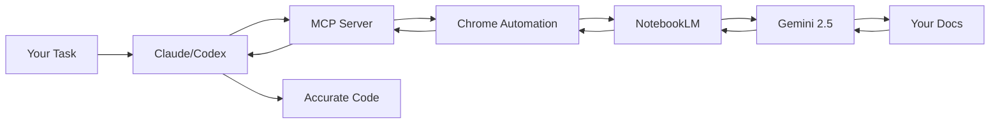

# KNOWLEDGE EXTRACT: PleasePrompto
> **Extracted on:** 2026-03-30 17:51:03
> **Source:** PleasePrompto

---

## File: `notebooklm-mcp.md`
```markdown
# 📦 PleasePrompto/notebooklm-mcp [⭐ ACTIVE]
🔗 https://github.com/PleasePrompto/notebooklm-mcp


## Meta
- **Stars:** ⭐ 1619 | **Forks:** 🍴 212
- **Language:** TypeScript | **License:** MIT
- **Last updated:** 2026-03-27
- **Topics:** (none)
- **Status trong AI OS:** ⭐ ACTIVE

## Description:
MCP server for NotebookLM - Let your AI agents (Claude Code, Codex) research documentation directly with grounded, citation-backed answers from Gemini. Persistent auth, library management, cross-client sharing. Zero hallucinations, just your knowledge base.

## README (FULL)
```
<div align="center">

# NotebookLM MCP Server

**Let your CLI agents (Claude, Cursor, Codex...) chat directly with NotebookLM for zero-hallucination answers based on your own notebooks**

[](https://www.typescriptlang.org/)
[](https://modelcontextprotocol.io/)
[](https://www.npmjs.com/package/notebooklm-mcp)
[](https://github.com/PleasePrompto/notebooklm-skill)
[](https://github.com/PleasePrompto/notebooklm-mcp)

[Installation](#installation) • [Quick Start](#quick-start) • [Why NotebookLM](#why-notebooklm-not-local-rag) • [Examples](#real-world-example) • [Claude Code Skill](https://github.com/PleasePrompto/notebooklm-skill) • [Documentation](./docs/)

</div>

---

## The Problem

When you tell Claude Code or Cursor to "search through my local documentation", here's what happens:
- **Massive token consumption**: Searching through documentation means reading multiple files repeatedly
- **Inaccurate retrieval**: Searches for keywords, misses context and connections between docs
- **Hallucinations**: When it can't find something, it invents plausible-sounding APIs
- **Expensive & slow**: Each question requires re-reading multiple files

## The Solution

Let your local agents chat directly with [**NotebookLM**](https://notebooklm.google/) — Google's **zero-hallucination knowledge base** powered by Gemini 2.5 that provides intelligent, synthesized answers from your docs.

```
Your Task → Local Agent asks NotebookLM → Gemini synthesizes answer → Agent writes correct code
```

**The real advantage**: No more manual copy-paste between NotebookLM and your editor. Your agent asks NotebookLM directly and gets answers straight back in the CLI. It builds deep understanding through automatic follow-ups — Claude asks multiple questions in sequence, each building on the last, getting specific implementation details, edge cases, and best practices. You can save NotebookLM links to your local library with tags and descriptions, and Claude automatically selects the relevant notebook based on your current task.

---

## Why NotebookLM, Not Local RAG?

| Approach | Token Cost | Setup Time | Hallucinations | Answer Quality |
|----------|------------|------------|----------------|----------------|
| **Feed docs to Claude** | 🔴 Very high (multiple file reads) | Instant | Yes - fills gaps | Variable retrieval |
| **Web search** | 🟡 Medium | Instant | High - unreliable sources | Hit or miss |
| **Local RAG** | 🟡 Medium-High | Hours (embeddings, chunking) | Medium - retrieval gaps | Depends on setup |
| **NotebookLM MCP** | 🟢 Minimal | 5 minutes | **Zero** - refuses if unknown | Expert synthesis |

### What Makes NotebookLM Superior?

1. **Pre-processed by Gemini**: Upload docs once, get instant expert knowledge
2. **Natural language Q&A**: Not just retrieval — actual understanding and synthesis
3. **Multi-source correlation**: Connects information across 50+ documents
4. **Citation-backed**: Every answer includes source references
5. **No infrastructure**: No vector DBs, embeddings, or chunking strategies needed

---

## Installation

### Claude Code
```bash
claude mcp add notebooklm npx notebooklm-mcp@latest
```

### Codex
```bash
codex mcp add notebooklm -- npx notebooklm-mcp@latest
```

<details>
<summary>Gemini</summary>

```bash
gemini mcp add notebooklm npx notebooklm-mcp@latest
```
</details>

<details>
<summary>Cursor</summary>

Add to `~/.cursor/mcp.json`:
```json
{
  "mcpServers": {
    "notebooklm": {
      "command": "npx",
      "args": ["-y", "notebooklm-mcp@latest"]
    }
  }
}
```
</details>

<details>
<summary>amp</summary>

```bash
amp mcp add notebooklm -- npx notebooklm-mcp@latest
```
</details>

<details>
<summary>VS Code</summary>

```bash
code --add-mcp '{"name":"notebooklm","command":"npx","args":["notebooklm-mcp@latest"]}'
```
</details>

<details>
<summary>Other MCP clients</summary>

**Generic MCP config:**
```json
{
  "mcpServers": {
    "notebooklm": {
      "command": "npx",
      "args": ["notebooklm-mcp@latest"]
    }
  }
}
```
</details>

---

## Alternative: Claude Code Skill

**Prefer Claude Code Skills over MCP?** This server is now also available as a native Claude Code Skill with a simpler setup:

**[NotebookLM Claude Code Skill](https://github.com/PleasePrompto/notebooklm-skill)** - Clone to `~/.claude/skills` and start using immediately

**Key differences:**
- **MCP Server** (this repo): Persistent sessions, works with Claude Code, Codex, Cursor, and other MCP clients
- **Claude Code Skill**: Simpler setup, Python-based, stateless queries, works only with local Claude Code

Both use the same browser automation technology and provide zero-hallucination answers from your NotebookLM notebooks.

---

## Quick Start

### 1. Install the MCP server (see [Installation](#installation) above)

### 2. Authenticate (one-time)

Say in your chat (Claude/Codex):
```
"Log me in to NotebookLM"
```
*A Chrome window opens → log in with Google*

### 3. Create your knowledge base
Go to [notebooklm.google.com](https://notebooklm.google.com) → Create notebook → Upload your docs:
- 📄 PDFs, Google Docs, markdown files
- 🔗 Websites, GitHub repos
- 🎥 YouTube videos
- 📚 Multiple sources per notebook

Share: **⚙️ Share → Anyone with link → Copy**

### 4. Let Claude use it
```
"I'm building with [library]. Here's my NotebookLM: [link]"
```

**That's it.** Claude now asks NotebookLM whatever it needs, building expertise before writing code.

---

## Real-World Example

### Building an n8n Workflow Without Hallucinations

**Challenge**: n8n's API is new — Claude hallucinates node names and functions.

**Solution**:
1. Downloaded complete n8n documentation → merged into manageable chunks
2. Uploaded to NotebookLM
3. Told Claude: *"Build me a Gmail spam filter workflow. Use this NotebookLM: [link]"*

**Watch the AI-to-AI conversation:**

```
Claude → "How does Gmail integration work in n8n?"
NotebookLM → "Use Gmail Trigger with polling, or Gmail node with Get Many..."

Claude → "How to decode base64 email body?"
NotebookLM → "Body is base64url encoded in payload.parts, use Function node..."

Claude → "How to parse OpenAI response as JSON?"
NotebookLM → "Set responseFormat to json, use {{ $json.spam }} in IF node..."

Claude → "What about error handling if the API fails?"
NotebookLM → "Use Error Trigger node with Continue On Fail enabled..."

Claude → ✅ "Here's your complete workflow JSON..."
```

**Result**: Perfect workflow on first try. No debugging hallucinated APIs.

---

## Core Features

### **Zero Hallucinations**
NotebookLM refuses to answer if information isn't in your docs. No invented APIs.

### **Autonomous Research**
Claude asks follow-up questions automatically, building complete understanding before coding.

### **Smart Library Management**
Save NotebookLM links with tags and descriptions. Claude auto-selects the right notebook for your task.
```
"Add [link] to library tagged 'frontend, react, components'"
```

### **Deep, Iterative Research**
- Claude automatically asks follow-up questions to build complete understanding
- Each answer triggers deeper questions until Claude has all the details
- Example: For n8n workflow, Claude asked multiple sequential questions about Gmail integration, error handling, and data transformation

### **Cross-Tool Sharing**
Set up once, use everywhere. Claude Code, Codex, Cursor — all share the same library.

### **Deep Cleanup Tool**
Fresh start anytime. Scans entire system for NotebookLM data with categorized preview.

---

## Tool Profiles

Reduce token usage by loading only the tools you need. Each tool consumes context tokens — fewer tools = faster responses and lower costs.

### Available Profiles

| Profile | Tools | Use Case |
|---------|-------|----------|
| **minimal** | 5 | Query-only: `ask_question`, `get_health`, `list_notebooks`, `select_notebook`, `get_notebook` |
| **standard** | 10 | + Library management: `setup_auth`, `list_sessions`, `add_notebook`, `update_notebook`, `search_notebooks` |
| **full** | 16 | All tools including `cleanup_data`, `re_auth`, `remove_notebook`, `reset_session`, `close_session`, `get_library_stats` |

### Configure via CLI

```bash
# Check current settings
npx notebooklm-mcp config get

# Set a profile
npx notebooklm-mcp config set profile minimal
npx notebooklm-mcp config set profile standard
npx notebooklm-mcp config set profile full

# Disable specific tools (comma-separated)
npx notebooklm-mcp config set disabled-tools "cleanup_data,re_auth"

# Reset to defaults
npx notebooklm-mcp config reset
```

### Configure via Environment Variables

```bash
# Set profile
export NOTEBOOKLM_PROFILE=minimal

# Disable specific tools
export NOTEBOOKLM_DISABLED_TOOLS="cleanup_data,re_auth,remove_notebook"
```

Settings are saved to `~/.config/notebooklm-mcp/settings.json` and persist across sessions. Environment variables override file settings.

---

## Architecture



---

## Common Commands

| Intent | Say | Result |
|--------|-----|--------|
| Authenticate | *"Open NotebookLM auth setup"* or *"Log me in to NotebookLM"* | Chrome opens for login |
| Add notebook | *"Add [link] to library"* | Saves notebook with metadata |
| List notebooks | *"Show our notebooks"* | Lists all saved notebooks |
| Research first | *"Research this in NotebookLM before coding"* | Multi-question session |
| Select notebook | *"Use the React notebook"* | Sets active notebook |
| Update notebook | *"Update notebook tags"* | Modify metadata |
| Remove notebook | *"Remove [notebook] from library"* | Deletes from library |
| View browser | *"Show me the browser"* | Watch live NotebookLM chat |
| Fix auth | *"Repair NotebookLM authentication"* | Clears and re-authenticates |
| Switch account | *"Re-authenticate with different Google account"* | Changes account |
| Clean restart | *"Run NotebookLM cleanup"* | Removes all data for fresh start |
| Keep library | *"Cleanup but keep my library"* | Preserves notebooks |
| Delete all data | *"Delete all NotebookLM data"* | Complete removal |

---

## Comparison to Alternatives

### vs. Downloading docs locally
- **You**: Download docs → Claude: "search through these files"
- **Problem**: Claude reads thousands of files → massive token usage, often misses connections
- **NotebookLM**: Pre-indexed by Gemini, semantic understanding across all docs

### vs. Web search
- **You**: "Research X online"
- **Problem**: Outdated info, hallucinated examples, unreliable sources
- **NotebookLM**: Only your trusted docs, always current, with citations

### vs. Local RAG setup
- **You**: Set up embeddings, vector DB, chunking strategy, retrieval pipeline
- **Problem**: Hours of setup, tuning retrieval, still gets "creative" with gaps
- **NotebookLM**: Upload docs → done. Google handles everything.

---

## FAQ

**Is it really zero hallucinations?**
Yes. NotebookLM is specifically designed to only answer from uploaded sources. If it doesn't know, it says so.

**What about rate limits?**
Free tier has daily query limits per Google account. Quick account switching supported for continued research.

**How secure is this?**
Chrome runs locally. Your credentials never leave your machine. Use a dedicated Google account if concerned.

**Can I see what's happening?**
Yes! Say *"Show me the browser"* to watch the live NotebookLM conversation.

**What makes this better than Claude's built-in knowledge?**
Your docs are always current. No training cutoff. No hallucinations. Perfect for new libraries, internal APIs, or fast-moving projects.

---

## Advanced Usage

- 📖 [**Usage Guide**](./docs/usage-guide.md) — Patterns, workflows, tips
- 🛠️ [**Tool Reference**](./docs/tools.md) — Complete MCP API
- 🔧 [**Configuration**](./docs/configuration.md) — Environment variables
- 🐛 [**Troubleshooting**](./docs/troubleshooting.md) — Common issues

---

## The Bottom Line

**Without NotebookLM MCP**: Write code → Find it's wrong → Debug hallucinated APIs → Repeat

**With NotebookLM MCP**: Claude researches first → Writes correct code → Ship faster

Stop debugging hallucinations. Start shipping accurate code.

```bash
# Get started in 30 seconds
claude mcp add notebooklm npx notebooklm-mcp@latest
```

---

## Disclaimer

This tool automates browser interactions with NotebookLM to make your workflow more efficient. However, a few friendly reminders:

**About browser automation:**
While I've built in humanization features (realistic typing speeds, natural delays, mouse movements) to make the automation behave more naturally, I can't guarantee Google won't detect or flag automated usage. I recommend using a dedicated Google account for automation rather than your primary account—think of it like web scraping: probably fine, but better safe than sorry!

**About CLI tools and AI agents:**
CLI tools like Claude Code, Codex, and similar AI-powered assistants are incredibly powerful, but they can make mistakes. Please use them with care and awareness:
- Always review changes before committing or deploying
- Test in safe environments first
- Keep backups of important work
- Remember: AI agents are assistants, not infallible oracles

I built this tool for myself because I was tired of the copy-paste dance between NotebookLM and my editor. I'm sharing it in the hope it helps others too, but I can't take responsibility for any issues, data loss, or account problems that might occur. Use at your own discretion and judgment.

That said, if you run into problems or have questions, feel free to open an issue on GitHub. I'm happy to help troubleshoot!

---

## Contributing

Found a bug? Have a feature idea? [Open an issue](https://github.com/PleasePrompto/notebooklm-mcp/issues) or submit a PR!

## License

MIT — Use freely in your projects.

---

<div align="center">

Built with frustration about hallucinated APIs, powered by Google's NotebookLM

⭐ [Star on GitHub](https://github.com/PleasePrompto/notebooklm-mcp) if this saves you debugging time!

</div>

```

---
*Ingested: 2026-03-27 | Source: GitHub API FULL | Owner: Dept 07 Knowledge*
```

## File: `notebooklm-skill.md`
```markdown
# 📦 PleasePrompto/notebooklm-skill [⭐ ACTIVE]
🔗 https://github.com/PleasePrompto/notebooklm-skill


## Meta
- **Stars:** ⭐ 5148 | **Forks:** 🍴 535
- **Language:** Python | **License:** MIT
- **Last updated:** 2026-03-27
- **Topics:** (none)
- **Status trong AI OS:** ⭐ ACTIVE

## Description:
Use this skill to enable Claude Code to communicate directly with your Google NotebookLM notebooks. Query your uploaded documents and get source-grounded, citation-backed answers from Gemini. Features browser automation, library management, persistent authentication, and answers exclusively from your own knowledge base.

## README (FULL)
```
<div align="center">

# NotebookLM Claude Code Skill

**Let [Claude Code](https://github.com/anthropics/claude-code) chat directly with NotebookLM for source-grounded answers based exclusively on your uploaded documents**

[](https://www.python.org/)
[](https://www.anthropic.com/news/skills)
[](https://github.com/PleasePrompto/notebooklm-mcp)
[](https://github.com/PleasePrompto/notebooklm-skill)

> Use this skill to query your Google NotebookLM notebooks directly from Claude Code for source-grounded, citation-backed answers from Gemini. Browser automation, library management, persistent auth. Drastically reduced hallucinations - answers only from your uploaded documents.

[Installation](#installation) • [Quick Start](#quick-start) • [Why NotebookLM](#why-notebooklm-not-local-rag) • [How It Works](#how-it-works) • [MCP Alternative](https://github.com/PleasePrompto/notebooklm-mcp)

</div>

---

## ⚠️ Important: Local Claude Code Only

**This skill works ONLY with local [Claude Code](https://github.com/anthropics/claude-code) installations, NOT in the web UI.**

The web UI runs skills in a sandbox without network access, which this skill requires for browser automation. You must use [Claude Code](https://github.com/anthropics/claude-code) locally on your machine.

---

## The Problem

When you tell [Claude Code](https://github.com/anthropics/claude-code) to "search through my local documentation", here's what happens:
- **Massive token consumption**: Searching through documentation means reading multiple files repeatedly
- **Inaccurate retrieval**: Searches for keywords, misses context and connections between docs
- **Hallucinations**: When it can't find something, it invents plausible-sounding APIs
- **Manual copy-paste**: Switching between NotebookLM browser and your editor constantly

## The Solution

This Claude Code Skill lets [Claude Code](https://github.com/anthropics/claude-code) chat directly with [**NotebookLM**](https://notebooklm.google/) — Google's **source-grounded knowledge base** powered by Gemini 2.5 that provides intelligent, synthesized answers exclusively from your uploaded documents.

```
Your Task → Claude asks NotebookLM → Gemini synthesizes answer → Claude writes correct code
```

**No more copy-paste dance**: Claude asks questions directly and gets answers straight back in the CLI. It builds deep understanding through automatic follow-ups, getting specific implementation details, edge cases, and best practices.

---

## Why NotebookLM, Not Local RAG?

| Approach | Token Cost | Setup Time | Hallucinations | Answer Quality |
|----------|------------|------------|----------------|----------------|
| **Feed docs to Claude** | 🔴 Very high (multiple file reads) | Instant | Yes - fills gaps | Variable retrieval |
| **Web search** | 🟡 Medium | Instant | High - unreliable sources | Hit or miss |
| **Local RAG** | 🟡 Medium-High | Hours (embeddings, chunking) | Medium - retrieval gaps | Depends on setup |
| **NotebookLM Skill** | 🟢 Minimal | 5 minutes | **Minimal** - source-grounded only | Expert synthesis |

### What Makes NotebookLM Superior?

1. **Pre-processed by Gemini**: Upload docs once, get instant expert knowledge
2. **Natural language Q&A**: Not just retrieval — actual understanding and synthesis
3. **Multi-source correlation**: Connects information across 50+ documents
4. **Citation-backed**: Every answer includes source references
5. **No infrastructure**: No vector DBs, embeddings, or chunking strategies needed

---

## Installation

### The simplest installation ever:

```bash
# 1. Create skills directory (if it doesn't exist)
mkdir -p ~/.claude/skills

# 2. Clone this repository
cd ~/.claude/skills
git clone https://github.com/PleasePrompto/notebooklm-skill notebooklm

# 3. That's it! Open Claude Code and say:
"What are my skills?"
```

When you first use the skill, it automatically:
- Creates an isolated Python environment (`.venv`)
- Installs all dependencies including **Google Chrome**
- Sets up browser automation with Chrome (not Chromium) for maximum reliability
- Everything stays contained in the skill folder

**Note:** The setup uses real Chrome instead of Chromium for cross-platform reliability, consistent browser fingerprinting, and better anti-detection with Google services

---

## Quick Start

### 1. Check your skills

Say in Claude Code:
```
"What skills do I have?"
```

Claude will list your available skills including NotebookLM.

### 2. Authenticate with Google (one-time)

```
"Set up NotebookLM authentication"
```
*A Chrome window opens → log in with your Google account*

### 3. Create your knowledge base

Go to [notebooklm.google.com](https://notebooklm.google.com) → Create notebook → Upload your docs:
- 📄 PDFs, Google Docs, markdown files
- 🔗 Websites, GitHub repos
- 🎥 YouTube videos
- 📚 Multiple sources per notebook

Share: **⚙️ Share → Anyone with link → Copy**

### 4. Add to your library

**Option A: Let Claude figure it out (Smart Add)**
```
"Query this notebook about its content and add it to my library: [your-link]"
```
Claude will automatically query the notebook to discover its content, then add it with appropriate metadata.

**Option B: Manual add**
```
"Add this NotebookLM to my library: [your-link]"
```
Claude will ask for a name and topics, then save it for future use.

### 5. Start researching

```
"What does my React docs say about hooks?"
```

Claude automatically selects the right notebook and gets the answer directly from NotebookLM.

---

## How It Works

This is a **Claude Code Skill** - a local folder containing instructions and scripts that Claude Code can use when needed. Unlike the [MCP server version](https://github.com/PleasePrompto/notebooklm-mcp), this runs directly in Claude Code without needing a separate server.

### Key Differences from MCP Server

| Feature | This Skill | MCP Server |
|---------|------------|------------|
| **Protocol** | Claude Skills | Model Context Protocol |
| **Installation** | Clone to `~/.claude/skills` | `claude mcp add ...` |
| **Sessions** | Fresh browser each question | Persistent chat sessions |
| **Compatibility** | Claude Code only (local) | Claude Code, Codex, Cursor, etc. |
| **Language** | Python | TypeScript |
| **Distribution** | Git clone | npm package |

### Architecture

```
~/.claude/skills/notebooklm/
├── SKILL.md              # Instructions for Claude
├── scripts/              # Python automation scripts
│   ├── ask_question.py   # Query NotebookLM
│   ├── notebook_manager.py # Library management
│   └── auth_manager.py   # Google authentication
├── .venv/                # Isolated Python environment (auto-created)
└── data/                 # Local notebook library
```

When you mention NotebookLM or send a notebook URL, Claude:
1. Loads the skill instructions
2. Runs the appropriate Python script
3. Opens a browser, asks your question
4. Returns the answer directly to you
5. Uses that knowledge to help with your task

---

## Core Features

### **Source-Grounded Responses**
NotebookLM significantly reduces hallucinations by answering exclusively from your uploaded documents. If information isn't available, it indicates uncertainty rather than inventing content.

### **Direct Integration**
No copy-paste between browser and editor. Claude asks and receives answers programmatically.

### **Smart Library Management**
Save NotebookLM links with tags and descriptions. Claude auto-selects the right notebook for your task.

### **Automatic Authentication**
One-time Google login, then authentication persists across sessions.

### **Self-Contained**
Everything runs in the skill folder with an isolated Python environment. No global installations.

### **Human-Like Automation**
Uses realistic typing speeds and interaction patterns to avoid detection.

---

## Common Commands

| What you say | What happens |
|--------------|--------------|
| *"Set up NotebookLM authentication"* | Opens Chrome for Google login |
| *"Add [link] to my NotebookLM library"* | Saves notebook with metadata |
| *"Show my NotebookLM notebooks"* | Lists all saved notebooks |
| *"Ask my API docs about [topic]"* | Queries the relevant notebook |
| *"Use the React notebook"* | Sets active notebook |
| *"Clear NotebookLM data"* | Fresh start (keeps library) |

---

## Real-World Examples

### Example 1: Workshop Manual Query

**User asks**: "Check my Suzuki GSR 600 workshop manual for brake fluid type, engine oil specs, and rear axle torque."

**Claude automatically**:
- Authenticates with NotebookLM
- Asks comprehensive questions about each specification
- Follows up when prompted "Is that ALL you need to know?"
- Provides accurate specifications: DOT 4 brake fluid, SAE 10W-40 oil, 100 N·m rear axle torque


### Example 2: Building Without Hallucinations

**You**: "I need to build an n8n workflow for Gmail spam filtering. Use my n8n notebook."

**Claude's internal process:**
```
→ Loads NotebookLM skill
→ Activates n8n notebook
→ Asks comprehensive questions with follow-ups
→ Synthesizes complete answer from multiple queries
```

**Result**: Working workflow on first try, no debugging hallucinated APIs.

---

## Technical Details

### Core Technology
- **Patchright**: Browser automation library (Playwright-based)
- **Python**: Implementation language for this skill
- **Stealth techniques**: Human-like typing and interaction patterns

Note: The MCP server uses the same Patchright library but via TypeScript/npm ecosystem.

### Dependencies
- **patchright==1.55.2**: Browser automation
- **python-dotenv==1.0.0**: Environment configuration
- Automatically installed in `.venv` on first use

### Data Storage

All data is stored locally within the skill directory:

```
~/.claude/skills/notebooklm/data/
├── library.json       - Your notebook library with metadata
├── auth_info.json     - Authentication status info
└── browser_state/     - Browser cookies and session data
```

**Important Security Note:**
- The `data/` directory contains sensitive authentication data and personal notebooks
- It's automatically excluded from git via `.gitignore`
- NEVER manually commit or share the contents of the `data/` directory

### Session Model

Unlike the MCP server, this skill uses a **stateless model**:
- Each question opens a fresh browser
- Asks the question, gets the answer
- Adds a follow-up prompt to encourage Claude to ask more questions
- Closes the browser immediately

This means:
- No persistent chat context
- Each question is independent
- But your notebook library persists
- **Follow-up mechanism**: Each answer includes "Is that ALL you need to know?" to prompt Claude to ask comprehensive follow-ups

For multi-step research, Claude automatically asks follow-up questions when needed.

---

## Limitations

### Skill-Specific
- **Local Claude Code only** - Does not work in web UI (sandbox restrictions)
- **No session persistence** - Each question is independent
- **No follow-up context** - Can't reference "the previous answer"

### NotebookLM
- **Rate limits** - Free tier has daily query limits
- **Manual upload** - You must upload docs to NotebookLM first
- **Share requirement** - Notebooks must be shared publicly

---

## FAQ

**Why doesn't this work in the Claude web UI?**
The web UI runs skills in a sandbox without network access. Browser automation requires network access to reach NotebookLM.

**How is this different from the MCP server?**
This is a simpler, Python-based implementation that runs directly as a Claude Skill. The MCP server is more feature-rich with persistent sessions and works with multiple tools (Codex, Cursor, etc.).

**Can I use both this skill and the MCP server?**
Yes! They serve different purposes. Use the skill for quick Claude Code integration, use the MCP server for persistent sessions and multi-tool support.

**What if Chrome crashes?**
Run: `"Clear NotebookLM browser data"` and try again.

**Is my Google account secure?**
Chrome runs locally on your machine. Your credentials never leave your computer. Use a dedicated Google account if you're concerned.

---

## Troubleshooting

### Skill not found
```bash
# Make sure it's in the right location
ls ~/.claude/skills/notebooklm/
# Should show: SKILL.md, scripts/, etc.
```

### Authentication issues
Say: `"Reset NotebookLM authentication"`

### Browser crashes
Say: `"Clear NotebookLM browser data"`

### Dependencies issues
```bash
# Manual reinstall if needed
cd ~/.claude/skills/notebooklm
rm -rf .venv
python -m venv .venv
source .venv/bin/activate  # or .venv\Scripts\activate on Windows
pip install -r requirements.txt
```

---

## Disclaimer

This tool automates browser interactions with NotebookLM to make your workflow more efficient. However, a few friendly reminders:

**About browser automation:**
While I've built in humanization features (realistic typing speeds, natural delays, mouse movements) to make the automation behave more naturally, I can't guarantee Google won't detect or flag automated usage. I recommend using a dedicated Google account for automation rather than your primary account—think of it like web scraping: probably fine, but better safe than sorry!

**About CLI tools and AI agents:**
CLI tools like Claude Code, Codex, and similar AI-powered assistants are incredibly powerful, but they can make mistakes. Please use them with care and awareness:
- Always review changes before committing or deploying
- Test in safe environments first
- Keep backups of important work
- Remember: AI agents are assistants, not infallible oracles

I built this tool for myself because I was tired of the copy-paste dance between NotebookLM and my editor. I'm sharing it in the hope it helps others too, but I can't take responsibility for any issues, data loss, or account problems that might occur. Use at your own discretion and judgment.

That said, if you run into problems or have questions, feel free to open an issue on GitHub. I'm happy to help troubleshoot!

---

## Credits

This skill is inspired by my [**NotebookLM MCP Server**](https://github.com/PleasePrompto/notebooklm-mcp) and provides an alternative implementation as a Claude Code Skill:
- Both use Patchright for browser automation (TypeScript for MCP, Python for Skill)
- Skill version runs directly in Claude Code without MCP protocol
- Stateless design optimized for skill architecture

If you need:
- **Persistent sessions** → Use the [MCP Server](https://github.com/PleasePrompto/notebooklm-mcp)
- **Multiple tool support** (Codex, Cursor) → Use the [MCP Server](https://github.com/PleasePrompto/notebooklm-mcp)
- **Quick Claude Code integration** → Use this skill

---

## The Bottom Line

**Without this skill**: NotebookLM in browser → Copy answer → Paste in Claude → Copy next question → Back to browser...

**With this skill**: Claude researches directly → Gets answers instantly → Writes correct code

Stop the copy-paste dance. Start getting accurate, grounded answers directly in Claude Code.

```bash
# Get started in 30 seconds
cd ~/.claude/skills
git clone https://github.com/PleasePrompto/notebooklm-skill notebooklm
# Open Claude Code: "What are my skills?"
```

---

<div align="center">

Built as a Claude Code Skill adaptation of my [NotebookLM MCP Server](https://github.com/PleasePrompto/notebooklm-mcp)

For source-grounded, document-based research directly in Claude Code

</div>

```

---
*Ingested: 2026-03-27 | Source: GitHub API FULL | Owner: Dept 07 Knowledge*
```

