# General Identity

The 'general' directory serves as the central repository for various miscellaneous and foundational knowledge assets within OmniClaw, including domain-specific skills, administrative tools, and research documents.

---

## Topological View

```mermaid
graph TD
  Parent("brain") --> Node("knowledge")
  Node --> S1("general")
  S1 --> dir_quarantine
  S1 --> domains
  S1 --> markdown_printer
  S1 --> misc_docs
  S1 --> openclaw_admin
  S1 --> openclaw_worker
  S1 --> orchestrator_pro_domain
  S1 --> pattern_craft
  S1 --> pocket_tts
  S1 --> reasoning_engine_domain
  S1 --> recursive_decomposition_skill
  S1 --> repo_civ_fetched_awesome_ai_tools_120021
  Node --> F1("01mf02_knowledge_CLOSET.aaak")
  Node --> F2("0xAstroAlpha_knowledge_CLOSET.aaak")
  Node --> F3("0xBugatti_knowledge_CLOSET.aaak")
  Node --> F4("14islands_knowledge_CLOSET.aaak")
  Node --> F5("2025_07_16_ai_agent_orchestration_knowledge.md")
  Node --> F6("666ghj_knowledge_CLOSET.aaak")
  Node --> F7("A3-N_knowledge_CLOSET.aaak")
  Node --> F8("AI-research-SKILLs_knowledge_CLOSET.aaak")
  Node --> F9("AI4Finance-Foundation_knowledge_CLOSET.aaak")
  Node --> F10("AdaptiveConsulting_knowledge_CLOSET.aaak")
  Node --> F11("Adobe-Camera-Profiles-Unlocker_knowledge.md")
  Node --> F12("AdvancedWebScraper_knowledge.md")
```

---
*OmniClaw V5.0 | Forged by OMA AI Architect | brain.knowledge.general | 2026-04-10*

- `codex_kit`  id: `codex_kit` | type: `kit` | registered: 2026-04-12T04:37:42.494920