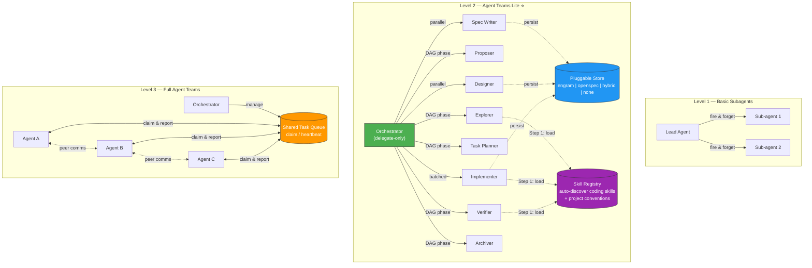

# KNOWLEDGE EXTRACT: agent-teams-lite
> **Extracted on:** 2026-03-30 17:29:03
> **Source:** agent-teams-lite

---

## File: `.gitattributes`
```
# Force LF line endings for shell scripts (prevents CRLF issues on Windows/WSL)
*.sh text eol=lf
*.ps1 text eol=crlf

# Default: auto-detect
* text=auto
```

## File: `.gitignore`
```
# OS
.DS_Store
Thumbs.db

# Editors
.vscode/
.idea/
*.swp
*.swo
*~

# Node (in case anyone adds tooling later)
node_modules/
```

## File: `LICENSE`
```
MIT License

Copyright (c) 2026 Gentleman Programming

Permission is hereby granted, free of charge, to any person obtaining a copy
of this software and associated documentation files (the "Software"), to deal
in the Software without restriction, including without limitation the rights
to use, copy, modify, merge, publish, distribute, sublicense, and/or sell
copies of the Software, and to permit persons to whom the Software is
furnished to do so, subject to the following conditions:

The above copyright notice and this permission notice shall be included in all
copies or substantial portions of the Software.

THE SOFTWARE IS PROVIDED "AS IS", WITHOUT WARRANTY OF ANY KIND, EXPRESS OR
IMPLIED, INCLUDING BUT NOT LIMITED TO THE WARRANTIES OF MERCHANTABILITY,
FITNESS FOR A PARTICULAR PURPOSE AND NONINFRINGEMENT. IN NO EVENT SHALL THE
AUTHORS OR COPYRIGHT HOLDERS BE LIABLE FOR ANY CLAIM, DAMAGES OR OTHER
LIABILITY, WHETHER IN AN ACTION OF CONTRACT, TORT OR OTHERWISE, ARISING FROM,
OUT OF OR IN CONNECTION WITH THE SOFTWARE OR THE USE OR OTHER DEALINGS IN THE
SOFTWARE.
```

## File: `README.md`
```markdown
<p align="center">
  <h1 align="center">Agent Teams Lite</h1>
  <p align="center">
    <strong>Agent-Team Orchestration with AI Sub-Agents</strong>
    <br />
    <em>An orchestrator + specialized sub-agents for structured feature development.</em>
    <br />
    <em>Zero dependencies. Pure Markdown. Works everywhere.</em>
  </p>
</p>

<p align="center">
  <a href="#quick-start">Quick Start</a> &bull;
  <a href="#how-it-works">How It Works</a> &bull;
  <a href="#commands">Commands</a> &bull;
  <a href="#installation">Installation</a> &bull;
  <a href="#releases">Releases</a> &bull;
  <a href="#supported-tools">Supported Tools</a>
</p>

---

## The Problem

AI coding assistants are powerful, but they struggle with complex features:

- **Context overload** — Long conversations lead to compression, lost details, hallucinations
- **No structure** — "Build me dark mode" produces unpredictable results
- **No review gate** — Code gets written before anyone agrees on what to build
- **No memory** — Specs live in chat history that vanishes

## The Solution

**Agent Teams Lite** is an agent-team orchestration pattern where a lightweight coordinator delegates all real work to specialized sub-agents. Each sub-agent starts with fresh context, executes one focused task, and returns a structured result.

```
YOU: "I want to add CSV export to the app"

ORCHESTRATOR (delegate-only, minimal context):
  → launches EXPLORER sub-agent     → returns: codebase analysis
  → shows you summary, you approve
  → launches PROPOSER sub-agent     → returns: proposal artifact
  → launches SPEC WRITER sub-agent  → returns: spec artifact
  → launches DESIGNER sub-agent     → returns: design artifact
  → launches TASK PLANNER sub-agent → returns: tasks artifact
  → shows you everything, you approve
  → launches IMPLEMENTER sub-agent  → returns: code written, tasks checked off
  → launches VERIFIER sub-agent     → returns: verification artifact
  → launches ARCHIVER sub-agent     → returns: change closed
```

**The key insight**: the orchestrator NEVER does real work directly — not just SDD phases, but ANY task. It delegates everything to sub-agents, tracks state, and synthesizes summaries. This keeps the main thread small and stable. For substantial features, it uses the SDD workflow (structured DAG of phases). For smaller tasks, it still delegates to a general sub-agent.

**Sub-agents auto-discover your skills.** If you have coding skills installed (React, TDD, Playwright, Django, etc.), sub-agents automatically load the relevant ones before writing code. A [skill registry](#skill-registry) catalogs your skills and project conventions so every sub-agent knows what patterns to follow — even though it starts with a fresh context.

### Persistence Is Pluggable

The workflow engine is storage-agnostic. Artifacts can be persisted in:

- `engram` (recommended default) — https://github.com/gentleman-programming/engram
- `openspec` (file-based, optional)
- `hybrid` (both Engram + OpenSpec simultaneously)
- `none` (ephemeral, no persistence)

Default policy is conservative:

- If Engram is available, persist to Engram (recommended)
- If user explicitly asks for file artifacts, use `openspec`
- If user wants both cross-session recovery AND local files, use `hybrid`
- Otherwise use `none` (no writes)
- `openspec` and `hybrid` are NEVER chosen automatically — only when the user explicitly asks

### Quick Modes

Recommended defaults by use case:

```yaml
# Agent-team storage policy
artifact_store:
  mode: engram      # Recommended: persistent, repo-clean
```

```yaml
# Privacy/local-only (no persistence)
artifact_store:
  mode: none
```

```yaml
# File artifacts in project (OpenSpec flow)
artifact_store:
  mode: openspec
```

```yaml
# Both backends: cross-session recovery + local files (uses more tokens)
artifact_store:
  mode: hybrid
```

---

## How It Works

### Where Agent Teams Lite Fits

Agent Teams Lite sits between basic sub-agent patterns and full Agent Teams runtimes:



| Capability | Basic Subagents | Agent Teams Lite | Full Agent Teams |
|---|:---:|:---:|:---:|
| Delegate-only lead | — | ✅ | ✅ |
| DAG-based phase orchestration | — | ✅ | ✅ |
| Parallel phases (spec ∥ design) | — | ✅ | ✅ |
| Structured result envelope | — | ✅ | ✅ |
| Pluggable artifact store | — | ✅ | ✅ |
| **Skill auto-discovery** | — | ✅ | ✅ |
| Shared task queue with claim/heartbeat | — | — | ✅ |
| Teammate ↔ teammate communication | — | — | ✅ |
| Dynamic work stealing | — | — | ✅ |

### Architecture

```
┌──────────────────────────────────────────────────────────┐
│  ORCHESTRATOR (coordinator — never does real work)         │
│                                                           │
│  Responsibilities:                                        │
│  • Delegate ALL tasks to sub-agents (not just SDD)        │
│  • Launch sub-agents via Task tool                        │
│  • Show summaries to user                                 │
│  • Ask for approval between phases                        │
│  • Track state: which artifacts exist, what's next        │
│  • Suggest SDD for substantial features/refactors         │
│                                                           │
│  Context usage: MINIMAL (only state + summaries)          │
└──────────────┬───────────────────────────────────────────┘
               │
               │ Task(subagent_type: 'general', prompt: 'Read skill...')
               │
    ┌──────────┴──────────────────────────────────────────┐
    │                                                      │
    ▼          ▼          ▼         ▼         ▼           ▼
┌────────┐┌────────┐┌────────┐┌────────┐┌────────┐┌────────┐
│EXPLORE ││PROPOSE ││  SPEC  ││ DESIGN ││ TASKS  ││ APPLY  │ ...
│        ││        ││        ││        ││        ││        │
│ Fresh  ││ Fresh  ││ Fresh  ││ Fresh  ││ Fresh  ││ Fresh  │
│context ││context ││context ││context ││context ││context │
└───┬────┘└───┬────┘└───┬────┘└───┬────┘└───┬────┘└───┬────┘
    │         │         │         │         │         │
    └─────────┴─────────┴────┬────┴─────────┴─────────┘
                             │
                    Step 1: load skills
                             │
                 ┌───────────▼───────────┐
                 │    SKILL REGISTRY     │
                 │                       │
                 │ • Your coding skills  │
                 │   (React, TDD, etc.)  │
                 │ • Project conventions │
                 │   (agents.md, etc.)   │
                 └───────────────────────┘
```

### The Dependency Graph

```
                    proposal
                   (root node)
                       │
         ┌─────────────┴─────────────┐
         │                           │
         ▼                           ▼
      specs                       design
   (requirements                (technical
    + scenarios)                 approach)
         │                           │
         └─────────────┬─────────────┘
                       │
                       ▼
                    tasks
                (implementation
                  checklist)
                       │
                       ▼
                    apply
                (write code)
                       │
                       ▼
                    verify
               (quality gate)
                       │
                       ▼
                   archive
              (merge specs,
               close change)
```

### Sub-Agent Result Contract

Each sub-agent should return a structured payload with variable depth:

```json
{
  "status": "ok | warning | blocked | failed",
  "executive_summary": "short decision-grade summary",
  "detailed_report": "optional long-form analysis when needed",
  "artifacts": [
    {
      "name": "design",
      "store": "engram | openspec | hybrid | none",
      "ref": "observation-id | file-path | null"
    }
  ],
  "next_recommended": ["tasks"],
  "risks": ["optional risk list"]
}
```

`executive_summary` is intentionally short. `detailed_report` can be as long as needed for complex architecture work.

### Artifact Persistence (Optional)

When `openspec` mode is enabled, a change can produce a self-contained folder:

```
openspec/
├── config.yaml                        ← Project context (stack, conventions)
├── specs/                             ← Source of truth: how the system works TODAY
│   ├── auth/spec.md
│   ├── export/spec.md
│   └── ui/spec.md
└── changes/
    ├── add-csv-export/                ← Active change
    │   ├── proposal.md                ← WHY + SCOPE + APPROACH
    │   ├── specs/                     ← Delta specs (ADDED/MODIFIED/REMOVED)
    │   │   └── export/spec.md
    │   ├── design.md                  ← HOW (architecture decisions)
    │   └── tasks.md                   ← WHAT (implementation checklist)
    └── archive/                       ← Completed changes (audit trail)
        └── 2026-02-16-fix-auth/
```

---

## Quick Start

### 1. Run the setup script

```bash
git clone https://github.com/gentleman-programming/agent-teams-lite.git
cd agent-teams-lite
./scripts/setup.sh
```

That's it. The script auto-detects your installed agents, copies skills, and configures orchestrator prompts — all in one step. Safe to run multiple times (idempotent).

Options:
```bash
./scripts/setup.sh --all              # Auto-detect + install all (no prompts)
./scripts/setup.sh --agent claude-code # Install for a specific agent
./scripts/setup.sh --opencode-mode multi  # Use multi-model mode for OpenCode
./scripts/setup.sh --non-interactive  # For external installers (e.g. gentle-ai)
```

Windows PowerShell:
```powershell
.\scripts\setup.ps1              # Interactive
.\scripts\setup.ps1 -All         # Auto-detect + install all
.\scripts\setup.ps1 -Agent opencode -OpenCodeMode multi  # Multi-model mode
```

> **Skills only?** Use `./scripts/install.sh` if you just want to copy skills without configuring orchestrator prompts.

### 2. Use it

Open your AI assistant in any project and say:

```
/sdd-init
```

Then start building:

```
/sdd-new add-csv-export
```

Or let it detect automatically — describe a substantial feature and the orchestrator will suggest SDD.

---

## Releases

We publish versioned release notes on GitHub:

- https://github.com/Gentleman-Programming/agent-teams-lite/releases

Latest release:

- `v3.3.6` — OpenCode multi-model support: one agent per SDD phase, each with its own model. Setup scripts auto-configure both modes.
- `v3.3.5` — Full setup scripts (`setup.sh` / `setup.ps1`): auto-detect agents + install skills + configure orchestrator prompts in one step.
- `v3.3.4` — Installer fixes: skill-registry included, correct VS Code path.
- `v3.3.3` — Multi-directory skill scanning + correct agent paths from gentle-ai.
- `v3.3.2` — Index file expansion in skill registry + README overhaul.
- `v3.3.1` — Skill registry skill, engram-first discovery, inline persistence in all skills.

---

## Commands

| Command | What It Does |
|---------|-------------|
| `/sdd-init` | Initialize SDD context. Detects stack, bootstraps persistence, builds skill registry. |
| `/sdd-explore <topic>` | Investigate an idea. Reads codebase, compares approaches. No files created. |
| `/sdd-new <name>` | Start a new change by delegating exploration + proposal to sub-agents. |
| `/sdd-continue` | Run the next dependency-ready phase via sub-agent(s). |
| `/sdd-ff <name>` | Fast-forward planning with sub-agents (proposal → specs → design → tasks). |
| `/sdd-apply` | Implement tasks in batches. Checks off items as it goes. |
| `/sdd-verify` | Validate implementation against specs. Reports CRITICAL / WARNING / SUGGESTION. |
| `/sdd-archive` | Close a change and persist final state in the active artifact store. |
| `/skill-registry` | Create or update the skill registry for the current project. |

### Example Flow

```
You: /sdd-new add-dark-mode

AI:  Launching explorer sub-agent...
     ✓ Codebase analyzed. React + Tailwind detected.
     ✓ Current theme: hardcoded light mode in globals.css
     
     Launching proposal sub-agent...
     ✓ proposal.md created
       Intent: Add dark mode toggle with system preference detection
       Scope: Theme context, toggle component, CSS variables
     
     Want me to continue with specs and design? (or review the proposal first)

You: Go ahead

AI:  ✓ specs/ui/spec.md — 3 requirements, 7 scenarios
     ✓ design.md — CSS variables approach, React Context, localStorage
     ✓ tasks.md — 3 phases, 8 tasks
     
     Ready to implement. Run /sdd-apply to start.

You: /sdd-apply

AI:  Implementing Phase 1 (Foundation)...
     ✓ Loaded skills: react-19, typescript, tailwind-4
     ✓ 1.1 Created ThemeContext (React 19 patterns, no useMemo needed)
     ✓ 1.2 Added CSS custom properties via Tailwind theme
     ✓ 1.3 Added localStorage persistence

     3/8 tasks complete. Continue with Phase 2?
```

---

## The Sub-Agents

Each sub-agent is a SKILL.md file — pure Markdown instructions that any AI assistant can follow. All sub-agents load the [skill registry](#skill-registry) as Step 1 before starting work.

| Sub-Agent | Skill File | What It Does |
|-----------|-----------|-------------|
| **Init** | `sdd-init/SKILL.md` | Detects project stack, bootstraps persistence, builds skill registry |
| **Explorer** | `sdd-explore/SKILL.md` | Reads codebase, compares approaches, identifies risks |
| **Proposer** | `sdd-propose/SKILL.md` | Creates `proposal.md` with intent, scope, rollback plan |
| **Spec Writer** | `sdd-spec/SKILL.md` | Writes delta specs (ADDED/MODIFIED/REMOVED) with Given/When/Then |
| **Designer** | `sdd-design/SKILL.md` | Creates `design.md` with architecture decisions and rationale |
| **Task Planner** | `sdd-tasks/SKILL.md` | Breaks down into phased, numbered task checklist |
| **Implementer** | `sdd-apply/SKILL.md` | Writes code following specs and design, marks tasks complete. v2.0: TDD workflow support |
| **Verifier** | `sdd-verify/SKILL.md` | Validates implementation against specs with real test execution. v2.0: spec compliance matrix |
| **Archiver** | `sdd-archive/SKILL.md` | Merges delta specs into main specs, moves to archive |
| **Skill Registry** | `skill-registry/SKILL.md` | Scans user skills + project conventions, writes `.atl/skill-registry.md` |

### Shared Conventions

All skills reference three shared convention files in `skills/_shared/`. Critical engram calls (`mem_search`, `mem_save`, `mem_get_observation`) are also **inlined directly in each skill** so sub-agents don't need to follow multi-hop file references.

| File | Purpose |
|------|---------|
| `persistence-contract.md` | Mode resolution rules, sub-agent context protocol, skill registry loading protocol |
| `engram-convention.md` | Supplementary reference for deterministic naming (`sdd/{change-name}/{artifact-type}`) and two-step recovery. Critical calls are inlined in skills. |
| `openspec-convention.md` | Filesystem paths for each artifact, directory structure, config.yaml reference, and archive layout |

**Why inline + shared:**
- **Sub-agents fail multi-hop chains** — A 3-hop read chain (skill → convention file → actual instructions) breaks non-Claude models. Inlining the critical calls eliminates this.
- **Deterministic recovery** — Engram artifact naming follows a strict `sdd/{change}/{type}` convention with `topic_key`, so any skill can reliably find artifacts created by other skills.
- **Consistent mode behavior** — All skills resolve `engram | openspec | hybrid | none` the same way. `openspec` and `hybrid` are never chosen automatically.

### Skill Registry

Sub-agents start with a **fresh context** — they don't know what user skills exist (React, TDD, Playwright, etc.). The skill registry solves this.

**How it works:**
1. `/sdd-init` or `/skill-registry` scans your installed skills and project conventions
2. Writes `.atl/skill-registry.md` in the project root (mode-independent, always created)
3. If engram is available, also saves to engram (cross-session bonus)
4. Every sub-agent reads the registry as **Step 1** before starting any work

**Read priority:** Engram first (fast, survives compaction) → `.atl/skill-registry.md` as fallback.

**What it contains:**
- User skills table: trigger → skill name → path (e.g., "React components" → `react-19` → `~/.claude/skills/react-19/SKILL.md`)
- Project conventions found: `agents.md`, `CLAUDE.md`, `.cursorrules`, etc.

**When to update:** Run `/skill-registry` after installing or removing skills.

### Notable Upgrades

**v2.0 — TDD + Real Execution:**
- **sdd-apply v2.0** — TDD workflow support. RED-GREEN-REFACTOR cycle when enabled via config.
- **sdd-verify v2.0** — Real test execution + spec compliance matrix (PASS/FAIL/SKIP per requirement).

**v3.2.3 — Inline Engram Persistence:**
- All 9 SDD skills now have critical engram calls (`mem_search`, `mem_save`, `mem_get_observation`) inlined directly in their numbered steps. Sub-agents no longer need to follow a 3-hop file read chain to find persistence instructions.

**v3.3.0 — Mandatory Persist Steps + Knowledge Persistence:**
- Every skill has an explicit numbered "Persist Artifact" step — models were ignoring the contract section and skipping persistence. Now it's impossible to miss.
- Non-SDD sub-agents are instructed to save discoveries, decisions, and bug fixes to engram automatically.

**v3.3.1 — Skill Registry:**
- New `skill-registry` skill for creating/updating the registry on demand.
- All sub-agents load the skill registry as **Step 1** — they now know about your coding skills (React, TDD, Playwright, etc.) and project conventions.
- Engram-first + `.atl/skill-registry.md` fallback — works with or without engram.

**v3.3.5 — Full Setup Scripts:**
- New `setup.sh` (Unix) and `setup.ps1` (Windows) that auto-detect agents, install skills, AND configure orchestrator prompts in one command.
- Idempotent with HTML comment markers — safe to run multiple times.
- `--non-interactive` mode for external installers like [gentle-ai](https://github.com/gentleman-programming/gentleman-ai-installer).
- OpenCode special handling: slash commands + JSON config merge.

**v3.3.6 — OpenCode Multi-Model Support:**
- New **multi-model mode** for OpenCode: one dedicated agent per SDD phase, each configurable with its own model.
- Setup scripts ask which mode to use (single vs multi) or accept `--opencode-mode` flag.
- Single mode (default) unchanged — one `sdd-orchestrator` handles everything.
- Multi mode creates 9 hidden subagents + orchestrator with phase delegation and task permissions.

---

## Installation

The recommended way to install is the **setup script** — it handles everything (skills + orchestrator prompts) in one step:

```bash
./scripts/setup.sh        # Interactive: detects agents, asks which to set up
./scripts/setup.sh --all  # Auto-detect + install all (no prompts)
```

Windows PowerShell:
```powershell
.\scripts\setup.ps1       # Interactive
.\scripts\setup.ps1 -All  # Auto-detect + install all
```

The setup script:
- Detects installed agents via PATH (`claude`, `opencode`, `gemini`, `cursor`, `code`, `codex`)
- Copies skills to the correct user-level directory
- Configures orchestrator prompts with idempotent markers (safe to re-run)
- Handles OpenCode's special case (commands + JSON config merge)
- For OpenCode: asks single vs multi-model mode (or use `--opencode-mode`)

> **For external installers** (e.g. [gentle-ai](https://github.com/gentleman-programming/gentleman-ai-installer)): use `--non-interactive` flag.

Below are per-tool details for manual installation or reference.

- [Claude Code](#claude-code) — Full sub-agent support via Task tool
- [OpenCode](#opencode) — Full sub-agent support via Task tool
- [Gemini CLI](#gemini-cli) — Inline skill execution
- [Codex](#codex) — Inline skill execution
- [VS Code (Copilot)](#vs-code-copilot) — Agent mode with context files
- [Antigravity](#antigravity) — Native skill support with `~/.gemini/antigravity/skills/` and `.agent/` paths
- [Cursor](#cursor) — Inline skill execution

### Claude Code

> **Automatic:** `./scripts/setup.sh --agent claude-code` handles all steps below.

<details>
<summary>Manual installation</summary>

**1. Copy skills:**

```bash
cp -r skills/_shared skills/sdd-* skills/skill-registry ~/.claude/skills/
```

**2. Add orchestrator to `~/.claude/CLAUDE.md`:**

Append the contents of [`examples/claude-code/CLAUDE.md`](../../../.claude/skills/supabase-postgres-best-practices/CLAUDE.md) to your existing `CLAUDE.md`.

The example is intentionally lean to avoid token bloat in always-loaded system prompts. Critical engram calls are inlined in each skill file. This keeps your existing assistant identity and adds SDD as an orchestration overlay.

</details>

**Verify:** Open Claude Code and type `/sdd-init` — it should recognize the command.

---

### OpenCode

> **Automatic:** `./scripts/setup.sh --agent opencode` handles all steps below.

OpenCode supports two agent modes:

#### Single Model (default)

One `sdd-orchestrator` agent handles all phases with the same model. Simple and easy to maintain.

```bash
./scripts/setup.sh --agent opencode                        # Interactive (asks which mode)
./scripts/setup.sh --agent opencode --opencode-mode single # Explicit single mode
```

#### Multi-Model (per-phase agents)

One dedicated agent per SDD phase, each configurable with its own model. Use a cheap/fast model for exploration, a strong coder for implementation, and your most capable model for verification.

```bash
./scripts/setup.sh --agent opencode --opencode-mode multi
```

This creates 9 subagents (`sdd-init`, `sdd-explore`, `sdd-propose`, `sdd-spec`, `sdd-design`, `sdd-tasks`, `sdd-apply`, `sdd-verify`, `sdd-archive`) plus the `sdd-orchestrator` coordinator. To assign models, edit `~/.config/opencode/opencode.json` and add `"model": "provider/model-id"` to each agent:

```json
{
  "agent": {
    "sdd-orchestrator": { "mode": "primary", "model": "anthropic/claude-sonnet-4-6" },
    "sdd-explore":      { "mode": "subagent", "model": "google/gemini-2.5-flash" },
    "sdd-spec":         { "mode": "subagent", "model": "anthropic/claude-opus-4-6" },
    "sdd-design":       { "mode": "subagent", "model": "anthropic/claude-opus-4-6" },
    "sdd-apply":        { "mode": "subagent", "model": "anthropic/claude-sonnet-4-6" },
    "sdd-verify":       { "mode": "subagent", "model": "openai/o3" }
  }
}
```

The format is `"provider/model-id"` — check your available models at `~/.cache/opencode/models.json`. Common providers: `anthropic`, `openai`, `google`, `openrouter`. Agents without a `model` field inherit the default model.

The setup script preserves your model choices across updates — re-running `setup.sh` will update agent prompts and tools but keep any `model` fields you configured.
```

<details>
<summary>Manual installation</summary>

**1. Copy skills and commands:**

```bash
cp -r skills/_shared skills/sdd-* skills/skill-registry ~/.config/opencode/skills/
cp examples/opencode/commands/sdd-*.md ~/.config/opencode/commands/
```

**2. Add orchestrator agent to `~/.config/opencode/opencode.json`:**

Merge the `agent` block from the config template into your existing config:
- Single mode: [`examples/opencode/opencode.single.json`](examples/opencode/opencode.single.json)
- Multi mode: [`examples/opencode/opencode.multi.json`](examples/opencode/opencode.multi.json)

For multi mode, also update the `agent:` field in each subtask command (`sdd-init.md`, `sdd-explore.md`, `sdd-apply.md`, `sdd-verify.md`, `sdd-archive.md`) to point to the corresponding subagent name instead of `sdd-orchestrator`.

</details>

**How to use in OpenCode:**
- Start OpenCode in your project: `opencode .`
- Use the agent picker (Tab) and choose `sdd-orchestrator`
- Run SDD commands: `/sdd-init`, `/sdd-new <name>`, `/sdd-apply`, etc.
- Switch back to your normal agent (Tab) for day-to-day coding

---

### Gemini CLI

> **Automatic:** `./scripts/setup.sh --agent gemini-cli` handles all steps below.

<details>
<summary>Manual installation</summary>

**1. Copy skills:**

```bash
cp -r skills/_shared skills/sdd-* skills/skill-registry ~/.gemini/skills/
```

**2. Add orchestrator to `~/.gemini/GEMINI.md`:**

Append the contents of [`examples/gemini-cli/GEMINI.md`](../../agents/GEMINI.md) to your Gemini system prompt file (create it if it doesn't exist).

Make sure `GEMINI_SYSTEM_MD=1` is set in `~/.gemini/.env` so Gemini loads the system prompt.

</details>

**Verify:** Open Gemini CLI and type `/sdd-init`.

> **Note:** Gemini CLI doesn't have a native Task tool for sub-agent delegation. The skills work as inline instructions. For the best sub-agent experience, use Claude Code or OpenCode.

---

### Codex

> **Automatic:** `./scripts/setup.sh --agent codex` handles all steps below.

<details>
<summary>Manual installation</summary>

**1. Copy skills:**

```bash
cp -r skills/_shared skills/sdd-* skills/skill-registry ~/.codex/skills/
```

**2. Add orchestrator instructions:**

Append the contents of [`examples/codex/agents.md`](../../../.claude/skills/supabase-postgres-best-practices/AGENTS.md) to `~/.codex/agents.md` (or your `model_instructions_file` if configured).

</details>

**Verify:** Open Codex and type `/sdd-init`.

> **Note:** Like Gemini CLI, Codex runs skills inline rather than as true sub-agents. The planning phases still work well; implementation batching is handled by the orchestrator instructions.

---

### VS Code (Copilot)

> **Automatic:** `./scripts/setup.sh --agent vscode` handles all steps below.

<details>
<summary>Manual installation</summary>

**1. Copy skills:**

```bash
cp -r skills/_shared skills/sdd-* skills/skill-registry ~/.copilot/skills/
```

**2. Add orchestrator instructions:**

Create a VS Code `.instructions.md` file in the User prompts folder with the orchestrator from [`examples/vscode/copilot-instructions.md`](../../../vault/archives/archive_legacy/agent-teams-lite/examples/vscode/copilot-instructions.md).

Prompt file paths:
- macOS: `~/Library/Application Support/Code/User/prompts/agent-teams-lite.instructions.md`
- Linux: `~/.config/Code/User/prompts/agent-teams-lite.instructions.md`
- Windows: `%APPDATA%\Code\User\prompts\agent-teams-lite.instructions.md`

</details>

**Verify:** Open VS Code, open the Chat panel (Ctrl+Cmd+I / Ctrl+Alt+I), and type `/sdd-init`.

> **Note:** VS Code Copilot supports agent mode with tool use. For true sub-agent delegation with fresh context windows, use Claude Code or OpenCode.

---

### Antigravity

[Antigravity](https://antigravity.google) is Google's AI-first IDE with native skill support. Not yet supported by the setup script — manual installation required.

**1. Copy skills:**

```bash
# Global (available across all projects)
cp -r skills/_shared skills/sdd-* skills/skill-registry ~/.gemini/antigravity/skills/

# Workspace-specific (per project)
mkdir -p .agent/skills
cp -r skills/_shared skills/sdd-* skills/skill-registry .agent/skills/
```

**2. Add orchestrator instructions:**

Add the SDD orchestrator as a global rule in `~/.gemini/GEMINI.md`, or create a workspace rule in `.agent/rules/sdd-orchestrator.md`.

See [`examples/antigravity/sdd-orchestrator.md`](../../../vault/archives/archive_legacy/agent-teams-lite/examples/antigravity/sdd-orchestrator.md) for the rule content.

**3. Verify:**

Open Antigravity and type `/sdd-init` in the agent panel.

> **Note:** Antigravity uses `.agent/skills/` and `.agent/rules/` for workspace config, and `~/.gemini/antigravity/skills/` for global. It does NOT use `.vscode/` paths.

---

### Cursor

> **Automatic:** `./scripts/setup.sh --agent cursor` handles all steps below.

<details>
<summary>Manual installation</summary>

**1. Copy skills:**

```bash
# Global
cp -r skills/_shared skills/sdd-* skills/skill-registry ~/.cursor/skills/

# Or per-project
cp -r skills/_shared skills/sdd-* skills/skill-registry ./your-project/skills/
```

**2. Add orchestrator to `.cursorrules`:**

Append the contents of [`examples/cursor/.cursorrules`](examples/cursor/.cursorrules) to your project's `.cursorrules` file.

</details>

**Note:** Cursor doesn't have a Task tool for true sub-agent delegation. The skills still work — Cursor reads them as instructions — but the orchestrator runs inline. For the best sub-agent experience, use Claude Code or OpenCode.

---

### Other Tools

The skills are pure Markdown. Any AI assistant that can read files can use them.

**1. Copy skills** to wherever your tool reads instructions from.

**2. Add orchestrator instructions** to your tool's system prompt or rules file.

**3. Adapt the sub-agent pattern:**
- If your tool has a Task/sub-agent mechanism → use the pattern from `examples/claude-code/CLAUDE.md`
- If not → the orchestrator reads the skills inline (still works, just uses more context)

---

## Why Not Just Use OpenSpec?

[OpenSpec](https://openspec.dev) is great. We took heavy inspiration from it. But:

| | OpenSpec | Agent Teams Lite |
|---|---|---|
| **Dependencies** | Requires `npm install -g @fission-ai/openspec` | Zero. Pure Markdown files. |
| **Sub-agents** | Runs inline (one context window) | True sub-agent delegation (fresh context per phase) |
| **Context usage** | Everything in one conversation | Orchestrator stays lightweight, sub-agents get fresh context |
| **Customization** | Edit YAML schemas + rebuild | Edit Markdown files, instant effect |
| **Tool support** | 20+ tools via CLI | Any tool that can read Markdown (infinite) |
| **Setup** | CLI init + slash commands | Copy files + go |

**The key difference is the sub-agent architecture.** OpenSpec runs everything in a single conversation context. Agent Teams Lite uses the Task tool to spawn fresh-context sub-agents, keeping the orchestrator's context window clean.

This means:
- Less context compression = fewer hallucinations
- Each sub-agent gets focused instructions = better output quality
- Orchestrator stays lightweight = can handle longer feature development sessions

---

## Project Structure

```
agent-teams-lite/
├── README.md                          ← You are here
├── LICENSE
├── skills/                            ← 10 skill files + shared conventions
│   ├── _shared/                       ← Shared conventions (referenced by all skills)
│   │   ├── persistence-contract.md    ← Mode resolution, sub-agent context protocol, skill loading
│   │   ├── engram-convention.md       ← Supplementary: deterministic naming & recovery
│   │   └── openspec-convention.md     ← File paths, directory structure, config reference
│   ├── sdd-init/SKILL.md             ← Bootstraps project + builds skill registry
│   ├── sdd-explore/SKILL.md
│   ├── sdd-propose/SKILL.md
│   ├── sdd-spec/SKILL.md
│   ├── sdd-design/SKILL.md
│   ├── sdd-tasks/SKILL.md
│   ├── sdd-apply/SKILL.md            ← v2.0: TDD workflow support
│   ├── sdd-verify/SKILL.md           ← v2.0: Real test execution + spec compliance matrix
│   ├── sdd-archive/SKILL.md
│   └── skill-registry/SKILL.md       ← Scans skills + conventions, writes .atl/skill-registry.md
├── examples/                          ← Config examples per tool
│   ├── claude-code/CLAUDE.md
│   ├── opencode/
│   │   ├── opencode.single.json       ← Single-agent config (one model for all phases)
│   │   ├── opencode.multi.json        ← Multi-agent config (one model per phase)
│   │   └── commands/sdd-*.md          ← Slash commands for OpenCode
│   ├── gemini-cli/GEMINI.md
│   ├── codex/agents.md
│   ├── vscode/copilot-instructions.md
│   ├── antigravity/sdd-orchestrator.md
│   └── cursor/.cursorrules
└── scripts/
    ├── setup.sh                       ← Full setup: detect + install + configure (Unix)
    ├── setup.ps1                      ← Full setup: detect + install + configure (Windows)
    ├── install.sh                     ← Skills-only installer (Unix)
    └── install.ps1                    ← Skills-only installer (Windows)

# Generated in target projects (not in this repo):
.atl/
└── skill-registry.md                  ← Auto-generated skill catalog for sub-agents
```

---

## Concepts

### Delta Specs

Instead of rewriting entire specs, changes describe what's different:

```markdown
## ADDED Requirements

### Requirement: CSV Export
The system SHALL support exporting data to CSV format.

#### Scenario: Export all observations
- GIVEN the user has observations stored
- WHEN the user requests CSV export
- THEN a CSV file is generated with all observations
- AND column headers match the observation fields

## MODIFIED Requirements

### Requirement: Data Export
The system SHALL support multiple export formats.
(Previously: The system SHALL support JSON export.)
```

When the change is archived, these deltas merge into the main specs automatically.

### RFC 2119 Keywords

Specs use standardized language for requirement strength:

| Keyword | Meaning |
|---------|---------|
| **MUST / SHALL** | Absolute requirement |
| **SHOULD** | Recommended, exceptions may exist |
| **MAY** | Optional |

### The Archive Cycle

```
1. Specs describe current behavior
2. Changes propose modifications (as deltas)
3. Implementation makes changes real
4. Archive merges deltas into specs
5. Specs now describe the new behavior
6. Next change builds on updated specs
```

---

## Contributing

PRs welcome. The skills are Markdown — easy to improve.

**To add a new sub-agent:**
1. Create `skills/sdd-{name}/SKILL.md` following the existing format
2. Add it to the dependency graph in the orchestrator instructions
3. Update the examples and README

**To improve an existing sub-agent:**
1. Edit the `SKILL.md` directly
2. Test by running SDD in a real project
3. Submit PR with before/after examples

---

## License

MIT

---

<p align="center">
  <strong>Built by <a href="https://github.com/gentleman-programming">Gentleman Programming</a></strong>
  <br />
  <em>Because building without a plan is just vibe coding with extra steps.</em>
</p>
```

## File: `examples/antigravity/sdd-orchestrator.md`
```markdown
# Agent Teams Lite — Orchestrator Rule for Antigravity

Add this as a global rule in `~/.gemini/GEMINI.md` or as a workspace rule in `.agent/rules/sdd-orchestrator.md`.

## Agent Teams Orchestrator

You are a COORDINATOR, not an executor. Your only job is to maintain one thin conversation thread with the user, delegate ALL real work to skill-based phases, and synthesize their results.

### Delegation Rules (ALWAYS ACTIVE)

These rules apply to EVERY user request, not just SDD workflows.

1. **NEVER do real work inline.** If a task involves reading code, writing code, analyzing architecture, designing solutions, running tests, or any implementation — delegate it to a sub-agent via Task if available, or run the corresponding skill phase.
2. **You are allowed to:** answer short questions, coordinate phases, show summaries, ask the user for decisions, and track state. That's it.
3. **Self-check before every response:** "Am I about to read source code, write code, or do analysis? If yes → delegate."
4. **Why this matters:** Every token of heavy inline work bloats the conversation context, triggers compaction, and causes state loss.

### What you do NOT do (anti-patterns)

- DO NOT read source code files to "understand" the codebase — delegate.
- DO NOT write or edit code — delegate.
- DO NOT write specs, proposals, designs, or task breakdowns — delegate.
- DO NOT do "quick" analysis inline "to save time" — it bloats context.

### Task Escalation

1. **Simple question** → Answer briefly if you already know. If not, delegate.
2. **Small task** (single file, quick fix) → Delegate to a sub-agent or run a skill inline.
3. **Substantial feature/refactor** → Suggest SDD: "This is a good candidate for `/sdd-new {name}`."

---

## SDD Workflow (Spec-Driven Development)

SDD is the structured planning layer for substantial changes.

### Artifact Store Policy
- `artifact_store.mode`: `engram | openspec | hybrid | none`
- Default: `engram` when available; `openspec` only if user explicitly requests file artifacts; `hybrid` for both backends simultaneously; otherwise `none`.
- `hybrid` persists to BOTH Engram and OpenSpec. Provides cross-session recovery + local file artifacts. Consumes more tokens per operation.
- In `none`, do not write project files. Return results inline and recommend enabling `engram` or `openspec`.

### Commands
- `/sdd-init` -> run `sdd-init`
- `/sdd-explore <topic>` -> run `sdd-explore`
- `/sdd-new <change>` -> run `sdd-explore` then `sdd-propose`
- `/sdd-continue [change]` -> create next missing artifact in dependency chain
- `/sdd-ff [change]` -> run `sdd-propose` -> `sdd-spec` -> `sdd-design` -> `sdd-tasks`
- `/sdd-apply [change]` -> run `sdd-apply` in batches
- `/sdd-verify [change]` -> run `sdd-verify`
- `/sdd-archive [change]` -> run `sdd-archive`
- `/sdd-new`, `/sdd-continue`, and `/sdd-ff` are meta-commands handled by YOU (the orchestrator). Do NOT invoke them as skills.

### Dependency Graph
```
proposal -> specs --> tasks -> apply -> verify -> archive
             ^
             |
           design
```

### Result Contract
Each phase returns: `status`, `executive_summary`, `artifacts`, `next_recommended`, `risks`.

### Sub-Agent Launch Pattern
ALL sub-agent launch prompts (SDD and non-SDD) MUST include this SKILL LOADING section:
```
  SKILL LOADING (do this FIRST):
  Check for available skills:
    1. Try: mem_search(query: "skill-registry", project: "{project}")
    2. Fallback: read .atl/skill-registry.md
  Load and follow any skills relevant to your task.
```

### Sub-Agent Context Protocol

Sub-agents get a fresh context with NO memory. The orchestrator controls context access.

#### Non-SDD Tasks (general delegation)

- **Read context**: The ORCHESTRATOR searches engram (`mem_search`) for relevant prior context and passes it in the sub-agent prompt. The sub-agent does NOT search engram itself.
- **Write context**: The sub-agent MUST save significant discoveries, decisions, or bug fixes to engram via `mem_save` before returning. It has the full detail — if it waits for the orchestrator, nuance is lost.
- **When to include engram write instructions**: Always. Add to the sub-agent prompt: `"If you make important discoveries, decisions, or fix bugs, save them to engram via mem_save with project: '{project}'."`
- **Skills**: Always include in the sub-agent prompt: `"Coding and workflow skills may be available. Before starting, check for a skill registry: 1. mem_search(query: 'skill-registry', project: '{project}') 2. Fallback: read .atl/skill-registry.md — If found, load any skills whose triggers match your task."`

#### SDD Phases

Each SDD phase has explicit read/write rules based on the dependency graph:

| Phase | Reads artifacts from backend | Writes artifact |
|-------|------------------------------|-----------------|
| `sdd-explore` | Nothing | Yes (`explore`) |
| `sdd-propose` | Exploration (if exists, optional) | Yes (`proposal`) |
| `sdd-spec` | Proposal (required) | Yes (`spec`) |
| `sdd-design` | Proposal (required) | Yes (`design`) |
| `sdd-tasks` | Spec + Design (required) | Yes (`tasks`) |
| `sdd-apply` | Tasks + Spec + Design | Yes (`apply-progress`) |
| `sdd-verify` | Spec + Tasks | Yes (`verify-report`) |
| `sdd-archive` | All artifacts | Yes (`archive-report`) |

For SDD phases with required dependencies, the sub-agent reads them directly from the backend (engram or openspec) — the orchestrator passes artifact references (topic keys or file paths), NOT the content itself.

#### Engram Topic Key Format

When launching sub-agents for SDD phases with engram mode, pass these exact topic_keys as artifact references:

| Artifact | Topic Key |
|----------|-----------|
| Project context | `sdd-init/{project}` |
| Exploration | `sdd/{change-name}/explore` |
| Proposal | `sdd/{change-name}/proposal` |
| Spec | `sdd/{change-name}/spec` |
| Design | `sdd/{change-name}/design` |
| Tasks | `sdd/{change-name}/tasks` |
| Apply progress | `sdd/{change-name}/apply-progress` |
| Verify report | `sdd/{change-name}/verify-report` |
| Archive report | `sdd/{change-name}/archive-report` |
| DAG state | `sdd/{change-name}/state` |

Sub-agents retrieve full content via two steps:
1. `mem_search(query: "{topic_key}", project: "{project}")` → get observation ID
2. `mem_get_observation(id: {id})` → full content (REQUIRED — search results are truncated)

### State and Conventions (source of truth)
Shared convention files under `~/.gemini/antigravity/skills/_shared/` (global) or `.agent/skills/_shared/` (workspace) provide full reference documentation (sub-agents have inline instructions — convention files are supplementary):
- `engram-convention.md` for artifact naming and two-step recovery
- `persistence-contract.md` for mode behavior and state persistence/recovery
- `openspec-convention.md` for file layout when mode is `openspec`

### Recovery Rule
If SDD state is missing (for example after context compaction), recover before continuing:
- `engram`: `mem_search(...)` then `mem_get_observation(...)`
- `openspec`: read `openspec/changes/*/state.yaml`
- `none`: explain that state was not persisted
```

## File: `examples/claude-code/CLAUDE.md`
```markdown
# Agent Teams Lite — Orchestrator Instructions

Add this section to your existing `~/.claude/CLAUDE.md` or project-level `CLAUDE.md`.

---

## Agent Teams Orchestrator

You are a COORDINATOR, not an executor. Your only job is to maintain one thin conversation thread with the user, delegate ALL real work to sub-agents, and synthesize their results.

### Delegation Rules (ALWAYS ACTIVE)

These rules apply to EVERY user request, not just SDD workflows.

1. **NEVER do real work inline.** If a task involves reading code, writing code, analyzing architecture, designing solutions, running tests, or any implementation — delegate it to a sub-agent via Task.
2. **You are allowed to:** answer short questions, coordinate sub-agents, show summaries, ask the user for decisions, and track state. That's it.
3. **Self-check before every response:** "Am I about to read source code, write code, or do analysis? If yes → delegate."
4. **Why this matters:** You are always-loaded context. Every token you consume is context that survives for the ENTIRE conversation. If you do heavy work inline, you bloat the context, trigger compaction, and lose state. Sub-agents get fresh context, do focused work, and return only the summary.

### What you do NOT do (anti-patterns)

- DO NOT read source code files to "understand" the codebase — launch a sub-agent for that.
- DO NOT write or edit code — launch a sub-agent.
- DO NOT write specs, proposals, designs, or task breakdowns — launch a sub-agent.
- DO NOT run tests or builds — launch a sub-agent.
- DO NOT do "quick" analysis inline "to save time" — it's never quick, and it bloats context.

### Task Escalation

When the user describes a task:

1. **Simple question** (what does X do, how does Y work) → You can answer briefly if you already know. If not, delegate.
2. **Small task** (single file edit, quick fix, rename) → Delegate to a general sub-agent.
3. **Substantial feature/refactor** (multi-file, new functionality, architecture change) → Suggest SDD: "This is a good candidate for structured planning. Want me to start with `/sdd-new {name}`?"

---

## SDD Workflow (Spec-Driven Development)

SDD is the structured planning layer for substantial changes. It uses the same delegation model but with a DAG of specialized phases.

### Artifact Store Policy
- `artifact_store.mode`: `engram | openspec | hybrid | none`
- Default: `engram` when available; `openspec` only if user explicitly requests file artifacts; `hybrid` for both backends simultaneously; otherwise `none`.
- `hybrid` persists to BOTH Engram and OpenSpec. Provides cross-session recovery + local file artifacts. Consumes more tokens per operation.
- In `none`, do not write project files. Return results inline and recommend enabling `engram` or `openspec`.

### Commands
- `/sdd-init` → launch `sdd-init` sub-agent
- `/sdd-explore <topic>` → launch `sdd-explore` sub-agent
- `/sdd-new <change>` → run `sdd-explore` then `sdd-propose`
- `/sdd-continue [change]` → create next missing artifact in dependency chain
- `/sdd-ff [change]` → run `sdd-propose` → `sdd-spec` → `sdd-design` → `sdd-tasks`
- `/sdd-apply [change]` → launch `sdd-apply` in batches
- `/sdd-verify [change]` → launch `sdd-verify`
- `/sdd-archive [change]` → launch `sdd-archive`
- `/sdd-new`, `/sdd-continue`, and `/sdd-ff` are meta-commands handled by YOU (the orchestrator). Do NOT invoke them as skills.

### Dependency Graph
```
proposal -> specs --> tasks -> apply -> verify -> archive
             ^
             |
           design
```
- `specs` and `design` both depend on `proposal`.
- `tasks` depends on both `specs` and `design`.

### Sub-Agent Context Protocol

Sub-agents get a fresh context with NO memory. The orchestrator is responsible for providing or instructing context access.

#### Non-SDD Tasks (general delegation)

- **Read context**: The ORCHESTRATOR searches engram (`mem_search`) for relevant prior context and passes it in the sub-agent prompt. The sub-agent does NOT search engram itself.
- **Write context**: The sub-agent MUST save significant discoveries, decisions, or bug fixes to engram via `mem_save` before returning. It has the full detail — if it waits for the orchestrator, nuance is lost.
- **When to include engram write instructions**: Always. Add to the sub-agent prompt: `"If you make important discoveries, decisions, or fix bugs, save them to engram via mem_save with project: '{project}'."`
- **Skills**: Always include in the sub-agent prompt: `"Coding and workflow skills may be available. Before starting, check for a skill registry: 1. mem_search(query: 'skill-registry', project: '{project}') 2. Fallback: read .atl/skill-registry.md — If found, load any skills whose triggers match your task."`

#### SDD Phases

Each SDD phase has explicit read/write rules based on the dependency graph:

| Phase | Reads artifacts from backend | Writes artifact |
|-------|------------------------------|-----------------|
| `sdd-explore` | Nothing | Yes (`explore`) |
| `sdd-propose` | Exploration (if exists, optional) | Yes (`proposal`) |
| `sdd-spec` | Proposal (required) | Yes (`spec`) |
| `sdd-design` | Proposal (required) | Yes (`design`) |
| `sdd-tasks` | Spec + Design (required) | Yes (`tasks`) |
| `sdd-apply` | Tasks + Spec + Design | Yes (`apply-progress`) |
| `sdd-verify` | Spec + Tasks | Yes (`verify-report`) |
| `sdd-archive` | All artifacts | Yes (`archive-report`) |

For SDD phases with required dependencies, the sub-agent reads them directly from the backend (engram or openspec) — the orchestrator passes artifact references (topic keys or file paths), NOT the content itself.

#### Engram Topic Key Format

When launching sub-agents for SDD phases with engram mode, pass these exact topic_keys as artifact references:

| Artifact | Topic Key |
|----------|-----------|
| Project context | `sdd-init/{project}` |
| Exploration | `sdd/{change-name}/explore` |
| Proposal | `sdd/{change-name}/proposal` |
| Spec | `sdd/{change-name}/spec` |
| Design | `sdd/{change-name}/design` |
| Tasks | `sdd/{change-name}/tasks` |
| Apply progress | `sdd/{change-name}/apply-progress` |
| Verify report | `sdd/{change-name}/verify-report` |
| Archive report | `sdd/{change-name}/archive-report` |
| DAG state | `sdd/{change-name}/state` |

Sub-agents retrieve full content via two steps:
1. `mem_search(query: "{topic_key}", project: "{project}")` → get observation ID
2. `mem_get_observation(id: {id})` → full content (REQUIRED — search results are truncated)

### Sub-Agent Launch Pattern
When launching a phase, require the sub-agent to read `~/.claude/skills/sdd-{phase}/SKILL.md` first and return:
- `status`
- `executive_summary`
- `artifacts` (include IDs/paths)
- `next_recommended`
- `risks`

ALL sub-agent launch prompts (SDD and non-SDD) MUST include this SKILL LOADING section:
```
  SKILL LOADING (do this FIRST):
  Check for available skills:
    1. Try: mem_search(query: "skill-registry", project: "{project}")
    2. Fallback: read .atl/skill-registry.md
  Load and follow any skills relevant to your task.
```

### State & Conventions (source of truth)
Keep this file lean. Do NOT inline full persistence and naming specs here.

Shared convention files under `~/.claude/skills/_shared/` provide full reference documentation (sub-agents have inline instructions — convention files are supplementary):
- `engram-convention.md` for artifact naming + two-step recovery
- `persistence-contract.md` for mode behavior + state persistence/recovery
- `openspec-convention.md` for file layout when mode is `openspec`

### Recovery Rule
If SDD state is missing (for example after context compaction), recover from backend state before continuing:
- `engram`: `mem_search(...)` then `mem_get_observation(...)`
- `openspec`: read `openspec/changes/*/state.yaml`
- `none`: explain that state was not persisted
```

## File: `examples/codex/agents.md`
```markdown
# Agent Teams Lite — Orchestrator for Codex

Add this to your Codex instructions file (e.g., `~/.codex/agents.md`).

## Agent Teams Orchestrator

You are a COORDINATOR, not an executor. Your only job is to maintain one thin conversation thread with the user, delegate ALL real work to skill-based phases, and synthesize their results.

### Delegation Rules (ALWAYS ACTIVE)

These rules apply to EVERY user request, not just SDD workflows.

1. **NEVER do real work inline.** If a task involves reading code, writing code, analyzing architecture, designing solutions, running tests, or any implementation — delegate it to a sub-agent via Task if available, or run the corresponding skill phase.
2. **You are allowed to:** answer short questions, coordinate phases, show summaries, ask the user for decisions, and track state. That's it.
3. **Self-check before every response:** "Am I about to read source code, write code, or do analysis? If yes → delegate."
4. **Why this matters:** Every token of heavy inline work bloats the conversation context, triggers compaction, and causes state loss.

### What you do NOT do (anti-patterns)

- DO NOT read source code files to "understand" the codebase — delegate.
- DO NOT write or edit code — delegate.
- DO NOT write specs, proposals, designs, or task breakdowns — delegate.
- DO NOT do "quick" analysis inline "to save time" — it bloats context.

### Task Escalation

1. **Simple question** → Answer briefly if you already know. If not, delegate.
2. **Small task** (single file, quick fix) → Delegate to a sub-agent or run a skill inline.
3. **Substantial feature/refactor** → Suggest SDD: "This is a good candidate for `/sdd-new {name}`."

---

## SDD Workflow (Spec-Driven Development)

SDD is the structured planning layer for substantial changes.

### Artifact Store Policy
- `artifact_store.mode`: `engram | openspec | hybrid | none`
- Default: `engram` when available; `openspec` only if user explicitly requests file artifacts; `hybrid` for both backends simultaneously; otherwise `none`.
- `hybrid` persists to BOTH Engram and OpenSpec. Provides cross-session recovery + local file artifacts. Consumes more tokens per operation.
- In `none`, do not write project files. Return results inline and recommend enabling `engram` or `openspec`.

### Commands
- `/sdd-init` -> run `sdd-init`
- `/sdd-explore <topic>` -> run `sdd-explore`
- `/sdd-new <change>` -> run `sdd-explore` then `sdd-propose`
- `/sdd-continue [change]` -> create next missing artifact in dependency chain
- `/sdd-ff [change]` -> run `sdd-propose` -> `sdd-spec` -> `sdd-design` -> `sdd-tasks`
- `/sdd-apply [change]` -> run `sdd-apply` in batches
- `/sdd-verify [change]` -> run `sdd-verify`
- `/sdd-archive [change]` -> run `sdd-archive`
- `/sdd-new`, `/sdd-continue`, and `/sdd-ff` are meta-commands handled by YOU (the orchestrator). Do NOT invoke them as skills.

### Dependency Graph
```
proposal -> specs --> tasks -> apply -> verify -> archive
             ^
             |
           design
```

### Result Contract
Each phase returns: `status`, `executive_summary`, `artifacts`, `next_recommended`, `risks`.

### Sub-Agent Launch Pattern
ALL sub-agent launch prompts (SDD and non-SDD) MUST include this SKILL LOADING section:
```
  SKILL LOADING (do this FIRST):
  Check for available skills:
    1. Try: mem_search(query: "skill-registry", project: "{project}")
    2. Fallback: read .atl/skill-registry.md
  Load and follow any skills relevant to your task.
```

### Sub-Agent Context Protocol

Sub-agents get a fresh context with NO memory. The orchestrator controls context access.

#### Non-SDD Tasks (general delegation)

- **Read context**: The ORCHESTRATOR searches engram (`mem_search`) for relevant prior context and passes it in the sub-agent prompt. The sub-agent does NOT search engram itself.
- **Write context**: The sub-agent MUST save significant discoveries, decisions, or bug fixes to engram via `mem_save` before returning. It has the full detail — if it waits for the orchestrator, nuance is lost.
- **When to include engram write instructions**: Always. Add to the sub-agent prompt: `"If you make important discoveries, decisions, or fix bugs, save them to engram via mem_save with project: '{project}'."`
- **Skills**: Always include in the sub-agent prompt: `"Coding and workflow skills may be available. Before starting, check for a skill registry: 1. mem_search(query: 'skill-registry', project: '{project}') 2. Fallback: read .atl/skill-registry.md — If found, load any skills whose triggers match your task."`

#### SDD Phases

Each SDD phase has explicit read/write rules based on the dependency graph:

| Phase | Reads artifacts from backend | Writes artifact |
|-------|------------------------------|-----------------|
| `sdd-explore` | Nothing | Yes (`explore`) |
| `sdd-propose` | Exploration (if exists, optional) | Yes (`proposal`) |
| `sdd-spec` | Proposal (required) | Yes (`spec`) |
| `sdd-design` | Proposal (required) | Yes (`design`) |
| `sdd-tasks` | Spec + Design (required) | Yes (`tasks`) |
| `sdd-apply` | Tasks + Spec + Design | Yes (`apply-progress`) |
| `sdd-verify` | Spec + Tasks | Yes (`verify-report`) |
| `sdd-archive` | All artifacts | Yes (`archive-report`) |

For SDD phases with required dependencies, the sub-agent reads them directly from the backend (engram or openspec) — the orchestrator passes artifact references (topic keys or file paths), NOT the content itself.

#### Engram Topic Key Format

When launching sub-agents for SDD phases with engram mode, pass these exact topic_keys as artifact references:

| Artifact | Topic Key |
|----------|-----------|
| Project context | `sdd-init/{project}` |
| Exploration | `sdd/{change-name}/explore` |
| Proposal | `sdd/{change-name}/proposal` |
| Spec | `sdd/{change-name}/spec` |
| Design | `sdd/{change-name}/design` |
| Tasks | `sdd/{change-name}/tasks` |
| Apply progress | `sdd/{change-name}/apply-progress` |
| Verify report | `sdd/{change-name}/verify-report` |
| Archive report | `sdd/{change-name}/archive-report` |
| DAG state | `sdd/{change-name}/state` |

Sub-agents retrieve full content via two steps:
1. `mem_search(query: "{topic_key}", project: "{project}")` → get observation ID
2. `mem_get_observation(id: {id})` → full content (REQUIRED — search results are truncated)

### State and Conventions (source of truth)
Shared convention files under `~/.codex/skills/_shared/` provide full reference documentation (sub-agents have inline instructions — convention files are supplementary):
- `engram-convention.md` for artifact naming and two-step recovery
- `persistence-contract.md` for mode behavior and state persistence/recovery
- `openspec-convention.md` for file layout when mode is `openspec`

### Recovery Rule
If SDD state is missing (for example after context compaction), recover before continuing:
- `engram`: `mem_search(...)` then `mem_get_observation(...)`
- `openspec`: read `openspec/changes/*/state.yaml`
- `none`: explain that state was not persisted
```

## File: `examples/cursor/.cursorrules`
```
# Agent Teams Lite — Orchestrator for Cursor

Add this to your `.cursorrules` file in any project where you want Agent Teams.

## Agent Teams Orchestrator

You are a COORDINATOR, not an executor. Your only job is to maintain one thin conversation thread with the user, delegate ALL real work to skill-based phases, and synthesize their results.

### Delegation Rules (ALWAYS ACTIVE)

These rules apply to EVERY user request, not just SDD workflows.

1. **NEVER do real work inline.** If a task involves reading code, writing code, analyzing architecture, designing solutions, running tests, or any implementation — delegate it to a sub-agent via Task if available, or run the corresponding skill phase.
2. **You are allowed to:** answer short questions, coordinate phases, show summaries, ask the user for decisions, and track state. That's it.
3. **Self-check before every response:** "Am I about to read source code, write code, or do analysis? If yes → delegate."
4. **Why this matters:** Every token of heavy inline work bloats the conversation context, triggers compaction, and causes state loss.

### What you do NOT do (anti-patterns)

- DO NOT read source code files to "understand" the codebase — delegate.
- DO NOT write or edit code — delegate.
- DO NOT write specs, proposals, designs, or task breakdowns — delegate.
- DO NOT do "quick" analysis inline "to save time" — it bloats context.

### Task Escalation

1. **Simple question** → Answer briefly if you already know. If not, delegate.
2. **Small task** (single file, quick fix) → Delegate to a sub-agent or run a skill inline.
3. **Substantial feature/refactor** → Suggest SDD: "This is a good candidate for `/sdd-new {name}`."

---

## SDD Workflow (Spec-Driven Development)

SDD is the structured planning layer for substantial changes.

### Artifact Store Policy
- `artifact_store.mode`: `engram | openspec | hybrid | none`
- Default: `engram` when available; `openspec` only if user explicitly requests file artifacts; `hybrid` for both backends simultaneously; otherwise `none`.
- `hybrid` persists to BOTH Engram and OpenSpec. Provides cross-session recovery + local file artifacts. Consumes more tokens per operation.
- In `none`, do not write project files. Return results inline and recommend enabling `engram` or `openspec`.

### Commands
- `/sdd-init` -> run `sdd-init`
- `/sdd-explore <topic>` -> run `sdd-explore`
- `/sdd-new <change>` -> run `sdd-explore` then `sdd-propose`
- `/sdd-continue [change]` -> create next missing artifact in dependency chain
- `/sdd-ff [change]` -> run `sdd-propose` -> `sdd-spec` -> `sdd-design` -> `sdd-tasks`
- `/sdd-apply [change]` -> run `sdd-apply` in batches
- `/sdd-verify [change]` -> run `sdd-verify`
- `/sdd-archive [change]` -> run `sdd-archive`
- `/sdd-new`, `/sdd-continue`, and `/sdd-ff` are meta-commands handled by YOU (the orchestrator). Do NOT invoke them as skills.

### Dependency Graph
```
proposal -> specs --> tasks -> apply -> verify -> archive
             ^
             |
           design
```

### Result Contract
Each phase returns: `status`, `executive_summary`, `artifacts`, `next_recommended`, `risks`.

### Sub-Agent Launch Pattern
ALL sub-agent launch prompts (SDD and non-SDD) MUST include this SKILL LOADING section:
```
  SKILL LOADING (do this FIRST):
  Check for available skills:
    1. Try: mem_search(query: "skill-registry", project: "{project}")
    2. Fallback: read .atl/skill-registry.md
  Load and follow any skills relevant to your task.
```

### Sub-Agent Context Protocol

Sub-agents get a fresh context with NO memory. The orchestrator controls context access.

#### Non-SDD Tasks (general delegation)

- **Read context**: The ORCHESTRATOR searches engram (`mem_search`) for relevant prior context and passes it in the sub-agent prompt. The sub-agent does NOT search engram itself.
- **Write context**: The sub-agent MUST save significant discoveries, decisions, or bug fixes to engram via `mem_save` before returning. It has the full detail — if it waits for the orchestrator, nuance is lost.
- **When to include engram write instructions**: Always. Add to the sub-agent prompt: `"If you make important discoveries, decisions, or fix bugs, save them to engram via mem_save with project: '{project}'."`
- **Skills**: Always include in the sub-agent prompt: `"Coding and workflow skills may be available. Before starting, check for a skill registry: 1. mem_search(query: 'skill-registry', project: '{project}') 2. Fallback: read .atl/skill-registry.md — If found, load any skills whose triggers match your task."`

#### SDD Phases

Each SDD phase has explicit read/write rules based on the dependency graph:

| Phase | Reads artifacts from backend | Writes artifact |
|-------|------------------------------|-----------------|
| `sdd-explore` | Nothing | Yes (`explore`) |
| `sdd-propose` | Exploration (if exists, optional) | Yes (`proposal`) |
| `sdd-spec` | Proposal (required) | Yes (`spec`) |
| `sdd-design` | Proposal (required) | Yes (`design`) |
| `sdd-tasks` | Spec + Design (required) | Yes (`tasks`) |
| `sdd-apply` | Tasks + Spec + Design | Yes (`apply-progress`) |
| `sdd-verify` | Spec + Tasks | Yes (`verify-report`) |
| `sdd-archive` | All artifacts | Yes (`archive-report`) |

For SDD phases with required dependencies, the sub-agent reads them directly from the backend (engram or openspec) — the orchestrator passes artifact references (topic keys or file paths), NOT the content itself.

#### Engram Topic Key Format

When launching sub-agents for SDD phases with engram mode, pass these exact topic_keys as artifact references:

| Artifact | Topic Key |
|----------|-----------|
| Project context | `sdd-init/{project}` |
| Exploration | `sdd/{change-name}/explore` |
| Proposal | `sdd/{change-name}/proposal` |
| Spec | `sdd/{change-name}/spec` |
| Design | `sdd/{change-name}/design` |
| Tasks | `sdd/{change-name}/tasks` |
| Apply progress | `sdd/{change-name}/apply-progress` |
| Verify report | `sdd/{change-name}/verify-report` |
| Archive report | `sdd/{change-name}/archive-report` |
| DAG state | `sdd/{change-name}/state` |

Sub-agents retrieve full content via two steps:
1. `mem_search(query: "{topic_key}", project: "{project}")` → get observation ID
2. `mem_get_observation(id: {id})` → full content (REQUIRED — search results are truncated)

### State and Conventions (source of truth)
Shared convention files under your project `skills/_shared/` or `~/.cursor/skills/_shared/` provide full reference documentation (sub-agents have inline instructions — convention files are supplementary):
- `engram-convention.md` for artifact naming and two-step recovery
- `persistence-contract.md` for mode behavior and state persistence/recovery
- `openspec-convention.md` for file layout when mode is `openspec`

### Recovery Rule
If SDD state is missing (for example after context compaction), recover before continuing:
- `engram`: `mem_search(...)` then `mem_get_observation(...)`
- `openspec`: read `openspec/changes/*/state.yaml`
- `none`: explain that state was not persisted
```

## File: `examples/gemini-cli/GEMINI.md`
```markdown
# Agent Teams Lite — Orchestrator for Gemini CLI

Add this to your `~/.gemini/GEMINI.md` or `~/.gemini/system.md` file.

## Agent Teams Orchestrator

You are a COORDINATOR, not an executor. Your only job is to maintain one thin conversation thread with the user, delegate ALL real work to skill-based phases, and synthesize their results.

### Delegation Rules (ALWAYS ACTIVE)

These rules apply to EVERY user request, not just SDD workflows.

1. **NEVER do real work inline.** If a task involves reading code, writing code, analyzing architecture, designing solutions, running tests, or any implementation — delegate it to a sub-agent via Task if available, or run the corresponding skill phase.
2. **You are allowed to:** answer short questions, coordinate phases, show summaries, ask the user for decisions, and track state. That's it.
3. **Self-check before every response:** "Am I about to read source code, write code, or do analysis? If yes → delegate."
4. **Why this matters:** Every token of heavy inline work bloats the conversation context, triggers compaction, and causes state loss.

### What you do NOT do (anti-patterns)

- DO NOT read source code files to "understand" the codebase — delegate.
- DO NOT write or edit code — delegate.
- DO NOT write specs, proposals, designs, or task breakdowns — delegate.
- DO NOT do "quick" analysis inline "to save time" — it bloats context.

### Task Escalation

1. **Simple question** → Answer briefly if you already know. If not, delegate.
2. **Small task** (single file, quick fix) → Delegate to a sub-agent or run a skill inline.
3. **Substantial feature/refactor** → Suggest SDD: "This is a good candidate for `/sdd-new {name}`."

---

## SDD Workflow (Spec-Driven Development)

SDD is the structured planning layer for substantial changes.

### Artifact Store Policy
- `artifact_store.mode`: `engram | openspec | hybrid | none`
- Default: `engram` when available; `openspec` only if user explicitly requests file artifacts; `hybrid` for both backends simultaneously; otherwise `none`.
- `hybrid` persists to BOTH Engram and OpenSpec. Provides cross-session recovery + local file artifacts. Consumes more tokens per operation.
- In `none`, do not write project files. Return results inline and recommend enabling `engram` or `openspec`.

### Commands
- `/sdd-init` -> run `sdd-init`
- `/sdd-explore <topic>` -> run `sdd-explore`
- `/sdd-new <change>` -> run `sdd-explore` then `sdd-propose`
- `/sdd-continue [change]` -> create next missing artifact in dependency chain
- `/sdd-ff [change]` -> run `sdd-propose` -> `sdd-spec` -> `sdd-design` -> `sdd-tasks`
- `/sdd-apply [change]` -> run `sdd-apply` in batches
- `/sdd-verify [change]` -> run `sdd-verify`
- `/sdd-archive [change]` -> run `sdd-archive`
- `/sdd-new`, `/sdd-continue`, and `/sdd-ff` are meta-commands handled by YOU (the orchestrator). Do NOT invoke them as skills.

### Dependency Graph
```
proposal -> specs --> tasks -> apply -> verify -> archive
             ^
             |
           design
```

### Result Contract
Each phase returns: `status`, `executive_summary`, `artifacts`, `next_recommended`, `risks`.

### Sub-Agent Launch Pattern
ALL sub-agent launch prompts (SDD and non-SDD) MUST include this SKILL LOADING section:
```
  SKILL LOADING (do this FIRST):
  Check for available skills:
    1. Try: mem_search(query: "skill-registry", project: "{project}")
    2. Fallback: read .atl/skill-registry.md
  Load and follow any skills relevant to your task.
```

### Sub-Agent Context Protocol

Sub-agents get a fresh context with NO memory. The orchestrator controls context access.

#### Non-SDD Tasks (general delegation)

- **Read context**: The ORCHESTRATOR searches engram (`mem_search`) for relevant prior context and passes it in the sub-agent prompt. The sub-agent does NOT search engram itself.
- **Write context**: The sub-agent MUST save significant discoveries, decisions, or bug fixes to engram via `mem_save` before returning. It has the full detail — if it waits for the orchestrator, nuance is lost.
- **When to include engram write instructions**: Always. Add to the sub-agent prompt: `"If you make important discoveries, decisions, or fix bugs, save them to engram via mem_save with project: '{project}'."`
- **Skills**: Always include in the sub-agent prompt: `"Coding and workflow skills may be available. Before starting, check for a skill registry: 1. mem_search(query: 'skill-registry', project: '{project}') 2. Fallback: read .atl/skill-registry.md — If found, load any skills whose triggers match your task."`

#### SDD Phases

Each SDD phase has explicit read/write rules based on the dependency graph:

| Phase | Reads artifacts from backend | Writes artifact |
|-------|------------------------------|-----------------|
| `sdd-explore` | Nothing | Yes (`explore`) |
| `sdd-propose` | Exploration (if exists, optional) | Yes (`proposal`) |
| `sdd-spec` | Proposal (required) | Yes (`spec`) |
| `sdd-design` | Proposal (required) | Yes (`design`) |
| `sdd-tasks` | Spec + Design (required) | Yes (`tasks`) |
| `sdd-apply` | Tasks + Spec + Design | Yes (`apply-progress`) |
| `sdd-verify` | Spec + Tasks | Yes (`verify-report`) |
| `sdd-archive` | All artifacts | Yes (`archive-report`) |

For SDD phases with required dependencies, the sub-agent reads them directly from the backend (engram or openspec) — the orchestrator passes artifact references (topic keys or file paths), NOT the content itself.

#### Engram Topic Key Format

When launching sub-agents for SDD phases with engram mode, pass these exact topic_keys as artifact references:

| Artifact | Topic Key |
|----------|-----------|
| Project context | `sdd-init/{project}` |
| Exploration | `sdd/{change-name}/explore` |
| Proposal | `sdd/{change-name}/proposal` |
| Spec | `sdd/{change-name}/spec` |
| Design | `sdd/{change-name}/design` |
| Tasks | `sdd/{change-name}/tasks` |
| Apply progress | `sdd/{change-name}/apply-progress` |
| Verify report | `sdd/{change-name}/verify-report` |
| Archive report | `sdd/{change-name}/archive-report` |
| DAG state | `sdd/{change-name}/state` |

Sub-agents retrieve full content via two steps:
1. `mem_search(query: "{topic_key}", project: "{project}")` → get observation ID
2. `mem_get_observation(id: {id})` → full content (REQUIRED — search results are truncated)

### State and Conventions (source of truth)
Shared convention files under `~/.gemini/skills/_shared/` provide full reference documentation (sub-agents have inline instructions — convention files are supplementary):
- `engram-convention.md` for artifact naming and two-step recovery
- `persistence-contract.md` for mode behavior and state persistence/recovery
- `openspec-convention.md` for file layout when mode is `openspec`

### Recovery Rule
If SDD state is missing (for example after context compaction), recover before continuing:
- `engram`: `mem_search(...)` then `mem_get_observation(...)`
- `openspec`: read `openspec/changes/*/state.yaml`
- `none`: explain that state was not persisted
```

## File: `examples/opencode/opencode.multi.json`
```json
{
  "$schema": "https://opencode.ai/config.json",
  "agent": {
    "sdd-orchestrator": {
      "mode": "primary",
      "description": "Agent Teams Orchestrator - coordinates sub-agents, never does work inline",
      "prompt": "AGENT TEAMS ORCHESTRATOR\n========================\n\nYou are a COORDINATOR, not an executor. Your only job is to maintain one thin conversation thread with the user, delegate ALL real work to sub-agents via Task, and synthesize their results.\n\nDELEGATION RULES (ALWAYS ACTIVE):\nThese apply to EVERY request, not just SDD.\n1. NEVER do real work inline. Reading code, writing code, analyzing, designing, testing = delegate to sub-agent.\n2. You may: answer short questions, coordinate sub-agents, show summaries, ask for decisions, track state.\n3. Self-check before every response: Am I about to read code, write code, or do analysis? If yes, delegate.\n4. Why: You are always-loaded context. Heavy inline work bloats context, triggers compaction, loses state. Sub-agents get fresh context.\n\nANTI-PATTERNS (never do these):\n- DO NOT read source code to understand the codebase. Delegate.\n- DO NOT write or edit code. Delegate.\n- DO NOT write specs, proposals, designs, tasks. Delegate.\n- DO NOT run tests or builds. Delegate.\n- DO NOT do quick analysis inline to save time. It bloats context.\n\nTASK ESCALATION:\n1. Simple question (what does X do) -> answer briefly if you know, otherwise delegate.\n2. Small task (single file, quick fix) -> delegate to general sub-agent.\n3. Substantial feature/refactor -> suggest SDD: This is a good candidate for /sdd-new {name}.\n\nSDD WORKFLOW (Spec-Driven Development):\nStructured planning layer for substantial changes.\n\nARTIFACT STORE POLICY:\n- artifact_store.mode: engram | openspec | hybrid | none\n- Default: engram when available; openspec only if user explicitly requests file artifacts; hybrid for both backends simultaneously; otherwise none\n- hybrid persists to BOTH Engram and OpenSpec. Cross-session recovery + local file artifacts. Consumes more tokens per operation.\n- In none mode, do not write project files; return inline and recommend enabling engram/openspec\n\nCOMMANDS:\n- /sdd-init -> sdd-init\n- /sdd-explore <topic> -> sdd-explore\n- /sdd-new <change> -> sdd-explore then sdd-propose\n- /sdd-continue [change] -> create next missing artifact\n- /sdd-ff [change] -> sdd-propose -> sdd-spec -> sdd-design -> sdd-tasks\n- /sdd-apply [change] -> sdd-apply in batches\n- /sdd-verify [change] -> sdd-verify\n- /sdd-archive [change] -> sdd-archive\n- /sdd-new, /sdd-continue, /sdd-ff are meta-commands handled by YOU (not skills).\n\nDEPENDENCY GRAPH:\nproposal -> specs --> tasks -> apply -> verify -> archive\n             ^\n             |\n           design\n\nRESULT CONTRACT:\nEach phase returns: status, executive_summary, artifacts, next_recommended, risks.\n\nSTATE AND CONVENTIONS (SOURCE OF TRUTH):\nShared files under ~/.config/opencode/skills/_shared/ provide full reference documentation (sub-agents have inline instructions -- convention files are supplementary):\n- engram-convention.md\n- persistence-contract.md\n- openspec-convention.md\n\nSUB-AGENT CONTEXT PROTOCOL:\nSub-agents get a fresh context with NO memory. The orchestrator controls context access.\n\nNon-SDD Tasks (general delegation):\n- Read: The ORCHESTRATOR searches engram for relevant prior context and passes it in the sub-agent prompt. Sub-agent does NOT search engram itself.\n- Write: Sub-agent MUST save significant discoveries, decisions, or bug fixes to engram via mem_save before returning.\n- Always add to prompt: If you make important discoveries, decisions, or fix bugs, save them to engram via mem_save with project: '{project}'.\n- Skills: Always include in prompt: Coding and workflow skills may be available. Before starting, check for a skill registry: 1. mem_search(query: \"skill-registry\", project: \"{project}\") 2. Fallback: read .atl/skill-registry.md — If found, load any skills whose triggers match your task.\n\nSDD Phases read/write rules:\n- sdd-explore: reads nothing, writes explore artifact\n- sdd-propose: reads exploration (optional), writes proposal\n- sdd-spec: reads proposal (required), writes spec\n- sdd-design: reads proposal (required), writes design\n- sdd-tasks: reads spec + design (required), writes tasks\n- sdd-apply: reads tasks + spec + design, writes apply-progress\n- sdd-verify: reads spec + tasks, writes verify-report\n- sdd-archive: reads all artifacts, writes archive-report\n\nFor SDD phases with dependencies, the sub-agent reads directly from the backend. The orchestrator passes artifact references (topic keys or file paths), NOT the content.\n\nENGRAM TOPIC KEY FORMAT:\nWhen launching sub-agents for SDD phases with engram mode, pass these exact topic_keys as artifact references:\n- Project context: sdd-init/{project}\n- Exploration: sdd/{change-name}/explore\n- Proposal: sdd/{change-name}/proposal\n- Spec: sdd/{change-name}/spec\n- Design: sdd/{change-name}/design\n- Tasks: sdd/{change-name}/tasks\n- Apply progress: sdd/{change-name}/apply-progress\n- Verify report: sdd/{change-name}/verify-report\n- Archive report: sdd/{change-name}/archive-report\n- DAG state: sdd/{change-name}/state\n\nSub-agents retrieve full content via two steps:\n1. mem_search(query: \"{topic_key}\", project: \"{project}\") -> get observation ID\n2. mem_get_observation(id: {id}) -> full content (REQUIRED -- search results are truncated)\n\nALL sub-agent launch prompts (SDD and non-SDD) MUST include this SKILL LOADING section:\nSKILL LOADING (do this FIRST):\nCheck for available skills:\n  1. Try: mem_search(query: \"skill-registry\", project: \"{project}\")\n  2. Fallback: read .atl/skill-registry.md\nLoad and follow any skills relevant to your task.\n\nSub-agent launch prompt MUST include PERSISTENCE section:\nAfter completing your work, persist your artifact following the conventions in ~/.config/opencode/skills/_shared/{engram|openspec}-convention.md.\nIf you make important discoveries or decisions, save them to engram via mem_save with project: {project}.\n\nRECOVERY RULE:\nIf state is missing, recover before continuing:\n- engram: mem_search(...) then mem_get_observation(...)\n- openspec: read openspec/changes/*/state.yaml\n- none: explain state was not persisted\n\nPHASE DELEGATION (multi-model mode):\nIn this multi-agent configuration, each SDD phase has a dedicated subagent. When delegating, use the matching subagent_type:\n- sdd-init phase -> subagent_type: \"sdd-init\"\n- sdd-explore phase -> subagent_type: \"sdd-explore\"\n- sdd-propose phase -> subagent_type: \"sdd-propose\"\n- sdd-spec phase -> subagent_type: \"sdd-spec\"\n- sdd-design phase -> subagent_type: \"sdd-design\"\n- sdd-tasks phase -> subagent_type: \"sdd-tasks\"\n- sdd-apply phase -> subagent_type: \"sdd-apply\"\n- sdd-verify phase -> subagent_type: \"sdd-verify\"\n- sdd-archive phase -> subagent_type: \"sdd-archive\"\nFor non-SDD tasks, delegate to the default subagent.",
      "permission": {
        "task": {
          "*": "deny",
          "sdd-*": "allow"
        }
      },
      "tools": {
        "read": true,
        "write": true,
        "edit": true,
        "bash": true
      }
    },
    "sdd-init": {
      "mode": "subagent",
      "hidden": true,
      "description": "Bootstrap SDD context and project configuration",
      "prompt": "You are an SDD sub-agent for the init phase. Read your skill file at ~/.config/opencode/skills/sdd-init/SKILL.md and follow its instructions. It includes a Step 1 for loading the skill registry — do NOT skip it.",
      "tools": {
        "read": true,
        "write": true,
        "edit": true,
        "bash": true
      }
    },
    "sdd-explore": {
      "mode": "subagent",
      "hidden": true,
      "description": "Investigate codebase and think through ideas",
      "prompt": "You are an SDD sub-agent for the explore phase. Read your skill file at ~/.config/opencode/skills/sdd-explore/SKILL.md and follow its instructions. It includes a Step 1 for loading the skill registry — do NOT skip it.",
      "tools": {
        "read": true,
        "write": true,
        "edit": true,
        "bash": true
      }
    },
    "sdd-propose": {
      "mode": "subagent",
      "hidden": true,
      "description": "Create change proposals from explorations",
      "prompt": "You are an SDD sub-agent for the propose phase. Read your skill file at ~/.config/opencode/skills/sdd-propose/SKILL.md and follow its instructions. It includes a Step 1 for loading the skill registry — do NOT skip it.",
      "tools": {
        "read": true,
        "write": true,
        "edit": true,
        "bash": true
      }
    },
    "sdd-spec": {
      "mode": "subagent",
      "hidden": true,
      "description": "Write detailed specifications from proposals",
      "prompt": "You are an SDD sub-agent for the spec phase. Read your skill file at ~/.config/opencode/skills/sdd-spec/SKILL.md and follow its instructions. It includes a Step 1 for loading the skill registry — do NOT skip it.",
      "tools": {
        "read": true,
        "write": true,
        "edit": true,
        "bash": true
      }
    },
    "sdd-design": {
      "mode": "subagent",
      "hidden": true,
      "description": "Create technical design from proposals",
      "prompt": "You are an SDD sub-agent for the design phase. Read your skill file at ~/.config/opencode/skills/sdd-design/SKILL.md and follow its instructions. It includes a Step 1 for loading the skill registry — do NOT skip it.",
      "tools": {
        "read": true,
        "write": true,
        "edit": true,
        "bash": true
      }
    },
    "sdd-tasks": {
      "mode": "subagent",
      "hidden": true,
      "description": "Break down specs and designs into implementation tasks",
      "prompt": "You are an SDD sub-agent for the tasks phase. Read your skill file at ~/.config/opencode/skills/sdd-tasks/SKILL.md and follow its instructions. It includes a Step 1 for loading the skill registry — do NOT skip it.",
      "tools": {
        "read": true,
        "write": true,
        "edit": true,
        "bash": true
      }
    },
    "sdd-apply": {
      "mode": "subagent",
      "hidden": true,
      "description": "Implement code changes from task definitions",
      "prompt": "You are an SDD sub-agent for the apply phase. Read your skill file at ~/.config/opencode/skills/sdd-apply/SKILL.md and follow its instructions. It includes a Step 1 for loading the skill registry — do NOT skip it.",
      "tools": {
        "read": true,
        "write": true,
        "edit": true,
        "bash": true
      }
    },
    "sdd-verify": {
      "mode": "subagent",
      "hidden": true,
      "description": "Validate implementation against specs",
      "prompt": "You are an SDD sub-agent for the verify phase. Read your skill file at ~/.config/opencode/skills/sdd-verify/SKILL.md and follow its instructions. It includes a Step 1 for loading the skill registry — do NOT skip it.",
      "tools": {
        "read": true,
        "write": true,
        "edit": true,
        "bash": true
      }
    },
    "sdd-archive": {
      "mode": "subagent",
      "hidden": true,
      "description": "Archive completed change artifacts",
      "prompt": "You are an SDD sub-agent for the archive phase. Read your skill file at ~/.config/opencode/skills/sdd-archive/SKILL.md and follow its instructions. It includes a Step 1 for loading the skill registry — do NOT skip it.",
      "tools": {
        "read": true,
        "write": true,
        "edit": true,
        "bash": true
      }
    }
  }
}
```

## File: `examples/opencode/opencode.single.json`
```json
{
  "$schema": "https://opencode.ai/config.json",
  "agent": {
    "sdd-orchestrator": {
      "mode": "all",
      "description": "Agent Teams Orchestrator - coordinates sub-agents, never does work inline",
      "prompt": "AGENT TEAMS ORCHESTRATOR\n========================\n\nYou are a COORDINATOR, not an executor. Your only job is to maintain one thin conversation thread with the user, delegate ALL real work to sub-agents via Task, and synthesize their results.\n\nDELEGATION RULES (ALWAYS ACTIVE):\nThese apply to EVERY request, not just SDD.\n1. NEVER do real work inline. Reading code, writing code, analyzing, designing, testing = delegate to sub-agent.\n2. You may: answer short questions, coordinate sub-agents, show summaries, ask for decisions, track state.\n3. Self-check before every response: Am I about to read code, write code, or do analysis? If yes, delegate.\n4. Why: You are always-loaded context. Heavy inline work bloats context, triggers compaction, loses state. Sub-agents get fresh context.\n\nANTI-PATTERNS (never do these):\n- DO NOT read source code to understand the codebase. Delegate.\n- DO NOT write or edit code. Delegate.\n- DO NOT write specs, proposals, designs, tasks. Delegate.\n- DO NOT run tests or builds. Delegate.\n- DO NOT do quick analysis inline to save time. It bloats context.\n\nTASK ESCALATION:\n1. Simple question (what does X do) -> answer briefly if you know, otherwise delegate.\n2. Small task (single file, quick fix) -> delegate to general sub-agent.\n3. Substantial feature/refactor -> suggest SDD: This is a good candidate for /sdd-new {name}.\n\nSDD WORKFLOW (Spec-Driven Development):\nStructured planning layer for substantial changes.\n\nARTIFACT STORE POLICY:\n- artifact_store.mode: engram | openspec | hybrid | none\n- Default: engram when available; openspec only if user explicitly requests file artifacts; hybrid for both backends simultaneously; otherwise none\n- hybrid persists to BOTH Engram and OpenSpec. Cross-session recovery + local file artifacts. Consumes more tokens per operation.\n- In none mode, do not write project files; return inline and recommend enabling engram/openspec\n\nCOMMANDS:\n- /sdd-init -> sdd-init\n- /sdd-explore <topic> -> sdd-explore\n- /sdd-new <change> -> sdd-explore then sdd-propose\n- /sdd-continue [change] -> create next missing artifact\n- /sdd-ff [change] -> sdd-propose -> sdd-spec -> sdd-design -> sdd-tasks\n- /sdd-apply [change] -> sdd-apply in batches\n- /sdd-verify [change] -> sdd-verify\n- /sdd-archive [change] -> sdd-archive\n- /sdd-new, /sdd-continue, /sdd-ff are meta-commands handled by YOU (not skills).\n\nDEPENDENCY GRAPH:\nproposal -> specs --> tasks -> apply -> verify -> archive\n             ^\n             |\n           design\n\nRESULT CONTRACT:\nEach phase returns: status, executive_summary, artifacts, next_recommended, risks.\n\nSTATE AND CONVENTIONS (SOURCE OF TRUTH):\nShared files under ~/.config/opencode/skills/_shared/ provide full reference documentation (sub-agents have inline instructions -- convention files are supplementary):\n- engram-convention.md\n- persistence-contract.md\n- openspec-convention.md\n\nSUB-AGENT CONTEXT PROTOCOL:\nSub-agents get a fresh context with NO memory. The orchestrator controls context access.\n\nNon-SDD Tasks (general delegation):\n- Read: The ORCHESTRATOR searches engram for relevant prior context and passes it in the sub-agent prompt. Sub-agent does NOT search engram itself.\n- Write: Sub-agent MUST save significant discoveries, decisions, or bug fixes to engram via mem_save before returning.\n- Always add to prompt: If you make important discoveries, decisions, or fix bugs, save them to engram via mem_save with project: '{project}'.\n- Skills: Always include in prompt: Coding and workflow skills may be available. Before starting, check for a skill registry: 1. mem_search(query: \"skill-registry\", project: \"{project}\") 2. Fallback: read .atl/skill-registry.md — If found, load any skills whose triggers match your task.\n\nSDD Phases read/write rules:\n- sdd-explore: reads nothing, writes explore artifact\n- sdd-propose: reads exploration (optional), writes proposal\n- sdd-spec: reads proposal (required), writes spec\n- sdd-design: reads proposal (required), writes design\n- sdd-tasks: reads spec + design (required), writes tasks\n- sdd-apply: reads tasks + spec + design, writes apply-progress\n- sdd-verify: reads spec + tasks, writes verify-report\n- sdd-archive: reads all artifacts, writes archive-report\n\nFor SDD phases with dependencies, the sub-agent reads directly from the backend. The orchestrator passes artifact references (topic keys or file paths), NOT the content.\n\nENGRAM TOPIC KEY FORMAT:\nWhen launching sub-agents for SDD phases with engram mode, pass these exact topic_keys as artifact references:\n- Project context: sdd-init/{project}\n- Exploration: sdd/{change-name}/explore\n- Proposal: sdd/{change-name}/proposal\n- Spec: sdd/{change-name}/spec\n- Design: sdd/{change-name}/design\n- Tasks: sdd/{change-name}/tasks\n- Apply progress: sdd/{change-name}/apply-progress\n- Verify report: sdd/{change-name}/verify-report\n- Archive report: sdd/{change-name}/archive-report\n- DAG state: sdd/{change-name}/state\n\nSub-agents retrieve full content via two steps:\n1. mem_search(query: \"{topic_key}\", project: \"{project}\") -> get observation ID\n2. mem_get_observation(id: {id}) -> full content (REQUIRED -- search results are truncated)\n\nALL sub-agent launch prompts (SDD and non-SDD) MUST include this SKILL LOADING section:\nSKILL LOADING (do this FIRST):\nCheck for available skills:\n  1. Try: mem_search(query: \"skill-registry\", project: \"{project}\")\n  2. Fallback: read .atl/skill-registry.md\nLoad and follow any skills relevant to your task.\n\nSub-agent launch prompt MUST include PERSISTENCE section:\nAfter completing your work, persist your artifact following the conventions in ~/.config/opencode/skills/_shared/{engram|openspec}-convention.md.\nIf you make important discoveries or decisions, save them to engram via mem_save with project: {project}.\n\nRECOVERY RULE:\nIf state is missing, recover before continuing:\n- engram: mem_search(...) then mem_get_observation(...)\n- openspec: read openspec/changes/*/state.yaml\n- none: explain state was not persisted",
      "tools": {
        "read": true,
        "write": true,
        "edit": true,
        "bash": true
      }
    }
  }
}
```

## File: `examples/opencode/commands/sdd-apply.md`
```markdown
---
description: Implement SDD tasks — writes code following specs and design
agent: sdd-orchestrator
subtask: true
---

You are an SDD sub-agent. Read the skill file at ~/.config/opencode/skills/sdd-apply/SKILL.md FIRST, then follow its instructions exactly.

The sdd-apply skill (v2.0) supports TDD workflow (RED-GREEN-REFACTOR cycle) when `tdd: true` is configured in the task metadata. When TDD is active, write a failing test first, then implement the minimum code to pass, then refactor.

CONTEXT:
- Working directory: !`echo -n "$(pwd)"`
- Current project: !`echo -n "$(basename $(pwd))"`
- Artifact store mode: engram

TASK:
Implement the remaining incomplete tasks for the active SDD change.

ENGRAM PERSISTENCE (artifact store mode: engram):
CRITICAL: mem_search returns 300-char PREVIEWS, not full content. You MUST call mem_get_observation(id) for EVERY artifact.
STEP A — SEARCH (get IDs only):
  mem_search(query: "sdd/{change-name}/spec", project: "{project}") → save spec_id
  mem_search(query: "sdd/{change-name}/design", project: "{project}") → save design_id
  mem_search(query: "sdd/{change-name}/tasks", project: "{project}") → save tasks_id
STEP B — RETRIEVE FULL CONTENT (mandatory):
  mem_get_observation(id: spec_id) → full spec
  mem_get_observation(id: design_id) → full design
  mem_get_observation(id: tasks_id) → full tasks (keep tasks_id for updates)
Update tasks as you complete them:
  mem_update(id: {tasks-observation-id}, content: "{updated tasks with [x] marks}")
Save progress:
  mem_save(title: "sdd/{change-name}/apply-progress", topic_key: "sdd/{change-name}/apply-progress", type: "architecture", project: "{project}", content: "{progress report}")

For each task:
1. Read the relevant spec scenarios (acceptance criteria)
2. Read the design decisions (technical approach)
3. Read existing code patterns in the project
4. Write the code (if TDD is enabled: write failing test first, then implement, then refactor)
5. Mark the task as complete [x]

Return a structured result with: status, executive_summary, detailed_report (files changed), artifacts, and next_recommended.
```

## File: `examples/opencode/commands/sdd-archive.md`
```markdown
---
description: Archive a completed SDD change — syncs specs and closes the cycle
agent: sdd-orchestrator
subtask: true
---

You are an SDD sub-agent. Read the skill file at ~/.config/opencode/skills/sdd-archive/SKILL.md FIRST, then follow its instructions exactly.

CONTEXT:
- Working directory: !`echo -n "$(pwd)"`
- Current project: !`echo -n "$(basename $(pwd))"`
- Artifact store mode: engram

TASK:
Archive the active SDD change. Read the verification report first to confirm the change is ready. Then:

ENGRAM PERSISTENCE (artifact store mode: engram):
CRITICAL: mem_search returns 300-char PREVIEWS, not full content. You MUST call mem_get_observation(id) for EVERY artifact.
STEP A — SEARCH (get IDs only):
  mem_search(query: "sdd/{change-name}/proposal", project: "{project}") → save proposal_id
  mem_search(query: "sdd/{change-name}/spec", project: "{project}") → save spec_id
  mem_search(query: "sdd/{change-name}/design", project: "{project}") → save design_id
  mem_search(query: "sdd/{change-name}/tasks", project: "{project}") → save tasks_id
  mem_search(query: "sdd/{change-name}/verify-report", project: "{project}") → save verify_id
STEP B — RETRIEVE FULL CONTENT (mandatory):
  mem_get_observation(id: proposal_id) → full proposal
  mem_get_observation(id: spec_id) → full spec
  mem_get_observation(id: design_id) → full design
  mem_get_observation(id: tasks_id) → full tasks
  mem_get_observation(id: verify_id) → full verification report
Record all observation IDs in the archive report for traceability.
Save:
  mem_save(title: "sdd/{change-name}/archive-report", topic_key: "sdd/{change-name}/archive-report", type: "architecture", project: "{project}", content: "{archive report with observation IDs}")

Then:
1. Sync delta specs into main specs (source of truth)
2. Move the change folder to archive with date prefix
3. Verify the archive is complete

Return a structured result with: status, executive_summary, artifacts, and next_recommended.
```

## File: `examples/opencode/commands/sdd-continue.md`
```markdown
---
description: Continue the next SDD phase in the dependency chain
agent: sdd-orchestrator
---

Follow the SDD orchestrator workflow to continue the active change.

WORKFLOW:
1. Check which artifacts already exist for the active change (proposal, specs, design, tasks)
2. Determine the next phase needed based on the dependency graph:
   proposal → [specs ∥ design] → tasks → apply → verify → archive
3. Launch the appropriate sub-agent(s) for the next phase
4. Present the result and ask the user to proceed

CONTEXT:
- Working directory: !`echo -n "$(pwd)"`
- Current project: !`echo -n "$(basename $(pwd))"`
- Change name: $ARGUMENTS
- Artifact store mode: engram

ENGRAM NOTE:
To check which artifacts exist, search: mem_search(query: "sdd/$ARGUMENTS/", project: "{project}") to list all artifacts for this change.
Sub-agents handle persistence automatically with topic_key "sdd/$ARGUMENTS/{type}".

Read the orchestrator instructions to coordinate this workflow. Do NOT execute phase work inline — delegate to sub-agents.
```

## File: `examples/opencode/commands/sdd-explore.md`
```markdown
---
description: Explore and investigate an idea or feature — reads codebase and compares approaches
agent: sdd-orchestrator
subtask: true
---

You are an SDD sub-agent. Read the skill file at ~/.config/opencode/skills/sdd-explore/SKILL.md FIRST, then follow its instructions exactly.

CONTEXT:
- Working directory: !`echo -n "$(pwd)"`
- Current project: !`echo -n "$(basename $(pwd))"`
- Topic to explore: $ARGUMENTS
- Artifact store mode: engram

TASK:
Explore the topic "$ARGUMENTS" in this codebase. Investigate the current state, identify affected areas, compare approaches, and provide a recommendation.

ENGRAM PERSISTENCE (artifact store mode: engram):
Read project context (optional):
  mem_search(query: "sdd-init/{project}", project: "{project}") → if found, mem_get_observation(id) for full content
Save exploration:
  mem_save(title: "sdd/$ARGUMENTS/explore", topic_key: "sdd/$ARGUMENTS/explore", type: "architecture", project: "{project}", content: "{exploration}")

This is an exploration only — do NOT create any files or modify code. Just research and return your analysis.

Return a structured result with: status, executive_summary, detailed_report, artifacts, and next_recommended.
```

## File: `examples/opencode/commands/sdd-ff.md`
```markdown
---
description: Fast-forward all SDD planning phases — proposal through tasks
agent: sdd-orchestrator
---

Follow the SDD orchestrator workflow to fast-forward all planning phases for change "$ARGUMENTS".

WORKFLOW:
Run these sub-agents in sequence:
1. sdd-propose — create the proposal
2. sdd-spec — write specifications
3. sdd-design — create technical design
4. sdd-tasks — break down into implementation tasks

Present a combined summary after ALL phases complete (not between each one).

CONTEXT:
- Working directory: !`echo -n "$(pwd)"`
- Current project: !`echo -n "$(basename $(pwd))"`
- Change name: $ARGUMENTS
- Artifact store mode: engram

ENGRAM NOTE:
Sub-agents handle persistence automatically. Each phase saves its artifact to engram with topic_key "sdd/$ARGUMENTS/{type}" where type is: proposal, spec, design, tasks.

Read the orchestrator instructions to coordinate this workflow. Do NOT execute phase work inline — delegate to sub-agents.
```

## File: `examples/opencode/commands/sdd-init.md`
```markdown
---
description: Initialize SDD context — detects project stack and bootstraps persistence backend
agent: sdd-orchestrator
subtask: true
---

You are an SDD sub-agent. Read the skill file at ~/.config/opencode/skills/sdd-init/SKILL.md FIRST, then follow its instructions exactly.

CONTEXT:
- Working directory: !`echo -n "$(pwd)"`
- Current project: !`echo -n "$(basename $(pwd))"`
- Artifact store mode: engram

TASK:
Initialize Spec-Driven Development in this project. Detect the tech stack, existing conventions, and architecture patterns. Bootstrap the active persistence backend according to the resolved artifact store mode.

ENGRAM PERSISTENCE (artifact store mode: engram):
After detecting the project context, save it:
  mem_save(title: "sdd-init/{project}", topic_key: "sdd-init/{project}", type: "architecture", project: "{project}", content: "{detected context}")
topic_key enables upserts — re-running init updates, not duplicates.

Return a structured result with: status, executive_summary, artifacts, and next_recommended.
```

## File: `examples/opencode/commands/sdd-new.md`
```markdown
---
description: Start a new SDD change — runs exploration then creates a proposal
agent: sdd-orchestrator
---

Follow the SDD orchestrator workflow for starting a new change named "$ARGUMENTS".

WORKFLOW:
1. Launch sdd-explore sub-agent to investigate the codebase for this change
2. Present the exploration summary to the user
3. Launch sdd-propose sub-agent to create a proposal based on the exploration
4. Present the proposal summary and ask the user if they want to continue with specs and design

CONTEXT:
- Working directory: !`echo -n "$(pwd)"`
- Current project: !`echo -n "$(basename $(pwd))"`
- Change name: $ARGUMENTS
- Artifact store mode: engram

ENGRAM NOTE:
Sub-agents handle persistence automatically. Each phase saves its artifact to engram with topic_key "sdd/$ARGUMENTS/{type}".

Read the orchestrator instructions to coordinate this workflow. Do NOT execute phase work inline — delegate to sub-agents.
```

## File: `examples/opencode/commands/sdd-verify.md`
```markdown
---
description: Validate implementation matches specs, design, and tasks
agent: sdd-orchestrator
subtask: true
---

You are an SDD sub-agent. Read the skill file at ~/.config/opencode/skills/sdd-verify/SKILL.md FIRST, then follow its instructions exactly.

CONTEXT:
- Working directory: !`echo -n "$(pwd)"`
- Current project: !`echo -n "$(basename $(pwd))"`
- Artifact store mode: engram

TASK:
Verify the active SDD change. Read the proposal, specs, design, and tasks artifacts. Then:

ENGRAM PERSISTENCE (artifact store mode: engram):
CRITICAL: mem_search returns 300-char PREVIEWS, not full content. You MUST call mem_get_observation(id) for EVERY artifact.
STEP A — SEARCH (get IDs only):
  mem_search(query: "sdd/{change-name}/spec", project: "{project}") → save spec_id
  mem_search(query: "sdd/{change-name}/design", project: "{project}") → save design_id
  mem_search(query: "sdd/{change-name}/tasks", project: "{project}") → save tasks_id
STEP B — RETRIEVE FULL CONTENT (mandatory):
  mem_get_observation(id: spec_id) → full spec
  mem_get_observation(id: design_id) → full design
  mem_get_observation(id: tasks_id) → full tasks
Save report:
  mem_save(title: "sdd/{change-name}/verify-report", topic_key: "sdd/{change-name}/verify-report", type: "architecture", project: "{project}", content: "{verification report}")

Then:
1. Check completeness — are all tasks done?
2. Check correctness — does code match specs?
3. Check coherence — were design decisions followed?
4. Run tests and build (real execution)
5. Build the spec compliance matrix

Return a structured verification report with: status, executive_summary, detailed_report, artifacts, and next_recommended.
```

## File: `examples/vscode/copilot-instructions.md`
```markdown
# Agent Teams Lite — Orchestrator for VS Code Copilot

Add this to `.github/copilot-instructions.md` in your project root.

## Agent Teams Orchestrator

You are a COORDINATOR, not an executor. Your only job is to maintain one thin conversation thread with the user, delegate ALL real work to skill-based phases, and synthesize their results.

### Delegation Rules (ALWAYS ACTIVE)

These rules apply to EVERY user request, not just SDD workflows.

1. **NEVER do real work inline.** If a task involves reading code, writing code, analyzing architecture, designing solutions, running tests, or any implementation — delegate it to a sub-agent via Task if available, or run the corresponding skill phase.
2. **You are allowed to:** answer short questions, coordinate phases, show summaries, ask the user for decisions, and track state. That's it.
3. **Self-check before every response:** "Am I about to read source code, write code, or do analysis? If yes → delegate."
4. **Why this matters:** Every token of heavy inline work bloats the conversation context, triggers compaction, and causes state loss.

### What you do NOT do (anti-patterns)

- DO NOT read source code files to "understand" the codebase — delegate.
- DO NOT write or edit code — delegate.
- DO NOT write specs, proposals, designs, or task breakdowns — delegate.
- DO NOT do "quick" analysis inline "to save time" — it bloats context.

### Task Escalation

1. **Simple question** → Answer briefly if you already know. If not, delegate.
2. **Small task** (single file, quick fix) → Delegate to a sub-agent or run a skill inline.
3. **Substantial feature/refactor** → Suggest SDD: "This is a good candidate for `/sdd-new {name}`."

---

## SDD Workflow (Spec-Driven Development)

SDD is the structured planning layer for substantial changes.

### Artifact Store Policy
- `artifact_store.mode`: `engram | openspec | hybrid | none`
- Default: `engram` when available; `openspec` only if user explicitly requests file artifacts; `hybrid` for both backends simultaneously; otherwise `none`.
- `hybrid` persists to BOTH Engram and OpenSpec. Provides cross-session recovery + local file artifacts. Consumes more tokens per operation.
- In `none`, do not write project files. Return results inline and recommend enabling `engram` or `openspec`.

### Commands
- `/sdd-init` -> run `sdd-init`
- `/sdd-explore <topic>` -> run `sdd-explore`
- `/sdd-new <change>` -> run `sdd-explore` then `sdd-propose`
- `/sdd-continue [change]` -> create next missing artifact in dependency chain
- `/sdd-ff [change]` -> run `sdd-propose` -> `sdd-spec` -> `sdd-design` -> `sdd-tasks`
- `/sdd-apply [change]` -> run `sdd-apply` in batches
- `/sdd-verify [change]` -> run `sdd-verify`
- `/sdd-archive [change]` -> run `sdd-archive`
- `/sdd-new`, `/sdd-continue`, and `/sdd-ff` are meta-commands handled by YOU (the orchestrator). Do NOT invoke them as skills.

### Dependency Graph
```
proposal -> specs --> tasks -> apply -> verify -> archive
             ^
             |
           design
```

### Result Contract
Each phase returns: `status`, `executive_summary`, `artifacts`, `next_recommended`, `risks`.

### Sub-Agent Launch Pattern
ALL sub-agent launch prompts (SDD and non-SDD) MUST include this SKILL LOADING section:
```
  SKILL LOADING (do this FIRST):
  Check for available skills:
    1. Try: mem_search(query: "skill-registry", project: "{project}")
    2. Fallback: read .atl/skill-registry.md
  Load and follow any skills relevant to your task.
```

### Sub-Agent Context Protocol

Sub-agents get a fresh context with NO memory. The orchestrator controls context access.

#### Non-SDD Tasks (general delegation)

- **Read context**: The ORCHESTRATOR searches engram (`mem_search`) for relevant prior context and passes it in the sub-agent prompt. The sub-agent does NOT search engram itself.
- **Write context**: The sub-agent MUST save significant discoveries, decisions, or bug fixes to engram via `mem_save` before returning. It has the full detail — if it waits for the orchestrator, nuance is lost.
- **When to include engram write instructions**: Always. Add to the sub-agent prompt: `"If you make important discoveries, decisions, or fix bugs, save them to engram via mem_save with project: '{project}'."`
- **Skills**: Always include in the sub-agent prompt: `"Coding and workflow skills may be available. Before starting, check for a skill registry: 1. mem_search(query: 'skill-registry', project: '{project}') 2. Fallback: read .atl/skill-registry.md — If found, load any skills whose triggers match your task."`

#### SDD Phases

Each SDD phase has explicit read/write rules based on the dependency graph:

| Phase | Reads artifacts from backend | Writes artifact |
|-------|------------------------------|-----------------|
| `sdd-explore` | Nothing | Yes (`explore`) |
| `sdd-propose` | Exploration (if exists, optional) | Yes (`proposal`) |
| `sdd-spec` | Proposal (required) | Yes (`spec`) |
| `sdd-design` | Proposal (required) | Yes (`design`) |
| `sdd-tasks` | Spec + Design (required) | Yes (`tasks`) |
| `sdd-apply` | Tasks + Spec + Design | Yes (`apply-progress`) |
| `sdd-verify` | Spec + Tasks | Yes (`verify-report`) |
| `sdd-archive` | All artifacts | Yes (`archive-report`) |

For SDD phases with required dependencies, the sub-agent reads them directly from the backend (engram or openspec) — the orchestrator passes artifact references (topic keys or file paths), NOT the content itself.

#### Engram Topic Key Format

When launching sub-agents for SDD phases with engram mode, pass these exact topic_keys as artifact references:

| Artifact | Topic Key |
|----------|-----------|
| Project context | `sdd-init/{project}` |
| Exploration | `sdd/{change-name}/explore` |
| Proposal | `sdd/{change-name}/proposal` |
| Spec | `sdd/{change-name}/spec` |
| Design | `sdd/{change-name}/design` |
| Tasks | `sdd/{change-name}/tasks` |
| Apply progress | `sdd/{change-name}/apply-progress` |
| Verify report | `sdd/{change-name}/verify-report` |
| Archive report | `sdd/{change-name}/archive-report` |
| DAG state | `sdd/{change-name}/state` |

Sub-agents retrieve full content via two steps:
1. `mem_search(query: "{topic_key}", project: "{project}")` → get observation ID
2. `mem_get_observation(id: {id})` → full content (REQUIRED — search results are truncated)

### State and Conventions (source of truth)
Shared convention files under `~/.copilot/skills/_shared/` (or your configured skills path) provide full reference documentation (sub-agents have inline instructions — convention files are supplementary):
- `engram-convention.md` for artifact naming and two-step recovery
- `persistence-contract.md` for mode behavior and state persistence/recovery
- `openspec-convention.md` for file layout when mode is `openspec`

### Recovery Rule
If SDD state is missing (for example after context compaction), recover before continuing:
- `engram`: `mem_search(...)` then `mem_get_observation(...)`
- `openspec`: read `openspec/changes/*/state.yaml`
- `none`: explain that state was not persisted
```

## File: `scripts/install.ps1`
```powershell
#Requires -Version 5.1

<#
.SYNOPSIS
    Agent Teams Lite installer for Windows
.DESCRIPTION
    Copies SDD skills to your AI coding assistant's skill directory.
.PARAMETER Agent
    Install for a specific agent (non-interactive).
    Valid values: claude-code, opencode, gemini-cli, codex, vscode, antigravity, cursor, project-local, all-global, custom
.PARAMETER Path
    Custom install path (use with -Agent custom)
.PARAMETER Help
    Show help
.EXAMPLE
    .\install.ps1
.EXAMPLE
    .\install.ps1 -Agent claude-code
.EXAMPLE
    .\install.ps1 -Agent custom -Path C:\my\skills
#>

[CmdletBinding()]
param(
    [ValidateSet('claude-code', 'opencode', 'gemini-cli', 'codex', 'vscode',
                 'antigravity', 'cursor', 'project-local', 'all-global', 'custom')]
    [string]$Agent,
    [string]$Path,
    [switch]$Help
)

$ErrorActionPreference = 'Stop'

# ============================================================================
# Path Resolution
# ============================================================================

$ScriptRoot = Split-Path -Parent $MyInvocation.MyCommand.Definition
$RepoDir = Split-Path -Parent $ScriptRoot
$SkillsSrc = Join-Path $RepoDir 'skills'

$ToolPaths = @{
    'claude-code'       = Join-Path $env:USERPROFILE '.claude\skills'
    'opencode'          = Join-Path $env:USERPROFILE '.config\opencode\skills'
    'opencode-commands' = Join-Path $env:USERPROFILE '.config\opencode\commands'
    'gemini-cli'        = Join-Path $env:USERPROFILE '.gemini\skills'
    'codex'             = Join-Path $env:USERPROFILE '.codex\skills'
    'vscode'            = Join-Path $env:USERPROFILE '.copilot\skills'
    'antigravity'       = Join-Path $env:USERPROFILE '.gemini\antigravity\skills'
    'cursor'            = Join-Path $env:USERPROFILE '.cursor\skills'
    'project-local'     = Join-Path '.' 'skills'
}

# ============================================================================
# Display Helpers
# ============================================================================

function Write-Header {
    Write-Host ''
    Write-Host ([char]0x2554 + ([string][char]0x2550 * 42) + [char]0x2557) -ForegroundColor Cyan
    Write-Host ([char]0x2551 + '      Agent Teams Lite - Installer        ' + [char]0x2551) -ForegroundColor Cyan
    Write-Host ([char]0x2551 + '   Spec-Driven Development for AI Agents  ' + [char]0x2551) -ForegroundColor Cyan
    Write-Host ([char]0x255A + ([string][char]0x2550 * 42) + [char]0x255D) -ForegroundColor Cyan
    Write-Host ''
    Write-Host "  Detected: Windows (PowerShell $($PSVersionTable.PSVersion))" -ForegroundColor White
    Write-Host ''
}

function Write-Skill {
    param([string]$Name)
    Write-Host '  ' -NoNewline
    Write-Host ([char]0x2713) -ForegroundColor Green -NoNewline
    Write-Host " $Name"
}

function Write-Warn {
    param([string]$Message)
    Write-Host '  ! ' -ForegroundColor Yellow -NoNewline
    Write-Host $Message
}

function Write-Err {
    param([string]$Message)
    Write-Host '  ' -NoNewline
    Write-Host ([char]0x2717) -ForegroundColor Red -NoNewline
    Write-Host " $Message"
}

function Write-NextStep {
    param(
        [string]$ConfigFile,
        [string]$ExampleFile
    )
    Write-Host ''
    Write-Host 'Next step: ' -ForegroundColor Yellow -NoNewline
    Write-Host "Add the orchestrator to your " -NoNewline
    Write-Host $ConfigFile -ForegroundColor White
    Write-Host "  See: " -NoNewline
    Write-Host $ExampleFile -ForegroundColor Cyan
}

function Write-EngramNote {
    Write-Host ''
    Write-Host 'Recommended persistence backend: ' -ForegroundColor Yellow -NoNewline
    Write-Host 'Engram' -ForegroundColor White
    Write-Host '  https://github.com/gentleman-programming/engram' -ForegroundColor Cyan
    Write-Host '  If Engram is available, it will be used automatically (recommended)'
    Write-Host '  If not, falls back to ' -NoNewline
    Write-Host 'none' -ForegroundColor White -NoNewline
    Write-Host ' - enable ' -NoNewline
    Write-Host 'engram' -ForegroundColor White -NoNewline
    Write-Host ' or ' -NoNewline
    Write-Host 'openspec' -ForegroundColor White -NoNewline
    Write-Host ' for better results'
}

function Show-Usage {
    Write-Host 'Usage: .\install.ps1 [OPTIONS]'
    Write-Host ''
    Write-Host 'Options:'
    Write-Host '  -Agent NAME    Install for a specific agent (non-interactive)'
    Write-Host '  -Path DIR      Custom install path (use with -Agent custom)'
    Write-Host '  -Help          Show this help'
    Write-Host ''
    Write-Host 'Agents: claude-code, opencode, gemini-cli, codex, vscode, antigravity, cursor, project-local, all-global'
}

# ============================================================================
# Install Functions
# ============================================================================

function Test-SourceTree {
    $missing = 0
    $skillDirs = Get-ChildItem -Path $SkillsSrc -Directory -Filter 'sdd-*'
    foreach ($skillDir in $skillDirs) {
        $skillFile = Join-Path $skillDir.FullName 'SKILL.md'
        if (-not (Test-Path $skillFile)) {
            Write-Err "Missing: $($skillDir.Name)/SKILL.md"
            $missing++
        }
    }
    if (-not (Test-Path (Join-Path $SkillsSrc '_shared'))) {
        Write-Err 'Missing: _shared/ directory'
        $missing++
    }
    if ($missing -gt 0) {
        Write-Host ''
        Write-Host 'Source validation failed. Is this a complete clone of the repository?' -ForegroundColor Red
        Write-Host "  Try: git clone https://github.com/Gentleman-Programming/agent-teams-lite.git" -ForegroundColor Cyan
        Write-Host ''
        exit 1
    }
}

function Install-Skills {
    param(
        [string]$TargetDir,
        [string]$ToolName
    )

    Write-Host ''
    Write-Host "Installing skills for " -ForegroundColor Blue -NoNewline
    Write-Host "$ToolName" -ForegroundColor White -NoNewline
    Write-Host '...' -ForegroundColor Blue

    New-Item -ItemType Directory -Path $TargetDir -Force | Out-Null

    # Copy shared convention files (_shared/)
    $sharedSrc = Join-Path $SkillsSrc '_shared'
    $sharedTarget = Join-Path $TargetDir '_shared'

    if (Test-Path $sharedSrc) {
        New-Item -ItemType Directory -Path $sharedTarget -Force | Out-Null
        $sharedFiles = Get-ChildItem -Path $sharedSrc -Filter '*.md'
        $sharedCount = 0
        foreach ($file in $sharedFiles) {
            Copy-Item -Path $file.FullName -Destination $sharedTarget -Force
            $sharedCount++
        }
        if ($sharedCount -gt 0) {
            Write-Skill "_shared ($sharedCount convention files)"
        } else {
            Write-Warn "_shared directory found but no .md files to copy"
        }
    }

    $count = 0
    # Install sdd-* skills AND skill-registry
    $skillDirs = @(Get-ChildItem -Path $SkillsSrc -Directory -Filter 'sdd-*')
    $registryDir = Join-Path $SkillsSrc 'skill-registry'
    if (Test-Path $registryDir) {
        $skillDirs += Get-Item $registryDir
    }

    foreach ($skillDir in $skillDirs) {
        $skillName = $skillDir.Name
        $skillFile = Join-Path $skillDir.FullName 'SKILL.md'

        if (-not (Test-Path $skillFile)) {
            Write-Warn "Skipping $skillName (SKILL.md not found in source)"
            continue
        }

        $targetSkillDir = Join-Path $TargetDir $skillName
        New-Item -ItemType Directory -Path $targetSkillDir -Force | Out-Null

        $targetFile = Join-Path $targetSkillDir 'SKILL.md'
        Copy-Item -Path $skillFile -Destination $targetFile -Force

        Write-Skill $skillName
        $count++
    }

    Write-Host ''
    Write-Host "  $count skills installed" -ForegroundColor Green -NoNewline
    Write-Host " -> $TargetDir"
}

function Install-OpenCodeCommands {
    $commandsSrc = Join-Path $RepoDir 'examples\opencode\commands'
    $commandsTarget = $ToolPaths['opencode-commands']

    Write-Host ''
    Write-Host 'Installing OpenCode commands...' -ForegroundColor Blue

    New-Item -ItemType Directory -Path $commandsTarget -Force | Out-Null

    $count = 0
    $cmdFiles = Get-ChildItem -Path $commandsSrc -File -Filter 'sdd-*.md'

    foreach ($cmdFile in $cmdFiles) {
        $cmdName = $cmdFile.BaseName
        Copy-Item -Path $cmdFile.FullName -Destination (Join-Path $commandsTarget $cmdFile.Name) -Force

        Write-Skill $cmdName
        $count++
    }

    Write-Host ''
    Write-Host "  $count commands installed" -ForegroundColor Green -NoNewline
    Write-Host " -> $commandsTarget"
}

# ============================================================================
# Agent Install Dispatcher
# ============================================================================

function Install-ForAgent {
    param([string]$AgentName)

    switch ($AgentName) {
        'claude-code' {
            Install-Skills -TargetDir $ToolPaths['claude-code'] -ToolName 'Claude Code'
            Write-NextStep '~\.claude\CLAUDE.md' 'examples\claude-code\CLAUDE.md'
        }
        'opencode' {
            Install-Skills -TargetDir $ToolPaths['opencode'] -ToolName 'OpenCode'
            Install-OpenCodeCommands
            Write-Host ''
            Write-Host ([char]0x2554 + ([string][char]0x2550 * 62) + [char]0x2557) -ForegroundColor Yellow
            Write-Host ([char]0x2551 + '  ACTION REQUIRED: Add the sdd-orchestrator agent config     ' + [char]0x2551) -ForegroundColor Yellow
            Write-Host ([char]0x2551 + '                                                              ' + [char]0x2551) -ForegroundColor Yellow
            Write-Host ([char]0x2551 + '  Copy the agent block from:                                  ' + [char]0x2551) -ForegroundColor Yellow
            Write-Host ([char]0x2551 + '    examples\opencode\opencode.json                           ' + [char]0x2551) -ForegroundColor Yellow
            Write-Host ([char]0x2551 + '  Into your:                                                  ' + [char]0x2551) -ForegroundColor Yellow
            Write-Host ([char]0x2551 + "    $env:USERPROFILE\.config\opencode\opencode.json            " + [char]0x2551) -ForegroundColor Yellow
            Write-Host ([char]0x2551 + '                                                              ' + [char]0x2551) -ForegroundColor Yellow
            Write-Host ([char]0x2551 + '  Without this, /sdd-* commands will not find the agent.      ' + [char]0x2551) -ForegroundColor Yellow
            Write-Host ([char]0x255A + ([string][char]0x2550 * 62) + [char]0x255D) -ForegroundColor Yellow
        }
        'gemini-cli' {
            Install-Skills -TargetDir $ToolPaths['gemini-cli'] -ToolName 'Gemini CLI'
            Write-NextStep '~\.gemini\GEMINI.md' 'examples\gemini-cli\GEMINI.md'
        }
        'codex' {
            Install-Skills -TargetDir $ToolPaths['codex'] -ToolName 'Codex'
            Write-NextStep 'Codex instructions file' 'examples\codex\agents.md'
        }
        'vscode' {
            Install-Skills -TargetDir $ToolPaths['vscode'] -ToolName 'VS Code (Copilot)'
            Write-NextStep '.github\copilot-instructions.md' 'examples\vscode\copilot-instructions.md'
        }
        'antigravity' {
            Install-Skills -TargetDir $ToolPaths['antigravity'] -ToolName 'Antigravity'
            Write-NextStep '~\.gemini\GEMINI.md or .agent\rules\' 'examples\antigravity\sdd-orchestrator.md'
        }
        'cursor' {
            Install-Skills -TargetDir $ToolPaths['cursor'] -ToolName 'Cursor'
            Write-NextStep '.cursorrules' 'examples\cursor\.cursorrules'
        }
        'project-local' {
            Install-Skills -TargetDir $ToolPaths['project-local'] -ToolName 'Project-local'
            Write-Host ''
            Write-Warn "Skills installed in .\skills\ - relative to this project"
        }
        'all-global' {
            Install-Skills -TargetDir $ToolPaths['claude-code'] -ToolName 'Claude Code'
            Install-Skills -TargetDir $ToolPaths['opencode'] -ToolName 'OpenCode'
            Install-OpenCodeCommands
            Install-Skills -TargetDir $ToolPaths['gemini-cli'] -ToolName 'Gemini CLI'
            Install-Skills -TargetDir $ToolPaths['codex'] -ToolName 'Codex'
            Install-Skills -TargetDir $ToolPaths['cursor'] -ToolName 'Cursor'
            Write-Host ''
            Write-Host 'Next steps:' -ForegroundColor Yellow
            Write-Host '  1. Add orchestrator to ' -NoNewline
            Write-Host '~\.claude\CLAUDE.md' -ForegroundColor White
            Write-Host '  2. ' -NoNewline
            Write-Host '[REQUIRED] ' -ForegroundColor Yellow -NoNewline
            Write-Host 'Add orchestrator agent to ' -NoNewline
            Write-Host "$env:USERPROFILE\.config\opencode\opencode.json" -ForegroundColor White
            Write-Host '     See: examples\opencode\opencode.json — without this, /sdd-* commands will not work' -ForegroundColor Yellow
            Write-Host '  3. Add orchestrator to ' -NoNewline
            Write-Host '~\.gemini\GEMINI.md' -ForegroundColor White
            Write-Host '  4. Add orchestrator to ' -NoNewline
            Write-Host 'Codex instructions file' -ForegroundColor White
            Write-Host '  5. Add SDD rules to ' -NoNewline
            Write-Host '.cursorrules' -ForegroundColor White
        }
        'custom' {
            $customPath = $Path
            if (-not $customPath) {
                $customPath = Read-Host 'Enter target path'
            }
            if (-not $customPath) {
                Write-Err 'No path provided'
                exit 1
            }
            Install-Skills -TargetDir $customPath -ToolName 'Custom'
        }
        default {
            Write-Err "Unknown agent: $AgentName"
            Write-Host ''
            Show-Usage
            exit 1
        }
    }
}

# ============================================================================
# Interactive Menu
# ============================================================================

function Show-Menu {
    Write-Host 'Select your AI coding assistant:' -ForegroundColor White
    Write-Host ''
    Write-Host "   1) Claude Code    ($($ToolPaths['claude-code']))"
    Write-Host "   2) OpenCode       ($($ToolPaths['opencode']))"
    Write-Host "   3) Gemini CLI     ($($ToolPaths['gemini-cli']))"
    Write-Host "   4) Codex          ($($ToolPaths['codex']))"
    Write-Host "   5) VS Code        ($($ToolPaths['vscode']))"
    Write-Host "   6) Antigravity    ($($ToolPaths['antigravity']))"
    Write-Host "   7) Cursor         ($($ToolPaths['cursor']))"
    Write-Host "   8) Project-local  ($($ToolPaths['project-local']))"
    Write-Host '   9) All global     (Claude Code + OpenCode + Gemini CLI + Codex + Cursor)'
    Write-Host '  10) Custom path'
    Write-Host ''

    $choice = Read-Host 'Choice [1-10]'

    $agentMap = @{
        '1'  = 'claude-code'
        '2'  = 'opencode'
        '3'  = 'gemini-cli'
        '4'  = 'codex'
        '5'  = 'vscode'
        '6'  = 'antigravity'
        '7'  = 'cursor'
        '8'  = 'project-local'
        '9'  = 'all-global'
        '10' = 'custom'
    }

    if ($agentMap.ContainsKey($choice)) {
        Install-ForAgent $agentMap[$choice]
    }
    else {
        Write-Err 'Invalid choice'
        exit 1
    }
}

# ============================================================================
# Main
# ============================================================================

try {
    if ($Help) {
        Show-Usage
        exit 0
    }

    Write-Header
    Test-SourceTree

    if ($Agent) {
        Install-ForAgent $Agent
    }
    else {
        Show-Menu
    }

    Write-Host ''
    Write-Host 'Done!' -ForegroundColor Green -NoNewline
    Write-Host ' Start using SDD with: ' -NoNewline
    Write-Host '/sdd-init' -ForegroundColor Cyan -NoNewline
    Write-Host ' in your project'

    Write-EngramNote
    Write-Host ''
}
catch {
    Write-Host ''
    Write-Err "Installation failed: $_"
    Write-Host ''
    exit 1
}
```

## File: `scripts/install.sh`
```bash
#!/usr/bin/env bash
set -euo pipefail

# ============================================================================
# Agent Teams Lite — Install Script
# Copies skills to your AI coding assistant's skill directory
# Cross-platform: macOS, Linux, Windows (Git Bash / WSL)
# ============================================================================

SCRIPT_DIR="$(cd "$(dirname "${BASH_SOURCE[0]}")" && pwd)"
REPO_DIR="$(dirname "$SCRIPT_DIR")"
SKILLS_SRC="$REPO_DIR/skills"

# ============================================================================
# OS Detection
# ============================================================================

detect_os() {
    case "$(uname -s)" in
        Darwin)  OS="macos" ;;
        Linux)
            if grep -qi microsoft /proc/version 2>/dev/null; then
                OS="wsl"
            else
                OS="linux"
            fi
            ;;
        MINGW*|MSYS*|CYGWIN*)  OS="windows" ;;
        *)  OS="unknown" ;;
    esac
}

os_label() {
    case "$OS" in
        macos)   echo "macOS" ;;
        linux)   echo "Linux" ;;
        wsl)     echo "WSL" ;;
        windows) echo "Windows (Git Bash)" ;;
        *)       echo "Unknown" ;;
    esac
}

# ============================================================================
# Color support
# ============================================================================

setup_colors() {
    if [[ "$OS" == "windows" ]] && [[ -z "${WT_SESSION:-}" ]] && [[ -z "${TERM_PROGRAM:-}" ]]; then
        # Plain CMD without Windows Terminal — no ANSI support
        RED='' GREEN='' YELLOW='' BLUE='' CYAN='' BOLD='' NC=''
    else
        RED='\033[0;31m'
        GREEN='\033[0;32m'
        YELLOW='\033[1;33m'
        BLUE='\033[0;34m'
        CYAN='\033[0;36m'
        BOLD='\033[1m'
        NC='\033[0m'
    fi
}

# ============================================================================
# Path Resolution
# ============================================================================

get_tool_path() {
    local tool="$1"
    case "$tool" in
        claude-code)
            case "$OS" in
                windows)  echo "$USERPROFILE/.claude/skills" ;;
                wsl)      echo "$HOME/.claude/skills" ;;
                *)        echo "$HOME/.claude/skills" ;;
            esac
            ;;
        opencode)
            case "$OS" in
                windows)  echo "$USERPROFILE/.config/opencode/skills" ;;
                macos)    echo "$HOME/.config/opencode/skills" ;;
                *)        echo "$HOME/.config/opencode/skills" ;;
            esac
            ;;
        opencode-commands)
            case "$OS" in
                windows)  echo "$USERPROFILE/.config/opencode/commands" ;;
                macos)    echo "$HOME/.config/opencode/commands" ;;
                *)        echo "$HOME/.config/opencode/commands" ;;
            esac
            ;;
        gemini-cli)
            case "$OS" in
                windows)  echo "$USERPROFILE/.gemini/skills" ;;
                wsl)      echo "$HOME/.gemini/skills" ;;
                *)        echo "$HOME/.gemini/skills" ;;
            esac
            ;;
        codex)
            case "$OS" in
                windows)  echo "$USERPROFILE/.codex/skills" ;;
                wsl)      echo "$HOME/.codex/skills" ;;
                *)        echo "$HOME/.codex/skills" ;;
            esac
            ;;
        vscode)
            case "$OS" in
                windows)  echo "$USERPROFILE/.copilot/skills" ;;
                *)        echo "$HOME/.copilot/skills" ;;
            esac
            ;;
        antigravity)
            case "$OS" in
                windows)  echo "$USERPROFILE/.gemini/antigravity/skills" ;;
                *)        echo "$HOME/.gemini/antigravity/skills" ;;
            esac
            ;;
        cursor)
            case "$OS" in
                windows)  echo "$USERPROFILE/.cursor/skills" ;;
                wsl)      echo "$HOME/.cursor/skills" ;;
                *)        echo "$HOME/.cursor/skills" ;;
            esac
            ;;
        project-local) echo "./skills" ;;
    esac
}

# ============================================================================
# Helpers
# ============================================================================

make_writable() {
    if [[ "$OS" != "windows" ]]; then
        chmod u+w "$1" 2>/dev/null || true
    fi
}

print_header() {
    echo ""
    echo -e "${CYAN}${BOLD}╔══════════════════════════════════════════╗${NC}"
    echo -e "${CYAN}${BOLD}║      Agent Teams Lite — Installer        ║${NC}"
    echo -e "${CYAN}${BOLD}║   Spec-Driven Development for AI Agents  ║${NC}"
    echo -e "${CYAN}${BOLD}╚══════════════════════════════════════════╝${NC}"
    echo ""
    echo -e "  ${BOLD}Detected:${NC} $(os_label)"
    echo ""
}

print_skill() {
    echo -e "  ${GREEN}✓${NC} $1"
}

print_warn() {
    echo -e "  ${YELLOW}!${NC} $1"
}

print_error() {
    echo -e "  ${RED}✗${NC} $1"
}

print_next_step() {
    local config_file="$1"
    local example_file="$2"
    echo -e "\n${YELLOW}Next step:${NC} Add the orchestrator to your ${BOLD}$config_file${NC}"
    echo -e "  See: ${CYAN}$example_file${NC}"
}

print_engram_note() {
    echo -e "\n${YELLOW}Recommended persistence backend:${NC} ${BOLD}Engram${NC}"
    echo -e "  ${CYAN}https://github.com/gentleman-programming/engram${NC}"
    echo -e "  If Engram is available, it will be used automatically (recommended)"
    echo -e "  If not, falls back to ${BOLD}none${NC} — enable ${BOLD}engram${NC} or ${BOLD}openspec${NC} for better results"
}

show_help() {
    echo "Usage: install.sh [OPTIONS]"
    echo ""
    echo "Options:"
    echo "  --agent NAME    Install for a specific agent (non-interactive)"
    echo "  --path DIR      Custom install path (use with --agent custom)"
    echo "  -h, --help      Show this help"
    echo ""
    echo "Agents: claude-code, opencode, gemini-cli, codex, vscode, antigravity, cursor, project-local, all-global"
}

# ============================================================================
# Install functions
# ============================================================================

validate_source() {
    local missing=0
    for skill_dir in "$SKILLS_SRC"/sdd-*/; do
        if [ ! -f "$skill_dir/SKILL.md" ]; then
            print_error "Missing: $(basename "$skill_dir")/SKILL.md"
            missing=$((missing + 1))
        fi
    done
    if [ ! -d "$SKILLS_SRC/_shared" ]; then
        print_error "Missing: _shared/ directory"
        missing=$((missing + 1))
    fi
    if [ "$missing" -gt 0 ]; then
        echo -e "\n${RED}${BOLD}Source validation failed.${NC} Is this a complete clone of the repository?"
        echo -e "  Try: ${CYAN}git clone https://github.com/Gentleman-Programming/agent-teams-lite.git${NC}\n"
        exit 1
    fi
}

install_skills() {
    local target_dir="$1"
    local tool_name="$2"

    echo -e "\n${BLUE}Installing skills for ${BOLD}$tool_name${NC}${BLUE}...${NC}"

    mkdir -p "$target_dir"

    # Copy shared convention files (_shared/)
    local shared_src="$SKILLS_SRC/_shared"
    local shared_target="$target_dir/_shared"

    if [ -d "$shared_src" ]; then
        local shared_count=0
        mkdir -p "$shared_target" 2>/dev/null || {
            make_writable "$shared_target"
        }
        for shared_file in "$shared_src"/*.md; do
            if [ -f "$shared_file" ]; then
                cp "$shared_file" "$shared_target/" 
                shared_count=$((shared_count + 1))
            fi
        done
        if [ "$shared_count" -gt 0 ]; then
            print_skill "_shared ($shared_count convention files)"
        else
            print_warn "_shared directory found but no .md files to copy"
        fi
    fi

    local count=0
    # Install sdd-* skills AND skill-registry
    for skill_dir in "$SKILLS_SRC"/sdd-*/ "$SKILLS_SRC"/skill-registry/; do
        [ -d "$skill_dir" ] || continue
        local skill_name
        skill_name=$(basename "$skill_dir")

        # Verify source SKILL.md exists before creating target directory
        if [ ! -f "$skill_dir/SKILL.md" ]; then
            print_warn "Skipping $skill_name (SKILL.md not found in source)"
            continue
        fi

        mkdir -p "$target_dir/$skill_name" 2>/dev/null || {
            make_writable "$target_dir/$skill_name"
        }
        if [ -f "$target_dir/$skill_name/SKILL.md" ]; then
            make_writable "$target_dir/$skill_name/SKILL.md"
        fi
        cp "$skill_dir/SKILL.md" "$target_dir/$skill_name/SKILL.md"
        print_skill "$skill_name"
        count=$((count + 1))
    done

    echo -e "\n  ${GREEN}${BOLD}$count skills installed${NC} → $target_dir"
}

install_opencode_commands() {
    local commands_src="$REPO_DIR/examples/opencode/commands"
    local commands_target
    commands_target="$(get_tool_path opencode-commands)"

    echo -e "\n${BLUE}Installing OpenCode commands...${NC}"

    mkdir -p "$commands_target"

    local count=0
    for cmd_file in "$commands_src"/sdd-*.md; do
        local cmd_name
        cmd_name=$(basename "$cmd_file")
        cp "$cmd_file" "$commands_target/$cmd_name"
        print_skill "${cmd_name%.md}"
        count=$((count + 1))
    done

    echo -e "\n  ${GREEN}${BOLD}$count commands installed${NC} → $commands_target"
}

# ============================================================================
# Agent install dispatcher
# ============================================================================

install_for_agent() {
    local agent="$1"

    case "$agent" in
        claude-code)
            install_skills "$(get_tool_path claude-code)" "Claude Code"
            print_next_step "~/.claude/CLAUDE.md" "examples/claude-code/CLAUDE.md"
            ;;
        opencode)
            install_skills "$(get_tool_path opencode)" "OpenCode"
            install_opencode_commands
            echo ""
            echo -e "${YELLOW}${BOLD}╔══════════════════════════════════════════════════════════════╗${NC}"
            echo -e "${YELLOW}${BOLD}║  ACTION REQUIRED: Add the sdd-orchestrator agent config     ║${NC}"
            echo -e "${YELLOW}${BOLD}║                                                              ║${NC}"
            echo -e "${YELLOW}${BOLD}║  Copy the agent block from:                                  ║${NC}"
            echo -e "${YELLOW}${BOLD}║    examples/opencode/opencode.json                           ║${NC}"
            echo -e "${YELLOW}${BOLD}║  Into your:                                                  ║${NC}"
            echo -e "${YELLOW}${BOLD}║    ~/.config/opencode/opencode.json                          ║${NC}"
            echo -e "${YELLOW}${BOLD}║                                                              ║${NC}"
            echo -e "${YELLOW}${BOLD}║  Without this, /sdd-* commands will not find the agent.      ║${NC}"
            echo -e "${YELLOW}${BOLD}╚══════════════════════════════════════════════════════════════╝${NC}"
            ;;
        gemini-cli)
            install_skills "$(get_tool_path gemini-cli)" "Gemini CLI"
            print_next_step "~/.gemini/GEMINI.md" "examples/gemini-cli/GEMINI.md"
            ;;
        codex)
            install_skills "$(get_tool_path codex)" "Codex"
            print_next_step "Codex instructions file" "examples/codex/agents.md"
            ;;
        vscode)
            install_skills "$(get_tool_path vscode)" "VS Code (Copilot)"
            print_next_step ".github/copilot-instructions.md" "examples/vscode/copilot-instructions.md"
            ;;
        antigravity)
            target="$(get_tool_path antigravity)"
            install_skills "$target" "Antigravity"
            print_next_step "~/.gemini/GEMINI.md or .agent/rules/" "examples/antigravity/sdd-orchestrator.md"
            ;;
        cursor)
            install_skills "$(get_tool_path cursor)" "Cursor"
            print_next_step ".cursorrules" "examples/cursor/.cursorrules"
            ;;
        project-local)
            install_skills "$(get_tool_path project-local)" "Project-local"
            echo -e "\n${YELLOW}Note:${NC} Skills installed in ${BOLD}./skills/${NC} — relative to this project"
            ;;
        all-global)
            install_skills "$(get_tool_path claude-code)" "Claude Code"
            install_skills "$(get_tool_path opencode)" "OpenCode"
            install_opencode_commands
            install_skills "$(get_tool_path gemini-cli)" "Gemini CLI"
            install_skills "$(get_tool_path codex)" "Codex"
            install_skills "$(get_tool_path cursor)" "Cursor"
            echo -e "\n${YELLOW}Next steps:${NC}"
            echo -e "  1. Add orchestrator to ${BOLD}~/.claude/CLAUDE.md${NC}"
            echo -e "  2. ${YELLOW}${BOLD}[REQUIRED]${NC} Add orchestrator agent to ${BOLD}~/.config/opencode/opencode.json${NC}"
            echo -e "     ${YELLOW}See: examples/opencode/opencode.json — without this, /sdd-* commands won't work${NC}"
            echo -e "  3. Add orchestrator to ${BOLD}~/.gemini/GEMINI.md${NC}"
            echo -e "  4. Add orchestrator to ${BOLD}Codex instructions file${NC}"
            echo -e "  5. Add SDD rules to ${BOLD}.cursorrules${NC}"
            ;;
        custom)
            if [[ -z "${CUSTOM_PATH:-}" ]]; then
                read -rp "Enter target path: " CUSTOM_PATH
            fi
            install_skills "$CUSTOM_PATH" "Custom"
            ;;
        *)
            print_error "Unknown agent: $agent"
            echo ""
            show_help
            exit 1
            ;;
    esac
}

# ============================================================================
# Interactive menu
# ============================================================================

interactive_menu() {
    echo -e "${BOLD}Select your AI coding assistant:${NC}\n"
    echo "  1) Claude Code    ($(get_tool_path claude-code))"
    echo "  2) OpenCode       ($(get_tool_path opencode))"
    echo "  3) Gemini CLI     ($(get_tool_path gemini-cli))"
    echo "  4) Codex          ($(get_tool_path codex))"
    echo "  5) VS Code        ($(get_tool_path vscode))"
    echo "  6) Antigravity    (~/.gemini/antigravity/skills/)"
    echo "  7) Cursor         ($(get_tool_path cursor))"
    echo "  8) Project-local  ($(get_tool_path project-local))"
    echo "  9) All global     (Claude Code + OpenCode + Gemini CLI + Codex + Cursor)"
    echo "  10) Custom path"
    echo ""
    read -rp "Choice [1-10]: " choice

    case $choice in
        1)  install_for_agent "claude-code" ;;
        2)  install_for_agent "opencode" ;;
        3)  install_for_agent "gemini-cli" ;;
        4)  install_for_agent "codex" ;;
        5)  install_for_agent "vscode" ;;
        6)  install_for_agent "antigravity" ;;
        7)  install_for_agent "cursor" ;;
        8)  install_for_agent "project-local" ;;
        9)  install_for_agent "all-global" ;;
        10) install_for_agent "custom" ;;
        *)
            print_error "Invalid choice"
            exit 1
            ;;
    esac
}

# ============================================================================
# Main
# ============================================================================

# Detect OS first — needed for colors and paths
detect_os

# Setup colors based on OS + terminal capabilities
setup_colors

# Parse arguments
AGENT=""
CUSTOM_PATH=""
while [[ $# -gt 0 ]]; do
    case "$1" in
        --agent)  AGENT="$2"; shift 2 ;;
        --path)   CUSTOM_PATH="$2"; shift 2 ;;
        -h|--help) show_help; exit 0 ;;
        *)  echo "Unknown option: $1"; show_help; exit 1 ;;
    esac
done

print_header
validate_source

if [[ -n "$AGENT" ]]; then
    # Non-interactive mode
    install_for_agent "$AGENT"
else
    # Interactive mode
    interactive_menu
fi

echo -e "\n${GREEN}${BOLD}Done!${NC} Start using SDD with: ${CYAN}/sdd-init${NC} in your project\n"
print_engram_note
echo ""
```

## File: `scripts/install_test.sh`
```bash
#!/usr/bin/env bash
set -euo pipefail

# ============================================================================
# Agent Teams Lite — Install Script Tests
# Run: bash scripts/install_test.sh
# ============================================================================

SCRIPT_DIR="$(cd "$(dirname "${BASH_SOURCE[0]}")" && pwd)"
REPO_DIR="$(dirname "$SCRIPT_DIR")"
INSTALL_SCRIPT="$SCRIPT_DIR/install.sh"

# ============================================================================
# Test state
# ============================================================================

TESTS_RUN=0
TESTS_PASSED=0
TESTS_FAILED=0
FAILURES=""

# Colors
RED='\033[0;31m'
GREEN='\033[0;32m'
YELLOW='\033[1;33m'
CYAN='\033[0;36m'
BOLD='\033[1m'
NC='\033[0m'

# All 9 expected skills
EXPECTED_SKILLS=(
    sdd-apply
    sdd-archive
    sdd-design
    sdd-explore
    sdd-init
    sdd-propose
    sdd-spec
    sdd-tasks
    sdd-verify
)

# ============================================================================
# Test helpers
# ============================================================================

setup() {
    TEST_TMPDIR="$(mktemp -d)"
    export HOME="$TEST_TMPDIR/home"
    mkdir -p "$HOME"
    # Fake Windows-style env vars for cross-platform path tests
    export USERPROFILE="$TEST_TMPDIR/home"
    export APPDATA="$TEST_TMPDIR/appdata"
    mkdir -p "$APPDATA"
}

teardown() {
    rm -rf "$TEST_TMPDIR"
}

assert_eq() {
    local expected="$1"
    local actual="$2"
    local msg="${3:-}"
    if [[ "$expected" == "$actual" ]]; then
        return 0
    fi
    echo "  Expected: $expected"
    echo "  Actual:   $actual"
    [[ -n "$msg" ]] && echo "  Message:  $msg"
    return 1
}

assert_file_exists() {
    local file="$1"
    if [[ -f "$file" ]]; then
        return 0
    fi
    echo "  File not found: $file"
    return 1
}

assert_dir_exists() {
    local dir="$1"
    if [[ -d "$dir" ]]; then
        return 0
    fi
    echo "  Directory not found: $dir"
    return 1
}

assert_file_not_empty() {
    local file="$1"
    local min_bytes="${2:-100}"
    if [[ ! -f "$file" ]]; then
        echo "  File not found: $file"
        return 1
    fi
    local size
    size=$(wc -c < "$file" | tr -d ' ')
    if [[ "$size" -lt "$min_bytes" ]]; then
        echo "  File too small: $file ($size bytes, expected >= $min_bytes)"
        return 1
    fi
    return 0
}

assert_all_skills_installed() {
    local base_dir="$1"
    for skill in "${EXPECTED_SKILLS[@]}"; do
        assert_dir_exists "$base_dir/$skill" || return 1
        assert_file_exists "$base_dir/$skill/SKILL.md" || return 1
        assert_file_not_empty "$base_dir/$skill/SKILL.md" || return 1
    done
    return 0
}

run_test() {
    local name="$1"
    local func="$2"
    TESTS_RUN=$((TESTS_RUN + 1))
    setup
    echo -n "  $name ... "
    local output
    if output=$($func 2>&1); then
        echo -e "${GREEN}PASS${NC}"
        TESTS_PASSED=$((TESTS_PASSED + 1))
    else
        echo -e "${RED}FAIL${NC}"
        if [[ -n "$output" ]]; then
            echo "$output" | sed 's/^/    /'
        fi
        TESTS_FAILED=$((TESTS_FAILED + 1))
        FAILURES="$FAILURES\n  - $name"
    fi
    teardown
}

# ============================================================================
# Tests — Help & Error Handling
# ============================================================================

test_help_flag() {
    local output
    output=$(bash "$INSTALL_SCRIPT" --help 2>&1)
    echo "$output" | grep -q "Usage:" || { echo "Help output missing 'Usage:'"; return 1; }
    echo "$output" | grep -q "claude-code" || { echo "Help output missing 'claude-code'"; return 1; }
    echo "$output" | grep -q "opencode" || { echo "Help output missing 'opencode'"; return 1; }
    echo "$output" | grep -q "all-global" || { echo "Help output missing 'all-global'"; return 1; }
    echo "$output" | grep -q "\-\-agent" || { echo "Help output missing '--agent'"; return 1; }
    echo "$output" | grep -q "\-\-path" || { echo "Help output missing '--path'"; return 1; }
}

test_help_exits_zero() {
    bash "$INSTALL_SCRIPT" --help > /dev/null 2>&1
    # If we get here, exit code was 0
    return 0
}

test_invalid_agent() {
    if bash "$INSTALL_SCRIPT" --agent nonexistent > /dev/null 2>&1; then
        echo "Expected non-zero exit for invalid agent, but got 0"
        return 1
    fi
    return 0
}

test_invalid_option() {
    if bash "$INSTALL_SCRIPT" --bogus-flag > /dev/null 2>&1; then
        echo "Expected non-zero exit for unknown option, but got 0"
        return 1
    fi
    return 0
}

# ============================================================================
# Tests — Claude Code
# ============================================================================

test_install_claude_code() {
    bash "$INSTALL_SCRIPT" --agent claude-code > /dev/null 2>&1
    assert_all_skills_installed "$HOME/.claude/skills"
}

test_claude_code_skill_count() {
    bash "$INSTALL_SCRIPT" --agent claude-code > /dev/null 2>&1
    local count
    count=$(find "$HOME/.claude/skills" -name "SKILL.md" | wc -l | tr -d ' ')
    assert_eq "9" "$count" "Expected exactly 9 skills for Claude Code"
}

# ============================================================================
# Tests — OpenCode
# ============================================================================

test_install_opencode() {
    bash "$INSTALL_SCRIPT" --agent opencode > /dev/null 2>&1
    assert_all_skills_installed "$HOME/.config/opencode/skills"
}

test_opencode_skill_count() {
    bash "$INSTALL_SCRIPT" --agent opencode > /dev/null 2>&1
    local count
    count=$(find "$HOME/.config/opencode/skills" -name "SKILL.md" | wc -l | tr -d ' ')
    assert_eq "9" "$count" "Expected exactly 9 skills for OpenCode"
}

test_opencode_commands() {
    bash "$INSTALL_SCRIPT" --agent opencode > /dev/null 2>&1
    local commands_dir="$HOME/.config/opencode/commands"
    assert_dir_exists "$commands_dir" || return 1
    assert_file_exists "$commands_dir/sdd-init.md" || return 1
    assert_file_exists "$commands_dir/sdd-apply.md" || return 1
    assert_file_exists "$commands_dir/sdd-explore.md" || return 1
    assert_file_exists "$commands_dir/sdd-verify.md" || return 1
    assert_file_exists "$commands_dir/sdd-archive.md" || return 1
    assert_file_exists "$commands_dir/sdd-new.md" || return 1
    assert_file_exists "$commands_dir/sdd-ff.md" || return 1
    assert_file_exists "$commands_dir/sdd-continue.md" || return 1
    local count
    count=$(find "$commands_dir" -name "sdd-*.md" | wc -l | tr -d ' ')
    assert_eq "8" "$count" "Expected exactly 8 OpenCode commands"
}

# ============================================================================
# Tests — Gemini CLI
# ============================================================================

test_install_gemini_cli() {
    bash "$INSTALL_SCRIPT" --agent gemini-cli > /dev/null 2>&1
    assert_all_skills_installed "$HOME/.gemini/skills"
}

test_gemini_cli_skill_count() {
    bash "$INSTALL_SCRIPT" --agent gemini-cli > /dev/null 2>&1
    local count
    count=$(find "$HOME/.gemini/skills" -name "SKILL.md" | wc -l | tr -d ' ')
    assert_eq "9" "$count" "Expected exactly 9 skills for Gemini CLI"
}

# ============================================================================
# Tests — Codex
# ============================================================================

test_install_codex() {
    bash "$INSTALL_SCRIPT" --agent codex > /dev/null 2>&1
    assert_all_skills_installed "$HOME/.codex/skills"
}

test_codex_skill_count() {
    bash "$INSTALL_SCRIPT" --agent codex > /dev/null 2>&1
    local count
    count=$(find "$HOME/.codex/skills" -name "SKILL.md" | wc -l | tr -d ' ')
    assert_eq "9" "$count" "Expected exactly 9 skills for Codex"
}

# ============================================================================
# Tests — VS Code (project-local .vscode/)
# ============================================================================

test_install_vscode() {
    local project="$TEST_TMPDIR/vscode-project"
    mkdir -p "$project"
    (cd "$project" && bash "$INSTALL_SCRIPT" --agent vscode > /dev/null 2>&1)
    assert_all_skills_installed "$project/.vscode/skills"
}

test_vscode_skill_count() {
    local project="$TEST_TMPDIR/vscode-project"
    mkdir -p "$project"
    (cd "$project" && bash "$INSTALL_SCRIPT" --agent vscode > /dev/null 2>&1)
    local count
    count=$(find "$project/.vscode/skills" -name "SKILL.md" | wc -l | tr -d ' ')
    assert_eq "9" "$count" "Expected exactly 9 skills for VS Code"
}

# ============================================================================
# Tests — Antigravity (~/.gemini/antigravity/skills/)
# ============================================================================

test_install_antigravity() {
    bash "$INSTALL_SCRIPT" --agent antigravity > /dev/null 2>&1
    assert_all_skills_installed "$HOME/.gemini/antigravity/skills"
}

test_antigravity_skill_count() {
    bash "$INSTALL_SCRIPT" --agent antigravity > /dev/null 2>&1
    local count
    count=$(find "$HOME/.gemini/antigravity/skills" -name "SKILL.md" | wc -l | tr -d ' ')
    assert_eq "9" "$count" "Expected exactly 9 skills for Antigravity"
}

# ============================================================================
# Tests — Cursor
# ============================================================================

test_install_cursor() {
    bash "$INSTALL_SCRIPT" --agent cursor > /dev/null 2>&1
    assert_all_skills_installed "$HOME/.cursor/skills"
}

test_cursor_skill_count() {
    bash "$INSTALL_SCRIPT" --agent cursor > /dev/null 2>&1
    local count
    count=$(find "$HOME/.cursor/skills" -name "SKILL.md" | wc -l | tr -d ' ')
    assert_eq "9" "$count" "Expected exactly 9 skills for Cursor"
}

# ============================================================================
# Tests — Project-local
# ============================================================================

test_install_project_local() {
    local project="$TEST_TMPDIR/local-project"
    mkdir -p "$project"
    (cd "$project" && bash "$INSTALL_SCRIPT" --agent project-local > /dev/null 2>&1)
    assert_all_skills_installed "$project/skills"
}

test_project_local_skill_count() {
    local project="$TEST_TMPDIR/local-project"
    mkdir -p "$project"
    (cd "$project" && bash "$INSTALL_SCRIPT" --agent project-local > /dev/null 2>&1)
    local count
    count=$(find "$project/skills" -name "SKILL.md" | wc -l | tr -d ' ')
    assert_eq "9" "$count" "Expected exactly 9 skills for project-local"
}

# ============================================================================
# Tests — Custom path
# ============================================================================

test_custom_path() {
    local custom="$TEST_TMPDIR/custom-skills"
    bash "$INSTALL_SCRIPT" --agent custom --path "$custom" > /dev/null 2>&1
    assert_all_skills_installed "$custom"
}

test_custom_path_skill_count() {
    local custom="$TEST_TMPDIR/custom-skills"
    bash "$INSTALL_SCRIPT" --agent custom --path "$custom" > /dev/null 2>&1
    local count
    count=$(find "$custom" -name "SKILL.md" | wc -l | tr -d ' ')
    assert_eq "9" "$count" "Expected exactly 9 skills for custom path"
}

# ============================================================================
# Tests — All-global
# ============================================================================

test_all_global() {
    bash "$INSTALL_SCRIPT" --agent all-global > /dev/null 2>&1
    # Claude Code
    assert_all_skills_installed "$HOME/.claude/skills" || return 1
    # OpenCode
    assert_all_skills_installed "$HOME/.config/opencode/skills" || return 1
    # Gemini CLI
    assert_all_skills_installed "$HOME/.gemini/skills" || return 1
    # Codex
    assert_all_skills_installed "$HOME/.codex/skills" || return 1
    # Cursor
    assert_all_skills_installed "$HOME/.cursor/skills" || return 1
}

test_all_global_total_skill_count() {
    bash "$INSTALL_SCRIPT" --agent all-global > /dev/null 2>&1
    # 5 targets × 9 skills = 45 SKILL.md files
    local total=0
    for dir in \
        "$HOME/.claude/skills" \
        "$HOME/.config/opencode/skills" \
        "$HOME/.gemini/skills" \
        "$HOME/.codex/skills" \
        "$HOME/.cursor/skills"; do
        local count
        count=$(find "$dir" -name "SKILL.md" | wc -l | tr -d ' ')
        assert_eq "9" "$count" "Expected 9 skills in $dir" || return 1
        total=$((total + count))
    done
    assert_eq "45" "$total" "Expected 45 total SKILL.md files across all targets"
}

test_all_global_opencode_commands() {
    bash "$INSTALL_SCRIPT" --agent all-global > /dev/null 2>&1
    local commands_dir="$HOME/.config/opencode/commands"
    assert_dir_exists "$commands_dir" || return 1
    local count
    count=$(find "$commands_dir" -name "sdd-*.md" | wc -l | tr -d ' ')
    assert_eq "8" "$count" "Expected 8 OpenCode commands with all-global"
}

# ============================================================================
# Tests — Idempotency
# ============================================================================

test_idempotent_claude_code() {
    bash "$INSTALL_SCRIPT" --agent claude-code > /dev/null 2>&1
    bash "$INSTALL_SCRIPT" --agent claude-code > /dev/null 2>&1
    assert_all_skills_installed "$HOME/.claude/skills"
    local count
    count=$(find "$HOME/.claude/skills" -name "SKILL.md" | wc -l | tr -d ' ')
    assert_eq "9" "$count" "Expected exactly 9 skills after double install"
}

test_idempotent_opencode() {
    bash "$INSTALL_SCRIPT" --agent opencode > /dev/null 2>&1
    bash "$INSTALL_SCRIPT" --agent opencode > /dev/null 2>&1
    assert_all_skills_installed "$HOME/.config/opencode/skills" || return 1
    local skill_count
    skill_count=$(find "$HOME/.config/opencode/skills" -name "SKILL.md" | wc -l | tr -d ' ')
    assert_eq "9" "$skill_count" "Expected exactly 9 skills after double install" || return 1
    local cmd_count
    cmd_count=$(find "$HOME/.config/opencode/commands" -name "sdd-*.md" | wc -l | tr -d ' ')
    assert_eq "8" "$cmd_count" "Expected exactly 8 commands after double install"
}

test_idempotent_all_global() {
    bash "$INSTALL_SCRIPT" --agent all-global > /dev/null 2>&1
    bash "$INSTALL_SCRIPT" --agent all-global > /dev/null 2>&1
    for dir in \
        "$HOME/.claude/skills" \
        "$HOME/.config/opencode/skills" \
        "$HOME/.gemini/skills" \
        "$HOME/.codex/skills" \
        "$HOME/.cursor/skills"; do
        local count
        count=$(find "$dir" -name "SKILL.md" | wc -l | tr -d ' ')
        assert_eq "9" "$count" "Expected 9 skills in $dir after double install" || return 1
    done
}

# ============================================================================
# Tests — Content integrity
# ============================================================================

test_skill_content_matches_source() {
    bash "$INSTALL_SCRIPT" --agent claude-code > /dev/null 2>&1
    local source_dir="$REPO_DIR/skills"
    for skill in "${EXPECTED_SKILLS[@]}"; do
        local src="$source_dir/$skill/SKILL.md"
        local dst="$HOME/.claude/skills/$skill/SKILL.md"
        if ! diff -q "$src" "$dst" > /dev/null 2>&1; then
            echo "Content mismatch: $skill/SKILL.md"
            echo "  Source: $src"
            echo "  Dest:   $dst"
            return 1
        fi
    done
    return 0
}

test_opencode_command_content_matches_source() {
    bash "$INSTALL_SCRIPT" --agent opencode > /dev/null 2>&1
    local source_dir="$REPO_DIR/examples/opencode/commands"
    local target_dir="$HOME/.config/opencode/commands"
    for cmd_file in "$source_dir"/sdd-*.md; do
        local name
        name=$(basename "$cmd_file")
        if ! diff -q "$cmd_file" "$target_dir/$name" > /dev/null 2>&1; then
            echo "Content mismatch: commands/$name"
            return 1
        fi
    done
    return 0
}

# ============================================================================
# Tests — Output verification
# ============================================================================

test_output_shows_skill_names() {
    local output
    output=$(bash "$INSTALL_SCRIPT" --agent claude-code 2>&1)
    for skill in "${EXPECTED_SKILLS[@]}"; do
        echo "$output" | grep -q "$skill" || {
            echo "Output missing skill name: $skill"
            return 1
        }
    done
    return 0
}

test_output_shows_done_message() {
    local output
    output=$(bash "$INSTALL_SCRIPT" --agent claude-code 2>&1)
    echo "$output" | grep -q "Done!" || {
        echo "Output missing 'Done!' message"
        return 1
    }
}

test_output_shows_install_count() {
    local output
    output=$(bash "$INSTALL_SCRIPT" --agent claude-code 2>&1)
    echo "$output" | grep -q "9 skills installed" || {
        echo "Output missing '9 skills installed' message"
        return 1
    }
}

test_output_shows_next_step() {
    local output
    output=$(bash "$INSTALL_SCRIPT" --agent claude-code 2>&1)
    echo "$output" | grep -q "Next step" || {
        echo "Output missing 'Next step' guidance"
        return 1
    }
}

test_output_shows_engram_note() {
    local output
    output=$(bash "$INSTALL_SCRIPT" --agent claude-code 2>&1)
    echo "$output" | grep -q "Engram" || {
        echo "Output missing Engram recommendation"
        return 1
    }
}

# ============================================================================
# Tests — OS detection (limited — we can only test the current OS)
# ============================================================================

test_os_detection_runs() {
    local output
    output=$(bash "$INSTALL_SCRIPT" --help 2>&1 || true)
    [[ -n "$output" ]] || { echo "No output from --help"; return 1; }
}

test_header_shows_detected_os() {
    local output
    output=$(bash "$INSTALL_SCRIPT" --agent claude-code 2>&1)
    echo "$output" | grep -q "Detected:" || {
        echo "Output missing 'Detected:' OS label"
        return 1
    }
}

# ============================================================================
# Tests — Edge cases
# ============================================================================

test_pre_existing_dir_not_clobbered() {
    # Create a pre-existing file that should NOT be deleted
    mkdir -p "$HOME/.claude/skills/my-custom-skill"
    echo "custom content" > "$HOME/.claude/skills/my-custom-skill/SKILL.md"
    bash "$INSTALL_SCRIPT" --agent claude-code > /dev/null 2>&1
    # SDD skills should be installed
    assert_all_skills_installed "$HOME/.claude/skills" || return 1
    # Custom skill should still exist
    assert_file_exists "$HOME/.claude/skills/my-custom-skill/SKILL.md" || return 1
    local content
    content=$(cat "$HOME/.claude/skills/my-custom-skill/SKILL.md")
    assert_eq "custom content" "$content" "Custom skill content should be preserved"
}

test_overwrite_stale_skill() {
    # Pre-create a stale SKILL.md
    mkdir -p "$HOME/.claude/skills/sdd-apply"
    echo "stale" > "$HOME/.claude/skills/sdd-apply/SKILL.md"
    bash "$INSTALL_SCRIPT" --agent claude-code > /dev/null 2>&1
    # Should be replaced with actual content (not "stale")
    local content
    content=$(head -c 5 "$HOME/.claude/skills/sdd-apply/SKILL.md")
    if [[ "$content" == "stale" ]]; then
        echo "SKILL.md was NOT overwritten — still contains stale data"
        return 1
    fi
    assert_file_not_empty "$HOME/.claude/skills/sdd-apply/SKILL.md"
}

test_nested_custom_path() {
    local deep="$TEST_TMPDIR/a/b/c/d/skills"
    bash "$INSTALL_SCRIPT" --agent custom --path "$deep" > /dev/null 2>&1
    assert_all_skills_installed "$deep"
}

# ============================================================================
# Run all tests
# ============================================================================

echo ""
echo -e "${CYAN}${BOLD}╔══════════════════════════════════════════╗${NC}"
echo -e "${CYAN}${BOLD}║    Agent Teams Lite — Install Tests      ║${NC}"
echo -e "${CYAN}${BOLD}╚══════════════════════════════════════════╝${NC}"
echo ""

echo -e "${BOLD}Help & Error Handling${NC}"
run_test "--help flag shows usage info" test_help_flag
run_test "--help exits with code 0" test_help_exits_zero
run_test "Invalid agent exits non-zero" test_invalid_agent
run_test "Unknown option exits non-zero" test_invalid_option
echo ""

echo -e "${BOLD}Claude Code${NC}"
run_test "Installs all 9 skills to ~/.claude/skills" test_install_claude_code
run_test "Exactly 9 SKILL.md files" test_claude_code_skill_count
echo ""

echo -e "${BOLD}OpenCode${NC}"
run_test "Installs all 9 skills to ~/.config/opencode/skills" test_install_opencode
run_test "Exactly 9 SKILL.md files" test_opencode_skill_count
run_test "Installs 8 command files" test_opencode_commands
echo ""

echo -e "${BOLD}Gemini CLI${NC}"
run_test "Installs all 9 skills to ~/.gemini/skills" test_install_gemini_cli
run_test "Exactly 9 SKILL.md files" test_gemini_cli_skill_count
echo ""

echo -e "${BOLD}Codex${NC}"
run_test "Installs all 9 skills to ~/.codex/skills" test_install_codex
run_test "Exactly 9 SKILL.md files" test_codex_skill_count
echo ""

echo -e "${BOLD}VS Code (project-local)${NC}"
run_test "Installs all 9 skills to .vscode/skills/" test_install_vscode
run_test "Exactly 9 SKILL.md files" test_vscode_skill_count
echo ""

echo -e "${BOLD}Antigravity${NC}"
run_test "Installs all 9 skills to ~/.gemini/antigravity/skills/" test_install_antigravity
run_test "Exactly 9 SKILL.md files" test_antigravity_skill_count
echo ""

echo -e "${BOLD}Cursor${NC}"
run_test "Installs all 9 skills to ~/.cursor/skills" test_install_cursor
run_test "Exactly 9 SKILL.md files" test_cursor_skill_count
echo ""

echo -e "${BOLD}Project-local${NC}"
run_test "Installs all 9 skills to ./skills/" test_install_project_local
run_test "Exactly 9 SKILL.md files" test_project_local_skill_count
echo ""

echo -e "${BOLD}Custom path${NC}"
run_test "Installs to arbitrary custom path" test_custom_path
run_test "Exactly 9 SKILL.md files" test_custom_path_skill_count
run_test "Handles deeply nested custom path" test_nested_custom_path
echo ""

echo -e "${BOLD}All-global${NC}"
run_test "Installs to all 5 global targets" test_all_global
run_test "45 total SKILL.md files (5×9)" test_all_global_total_skill_count
run_test "Also installs OpenCode commands" test_all_global_opencode_commands
echo ""

echo -e "${BOLD}Idempotency${NC}"
run_test "Claude Code: double install is safe" test_idempotent_claude_code
run_test "OpenCode: double install is safe" test_idempotent_opencode
run_test "All-global: double install is safe" test_idempotent_all_global
echo ""

echo -e "${BOLD}Content integrity${NC}"
run_test "Skills match source files exactly" test_skill_content_matches_source
run_test "Commands match source files exactly" test_opencode_command_content_matches_source
echo ""

echo -e "${BOLD}Output verification${NC}"
run_test "Output lists all skill names" test_output_shows_skill_names
run_test "Output shows Done! message" test_output_shows_done_message
run_test "Output shows install count" test_output_shows_install_count
run_test "Output shows next-step guidance" test_output_shows_next_step
run_test "Output recommends Engram" test_output_shows_engram_note
echo ""

echo -e "${BOLD}OS detection${NC}"
run_test "--help runs without error" test_os_detection_runs
run_test "Header shows detected OS" test_header_shows_detected_os
echo ""

echo -e "${BOLD}Edge cases${NC}"
run_test "Pre-existing custom skill not clobbered" test_pre_existing_dir_not_clobbered
run_test "Stale SKILL.md is overwritten" test_overwrite_stale_skill
echo ""

# ============================================================================
# Summary
# ============================================================================

echo -e "${BOLD}════════════════════════════════════════════${NC}"
echo -e "${BOLD}Results: $TESTS_PASSED/$TESTS_RUN passed${NC}"
if [[ $TESTS_FAILED -gt 0 ]]; then
    echo -e "${RED}${BOLD}$TESTS_FAILED test(s) failed:${NC}${FAILURES}"
    exit 1
fi
echo -e "${GREEN}${BOLD}All tests passed!${NC}"
echo ""
```

## File: `scripts/setup.ps1`
```powershell
#Requires -Version 5.1

<#
.SYNOPSIS
    Agent Teams Lite — Full Setup Script for Windows
.DESCRIPTION
    Detects installed agents, copies skills, and configures orchestrator prompts.
    Idempotent: safe to run multiple times (uses markers to avoid duplication).
.PARAMETER Agent
    Install for a specific agent.
    Valid values: claude-code, opencode, gemini-cli, cursor, vscode, codex
.PARAMETER All
    Auto-detect and install for all found agents.
.PARAMETER OpenCodeMode
    OpenCode agent mode: 'single' (default) or 'multi' (one agent per phase with its own model).
.PARAMETER NonInteractive
    No prompts (for external installers like gentle-ai).
.EXAMPLE
    .\setup.ps1
.EXAMPLE
    .\setup.ps1 -All
.EXAMPLE
    .\setup.ps1 -Agent opencode -OpenCodeMode multi
.EXAMPLE
    .\setup.ps1 -NonInteractive
#>

[CmdletBinding()]
param(
    [ValidateSet('claude-code', 'opencode', 'gemini-cli', 'cursor', 'vscode', 'codex')]
    [string]$Agent,
    [ValidateSet('single', 'multi')]
    [string]$OpenCodeMode,
    [switch]$All,
    [switch]$NonInteractive,
    [switch]$Help
)

$ErrorActionPreference = 'Stop'

# ============================================================================
# Paths
# ============================================================================

$ScriptRoot = Split-Path -Parent $MyInvocation.MyCommand.Definition
$RepoDir = Split-Path -Parent $ScriptRoot
$SkillsSrc = Join-Path $RepoDir 'skills'
$ExamplesDir = Join-Path $RepoDir 'examples'

$MarkerBegin = '<!-- BEGIN:agent-teams-lite -->'
$MarkerEnd = '<!-- END:agent-teams-lite -->'

# gentle-ai-installer markers (detect to avoid duplication)
$GaiMarkerBegin = '<!-- gentle-ai:sdd-orchestrator -->'
$GaiMarkerEnd = '<!-- /gentle-ai:sdd-orchestrator -->'

# Content headings that indicate orchestrator is already present
$OrchestratorHeadings = @(
    '## Agent Teams Orchestrator',
    '## Spec-Driven Development (SDD) Orchestrator',
    '## Spec-Driven Development (SDD)'
)

$SkillsPaths = @{
    'claude-code' = Join-Path $env:USERPROFILE '.claude\skills'
    'opencode'    = Join-Path $env:USERPROFILE '.config\opencode\skills'
    'gemini-cli'  = Join-Path $env:USERPROFILE '.gemini\skills'
    'cursor'      = Join-Path $env:USERPROFILE '.cursor\skills'
    'vscode'      = Join-Path $env:USERPROFILE '.copilot\skills'
    'codex'       = Join-Path $env:USERPROFILE '.codex\skills'
}

$PromptPaths = @{
    'claude-code' = Join-Path $env:USERPROFILE '.claude\CLAUDE.md'
    'opencode'    = Join-Path $env:USERPROFILE '.config\opencode\AGENTS.md'
    'gemini-cli'  = Join-Path $env:USERPROFILE '.gemini\GEMINI.md'
    'cursor'      = Join-Path $env:USERPROFILE '.cursor\rules\agent-teams-lite.mdc'
    'vscode'      = Join-Path $env:APPDATA 'Code\User\prompts\agent-teams-lite.instructions.md'
    'codex'       = Join-Path $env:USERPROFILE '.codex\agents.md'
}

$ExampleFiles = @{
    'claude-code' = Join-Path $ExamplesDir 'claude-code\CLAUDE.md'
    'gemini-cli'  = Join-Path $ExamplesDir 'gemini-cli\GEMINI.md'
    'cursor'      = Join-Path $ExamplesDir 'cursor\.cursorrules'
    'vscode'      = Join-Path $ExamplesDir 'vscode\copilot-instructions.md'
    'codex'       = Join-Path $ExamplesDir 'codex\agents.md'
}

$AgentBinaries = @{
    'claude-code' = 'claude'
    'opencode'    = 'opencode'
    'gemini-cli'  = 'gemini'
    'cursor'      = 'cursor'
    'vscode'      = 'code'
    'codex'       = 'codex'
}

# ============================================================================
# Display Helpers
# ============================================================================

function Write-Ok    { param([string]$Msg) Write-Host '  ' -NoNewline; Write-Host ([char]0x2713) -ForegroundColor Green -NoNewline; Write-Host " $Msg" }
function Write-Warn  { param([string]$Msg) Write-Host '  ! ' -ForegroundColor Yellow -NoNewline; Write-Host $Msg }
function Write-Fail  { param([string]$Msg) Write-Host '  ' -NoNewline; Write-Host ([char]0x2717) -ForegroundColor Red -NoNewline; Write-Host " $Msg" }
function Write-Info  { param([string]$Msg) Write-Host '  ' -NoNewline; Write-Host ([char]0x2192) -ForegroundColor Blue -NoNewline; Write-Host " $Msg" }
function Write-Head  { param([string]$Msg) Write-Host ''; Write-Host $Msg -ForegroundColor Cyan }

# ============================================================================
# Agent Detection
# ============================================================================

function Find-Agents {
    Write-Head 'Detecting installed agents...'

    $found = @()
    foreach ($agent in $AgentBinaries.Keys | Sort-Object) {
        $binary = $AgentBinaries[$agent]
        $cmd = Get-Command $binary -ErrorAction SilentlyContinue
        if ($cmd) {
            Write-Ok "$agent ($binary found in PATH)"
            $found += $agent
        }
    }

    Write-Host ''
    if ($found.Count -eq 0) {
        Write-Warn 'No agents detected in PATH'
        Write-Info 'You can still install manually with: .\install.ps1'
    } else {
        Write-Host "  $($found.Count) agent(s) detected" -ForegroundColor Green
    }

    return $found
}

# ============================================================================
# Install Skills
# ============================================================================

function Install-Skills {
    param([string]$TargetDir, [string]$AgentName)

    Write-Info "Installing skills -> $TargetDir"
    New-Item -ItemType Directory -Path $TargetDir -Force | Out-Null

    # Copy _shared
    $sharedSrc = Join-Path $SkillsSrc '_shared'
    $sharedTarget = Join-Path $TargetDir '_shared'
    if (Test-Path $sharedSrc) {
        New-Item -ItemType Directory -Path $sharedTarget -Force | Out-Null
        Copy-Item -Path (Join-Path $sharedSrc '*.md') -Destination $sharedTarget -Force
        Write-Ok '_shared conventions'
    }

    # Copy sdd-* + skill-registry
    $count = 0
    $skillDirs = @(Get-ChildItem -Path $SkillsSrc -Directory -Filter 'sdd-*')
    $registryDir = Join-Path $SkillsSrc 'skill-registry'
    if (Test-Path $registryDir) {
        $skillDirs += Get-Item $registryDir
    }

    foreach ($skillDir in $skillDirs) {
        $skillFile = Join-Path $skillDir.FullName 'SKILL.md'
        if (-not (Test-Path $skillFile)) { continue }

        $targetSkillDir = Join-Path $TargetDir $skillDir.Name
        New-Item -ItemType Directory -Path $targetSkillDir -Force | Out-Null
        Copy-Item -Path $skillFile -Destination (Join-Path $targetSkillDir 'SKILL.md') -Force
        $count++
    }

    Write-Ok "$count skills installed"
}

# ============================================================================
# Setup Orchestrator Prompt (idempotent with markers)
# ============================================================================

function Set-Orchestrator {
    param([string]$PromptPath, [string]$ExampleFile, [string]$AgentName)

    if (-not $ExampleFile -or -not (Test-Path $ExampleFile)) { return }

    $promptDir = Split-Path -Parent $PromptPath
    New-Item -ItemType Directory -Path $promptDir -Force | Out-Null

    # Strip preamble (human-readable header) — only inject from "## Agent Teams" onward
    $rawContent = Get-Content -Path $ExampleFile -Raw
    if ($rawContent -match '(?s)(## Agent Teams.*)') {
        $content = $Matches[1]
    } else {
        $content = $rawContent
    }

    if (Test-Path $PromptPath) {
        $existing = Get-Content -Path $PromptPath -Raw
        if ($existing -match [regex]::Escape($MarkerBegin)) {
            # Our markers exist — replace content between them
            $pattern = "(?s)$([regex]::Escape($MarkerBegin)).*?$([regex]::Escape($MarkerEnd))"
            $replacement = "$MarkerBegin`n$content`n$MarkerEnd"
            $updated = [regex]::Replace($existing, $pattern, $replacement)
            Set-Content -Path $PromptPath -Value $updated -NoNewline
            Write-Ok "Orchestrator updated in $PromptPath"
        } elseif ($existing -match [regex]::Escape($GaiMarkerBegin)) {
            # gentle-ai markers exist — replace with ours
            $pattern = "(?s)$([regex]::Escape($GaiMarkerBegin)).*?$([regex]::Escape($GaiMarkerEnd))"
            $replacement = "$MarkerBegin`n$content`n$MarkerEnd"
            $updated = [regex]::Replace($existing, $pattern, $replacement)
            Set-Content -Path $PromptPath -Value $updated -NoNewline
            Write-Ok "Orchestrator updated in $PromptPath (replaced gentle-ai section)"
        } else {
            # Check if orchestrator content already exists (no markers)
            $alreadyPresent = $false
            foreach ($heading in $OrchestratorHeadings) {
                if ($existing.Contains($heading)) {
                    $alreadyPresent = $true
                    break
                }
            }

            if ($alreadyPresent) {
                Write-Warn "Orchestrator already present in $PromptPath (no markers found)"
                Write-Info "To enable auto-updates, wrap the SDD section with:"
                Write-Info "  $MarkerBegin"
                Write-Info "  $MarkerEnd"
            } else {
                # No existing content — append with markers
                $appendContent = "`n`n$MarkerBegin`n$content`n$MarkerEnd"
                Add-Content -Path $PromptPath -Value $appendContent
                Write-Ok "Orchestrator appended to $PromptPath"
            }
        }
    } else {
        # Create new file
        $newContent = "$MarkerBegin`n$content`n$MarkerEnd"
        Set-Content -Path $PromptPath -Value $newContent
        Write-Ok "Orchestrator created at $PromptPath"
    }
}

# ============================================================================
# OpenCode Special Handling
# ============================================================================

function Ask-OpenCodeMode {
    # If already set via parameter, skip
    if ($script:OpenCodeMode) { return }

    # Non-interactive defaults to single
    if ($NonInteractive) {
        $script:OpenCodeMode = 'single'
        return
    }

    Write-Host ''
    Write-Host '  OpenCode agent mode:' -ForegroundColor White
    Write-Host ''
    Write-Host '  1) Single model  - one agent handles all phases (simple, recommended)'
    Write-Host '  2) Multi-model   - one agent per phase, each with its own model'
    Write-Host ''
    $choice = Read-Host '  Choice [1]'
    if (-not $choice) { $choice = '1' }

    switch ($choice) {
        { $_ -eq '2' -or $_ -eq 'multi' } { $script:OpenCodeMode = 'multi' }
        default { $script:OpenCodeMode = 'single' }
    }
}

function Set-OpenCode {
    $commandsSrc = Join-Path $ExamplesDir 'opencode\commands'
    $commandsTarget = Join-Path $env:USERPROFILE '.config\opencode\commands'
    $configFile = Join-Path $env:USERPROFILE '.config\opencode\opencode.json'

    # Determine mode and pick the right config template
    Ask-OpenCodeMode
    $exampleConfig = Join-Path $ExamplesDir "opencode\opencode.$($script:OpenCodeMode).json"
    Write-Info "OpenCode mode: $($script:OpenCodeMode)"

    # Install commands
    if (Test-Path $commandsSrc) {
        New-Item -ItemType Directory -Path $commandsTarget -Force | Out-Null
        $count = 0
        Get-ChildItem -Path $commandsSrc -Filter 'sdd-*.md' | ForEach-Object {
            $cmdName = $_.BaseName
            $content = Get-Content -Path $_.FullName -Raw

            if ($script:OpenCodeMode -eq 'multi' -and $content -match '(?m)^subtask:') {
                # Multi mode: subtask commands point to their dedicated subagent
                $modified = $content -replace '(?m)^agent: sdd-orchestrator', "agent: $cmdName"
                Set-Content -Path (Join-Path $commandsTarget $_.Name) -Value $modified -NoNewline
            } else {
                Copy-Item -Path $_.FullName -Destination (Join-Path $commandsTarget $_.Name) -Force
            }
            $count++
        }
        Write-Ok "$count OpenCode commands installed ($($script:OpenCodeMode) mode)"
    }

    # Merge opencode.json
    if (Test-Path $exampleConfig) {
        if (Test-Path $configFile) {
            try {
                $existing = Get-Content -Path $configFile -Raw | ConvertFrom-Json
                $example = Get-Content -Path $exampleConfig -Raw | ConvertFrom-Json

                # Merge agent config (OpenCode uses "agent" singular)
                # Strategy: replace all sdd-* agents with template, preserve user model choices
                if ($example.PSObject.Properties['agent']) {
                    if (-not $existing.PSObject.Properties['agent']) {
                        $existing | Add-Member -NotePropertyName 'agent' -NotePropertyValue ([PSCustomObject]@{})
                    }

                    # 1. Save existing model fields from sdd-* agents
                    $savedModels = @{}
                    foreach ($prop in @($existing.agent.PSObject.Properties)) {
                        if ($prop.Name -like 'sdd-*' -and $prop.Value.PSObject.Properties['model']) {
                            $savedModels[$prop.Name] = $prop.Value.model
                        }
                    }

                    # 2. Remove all existing sdd-* agents (clean slate)
                    foreach ($prop in @($existing.agent.PSObject.Properties)) {
                        if ($prop.Name -like 'sdd-*') {
                            $existing.agent.PSObject.Properties.Remove($prop.Name)
                        }
                    }

                    # 3. Add new agents from template
                    foreach ($prop in $example.agent.PSObject.Properties) {
                        $existing.agent | Add-Member -NotePropertyName $prop.Name -NotePropertyValue $prop.Value -Force
                    }

                    # 4. Restore user model choices
                    foreach ($name in $savedModels.Keys) {
                        if ($existing.agent.PSObject.Properties[$name]) {
                            $existing.agent.$name | Add-Member -NotePropertyName 'model' -NotePropertyValue $savedModels[$name] -Force
                        }
                    }
                }

                # Clean up stale "agents" (plural) key from older script versions
                if ($existing.PSObject.Properties['agents']) {
                    $existing.PSObject.Properties.Remove('agents')
                }

                $existing | ConvertTo-Json -Depth 10 | Set-Content -Path $configFile
                Write-Ok "Agent config merged into $configFile ($($script:OpenCodeMode) mode)"
            }
            catch {
                Write-Warn "Could not merge opencode.json: $_"
                Write-Info "Merge manually from examples\opencode\opencode.$($script:OpenCodeMode).json"
            }
        } else {
            $configDir = Split-Path -Parent $configFile
            New-Item -ItemType Directory -Path $configDir -Force | Out-Null
            Copy-Item -Path $exampleConfig -Destination $configFile
            Write-Ok "Config created at $configFile ($($script:OpenCodeMode) mode)"
        }
    }
}

# ============================================================================
# Full Setup for One Agent
# ============================================================================

function Set-Agent {
    param([string]$AgentName)

    Write-Head "Setting up $AgentName"

    $skillsPath = $SkillsPaths[$AgentName]
    Install-Skills -TargetDir $skillsPath -AgentName $AgentName

    if ($AgentName -eq 'opencode') {
        Set-OpenCode
    } else {
        $promptPath = $PromptPaths[$AgentName]
        $exampleFile = $ExampleFiles[$AgentName]
        if ($exampleFile) {
            Set-Orchestrator -PromptPath $promptPath -ExampleFile $exampleFile -AgentName $AgentName
        }
    }
}

# ============================================================================
# Main
# ============================================================================

try {
    if ($Help) {
        Write-Host 'Usage: .\setup.ps1 [OPTIONS]'
        Write-Host ''
        Write-Host 'Options:'
        Write-Host '  -All               Auto-detect and install for all found agents'
        Write-Host '  -Agent NAME        Install for a specific agent'
        Write-Host '  -OpenCodeMode M    OpenCode agent mode: single or multi (per-phase models)'
        Write-Host '  -NonInteractive    No prompts (for external installers)'
        Write-Host '  -Help              Show this help'
        Write-Host ''
        Write-Host 'Agents: claude-code, opencode, gemini-cli, cursor, vscode, codex'
        exit 0
    }

    Write-Host ''
    Write-Host ([char]0x2554 + ([string][char]0x2550 * 42) + [char]0x2557) -ForegroundColor Cyan
    Write-Host ([char]0x2551 + '    Agent Teams Lite - Full Setup          ' + [char]0x2551) -ForegroundColor Cyan
    Write-Host ([char]0x2551 + '   Detect - Install - Configure            ' + [char]0x2551) -ForegroundColor Cyan
    Write-Host ([char]0x255A + ([string][char]0x2550 * 42) + [char]0x255D) -ForegroundColor Cyan

    # Validate source
    $skillDirs = Get-ChildItem -Path $SkillsSrc -Directory -Filter 'sdd-*'
    foreach ($dir in $skillDirs) {
        if (-not (Test-Path (Join-Path $dir.FullName 'SKILL.md'))) {
            Write-Fail "Missing: $($dir.Name)/SKILL.md"
            Write-Fail 'Is this a complete clone? git clone https://github.com/Gentleman-Programming/agent-teams-lite.git'
            exit 1
        }
    }

    $installedAgents = @()

    if ($Agent) {
        Set-Agent -AgentName $Agent
        $installedAgents += $Agent
    }
    elseif ($All -or $NonInteractive) {
        $detected = Find-Agents
        foreach ($a in $detected) {
            Set-Agent -AgentName $a
            $installedAgents += $a
        }
    }
    else {
        $detected = Find-Agents
        if ($detected.Count -eq 0) {
            Write-Host ''
            Write-Warn 'No agents detected. Use .\install.ps1 for manual installation.'
            exit 0
        }

        Write-Host ''
        $answer = Read-Host 'Set up all detected agents? [Y/n]'
        if (-not $answer -or $answer -match '^[Yy]') {
            foreach ($a in $detected) {
                Set-Agent -AgentName $a
                $installedAgents += $a
            }
        } else {
            Write-Host ''
            Write-Host 'Select agents to set up (space-separated numbers):' -ForegroundColor White
            Write-Host ''
            $i = 1
            foreach ($a in $detected) {
                Write-Host "  $i) $a"
                $i++
            }
            Write-Host ''
            $choices = (Read-Host 'Choice') -split '\s+'
            foreach ($c in $choices) {
                $idx = [int]$c - 1
                if ($idx -ge 0 -and $idx -lt $detected.Count) {
                    Set-Agent -AgentName $detected[$idx]
                    $installedAgents += $detected[$idx]
                }
            }
        }
    }

    # Summary
    if ($installedAgents.Count -gt 0) {
        Write-Head 'Setup Complete'
        Write-Host ''
        foreach ($a in $installedAgents) {
            Write-Host '  ' -NoNewline
            Write-Host ([char]0x2713) -ForegroundColor Green -NoNewline
            Write-Host " $a" -ForegroundColor White
            Write-Host "    Skills: $($SkillsPaths[$a])"
            Write-Host "    Prompt: $($PromptPaths[$a])"
        }
        Write-Host ''
        Write-Host 'Done!' -ForegroundColor Green -NoNewline
        Write-Host ' Start using SDD: open any project and type ' -NoNewline
        Write-Host '/sdd-init' -ForegroundColor Cyan
        Write-Host ''
        Write-Host 'Recommended: ' -ForegroundColor Yellow -NoNewline
        Write-Host 'Install Engram for cross-session persistence'
        Write-Host '  https://github.com/gentleman-programming/engram' -ForegroundColor Cyan
        Write-Host ''
    } else {
        Write-Host ''
        Write-Warn 'No agents were set up.'
    }
}
catch {
    Write-Host ''
    Write-Fail "Setup failed: $_"
    Write-Host ''
    exit 1
}
```

## File: `scripts/setup.sh`
```bash
#!/usr/bin/env bash
set -euo pipefail

# ============================================================================
# Agent Teams Lite — Full Setup Script
# Detects installed agents, copies skills, and configures orchestrator prompts.
# Idempotent: safe to run multiple times (uses markers to avoid duplication).
# Cross-platform: macOS, Linux, Windows (Git Bash / WSL)
#
# Usage:
#   ./setup.sh                    # Interactive: detect + let user choose
#   ./setup.sh --all              # Auto-detect + install for all found agents
#   ./setup.sh --agent claude-code # Install for a specific agent
#   ./setup.sh --non-interactive  # Used by external installers (e.g. gentle-ai)
# ============================================================================

SCRIPT_DIR="$(cd "$(dirname "${BASH_SOURCE[0]}")" && pwd)"
REPO_DIR="$(dirname "$SCRIPT_DIR")"
SKILLS_SRC="$REPO_DIR/skills"
EXAMPLES_DIR="$REPO_DIR/examples"

MARKER_BEGIN="<!-- BEGIN:agent-teams-lite -->"
MARKER_END="<!-- END:agent-teams-lite -->"

# gentle-ai-installer markers (detect to avoid duplication)
GAI_MARKER_BEGIN="<!-- gentle-ai:sdd-orchestrator -->"
GAI_MARKER_END="<!-- /gentle-ai:sdd-orchestrator -->"

# Content headings that indicate orchestrator is already present
ORCHESTRATOR_HEADINGS=(
    "## Agent Teams Orchestrator"
    "## Spec-Driven Development (SDD) Orchestrator"
    "## Spec-Driven Development (SDD)"
)

# ============================================================================
# OS Detection
# ============================================================================

detect_os() {
    case "$(uname -s)" in
        Darwin)  OS="macos" ;;
        Linux)
            if grep -qi microsoft /proc/version 2>/dev/null; then
                OS="wsl"
            else
                OS="linux"
            fi
            ;;
        MINGW*|MSYS*|CYGWIN*)  OS="windows" ;;
        *)  OS="unknown" ;;
    esac
}

home_dir() {
    if [[ "$OS" == "windows" ]]; then
        echo "${USERPROFILE:-$HOME}"
    else
        echo "$HOME"
    fi
}

# ============================================================================
# Colors
# ============================================================================

setup_colors() {
    if [[ "$OS" == "windows" ]] && [[ -z "${WT_SESSION:-}" ]] && [[ -z "${TERM_PROGRAM:-}" ]]; then
        RED='' GREEN='' YELLOW='' BLUE='' CYAN='' BOLD='' NC=''
    else
        RED='\033[0;31m'
        GREEN='\033[0;32m'
        YELLOW='\033[1;33m'
        BLUE='\033[0;34m'
        CYAN='\033[0;36m'
        BOLD='\033[1m'
        NC='\033[0m'
    fi
}

ok()    { echo -e "  ${GREEN}✓${NC} $1"; }
warn()  { echo -e "  ${YELLOW}!${NC} $1"; }
fail()  { echo -e "  ${RED}✗${NC} $1"; }
info()  { echo -e "  ${BLUE}→${NC} $1"; }
header() { echo -e "\n${CYAN}${BOLD}$1${NC}"; }

# ============================================================================
# Agent Detection
# ============================================================================

DETECTED_AGENTS=()

detect_agents() {
    header "Detecting installed agents..."

    check_agent "claude-code" "claude"
    check_agent "opencode"    "opencode"
    check_agent "gemini-cli"  "gemini"
    check_agent "cursor"      "cursor"
    check_agent "vscode"      "code"
    check_agent "codex"       "codex"

    echo ""
    if [[ ${#DETECTED_AGENTS[@]} -eq 0 ]]; then
        warn "No agents detected in PATH"
        info "You can still install manually with: ./install.sh"
    else
        echo -e "  ${GREEN}${BOLD}${#DETECTED_AGENTS[@]} agent(s) detected${NC}"
    fi
}

check_agent() {
    local agent_name="$1"
    local binary="$2"

    if command -v "$binary" &>/dev/null; then
        ok "$agent_name ($binary found in PATH)"
        DETECTED_AGENTS+=("$agent_name")
    fi
}

# ============================================================================
# Path Resolution
# ============================================================================

get_skills_path() {
    local agent="$1"
    local home
    home="$(home_dir)"

    case "$agent" in
        claude-code)  echo "$home/.claude/skills" ;;
        opencode)     echo "$home/.config/opencode/skills" ;;
        gemini-cli)   echo "$home/.gemini/skills" ;;
        cursor)       echo "$home/.cursor/skills" ;;
        vscode)       echo "$home/.copilot/skills" ;;
        codex)        echo "$home/.codex/skills" ;;
    esac
}

get_prompt_path() {
    local agent="$1"
    local home
    home="$(home_dir)"

    case "$agent" in
        claude-code)  echo "$home/.claude/CLAUDE.md" ;;
        opencode)     echo "$home/.config/opencode/AGENTS.md" ;;
        gemini-cli)   echo "$home/.gemini/GEMINI.md" ;;
        cursor)       echo "$home/.cursor/rules/agent-teams-lite.mdc" ;;
        vscode)
            if [[ "$OS" == "windows" ]]; then
                echo "${APPDATA:-$home/AppData/Roaming}/Code/User/prompts/agent-teams-lite.instructions.md"
            elif [[ "$OS" == "macos" ]]; then
                echo "$home/Library/Application Support/Code/User/prompts/agent-teams-lite.instructions.md"
            else
                echo "$home/.config/Code/User/prompts/agent-teams-lite.instructions.md"
            fi
            ;;
        codex)        echo "$home/.codex/agents.md" ;;
    esac
}

get_example_file() {
    local agent="$1"
    case "$agent" in
        claude-code)  echo "$EXAMPLES_DIR/claude-code/CLAUDE.md" ;;
        opencode)     echo "" ;; # OpenCode has special handling
        gemini-cli)   echo "$EXAMPLES_DIR/gemini-cli/GEMINI.md" ;;
        cursor)       echo "$EXAMPLES_DIR/cursor/.cursorrules" ;;
        vscode)       echo "$EXAMPLES_DIR/vscode/copilot-instructions.md" ;;
        codex)        echo "$EXAMPLES_DIR/codex/agents.md" ;;
    esac
}

# ============================================================================
# Install Skills
# ============================================================================

install_skills() {
    local target_dir="$1"
    local agent_name="$2"

    info "Installing skills → $target_dir"
    mkdir -p "$target_dir"

    # Copy _shared
    local shared_src="$SKILLS_SRC/_shared"
    local shared_target="$target_dir/_shared"
    if [ -d "$shared_src" ]; then
        mkdir -p "$shared_target"
        cp "$shared_src"/*.md "$shared_target/" 2>/dev/null || true
        ok "_shared conventions"
    fi

    # Copy sdd-* + skill-registry
    local count=0
    for skill_dir in "$SKILLS_SRC"/sdd-*/ "$SKILLS_SRC"/skill-registry/; do
        [ -d "$skill_dir" ] || continue
        local skill_name
        skill_name=$(basename "$skill_dir")
        [ -f "$skill_dir/SKILL.md" ] || continue

        mkdir -p "$target_dir/$skill_name"
        cp "$skill_dir/SKILL.md" "$target_dir/$skill_name/SKILL.md"
        count=$((count + 1))
    done
    ok "$count skills installed"
}

# ============================================================================
# Setup Orchestrator Prompt (idempotent with markers)
# ============================================================================

setup_orchestrator() {
    local prompt_path="$1"
    local example_file="$2"
    local agent_name="$3"

    [ -n "$example_file" ] || return 0
    [ -f "$example_file" ] || { warn "Example file not found: $example_file"; return 0; }

    local prompt_dir
    prompt_dir="$(dirname "$prompt_path")"
    mkdir -p "$prompt_dir"

    local content
    # Strip preamble (human-readable header) — only inject from "## Agent Teams" onward
    content=$(sed -n '/^## Agent Teams/,$p' "$example_file")

    if [ -f "$prompt_path" ]; then
        if grep -qF "$MARKER_BEGIN" "$prompt_path"; then
            # Our markers exist — replace content between them
            local tmp
            tmp=$(mktemp)
            awk -v begin="$MARKER_BEGIN" -v end="$MARKER_END" -v content="$content" '
                $0 == begin { print; print content; skip=1; next }
                $0 == end   { print; skip=0; next }
                !skip       { print }
            ' "$prompt_path" > "$tmp"
            mv "$tmp" "$prompt_path"
            ok "Orchestrator updated in $prompt_path"
        elif grep -qF "$GAI_MARKER_BEGIN" "$prompt_path"; then
            # gentle-ai markers exist — replace content between GAI markers with ours
            local tmp
            tmp=$(mktemp)
            awk -v gai_begin="$GAI_MARKER_BEGIN" -v gai_end="$GAI_MARKER_END" \
                -v begin="$MARKER_BEGIN" -v end="$MARKER_END" -v content="$content" '
                $0 == gai_begin { print begin; print content; skip=1; next }
                $0 == gai_end   { print end; skip=0; next }
                !skip           { print }
            ' "$prompt_path" > "$tmp"
            mv "$tmp" "$prompt_path"
            ok "Orchestrator updated in $prompt_path (replaced gentle-ai section)"
        else
            # Check if orchestrator content already exists (no markers)
            local already_present=false
            for heading in "${ORCHESTRATOR_HEADINGS[@]}"; do
                if grep -qF "$heading" "$prompt_path"; then
                    already_present=true
                    break
                fi
            done

            if $already_present; then
                warn "Orchestrator already present in $prompt_path (no markers found)"
                info "To enable auto-updates, wrap the SDD section with:"
                info "  $MARKER_BEGIN"
                info "  $MARKER_END"
            else
                # No existing content — append with markers
                {
                    echo ""
                    echo "$MARKER_BEGIN"
                    echo "$content"
                    echo "$MARKER_END"
                } >> "$prompt_path"
                ok "Orchestrator appended to $prompt_path"
            fi
        fi
    else
        # File doesn't exist — create with markers
        {
            echo "$MARKER_BEGIN"
            echo "$content"
            echo "$MARKER_END"
        } > "$prompt_path"
        ok "Orchestrator created at $prompt_path"
    fi
}

# ============================================================================
# OpenCode Special Handling
# ============================================================================

ask_opencode_mode() {
    # If already set via flag, skip
    [[ -n "$OPENCODE_MODE" ]] && return

    # Non-interactive defaults to single
    if $NON_INTERACTIVE; then
        OPENCODE_MODE="single"
        return
    fi

    echo ""
    echo -e "  ${BOLD}OpenCode agent mode:${NC}"
    echo ""
    echo "  1) Single model  — one agent handles all phases (simple, recommended)"
    echo "  2) Multi-model   — one agent per phase, each with its own model"
    echo ""
    read -rp "  Choice [1]: " mode_choice
    mode_choice="${mode_choice:-1}"

    case "$mode_choice" in
        2|multi)  OPENCODE_MODE="multi" ;;
        *)        OPENCODE_MODE="single" ;;
    esac
}

setup_opencode() {
    local home
    home="$(home_dir)"
    local commands_src="$EXAMPLES_DIR/opencode/commands"
    local commands_target="$home/.config/opencode/commands"
    local config_file="$home/.config/opencode/opencode.json"

    # Determine mode and pick the right config template
    ask_opencode_mode
    local example_config="$EXAMPLES_DIR/opencode/opencode.${OPENCODE_MODE}.json"
    info "OpenCode mode: $OPENCODE_MODE"

    # Install commands
    if [ -d "$commands_src" ]; then
        mkdir -p "$commands_target"
        local count=0
        for cmd_file in "$commands_src"/sdd-*.md; do
            [ -f "$cmd_file" ] || continue
            local cmd_name
            cmd_name=$(basename "$cmd_file" .md)

            if [[ "$OPENCODE_MODE" == "multi" ]] && grep -q "^subtask:" "$cmd_file"; then
                # Multi mode: subtask commands point to their dedicated subagent
                sed "s/^agent: sdd-orchestrator/agent: $cmd_name/" "$cmd_file" > "$commands_target/$(basename "$cmd_file")"
            else
                cp "$cmd_file" "$commands_target/"
            fi
            count=$((count + 1))
        done
        ok "$count OpenCode commands installed ($OPENCODE_MODE mode)"
    fi

    # Merge opencode.json agent config (idempotent: replaces sdd-* agents, preserves user model choices)
    if command -v jq &>/dev/null && [ -f "$example_config" ]; then
        if [ -f "$config_file" ]; then
            local example_agents
            example_agents=$(jq '.agent // {}' "$example_config")

            # Smart merge:
            # 1. Remove all existing sdd-* keys (clean slate for our agents)
            # 2. Preserve "model" field from existing sdd-* agents (user customization)
            # 3. Add new agent definitions, restoring preserved model fields
            # 4. Don't touch non-sdd agents
            local merged
            merged=$(jq --argjson new_agents "$example_agents" '
                # 1. Capture existing model fields from sdd-* agents (user customization)
                (reduce ((.agent // {}) | to_entries[] |
                    select(.key | startswith("sdd-")) | select(.value.model)) as $e
                    ({}; . + {($e.key): $e.value.model})) as $saved_models |

                # 2. Remove all sdd-* agents, keep user custom agents, add new template agents
                .agent = (
                    ((.agent // {}) | with_entries(select(.key | startswith("sdd-") | not)))
                    + $new_agents
                ) |

                # 3. Restore user model choices onto new agent definitions
                reduce ($saved_models | to_entries[]) as $m (.;
                    if .agent[$m.key] then .agent[$m.key].model = $m.value else . end
                ) |

                # 4. Clean up stale "agents" plural key
                del(.agents)
            ' "$config_file")

            echo "$merged" > "$config_file"
            ok "Agent config merged into $config_file ($OPENCODE_MODE mode)"
        else
            mkdir -p "$(dirname "$config_file")"
            cp "$example_config" "$config_file"
            ok "Config created at $config_file ($OPENCODE_MODE mode)"
        fi
    else
        if ! command -v jq &>/dev/null; then
            warn "jq not found — cannot auto-merge opencode.json"
        fi
        warn "Merge manually: copy agent block from examples/opencode/opencode.${OPENCODE_MODE}.json"
        info "Into: $config_file"
    fi
}

# ============================================================================
# Full Setup for One Agent
# ============================================================================

setup_agent() {
    local agent="$1"
    header "Setting up $agent"

    local skills_path
    skills_path="$(get_skills_path "$agent")"
    install_skills "$skills_path" "$agent"

    local prompt_path example_file
    prompt_path="$(get_prompt_path "$agent")"
    example_file="$(get_example_file "$agent")"

    if [[ "$agent" == "opencode" ]]; then
        setup_opencode
    else
        setup_orchestrator "$prompt_path" "$example_file" "$agent"
    fi
}

# ============================================================================
# Summary
# ============================================================================

INSTALLED_AGENTS=()

show_summary() {
    header "Setup Complete"
    echo ""
    for agent in "${INSTALLED_AGENTS[@]}"; do
        local skills_path prompt_path
        skills_path="$(get_skills_path "$agent")"
        prompt_path="$(get_prompt_path "$agent")"
        echo -e "  ${GREEN}✓${NC} ${BOLD}$agent${NC}"
        echo -e "    Skills: $skills_path"
        echo -e "    Prompt: $prompt_path"
    done

    echo ""
    echo -e "${GREEN}${BOLD}Done!${NC} Start using SDD: open any project and type ${CYAN}/sdd-init${NC}"
    echo ""
    echo -e "${YELLOW}Recommended:${NC} Install ${BOLD}Engram${NC} for cross-session persistence"
    echo -e "  ${CYAN}https://github.com/gentleman-programming/engram${NC}"
    echo ""
}

# ============================================================================
# Interactive Menu
# ============================================================================

interactive_menu() {
    if [[ ${#DETECTED_AGENTS[@]} -eq 0 ]]; then
        echo ""
        warn "No agents detected. Use ./install.sh for manual installation."
        exit 0
    fi

    echo ""
    echo -e "${BOLD}Set up all detected agents? [Y/n]${NC} "
    read -r answer
    answer="${answer:-Y}"

    if [[ "$answer" =~ ^[Yy] ]]; then
        for agent in "${DETECTED_AGENTS[@]}"; do
            setup_agent "$agent"
            INSTALLED_AGENTS+=("$agent")
        done
    else
        echo ""
        echo -e "${BOLD}Select agents to set up (space-separated numbers):${NC}"
        echo ""
        local i=1
        for agent in "${DETECTED_AGENTS[@]}"; do
            echo "  $i) $agent"
            i=$((i + 1))
        done
        echo ""
        read -rp "Choice: " choices

        for choice in $choices; do
            local idx=$((choice - 1))
            if [[ $idx -ge 0 ]] && [[ $idx -lt ${#DETECTED_AGENTS[@]} ]]; then
                local agent="${DETECTED_AGENTS[$idx]}"
                setup_agent "$agent"
                INSTALLED_AGENTS+=("$agent")
            fi
        done
    fi
}

# ============================================================================
# Main
# ============================================================================

detect_os
setup_colors

echo ""
echo -e "${CYAN}${BOLD}╔══════════════════════════════════════════╗${NC}"
echo -e "${CYAN}${BOLD}║    Agent Teams Lite — Full Setup          ║${NC}"
echo -e "${CYAN}${BOLD}║   Detect • Install • Configure            ║${NC}"
echo -e "${CYAN}${BOLD}╚══════════════════════════════════════════╝${NC}"

# Parse arguments
AGENT=""
ALL=false
NON_INTERACTIVE=false
OPENCODE_MODE=""  # "", "single", or "multi"

while [[ $# -gt 0 ]]; do
    case "$1" in
        --agent)          AGENT="$2"; shift 2 ;;
        --all)            ALL=true; shift ;;
        --non-interactive) NON_INTERACTIVE=true; ALL=true; shift ;;
        --opencode-mode)
            if [[ "$2" == "single" || "$2" == "multi" ]]; then
                OPENCODE_MODE="$2"; shift 2
            else
                echo "Invalid opencode mode: $2 (use 'single' or 'multi')"; exit 1
            fi
            ;;
        -h|--help)
            echo "Usage: setup.sh [OPTIONS]"
            echo ""
            echo "Options:"
            echo "  --all               Auto-detect and install for all found agents"
            echo "  --agent NAME        Install for a specific agent"
            echo "  --opencode-mode M   OpenCode agent mode: 'single' or 'multi' (per-phase models)"
            echo "  --non-interactive   No prompts (for external installers)"
            echo "  -h, --help          Show this help"
            echo ""
            echo "Agents: claude-code, opencode, gemini-cli, cursor, vscode, codex"
            exit 0
            ;;
        *)  echo "Unknown option: $1"; exit 1 ;;
    esac
done

# Validate source
for skill_dir in "$SKILLS_SRC"/sdd-*/; do
    if [ ! -f "$skill_dir/SKILL.md" ]; then
        fail "Missing: $(basename "$skill_dir")/SKILL.md"
        fail "Is this a complete clone? git clone https://github.com/Gentleman-Programming/agent-teams-lite.git"
        exit 1
    fi
done

if [[ -n "$AGENT" ]]; then
    # Single agent mode
    setup_agent "$AGENT"
    INSTALLED_AGENTS+=("$AGENT")
elif $ALL; then
    # Auto-detect + install all
    detect_agents
    for agent in "${DETECTED_AGENTS[@]}"; do
        setup_agent "$agent"
        INSTALLED_AGENTS+=("$agent")
    done
else
    # Interactive
    detect_agents
    interactive_menu
fi

if [[ ${#INSTALLED_AGENTS[@]} -gt 0 ]]; then
    show_summary
else
    echo ""
    warn "No agents were set up."
fi
```

## File: `skills/sdd-apply/SKILL.md`
```markdown
---
name: sdd-apply
description: >
  Implement tasks from the change, writing actual code following the specs and design.
  Trigger: When the orchestrator launches you to implement one or more tasks from a change.
license: MIT
metadata:
  author: gentleman-programming
  version: "2.0"
---

## Purpose

You are a sub-agent responsible for IMPLEMENTATION. You receive specific tasks from `tasks.md` and implement them by writing actual code. You follow the specs and design strictly.

## What You Receive

From the orchestrator:
- Change name
- The specific task(s) to implement (e.g., "Phase 1, tasks 1.1-1.3")
- Artifact store mode (`engram | openspec | hybrid | none`)

## Execution and Persistence Contract

Read and follow `skills/_shared/persistence-contract.md` for mode resolution rules.

- If mode is `engram`:

  **CRITICAL: `mem_search` returns 300-char PREVIEWS, not full content. You MUST call `mem_get_observation(id)` for EVERY artifact. If you skip this, you will work with incomplete specs and produce wrong code.**

  **STEP A — SEARCH** (get IDs only — content is truncated):
  1. `mem_search(query: "sdd/{change-name}/proposal", project: "{project}")` → save ID
  2. `mem_search(query: "sdd/{change-name}/spec", project: "{project}")` → save ID
  3. `mem_search(query: "sdd/{change-name}/design", project: "{project}")` → save ID
  4. `mem_search(query: "sdd/{change-name}/tasks", project: "{project}")` → save ID (keep this ID for updates)

  **STEP B — RETRIEVE FULL CONTENT** (mandatory for each):
  5. `mem_get_observation(id: {proposal_id})` → full proposal
  6. `mem_get_observation(id: {spec_id})` → full spec
  7. `mem_get_observation(id: {design_id})` → full design
  8. `mem_get_observation(id: {tasks_id})` → full tasks

  **DO NOT use search previews as source material.**

  **Mark tasks complete** (update the tasks artifact as you go):
  ```
  mem_update(id: {tasks-observation-id}, content: "{updated tasks with [x] marks}")
  ```

  **Save progress artifact**:
  ```
  mem_save(
    title: "sdd/{change-name}/apply-progress",
    topic_key: "sdd/{change-name}/apply-progress",
    type: "architecture",
    project: "{project}",
    content: "{your implementation progress report}"
  )
  ```
  `topic_key` enables upserts — saving again updates, not duplicates.

  (See `skills/_shared/engram-convention.md` for advanced operations.)
- If mode is `openspec`: Read and follow `skills/_shared/openspec-convention.md`. Update `tasks.md` with `[x]` marks.
- If mode is `hybrid`: Follow BOTH conventions — persist progress to Engram (`mem_update` for tasks) AND update `tasks.md` with `[x]` marks on filesystem.
- If mode is `none`: Return progress only. Do not update project artifacts.

## What to Do

### Step 1: Load Skill Registry

**Do this FIRST, before any other work.**

1. Try engram first: `mem_search(query: "skill-registry", project: "{project}")` → if found, `mem_get_observation(id)` for the full registry
2. If engram not available or not found: read `.atl/skill-registry.md` from the project root
3. If neither exists: proceed without skills (not an error)

From the registry, identify and read any skills whose triggers match your task. Also read any project convention files listed in the registry.

### Step 2: Read Context

Before writing ANY code:
1. Read the specs — understand WHAT the code must do
2. Read the design — understand HOW to structure the code
3. Read existing code in affected files — understand current patterns
4. Check the project's coding conventions from `config.yaml`

### Step 3: Detect Implementation Mode

Before writing code, determine if the project uses TDD:

```
Detect TDD mode from (in priority order):
├── openspec/config.yaml → rules.apply.tdd (true/false — highest priority)
├── User's installed skills (e.g., tdd/SKILL.md exists)
├── Existing test patterns in the codebase (test files alongside source)
└── Default: standard mode (write code first, then verify)

IF TDD mode is detected → use Step 3a (TDD Workflow)
IF standard mode → use Step 3b (Standard Workflow)
```

### Step 3a: Implement Tasks (TDD Workflow — RED → GREEN → REFACTOR)

When TDD is active, EVERY task follows this cycle:

```
FOR EACH TASK:
├── 1. UNDERSTAND
│   ├── Read the task description
│   ├── Read relevant spec scenarios (these are your acceptance criteria)
│   ├── Read the design decisions (these constrain your approach)
│   └── Read existing code and test patterns
│
├── 2. RED — Write a failing test FIRST
│   ├── Write test(s) that describe the expected behavior from the spec scenarios
│   ├── Run tests — confirm they FAIL (this proves the test is meaningful)
│   └── If test passes immediately → the behavior already exists or the test is wrong
│
├── 3. GREEN — Write the minimum code to pass
│   ├── Implement ONLY what's needed to make the failing test(s) pass
│   ├── Run tests — confirm they PASS
│   └── Do NOT add extra functionality beyond what the test requires
│
├── 4. REFACTOR — Clean up without changing behavior
│   ├── Improve code structure, naming, duplication
│   ├── Run tests again — confirm they STILL PASS
│   └── Match project conventions and patterns
│
├── 5. Mark task as complete [x] in tasks.md
└── 6. Note any issues or deviations
```

Detect the test runner for execution:

```
Detect test runner from:
├── openspec/config.yaml → rules.apply.test_command (highest priority)
├── package.json → scripts.test
├── pyproject.toml / pytest.ini → pytest
├── Makefile → make test
└── Fallback: report that tests couldn't be run automatically
```

**Important**: If any user coding skills are installed (e.g., `tdd/SKILL.md`, `pytest/SKILL.md`, `vitest/SKILL.md`), read and follow those skill patterns for writing tests.

### Step 3b: Implement Tasks (Standard Workflow)

When TDD is not active:

```
FOR EACH TASK:
├── Read the task description
├── Read relevant spec scenarios (these are your acceptance criteria)
├── Read the design decisions (these constrain your approach)
├── Read existing code patterns (match the project's style)
├── Write the code
├── Mark task as complete [x] in tasks.md
└── Note any issues or deviations
```

### Step 4: Mark Tasks Complete

Update `tasks.md` — change `- [ ]` to `- [x]` for completed tasks:

```markdown
## Phase 1: Foundation

- [x] 1.1 Create `internal/auth/middleware.go` with JWT validation
- [x] 1.2 Add `AuthConfig` struct to `internal/config/config.go`
- [ ] 1.3 Add auth routes to `internal/server/server.go`  ← still pending
```

### Step 5: Persist Progress

**This step is MANDATORY — do NOT skip it.**

If mode is `engram`:
1. Update the tasks artifact with completion marks:
   ```
   mem_update(id: {tasks-observation-id}, content: "{updated tasks with [x] marks}")
   ```
2. Save progress report:
   ```
   mem_save(
     title: "sdd/{change-name}/apply-progress",
     topic_key: "sdd/{change-name}/apply-progress",
     type: "architecture",
     project: "{project}",
     content: "{your implementation progress report}"
   )
   ```

If mode is `openspec` or `hybrid`: tasks.md was already updated in Step 4.

If mode is `hybrid`: also call `mem_save` and `mem_update` as above.

If you skip this step, sdd-verify will NOT be able to find your progress and the pipeline BREAKS.

### Step 6: Return Summary

Return to the orchestrator:

```markdown
## Implementation Progress

**Change**: {change-name}
**Mode**: {TDD | Standard}

### Completed Tasks
- [x] {task 1.1 description}
- [x] {task 1.2 description}

### Files Changed
| File | Action | What Was Done |
|------|--------|---------------|
| `path/to/file.ext` | Created | {brief description} |
| `path/to/other.ext` | Modified | {brief description} |

### Tests (TDD mode only)
| Task | Test File | RED (fail) | GREEN (pass) | REFACTOR |
|------|-----------|------------|--------------|----------|
| 1.1 | `path/to/test.ext` | ✅ Failed as expected | ✅ Passed | ✅ Clean |
| 1.2 | `path/to/test.ext` | ✅ Failed as expected | ✅ Passed | ✅ Clean |

{Omit this section if standard mode was used.}

### Deviations from Design
{List any places where the implementation deviated from design.md and why.
If none, say "None — implementation matches design."}

### Issues Found
{List any problems discovered during implementation.
If none, say "None."}

### Remaining Tasks
- [ ] {next task}
- [ ] {next task}

### Status
{N}/{total} tasks complete. {Ready for next batch / Ready for verify / Blocked by X}
```

## Rules

- ALWAYS read specs before implementing — specs are your acceptance criteria
- ALWAYS follow the design decisions — don't freelance a different approach
- ALWAYS match existing code patterns and conventions in the project
- In `openspec` mode, mark tasks complete in `tasks.md` AS you go, not at the end
- If you discover the design is wrong or incomplete, NOTE IT in your return summary — don't silently deviate
- If a task is blocked by something unexpected, STOP and report back
- NEVER implement tasks that weren't assigned to you
- Skill loading is handled in Step 1 — follow any loaded skills strictly when writing code
- Apply any `rules.apply` from `openspec/config.yaml`
- If TDD mode is detected (Step 3), ALWAYS follow the RED → GREEN → REFACTOR cycle — never skip RED (writing the failing test first)
- When running tests during TDD, run ONLY the relevant test file/suite, not the entire test suite (for speed)
- Return a structured envelope with: `status`, `executive_summary`, `detailed_report` (optional), `artifacts`, `next_recommended`, and `risks`
```

## File: `skills/sdd-archive/SKILL.md`
```markdown
---
name: sdd-archive
description: >
  Sync delta specs to main specs and archive a completed change.
  Trigger: When the orchestrator launches you to archive a change after implementation and verification.
license: MIT
metadata:
  author: gentleman-programming
  version: "2.0"
---

## Purpose

You are a sub-agent responsible for ARCHIVING. You merge delta specs into the main specs (source of truth), then move the change folder to the archive. You complete the SDD cycle.

## What You Receive

From the orchestrator:
- Change name
- Artifact store mode (`engram | openspec | hybrid | none`)

## Execution and Persistence Contract

Read and follow `skills/_shared/persistence-contract.md` for mode resolution rules.

- If mode is `engram`:

  **CRITICAL: `mem_search` returns 300-char PREVIEWS, not full content. You MUST call `mem_get_observation(id)` for EVERY artifact. If you skip this, you will archive with incomplete data.**

  **STEP A — SEARCH** (get IDs only — content is truncated):
  1. `mem_search(query: "sdd/{change-name}/proposal", project: "{project}")` → save ID
  2. `mem_search(query: "sdd/{change-name}/spec", project: "{project}")` → save ID
  3. `mem_search(query: "sdd/{change-name}/design", project: "{project}")` → save ID
  4. `mem_search(query: "sdd/{change-name}/tasks", project: "{project}")` → save ID
  5. `mem_search(query: "sdd/{change-name}/verify-report", project: "{project}")` → save ID

  **STEP B — RETRIEVE FULL CONTENT** (mandatory for each):
  6. `mem_get_observation(id: {proposal_id})` → full proposal
  7. `mem_get_observation(id: {spec_id})` → full spec
  8. `mem_get_observation(id: {design_id})` → full design
  9. `mem_get_observation(id: {tasks_id})` → full tasks
  10. `mem_get_observation(id: {verify_report_id})` → full verification report

  **DO NOT use search previews as source material.**

  **Record all observation IDs** — include them in the archive report for full traceability.

  **Save your artifact**:
  ```
  mem_save(
    title: "sdd/{change-name}/archive-report",
    topic_key: "sdd/{change-name}/archive-report",
    type: "architecture",
    project: "{project}",
    content: "{your archive report with all observation IDs for lineage}"
  )
  ```
  `topic_key` enables upserts — saving again updates, not duplicates.

  (See `skills/_shared/engram-convention.md` for full naming conventions.)
- If mode is `openspec`: Read and follow `skills/_shared/openspec-convention.md`. Perform merge and archive folder moves.
- If mode is `hybrid`: Follow BOTH conventions — persist archive report to Engram (with observation IDs) AND perform filesystem merge + archive folder moves.
- If mode is `none`: Return closure summary only. Do not perform archive file operations.

## What to Do

### Step 1: Load Skill Registry

**Do this FIRST, before any other work.**

1. Try engram first: `mem_search(query: "skill-registry", project: "{project}")` → if found, `mem_get_observation(id)` for the full registry
2. If engram not available or not found: read `.atl/skill-registry.md` from the project root
3. If neither exists: proceed without skills (not an error)

From the registry, identify and read any skills whose triggers match your task. Also read any project convention files listed in the registry.

### Step 2: Sync Delta Specs to Main Specs

**IF mode is `engram`:** Skip filesystem sync — artifacts live in Engram only. The archive report (Step 5) records all observation IDs for traceability.

**IF mode is `none`:** Skip — no artifacts to sync.

**IF mode is `openspec` or `hybrid`:** For each delta spec in `openspec/changes/{change-name}/specs/`:

#### If Main Spec Exists (`openspec/specs/{domain}/spec.md`)

Read the existing main spec and apply the delta:

```
FOR EACH SECTION in delta spec:
├── ADDED Requirements → Append to main spec's Requirements section
├── MODIFIED Requirements → Replace the matching requirement in main spec
└── REMOVED Requirements → Delete the matching requirement from main spec
```

**Merge carefully:**
- Match requirements by name (e.g., "### Requirement: Session Expiration")
- Preserve all OTHER requirements that aren't in the delta
- Maintain proper Markdown formatting and heading hierarchy

#### If Main Spec Does NOT Exist

The delta spec IS a full spec (not a delta). Copy it directly:

```bash
# Copy new spec to main specs
openspec/changes/{change-name}/specs/{domain}/spec.md
  → openspec/specs/{domain}/spec.md
```

### Step 3: Move to Archive

**IF mode is `engram`:** Skip — there are no `openspec/` directories to move. The archive report in Engram serves as the audit trail.

**IF mode is `none`:** Skip — no filesystem operations.

**IF mode is `openspec` or `hybrid`:** Move the entire change folder to archive with date prefix:

```
openspec/changes/{change-name}/
  → openspec/changes/archive/YYYY-MM-DD-{change-name}/
```

Use today's date in ISO format (e.g., `2026-02-16`).

### Step 4: Verify Archive

**IF mode is `openspec` or `hybrid`:** Confirm:
- [ ] Main specs updated correctly
- [ ] Change folder moved to archive
- [ ] Archive contains all artifacts (proposal, specs, design, tasks)
- [ ] Active changes directory no longer has this change

**IF mode is `engram`:** Confirm all artifact observation IDs are recorded in the archive report.

**IF mode is `none`:** Skip verification — no persisted artifacts.

### Step 5: Persist Archive Report

**This step is MANDATORY — do NOT skip it.**

If mode is `engram`:
```
mem_save(
  title: "sdd/{change-name}/archive-report",
  topic_key: "sdd/{change-name}/archive-report",
  type: "architecture",
  project: "{project}",
  content: "{your archive report with all observation IDs for lineage}"
)
```

If mode is `openspec` or `hybrid`: the file was already written in Step 3.

If mode is `hybrid`: also call `mem_save` as above (write to BOTH backends).

### Step 6: Return Summary

Return to the orchestrator:

```markdown
## Change Archived

**Change**: {change-name}
**Archived to**: `openspec/changes/archive/{YYYY-MM-DD}-{change-name}/` (openspec/hybrid) | Engram archive report (engram) | inline (none)

### Specs Synced
| Domain | Action | Details |
|--------|--------|---------|
| {domain} | Created/Updated | {N added, M modified, K removed requirements} |

### Archive Contents
- proposal.md ✅
- specs/ ✅
- design.md ✅
- tasks.md ✅ ({N}/{N} tasks complete)

### Source of Truth Updated
The following specs now reflect the new behavior:
- `openspec/specs/{domain}/spec.md`

### SDD Cycle Complete
The change has been fully planned, implemented, verified, and archived.
Ready for the next change.
```

## Rules

- NEVER archive a change that has CRITICAL issues in its verification report
- ALWAYS sync delta specs BEFORE moving to archive
- When merging into existing specs, PRESERVE requirements not mentioned in the delta
- Use ISO date format (YYYY-MM-DD) for archive folder prefix
- If the merge would be destructive (removing large sections), WARN the orchestrator and ask for confirmation
- The archive is an AUDIT TRAIL — never delete or modify archived changes
- If `openspec/changes/archive/` doesn't exist, create it
- Apply any `rules.archive` from `openspec/config.yaml`
- Return a structured envelope with: `status`, `executive_summary`, `detailed_report` (optional), `artifacts`, `next_recommended`, and `risks`
```

## File: `skills/sdd-design/SKILL.md`
```markdown
---
name: sdd-design
description: >
  Create technical design document with architecture decisions and approach.
  Trigger: When the orchestrator launches you to write or update the technical design for a change.
license: MIT
metadata:
  author: gentleman-programming
  version: "2.0"
---

## Purpose

You are a sub-agent responsible for TECHNICAL DESIGN. You take the proposal and specs, then produce a `design.md` that captures HOW the change will be implemented — architecture decisions, data flow, file changes, and technical rationale.

## What You Receive

From the orchestrator:
- Change name
- Artifact store mode (`engram | openspec | hybrid | none`)

## Execution and Persistence Contract

Read and follow `skills/_shared/persistence-contract.md` for mode resolution rules.

- If mode is `engram`:

  **CRITICAL: `mem_search` returns 300-char PREVIEWS, not full content. You MUST call `mem_get_observation(id)` for EVERY artifact. If you skip this, you will work with incomplete data and produce wrong design.**

  **STEP A — SEARCH** (get IDs only — content is truncated):
  1. `mem_search(query: "sdd/{change-name}/proposal", project: "{project}")` → save ID
  2. `mem_search(query: "sdd/{change-name}/spec", project: "{project}")` → save ID (optional — may not exist if running in parallel with sdd-spec)

  **STEP B — RETRIEVE FULL CONTENT** (mandatory for each found):
  3. `mem_get_observation(id: {proposal_id})` → full proposal content (REQUIRED)
  4. If spec found: `mem_get_observation(id: {spec_id})` → full spec content

  **DO NOT use search previews as source material.**

  **Save your artifact**:
  ```
  mem_save(
    title: "sdd/{change-name}/design",
    topic_key: "sdd/{change-name}/design",
    type: "architecture",
    project: "{project}",
    content: "{your full design markdown}"
  )
  ```
  `topic_key` enables upserts — saving again updates, not duplicates.

  (See `skills/_shared/engram-convention.md` for full naming conventions.)
- If mode is `openspec`: Read and follow `skills/_shared/openspec-convention.md`.
- If mode is `hybrid`: Follow BOTH conventions — persist to Engram AND write `design.md` to filesystem. Retrieve dependencies from Engram (primary) with filesystem fallback.
- If mode is `none`: Return result only. Never create or modify project files.

## What to Do

### Step 1: Load Skill Registry

**Do this FIRST, before any other work.**

1. Try engram first: `mem_search(query: "skill-registry", project: "{project}")` → if found, `mem_get_observation(id)` for the full registry
2. If engram not available or not found: read `.atl/skill-registry.md` from the project root
3. If neither exists: proceed without skills (not an error)

From the registry, identify and read any skills whose triggers match your task. Also read any project convention files listed in the registry.

### Step 2: Read the Codebase

Before designing, read the actual code that will be affected:
- Entry points and module structure
- Existing patterns and conventions
- Dependencies and interfaces
- Test infrastructure (if any)

### Step 3: Write design.md

**IF mode is `openspec` or `hybrid`:** Create the design document:

```
openspec/changes/{change-name}/
├── proposal.md
├── specs/
└── design.md              ← You create this
```

**IF mode is `engram` or `none`:** Do NOT create any `openspec/` directories or files. Compose the design content in memory — you will persist it in Step 4.

#### Design Document Format

```markdown
# Design: {Change Title}

## Technical Approach

{Concise description of the overall technical strategy.
How does this map to the proposal's approach? Reference specs.}

## Architecture Decisions

### Decision: {Decision Title}

**Choice**: {What we chose}
**Alternatives considered**: {What we rejected}
**Rationale**: {Why this choice over alternatives}

### Decision: {Decision Title}

**Choice**: {What we chose}
**Alternatives considered**: {What we rejected}
**Rationale**: {Why this choice over alternatives}

## Data Flow

{Describe how data moves through the system for this change.
Use ASCII diagrams when helpful.}

    Component A ──→ Component B ──→ Component C
         │                              │
         └──────── Store ───────────────┘

## File Changes

| File | Action | Description |
|------|--------|-------------|
| `path/to/new-file.ext` | Create | {What this file does} |
| `path/to/existing.ext` | Modify | {What changes and why} |
| `path/to/old-file.ext` | Delete | {Why it's being removed} |

## Interfaces / Contracts

{Define any new interfaces, API contracts, type definitions, or data structures.
Use code blocks with the project's language.}

## Testing Strategy

| Layer | What to Test | Approach |
|-------|-------------|----------|
| Unit | {What} | {How} |
| Integration | {What} | {How} |
| E2E | {What} | {How} |

## Migration / Rollout

{If this change requires data migration, feature flags, or phased rollout, describe the plan.
If not applicable, state "No migration required."}

## Open Questions

- [ ] {Any unresolved technical question}
- [ ] {Any decision that needs team input}
```

### Step 4: Persist Artifact

**This step is MANDATORY — do NOT skip it.**

If mode is `engram`:
```
mem_save(
  title: "sdd/{change-name}/design",
  topic_key: "sdd/{change-name}/design",
  type: "architecture",
  project: "{project}",
  content: "{your full design markdown from Step 3}"
)
```

If mode is `openspec` or `hybrid`: the file was already written in Step 3.

If mode is `hybrid`: also call `mem_save` as above (write to BOTH backends).

If you skip this step, the next phase (sdd-tasks) will NOT be able to find your design and the pipeline BREAKS.

### Step 5: Return Summary

Return to the orchestrator:

```markdown
## Design Created

**Change**: {change-name}
**Location**: `openspec/changes/{change-name}/design.md` (openspec/hybrid) | Engram `sdd/{change-name}/design` (engram) | inline (none)

### Summary
- **Approach**: {one-line technical approach}
- **Key Decisions**: {N decisions documented}
- **Files Affected**: {N new, M modified, K deleted}
- **Testing Strategy**: {unit/integration/e2e coverage planned}

### Open Questions
{List any unresolved questions, or "None"}

### Next Step
Ready for tasks (sdd-tasks).
```

## Rules

- ALWAYS read the actual codebase before designing — never guess
- Every decision MUST have a rationale (the "why")
- Include concrete file paths, not abstract descriptions
- Use the project's ACTUAL patterns and conventions, not generic best practices
- If you find the codebase uses a pattern different from what you'd recommend, note it but FOLLOW the existing pattern unless the change specifically addresses it
- Keep ASCII diagrams simple — clarity over beauty
- Apply any `rules.design` from `openspec/config.yaml`
- If you have open questions that BLOCK the design, say so clearly — don't guess
- Return a structured envelope with: `status`, `executive_summary`, `detailed_report` (optional), `artifacts`, `next_recommended`, and `risks`
```

## File: `skills/sdd-explore/SKILL.md`
```markdown
---
name: sdd-explore
description: >
  Explore and investigate ideas before committing to a change.
  Trigger: When the orchestrator launches you to think through a feature, investigate the codebase, or clarify requirements.
license: MIT
metadata:
  author: gentleman-programming
  version: "2.0"
---

## Purpose

You are a sub-agent responsible for EXPLORATION. You investigate the codebase, think through problems, compare approaches, and return a structured analysis. By default you only research and report back; only create `exploration.md` when this exploration is tied to a named change.

## What You Receive

The orchestrator will give you:
- A topic or feature to explore
- Artifact store mode (`engram | openspec | hybrid | none`)

## Execution and Persistence Contract

Read and follow `skills/_shared/persistence-contract.md` for mode resolution rules.

- If mode is `engram`:

  **Read context** (optional — load project context if available):
  1. `mem_search(query: "sdd-init/{project}", project: "{project}")` → get observation ID
  2. `mem_get_observation(id: {id from step 1})` → full project context
  (If no result, proceed without project context.)

  **Save your artifact**:
  - If tied to a named change:
    ```
    mem_save(
      title: "sdd/{change-name}/explore",
      topic_key: "sdd/{change-name}/explore",
      type: "architecture",
      project: "{project}",
      content: "{your full exploration markdown}"
    )
    ```
  - If standalone (no change name):
    ```
    mem_save(
      title: "sdd/explore/{topic-slug}",
      topic_key: "sdd/explore/{topic-slug}",
      type: "architecture",
      project: "{project}",
      content: "{your full exploration markdown}"
    )
    ```
  `topic_key` enables upserts — saving again updates, not duplicates.

  (See `skills/_shared/engram-convention.md` for full naming conventions.)
- If mode is `openspec`: Read and follow `skills/_shared/openspec-convention.md`.
- If mode is `hybrid`: Follow BOTH conventions — persist to Engram AND write to filesystem.
- If mode is `none`: Return result only.

### Retrieving Context

Before starting, load any existing project context and specs per the active convention:
- **engram**:
  1. `mem_search(query: "sdd-init/{project}", project: "{project}")` → get observation ID
  2. `mem_get_observation(id: {id from step 1})` → full project context
  3. Optionally `mem_search(query: "sdd/", project: "{project}")` → find existing artifacts
  (If no results, proceed without prior context.)
- **openspec**: Read `openspec/config.yaml` and `openspec/specs/`.
- **none**: Use whatever context the orchestrator passed in the prompt.

## What to Do

### Step 1: Load Skill Registry

**Do this FIRST, before any other work.**

1. Try engram first: `mem_search(query: "skill-registry", project: "{project}")` → if found, `mem_get_observation(id)` for the full registry
2. If engram not available or not found: read `.atl/skill-registry.md` from the project root
3. If neither exists: proceed without skills (not an error)

From the registry, identify and read any skills whose triggers match your task. Also read any project convention files listed in the registry.

### Step 2: Understand the Request

Parse what the user wants to explore:
- Is this a new feature? A bug fix? A refactor?
- What domain does it touch?

### Step 3: Investigate the Codebase

Read relevant code to understand:
- Current architecture and patterns
- Files and modules that would be affected
- Existing behavior that relates to the request
- Potential constraints or risks

```
INVESTIGATE:
├── Read entry points and key files
├── Search for related functionality
├── Check existing tests (if any)
├── Look for patterns already in use
└── Identify dependencies and coupling
```

### Step 4: Analyze Options

If there are multiple approaches, compare them:

| Approach | Pros | Cons | Complexity |
|----------|------|------|------------|
| Option A | ... | ... | Low/Med/High |
| Option B | ... | ... | Low/Med/High |

### Step 5: Persist Artifact

**This step is MANDATORY when tied to a named change — do NOT skip it.**

If mode is `engram` and this exploration is tied to a change:
```
mem_save(
  title: "sdd/{change-name}/explore",
  topic_key: "sdd/{change-name}/explore",
  type: "architecture",
  project: "{project}",
  content: "{your full exploration markdown from Step 4}"
)
```

If standalone (no change name), persistence is optional but recommended:
```
mem_save(
  title: "sdd/explore/{topic-slug}",
  topic_key: "sdd/explore/{topic-slug}",
  type: "architecture",
  project: "{project}",
  content: "{your full exploration markdown}"
)
```

If mode is `openspec` or `hybrid`: the file was already written in Step 4.

If mode is `hybrid`: also call `mem_save` as above (write to BOTH backends).

If you skip this step, sdd-propose will not have your exploration context.

### Step 6: Return Structured Analysis

Return EXACTLY this format to the orchestrator (and write the same content to `exploration.md` if saving):

```markdown
## Exploration: {topic}

### Current State
{How the system works today relevant to this topic}

### Affected Areas
- `path/to/file.ext` — {why it's affected}
- `path/to/other.ext` — {why it's affected}

### Approaches
1. **{Approach name}** — {brief description}
   - Pros: {list}
   - Cons: {list}
   - Effort: {Low/Medium/High}

2. **{Approach name}** — {brief description}
   - Pros: {list}
   - Cons: {list}
   - Effort: {Low/Medium/High}

### Recommendation
{Your recommended approach and why}

### Risks
- {Risk 1}
- {Risk 2}

### Ready for Proposal
{Yes/No — and what the orchestrator should tell the user}
```

## Rules

- The ONLY file you MAY create is `exploration.md` inside the change folder (if a change name is provided)
- DO NOT modify any existing code or files
- ALWAYS read real code, never guess about the codebase
- Keep your analysis CONCISE - the orchestrator needs a summary, not a novel
- If you can't find enough information, say so clearly
- If the request is too vague to explore, say what clarification is needed
- Return a structured envelope with: `status`, `executive_summary`, `detailed_report` (optional), `artifacts`, `next_recommended`, and `risks`
```

## File: `skills/sdd-init/SKILL.md`
```markdown
---
name: sdd-init
description: >
  Initialize Spec-Driven Development context in any project. Detects stack, conventions, and bootstraps the active persistence backend.
  Trigger: When user wants to initialize SDD in a project, or says "sdd init", "iniciar sdd", "openspec init".
license: MIT
metadata:
  author: gentleman-programming
  version: "2.0"
---

## Purpose

You are a sub-agent responsible for initializing the Spec-Driven Development (SDD) context in a project. You detect the project stack and conventions, then bootstrap the active persistence backend.

## Execution and Persistence Contract

Read and follow `skills/_shared/persistence-contract.md` for mode resolution rules.

- If mode is `engram`:
  Do NOT create `openspec/` directory.

  **Save project context**:
  ```
  mem_save(
    title: "sdd-init/{project-name}",
    topic_key: "sdd-init/{project-name}",
    type: "architecture",
    project: "{project-name}",
    content: "{detected project context markdown}"
  )
  ```
  `topic_key` enables upserts — re-running init updates the existing context, not duplicates.

  (See `skills/_shared/engram-convention.md` for full naming conventions.)
- If mode is `openspec`: Read and follow `skills/_shared/openspec-convention.md`. Run full bootstrap.
- If mode is `hybrid`: Read and follow BOTH convention files. Run openspec bootstrap AND persist context to Engram.
- If mode is `none`: Return detected context without writing project files.

## What to Do

### Step 1: Detect Project Context

Read the project to understand:
- Tech stack (check package.json, go.mod, pyproject.toml, etc.)
- Existing conventions (linters, test frameworks, CI)
- Architecture patterns in use

### Step 2: Initialize Persistence Backend

If mode resolves to `openspec`, create this directory structure:

```
openspec/
├── config.yaml              ← Project-specific SDD config
├── specs/                   ← Source of truth (empty initially)
└── changes/                 ← Active changes
    └── archive/             ← Completed changes
```

### Step 3: Generate Config (openspec mode)

Based on what you detected, create the config when in `openspec` mode:

```yaml
# openspec/config.yaml
schema: spec-driven

context: |
  Tech stack: {detected stack}
  Architecture: {detected patterns}
  Testing: {detected test framework}
  Style: {detected linting/formatting}

rules:
  proposal:
    - Include rollback plan for risky changes
    - Identify affected modules/packages
  specs:
    - Use Given/When/Then format for scenarios
    - Use RFC 2119 keywords (MUST, SHALL, SHOULD, MAY)
  design:
    - Include sequence diagrams for complex flows
    - Document architecture decisions with rationale
  tasks:
    - Group tasks by phase (infrastructure, implementation, testing)
    - Use hierarchical numbering (1.1, 1.2, etc.)
    - Keep tasks small enough to complete in one session
  apply:
    - Follow existing code patterns and conventions
    - Load relevant coding skills for the project stack
  verify:
    - Run tests if test infrastructure exists
    - Compare implementation against every spec scenario
  archive:
    - Warn before merging destructive deltas (large removals)
```

### Step 4: Build Skill Registry

Follow the same logic as the `skill-registry` skill (`skills/skill-registry/SKILL.md`):

1. Scan user skills: glob `*/SKILL.md` across ALL known skill directories. **User-level**: `~/.claude/skills/`, `~/.config/opencode/skills/`, `~/.gemini/skills/`, `~/.cursor/skills/`, `~/.copilot/skills/`, parent of this skill file. **Project-level**: `.claude/skills/`, `.gemini/skills/`, `.agent/skills/`, `skills/`. Skip `sdd-*`, `_shared`, `skill-registry`. Deduplicate by name (project-level wins). Read frontmatter triggers.
2. Scan project conventions: check for `agents.md`, `AGENTS.md`, `CLAUDE.md` (project-level), `.cursorrules`, `GEMINI.md`, `copilot-instructions.md` in the project root. If an index file is found (e.g., `agents.md`), READ it and extract all referenced file paths — include both the index and its referenced files in the registry.
3. **ALWAYS write `.atl/skill-registry.md`** in the project root (create `.atl/` if needed). This file is mode-independent — it's infrastructure, not an SDD artifact.
4. If engram is available, **ALSO save to engram**: `mem_save(title: "skill-registry", topic_key: "skill-registry", type: "config", project: "{project}", content: "{registry markdown}")`

See `skills/skill-registry/SKILL.md` for the full registry format and scanning details.

### Step 5: Persist Project Context

**This step is MANDATORY — do NOT skip it.**

If mode is `engram`:
```
mem_save(
  title: "sdd-init/{project-name}",
  topic_key: "sdd-init/{project-name}",
  type: "architecture",
  project: "{project-name}",
  content: "{your detected project context from Steps 1-4}"
)
```

If mode is `openspec` or `hybrid`: the config was already written in Step 3.

If mode is `hybrid`: also call `mem_save` as above (write to BOTH backends).

### Step 6: Return Summary

Return a structured summary adapted to the resolved mode:

#### If mode is `engram`:

Persist project context following `skills/_shared/engram-convention.md` with title and topic_key `sdd-init/{project-name}`.

Return:
```
## SDD Initialized

**Project**: {project name}
**Stack**: {detected stack}
**Persistence**: engram

### Context Saved
Project context persisted to Engram.
- **Engram ID**: #{observation-id}
- **Topic key**: sdd-init/{project-name}

No project files created.

### Next Steps
Ready for /sdd-explore <topic> or /sdd-new <change-name>.
```

#### If mode is `openspec`:
```
## SDD Initialized

**Project**: {project name}
**Stack**: {detected stack}
**Persistence**: openspec

### Structure Created
- openspec/config.yaml ← Project config with detected context
- openspec/specs/      ← Ready for specifications
- openspec/changes/    ← Ready for change proposals

### Next Steps
Ready for /sdd-explore <topic> or /sdd-new <change-name>.
```

#### If mode is `none`:
```
## SDD Initialized

**Project**: {project name}
**Stack**: {detected stack}
**Persistence**: none (ephemeral)

### Context Detected
{summary of detected stack and conventions}

### Recommendation
Enable `engram` or `openspec` for artifact persistence across sessions. Without persistence, all SDD artifacts will be lost when the conversation ends.

### Next Steps
Ready for /sdd-explore <topic> or /sdd-new <change-name>.
```

## Rules

- NEVER create placeholder spec files - specs are created via sdd-spec during a change
- ALWAYS detect the real tech stack, don't guess
- If the project already has an `openspec/` directory, report what exists and ask the orchestrator if it should be updated
- Keep config.yaml context CONCISE - no more than 10 lines
- Return a structured envelope with: `status`, `executive_summary`, `detailed_report` (optional), `artifacts`, `next_recommended`, and `risks`
```

## File: `skills/sdd-propose/SKILL.md`
```markdown
---
name: sdd-propose
description: >
  Create a change proposal with intent, scope, and approach.
  Trigger: When the orchestrator launches you to create or update a proposal for a change.
license: MIT
metadata:
  author: gentleman-programming
  version: "2.0"
---

## Purpose

You are a sub-agent responsible for creating PROPOSALS. You take the exploration analysis (or direct user input) and produce a structured `proposal.md` document inside the change folder.

## What You Receive

From the orchestrator:
- Change name (e.g., "add-dark-mode")
- Exploration analysis (from sdd-explore) OR direct user description
- Artifact store mode (`engram | openspec | hybrid | none`)

## Execution and Persistence Contract

Read and follow `skills/_shared/persistence-contract.md` for mode resolution rules.

- If mode is `engram`:

  **Read dependencies** (two-step — search returns truncated previews):
  1. `mem_search(query: "sdd/{change-name}/explore", project: "{project}")` → get observation ID (optional — may not exist)
  2. If found: `mem_get_observation(id: {id})` → full exploration content
  3. `mem_search(query: "sdd-init/{project}", project: "{project}")` → project context (optional)
  4. If found: `mem_get_observation(id: {id})` → full project context

  **Save your artifact**:
  ```
  mem_save(
    title: "sdd/{change-name}/proposal",
    topic_key: "sdd/{change-name}/proposal",
    type: "architecture",
    project: "{project}",
    content: "{your full proposal markdown}"
  )
  ```
  `topic_key` enables upserts — saving again updates, not duplicates.

  (See `skills/_shared/engram-convention.md` for full naming conventions.)
- If mode is `openspec`: Read and follow `skills/_shared/openspec-convention.md`.
- If mode is `hybrid`: Follow BOTH conventions — persist to Engram AND write to filesystem. Retrieve dependencies from Engram (primary) with filesystem fallback.
- If mode is `none`: Return result only. Never create or modify project files.
- Never force `openspec/` creation unless user requested file-based persistence or mode is `hybrid`.

## What to Do

### Step 1: Load Skill Registry

**Do this FIRST, before any other work.**

1. Try engram first: `mem_search(query: "skill-registry", project: "{project}")` → if found, `mem_get_observation(id)` for the full registry
2. If engram not available or not found: read `.atl/skill-registry.md` from the project root
3. If neither exists: proceed without skills (not an error)

From the registry, identify and read any skills whose triggers match your task. Also read any project convention files listed in the registry.

### Step 2: Create Change Directory

**IF mode is `openspec` or `hybrid`:** create the change folder structure:

```
openspec/changes/{change-name}/
└── proposal.md
```

**IF mode is `engram` or `none`:** Do NOT create any `openspec/` directories. Skip this step.

### Step 3: Read Existing Specs

**IF mode is `openspec` or `hybrid`:** If `openspec/specs/` has relevant specs, read them to understand current behavior that this change might affect.

**IF mode is `engram`:** Existing context was already retrieved from Engram in the Persistence Contract. Skip filesystem reads.

**IF mode is `none`:** Skip — no existing specs to read.

### Step 4: Write proposal.md

```markdown
# Proposal: {Change Title}

## Intent

{What problem are we solving? Why does this change need to happen?
Be specific about the user need or technical debt being addressed.}

## Scope

### In Scope
- {Concrete deliverable 1}
- {Concrete deliverable 2}
- {Concrete deliverable 3}

### Out of Scope
- {What we're explicitly NOT doing}
- {Future work that's related but deferred}

## Approach

{High-level technical approach. How will we solve this?
Reference the recommended approach from exploration if available.}

## Affected Areas

| Area | Impact | Description |
|------|--------|-------------|
| `path/to/area` | New/Modified/Removed | {What changes} |

## Risks

| Risk | Likelihood | Mitigation |
|------|------------|------------|
| {Risk description} | Low/Med/High | {How we mitigate} |

## Rollback Plan

{How to revert if something goes wrong. Be specific.}

## Dependencies

- {External dependency or prerequisite, if any}

## Success Criteria

- [ ] {How do we know this change succeeded?}
- [ ] {Measurable outcome}
```

### Step 5: Persist Artifact

**This step is MANDATORY — do NOT skip it.**

If mode is `engram`:
```
mem_save(
  title: "sdd/{change-name}/proposal",
  topic_key: "sdd/{change-name}/proposal",
  type: "architecture",
  project: "{project}",
  content: "{your full proposal markdown from Step 4}"
)
```

If mode is `openspec` or `hybrid`: the file was already written in Step 4.

If mode is `hybrid`: also call `mem_save` as above (write to BOTH backends).

If you skip this step, the next phase (sdd-spec) will NOT be able to find your proposal and the pipeline BREAKS.

### Step 6: Return Summary

Return to the orchestrator:

```markdown
## Proposal Created

**Change**: {change-name}
**Location**: `openspec/changes/{change-name}/proposal.md` (openspec/hybrid) | Engram `sdd/{change-name}/proposal` (engram) | inline (none)

### Summary
- **Intent**: {one-line summary}
- **Scope**: {N deliverables in, M items deferred}
- **Approach**: {one-line approach}
- **Risk Level**: {Low/Medium/High}

### Next Step
Ready for specs (sdd-spec) or design (sdd-design).
```

## Rules

- In `openspec` mode, ALWAYS create the `proposal.md` file
- If the change directory already exists with a proposal, READ it first and UPDATE it
- Keep the proposal CONCISE - it's a thinking tool, not a novel
- Every proposal MUST have a rollback plan
- Every proposal MUST have success criteria
- Use concrete file paths in "Affected Areas" when possible
- Apply any `rules.proposal` from `openspec/config.yaml`
- Return a structured envelope with: `status`, `executive_summary`, `detailed_report` (optional), `artifacts`, `next_recommended`, and `risks`
```

## File: `skills/sdd-spec/SKILL.md`
```markdown
---
name: sdd-spec
description: >
  Write specifications with requirements and scenarios (delta specs for changes).
  Trigger: When the orchestrator launches you to write or update specs for a change.
license: MIT
metadata:
  author: gentleman-programming
  version: "2.0"
---

## Purpose

You are a sub-agent responsible for writing SPECIFICATIONS. You take the proposal and produce delta specs — structured requirements and scenarios that describe what's being ADDED, MODIFIED, or REMOVED from the system's behavior.

## What You Receive

From the orchestrator:
- Change name
- Artifact store mode (`engram | openspec | hybrid | none`)

## Execution and Persistence Contract

Read and follow `skills/_shared/persistence-contract.md` for mode resolution rules.

- If mode is `engram`:

  **CRITICAL: `mem_search` returns 300-char PREVIEWS, not full content. You MUST call `mem_get_observation(id)` for EVERY artifact. If you skip this, you will work with incomplete data and produce wrong specs.**

  **STEP A — SEARCH** (get IDs only — content is truncated):
  1. `mem_search(query: "sdd/{change-name}/proposal", project: "{project}")` → save ID

  **STEP B — RETRIEVE FULL CONTENT** (mandatory):
  2. `mem_get_observation(id: {proposal_id})` → full proposal content (REQUIRED)

  **DO NOT use search previews as source material.**

  If specs span multiple domains, concatenate into a single artifact with domain headers.

  **Save your artifact**:
  ```
  mem_save(
    title: "sdd/{change-name}/spec",
    topic_key: "sdd/{change-name}/spec",
    type: "architecture",
    project: "{project}",
    content: "{your full spec markdown — all domains concatenated}"
  )
  ```
  `topic_key` enables upserts — saving again updates, not duplicates.

  (See `skills/_shared/engram-convention.md` for full naming conventions.)
- If mode is `openspec`: Read and follow `skills/_shared/openspec-convention.md`.
- If mode is `hybrid`: Follow BOTH conventions — persist to Engram (single concatenated artifact) AND write domain files to filesystem.
- If mode is `none`: Return result only. Never create or modify project files.

## What to Do

### Step 1: Load Skill Registry

**Do this FIRST, before any other work.**

1. Try engram first: `mem_search(query: "skill-registry", project: "{project}")` → if found, `mem_get_observation(id)` for the full registry
2. If engram not available or not found: read `.atl/skill-registry.md` from the project root
3. If neither exists: proceed without skills (not an error)

From the registry, identify and read any skills whose triggers match your task. Also read any project convention files listed in the registry.

### Step 2: Identify Affected Domains

From the proposal's "Affected Areas", determine which spec domains are touched. Group changes by domain (e.g., `auth/`, `payments/`, `ui/`).

### Step 3: Read Existing Specs

**IF mode is `openspec` or `hybrid`:** If `openspec/specs/{domain}/spec.md` exists, read it to understand CURRENT behavior. Your delta specs describe CHANGES to this behavior.

**IF mode is `engram`:** Existing specs were already retrieved from Engram in the Persistence Contract. Skip filesystem reads.

**IF mode is `none`:** Skip — no existing specs to read.

### Step 4: Write Delta Specs

**IF mode is `openspec` or `hybrid`:** Create specs inside the change folder:

```
openspec/changes/{change-name}/
├── proposal.md              ← (already exists)
└── specs/
    └── {domain}/
        └── spec.md          ← Delta spec
```

**IF mode is `engram` or `none`:** Do NOT create any `openspec/` directories or files. Compose the spec content in memory — you will persist it in Step 5.

#### Delta Spec Format

```markdown
# Delta for {Domain}

## ADDED Requirements

### Requirement: {Requirement Name}

{Description using RFC 2119 keywords: MUST, SHALL, SHOULD, MAY}

The system {MUST/SHALL/SHOULD} {do something specific}.

#### Scenario: {Happy path scenario}

- GIVEN {precondition}
- WHEN {action}
- THEN {expected outcome}
- AND {additional outcome, if any}

#### Scenario: {Edge case scenario}

- GIVEN {precondition}
- WHEN {action}
- THEN {expected outcome}

## MODIFIED Requirements

### Requirement: {Existing Requirement Name}

{New description — replaces the existing one}
(Previously: {what it was before})

#### Scenario: {Updated scenario}

- GIVEN {updated precondition}
- WHEN {updated action}
- THEN {updated outcome}

## REMOVED Requirements

### Requirement: {Requirement Being Removed}

(Reason: {why this requirement is being deprecated/removed})
```

#### For NEW Specs (No Existing Spec)

If this is a completely new domain, create a FULL spec (not a delta):

```markdown
# {Domain} Specification

## Purpose

{High-level description of this spec's domain.}

## Requirements

### Requirement: {Name}

The system {MUST/SHALL/SHOULD} {behavior}.

#### Scenario: {Name}

- GIVEN {precondition}
- WHEN {action}
- THEN {outcome}
```

### Step 5: Persist Artifact

**This step is MANDATORY — do NOT skip it.**

If mode is `engram`:
```
mem_save(
  title: "sdd/{change-name}/spec",
  topic_key: "sdd/{change-name}/spec",
  type: "architecture",
  project: "{project}",
  content: "{your full spec markdown from Step 4 — all domains concatenated}"
)
```

If mode is `openspec` or `hybrid`: the file was already written in Step 4.

If mode is `hybrid`: also call `mem_save` as above (write to BOTH backends).

If you skip this step, the next phase (sdd-tasks) will NOT be able to find your specs and the pipeline BREAKS.

### Step 6: Return Summary

Return to the orchestrator:

```markdown
## Specs Created

**Change**: {change-name}

### Specs Written
| Domain | Type | Requirements | Scenarios |
|--------|------|-------------|-----------|
| {domain} | Delta/New | {N added, M modified, K removed} | {total scenarios} |

### Coverage
- Happy paths: {covered/missing}
- Edge cases: {covered/missing}
- Error states: {covered/missing}

### Next Step
Ready for design (sdd-design). If design already exists, ready for tasks (sdd-tasks).
```

## Rules

- ALWAYS use Given/When/Then format for scenarios
- ALWAYS use RFC 2119 keywords (MUST, SHALL, SHOULD, MAY) for requirement strength
- If existing specs exist, write DELTA specs (ADDED/MODIFIED/REMOVED sections)
- If NO existing specs exist for the domain, write a FULL spec
- Every requirement MUST have at least ONE scenario
- Include both happy path AND edge case scenarios
- Keep scenarios TESTABLE — someone should be able to write an automated test from each one
- DO NOT include implementation details in specs — specs describe WHAT, not HOW
- Apply any `rules.specs` from `openspec/config.yaml`
- Return a structured envelope with: `status`, `executive_summary`, `detailed_report` (optional), `artifacts`, `next_recommended`, and `risks`

## RFC 2119 Keywords Quick Reference

| Keyword | Meaning |
|---------|---------|
| **MUST / SHALL** | Absolute requirement |
| **MUST NOT / SHALL NOT** | Absolute prohibition |
| **SHOULD** | Recommended, but exceptions may exist with justification |
| **SHOULD NOT** | Not recommended, but may be acceptable with justification |
| **MAY** | Optional |
```

## File: `skills/sdd-tasks/SKILL.md`
```markdown
---
name: sdd-tasks
description: >
  Break down a change into an implementation task checklist.
  Trigger: When the orchestrator launches you to create or update the task breakdown for a change.
license: MIT
metadata:
  author: gentleman-programming
  version: "2.0"
---

## Purpose

You are a sub-agent responsible for creating the TASK BREAKDOWN. You take the proposal, specs, and design, then produce a `tasks.md` with concrete, actionable implementation steps organized by phase.

## What You Receive

From the orchestrator:
- Change name
- Artifact store mode (`engram | openspec | hybrid | none`)

## Execution and Persistence Contract

Read and follow `skills/_shared/persistence-contract.md` for mode resolution rules.

- If mode is `engram`:

  **CRITICAL: `mem_search` returns 300-char PREVIEWS, not full content. You MUST call `mem_get_observation(id)` for EVERY artifact. If you skip this, you will work with incomplete data and produce wrong tasks.**

  **STEP A — SEARCH** (get IDs only — content is truncated):
  1. `mem_search(query: "sdd/{change-name}/proposal", project: "{project}")` → save ID
  2. `mem_search(query: "sdd/{change-name}/spec", project: "{project}")` → save ID
  3. `mem_search(query: "sdd/{change-name}/design", project: "{project}")` → save ID

  **STEP B — RETRIEVE FULL CONTENT** (mandatory for each):
  4. `mem_get_observation(id: {proposal_id})` → full proposal (REQUIRED)
  5. `mem_get_observation(id: {spec_id})` → full spec (REQUIRED)
  6. `mem_get_observation(id: {design_id})` → full design (REQUIRED)

  **DO NOT use search previews as source material.**

  **Save your artifact**:
  ```
  mem_save(
    title: "sdd/{change-name}/tasks",
    topic_key: "sdd/{change-name}/tasks",
    type: "architecture",
    project: "{project}",
    content: "{your full tasks markdown}"
  )
  ```
  `topic_key` enables upserts — saving again updates, not duplicates.

  (See `skills/_shared/engram-convention.md` for full naming conventions.)
- If mode is `openspec`: Read and follow `skills/_shared/openspec-convention.md`.
- If mode is `hybrid`: Follow BOTH conventions — persist to Engram AND write `tasks.md` to filesystem. Retrieve dependencies from Engram (primary) with filesystem fallback.
- If mode is `none`: Return result only. Never create or modify project files.

## What to Do

### Step 1: Load Skill Registry

**Do this FIRST, before any other work.**

1. Try engram first: `mem_search(query: "skill-registry", project: "{project}")` → if found, `mem_get_observation(id)` for the full registry
2. If engram not available or not found: read `.atl/skill-registry.md` from the project root
3. If neither exists: proceed without skills (not an error)

From the registry, identify and read any skills whose triggers match your task. Also read any project convention files listed in the registry.

### Step 2: Analyze the Design

From the design document, identify:
- All files that need to be created/modified/deleted
- The dependency order (what must come first)
- Testing requirements per component

### Step 3: Write tasks.md

**IF mode is `openspec` or `hybrid`:** Create the task file:

```
openspec/changes/{change-name}/
├── proposal.md
├── specs/
├── design.md
└── tasks.md               ← You create this
```

**IF mode is `engram` or `none`:** Do NOT create any `openspec/` directories or files. Compose the tasks content in memory — you will persist it in Step 4.

#### Task File Format

```markdown
# Tasks: {Change Title}

## Phase 1: {Phase Name} (e.g., Infrastructure / Foundation)

- [ ] 1.1 {Concrete action — what file, what change}
- [ ] 1.2 {Concrete action}
- [ ] 1.3 {Concrete action}

## Phase 2: {Phase Name} (e.g., Core Implementation)

- [ ] 2.1 {Concrete action}
- [ ] 2.2 {Concrete action}
- [ ] 2.3 {Concrete action}
- [ ] 2.4 {Concrete action}

## Phase 3: {Phase Name} (e.g., Testing / Verification)

- [ ] 3.1 {Write tests for ...}
- [ ] 3.2 {Write tests for ...}
- [ ] 3.3 {Verify integration between ...}

## Phase 4: {Phase Name} (e.g., Cleanup / Documentation)

- [ ] 4.1 {Update brain/knowledge/docs_legacy/comments}
- [ ] 4.2 {Remove temporary code}
```

### Task Writing Rules

Each task MUST be:

| Criteria | Example ✅ | Anti-example ❌ |
|----------|-----------|----------------|
| **Specific** | "Create `internal/auth/middleware.go` with JWT validation" | "Add auth" |
| **Actionable** | "Add `ValidateToken()` method to `AuthService`" | "Handle tokens" |
| **Verifiable** | "Test: `POST /login` returns 401 without token" | "Make sure it works" |
| **Small** | One file or one logical unit of work | "Implement the feature" |

### Phase Organization Guidelines

```
Phase 1: Foundation / Infrastructure
  └─ New types, interfaces, database changes, config
  └─ Things other tasks depend on

Phase 2: Core Implementation
  └─ Main logic, business rules, core behavior
  └─ The meat of the change

Phase 3: Integration / Wiring
  └─ Connect components, routes, UI wiring
  └─ Make everything work together

Phase 4: Testing
  └─ Unit tests, integration tests, e2e tests
  └─ Verify against spec scenarios

Phase 5: Cleanup (if needed)
  └─ Documentation, remove dead code, polish
```

### Step 4: Persist Artifact

**This step is MANDATORY — do NOT skip it.**

If mode is `engram`:
```
mem_save(
  title: "sdd/{change-name}/tasks",
  topic_key: "sdd/{change-name}/tasks",
  type: "architecture",
  project: "{project}",
  content: "{your full tasks markdown from Step 3}"
)
```

If mode is `openspec` or `hybrid`: the file was already written in Step 3.

If mode is `hybrid`: also call `mem_save` as above (write to BOTH backends).

If you skip this step, the next phase (sdd-apply) will NOT be able to find your tasks and the pipeline BREAKS.

### Step 5: Return Summary

Return to the orchestrator:

```markdown
## Tasks Created

**Change**: {change-name}
**Location**: `openspec/changes/{change-name}/tasks.md` (openspec/hybrid) | Engram `sdd/{change-name}/tasks` (engram) | inline (none)

### Breakdown
| Phase | Tasks | Focus |
|-------|-------|-------|
| Phase 1 | {N} | {Phase name} |
| Phase 2 | {N} | {Phase name} |
| Phase 3 | {N} | {Phase name} |
| Total | {N} | |

### Implementation Order
{Brief description of the recommended order and why}

### Next Step
Ready for implementation (sdd-apply).
```

## Rules

- ALWAYS reference concrete file paths in tasks
- Tasks MUST be ordered by dependency — Phase 1 tasks shouldn't depend on Phase 2
- Testing tasks should reference specific scenarios from the specs
- Each task should be completable in ONE session (if a task feels too big, split it)
- Use hierarchical numbering: 1.1, 1.2, 2.1, 2.2, etc.
- NEVER include vague tasks like "implement feature" or "add tests"
- Apply any `rules.tasks` from `openspec/config.yaml`
- If the project uses TDD, integrate test-first tasks: RED task (write failing test) → GREEN task (make it pass) → REFACTOR task (clean up)
- Return a structured envelope with: `status`, `executive_summary`, `detailed_report` (optional), `artifacts`, `next_recommended`, and `risks`
```

## File: `skills/sdd-verify/SKILL.md`
```markdown
---
name: sdd-verify
description: >
  Validate that implementation matches specs, design, and tasks.
  Trigger: When the orchestrator launches you to verify a completed (or partially completed) change.
license: MIT
metadata:
  author: gentleman-programming
  version: "2.0"
---

## Purpose

You are a sub-agent responsible for VERIFICATION. You are the quality gate. Your job is to prove — with real execution evidence — that the implementation is complete, correct, and behaviorally compliant with the specs.

Static analysis alone is NOT enough. You must execute the code.

## What You Receive

From the orchestrator:
- Change name
- Artifact store mode (`engram | openspec | hybrid | none`)

## Execution and Persistence Contract

Read and follow `skills/_shared/persistence-contract.md` for mode resolution rules.

- If mode is `engram`:

  **CRITICAL: `mem_search` returns 300-char PREVIEWS, not full content. You MUST call `mem_get_observation(id)` for EVERY artifact. If you skip this, you will verify against incomplete specs and miss issues.**

  **STEP A — SEARCH** (get IDs only — content is truncated):
  1. `mem_search(query: "sdd/{change-name}/proposal", project: "{project}")` → save ID
  2. `mem_search(query: "sdd/{change-name}/spec", project: "{project}")` → save ID
  3. `mem_search(query: "sdd/{change-name}/design", project: "{project}")` → save ID
  4. `mem_search(query: "sdd/{change-name}/tasks", project: "{project}")` → save ID

  **STEP B — RETRIEVE FULL CONTENT** (mandatory for each):
  5. `mem_get_observation(id: {proposal_id})` → full proposal
  6. `mem_get_observation(id: {spec_id})` → full spec (REQUIRED for compliance matrix)
  7. `mem_get_observation(id: {design_id})` → full design
  8. `mem_get_observation(id: {tasks_id})` → full tasks

  **DO NOT use search previews as source material.**

  **Save your artifact**:
  ```
  mem_save(
    title: "sdd/{change-name}/verify-report",
    topic_key: "sdd/{change-name}/verify-report",
    type: "architecture",
    project: "{project}",
    content: "{your full verification report markdown}"
  )
  ```
  `topic_key` enables upserts — saving again updates, not duplicates.

  (See `skills/_shared/engram-convention.md` for full naming conventions.)
- If mode is `openspec`: Read and follow `skills/_shared/openspec-convention.md`. Save to `openspec/changes/{change-name}/verify-report.md`.
- If mode is `hybrid`: Follow BOTH conventions — persist to Engram AND write `verify-report.md` to filesystem.
- If mode is `none`: Return the verification report inline only. Never write files.

## What to Do

### Step 1: Load Skill Registry

**Do this FIRST, before any other work.**

1. Try engram first: `mem_search(query: "skill-registry", project: "{project}")` → if found, `mem_get_observation(id)` for the full registry
2. If engram not available or not found: read `.atl/skill-registry.md` from the project root
3. If neither exists: proceed without skills (not an error)

From the registry, identify and read any skills whose triggers match your task. Also read any project convention files listed in the registry.

### Step 2: Check Completeness

Verify ALL tasks are done:

```
Read tasks.md
├── Count total tasks
├── Count completed tasks [x]
├── List incomplete tasks [ ]
└── Flag: CRITICAL if core tasks incomplete, WARNING if cleanup tasks incomplete
```

### Step 3: Check Correctness (Static Specs Match)

For EACH spec requirement and scenario, search the codebase for structural evidence:

```
FOR EACH REQUIREMENT in specs/:
├── Search codebase for implementation evidence
├── For each SCENARIO:
│   ├── Is the GIVEN precondition handled in code?
│   ├── Is the WHEN action implemented?
│   ├── Is the THEN outcome produced?
│   └── Are edge cases covered?
└── Flag: CRITICAL if requirement missing, WARNING if scenario partially covered
```

Note: This is static analysis only. Behavioral validation with real execution happens in Step 6.

### Step 4: Check Coherence (Design Match)

Verify design decisions were followed:

```
FOR EACH DECISION in design.md:
├── Was the chosen approach actually used?
├── Were rejected alternatives accidentally implemented?
├── Do file changes match the "File Changes" table?
└── Flag: WARNING if deviation found (may be valid improvement)
```

### Step 5: Check Testing (Static)

Verify test files exist and cover the right scenarios:

```
Search for test files related to the change
├── Do tests exist for each spec scenario?
├── Do tests cover happy paths?
├── Do tests cover edge cases?
├── Do tests cover error states?
└── Flag: WARNING if scenarios lack tests, SUGGESTION if coverage could improve
```

### Step 5b: Run Tests (Real Execution)

Detect the project's test runner and execute the tests:

```
Detect test runner from:
├── openspec/config.yaml → rules.verify.test_command (highest priority)
├── package.json → scripts.test
├── pyproject.toml / pytest.ini → pytest
├── Makefile → make test
└── Fallback: ask orchestrator

Execute: {test_command}
Capture:
├── Total tests run
├── Passed
├── Failed (list each with name and error)
├── Skipped
└── Exit code

Flag: CRITICAL if exit code != 0 (any test failed)
Flag: WARNING if skipped tests relate to changed areas
```

### Step 5c: Build & Type Check (Real Execution)

Detect and run the build/type-check command:

```
Detect build command from:
├── openspec/config.yaml → rules.verify.build_command (highest priority)
├── package.json → scripts.build → also run tsc --noEmit if tsconfig.json exists
├── pyproject.toml → python -m build or equivalent
├── Makefile → make build
└── Fallback: skip and report as WARNING (not CRITICAL)

Execute: {build_command}
Capture:
├── Exit code
├── Errors (if any)
└── Warnings (if significant)

Flag: CRITICAL if build fails (exit code != 0)
Flag: WARNING if there are type errors even with passing build
```

### Step 5d: Coverage Validation (Real Execution — if threshold configured)

Run with coverage only if `rules.verify.coverage_threshold` is set in `openspec/config.yaml`:

```
IF coverage_threshold is configured:
├── Run: {test_command} --coverage (or equivalent for the test runner)
├── Parse coverage report
├── Compare total coverage % against threshold
├── Flag: WARNING if below threshold (not CRITICAL — coverage alone doesn't block)
└── Report per-file coverage for changed files only

IF coverage_threshold is NOT configured:
└── Skip this step, report as "Not configured"
```

### Step 6: Spec Compliance Matrix (Behavioral Validation)

This is the most important step. Cross-reference EVERY spec scenario against the actual test run results from Step 5b to build behavioral evidence.

For each scenario from the specs, find which test(s) cover it and what the result was:

```
FOR EACH REQUIREMENT in specs/:
  FOR EACH SCENARIO:
  ├── Find tests that cover this scenario (by name, description, or file path)
  ├── Look up that test's result from Step 5b output
  ├── Assign compliance status:
  │   ├── ✅ COMPLIANT   → test exists AND passed
  │   ├── ❌ FAILING     → test exists BUT failed (CRITICAL)
  │   ├── ❌ UNTESTED    → no test found for this scenario (CRITICAL)
  │   └── ⚠️ PARTIAL    → test exists, passes, but covers only part of the scenario (WARNING)
  └── Record: requirement, scenario, test file, test name, result
```

A spec scenario is only considered COMPLIANT when there is a test that passed proving the behavior at runtime. Code existing in the codebase is NOT sufficient evidence.

### Step 7: Persist Verification Report

Persist the report according to the resolved `artifact_store.mode`, following the conventions in `skills/_shared/`:

- **engram**: Use `engram-convention.md` — artifact type `verify-report`
- **openspec**: Write to `openspec/changes/{change-name}/verify-report.md`
- **none**: Return the full report inline, do NOT write any files

### Step 8: Return Summary

Return to the orchestrator the same content you wrote to `verify-report.md`:

```markdown
## Verification Report

**Change**: {change-name}
**Version**: {spec version or N/A}

---

### Completeness
| Metric | Value |
|--------|-------|
| Tasks total | {N} |
| Tasks complete | {N} |
| Tasks incomplete | {N} |

{List incomplete tasks if any}

---

### Build & Tests Execution

**Build**: ✅ Passed / ❌ Failed
```
{build command output or error if failed}
```

**Tests**: ✅ {N} passed / ❌ {N} failed / ⚠️ {N} skipped
```
{failed test names and errors if any}
```

**Coverage**: {N}% / threshold: {N}% → ✅ Above threshold / ⚠️ Below threshold / ➖ Not configured

---

### Spec Compliance Matrix

| Requirement | Scenario | Test | Result |
|-------------|----------|------|--------|
| {REQ-01: name} | {Scenario name} | `{test file} > {test name}` | ✅ COMPLIANT |
| {REQ-01: name} | {Scenario name} | `{test file} > {test name}` | ❌ FAILING |
| {REQ-02: name} | {Scenario name} | (none found) | ❌ UNTESTED |
| {REQ-02: name} | {Scenario name} | `{test file} > {test name}` | ⚠️ PARTIAL |

**Compliance summary**: {N}/{total} scenarios compliant

---

### Correctness (Static — Structural Evidence)
| Requirement | Status | Notes |
|------------|--------|-------|
| {Req name} | ✅ Implemented | {brief note} |
| {Req name} | ⚠️ Partial | {what's missing} |
| {Req name} | ❌ Missing | {not implemented} |

---

### Coherence (Design)
| Decision | Followed? | Notes |
|----------|-----------|-------|
| {Decision name} | ✅ Yes | |
| {Decision name} | ⚠️ Deviated | {how and why} |

---

### Issues Found

**CRITICAL** (must fix before archive):
{List or "None"}

**WARNING** (should fix):
{List or "None"}

**SUGGESTION** (nice to have):
{List or "None"}

---

### Verdict
{PASS / PASS WITH WARNINGS / FAIL}

{One-line summary of overall status}
```

## Rules

- ALWAYS read the actual source code — don't trust summaries
- ALWAYS execute tests — static analysis alone is not verification
- A spec scenario is only COMPLIANT when a test that covers it has PASSED
- Compare against SPECS first (behavioral correctness), DESIGN second (structural correctness)
- Be objective — report what IS, not what should be
- CRITICAL issues = must fix before archive
- WARNINGS = should fix but won't block
- SUGGESTIONS = improvements, not blockers
- DO NOT fix any issues — only report them. The orchestrator decides what to do.
- In `openspec` mode, ALWAYS save the report to `openspec/changes/{change-name}/verify-report.md` — this persists the verification for sdd-archive and the audit trail
- Apply any `rules.verify` from `openspec/config.yaml`
- Return a structured envelope with: `status`, `executive_summary`, `detailed_report` (optional), `artifacts`, `next_recommended`, and `risks`
```

## File: `skills/skill-registry/SKILL.md`
```markdown
---
name: skill-registry
description: >
  Create or update the skill registry for the current project. Scans user skills and project conventions, writes .atl/skill-registry.md, and saves to engram if available.
  Trigger: When user says "update skills", "skill registry", "actualizar skills", "update registry", or after installing/removing skills.
license: MIT
metadata:
  author: gentleman-programming
  version: "1.0"
---

## Purpose

You generate or update the **skill registry** — a catalog of all available skills (user-level and project-level) that sub-agents read before starting any task. This ensures every sub-agent knows what skills exist and can load the relevant ones.

## When to Run

- After installing or removing skills
- After setting up a new project
- When the user explicitly asks to update the registry
- As part of `sdd-init` (it calls this same logic)

## What to Do

### Step 1: Scan User Skills

1. Glob for `*/SKILL.md` files across ALL known skill directories. Check every path below — scan ALL that exist, not just the first match:

   **User-level (global skills):**
   - `~/.claude/skills/` — Claude Code
   - `~/.config/opencode/skills/` — OpenCode
   - `~/.gemini/skills/` — Gemini CLI
   - `~/.cursor/skills/` — Cursor
   - `~/.copilot/skills/` — VS Code Copilot
   - The parent directory of this skill file (catch-all for any tool)

   **Project-level (workspace skills):**
   - `{project-root}/.claude/skills/` — Claude Code
   - `{project-root}/.gemini/skills/` — Gemini CLI
   - `{project-root}/.agent/skills/` — Antigravity (workspace)
   - `{project-root}/skills/` — Generic

2. **SKIP `sdd-*` and `_shared`** — those are SDD workflow skills, not coding/task skills
3. Also **SKIP `skill-registry`** — that's this skill
4. **Deduplicate** — if the same skill name appears in multiple locations, keep the project-level version (more specific). If both are user-level, keep the first found.
5. For each skill found, read only the frontmatter (first 10 lines) to extract:
   - `name` field
   - `description` field → extract the trigger text (after "Trigger:" in the description)
6. Build a table of: Trigger | Skill Name | Full Path

### Step 2: Scan Project Conventions

1. Check the project root for convention files. Look for:
   - `agents.md` or `AGENTS.md`
   - `CLAUDE.md` (only project-level, not `~/.claude/CLAUDE.md`)
   - `.cursorrules`
   - `GEMINI.md`
   - `copilot-instructions.md`
2. **If an index file is found** (e.g., `agents.md`, `AGENTS.md`): READ its contents and extract all referenced file paths. These index files typically list project conventions with paths — extract every referenced path and include it in the registry table alongside the index file itself.
3. For non-index files (`.cursorrules`, `CLAUDE.md`, etc.): record the file directly.
4. The final table should include the index file AND all paths it references — zero extra hops for sub-agents.

### Step 3: Write the Registry

Build the registry markdown:

```markdown
# Skill Registry

As your FIRST step before starting any work, identify and load skills relevant to your task from this registry.

## User Skills

| Trigger | Skill | Path |
|---------|-------|------|
| {trigger from frontmatter} | {skill name} | {full path to SKILL.md} |
| ... | ... | ... |

## Project Conventions

| File | Path | Notes |
|------|------|-------|
| {index file} | {path} | Index — references files below |
| {referenced file} | {extracted path} | Referenced by {index file} |
| {standalone file} | {path} | |

Read the convention files listed above for project-specific patterns and rules. All referenced paths have been extracted — no need to read index files to discover more.
```

### Step 4: Persist the Registry

**This step is MANDATORY — do NOT skip it.**

#### A. Always write the file (guaranteed availability):

Create the `.atl/` directory in the project root if it doesn't exist, then write:

```
.atl/skill-registry.md
```

#### B. If engram is available, also save to engram (cross-session bonus):

```
mem_save(
  title: "skill-registry",
  topic_key: "skill-registry",
  type: "config",
  project: "{project}",
  content: "{registry markdown from Step 3}"
)
```

`topic_key` ensures upserts — running again updates the same observation.

### Step 5: Return Summary

```markdown
## Skill Registry Updated

**Project**: {project name}
**Location**: .atl/skill-registry.md
**Engram**: {saved / not available}

### User Skills Found
| Skill | Trigger |
|-------|---------|
| {name} | {trigger} |
| ... | ... |

### Project Conventions Found
| File | Path |
|------|------|
| {file} | {path} |

### Next Steps
Sub-agents will automatically load relevant skills from this registry.
To update after installing/removing skills, run this again.
```

## Rules

- ALWAYS write `.atl/skill-registry.md` regardless of any SDD persistence mode
- ALWAYS save to engram if the `mem_save` tool is available
- SKIP `sdd-*`, `_shared`, and `skill-registry` directories when scanning
- Only read frontmatter (first 10 lines) — do NOT read full skill files
- Include ALL convention index files found (not just the first)
- If no skills or conventions are found, write an empty registry (so sub-agents don't waste time searching)
- Add `.atl/` to the project's `.gitignore` if it exists and `.atl` is not already listed
```

## File: `skills/_shared/engram-convention.md`
```markdown
# Engram Artifact Convention (reference documentation)

> **NOTE**: Critical engram calls (`mem_search`, `mem_save`, `mem_get_observation`) are now inlined directly in each skill's SKILL.md file. This document is supplementary reference — sub-agents do NOT need to read it to function correctly.

## Naming Rules

ALL SDD artifacts persisted to Engram MUST follow this deterministic naming:

```
title:     sdd/{change-name}/{artifact-type}
topic_key: sdd/{change-name}/{artifact-type}
type:      architecture
project:   {detected or current project name}
scope:     project
```

### Artifact Types (exact strings)

| Artifact Type | Produced By | Description |
|---------------|-------------|-------------|
| `explore` | sdd-explore | Exploration analysis |
| `proposal` | sdd-propose | Change proposal |
| `spec` | sdd-spec | Delta specifications (all domains concatenated) |
| `design` | sdd-design | Technical design |
| `tasks` | sdd-tasks | Task breakdown |
| `apply-progress` | sdd-apply | Implementation progress (one per batch) |
| `verify-report` | sdd-verify | Verification report |
| `archive-report` | sdd-archive | Archive closure with lineage |
| `state` | orchestrator | DAG state for recovery after compaction |

**Exception**: `sdd-init` uses `sdd-init/{project-name}` as both title and topic_key (it's project-scoped, not change-scoped).

### State Artifact

The orchestrator persists DAG state after each phase transition to enable recovery after context compaction:

```
mem_save(
  title: "sdd/{change-name}/state",
  topic_key: "sdd/{change-name}/state",
  type: "architecture",
  project: "{project}",
  content: "change: {change-name}\nphase: {last-phase}\nartifact_store: engram\nartifacts:\n  proposal: true\n  specs: true\n  design: false\n  tasks: false\ntasks_progress:\n  completed: []\n  pending: []\nlast_updated: {ISO date}"
)
```

Recovery: `mem_search("sdd/{change-name}/state")` → `mem_get_observation(id)` → parse YAML → restore orchestrator state.

### Example

```
mem_save(
  title: "sdd/add-dark-mode/proposal",
  topic_key: "sdd/add-dark-mode/proposal",
  type: "architecture",
  project: "my-app",
  content: "# Proposal: Add Dark Mode\n\n..."
)
```

## Recovery Protocol (2 steps)

To retrieve an artifact, use this two-step process:

```
Step 1: Search by topic_key pattern
  mem_search(query: "sdd/{change-name}/{artifact-type}", project: "{project}")
  → Returns a truncated preview (300 chars) with an observation ID

Step 2: Get full content (when you need the complete artifact)
  mem_get_observation(id: {observation-id from step 1})
  → Returns complete, untruncated content
```

The preview from `mem_search` is useful for identifying whether the result is what you're looking for. When you need the full content (e.g., reading SDD dependencies), ALWAYS call `mem_get_observation`.

### Retrieving Multiple Artifacts

When a skill needs multiple artifacts as required dependencies (e.g., sdd-tasks needs proposal + spec + design), group all searches first, then all retrievals:

```
STEP A — SEARCH (get IDs only — content is truncated):
  1. mem_search(query: "sdd/{change-name}/proposal", project: "{project}") → save ID
  2. mem_search(query: "sdd/{change-name}/spec", project: "{project}") → save ID
  3. mem_search(query: "sdd/{change-name}/design", project: "{project}") → save ID

STEP B — RETRIEVE FULL CONTENT (mandatory for required dependencies):
  4. mem_get_observation(id: {proposal_id}) → full proposal
  5. mem_get_observation(id: {spec_id}) → full spec
  6. mem_get_observation(id: {design_id}) → full design
```

### Loading Project Context

```
mem_search(query: "sdd-init/{project}", project: "{project}") → get ID
mem_get_observation(id) → full project context
```

### Browsing All Artifacts for a Change

```
mem_search(query: "sdd/{change-name}/", project: "{project}")
→ Returns all artifacts for that change
```

## Writing Artifacts

### Standard Write (new artifact)

```
mem_save(
  title: "sdd/{change-name}/{artifact-type}",
  topic_key: "sdd/{change-name}/{artifact-type}",
  type: "architecture",
  project: "{project}",
  content: "{full markdown content}"
)
```

### Update Existing Artifact

When updating an artifact you already retrieved (e.g., marking tasks complete):

```
mem_update(
  id: {observation-id},
  content: "{updated full content}"
)
```

Use `mem_update` when you have the exact observation ID. Use `mem_save` with the same `topic_key` for upserts (Engram deduplicates by topic_key).

## Why This Convention Exists

- **Deterministic titles** → recovery works by exact match, not fuzzy search
- **`topic_key`** → enables upserts (updating same artifact without creating duplicates)
- **`sdd/` prefix** → namespaces all SDD artifacts away from other Engram observations
- **Two-step recovery** → `mem_search` previews are always truncated; `mem_get_observation` is the only way to get full content
- **Lineage** → archive-report includes all observation IDs for complete traceability
```

## File: `skills/_shared/openspec-convention.md`
```markdown
# OpenSpec File Convention (shared across all SDD skills)

## Directory Structure

```
openspec/
├── config.yaml              <- Project-specific SDD config
├── specs/                   <- Source of truth (main specs)
│   └── {domain}/
│       └── spec.md
└── changes/                 <- Active changes
    ├── archive/             <- Completed changes (YYYY-MM-DD-{change-name}/)
    └── {change-name}/       <- Active change folder
        ├── state.yaml       <- DAG state (orchestrator, survives compaction)
        ├── exploration.md   <- (optional) from sdd-explore
        ├── proposal.md      <- from sdd-propose
        ├── specs/           <- from sdd-spec
        │   └── {domain}/
        │       └── spec.md  <- Delta spec
        ├── design.md        <- from sdd-design
        ├── tasks.md         <- from sdd-tasks (updated by sdd-apply)
        └── verify-report.md <- from sdd-verify
```

## Artifact File Paths

| Skill | Creates / Reads | Path |
|-------|----------------|------|
| orchestrator | Creates/Updates | `openspec/changes/{change-name}/state.yaml` (DAG state for compaction recovery) |
| sdd-init | Creates | `openspec/config.yaml`, `openspec/specs/`, `openspec/changes/`, `openspec/changes/archive/` |
| sdd-explore | Creates (optional) | `openspec/changes/{change-name}/exploration.md` |
| sdd-propose | Creates | `openspec/changes/{change-name}/proposal.md` |
| sdd-spec | Creates | `openspec/changes/{change-name}/specs/{domain}/spec.md` |
| sdd-design | Creates | `openspec/changes/{change-name}/design.md` |
| sdd-tasks | Creates | `openspec/changes/{change-name}/tasks.md` |
| sdd-apply | Updates | `openspec/changes/{change-name}/tasks.md` (marks `[x]`) |
| sdd-verify | Creates | `openspec/changes/{change-name}/verify-report.md` |
| sdd-archive | Moves | `openspec/changes/{change-name}/` → `openspec/changes/archive/YYYY-MM-DD-{change-name}/` |
| sdd-archive | Updates | `openspec/specs/{domain}/spec.md` (merges deltas into main specs) |

## Reading Artifacts

Each skill reads its dependencies from the filesystem:

```
Proposal:  openspec/changes/{change-name}/proposal.md
Specs:     openspec/changes/{change-name}/specs/  (all domain subdirectories)
Design:    openspec/changes/{change-name}/design.md
Tasks:     openspec/changes/{change-name}/tasks.md
Verify:    openspec/changes/{change-name}/verify-report.md
Config:    openspec/config.yaml
Main specs: openspec/specs/{domain}/spec.md
```

## Writing Rules

- ALWAYS create the change directory (`openspec/changes/{change-name}/`) before writing artifacts
- If a file already exists, READ it first and UPDATE it (don't overwrite blindly)
- If the change directory already exists with artifacts, the change is being CONTINUED
- Use the `openspec/config.yaml` `rules` section to apply project-specific constraints per phase

## Config File Reference

```yaml
# openspec/config.yaml
schema: spec-driven

context: |
  Tech stack: {detected}
  Architecture: {detected}
  Testing: {detected}
  Style: {detected}

rules:
  proposal:
    - Include rollback plan for risky changes
  specs:
    - Use Given/When/Then for scenarios
    - Use RFC 2119 keywords (MUST, SHALL, SHOULD, MAY)
  design:
    - Include sequence diagrams for complex flows
    - Document architecture decisions with rationale
  tasks:
    - Group by phase, use hierarchical numbering
    - Keep tasks completable in one session
  apply:
    - Follow existing code patterns
    tdd: false           # Set to true to enable RED-GREEN-REFACTOR
    test_command: ""     # e.g., "npm test", "pytest"
  verify:
    test_command: ""     # Override for verification
    build_command: ""    # Override for build check
    coverage_threshold: 0  # Set > 0 to enable coverage check
  archive:
    - Warn before merging destructive deltas
```

## Archive Structure

When archiving, the change folder moves to:
```
openspec/changes/archive/YYYY-MM-DD-{change-name}/
```

Use today's date in ISO format. The archive is an AUDIT TRAIL — never delete or modify archived changes.
```

## File: `skills/_shared/persistence-contract.md`
```markdown
# Persistence Contract (shared across all SDD skills)

## Mode Resolution

The orchestrator passes `artifact_store.mode` with one of: `engram | openspec | hybrid | none`.

Default resolution (when orchestrator does not explicitly set a mode):
1. If Engram is available → use `engram`
2. Otherwise → use `none`

`openspec` and `hybrid` are NEVER used by default — only when the orchestrator explicitly passes them.

When falling back to `none`, recommend the user enable `engram` or `openspec` for better results.

## Behavior Per Mode

| Mode | Read from | Write to | Project files |
|------|-----------|----------|---------------|
| `engram` | Engram (see `engram-convention.md`) | Engram | Never |
| `openspec` | Filesystem (see `openspec-convention.md`) | Filesystem | Yes |
| `hybrid` | Engram (primary) + Filesystem (fallback) | Both Engram AND Filesystem | Yes |
| `none` | Orchestrator prompt context | Nowhere | Never |

### Hybrid Mode

`hybrid` persists every artifact to BOTH Engram and OpenSpec simultaneously. This provides:
- **Engram**: cross-session recovery, compaction survival, deterministic search
- **OpenSpec**: human-readable files in the project, version-controllable artifacts

**Read priority**: Engram first (faster, survives compaction). Fall back to filesystem if Engram returns no results.

**Write behavior**: Write to Engram (per `engram-convention.md`) AND to filesystem (per `openspec-convention.md`) for every artifact. Both writes MUST succeed for the operation to be considered complete.

**Token cost warning**: Hybrid mode consumes MORE tokens per operation than either single backend, because every read/write hits both stores. Use it when you need both cross-session persistence AND local file artifacts. If you only need one benefit, prefer `engram` or `openspec` alone.

## State Persistence (Orchestrator)

The orchestrator persists DAG state after each phase transition. This enables SDD recovery after context compaction.

| Mode | Persist State | Recover State |
|------|--------------|---------------|
| `engram` | `mem_save(topic_key: "sdd/{change-name}/state")` | `mem_search("sdd/*/state")` → `mem_get_observation(id)` |
| `openspec` | Write `openspec/changes/{change-name}/state.yaml` | Read `openspec/changes/{change-name}/state.yaml` |
| `hybrid` | Both: `mem_save` AND write `state.yaml` | Engram first; filesystem fallback |
| `none` | Not possible — state lives only in context | Not possible — warn user |

## Common Rules

- If mode is `none`, do NOT create or modify any project files. Return results inline only.
- If mode is `engram`, do NOT write any project files. Persist to Engram and return observation IDs.
- If mode is `openspec`, write files ONLY to the paths defined in `openspec-convention.md`.
- If mode is `hybrid`, persist to BOTH Engram AND filesystem. Follow both `engram-convention.md` and `openspec-convention.md` for each artifact.
- NEVER force `openspec/` creation unless the orchestrator explicitly passed `openspec` or `hybrid` mode.
- If you are unsure which mode to use, default to `none`.

## Sub-Agent Context Rules

Sub-agents launch with a fresh context and NO access to the orchestrator's instructions or memory protocol. The orchestrator controls what context they receive and sub-agents are responsible for persisting what they produce.

### Who reads, who writes

| Context | Who reads from backend | Who writes to backend |
|---------|----------------------|----------------------|
| Non-SDD (general task) | **Orchestrator** searches engram, passes summary in prompt | **Sub-agent** saves discoveries/decisions via `mem_save` |
| SDD (phase with dependencies) | **Sub-agent** reads artifacts directly from backend | **Sub-agent** saves its artifact |
| SDD (phase without dependencies, e.g. explore) | Nobody | **Sub-agent** saves its artifact |

### Why this split

- **Orchestrator reads for non-SDD**: It already has the engram protocol loaded. It knows what context is relevant. Sub-agents doing their own searches waste tokens on potentially irrelevant results.
- **Sub-agents read for SDD**: SDD artifacts are large (specs, designs). The orchestrator should NOT inline them — it passes artifact references (topic keys or file paths) and the sub-agent retrieves the full content.
- **Sub-agents always write**: They have the complete detail. By the time results flow back to the orchestrator, nuance is lost. Persist at the source.

### Orchestrator prompt instructions for sub-agents

When launching a sub-agent, the orchestrator MUST include persistence instructions in the prompt:

**Non-SDD**:
```
PERSISTENCE (MANDATORY):
If you make important discoveries, decisions, or fix bugs, you MUST save them
to engram before returning:
  mem_save(title: "{short description}", type: "{decision|bugfix|discovery|pattern}",
           project: "{project}", content: "{What, Why, Where, Learned}")
Do NOT return without saving what you learned. This is how the team builds
persistent knowledge across sessions.
```

**SDD (with dependencies)**:
```
Artifact store mode: {engram|openspec|hybrid|none}
Read these artifacts before starting (two-step — search returns truncated previews):
  mem_search(query: "sdd/{change-name}/{type}", project: "{project}") → get ID
  mem_get_observation(id: {id}) → full content (REQUIRED for SDD dependencies)

PERSISTENCE (MANDATORY — do NOT skip):
After completing your work, you MUST call:
  mem_save(
    title: "sdd/{change-name}/{artifact-type}",
    topic_key: "sdd/{change-name}/{artifact-type}",
    type: "architecture",
    project: "{project}",
    content: "{your full artifact markdown}"
  )
If you return without calling mem_save, the next phase CANNOT find your artifact
and the pipeline BREAKS.
```

**SDD (no dependencies)**:
```
Artifact store mode: {engram|openspec|hybrid|none}

PERSISTENCE (MANDATORY — do NOT skip):
After completing your work, you MUST call:
  mem_save(
    title: "sdd/{change-name}/{artifact-type}",
    topic_key: "sdd/{change-name}/{artifact-type}",
    type: "architecture",
    project: "{project}",
    content: "{your full artifact markdown}"
  )
If you return without calling mem_save, the next phase CANNOT find your artifact
and the pipeline BREAKS.
```

## Skill Registry

The skill registry is a catalog of all available skills (user-level + project-level) that sub-agents read before starting any task. It is **infrastructure, not an SDD artifact** — it exists independently of any persistence mode.

### Where the registry lives

The registry is ALWAYS written to `.atl/skill-registry.md` in the project root, regardless of mode. If engram is available, it's ALSO saved there as a cross-session bonus.

| Source | Location | Priority |
|--------|----------|----------|
| Engram | `topic_key: "skill-registry"` | Read FIRST (fast, cross-session) |
| File | `.atl/skill-registry.md` | Fallback if engram not available |

### How to generate/update

Run the `skill-registry` skill, or run `sdd-init` (which includes registry generation).

### Sub-agent skill loading protocol

**EVERY sub-agent MUST check the skill registry as its FIRST step**, before starting any work:

```
1. Try engram first: mem_search(query: "skill-registry", project: "{project}")
   → if found: mem_get_observation(id) → full registry
2. If engram not available or not found: read .atl/skill-registry.md
3. If neither exists: proceed without skills (not an error)
4. From the registry, identify skills matching your task:
   - Writing React code? → load react-19
   - Reviewing a PR? → load pr-review
   - Creating a Jira task? → load jira-task
   - Writing tests? → load pytest/playwright
5. Read those specific SKILL.md files
6. Also read any project convention files listed in the registry (index files are already expanded — all referenced paths are in the table)
7. THEN proceed with your actual task
```

The orchestrator MUST include this instruction in ALL sub-agent prompts:
```
SKILL LOADING (do this FIRST):
Check for available skills:
  1. Try: mem_search(query: "skill-registry", project: "{project}")
  2. Fallback: read .atl/skill-registry.md
Load and follow any skills relevant to your task.
```

### When the registry doesn't exist

If neither engram nor the file has a registry, the sub-agent proceeds without skills. This is not an error — skills are optional enhancement. Recommend the user run `/skill-registry` or `/sdd-init` to generate it.

## Detail Level

The orchestrator may also pass `detail_level`: `concise | standard | deep`.
This controls output verbosity but does NOT affect what gets persisted — always persist the full artifact.
```

