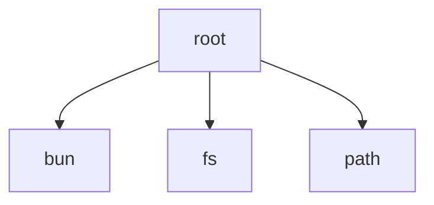

# Knowledge Dump for agentlens

## File: .manifest.json
```
{
  "version": "0.5.0",
  "generated_at": 1775479075,
  "modules": {
    "Quotio-Services-QuotaFetchers": {
      "latest_mtime": 1775479072,
      "file_count": 9,
      "files_hash": 4271604733563799435
    },
    "Quotio-Models": {
      "latest_mtime": 1775479072,
      "file_count": 15,
      "files_hash": 4757899445576674768
    },
    "Quotio-Views-Screens": {
      "latest_mtime": 1775479072,
      "file_count": 8,
      "files_hash": 15844722462868968527
    },
    "root": {
      "latest_mtime": 1775479072,
      "file_count": 36,
      "files_hash": 6614669084960066436
    },
    "Quotio-Services-Antigravity": {
      "latest_mtime": 1775479072,
      "file_count": 7,
      "files_hash": 5642888560805812290
    },
    "Quotio-Views-Onboarding": {
      "latest_mtime": 1775479072,
      "file_count": 6,
      "files_hash": 4951050505872654154
    },
    "Quotio-Views-Components": {
      "latest_mtime": 1775479072,
      "file_count": 27,
      "files_hash": 1651636987959044473
    }
  }
}
```

## File: agent.md
```
# AI Agent Instructions

## Reading Protocol

Follow this protocol to understand the codebase efficiently:

1. **Start with INDEX.md** - Get the project overview and module routing table
2. **Navigate to relevant module** - Go to `modules/{name}/MODULE.md` for the area you're working on
3. **Check memory.md before editing** - Review warnings and TODOs for that module
4. **Use outline.md for large files** - Find symbols without reading entire files
5. **Check imports.md for dependencies** - Understand module relationships before changes
6. **Review files/*.md for complex files** - Deep documentation for high-complexity files

### Documentation Structure

```
.agentlens/
├── INDEX.md              # Start here - project overview
├── AGENT.md              # This file - AI instructions
├── modules/
│   └── {module-slug}/
│       ├── MODULE.md     # Module summary and file list
│       ├── outline.md    # Symbol maps for large files
│       ├── memory.md     # Warnings and TODOs
│       └── imports.md    # Dependencies
└── files/                # Deep docs for complex files
```

## Freshness Check

**Generated:** 2026-04-06T12:37:55Z
**Git HEAD:** `1a24ce7`

### How to verify freshness

1. Compare the Git HEAD above with current: `git rev-parse --short HEAD`
2. If they differ significantly, docs may be outdated
3. Check file modification times vs. the Generated timestamp

## Available Modules

| Module | Files | Type | Description |
| ------ | ----- | ---- | ----------- |
| `` | 36 | root | Module |
| `Quotio/Models` | 15 | implicit | Data models |
| `Quotio/Services/Antigravity` | 7 | implicit | Module |
| `Quotio/Services/QuotaFetchers` | 9 | implicit | Module |
| `Quotio/Views/Components` | 27 | implicit | UI components |
| `Quotio/Views/Onboarding` | 6 | implicit | Module |
| `Quotio/Views/Screens` | 8 | implicit | Module |

## When Docs Seem Stale

If documentation seems outdated or inconsistent with the code:

1. **Regenerate docs:**
   ```bash
   agentlens
   ```

2. **Regenerate with diff mode** (faster, only changed files):
   ```bash
   agentlens --diff main
   ```

3. **Check freshness status:**
   ```bash
   agentlens --check
   ```

4. **Force full regeneration** (ignore cache):
   ```bash
   agentlens --force
   ```

## Quick Reference

| Metric | Value |
| ------ | ----- |
| Total files | 108 |
| Modules | 7 |
| Warnings | 3 |

---

*Generated by [agentlens](https://github.com/nguyenphutrong/agentlens)*

```

## File: index.md
```
# Project

## Reading Protocol

**Start here**, then navigate to specific modules.

1. Read this INDEX for overview
2. Go to relevant `modules/{name}/MODULE.md`
3. Check module's `outline.md` for large files
4. Check module's `memory.md` for warnings

## ⚠️ Critical Alerts

**3** high-priority warnings across 2 modules. Check each module's `memory.md` for details.

## Modules

| Module | Type | Files | Warnings | Hub |
| ------ | ---- | ----- | -------- | --- |

---

*Generated by [agentlens](https://github.com/nguyenphutrong/agentlens)*

```

## File: _DIR_IDENTITY.md
```
---
entity_type: "agent"
domain: "knowledge"
classification: "agentlens"
parent_system: "oma"
---

# agentlens

**Identity**: `agentlens`
**Domain**: knowledge
**Clearance**: Level 3

Generated automatically via Phoenix V3 Pipeline.

```

## File: files\quotio_services_agentconfigurationservice_swift.md
```
# Quotio/Services/AgentConfigurationService.swift

← Back to Module | [← Back to INDEX](../INDEX.md)

## Overview

- **Lines:** 1610
- **Language:** Swift
- **Symbols:** 38
- **Public symbols:** 0

## Symbol Table

| Line | Kind | Name | Visibility | Signature |
| ---- | ---- | ---- | ---------- | --------- |
| 8 | class | AgentConfigurationService | (internal) | `actor AgentConfigurationService` |
| 46 | fn | readConfiguration | (internal) | `func readConfiguration(agent: CLIAgent) -> Save...` |
| 64 | fn | listBackups | (internal) | `func listBackups(agent: CLIAgent) -> [BackupFile]` |
| 93 | fn | restoreFromBackup | (internal) | `func restoreFromBackup(_ backup: BackupFile) th...` |
| 111 | fn | readClaudeCodeConfig | (private) | `private func readClaudeCodeConfig() -> SavedAge...` |
| 147 | fn | readCodexConfig | (private) | `private func readCodexConfig() -> SavedAgentCon...` |
| 190 | fn | readGeminiCLIConfig | (private) | `private func readGeminiCLIConfig() -> SavedAgen...` |
| 228 | fn | readAmpConfig | (private) | `private func readAmpConfig() -> SavedAgentConfig?` |
| 251 | fn | readOpenCodeConfig | (private) | `private func readOpenCodeConfig() -> SavedAgent...` |
| 288 | fn | readFactoryDroidConfig | (private) | `private func readFactoryDroidConfig() -> SavedA...` |
| 325 | fn | extractTOMLValue | (private) | `private func extractTOMLValue(from line: String...` |
| 336 | fn | extractExportValue | (private) | `private func extractExportValue(from line: Stri...` |
| 351 | fn | escapeTOMLString | (private) | `private func escapeTOMLString(_ value: String) ...` |
| 379 | fn | buildManagedCodexTOML | (private) | `private func buildManagedCodexTOML(model: Strin...` |
| 396 | fn | parseTOMLSectionName | (private) | `private func parseTOMLSectionName(from line: St...` |
| 414 | fn | isCodexManagedTopLevelKey | (private) | `private func isCodexManagedTopLevelKey(_ line: ...` |
| 423 | fn | splitManagedCodexConfig | (private) | `private func splitManagedCodexConfig(_ managedC...` |
| 431 | fn | extractManagedCodexBanner | (private) | `private func extractManagedCodexBanner(from man...` |
| 440 | fn | filterExistingCodexLines | (private) | `private func filterExistingCodexLines(existingC...` |
| 481 | fn | composeMergedCodexConfig | (private) | `private func composeMergedCodexConfig(filteredL...` |
| 552 | fn | mergeCodexConfig | (private) | `private func mergeCodexConfig(existingContent: ...` |
| 559 | fn | generateConfiguration | (internal) | `func generateConfiguration(     agent: CLIAgent...` |
| 598 | fn | generateDefaultConfiguration | (private) | `private func generateDefaultConfiguration(agent...` |
| 614 | fn | generateClaudeCodeDefaultConfig | (private) | `private func generateClaudeCodeDefaultConfig(mo...` |
| 699 | fn | generateCodexDefaultConfig | (private) | `private func generateCodexDefaultConfig(mode: C...` |
| 746 | fn | generateGeminiCLIDefaultConfig | (private) | `private func generateGeminiCLIDefaultConfig(mod...` |
| 774 | fn | generateAmpDefaultConfig | (private) | `private func generateAmpDefaultConfig(mode: Con...` |
| 820 | fn | generateOpenCodeDefaultConfig | (private) | `private func generateOpenCodeDefaultConfig(mode...` |
| 869 | fn | generateFactoryDroidDefaultConfig | (private) | `private func generateFactoryDroidDefaultConfig(...` |
| 934 | fn | generateClaudeCodeConfig | (private) | `private func generateClaudeCodeConfig(config: A...` |
| 1056 | fn | generateCodexConfig | (private) | `private func generateCodexConfig(config: AgentC...` |
| 1140 | fn | generateGeminiCLIConfig | (private) | `private func generateGeminiCLIConfig(config: Ag...` |
| 1183 | fn | generateAmpConfig | (private) | `private func generateAmpConfig(config: AgentCon...` |
| 1266 | fn | generateOpenCodeConfig | (private) | `private func generateOpenCodeConfig(config: Age...` |
| 1358 | fn | buildOpenCodeModelConfig | (private) | `private func buildOpenCodeModelConfig(for model...` |
| 1410 | fn | generateFactoryDroidConfig | (private) | `private func generateFactoryDroidConfig(config:...` |
| 1480 | fn | fetchAvailableModels | (internal) | `func fetchAvailableModels(config: AgentConfigur...` |
| 1535 | fn | testConnection | (internal) | `func testConnection(agent: CLIAgent, config: Ag...` |


```

## File: files\quotio_services_proxy_cliproxymanager_swift.md
```
# Quotio/Services/Proxy/CLIProxyManager.swift

← Back to Module | [← Back to INDEX](../INDEX.md)

## Overview

- **Lines:** 1979
- **Language:** Swift
- **Symbols:** 64
- **Public symbols:** 0

## Symbol Table

| Line | Kind | Name | Visibility | Signature |
| ---- | ---- | ---- | ---------- | --------- |
| 9 | class | CLIProxyManager | (internal) | `class CLIProxyManager` |
| 193 | method | init | (internal) | `init()` |
| 234 | fn | restartProxyIfRunning | (private) | `private func restartProxyIfRunning()` |
| 252 | fn | updateConfigValue | (private) | `private func updateConfigValue(pattern: String,...` |
| 272 | fn | updateConfigPort | (private) | `private func updateConfigPort(_ newPort: UInt16)` |
| 276 | fn | updateConfigHost | (private) | `private func updateConfigHost(_ host: String)` |
| 280 | fn | ensureApiKeyExistsInConfig | (private) | `private func ensureApiKeyExistsInConfig()` |
| 329 | fn | updateConfigAllowRemote | (internal) | `func updateConfigAllowRemote(_ enabled: Bool)` |
| 333 | fn | updateConfigLogging | (internal) | `func updateConfigLogging(enabled: Bool)` |
| 341 | fn | updateConfigRoutingStrategy | (internal) | `func updateConfigRoutingStrategy(_ strategy: St...` |
| 346 | fn | updateConfigProxyURL | (internal) | `func updateConfigProxyURL(_ url: String?)` |
| 374 | fn | applyBaseURLWorkaround | (internal) | `func applyBaseURLWorkaround()` |
| 403 | fn | removeBaseURLWorkaround | (internal) | `func removeBaseURLWorkaround()` |
| 445 | fn | ensureConfigExists | (private) | `private func ensureConfigExists()` |
| 479 | fn | syncSecretKeyInConfig | (private) | `private func syncSecretKeyInConfig()` |
| 495 | fn | regenerateManagementKey | (internal) | `func regenerateManagementKey() async throws` |
| 537 | fn | syncProxyURLInConfig | (private) | `private func syncProxyURLInConfig()` |
| 554 | fn | syncCustomProvidersToConfig | (private) | `private func syncCustomProvidersToConfig()` |
| 571 | fn | downloadAndInstallBinary | (internal) | `func downloadAndInstallBinary() async throws` |
| 632 | fn | fetchLatestRelease | (private) | `private func fetchLatestRelease() async throws ...` |
| 653 | fn | findCompatibleAsset | (private) | `private func findCompatibleAsset(in release: Re...` |
| 678 | fn | downloadAsset | (private) | `private func downloadAsset(url: String) async t...` |
| 697 | fn | extractAndInstall | (private) | `private func extractAndInstall(data: Data, asse...` |
| 759 | fn | findBinaryInDirectory | (private) | `private func findBinaryInDirectory(_ directory:...` |
| 792 | fn | start | (internal) | `func start() async throws` |
| 924 | fn | stop | (internal) | `func stop()` |
| 976 | fn | startHealthMonitor | (private) | `private func startHealthMonitor()` |
| 990 | fn | stopHealthMonitor | (private) | `private func stopHealthMonitor()` |
| 995 | fn | performHealthCheck | (private) | `private func performHealthCheck() async` |
| 1058 | fn | cleanupOrphanProcesses | (private) | `private func cleanupOrphanProcesses() async` |
| 1121 | fn | terminateAuthProcess | (internal) | `func terminateAuthProcess()` |
| 1127 | fn | toggle | (internal) | `func toggle() async throws` |
| 1135 | fn | copyEndpointToClipboard | (internal) | `func copyEndpointToClipboard()` |
| 1140 | fn | revealInFinder | (internal) | `func revealInFinder()` |
| 1147 | enum | ProxyError | (internal) | `enum ProxyError` |
| 1178 | enum | AuthCommand | (internal) | `enum AuthCommand` |
| 1216 | struct | AuthCommandResult | (internal) | `struct AuthCommandResult` |
| 1222 | mod | extension CLIProxyManager | (internal) | - |
| 1223 | fn | runAuthCommand | (internal) | `func runAuthCommand(_ command: AuthCommand) asy...` |
| 1255 | fn | appendOutput | (internal) | `func appendOutput(_ str: String)` |
| 1259 | fn | tryResume | (internal) | `func tryResume() -> Bool` |
| 1270 | fn | safeResume | (internal) | `@Sendable func safeResume(_ result: AuthCommand...` |
| 1370 | mod | extension CLIProxyManager | (internal) | - |
| 1400 | fn | checkForUpgrade | (internal) | `func checkForUpgrade() async` |
| 1451 | fn | saveInstalledVersion | (private) | `private func saveInstalledVersion(_ version: St...` |
| 1459 | fn | fetchAvailableReleases | (internal) | `func fetchAvailableReleases(limit: Int = 10) as...` |
| 1481 | fn | versionInfo | (internal) | `func versionInfo(from release: GitHubRelease) -...` |
| 1487 | fn | fetchGitHubRelease | (private) | `private func fetchGitHubRelease(tag: String) as...` |
| 1509 | fn | findCompatibleAsset | (private) | `private func findCompatibleAsset(from release: ...` |
| 1542 | fn | performManagedUpgrade | (internal) | `func performManagedUpgrade(to version: ProxyVer...` |
| 1600 | fn | downloadAndInstallVersion | (private) | `private func downloadAndInstallVersion(_ versio...` |
| 1647 | fn | startDryRun | (private) | `private func startDryRun(version: String) async...` |
| 1718 | fn | promote | (private) | `private func promote(version: String) async throws` |
| 1753 | fn | rollback | (internal) | `func rollback() async throws` |
| 1786 | fn | stopTestProxy | (private) | `private func stopTestProxy() async` |
| 1815 | fn | stopTestProxySync | (private) | `private func stopTestProxySync()` |
| 1841 | fn | findUnusedPort | (private) | `private func findUnusedPort() throws -> UInt16` |
| 1851 | fn | isPortInUse | (private) | `private func isPortInUse(_ port: UInt16) -> Bool` |
| 1870 | fn | createTestConfig | (private) | `private func createTestConfig(port: UInt16) -> ...` |
| 1898 | fn | cleanupTestConfig | (private) | `private func cleanupTestConfig(_ configPath: St...` |
| 1906 | fn | isNewerVersion | (private) | `private func isNewerVersion(_ newer: String, th...` |
| 1909 | fn | parseVersion | (internal) | `func parseVersion(_ version: String) -> [Int]` |
| 1941 | fn | findPreviousVersion | (private) | `private func findPreviousVersion() -> String?` |
| 1954 | fn | migrateToVersionedStorage | (internal) | `func migrateToVersionedStorage() async throws` |

## Memory Markers

### 🟢 `NOTE` (line 224)

> Bridge mode default is registered in AppDelegate.applicationDidFinishLaunching()

### 🟢 `NOTE` (line 340)

> Changes take effect after proxy restart (CLIProxyAPI does not support live routing API)

### 🟢 `NOTE` (line 1434)

> Notification is handled by AtomFeedUpdateService polling


```

## File: files\quotio_services_proxy_fallbackformatconverter_swift.md
```
# Quotio/Services/Proxy/FallbackFormatConverter.swift

← Back to Module | [← Back to INDEX](../INDEX.md)

## Overview

- **Lines:** 1190
- **Language:** Swift
- **Symbols:** 28
- **Public symbols:** 0

## Symbol Table

| Line | Kind | Name | Visibility | Signature |
| ---- | ---- | ---- | ---------- | --------- |
| 44 | mod | extension AIProvider | (internal) | - |
| 93 | fn | convertRequest | (internal) | `static func convertRequest(     _ body: inout ...` |
| 131 | fn | isClaudeModel | (internal) | `static func isClaudeModel(_ modelName: String) ...` |
| 144 | fn | detectFormat | (internal) | `static func detectFormat(from body: [String: An...` |
| 187 | fn | convertMessages | (internal) | `static func convertMessages(     _ messages: [[...` |
| 230 | fn | convertAnthropicMessagesToOpenAI | (internal) | `static func convertAnthropicMessagesToOpenAI(_ ...` |
| 266 | fn | convertAnthropicAssistantToOpenAI | (internal) | `static func convertAnthropicAssistantToOpenAI(_...` |
| 336 | fn | convertAnthropicUserToOpenAI | (internal) | `static func convertAnthropicUserToOpenAI(_ mess...` |
| 392 | fn | convertOpenAIMessagesToAnthropic | (internal) | `static func convertOpenAIMessagesToAnthropic(_ ...` |
| 452 | fn | convertOpenAIAssistantToAnthropic | (internal) | `static func convertOpenAIAssistantToAnthropic(_...` |
| 487 | fn | convertRole | (internal) | `static func convertRole(_ role: String, from: A...` |
| 509 | fn | convertContent | (internal) | `static func convertContent(_ content: Any, from...` |
| 535 | fn | convertAnthropicContentToOpenAI | (internal) | `static func convertAnthropicContentToOpenAI(_ c...` |
| 604 | fn | convertOpenAIContentToAnthropic | (internal) | `static func convertOpenAIContentToAnthropic(_ c...` |
| 660 | fn | convertGoogleContentToOpenAI | (internal) | `static func convertGoogleContentToOpenAI(_ cont...` |
| 681 | fn | convertToGoogleContent | (internal) | `static func convertToGoogleContent(_ content: A...` |
| 706 | fn | convertSystemMessage | (internal) | `static func convertSystemMessage(in body: inout...` |
| 770 | fn | convertParameters | (internal) | `static func convertParameters(in body: inout [S...` |
| 840 | fn | extractIntValue | (internal) | `static func extractIntValue(_ value: Any?) -> Int?` |
| 849 | fn | convertStopSequences | (internal) | `static func convertStopSequences(in body: inout...` |
| 878 | fn | validateParameters | (internal) | `static func validateParameters(in body: inout [...` |
| 914 | fn | convertTools | (internal) | `static func convertTools(in body: inout [String...` |
| 959 | fn | convertToolFieldsInMessage | (internal) | `static func convertToolFieldsInMessage(_ messag...` |
| 1018 | fn | cleanupIncompatibleFields | (internal) | `static func cleanupIncompatibleFields(in body: ...` |
| 1049 | fn | cleanThinkingBlocksInBody | (internal) | `static func cleanThinkingBlocksInBody(_ body: i...` |
| 1087 | fn | cleanThinkingBlocks | (internal) | `static func cleanThinkingBlocks(_ messages: [[S...` |
| 1119 | fn | cleanThinkingFromContent | (internal) | `static func cleanThinkingFromContent(_ content:...` |
| 1148 | mod | extension FallbackFormatConverter | (internal) | - |

## Memory Markers

### 🟢 `NOTE` (line 46)

> All providers go through cli-proxy-api which uses OpenAI-compatible format


```

## File: files\quotio_services_proxy_proxybridge_swift.md
```
# Quotio/Services/Proxy/ProxyBridge.swift

[← Back to Module | [← Back to INDEX](../INDEX.md)

## Overview

- **Lines:** 1093
- **Language:** Swift
- **Symbols:** 9
- **Public symbols:** 0

## Symbol Table

| Line | Kind | Name | Visibility | Signature |
| ---- | ---- | ---- | ---------- | --------- |
| 22 | struct | FallbackContext | (internal) | `struct FallbackContext` |
| 96 | class | ProxyBridge | (internal) | `class ProxyBridge` |
| 156 | method | init | (internal) | `init()` |
| 165 | fn | configure | (internal) | `func configure(listenPort: UInt16, targetPort: ...` |
| 188 | fn | start | (internal) | `func start()` |
| 228 | fn | stop | (internal) | `func stop()` |
| 238 | fn | handleListenerState | (private) | `private func handleListenerState(_ state: NWLis...` |
| 254 | fn | handleNewConnection | (private) | `private func handleNewConnection(_ connection: ...` |
| 472 | fn | createFallbackContext | (private) | `private func createFallbackContext(body: String...` |


```

## File: files\quotio_services_statusbarmenubuilder_swift.md
```
# Quotio/Services/StatusBarMenuBuilder.swift

← Back to Module | [← Back to INDEX](../INDEX.md)

## Overview

- **Lines:** 1470
- **Language:** Swift
- **Symbols:** 46
- **Public symbols:** 0

## Symbol Table

| Line | Kind | Name | Visibility | Signature |
| ---- | ---- | ---- | ---------- | --------- |
| 18 | class | StatusBarMenuBuilder | (internal) | `class StatusBarMenuBuilder` |
| 33 | method | init | (internal) | `init(viewModel: QuotaViewModel)` |
| 39 | fn | buildMenu | (internal) | `func buildMenu() -> NSMenu` |
| 120 | fn | isCLIInstalled | (private) | `private func isCLIInstalled(_ agent: CLIAgent) ...` |
| 144 | fn | checkBinaryExists | (private) | `private func checkBinaryExists(names: [String])...` |
| 173 | fn | resolveSelectedProvider | (private) | `private func resolveSelectedProvider(from provi...` |
| 182 | fn | accountsForProvider | (private) | `private func accountsForProvider(_ provider: AI...` |
| 189 | fn | buildHeaderItem | (private) | `private func buildHeaderItem() -> NSMenuItem` |
| 196 | fn | buildNetworkInfoItem | (private) | `private func buildNetworkInfoItem() -> NSMenuItem` |
| 223 | fn | buildAccountCardItem | (private) | `private func buildAccountCardItem(     email: S...` |
| 254 | fn | buildAntigravitySubmenu | (private) | `private func buildAntigravitySubmenu(data: Prov...` |
| 270 | fn | showSwitchConfirmation | (private) | `private static func showSwitchConfirmation(emai...` |
| 299 | fn | buildEmptyStateItem | (private) | `private func buildEmptyStateItem() -> NSMenuItem` |
| 306 | fn | buildActionItems | (private) | `private func buildActionItems() -> [NSMenuItem]` |
| 330 | class | MenuActionHandler | (internal) | `class MenuActionHandler` |
| 339 | fn | refresh | (internal) | `@objc func refresh()` |
| 345 | fn | openApp | (internal) | `@objc func openApp()` |
| 349 | fn | quit | (internal) | `@objc func quit()` |
| 353 | fn | openMainWindow | (internal) | `static func openMainWindow()` |
| 378 | struct | MenuHeaderView | (private) | `struct MenuHeaderView` |
| 403 | struct | MenuProviderSectionHeader | (private) | `struct MenuProviderSectionHeader` |
| 421 | struct | MenuProviderPickerView | (private) | `struct MenuProviderPickerView` |
| 456 | struct | ProviderFilterButton | (private) | `struct ProviderFilterButton` |
| 488 | struct | ProviderIconMono | (private) | `struct ProviderIconMono` |
| 512 | struct | MenuNetworkInfoView | (private) | `struct MenuNetworkInfoView` |
| 620 | fn | triggerCopyState | (private) | `private func triggerCopyState(_ target: CopyTar...` |
| 631 | fn | setCopied | (private) | `private func setCopied(_ target: CopyTarget, va...` |
| 642 | fn | copyButton | (private) | `@ViewBuilder   private func copyButton(isCopied...` |
| 659 | struct | MenuAccountCardView | (private) | `struct MenuAccountCardView` |
| 698 | fn | planConfig | (private) | `private func planConfig(for planName: String) -...` |
| 930 | fn | formatLocalTime | (private) | `private func formatLocalTime(_ isoString: Strin...` |
| 949 | struct | ModelBadgeData | (private) | `struct ModelBadgeData` |
| 988 | struct | AntigravityDisplayGroup | (private) | `struct AntigravityDisplayGroup` |
| 995 | fn | menuDisplayPercent | (private) | `private func menuDisplayPercent(remainingPercen...` |
| 999 | fn | menuStatusColor | (private) | `private func menuStatusColor(remainingPercent: ...` |
| 1017 | struct | LowestBarLayout | (private) | `struct LowestBarLayout` |
| 1097 | struct | RingGridLayout | (private) | `struct RingGridLayout` |
| 1141 | struct | CardGridLayout | (private) | `struct CardGridLayout` |
| 1190 | struct | ModernProgressBar | (private) | `struct ModernProgressBar` |
| 1225 | struct | PercentageBadge | (private) | `struct PercentageBadge` |
| 1261 | struct | MenuModelDetailView | (private) | `struct MenuModelDetailView` |
| 1313 | struct | MenuEmptyStateView | (private) | `struct MenuEmptyStateView` |
| 1328 | struct | MenuViewMoreAccountsView | (private) | `struct MenuViewMoreAccountsView` |
| 1376 | mod | extension AIProvider | (private) | - |
| 1398 | struct | MenuActionsView | (private) | `struct MenuActionsView` |
| 1436 | struct | MenuBarActionButton | (private) | `struct MenuBarActionButton` |


```

## File: files\quotio_viewmodels_quotaviewmodel_swift.md
```
# Quotio/ViewModels/QuotaViewModel.swift

← Back to Module | [← Back to INDEX](../INDEX.md)

## Overview

- **Lines:** 1936
- **Language:** Swift
- **Symbols:** 92
- **Public symbols:** 0

## Symbol Table

| Line | Kind | Name | Visibility | Signature |
| ---- | ---- | ---- | ---------- | --------- |
| 11 | class | QuotaViewModel | (internal) | `class QuotaViewModel` |
| 139 | fn | loadDisabledAuthFiles | (private) | `private func loadDisabledAuthFiles() -> Set<Str...` |
| 145 | fn | saveDisabledAuthFiles | (private) | `private func saveDisabledAuthFiles(_ names: Set...` |
| 150 | fn | syncDisabledStatesToBackend | (private) | `private func syncDisabledStatesToBackend() async` |
| 169 | fn | notifyQuotaDataChanged | (private) | `private func notifyQuotaDataChanged()` |
| 172 | method | init | (internal) | `init()` |
| 182 | fn | setupProxyURLObserver | (private) | `private func setupProxyURLObserver()` |
| 198 | fn | normalizedProxyURL | (private) | `private func normalizedProxyURL(_ rawValue: Str...` |
| 210 | fn | updateProxyConfiguration | (internal) | `func updateProxyConfiguration() async` |
| 223 | fn | setupRefreshCadenceCallback | (private) | `private func setupRefreshCadenceCallback()` |
| 231 | fn | setupWarmupCallback | (private) | `private func setupWarmupCallback()` |
| 249 | fn | restartAutoRefresh | (private) | `private func restartAutoRefresh()` |
| 261 | fn | initialize | (internal) | `func initialize() async` |
| 271 | fn | initializeFullMode | (private) | `private func initializeFullMode() async` |
| 287 | fn | checkForProxyUpgrade | (private) | `private func checkForProxyUpgrade() async` |
| 292 | fn | initializeQuotaOnlyMode | (private) | `private func initializeQuotaOnlyMode() async` |
| 302 | fn | initializeRemoteMode | (private) | `private func initializeRemoteMode() async` |
| 330 | fn | setupRemoteAPIClient | (private) | `private func setupRemoteAPIClient(config: Remot...` |
| 338 | fn | reconnectRemote | (internal) | `func reconnectRemote() async` |
| 347 | fn | loadDirectAuthFiles | (internal) | `func loadDirectAuthFiles() async` |
| 353 | fn | refreshQuotasDirectly | (internal) | `func refreshQuotasDirectly() async` |
| 381 | fn | autoSelectMenuBarItems | (private) | `private func autoSelectMenuBarItems()` |
| 415 | fn | syncMenuBarSelection | (internal) | `func syncMenuBarSelection()` |
| 422 | fn | refreshClaudeCodeQuotasInternal | (private) | `private func refreshClaudeCodeQuotasInternal() ...` |
| 443 | fn | refreshCursorQuotasInternal | (private) | `private func refreshCursorQuotasInternal() async` |
| 454 | fn | refreshCodexCLIQuotasInternal | (private) | `private func refreshCodexCLIQuotasInternal() async` |
| 470 | fn | refreshGeminiCLIQuotasInternal | (private) | `private func refreshGeminiCLIQuotasInternal() a...` |
| 488 | fn | refreshGlmQuotasInternal | (private) | `private func refreshGlmQuotasInternal() async` |
| 498 | fn | refreshWarpQuotasInternal | (private) | `private func refreshWarpQuotasInternal() async` |
| 522 | fn | refreshTraeQuotasInternal | (private) | `private func refreshTraeQuotasInternal() async` |
| 532 | fn | refreshKiroQuotasInternal | (private) | `private func refreshKiroQuotasInternal() async` |
| 538 | fn | cleanName | (internal) | `func cleanName(_ name: String) -> String` |
| 586 | fn | startQuotaOnlyAutoRefresh | (private) | `private func startQuotaOnlyAutoRefresh()` |
| 604 | fn | startQuotaAutoRefreshWithoutProxy | (private) | `private func startQuotaAutoRefreshWithoutProxy()` |
| 623 | fn | isWarmupEnabled | (internal) | `func isWarmupEnabled(for provider: AIProvider, ...` |
| 627 | fn | warmupStatus | (internal) | `func warmupStatus(provider: AIProvider, account...` |
| 632 | fn | warmupNextRunDate | (internal) | `func warmupNextRunDate(provider: AIProvider, ac...` |
| 637 | fn | toggleWarmup | (internal) | `func toggleWarmup(for provider: AIProvider, acc...` |
| 646 | fn | setWarmupEnabled | (internal) | `func setWarmupEnabled(_ enabled: Bool, provider...` |
| 658 | fn | nextDailyRunDate | (private) | `private func nextDailyRunDate(minutes: Int, now...` |
| 669 | fn | restartWarmupScheduler | (private) | `private func restartWarmupScheduler()` |
| 702 | fn | runWarmupCycle | (private) | `private func runWarmupCycle() async` |
| 765 | fn | warmupAccount | (private) | `private func warmupAccount(provider: AIProvider...` |
| 810 | fn | warmupAccount | (private) | `private func warmupAccount(     provider: AIPro...` |
| 871 | fn | fetchWarmupModels | (private) | `private func fetchWarmupModels(     provider: A...` |
| 895 | fn | warmupAvailableModels | (internal) | `func warmupAvailableModels(provider: AIProvider...` |
| 908 | fn | warmupAuthInfo | (private) | `private func warmupAuthInfo(provider: AIProvide...` |
| 930 | fn | warmupTargets | (private) | `private func warmupTargets() -> [WarmupAccountKey]` |
| 944 | fn | updateWarmupStatus | (private) | `private func updateWarmupStatus(for key: Warmup...` |
| 973 | fn | startProxy | (internal) | `func startProxy() async` |
| 1017 | fn | stopProxy | (internal) | `func stopProxy()` |
| 1045 | fn | toggleProxy | (internal) | `func toggleProxy() async` |
| 1053 | fn | setupAPIClient | (private) | `private func setupAPIClient()` |
| 1060 | fn | startAutoRefresh | (private) | `private func startAutoRefresh()` |
| 1097 | fn | attemptProxyRecovery | (private) | `private func attemptProxyRecovery() async` |
| 1113 | fn | refreshData | (internal) | `func refreshData() async` |
| 1160 | fn | manualRefresh | (internal) | `func manualRefresh() async` |
| 1171 | fn | refreshAllQuotas | (internal) | `func refreshAllQuotas() async` |
| 1207 | fn | refreshQuotasUnified | (internal) | `func refreshQuotasUnified() async` |
| 1241 | fn | refreshAntigravityQuotasInternal | (private) | `private func refreshAntigravityQuotasInternal()...` |
| 1261 | fn | refreshAntigravityQuotasWithoutDetect | (private) | `private func refreshAntigravityQuotasWithoutDet...` |
| 1278 | fn | isAntigravityAccountActive | (internal) | `func isAntigravityAccountActive(email: String) ...` |
| 1283 | fn | switchAntigravityAccount | (internal) | `func switchAntigravityAccount(email: String) async` |
| 1293 | fn | beginAntigravitySwitch | (internal) | `func beginAntigravitySwitch(accountId: String, ...` |
| 1298 | fn | cancelAntigravitySwitch | (internal) | `func cancelAntigravitySwitch()` |
| 1303 | fn | dismissAntigravitySwitchResult | (internal) | `func dismissAntigravitySwitchResult()` |
| 1306 | fn | refreshOpenAIQuotasInternal | (private) | `private func refreshOpenAIQuotasInternal() async` |
| 1311 | fn | refreshCopilotQuotasInternal | (private) | `private func refreshCopilotQuotasInternal() async` |
| 1316 | fn | refreshQuotaForProvider | (internal) | `func refreshQuotaForProvider(_ provider: AIProv...` |
| 1351 | fn | refreshAutoDetectedProviders | (internal) | `func refreshAutoDetectedProviders() async` |
| 1358 | fn | startOAuth | (internal) | `func startOAuth(for provider: AIProvider, proje...` |
| 1403 | fn | startCopilotAuth | (private) | `private func startCopilotAuth() async` |
| 1420 | fn | startKiroAuth | (private) | `private func startKiroAuth(method: AuthCommand)...` |
| 1460 | fn | pollCopilotAuthCompletion | (private) | `private func pollCopilotAuthCompletion() async` |
| 1477 | fn | pollKiroAuthCompletion | (private) | `private func pollKiroAuthCompletion() async` |
| 1500 | fn | pollOAuthStatus | (private) | `private func pollOAuthStatus(state: String, pro...` |
| 1528 | fn | cancelOAuth | (internal) | `func cancelOAuth()` |
| 1532 | fn | deleteAuthFile | (internal) | `func deleteAuthFile(_ file: AuthFile) async` |
| 1568 | fn | toggleAuthFileDisabled | (internal) | `func toggleAuthFileDisabled(_ file: AuthFile) a...` |
| 1599 | fn | pruneMenuBarItems | (private) | `private func pruneMenuBarItems()` |
| 1635 | fn | importVertexServiceAccount | (internal) | `func importVertexServiceAccount(url: URL) async` |
| 1659 | fn | fetchAPIKeys | (internal) | `func fetchAPIKeys() async` |
| 1669 | fn | addAPIKey | (internal) | `func addAPIKey(_ key: String) async` |
| 1681 | fn | updateAPIKey | (internal) | `func updateAPIKey(old: String, new: String) async` |
| 1693 | fn | deleteAPIKey | (internal) | `func deleteAPIKey(_ key: String) async` |
| 1706 | fn | checkAccountStatusChanges | (private) | `private func checkAccountStatusChanges()` |
| 1727 | fn | checkQuotaNotifications | (internal) | `func checkQuotaNotifications()` |
| 1759 | fn | scanIDEsWithConsent | (internal) | `func scanIDEsWithConsent(options: IDEScanOption...` |
| 1829 | fn | savePersistedIDEQuotas | (private) | `private func savePersistedIDEQuotas()` |
| 1852 | fn | loadPersistedIDEQuotas | (private) | `private func loadPersistedIDEQuotas()` |
| 1914 | fn | shortenAccountKey | (private) | `private func shortenAccountKey(_ key: String) -...` |
| 1926 | struct | OAuthState | (internal) | `struct OAuthState` |

## Memory Markers

### 🟢 `NOTE` (line 279)

> checkForProxyUpgrade() is now called inside startProxy()

### 🟢 `NOTE` (line 352)

> Cursor and Trae are NOT auto-refreshed - user must use "Scan for IDEs" (issue #29)

### 🟢 `NOTE` (line 360)

> Cursor and Trae removed from auto-refresh to address privacy concerns (issue #29)

### 🟢 `NOTE` (line 1181)

> Cursor and Trae removed from auto-refresh (issue #29)

### 🟢 `NOTE` (line 1206)

> Cursor and Trae require explicit user scan (issue #29)

### 🟢 `NOTE` (line 1216)

> Cursor and Trae removed - require explicit scan (issue #29)

### 🟢 `NOTE` (line 1271)

> Don't call detectActiveAccount() here - already set by switch operation


```

## File: files\quotio_views_screens_dashboardscreen_swift.md
```
# Quotio/Views/Screens/DashboardScreen.swift

← Back to Module | [← Back to INDEX](../INDEX.md)

## Overview

- **Lines:** 1014
- **Language:** Swift
- **Symbols:** 11
- **Public symbols:** 0

## Symbol Table

| Line | Kind | Name | Visibility | Signature |
| ---- | ---- | ---- | ---------- | --------- |
| 9 | struct | DashboardScreen | (internal) | `struct DashboardScreen` |
| 572 | fn | handleStepAction | (private) | `private func handleStepAction(_ step: GettingSt...` |
| 583 | fn | showProviderPicker | (private) | `private func showProviderPicker()` |
| 607 | fn | showAgentPicker | (private) | `private func showAgentPicker()` |
| 808 | struct | GettingStartedStep | (internal) | `struct GettingStartedStep` |
| 817 | struct | GettingStartedStepRow | (internal) | `struct GettingStartedStepRow` |
| 872 | struct | KPICard | (internal) | `struct KPICard` |
| 900 | struct | ProviderChip | (internal) | `struct ProviderChip` |
| 924 | struct | FlowLayout | (internal) | `struct FlowLayout` |
| 938 | fn | layout | (private) | `private func layout(proposal: ProposedViewSize,...` |
| 966 | struct | QuotaProviderRow | (internal) | `struct QuotaProviderRow` |


```

## File: files\quotio_views_screens_providersscreen_swift.md
```
# Quotio/Views/Screens/ProvidersScreen.swift

← Back to Module | [← Back to INDEX](../INDEX.md)

## Overview

- **Lines:** 1043
- **Language:** Swift
- **Symbols:** 27
- **Public symbols:** 0

## Symbol Table

| Line | Kind | Name | Visibility | Signature |
| ---- | ---- | ---- | ---------- | --------- |
| 16 | struct | ProvidersScreen | (internal) | `struct ProvidersScreen` |
| 376 | fn | handleAddProvider | (private) | `private func handleAddProvider(_ provider: AIPr...` |
| 394 | fn | deleteAccount | (private) | `private func deleteAccount(_ account: AccountRo...` |
| 424 | fn | toggleAccountDisabled | (private) | `private func toggleAccountDisabled(_ account: A...` |
| 434 | fn | handleEditGlmAccount | (private) | `private func handleEditGlmAccount(_ account: Ac...` |
| 441 | fn | handleEditWarpAccount | (private) | `private func handleEditWarpAccount(_ account: A...` |
| 449 | fn | syncCustomProvidersToConfig | (private) | `private func syncCustomProvidersToConfig()` |
| 459 | struct | CustomProviderRow | (internal) | `struct CustomProviderRow` |
| 560 | struct | MenuBarBadge | (internal) | `struct MenuBarBadge` |
| 583 | class | TooltipWindow | (private) | `class TooltipWindow` |
| 595 | method | init | (private) | `private init()` |
| 625 | fn | show | (internal) | `func show(text: String, near view: NSView)` |
| 654 | fn | hide | (internal) | `func hide()` |
| 660 | class | TooltipTrackingView | (private) | `class TooltipTrackingView` |
| 662 | fn | updateTrackingAreas | (internal) | `override func updateTrackingAreas()` |
| 673 | fn | mouseEntered | (internal) | `override func mouseEntered(with event: NSEvent)` |
| 677 | fn | mouseExited | (internal) | `override func mouseExited(with event: NSEvent)` |
| 681 | fn | hitTest | (internal) | `override func hitTest(_ point: NSPoint) -> NSView?` |
| 687 | struct | NativeTooltipView | (private) | `struct NativeTooltipView` |
| 689 | fn | makeNSView | (internal) | `func makeNSView(context: Context) -> TooltipTra...` |
| 695 | fn | updateNSView | (internal) | `func updateNSView(_ nsView: TooltipTrackingView...` |
| 701 | mod | extension View | (private) | - |
| 702 | fn | nativeTooltip | (internal) | `func nativeTooltip(_ text: String) -> some View` |
| 709 | struct | MenuBarHintView | (internal) | `struct MenuBarHintView` |
| 724 | struct | OAuthSheet | (internal) | `struct OAuthSheet` |
| 850 | struct | OAuthStatusView | (private) | `struct OAuthStatusView` |
| 1022 | enum | CustomProviderSheetMode | (internal) | `enum CustomProviderSheetMode` |

## Memory Markers

### 🟢 `NOTE` (line 64)

> GLM uses API key auth via CustomProviderService, so skip it here


```

## File: files\quotio_views_screens_quotascreen_swift.md
```
# Quotio/Views/Screens/QuotaScreen.swift

← Back to Module | [← Back to INDEX](../INDEX.md)

## Overview

- **Lines:** 1627
- **Language:** Swift
- **Symbols:** 29
- **Public symbols:** 0

## Symbol Table

| Line | Kind | Name | Visibility | Signature |
| ---- | ---- | ---- | ---------- | --------- |
| 8 | struct | QuotaScreen | (internal) | `struct QuotaScreen` |
| 37 | fn | accountCount | (private) | `private func accountCount(for provider: AIProvi...` |
| 54 | fn | lowestQuotaPercent | (private) | `private func lowestQuotaPercent(for provider: A...` |
| 213 | struct | QuotaDisplayHelper | (private) | `struct QuotaDisplayHelper` |
| 215 | fn | statusColor | (internal) | `func statusColor(remainingPercent: Double) -> C...` |
| 231 | fn | displayPercent | (internal) | `func displayPercent(remainingPercent: Double) -...` |
| 240 | struct | ProviderSegmentButton | (private) | `struct ProviderSegmentButton` |
| 318 | struct | QuotaStatusDot | (private) | `struct QuotaStatusDot` |
| 337 | struct | ProviderQuotaView | (private) | `struct ProviderQuotaView` |
| 419 | struct | AccountInfo | (private) | `struct AccountInfo` |
| 431 | struct | AccountQuotaCardV2 | (private) | `struct AccountQuotaCardV2` |
| 843 | fn | standardContentByStyle | (private) | `@ViewBuilder   private func standardContentBySt...` |
| 871 | struct | PlanBadgeV2Compact | (private) | `struct PlanBadgeV2Compact` |
| 925 | struct | PlanBadgeV2 | (private) | `struct PlanBadgeV2` |
| 980 | struct | SubscriptionBadgeV2 | (private) | `struct SubscriptionBadgeV2` |
| 1021 | struct | AntigravityDisplayGroup | (private) | `struct AntigravityDisplayGroup` |
| 1031 | struct | AntigravityGroupRow | (private) | `struct AntigravityGroupRow` |
| 1108 | struct | AntigravityLowestBarLayout | (private) | `struct AntigravityLowestBarLayout` |
| 1127 | fn | displayPercent | (private) | `private func displayPercent(for remainingPercen...` |
| 1189 | struct | AntigravityRingLayout | (private) | `struct AntigravityRingLayout` |
| 1201 | fn | displayPercent | (private) | `private func displayPercent(for remainingPercen...` |
| 1230 | struct | StandardLowestBarLayout | (private) | `struct StandardLowestBarLayout` |
| 1249 | fn | displayPercent | (private) | `private func displayPercent(for remainingPercen...` |
| 1322 | struct | StandardRingLayout | (private) | `struct StandardRingLayout` |
| 1334 | fn | displayPercent | (private) | `private func displayPercent(for remainingPercen...` |
| 1369 | struct | AntigravityModelsDetailSheet | (private) | `struct AntigravityModelsDetailSheet` |
| 1438 | struct | ModelDetailCard | (private) | `struct ModelDetailCard` |
| 1505 | struct | UsageRowV2 | (private) | `struct UsageRowV2` |
| 1593 | struct | QuotaLoadingView | (private) | `struct QuotaLoadingView` |


```

## File: files\quotio_views_screens_settingsscreen_swift.md
```
# Quotio/Views/Screens/SettingsScreen.swift

← Back to Module | [← Back to INDEX](../INDEX.md)

## Overview

- **Lines:** 3051
- **Language:** Swift
- **Symbols:** 60
- **Public symbols:** 0

## Symbol Table

| Line | Kind | Name | Visibility | Signature |
| ---- | ---- | ---- | ---------- | --------- |
| 9 | struct | SettingsScreen | (internal) | `struct SettingsScreen` |
| 111 | struct | OperatingModeSection | (internal) | `struct OperatingModeSection` |
| 176 | fn | handleModeSelection | (private) | `private func handleModeSelection(_ mode: Operat...` |
| 195 | fn | switchToMode | (private) | `private func switchToMode(_ mode: OperatingMode)` |
| 210 | struct | RemoteServerSection | (internal) | `struct RemoteServerSection` |
| 330 | fn | saveRemoteConfig | (private) | `private func saveRemoteConfig(_ config: RemoteC...` |
| 338 | fn | reconnect | (private) | `private func reconnect()` |
| 353 | struct | UnifiedProxySettingsSection | (internal) | `struct UnifiedProxySettingsSection` |
| 573 | fn | loadConfig | (private) | `private func loadConfig() async` |
| 620 | fn | saveProxyURL | (private) | `private func saveProxyURL() async` |
| 638 | fn | saveRoutingStrategy | (private) | `private func saveRoutingStrategy(_ strategy: St...` |
| 647 | fn | saveSwitchProject | (private) | `private func saveSwitchProject(_ enabled: Bool)...` |
| 656 | fn | saveSwitchPreviewModel | (private) | `private func saveSwitchPreviewModel(_ enabled: ...` |
| 665 | fn | saveRequestRetry | (private) | `private func saveRequestRetry(_ count: Int) async` |
| 674 | fn | saveMaxRetryInterval | (private) | `private func saveMaxRetryInterval(_ seconds: In...` |
| 683 | fn | saveLoggingToFile | (private) | `private func saveLoggingToFile(_ enabled: Bool)...` |
| 692 | fn | saveRequestLog | (private) | `private func saveRequestLog(_ enabled: Bool) async` |
| 701 | fn | saveDebugMode | (private) | `private func saveDebugMode(_ enabled: Bool) async` |
| 714 | struct | LocalProxyServerSection | (internal) | `struct LocalProxyServerSection` |
| 788 | struct | NetworkAccessSection | (internal) | `struct NetworkAccessSection` |
| 822 | struct | LocalPathsSection | (internal) | `struct LocalPathsSection` |
| 846 | struct | PathLabel | (internal) | `struct PathLabel` |
| 870 | struct | NotificationSettingsSection | (internal) | `struct NotificationSettingsSection` |
| 940 | struct | QuotaDisplaySettingsSection | (internal) | `struct QuotaDisplaySettingsSection` |
| 982 | struct | RefreshCadenceSettingsSection | (internal) | `struct RefreshCadenceSettingsSection` |
| 1021 | struct | UpdateSettingsSection | (internal) | `struct UpdateSettingsSection` |
| 1063 | struct | ProxyUpdateSettingsSection | (internal) | `struct ProxyUpdateSettingsSection` |
| 1223 | fn | checkForUpdate | (private) | `private func checkForUpdate()` |
| 1237 | fn | performUpgrade | (private) | `private func performUpgrade(to version: ProxyVe...` |
| 1256 | struct | ProxyVersionManagerSheet | (internal) | `struct ProxyVersionManagerSheet` |
| 1415 | fn | sectionHeader | (private) | `@ViewBuilder   private func sectionHeader(_ tit...` |
| 1430 | fn | isVersionInstalled | (private) | `private func isVersionInstalled(_ version: Stri...` |
| 1434 | fn | refreshInstalledVersions | (private) | `private func refreshInstalledVersions()` |
| 1438 | fn | loadReleases | (private) | `private func loadReleases() async` |
| 1452 | fn | installVersion | (private) | `private func installVersion(_ release: GitHubRe...` |
| 1470 | fn | performInstall | (private) | `private func performInstall(_ release: GitHubRe...` |
| 1491 | fn | activateVersion | (private) | `private func activateVersion(_ version: String)` |
| 1509 | fn | deleteVersion | (private) | `private func deleteVersion(_ version: String)` |
| 1522 | struct | InstalledVersionRow | (private) | `struct InstalledVersionRow` |
| 1580 | struct | AvailableVersionRow | (private) | `struct AvailableVersionRow` |
| 1666 | fn | formatDate | (private) | `private func formatDate(_ isoString: String) ->...` |
| 1684 | struct | MenuBarSettingsSection | (internal) | `struct MenuBarSettingsSection` |
| 1825 | struct | AppearanceSettingsSection | (internal) | `struct AppearanceSettingsSection` |
| 1854 | struct | PrivacySettingsSection | (internal) | `struct PrivacySettingsSection` |
| 1876 | struct | GeneralSettingsTab | (internal) | `struct GeneralSettingsTab` |
| 1915 | struct | AboutTab | (internal) | `struct AboutTab` |
| 1942 | struct | AboutScreen | (internal) | `struct AboutScreen` |
| 2157 | struct | AboutUpdateSection | (internal) | `struct AboutUpdateSection` |
| 2213 | struct | AboutProxyUpdateSection | (internal) | `struct AboutProxyUpdateSection` |
| 2366 | fn | checkForUpdate | (private) | `private func checkForUpdate()` |
| 2380 | fn | performUpgrade | (private) | `private func performUpgrade(to version: ProxyVe...` |
| 2399 | struct | VersionBadge | (internal) | `struct VersionBadge` |
| 2451 | struct | AboutUpdateCard | (internal) | `struct AboutUpdateCard` |
| 2542 | struct | AboutProxyUpdateCard | (internal) | `struct AboutProxyUpdateCard` |
| 2716 | fn | checkForUpdate | (private) | `private func checkForUpdate()` |
| 2730 | fn | performUpgrade | (private) | `private func performUpgrade(to version: ProxyVe...` |
| 2749 | struct | LinkCard | (internal) | `struct LinkCard` |
| 2836 | struct | ManagementKeyRow | (internal) | `struct ManagementKeyRow` |
| 2930 | struct | LaunchAtLoginToggle | (internal) | `struct LaunchAtLoginToggle` |
| 2988 | struct | UsageDisplaySettingsSection | (internal) | `struct UsageDisplaySettingsSection` |


```

## File: modules\Quotio-Models\memory.md
```
# Memory

← Back to MODULE | ← Back to INDEX

## Summary

| High 🔴 | Medium 🟡 | Low 🟢 |
| 2 | 0 | 2 |

## 🔴 High Priority

### `DEPRECATED` (Quotio/Models/AppMode.swift:5)

> Use OperatingMode.swift instead

### `WARNING` (Quotio/Models/MenuBarSettings.swift:505)

> shows when approaching the limit (at maxItems - 1)

## 🟢 Low Priority

### `NOTE` (Quotio/Models/ConnectionMode.swift:234)

> localhost is now allowed for users running their own CLIProxyAPI

### `NOTE` (Quotio/Models/ProxyVersionModels.swift:81)

> Returns nil if no valid SHA256 checksum is available.


```

## File: modules\Quotio-Models\module.md
```
# Module: Quotio/Models

← Back to INDEX

**Type:** implicit | **Files:** 15

## Files

| File | Lines | Large |
| ---- | ----- | ----- |
| `Quotio/Models/AgentModels.swift` | 453 |  |
| `Quotio/Models/AntigravityActiveAccount.swift` | 44 |  |
| `Quotio/Models/AppMode.swift` | 149 |  |
| `Quotio/Models/ConnectionMode.swift` | 289 |  |
| `Quotio/Models/Constants.swift` | 28 |  |
| `Quotio/Models/CustomProviderModels.swift` | 546 | 📊 |
| `Quotio/Models/FallbackModels.swift` | 190 |  |
| `Quotio/Models/IDEScanSettings.swift` | 168 |  |
| `Quotio/Models/MenuBarSettings.swift` | 632 | 📊 |
| `Quotio/Models/Models.swift` | 640 | 📊 |
| `Quotio/Models/OperatingMode.swift` | 370 |  |
| `Quotio/Models/ProxyVersionModels.swift` | 201 |  |
| `Quotio/Models/RequestLog.swift` | 433 |  |
| `Quotio/Models/TunnelModels.swift` | 78 |  |
| `Quotio/Models/WarmupSettings.swift` | 337 |  |

## Documentation


---

_No import relationships detected._
```

## File: modules\Quotio-Models\outline.md
```
# Outline

← Back to MODULE | ← Back to INDEX

Symbol maps for 3 large files in this module.

## Quotio/Models/CustomProviderModels.swift (546 lines)

| Line | Kind | Name | Visibility |
| ---- | ---- | ---- | ---------- |
| 14 | enum | CustomProviderType | (internal) |
| 148 | struct | CustomAPIKeyEntry | (internal) |
| 179 | struct | ModelMapping | (internal) |
| 206 | struct | CustomHeader | (internal) |
| 225 | struct | CustomProvider | (internal) |
| 277 | method | init | (internal) |
| 293 | fn | encode | (internal) |
| 311 | fn | validate | (internal) |
| 349 | mod | extension CustomProvider | (internal) |
| 351 | fn | toYAMLBlock | (internal) |
| 365 | fn | generateOpenAICompatibilityYAML | (private) |
| 394 | fn | generateClaudeCompatibilityYAML | (private) |
| 423 | fn | generateGeminiCompatibilityYAML | (private) |
| 451 | fn | generateCodexCompatibilityYAML | (private) |
| 468 | fn | generateGlmCompatibilityYAML | (private) |
| 498 | fn | toYAMLSections | (internal) |

## Quotio/Models/MenuBarSettings.swift (632 lines)

| Line | Kind | Name | Visibility |
| ---- | ---- | ---- | ---------- |
| 13 | mod | extension String | (internal) |
| 17 | fn | masked | (internal) |
| 38 | fn | masked | (internal) |
| 46 | struct | MenuBarQuotaItem | (internal) |
| 70 | enum | AppearanceMode | (internal) |
| 97 | class | AppearanceManager | (internal) |
| 112 | method | init | (private) |
| 119 | fn | applyAppearance | (internal) |
| 134 | enum | MenuBarColorMode | (internal) |
| 151 | enum | QuotaDisplayMode | (internal) |
| 165 | fn | displayValue | (internal) |
| 183 | enum | QuotaDisplayStyle | (internal) |
| 210 | enum | RefreshCadence | (internal) |
| 253 | enum | TotalUsageMode | (internal) |
| 270 | enum | ModelAggregationMode | (internal) |
| 286 | mod | extension MenuBarSettingsManager | (internal) |
| 334 | fn | calculateTotalUsagePercent | (internal) |
| 359 | fn | aggregateModelPercentages | (internal) |
| 376 | class | RefreshSettingsManager | (internal) |
| 394 | method | init | (private) |
| 404 | struct | MenuBarQuotaDisplayItem | (internal) |
| 423 | class | MenuBarSettingsManager | (internal) |
| 515 | method | init | (private) |
| 553 | fn | saveSelectedItems | (private) |
| 559 | fn | loadSelectedItems | (private) |
| 567 | fn | addItem | (internal) |
| 581 | fn | removeItem | (internal) |
| 587 | fn | isSelected | (internal) |
| 592 | fn | toggleItem | (internal) |
| 602 | fn | pruneInvalidItems | (internal) |
| 606 | fn | autoSelectNewAccounts | (internal) |
| 621 | fn | enforceMaxItems | (private) |
| 628 | fn | clampedMenuBarMax | (private) |

## Quotio/Models/Models.swift (640 lines)

| Line | Kind | Name | Visibility |
| ---- | ---- | ---- | ---------- |
| 336 | fn | hash | (internal) |
| 527 | method | init | (internal) |
| 544 | mod | extension Int | (internal) |
| 590 | fn | validate | (internal) |
| 630 | fn | sanitize | (internal) |


```

## File: modules\Quotio-Services\memory.md
```
# Memory

← Back to MODULE | ← Back to INDEX

## Summary

| High 🔴 | Medium 🟡 | Low 🟢 |
| 1 | 0 | 4 |

## 🔴 High Priority

### `WARNING` (Quotio/Services/LaunchAtLoginManager.swift:97)

> if app is not in /Applications (registration may fail or be non-persistent)

## 🟢 Low Priority

### `NOTE` (Quotio/Services/AgentDetectionService.swift:16)

> Only checks file existence (metadata), does NOT read file content

### `NOTE` (Quotio/Services/AgentDetectionService.swift:92)

> May not work in GUI apps due to limited PATH inheritance

### `NOTE` (Quotio/Services/AgentDetectionService.swift:98)

> Only checks file existence (metadata), does NOT read file content

### `NOTE` (Quotio/Services/CLIExecutor.swift:33)

> Only checks file existence (metadata), does NOT read file content


```

## File: modules\Quotio-Services\module.md
```
# Module: Quotio/Services

← Back to INDEX

**Type:** implicit | **Files:** 25

## Files

| File | Lines | Large |
| ---- | ----- | ----- |
| `Quotio/Services/AgentConfigurationService.swift` | 1609 | 📊 |
| `Quotio/Services/AgentDetectionService.swift` | 252 |  |
| `Quotio/Services/AtomFeedUpdateService.swift` | 533 | 📊 |
| `Quotio/Services/CLIExecutor.swift` | 430 |  |
| `Quotio/Services/ChecksumVerifier.swift` | 78 |  |
| `Quotio/Services/CompatibilityChecker.swift` | 123 |  |
| `Quotio/Services/CustomProviderService.swift` | 337 |  |
| `Quotio/Services/DirectAuthFileService.swift` | 487 |  |
| `Quotio/Services/FallbackSettingsManager.swift` | 338 |  |
| `Quotio/Services/GLMQuotaFetcher.swift` | 186 |  |
| `Quotio/Services/ImageCacheService.swift` | 131 |  |
| `Quotio/Services/KeychainHelper.swift` | 225 |  |
| `Quotio/Services/LanguageManager.swift` | 115 |  |
| `Quotio/Services/LaunchAtLoginManager.swift` | 189 |  |
| `Quotio/Services/Logger.swift` | 124 |  |
| `Quotio/Services/ManagementAPIClient.swift` | 732 | 📊 |
| `Quotio/Services/NotificationManager.swift` | 334 |  |
| `Quotio/Services/ProxyConfigurationService.swift` | 96 |  |
| `Quotio/Services/RequestTracker.swift` | 192 |  |
| `Quotio/Services/ShellProfileManager.swift` | 121 |  |
| `Quotio/Services/StatusBarManager.swift` | 272 |  |
| `Quotio/Services/StatusBarMenuBuilder.swift` | 1470 | 📊 |
| `Quotio/Services/UpdaterService.swift` | 168 |  |
| `Quotio/Services/WarmupService.swift` | 185 |  |
| `Quotio/Services/WarpService.swift` | 83 |  |

## Child Modules


## Documentation


---

_No import relationships detected._
```

## File: modules\Quotio-Services\outline.md
```
# Outline

← Back to MODULE | ← Back to INDEX

Symbol maps for 4 large files in this module.

## Quotio/Services/AgentConfigurationService.swift (1609 lines)

| Line | Kind | Name | Visibility |
| ---- | ---- | ---- | ---------- |
| 8 | class | AgentConfigurationService | (internal) |
| 46 | fn | readConfiguration | (internal) |
| 64 | fn | listBackups | (internal) |
| 93 | fn | restoreFromBackup | (internal) |
| 111 | fn | readClaudeCodeConfig | (private) |
| 147 | fn | readCodexConfig | (private) |
| 190 | fn | readGeminiCLIConfig | (private) |
| 228 | fn | readAmpConfig | (private) |
| 251 | fn | readOpenCodeConfig | (private) |
| 288 | fn | readFactoryDroidConfig | (private) |
| 325 | fn | extractTOMLValue | (private) |
| 336 | fn | extractExportValue | (private) |
| 351 | fn | escapeTOMLString | (private) |
| 379 | fn | buildManagedCodexTOML | (private) |
| 396 | fn | parseTOMLSectionName | (private) |
| 414 | fn | isCodexManagedTopLevelKey | (private) |
| 423 | fn | splitManagedCodexConfig | (private) |
| 431 | fn | extractManagedCodexBanner | (private) |
| 440 | fn | filterExistingCodexLines | (private) |
| 481 | fn | composeMergedCodexConfig | (private) |
| 552 | fn | mergeCodexConfig | (private) |
| 559 | fn | generateConfiguration | (internal) |
| 598 | fn | generateDefaultConfiguration | (private) |
| 614 | fn | generateClaudeCodeDefaultConfig | (private) |
| 699 | fn | generateCodexDefaultConfig | (private) |
| 746 | fn | generateGeminiCLIDefaultConfig | (private) |
| 774 | fn | generateAmpDefaultConfig | (private) |
| 820 | fn | generateOpenCodeDefaultConfig | (private) |
| 869 | fn | generateFactoryDroidDefaultConfig | (private) |
| 934 | fn | generateClaudeCodeConfig | (private) |
| 1056 | fn | generateCodexConfig | (private) |
| 1140 | fn | generateGeminiCLIConfig | (private) |
| 1183 | fn | generateAmpConfig | (private) |
| 1266 | fn | generateOpenCodeConfig | (private) |
| 1357 | fn | buildOpenCodeModelConfig | (private) |
| 1409 | fn | generateFactoryDroidConfig | (private) |
| 1479 | fn | fetchAvailableModels | (internal) |
| 1534 | fn | testConnection | (internal) |

## Quotio/Services/AtomFeedUpdateService.swift (533 lines)

| Line | Kind | Name | Visibility |
| ---- | ---- | ---- | ---------- |
| 14 | struct | AtomFeedEntry | (internal) |
| 24 | enum | AtomFeedResult | (internal) |
| 35 | struct | CachedFeedState | (internal) |
| 44 | class | AtomFeedUpdateService | (internal) |
| 111 | fn | checkForCLIProxyUpdate | (internal) |
| 160 | fn | checkForQuotioUpdate | (internal) |
| 205 | fn | forceCheckForCLIProxyUpdate | (internal) |
| 216 | fn | startPolling | (internal) |
| 238 | fn | stopPolling | (internal) |
| 248 | fn | performPollingCheck | (private) |
| 280 | fn | manualCheckForCLIProxyUpdate | (internal) |
| 298 | fn | resetNotificationState | (internal) |
| 304 | fn | fetchAtomFeed | (private) |
| 350 | fn | parseAtomFeed | (private) |
| 355 | fn | saveCacheState | (private) |
| 368 | fn | loadCacheState | (private) |
| 379 | fn | isNewerVersion | (private) |
| 380 | fn | parseVersion | (internal) |
| 418 | class | AtomFeedParser | (private) |
| 438 | method | init | (internal) |
| 443 | fn | parse | (internal) |
| 450 | fn | parser | (internal) |
| 466 | fn | parser | (internal) |
| 470 | fn | parser | (internal) |
| 515 | enum | AtomFeedError | (internal) |

## Quotio/Services/ManagementAPIClient.swift (732 lines)

| Line | Kind | Name | Visibility |
| ---- | ---- | ---- | ---------- |
| 8 | class | ManagementAPIClient | (internal) |
| 45 | fn | custom | (internal) |
| 55 | fn | log | (private) |
| 60 | fn | incrementActiveRequests | (private) |
| 67 | fn | decrementActiveRequests | (private) |
| 78 | method | init | (internal) |
| 101 | method | init | (internal) |
| 126 | method | init | (internal) |
| 139 | fn | invalidate | (internal) |
| 144 | fn | makeRequest | (private) |
| 206 | fn | fetchAuthFiles | (internal) |
| 212 | fn | fetchAuthFileModels | (internal) |
| 219 | fn | apiCall | (internal) |
| 225 | fn | deleteAuthFile | (internal) |
| 229 | fn | deleteAllAuthFiles | (internal) |
| 233 | fn | setAuthFileDisabled | (internal) |
| 242 | fn | fetchUsageStats | (internal) |
| 247 | fn | getOAuthURL | (internal) |
| 268 | fn | pollOAuthStatus | (internal) |
| 273 | fn | fetchLogs | (internal) |
| 282 | fn | clearLogs | (internal) |
| 286 | fn | setDebug | (internal) |
| 291 | fn | setRoutingStrategy | (internal) |
| 307 | fn | getRoutingStrategy | (internal) |
| 320 | fn | setQuotaExceededSwitchProject | (internal) |
| 325 | fn | setQuotaExceededSwitchPreviewModel | (internal) |
| 330 | fn | setRequestRetry | (internal) |
| 339 | fn | fetchConfig | (internal) |
| 345 | fn | getDebug | (internal) |
| 352 | fn | getProxyURL | (internal) |
| 359 | fn | setProxyURL | (internal) |
| 365 | fn | deleteProxyURL | (internal) |
| 370 | fn | getLoggingToFile | (internal) |
| 377 | fn | setLoggingToFile | (internal) |
| 383 | fn | getRequestLog | (internal) |
| 390 | fn | setRequestLog | (internal) |
| 396 | fn | getRequestRetry | (internal) |
| 403 | fn | getMaxRetryInterval | (internal) |
| 410 | fn | setMaxRetryInterval | (internal) |
| 416 | fn | getQuotaExceededSwitchProject | (internal) |
| 423 | fn | getQuotaExceededSwitchPreviewModel | (internal) |
| 428 | fn | uploadVertexServiceAccount | (internal) |
| 434 | fn | uploadVertexServiceAccount | (internal) |
| 438 | fn | fetchAPIKeys | (internal) |
| 444 | fn | addAPIKey | (internal) |
| 451 | fn | replaceAPIKeys | (internal) |
| 456 | fn | updateAPIKey | (internal) |
| 461 | fn | deleteAPIKey | (internal) |
| 466 | fn | deleteAPIKeyByIndex | (internal) |
| 475 | fn | fetchLatestVersion | (internal) |
| 482 | fn | checkProxyResponding | (internal) |
| 504 | class | SessionDelegate | (private) |
| 507 | method | init | (internal) |
| 513 | fn | urlSession | (internal) |
| 518 | fn | urlSession | (internal) |
| 529 | fn | urlSession | (internal) |
| 708 | method | init | (internal) |
| 722 | fn | encode | (internal) |

## Quotio/Services/StatusBarMenuBuilder.swift (1470 lines)

| Line | Kind | Name | Visibility |
| ---- | ---- | ---- | ---------- |
| 18 | class | StatusBarMenuBuilder | (internal) |
| 33 | method | init | (internal) |
| 39 | fn | buildMenu | (internal) |
| 120 | fn | isCLIInstalled | (private) |
| 144 | fn | checkBinaryExists | (private) |
| 173 | fn | resolveSelectedProvider | (private) |
| 182 | fn | accountsForProvider | (private) |
| 189 | fn | buildHeaderItem | (private) |
| 196 | fn | buildNetworkInfoItem | (private) |
| 223 | fn | buildAccountCardItem | (private) |
| 254 | fn | buildAntigravitySubmenu | (private) |
| 270 | fn | showSwitchConfirmation | (private) |
| 299 | fn | buildEmptyStateItem | (private) |
| 306 | fn | buildActionItems | (private) |
| 330 | class | MenuActionHandler | (internal) |
| 339 | fn | refresh | (internal) |
| 345 | fn | openApp | (internal) |
| 349 | fn | quit | (internal) |
| 353 | fn | openMainWindow | (internal) |
| 378 | struct | MenuHeaderView | (private) |
| 403 | struct | MenuProviderSectionHeader | (private) |
| 421 | struct | MenuProviderPickerView | (private) |
| 456 | struct | ProviderFilterButton | (private) |
| 488 | struct | ProviderIconMono | (private) |
| 512 | struct | MenuNetworkInfoView | (private) |
| 620 | fn | triggerCopyState | (private) |
| 631 | fn | setCopied | (private) |
| 642 | fn | copyButton | (private) |
| 659 | struct | MenuAccountCardView | (private) |
| 698 | fn | planConfig | (private) |
| 930 | fn | formatLocalTime | (private) |
| 949 | struct | ModelBadgeData | (private) |
| 988 | struct | AntigravityDisplayGroup | (private) |
| 995 | fn | menuDisplayPercent | (private) |
| 999 | fn | menuStatusColor | (private) |
| 1017 | struct | LowestBarLayout | (private) |
| 1097 | struct | RingGridLayout | (private) |
| 1141 | struct | CardGridLayout | (private) |
| 1190 | struct | ModernProgressBar | (private) |
| 1225 | struct | PercentageBadge | (private) |
| 1261 | struct | MenuModelDetailView | (private) |
| 1313 | struct | MenuEmptyStateView | (private) |
| 1328 | struct | MenuViewMoreAccountsView | (private) |
| 1376 | mod | extension AIProvider | (private) |
| 1398 | struct | MenuActionsView | (private) |
| 1436 | struct | MenuBarActionButton | (private) |


```

## File: modules\Quotio-Services-Antigravity\module.md
```
# Module: Quotio/Services/Antigravity

← Back to INDEX

**Type:** implicit | **Files:** 7

## Files

| File | Lines | Large |
| ---- | ----- | ----- |
| `Quotio/Services/Antigravity/AntigravityAccountSwitcher.swift` | 318 |  |
| `Quotio/Services/Antigravity/AntigravityDatabaseService.swift` | 466 |  |
| `Quotio/Services/Antigravity/AntigravityDeviceManager.swift` | 137 |  |
| `Quotio/Services/Antigravity/AntigravityProcessManager.swift` | 208 |  |
| `Quotio/Services/Antigravity/AntigravityProtobufHandler.swift` | 412 |  |
| `Quotio/Services/Antigravity/AntigravityQuotaFetcher.swift` | 909 | 📊 |
| `Quotio/Services/Antigravity/AntigravityVersionDetector.swift` | 141 |  |

## Documentation


---

_No import relationships detected._
```

## File: modules\Quotio-Services-Antigravity\outline.md
```
# Outline

← Back to MODULE | ← Back to INDEX

Symbol maps for 1 large files in this module.

## Quotio/Services/Antigravity/AntigravityQuotaFetcher.swift (909 lines)

| Line | Kind | Name | Visibility |
| ---- | ---- | ---- | ---------- |
| 29 | fn | group | (internal) |
| 111 | fn | parseISO8601Date | (private) |
| 477 | class | AntigravityQuotaFetcher | (internal) |
| 489 | method | init | (internal) |
| 496 | fn | updateProxyConfiguration | (internal) |
| 502 | fn | clearCache | (internal) |
| 506 | fn | refreshAccessToken | (internal) |
| 511 | fn | refreshAccessTokenWithExpiry | (private) |
| 543 | fn | persistRefreshedToken | (private) |
| 560 | fn | fetchQuota | (internal) |
| 626 | fn | fetchProjectId | (private) |
| 638 | fn | fetchSubscriptionInfo | (internal) |
| 667 | fn | fetchSubscriptionInfoForAuthFile | (internal) |
| 689 | fn | fetchAllSubscriptionInfo | (internal) |
| 715 | fn | fetchQuotaForAuthFile | (internal) |
| 738 | fn | fetchQuotaAndSubscriptionForAuthFile | (internal) |
| 770 | fn | fetchAllAntigravityQuotas | (internal) |
| 813 | fn | fetchAllAntigravityData | (internal) |
| 859 | fn | fetchAllAntigravityQuotasLegacy | (internal) |


```

## File: modules\Quotio-Services-QuotaFetchers\memory.md
```
# Memory

← Back to MODULE | ← Back to INDEX

## Summary

| High 🔴 | Medium 🟡 | Low 🟢 |
| 0 | 0 | 3 |

## 🟢 Low Priority

### `NOTE` (Quotio/Services/QuotaFetchers/GeminiCLIQuotaFetcher.swift:6)

> Gemini CLI doesn't have a public quota API yet, so this only provides account info

### `NOTE` (Quotio/Services/QuotaFetchers/GeminiCLIQuotaFetcher.swift:61)

> Gemini CLI interactions are handled by the executor, which spawns processes.

### `NOTE` (Quotio/Services/QuotaFetchers/GeminiCLIQuotaFetcher.swift:162)

> Gemini CLI doesn't have a public quota API, so we return placeholder data


```

## File: modules\Quotio-Services-QuotaFetchers\module.md
```
# Module: Quotio/Services/QuotaFetchers

← Back to INDEX

**Type:** implicit | **Files:** 9

## Files

| File | Lines | Large |
| ---- | ----- | ----- |
| `Quotio/Services/QuotaFetchers/ClaudeCodeQuotaFetcher.swift` | 456 |  |
| `Quotio/Services/QuotaFetchers/CodexCLIQuotaFetcher.swift` | 402 |  |
| `Quotio/Services/QuotaFetchers/CopilotQuotaFetcher.swift` | 487 |  |
| `Quotio/Services/QuotaFetchers/CursorQuotaFetcher.swift` | 406 |  |
| `Quotio/Services/QuotaFetchers/GeminiCLIQuotaFetcher.swift` | 186 |  |
| `Quotio/Services/QuotaFetchers/KiroQuotaFetcher.swift` | 677 | 📊 |
| `Quotio/Services/QuotaFetchers/OpenAIQuotaFetcher.swift` | 420 |  |
| `Quotio/Services/QuotaFetchers/TraeQuotaFetcher.swift` | 368 |  |
| `Quotio/Services/QuotaFetchers/WarpQuotaFetcher.swift` | 262 |  |

## Documentation


---

_No import relationships detected._
```

## File: modules\Quotio-Services-QuotaFetchers\outline.md
```
# Outline

← Back to MODULE | ← Back to INDEX

Symbol maps for 1 large files in this module.

## Quotio/Services/QuotaFetchers/KiroQuotaFetcher.swift (677 lines)

| Line | Kind | Name | Visibility |
| ---- | ---- | ---- | ---------- |
| 64 | class | KiroQuotaFetcher | (internal) |
| 70 | fn | socialTokenEndpoint | (private) |
| 75 | fn | idcTokenEndpoint | (private) |
| 80 | fn | usageEndpoint | (private) |
| 85 | fn | extractRegionFromProfileArn | (private) |
| 99 | fn | machineId | (private) |
| 132 | fn | kiroUserAgent | (private) |
| 137 | fn | kiroAmzUserAgent | (private) |
| 148 | method | init | (internal) |
| 155 | fn | updateProxyConfiguration | (internal) |
| 161 | fn | fetchAllQuotas | (internal) |
| 194 | fn | refreshAllTokensIfNeeded | (internal) |
| 221 | fn | shouldRefreshToken | (private) |
| 255 | fn | fetchQuota | (private) |
| 293 | fn | parseExpiryDate | (private) |
| 309 | fn | fetchUsageAPI | (private) |
| 397 | fn | refreshTokenWithExpiry | (private) |
| 413 | fn | refreshSocialTokenWithExpiry | (private) |
| 462 | fn | refreshIdCTokenWithExpiry | (private) |
| 534 | fn | syncToKiroIDEAuthFile | (private) |
| 566 | fn | persistRefreshedToken | (private) |
| 599 | fn | convertToQuotaData | (private) |


```

## File: modules\Quotio-Views-Components\module.md
```
# Module: Quotio/Views/Components

← Back to INDEX

**Type:** implicit | **Files:** 27

## Files

| File | Lines | Large |
| ---- | ----- | ----- |
| `Quotio/Views/Components/AccountRow.swift` | 431 |  |
| `Quotio/Views/Components/AccountsEmptyState.swift` | 80 |  |
| `Quotio/Views/Components/AddProviderPopover.swift` | 158 |  |
| `Quotio/Views/Components/AgentCard.swift` | 147 |  |
| `Quotio/Views/Components/AgentConfigSheet.swift` | 989 | 📊 |
| `Quotio/Views/Components/CurrentModeBadge.swift` | 122 |  |
| `Quotio/Views/Components/CustomProviderSheet.swift` | 993 | 📊 |
| `Quotio/Views/Components/ExperimentalBadge.swift` | 40 |  |
| `Quotio/Views/Components/FallbackSheets.swift` | 362 |  |
| `Quotio/Views/Components/GLMAPIKeySheet.swift` | 233 |  |
| `Quotio/Views/Components/IDEScanSheet.swift` | 320 |  |
| `Quotio/Views/Components/ProviderAccountsGroup.swift` | 227 |  |
| `Quotio/Views/Components/ProviderDisclosureGroup.swift` | 131 |  |
| `Quotio/Views/Components/ProviderIcon.swift` | 83 |  |
| `Quotio/Views/Components/ProxyRequiredView.swift` | 103 |  |
| `Quotio/Views/Components/QuotaCard.swift` | 382 |  |
| `Quotio/Views/Components/QuotaProgressBar.swift` | 45 |  |
| `Quotio/Views/Components/QuotioButtonStyles.swift` | 300 |  |
| `Quotio/Views/Components/RemoteConnectionSheet.swift` | 331 |  |
| `Quotio/Views/Components/RingProgressView.swift` | 55 |  |
| `Quotio/Views/Components/SidebarView.swift` | 21 |  |
| `Quotio/Views/Components/SmallProgressView.swift` | 94 |  |
| `Quotio/Views/Components/SwitchAccountSheet.swift` | 266 |  |
| `Quotio/Views/Components/TunnelSheet.swift` | 390 |  |
| `Quotio/Views/Components/TunnelStatusBadge.swift` | 81 |  |
| `Quotio/Views/Components/WarmupSheet.swift` | 354 |  |
| `Quotio/Views/Components/WarpConnectionSheet.swift` | 122 |  |

## Documentation


---

| High 🔴 | Medium 🟡 | Low 🟢 |
| 0 | 0 | 2 |

## 🟢 Low Priority

### `NOTE` (Quotio/Views/Components/QuotioButtonStyles.swift:64)

> @State in ButtonStyle (value type) doesn't reliably preserve state.

### `NOTE` (Quotio/Views/Components/SidebarView.swift:5)

> This file is no longer used - sidebar is now integrated in QuotioApp.swift
---

_No import relationships detected._
```

## File: modules\Quotio-Views-Components\outline.md
```
# Outline

← Back to MODULE | ← Back to INDEX

Symbol maps for 2 large files in this module.

## Quotio/Views/Components/AgentConfigSheet.swift (989 lines)

| Line | Kind | Name | Visibility |
| ---- | ---- | ---- | ---------- |
| 8 | struct | AgentConfigSheet | (internal) |
| 71 | fn | generatePreview | (private) |
| 449 | fn | copyPreviewToClipboard | (private) |
| 541 | fn | automaticModeResult | (private) |
| 570 | fn | manualModeResult | (private) |
| 676 | struct | ModeButton | (private) |
| 706 | struct | SetupModeButton | (private) |
| 736 | struct | BackupButton | (private) |
| 764 | struct | StorageOptionButton | (private) |
| 802 | struct | InfoRow | (private) |
| 825 | struct | ModelSlotRow | (private) |
| 880 | struct | TestResultView | (private) |
| 907 | struct | FilePathRow | (private) |
| 933 | struct | RawConfigView | (private) |

## Quotio/Views/Components/CustomProviderSheet.swift (993 lines)

| Line | Kind | Name | Visibility |
| ---- | ---- | ---- | ---------- |
| 8 | struct | CustomProviderSheet | (internal) |
| 240 | fn | apiKeyRow | (private) |
| 472 | fn | modelSelectionRow | (private) |
| 529 | fn | modelMappingRow | (private) |
| 616 | fn | customHeaderRow | (private) |
| 696 | fn | loadProviderData | (private) |
| 713 | fn | fetchModelsFromAPI | (private) |
| 795 | fn | saveProvider | (private) |
| 862 | fn | testConnection | (private) |
| 927 | enum | CustomProviderTestError | (internal) |
| 955 | struct | ModelsListResponse | (private) |
| 964 | struct | ModelData | (private) |
| 973 | fn | toAvailableModel | (internal) |
| 981 | mod | extension Array | (private) |


```

## File: modules\Quotio-Views-Onboarding\module.md
```
# Module: Quotio/Views/Onboarding

← Back to INDEX

**Type:** implicit | **Files:** 6

## Files

| File | Lines | Large |
| ---- | ----- | ----- |
| `Quotio/Views/Onboarding/CompletionStep.swift` | 93 |  |
| `Quotio/Views/Onboarding/ModeSelectionStep.swift` | 167 |  |
| `Quotio/Views/Onboarding/OnboardingFlow.swift` | 181 |  |
| `Quotio/Views/Onboarding/ProviderStep.swift` | 114 |  |
| `Quotio/Views/Onboarding/RemoteSetupStep.swift` | 120 |  |
| `Quotio/Views/Onboarding/WelcomeStep.swift` | 52 |  |

---

_No import relationships detected._
```

## File: modules\Quotio-Views-Screens\module.md
```
# Module: Quotio/Views/Screens

← Back to INDEX

**Type:** implicit | **Files:** 8

## Files

| File | Lines | Large |
| ---- | ----- | ----- |
| `Quotio/Views/Screens/APIKeysScreen.swift` | 260 |  |
| `Quotio/Views/Screens/AgentSetupScreen.swift` | 200 |  |
| `Quotio/Views/Screens/DashboardScreen.swift` | 1014 | 📊 |
| `Quotio/Views/Screens/FallbackScreen.swift` | 558 | 📊 |
| `Quotio/Views/Screens/LogsScreen.swift` | 541 | 📊 |
| `Quotio/Views/Screens/ProvidersScreen.swift` | 1043 | 📊 |
| `Quotio/Views/Screens/QuotaScreen.swift` | 1627 | 📊 |
| `Quotio/Views/Screens/SettingsScreen.swift` | 3051 | 📊 |

## Documentation


---

| High 🔴 | Medium 🟡 | Low 🟢 |
| 0 | 0 | 1 |

## 🟢 Low Priority

### `NOTE` (Quotio/Views/Screens/ProvidersScreen.swift:64)

> GLM uses API key auth via CustomProviderService, so skip it here
---

_No import relationships detected._
```

## File: modules\Quotio-Views-Screens\outline.md
```
# Outline

← Back to MODULE | ← Back to INDEX

Symbol maps for 6 large files in this module.

## Quotio/Views/Screens/DashboardScreen.swift (1014 lines)

| Line | Kind | Name | Visibility |
| ---- | ---- | ---- | ---------- |
| 9 | struct | DashboardScreen | (internal) |
| 572 | fn | handleStepAction | (private) |
| 583 | fn | showProviderPicker | (private) |
| 607 | fn | showAgentPicker | (private) |
| 808 | struct | GettingStartedStep | (internal) |
| 817 | struct | GettingStartedStepRow | (internal) |
| 872 | struct | KPICard | (internal) |
| 900 | struct | ProviderChip | (internal) |
| 924 | struct | FlowLayout | (internal) |
| 938 | fn | layout | (private) |
| 966 | struct | QuotaProviderRow | (internal) |

## Quotio/Views/Screens/FallbackScreen.swift (558 lines)

| Line | Kind | Name | Visibility |
| ---- | ---- | ---- | ---------- |
| 8 | struct | FallbackScreen | (internal) |
| 113 | fn | loadModelsIfNeeded | (private) |
| 341 | struct | VirtualModelsEmptyState | (internal) |
| 383 | struct | VirtualModelRow | (internal) |
| 504 | struct | FallbackEntryRow | (internal) |

## Quotio/Views/Screens/LogsScreen.swift (541 lines)

| Line | Kind | Name | Visibility |
| ---- | ---- | ---- | ---------- |
| 8 | struct | LogsScreen | (internal) |
| 301 | struct | RequestRow | (internal) |
| 475 | fn | attemptOutcomeLabel | (private) |
| 486 | fn | attemptOutcomeColor | (private) |
| 501 | struct | StatItem | (internal) |
| 518 | struct | LogRow | (internal) |

## Quotio/Views/Screens/ProvidersScreen.swift (1043 lines)

| Line | Kind | Name | Visibility |
| ---- | ---- | ---- | ---------- |
| 16 | struct | ProvidersScreen | (internal) |
| 376 | fn | handleAddProvider | (private) |
| 394 | fn | deleteAccount | (private) |
| 424 | fn | toggleAccountDisabled | (private) |
| 434 | fn | handleEditGlmAccount | (private) |
| 441 | fn | handleEditWarpAccount | (private) |
| 449 | fn | syncCustomProvidersToConfig | (private) |
| 459 | struct | CustomProviderRow | (internal) |
| 560 | struct | MenuBarBadge | (internal) |
| 583 | class | TooltipWindow | (private) |
| 595 | method | init | (private) |
| 625 | fn | show | (internal) |
| 654 | fn | hide | (internal) |
| 660 | class | TooltipTrackingView | (private) |
| 662 | fn | updateTrackingAreas | (internal) |
| 673 | fn | mouseEntered | (internal) |
| 677 | fn | mouseExited | (internal) |
| 681 | fn | hitTest | (internal) |
| 687 | struct | NativeTooltipView | (private) |
| 689 | fn | makeNSView | (internal) |
| 695 | fn | updateNSView | (internal) |
| 701 | mod | extension View | (private) |
| 702 | fn | nativeTooltip | (internal) |
| 709 | struct | MenuBarHintView | (internal) |
| 724 | struct | OAuthSheet | (internal) |
| 850 | struct | OAuthStatusView | (private) |
| 1022 | enum | CustomProviderSheetMode | (internal) |

## Quotio/Views/Screens/QuotaScreen.swift (1627 lines)

| Line | Kind | Name | Visibility |
| ---- | ---- | ---- | ---------- |
| 8 | struct | QuotaScreen | (internal) |
| 37 | fn | accountCount | (private) |
| 54 | fn | lowestQuotaPercent | (private) |
| 213 | struct | QuotaDisplayHelper | (private) |
| 215 | fn | statusColor | (internal) |
| 231 | fn | displayPercent | (internal) |
| 240 | struct | ProviderSegmentButton | (private) |
| 318 | struct | QuotaStatusDot | (private) |
| 337 | struct | ProviderQuotaView | (private) |
| 419 | struct | AccountInfo | (private) |
| 431 | struct | AccountQuotaCardV2 | (private) |
| 843 | fn | standardContentByStyle | (private) |
| 871 | struct | PlanBadgeV2Compact | (private) |
| 925 | struct | PlanBadgeV2 | (private) |
| 980 | struct | SubscriptionBadgeV2 | (private) |
| 1021 | struct | AntigravityDisplayGroup | (private) |
| 1031 | struct | AntigravityGroupRow | (private) |
| 1108 | struct | AntigravityLowestBarLayout | (private) |
| 1127 | fn | displayPercent | (private) |
| 1189 | struct | AntigravityRingLayout | (private) |
| 1201 | fn | displayPercent | (private) |
| 1230 | struct | StandardLowestBarLayout | (private) |
| 1249 | fn | displayPercent | (private) |
| 1322 | struct | StandardRingLayout | (private) |
| 1334 | fn | displayPercent | (private) |
| 1369 | struct | AntigravityModelsDetailSheet | (private) |
| 1438 | struct | ModelDetailCard | (private) |
| 1505 | struct | UsageRowV2 | (private) |
| 1593 | struct | QuotaLoadingView | (private) |

## Quotio/Views/Screens/SettingsScreen.swift (3051 lines)

| Line | Kind | Name | Visibility |
| ---- | ---- | ---- | ---------- |
| 9 | struct | SettingsScreen | (internal) |
| 111 | struct | OperatingModeSection | (internal) |
| 176 | fn | handleModeSelection | (private) |
| 195 | fn | switchToMode | (private) |
| 210 | struct | RemoteServerSection | (internal) |
| 330 | fn | saveRemoteConfig | (private) |
| 338 | fn | reconnect | (private) |
| 353 | struct | UnifiedProxySettingsSection | (internal) |
| 573 | fn | loadConfig | (private) |
| 620 | fn | saveProxyURL | (private) |
| 638 | fn | saveRoutingStrategy | (private) |
| 647 | fn | saveSwitchProject | (private) |
| 656 | fn | saveSwitchPreviewModel | (private) |
| 665 | fn | saveRequestRetry | (private) |
| 674 | fn | saveMaxRetryInterval | (private) |
| 683 | fn | saveLoggingToFile | (private) |
| 692 | fn | saveRequestLog | (private) |
| 701 | fn | saveDebugMode | (private) |
| 714 | struct | LocalProxyServerSection | (internal) |
| 788 | struct | NetworkAccessSection | (internal) |
| 822 | struct | LocalPathsSection | (internal) |
| 846 | struct | PathLabel | (internal) |
| 870 | struct | NotificationSettingsSection | (internal) |
| 940 | struct | QuotaDisplaySettingsSection | (internal) |
| 982 | struct | RefreshCadenceSettingsSection | (internal) |
| 1021 | struct | UpdateSettingsSection | (internal) |
| 1063 | struct | ProxyUpdateSettingsSection | (internal) |
| 1223 | fn | checkForUpdate | (private) |
| 1237 | fn | performUpgrade | (private) |
| 1256 | struct | ProxyVersionManagerSheet | (internal) |
| 1415 | fn | sectionHeader | (private) |
| 1430 | fn | isVersionInstalled | (private) |
| 1434 | fn | refreshInstalledVersions | (private) |
| 1438 | fn | loadReleases | (private) |
| 1452 | fn | installVersion | (private) |
| 1470 | fn | performInstall | (private) |
| 1491 | fn | activateVersion | (private) |
| 1509 | fn | deleteVersion | (private) |
| 1522 | struct | InstalledVersionRow | (private) |
| 1580 | struct | AvailableVersionRow | (private) |
| 1666 | fn | formatDate | (private) |
| 1684 | struct | MenuBarSettingsSection | (internal) |
| 1825 | struct | AppearanceSettingsSection | (internal) |
| 1854 | struct | PrivacySettingsSection | (internal) |
| 1876 | struct | GeneralSettingsTab | (internal) |
| 1915 | struct | AboutTab | (internal) |
| 1942 | struct | AboutScreen | (internal) |
| 2157 | struct | AboutUpdateSection | (internal) |
| 2213 | struct | AboutProxyUpdateSection | (internal) |
| 2366 | fn | checkForUpdate | (private) |
| 2380 | fn | performUpgrade | (private) |
| 2399 | struct | VersionBadge | (internal) |
| 2451 | struct | AboutUpdateCard | (internal) |
| 2542 | struct | AboutProxyUpdateCard | (internal) |
| 2716 | fn | checkForUpdate | (private) |
| 2730 | fn | performUpgrade | (private) |
| 2749 | struct | LinkCard | (internal) |
| 2836 | struct | ManagementKeyRow | (internal) |
| 2930 | struct | LaunchAtLoginToggle | (internal) |
| 2988 | struct | UsageDisplaySettingsSection | (internal) |


```

## File: modules\root\memory.md
```
# Memory

← Back to MODULE | ← Back to INDEX

## Summary

| High 🔴 | Medium 🟡 | Low 🟢 |
| 1 | 0 | 15 |

## 🔴 High Priority

### `WARNING` (Quotio/Services/LaunchAtLoginManager.swift:97)

> if app is not in /Applications (registration may fail or be non-persistent)

## 🟢 Low Priority

### `NOTE` (Quotio/Services/AgentDetectionService.swift:16)

> Only checks file existence (metadata), does NOT read file content

### `NOTE` (Quotio/Services/AgentDetectionService.swift:92)

> May not work in GUI apps due to limited PATH inheritance

### `NOTE` (Quotio/Services/AgentDetectionService.swift:98)

> Only checks file existence (metadata), does NOT read file content

### `NOTE` (Quotio/Services/CLIExecutor.swift:33)

> Only checks file existence (metadata), does NOT read file content

### `NOTE` (Quotio/Services/Proxy/CLIProxyManager.swift:224)

> Bridge mode default is registered in AppDelegate.applicationDidFinishLaunching()

### `NOTE` (Quotio/Services/Proxy/CLIProxyManager.swift:340)

> Changes take effect after proxy restart (CLIProxyAPI does not support live routing API)

### `NOTE` (Quotio/Services/Proxy/CLIProxyManager.swift:1434)

> Notification is handled by AtomFeedUpdateService polling

### `NOTE` (Quotio/ViewModels/AgentSetupViewModel.swift:452)

> Actual fallback resolution happens at request time in ProxyBridge

### `NOTE` (Quotio/ViewModels/QuotaViewModel.swift:279)

> checkForProxyUpgrade() is now called inside startProxy()

### `NOTE` (Quotio/ViewModels/QuotaViewModel.swift:352)

> Cursor and Trae are NOT auto-refreshed - user must use "Scan for IDEs" (issue #29)

### `NOTE` (Quotio/ViewModels/QuotaViewModel.swift:360)

> Cursor and Trae removed from auto-refresh to address privacy concerns (issue #29)

### `NOTE` (Quotio/ViewModels/QuotaViewModel.swift:1181)

> Cursor and Trae removed from auto-refresh (issue #29)

### `NOTE` (Quotio/ViewModels/QuotaViewModel.swift:1206)

> Cursor and Trae require explicit user scan (issue #29)

### `NOTE` (Quotio/ViewModels/QuotaViewModel.swift:1216)

> Cursor and Trae removed - require explicit scan (issue #29)

### `NOTE` (Quotio/ViewModels/QuotaViewModel.swift:1271)

> Don't call detectActiveAccount() here - already set by switch operation


```

## File: modules\root\module.md
```
# Root Module

← Back to INDEX

**Type:** root | **Files:** 36

## Files

| File | Lines | Large |
| ---- | ----- | ----- |
| `Quotio/QuotioApp.swift` | 818 | 📊 |
| `Quotio/Services/AgentConfigurationService.swift` | 1610 | 📊 |
| `Quotio/Services/AgentDetectionService.swift` | 252 |  |
| `Quotio/Services/AtomFeedUpdateService.swift` | 533 | 📊 |
| `Quotio/Services/CLIExecutor.swift` | 430 |  |
| `Quotio/Services/ChecksumVerifier.swift` | 78 |  |
| `Quotio/Services/CompatibilityChecker.swift` | 123 |  |
| `Quotio/Services/CustomProviderService.swift` | 340 |  |
| `Quotio/Services/DirectAuthFileService.swift` | 493 |  |
| `Quotio/Services/FallbackSettingsManager.swift` | 367 |  |
| `Quotio/Services/GLMQuotaFetcher.swift` | 186 |  |
| `Quotio/Services/ImageCacheService.swift` | 131 |  |
| `Quotio/Services/KeychainHelper.swift` | 225 |  |
| `Quotio/Services/LanguageManager.swift` | 115 |  |
| `Quotio/Services/LaunchAtLoginManager.swift` | 189 |  |
| `Quotio/Services/Logger.swift` | 124 |  |
| `Quotio/Services/ManagementAPIClient.swift` | 732 | 📊 |
| `Quotio/Services/NotificationManager.swift` | 334 |  |
| `Quotio/Services/Proxy/CLIProxyManager.swift` | 1979 | 📊 |
| `Quotio/Services/Proxy/FallbackFormatConverter.swift` | 109 |  |
| `Quotio/Services/Proxy/ProxyBridge.swift` | 1093 | 📊 |
| `Quotio/Services/Proxy/ProxyStorageManager.swift` | 402 |  |
| `Quotio/Services/ProxyConfigurationService.swift` | 96 |  |
| `Quotio/Services/RequestTracker.swift` | 192 |  |
| `Quotio/Services/ShellProfileManager.swift` | 121 |  |
| `Quotio/Services/StatusBarManager.swift` | 272 |  |
| `Quotio/Services/StatusBarMenuBuilder.swift` | 1470 | 📊 |
| `Quotio/Services/Tunnel/CloudflaredService.swift` | 266 |  |
| `Quotio/Services/Tunnel/TunnelManager.swift` | 254 |  |
| `Quotio/Services/UpdaterService.swift` | 168 |  |
| `Quotio/Services/WarmupService.swift` | 185 |  |
| `Quotio/Services/WarpService.swift` | 83 |  |
| `Quotio/ViewModels/AgentSetupViewModel.swift` | 456 |  |
| `Quotio/ViewModels/LogsViewModel.swift` | 82 |  |
| `Quotio/ViewModels/QuotaViewModel.swift` | 1936 | 📊 |
| `scripts/capture-screenshots.ts` | 763 | 📊 |

## Documentation


---



## External Dependencies

Dependencies from other modules:

- `bun`
- `fs`
- `path`

```

## File: modules\root\outline.md
```
# Outline

← Back to MODULE | ← Back to INDEX

Symbol maps for 9 large files in this module.

## Quotio/QuotioApp.swift (818 lines)

| Line | Kind | Name | Visibility |
| ---- | ---- | ---- | ---------- |
| 17 | class | AppBootstrap | (internal) |
| 31 | method | init | (private) |
| 36 | fn | initializeIfNeeded | (internal) |
| 52 | fn | completeOnboarding | (internal) |
| 56 | fn | performFullInitialization | (private) |
| 85 | fn | updateStatusBar | (internal) |
| 136 | fn | resolveQuotaData | (private) |
| 155 | fn | normalizedCodexKey | (private) |
| 163 | fn | extractEmail | (private) |
| 172 | struct | QuotioApp | (internal) |
| 273 | class | AppDelegate | (internal) |
| 283 | fn | applicationDidFinishLaunching | (internal) |
| 359 | fn | applicationShouldTerminateAfterLastWindowClosed | (internal) |
| 363 | fn | applicationShouldHandleReopen | (internal) |
| 372 | fn | ensureRegularPolicyForMainWindowForeground | (private) |
| 386 | fn | promoteToRegularPolicyIfNeeded | (private) |
| 397 | fn | promoteToRegularPolicyWithRetry | (private) |
| 413 | fn | restoreAccessoryPolicyIfNeeded | (private) |
| 425 | fn | bringMainWindowToFront | (private) |
| 458 | fn | mainWindow | (private) |
| 469 | fn | isDashboardWindowCandidate | (private) |
| 474 | fn | applicationWillTerminate | (internal) |
| 498 | fn | applicationDidBecomeActive | (internal) |
| 517 | fn | handleWindowDidBecomeMain | (private) |
| 524 | fn | handleApplicationDidResignActive | (private) |
| 540 | fn | handleWindowDidBecomeKey | (private) |
| 554 | fn | handleWindowWillClose | (private) |
| 583 | struct | ContentView | (internal) |
| 716 | struct | RemoteStatusRow | (internal) |
| 759 | struct | ProxyStatusRow | (internal) |
| 790 | struct | QuotaRefreshStatusRow | (internal) |

## Quotio/Services/AgentConfigurationService.swift (1610 lines)

| Line | Kind | Name | Visibility |
| ---- | ---- | ---- | ---------- |
| 8 | class | AgentConfigurationService | (internal) |
| 46 | fn | readConfiguration | (internal) |
| 64 | fn | listBackups | (internal) |
| 93 | fn | restoreFromBackup | (internal) |
| 111 | fn | readClaudeCodeConfig | (private) |
| 147 | fn | readCodexConfig | (private) |
| 190 | fn | readGeminiCLIConfig | (private) |
| 228 | fn | readAmpConfig | (private) |
| 251 | fn | readOpenCodeConfig | (private) |
| 288 | fn | readFactoryDroidConfig | (private) |
| 325 | fn | extractTOMLValue | (private) |
| 336 | fn | extractExportValue | (private) |
| 351 | fn | escapeTOMLString | (private) |
| 379 | fn | buildManagedCodexTOML | (private) |
| 396 | fn | parseTOMLSectionName | (private) |
| 414 | fn | isCodexManagedTopLevelKey | (private) |
| 423 | fn | splitManagedCodexConfig | (private) |
| 431 | fn | extractManagedCodexBanner | (private) |
| 440 | fn | filterExistingCodexLines | (private) |
| 481 | fn | composeMergedCodexConfig | (private) |
| 552 | fn | mergeCodexConfig | (private) |
| 559 | fn | generateConfiguration | (internal) |
| 598 | fn | generateDefaultConfiguration | (private) |
| 614 | fn | generateClaudeCodeDefaultConfig | (private) |
| 699 | fn | generateCodexDefaultConfig | (private) |
| 746 | fn | generateGeminiCLIDefaultConfig | (private) |
| 774 | fn | generateAmpDefaultConfig | (private) |
| 820 | fn | generateOpenCodeDefaultConfig | (private) |
| 869 | fn | generateFactoryDroidDefaultConfig | (private) |
| 934 | fn | generateClaudeCodeConfig | (private) |
| 1056 | fn | generateCodexConfig | (private) |
| 1140 | fn | generateGeminiCLIConfig | (private) |
| 1183 | fn | generateAmpConfig | (private) |
| 1266 | fn | generateOpenCodeConfig | (private) |
| 1358 | fn | buildOpenCodeModelConfig | (private) |
| 1410 | fn | generateFactoryDroidConfig | (private) |
| 1480 | fn | fetchAvailableModels | (internal) |
| 1535 | fn | testConnection | (internal) |

## Quotio/Services/AtomFeedUpdateService.swift (533 lines)

| Line | Kind | Name | Visibility |
| ---- | ---- | ---- | ---------- |
| 14 | struct | AtomFeedEntry | (internal) |
| 24 | enum | AtomFeedResult | (internal) |
| 35 | struct | CachedFeedState | (internal) |
| 44 | class | AtomFeedUpdateService | (internal) |
| 111 | fn | checkForCLIProxyUpdate | (internal) |
| 160 | fn | checkForQuotioUpdate | (internal) |
| 205 | fn | forceCheckForCLIProxyUpdate | (internal) |
| 216 | fn | startPolling | (internal) |
| 238 | fn | stopPolling | (internal) |
| 248 | fn | performPollingCheck | (private) |
| 280 | fn | manualCheckForCLIProxyUpdate | (internal) |
| 298 | fn | resetNotificationState | (internal) |
| 304 | fn | fetchAtomFeed | (private) |
| 350 | fn | parseAtomFeed | (private) |
| 355 | fn | saveCacheState | (private) |
| 368 | fn | loadCacheState | (private) |
| 379 | fn | isNewerVersion | (private) |
| 380 | fn | parseVersion | (internal) |
| 418 | class | AtomFeedParser | (private) |
| 438 | method | init | (internal) |
| 443 | fn | parse | (internal) |
| 450 | fn | parser | (internal) |
| 466 | fn | parser | (internal) |
| 470 | fn | parser | (internal) |
| 515 | enum | AtomFeedError | (internal) |

## Quotio/Services/ManagementAPIClient.swift (732 lines)

| Line | Kind | Name | Visibility |
| ---- | ---- | ---- | ---------- |
| 8 | class | ManagementAPIClient | (internal) |
| 45 | fn | custom | (internal) |
| 55 | fn | log | (private) |
| 60 | fn | incrementActiveRequests | (private) |
| 67 | fn | decrementActiveRequests | (private) |
| 78 | method | init | (internal) |
| 101 | method | init | (internal) |
| 126 | method | init | (internal) |
| 139 | fn | invalidate | (internal) |
| 144 | fn | makeRequest | (private) |
| 206 | fn | fetchAuthFiles | (internal) |
| 212 | fn | fetchAuthFileModels | (internal) |
| 219 | fn | apiCall | (internal) |
| 225 | fn | deleteAuthFile | (internal) |
| 229 | fn | deleteAllAuthFiles | (internal) |
| 233 | fn | setAuthFileDisabled | (internal) |
| 242 | fn | fetchUsageStats | (internal) |
| 247 | fn | getOAuthURL | (internal) |
| 268 | fn | pollOAuthStatus | (internal) |
| 273 | fn | fetchLogs | (internal) |
| 282 | fn | clearLogs | (internal) |
| 286 | fn | setDebug | (internal) |
| 291 | fn | setRoutingStrategy | (internal) |
| 307 | fn | getRoutingStrategy | (internal) |
| 320 | fn | setQuotaExceededSwitchProject | (internal) |
| 325 | fn | setQuotaExceededSwitchPreviewModel | (internal) |
| 330 | fn | setRequestRetry | (internal) |
| 339 | fn | fetchConfig | (internal) |
| 345 | fn | getDebug | (internal) |
| 352 | fn | getProxyURL | (internal) |
| 359 | fn | setProxyURL | (internal) |
| 365 | fn | deleteProxyURL | (internal) |
| 370 | fn | getLoggingToFile | (internal) |
| 377 | fn | setLoggingToFile | (internal) |
| 383 | fn | getRequestLog | (internal) |
| 390 | fn | setRequestLog | (internal) |
| 396 | fn | getRequestRetry | (internal) |
| 403 | fn | getMaxRetryInterval | (internal) |
| 410 | fn | setMaxRetryInterval | (internal) |
| 416 | fn | getQuotaExceededSwitchProject | (internal) |
| 423 | fn | getQuotaExceededSwitchPreviewModel | (internal) |
| 428 | fn | uploadVertexServiceAccount | (internal) |
| 434 | fn | uploadVertexServiceAccount | (internal) |
| 438 | fn | fetchAPIKeys | (internal) |
| 444 | fn | addAPIKey | (internal) |
| 451 | fn | replaceAPIKeys | (internal) |
| 456 | fn | updateAPIKey | (internal) |
| 461 | fn | deleteAPIKey | (internal) |
| 466 | fn | deleteAPIKeyByIndex | (internal) |
| 475 | fn | fetchLatestVersion | (internal) |
| 482 | fn | checkProxyResponding | (internal) |
| 504 | class | SessionDelegate | (private) |
| 507 | method | init | (internal) |
| 513 | fn | urlSession | (internal) |
| 518 | fn | urlSession | (internal) |
| 529 | fn | urlSession | (internal) |
| 708 | method | init | (internal) |
| 722 | fn | encode | (internal) |

## Quotio/Services/Proxy/CLIProxyManager.swift (1979 lines)

| Line | Kind | Name | Visibility |
| ---- | ---- | ---- | ---------- |
| 9 | class | CLIProxyManager | (internal) |
| 193 | method | init | (internal) |
| 234 | fn | restartProxyIfRunning | (private) |
| 252 | fn | updateConfigValue | (private) |
| 272 | fn | updateConfigPort | (private) |
| 276 | fn | updateConfigHost | (private) |
| 280 | fn | ensureApiKeyExistsInConfig | (private) |
| 329 | fn | updateConfigAllowRemote | (internal) |
| 333 | fn | updateConfigLogging | (internal) |
| 341 | fn | updateConfigRoutingStrategy | (internal) |
| 346 | fn | updateConfigProxyURL | (internal) |
| 374 | fn | applyBaseURLWorkaround | (internal) |
| 403 | fn | removeBaseURLWorkaround | (internal) |
| 445 | fn | ensureConfigExists | (private) |
| 479 | fn | syncSecretKeyInConfig | (private) |
| 495 | fn | regenerateManagementKey | (internal) |
| 537 | fn | syncProxyURLInConfig | (private) |
| 554 | fn | syncCustomProvidersToConfig | (private) |
| 571 | fn | downloadAndInstallBinary | (internal) |
| 632 | fn | fetchLatestRelease | (private) |
| 653 | fn | findCompatibleAsset | (private) |
| 678 | fn | downloadAsset | (private) |
| 697 | fn | extractAndInstall | (private) |
| 759 | fn | findBinaryInDirectory | (private) |
| 792 | fn | start | (internal) |
| 924 | fn | stop | (internal) |
| 976 | fn | startHealthMonitor | (private) |
| 990 | fn | stopHealthMonitor | (private) |
| 995 | fn | performHealthCheck | (private) |
| 1058 | fn | cleanupOrphanProcesses | (private) |
| 1121 | fn | terminateAuthProcess | (internal) |
| 1127 | fn | toggle | (internal) |
| 1135 | fn | copyEndpointToClipboard | (internal) |
| 1140 | fn | revealInFinder | (internal) |
| 1147 | enum | ProxyError | (internal) |
| 1178 | enum | AuthCommand | (internal) |
| 1216 | struct | AuthCommandResult | (internal) |
| 1222 | mod | extension CLIProxyManager | (internal) |
| 1223 | fn | runAuthCommand | (internal) |
| 1255 | fn | appendOutput | (internal) |
| 1259 | fn | tryResume | (internal) |
| 1270 | fn | safeResume | (internal) |
| 1370 | mod | extension CLIProxyManager | (internal) |
| 1400 | fn | checkForUpgrade | (internal) |
| 1451 | fn | saveInstalledVersion | (private) |
| 1459 | fn | fetchAvailableReleases | (internal) |
| 1481 | fn | versionInfo | (internal) |
| 1487 | fn | fetchGitHubRelease | (private) |
| 1509 | fn | findCompatibleAsset | (private) |
| 1542 | fn | performManagedUpgrade | (internal) |
| 1600 | fn | downloadAndInstallVersion | (private) |
| 1647 | fn | startDryRun | (private) |
| 1718 | fn | promote | (private) |
| 1753 | fn | rollback | (internal) |
| 1786 | fn | stopTestProxy | (private) |
| 1815 | fn | stopTestProxySync | (private) |
| 1841 | fn | findUnusedPort | (private) |
| 1851 | fn | isPortInUse | (private) |
| 1870 | fn | createTestConfig | (private) |
| 1898 | fn | cleanupTestConfig | (private) |
| 1906 | fn | isNewerVersion | (private) |
| 1909 | fn | parseVersion | (internal) |
| 1941 | fn | findPreviousVersion | (private) |
| 1954 | fn | migrateToVersionedStorage | (internal) |

## Quotio/Services/Proxy/ProxyBridge.swift (1093 lines)

| Line | Kind | Name | Visibility |
| ---- | ---- | ---- | ---------- |
| 22 | struct | FallbackContext | (internal) |
| 96 | class | ProxyBridge | (internal) |
| 156 | method | init | (internal) |
| 165 | fn | configure | (internal) |
| 188 | fn | start | (internal) |
| 228 | fn | stop | (internal) |
| 238 | fn | handleListenerState | (private) |
| 254 | fn | handleNewConnection | (private) |
| 472 | fn | createFallbackContext | (private) |

## Quotio/Services/StatusBarMenuBuilder.swift (1470 lines)

| Line | Kind | Name | Visibility |
| ---- | ---- | ---- | ---------- |
| 18 | class | StatusBarMenuBuilder | (internal) |
| 33 | method | init | (internal) |
| 39 | fn | buildMenu | (internal) |
| 120 | fn | isCLIInstalled | (private) |
| 144 | fn | checkBinaryExists | (private) |
| 173 | fn | resolveSelectedProvider | (private) |
| 182 | fn | accountsForProvider | (private) |
| 189 | fn | buildHeaderItem | (private) |
| 196 | fn | buildNetworkInfoItem | (private) |
| 223 | fn | buildAccountCardItem | (private) |
| 254 | fn | buildAntigravitySubmenu | (private) |
| 270 | fn | showSwitchConfirmation | (private) |
| 299 | fn | buildEmptyStateItem | (private) |
| 306 | fn | buildActionItems | (private) |
| 330 | class | MenuActionHandler | (internal) |
| 339 | fn | refresh | (internal) |
| 345 | fn | openApp | (internal) |
| 349 | fn | quit | (internal) |
| 353 | fn | openMainWindow | (internal) |
| 378 | struct | MenuHeaderView | (private) |
| 403 | struct | MenuProviderSectionHeader | (private) |
| 421 | struct | MenuProviderPickerView | (private) |
| 456 | struct | ProviderFilterButton | (private) |
| 488 | struct | ProviderIconMono | (private) |
| 512 | struct | MenuNetworkInfoView | (private) |
| 620 | fn | triggerCopyState | (private) |
| 631 | fn | setCopied | (private) |
| 642 | fn | copyButton | (private) |
| 659 | struct | MenuAccountCardView | (private) |
| 698 | fn | planConfig | (private) |
| 930 | fn | formatLocalTime | (private) |
| 949 | struct | ModelBadgeData | (private) |
| 988 | struct | AntigravityDisplayGroup | (private) |
| 995 | fn | menuDisplayPercent | (private) |
| 999 | fn | menuStatusColor | (private) |
| 1017 | struct | LowestBarLayout | (private) |
| 1097 | struct | RingGridLayout | (private) |
| 1141 | struct | CardGridLayout | (private) |
| 1190 | struct | ModernProgressBar | (private) |
| 1225 | struct | PercentageBadge | (private) |
| 1261 | struct | MenuModelDetailView | (private) |
| 1313 | struct | MenuEmptyStateView | (private) |
| 1328 | struct | MenuViewMoreAccountsView | (private) |
| 1376 | mod | extension AIProvider | (private) |
| 1398 | struct | MenuActionsView | (private) |
| 1436 | struct | MenuBarActionButton | (private) |

## Quotio/ViewModels/QuotaViewModel.swift (1936 lines)

| Line | Kind | Name | Visibility |
| ---- | ---- | ---- | ---------- |
| 11 | class | QuotaViewModel | (internal) |
| 139 | fn | loadDisabledAuthFiles | (private) |
| 145 | fn | saveDisabledAuthFiles | (private) |
| 150 | fn | syncDisabledStatesToBackend | (private) |
| 169 | fn | notifyQuotaDataChanged | (private) |
| 172 | method | init | (internal) |
| 182 | fn | setupProxyURLObserver | (private) |
| 198 | fn | normalizedProxyURL | (private) |
| 210 | fn | updateProxyConfiguration | (internal) |
| 223 | fn | setupRefreshCadenceCallback | (private) |
| 231 | fn | setupWarmupCallback | (private) |
| 249 | fn | restartAutoRefresh | (private) |
| 261 | fn | initialize | (internal) |
| 271 | fn | initializeFullMode | (private) |
| 287 | fn | checkForProxyUpgrade | (private) |
| 292 | fn | initializeQuotaOnlyMode | (private) |
| 302 | fn | initializeRemoteMode | (private) |
| 330 | fn | setupRemoteAPIClient | (private) |
| 338 | fn | reconnectRemote | (internal) |
| 347 | fn | loadDirectAuthFiles | (internal) |
| 353 | fn | refreshQuotasDirectly | (internal) |
| 381 | fn | autoSelectMenuBarItems | (private) |
| 415 | fn | syncMenuBarSelection | (internal) |
| 422 | fn | refreshClaudeCodeQuotasInternal | (private) |
| 443 | fn | refreshCursorQuotasInternal | (private) |
| 454 | fn | refreshCodexCLIQuotasInternal | (private) |
| 470 | fn | refreshGeminiCLIQuotasInternal | (private) |
| 488 | fn | refreshGlmQuotasInternal | (private) |
| 498 | fn | refreshWarpQuotasInternal | (private) |
| 522 | fn | refreshTraeQuotasInternal | (private) |
| 532 | fn | refreshKiroQuotasInternal | (private) |
| 538 | fn | cleanName | (internal) |
| 586 | fn | startQuotaOnlyAutoRefresh | (private) |
| 604 | fn | startQuotaAutoRefreshWithoutProxy | (private) |
| 623 | fn | isWarmupEnabled | (internal) |
| 627 | fn | warmupStatus | (internal) |
| 632 | fn | warmupNextRunDate | (internal) |
| 637 | fn | toggleWarmup | (internal) |
| 646 | fn | setWarmupEnabled | (internal) |
| 658 | fn | nextDailyRunDate | (private) |
| 669 | fn | restartWarmupScheduler | (private) |
| 702 | fn | runWarmupCycle | (private) |
| 765 | fn | warmupAccount | (private) |
| 810 | fn | warmupAccount | (private) |
| 871 | fn | fetchWarmupModels | (private) |
| 895 | fn | warmupAvailableModels | (internal) |
| 908 | fn | warmupAuthInfo | (private) |
| 930 | fn | warmupTargets | (private) |
| 944 | fn | updateWarmupStatus | (private) |
| 973 | fn | startProxy | (internal) |
| 1017 | fn | stopProxy | (internal) |
| 1045 | fn | toggleProxy | (internal) |
| 1053 | fn | setupAPIClient | (private) |
| 1060 | fn | startAutoRefresh | (private) |
| 1097 | fn | attemptProxyRecovery | (private) |
| 1113 | fn | refreshData | (internal) |
| 1160 | fn | manualRefresh | (internal) |
| 1171 | fn | refreshAllQuotas | (internal) |
| 1207 | fn | refreshQuotasUnified | (internal) |
| 1241 | fn | refreshAntigravityQuotasInternal | (private) |
| 1261 | fn | refreshAntigravityQuotasWithoutDetect | (private) |
| 1278 | fn | isAntigravityAccountActive | (internal) |
| 1283 | fn | switchAntigravityAccount | (internal) |
| 1293 | fn | beginAntigravitySwitch | (internal) |
| 1298 | fn | cancelAntigravitySwitch | (internal) |
| 1303 | fn | dismissAntigravitySwitchResult | (internal) |
| 1306 | fn | refreshOpenAIQuotasInternal | (private) |
| 1311 | fn | refreshCopilotQuotasInternal | (private) |
| 1316 | fn | refreshQuotaForProvider | (internal) |
| 1351 | fn | refreshAutoDetectedProviders | (internal) |
| 1358 | fn | startOAuth | (internal) |
| 1403 | fn | startCopilotAuth | (private) |
| 1420 | fn | startKiroAuth | (private) |
| 1460 | fn | pollCopilotAuthCompletion | (private) |
| 1477 | fn | pollKiroAuthCompletion | (private) |
| 1500 | fn | pollOAuthStatus | (private) |
| 1528 | fn | cancelOAuth | (internal) |
| 1532 | fn | deleteAuthFile | (internal) |
| 1568 | fn | toggleAuthFileDisabled | (internal) |
| 1599 | fn | pruneMenuBarItems | (private) |
| 1635 | fn | importVertexServiceAccount | (internal) |
| 1659 | fn | fetchAPIKeys | (internal) |
| 1669 | fn | addAPIKey | (internal) |
| 1681 | fn | updateAPIKey | (internal) |
| 1693 | fn | deleteAPIKey | (internal) |
| 1706 | fn | checkAccountStatusChanges | (private) |
| 1727 | fn | checkQuotaNotifications | (internal) |
| 1759 | fn | scanIDEsWithConsent | (internal) |
| 1829 | fn | savePersistedIDEQuotas | (private) |
| 1852 | fn | loadPersistedIDEQuotas | (private) |
| 1914 | fn | shortenAccountKey | (private) |
| 1926 | struct | OAuthState | (internal) |

## scripts/capture-screenshots.ts (763 lines)

| Line | Kind | Name | Visibility |
| ---- | ---- | ---- | ---------- |
| 54 | type | AppSource | (private) |
| 60 | interface | ScreenDef | (private) |
| 80 | type | AppearanceMode | (private) |
| 81 | type | ThemeChoice | (private) |
| 83 | interface | CaptureOptions | (private) |
| 93 | fn | sleep | (private) |
| 97 | type | RequiredTool | (private) |
| 99 | fn | checkRequiredTools | (private) |
| 115 | fn | removeFileIfExists | (private) |
| 130 | interface | AppAvailability | (private) |
| 137 | fn | detectAvailableApps | (private) |
| 146 | fn | getAppPath | (private) |
| 150 | fn | selectAppSource | (private) |
| 181 | fn | runAppleScript | (private) |
| 190 | fn | openURL | (private) |
| 194 | fn | log | (private) |
| 199 | fn | retry | (private) |
| 216 | fn | launchApp | (private) |
| 222 | fn | activateApp | (private) |
| 231 | fn | resizeWindow | (private) |
| 251 | fn | navigateToScreen | (private) |
| 283 | fn | downloadWallpaper | (private) |
| 304 | fn | ensureWallpapers | (private) |
| 312 | fn | getCurrentWallpaper | (private) |
| 323 | fn | setWallpaper | (private) |
| 337 | fn | getCurrentAppearance | (private) |
| 348 | fn | setAppearance | (private) |
| 365 | fn | hideDesktopIcons | (private) |
| 370 | fn | showDesktopIcons | (private) |
| 375 | fn | getScreenBounds | (private) |
| 388 | fn | getWindowId | (private) |
| 409 | fn | captureWindow | (private) |
| 429 | fn | compositeOnWallpaper | (private) |
| 448 | fn | compressPng | (private) |
| 457 | fn | hideAllWindows | (private) |
| 483 | fn | captureMenuBarDropdown | (private) |
| 536 | fn | captureScreen | (private) |
| 565 | fn | captureSelectedScreens | (private) |
| 584 | fn | ensureOutputDir | (private) |
| 594 | fn | showInteractiveTUI | (private) |
| 666 | fn | parseCliArgs | (private) |
| 702 | fn | main | (private) |


```

