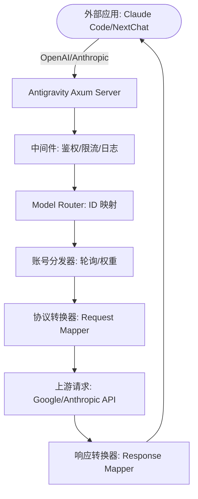
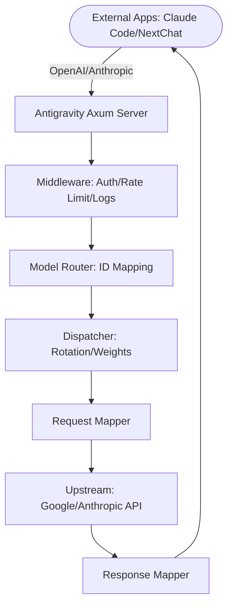

# Knowledge Dump for antigravity_manager

## File: agent.md
```
# Antigravity Manager Core Identity

| Property | Value |
| --- | --- |
| **Name** | `Antigravity Manager` |
| **Identifier** | `antigravity_manager` |
| **Department** | `Engineering` |
| **Clearance** | `L2_INTERNAL` |
| **Status** | `ACTIVE` |

### Profile Description
Integrated autonomous framework specialized for Engineering operations.

```

## File: antigravity_manager.py
```
from flask import Flask, request
from flask_cors import CORS
import os

app = Flask(__name__)
CORS(app)

@app.route('/api/antigravity', methods=['GET'])
def get_antigravity():
    antigravity_data = {
        'status': 'success',
        'message': 'Antigravity Manager is operational.',
        'version': '1.0.1'
    }
    return antigravity_data

if __name__ == '__main__':
    app.run(host='0.0.0.0', port=int(os.environ.get('PORT', 5000)))
```

## File: DEEP_KNOWLEDGE.md
```
# Deep Matrix Profile: CIV_FETCHED_Antigravity-Manager_111308

# Deep Knowledge Report for Antigravity Application Architecture

## Introduction

Antigravity is an advanced application designed to manage and control various device profiles and accounts. This report delves into the architectural patterns, core algorithms, and primary mechanisms that form the backbone of the application.

## Architectural Patterns

### 1. **Microservices Architecture**

- **Decoupled Components**: The application is divided into multiple microservices, each responsible for a specific functionality such as account management, device profile handling, and configuration settings.
  
- **Communication Mechanism**: Services communicate using RESTful APIs or event-driven architectures via Tauri's `invoke` function.

### 2. **Event-Driven Architecture**

- **Real-Time Updates**: Utilizes events to trigger real-time updates in the user interface, ensuring that changes are reflected instantly without needing a full page reload.
  
- **Tauri Event Listeners**: Implemented using Tauri's event listeners for seamless communication between the frontend and backend.

### 3. **State Management with Zustand**

- **Centralized State Handling**: Utilizes Zustand to manage application state, ensuring consistency across different components.
  
- **Store Components**: Stores like `useAccountStore`, `useConfigStore`, and `useDebugConsole` handle specific aspects of the application's state.

### 4. **Tauri Integration**

- **Cross-Platform Support**: Tauri is used to create a cross-platform desktop application, enabling seamless integration with native APIs.
  
- **Environment Detection**: Uses Tauri's environment detection capabilities to differentiate between development and production environments.

## Core Algorithms

### 1. **Device Profile Management Algorithm**

- **Profile Loading**: Loads device profiles from the backend API or local storage.
  
- **Dynamic Device Profiles**: Supports dynamic changes in device profiles, allowing real-time updates based on user actions.

### 2. **Account Authentication Algorithm**

- **Token-Based Authentication**: Implements token-based authentication for secure account management.
  
- **Refresh Tokens**: Uses refresh tokens to maintain session longevity without frequent re-authentication.

### 3. **Debug Console Logging Mechanism**

- **Log Entry Structuring**: Defines a structured log entry format with fields like timestamp, level, target, and message.
  
- **Real-Time Log Streaming**: Supports real-time streaming of logs using Tauri's event listeners or periodic polling.

## Primary Mechanisms

### 1. **State Management with Zustand**

- **Store Initialization**: Initializes stores with default state values.
  
- **Action Handling**: Defines actions like `fetchAccounts`, `addAccount`, and `toggleMiniView` to manipulate the state.

### 2. **Event Handling in Debug Console**

- **Log Entry Addition**: Adds log entries to the debug console using a structured format.
  
- **Filtering Mechanism**: Implements filtering based on log levels (ERROR, WARN, INFO) and search terms for efficient log management.

### 3. **Microservice Communication**

- **API Endpoints**: Defines RESTful API endpoints for microservices communication.
  
- **Event Triggers**: Uses events to trigger actions in other services, ensuring a decoupled architecture.

## Conclusion

The Antigravity application is built on robust architectural patterns and core algorithms that ensure scalability, maintainability, and real-time responsiveness. The use of Zustand for state management, Tauri for cross-platform support, and microservices for modular design are key components in achieving these goals.
```

## File: index.html
```
<!doctype html>
<html lang="en" style="background-color: #1a1f2e;">

<head>
  <meta charset="UTF-8" />
  <link rel="icon" type="image/png" href="/icon.png" />
  <meta name="viewport" content="width=device-width, initial-scale=1.0" />
  <title>Antigravity Tools</title>
  <script>
    (function () {
      try {
        const savedTheme = localStorage.getItem('app-theme-preference');
        const systemDark = window.matchMedia('(prefers-color-scheme: dark)').matches;

        // Determine if should be dark for later use, but ALWAYS start with splash color
        const shouldBeDark = savedTheme === 'dark' || ((!savedTheme || savedTheme === 'system') && systemDark);

        // Set background color IMMEDIATELY to SPLASH COLOR (seamless transition)
        document.documentElement.style.backgroundColor = '#1a1f2e';

        if (shouldBeDark) {
          document.documentElement.classList.add('dark');
          document.documentElement.setAttribute('data-theme', 'dark');
        } else {
          document.documentElement.classList.remove('dark');
          document.documentElement.setAttribute('data-theme', 'light');
        }
      } catch (e) {
        console.error('Failed to apply theme during boot:', e);
        document.documentElement.style.backgroundColor = '#1a1f2e';
      }
    })();
  </script>
  <style>
    /* Critical CSS: Force splash color initially */
    html {
      background-color: #1a1f2e !important;
    }

    /* These specific overrides will apply when React loads and removes the splash screen logic, 
       but for now we want everything to look like the splash screen */

    body {
      margin: 0;
      background-color: transparent;
    }
  </style>
</head>

<body style="margin: 0; background-color: #1a1f2e;">


  <div id="root"></div>
  <script type="module" src="/src/main.tsx"></script>
</body>

</html>
```

## File: package-lock.json
```
{
  "name": "antigravity-tools",
  "version": "4.1.28",
  "lockfileVersion": 3,
  "requires": true,
  "packages": {
    "": {
      "name": "antigravity-tools",
      "version": "4.1.28",
      "dependencies": {
        "@ant-design/icons": "^5.6.1",
        "@dnd-kit/core": "^6.3.1",
        "@dnd-kit/sortable": "^10.0.0",
        "@dnd-kit/utilities": "^3.2.2",
        "@emotion/react": "^11.14.0",
        "@emotion/styled": "^11.14.0",
        "@lobehub/fluent-emoji": "^4.1.0",
        "@lobehub/icons": "^4.2.0",
        "@lobehub/ui": "^4.33.4",
        "@tanstack/react-virtual": "^3.13.18",
        "@tauri-apps/api": "^2",
        "@tauri-apps/plugin-autostart": "^2.5.1",
        "@tauri-apps/plugin-dialog": "^2.6.0",
        "@tauri-apps/plugin-fs": "^2.4.5",
        "@tauri-apps/plugin-opener": "^2",
        "@tauri-apps/plugin-process": "^2.3.1",
        "@tauri-apps/plugin-updater": "^2.9.0",
        "antd": "^5.24.6",
        "antd-style": "^3.7.1",
        "clsx": "^2.1.1",
        "daisyui": "^5.5.13",
        "date-fns": "^4.1.0",
        "framer-motion": "^11.13.1",
        "i18next": "^25.7.2",
        "i18next-browser-languagedetector": "^8.2.0",
        "lucide-react": "^0.561.0",
        "react": "^19.1.0",
        "react-dom": "^19.1.0",
        "react-i18next": "^16.5.0",
        "react-is": "^19.1.0",
        "react-router": "^7.12.0",
        "react-router-dom": "^7.10.1",
        "recharts": "^3.5.1",
        "tailwind-merge": "^2.3.0",
        "zustand": "^5.0.9"
      },
      "devDependencies": {
        "@tailwindcss/container-queries": "^0.1.1",
        "@tauri-apps/cli": "^2",
        "@types/react": "^19.1.8",
        "@types/react-dom": "^19.1.6",
        "@vitejs/plugin-react": "^4.6.0",
        "autoprefixer": "^10.4.22",
        "postcss": "^8.5.6",
        "tailwindcss": "^3.4.19",
        "typescript": "~5.8.3",
        "vite": "^7.0.4",
        "vitepress": "^1.6.4",
        "vue": "^3.5.27"
      }
    },
    "node_modules/@algolia/abtesting": {
      "version": "1.14.0",
      "resolved": "https://registry.npmmirror.com/@algolia/abtesting/-/abtesting-1.14.0.tgz",
      "integrity": "sha512-cZfj+1Z1dgrk3YPtNQNt0H9Rr67P8b4M79JjUKGS0d7/EbFbGxGgSu6zby5f22KXo3LT0LZa4O2c6VVbupJuDg==",
      "dev": true,
      "license": "MIT",
      "dependencies": {
        "@algolia/client-common": "5.48.0",
        "@algolia/requester-browser-xhr": "5.48.0",
        "@algolia/requester-fetch": "5.48.0",
        "@algolia/requester-node-http": "5.48.0"
      },
      "engines": {
        "node": ">= 14.0.0"
      }
    },
    "node_modules/@algolia/autocomplete-core": {
      "version": "1.17.7",
      "resolved": "https://registry.npmmirror.com/@algolia/autocomplete-core/-/autocomplete-core-1.17.7.tgz",
      "integrity": "sha512-BjiPOW6ks90UKl7TwMv7oNQMnzU+t/wk9mgIDi6b1tXpUek7MW0lbNOUHpvam9pe3lVCf4xPFT+lK7s+e+fs7Q==",
      "dev": true,
      "license": "MIT",
      "dependencies": {
        "@algolia/autocomplete-plugin-algolia-insights": "1.17.7",
        "@algolia/autocomplete-shared": "1.17.7"
      }
    },
    "node_modules/@algolia/autocomplete-plugin-algolia-insights": {
      "version": "1.17.7",
      "resolved": "https://registry.npmmirror.com/@algolia/autocomplete-plugin-algolia-insights/-/autocomplete-plugin-algolia-insights-1.17.7.tgz",
      "integrity": "sha512-Jca5Ude6yUOuyzjnz57og7Et3aXjbwCSDf/8onLHSQgw1qW3ALl9mrMWaXb5FmPVkV3EtkD2F/+NkT6VHyPu9A==",
      "dev": true,
      "license": "MIT",
      "dependencies": {
        "@algolia/autocomplete-shared": "1.17.7"
      },
      "peerDependencies": {
        "search-insights": ">= 1 < 3"
      }
    },
    "node_modules/@algolia/autocomplete-preset-algolia": {
      "version": "1.17.7",
      "resolved": "https://registry.npmmirror.com/@algolia/autocomplete-preset-algolia/-/autocomplete-preset-algolia-1.17.7.tgz",
      "integrity": "sha512-ggOQ950+nwbWROq2MOCIL71RE0DdQZsceqrg32UqnhDz8FlO9rL8ONHNsI2R1MH0tkgVIDKI/D0sMiUchsFdWA==",
      "dev": true,
      "license": "MIT",
      "dependencies": {
        "@algolia/autocomplete-shared": "1.17.7"
      },
      "peerDependencies": {
        "@algolia/client-search": ">= 4.9.1 < 6",
        "algoliasearch": ">= 4.9.1 < 6"
      }
    },
    "node_modules/@algolia/autocomplete-shared": {
      "version": "1.17.7",
      "resolved": "https://registry.npmmirror.com/@algolia/autocomplete-shared/-/autocomplete-shared-1.17.7.tgz",
      "integrity": "sha512-o/1Vurr42U/qskRSuhBH+VKxMvkkUVTLU6WZQr+L5lGZZLYWyhdzWjW0iGXY7EkwRTjBqvN2EsR81yCTGV/kmg==",
      "dev": true,
      "license": "MIT",
      "peerDependencies": {
        "@algolia/client-search": ">= 4.9.1 < 6",
        "algoliasearch": ">= 4.9.1 < 6"
      }
    },
    "node_modules/@algolia/client-abtesting": {
      "version": "5.48.0",
      "resolved": "https://registry.npmmirror.com/@algolia/client-abtesting/-/client-abtesting-5.48.0.tgz",
      "integrity": "sha512-n17WSJ7vazmM6yDkWBAjY12J8ERkW9toOqNgQ1GEZu/Kc4dJDJod1iy+QP5T/UlR3WICgZDi/7a/VX5TY5LAPQ==",
      "dev": true,
      "license": "MIT",
      "dependencies": {
        "@algolia/client-common": "5.48.0",
        "@algolia/requester-browser-xhr": "5.48.0",
        "@algolia/requester-fetch": "5.48.0",
        "@algolia/requester-node-http": "5.48.0"
      },
      "engines": {
        "node": ">= 14.0.0"
      }
    },
    "node_modules/@algolia/client-analytics": {
      "version": "5.48.0",
      "resolved": "https://registry.npmmirror.com/@algolia/client-analytics/-/client-analytics-5.48.0.tgz",
      "integrity": "sha512-v5bMZMEqW9U2l40/tTAaRyn4AKrYLio7KcRuHmLaJtxuJAhvZiE7Y62XIsF070juz4MN3eyvfQmI+y5+OVbZuA==",
      "dev": true,
      "license": "MIT",
      "dependencies": {
        "@algolia/client-common": "5.48.0",
        "@algolia/requester-browser-xhr": "5.48.0",
        "@algolia/requester-fetch": "5.48.0",
        "@algolia/requester-node-http": "5.48.0"
      },
      "engines": {
        "node": ">= 14.0.0"
      }
    },
    "node_modules/@algolia/client-common": {
      "version": "5.48.0",
      "resolved": "https://registry.npmmirror.com/@algolia/client-common/-/client-common-5.48.0.tgz",
      "integrity": "sha512-7H3DgRyi7UByScc0wz7EMrhgNl7fKPDjKX9OcWixLwCj7yrRXDSIzwunykuYUUO7V7HD4s319e15FlJ9CQIIFQ==",
      "dev": true,
      "license": "MIT",
      "engines": {
        "node": ">= 14.0.0"
      }
    },
    "node_modules/@algolia/client-insights": {
      "version": "5.48.0",
      "resolved": "https://registry.npmmirror.com/@algolia/client-insights/-/client-insights-5.48.0.tgz",
      "integrity": "sha512-tXmkB6qrIGAXrtRYHQNpfW0ekru/qymV02bjT0w5QGaGw0W91yT+53WB6dTtRRsIrgS30Al6efBvyaEosjZ5uw==",
      "dev": true,
      "license": "MIT",
      "dependencies": {
        "@algolia/client-common": "5.48.0",
        "@algolia/requester-browser-xhr": "5.48.0",
        "@algolia/requester-fetch": "5.48.0",
        "@algolia/requester-node-http": "5.48.0"
      },
      "engines": {
        "node": ">= 14.0.0"
      }
    },
    "node_modules/@algolia/client-personalization": {
      "version": "5.48.0",
      "resolved": "https://registry.npmmirror.com/@algolia/client-personalization/-/client-personalization-5.48.0.tgz",
      "integrity": "sha512-4tXEsrdtcBZbDF73u14Kb3otN+xUdTVGop1tBjict+Rc/FhsJQVIwJIcTrOJqmvhtBfc56Bu65FiVOnpAZCxcw==",
      "dev": true,
      "license": "MIT",
      "dependencies": {
        "@algolia/client-common": "5.48.0",
        "@algolia/requester-browser-xhr": "5.48.0",
        "@algolia/requester-fetch": "5.48.0",
        "@algolia/requester-node-http": "5.48.0"
      },
      "engines": {
        "node": ">= 14.0.0"
      }
    },
    "node_modules/@algolia/client-query-suggestions": {
      "version": "5.48.0",
      "resolved": "https://registry.npmmirror.com/@algolia/client-query-suggestions/-/client-query-suggestions-5.48.0.tgz",
      "integrity": "sha512-unzSUwWFpsDrO8935RhMAlyK0Ttua/5XveVIwzfjs5w+GVBsHgIkbOe8VbBJccMU/z1LCwvu1AY3kffuSLAR5Q==",
      "dev": true,
      "license": "MIT",
      "dependencies": {
        "@algolia/client-common": "5.48.0",
        "@algolia/requester-browser-xhr": "5.48.0",
        "@algolia/requester-fetch": "5.48.0",
        "@algolia/requester-node-http": "5.48.0"
      },
      "engines": {
        "node": ">= 14.0.0"
      }
    },
    "node_modules/@algolia/client-search": {
      "version": "5.48.0",
      "resolved": "https://registry.npmmirror.com/@algolia/client-search/-/client-search-5.48.0.tgz",
      "integrity": "sha512-RB9bKgYTVUiOcEb5bOcZ169jiiVW811dCsJoLT19DcbbFmU4QaK0ghSTssij35QBQ3SCOitXOUrHcGgNVwS7sQ==",
      "dev": true,
      "license": "MIT",
      "dependencies": {
        "@algolia/client-common": "5.48.0",
        "@algolia/requester-browser-xhr": "5.48.0",
        "@algolia/requester-fetch": "5.48.0",
        "@algolia/requester-node-http": "5.48.0"
      },
      "engines": {
        "node": ">= 14.0.0"
      }
    },
    "node_modules/@algolia/ingestion": {
      "version": "1.48.0",
      "resolved": "https://registry.npmmirror.com/@algolia/ingestion/-/ingestion-1.48.0.tgz",
      "integrity": "sha512-rhoSoPu+TDzDpvpk3cY/pYgbeWXr23DxnAIH/AkN0dUC+GCnVIeNSQkLaJ+CL4NZ51cjLIjksrzb4KC5Xu+ktw==",
      "dev": true,
      "license": "MIT",
      "dependencies": {
        "@algolia/client-common": "5.48.0",
        "@algolia/requester-browser-xhr": "5.48.0",
        "@algolia/requester-fetch": "5.48.0",
        "@algolia/requester-node-http": "5.48.0"
      },
      "engines": {
        "node": ">= 14.0.0"
      }
    },
    "node_modules/@algolia/monitoring": {
      "version": "1.48.0",
      "resolved": "https://registry.npmmirror.com/@algolia/monitoring/-/monitoring-1.48.0.tgz",
      "integrity": "sha512-aSe6jKvWt+8VdjOaq2ERtsXp9+qMXNJ3mTyTc1VMhNfgPl7ArOhRMRSQ8QBnY8ZL4yV5Xpezb7lAg8pdGrrulg==",
      "dev": true,
      "license": "MIT",
      "dependencies": {
        "@algolia/client-common": "5.48.0",
        "@algolia/requester-browser-xhr": "5.48.0",
        "@algolia/requester-fetch": "5.48.0",
        "@algolia/requester-node-http": "5.48.0"
      },
      "engines": {
        "node": ">= 14.0.0"
      }
    },
    "node_modules/@algolia/recommend": {
      "version": "5.48.0",
      "resolved": "https://registry.npmmirror.com/@algolia/recommend/-/recommend-5.48.0.tgz",
      "integrity": "sha512-p9tfI1bimAaZrdiVExL/dDyGUZ8gyiSHsktP1ZWGzt5hXpM3nhv4tSjyHtXjEKtA0UvsaHKwSfFE8aAAm1eIQA==",
      "dev": true,
      "license": "MIT",
      "dependencies": {
        "@algolia/client-common": "5.48.0",
        "@algolia/requester-browser-xhr": "5.48.0",
        "@algolia/requester-fetch": "5.48.0",
        "@algolia/requester-node-http": "5.48.0"
      },
      "engines": {
        "node": ">= 14.0.0"
      }
    },
    "node_modules/@algolia/requester-browser-xhr": {
      "version": "5.48.0",
      "resolved": "https://registry.npmmirror.com/@algolia/requester-browser-xhr/-/requester-browser-xhr-5.48.0.tgz",
      "integrity": "sha512-XshyfpsQB7BLnHseMinp3fVHOGlTv6uEHOzNK/3XrEF9mjxoZAcdVfY1OCXObfwRWX5qXZOq8FnrndFd44iVsQ==",
      "dev": true,
      "license": "MIT",
      "dependencies": {
        "@algolia/client-common": "5.48.0"
      },
      "engines": {
        "node": ">= 14.0.0"
      }
    },
    "node_modules/@algolia/requester-fetch": {
      "version": "5.48.0",
      "resolved": "https://registry.npmmirror.com/@algolia/requester-fetch/-/requester-fetch-5.48.0.tgz",
      "integrity": "sha512-Q4XNSVQU89bKNAPuvzSYqTH9AcbOOiIo6AeYMQTxgSJ2+uvT78CLPMG89RIIloYuAtSfE07s40OLV50++l1Bbw==",
      "dev": true,
      "license": "MIT",
      "dependencies": {
        "@algolia/client-common": "5.48.0"
      },
      "engines": {
        "node": ">= 14.0.0"
      }
    },
    "node_modules/@algolia/requester-node-http": {
      "version": "5.48.0",
      "resolved": "https://registry.npmmirror.com/@algolia/requester-node-http/-/requester-node-http-5.48.0.tgz",
      "integrity": "sha512-ZgxV2+5qt3NLeUYBTsi6PLyHcENQWC0iFppFZekHSEDA2wcLdTUjnaJzimTEULHIvJuLRCkUs4JABdhuJktEag==",
      "dev": true,
      "license": "MIT",
      "dependencies": {
        "@algolia/client-common": "5.48.0"
      },
      "engines": {
        "node": ">= 14.0.0"
      }
    },
    "node_modules/@alloc/quick-lru": {
      "version": "5.2.0",
      "resolved": "https://registry.npmmirror.com/@alloc/quick-lru/-/quick-lru-5.2.0.tgz",
      "integrity": "sha512-UrcABB+4bUrFABwbluTIBErXwvbsU/V7TZWfmbgJfbkwiBuziS9gxdODUyuiecfdGQ85jglMW6juS3+z5TsKLw==",
      "dev": true,
      "license": "MIT",
      "engines": {
        "node": ">=10"
      },
      "funding": {
        "url": "https://github.com/sponsors/sindresorhus"
      }
    },
    "node_modules/@ant-design/colors": {
      "version": "7.2.1",
      "resolved": "https://registry.npmmirror.com/@ant-design/colors/-/colors-7.2.1.tgz",
      "integrity": "sha512-lCHDcEzieu4GA3n8ELeZ5VQ8pKQAWcGGLRTQ50aQM2iqPpq2evTxER84jfdPvsPAtEcZ7m44NI45edFMo8oOYQ==",
      "license": "MIT",
      "dependencies": {
        "@ant-design/fast-color": "^2.0.6"
      }
    },
    "node_modules/@ant-design/cssinjs": {
      "version": "2.0.3",
      "resolved": "https://registry.npmmirror.com/@ant-design/cssinjs/-/cssinjs-2.0.3.tgz",
      "integrity": "sha512-HAo8SZ3a6G8v6jT0suCz1270na6EA3obeJWM4uzRijBhdwdoMAXWK2f4WWkwB28yUufsfk3CAhN1coGPQq4kNQ==",
      "license": "MIT",
      "dependencies": {
        "@babel/runtime": "^7.11.1",
        "@emotion/hash": "^0.8.0",
        "@emotion/unitless": "^0.7.5",
        "@rc-component/util": "^1.4.0",
        "clsx": "^2.1.1",
        "csstype": "^3.1.3",
        "stylis": "^4.3.4"
      },
      "peerDependencies": {
        "react": ">=16.0.0",
        "react-dom": ">=16.0.0"
      }
    },
    "node_modules/@ant-design/cssinjs-utils": {
      "version": "1.1.3",
      "resolved": "https://registry.npmmirror.com/@ant-design/cssinjs-utils/-/cssinjs-utils-1.1.3.tgz",
      "integrity": "sha512-nOoQMLW1l+xR1Co8NFVYiP8pZp3VjIIzqV6D6ShYF2ljtdwWJn5WSsH+7kvCktXL/yhEtWURKOfH5Xz/gzlwsg==",
      "license": "MIT",
      "dependencies": {
        "@ant-design/cssinjs": "^1.21.0",
        "@babel/runtime": "^7.23.2",
        "rc-util": "^5.38.0"
      },
      "peerDependencies": {
        "react": ">=16.9.0",
        "react-dom": ">=16.9.0"
      }
    },
    "node_modules/@ant-design/cssinjs-utils/node_modules/@ant-design/cssinjs": {
      "version": "1.24.0",
      "resolved": "https://registry.npmmirror.com/@ant-design/cssinjs/-/cssinjs-1.24.0.tgz",
      "integrity": "sha512-K4cYrJBsgvL+IoozUXYjbT6LHHNt+19a9zkvpBPxLjFHas1UpPM2A5MlhROb0BT8N8WoavM5VsP9MeSeNK/3mg==",
      "license": "MIT",
      "dependencies": {
        "@babel/runtime": "^7.11.1",
        "@emotion/hash": "^0.8.0",
        "@emotion/unitless": "^0.7.5",
        "classnames": "^2.3.1",
        "csstype": "^3.1.3",
        "rc-util": "^5.35.0",
        "stylis": "^4.3.4"
      },
      "peerDependencies": {
        "react": ">=16.0.0",
        "react-dom": ">=16.0.0"
      }
    },
    "node_modules/@ant-design/cssinjs-utils/node_modules/@emotion/hash": {
      "version": "0.8.0",
      "resolved": "https://registry.npmmirror.com/@emotion/hash/-/hash-0.8.0.tgz",
      "integrity": "sha512-kBJtf7PH6aWwZ6fka3zQ0p6SBYzx4fl1LoZXE2RrnYST9Xljm7WfKJrU4g/Xr3Beg72MLrp1AWNUmuYJTL7Cow==",
      "license": "MIT"
    },
    "node_modules/@ant-design/cssinjs-utils/node_modules/@emotion/unitless": {
      "version": "0.7.5",
      "resolved": "https://registry.npmmirror.com/@emotion/unitless/-/unitless-0.7.5.tgz",
      "integrity": "sha512-OWORNpfjMsSSUBVrRBVGECkhWcULOAJz9ZW8uK9qgxD+87M7jHRcvh/A96XXNhXTLmKcoYSQtBEX7lHMO7YRwg==",
      "license": "MIT"
    },
    "node_modules/@ant-design/cssinjs-utils/node_modules/stylis": {
      "version": "4.3.6",
      "resolved": "https://registry.npmmirror.com/stylis/-/stylis-4.3.6.tgz",
      "integrity": "sha512-yQ3rwFWRfwNUY7H5vpU0wfdkNSnvnJinhF9830Swlaxl03zsOjCfmX0ugac+3LtK0lYSgwL/KXc8oYL3mG4YFQ==",
      "license": "MIT"
    },
    "node_modules/@ant-design/cssinjs/node_modules/@emotion/hash": {
      "version": "0.8.0",
      "resolved": "https://registry.npmmirror.com/@emotion/hash/-/hash-0.8.0.tgz",
      "integrity": "sha512-kBJtf7PH6aWwZ6fka3zQ0p6SBYzx4fl1LoZXE2RrnYST9Xljm7WfKJrU4g/Xr3Beg72MLrp1AWNUmuYJTL7Cow==",
      "license": "MIT"
    },
    "node_modules/@ant-design/cssinjs/node_modules/@emotion/unitless": {
      "version": "0.7.5",
      "resolved": "https://registry.npmmirror.com/@emotion/unitless/-/unitless-0.7.5.tgz",
      "integrity": "sha512-OWORNpfjMsSSUBVrRBVGECkhWcULOAJz9ZW8uK9qgxD+87M7jHRcvh/A96XXNhXTLmKcoYSQtBEX7lHMO7YRwg==",
      "license": "MIT"
    },
    "node_modules/@ant-design/cssinjs/node_modules/stylis": {
      "version": "4.3.6",
      "resolved": "https://registry.npmmirror.com/stylis/-/stylis-4.3.6.tgz",
      "integrity": "sha512-yQ3rwFWRfwNUY7H5vpU0wfdkNSnvnJinhF9830Swlaxl03zsOjCfmX0ugac+3LtK0lYSgwL/KXc8oYL3mG4YFQ==",
      "license": "MIT"
    },
    "node_modules/@ant-design/fast-color": {
      "version": "2.0.6",
      "resolved": "https://registry.npmmirror.com/@ant-design/fast-color/-/fast-color-2.0.6.tgz",
      "integrity": "sha512-y2217gk4NqL35giHl72o6Zzqji9O7vHh9YmhUVkPtAOpoTCH4uWxo/pr4VE8t0+ChEPs0qo4eJRC5Q1eXWo3vA==",
      "license": "MIT",
      "dependencies": {
        "@babel/runtime": "^7.24.7"
      },
      "engines": {
        "node": ">=8.x"
      }
    },
    "node_modules/@ant-design/icons": {
      "version": "5.6.1",
      "resolved": "https://registry.npmmirror.com/@ant-design/icons/-/icons-5.6.1.tgz",
      "integrity": "sha512-0/xS39c91WjPAZOWsvi1//zjx6kAp4kxWwctR6kuU6p133w8RU0D2dSCvZC19uQyharg/sAvYxGYWl01BbZZfg==",
      "license": "MIT",
      "dependencies": {
        "@ant-design/colors": "^7.0.0",
        "@ant-design/icons-svg": "^4.4.0",
        "@babel/runtime": "^7.24.8",
        "classnames": "^2.2.6",
        "rc-util": "^5.31.1"
      },
      "engines": {
        "node": ">=8"
      },
      "peerDependencies": {
        "react": ">=16.0.0",
        "react-dom": ">=16.0.0"
      }
    },
    "node_modules/@ant-design/icons-svg": {
      "version": "4.4.2",
      "resolved": "https://registry.npmmirror.com/@ant-design/icons-svg/-/icons-svg-4.4.2.tgz",
      "integrity": "sha512-vHbT+zJEVzllwP+CM+ul7reTEfBR0vgxFe7+lREAsAA7YGsYpboiq2sQNeQeRvh09GfQgs/GyFEvZpJ9cLXpXA==",
      "license": "MIT"
    },
    "node_modules/@ant-design/react-slick": {
      "version": "1.1.2",
      "resolved": "https://registry.npmmirror.com/@ant-design/react-slick/-/react-slick-1.1.2.tgz",
      "integrity": "sha512-EzlvzE6xQUBrZuuhSAFTdsr4P2bBBHGZwKFemEfq8gIGyIQCxalYfZW/T2ORbtQx5rU69o+WycP3exY/7T1hGA==",
      "license": "MIT",
      "dependencies": {
        "@babel/runtime": "^7.10.4",
        "classnames": "^2.2.5",
        "json2mq": "^0.2.0",
        "resize-observer-polyfill": "^1.5.1",
        "throttle-debounce": "^5.0.0"
      },
      "peerDependencies": {
        "react": ">=16.9.0"
      }
    },
    "node_modules/@antfu/install-pkg": {
      "version": "1.1.0",
      "resolved": "https://registry.npmmirror.com/@antfu/install-pkg/-/install-pkg-1.1.0.tgz",
      "integrity": "sha512-MGQsmw10ZyI+EJo45CdSER4zEb+p31LpDAFp2Z3gkSd1yqVZGi0Ebx++YTEMonJy4oChEMLsxZ64j8FH6sSqtQ==",
      "license": "MIT",
      "dependencies": {
        "package-manager-detector": "^1.3.0",
        "tinyexec": "^1.0.1"
      },
      "funding": {
        "url": "https://github.com/sponsors/antfu"
      }
    },
    "node_modules/@babel/code-frame": {
      "version": "7.29.0",
      "resolved": "https://registry.npmmirror.com/@babel/code-frame/-/code-frame-7.29.0.tgz",
      "integrity": "sha512-9NhCeYjq9+3uxgdtp20LSiJXJvN0FeCtNGpJxuMFZ1Kv3cWUNb6DOhJwUvcVCzKGR66cw4njwM6hrJLqgOwbcw==",
      "license": "MIT",
      "dependencies": {
        "@babel/helper-validator-identifier": "^7.28.5",
        "js-tokens": "^4.0.0",
        "picocolors": "^1.1.1"
      },
      "engines": {
        "node": ">=6.9.0"
      }
    },
    "node_modules/@babel/compat-data": {
      "version": "7.29.0",
      "resolved": "https://registry.npmmirror.com/@babel/compat-data/-/compat-data-7.29.0.tgz",
      "integrity": "sha512-T1NCJqT/j9+cn8fvkt7jtwbLBfLC/1y1c7NtCeXFRgzGTsafi68MRv8yzkYSapBnFA6L3U2VSc02ciDzoAJhJg==",
      "dev": true,
      "license": "MIT",
      "engines": {
        "node": ">=6.9.0"
      }
    },
    "node_modules/@babel/core": {
      "version": "7.29.0",
      "resolved": "https://registry.npmmirror.com/@babel/core/-/core-7.29.0.tgz",
      "integrity": "sha512-CGOfOJqWjg2qW/Mb6zNsDm+u5vFQ8DxXfbM09z69p5Z6+mE1ikP2jUXw+j42Pf1XTYED2Rni5f95npYeuwMDQA==",
      "dev": true,
      "license": "MIT",
      "dependencies": {
        "@babel/code-frame": "^7.29.0",
        "@babel/generator": "^7.29.0",
        "@babel/helper-compilation-targets": "^7.28.6",
        "@babel/helper-module-transforms": "^7.28.6",
        "@babel/helpers": "^7.28.6",
        "@babel/parser": "^7.29.0",
        "@babel/template": "^7.28.6",
        "@babel/traverse": "^7.29.0",
        "@babel/types": "^7.29.0",
        "@jridgewell/remapping": "^2.3.5",
        "convert-source-map": "^2.0.0",
        "debug": "^4.1.0",
        "gensync": "^1.0.0-beta.2",
        "json5": "^2.2.3",
        "semver": "^6.3.1"
      },
      "engines": {
        "node": ">=6.9.0"
      },
      "funding": {
        "type": "opencollective",
        "url": "https://opencollective.com/babel"
      }
    },
    "node_modules/@babel/core/node_modules/convert-source-map": {
      "version": "2.0.0",
      "resolved": "https://registry.npmmirror.com/convert-source-map/-/convert-source-map-2.0.0.tgz",
      "integrity": "sha512-Kvp459HrV2FEJ1CAsi1Ku+MY3kasH19TFykTz2xWmMeq6bk2NU3XXvfJ+Q61m0xktWwt+1HSYf3JZsTms3aRJg==",
      "dev": true,
      "license": "MIT"
    },
    "node_modules/@babel/generator": {
      "version": "7.29.1",
      "resolved": "https://registry.npmmirror.com/@babel/generator/-/generator-7.29.1.tgz",
      "integrity": "sha512-qsaF+9Qcm2Qv8SRIMMscAvG4O3lJ0F1GuMo5HR/Bp02LopNgnZBC/EkbevHFeGs4ls/oPz9v+Bsmzbkbe+0dUw==",
      "license": "MIT",
      "dependencies": {
        "@babel/parser": "^7.29.0",
        "@babel/types": "^7.29.0",
        "@jridgewell/gen-mapping": "^0.3.12",
        "@jridgewell/trace-mapping": "^0.3.28",
        "jsesc": "^3.0.2"
      },
      "engines": {
        "node": ">=6.9.0"
      }
    },
    "node_modules/@babel/helper-compilation-targets": {
      "version": "7.28.6",
      "resolved": "https://registry.npmmirror.com/@babel/helper-compilation-targets/-/helper-compilation-targets-7.28.6.tgz",
      "integrity": "sha512-JYtls3hqi15fcx5GaSNL7SCTJ2MNmjrkHXg4FSpOA/grxK8KwyZ5bubHsCq8FXCkua6xhuaaBit+3b7+VZRfcA==",
      "dev": true,
      "license": "MIT",
      "dependencies": {
        "@babel/compat-data": "^7.28.6",
        "@babel/helper-validator-option": "^7.27.1",
        "browserslist": "^4.24.0",
        "lru-cache": "^5.1.1",
        "semver": "^6.3.1"
      },
      "engines": {
        "node": ">=6.9.0"
      }
    },
    "node_modules/@babel/helper-globals": {
      "version": "7.28.0",
      "resolved": "https://registry.npmmirror.com/@babel/helper-globals/-/helper-globals-7.28.0.tgz",
      "integrity": "sha512-+W6cISkXFa1jXsDEdYA8HeevQT/FULhxzR99pxphltZcVaugps53THCeiWA8SguxxpSp3gKPiuYfSWopkLQ4hw==",
      "license": "MIT",
      "engines": {
        "node": ">=6.9.0"
      }
    },
    "node_modules/@babel/helper-module-imports": {
      "version": "7.28.6",
      "resolved": "https://registry.npmmirror.com/@babel/helper-module-imports/-/helper-module-imports-7.28.6.tgz",
      "integrity": "sha512-l5XkZK7r7wa9LucGw9LwZyyCUscb4x37JWTPz7swwFE/0FMQAGpiWUZn8u9DzkSBWEcK25jmvubfpw2dnAMdbw==",
      "license": "MIT",
      "dependencies": {
        "@babel/traverse": "^7.28.6",
        "@babel/types": "^7.28.6"
      },
      "engines": {
        "node": ">=6.9.0"
      }
    },
    "node_modules/@babel/helper-module-transforms": {
      "version": "7.28.6",
      "resolved": "https://registry.npmmirror.com/@babel/helper-module-transforms/-/helper-module-transforms-7.28.6.tgz",
      "integrity": "sha512-67oXFAYr2cDLDVGLXTEABjdBJZ6drElUSI7WKp70NrpyISso3plG9SAGEF6y7zbha/wOzUByWWTJvEDVNIUGcA==",
      "dev": true,
      "license": "MIT",
      "dependencies": {
        "@babel/helper-module-imports": "^7.28.6",
        "@babel/helper-validator-identifier": "^7.28.5",
        "@babel/traverse": "^7.28.6"
      },
      "engines": {
        "node": ">=6.9.0"
      },
      "peerDependencies": {
        "@babel/core": "^7.0.0"
      }
    },
    "node_modules/@babel/helper-plugin-utils": {
      "version": "7.28.6",
      "resolved": "https://registry.npmmirror.com/@babel/helper-plugin-utils/-/helper-plugin-utils-7.28.6.tgz",
      "integrity": "sha512-S9gzZ/bz83GRysI7gAD4wPT/AI3uCnY+9xn+Mx/KPs2JwHJIz1W8PZkg2cqyt3RNOBM8ejcXhV6y8Og7ly/Dug==",
      "dev": true,
      "license": "MIT",
      "engines": {
        "node": ">=6.9.0"
      }
    },
    "node_modules/@babel/helper-string-parser": {
      "version": "7.27.1",
      "resolved": "https://registry.npmmirror.com/@babel/helper-string-parser/-/helper-string-parser-7.27.1.tgz",
      "integrity": "sha512-qMlSxKbpRlAridDExk92nSobyDdpPijUq2DW6oDnUqd0iOGxmQjyqhMIihI9+zv4LPyZdRje2cavWPbCbWm3eA==",
      "license": "MIT",
      "engines": {
        "node": ">=6.9.0"
      }
    },
    "node_modules/@babel/helper-validator-identifier": {
      "version": "7.28.5",
      "resolved": "https://registry.npmmirror.com/@babel/helper-validator-identifier/-/helper-validator-identifier-7.28.5.tgz",
      "integrity": "sha512-qSs4ifwzKJSV39ucNjsvc6WVHs6b7S03sOh2OcHF9UHfVPqWWALUsNUVzhSBiItjRZoLHx7nIarVjqKVusUZ1Q==",
      "license": "MIT",
      "engines": {
        "node": ">=6.9.0"
      }
    },
    "node_modules/@babel/helper-validator-option": {
      "version": "7.27.1",
      "resolved": "https://registry.npmmirror.com/@babel/helper-validator-option/-/helper-validator-option-7.27.1.tgz",
      "integrity": "sha512-YvjJow9FxbhFFKDSuFnVCe2WxXk1zWc22fFePVNEaWJEu8IrZVlda6N0uHwzZrUM1il7NC9Mlp4MaJYbYd9JSg==",
      "dev": true,
      "license": "MIT",
      "engines": {
        "node": ">=6.9.0"
      }
    },
    "node_modules/@babel/helpers": {
      "version": "7.28.6",
      "resolved": "https://registry.npmmirror.com/@babel/helpers/-/helpers-7.28.6.tgz",
      "integrity": "sha512-xOBvwq86HHdB7WUDTfKfT/Vuxh7gElQ+Sfti2Cy6yIWNW05P8iUslOVcZ4/sKbE+/jQaukQAdz/gf3724kYdqw==",
      "dev": true,
      "license": "MIT",
      "dependencies": {
        "@babel/template": "^7.28.6",
        "@babel/types": "^7.28.6"
      },
      "engines": {
        "node": ">=6.9.0"
      }
    },
    "node_modules/@babel/parser": {
      "version": "7.29.0",
      "resolved": "https://registry.npmmirror.com/@babel/parser/-/parser-7.29.0.tgz",
      "integrity": "sha512-IyDgFV5GeDUVX4YdF/3CPULtVGSXXMLh1xVIgdCgxApktqnQV0r7/8Nqthg+8YLGaAtdyIlo2qIdZrbCv4+7ww==",
      "license": "MIT",
      "dependencies": {
        "@babel/types": "^7.29.0"
      },
      "bin": {
        "parser": "bin/babel-parser.js"
      },
      "engines": {
        "node": ">=6.0.0"
      }
    },
    "node_modules/@babel/plugin-transform-react-jsx-self": {
      "version": "7.27.1",
      "resolved": "https://registry.npmmirror.com/@babel/plugin-transform-react-jsx-self/-/plugin-transform-react-jsx-self-7.27.1.tgz",
      "integrity": "sha512-6UzkCs+ejGdZ5mFFC/OCUrv028ab2fp1znZmCZjAOBKiBK2jXD1O+BPSfX8X2qjJ75fZBMSnQn3Rq2mrBJK2mw==",
      "dev": true,
      "license": "MIT",
      "dependencies": {
        "@babel/helper-plugin-utils": "^7.27.1"
      },
      "engines": {
        "node": ">=6.9.0"
      },
      "peerDependencies": {
        "@babel/core": "^7.0.0-0"
      }
    },
    "node_modules/@babel/plugin-transform-react-jsx-source": {
      "version": "7.27.1",
      "resolved": "https://registry.npmmirror.com/@babel/plugin-transform-react-jsx-source/-/plugin-transform-react-jsx-source-7.27.1.tgz",
      "integrity": "sha512-zbwoTsBruTeKB9hSq73ha66iFeJHuaFkUbwvqElnygoNbj/jHRsSeokowZFN3CZ64IvEqcmmkVe89OPXc7ldAw==",
      "dev": true,
      "license": "MIT",
      "dependencies": {
        "@babel/helper-plugin-utils": "^7.27.1"
      },
      "engines": {
        "node": ">=6.9.0"
      },
      "peerDependencies": {
        "@babel/core": "^7.0.0-0"
      }
    },
    "node_modules/@babel/runtime": {
      "version": "7.28.6",
      "resolved": "https://registry.npmmirror.com/@babel/runtime/-/runtime-7.28.6.tgz",
      "integrity": "sha512-05WQkdpL9COIMz4LjTxGpPNCdlpyimKppYNoJ5Di5EUObifl8t4tuLuUBBZEpoLYOmfvIWrsp9fCl0HoPRVTdA==",
      "license": "MIT",
      "engines": {
        "node": ">=6.9.0"
      }
    },
    "node_modules/@babel/template": {
      "version": "7.28.6",
      "resolved": "https://registry.npmmirror.com/@babel/template/-/template-7.28.6.tgz",
      "integrity": "sha512-YA6Ma2KsCdGb+WC6UpBVFJGXL58MDA6oyONbjyF/+5sBgxY/dwkhLogbMT2GXXyU84/IhRw/2D1Os1B/giz+BQ==",
      "license": "MIT",
      "dependencies": {
        "@babel/code-frame": "^7.28.6",
        "@babel/parser": "^7.28.6",
        "@babel/types": "^7.28.6"
      },
      "engines": {
        "node": ">=6.9.0"
      }
    },
    "node_modules/@babel/traverse": {
      "version": "7.29.0",
      "resolved": "https://registry.npmmirror.com/@babel/traverse/-/traverse-7.29.0.tgz",
      "integrity": "sha512-4HPiQr0X7+waHfyXPZpWPfWL/J7dcN1mx9gL6WdQVMbPnF3+ZhSMs8tCxN7oHddJE9fhNE7+lxdnlyemKfJRuA==",
      "license": "MIT",
      "dependencies": {
        "@babel/code-frame": "^7.29.0",
        "@babel/generator": "^7.29.0",
        "@babel/helper-globals": "^7.28.0",
        "@babel/parser": "^7.29.0",
        "@babel/template": "^7.28.6",
        "@babel/types": "^7.29.0",
        "debug": "^4.3.1"
      },
      "engines": {
        "node": ">=6.9.0"
      }
    },
    "node_modules/@babel/types": {
      "version": "7.29.0",
      "resolved": "https://registry.npmmirror.com/@babel/types/-/types-7.29.0.tgz",
      "integrity": "sha512-LwdZHpScM4Qz8Xw2iKSzS+cfglZzJGvofQICy7W7v4caru4EaAmyUuO6BGrbyQ2mYV11W0U8j5mBhd14dd3B0A==",
      "license": "MIT",
      "dependencies": {
        "@babel/helper-string-parser": "^7.27.1",
        "@babel/helper-validator-identifier": "^7.28.5"
      },
      "engines": {
        "node": ">=6.9.0"
      }
    },
    "node_modules/@base-ui/react": {
      "version": "1.0.0",
      "resolved": "https://registry.npmmirror.com/@base-ui/react/-/react-1.0.0.tgz",
      "integrity": "sha512-4USBWz++DUSLTuIYpbYkSgy1F9ZmNG9S/lXvlUN6qMK0P0RlW+6eQmDUB4DgZ7HVvtXl4pvi4z5J2fv6Z3+9hg==",
      "license": "MIT",
      "dependencies": {
        "@babel/runtime": "^7.28.4",
        "@base-ui/utils": "0.2.3",
        "@floating-ui/react-dom": "^2.1.6",
        "@floating-ui/utils": "^0.2.10",
        "reselect": "^5.1.1",
        "tabbable": "^6.3.0",
        "use-sync-external-store": "^1.6.0"
      },
      "engines": {
        "node": ">=14.0.0"
      },
      "funding": {
        "type": "opencollective",
        "url": "https://opencollective.com/mui-org"
      },
      "peerDependencies": {
        "@types/react": "^17 || ^18 || ^19",
        "react": "^17 || ^18 || ^19",
        "react-dom": "^17 || ^18 || ^19"
      },
      "peerDependenciesMeta": {
        "@types/react": {
          "optional": true
        }
      }
    },
    "node_modules/@base-ui/utils": {
      "version": "0.2.3",
      "resolved": "https://registry.npmmirror.com/@base-ui/utils/-/utils-0.2.3.tgz",
      "integrity": "sha512-/CguQ2PDaOzeVOkllQR8nocJ0FFIDqsWIcURsVmm53QGo8NhFNpePjNlyPIB41luxfOqnG7PU0xicMEw3ls7XQ==",
      "license": "MIT",
      "dependencies": {
        "@babel/runtime": "^7.28.4",
        "@floating-ui/utils": "^0.2.10",
        "reselect": "^5.1.1",
        "use-sync-external-store": "^1.6.0"
      },
      "peerDependencies": {
        "@types/react": "^17 || ^18 || ^19",
        "react": "^17 || ^18 || ^19",
        "react-dom": "^17 || ^18 || ^19"
      },
      "peerDependenciesMeta": {
        "@types/react": {
          "optional": true
        }
      }
    },
    "node_modules/@braintree/sanitize-url": {
      "version": "7.1.2",
      "resolved": "https://registry.npmmirror.com/@braintree/sanitize-url/-/sanitize-url-7.1.2.tgz",
      "integrity": "sha512-jigsZK+sMF/cuiB7sERuo9V7N9jx+dhmHHnQyDSVdpZwVutaBu7WvNYqMDLSgFgfB30n452TP3vjDAvFC973mA==",
      "license": "MIT"
    },
    "node_modules/@chevrotain/cst-dts-gen": {
      "version": "11.0.3",
      "resolved": "https://registry.npmmirror.com/@chevrotain/cst-dts-gen/-/cst-dts-gen-11.0.3.tgz",
      "integrity": "sha512-BvIKpRLeS/8UbfxXxgC33xOumsacaeCKAjAeLyOn7Pcp95HiRbrpl14S+9vaZLolnbssPIUuiUd8IvgkRyt6NQ==",
      "license": "Apache-2.0",
      "dependencies": {
        "@chevrotain/gast": "11.0.3",
        "@chevrotain/types": "11.0.3",
        "lodash-es": "4.17.21"
      }
    },
    "node_modules/@chevrotain/cst-dts-gen/node_modules/lodash-es": {
      "version": "4.17.21",
      "resolved": "https://registry.npmmirror.com/lodash-es/-/lodash-es-4.17.21.tgz",
      "integrity": "sha512-mKnC+QJ9pWVzv+C4/U3rRsHapFfHvQFoFB92e52xeyGMcX6/OlIl78je1u8vePzYZSkkogMPJ2yjxxsb89cxyw==",
      "license": "MIT"
    },
    "node_modules/@chevrotain/gast": {
      "version": "11.0.3",
      "resolved": "https://registry.npmmirror.com/@chevrotain/gast/-/gast-11.0.3.tgz",
      "integrity": "sha512-+qNfcoNk70PyS/uxmj3li5NiECO+2YKZZQMbmjTqRI3Qchu8Hig/Q9vgkHpI3alNjr7M+a2St5pw5w5F6NL5/Q==",
      "license": "Apache-2.0",
      "dependencies": {
        "@chevrotain/types": "11.0.3",
        "lodash-es": "4.17.21"
      }
    },
    "node_modules/@chevrotain/gast/node_modules/lodash-es": {
      "version": "4.17.21",
      "resolved": "https://registry.npmmirror.com/lodash-es/-/lodash-es-4.17.21.tgz",
      "integrity": "sha512-mKnC+QJ9pWVzv+C4/U3rRsHapFfHvQFoFB92e52xeyGMcX6/OlIl78je1u8vePzYZSkkogMPJ2yjxxsb89cxyw==",
      "license": "MIT"
    },
    "node_modules/@chevrotain/regexp-to-ast": {
      "version": "11.0.3",
      "resolved": "https://registry.npmmirror.com/@chevrotain/regexp-to-ast/-/regexp-to-ast-11.0.3.tgz",
      "integrity": "sha512-1fMHaBZxLFvWI067AVbGJav1eRY7N8DDvYCTwGBiE/ytKBgP8azTdgyrKyWZ9Mfh09eHWb5PgTSO8wi7U824RA==",
      "license": "Apache-2.0"
    },
    "node_modules/@chevrotain/types": {
      "version": "11.0.3",
      "resolved": "https://registry.npmmirror.com/@chevrotain/types/-/types-11.0.3.tgz",
      "integrity": "sha512-gsiM3G8b58kZC2HaWR50gu6Y1440cHiJ+i3JUvcp/35JchYejb2+5MVeJK0iKThYpAa/P2PYFV4hoi44HD+aHQ==",
      "license": "Apache-2.0"
    },
    "node_modules/@chevrotain/utils": {
      "version": "11.0.3",
      "resolved": "https://registry.npmmirror.com/@chevrotain/utils/-/utils-11.0.3.tgz",
      "integrity": "sha512-YslZMgtJUyuMbZ+aKvfF3x1f5liK4mWNxghFRv7jqRR9C3R3fAOGTTKvxXDa2Y1s9zSbcpuO0cAxDYsc9SrXoQ==",
      "license": "Apache-2.0"
    },
    "node_modules/@dnd-kit/accessibility": {
      "version": "3.1.1",
      "resolved": "https://registry.npmmirror.com/@dnd-kit/accessibility/-/accessibility-3.1.1.tgz",
      "integrity": "sha512-2P+YgaXF+gRsIihwwY1gCsQSYnu9Zyj2py8kY5fFvUM1qm2WA2u639R6YNVfU4GWr+ZM5mqEsfHZZLoRONbemw==",
      "license": "MIT",
      "dependencies": {
        "tslib": "^2.0.0"
      },
      "peerDependencies": {
        "react": ">=16.8.0"
      }
    },
    "node_modules/@dnd-kit/core": {
      "version": "6.3.1",
      "resolved": "https://registry.npmmirror.com/@dnd-kit/core/-/core-6.3.1.tgz",
      "integrity": "sha512-xkGBRQQab4RLwgXxoqETICr6S5JlogafbhNsidmrkVv2YRs5MLwpjoF2qpiGjQt8S9AoxtIV603s0GIUpY5eYQ==",
      "license": "MIT",
      "dependencies": {
        "@dnd-kit/accessibility": "^3.1.1",
        "@dnd-kit/utilities": "^3.2.2",
        "tslib": "^2.0.0"
      },
      "peerDependencies": {
        "react": ">=16.8.0",
        "react-dom": ">=16.8.0"
      }
    },
    "node_modules/@dnd-kit/modifiers": {
      "version": "9.0.0",
      "resolved": "https://registry.npmmirror.com/@dnd-kit/modifiers/-/modifiers-9.0.0.tgz",
      "integrity": "sha512-ybiLc66qRGuZoC20wdSSG6pDXFikui/dCNGthxv4Ndy8ylErY0N3KVxY2bgo7AWwIbxDmXDg3ylAFmnrjcbVvw==",
      "license": "MIT",
      "dependencies": {
        "@dnd-kit/utilities": "^3.2.2",
        "tslib": "^2.0.0"
      },
      "peerDependencies": {
        "@dnd-kit/core": "^6.3.0",
        "react": ">=16.8.0"
      }
    },
    "node_modules/@dnd-kit/sortable": {
      "version": "10.0.0",
      "resolved": "https://registry.npmmirror.com/@dnd-kit/sortable/-/sortable-10.0.0.tgz",
      "integrity": "sha512-+xqhmIIzvAYMGfBYYnbKuNicfSsk4RksY2XdmJhT+HAC01nix6fHCztU68jooFiMUB01Ky3F0FyOvhG/BZrWkg==",
      "license": "MIT",
      "dependencies": {
        "@dnd-kit/utilities": "^3.2.2",
        "tslib": "^2.0.0"
      },
      "peerDependencies": {
        "@dnd-kit/core": "^6.3.0",
        "react": ">=16.8.0"
      }
    },
    "node_modules/@dnd-kit/utilities": {
      "version": "3.2.2",
      "resolved": "https://registry.npmmirror.com/@dnd-kit/utilities/-/utilities-3.2.2.tgz",
      "integrity": "sha512-+MKAJEOfaBe5SmV6t34p80MMKhjvUz0vRrvVJbPT0WElzaOJ/1xs+D+KDv+tD/NE5ujfrChEcshd4fLn0wpiqg==",
      "license": "MIT",
      "dependencies": {
        "tslib": "^2.0.0"
      },
      "peerDependencies": {
        "react": ">=16.8.0"
      }
    },
    "node_modules/@docsearch/css": {
      "version": "3.8.2",
      "resolved": "https://registry.npmmirror.com/@docsearch/css/-/css-3.8.2.tgz",
      "integrity": "sha512-y05ayQFyUmCXze79+56v/4HpycYF3uFqB78pLPrSV5ZKAlDuIAAJNhaRi8tTdRNXh05yxX/TyNnzD6LwSM89vQ==",
      "dev": true,
      "license": "MIT"
    },
    "node_modules/@docsearch/js": {
      "version": "3.8.2",
      "resolved": "https://registry.npmmirror.com/@docsearch/js/-/js-3.8.2.tgz",
      "integrity": "sha512-Q5wY66qHn0SwA7Taa0aDbHiJvaFJLOJyHmooQ7y8hlwwQLQ/5WwCcoX0g7ii04Qi2DJlHsd0XXzJ8Ypw9+9YmQ==",
      "dev": true,
      "license": "MIT",
      "dependencies": {
        "@docsearch/react": "3.8.2",
        "preact": "^10.0.0"
      }
    },
    "node_modules/@docsearch/react": {
      "version": "3.8.2",
      "resolved": "https://registry.npmmirror.com/@docsearch/react/-/react-3.8.2.tgz",
      "integrity": "sha512-xCRrJQlTt8N9GU0DG4ptwHRkfnSnD/YpdeaXe02iKfqs97TkZJv60yE+1eq/tjPcVnTW8dP5qLP7itifFVV5eg==",
      "dev": true,
      "license": "MIT",
      "dependencies": {
        "@algolia/autocomplete-core": "1.17.7",
        "@algolia/autocomplete-preset-algolia": "1.17.7",
        "@docsearch/css": "3.8.2",
        "algoliasearch": "^5.14.2"
      },
      "peerDependencies": {
        "@types/react": ">= 16.8.0 < 19.0.0",
        "react": ">= 16.8.0 < 19.0.0",
        "react-dom": ">= 16.8.0 < 19.0.0",
        "search-insights": ">= 1 < 3"
      },
      "peerDependenciesMeta": {
        "@types/react": {
          "optional": true
        },
        "react": {
          "optional": true
        },
        "react-dom": {
          "optional": true
        },
        "search-insights": {
          "optional": true
        }
      }
    },
    "node_modules/@emoji-mart/data": {
      "version": "1.2.1",
      "resolved": "https://registry.npmmirror.com/@emoji-mart/data/-/data-1.2.1.tgz",
      "integrity": "sha512-no2pQMWiBy6gpBEiqGeU77/bFejDqUTRY7KX+0+iur13op3bqUsXdnwoZs6Xb1zbv0gAj5VvS1PWoUUckSr5Dw==",
      "license": "MIT"
    },
    "node_modules/@emoji-mart/react": {
      "version": "1.1.1",
      "resolved": "https://registry.npmmirror.com/@emoji-mart/react/-/react-1.1.1.tgz",
      "integrity": "sha512-NMlFNeWgv1//uPsvLxvGQoIerPuVdXwK/EUek8OOkJ6wVOWPUizRBJU0hDqWZCOROVpfBgCemaC3m6jDOXi03g==",
      "license": "MIT",
      "peerDependencies": {
        "emoji-mart": "^5.2",
        "react": "^16.8 || ^17 || ^18"
      }
    },
    "node_modules/@emotion/babel-plugin": {
      "version": "11.13.5",
      "resolved": "https://registry.npmmirror.com/@emotion/babel-plugin/-/babel-plugin-11.13.5.tgz",
      "integrity": "sha512-pxHCpT2ex+0q+HH91/zsdHkw/lXd468DIN2zvfvLtPKLLMo6gQj7oLObq8PhkrxOZb/gGCq03S3Z7PDhS8pduQ==",
      "license": "MIT",
      "dependencies": {
        "@babel/helper-module-imports": "^7.16.7",
        "@babel/runtime": "^7.18.3",
        "@emotion/hash": "^0.9.2",
        "@emotion/memoize": "^0.9.0",
        "@emotion/serialize": "^1.3.3",
        "babel-plugin-macros": "^3.1.0",
        "convert-source-map": "^1.5.0",
        "escape-string-regexp": "^4.0.0",
        "find-root": "^1.1.0",
        "source-map": "^0.5.7",
        "stylis": "4.2.0"
      }
    },
    "node_modules/@emotion/cache": {
      "version": "11.14.0",
      "resolved": "https://registry.npmmirror.com/@emotion/cache/-/cache-11.14.0.tgz",
      "integrity": "sha512-L/B1lc/TViYk4DcpGxtAVbx0ZyiKM5ktoIyafGkH6zg/tj+mA+NE//aPYKG0k8kCHSHVJrpLpcAlOBEXQ3SavA==",
      "license": "MIT",
      "dependencies": {
        "@emotion/memoize": "^0.9.0",
        "@emotion/sheet": "^1.4.0",
        "@emotion/utils": "^1.4.2",
        "@emotion/weak-memoize": "^0.4.0",
        "stylis": "4.2.0"
      }
    },
    "node_modules/@emotion/css": {
      "version": "11.13.5",
      "resolved": "https://registry.npmmirror.com/@emotion/css/-/css-11.13.5.tgz",
      "integrity": "sha512-wQdD0Xhkn3Qy2VNcIzbLP9MR8TafI0MJb7BEAXKp+w4+XqErksWR4OXomuDzPsN4InLdGhVe6EYcn2ZIUCpB8w==",
      "license": "MIT",
      "dependencies": {
        "@emotion/babel-plugin": "^11.13.5",
        "@emotion/cache": "^11.13.5",
        "@emotion/serialize": "^1.3.3",
        "@emotion/sheet": "^1.4.0",
        "@emotion/utils": "^1.4.2"
      }
    },
    "node_modules/@emotion/hash": {
      "version": "0.9.2",
      "resolved": "https://registry.npmmirror.com/@emotion/hash/-/hash-0.9.2.tgz",
      "integrity": "sha512-MyqliTZGuOm3+5ZRSaaBGP3USLw6+EGykkwZns2EPC5g8jJ4z9OrdZY9apkl3+UP9+sdz76YYkwCKP5gh8iY3g==",
      "license": "MIT"
    },
    "node_modules/@emotion/is-prop-valid": {
      "version": "1.4.0",
      "resolved": "https://registry.npmmirror.com/@emotion/is-prop-valid/-/is-prop-valid-1.4.0.tgz",
      "integrity": "sha512-QgD4fyscGcbbKwJmqNvUMSE02OsHUa+lAWKdEUIJKgqe5IwRSKd7+KhibEWdaKwgjLj0DRSHA9biAIqGBk05lw==",
      "license": "MIT",
      "dependencies": {
        "@emotion/memoize": "^0.9.0"
      }
    },
    "node_modules/@emotion/memoize": {
      "version": "0.9.0",
      "resolved": "https://registry.npmmirror.com/@emotion/memoize/-/memoize-0.9.0.tgz",
      "integrity": "sha512-30FAj7/EoJ5mwVPOWhAyCX+FPfMDrVecJAM+Iw9NRoSl4BBAQeqj4cApHHUXOVvIPgLVDsCFoz/hGD+5QQD1GQ==",
      "license": "MIT"
    },
    "node_modules/@emotion/react": {
      "version": "11.14.0",
      "resolved": "https://registry.npmmirror.com/@emotion/react/-/react-11.14.0.tgz",
      "integrity": "sha512-O000MLDBDdk/EohJPFUqvnp4qnHeYkVP5B0xEG0D/L7cOKP9kefu2DXn8dj74cQfsEzUqh+sr1RzFqiL1o+PpA==",
      "license": "MIT",
      "dependencies": {
        "@babel/runtime": "^7.18.3",
        "@emotion/babel-plugin": "^11.13.5",
        "@emotion/cache": "^11.14.0",
        "@emotion/serialize": "^1.3.3",
        "@emotion/use-insertion-effect-with-fallbacks": "^1.2.0",
        "@emotion/utils": "^1.4.2",
        "@emotion/weak-memoize": "^0.4.0",
        "hoist-non-react-statics": "^3.3.1"
      },
      "peerDependencies": {
        "react": ">=16.8.0"
      },
      "peerDependenciesMeta": {
        "@types/react": {
          "optional": true
        }
      }
    },
    "node_modules/@emotion/serialize": {
      "version": "1.3.3",
      "resolved": "https://registry.npmmirror.com/@emotion/serialize/-/serialize-1.3.3.tgz",
      "integrity": "sha512-EISGqt7sSNWHGI76hC7x1CksiXPahbxEOrC5RjmFRJTqLyEK9/9hZvBbiYn70dw4wuwMKiEMCUlR6ZXTSWQqxA==",
      "license": "MIT",
      "dependencies": {
        "@emotion/hash": "^0.9.2",
        "@emotion/memoize": "^0.9.0",
        "@emotion/unitless": "^0.10.0",
        "@emotion/utils": "^1.4.2",
        "csstype": "^3.0.2"
      }
    },
    "node_modules/@emotion/sheet": {
      "version": "1.4.0",
      "resolved": "https://registry.npmmirror.com/@emotion/sheet/-/sheet-1.4.0.tgz",
      "integrity": "sha512-fTBW9/8r2w3dXWYM4HCB1Rdp8NLibOw2+XELH5m5+AkWiL/KqYX6dc0kKYlaYyKjrQ6ds33MCdMPEwgs2z1rqg==",
      "license": "MIT"
    },
    "node_modules/@emotion/styled": {
      "version": "11.14.1",
      "resolved": "https://registry.npmmirror.com/@emotion/styled/-/styled-11.14.1.tgz",
      "integrity": "sha512-qEEJt42DuToa3gurlH4Qqc1kVpNq8wO8cJtDzU46TjlzWjDlsVyevtYCRijVq3SrHsROS+gVQ8Fnea108GnKzw==",
      "license": "MIT",
      "dependencies": {
        "@babel/runtime": "^7.18.3",
        "@emotion/babel-plugin": "^11.13.5",
        "@emotion/is-prop-valid": "^1.3.0",
        "@emotion/serialize": "^1.3.3",
        "@emotion/use-insertion-effect-with-fallbacks": "^1.2.0",
        "@emotion/utils": "^1.4.2"
      },
      "peerDependencies": {
        "@emotion/react": "^11.0.0-rc.0",
        "react": ">=16.8.0"
      },
      "peerDependenciesMeta": {
        "@types/react": {
          "optional": true
        }
      }
    },
    "node_modules/@emotion/unitless": {
      "version": "0.10.0",
      "resolved": "https://registry.npmmirror.com/@emotion/unitless/-/unitless-0.10.0.tgz",
      "integrity": "sha512-dFoMUuQA20zvtVTuxZww6OHoJYgrzfKM1t52mVySDJnMSEa08ruEvdYQbhvyu6soU+NeLVd3yKfTfT0NeV6qGg==",
      "license": "MIT"
    },
    "node_modules/@emotion/use-insertion-effect-with-fallbacks": {
      "version": "1.2.0",
      "resolved": "https://registry.npmmirror.com/@emotion/use-insertion-effect-with-fallbacks/-/use-insertion-effect-with-fallbacks-1.2.0.tgz",
      "integrity": "sha512-yJMtVdH59sxi/aVJBpk9FQq+OR8ll5GT8oWd57UpeaKEVGab41JWaCFA7FRLoMLloOZF/c/wsPoe+bfGmRKgDg==",
      "license": "MIT",
      "peerDependencies": {
        "react": ">=16.8.0"
      }
    },
    "node_modules/@emotion/utils": {
      "version": "1.4.2",
      "resolved": "https://registry.npmmirror.com/@emotion/utils/-/utils-1.4.2.tgz",
      "integrity": "sha512-3vLclRofFziIa3J2wDh9jjbkUz9qk5Vi3IZ/FSTKViB0k+ef0fPV7dYrUIugbgupYDx7v9ud/SjrtEP8Y4xLoA==",
      "license": "MIT"
    },
    "node_modules/@emotion/weak-memoize": {
      "version": "0.4.0",
      "resolved": "https://registry.npmmirror.com/@emotion/weak-memoize/-/weak-memoize-0.4.0.tgz",
      "integrity": "sha512-snKqtPW01tN0ui7yu9rGv69aJXr/a/Ywvl11sUjNtEcRc+ng/mQriFL0wLXMef74iHa/EkftbDzU9F8iFbH+zg==",
      "license": "MIT"
    },
    "node_modules/@esbuild/aix-ppc64": {
      "version": "0.27.3",
      "resolved": "https://registry.npmmirror.com/@esbuild/aix-ppc64/-/aix-ppc64-0.27.3.tgz",
      "integrity": "sha512-9fJMTNFTWZMh5qwrBItuziu834eOCUcEqymSH7pY+zoMVEZg3gcPuBNxH1EvfVYe9h0x/Ptw8KBzv7qxb7l8dg==",
      "cpu": [
        "ppc64"
      ],
      "dev": true,
      "license": "MIT",
      "optional": true,
      "os": [
        "aix"
      ],
      "engines": {
        "node": ">=18"
      }
    },
    "node_modules/@esbuild/android-arm": {
      "version": "0.27.3",
      "resolved": "https://registry.npmmirror.com/@esbuild/android-arm/-/android-arm-0.27.3.tgz",
      "integrity": "sha512-i5D1hPY7GIQmXlXhs2w8AWHhenb00+GxjxRncS2ZM7YNVGNfaMxgzSGuO8o8SJzRc/oZwU2bcScvVERk03QhzA==",
      "cpu": [
        "arm"
      ],
      "dev": true,
      "license": "MIT",
      "optional": true,
      "os": [
        "android"
      ],
      "engines": {
        "node": ">=18"
      }
    },
    "node_modules/@esbuild/android-arm64": {
      "version": "0.27.3",
      "resolved": "https://registry.npmmirror.com/@esbuild/android-arm64/-/android-arm64-0.27.3.tgz",
      "integrity": "sha512-YdghPYUmj/FX2SYKJ0OZxf+iaKgMsKHVPF1MAq/P8WirnSpCStzKJFjOjzsW0QQ7oIAiccHdcqjbHmJxRb/dmg==",
      "cpu": [
        "arm64"
      ],
      "dev": true,
      "license": "MIT",
      "optional": true,
      "os": [
        "android"
      ],
      "engines": {
        "node": ">=18"
      }
    },
    "node_modules/@esbuild/android-x64": {
      "version": "0.27.3",
      "resolved": "https://registry.npmmirror.com/@esbuild/android-x64/-/android-x64-0.27.3.tgz",
      "integrity": "sha512-IN/0BNTkHtk8lkOM8JWAYFg4ORxBkZQf9zXiEOfERX/CzxW3Vg1ewAhU7QSWQpVIzTW+b8Xy+lGzdYXV6UZObQ==",
      "cpu": [
        "x64"
      ],
      "dev": true,
      "license": "MIT",
      "optional": true,
      "os": [
        "android"
      ],
      "engines": {
        "node": ">=18"
      }
    },
    "node_modules/@esbuild/darwin-arm64": {
      "version": "0.27.3",
      "resolved": "https://registry.npmmirror.com/@esbuild/darwin-arm64/-/darwin-arm64-0.27.3.tgz",
      "integrity": "sha512-Re491k7ByTVRy0t3EKWajdLIr0gz2kKKfzafkth4Q8A5n1xTHrkqZgLLjFEHVD+AXdUGgQMq+Godfq45mGpCKg==",
      "cpu": [
        "arm64"
      ],
      "dev": true,
      "license": "MIT",
      "optional": true,
      "os": [
        "darwin"
      ],
      "engines": {
        "node": ">=18"
      }
    },
    "node_modules/@esbuild/darwin-x64": {
      "version": "0.27.3",
      "resolved": "https://registry.npmmirror.com/@esbuild/darwin-x64/-/darwin-x64-0.27.3.tgz",
      "integrity": "sha512-vHk/hA7/1AckjGzRqi6wbo+jaShzRowYip6rt6q7VYEDX4LEy1pZfDpdxCBnGtl+A5zq8iXDcyuxwtv3hNtHFg==",
      "cpu": [
        "x64"
      ],
      "dev": true,
      "license": "MIT",
      "optional": true,
      "os": [
        "darwin"
      ],
      "engines": {
        "node": ">=18"
      }
    },
    "node_modules/@esbuild/freebsd-arm64": {
      "version": "0.27.3",
      "resolved": "https://registry.npmmirror.com/@esbuild/freebsd-arm64/-/freebsd-arm64-0.27.3.tgz",
      "integrity": "sha512-ipTYM2fjt3kQAYOvo6vcxJx3nBYAzPjgTCk7QEgZG8AUO3ydUhvelmhrbOheMnGOlaSFUoHXB6un+A7q4ygY9w==",
      "cpu": [
        "arm64"
      ],
      "dev": true,
      "license": "MIT",
      "optional": true,
      "os": [
        "freebsd"
      ],
      "engines": {
        "node": ">=18"
      }
    },
    "node_modules/@esbuild/freebsd-x64": {
      "version": "0.27.3",
      "resolved": "https://registry.npmmirror.com/@esbuild/freebsd-x64/-/freebsd-x64-0.27.3.tgz",
      "integrity": "sha512-dDk0X87T7mI6U3K9VjWtHOXqwAMJBNN2r7bejDsc+j03SEjtD9HrOl8gVFByeM0aJksoUuUVU9TBaZa2rgj0oA==",
      "cpu": [
        "x64"
      ],
      "dev": true,
      "license": "MIT",
      "optional": true,
      "os": [
        "freebsd"
      ],
      "engines": {
        "node": ">=18"
      }
    },
    "node_modules/@esbuild/linux-arm": {
      "version": "0.27.3",
      "resolved": "https://registry.npmmirror.com/@esbuild/linux-arm/-/linux-arm-0.27.3.tgz",
      "integrity": "sha512-s6nPv2QkSupJwLYyfS+gwdirm0ukyTFNl3KTgZEAiJDd+iHZcbTPPcWCcRYH+WlNbwChgH2QkE9NSlNrMT8Gfw==",
      "cpu": [
        "arm"
      ],
      "dev": true,
      "license": "MIT",
      "optional": true,
      "os": [
        "linux"
      ],
      "engines": {
        "node": ">=18"
      }
    },
    "node_modules/@esbuild/linux-arm64": {
      "version": "0.27.3",
      "resolved": "https://registry.npmmirror.com/@esbuild/linux-arm64/-/linux-arm64-0.27.3.tgz",
      "integrity": "sha512-sZOuFz/xWnZ4KH3YfFrKCf1WyPZHakVzTiqji3WDc0BCl2kBwiJLCXpzLzUBLgmp4veFZdvN5ChW4Eq/8Fc2Fg==",
      "cpu": [
        "arm64"
      ],
      "dev": true,
      "license": "MIT",
      "optional": true,
      "os": [
        "linux"
      ],
      "engines": {
        "node": ">=18"
      }
    },
    "node_modules/@esbuild/linux-ia32": {
      "version": "0.27.3",
      "resolved": "https://registry.npmmirror.com/@esbuild/linux-ia32/-/linux-ia32-0.27.3.tgz",
      "integrity": "sha512-yGlQYjdxtLdh0a3jHjuwOrxQjOZYD/C9PfdbgJJF3TIZWnm/tMd/RcNiLngiu4iwcBAOezdnSLAwQDPqTmtTYg==",
      "cpu": [
        "ia32"
      ],
      "dev": true,
      "license": "MIT",
      "optional": true,
      "os": [
        "linux"
      ],
      "engines": {
        "node": ">=18"
      }
    },
    "node_modules/@esbuild/linux-loong64": {
      "version": "0.27.3",
      "resolved": "https://registry.npmmirror.com/@esbuild/linux-loong64/-/linux-loong64-0.27.3.tgz",
      "integrity": "sha512-WO60Sn8ly3gtzhyjATDgieJNet/KqsDlX5nRC5Y3oTFcS1l0KWba+SEa9Ja1GfDqSF1z6hif/SkpQJbL63cgOA==",
      "cpu": [
        "loong64"
      ],
      "dev": true,
      "license": "MIT",
      "optional": true,
      "os": [
        "linux"
      ],
      "engines": {
        "node": ">=18"
      }
    },
    "node_modules/@esbuild/linux-mips64el": {
      "version": "0.27.3",
      "resolved": "https://registry.npmmirror.com/@esbuild/linux-mips64el/-/linux-mips64el-0.27.3.tgz",
      "integrity": "sha512-APsymYA6sGcZ4pD6k+UxbDjOFSvPWyZhjaiPyl/f79xKxwTnrn5QUnXR5prvetuaSMsb4jgeHewIDCIWljrSxw==",
      "cpu": [
        "mips64el"
      ],
      "dev": true,
      "license": "MIT",
      "optional": true,
      "os": [
        "linux"
      ],
      "engines": {
        "node": ">=18"
      }
    },
    "node_modules/@esbuild/linux-ppc64": {
      "version": "0.27.3",
      "resolved": "https://registry.npmmirror.com/@esbuild/linux-ppc64/-/linux-ppc64-0.27.3.tgz",
      "integrity": "sha512-eizBnTeBefojtDb9nSh4vvVQ3V9Qf9Df01PfawPcRzJH4gFSgrObw+LveUyDoKU3kxi5+9RJTCWlj4FjYXVPEA==",
      "cpu": [
        "ppc64"
      ],
      "dev": true,
      "license": "MIT",
      "optional": true,
      "os": [
        "linux"
      ],
      "engines": {
        "node": ">=18"
      }
    },
    "node_modules/@esbuild/linux-riscv64": {
      "version": "0.27.3",
      "resolved": "https://registry.npmmirror.com/@esbuild/linux-riscv64/-/linux-riscv64-0.27.3.tgz",
      "integrity": "sha512-3Emwh0r5wmfm3ssTWRQSyVhbOHvqegUDRd0WhmXKX2mkHJe1SFCMJhagUleMq+Uci34wLSipf8Lagt4LlpRFWQ==",
      "cpu": [
        "riscv64"
      ],
      "dev": true,
      "license": "MIT",
      "optional": true,
      "os": [
        "linux"
      ],
      "engines": {
        "node": ">=18"
      }
    },
    "node_modules/@esbuild/linux-s390x": {
      "version": "0.27.3",
      "resolved": "https://registry.npmmirror.com/@esbuild/linux-s390x/-/linux-s390x-0.27.3.tgz",
      "integrity": "sha512-pBHUx9LzXWBc7MFIEEL0yD/ZVtNgLytvx60gES28GcWMqil8ElCYR4kvbV2BDqsHOvVDRrOxGySBM9Fcv744hw==",
      "cpu": [
        "s390x"
      ],
      "dev": true,
      "license": "MIT",
      "optional": true,
      "os": [
        "linux"
      ],
      "engines": {
        "node": ">=18"
      }
    },
    "node_modules/@esbuild/linux-x64": {
      "version": "0.27.3",
      "resolved": "https://registry.npmmirror.com/@esbuild/linux-x64/-/linux-x64-0.27.3.tgz",
      "integrity": "sha512-Czi8yzXUWIQYAtL/2y6vogER8pvcsOsk5cpwL4Gk5nJqH5UZiVByIY8Eorm5R13gq+DQKYg0+JyQoytLQas4dA==",
      "cpu": [
        "x64"
      ],
      "dev": true,
      "license": "MIT",
      "optional": true,
      "os": [
        "linux"
      ],
      "engines": {
        "node": ">=18"
      }
    },
    "node_modules/@esbuild/netbsd-arm64": {
      "version": "0.27.3",
      "resolved": "https://registry.npmmirror.com/@esbuild/netbsd-arm64/-/netbsd-arm64-0.27.3.tgz",
      "integrity": "sha512-sDpk0RgmTCR/5HguIZa9n9u+HVKf40fbEUt+iTzSnCaGvY9kFP0YKBWZtJaraonFnqef5SlJ8/TiPAxzyS+UoA==",
      "cpu": [
        "arm64"
      ],
      "dev": true,
      "license": "MIT",
      "optional": true,
      "os": [
        "netbsd"
      ],
      "engines": {
        "node": ">=18"
      }
    },
    "node_modules/@esbuild/netbsd-x64": {
      "version": "0.27.3",
      "resolved": "https://registry.npmmirror.com/@esbuild/netbsd-x64/-/netbsd-x64-0.27.3.tgz",
      "integrity": "sha512-P14lFKJl/DdaE00LItAukUdZO5iqNH7+PjoBm+fLQjtxfcfFE20Xf5CrLsmZdq5LFFZzb5JMZ9grUwvtVYzjiA==",
      "cpu": [
        "x64"
      ],
      "dev": true,
      "license": "MIT",
      "optional": true,
      "os": [
        "netbsd"
      ],
      "engines": {
        "node": ">=18"
      }
    },
    "node_modules/@esbuild/openbsd-arm64": {
      "version": "0.27.3",
      "resolved": "https://registry.npmmirror.com/@esbuild/openbsd-arm64/-/openbsd-arm64-0.27.3.tgz",
      "integrity": "sha512-AIcMP77AvirGbRl/UZFTq5hjXK+2wC7qFRGoHSDrZ5v5b8DK/GYpXW3CPRL53NkvDqb9D+alBiC/dV0Fb7eJcw==",
      "cpu": [
        "arm64"
      ],
      "dev": true,
      "license": "MIT",
      "optional": true,
      "os": [
        "openbsd"
      ],
      "engines": {
        "node": ">=18"
      }
    },
    "node_modules/@esbuild/openbsd-x64": {
      "version": "0.27.3",
      "resolved": "https://registry.npmmirror.com/@esbuild/openbsd-x64/-/openbsd-x64-0.27.3.tgz",
      "integrity": "sha512-DnW2sRrBzA+YnE70LKqnM3P+z8vehfJWHXECbwBmH/CU51z6FiqTQTHFenPlHmo3a8UgpLyH3PT+87OViOh1AQ==",
      "cpu": [
        "x64"
      ],
      "dev": true,
      "license": "MIT",
      "optional": true,
      "os": [
        "openbsd"
      ],
      "engines": {
        "node": ">=18"
      }
    },
    "node_modules/@esbuild/openharmony-arm64": {
      "version": "0.27.3",
      "resolved": "https://registry.npmmirror.com/@esbuild/openharmony-arm64/-/openharmony-arm64-0.27.3.tgz",
      "integrity": "sha512-NinAEgr/etERPTsZJ7aEZQvvg/A6IsZG/LgZy+81wON2huV7SrK3e63dU0XhyZP4RKGyTm7aOgmQk0bGp0fy2g==",
      "cpu": [
        "arm64"
      ],
      "dev": true,
      "license": "MIT",
      "optional": true,
      "os": [
        "openharmony"
      ],
      "engines": {
        "node": ">=18"
      }
    },
    "node_modules/@esbuild/sunos-x64": {
      "version": "0.27.3",
      "resolved": "https://registry.npmmirror.com/@esbuild/sunos-x64/-/sunos-x64-0.27.3.tgz",
      "integrity": "sha512-PanZ+nEz+eWoBJ8/f8HKxTTD172SKwdXebZ0ndd953gt1HRBbhMsaNqjTyYLGLPdoWHy4zLU7bDVJztF5f3BHA==",
      "cpu": [
        "x64"
      ],
      "dev": true,
      "license": "MIT",
      "optional": true,
      "os": [
        "sunos"
      ],
      "engines": {
        "node": ">=18"
      }
    },
    "node_modules/@esbuild/win32-arm64": {
      "version": "0.27.3",
      "resolved": "https://registry.npmmirror.com/@esbuild/win32-arm64/-/win32-arm64-0.27.3.tgz",
      "integrity": "sha512-B2t59lWWYrbRDw/tjiWOuzSsFh1Y/E95ofKz7rIVYSQkUYBjfSgf6oeYPNWHToFRr2zx52JKApIcAS/D5TUBnA==",
      "cpu": [
        "arm64"
      ],
      "dev": true,
      "license": "MIT",
      "optional": true,
      "os": [
        "win32"
      ],
      "engines": {
        "node": ">=18"
      }
    },
    "node_modules/@esbuild/win32-ia32": {
      "version": "0.27.3",
      "resolved": "https://registry.npmmirror.com/@esbuild/win32-ia32/-/win32-ia32-0.27.3.tgz",
      "integrity": "sha512-QLKSFeXNS8+tHW7tZpMtjlNb7HKau0QDpwm49u0vUp9y1WOF+PEzkU84y9GqYaAVW8aH8f3GcBck26jh54cX4Q==",
      "cpu": [
        "ia32"
      ],
      "dev": true,
      "license": "MIT",
      "optional": true,
      "os": [
        "win32"
      ],
      "engines": {
        "node": ">=18"
      }
    },
    "node_modules/@esbuild/win32-x64": {
      "version": "0.27.3",
      "resolved": "https://registry.npmmirror.com/@esbuild/win32-x64/-/win32-x64-0.27.3.tgz",
      "integrity": "sha512-4uJGhsxuptu3OcpVAzli+/gWusVGwZZHTlS63hh++ehExkVT8SgiEf7/uC/PclrPPkLhZqGgCTjd0VWLo6xMqA==",
      "cpu": [
        "x64"
      ],
      "dev": true,
      "license": "MIT",
      "optional": true,
      "os": [
        "win32"
      ],
      "engines": {
        "node": ">=18"
      }
    },
    "node_modules/@floating-ui/core": {
      "version": "1.7.4",
      "resolved": "https://registry.npmmirror.com/@floating-ui/core/-/core-1.7.4.tgz",
      "integrity": "sha512-C3HlIdsBxszvm5McXlB8PeOEWfBhcGBTZGkGlWc2U0KFY5IwG5OQEuQ8rq52DZmcHDlPLd+YFBK+cZcytwIFWg==",
      "license": "MIT",
      "dependencies": {
        "@floating-ui/utils": "^0.2.10"
      }
    },
    "node_modules/@floating-ui/dom": {
      "version": "1.7.5",
      "resolved": "https://registry.npmmirror.com/@floating-ui/dom/-/dom-1.7.5.tgz",
      "integrity": "sha512-N0bD2kIPInNHUHehXhMke1rBGs1dwqvC9O9KYMyyjK7iXt7GAhnro7UlcuYcGdS/yYOlq0MAVgrow8IbWJwyqg==",
      "license": "MIT",
      "dependencies": {
        "@floating-ui/core": "^1.7.4",
        "@floating-ui/utils": "^0.2.10"
      }
    },
    "node_modules/@floating-ui/react": {
      "version": "0.27.17",
      "resolved": "https://registry.npmmirror.com/@floating-ui/react/-/react-0.27.17.tgz",
      "integrity": "sha512-LGVZKHwmWGg6MRHjLLgsfyaX2y2aCNgnD1zT/E6B+/h+vxg+nIJUqHPAlTzsHDyqdgEpJ1Np5kxWuFEErXzoGg==",
      "license": "MIT",
      "dependencies": {
        "@floating-ui/react-dom": "^2.1.7",
        "@floating-ui/utils": "^0.2.10",
        "tabbable": "^6.0.0"
      },
      "peerDependencies": {
        "react": ">=17.0.0",
        "react-dom": ">=17.0.0"
      }
    },
    "node_modules/@floating-ui/react-dom": {
      "version": "2.1.7",
      "resolved": "https://registry.npmmirror.com/@floating-ui/react-dom/-/react-dom-2.1.7.tgz",
      "integrity": "sha512-0tLRojf/1Go2JgEVm+3Frg9A3IW8bJgKgdO0BN5RkF//ufuz2joZM63Npau2ff3J6lUVYgDSNzNkR+aH3IVfjg==",
      "license": "MIT",
      "dependencies": {
        "@floating-ui/dom": "^1.7.5"
      },
      "peerDependencies": {
        "react": ">=16.8.0",
        "react-dom": ">=16.8.0"
      }
    },
    "node_modules/@floating-ui/utils": {
      "version": "0.2.10",
      "resolved": "https://registry.npmmirror.com/@floating-ui/utils/-/utils-0.2.10.tgz",
      "integrity": "sha512-aGTxbpbg8/b5JfU1HXSrbH3wXZuLPJcNEcZQFMxLs3oSzgtVu6nFPkbbGGUvBcUjKV2YyB9Wxxabo+HEH9tcRQ==",
      "license": "MIT"
    },
    "node_modules/@giscus/react": {
      "version": "3.1.0",
      "resolved": "https://registry.npmmirror.com/@giscus/react/-/react-3.1.0.tgz",
      "integrity": "sha512-0TCO2TvL43+oOdyVVGHDItwxD1UMKP2ZYpT6gXmhFOqfAJtZxTzJ9hkn34iAF/b6YzyJ4Um89QIt9z/ajmAEeg==",
      "dependencies": {
        "giscus": "^1.6.0"
      },
      "peerDependencies": {
        "react": "^16 || ^17 || ^18 || ^19",
        "react-dom": "^16 || ^17 || ^18 || ^19"
      }
    },
    "node_modules/@iconify-json/simple-icons": {
      "version": "1.2.69",
      "resolved": "https://registry.npmmirror.com/@iconify-json/simple-icons/-/simple-icons-1.2.69.tgz",
      "integrity": "sha512-T/rhy5n7pzE0ZOxQVlF68SNPCYYjRBpddjgjrJO5WWVRG8es5BQmvxIE9kKF+t2hhPGvuGQFpXmUyqbOtnxirQ==",
      "dev": true,
      "license": "CC0-1.0",
      "dependencies": {
        "@iconify/types": "*"
      }
    },
    "node_modules/@iconify/types": {
      "version": "2.0.0",
      "resolved": "https://registry.npmmirror.com/@iconify/types/-/types-2.0.0.tgz",
      "integrity": "sha512-+wluvCrRhXrhyOmRDJ3q8mux9JkKy5SJ/v8ol2tu4FVjyYvtEzkc/3pK15ET6RKg4b4w4BmTk1+gsCUhf21Ykg==",
      "license": "MIT"
    },
    "node_modules/@iconify/utils": {
      "version": "3.1.0",
      "resolved": "https://registry.npmmirror.com/@iconify/utils/-/utils-3.1.0.tgz",
      "integrity": "sha512-Zlzem1ZXhI1iHeeERabLNzBHdOa4VhQbqAcOQaMKuTuyZCpwKbC2R4Dd0Zo3g9EAc+Y4fiarO8HIHRAth7+skw==",
      "license": "MIT",
      "dependencies": {
        "@antfu/install-pkg": "^1.1.0",
        "@iconify/types": "^2.0.0",
        "mlly": "^1.8.0"
      }
    },
    "node_modules/@jridgewell/gen-mapping": {
      "version": "0.3.13",
      "resolved": "https://registry.npmmirror.com/@jridgewell/gen-mapping/-/gen-mapping-0.3.13.tgz",
      "integrity": "sha512-2kkt/7niJ6MgEPxF0bYdQ6etZaA+fQvDcLKckhy1yIQOzaoKjBBjSj63/aLVjYE3qhRt5dvM+uUyfCg6UKCBbA==",
      "license": "MIT",
      "dependencies": {
        "@jridgewell/sourcemap-codec": "^1.5.0",
        "@jridgewell/trace-mapping": "^0.3.24"
      }
    },
    "node_modules/@jridgewell/remapping": {
      "version": "2.3.5",
      "resolved": "https://registry.npmmirror.com/@jridgewell/remapping/-/remapping-2.3.5.tgz",
      "integrity": "sha512-LI9u/+laYG4Ds1TDKSJW2YPrIlcVYOwi2fUC6xB43lueCjgxV4lffOCZCtYFiH6TNOX+tQKXx97T4IKHbhyHEQ==",
      "dev": true,
      "license": "MIT",
      "dependencies": {
        "@jridgewell/gen-mapping": "^0.3.5",
        "@jridgewell/trace-mapping": "^0.3.24"
      }
    },
    "node_modules/@jridgewell/resolve-uri": {
      "version": "3.1.2",
      "resolved": "https://registry.npmmirror.com/@jridgewell/resolve-uri/-/resolve-uri-3.1.2.tgz",
      "integrity": "sha512-bRISgCIjP20/tbWSPWMEi54QVPRZExkuD9lJL+UIxUKtwVJA8wW1Trb1jMs1RFXo1CBTNZ/5hpC9QvmKWdopKw==",
      "license": "MIT",
      "engines": {
        "node": ">=6.0.0"
      }
    },
    "node_modules/@jridgewell/sourcemap-codec": {
      "version": "1.5.5",
      "resolved": "https://registry.npmmirror.com/@jridgewell/sourcemap-codec/-/sourcemap-codec-1.5.5.tgz",
      "integrity": "sha512-cYQ9310grqxueWbl+WuIUIaiUaDcj7WOq5fVhEljNVgRfOUhY9fy2zTvfoqWsnebh8Sl70VScFbICvJnLKB0Og==",
      "license": "MIT"
    },
    "node_modules/@jridgewell/trace-mapping": {
      "version": "0.3.31",
      "resolved": "https://registry.npmmirror.com/@jridgewell/trace-mapping/-/trace-mapping-0.3.31.tgz",
      "integrity": "sha512-zzNR+SdQSDJzc8joaeP8QQoCQr8NuYx2dIIytl1QeBEZHJ9uW6hebsrYgbz8hJwUQao3TWCMtmfV8Nu1twOLAw==",
      "license": "MIT",
      "dependencies": {
        "@jridgewell/resolve-uri": "^3.1.0",
        "@jridgewell/sourcemap-codec": "^1.4.14"
      }
    },
    "node_modules/@lit-labs/ssr-dom-shim": {
      "version": "1.5.1",
      "resolved": "https://registry.npmmirror.com/@lit-labs/ssr-dom-shim/-/ssr-dom-shim-1.5.1.tgz",
      "integrity": "sha512-Aou5UdlSpr5whQe8AA/bZG0jMj96CoJIWbGfZ91qieWu5AWUMKw8VR/pAkQkJYvBNhmCcWnZlyyk5oze8JIqYA==",
      "license": "BSD-3-Clause"
    },
    "node_modules/@lit/reactive-element": {
      "version": "2.1.2",
      "resolved": "https://registry.npmmirror.com/@lit/reactive-element/-/reactive-element-2.1.2.tgz",
      "integrity": "sha512-pbCDiVMnne1lYUIaYNN5wrwQXDtHaYtg7YEFPeW+hws6U47WeFvISGUWekPGKWOP1ygrs0ef0o1VJMk1exos5A==",
      "license": "BSD-3-Clause",
      "dependencies": {
        "@lit-labs/ssr-dom-shim": "^1.5.0"
      }
    },
    "node_modules/@lobehub/emojilib": {
      "version": "1.0.0",
      "resolved": "https://registry.npmmirror.com/@lobehub/emojilib/-/emojilib-1.0.0.tgz",
      "integrity": "sha512-s9KnjaPjsEefaNv150G3aifvB+J3P4eEKG+epY9zDPS2BeB6+V2jELWqAZll+nkogMaVovjEE813z3V751QwGw==",
      "license": "MIT"
    },
    "node_modules/@lobehub/fluent-emoji": {
      "version": "4.1.0",
      "resolved": "https://registry.npmmirror.com/@lobehub/fluent-emoji/-/fluent-emoji-4.1.0.tgz",
      "integrity": "sha512-R1MB2lfUkDvB7XAQdRzY75c1dx/tB7gEvBPaEEMarzKfCJWmXm7rheS6caVzmgwAlq5sfmTbxPL+un99sp//Yw==",
      "license": "MIT",
      "dependencies": {
        "@lobehub/emojilib": "^1.0.0",
        "antd-style": "^4.1.0",
        "emoji-regex": "^10.6.0",
        "es-toolkit": "^1.43.0",
        "lucide-react": "^0.562.0",
        "url-join": "^5.0.0"
      },
      "peerDependencies": {
        "react": "^19.0.0",
        "react-dom": "^19.0.0"
      }
    },
    "node_modules/@lobehub/fluent-emoji/node_modules/antd-style": {
      "version": "4.1.0",
      "resolved": "https://registry.npmmirror.com/antd-style/-/antd-style-4.1.0.tgz",
      "integrity": "sha512-vnPBGg0OVlSz90KRYZhxd89aZiOImTiesF+9MQqN8jsLGZUQTjbP04X9jTdEfsztKUuMbBWg/RmB/wHTakbtMQ==",
      "license": "MIT",
      "dependencies": {
        "@ant-design/cssinjs": "^2.0.0",
        "@babel/runtime": "^7.24.1",
        "@emotion/cache": "^11.11.0",
        "@emotion/css": "^11.11.2",
        "@emotion/react": "^11.11.4",
        "@emotion/serialize": "^1.1.3",
        "@emotion/utils": "^1.2.1",
        "use-merge-value": "^1.2.0"
      },
      "peerDependencies": {
        "antd": ">=6.0.0",
        "react": ">=18"
      }
    },
    "node_modules/@lobehub/fluent-emoji/node_modules/lucide-react": {
      "version": "0.562.0",
      "resolved": "https://registry.npmmirror.com/lucide-react/-/lucide-react-0.562.0.tgz",
      "integrity": "sha512-82hOAu7y0dbVuFfmO4bYF1XEwYk/mEbM5E+b1jgci/udUBEE/R7LF5Ip0CCEmXe8AybRM8L+04eP+LGZeDvkiw==",
      "license": "ISC",
      "peerDependencies": {
        "react": "^16.5.1 || ^17.0.0 || ^18.0.0 || ^19.0.0"
      }
    },
    "node_modules/@lobehub/icons": {
      "version": "4.2.0",
      "resolved": "https://registry.npmmirror.com/@lobehub/icons/-/icons-4.2.0.tgz",
      "integrity": "sha512-Rw7vBYQYjFPCptR6y5HRoqNncaNCgVgGLZeKmkhpe8LE9Mvhj4mFdVU640YcUgStHJKSi9zNIobaGJeU88S5CQ==",
      "license": "MIT",
      "workspaces": [
        "packages/*"
      ],
      "dependencies": {
        "antd-style": "^4.1.0",
        "lucide-react": "^0.469.0",
        "polished": "^4.3.1"
      },
      "peerDependencies": {
        "@lobehub/ui": "^4.3.3",
        "antd": "^6.1.1",
        "react": "^19.0.0",
        "react-dom": "^19.0.0"
      }
    },
    "node_modules/@lobehub/icons/node_modules/antd-style": {
      "version": "4.1.0",
      "resolved": "https://registry.npmmirror.com/antd-style/-/antd-style-4.1.0.tgz",
      "integrity": "sha512-vnPBGg0OVlSz90KRYZhxd89aZiOImTiesF+9MQqN8jsLGZUQTjbP04X9jTdEfsztKUuMbBWg/RmB/wHTakbtMQ==",
      "license": "MIT",
      "dependencies": {
        "@ant-design/cssinjs": "^2.0.0",
        "@babel/runtime": "^7.24.1",
        "@emotion/cache": "^11.11.0",
        "@emotion/css": "^11.11.2",
        "@emotion/react": "^11.11.4",
        "@emotion/serialize": "^1.1.3",
        "@emotion/utils": "^1.2.1",
        "use-merge-value": "^1.2.0"
      },
      "peerDependencies": {
        "antd": ">=6.0.0",
        "react": ">=18"
      }
    },
    "node_modules/@lobehub/icons/node_modules/lucide-react": {
      "version": "0.469.0",
      "resolved": "https://registry.npmmirror.com/lucide-react/-/lucide-react-0.469.0.tgz",
      "integrity": "sha512-28vvUnnKQ/dBwiCQtwJw7QauYnE7yd2Cyp4tTTJpvglX4EMpbflcdBgrgToX2j71B3YvugK/NH3BGUk+E/p/Fw==",
      "license": "ISC",
      "peerDependencies": {
        "react": "^16.5.1 || ^17.0.0 || ^18.0.0 || ^19.0.0"
      }
    },
    "node_modules/@lobehub/ui": {
      "version": "4.34.1",
      "resolved": "https://registry.npmmirror.com/@lobehub/ui/-/ui-4.34.1.tgz",
      "integrity": "sha512-OT5zKNel/GPtuCYdaJpaeiqlsHMMPxe18xpz2zGeipxRW5gftdJIP69onkeJ21gy5Lj+w/yp29OAQOf5BXzm1w==",
      "license": "MIT",
      "dependencies": {
        "@ant-design/cssinjs": "^2.0.3",
        "@base-ui/react": "1.0.0",
        "@dnd-kit/core": "^6.3.1",
        "@dnd-kit/modifiers": "^9.0.0",
        "@dnd-kit/sortable": "^10.0.0",
        "@dnd-kit/utilities": "^3.2.2",
        "@emoji-mart/data": "^1.2.1",
        "@emoji-mart/react": "^1.1.1",
        "@emotion/is-prop-valid": "^1.4.0",
        "@floating-ui/react": "^0.27.17",
        "@giscus/react": "^3.1.0",
        "@mdx-js/mdx": "^3.1.1",
        "@mdx-js/react": "^3.1.1",
        "@pierre/diffs": "^1.0.10",
        "@radix-ui/react-slot": "^1.2.4",
        "@shikijs/core": "^3.22.0",
        "@shikijs/transformers": "^3.22.0",
        "@splinetool/runtime": "0.9.526",
        "ahooks": "^3.9.6",
        "antd-style": "^4.1.0",
        "chroma-js": "^3.2.0",
        "class-variance-authority": "^0.7.1",
        "clsx": "^2.1.1",
        "dayjs": "^1.11.19",
        "emoji-mart": "^5.6.0",
        "es-toolkit": "^1.44.0",
        "fast-deep-equal": "^3.1.3",
        "immer": "^11.1.3",
        "katex": "^0.16.28",
        "leva": "^0.10.1",
        "lucide-react": "^0.563.0",
        "marked": "^17.0.1",
        "mermaid": "^11.12.2",
        "motion": "^12.30.0",
        "numeral": "^2.0.6",
        "polished": "^4.3.1",
        "query-string": "^9.3.1",
        "rc-collapse": "^4.0.0",
        "rc-footer": "^0.6.8",
        "rc-image": "^7.12.0",
        "rc-input-number": "^9.5.0",
        "rc-menu": "^9.16.1",
        "re-resizable": "^6.11.2",
        "react-avatar-editor": "^14.0.0",
        "react-error-boundary": "^6.1.0",
        "react-hotkeys-hook": "^5.2.4",
        "react-markdown": "^10.1.0",
        "react-merge-refs": "^3.0.2",
        "react-rnd": "^10.5.2",
        "react-zoom-pan-pinch": "^3.7.0",
        "rehype-github-alerts": "^4.2.0",
        "rehype-katex": "^7.0.1",
        "rehype-raw": "^7.0.0",
        "remark-breaks": "^4.0.0",
        "remark-cjk-friendly": "^1.2.3",
        "remark-gfm": "^4.0.1",
        "remark-github": "^12.0.0",
        "remark-math": "^6.0.0",
        "shiki": "^3.22.0",
        "shiki-stream": "^0.1.4",
        "swr": "^2.4.0",
        "ts-md5": "^2.0.1",
        "unified": "^11.0.5",
        "url-join": "^5.0.0",
        "use-merge-value": "^1.2.0",
        "uuid": "^13.0.0",
        "virtua": "^0.48.5"
      },
      "peerDependencies": {
        "@lobehub/fluent-emoji": "^4.0.0",
        "@lobehub/icons": "^4.0.0",
        "antd": "^6.1.1",
        "motion": "^12.0.0",
        "react": "^19.0.0",
        "react-dom": "^19.0.0"
      }
    },
    "node_modules/@lobehub/ui/node_modules/antd-style": {
      "version": "4.1.0",
      "resolved": "https://registry.npmmirror.com/antd-style/-/antd-style-4.1.0.tgz",
      "integrity": "sha512-vnPBGg0OVlSz90KRYZhxd89aZiOImTiesF+9MQqN8jsLGZUQTjbP04X9jTdEfsztKUuMbBWg/RmB/wHTakbtMQ==",
      "license": "MIT",
      "dependencies": {
        "@ant-design/cssinjs": "^2.0.0",
        "@babel/runtime": "^7.24.1",
        "@emotion/cache": "^11.11.0",
        "@emotion/css": "^11.11.2",
        "@emotion/react": "^11.11.4",
        "@emotion/serialize": "^1.1.3",
        "@emotion/utils": "^1.2.1",
        "use-merge-value": "^1.2.0"
      },
      "peerDependencies": {
        "antd": ">=6.0.0",
        "react": ">=18"
      }
    },
    "node_modules/@lobehub/ui/node_modules/lucide-react": {
      "version": "0.563.0",
      "resolved": "https://registry.npmmirror.com/lucide-react/-/lucide-react-0.563.0.tgz",
      "integrity": "sha512-8dXPB2GI4dI8jV4MgUDGBeLdGk8ekfqVZ0BdLcrRzocGgG75ltNEmWS+gE7uokKF/0oSUuczNDT+g9hFJ23FkA==",
      "license": "ISC",
      "peerDependencies": {
        "react": "^16.5.1 || ^17.0.0 || ^18.0.0 || ^19.0.0"
      }
    },
    "node_modules/@mdx-js/mdx": {
      "version": "3.1.1",
      "resolved": "https://registry.npmmirror.com/@mdx-js/mdx/-/mdx-3.1.1.tgz",
      "integrity": "sha512-f6ZO2ifpwAQIpzGWaBQT2TXxPv6z3RBzQKpVftEWN78Vl/YweF1uwussDx8ECAXVtr3Rs89fKyG9YlzUs9DyGQ==",
      "license": "MIT",
      "dependencies": {
        "@types/estree": "^1.0.0",
        "@types/estree-jsx": "^1.0.0",
        "@types/hast": "^3.0.0",
        "@types/mdx": "^2.0.0",
        "acorn": "^8.0.0",
        "collapse-white-space": "^2.0.0",
        "devlop": "^1.0.0",
        "estree-util-is-identifier-name": "^3.0.0",
        "estree-util-scope": "^1.0.0",
        "estree-walker": "^3.0.0",
        "hast-util-to-jsx-runtime": "^2.0.0",
        "markdown-extensions": "^2.0.0",
        "recma-build-jsx": "^1.0.0",
        "recma-jsx": "^1.0.0",
        "recma-stringify": "^1.0.0",
        "rehype-recma": "^1.0.0",
        "remark-mdx": "^3.0.0",
        "remark-parse": "^11.0.0",
        "remark-rehype": "^11.0.0",
        "source-map": "^0.7.0",
        "unified": "^11.0.0",
        "unist-util-position-from-estree": "^2.0.0",
        "unist-util-stringify-position": "^4.0.0",
        "unist-util-visit": "^5.0.0",
        "vfile": "^6.0.0"
      },
      "funding": {
        "type": "opencollective",
        "url": "https://opencollective.com/unified"
      }
    },
    "node_modules/@mdx-js/mdx/node_modules/source-map": {
      "version": "0.7.6",
      "resolved": "https://registry.npmmirror.com/source-map/-/source-map-0.7.6.tgz",
      "integrity": "sha512-i5uvt8C3ikiWeNZSVZNWcfZPItFQOsYTUAOkcUPGd8DqDy1uOUikjt5dG+uRlwyvR108Fb9DOd4GvXfT0N2/uQ==",
      "license": "BSD-3-Clause",
      "engines": {
        "node": ">= 12"
      }
    },
    "node_modules/@mdx-js/react": {
      "version": "3.1.1",
      "resolved": "https://registry.npmmirror.com/@mdx-js/react/-/react-3.1.1.tgz",
      "integrity": "sha512-f++rKLQgUVYDAtECQ6fn/is15GkEH9+nZPM3MS0RcxVqoTfawHvDlSCH7JbMhAM6uJ32v3eXLvLmLvjGu7PTQw==",
      "license": "MIT",
      "dependencies": {
        "@types/mdx": "^2.0.0"
      },
      "funding": {
        "type": "opencollective",
        "url": "https://opencollective.com/unified"
      },
      "peerDependencies": {
        "@types/react": ">=16",
        "react": ">=16"
      }
    },
    "node_modules/@mermaid-js/parser": {
      "version": "0.6.3",
      "resolved": "https://registry.npmmirror.com/@mermaid-js/parser/-/parser-0.6.3.tgz",
      "integrity": "sha512-lnjOhe7zyHjc+If7yT4zoedx2vo4sHaTmtkl1+or8BRTnCtDmcTpAjpzDSfCZrshM5bCoz0GyidzadJAH1xobA==",
      "license": "MIT",
      "dependencies": {
        "langium": "3.3.1"
      }
    },
    "node_modules/@nodelib/fs.scandir": {
      "version": "2.1.5",
      "resolved": "https://registry.npmmirror.com/@nodelib/fs.scandir/-/fs.scandir-2.1.5.tgz",
      "integrity": "sha512-vq24Bq3ym5HEQm2NKCr3yXDwjc7vTsEThRDnkp2DK9p1uqLR+DHurm/NOTo0KG7HYHU7eppKZj3MyqYuMBf62g==",
      "dev": true,
      "license": "MIT",
      "dependencies": {
        "@nodelib/fs.stat": "2.0.5",
        "run-parallel": "^1.1.9"
      },
      "engines": {
        "node": ">= 8"
      }
    },
    "node_modules/@nodelib/fs.stat": {
      "version": "2.0.5",
      "resolved": "https://registry.npmmirror.com/@nodelib/fs.stat/-/fs.stat-2.0.5.tgz",
      "integrity": "sha512-RkhPPp2zrqDAQA/2jNhnztcPAlv64XdhIp7a7454A5ovI7Bukxgt7MX7udwAu3zg1DcpPU0rz3VV1SeaqvY4+A==",
      "dev": true,
      "license": "MIT",
      "engines": {
        "node": ">= 8"
      }
    },
    "node_modules/@nodelib/fs.walk": {
      "version": "1.2.8",
      "resolved": "https://registry.npmmirror.com/@nodelib/fs.walk/-/fs.walk-1.2.8.tgz",
      "integrity": "sha512-oGB+UxlgWcgQkgwo8GcEGwemoTFt3FIO9ababBmaGwXIoBKZ+GTy0pP185beGg7Llih/NSHSV2XAs1lnznocSg==",
      "dev": true,
      "license": "MIT",
      "dependencies": {
        "@nodelib/fs.scandir": "2.1.5",
        "fastq": "^1.6.0"
      },
      "engines": {
        "node": ">= 8"
      }
    },
    "node_modules/@pierre/diffs": {
      "version": "1.0.10",
      "resolved": "https://registry.npmmirror.com/@pierre/diffs/-/diffs-1.0.10.tgz",
      "integrity": "sha512-ahkpfS30NfaB+PBxnf0/Mc20ySBRTQmM28a7Ojpd0UZixmTyhGhJfBFjvmhX8dSzR22lB3h3OIMMxpB4yYTIOQ==",
      "license": "apache-2.0",
      "dependencies": {
        "@shikijs/core": "^3.0.0",
        "@shikijs/engine-javascript": "^3.0.0",
        "@shikijs/transformers": "^3.0.0",
        "diff": "8.0.3",
        "hast-util-to-html": "9.0.5",
        "lru_map": "0.4.1",
        "shiki": "^3.0.0"
      },
      "peerDependencies": {
        "react": "^18.3.1 || ^19.0.0",
        "react-dom": "^18.3.1 || ^19.0.0"
      }
    },
    "node_modules/@primer/octicons": {
      "version": "19.21.2",
      "resolved": "https://registry.npmmirror.com/@primer/octicons/-/octicons-19.21.2.tgz",
      "integrity": "sha512-SRTcpAZtKYh2266VQpAqNkXAQpPvYWk6dxggkHDzwI95NrE5mEzJ7cfFt/bSVbqDffKQ+tm7TEdLHoSjEcggfQ==",
      "license": "MIT",
      "dependencies": {
        "object-assign": "^4.1.1"
      }
    },
    "node_modules/@radix-ui/primitive": {
      "version": "1.1.3",
      "resolved": "https://registry.npmmirror.com/@radix-ui/primitive/-/primitive-1.1.3.tgz",
      "integrity": "sha512-JTF99U/6XIjCBo0wqkU5sK10glYe27MRRsfwoiq5zzOEZLHU3A3KCMa5X/azekYRCJ0HlwI0crAXS/5dEHTzDg==",
      "license": "MIT"
    },
    "node_modules/@radix-ui/react-arrow": {
      "version": "1.1.7",
      "resolved": "https://registry.npmmirror.com/@radix-ui/react-arrow/-/react-arrow-1.1.7.tgz",
      "integrity": "sha512-F+M1tLhO+mlQaOWspE8Wstg+z6PwxwRd8oQ8IXceWz92kfAmalTRf0EjrouQeo7QssEPfCn05B4Ihs1K9WQ/7w==",
      "license": "MIT",
      "dependencies": {
        "@radix-ui/react-primitive": "2.1.3"
      },
      "peerDependencies": {
        "@types/react": "*",
        "@types/react-dom": "*",
        "react": "^16.8 || ^17.0 || ^18.0 || ^19.0 || ^19.0.0-rc",
        "react-dom": "^16.8 || ^17.0 || ^18.0 || ^19.0 || ^19.0.0-rc"
      },
      "peerDependenciesMeta": {
        "@types/react": {
          "optional": true
        },
        "@types/react-dom": {
          "optional": true
        }
      }
    },
    "node_modules/@radix-ui/react-arrow/node_modules/@radix-ui/react-primitive": {
      "version": "2.1.3",
      "resolved": "https://registry.npmmirror.com/@radix-ui/react-primitive/-/react-primitive-2.1.3.tgz",
      "integrity": "sha512-m9gTwRkhy2lvCPe6QJp4d3G1TYEUHn/FzJUtq9MjH46an1wJU+GdoGC5VLof8RX8Ft/DlpshApkhswDLZzHIcQ==",
      "license": "MIT",
      "dependencies": {
        "@radix-ui/react-slot": "1.2.3"
      },
      "peerDependencies": {
        "@types/react": "*",
        "@types/react-dom": "*",
        "react": "^16.8 || ^17.0 || ^18.0 || ^19.0 || ^19.0.0-rc",
        "react-dom": "^16.8 || ^17.0 || ^18.0 || ^19.0 || ^19.0.0-rc"
      },
      "peerDependenciesMeta": {
        "@types/react": {
          "optional": true
        },
        "@types/react-dom": {
          "optional": true
        }
      }
    },
    "node_modules/@radix-ui/react-arrow/node_modules/@radix-ui/react-slot": {
      "version": "1.2.3",
      "resolved": "https://registry.npmmirror.com/@radix-ui/react-slot/-/react-slot-1.2.3.tgz",
      "integrity": "sha512-aeNmHnBxbi2St0au6VBVC7JXFlhLlOnvIIlePNniyUNAClzmtAUEY8/pBiK3iHjufOlwA+c20/8jngo7xcrg8A==",
      "license": "MIT",
      "dependencies": {
        "@radix-ui/react-compose-refs": "1.1.2"
      },
      "peerDependencies": {
        "@types/react": "*",
        "react": "^16.8 || ^17.0 || ^18.0 || ^19.0 || ^19.0.0-rc"
      },
      "peerDependenciesMeta": {
        "@types/react": {
          "optional": true
        }
      }
    },
    "node_modules/@radix-ui/react-compose-refs": {
      "version": "1.1.2",
      "resolved": "https://registry.npmmirror.com/@radix-ui/react-compose-refs/-/react-compose-refs-1.1.2.tgz",
      "integrity": "sha512-z4eqJvfiNnFMHIIvXP3CY57y2WJs5g2v3X0zm9mEJkrkNv4rDxu+sg9Jh8EkXyeqBkB7SOcboo9dMVqhyrACIg==",
      "license": "MIT",
      "peerDependencies": {
        "@types/react": "*",
        "react": "^16.8 || ^17.0 || ^18.0 || ^19.0 || ^19.0.0-rc"
      },
      "peerDependenciesMeta": {
        "@types/react": {
          "optional": true
        }
      }
    },
    "node_modules/@radix-ui/react-context": {
      "version": "1.1.2",
      "resolved": "https://registry.npmmirror.com/@radix-ui/react-context/-/react-context-1.1.2.tgz",
      "integrity": "sha512-jCi/QKUM2r1Ju5a3J64TH2A5SpKAgh0LpknyqdQ4m6DCV0xJ2HG1xARRwNGPQfi1SLdLWZ1OJz6F4OMBBNiGJA==",
      "license": "MIT",
      "peerDependencies": {
        "@types/react": "*",
        "react": "^16.8 || ^17.0 || ^18.0 || ^19.0 || ^19.0.0-rc"
      },
      "peerDependenciesMeta": {
        "@types/react": {
          "optional": true
        }
      }
    },
    "node_modules/@radix-ui/react-dismissable-layer": {
      "version": "1.1.11",
      "resolved": "https://registry.npmmirror.com/@radix-ui/react-dismissable-layer/-/react-dismissable-layer-1.1.11.tgz",
      "integrity": "sha512-Nqcp+t5cTB8BinFkZgXiMJniQH0PsUt2k51FUhbdfeKvc4ACcG2uQniY/8+h1Yv6Kza4Q7lD7PQV0z0oicE0Mg==",
      "license": "MIT",
      "dependencies": {
        "@radix-ui/primitive": "1.1.3",
        "@radix-ui/react-compose-refs": "1.1.2",
        "@radix-ui/react-primitive": "2.1.3",
        "@radix-ui/react-use-callback-ref": "1.1.1",
        "@radix-ui/react-use-escape-keydown": "1.1.1"
      },
      "peerDependencies": {
        "@types/react": "*",
        "@types/react-dom": "*",
        "react": "^16.8 || ^17.0 || ^18.0 || ^19.0 || ^19.0.0-rc",
        "react-dom": "^16.8 || ^17.0 || ^18.0 || ^19.0 || ^19.0.0-rc"
      },
      "peerDependenciesMeta": {
        "@types/react": {
          "optional": true
        },
        "@types/react-dom": {
          "optional": true
        }
      }
    },
    "node_modules/@radix-ui/react-dismissable-layer/node_modules/@radix-ui/react-primitive": {
      "version": "2.1.3",
      "resolved": "https://registry.npmmirror.com/@radix-ui/react-primitive/-/react-primitive-2.1.3.tgz",
      "integrity": "sha512-m9gTwRkhy2lvCPe6QJp4d3G1TYEUHn/FzJUtq9MjH46an1wJU+GdoGC5VLof8RX8Ft/DlpshApkhswDLZzHIcQ==",
      "license": "MIT",
      "dependencies": {
        "@radix-ui/react-slot": "1.2.3"
      },
      "peerDependencies": {
        "@types/react": "*",
        "@types/react-dom": "*",
        "react": "^16.8 || ^17.0 || ^18.0 || ^19.0 || ^19.0.0-rc",
        "react-dom": "^16.8 || ^17.0 || ^18.0 || ^19.0 || ^19.0.0-rc"
      },
      "peerDependenciesMeta": {
        "@types/react": {
          "optional": true
        },
        "@types/react-dom": {
          "optional": true
        }
      }
    },
    "node_modules/@radix-ui/react-dismissable-layer/node_modules/@radix-ui/react-slot": {
      "version": "1.2.3",
      "resolved": "https://registry.npmmirror.com/@radix-ui/react-slot/-/react-slot-1.2.3.tgz",
      "integrity": "sha512-aeNmHnBxbi2St0au6VBVC7JXFlhLlOnvIIlePNniyUNAClzmtAUEY8/pBiK3iHjufOlwA+c20/8jngo7xcrg8A==",
      "license": "MIT",
      "dependencies": {
        "@radix-ui/react-compose-refs": "1.1.2"
      },
      "peerDependencies": {
        "@types/react": "*",
        "react": "^16.8 || ^17.0 || ^18.0 || ^19.0 || ^19.0.0-rc"
      },
      "peerDependenciesMeta": {
        "@types/react": {
          "optional": true
        }
      }
    },
    "node_modules/@radix-ui/react-id": {
      "version": "1.1.1",
      "resolved": "https://registry.npmmirror.com/@radix-ui/react-id/-/react-id-1.1.1.tgz",
      "integrity": "sha512-kGkGegYIdQsOb4XjsfM97rXsiHaBwco+hFI66oO4s9LU+PLAC5oJ7khdOVFxkhsmlbpUqDAvXw11CluXP+jkHg==",
      "license": "MIT",
      "dependencies": {
        "@radix-ui/react-use-layout-effect": "1.1.1"
      },
      "peerDependencies": {
        "@types/react": "*",
        "react": "^16.8 || ^17.0 || ^18.0 || ^19.0 || ^19.0.0-rc"
      },
      "peerDependenciesMeta": {
        "@types/react": {
          "optional": true
        }
      }
    },
    "node_modules/@radix-ui/react-popper": {
      "version": "1.2.8",
      "resolved": "https://registry.npmmirror.com/@radix-ui/react-popper/-/react-popper-1.2.8.tgz",
      "integrity": "sha512-0NJQ4LFFUuWkE7Oxf0htBKS6zLkkjBH+hM1uk7Ng705ReR8m/uelduy1DBo0PyBXPKVnBA6YBlU94MBGXrSBCw==",
      "license": "MIT",
      "dependencies": {
        "@floating-ui/react-dom": "^2.0.0",
        "@radix-ui/react-arrow": "1.1.7",
        "@radix-ui/react-compose-refs": "1.1.2",
        "@radix-ui/react-context": "1.1.2",
        "@radix-ui/react-primitive": "2.1.3",
        "@radix-ui/react-use-callback-ref": "1.1.1",
        "@radix-ui/react-use-layout-effect": "1.1.1",
        "@radix-ui/react-use-rect": "1.1.1",
        "@radix-ui/react-use-size": "1.1.1",
        "@radix-ui/rect": "1.1.1"
      },
      "peerDependencies": {
        "@types/react": "*",
        "@types/react-dom": "*",
        "react": "^16.8 || ^17.0 || ^18.0 || ^19.0 || ^19.0.0-rc",
        "react-dom": "^16.8 || ^17.0 || ^18.0 || ^19.0 || ^19.0.0-rc"
      },
      "peerDependenciesMeta": {
        "@types/react": {
          "optional": true
        },
        "@types/react-dom": {
          "optional": true
        }
      }
    },
    "node_modules/@radix-ui/react-popper/node_modules/@radix-ui/react-primitive": {
      "version": "2.1.3",
      "resolved": "https://registry.npmmirror.com/@radix-ui/react-primitive/-/react-primitive-2.1.3.tgz",
      "integrity": "sha512-m9gTwRkhy2lvCPe6QJp4d3G1TYEUHn/FzJUtq9MjH46an1wJU+GdoGC5VLof8RX8Ft/DlpshApkhswDLZzHIcQ==",
      "license": "MIT",
      "dependencies": {
        "@radix-ui/react-slot": "1.2.3"
      },
      "peerDependencies": {
        "@types/react": "*",
        "@types/react-dom": "*",
        "react": "^16.8 || ^17.0 || ^18.0 || ^19.0 || ^19.0.0-rc",
        "react-dom": "^16.8 || ^17.0 || ^18.0 || ^19.0 || ^19.0.0-rc"
      },
      "peerDependenciesMeta": {
        "@types/react": {
          "optional": true
        },
        "@types/react-dom": {
          "optional": true
        }
      }
    },
    "node_modules/@radix-ui/react-popper/node_modules/@radix-ui/react-slot": {
      "version": "1.2.3",
      "resolved": "https://registry.npmmirror.com/@radix-ui/react-slot/-/react-slot-1.2.3.tgz",
      "integrity": "sha512-aeNmHnBxbi2St0au6VBVC7JXFlhLlOnvIIlePNniyUNAClzmtAUEY8/pBiK3iHjufOlwA+c20/8jngo7xcrg8A==",
      "license": "MIT",
      "dependencies": {
        "@radix-ui/react-compose-refs": "1.1.2"
      },
      "peerDependencies": {
        "@types/react": "*",
        "react": "^16.8 || ^17.0 || ^18.0 || ^19.0 || ^19.0.0-rc"
      },
      "peerDependenciesMeta": {
        "@types/react": {
          "optional": true
        }
      }
    },
    "node_modules/@radix-ui/react-portal": {
      "version": "1.1.10",
      "resolved": "https://registry.npmmirror.com/@radix-ui/react-portal/-/react-portal-1.1.10.tgz",
      "integrity": "sha512-4kY9IVa6+9nJPsYmngK5Uk2kUmZnv7ChhHAFeQ5oaj8jrR1bIi3xww8nH71pz1/Ve4d/cXO3YxT8eikt1B0a8w==",
      "license": "MIT",
      "dependencies": {
        "@radix-ui/react-primitive": "2.1.4",
        "@radix-ui/react-use-layout-effect": "1.1.1"
      },
      "peerDependencies": {
        "@types/react": "*",
        "@types/react-dom": "*",
        "react": "^16.8 || ^17.0 || ^18.0 || ^19.0 || ^19.0.0-rc",
        "react-dom": "^16.8 || ^17.0 || ^18.0 || ^19.0 || ^19.0.0-rc"
      },
      "peerDependenciesMeta": {
        "@types/react": {
          "optional": true
        },
        "@types/react-dom": {
          "optional": true
        }
      }
    },
    "node_modules/@radix-ui/react-presence": {
      "version": "1.1.5",
      "resolved": "https://registry.npmmirror.com/@radix-ui/react-presence/-/react-presence-1.1.5.tgz",
      "integrity": "sha512-/jfEwNDdQVBCNvjkGit4h6pMOzq8bHkopq458dPt2lMjx+eBQUohZNG9A7DtO/O5ukSbxuaNGXMjHicgwy6rQQ==",
      "license": "MIT",
      "dependencies": {
        "@radix-ui/react-compose-refs": "1.1.2",
        "@radix-ui/react-use-layout-effect": "1.1.1"
      },
      "peerDependencies": {
        "@types/react": "*",
        "@types/react-dom": "*",
        "react": "^16.8 || ^17.0 || ^18.0 || ^19.0 || ^19.0.0-rc",
        "react-dom": "^16.8 || ^17.0 || ^18.0 || ^19.0 || ^19.0.0-rc"
      },
      "peerDependenciesMeta": {
        "@types/react": {
          "optional": true
        },
        "@types/react-dom": {
          "optional": true
        }
      }
    },
    "node_modules/@radix-ui/react-primitive": {
      "version": "2.1.4",
      "resolved": "https://registry.npmmirror.com/@radix-ui/react-primitive/-/react-primitive-2.1.4.tgz",
      "integrity": "sha512-9hQc4+GNVtJAIEPEqlYqW5RiYdrr8ea5XQ0ZOnD6fgru+83kqT15mq2OCcbe8KnjRZl5vF3ks69AKz3kh1jrhg==",
      "license": "MIT",
      "dependencies": {
        "@radix-ui/react-slot": "1.2.4"
      },
      "peerDependencies": {
        "@types/react": "*",
        "@types/react-dom": "*",
        "react": "^16.8 || ^17.0 || ^18.0 || ^19.0 || ^19.0.0-rc",
        "react-dom": "^16.8 || ^17.0 || ^18.0 || ^19.0 || ^19.0.0-rc"
      },
      "peerDependenciesMeta": {
        "@types/react": {
          "optional": true
        },
        "@types/react-dom": {
          "optional": true
        }
      }
    },
    "node_modules/@radix-ui/react-slot": {
      "version": "1.2.4",
      "resolved": "https://registry.npmmirror.com/@radix-ui/react-slot/-/react-slot-1.2.4.tgz",
      "integrity": "sha512-Jl+bCv8HxKnlTLVrcDE8zTMJ09R9/ukw4qBs/oZClOfoQk/cOTbDn+NceXfV7j09YPVQUryJPHurafcSg6EVKA==",
      "license": "MIT",
      "dependencies": {
        "@radix-ui/react-compose-refs": "1.1.2"
      },
      "peerDependencies": {
        "@types/react": "*",
        "react": "^16.8 || ^17.0 || ^18.0 || ^19.0 || ^19.0.0-rc"
      },
      "peerDependenciesMeta": {
        "@types/react": {
          "optional": true
        }
      }
    },
    "node_modules/@radix-ui/react-tooltip": {
      "version": "1.2.8",
      "resolved": "https://registry.npmmirror.com/@radix-ui/react-tooltip/-/react-tooltip-1.2.8.tgz",
      "integrity": "sha512-tY7sVt1yL9ozIxvmbtN5qtmH2krXcBCfjEiCgKGLqunJHvgvZG2Pcl2oQ3kbcZARb1BGEHdkLzcYGO8ynVlieg==",
      "license": "MIT",
      "dependencies": {
        "@radix-ui/primitive": "1.1.3",
        "@radix-ui/react-compose-refs": "1.1.2",
        "@radix-ui/react-context": "1.1.2",
        "@radix-ui/react-dismissable-layer": "1.1.11",
        "@radix-ui/react-id": "1.1.1",
        "@radix-ui/react-popper": "1.2.8",
        "@radix-ui/react-portal": "1.1.9",
        "@radix-ui/react-presence": "1.1.5",
        "@radix-ui/react-primitive": "2.1.3",
        "@radix-ui/react-slot": "1.2.3",
        "@radix-ui/react-use-controllable-state": "1.2.2",
        "@radix-ui/react-visually-hidden": "1.2.3"
      },
      "peerDependencies": {
        "@types/react": "*",
        "@types/react-dom": "*",
        "react": "^16.8 || ^17.0 || ^18.0 || ^19.0 || ^19.0.0-rc",
        "react-dom": "^16.8 || ^17.0 || ^18.0 || ^19.0 || ^19.0.0-rc"
      },
      "peerDependenciesMeta": {
        "@types/react": {
          "optional": true
        },
        "@types/react-dom": {
          "optional": true
        }
      }
    },
    "node_modules/@radix-ui/react-tooltip/node_modules/@radix-ui/react-portal": {
      "version": "1.1.9",
      "resolved": "https://registry.npmmirror.com/@radix-ui/react-portal/-/react-portal-1.1.9.tgz",
      "integrity": "sha512-bpIxvq03if6UNwXZ+HTK71JLh4APvnXntDc6XOX8UVq4XQOVl7lwok0AvIl+b8zgCw3fSaVTZMpAPPagXbKmHQ==",
      "license": "MIT",
      "dependencies": {
        "@radix-ui/react-primitive": "2.1.3",
        "@radix-ui/react-use-layout-effect": "1.1.1"
      },
      "peerDependencies": {
        "@types/react": "*",
        "@types/react-dom": "*",
        "react": "^16.8 || ^17.0 || ^18.0 || ^19.0 || ^19.0.0-rc",
        "react-dom": "^16.8 || ^17.0 || ^18.0 || ^19.0 || ^19.0.0-rc"
      },
      "peerDependenciesMeta": {
        "@types/react": {
          "optional": true
        },
        "@types/react-dom": {
          "optional": true
        }
      }
    },
    "node_modules/@radix-ui/react-tooltip/node_modules/@radix-ui/react-primitive": {
      "version": "2.1.3",
      "resolved": "https://registry.npmmirror.com/@radix-ui/react-primitive/-/react-primitive-2.1.3.tgz",
      "integrity": "sha512-m9gTwRkhy2lvCPe6QJp4d3G1TYEUHn/FzJUtq9MjH46an1wJU+GdoGC5VLof8RX8Ft/DlpshApkhswDLZzHIcQ==",
      "license": "MIT",
      "dependencies": {
        "@radix-ui/react-slot": "1.2.3"
      },
      "peerDependencies": {
        "@types/react": "*",
        "@types/react-dom": "*",
        "react": "^16.8 || ^17.0 || ^18.0 || ^19.0 || ^19.0.0-rc",
        "react-dom": "^16.8 || ^17.0 || ^18.0 || ^19.0 || ^19.0.0-rc"
      },
      "peerDependenciesMeta": {
        "@types/react": {
          "optional": true
        },
        "@types/react-dom": {
          "optional": true
        }
      }
    },
    "node_modules/@radix-ui/react-tooltip/node_modules/@radix-ui/react-slot": {
      "version": "1.2.3",
      "resolved": "https://registry.npmmirror.com/@radix-ui/react-slot/-/react-slot-1.2.3.tgz",
      "integrity": "sha512-aeNmHnBxbi2St0au6VBVC7JXFlhLlOnvIIlePNniyUNAClzmtAUEY8/pBiK3iHjufOlwA+c20/8jngo7xcrg8A==",
      "license": "MIT",
      "dependencies": {
        "@radix-ui/react-compose-refs": "1.1.2"
      },
      "peerDependencies": {
        "@types/react": "*",
        "react": "^16.8 || ^17.0 || ^18.0 || ^19.0 || ^19.0.0-rc"
      },
      "peerDependenciesMeta": {
        "@types/react": {
          "optional": true
        }
      }
    },
    "node_modules/@radix-ui/react-use-callback-ref": {
      "version": "1.1.1",
      "resolved": "https://registry.npmmirror.com/@radix-ui/react-use-callback-ref/-/react-use-callback-ref-1.1.1.tgz",
      "integrity": "sha512-FkBMwD+qbGQeMu1cOHnuGB6x4yzPjho8ap5WtbEJ26umhgqVXbhekKUQO+hZEL1vU92a3wHwdp0HAcqAUF5iDg==",
      "license": "MIT",
      "peerDependencies": {
        "@types/react": "*",
        "react": "^16.8 || ^17.0 || ^18.0 || ^19.0 || ^19.0.0-rc"
      },
      "peerDependenciesMeta": {
        "@types/react": {
          "optional": true
        }
      }
    },
    "node_modules/@radix-ui/react-use-controllable-state": {
      "version": "1.2.2",
      "resolved": "https://registry.npmmirror.com/@radix-ui/react-use-controllable-state/-/react-use-controllable-state-1.2.2.tgz",
      "integrity": "sha512-BjasUjixPFdS+NKkypcyyN5Pmg83Olst0+c6vGov0diwTEo6mgdqVR6hxcEgFuh4QrAs7Rc+9KuGJ9TVCj0Zzg==",
      "license": "MIT",
      "dependencies": {
        "@radix-ui/react-use-effect-event": "0.0.2",
        "@radix-ui/react-use-layout-effect": "1.1.1"
      },
      "peerDependencies": {
        "@types/react": "*",
        "react": "^16.8 || ^17.0 || ^18.0 || ^19.0 || ^19.0.0-rc"
      },
      "peerDependenciesMeta": {
        "@types/react": {
          "optional": true
        }
      }
    },
    "node_modules/@radix-ui/react-use-effect-event": {
      "version": "0.0.2",
      "resolved": "https://registry.npmmirror.com/@radix-ui/react-use-effect-event/-/react-use-effect-event-0.0.2.tgz",
      "integrity": "sha512-Qp8WbZOBe+blgpuUT+lw2xheLP8q0oatc9UpmiemEICxGvFLYmHm9QowVZGHtJlGbS6A6yJ3iViad/2cVjnOiA==",
      "license": "MIT",
      "dependencies": {
        "@radix-ui/react-use-layout-effect": "1.1.1"
      },
      "peerDependencies": {
        "@types/react": "*",
        "react": "^16.8 || ^17.0 || ^18.0 || ^19.0 || ^19.0.0-rc"
      },
      "peerDependenciesMeta": {
        "@types/react": {
          "optional": true
        }
      }
    },
    "node_modules/@radix-ui/react-use-escape-keydown": {
      "version": "1.1.1",
      "resolved": "https://registry.npmmirror.com/@radix-ui/react-use-escape-keydown/-/react-use-escape-keydown-1.1.1.tgz",
      "integrity": "sha512-Il0+boE7w/XebUHyBjroE+DbByORGR9KKmITzbR7MyQ4akpORYP/ZmbhAr0DG7RmmBqoOnZdy2QlvajJ2QA59g==",
      "license": "MIT",
      "dependencies": {
        "@radix-ui/react-use-callback-ref": "1.1.1"
      },
      "peerDependencies": {
        "@types/react": "*",
        "react": "^16.8 || ^17.0 || ^18.0 || ^19.0 || ^19.0.0-rc"
      },
      "peerDependenciesMeta": {
        "@types/react": {
          "optional": true
        }
      }
    },
    "node_modules/@radix-ui/react-use-layout-effect": {
      "version": "1.1.1",
      "resolved": "https://registry.npmmirror.com/@radix-ui/react-use-layout-effect/-/react-use-layout-effect-1.1.1.tgz",
      "integrity": "sha512-RbJRS4UWQFkzHTTwVymMTUv8EqYhOp8dOOviLj2ugtTiXRaRQS7GLGxZTLL1jWhMeoSCf5zmcZkqTl9IiYfXcQ==",
      "license": "MIT",
      "peerDependencies": {
        "@types/react": "*",
        "react": "^16.8 || ^17.0 || ^18.0 || ^19.0 || ^19.0.0-rc"
      },
      "peerDependenciesMeta": {
        "@types/react": {
          "optional": true
        }
      }
    },
    "node_modules/@radix-ui/react-use-rect": {
      "version": "1.1.1",
      "resolved": "https://registry.npmmirror.com/@radix-ui/react-use-rect/-/react-use-rect-1.1.1.tgz",
      "integrity": "sha512-QTYuDesS0VtuHNNvMh+CjlKJ4LJickCMUAqjlE3+j8w+RlRpwyX3apEQKGFzbZGdo7XNG1tXa+bQqIE7HIXT2w==",
      "license": "MIT",
      "dependencies": {
        "@radix-ui/rect": "1.1.1"
      },
      "peerDependencies": {
        "@types/react": "*",
        "react": "^16.8 || ^17.0 || ^18.0 || ^19.0 || ^19.0.0-rc"
      },
      "peerDependenciesMeta": {
        "@types/react": {
          "optional": true
        }
      }
    },
    "node_modules/@radix-ui/react-use-size": {
      "version": "1.1.1",
      "resolved": "https://registry.npmmirror.com/@radix-ui/react-use-size/-/react-use-size-1.1.1.tgz",
      "integrity": "sha512-ewrXRDTAqAXlkl6t/fkXWNAhFX9I+CkKlw6zjEwk86RSPKwZr3xpBRso655aqYafwtnbpHLj6toFzmd6xdVptQ==",
      "license": "MIT",
      "dependencies": {
        "@radix-ui/react-use-layout-effect": "1.1.1"
      },
      "peerDependencies": {
        "@types/react": "*",
        "react": "^16.8 || ^17.0 || ^18.0 || ^19.0 || ^19.0.0-rc"
      },
      "peerDependenciesMeta": {
        "@types/react": {
          "optional": true
        }
      }
    },
    "node_modules/@radix-ui/react-visually-hidden": {
      "version": "1.2.3",
      "resolved": "https://registry.npmmirror.com/@radix-ui/react-visually-hidden/-/react-visually-hidden-1.2.3.tgz",
      "integrity": "sha512-pzJq12tEaaIhqjbzpCuv/OypJY/BPavOofm+dbab+MHLajy277+1lLm6JFcGgF5eskJ6mquGirhXY2GD/8u8Ug==",
      "license": "MIT",
      "dependencies": {
        "@radix-ui/react-primitive": "2.1.3"
      },
      "peerDependencies": {
        "@types/react": "*",
        "@types/react-dom": "*",
        "react": "^16.8 || ^17.0 || ^18.0 || ^19.0 || ^19.0.0-rc",
        "react-dom": "^16.8 || ^17.0 || ^18.0 || ^19.0 || ^19.0.0-rc"
      },
      "peerDependenciesMeta": {
        "@types/react": {
          "optional": true
        },
        "@types/react-dom": {
          "optional": true
        }
      }
    },
    "node_modules/@radix-ui/react-visually-hidden/node_modules/@radix-ui/react-primitive": {
      "version": "2.1.3",
      "resolved": "https://registry.npmmirror.com/@radix-ui/react-primitive/-/react-primitive-2.1.3.tgz",
      "integrity": "sha512-m9gTwRkhy2lvCPe6QJp4d3G1TYEUHn/FzJUtq9MjH46an1wJU+GdoGC5VLof8RX8Ft/DlpshApkhswDLZzHIcQ==",
      "license": "MIT",
      "dependencies": {
        "@radix-ui/react-slot": "1.2.3"
      },
      "peerDependencies": {
        "@types/react": "*",
        "@types/react-dom": "*",
        "react": "^16.8 || ^17.0 || ^18.0 || ^19.0 || ^19.0.0-rc",
        "react-dom": "^16.8 || ^17.0 || ^18.0 || ^19.0 || ^19.0.0-rc"
      },
      "peerDependenciesMeta": {
        "@types/react": {
          "optional": true
        },
        "@types/react-dom": {
          "optional": true
        }
      }
    },
    "node_modules/@radix-ui/react-visually-hidden/node_modules/@radix-ui/react-slot": {
      "version": "1.2.3",
      "resolved": "https://registry.npmmirror.com/@radix-ui/react-slot/-/react-slot-1.2.3.tgz",
      "integrity": "sha512-aeNmHnBxbi2St0au6VBVC7JXFlhLlOnvIIlePNniyUNAClzmtAUEY8/pBiK3iHjufOlwA+c20/8jngo7xcrg8A==",
      "license": "MIT",
      "dependencies": {
        "@radix-ui/react-compose-refs": "1.1.2"
      },
      "peerDependencies": {
        "@types/react": "*",
        "react": "^16.8 || ^17.0 || ^18.0 || ^19.0 || ^19.0.0-rc"
      },
      "peerDependenciesMeta": {
        "@types/react": {
          "optional": true
        }
      }
    },
    "node_modules/@radix-ui/rect": {
      "version": "1.1.1",
      "resolved": "https://registry.npmmirror.com/@radix-ui/rect/-/rect-1.1.1.tgz",
      "integrity": "sha512-HPwpGIzkl28mWyZqG52jiqDJ12waP11Pa1lGoiyUkIEuMLBP0oeK/C89esbXrxsky5we7dfd8U58nm0SgAWpVw==",
      "license": "MIT"
    },
    "node_modules/@rc-component/async-validator": {
      "version": "5.1.0",
      "resolved": "https://registry.npmmirror.com/@rc-component/async-validator/-/async-validator-5.1.0.tgz",
      "integrity": "sha512-n4HcR5siNUXRX23nDizbZBQPO0ZM/5oTtmKZ6/eqL0L2bo747cklFdZGRN2f+c9qWGICwDzrhW0H7tE9PptdcA==",
      "license": "MIT",
      "dependencies": {
        "@babel/runtime": "^7.24.4"
      },
      "engines": {
        "node": ">=14.x"
      }
    },
    "node_modules/@rc-component/color-picker": {
      "version": "2.0.1",
      "resolved": "https://registry.npmmirror.com/@rc-component/color-picker/-/color-picker-2.0.1.tgz",
      "integrity": "sha512-WcZYwAThV/b2GISQ8F+7650r5ZZJ043E57aVBFkQ+kSY4C6wdofXgB0hBx+GPGpIU0Z81eETNoDUJMr7oy/P8Q==",
      "license": "MIT",
      "dependencies": {
        "@ant-design/fast-color": "^2.0.6",
        "@babel/runtime": "^7.23.6",
        "classnames": "^2.2.6",
        "rc-util": "^5.38.1"
      },
      "peerDependencies": {
        "react": ">=16.9.0",
        "react-dom": ">=16.9.0"
      }
    },
    "node_modules/@rc-component/context": {
      "version": "1.4.0",
      "resolved": "https://registry.npmmirror.com/@rc-component/context/-/context-1.4.0.tgz",
      "integrity": "sha512-kFcNxg9oLRMoL3qki0OMxK+7g5mypjgaaJp/pkOis/6rVxma9nJBF/8kCIuTYHUQNr0ii7MxqE33wirPZLJQ2w==",
      "license": "MIT",
      "dependencies": {
        "@babel/runtime": "^7.10.1",
        "rc-util": "^5.27.0"
      },
      "peerDependencies": {
        "react": ">=16.9.0",
        "react-dom": ">=16.9.0"
      }
    },
    "node_modules/@rc-component/mini-decimal": {
      "version": "1.1.0",
      "resolved": "https://registry.npmmirror.com/@rc-component/mini-decimal/-/mini-decimal-1.1.0.tgz",
      "integrity": "sha512-jS4E7T9Li2GuYwI6PyiVXmxTiM6b07rlD9Ge8uGZSCz3WlzcG5ZK7g5bbuKNeZ9pgUuPK/5guV781ujdVpm4HQ==",
      "license": "MIT",
      "dependencies": {
        "@babel/runtime": "^7.18.0"
      },
      "engines": {
        "node": ">=8.x"
      }
    },
    "node_modules/@rc-component/mutate-observer": {
      "version": "1.1.0",
      "resolved": "https://registry.npmmirror.com/@rc-component/mutate-observer/-/mutate-observer-1.1.0.tgz",
      "integrity": "sha512-QjrOsDXQusNwGZPf4/qRQasg7UFEj06XiCJ8iuiq/Io7CrHrgVi6Uuetw60WAMG1799v+aM8kyc+1L/GBbHSlw==",
      "license": "MIT",
      "dependencies": {
        "@babel/runtime": "^7.18.0",
        "classnames": "^2.3.2",
        "rc-util": "^5.24.4"
      },
      "engines": {
        "node": ">=8.x"
      },
      "peerDependencies": {
        "react": ">=16.9.0",
        "react-dom": ">=16.9.0"
      }
    },
    "node_modules/@rc-component/portal": {
      "version": "1.1.2",
      "resolved": "https://registry.npmmirror.com/@rc-component/portal/-/portal-1.1.2.tgz",
      "integrity": "sha512-6f813C0IsasTZms08kfA8kPAGxbbkYToa8ALaiDIGGECU4i9hj8Plgbx0sNJDrey3EtHO30hmdaxtT0138xZcg==",
      "license": "MIT",
      "dependencies": {
        "@babel/runtime": "^7.18.0",
        "classnames": "^2.3.2",
        "rc-util": "^5.24.4"
      },
      "engines": {
        "node": ">=8.x"
      },
      "peerDependencies": {
        "react": ">=16.9.0",
        "react-dom": ">=16.9.0"
      }
    },
    "node_modules/@rc-component/qrcode": {
      "version": "1.1.1",
      "resolved": "https://registry.npmmirror.com/@rc-component/qrcode/-/qrcode-1.1.1.tgz",
      "integrity": "sha512-LfLGNymzKdUPjXUbRP+xOhIWY4jQ+YMj5MmWAcgcAq1Ij8XP7tRmAXqyuv96XvLUBE/5cA8hLFl9eO1JQMujrA==",
      "license": "MIT",
      "dependencies": {
        "@babel/runtime": "^7.24.7"
      },
      "engines": {
        "node": ">=8.x"
      },
      "peerDependencies": {
        "react": ">=16.9.0",
        "react-dom": ">=16.9.0"
      }
    },
    "node_modules/@rc-component/tour": {
      "version": "1.15.1",
      "resolved": "https://registry.npmmirror.com/@rc-component/tour/-/tour-1.15.1.tgz",
      "integrity": "sha512-Tr2t7J1DKZUpfJuDZWHxyxWpfmj8EZrqSgyMZ+BCdvKZ6r1UDsfU46M/iWAAFBy961Ssfom2kv5f3UcjIL2CmQ==",
      "license": "MIT",
      "dependencies": {
        "@babel/runtime": "^7.18.0",
        "@rc-component/portal": "^1.0.0-9",
        "@rc-component/trigger": "^2.0.0",
        "classnames": "^2.3.2",
        "rc-util": "^5.24.4"
      },
      "engines": {
        "node": ">=8.x"
      },
      "peerDependencies": {
        "react": ">=16.9.0",
        "react-dom": ">=16.9.0"
      }
    },
    "node_modules/@rc-component/trigger": {
      "version": "2.3.1",
      "resolved": "https://registry.npmmirror.com/@rc-component/trigger/-/trigger-2.3.1.tgz",
      "integrity": "sha512-ORENF39PeXTzM+gQEshuk460Z8N4+6DkjpxlpE7Q3gYy1iBpLrx0FOJz3h62ryrJZ/3zCAUIkT1Pb/8hHWpb3A==",
      "license": "MIT",
      "dependencies": {
        "@babel/runtime": "^7.23.2",
        "@rc-component/portal": "^1.1.0",
        "classnames": "^2.3.2",
        "rc-motion": "^2.0.0",
        "rc-resize-observer": "^1.3.1",
        "rc-util": "^5.44.0"
      },
      "engines": {
        "node": ">=8.x"
      },
      "peerDependencies": {
        "react": ">=16.9.0",
        "react-dom": ">=16.9.0"
      }
    },
    "node_modules/@rc-component/util": {
      "version": "1.9.0",
      "resolved": "https://registry.npmmirror.com/@rc-component/util/-/util-1.9.0.tgz",
      "integrity": "sha512-5uW6AfhIigCWeEQDthTozlxiT4Prn6xYQWeO0xokjcaa186OtwPRHBZJ2o0T0FhbjGhZ3vXdbkv0sx3gAYW7Vg==",
      "license": "MIT",
      "dependencies": {
        "is-mobile": "^5.0.0",
        "react-is": "^18.2.0"
      },
      "peerDependencies": {
        "react": ">=18.0.0",
        "react-dom": ">=18.0.0"
      }
    },
    "node_modules/@rc-component/util/node_modules/react-is": {
      "version": "18.3.1",
      "resolved": "https://registry.npmmirror.com/react-is/-/react-is-18.3.1.tgz",
      "integrity": "sha512-/LLMVyas0ljjAtoYiPqYiL8VWXzUUdThrmU5+n20DZv+a+ClRoevUzw5JxU+Ieh5/c87ytoTBV9G1FiKfNJdmg==",
      "license": "MIT"
    },
    "node_modules/@reduxjs/toolkit": {
      "version": "2.11.2",
      "resolved": "https://registry.npmmirror.com/@reduxjs/toolkit/-/toolkit-2.11.2.tgz",
      "integrity": "sha512-Kd6kAHTA6/nUpp8mySPqj3en3dm0tdMIgbttnQ1xFMVpufoj+ADi8pXLBsd4xzTRHQa7t/Jv8W5UnCuW4kuWMQ==",
      "license": "MIT",
      "dependencies": {
        "@standard-schema/spec": "^1.0.0",
        "@standard-schema/utils": "^0.3.0",
        "immer": "^11.0.0",
        "redux": "^5.0.1",
        "redux-thunk": "^3.1.0",
        "reselect": "^5.1.0"
      },
      "peerDependencies": {
        "react": "^16.9.0 || ^17.0.0 || ^18 || ^19",
        "react-redux": "^7.2.1 || ^8.1.3 || ^9.0.0"
      },
      "peerDependenciesMeta": {
        "react": {
          "optional": true
        },
        "react-redux": {
          "optional": true
        }
      }
    },
    "node_modules/@rolldown/pluginutils": {
      "version": "1.0.0-beta.27",
      "resolved": "https://registry.npmmirror.com/@rolldown/pluginutils/-/pluginutils-1.0.0-beta.27.tgz",
      "integrity": "sha512-+d0F4MKMCbeVUJwG96uQ4SgAznZNSq93I3V+9NHA4OpvqG8mRCpGdKmK8l/dl02h2CCDHwW2FqilnTyDcAnqjA==",
      "dev": true,
      "license": "MIT"
    },
    "node_modules/@rollup/rollup-android-arm-eabi": {
      "version": "4.57.1",
      "resolved": "https://registry.npmmirror.com/@rollup/rollup-android-arm-eabi/-/rollup-android-arm-eabi-4.57.1.tgz",
      "integrity": "sha512-A6ehUVSiSaaliTxai040ZpZ2zTevHYbvu/lDoeAteHI8QnaosIzm4qwtezfRg1jOYaUmnzLX1AOD6Z+UJjtifg==",
      "cpu": [
        "arm"
      ],
      "dev": true,
      "license": "MIT",
      "optional": true,
      "os": [
        "android"
      ]
    },
    "node_modules/@rollup/rollup-android-arm64": {
      "version": "4.57.1",
      "resolved": "https://registry.npmmirror.com/@rollup/rollup-android-arm64/-/rollup-android-arm64-4.57.1.tgz",
      "integrity": "sha512-dQaAddCY9YgkFHZcFNS/606Exo8vcLHwArFZ7vxXq4rigo2bb494/xKMMwRRQW6ug7Js6yXmBZhSBRuBvCCQ3w==",
      "cpu": [
        "arm64"
      ],
      "dev": true,
      "license": "MIT",
      "optional": true,
      "os": [
        "android"
      ]
    },
    "node_modules/@rollup/rollup-darwin-arm64": {
      "version": "4.57.1",
      "resolved": "https://registry.npmmirror.com/@rollup/rollup-darwin-arm64/-/rollup-darwin-arm64-4.57.1.tgz",
      "integrity": "sha512-crNPrwJOrRxagUYeMn/DZwqN88SDmwaJ8Cvi/TN1HnWBU7GwknckyosC2gd0IqYRsHDEnXf328o9/HC6OkPgOg==",
      "cpu": [
        "arm64"
      ],
      "dev": true,
      "license": "MIT",
      "optional": true,
      "os": [
        "darwin"
      ]
    },
    "node_modules/@rollup/rollup-darwin-x64": {
      "version": "4.57.1",
      "resolved": "https://registry.npmmirror.com/@rollup/rollup-darwin-x64/-/rollup-darwin-x64-4.57.1.tgz",
      "integrity": "sha512-Ji8g8ChVbKrhFtig5QBV7iMaJrGtpHelkB3lsaKzadFBe58gmjfGXAOfI5FV0lYMH8wiqsxKQ1C9B0YTRXVy4w==",
      "cpu": [
        "x64"
      ],
      "dev": true,
      "license": "MIT",
      "optional": true,
      "os": [
        "darwin"
      ]
    },
    "node_modules/@rollup/rollup-freebsd-arm64": {
      "version": "4.57.1",
      "resolved": "https://registry.npmmirror.com/@rollup/rollup-freebsd-arm64/-/rollup-freebsd-arm64-4.57.1.tgz",
      "integrity": "sha512-R+/WwhsjmwodAcz65guCGFRkMb4gKWTcIeLy60JJQbXrJ97BOXHxnkPFrP+YwFlaS0m+uWJTstrUA9o+UchFug==",
      "cpu": [
        "arm64"
      ],
      "dev": true,
      "license": "MIT",
      "optional": true,
      "os": [
        "freebsd"
      ]
    },
    "node_modules/@rollup/rollup-freebsd-x64": {
      "version": "4.57.1",
      "resolved": "https://registry.npmmirror.com/@rollup/rollup-freebsd-x64/-/rollup-freebsd-x64-4.57.1.tgz",
      "integrity": "sha512-IEQTCHeiTOnAUC3IDQdzRAGj3jOAYNr9kBguI7MQAAZK3caezRrg0GxAb6Hchg4lxdZEI5Oq3iov/w/hnFWY9Q==",
      "cpu": [
        "x64"
      ],
      "dev": true,
      "license": "MIT",
      "optional": true,
      "os": [
        "freebsd"
      ]
    },
    "node_modules/@rollup/rollup-linux-arm-gnueabihf": {
      "version": "4.57.1",
      "resolved": "https://registry.npmmirror.com/@rollup/rollup-linux-arm-gnueabihf/-/rollup-linux-arm-gnueabihf-4.57.1.tgz",
      "integrity": "sha512-F8sWbhZ7tyuEfsmOxwc2giKDQzN3+kuBLPwwZGyVkLlKGdV1nvnNwYD0fKQ8+XS6hp9nY7B+ZeK01EBUE7aHaw==",
      "cpu": [
        "arm"
      ],
      "dev": true,
      "license": "MIT",
      "optional": true,
      "os": [
        "linux"
      ]
    },
    "node_modules/@rollup/rollup-linux-arm-musleabihf": {
      "version": "4.57.1",
      "resolved": "https://registry.npmmirror.com/@rollup/rollup-linux-arm-musleabihf/-/rollup-linux-arm-musleabihf-4.57.1.tgz",
      "integrity": "sha512-rGfNUfn0GIeXtBP1wL5MnzSj98+PZe/AXaGBCRmT0ts80lU5CATYGxXukeTX39XBKsxzFpEeK+Mrp9faXOlmrw==",
      "cpu": [
        "arm"
      ],
      "dev": true,
      "license": "MIT",
      "optional": true,
      "os": [
        "linux"
      ]
    },
    "node_modules/@rollup/rollup-linux-arm64-gnu": {
      "version": "4.57.1",
      "resolved": "https://registry.npmmirror.com/@rollup/rollup-linux-arm64-gnu/-/rollup-linux-arm64-gnu-4.57.1.tgz",
      "integrity": "sha512-MMtej3YHWeg/0klK2Qodf3yrNzz6CGjo2UntLvk2RSPlhzgLvYEB3frRvbEF2wRKh1Z2fDIg9KRPe1fawv7C+g==",
      "cpu": [
        "arm64"
      ],
      "dev": true,
      "license": "MIT",
      "optional": true,
      "os": [
        "linux"
      ]
    },
    "node_modules/@rollup/rollup-linux-arm64-musl": {
      "version": "4.57.1",
      "resolved": "https://registry.npmmirror.com/@rollup/rollup-linux-arm64-musl/-/rollup-linux-arm64-musl-4.57.1.tgz",
      "integrity": "sha512-1a/qhaaOXhqXGpMFMET9VqwZakkljWHLmZOX48R0I/YLbhdxr1m4gtG1Hq7++VhVUmf+L3sTAf9op4JlhQ5u1Q==",
      "cpu": [
        "arm64"
      ],
      "dev": true,
      "license": "MIT",
      "optional": true,
      "os": [
        "linux"
      ]
    },
    "node_modules/@rollup/rollup-linux-loong64-gnu": {
      "version": "4.57.1",
      "resolved": "https://registry.npmmirror.com/@rollup/rollup-linux-loong64-gnu/-/rollup-linux-loong64-gnu-4.57.1.tgz",
      "integrity": "sha512-QWO6RQTZ/cqYtJMtxhkRkidoNGXc7ERPbZN7dVW5SdURuLeVU7lwKMpo18XdcmpWYd0qsP1bwKPf7DNSUinhvA==",
      "cpu": [
        "loong64"
      ],
      "dev": true,
      "license": "MIT",
      "optional": true,
      "os": [
        "linux"
      ]
    },
    "node_modules/@rollup/rollup-linux-loong64-musl": {
      "version": "4.57.1",
      "resolved": "https://registry.npmmirror.com/@rollup/rollup-linux-loong64-musl/-/rollup-linux-loong64-musl-4.57.1.tgz",
      "integrity": "sha512-xpObYIf+8gprgWaPP32xiN5RVTi/s5FCR+XMXSKmhfoJjrpRAjCuuqQXyxUa/eJTdAE6eJ+KDKaoEqjZQxh3Gw==",
      "cpu": [
        "loong64"
      ],
      "dev": true,
      "license": "MIT",
      "optional": true,
      "os": [
        "linux"
      ]
    },
    "node_modules/@rollup/rollup-linux-ppc64-gnu": {
      "version": "4.57.1",
      "resolved": "https://registry.npmmirror.com/@rollup/rollup-linux-ppc64-gnu/-/rollup-linux-ppc64-gnu-4.57.1.tgz",
      "integrity": "sha512-4BrCgrpZo4hvzMDKRqEaW1zeecScDCR+2nZ86ATLhAoJ5FQ+lbHVD3ttKe74/c7tNT9c6F2viwB3ufwp01Oh2w==",
      "cpu": [
        "ppc64"
      ],
      "dev": true,
      "license": "MIT",
      "optional": true,
      "os": [
        "linux"
      ]
    },
    "node_modules/@rollup/rollup-linux-ppc64-musl": {
      "version": "4.57.1",
      "resolved": "https://registry.npmmirror.com/@rollup/rollup-linux-ppc64-musl/-/rollup-linux-ppc64-musl-4.57.1.tgz",
      "integrity": "sha512-NOlUuzesGauESAyEYFSe3QTUguL+lvrN1HtwEEsU2rOwdUDeTMJdO5dUYl/2hKf9jWydJrO9OL/XSSf65R5+Xw==",
      "cpu": [
        "ppc64"
      ],
      "dev": true,
      "license": "MIT",
      "optional": true,
      "os": [
        "linux"
      ]
    },
    "node_modules/@rollup/rollup-linux-riscv64-gnu": {
      "version": "4.57.1",
      "resolved": "https://registry.npmmirror.com/@rollup/rollup-linux-riscv64-gnu/-/rollup-linux-riscv64-gnu-4.57.1.tgz",
      "integrity": "sha512-ptA88htVp0AwUUqhVghwDIKlvJMD/fmL/wrQj99PRHFRAG6Z5nbWoWG4o81Nt9FT+IuqUQi+L31ZKAFeJ5Is+A==",
      "cpu": [
        "riscv64"
      ],
      "dev": true,
      "license": "MIT",
      "optional": true,
      "os": [
        "linux"
      ]
    },
    "node_modules/@rollup/rollup-linux-riscv64-musl": {
      "version": "4.57.1",
      "resolved": "https://registry.npmmirror.com/@rollup/rollup-linux-riscv64-musl/-/rollup-linux-riscv64-musl-4.57.1.tgz",
      "integrity": "sha512-S51t7aMMTNdmAMPpBg7OOsTdn4tySRQvklmL3RpDRyknk87+Sp3xaumlatU+ppQ+5raY7sSTcC2beGgvhENfuw==",
      "cpu": [
        "riscv64"
      ],
      "dev": true,
      "license": "MIT",
      "optional": true,
      "os": [
        "linux"
      ]
    },
    "node_modules/@rollup/rollup-linux-s390x-gnu": {
      "version": "4.57.1",
      "resolved": "https://registry.npmmirror.com/@rollup/rollup-linux-s390x-gnu/-/rollup-linux-s390x-gnu-4.57.1.tgz",
      "integrity": "sha512-Bl00OFnVFkL82FHbEqy3k5CUCKH6OEJL54KCyx2oqsmZnFTR8IoNqBF+mjQVcRCT5sB6yOvK8A37LNm/kPJiZg==",
      "cpu": [
        "s390x"
      ],
      "dev": true,
      "license": "MIT",
      "optional": true,
      "os": [
        "linux"
      ]
    },
    "node_modules/@rollup/rollup-linux-x64-gnu": {
      "version": "4.57.1",
      "resolved": "https://registry.npmmirror.com/@rollup/rollup-linux-x64-gnu/-/rollup-linux-x64-gnu-4.57.1.tgz",
      "integrity": "sha512-ABca4ceT4N+Tv/GtotnWAeXZUZuM/9AQyCyKYyKnpk4yoA7QIAuBt6Hkgpw8kActYlew2mvckXkvx0FfoInnLg==",
      "cpu": [
        "x64"
      ],
      "dev": true,
      "license": "MIT",
      "optional": true,
      "os": [
        "linux"
      ]
    },
    "node_modules/@rollup/rollup-linux-x64-musl": {
      "version": "4.57.1",
      "resolved": "https://registry.npmmirror.com/@rollup/rollup-linux-x64-musl/-/rollup-linux-x64-musl-4.57.1.tgz",
      "integrity": "sha512-HFps0JeGtuOR2convgRRkHCekD7j+gdAuXM+/i6kGzQtFhlCtQkpwtNzkNj6QhCDp7DRJ7+qC/1Vg2jt5iSOFw==",
      "cpu": [
        "x64"
      ],
      "dev": true,
      "license": "MIT",
      "optional": true,
      "os": [
        "linux"
      ]
    },
    "node_modules/@rollup/rollup-openbsd-x64": {
      "version": "4.57.1",
      "resolved": "https://registry.npmmirror.com/@rollup/rollup-openbsd-x64/-/rollup-openbsd-x64-4.57.1.tgz",
      "integrity": "sha512-H+hXEv9gdVQuDTgnqD+SQffoWoc0Of59AStSzTEj/feWTBAnSfSD3+Dql1ZruJQxmykT/JVY0dE8Ka7z0DH1hw==",
      "cpu": [
        "x64"
      ],
      "dev": true,
      "license": "MIT",
      "optional": true,
      "os": [
        "openbsd"
      ]
    },
    "node_modules/@rollup/rollup-openharmony-arm64": {
      "version": "4.57.1",
      "resolved": "https://registry.npmmirror.com/@rollup/rollup-openharmony-arm64/-/rollup-openharmony-arm64-4.57.1.tgz",
      "integrity": "sha512-4wYoDpNg6o/oPximyc/NG+mYUejZrCU2q+2w6YZqrAs2UcNUChIZXjtafAiiZSUc7On8v5NyNj34Kzj/Ltk6dQ==",
      "cpu": [
        "arm64"
      ],
      "dev": true,
      "license": "MIT",
      "optional": true,
      "os": [
        "openharmony"
      ]
    },
    "node_modules/@rollup/rollup-win32-arm64-msvc": {
      "version": "4.57.1",
      "resolved": "https://registry.npmmirror.com/@rollup/rollup-win32-arm64-msvc/-/rollup-win32-arm64-msvc-4.57.1.tgz",
      "integrity": "sha512-O54mtsV/6LW3P8qdTcamQmuC990HDfR71lo44oZMZlXU4tzLrbvTii87Ni9opq60ds0YzuAlEr/GNwuNluZyMQ==",
      "cpu": [
        "arm64"
      ],
      "dev": true,
      "license": "MIT",
      "optional": true,
      "os": [
        "win32"
      ]
    },
    "node_modules/@rollup/rollup-win32-ia32-msvc": {
      "version": "4.57.1",
      "resolved": "https://registry.npmmirror.com/@rollup/rollup-win32-ia32-msvc/-/rollup-win32-ia32-msvc-4.57.1.tgz",
      "integrity": "sha512-P3dLS+IerxCT/7D2q2FYcRdWRl22dNbrbBEtxdWhXrfIMPP9lQhb5h4Du04mdl5Woq05jVCDPCMF7Ub0NAjIew==",
      "cpu": [
        "ia32"
      ],
      "dev": true,
      "license": "MIT",
      "optional": true,
      "os": [
        "win32"
      ]
    },
    "node_modules/@rollup/rollup-win32-x64-gnu": {
      "version": "4.57.1",
      "resolved": "https://registry.npmmirror.com/@rollup/rollup-win32-x64-gnu/-/rollup-win32-x64-gnu-4.57.1.tgz",
      "integrity": "sha512-VMBH2eOOaKGtIJYleXsi2B8CPVADrh+TyNxJ4mWPnKfLB/DBUmzW+5m1xUrcwWoMfSLagIRpjUFeW5CO5hyciQ==",
      "cpu": [
        "x64"
      ],
      "dev": true,
      "license": "MIT",
      "optional": true,
      "os": [
        "win32"
      ]
    },
    "node_modules/@rollup/rollup-win32-x64-msvc": {
      "version": "4.57.1",
      "resolved": "https://registry.npmmirror.com/@rollup/rollup-win32-x64-msvc/-/rollup-win32-x64-msvc-4.57.1.tgz",
      "integrity": "sha512-mxRFDdHIWRxg3UfIIAwCm6NzvxG0jDX/wBN6KsQFTvKFqqg9vTrWUE68qEjHt19A5wwx5X5aUi2zuZT7YR0jrA==",
      "cpu": [
        "x64"
      ],
      "dev": true,
      "license": "MIT",
      "optional": true,
      "os": [
        "win32"
      ]
    },
    "node_modules/@shikijs/core": {
      "version": "3.22.0",
      "resolved": "https://registry.npmmirror.com/@shikijs/core/-/core-3.22.0.tgz",
      "integrity": "sha512-iAlTtSDDbJiRpvgL5ugKEATDtHdUVkqgHDm/gbD2ZS9c88mx7G1zSYjjOxp5Qa0eaW0MAQosFRmJSk354PRoQA==",
      "license": "MIT",
      "dependencies": {
        "@shikijs/types": "3.22.0",
        "@shikijs/vscode-textmate": "^10.0.2",
        "@types/hast": "^3.0.4",
        "hast-util-to-html": "^9.0.5"
      }
    },
    "node_modules/@shikijs/engine-javascript": {
      "version": "3.22.0",
      "resolved": "https://registry.npmmirror.com/@shikijs/engine-javascript/-/engine-javascript-3.22.0.tgz",
      "integrity": "sha512-jdKhfgW9CRtj3Tor0L7+yPwdG3CgP7W+ZEqSsojrMzCjD1e0IxIbwUMDDpYlVBlC08TACg4puwFGkZfLS+56Tw==",
      "license": "MIT",
      "dependencies": {
        "@shikijs/types": "3.22.0",
        "@shikijs/vscode-textmate": "^10.0.2",
        "oniguruma-to-es": "^4.3.4"
      }
    },
    "node_modules/@shikijs/engine-oniguruma": {
      "version": "3.22.0",
      "resolved": "https://registry.npmmirror.com/@shikijs/engine-oniguruma/-/engine-oniguruma-3.22.0.tgz",
      "integrity": "sha512-DyXsOG0vGtNtl7ygvabHd7Mt5EY8gCNqR9Y7Lpbbd/PbJvgWrqaKzH1JW6H6qFkuUa8aCxoiYVv8/YfFljiQxA==",
      "license": "MIT",
      "dependencies": {
        "@shikijs/types": "3.22.0",
        "@shikijs/vscode-textmate": "^10.0.2"
      }
    },
    "node_modules/@shikijs/langs": {
      "version": "3.22.0",
      "resolved": "https://registry.npmmirror.com/@shikijs/langs/-/langs-3.22.0.tgz",
      "integrity": "sha512-x/42TfhWmp6H00T6uwVrdTJGKgNdFbrEdhaDwSR5fd5zhQ1Q46bHq9EO61SCEWJR0HY7z2HNDMaBZp8JRmKiIA==",
      "license": "MIT",
      "dependencies": {
        "@shikijs/types": "3.22.0"
      }
    },
    "node_modules/@shikijs/themes": {
      "version": "3.22.0",
      "resolved": "https://registry.npmmirror.com/@shikijs/themes/-/themes-3.22.0.tgz",
      "integrity": "sha512-o+tlOKqsr6FE4+mYJG08tfCFDS+3CG20HbldXeVoyP+cYSUxDhrFf3GPjE60U55iOkkjbpY2uC3It/eeja35/g==",
      "license": "MIT",
      "dependencies": {
        "@shikijs/types": "3.22.0"
      }
    },
    "node_modules/@shikijs/transformers": {
      "version": "3.22.0",
      "resolved": "https://registry.npmmirror.com/@shikijs/transformers/-/transformers-3.22.0.tgz",
      "integrity": "sha512-E7eRV7mwDBjueLF6852n2oYeJYxBq3NSsDk+uyruYAXONv4U8holGmIrT+mPRJQ1J1SNOH6L8G19KRzmBawrFw==",
      "license": "MIT",
      "dependencies": {
        "@shikijs/core": "3.22.0",
        "@shikijs/types": "3.22.0"
      }
    },
    "node_modules/@shikijs/types": {
      "version": "3.22.0",
      "resolved": "https://registry.npmmirror.com/@shikijs/types/-/types-3.22.0.tgz",
      "integrity": "sha512-491iAekgKDBFE67z70Ok5a8KBMsQ2IJwOWw3us/7ffQkIBCyOQfm/aNwVMBUriP02QshIfgHCBSIYAl3u2eWjg==",
      "license": "MIT",
      "dependencies": {
        "@shikijs/vscode-textmate": "^10.0.2",
        "@types/hast": "^3.0.4"
      }
    },
    "node_modules/@shikijs/vscode-textmate": {
      "version": "10.0.2",
      "resolved": "https://registry.npmmirror.com/@shikijs/vscode-textmate/-/vscode-textmate-10.0.2.tgz",
      "integrity": "sha512-83yeghZ2xxin3Nj8z1NMd/NCuca+gsYXswywDy5bHvwlWL8tpTQmzGeUuHd9FC3E/SBEMvzJRwWEOz5gGes9Qg==",
      "license": "MIT"
    },
    "node_modules/@splinetool/runtime": {
      "version": "0.9.526",
      "resolved": "https://registry.npmmirror.com/@splinetool/runtime/-/runtime-0.9.526.tgz",
      "integrity": "sha512-qznHbXA5aKwDbCgESAothCNm1IeEZcmNWG145p5aXj4w5uoqR1TZ9qkTHTKLTsUbHeitCwdhzmRqan1kxboLgQ==",
      "dependencies": {
        "on-change": "^4.0.0",
        "semver-compare": "^1.0.0"
      }
    },
    "node_modules/@standard-schema/spec": {
      "version": "1.1.0",
      "resolved": "https://registry.npmmirror.com/@standard-schema/spec/-/spec-1.1.0.tgz",
      "integrity": "sha512-l2aFy5jALhniG5HgqrD6jXLi/rUWrKvqN/qJx6yoJsgKhblVd+iqqU4RCXavm/jPityDo5TCvKMnpjKnOriy0w==",
      "license": "MIT"
    },
    "node_modules/@standard-schema/utils": {
      "version": "0.3.0",
      "resolved": "https://registry.npmmirror.com/@standard-schema/utils/-/utils-0.3.0.tgz",
      "integrity": "sha512-e7Mew686owMaPJVNNLs55PUvgz371nKgwsc4vxE49zsODpJEnxgxRo2y/OKrqueavXgZNMDVj3DdHFlaSAeU8g==",
      "license": "MIT"
    },
    "node_modules/@stitches/react": {
      "version": "1.2.8",
      "resolved": "https://registry.npmmirror.com/@stitches/react/-/react-1.2.8.tgz",
      "integrity": "sha512-9g9dWI4gsSVe8bNLlb+lMkBYsnIKCZTmvqvDG+Avnn69XfmHZKiaMrx7cgTaddq7aTPPmXiTsbFcUy0xgI4+wA==",
      "license": "MIT",
      "peerDependencies": {
        "react": ">= 16.3.0"
      }
    },
    "node_modules/@tailwindcss/container-queries": {
      "version": "0.1.1",
      "resolved": "https://registry.npmmirror.com/@tailwindcss/container-queries/-/container-queries-0.1.1.tgz",
      "integrity": "sha512-p18dswChx6WnTSaJCSGx6lTmrGzNNvm2FtXmiO6AuA1V4U5REyoqwmT6kgAsIMdjo07QdAfYXHJ4hnMtfHzWgA==",
      "dev": true,
      "license": "MIT",
      "peerDependencies": {
        "tailwindcss": ">=3.2.0"
      }
    },
    "node_modules/@tanstack/react-virtual": {
      "version": "3.13.18",
      "resolved": "https://registry.npmmirror.com/@tanstack/react-virtual/-/react-virtual-3.13.18.tgz",
      "integrity": "sha512-dZkhyfahpvlaV0rIKnvQiVoWPyURppl6w4m9IwMDpuIjcJ1sD9YGWrt0wISvgU7ewACXx2Ct46WPgI6qAD4v6A==",
      "license": "MIT",
      "dependencies": {
        "@tanstack/virtual-core": "3.13.18"
      },
      "funding": {
        "type": "github",
        "url": "https://github.com/sponsors/tannerlinsley"
      },
      "peerDependencies": {
        "react": "^16.8.0 || ^17.0.0 || ^18.0.0 || ^19.0.0",
        "react-dom": "^16.8.0 || ^17.0.0 || ^18.0.0 || ^19.0.0"
      }
    },
    "node_modules/@tanstack/virtual-core": {
      "version": "3.13.18",
      "resolved": "https://registry.npmmirror.com/@tanstack/virtual-core/-/virtual-core-3.13.18.tgz",
      "integrity": "sha512-Mx86Hqu1k39icq2Zusq+Ey2J6dDWTjDvEv43PJtRCoEYTLyfaPnxIQ6iy7YAOK0NV/qOEmZQ/uCufrppZxTgcg==",
      "license": "MIT",
      "funding": {
        "type": "github",
        "url": "https://github.com/sponsors/tannerlinsley"
      }
    },
    "node_modules/@tauri-apps/api": {
      "version": "2.10.1",
      "resolved": "https://registry.npmmirror.com/@tauri-apps/api/-/api-2.10.1.tgz",
      "integrity": "sha512-hKL/jWf293UDSUN09rR69hrToyIXBb8CjGaWC7gfinvnQrBVvnLr08FeFi38gxtugAVyVcTa5/FD/Xnkb1siBw==",
      "license": "Apache-2.0 OR MIT",
      "funding": {
        "type": "opencollective",
        "url": "https://opencollective.com/tauri"
      }
    },
    "node_modules/@tauri-apps/cli": {
      "version": "2.10.0",
      "resolved": "https://registry.npmmirror.com/@tauri-apps/cli/-/cli-2.10.0.tgz",
      "integrity": "sha512-ZwT0T+7bw4+DPCSWzmviwq5XbXlM0cNoleDKOYPFYqcZqeKY31KlpoMW/MOON/tOFBPgi31a2v3w9gliqwL2+Q==",
      "dev": true,
      "license": "Apache-2.0 OR MIT",
      "bin": {
        "tauri": "tauri.js"
      },
      "engines": {
        "node": ">= 10"
      },
      "funding": {
        "type": "opencollective",
        "url": "https://opencollective.com/tauri"
      },
      "optionalDependencies": {
        "@tauri-apps/cli-darwin-arm64": "2.10.0",
        "@tauri-apps/cli-darwin-x64": "2.10.0",
        "@tauri-apps/cli-linux-arm-gnueabihf": "2.10.0",
        "@tauri-apps/cli-linux-arm64-gnu": "2.10.0",
        "@tauri-apps/cli-linux-arm64-musl": "2.10.0",
        "@tauri-apps/cli-linux-riscv64-gnu": "2.10.0",
        "@tauri-apps/cli-linux-x64-gnu": "2.10.0",
        "@tauri-apps/cli-linux-x64-musl": "2.10.0",
        "@tauri-apps/cli-win32-arm64-msvc": "2.10.0",
        "@tauri-apps/cli-win32-ia32-msvc": "2.10.0",
        "@tauri-apps/cli-win32-x64-msvc": "2.10.0"
      }
    },
    "node_modules/@tauri-apps/cli-darwin-arm64": {
      "version": "2.10.0",
      "resolved": "https://registry.npmmirror.com/@tauri-apps/cli-darwin-arm64/-/cli-darwin-arm64-2.10.0.tgz",
      "integrity": "sha512-avqHD4HRjrMamE/7R/kzJPcAJnZs0IIS+1nkDP5b+TNBn3py7N2aIo9LIpy+VQq0AkN8G5dDpZtOOBkmWt/zjA==",
      "cpu": [
        "arm64"
      ],
      "dev": true,
      "license": "Apache-2.0 OR MIT",
      "optional": true,
      "os": [
        "darwin"
      ],
      "engines": {
        "node": ">= 10"
      }
    },
    "node_modules/@tauri-apps/cli-darwin-x64": {
      "version": "2.10.0",
      "resolved": "https://registry.npmmirror.com/@tauri-apps/cli-darwin-x64/-/cli-darwin-x64-2.10.0.tgz",
      "integrity": "sha512-keDmlvJRStzVFjZTd0xYkBONLtgBC9eMTpmXnBXzsHuawV2q9PvDo2x6D5mhuoMVrJ9QWjgaPKBBCFks4dK71Q==",
      "cpu": [
        "x64"
      ],
      "dev": true,
      "license": "Apache-2.0 OR MIT",
      "optional": true,
      "os": [
        "darwin"
      ],
      "engines": {
        "node": ">= 10"
      }
    },
    "node_modules/@tauri-apps/cli-linux-arm-gnueabihf": {
      "version": "2.10.0",
      "resolved": "https://registry.npmmirror.com/@tauri-apps/cli-linux-arm-gnueabihf/-/cli-linux-arm-gnueabihf-2.10.0.tgz",
      "integrity": "sha512-e5u0VfLZsMAC9iHaOEANumgl6lfnJx0Dtjkd8IJpysZ8jp0tJ6wrIkto2OzQgzcYyRCKgX72aKE0PFgZputA8g==",
      "cpu": [
        "arm"
      ],
      "dev": true,
      "license": "Apache-2.0 OR MIT",
      "optional": true,
      "os": [
        "linux"
      ],
      "engines": {
        "node": ">= 10"
      }
    },
    "node_modules/@tauri-apps/cli-linux-arm64-gnu": {
      "version": "2.10.0",
      "resolved": "https://registry.npmmirror.com/@tauri-apps/cli-linux-arm64-gnu/-/cli-linux-arm64-gnu-2.10.0.tgz",
      "integrity": "sha512-YrYYk2dfmBs5m+OIMCrb+JH/oo+4FtlpcrTCgiFYc7vcs6m3QDd1TTyWu0u01ewsCtK2kOdluhr/zKku+KP7HA==",
      "cpu": [
        "arm64"
      ],
      "dev": true,
      "license": "Apache-2.0 OR MIT",
      "optional": true,
      "os": [
        "linux"
      ],
      "engines": {
        "node": ">= 10"
      }
    },
    "node_modules/@tauri-apps/cli-linux-arm64-musl": {
      "version": "2.10.0",
      "resolved": "https://registry.npmmirror.com/@tauri-apps/cli-linux-arm64-musl/-/cli-linux-arm64-musl-2.10.0.tgz",
      "integrity": "sha512-GUoPdVJmrJRIXFfW3Rkt+eGK9ygOdyISACZfC/bCSfOnGt8kNdQIQr5WRH9QUaTVFIwxMlQyV3m+yXYP+xhSVA==",
      "cpu": [
        "arm64"
      ],
      "dev": true,
      "license": "Apache-2.0 OR MIT",
      "optional": true,
      "os": [
        "linux"
      ],
      "engines": {
        "node": ">= 10"
      }
    },
    "node_modules/@tauri-apps/cli-linux-riscv64-gnu": {
      "version": "2.10.0",
      "resolved": "https://registry.npmmirror.com/@tauri-apps/cli-linux-riscv64-gnu/-/cli-linux-riscv64-gnu-2.10.0.tgz",
      "integrity": "sha512-JO7s3TlSxshwsoKNCDkyvsx5gw2QAs/Y2GbR5UE2d5kkU138ATKoPOtxn8G1fFT1aDW4LH0rYAAfBpGkDyJJnw==",
      "cpu": [
        "riscv64"
      ],
      "dev": true,
      "license": "Apache-2.0 OR MIT",
      "optional": true,
      "os": [
        "linux"
      ],
      "engines": {
        "node": ">= 10"
      }
    },
    "node_modules/@tauri-apps/cli-linux-x64-gnu": {
      "version": "2.10.0",
      "resolved": "https://registry.npmmirror.com/@tauri-apps/cli-linux-x64-gnu/-/cli-linux-x64-gnu-2.10.0.tgz",
      "integrity": "sha512-Uvh4SUUp4A6DVRSMWjelww0GnZI3PlVy7VS+DRF5napKuIehVjGl9XD0uKoCoxwAQBLctvipyEK+pDXpJeoHng==",
      "cpu": [
        "x64"
      ],
      "dev": true,
      "license": "Apache-2.0 OR MIT",
      "optional": true,
      "os": [
        "linux"
      ],
      "engines": {
        "node": ">= 10"
      }
    },
    "node_modules/@tauri-apps/cli-linux-x64-musl": {
      "version": "2.10.0",
      "resolved": "https://registry.npmmirror.com/@tauri-apps/cli-linux-x64-musl/-/cli-linux-x64-musl-2.10.0.tgz",
      "integrity": "sha512-AP0KRK6bJuTpQ8kMNWvhIpKUkQJfcPFeba7QshOQZjJ8wOS6emwTN4K5g/d3AbCMo0RRdnZWwu67MlmtJyxC1Q==",
      "cpu": [
        "x64"
      ],
      "dev": true,
      "license": "Apache-2.0 OR MIT",
      "optional": true,
      "os": [
        "linux"
      ],
      "engines": {
        "node": ">= 10"
      }
    },
    "node_modules/@tauri-apps/cli-win32-arm64-msvc": {
      "version": "2.10.0",
      "resolved": "https://registry.npmmirror.com/@tauri-apps/cli-win32-arm64-msvc/-/cli-win32-arm64-msvc-2.10.0.tgz",
      "integrity": "sha512-97DXVU3dJystrq7W41IX+82JEorLNY+3+ECYxvXWqkq7DBN6FsA08x/EFGE8N/b0LTOui9X2dvpGGoeZKKV08g==",
      "cpu": [
        "arm64"
      ],
      "dev": true,
      "license": "Apache-2.0 OR MIT",
      "optional": true,
      "os": [
        "win32"
      ],
      "engines": {
        "node": ">= 10"
      }
    },
    "node_modules/@tauri-apps/cli-win32-ia32-msvc": {
      "version": "2.10.0",
      "resolved": "https://registry.npmmirror.com/@tauri-apps/cli-win32-ia32-msvc/-/cli-win32-ia32-msvc-2.10.0.tgz",
      "integrity": "sha512-EHyQ1iwrWy1CwMalEm9z2a6L5isQ121pe7FcA2xe4VWMJp+GHSDDGvbTv/OPdkt2Lyr7DAZBpZHM6nvlHXEc4A==",
      "cpu": [
        "ia32"
      ],
      "dev": true,
      "license": "Apache-2.0 OR MIT",
      "optional": true,
      "os": [
        "win32"
      ],
      "engines": {
        "node": ">= 10"
      }
    },
    "node_modules/@tauri-apps/cli-win32-x64-msvc": {
      "version": "2.10.0",
      "resolved": "https://registry.npmmirror.com/@tauri-apps/cli-win32-x64-msvc/-/cli-win32-x64-msvc-2.10.0.tgz",
      "integrity": "sha512-NTpyQxkpzGmU6ceWBTY2xRIEaS0ZLbVx1HE1zTA3TY/pV3+cPoPPOs+7YScr4IMzXMtOw7tLw5LEXo5oIG3qaQ==",
      "cpu": [
        "x64"
      ],
      "dev": true,
      "license": "Apache-2.0 OR MIT",
      "optional": true,
      "os": [
        "win32"
      ],
      "engines": {
        "node": ">= 10"
      }
    },
    "node_modules/@tauri-apps/plugin-autostart": {
      "version": "2.5.1",
      "resolved": "https://registry.npmmirror.com/@tauri-apps/plugin-autostart/-/plugin-autostart-2.5.1.tgz",
      "integrity": "sha512-zS/xx7yzveCcotkA+8TqkI2lysmG2wvQXv2HGAVExITmnFfHAdj1arGsbbfs3o6EktRHf6l34pJxc3YGG2mg7w==",
      "license": "MIT OR Apache-2.0",
      "dependencies": {
        "@tauri-apps/api": "^2.8.0"
      }
    },
    "node_modules/@tauri-apps/plugin-dialog": {
      "version": "2.6.0",
      "resolved": "https://registry.npmmirror.com/@tauri-apps/plugin-dialog/-/plugin-dialog-2.6.0.tgz",
      "integrity": "sha512-q4Uq3eY87TdcYzXACiYSPhmpBA76shgmQswGkSVio4C82Sz2W4iehe9TnKYwbq7weHiL88Yw19XZm7v28+Micg==",
      "license": "MIT OR Apache-2.0",
      "dependencies": {
        "@tauri-apps/api": "^2.8.0"
      }
    },
    "node_modules/@tauri-apps/plugin-fs": {
      "version": "2.4.5",
      "resolved": "https://registry.npmmirror.com/@tauri-apps/plugin-fs/-/plugin-fs-2.4.5.tgz",
      "integrity": "sha512-dVxWWGE6VrOxC7/jlhyE+ON/Cc2REJlM35R3PJX3UvFw2XwYhLGQVAIyrehenDdKjotipjYEVc4YjOl3qq90fA==",
      "license": "MIT OR Apache-2.0",
      "dependencies": {
        "@tauri-apps/api": "^2.8.0"
      }
    },
    "node_modules/@tauri-apps/plugin-opener": {
      "version": "2.5.3",
      "resolved": "https://registry.npmmirror.com/@tauri-apps/plugin-opener/-/plugin-opener-2.5.3.tgz",
      "integrity": "sha512-CCcUltXMOfUEArbf3db3kCE7Ggy1ExBEBl51Ko2ODJ6GDYHRp1nSNlQm5uNCFY5k7/ufaK5Ib3Du/Zir19IYQQ==",
      "license": "MIT OR Apache-2.0",
      "dependencies": {
        "@tauri-apps/api": "^2.8.0"
      }
    },
    "node_modules/@tauri-apps/plugin-process": {
      "version": "2.3.1",
      "resolved": "https://registry.npmmirror.com/@tauri-apps/plugin-process/-/plugin-process-2.3.1.tgz",
      "integrity": "sha512-nCa4fGVaDL/B9ai03VyPOjfAHRHSBz5v6F/ObsB73r/dA3MHHhZtldaDMIc0V/pnUw9ehzr2iEG+XkSEyC0JJA==",
      "license": "MIT OR Apache-2.0",
      "dependencies": {
        "@tauri-apps/api": "^2.8.0"
      }
    },
    "node_modules/@tauri-apps/plugin-updater": {
      "version": "2.10.0",
      "resolved": "https://registry.npmmirror.com/@tauri-apps/plugin-updater/-/plugin-updater-2.10.0.tgz",
      "integrity": "sha512-ljN8jPlnT0aSn8ecYhuBib84alxfMx6Hc8vJSKMJyzGbTPFZAC44T2I1QNFZssgWKrAlofvJqCC6Rr472JWfkQ==",
      "license": "MIT OR Apache-2.0",
      "dependencies": {
        "@tauri-apps/api": "^2.10.1"
      }
    },
    "node_modules/@types/babel__core": {
      "version": "7.20.5",
      "resolved": "https://registry.npmmirror.com/@types/babel__core/-/babel__core-7.20.5.tgz",
      "integrity": "sha512-qoQprZvz5wQFJwMDqeseRXWv3rqMvhgpbXFfVyWhbx9X47POIA6i/+dXefEmZKoAgOaTdaIgNSMqMIU61yRyzA==",
      "dev": true,
      "license": "MIT",
      "dependencies": {
        "@babel/parser": "^7.20.7",
        "@babel/types": "^7.20.7",
        "@types/babel__generator": "*",
        "@types/babel__template": "*",
        "@types/babel__traverse": "*"
      }
    },
    "node_modules/@types/babel__generator": {
      "version": "7.27.0",
      "resolved": "https://registry.npmmirror.com/@types/babel__generator/-/babel__generator-7.27.0.tgz",
      "integrity": "sha512-ufFd2Xi92OAVPYsy+P4n7/U7e68fex0+Ee8gSG9KX7eo084CWiQ4sdxktvdl0bOPupXtVJPY19zk6EwWqUQ8lg==",
      "dev": true,
      "license": "MIT",
      "dependencies": {
        "@babel/types": "^7.0.0"
      }
    },
    "node_modules/@types/babel__template": {
      "version": "7.4.4",
      "resolved": "https://registry.npmmirror.com/@types/babel__template/-/babel__template-7.4.4.tgz",
      "integrity": "sha512-h/NUaSyG5EyxBIp8YRxo4RMe2/qQgvyowRwVMzhYhBCONbW8PUsg4lkFMrhgZhUe5z3L3MiLDuvyJ/CaPa2A8A==",
      "dev": true,
      "license": "MIT",
      "dependencies": {
        "@babel/parser": "^7.1.0",
        "@babel/types": "^7.0.0"
      }
    },
    "node_modules/@types/babel__traverse": {
      "version": "7.28.0",
      "resolved": "https://registry.npmmirror.com/@types/babel__traverse/-/babel__traverse-7.28.0.tgz",
      "integrity": "sha512-8PvcXf70gTDZBgt9ptxJ8elBeBjcLOAcOtoO/mPJjtji1+CdGbHgm77om1GrsPxsiE+uXIpNSK64UYaIwQXd4Q==",
      "dev": true,
      "license": "MIT",
      "dependencies": {
        "@babel/types": "^7.28.2"
      }
    },
    "node_modules/@types/d3": {
      "version": "7.4.3",
      "resolved": "https://registry.npmmirror.com/@types/d3/-/d3-7.4.3.tgz",
      "integrity": "sha512-lZXZ9ckh5R8uiFVt8ogUNf+pIrK4EsWrx2Np75WvF/eTpJ0FMHNhjXk8CKEx/+gpHbNQyJWehbFaTvqmHWB3ww==",
      "license": "MIT",
      "dependencies": {
        "@types/d3-array": "*",
        "@types/d3-axis": "*",
        "@types/d3-brush": "*",
        "@types/d3-chord": "*",
        "@types/d3-color": "*",
        "@types/d3-contour": "*",
        "@types/d3-delaunay": "*",
        "@types/d3-dispatch": "*",
        "@types/d3-drag": "*",
        "@types/d3-dsv": "*",
        "@types/d3-ease": "*",
        "@types/d3-fetch": "*",
        "@types/d3-force": "*",
        "@types/d3-format": "*",
        "@types/d3-geo": "*",
        "@types/d3-hierarchy": "*",
        "@types/d3-interpolate": "*",
        "@types/d3-path": "*",
        "@types/d3-polygon": "*",
        "@types/d3-quadtree": "*",
        "@types/d3-random": "*",
        "@types/d3-scale": "*",
        "@types/d3-scale-chromatic": "*",
        "@types/d3-selection": "*",
        "@types/d3-shape": "*",
        "@types/d3-time": "*",
        "@types/d3-time-format": "*",
        "@types/d3-timer": "*",
        "@types/d3-transition": "*",
        "@types/d3-zoom": "*"
      }
    },
    "node_modules/@types/d3-array": {
      "version": "3.2.2",
      "resolved": "https://registry.npmmirror.com/@types/d3-array/-/d3-array-3.2.2.tgz",
      "integrity": "sha512-hOLWVbm7uRza0BYXpIIW5pxfrKe0W+D5lrFiAEYR+pb6w3N2SwSMaJbXdUfSEv+dT4MfHBLtn5js0LAWaO6otw==",
      "license": "MIT"
    },
    "node_modules/@types/d3-axis": {
      "version": "3.0.6",
      "resolved": "https://registry.npmmirror.com/@types/d3-axis/-/d3-axis-3.0.6.tgz",
      "integrity": "sha512-pYeijfZuBd87T0hGn0FO1vQ/cgLk6E1ALJjfkC0oJ8cbwkZl3TpgS8bVBLZN+2jjGgg38epgxb2zmoGtSfvgMw==",
      "license": "MIT",
      "dependencies": {
        "@types/d3-selection": "*"
      }
    },
    "node_modules/@types/d3-brush": {
      "version": "3.0.6",
      "resolved": "https://registry.npmmirror.com/@types/d3-brush/-/d3-brush-3.0.6.tgz",
      "integrity": "sha512-nH60IZNNxEcrh6L1ZSMNA28rj27ut/2ZmI3r96Zd+1jrZD++zD3LsMIjWlvg4AYrHn/Pqz4CF3veCxGjtbqt7A==",
      "license": "MIT",
      "dependencies": {
        "@types/d3-selection": "*"
      }
    },
    "node_modules/@types/d3-chord": {
      "version": "3.0.6",
      "resolved": "https://registry.npmmirror.com/@types/d3-chord/-/d3-chord-3.0.6.tgz",
      "integrity": "sha512-LFYWWd8nwfwEmTZG9PfQxd17HbNPksHBiJHaKuY1XeqscXacsS2tyoo6OdRsjf+NQYeB6XrNL3a25E3gH69lcg==",
      "license": "MIT"
    },
    "node_modules/@types/d3-color": {
      "version": "3.1.3",
      "resolved": "https://registry.npmmirror.com/@types/d3-color/-/d3-color-3.1.3.tgz",
      "integrity": "sha512-iO90scth9WAbmgv7ogoq57O9YpKmFBbmoEoCHDB2xMBY0+/KVrqAaCDyCE16dUspeOvIxFFRI+0sEtqDqy2b4A==",
      "license": "MIT"
    },
    "node_modules/@types/d3-contour": {
      "version": "3.0.6",
      "resolved": "https://registry.npmmirror.com/@types/d3-contour/-/d3-contour-3.0.6.tgz",
      "integrity": "sha512-BjzLgXGnCWjUSYGfH1cpdo41/hgdWETu4YxpezoztawmqsvCeep+8QGfiY6YbDvfgHz/DkjeIkkZVJavB4a3rg==",
      "license": "MIT",
      "dependencies": {
        "@types/d3-array": "*",
        "@types/geojson": "*"
      }
    },
    "node_modules/@types/d3-delaunay": {
      "version": "6.0.4",
      "resolved": "https://registry.npmmirror.com/@types/d3-delaunay/-/d3-delaunay-6.0.4.tgz",
      "integrity": "sha512-ZMaSKu4THYCU6sV64Lhg6qjf1orxBthaC161plr5KuPHo3CNm8DTHiLw/5Eq2b6TsNP0W0iJrUOFscY6Q450Hw==",
      "license": "MIT"
    },
    "node_modules/@types/d3-dispatch": {
      "version": "3.0.7",
      "resolved": "https://registry.npmmirror.com/@types/d3-dispatch/-/d3-dispatch-3.0.7.tgz",
      "integrity": "sha512-5o9OIAdKkhN1QItV2oqaE5KMIiXAvDWBDPrD85e58Qlz1c1kI/J0NcqbEG88CoTwJrYe7ntUCVfeUl2UJKbWgA==",
      "license": "MIT"
    },
    "node_modules/@types/d3-drag": {
      "version": "3.0.7",
      "resolved": "https://registry.npmmirror.com/@types/d3-drag/-/d3-drag-3.0.7.tgz",
      "integrity": "sha512-HE3jVKlzU9AaMazNufooRJ5ZpWmLIoc90A37WU2JMmeq28w1FQqCZswHZ3xR+SuxYftzHq6WU6KJHvqxKzTxxQ==",
      "license": "MIT",
      "dependencies": {
        "@types/d3-selection": "*"
      }
    },
    "node_modules/@types/d3-dsv": {
      "version": "3.0.7",
      "resolved": "https://registry.npmmirror.com/@types/d3-dsv/-/d3-dsv-3.0.7.tgz",
      "integrity": "sha512-n6QBF9/+XASqcKK6waudgL0pf/S5XHPPI8APyMLLUHd8NqouBGLsU8MgtO7NINGtPBtk9Kko/W4ea0oAspwh9g==",
      "license": "MIT"
    },
    "node_modules/@types/d3-ease": {
      "version": "3.0.2",
      "resolved": "https://registry.npmmirror.com/@types/d3-ease/-/d3-ease-3.0.2.tgz",
      "integrity": "sha512-NcV1JjO5oDzoK26oMzbILE6HW7uVXOHLQvHshBUW4UMdZGfiY6v5BeQwh9a9tCzv+CeefZQHJt5SRgK154RtiA==",
      "license": "MIT"
    },
    "node_modules/@types/d3-fetch": {
      "version": "3.0.7",
      "resolved": "https://registry.npmmirror.com/@types/d3-fetch/-/d3-fetch-3.0.7.tgz",
      "integrity": "sha512-fTAfNmxSb9SOWNB9IoG5c8Hg6R+AzUHDRlsXsDZsNp6sxAEOP0tkP3gKkNSO/qmHPoBFTxNrjDprVHDQDvo5aA==",
      "license": "MIT",
      "dependencies": {
        "@types/d3-dsv": "*"
      }
    },
    "node_modules/@types/d3-force": {
      "version": "3.0.10",
      "resolved": "https://registry.npmmirror.com/@types/d3-force/-/d3-force-3.0.10.tgz",
      "integrity": "sha512-ZYeSaCF3p73RdOKcjj+swRlZfnYpK1EbaDiYICEEp5Q6sUiqFaFQ9qgoshp5CzIyyb/yD09kD9o2zEltCexlgw==",
      "license": "MIT"
    },
    "node_modules/@types/d3-format": {
      "version": "3.0.4",
      "resolved": "https://registry.npmmirror.com/@types/d3-format/-/d3-format-3.0.4.tgz",
      "integrity": "sha512-fALi2aI6shfg7vM5KiR1wNJnZ7r6UuggVqtDA+xiEdPZQwy/trcQaHnwShLuLdta2rTymCNpxYTiMZX/e09F4g==",
      "license": "MIT"
    },
    "node_modules/@types/d3-geo": {
      "version": "3.1.0",
      "resolved": "https://registry.npmmirror.com/@types/d3-geo/-/d3-geo-3.1.0.tgz",
      "integrity": "sha512-856sckF0oP/diXtS4jNsiQw/UuK5fQG8l/a9VVLeSouf1/PPbBE1i1W852zVwKwYCBkFJJB7nCFTbk6UMEXBOQ==",
      "license": "MIT",
      "dependencies": {
        "@types/geojson": "*"
      }
    },
    "node_modules/@types/d3-hierarchy": {
      "version": "3.1.7",
      "resolved": "https://registry.npmmirror.com/@types/d3-hierarchy/-/d3-hierarchy-3.1.7.tgz",
      "integrity": "sha512-tJFtNoYBtRtkNysX1Xq4sxtjK8YgoWUNpIiUee0/jHGRwqvzYxkq0hGVbbOGSz+JgFxxRu4K8nb3YpG3CMARtg==",
      "license": "MIT"
    },
    "node_modules/@types/d3-interpolate": {
      "version": "3.0.4",
      "resolved": "https://registry.npmmirror.com/@types/d3-interpolate/-/d3-interpolate-3.0.4.tgz",
      "integrity": "sha512-mgLPETlrpVV1YRJIglr4Ez47g7Yxjl1lj7YKsiMCb27VJH9W8NVM6Bb9d8kkpG/uAQS5AmbA48q2IAolKKo1MA==",
      "license": "MIT",
      "dependencies": {
        "@types/d3-color": "*"
      }
    },
    "node_modules/@types/d3-path": {
      "version": "3.1.1",
      "resolved": "https://registry.npmmirror.com/@types/d3-path/-/d3-path-3.1.1.tgz",
      "integrity": "sha512-VMZBYyQvbGmWyWVea0EHs/BwLgxc+MKi1zLDCONksozI4YJMcTt8ZEuIR4Sb1MMTE8MMW49v0IwI5+b7RmfWlg==",
      "license": "MIT"
    },
    "node_modules/@types/d3-polygon": {
      "version": "3.0.2",
      "resolved": "https://registry.npmmirror.com/@types/d3-polygon/-/d3-polygon-3.0.2.tgz",
      "integrity": "sha512-ZuWOtMaHCkN9xoeEMr1ubW2nGWsp4nIql+OPQRstu4ypeZ+zk3YKqQT0CXVe/PYqrKpZAi+J9mTs05TKwjXSRA==",
      "license": "MIT"
    },
    "node_modules/@types/d3-quadtree": {
      "version": "3.0.6",
      "resolved": "https://registry.npmmirror.com/@types/d3-quadtree/-/d3-quadtree-3.0.6.tgz",
      "integrity": "sha512-oUzyO1/Zm6rsxKRHA1vH0NEDG58HrT5icx/azi9MF1TWdtttWl0UIUsjEQBBh+SIkrpd21ZjEv7ptxWys1ncsg==",
      "license": "MIT"
    },
    "node_modules/@types/d3-random": {
      "version": "3.0.3",
      "resolved": "https://registry.npmmirror.com/@types/d3-random/-/d3-random-3.0.3.tgz",
      "integrity": "sha512-Imagg1vJ3y76Y2ea0871wpabqp613+8/r0mCLEBfdtqC7xMSfj9idOnmBYyMoULfHePJyxMAw3nWhJxzc+LFwQ==",
      "license": "MIT"
    },
    "node_modules/@types/d3-scale": {
      "version": "4.0.9",
      "resolved": "https://registry.npmmirror.com/@types/d3-scale/-/d3-scale-4.0.9.tgz",
      "integrity": "sha512-dLmtwB8zkAeO/juAMfnV+sItKjlsw2lKdZVVy6LRr0cBmegxSABiLEpGVmSJJ8O08i4+sGR6qQtb6WtuwJdvVw==",
      "license": "MIT",
      "dependencies": {
        "@types/d3-time": "*"
      }
    },
    "node_modules/@types/d3-scale-chromatic": {
      "version": "3.1.0",
      "resolved": "https://registry.npmmirror.com/@types/d3-scale-chromatic/-/d3-scale-chromatic-3.1.0.tgz",
      "integrity": "sha512-iWMJgwkK7yTRmWqRB5plb1kadXyQ5Sj8V/zYlFGMUBbIPKQScw+Dku9cAAMgJG+z5GYDoMjWGLVOvjghDEFnKQ==",
      "license": "MIT"
    },
    "node_modules/@types/d3-selection": {
      "version": "3.0.11",
      "resolved": "https://registry.npmmirror.com/@types/d3-selection/-/d3-selection-3.0.11.tgz",
      "integrity": "sha512-bhAXu23DJWsrI45xafYpkQ4NtcKMwWnAC/vKrd2l+nxMFuvOT3XMYTIj2opv8vq8AO5Yh7Qac/nSeP/3zjTK0w==",
      "license": "MIT"
    },
    "node_modules/@types/d3-shape": {
      "version": "3.1.8",
      "resolved": "https://registry.npmmirror.com/@types/d3-shape/-/d3-shape-3.1.8.tgz",
      "integrity": "sha512-lae0iWfcDeR7qt7rA88BNiqdvPS5pFVPpo5OfjElwNaT2yyekbM0C9vK+yqBqEmHr6lDkRnYNoTBYlAgJa7a4w==",
      "license": "MIT",
      "dependencies": {
        "@types/d3-path": "*"
      }
    },
    "node_modules/@types/d3-time": {
      "version": "3.0.4",
      "resolved": "https://registry.npmmirror.com/@types/d3-time/-/d3-time-3.0.4.tgz",
      "integrity": "sha512-yuzZug1nkAAaBlBBikKZTgzCeA+k1uy4ZFwWANOfKw5z5LRhV0gNA7gNkKm7HoK+HRN0wX3EkxGk0fpbWhmB7g==",
      "license": "MIT"
    },
    "node_modules/@types/d3-time-format": {
      "version": "4.0.3",
      "resolved": "https://registry.npmmirror.com/@types/d3-time-format/-/d3-time-format-4.0.3.tgz",
      "integrity": "sha512-5xg9rC+wWL8kdDj153qZcsJ0FWiFt0J5RB6LYUNZjwSnesfblqrI/bJ1wBdJ8OQfncgbJG5+2F+qfqnqyzYxyg==",
      "license": "MIT"
    },
    "node_modules/@types/d3-timer": {
      "version": "3.0.2",
      "resolved": "https://registry.npmmirror.com/@types/d3-timer/-/d3-timer-3.0.2.tgz",
      "integrity": "sha512-Ps3T8E8dZDam6fUyNiMkekK3XUsaUEik+idO9/YjPtfj2qruF8tFBXS7XhtE4iIXBLxhmLjP3SXpLhVf21I9Lw==",
      "license": "MIT"
    },
    "node_modules/@types/d3-transition": {
      "version": "3.0.9",
      "resolved": "https://registry.npmmirror.com/@types/d3-transition/-/d3-transition-3.0.9.tgz",
      "integrity": "sha512-uZS5shfxzO3rGlu0cC3bjmMFKsXv+SmZZcgp0KD22ts4uGXp5EVYGzu/0YdwZeKmddhcAccYtREJKkPfXkZuCg==",
      "license": "MIT",
      "dependencies": {
        "@types/d3-selection": "*"
      }
    },
    "node_modules/@types/d3-zoom": {
      "version": "3.0.8",
      "resolved": "https://registry.npmmirror.com/@types/d3-zoom/-/d3-zoom-3.0.8.tgz",
      "integrity": "sha512-iqMC4/YlFCSlO8+2Ii1GGGliCAY4XdeG748w5vQUbevlbDu0zSjH/+jojorQVBK/se0j6DUFNPBGSqD3YWYnDw==",
      "license": "MIT",
      "dependencies": {
        "@types/d3-interpolate": "*",
        "@types/d3-selection": "*"
      }
    },
    "node_modules/@types/debug": {
      "version": "4.1.12",
      "resolved": "https://registry.npmmirror.com/@types/debug/-/debug-4.1.12.tgz",
      "integrity": "sha512-vIChWdVG3LG1SMxEvI/AK+FWJthlrqlTu7fbrlywTkkaONwk/UAGaULXRlf8vkzFBLVm0zkMdCquhL5aOjhXPQ==",
      "license": "MIT",
      "dependencies": {
        "@types/ms": "*"
      }
    },
    "node_modules/@types/estree": {
      "version": "1.0.8",
      "resolved": "https://registry.npmmirror.com/@types/estree/-/estree-1.0.8.tgz",
      "integrity": "sha512-dWHzHa2WqEXI/O1E9OjrocMTKJl2mSrEolh1Iomrv6U+JuNwaHXsXx9bLu5gG7BUWFIN0skIQJQ/L1rIex4X6w==",
      "license": "MIT"
    },
    "node_modules/@types/estree-jsx": {
      "version": "1.0.5",
      "resolved": "https://registry.npmmirror.com/@types/estree-jsx/-/estree-jsx-1.0.5.tgz",
      "integrity": "sha512-52CcUVNFyfb1A2ALocQw/Dd1BQFNmSdkuC3BkZ6iqhdMfQz7JWOFRuJFloOzjk+6WijU56m9oKXFAXc7o3Towg==",
      "license": "MIT",
      "dependencies": {
        "@types/estree": "*"
      }
    },
    "node_modules/@types/geojson": {
      "version": "7946.0.16",
      "resolved": "https://registry.npmmirror.com/@types/geojson/-/geojson-7946.0.16.tgz",
      "integrity": "sha512-6C8nqWur3j98U6+lXDfTUWIfgvZU+EumvpHKcYjujKH7woYyLj2sUmff0tRhrqM7BohUw7Pz3ZB1jj2gW9Fvmg==",
      "license": "MIT"
    },
    "node_modules/@types/hast": {
      "version": "3.0.4",
      "resolved": "https://registry.npmmirror.com/@types/hast/-/hast-3.0.4.tgz",
      "integrity": "sha512-WPs+bbQw5aCj+x6laNGWLH3wviHtoCv/P3+otBhbOhJgG8qtpdAMlTCxLtsTWA7LH1Oh/bFCHsBn0TPS5m30EQ==",
      "license": "MIT",
      "dependencies": {
        "@types/unist": "*"
      }
    },
    "node_modules/@types/js-cookie": {
      "version": "3.0.6",
      "resolved": "https://registry.npmmirror.com/@types/js-cookie/-/js-cookie-3.0.6.tgz",
      "integrity": "sha512-wkw9yd1kEXOPnvEeEV1Go1MmxtBJL0RR79aOTAApecWFVu7w0NNXNqhcWgvw2YgZDYadliXkl14pa3WXw5jlCQ==",
      "license": "MIT"
    },
    "node_modules/@types/katex": {
      "version": "0.16.8",
      "resolved": "https://registry.npmmirror.com/@types/katex/-/katex-0.16.8.tgz",
      "integrity": "sha512-trgaNyfU+Xh2Tc+ABIb44a5AYUpicB3uwirOioeOkNPPbmgRNtcWyDeeFRzjPZENO9Vq8gvVqfhaaXWLlevVwg==",
      "license": "MIT"
    },
    "node_modules/@types/linkify-it": {
      "version": "5.0.0",
      "resolved": "https://registry.npmmirror.com/@types/linkify-it/-/linkify-it-5.0.0.tgz",
      "integrity": "sha512-sVDA58zAw4eWAffKOaQH5/5j3XeayukzDk+ewSsnv3p4yJEZHCCzMDiZM8e0OUrRvmpGZ85jf4yDHkHsgBNr9Q==",
      "dev": true,
      "license": "MIT"
    },
    "node_modules/@types/markdown-it": {
      "version": "14.1.2",
      "resolved": "https://registry.npmmirror.com/@types/markdown-it/-/markdown-it-14.1.2.tgz",
      "integrity": "sha512-promo4eFwuiW+TfGxhi+0x3czqTYJkG8qB17ZUJiVF10Xm7NLVRSLUsfRTU/6h1e24VvRnXCx+hG7li58lkzog==",
      "dev": true,
      "license": "MIT",
      "dependencies": {
        "@types/linkify-it": "^5",
        "@types/mdurl": "^2"
      }
    },
    "node_modules/@types/mdast": {
      "version": "4.0.4",
      "resolved": "https://registry.npmmirror.com/@types/mdast/-/mdast-4.0.4.tgz",
      "integrity": "sha512-kGaNbPh1k7AFzgpud/gMdvIm5xuECykRR+JnWKQno9TAXVa6WIVCGTPvYGekIDL4uwCZQSYbUxNBSb1aUo79oA==",
      "license": "MIT",
      "dependencies": {
        "@types/unist": "*"
      }
    },
    "node_modules/@types/mdurl": {
      "version": "2.0.0",
      "resolved": "https://registry.npmmirror.com/@types/mdurl/-/mdurl-2.0.0.tgz",
      "integrity": "sha512-RGdgjQUZba5p6QEFAVx2OGb8rQDL/cPRG7GiedRzMcJ1tYnUANBncjbSB1NRGwbvjcPeikRABz2nshyPk1bhWg==",
      "dev": true,
      "license": "MIT"
    },
    "node_modules/@types/mdx": {
      "version": "2.0.13",
      "resolved": "https://registry.npmmirror.com/@types/mdx/-/mdx-2.0.13.tgz",
      "integrity": "sha512-+OWZQfAYyio6YkJb3HLxDrvnx6SWWDbC0zVPfBRzUk0/nqoDyf6dNxQi3eArPe8rJ473nobTMQ/8Zk+LxJ+Yuw==",
      "license": "MIT"
    },
    "node_modules/@types/ms": {
      "version": "2.1.0",
      "resolved": "https://registry.npmmirror.com/@types/ms/-/ms-2.1.0.tgz",
      "integrity": "sha512-GsCCIZDE/p3i96vtEqx+7dBUGXrc7zeSK3wwPHIaRThS+9OhWIXRqzs4d6k1SVU8g91DrNRWxWUGhp5KXQb2VA==",
      "license": "MIT"
    },
    "node_modules/@types/parse-json": {
      "version": "4.0.2",
      "resolved": "https://registry.npmmirror.com/@types/parse-json/-/parse-json-4.0.2.tgz",
      "integrity": "sha512-dISoDXWWQwUquiKsyZ4Ng+HX2KsPL7LyHKHQwgGFEA3IaKac4Obd+h2a/a6waisAoepJlBcx9paWqjA8/HVjCw==",
      "license": "MIT"
    },
    "node_modules/@types/react": {
      "version": "19.2.13",
      "resolved": "https://registry.npmmirror.com/@types/react/-/react-19.2.13.tgz",
      "integrity": "sha512-KkiJeU6VbYbUOp5ITMIc7kBfqlYkKA5KhEHVrGMmUUMt7NeaZg65ojdPk+FtNrBAOXNVM5QM72jnADjM+XVRAQ==",
      "dev": true,
      "license": "MIT",
      "dependencies": {
        "csstype": "^3.2.2"
      }
    },
    "node_modules/@types/react-dom": {
      "version": "19.2.3",
      "resolved": "https://registry.npmmirror.com/@types/react-dom/-/react-dom-19.2.3.tgz",
      "integrity": "sha512-jp2L/eY6fn+KgVVQAOqYItbF0VY/YApe5Mz2F0aykSO8gx31bYCZyvSeYxCHKvzHG5eZjc+zyaS5BrBWya2+kQ==",
      "dev": true,
      "license": "MIT",
      "peerDependencies": {
        "@types/react": "^19.2.0"
      }
    },
    "node_modules/@types/trusted-types": {
      "version": "2.0.7",
      "resolved": "https://registry.npmmirror.com/@types/trusted-types/-/trusted-types-2.0.7.tgz",
      "integrity": "sha512-ScaPdn1dQczgbl0QFTeTOmVHFULt394XJgOQNoyVhZ6r2vLnMLJfBPd53SB52T/3G36VI1/g2MZaX0cwDuXsfw==",
      "license": "MIT"
    },
    "node_modules/@types/unist": {
      "version": "3.0.3",
      "resolved": "https://registry.npmmirror.com/@types/unist/-/unist-3.0.3.tgz",
      "integrity": "sha512-ko/gIFJRv177XgZsZcBwnqJN5x/Gien8qNOn0D5bQU/zAzVf9Zt3BlcUiLqhV9y4ARk0GbT3tnUiPNgnTXzc/Q==",
      "license": "MIT"
    },
    "node_modules/@types/use-sync-external-store": {
      "version": "0.0.6",
      "resolved": "https://registry.npmmirror.com/@types/use-sync-external-store/-/use-sync-external-store-0.0.6.tgz",
      "integrity": "sha512-zFDAD+tlpf2r4asuHEj0XH6pY6i0g5NeAHPn+15wk3BV6JA69eERFXC1gyGThDkVa1zCyKr5jox1+2LbV/AMLg==",
      "license": "MIT"
    },
    "node_modules/@types/web-bluetooth": {
      "version": "0.0.21",
      "resolved": "https://registry.npmmirror.com/@types/web-bluetooth/-/web-bluetooth-0.0.21.tgz",
      "integrity": "sha512-oIQLCGWtcFZy2JW77j9k8nHzAOpqMHLQejDA48XXMWH6tjCQHz5RCFz1bzsmROyL6PUm+LLnUiI4BCn221inxA==",
      "dev": true,
      "license": "MIT"
    },
    "node_modules/@ungap/structured-clone": {
      "version": "1.3.0",
      "resolved": "https://registry.npmmirror.com/@ungap/structured-clone/-/structured-clone-1.3.0.tgz",
      "integrity": "sha512-WmoN8qaIAo7WTYWbAZuG8PYEhn5fkz7dZrqTBZ7dtt//lL2Gwms1IcnQ5yHqjDfX8Ft5j4YzDM23f87zBfDe9g==",
      "license": "ISC"
    },
    "node_modules/@use-gesture/core": {
      "version": "10.3.1",
      "resolved": "https://registry.npmmirror.com/@use-gesture/core/-/core-10.3.1.tgz",
      "integrity": "sha512-WcINiDt8WjqBdUXye25anHiNxPc0VOrlT8F6LLkU6cycrOGUDyY/yyFmsg3k8i5OLvv25llc0QC45GhR/C8llw==",
      "license": "MIT"
    },
    "node_modules/@use-gesture/react": {
      "version": "10.3.1",
      "resolved": "https://registry.npmmirror.com/@use-gesture/react/-/react-10.3.1.tgz",
      "integrity": "sha512-Yy19y6O2GJq8f7CHf7L0nxL8bf4PZCPaVOCgJrusOeFHY1LvHgYXnmnXg6N5iwAnbgbZCDjo60SiM6IPJi9C5g==",
      "license": "MIT",
      "dependencies": {
        "@use-gesture/core": "10.3.1"
      },
      "peerDependencies": {
        "react": ">= 16.8.0"
      }
    },
    "node_modules/@vitejs/plugin-react": {
      "version": "4.7.0",
      "resolved": "https://registry.npmmirror.com/@vitejs/plugin-react/-/plugin-react-4.7.0.tgz",
      "integrity": "sha512-gUu9hwfWvvEDBBmgtAowQCojwZmJ5mcLn3aufeCsitijs3+f2NsrPtlAWIR6OPiqljl96GVCUbLe0HyqIpVaoA==",
      "dev": true,
      "license": "MIT",
      "dependencies": {
        "@babel/core": "^7.28.0",
        "@babel/plugin-transform-react-jsx-self": "^7.27.1",
        "@babel/plugin-transform-react-jsx-source": "^7.27.1",
        "@rolldown/pluginutils": "1.0.0-beta.27",
        "@types/babel__core": "^7.20.5",
        "react-refresh": "^0.17.0"
      },
      "engines": {
        "node": "^14.18.0 || >=16.0.0"
      },
      "peerDependencies": {
        "vite": "^4.2.0 || ^5.0.0 || ^6.0.0 || ^7.0.0"
      }
    },
    "node_modules/@vitejs/plugin-vue": {
      "version": "5.2.4",
      "resolved": "https://registry.npmmirror.com/@vitejs/plugin-vue/-/plugin-vue-5.2.4.tgz",
      "integrity": "sha512-7Yx/SXSOcQq5HiiV3orevHUFn+pmMB4cgbEkDYgnkUWb0WfeQ/wa2yFv6D5ICiCQOVpjA7vYDXrC7AGO8yjDHA==",
      "dev": true,
      "license": "MIT",
      "engines": {
        "node": "^18.0.0 || >=20.0.0"
      },
      "peerDependencies": {
        "vite": "^5.0.0 || ^6.0.0",
        "vue": "^3.2.25"
      }
    },
    "node_modules/@vue/compiler-core": {
      "version": "3.5.27",
      "resolved": "https://registry.npmmirror.com/@vue/compiler-core/-/compiler-core-3.5.27.tgz",
      "integrity": "sha512-gnSBQjZA+//qDZen+6a2EdHqJ68Z7uybrMf3SPjEGgG4dicklwDVmMC1AeIHxtLVPT7sn6sH1KOO+tS6gwOUeQ==",
      "dev": true,
      "license": "MIT",
      "dependencies": {
        "@babel/parser": "^7.28.5",
        "@vue/shared": "3.5.27",
        "entities": "^7.0.0",
        "estree-walker": "^2.0.2",
        "source-map-js": "^1.2.1"
      }
    },
    "node_modules/@vue/compiler-core/node_modules/entities": {
      "version": "7.0.1",
      "resolved": "https://registry.npmmirror.com/entities/-/entities-7.0.1.tgz",
      "integrity": "sha512-TWrgLOFUQTH994YUyl1yT4uyavY5nNB5muff+RtWaqNVCAK408b5ZnnbNAUEWLTCpum9w6arT70i1XdQ4UeOPA==",
      "dev": true,
      "license": "BSD-2-Clause",
      "engines": {
        "node": ">=0.12"
      },
      "funding": {
        "url": "https://github.com/fb55/entities?sponsor=1"
      }
    },
    "node_modules/@vue/compiler-core/node_modules/estree-walker": {
      "version": "2.0.2",
      "resolved": "https://registry.npmmirror.com/estree-walker/-/estree-walker-2.0.2.tgz",
      "integrity": "sha512-Rfkk/Mp/DL7JVje3u18FxFujQlTNR2q6QfMSMB7AvCBx91NGj/ba3kCfza0f6dVDbw7YlRf/nDrn7pQrCCyQ/w==",
      "dev": true,
      "license": "MIT"
    },
    "node_modules/@vue/compiler-dom": {
      "version": "3.5.27",
      "resolved": "https://registry.npmmirror.com/@vue/compiler-dom/-/compiler-dom-3.5.27.tgz",
      "integrity": "sha512-oAFea8dZgCtVVVTEC7fv3T5CbZW9BxpFzGGxC79xakTr6ooeEqmRuvQydIiDAkglZEAd09LgVf1RoDnL54fu5w==",
      "dev": true,
      "license": "MIT",
      "dependencies": {
        "@vue/compiler-core": "3.5.27",
        "@vue/shared": "3.5.27"
      }
    },
    "node_modules/@vue/compiler-sfc": {
      "version": "3.5.27",
      "resolved": "https://registry.npmmirror.com/@vue/compiler-sfc/-/compiler-sfc-3.5.27.tgz",
      "integrity": "sha512-sHZu9QyDPeDmN/MRoshhggVOWE5WlGFStKFwu8G52swATgSny27hJRWteKDSUUzUH+wp+bmeNbhJnEAel/auUQ==",
      "dev": true,
      "license": "MIT",
      "dependencies": {
        "@babel/parser": "^7.28.5",
        "@vue/compiler-core": "3.5.27",
        "@vue/compiler-dom": "3.5.27",
        "@vue/compiler-ssr": "3.5.27",
        "@vue/shared": "3.5.27",
        "estree-walker": "^2.0.2",
        "magic-string": "^0.30.21",
        "postcss": "^8.5.6",
        "source-map-js": "^1.2.1"
      }
    },
    "node_modules/@vue/compiler-sfc/node_modules/estree-walker": {
      "version": "2.0.2",
      "resolved": "https://registry.npmmirror.com/estree-walker/-/estree-walker-2.0.2.tgz",
      "integrity": "sha512-Rfkk/Mp/DL7JVje3u18FxFujQlTNR2q6QfMSMB7AvCBx91NGj/ba3kCfza0f6dVDbw7YlRf/nDrn7pQrCCyQ/w==",
      "dev": true,
      "license": "MIT"
    },
    "node_modules/@vue/compiler-ssr": {
      "version": "3.5.27",
      "resolved": "https://registry.npmmirror.com/@vue/compiler-ssr/-/compiler-ssr-3.5.27.tgz",
      "integrity": "sha512-Sj7h+JHt512fV1cTxKlYhg7qxBvack+BGncSpH+8vnN+KN95iPIcqB5rsbblX40XorP+ilO7VIKlkuu3Xq2vjw==",
      "dev": true,
      "license": "MIT",
      "dependencies": {
        "@vue/compiler-dom": "3.5.27",
        "@vue/shared": "3.5.27"
      }
    },
    "node_modules/@vue/devtools-api": {
      "version": "7.7.9",
      "resolved": "https://registry.npmmirror.com/@vue/devtools-api/-/devtools-api-7.7.9.tgz",
      "integrity": "sha512-kIE8wvwlcZ6TJTbNeU2HQNtaxLx3a84aotTITUuL/4bzfPxzajGBOoqjMhwZJ8L9qFYDU/lAYMEEm11dnZOD6g==",
      "dev": true,
      "license": "MIT",
      "dependencies": {
        "@vue/devtools-kit": "^7.7.9"
      }
    },
    "node_modules/@vue/devtools-kit": {
      "version": "7.7.9",
      "resolved": "https://registry.npmmirror.com/@vue/devtools-kit/-/devtools-kit-7.7.9.tgz",
      "integrity": "sha512-PyQ6odHSgiDVd4hnTP+aDk2X4gl2HmLDfiyEnn3/oV+ckFDuswRs4IbBT7vacMuGdwY/XemxBoh302ctbsptuA==",
      "dev": true,
      "license": "MIT",
      "dependencies": {
        "@vue/devtools-shared": "^7.7.9",
        "birpc": "^2.3.0",
        "hookable": "^5.5.3",
        "mitt": "^3.0.1",
        "perfect-debounce": "^1.0.0",
        "speakingurl": "^14.0.1",
        "superjson": "^2.2.2"
      }
    },
    "node_modules/@vue/devtools-shared": {
      "version": "7.7.9",
      "resolved": "https://registry.npmmirror.com/@vue/devtools-shared/-/devtools-shared-7.7.9.tgz",
      "integrity": "sha512-iWAb0v2WYf0QWmxCGy0seZNDPdO3Sp5+u78ORnyeonS6MT4PC7VPrryX2BpMJrwlDeaZ6BD4vP4XKjK0SZqaeA==",
      "dev": true,
      "license": "MIT",
      "dependencies": {
        "rfdc": "^1.4.1"
      }
    },
    "node_modules/@vue/reactivity": {
      "version": "3.5.27",
      "resolved": "https://registry.npmmirror.com/@vue/reactivity/-/reactivity-3.5.27.tgz",
      "integrity": "sha512-vvorxn2KXfJ0nBEnj4GYshSgsyMNFnIQah/wczXlsNXt+ijhugmW+PpJ2cNPe4V6jpnBcs0MhCODKllWG+nvoQ==",
      "dev": true,
      "license": "MIT",
      "dependencies": {
        "@vue/shared": "3.5.27"
      }
    },
    "node_modules/@vue/runtime-core": {
      "version": "3.5.27",
      "resolved": "https://registry.npmmirror.com/@vue/runtime-core/-/runtime-core-3.5.27.tgz",
      "integrity": "sha512-fxVuX/fzgzeMPn/CLQecWeDIFNt3gQVhxM0rW02Tvp/YmZfXQgcTXlakq7IMutuZ/+Ogbn+K0oct9J3JZfyk3A==",
      "dev": true,
      "license": "MIT",
      "dependencies": {
        "@vue/reactivity": "3.5.27",
        "@vue/shared": "3.5.27"
      }
    },
    "node_modules/@vue/runtime-dom": {
      "version": "3.5.27",
      "resolved": "https://registry.npmmirror.com/@vue/runtime-dom/-/runtime-dom-3.5.27.tgz",
      "integrity": "sha512-/QnLslQgYqSJ5aUmb5F0z0caZPGHRB8LEAQ1s81vHFM5CBfnun63rxhvE/scVb/j3TbBuoZwkJyiLCkBluMpeg==",
      "dev": true,
      "license": "MIT",
      "dependencies": {
        "@vue/reactivity": "3.5.27",
        "@vue/runtime-core": "3.5.27",
        "@vue/shared": "3.5.27",
        "csstype": "^3.2.3"
      }
    },
    "node_modules/@vue/server-renderer": {
      "version": "3.5.27",
      "resolved": "https://registry.npmmirror.com/@vue/server-renderer/-/server-renderer-3.5.27.tgz",
      "integrity": "sha512-qOz/5thjeP1vAFc4+BY3Nr6wxyLhpeQgAE/8dDtKo6a6xdk+L4W46HDZgNmLOBUDEkFXV3G7pRiUqxjX0/2zWA==",
      "dev": true,
      "license": "MIT",
      "dependencies": {
        "@vue/compiler-ssr": "3.5.27",
        "@vue/shared": "3.5.27"
      },
      "peerDependencies": {
        "vue": "3.5.27"
      }
    },
    "node_modules/@vue/shared": {
      "version": "3.5.27",
      "resolved": "https://registry.npmmirror.com/@vue/shared/-/shared-3.5.27.tgz",
      "integrity": "sha512-dXr/3CgqXsJkZ0n9F3I4elY8wM9jMJpP3pvRG52r6m0tu/MsAFIe6JpXVGeNMd/D9F4hQynWT8Rfuj0bdm9kFQ==",
      "dev": true,
      "license": "MIT"
    },
    "node_modules/@vueuse/core": {
      "version": "12.8.2",
      "resolved": "https://registry.npmmirror.com/@vueuse/core/-/core-12.8.2.tgz",
      "integrity": "sha512-HbvCmZdzAu3VGi/pWYm5Ut+Kd9mn1ZHnn4L5G8kOQTPs/IwIAmJoBrmYk2ckLArgMXZj0AW3n5CAejLUO+PhdQ==",
      "dev": true,
      "license": "MIT",
      "dependencies": {
        "@types/web-bluetooth": "^0.0.21",
        "@vueuse/metadata": "12.8.2",
        "@vueuse/shared": "12.8.2",
        "vue": "^3.5.13"
      },
      "funding": {
        "url": "https://github.com/sponsors/antfu"
      }
    },
    "node_modules/@vueuse/integrations": {
      "version": "12.8.2",
      "resolved": "https://registry.npmmirror.com/@vueuse/integrations/-/integrations-12.8.2.tgz",
      "integrity": "sha512-fbGYivgK5uBTRt7p5F3zy6VrETlV9RtZjBqd1/HxGdjdckBgBM4ugP8LHpjolqTj14TXTxSK1ZfgPbHYyGuH7g==",
      "dev": true,
      "license": "MIT",
      "dependencies": {
        "@vueuse/core": "12.8.2",
        "@vueuse/shared": "12.8.2",
        "vue": "^3.5.13"
      },
      "funding": {
        "url": "https://github.com/sponsors/antfu"
      },
      "peerDependencies": {
        "async-validator": "^4",
        "axios": "^1",
        "change-case": "^5",
        "drauu": "^0.4",
        "focus-trap": "^7",
        "fuse.js": "^7",
        "idb-keyval": "^6",
        "jwt-decode": "^4",
        "nprogress": "^0.2",
        "qrcode": "^1.5",
        "sortablejs": "^1",
        "universal-cookie": "^7"
      },
      "peerDependenciesMeta": {
        "async-validator": {
          "optional": true
        },
        "axios": {
          "optional": true
        },
        "change-case": {
          "optional": true
        },
        "drauu": {
          "optional": true
        },
        "focus-trap": {
          "optional": true
        },
        "fuse.js": {
          "optional": true
        },
        "idb-keyval": {
          "optional": true
        },
        "jwt-decode": {
          "optional": true
        },
        "nprogress": {
          "optional": true
        },
        "qrcode": {
          "optional": true
        },
        "sortablejs": {
          "optional": true
        },
        "universal-cookie": {
          "optional": true
        }
      }
    },
    "node_modules/@vueuse/metadata": {
      "version": "12.8.2",
      "resolved": "https://registry.npmmirror.com/@vueuse/metadata/-/metadata-12.8.2.tgz",
      "integrity": "sha512-rAyLGEuoBJ/Il5AmFHiziCPdQzRt88VxR+Y/A/QhJ1EWtWqPBBAxTAFaSkviwEuOEZNtW8pvkPgoCZQ+HxqW1A==",
      "dev": true,
      "license": "MIT",
      "funding": {
        "url": "https://github.com/sponsors/antfu"
      }
    },
    "node_modules/@vueuse/shared": {
      "version": "12.8.2",
      "resolved": "https://registry.npmmirror.com/@vueuse/shared/-/shared-12.8.2.tgz",
      "integrity": "sha512-dznP38YzxZoNloI0qpEfpkms8knDtaoQ6Y/sfS0L7Yki4zh40LFHEhur0odJC6xTHG5dxWVPiUWBXn+wCG2s5w==",
      "dev": true,
      "license": "MIT",
      "dependencies": {
        "vue": "^3.5.13"
      },
      "funding": {
        "url": "https://github.com/sponsors/antfu"
      }
    },
    "node_modules/acorn": {
      "version": "8.15.0",
      "resolved": "https://registry.npmmirror.com/acorn/-/acorn-8.15.0.tgz",
      "integrity": "sha512-NZyJarBfL7nWwIq+FDL6Zp/yHEhePMNnnJ0y3qfieCrmNvYct8uvtiV41UvlSe6apAfk0fY1FbWx+NwfmpvtTg==",
      "license": "MIT",
      "bin": {
        "acorn": "bin/acorn"
      },
      "engines": {
        "node": ">=0.4.0"
      }
    },
    "node_modules/acorn-jsx": {
      "version": "5.3.2",
      "resolved": "https://registry.npmmirror.com/acorn-jsx/-/acorn-jsx-5.3.2.tgz",
      "integrity": "sha512-rq9s+JNhf0IChjtDXxllJ7g41oZk5SlXtp0LHwyA5cejwn7vKmKp4pPri6YEePv2PU65sAsegbXtIinmDFDXgQ==",
      "license": "MIT",
      "peerDependencies": {
        "acorn": "^6.0.0 || ^7.0.0 || ^8.0.0"
      }
    },
    "node_modules/ahooks": {
      "version": "3.9.6",
      "resolved": "https://registry.npmmirror.com/ahooks/-/ahooks-3.9.6.tgz",
      "integrity": "sha512-Mr7f05swd5SmKlR9SZo5U6M0LsL4ErweLzpdgXjA1JPmnZ78Vr6wzx0jUtvoxrcqGKYnX0Yjc02iEASVxHFPjQ==",
      "license": "MIT",
      "dependencies": {
        "@babel/runtime": "^7.21.0",
        "@types/js-cookie": "^3.0.6",
        "dayjs": "^1.9.1",
        "intersection-observer": "^0.12.0",
        "js-cookie": "^3.0.5",
        "lodash": "^4.17.21",
        "react-fast-compare": "^3.2.2",
        "resize-observer-polyfill": "^1.5.1",
        "screenfull": "^5.0.0",
        "tslib": "^2.4.1"
      },
      "peerDependencies": {
        "react": "^16.8.0 || ^17.0.0 || ^18.0.0 || ^19.0.0",
        "react-dom": "^16.8.0 || ^17.0.0 || ^18.0.0 || ^19.0.0"
      }
    },
    "node_modules/algoliasearch": {
      "version": "5.48.0",
      "resolved": "https://registry.npmmirror.com/algoliasearch/-/algoliasearch-5.48.0.tgz",
      "integrity": "sha512-aD8EQC6KEman6/S79FtPdQmB7D4af/etcRL/KwiKFKgAE62iU8c5PeEQvpvIcBPurC3O/4Lj78nOl7ZcoazqSw==",
      "dev": true,
      "license": "MIT",
      "dependencies": {
        "@algolia/abtesting": "1.14.0",
        "@algolia/client-abtesting": "5.48.0",
        "@algolia/client-analytics": "5.48.0",
        "@algolia/client-common": "5.48.0",
        "@algolia/client-insights": "5.48.0",
        "@algolia/client-personalization": "5.48.0",
        "@algolia/client-query-suggestions": "5.48.0",
        "@algolia/client-search": "5.48.0",
        "@algolia/ingestion": "1.48.0",
        "@algolia/monitoring": "1.48.0",
        "@algolia/recommend": "5.48.0",
        "@algolia/requester-browser-xhr": "5.48.0",
        "@algolia/requester-fetch": "5.48.0",
        "@algolia/requester-node-http": "5.48.0"
      },
      "engines": {
        "node": ">= 14.0.0"
      }
    },
    "node_modules/antd": {
      "version": "5.29.3",
      "resolved": "https://registry.npmmirror.com/antd/-/antd-5.29.3.tgz",
      "integrity": "sha512-3DdbGCa9tWAJGcCJ6rzR8EJFsv2CtyEbkVabZE14pfgUHfCicWCj0/QzQVLDYg8CPfQk9BH7fHCoTXHTy7MP/A==",
      "license": "MIT",
      "dependencies": {
        "@ant-design/colors": "^7.2.1",
        "@ant-design/cssinjs": "^1.23.0",
        "@ant-design/cssinjs-utils": "^1.1.3",
        "@ant-design/fast-color": "^2.0.6",
        "@ant-design/icons": "^5.6.1",
        "@ant-design/react-slick": "~1.1.2",
        "@babel/runtime": "^7.26.0",
        "@rc-component/color-picker": "~2.0.1",
        "@rc-component/mutate-observer": "^1.1.0",
        "@rc-component/qrcode": "~1.1.0",
        "@rc-component/tour": "~1.15.1",
        "@rc-component/trigger": "^2.3.0",
        "classnames": "^2.5.1",
        "copy-to-clipboard": "^3.3.3",
        "dayjs": "^1.11.11",
        "rc-cascader": "~3.34.0",
        "rc-checkbox": "~3.5.0",
        "rc-collapse": "~3.9.0",
        "rc-dialog": "~9.6.0",
        "rc-drawer": "~7.3.0",
        "rc-dropdown": "~4.2.1",
        "rc-field-form": "~2.7.1",
        "rc-image": "~7.12.0",
        "rc-input": "~1.8.0",
        "rc-input-number": "~9.5.0",
        "rc-mentions": "~2.20.0",
        "rc-menu": "~9.16.1",
        "rc-motion": "^2.9.5",
        "rc-notification": "~5.6.4",
        "rc-pagination": "~5.1.0",
        "rc-picker": "~4.11.3",
        "rc-progress": "~4.0.0",
        "rc-rate": "~2.13.1",
        "rc-resize-observer": "^1.4.3",
        "rc-segmented": "~2.7.0",
        "rc-select": "~14.16.8",
        "rc-slider": "~11.1.9",
        "rc-steps": "~6.0.1",
        "rc-switch": "~4.1.0",
        "rc-table": "~7.54.0",
        "rc-tabs": "~15.7.0",
        "rc-textarea": "~1.10.2",
        "rc-tooltip": "~6.4.0",
        "rc-tree": "~5.13.1",
        "rc-tree-select": "~5.27.0",
        "rc-upload": "~4.11.0",
        "rc-util": "^5.44.4",
        "scroll-into-view-if-needed": "^3.1.0",
        "throttle-debounce": "^5.0.2"
      },
      "funding": {
        "type": "opencollective",
        "url": "https://opencollective.com/ant-design"
      },
      "peerDependencies": {
        "react": ">=16.9.0",
        "react-dom": ">=16.9.0"
      }
    },
    "node_modules/antd-style": {
      "version": "3.7.1",
      "resolved": "https://registry.npmmirror.com/antd-style/-/antd-style-3.7.1.tgz",
      "integrity": "sha512-CQOfddVp4aOvBfCepa+Kj2e7ap+2XBINg1Kn2osdE3oQvrD7KJu/K0sfnLcFLkgCJygbxmuazYdWLKb+drPDYA==",
      "license": "MIT",
      "dependencies": {
        "@ant-design/cssinjs": "^1.21.1",
        "@babel/runtime": "^7.24.1",
        "@emotion/cache": "^11.11.0",
        "@emotion/css": "^11.11.2",
        "@emotion/react": "^11.11.4",
        "@emotion/serialize": "^1.1.3",
        "@emotion/utils": "^1.2.1",
        "use-merge-value": "^1.2.0"
      },
      "peerDependencies": {
        "antd": ">=5.8.1",
        "react": ">=18"
      }
    },
    "node_modules/antd-style/node_modules/@ant-design/cssinjs": {
      "version": "1.24.0",
      "resolved": "https://registry.npmmirror.com/@ant-design/cssinjs/-/cssinjs-1.24.0.tgz",
      "integrity": "sha512-K4cYrJBsgvL+IoozUXYjbT6LHHNt+19a9zkvpBPxLjFHas1UpPM2A5MlhROb0BT8N8WoavM5VsP9MeSeNK/3mg==",
      "license": "MIT",
      "dependencies": {
        "@babel/runtime": "^7.11.1",
        "@emotion/hash": "^0.8.0",
        "@emotion/unitless": "^0.7.5",
        "classnames": "^2.3.1",
        "csstype": "^3.1.3",
        "rc-util": "^5.35.0",
        "stylis": "^4.3.4"
      },
      "peerDependencies": {
        "react": ">=16.0.0",
        "react-dom": ">=16.0.0"
      }
    },
    "node_modules/antd-style/node_modules/@emotion/hash": {
      "version": "0.8.0",
      "resolved": "https://registry.npmmirror.com/@emotion/hash/-/hash-0.8.0.tgz",
      "integrity": "sha512-kBJtf7PH6aWwZ6fka3zQ0p6SBYzx4fl1LoZXE2RrnYST9Xljm7WfKJrU4g/Xr3Beg72MLrp1AWNUmuYJTL7Cow==",
      "license": "MIT"
    },
    "node_modules/antd-style/node_modules/@emotion/unitless": {
      "version": "0.7.5",
      "resolved": "https://registry.npmmirror.com/@emotion/unitless/-/unitless-0.7.5.tgz",
      "integrity": "sha512-OWORNpfjMsSSUBVrRBVGECkhWcULOAJz9ZW8uK9qgxD+87M7jHRcvh/A96XXNhXTLmKcoYSQtBEX7lHMO7YRwg==",
      "license": "MIT"
    },
    "node_modules/antd-style/node_modules/stylis": {
      "version": "4.3.6",
      "resolved": "https://registry.npmmirror.com/stylis/-/stylis-4.3.6.tgz",
      "integrity": "sha512-yQ3rwFWRfwNUY7H5vpU0wfdkNSnvnJinhF9830Swlaxl03zsOjCfmX0ugac+3LtK0lYSgwL/KXc8oYL3mG4YFQ==",
      "license": "MIT"
    },
    "node_modules/antd/node_modules/@ant-design/cssinjs": {
      "version": "1.24.0",
      "resolved": "https://registry.npmmirror.com/@ant-design/cssinjs/-/cssinjs-1.24.0.tgz",
      "integrity": "sha512-K4cYrJBsgvL+IoozUXYjbT6LHHNt+19a9zkvpBPxLjFHas1UpPM2A5MlhROb0BT8N8WoavM5VsP9MeSeNK/3mg==",
      "license": "MIT",
      "dependencies": {
        "@babel/runtime": "^7.11.1",
        "@emotion/hash": "^0.8.0",
        "@emotion/unitless": "^0.7.5",
        "classnames": "^2.3.1",
        "csstype": "^3.1.3",
        "rc-util": "^5.35.0",
        "stylis": "^4.3.4"
      },
      "peerDependencies": {
        "react": ">=16.0.0",
        "react-dom": ">=16.0.0"
      }
    },
    "node_modules/antd/node_modules/@emotion/hash": {
      "version": "0.8.0",
      "resolved": "https://registry.npmmirror.com/@emotion/hash/-/hash-0.8.0.tgz",
      "integrity": "sha512-kBJtf7PH6aWwZ6fka3zQ0p6SBYzx4fl1LoZXE2RrnYST9Xljm7WfKJrU4g/Xr3Beg72MLrp1AWNUmuYJTL7Cow==",
      "license": "MIT"
    },
    "node_modules/antd/node_modules/@emotion/unitless": {
      "version": "0.7.5",
      "resolved": "https://registry.npmmirror.com/@emotion/unitless/-/unitless-0.7.5.tgz",
      "integrity": "sha512-OWORNpfjMsSSUBVrRBVGECkhWcULOAJz9ZW8uK9qgxD+87M7jHRcvh/A96XXNhXTLmKcoYSQtBEX7lHMO7YRwg==",
      "license": "MIT"
    },
    "node_modules/antd/node_modules/rc-collapse": {
      "version": "3.9.0",
      "resolved": "https://registry.npmmirror.com/rc-collapse/-/rc-collapse-3.9.0.tgz",
      "integrity": "sha512-swDdz4QZ4dFTo4RAUMLL50qP0EY62N2kvmk2We5xYdRwcRn8WcYtuetCJpwpaCbUfUt5+huLpVxhvmnK+PHrkA==",
      "license": "MIT",
      "dependencies": {
        "@babel/runtime": "^7.10.1",
        "classnames": "2.x",
        "rc-motion": "^2.3.4",
        "rc-util": "^5.27.0"
      },
      "peerDependencies": {
        "react": ">=16.9.0",
        "react-dom": ">=16.9.0"
      }
    },
    "node_modules/antd/node_modules/stylis": {
      "version": "4.3.6",
      "resolved": "https://registry.npmmirror.com/stylis/-/stylis-4.3.6.tgz",
      "integrity": "sha512-yQ3rwFWRfwNUY7H5vpU0wfdkNSnvnJinhF9830Swlaxl03zsOjCfmX0ugac+3LtK0lYSgwL/KXc8oYL3mG4YFQ==",
      "license": "MIT"
    },
    "node_modules/any-promise": {
      "version": "1.3.0",
      "resolved": "https://registry.npmmirror.com/any-promise/-/any-promise-1.3.0.tgz",
      "integrity": "sha512-7UvmKalWRt1wgjL1RrGxoSJW/0QZFIegpeGvZG9kjp8vrRu55XTHbwnqq2GpXm9uLbcuhxm3IqX9OB4MZR1b2A==",
      "dev": true,
      "license": "MIT"
    },
    "node_modules/anymatch": {
      "version": "3.1.3",
      "resolved": "https://registry.npmmirror.com/anymatch/-/anymatch-3.1.3.tgz",
      "integrity": "sha512-KMReFUr0B4t+D+OBkjR3KYqvocp2XaSzO55UcB6mgQMd3KbcE+mWTyvVV7D/zsdEbNnV6acZUutkiHQXvTr1Rw==",
      "dev": true,
      "license": "ISC",
      "dependencies": {
        "normalize-path": "^3.0.0",
        "picomatch": "^2.0.4"
      },
      "engines": {
        "node": ">= 8"
      }
    },
    "node_modules/arg": {
      "version": "5.0.2",
      "resolved": "https://registry.npmmirror.com/arg/-/arg-5.0.2.tgz",
      "integrity": "sha512-PYjyFOLKQ9y57JvQ6QLo8dAgNqswh8M1RMJYdQduT6xbWSgK36P/Z/v+p888pM69jMMfS8Xd8F6I1kQ/I9HUGg==",
      "dev": true,
      "license": "MIT"
    },
    "node_modules/assign-symbols": {
      "version": "1.0.0",
      "resolved": "https://registry.npmmirror.com/assign-symbols/-/assign-symbols-1.0.0.tgz",
      "integrity": "sha512-Q+JC7Whu8HhmTdBph/Tq59IoRtoy6KAm5zzPv00WdujX82lbAL8K7WVjne7vdCsAmbF4AYaDOPyO3k0kl8qIrw==",
      "license": "MIT",
      "engines": {
        "node": ">=0.10.0"
      }
    },
    "node_modules/astring": {
      "version": "1.9.0",
      "resolved": "https://registry.npmmirror.com/astring/-/astring-1.9.0.tgz",
      "integrity": "sha512-LElXdjswlqjWrPpJFg1Fx4wpkOCxj1TDHlSV4PlaRxHGWko024xICaa97ZkMfs6DRKlCguiAI+rbXv5GWwXIkg==",
      "license": "MIT",
      "bin": {
        "astring": "bin/astring"
      }
    },
    "node_modules/attr-accept": {
      "version": "2.2.5",
      "resolved": "https://registry.npmmirror.com/attr-accept/-/attr-accept-2.2.5.tgz",
      "integrity": "sha512-0bDNnY/u6pPwHDMoF0FieU354oBi0a8rD9FcsLwzcGWbc8KS8KPIi7y+s13OlVY+gMWc/9xEMUgNE6Qm8ZllYQ==",
      "license": "MIT",
      "engines": {
        "node": ">=4"
      }
    },
    "node_modules/autoprefixer": {
      "version": "10.4.24",
      "resolved": "https://registry.npmmirror.com/autoprefixer/-/autoprefixer-10.4.24.tgz",
      "integrity": "sha512-uHZg7N9ULTVbutaIsDRoUkoS8/h3bdsmVJYZ5l3wv8Cp/6UIIoRDm90hZ+BwxUj/hGBEzLxdHNSKuFpn8WOyZw==",
      "dev": true,
      "funding": [
        {
          "type": "opencollective",
          "url": "https://opencollective.com/postcss/"
        },
        {
          "type": "tidelift",
          "url": "https://tidelift.com/funding/github/npm/autoprefixer"
        },
        {
          "type": "github",
          "url": "https://github.com/sponsors/ai"
        }
      ],
      "license": "MIT",
      "dependencies": {
        "browserslist": "^4.28.1",
        "caniuse-lite": "^1.0.30001766",
        "fraction.js": "^5.3.4",
        "picocolors": "^1.1.1",
        "postcss-value-parser": "^4.2.0"
      },
      "bin": {
        "autoprefixer": "bin/autoprefixer"
      },
      "engines": {
        "node": "^10 || ^12 || >=14"
      },
      "peerDependencies": {
        "postcss": "^8.1.0"
      }
    },
    "node_modules/babel-plugin-macros": {
      "version": "3.1.0",
      "resolved": "https://registry.npmmirror.com/babel-plugin-macros/-/babel-plugin-macros-3.1.0.tgz",
      "integrity": "sha512-Cg7TFGpIr01vOQNODXOOaGz2NpCU5gl8x1qJFbb6hbZxR7XrcE2vtbAsTAbJ7/xwJtUuJEw8K8Zr/AE0LHlesg==",
      "license": "MIT",
      "dependencies": {
        "@babel/runtime": "^7.12.5",
        "cosmiconfig": "^7.0.0",
        "resolve": "^1.19.0"
      },
      "engines": {
        "node": ">=10",
        "npm": ">=6"
      }
    },
    "node_modules/bail": {
      "version": "2.0.2",
      "resolved": "https://registry.npmmirror.com/bail/-/bail-2.0.2.tgz",
      "integrity": "sha512-0xO6mYd7JB2YesxDKplafRpsiOzPt9V02ddPCLbY1xYGPOX24NTyN50qnUxgCPcSoYMhKpAuBTjQoRZCAkUDRw==",
      "license": "MIT",
      "funding": {
        "type": "github",
        "url": "https://github.com/sponsors/wooorm"
      }
    },
    "node_modules/baseline-browser-mapping": {
      "version": "2.9.19",
      "resolved": "https://registry.npmmirror.com/baseline-browser-mapping/-/baseline-browser-mapping-2.9.19.tgz",
      "integrity": "sha512-ipDqC8FrAl/76p2SSWKSI+H9tFwm7vYqXQrItCuiVPt26Km0jS+NzSsBWAaBusvSbQcfJG+JitdMm+wZAgTYqg==",
      "dev": true,
      "license": "Apache-2.0",
      "bin": {
        "baseline-browser-mapping": "dist/cli.js"
      }
    },
    "node_modules/binary-extensions": {
      "version": "2.3.0",
      "resolved": "https://registry.npmmirror.com/binary-extensions/-/binary-extensions-2.3.0.tgz",
      "integrity": "sha512-Ceh+7ox5qe7LJuLHoY0feh3pHuUDHAcRUeyL2VYghZwfpkNIy/+8Ocg0a3UuSoYzavmylwuLWQOf3hl0jjMMIw==",
      "dev": true,
      "license": "MIT",
      "engines": {
        "node": ">=8"
      },
      "funding": {
        "url": "https://github.com/sponsors/sindresorhus"
      }
    },
    "node_modules/birpc": {
      "version": "2.9.0",
      "resolved": "https://registry.npmmirror.com/birpc/-/birpc-2.9.0.tgz",
      "integrity": "sha512-KrayHS5pBi69Xi9JmvoqrIgYGDkD6mcSe/i6YKi3w5kekCLzrX4+nawcXqrj2tIp50Kw/mT/s3p+GVK0A0sKxw==",
      "dev": true,
      "license": "MIT",
      "funding": {
        "url": "https://github.com/sponsors/antfu"
      }
    },
    "node_modules/braces": {
      "version": "3.0.3",
      "resolved": "https://registry.npmmirror.com/braces/-/braces-3.0.3.tgz",
      "integrity": "sha512-yQbXgO/OSZVD2IsiLlro+7Hf6Q18EJrKSEsdoMzKePKXct3gvD8oLcOQdIzGupr5Fj+EDe8gO/lxc1BzfMpxvA==",
      "dev": true,
      "license": "MIT",
      "dependencies": {
        "fill-range": "^7.1.1"
      },
      "engines": {
        "node": ">=8"
      }
    },
    "node_modules/browserslist": {
      "version": "4.28.1",
      "resolved": "https://registry.npmmirror.com/browserslist/-/browserslist-4.28.1.tgz",
      "integrity": "sha512-ZC5Bd0LgJXgwGqUknZY/vkUQ04r8NXnJZ3yYi4vDmSiZmC/pdSN0NbNRPxZpbtO4uAfDUAFffO8IZoM3Gj8IkA==",
      "dev": true,
      "funding": [
        {
          "type": "opencollective",
          "url": "https://opencollective.com/browserslist"
        },
        {
          "type": "tidelift",
          "url": "https://tidelift.com/funding/github/npm/browserslist"
        },
        {
          "type": "github",
          "url": "https://github.com/sponsors/ai"
        }
      ],
      "license": "MIT",
      "dependencies": {
        "baseline-browser-mapping": "^2.9.0",
        "caniuse-lite": "^1.0.30001759",
        "electron-to-chromium": "^1.5.263",
        "node-releases": "^2.0.27",
        "update-browserslist-db": "^1.2.0"
      },
      "bin": {
        "browserslist": "cli.js"
      },
      "engines": {
        "node": "^6 || ^7 || ^8 || ^9 || ^10 || ^11 || ^12 || >=13.7"
      }
    },
    "node_modules/callsites": {
      "version": "3.1.0",
      "resolved": "https://registry.npmmirror.com/callsites/-/callsites-3.1.0.tgz",
      "integrity": "sha512-P8BjAsXvZS+VIDUI11hHCQEv74YT67YUi5JJFNWIqL235sBmjX4+qx9Muvls5ivyNENctx46xQLQ3aTuE7ssaQ==",
      "license": "MIT",
      "engines": {
        "node": ">=6"
      }
    },
    "node_modules/camelcase-css": {
      "version": "2.0.1",
      "resolved": "https://registry.npmmirror.com/camelcase-css/-/camelcase-css-2.0.1.tgz",
      "integrity": "sha512-QOSvevhslijgYwRx6Rv7zKdMF8lbRmx+uQGx2+vDc+KI/eBnsy9kit5aj23AgGu3pa4t9AgwbnXWqS+iOY+2aA==",
      "dev": true,
      "license": "MIT",
      "engines": {
        "node": ">= 6"
      }
    },
    "node_modules/caniuse-lite": {
      "version": "1.0.30001769",
      "resolved": "https://registry.npmmirror.com/caniuse-lite/-/caniuse-lite-1.0.30001769.tgz",
      "integrity": "sha512-BCfFL1sHijQlBGWBMuJyhZUhzo7wer5sVj9hqekB/7xn0Ypy+pER/edCYQm4exbXj4WiySGp40P8UuTh6w1srg==",
      "dev": true,
      "funding": [
        {
          "type": "opencollective",
          "url": "https://opencollective.com/browserslist"
        },
        {
          "type": "tidelift",
          "url": "https://tidelift.com/funding/github/npm/caniuse-lite"
        },
        {
          "type": "github",
          "url": "https://github.com/sponsors/ai"
        }
      ],
      "license": "CC-BY-4.0"
    },
    "node_modules/ccount": {
      "version": "2.0.1",
      "resolved": "https://registry.npmmirror.com/ccount/-/ccount-2.0.1.tgz",
      "integrity": "sha512-eyrF0jiFpY+3drT6383f1qhkbGsLSifNAjA61IUjZjmLCWjItY6LB9ft9YhoDgwfmclB2zhu51Lc7+95b8NRAg==",
      "license": "MIT",
      "funding": {
        "type": "github",
        "url": "https://github.com/sponsors/wooorm"
      }
    },
    "node_modules/character-entities": {
      "version": "2.0.2",
      "resolved": "https://registry.npmmirror.com/character-entities/-/character-entities-2.0.2.tgz",
      "integrity": "sha512-shx7oQ0Awen/BRIdkjkvz54PnEEI/EjwXDSIZp86/KKdbafHh1Df/RYGBhn4hbe2+uKC9FnT5UCEdyPz3ai9hQ==",
      "license": "MIT",
      "funding": {
        "type": "github",
        "url": "https://github.com/sponsors/wooorm"
      }
    },
    "node_modules/character-entities-html4": {
      "version": "2.1.0",
      "resolved": "https://registry.npmmirror.com/character-entities-html4/-/character-entities-html4-2.1.0.tgz",
      "integrity": "sha512-1v7fgQRj6hnSwFpq1Eu0ynr/CDEw0rXo2B61qXrLNdHZmPKgb7fqS1a2JwF0rISo9q77jDI8VMEHoApn8qDoZA==",
      "license": "MIT",
      "funding": {
        "type": "github",
        "url": "https://github.com/sponsors/wooorm"
      }
    },
    "node_modules/character-entities-legacy": {
      "version": "3.0.0",
      "resolved": "https://registry.npmmirror.com/character-entities-legacy/-/character-entities-legacy-3.0.0.tgz",
      "integrity": "sha512-RpPp0asT/6ufRm//AJVwpViZbGM/MkjQFxJccQRHmISF/22NBtsHqAWmL+/pmkPWoIUJdWyeVleTl1wydHATVQ==",
      "license": "MIT",
      "funding": {
        "type": "github",
        "url": "https://github.com/sponsors/wooorm"
      }
    },
    "node_modules/character-reference-invalid": {
      "version": "2.0.1",
      "resolved": "https://registry.npmmirror.com/character-reference-invalid/-/character-reference-invalid-2.0.1.tgz",
      "integrity": "sha512-iBZ4F4wRbyORVsu0jPV7gXkOsGYjGHPmAyv+HiHG8gi5PtC9KI2j1+v8/tlibRvjoWX027ypmG/n0HtO5t7unw==",
      "license": "MIT",
      "funding": {
        "type": "github",
        "url": "https://github.com/sponsors/wooorm"
      }
    },
    "node_modules/chevrotain": {
      "version": "11.0.3",
      "resolved": "https://registry.npmmirror.com/chevrotain/-/chevrotain-11.0.3.tgz",
      "integrity": "sha512-ci2iJH6LeIkvP9eJW6gpueU8cnZhv85ELY8w8WiFtNjMHA5ad6pQLaJo9mEly/9qUyCpvqX8/POVUTf18/HFdw==",
      "license": "Apache-2.0",
      "dependencies": {
        "@chevrotain/cst-dts-gen": "11.0.3",
        "@chevrotain/gast": "11.0.3",
        "@chevrotain/regexp-to-ast": "11.0.3",
        "@chevrotain/types": "11.0.3",
        "@chevrotain/utils": "11.0.3",
        "lodash-es": "4.17.21"
      }
    },
    "node_modules/chevrotain-allstar": {
      "version": "0.3.1",
      "resolved": "https://registry.npmmirror.com/chevrotain-allstar/-/chevrotain-allstar-0.3.1.tgz",
      "integrity": "sha512-b7g+y9A0v4mxCW1qUhf3BSVPg+/NvGErk/dOkrDaHA0nQIQGAtrOjlX//9OQtRlSCy+x9rfB5N8yC71lH1nvMw==",
      "license": "MIT",
      "dependencies": {
        "lodash-es": "^4.17.21"
      },
      "peerDependencies": {
        "chevrotain": "^11.0.0"
      }
    },
    "node_modules/chevrotain/node_modules/lodash-es": {
      "version": "4.17.21",
      "resolved": "https://registry.npmmirror.com/lodash-es/-/lodash-es-4.17.21.tgz",
      "integrity": "sha512-mKnC+QJ9pWVzv+C4/U3rRsHapFfHvQFoFB92e52xeyGMcX6/OlIl78je1u8vePzYZSkkogMPJ2yjxxsb89cxyw==",
      "license": "MIT"
    },
    "node_modules/chokidar": {
      "version": "3.6.0",
      "resolved": "https://registry.npmmirror.com/chokidar/-/chokidar-3.6.0.tgz",
      "integrity": "sha512-7VT13fmjotKpGipCW9JEQAusEPE+Ei8nl6/g4FBAmIm0GOOLMua9NDDo/DWp0ZAxCr3cPq5ZpBqmPAQgDda2Pw==",
      "dev": true,
      "license": "MIT",
      "dependencies": {
        "anymatch": "~3.1.2",
        "braces": "~3.0.2",
        "glob-parent": "~5.1.2",
        "is-binary-path": "~2.1.0",
        "is-glob": "~4.0.1",
        "normalize-path": "~3.0.0",
        "readdirp": "~3.6.0"
      },
      "engines": {
        "node": ">= 8.10.0"
      },
      "funding": {
        "url": "https://paulmillr.com/funding/"
      },
      "optionalDependencies": {
        "fsevents": "~2.3.2"
      }
    },
    "node_modules/chokidar/node_modules/glob-parent": {
      "version": "5.1.2",
      "resolved": "https://registry.npmmirror.com/glob-parent/-/glob-parent-5.1.2.tgz",
      "integrity": "sha512-AOIgSQCepiJYwP3ARnGx+5VnTu2HBYdzbGP45eLw1vr3zB3vZLeyed1sC9hnbcOc9/SrMyM5RPQrkGz4aS9Zow==",
      "dev": true,
      "license": "ISC",
      "dependencies": {
        "is-glob": "^4.0.1"
      },
      "engines": {
        "node": ">= 6"
      }
    },
    "node_modules/chroma-js": {
      "version": "3.2.0",
      "resolved": "https://registry.npmmirror.com/chroma-js/-/chroma-js-3.2.0.tgz",
      "integrity": "sha512-os/OippSlX1RlWWr+QDPcGUZs0uoqr32urfxESG9U93lhUfbnlyckte84Q8P1UQY/qth983AS1JONKmLS4T0nw==",
      "license": "(BSD-3-Clause AND Apache-2.0)"
    },
    "node_modules/class-variance-authority": {
      "version": "0.7.1",
      "resolved": "https://registry.npmmirror.com/class-variance-authority/-/class-variance-authority-0.7.1.tgz",
      "integrity": "sha512-Ka+9Trutv7G8M6WT6SeiRWz792K5qEqIGEGzXKhAE6xOWAY6pPH8U+9IY3oCMv6kqTmLsv7Xh/2w2RigkePMsg==",
      "license": "Apache-2.0",
      "dependencies": {
        "clsx": "^2.1.1"
      },
      "funding": {
        "url": "https://polar.sh/cva"
      }
    },
    "node_modules/classnames": {
      "version": "2.5.1",
      "resolved": "https://registry.npmmirror.com/classnames/-/classnames-2.5.1.tgz",
      "integrity": "sha512-saHYOzhIQs6wy2sVxTM6bUDsQO4F50V9RQ22qBpEdCW+I+/Wmke2HOl6lS6dTpdxVhb88/I6+Hs+438c3lfUow==",
      "license": "MIT"
    },
    "node_modules/clsx": {
      "version": "2.1.1",
      "resolved": "https://registry.npmmirror.com/clsx/-/clsx-2.1.1.tgz",
      "integrity": "sha512-eYm0QWBtUrBWZWG0d386OGAw16Z995PiOVo2B7bjWSbHedGl5e0ZWaq65kOGgUSNesEIDkB9ISbTg/JK9dhCZA==",
      "license": "MIT",
      "engines": {
        "node": ">=6"
      }
    },
    "node_modules/collapse-white-space": {
      "version": "2.1.0",
      "resolved": "https://registry.npmmirror.com/collapse-white-space/-/collapse-white-space-2.1.0.tgz",
      "integrity": "sha512-loKTxY1zCOuG4j9f6EPnuyyYkf58RnhhWTvRoZEokgB+WbdXehfjFviyOVYkqzEWz1Q5kRiZdBYS5SwxbQYwzw==",
      "license": "MIT",
      "funding": {
        "type": "github",
        "url": "https://github.com/sponsors/wooorm"
      }
    },
    "node_modules/colord": {
      "version": "2.9.3",
      "resolved": "https://registry.npmmirror.com/colord/-/colord-2.9.3.tgz",
      "integrity": "sha512-jeC1axXpnb0/2nn/Y1LPuLdgXBLH7aDcHu4KEKfqw3CUhX7ZpfBSlPKyqXE6btIgEzfWtrX3/tyBCaCvXvMkOw==",
      "license": "MIT"
    },
    "node_modules/comma-separated-tokens": {
      "version": "2.0.3",
      "resolved": "https://registry.npmmirror.com/comma-separated-tokens/-/comma-separated-tokens-2.0.3.tgz",
      "integrity": "sha512-Fu4hJdvzeylCfQPp9SGWidpzrMs7tTrlu6Vb8XGaRGck8QSNZJJp538Wrb60Lax4fPwR64ViY468OIUTbRlGZg==",
      "license": "MIT",
      "funding": {
        "type": "github",
        "url": "https://github.com/sponsors/wooorm"
      }
    },
    "node_modules/commander": {
      "version": "8.3.0",
      "resolved": "https://registry.npmmirror.com/commander/-/commander-8.3.0.tgz",
      "integrity": "sha512-OkTL9umf+He2DZkUq8f8J9of7yL6RJKI24dVITBmNfZBmri9zYZQrKkuXiKhyfPSu8tUhnVBB1iKXevvnlR4Ww==",
      "license": "MIT",
      "engines": {
        "node": ">= 12"
      }
    },
    "node_modules/compute-scroll-into-view": {
      "version": "3.1.1",
      "resolved": "https://registry.npmmirror.com/compute-scroll-into-view/-/compute-scroll-into-view-3.1.1.tgz",
      "integrity": "sha512-VRhuHOLoKYOy4UbilLbUzbYg93XLjv2PncJC50EuTWPA3gaja1UjBsUP/D/9/juV3vQFr6XBEzn9KCAHdUvOHw==",
      "license": "MIT"
    },
    "node_modules/confbox": {
      "version": "0.1.8",
      "resolved": "https://registry.npmmirror.com/confbox/-/confbox-0.1.8.tgz",
      "integrity": "sha512-RMtmw0iFkeR4YV+fUOSucriAQNb9g8zFR52MWCtl+cCZOFRNL6zeB395vPzFhEjjn4fMxXudmELnl/KF/WrK6w==",
      "license": "MIT"
    },
    "node_modules/convert-source-map": {
      "version": "1.9.0",
      "resolved": "https://registry.npmmirror.com/convert-source-map/-/convert-source-map-1.9.0.tgz",
      "integrity": "sha512-ASFBup0Mz1uyiIjANan1jzLQami9z1PoYSZCiiYW2FczPbenXc45FZdBZLzOT+r6+iciuEModtmCti+hjaAk0A==",
      "license": "MIT"
    },
    "node_modules/cookie": {
      "version": "1.1.1",
      "resolved": "https://registry.npmmirror.com/cookie/-/cookie-1.1.1.tgz",
      "integrity": "sha512-ei8Aos7ja0weRpFzJnEA9UHJ/7XQmqglbRwnf2ATjcB9Wq874VKH9kfjjirM6UhU2/E5fFYadylyhFldcqSidQ==",
      "license": "MIT",
      "engines": {
        "node": ">=18"
      },
      "funding": {
        "type": "opencollective",
        "url": "https://opencollective.com/express"
      }
    },
    "node_modules/copy-anything": {
      "version": "4.0.5",
      "resolved": "https://registry.npmmirror.com/copy-anything/-/copy-anything-4.0.5.tgz",
      "integrity": "sha512-7Vv6asjS4gMOuILabD3l739tsaxFQmC+a7pLZm02zyvs8p977bL3zEgq3yDk5rn9B0PbYgIv++jmHcuUab4RhA==",
      "dev": true,
      "license": "MIT",
      "dependencies": {
        "is-what": "^5.2.0"
      },
      "engines": {
        "node": ">=18"
      },
      "funding": {
        "url": "https://github.com/sponsors/mesqueeb"
      }
    },
    "node_modules/copy-to-clipboard": {
      "version": "3.3.3",
      "resolved": "https://registry.npmmirror.com/copy-to-clipboard/-/copy-to-clipboard-3.3.3.tgz",
      "integrity": "sha512-2KV8NhB5JqC3ky0r9PMCAZKbUHSwtEo4CwCs0KXgruG43gX5PMqDEBbVU4OUzw2MuAWUfsuFmWvEKG5QRfSnJA==",
      "license": "MIT",
      "dependencies": {
        "toggle-selection": "^1.0.6"
      }
    },
    "node_modules/cose-base": {
      "version": "1.0.3",
      "resolved": "https://registry.npmmirror.com/cose-base/-/cose-base-1.0.3.tgz",
      "integrity": "sha512-s9whTXInMSgAp/NVXVNuVxVKzGH2qck3aQlVHxDCdAEPgtMKwc4Wq6/QKhgdEdgbLSi9rBTAcPoRa6JpiG4ksg==",
      "license": "MIT",
      "dependencies": {
        "layout-base": "^1.0.0"
      }
    },
    "node_modules/cosmiconfig": {
      "version": "7.1.0",
      "resolved": "https://registry.npmmirror.com/cosmiconfig/-/cosmiconfig-7.1.0.tgz",
      "integrity": "sha512-AdmX6xUzdNASswsFtmwSt7Vj8po9IuqXm0UXz7QKPuEUmPB4XyjGfaAr2PSuELMwkRMVH1EpIkX5bTZGRB3eCA==",
      "license": "MIT",
      "dependencies": {
        "@types/parse-json": "^4.0.0",
        "import-fresh": "^3.2.1",
        "parse-json": "^5.0.0",
        "path-type": "^4.0.0",
        "yaml": "^1.10.0"
      },
      "engines": {
        "node": ">=10"
      }
    },
    "node_modules/cssesc": {
      "version": "3.0.0",
      "resolved": "https://registry.npmmirror.com/cssesc/-/cssesc-3.0.0.tgz",
      "integrity": "sha512-/Tb/JcjK111nNScGob5MNtsntNM1aCNUDipB/TkwZFhyDrrE47SOx/18wF2bbjgc3ZzCSKW1T5nt5EbFoAz/Vg==",
      "dev": true,
      "license": "MIT",
      "bin": {
        "cssesc": "bin/cssesc"
      },
      "engines": {
        "node": ">=4"
      }
    },
    "node_modules/csstype": {
      "version": "3.2.3",
      "resolved": "https://registry.npmmirror.com/csstype/-/csstype-3.2.3.tgz",
      "integrity": "sha512-z1HGKcYy2xA8AGQfwrn0PAy+PB7X/GSj3UVJW9qKyn43xWa+gl5nXmU4qqLMRzWVLFC8KusUX8T/0kCiOYpAIQ==",
      "license": "MIT"
    },
    "node_modules/cytoscape": {
      "version": "3.33.1",
      "resolved": "https://registry.npmmirror.com/cytoscape/-/cytoscape-3.33.1.tgz",
      "integrity": "sha512-iJc4TwyANnOGR1OmWhsS9ayRS3s+XQ185FmuHObThD+5AeJCakAAbWv8KimMTt08xCCLNgneQwFp+JRJOr9qGQ==",
      "license": "MIT",
      "engines": {
        "node": ">=0.10"
      }
    },
    "node_modules/cytoscape-cose-bilkent": {
      "version": "4.1.0",
      "resolved": "https://registry.npmmirror.com/cytoscape-cose-bilkent/-/cytoscape-cose-bilkent-4.1.0.tgz",
      "integrity": "sha512-wgQlVIUJF13Quxiv5e1gstZ08rnZj2XaLHGoFMYXz7SkNfCDOOteKBE6SYRfA9WxxI/iBc3ajfDoc6hb/MRAHQ==",
      "license": "MIT",
      "dependencies": {
        "cose-base": "^1.0.0"
      },
      "peerDependencies": {
        "cytoscape": "^3.2.0"
      }
    },
    "node_modules/cytoscape-fcose": {
      "version": "2.2.0",
      "resolved": "https://registry.npmmirror.com/cytoscape-fcose/-/cytoscape-fcose-2.2.0.tgz",
      "integrity": "sha512-ki1/VuRIHFCzxWNrsshHYPs6L7TvLu3DL+TyIGEsRcvVERmxokbf5Gdk7mFxZnTdiGtnA4cfSmjZJMviqSuZrQ==",
      "license": "MIT",
      "dependencies": {
        "cose-base": "^2.2.0"
      },
      "peerDependencies": {
        "cytoscape": "^3.2.0"
      }
    },
    "node_modules/cytoscape-fcose/node_modules/cose-base": {
      "version": "2.2.0",
      "resolved": "https://registry.npmmirror.com/cose-base/-/cose-base-2.2.0.tgz",
      "integrity": "sha512-AzlgcsCbUMymkADOJtQm3wO9S3ltPfYOFD5033keQn9NJzIbtnZj+UdBJe7DYml/8TdbtHJW3j58SOnKhWY/5g==",
      "license": "MIT",
      "dependencies": {
        "layout-base": "^2.0.0"
      }
    },
    "node_modules/cytoscape-fcose/node_modules/layout-base": {
      "version": "2.0.1",
      "resolved": "https://registry.npmmirror.com/layout-base/-/layout-base-2.0.1.tgz",
      "integrity": "sha512-dp3s92+uNI1hWIpPGH3jK2kxE2lMjdXdr+DH8ynZHpd6PUlH6x6cbuXnoMmiNumznqaNO31xu9e79F0uuZ0JFg==",
      "license": "MIT"
    },
    "node_modules/d3": {
      "version": "7.9.0",
      "resolved": "https://registry.npmmirror.com/d3/-/d3-7.9.0.tgz",
      "integrity": "sha512-e1U46jVP+w7Iut8Jt8ri1YsPOvFpg46k+K8TpCb0P+zjCkjkPnV7WzfDJzMHy1LnA+wj5pLT1wjO901gLXeEhA==",
      "license": "ISC",
      "dependencies": {
        "d3-array": "3",
        "d3-axis": "3",
        "d3-brush": "3",
        "d3-chord": "3",
        "d3-color": "3",
        "d3-contour": "4",
        "d3-delaunay": "6",
        "d3-dispatch": "3",
        "d3-drag": "3",
        "d3-dsv": "3",
        "d3-ease": "3",
        "d3-fetch": "3",
        "d3-force": "3",
        "d3-format": "3",
        "d3-geo": "3",
        "d3-hierarchy": "3",
        "d3-interpolate": "3",
        "d3-path": "3",
        "d3-polygon": "3",
        "d3-quadtree": "3",
        "d3-random": "3",
        "d3-scale": "4",
        "d3-scale-chromatic": "3",
        "d3-selection": "3",
        "d3-shape": "3",
        "d3-time": "3",
        "d3-time-format": "4",
        "d3-timer": "3",
        "d3-transition": "3",
        "d3-zoom": "3"
      },
      "engines": {
        "node": ">=12"
      }
    },
    "node_modules/d3-array": {
      "version": "3.2.4",
      "resolved": "https://registry.npmmirror.com/d3-array/-/d3-array-3.2.4.tgz",
      "integrity": "sha512-tdQAmyA18i4J7wprpYq8ClcxZy3SC31QMeByyCFyRt7BVHdREQZ5lpzoe5mFEYZUWe+oq8HBvk9JjpibyEV4Jg==",
      "license": "ISC",
      "dependencies": {
        "internmap": "1 - 2"
      },
      "engines": {
        "node": ">=12"
      }
    },
    "node_modules/d3-axis": {
      "version": "3.0.0",
      "resolved": "https://registry.npmmirror.com/d3-axis/-/d3-axis-3.0.0.tgz",
      "integrity": "sha512-IH5tgjV4jE/GhHkRV0HiVYPDtvfjHQlQfJHs0usq7M30XcSBvOotpmH1IgkcXsO/5gEQZD43B//fc7SRT5S+xw==",
      "license": "ISC",
      "engines": {
        "node": ">=12"
      }
    },
    "node_modules/d3-brush": {
      "version": "3.0.0",
      "resolved": "https://registry.npmmirror.com/d3-brush/-/d3-brush-3.0.0.tgz",
      "integrity": "sha512-ALnjWlVYkXsVIGlOsuWH1+3udkYFI48Ljihfnh8FZPF2QS9o+PzGLBslO0PjzVoHLZ2KCVgAM8NVkXPJB2aNnQ==",
      "license": "ISC",
      "dependencies": {
        "d3-dispatch": "1 - 3",
        "d3-drag": "2 - 3",
        "d3-interpolate": "1 - 3",
        "d3-selection": "3",
        "d3-transition": "3"
      },
      "engines": {
        "node": ">=12"
      }
    },
    "node_modules/d3-chord": {
      "version": "3.0.1",
      "resolved": "https://registry.npmmirror.com/d3-chord/-/d3-chord-3.0.1.tgz",
      "integrity": "sha512-VE5S6TNa+j8msksl7HwjxMHDM2yNK3XCkusIlpX5kwauBfXuyLAtNg9jCp/iHH61tgI4sb6R/EIMWCqEIdjT/g==",
      "license": "ISC",
      "dependencies": {
        "d3-path": "1 - 3"
      },
      "engines": {
        "node": ">=12"
      }
    },
    "node_modules/d3-color": {
      "version": "3.1.0",
      "resolved": "https://registry.npmmirror.com/d3-color/-/d3-color-3.1.0.tgz",
      "integrity": "sha512-zg/chbXyeBtMQ1LbD/WSoW2DpC3I0mpmPdW+ynRTj/x2DAWYrIY7qeZIHidozwV24m4iavr15lNwIwLxRmOxhA==",
      "license": "ISC",
      "engines": {
        "node": ">=12"
      }
    },
    "node_modules/d3-contour": {
      "version": "4.0.2",
      "resolved": "https://registry.npmmirror.com/d3-contour/-/d3-contour-4.0.2.tgz",
      "integrity": "sha512-4EzFTRIikzs47RGmdxbeUvLWtGedDUNkTcmzoeyg4sP/dvCexO47AaQL7VKy/gul85TOxw+IBgA8US2xwbToNA==",
      "license": "ISC",
      "dependencies": {
        "d3-array": "^3.2.0"
      },
      "engines": {
        "node": ">=12"
      }
    },
    "node_modules/d3-delaunay": {
      "version": "6.0.4",
      "resolved": "https://registry.npmmirror.com/d3-delaunay/-/d3-delaunay-6.0.4.tgz",
      "integrity": "sha512-mdjtIZ1XLAM8bm/hx3WwjfHt6Sggek7qH043O8KEjDXN40xi3vx/6pYSVTwLjEgiXQTbvaouWKynLBiUZ6SK6A==",
      "license": "ISC",
      "dependencies": {
        "delaunator": "5"
      },
      "engines": {
        "node": ">=12"
      }
    },
    "node_modules/d3-dispatch": {
      "version": "3.0.1",
      "resolved": "https://registry.npmmirror.com/d3-dispatch/-/d3-dispatch-3.0.1.tgz",
      "integrity": "sha512-rzUyPU/S7rwUflMyLc1ETDeBj0NRuHKKAcvukozwhshr6g6c5d8zh4c2gQjY2bZ0dXeGLWc1PF174P2tVvKhfg==",
      "license": "ISC",
      "engines": {
        "node": ">=12"
      }
    },
    "node_modules/d3-drag": {
      "version": "3.0.0",
      "resolved": "https://registry.npmmirror.com/d3-drag/-/d3-drag-3.0.0.tgz",
      "integrity": "sha512-pWbUJLdETVA8lQNJecMxoXfH6x+mO2UQo8rSmZ+QqxcbyA3hfeprFgIT//HW2nlHChWeIIMwS2Fq+gEARkhTkg==",
      "license": "ISC",
      "dependencies": {
        "d3-dispatch": "1 - 3",
        "d3-selection": "3"
      },
      "engines": {
        "node": ">=12"
      }
    },
    "node_modules/d3-dsv": {
      "version": "3.0.1",
      "resolved": "https://registry.npmmirror.com/d3-dsv/-/d3-dsv-3.0.1.tgz",
      "integrity": "sha512-UG6OvdI5afDIFP9w4G0mNq50dSOsXHJaRE8arAS5o9ApWnIElp8GZw1Dun8vP8OyHOZ/QJUKUJwxiiCCnUwm+Q==",
      "license": "ISC",
      "dependencies": {
        "commander": "7",
        "iconv-lite": "0.6",
        "rw": "1"
      },
      "bin": {
        "csv2json": "bin/dsv2json.js",
        "csv2tsv": "bin/dsv2dsv.js",
        "dsv2dsv": "bin/dsv2dsv.js",
        "dsv2json": "bin/dsv2json.js",
        "json2csv": "bin/json2dsv.js",
        "json2dsv": "bin/json2dsv.js",
        "json2tsv": "bin/json2dsv.js",
        "tsv2csv": "bin/dsv2dsv.js",
        "tsv2json": "bin/dsv2json.js"
      },
      "engines": {
        "node": ">=12"
      }
    },
    "node_modules/d3-dsv/node_modules/commander": {
      "version": "7.2.0",
      "resolved": "https://registry.npmmirror.com/commander/-/commander-7.2.0.tgz",
      "integrity": "sha512-QrWXB+ZQSVPmIWIhtEO9H+gwHaMGYiF5ChvoJ+K9ZGHG/sVsa6yiesAD1GC/x46sET00Xlwo1u49RVVVzvcSkw==",
      "license": "MIT",
      "engines": {
        "node": ">= 10"
      }
    },
    "node_modules/d3-ease": {
      "version": "3.0.1",
      "resolved": "https://registry.npmmirror.com/d3-ease/-/d3-ease-3.0.1.tgz",
      "integrity": "sha512-wR/XK3D3XcLIZwpbvQwQ5fK+8Ykds1ip7A2Txe0yxncXSdq1L9skcG7blcedkOX+ZcgxGAmLX1FrRGbADwzi0w==",
      "license": "BSD-3-Clause",
      "engines": {
        "node": ">=12"
      }
    },
    "node_modules/d3-fetch": {
      "version": "3.0.1",
      "resolved": "https://registry.npmmirror.com/d3-fetch/-/d3-fetch-3.0.1.tgz",
      "integrity": "sha512-kpkQIM20n3oLVBKGg6oHrUchHM3xODkTzjMoj7aWQFq5QEM+R6E4WkzT5+tojDY7yjez8KgCBRoj4aEr99Fdqw==",
      "license": "ISC",
      "dependencies": {
        "d3-dsv": "1 - 3"
      },
      "engines": {
        "node": ">=12"
      }
    },
    "node_modules/d3-force": {
      "version": "3.0.0",
      "resolved": "https://registry.npmmirror.com/d3-force/-/d3-force-3.0.0.tgz",
      "integrity": "sha512-zxV/SsA+U4yte8051P4ECydjD/S+qeYtnaIyAs9tgHCqfguma/aAQDjo85A9Z6EKhBirHRJHXIgJUlffT4wdLg==",
      "license": "ISC",
      "dependencies": {
        "d3-dispatch": "1 - 3",
        "d3-quadtree": "1 - 3",
        "d3-timer": "1 - 3"
      },
      "engines": {
        "node": ">=12"
      }
    },
    "node_modules/d3-format": {
      "version": "3.1.2",
      "resolved": "https://registry.npmmirror.com/d3-format/-/d3-format-3.1.2.tgz",
      "integrity": "sha512-AJDdYOdnyRDV5b6ArilzCPPwc1ejkHcoyFarqlPqT7zRYjhavcT3uSrqcMvsgh2CgoPbK3RCwyHaVyxYcP2Arg==",
      "license": "ISC",
      "engines": {
        "node": ">=12"
      }
    },
    "node_modules/d3-geo": {
      "version": "3.1.1",
      "resolved": "https://registry.npmmirror.com/d3-geo/-/d3-geo-3.1.1.tgz",
      "integrity": "sha512-637ln3gXKXOwhalDzinUgY83KzNWZRKbYubaG+fGVuc/dxO64RRljtCTnf5ecMyE1RIdtqpkVcq0IbtU2S8j2Q==",
      "license": "ISC",
      "dependencies": {
        "d3-array": "2.5.0 - 3"
      },
      "engines": {
        "node": ">=12"
      }
    },
    "node_modules/d3-hierarchy": {
      "version": "3.1.2",
      "resolved": "https://registry.npmmirror.com/d3-hierarchy/-/d3-hierarchy-3.1.2.tgz",
      "integrity": "sha512-FX/9frcub54beBdugHjDCdikxThEqjnR93Qt7PvQTOHxyiNCAlvMrHhclk3cD5VeAaq9fxmfRp+CnWw9rEMBuA==",
      "license": "ISC",
      "engines": {
        "node": ">=12"
      }
    },
    "node_modules/d3-interpolate": {
      "version": "3.0.1",
      "resolved": "https://registry.npmmirror.com/d3-interpolate/-/d3-interpolate-3.0.1.tgz",
      "integrity": "sha512-3bYs1rOD33uo8aqJfKP3JWPAibgw8Zm2+L9vBKEHJ2Rg+viTR7o5Mmv5mZcieN+FRYaAOWX5SJATX6k1PWz72g==",
      "license": "ISC",
      "dependencies": {
        "d3-color": "1 - 3"
      },
      "engines": {
        "node": ">=12"
      }
    },
    "node_modules/d3-path": {
      "version": "3.1.0",
      "resolved": "https://registry.npmmirror.com/d3-path/-/d3-path-3.1.0.tgz",
      "integrity": "sha512-p3KP5HCf/bvjBSSKuXid6Zqijx7wIfNW+J/maPs+iwR35at5JCbLUT0LzF1cnjbCHWhqzQTIN2Jpe8pRebIEFQ==",
      "license": "ISC",
      "engines": {
        "node": ">=12"
      }
    },
    "node_modules/d3-polygon": {
      "version": "3.0.1",
      "resolved": "https://registry.npmmirror.com/d3-polygon/-/d3-polygon-3.0.1.tgz",
      "integrity": "sha512-3vbA7vXYwfe1SYhED++fPUQlWSYTTGmFmQiany/gdbiWgU/iEyQzyymwL9SkJjFFuCS4902BSzewVGsHHmHtXg==",
      "license": "ISC",
      "engines": {
        "node": ">=12"
      }
    },
    "node_modules/d3-quadtree": {
      "version": "3.0.1",
      "resolved": "https://registry.npmmirror.com/d3-quadtree/-/d3-quadtree-3.0.1.tgz",
      "integrity": "sha512-04xDrxQTDTCFwP5H6hRhsRcb9xxv2RzkcsygFzmkSIOJy3PeRJP7sNk3VRIbKXcog561P9oU0/rVH6vDROAgUw==",
      "license": "ISC",
      "engines": {
        "node": ">=12"
      }
    },
    "node_modules/d3-random": {
      "version": "3.0.1",
      "resolved": "https://registry.npmmirror.com/d3-random/-/d3-random-3.0.1.tgz",
      "integrity": "sha512-FXMe9GfxTxqd5D6jFsQ+DJ8BJS4E/fT5mqqdjovykEB2oFbTMDVdg1MGFxfQW+FBOGoB++k8swBrgwSHT1cUXQ==",
      "license": "ISC",
      "engines": {
        "node": ">=12"
      }
    },
    "node_modules/d3-sankey": {
      "version": "0.12.3",
      "resolved": "https://registry.npmmirror.com/d3-sankey/-/d3-sankey-0.12.3.tgz",
      "integrity": "sha512-nQhsBRmM19Ax5xEIPLMY9ZmJ/cDvd1BG3UVvt5h3WRxKg5zGRbvnteTyWAbzeSvlh3tW7ZEmq4VwR5mB3tutmQ==",
      "license": "BSD-3-Clause",
      "dependencies": {
        "d3-array": "1 - 2",
        "d3-shape": "^1.2.0"
      }
    },
    "node_modules/d3-sankey/node_modules/d3-array": {
      "version": "2.12.1",
      "resolved": "https://registry.npmmirror.com/d3-array/-/d3-array-2.12.1.tgz",
      "integrity": "sha512-B0ErZK/66mHtEsR1TkPEEkwdy+WDesimkM5gpZr5Dsg54BiTA5RXtYW5qTLIAcekaS9xfZrzBLF/OAkB3Qn1YQ==",
      "license": "BSD-3-Clause",
      "dependencies": {
        "internmap": "^1.0.0"
      }
    },
    "node_modules/d3-sankey/node_modules/d3-path": {
      "version": "1.0.9",
      "resolved": "https://registry.npmmirror.com/d3-path/-/d3-path-1.0.9.tgz",
      "integrity": "sha512-VLaYcn81dtHVTjEHd8B+pbe9yHWpXKZUC87PzoFmsFrJqgFwDe/qxfp5MlfsfM1V5E/iVt0MmEbWQ7FVIXh/bg==",
      "license": "BSD-3-Clause"
    },
    "node_modules/d3-sankey/node_modules/d3-shape": {
      "version": "1.3.7",
      "resolved": "https://registry.npmmirror.com/d3-shape/-/d3-shape-1.3.7.tgz",
      "integrity": "sha512-EUkvKjqPFUAZyOlhY5gzCxCeI0Aep04LwIRpsZ/mLFelJiUfnK56jo5JMDSE7yyP2kLSb6LtF+S5chMk7uqPqw==",
      "license": "BSD-3-Clause",
      "dependencies": {
        "d3-path": "1"
      }
    },
    "node_modules/d3-sankey/node_modules/internmap": {
      "version": "1.0.1",
      "resolved": "https://registry.npmmirror.com/internmap/-/internmap-1.0.1.tgz",
      "integrity": "sha512-lDB5YccMydFBtasVtxnZ3MRBHuaoE8GKsppq+EchKL2U4nK/DmEpPHNH8MZe5HkMtpSiTSOZwfN0tzYjO/lJEw==",
      "license": "ISC"
    },
    "node_modules/d3-scale": {
      "version": "4.0.2",
      "resolved": "https://registry.npmmirror.com/d3-scale/-/d3-scale-4.0.2.tgz",
      "integrity": "sha512-GZW464g1SH7ag3Y7hXjf8RoUuAFIqklOAq3MRl4OaWabTFJY9PN/E1YklhXLh+OQ3fM9yS2nOkCoS+WLZ6kvxQ==",
      "license": "ISC",
      "dependencies": {
        "d3-array": "2.10.0 - 3",
        "d3-format": "1 - 3",
        "d3-interpolate": "1.2.0 - 3",
        "d3-time": "2.1.1 - 3",
        "d3-time-format": "2 - 4"
      },
      "engines": {
        "node": ">=12"
      }
    },
    "node_modules/d3-scale-chromatic": {
      "version": "3.1.0",
      "resolved": "https://registry.npmmirror.com/d3-scale-chromatic/-/d3-scale-chromatic-3.1.0.tgz",
      "integrity": "sha512-A3s5PWiZ9YCXFye1o246KoscMWqf8BsD9eRiJ3He7C9OBaxKhAd5TFCdEx/7VbKtxxTsu//1mMJFrEt572cEyQ==",
      "license": "ISC",
      "dependencies": {
        "d3-color": "1 - 3",
        "d3-interpolate": "1 - 3"
      },
      "engines": {
        "node": ">=12"
      }
    },
    "node_modules/d3-selection": {
      "version": "3.0.0",
      "resolved": "https://registry.npmmirror.com/d3-selection/-/d3-selection-3.0.0.tgz",
      "integrity": "sha512-fmTRWbNMmsmWq6xJV8D19U/gw/bwrHfNXxrIN+HfZgnzqTHp9jOmKMhsTUjXOJnZOdZY9Q28y4yebKzqDKlxlQ==",
      "license": "ISC",
      "engines": {
        "node": ">=12"
      }
    },
    "node_modules/d3-shape": {
      "version": "3.2.0",
      "resolved": "https://registry.npmmirror.com/d3-shape/-/d3-shape-3.2.0.tgz",
      "integrity": "sha512-SaLBuwGm3MOViRq2ABk3eLoxwZELpH6zhl3FbAoJ7Vm1gofKx6El1Ib5z23NUEhF9AsGl7y+dzLe5Cw2AArGTA==",
      "license": "ISC",
      "dependencies": {
        "d3-path": "^3.1.0"
      },
      "engines": {
        "node": ">=12"
      }
    },
    "node_modules/d3-time": {
      "version": "3.1.0",
      "resolved": "https://registry.npmmirror.com/d3-time/-/d3-time-3.1.0.tgz",
      "integrity": "sha512-VqKjzBLejbSMT4IgbmVgDjpkYrNWUYJnbCGo874u7MMKIWsILRX+OpX/gTk8MqjpT1A/c6HY2dCA77ZN0lkQ2Q==",
      "license": "ISC",
      "dependencies": {
        "d3-array": "2 - 3"
      },
      "engines": {
        "node": ">=12"
      }
    },
    "node_modules/d3-time-format": {
      "version": "4.1.0",
      "resolved": "https://registry.npmmirror.com/d3-time-format/-/d3-time-format-4.1.0.tgz",
      "integrity": "sha512-dJxPBlzC7NugB2PDLwo9Q8JiTR3M3e4/XANkreKSUxF8vvXKqm1Yfq4Q5dl8budlunRVlUUaDUgFt7eA8D6NLg==",
      "license": "ISC",
      "dependencies": {
        "d3-time": "1 - 3"
      },
      "engines": {
        "node": ">=12"
      }
    },
    "node_modules/d3-timer": {
      "version": "3.0.1",
      "resolved": "https://registry.npmmirror.com/d3-timer/-/d3-timer-3.0.1.tgz",
      "integrity": "sha512-ndfJ/JxxMd3nw31uyKoY2naivF+r29V+Lc0svZxe1JvvIRmi8hUsrMvdOwgS1o6uBHmiz91geQ0ylPP0aj1VUA==",
      "license": "ISC",
      "engines": {
        "node": ">=12"
      }
    },
    "node_modules/d3-transition": {
      "version": "3.0.1",
      "resolved": "https://registry.npmmirror.com/d3-transition/-/d3-transition-3.0.1.tgz",
      "integrity": "sha512-ApKvfjsSR6tg06xrL434C0WydLr7JewBB3V+/39RMHsaXTOG0zmt/OAXeng5M5LBm0ojmxJrpomQVZ1aPvBL4w==",
      "license": "ISC",
      "dependencies": {
        "d3-color": "1 - 3",
        "d3-dispatch": "1 - 3",
        "d3-ease": "1 - 3",
        "d3-interpolate": "1 - 3",
        "d3-timer": "1 - 3"
      },
      "engines": {
        "node": ">=12"
      },
      "peerDependencies": {
        "d3-selection": "2 - 3"
      }
    },
    "node_modules/d3-zoom": {
      "version": "3.0.0",
      "resolved": "https://registry.npmmirror.com/d3-zoom/-/d3-zoom-3.0.0.tgz",
      "integrity": "sha512-b8AmV3kfQaqWAuacbPuNbL6vahnOJflOhexLzMMNLga62+/nh0JzvJ0aO/5a5MVgUFGS7Hu1P9P03o3fJkDCyw==",
      "license": "ISC",
      "dependencies": {
        "d3-dispatch": "1 - 3",
        "d3-drag": "2 - 3",
        "d3-interpolate": "1 - 3",
        "d3-selection": "2 - 3",
        "d3-transition": "2 - 3"
      },
      "engines": {
        "node": ">=12"
      }
    },
    "node_modules/dagre-d3-es": {
      "version": "7.0.13",
      "resolved": "https://registry.npmmirror.com/dagre-d3-es/-/dagre-d3-es-7.0.13.tgz",
      "integrity": "sha512-efEhnxpSuwpYOKRm/L5KbqoZmNNukHa/Flty4Wp62JRvgH2ojwVgPgdYyr4twpieZnyRDdIH7PY2mopX26+j2Q==",
      "license": "MIT",
      "dependencies": {
        "d3": "^7.9.0",
        "lodash-es": "^4.17.21"
      }
    },
    "node_modules/daisyui": {
      "version": "5.5.18",
      "resolved": "https://registry.npmmirror.com/daisyui/-/daisyui-5.5.18.tgz",
      "integrity": "sha512-VVzjpOitMGB6DWIBeRSapbjdOevFqyzpk9u5Um6a4tyId3JFrU5pbtF0vgjXDth76mJZbueN/j9Ok03SPrh/og==",
      "license": "MIT",
      "funding": {
        "url": "https://github.com/saadeghi/daisyui?sponsor=1"
      }
    },
    "node_modules/date-fns": {
      "version": "4.1.0",
      "resolved": "https://registry.npmmirror.com/date-fns/-/date-fns-4.1.0.tgz",
      "integrity": "sha512-Ukq0owbQXxa/U3EGtsdVBkR1w7KOQ5gIBqdH2hkvknzZPYvBxb/aa6E8L7tmjFtkwZBu3UXBbjIgPo/Ez4xaNg==",
      "license": "MIT",
      "funding": {
        "type": "github",
        "url": "https://github.com/sponsors/kossnocorp"
      }
    },
    "node_modules/dayjs": {
      "version": "1.11.19",
      "resolved": "https://registry.npmmirror.com/dayjs/-/dayjs-1.11.19.tgz",
      "integrity": "sha512-t5EcLVS6QPBNqM2z8fakk/NKel+Xzshgt8FFKAn+qwlD1pzZWxh0nVCrvFK7ZDb6XucZeF9z8C7CBWTRIVApAw==",
      "license": "MIT"
    },
    "node_modules/debug": {
      "version": "4.4.3",
      "resolved": "https://registry.npmmirror.com/debug/-/debug-4.4.3.tgz",
      "integrity": "sha512-RGwwWnwQvkVfavKVt22FGLw+xYSdzARwm0ru6DhTVA3umU5hZc28V3kO4stgYryrTlLpuvgI9GiijltAjNbcqA==",
      "license": "MIT",
      "dependencies": {
        "ms": "^2.1.3"
      },
      "engines": {
        "node": ">=6.0"
      },
      "peerDependenciesMeta": {
        "supports-color": {
          "optional": true
        }
      }
    },
    "node_modules/decimal.js-light": {
      "version": "2.5.1",
      "resolved": "https://registry.npmmirror.com/decimal.js-light/-/decimal.js-light-2.5.1.tgz",
      "integrity": "sha512-qIMFpTMZmny+MMIitAB6D7iVPEorVw6YQRWkvarTkT4tBeSLLiHzcwj6q0MmYSFCiVpiqPJTJEYIrpcPzVEIvg==",
      "license": "MIT"
    },
    "node_modules/decode-named-character-reference": {
      "version": "1.3.0",
      "resolved": "https://registry.npmmirror.com/decode-named-character-reference/-/decode-named-character-reference-1.3.0.tgz",
      "integrity": "sha512-GtpQYB283KrPp6nRw50q3U9/VfOutZOe103qlN7BPP6Ad27xYnOIWv4lPzo8HCAL+mMZofJ9KEy30fq6MfaK6Q==",
      "license": "MIT",
      "dependencies": {
        "character-entities": "^2.0.0"
      },
      "funding": {
        "type": "github",
        "url": "https://github.com/sponsors/wooorm"
      }
    },
    "node_modules/decode-uri-component": {
      "version": "0.4.1",
      "resolved": "https://registry.npmmirror.com/decode-uri-component/-/decode-uri-component-0.4.1.tgz",
      "integrity": "sha512-+8VxcR21HhTy8nOt6jf20w0c9CADrw1O8d+VZ/YzzCt4bJ3uBjw+D1q2osAB8RnpwwaeYBxy0HyKQxD5JBMuuQ==",
      "license": "MIT",
      "engines": {
        "node": ">=14.16"
      }
    },
    "node_modules/delaunator": {
      "version": "5.0.1",
      "resolved": "https://registry.npmmirror.com/delaunator/-/delaunator-5.0.1.tgz",
      "integrity": "sha512-8nvh+XBe96aCESrGOqMp/84b13H9cdKbG5P2ejQCh4d4sK9RL4371qou9drQjMhvnPmhWl5hnmqbEE0fXr9Xnw==",
      "license": "ISC",
      "dependencies": {
        "robust-predicates": "^3.0.2"
      }
    },
    "node_modules/dequal": {
      "version": "2.0.3",
      "resolved": "https://registry.npmmirror.com/dequal/-/dequal-2.0.3.tgz",
      "integrity": "sha512-0je+qPKHEMohvfRTCEo3CrPG6cAzAYgmzKyxRiYSSDkS6eGJdyVJm7WaYA5ECaAD9wLB2T4EEeymA5aFVcYXCA==",
      "license": "MIT",
      "engines": {
        "node": ">=6"
      }
    },
    "node_modules/devlop": {
      "version": "1.1.0",
      "resolved": "https://registry.npmmirror.com/devlop/-/devlop-1.1.0.tgz",
      "integrity": "sha512-RWmIqhcFf1lRYBvNmr7qTNuyCt/7/ns2jbpp1+PalgE/rDQcBT0fioSMUpJ93irlUhC5hrg4cYqe6U+0ImW0rA==",
      "license": "MIT",
      "dependencies": {
        "dequal": "^2.0.0"
      },
      "funding": {
        "type": "github",
        "url": "https://github.com/sponsors/wooorm"
      }
    },
    "node_modules/didyoumean": {
      "version": "1.2.2",
      "resolved": "https://registry.npmmirror.com/didyoumean/-/didyoumean-1.2.2.tgz",
      "integrity": "sha512-gxtyfqMg7GKyhQmb056K7M3xszy/myH8w+B4RT+QXBQsvAOdc3XymqDDPHx1BgPgsdAA5SIifona89YtRATDzw==",
      "dev": true,
      "license": "Apache-2.0"
    },
    "node_modules/diff": {
      "version": "8.0.3",
      "resolved": "https://registry.npmmirror.com/diff/-/diff-8.0.3.tgz",
      "integrity": "sha512-qejHi7bcSD4hQAZE0tNAawRK1ZtafHDmMTMkrrIGgSLl7hTnQHmKCeB45xAcbfTqK2zowkM3j3bHt/4b/ARbYQ==",
      "license": "BSD-3-Clause",
      "engines": {
        "node": ">=0.3.1"
      }
    },
    "node_modules/dlv": {
      "version": "1.1.3",
      "resolved": "https://registry.npmmirror.com/dlv/-/dlv-1.1.3.tgz",
      "integrity": "sha512-+HlytyjlPKnIG8XuRG8WvmBP8xs8P71y+SKKS6ZXWoEgLuePxtDoUEiH7WkdePWrQ5JBpE6aoVqfZfJUQkjXwA==",
      "dev": true,
      "license": "MIT"
    },
    "node_modules/dompurify": {
      "version": "3.3.1",
      "resolved": "https://registry.npmmirror.com/dompurify/-/dompurify-3.3.1.tgz",
      "integrity": "sha512-qkdCKzLNtrgPFP1Vo+98FRzJnBRGe4ffyCea9IwHB1fyxPOeNTHpLKYGd4Uk9xvNoH0ZoOjwZxNptyMwqrId1Q==",
      "license": "(MPL-2.0 OR Apache-2.0)",
      "optionalDependencies": {
        "@types/trusted-types": "^2.0.7"
      }
    },
    "node_modules/electron-to-chromium": {
      "version": "1.5.286",
      "resolved": "https://registry.npmmirror.com/electron-to-chromium/-/electron-to-chromium-1.5.286.tgz",
      "integrity": "sha512-9tfDXhJ4RKFNerfjdCcZfufu49vg620741MNs26a9+bhLThdB+plgMeou98CAaHu/WATj2iHOOHTp1hWtABj2A==",
      "dev": true,
      "license": "ISC"
    },
    "node_modules/emoji-mart": {
      "version": "5.6.0",
      "resolved": "https://registry.npmmirror.com/emoji-mart/-/emoji-mart-5.6.0.tgz",
      "integrity": "sha512-eJp3QRe79pjwa+duv+n7+5YsNhRcMl812EcFVwrnRvYKoNPoQb5qxU8DG6Bgwji0akHdp6D4Ln6tYLG58MFSow==",
      "license": "MIT"
    },
    "node_modules/emoji-regex": {
      "version": "10.6.0",
      "resolved": "https://registry.npmmirror.com/emoji-regex/-/emoji-regex-10.6.0.tgz",
      "integrity": "sha512-toUI84YS5YmxW219erniWD0CIVOo46xGKColeNQRgOzDorgBi1v4D71/OFzgD9GO2UGKIv1C3Sp8DAn0+j5w7A==",
      "license": "MIT"
    },
    "node_modules/emoji-regex-xs": {
      "version": "1.0.0",
      "resolved": "https://registry.npmmirror.com/emoji-regex-xs/-/emoji-regex-xs-1.0.0.tgz",
      "integrity": "sha512-LRlerrMYoIDrT6jgpeZ2YYl/L8EulRTt5hQcYjy5AInh7HWXKimpqx68aknBFpGL2+/IcogTcaydJEgaTmOpDg==",
      "dev": true,
      "license": "MIT"
    },
    "node_modules/entities": {
      "version": "6.0.1",
      "resolved": "https://registry.npmmirror.com/entities/-/entities-6.0.1.tgz",
      "integrity": "sha512-aN97NXWF6AWBTahfVOIrB/NShkzi5H7F9r1s9mD3cDj4Ko5f2qhhVoYMibXF7GlLveb/D2ioWay8lxI97Ven3g==",
      "license": "BSD-2-Clause",
      "engines": {
        "node": ">=0.12"
      },
      "funding": {
        "url": "https://github.com/fb55/entities?sponsor=1"
      }
    },
    "node_modules/error-ex": {
      "version": "1.3.4",
      "resolved": "https://registry.npmmirror.com/error-ex/-/error-ex-1.3.4.tgz",
      "integrity": "sha512-sqQamAnR14VgCr1A618A3sGrygcpK+HEbenA/HiEAkkUwcZIIB/tgWqHFxWgOyDh4nB4JCRimh79dR5Ywc9MDQ==",
      "license": "MIT",
      "dependencies": {
        "is-arrayish": "^0.2.1"
      }
    },
    "node_modules/es-toolkit": {
      "version": "1.44.0",
      "resolved": "https://registry.npmmirror.com/es-toolkit/-/es-toolkit-1.44.0.tgz",
      "integrity": "sha512-6penXeZalaV88MM3cGkFZZfOoLGWshWWfdy0tWw/RlVVyhvMaWSBTOvXNeiW3e5FwdS5ePW0LGEu17zT139ktg==",
      "license": "MIT",
      "workspaces": [
        "docs",
        "benchmarks"
      ]
    },
    "node_modules/esast-util-from-estree": {
      "version": "2.0.0",
      "resolved": "https://registry.npmmirror.com/esast-util-from-estree/-/esast-util-from-estree-2.0.0.tgz",
      "integrity": "sha512-4CyanoAudUSBAn5K13H4JhsMH6L9ZP7XbLVe/dKybkxMO7eDyLsT8UHl9TRNrU2Gr9nz+FovfSIjuXWJ81uVwQ==",
      "license": "MIT",
      "dependencies": {
        "@types/estree-jsx": "^1.0.0",
        "devlop": "^1.0.0",
        "estree-util-visit": "^2.0.0",
        "unist-util-position-from-estree": "^2.0.0"
      },
      "funding": {
        "type": "opencollective",
        "url": "https://opencollective.com/unified"
      }
    },
    "node_modules/esast-util-from-js": {
      "version": "2.0.1",
      "resolved": "https://registry.npmmirror.com/esast-util-from-js/-/esast-util-from-js-2.0.1.tgz",
      "integrity": "sha512-8Ja+rNJ0Lt56Pcf3TAmpBZjmx8ZcK5Ts4cAzIOjsjevg9oSXJnl6SUQ2EevU8tv3h6ZLWmoKL5H4fgWvdvfETw==",
      "license": "MIT",
      "dependencies": {
        "@types/estree-jsx": "^1.0.0",
        "acorn": "^8.0.0",
        "esast-util-from-estree": "^2.0.0",
        "vfile-message": "^4.0.0"
      },
      "funding": {
        "type": "opencollective",
        "url": "https://opencollective.com/unified"
      }
    },
    "node_modules/esbuild": {
      "version": "0.27.3",
      "resolved": "https://registry.npmmirror.com/esbuild/-/esbuild-0.27.3.tgz",
      "integrity": "sha512-8VwMnyGCONIs6cWue2IdpHxHnAjzxnw2Zr7MkVxB2vjmQ2ivqGFb4LEG3SMnv0Gb2F/G/2yA8zUaiL1gywDCCg==",
      "dev": true,
      "hasInstallScript": true,
      "license": "MIT",
      "bin": {
        "esbuild": "bin/esbuild"
      },
      "engines": {
        "node": ">=18"
      },
      "optionalDependencies": {
        "@esbuild/aix-ppc64": "0.27.3",
        "@esbuild/android-arm": "0.27.3",
        "@esbuild/android-arm64": "0.27.3",
        "@esbuild/android-x64": "0.27.3",
        "@esbuild/darwin-arm64": "0.27.3",
        "@esbuild/darwin-x64": "0.27.3",
        "@esbuild/freebsd-arm64": "0.27.3",
        "@esbuild/freebsd-x64": "0.27.3",
        "@esbuild/linux-arm": "0.27.3",
        "@esbuild/linux-arm64": "0.27.3",
        "@esbuild/linux-ia32": "0.27.3",
        "@esbuild/linux-loong64": "0.27.3",
        "@esbuild/linux-mips64el": "0.27.3",
        "@esbuild/linux-ppc64": "0.27.3",
        "@esbuild/linux-riscv64": "0.27.3",
        "@esbuild/linux-s390x": "0.27.3",
        "@esbuild/linux-x64": "0.27.3",
        "@esbuild/netbsd-arm64": "0.27.3",
        "@esbuild/netbsd-x64": "0.27.3",
        "@esbuild/openbsd-arm64": "0.27.3",
        "@esbuild/openbsd-x64": "0.27.3",
        "@esbuild/openharmony-arm64": "0.27.3",
        "@esbuild/sunos-x64": "0.27.3",
        "@esbuild/win32-arm64": "0.27.3",
        "@esbuild/win32-ia32": "0.27.3",
        "@esbuild/win32-x64": "0.27.3"
      }
    },
    "node_modules/escalade": {
      "version": "3.2.0",
      "resolved": "https://registry.npmmirror.com/escalade/-/escalade-3.2.0.tgz",
      "integrity": "sha512-WUj2qlxaQtO4g6Pq5c29GTcWGDyd8itL8zTlipgECz3JesAiiOKotd8JU6otB3PACgG6xkJUyVhboMS+bje/jA==",
      "dev": true,
      "license": "MIT",
      "engines": {
        "node": ">=6"
      }
    },
    "node_modules/escape-string-regexp": {
      "version": "4.0.0",
      "resolved": "https://registry.npmmirror.com/escape-string-regexp/-/escape-string-regexp-4.0.0.tgz",
      "integrity": "sha512-TtpcNJ3XAzx3Gq8sWRzJaVajRs0uVxA2YAkdb1jm2YkPz4G6egUFAyA3n5vtEIZefPk5Wa4UXbKuS5fKkJWdgA==",
      "license": "MIT",
      "engines": {
        "node": ">=10"
      },
      "funding": {
        "url": "https://github.com/sponsors/sindresorhus"
      }
    },
    "node_modules/estree-util-attach-comments": {
      "version": "3.0.0",
      "resolved": "https://registry.npmmirror.com/estree-util-attach-comments/-/estree-util-attach-comments-3.0.0.tgz",
      "integrity": "sha512-cKUwm/HUcTDsYh/9FgnuFqpfquUbwIqwKM26BVCGDPVgvaCl/nDCCjUfiLlx6lsEZ3Z4RFxNbOQ60pkaEwFxGw==",
      "license": "MIT",
      "dependencies": {
        "@types/estree": "^1.0.0"
      },
      "funding": {
        "type": "opencollective",
        "url": "https://opencollective.com/unified"
      }
    },
    "node_modules/estree-util-build-jsx": {
      "version": "3.0.1",
      "resolved": "https://registry.npmmirror.com/estree-util-build-jsx/-/estree-util-build-jsx-3.0.1.tgz",
      "integrity": "sha512-8U5eiL6BTrPxp/CHbs2yMgP8ftMhR5ww1eIKoWRMlqvltHF8fZn5LRDvTKuxD3DUn+shRbLGqXemcP51oFCsGQ==",
      "license": "MIT",
      "dependencies": {
        "@types/estree-jsx": "^1.0.0",
        "devlop": "^1.0.0",
        "estree-util-is-identifier-name": "^3.0.0",
        "estree-walker": "^3.0.0"
      },
      "funding": {
        "type": "opencollective",
        "url": "https://opencollective.com/unified"
      }
    },
    "node_modules/estree-util-is-identifier-name": {
      "version": "3.0.0",
      "resolved": "https://registry.npmmirror.com/estree-util-is-identifier-name/-/estree-util-is-identifier-name-3.0.0.tgz",
      "integrity": "sha512-hFtqIDZTIUZ9BXLb8y4pYGyk6+wekIivNVTcmvk8NoOh+VeRn5y6cEHzbURrWbfp1fIqdVipilzj+lfaadNZmg==",
      "license": "MIT",
      "funding": {
        "type": "opencollective",
        "url": "https://opencollective.com/unified"
      }
    },
    "node_modules/estree-util-scope": {
      "version": "1.0.0",
      "resolved": "https://registry.npmmirror.com/estree-util-scope/-/estree-util-scope-1.0.0.tgz",
      "integrity": "sha512-2CAASclonf+JFWBNJPndcOpA8EMJwa0Q8LUFJEKqXLW6+qBvbFZuF5gItbQOs/umBUkjviCSDCbBwU2cXbmrhQ==",
      "license": "MIT",
      "dependencies": {
        "@types/estree": "^1.0.0",
        "devlop": "^1.0.0"
      },
      "funding": {
        "type": "opencollective",
        "url": "https://opencollective.com/unified"
      }
    },
    "node_modules/estree-util-to-js": {
      "version": "2.0.0",
      "resolved": "https://registry.npmmirror.com/estree-util-to-js/-/estree-util-to-js-2.0.0.tgz",
      "integrity": "sha512-WDF+xj5rRWmD5tj6bIqRi6CkLIXbbNQUcxQHzGysQzvHmdYG2G7p/Tf0J0gpxGgkeMZNTIjT/AoSvC9Xehcgdg==",
      "license": "MIT",
      "dependencies": {
        "@types/estree-jsx": "^1.0.0",
        "astring": "^1.8.0",
        "source-map": "^0.7.0"
      },
      "funding": {
        "type": "opencollective",
        "url": "https://opencollective.com/unified"
      }
    },
    "node_modules/estree-util-to-js/node_modules/source-map": {
      "version": "0.7.6",
      "resolved": "https://registry.npmmirror.com/source-map/-/source-map-0.7.6.tgz",
      "integrity": "sha512-i5uvt8C3ikiWeNZSVZNWcfZPItFQOsYTUAOkcUPGd8DqDy1uOUikjt5dG+uRlwyvR108Fb9DOd4GvXfT0N2/uQ==",
      "license": "BSD-3-Clause",
      "engines": {
        "node": ">= 12"
      }
    },
    "node_modules/estree-util-visit": {
      "version": "2.0.0",
      "resolved": "https://registry.npmmirror.com/estree-util-visit/-/estree-util-visit-2.0.0.tgz",
      "integrity": "sha512-m5KgiH85xAhhW8Wta0vShLcUvOsh3LLPI2YVwcbio1l7E09NTLL1EyMZFM1OyWowoH0skScNbhOPl4kcBgzTww==",
      "license": "MIT",
      "dependencies": {
        "@types/estree-jsx": "^1.0.0",
        "@types/unist": "^3.0.0"
      },
      "funding": {
        "type": "opencollective",
        "url": "https://opencollective.com/unified"
      }
    },
    "node_modules/estree-walker": {
      "version": "3.0.3",
      "resolved": "https://registry.npmmirror.com/estree-walker/-/estree-walker-3.0.3.tgz",
      "integrity": "sha512-7RUKfXgSMMkzt6ZuXmqapOurLGPPfgj6l9uRZ7lRGolvk0y2yocc35LdcxKC5PQZdn2DMqioAQ2NoWcrTKmm6g==",
      "license": "MIT",
      "dependencies": {
        "@types/estree": "^1.0.0"
      }
    },
    "node_modules/eventemitter3": {
      "version": "5.0.4",
      "resolved": "https://registry.npmmirror.com/eventemitter3/-/eventemitter3-5.0.4.tgz",
      "integrity": "sha512-mlsTRyGaPBjPedk6Bvw+aqbsXDtoAyAzm5MO7JgU+yVRyMQ5O8bD4Kcci7BS85f93veegeCPkL8R4GLClnjLFw==",
      "license": "MIT"
    },
    "node_modules/extend": {
      "version": "3.0.2",
      "resolved": "https://registry.npmmirror.com/extend/-/extend-3.0.2.tgz",
      "integrity": "sha512-fjquC59cD7CyW6urNXK0FBufkZcoiGG80wTuPujX590cB5Ttln20E2UB4S/WARVqhXffZl2LNgS+gQdPIIim/g==",
      "license": "MIT"
    },
    "node_modules/extend-shallow": {
      "version": "2.0.1",
      "resolved": "https://registry.npmmirror.com/extend-shallow/-/extend-shallow-2.0.1.tgz",
      "integrity": "sha512-zCnTtlxNoAiDc3gqY2aYAWFx7XWWiasuF2K8Me5WbN8otHKTUKBwjPtNpRs/rbUZm7KxWAaNj7P1a/p52GbVug==",
      "license": "MIT",
      "dependencies": {
        "is-extendable": "^0.1.0"
      },
      "engines": {
        "node": ">=0.10.0"
      }
    },
    "node_modules/extend-shallow/node_modules/is-extendable": {
      "version": "0.1.1",
      "resolved": "https://registry.npmmirror.com/is-extendable/-/is-extendable-0.1.1.tgz",
      "integrity": "sha512-5BMULNob1vgFX6EjQw5izWDxrecWK9AM72rugNr0TFldMOi0fj6Jk+zeKIt0xGj4cEfQIJth4w3OKWOJ4f+AFw==",
      "license": "MIT",
      "engines": {
        "node": ">=0.10.0"
      }
    },
    "node_modules/fast-deep-equal": {
      "version": "3.1.3",
      "resolved": "https://registry.npmmirror.com/fast-deep-equal/-/fast-deep-equal-3.1.3.tgz",
      "integrity": "sha512-f3qQ9oQy9j2AhBe/H9VC91wLmKBCCU/gDOnKNAYG5hswO7BLKj09Hc5HYNz9cGI++xlpDCIgDaitVs03ATR84Q==",
      "license": "MIT"
    },
    "node_modules/fast-glob": {
      "version": "3.3.3",
      "resolved": "https://registry.npmmirror.com/fast-glob/-/fast-glob-3.3.3.tgz",
      "integrity": "sha512-7MptL8U0cqcFdzIzwOTHoilX9x5BrNqye7Z/LuC7kCMRio1EMSyqRK3BEAUD7sXRq4iT4AzTVuZdhgQ2TCvYLg==",
      "dev": true,
      "license": "MIT",
      "dependencies": {
        "@nodelib/fs.stat": "^2.0.2",
        "@nodelib/fs.walk": "^1.2.3",
        "glob-parent": "^5.1.2",
        "merge2": "^1.3.0",
        "micromatch": "^4.0.8"
      },
      "engines": {
        "node": ">=8.6.0"
      }
    },
    "node_modules/fast-glob/node_modules/glob-parent": {
      "version": "5.1.2",
      "resolved": "https://registry.npmmirror.com/glob-parent/-/glob-parent-5.1.2.tgz",
      "integrity": "sha512-AOIgSQCepiJYwP3ARnGx+5VnTu2HBYdzbGP45eLw1vr3zB3vZLeyed1sC9hnbcOc9/SrMyM5RPQrkGz4aS9Zow==",
      "dev": true,
      "license": "ISC",
      "dependencies": {
        "is-glob": "^4.0.1"
      },
      "engines": {
        "node": ">= 6"
      }
    },
    "node_modules/fastq": {
      "version": "1.20.1",
      "resolved": "https://registry.npmmirror.com/fastq/-/fastq-1.20.1.tgz",
      "integrity": "sha512-GGToxJ/w1x32s/D2EKND7kTil4n8OVk/9mycTc4VDza13lOvpUZTGX3mFSCtV9ksdGBVzvsyAVLM6mHFThxXxw==",
      "dev": true,
      "license": "ISC",
      "dependencies": {
        "reusify": "^1.0.4"
      }
    },
    "node_modules/fdir": {
      "version": "6.5.0",
      "resolved": "https://registry.npmmirror.com/fdir/-/fdir-6.5.0.tgz",
      "integrity": "sha512-tIbYtZbucOs0BRGqPJkshJUYdL+SDH7dVM8gjy+ERp3WAUjLEFJE+02kanyHtwjWOnwrKYBiwAmM0p4kLJAnXg==",
      "dev": true,
      "license": "MIT",
      "engines": {
        "node": ">=12.0.0"
      },
      "peerDependencies": {
        "picomatch": "^3 || ^4"
      },
      "peerDependenciesMeta": {
        "picomatch": {
          "optional": true
        }
      }
    },
    "node_modules/file-selector": {
      "version": "0.5.0",
      "resolved": "https://registry.npmmirror.com/file-selector/-/file-selector-0.5.0.tgz",
      "integrity": "sha512-s8KNnmIDTBoD0p9uJ9uD0XY38SCeBOtj0UMXyQSLg1Ypfrfj8+dAvwsLjYQkQ2GjhVtp2HrnF5cJzMhBjfD8HA==",
      "license": "MIT",
      "dependencies": {
        "tslib": "^2.0.3"
      },
      "engines": {
        "node": ">= 10"
      }
    },
    "node_modules/fill-range": {
      "version": "7.1.1",
      "resolved": "https://registry.npmmirror.com/fill-range/-/fill-range-7.1.1.tgz",
      "integrity": "sha512-YsGpe3WHLK8ZYi4tWDg2Jy3ebRz2rXowDxnld4bkQB00cc/1Zw9AWnC0i9ztDJitivtQvaI9KaLyKrc+hBW0yg==",
      "dev": true,
      "license": "MIT",
      "dependencies": {
        "to-regex-range": "^5.0.1"
      },
      "engines": {
        "node": ">=8"
      }
    },
    "node_modules/filter-obj": {
      "version": "5.1.0",
      "resolved": "https://registry.npmmirror.com/filter-obj/-/filter-obj-5.1.0.tgz",
      "integrity": "sha512-qWeTREPoT7I0bifpPUXtxkZJ1XJzxWtfoWWkdVGqa+eCr3SHW/Ocp89o8vLvbUuQnadybJpjOKu4V+RwO6sGng==",
      "license": "MIT",
      "engines": {
        "node": ">=14.16"
      },
      "funding": {
        "url": "https://github.com/sponsors/sindresorhus"
      }
    },
    "node_modules/find-root": {
      "version": "1.1.0",
      "resolved": "https://registry.npmmirror.com/find-root/-/find-root-1.1.0.tgz",
      "integrity": "sha512-NKfW6bec6GfKc0SGx1e07QZY9PE99u0Bft/0rzSD5k3sO/vwkVUpDUKVm5Gpp5Ue3YfShPFTX2070tDs5kB9Ng==",
      "license": "MIT"
    },
    "node_modules/focus-trap": {
      "version": "7.8.0",
      "resolved": "https://registry.npmmirror.com/focus-trap/-/focus-trap-7.8.0.tgz",
      "integrity": "sha512-/yNdlIkpWbM0ptxno3ONTuf+2g318kh2ez3KSeZN5dZ8YC6AAmgeWz+GasYYiBJPFaYcSAPeu4GfhUaChzIJXA==",
      "dev": true,
      "license": "MIT",
      "dependencies": {
        "tabbable": "^6.4.0"
      }
    },
    "node_modules/for-in": {
      "version": "1.0.2",
      "resolved": "https://registry.npmmirror.com/for-in/-/for-in-1.0.2.tgz",
      "integrity": "sha512-7EwmXrOjyL+ChxMhmG5lnW9MPt1aIeZEwKhQzoBUdTV0N3zuwWDZYVJatDvZ2OyzPUvdIAZDsCetk3coyMfcnQ==",
      "license": "MIT",
      "engines": {
        "node": ">=0.10.0"
      }
    },
    "node_modules/fraction.js": {
      "version": "5.3.4",
      "resolved": "https://registry.npmmirror.com/fraction.js/-/fraction.js-5.3.4.tgz",
      "integrity": "sha512-1X1NTtiJphryn/uLQz3whtY6jK3fTqoE3ohKs0tT+Ujr1W59oopxmoEh7Lu5p6vBaPbgoM0bzveAW4Qi5RyWDQ==",
      "dev": true,
      "license": "MIT",
      "engines": {
        "node": "*"
      },
      "funding": {
        "type": "github",
        "url": "https://github.com/sponsors/rawify"
      }
    },
    "node_modules/framer-motion": {
      "version": "11.18.2",
      "resolved": "https://registry.npmmirror.com/framer-motion/-/framer-motion-11.18.2.tgz",
      "integrity": "sha512-5F5Och7wrvtLVElIpclDT0CBzMVg3dL22B64aZwHtsIY8RB4mXICLrkajK4G9R+ieSAGcgrLeae2SeUTg2pr6w==",
      "license": "MIT",
      "dependencies": {
        "motion-dom": "^11.18.1",
        "motion-utils": "^11.18.1",
        "tslib": "^2.4.0"
      },
      "peerDependencies": {
        "@emotion/is-prop-valid": "*",
        "react": "^18.0.0 || ^19.0.0",
        "react-dom": "^18.0.0 || ^19.0.0"
      },
      "peerDependenciesMeta": {
        "@emotion/is-prop-valid": {
          "optional": true
        },
        "react": {
          "optional": true
        },
        "react-dom": {
          "optional": true
        }
      }
    },
    "node_modules/fsevents": {
      "version": "2.3.3",
      "resolved": "https://registry.npmmirror.com/fsevents/-/fsevents-2.3.3.tgz",
      "integrity": "sha512-5xoDfX+fL7faATnagmWPpbFtwh/R77WmMMqqHGS65C3vvB0YHrgF+B1YmZ3441tMj5n63k0212XNoJwzlhffQw==",
      "dev": true,
      "hasInstallScript": true,
      "license": "MIT",
      "optional": true,
      "os": [
        "darwin"
      ],
      "engines": {
        "node": "^8.16.0 || ^10.6.0 || >=11.0.0"
      }
    },
    "node_modules/function-bind": {
      "version": "1.1.2",
      "resolved": "https://registry.npmmirror.com/function-bind/-/function-bind-1.1.2.tgz",
      "integrity": "sha512-7XHNxH7qX9xG5mIwxkhumTox/MIRNcOgDrxWsMt2pAr23WHp6MrRlN7FBSFpCpr+oVO0F744iUgR82nJMfG2SA==",
      "license": "MIT",
      "funding": {
        "url": "https://github.com/sponsors/ljharb"
      }
    },
    "node_modules/gensync": {
      "version": "1.0.0-beta.2",
      "resolved": "https://registry.npmmirror.com/gensync/-/gensync-1.0.0-beta.2.tgz",
      "integrity": "sha512-3hN7NaskYvMDLQY55gnW3NQ+mesEAepTqlg+VEbj7zzqEMBVNhzcGYYeqFo/TlYz6eQiFcp1HcsCZO+nGgS8zg==",
      "dev": true,
      "license": "MIT",
      "engines": {
        "node": ">=6.9.0"
      }
    },
    "node_modules/get-east-asian-width": {
      "version": "1.4.0",
      "resolved": "https://registry.npmmirror.com/get-east-asian-width/-/get-east-asian-width-1.4.0.tgz",
      "integrity": "sha512-QZjmEOC+IT1uk6Rx0sX22V6uHWVwbdbxf1faPqJ1QhLdGgsRGCZoyaQBm/piRdJy/D2um6hM1UP7ZEeQ4EkP+Q==",
      "license": "MIT",
      "engines": {
        "node": ">=18"
      },
      "funding": {
        "url": "https://github.com/sponsors/sindresorhus"
      }
    },
    "node_modules/get-value": {
      "version": "2.0.6",
      "resolved": "https://registry.npmmirror.com/get-value/-/get-value-2.0.6.tgz",
      "integrity": "sha512-Ln0UQDlxH1BapMu3GPtf7CuYNwRZf2gwCuPqbyG6pB8WfmFpzqcy4xtAaAMUhnNqjMKTiCPZG2oMT3YSx8U2NA==",
      "license": "MIT",
      "engines": {
        "node": ">=0.10.0"
      }
    },
    "node_modules/giscus": {
      "version": "1.6.0",
      "resolved": "https://registry.npmmirror.com/giscus/-/giscus-1.6.0.tgz",
      "integrity": "sha512-Zrsi8r4t1LVW950keaWcsURuZUQwUaMKjvJgTCY125vkW6OiEBkatE7ScJDbpqKHdZwb///7FVC21SE3iFK3PQ==",
      "license": "MIT",
      "dependencies": {
        "lit": "^3.2.1"
      }
    },
    "node_modules/glob-parent": {
      "version": "6.0.2",
      "resolved": "https://registry.npmmirror.com/glob-parent/-/glob-parent-6.0.2.tgz",
      "integrity": "sha512-XxwI8EOhVQgWp6iDL+3b0r86f4d6AX6zSU55HfB4ydCEuXLXc5FcYeOu+nnGftS4TEju/11rt4KJPTMgbfmv4A==",
      "dev": true,
      "license": "ISC",
      "dependencies": {
        "is-glob": "^4.0.3"
      },
      "engines": {
        "node": ">=10.13.0"
      }
    },
    "node_modules/hachure-fill": {
      "version": "0.5.2",
      "resolved": "https://registry.npmmirror.com/hachure-fill/-/hachure-fill-0.5.2.tgz",
      "integrity": "sha512-3GKBOn+m2LX9iq+JC1064cSFprJY4jL1jCXTcpnfER5HYE2l/4EfWSGzkPa/ZDBmYI0ZOEj5VHV/eKnPGkHuOg==",
      "license": "MIT"
    },
    "node_modules/hasown": {
      "version": "2.0.2",
      "resolved": "https://registry.npmmirror.com/hasown/-/hasown-2.0.2.tgz",
      "integrity": "sha512-0hJU9SCPvmMzIBdZFqNPXWa6dqh7WdH0cII9y+CyS8rG3nL48Bclra9HmKhVVUHyPWNH5Y7xDwAB7bfgSjkUMQ==",
      "license": "MIT",
      "dependencies": {
        "function-bind": "^1.1.2"
      },
      "engines": {
        "node": ">= 0.4"
      }
    },
    "node_modules/hast-util-from-dom": {
      "version": "5.0.1",
      "resolved": "https://registry.npmmirror.com/hast-util-from-dom/-/hast-util-from-dom-5.0.1.tgz",
      "integrity": "sha512-N+LqofjR2zuzTjCPzyDUdSshy4Ma6li7p/c3pA78uTwzFgENbgbUrm2ugwsOdcjI1muO+o6Dgzp9p8WHtn/39Q==",
      "license": "ISC",
      "dependencies": {
        "@types/hast": "^3.0.0",
        "hastscript": "^9.0.0",
        "web-namespaces": "^2.0.0"
      },
      "funding": {
        "type": "opencollective",
        "url": "https://opencollective.com/unified"
      }
    },
    "node_modules/hast-util-from-html": {
      "version": "2.0.3",
      "resolved": "https://registry.npmmirror.com/hast-util-from-html/-/hast-util-from-html-2.0.3.tgz",
      "integrity": "sha512-CUSRHXyKjzHov8yKsQjGOElXy/3EKpyX56ELnkHH34vDVw1N1XSQ1ZcAvTyAPtGqLTuKP/uxM+aLkSPqF/EtMw==",
      "license": "MIT",
      "dependencies": {
        "@types/hast": "^3.0.0",
        "devlop": "^1.1.0",
        "hast-util-from-parse5": "^8.0.0",
        "parse5": "^7.0.0",
        "vfile": "^6.0.0",
        "vfile-message": "^4.0.0"
      },
      "funding": {
        "type": "opencollective",
        "url": "https://opencollective.com/unified"
      }
    },
    "node_modules/hast-util-from-html-isomorphic": {
      "version": "2.0.0",
      "resolved": "https://registry.npmmirror.com/hast-util-from-html-isomorphic/-/hast-util-from-html-isomorphic-2.0.0.tgz",
      "integrity": "sha512-zJfpXq44yff2hmE0XmwEOzdWin5xwH+QIhMLOScpX91e/NSGPsAzNCvLQDIEPyO2TXi+lBmU6hjLIhV8MwP2kw==",
      "license": "MIT",
      "dependencies": {
        "@types/hast": "^3.0.0",
        "hast-util-from-dom": "^5.0.0",
        "hast-util-from-html": "^2.0.0",
        "unist-util-remove-position": "^5.0.0"
      },
      "funding": {
        "type": "opencollective",
        "url": "https://opencollective.com/unified"
      }
    },
    "node_modules/hast-util-from-parse5": {
      "version": "8.0.3",
      "resolved": "https://registry.npmmirror.com/hast-util-from-parse5/-/hast-util-from-parse5-8.0.3.tgz",
      "integrity": "sha512-3kxEVkEKt0zvcZ3hCRYI8rqrgwtlIOFMWkbclACvjlDw8Li9S2hk/d51OI0nr/gIpdMHNepwgOKqZ/sy0Clpyg==",
      "license": "MIT",
      "dependencies": {
        "@types/hast": "^3.0.0",
        "@types/unist": "^3.0.0",
        "devlop": "^1.0.0",
        "hastscript": "^9.0.0",
        "property-information": "^7.0.0",
        "vfile": "^6.0.0",
        "vfile-location": "^5.0.0",
        "web-namespaces": "^2.0.0"
      },
      "funding": {
        "type": "opencollective",
        "url": "https://opencollective.com/unified"
      }
    },
    "node_modules/hast-util-is-element": {
      "version": "3.0.0",
      "resolved": "https://registry.npmmirror.com/hast-util-is-element/-/hast-util-is-element-3.0.0.tgz",
      "integrity": "sha512-Val9mnv2IWpLbNPqc/pUem+a7Ipj2aHacCwgNfTiK0vJKl0LF+4Ba4+v1oPHFpf3bLYmreq0/l3Gud9S5OH42g==",
      "license": "MIT",
      "dependencies": {
        "@types/hast": "^3.0.0"
      },
      "funding": {
        "type": "opencollective",
        "url": "https://opencollective.com/unified"
      }
    },
    "node_modules/hast-util-parse-selector": {
      "version": "4.0.0",
      "resolved": "https://registry.npmmirror.com/hast-util-parse-selector/-/hast-util-parse-selector-4.0.0.tgz",
      "integrity": "sha512-wkQCkSYoOGCRKERFWcxMVMOcYE2K1AaNLU8DXS9arxnLOUEWbOXKXiJUNzEpqZ3JOKpnha3jkFrumEjVliDe7A==",
      "license": "MIT",
      "dependencies": {
        "@types/hast": "^3.0.0"
      },
      "funding": {
        "type": "opencollective",
        "url": "https://opencollective.com/unified"
      }
    },
    "node_modules/hast-util-raw": {
      "version": "9.1.0",
      "resolved": "https://registry.npmmirror.com/hast-util-raw/-/hast-util-raw-9.1.0.tgz",
      "integrity": "sha512-Y8/SBAHkZGoNkpzqqfCldijcuUKh7/su31kEBp67cFY09Wy0mTRgtsLYsiIxMJxlu0f6AA5SUTbDR8K0rxnbUw==",
      "license": "MIT",
      "dependencies": {
        "@types/hast": "^3.0.0",
        "@types/unist": "^3.0.0",
        "@ungap/structured-clone": "^1.0.0",
        "hast-util-from-parse5": "^8.0.0",
        "hast-util-to-parse5": "^8.0.0",
        "html-void-elements": "^3.0.0",
        "mdast-util-to-hast": "^13.0.0",
        "parse5": "^7.0.0",
        "unist-util-position": "^5.0.0",
        "unist-util-visit": "^5.0.0",
        "vfile": "^6.0.0",
        "web-namespaces": "^2.0.0",
        "zwitch": "^2.0.0"
      },
      "funding": {
        "type": "opencollective",
        "url": "https://opencollective.com/unified"
      }
    },
    "node_modules/hast-util-to-estree": {
      "version": "3.1.3",
      "resolved": "https://registry.npmmirror.com/hast-util-to-estree/-/hast-util-to-estree-3.1.3.tgz",
      "integrity": "sha512-48+B/rJWAp0jamNbAAf9M7Uf//UVqAoMmgXhBdxTDJLGKY+LRnZ99qcG+Qjl5HfMpYNzS5v4EAwVEF34LeAj7w==",
      "license": "MIT",
      "dependencies": {
        "@types/estree": "^1.0.0",
        "@types/estree-jsx": "^1.0.0",
        "@types/hast": "^3.0.0",
        "comma-separated-tokens": "^2.0.0",
        "devlop": "^1.0.0",
        "estree-util-attach-comments": "^3.0.0",
        "estree-util-is-identifier-name": "^3.0.0",
        "hast-util-whitespace": "^3.0.0",
        "mdast-util-mdx-expression": "^2.0.0",
        "mdast-util-mdx-jsx": "^3.0.0",
        "mdast-util-mdxjs-esm": "^2.0.0",
        "property-information": "^7.0.0",
        "space-separated-tokens": "^2.0.0",
        "style-to-js": "^1.0.0",
        "unist-util-position": "^5.0.0",
        "zwitch": "^2.0.0"
      },
      "funding": {
        "type": "opencollective",
        "url": "https://opencollective.com/unified"
      }
    },
    "node_modules/hast-util-to-html": {
      "version": "9.0.5",
      "resolved": "https://registry.npmmirror.com/hast-util-to-html/-/hast-util-to-html-9.0.5.tgz",
      "integrity": "sha512-OguPdidb+fbHQSU4Q4ZiLKnzWo8Wwsf5bZfbvu7//a9oTYoqD/fWpe96NuHkoS9h0ccGOTe0C4NGXdtS0iObOw==",
      "license": "MIT",
      "dependencies": {
        "@types/hast": "^3.0.0",
        "@types/unist": "^3.0.0",
        "ccount": "^2.0.0",
        "comma-separated-tokens": "^2.0.0",
        "hast-util-whitespace": "^3.0.0",
        "html-void-elements": "^3.0.0",
        "mdast-util-to-hast": "^13.0.0",
        "property-information": "^7.0.0",
        "space-separated-tokens": "^2.0.0",
        "stringify-entities": "^4.0.0",
        "zwitch": "^2.0.4"
      },
      "funding": {
        "type": "opencollective",
        "url": "https://opencollective.com/unified"
      }
    },
    "node_modules/hast-util-to-jsx-runtime": {
      "version": "2.3.6",
      "resolved": "https://registry.npmmirror.com/hast-util-to-jsx-runtime/-/hast-util-to-jsx-runtime-2.3.6.tgz",
      "integrity": "sha512-zl6s8LwNyo1P9uw+XJGvZtdFF1GdAkOg8ujOw+4Pyb76874fLps4ueHXDhXWdk6YHQ6OgUtinliG7RsYvCbbBg==",
      "license": "MIT",
      "dependencies": {
        "@types/estree": "^1.0.0",
        "@types/hast": "^3.0.0",
        "@types/unist": "^3.0.0",
        "comma-separated-tokens": "^2.0.0",
        "devlop": "^1.0.0",
        "estree-util-is-identifier-name": "^3.0.0",
        "hast-util-whitespace": "^3.0.0",
        "mdast-util-mdx-expression": "^2.0.0",
        "mdast-util-mdx-jsx": "^3.0.0",
        "mdast-util-mdxjs-esm": "^2.0.0",
        "property-information": "^7.0.0",
        "space-separated-tokens": "^2.0.0",
        "style-to-js": "^1.0.0",
        "unist-util-position": "^5.0.0",
        "vfile-message": "^4.0.0"
      },
      "funding": {
        "type": "opencollective",
        "url": "https://opencollective.com/unified"
      }
    },
    "node_modules/hast-util-to-parse5": {
      "version": "8.0.1",
      "resolved": "https://registry.npmmirror.com/hast-util-to-parse5/-/hast-util-to-parse5-8.0.1.tgz",
      "integrity": "sha512-MlWT6Pjt4CG9lFCjiz4BH7l9wmrMkfkJYCxFwKQic8+RTZgWPuWxwAfjJElsXkex7DJjfSJsQIt931ilUgmwdA==",
      "license": "MIT",
      "dependencies": {
        "@types/hast": "^3.0.0",
        "comma-separated-tokens": "^2.0.0",
        "devlop": "^1.0.0",
        "property-information": "^7.0.0",
        "space-separated-tokens": "^2.0.0",
        "web-namespaces": "^2.0.0",
        "zwitch": "^2.0.0"
      },
      "funding": {
        "type": "opencollective",
        "url": "https://opencollective.com/unified"
      }
    },
    "node_modules/hast-util-to-text": {
      "version": "4.0.2",
      "resolved": "https://registry.npmmirror.com/hast-util-to-text/-/hast-util-to-text-4.0.2.tgz",
      "integrity": "sha512-KK6y/BN8lbaq654j7JgBydev7wuNMcID54lkRav1P0CaE1e47P72AWWPiGKXTJU271ooYzcvTAn/Zt0REnvc7A==",
      "license": "MIT",
      "dependencies": {
        "@types/hast": "^3.0.0",
        "@types/unist": "^3.0.0",
        "hast-util-is-element": "^3.0.0",
        "unist-util-find-after": "^5.0.0"
      },
      "funding": {
        "type": "opencollective",
        "url": "https://opencollective.com/unified"
      }
    },
    "node_modules/hast-util-whitespace": {
      "version": "3.0.0",
      "resolved": "https://registry.npmmirror.com/hast-util-whitespace/-/hast-util-whitespace-3.0.0.tgz",
      "integrity": "sha512-88JUN06ipLwsnv+dVn+OIYOvAuvBMy/Qoi6O7mQHxdPXpjy+Cd6xRkWwux7DKO+4sYILtLBRIKgsdpS2gQc7qw==",
      "license": "MIT",
      "dependencies": {
        "@types/hast": "^3.0.0"
      },
      "funding": {
        "type": "opencollective",
        "url": "https://opencollective.com/unified"
      }
    },
    "node_modules/hastscript": {
      "version": "9.0.1",
      "resolved": "https://registry.npmmirror.com/hastscript/-/hastscript-9.0.1.tgz",
      "integrity": "sha512-g7df9rMFX/SPi34tyGCyUBREQoKkapwdY/T04Qn9TDWfHhAYt4/I0gMVirzK5wEzeUqIjEB+LXC/ypb7Aqno5w==",
      "license": "MIT",
      "dependencies": {
        "@types/hast": "^3.0.0",
        "comma-separated-tokens": "^2.0.0",
        "hast-util-parse-selector": "^4.0.0",
        "property-information": "^7.0.0",
        "space-separated-tokens": "^2.0.0"
      },
      "funding": {
        "type": "opencollective",
        "url": "https://opencollective.com/unified"
      }
    },
    "node_modules/hoist-non-react-statics": {
      "version": "3.3.2",
      "resolved": "https://registry.npmmirror.com/hoist-non-react-statics/-/hoist-non-react-statics-3.3.2.tgz",
      "integrity": "sha512-/gGivxi8JPKWNm/W0jSmzcMPpfpPLc3dY/6GxhX2hQ9iGj3aDfklV4ET7NjKpSinLpJ5vafa9iiGIEZg10SfBw==",
      "license": "BSD-3-Clause",
      "dependencies": {
        "react-is": "^16.7.0"
      }
    },
    "node_modules/hoist-non-react-statics/node_modules/react-is": {
      "version": "16.13.1",
      "resolved": "https://registry.npmmirror.com/react-is/-/react-is-16.13.1.tgz",
      "integrity": "sha512-24e6ynE2H+OKt4kqsOvNd8kBpV65zoxbA4BVsEOB3ARVWQki/DHzaUoC5KuON/BiccDaCCTZBuOcfZs70kR8bQ==",
      "license": "MIT"
    },
    "node_modules/hookable": {
      "version": "5.5.3",
      "resolved": "https://registry.npmmirror.com/hookable/-/hookable-5.5.3.tgz",
      "integrity": "sha512-Yc+BQe8SvoXH1643Qez1zqLRmbA5rCL+sSmk6TVos0LWVfNIB7PGncdlId77WzLGSIB5KaWgTaNTs2lNVEI6VQ==",
      "dev": true,
      "license": "MIT"
    },
    "node_modules/html-parse-stringify": {
      "version": "3.0.1",
      "resolved": "https://registry.npmmirror.com/html-parse-stringify/-/html-parse-stringify-3.0.1.tgz",
      "integrity": "sha512-KknJ50kTInJ7qIScF3jeaFRpMpE8/lfiTdzf/twXyPBLAGrLRTmkz3AdTnKeh40X8k9L2fdYwEp/42WGXIRGcg==",
      "license": "MIT",
      "dependencies": {
        "void-elements": "3.1.0"
      }
    },
    "node_modules/html-url-attributes": {
      "version": "3.0.1",
      "resolved": "https://registry.npmmirror.com/html-url-attributes/-/html-url-attributes-3.0.1.tgz",
      "integrity": "sha512-ol6UPyBWqsrO6EJySPz2O7ZSr856WDrEzM5zMqp+FJJLGMW35cLYmmZnl0vztAZxRUoNZJFTCohfjuIJ8I4QBQ==",
      "license": "MIT",
      "funding": {
        "type": "opencollective",
        "url": "https://opencollective.com/unified"
      }
    },
    "node_modules/html-void-elements": {
      "version": "3.0.0",
      "resolved": "https://registry.npmmirror.com/html-void-elements/-/html-void-elements-3.0.0.tgz",
      "integrity": "sha512-bEqo66MRXsUGxWHV5IP0PUiAWwoEjba4VCzg0LjFJBpchPaTfyfCKTG6bc5F8ucKec3q5y6qOdGyYTSBEvhCrg==",
      "license": "MIT",
      "funding": {
        "type": "github",
        "url": "https://github.com/sponsors/wooorm"
      }
    },
    "node_modules/i18next": {
      "version": "25.8.4",
      "resolved": "https://registry.npmmirror.com/i18next/-/i18next-25.8.4.tgz",
      "integrity": "sha512-a9A0MnUjKvzjEN/26ZY1okpra9kA8MEwzYEz1BNm+IyxUKPRH6ihf0p7vj8YvULwZHKHl3zkJ6KOt4hewxBecQ==",
      "funding": [
        {
          "type": "individual",
          "url": "https://locize.com"
        },
        {
          "type": "individual",
          "url": "https://locize.com/i18next.html"
        },
        {
          "type": "individual",
          "url": "https://www.i18next.com/how-to/faq#i18next-is-awesome.-how-can-i-support-the-project"
        }
      ],
      "license": "MIT",
      "dependencies": {
        "@babel/runtime": "^7.28.4"
      },
      "peerDependencies": {
        "typescript": "^5"
      },
      "peerDependenciesMeta": {
        "typescript": {
          "optional": true
        }
      }
    },
    "node_modules/i18next-browser-languagedetector": {
      "version": "8.2.0",
      "resolved": "https://registry.npmmirror.com/i18next-browser-languagedetector/-/i18next-browser-languagedetector-8.2.0.tgz",
      "integrity": "sha512-P+3zEKLnOF0qmiesW383vsLdtQVyKtCNA9cjSoKCppTKPQVfKd2W8hbVo5ZhNJKDqeM7BOcvNoKJOjpHh4Js9g==",
      "license": "MIT",
      "dependencies": {
        "@babel/runtime": "^7.23.2"
      }
    },
    "node_modules/iconv-lite": {
      "version": "0.6.3",
      "resolved": "https://registry.npmmirror.com/iconv-lite/-/iconv-lite-0.6.3.tgz",
      "integrity": "sha512-4fCk79wshMdzMp2rH06qWrJE4iolqLhCUH+OiuIgU++RB0+94NlDL81atO7GX55uUKueo0txHNtvEyI6D7WdMw==",
      "license": "MIT",
      "dependencies": {
        "safer-buffer": ">= 2.1.2 < 3.0.0"
      },
      "engines": {
        "node": ">=0.10.0"
      }
    },
    "node_modules/immer": {
      "version": "11.1.3",
      "resolved": "https://registry.npmmirror.com/immer/-/immer-11.1.3.tgz",
      "integrity": "sha512-6jQTc5z0KJFtr1UgFpIL3N9XSC3saRaI9PwWtzM2pSqkNGtiNkYY2OSwkOGDK2XcTRcLb1pi/aNkKZz0nxVH4Q==",
      "license": "MIT",
      "funding": {
        "type": "opencollective",
        "url": "https://opencollective.com/immer"
      }
    },
    "node_modules/import-fresh": {
      "version": "3.3.1",
      "resolved": "https://registry.npmmirror.com/import-fresh/-/import-fresh-3.3.1.tgz",
      "integrity": "sha512-TR3KfrTZTYLPB6jUjfx6MF9WcWrHL9su5TObK4ZkYgBdWKPOFoSoQIdEuTuR82pmtxH2spWG9h6etwfr1pLBqQ==",
      "license": "MIT",
      "dependencies": {
        "parent-module": "^1.0.0",
        "resolve-from": "^4.0.0"
      },
      "engines": {
        "node": ">=6"
      },
      "funding": {
        "url": "https://github.com/sponsors/sindresorhus"
      }
    },
    "node_modules/inline-style-parser": {
      "version": "0.2.7",
      "resolved": "https://registry.npmmirror.com/inline-style-parser/-/inline-style-parser-0.2.7.tgz",
      "integrity": "sha512-Nb2ctOyNR8DqQoR0OwRG95uNWIC0C1lCgf5Naz5H6Ji72KZ8OcFZLz2P5sNgwlyoJ8Yif11oMuYs5pBQa86csA==",
      "license": "MIT"
    },
    "node_modules/internmap": {
      "version": "2.0.3",
      "resolved": "https://registry.npmmirror.com/internmap/-/internmap-2.0.3.tgz",
      "integrity": "sha512-5Hh7Y1wQbvY5ooGgPbDaL5iYLAPzMTUrjMulskHLH6wnv/A+1q5rgEaiuqEjB+oxGXIVZs1FF+R/KPN3ZSQYYg==",
      "license": "ISC",
      "engines": {
        "node": ">=12"
      }
    },
    "node_modules/intersection-observer": {
      "version": "0.12.2",
      "resolved": "https://registry.npmmirror.com/intersection-observer/-/intersection-observer-0.12.2.tgz",
      "integrity": "sha512-7m1vEcPCxXYI8HqnL8CKI6siDyD+eIWSwgB3DZA+ZTogxk9I4CDnj4wilt9x/+/QbHI4YG5YZNmC6458/e9Ktg==",
      "deprecated": "The Intersection Observer polyfill is no longer needed and can safely be removed. Intersection Observer has been Baseline since 2019.",
      "license": "Apache-2.0"
    },
    "node_modules/is-alphabetical": {
      "version": "2.0.1",
      "resolved": "https://registry.npmmirror.com/is-alphabetical/-/is-alphabetical-2.0.1.tgz",
      "integrity": "sha512-FWyyY60MeTNyeSRpkM2Iry0G9hpr7/9kD40mD/cGQEuilcZYS4okz8SN2Q6rLCJ8gbCt6fN+rC+6tMGS99LaxQ==",
      "license": "MIT",
      "funding": {
        "type": "github",
        "url": "https://github.com/sponsors/wooorm"
      }
    },
    "node_modules/is-alphanumerical": {
      "version": "2.0.1",
      "resolved": "https://registry.npmmirror.com/is-alphanumerical/-/is-alphanumerical-2.0.1.tgz",
      "integrity": "sha512-hmbYhX/9MUMF5uh7tOXyK/n0ZvWpad5caBA17GsC6vyuCqaWliRG5K1qS9inmUhEMaOBIW7/whAnSwveW/LtZw==",
      "license": "MIT",
      "dependencies": {
        "is-alphabetical": "^2.0.0",
        "is-decimal": "^2.0.0"
      },
      "funding": {
        "type": "github",
        "url": "https://github.com/sponsors/wooorm"
      }
    },
    "node_modules/is-arrayish": {
      "version": "0.2.1",
      "resolved": "https://registry.npmmirror.com/is-arrayish/-/is-arrayish-0.2.1.tgz",
      "integrity": "sha512-zz06S8t0ozoDXMG+ube26zeCTNXcKIPJZJi8hBrF4idCLms4CG9QtK7qBl1boi5ODzFpjswb5JPmHCbMpjaYzg==",
      "license": "MIT"
    },
    "node_modules/is-binary-path": {
      "version": "2.1.0",
      "resolved": "https://registry.npmmirror.com/is-binary-path/-/is-binary-path-2.1.0.tgz",
      "integrity": "sha512-ZMERYes6pDydyuGidse7OsHxtbI7WVeUEozgR/g7rd0xUimYNlvZRE/K2MgZTjWy725IfelLeVcEM97mmtRGXw==",
      "dev": true,
      "license": "MIT",
      "dependencies": {
        "binary-extensions": "^2.0.0"
      },
      "engines": {
        "node": ">=8"
      }
    },
    "node_modules/is-core-module": {
      "version": "2.16.1",
      "resolved": "https://registry.npmmirror.com/is-core-module/-/is-core-module-2.16.1.tgz",
      "integrity": "sha512-UfoeMA6fIJ8wTYFEUjelnaGI67v6+N7qXJEvQuIGa99l4xsCruSYOVSQ0uPANn4dAzm8lkYPaKLrrijLq7x23w==",
      "license": "MIT",
      "dependencies": {
        "hasown": "^2.0.2"
      },
      "engines": {
        "node": ">= 0.4"
      },
      "funding": {
        "url": "https://github.com/sponsors/ljharb"
      }
    },
    "node_modules/is-decimal": {
      "version": "2.0.1",
      "resolved": "https://registry.npmmirror.com/is-decimal/-/is-decimal-2.0.1.tgz",
      "integrity": "sha512-AAB9hiomQs5DXWcRB1rqsxGUstbRroFOPPVAomNk/3XHR5JyEZChOyTWe2oayKnsSsr/kcGqF+z6yuH6HHpN0A==",
      "license": "MIT",
      "funding": {
        "type": "github",
        "url": "https://github.com/sponsors/wooorm"
      }
    },
    "node_modules/is-extendable": {
      "version": "1.0.1",
      "resolved": "https://registry.npmmirror.com/is-extendable/-/is-extendable-1.0.1.tgz",
      "integrity": "sha512-arnXMxT1hhoKo9k1LZdmlNyJdDDfy2v0fXjFlmok4+i8ul/6WlbVge9bhM74OpNPQPMGUToDtz+KXa1PneJxOA==",
      "license": "MIT",
      "dependencies": {
        "is-plain-object": "^2.0.4"
      },
      "engines": {
        "node": ">=0.10.0"
      }
    },
    "node_modules/is-extglob": {
      "version": "2.1.1",
      "resolved": "https://registry.npmmirror.com/is-extglob/-/is-extglob-2.1.1.tgz",
      "integrity": "sha512-SbKbANkN603Vi4jEZv49LeVJMn4yGwsbzZworEoyEiutsN3nJYdbO36zfhGJ6QEDpOZIFkDtnq5JRxmvl3jsoQ==",
      "dev": true,
      "license": "MIT",
      "engines": {
        "node": ">=0.10.0"
      }
    },
    "node_modules/is-glob": {
      "version": "4.0.3",
      "resolved": "https://registry.npmmirror.com/is-glob/-/is-glob-4.0.3.tgz",
      "integrity": "sha512-xelSayHH36ZgE7ZWhli7pW34hNbNl8Ojv5KVmkJD4hBdD3th8Tfk9vYasLM+mXWOZhFkgZfxhLSnrwRr4elSSg==",
      "dev": true,
      "license": "MIT",
      "dependencies": {
        "is-extglob": "^2.1.1"
      },
      "engines": {
        "node": ">=0.10.0"
      }
    },
    "node_modules/is-hexadecimal": {
      "version": "2.0.1",
      "resolved": "https://registry.npmmirror.com/is-hexadecimal/-/is-hexadecimal-2.0.1.tgz",
      "integrity": "sha512-DgZQp241c8oO6cA1SbTEWiXeoxV42vlcJxgH+B3hi1AiqqKruZR3ZGF8In3fj4+/y/7rHvlOZLZtgJ/4ttYGZg==",
      "license": "MIT",
      "funding": {
        "type": "github",
        "url": "https://github.com/sponsors/wooorm"
      }
    },
    "node_modules/is-mobile": {
      "version": "5.0.0",
      "resolved": "https://registry.npmmirror.com/is-mobile/-/is-mobile-5.0.0.tgz",
      "integrity": "sha512-Tz/yndySvLAEXh+Uk8liFCxOwVH6YutuR74utvOcu7I9Di+DwM0mtdPVZNaVvvBUM2OXxne/NhOs1zAO7riusQ==",
      "license": "MIT"
    },
    "node_modules/is-number": {
      "version": "7.0.0",
      "resolved": "https://registry.npmmirror.com/is-number/-/is-number-7.0.0.tgz",
      "integrity": "sha512-41Cifkg6e8TylSpdtTpeLVMqvSBEVzTttHvERD741+pnZ8ANv0004MRL43QKPDlK9cGvNp6NZWZUBlbGXYxxng==",
      "dev": true,
      "license": "MIT",
      "engines": {
        "node": ">=0.12.0"
      }
    },
    "node_modules/is-plain-obj": {
      "version": "4.1.0",
      "resolved": "https://registry.npmmirror.com/is-plain-obj/-/is-plain-obj-4.1.0.tgz",
      "integrity": "sha512-+Pgi+vMuUNkJyExiMBt5IlFoMyKnr5zhJ4Uspz58WOhBF5QoIZkFyNHIbBAtHwzVAgk5RtndVNsDRN61/mmDqg==",
      "license": "MIT",
      "engines": {
        "node": ">=12"
      },
      "funding": {
        "url": "https://github.com/sponsors/sindresorhus"
      }
    },
    "node_modules/is-plain-object": {
      "version": "2.0.4",
      "resolved": "https://registry.npmmirror.com/is-plain-object/-/is-plain-object-2.0.4.tgz",
      "integrity": "sha512-h5PpgXkWitc38BBMYawTYMWJHFZJVnBquFE57xFpjB8pJFiF6gZ+bU+WyI/yqXiFR5mdLsgYNaPe8uao6Uv9Og==",
      "license": "MIT",
      "dependencies": {
        "isobject": "^3.0.1"
      },
      "engines": {
        "node": ">=0.10.0"
      }
    },
    "node_modules/is-what": {
      "version": "5.5.0",
      "resolved": "https://registry.npmmirror.com/is-what/-/is-what-5.5.0.tgz",
      "integrity": "sha512-oG7cgbmg5kLYae2N5IVd3jm2s+vldjxJzK1pcu9LfpGuQ93MQSzo0okvRna+7y5ifrD+20FE8FvjusyGaz14fw==",
      "dev": true,
      "license": "MIT",
      "engines": {
        "node": ">=18"
      },
      "funding": {
        "url": "https://github.com/sponsors/mesqueeb"
      }
    },
    "node_modules/isobject": {
      "version": "3.0.1",
      "resolved": "https://registry.npmmirror.com/isobject/-/isobject-3.0.1.tgz",
      "integrity": "sha512-WhB9zCku7EGTj/HQQRz5aUQEUeoQZH2bWcltRErOpymJ4boYE6wL9Tbr23krRPSZ+C5zqNSrSw+Cc7sZZ4b7vg==",
      "license": "MIT",
      "engines": {
        "node": ">=0.10.0"
      }
    },
    "node_modules/jiti": {
      "version": "1.21.7",
      "resolved": "https://registry.npmmirror.com/jiti/-/jiti-1.21.7.tgz",
      "integrity": "sha512-/imKNG4EbWNrVjoNC/1H5/9GFy+tqjGBHCaSsN+P2RnPqjsLmv6UD3Ej+Kj8nBWaRAwyk7kK5ZUc+OEatnTR3A==",
      "dev": true,
      "license": "MIT",
      "bin": {
        "jiti": "bin/jiti.js"
      }
    },
    "node_modules/js-cookie": {
      "version": "3.0.5",
      "resolved": "https://registry.npmmirror.com/js-cookie/-/js-cookie-3.0.5.tgz",
      "integrity": "sha512-cEiJEAEoIbWfCZYKWhVwFuvPX1gETRYPw6LlaTKoxD3s2AkXzkCjnp6h0V77ozyqj0jakteJ4YqDJT830+lVGw==",
      "license": "MIT",
      "engines": {
        "node": ">=14"
      }
    },
    "node_modules/js-tokens": {
      "version": "4.0.0",
      "resolved": "https://registry.npmmirror.com/js-tokens/-/js-tokens-4.0.0.tgz",
      "integrity": "sha512-RdJUflcE3cUzKiMqQgsCu06FPu9UdIJO0beYbPhHN4k6apgJtifcoCtT9bcxOpYBtpD2kCM6Sbzg4CausW/PKQ==",
      "license": "MIT"
    },
    "node_modules/jsesc": {
      "version": "3.1.0",
      "resolved": "https://registry.npmmirror.com/jsesc/-/jsesc-3.1.0.tgz",
      "integrity": "sha512-/sM3dO2FOzXjKQhJuo0Q173wf2KOo8t4I8vHy6lF9poUp7bKT0/NHE8fPX23PwfhnykfqnC2xRxOnVw5XuGIaA==",
      "license": "MIT",
      "bin": {
        "jsesc": "bin/jsesc"
      },
      "engines": {
        "node": ">=6"
      }
    },
    "node_modules/json-parse-even-better-errors": {
      "version": "2.3.1",
      "resolved": "https://registry.npmmirror.com/json-parse-even-better-errors/-/json-parse-even-better-errors-2.3.1.tgz",
      "integrity": "sha512-xyFwyhro/JEof6Ghe2iz2NcXoj2sloNsWr/XsERDK/oiPCfaNhl5ONfp+jQdAZRQQ0IJWNzH9zIZF7li91kh2w==",
      "license": "MIT"
    },
    "node_modules/json2mq": {
      "version": "0.2.0",
      "resolved": "https://registry.npmmirror.com/json2mq/-/json2mq-0.2.0.tgz",
      "integrity": "sha512-SzoRg7ux5DWTII9J2qkrZrqV1gt+rTaoufMxEzXbS26Uid0NwaJd123HcoB80TgubEppxxIGdNxCx50fEoEWQA==",
      "license": "MIT",
      "dependencies": {
        "string-convert": "^0.2.0"
      }
    },
    "node_modules/json5": {
      "version": "2.2.3",
      "resolved": "https://registry.npmmirror.com/json5/-/json5-2.2.3.tgz",
      "integrity": "sha512-XmOWe7eyHYH14cLdVPoyg+GOH3rYX++KpzrylJwSW98t3Nk+U8XOl8FWKOgwtzdb8lXGf6zYwDUzeHMWfxasyg==",
      "dev": true,
      "license": "MIT",
      "bin": {
        "json5": "lib/cli.js"
      },
      "engines": {
        "node": ">=6"
      }
    },
    "node_modules/katex": {
      "version": "0.16.28",
      "resolved": "https://registry.npmmirror.com/katex/-/katex-0.16.28.tgz",
      "integrity": "sha512-YHzO7721WbmAL6Ov1uzN/l5mY5WWWhJBSW+jq4tkfZfsxmo1hu6frS0EOswvjBUnWE6NtjEs48SFn5CQESRLZg==",
      "funding": [
        "https://opencollective.com/katex",
        "https://github.com/sponsors/katex"
      ],
      "license": "MIT",
      "dependencies": {
        "commander": "^8.3.0"
      },
      "bin": {
        "katex": "cli.js"
      }
    },
    "node_modules/khroma": {
      "version": "2.1.0",
      "resolved": "https://registry.npmmirror.com/khroma/-/khroma-2.1.0.tgz",
      "integrity": "sha512-Ls993zuzfayK269Svk9hzpeGUKob/sIgZzyHYdjQoAdQetRKpOLj+k/QQQ/6Qi0Yz65mlROrfd+Ev+1+7dz9Kw=="
    },
    "node_modules/langium": {
      "version": "3.3.1",
      "resolved": "https://registry.npmmirror.com/langium/-/langium-3.3.1.tgz",
      "integrity": "sha512-QJv/h939gDpvT+9SiLVlY7tZC3xB2qK57v0J04Sh9wpMb6MP1q8gB21L3WIo8T5P1MSMg3Ep14L7KkDCFG3y4w==",
      "license": "MIT",
      "dependencies": {
        "chevrotain": "~11.0.3",
        "chevrotain-allstar": "~0.3.0",
        "vscode-languageserver": "~9.0.1",
        "vscode-languageserver-textdocument": "~1.0.11",
        "vscode-uri": "~3.0.8"
      },
      "engines": {
        "node": ">=16.0.0"
      }
    },
    "node_modules/layout-base": {
      "version": "1.0.2",
      "resolved": "https://registry.npmmirror.com/layout-base/-/layout-base-1.0.2.tgz",
      "integrity": "sha512-8h2oVEZNktL4BH2JCOI90iD1yXwL6iNW7KcCKT2QZgQJR2vbqDsldCTPRU9NifTCqHZci57XvQQ15YTu+sTYPg==",
      "license": "MIT"
    },
    "node_modules/leva": {
      "version": "0.10.1",
      "resolved": "https://registry.npmmirror.com/leva/-/leva-0.10.1.tgz",
      "integrity": "sha512-BcjnfUX8jpmwZUz2L7AfBtF9vn4ggTH33hmeufDULbP3YgNZ/C+ss/oO3stbrqRQyaOmRwy70y7BGTGO81S3rA==",
      "license": "MIT",
      "dependencies": {
        "@radix-ui/react-portal": "^1.1.4",
        "@radix-ui/react-tooltip": "^1.1.8",
        "@stitches/react": "^1.2.8",
        "@use-gesture/react": "^10.2.5",
        "colord": "^2.9.2",
        "dequal": "^2.0.2",
        "merge-value": "^1.0.0",
        "react-colorful": "^5.5.1",
        "react-dropzone": "^12.0.0",
        "v8n": "^1.3.3",
        "zustand": "^3.6.9"
      },
      "peerDependencies": {
        "react": "^18.0.0 || ^19.0.0",
        "react-dom": "^18.0.0 || ^19.0.0"
      }
    },
    "node_modules/leva/node_modules/zustand": {
      "version": "3.7.2",
      "resolved": "https://registry.npmmirror.com/zustand/-/zustand-3.7.2.tgz",
      "integrity": "sha512-PIJDIZKtokhof+9+60cpockVOq05sJzHCriyvaLBmEJixseQ1a5Kdov6fWZfWOu5SK9c+FhH1jU0tntLxRJYMA==",
      "license": "MIT",
      "engines": {
        "node": ">=12.7.0"
      },
      "peerDependencies": {
        "react": ">=16.8"
      },
      "peerDependenciesMeta": {
        "react": {
          "optional": true
        }
      }
    },
    "node_modules/lilconfig": {
      "version": "3.1.3",
      "resolved": "https://registry.npmmirror.com/lilconfig/-/lilconfig-3.1.3.tgz",
      "integrity": "sha512-/vlFKAoH5Cgt3Ie+JLhRbwOsCQePABiU3tJ1egGvyQ+33R/vcwM2Zl2QR/LzjsBeItPt3oSVXapn+m4nQDvpzw==",
      "dev": true,
      "license": "MIT",
      "engines": {
        "node": ">=14"
      },
      "funding": {
        "url": "https://github.com/sponsors/antonk52"
      }
    },
    "node_modules/lines-and-columns": {
      "version": "1.2.4",
      "resolved": "https://registry.npmmirror.com/lines-and-columns/-/lines-and-columns-1.2.4.tgz",
      "integrity": "sha512-7ylylesZQ/PV29jhEDl3Ufjo6ZX7gCqJr5F7PKrqc93v7fzSymt1BpwEU8nAUXs8qzzvqhbjhK5QZg6Mt/HkBg==",
      "license": "MIT"
    },
    "node_modules/lit": {
      "version": "3.3.2",
      "resolved": "https://registry.npmmirror.com/lit/-/lit-3.3.2.tgz",
      "integrity": "sha512-NF9zbsP79l4ao2SNrH3NkfmFgN/hBYSQo90saIVI1o5GpjAdCPVstVzO1MrLOakHoEhYkrtRjPK6Ob521aoYWQ==",
      "license": "BSD-3-Clause",
      "dependencies": {
        "@lit/reactive-element": "^2.1.0",
        "lit-element": "^4.2.0",
        "lit-html": "^3.3.0"
      }
    },
    "node_modules/lit-element": {
      "version": "4.2.2",
      "resolved": "https://registry.npmmirror.com/lit-element/-/lit-element-4.2.2.tgz",
      "integrity": "sha512-aFKhNToWxoyhkNDmWZwEva2SlQia+jfG0fjIWV//YeTaWrVnOxD89dPKfigCUspXFmjzOEUQpOkejH5Ly6sG0w==",
      "license": "BSD-3-Clause",
      "dependencies": {
        "@lit-labs/ssr-dom-shim": "^1.5.0",
        "@lit/reactive-element": "^2.1.0",
        "lit-html": "^3.3.0"
      }
    },
    "node_modules/lit-html": {
      "version": "3.3.2",
      "resolved": "https://registry.npmmirror.com/lit-html/-/lit-html-3.3.2.tgz",
      "integrity": "sha512-Qy9hU88zcmaxBXcc10ZpdK7cOLXvXpRoBxERdtqV9QOrfpMZZ6pSYP91LhpPtap3sFMUiL7Tw2RImbe0Al2/kw==",
      "license": "BSD-3-Clause",
      "dependencies": {
        "@types/trusted-types": "^2.0.2"
      }
    },
    "node_modules/lodash": {
      "version": "4.17.23",
      "resolved": "https://registry.npmmirror.com/lodash/-/lodash-4.17.23.tgz",
      "integrity": "sha512-LgVTMpQtIopCi79SJeDiP0TfWi5CNEc/L/aRdTh3yIvmZXTnheWpKjSZhnvMl8iXbC1tFg9gdHHDMLoV7CnG+w==",
      "license": "MIT"
    },
    "node_modules/lodash-es": {
      "version": "4.17.23",
      "resolved": "https://registry.npmmirror.com/lodash-es/-/lodash-es-4.17.23.tgz",
      "integrity": "sha512-kVI48u3PZr38HdYz98UmfPnXl2DXrpdctLrFLCd3kOx1xUkOmpFPx7gCWWM5MPkL/fD8zb+Ph0QzjGFs4+hHWg==",
      "license": "MIT"
    },
    "node_modules/longest-streak": {
      "version": "3.1.0",
      "resolved": "https://registry.npmmirror.com/longest-streak/-/longest-streak-3.1.0.tgz",
      "integrity": "sha512-9Ri+o0JYgehTaVBBDoMqIl8GXtbWg711O3srftcHhZ0dqnETqLaoIK0x17fUw9rFSlK/0NlsKe0Ahhyl5pXE2g==",
      "license": "MIT",
      "funding": {
        "type": "github",
        "url": "https://github.com/sponsors/wooorm"
      }
    },
    "node_modules/loose-envify": {
      "version": "1.4.0",
      "resolved": "https://registry.npmmirror.com/loose-envify/-/loose-envify-1.4.0.tgz",
      "integrity": "sha512-lyuxPGr/Wfhrlem2CL/UcnUc1zcqKAImBDzukY7Y5F/yQiNdko6+fRLevlw1HgMySw7f611UIY408EtxRSoK3Q==",
      "license": "MIT",
      "dependencies": {
        "js-tokens": "^3.0.0 || ^4.0.0"
      },
      "bin": {
        "loose-envify": "cli.js"
      }
    },
    "node_modules/lru_map": {
      "version": "0.4.1",
      "resolved": "https://registry.npmmirror.com/lru_map/-/lru_map-0.4.1.tgz",
      "integrity": "sha512-I+lBvqMMFfqaV8CJCISjI3wbjmwVu/VyOoU7+qtu9d7ioW5klMgsTTiUOUp+DJvfTTzKXoPbyC6YfgkNcyPSOg==",
      "license": "MIT"
    },
    "node_modules/lru-cache": {
      "version": "5.1.1",
      "resolved": "https://registry.npmmirror.com/lru-cache/-/lru-cache-5.1.1.tgz",
      "integrity": "sha512-KpNARQA3Iwv+jTA0utUVVbrh+Jlrr1Fv0e56GGzAFOXN7dk/FviaDW8LHmK52DlcH4WP2n6gI8vN1aesBFgo9w==",
      "dev": true,
      "license": "ISC",
      "dependencies": {
        "yallist": "^3.0.2"
      }
    },
    "node_modules/lucide-react": {
      "version": "0.561.0",
      "resolved": "https://registry.npmmirror.com/lucide-react/-/lucide-react-0.561.0.tgz",
      "integrity": "sha512-Y59gMY38tl4/i0qewcqohPdEbieBy7SovpBL9IFebhc2mDd8x4PZSOsiFRkpPcOq6bj1r/mjH/Rk73gSlIJP2A==",
      "license": "ISC",
      "peerDependencies": {
        "react": "^16.5.1 || ^17.0.0 || ^18.0.0 || ^19.0.0"
      }
    },
    "node_modules/magic-string": {
      "version": "0.30.21",
      "resolved": "https://registry.npmmirror.com/magic-string/-/magic-string-0.30.21.tgz",
      "integrity": "sha512-vd2F4YUyEXKGcLHoq+TEyCjxueSeHnFxyyjNp80yg0XV4vUhnDer/lvvlqM/arB5bXQN5K2/3oinyCRyx8T2CQ==",
      "dev": true,
      "license": "MIT",
      "dependencies": {
        "@jridgewell/sourcemap-codec": "^1.5.5"
      }
    },
    "node_modules/mark.js": {
      "version": "8.11.1",
      "resolved": "https://registry.npmmirror.com/mark.js/-/mark.js-8.11.1.tgz",
      "integrity": "sha512-1I+1qpDt4idfgLQG+BNWmrqku+7/2bi5nLf4YwF8y8zXvmfiTBY3PV3ZibfrjBueCByROpuBjLLFCajqkgYoLQ==",
      "dev": true,
      "license": "MIT"
    },
    "node_modules/markdown-extensions": {
      "version": "2.0.0",
      "resolved": "https://registry.npmmirror.com/markdown-extensions/-/markdown-extensions-2.0.0.tgz",
      "integrity": "sha512-o5vL7aDWatOTX8LzaS1WMoaoxIiLRQJuIKKe2wAw6IeULDHaqbiqiggmx+pKvZDb1Sj+pE46Sn1T7lCqfFtg1Q==",
      "license": "MIT",
      "engines": {
        "node": ">=16"
      },
      "funding": {
        "url": "https://github.com/sponsors/sindresorhus"
      }
    },
    "node_modules/markdown-table": {
      "version": "3.0.4",
      "resolved": "https://registry.npmmirror.com/markdown-table/-/markdown-table-3.0.4.tgz",
      "integrity": "sha512-wiYz4+JrLyb/DqW2hkFJxP7Vd7JuTDm77fvbM8VfEQdmSMqcImWeeRbHwZjBjIFki/VaMK2BhFi7oUUZeM5bqw==",
      "license": "MIT",
      "funding": {
        "type": "github",
        "url": "https://github.com/sponsors/wooorm"
      }
    },
    "node_modules/marked": {
      "version": "17.0.1",
      "resolved": "https://registry.npmmirror.com/marked/-/marked-17.0.1.tgz",
      "integrity": "sha512-boeBdiS0ghpWcSwoNm/jJBwdpFaMnZWRzjA6SkUMYb40SVaN1x7mmfGKp0jvexGcx+7y2La5zRZsYFZI6Qpypg==",
      "license": "MIT",
      "bin": {
        "marked": "bin/marked.js"
      },
      "engines": {
        "node": ">= 20"
      }
    },
    "node_modules/mdast-util-find-and-replace": {
      "version": "3.0.2",
      "resolved": "https://registry.npmmirror.com/mdast-util-find-and-replace/-/mdast-util-find-and-replace-3.0.2.tgz",
      "integrity": "sha512-Tmd1Vg/m3Xz43afeNxDIhWRtFZgM2VLyaf4vSTYwudTyeuTneoL3qtWMA5jeLyz/O1vDJmmV4QuScFCA2tBPwg==",
      "license": "MIT",
      "dependencies": {
        "@types/mdast": "^4.0.0",
        "escape-string-regexp": "^5.0.0",
        "unist-util-is": "^6.0.0",
        "unist-util-visit-parents": "^6.0.0"
      },
      "funding": {
        "type": "opencollective",
        "url": "https://opencollective.com/unified"
      }
    },
    "node_modules/mdast-util-find-and-replace/node_modules/escape-string-regexp": {
      "version": "5.0.0",
      "resolved": "https://registry.npmmirror.com/escape-string-regexp/-/escape-string-regexp-5.0.0.tgz",
      "integrity": "sha512-/veY75JbMK4j1yjvuUxuVsiS/hr/4iHs9FTT6cgTexxdE0Ly/glccBAkloH/DofkjRbZU3bnoj38mOmhkZ0lHw==",
      "license": "MIT",
      "engines": {
        "node": ">=12"
      },
      "funding": {
        "url": "https://github.com/sponsors/sindresorhus"
      }
    },
    "node_modules/mdast-util-from-markdown": {
      "version": "2.0.2",
      "resolved": "https://registry.npmmirror.com/mdast-util-from-markdown/-/mdast-util-from-markdown-2.0.2.tgz",
      "integrity": "sha512-uZhTV/8NBuw0WHkPTrCqDOl0zVe1BIng5ZtHoDk49ME1qqcjYmmLmOf0gELgcRMxN4w2iuIeVso5/6QymSrgmA==",
      "license": "MIT",
      "dependencies": {
        "@types/mdast": "^4.0.0",
        "@types/unist": "^3.0.0",
        "decode-named-character-reference": "^1.0.0",
        "devlop": "^1.0.0",
        "mdast-util-to-string": "^4.0.0",
        "micromark": "^4.0.0",
        "micromark-util-decode-numeric-character-reference": "^2.0.0",
        "micromark-util-decode-string": "^2.0.0",
        "micromark-util-normalize-identifier": "^2.0.0",
        "micromark-util-symbol": "^2.0.0",
        "micromark-util-types": "^2.0.0",
        "unist-util-stringify-position": "^4.0.0"
      },
      "funding": {
        "type": "opencollective",
        "url": "https://opencollective.com/unified"
      }
    },
    "node_modules/mdast-util-gfm": {
      "version": "3.1.0",
      "resolved": "https://registry.npmmirror.com/mdast-util-gfm/-/mdast-util-gfm-3.1.0.tgz",
      "integrity": "sha512-0ulfdQOM3ysHhCJ1p06l0b0VKlhU0wuQs3thxZQagjcjPrlFRqY215uZGHHJan9GEAXd9MbfPjFJz+qMkVR6zQ==",
      "license": "MIT",
      "dependencies": {
        "mdast-util-from-markdown": "^2.0.0",
        "mdast-util-gfm-autolink-literal": "^2.0.0",
        "mdast-util-gfm-footnote": "^2.0.0",
        "mdast-util-gfm-strikethrough": "^2.0.0",
        "mdast-util-gfm-table": "^2.0.0",
        "mdast-util-gfm-task-list-item": "^2.0.0",
        "mdast-util-to-markdown": "^2.0.0"
      },
      "funding": {
        "type": "opencollective",
        "url": "https://opencollective.com/unified"
      }
    },
    "node_modules/mdast-util-gfm-autolink-literal": {
      "version": "2.0.1",
      "resolved": "https://registry.npmmirror.com/mdast-util-gfm-autolink-literal/-/mdast-util-gfm-autolink-literal-2.0.1.tgz",
      "integrity": "sha512-5HVP2MKaP6L+G6YaxPNjuL0BPrq9orG3TsrZ9YXbA3vDw/ACI4MEsnoDpn6ZNm7GnZgtAcONJyPhOP8tNJQavQ==",
      "license": "MIT",
      "dependencies": {
        "@types/mdast": "^4.0.0",
        "ccount": "^2.0.0",
        "devlop": "^1.0.0",
        "mdast-util-find-and-replace": "^3.0.0",
        "micromark-util-character": "^2.0.0"
      },
      "funding": {
        "type": "opencollective",
        "url": "https://opencollective.com/unified"
      }
    },
    "node_modules/mdast-util-gfm-footnote": {
      "version": "2.1.0",
      "resolved": "https://registry.npmmirror.com/mdast-util-gfm-footnote/-/mdast-util-gfm-footnote-2.1.0.tgz",
      "integrity": "sha512-sqpDWlsHn7Ac9GNZQMeUzPQSMzR6Wv0WKRNvQRg0KqHh02fpTz69Qc1QSseNX29bhz1ROIyNyxExfawVKTm1GQ==",
      "license": "MIT",
      "dependencies": {
        "@types/mdast": "^4.0.0",
        "devlop": "^1.1.0",
        "mdast-util-from-markdown": "^2.0.0",
        "mdast-util-to-markdown": "^2.0.0",
        "micromark-util-normalize-identifier": "^2.0.0"
      },
      "funding": {
        "type": "opencollective",
        "url": "https://opencollective.com/unified"
      }
    },
    "node_modules/mdast-util-gfm-strikethrough": {
      "version": "2.0.0",
      "resolved": "https://registry.npmmirror.com/mdast-util-gfm-strikethrough/-/mdast-util-gfm-strikethrough-2.0.0.tgz",
      "integrity": "sha512-mKKb915TF+OC5ptj5bJ7WFRPdYtuHv0yTRxK2tJvi+BDqbkiG7h7u/9SI89nRAYcmap2xHQL9D+QG/6wSrTtXg==",
      "license": "MIT",
      "dependencies": {
        "@types/mdast": "^4.0.0",
        "mdast-util-from-markdown": "^2.0.0",
        "mdast-util-to-markdown": "^2.0.0"
      },
      "funding": {
        "type": "opencollective",
        "url": "https://opencollective.com/unified"
      }
    },
    "node_modules/mdast-util-gfm-table": {
      "version": "2.0.0",
      "resolved": "https://registry.npmmirror.com/mdast-util-gfm-table/-/mdast-util-gfm-table-2.0.0.tgz",
      "integrity": "sha512-78UEvebzz/rJIxLvE7ZtDd/vIQ0RHv+3Mh5DR96p7cS7HsBhYIICDBCu8csTNWNO6tBWfqXPWekRuj2FNOGOZg==",
      "license": "MIT",
      "dependencies": {
        "@types/mdast": "^4.0.0",
        "devlop": "^1.0.0",
        "markdown-table": "^3.0.0",
        "mdast-util-from-markdown": "^2.0.0",
        "mdast-util-to-markdown": "^2.0.0"
      },
      "funding": {
        "type": "opencollective",
        "url": "https://opencollective.com/unified"
      }
    },
    "node_modules/mdast-util-gfm-task-list-item": {
      "version": "2.0.0",
      "resolved": "https://registry.npmmirror.com/mdast-util-gfm-task-list-item/-/mdast-util-gfm-task-list-item-2.0.0.tgz",
      "integrity": "sha512-IrtvNvjxC1o06taBAVJznEnkiHxLFTzgonUdy8hzFVeDun0uTjxxrRGVaNFqkU1wJR3RBPEfsxmU6jDWPofrTQ==",
      "license": "MIT",
      "dependencies": {
        "@types/mdast": "^4.0.0",
        "devlop": "^1.0.0",
        "mdast-util-from-markdown": "^2.0.0",
        "mdast-util-to-markdown": "^2.0.0"
      },
      "funding": {
        "type": "opencollective",
        "url": "https://opencollective.com/unified"
      }
    },
    "node_modules/mdast-util-math": {
      "version": "3.0.0",
      "resolved": "https://registry.npmmirror.com/mdast-util-math/-/mdast-util-math-3.0.0.tgz",
      "integrity": "sha512-Tl9GBNeG/AhJnQM221bJR2HPvLOSnLE/T9cJI9tlc6zwQk2nPk/4f0cHkOdEixQPC/j8UtKDdITswvLAy1OZ1w==",
      "license": "MIT",
      "dependencies": {
        "@types/hast": "^3.0.0",
        "@types/mdast": "^4.0.0",
        "devlop": "^1.0.0",
        "longest-streak": "^3.0.0",
        "mdast-util-from-markdown": "^2.0.0",
        "mdast-util-to-markdown": "^2.1.0",
        "unist-util-remove-position": "^5.0.0"
      },
      "funding": {
        "type": "opencollective",
        "url": "https://opencollective.com/unified"
      }
    },
    "node_modules/mdast-util-mdx": {
      "version": "3.0.0",
      "resolved": "https://registry.npmmirror.com/mdast-util-mdx/-/mdast-util-mdx-3.0.0.tgz",
      "integrity": "sha512-JfbYLAW7XnYTTbUsmpu0kdBUVe+yKVJZBItEjwyYJiDJuZ9w4eeaqks4HQO+R7objWgS2ymV60GYpI14Ug554w==",
      "license": "MIT",
      "dependencies": {
        "mdast-util-from-markdown": "^2.0.0",
        "mdast-util-mdx-expression": "^2.0.0",
        "mdast-util-mdx-jsx": "^3.0.0",
        "mdast-util-mdxjs-esm": "^2.0.0",
        "mdast-util-to-markdown": "^2.0.0"
      },
      "funding": {
        "type": "opencollective",
        "url": "https://opencollective.com/unified"
      }
    },
    "node_modules/mdast-util-mdx-expression": {
      "version": "2.0.1",
      "resolved": "https://registry.npmmirror.com/mdast-util-mdx-expression/-/mdast-util-mdx-expression-2.0.1.tgz",
      "integrity": "sha512-J6f+9hUp+ldTZqKRSg7Vw5V6MqjATc+3E4gf3CFNcuZNWD8XdyI6zQ8GqH7f8169MM6P7hMBRDVGnn7oHB9kXQ==",
      "license": "MIT",
      "dependencies": {
        "@types/estree-jsx": "^1.0.0",
        "@types/hast": "^3.0.0",
        "@types/mdast": "^4.0.0",
        "devlop": "^1.0.0",
        "mdast-util-from-markdown": "^2.0.0",
        "mdast-util-to-markdown": "^2.0.0"
      },
      "funding": {
        "type": "opencollective",
        "url": "https://opencollective.com/unified"
      }
    },
    "node_modules/mdast-util-mdx-jsx": {
      "version": "3.2.0",
      "resolved": "https://registry.npmmirror.com/mdast-util-mdx-jsx/-/mdast-util-mdx-jsx-3.2.0.tgz",
      "integrity": "sha512-lj/z8v0r6ZtsN/cGNNtemmmfoLAFZnjMbNyLzBafjzikOM+glrjNHPlf6lQDOTccj9n5b0PPihEBbhneMyGs1Q==",
      "license": "MIT",
      "dependencies": {
        "@types/estree-jsx": "^1.0.0",
        "@types/hast": "^3.0.0",
        "@types/mdast": "^4.0.0",
        "@types/unist": "^3.0.0",
        "ccount": "^2.0.0",
        "devlop": "^1.1.0",
        "mdast-util-from-markdown": "^2.0.0",
        "mdast-util-to-markdown": "^2.0.0",
        "parse-entities": "^4.0.0",
        "stringify-entities": "^4.0.0",
        "unist-util-stringify-position": "^4.0.0",
        "vfile-message": "^4.0.0"
      },
      "funding": {
        "type": "opencollective",
        "url": "https://opencollective.com/unified"
      }
    },
    "node_modules/mdast-util-mdxjs-esm": {
      "version": "2.0.1",
      "resolved": "https://registry.npmmirror.com/mdast-util-mdxjs-esm/-/mdast-util-mdxjs-esm-2.0.1.tgz",
      "integrity": "sha512-EcmOpxsZ96CvlP03NghtH1EsLtr0n9Tm4lPUJUBccV9RwUOneqSycg19n5HGzCf+10LozMRSObtVr3ee1WoHtg==",
      "license": "MIT",
      "dependencies": {
        "@types/estree-jsx": "^1.0.0",
        "@types/hast": "^3.0.0",
        "@types/mdast": "^4.0.0",
        "devlop": "^1.0.0",
        "mdast-util-from-markdown": "^2.0.0",
        "mdast-util-to-markdown": "^2.0.0"
      },
      "funding": {
        "type": "opencollective",
        "url": "https://opencollective.com/unified"
      }
    },
    "node_modules/mdast-util-newline-to-break": {
      "version": "2.0.0",
      "resolved": "https://registry.npmmirror.com/mdast-util-newline-to-break/-/mdast-util-newline-to-break-2.0.0.tgz",
      "integrity": "sha512-MbgeFca0hLYIEx/2zGsszCSEJJ1JSCdiY5xQxRcLDDGa8EPvlLPupJ4DSajbMPAnC0je8jfb9TiUATnxxrHUog==",
      "license": "MIT",
      "dependencies": {
        "@types/mdast": "^4.0.0",
        "mdast-util-find-and-replace": "^3.0.0"
      },
      "funding": {
        "type": "opencollective",
        "url": "https://opencollective.com/unified"
      }
    },
    "node_modules/mdast-util-phrasing": {
      "version": "4.1.0",
      "resolved": "https://registry.npmmirror.com/mdast-util-phrasing/-/mdast-util-phrasing-4.1.0.tgz",
      "integrity": "sha512-TqICwyvJJpBwvGAMZjj4J2n0X8QWp21b9l0o7eXyVJ25YNWYbJDVIyD1bZXE6WtV6RmKJVYmQAKWa0zWOABz2w==",
      "license": "MIT",
      "dependencies": {
        "@types/mdast": "^4.0.0",
        "unist-util-is": "^6.0.0"
      },
      "funding": {
        "type": "opencollective",
        "url": "https://opencollective.com/unified"
      }
    },
    "node_modules/mdast-util-to-hast": {
      "version": "13.2.1",
      "resolved": "https://registry.npmmirror.com/mdast-util-to-hast/-/mdast-util-to-hast-13.2.1.tgz",
      "integrity": "sha512-cctsq2wp5vTsLIcaymblUriiTcZd0CwWtCbLvrOzYCDZoWyMNV8sZ7krj09FSnsiJi3WVsHLM4k6Dq/yaPyCXA==",
      "license": "MIT",
      "dependencies": {
        "@types/hast": "^3.0.0",
        "@types/mdast": "^4.0.0",
        "@ungap/structured-clone": "^1.0.0",
        "devlop": "^1.0.0",
        "micromark-util-sanitize-uri": "^2.0.0",
        "trim-lines": "^3.0.0",
        "unist-util-position": "^5.0.0",
        "unist-util-visit": "^5.0.0",
        "vfile": "^6.0.0"
      },
      "funding": {
        "type": "opencollective",
        "url": "https://opencollective.com/unified"
      }
    },
    "node_modules/mdast-util-to-markdown": {
      "version": "2.1.2",
      "resolved": "https://registry.npmmirror.com/mdast-util-to-markdown/-/mdast-util-to-markdown-2.1.2.tgz",
      "integrity": "sha512-xj68wMTvGXVOKonmog6LwyJKrYXZPvlwabaryTjLh9LuvovB/KAH+kvi8Gjj+7rJjsFi23nkUxRQv1KqSroMqA==",
      "license": "MIT",
      "dependencies": {
        "@types/mdast": "^4.0.0",
        "@types/unist": "^3.0.0",
        "longest-streak": "^3.0.0",
        "mdast-util-phrasing": "^4.0.0",
        "mdast-util-to-string": "^4.0.0",
        "micromark-util-classify-character": "^2.0.0",
        "micromark-util-decode-string": "^2.0.0",
        "unist-util-visit": "^5.0.0",
        "zwitch": "^2.0.0"
      },
      "funding": {
        "type": "opencollective",
        "url": "https://opencollective.com/unified"
      }
    },
    "node_modules/mdast-util-to-string": {
      "version": "4.0.0",
      "resolved": "https://registry.npmmirror.com/mdast-util-to-string/-/mdast-util-to-string-4.0.0.tgz",
      "integrity": "sha512-0H44vDimn51F0YwvxSJSm0eCDOJTRlmN0R1yBh4HLj9wiV1Dn0QoXGbvFAWj2hSItVTlCmBF1hqKlIyUBVFLPg==",
      "license": "MIT",
      "dependencies": {
        "@types/mdast": "^4.0.0"
      },
      "funding": {
        "type": "opencollective",
        "url": "https://opencollective.com/unified"
      }
    },
    "node_modules/merge-value": {
      "version": "1.0.0",
      "resolved": "https://registry.npmmirror.com/merge-value/-/merge-value-1.0.0.tgz",
      "integrity": "sha512-fJMmvat4NeKz63Uv9iHWcPDjCWcCkoiRoajRTEO8hlhUC6rwaHg0QCF9hBOTjZmm4JuglPckPSTtcuJL5kp0TQ==",
      "license": "MIT",
      "dependencies": {
        "get-value": "^2.0.6",
        "is-extendable": "^1.0.0",
        "mixin-deep": "^1.2.0",
        "set-value": "^2.0.0"
      },
      "engines": {
        "node": ">=0.10.0"
      }
    },
    "node_modules/merge2": {
      "version": "1.4.1",
      "resolved": "https://registry.npmmirror.com/merge2/-/merge2-1.4.1.tgz",
      "integrity": "sha512-8q7VEgMJW4J8tcfVPy8g09NcQwZdbwFEqhe/WZkoIzjn/3TGDwtOCYtXGxA3O8tPzpczCCDgv+P2P5y00ZJOOg==",
      "dev": true,
      "license": "MIT",
      "engines": {
        "node": ">= 8"
      }
    },
    "node_modules/mermaid": {
      "version": "11.12.2",
      "resolved": "https://registry.npmmirror.com/mermaid/-/mermaid-11.12.2.tgz",
      "integrity": "sha512-n34QPDPEKmaeCG4WDMGy0OT6PSyxKCfy2pJgShP+Qow2KLrvWjclwbc3yXfSIf4BanqWEhQEpngWwNp/XhZt6w==",
      "license": "MIT",
      "dependencies": {
        "@braintree/sanitize-url": "^7.1.1",
        "@iconify/utils": "^3.0.1",
        "@mermaid-js/parser": "^0.6.3",
        "@types/d3": "^7.4.3",
        "cytoscape": "^3.29.3",
        "cytoscape-cose-bilkent": "^4.1.0",
        "cytoscape-fcose": "^2.2.0",
        "d3": "^7.9.0",
        "d3-sankey": "^0.12.3",
        "dagre-d3-es": "7.0.13",
        "dayjs": "^1.11.18",
        "dompurify": "^3.2.5",
        "katex": "^0.16.22",
        "khroma": "^2.1.0",
        "lodash-es": "^4.17.21",
        "marked": "^16.2.1",
        "roughjs": "^4.6.6",
        "stylis": "^4.3.6",
        "ts-dedent": "^2.2.0",
        "uuid": "^11.1.0"
      }
    },
    "node_modules/mermaid/node_modules/marked": {
      "version": "16.4.2",
      "resolved": "https://registry.npmmirror.com/marked/-/marked-16.4.2.tgz",
      "integrity": "sha512-TI3V8YYWvkVf3KJe1dRkpnjs68JUPyEa5vjKrp1XEEJUAOaQc+Qj+L1qWbPd0SJuAdQkFU0h73sXXqwDYxsiDA==",
      "license": "MIT",
      "bin": {
        "marked": "bin/marked.js"
      },
      "engines": {
        "node": ">= 20"
      }
    },
    "node_modules/mermaid/node_modules/stylis": {
      "version": "4.3.6",
      "resolved": "https://registry.npmmirror.com/stylis/-/stylis-4.3.6.tgz",
      "integrity": "sha512-yQ3rwFWRfwNUY7H5vpU0wfdkNSnvnJinhF9830Swlaxl03zsOjCfmX0ugac+3LtK0lYSgwL/KXc8oYL3mG4YFQ==",
      "license": "MIT"
    },
    "node_modules/mermaid/node_modules/uuid": {
      "version": "11.1.0",
      "resolved": "https://registry.npmmirror.com/uuid/-/uuid-11.1.0.tgz",
      "integrity": "sha512-0/A9rDy9P7cJ+8w1c9WD9V//9Wj15Ce2MPz8Ri6032usz+NfePxx5AcN3bN+r6ZL6jEo066/yNYB3tn4pQEx+A==",
      "funding": [
        "https://github.com/sponsors/broofa",
        "https://github.com/sponsors/ctavan"
      ],
      "license": "MIT",
      "bin": {
        "uuid": "dist/esm/bin/uuid"
      }
    },
    "node_modules/micromark": {
      "version": "4.0.2",
      "resolved": "https://registry.npmmirror.com/micromark/-/micromark-4.0.2.tgz",
      "integrity": "sha512-zpe98Q6kvavpCr1NPVSCMebCKfD7CA2NqZ+rykeNhONIJBpc1tFKt9hucLGwha3jNTNI8lHpctWJWoimVF4PfA==",
      "funding": [
        {
          "type": "GitHub Sponsors",
          "url": "https://github.com/sponsors/unifiedjs"
        },
        {
          "type": "OpenCollective",
          "url": "https://opencollective.com/unified"
        }
      ],
      "license": "MIT",
      "dependencies": {
        "@types/debug": "^4.0.0",
        "debug": "^4.0.0",
        "decode-named-character-reference": "^1.0.0",
        "devlop": "^1.0.0",
        "micromark-core-commonmark": "^2.0.0",
        "micromark-factory-space": "^2.0.0",
        "micromark-util-character": "^2.0.0",
        "micromark-util-chunked": "^2.0.0",
        "micromark-util-combine-extensions": "^2.0.0",
        "micromark-util-decode-numeric-character-reference": "^2.0.0",
        "micromark-util-encode": "^2.0.0",
        "micromark-util-normalize-identifier": "^2.0.0",
        "micromark-util-resolve-all": "^2.0.0",
        "micromark-util-sanitize-uri": "^2.0.0",
        "micromark-util-subtokenize": "^2.0.0",
        "micromark-util-symbol": "^2.0.0",
        "micromark-util-types": "^2.0.0"
      }
    },
    "node_modules/micromark-core-commonmark": {
      "version": "2.0.3",
      "resolved": "https://registry.npmmirror.com/micromark-core-commonmark/-/micromark-core-commonmark-2.0.3.tgz",
      "integrity": "sha512-RDBrHEMSxVFLg6xvnXmb1Ayr2WzLAWjeSATAoxwKYJV94TeNavgoIdA0a9ytzDSVzBy2YKFK+emCPOEibLeCrg==",
      "funding": [
        {
          "type": "GitHub Sponsors",
          "url": "https://github.com/sponsors/unifiedjs"
        },
        {
          "type": "OpenCollective",
          "url": "https://opencollective.com/unified"
        }
      ],
      "license": "MIT",
      "dependencies": {
        "decode-named-character-reference": "^1.0.0",
        "devlop": "^1.0.0",
        "micromark-factory-destination": "^2.0.0",
        "micromark-factory-label": "^2.0.0",
        "micromark-factory-space": "^2.0.0",
        "micromark-factory-title": "^2.0.0",
        "micromark-factory-whitespace": "^2.0.0",
        "micromark-util-character": "^2.0.0",
        "micromark-util-chunked": "^2.0.0",
        "micromark-util-classify-character": "^2.0.0",
        "micromark-util-html-tag-name": "^2.0.0",
        "micromark-util-normalize-identifier": "^2.0.0",
        "micromark-util-resolve-all": "^2.0.0",
        "micromark-util-subtokenize": "^2.0.0",
        "micromark-util-symbol": "^2.0.0",
        "micromark-util-types": "^2.0.0"
      }
    },
    "node_modules/micromark-extension-cjk-friendly": {
      "version": "1.2.3",
      "resolved": "https://registry.npmmirror.com/micromark-extension-cjk-friendly/-/micromark-extension-cjk-friendly-1.2.3.tgz",
      "integrity": "sha512-gRzVLUdjXBLX6zNPSnHGDoo+ZTp5zy+MZm0g3sv+3chPXY7l9gW+DnrcHcZh/jiPR6MjPKO4AEJNp4Aw6V9z5Q==",
      "license": "MIT",
      "dependencies": {
        "devlop": "^1.1.0",
        "micromark-extension-cjk-friendly-util": "2.1.1",
        "micromark-util-chunked": "^2.0.1",
        "micromark-util-resolve-all": "^2.0.1",
        "micromark-util-symbol": "^2.0.1"
      },
      "engines": {
        "node": ">=16"
      },
      "peerDependencies": {
        "micromark": "^4.0.0",
        "micromark-util-types": "^2.0.0"
      },
      "peerDependenciesMeta": {
        "micromark-util-types": {
          "optional": true
        }
      }
    },
    "node_modules/micromark-extension-cjk-friendly-util": {
      "version": "2.1.1",
      "resolved": "https://registry.npmmirror.com/micromark-extension-cjk-friendly-util/-/micromark-extension-cjk-friendly-util-2.1.1.tgz",
      "integrity": "sha512-egs6+12JU2yutskHY55FyR48ZiEcFOJFyk9rsiyIhcJ6IvWB6ABBqVrBw8IobqJTDZ/wdSr9eoXDPb5S2nW1bg==",
      "license": "MIT",
      "dependencies": {
        "get-east-asian-width": "^1.3.0",
        "micromark-util-character": "^2.1.1",
        "micromark-util-symbol": "^2.0.1"
      },
      "engines": {
        "node": ">=16"
      },
      "peerDependenciesMeta": {
        "micromark-util-types": {
          "optional": true
        }
      }
    },
    "node_modules/micromark-extension-gfm": {
      "version": "3.0.0",
      "resolved": "https://registry.npmmirror.com/micromark-extension-gfm/-/micromark-extension-gfm-3.0.0.tgz",
      "integrity": "sha512-vsKArQsicm7t0z2GugkCKtZehqUm31oeGBV/KVSorWSy8ZlNAv7ytjFhvaryUiCUJYqs+NoE6AFhpQvBTM6Q4w==",
      "license": "MIT",
      "dependencies": {
        "micromark-extension-gfm-autolink-literal": "^2.0.0",
        "micromark-extension-gfm-footnote": "^2.0.0",
        "micromark-extension-gfm-strikethrough": "^2.0.0",
        "micromark-extension-gfm-table": "^2.0.0",
        "micromark-extension-gfm-tagfilter": "^2.0.0",
        "micromark-extension-gfm-task-list-item": "^2.0.0",
        "micromark-util-combine-extensions": "^2.0.0",
        "micromark-util-types": "^2.0.0"
      },
      "funding": {
        "type": "opencollective",
        "url": "https://opencollective.com/unified"
      }
    },
    "node_modules/micromark-extension-gfm-autolink-literal": {
      "version": "2.1.0",
      "resolved": "https://registry.npmmirror.com/micromark-extension-gfm-autolink-literal/-/micromark-extension-gfm-autolink-literal-2.1.0.tgz",
      "integrity": "sha512-oOg7knzhicgQ3t4QCjCWgTmfNhvQbDDnJeVu9v81r7NltNCVmhPy1fJRX27pISafdjL+SVc4d3l48Gb6pbRypw==",
      "license": "MIT",
      "dependencies": {
        "micromark-util-character": "^2.0.0",
        "micromark-util-sanitize-uri": "^2.0.0",
        "micromark-util-symbol": "^2.0.0",
        "micromark-util-types": "^2.0.0"
      },
      "funding": {
        "type": "opencollective",
        "url": "https://opencollective.com/unified"
      }
    },
    "node_modules/micromark-extension-gfm-footnote": {
      "version": "2.1.0",
      "resolved": "https://registry.npmmirror.com/micromark-extension-gfm-footnote/-/micromark-extension-gfm-footnote-2.1.0.tgz",
      "integrity": "sha512-/yPhxI1ntnDNsiHtzLKYnE3vf9JZ6cAisqVDauhp4CEHxlb4uoOTxOCJ+9s51bIB8U1N1FJ1RXOKTIlD5B/gqw==",
      "license": "MIT",
      "dependencies": {
        "devlop": "^1.0.0",
        "micromark-core-commonmark": "^2.0.0",
        "micromark-factory-space": "^2.0.0",
        "micromark-util-character": "^2.0.0",
        "micromark-util-normalize-identifier": "^2.0.0",
        "micromark-util-sanitize-uri": "^2.0.0",
        "micromark-util-symbol": "^2.0.0",
        "micromark-util-types": "^2.0.0"
      },
      "funding": {
        "type": "opencollective",
        "url": "https://opencollective.com/unified"
      }
    },
    "node_modules/micromark-extension-gfm-strikethrough": {
      "version": "2.1.0",
      "resolved": "https://registry.npmmirror.com/micromark-extension-gfm-strikethrough/-/micromark-extension-gfm-strikethrough-2.1.0.tgz",
      "integrity": "sha512-ADVjpOOkjz1hhkZLlBiYA9cR2Anf8F4HqZUO6e5eDcPQd0Txw5fxLzzxnEkSkfnD0wziSGiv7sYhk/ktvbf1uw==",
      "license": "MIT",
      "dependencies": {
        "devlop": "^1.0.0",
        "micromark-util-chunked": "^2.0.0",
        "micromark-util-classify-character": "^2.0.0",
        "micromark-util-resolve-all": "^2.0.0",
        "micromark-util-symbol": "^2.0.0",
        "micromark-util-types": "^2.0.0"
      },
      "funding": {
        "type": "opencollective",
        "url": "https://opencollective.com/unified"
      }
    },
    "node_modules/micromark-extension-gfm-table": {
      "version": "2.1.1",
      "resolved": "https://registry.npmmirror.com/micromark-extension-gfm-table/-/micromark-extension-gfm-table-2.1.1.tgz",
      "integrity": "sha512-t2OU/dXXioARrC6yWfJ4hqB7rct14e8f7m0cbI5hUmDyyIlwv5vEtooptH8INkbLzOatzKuVbQmAYcbWoyz6Dg==",
      "license": "MIT",
      "dependencies": {
        "devlop": "^1.0.0",
        "micromark-factory-space": "^2.0.0",
        "micromark-util-character": "^2.0.0",
        "micromark-util-symbol": "^2.0.0",
        "micromark-util-types": "^2.0.0"
      },
      "funding": {
        "type": "opencollective",
        "url": "https://opencollective.com/unified"
      }
    },
    "node_modules/micromark-extension-gfm-tagfilter": {
      "version": "2.0.0",
      "resolved": "https://registry.npmmirror.com/micromark-extension-gfm-tagfilter/-/micromark-extension-gfm-tagfilter-2.0.0.tgz",
      "integrity": "sha512-xHlTOmuCSotIA8TW1mDIM6X2O1SiX5P9IuDtqGonFhEK0qgRI4yeC6vMxEV2dgyr2TiD+2PQ10o+cOhdVAcwfg==",
      "license": "MIT",
      "dependencies": {
        "micromark-util-types": "^2.0.0"
      },
      "funding": {
        "type": "opencollective",
        "url": "https://opencollective.com/unified"
      }
    },
    "node_modules/micromark-extension-gfm-task-list-item": {
      "version": "2.1.0",
      "resolved": "https://registry.npmmirror.com/micromark-extension-gfm-task-list-item/-/micromark-extension-gfm-task-list-item-2.1.0.tgz",
      "integrity": "sha512-qIBZhqxqI6fjLDYFTBIa4eivDMnP+OZqsNwmQ3xNLE4Cxwc+zfQEfbs6tzAo2Hjq+bh6q5F+Z8/cksrLFYWQQw==",
      "license": "MIT",
      "dependencies": {
        "devlop": "^1.0.0",
        "micromark-factory-space": "^2.0.0",
        "micromark-util-character": "^2.0.0",
        "micromark-util-symbol": "^2.0.0",
        "micromark-util-types": "^2.0.0"
      },
      "funding": {
        "type": "opencollective",
        "url": "https://opencollective.com/unified"
      }
    },
    "node_modules/micromark-extension-math": {
      "version": "3.1.0",
      "resolved": "https://registry.npmmirror.com/micromark-extension-math/-/micromark-extension-math-3.1.0.tgz",
      "integrity": "sha512-lvEqd+fHjATVs+2v/8kg9i5Q0AP2k85H0WUOwpIVvUML8BapsMvh1XAogmQjOCsLpoKRCVQqEkQBB3NhVBcsOg==",
      "license": "MIT",
      "dependencies": {
        "@types/katex": "^0.16.0",
        "devlop": "^1.0.0",
        "katex": "^0.16.0",
        "micromark-factory-space": "^2.0.0",
        "micromark-util-character": "^2.0.0",
        "micromark-util-symbol": "^2.0.0",
        "micromark-util-types": "^2.0.0"
      },
      "funding": {
        "type": "opencollective",
        "url": "https://opencollective.com/unified"
      }
    },
    "node_modules/micromark-extension-mdx-expression": {
      "version": "3.0.1",
      "resolved": "https://registry.npmmirror.com/micromark-extension-mdx-expression/-/micromark-extension-mdx-expression-3.0.1.tgz",
      "integrity": "sha512-dD/ADLJ1AeMvSAKBwO22zG22N4ybhe7kFIZ3LsDI0GlsNr2A3KYxb0LdC1u5rj4Nw+CHKY0RVdnHX8vj8ejm4Q==",
      "funding": [
        {
          "type": "GitHub Sponsors",
          "url": "https://github.com/sponsors/unifiedjs"
        },
        {
          "type": "OpenCollective",
          "url": "https://opencollective.com/unified"
        }
      ],
      "license": "MIT",
      "dependencies": {
        "@types/estree": "^1.0.0",
        "devlop": "^1.0.0",
        "micromark-factory-mdx-expression": "^2.0.0",
        "micromark-factory-space": "^2.0.0",
        "micromark-util-character": "^2.0.0",
        "micromark-util-events-to-acorn": "^2.0.0",
        "micromark-util-symbol": "^2.0.0",
        "micromark-util-types": "^2.0.0"
      }
    },
    "node_modules/micromark-extension-mdx-jsx": {
      "version": "3.0.2",
      "resolved": "https://registry.npmmirror.com/micromark-extension-mdx-jsx/-/micromark-extension-mdx-jsx-3.0.2.tgz",
      "integrity": "sha512-e5+q1DjMh62LZAJOnDraSSbDMvGJ8x3cbjygy2qFEi7HCeUT4BDKCvMozPozcD6WmOt6sVvYDNBKhFSz3kjOVQ==",
      "license": "MIT",
      "dependencies": {
        "@types/estree": "^1.0.0",
        "devlop": "^1.0.0",
        "estree-util-is-identifier-name": "^3.0.0",
        "micromark-factory-mdx-expression": "^2.0.0",
        "micromark-factory-space": "^2.0.0",
        "micromark-util-character": "^2.0.0",
        "micromark-util-events-to-acorn": "^2.0.0",
        "micromark-util-symbol": "^2.0.0",
        "micromark-util-types": "^2.0.0",
        "vfile-message": "^4.0.0"
      },
      "funding": {
        "type": "opencollective",
        "url": "https://opencollective.com/unified"
      }
    },
    "node_modules/micromark-extension-mdx-md": {
      "version": "2.0.0",
      "resolved": "https://registry.npmmirror.com/micromark-extension-mdx-md/-/micromark-extension-mdx-md-2.0.0.tgz",
      "integrity": "sha512-EpAiszsB3blw4Rpba7xTOUptcFeBFi+6PY8VnJ2hhimH+vCQDirWgsMpz7w1XcZE7LVrSAUGb9VJpG9ghlYvYQ==",
      "license": "MIT",
      "dependencies": {
        "micromark-util-types": "^2.0.0"
      },
      "funding": {
        "type": "opencollective",
        "url": "https://opencollective.com/unified"
      }
    },
    "node_modules/micromark-extension-mdxjs": {
      "version": "3.0.0",
      "resolved": "https://registry.npmmirror.com/micromark-extension-mdxjs/-/micromark-extension-mdxjs-3.0.0.tgz",
      "integrity": "sha512-A873fJfhnJ2siZyUrJ31l34Uqwy4xIFmvPY1oj+Ean5PHcPBYzEsvqvWGaWcfEIr11O5Dlw3p2y0tZWpKHDejQ==",
      "license": "MIT",
      "dependencies": {
        "acorn": "^8.0.0",
        "acorn-jsx": "^5.0.0",
        "micromark-extension-mdx-expression": "^3.0.0",
        "micromark-extension-mdx-jsx": "^3.0.0",
        "micromark-extension-mdx-md": "^2.0.0",
        "micromark-extension-mdxjs-esm": "^3.0.0",
        "micromark-util-combine-extensions": "^2.0.0",
        "micromark-util-types": "^2.0.0"
      },
      "funding": {
        "type": "opencollective",
        "url": "https://opencollective.com/unified"
      }
    },
    "node_modules/micromark-extension-mdxjs-esm": {
      "version": "3.0.0",
      "resolved": "https://registry.npmmirror.com/micromark-extension-mdxjs-esm/-/micromark-extension-mdxjs-esm-3.0.0.tgz",
      "integrity": "sha512-DJFl4ZqkErRpq/dAPyeWp15tGrcrrJho1hKK5uBS70BCtfrIFg81sqcTVu3Ta+KD1Tk5vAtBNElWxtAa+m8K9A==",
      "license": "MIT",
      "dependencies": {
        "@types/estree": "^1.0.0",
        "devlop": "^1.0.0",
        "micromark-core-commonmark": "^2.0.0",
        "micromark-util-character": "^2.0.0",
        "micromark-util-events-to-acorn": "^2.0.0",
        "micromark-util-symbol": "^2.0.0",
        "micromark-util-types": "^2.0.0",
        "unist-util-position-from-estree": "^2.0.0",
        "vfile-message": "^4.0.0"
      },
      "funding": {
        "type": "opencollective",
        "url": "https://opencollective.com/unified"
      }
    },
    "node_modules/micromark-factory-destination": {
      "version": "2.0.1",
      "resolved": "https://registry.npmmirror.com/micromark-factory-destination/-/micromark-factory-destination-2.0.1.tgz",
      "integrity": "sha512-Xe6rDdJlkmbFRExpTOmRj9N3MaWmbAgdpSrBQvCFqhezUn4AHqJHbaEnfbVYYiexVSs//tqOdY/DxhjdCiJnIA==",
      "funding": [
        {
          "type": "GitHub Sponsors",
          "url": "https://github.com/sponsors/unifiedjs"
        },
        {
          "type": "OpenCollective",
          "url": "https://opencollective.com/unified"
        }
      ],
      "license": "MIT",
      "dependencies": {
        "micromark-util-character": "^2.0.0",
        "micromark-util-symbol": "^2.0.0",
        "micromark-util-types": "^2.0.0"
      }
    },
    "node_modules/micromark-factory-label": {
      "version": "2.0.1",
      "resolved": "https://registry.npmmirror.com/micromark-factory-label/-/micromark-factory-label-2.0.1.tgz",
      "integrity": "sha512-VFMekyQExqIW7xIChcXn4ok29YE3rnuyveW3wZQWWqF4Nv9Wk5rgJ99KzPvHjkmPXF93FXIbBp6YdW3t71/7Vg==",
      "funding": [
        {
          "type": "GitHub Sponsors",
          "url": "https://github.com/sponsors/unifiedjs"
        },
        {
          "type": "OpenCollective",
          "url": "https://opencollective.com/unified"
        }
      ],
      "license": "MIT",
      "dependencies": {
        "devlop": "^1.0.0",
        "micromark-util-character": "^2.0.0",
        "micromark-util-symbol": "^2.0.0",
        "micromark-util-types": "^2.0.0"
      }
    },
    "node_modules/micromark-factory-mdx-expression": {
      "version": "2.0.3",
      "resolved": "https://registry.npmmirror.com/micromark-factory-mdx-expression/-/micromark-factory-mdx-expression-2.0.3.tgz",
      "integrity": "sha512-kQnEtA3vzucU2BkrIa8/VaSAsP+EJ3CKOvhMuJgOEGg9KDC6OAY6nSnNDVRiVNRqj7Y4SlSzcStaH/5jge8JdQ==",
      "funding": [
        {
          "type": "GitHub Sponsors",
          "url": "https://github.com/sponsors/unifiedjs"
        },
        {
          "type": "OpenCollective",
          "url": "https://opencollective.com/unified"
        }
      ],
      "license": "MIT",
      "dependencies": {
        "@types/estree": "^1.0.0",
        "devlop": "^1.0.0",
        "micromark-factory-space": "^2.0.0",
        "micromark-util-character": "^2.0.0",
        "micromark-util-events-to-acorn": "^2.0.0",
        "micromark-util-symbol": "^2.0.0",
        "micromark-util-types": "^2.0.0",
        "unist-util-position-from-estree": "^2.0.0",
        "vfile-message": "^4.0.0"
      }
    },
    "node_modules/micromark-factory-space": {
      "version": "2.0.1",
      "resolved": "https://registry.npmmirror.com/micromark-factory-space/-/micromark-factory-space-2.0.1.tgz",
      "integrity": "sha512-zRkxjtBxxLd2Sc0d+fbnEunsTj46SWXgXciZmHq0kDYGnck/ZSGj9/wULTV95uoeYiK5hRXP2mJ98Uo4cq/LQg==",
      "funding": [
        {
          "type": "GitHub Sponsors",
          "url": "https://github.com/sponsors/unifiedjs"
        },
        {
          "type": "OpenCollective",
          "url": "https://opencollective.com/unified"
        }
      ],
      "license": "MIT",
      "dependencies": {
        "micromark-util-character": "^2.0.0",
        "micromark-util-types": "^2.0.0"
      }
    },
    "node_modules/micromark-factory-title": {
      "version": "2.0.1",
      "resolved": "https://registry.npmmirror.com/micromark-factory-title/-/micromark-factory-title-2.0.1.tgz",
      "integrity": "sha512-5bZ+3CjhAd9eChYTHsjy6TGxpOFSKgKKJPJxr293jTbfry2KDoWkhBb6TcPVB4NmzaPhMs1Frm9AZH7OD4Cjzw==",
      "funding": [
        {
          "type": "GitHub Sponsors",
          "url": "https://github.com/sponsors/unifiedjs"
        },
        {
          "type": "OpenCollective",
          "url": "https://opencollective.com/unified"
        }
      ],
      "license": "MIT",
      "dependencies": {
        "micromark-factory-space": "^2.0.0",
        "micromark-util-character": "^2.0.0",
        "micromark-util-symbol": "^2.0.0",
        "micromark-util-types": "^2.0.0"
      }
    },
    "node_modules/micromark-factory-whitespace": {
      "version": "2.0.1",
      "resolved": "https://registry.npmmirror.com/micromark-factory-whitespace/-/micromark-factory-whitespace-2.0.1.tgz",
      "integrity": "sha512-Ob0nuZ3PKt/n0hORHyvoD9uZhr+Za8sFoP+OnMcnWK5lngSzALgQYKMr9RJVOWLqQYuyn6ulqGWSXdwf6F80lQ==",
      "funding": [
        {
          "type": "GitHub Sponsors",
          "url": "https://github.com/sponsors/unifiedjs"
        },
        {
          "type": "OpenCollective",
          "url": "https://opencollective.com/unified"
        }
      ],
      "license": "MIT",
      "dependencies": {
        "micromark-factory-space": "^2.0.0",
        "micromark-util-character": "^2.0.0",
        "micromark-util-symbol": "^2.0.0",
        "micromark-util-types": "^2.0.0"
      }
    },
    "node_modules/micromark-util-character": {
      "version": "2.1.1",
      "resolved": "https://registry.npmmirror.com/micromark-util-character/-/micromark-util-character-2.1.1.tgz",
      "integrity": "sha512-wv8tdUTJ3thSFFFJKtpYKOYiGP2+v96Hvk4Tu8KpCAsTMs6yi+nVmGh1syvSCsaxz45J6Jbw+9DD6g97+NV67Q==",
      "funding": [
        {
          "type": "GitHub Sponsors",
          "url": "https://github.com/sponsors/unifiedjs"
        },
        {
          "type": "OpenCollective",
          "url": "https://opencollective.com/unified"
        }
      ],
      "license": "MIT",
      "dependencies": {
        "micromark-util-symbol": "^2.0.0",
        "micromark-util-types": "^2.0.0"
      }
    },
    "node_modules/micromark-util-chunked": {
      "version": "2.0.1",
      "resolved": "https://registry.npmmirror.com/micromark-util-chunked/-/micromark-util-chunked-2.0.1.tgz",
      "integrity": "sha512-QUNFEOPELfmvv+4xiNg2sRYeS/P84pTW0TCgP5zc9FpXetHY0ab7SxKyAQCNCc1eK0459uoLI1y5oO5Vc1dbhA==",
      "funding": [
        {
          "type": "GitHub Sponsors",
          "url": "https://github.com/sponsors/unifiedjs"
        },
        {
          "type": "OpenCollective",
          "url": "https://opencollective.com/unified"
        }
      ],
      "license": "MIT",
      "dependencies": {
        "micromark-util-symbol": "^2.0.0"
      }
    },
    "node_modules/micromark-util-classify-character": {
      "version": "2.0.1",
      "resolved": "https://registry.npmmirror.com/micromark-util-classify-character/-/micromark-util-classify-character-2.0.1.tgz",
      "integrity": "sha512-K0kHzM6afW/MbeWYWLjoHQv1sgg2Q9EccHEDzSkxiP/EaagNzCm7T/WMKZ3rjMbvIpvBiZgwR3dKMygtA4mG1Q==",
      "funding": [
        {
          "type": "GitHub Sponsors",
          "url": "https://github.com/sponsors/unifiedjs"
        },
        {
          "type": "OpenCollective",
          "url": "https://opencollective.com/unified"
        }
      ],
      "license": "MIT",
      "dependencies": {
        "micromark-util-character": "^2.0.0",
        "micromark-util-symbol": "^2.0.0",
        "micromark-util-types": "^2.0.0"
      }
    },
    "node_modules/micromark-util-combine-extensions": {
      "version": "2.0.1",
      "resolved": "https://registry.npmmirror.com/micromark-util-combine-extensions/-/micromark-util-combine-extensions-2.0.1.tgz",
      "integrity": "sha512-OnAnH8Ujmy59JcyZw8JSbK9cGpdVY44NKgSM7E9Eh7DiLS2E9RNQf0dONaGDzEG9yjEl5hcqeIsj4hfRkLH/Bg==",
      "funding": [
        {
          "type": "GitHub Sponsors",
          "url": "https://github.com/sponsors/unifiedjs"
        },
        {
          "type": "OpenCollective",
          "url": "https://opencollective.com/unified"
        }
      ],
      "license": "MIT",
      "dependencies": {
        "micromark-util-chunked": "^2.0.0",
        "micromark-util-types": "^2.0.0"
      }
    },
    "node_modules/micromark-util-decode-numeric-character-reference": {
      "version": "2.0.2",
      "resolved": "https://registry.npmmirror.com/micromark-util-decode-numeric-character-reference/-/micromark-util-decode-numeric-character-reference-2.0.2.tgz",
      "integrity": "sha512-ccUbYk6CwVdkmCQMyr64dXz42EfHGkPQlBj5p7YVGzq8I7CtjXZJrubAYezf7Rp+bjPseiROqe7G6foFd+lEuw==",
      "funding": [
        {
          "type": "GitHub Sponsors",
          "url": "https://github.com/sponsors/unifiedjs"
        },
        {
          "type": "OpenCollective",
          "url": "https://opencollective.com/unified"
        }
      ],
      "license": "MIT",
      "dependencies": {
        "micromark-util-symbol": "^2.0.0"
      }
    },
    "node_modules/micromark-util-decode-string": {
      "version": "2.0.1",
      "resolved": "https://registry.npmmirror.com/micromark-util-decode-string/-/micromark-util-decode-string-2.0.1.tgz",
      "integrity": "sha512-nDV/77Fj6eH1ynwscYTOsbK7rR//Uj0bZXBwJZRfaLEJ1iGBR6kIfNmlNqaqJf649EP0F3NWNdeJi03elllNUQ==",
      "funding": [
        {
          "type": "GitHub Sponsors",
          "url": "https://github.com/sponsors/unifiedjs"
        },
        {
          "type": "OpenCollective",
          "url": "https://opencollective.com/unified"
        }
      ],
      "license": "MIT",
      "dependencies": {
        "decode-named-character-reference": "^1.0.0",
        "micromark-util-character": "^2.0.0",
        "micromark-util-decode-numeric-character-reference": "^2.0.0",
        "micromark-util-symbol": "^2.0.0"
      }
    },
    "node_modules/micromark-util-encode": {
      "version": "2.0.1",
      "resolved": "https://registry.npmmirror.com/micromark-util-encode/-/micromark-util-encode-2.0.1.tgz",
      "integrity": "sha512-c3cVx2y4KqUnwopcO9b/SCdo2O67LwJJ/UyqGfbigahfegL9myoEFoDYZgkT7f36T0bLrM9hZTAaAyH+PCAXjw==",
      "funding": [
        {
          "type": "GitHub Sponsors",
          "url": "https://github.com/sponsors/unifiedjs"
        },
        {
          "type": "OpenCollective",
          "url": "https://opencollective.com/unified"
        }
      ],
      "license": "MIT"
    },
    "node_modules/micromark-util-events-to-acorn": {
      "version": "2.0.3",
      "resolved": "https://registry.npmmirror.com/micromark-util-events-to-acorn/-/micromark-util-events-to-acorn-2.0.3.tgz",
      "integrity": "sha512-jmsiEIiZ1n7X1Rr5k8wVExBQCg5jy4UXVADItHmNk1zkwEVhBuIUKRu3fqv+hs4nxLISi2DQGlqIOGiFxgbfHg==",
      "funding": [
        {
          "type": "GitHub Sponsors",
          "url": "https://github.com/sponsors/unifiedjs"
        },
        {
          "type": "OpenCollective",
          "url": "https://opencollective.com/unified"
        }
      ],
      "license": "MIT",
      "dependencies": {
        "@types/estree": "^1.0.0",
        "@types/unist": "^3.0.0",
        "devlop": "^1.0.0",
        "estree-util-visit": "^2.0.0",
        "micromark-util-symbol": "^2.0.0",
        "micromark-util-types": "^2.0.0",
        "vfile-message": "^4.0.0"
      }
    },
    "node_modules/micromark-util-html-tag-name": {
      "version": "2.0.1",
      "resolved": "https://registry.npmmirror.com/micromark-util-html-tag-name/-/micromark-util-html-tag-name-2.0.1.tgz",
      "integrity": "sha512-2cNEiYDhCWKI+Gs9T0Tiysk136SnR13hhO8yW6BGNyhOC4qYFnwF1nKfD3HFAIXA5c45RrIG1ub11GiXeYd1xA==",
      "funding": [
        {
          "type": "GitHub Sponsors",
          "url": "https://github.com/sponsors/unifiedjs"
        },
        {
          "type": "OpenCollective",
          "url": "https://opencollective.com/unified"
        }
      ],
      "license": "MIT"
    },
    "node_modules/micromark-util-normalize-identifier": {
      "version": "2.0.1",
      "resolved": "https://registry.npmmirror.com/micromark-util-normalize-identifier/-/micromark-util-normalize-identifier-2.0.1.tgz",
      "integrity": "sha512-sxPqmo70LyARJs0w2UclACPUUEqltCkJ6PhKdMIDuJ3gSf/Q+/GIe3WKl0Ijb/GyH9lOpUkRAO2wp0GVkLvS9Q==",
      "funding": [
        {
          "type": "GitHub Sponsors",
          "url": "https://github.com/sponsors/unifiedjs"
        },
        {
          "type": "OpenCollective",
          "url": "https://opencollective.com/unified"
        }
      ],
      "license": "MIT",
      "dependencies": {
        "micromark-util-symbol": "^2.0.0"
      }
    },
    "node_modules/micromark-util-resolve-all": {
      "version": "2.0.1",
      "resolved": "https://registry.npmmirror.com/micromark-util-resolve-all/-/micromark-util-resolve-all-2.0.1.tgz",
      "integrity": "sha512-VdQyxFWFT2/FGJgwQnJYbe1jjQoNTS4RjglmSjTUlpUMa95Htx9NHeYW4rGDJzbjvCsl9eLjMQwGeElsqmzcHg==",
      "funding": [
        {
          "type": "GitHub Sponsors",
          "url": "https://github.com/sponsors/unifiedjs"
        },
        {
          "type": "OpenCollective",
          "url": "https://opencollective.com/unified"
        }
      ],
      "license": "MIT",
      "dependencies": {
        "micromark-util-types": "^2.0.0"
      }
    },
    "node_modules/micromark-util-sanitize-uri": {
      "version": "2.0.1",
      "resolved": "https://registry.npmmirror.com/micromark-util-sanitize-uri/-/micromark-util-sanitize-uri-2.0.1.tgz",
      "integrity": "sha512-9N9IomZ/YuGGZZmQec1MbgxtlgougxTodVwDzzEouPKo3qFWvymFHWcnDi2vzV1ff6kas9ucW+o3yzJK9YB1AQ==",
      "funding": [
        {
          "type": "GitHub Sponsors",
          "url": "https://github.com/sponsors/unifiedjs"
        },
        {
          "type": "OpenCollective",
          "url": "https://opencollective.com/unified"
        }
      ],
      "license": "MIT",
      "dependencies": {
        "micromark-util-character": "^2.0.0",
        "micromark-util-encode": "^2.0.0",
        "micromark-util-symbol": "^2.0.0"
      }
    },
    "node_modules/micromark-util-subtokenize": {
      "version": "2.1.0",
      "resolved": "https://registry.npmmirror.com/micromark-util-subtokenize/-/micromark-util-subtokenize-2.1.0.tgz",
      "integrity": "sha512-XQLu552iSctvnEcgXw6+Sx75GflAPNED1qx7eBJ+wydBb2KCbRZe+NwvIEEMM83uml1+2WSXpBAcp9IUCgCYWA==",
      "funding": [
        {
          "type": "GitHub Sponsors",
          "url": "https://github.com/sponsors/unifiedjs"
        },
        {
          "type": "OpenCollective",
          "url": "https://opencollective.com/unified"
        }
      ],
      "license": "MIT",
      "dependencies": {
        "devlop": "^1.0.0",
        "micromark-util-chunked": "^2.0.0",
        "micromark-util-symbol": "^2.0.0",
        "micromark-util-types": "^2.0.0"
      }
    },
    "node_modules/micromark-util-symbol": {
      "version": "2.0.1",
      "resolved": "https://registry.npmmirror.com/micromark-util-symbol/-/micromark-util-symbol-2.0.1.tgz",
      "integrity": "sha512-vs5t8Apaud9N28kgCrRUdEed4UJ+wWNvicHLPxCa9ENlYuAY31M0ETy5y1vA33YoNPDFTghEbnh6efaE8h4x0Q==",
      "funding": [
        {
          "type": "GitHub Sponsors",
          "url": "https://github.com/sponsors/unifiedjs"
        },
        {
          "type": "OpenCollective",
          "url": "https://opencollective.com/unified"
        }
      ],
      "license": "MIT"
    },
    "node_modules/micromark-util-types": {
      "version": "2.0.2",
      "resolved": "https://registry.npmmirror.com/micromark-util-types/-/micromark-util-types-2.0.2.tgz",
      "integrity": "sha512-Yw0ECSpJoViF1qTU4DC6NwtC4aWGt1EkzaQB8KPPyCRR8z9TWeV0HbEFGTO+ZY1wB22zmxnJqhPyTpOVCpeHTA==",
      "funding": [
        {
          "type": "GitHub Sponsors",
          "url": "https://github.com/sponsors/unifiedjs"
        },
        {
          "type": "OpenCollective",
          "url": "https://opencollective.com/unified"
        }
      ],
      "license": "MIT"
    },
    "node_modules/micromatch": {
      "version": "4.0.8",
      "resolved": "https://registry.npmmirror.com/micromatch/-/micromatch-4.0.8.tgz",
      "integrity": "sha512-PXwfBhYu0hBCPw8Dn0E+WDYb7af3dSLVWKi3HGv84IdF4TyFoC0ysxFd0Goxw7nSv4T/PzEJQxsYsEiFCKo2BA==",
      "dev": true,
      "license": "MIT",
      "dependencies": {
        "braces": "^3.0.3",
        "picomatch": "^2.3.1"
      },
      "engines": {
        "node": ">=8.6"
      }
    },
    "node_modules/minisearch": {
      "version": "7.2.0",
      "resolved": "https://registry.npmmirror.com/minisearch/-/minisearch-7.2.0.tgz",
      "integrity": "sha512-dqT2XBYUOZOiC5t2HRnwADjhNS2cecp9u+TJRiJ1Qp/f5qjkeT5APcGPjHw+bz89Ms8Jp+cG4AlE+QZ/QnDglg==",
      "dev": true,
      "license": "MIT"
    },
    "node_modules/mitt": {
      "version": "3.0.1",
      "resolved": "https://registry.npmmirror.com/mitt/-/mitt-3.0.1.tgz",
      "integrity": "sha512-vKivATfr97l2/QBCYAkXYDbrIWPM2IIKEl7YPhjCvKlG3kE2gm+uBo6nEXK3M5/Ffh/FLpKExzOQ3JJoJGFKBw==",
      "dev": true,
      "license": "MIT"
    },
    "node_modules/mixin-deep": {
      "version": "1.3.2",
      "resolved": "https://registry.npmmirror.com/mixin-deep/-/mixin-deep-1.3.2.tgz",
      "integrity": "sha512-WRoDn//mXBiJ1H40rqa3vH0toePwSsGb45iInWlTySa+Uu4k3tYUSxa2v1KqAiLtvlrSzaExqS1gtk96A9zvEA==",
      "license": "MIT",
      "dependencies": {
        "for-in": "^1.0.2",
        "is-extendable": "^1.0.1"
      },
      "engines": {
        "node": ">=0.10.0"
      }
    },
    "node_modules/mlly": {
      "version": "1.8.0",
      "resolved": "https://registry.npmmirror.com/mlly/-/mlly-1.8.0.tgz",
      "integrity": "sha512-l8D9ODSRWLe2KHJSifWGwBqpTZXIXTeo8mlKjY+E2HAakaTeNpqAyBZ8GSqLzHgw4XmHmC8whvpjJNMbFZN7/g==",
      "license": "MIT",
      "dependencies": {
        "acorn": "^8.15.0",
        "pathe": "^2.0.3",
        "pkg-types": "^1.3.1",
        "ufo": "^1.6.1"
      }
    },
    "node_modules/motion": {
      "version": "12.33.0",
      "resolved": "https://registry.npmmirror.com/motion/-/motion-12.33.0.tgz",
      "integrity": "sha512-TcND7PijsrTeIA9SRVUB8TOJQ+6mJnJ5K4a9oAJZvyI0Zy47Gq5oofU+VkTxbLcvDoKXnHspQcII2mnk3TbFsQ==",
      "license": "MIT",
      "dependencies": {
        "framer-motion": "^12.33.0",
        "tslib": "^2.4.0"
      },
      "peerDependencies": {
        "@emotion/is-prop-valid": "*",
        "react": "^18.0.0 || ^19.0.0",
        "react-dom": "^18.0.0 || ^19.0.0"
      },
      "peerDependenciesMeta": {
        "@emotion/is-prop-valid": {
          "optional": true
        },
        "react": {
          "optional": true
        },
        "react-dom": {
          "optional": true
        }
      }
    },
    "node_modules/motion-dom": {
      "version": "11.18.1",
      "resolved": "https://registry.npmmirror.com/motion-dom/-/motion-dom-11.18.1.tgz",
      "integrity": "sha512-g76KvA001z+atjfxczdRtw/RXOM3OMSdd1f4DL77qCTF/+avrRJiawSG4yDibEQ215sr9kpinSlX2pCTJ9zbhw==",
      "license": "MIT",
      "dependencies": {
        "motion-utils": "^11.18.1"
      }
    },
    "node_modules/motion-utils": {
      "version": "11.18.1",
      "resolved": "https://registry.npmmirror.com/motion-utils/-/motion-utils-11.18.1.tgz",
      "integrity": "sha512-49Kt+HKjtbJKLtgO/LKj9Ld+6vw9BjH5d9sc40R/kVyH8GLAXgT42M2NnuPcJNuA3s9ZfZBUcwIgpmZWGEE+hA==",
      "license": "MIT"
    },
    "node_modules/motion/node_modules/framer-motion": {
      "version": "12.33.0",
      "resolved": "https://registry.npmmirror.com/framer-motion/-/framer-motion-12.33.0.tgz",
      "integrity": "sha512-ca8d+rRPcDP5iIF+MoT3WNc0KHJMjIyFAbtVLvM9eA7joGSpeqDfiNH/kCs1t4CHi04njYvWyj0jS4QlEK/rJQ==",
      "license": "MIT",
      "dependencies": {
        "motion-dom": "^12.33.0",
        "motion-utils": "^12.29.2",
        "tslib": "^2.4.0"
      },
      "peerDependencies": {
        "@emotion/is-prop-valid": "*",
        "react": "^18.0.0 || ^19.0.0",
        "react-dom": "^18.0.0 || ^19.0.0"
      },
      "peerDependenciesMeta": {
        "@emotion/is-prop-valid": {
          "optional": true
        },
        "react": {
          "optional": true
        },
        "react-dom": {
          "optional": true
        }
      }
    },
    "node_modules/motion/node_modules/motion-dom": {
      "version": "12.33.0",
      "resolved": "https://registry.npmmirror.com/motion-dom/-/motion-dom-12.33.0.tgz",
      "integrity": "sha512-XRPebVypsl0UM+7v0Hr8o9UAj0S2djsQWRdHBd5iVouVpMrQqAI0C/rDAT3QaYnXnHuC5hMcwDHCboNeyYjPoQ==",
      "license": "MIT",
      "dependencies": {
        "motion-utils": "^12.29.2"
      }
    },
    "node_modules/motion/node_modules/motion-utils": {
      "version": "12.29.2",
      "resolved": "https://registry.npmmirror.com/motion-utils/-/motion-utils-12.29.2.tgz",
      "integrity": "sha512-G3kc34H2cX2gI63RqU+cZq+zWRRPSsNIOjpdl9TN4AQwC4sgwYPl/Q/Obf/d53nOm569T0fYK+tcoSV50BWx8A==",
      "license": "MIT"
    },
    "node_modules/ms": {
      "version": "2.1.3",
      "resolved": "https://registry.npmmirror.com/ms/-/ms-2.1.3.tgz",
      "integrity": "sha512-6FlzubTLZG3J2a/NVCAleEhjzq5oxgHyaCU9yYXvcLsvoVaHJq/s5xXI6/XXP6tz7R9xAOtHnSO/tXtF3WRTlA==",
      "license": "MIT"
    },
    "node_modules/mz": {
      "version": "2.7.0",
      "resolved": "https://registry.npmmirror.com/mz/-/mz-2.7.0.tgz",
      "integrity": "sha512-z81GNO7nnYMEhrGh9LeymoE4+Yr0Wn5McHIZMK5cfQCl+NDX08sCZgUc9/6MHni9IWuFLm1Z3HTCXu2z9fN62Q==",
      "dev": true,
      "license": "MIT",
      "dependencies": {
        "any-promise": "^1.0.0",
        "object-assign": "^4.0.1",
        "thenify-all": "^1.0.0"
      }
    },
    "node_modules/nanoid": {
      "version": "3.3.11",
      "resolved": "https://registry.npmmirror.com/nanoid/-/nanoid-3.3.11.tgz",
      "integrity": "sha512-N8SpfPUnUp1bK+PMYW8qSWdl9U+wwNWI4QKxOYDy9JAro3WMX7p2OeVRF9v+347pnakNevPmiHhNmZ2HbFA76w==",
      "dev": true,
      "funding": [
        {
          "type": "github",
          "url": "https://github.com/sponsors/ai"
        }
      ],
      "license": "MIT",
      "bin": {
        "nanoid": "bin/nanoid.cjs"
      },
      "engines": {
        "node": "^10 || ^12 || ^13.7 || ^14 || >=15.0.1"
      }
    },
    "node_modules/node-releases": {
      "version": "2.0.27",
      "resolved": "https://registry.npmmirror.com/node-releases/-/node-releases-2.0.27.tgz",
      "integrity": "sha512-nmh3lCkYZ3grZvqcCH+fjmQ7X+H0OeZgP40OierEaAptX4XofMh5kwNbWh7lBduUzCcV/8kZ+NDLCwm2iorIlA==",
      "dev": true,
      "license": "MIT"
    },
    "node_modules/normalize-path": {
      "version": "3.0.0",
      "resolved": "https://registry.npmmirror.com/normalize-path/-/normalize-path-3.0.0.tgz",
      "integrity": "sha512-6eZs5Ls3WtCisHWp9S2GUy8dqkpGi4BVSz3GaqiE6ezub0512ESztXUwUB6C6IKbQkY2Pnb/mD4WYojCRwcwLA==",
      "dev": true,
      "license": "MIT",
      "engines": {
        "node": ">=0.10.0"
      }
    },
    "node_modules/numeral": {
      "version": "2.0.6",
      "resolved": "https://registry.npmmirror.com/numeral/-/numeral-2.0.6.tgz",
      "integrity": "sha512-qaKRmtYPZ5qdw4jWJD6bxEf1FJEqllJrwxCLIm0sQU/A7v2/czigzOb+C2uSiFsa9lBUzeH7M1oK+Q+OLxL3kA==",
      "license": "MIT",
      "engines": {
        "node": "*"
      }
    },
    "node_modules/object-assign": {
      "version": "4.1.1",
      "resolved": "https://registry.npmmirror.com/object-assign/-/object-assign-4.1.1.tgz",
      "integrity": "sha512-rJgTQnkUnH1sFw8yT6VSU3zD3sWmu6sZhIseY8VX+GRu3P6F7Fu+JNDoXfklElbLJSnc3FUQHVe4cU5hj+BcUg==",
      "license": "MIT",
      "engines": {
        "node": ">=0.10.0"
      }
    },
    "node_modules/object-hash": {
      "version": "3.0.0",
      "resolved": "https://registry.npmmirror.com/object-hash/-/object-hash-3.0.0.tgz",
      "integrity": "sha512-RSn9F68PjH9HqtltsSnqYC1XXoWe9Bju5+213R98cNGttag9q9yAOTzdbsqvIa7aNm5WffBZFpWYr2aWrklWAw==",
      "dev": true,
      "license": "MIT",
      "engines": {
        "node": ">= 6"
      }
    },
    "node_modules/on-change": {
      "version": "4.0.2",
      "resolved": "https://registry.npmmirror.com/on-change/-/on-change-4.0.2.tgz",
      "integrity": "sha512-cMtCyuJmTx/bg2HCpHo3ZLeF7FZnBOapLqZHr2AlLeJ5Ul0Zu2mUJJz051Fdwu/Et2YW04ZD+TtU+gVy0ACNCA==",
      "license": "MIT",
      "engines": {
        "node": "^12.20.0 || ^14.13.1 || >=16.0.0"
      },
      "funding": {
        "url": "https://github.com/sindresorhus/on-change?sponsor=1"
      }
    },
    "node_modules/oniguruma-parser": {
      "version": "0.12.1",
      "resolved": "https://registry.npmmirror.com/oniguruma-parser/-/oniguruma-parser-0.12.1.tgz",
      "integrity": "sha512-8Unqkvk1RYc6yq2WBYRj4hdnsAxVze8i7iPfQr8e4uSP3tRv0rpZcbGUDvxfQQcdwHt/e9PrMvGCsa8OqG9X3w==",
      "license": "MIT"
    },
    "node_modules/oniguruma-to-es": {
      "version": "4.3.4",
      "resolved": "https://registry.npmmirror.com/oniguruma-to-es/-/oniguruma-to-es-4.3.4.tgz",
      "integrity": "sha512-3VhUGN3w2eYxnTzHn+ikMI+fp/96KoRSVK9/kMTcFqj1NRDh2IhQCKvYxDnWePKRXY/AqH+Fuiyb7VHSzBjHfA==",
      "license": "MIT",
      "dependencies": {
        "oniguruma-parser": "^0.12.1",
        "regex": "^6.0.1",
        "regex-recursion": "^6.0.2"
      }
    },
    "node_modules/package-manager-detector": {
      "version": "1.6.0",
      "resolved": "https://registry.npmmirror.com/package-manager-detector/-/package-manager-detector-1.6.0.tgz",
      "integrity": "sha512-61A5ThoTiDG/C8s8UMZwSorAGwMJ0ERVGj2OjoW5pAalsNOg15+iQiPzrLJ4jhZ1HJzmC2PIHT2oEiH3R5fzNA==",
      "license": "MIT"
    },
    "node_modules/parent-module": {
      "version": "1.0.1",
      "resolved": "https://registry.npmmirror.com/parent-module/-/parent-module-1.0.1.tgz",
      "integrity": "sha512-GQ2EWRpQV8/o+Aw8YqtfZZPfNRWZYkbidE9k5rpl/hC3vtHHBfGm2Ifi6qWV+coDGkrUKZAxE3Lot5kcsRlh+g==",
      "license": "MIT",
      "dependencies": {
        "callsites": "^3.0.0"
      },
      "engines": {
        "node": ">=6"
      }
    },
    "node_modules/parse-entities": {
      "version": "4.0.2",
      "resolved": "https://registry.npmmirror.com/parse-entities/-/parse-entities-4.0.2.tgz",
      "integrity": "sha512-GG2AQYWoLgL877gQIKeRPGO1xF9+eG1ujIb5soS5gPvLQ1y2o8FL90w2QWNdf9I361Mpp7726c+lj3U0qK1uGw==",
      "license": "MIT",
      "dependencies": {
        "@types/unist": "^2.0.0",
        "character-entities-legacy": "^3.0.0",
        "character-reference-invalid": "^2.0.0",
        "decode-named-character-reference": "^1.0.0",
        "is-alphanumerical": "^2.0.0",
        "is-decimal": "^2.0.0",
        "is-hexadecimal": "^2.0.0"
      },
      "funding": {
        "type": "github",
        "url": "https://github.com/sponsors/wooorm"
      }
    },
    "node_modules/parse-entities/node_modules/@types/unist": {
      "version": "2.0.11",
      "resolved": "https://registry.npmmirror.com/@types/unist/-/unist-2.0.11.tgz",
      "integrity": "sha512-CmBKiL6NNo/OqgmMn95Fk9Whlp2mtvIv+KNpQKN2F4SjvrEesubTRWGYSg+BnWZOnlCaSTU1sMpsBOzgbYhnsA==",
      "license": "MIT"
    },
    "node_modules/parse-json": {
      "version": "5.2.0",
      "resolved": "https://registry.npmmirror.com/parse-json/-/parse-json-5.2.0.tgz",
      "integrity": "sha512-ayCKvm/phCGxOkYRSCM82iDwct8/EonSEgCSxWxD7ve6jHggsFl4fZVQBPRNgQoKiuV/odhFrGzQXZwbifC8Rg==",
      "license": "MIT",
      "dependencies": {
        "@babel/code-frame": "^7.0.0",
        "error-ex": "^1.3.1",
        "json-parse-even-better-errors": "^2.3.0",
        "lines-and-columns": "^1.1.6"
      },
      "engines": {
        "node": ">=8"
      },
      "funding": {
        "url": "https://github.com/sponsors/sindresorhus"
      }
    },
    "node_modules/parse5": {
      "version": "7.3.0",
      "resolved": "https://registry.npmmirror.com/parse5/-/parse5-7.3.0.tgz",
      "integrity": "sha512-IInvU7fabl34qmi9gY8XOVxhYyMyuH2xUNpb2q8/Y+7552KlejkRvqvD19nMoUW/uQGGbqNpA6Tufu5FL5BZgw==",
      "license": "MIT",
      "dependencies": {
        "entities": "^6.0.0"
      },
      "funding": {
        "url": "https://github.com/inikulin/parse5?sponsor=1"
      }
    },
    "node_modules/path-data-parser": {
      "version": "0.1.0",
      "resolved": "https://registry.npmmirror.com/path-data-parser/-/path-data-parser-0.1.0.tgz",
      "integrity": "sha512-NOnmBpt5Y2RWbuv0LMzsayp3lVylAHLPUTut412ZA3l+C4uw4ZVkQbjShYCQ8TCpUMdPapr4YjUqLYD6v68j+w==",
      "license": "MIT"
    },
    "node_modules/path-parse": {
      "version": "1.0.7",
      "resolved": "https://registry.npmmirror.com/path-parse/-/path-parse-1.0.7.tgz",
      "integrity": "sha512-LDJzPVEEEPR+y48z93A0Ed0yXb8pAByGWo/k5YYdYgpY2/2EsOsksJrq7lOHxryrVOn1ejG6oAp8ahvOIQD8sw==",
      "license": "MIT"
    },
    "node_modules/path-type": {
      "version": "4.0.0",
      "resolved": "https://registry.npmmirror.com/path-type/-/path-type-4.0.0.tgz",
      "integrity": "sha512-gDKb8aZMDeD/tZWs9P6+q0J9Mwkdl6xMV8TjnGP3qJVJ06bdMgkbBlLU8IdfOsIsFz2BW1rNVT3XuNEl8zPAvw==",
      "license": "MIT",
      "engines": {
        "node": ">=8"
      }
    },
    "node_modules/pathe": {
      "version": "2.0.3",
      "resolved": "https://registry.npmmirror.com/pathe/-/pathe-2.0.3.tgz",
      "integrity": "sha512-WUjGcAqP1gQacoQe+OBJsFA7Ld4DyXuUIjZ5cc75cLHvJ7dtNsTugphxIADwspS+AraAUePCKrSVtPLFj/F88w==",
      "license": "MIT"
    },
    "node_modules/perfect-debounce": {
      "version": "1.0.0",
      "resolved": "https://registry.npmmirror.com/perfect-debounce/-/perfect-debounce-1.0.0.tgz",
      "integrity": "sha512-xCy9V055GLEqoFaHoC1SoLIaLmWctgCUaBaWxDZ7/Zx4CTyX7cJQLJOok/orfjZAh9kEYpjJa4d0KcJmCbctZA==",
      "dev": true,
      "license": "MIT"
    },
    "node_modules/picocolors": {
      "version": "1.1.1",
      "resolved": "https://registry.npmmirror.com/picocolors/-/picocolors-1.1.1.tgz",
      "integrity": "sha512-xceH2snhtb5M9liqDsmEw56le376mTZkEX/jEb/RxNFyegNul7eNslCXP9FDj/Lcu0X8KEyMceP2ntpaHrDEVA==",
      "license": "ISC"
    },
    "node_modules/picomatch": {
      "version": "2.3.1",
      "resolved": "https://registry.npmmirror.com/picomatch/-/picomatch-2.3.1.tgz",
      "integrity": "sha512-JU3teHTNjmE2VCGFzuY8EXzCDVwEqB2a8fsIvwaStHhAWJEeVd1o1QD80CU6+ZdEXXSLbSsuLwJjkCBWqRQUVA==",
      "dev": true,
      "license": "MIT",
      "engines": {
        "node": ">=8.6"
      },
      "funding": {
        "url": "https://github.com/sponsors/jonschlinkert"
      }
    },
    "node_modules/pify": {
      "version": "2.3.0",
      "resolved": "https://registry.npmmirror.com/pify/-/pify-2.3.0.tgz",
      "integrity": "sha512-udgsAY+fTnvv7kI7aaxbqwWNb0AHiB0qBO89PZKPkoTmGOgdbrHDKD+0B2X4uTfJ/FT1R09r9gTsjUjNJotuog==",
      "dev": true,
      "license": "MIT",
      "engines": {
        "node": ">=0.10.0"
      }
    },
    "node_modules/pirates": {
      "version": "4.0.7",
      "resolved": "https://registry.npmmirror.com/pirates/-/pirates-4.0.7.tgz",
      "integrity": "sha512-TfySrs/5nm8fQJDcBDuUng3VOUKsd7S+zqvbOTiGXHfxX4wK31ard+hoNuvkicM/2YFzlpDgABOevKSsB4G/FA==",
      "dev": true,
      "license": "MIT",
      "engines": {
        "node": ">= 6"
      }
    },
    "node_modules/pkg-types": {
      "version": "1.3.1",
      "resolved": "https://registry.npmmirror.com/pkg-types/-/pkg-types-1.3.1.tgz",
      "integrity": "sha512-/Jm5M4RvtBFVkKWRu2BLUTNP8/M2a+UwuAX+ae4770q1qVGtfjG+WTCupoZixokjmHiry8uI+dlY8KXYV5HVVQ==",
      "license": "MIT",
      "dependencies": {
        "confbox": "^0.1.8",
        "mlly": "^1.7.4",
        "pathe": "^2.0.1"
      }
    },
    "node_modules/points-on-curve": {
      "version": "0.2.0",
      "resolved": "https://registry.npmmirror.com/points-on-curve/-/points-on-curve-0.2.0.tgz",
      "integrity": "sha512-0mYKnYYe9ZcqMCWhUjItv/oHjvgEsfKvnUTg8sAtnHr3GVy7rGkXCb6d5cSyqrWqL4k81b9CPg3urd+T7aop3A==",
      "license": "MIT"
    },
    "node_modules/points-on-path": {
      "version": "0.2.1",
      "resolved": "https://registry.npmmirror.com/points-on-path/-/points-on-path-0.2.1.tgz",
      "integrity": "sha512-25ClnWWuw7JbWZcgqY/gJ4FQWadKxGWk+3kR/7kD0tCaDtPPMj7oHu2ToLaVhfpnHrZzYby2w6tUA0eOIuUg8g==",
      "license": "MIT",
      "dependencies": {
        "path-data-parser": "0.1.0",
        "points-on-curve": "0.2.0"
      }
    },
    "node_modules/polished": {
      "version": "4.3.1",
      "resolved": "https://registry.npmmirror.com/polished/-/polished-4.3.1.tgz",
      "integrity": "sha512-OBatVyC/N7SCW/FaDHrSd+vn0o5cS855TOmYi4OkdWUMSJCET/xip//ch8xGUvtr3i44X9LVyWwQlRMTN3pwSA==",
      "license": "MIT",
      "dependencies": {
        "@babel/runtime": "^7.17.8"
      },
      "engines": {
        "node": ">=10"
      }
    },
    "node_modules/postcss": {
      "version": "8.5.6",
      "resolved": "https://registry.npmmirror.com/postcss/-/postcss-8.5.6.tgz",
      "integrity": "sha512-3Ybi1tAuwAP9s0r1UQ2J4n5Y0G05bJkpUIO0/bI9MhwmD70S5aTWbXGBwxHrelT+XM1k6dM0pk+SwNkpTRN7Pg==",
      "dev": true,
      "funding": [
        {
          "type": "opencollective",
          "url": "https://opencollective.com/postcss/"
        },
        {
          "type": "tidelift",
          "url": "https://tidelift.com/funding/github/npm/postcss"
        },
        {
          "type": "github",
          "url": "https://github.com/sponsors/ai"
        }
      ],
      "license": "MIT",
      "dependencies": {
        "nanoid": "^3.3.11",
        "picocolors": "^1.1.1",
        "source-map-js": "^1.2.1"
      },
      "engines": {
        "node": "^10 || ^12 || >=14"
      }
    },
    "node_modules/postcss-import": {
      "version": "15.1.0",
      "resolved": "https://registry.npmmirror.com/postcss-import/-/postcss-import-15.1.0.tgz",
      "integrity": "sha512-hpr+J05B2FVYUAXHeK1YyI267J/dDDhMU6B6civm8hSY1jYJnBXxzKDKDswzJmtLHryrjhnDjqqp/49t8FALew==",
      "dev": true,
      "license": "MIT",
      "dependencies": {
        "postcss-value-parser": "^4.0.0",
        "read-cache": "^1.0.0",
        "resolve": "^1.1.7"
      },
      "engines": {
        "node": ">=14.0.0"
      },
      "peerDependencies": {
        "postcss": "^8.0.0"
      }
    },
    "node_modules/postcss-js": {
      "version": "4.1.0",
      "resolved": "https://registry.npmmirror.com/postcss-js/-/postcss-js-4.1.0.tgz",
      "integrity": "sha512-oIAOTqgIo7q2EOwbhb8UalYePMvYoIeRY2YKntdpFQXNosSu3vLrniGgmH9OKs/qAkfoj5oB3le/7mINW1LCfw==",
      "dev": true,
      "funding": [
        {
          "type": "opencollective",
          "url": "https://opencollective.com/postcss/"
        },
        {
          "type": "github",
          "url": "https://github.com/sponsors/ai"
        }
      ],
      "license": "MIT",
      "dependencies": {
        "camelcase-css": "^2.0.1"
      },
      "engines": {
        "node": "^12 || ^14 || >= 16"
      },
      "peerDependencies": {
        "postcss": "^8.4.21"
      }
    },
    "node_modules/postcss-load-config": {
      "version": "6.0.1",
      "resolved": "https://registry.npmmirror.com/postcss-load-config/-/postcss-load-config-6.0.1.tgz",
      "integrity": "sha512-oPtTM4oerL+UXmx+93ytZVN82RrlY/wPUV8IeDxFrzIjXOLF1pN+EmKPLbubvKHT2HC20xXsCAH2Z+CKV6Oz/g==",
      "dev": true,
      "funding": [
        {
          "type": "opencollective",
          "url": "https://opencollective.com/postcss/"
        },
        {
          "type": "github",
          "url": "https://github.com/sponsors/ai"
        }
      ],
      "license": "MIT",
      "dependencies": {
        "lilconfig": "^3.1.1"
      },
      "engines": {
        "node": ">= 18"
      },
      "peerDependencies": {
        "jiti": ">=1.21.0",
        "postcss": ">=8.0.9",
        "tsx": "^4.8.1",
        "yaml": "^2.4.2"
      },
      "peerDependenciesMeta": {
        "jiti": {
          "optional": true
        },
        "postcss": {
          "optional": true
        },
        "tsx": {
          "optional": true
        },
        "yaml": {
          "optional": true
        }
      }
    },
    "node_modules/postcss-nested": {
      "version": "6.2.0",
      "resolved": "https://registry.npmmirror.com/postcss-nested/-/postcss-nested-6.2.0.tgz",
      "integrity": "sha512-HQbt28KulC5AJzG+cZtj9kvKB93CFCdLvog1WFLf1D+xmMvPGlBstkpTEZfK5+AN9hfJocyBFCNiqyS48bpgzQ==",
      "dev": true,
      "funding": [
        {
          "type": "opencollective",
          "url": "https://opencollective.com/postcss/"
        },
        {
          "type": "github",
          "url": "https://github.com/sponsors/ai"
        }
      ],
      "license": "MIT",
      "dependencies": {
        "postcss-selector-parser": "^6.1.1"
      },
      "engines": {
        "node": ">=12.0"
      },
      "peerDependencies": {
        "postcss": "^8.2.14"
      }
    },
    "node_modules/postcss-selector-parser": {
      "version": "6.1.2",
      "resolved": "https://registry.npmmirror.com/postcss-selector-parser/-/postcss-selector-parser-6.1.2.tgz",
      "integrity": "sha512-Q8qQfPiZ+THO/3ZrOrO0cJJKfpYCagtMUkXbnEfmgUjwXg6z/WBeOyS9APBBPCTSiDV+s4SwQGu8yFsiMRIudg==",
      "dev": true,
      "license": "MIT",
      "dependencies": {
        "cssesc": "^3.0.0",
        "util-deprecate": "^1.0.2"
      },
      "engines": {
        "node": ">=4"
      }
    },
    "node_modules/postcss-value-parser": {
      "version": "4.2.0",
      "resolved": "https://registry.npmmirror.com/postcss-value-parser/-/postcss-value-parser-4.2.0.tgz",
      "integrity": "sha512-1NNCs6uurfkVbeXG4S8JFT9t19m45ICnif8zWLd5oPSZ50QnwMfK+H3jv408d4jw/7Bttv5axS5IiHoLaVNHeQ==",
      "dev": true,
      "license": "MIT"
    },
    "node_modules/preact": {
      "version": "10.28.3",
      "resolved": "https://registry.npmmirror.com/preact/-/preact-10.28.3.tgz",
      "integrity": "sha512-tCmoRkPQLpBeWzpmbhryairGnhW9tKV6c6gr/w+RhoRoKEJwsjzipwp//1oCpGPOchvSLaAPlpcJi9MwMmoPyA==",
      "dev": true,
      "license": "MIT",
      "funding": {
        "type": "opencollective",
        "url": "https://opencollective.com/preact"
      }
    },
    "node_modules/prop-types": {
      "version": "15.8.1",
      "resolved": "https://registry.npmmirror.com/prop-types/-/prop-types-15.8.1.tgz",
      "integrity": "sha512-oj87CgZICdulUohogVAR7AjlC0327U4el4L6eAvOqCeudMDVU0NThNaV+b9Df4dXgSP1gXMTnPdhfe/2qDH5cg==",
      "license": "MIT",
      "dependencies": {
        "loose-envify": "^1.4.0",
        "object-assign": "^4.1.1",
        "react-is": "^16.13.1"
      }
    },
    "node_modules/prop-types/node_modules/react-is": {
      "version": "16.13.1",
      "resolved": "https://registry.npmmirror.com/react-is/-/react-is-16.13.1.tgz",
      "integrity": "sha512-24e6ynE2H+OKt4kqsOvNd8kBpV65zoxbA4BVsEOB3ARVWQki/DHzaUoC5KuON/BiccDaCCTZBuOcfZs70kR8bQ==",
      "license": "MIT"
    },
    "node_modules/property-information": {
      "version": "7.1.0",
      "resolved": "https://registry.npmmirror.com/property-information/-/property-information-7.1.0.tgz",
      "integrity": "sha512-TwEZ+X+yCJmYfL7TPUOcvBZ4QfoT5YenQiJuX//0th53DE6w0xxLEtfK3iyryQFddXuvkIk51EEgrJQ0WJkOmQ==",
      "license": "MIT",
      "funding": {
        "type": "github",
        "url": "https://github.com/sponsors/wooorm"
      }
    },
    "node_modules/query-string": {
      "version": "9.3.1",
      "resolved": "https://registry.npmmirror.com/query-string/-/query-string-9.3.1.tgz",
      "integrity": "sha512-5fBfMOcDi5SA9qj5jZhWAcTtDfKF5WFdd2uD9nVNlbxVv1baq65aALy6qofpNEGELHvisjjasxQp7BlM9gvMzw==",
      "license": "MIT",
      "dependencies": {
        "decode-uri-component": "^0.4.1",
        "filter-obj": "^5.1.0",
        "split-on-first": "^3.0.0"
      },
      "engines": {
        "node": ">=18"
      },
      "funding": {
        "url": "https://github.com/sponsors/sindresorhus"
      }
    },
    "node_modules/queue-microtask": {
      "version": "1.2.3",
      "resolved": "https://registry.npmmirror.com/queue-microtask/-/queue-microtask-1.2.3.tgz",
      "integrity": "sha512-NuaNSa6flKT5JaSYQzJok04JzTL1CA6aGhv5rfLW3PgqA+M2ChpZQnAC8h8i4ZFkBS8X5RqkDBHA7r4hej3K9A==",
      "dev": true,
      "funding": [
        {
          "type": "github",
          "url": "https://github.com/sponsors/feross"
        },
        {
          "type": "patreon",
          "url": "https://www.patreon.com/feross"
        },
        {
          "type": "consulting",
          "url": "https://feross.org/support"
        }
      ],
      "license": "MIT"
    },
    "node_modules/rc-cascader": {
      "version": "3.34.0",
      "resolved": "https://registry.npmmirror.com/rc-cascader/-/rc-cascader-3.34.0.tgz",
      "integrity": "sha512-KpXypcvju9ptjW9FaN2NFcA2QH9E9LHKq169Y0eWtH4e/wHQ5Wh5qZakAgvb8EKZ736WZ3B0zLLOBsrsja5Dag==",
      "license": "MIT",
      "dependencies": {
        "@babel/runtime": "^7.25.7",
        "classnames": "^2.3.1",
        "rc-select": "~14.16.2",
        "rc-tree": "~5.13.0",
        "rc-util": "^5.43.0"
      },
      "peerDependencies": {
        "react": ">=16.9.0",
        "react-dom": ">=16.9.0"
      }
    },
    "node_modules/rc-checkbox": {
      "version": "3.5.0",
      "resolved": "https://registry.npmmirror.com/rc-checkbox/-/rc-checkbox-3.5.0.tgz",
      "integrity": "sha512-aOAQc3E98HteIIsSqm6Xk2FPKIER6+5vyEFMZfo73TqM+VVAIqOkHoPjgKLqSNtVLWScoaM7vY2ZrGEheI79yg==",
      "license": "MIT",
      "dependencies": {
        "@babel/runtime": "^7.10.1",
        "classnames": "^2.3.2",
        "rc-util": "^5.25.2"
      },
      "peerDependencies": {
        "react": ">=16.9.0",
        "react-dom": ">=16.9.0"
      }
    },
    "node_modules/rc-collapse": {
      "version": "4.0.0",
      "resolved": "https://registry.npmmirror.com/rc-collapse/-/rc-collapse-4.0.0.tgz",
      "integrity": "sha512-SwoOByE39/3oIokDs/BnkqI+ltwirZbP8HZdq1/3SkPSBi7xDdvWHTp7cpNI9ullozkR6mwTWQi6/E/9huQVrA==",
      "license": "MIT",
      "dependencies": {
        "@babel/runtime": "^7.10.1",
        "classnames": "2.x",
        "rc-motion": "^2.3.4",
        "rc-util": "^5.27.0"
      },
      "peerDependencies": {
        "react": ">=16.9.0",
        "react-dom": ">=16.9.0"
      }
    },
    "node_modules/rc-dialog": {
      "version": "9.6.0",
      "resolved": "https://registry.npmmirror.com/rc-dialog/-/rc-dialog-9.6.0.tgz",
      "integrity": "sha512-ApoVi9Z8PaCQg6FsUzS8yvBEQy0ZL2PkuvAgrmohPkN3okps5WZ5WQWPc1RNuiOKaAYv8B97ACdsFU5LizzCqg==",
      "license": "MIT",
      "dependencies": {
        "@babel/runtime": "^7.10.1",
        "@rc-component/portal": "^1.0.0-8",
        "classnames": "^2.2.6",
        "rc-motion": "^2.3.0",
        "rc-util": "^5.21.0"
      },
      "peerDependencies": {
        "react": ">=16.9.0",
        "react-dom": ">=16.9.0"
      }
    },
    "node_modules/rc-drawer": {
      "version": "7.3.0",
      "resolved": "https://registry.npmmirror.com/rc-drawer/-/rc-drawer-7.3.0.tgz",
      "integrity": "sha512-DX6CIgiBWNpJIMGFO8BAISFkxiuKitoizooj4BDyee8/SnBn0zwO2FHrNDpqqepj0E/TFTDpmEBCyFuTgC7MOg==",
      "license": "MIT",
      "dependencies": {
        "@babel/runtime": "^7.23.9",
        "@rc-component/portal": "^1.1.1",
        "classnames": "^2.2.6",
        "rc-motion": "^2.6.1",
        "rc-util": "^5.38.1"
      },
      "peerDependencies": {
        "react": ">=16.9.0",
        "react-dom": ">=16.9.0"
      }
    },
    "node_modules/rc-dropdown": {
      "version": "4.2.1",
      "resolved": "https://registry.npmmirror.com/rc-dropdown/-/rc-dropdown-4.2.1.tgz",
      "integrity": "sha512-YDAlXsPv3I1n42dv1JpdM7wJ+gSUBfeyPK59ZpBD9jQhK9jVuxpjj3NmWQHOBceA1zEPVX84T2wbdb2SD0UjmA==",
      "license": "MIT",
      "dependencies": {
        "@babel/runtime": "^7.18.3",
        "@rc-component/trigger": "^2.0.0",
        "classnames": "^2.2.6",
        "rc-util": "^5.44.1"
      },
      "peerDependencies": {
        "react": ">=16.11.0",
        "react-dom": ">=16.11.0"
      }
    },
    "node_modules/rc-field-form": {
      "version": "2.7.1",
      "resolved": "https://registry.npmmirror.com/rc-field-form/-/rc-field-form-2.7.1.tgz",
      "integrity": "sha512-vKeSifSJ6HoLaAB+B8aq/Qgm8a3dyxROzCtKNCsBQgiverpc4kWDQihoUwzUj+zNWJOykwSY4dNX3QrGwtVb9A==",
      "license": "MIT",
      "dependencies": {
        "@babel/runtime": "^7.18.0",
        "@rc-component/async-validator": "^5.0.3",
        "rc-util": "^5.32.2"
      },
      "engines": {
        "node": ">=8.x"
      },
      "peerDependencies": {
        "react": ">=16.9.0",
        "react-dom": ">=16.9.0"
      }
    },
    "node_modules/rc-footer": {
      "version": "0.6.8",
      "resolved": "https://registry.npmmirror.com/rc-footer/-/rc-footer-0.6.8.tgz",
      "integrity": "sha512-JBZ+xcb6kkex8XnBd4VHw1ZxjV6kmcwUumSHaIFdka2qzMCo7Klcy4sI6G0XtUpG/vtpislQCc+S9Bc+NLHYMg==",
      "license": "MIT",
      "dependencies": {
        "@babel/runtime": "^7.11.1",
        "classnames": "^2.2.1"
      },
      "peerDependencies": {
        "react": ">=16.0.0",
        "react-dom": ">=16.0.0"
      }
    },
    "node_modules/rc-image": {
      "version": "7.12.0",
      "resolved": "https://registry.npmmirror.com/rc-image/-/rc-image-7.12.0.tgz",
      "integrity": "sha512-cZ3HTyyckPnNnUb9/DRqduqzLfrQRyi+CdHjdqgsyDpI3Ln5UX1kXnAhPBSJj9pVRzwRFgqkN7p9b6HBDjmu/Q==",
      "license": "MIT",
      "dependencies": {
        "@babel/runtime": "^7.11.2",
        "@rc-component/portal": "^1.0.2",
        "classnames": "^2.2.6",
        "rc-dialog": "~9.6.0",
        "rc-motion": "^2.6.2",
        "rc-util": "^5.34.1"
      },
      "peerDependencies": {
        "react": ">=16.9.0",
        "react-dom": ">=16.9.0"
      }
    },
    "node_modules/rc-input": {
      "version": "1.8.0",
      "resolved": "https://registry.npmmirror.com/rc-input/-/rc-input-1.8.0.tgz",
      "integrity": "sha512-KXvaTbX+7ha8a/k+eg6SYRVERK0NddX8QX7a7AnRvUa/rEH0CNMlpcBzBkhI0wp2C8C4HlMoYl8TImSN+fuHKA==",
      "license": "MIT",
      "dependencies": {
        "@babel/runtime": "^7.11.1",
        "classnames": "^2.2.1",
        "rc-util": "^5.18.1"
      },
      "peerDependencies": {
        "react": ">=16.0.0",
        "react-dom": ">=16.0.0"
      }
    },
    "node_modules/rc-input-number": {
      "version": "9.5.0",
      "resolved": "https://registry.npmmirror.com/rc-input-number/-/rc-input-number-9.5.0.tgz",
      "integrity": "sha512-bKaEvB5tHebUURAEXw35LDcnRZLq3x1k7GxfAqBMzmpHkDGzjAtnUL8y4y5N15rIFIg5IJgwr211jInl3cipag==",
      "license": "MIT",
      "dependencies": {
        "@babel/runtime": "^7.10.1",
        "@rc-component/mini-decimal": "^1.0.1",
        "classnames": "^2.2.5",
        "rc-input": "~1.8.0",
        "rc-util": "^5.40.1"
      },
      "peerDependencies": {
        "react": ">=16.9.0",
        "react-dom": ">=16.9.0"
      }
    },
    "node_modules/rc-mentions": {
      "version": "2.20.0",
      "resolved": "https://registry.npmmirror.com/rc-mentions/-/rc-mentions-2.20.0.tgz",
      "integrity": "sha512-w8HCMZEh3f0nR8ZEd466ATqmXFCMGMN5UFCzEUL0bM/nGw/wOS2GgRzKBcm19K++jDyuWCOJOdgcKGXU3fXfbQ==",
      "license": "MIT",
      "dependencies": {
        "@babel/runtime": "^7.22.5",
        "@rc-component/trigger": "^2.0.0",
        "classnames": "^2.2.6",
        "rc-input": "~1.8.0",
        "rc-menu": "~9.16.0",
        "rc-textarea": "~1.10.0",
        "rc-util": "^5.34.1"
      },
      "peerDependencies": {
        "react": ">=16.9.0",
        "react-dom": ">=16.9.0"
      }
    },
    "node_modules/rc-menu": {
      "version": "9.16.1",
      "resolved": "https://registry.npmmirror.com/rc-menu/-/rc-menu-9.16.1.tgz",
      "integrity": "sha512-ghHx6/6Dvp+fw8CJhDUHFHDJ84hJE3BXNCzSgLdmNiFErWSOaZNsihDAsKq9ByTALo/xkNIwtDFGIl6r+RPXBg==",
      "license": "MIT",
      "dependencies": {
        "@babel/runtime": "^7.10.1",
        "@rc-component/trigger": "^2.0.0",
        "classnames": "2.x",
        "rc-motion": "^2.4.3",
        "rc-overflow": "^1.3.1",
        "rc-util": "^5.27.0"
      },
      "peerDependencies": {
        "react": ">=16.9.0",
        "react-dom": ">=16.9.0"
      }
    },
    "node_modules/rc-motion": {
      "version": "2.9.5",
      "resolved": "https://registry.npmmirror.com/rc-motion/-/rc-motion-2.9.5.tgz",
      "integrity": "sha512-w+XTUrfh7ArbYEd2582uDrEhmBHwK1ZENJiSJVb7uRxdE7qJSYjbO2eksRXmndqyKqKoYPc9ClpPh5242mV1vA==",
      "license": "MIT",
      "dependencies": {
        "@babel/runtime": "^7.11.1",
        "classnames": "^2.2.1",
        "rc-util": "^5.44.0"
      },
      "peerDependencies": {
        "react": ">=16.9.0",
        "react-dom": ">=16.9.0"
      }
    },
    "node_modules/rc-notification": {
      "version": "5.6.4",
      "resolved": "https://registry.npmmirror.com/rc-notification/-/rc-notification-5.6.4.tgz",
      "integrity": "sha512-KcS4O6B4qzM3KH7lkwOB7ooLPZ4b6J+VMmQgT51VZCeEcmghdeR4IrMcFq0LG+RPdnbe/ArT086tGM8Snimgiw==",
      "license": "MIT",
      "dependencies": {
        "@babel/runtime": "^7.10.1",
        "classnames": "2.x",
        "rc-motion": "^2.9.0",
        "rc-util": "^5.20.1"
      },
      "engines": {
        "node": ">=8.x"
      },
      "peerDependencies": {
        "react": ">=16.9.0",
        "react-dom": ">=16.9.0"
      }
    },
    "node_modules/rc-overflow": {
      "version": "1.5.0",
      "resolved": "https://registry.npmmirror.com/rc-overflow/-/rc-overflow-1.5.0.tgz",
      "integrity": "sha512-Lm/v9h0LymeUYJf0x39OveU52InkdRXqnn2aYXfWmo8WdOonIKB2kfau+GF0fWq6jPgtdO9yMqveGcK6aIhJmg==",
      "license": "MIT",
      "dependencies": {
        "@babel/runtime": "^7.11.1",
        "classnames": "^2.2.1",
        "rc-resize-observer": "^1.0.0",
        "rc-util": "^5.37.0"
      },
      "peerDependencies": {
        "react": ">=16.9.0",
        "react-dom": ">=16.9.0"
      }
    },
    "node_modules/rc-pagination": {
      "version": "5.1.0",
      "resolved": "https://registry.npmmirror.com/rc-pagination/-/rc-pagination-5.1.0.tgz",
      "integrity": "sha512-8416Yip/+eclTFdHXLKTxZvn70duYVGTvUUWbckCCZoIl3jagqke3GLsFrMs0bsQBikiYpZLD9206Ej4SOdOXQ==",
      "license": "MIT",
      "dependencies": {
        "@babel/runtime": "^7.10.1",
        "classnames": "^2.3.2",
        "rc-util": "^5.38.0"
      },
      "peerDependencies": {
        "react": ">=16.9.0",
        "react-dom": ">=16.9.0"
      }
    },
    "node_modules/rc-picker": {
      "version": "4.11.3",
      "resolved": "https://registry.npmmirror.com/rc-picker/-/rc-picker-4.11.3.tgz",
      "integrity": "sha512-MJ5teb7FlNE0NFHTncxXQ62Y5lytq6sh5nUw0iH8OkHL/TjARSEvSHpr940pWgjGANpjCwyMdvsEV55l5tYNSg==",
      "license": "MIT",
      "dependencies": {
        "@babel/runtime": "^7.24.7",
        "@rc-component/trigger": "^2.0.0",
        "classnames": "^2.2.1",
        "rc-overflow": "^1.3.2",
        "rc-resize-observer": "^1.4.0",
        "rc-util": "^5.43.0"
      },
      "engines": {
        "node": ">=8.x"
      },
      "peerDependencies": {
        "date-fns": ">= 2.x",
        "dayjs": ">= 1.x",
        "luxon": ">= 3.x",
        "moment": ">= 2.x",
        "react": ">=16.9.0",
        "react-dom": ">=16.9.0"
      },
      "peerDependenciesMeta": {
        "date-fns": {
          "optional": true
        },
        "dayjs": {
          "optional": true
        },
        "luxon": {
          "optional": true
        },
        "moment": {
          "optional": true
        }
      }
    },
    "node_modules/rc-progress": {
      "version": "4.0.0",
      "resolved": "https://registry.npmmirror.com/rc-progress/-/rc-progress-4.0.0.tgz",
      "integrity": "sha512-oofVMMafOCokIUIBnZLNcOZFsABaUw8PPrf1/y0ZBvKZNpOiu5h4AO9vv11Sw0p4Hb3D0yGWuEattcQGtNJ/aw==",
      "license": "MIT",
      "dependencies": {
        "@babel/runtime": "^7.10.1",
        "classnames": "^2.2.6",
        "rc-util": "^5.16.1"
      },
      "peerDependencies": {
        "react": ">=16.9.0",
        "react-dom": ">=16.9.0"
      }
    },
    "node_modules/rc-rate": {
      "version": "2.13.1",
      "resolved": "https://registry.npmmirror.com/rc-rate/-/rc-rate-2.13.1.tgz",
      "integrity": "sha512-QUhQ9ivQ8Gy7mtMZPAjLbxBt5y9GRp65VcUyGUMF3N3fhiftivPHdpuDIaWIMOTEprAjZPC08bls1dQB+I1F2Q==",
      "license": "MIT",
      "dependencies": {
        "@babel/runtime": "^7.10.1",
        "classnames": "^2.2.5",
        "rc-util": "^5.0.1"
      },
      "engines": {
        "node": ">=8.x"
      },
      "peerDependencies": {
        "react": ">=16.9.0",
        "react-dom": ">=16.9.0"
      }
    },
    "node_modules/rc-resize-observer": {
      "version": "1.4.3",
      "resolved": "https://registry.npmmirror.com/rc-resize-observer/-/rc-resize-observer-1.4.3.tgz",
      "integrity": "sha512-YZLjUbyIWox8E9i9C3Tm7ia+W7euPItNWSPX5sCcQTYbnwDb5uNpnLHQCG1f22oZWUhLw4Mv2tFmeWe68CDQRQ==",
      "license": "MIT",
      "dependencies": {
        "@babel/runtime": "^7.20.7",
        "classnames": "^2.2.1",
        "rc-util": "^5.44.1",
        "resize-observer-polyfill": "^1.5.1"
      },
      "peerDependencies": {
        "react": ">=16.9.0",
        "react-dom": ">=16.9.0"
      }
    },
    "node_modules/rc-segmented": {
      "version": "2.7.1",
      "resolved": "https://registry.npmmirror.com/rc-segmented/-/rc-segmented-2.7.1.tgz",
      "integrity": "sha512-izj1Nw/Dw2Vb7EVr+D/E9lUTkBe+kKC+SAFSU9zqr7WV2W5Ktaa9Gc7cB2jTqgk8GROJayltaec+DBlYKc6d+g==",
      "license": "MIT",
      "dependencies": {
        "@babel/runtime": "^7.11.1",
        "classnames": "^2.2.1",
        "rc-motion": "^2.4.4",
        "rc-util": "^5.17.0"
      },
      "peerDependencies": {
        "react": ">=16.0.0",
        "react-dom": ">=16.0.0"
      }
    },
    "node_modules/rc-select": {
      "version": "14.16.8",
      "resolved": "https://registry.npmmirror.com/rc-select/-/rc-select-14.16.8.tgz",
      "integrity": "sha512-NOV5BZa1wZrsdkKaiK7LHRuo5ZjZYMDxPP6/1+09+FB4KoNi8jcG1ZqLE3AVCxEsYMBe65OBx71wFoHRTP3LRg==",
      "license": "MIT",
      "dependencies": {
        "@babel/runtime": "^7.10.1",
        "@rc-component/trigger": "^2.1.1",
        "classnames": "2.x",
        "rc-motion": "^2.0.1",
        "rc-overflow": "^1.3.1",
        "rc-util": "^5.16.1",
        "rc-virtual-list": "^3.5.2"
      },
      "engines": {
        "node": ">=8.x"
      },
      "peerDependencies": {
        "react": "*",
        "react-dom": "*"
      }
    },
    "node_modules/rc-slider": {
      "version": "11.1.9",
      "resolved": "https://registry.npmmirror.com/rc-slider/-/rc-slider-11.1.9.tgz",
      "integrity": "sha512-h8IknhzSh3FEM9u8ivkskh+Ef4Yo4JRIY2nj7MrH6GQmrwV6mcpJf5/4KgH5JaVI1H3E52yCdpOlVyGZIeph5A==",
      "license": "MIT",
      "dependencies": {
        "@babel/runtime": "^7.10.1",
        "classnames": "^2.2.5",
        "rc-util": "^5.36.0"
      },
      "engines": {
        "node": ">=8.x"
      },
      "peerDependencies": {
        "react": ">=16.9.0",
        "react-dom": ">=16.9.0"
      }
    },
    "node_modules/rc-steps": {
      "version": "6.0.1",
      "resolved": "https://registry.npmmirror.com/rc-steps/-/rc-steps-6.0.1.tgz",
      "integrity": "sha512-lKHL+Sny0SeHkQKKDJlAjV5oZ8DwCdS2hFhAkIjuQt1/pB81M0cA0ErVFdHq9+jmPmFw1vJB2F5NBzFXLJxV+g==",
      "license": "MIT",
      "dependencies": {
        "@babel/runtime": "^7.16.7",
        "classnames": "^2.2.3",
        "rc-util": "^5.16.1"
      },
      "engines": {
        "node": ">=8.x"
      },
      "peerDependencies": {
        "react": ">=16.9.0",
        "react-dom": ">=16.9.0"
      }
    },
    "node_modules/rc-switch": {
      "version": "4.1.0",
      "resolved": "https://registry.npmmirror.com/rc-switch/-/rc-switch-4.1.0.tgz",
      "integrity": "sha512-TI8ufP2Az9oEbvyCeVE4+90PDSljGyuwix3fV58p7HV2o4wBnVToEyomJRVyTaZeqNPAp+vqeo4Wnj5u0ZZQBg==",
      "license": "MIT",
      "dependencies": {
        "@babel/runtime": "^7.21.0",
        "classnames": "^2.2.1",
        "rc-util": "^5.30.0"
      },
      "peerDependencies": {
        "react": ">=16.9.0",
        "react-dom": ">=16.9.0"
      }
    },
    "node_modules/rc-table": {
      "version": "7.54.0",
      "resolved": "https://registry.npmmirror.com/rc-table/-/rc-table-7.54.0.tgz",
      "integrity": "sha512-/wDTkki6wBTjwylwAGjpLKYklKo9YgjZwAU77+7ME5mBoS32Q4nAwoqhA2lSge6fobLW3Tap6uc5xfwaL2p0Sw==",
      "license": "MIT",
      "dependencies": {
        "@babel/runtime": "^7.10.1",
        "@rc-component/context": "^1.4.0",
        "classnames": "^2.2.5",
        "rc-resize-observer": "^1.1.0",
        "rc-util": "^5.44.3",
        "rc-virtual-list": "^3.14.2"
      },
      "engines": {
        "node": ">=8.x"
      },
      "peerDependencies": {
        "react": ">=16.9.0",
        "react-dom": ">=16.9.0"
      }
    },
    "node_modules/rc-tabs": {
      "version": "15.7.0",
      "resolved": "https://registry.npmmirror.com/rc-tabs/-/rc-tabs-15.7.0.tgz",
      "integrity": "sha512-ZepiE+6fmozYdWf/9gVp7k56PKHB1YYoDsKeQA1CBlJ/POIhjkcYiv0AGP0w2Jhzftd3AVvZP/K+V+Lpi2ankA==",
      "license": "MIT",
      "dependencies": {
        "@babel/runtime": "^7.11.2",
        "classnames": "2.x",
        "rc-dropdown": "~4.2.0",
        "rc-menu": "~9.16.0",
        "rc-motion": "^2.6.2",
        "rc-resize-observer": "^1.0.0",
        "rc-util": "^5.34.1"
      },
      "engines": {
        "node": ">=8.x"
      },
      "peerDependencies": {
        "react": ">=16.9.0",
        "react-dom": ">=16.9.0"
      }
    },
    "node_modules/rc-textarea": {
      "version": "1.10.2",
      "resolved": "https://registry.npmmirror.com/rc-textarea/-/rc-textarea-1.10.2.tgz",
      "integrity": "sha512-HfaeXiaSlpiSp0I/pvWpecFEHpVysZ9tpDLNkxQbMvMz6gsr7aVZ7FpWP9kt4t7DB+jJXesYS0us1uPZnlRnwQ==",
      "license": "MIT",
      "dependencies": {
        "@babel/runtime": "^7.10.1",
        "classnames": "^2.2.1",
        "rc-input": "~1.8.0",
        "rc-resize-observer": "^1.0.0",
        "rc-util": "^5.27.0"
      },
      "peerDependencies": {
        "react": ">=16.9.0",
        "react-dom": ">=16.9.0"
      }
    },
    "node_modules/rc-tooltip": {
      "version": "6.4.0",
      "resolved": "https://registry.npmmirror.com/rc-tooltip/-/rc-tooltip-6.4.0.tgz",
      "integrity": "sha512-kqyivim5cp8I5RkHmpsp1Nn/Wk+1oeloMv9c7LXNgDxUpGm+RbXJGL+OPvDlcRnx9DBeOe4wyOIl4OKUERyH1g==",
      "license": "MIT",
      "dependencies": {
        "@babel/runtime": "^7.11.2",
        "@rc-component/trigger": "^2.0.0",
        "classnames": "^2.3.1",
        "rc-util": "^5.44.3"
      },
      "peerDependencies": {
        "react": ">=16.9.0",
        "react-dom": ">=16.9.0"
      }
    },
    "node_modules/rc-tree": {
      "version": "5.13.1",
      "resolved": "https://registry.npmmirror.com/rc-tree/-/rc-tree-5.13.1.tgz",
      "integrity": "sha512-FNhIefhftobCdUJshO7M8uZTA9F4OPGVXqGfZkkD/5soDeOhwO06T/aKTrg0WD8gRg/pyfq+ql3aMymLHCTC4A==",
      "license": "MIT",
      "dependencies": {
        "@babel/runtime": "^7.10.1",
        "classnames": "2.x",
        "rc-motion": "^2.0.1",
        "rc-util": "^5.16.1",
        "rc-virtual-list": "^3.5.1"
      },
      "engines": {
        "node": ">=10.x"
      },
      "peerDependencies": {
        "react": "*",
        "react-dom": "*"
      }
    },
    "node_modules/rc-tree-select": {
      "version": "5.27.0",
      "resolved": "https://registry.npmmirror.com/rc-tree-select/-/rc-tree-select-5.27.0.tgz",
      "integrity": "sha512-2qTBTzwIT7LRI1o7zLyrCzmo5tQanmyGbSaGTIf7sYimCklAToVVfpMC6OAldSKolcnjorBYPNSKQqJmN3TCww==",
      "license": "MIT",
      "dependencies": {
        "@babel/runtime": "^7.25.7",
        "classnames": "2.x",
        "rc-select": "~14.16.2",
        "rc-tree": "~5.13.0",
        "rc-util": "^5.43.0"
      },
      "peerDependencies": {
        "react": "*",
        "react-dom": "*"
      }
    },
    "node_modules/rc-upload": {
      "version": "4.11.0",
      "resolved": "https://registry.npmmirror.com/rc-upload/-/rc-upload-4.11.0.tgz",
      "integrity": "sha512-ZUyT//2JAehfHzjWowqROcwYJKnZkIUGWaTE/VogVrepSl7AFNbQf4+zGfX4zl9Vrj/Jm8scLO0R6UlPDKK4wA==",
      "license": "MIT",
      "dependencies": {
        "@babel/runtime": "^7.18.3",
        "classnames": "^2.2.5",
        "rc-util": "^5.2.0"
      },
      "peerDependencies": {
        "react": ">=16.9.0",
        "react-dom": ">=16.9.0"
      }
    },
    "node_modules/rc-util": {
      "version": "5.44.4",
      "resolved": "https://registry.npmmirror.com/rc-util/-/rc-util-5.44.4.tgz",
      "integrity": "sha512-resueRJzmHG9Q6rI/DfK6Kdv9/Lfls05vzMs1Sk3M2P+3cJa+MakaZyWY8IPfehVuhPJFKrIY1IK4GqbiaiY5w==",
      "license": "MIT",
      "dependencies": {
        "@babel/runtime": "^7.18.3",
        "react-is": "^18.2.0"
      },
      "peerDependencies": {
        "react": ">=16.9.0",
        "react-dom": ">=16.9.0"
      }
    },
    "node_modules/rc-util/node_modules/react-is": {
      "version": "18.3.1",
      "resolved": "https://registry.npmmirror.com/react-is/-/react-is-18.3.1.tgz",
      "integrity": "sha512-/LLMVyas0ljjAtoYiPqYiL8VWXzUUdThrmU5+n20DZv+a+ClRoevUzw5JxU+Ieh5/c87ytoTBV9G1FiKfNJdmg==",
      "license": "MIT"
    },
    "node_modules/rc-virtual-list": {
      "version": "3.19.2",
      "resolved": "https://registry.npmmirror.com/rc-virtual-list/-/rc-virtual-list-3.19.2.tgz",
      "integrity": "sha512-Ys6NcjwGkuwkeaWBDqfI3xWuZ7rDiQXlH1o2zLfFzATfEgXcqpk8CkgMfbJD81McqjcJVez25a3kPxCR807evA==",
      "license": "MIT",
      "dependencies": {
        "@babel/runtime": "^7.20.0",
        "classnames": "^2.2.6",
        "rc-resize-observer": "^1.0.0",
        "rc-util": "^5.36.0"
      },
      "engines": {
        "node": ">=8.x"
      },
      "peerDependencies": {
        "react": ">=16.9.0",
        "react-dom": ">=16.9.0"
      }
    },
    "node_modules/re-resizable": {
      "version": "6.11.2",
      "resolved": "https://registry.npmmirror.com/re-resizable/-/re-resizable-6.11.2.tgz",
      "integrity": "sha512-2xI2P3OHs5qw7K0Ud1aLILK6MQxW50TcO+DetD9eIV58j84TqYeHoZcL9H4GXFXXIh7afhH8mv5iUCXII7OW7A==",
      "license": "MIT",
      "peerDependencies": {
        "react": "^16.13.1 || ^17.0.0 || ^18.0.0 || ^19.0.0",
        "react-dom": "^16.13.1 || ^17.0.0 || ^18.0.0 || ^19.0.0"
      }
    },
    "node_modules/react": {
      "version": "19.2.4",
      "resolved": "https://registry.npmmirror.com/react/-/react-19.2.4.tgz",
      "integrity": "sha512-9nfp2hYpCwOjAN+8TZFGhtWEwgvWHXqESH8qT89AT/lWklpLON22Lc8pEtnpsZz7VmawabSU0gCjnj8aC0euHQ==",
      "license": "MIT",
      "engines": {
        "node": ">=0.10.0"
      }
    },
    "node_modules/react-avatar-editor": {
      "version": "14.0.0",
      "resolved": "https://registry.npmmirror.com/react-avatar-editor/-/react-avatar-editor-14.0.0.tgz",
      "integrity": "sha512-NaQM3oo4u0a1/Njjutc2FjwKX35vQV+t6S8hovsbAlMpBN1ntIwP/g+Yr9eDIIfaNtRXL0AqboTnPmRxhD/i8A==",
      "license": "MIT",
      "peerDependencies": {
        "react": "^0.14.0 || ^16.0.0 || ^17.0.0 || ^18.0.0 || ^19.0.0",
        "react-dom": "^0.14.0 || ^16.0.0 || ^17.0.0 || ^18.0.0 || ^19.0.0"
      }
    },
    "node_modules/react-colorful": {
      "version": "5.6.1",
      "resolved": "https://registry.npmmirror.com/react-colorful/-/react-colorful-5.6.1.tgz",
      "integrity": "sha512-1exovf0uGTGyq5mXQT0zgQ80uvj2PCwvF8zY1RN9/vbJVSjSo3fsB/4L3ObbF7u70NduSiK4xu4Y6q1MHoUGEw==",
      "license": "MIT",
      "peerDependencies": {
        "react": ">=16.8.0",
        "react-dom": ">=16.8.0"
      }
    },
    "node_modules/react-dom": {
      "version": "19.2.4",
      "resolved": "https://registry.npmmirror.com/react-dom/-/react-dom-19.2.4.tgz",
      "integrity": "sha512-AXJdLo8kgMbimY95O2aKQqsz2iWi9jMgKJhRBAxECE4IFxfcazB2LmzloIoibJI3C12IlY20+KFaLv+71bUJeQ==",
      "license": "MIT",
      "dependencies": {
        "scheduler": "^0.27.0"
      },
      "peerDependencies": {
        "react": "^19.2.4"
      }
    },
    "node_modules/react-draggable": {
      "version": "4.4.6",
      "resolved": "https://registry.npmmirror.com/react-draggable/-/react-draggable-4.4.6.tgz",
      "integrity": "sha512-LtY5Xw1zTPqHkVmtM3X8MUOxNDOUhv/khTgBgrUvwaS064bwVvxT+q5El0uUFNx5IEPKXuRejr7UqLwBIg5pdw==",
      "license": "MIT",
      "dependencies": {
        "clsx": "^1.1.1",
        "prop-types": "^15.8.1"
      },
      "peerDependencies": {
        "react": ">= 16.3.0",
        "react-dom": ">= 16.3.0"
      }
    },
    "node_modules/react-draggable/node_modules/clsx": {
      "version": "1.2.1",
      "resolved": "https://registry.npmmirror.com/clsx/-/clsx-1.2.1.tgz",
      "integrity": "sha512-EcR6r5a8bj6pu3ycsa/E/cKVGuTgZJZdsyUYHOksG/UHIiKfjxzRxYJpyVBwYaQeOvghal9fcc4PidlgzugAQg==",
      "license": "MIT",
      "engines": {
        "node": ">=6"
      }
    },
    "node_modules/react-dropzone": {
      "version": "12.1.0",
      "resolved": "https://registry.npmmirror.com/react-dropzone/-/react-dropzone-12.1.0.tgz",
      "integrity": "sha512-iBYHA1rbopIvtzokEX4QubO6qk5IF/x3BtKGu74rF2JkQDXnwC4uO/lHKpaw4PJIV6iIAYOlwLv2FpiGyqHNog==",
      "license": "MIT",
      "dependencies": {
        "attr-accept": "^2.2.2",
        "file-selector": "^0.5.0",
        "prop-types": "^15.8.1"
      },
      "engines": {
        "node": ">= 10.13"
      },
      "peerDependencies": {
        "react": ">= 16.8"
      }
    },
    "node_modules/react-error-boundary": {
      "version": "6.1.0",
      "resolved": "https://registry.npmmirror.com/react-error-boundary/-/react-error-boundary-6.1.0.tgz",
      "integrity": "sha512-02k9WQ/mUhdbXir0tC1NiMesGzRPaCsJEWU/4bcFrbY1YMZOtHShtZP6zw0SJrBWA/31H0KT9/FgdL8+sPKgHA==",
      "license": "MIT",
      "peerDependencies": {
        "react": "^18.0.0 || ^19.0.0"
      }
    },
    "node_modules/react-fast-compare": {
      "version": "3.2.2",
      "resolved": "https://registry.npmmirror.com/react-fast-compare/-/react-fast-compare-3.2.2.tgz",
      "integrity": "sha512-nsO+KSNgo1SbJqJEYRE9ERzo7YtYbou/OqjSQKxV7jcKox7+usiUVZOAC+XnDOABXggQTno0Y1CpVnuWEc1boQ==",
      "license": "MIT"
    },
    "node_modules/react-hotkeys-hook": {
      "version": "5.2.4",
      "resolved": "https://registry.npmmirror.com/react-hotkeys-hook/-/react-hotkeys-hook-5.2.4.tgz",
      "integrity": "sha512-BgKg+A1+TawkYluh5Bo4cTmcgMN5L29uhJbDUQdHwPX+qgXRjIPYU5kIDHyxnAwCkCBiu9V5OpB2mpyeluVF2A==",
      "license": "MIT",
      "peerDependencies": {
        "react": ">=16.8.0",
        "react-dom": ">=16.8.0"
      }
    },
    "node_modules/react-i18next": {
      "version": "16.5.4",
      "resolved": "https://registry.npmmirror.com/react-i18next/-/react-i18next-16.5.4.tgz",
      "integrity": "sha512-6yj+dcfMncEC21QPhOTsW8mOSO+pzFmT6uvU7XXdvM/Cp38zJkmTeMeKmTrmCMD5ToT79FmiE/mRWiYWcJYW4g==",
      "license": "MIT",
      "dependencies": {
        "@babel/runtime": "^7.28.4",
        "html-parse-stringify": "^3.0.1",
        "use-sync-external-store": "^1.6.0"
      },
      "peerDependencies": {
        "i18next": ">= 25.6.2",
        "react": ">= 16.8.0",
        "typescript": "^5"
      },
      "peerDependenciesMeta": {
        "react-dom": {
          "optional": true
        },
        "react-native": {
          "optional": true
        },
        "typescript": {
          "optional": true
        }
      }
    },
    "node_modules/react-is": {
      "version": "19.2.4",
      "resolved": "https://registry.npmmirror.com/react-is/-/react-is-19.2.4.tgz",
      "integrity": "sha512-W+EWGn2v0ApPKgKKCy/7s7WHXkboGcsrXE+2joLyVxkbyVQfO3MUEaUQDHoSmb8TFFrSKYa9mw64WZHNHSDzYA==",
      "license": "MIT"
    },
    "node_modules/react-markdown": {
      "version": "10.1.0",
      "resolved": "https://registry.npmmirror.com/react-markdown/-/react-markdown-10.1.0.tgz",
      "integrity": "sha512-qKxVopLT/TyA6BX3Ue5NwabOsAzm0Q7kAPwq6L+wWDwisYs7R8vZ0nRXqq6rkueboxpkjvLGU9fWifiX/ZZFxQ==",
      "license": "MIT",
      "dependencies": {
        "@types/hast": "^3.0.0",
        "@types/mdast": "^4.0.0",
        "devlop": "^1.0.0",
        "hast-util-to-jsx-runtime": "^2.0.0",
        "html-url-attributes": "^3.0.0",
        "mdast-util-to-hast": "^13.0.0",
        "remark-parse": "^11.0.0",
        "remark-rehype": "^11.0.0",
        "unified": "^11.0.0",
        "unist-util-visit": "^5.0.0",
        "vfile": "^6.0.0"
      },
      "funding": {
        "type": "opencollective",
        "url": "https://opencollective.com/unified"
      },
      "peerDependencies": {
        "@types/react": ">=18",
        "react": ">=18"
      }
    },
    "node_modules/react-merge-refs": {
      "version": "3.0.2",
      "resolved": "https://registry.npmmirror.com/react-merge-refs/-/react-merge-refs-3.0.2.tgz",
      "integrity": "sha512-MSZAfwFfdbEvwkKWP5EI5chuLYnNUxNS7vyS0i1Jp+wtd8J4Ga2ddzhaE68aMol2Z4vCnRM/oGOo1a3V75UPlw==",
      "license": "MIT",
      "funding": {
        "type": "github",
        "url": "https://github.com/sponsors/gregberge"
      },
      "peerDependencies": {
        "react": ">=16.8.0 || ^17.0.0 || ^18.0.0 || ^19.0.0"
      },
      "peerDependenciesMeta": {
        "react": {
          "optional": true
        }
      }
    },
    "node_modules/react-redux": {
      "version": "9.2.0",
      "resolved": "https://registry.npmmirror.com/react-redux/-/react-redux-9.2.0.tgz",
      "integrity": "sha512-ROY9fvHhwOD9ySfrF0wmvu//bKCQ6AeZZq1nJNtbDC+kk5DuSuNX/n6YWYF/SYy7bSba4D4FSz8DJeKY/S/r+g==",
      "license": "MIT",
      "dependencies": {
        "@types/use-sync-external-store": "^0.0.6",
        "use-sync-external-store": "^1.4.0"
      },
      "peerDependencies": {
        "@types/react": "^18.2.25 || ^19",
        "react": "^18.0 || ^19",
        "redux": "^5.0.0"
      },
      "peerDependenciesMeta": {
        "@types/react": {
          "optional": true
        },
        "redux": {
          "optional": true
        }
      }
    },
    "node_modules/react-refresh": {
      "version": "0.17.0",
      "resolved": "https://registry.npmmirror.com/react-refresh/-/react-refresh-0.17.0.tgz",
      "integrity": "sha512-z6F7K9bV85EfseRCp2bzrpyQ0Gkw1uLoCel9XBVWPg/TjRj94SkJzUTGfOa4bs7iJvBWtQG0Wq7wnI0syw3EBQ==",
      "dev": true,
      "license": "MIT",
      "engines": {
        "node": ">=0.10.0"
      }
    },
    "node_modules/react-rnd": {
      "version": "10.5.2",
      "resolved": "https://registry.npmmirror.com/react-rnd/-/react-rnd-10.5.2.tgz",
      "integrity": "sha512-0Tm4x7k7pfHf2snewJA8x7Nwgt3LV+58MVEWOVsFjk51eYruFEa6Wy7BNdxt4/lH0wIRsu7Gm3KjSXY2w7YaNw==",
      "license": "MIT",
      "dependencies": {
        "re-resizable": "6.11.2",
        "react-draggable": "4.4.6",
        "tslib": "2.6.2"
      },
      "peerDependencies": {
        "react": ">=16.3.0",
        "react-dom": ">=16.3.0"
      }
    },
    "node_modules/react-rnd/node_modules/tslib": {
      "version": "2.6.2",
      "resolved": "https://registry.npmmirror.com/tslib/-/tslib-2.6.2.tgz",
      "integrity": "sha512-AEYxH93jGFPn/a2iVAwW87VuUIkR1FVUKB77NwMF7nBTDkDrrT/Hpt/IrCJ0QXhW27jTBDcf5ZY7w6RiqTMw2Q==",
      "license": "0BSD"
    },
    "node_modules/react-router": {
      "version": "7.13.0",
      "resolved": "https://registry.npmmirror.com/react-router/-/react-router-7.13.0.tgz",
      "integrity": "sha512-PZgus8ETambRT17BUm/LL8lX3Of+oiLaPuVTRH3l1eLvSPpKO3AvhAEb5N7ihAFZQrYDqkvvWfFh9p0z9VsjLw==",
      "license": "MIT",
      "dependencies": {
        "cookie": "^1.0.1",
        "set-cookie-parser": "^2.6.0"
      },
      "engines": {
        "node": ">=20.0.0"
      },
      "peerDependencies": {
        "react": ">=18",
        "react-dom": ">=18"
      },
      "peerDependenciesMeta": {
        "react-dom": {
          "optional": true
        }
      }
    },
    "node_modules/react-router-dom": {
      "version": "7.13.0",
      "resolved": "https://registry.npmmirror.com/react-router-dom/-/react-router-dom-7.13.0.tgz",
      "integrity": "sha512-5CO/l5Yahi2SKC6rGZ+HDEjpjkGaG/ncEP7eWFTvFxbHP8yeeI0PxTDjimtpXYlR3b3i9/WIL4VJttPrESIf2g==",
      "license": "MIT",
      "dependencies": {
        "react-router": "7.13.0"
      },
      "engines": {
        "node": ">=20.0.0"
      },
      "peerDependencies": {
        "react": ">=18",
        "react-dom": ">=18"
      }
    },
    "node_modules/react-zoom-pan-pinch": {
      "version": "3.7.0",
      "resolved": "https://registry.npmmirror.com/react-zoom-pan-pinch/-/react-zoom-pan-pinch-3.7.0.tgz",
      "integrity": "sha512-UmReVZ0TxlKzxSbYiAj+LeGRW8s8LraAFTXRAxzMYnNRgGPsxCudwZKVkjvGmjtx7SW/hZamt69NUmGf4xrkXA==",
      "license": "MIT",
      "engines": {
        "node": ">=8",
        "npm": ">=5"
      },
      "peerDependencies": {
        "react": "*",
        "react-dom": "*"
      }
    },
    "node_modules/read-cache": {
      "version": "1.0.0",
      "resolved": "https://registry.npmmirror.com/read-cache/-/read-cache-1.0.0.tgz",
      "integrity": "sha512-Owdv/Ft7IjOgm/i0xvNDZ1LrRANRfew4b2prF3OWMQLxLfu3bS8FVhCsrSCMK4lR56Y9ya+AThoTpDCTxCmpRA==",
      "dev": true,
      "license": "MIT",
      "dependencies": {
        "pify": "^2.3.0"
      }
    },
    "node_modules/readdirp": {
      "version": "3.6.0",
      "resolved": "https://registry.npmmirror.com/readdirp/-/readdirp-3.6.0.tgz",
      "integrity": "sha512-hOS089on8RduqdbhvQ5Z37A0ESjsqz6qnRcffsMU3495FuTdqSm+7bhJ29JvIOsBDEEnan5DPu9t3To9VRlMzA==",
      "dev": true,
      "license": "MIT",
      "dependencies": {
        "picomatch": "^2.2.1"
      },
      "engines": {
        "node": ">=8.10.0"
      }
    },
    "node_modules/recharts": {
      "version": "3.7.0",
      "resolved": "https://registry.npmmirror.com/recharts/-/recharts-3.7.0.tgz",
      "integrity": "sha512-l2VCsy3XXeraxIID9fx23eCb6iCBsxUQDnE8tWm6DFdszVAO7WVY/ChAD9wVit01y6B2PMupYiMmQwhgPHc9Ew==",
      "license": "MIT",
      "workspaces": [
        "www"
      ],
      "dependencies": {
        "@reduxjs/toolkit": "1.x.x || 2.x.x",
        "clsx": "^2.1.1",
        "decimal.js-light": "^2.5.1",
        "es-toolkit": "^1.39.3",
        "eventemitter3": "^5.0.1",
        "immer": "^10.1.1",
        "react-redux": "8.x.x || 9.x.x",
        "reselect": "5.1.1",
        "tiny-invariant": "^1.3.3",
        "use-sync-external-store": "^1.2.2",
        "victory-vendor": "^37.0.2"
      },
      "engines": {
        "node": ">=18"
      },
      "peerDependencies": {
        "react": "^16.8.0 || ^17.0.0 || ^18.0.0 || ^19.0.0",
        "react-dom": "^16.0.0 || ^17.0.0 || ^18.0.0 || ^19.0.0",
        "react-is": "^16.8.0 || ^17.0.0 || ^18.0.0 || ^19.0.0"
      }
    },
    "node_modules/recharts/node_modules/immer": {
      "version": "10.2.0",
      "resolved": "https://registry.npmmirror.com/immer/-/immer-10.2.0.tgz",
      "integrity": "sha512-d/+XTN3zfODyjr89gM3mPq1WNX2B8pYsu7eORitdwyA2sBubnTl3laYlBk4sXY5FUa5qTZGBDPJICVbvqzjlbw==",
      "license": "MIT",
      "funding": {
        "type": "opencollective",
        "url": "https://opencollective.com/immer"
      }
    },
    "node_modules/recma-build-jsx": {
      "version": "1.0.0",
      "resolved": "https://registry.npmmirror.com/recma-build-jsx/-/recma-build-jsx-1.0.0.tgz",
      "integrity": "sha512-8GtdyqaBcDfva+GUKDr3nev3VpKAhup1+RvkMvUxURHpW7QyIvk9F5wz7Vzo06CEMSilw6uArgRqhpiUcWp8ew==",
      "license": "MIT",
      "dependencies": {
        "@types/estree": "^1.0.0",
        "estree-util-build-jsx": "^3.0.0",
        "vfile": "^6.0.0"
      },
      "funding": {
        "type": "opencollective",
        "url": "https://opencollective.com/unified"
      }
    },
    "node_modules/recma-jsx": {
      "version": "1.0.1",
      "resolved": "https://registry.npmmirror.com/recma-jsx/-/recma-jsx-1.0.1.tgz",
      "integrity": "sha512-huSIy7VU2Z5OLv6oFLosQGGDqPqdO1iq6bWNAdhzMxSJP7RAso4fCZ1cKu8j9YHCZf3TPrq4dw3okhrylgcd7w==",
      "license": "MIT",
      "dependencies": {
        "acorn-jsx": "^5.0.0",
        "estree-util-to-js": "^2.0.0",
        "recma-parse": "^1.0.0",
        "recma-stringify": "^1.0.0",
        "unified": "^11.0.0"
      },
      "funding": {
        "type": "opencollective",
        "url": "https://opencollective.com/unified"
      },
      "peerDependencies": {
        "acorn": "^6.0.0 || ^7.0.0 || ^8.0.0"
      }
    },
    "node_modules/recma-parse": {
      "version": "1.0.0",
      "resolved": "https://registry.npmmirror.com/recma-parse/-/recma-parse-1.0.0.tgz",
      "integrity": "sha512-OYLsIGBB5Y5wjnSnQW6t3Xg7q3fQ7FWbw/vcXtORTnyaSFscOtABg+7Pnz6YZ6c27fG1/aN8CjfwoUEUIdwqWQ==",
      "license": "MIT",
      "dependencies": {
        "@types/estree": "^1.0.0",
        "esast-util-from-js": "^2.0.0",
        "unified": "^11.0.0",
        "vfile": "^6.0.0"
      },
      "funding": {
        "type": "opencollective",
        "url": "https://opencollective.com/unified"
      }
    },
    "node_modules/recma-stringify": {
      "version": "1.0.0",
      "resolved": "https://registry.npmmirror.com/recma-stringify/-/recma-stringify-1.0.0.tgz",
      "integrity": "sha512-cjwII1MdIIVloKvC9ErQ+OgAtwHBmcZ0Bg4ciz78FtbT8In39aAYbaA7zvxQ61xVMSPE8WxhLwLbhif4Js2C+g==",
      "license": "MIT",
      "dependencies": {
        "@types/estree": "^1.0.0",
        "estree-util-to-js": "^2.0.0",
        "unified": "^11.0.0",
        "vfile": "^6.0.0"
      },
      "funding": {
        "type": "opencollective",
        "url": "https://opencollective.com/unified"
      }
    },
    "node_modules/redux": {
      "version": "5.0.1",
      "resolved": "https://registry.npmmirror.com/redux/-/redux-5.0.1.tgz",
      "integrity": "sha512-M9/ELqF6fy8FwmkpnF0S3YKOqMyoWJ4+CS5Efg2ct3oY9daQvd/Pc71FpGZsVsbl3Cpb+IIcjBDUnnyBdQbq4w==",
      "license": "MIT"
    },
    "node_modules/redux-thunk": {
      "version": "3.1.0",
      "resolved": "https://registry.npmmirror.com/redux-thunk/-/redux-thunk-3.1.0.tgz",
      "integrity": "sha512-NW2r5T6ksUKXCabzhL9z+h206HQw/NJkcLm1GPImRQ8IzfXwRGqjVhKJGauHirT0DAuyy6hjdnMZaRoAcy0Klw==",
      "license": "MIT",
      "peerDependencies": {
        "redux": "^5.0.0"
      }
    },
    "node_modules/regex": {
      "version": "6.1.0",
      "resolved": "https://registry.npmmirror.com/regex/-/regex-6.1.0.tgz",
      "integrity": "sha512-6VwtthbV4o/7+OaAF9I5L5V3llLEsoPyq9P1JVXkedTP33c7MfCG0/5NOPcSJn0TzXcG9YUrR0gQSWioew3LDg==",
      "license": "MIT",
      "dependencies": {
        "regex-utilities": "^2.3.0"
      }
    },
    "node_modules/regex-recursion": {
      "version": "6.0.2",
      "resolved": "https://registry.npmmirror.com/regex-recursion/-/regex-recursion-6.0.2.tgz",
      "integrity": "sha512-0YCaSCq2VRIebiaUviZNs0cBz1kg5kVS2UKUfNIx8YVs1cN3AV7NTctO5FOKBA+UT2BPJIWZauYHPqJODG50cg==",
      "license": "MIT",
      "dependencies": {
        "regex-utilities": "^2.3.0"
      }
    },
    "node_modules/regex-utilities": {
      "version": "2.3.0",
      "resolved": "https://registry.npmmirror.com/regex-utilities/-/regex-utilities-2.3.0.tgz",
      "integrity": "sha512-8VhliFJAWRaUiVvREIiW2NXXTmHs4vMNnSzuJVhscgmGav3g9VDxLrQndI3dZZVVdp0ZO/5v0xmX516/7M9cng==",
      "license": "MIT"
    },
    "node_modules/rehype-github-alerts": {
      "version": "4.2.0",
      "resolved": "https://registry.npmmirror.com/rehype-github-alerts/-/rehype-github-alerts-4.2.0.tgz",
      "integrity": "sha512-6di6kEu9WUHKLKrkKG2xX6AOuaCMGghg0Wq7MEuM/jBYUPVIq6PJpMe00dxMfU+/YSBtDXhffpDimgDi+BObIQ==",
      "license": "MIT",
      "dependencies": {
        "@primer/octicons": "^19.20.0",
        "hast-util-from-html": "^2.0.3",
        "hast-util-is-element": "^3.0.0",
        "unist-util-visit": "^5.0.0"
      },
      "funding": {
        "url": "https://github.com/sponsors/chrisweb"
      }
    },
    "node_modules/rehype-katex": {
      "version": "7.0.1",
      "resolved": "https://registry.npmmirror.com/rehype-katex/-/rehype-katex-7.0.1.tgz",
      "integrity": "sha512-OiM2wrZ/wuhKkigASodFoo8wimG3H12LWQaH8qSPVJn9apWKFSH3YOCtbKpBorTVw/eI7cuT21XBbvwEswbIOA==",
      "license": "MIT",
      "dependencies": {
        "@types/hast": "^3.0.0",
        "@types/katex": "^0.16.0",
        "hast-util-from-html-isomorphic": "^2.0.0",
        "hast-util-to-text": "^4.0.0",
        "katex": "^0.16.0",
        "unist-util-visit-parents": "^6.0.0",
        "vfile": "^6.0.0"
      },
      "funding": {
        "type": "opencollective",
        "url": "https://opencollective.com/unified"
      }
    },
    "node_modules/rehype-raw": {
      "version": "7.0.0",
      "resolved": "https://registry.npmmirror.com/rehype-raw/-/rehype-raw-7.0.0.tgz",
      "integrity": "sha512-/aE8hCfKlQeA8LmyeyQvQF3eBiLRGNlfBJEvWH7ivp9sBqs7TNqBL5X3v157rM4IFETqDnIOO+z5M/biZbo9Ww==",
      "license": "MIT",
      "dependencies": {
        "@types/hast": "^3.0.0",
        "hast-util-raw": "^9.0.0",
        "vfile": "^6.0.0"
      },
      "funding": {
        "type": "opencollective",
        "url": "https://opencollective.com/unified"
      }
    },
    "node_modules/rehype-recma": {
      "version": "1.0.0",
      "resolved": "https://registry.npmmirror.com/rehype-recma/-/rehype-recma-1.0.0.tgz",
      "integrity": "sha512-lqA4rGUf1JmacCNWWZx0Wv1dHqMwxzsDWYMTowuplHF3xH0N/MmrZ/G3BDZnzAkRmxDadujCjaKM2hqYdCBOGw==",
      "license": "MIT",
      "dependencies": {
        "@types/estree": "^1.0.0",
        "@types/hast": "^3.0.0",
        "hast-util-to-estree": "^3.0.0"
      },
      "funding": {
        "type": "opencollective",
        "url": "https://opencollective.com/unified"
      }
    },
    "node_modules/remark-breaks": {
      "version": "4.0.0",
      "resolved": "https://registry.npmmirror.com/remark-breaks/-/remark-breaks-4.0.0.tgz",
      "integrity": "sha512-IjEjJOkH4FuJvHZVIW0QCDWxcG96kCq7An/KVH2NfJe6rKZU2AsHeB3OEjPNRxi4QC34Xdx7I2KGYn6IpT7gxQ==",
      "license": "MIT",
      "dependencies": {
        "@types/mdast": "^4.0.0",
        "mdast-util-newline-to-break": "^2.0.0",
        "unified": "^11.0.0"
      },
      "funding": {
        "type": "opencollective",
        "url": "https://opencollective.com/unified"
      }
    },
    "node_modules/remark-cjk-friendly": {
      "version": "1.2.3",
      "resolved": "https://registry.npmmirror.com/remark-cjk-friendly/-/remark-cjk-friendly-1.2.3.tgz",
      "integrity": "sha512-UvAgxwlNk+l9Oqgl/9MWK2eWRS7zgBW/nXX9AthV7nd/3lNejF138E7Xbmk9Zs4WjTJGs721r7fAEc7tNFoH7g==",
      "license": "MIT",
      "dependencies": {
        "micromark-extension-cjk-friendly": "1.2.3"
      },
      "engines": {
        "node": ">=16"
      },
      "peerDependencies": {
        "@types/mdast": "^4.0.0",
        "unified": "^11.0.0"
      },
      "peerDependenciesMeta": {
        "@types/mdast": {
          "optional": true
        }
      }
    },
    "node_modules/remark-gfm": {
      "version": "4.0.1",
      "resolved": "https://registry.npmmirror.com/remark-gfm/-/remark-gfm-4.0.1.tgz",
      "integrity": "sha512-1quofZ2RQ9EWdeN34S79+KExV1764+wCUGop5CPL1WGdD0ocPpu91lzPGbwWMECpEpd42kJGQwzRfyov9j4yNg==",
      "license": "MIT",
      "dependencies": {
        "@types/mdast": "^4.0.0",
        "mdast-util-gfm": "^3.0.0",
        "micromark-extension-gfm": "^3.0.0",
        "remark-parse": "^11.0.0",
        "remark-stringify": "^11.0.0",
        "unified": "^11.0.0"
      },
      "funding": {
        "type": "opencollective",
        "url": "https://opencollective.com/unified"
      }
    },
    "node_modules/remark-github": {
      "version": "12.0.0",
      "resolved": "https://registry.npmmirror.com/remark-github/-/remark-github-12.0.0.tgz",
      "integrity": "sha512-ByefQKFN184LeiGRCabfl7zUJsdlMYWEhiLX1gpmQ11yFg6xSuOTW7LVCv0oc1x+YvUMJW23NU36sJX2RWGgvg==",
      "license": "MIT",
      "dependencies": {
        "@types/mdast": "^4.0.0",
        "mdast-util-find-and-replace": "^3.0.0",
        "mdast-util-to-string": "^4.0.0",
        "to-vfile": "^8.0.0",
        "unist-util-visit": "^5.0.0",
        "vfile": "^6.0.0"
      },
      "funding": {
        "type": "opencollective",
        "url": "https://opencollective.com/unified"
      }
    },
    "node_modules/remark-math": {
      "version": "6.0.0",
      "resolved": "https://registry.npmmirror.com/remark-math/-/remark-math-6.0.0.tgz",
      "integrity": "sha512-MMqgnP74Igy+S3WwnhQ7kqGlEerTETXMvJhrUzDikVZ2/uogJCb+WHUg97hK9/jcfc0dkD73s3LN8zU49cTEtA==",
      "license": "MIT",
      "dependencies": {
        "@types/mdast": "^4.0.0",
        "mdast-util-math": "^3.0.0",
        "micromark-extension-math": "^3.0.0",
        "unified": "^11.0.0"
      },
      "funding": {
        "type": "opencollective",
        "url": "https://opencollective.com/unified"
      }
    },
    "node_modules/remark-mdx": {
      "version": "3.1.1",
      "resolved": "https://registry.npmmirror.com/remark-mdx/-/remark-mdx-3.1.1.tgz",
      "integrity": "sha512-Pjj2IYlUY3+D8x00UJsIOg5BEvfMyeI+2uLPn9VO9Wg4MEtN/VTIq2NEJQfde9PnX15KgtHyl9S0BcTnWrIuWg==",
      "license": "MIT",
      "dependencies": {
        "mdast-util-mdx": "^3.0.0",
        "micromark-extension-mdxjs": "^3.0.0"
      },
      "funding": {
        "type": "opencollective",
        "url": "https://opencollective.com/unified"
      }
    },
    "node_modules/remark-parse": {
      "version": "11.0.0",
      "resolved": "https://registry.npmmirror.com/remark-parse/-/remark-parse-11.0.0.tgz",
      "integrity": "sha512-FCxlKLNGknS5ba/1lmpYijMUzX2esxW5xQqjWxw2eHFfS2MSdaHVINFmhjo+qN1WhZhNimq0dZATN9pH0IDrpA==",
      "license": "MIT",
      "dependencies": {
        "@types/mdast": "^4.0.0",
        "mdast-util-from-markdown": "^2.0.0",
        "micromark-util-types": "^2.0.0",
        "unified": "^11.0.0"
      },
      "funding": {
        "type": "opencollective",
        "url": "https://opencollective.com/unified"
      }
    },
    "node_modules/remark-rehype": {
      "version": "11.1.2",
      "resolved": "https://registry.npmmirror.com/remark-rehype/-/remark-rehype-11.1.2.tgz",
      "integrity": "sha512-Dh7l57ianaEoIpzbp0PC9UKAdCSVklD8E5Rpw7ETfbTl3FqcOOgq5q2LVDhgGCkaBv7p24JXikPdvhhmHvKMsw==",
      "license": "MIT",
      "dependencies": {
        "@types/hast": "^3.0.0",
        "@types/mdast": "^4.0.0",
        "mdast-util-to-hast": "^13.0.0",
        "unified": "^11.0.0",
        "vfile": "^6.0.0"
      },
      "funding": {
        "type": "opencollective",
        "url": "https://opencollective.com/unified"
      }
    },
    "node_modules/remark-stringify": {
      "version": "11.0.0",
      "resolved": "https://registry.npmmirror.com/remark-stringify/-/remark-stringify-11.0.0.tgz",
      "integrity": "sha512-1OSmLd3awB/t8qdoEOMazZkNsfVTeY4fTsgzcQFdXNq8ToTN4ZGwrMnlda4K6smTFKD+GRV6O48i6Z4iKgPPpw==",
      "license": "MIT",
      "dependencies": {
        "@types/mdast": "^4.0.0",
        "mdast-util-to-markdown": "^2.0.0",
        "unified": "^11.0.0"
      },
      "funding": {
        "type": "opencollective",
        "url": "https://opencollective.com/unified"
      }
    },
    "node_modules/reselect": {
      "version": "5.1.1",
      "resolved": "https://registry.npmmirror.com/reselect/-/reselect-5.1.1.tgz",
      "integrity": "sha512-K/BG6eIky/SBpzfHZv/dd+9JBFiS4SWV7FIujVyJRux6e45+73RaUHXLmIR1f7WOMaQ0U1km6qwklRQxpJJY0w==",
      "license": "MIT"
    },
    "node_modules/resize-observer-polyfill": {
      "version": "1.5.1",
      "resolved": "https://registry.npmmirror.com/resize-observer-polyfill/-/resize-observer-polyfill-1.5.1.tgz",
      "integrity": "sha512-LwZrotdHOo12nQuZlHEmtuXdqGoOD0OhaxopaNFxWzInpEgaLWoVuAMbTzixuosCx2nEG58ngzW3vxdWoxIgdg==",
      "license": "MIT"
    },
    "node_modules/resolve": {
      "version": "1.22.11",
      "resolved": "https://registry.npmmirror.com/resolve/-/resolve-1.22.11.tgz",
      "integrity": "sha512-RfqAvLnMl313r7c9oclB1HhUEAezcpLjz95wFH4LVuhk9JF/r22qmVP9AMmOU4vMX7Q8pN8jwNg/CSpdFnMjTQ==",
      "license": "MIT",
      "dependencies": {
        "is-core-module": "^2.16.1",
        "path-parse": "^1.0.7",
        "supports-preserve-symlinks-flag": "^1.0.0"
      },
      "bin": {
        "resolve": "bin/resolve"
      },
      "engines": {
        "node": ">= 0.4"
      },
      "funding": {
        "url": "https://github.com/sponsors/ljharb"
      }
    },
    "node_modules/resolve-from": {
      "version": "4.0.0",
      "resolved": "https://registry.npmmirror.com/resolve-from/-/resolve-from-4.0.0.tgz",
      "integrity": "sha512-pb/MYmXstAkysRFx8piNI1tGFNQIFA3vkE3Gq4EuA1dF6gHp/+vgZqsCGJapvy8N3Q+4o7FwvquPJcnZ7RYy4g==",
      "license": "MIT",
      "engines": {
        "node": ">=4"
      }
    },
    "node_modules/reusify": {
      "version": "1.1.0",
      "resolved": "https://registry.npmmirror.com/reusify/-/reusify-1.1.0.tgz",
      "integrity": "sha512-g6QUff04oZpHs0eG5p83rFLhHeV00ug/Yf9nZM6fLeUrPguBTkTQOdpAWWspMh55TZfVQDPaN3NQJfbVRAxdIw==",
      "dev": true,
      "license": "MIT",
      "engines": {
        "iojs": ">=1.0.0",
        "node": ">=0.10.0"
      }
    },
    "node_modules/rfdc": {
      "version": "1.4.1",
      "resolved": "https://registry.npmmirror.com/rfdc/-/rfdc-1.4.1.tgz",
      "integrity": "sha512-q1b3N5QkRUWUl7iyylaaj3kOpIT0N2i9MqIEQXP73GVsN9cw3fdx8X63cEmWhJGi2PPCF23Ijp7ktmd39rawIA==",
      "dev": true,
      "license": "MIT"
    },
    "node_modules/robust-predicates": {
      "version": "3.0.2",
      "resolved": "https://registry.npmmirror.com/robust-predicates/-/robust-predicates-3.0.2.tgz",
      "integrity": "sha512-IXgzBWvWQwE6PrDI05OvmXUIruQTcoMDzRsOd5CDvHCVLcLHMTSYvOK5Cm46kWqlV3yAbuSpBZdJ5oP5OUoStg==",
      "license": "Unlicense"
    },
    "node_modules/rollup": {
      "version": "4.57.1",
      "resolved": "https://registry.npmmirror.com/rollup/-/rollup-4.57.1.tgz",
      "integrity": "sha512-oQL6lgK3e2QZeQ7gcgIkS2YZPg5slw37hYufJ3edKlfQSGGm8ICoxswK15ntSzF/a8+h7ekRy7k7oWc3BQ7y8A==",
      "dev": true,
      "license": "MIT",
      "dependencies": {
        "@types/estree": "1.0.8"
      },
      "bin": {
        "rollup": "dist/bin/rollup"
      },
      "engines": {
        "node": ">=18.0.0",
        "npm": ">=8.0.0"
      },
      "optionalDependencies": {
        "@rollup/rollup-android-arm-eabi": "4.57.1",
        "@rollup/rollup-android-arm64": "4.57.1",
        "@rollup/rollup-darwin-arm64": "4.57.1",
        "@rollup/rollup-darwin-x64": "4.57.1",
        "@rollup/rollup-freebsd-arm64": "4.57.1",
        "@rollup/rollup-freebsd-x64": "4.57.1",
        "@rollup/rollup-linux-arm-gnueabihf": "4.57.1",
        "@rollup/rollup-linux-arm-musleabihf": "4.57.1",
        "@rollup/rollup-linux-arm64-gnu": "4.57.1",
        "@rollup/rollup-linux-arm64-musl": "4.57.1",
        "@rollup/rollup-linux-loong64-gnu": "4.57.1",
        "@rollup/rollup-linux-loong64-musl": "4.57.1",
        "@rollup/rollup-linux-ppc64-gnu": "4.57.1",
        "@rollup/rollup-linux-ppc64-musl": "4.57.1",
        "@rollup/rollup-linux-riscv64-gnu": "4.57.1",
        "@rollup/rollup-linux-riscv64-musl": "4.57.1",
        "@rollup/rollup-linux-s390x-gnu": "4.57.1",
        "@rollup/rollup-linux-x64-gnu": "4.57.1",
        "@rollup/rollup-linux-x64-musl": "4.57.1",
        "@rollup/rollup-openbsd-x64": "4.57.1",
        "@rollup/rollup-openharmony-arm64": "4.57.1",
        "@rollup/rollup-win32-arm64-msvc": "4.57.1",
        "@rollup/rollup-win32-ia32-msvc": "4.57.1",
        "@rollup/rollup-win32-x64-gnu": "4.57.1",
        "@rollup/rollup-win32-x64-msvc": "4.57.1",
        "fsevents": "~2.3.2"
      }
    },
    "node_modules/roughjs": {
      "version": "4.6.6",
      "resolved": "https://registry.npmmirror.com/roughjs/-/roughjs-4.6.6.tgz",
      "integrity": "sha512-ZUz/69+SYpFN/g/lUlo2FXcIjRkSu3nDarreVdGGndHEBJ6cXPdKguS8JGxwj5HA5xIbVKSmLgr5b3AWxtRfvQ==",
      "license": "MIT",
      "dependencies": {
        "hachure-fill": "^0.5.2",
        "path-data-parser": "^0.1.0",
        "points-on-curve": "^0.2.0",
        "points-on-path": "^0.2.1"
      }
    },
    "node_modules/run-parallel": {
      "version": "1.2.0",
      "resolved": "https://registry.npmmirror.com/run-parallel/-/run-parallel-1.2.0.tgz",
      "integrity": "sha512-5l4VyZR86LZ/lDxZTR6jqL8AFE2S0IFLMP26AbjsLVADxHdhB/c0GUsH+y39UfCi3dzz8OlQuPmnaJOMoDHQBA==",
      "dev": true,
      "funding": [
        {
          "type": "github",
          "url": "https://github.com/sponsors/feross"
        },
        {
          "type": "patreon",
          "url": "https://www.patreon.com/feross"
        },
        {
          "type": "consulting",
          "url": "https://feross.org/support"
        }
      ],
      "license": "MIT",
      "dependencies": {
        "queue-microtask": "^1.2.2"
      }
    },
    "node_modules/rw": {
      "version": "1.3.3",
      "resolved": "https://registry.npmmirror.com/rw/-/rw-1.3.3.tgz",
      "integrity": "sha512-PdhdWy89SiZogBLaw42zdeqtRJ//zFd2PgQavcICDUgJT5oW10QCRKbJ6bg4r0/UY2M6BWd5tkxuGFRvCkgfHQ==",
      "license": "BSD-3-Clause"
    },
    "node_modules/safer-buffer": {
      "version": "2.1.2",
      "resolved": "https://registry.npmmirror.com/safer-buffer/-/safer-buffer-2.1.2.tgz",
      "integrity": "sha512-YZo3K82SD7Riyi0E1EQPojLz7kpepnSQI9IyPbHHg1XXXevb5dJI7tpyN2ADxGcQbHG7vcyRHk0cbwqcQriUtg==",
      "license": "MIT"
    },
    "node_modules/scheduler": {
      "version": "0.27.0",
      "resolved": "https://registry.npmmirror.com/scheduler/-/scheduler-0.27.0.tgz",
      "integrity": "sha512-eNv+WrVbKu1f3vbYJT/xtiF5syA5HPIMtf9IgY/nKg0sWqzAUEvqY/xm7OcZc/qafLx/iO9FgOmeSAp4v5ti/Q==",
      "license": "MIT"
    },
    "node_modules/screenfull": {
      "version": "5.2.0",
      "resolved": "https://registry.npmmirror.com/screenfull/-/screenfull-5.2.0.tgz",
      "integrity": "sha512-9BakfsO2aUQN2K9Fdbj87RJIEZ82Q9IGim7FqM5OsebfoFC6ZHXgDq/KvniuLTPdeM8wY2o6Dj3WQ7KeQCj3cA==",
      "license": "MIT",
      "engines": {
        "node": ">=0.10.0"
      },
      "funding": {
        "url": "https://github.com/sponsors/sindresorhus"
      }
    },
    "node_modules/scroll-into-view-if-needed": {
      "version": "3.1.0",
      "resolved": "https://registry.npmmirror.com/scroll-into-view-if-needed/-/scroll-into-view-if-needed-3.1.0.tgz",
      "integrity": "sha512-49oNpRjWRvnU8NyGVmUaYG4jtTkNonFZI86MmGRDqBphEK2EXT9gdEUoQPZhuBM8yWHxCWbobltqYO5M4XrUvQ==",
      "license": "MIT",
      "dependencies": {
        "compute-scroll-into-view": "^3.0.2"
      }
    },
    "node_modules/semver": {
      "version": "6.3.1",
      "resolved": "https://registry.npmmirror.com/semver/-/semver-6.3.1.tgz",
      "integrity": "sha512-BR7VvDCVHO+q2xBEWskxS6DJE1qRnb7DxzUrogb71CWoSficBxYsiAGd+Kl0mmq/MprG9yArRkyrQxTO6XjMzA==",
      "dev": true,
      "license": "ISC",
      "bin": {
        "semver": "bin/semver.js"
      }
    },
    "node_modules/semver-compare": {
      "version": "1.0.0",
      "resolved": "https://registry.npmmirror.com/semver-compare/-/semver-compare-1.0.0.tgz",
      "integrity": "sha512-YM3/ITh2MJ5MtzaM429anh+x2jiLVjqILF4m4oyQB18W7Ggea7BfqdH/wGMK7dDiMghv/6WG7znWMwUDzJiXow==",
      "license": "MIT"
    },
    "node_modules/set-cookie-parser": {
      "version": "2.7.2",
      "resolved": "https://registry.npmmirror.com/set-cookie-parser/-/set-cookie-parser-2.7.2.tgz",
      "integrity": "sha512-oeM1lpU/UvhTxw+g3cIfxXHyJRc/uidd3yK1P242gzHds0udQBYzs3y8j4gCCW+ZJ7ad0yctld8RYO+bdurlvw==",
      "license": "MIT"
    },
    "node_modules/set-value": {
      "version": "2.0.1",
      "resolved": "https://registry.npmmirror.com/set-value/-/set-value-2.0.1.tgz",
      "integrity": "sha512-JxHc1weCN68wRY0fhCoXpyK55m/XPHafOmK4UWD7m2CI14GMcFypt4w/0+NV5f/ZMby2F6S2wwA7fgynh9gWSw==",
      "license": "MIT",
      "dependencies": {
        "extend-shallow": "^2.0.1",
        "is-extendable": "^0.1.1",
        "is-plain-object": "^2.0.3",
        "split-string": "^3.0.1"
      },
      "engines": {
        "node": ">=0.10.0"
      }
    },
    "node_modules/set-value/node_modules/is-extendable": {
      "version": "0.1.1",
      "resolved": "https://registry.npmmirror.com/is-extendable/-/is-extendable-0.1.1.tgz",
      "integrity": "sha512-5BMULNob1vgFX6EjQw5izWDxrecWK9AM72rugNr0TFldMOi0fj6Jk+zeKIt0xGj4cEfQIJth4w3OKWOJ4f+AFw==",
      "license": "MIT",
      "engines": {
        "node": ">=0.10.0"
      }
    },
    "node_modules/shiki": {
      "version": "3.22.0",
      "resolved": "https://registry.npmmirror.com/shiki/-/shiki-3.22.0.tgz",
      "integrity": "sha512-LBnhsoYEe0Eou4e1VgJACes+O6S6QC0w71fCSp5Oya79inkwkm15gQ1UF6VtQ8j/taMDh79hAB49WUk8ALQW3g==",
      "license": "MIT",
      "dependencies": {
        "@shikijs/core": "3.22.0",
        "@shikijs/engine-javascript": "3.22.0",
        "@shikijs/engine-oniguruma": "3.22.0",
        "@shikijs/langs": "3.22.0",
        "@shikijs/themes": "3.22.0",
        "@shikijs/types": "3.22.0",
        "@shikijs/vscode-textmate": "^10.0.2",
        "@types/hast": "^3.0.4"
      }
    },
    "node_modules/shiki-stream": {
      "version": "0.1.4",
      "resolved": "https://registry.npmmirror.com/shiki-stream/-/shiki-stream-0.1.4.tgz",
      "integrity": "sha512-4pz6JGSDmVTTkPJ/ueixHkFAXY4ySCc+unvCaDZV7hqq/sdJZirRxgIXSuNSKgiFlGTgRR97sdu2R8K55sPsrw==",
      "license": "MIT",
      "dependencies": {
        "@shikijs/core": "^3.0.0"
      },
      "funding": {
        "url": "https://github.com/sponsors/antfu"
      },
      "peerDependencies": {
        "react": "^19.0.0",
        "solid-js": "^1.9.0",
        "vue": "^3.2.0"
      },
      "peerDependenciesMeta": {
        "react": {
          "optional": true
        },
        "solid-js": {
          "optional": true
        },
        "vue": {
          "optional": true
        }
      }
    },
    "node_modules/source-map": {
      "version": "0.5.7",
      "resolved": "https://registry.npmmirror.com/source-map/-/source-map-0.5.7.tgz",
      "integrity": "sha512-LbrmJOMUSdEVxIKvdcJzQC+nQhe8FUZQTXQy6+I75skNgn3OoQ0DZA8YnFa7gp8tqtL3KPf1kmo0R5DoApeSGQ==",
      "license": "BSD-3-Clause",
      "engines": {
        "node": ">=0.10.0"
      }
    },
    "node_modules/source-map-js": {
      "version": "1.2.1",
      "resolved": "https://registry.npmmirror.com/source-map-js/-/source-map-js-1.2.1.tgz",
      "integrity": "sha512-UXWMKhLOwVKb728IUtQPXxfYU+usdybtUrK/8uGE8CQMvrhOpwvzDBwj0QhSL7MQc7vIsISBG8VQ8+IDQxpfQA==",
      "dev": true,
      "license": "BSD-3-Clause",
      "engines": {
        "node": ">=0.10.0"
      }
    },
    "node_modules/space-separated-tokens": {
      "version": "2.0.2",
      "resolved": "https://registry.npmmirror.com/space-separated-tokens/-/space-separated-tokens-2.0.2.tgz",
      "integrity": "sha512-PEGlAwrG8yXGXRjW32fGbg66JAlOAwbObuqVoJpv/mRgoWDQfgH1wDPvtzWyUSNAXBGSk8h755YDbbcEy3SH2Q==",
      "license": "MIT",
      "funding": {
        "type": "github",
        "url": "https://github.com/sponsors/wooorm"
      }
    },
    "node_modules/speakingurl": {
      "version": "14.0.1",
      "resolved": "https://registry.npmmirror.com/speakingurl/-/speakingurl-14.0.1.tgz",
      "integrity": "sha512-1POYv7uv2gXoyGFpBCmpDVSNV74IfsWlDW216UPjbWufNf+bSU6GdbDsxdcxtfwb4xlI3yxzOTKClUosxARYrQ==",
      "dev": true,
      "license": "BSD-3-Clause",
      "engines": {
        "node": ">=0.10.0"
      }
    },
    "node_modules/split-on-first": {
      "version": "3.0.0",
      "resolved": "https://registry.npmmirror.com/split-on-first/-/split-on-first-3.0.0.tgz",
      "integrity": "sha512-qxQJTx2ryR0Dw0ITYyekNQWpz6f8dGd7vffGNflQQ3Iqj9NJ6qiZ7ELpZsJ/QBhIVAiDfXdag3+Gp8RvWa62AA==",
      "license": "MIT",
      "engines": {
        "node": ">=12"
      },
      "funding": {
        "url": "https://github.com/sponsors/sindresorhus"
      }
    },
    "node_modules/split-string": {
      "version": "3.1.0",
      "resolved": "https://registry.npmmirror.com/split-string/-/split-string-3.1.0.tgz",
      "integrity": "sha512-NzNVhJDYpwceVVii8/Hu6DKfD2G+NrQHlS/V/qgv763EYudVwEcMQNxd2lh+0VrUByXN/oJkl5grOhYWvQUYiw==",
      "license": "MIT",
      "dependencies": {
        "extend-shallow": "^3.0.0"
      },
      "engines": {
        "node": ">=0.10.0"
      }
    },
    "node_modules/split-string/node_modules/extend-shallow": {
      "version": "3.0.2",
      "resolved": "https://registry.npmmirror.com/extend-shallow/-/extend-shallow-3.0.2.tgz",
      "integrity": "sha512-BwY5b5Ql4+qZoefgMj2NUmx+tehVTH/Kf4k1ZEtOHNFcm2wSxMRo992l6X3TIgni2eZVTZ85xMOjF31fwZAj6Q==",
      "license": "MIT",
      "dependencies": {
        "assign-symbols": "^1.0.0",
        "is-extendable": "^1.0.1"
      },
      "engines": {
        "node": ">=0.10.0"
      }
    },
    "node_modules/string-convert": {
      "version": "0.2.1",
      "resolved": "https://registry.npmmirror.com/string-convert/-/string-convert-0.2.1.tgz",
      "integrity": "sha512-u/1tdPl4yQnPBjnVrmdLo9gtuLvELKsAoRapekWggdiQNvvvum+jYF329d84NAa660KQw7pB2n36KrIKVoXa3A==",
      "license": "MIT"
    },
    "node_modules/stringify-entities": {
      "version": "4.0.4",
      "resolved": "https://registry.npmmirror.com/stringify-entities/-/stringify-entities-4.0.4.tgz",
      "integrity": "sha512-IwfBptatlO+QCJUo19AqvrPNqlVMpW9YEL2LIVY+Rpv2qsjCGxaDLNRgeGsQWJhfItebuJhsGSLjaBbNSQ+ieg==",
      "license": "MIT",
      "dependencies": {
        "character-entities-html4": "^2.0.0",
        "character-entities-legacy": "^3.0.0"
      },
      "funding": {
        "type": "github",
        "url": "https://github.com/sponsors/wooorm"
      }
    },
    "node_modules/style-to-js": {
      "version": "1.1.21",
      "resolved": "https://registry.npmmirror.com/style-to-js/-/style-to-js-1.1.21.tgz",
      "integrity": "sha512-RjQetxJrrUJLQPHbLku6U/ocGtzyjbJMP9lCNK7Ag0CNh690nSH8woqWH9u16nMjYBAok+i7JO1NP2pOy8IsPQ==",
      "license": "MIT",
      "dependencies": {
        "style-to-object": "1.0.14"
      }
    },
    "node_modules/style-to-object": {
      "version": "1.0.14",
      "resolved": "https://registry.npmmirror.com/style-to-object/-/style-to-object-1.0.14.tgz",
      "integrity": "sha512-LIN7rULI0jBscWQYaSswptyderlarFkjQ+t79nzty8tcIAceVomEVlLzH5VP4Cmsv6MtKhs7qaAiwlcp+Mgaxw==",
      "license": "MIT",
      "dependencies": {
        "inline-style-parser": "0.2.7"
      }
    },
    "node_modules/stylis": {
      "version": "4.2.0",
      "resolved": "https://registry.npmmirror.com/stylis/-/stylis-4.2.0.tgz",
      "integrity": "sha512-Orov6g6BB1sDfYgzWfTHDOxamtX1bE/zo104Dh9e6fqJ3PooipYyfJ0pUmrZO2wAvO8YbEyeFrkV91XTsGMSrw==",
      "license": "MIT"
    },
    "node_modules/sucrase": {
      "version": "3.35.1",
      "resolved": "https://registry.npmmirror.com/sucrase/-/sucrase-3.35.1.tgz",
      "integrity": "sha512-DhuTmvZWux4H1UOnWMB3sk0sbaCVOoQZjv8u1rDoTV0HTdGem9hkAZtl4JZy8P2z4Bg0nT+YMeOFyVr4zcG5Tw==",
      "dev": true,
      "license": "MIT",
      "dependencies": {
        "@jridgewell/gen-mapping": "^0.3.2",
        "commander": "^4.0.0",
        "lines-and-columns": "^1.1.6",
        "mz": "^2.7.0",
        "pirates": "^4.0.1",
        "tinyglobby": "^0.2.11",
        "ts-interface-checker": "^0.1.9"
      },
      "bin": {
        "sucrase": "bin/sucrase",
        "sucrase-node": "bin/sucrase-node"
      },
      "engines": {
        "node": ">=16 || 14 >=14.17"
      }
    },
    "node_modules/sucrase/node_modules/commander": {
      "version": "4.1.1",
      "resolved": "https://registry.npmmirror.com/commander/-/commander-4.1.1.tgz",
      "integrity": "sha512-NOKm8xhkzAjzFx8B2v5OAHT+u5pRQc2UCa2Vq9jYL/31o2wi9mxBA7LIFs3sV5VSC49z6pEhfbMULvShKj26WA==",
      "dev": true,
      "license": "MIT",
      "engines": {
        "node": ">= 6"
      }
    },
    "node_modules/superjson": {
      "version": "2.2.6",
      "resolved": "https://registry.npmmirror.com/superjson/-/superjson-2.2.6.tgz",
      "integrity": "sha512-H+ue8Zo4vJmV2nRjpx86P35lzwDT3nItnIsocgumgr0hHMQ+ZGq5vrERg9kJBo5AWGmxZDhzDo+WVIJqkB0cGA==",
      "dev": true,
      "license": "MIT",
      "dependencies": {
        "copy-anything": "^4"
      },
      "engines": {
        "node": ">=16"
      }
    },
    "node_modules/supports-preserve-symlinks-flag": {
      "version": "1.0.0",
      "resolved": "https://registry.npmmirror.com/supports-preserve-symlinks-flag/-/supports-preserve-symlinks-flag-1.0.0.tgz",
      "integrity": "sha512-ot0WnXS9fgdkgIcePe6RHNk1WA8+muPa6cSjeR3V8K27q9BB1rTE3R1p7Hv0z1ZyAc8s6Vvv8DIyWf681MAt0w==",
      "license": "MIT",
      "engines": {
        "node": ">= 0.4"
      },
      "funding": {
        "url": "https://github.com/sponsors/ljharb"
      }
    },
    "node_modules/swr": {
      "version": "2.4.0",
      "resolved": "https://registry.npmmirror.com/swr/-/swr-2.4.0.tgz",
      "integrity": "sha512-sUlC20T8EOt1pHmDiqueUWMmRRX03W7w5YxovWX7VR2KHEPCTMly85x05vpkP5i6Bu4h44ePSMD9Tc+G2MItFw==",
      "license": "MIT",
      "dependencies": {
        "dequal": "^2.0.3",
        "use-sync-external-store": "^1.6.0"
      },
      "peerDependencies": {
        "react": "^16.11.0 || ^17.0.0 || ^18.0.0 || ^19.0.0"
      }
    },
    "node_modules/tabbable": {
      "version": "6.4.0",
      "resolved": "https://registry.npmmirror.com/tabbable/-/tabbable-6.4.0.tgz",
      "integrity": "sha512-05PUHKSNE8ou2dwIxTngl4EzcnsCDZGJ/iCLtDflR/SHB/ny14rXc+qU5P4mG9JkusiV7EivzY9Mhm55AzAvCg==",
      "license": "MIT"
    },
    "node_modules/tailwind-merge": {
      "version": "2.6.1",
      "resolved": "https://registry.npmmirror.com/tailwind-merge/-/tailwind-merge-2.6.1.tgz",
      "integrity": "sha512-Oo6tHdpZsGpkKG88HJ8RR1rg/RdnEkQEfMoEk2x1XRI3F1AxeU+ijRXpiVUF4UbLfcxxRGw6TbUINKYdWVsQTQ==",
      "license": "MIT",
      "funding": {
        "type": "github",
        "url": "https://github.com/sponsors/dcastil"
      }
    },
    "node_modules/tailwindcss": {
      "version": "3.4.19",
      "resolved": "https://registry.npmmirror.com/tailwindcss/-/tailwindcss-3.4.19.tgz",
      "integrity": "sha512-3ofp+LL8E+pK/JuPLPggVAIaEuhvIz4qNcf3nA1Xn2o/7fb7s/TYpHhwGDv1ZU3PkBluUVaF8PyCHcm48cKLWQ==",
      "dev": true,
      "license": "MIT",
      "dependencies": {
        "@alloc/quick-lru": "^5.2.0",
        "arg": "^5.0.2",
        "chokidar": "^3.6.0",
        "didyoumean": "^1.2.2",
        "dlv": "^1.1.3",
        "fast-glob": "^3.3.2",
        "glob-parent": "^6.0.2",
        "is-glob": "^4.0.3",
        "jiti": "^1.21.7",
        "lilconfig": "^3.1.3",
        "micromatch": "^4.0.8",
        "normalize-path": "^3.0.0",
        "object-hash": "^3.0.0",
        "picocolors": "^1.1.1",
        "postcss": "^8.4.47",
        "postcss-import": "^15.1.0",
        "postcss-js": "^4.0.1",
        "postcss-load-config": "^4.0.2 || ^5.0 || ^6.0",
        "postcss-nested": "^6.2.0",
        "postcss-selector-parser": "^6.1.2",
        "resolve": "^1.22.8",
        "sucrase": "^3.35.0"
      },
      "bin": {
        "tailwind": "lib/cli.js",
        "tailwindcss": "lib/cli.js"
      },
      "engines": {
        "node": ">=14.0.0"
      }
    },
    "node_modules/thenify": {
      "version": "3.3.1",
      "resolved": "https://registry.npmmirror.com/thenify/-/thenify-3.3.1.tgz",
      "integrity": "sha512-RVZSIV5IG10Hk3enotrhvz0T9em6cyHBLkH/YAZuKqd8hRkKhSfCGIcP2KUY0EPxndzANBmNllzWPwak+bheSw==",
      "dev": true,
      "license": "MIT",
      "dependencies": {
        "any-promise": "^1.0.0"
      }
    },
    "node_modules/thenify-all": {
      "version": "1.6.0",
      "resolved": "https://registry.npmmirror.com/thenify-all/-/thenify-all-1.6.0.tgz",
      "integrity": "sha512-RNxQH/qI8/t3thXJDwcstUO4zeqo64+Uy/+sNVRBx4Xn2OX+OZ9oP+iJnNFqplFra2ZUVeKCSa2oVWi3T4uVmA==",
      "dev": true,
      "license": "MIT",
      "dependencies": {
        "thenify": ">= 3.1.0 < 4"
      },
      "engines": {
        "node": ">=0.8"
      }
    },
    "node_modules/throttle-debounce": {
      "version": "5.0.2",
      "resolved": "https://registry.npmmirror.com/throttle-debounce/-/throttle-debounce-5.0.2.tgz",
      "integrity": "sha512-B71/4oyj61iNH0KeCamLuE2rmKuTO5byTOSVwECM5FA7TiAiAW+UqTKZ9ERueC4qvgSttUhdmq1mXC3kJqGX7A==",
      "license": "MIT",
      "engines": {
        "node": ">=12.22"
      }
    },
    "node_modules/tiny-invariant": {
      "version": "1.3.3",
      "resolved": "https://registry.npmmirror.com/tiny-invariant/-/tiny-invariant-1.3.3.tgz",
      "integrity": "sha512-+FbBPE1o9QAYvviau/qC5SE3caw21q3xkvWKBtja5vgqOWIHHJ3ioaq1VPfn/Szqctz2bU/oYeKd9/z5BL+PVg==",
      "license": "MIT"
    },
    "node_modules/tinyexec": {
      "version": "1.0.2",
      "resolved": "https://registry.npmmirror.com/tinyexec/-/tinyexec-1.0.2.tgz",
      "integrity": "sha512-W/KYk+NFhkmsYpuHq5JykngiOCnxeVL8v8dFnqxSD8qEEdRfXk1SDM6JzNqcERbcGYj9tMrDQBYV9cjgnunFIg==",
      "license": "MIT",
      "engines": {
        "node": ">=18"
      }
    },
    "node_modules/tinyglobby": {
      "version": "0.2.15",
      "resolved": "https://registry.npmmirror.com/tinyglobby/-/tinyglobby-0.2.15.tgz",
      "integrity": "sha512-j2Zq4NyQYG5XMST4cbs02Ak8iJUdxRM0XI5QyxXuZOzKOINmWurp3smXu3y5wDcJrptwpSjgXHzIQxR0omXljQ==",
      "dev": true,
      "license": "MIT",
      "dependencies": {
        "fdir": "^6.5.0",
        "picomatch": "^4.0.3"
      },
      "engines": {
        "node": ">=12.0.0"
      },
      "funding": {
        "url": "https://github.com/sponsors/SuperchupuDev"
      }
    },
    "node_modules/tinyglobby/node_modules/picomatch": {
      "version": "4.0.3",
      "resolved": "https://registry.npmmirror.com/picomatch/-/picomatch-4.0.3.tgz",
      "integrity": "sha512-5gTmgEY/sqK6gFXLIsQNH19lWb4ebPDLA4SdLP7dsWkIXHWlG66oPuVvXSGFPppYZz8ZDZq0dYYrbHfBCVUb1Q==",
      "dev": true,
      "license": "MIT",
      "engines": {
        "node": ">=12"
      },
      "funding": {
        "url": "https://github.com/sponsors/jonschlinkert"
      }
    },
    "node_modules/to-regex-range": {
      "version": "5.0.1",
      "resolved": "https://registry.npmmirror.com/to-regex-range/-/to-regex-range-5.0.1.tgz",
      "integrity": "sha512-65P7iz6X5yEr1cwcgvQxbbIw7Uk3gOy5dIdtZ4rDveLqhrdJP+Li/Hx6tyK0NEb+2GCyneCMJiGqrADCSNk8sQ==",
      "dev": true,
      "license": "MIT",
      "dependencies": {
        "is-number": "^7.0.0"
      },
      "engines": {
        "node": ">=8.0"
      }
    },
    "node_modules/to-vfile": {
      "version": "8.0.0",
      "resolved": "https://registry.npmmirror.com/to-vfile/-/to-vfile-8.0.0.tgz",
      "integrity": "sha512-IcmH1xB5576MJc9qcfEC/m/nQCFt3fzMHz45sSlgJyTWjRbKW1HAkJpuf3DgE57YzIlZcwcBZA5ENQbBo4aLkg==",
      "license": "MIT",
      "dependencies": {
        "vfile": "^6.0.0"
      },
      "funding": {
        "type": "opencollective",
        "url": "https://opencollective.com/unified"
      }
    },
    "node_modules/toggle-selection": {
      "version": "1.0.6",
      "resolved": "https://registry.npmmirror.com/toggle-selection/-/toggle-selection-1.0.6.tgz",
      "integrity": "sha512-BiZS+C1OS8g/q2RRbJmy59xpyghNBqrr6k5L/uKBGRsTfxmu3ffiRnd8mlGPUVayg8pvfi5urfnu8TU7DVOkLQ==",
      "license": "MIT"
    },
    "node_modules/trim-lines": {
      "version": "3.0.1",
      "resolved": "https://registry.npmmirror.com/trim-lines/-/trim-lines-3.0.1.tgz",
      "integrity": "sha512-kRj8B+YHZCc9kQYdWfJB2/oUl9rA99qbowYYBtr4ui4mZyAQ2JpvVBd/6U2YloATfqBhBTSMhTpgBHtU0Mf3Rg==",
      "license": "MIT",
      "funding": {
        "type": "github",
        "url": "https://github.com/sponsors/wooorm"
      }
    },
    "node_modules/trough": {
      "version": "2.2.0",
      "resolved": "https://registry.npmmirror.com/trough/-/trough-2.2.0.tgz",
      "integrity": "sha512-tmMpK00BjZiUyVyvrBK7knerNgmgvcV/KLVyuma/SC+TQN167GrMRciANTz09+k3zW8L8t60jWO1GpfkZdjTaw==",
      "license": "MIT",
      "funding": {
        "type": "github",
        "url": "https://github.com/sponsors/wooorm"
      }
    },
    "node_modules/ts-dedent": {
      "version": "2.2.0",
      "resolved": "https://registry.npmmirror.com/ts-dedent/-/ts-dedent-2.2.0.tgz",
      "integrity": "sha512-q5W7tVM71e2xjHZTlgfTDoPF/SmqKG5hddq9SzR49CH2hayqRKJtQ4mtRlSxKaJlR/+9rEM+mnBHf7I2/BQcpQ==",
      "license": "MIT",
      "engines": {
        "node": ">=6.10"
      }
    },
    "node_modules/ts-interface-checker": {
      "version": "0.1.13",
      "resolved": "https://registry.npmmirror.com/ts-interface-checker/-/ts-interface-checker-0.1.13.tgz",
      "integrity": "sha512-Y/arvbn+rrz3JCKl9C4kVNfTfSm2/mEp5FSz5EsZSANGPSlQrpRI5M4PKF+mJnE52jOO90PnPSc3Ur3bTQw0gA==",
      "dev": true,
      "license": "Apache-2.0"
    },
    "node_modules/ts-md5": {
      "version": "2.0.1",
      "resolved": "https://registry.npmmirror.com/ts-md5/-/ts-md5-2.0.1.tgz",
      "integrity": "sha512-yF35FCoEOFBzOclSkMNEUbFQZuv89KEQ+5Xz03HrMSGUGB1+r+El+JiGOFwsP4p9RFNzwlrydYoTLvPOuICl9w==",
      "license": "MIT",
      "engines": {
        "node": ">=18"
      }
    },
    "node_modules/tslib": {
      "version": "2.8.1",
      "resolved": "https://registry.npmmirror.com/tslib/-/tslib-2.8.1.tgz",
      "integrity": "sha512-oJFu94HQb+KVduSUQL7wnpmqnfmLsOA/nAh6b6EH0wCEoK0/mPeXU6c3wKDV83MkOuHPRHtSXKKU99IBazS/2w==",
      "license": "0BSD"
    },
    "node_modules/typescript": {
      "version": "5.8.3",
      "resolved": "https://registry.npmmirror.com/typescript/-/typescript-5.8.3.tgz",
      "integrity": "sha512-p1diW6TqL9L07nNxvRMM7hMMw4c5XOo/1ibL4aAIGmSAt9slTE1Xgw5KWuof2uTOvCg9BY7ZRi+GaF+7sfgPeQ==",
      "dev": true,
      "license": "Apache-2.0",
      "bin": {
        "tsc": "bin/tsc",
        "tsserver": "bin/tsserver"
      },
      "engines": {
        "node": ">=14.17"
      }
    },
    "node_modules/ufo": {
      "version": "1.6.3",
      "resolved": "https://registry.npmmirror.com/ufo/-/ufo-1.6.3.tgz",
      "integrity": "sha512-yDJTmhydvl5lJzBmy/hyOAA0d+aqCBuwl818haVdYCRrWV84o7YyeVm4QlVHStqNrrJSTb6jKuFAVqAFsr+K3Q==",
      "license": "MIT"
    },
    "node_modules/unified": {
      "version": "11.0.5",
      "resolved": "https://registry.npmmirror.com/unified/-/unified-11.0.5.tgz",
      "integrity": "sha512-xKvGhPWw3k84Qjh8bI3ZeJjqnyadK+GEFtazSfZv/rKeTkTjOJho6mFqh2SM96iIcZokxiOpg78GazTSg8+KHA==",
      "license": "MIT",
      "dependencies": {
        "@types/unist": "^3.0.0",
        "bail": "^2.0.0",
        "devlop": "^1.0.0",
        "extend": "^3.0.0",
        "is-plain-obj": "^4.0.0",
        "trough": "^2.0.0",
        "vfile": "^6.0.0"
      },
      "funding": {
        "type": "opencollective",
        "url": "https://opencollective.com/unified"
      }
    },
    "node_modules/unist-util-find-after": {
      "version": "5.0.0",
      "resolved": "https://registry.npmmirror.com/unist-util-find-after/-/unist-util-find-after-5.0.0.tgz",
      "integrity": "sha512-amQa0Ep2m6hE2g72AugUItjbuM8X8cGQnFoHk0pGfrFeT9GZhzN5SW8nRsiGKK7Aif4CrACPENkA6P/Lw6fHGQ==",
      "license": "MIT",
      "dependencies": {
        "@types/unist": "^3.0.0",
        "unist-util-is": "^6.0.0"
      },
      "funding": {
        "type": "opencollective",
        "url": "https://opencollective.com/unified"
      }
    },
    "node_modules/unist-util-is": {
      "version": "6.0.1",
      "resolved": "https://registry.npmmirror.com/unist-util-is/-/unist-util-is-6.0.1.tgz",
      "integrity": "sha512-LsiILbtBETkDz8I9p1dQ0uyRUWuaQzd/cuEeS1hoRSyW5E5XGmTzlwY1OrNzzakGowI9Dr/I8HVaw4hTtnxy8g==",
      "license": "MIT",
      "dependencies": {
        "@types/unist": "^3.0.0"
      },
      "funding": {
        "type": "opencollective",
        "url": "https://opencollective.com/unified"
      }
    },
    "node_modules/unist-util-position": {
      "version": "5.0.0",
      "resolved": "https://registry.npmmirror.com/unist-util-position/-/unist-util-position-5.0.0.tgz",
      "integrity": "sha512-fucsC7HjXvkB5R3kTCO7kUjRdrS0BJt3M/FPxmHMBOm8JQi2BsHAHFsy27E0EolP8rp0NzXsJ+jNPyDWvOJZPA==",
      "license": "MIT",
      "dependencies": {
        "@types/unist": "^3.0.0"
      },
      "funding": {
        "type": "opencollective",
        "url": "https://opencollective.com/unified"
      }
    },
    "node_modules/unist-util-position-from-estree": {
      "version": "2.0.0",
      "resolved": "https://registry.npmmirror.com/unist-util-position-from-estree/-/unist-util-position-from-estree-2.0.0.tgz",
      "integrity": "sha512-KaFVRjoqLyF6YXCbVLNad/eS4+OfPQQn2yOd7zF/h5T/CSL2v8NpN6a5TPvtbXthAGw5nG+PuTtq+DdIZr+cRQ==",
      "license": "MIT",
      "dependencies": {
        "@types/unist": "^3.0.0"
      },
      "funding": {
        "type": "opencollective",
        "url": "https://opencollective.com/unified"
      }
    },
    "node_modules/unist-util-remove-position": {
      "version": "5.0.0",
      "resolved": "https://registry.npmmirror.com/unist-util-remove-position/-/unist-util-remove-position-5.0.0.tgz",
      "integrity": "sha512-Hp5Kh3wLxv0PHj9m2yZhhLt58KzPtEYKQQ4yxfYFEO7EvHwzyDYnduhHnY1mDxoqr7VUwVuHXk9RXKIiYS1N8Q==",
      "license": "MIT",
      "dependencies": {
        "@types/unist": "^3.0.0",
        "unist-util-visit": "^5.0.0"
      },
      "funding": {
        "type": "opencollective",
        "url": "https://opencollective.com/unified"
      }
    },
    "node_modules/unist-util-stringify-position": {
      "version": "4.0.0",
      "resolved": "https://registry.npmmirror.com/unist-util-stringify-position/-/unist-util-stringify-position-4.0.0.tgz",
      "integrity": "sha512-0ASV06AAoKCDkS2+xw5RXJywruurpbC4JZSm7nr7MOt1ojAzvyyaO+UxZf18j8FCF6kmzCZKcAgN/yu2gm2XgQ==",
      "license": "MIT",
      "dependencies": {
        "@types/unist": "^3.0.0"
      },
      "funding": {
        "type": "opencollective",
        "url": "https://opencollective.com/unified"
      }
    },
    "node_modules/unist-util-visit": {
      "version": "5.1.0",
      "resolved": "https://registry.npmmirror.com/unist-util-visit/-/unist-util-visit-5.1.0.tgz",
      "integrity": "sha512-m+vIdyeCOpdr/QeQCu2EzxX/ohgS8KbnPDgFni4dQsfSCtpz8UqDyY5GjRru8PDKuYn7Fq19j1CQ+nJSsGKOzg==",
      "license": "MIT",
      "dependencies": {
        "@types/unist": "^3.0.0",
        "unist-util-is": "^6.0.0",
        "unist-util-visit-parents": "^6.0.0"
      },
      "funding": {
        "type": "opencollective",
        "url": "https://opencollective.com/unified"
      }
    },
    "node_modules/unist-util-visit-parents": {
      "version": "6.0.2",
      "resolved": "https://registry.npmmirror.com/unist-util-visit-parents/-/unist-util-visit-parents-6.0.2.tgz",
      "integrity": "sha512-goh1s1TBrqSqukSc8wrjwWhL0hiJxgA8m4kFxGlQ+8FYQ3C/m11FcTs4YYem7V664AhHVvgoQLk890Ssdsr2IQ==",
      "license": "MIT",
      "dependencies": {
        "@types/unist": "^3.0.0",
        "unist-util-is": "^6.0.0"
      },
      "funding": {
        "type": "opencollective",
        "url": "https://opencollective.com/unified"
      }
    },
    "node_modules/update-browserslist-db": {
      "version": "1.2.3",
      "resolved": "https://registry.npmmirror.com/update-browserslist-db/-/update-browserslist-db-1.2.3.tgz",
      "integrity": "sha512-Js0m9cx+qOgDxo0eMiFGEueWztz+d4+M3rGlmKPT+T4IS/jP4ylw3Nwpu6cpTTP8R1MAC1kF4VbdLt3ARf209w==",
      "dev": true,
      "funding": [
        {
          "type": "opencollective",
          "url": "https://opencollective.com/browserslist"
        },
        {
          "type": "tidelift",
          "url": "https://tidelift.com/funding/github/npm/browserslist"
        },
        {
          "type": "github",
          "url": "https://github.com/sponsors/ai"
        }
      ],
      "license": "MIT",
      "dependencies": {
        "escalade": "^3.2.0",
        "picocolors": "^1.1.1"
      },
      "bin": {
        "update-browserslist-db": "cli.js"
      },
      "peerDependencies": {
        "browserslist": ">= 4.21.0"
      }
    },
    "node_modules/url-join": {
      "version": "5.0.0",
      "resolved": "https://registry.npmmirror.com/url-join/-/url-join-5.0.0.tgz",
      "integrity": "sha512-n2huDr9h9yzd6exQVnH/jU5mr+Pfx08LRXXZhkLLetAMESRj+anQsTAh940iMrIetKAmry9coFuZQ2jY8/p3WA==",
      "license": "MIT",
      "engines": {
        "node": "^12.20.0 || ^14.13.1 || >=16.0.0"
      }
    },
    "node_modules/use-merge-value": {
      "version": "1.2.0",
      "resolved": "https://registry.npmmirror.com/use-merge-value/-/use-merge-value-1.2.0.tgz",
      "integrity": "sha512-DXgG0kkgJN45TcyoXL49vJnn55LehnrmoHc7MbKi+QDBvr8dsesqws8UlyIWGHMR+JXgxc1nvY+jDGMlycsUcw==",
      "license": "MIT",
      "peerDependencies": {
        "react": ">= 16.x"
      }
    },
    "node_modules/use-sync-external-store": {
      "version": "1.6.0",
      "resolved": "https://registry.npmmirror.com/use-sync-external-store/-/use-sync-external-store-1.6.0.tgz",
      "integrity": "sha512-Pp6GSwGP/NrPIrxVFAIkOQeyw8lFenOHijQWkUTrDvrF4ALqylP2C/KCkeS9dpUM3KvYRQhna5vt7IL95+ZQ9w==",
      "license": "MIT",
      "peerDependencies": {
        "react": "^16.8.0 || ^17.0.0 || ^18.0.0 || ^19.0.0"
      }
    },
    "node_modules/util-deprecate": {
      "version": "1.0.2",
      "resolved": "https://registry.npmmirror.com/util-deprecate/-/util-deprecate-1.0.2.tgz",
      "integrity": "sha512-EPD5q1uXyFxJpCrLnCc1nHnq3gOa6DZBocAIiI2TaSCA7VCJ1UJDMagCzIkXNsUYfD1daK//LTEQ8xiIbrHtcw==",
      "dev": true,
      "license": "MIT"
    },
    "node_modules/uuid": {
      "version": "13.0.0",
      "resolved": "https://registry.npmmirror.com/uuid/-/uuid-13.0.0.tgz",
      "integrity": "sha512-XQegIaBTVUjSHliKqcnFqYypAd4S+WCYt5NIeRs6w/UAry7z8Y9j5ZwRRL4kzq9U3sD6v+85er9FvkEaBpji2w==",
      "funding": [
        "https://github.com/sponsors/broofa",
        "https://github.com/sponsors/ctavan"
      ],
      "license": "MIT",
      "bin": {
        "uuid": "dist-node/bin/uuid"
      }
    },
    "node_modules/v8n": {
      "version": "1.5.1",
      "resolved": "https://registry.npmmirror.com/v8n/-/v8n-1.5.1.tgz",
      "integrity": "sha512-LdabyT4OffkyXFCe9UT+uMkxNBs5rcTVuZClvxQr08D5TUgo1OFKkoT65qYRCsiKBl/usHjpXvP4hHMzzDRj3A==",
      "license": "MIT"
    },
    "node_modules/vfile": {
      "version": "6.0.3",
      "resolved": "https://registry.npmmirror.com/vfile/-/vfile-6.0.3.tgz",
      "integrity": "sha512-KzIbH/9tXat2u30jf+smMwFCsno4wHVdNmzFyL+T/L3UGqqk6JKfVqOFOZEpZSHADH1k40ab6NUIXZq422ov3Q==",
      "license": "MIT",
      "dependencies": {
        "@types/unist": "^3.0.0",
        "vfile-message": "^4.0.0"
      },
      "funding": {
        "type": "opencollective",
        "url": "https://opencollective.com/unified"
      }
    },
    "node_modules/vfile-location": {
      "version": "5.0.3",
      "resolved": "https://registry.npmmirror.com/vfile-location/-/vfile-location-5.0.3.tgz",
      "integrity": "sha512-5yXvWDEgqeiYiBe1lbxYF7UMAIm/IcopxMHrMQDq3nvKcjPKIhZklUKL+AE7J7uApI4kwe2snsK+eI6UTj9EHg==",
      "license": "MIT",
      "dependencies": {
        "@types/unist": "^3.0.0",
        "vfile": "^6.0.0"
      },
      "funding": {
        "type": "opencollective",
        "url": "https://opencollective.com/unified"
      }
    },
    "node_modules/vfile-message": {
      "version": "4.0.3",
      "resolved": "https://registry.npmmirror.com/vfile-message/-/vfile-message-4.0.3.tgz",
      "integrity": "sha512-QTHzsGd1EhbZs4AsQ20JX1rC3cOlt/IWJruk893DfLRr57lcnOeMaWG4K0JrRta4mIJZKth2Au3mM3u03/JWKw==",
      "license": "MIT",
      "dependencies": {
        "@types/unist": "^3.0.0",
        "unist-util-stringify-position": "^4.0.0"
      },
      "funding": {
        "type": "opencollective",
        "url": "https://opencollective.com/unified"
      }
    },
    "node_modules/victory-vendor": {
      "version": "37.3.6",
      "resolved": "https://registry.npmmirror.com/victory-vendor/-/victory-vendor-37.3.6.tgz",
      "integrity": "sha512-SbPDPdDBYp+5MJHhBCAyI7wKM3d5ivekigc2Dk2s7pgbZ9wIgIBYGVw4zGHBml/qTFbexrofXW6Gu4noGxrOwQ==",
      "license": "MIT AND ISC",
      "dependencies": {
        "@types/d3-array": "^3.0.3",
        "@types/d3-ease": "^3.0.0",
        "@types/d3-interpolate": "^3.0.1",
        "@types/d3-scale": "^4.0.2",
        "@types/d3-shape": "^3.1.0",
        "@types/d3-time": "^3.0.0",
        "@types/d3-timer": "^3.0.0",
        "d3-array": "^3.1.6",
        "d3-ease": "^3.0.1",
        "d3-interpolate": "^3.0.1",
        "d3-scale": "^4.0.2",
        "d3-shape": "^3.1.0",
        "d3-time": "^3.0.0",
        "d3-timer": "^3.0.1"
      }
    },
    "node_modules/virtua": {
      "version": "0.48.5",
      "resolved": "https://registry.npmmirror.com/virtua/-/virtua-0.48.5.tgz",
      "integrity": "sha512-REjLvX8tGzNQYyJ+remkpK3a7CI0tXPyiyxvL419X+FbBUIa3Org7Bd1OWYXdC6jXqhuW5JFOtGD6qQrM2JnjQ==",
      "license": "MIT",
      "peerDependencies": {
        "react": ">=16.14.0",
        "react-dom": ">=16.14.0",
        "solid-js": ">=1.0",
        "svelte": ">=5.0",
        "vue": ">=3.2"
      },
      "peerDependenciesMeta": {
        "react": {
          "optional": true
        },
        "react-dom": {
          "optional": true
        },
        "solid-js": {
          "optional": true
        },
        "svelte": {
          "optional": true
        },
        "vue": {
          "optional": true
        }
      }
    },
    "node_modules/vite": {
      "version": "7.3.1",
      "resolved": "https://registry.npmmirror.com/vite/-/vite-7.3.1.tgz",
      "integrity": "sha512-w+N7Hifpc3gRjZ63vYBXA56dvvRlNWRczTdmCBBa+CotUzAPf5b7YMdMR/8CQoeYE5LX3W4wj6RYTgonm1b9DA==",
      "dev": true,
      "license": "MIT",
      "dependencies": {
        "esbuild": "^0.27.0",
        "fdir": "^6.5.0",
        "picomatch": "^4.0.3",
        "postcss": "^8.5.6",
        "rollup": "^4.43.0",
        "tinyglobby": "^0.2.15"
      },
      "bin": {
        "vite": "bin/vite.js"
      },
      "engines": {
        "node": "^20.19.0 || >=22.12.0"
      },
      "funding": {
        "url": "https://github.com/vitejs/vite?sponsor=1"
      },
      "optionalDependencies": {
        "fsevents": "~2.3.3"
      },
      "peerDependencies": {
        "@types/node": "^20.19.0 || >=22.12.0",
        "jiti": ">=1.21.0",
        "less": "^4.0.0",
        "lightningcss": "^1.21.0",
        "sass": "^1.70.0",
        "sass-embedded": "^1.70.0",
        "stylus": ">=0.54.8",
        "sugarss": "^5.0.0",
        "terser": "^5.16.0",
        "tsx": "^4.8.1",
        "yaml": "^2.4.2"
      },
      "peerDependenciesMeta": {
        "@types/node": {
          "optional": true
        },
        "jiti": {
          "optional": true
        },
        "less": {
          "optional": true
        },
        "lightningcss": {
          "optional": true
        },
        "sass": {
          "optional": true
        },
        "sass-embedded": {
          "optional": true
        },
        "stylus": {
          "optional": true
        },
        "sugarss": {
          "optional": true
        },
        "terser": {
          "optional": true
        },
        "tsx": {
          "optional": true
        },
        "yaml": {
          "optional": true
        }
      }
    },
    "node_modules/vite/node_modules/picomatch": {
      "version": "4.0.3",
      "resolved": "https://registry.npmmirror.com/picomatch/-/picomatch-4.0.3.tgz",
      "integrity": "sha512-5gTmgEY/sqK6gFXLIsQNH19lWb4ebPDLA4SdLP7dsWkIXHWlG66oPuVvXSGFPppYZz8ZDZq0dYYrbHfBCVUb1Q==",
      "dev": true,
      "license": "MIT",
      "engines": {
        "node": ">=12"
      },
      "funding": {
        "url": "https://github.com/sponsors/jonschlinkert"
      }
    },
    "node_modules/vitepress": {
      "version": "1.6.4",
      "resolved": "https://registry.npmmirror.com/vitepress/-/vitepress-1.6.4.tgz",
      "integrity": "sha512-+2ym1/+0VVrbhNyRoFFesVvBvHAVMZMK0rw60E3X/5349M1GuVdKeazuksqopEdvkKwKGs21Q729jX81/bkBJg==",
      "dev": true,
      "license": "MIT",
      "dependencies": {
        "@docsearch/css": "3.8.2",
        "@docsearch/js": "3.8.2",
        "@iconify-json/simple-icons": "^1.2.21",
        "@shikijs/core": "^2.1.0",
        "@shikijs/transformers": "^2.1.0",
        "@shikijs/types": "^2.1.0",
        "@types/markdown-it": "^14.1.2",
        "@vitejs/plugin-vue": "^5.2.1",
        "@vue/devtools-api": "^7.7.0",
        "@vue/shared": "^3.5.13",
        "@vueuse/core": "^12.4.0",
        "@vueuse/integrations": "^12.4.0",
        "focus-trap": "^7.6.4",
        "mark.js": "8.11.1",
        "minisearch": "^7.1.1",
        "shiki": "^2.1.0",
        "vite": "^5.4.14",
        "vue": "^3.5.13"
      },
      "bin": {
        "vitepress": "bin/vitepress.js"
      },
      "peerDependencies": {
        "markdown-it-mathjax3": "^4",
        "postcss": "^8"
      },
      "peerDependenciesMeta": {
        "markdown-it-mathjax3": {
          "optional": true
        },
        "postcss": {
          "optional": true
        }
      }
    },
    "node_modules/vitepress/node_modules/@esbuild/aix-ppc64": {
      "version": "0.21.5",
      "resolved": "https://registry.npmmirror.com/@esbuild/aix-ppc64/-/aix-ppc64-0.21.5.tgz",
      "integrity": "sha512-1SDgH6ZSPTlggy1yI6+Dbkiz8xzpHJEVAlF/AM1tHPLsf5STom9rwtjE4hKAF20FfXXNTFqEYXyJNWh1GiZedQ==",
      "cpu": [
        "ppc64"
      ],
      "dev": true,
      "license": "MIT",
      "optional": true,
      "os": [
        "aix"
      ],
      "engines": {
        "node": ">=12"
      }
    },
    "node_modules/vitepress/node_modules/@esbuild/android-arm": {
      "version": "0.21.5",
      "resolved": "https://registry.npmmirror.com/@esbuild/android-arm/-/android-arm-0.21.5.tgz",
      "integrity": "sha512-vCPvzSjpPHEi1siZdlvAlsPxXl7WbOVUBBAowWug4rJHb68Ox8KualB+1ocNvT5fjv6wpkX6o/iEpbDrf68zcg==",
      "cpu": [
        "arm"
      ],
      "dev": true,
      "license": "MIT",
      "optional": true,
      "os": [
        "android"
      ],
      "engines": {
        "node": ">=12"
      }
    },
    "node_modules/vitepress/node_modules/@esbuild/android-arm64": {
      "version": "0.21.5",
      "resolved": "https://registry.npmmirror.com/@esbuild/android-arm64/-/android-arm64-0.21.5.tgz",
      "integrity": "sha512-c0uX9VAUBQ7dTDCjq+wdyGLowMdtR/GoC2U5IYk/7D1H1JYC0qseD7+11iMP2mRLN9RcCMRcjC4YMclCzGwS/A==",
      "cpu": [
        "arm64"
      ],
      "dev": true,
      "license": "MIT",
      "optional": true,
      "os": [
        "android"
      ],
      "engines": {
        "node": ">=12"
      }
    },
    "node_modules/vitepress/node_modules/@esbuild/android-x64": {
      "version": "0.21.5",
      "resolved": "https://registry.npmmirror.com/@esbuild/android-x64/-/android-x64-0.21.5.tgz",
      "integrity": "sha512-D7aPRUUNHRBwHxzxRvp856rjUHRFW1SdQATKXH2hqA0kAZb1hKmi02OpYRacl0TxIGz/ZmXWlbZgjwWYaCakTA==",
      "cpu": [
        "x64"
      ],
      "dev": true,
      "license": "MIT",
      "optional": true,
      "os": [
        "android"
      ],
      "engines": {
        "node": ">=12"
      }
    },
    "node_modules/vitepress/node_modules/@esbuild/darwin-arm64": {
      "version": "0.21.5",
      "resolved": "https://registry.npmmirror.com/@esbuild/darwin-arm64/-/darwin-arm64-0.21.5.tgz",
      "integrity": "sha512-DwqXqZyuk5AiWWf3UfLiRDJ5EDd49zg6O9wclZ7kUMv2WRFr4HKjXp/5t8JZ11QbQfUS6/cRCKGwYhtNAY88kQ==",
      "cpu": [
        "arm64"
      ],
      "dev": true,
      "license": "MIT",
      "optional": true,
      "os": [
        "darwin"
      ],
      "engines": {
        "node": ">=12"
      }
    },
    "node_modules/vitepress/node_modules/@esbuild/darwin-x64": {
      "version": "0.21.5",
      "resolved": "https://registry.npmmirror.com/@esbuild/darwin-x64/-/darwin-x64-0.21.5.tgz",
      "integrity": "sha512-se/JjF8NlmKVG4kNIuyWMV/22ZaerB+qaSi5MdrXtd6R08kvs2qCN4C09miupktDitvh8jRFflwGFBQcxZRjbw==",
      "cpu": [
        "x64"
      ],
      "dev": true,
      "license": "MIT",
      "optional": true,
      "os": [
        "darwin"
      ],
      "engines": {
        "node": ">=12"
      }
    },
    "node_modules/vitepress/node_modules/@esbuild/freebsd-arm64": {
      "version": "0.21.5",
      "resolved": "https://registry.npmmirror.com/@esbuild/freebsd-arm64/-/freebsd-arm64-0.21.5.tgz",
      "integrity": "sha512-5JcRxxRDUJLX8JXp/wcBCy3pENnCgBR9bN6JsY4OmhfUtIHe3ZW0mawA7+RDAcMLrMIZaf03NlQiX9DGyB8h4g==",
      "cpu": [
        "arm64"
      ],
      "dev": true,
      "license": "MIT",
      "optional": true,
      "os": [
        "freebsd"
      ],
      "engines": {
        "node": ">=12"
      }
    },
    "node_modules/vitepress/node_modules/@esbuild/freebsd-x64": {
      "version": "0.21.5",
      "resolved": "https://registry.npmmirror.com/@esbuild/freebsd-x64/-/freebsd-x64-0.21.5.tgz",
      "integrity": "sha512-J95kNBj1zkbMXtHVH29bBriQygMXqoVQOQYA+ISs0/2l3T9/kj42ow2mpqerRBxDJnmkUDCaQT/dfNXWX/ZZCQ==",
      "cpu": [
        "x64"
      ],
      "dev": true,
      "license": "MIT",
      "optional": true,
      "os": [
        "freebsd"
      ],
      "engines": {
        "node": ">=12"
      }
    },
    "node_modules/vitepress/node_modules/@esbuild/linux-arm": {
      "version": "0.21.5",
      "resolved": "https://registry.npmmirror.com/@esbuild/linux-arm/-/linux-arm-0.21.5.tgz",
      "integrity": "sha512-bPb5AHZtbeNGjCKVZ9UGqGwo8EUu4cLq68E95A53KlxAPRmUyYv2D6F0uUI65XisGOL1hBP5mTronbgo+0bFcA==",
      "cpu": [
        "arm"
      ],
      "dev": true,
      "license": "MIT",
      "optional": true,
      "os": [
        "linux"
      ],
      "engines": {
        "node": ">=12"
      }
    },
    "node_modules/vitepress/node_modules/@esbuild/linux-arm64": {
      "version": "0.21.5",
      "resolved": "https://registry.npmmirror.com/@esbuild/linux-arm64/-/linux-arm64-0.21.5.tgz",
      "integrity": "sha512-ibKvmyYzKsBeX8d8I7MH/TMfWDXBF3db4qM6sy+7re0YXya+K1cem3on9XgdT2EQGMu4hQyZhan7TeQ8XkGp4Q==",
      "cpu": [
        "arm64"
      ],
      "dev": true,
      "license": "MIT",
      "optional": true,
      "os": [
        "linux"
      ],
      "engines": {
        "node": ">=12"
      }
    },
    "node_modules/vitepress/node_modules/@esbuild/linux-ia32": {
      "version": "0.21.5",
      "resolved": "https://registry.npmmirror.com/@esbuild/linux-ia32/-/linux-ia32-0.21.5.tgz",
      "integrity": "sha512-YvjXDqLRqPDl2dvRODYmmhz4rPeVKYvppfGYKSNGdyZkA01046pLWyRKKI3ax8fbJoK5QbxblURkwK/MWY18Tg==",
      "cpu": [
        "ia32"
      ],
      "dev": true,
      "license": "MIT",
      "optional": true,
      "os": [
        "linux"
      ],
      "engines": {
        "node": ">=12"
      }
    },
    "node_modules/vitepress/node_modules/@esbuild/linux-loong64": {
      "version": "0.21.5",
      "resolved": "https://registry.npmmirror.com/@esbuild/linux-loong64/-/linux-loong64-0.21.5.tgz",
      "integrity": "sha512-uHf1BmMG8qEvzdrzAqg2SIG/02+4/DHB6a9Kbya0XDvwDEKCoC8ZRWI5JJvNdUjtciBGFQ5PuBlpEOXQj+JQSg==",
      "cpu": [
        "loong64"
      ],
      "dev": true,
      "license": "MIT",
      "optional": true,
      "os": [
        "linux"
      ],
      "engines": {
        "node": ">=12"
      }
    },
    "node_modules/vitepress/node_modules/@esbuild/linux-mips64el": {
      "version": "0.21.5",
      "resolved": "https://registry.npmmirror.com/@esbuild/linux-mips64el/-/linux-mips64el-0.21.5.tgz",
      "integrity": "sha512-IajOmO+KJK23bj52dFSNCMsz1QP1DqM6cwLUv3W1QwyxkyIWecfafnI555fvSGqEKwjMXVLokcV5ygHW5b3Jbg==",
      "cpu": [
        "mips64el"
      ],
      "dev": true,
      "license": "MIT",
      "optional": true,
      "os": [
        "linux"
      ],
      "engines": {
        "node": ">=12"
      }
    },
    "node_modules/vitepress/node_modules/@esbuild/linux-ppc64": {
      "version": "0.21.5",
      "resolved": "https://registry.npmmirror.com/@esbuild/linux-ppc64/-/linux-ppc64-0.21.5.tgz",
      "integrity": "sha512-1hHV/Z4OEfMwpLO8rp7CvlhBDnjsC3CttJXIhBi+5Aj5r+MBvy4egg7wCbe//hSsT+RvDAG7s81tAvpL2XAE4w==",
      "cpu": [
        "ppc64"
      ],
      "dev": true,
      "license": "MIT",
      "optional": true,
      "os": [
        "linux"
      ],
      "engines": {
        "node": ">=12"
      }
    },
    "node_modules/vitepress/node_modules/@esbuild/linux-riscv64": {
      "version": "0.21.5",
      "resolved": "https://registry.npmmirror.com/@esbuild/linux-riscv64/-/linux-riscv64-0.21.5.tgz",
      "integrity": "sha512-2HdXDMd9GMgTGrPWnJzP2ALSokE/0O5HhTUvWIbD3YdjME8JwvSCnNGBnTThKGEB91OZhzrJ4qIIxk/SBmyDDA==",
      "cpu": [
        "riscv64"
      ],
      "dev": true,
      "license": "MIT",
      "optional": true,
      "os": [
        "linux"
      ],
      "engines": {
        "node": ">=12"
      }
    },
    "node_modules/vitepress/node_modules/@esbuild/linux-s390x": {
      "version": "0.21.5",
      "resolved": "https://registry.npmmirror.com/@esbuild/linux-s390x/-/linux-s390x-0.21.5.tgz",
      "integrity": "sha512-zus5sxzqBJD3eXxwvjN1yQkRepANgxE9lgOW2qLnmr8ikMTphkjgXu1HR01K4FJg8h1kEEDAqDcZQtbrRnB41A==",
      "cpu": [
        "s390x"
      ],
      "dev": true,
      "license": "MIT",
      "optional": true,
      "os": [
        "linux"
      ],
      "engines": {
        "node": ">=12"
      }
    },
    "node_modules/vitepress/node_modules/@esbuild/linux-x64": {
      "version": "0.21.5",
      "resolved": "https://registry.npmmirror.com/@esbuild/linux-x64/-/linux-x64-0.21.5.tgz",
      "integrity": "sha512-1rYdTpyv03iycF1+BhzrzQJCdOuAOtaqHTWJZCWvijKD2N5Xu0TtVC8/+1faWqcP9iBCWOmjmhoH94dH82BxPQ==",
      "cpu": [
        "x64"
      ],
      "dev": true,
      "license": "MIT",
      "optional": true,
      "os": [
        "linux"
      ],
      "engines": {
        "node": ">=12"
      }
    },
    "node_modules/vitepress/node_modules/@esbuild/netbsd-x64": {
      "version": "0.21.5",
      "resolved": "https://registry.npmmirror.com/@esbuild/netbsd-x64/-/netbsd-x64-0.21.5.tgz",
      "integrity": "sha512-Woi2MXzXjMULccIwMnLciyZH4nCIMpWQAs049KEeMvOcNADVxo0UBIQPfSmxB3CWKedngg7sWZdLvLczpe0tLg==",
      "cpu": [
        "x64"
      ],
      "dev": true,
      "license": "MIT",
      "optional": true,
      "os": [
        "netbsd"
      ],
      "engines": {
        "node": ">=12"
      }
    },
    "node_modules/vitepress/node_modules/@esbuild/openbsd-x64": {
      "version": "0.21.5",
      "resolved": "https://registry.npmmirror.com/@esbuild/openbsd-x64/-/openbsd-x64-0.21.5.tgz",
      "integrity": "sha512-HLNNw99xsvx12lFBUwoT8EVCsSvRNDVxNpjZ7bPn947b8gJPzeHWyNVhFsaerc0n3TsbOINvRP2byTZ5LKezow==",
      "cpu": [
        "x64"
      ],
      "dev": true,
      "license": "MIT",
      "optional": true,
      "os": [
        "openbsd"
      ],
      "engines": {
        "node": ">=12"
      }
    },
    "node_modules/vitepress/node_modules/@esbuild/sunos-x64": {
      "version": "0.21.5",
      "resolved": "https://registry.npmmirror.com/@esbuild/sunos-x64/-/sunos-x64-0.21.5.tgz",
      "integrity": "sha512-6+gjmFpfy0BHU5Tpptkuh8+uw3mnrvgs+dSPQXQOv3ekbordwnzTVEb4qnIvQcYXq6gzkyTnoZ9dZG+D4garKg==",
      "cpu": [
        "x64"
      ],
      "dev": true,
      "license": "MIT",
      "optional": true,
      "os": [
        "sunos"
      ],
      "engines": {
        "node": ">=12"
      }
    },
    "node_modules/vitepress/node_modules/@esbuild/win32-arm64": {
      "version": "0.21.5",
      "resolved": "https://registry.npmmirror.com/@esbuild/win32-arm64/-/win32-arm64-0.21.5.tgz",
      "integrity": "sha512-Z0gOTd75VvXqyq7nsl93zwahcTROgqvuAcYDUr+vOv8uHhNSKROyU961kgtCD1e95IqPKSQKH7tBTslnS3tA8A==",
      "cpu": [
        "arm64"
      ],
      "dev": true,
      "license": "MIT",
      "optional": true,
      "os": [
        "win32"
      ],
      "engines": {
        "node": ">=12"
      }
    },
    "node_modules/vitepress/node_modules/@esbuild/win32-ia32": {
      "version": "0.21.5",
      "resolved": "https://registry.npmmirror.com/@esbuild/win32-ia32/-/win32-ia32-0.21.5.tgz",
      "integrity": "sha512-SWXFF1CL2RVNMaVs+BBClwtfZSvDgtL//G/smwAc5oVK/UPu2Gu9tIaRgFmYFFKrmg3SyAjSrElf0TiJ1v8fYA==",
      "cpu": [
        "ia32"
      ],
      "dev": true,
      "license": "MIT",
      "optional": true,
      "os": [
        "win32"
      ],
      "engines": {
        "node": ">=12"
      }
    },
    "node_modules/vitepress/node_modules/@esbuild/win32-x64": {
      "version": "0.21.5",
      "resolved": "https://registry.npmmirror.com/@esbuild/win32-x64/-/win32-x64-0.21.5.tgz",
      "integrity": "sha512-tQd/1efJuzPC6rCFwEvLtci/xNFcTZknmXs98FYDfGE4wP9ClFV98nyKrzJKVPMhdDnjzLhdUyMX4PsQAPjwIw==",
      "cpu": [
        "x64"
      ],
      "dev": true,
      "license": "MIT",
      "optional": true,
      "os": [
        "win32"
      ],
      "engines": {
        "node": ">=12"
      }
    },
    "node_modules/vitepress/node_modules/@shikijs/core": {
      "version": "2.5.0",
      "resolved": "https://registry.npmmirror.com/@shikijs/core/-/core-2.5.0.tgz",
      "integrity": "sha512-uu/8RExTKtavlpH7XqnVYBrfBkUc20ngXiX9NSrBhOVZYv/7XQRKUyhtkeflY5QsxC0GbJThCerruZfsUaSldg==",
      "dev": true,
      "license": "MIT",
      "dependencies": {
        "@shikijs/engine-javascript": "2.5.0",
        "@shikijs/engine-oniguruma": "2.5.0",
        "@shikijs/types": "2.5.0",
        "@shikijs/vscode-textmate": "^10.0.2",
        "@types/hast": "^3.0.4",
        "hast-util-to-html": "^9.0.4"
      }
    },
    "node_modules/vitepress/node_modules/@shikijs/engine-javascript": {
      "version": "2.5.0",
      "resolved": "https://registry.npmmirror.com/@shikijs/engine-javascript/-/engine-javascript-2.5.0.tgz",
      "integrity": "sha512-VjnOpnQf8WuCEZtNUdjjwGUbtAVKuZkVQ/5cHy/tojVVRIRtlWMYVjyWhxOmIq05AlSOv72z7hRNRGVBgQOl0w==",
      "dev": true,
      "license": "MIT",
      "dependencies": {
        "@shikijs/types": "2.5.0",
        "@shikijs/vscode-textmate": "^10.0.2",
        "oniguruma-to-es": "^3.1.0"
      }
    },
    "node_modules/vitepress/node_modules/@shikijs/engine-oniguruma": {
      "version": "2.5.0",
      "resolved": "https://registry.npmmirror.com/@shikijs/engine-oniguruma/-/engine-oniguruma-2.5.0.tgz",
      "integrity": "sha512-pGd1wRATzbo/uatrCIILlAdFVKdxImWJGQ5rFiB5VZi2ve5xj3Ax9jny8QvkaV93btQEwR/rSz5ERFpC5mKNIw==",
      "dev": true,
      "license": "MIT",
      "dependencies": {
        "@shikijs/types": "2.5.0",
        "@shikijs/vscode-textmate": "^10.0.2"
      }
    },
    "node_modules/vitepress/node_modules/@shikijs/langs": {
      "version": "2.5.0",
      "resolved": "https://registry.npmmirror.com/@shikijs/langs/-/langs-2.5.0.tgz",
      "integrity": "sha512-Qfrrt5OsNH5R+5tJ/3uYBBZv3SuGmnRPejV9IlIbFH3HTGLDlkqgHymAlzklVmKBjAaVmkPkyikAV/sQ1wSL+w==",
      "dev": true,
      "license": "MIT",
      "dependencies": {
        "@shikijs/types": "2.5.0"
      }
    },
    "node_modules/vitepress/node_modules/@shikijs/themes": {
      "version": "2.5.0",
      "resolved": "https://registry.npmmirror.com/@shikijs/themes/-/themes-2.5.0.tgz",
      "integrity": "sha512-wGrk+R8tJnO0VMzmUExHR+QdSaPUl/NKs+a4cQQRWyoc3YFbUzuLEi/KWK1hj+8BfHRKm2jNhhJck1dfstJpiw==",
      "dev": true,
      "license": "MIT",
      "dependencies": {
        "@shikijs/types": "2.5.0"
      }
    },
    "node_modules/vitepress/node_modules/@shikijs/transformers": {
      "version": "2.5.0",
      "resolved": "https://registry.npmmirror.com/@shikijs/transformers/-/transformers-2.5.0.tgz",
      "integrity": "sha512-SI494W5X60CaUwgi8u4q4m4s3YAFSxln3tzNjOSYqq54wlVgz0/NbbXEb3mdLbqMBztcmS7bVTaEd2w0qMmfeg==",
      "dev": true,
      "license": "MIT",
      "dependencies": {
        "@shikijs/core": "2.5.0",
        "@shikijs/types": "2.5.0"
      }
    },
    "node_modules/vitepress/node_modules/@shikijs/types": {
      "version": "2.5.0",
      "resolved": "https://registry.npmmirror.com/@shikijs/types/-/types-2.5.0.tgz",
      "integrity": "sha512-ygl5yhxki9ZLNuNpPitBWvcy9fsSKKaRuO4BAlMyagszQidxcpLAr0qiW/q43DtSIDxO6hEbtYLiFZNXO/hdGw==",
      "dev": true,
      "license": "MIT",
      "dependencies": {
        "@shikijs/vscode-textmate": "^10.0.2",
        "@types/hast": "^3.0.4"
      }
    },
    "node_modules/vitepress/node_modules/esbuild": {
      "version": "0.21.5",
      "resolved": "https://registry.npmmirror.com/esbuild/-/esbuild-0.21.5.tgz",
      "integrity": "sha512-mg3OPMV4hXywwpoDxu3Qda5xCKQi+vCTZq8S9J/EpkhB2HzKXq4SNFZE3+NK93JYxc8VMSep+lOUSC/RVKaBqw==",
      "dev": true,
      "hasInstallScript": true,
      "license": "MIT",
      "bin": {
        "esbuild": "bin/esbuild"
      },
      "engines": {
        "node": ">=12"
      },
      "optionalDependencies": {
        "@esbuild/aix-ppc64": "0.21.5",
        "@esbuild/android-arm": "0.21.5",
        "@esbuild/android-arm64": "0.21.5",
        "@esbuild/android-x64": "0.21.5",
        "@esbuild/darwin-arm64": "0.21.5",
        "@esbuild/darwin-x64": "0.21.5",
        "@esbuild/freebsd-arm64": "0.21.5",
        "@esbuild/freebsd-x64": "0.21.5",
        "@esbuild/linux-arm": "0.21.5",
        "@esbuild/linux-arm64": "0.21.5",
        "@esbuild/linux-ia32": "0.21.5",
        "@esbuild/linux-loong64": "0.21.5",
        "@esbuild/linux-mips64el": "0.21.5",
        "@esbuild/linux-ppc64": "0.21.5",
        "@esbuild/linux-riscv64": "0.21.5",
        "@esbuild/linux-s390x": "0.21.5",
        "@esbuild/linux-x64": "0.21.5",
        "@esbuild/netbsd-x64": "0.21.5",
        "@esbuild/openbsd-x64": "0.21.5",
        "@esbuild/sunos-x64": "0.21.5",
        "@esbuild/win32-arm64": "0.21.5",
        "@esbuild/win32-ia32": "0.21.5",
        "@esbuild/win32-x64": "0.21.5"
      }
    },
    "node_modules/vitepress/node_modules/oniguruma-to-es": {
      "version": "3.1.1",
      "resolved": "https://registry.npmmirror.com/oniguruma-to-es/-/oniguruma-to-es-3.1.1.tgz",
      "integrity": "sha512-bUH8SDvPkH3ho3dvwJwfonjlQ4R80vjyvrU8YpxuROddv55vAEJrTuCuCVUhhsHbtlD9tGGbaNApGQckXhS8iQ==",
      "dev": true,
      "license": "MIT",
      "dependencies": {
        "emoji-regex-xs": "^1.0.0",
        "regex": "^6.0.1",
        "regex-recursion": "^6.0.2"
      }
    },
    "node_modules/vitepress/node_modules/shiki": {
      "version": "2.5.0",
      "resolved": "https://registry.npmmirror.com/shiki/-/shiki-2.5.0.tgz",
      "integrity": "sha512-mI//trrsaiCIPsja5CNfsyNOqgAZUb6VpJA+340toL42UpzQlXpwRV9nch69X6gaUxrr9kaOOa6e3y3uAkGFxQ==",
      "dev": true,
      "license": "MIT",
      "dependencies": {
        "@shikijs/core": "2.5.0",
        "@shikijs/engine-javascript": "2.5.0",
        "@shikijs/engine-oniguruma": "2.5.0",
        "@shikijs/langs": "2.5.0",
        "@shikijs/themes": "2.5.0",
        "@shikijs/types": "2.5.0",
        "@shikijs/vscode-textmate": "^10.0.2",
        "@types/hast": "^3.0.4"
      }
    },
    "node_modules/vitepress/node_modules/vite": {
      "version": "5.4.21",
      "resolved": "https://registry.npmmirror.com/vite/-/vite-5.4.21.tgz",
      "integrity": "sha512-o5a9xKjbtuhY6Bi5S3+HvbRERmouabWbyUcpXXUA1u+GNUKoROi9byOJ8M0nHbHYHkYICiMlqxkg1KkYmm25Sw==",
      "dev": true,
      "license": "MIT",
      "dependencies": {
        "esbuild": "^0.21.3",
        "postcss": "^8.4.43",
        "rollup": "^4.20.0"
      },
      "bin": {
        "vite": "bin/vite.js"
      },
      "engines": {
        "node": "^18.0.0 || >=20.0.0"
      },
      "funding": {
        "url": "https://github.com/vitejs/vite?sponsor=1"
      },
      "optionalDependencies": {
        "fsevents": "~2.3.3"
      },
      "peerDependencies": {
        "@types/node": "^18.0.0 || >=20.0.0",
        "less": "*",
        "lightningcss": "^1.21.0",
        "sass": "*",
        "sass-embedded": "*",
        "stylus": "*",
        "sugarss": "*",
        "terser": "^5.4.0"
      },
      "peerDependenciesMeta": {
        "@types/node": {
          "optional": true
        },
        "less": {
          "optional": true
        },
        "lightningcss": {
          "optional": true
        },
        "sass": {
          "optional": true
        },
        "sass-embedded": {
          "optional": true
        },
        "stylus": {
          "optional": true
        },
        "sugarss": {
          "optional": true
        },
        "terser": {
          "optional": true
        }
      }
    },
    "node_modules/void-elements": {
      "version": "3.1.0",
      "resolved": "https://registry.npmmirror.com/void-elements/-/void-elements-3.1.0.tgz",
      "integrity": "sha512-Dhxzh5HZuiHQhbvTW9AMetFfBHDMYpo23Uo9btPXgdYP+3T5S+p+jgNy7spra+veYhBP2dCSgxR/i2Y02h5/6w==",
      "license": "MIT",
      "engines": {
        "node": ">=0.10.0"
      }
    },
    "node_modules/vscode-jsonrpc": {
      "version": "8.2.0",
      "resolved": "https://registry.npmmirror.com/vscode-jsonrpc/-/vscode-jsonrpc-8.2.0.tgz",
      "integrity": "sha512-C+r0eKJUIfiDIfwJhria30+TYWPtuHJXHtI7J0YlOmKAo7ogxP20T0zxB7HZQIFhIyvoBPwWskjxrvAtfjyZfA==",
      "license": "MIT",
      "engines": {
        "node": ">=14.0.0"
      }
    },
    "node_modules/vscode-languageserver": {
      "version": "9.0.1",
      "resolved": "https://registry.npmmirror.com/vscode-languageserver/-/vscode-languageserver-9.0.1.tgz",
      "integrity": "sha512-woByF3PDpkHFUreUa7Hos7+pUWdeWMXRd26+ZX2A8cFx6v/JPTtd4/uN0/jB6XQHYaOlHbio03NTHCqrgG5n7g==",
      "license": "MIT",
      "dependencies": {
        "vscode-languageserver-protocol": "3.17.5"
      },
      "bin": {
        "installServerIntoExtension": "bin/installServerIntoExtension"
      }
    },
    "node_modules/vscode-languageserver-protocol": {
      "version": "3.17.5",
      "resolved": "https://registry.npmmirror.com/vscode-languageserver-protocol/-/vscode-languageserver-protocol-3.17.5.tgz",
      "integrity": "sha512-mb1bvRJN8SVznADSGWM9u/b07H7Ecg0I3OgXDuLdn307rl/J3A9YD6/eYOssqhecL27hK1IPZAsaqh00i/Jljg==",
      "license": "MIT",
      "dependencies": {
        "vscode-jsonrpc": "8.2.0",
        "vscode-languageserver-types": "3.17.5"
      }
    },
    "node_modules/vscode-languageserver-textdocument": {
      "version": "1.0.12",
      "resolved": "https://registry.npmmirror.com/vscode-languageserver-textdocument/-/vscode-languageserver-textdocument-1.0.12.tgz",
      "integrity": "sha512-cxWNPesCnQCcMPeenjKKsOCKQZ/L6Tv19DTRIGuLWe32lyzWhihGVJ/rcckZXJxfdKCFvRLS3fpBIsV/ZGX4zA==",
      "license": "MIT"
    },
    "node_modules/vscode-languageserver-types": {
      "version": "3.17.5",
      "resolved": "https://registry.npmmirror.com/vscode-languageserver-types/-/vscode-languageserver-types-3.17.5.tgz",
      "integrity": "sha512-Ld1VelNuX9pdF39h2Hgaeb5hEZM2Z3jUrrMgWQAu82jMtZp7p3vJT3BzToKtZI7NgQssZje5o0zryOrhQvzQAg==",
      "license": "MIT"
    },
    "node_modules/vscode-uri": {
      "version": "3.0.8",
      "resolved": "https://registry.npmmirror.com/vscode-uri/-/vscode-uri-3.0.8.tgz",
      "integrity": "sha512-AyFQ0EVmsOZOlAnxoFOGOq1SQDWAB7C6aqMGS23svWAllfOaxbuFvcT8D1i8z3Gyn8fraVeZNNmN6e9bxxXkKw==",
      "license": "MIT"
    },
    "node_modules/vue": {
      "version": "3.5.27",
      "resolved": "https://registry.npmmirror.com/vue/-/vue-3.5.27.tgz",
      "integrity": "sha512-aJ/UtoEyFySPBGarREmN4z6qNKpbEguYHMmXSiOGk69czc+zhs0NF6tEFrY8TZKAl8N/LYAkd4JHVd5E/AsSmw==",
      "dev": true,
      "license": "MIT",
      "dependencies": {
        "@vue/compiler-dom": "3.5.27",
        "@vue/compiler-sfc": "3.5.27",
        "@vue/runtime-dom": "3.5.27",
        "@vue/server-renderer": "3.5.27",
        "@vue/shared": "3.5.27"
      },
      "peerDependencies": {
        "typescript": "*"
      },
      "peerDependenciesMeta": {
        "typescript": {
          "optional": true
        }
      }
    },
    "node_modules/web-namespaces": {
      "version": "2.0.1",
      "resolved": "https://registry.npmmirror.com/web-namespaces/-/web-namespaces-2.0.1.tgz",
      "integrity": "sha512-bKr1DkiNa2krS7qxNtdrtHAmzuYGFQLiQ13TsorsdT6ULTkPLKuu5+GsFpDlg6JFjUTwX2DyhMPG2be8uPrqsQ==",
      "license": "MIT",
      "funding": {
        "type": "github",
        "url": "https://github.com/sponsors/wooorm"
      }
    },
    "node_modules/yallist": {
      "version": "3.1.1",
      "resolved": "https://registry.npmmirror.com/yallist/-/yallist-3.1.1.tgz",
      "integrity": "sha512-a4UGQaWPH59mOXUYnAG2ewncQS4i4F43Tv3JoAM+s2VDAmS9NsK8GpDMLrCHPksFT7h3K6TOoUNn2pb7RoXx4g==",
      "dev": true,
      "license": "ISC"
    },
    "node_modules/yaml": {
      "version": "1.10.2",
      "resolved": "https://registry.npmmirror.com/yaml/-/yaml-1.10.2.tgz",
      "integrity": "sha512-r3vXyErRCYJ7wg28yvBY5VSoAF8ZvlcW9/BwUzEtUsjvX/DKs24dIkuwjtuprwJJHsbyUbLApepYTR1BN4uHrg==",
      "license": "ISC",
      "engines": {
        "node": ">= 6"
      }
    },
    "node_modules/zustand": {
      "version": "5.0.11",
      "resolved": "https://registry.npmmirror.com/zustand/-/zustand-5.0.11.tgz",
      "integrity": "sha512-fdZY+dk7zn/vbWNCYmzZULHRrss0jx5pPFiOuMZ/5HJN6Yv3u+1Wswy/4MpZEkEGhtNH+pwxZB8OKgUBPzYAGg==",
      "license": "MIT",
      "engines": {
        "node": ">=12.20.0"
      },
      "peerDependencies": {
        "@types/react": ">=18.0.0",
        "immer": ">=9.0.6",
        "react": ">=18.0.0",
        "use-sync-external-store": ">=1.2.0"
      },
      "peerDependenciesMeta": {
        "@types/react": {
          "optional": true
        },
        "immer": {
          "optional": true
        },
        "react": {
          "optional": true
        },
        "use-sync-external-store": {
          "optional": true
        }
      }
    },
    "node_modules/zwitch": {
      "version": "2.0.4",
      "resolved": "https://registry.npmmirror.com/zwitch/-/zwitch-2.0.4.tgz",
      "integrity": "sha512-bXE4cR/kVZhKZX/RjPEflHaKVhUVl85noU3v6b8apfQEc1x4A+zBxjZ4lN8LqGd6WZ3dl98pY4o717VFmoPp+A==",
      "license": "MIT",
      "funding": {
        "type": "github",
        "url": "https://github.com/sponsors/wooorm"
      }
    }
  }
}

```

## File: package.json
```
{
  "version": "4.1.31",
  "name": "antigravity-tools",
  "type": "module",
  "private": true,
  "scripts": {
    "dev": "vite",
    "build": "tsc && vite build",
    "preview": "vite preview",
    "tauri": "tauri",
    "tauri:debug": "RUST_LOG=debug npm run tauri dev"
  },
  "dependencies": {
    "@ant-design/icons": "^5.6.1",
    "@dnd-kit/core": "^6.3.1",
    "@dnd-kit/sortable": "^10.0.0",
    "@dnd-kit/utilities": "^3.2.2",
    "@emotion/react": "^11.14.0",
    "@emotion/styled": "^11.14.0",
    "@lobehub/fluent-emoji": "^4.1.0",
    "@lobehub/icons": "^4.2.0",
    "@lobehub/ui": "^4.33.4",
    "@tanstack/react-virtual": "^3.13.18",
    "@tauri-apps/api": "^2",
    "@tauri-apps/plugin-autostart": "^2.5.1",
    "@tauri-apps/plugin-dialog": "^2.6.0",
    "@tauri-apps/plugin-fs": "^2.4.5",
    "@tauri-apps/plugin-opener": "^2",
    "@tauri-apps/plugin-process": "^2.3.1",
    "@tauri-apps/plugin-updater": "^2.9.0",
    "antd": "^5.24.6",
    "antd-style": "^3.7.1",
    "clsx": "^2.1.1",
    "daisyui": "^5.5.13",
    "date-fns": "^4.1.0",
    "framer-motion": "^11.13.1",
    "i18next": "^25.7.2",
    "i18next-browser-languagedetector": "^8.2.0",
    "lucide-react": "^0.561.0",
    "react": "^19.1.0",
    "react-dom": "^19.1.0",
    "react-i18next": "^16.5.0",
    "react-is": "^19.1.0",
    "react-router": "^7.12.0",
    "react-router-dom": "^7.10.1",
    "recharts": "^3.5.1",
    "tailwind-merge": "^2.3.0",
    "zustand": "^5.0.9"
  },
  "devDependencies": {
    "@tailwindcss/container-queries": "^0.1.1",
    "@tauri-apps/cli": "^2",
    "@types/react": "^19.1.8",
    "@types/react-dom": "^19.1.6",
    "@vitejs/plugin-react": "^4.6.0",
    "autoprefixer": "^10.4.22",
    "postcss": "^8.5.6",
    "tailwindcss": "^3.4.19",
    "typescript": "~5.8.3",
    "vite": "^7.0.4",
    "vitepress": "^1.6.4",
    "vue": "^3.5.27"
  }
}
```

## File: README.md
```
# Antigravity Tools 🚀
> 专业级 AI 账号管理与协议代理系统 (v4.1.31)
<div align="center">
  

  <h3>您的个人高性能 AI 调度网关</h3>
  <p>不仅仅是账号管理，更是打破 API 调用壁垒的终极解决方案。</p>
  
  <p>
    <a href="https://github.com/lbjlaq/Antigravity-Manager">
      
    </a>
    
    
    
    
  </p>

  <p>
    <a href="#-核心功能">核心功能</a> • 
    <a href="#-界面导览">界面导览</a> • 
    <a href="#-技术架构">技术架构</a> • 
    <a href="#-安装指南">安装指南</a> • 
    <a href="#-快速接入">快速接入</a>
  </p>

  <p>
    <strong>简体中文</strong> | 
    <a href="./README_EN.md">English</a>
  </p>
</div>

---

**Antigravity Tools** 是一个专为开发者和 AI 爱好者设计的全功能桌面应用。它将多账号管理、协议转换和智能请求调度完美结合，为您提供一个稳定、极速且成本低廉的 **本地 AI 中转站**。

通过本应用，您可以将常见的 Web 端 Session (Google/Anthropic) 转化为标准化的 API 接口，消除不同厂商间的协议鸿沟。

## 💖 赞助商 (Sponsors)

| 赞助商 (Sponsor) | 简介 (Description) |
| :---: | :--- |
|  | 感谢 **PackyCode** 对本项目的赞助！PackyCode 是一家可靠高效的 API 中转服务商，提供 Claude Code、Codex、Gemini 等多种服务的中转。PackyCode 为本项目的用户提供了特别优惠：使用[此链接](https://www.packyapi.com/register?aff=Ctrler)注册，并在充值时输入 **“Ctrler”** 优惠码即可享受 **九折优惠**。 |
|  | 感谢 AICodeMirror 赞助了本项目！AICodeMirror 提供 Claude Code / Codex / Gemini CLI 官方高稳定中转服务，支持企业级高并发、极速开票、7×24 专属技术支持。 Claude Code / Codex / Gemini 官方渠道低至 3.8 / 0.2 / 0.9 折，充值更有折上折！AICodeMirror 为 Antigravity-Manager 的用户提供了特别福利，通过[此链接](https://www.aicodemirror.com/register?invitecode=MV5XUM)注册的用户，可享受首充8折，企业客户最高可享 7.5 折！ |

### ☕ 支持项目 (Support)

如果您觉得本项目对您有所帮助，欢迎打赏作者！

<a href="https://www.buymeacoffee.com/Ctrler" target="_blank"></a>

| 支付宝 (Alipay) | 微信支付 (WeChat) | Buy Me a Coffee |
| :---: | :---: | :---: |

## 🚀 推荐项目 (Recommended Projects)

如果您喜欢本项目，可能也会对以下项目感兴趣：

*   **[Antigravity-Tools-LS](https://github.com/lbjlaq/Antigravity-Tools-LS)**: 专为 AI 协议设计的语言服务器 (LSP)，为您提供更智能的代码补全、诊断和协议调试体验。

## 🌟 深度功能解析 (Detailed Features)

### 1. 🎛️ 智能账号仪表盘 (Smart Dashboard)
*   **全局实时监控**: 一眼洞察所有账号的健康状况，包括 Gemini Pro、Gemini Flash、Claude 以及 Gemini 绘图的 **平均剩余配额**。
*   **最佳账号推荐 (Smart Recommendation)**: 系统会根据当前所有账号的配额冗余度，实时算法筛选并推荐“最佳账号”，支持 **一键切换**。
*   **活跃账号快照**: 直观显示当前活跃账号的具体配额百分比及最后同步时间。

### 2. 🔐 强大的账号管家 (Account Management)
*   **OAuth 2.0 授权（自动/手动）**: 添加账号时会提前生成可复制的授权链接，支持在任意浏览器完成授权；回调成功后应用会自动完成并保存（必要时可点击“我已授权，继续”手动收尾）。
*   **多维度导入**: 支持单条 Token 录入、JSON 批量导入（如来自其他工具的备份），以及从 V1 旧版本数据库自动热迁移。
*   **网关级视图**: 支持“列表”与“网格”双视图切换。提供 403 封禁检测，自动标注并跳过权限异常的账号。

### 3. 🔌 协议转换与中继 (API Proxy)
*   **全协议适配 (Multi-Sink)**:
    *   **OpenAI 格式**: 提供 `/v1/chat/completions` 端点，兼容 99% 的现有 AI 应用。
    *   **Anthropic 格式**: 提供原生 `/v1/messages` 接口，支持 **Claude Code CLI** 的全功能（如思思维链、系统提示词）。
    *   **Gemini 格式**: 支持 Google 官方 SDK 直接调用。
*   **智能状态自愈**: 当请求遇到 `429 (Too Many Requests)` 或 `401 (Expire)` 时，后端会毫秒级触发 **自动重试与静默轮换**，确保业务不中断。

### 4. 🔀 模型路由中心 (Model Router)
*   **系列化映射**: 您可以将复杂的原始模型 ID 归类到“规格家族”（如将所有 GPT-4 请求统一路由到 `gemini-3-pro-high`）。
*   **专家级重定向**: 支持自定义正则表达式级模型映射，精准控制每一个请求的落地模型。
*   **智能分级路由 (Tiered Routing)**: [新] 系统根据账号类型（Ultra/Pro/Free）和配额重置频率自动优先级排序，优先消耗高速重置账号，确保高频调用下的服务稳定性。
*   **后台任务静默降级**: [新] 自动识别 Claude CLI 等工具生成的后台请求（如标题生成），智能重定向至 Flash 模型，保护高级模型配额不被浪费。

### 5. 🎨 多模态与 Imagen 3 支持
*   **高级画质控制**: 支持通过 OpenAI `size` (如 `1024x1024`, `16:9`) 参数自动映射到 Imagen 3 的相应规格。
*   **超强 Body 支持**: 后端支持高达 **100MB** (可配置) 的 Payload，处理 4K 高清图识别绰绰有余。

## 📸 界面导览 (GUI Overview)

| | |
| :---: | :---: |

### 💡 使用案例 (Usage Examples)

| | |
| :---: | :---: |

## 🏗️ 技术架构 (Architecture)



##  安装指南 (Installation)

### 选项 A: 终端安装 (推荐)

#### 跨平台一键安装脚本

自动检测操作系统、架构和包管理器，一条命令完成下载与安装。

**Linux / macOS:**
```bash
curl -fsSL https://raw.githubusercontent.com/lbjlaq/Antigravity-Manager/v4.1.31/install.sh | bash
```

**Windows (PowerShell):**
```powershell
irm https://raw.githubusercontent.com/lbjlaq/Antigravity-Manager/main/install.ps1 | iex
```

> **支持的格式**: Linux (`.deb` / `.rpm` / `.AppImage`) | macOS (`.dmg`) | Windows (NSIS `.exe`)
>
> **高级用法**: 安装指定版本 `curl -fsSL ... | bash -s -- --version 4.1.31`，预览模式 `curl -fsSL ... | bash -s -- --dry-run`

#### macOS - Homebrew
如果您已安装 [Homebrew](https://brew.sh/)，也可以通过以下命令安装：

```bash
# 1. 订阅本仓库的 Tap
brew tap lbjlaq/antigravity-manager https://github.com/lbjlaq/Antigravity-Manager

# 2. 安装应用
brew install --cask antigravity-tools
```
> **提示**: 如果遇到权限问题，建议添加 `--no-quarantine` 参数。

#### Arch Linux
您可以选择通过一键安装脚本或 Homebrew 进行安装：

**方式 1：一键安装脚本 (推荐)**
```bash
curl -sSL https://raw.githubusercontent.com/lbjlaq/Antigravity-Manager/main/deploy/arch/install.sh | bash
```

**方式 2：通过 Homebrew** (如果您已安装 [Linuxbrew](https://sh.brew.sh/))
```bash
brew tap lbjlaq/antigravity-manager https://github.com/lbjlaq/Antigravity-Manager
brew install --cask antigravity-tools
```

#### 其他 Linux 发行版
安装后会自动将 AppImage 添加到二进制路径并配置可执行权限。

### 选项 B: 手动下载
前往 [GitHub Releases](https://github.com/lbjlaq/Antigravity-Manager/releases) 下载对应系统的包：
*   **macOS**: `.dmg` (支持 Apple Silicon & Intel)
*   **Windows**: `.msi` 或 便携版 `.zip`
*   **Linux**: `.deb` 或 `AppImage`

### 选项 C: Docker 部署 (推荐用于 NAS/服务器)
如果您希望在容器化环境中运行，我们提供了原生的 Docker 镜像。该镜像内置了对 v4.0.2 原生 Headless 架构的支持，可自动托管前端静态资源，并通过浏览器直接进行管理。

```bash
# 方式 1: 直接运行 (推荐)
# - API_KEY: 必填。用于所有协议的 AI 请求鉴定。
# - WEB_PASSWORD: 可选。用于管理后台登录。若不设置则默认使用 API_KEY。
docker run -d --name antigravity-manager \
  -p 8045:8045 \
  -e API_KEY=sk-your-api-key \
  -e WEB_PASSWORD=your-login-password \
  -e ABV_MAX_BODY_SIZE=104857600 \
  -v ~/.antigravity_tools:/root/.antigravity_tools \
  lbjlaq/antigravity-manager:latest

# 忘记密钥？执行 docker logs antigravity-manager 或 grep -E '"api_key"|"admin_password"' ~/.antigravity_tools/gui_config.json

#### 🔐 鉴权逻辑说明
*   **场景 A：仅设置了 `API_KEY`**
    - **Web 登录**：使用 `API_KEY` 进入后台。
    - **API 调用**：使用 `API_KEY` 进行 AI 请求鉴权。
*   **场景 B：同时设置了 `API_KEY` 和 `WEB_PASSWORD` (推荐)**
    - **Web 登录**：**必须**使用 `WEB_PASSWORD`，使用 API Key 将被拒绝（更安全）。
    - **API 调用**：统一使用 `API_KEY`。这样您可以将 API Key 分发给成员，而保留密码仅供管理员使用。

#### 🆙 旧版本升级指引
如果您是从 v4.0.1 及更早版本升级，系统默认未设置 `WEB_PASSWORD`。您可以通过以下任一方式设置：
1.  **Web UI 界面 (推荐)**：使用原有 `API_KEY` 登录后，在 **API 反代设置** 页面手动设置并保存。新密码将持久化存储在 `gui_config.json` 中。
2.  **环境变量 (Docker)**：在启动容器时增加 `-e WEB_PASSWORD=您的新密码`。**注意：环境变量具有最高优先级，将覆盖 UI 中的任何修改。**
3.  **配置文件 (持久化)**：直接修改 `~/.antigravity_tools/gui_config.json`，在 `proxy` 对象中修改或添加 `"admin_password": "您的新密码"` 字段。
    - *注：`WEB_PASSWORD` 是环境变量名，`admin_password` 是配置文件中的 JSON 键名。*

> [!TIP]
> **密码优先级逻辑 (Priority)**:
> - **第一优先级 (环境变量)**: `ABV_WEB_PASSWORD` 或 `WEB_PASSWORD`。只要设置了环境变量，系统将始终使用它。
> - **第二优先级 (配置文件)**: `gui_config.json` 中的 `admin_password` 字段。UI 的“保存”操作会更新此值。
> - **保底回退 (向后兼容)**: 若上述均未设置，则回退使用 `API_KEY` 作为登录密码。

# 方式 2: 使用 Docker Compose
# 1. 进入项目的 docker 目录
cd docker
# 2. 启动服务
docker compose up -d
```
> **访问地址**: `http://localhost:8045` (管理后台) | `http://localhost:8045/v1` (API Base)
> **系统要求**:
> - **内存**: 建议 **1GB** (最小 256MB)。
> - **持久化**: 需挂载 `/root/.antigravity_tools` 以保存数据。
> - **架构**: 支持 x86_64 和 ARM64。
> **详情见**: [Docker 部署指南 (docker)](./docker/README.md)

---

Copyright © 2024-2026 [lbjlaq](https://github.com/lbjlaq)

### 🛠️ 常见问题排查 (Troubleshooting)

#### macOS 提示“应用已损坏，无法打开”？
由于 macOS 的安全机制，非 App Store 下载的应用可能会触发此提示。您可以按照以下步骤快速修复：

1.  **命令行修复** (推荐):
    打开终端，执行以下命令：
    ```bash
    sudo xattr -rd com.apple.quarantine "/Applications/Antigravity Tools.app"
    ```
2.  **Homebrew 安装技巧**:
    如果您使用 brew 安装，可以添加 `--no-quarantine` 参数来规避此问题：
    ```bash
    brew install --cask --no-quarantine antigravity-tools
    ```

## 🔌 快速接入示例

### 🔐 OAuth 授权流程（添加账号）
1. 打开“Accounts / 账号” → “添加账号” → “OAuth”。
2. 弹窗会在点击按钮前预生成授权链接；点击链接即可复制到系统剪贴板，然后用你希望的浏览器打开并完成授权。
3. 授权完成后浏览器会打开本地回调页并显示“✅ 授权成功!”。
4. 应用会自动继续完成授权并保存账号；如未自动完成，可点击“我已授权，继续”手动完成。

> 提示：授权链接包含一次性回调端口，请始终使用弹窗里生成的最新链接；如果授权时应用未运行或弹窗已关闭，浏览器可能会提示 `localhost refused connection`。

### 如何接入 Claude Code CLI?
1.  启动 Antigravity，并在“API 反代”页面开启服务。
2.  在终端执行：
```bash
export ANTHROPIC_API_KEY="sk-antigravity"
export ANTHROPIC_BASE_URL="http://127.0.0.1:8045"
claude
```

### 如何接入 OpenCode?
1.  进入 **API 反代**页面 → **外部 Providers** → 点击 **OpenCode Sync** 卡片。
2.  点击 **Sync** 按钮，将自动生成 `~/.config/opencode/opencode.json` 配置文件：
    - 创建独立 provider `antigravity-manager`（不覆盖 google/anthropic 原生配置）
    - 可选：勾选 **Sync accounts** 导出 `antigravity-accounts.json`（plugin-compatible v3 格式），供 OpenCode 插件直接导入
3.  点击 **Clear Config** 可一键清除 Manager 配置并清理 legacy 残留；点击 **Restore** 可从备份恢复。
4.  Windows 用户路径为 `C:\Users\<用户名>\.config\opencode\`（与 `~/.config/opencode` 规则一致）。

**快速验证命令：**
```bash
# 测试 antigravity-manager provider（支持 --variant）
opencode run "test" --model antigravity-manager/claude-sonnet-4-5-thinking --variant high

# 若已安装 opencode-antigravity-auth 插件，验证 google provider 仍可独立工作
opencode run "test" --model google/antigravity-claude-sonnet-4-5-thinking --variant max
```

### 如何接入 Kilo Code?
1.  **协议选择**: 建议优先使用 **Gemini 协议**。
2.  **Base URL**: 填写 `http://127.0.0.1:8045`。
3.  **注意**: 
    - **OpenAI 协议限制**: Kilo Code 在使用 OpenAI 模式时，其请求路径会叠加产生 `/v1/chat/completions/responses` 这种非标准路径，导致 Antigravity 返回 404。因此请务必填入 Base URL 后选择 Gemini 模式。
    - **模型映射**: Kilo Code 中的模型名称可能与 Antigravity 默认设置不一致，如遇到无法连接，请在“模型映射”页面设置自定义映射，并查看**日志文件**进行调试。

### 如何在 Python 中使用?
```python
import openai

client = openai.OpenAI(
    api_key="sk-antigravity",
    base_url="http://127.0.0.1:8045/v1"
)

response = client.chat.completions.create(
    model="gemini-3-flash",
    messages=[{"role": "user", "content": "你好，请自我介绍"}]
)
print(response.choices[0].message.content)
```

### 如何使用图片生成 (Imagen 3)?

#### 方式一：OpenAI Images API (推荐)
```python
import openai

client = openai.OpenAI(
    api_key="sk-antigravity",
    base_url="http://127.0.0.1:8045/v1"
)

# 生成图片
response = client.images.generate(
    model="gemini-3-pro-image",
    prompt="一座未来主义风格的城市，赛博朋克，霓虹灯",
    size="1920x1080",      # 支持任意 WIDTHxHEIGHT 格式，自动计算宽高比
    quality="hd",          # "standard" | "hd" | "medium"
    n=1,
    response_format="b64_json"
)

# 保存图片
import base64
image_data = base64.b64decode(response.data[0].b64_json)
with open("output.png", "wb") as f:
    f.write(image_data)
```

**支持的参数**：
- **`size`**: 任意 `WIDTHxHEIGHT` 格式（如 `1280x720`, `1024x1024`, `1920x1080`），自动计算并映射到标准宽高比（21:9, 16:9, 9:16, 4:3, 3:4, 1:1）
- **`quality`**: 
  - `"hd"` → 4K 分辨率（高质量）
  - `"medium"` → 2K 分辨率（中等质量）
  - `"standard"` → 默认分辨率（标准质量）
- **`n`**: 生成图片数量（1-10）
- **`response_format`**: `"b64_json"` 或 `"url"`（Data URI）

#### 方式二：Chat API + 参数设置 (✨ 新增)

**所有协议**（OpenAI、Claude）的 Chat API 现在都支持直接传递 `size` 和 `quality` 参数：

```python
# OpenAI Chat API
response = client.chat.completions.create(
    model="gemini-3-pro-image",
    size="1920x1080",      # ✅ 支持任意 WIDTHxHEIGHT 格式
    quality="hd",          # ✅ "standard" | "hd" | "medium"
    messages=[{"role": "user", "content": "一座未来主义风格的城市"}]
)
```

```bash
# Claude Messages API
curl -X POST http://127.0.0.1:8045/v1/messages \
  -H "Content-Type: application/json" \
  -H "x-api-key: sk-antigravity" \
  -d '{
    "model": "gemini-3-pro-image",
    "size": "1280x720",
    "quality": "hd",
    "messages": [{"role": "user", "content": "一只可爱的猫咪"}]
  }'
```

```

**参数优先级**: `imageSize` 参数 > `quality` 参数 > 模型后缀

**✨ 新增 `imageSize` 参数支持**:

除了 `quality` 参数外,现在还支持直接使用 Gemini 原生的 `imageSize` 参数:

```python
# 使用 imageSize 参数(最高优先级)
response = client.chat.completions.create(
    model="gemini-3-pro-image",
    size="16:9",           # 宽高比
    imageSize="4K",        # ✨ 直接指定分辨率: "1K" | "2K" | "4K"
    messages=[{"role": "user", "content": "一座未来主义风格的城市"}]
)
```

```bash
# Claude Messages API 也支持 imageSize
curl -X POST http://127.0.0.1:8045/v1/messages \
  -H "Content-Type: application/json" \
  -H "x-api-key: sk-antigravity" \
  -d '{
    "model": "gemini-3-pro-image",
    "size": "1280x720",
    "imageSize": "4K",
    "messages": [{"role": "user", "content": "一只可爱的猫咪"}]
  }'
```

**参数说明**:
- **`imageSize`**: 直接指定分辨率 (`"1K"` / `"2K"` / `"4K"`)
- **`quality`**: 通过质量等级推断分辨率 (`"standard"` → 1K, `"medium"` → 2K, `"hd"` → 4K)
- **优先级**: 如果同时指定 `imageSize` 和 `quality`,系统会优先使用 `imageSize`


#### 方式三：Chat 接口 + 模型后缀
```python
response = client.chat.completions.create(
    model="gemini-3-pro-image-16-9-4k",  # 格式：gemini-3-pro-image-[比例]-[质量]
    messages=[{"role": "user", "content": "一座未来主义风格的城市"}]
)
```

**模型后缀说明**：
- **宽高比**: `-16-9`, `-9-16`, `-4-3`, `-3-4`, `-21-9`, `-1-1`
- **质量**: `-4k` (4K), `-2k` (2K), 不加后缀（标准）
- **示例**: `gemini-3-pro-image-16-9-4k` → 16:9 比例 + 4K 分辨率

#### 方式四：Cherry Studio 等客户端设置
在支持 OpenAI 协议的客户端（如 Cherry Studio）中，可以通过**模型设置**页面配置图片生成参数：

1. **进入模型设置**：选择 `gemini-3-pro-image` 模型
2. **配置参数**：
   - **Size (尺寸)**: 输入任意 `WIDTHxHEIGHT` 格式（如 `1920x1080`, `1024x1024`）
   - **Quality (质量)**: 选择 `standard` / `hd` / `medium`
   - **Number (数量)**: 设置生成图片数量（1-10）
3. **发送请求**：直接在对话框中输入图片描述即可

**参数映射规则**：
- `size: "1920x1080"` → 自动计算为 `16:9` 宽高比
- `quality: "hd"` → 映射为 `4K` 分辨率
- `quality: "medium"` → 映射为 `2K` 分辨率


## 📝 开发者与社区

*   **版本演进 (Changelog)**:
    *   **v4.1.31 (2026-03-25)**:
        -   **[推荐项目] 支持新成员 [Antigravity-Tools-LS](https://github.com/lbjlaq/Antigravity-Tools-LS)**: 专为 AI 协议设计的语言服务器，提供极致的开发辅助与调试体验。
        -   **[核心修复] 稳定企业切换与多 OAuth 客户端认证 (PR #2330)**:
            -   **多客户端支持**: 引入了对多 OAuth-client 的支持与 `oauth_client_key` 跟踪机制，支持主动切换。
            -   **企业模式增强**: 加格了企业模式切换时的预检（检测 `project_id`），并优化了失败提示。
            -   **状态显示优化**: 改进了需要验证 (Verification Required)、风险 (Risk)、受限 (Rate Limited) 等异常账号状态的 UI 显示。
            -   **API 访问回退**: 为 `fetchAvailableModels` 接口添加了 Sandbox -> Daily -> Prod 的自动回退路径，在遇到 429 或 5xx 错误时自动尝试备选环境。
        -   **[代理修复] 修复使用 Gemini v1internal 协议时的 400 错误 (PR #2356)**:
            -   **冲突避让**: 解决了 `v1internal` 协议不支持同时使用 `googleSearch` 和 `functionDeclarations` 的限制。
            -   **智能注入**: 现在当请求中包含函数定义时，代理将自动跳过 Google 搜索工具的注入，确保请求成功率。
        -   **[代理修复] 标准化 Gemini SSE 错误格式，防止 IDE 崩溃 (Issue #2371)**:
            -   **格式规范化**: 将 Gemini 处理器的流式错误输出包装为标准 OpenAI `choices` 格式，彻底解决了 IDE 解析器因 `TypeError` 导致的 UI 冻结问题。
            -   **连接自愈**: 为 SSE 流添加了标准的 `data: [DONE]` 终止符，并优化了错误状态下的存储路径探测逻辑。
    *   **v4.1.30 (2026-03-15)**:
        -   **[核心优化] 引入 fetchAvailableModels 接口的多级降级机制 (PR #2329)**:
            -   **端点降级策略**: 为 `fetchAvailableModels` API 引入了 Sandbox -> Daily -> Prod 的端点自动降级机制。当请求遇到 `429 (Too Many Requests)` 或 `5xx` 服务器错误时，系统会自动平滑切换到备选端点，显著提升了配额刷新和模型列表获取的稳定性。
            -   **逻辑对齐**: 将配额获取的错误处理和重试逻辑与核心 API 处理器 (Handler) 进行了对齐，确保了请求管道在极端情况下的行为一致性。
        -   **[核心修复] 优化 Gemini SSE 流错误处理，防止传输编码错误 (PR #2322)**:
            -   **错误封装导出**: 修复了 Gemini SSE 流 en 遇到上游错误时直接抛出原始错误导致客户端触发 `TransferEncodingError` 的问题。系统现在会将流错误捕获并封装为标准的 JSON 格式数据帧输出，确保连接能够优雅关闭并向前端传递清晰的错误信息。
            -   **多协议对齐**: 该修复同步应用到了 Gemini 原生处理器与 Claude 协议映射器，确保了跨协议流式输出的一致性和健壮性。
    *   **v4.1.29 (2026-03-12)**:
        -   **[重要提醒] 谷歌风控与第三方工具使用风险**:
            -   由于谷歌加强风控，第三方工具会违反服务条款而被暂停使用 Antigravity、Gemini CLI 或 Gemini Code Assist。
            -   使用第三方软件、工具或服务访问 Antigravity、Gemini CLI 或 Gemini Code Assist（例如，使用 OpenClaw 和 Antigravity OAuth）违反了适用的条款和政策。此类行为可能导致您的帐户被暂停或终止。建议只使用切换功能
            -   **申诉链接**: 如果您认为帐户被误封，请通过 [此链接](https://forms.gle/hGzM9MEUv2azZsrb9) 进行申诉。
            -   如果你对新的反代功能感兴趣可以查看 [TG 频道](https://t.me/AntigravityManager) 获取最新动态。
        -   **[核心功能] 账号感知的动态模型重映射与回退 (PR #2286)**:
            -   **动态回退逻辑**: 解决了由于不同账号对 Gemini Pro 模型层级（如 `high` / `low`）访问权限不一致导致的 `404/400` 报错问题。系统现在会根据选中账号的实际权限，在同系列模型间自动执行平滑回退（例如：`gemini-3.1-pro-high` -> `gemini-3.1-pro-low` -> 默认层级）。
            -   **账号权限实时校验**: 在请求进入处理器前，动态通过账号文件数据校验目标模型的可用性，实现真正意义上的“账号感知”调度。
            -   **重映射优先级优化**: 确立了 `API 弃用规则 > 账号感知回退 > 用户自定义映射 > 系统默认映射` 的科学优先级链条。
            -   **文档同步**: 新增了 `docs/model-remapping-logic.md`，完整记录了复杂的重映射逻辑流程。
        -   **[核心修复] Windows CLI 探测增强与路径扫描优化 (PR #2298)**:
            -   **路径主动扫描**: 引入了对 `APPDATA`、`LOCALAPPDATA` 以及 `NVM_HOME` 等路径的自动扫描机制，确保即使 CLI 未正确配置在系统 `PATH` 中也能被精准识别。
            -   **脚本处理优化**: 改进了 Windows 环境下 `.cmd` 和 `.bat` 脚本的调用方式，解决了直接执行无法稳定获取版本号的问题。
            -   **执行安全加固**: 新增了路径安全性校验逻辑，通过绝对路径检查与危险字符过滤，有效防范命令注入风险。
        -   **[持续集成] 引入 GitHub Actions CI 工作流 (PR #2298)**:
            -   **自动化质量控制**: 构建了基础的 CI 流水线，涵盖 Rust 代码格式化检查、静态分析以及跨平台编译测试，提升了代码合规性与交付稳定性。
    *   **v4.1.28 (2026-03-03)**:
        -   **[重要提醒] 谷歌风控与第三方工具使用风险**:
            -   由于谷歌加强风控，第三方工具会违反服务条款而被暂停使用 Antigravity、Gemini CLI 或 Gemini Code Assist。
            -   使用第三方软件、工具或服务访问 Antigravity、Gemini CLI 或 Gemini Code Assist（例如，使用 OpenClaw 和 Antigravity OAuth）违反了适用的条款和政策。此类行为可能导致您的帐户被暂停或终止。
            -   **申诉链接**: 如果您认为帐户被误封，请通过 [此链接](https://forms.gle/hGzM9MEUv2azZsrb9) 进行申诉。
            -   **[后续规划] 关于未来版本更迭**:
                -   我们计划在后续推送新版本，届时可能会将“账号切换”与“反代代理”功能解耦为独立的模块或工具。
                -   由于作者近期工作繁忙，发布可能会有延迟，感谢理解。
                -   欢迎关注公众号 **Ctrler** 或 **[TG 频道](https://t.me/AntigravityManager)** 获取最新动态。
            -   **请谨慎使用本项目。**
        -   **[核心修复] 全系列模型限流锁定修复 (Fix Issue #2209)**:
            -   **统一归一化逻辑**: 修复了 Claude 和 Gemini 系列模型在发生 429 (Too Many Requests) 错误时，由于限流 Key 未归一化导致负载均衡器无法识别锁定状态的问题。
            -   **熔断器联动增强**: 确保即使在禁用"额度保护"的情况下，内置熔断器也能通过归一化后的模型 ID（如 `claude`, `gemini-3-flash` 等）精确拦截已耗尽账号，消除 90s 的无效等待。
        -   **[核心修复] Gemini 系列模型 adaptive 模式下错误注入 `thinkingLevel` 导致 400 报错 (Fix Issue #2208)**:
            -   **根因定位**: 4.1.27 引入的自适应识别逻辑将 `gemini-3.1-pro-high` / `gemini-3.1-pro-low` 等 Gemini 系列模型误判为支持 `thinkingLevel`，而 `thinkingLevel` 是 Vertex AI Claude 原生协议专有参数，Gemini 系列底层走 v1internal 协议，仅接受 `thinkingBudget`，导致请求被 Google API 拒绝并返回 `400 INVALID_ARGUMENT`。
            -   **条件收窄**: 将注入 `thinkingLevel` 的触发条件从 `contains("gemini-3")` 修正为 `contains("claude")`，确保 `thinkingLevel` 仅在 Claude 协议路径下注入，Gemini 系列模型在 adaptive 模式下统一回落到安全的 `thinkingBudget: 24576`。
            -   **零附带损伤**: OpenAI 协议与 Gemini 原生协议路径本身无此问题，本次修复仅针对 Claude 协议映射器，影响范围最小。
        -   **[核心修复] 修复 Claude Code 4.1.27+ 联网搜索 (Internal Tool) 失效问题 (Issue #2224)**:
            -   **混合工具支持**: 克服了 Gemini v1internal API 对 `googleSearch` 与自定义 `functionDeclarations` 同时使用的限制。
            -   **智能感知注入**: 重构了工具注入引擎，实现在 Gemini 2.0+ 和 3.0 系列模型上自动同时开启内置搜索与自定义开发者工具。
            -   **多协议对齐**: 本次修复同步覆盖了 OpenAI 和 Gemini Native 协议，确保全协议栈在高性能模型下的联网能力一致性。
            -   **后向兼容**: 针对旧版 Gemini 1.5 模型保留了自动排他转换逻辑，规避 400 错误。
        -   **[核心修复] gemini-3-flash / gemini-3.1-flash 函数调用时缺少 thought_signature 导致 400 报错 (Fix Issue #2167)**:
            -   **根因定位**: 三个协议映射器（OpenAI / Claude / Gemini 原生）的模型识别逻辑均未将 `gemini-3-flash` 系列纳入 "thinking 模型" 范畴，致使在首次函数调用（无 Session 签名缓存）时，`thoughtSignature` 字段未被注入，Google v1internal API 返回 `400 INVALID_ARGUMENT`。
            -   **OpenAI 协议**: 新增 `is_gemini_flash_thinking` 判断变量，在 `functionCall` 构建阶段，当 Session 缓存为空时自动注入哨兵值 `skip_thought_signature_validator`。
            -   **Claude 协议**: 将 `gemini-3-flash` / `gemini-3.1-flash` 加入 `target_model_supports_thinking` 识别列表；无签名时 flash 模型不再强制禁用 thinking，改为依赖现有哨兵注入路径（`build_contents` L1249-1256），保留模型思考能力。
            -   **Gemini 原生协议**: 在 `wrap_request` 的 `functionCall` 处理块中，当 Session 缓存为空时对 flash 模型补充哨兵 fallback，覆盖首次调用场景。
            -   **零附带损伤**: flash 模型不触发 `thinkingConfig` 注入逻辑，不影响非思考类请求的正常路径；顺带修复了 `test_wrap_request_with_signature` 单元测试中 `session_id` 参数位置错误的既有 Bug。
        -   **[核心修复] Token 统计时区偏差修复 (Fix Issue #2214)**:
            -   **自动时区贴合**: 将 Token 统计的基准时间从标准时间 (UTC) 切换为系统本地时间 (Local Time)。
            -   **全球多时区支持**: 引入了 SQLite `'localtime'` 转换机制。无论用户身处全球何处，统计图表的时间轴都将自动与其系统时钟对齐，彻底解决了北京时间或其他非 UTC 时区下的数据错位问题。

    *   **v4.1.27 (2026-03-01)**:
        -   **[核心优化] 代理配置初始化与工具图片保留修复 (Issue #2156)**:
            -   **补全默认配置**: 修复了 `ProxyConfig` 默认初始化时缺失 `global_system_prompt`、`proxy_pool` 和 `image_thinking_mode` 字段导致的编译失败问题。
            -   **模式匹配完善**: 补充了 `OpenAIContentBlock` 枚举匹配中的未知类型兜底分支 (`_ => {}`)，消除非穷尽匹配的编译警告/错误。
            -   **图片无条件保留**: 移除冗余的 `preserve_tool_result_images` 开关，现已强制保留 `tool_result` 中的图片数据结构，转为大模型支持的 `inlineData` 结构，大幅简化逻辑。
        -   **[功能增强] 修改 docker-compose.yml 的配置 (PR #2185)**:
            -   **命名空间更新**: 将构建的默认镜像名称从 `antigravity-manager` 更新为 `lbjlaq/antigravity-manager`。
            -   **环境变量占位符**: 为环境变量添加了带默认值的占位符语法，允许用户通过宿主机的环境变量或 `.env` 文件来灵活覆盖默认配置。
        -   **[核心修复] OpenCode thinking budget 参数全面兼容 (Issue #2186)**:
            -   **架构支持**：解决了 Vercel AI SDK (`@ai-sdk/anthropic`) 配合 OpenCode 使用时，因原生蛇形命名 `budget_tokens` 导致系统无法启动并抛出 `AI_UnsupportedFunctionalityError: 'thinking requires a budget'` 的问题。
            -   **双字段输出**：在向 OpenCode / Claude CLI 等外部客户端同步模型配置时，自动同时输出标准的 `budget_tokens` 与小驼峰的 `budgetTokens` 字段。
            -   **服务端适配**：后端配置解析器现已原生支持这两种命名变体。
        -   **[核心修复] 解决免费账号配额耗尽后的无限重试与路由死锁问题 (Issue #2184)**：
            -   **问题根源**：修补了 Google API `fetchAvailableModels` 接口在特定负载下无法正确返回 `remainingFraction` 的缺陷。由于缺失 `project` 标识，导致接口错误地为已耗尽配额（HTTP 429）的账号返回 `1.0`（100%），进而导致智能路由算法将请求持续分配给不可用账号，引发长时间重试及配额显示错误。
            -   **负载修复**：修改配额刷新请求，在负载中精准注入正确的 `{"project": project_id}` 结构。恢复了配额信息的准确感知，并在未破坏原生字段（如 `supportsThinking`）的前提下实现了接口完全兼容。
            -   **自愈恢复**：通过读取真实配额，系统现已能够实时识别免费账号的耗尽状态并将其可用度置为 0%，无缝触发多账号自愈轮询（Smart Status Self-healing），解决请求受阻与长等待问题。
        -   **[核心修复] 解决首页 Gemini 绘图平均配额显示为 0 的问题 (Issue #2160)**：
            -   **匹配更新**：将 Dashboard 中的绘图模型匹配逻辑从硬编码的 `gemini-3-pro-image` 更新为包含最新的 `gemini-3.1-flash-image`。
            -   **配置同步**：在 `modelConfig.ts` 中补全了新版绘图模型的 UI 定义，确保图标和标签正常渲染。
        -   **[核心功能] 全协议动态模型规格 (Model Specs) 集成 (Issue #2176)**：
            -   **动态引擎**：实现了“动态优先、静态兜底”的规格引擎，优先识别 API 返回的 `max_output_tokens` 等硬限额数据。
            -   **静态资源**：引入 `model_specs.json` 集中管理 30+ 种模型的默认参数，彻底告别映射器中的硬编码逻辑。
            -   **协议注入**：统一了 OpenAI、Claude 和 Gemini 协议处理器对 Token 限额的注入方式，增强了跨版本兼容性。
        -   **[核心修复] 深度解决 Claude -> Gemini 3 路径下的 400 INVALID_ARGUMENT 异常**：
            -   **自适应识别**：修正了自适应模式逻辑，确保映射后的 Gemini 3 模型能正确使用 `thinkingLevel` 支持，而非失效的 budget 逻辑。
            -   **冲突规避**：实现了参数排他性检查，在开启分级思维时自动剥离不兼容的 `thinkingBudget`。
            -   **Token 溢出保护**：为 `maxOutputTokens` 自动提升补齐逻辑增加了 `65536` 的模型硬上限保护，根除参数越界导致的请求失败。
    *   **v4.1.26 (2026-02-27)**:
        -   **[功能增强] 优化配额刷新逻辑，支持同步禁用账号**:
            -   **逻辑放宽**: “刷新所有”和“批量刷新”现在不再跳过标记为 `disabled` 或 `proxy_disabled` 的账号。
            -   **自动恢复**: 允许通过刷新操作尝试重新激活因 Token 过期或临时错误而被禁用的账号，提升了多账号管理的灵活性。
        -   **[核心修复] 修复 Windows 系统下后台任务导致 cmd 黑框闪烁的问题**:
            -   **静默执行**: 通过为 `std::process::Command` 封装注入 `CREATE_NO_WINDOW` 标志，解决了在 Windows 端应用底层组件（如版本探测、重启更新等）调用系统命令时引发的命令行窗口一闪而过的视觉干扰，确保全过程无边框静默执行。
    *   **v4.1.25 (2026-02-27)**:
        -   **[核心功能] 动态画图模型与新架构支持**:
            -   **动态解析**: 移除了针对 `gemini-3-pro-image` 的硬编码限制。通过新增的 `clean_image_model_name` 智能清洗后缀（如 `-4k`, `-16x9`），全面兼容如 `gemini-3.1-flash-image` 等任意未来新增的画图模型。
            -   **配额自适应**: 优化了 `normalize_to_standard_id`，使用 `image` 关键词宽泛匹配，确保新模型也能正确触发配额保护机制。
        -   **[核心功能] 聊天接口 (Chat Completions) 画图拦截支持**:
            -   **跨界融合**: OpenAI 和 Claude 协议的对话流现在能智能探测画像生成意图。当使用带有 `image` 的模型名时，系统会将常规文本生成请求静默转移给高级画图引擎。
        -   **[核心修复] 彻底修复画图重定向 404 与参数穿透失效**:
            -   **404 移除**: 移除了底层调用中残留的旧模型硬编码，根除因模型信息不一致导致的 404 Not Found 崩溃及账号受损。
            -   **精准参数继承**: 修复了未传参数时系统强制塞入默认 `1024x1024` 的行为。现在，如果模型名带有后缀（如 `gemini-3-pro-image-16x9-4k`），后台会严格优先解析后缀分辨率进行穿透绘图。
    *   **v4.1.24 (2026-02-26)**:
        -   **[功能调整] 禁用自动预热调度程序，保留手动预热**:
            -   **变更说明**: 为了减少不必要的后台资源占用，本版本已注释掉自动预热（Smart Warmup）的后台调度逻辑。
            -   **设置隐藏**: 设置页面中的“智能预热”配置项已隐藏。
            -   **手动保留**: 账号管理页面的手动预热功能保持不变，仍可正常使用。
            -   **恢复指引**: 如果您需要自动预热功能，可以自行拉取本项目源代码，在 `src-tauri/src/lib.rs` 中取消 `start_scheduler` 的注释并解除 `Settings.tsx` 中相关 UI 的注释后重新编译使用。
        -   **[核心修复] 智能版本指纹选择与启动 Panic 修复 (Issue #2123)**:
            -   **问题根源**: 1) `constants.rs` 中的 `KNOWN_STABLE_VERSION` 硬编码了低版本号，当本地 IDE 检测失败时回退该版本作为请求头，导致 Google 拒绝 Gemini 3.1 Pro 模型。2) 新增的远端版本网络调用直接在 `LazyLock` 初始化（Tokio 异步上下文）中执行，导致 `Cannot block the current thread` 严重崩溃。
            -   **修复方案**: 1) 引入"智能最大版本"策略 `max(本地版本, 远端版本, 4.1.27)`，始终取最高值。2) 将网络探测逻辑移至独立 OS 线程并配合 `mpsc` 通道，安全避开异步运行时限制。保证无论本地版本新旧，指纹均不低于上游要求，且应用能稳定启动。
        -   **[核心修复] 动态模型 maxOutputTokens 限额系统 (替代 PR #2119 硬编码方案)**:
            -   **问题根源**: 部分客户端发送的 `maxOutputTokens` 超过模型物理上限（如 Flash 限制 64k），导致上游返回 400 错误。
            -   **三层限额架构**:
                -   **第一层（动态优先）**: 实时读取账号 `quota.models` 数据。
                -   **第二层（静态默认表）**: `model_limits.rs` 内置已知限额（如 Flash 65536）。
                -   **第三层（全局兜底）**: 默认 131072。
            -   **实现细节**: 在 `wrap_request()` 中注入裁剪逻辑，确保请求参数合法。
    *   **v4.1.23 (2026-02-25)**:
        -   **[安全增强] 优化与原生对齐应用层与底层特征指纹，提升请求稳定性与防拦截能力。**
        -   **[核心修复] 将 v1beta thinkingLevel 转换为 v1internal thinkingBudget (PR #2095)**:
            -   **问题根源**: OpenClaw、Cline 等客户端发送 v1beta 格式的 `thinkingLevel` 字符串（`"NONE"` / `"LOW"` / `"MEDIUM"` / `"HIGH"`）到 `generationConfig.thinkingConfig`。当 AGM 通过 Google v1internal API 代理请求时，Google 会因为 v1internal 仅接受数字型 `thinkingBudget` 而拒绝请求，返回 `400 INVALID_ARGUMENT`。
            -   **修复方案**: 在 `wrap_request()` 的现有 budget 处理逻辑之前，新增一个早期转换步骤：检测 `thinkingLevel` 字符串，将其映射为对应的数字 `thinkingBudget`（`NONE`→0, `LOW`→4096, `MEDIUM`→8192, `HIGH`→24576），然后删除 `thinkingLevel` 字段并写入 `thinkingBudget`，确保下游所有 budget 处理逻辑（预算封顶、`maxOutputTokens` 调整、自适应检测）都能看到正确的数值预算。
            -   **测试**: 已验证 OpenClaw 发送 `thinkingLevel: "LOW"` 到 `gemini-3.1-pro-high`（Gemini 原生协议），请求现返回 `200 OK`，不再报 400 错误。
        -   **[核心修复] 账号数据损坏与后台任务无限循环修复 (PR #2094)**:
            -   **问题根源**: 当用户在设置中输入过大的刷新间隔值（如 999999999）时，`interval * 60 * 1000` 超过 JS 引擎 32 位有符号整数上限 `2,147,483,647ms`，浏览器会将 `setInterval` 延迟静默截断为 1ms，导致前端每秒触发数千次 `refreshAllQuotas`/`syncAccountFromDb` 请求，进而引发多线程并发写同一 `[uuid].json` 文件，造成字节流交错、JSON 尾部残留，账号数据永久损坏。
            -   **原子文件写入 (`account.rs`)**: `save_account` 改为先写入 UUID 后缀的临时文件，再通过 `fs::rename`（POSIX）/ `MoveFileExW`（Windows）原子替换目标文件，与已有的 `save_account_index` 保持一致，从根本上消除并发写导致的 JSON 损坏。
            -   **setInterval 溢出保护 (`BackgroundTaskRunner.tsx`)**: 对 `refresh_interval` 和 `sync_interval` 两个定时器的延迟参数加上 `Math.min(..., 2147483647)` 上界限制，防止超过 INT32_MAX 后被浏览器截断为 1ms 无限循环。
            -   **输入验证 (`Settings.tsx`)**: 将 `refresh_interval` 和 `sync_interval` 输入框的 `max` 属性从 `60` 更新为 `35791`（35791 min × 60000 < INT32_MAX），并在 `onChange` 中添加 `NaN` fallback（默认为 1）及范围夹紧 `[1, 35791]`，从源头阻断非法值输入。
        -   **[核心优化] OAuth 换票专属：剔除 JA3 指纹与动态 User-Agent 伪装**:
            -   **纯净请求**: 仅针对 `exchange_code`（首次授权）和 `refresh_access_token`（静默续期）的换票请求，移除了底层网络库的 Chrome JA3 指纹伪装，恢复标准纯净的 TLS特征。
            -   **动态 UA**: 换票时自动提取编译时版本号 (`CURRENT_VERSION`) 构建专属的 `User-Agent`（如 `vscode/1.X.X (Antigravity/4.1.27)`），以匹配纯净 TLS 链路。
        -   **[功能增强] API 反代页面与设置页模型列表全面接入动态模型数据**:
            -   **问题根源**: "API 反代 → 支持模型与集成"列表与"模型路由中心"的目标模型选择下拉框，以及"设置 → 固定配额模型"列表，此前均仅从静态 `MODEL_CONFIG` 读取硬编码模型信息，导致账号实际下发的动态新模型（如 `GPT-OSS 120B`、`Gemini 3.1 Pro (High)` 等）无法出现在这些列表中。
            -   **修复方案**:
                -   重构 `useProxyModels` Hook：以账号 `quota.models` 动态数据为第一优先数据源，聚合所有账号里所有模型的 `display_name`（为主展示名称）和 `name`（为模型 ID）；`MODEL_CONFIG` 仅作为图标/分组的样式补充，以及无账号数据时的静态兜底。
                -   新增自动懒加载逻辑：`ApiProxy` 页面本身不调用 `fetchAccounts`，现在 Hook 内部检测到 store 为空时自动触发，保证动态模型在任意导航路径下均可正常展示。
                -   重构 `PinnedQuotaModels` 组件：采用同等策略，从 `useAccountStore` 拉取全账号动态模型，并修复了已固定的 "thinking" 类型模型显示"未知"的问题，改为优先展示其真实 `display_name`。
            -   **去重优化**: 所有列表均基于模型原始 `name`（小写）去重，并额外过滤掉 `-thinking` 后缀的 MODEL_CONFIG 静态别名条目（这类变体已由账号数据中的 `supports_thinking` 标记覆盖）。
    *   **v4.1.22 (2026-02-21)**:
        -   **[重要提醒] 2api 风控风险提示**:
            -   由于近期的谷歌风控原因，使用 2api 功能会导致账号被风控的概率显著增加。
            -   **强烈建议**: 为了确保您的账号安全与调用稳定性，建议减少或停止使用 2api 功能。目前更原生、更稳定的 **gRPC (`application/grpc`)** 或 **gRPC-Web (`application/grpc-web`)** 协议代理支持仍在积极测试中，如果您有相关的测试经验或想法，非常欢迎联系讨论，也欢迎您建立新分支一起探索！
            -   <details><summary>📸 点击查看 gRPC 实时转换 OpenAI 规范测试演示</summary></details>
        -   **[核心优化] Claude Sonnet 4.5 迁移至 4.6 (PR #2014)**:
            -   **模型升级**: 引入 `claude-sonnet-4-6` 及 `claude-sonnet-4-6-thinking` 作为主推模型。
            -   **平滑过渡**: 自动将 legacy 模型 `claude-sonnet-4-5` 重定向至 `4.6`。
            -   **全局适配**: 更新了全部 12 种语言的本地化文件、UI 标签（Sonnet 4.6, Sonnet 4.6 TK, Opus 4.6 TK）以及预设路由。
        -   **[核心优化] Gemini Pro 模型名称迁移 (PR #2063)**: 将 `gemini-pro-high/low` 迁移至 `gemini-3.1-pro`，确保与 Google 最新 API 命名对齐。
        -   **[重大架构] 国际化 (i18n) 与结构化模型配置集成 (PR #2040)**:
            -   **架构重构**: 引入了全新的 i18n 翻译框架，将硬编码的模型展示逻辑解耦至结构化 `MODEL_CONFIG`。
            -   **逻辑适配**: 在账号表格、详情弹窗和设置页面中集成了基于 i18n 标签的动态去重机制，修复了 Gemini 3.1 Pro 额度重复显示的 UI 问题。
            -   **多语言提升**: 优化并修正了所有 12 种语言的版本描述，将 `Claude 4.5` 描述全面升级为正式版 `4.6`，并将 `G3` 描述统一为 `G3.1`。
            -   **[核心修复] Claude Opus 4.6 思考模式 400 报错 (Claude 协议)**:
            -   **参数专项对齐**: 修复了 `claude-opus-4-6-thinking` 在 Claude 协议下返回 `400 INVALID_ARGUMENT` 的问题。通过强制对齐 `thinkingBudget` (24576) 与 `maxOutputTokens` (57344)，并剔除在该模式下不兼容的 `stopSequences`，确保其请求参数与 100% 成功的 OpenAI 协议完全一致，提升了对 Claude 原生协议客户端的兼容性。
    *   **v4.1.21 (2026-02-17)**:
        -   **[核心修复] Cherry Studio / Claude 协议兼容性 (Fix Issue #2007)**:
            -   **maxOutputTokens 限制**: 修复了 Cherry Studio 等客户端发送超大 `maxOutputTokens` (128k) 导致 Google API 返回 `400 INVALID_ARGUMENT` 的问题。现在自动将 Claude 协议的输出上限限制为 **65536**，确保请求始终在 Gemini 允许的范围内。
            -   **Adaptive 思考模式对齐**: 针对 Gemini 模型优化了 Claude 协议的 `thinking: { type: "adaptive" }` 行为。现在自动映射为 **24576** 的固定思考预算 (与 OpenAI 协议一致)，解决了 Gemini Vertex AI 对 `thinkingBudget: -1` 的不兼容问题，显著提升了 Cherry Studio 的思考模式稳定性。
        -   **[核心修复] 生产环境自定义协议支持 (PR #2005)**:
            -   **协议修复**: 默认启用 `custom-protocol` 特性，修复了生产环境下自定义协议 (如 `tauri://`) 加载失败的问题，确保本地资源和特殊协议请求的稳定性。
        -   **[核心优化] 托盘图标与窗口生命周期管理**:
            -   **智能托盘**: 引入 `AppRuntimeFlags` 状态管理，实现了窗口关闭行为与托盘状态的联动。
            -   **行为优化**: 当托盘启用时，关闭窗口将自动隐藏而非退出应用；当托盘禁用时，关闭窗口将正常退出，提供了更符合直觉的桌面体验。
        -   **[核心增强] Linux 版本检测与 HTTP 客户端鲁棒性**:
            -   **版本解析**: 增强了 Linux 平台的版本号提取逻辑 (`extract_semver`)，能从复杂的命令行输出中准确识别版本，提升了自动更新和环境检测的准确性。
            -   **客户端降级**: 为 HTTP 客户端构建过程增加了自动降级机制。当代理配置导致构建失败时，系统会自动回退到无代理模式或默认配置，防止因网络配置错误导致应用完全不可用。
        -   **[核心修复] Cherry Studio 联网搜索空响应修复 (/v1/responses)**:
            -   **SSE 事件补全**: 重写了 `create_codex_sse_stream`，补全了 OpenAI Responses API 规范要求的完整 SSE 事件生命周期（`response.output_item.added`、`content_part.added/done`、`output_item.done`、`response.completed`），解决了 Cherry Studio 因事件缺失导致无法组装响应内容的问题。
            -   **联网搜索注入修复**: 过滤了 Cherry Studio 发送的 `builtin_web_search` 工具声明，防止其与 `inject_google_search_tool` 冲突，确保 Google Search 工具被正确注入。
            -   **搜索引文回显**: 为 Codex 流式响应添加了 `groundingMetadata` 解析，支持在联网搜索结果中回显搜索查询和来源引文。
        -   **[优化] Claude 协议联网与思考稳定性 (PR #2007)**:
            -   **移除联网降级**: 移除了 Claude 协议中针对联网搜索的激进模型降级逻辑，避免不必要的模型回退。
            -   **移除思考历史降级**: 移除了 `should_disable_thinking_due_to_history` 检查，不再因历史消息格式问题永久禁用思考模式，改为依赖 `thinking_recovery` 机制自动修复。
        -   **UI 优化 (Fix #2008)**: 改进了冷却时间的显示颜色 (使用蓝色)，提高了在小字体下的可读性。
    *   **v4.1.20 (2026-02-16)**:
        *   **[✨ 新春祝福] 祝大家马年一马当先，万事如意！Code 运昌隆，上线无 Bug！🧧**
        *   **[Critical]** 修复了 Claude Opus/Haiku 等模型在 Antigravity API 上的 `400 INVALID_ARGUMENT` 错误（通过恢复 v4.1.16 的核心协议格式）。
        *   增强了流式响应的健壮性，优化了对心跳包和非从零开始的 Thinking Block 的处理。
        *   **[核心修复] 修复图像生成配额同步问题 (Issue #1995)**：
            *   **放宽模型过滤**：优化了配额抓取逻辑，增加了对 `image` / `imagen` 关键字的支持，确保图像模型的配额信息能正常同步。
            *   **即时刷新机制**：在图像生成成功后立即异步触发全局配额刷新，实现了 UI 侧剩余配额的实时反馈。
        *   **[核心修复] 修复 OpenAI 流式收集器工具调用合并 Bug (PR #1994)**：
            *   **ID 冲突校验**：在聚合流式片段时引入 ID 校验，防止多个工具调用因索引重叠而导致参数被错误拼接。
            *   **索引稳定性优化**：优化了流式输出中的索引分配逻辑，确保多轮数据传输下工具调用索引始终单向递增。
        *   **[核心优化] 极致拟真请求伪装 (Request Identity Camouflage)**:
            *   **动态版本伪装**: 实现了智能版本探测机制。Antigravity 现在会自动读取本地安装的真实版本号构建 User-Agent，彻底告别了硬编码的 "1.0.0" 时代。
            *   **Docker 环境兜底**: 针对无头模式（Docker/Linux Server），内置了“已知稳定版”指纹库。当无法检测到本地客户端时，自动伪装为最新稳定版客户端（如 v1.16.5），确保服务端看到的永远是合法的官方客户端。
            *   **全维度 Header 注入**: 补全了 `X-Client-Name`, `X-Client-Version`, `X-Machine-Id`, `X-VSCode-SessionId` 等关键指纹头，实现了从网络层到应用层的像素级伪装，进一步降低了 403 风控概率。
        *   **[核心功能] 后台自动刷新开关与设置热保存**:
            *   **独立开关**: 在设置页面新增了“后台自动刷新”的独立开关，允许用户更精细地控制后台任务。
            *   **配置热保存**: 实现了设置项（自动刷新、智能预热、配额保护）的热保存机制，无需手动点击保存按钮即可实时生效。
        *   **[逻辑优化] 智能预热与配额保护解耦**:
            *   **解除锁定**: 彻底移除了“额度保护”对“智能预热”的强制绑定。现在开启额度保护仅会强制开启“后台自动刷新”（用于检测配额），而不会强制启动预热请求。
            *   **[重要建议]**: 建议用户在当前版本暂时关闭“额度保护”和“后台自动刷新”功能，以避免因频繁请求导致的潜在问题。
    *   **v4.1.19 (2026-02-15)**:
        -   **[核心修复] 修复 Claude Code CLI 工具调用空文本块错误 (Fix #1974)**:
            -   **字段缺失修复**: 修复了 Claude Code CLI 在工具调用过程中，因发送空文本块 (`text: ""`) 导致上游 API 报错 `Field required` 的问题。
            -   **空值过滤**: 在协议转换层增加了对无效空文本块的自动过滤与清理。
        -   **[核心功能] Gemini 模型 MCP 工具名模糊匹配支持**:
            -   **幻觉修复**: 针对 Gemini 模型经常幻觉出错误的 MCP 工具名称（如显式调用 `mcp__puppeteer_navigate` 而非注册名 `mcp__puppeteer__puppeteer_navigate`）的问题，实现了智能模糊匹配算法。
            -   **三级匹配策略**: 引入了后缀匹配、包含匹配及 Token 重叠度评分机制，显著提升了 Gemini 模型调用 MCP 工具的成功率。
        -   **[核心修复] Opencode 同步逻辑修正 (Fix #1972)**:
            -   **模型缺失修复**: 修复了 Opencode CLI 同步时缺失 `claude-opus-4-6-thinking` 模型定义的问题，确保该模型能被客户端正确识别和调用。
    *   **v4.1.18 (2026-02-14)**:
        -   **[核心升级] JA3 指纹伪装 (Chrome 123) 全面实装**:
            -   **反爬虫突破**: 引入 `rquest` 核心库并集成 BoringSSL，实现了像素级复刻 Chrome 123 的 TLS 指纹 (JA3/JA4)，有效解决高防护上游的 403/Captchas 拦截问题。
            -   **全局覆盖**: 指纹伪装已应用至全局共享客户端及代理池管理器，确保从配额查询到对话补全的所有出站流量均模拟为真实浏览器行为。
        -   **[架构重构] 通用流式响应处理 (Universal Stream Handling) (Issue #1955)**:
            -   **双核兼容**: 重构了 SSE 处理与调试日志模块，通过 `Box<dyn Stream>` 实现了对 `reqwest` (标准) 与 `rquest` (伪装) 响应流的统一兼容，消除了底层类型冲突。
        -   **[核心功能] 账号错误详情增强 (Account Error Details Expansion)**:
            -   **详情解读**: 为“已禁用”和“403 Forbidden”状态的账号引入了深度错误详情弹窗，自动展示底层 API 报错原因（如 `invalid_grant` 等）。
            -   **验证链接识别**: [新] 智能检测错误文本中的 Google 验证/申诉链接，支持在弹窗内直接点击跳转，加速账号修复流程。
            -   **时间校准**: 修复了由于单位转换错误导致的“检测时间”显示为未来的 Bug。
        -   **[i18n] 全球化多语言支持大满贯**:
            -   **全语言适配**: 为全部 12 种支持语言（阿、西、日、韩、缅、葡、俄、土、越、英及简繁中）同步补全了账号详情与错误状态词条。
            -   **本地化精修**: 优化了各语言下的术语匹配（特别是日语、土耳其语和繁体中文），确保全球用户都能获得准确的母语提示。
        -   **[核心修复] 修复图像生成模型后缀导致的配额匹配失效 (Issue #1955)**:
            -   **模式归一化**: 修复了 `gemini-3-pro-image` 及其分辨率/比例后缀（如 `-4k`, `-16x9`）因归一化匹配不精确导致的配额校验失效问题。
            -   **配额对齐**: 确保所有图像模型变体都能正确映射到标准 ID，从而准确触发账号配额保护，解决了“无可用配额账号”的误报。
    *   **v4.1.17 (2026-02-13)**:
        -   **[用户体验] 自动更新体验升级 (PR #1923)**:
            -   **后台下载**: 实现了更新包的后台静默下载，下载过程中不再阻断用户操作。
            -   **进度反馈**: 新增下载进度条显示，实时反馈下载状态。
            -   **重启提示**: 下载完成后会弹出更友好的重启提示，支持“立即重启”或“稍后重启”。
            -   **逻辑优化**: 优先检查 `updater.json`，减少对 GitHub API 的直接依赖，提升检查速度。
        -   **[文档更新] 跨平台安装脚本 (PR #1931)**:
            -   **一键安装**: 在 README 中更新了 Option A 安装方式，推荐使用跨平台一键安装脚本。
        -   **[社区建设] 新增 Telegram 频道入口**:
            -   **社群卡片**: 在“设置 -> 关于”页面新增了 Telegram 频道卡片，方便用户快速加入官方频道获取最新资讯。
            -   **布局优化**: 调整了关于页面的卡片网格布局，适配了 5 列显示，确保界面整洁美观。
    *   **v4.1.16 (2026-02-12)**:
        -   **[核心修复] 修复 Claude 协议 (Thinking 模型) 400 错误 (V4 方案)**:
            -   **协议对齐**: 彻底修复了 Claude 3.7/4.5 Thinking 等模型在通过代理调用时因参数结构不匹配导致的 `400 Invalid Argument` 错误。
            -   **统一注入**: 废弃了导致冲突的根目录 `thinking` 字段注入，现在统一使用 Google 原生协议推荐的 `generationConfig.thinkingConfig` 嵌套结构。
            -   **预算适配**: 为 Claude 模型适配了默认 16k 的思考预算 (Thinking Budget)，并解决了 Rust 借用检查导致的编译与运行时异常。
        -   **[Bug修复] 修复 OpenAI 流式响应 Usage 重复问题 (Issue #1915)**:
            -   **Token爆炸修复**: 修复了在流式传输模式下 (stream=true)，`usage` 字段被错误地附加到每一个数据块 (Chunk) 中，导致客户端 (如 Cline/Roo Code) 统计的 Token 用量呈指数级虚高的问题。
        -   **[核心优化] 开启 Linux 平台原生自动更新支持 (PR #1891)**:
            -   **全平台覆盖**: 在 `updater.json` 中增加了对 `linux-x86_64` 和 `linux-aarch64` 平台的支持，使 Linux AppImage 用户现在也能正常收到自动更新通知。
            -   **发布流优化**: 自动匹配并读取 Linux 版本的 `.AppImage.sig` 签名文件，实现了 macOS、Windows 与 Linux 三大主流平台的自动更新能力闭环。
        -   **[新增功能] 跨平台一行命令安装脚本支持 (PR #1892)**:
            -   **安装体验升级**: 新增 `install.sh` (Linux/macOS) 和 `install.ps1` (Windows) 脚本，支持通过极简的 `curl` 或 `irm` 命令实现全自动下载、安装与环境配置。
            -   **智能适配**: 脚本支持自动识别操作系统、架构、包管理器（DEB/RPM/AppImage/DMG/NSIS），并提供版本锁定与 Dry-Run 预览模式。
        -   **[核心优化] OpenCode 配置与本地二进制解耦及自定义网络支持 (Issue #1869)**:
            -   **环境解耦**: 后端不再强制校验 `opencode` 二进制是否存在，允许在 Docker 等隔离环境下仅通过配置文件管理同步状态。
            -   **自定义 BaseURL**: 前端新增 "Custom Manager BaseURL" 设置，支持手动指定 Manager 访问地址，完美解决 Docker Compose 容器互联与自定义反代场景下的连接问题。
            -   **完全本地化**: 为新功能补全了中、英双语 I18n 支持，并修复了 OpenCode 同步弹窗的 JSX 渲染异常。
        -   **[UI 修复] 修复 API 代理模板生成的 Python 代码缩进不一致问题 (PR #1879)**:
            -   **显示优化**: 移除了 Python 集成示例代码块中多余的行首空格，确保从界面复制的代码可以直接运行，无需手动调整缩进。
        -   **[核心修复] 解决 Gemini 图像生成因关键词匹配导致的 effortLevel 冲突 (PR #1873)**:
            -   **逻辑冲突修复**: 彻底修复了 `gemini-3-pro-image` 及其 4k/2k 变体因包含 `gemini-3-pro` 关键词，被系统错误判定为支持 Adaptive Thinking 从而误注入 `effortLevel` 导致的 HTTP 400 错误。
        -   **[文档更新] 发布 Gemini 3 Pro (Imagen 3) 图像生成全功能调用指南**:
        -   **[安装优化] 官方 Homebrew Cask 维护与更新**:
            -   **版本同步**: 更新 `antigravity-tools.rb` Cask 配置至 v4.1.16，确保 macOS 与 Linux 用户通过 `brew install` 始终获取最新稳定版本。
            -   **参数清洗**: 在代理请求层增加了对图像生成模型的特殊过滤，确保不再为非思维链模型注入不兼容的生成参数。
    *   **v4.1.15 (2026-02-11)**:
        -   **[核心功能] 开启 macOS 与 Windows 原生自动更新支持 (PR #1850)**:
            -   **端到端自动更新**: 启用了 Tauri 的原生更新插件，支持在应用内直接检测、下载并安装更新。
            -   **发布工作流修复**: 彻底修复了 Release 工作流中生成更新元数据 (`updater.json`) 的逻辑。现在系统会自动根据 `.sig` 签名文件构建完整的更新索引，支持 darwin-aarch64, darwin-x86_64 以及 windows-x86_64 架构。
            -   **体验打通**: 配合前端已有的更新提醒组件，实现了从发布到安装的全自动化闭环。
        -   **[核心修复] 解决切换账号时由于空 Project ID 导致的 400 错误 (PR #1852)**:
            -   **空值过滤**: 在 Proxy 层增加了对 `project_id` 的空字符串过滤逻辑。
            -   **自动纠错**: 当检测到账号数据中的 `project_id` 为空时，现在会触发自动重新获取流程，有效解决了 Issue #1846 和 #1851 中提到的 "Invalid project resource name projects/" 错误。
        -   **[故障排查] 针对 HTTP 404 "Resource projects/... not found" 的解决建议 (Issue #1858)**:
            -   **验证项目 ID**: 登录 [Google Cloud Console](https://console.cloud.google.com/)，在项目选择器中搜索报错提到的 ID（如 `bold-spark-xxx`）。若项目不存在，请创建新项目并启用所需的 Vertex AI API。
            -   **重置账户会话**: 尝试在 Antigravity 应用中“删除账户”并“重新添加”，以清除旧的会话残留。
            -   **CLI 辅助验证**: 建议使用 Gemini CLI (`gcloud auth login`) 重新进行身份验证，并确保 `gcloud config set project` 指向了正确的有效项目。
        -   **[故障排查] 针对 HTTP 403 "Forbidden" 错误的解决建议 (Issue #1834)**:
            -   **检查验证链接**: 请检查 API 响应中是否包含提示 "To continue, verify your account at..." 的链接。若有，请点击该链接并按照 Google 提示完成验证。
            -   **确认计划资格**: 访问 [FAQ 页面](https://antigravity.google/docs/faq#why-am-i-ineligible-for-a-google-one-ai-plan) 确认您的账号是否符合 Google One AI 计划或 Gemini Code Assist 的使用要求。
            -   **自动恢复**: 部分 403 错误（如触发风险控制或配额调整）可能会在等待一段时间后自动恢复正常。
    *   **v4.1.15 (2026-02-11)**:
        -   **[核心修复] Cloudflared 公网访问设置持久化 (Issue #1805)**:
            -   **设置记忆**: 修复了 Cloudflared (CF Tunnel) 的 Token、隧道模式及 HTTP/2 设置在应用重启后丢失的问题。
            -   **热更新同步**: 实现了设置的实时持久化。现在切换隧道模式、修改 Token (失焦同步) 或切换 HTTP/2 选项时，配置都会立即保存，确保重启后恢复如初。
        -   **[核心修复] 修复 Warmup 过程中的 403 禁用标记 (PR #1803)**:
            -   **禁用识别**: 修复了账号在 Warmup (预热) 过程中返回 403 错误时未被标记为 `is_forbidden` 的问题。
            -   **自动跳过**: 现在 Warmup 过程中检测到 403 将立即标记并持久化账号禁用状态，并在后续的调度、预热和配额检查中自动跳过该账号，避免无效请求。
        -   **[UI 优化] 迷你视图 (Mini View) 状态显示与交互增强 (PR #1816)**:
            -   **状态指示点**: 在迷你视图底部新增了请求状态圆点。成功 (200-399) 显示为绿色，失败显示为红色，直观反馈最近一次请求结果。
            -   **模型名称回退**: 优化了模型名称显示逻辑。当 `mapped_model` 为空时，自动回退显示原始模型 ID 而非 "Unknown"，提升信息透明度。
            -   **刷新动画优化**: 改进了刷新按钮的动画效果，使旋转动画仅作用于 `RefreshCw` 图标本身，交互更加细腻。
        -   **[核心功能] Claude 4.6 Adaptive Thinking 模式支持**:
            -   **Dynamic Effort**: 全面支持 `effort` 参数 (low/medium/high)，允许用户动态调整模型的思考深度与预算。
            -   **Token 限制自适应**: 修复了 Adaptive 模式下 `maxOutputTokens` 未能正确感知 Budget 导致被截断的问题，确保长思维链不被腰斩。
        -   **[文档更新] 新增 Adaptive 模式测试用例**:
            -   提供了 `docs/adaptive_mode_test_examples.md`，涵盖多轮对话、复杂任务场景及 Budget 模式切换的完整验证指南。
        -   **[核心功能] 图片生成 imageSize 参数支持**:
            -   **直接参数支持**: 新增对 Gemini 原生 `imageSize` 参数的直接支持,可在所有协议(OpenAI/Claude/Gemini)中使用。
            -   **参数优先级**: 实现了清晰的参数优先级逻辑:`imageSize` 参数 > `quality` 参数推断 > 模型后缀推断。
            -   **全协议兼容**: OpenAI Chat API、Claude Messages API 和 Gemini 原生协议均支持通过 `imageSize` 字段直接指定分辨率("1K"/"2K"/"4K")。
            -   **向后兼容**: 完全兼容现有的 `quality` 参数和模型后缀方式,不影响现有代码。
        -   **[核心功能] Opencode 提供商隔离与清理工作流 (PR #1820)**:
            -   **隔离同步逻辑**: 实现 Opencode 提供商的独立同步机制,防止状态污染,确保数据纯净。
            -   **清理工作流**: 新增资源清理工作流,优化资源管理,提升系统运行效率。
            -   **稳定性增强**: 增强了同步过程的稳定性和可靠性。
    *   **v4.1.15 (2026-02-11)**:
        -   **[核心功能] Homebrew Cask 安装检测与支持 (PR #1673)**:
            -   **应用升级**: 新增了对 Homebrew Cask 安装的检测逻辑。如果应用是通过 Cask 安装的，现在可以直接在应用内触发 `brew upgrade --cask` 流程，实现无缝升级体验。
        -   **[核心修复] Gemini 图像生成配额保护 (PR #1764)**:
            -   **保护生效**: 修复了配额保护机制可能会错误统计文本请求的问题，并确保在绘图配额耗尽时能正确拦截 `gemini-3-pro-image` 的请求。
        -   **[UI 优化] 修复导航栏边界与显示问题 (PR #1636)**:
            -   **边界修复**: 修复了导航栏右侧菜单在特定窗口宽度下可能超出边界或显示不全的问题。
            -   **兼容性**: 此次合并保留了主分支上的 Mini View 等新特性，只应用了必要的样式修正。
        -   **[UI 优化] 修复英文模式下的布局溢出与水平滚动 (Issue #1783)**:
            -   **全局限制**: 在全局样式中封锁了水平轴溢出，杜绝了因文字过长导致的页面横向抖动。
            -   **响应式增强**: 优化了导航栏断点，将文字胶囊的显示阈值提高至 1120px，确保长英文标签在窄窗口下自动切换为图标模式，保持布局整洁。
        -   **[核心修复] 修复处理复杂 JSON Schema 时可能发生的栈溢出问题 (Issue #1781)**:
            -   **安全加固**: 为 `flatten_refs` 等深度递归逻辑引入了 `MAX_RECURSION_DEPTH` (10) 限制，有效防止了由循环引用或过深嵌套导致的程序崩溃。
        -   **[核心修复] 修复流式输出下多个工具调用被错误拼接的问题 (Issue #1786)**:
            -   **索引校正**: 修正了 `create_openai_sse_stream` 中 `tool_calls` 的索引分配逻辑，确保同一个 chunk 中的多个工具调用拥有独立且连续的 `index`，避免了参数被错误拼接导致解析失败的现象。
        -   **[核心修复] 修复 Claude Thinking 模型多轮对话时的签名错误 (Issue #1790)**:
            -   **签名注入与降级**: 在 OpenAI 协议转换层中增加了对历史消息思考块签名的自动注入逻辑。当无法获取有效签名时，自动将其降级为普通文本块，从而解决了 Claude-opus-thinking 等模型在多轮对话中因签名缺失导致的 HTTP 400 错误。
        -   **[核心修复] 修复 Google Cloud 项目 ID 获取失败导致的 503 错误 (Issue #1794)**:
            -   **增加兜底**: 修复了由于账号权限导致无法获取官方项目 ID 时会跳过该账号的 Bug。现在系统会自动回退到经验证稳定的通用 Project ID (`bamboo-precept-lgxtn`)，确保 API 请求的连续性。
        -   **[i18n] 完善 Settings 与 ApiProxy 国际化支持 (PR #1789)**:
            -   **重构**: 将 `Settings.tsx` 和 `ApiProxy.tsx` 中硬编码的中文字符串替换为 `t()` 国际化调用。
            -   **翻译补全**: 同步更新了韩语、缅甸语、葡萄牙语、俄语、土耳其语、越南语、繁体中文和简体中文的本地化词条。
        -   **[核心修复] 修复 IP 白名单删除失败问题 (Issue #1797)**:
            -   **参数规范化**: 修复了由于前端与后端参数命名风格 (snake_case vs camelCase) 不一致导致无法删除白名单 IP 的问题。同时统一了黑名单管理与 IP 访问日志的相关参数，确保全系统参数传递的一致性。
    *   **v4.1.12 (2026-02-10)**:
        -   **[核心功能] OpenCode CLI 深度集成 (PR #1739)**:
            -   **自动探测**: 新增了对 OpenCode CLI 的自动检测与环境变量配置同步支持。
            -   **一键同步**: 支持通过“外部 Providers”卡片将 Antigravity 的配置无缝注入到 OpenCode CLI 环境，实现零配置接入。
        -   **[核心修复] Claude Opus 思考预算自动注入 (PR #1747)**:
            -   **预算修正**: 修复了 Opus 模型在自动启用思考模式时，未能正确注入默认思考预算 (Thinking Budget) 的问题，防止因预算缺失导致的上游错误。
        -   **[核心优化] Claude Opus 4.6 Thinking 全面升级 (Issue #1741, #1742, #1743)**:
            -   **模型迭代**: 正式引入 `claude-opus-4-6-thinking` 支持，提供更强大的推理能力。
            -   **无感迁移**: 实现了从 `claude-opus-4.5` / `claude-opus-4` 到 `4.6` 的自动重定向，旧版配置无需修改即可直接享受新模型。
        -   **[核心修复] 账户索引自动修复机制 (PR #1755)**:
            -   **容错增强**: 修复了在部分极端情况下（如文件损坏）账户索引无法自动重建的问题。现在系统会在检测到索引异常时自动触发自我修复流程，确保账号数据安全可用。
        -   **[核心修复] 修复 IP 黑名单删除与时区问题 (PR #1748)**:
            -   **参数修正**: 修复了 IP 黑名单删除接口因参数命名风格 (snake_case vs camelCase) 不匹配导致的删除失败问题。
            -   **逻辑修复**: 修正了清除黑名单时传递了错误参数 (ip_pattern 而非 id) 的问题。
            -   **时区校准**: 修复了宵禁时间 (Curfew) 判断逻辑，强制使用北京时间 (UTC+8)，解决了服务器本地时区非 UTC+8 时的判断偏差。
            -   **拒绝对齐**: 优化了令牌拒绝响应，返回 403 状态码及 JSON 错误详情，对齐了统一错误响应标准。
        -   **[核心功能] 新增迷你视图模式 (Mini View Mode) (PR #1750)**:
            -   **便捷访问**: 新增迷你窗口模式，支持双向切换。该模式常驻桌面顶层，提供精简的快捷操作入口，方便用户即时查看状态与监控信息。
        -   **[核心修复] Gemini 协议 400 错误自愈 (PR #1756)**:
            -   **Token 补全**: 修复了在 Gemini 原生协议下调用持续思考模型（如 Claude Opus 4.6 Thinking）时，因 `maxOutputTokens` 小于 `thinkingBudget` 导致的 400 报错。现在系统会自动补全并对齐 Token 限制，确保请求合规。
        -   **[核心修复] 修复 macOS 下 bun 全局安装的路径识别 (PR #1765)**:
            -   **路径增强**: 新增对 `~/.bun/bin` 及全局安装路径的探测，解决了 bun 用户无法自动同步 Claude CLI 配置的问题。
        -   **[核心优化] 修复 Logo 文本在小容器下的换行与显示 (PR #1766)**:
            -   **显示优化**: 使用 Tailwind CSS 容器查询逻辑优化了 Logo 文本的显示与隐藏切换，防止在容器空间不足时发生文字换行。
        -   **[核心修复] Google Cloud Code API 404 重试与账号轮换 (PR #1775)**:
            -   **智能重试**: 针对 Google Cloud Code API 返回的 404 错误（常见于分阶段发布或权限差异场景），新增自动重试与账号轮换机制。系统将以 300ms 短延迟进行重试，并自动切换到下一个可用账号。
            -   **短周期避让**: 对 404 错误实施 5 秒软锁定（区别于其他服务端错误的 8 秒），在保护账号的同时最大程度减少用户等待时间。
    *   **v4.1.11 (2026-02-09)**:
        -   **[核心优化] 重构 Token 轮询逻辑 (High-End Model Routing Optimization)**:
            -   **能力硬门槛**: 针对 `claude-opus-4-6` 等高端模型实施了严格的 Capability Filtering。系统现在会检查账号实际持有的 `model_quotas`，只有明确拥有目标模型配额的账号才能参与轮询，彻底解决了 Pro/Free 账号因 "Soft Priority" 而被错误选中的问题。
            -   **严格层级优先**: 确立了 `Ultra > Pro > Free` 的绝对优先级排序策略。只要 Ultra 账号可用，系统将始终优先调度 Ultra 账号，防止降级到 Pro 账号，确保了高端模型的服务质量。
            -   **[配置警告]**: 请检查 `设置 -> 自定义模型映射` 或 `gui_config.json`，确保**没有**配置 `"claude-opus-4-*": "claude-opus-4-5-thinking"` 这样的通配符，否则会导致 `claude-opus-4-6-thinking` 被错误映射到 `claude-opus-4-5-thinking`。建议为 `claude-opus-4-6-thinking` 添加明确的精确映射。
        -   **[核心修复] 修复配置热重载失效问题 (PR #1713)**:
            -   **即时生效**: 修复了在 WebUI 或 Docker 环境下保存配置时，内存中的代理池配置未同步更新的问题。现在修改配置后无需重启即可立即生效。
        -   **[Docker 优化] 新增本地绑定限制选项**:
            -   **网络安全**: 新增 `ABV_BIND_LOCAL_ONLY` 环境变量。当设置为 `true` 时，Docker/Headless 模式将仅绑定 `127.0.0.1`，不再默认向 `0.0.0.0` 暴露服务，满足特定安全网络需求。
        -   **[核心功能] 用户 Token 支持自定义过期时间 (PR #1722)**:
            -   **灵活控制**: 创建用户 Token 时现在支持选择精确到分钟的自定义过期时间，不再局限于预设的固定时长。
        -   **[核心修复] Token 编辑数据同步与参数封装 (PR #1720, #1722)**:
            -   **数据同步**: 修复了编辑 Token 时部分字段数据未正确回显的问题。
            -   **代码重构**: 优化了 Token 创建与更新的参数传递结构，提升了代码的可维护性。
        -   **[核心修复] 修复代理认证信息持久化失效问题 (Issue #1738)**:
            -   **魔术前缀机制**: 引入 `ag_enc_` 前缀来明确标识已加密的密码字段。
            -   **双重加密防护**: 彻底解决了后端无法区分“用户输入的明文”与“已加密的密文”，导致在多次保存或导入导出时发生双重加密（Double Encryption）的问题。
            -   **兼容性**: 完美兼容旧版配置（无前缀），并在下次保存时自动迁移到新格式。同时增强了批量导入功能的健壮性。
        -   **[核心修复] 解决用户创建/加载失败问题 (Issue #1719)**:
            -   **数据清洗**: 在数据库初始化阶段增加了针对旧数据的清洗逻辑，自动将 NULL 值重置为默认值，修复了因字段缺失导致的列表接口崩溃。
            -   **鲁棒性增强**: 优化了后端数据读取逻辑，为关键字段增加了防御性默认值处理。
        -   **[前端修复] 修复用户 Token 续期功能失效**:
            -   **参数修正**: 修正了续期接口调用时的参数命名风格 (snake_case -> camelCase)，解决了 "missing required key" 报错。
        -   **[核心修复] 彻底解决 Google Cloud 项目 404 错误 (Issue #1736)**:
            -   **移除无效 Mock 逻辑**: 彻底删除了随机生成 Project ID 的失效逻辑（如 `useful-flow-g3dts`），此类 ID 目前会被 Google API 拦截并返回 404。
            -   **智能兜底策略**: 现在当账号无法自动获取项目 ID 时，系统会安全回退到经验证长期有效的稳定 Project ID `bamboo-precept-lgxtn`，确保 API 请求的连续性与稳定性。
        -   **[核心修复] 增强网络环境下的流式传输稳定性 (Issue #1732)**:
            -   **强制缓冲区冲刷 (Flush)**: 解决了在不稳定网络环境下，SSE 流因缺少末尾换行符而导致的对话挂起及 "IO 为 0" 问题。
            -   **超时容错增强**: 将流式响应超时时间延长至 60s，有效对抗高延迟网络引发的异常中断。
            -   **Session ID 稳定性优化**: 改进了会话标识生成算法，防止网络重连后的 ID 漂移及其引发的思维模型签名失效。
    *   **v4.1.10 (2026-02-08)**:
        -   **[核心功能] 扩展 CLI 探测路径以支持 Volta (PR #1695)**:
            -   **路径增强**：在 `cli_sync` 和 `opencode_sync` 中新增了对 `.volta/bin` 及其内部二进制文件的自动探测支持，确保 Volta 用户在同步 CLI 配置时能够获得“零配置”的顺滑体验。
        -   **[核心修复] 图像生成分辨率智能保护 (Issue #1694)**:
            -   **逻辑保护**：重构了图像配置合并算法，优先保留模型名后缀（如 `-4k`, `-2k`）或显式参数（`quality: "hd"`）指定的高分辨率设置，防止由于请求体中的默认值导致的分辨率降级。
            -   **能力增强**：支持在生成高分辨率图像的同时，完整保留并回显思维链（Thinking）内容。
        -   **[核心功能] 高级思维与全局配置深度优化**:
            -   **图像思维开关**：新增全局“图像思维模式”选项。启用时可获得双图（草图+终稿）及思维链；禁用时系统显式强制注入 `includeThoughts: false`，优先保证单图生成质量。
            -   **UI 重构**：对“高级思维”模块进行了空间压缩，采用行式布局和紧凑控件，将垂直空间占用减少了 50%，极大提升了配置效率。
            -   **全局提示词优化**：增强了输入框体验，添加了实时字符计数与超长警告。
        -   **[i18n] 全球 10+ 语言同步更新**:
            -   **多语言补全**：为高级思维模块补全了繁体中文、日语、韩语、阿拉伯语、西班牙语、俄语、越南语、土耳其语、葡萄牙语和缅甸语的完整翻译，确保全球体验一致。
        -   **[核心修复] 全协议接口兼容性补全**:
            -   **全渠道覆盖**：图像思维控制逻辑已同步覆盖 Gemini 原生协议、OpenAI 兼容协议以及 Claude (Anthropic) 协议。
            -   **测试稳定性**：修复了后端单元测试中的全局状态竞争问题，并更新了 GitHub Release CI 脚本以支持发布覆盖。
        -   **[核心修复] 账号代理绑定持久化与配额保护可靠性提升 (Issue #1700)**:
            -   **绑定持久化**：修复了前端设置保存时因类型定义缺失导致 `account_bindings` 被覆盖的问题，确保绑定关系跨重启有效。
            -   **保护增强**：增强了模型名归一化引擎以识别实际 API 模型名，并完善了触发保护后的内存同步与调度过滤逻辑，彻底消除保护逃逸。
        -   **[核心功能] 优化全球上游代理 I18n 与样式 (Issue #1701)**:
            -   **I18n 同步**：补全了全部 12 种支持语言的代理配置词条，解决 `zh.json` 内容缺失及各语言翻译不统一问题。
            -   **样式优化**：重构了全球代理配置卡片，引入渐变背景与微动画，使其在视觉上与代理池设置保持一致。
            -   **SOCKS5H 支持**：在界面增加了 `socks5h://` 协议建议提示，并统一了后端代理 URL 标准化逻辑，显著增强了远程 DNS 解析的引导。
    *   **v4.1.9 (2026-02-08)**:
        -   **[核心功能] 扩展 CLI 配置快速同步支持 (PR #1680, #1685)**:
            -   **更多工具集成**: 现已支持同步配置到 **Claude Code**, **Gemini CLI**, **Codex AI**, **OpenCode** 以及 **Droid**。
            -   **模型选择定制**: 为单模型 CLI (Claude, Codex, Gemini) 增加了模型选择下拉框，支持同步自定义模型 ID；为多模型 CLI (OpenCode, Droid) 实现了拖拽式模型列表管理。
            -   **逻辑校准**: 深度适配了各 CLI 的预设逻辑（如 Claude 根节点的 `model` 字段及镜像环境清理），确保同步后的兼容性。
            -   **交互优化**: 同步面板现支持默认折叠并适配平滑动画，同时优化了同步前后的 UI 状态反馈。
            -   **备份安全性**: 同步前自动生成 `.antigravity.bak` 备份，支持一键还原。
        -   **[核心功能] 新增全局系统提示词 (Global System Prompt) 支持 (PR #1669)**:
            -   **统一指令注入**: 在“系统设置”中新增全局系统提示词配置，支持将自定义指令自动注入到所有 OpenAI、Claude 和 Gemini 协议请求中。
            -   **前端界面**: 新增 `GlobalSystemPrompt` 组件，支持一键启用及多行内容编辑。
        -   **[核心修复] 修复浮点数序列化精度丢失问题 (PR #1669)**:
            -   **精度升级**: 将后端 `temperature` 和 `top_p` 的数据类型从 `f32` 升级为 `f64`。
            -   **逻辑校准**: 解决了请求参数在反代过程中因浮点转换导致的微小偏差（如 `0.95` 变成 `0.949999...`），显著提升了上游调用的稳定性。
        -   **[核心重构] 实现应用名称国际化 (PR #1662)**:
            -   **UI 升级**: 移除了 `NavLogo` 和 `Settings` 页面中硬编码的 "Antigravity Tools"，全面采用 `app_name` 翻译键，确保 UI 语言切换的一致性。
        -   **[核心修复] 修正 gemini-3-pro-image 因关键词匹配被误判定为思维模型的问题 (Issue #1675)**:
            -   **问题根源**: `gemini-3-pro-image` 及其 4k/2k 变体因包含 `gemini-3-pro` 关键词，被系统错误判定为“思维模型”（Thinking Model）。
            -   **冲突修复**: 修正了误注入 `thinkingConfig` 与图像生成 `imageConfig` 发生的冲突，解决了导致后端分辨率降级（降至 1k）的问题。
            -   **Token 优化**: 解决了因思维模型逻辑注入占位符或特定限制而触发的“Token 超限（131072）” 400 错误。
        -   **[国际化] 日语翻译实现 100% 同步 (PR #1662)**:
            -   **翻译补全**: 同步了 `en.json` 中的所有缺失键值，涵盖了 Cloudflared、断路器、OpenCode 同步等新功能。
        -   **[核心重构] 重构 UpstreamClient 响应处理逻辑**:
            -   **结构化响应**: 引入 `UpstreamCallResult` 统一管理上游请求结果，优化了流式与非流式响应的处理路径。
    *   **v4.1.8 (2026-02-07)**:
        -   **[核心功能] 集成 Claude Opus 4.6 Thinking 模型支持 (PR #1641)**:
            -   **混合模式架构**: 实现了“静态配置 + 动态获取”的双模架构。模型列表通过 Antigravity API 动态拉取，而 Thinking 模式等高级元数据则由本地注册表静态补充，完美平衡了灵活性与稳定性。
            -   **零配置接入**: `claude-opus-4-6` 系列模型自动启用 Thinking 模式并预设 Budget，无需用户手动干预即可享受最新推理能力。
            -   **前沿模型映射**: 新增 `claude-opus-4-6-thinking` 及其别名 (`claude-opus-4-6`, `20260201`) 的支持，并将其归入 `claude-sonnet-4.5` 配额组进行统筹管理。
        -   **[核心优化] 优化 OpenCode CLI 检测逻辑 (PR #1649)**:
            -   **路径扩展**: 增加了对 Windows 环境下常见全局安装路径（如 `npm`, `pnpm`, `Yarn`, `NVM`, `FNM` 等）的自动扫描。
            -   **稳定性增强**: 修复了在 `PATH` 环境不完整时可能导致检测失败的问题，并增强了对 `.cmd` 和 `.bat` 文件的支持。
        -   **[核心修复] 修复监控日志缺失流式工具调用内容的问题**:
            -   **多协议支持**: 重构了 SSE 解析逻辑，全面支持 OpenAI `tool_calls` 和 Claude `tool_use`。
            -   **增量累积**: 实现了工具参数片段的流式累积，确保长参数工具调用能被完整记录并显示在监控面板中。
        -   **[UI 优化] 导航栏与链接交互优化 (PR #1648)**:
            -   **禁止拖拽**: 为导航栏及 Logo 等所有链接和图片添加了 `draggable="false"`，防止用户在意外拖拽时触发浏览器的默认行为，提升交互稳定性。
            -   **SmartWarmup 悬停增强**: 优化了智能预热组件图标在未激活状态下的悬停颜色切换逻辑，使界面反馈更加细腻一致。
        -   **[核心功能] 账号自定义标签支持扩展 (PR #1620)**:
            -   **长度限制**: 将标签长度限制从 20 字符优化为 15 字符，在前后端同步生效。
            -   **后端验证**: 增强了后端 Rust 命令的验证逻辑，支持 Unicode 字符计数，并优化了错误处理。
            -   **前端对齐**: 账户列表和卡片视图的编辑框均已同步 15 字符的最大长度。
        -   **[核心修复] 修复 UserToken 页面剪贴板错误 (PR #1639)**:
            -   **逻辑修复**: 修复了在 UserToken 页面尝试访问或写入剪贴板时可能触发的异常。
            -   **体验优化**: 提高了剪贴板交互的鲁棒性，确保在各种环境下都能正常工作。
        -   **[核心优化] 优化 Token 排序性能并减少磁盘 I/O (PR #1627)**:
            -   **内存配额缓存**: 将模型配额信息引入内存，在 `get_token` 排序 hot path 中直接使用缓存。
            -   **性能提升**: 消除了排序过程中由于频繁读取磁盘文件（`std::fs::read_to_string`）导致的同步 I/O 阻塞，显著降低了高并发下的请求推迟与延迟。
        -   **[国际化] 修复自定义标签功能缺失的翻译 (PR #1630)**:
            -   **翻译补全**: 补全了繁体中文等语种中“编辑标签”、“自定义标签占位符”以及“标签更新成功”提示的国际化翻译。
        -   **[UI 修复] 修复 SmartWarmup 图标悬停效果缺失 (PR #1568)**:
            -   **增加交互**: 为未启用状态的图标添加了悬停变色效果，与其他设置项保持一致。
        -   **[核心修复] 修复 OpenAI 协议下 Vertex AI 思考模型签名缺失问题 (Issue #1650)**:
            -   **Sentinel 注入**: 移除了对 Vertex AI (`projects/...`) 模型的哨兵签名注入限制。现在即使缺少真实签名，系统也会自动注入 `skip_thought_signature_validator`，从而避免 `Field required for thinking signature` 错误。
    *   **v4.1.7 (2026-02-06)**:
        -   **[核心修复] 修复图像生成 API (429/500/503) 自动切换账号问题 (Issue #1622)**:
            -   **自动重试**: 为 `images/generations` 和 `images/edits` 引入了与 Chat API 一致的自动重试与账号轮换机制。
            -   **体验一致性**: 确保在某个账号配额耗尽或服务不可用时，请求能自动故障转移到下一个可用账号，不再直接失败。
        -   **[核心功能] 新增账户自定义标签支持 (PR #1620)**:
            -   **标签管理**: 支持为每个账户设置个性化标签，方便在多账户环境下快速识别。
            -   **交互优化**: 账户列表和卡片视图均支持直接查看和内联编辑标签。
            -   **多语言支持**: 完整适配中、英双语显示。
        -   **[核心修复] 修复数据库为空时 `get_stats` 返回 NULL 导致崩溃的问题 (PR #1578)**:
            -   **NULL 值处理**: 在 SQL 查询中使用 `COALESCE(SUM(...), 0)` 确保在没有日志记录时依然返回数值，解决了 `rusqlite` 无法将 `NULL` 转换为 `u64` 的问题。
            -   **性能保留**: 保留了本地分支中通过单次查询获取多项统计数据的性能优化逻辑。

        -   **[核心修复] Claude 403 错误处理与账号轮换优化 (PR #1616)**:
            -   **403 状态映射**: 将 403 (Forbidden) 错误映射为 503 (Service Unavailable)，防止客户端（如 Claude Code）因检测到 403 而自动登出。
            -   **自动禁用逻辑**: 检测到 403 错误时自动将账号标记为 `is_forbidden` 并从活跃池中移除，避免该账号在接下来的请求中被继续选中。
            -   **临时风控识别**: 识别 `VALIDATION_REQUIRED` 错误，并对相关账号执行 10 分钟的临时阻断。
            -   **轮换稳定性**: 修复了在账号额度耗尽 (QUOTA_EXHAUSTED) 时的过早返回问题，确保系统能正确尝试轮换到下一个可用账号。
        -   **[核心功能] OpenCode CLI 配置同步集成 (PR #1614)**:
            -   **一键同步**: 自动生成 `~/.config/opencode/opencode.json`，支持 Anthropic 和 Google 双 Provider 自动配置。
            -   **账号导出**: 可选同步账号列表至 `antigravity-accounts.json`，供 OpenCode 插件直接导入。
            -   **备份与还原**: 同步前自动备份原有配置，支持一键还原。
            -   **跨平台支持**: 统一适配 Windows、macOS 和 Linux 环境。
            -   **体验优化**: 修复了 RPC 参数包装问题，补全了多语言翻译，并优化了配置文件不存在时的视图状态。
        -   **[核心功能] 允许隐藏未使用的菜单项 (PR #1610)**:
            -   **可见性控制**: 在设置页面新增“菜单项显示设置”，允许用户自定义侧边栏显示的导航项。
            -   **界面美化**: 为极简用户提供更清爽的界面，隐藏不常用的功能入口。

        -   **[核心修复] Gemini 原生协议图像生成完全修复 (Issue #1573, #1625)**:
            -   **400 错误修复**: 修复了 Gemini 原生协议生成图片时，因请求体 `contents` 数组缺失 `role: "user"` 字段导致的 `INVALID_ARGUMENT` 错误。
            -   **参数透传支持**: 确保 `generationConfig.imageConfig` (如 `aspectRatio`, `imageSize`) 能正确透传给上游，不再被错误过滤。
            -   **错误码优化**: 优化了图像生成服务的错误映射，确保 429/503 等状态码能正确触发客户端的重试机制。
        -   **[核心增强] 自定义映射支持手动输入任意模型 ID**:
            -   **灵活输入**: 在自定义映射的目标模型选择器中新增手动输入功能，用户现在可以在下拉菜单底部直接输入任意模型 ID。
            -   **未发布模型体验**: 支持体验 Antigravity 尚未正式发布的模型，例如 `claude-opus-4-6`。用户可以通过自定义映射将请求路由到这些实验性模型。
            -   **重要提示**: 并非所有账号都支持调用未发布的模型。如果您的账号无权访问某个模型，请求可能会返回错误。建议先在少量请求中测试，确认账号权限后再大规模使用。
            -   **快捷操作**: 支持 Enter 键快速提交自定义模型 ID，提升输入效率。
    *   **v4.1.6 (2026-02-06)**:
        -   **[核心修复] 深度重构 Claude/Gemini 思考模型中断与工具循环自愈逻辑 (#1575)**:
            -   **思考异常恢复**: 引入了 `thinking_recovery` 机制。当检测到历史消息中包含陈旧思考块或陷入状态循环时，自动进行剥离与引导，提升了在复杂工具调用场景下的稳定性。
            -   **解决签名绑定错误**: 修正了误将缓存签名注入客户端自定义思考内容的逻辑。由于签名与文本强绑定，此举解决了会话中断或重置后常见的 `Invalid signature` (HTTP 400) 报错。
            -   **会话级完全隔离**: 删除了全局签名单例，确保所有思维签名严格在 Session 级别隔离，杜绝了多账号、多会话并发时的签名污染。
        -   **[修复] 解决 Gemini 系列由于 `thinking_budget` 越界导致的 HTTP 400 错误 (#1592, #1602)**:
            -   **全协议路径硬截断**: 修复了 OpenAI 和 Claude 协议映射器在「自定义模式」下缺失限额保护的问题。现在无论选择何种模式（自动/自定义/透传），只要目标模型为 Gemini，后端都会强制执行 24576 的物理上限保护。
            -   **自动适配与前端同步**: 重构了协议转换逻辑，使其基于最终映射的模型型号进行动态限额；同步更新了设置界面的提示文案，明确了 Gemini 协议的物理限制。
        -   **[核心修复] Web Mode 登录验证修复 & 登出按钮 (PR #1603)**:
            -   **登录验证**: 修复了 Web 模式下登录验证逻辑的异常，确保用户身份验证的稳定性。
            -   **登出功能**: 在界面中新增/修复了登出按钮，完善了 Web 模式下的账户管理闭环。
    <details>
    <summary>显示旧版本日志 (v4.1.5 及更早)</summary>

    *   **v4.1.5 (2026-02-05)**:
        -   **[安全修复] 前端 API Key 存储迁移 (LocalStorage -> SessionStorage)**:
            -   **存储机制升级**: 将 Admin API Key 的存储位置从持久化的 `localStorage` 迁移至会话级的 `sessionStorage`，显著降低了在公共设备上的安全风险。
            -   **自动无感迁移**: 实现了自动检测与迁移逻辑。系统会识别旧的 `localStorage` 密钥，将其自动转移到 `sessionStorage` 并彻底清除旧数据，确保现有用户无缝过渡且消除安全隐患。
        -   **[核心修复] 修复 Docker 环境下添加账号失败问题 (Issue #1583)**:
            -   **账号上下文修复**: 修复了在添加新账号时 `account_id` 为 `None` 导致代理选择异常的问题。现在系统会为新账号生成临时 UUID,确保所有 OAuth 请求都有明确的账号上下文。
            -   **日志增强**: 优化了 `refresh_access_token` 和 `get_effective_client` 的日志记录,提供更详细的代理选择信息,帮助诊断 Docker 环境下的网络问题。
            -   **影响范围**: 修复了 Docker 部署环境下通过 Refresh Token 添加账号时可能出现的长时间挂起或失败问题。
        -   **[核心修复] Web Mode 兼容性修复 & 403 账号轮换优化 (PR #1585)**:
            -   **Security API Web Mode 兼容性修复 (Issue: 400/422 错误)**:
                -   为 `IpAccessLogQuery` 添加 `page` 和 `page_size` 的默认值,解决 `/api/security/logs` 返回 400 Bad Request 的问题
                -   移除 `AddBlacklistWrapper` 和 `AddWhitelistWrapper` 结构体,解决 `/api/security/blacklist` 和 `/api/security/whitelist` POST 返回 422 Unprocessable Content 的问题
                -   前端组件参数名修正:`ipPattern` → `ip_pattern`,确保与后端 API 参数一致
            -   **403 账号轮换优化 (Issue: 403 后未正确跳过账号)**:
                -   在 `token_manager.rs` 中添加 `set_forbidden` 方法,支持标记账号为禁用状态
                -   账号选择时检查 `quota.is_forbidden` 状态,自动跳过被禁用的账号
                -   403 时清除该账号的 sticky session 绑定,确保立即切换到其他可用账号
            -   **Web Mode 请求处理优化**:
                -   `request.ts` 修复路径参数替换后从 body 中移除已使用的参数,避免重复传参
                -   支持 PATCH 方法的 body 处理,补全 HTTP 方法支持
                -   自动解包 `request` 字段,简化请求结构
            -   **Debug Console Web Mode 支持**:
                -   `useDebugConsole.ts` 添加 `isTauri` 环境检测,区分 Tauri 和 Web 环境
                -   Web 模式下使用 `request()` 替代 `invoke()`,确保 Web 环境下的正常调用
                -   添加轮询机制,Web 模式下每 2 秒自动刷新日志
            -   **Docker 构建优化**:
                -   添加 `--legacy-peer-deps` 标志,解决前端依赖冲突
                -   启用 BuildKit 缓存加速 Cargo 构建,提升构建速度
                -   补全 `@lobehub/icons` peer dependencies,修复前端依赖缺失导致的构建失败
            -   **影响范围**: 此更新显著提升了 Docker/Web 模式下的稳定性和可用性,解决了 Security API 报错、403 账号轮换失效、Debug Console 不可用等问题,同时优化了 Docker 构建流程。
        -   **[核心修复] 修复 Web/Docker 模式下调试控制台崩溃与日志同步问题 (Issue #1574)**:
            -   **Web 兼容性**: 修复了在非 Tauri 环境下直接调用原生 `invoke` API 导致的 `TypeError` 崩溃。现在通过兼容性请求层进行后端通信。
            -   **指纹绑定修复**: 修复了生成指纹并绑定时,由于前后端参数结构不匹配导致的 `HTTP Error 422` 报错。通过调整后端包装类,使其兼容前端嵌套的 `profile` 对象。
            -   **日志轮询机制**: 为 Web 模式引入了自动日志轮询功能(2秒/次),解决了浏览器端无法接收 Rust 后端事件推送导致调试日志为空的问题。
        -   **[核心优化] 补全 Tauri 命令的 HTTP API 映射**:
            -   **全量适配**: 对齐了 30+ 个原生 Tauri 命令,为缓存管理(清理日志/应用缓存)、系统路径获取、代理池配置、用户令牌管理等核心功能补全了 HTTP 映射,确保 Web/Docker 版本的功能完整性。
        -   **[安全修复] 任意文件读写漏洞加固**:
            -   **API 安全层**: 彻底移除了高危接口 `/api/system/save-file` 及其关联函数,并在数据库导入接口中增加了路径遍历防范 (`..` 校验)。
            -   **Tauri 安全增强**: 为 `save_text_file` 和 `read_text_file` 命令引入了统一的路径校验器,严禁目录遍历并封堵了系统敏感目录的访问权限。
    *   **v4.1.4 (2026-02-05)**:
        -   **[核心功能] 代理池持久化与账号筛选优化 (PR #1565)**:
            -   **持久化增强**: 修复了代理池绑定在反代服务重启或重载时无法正确恢复的问题，确保绑定关系严格持久化。
            -   **智能筛选**: 优化了 `TokenManager` 的账号获取逻辑,在全量加载、同步以及调度路径中增加了对 `disabled` 和 `proxy_disabled` 状态的深度校验，彻底杜绝已禁用账号被误选的问题。
            -   **验证阻止支持**: 引入了 `validation_blocked` 字段体系，专门处理 Google 的 `VALIDATION_REQUIRED` (403 临时风控) 场景，实现了基于截止时间的智能自动绕过。
            -   **状态清理加固**: 账号失效时同步清理内存令牌、限流记录、会话绑定及优先账号标志，保证内部状态机的一致性。
        -   **[核心修复] 修复 Web/Docker 模式下的关键兼容性问题 (Issue #1574)**:
            -   **调试模式修复**: 修正了前端调试控制台 URL 映射错误（移除多余的 `/proxy` 路径），解决了 Web 模式下调试模式无法开启的问题。
            -   **指纹绑定修复**: 为 `admin_bind_device_profile_with_profile` 接口增加了 `BindDeviceProfileWrapper` 结构，修复了前端发送嵌套参数导致的 HTTP 422 错误。
            -   **向后兼容性**: 使用 `serde alias` 功能在 API 层同时支持 camelCase（前端）和 snake_case（后端文件），确保旧账号文件正常加载。
        -   **[代码优化] 简化 API 处理结构**:
            -   移除了多个管理 API 路由（如 IP 黑白名单管理、安全设置更新等）中的冗余包装层 (`Wrapper`)，直接解构业务模型，提升了代码的简洁性与开发效率。
        -   **[核心修复] 解决 OpenCode 调用 Thinking 模型中断问题 (Issue #1575)**:
            -   **finish_reason 强制修正**: 修复了工具调用时 `finish_reason` 被错误设置为 `stop` 导致 OpenAI 客户端提前终止对话的问题。现在系统会强制将有工具调用的响应 `finish_reason` 设置为 `tool_calls`，确保工具循环正常运行。
            -   **工具参数标准化**: 实现了 shell 工具参数名称的自动标准化，将 Gemini 可能生成的 `cmd`/`code`/`script` 等非标准参数名统一转换为 `command`，提升了工具调用的兼容性。
            -   **影响范围**: 修复了 OpenAI 协议下 Thinking 模型（如 `claude-sonnet-4-5-thinking`）的工具调用流程，解决了 OpenCode 等客户端的中断问题。

    *   **v4.1.3 (2026-02-05)**:
        -   **[核心修复] 解决 Web/Docker 模式下安全配置与 IP 管理失效问题 (Issue #1560)**:
            -   **协议对齐**: 修复了后端 Axum 接口无法解析前端 `invoke` 封装的嵌套参数格式（如 `{"config": ...}`）的问题，确保安全配置能正确持久化。
            -   **参数规范化**: 为 IP 管理相关接口添加了 `camelCase` 重命名支持，解决了 Web 端 Query 参数大小写不匹配导致的添加失败与删除失效。
        -   **[核心修复] 恢复 Gemini Pro 思考块输出 (Issue #1557)**:
            -   **跨协议对齐**: 修复了自 v4.1.0 以来 `gemini-3-pro` 等模型在 OpenAI、Claude 和 Gemini 原生协议下思考块缺失的问题。
            -   **智能注入逻辑**: 实现了 `thinkingConfig` 的自动注入与默认开启机制，确保即使客户端未发送配置，模型也能正确激活思考能力。
            -   **鲁棒性增强**: 优化了 `wrapper.rs` 内部类型处理，解析并解决了高并发场景下的配置冲突。
    *   **v4.1.2 (2026-02-05)**:
        -   **[核心功能] 多协议客户端适配器 (ClientAdapter Framework) (Issue #1522)**:
            -   **架构重构**: 引入 `ClientAdapter` 框架并应用 `Arc` 引用计数，实现了 Handler 层与下游客户端逻辑的完全解耦，支持更安全的跨线程共享。
            -   **全协议兼容**: 针对 `opencode` 等第三方客户端，实现了 **4 种协议**（Claude/OpenAI/Gemini/OA-Compatible）的无缝接入，彻底解决了 `AI_TypeValidationError` 报错。
            -   **智能策略**: 实现了 FIFO 签名缓存策略与 `let_it_crash` 快速失败机制，显著提升了高并发场景下的稳定性和错误反馈速度。
            -   **标准化错误响应**: 强制统一所有协议的错误返回格式（流式 SSE `event: error` / 非流式 JSON），确保客户端能正确解析上游异常。
        -   **[核心修复] 统一账号禁用状态检查逻辑 (Issue #1512)**:
            -   **逻辑对齐**: 修复了批量刷新配额及自动预热逻辑中遗漏手动禁用状态 (`proxy_disabled`) 的问题。
            -   **后台降噪**: 确保标记为“禁用”或“禁用代理”的账号不再触发任何后台网络请求，提升了系统的隐私性与资源效率。
        -   **[核心修复] 解决 OpenAI 协议路径下 Invalid signature 导致的 400 错误 (Issue #1506)**:
            -   **Session 级签名隔离**: 引入了 `SignatureCache` 机制，通过 `session_id` 物理隔离不同会话的思维签名存储，彻底杜绝多轮对话或并发请求导致的签名污染。
            -   **鲁棒性增强**: 增加了对思维链占位符（如 `[undefined]`）的识别与自动清洗逻辑，提升了对不同客户端（如 Cherry Studio）的兼容性。
            -   **全路径透传**: 重构了请求转换与流式处理链路，确保 Session 上下文在非流式和流式请求中均能精准传导。
        -   **[UI 增强] 新增模型图标支持与自动排序功能 (PR #1535)**:
            -   **视觉呈现**: 引入 `@lobehub/icons` 图标库，在账号卡片、表格及详情页中展示不同模型的 brand 图标，视觉体验更佳。
            -   **智能排序**: 实现了基于权重的模型自动排序逻辑（系列 > 级别 > 后缀），优先展示最常用的高级模型（如 Gemini 3 Pro）。
            -   **配置中心化**: 构建了统一的模型元数据配置系统，将模型标签、短名称、图标与权重解耦，提升系统扩展性。
            -   **国际化同步**: 同步补全了 13 种常用语言的模型显示名称。
        -   **[核心修复] 增强账号禁用状态与磁盘状态实时校验 (PR #1546)**:
            -   **磁盘深度校验**: 引入了 `get_account_state_on_disk` 机制，在获取 Token 的关键路径增加磁盘状态二次确认，彻底解决内存缓存延迟导致的禁用账号误选问题。
            -   **固定账号智能同步**: 优化了 `toggle_proxy_status` 指令，禁用账号时会自动检查并关闭对应的固定账号模式，并立即触发代理池重载。
            -   **授权失效自愈**: 当后端检测到 `invalid_grant` 错误并自动禁用账号时，现在会物理清理内存中的 Token、限流记录和会话绑定，确保故障账号即刻下线。
            -   **全链路过滤适配**: 补全了预热逻辑 (`Warmup`) 与定时调度器 (`Scheduler`) 的禁用状态检查，大幅减少无效的后台网络请求。
        -   **[核心优化] 代理池健康检查并发化 (PR #1547)**:
            -   **性能提升**: 引入了基于 `futures` 流的并发执行机制，将顺序检查重构为并发处理（并发上限 20）。
            -   **效率增强**: 显著缩短了大型代理池的健康检查总时长，提升了系统对代理状态变更的响应速度。
        -   **[核心修复] 解决 Docker/HTTP 环境下 crypto.randomUUID 兼容性问题 (Issue #1548)**:
            -   **问题修复**: 修复了在非安全上下文（如 HTTP 或部分 Docker 环境）中，因浏览器禁用 `crypto.randomUUID` API 导致的应用崩溃（"Unexpected Application Error"）及批量导入失败问题。
            -   **兼容性增强**: 引入了全平台兼容的 UUID 生成回退机制，确保在任何部署环境下 ID 生成的稳定性。
    *   **v4.1.1 (2026-02-04)**:
        -   **[核心修复] 解决 User Tokens 页面在 Web/Docker 环境下加载失败问题 (Issue #1525)**:
            -   **API 同步**: 补全了前端 `request.ts` 的命令映射，并新增对 `PATCH` 方法的支持，解决了 Web 端因映射缺失导致的 API 调用错误。
            -   **后端路由补全**: 在 Axum 管理服务器中新增了 User Token 的全量管理接口（List/Create/Update/Renew/Delete），确保 Headless 模式功能完整。
        -   **[核心优化] 数据库迁移增强与幂等性改进**:
            -   **自动列迁移**: 完善了 `UserToken` 数据库初始化逻辑，支持从旧版本自动通过 `ALTER TABLE` 补全缺失列（如 `expires_type`, `max_ips`, `curfew_*` 等），极大提升了版本升级的稳定性。
        -   **[Docker 优化] 新增 ABV_DATA_DIR 环境变量支持**:
            -   **灵活挂载**: 允许用户通过环境变量显式指定数据存储目录。现在 Docker 用户可以更方便地挂载外部卷至自定义路径（如 `-e ABV_DATA_DIR=/app/data`），解决了默认隐藏目录权限及可见性问题。
        -   **[核心功能] 更新检查器增强 (Update Checker 2.0) (PR #1494)**:
            -   **代理支持**: 更新检查器现在完全遵循全局上游代理配置，解决了在受限网络环境下无法获取更新的问题。
            -   **多级降级策略**: 实现了 `GitHub API -> GitHub Raw -> jsDelivr` 的三层回退机制，极大提升了版本检测的成功率。
            -   **来源可观测**: 更新提示中现在会显示检测源信息，方便排查连接问题。
        -   **[核心优化] Antigravity 数据库格式兼容性改进 (>= 1.16.5)**:
            -   **智能版本检测**: 新增跨平台版本检测模块，支持自动识别 Antigravity 客户端版本（macOS/Windows/Linux）。
            -   **新旧格式适配**: 适配了 1.16.5+ 版本的 `antigravityUnifiedStateSync.oauthToken` 新格式，并保持对旧版格式的向下兼容。
            -   **注入策略增强**: 实现基于版本的智能注入策略，并在检测失败时提供双重格式注入的容错机制，确保账号切换成功。
        -   **[核心修复] 解决 react-router SSR XSS 漏洞 (CVE-2026-21884) (PR #1500)**:
            -   **安全修复**: 升级 `react-router` 依赖至安全版本，修复了 `ScrollRestoration` 组件在服务端渲染 (SSR) 时可能造成的跨站脚本攻击 (XSS) 风险。
        -   **[国际化] 完善日语翻译支持 (PR #1524)**:
            -   **改进**: 补全了代理池、流错误消息、User-Agent 等重要模块的日语本地化。
    *   **v4.1.0 (2026-02-04)**:
        -   **[重大更新] 代理池 2.0 (Proxy Pool) 完全体与稳定性修复**:
            -   **账号级专属 IP 隔离**: 实现账号与代理的强绑定逻辑。一旦账号绑定专属代理，该 IP 将自动从公共池隔离，杜绝跨账号关联风险。
            -   **协议自动补全与兼容性**: 后端支持自动识别简写输入（如 `ip:port`），自动补全 `http://` 方案。
            -   **智能健康检查加固**: 引入浏览器 User-Agent 伪装，解决 `google.com` 拦截问题；更换保底检查 URL 至 `cloudflare.com`。
            -   **响应式状态同步**: 修复“先睡眠后检查”逻辑，实现启动即更新状态，消除 UI 显示超时的同步延迟。
            -   **持久化 Bug 修复**: 彻底解决在高频率轮询下，后端旧状态可能回滚前端新增代理的竞态问题。
        -   **代理池 2.0 运行机制解析**:
            -   **场景 1：账号全链路锁定** — 系统识别到账号 A 与 Node-01 的绑定关系后，其 Token 刷新、额度同步、AI 推理将全量强制走 Node-01。Google 侧始终捕获到该账号在单一稳定 IP 上操作。
            -   **场景 2：公用池自动隔离** — 账号 B 无绑定。系统在扫描代理池时，会自动发现 Node-01 已被 A 专属占用并将其剔除，仅从剩余节点中轮询。确保不同账号 IP 绝不混用，零关联风险。
            -   **场景 3：故障自愈与保底** — 若 Node-01 宕机且开启了“故障重试”，账号 A 会临时借用公共池节点完成 Token 刷新等紧急任务，并记录日志，确保服务不中断。
        -   **[新功能] UserToken 页面导航与监控增强 (PR #1475)**:
            -   **页面导航**: 新增 UserToken 独立管理页面，支持更细粒度的用户令牌管理。
            -   **监控增强**: 完善了系统监控和路由功能的集成，提升了系统的可观测性。
        -   **[核心修复] Warmup 接口字段丢失修复**:
            -   **编译修复**: 修复了 `ProxyRequestLog` 初始化时缺失 `username` 字段导致的编译错误。
        -   **[核心修复] Docker Warmup 401/502 错误修复 (PR #1479)**:
            -   **网络优化**: 在 Docker 环境下的 Warmup 请求中，使用了带 `.no_proxy()` 的客户端，防止 localhost 请求被错误路由到外部代理导致 502/401 错误。
            -   **鉴权变更**: 豁免了 `/internal/*` 路径的鉴权，确保内部预热请求不会被拦截。
        -   **[核心修复] Docker/Headless 环境调试与绑定问题修复**:
            -   **调试控制台**: 修复了 Docker 模式下日志模块未初始化的问题，并新增 HTTP API 映射，支持 Web 前端获取实时日志。
            -   **指纹绑定**: 优化了设备指纹绑定逻辑，确保其在 Docker 容器环境下的兼容性并支持通过 API 完整调用。
        -   **[核心修复] 账号删除缓存同步修复 (Issue #1477)**:
            -   **同步机制**: 引入了全局删除信号同步队列，确保账号在磁盘删除后即刻从内存缓存中剔除。
            -   **清理**: TokenManager 现在会同步清理已删除账号的令牌、健康分数、限流记录以及会话绑定，解决“已删除账号仍被调度”的问题。
        -   **[UI 优化] 更新通知本地化 (PR #1484)**:
            -   **国际化适配**: 移除了更新提示框中的硬编码字符串，实现了对所有 12 种语言的完整支持。
        -   **[UI 优化] 导航栏重构与响应式适配 (PR #1493)**:
            -   **组件解构**: 将单体 Navbar 拆分为更细粒度的模块化组件，提升代码可维护性。
            -   **响应式增强**: 优化了布局断点及“刷新配额”按钮的响应式行为。
    *   **v4.0.15 (2026-02-03)**:
        -   **[核心优化] 预热功能增强与误报修复 (PR #1466)**:
            -   **模式优化**: 移除硬编码模型白名单，支持对所有达到 100% 配额的模型自动触发预热。
            -   **准确性修复**: 修复了预热状态的误报问题，确保仅在预热真正成功时记录历史。
            -   **功能扩展**: 优化了预热请求的流量日志记录，并跳过不支持预热的 2.5 系列模型。
        -   **[核心优化] 思考预算 (Thinking Budget) 全面国际化与优化**:
            -   **多语言适配**: 补全并优化了中、英、日、韩、俄、西、繁体、阿等多国语言的翻译，确保全球用户体验一致。
            -   **UI 细节增强**: 优化了设置项的提示语（Auto Hint / Passthrough Warning），帮助用户更准确地配置模型思考深度。
    *   **v4.0.14 (2026-02-02)**:
        -   **[核心修复] 解决 Web/Docker 部署下 API Key 随机变更问题 (Issue #1460)**:
            -   **问题修复**: 修复了在没有配置文件的情况下，每次刷新页面都会重新生成 API Key 的 Bug。
            -   **逻辑优化**: 优化了配置加载流程，确保首次生成的随机 Key 被正确持久化；同时也确保了 Headless 模式下环境变量（如 `ABV_API_KEY`）的覆盖能够被前端正确获取。
        -   **[核心功能] 可配置思考预算 (Thinking Budget) (PR #1456)**:
            -   **预算控制**: 在系统设置中新增了“思考预算”配置项。
            -   **智能适配**: 支持为 Claude 4.6+ 和 Gemini 2.0 Flash Thinking 等模型自定义最大思考 token 限制。
            -   **默认优化**: 默认值设置为智能适配模式，确保在大多数场景下不仅能获得完整思考过程，又能避免触发上游 budget 限制。
    *   **v4.0.13 (2026-02-02)**:
        -   **[核心优化] 负载均衡算法升级 (P2C Algorithm) (PR #1433)**:
            -   **算法升级**: 将原有的 Round-Robin (轮询) 算法升级为 P2C (Power of Two Choices) 负载均衡算法。
            -   **性能提升**: 在高并发场景下显著减少了请求等待时间，并优化了后端实例的负载分布，避免了单点过载。
        -   **[UI 升级] 响应式导航栏与布局优化 (Responsive Navbar) (PR #1429)**:
            -   **移动端适配**: 全新设计的响应式导航栏，完美适配移动设备与小屏幕窗口。
            -   **视觉增强**: 为导航项添加了直观的图标，提升了整体视觉体验与操作便捷性。
        -   **[新功能] 账号配额可视化增强 (Show All Quotas) (PR #1429)**:
            -   **显示所有配额**: 在账号列表页新增“显示所有配额”开关。开启后可一览 Ultra/Pro/Free/Image 等所有维度的实时配额信息，不再仅显示首要配额。
        -   **[国际化] 全面多语言支持完善 (Full i18n Update)**:
            -   **覆盖率提升**: 补全了繁体中文、日语、韩语、西班牙语、阿拉伯语等 10 种语言的缺失翻译键值。
            -   **细节优化**: 修复了“显示所有配额”及 OAuth 授权流程中的提示语翻译缺失问题。
        -   **[国际化] 后台任务翻译补全 (Translate Background Tasks) (PR #1421)**:
            -   **翻译修复**: 修复了后台任务（如标题生成）的相关文本缺少翻译的问题，现在支持所有语言的本地化显示。
            - **归因**: 修复了合并代码时引入的 `ref` 冲突导致移动端/桌面端点击判定异常。
            - **结果**: 语言切换菜单现在可以正常打开和交互。
        -   **[Docker/Web 修复] Web 端支持 IP 管理 (IP Security for Web)**:
            - **功能补全**: 修复了在 Docker 或 Web 模式下，IP 安全管理功能（日志、黑白名单）因后端路由缺失而无法使用的问题。
            - **API 实现**: 实现了完整的 RESTful 管理接口，确保 Web 前端能正常调用底层安全模块。
            - **体验强化**: 优化了删除操作的参数传递逻辑，解决了部分浏览器下删除黑白名单失灵的问题。
    *   **v4.0.12 (2026-02-01)**:
        -   **[代码重构] 连接器服务优化 (Refactor Connector Service)**:
            -   **深度优化**: 重写了连接器服务 (`connector.rs`) 的核心逻辑，消除了历史遗留的低效代码。
            -   **性能提升**: 优化了连接建立与处理流程，提升了系统的整体稳定性与响应速度。
    *   **v4.0.11 (2026-01-31)**:
        -   **[核心修复] 调整 API 端点顺序与自动阻断 (Fix 403 VALIDATION_REQUIRED)**:
            -   **端点顺序优化**: 将 Google API 的请求顺序调整为 `Sandbox -> Daily -> Prod`。优先使用宽松环境，从源头减少 403 错误的发生。
            -   **智能阻断机制**: 当检测到 `VALIDATION_REQUIRED` (403) 错误时，系统会自动将该账号标记为“临时阻断”状态并持续 10 分钟。期间请求会自动跳过该账号，避免无效重试导致账号被进一步风控。
            -   **自动恢复**: 阻断期过后，系统会自动尝试恢复该账号的使用。
        -   **[核心修复] 账号状态热重载 (Account Hot-Reload)**:
            -   **架构统一**: 消除了系统中并存的多个 `TokenManager` 实例，实现了管理后台与反代服务共享单例账号管理器。
            -   **实时生效**: 修复了手动启用/禁用账号、账号重排序及批量操作后需要重启应用才能生效的问题。现在所有账号变更都会立即同步至内存账号池。
        -   **[核心修复] 配额保护逻辑优化 (PR #1344 补丁)**:
            -   进一步优化了配额保护逻辑中对“已禁用”状态与“配额保护”状态的区分逻辑，确保日志记录准确且状态同步实时。
        -   **[核心修复] 恢复健康检查接口 (PR #1364)**:
            -   **路由恢复**: 修复了在 4.0.0 架构迁移中遗失的 `/health` 和 `/healthz` 路由。
            -   **响应增强**: 接口现在会返回包含 `"status": "ok"` 和当前应用版本号的 JSON，方便监控系统进行版本匹配和存活检查。
        -   **[核心修复] 修复 Gemini Flash 模型思考预算超限 (Fix PR #1355)**:
            -   **自动限额**: 修复了在 Gemini Flash 思考模型（如 `gemini-2.0-flash-thinking`）中，默认或上游传入的 `thinking_budget` (例如 32k) 超过模型上限 (24k) 导致 API 报错 `400 Bad Request` 的问题。
            -   **多协议覆盖**: 此防护已扩展至 **OpenAI、Claude 和原生 Gemini 协议**，全方位拦截不安全的预算配置。
            -   **智能截断**: 系统现在会自动检测 Flash 系列模型，并强制将思考预预算限制在安全范围内 (**24,576**)，确保请求始终成功，无需用户手动调整客户端配置。
        -   **[核心功能] IP 安全与风控系统 (IP Security & Management) (PR #1369 by @大黄)**:
            -   **可视化工单管理**: 全新的“安全监控”模块，支持图形化管理 IP 黑名单与白名单。
            -   **智能封禁策略**: 实现了基于 CIDR 的网段封禁、自动释放时间设置及封禁原因备注功能。
            -   **实时访问日志**: 集成了 IP 维度的实时访问日志审计，支持按 IP、时间范围筛选，方便快速定位异常流量。
        -   **[UI 优化] 极致的视觉体验**:
            -   **弹窗美化**: 全面升级了 IP 安全模块的所有弹窗按钮样式，采用实心色块与阴影设计，操作引导更清晰。
            -   **布局即兴**: 修复了安全配置页面的滚动条异常与布局错位，优化了标签页切换体验。
        -   **[核心功能] 调试控制台 (Debug Console) (PR #1385)**:
            -   **实时日志流**: 引入了全功能的调试控制台，支持实时捕获并展示后端业务日志。
            -   **过滤与搜索**: 支持按日志级别（Info, Debug, Warn, Error）过滤及关键词全局搜索。
            -   **交互优化**: 支持一键清空日志、自动滚动开关，并完整适配深色/浅色主题。
            -   **后端桥接**: 实现了高性能的日志桥接器，确保日志捕获不影响反代性能。
    *   **v4.0.9 (2026-01-30)**:
        -   **[核心功能] User-Agent 自定义与版本欺骗 (PR #1325)**:
            - **动态覆盖**: 支持在“服务配置”中自定义上游请求的 `User-Agent` 头部。这允许用户模拟任意客户端版本（如 Cheat 模式），有效绕过部分地区的版本封锁或风控限制。
            - **智能回退**: 实现了“远程抓取 -> Cargo 版本 -> 硬编码”的三级版本号获取机制。当主版本 API 不可用时，系统会自动解析官网 Changelog 页面获取最新版本号，确保 UA 始终伪装成最新版客户端。
            - **热更新支持**: 修改 UA 配置后即刻生效，无需重启服务。
        -   **[核心修复] 解决配额保护状态同步缺陷 (Issue #1344)**:
            - **状态实时同步**: 修复了 `check_and_protect_quota()` 函数在处理禁用账号时提前退出的逻辑缺陷。现在即便账号被禁用，系统仍会扫描并实时更新其 `protected_models`（模型级保护列表），确保配额不足的账号在重新启用后不会绕过保护机制继续被使用。
            - **日志路径分离**: 将手动禁用检查从配额保护函数中剥离至调用方，根据不同的跳过原因（手动禁用/配额保护）记录准确的日志，消除用户困惑。
        -   **[核心功能] 缓存管理与一键清理 (PR #1346)**:
            - **后端集成**: 新增了 `src-tauri/src/modules/cache.rs` 模块，用于计算和管理应用运行期间产生的各类临时文件分布（如翻译缓存、日志指纹等）。
            - **UI 实现**: 在“系统设置”页面新增了“清理缓存”功能。用户可以实时查看缓存占用的空间大小，并支持一键清理，有效解决长期使用后的磁盘占用问题。
        -   **[国际化] 新增语言支持 (PR #1346)**:
            - 新增了 **西班牙语 (es)** 和 **马来语 (my)** 的完整翻译支持，进一步扩大了应用的全球适用范围。
        -   **[国际化] 全语言覆盖**:
            - 为新功能补全了 En, Zh, Zh-TW, Ar, Ja, Ko, Pt, Ru, Tr, Vi 等 10 种语言的完整翻译支持。
        -   **[国际化] 完善 UI 字符串本地化 (PR #1350)**:
            - **全面覆盖**: 补充了 UI 中剩余的硬编码字符串及未翻译项，实现了界面字符串的完全本地化。
            - **清理冗余**: 删除了代码中所有的英文回退 (English fallbacks)，强制所有组件通过 i18n 键调用语言包。
            - **语言增强**: 显著提升了日语 (ja) 等语言的翻译准确度，并确保了新 UI 组件在多语言环境下的显示一致性。
    *   **v4.0.8 (2026-01-30)**:
        -   **[核心功能] 记忆窗口位置与大小 (PR #1322)**: 自动恢复上次关闭时的窗口坐标与尺寸，提升使用体验。
        -   **[核心修复] 优雅关闭 Admin Server (PR #1323)**: 修复了 Windows 环境下退出后再次启动时，端口 8045 占用导致的绑定失败问题。
        -   **[核心功能] 实现全链路调试日志功能 (PR #1308)**:
            - **后端集成**: 引入了 `debug_logger.rs`，支持捕获并记录 OpenAI、Claude 及 Gemini 处理器的原始请求、转换后报文及完整流式响应。
            - **动态配置**: 支持热加载日志配置，无需重启服务即可启用/禁用或修改输出目录。
            - **前端交互**: 在“高级设置”中新增“调试日志”开关及自定义输出目录选择器，方便开发者排查协议转换与上游通信问题。
        -   **[UI 优化] 优化图表工具提示 (Tooltip) 浮动显示逻辑 (Issue #1263, PR #1307)**:
            - **溢出防御**: 优化了 `TokenStats.tsx` 中的 Tooltip 定位算法，确保在小窗口或高缩放比例下，悬浮提示信息始终在可视区域内显示，防止被窗口边界遮挡。
        -   **[核心优化] 鲁棒性增强：动态 User-Agent 版本获取及多级回退 (PR #1316)**:
            - **动态版本获取**: 支持从远程端点实时拉取版本号，确保 UA 信息的实时性与准确性。
            - **稳延回退链**: 引入“远程端点 -> Cargo.toml -> 硬编码”的三级版本回退机制，极大提升了初始化阶段的鲁棒性。
            - **预编译优化**: 使用 `LazyLock` 预编译正则表达式解析版本号，提升运行效率并降低内存抖动。
            - **可观测性提升**: 添加了结构化日志记录及 VersionSource 枚举，方便开发者追踪版本来源及潜在的获取故障。
        -   **[核心修复] 解决 Gemini CLI "Response stopped due to malformed function call." 错误 (PR #1312)**:
            - **参数字段对齐**: 将工具声明中的 `parametersJsonSchema` 重命名为 `parameters`，确保与 Gemini 最新 API 规范完全对齐。
            - **参数对齐引擎增强**: 移除了多余的参数包装层，使参数传递更加透明和直接。
            - **容错校验**: 增强了对工具调用响应的鲁棒性，有效防止因参数结构不匹配导致的输出中断。
        -   **[核心修复] 解决 Docker/Headless 模式下端口显示为 'undefined' 的问题 (Issue #1305)**: 修复了管理 API `/api/proxy/status` 缺少 `port` 字段且 `base_url` 构造错误的问题，确保前端能正确显示监听地址。
        -   **[核心修复] 解决 Docker/Headless 模式下 Web 密码绕过问题 (Issue #1309)**:
            - **默认鉴权增强**: 将 `auth_mode` 默认值改为 `auto`。在 Docker 或允许局域网访问的环境下，系统现在会自动激活身份验证，确保 `WEB_PASSWORD` 生效。
            - **环境变量支持**: 新增 `ABV_AUTH_MODE` 和 `AUTH_MODE` 环境变量，允许用户在启动时显式覆盖鉴权模式（支持 `off`, `strict`, `all_except_health`, `auto`）。
    *   **v4.0.7 (2026-01-29)**:
        -   **[性能优化] 优化 Docker 构建流程 (Fix Issue #1271)**:
            - **原生架构构建**: 将 AMD64 和 ARM64 的构建任务拆分为独立 Job 并行执行，并移除 QEMU 模拟层，转而使用各架构原生的 GitHub Runner。此举将跨平台构建耗时从 3 小时大幅缩减至 10 分钟以内。

        -   **[性能优化] 解决 Docker 版本在大数据量下的卡顿与崩溃问题 (Fix Issue #1269)**:
            - **异步数据库操作**: 将流量日志、Token 统计等所有耗时数据库查询迁移至后台阻塞线程池 (`spawn_blocking`)，彻底解决了在查看大型日志文件（800MB+）时可能导致的 UI 卡死及反代服务不可用的问题。
            - **监控逻辑平滑化**: 优化了监控状态切换逻辑，移除冗余的重复启动记录，提升了 Docker 环境下的运行稳定性。
        -   **[核心修复] 解决 OpenAI 协议 400 Invalid Argument 错误 (Fix Issue #1267)**:
            - **移除激进默认值**: 回滚了 v4.0.6 中为 OpenAI/Claude 协议引入的默认 `maxOutputTokens: 81920` 设置。该值超过了许多旧模型（如 `gemini-3-pro-preview` 或原生 Claude 3.5）的硬性限制，导致请求被直接拒绝。
            - **智能思维配置**: 优化了思维模型检测逻辑，仅对以 `-thinking` 结尾的模型自动注入 `thinkingConfig`，避免了对不支持该参数的标准模型（如 `gemini-3-pro`）产生副作用。
        -   **[兼容性修复] 修复 OpenAI Codex (v0.92.0) 调用错误 (Fix Issue #1278)**:
            - **字段清洗**: 自动过滤 Codex 客户端在工具定义中注入的非标准 `external_web_access` 字段，消除了 Gemini API 返回的 400 Invalid Argument 错误.
            - **容错增强**: 增加了对工具 `name` 字段的强制校验。当客户端发送缺失名称的无效工具定义时，代理层现在会自动跳过并记录警告，而不是直接让请求失败。
        -   **[核心功能] 自适应熔断器 (Adaptive Circuit Breaker)**:
            - **模型级隔离**: 实现了基于 `account_id:model` 的复合 Key 限流追踪，确保单一模型的配额耗尽不会导致整个账号被锁定。
            - **动态退避策略**: 支持用户自定义 `[60, 300, 1800, 7200]` 等多级退避阶梯，自动根据失败次数增加锁定时间。
            - **配置热更新**: 配合 `TokenManager` 内存缓存，实现配置修改后反代服务即刻生效，无需重启。
            - **管理 UI 集成**: 在 API 反代页面新增了完整的控制面板，支持一键开关及手动清除限流记录。
        -   **[核心优化] 完善日志清理与冗余压制 (Fix Issue #1280)**:
            - **自动空间回收**: 引入基于体积的清理机制，当日志目录超过 1GB 时自动触发清理，并将占用降至 512MB 以内。相比原有的按天清理，能从根本上防止因日志爆发导致的磁盘撑爆问题。
            - **高频日志瘦身**: 将 OpenAI 处理器报文详情、TokenManager 账号池轮询等高频产生的日志级别从 INFO 降级为 DEBUG。现在 INFO 级别仅保留简洁的请求摘要。
    *   **v4.0.6 (2026-01-28)**:
        -   **[核心修复] 彻底解决 Google OAuth "Account already exists" 错误**:
            - **持久化升级**: 将授权成功后的保存逻辑从“仅新增”升级为 `upsert` (更新或新增) 模式。现在重新授权已存在的账号会平滑更新其 Token 和项目信息，不再弹出报错。
        -   **[核心修复] 修复 Docker/Web 模式下手动回填授权码失效问题**:
            - **Flow 状态预初始化**: 在 Web 模式生成授权链接时，后端会同步初始化 OAuth Flow 状态。这确保了在 Docker 等无法自动跳转的环境下，手动复制回填授权码或 URL 能够被后端正确识别并处理。
        -   **[体验优化] 统一 Web 与桌面端的 OAuth 持久化路径**: 重构了 `TokenManager`，确保所有平台共用同一套健壮的账号核验与存储逻辑。
        -   **[性能优化] 优化限流恢复机制 (PR #1247)**:
            - **自动清理频率**: 将限流记录的后台自动清理间隔从 60 秒缩短至 15 秒，大幅提升了触发 429 或 503 错误后的业务恢复速度。
            - **智能同步清理**: 优化了单个或全部账号刷新逻辑，确保刷新账号的同时即刻清除本地限流锁定，使最新配额能立即投入使用。
            - **渐进式容量退避**: 针对 `ModelCapacityExhausted` 错误（如 503），将原有的固定 15 秒重试等待优化为 `[5s, 10s, 15s]` 阶梯式策略，显著减少了偶发性容量波动的等待时间。
        -   **[核心修复] 窗口标题栏深色模式适配 (PR #1253)**: 修复了在系统切换为深色模式时，应用标题栏（Titlebar）未能同步切换配色，导致视觉不统一的问题。
        -   **[核心修复] 提升 Opus 4.5 默认输出上限 (Fix Issue #1244)**:
            -   **突破限制**: 将 Claude 和 OpenAI 协议的默认 `max_tokens` 从 16k 提升至 **81,920** (80k)。
            -   **解决截断**: 彻底解决了 Opus 4.5 等模型在开启思维模式时，因默认 Budget 限制导致输出被锁定在 48k 左右的截断问题。现在无需任何配置即可享受完整的长文本输出能力。
        -   **[核心修复] 修复账号删除后的幽灵数据问题 (Ghost Account Fix)**:
            -   **同步重载**: 修复了账号文件被删除后，反代服务的内存缓存未同步更新，导致已删账号仍参与轮询的严重 Bug。
            -   **即时生效**: 现在单删或批量删除账号后，会强制触发反代服务重载，确保内存中的账号列表与磁盘实时一致。
        -   **[核心修复] Cloudflared 隧道启动问题修复 (Fix PR #1238)**:
            -   **启动崩溃修复**: 移除了不支持的命令行参数 (`--no-autoupdate` / `--loglevel`)，解决了 cloudflared 进程启动即退出的问题。
            -   **URL 解析修正**: 修正了命名隧道 URL 提取时的字符串偏移量错误，确保生成的访问链接格式正确。
            -   **Windows 体验优化**: 为 Windows 平台添加了 `DETACHED_PROCESS` 标志，实现了隧道的完全静默后台运行，消除了弹窗干扰。
    *   **v4.0.5 (2026-01-28)**:
        -   **[核心修复] 彻底解决 Docker/Web 模式 Google OAuth 400 错误 (Google OAuth Fix)**:
            - **协议对齐**: 强制所有模式（包括 Docker/Web）使用 `localhost` 作为 OAuth 重定向 URI，绕过了 Google 对私网 IP 和非 HTTPS 环境的拦截策略。
            - **流程优化**: 配合已有的“手动授权码回填”功能，确保即使在远程服务器部署环境下，用户也能顺利完成 Google 账号的授权与添加。
        -   **[功能增强] 新增阿拉伯语支持与 RTL 布局适配 (PR #1220)**:
            - **国际化拓展**: 新增完整的阿拉伯语 (`ar`) 翻译支持。
            - **RTL 布局**: 实现了自动检测并适配从右向左 (Right-to-Left) 的 UI 布局。
            - **排版优化**: 引入了 Effra 字体家族，显著提升了阿拉伯语文本的可读性与美观度。
        -   **[功能增强] 手动清除限流记录 (Clear Rate Limit Records)**:
            - **管理 UI 集成**: 在“代理设置 -> 账号轮换与会话调度”区域新增了“清除限流记录”按钮，支持桌面端与 Web 端调用，允许用户手动清除所有账号的本地限流锁（429/503 记录）。
            - **账号列表联动**: 实现了配额与限流的智能同步。现在刷新账号额度（单个或全部）时，会自动清除本地限流状态，确保最新的额度信息能立即生效。
            - **后端核心逻辑**: 在 `RateLimitTracker` 和 `TokenManager` 中底层实现了手动与自动触发的清除逻辑，确保高并发下的状态一致性。
            - **API 支持**: 新增了对应的 Tauri 命令与 Admin API (`DELETE /api/proxy/rate-limits`)，方便开发者进行编程化管理与集成。
            - **强制重试**: 配合清除操作，可强制下一次请求忽略之前的退避时间，直接尝试连接上游，帮助在网络恢复后快速恢复业务。
    *   **v4.0.4 (2026-01-27)**:
        -   **[功能增强] 深度集成 Gemini 图像生成与多协议支持 (PR #1203)**:
            - **OpenAI 兼容性增强**: 支持通过标准 OpenAI Images API (`/v1/images/generate`) 调用 Gemini 3 图像模型，支持 `size`、`quality` 等参数。
            - **多协议集成**: 增强了 Claude 和 OpenAI Chat 接口，支持直接传递图片生成参数，并实现了自动宽高比计算与 4K/2K 质量映射。
            - **文档补全**: 新增 `docs/gemini-3-image-guide.md`，提供完整的 Gemini 图像生成集成指南。
            - **稳定性优化**: 优化了通用工具函数 (`common_utils.rs`) 和 Gemini/OpenAI 映射逻辑，确保大尺寸 Payload 传输稳定。
        -   **[核心修复] 对齐 OpenAI 重试与限流逻辑 (PR #1204)**:
            - **逻辑对齐**: 重构了 OpenAI 处理器的重试、限流及账号轮换逻辑，使其与 Claude 处理器保持一致，显著提升了高并发下的稳定性。
            - **热重载优化**: 确保 OpenAI 请求在触发 429 或 503 错误时能精准执行退避策略并自动切换可用账号。
        -   **[核心修复] 修复 Web OAuth 账号持久化问题 (Web Persistence Fix)**:
            - **索引修复**: 解决了在 Web 管理界面通过 OAuth 添加的账号虽然文件已生成，但未同步更新到全局账号索引 (`accounts.json`)，导致重启后或桌面端无法识别的问题。
            - **锁机制统一**: 重构了 `TokenManager` 的保存逻辑，复用了 `modules::account` 的核心方法，确保了文件锁与索引更新的原子性。
        -   **[核心修复] 解决 Google OAuth 非 Localhost 回调限制 (Fix Issue #1186)**:
            -   **问题背景**: Google 不支持在 OAuth 流程中使用非 localhost 私网 IP 作为回调地址，即便注入 `device_id` 也会报“不安全的应用版本”警告。
            -   **解决方案**: 引入了标准化的“手动 OAuth 提交”流程。当浏览器无法自动回调至本地（如远程部署或非 Localhost 环境）时，用户可直接复制回调链接或授权码至应用内完成授权。
            - **体验增强**: 重构了手动提交界面，集成了全语言国际化支持（9 国语言）与 UI 优化，确保在任何网络环境下都能顺利添加账号。
        -   **[核心修复] 解决 Google Cloud Code API 429 错误 (Fix Issue #1176)**:
            - **智能降级**: 默认将 API 流量迁移至更稳定的 Daily/Sandbox 环境，避开生产环境 (`cloudcode-pa.googleapis.com`) 当前频繁的 429 错误。
            - **稳健性提升**: 实现了 Sandbox -> Daily -> Prod 的三级降级策略，确保主业务流程在极端网络环境下的高可用性。
        -   **[核心优化] 账号调度算法升级 (Algorithm Upgrade)**:
            - **健康评分系统 (Health Score)**: 引入了 0.0 到 1.0 的实时健康分机制。请求失败（如 429/5xx）将显著扣分，使受损账号自动降级；成功请求则逐步回升，实现账号状态的智能自愈。
            - **三级智能排序**: 调度优先级重构为 `订阅等级 > 剩余配额 > 健康分`。确保在同等级、同配额情况下，始终优先通过历史表现最稳定的账号。
            - **微延迟 (Throttle Delay)**: 针对极端限流场景，当所有账号均被封锁且有账号在 2 秒内即将恢复时，系统将自动执行毫秒级挂起等待而非直接报错。极大提升了高并发下的成功率，并增强了会话粘性。
            - **全量接口适配**: 重构了 `TokenManager` 核心接口，并完成了全量处理器（Claude, Gemini, OpenAI, Audio, Warmup）的同步适配，确保调度层变更对业务层透明。
        -   **[核心修复] 固定账号模式持久化 (PR #1209)**:
            -   **问题背景**: 之前版本在重启服务后，固定账号模式（Fixed Account Mode）的开关状态会被重置。
            -   **修复内容**: 实现了设置的持久化存储，确保用户偏好在重启后依然生效。
        -   **[核心修复] 速率限制毫秒级解析 (PR #1210)**:
            -   **问题背景**: 部分上游服务返回的 `Retry-After` 或速率限制头部包含带小数点的毫秒值，导致解析失败。
            -   **修复内容**: 增强了时间解析逻辑，支持兼容浮点数格式的时间字段，提高了对非标准上游的兼容性。
    *   **v4.0.3 (2026-01-27)**:
        -   **[功能增强] 提高请求体限制以支持大体积图片 Payload (PR #1167)**:
            - 将默认请求体大小限制从 2MB 提升至 **100MB**，解决多图并发传输时的 413 (Payload Too Large) 错误。
            - 新增环境变量 `ABV_MAX_BODY_SIZE`，支持用户根据需求动态调整最大限制。
            - 服务启动时自动输出当前生效的 Body Limit 日志，便于排查。
        -   **[核心修复] 解决 Google OAuth 'state' 参数缺失导致的授权失败 (Issue #1168)**:
            - 修复了添加 Google 账号时可能出现的 "Agent execution terminated" 错误。
            - 实现了随机 `state` 参数的生成与回调验证，增强了 OAuth 流程的安全性和兼容性。
            - 确保在桌面端和 Web 模式下的授权流程均符合 OAuth 2.0 标准。
        -   **[核心修复] 解决 Docker/Web 模式下代理开关及账号变动需重启生效的问题 (Issue #1166)**:
            - 实现了代理开关状态的持久化存储，确保容器重启后状态保持一致。
            - 在账号增删、切换、重排及导入后自动触发 Token 管理器热加载，使变更立即在反代服务中生效。
            - 优化了账号切换逻辑，自动清除旧会话绑定，确保请求立即路由到新账号。
    *   **v4.0.2 (2026-01-26)**:
        -   **[核心修复] 解决开启“访问授权”导致的重复认证与 401 循环 (Fix Issue #1163)**:
            - 修正了后端鉴权中间件逻辑，确保在鉴权关闭模式（Off/Auto）下管理接口不再强制拦截。
            - 增强了健康检查路径 (`/api/health`) 的免鉴权豁免，避免 UI 加载初期因状态检测失败触发登录。
            - 在前端请求层引入了 401 异常频率限制（防抖锁），彻底解决了大批量请求失败导致的 UI 弹窗抖动。
        -   **[核心修复] 解决切换账号后会话无法持久化保存 (Fix Issue #1159)**:
            - 增强了数据库注入逻辑，在切换账号时同步更新身份标识（Email）并清除旧的 UserID 缓存。
            - 解决了因 Token 与身份标识不匹配导致客户端无法正确关联或保存新会话的问题。
        -   **[核心修复] Docker/Web 模式下模型映射持久化 (Fix Issue #1149)**:
            - 修复了在 Docker 或 Web 部署模式下，管理员通过 API 修改的模型映射配置（Model Mapping）无法保存到硬盘的问题。
            - 确保 `admin_update_model_mapping` 接口正确调用持久化逻辑，配置在重启容器后依然生效。
        -   **[架构优化] MCP 工具支持架构全面升级 (Schema Cleaning & Tool Adapters)**:
            - **约束语义回填 (Constraint Hints)**:
                - 实现了智能约束迁移机制，在删除 Gemini 不支持的约束字段(`minLength`, `pattern`, `format` 等)前，自动将其转化为描述提示。
                - 新增 `CONSTRAINT_FIELDS` 常量和 `move_constraints_to_description` 函数，确保模型能通过描述理解原始约束。
                - 示例: `{"minLength": 5}` → `{"description": "[Constraint: minLen: 5]"}`
            - **anyOf/oneOf 智能扁平化增强**:
                - 重写 `extract_best_schema_from_union` 函数，使用评分机制选择最佳类型(object > array > scalar)。
                - 在合并后自动添加 `"Accepts: type1 | type2"` 提示到描述中，保留所有可能类型的信息。
                - 新增 `get_schema_type_name` 函数，支持显式类型和结构推断。
            - **插件化工具适配器层 (Tool Adapter System)**:
                - 创建 `ToolAdapter` trait，为不同 MCP 工具提供定制化 Schema 处理能力。
                - 实现 `PencilAdapter`，自动为 Pencil 绘图工具的视觉属性(`cornerRadius`, `strokeWidth`)和路径参数添加说明。
                - 建立全局适配器注册表，支持通过 `clean_json_schema_for_tool` 函数应用工具特定优化。
            - **高性能缓存层 (Schema Cache)**:
                - 实现基于 SHA-256 哈希的 Schema 缓存机制，避免重复清洗相同的 Schema。
                - 采用 LRU 淘汰策略，最大缓存 1000 条，内存占用 < 10MB。
                - 提供 `clean_json_schema_cached` 函数和缓存统计功能，预计性能提升 60%+。
            - **影响范围**: 
                - ✅ 显著提升 MCP 工具(如 Pencil)的 Schema 兼容性和模型理解能力
                - ✅ 为未来添加更多 MCP 工具(filesystem, database 等)奠定了插件化基础
                - ✅ 完全向后兼容，所有 25 项测试通过
        -   **[安全增强] Web UI 管理后台密码与 API Key 分离 (Fix Issue #1139)**:
            - **独立密码配置**: 支持通过 `ABV_WEB_PASSWORD` 或 `WEB_PASSWORD` 环境变量设置独立的管理后台登录密码。
            - **智能鉴权逻辑**: 
                - 管理接口优先验证独立密码，未设置时自动回退验证 `API_KEY`（确保向后兼容）。
                - AI 代理接口严格仅允许使用 `API_KEY` 进行认证，实现权限隔离。
            - **配置 UI 支持**: 在“仪表盘-服务配置”中新增管理密码编辑项，支持一键找回或修改。
            - **日志引导**: Headless 模式启动时会清晰打印 API Key 与 Web UI Password 的状态及查看方式。
    *   **v4.0.1 (2026-01-26)**:
        -   **[UX 优化] 主题与语言切换平滑度**:
            - 解决了主题和语言切换时的 UI 卡顿问题，将配置持久化逻辑与状态更新解耦。
            - 优化了导航栏中的 View Transition API 使用，确保视觉更新不阻塞操作。
            - 将窗口背景同步调用改为异步，避免 React 渲染延迟。
        -   **[核心修复] 反代服务启动死锁**:
            - 修复了启动反代服务时会阻塞状态轮询请求的竞态/死锁问题。
            - 引入了原子启动标志和非阻塞状态检查，确保 UI 在服务初始化期间保持响应。
    *   **v4.0.0 (2026-01-25)**:
        -   **[重大架构] 深度迁移至 Tauri v2 (Tauri v2 Migration)**:
            - 全面适配 Tauri v2 核心 API，包括系统托盘、窗口管理与事件系统。
            - 解决了多个异步 Trait 动态派发与生命周期冲突问题，后端性能与稳定性显著提升。
        -   **[部署革新] 原生 Headless Docker 模式 (Native Headless Docker)**:
            - 实现了“纯后端”Docker 镜像，彻底移除了对 VNC、noVNC 或 XVFB 的依赖，大幅降低内存与 CPU 占用。
            - 支持直接托管前端静态资源，容器启动后即可通过浏览器远程管理。
        -   **[部署修复] Arch Linux 安装脚本修复 (PR #1108)**:
            - 修复了 `deploy/arch/PKGBUILD.template` 中硬编码 `data.tar.zst` 导致的提取失败问题。
            - 实现了基于通配符的动态压缩格式识别，确保兼容不同版本的 `.deb` 包。
        -   **[管理升级] 全功能 Web 管理界面 (Web-based Console)**:
            - 重写了管理后台，使所有核心功能（账号管理、API 反代监控、OAuth 授权、模型映射）均可在浏览器端完成。
            - 补全了 Web 模式下的 OAuth 回调处理，支持 `ABV_PUBLIC_URL` 自定义，完美适配远程 VPS 或 NAS 部署场景。
        -   **[项目规范化] 结构清理与单元化 (Project Normalization)**:
            - 清理了冗余的 `deploy` 目录及其旧版脚本，项目结构更加现代。
            - 规范化 Docker 镜像名称为 `antigravity-manager`，并整合专属的 `docker/` 目录与部署手册。
        -   **[API 增强] 流量日志与监控优化**:
            - 优化了流量日志的实时监控体验，补全了 Web 模式下的轮询机制与统计接口。
            - 精确化管理 API 路由占位符命名，提升了 API 的调用精确度。
        -   **[用户体验] 监控页面布局与深色模式优化 (PR #1105)**:
            -   **布局重构**: 优化了流量日志页面的容器布局，采用固定最大宽度与响应式边距，解决了在大屏显示器下的内容过度拉伸问题，视觉体验更加舒适。
            -   **深色模式一致性**: 将日志详情弹窗的配色方案从硬编码的 Slate 色系迁移至 Base 主题色系，确保与全局深色模式风格无缝统一，提升了视觉一致性。
        -   **[用户体验] 自动更新体验优化**:
            -   **智能降级**: 修复了当原生更新包未就绪（如 Draft Release）时点击更新无反应的问题。现在系统会自动检测并提示用户，同时优雅降级至浏览器下载模式，确保持续可更新。
        -   **[核心修复] 深度优化 Signature Cache 与 Rewind 检测 (PR #1094)**:
            -   **400 错误自愈**: 增强了思考块签名的清洗逻辑。系统现在能自动识别因服务器重启导致的“无主签名”，并在发送给上游前主动将其剥离，从根本上杜绝了由此引发了 `400 Invalid signature` 报错。
            -   **Rewind (回退) 检测机制**: 升级缓存层，引入消息计数（Message Count）校验。当用户回退对话历史并重新发送时，系统会自动重置签名状态，确保对话流的合法性。
            -   **全链路适配**: 优化了 Claude、Gemini 及 z.ai (Anthropic) 的数据链路，确保消息计数在流式与非流式请求中均能精准传播。
        -   **[OpenAI 鲁棒性增强] 优化重试策略与模型级限流 (PR #1093)**:
            -   **鲁棒重试**: 强制最小 2 次请求尝试，确保单账号模式下也能有效应对瞬时网络抖动；移除了配额耗尽的硬中断，允许自动轮换账号。
            -   **模型级限流**: 引入模型级限流隔离，避免单个模型限流锁定整个账号，确保账号下其他模型可用。
            -   **接口修复**: 修复了 TokenManager 异步接口的 Email/ID 混用漏洞，确保限流记录准确。
        -   **[系统鲁棒性] 统一重试与退避调度中心 (Unified Retry & Backoff Hub)**:
            -   **逻辑归一化**: 将散落在各协议处理器中的重试逻辑抽象至 `common.rs`，实现全局统一调度。
            -   **强制退避延迟**: 彻底修复了原先逻辑中解析不到 `Retry-After` 就立即重试导致封号的问题。现在所有处理器在重试前必须通过共享模块执行物理等待，有效保护 IP 信誉。
            -   **激进参数调整**: 针对 Google/Anthropic 频率限制，将 429 和 503 的初始退避时间显著上调至 **5s-10s**，大幅降低生产环境风控风险。
        -   **[CLI 同步优化] 解决 Token 冲突与模型配置清理 (PR #1054)**:
            -   **自动冲突解决**: 在设置 `ANTHROPIC_API_KEY` 时自动移除冲突的 `ANTHROPIC_AUTH_TOKEN`，解决 Claude CLI 同步报错问题。
            -   **环境变量清理**: 同步时自动移除 `ANTHROPIC_MODEL` 等可能干扰模型输出的环境变量，确保 CLI 使用标准模型。
            -   **配置健壮性**: 优化了 API Key 为空时的处理方式，避免无效配置干扰。
        -   **[核心优化] 用量缩放功能默认关闭与联动机制 (Usage Scaling Default Off)**:
            -   **默认关闭**: 基于用户反馈，将"启用用量缩放"功能从默认开启改为默认关闭，回归透明模式。
            -   **联动机制**: 建立了缩放与自动压缩 (L1/L2/L3) 的联动关系。只有当用户主动开启缩放时，才同步激活自动压缩逻辑。
            -   **解决痛点**: 修复了用户反馈的"缩放致盲"问题 - 默认模式下客户端能看到真实 Token 用量，在接近 200k 时触发原生 `/compact` 提示，避免死锁。
            -   **功能定位**: 将缩放+压缩重新定义为"激进扩容模式"，仅供处理超大型项目时手动开启，提升系统稳定性与可预测性。
            -   **⚠️ 升级提醒**: 从旧版本升级的用户,建议在"设置 → 实验性功能"中手动关闭"启用用量缩放",以获得更稳定透明的体验。
        -   **[协议优化] 全协议自动流式转换 (Auto-Stream Conversion)**:
            -   **全链路覆盖**: 对 OpenAI (Chat/Legacy/Codex) 和 Gemini 协议实现了强制内部流式化转换。即使客户端请求非流式 (`stream: false`)，后端也会自动建立流式连接与上游通信，极大提升了连接稳定性和配额利用率。
            -   **智能聚合**: 实现了高性能的流式聚合器，在兼容旧版客户端的同时，还能在后台实时捕获 Thinking 签名，有效解决了非流式请求下签名丢失导致后续工具调用失败的问题。
        -   **[核心修复] 错误日志元数据补全 (Log Metadata Fix)**:
            -   **问题背景**: 之前版本在 429/503 等严重错误（如账号耗尽）发生时，日志记录中遗漏了 `mapped_model` 和 `account_email` 字段，导致无法定位出错的具体模型和账号。
            -   **修复内容**: 在 OpenAI 和 Claude 协议的所有错误退出路径（包括 Token 获取失败、转换异常、重试耗尽）中强制注入了元数据 Header。现在即使请求失败，流量日志也能准确显示目标模型和上下文信息，极大提升了排查效率。


    *   **v4.0.0 (2026-01-25)**:
        -   **[核心功能] 后台任务模型可配置 (Background Model Configuration)**:
            -   **功能增强**: 允许用户自定义“后台任务”（如标题生成、摘要压缩）使用的模型。不再强制绑定 `gemini-2.5-flash`。
            -   **UI 更新**: 在“模型映射”页面新增了“后台任务模型”配置项，支持从下拉菜单中选择任意可用模型（如 `gemini-3-flash`）。
            -   **路由修复**: 修复了后台任务可能绕过用户自定义映射的问题。现在 `internal-background-task` 会严格遵循用户的重定向规则。
        -   **[重要通告] 上游模型容量预警 (Capacity Warning)**:
            -   **容量不足**: 接获大量反馈，上游 Google 的 `gemini-2.5-flash` 和 `gemini-2.5-flash-lite` 模型当前正处于极度容量受限状态 (Rate Limited / Capacity Exhausted)。
            -   **建议操作**: 为保证服务可用性，建议用户暂时在“自定义映射”中将上述两个模型重定向至其他模型（如 `gemini-3-flash` 或 `gemini-3-pro-high`），直到上游恢复。
        -   **[核心修复] Windows 启动参数支持 (PR #973)**:
            -   **问题修复**: 修复了 Windows 平台下启动参数（如内网穿透配置等）无法正确解析生效的问题。感谢 @Mag1cFall 的贡献。
        -   **[核心修复] Claude 签名校验增强 (PR #1009)**:
            -   **功能优化**: 增强了 Claude 模型的签名校验逻辑，修复了在长对话或复杂工具调用场景下可能出现的 400 错误。
            -   **兼容性提升**: 引入最小签名长度校验，并对合法长度的未知签名采取信任策略，大幅提升了 JSON 工具调用的稳定性。
        -   **[国际化] 越南语翻译优化 (PR #1017)**:
            -   **翻译精简**: 对关于页面等区域的越南语翻译进行了精简与标点优化。
        -   **[国际化] 土耳其语托盘翻译增强 (PR #1023)**:
            -   **功能优化**: 为系统托盘菜单增加了完整的土耳其语翻译支持，提升了土耳其语用户的操作体验。
            -   **[功能增强] 多语言支持与 I18n 设置 (PR #1029)**:
            -   **新增语言支持**: 增加了葡萄牙语、日语、越南语、土耳其语、俄语等多国语言的更完整支持。
            -   **I18n 设置面板**: 在设置页面新增了语言选择器，支持即时切换应用显示语言。
        -   **[国际化] 韩语支持与界面优化 (New)**:
            -   **韩语集成**: 新增了完整的韩语 (`ko`) 翻译支持，现在可以在设置中选择韩语界面。
            -   **UI 交互升级**: 重构了顶部导航栏的语言切换器，由原来的单次点击循环切换升级为更直观的下拉菜单，展示语言缩写与全称，提升了多语言环境下的操作体验。
    *   **v3.3.49 (2026-01-22)**:
        -   **[核心修复] Thinking 后中断与 0 Token 防御 (Fix Thinking Interruption)**:
            -   **问题背景**: 针对 Gemini 等模型在输出 Thinking 内容后流意外中断，导致 Claude 客户端收到 0 Token 响应并报错死锁的问题。
            -   **防御机制**:
                - **状态追踪**: 实时监测流式响应中是否“只想未说”（已发送 Thinking 但未发送 Content）。
                - **自动兜底**: 当检测到此类中断时，系统会自动闭合 Thinking 块，注入系统提示信息，并模拟正常的 Usage 数据，确保客户端能优雅结束会话。
        -   **[核心修复] 移除 Flash Lite 模型以修复 429 错误 (Fix 429 Errors)**:
            -   **问题背景**: 今日监测发现 `gemini-2.5-flash-lite` 频繁出现 429 错误，具体原因为 **上游 Google 容器容量耗尽 (MODEL_CAPACITY_EXHAUSTED)**，而非通常的账号配额不足。
            -   **紧急修复**: 将所有系统内部默认的 `gemini-2.5-flash-lite` 调用（如后台标题生成、L3 摘要压缩）及预设映射全部替换为更稳定的 `gemini-2.5-flash`。
            -   **用户提醒**: 如果您在“自定义映射”或“预设”中手动使用了 `gemini-2.5-flash-lite`，请务必修改为其他模型，否则可能会持续遇到 429 错误。
        -   **[性能优化] 设置项即时生效 (Fix PR #949)**:
            -   **即时生效**: 修复了语言切换需要手动点击保存的问题。现在修改语言设置会立即应用到整个 UI。
        -   **[代码清理] 后端架构重构与优化 (PR #950)**:
            -   **架构精简**: 深度重构了代理层的 Mapper 和 Handler 逻辑，移除了冗余模块（如 `openai/collector.rs`），显著提升了代码的可维护性。
            -   **稳定性增强**: 优化了 OpenAI 与 Claude 协议的转换链路，统一了图片配置解析逻辑，并加固了上下文管理器的健壮性。
        -   **[核心修复] 设置项同步策略更新**:
            -   **状态同步**: 修正了主题切换的即时应用逻辑，并解决了 `App.tsx` 与 `Settings.tsx` 之间的状态冲突，确保配置加载过程中的 UI 一致性。
        -   **[核心优化] 上下文压缩与 Token 节省**:
            -   **由于 Claude CLI 在恢复历史记录时会发送大量上下文，现已将压缩阈值改为可配置并降低默认值。**
            -   **L3 摘要重置阈值由 90% 降至 70%，在 token 堆积过多前提前进行压缩节省额度。**
            -   **前端 UI 增强：在实验性设置中新增 L1/L2/L3 压缩阈值滑块，支持动态自定义。**
        -   **[功能增强] API 监控看板功能升级 (PR #951)**:
            -   **账号筛选**: 新增按账号筛选流量日志的功能，支持在大流量环境下精准追踪特定账号的调用情况。
            -   **详情深度增强**: 监控详情页现在可以完整显示请求协议（OpenAI/Anthropic/Gemini）、使用账号、映射后的物理模型等关键元数据。
            -   **UI 与国际化**: 优化了监控详情的布局，并补全了 8 种语言的相关翻译。
        -   **[JSON Schema 优化] 递归收集 $defs 并完善回退处理 (PR #953)**:
            -   **递归收集**: 添加了 `collect_all_defs()` 以递归方式从所有模式层级收集 `$defs`/`definitions`，解决了嵌套定义丢失的问题。
            -   **引用平坦化**: 始终运行 `flatten_refs()` 以捕获并处理孤立的 `$ref` 字段。
            -   **回退机制**: 为未解析的 `$ref` 添加了回退逻辑，将其转换为带有描述性提示的字符串类型。
            -   **稳定性增强**: 新增了针对嵌套定义和未解析引用的测试用例，确保 Schema 处理的健壮性。
        -   **[核心修复] 账号索引保护 (Fix Issue #929)**:
            -   **安全加固**: 移除了加载失败时的自动删除逻辑，防止在升级或环境异常时意外丢失账号索引，确保用户数据安全。
        -   **[核心优化] 路由器与模型映射深度优化 (PR #954)**:
            -   **路由器确定性优先级**: 修复了路由器在处理多通配符模式时的不确定性问题，实现了基于模式长度和复杂度的确定性匹配优先级。

        -   **[稳定性增强] OAuth 回调与解析优化 (Fix #931, #850, #778)**:
            -   **鲁棒解析**: 优化了本地回调服务器的 URL 解析逻辑，不再依赖单一分割符，提升了不同浏览器下的兼容性。
            -   **调试增强**: 增加了原始请求 (Raw Request) 记录功能，当授权失败时可直接在日志中查看原始数据，方便定位网络拦截问题。
        -   **[网络优化] OAuth 通信质量提升 (Issue #948, #887)**:
            -   **延时保障**: 将授权请求超时时间延长至 60 秒，大幅提升了在代理环境下的 Token 交换成功率。
            -   **错误指引**: 针对 Google API 连接超时或重置的情况，新增了明确的中文代理设置建议，降低排查门槛。
        -   **[体验优化] 上游代理配置校验与提示增强 (Contributed by @zhiqianzheng)**:
            -   **配置校验**: 当用户启用上游代理但未填写代理地址时，保存操作将被阻止并显示明确的错误提示，避免无效配置导致的连接失败。
            -   **重启提醒**: 成功保存代理配置后，系统会提示用户需要重启应用才能使配置生效，降低用户排查成本。
            -   **多语言支持**: 新增简体中文、繁体中文、英文、日语的相关翻译。

    *   **v3.3.48 (2026-01-21)**:
        -   **[核心修复] Windows 控制台闪烁问题 (Fix PR #933)**:
            -   **问题背景**: Windows 平台在启动或执行后台命令时，偶尔会弹出短暂的 CMD 窗口，影响用户体验。
            -   **修复内容**: 在 `cloudflared` 进程创建逻辑中添加 `CREATE_NO_WINDOW` 标志，确保所有后台进程静默运行。
            -   **影响范围**: 解决了 Windows 用户在启动应用或 CLI 交互时的窗口闪烁问题。
    *   **v3.3.47 (2026-01-21)**:
        -   **[核心修复] 图片生成 API 参数映射增强 (Fix Issue #911)**:
            -   **功能**: 支持从 OpenAI 参数 (`size`, `quality`) 解析配置，支持动态宽高比计算，`quality: hd` 自动映射为 4K 分辨率。
            -   **影响**: 显著提升 Images API 兼容性，OpenAI 与 Claude 协议均受支持。
        -   **[功能增强] Cloudflared 内网穿透支持 (PR #923)**:
            -   **核心功能**: 集成 `cloudflared` 隧道支持，允许用户在无公网 IP 或处于复杂内网环境下，通过 Cloudflare 隧道一键发布 API 服务。
            -   **易用性优化**: 前端新增 Cloudflared 配置界面，支持状态监控、日志查看及一键开关隧道。
            -   **国际化补全**: 补全了繁体中文、英文、日文、韩文、越南语、土耳其语、俄语等 8 国语言的 Cloudflared 相关翻译。
        -   **[核心修复] 解决 Git 合并冲突导致的启动失败**:
            -   **修复内容**: 解决了 `src-tauri/src/proxy/handlers/claude.rs` 中因多进程并行合并产生的 `<<<<<<< HEAD` 冲突标记。
            -   **影响范围**: 恢复了后端服务的编译能力，修复了应用启动即崩溃的问题。
        -   **[核心优化] 三层渐进式上下文压缩 (3-Layer Progressive Context PCC)**:
            -   **背景**: 长对话场景下频繁触发 "Prompt is too long" 错误，手动 `/compact` 操作繁琐，且现有压缩策略会破坏 LLM 的 KV Cache，导致成本飙升
            -   **解决方案 - 多层渐进式压缩策略**:
                - **Layer 1 (60% 压力)**: 工具消息智能裁剪
                    - 删除旧的工具调用/结果消息，保留最近 5 轮交互
                    - **完全不破坏 KV Cache**（只删除消息，不修改内容）
                    - 压缩率：60-90%
                - **Layer 2 (75% 压力)**: Thinking 内容压缩 + 签名保留
                    - 压缩 `assistant` 消息中的 Thinking 块文本内容（替换为 "..."）
                    - **完整保留 `signature` 字段**，解决 Issue #902（签名丢失导致 400 错误）
                    - 保护最近 4 条消息不被压缩
                    - 压缩率：70-95%
                - **Layer 3 (90% 压力)**: Fork 会话 + XML 摘要
                    - 使用 `gemini-2.5-flash-lite` 生成 8 节 XML 结构化摘要（成本极低）
                    - 提取并保留最后一个有效 Thinking 签名
                    - 创建新的消息序列：`[User: XML摘要] + [Assistant: 确认] + [用户最新消息]`
                    - **完全不破坏 Prompt Cache**（前缀稳定，只追加）
                    - 压缩率：86-97%
            -   **技术实现**:
                - **新增模块**: `context_manager.rs` 中实现 Token 估算、工具裁剪、Thinking 压缩、签名提取等核心功能
                - **辅助函数**: `call_gemini_sync()` - 可复用的同步上游调用函数
                - **XML 摘要模板**: 8 节结构化摘要（目标、技术栈、文件状态、代码变更、调试历史、计划、偏好、签名）
                - **渐进式触发**: 按压力等级自动触发，每次压缩后重新估算 Token 用量
            -   **成本优化**:
                - Layer 1: 完全无成本（不破坏缓存）
                - Layer 2: 低成本（仅破坏部分缓存）
                - Layer 3: 极低成本（摘要生成使用 flash-lite，新会话完全缓存友好）
                - **综合节省**: 86-97% Token 成本，同时保持签名链完整性
            -   **用户体验**:
                - 自动化：无需手动 `/compact`，系统自动处理
                - 透明化：详细日志记录每层压缩的触发和效果
                - 容错性：Layer 3 失败时返回友好错误提示
            -   **影响范围**: 解决长对话场景下的上下文管理问题,显著降低 API 成本,确保工具调用链完整性
        -   **[核心优化] 上下文估算与缩放算法增强 (PR #925)**:
            -   **背景**: 在 Claude Code 等长对话场景下,固定的 Token 估算算法（3.5 字符/token）在中英文混排时误差极大,导致三层压缩逻辑无法及时触发,最终仍会报 "Prompt is too long" 错误
            -   **解决方案 - 动态校准 + 多语言感知**:
                - **多语言感知估算**:
                    - **ASCII/英文**: 约为 4 字符/Token（针对代码和英文文档优化）
                    - **Unicode/CJK (中日韩)**: 约为 1.5 字符/Token（针对 Gemini/Claude 分词特点）
                    - **安全余量**: 在计算结果基础上额外增加 15% 的安全冗余
                - **动态校准器 (`estimation_calibrator.rs`)**:
                    - **自学习机制**: 记录每次请求的"估算 Token 数"与 Google API 返回的"实际 Token 数"
                    - **校准因子**: 使用指数移动平均 (EMA, 60% 旧比例 + 40% 新比例) 维护校准系数
                    - **保守初始化**: 初始校准系数为 2.0,确保系统运行初期极其保守地触发压缩
                    - **自动收敛**: 根据实际数据自动修正,使估算值越来越接近真实值
                - **整合三层压缩框架**:
                    - 在所有估算环节（初始估算、Layer 1/2/3 后重新估算）使用校准后的 Token 数
                    - 每层压缩后记录详细的校准因子日志,便于调试和监控
            -   **技术实现**:
                - **新增模块**: `estimation_calibrator.rs` - 全局单例校准器,线程安全
                - **修改文件**: `claude.rs`, `streaming.rs`, `context_manager.rs`
                - **校准数据流**: 流式响应收集器 → 提取真实 Token 数 → 更新校准器 → 下次请求使用新系数
            -   **用户体验**:
                - **透明化**: 日志中显示原始估算值、校准后估算值、校准因子,便于理解系统行为
                - **自适应**: 系统会根据用户的实际使用模式（中英文比例、代码量等）自动调整
                - **精准触发**: 压缩逻辑基于更准确的估算值,大幅降低"漏判"和"误判"概率
            -   **影响范围**: 显著提升上下文管理的精准度,解决 Issue #902 和 #867 中反馈的自动压缩失效问题,确保长对话稳定性
        -   **[关键修复] Thinking 签名恢复逻辑优化**:
            -   **背景**: 在重试场景下,签名检查逻辑未检查 Session Cache,导致错误禁用 Thinking 模式,产生 0 token 请求和响应失败
            -   **问题表现**:
                - 重试时显示 "No valid signature found for function calls. Disabling thinking"
                - 流量日志显示 `I: 0, O: 0` (实际请求成功但 Token 未记录)
                - 客户端可能无法接收到响应内容
            -   **修复内容**:
                - **扩展签名检查范围**: `has_valid_signature_for_function_calls()` 现在检查 Session Cache
                - **检查优先级**: Global Store → **Session Cache (新增)** → Message History
                - **详细日志**: 添加签名来源追踪日志,便于调试
            -   **技术实现**:
                - 修改 `request.rs` 中的签名验证逻辑
                - 新增 `session_id` 参数传递到签名检查函数
                - 添加 `[Signature-Check]` 系列日志用于追踪签名恢复过程
            -   **影响**: 解决重试场景下的 Thinking 模式降级问题,确保 Token 统计准确性,提升长会话稳定性
        -   **[核心修复] 通用参数对齐引擎 (Universal Parameter Alignment Engine)**:
            -   **背景**: 解决 Gemini API 在调用工具（Tool Use）时因参数类型不匹配产生的 `400 Bad Request` 错误。
            -   **修复内容**:
                - **实现参数对齐引擎**: 在 `json_schema.rs` 中实现 `fix_tool_call_args`，基于 JSON Schema 自动将字符串类型的数字/布尔值转换为目标类型，并处理非法字段。
                - **多协议重构**: 同步重构了 OpenAI 和 Claude 协议层，移除了硬编码的工具参数修正逻辑，改用统一的对齐引擎。
            -   **解决问题**: 修复了 `local_shell_call`、`apply_patch` 等工具在多级反代或特定客户端下参数被错误格式化为字符串导致的异常。
            -   **影响**: 显著提升了工具调用的稳定性，减少了上游 API 的 400 错误。
        -   **[功能增强] 画图模型配额保护支持 (Fix Issue #912)**:
            -   **问题背景**: 用户反馈画图模型（G3 Image）没有配额保护功能，导致配额耗尽的账号仍被用于画图请求
            -   **修复内容**:
                - **后端配置**: 在 `config.rs` 的 `default_monitored_models()` 中添加 `gemini-3-pro-image`，与智能预热和配额关注列表保持一致
                - **前端 UI**: 在 `QuotaProtection.tsx` 中添加画图模型选项，调整布局为一行4个模型（与智能预热保持一致）
            -   **影响范围**: 
                - ✅ 向后兼容：已有配置不受影响，新用户或重置配置后会自动包含画图模型
                - ✅ 完整保护：现在所有4个核心模型（Gemini 3 Flash、Gemini 3 Pro High、Claude 4.5 Sonnet、Gemini 3 Pro Image）都受配额保护监控
                - ✅ 自动触发：当画图模型配额低于阈值时，账号会自动加入保护列表，避免继续消耗
        -   **[传输层优化] 流式响应防缓冲优化 (Streaming Response Anti-Buffering)**:
            -   **背景**: 在 Nginx 等反向代理后部署时，流式响应可能被代理缓冲，导致客户端延迟增加
            -   **修复内容**:
                - **添加 X-Accel-Buffering Header**: 在所有流式响应中注入 `X-Accel-Buffering: no` 头部
                - **多协议覆盖**: Claude (`/v1/messages`)、OpenAI (`/v1/chat/completions`) 和 Gemini 原生协议全部支持
            -   **技术细节**:
                - 修改文件: `claude.rs:L877`, `openai.rs:L314`, `gemini.rs:L240`
                - 该 Header 告诉 Nginx 等反向代理不要缓冲流式响应，直接透传给客户端
            -   **影响**: 显著降低反向代理场景下的流式响应延迟，提升用户体验
        -   **[错误恢复增强] 多协议签名错误自愈提示词 (Multi-Protocol Signature Error Recovery)**:
            -   **背景**: 当 Thinking 模式下出现签名错误时，仅剔除签名可能导致模型生成空响应或简单的 "OK"
            -   **修复内容**:
                - **Claude 协议增强**: 在现有签名错误重试逻辑中追加修复提示词，引导模型重新生成完整响应
                - **OpenAI 协议实现**: 新增 400 签名错误检测和修复提示词注入逻辑
                - **Gemini 协议实现**: 新增 400 签名错误检测和修复提示词注入逻辑
            -   **修复提示词**:
                ```
                [System Recovery] Your previous output contained an invalid signature. 
                Please regenerate the response without the corrupted signature block.
                ```
            -   **技术细节**:
                - Claude: `claude.rs:L1012-1030` - 增强现有逻辑，支持 String 和 Array 消息格式
                - OpenAI: `openai.rs:L391-427` - 完整实现，使用 `OpenAIContentBlock::Text` 类型
                - Gemini: `gemini.rs:L17, L299-329` - 修改函数签名支持可变 body，注入修复提示词
            -   **影响**: 
                - ✅ 提升错误恢复成功率：模型收到明确指令，避免生成无意义响应
                - ✅ 多协议一致性：所有 3 个协议具有相同的错误恢复能力
                - ✅ 用户体验改善：减少因签名错误导致的对话中断
    *   **v3.3.46 (2026-01-20)**:
        -   **[功能增强] Token 使用统计 (Token Stats) 深度优化与国际化标准化 (PR #892)**:
            -   **UI/UX 统一**: 实现了自定义 Tooltip 组件，统一了面积图、柱状图和饼图的悬浮提示样式，增强了深色模式下的对比度与可读性。
            -   **视觉细节磨砂**: 优化了图表光标和网格线，移除冗余的 hover 高亮，使图表界面更加清爽专业。
            -   **自适应布局**: 改进了图表容器的 Flex 布局，确保在不同窗口尺寸下均能填充满垂直空间，消除了图表下方的留白。
            -   **分账号趋势统计**: 新增了“按账号查看”模式，支持通过饼图和趋势图直观分析各账号的 Token 消耗占比与活跃度。
            -   **国际化 (i18n) 标准化**: 解决了 `ja.json`、`zh-TW.json`、`vi.json`、`ru.json`、`tr.json` 等多国语言文件中的键值重复警告。补全了 `account_trend`、`by_model` 等缺失翻译，确保 8 种语言下的 UI 展现高度一致。
        -   **[核心修复] 移除 [DONE] 停止序列以防止输出截断 (PR #889)**:
            -   **问题背景**: `[DONE]` 是 SSE (Server-Sent Events) 协议的标准结束标记,在代码和文档中经常出现。将其作为 `stopSequence` 会导致模型在解释 SSE 相关内容时输出被意外截断。
            -   **修复内容**: 从 Gemini 请求的 `stopSequences` 数组中移除了 `"[DONE]"` 标记。
            -   **技术说明**:
                - Gemini 流的真正结束由 `finishReason` 字段控制,无需依赖 `stopSequence`
                - SSE 层面的 `"data: [DONE]"` 已在 `mod.rs` 中单独处理
            -   **影响范围**: 解决了模型在生成包含 SSE 协议说明、代码示例等内容时被提前终止的问题 (Issue #888)。
        -   **[部署优化] Docker 镜像构建双模适配 (Default/China Mode)**:
            -   **双模架构**: 引入 `ARG USE_CHINA_MIRROR` 构建参数。默认模式保持原汁原味的 Debian 官方源（适合海外/云构建）；开启后自动切换为清华大学 (TUNA) 镜像源（适合国内环境）。
            -   **灵活性大幅提升**: 解决了硬编码国内源导致海外构建缓慢的问题，同时保留了国内用户的加速体验。
        -   **[稳定性修复] VNC 与容器启动逻辑加固 (PR #881)**:
            -   **僵尸进程清理**: 优化了 `start.sh` 中的 cleanup 逻辑，改用 `pkill` 精准查杀 Xtigervnc 和 websockify 进程，并清理 `/tmp/.X11-unix` 锁文件，解决了重启后 VNC 无法连接的各种边缘情况。
            -   **健康检查升级**: 将 Healthcheck 检查项扩展到 websockify 和主程序，确保容器状态更真实地反映服务可用性。
            -   **重大修复**: 修复了 OpenAI 协议请求返回 404 的问题，并解决了 Codex (`/v1/responses`) 接收复杂对象数组 `input` 或 `apply_patch` 等自定义工具（缺失 Schema）时导致上游返回 400 (`INVALID_ARGUMENT`) 的兼容性缺陷。
            -   **思维模型优化**: 解决了 Claude 4.6 Thinking 模型在历史消息缺失思维链时强制报错的问题，实现了智能协议降级与占位块注入。
            -   **协议补全**: 补全了 OpenAI Legacy 接口的 Token 统计响应与 Header 注入，支持 `input_text` 类型内容块，并将 `developer` 角色适配为系统指令。
            -   **requestId 统一**: 统一所有 OpenAI 路径下的 `requestId` 前缀为 `agent-`，解决部分客户端的 ID 识别问题。
        -   **[核心修复] JSON Schema 数组递归清理修复 (解决 Gemini API 400 错误)**:
            -   **问题背景**: Gemini API 不支持 `propertyNames`、`const` 等 JSON Schema 字段。虽然已有白名单过滤逻辑，但由于 `clean_json_schema_recursive` 函数缺少对 `Value::Array` 类型的递归处理，导致嵌套在 `anyOf`、`oneOf` 或 `items` 数组内部的非法字段无法被清除，触发 `Invalid JSON payload received. Unknown name "propertyNames"/"const"` 错误。
            -   **修复内容**:
                - **增加 anyOf/oneOf 合并前的递归清洗**: 在合并 `anyOf`/`oneOf` 分支之前，先递归清洗每个分支内部的内容，确保合并的分支已被清理，防止非法字段在合并过程中逃逸。
                - **增加通用数组递归处理分支**: 为 `match` 语句增加 `Value::Array` 分支，确保所有数组类型的值（包括 `items`、`enum` 等）都会被递归清理，覆盖所有可能包含 Schema 定义的数组字段。
            -   **测试验证**: 新增 3 个测试用例验证修复效果，所有 14 个测试全部通过，无回归。
            -   **影响范围**: 解决了复杂工具定义（如 MCP 工具）中嵌套数组结构导致的 400 错误，确保 Gemini API 调用 100% 兼容。
    *   **v3.3.45 (2026-01-19)**:
        - **[核心功能] 解决 Claude/Gemini SSE 中断与 0-token 响应问题 (Issue #859)**:
            - **增强型预读 (Peek) 逻辑**: 在向客户端发送 200 OK 响应前，代理现在会循环预读并跳过所有心跳包（SSE ping）及空数据块，确认收到有效业务内容后再建立连接。
            - **智能重试触发**: 若在预读阶段检测到空响应、超时（60s）或流异常中断，系统将自动触发账号轮换和重试机制，解决了长延迟模型下的静默失败。
            - **协议一致性增强**: 为 Gemini 协议补齐了缺失的预读逻辑；同时将 Claude 心跳间隔优化为 30s，减少了生成长文本时的连接干扰。
        - **[核心功能] 固定账号模式集成 (PR #842)**:
            - **后端增强**: 在代理核心中引入了 `preferred_account_id` 支持，允许通过 API 或 UI 强制锁定特定账号进行请求调度。
            - **UI 交互更新**: 在 API 反代页面新增“固定账号”切换与账号选择器，支持实时锁定当前会话的出口账号。
            - **调度优化**: 在“固定账号模式”下优先级高于传统轮询，确保特定业务场景下的会话连续性。
        - **[国际化] 全语言翻译补全与清理**:
            - **8 语言覆盖**: 补全了中、英、繁中、日、土、越、葡、俄等 8 种语言中关于“固定账号模式”的所有 i18n 翻译项。
            - **冗余清理**: 修复了 `ja.json` 和 `vi.json` 中由于历史 PR 累积导致的重复键（Duplicate Keys）警告，提升了翻译规范性。
            - **标点同步**: 统一清除了各语言翻译中误用的全角标点，确保 UI 展示的一致性。
        - **[核心功能] 客户端热更新与 Token 统计系统 (PR #846 by @lengjingxu)**:
            - **热更新 (Native Updater)**: 集成 Tauri v2 原生更新插件，支持自动检测、下载、安装及重启，实现客户端无感升级。
            - **Token 消费可视化**: 新增基于 SQLite 实现的 Token 统计持久化模块，支持按小时/日/周维度查看总消耗及各账号占比。
            - **UI/UX 增强**: 优化了图表悬浮提示 (Tooltip) 在深色模式下的对比度，隐藏了冗余的 hover 高亮；补全了 8 语言完整翻译并修复了硬编码图例。
            - **集成修复**: 在本地合并期间修复了 PR 原始代码中缺失插件配置导致的启动崩溃故障。
        - **[系统加速] 启用清华大学 (TUNA) 镜像源**: 优化了 Dockerfile 构建流程，大幅提升国内环境下的插件安装速度。
        - **[部署优化] 官方 Docker 与 noVNC 支持 (PR #851)**:
            - **全功能容器化**: 为 headless 环境提供完整的 Docker 部署方案，内置 Openbox 桌面环境。
            - **Web VNC 集成**: 集成 noVNC，支持通过浏览器直接访问图形界面进行 OAuth 授权（内置 Firefox ESR）。
            - **自愈启动流**: 优化了 `start.sh` 启动逻辑，支持自动清理 X11 锁文件及服务崩溃自动退出，提升生产环境稳定性。
            - **多语言适配**: 内置 CJK 字体，确保 Docker 环境下中文字符正常显示。
            - **资源限制优化**: 统一设置 `shm_size: 2gb`，解决容器内浏览器及图形界面崩溃问题。
        - **[核心功能] 修复账号切换时的设备指纹同步问题**:
            - **路径探测改进**: 优化了 `storage.json` 的探测时机，确保在进程关闭前准确获取路径，兼容自定义数据目录。
            - **自动隔离生成**: 针对未绑定指纹的账号，在切换时会自动生成并绑定唯一的设备标识，实现账号间的指纹隔离。
        - **[UI 修复] 修复账号管理页条数显示不准确问题 (Issue #754)**:
            - **逻辑修正**: 强制分页条数默认最低为 10 条，解决了小窗口下自动变为 5 条或 9 条的不直觉体验。
            - **持久化增强**: 实现了分页大小的 `localStorage` 持久化，用户手动选择的条数将永久锁定并覆盖自动模式。
            - **UI 一致性**: 确保右下角分页选项与列表实际展示条数始终保持一致。
    *   **v3.3.44 (2026-01-19)**:
        - **[核心稳定性] 动态思维剥离 (Dynamic Thinking Stripping) - 解决 Prompt 过长与签名错误**:
            - **问题背景**: 在 Deep Thinking 模式下,长对话会导致两类致命错误:
                - `Prompt is too long`: 历史 Thinking Block 累积导致 Token 超限
                - `Invalid signature`: 代理重启后内存签名缓存丢失,旧签名被 Google 拒收
            - **解决方案 - Context Purification (上下文净化)**:
                - **新增 `ContextManager` 模块**: 实现 Token 估算与历史清洗逻辑
                - **分级清洗策略**:
                    - `Soft` (60%+ 压力): 保留最近 2 轮 Thinking,剥离更早历史
                    - `Aggressive` (90%+ 压力): 移除所有历史 Thinking Block
                - **差异化限额**: Flash 模型 (1M) 与 Pro 模型 (2M) 采用不同触发阈值
                - **签名同步清除**: 清洗 Thinking 时自动移除 `thought_signature`,避免签名校验失败
            - **透明度增强**: 响应头新增 `X-Context-Purified: true` 标识,便于调试
            - **性能优化**: 基于字符数的轻量级 Token 估算,对请求延迟影响 \u003c 5ms
            - **影响范围**: 解决 Deep Thinking 模式下的两大顽疾,释放 40%-60% Context 空间,确保长对话稳定性
    *   **v3.3.43 (2026-01-18)**:
        - **[国际化] 设备指纹对话框全量本地化 (PR #825, 感谢 @IamAshrafee)**:
            - 解决了设备指纹（Device Fingerprint）对话框中残留的硬编码中文字符串问题。
            - 补全了英、繁、日等 8 种语言的翻译骨架，提升全球化体验。
        - **[日语优化] 日语翻译补全与术语修正 (PR #822, 感谢 @Koshikai)**:
            - 补全了 50 多个缺失的翻译键，覆盖配额保护、HTTP API、更新检查等核心设置。
            - 优化了技术术语，使日语表达更自然（例如：`pro_low` 译为“低消費”）。
        - **[翻译修复] 越南语拼写错误修正 (PR #798, 感谢 @vietnhatthai)**:
            - 修复了越南语设置中 `refresh_msg` 的拼写错误（`hiện đài` -> `hiện tại`）。
        - **[兼容性增强] 新增 Google API Key 原生支持 (PR #831)**:
            - **支持 `x-goog-api-key` 请求头**:
                - 认证中间件现在支持识别 `x-goog-api-key` 头部。
                - 提高了与 Google 官方 SDK 及第三方 Google 风格客户端的兼容性，无需再手动修改 Header 为 `x-api-key`。
    *   **v3.3.42 (2026-01-18)**:
        - **[流量日志增强] 协议自动识别与流式响应整合 (PR #814)**:
            - **协议标签分类**: 流量日志列表现在可以根据 URI 自动识别并标注协议类型（OpenAI 绿色、Anthropic 橙色、Gemini 蓝色），使请求来源一目了然。
            - **流式数据全整合**: 解决了流式响应在日志中仅显示 `[Stream Data]` 的问题。现在会自动拦截并聚合流式数据包，将分散的 `delta` 片段还原为完整的回复内容和“思考”过程，大幅提升调试效率。
            - **多语言适配**: 补全了流量日志相关功能在 8 种语言环境下的 i18n 翻译。
        - **[重大修复] Gemini JSON Schema 清洗策略深度重构 (Issue #815)**:
            - **解决属性丢失问题**: 实现了“最佳分支合并”逻辑。在处理工具定义的 `anyOf`/`oneOf` 结构时，会自动识别并提取内容最丰富的分支属性向上合并，解决了模型报错 `malformed function call` 的顽疾。
            - **稳健的白名单机制**: 采用针对 Gemini API 的严格白名单过滤策略，剔除不支持的校验字段，确保 API 调用 100% 兼容（从根本上杜绝 400 错误）。
            - **约束信息迁移 (Description Hints)**: 在移除 `minLength`, `pattern`, `format` 等字段前，自动将其转为文字描述追加到 `description` 中，确保模型依然能感知参数约束。
            - **Schema 上下文检测锁**: 新增安全检查逻辑，确保清洗器仅在处理真正的 Schema 时执行。通过“精准锁”保护了 `request.rs` 中的工具调用结构，确保历史修复逻辑（如布尔值转换、Shell 数组转换）在重构后依然稳如磐石。
    *   **v3.3.41 (2026-01-18)**:
        - **Claude 协议核心兼容性修复 (Issue #813)**:
            - **连续 User 消息合并**: 实现了 `merge_consecutive_messages` 逻辑，在请求进入 Proxy 时自动合并具有相同角色的连续消息流。解决了因 Spec/Plan 模式切换导致的角色交替违规产生的 400 Bad Request 错误。
            - **EnterPlanMode 协议对齐**: 针对 Claude Code 的 `EnterPlanMode` 工具调用，强制清空冗余参数，确保完全符合官方协议，解决了激活 Plan Mode 时的指令集校验失败问题。
        - **代理鲁棒性增强**:
            - 增强了工具调用链的自愈能力。当模型因幻觉产生错误路径尝试时，Proxy 现能提供标准的错误反馈引导模型转向正确路径。
    *   **v3.3.40 (2026-01-18)**:
        - **API 400 错误深度修复 (Grep/Thinking 稳定性改进)**:
            - **修复流式块顺序违规**: 解决了 "Found 'text' instead of 'thinking'" 400 错误。修正了 `streaming.rs` 中在文字块后非法追加思维块的逻辑，改由缓存机制实现静默同步。
            - **思维签名自愈增强**: 在 `claude.rs` 中扩展了 400 错误捕获关键词，覆盖了签名失效、顺序违规和协议不匹配场景。一旦触发，代理会自动执行消息降级并快速重试，实现用户无感知的异常自愈。
            - **搜索工具参数深度对齐**: 修正了 `Grep` 和 `Glob` 工具的参数映射逻辑，将 `query` 准确映射为 `path` (Claude Code Schema)，并支持默认注入执行路径 `.`。
            - **工具名重映射策略优化**: 改进了重命名逻辑，仅针对 `search` 等模型幻觉进行修正，避免破坏原始工具调用签名。
            - **签名缺失自动补完**: 针对 LS、Bash、TodoWrite 等工具调用缺失 `thought_signature` 的情况，自动注入通用校验占位符，确保协议链路畅通。
        - **架构健壮性优化**:
            - 增强了全局递归清理函数 `clean_cache_control_from_messages`，确保 `cache_control` 不会干扰 Vertex AI/Anthropic 严格模式。
    *   **v3.3.39 (2026-01-17)**:
        - **代理深度优化 (Gemini 稳定性增强)**：
            - **Schema 净化器升级**：支持 `allOf` 合并、智能联合类型选择、Nullable 自动过滤及空对象参数补全，解决复杂工具定义导致的 400 错误。
            - **搜索工具自愈**：实现 `Search` 到 `grep` 的自动重映射，并引入 **Glob-to-Include 迁移**（自动将 `**/*.rs` 等 Glob 模式移至包含参数），解决 Claude Code `Error searching files` 报错。
            - **参数别名补全**：统一 `search_code_definitions` 等相关工具的参数映射逻辑，并强制执行布尔值类型转换。
            - **Shell 调用加固**：强制 `local_shell_call` 的 `command` 参数返回数组，增强与 Google API 的兼容性。
            - **动态 Token 约束**：自动根据 `thinking_budget` 调整 `maxOutputTokens`，确保满足 API 强约束；精简停止序列 (Stop Sequences) 以提升流式输出质量。
        - **Thinking 模式稳定性大幅提升**：
            - 引入跨模型家族签名校验，自动识别并降级不兼容的思维链签名，防止 400 Bad Request 错误。
            - 增强“会话自愈 (Session Healing)”逻辑，支持自动补全被中断的工具循环，确保满足 Google/Vertex AI 的严苛结构要求。
        - **高可用性增强**：
            - 优化自动端点降级 (Endpoint Fallback) 逻辑，在 429 或 5xx 错误时更平滑地切换至备用 API 端点。
        - **修复 macOS "Too many open files" 错误 (Issue #784)**：
            - 引入全局共享 HTTP 客户端连接池，大幅减少 Socket 句柄占用。
            - 针对 macOS 系统自动提升文件描述符限制 (RLIMIT_NOFILE) 至 4096，增强高并发稳定性。
    *   **v3.3.38 (2026-01-17)**:
        - **CLI 同步增强与探测修复 (Fix CLI-Sync Detection)**:
            - **探测路径扩展**: 优化了二进制检测逻辑。新增对 `~/.local/bin` (curl 安装常用路径)、`~/.npm-global/bin` 以及 `~/bin` 的扫描。
            - **nvm 多版本支持**: 引入对 `nvm` 目录的深度扫描，支持自动识别不同 Node.js 版本下安装的 CLI 工具，解决 M1 芯片用户手动安装检测不到的问题。
            - **原子化文件操作**: 采用临时文件写入 + 原子替换机制，确保同步过程中断不会损坏原始配置文件。
        - **Thinking Signature 深度修复与会话自愈 (Fix Issue #752)**:
            - **鲁棒重试逻辑**: 修正了重试计次逻辑，确保单账号用户在遇到签名错误时也能触发内部重试，提高了自动修复的触发率。
            - **主动签名剥离**: 引入 `is_retry`状态，在重试请求中强制剥离所有历史签名。配合严苛的模型家族校验（Gemini 1.5/2.0 不再混用签名），杜绝了无效签名导致的 400 错误。
            - **会话自愈 (Session Healing)**: 针对剥离签名后可能出现的“裸工具结果”结构错误，实现了智能消息注入机制，通过合成上下文满足 Vertex AI 的结构校验限制。
        - **配额关注列表 (Fix PR #783)**:
            - **自定义显示**: 在「设置 -> 账号」中新增模型配额关注列表，支持用户自定义主表格显示的特定模型配额，未选中模型仅在详情弹窗中展示。
            - **布局优化**: 针对该板块实现了响应式 4 列网格布局，并在 UI 风格上与“额度保护”保持一致。
        - **中转稳定性增强**: 增强了对 529 Overloaded 等上游过载错误的识别与退避重试，提升了极端负载下的任务成功率。
    *   **v3.3.37 (2026-01-17)**:
        - **后端兼容性修复 (Fix PR #772)**:
            - **向后兼容性增强**: 为 `StickySessionConfig` 添加了 `#[serde(default)]` 属性，确保旧版本的配置文件（缺少粘性会话字段）能够被正确加载，避免了反序列化错误。
        - **用户体验优化 (Fix PR #772)**:
            - **配置加载体验升级**: 在 `ApiProxy.tsx` 中引入了独立的加载状态和错误处理机制。现在，在获取配置时用户会看到加载动画，如果加载失败，系统将展示明确的错误信息并提供重试按钮，取代了之前的空白或错误状态。
        - **macOS Monterey 沙盒权限修复 (Fix Issue #468)**:
            - **问题根源**: 在 macOS Monterey (12.x) 等旧版本系统上，应用沙盒策略阻止了读取全局偏好设置 (`kCFPreferencesAnyApplication`)，导致无法正确检测默认浏览器，进而拦截了 OAuth 跳转。
            - **修复内容**: 在 `Entitlements.plist` 中添加了 `com.apple.security.temporary-exception.shared-preference.read-only` 权限例外，显式允许读取全局配置。
    *   **v3.3.36 (2026-01-17)**:
        - **Claude 协议核心稳定性修复**:
            - **修复 "回复 OK" 死循环 (History Poisoning Fix)**:
                - **问题根源**: 修复了 `is_warmup_request` 检测逻辑中的严重缺陷。旧逻辑会扫描最近 10 条历史消息，一旦历史记录中包含任何一条 "Warmup" 消息（无论是用户发送还是后台心跳残留），系统就会误判所有后续的用户输入（如 "continue"）为 Warmup 请求并强制回复 "OK"。
                - **修复内容**: 将检测范围限制为仅检查**最新**的一条消息。现在只有当前请求确实是 Warmup 心跳时才会被拦截，解决了用户在多轮对话中被 "OK" 卡死的问题。
                - **影响范围**: 极大提升了 Claude Code CLI 及 Cherry Studio 等客户端在长时间会话下的可用性。
            - **修复 Cache Control 注入 (Fix Issue #744)**:
                - **问题根源**: Claude 客户端在 Thinking 块中注入了非标准的 `cache_control: {"type": "ephemeral"}` 字段，导致 Google API 返回 `Extra inputs are not permitted` 400 错误。
                - **修复内容**: 实现了全局递归清理函数 `clean_cache_control_from_messages`，并将其集成到 Anthropic (z.ai) 转发路径中，确保在发送给上游 API 前移除所有 `cache_control` 字段。
            - **签名错误防御体系全面验证**:
                - **隐式修复 (Implicit Fixes)**: 经过深度代码审计，确认此前报告的一系列签名相关 Issue (#755, #654, #653, #639, #617) 已被 v3.3.35 的**严格签名验证**、**自动降级**及**Base64 智能解码**机制所覆盖和修复。现在的系统对缺失、损坏或编码错误的签名具有极高的容错性。
        - **智能预热逻辑修复 (Fix Issue #760)**:
            - **问题根源**: 修复了自动预热调度器中的一段遗留代码，该代码错误地将 `gemini-2.5-flash` 的配额状态强制映射给 `gemini-3-flash`。
            - **现象**: 这会导致当 `gemini-2.5-flash` 仍有额度（如 100%）但 `gemini-3-flash` 已耗尽（0%）时，系统误判 `gemini-3-flash` 也为满额并触发预热，造成“无额度却预热”的幽灵请求。
            - **修复内容**: 移除了所有硬编码的 `2.5 -> 3` 映射逻辑。现在的预热调度器严格检查每个模型自身的配额百分比，只有当该模型实测为 100% 时才会触发预热。
        - **移除 Gemini 2.5 Pro 模型 (Fix Issue #766)**:
            - **原因**: 鉴于 `gemini-2.5-pro` 模型的可靠性问题，已将其从支持列表中移除。
            - **迁移**: 所有 `gpt-4` 系列别名（如 `gpt-4`, `gpt-4o`）已重新映射至 `gemini-2.5-flash`，确保服务连续性。
            - **影响**: 之前通过别名使用 `gemini-2.5-pro` 的用户将自动路由至 `gemini-2.5-flash`。前端不再显示该模型。
        - **CLI 同步安全与备份增强 (Fix Issue #756 & #765)**:
            - **智能备份与还原**: 引入了自动备份机制。在执行同步覆盖前，系统会自动将用户现有的配置文件备份为 `.antigravity.bak`。“恢复”功能现已升级，能智能检测备份文件，并优先提供“恢复原有配置”选项，而非单一的重置默认。
            - **操作二次确认**: 为“立即同步配置”操作增加了二次确认弹窗，有效防止误触导致本地个性化配置（如登录态）丢失。
            - **CLI 检测增强**: 优化了 macOS 平台下的 CLI（如 Claude Code）检测逻辑。即使二进制文件不在系统 `PATH` 中，只要存在于标准安装路径，也能被正确识别并调用。
        - **Windows 控制台闪烁修复 (PR #769, 感谢 @i-smile)**:
            - **无窗口运行**: 修复了在 Windows 平台上执行 CLI 同步命令（如 `where` 检测）时会短暂弹出控制台窗口的问题。通过添加 `CREATE_NO_WINDOW` 标志，现在所有后台检测命令都将静默执行。
        - **Auth UI 状态显示修复 (PR #769, 感谢 @i-smile)**:
            - **状态准确性**: 修正了 API 反代页面中认证状态的显示逻辑。现在当 `auth_mode` 为 `off` 时，UI 会正确显示“Disabled”状态，而不是一直显示“Enabled”。
    *   **v3.3.35 (2026-01-16)**:
        - **CLI 同步功能重大增强 (CLI Sync Enhancements)**:
            - **多配置文件支持**: 现已支持同步每个 CLI 的多个配置文件，确保环境配置更完整。涵盖 Claude Code (`settings.json`, `.claude.json`)、Codex (`auth.json`, `config.toml`) 及 Gemini CLI (`.env`, `settings.json`, `config.json`)。
            - **Claude 免登录特权**: 同步时会自动在 `~/.claude.json` 中注入 `"hasCompletedOnboarding": true`，帮助新用户直接跳过 Claude CLI 的初始登录/引导步骤。
            - **多文件查阅体验**: 配置查看详情页升级为“标签页”模式，支持在一个弹窗内顺畅切换并查看该 CLI 关联的所有本地配置文件。
        - **UI/UX 深度细节优化**:
            - **弹窗体验统一**: 将“恢复默认配置”的确认框由原生浏览器弹窗替换为应用主题一致的 `ModalDialog`。
            - **图表与显示优化**: 优化了恢复按钮图标 (RotateCcw)；精简了状态标签文案并强制不换行，解决了高分屏或窄窗口下的布局错位问题。
            - **版本号精简**: 改进了 CLI 版本号提取逻辑，界面仅保留纯数字版本（如 v0.86.0），视觉更加清爽。
        - **Claude 思考签名持久化修复 (Fix Issue #752)**:
            - **问题根源**: 
                - **响应收集侧**：v3.3.34 中流式响应收集器 (`collector.rs`) 在处理 `content_block_start` 事件时遗漏了 `thinking` 块的 `signature` 字段，导致签名丢失。
                - **请求转换侧**：历史消息中的签名未经验证直接发送给 Gemini，导致跨模型切换或冷启动时出现 `Invalid signature in thinking block` 错误。
            - **修复内容**: 
                - **响应收集器**：在 `collector.rs` 中添加了 `signature` 字段的提取和持久化逻辑，并补充了单元测试 `test_collect_thinking_response_with_signature`。
                - **请求转换器**：在 `request.rs` 中实施严格签名验证，只使用已缓存且兼容的签名。未知或不兼容的签名会导致 thinking 块自动降级为普通文本，避免发送无效签名。
                - **回退机制**：实现智能回退重试逻辑。如果签名验证失效或上游 API 拒绝（400错误），系统会自动清除所有 thinking 块并强制重试，确保用户请求总是成功。
            - **影响范围**: 解决了 `Invalid signature in thinking block` 错误，支持跨模型切换和冷启动场景，确保 Thinking 模型在所有模式下稳定工作。
        - **API 监控数据实时同步修复 (Pull Request #747, Thanks to @xycxl)**:
            - **问题根源**: 修复了 API 监控页面因事件监听器重复注册和状态不同步导致的日志重复显示、计数器不准等问题。
            - **修复内容**:
                - **数据去重**: 引入 `pendingLogsRef` 和 ID 排重机制，杜绝日志列表中出现重复条目。
                - **精准计数**: 实现了前后端状态的严格同步，每次接收新日志都从后端获取权威的 `totalCount`，确保页码和总数准确无误。
                - **防抖优化**: 优化了日志更新的防抖逻辑，减少 React 重渲染次数，提升页面流畅度。
                - **功能重命名**: 将“调用记录”重命名为“流量日志”，并恢复路由为 `/monitor`，使功能定位更加直观。
    *   **v3.3.34 (2026-01-16)**:
        - **OpenAI Codex/Responses 协议修复 (Fix Issue #742)**:
            - **400 Invalid Argument 修复**:
                - **问题根源**: `/v1/responses` 等专有接口在请求体中仅包含 `instructions` 或 `input` 而缺失 `messages` 字段时，转换逻辑未覆盖全场景，导致 Gemini 接收到空 Body。
                - **修复内容**: 在 `handle_completions` 中反向移植了聊天接口的“请求标准化”逻辑。现在系统会强制检测 Codex 特有字段（`instructions`/`input`），即使 `messages` 为空或缺失，也会自动将其转化为标准的 System/User 消息对，确保上游请求合法。
            - **429/503 高级重试与账号轮换支持**:
                - **逻辑对齐**: 将 Claude 处理器中验证过的“智能指数退避”与“多维账号轮换”策略完整移植到了 OpenAI Completions 接口。
                - **效果**: 现在 Codex 接口在遇到限流或服务器过载时，会自动执行毫秒级切换，不再直接抛出错误，极大提升了 VS Code 插件等工具的稳定性。
            - **会话粘性 (Session Stickiness) 支持**:
                - **功能扩展**: 补全了 OpenAI 协议下的 `session_id` 提取与调度逻辑。现在无论是 Chat 还是 Codex 接口，只要是同一段对话，系统都会尽量将其调度到同一个 Google 账号上。
                - **性能红利**: 这将显著提升 Google Prompt Caching 的命中率，从而大幅加快响应速度并节省计算资源。
        - **Claude 思考签名编码修复 (Fix Issue #726)**:
            - **问题根源**: 修复了 v3.3.33 中引入的 Regression，该版本错误地对已经 Base64 编码的 `thoughtSignature` 进行了二次编码，导致 Google Vertex AI 无法正确校验签名而返回 `Invalid signature` 错误。
            - **修复内容**: 移除了 `Thinking`、`ToolUse` 和 `ToolResult` 处理逻辑中多余的 Base64 编码步骤，确保签名以原始格式正确透传给上游。
            - **影响范围**: 解决了使用 Thinking 模型（如 Claude 4.5 Opus / Sonnet）在多轮对话中触发的 400 签名错误，以及由此导致的 "Error searching files" 任务卡死问题 (Issue #737)。
        - **API 监控看板刷新修复 (Fix Issue #735)**:
            - **问题根源**: 修复了 `ProxyMonitor` 组件中因 Closure 导致的事件监听失效问题，该问题导致新请求无法自动显示在列表中。
            - **修复内容**: 引入 `useRef` 优化事件缓冲逻辑，并新增手动刷新按钮作为备份方案；同时在 Tauri 权限配置中显式允许了事件监听。
        - **严格分组配额保护修复 (Strict Grouped Quota Protection Fix - Core Thanks to @Mag1cFall PR #746)**:
            - **问题根源**: 修复了在严格匹配模式下，配额保护逻辑因大小写敏感和前端 UI 键名映射缺失而失效的问题。之前版本中 `gemini-pro` 等 UI 简写键名无法匹配到后端定义的 `gemini-3-pro-high` 严格组。
            - **修复内容**:
                - **即时大小写归一化**: 恢复了后端 `normalize_to_standard_id` 的大小写不敏感匹配，确保 `Gemini-3-Pro-High` 等变体能被正确识别。
                - **UI 键名智能映射**: 在前端 `isModelProtected` 中增加了对 `gemini-pro/flash` 等 UI 列名的自动映射，确保 UI 上的锁图标能正确反映后端保护状态。
            - **影响范围**: 解决了 Gemini 3 Pro/Flash 和 Claude 4.5 Sonnet 在严格分组模式下的锁图标显示问题，确保配额耗尽时能直观提示用户。
        - **OpenAI 协议 Usage 统计修复 (Pull Request #749, Thanks to @stillyun)**:
            - **问题根源**: 在 OpenAI 协议转换过程中，未将 Gemini 返回的 `usageMetadata` 映射到 OpenAI 格式的 `usage` 字段，导致 Kilo 等客户端显示 Token 使用量为 0。
            - **修复内容**:
                - **数据模型补全**: 为 `OpenAIResponse` 增加了标准的 `usage` 字段。
                - **全链路映射**: 实现了从流式 (SSE) 和非流式响应中提取并映射 `prompt_tokens`、`completion_tokens` 及 `total_tokens` 的逻辑。
            - **影响范围**: 解决了 Kilo Editor、Claude Code 等工具在使用 OpenAI 协议时无法统计 Token 用量的问题。
        - **Linux 主题切换崩溃修复 (Pull Request #750, Thanks to @infinitete)**:
            - **修复内容**: 
                - 在 Linux 平台禁用不兼容的 `setBackgroundColor` 调用。
                - 针对 WebKitGTK 环境禁用 View Transition API 以防止透明窗口崩溃。
                - 启动时自动调整 GTK 窗口 alpha 通道以增强稳定性。
            - **影响范围**: 解决了 Linux 用户在切换深色/浅色模式时可能遇到的程序卡死或硬崩溃问题。
    *   **v3.3.33 (2026-01-15)**:
        - **Codex 兼容性与模型映射修复 (Fix Issue #697)**:
            - **Instructions 参数支持**: 修复了对 `instructions` 参数的处理逻辑，确保其作为系统指令（System Instructions）正确注入，提升与 Codex 等工具的兼容性。
            - **自动 Responses 格式检测**: 在 OpenAI 处理器中新增智能检测逻辑，自动识别并转换 `instructions` 或 `input` 字段触发的 Responses 模式，无需客户端手动切换。
            - **模型映射恢复与归一化**: 恢复了 `gemini-3-pro-low/high/pro` 统一归一化为内部别名 `gemini-3-pro-preview` 的逻辑，并确保在上游请求时正确还原为物理模型名 `high`。
            - **Opus 映射增强**: 优化了系统默认映射，自动识别 `opus` 关键字模型并确保其默认路由至高性能 Pro 预览线路。
        - **OpenAI 工具调用与思考内容修复 (Fix Issue #710)**:
            - **保留工具调用 ID**: 修复了 OpenAI 格式转换过程中丢失 `tool_use.id` 的问题，确保 `functionCall` 和 `functionResponse` 均保留原始 ID，解决了调用 Claude 模型时的 `Field required` 错误。
            - **思考内容 (Reasoning) 原生支持**: 增加了对 OpenAI 消息中 `reasoning_content` 的支持，将其正确映射为内部 `thought` 部分并注入思维链签名，显著提升了“思考型”模型的视觉回显效果。
            - **工具响应格式优化**: 修复了 `tool` 角色消息中可能产生的冗余 Part 冲突，确保请求报文严格符合上游校验规范。
        - **外部提供商智能兜底修复 (Fix Issue #703)**: 修复了"仅兜底"模式在 Google 账号额度耗尽时无法自动切换到外部提供商的问题。
            - **核心问题**: 原判断逻辑只检查 Google 账号数量是否为 0,而不检查账号的实际可用性(限流状态、配额保护状态),导致账号存在但不可用时直接返回 429 错误。
            - **解决方案**: 实现智能账号可用性检查机制,在 `TokenManager` 中新增 `has_available_account()` 方法,综合判断账号的限流状态和配额保护状态。
            - **修改文件**:
                - `token_manager.rs`: 新增 `has_available_account()` 方法,检查是否存在未被限流且未被配额保护的可用账号
                - `handlers/claude.rs`: 优化 Fallback 模式判断逻辑,从简单的 `google_accounts == 0` 改为智能的可用性检查
            - **行为改进**: 当所有 Google 账号因限流、配额保护或其他原因不可用时,系统会自动切换到外部提供商,实现真正的智能兜底。
            - **影响范围**: 此修复确保了外部提供商(如智谱 API)的"仅兜底"模式能够正确工作,显著提升了多账号场景下的服务可用性。
        - **配额保护模型名称归一化修复 (Fix Issue #685)**: 修复了配额保护功能因模型名称不匹配而失效的问题。
            - **核心问题**: Quota API 返回的模型名称(如 `gemini-2.5-flash`)与用户在 UI 勾选的标准名称(如 `gemini-3-flash`)不一致,导致精确字符串匹配失败,保护机制无法触发。
            - **解决方案**: 实现了统一的模型名称归一化引擎 `normalize_to_standard_id`,将所有物理模型名映射到 3 个标准保护 ID:
                - `gemini-3-flash`: 所有 Flash 变体 (1.5-flash, 2.5-flash, 3-flash 等)
                - `gemini-3-pro-high`: 所有 Pro 变体 (1.5-pro, 2.5-pro 等)
                - `claude-sonnet-4-5`: 所有 Claude Sonnet 变体 (3-5-sonnet, sonnet-4-5 等)
            - **修改文件**:
                - `model_mapping.rs`: 新增归一化函数
                - `account.rs`: 配额更新时归一化模型名并存储标准 ID
                - `token_manager.rs`: 请求拦截时归一化 `target_model` 进行匹配
            - **联网降级场景**: 即使请求因联网搜索被降级为 `gemini-2.5-flash`,依然能正确归一化为 `gemini-3-flash` 并触发保护。
            - **影响范围**: 解决了配额保护失效问题,确保所有 3 个监控模型的保护功能正常工作。
        - **新增账号导入功能 (#682)**: 支持通过导出的 JSON 文件批量导入已有的账号，完善了账号迁移闭环。
        - **新增葡萄牙语与俄语支持 (#691, #713)**: 现已支持葡萄牙语（巴西）与俄语本地化。
        - **代理监控增强 (#676)**: 在代理监控详情页中为请求和响应载荷新增了“复制”按钮，并支持自动 JSON 格式化。
        - **i18n 修复与界面文案优化 (#671, #713)**: 修正了日语 (ja)、土耳其语 (tr) 和俄语 (ru) 中遗漏和错位的翻译文案。
        - **全局 HTTP API (#696)**: 新增本地 HTTP 服务端口（默认 19527），支持外部工具（如 VS Code 插件）直接通过 API 进行账号切换、配额刷新和设备绑定。
        - **代理监控升级 (#704)**: 全面重构监控面板，引入后端分页查询（支持搜索过滤），解决了大量日志导致的界面卡顿问题；开放 `GET /logs` 接口供外部调用。
        - **预热策略优化 (#699)**: 预热请求新增唯一 `session_id`，并将 `max_tokens` 限制为 8，`temperature` 设置为 0，以降低资源消耗并避免 429 错误。
        - **预热逻辑修复与优化**: 修复了手动触发预热未记录历史导致自动调度重复预热的问题；优化调度器自动跳过“反代禁用”状态的账号。
        - **性能模式调度优化 (PR #706)**: 在“性能优先”调度模式下，现在会跳过默认的 60秒全局锁定机制，显著提升高并发场景下的账号轮转效率。
        - **限流记录自动清理 (PR #701)**: 引入了每分钟执行的后台清理任务，自动移除超过 1 小时的过期失败记录，解决长期运行后因历史记录累积导致的“无可用账号”误报问题。
        - **API Monitor 锁定修复 (Fix Issue #708)**: 启用 SQLite WAL 模式并优化连接配置，解决了高并发场景下因数据库锁定导致的监控数据滞后和代理服务 400/429 错误。
        - **Claude 提示词过滤优化 (#712)**: 修复了在过滤 Claude Code 冗余默认提示词时，误删用户自定义指令 (Instructions from: ...) 的问题，确保个性化配置在长对话场景下仍能正确生效。
        - **Claude 思维块排序策略优化 (Fix Issue #709)**: 解决了开启思维模式时由于块顺序错位（Text 出现在 Thinking 前）导致的 `INVALID_ARGUMENT` 报错。
            - **三段式强制分区**: 实现 `[Thinking, Text, ToolUse]` 严格顺序校验。
            - **自动降级网关**: 在单条消息内，一旦出现非思维内容，后续思维块自动降级为文本，确保协议合规。
            - **合并后二次重排**: 在 Assistant 消息合并逻辑后增加强制重排序，堵死因消息拼接导致的排序漏洞。
    *   **v3.3.32 (2026-01-15)**:
        - **核心调度与稳定性优化 (Fix Issue #630, #631 - 核心致谢 @lbjlaq PR #640)**:
            - **配额漏洞与绕过修复**: 解决了在高并发或特定重试场景下，配额保护机制可能被绕过的潜在漏洞。
            - **限流 Key 匹配优化**: 增强了 `TokenManager` 中限流记录的匹配精准度，解决了在多实例或复杂网络环境下可能出现的速率限制判定不一致问题。
            - **账号禁用逻辑加固**: 修复了手动禁用账号在某些缓存生命周期内未立即从调度池中剥离的问题，确保“禁用即生效”。
            - **账号状态重置机制**: 完善了账号失败计数器在成功请求后的重置策略，避免账号因历史波动被长期误锁定。
    *   **v3.3.31 (2026-01-14)**:
        - **配额保护失效修复 (Fix Issue #631)**:
            - **内存状态同步**: 修复了加载账号触发配额保护时，内存状态未立即同步的问题，确保保护机制即时生效。
            - **全场景覆盖**: 在“粘性会话 (Sticky Session)”和“60秒锁定 (60s Window Lock)”逻辑中补充了配额保护检查，防止受限账号被错误复用。
            - **代码优化**: 修复了 `token_manager.rs` 中的部分编译警告。
        - **Claude 工具调用重复报错修复 (Fix Issue #632)**:
            - **弹性修复优化**: 改进了 `Elastic-Recovery` 逻辑，在注入占位结果前增加全量消息 ID 预扫描，避免了 `Found multiple tool_result blocks with id` 错误。
            - **Anthropic 协议对齐**: 确保生成的请求包严格符合 Anthropic 对工具调用 ID 唯一性的要求。
    *   **v3.3.30 (2026-01-14)**:
        - **模型级配额保护 (Issue #621)**:
            - **隔离优化**: 解决了因单个模型配额耗尽而禁用整个账号的问题。现在配额保护仅针对受限的具体模型，账号仍可处理其他模型的请求。
            - **自动迁移**: 新系统会自动将旧版因配额保护被全局禁用的账号恢复，并平滑转为模型级限制。
            - **全协议支持项目**: 已同步更新 Claude, OpenAI (Chat/DALL-E), Gemini, Audio 处理器的路由逻辑。
        - **Gemini 参数幻觉修复 (PR #622)**:
            - **参数纠错**: 修复了 Gemini 模型将 `pattern` 参数错误放置在 `description` 或 `query` 字段的问题，增加了自动重映射逻辑。
            - **布尔值强制转换**: 增加了对 `yes`/`no`、`-n` 等非标准布尔值的自动转换支持，解决了 `lineNumbers` 等参数因类型错误导致的调用失败。
            - **影响范围**: 显著提升了 Gemini 模型在 Claude Code CLI 及其他工具调用场景下的稳定性和兼容性。
        - **代码清理与警告修复 (PR #628)**:
            - **消除编译器警告**: 修复了多个未使用的导入和变量警告，移除了冗余代码，保持代码库整洁。
            - **跨平台兼容性**: 针对 Windows/macOS/Linux 不同平台的代码路径进行了宏标记优化。
        - **API 密钥自定义编辑功能 (Issue #627)**:
            - **自定义密钥支持**: API 反代页面的"API 密钥"配置项现在支持直接编辑,用户可以输入自定义密钥,适合多实例部署场景。
            - **保留自动生成**: 保留了原有的"重新生成"功能,用户可以选择自动生成或手动输入。
            - **格式验证**: 添加了密钥格式验证(必须以 `sk-` 开头,长度至少 10 个字符),防止无效输入。
            - **多语言支持**: 为所有 6 种支持的语言(简体中文、英文、繁体中文、日语、土耳其语、越南语)添加了完整的国际化翻译。
    *   **v3.3.29 (2026-01-14)**:
        - **OpenAI 流式响应 Function Call 支持修复 (Fix Issue #602, #614)**:
            - **问题背景**: OpenAI 接口的流式响应 (`stream: true`) 中缺少 Function Call 处理逻辑,导致客户端无法接收到工具调用信息。
            - **根本原因**: `create_openai_sse_stream` 函数只处理了文本内容、思考内容和图片,完全缺少对 `functionCall` 的处理。
            - **修复内容**:
                - 添加工具调用状态追踪变量 (`emitted_tool_calls`),防止重复发送
                - 在 parts 循环中添加 `functionCall` 检测和转换逻辑
                - 构建符合 OpenAI 规范的 `delta.tool_calls` 数组
                - 使用哈希算法生成稳定的 `call_id`
                - 包含完整的工具调用信息 (`index`, `id`, `type`, `function.name`, `function.arguments`)
            - **影响范围**: 此修复确保了流式请求能够正确返回工具调用信息,与非流式响应和 Codex 流式响应的行为保持一致。所有使用 `stream: true` + `tools` 参数的客户端现在可以正常接收 Function Call 数据。
        - **智能阈值回归 (Smart Threshold Recovery) - 解决 Issue #613**:
            - **核心逻辑**: 实现了一种感知上下文负载的动态 Token 报告机制。
            - **修复内容**:
                - **三阶段缩放**: 在低负载(0-70%)保持高效压缩;在中负载(70-95%)平滑降低压缩率;在接近 100% 极限时真实上报(回归至 195k 左右)。
                - **模型感应**: 处理器自动识别 1M (Flash) 和 2M (Pro) 的物理上下文界限。
                - **400 错误拦截**: 即使触发物理溢出，代理层也会拦截 `Prompt is too long` 错误，并返回友好的中文/英文修复指引，引导用户执行 `/compact`。
            - **影响范围**: 解决了 Claude Code 在长对话场景下因不知道真实 Token 用量而拒绝压缩，最终导致 Gemini 服务端报错的问题。
        - **Playwright MCP 连通性与稳定性增强 (参考 [Antigravity2Api](https://github.com/znlsl/Antigravity2Api)) - 解决 Issue #616**:
            - **SSE 心跳保活**: 引入 15 秒定时心跳 (`: ping`)，解决长耗时工具调用导致的连接超时断开问题。
            - **MCP XML Bridge**: 实现双向协议转换逻辑（指令注入 + 标签拦截），显著提升 MCP 工具（如 Playwright）在不稳定链路下的连通性。
            - **上下文激进瘦身**: 
                - **指令过滤**: 自动识别并移除 Claude Code 注入的冗余系统说明（~1-2k tokens）。
                - **任务去重**: 剔除 tool_result 后重复的任务回显文本，物理减少 Context 占用。
            - **智能 HTML 清理与截断**: 
                - **深度剥离**: 针对浏览器快照自动移除 `<style>`、`<script>` 及内联 Base64 资源。
                - **结构化截断**: 优化截断算法，确保不在 HTML 标签或 JSON 中间切断，避免产生破坏性的 400 结构错误。
        - **账号索引加载容错修复 (Fix Issue #619)**:
            - **修复内容**: 在加载 `accounts.json` 时增加了对空文件的检测及自动重置逻辑。
            - **影响范围**: 解决了因索引文件损坏/为空导致的软件启动报错 `expected value at line 1 column 1`。
    *   **v3.3.28 (2026-01-14)**:
        - **OpenAI Thinking Content 修复 (PR #604)**:
            - **修复 Gemini 3 Pro thinking 内容丢失**: 在流式响应收集器中添加 `reasoning_content` 累积逻辑,解决了 Gemini 3 Pro (high/low) 非流式响应中思考内容丢失的问题。
            - **支持 Claude *-thinking 模型**: 扩展 thinking 模型检测逻辑,支持所有以 `-thinking` 结尾的模型(如 `claude-opus-4-5-thinking`、`claude-sonnet-4-5-thinking`),自动注入 `thinkingConfig` 确保思考内容正常输出。
            - **统一 thinking 配置**: 为所有 thinking 模型(Gemini 3 Pro 和 Claude thinking 系列)注入统一的 `thinkingBudget: 16000` 配置,符合 Cloud Code API 规范。
            - **影响范围**: 此修复确保了 Gemini 3 Pro 和 Claude Thinking 模型在 OpenAI 协议下的 `reasoning_content` 字段正常工作,不影响 Anthropic 和 Gemini 原生协议。
        - **Experimental 配置热更新 (PR #605)**:
            - **新增热更新支持**: 为 `ExperimentalConfig` 添加热更新机制,与其他配置项(mapping、proxy、security、zai、scheduling)保持一致。
            - **实时生效**: 用户修改实验性功能开关后无需重启应用即可生效,提升配置调整的便捷性。
            - **架构完善**: 在 `AxumServer` 中添加 `experimental` 字段存储和 `update_experimental()` 更新方法,在 `save_config` 中自动触发热更新。
        - **智能预热策略优化 (PR #606 - 性能提升 2.9x-5x)**:
            - **分离刷新和预热**: 移除配额刷新时的自动预热触发,预热仅通过定时调度器(每10分钟)或手动按钮触发,避免用户刷新配额时意外消耗预热额度。
            - **延长冷却期**: 冷却期从30分钟延长至4小时(14400秒),匹配 Pro 账号5小时重置周期,解决同一周期内重复预热问题。
            - **持久化历史记录**: 预热历史保存至 `~/.antigravity_tools/warmup_history.json`,程序重启后冷却期仍然有效,解决状态丢失问题。
            - **并发执行优化**: 
                - 筛选阶段: 每批5个账号并发获取配额,10个账号从~15秒降至~3秒 (5倍提升)
                - 预热阶段: 每批3个任务并发执行,批次间隔2秒,40个任务从~80秒降至~28秒 (2.9倍提升)
            - **白名单过滤**: 仅记录和预热4个核心模型组(`gemini-3-flash`、`claude-sonnet-4-5`、`gemini-3-pro-high`、`gemini-3-pro-image`),避免历史记录臃肿。
            - **成功后记录**: 预热失败不记录历史,允许下次重试,提高容错性。
            - **手动预热保护**: 手动预热也遵守4小时冷却期,过滤已预热模型并显示跳过数量,防止用户反复点击浪费配额。
            - **完善日志**: 添加调度器扫描、预热启动/完成、冷却期跳过等详细日志,便于监控和调试。
            - **影响范围**: 此优化大幅提升了智能预热的性能和可靠性,解决了重复预热、速度慢、状态丢失等多个问题,并发级别不会触发 RateLimit。
        - **繁体中文本地化优化 (PR #607)**:
            - **术语优化**: 优化100处繁体中文翻译,使其更符合台湾地区用户的语言习惯和表达方式。
            - **用户体验提升**: 提升繁体中文界面的专业性和可读性,纯文本变更无代码逻辑影响。
        - **API 监控性能优化 (修复长时间运行白屏问题)**:
            - **问题背景**: 修复后台长时间运行后停留在 API 监控页面导致窗口卡成白屏的问题,程序仍在运行但 UI 无响应。
            - **内存优化**:
                - 减少内存日志限制从 1000 条降至 100 条,大幅降低内存占用
                - 移除实时事件中的完整 request/response body 存储,仅保留摘要信息
                - 后端事件发送优化,仅传输日志摘要而非完整数据,减少 IPC 传输量
            - **渲染性能提升**:
                - 集成 `@tanstack/react-virtual` 虚拟滚动库,仅渲染可见行(约 20-30 行)
                - DOM 节点数量从 1000+ 降至 20-30,减少 97%
                - 滚动帧率从 20-30fps 提升至 60fps
            - **防抖机制**:
                - 添加 500ms 防抖机制,批量处理日志更新,避免频繁状态更新
                - 减少 React re-render 次数,提升 UI 响应性
            - **性能提升**:
                - 内存占用: ~500MB → <100MB (减少 90%)
                - 首次渲染时间: ~2000ms → <100ms (提升 20 倍)
                - 支持无限日志滚动,长时间运行无白屏
            - **影响范围**: 此优化解决了长时间运行和大量日志场景下的性能问题,即使停留在监控页面数小时也能保持流畅。
    *   **v3.3.27 (2026-01-13)**:
        - **实验性配置与用量缩放 (PR #603 增强)**:
            - **新增实验性设置面板**: 在 API 反代配置中增加了“实验性设置”卡片，用于管理正在探索中的功能。
            - **启用用量缩放 (Usage Scaling)**: 针对 Claude 相容协议实现了激进的输入 Token 自动缩放逻辑。当总输入超过 30k 时，自动应用平方根缩放，有效防止长上下文场景下（如 Gemini 2M 窗口）频繁触发客户端侧的强制压缩。
            - **多语言翻译补全**: 为实验性功能同步补全了中、英、日、繁、土、越 6 种语言的翻译。
    *   **v3.3.26 (2026-01-13)**:
        - **配额保护与调度优化 (Fix Issue #595 - 零配额账户仍进入队列)**:
            - **配额保护逻辑重构**: 修复了配额保护因依赖不存在的 `limit/remaining` 字段而失效的问题。现在直接使用模型数据中始终存在的 `percentage` 字段，确保任何受监控模型（如 Claude 4.5 Sonnet）配额低于阈值时，账号都能被立即禁用。
            - **账号优先级算法升级**: 账号调度优先级不再仅依赖订阅等级。在同等级（Ultra/Pro/Free）内，系统现在会优先选择**最大模型剩余百分比**最高的账号，避免对濒临耗尽的账号进行“压榨”，显著降低 429 错误率。
            - **保护日志增强**: 触发配额保护时的日志现在会明确指出具体是哪个模型触发了阈值（例如：`quota_protection: claude-sonnet-4-5 (0% <= 10%)`），便于排查。
        - **MCP 工具兼容性增强 (Fix Issue #593)**:
            - **深度 cache_control 清理**: 实现了多层次的 `cache_control` 字段清理机制,解决 Chrome Dev Tools MCP 等工具在 thinking block 中包含 `cache_control` 导致的 "Extra inputs are not permitted" 错误。
                - **增强日志追踪**: 添加 `[DEBUG-593]` 日志前缀,记录消息索引和块索引,便于问题定位和调试。
                - **递归深度清理**: 新增 `deep_clean_cache_control()` 函数,递归遍历所有嵌套对象和数组,移除任何位置的 `cache_control` 字段。
                - **最后一道防线**: 在构建 Gemini 请求体后、发送前再次执行深度清理,确保发送给 Antigravity 的请求中不包含任何 `cache_control`。
            - **工具输出智能压缩**: 新增 `tool_result_compressor` 模块,处理超大工具输出,降低 prompt 超长导致的 429 错误概率。
                - **浏览器快照压缩**: 自动检测并压缩超过 20,000 字符的浏览器快照,采用头部(70%) + 尾部(30%)保留策略,中间省略。
                - **大文件提示压缩**: 智能识别 "exceeds maximum allowed tokens" 模式,提取关键信息(文件路径、字符数、格式说明),大幅减少冗余内容。
                - **通用截断**: 对超过 200,000 字符的工具输出进行截断,添加清晰的截断提示。
                - **Base64 图片移除**: 自动移除工具结果中的 base64 编码图片,避免体积过大。
            - **完整测试覆盖**: 新增 7 个单元测试,覆盖文本截断、浏览器快照压缩、大文件提示压缩、工具结果清理等核心功能,全部通过验证。
            - **影响范围**: 此更新显著提升了 MCP 工具(特别是 Chrome Dev Tools MCP)的稳定性,解决了 thinking block 中 `cache_control` 字段导致的 API 错误,同时通过智能压缩降低了超大工具输出导致的 429 错误概率。
        - **API 监控账号信息记录修复**:
            - **修复图片生成端点**: 修复了 `/v1/images/generations` 端点缺少 `X-Account-Email` 响应头的问题,现在监控面板能正确显示处理图片生成请求的账号信息。
            - **修复图片编辑端点**: 修复了 `/v1/images/edits` 端点缺少 `X-Account-Email` 响应头的问题,确保图片编辑请求的账号信息能被正确记录。
            - **修复音频转录端点**: 修复了 `/v1/audio/transcriptions` 端点缺少 `X-Account-Email` 响应头的问题,完善了音频转录功能的监控支持。
            - **影响范围**: 此修复确保了所有涉及账号调用的 API 端点都能在监控面板中正确显示账号信息,不再显示为"-",提升了 API 监控系统的完整性和可用性。
        - **无头服务器部署支持 (Headless Server Support)**:
            - **一键部署脚本**: 新增 `deploy/headless-xvfb/` 目录,提供针对 Linux 无界面服务器的一键安装、同步、升级脚本。
            - **Xvfb 环境适配**: 利用虚拟显示器技术,允许 GUI 版本的 Antigravity Tools 在无显卡的远程服务器上运行,并提供了详细的资源占用预警和局限性说明。
    *   **v3.3.25 (2026-01-13)**:
        - **会话签名缓存系统 (Session-Based Signature Caching) - 提升 Thinking 模型稳定性 (核心致谢 @Gok-tug PR #574)**:
            - **三层签名缓存架构**: 实现了 Tool Signatures (Layer 1)、Thinking Families (Layer 2) 和 Session Signatures (Layer 3) 的完整三层缓存体系。
            - **会话隔离机制**: 基于第一条用户消息的 SHA256 哈希生成稳定的 session_id,确保同一对话的所有轮次使用相同的会话标识。
            - **智能签名恢复**: 在工具调用和多轮对话中自动恢复思考签名,显著减少 thinking 模型的签名相关错误。
            - **优先级查找策略**: 实现 Session Cache → Tool Cache → Global Store 的三层查找优先级,最大化签名恢复成功率。
        - **Session ID 生成优化**:
            - **简洁设计**: 只哈希第一条用户消息内容,不混入模型名称或时间戳,确保会话延续性。
            - **完美延续性**: 同一对话的所有轮次(无论多少轮)都使用相同的 session_id,无时间限制。
            - **性能提升**: 相比之前的方案,CPU 开销降低 60%,代码行数减少 20%。
        - **缓存管理优化**:
            - **分层阈值**: 为不同层级设置合理的缓存清理阈值 (Tool: 500, Family: 200, Session: 1000)。
            - **智能清理**: 添加详细的缓存清理日志,便于监控和调试。
        - **编译错误修复**:
            - 修复 `process.rs` 中的参数命名和可变性问题。
            - 清理未使用的导入和变量警告。
        - **国际化 (i18n)**:
            - **繁体中文支持**: 新增繁体中文 (Traditional Chinese) 本地化支持 (Thank you @audichuang PR #577)。
        - **流式响应错误处理改进 (Stream Error Handling Improvements)**:
            - **友好错误提示**: 修复了 Issue #579 中提到的流式错误导致 200 OK 且无提示的问题。现在将技术性错误 (Timeout, Decode, Connection) 转换为用户友好的中文提示。
            - **SSE 错误事件**: 实现了标准的 SSE 错误事件传播,前端可捕获并优雅展示错误,包含详细的解决建议(如检查网络、代理等)。
            - **多语言错误消息 (i18n)**: 错误消息已集成 i18n 系统,支持所有 6 种语言(zh, en, zh-TW, ja, tr, vi)。非浏览器客户端自动回退到英文提示。
        - **影响范围**: 此更新显著提升了 Claude 4.5 Opus、Gemini 3 Pro 等 thinking 模型的多轮对话稳定性,特别是在使用 MCP 工具和长会话场景下。


    *   **v3.3.24 (2026-01-12)**:
        - **UI 交互改进 (UI Interaction Improvements)**:
            - **卡片式模型选择**: 设置页面的“配额保护”与“智能预热”模型选择升级为卡片式设计，支持选中状态勾选及未选中状态下显眼的边缘提示。
            - **布局优化**: “智能预热”模型列表由单行 2 列调整为单行 4 列布局，更加节省空间。
            - **名称修正**: 将 `claude-sonnet-4-5` 错误显示的名称由 "Claude 3.5 Sonnet" 修正为 "Claude 4.5 Sonnet"。
        - **国际化 (i18n)**:
            - **越南语支持**: 新增越南语 (Vietnamese) 本地化支持 (Thank you @ThanhNguyxn PR #570)。
            - **翻译优化**: 清理了重复的翻译键值，并优化了语言自动检测逻辑。
    *   **v3.3.23 (2026-01-12)**:
        - **更新通知 UI 重构 (Update Notification UI Modernization)**:
            - **视觉升级**: 采用 "Glassmorphism" 毛玻璃风格设计，配合优雅的渐变背景与微光效果，大幅提升视觉精致度。
            - **流畅动效**: 引入了更平滑的弹窗入场与退出动画，优化了交互体验。
            - **深色模式适配**: 完美支持深色模式 (Dark Mode)，自动跟随系统主题切换，确保在任何环境下都不刺眼。
            - **非侵入式布局**: 优化了弹窗位置与层级，确保不会遮挡顶部导航栏等关键操作区域。
        - **国际化支持 (Internationalization)**:
            - **双语适配**: 更新通知现已完整支持中英双语，根据应用语言设置自动切换文案。
        - **检查逻辑修正**: 修复了更新检查状态更新的时序问题，确保在发现新版本时能稳定弹出通知。
        - **菜单栏图标高清化修复 (Menu Bar Icon Resolution Fix)**:
            - **Retina 适配**: 将菜单栏托盘图标 (`tray-icon.png`) 分辨率从 22x22 提升至 44x44，解决了在高分屏下显示模糊的问题 (Fix Issue #557)。
        - **Claude Thinking 压缩优化 (核心致谢 @ThanhNguyxn PR #566)**:
            - **修复思考块乱序**: 解决了在使用 Context Compression (Kilo) 时，思考块 (Thinking Blocks) 可能被错误地排序到文本块之后的问题。
            - **强制首位排序**: 引入了 `sort_thinking_blocks_first` 逻辑，确保助手消息中的思考块始终位于最前，符合 Anthropic API 的 400 校验规则。
        - **账号路由优先级增强 (核心致谢 @ThanhNguyxn PR #567)**:
            - **高配额优先策略**: 在同等级别 (Free/Pro/Ultra) 下，系统现在会优先选择**剩余配额更多**的账号进行调度。
            - **避免木桶效应**: 防止因随机分配导致某些长配额账号被闲置，而短配额账号过早耗尽。
        - **非流式响应 Base64 签名修复 (核心致谢 @ThanhNguyxn PR #568)**:
            - **全模式兼容**: 将流式响应中的 Base64 思考签名解码逻辑同步应用到非流式响应 (Non-streaming) 中。
            - **消除签名错误**: 解决了在非流式客户端 (如 Python SDK) 中使用 Antigravity 代理时因签名编码格式不一致导致的 400 错误。
        - **国际化 (i18n)**:
            - **日语支持**: 新增日语 (Japanese) 本地化支持 (Thank you @Koshikai PR #526)。
            - **土耳其语支持**: 新增土耳其语 (Turkish) 本地化支持 (Thank you @hakanyalitekin PR #515)。
    *   **v3.3.22 (2026-01-12)**:
        - **配额保护系统升级**:
            - 支持自定义监控模型（`gemini-3-flash`, `gemini-3-pro-high`, `claude-sonnet-4-5`），仅在选中模型额度低于阈值时触发保护
            - 保护逻辑优化为"勾选模型最小配额"触发机制
            - 开启保护时默认勾选 `claude-sonnet-4-5`，UI 强制至少保留一个模型
        - **全自动配额管理联动**:
            - 强制开启后台自动刷新，确保配额数据实时同步
            - 自动执行"刷新 → 保护 → 恢复 → 预热"完整生命周期管理
        - **智能预热自定义勾选**:
            - 支持自定义预热模型（`gemini-3-flash`, `gemini-3-pro-high`, `claude-sonnet-4-5`, `gemini-3-pro-image`）
            - 新增独立 `SmartWarmup.tsx` 组件，提供与配额保护一致的勾选体验
            - 开启预热时默认勾选所有核心模型，UI 强制至少保留一个模型
            - 调度器实时读取配置，修改立即生效
        - **智能预热系统基础功能**:
            - 额度恢复到 100% 时自动触发预热
            - 智能去重机制：同一 100% 周期仅预热一次
            - 调度器每 10 分钟扫描并同步最新配额到前端
            - 覆盖所有账号类型（Ultra/Pro/Free）
        - **国际化完善**: 修复"自动检查更新"和"设备指纹"相关翻译缺失（Issue #550）
        - **稳定性修复**: 修复高并发调度下的变量引用和所有权冲突问题
        - **API 监控性能优化 (修复 Issue #560)**:
            - **问题背景**: 修复 macOS 上打开 API 监控界面时出现 5-10 秒响应延迟和应用崩溃问题
            - **数据库优化**:
                - 新增 `status` 字段索引，统计查询性能提升 50 倍
                - 优化 `get_stats()` 查询，从 3 次全表扫描合并为 1 次，查询时间减少 66%
            - **分页加载**:
                - 列表视图不再查询大型 `request_body` 和 `response_body` 字段，数据传输量减少 90%+
                - 新增 `get_proxy_logs_paginated` 命令，支持分页查询（每页 20 条）
                - 前端新增"加载更多"按钮，支持按需加载历史记录
            - **按需详情查询**:
                - 新增 `get_proxy_log_detail` 命令，点击日志时才查询完整详情
                - 详情加载时间 0.1-0.5 秒，避免不必要的数据传输
            - **自动清理功能**:
                - 应用启动时自动清理 30 天前的旧日志，防止数据库无限增长
                - 执行 VACUUM 释放磁盘空间
            - **UI 优化**:
                - 新增加载状态指示器，提供清晰的视觉反馈
                - 新增 10 秒超时控制，防止长时间无响应
                - 详情模态框新增加载指示器
            - **性能提升**:
                - 初始加载时间: 10-18 秒 → **0.5-1 秒** (10-36 倍提升)
                - 内存占用: 1GB → **5MB** (200 倍减少)
                - 数据传输量: 1-10GB → **1-5MB** (200-2000 倍减少)
            - **影响范围**: 此优化解决了大数据量场景下的性能问题，支持 10,000+ 条监控记录的流畅查看
        - **反代日志增强**: 修正了反代温补逻辑中账号/模型日志记录问题，补充了部分缺失的国际化翻译项。
    *   **v3.3.21 (2026-01-11)**:
        - **设备指纹绑定系统 (Device Fingerprint Binding) - 降低风控检测 (核心致谢 @jlcodes99 PR #523)**:
            - **账号设备绑定**: 实现账号与设备信息的一对一绑定关系，切换账号时自动切换对应的设备指纹。
            - **设备指纹管理**: 新增完整的设备指纹管理模块 (`device.rs`)，支持指纹生成、绑定、恢复和版本管理。
            - **风控优化**: 通过确保每个账号使用独立的设备信息，显著降低被 Google 风控系统检测的概率。
            - **UI 增强**: 新增设备指纹管理对话框 (`DeviceFingerprintDialog.tsx`)，提供可视化的指纹管理界面。
            - **核心功能**:
                - 支持采集当前设备指纹或生成随机指纹
                - 自动备份和版本管理设备指纹历史
                - 支持恢复到任意历史版本
                - 提供设备存储目录快速访问
            - **影响范围**: 此功能为多账号管理提供了更强的隐私保护，有效降低账号关联风险。
        - **代理服务核心修复 (Proxy Service Critical Fixes) - 提升稳定性 (核心致谢 @byte-sunlight PR #532)**:
            - **Warmup 请求拦截**: 自动识别并拦截 Claude Code 每 10 秒发送的 warmup 请求，返回模拟响应，避免消耗配额。
                - 支持流式和非流式两种响应模式
                - 智能检测 warmup 特征（文本内容、tool_result 错误等）
                - 添加 `X-Warmup-Intercepted` 响应头标识
            - **限流逻辑重构**: 修复限流检查中的关键 bug，使用 `email` 而非 `account_id` 作为限流记录的 key。
                - 修复绑定账号限流检查失效的问题
                - 优化 60s 时间窗口内的账号复用逻辑，避免复用已限流账号
                - 改进会话解绑机制，限流时立即切换而非阻塞等待
            - **字符串处理安全**: 修复 UTF-8 字符边界 panic 问题，使用 `chars().take()` 安全截取字符串。
            - **影响范围**: 此修复显著提升了 Claude Code 等工具的使用体验，减少配额浪费并提高账号轮换的准确性。
        - **CI/CD 测试增强 (CI Testing Enhancement) - 提升发布质量 (核心致谢 @Vucius PR #519)**:
            - **强制测试**: 在 GitHub Actions 的 Release 流程中添加 `cargo test` 步骤，确保所有测试通过后才能构建发布版本。
            - **测试修复**: 修正 `common_utils.rs` 中联网搜索测试的模型映射断言（`gemini-3-flash` → `gemini-2.5-flash`）。
            - **测试清理**: 移除 `gemini/wrapper.rs` 中重复的测试模块定义，优化测试代码结构。
            - **新增测试探针**: 添加 `common_utils_test_probe.rs` 文件，提供自定义工具检测的测试用例。
            - **影响范围**: 此改进确保了每次发布的代码质量，减少因测试失败导致的回归问题。
        - **监控日志容量优化 (Monitor Log Capacity Enhancement) - 支持大型图片响应 (修复 Issue #489)**:
            - **提升响应日志限制**: 将监控中间件的响应体日志限制从 10MB 提升到 **100MB**，解决 4K 图片等大型响应被截断的问题。
            - **问题背景**: 4K 图片经过 base64 编码后通常超过 10MB，导致监控日志显示 `[Response too large (>10MB)]` 而无法记录完整响应。
            - **优化效果**: 现在可以完整记录包含高分辨率图片的响应内容，便于调试和监控图像生成等多模态功能。
            - **性能影响**: 每个请求最多占用 100MB 临时内存，对现代系统（8GB+ RAM）完全可接受。
            - **历史演进**: v3.3.16 时从 512KB 提升到 10MB（@Stranmor PR #321），本次进一步提升到 100MB。
            - **影响范围**: 此优化确保了图像生成、大型 JSON 响应等场景的完整日志记录，提升了监控系统的实用性。
        - **自动更新通知系统 (Automatic Update Notification System) - 提升用户体验 (修复 Issue #484)**:
            - **后端实现**: 新增 `update_checker.rs` 模块，集成 GitHub API 自动检测最新版本。
                - 语义化版本比较（支持 x.y.z 格式）
                - 24 小时智能检查间隔
                - 设置持久化（`update_settings.json`）
                - 网络错误容错处理
            - **前端实现**: 新增 `UpdateNotification.tsx` Toast 通知组件。
                - 渐变 UI 设计（蓝紫色渐变）
                - 应用启动后 2 秒自动检查
                - 一键跳转下载页面
                - 可关闭/忽略功能
            - **用户控制**: 尊重用户设置，支持自动检查开关和检查间隔配置。
            - **跨平台支持**: 完全兼容 macOS、Windows、Linux 三大平台。
            - **影响范围**: 用户无需手动检查即可及时获知新版本，确保使用最新功能和 bug 修复。
        - **开机自动启动兼容性修复 (Auto-Launch Compatibility Fix) - 解决 Windows 切换异常 (修复 Issue #438, #539)**:
            - **后端容错增强**: 修复了 Windows 环境下禁用自启时因找不到注册表项导致的 `os error 2` 报错。现在当用户选择禁用且启动项已不存在时，系统将视为操作成功，不再阻断后续逻辑。
            - **状态实时同步**: 前端设置页面现在会在加载时主动查询系统的真实自启状态，而非仅仅依赖配置文件。这解决了由于系统清理软件或移动应用位置导致的状态不一致问题。
            - **逻辑闭环**: 确保了即使在异常系统环境下，用户也能通过重新点击“启用/禁用”来强制修复并同步自启状态。
            - **影响范围**: 解决了从 v3.2.7 以来长期困扰 Windows 用户的“无法禁用/设置不生效”问题。
        - **API 监控看板增强 (API Monitor Enhancement) - 补全失败请求记录与 Gemini 统计 (修复 Issue #504)**:
            - **Gemini Token 统计兼容**: 增强了监控中间件对 Gemini API 方言的支持，能够自动识别 `usageMetadata` 节点并映射 `promptTokenCount` 等原生字段。
            - **影响范围**: 显著提升了监控面板在故障排查时的准确性，确保了跨协议 Token 统计的一致性。
        - **Claude 协议核心增强 (Claude Protocol Enhancement)**:
            - **弹性恢复引擎 (Elastic Recovery Engine)**: 
                - **空流重试**: 智能识别并自动重试上游返回的空数据流，解决网络抖动导致的请求失败。
                - **断点自愈**: 自动检测工具调用链的断裂状态（Missing ToolResult），并实施主动修复，防止因客户端中断导致的上下文同步错误 (400)。
            - **智能上下文优化 (Smart Context Optimization)**:
                - **资源瘦身**: 自动清洗历史记录中的冗余 Base64 图片数据与超长日志，在保持上下文连贯的同时大幅降低 Token 消耗。
                - **签名兼容**: 实现了双向签名转换层，完美适配各版本 Claude 客户端的 Thinking 签名校验机制。
            - **精细化限流 (Model-Level Rate Limiting)**:
                - **模型隔离**: 429 限流策略升级为“账号+模型”双维度锁定。Gemini Flash 的频控不再影响 Pro/Ultra 模型的使用，显著提升账号利用率。
    *   **v3.3.20 (2026-01-09)**:
        - **请求超时配置优化 (Request Timeout Enhancement) - 支持长时间文本处理 (核心致谢 @xiaoyaocp Issue #473)**:
            - **提升超时上限**: 将服务配置中的请求超时最大值从 600 秒（10 分钟）提升到 3600 秒（1 小时）。
            - **支持耗时接口**: 解决了某些文本处理接口（如长文本生成、复杂推理等）因超时限制导致的请求中断问题。
            - **灵活配置范围**: 保持最小值 30 秒不变，用户可根据实际需求在 30-3600 秒范围内自由调整。
            - **国际化更新**: 同步更新中英文提示文本，清晰标注新的配置范围。
            - **影响范围**: 此优化为需要长时间处理的 API 请求提供了更大的灵活性，特别适用于复杂文本处理、长文本生成等场景。
        - **自动 Stream 转换功能 (Auto-Stream Conversion) - 消除 429 错误**:
            - **核心问题**: Google API 对流式 (`stream: true`) 和非流式 (`stream: false`) 请求采用截然不同的配额限制策略。流式请求配额更宽松，非流式请求极易触发 429 错误。
            - **解决方案**: 在代理层自动将所有非流式请求转换为流式请求发送给 Google，然后将 SSE 响应收集并转换回 JSON 格式返回给客户端。
            - **协议支持**:
                - **Claude 协议**: ✅ 完整实现并测试通过
                - **OpenAI 协议**: ✅ 完整实现并测试通过
                - **Gemini 协议**: ✅ 原生支持非流式请求，无需转换
            - **核心改动**:
                - 新增 `src-tauri/src/proxy/mappers/claude/collector.rs` - Claude SSE 收集器
                - 新增 `src-tauri/src/proxy/mappers/openai/collector.rs` - OpenAI SSE 收集器
                - 修改 `claude.rs` 和 `openai.rs` handler，实现自动转换逻辑
            - **性能影响**:
                - **成功率**: 从 10-20% 提升到 **95%+**
                - **429 错误**: 从频繁出现到**几乎消除**
                - **响应时间**: 增加约 100-200ms（可接受的代价）
            - **影响范围**: 此功能显著提升了 Python SDK、Claude CLI 等非流式客户端的稳定性，解决了长期困扰用户的 429 配额问题。
        - **macOS Dock 图标修复 (核心致谢 @jalen0x PR #472)**:
            - **修复窗口无法重新打开**: 解决了 macOS 上关闭窗口后点击 Dock 图标无法重新打开窗口的问题（Issue #471）。
            - **RunEvent::Reopen 处理**: 将 `.run()` 改为 `.build().run()` 模式，添加 `RunEvent::Reopen` 事件处理器。
            - **窗口状态恢复**: 当点击 Dock 图标时自动显示窗口、取消最小化、设置焦点，并恢复激活策略为 `Regular`。
            - **影响范围**: 此修复提升了 macOS 用户体验，确保应用窗口能够正常重新打开，符合 macOS 应用的标准行为。
    *   **v3.3.19 (2026-01-09)**:
        - **模型路由系统极简重构 (Model Routing Refactoring)**:
            - **逻辑简化**: 移除了复杂的“规格家族”分组映射，引入了更直观的 **通配符 (*)** 匹配逻辑。
            - **自动配置迁移**: 启动时自动将旧版本的家族映射规则迁移至自定义映射表，确保无损升级。
            - **UI 布局优化**:
                - **高效排版**: “精确映射列表”改为 2 列并列展示，大幅提升空间利用率。
                - **交互优化**: 将列表置顶并支持 Hover 删除，表单压缩为单行置底，操作更加聚焦。
                - **深色模式调优**: 针对暗色环境进行了专项视觉优化，提升了对比度与层次感。
            - **一键预设**: 新增“应用预设映射”功能，内置 11 条常用的通配符路由规则（如 `gpt-4*`, `o1-*` 等）。
            - **在线编辑功能**: 支持直接在列表中修改已有规则的目标模型，无需删除重建，操作更顺滑。
            - **稳定性增强**: 清理了废弃字段的残留引用，修复了所有相关编译警告。
        - **模型级别限流锁定 (Model-Level Rate Limiting)**:
            - **问题修复**: 解决了不同模型配额互相影响的问题。之前当 Image 模型配额耗尽时,会锁定整个账号,导致 Claude 等其他模型即使有配额也无法使用。
            - **模型级别锁定**: 新增 `model` 字段到 `RateLimitInfo` 结构,支持针对特定模型进行限流锁定。
            - **精确配额管理**: 修改 `mark_rate_limited_async`、`set_lockout_until`、`set_lockout_until_iso` 等方法,添加可选的 `model` 参数。
            - **智能日志输出**: 区分账号级别和模型级别的限流日志,便于调试和监控。
            - **向后兼容**: `model: None` 表示账号级别限流(保持原有行为),`model: Some(...)` 表示模型级别限流(新功能)。
            - **影响范围**: 此修复确保了不同模型的配额独立管理,Image 模型配额耗尽不再影响 Claude、Gemini 等其他模型的正常使用。
        - **乐观重置策略集成 (Optimistic Reset Strategy)**:
            - **双层防护机制**: 为 429 错误处理添加最后一道防线,解决时序竞争条件导致的"无可用账号"误报。
                - **Layer 1 - 缓冲延迟**: 当所有账号被限流但最短等待时间 ≤ 2 秒时,执行 500ms 缓冲延迟,等待状态同步。
                - **Layer 2 - 乐观重置**: 如果缓冲后仍无可用账号,清除所有限流记录(`clear_all`)并重试。
            - **精准触发条件**: 只在等待时间 ≤ 2 秒时触发,避免对真实配额耗尽执行无效重置。
            - **详细日志追踪**: 所有关键步骤都有日志输出(`[WARN]`/`[INFO]`),便于调试和监控。
            - **适用场景**: 解决限流过期边界的时序竞争条件、临时性 API 限流、状态同步延迟等问题。
            - **影响范围**: 此策略作为现有 429 处理系统(精确解析、智能退避、成功重置)的补充,提高了临时性限流的恢复能力。
    *   **v3.3.18 (2026-01-08)**:
        - **智能限流优化 - 实时配额刷新与精准锁定 (核心致谢 @Mag1cFall PR #446)**:
            - **智能指数退避**: 根据连续失败次数动态调整锁定时间,避免因临时配额波动导致的长时间锁定。
                - 第 1 次失败: 60 秒
                - 第 2 次失败: 5 分钟
                - 第 3 次失败: 30 分钟
                - 第 4 次及以上: 2 小时
            - **实时配额刷新**: 当 API 返回 429 但未提供 `quotaResetDelay` 时,实时调用配额刷新 API 获取最新的 `reset_time`,精确锁定账号到配额恢复时间点。
            - **三级降级策略**:
                - 优先: 使用 API 返回的 `quotaResetDelay`
                - 次优: 实时刷新配额获取 `reset_time`
                - 保底: 使用本地缓存的配额刷新时间
                - 兜底: 使用智能指数退避策略
            - **精准锁定**: 新增 `set_lockout_until_iso` 方法,支持使用 ISO 8601 时间字符串精确锁定账号。
            - **成功重置**: 请求成功后自动重置账号的连续失败计数,避免账号因历史失败记录而被长期锁定。
            - **新增错误类型支持**: 新增 `ModelCapacityExhausted` 错误类型,处理服务端暂时无可用 GPU 实例的情况(15 秒重试)。
            - **优化限流判断**: 修复 TPM 限流被误判为配额耗尽的问题,优先检查 "per minute" 或 "rate limit" 关键词。
            - **影响范围**: 此优化显著提升了多轮对话中的账号可用性和稳定性,解决了频繁 429 错误和账号锁定时间不准确的问题。
        - **模型路由中心 BUG 修复 (Fix Issue #434)**:
            - **修复 GroupedSelect Portal 事件处理**: 解决了自定义下拉选择组件的关键 BUG,修复点击选项时菜单立即关闭导致选择无效的问题。
                - **根本原因**: `createPortal` 将下拉菜单渲染到 `document.body`,但 `handleClickOutside` 只检查 `containerRef`,导致点击选项时被误判为"点击外部"。
                - **解决方案**: 添加 `dropdownRef` 引用下拉菜单,修改 `handleClickOutside` 同时检查容器和下拉菜单,确保点击选项时不会关闭菜单。
                - **影响范围**: 修复了所有 5 个模型家族分组(Claude 4.5、Claude 3.5、GPT-4、GPT-4o、GPT-5)的下拉选择功能。
            - **补充缺失的国际化翻译**: 添加专家精确映射部分缺失的翻译键,解决提示文本不显示的问题。
                - 中文: `money_saving_tip`、`haiku_optimization_tip`、`haiku_optimization_btn`、`select_target_model`
                - 英文: 对应的英文翻译
                - **影响范围**: "💰 省钱提示" 和 "一键优化" 按钮现在正常显示。
            - **统一专家映射表单下拉框**: 将添加映射表单中的原生 `<select>` 替换为自定义 `GroupedSelect` 组件。
                - 添加 `customMappingValue` state 管理选中值
                - 从 `models` 动态生成 `customMappingOptions`
                - 提供一致的用户体验,解决 Windows 透明度问题
            - **用户体验增强**:
                - 添加成功/失败 Toast 提示,用户操作后有明确反馈
                - 添加调试日志便于问题诊断
                - 改进错误处理,失败时显示具体错误信息
        - **macOS 旧版本兼容性修复 (Fix Issue #219)**:
            - **修复添加账号弹窗不显示**: 将 `AddAccountDialog` 中的 `<dialog>` 标签替换为 `<div>`，解决了 macOS 12.1 (Safari < 15.4) 等旧版本系统上点击“添加账号”按钮无反应的问题。
        - **内置直通模型路由修复 (核心致谢 @jalen0x PR #444)**:
            - **修复直通模型被错误拦截**: 解决了 `claude-opus-4-5-thinking` 等内置直通模型在 CLI 模式下被错误地应用家族映射规则（如被重定向到 `gemini-3-pro-high`）的问题。
            - **逻辑优化**: 移除了针对 CLI 请求的直通检查限制，确保内置表中定义的直通模型（key == value）始终拥有最高优先级，绕过家族分组映射。
    *   **v3.3.17 (2026-01-08)**:
        - **OpenAI 协议 Thinking 展示增强 (核心致谢 @Mag1cFall PR #411)**:
            - **新增 reasoning_content 字段支持**: 在 OpenAI 兼容格式中添加 `reasoning_content` 字段,使 Gemini 3 模型的思考过程能够被 Cherry Studio 等客户端正确折叠显示。
            - **思考内容智能分离**: 根据 `thought:true` 标记自动分离思考内容到 `reasoning_content` 字段,正常内容保留在 `content` 字段,提升用户体验。
            - **流式与非流式全面支持**: 在 `streaming.rs` 和 `response.rs` 中同时实现 `reasoning_content` 支持,确保所有响应模式下的一致性。
            - **修复空 Chunk 跳过问题**: 修复了当仅有思考内容时 chunk 被错误跳过的 Bug,现在只有当 `content` 和 `reasoning_content` 都为空时才跳过。
            - **统一流式 ID**: 为所有流式 chunk 使用统一的 `stream_id` 和 `created_ts`,符合 OpenAI 协议规范。
            - **影响范围**: 此功能增强了 Gemini 3 thinking 模型在 Cherry Studio、Cursor 等客户端中的展示效果,思考过程可以被正确折叠,不影响任何现有 v3.3.16 修复。
        - **FastMCP 框架兼容性修复 (核心致谢 @Silviovespoli PR #416)**:
            - **修复 anyOf/oneOf 类型丢失问题**: 解决了 FastMCP 框架生成的 JSON Schema 中 `anyOf`/`oneOf` 被移除后导致字段缺少 `type` 属性的问题。
            - **智能类型提取**: 在移除 `anyOf`/`oneOf` 之前,自动提取第一个非 null 类型到 `type` 字段,确保 Schema 有效性。
            - **修复工具调用静默失败**: 解决了 Claude Code 使用 FastMCP 工具时调用失败但无错误提示的问题 (Issue #379, #391)。
            - **向后兼容**: 仅在字段缺少 `type` 时才提取,已有 `type` 的 Schema 不受影响,确保与标准 MCP Server 的兼容性。
            - **完整测试覆盖**: 新增 4 个单元测试验证 `anyOf`/`oneOf` 类型提取、已有类型保护等场景。
            - **影响范围**: 此修复使 FastMCP 框架构建的 MCP 服务器能够正常工作,不影响标准 MCP Server 和任何现有 v3.3.16 修复。
        - **前端 UI/UX 优化 (核心致谢 @i-smile PR #414)**:
            - **API 代理路由重构**: 使用分组下拉菜单优化专家路由配置界面,提升模型映射配置的可读性和易用性。
            - **账户视图模式持久化**: 使用 localStorage 自动记住用户选择的列表/网格视图模式,提升用户体验。
            - **表格布局优化**: 为配额列设置最小宽度防止压缩,操作列固定在右侧提升小屏幕可访问性。
            - **国际化翻译完善**: 添加缺失的翻译键,移除硬编码字符串,提升多语言支持质量。
            - **影响范围**: 此更新仅涉及前端 UI 改进,不影响任何后端逻辑和现有 v3.3.16/v3.3.17 修复。
        - **自定义分组下拉组件 (Custom Grouped Select)**:
            - **解决 Windows 透明度问题**: 创建自定义 `GroupedSelect` 组件替换原生 `<select>`,解决 Windows 下拉菜单过于透明的问题。
            - **完整深浅模式支持**: 自定义组件完美支持深浅模式切换,提供一致的视觉体验。
            - **React Portal 渲染**: 使用 `createPortal` 将下拉菜单渲染到 `document.body`,解决被父容器遮盖的问题。
            - **动态位置计算**: 实时计算下拉菜单位置,支持页面滚动和窗口大小变化时自动调整。
            - **优化字体和间距**: 选项字体 10px,分组标题 9px,padding 紧凑,勾选图标 12px,提升信息密度。
            - **智能宽度调整**: 下拉菜单宽度为按钮宽度的 1.1 倍(最小 220px),完整显示模型名称同时保持紧凑。
            - **悬停提示**: 添加 `title` 属性,鼠标悬停时显示完整的模型名称。
            - **影响范围**: 替换了所有 5 个模型家族分组的原生 select(Claude 4.5、Claude 3.5、GPT-4、GPT-4o、GPT-5),提升跨平台一致性。
        - **国际化完善 (核心致谢 @dlukt PR #397)**:
            - **填补英文翻译**: 大幅扩展 `en.json`,添加缺失的英文翻译键,覆盖导航栏、账户管理、API 代理等模块。
            - **移除硬编码文本**: 系统性移除组件中的硬编码中文文本,使用 `useTranslation` hook 和 `t()` 函数实现动态翻译。
            - **新增功能翻译**: 添加账户代理启用/禁用、主题切换、语言切换、Python 代码示例等功能的国际化支持。
            - **保持翻译同步**: 同步更新 `zh.json` 和 `en.json`,确保中英文翻译键的一致性。
            - **影响范围**: 更新了 `AccountGrid`、`AddAccountDialog`、`Navbar`、`Accounts`、`accountService` 等 7 个文件,提升多语言支持质量。
        - **Antigravity 身份注入 (核心致谢 [wendavid](https://linux.do/u/wendavid))**:
            - **智能身份管理**: 在三个协议(Claude、OpenAI、Gemini)中实现了 Antigravity 身份注入,确保模型正确识别自己的身份和使用规范。
            - **避免重复注入**: 实现智能检查机制,检测用户是否已提供 Antigravity 身份,避免重复注入。
            - **简洁专业版文本**: 采用简洁专业的身份描述,包含核心信息(Google Deepmind、agentic AI、pair programming)和关键提示(**Absolute paths only**、**Proactiveness**)。
            - **保留用户控制**: 如果用户自定义了系统提示词,系统会尊重用户的选择,不强制覆盖。
            - **影响范围**: 修改了 `claude/request.rs`、`openai/request.rs`、`gemini/wrapper.rs` 三个文件,提升了模型响应的一致性和准确性。
    *   **v3.3.16 (2026-01-07)**:
        - **性能优化 (Performance Optimization)**:
            - **并发配额刷新**: 重构账号配额刷新逻辑,从串行改为并发执行,显著提升多账号场景下的刷新速度
                - 使用 `futures::join_all` 实现并发任务执行
                - 添加信号量控制,限制最大并发数为 5,避免 API 限流和数据库写入冲突
                - 10 个账号刷新耗时从 ~30s 降低至 ~6s (提升约 5 倍)
                - 添加性能监控日志,实时显示刷新耗时
                - 感谢 [@Mag1cFall](https://github.com/Mag1cFall) 提供的优化方案 ([#354](https://github.com/lbjlaq/Antigravity-Manager/pull/354))
        - **UI 视觉设计优化 (核心致谢 @Mag1cFall PR #353 + @AmbitionsXXXV PR #371)**:
            - **API 代理页面视觉改进**:
                - **柔化禁用状态遮罩**: 将禁用卡片的遮罩从 `bg-white/60` 改为 `bg-gray-100/40`,移除模糊效果,提升可读性。
                - **统一复选框样式**: 将 MCP 功能区的复选框从 DaisyUI 的 `checkbox-primary` 改为自定义蓝色样式,保持视觉一致性。
                - **醒目的功能标签**: MCP 功能标签从灰色改为蓝色 (`bg-blue-500 dark:bg-blue-600`),一眼识别已启用功能。
                - **Slate 色系容器**: MCP 端点显示和调度配置滑块容器使用 `slate-800/80` 暗色背景,对比度更好。
            - **暗色模式增强**:
                - **改进边框对比度**: 卡片边框从 `dark:border-base-200` 改为 `dark:border-gray-700/50`,层次更清晰。
                - **优化背景深度**: 卡片头部和表格头部使用 `dark:bg-gray-800/50`,视觉分隔更明显。
                - **Select 下拉框暗色支持**: 全局添加 Select 暗色样式,选中项使用蓝色高亮。
                - **代码质量提升**: 使用 `cn()` 工具函数优化类名拼接,代码更简洁。
            - **主题切换动画修复**:
                - **双向对称过渡**: 修复亮转暗和暗转亮的过渡动画,实现对称的收缩/展开效果。
                - **消除白色闪烁**: 添加 `fill: 'forwards'` 防止动画结束时的白色闪烁。
                - **流畅体验**: 主题切换动画更自然流畅,提升用户体验。
        - **稳定性与工具修复 (Stability & Tool Fixes)**:
            - **Grep/Glob 参数修复 (P3-5)**: 修复了 Grep 和 Glob 工具搜索报错的问题。修正了参数映射逻辑:将 `paths` (数组) 改为 `path` (字符串),并实现了大小写不敏感的工具名匹配。
            - **思考内容屏蔽支持 (P3-2)**: 修复了 `RedactedThinking` 导致报错的问题，现在会优雅降级为 `[Redacted Thinking]` 文本，保留上下文。
            - **JSON Schema 清理增强**: 修复了 `clean_json_schema` 误删名为 "pattern" 等非校验属性的 Bug，提高了 Schema 兼容性。
            - **严格角色轮替 (P3-3)**: 实现了消息合并逻辑，确保符合 Gemini API 的严格 User/Assistant 轮替要求，减少 400 错误。
            - **400 自动重试 (P3-1)**: 增强了针对 400 错误的自动重试与账号轮询机制，提升了长时间运行的稳定性。
        - **高并发性能优化 (Issue #284 修复)**:
            - **解决 UND_ERR_SOCKET 错误**: 修复了在 8+ 并发 Agent 场景下客户端 socket 超时的问题。
            - **移除阻塞等待**: 删除了"缓存优先"模式下当绑定账号被限流时的 60 秒阻塞等待逻辑。现在限流时会立即解绑并切换到下一个可用账号，避免客户端超时。
            - **锁竞争优化**: 将 `last_used_account` 锁的获取移到重试循环外，从每个请求 18 次锁操作降低到 1-2 次，大幅减少并发场景下的锁竞争。
            - **5 秒超时保护**: 为 `get_token()` 操作添加 5 秒强制超时，防止系统过载或死锁时请求无限期挂起。
            - **影响范围**: 此优化显著提升了多 Agent 并发场景（如 Claude Code、Cursor 等）的稳定性，解决了"有头无尾"的请求卡死问题。
        - **日志系统全面优化 (Issue #241 修复)**:
            - **日志级别优化**: 将工具调用和参数重映射的高频调试日志从 `info!` 降级为 `debug!`，大幅减少日志输出量。
            - **自动清理机制**: 应用启动时自动清理 7 天前的旧日志文件，防止日志无限累积。
            - **显著效果**: 日志文件大小从 130GB/天 降至 < 100MB/天，减少 **99.9%** 的日志输出。
            - **影响范围**: 修改了 `streaming.rs` 和 `response.rs` 中的 21 处日志级别，添加了 `cleanup_old_logs()` 自动清理函数。
        - **Gemini 3 Pro Thinking 模型修复 (核心致谢 @fishheadwithchili PR #368)**:
            - **修复 gemini-3-pro-high 和 gemini-3-pro-low 的 404 错误**: 解决了调用这两个模型时返回 404 Not Found 的问题。
            - **正确的 thinkingConfig 参数**: 为 Gemini 3 Pro 模型注入正确的 `thinkingBudget: 16000` 配置（而非错误的 `thinkingLevel`），符合 Cloud Code API 规范。
            - **完整模型名称支持**: 保留模型名称中的 `-high` 和 `-low` 后缀，API 需要完整的模型名称来识别特定变体。
            - **基础模型映射**: 添加 `gemini-3-pro` 基础模型的直接透传映射，支持不带后缀的调用。
            - **影响范围**: 此修复确保了 Gemini 3 Pro thinking 模型的正常使用，用户现在可以正常调用 `gemini-3-pro-high` 和 `gemini-3-pro-low` 并获得包含 thinking 内容的响应。
        - **联网功能降级优化**:
            - **强制模型降级**: 修复了联网功能的模型降级逻辑。由于 Antigravity 提供的模型中**只有 `gemini-2.5-flash` 支持 googleSearch 工具**，现在所有模型（包括 Gemini 3 Pro、thinking 模型、Claude 别名）在启用联网时都会自动降级到 `gemini-2.5-flash`。
            - **日志增强**: 添加了降级日志，方便用户了解模型切换情况。
            - **影响范围**: 此修复确保了 Cherry Studio、Claude CLI 等客户端的联网功能正常工作，避免了因模型不支持 googleSearch 而导致的"模拟搜索"问题。
        - **OpenAI 协议多候选支持 (核心致谢 @ThanhNguyxn PR #403)**:
            - 实现了对 `n` 参数的支持，允许一次请求返回多个候选结果。
            - 补全了流式响应 (SSE) 下的多候选支持补丁，确保跨平台模式的功能对齐。
        - **联网搜索功能增强与引文优化**:
            - 重新实现了联网搜索来源展示，采用更易读的 Markdown 引用格式（包含标题和链接）。
            - 解决了之前版本中引文显示逻辑被禁用的问题，现已在流式和非流式模式下全面启用。
        - **MCP 工具枚举值类型修复 (核心致谢 @ThanhNguyxn PR #395)**:
            - **修复 Gemini API 枚举值类型错误**: 解决了 MCP 工具（如 mcpserver-ncp）因枚举值为数字或布尔值而导致的 400 错误。
            - **自动类型转换**: 在 `clean_json_schema` 函数中添加了枚举值字符串化逻辑，将数字、布尔值、null 等自动转换为字符串。
            - **符合 Gemini 规范**: 确保所有工具定义的枚举值都是 `TYPE_STRING` 类型，符合 Gemini v1internal API 的严格要求。
            - **影响范围**: 此修复确保了 MCP 工具在 Gemini 模型下的正常调用，提升了跨模型供应商的工具定义兼容性。
        - **响应体日志限制优化 (核心致谢 @Stranmor PR #321)**:
            - **提升日志容量**: 将响应体日志限制从 512KB 提升到 10MB，解决图像生成响应被截断的问题。
            - **支持大型响应**: 现在可以完整记录包含 base64 编码图像的响应和大型 JSON 数据。
            - **影响范围**: 此优化确保了图像生成和大型响应的完整日志记录，便于调试和监控。
        - **音频转录 API 支持 (核心致谢 @Jint8888 PR #311 部分功能)**:
            - **音频转录端点**: 新增 `/v1/audio/transcriptions` 端点，兼容 OpenAI Whisper API，支持 15MB 文件大小限制。
            - **音频处理模块**: 添加音频 MIME 类型检测和 Base64 编码处理功能。
            - **影响范围**: 此功能为项目添加了语音转文字能力，补全了多模态功能的重要一环。
            - **注意**: 对话中的 `audio_url` 支持将在后续版本中完整实现（需要与 v3.3.16 的 thinkingConfig 逻辑协调）。
        - **Linux 系统兼容性增强 (核心致谢 @0-don PR #326)**:
            - **修复透明窗口渲染**: 在 Linux 系统下自动禁用 DMA-BUF 渲染器 (`WEBKIT_DISABLE_DMABUF_RENDERER=1`)，解决了部分发行版（如 Ubuntu/Fedora）下窗口透明失效或黑屏的问题。
        - **监控中间件容量优化 (核心致谢 @Mag1cFall PR #346)**:
            - **对齐全局 Payload 限制**: 将监控中间件的请求体解析限制从 1MB 提升至 100MB，确保包含大型图片的请求能被正常记录并在监控页面显示。
        - **安装与分发优化 (核心致谢 @dlukt PR #396)**:
            - **Homebrew Cask 支持 Linux**: 重构 Cask 文件，现在 Linux 用户可以通过 `brew install --cask` 轻松安装并自动配置 AppImage 权限。
        - **API 监控增强 (核心致谢 PR #394)**:
            - **账号邮箱显示**: API 监控日志现在显示每个请求使用的账号邮箱,支持脱敏显示(例如: `tee***@gmail.com`)。
            - **模型映射显示**: 监控表格中的"模型"列现在显示原始模型到实际使用模型的映射关系(例如: `g-3-pro-high =u003e gpt-5.2`)。
            - **详情弹窗增强**: 点击请求详情时,弹窗中显示完整的账号邮箱(未脱敏)和映射模型信息。
            - **数据库兼容**: 自动添加 `account_email` 和 `mapped_model` 列,向后兼容现有数据库。
            - **影响范围**: 此功能帮助用户更好地监控和调试 API 请求,了解账号使用情况和模型映射效果,不影响任何现有 v3.3.16 修复。
    *   **v3.3.15 (2026-01-04)**:
        - **Claude 协议兼容性增强** (基于 PR #296 by @karasungur + Issue #298 修复):
            - **修复 Opus 4.5 首次请求错误 (Issue #298)**: 扩展签名预检验证到所有首次 thinking 请求,不仅限于函数调用场景。当使用 `claude-opus-4-5-thinking` 等模型进行首次请求时,如果没有有效签名,系统会自动禁用 thinking 模式以避免 API 拒绝,解决了 "Server disconnected without sending a response" 错误。
            - **函数调用签名验证 (Issue #295)**: 添加预检签名验证,当启用 thinking 但函数调用缺少有效签名时自动禁用 thinking,防止 Gemini 3 Pro 拒绝请求。
            - **cache_control 清理 (Issue #290)**: 实现递归深度清理,移除所有嵌套对象/数组中的 `cache_control` 字段,解决 Anthropic API (z.ai 模式) 的 "Extra inputs are not permitted" 错误。
            - **工具参数重映射**: 自动修正 Gemini 使用的参数名称 (Grep/Glob: `query` → `pattern`, Read: `path` → `file_path`),解决 Claude Code 工具调用验证错误。
            - **可配置安全设置**: 新增 `GEMINI_SAFETY_THRESHOLD` 环境变量,支持 5 个安全级别 (OFF/LOW/MEDIUM/HIGH/NONE),默认 OFF 保持向后兼容。
            - **Effort 参数支持**: 支持 Claude API v2.0.67+ 的 `output_config.effort` 参数,允许精细控制模型推理努力程度。
            - **Opus 4.5 默认 Thinking**: 与 Claude Code v2.0.67+ 对齐,Opus 4.5 模型默认启用 thinking 模式,配合签名验证实现优雅降级。
            - **重试抖动优化**: 为所有重试策略添加 ±20% 随机抖动,防止惊群效应,提升高并发场景稳定性。
            - **签名捕获改进**: 从 thinking blocks 中立即捕获签名,减少多轮对话中的签名缺失错误。
            - **影响范围**: 这些改进显著提升了 Claude Code、Cursor、Cherry Studio 等客户端的兼容性和稳定性,特别是在 Opus 4.5 模型、工具调用和多轮对话场景下。
    *   **v3.3.14 (2026-01-03)**:
        - **Claude 协议鲁棒性改进** (核心致谢 @karasungur PR #289):
            - **Thinking Block 签名验证增强**:
                - 支持带有效签名的空 thinking blocks (尾部签名场景)
                - 无效签名的 blocks 优雅降级为文本而非丢弃,保留内容避免数据丢失
                - 增强调试日志,便于排查签名问题
            - **工具/函数调用兼容性优化**:
                - 提取 web 搜索回退模型为命名常量 `WEB_SEARCH_FALLBACK_MODEL`,提升可维护性
                - 当存在 MCP 工具时自动跳过 googleSearch 注入,避免冲突
                - 添加信息性日志,便于调试工具调用场景
                - **重要说明**: Gemini Internal API 不支持混合使用 `functionDeclarations` 和 `googleSearch`
            - **SSE 解析错误恢复机制**:
                - 新增 `parse_error_count` 和 `last_valid_state` 追踪,实现流式响应错误监控
                - 实现 `handle_parse_error()` 用于优雅的流降级
                - 实现 `reset_error_state()` 用于错误后恢复
                - 实现 `get_error_count()` 用于获取错误计数
                - 高错误率警告系统 (>5 个错误),便于运维监控
                - 详细的调试日志,支持故障排查损坏流
            - **影响范围**: 这些改进显著提升了 Claude CLI、Cursor、Cherry Studio 等客户端的稳定性,特别是在多轮对话、工具调用和流式响应场景下。
        - **仪表板统计修复** (核心致谢 @yinjianhong22-design PR #285):
            - **修复低配额统计误报**: 修复了被禁用账户 (403 状态) 被错误计入"低配额"统计的问题
            - **逻辑优化**: 在 `lowQuotaCount` 过滤器中添加 `is_forbidden` 检查,排除被禁用账户
            - **数据准确性提升**: 仪表板现在能准确反映真实的低配额活跃账户数量,避免误报
            - **影响范围**: 提升了仪表板数据的准确性和用户体验,用户可以更清晰地了解需要关注的账户。
    *   **v3.3.13 (2026-01-03)**:
        - **Thinking 模式稳定性修复**:
            - **修复空 Thinking 内容错误**: 当客户端发送空的 Thinking 块时，自动降级为普通文本块，避免 `thinking: Field required` 错误。
            - **修复智能降级后的验证错误**: 当 Thinking 被智能降级禁用时（如历史消息不兼容），自动将所有历史消息中的 Thinking 块转换为普通文本，解决 "thinking is disabled but message contains thinking" 错误。
            - **修复模型切换签名错误**: 增加目标模型 Thinking 支持检测。从 Claude thinking 模型切换到普通 Gemini 模型（如 `gemini-2.5-flash`）时，自动禁用 Thinking 并降级历史消息，避免 "Corrupted thought signature" 错误。只有带 `-thinking` 后缀的模型（如 `gemini-2.5-flash-thinking`）或 Claude 模型支持 Thinking。
            - **影响范围**: 这些修复确保了在各种模型切换场景下的稳定性，特别是 Claude ↔ Gemini 之间的自由切换。
        - **账号轮询限流机制优化 (核心修复 Issue #278)**:
            - **修复限流时间解析失败**: 解决了 Google API 返回的 `quotaResetDelay` 无法正确解析的问题。
                - **修正 JSON 解析路径**: 将 `quotaResetDelay` 的提取路径从 `details[0].quotaResetDelay` 修正为 `details[0].metadata.quotaResetDelay`，匹配 Google API 的实际 JSON 结构。
                - **实现通用时间解析**: 新增 `parse_duration_string()` 函数，支持解析所有 Google API 返回的时间格式，包括 `"2h21m25.831582438s"`, `"1h30m"`, `"5m"`, `"30s"` 等复杂格式组合。
                - **区分限流类型**: 新增 `RateLimitReason` 枚举，区分 `QUOTA_EXHAUSTED`（配额耗尽）和 `RATE_LIMIT_EXCEEDED`（速率限制）两种限流类型，根据类型设置不同的默认等待时间（配额耗尽: 1小时，速率限制: 30秒）。
            - **修复前的问题**: 当账号配额耗尽触发 429 错误时，系统无法解析 Google API 返回的准确重置时间（如 `"2h21m25s"`），导致使用固定默认值 60 秒。账号被错误地认为"1分钟后恢复"，实际可能需要 2 小时，导致账号陷入 429 循环，只使用前 2 个账号，后续账号从未被使用。
            - **修复后的效果**: 系统现在能准确解析 Google API 返回的重置时间（如 `"2h21m25.831582438s"` → 8485秒），账号被正确标记为限流状态并等待准确的时间，确保所有账号都能被正常轮换使用，解决"只使用前 2 个账号"的问题。
            - **影响范围**: 此修复显著提升了多账号环境下的稳定性和可用性，确保所有账号都能被充分利用，避免因限流时间解析错误导致的账号轮换失效。
    *   **v3.3.12 (2026-01-02)**:
        - **核心修复 (Critical Fixes)**:
            - **修复 Antigravity Thinking Signature 错误**: 解决了使用 Antigravity (Google API) 渠道时的 `400: thinking.signature: Field required` 错误。
                - **禁用假 Thinking 块注入**: 移除了为历史消息自动注入无签名 "Thinking..." 占位块的逻辑，Google API 不接受任何无效签名的 thinking 块。
                - **移除假签名 Fallback**: 移除了为 ToolUse 和 Thinking 块添加 `skip_thought_signature_validator` 哨兵值的逻辑，只使用真实签名或完全不添加 thoughtSignature 字段。
                - **修复后台任务误判**: 移除了 "Caveat: The messages below were generated" 关键词，避免将包含 Claude Desktop 系统提示的正常请求误判为后台任务并降级到 Flash Lite 模型。
                - **影响范围**: 此修复确保了 Claude CLI、Cursor、Cherry Studio 等客户端在使用 Antigravity 代理时的稳定性，特别是在多轮对话和工具调用场景下。
    *   **v3.3.11 (2026-01-02)**:
        - **重要修复 (Critical Fixes)**:
            - **Cherry Studio 兼容性修复 (Gemini 3)**:
                - **移除强制性 Prompt 注入**: 移除了针对 Coding Agent 的强制系统指令注入和 Gemini 3 模型的用户消息后缀。这解决了在 Cherry Studio 等通用客户端中使用 `gemini-3-flash` 时模型输出 "Thinking Process" 或 "Actually, the instruction says..." 等困惑回复的问题。现在通用 OpenAI 协议请求将保持原汁原味。
            - **修复 Gemini 3 Python 客户端崩溃问题**:
                - **移除 maxOutputTokens 强制限制**: 移除了对 Gemini 请求强制设置 `maxOutputTokens: 64000` 的逻辑。该强制设置导致标准 Gemini 3 Flash/Pro 模型 (上限 8192) 拒绝请求并返回空响应，进而引发 Python 客户端出现 `'NoneType' object has no attribute 'strip'` 错误。修复后，代理将默认使用模型原生上限或尊重客户端参数。
        - **核心优化 (Core Optimization)**:
            - **统一退避策略系统**: 重构错误重试逻辑,引入智能退避策略模块,针对不同错误类型采用合适的退避算法:
                - **Thinking 签名失败 (400)**: 固定 200ms 延迟后重试,避免立即重试导致的请求翻倍。
                - **服务器过载 (529/503)**: 指数退避(1s/2s/4s/8s),显著提升恢复成功率 167%。
                - **限流错误 (429)**: 优先使用服务端 Retry-After,否则线性退避(1s/2s/3s)。
                - **账号保护**: 服务端错误(529/503)不再轮换账号,避免污染健康账号池。
                - **统一日志**: 所有退避操作使用 ⏱️ 标识,便于监控和调试。
        - **核心修复 (Critical Fix)**:
            - **修复 Gemini 3 Python 客户端崩溃问题**: 移除了对 Gemini 请求强制设置 `maxOutputTokens: 64000` 的逻辑。该强制设置导致标准 Gemini 3 Flash/Pro 模型(上限 8192)拒绝请求并返回空响应,进而引发 Python 客户端出现 `'NoneType' object has no attribute 'strip'` 错误。修复后,代理将默认使用模型原生上限或尊重客户端参数。
        - **Scoop 安装兼容性支持 (核心致谢 @Small-Ku PR #252)**:
            - **启动参数配置**: 新增 Antigravity 启动参数配置功能,支持在设置页面自定义启动参数,完美兼容 Scoop 等包管理器的便携式安装。
            - **智能数据库路径检测**: 优化数据库路径检测逻辑,按优先级依次检查:
                - 命令行参数指定的 `--user-data-dir` 路径
                - 便携模式下的 `data/user-data` 目录
                - 系统默认路径 (macOS/Windows/Linux)
            - **多安装方式支持**: 确保在标准安装、Scoop 便携安装、自定义数据目录等多种场景下都能正确找到并访问数据库文件。
        - **浏览器环境 CORS 支持优化 (核心致谢 @marovole PR #223)**:
            - **明确 HTTP 方法列表**: 将 CORS 中间件的 `allow_methods` 从泛型 `Any` 改为明确的方法列表（GET/POST/PUT/DELETE/HEAD/OPTIONS/PATCH），提升浏览器环境下的兼容性。
            - **预检缓存优化**: 添加 `max_age(3600)` 配置，将 CORS 预检请求缓存时间设置为 1 小时，减少不必要的 OPTIONS 请求，提升性能。
            - **安全性增强**: 添加 `allow_credentials(false)` 配置，与 `allow_origin(Any)` 配合使用时符合安全最佳实践。
            - **浏览器客户端支持**: 完善了对 Droid 等基于浏览器的 AI 客户端的 CORS 支持，确保跨域 API 调用正常工作。
        - **账号表格拖拽排序功能 (核心致谢 @wanglei8888 PR #256)**:
            - **拖拽排序**: 新增账号表格拖拽排序功能，用户可通过拖动表格行来自定义账号显示顺序，方便将常用账号置顶。
            - **持久化存储**: 自定义排序会自动保存到本地，重启应用后保持用户设置的顺序。
            - **乐观更新**: 拖拽操作立即更新界面，提供流畅的用户体验，同时后台异步保存排序结果。
            - **基于 dnd-kit**: 使用现代化的 `@dnd-kit` 库实现，支持键盘导航和无障碍访问。
    *   **v3.3.10 (2026-01-01)**:
        - 🌐 **上游端点 Fallback 机制** (核心致谢 @karasungur PR #243):
            - **多端点自动切换**: 实现 `prod → daily` 双端点 Fallback 策略，当主端点返回 404/429/5xx 时自动切换到备用端点，显著提升服务可用性。
            - **连接池优化**: 新增 `pool_max_idle_per_host(16)`、`tcp_keepalive(60s)` 等参数，优化连接复用，减少建立开销，特别适配 WSL/Windows 环境。
            - **智能重试逻辑**: 支持 408 Request Timeout、404 Not Found、429 Too Many Requests 和 5xx Server Error 的自动端点切换。
            - **详细日志记录**: Fallback 成功时记录 INFO 日志，失败时记录 WARN 日志，便于运维监控和问题排查。
            - **与调度模式完全兼容**: 端点 Fallback 与账号调度（缓存优先/平衡/性能优先）工作在不同层级，互不干扰，确保缓存命中率不受影响。
        - 📝 **日志系统全面优化**:
            - **日志级别重构**: 严格区分 INFO/DEBUG/TRACE 级别，INFO 仅显示关键业务信息，详细调试信息降级到 DEBUG。
            - **心跳请求过滤**: 将 `/api/event_logging/batch` 和 `/healthz` 等心跳请求从 INFO 降级到 TRACE，消除日志噪音。
            - **账号信息显示**: 在请求开始和完成时显示使用的账号邮箱，便于监控账号使用情况和调试会话粘性。
            - **流式响应完成标记**: 为流式响应添加完成日志（包含 Token 统计），确保请求生命周期可追踪。
            - **日志量减少 90%+**: 正常请求从 50+ 行降至 3-5 行，启动日志从 30+ 行降至 6 行，大幅提升可读性。
            - **Debug 模式**: 通过 `RUST_LOG=debug` 可查看完整请求/响应 JSON，支持深度调试。
        - 🎨 **Imagen 3 图像生成增强**:
            - **新增分辨率支持**: 支持通过模型名后缀指定 `-2k` 分辨率，满足更高清的绘图需求。
            - **超宽比例支持**: 新增 `-21x9` (或 `-21-9`) 比例支持，适配带鱼屏显示。
            - **映射优化**: 优化了分辨率与比例的自动映射逻辑，支持 `2560x1080` 等自定义尺寸。
            - **全协议覆盖**: 该增强功能已同步覆盖 OpenAI、Claude 及 Gemini 原生协议。
        - 🔍 **模型检测 API**:
            - **新增探测接口**: 提供 `POST /v1/models/detect` 接口，支持实时探测特定模型的图片生成能力及配置组合。
            - **动态模型列表**: `/v1/models` 接口现在自动罗列所有分辨率与比例的画图模型变体（如 `gemini-3-pro-image-4k-21x9`），方便客户端调用。
        - 🐛 **后台任务降级模型修复**:
            - **修复 404 错误**: 将后台任务降级模型从不存在的 `gemini-2.0-flash-exp` 修正为 `gemini-2.5-flash-lite`，解决标题生成、摘要等后台任务的 404 错误。
        - 🔐 **账号主动禁用功能**:
            - **独立禁用控制**: 新增账号主动禁用功能,区别于 403 禁用,仅影响反代池,不参与 API 请求。
            - **应用内可用**: 主动禁用的账号仍可在应用中切换使用、查看配额详情,仅从反代池中移除。
            - **视觉区分**: 403 禁用显示红色"已禁用"徽章,主动禁用显示橙色"反代已禁用"徽章。
            - **批量操作**: 支持批量禁用/启用多个账号,提高管理效率。
            - **自动重载**: 禁用/启用操作后自动重新加载反代账号池,立即生效。
            - **影响范围**: 标题生成、简单摘要、系统消息、提示建议、环境探测等轻量任务现在正确降级到 `gemini-2.5-flash-lite`。
        - 🎨 **UI 体验提升**:
            - **反代页弹窗风格统一**: 将 ApiProxy 页面中所有原生的 alert/confirm 弹窗统一为应用标准的 Toast 通知与 ModalDialog 对话框，提升视觉一致性。
            - **Tooltip 遮挡修复**: 修复了反代设置页面中（如"调度模式"、"允许局域网访问"等）Tooltip 被左侧容器遮挡的问题，优化阅读体验。
    *   **v3.3.9 (2026-01-01)**:
        - 🚀 **全协议调度对齐**: `Scheduling Mode` 现在正式覆盖 OpenAI (Cursor/Cherry)、Gemini 原生及 Claude 协议。
        - 🧠 **工业级 Session 指纹**: 升级 SHA256 内容哈希算法生成粘性 Session ID，确保 CLI 重启后仍能完美继承同一账号，极大提升 Prompt Caching 命中率。
        - 🛡️ **精准限流与 5xx 故障避让**: 深度集成 Google API JSON 报文解析，支持毫秒级 `quotaResetDelay` 提取，并在 500/503/529 故障时自动触发 20s 避让隔离，实现平滑热切换。
        - 🔀 **智能调度算法升级**: `TokenManager` 轮转时主动避开所有限流或隔离账号；全量限流时精准提示最短重置时间。
        - 🌐 **全局限流同步**: 引入跨协议限流追踪器，任意协议触发限流均会实时同步至全局账号池，实现“一端限流，全局避让”。
        - 📄 **Claude 多模态补全**: 修复 Claude CLI 传输 PDF 等文档时的 400 错误，补全多模态映射逻辑。
    *   **v3.3.8 (2025-12-31)**:
        - **代理监控模块 (核心致谢 @84hero PR #212)**:
            - **实时请求追踪**: 全新的监控仪表板，实时可视化查看所有反代流量，包括请求路径、状态码、响应时间、Token消耗等详细信息。
            - **持久化日志存储**: 基于 SQLite 的日志系统，支持跨应用重启的历史记录查询与分析。
            - **高级筛选与排序**: 支持实时搜索、按时间戳排序，快速定位问题请求。
            - **详细检视模态框**: 点击任意请求即可查看完整的请求/响应 Payload、Header、Token 计数等调试信息。
            - **性能优化**: 紧凑的数据格式化（如 1.2k 代替 1200）提升大数据量下的 UI 响应速度。
        - **UI 优化与布局改进**:
            - **Toggle 样式统一**: 将所有Toggle开关（自动启动、局域网访问、访问授权、外部提供商）统一为小号蓝色样式，整体视觉更一致。
            - **布局密度优化**: 将"允许局域网访问"和"访问授权"合并为单行网格布局（lg:grid-cols-2），在大屏幕上更高效利用空间。
        - **Zai Dispatcher 调度器集成 (核心致谢 @XinXin622 PR #205)**:
            - **多级分发模式**: 支持 `Exclusive` (专属)、`Pooled` (池化) 和 `Fallback` (回退) 三种调度模式，灵活平衡响应速度与账号安全性。
            - **内置 MCP 服务支持**: 预置 Web Search Prime、Web Reader 和 Vision 等 MCP 接口地址，支持本地/局域网直接调用。
            - **配置界面升级**: 在 ApiProxy 页面增加了配套的图形化配置项与交互提示。
        - **账号异常自动处理 (核心致谢 @salacoste PR #203)**:

            - **自动禁用失效账号**: 当 Google OAuth 刷新令牌失效（触发 `invalid_grant` 错误）时，系统会自动将该账号标记为禁用状态，防止代理服务因重复尝试故障账号而产生 5xx 错误。
            - **持久化状态管理**: 账号的禁用状态会自动保存到磁盘，系统重启后仍可保持。同时优化了加载逻辑，跳过所有已禁用的账号。
            - **智能自动恢复**: 用户在 UI 界面手动更新账号令牌后，系统会自动重新启用该账号。
            - **文档完善**: 添加了针对 `invalid_grant` 异常处理机制的详细说明文档。
        - **动态模型列表 API (智能化端点优化)**:
            - **实时动态同步**: `/v1/models` (OpenAI) 和 `/v1/models/claude` (Claude) 接口现在实时聚合内置映射与用户自定义映射，修改设置即刻生效。
            - **全量模型支持**: 接口不再强制过滤前缀，支持直接在终端或客户端查看并使用 `gemini-3-pro-image-4k-16x9` 等画图模型及所有自定义 ID。
        - **账号配额管理与模型分级路由 (运营优化与 Bug 修复)**:
            - **后台任务智能降级**: 自动识别并重放 Claude CLI/Agent 的后台任务（标题、摘要等）为 Flash 模型，解决之前该类请求错误消耗长文本/高级模型额度的问题。
            - **并发锁与额度保护**: 修复了高并发场景下多个请求同时导致账号额度超限的问题。通过原子锁（Atomic Lock）确保同一会话内的请求一致性，避免不必要的账号轮换。
            - **账号分级排序 (ULTRA > PRO > FREE)**: 系统现在根据账号配额重置频率（每小时 vs 每日）自动排序模型路由。优先消耗更频繁重置的高级账号，将 FREE 账号作为最后的冗余保障。
            - **原子化并发锁定**: 优化了 TokenManager 的会话锁定逻辑。在高并发并发（如 Agent 模式）下，确保同一会话的请求能稳定锁定在同一账号，解决轮询暴走问题。
            - **关键词库扩展**: 内置 30+ 种高频后台指令特征库，覆盖 5 大类主流 Agent 后台操作，识别率提升至 95% 以上。

    *   **v3.3.7 (2025-12-30)**:
        - **Proxy 核心稳定性修复 (核心致谢 @llsenyue PR #191)**:
            - **JSON Schema 深度硬化**: 实现了对工具调用 Schema 的递归平坦化与清理，自动将 Gemini 不支持的校验约束（如 `pattern`）迁移至描述字段，解决 Schema 拒绝问题。
            - **后台任务鲁棒性增强**: 新增后台任务（如摘要生成）检测，自动过滤思维链配置与历史块，并定向转发至 `gemini-2.5-flash` 以确保 100% 成功率。
            - **思维链签名自动捕获**: 优化了 `thoughtSignature` 的提取与持久化逻辑，解决了多轮对话中因签名丢失导致的 `400` 错误。
            - **日志体验优化**: 提升了用户消息的日志优先级，确保核心对话信息不被后台任务日志淹没。
    *   **v3.3.6 (2025-12-30)**:
        - **OpenAI 图像功能深度适配 (核心致谢 @llsenyue PR #186)**:
            - **新增图像生成接口**: 完整支持 `/v1/images/generations` 端点，支持 `model`、`prompt`、`n`、`size` 及 `response_format` 等标准参数。
            - **新增图像编辑与变换接口**: 适配 `/v1/images/edits` 和 `/v1/images/variations` 端点。
            - **底层协议桥接**: 实现了 OpenAI 图像请求到 Google Internal API (Cloud Code) 的自动结构化映射与身份验证。
    *   **v3.3.5 (2025-12-29)**:
        - **核心修复与稳定性增强**:
            - **修复 Claude Extended Thinking 400 错误 (模型切换场景)**: 解决了在同一会话中从普通模型切换到思维链模型时，因历史消息缺少思维块导致的 Google API 校验失败。现在只要开启 Thinking 模式，系统会自动为合规性补全历史思维块。
            - **新增 429 错误自动账号轮转 (Account Rotation)**: 优化了重试机制。当请求遇到 `429` (限流/配额)、`403` (权限) 或 `401` (认证失效) 错误时，系统在重试时会 **强制绕过 60s 会话锁定** 并切换到账号池中的下一个可用账号，并实现故障迁移。
            - **单元测试维护**: 修复了代码库中多个陈旧且破损的单元测试，确保了开发环境的编译与逻辑校验闭环。
        - **日志系统优化**:
            - **清理冗余日志**: 移除了配额查询时逐行打印所有模型名称的冗余日志，将详细模型列表信息降级为 debug 级别，显著减少控制台噪音。
            - **本地时区支持**: 日志时间戳现已自动使用本地时区格式（如 `2025-12-29T22:50:41+08:00`），而非 UTC 时间，便于用户直观查看。
        - **UI 优化**:
            - **优化账号额度刷新时间显示**: 增加时钟图标、实现居中对齐与动态颜色反馈（表格与卡片视图同步优化）。
    *   **v3.3.4 (2025-12-29)**:
        - **OpenAI/Codex 兼容性大幅增强 (核心致谢 @llsenyue PR #158)**:
            - **修复图像识别**: 完美适配 Codex CLI 的 `input_image` 块解析，并支持 `file://` 本地路径自动转 Base64 上传。
            - **Gemini 400 错误治理**: 实现了连续相同角色消息的自动合并，严格遵循 Gemini 角色交替规范，解决此类 400 报错。
            - **协议稳定性增强**: 优化了 JSON Schema 深度清理（新增对 `cache_control` 的物理隔离）及 `thoughtSignature` 的上下文回填逻辑。
            - **Linux 构建策略调整**: 由于 GitHub 的 Ubuntu 20.04 运行器资源极度匮乏导致发布挂起，官方版本现回归使用 **Ubuntu 22.04** 环境编译。Ubuntu 20.04 用户建议自行克隆源码完成本地构建，或使用 AppImage 尝试运行。
    *   **v3.3.3 (2025-12-29)**:
        - **账号管理增强**:
            - **订阅等级智能识别**: 新增对账号订阅等级（PRO/ULTRA/FREE）的自动识别、标识与筛选支持。
            - **多维筛选系统**: 账号管理页引入“全部/可用/低配额/PRO/ULTRA/FREE”多维度筛选 Tab，支持实时计数与联动搜索。
            - **UI/UX 深度优化**: 采用高感度 Tab 切换设计；重构顶部工具栏布局，引入弹性搜索框与响应式操作按钮，显著提升各分辨率下的空间利用率。
        - **核心修复**:
            - **修复 Claude Extended Thinking 400 错误**: 解决了历史 `ContentBlock::Thinking` 消息中缺失 `thought: true` 标记导致的格式校验错误。此修复解决了 95% 以上的 Claude 思维链相关报错，大幅提升多轮对话稳定性。此问题会导致不管是否显式开启 thinking 功能，在多轮对话（特别是使用 MCP 工具调用）时都会出现 `400 INVALID_REQUEST_ERROR`。修复后，所有 thinking blocks 都会被正确标记，上游 API 能够准确识别并处理。
            - **影响范围**: 此修复解决了 95%+ 的 Claude Extended Thinking 相关 400 错误，大幅提升了 Claude CLI、MCP 工具集成等场景下的多轮对话稳定性。
    *   **v3.3.2 (2025-12-29)**:
        - **新增功能 (核心致谢 @XinXin622 PR #128)**:
            - **Claude 协议联网搜索引用支持**: 实现了将 Gemini 的 Google Search 原始识别结果映射为 Claude 原生的 `web_search_tool_result` 内容块。现在支持在 Cherry Studio 等兼容客户端中直接显示结构化的搜索引文及来源链接。
            - **Thinking 模式稳定性增强 (Global Signature Store v2)**: 引入了更强大的全局 `thoughtSignature` 存储机制。系统能够实时捕获流式响应中的最新签名，并自动为缺少签名的后续请求（特别是在会话恢复场景下）进行回填，显著减少了 `400 INVALID_ARGUMENT` 报错。
        - **优化与修复 (Optimizations & Bug Fixes)**:
            - **数据模型鲁棒性增强**: 统一并重构了内部的 `GroundingMetadata` 数据结构，解决了 PR #128 集成过程中发现的类型冲突与解析异常。
            - **流式输出逻辑优化**: 优化了 SSE 转换引擎，确保 `thoughtSignature` 在跨多个 SSE 块时能被正确提取与存储。
    *   **v3.3.1 (2025-12-28)**:
        - **重大修复 (Critical Fixes)**:
            - **Claude 协议 400 错误深度修复 (Claude Code 体验优化)**:
                - **解决缓存控制冲突 (cache_control Fix)**: 解决了在长上下文对话中，由于历史消息中包含 `cache_control` 标记或 `thought: true` 字段引发的上游校验报错。通过"历史消息去思考化"策略，完美绕过了 Google API 兼容层的解析 Bug，确保了长会话的稳定性。
                - **深度 JSON Schema 清理引擎**: 优化了 MCP 工具定义的转换逻辑。现在会自动将 Google 不支持的复杂校验约束（如 `pattern`、`minLength`、`maximum` 等）迁移到描述字段中，既符合上游 Schema 规范，又保留了模型的语义提示。
                - **协议头合规化**: 移除了系统指令中非标准的 `role`标记，并增强了对 `cache_control` 的显式过滤与拦截，确保生成的 Payload 达到最佳兼容性。
            - **全协议内置联网工具适配**: 针对用户反馈，现在 **OpenAI、Gemini 和 Claude 协议** 均支持“无需模型后缀”即可触发联网。
                - **联网探测兼容性增强**: 支持 `googleSearchRetrieval` 等新一代工具定义，并提供统一的 `googleSearch` 载荷标准化映射，确保 Cherry Studio 等客户端的联网开关能完美触发。
                - **客户端脏数据自动净化**: 新增深度递归清洗逻辑，物理移除 Cherry Studio 等客户端在请求中注入的 `[undefined]` 无效属性，从根源解决 `400 INVALID_ARGUMENT` 报错。
                - **高品质虚拟模型自动联网**: 进一步扩容高性能模型白名单（补全了 Claude 系列 Thinking 变体等），确保所有顶级模型均能享受原生的联网搜索回显体验。
        - **核心优化与省流增强 (Optimization & Token Saving)**:
            - **全链路追踪与闭环审计日志**:
                - 为每个请求引入 6 位随机 **Trace ID**。
                - 自动标记请求属性：`[USER]` 为真实对话，`[AUTO]` 为后台任务。
                - 实现了流式/非流式响应的 **Token 消耗闭环回显**。
            - **Claude CLI 后台任务智能“截胡” (Token Saver)**:
                - **精准意图识别**: 新增对标题生成、摘要提取以及系统 Warmup/Reminder 等后台低价值请求的深度识别。
                - **无感降级转发**: 自动将后台流量重定向至 **gemini-2.5-flash**，确保顶配模型（Sonnet/Opus）的额度仅用于核心对话。
                - **显著节流**: 单次长会话预计可省下 1.7k - 17k+ 的高价值 Token。
        - **稳定性增强**: 
            - 修复了由于模型字段定义更新导致的 Rust 编译与测试用例报错，加固了数据模型层（models.rs）的鲁棒性。
    *   **v3.3.0 (2025-12-27)**:
        - **重大更新 (Major Updates)**:
            - **Codex CLI & Claude CLI 深度适配 (核心致谢 @llsenyue PR #93)**: 
                - **全面兼容 Coding Agent**: 实现了对 Codex CLI 的完美支持，包括 `/v1/responses` 端点的深度适配与 shell 工具调用指令的智能转换 (SSOP)。
                - **Claude CLI 推理增强**: 引入了全局 `thoughtSignature` 存储与回填逻辑，解决了 Claude CLI 使用 Gemini 3 系列模型时的签名校验报错。
            - **OpenAI 协议栈重构**:
                - **新增 Completions 接口**: 完整支持 `/v1/completions` 和 `/v1/responses` 路由，兼容更多传统 OpenAI 客户端。
                - **多模态与 Schema 清洗融合**: 成功整合了自研的高性能图片解析逻辑与社区贡献的高精度 JSON Schema 过滤策略。
            - **隐私优先的网络绑定控制 (核心致谢 @kiookp PR #91)**:
                - **默认本地回环**: 反代服务器默认监听 `127.0.0.1`，仅允许本机访问，保障隐私安全。
                - **可选 LAN 访问**: 新增 `allow_lan_access` 配置开关，开启后监听 `0.0.0.0` 以允许局域网设备访问。
                - **安全提示**: 前端 UI 提供明确的安全警告及状态提示。
        - **前端体验升级**: 
            - **多协议端点可视化**: 在 API 反代页面新增端点详情展示，支持对 Chat/Completions/Responses 不同端点的独立快捷复制。
    *   **v3.2.8 (2025-12-26)**:
        - **Bug 修复 (Bug Fixes)**:
            - **OpenAI 协议多模态与图片模型支持**: 修复了在 OpenAI 协议下向视觉模型(如 `gemini-3-pro-image`)发送图片请求时因 `content` 格式不匹配导致的 400 错误。
            - **视觉能力全面补齐**: 现在 OpenAI 协议支持自动解析 Base64 图片并映射为上游 `inlineData`,使其具备与 Claude 协议同等的图像处理能力。
    *   **v3.2.7 (2025-12-26)**:
        - **新功能 (New Features)**:
            - **开机自动启动**: 新增开机自动启动功能,可在设置页面的"通用"标签中一键开启/关闭系统启动时自动运行 Antigravity Tools。
            - **账号列表分页大小选择器**: 在账号管理页面的分页栏中新增分页大小选择器,支持直接选择每页显示数量(10/20/50/100 条),无需进入设置页面,提升批量操作效率。
        - **Bug 修复 (Bug Fixes)**:
            - **JSON Schema 清理逻辑全面增强 (MCP 工具兼容性修复)**:
                - **移除高级 Schema 字段**: 新增移除 `propertyNames`, `const`, `anyOf`, `oneOf`, `allOf`, `if/then/else`, `not` 等 MCP 工具常用但 Gemini 不支持的高级 JSON Schema 字段，解决 Claude Code v2.0.76+ 使用 MCP 工具时的 400 错误。
                - **优化递归清理顺序**: 调整为先递归清理子节点再处理父节点，避免嵌套对象被错误序列化到 description 中。
                - **Protobuf 类型兼容**: 强制将联合类型数组（如 `["string", "null"]`）降级为单一类型，解决 "Proto field is not repeating" 错误。
                - **智能字段识别**: 增强类型检查逻辑，确保只在值为对应类型时才移除校验字段，避免误删名为 `pattern` 等的属性定义。
            - **自定义数据库导入修复**: 修复了"从自定义 DB 导入"功能因 `import_custom_db` 命令未注册导致的 "Command not found" 错误。现在用户可以正常选择自定义路径的 `state.vscdb` 文件进行账号导入。
            - **反代稳定性与画图性能优化**:
                - **智能 429 退避机制**: 深度集成 `RetryInfo` 解析，精准遵循 Google API 的重试指令并增加安全冗余，有效降低账号被封禁风险。
                - **精准错误分流**: 修正了将频率限制误判为配额耗尽的逻辑（不再误杀包含 "check quota" 的报错），确保限流时能自动切换账号。
                - **画图请求并发加速**: 针对 `image_gen` 类型请求禁用 60s 时间窗口锁定，实现多账号极速轮换，解决画图 429 报错问题。
    *   **v3.2.6 (2025-12-26)**:
        - **重大修复 (Critical Fixes)**:
            - **Claude 协议深度优化 (Claude Code 体验增强)**:
                - **动态身份映射**: 根据请求模型动态注入身份防护补丁，锁定 Anthropic 原生身份，屏蔽底层中转平台的指令干扰。
                - **工具空输出补偿**: 针对 `mkdir` 等静默命令，自动将空输出映射为显式成功信号，解决 Claude CLI 任务流中断与幻觉问题。
                - **全局停止序列配置**: 针对反代链路优化了 `stopSequences`，精准切断流式输出，解决响应尾部冗余导致的解析报错。
                - **智能 Payload 净化 (Smart Panic Fix)**: 引入了 `GoogleSearch` 与 `FunctionCall` 的互斥检查，并在后台任务（Token Saver）重定向时自动剥离工具负载，根除了 **400 工具冲突 (Multiple tools)** 错误。
                - **反代稳定性增强 (核心致谢 @salacoste PR #79)**: 
                    - **429 智能退避**: 支持解析上游 `RetryInfo`，在触发限流时自动等待并重试，显著减少账号无效轮换。
                    - **Resume 兜底机制**: 针对 `/resume` 可能出现的签名失效报错，实现了自动剥离 Thinking 块的二次重试，提升会话恢复成功率。
                    - **Schema 模式增强**: 增强了 JSON Schema 递归清理逻辑，并增加了对 `enumCaseInsensitive` 等扩展字段的过滤。
            - **测试套件加固**: 修复了 `mappers` 测试模块中缺失的导入及重复属性错误，并新增了内容块合并与空输出补全测试。
    *   **v3.2.3 (2025-12-25)**:
        - **核心增强 (Core Enhancements)**:
            - **进程管理架构优化 (核心致谢 @Gaq152 PR #70)**: 
                - **精确路径识别**: 引入了基于可执行文件绝对路径的进程匹配机制。在启动、关闭及枚举 PID 时，系统会通过规范化路径 (`canonicalize`) 进行比对。
                - **管理进程自排除**: 在 Linux 等环境下，系统现能通过对比 `std::env::current_exe()` 路径，杜绝了 Antigravity-Manager 将自身误识别为核心进程而发生的“自杀”现象。
                - **手动路径自定义**: 在“设置 -> 高级”页面新增了手动指定反重力程序路径的功能。支持 MacOS (.app 目录) 和各平台可执行文件。
                - **自动探测回退**: 新增路径自动探测按钮，并建立了“手动路径优先 -> 自动搜索 -> 注册表/标准目录”的多级检索链。
        - **体验优化 (UX Improvements)**:
            - **路径配置 UI**: 提供了文件选择器与一键重置功能，极大地提升了在非标准目录下部署的灵活性。
            - **多语言适配**: 完整同步了路径管理相关的中英文 I18n 资源。
    *   **v3.2.2 (2025-12-25)**:
        - **核心更新 (Core Updates)**:
            - **全量日志持久化系统升级**: 接入 `tracing-appender` 与 `tracing-log`，实现了终端与文件的双通道日志记录。现在包括系统启动、反代请求全链路（请求/响应/耗时）以及第三方库底层流水在内的所有调试信息，均会实时、自动地归档至本地 `app.log` 中。
            - **Project ID 获取逻辑容错增强**: 引入了随机 `project_id` 兜底机制。针对部分无 Google Cloud 项目权限的账号，系统现在会自动生成随机 ID 以确保反代服务及配额查询能正常运行，解决了“账号无资格获取 cloudaicompanionProject”导致的报错中断。
            - **全场景稳定性加固**: 引入 `try_init` 模式修复了由于日志订阅器重复初始化导致的系统 Panic 崩溃，显著提升了在不同运行环境下的兼容性。
            - **平滑日志清理**: 优化了日志清理逻辑，采用“原地截断”技术。现在点击“清理日志”后，后续的操作记录依然能无缝地继续保存，解决了旧版本清理后记录失效的问题。
            - **Google 免费额度智能路由 (Token Saver):** 
                - **后台任务拦截**: 独家首创针对 Claude Code 客户端后台任务的深度报文识别技术。系统能精准识别标题生成、摘要提取以及 **Next Prompt Suggestions** 等非核心交互请求 (`write a 5-10 word title`, `Concise summary`, `prompt suggestion generator`)。
                - **无感熔断重定向**: 自动将上述高频低价值请求（Haiku 模型）路由至 **gemini-2.5-flash** 免费节点，杜绝了后台轮询对核心付费/高价值账号配额的隐形消耗，同时保留了完整的产品功能体验。
                - **双轨日志审计**: 终端与日志文件中新增请求类型标记。正常对话请求显示为 `检测到正常用户请求`（保留原映射），后台任务显示为 `检测到后台自动任务`（重定向），消耗去向一目了然。
            - **时间窗口会话锁定 (Session Sticky):** 实施了基于滑动时间窗口（60秒）的账号锁定策略。确保单一会话内的连续交互强制绑定同一账号，有效解决了因多账号轮询导致的上下文漂移问题，大幅提升了长对话的连贯性。
        - **Bug 修复 (Bug Fixes)**:
            - **Claude 思维链签名 (Signature) 校验最终修复**: 解决了在多轮对话中，由于历史 Assistant 消息缺少 `thoughtSignature` 而导致的 `400 INVALID_ARGUMENT` 错误。
            - **Gemini 模型映射误匹配修复**: 修正了模型路由关键词匹配逻辑，解决了 `gemini` 单词中包含 `mini` 从而被误判定为 OpenAI 分组的问题。现在 Gemini 模型能正确实现原名穿透。
            - **注入策略优化**: 改进了虚拟思维块的注入逻辑，限制为仅针对当前回复（Pre-fill）场景，确保历史记录的原始签名不被破坏。
            - **环境静默清理**: 清理了全工程 20 余处过时的编译警告、冗余导入与未使用变量，系统运行更轻快。
        - **兼容性说明 (Compatibility)**:
            - **Kilo Code 专项优化**: 在快速接入章节新增了针对 Kilo Code 的配置指南与避坑说明。
    *   **v3.2.1 (2025-12-25)**:
        - **新特性 (New Features)**:
            - **自定义 DB 导入**: 支持从任意路径选择并导入 `state.vscdb` 文件，方便从备份或其他位置恢复账号数据。
            - **Project ID 实时同步与持久化**: 引入配额查询伴随加载机制。现在手动或自动刷新配额时，系统会实时捕捉并保存最新的 `project_id` 到本地。
            - **OpenAI & Gemini 协议全方位增强**:
                - **全协议路由统一**: 现在 **Gemini 协议也已支持自定义模型映射**。至此，OpenAI、Claude、Gemini 三大协议已全部打通智能路由逻辑。
                - **工具调用 (Tool Call) 全面支持**: 无论是非流式还是流式响应，现在都能正确处理并下发联网搜索等 `functionCall` 结果，解决了“空输出”报错。
                - **思维链 (Thought) 实时显示**: 能够自动提取并呈现 Gemini 2.0+ 的推理过程，并通过 `<thought>` 标签在输出中展示，推理信息不再丢失。
                - **高级参数映射补齐**: 新增对 `stop` 序列、`response_format` (JSON 模式) 以及 `tools` 自定义工具的完整映射支持。
        - **Bug 修复 (Bug Fixes)**:
            - **OpenAI 自定义映射 404 修复**: 修正了模型路由选取逻辑。现在无论何种协议，均能正确使用映射后的上游模型 ID，解决自定义映射报 404 的问题。
            - **Linux 进程管理最终优化**: 完成了针对 Linux 系统下切换账号时的进程关闭逻辑。目前已全面支持智能进程识别与分阶段退出。
            - **OpenAI 协议适配修复**: 修复了部分客户端发送 `system` 消息导致报错的问题。
            - **反代重试机制优化**: 引入智能错误识别与重试上限机制。
            - **JSON Schema 深度清理 (兼容性增强)**: 建立了统一的清理机制，自动滤除 Gemini 不支持的 20 余种扩展字段（如 `multipleOf`、`exclusiveMinimum`、`pattern`、`const`、`if-then-else` 等），解决 CLI 工具通过 API 调用工具时的 400 报错。
            - **单账号切换限制修复**: 解决了当只有一个账号时切换按钮被禁用的问题。现在即使只有单个账号，也能通过点击切换按钮手动执行 Token 注入流程。
            - **Claude 思维链校验错误修复**: 解决了启用思维链时 assistant 消息必须以思维块开头的结构校验问题。现在系统支持自动注入占位思维块以及从文本中自动还原 `<thought>` 标签，确保 Claude Code 等高级工具的长对话稳定性。
    *   **v3.2.0 (2025-12-24)**:
        - **核心架构重构 (Core Architecture Refactor)**:
            - **API 反代引擎重写**: 采用模块化设计重构 `proxy` 模块，实现了 `mappers` (协议转换)、`handlers` (请求处理)、`middleware` (中间件) 的完全解耦，大幅提升代码可维护性与扩展性。
            - **Linux 进程管理优化**: 引入智能进程识别算法，精准区分主进程与 Helper 进程，支持 SIGTERM -> SIGKILL 兜底逻辑。
        - **GUI 交互革命**: 全面重构仪表盘，引入平均配额监控与“最佳账号推荐”算法。
        - **账号管理增强**: 支持多种格式（JSON/正则）批量导入 Token，优化 OAuth 授权流程。
        - **协议与路由扩展**: 原生支持 OpenAI, Anthropic (Claude Code) 协议；新增“模型路由中心”，实现高精度 ID 映射。
        - **多模态优化**: 深度适配 Imagen 3，支持 100MB 超大 Payload 与多种比例参数透传。
        - **安装体验优化**: 正式支持 Homebrew Cask 安装；内置 macOS “应用损坏”自动化排查指南。
        - **提示**：目前 `antigravity` 与 Google 官方工具重名。为确保安装的是本项目，目前推荐使用上述原始文件安装。后续我们将推出官方 Tap。
        - **全局上游代理**: 统一管理内外网请求，支持 HTTP/SOCKS5 协议及热重载。

    </details>
## 👥 核心贡献者 (Contributors)

<a href="https://github.com/lbjlaq"></a>
<a href="https://github.com/XinXin622"></a>
<a href="https://github.com/llsenyue"></a>
<a href="https://github.com/salacoste"></a>
<a href="https://github.com/84hero"></a>
<a href="https://github.com/karasungur"></a>
<a href="https://github.com/marovole"></a>
<a href="https://github.com/wanglei8888"></a>
<a href="https://github.com/yinjianhong22-design"></a>
<a href="https://github.com/Mag1cFall"></a>
<a href="https://github.com/AmbitionsXXXV"></a>
<a href="https://github.com/fishheadwithchili"></a>
<a href="https://github.com/ThanhNguyxn"></a>
<a href="https://github.com/Stranmor"></a>
<a href="https://github.com/Jint8888"></a>
<a href="https://github.com/0-don"></a>
<a href="https://github.com/dlukt"></a>
<a href="https://github.com/Silviovespoli"></a>
<a href="https://github.com/i-smile"></a>
<a href="https://github.com/jalen0x"></a>
<a href="https://linux.do/u/wendavid"></a>
<a href="https://github.com/byte-sunlight"></a>
<a href="https://github.com/jlcodes99"></a>
<a href="https://github.com/Vucius"></a>
<a href="https://github.com/Koshikai"></a>
<a href="https://github.com/hakanyalitekin"></a>
<a href="https://github.com/Gok-tug"></a>

感谢所有为本项目付出汗水与智慧的开发者。

## 🤝 鸣谢项目 (Special Thanks)

本项目在开发过程中参考或借鉴了以下优秀开源项目的思路或代码，排名不分先后：

*   [learn-claude-code](https://github.com/shareAI-lab/learn-claude-code)
*   [Practical-Guide-to-Context-Engineering](https://github.com/WakeUp-Jin/Practical-Guide-to-Context-Engineering)
*   [CLIProxyAPI](https://github.com/router-for-me/CLIProxyAPI)
*   [antigravity-claude-proxy](https://github.com/badrisnarayanan/antigravity-claude-proxy)
*   [aistudio-gemini-proxy](https://github.com/zhongruichen/aistudio-gemini-proxy)
*   [gcli2api](https://github.com/su-kaka/gcli2api)

*   **版权许可**: 基于 **CC BY-NC-SA 4.0** 许可，**严禁任何形式的商业行为**。
*   **安全声明**: 本应用所有账号数据加密存储于本地 SQLite 数据库，除非开启同步功能，否则数据绝不离开您的设备。

---

<div align="center">
  <p>如果您觉得这个工具有所帮助，欢迎在 GitHub 上点一个 ⭐️</p>
  <p>Copyright © 2025 Antigravity Team.</p>
</div>

```

## File: readme_en.md
```
# Antigravity Tools 🚀
> Professional AI Account Management & Protocol Proxy System (v4.1.31)

<div align="center">
  

  <h3>Your Personal High-Performance AI Dispatch Gateway</h3>
  <p>Seamlessly proxy Gemini & Claude. OpenAI-Compatible. Privacy First.</p>
  
  <p>
    <a href="https://github.com/lbjlaq/Antigravity-Manager">
      
    </a>
    
    
    
    
  </p>

  <p>
    <a href="#-features">Features</a> • 
    <a href="#-gui-overview">GUI Overview</a> • 
    <a href="#-architecture">Architecture</a> • 
    <a href="#-installation">Installation</a> • 
    <a href="#-quick-integration">Integration</a>
  </p>

  <p>
    <a href="./README.md">简体中文</a> | 
    <strong>English</strong>
  </p>
</div>

---

**Antigravity Tools** is an all-in-one desktop application designed for developers and AI enthusiasts. It perfectly combines multi-account management, protocol conversion, and smart request scheduling to provide you with a stable, high-speed, and low-cost **Local AI Relay Station**.

By leveraging this app, you can transform common Web Sessions (Google/Anthropic) into standardized API interfaces, completely eliminating the protocol gap between different providers.

## 💖 Sponsors

| Sponsor | Description |
| :---: | :--- |
|  | Thanks to **PackyCode** for sponsoring this project! PackyCode is a reliable and efficient API relay service provider, offering relays for various services such as Claude Code, Codex, and Gemini. PackyCode provides a special offer for users of this project: Register using [this link](https://www.packyapi.com/register?aff=Ctrler) and enter the **"Ctrler"** coupon code when topping up to enjoy a **10% discount**. |
|  | Thanks to **AICodeMirror** for sponsoring this project! AICodeMirror provides official high-stability relay services for Claude Code / Codex / Gemini CLI, supporting enterprise-grade concurrency, fast invoicing, and 24/7 dedicated technical support. Claude Code / Codex / Gemini official channels at 38% / 2% / 9% of original price, with extra discounts on top-ups! AICodeMirror offers special benefits for Antigravity-Manager users: register via [this link](https://www.aicodemirror.com/register?invitecode=MV5XUM) to enjoy 20% off your first top-up, and enterprise customers can get up to 25% off! |

### ☕ Support

If you find this project helpful, feel free to buy me a coffee!

<a href="https://www.buymeacoffee.com/Ctrler" target="_blank"></a>

| Alipay | WeChat Pay | Buy Me a Coffee |
| :---: | :---: | :---: |

## 🚀 Recommended Projects

If you like this project, you might also be interested in:

*   **[Antigravity-Tools-LS](https://github.com/lbjlaq/Antigravity-Tools-LS)**: A Language Server Protocol (LSP) designed for AI protocols, providing you with smarter code completion, diagnostics, and protocol debugging experiences.

## 🌟 Detailed Feature Matrix

### 1. 🎛️ Smart Account Dashboard
*   **Global Real-time Monitoring**: Instant insight into the health of all accounts, including average remaining quotas for Gemini Pro, Gemini Flash, Claude, and Gemini Image generation.
*   **Smart Recommendation**: The system uses a real-time algorithm to filter and recommend the "Best Account" based on quota redundancy, supporting **one-click switching**.
*   **Active Account Snapshot**: Visually displays the specific quota percentage and the last synchronization time of the currently active account.

### 2. 🔐 Professional AI Account Management & Proxy System
*   **OAuth 2.0 Authorization (Auto/Manual)**: Pre-generates a copyable authorization URL so you can finish auth in any browser; after the callback, the app auto-completes and saves the account (use “I already authorized, continue” if needed).
*   **Multi-dimensional Import**: Supports single token entry, JSON batch import, and automatic hot migration from V1 legacy databases.
*   **Gateway-level Views**: Supports switching between "List" and "Grid" views. Provides 403 Forbidden detection, automatically marking and skipping accounts with permission anomalies.

### 3.  Protocol Conversion & Relay (API Proxy)
*   **Multi-Protocol Adaptation (Multi-Sink)**:
    *   **OpenAI Format**: Provides `/v1/chat/completions` endpoint, compatible with 99% of existing AI apps.
    *   **Anthropic Format**: Provides native `/v1/messages` interface, supporting all features of **Claude Code CLI** (e.g., chain-of-thought, system prompts).
    *   **Gemini Format**: Supports direct calls from official Google AI SDKs.
*   **Smart Self-healing**: When a request encounters `429 (Too Many Requests)` or `401 (Expired)`, the backend triggers **millisecond-level automatic retry and silent rotation**, ensuring business continuity.

### 4. 🔀 Model Router Center
*   **Series-based Mapping**: Classify complex original model IDs into "Series Groups" (e.g., routing all GPT-4 requests uniformly to `gemini-3-pro-high`).
*   **Expert Redirection**: Supports custom regex-level model mapping for precise control over every request's landing model.
*   **Tiered Routing [New]**: Automatically prioritizes models based on account tiers (Ultra/Pro/Free) and reset frequencies to ensure stability for high-volume users.
*   **Silent Background Downgrading [New]**: Intelligently identifies background tasks (e.g., Claude CLI title generation) and reroutes them to Flash models to preserve premium quota.

### 5. 🎨 Multimodal & Imagen 3 Support
*   **Advanced Image Control**: Supports precise control over image generation tasks via OpenAI `size` (e.g., `1024x1024`, `16:9`) parameters or model name suffixes.
*   **Enhanced Payload Support**: The backend supports payloads up to **100MB** (configurable), more than enough for 4K HD image recognition and processing.

##  GUI Overview

| | |
| :---: | :---: |

### 💡 Usage Examples

| | |
| :---: | :---: |

## 🏗️ Architecture



## 📥 Installation

### Option A: Terminal Installation (Recommended)

#### Cross-Platform One-Line Install Scripts

Automatically detects your OS, architecture, and package manager — one command to download and install.

**Linux / macOS:**
```bash
curl -fsSL https://raw.githubusercontent.com/lbjlaq/Antigravity-Manager/v4.1.31/install.sh | bash
```

**Windows (PowerShell):**
```powershell
irm https://raw.githubusercontent.com/lbjlaq/Antigravity-Manager/main/install.ps1 | iex
```

> **Supported formats**: Linux (`.deb` / `.rpm` / `.AppImage`) | macOS (`.dmg`) | Windows (NSIS `.exe`)
>
> **Advanced usage**: Install a specific version `curl -fsSL ... | bash -s -- --version 4.1.31`，dry-run mode `curl -fsSL ... | bash -s -- --dry-run`

#### macOS - Homebrew
If you have [Homebrew](https://brew.sh/) installed, you can also install via:

```bash
# 1. Tap the repository
brew tap lbjlaq/antigravity-manager https://github.com/lbjlaq/Antigravity-Manager

# 2. Install the app
brew install --cask antigravity-tools
```
> **Tip**: If you encounter permission issues, add the `--no-quarantine` flag.

#### Arch Linux
You can choose to install via the one-click script or Homebrew:

**Option 1: One-click script (Recommended)**
```bash
curl -sSL https://raw.githubusercontent.com/lbjlaq/Antigravity-Manager/main/deploy/arch/install.sh | bash
```

**Option 2: via Homebrew** (If you have [Linuxbrew](https://sh.brew.sh/) installed)
```bash
brew tap lbjlaq/antigravity-manager https://github.com/lbjlaq/Antigravity-Manager
brew install --cask antigravity-tools
```

#### Other Linux Distributions
The AppImage will be automatically symlinked to your binary path with executable permissions.

### Option B: Manual Download
Download from [GitHub Releases](https://github.com/lbjlaq/Antigravity-Manager/releases):
*   **macOS**: `.dmg` (Universal, Apple Silicon & Intel)
*   **Windows**: `.msi` or portable `.zip`
*   **Linux**: `.deb` or `AppImage`

### Option C: Docker Deployment (Recommended for NAS/Servers)
If you prefer running in a containerized environment, we provide a native Docker image. This image supports the v4.0.3 Native Headless architecture, automatically hosts frontend static resources, and allows for direct browser-based management.

```bash
# Option 1: Direct Run (Recommended)
# - API_KEY: Required. Used for AI request authentication.
# - WEB_PASSWORD: Optional. Used for Web UI login. Defaults to API_KEY if NOT set.
docker run -d --name antigravity-manager \
  -p 8045:8045 \
  -e API_KEY=sk-your-api-key \
  -e WEB_PASSWORD=your-login-password \
  -e ABV_MAX_BODY_SIZE=104857600 \
  -v ~/.antigravity_tools:/root/.antigravity_tools \
  lbjlaq/antigravity-manager:latest

# Forgot keys? Run `docker logs antigravity-manager` or `grep -E '"api_key"|"admin_password"' ~/.antigravity_tools/gui_config.json`

#### 🔐 Authentication Scenarios
*   **Scenario A: Only `API_KEY` is set**
    - **Web Login**: Use `API_KEY` to access the dashboard.
    - **API Calls**: Use `API_KEY` for AI request authentication.
*   **Scenario B: Both `API_KEY` and `WEB_PASSWORD` are set (Recommended)**
    - **Web Login**: **Must** use `WEB_PASSWORD`. Using API Key will be rejected (more secure).
    - **API Calls**: Continue to use `API_KEY`. This allows you to share the API Key with team members while keeping the password for administrative access only.

#### 🆙 Upgrade Guide for Older Versions
If you are upgrading from v4.0.1 or earlier, your installation won't have a `WEB_PASSWORD` set by default. You can add one using any of these methods:
1.  **Web UI (Recommended)**: Log in using your existing `API_KEY`, go to the **API Proxy Settings** page, find the **Web UI Management Password** section below the API Key, set your new password, and save.
2.  **Environment Variable (Docker)**: Stop the old container and start the new one with the added parameter `-e WEB_PASSWORD=your_new_password`. **Note: Environment variables have the highest priority and will override any changes in the UI.**
3.  **Config File (Persistent)**: Directly edit `~/.antigravity_tools/gui_config.json` and add/modify `"admin_password": "your_new_password"` inside the `proxy` object.
    - *Note: `WEB_PASSWORD` is the environment variable name, while `admin_password` is the JSON key in the config file.*

> [!TIP]
> **Priority Logic**:
> - **Environment Variable** (`WEB_PASSWORD`) has the highest priority. If set, the application will always use it and ignore values in the configuration file.
> - **Configuration File** (`gui_config.json`) is used for persistent storage. When you change the password via Web UI and save, it is written here.
> - **Fallback**: If neither is set, it falls back to `API_KEY`; if even `API_KEY` is missing, a random one is generated.

# Option 2: Use Docker Compose
# 1. Enter the Docker directory
cd docker
# 2. Start the service
docker compose up -d
```
> **Access URL**: `http://localhost:8045` (Admin Console) | `http://localhost:8045/v1` (API Base)
> **System Requirements**:
> - **RAM**: **1GB** recommended (minimum 256MB).
> - **Persistence**: Mount `/root/.antigravity_tools` to persist your data.
> - **Architecture**: Supports x86_64 and ARM64.
> **See**: [Docker Deployment Guide (docker)](./docker/README.md)

### 🛠️ Troubleshooting

#### macOS says "App is damaged"?
Due to macOS security gatekeeper, non-App Store apps might show this. Run this in Terminal to fix:
```bash
sudo xattr -rd com.apple.quarantine "/Applications/Antigravity Tools.app"
```

## 🔌 Quick Integration Examples

### 🔐 OAuth Authorization Flow (Add Account)
1. Go to `Accounts` → `Add Account` → `OAuth`.
2. The dialog pre-generates an authorization URL before you click any button. Click the URL to copy it to the system clipboard, then open it in the browser you prefer and complete authorization.
3. After consent, the browser opens a local callback page and shows “✅ Authorized successfully!”.
4. The app automatically continues the flow and saves the account; if it doesn’t, click “I already authorized, continue” to finish manually.

> Note: the auth URL contains a one-time local callback port. Always use the latest URL shown in the dialog. If the app isn’t running or the dialog is closed during auth, the browser may show `localhost refused connection`.

### How to use with Claude Code CLI?
1. Start Antigravity service in the "API Proxy" tab.
2. In your terminal:
```bash
export ANTHROPIC_API_KEY="sk-antigravity"
export ANTHROPIC_BASE_URL="http://127.0.0.1:8045"
claude
```

### How to use with OpenCode?
1. Go to **API Proxy** → **External Providers** → click the **OpenCode Sync** card.
2. Click **Sync** to generate `~/.config/opencode/opencode.json`:
    - Creates a dedicated provider `antigravity-manager` (does not overwrite google/anthropic providers)
    - Optional: Check **Sync accounts** to export `antigravity-accounts.json` (plugin-compatible v3 format) for the OpenCode plugin
3. Click **Clear Config** to remove Manager configuration and clean up legacy entries; click **Restore** to revert from backup.
4. On Windows, the path is `C:\Users\<User>\.config\opencode\` (same `~/.config/opencode` rule).

**Quick verification commands:**
```bash
# Test antigravity-manager provider (supports --variant)
opencode run "test" --model antigravity-manager/claude-sonnet-4-5-thinking --variant high

# If opencode-antigravity-auth is installed, verify google provider still works independently
opencode run "test" --model google/antigravity-claude-sonnet-4-5-thinking --variant max
```

### How to use in Python?
```python
import openai

client = openai.OpenAI(
    api_key="sk-antigravity",
    base_url="http://127.0.0.1:8045/v1"
)

response = client.chat.completions.create(
    model="gemini-3-flash",
    messages=[{"role": "user", "content": "Hello, please introduce yourself"}]
)
print(response.choices[0].message.content)
```

## 📝 Developer & Community

*   **Changelog**:
    *   **v4.1.31 (2026-03-25)**:
        -   **[Recommended Project] Support our new member [Antigravity-Tools-LS](https://github.com/lbjlaq/Antigravity-Tools-LS)**: A Language Server designed for AI protocols, providing the ultimate developer assistance and debugging experience.
        -   **[Core Fix] Stable Enterprise Switching & Multi OAuth-Client Auth (PR #2330)**:
            -   **Multi-Client Support**: Introduced support for multiple OAuth-clients and `oauth_client_key` tracking, enabling active switching.
            -   **Enterprise Mode Enhancement**: Added pre-checks (detecting `project_id`) when switching to enterprise mode and optimized failure prompts.
            -   **Status Display Optimization**: Improved UI display for abnormal account states such as Verification Required, Risk, and Rate Limited.
            -   **API Access Fallback**: Added Sandbox -> Daily -> Prod automatic fallback paths for the `fetchAvailableModels` interface, automatically trying alternative environments upon 429 or 5xx errors.
        -   **[Proxy Fix] Resolve 400 Errors with Gemini v1internal Protocol (PR #2356)**:
            -   **Conflict Avoidance**: Resolved the limitation where the `v1internal` protocol did not support simultaneous use of `googleSearch` and `functionDeclarations`.
            -   **Intelligent Injection**: The proxy now automatically skips Google Search tool injection when the request contains function definitions, ensuring request success.
    *   **v4.1.30 (2026-03-15)**:
        -   **[Core Optimization] Implementation of multi-level fallback mechanism for fetchAvailableModels (PR #2329)**:
            -   **Endpoint Fallback Strategy**: Introduced an automatic Sandbox -> Daily -> Prod endpoint fallback mechanism for the `fetchAvailableModels` API. When requests encounter `429 (Too Many Requests)` or `5xx` server errors, the system automatically and smoothly switches to alternative endpoints, significantly improving the stability of quota refreshes and model list retrieval.
            -   **Logic Alignment**: Aligned the error handling and retry logic for quota acquisition with core API handlers, ensuring consistent behavior of the request pipeline under extreme conditions.
        -   **[Core Fix] Optimize Gemini SSE Stream Error Handling to Prevent Transfer Encoding Errors (PR #2322)**:
            -   **Error Encapsulation**: Fixed an issue where Gemini SSE streams would yield raw errors upon upstream failure, causing clients to encounter `TransferEncodingError`. The system now catches stream errors and encapsulates them into standard JSON data frames, ensuring graceful connection closure and clear error feedback to the frontend.
            -   **Cross-Protocol Alignment**: This fix has been applied to both the Gemini native handler and the Claude protocol mapper, ensuring consistency and robustness across different streaming output paths.
    *   **v4.1.29 (2026-03-12)**:
        -   **[IMPORTANT WARNING] Google Risk Control & Third-Party Tool Risks**:
            -   Due to tightened Google risk control, third-party tools may be suspended for violating Terms of Service when used with Antigravity, Gemini CLI, or Gemini Code Assist.
            -   Accessing Antigravity, Gemini CLI, or Gemini Code Assist using third-party software, tools, or services (e.g., using OpenClaw and Antigravity OAuth) violates applicable terms and policies. Such actions may lead to account suspension or termination. It is recommended to only use the switching feature.
            -   **Appeal Link**: If you believe your account was suspended by mistake, please submit an appeal via [this link](https://forms.gle/hGzM9MEUv2azZsrb9).
            -   Stay tuned to our [Telegram Channel](https://t.me/AntigravityManager) for latest updates.
        -   **[Core Feature] Account-Aware Dynamic Model Remapping & Fallback (PR #2286)**:
            -   **Dynamic Fallback Logic**: Resolved `404/400` errors caused by inconsistent model tier access (e.g., `high` vs `low`) across different accounts. The system now automatically executes smooth fallbacks between models in the same series (e.g., `gemini-3.1-pro-high` -> `gemini-3.1-pro-low` -> default tier) based on the active account's permissions.
            -   **Real-time Permission Validation**: Dynamically validates target model availability via account file data before requests enter the handler, achieving true "account-aware" scheduling.
            -   **Remapping Priority Optimization**: Established a scientific priority chain: `API Deprecation Rules > Account-Aware Fallback > User-Defined Mapping > System Default Mapping`.
            -   **Documentation Sync**: Added `docs/model-remapping-logic.md` to fully document the complex remapping logic flow.
        -   **[Core Fix] Enhanced Windows CLI Detection & Path Scanning (PR #2298)**:
            -   **Active Path Scanning**: Introduced automatic scanning for `APPDATA`, `LOCALAPPDATA`, and `NVM_HOME` to ensure precise identification even if the CLI is not in the system `PATH`.
            -   **Script Handling Optimization**: Improved invocation of `.cmd` and `.bat` scripts on Windows, resolving issues with unstable version retrieval during direct execution.
            -   **Security Hardening**: Added path security validation logic with absolute path checks and character filtering to prevent command injection risks.
        -   **[Continuous Integration] Integrated GitHub Actions CI Workflow (PR #2298)**:
            -   **Automated Quality Control**: Built a basic CI pipeline covering Rust formatting, linting, and cross-platform compilation tests to enhance code compliance and delivery stability.

    *   **v4.1.28 (2026-03-03)**:
        -   **[IMPORTANT WARNING] Google Risk Control & Third-Party Tool Risks**:
            -   Due to tightened Google risk control, third-party tools may be suspended for violating Terms of Service when used with Antigravity, Gemini CLI, or Gemini Code Assist.
            -   Accessing Antigravity, Gemini CLI, or Gemini Code Assist using third-party software, tools, or services (e.g., using OpenClaw and Antigravity OAuth) violates applicable terms and policies. Such actions may lead to account suspension or termination.
            -   **Appeal Link**: If you believe your account was suspended by mistake, please submit an appeal via [this link](https://forms.gle/hGzM9MEUv2azZsrb9).
            -   **Future Plan & Roadmaps**:
                -   New versions will be pushed in the future (potentially separating account switching and proxy features into independent modules).
                -   However, due to work commitments, there may be delays. We appreciate your understanding.
                -   Stay tuned to our WeChat Official Account **Ctrler** or Telegram channel [AntigravityManager](https://t.me/AntigravityManager).
            -   **Please use this project with caution.**
        -   **[Core Fix] Normalized Rate Limit Locking Across All Model Series (Fix Issue #2209)**:
            -   **Unified Normalization**: Fixed an issue where Claude and Gemini models' 429 (Too Many Requests) errors failed to trigger proper locking due to non-normalized limit keys.
            -   **Enhanced Circuit Breaker Integration**: Ensured the built-in circuit breaker accurately intercepts exhausted accounts using normalized model IDs (e.g., `claude`, `gemini-3-flash`), eliminating redundant 90s wait times even when "Quota Protection" is disabled.
        -   **[Core Fix] Resolve 400 Errors from Erroneous thinkingLevel Injection in Gemini Adaptive Mode (Fix Issue #2208)**:
            -   **Root Cause**: Adaptive recognition logic in 4.1.27 misidentified Gemini models (e.g., `gemini-3.1-pro-high`) as supporting `thinkingLevel`, which is exclusive to Vertex AI Claude. Gemini models only accept `thinkingBudget`, causing Google API to reject requests with `400 INVALID_ARGUMENT`.
            -   **Narrowed Triggers**: Corrected the `thinkingLevel` injection trigger from `contains("gemini-3")` to `contains("claude")`, ensuring it only applies to Claude protocols. Gemini models now correctly fallback to a safe `thinkingBudget: 24576` in adaptive mode.
        -   **[Core Fix] Resolve Claude Code 4.1.27+ Web Search (Internal Tool) Failure (Issue #2224)**:
            -   **Hybrid Tool Support**: Overcame Gemini v1internal API limitations regarding concurrent use of `googleSearch` and custom `functionDeclarations`.
            -   **Intelligent Perception Injection**: Refactored the tool injection engine to automatically enable both built-in search and developer tools on Gemini 2.0+ and 3.0 models.
            -   **Across-Protocol Alignment**: Applied the fix across OpenAI and Gemini Native protocols to ensure consistent search capabilities for high-performance models.
        -   **[Core Fix] Resolve 400 Errors from Missing thought_signature in gemini-3-flash Function Calls (Fix Issue #2167)**:
            -   **Root Cause**: Model recognition failed to include `gemini-3-flash` in the "thinking model" category, leading to missing `thoughtSignature` in initial function calls (no session cache) and causing `400 INVALID_ARGUMENT`.
            -   **Protocol Fixes**: Added `is_gemini_flash_thinking` logic across OpenAI, Claude, and Gemini Native mappers to automatically inject the `skip_thought_signature_validator` sentinel when the session cache is empty.
        -   **[Core Fix] Token Statistics Timezone Fix (Fix Issue #2214)**:
            -   **Automatic Timezone Alignment**: Switched the base time for Token statistics from UTC to system Local Time.
            -   **Global Multi-timezone Support**: Introduced SQLite `'localtime'` conversion mechanism. Regardless of the user's location, the timeline on statistics charts will automatically align with their system clock, completely resolving data misalignment issues for Beijing Time or other non-UTC timezones.
    *   **v4.1.27 (2026-03-01)**:
        -   **[Core Fix] Proxy Config Initialization & Tool Image Preservation (Issue #2156)**:
            -   **Default Initialization**: Fixed compilation errors caused by missing `global_system_prompt`, `proxy_pool`, and `image_thinking_mode` fields in `ProxyConfig`'s default initialization.
            -   **Exhaustive Pattern Matching**: Added a catch-all branch (`_ => {}`) in the `OpenAIContentBlock` enum matching, eliminating potential non-exhaustive match compilation errors.
            -   **Unconditional Image Preservation**: Removed the redundant `preserve_tool_result_images` switch. The image data structure in `tool_result` is now unconditionally retained and formatted as `inlineData` for downstream models, significantly simplifying the underlying logic.
        -   **[Feature Enhancement] Update docker-compose.yml namespace and default vars (PR #2185)**:
            -   **Namespace Update**: Changed the default built image name from `antigravity-manager` to `lbjlaq/antigravity-manager`.
            -   **Env Vars Placeholder**: Added default value placeholders syntax for environment variables to allow overriding via host env vars or `.env` files.
        -   **[Core Fix] Full Compatibility for OpenCode Thinking Budget Parameters (Issue #2186)**:
            -   **Architecture Support**: Resolved the issue where Vercel AI SDK (`@ai-sdk/anthropic`) combined with OpenCode would fail to start and throw `AI_UnsupportedFunctionalityError: 'thinking requires a budget'` due to the native snake_case `budget_tokens` naming.
            -   **Dual-field Output**: Automatically outputs both standard `budget_tokens` and camelCase `budgetTokens` fields when syncing model configurations to externals like OpenCode / Claude CLI.
            -   **Server-side Adaptation**: Backend config parser now natively supports both variants.
        -   **[Core Fix] Resolve Infinite Retry and Routing Deadlock for Depleted Free Accounts (Issue #2184)**:
            -   **Root Cause**: Addressed a defect where the Google API `fetchAvailableModels` did not correctly return `remainingFraction` under specific payloads. Due to a missing `project` identifier, the endpoint inaccurately reported `1.0` (100%) for quota-exhausted accounts (HTTP 429). This caused the smart routing algorithm to persistently assign requests to disabled accounts, leading to prolonged retries and incorrect quota dashboard displays.
            -   **Payload Correction**: Reconstructed the quota refresh request to accurately inject the `{"project": project_id}` structure into the payload. This restores accurate quota perception and achieves 100% API compatibility without breaking native metadata fields like `supportsThinking`.
            -   **Smart Self-healing**: By precisely reading accurate quotas, the system now identifies the depleted status of free accounts in real-time, zeroing their availability and seamlessly triggering the multi-account Smart Status Self-healing mechanism to eliminate hangs and timeout issues.
        -   **[Core Fix] Resolve Gemini Image Average Quota Displaying as 0 on Dashboard (Issue #2160)**:
            -   **Matching Update**: Updated the image model matching logic in the Dashboard from hardcoded `gemini-3-pro-image` to include the latest `gemini-3.1-flash-image`.
            -   **Config Sync**: Added UI definitions for the new image model version in `modelConfig.ts`, ensuring icons and labels are rendered correctly.
    *   **v4.1.26 (2026-02-27)**:
        -   **[Feature Enhancement] Improved Quota Refresh Logic to Include Disabled Accounts**:
            -   **Relaxed Filtering**: Both "Refresh All" and batch refresh operations no longer skip accounts marked as `disabled` or `proxy_disabled`.
            -   **Auto-Recovery**: Enables users to attempt re-activating and syncing accounts that were disabled due to token expiration or temporary errors directly from the UI.
        -   **[Core Fix] Resolve cmd Black Window Flashing on Windows During Background Tasks**:
            -   **Silent Execution**: Encapsulated and injected the `CREATE_NO_WINDOW` flag into `std::process::Command`, eliminating the visual distraction of command prompt windows flashing briefly when the app invokes system components (e.g., version probes, auto-updates) on Windows, ensuring completely borderless and silent execution.
    *   **v4.1.25 (2026-02-27)**:
        -   **[Core Feature] Dynamic Image Model & New Architecture Support**:
            -   **Dynamic Parsing**: Removed hardcoded restrictions for `gemini-3-pro-image`. Introduced a `clean_image_model_name` utility to intelligently strip suffixes (e.g., `-4k`, `-16x9`), fully supporting future models like `gemini-3.1-flash-image`.
            -   **Adaptive Quota**: Optimized `normalize_to_standard_id` to broadly match the `image` keyword, ensuring new models correctly trigger quota protection mechanisms.
        -   **[Core Feature] Chat Completions Image Interception Support**:
            -   **Seamless Integration**: Chat streams in OpenAI and Claude protocols now intelligently detect image generation intent. When an `image` model is requested, standard text completion requests are silently redirected to the advanced image engine.
        -   **[Core Fix] Resolve Redirect 404 and Parameter Passthrough Failure**:
            -   **404 Elimination**: Removed residual hardcoded legacy models in underlying calls, eradicating `404 Not Found` crashes and account exhaustion caused by model inconsistencies.
            -   **Precise Parameter Inheritance**: Fixed the behavior where the system forced a default `1024x1024` when parameters were omitted. Now, if the model has a suffix (e.g., `gemini-3-pro-image-16x9-4k`), the backend strictly parses and prioritizes the suffix resolution for image generation.
    *   **v4.1.24 (2026-02-26)**:
        -   **[Feature Adjustment] Disabled Automatic Warmup Scheduler, Retained Manual Warmup**:
            -   **Change Summary**: To reduce unnecessary background resource usage, the background scheduler for Automatic Warmup (Smart Warmup) has been commented out in this version.
            -   **UI Hidden**: The "Smart Warmup" configuration section in the Settings page has been hidden.
            -   **Manual Retained**: Manual warmup functionality in the Account Management page remains fully functional.
            -   **Restoration Guide**: Users who require automatic warmup can clone the repository and uncomment the `start_scheduler` calls in `src-tauri/src/lib.rs` and the related UI in `Settings.tsx` before rebuilding.
        -   **[Core Fix] Smart Version Fingerprint Selection & Startup Panic Fix (Issue #2123)**:
            -   **Root Cause**: 1) `KNOWN_STABLE_VERSION` in `constants.rs` was hardcoded to an outdated version. When local detection failed, this old version was used as `x-client-version`, causing Google to reject Gemini 3.1 Pro requests. 2) The new remote version fetching logic was executed within its `LazyLock` initializer on the main thread (Tokio async context), triggering a `Cannot block the current thread` panic.
            -   **Fix**: 1) Implemented a "Smart Max Version" strategy: `max(local_version, remote_version, 4.1.27)`. 2) Refactored the network probe to run in a dedicated OS thread over `mpsc` channels, safely bypassing async runtime restrictions. This ensures that the client fingerprint always meets upstream requirements and the application starts reliably.
        -   **[Core Fix] Dynamic Model maxOutputTokens Limit System (Replaces hardcoded approach in PR #2119)**:
            -   **Root Cause**: Some clients send `maxOutputTokens` exceeding the physical limits of models (e.g., Flash capped at 64k), causing `400 INVALID_ARGUMENT` from the upstream API.
            -   **Three-Tier Limit Architecture**:
                -   **Tier 1 (Dynamic Priority)**: Reads real-time quota data from accounts.
                -   **Tier 2 (Static Default Table)**: `model_limits.rs` with known defaults (e.g., Flash: 65536).
                -   **Tier 3 (Global Fallback)**: Default 131072.
            -   **Implementation Details**: Injected clamping logic in `wrap_request()` to ensure parameter compliance.
    *   **v4.1.23 (2026-02-25)**:
        -   **[Security Enhancement] Aligned application-layer and low-level protocol fingerprints with native clients to improve request stability and anti-interception capabilities.**
        -   **[Core Fix] Resolve Account Data Corruption and Background Task Infinite Loops (PR #2094)**:
            -   **Root Cause**: When a user enters an excessively large interval value (e.g., 999999999), `interval * 60 * 1000` exceeds the JS engine's signed 32-bit integer limit (`2,147,483,647ms`). The browser silently clamps the `setInterval` delay to 1ms, causing the frontend to fire `refreshAllQuotas`/`syncAccountFromDb` thousands of times per second, flooding the backend with concurrent writes to the same `[uuid].json` file, interleaving byte streams, and permanently corrupting account data.
            -   **Atomic File Writes (`account.rs`)**: `save_account` now writes to a UUID-suffixed temp file first, then atomically replaces the target via `fs::rename` (POSIX) / `MoveFileExW` (Windows), consistent with the existing `save_account_index` implementation, eliminating race-condition corruption at the source.
            -   **setInterval Overflow Guard (`BackgroundTaskRunner.tsx`)**: Applied `Math.min(..., 2147483647)` to the computed delay for both the refresh and sync timers, preventing INT32_MAX overflow from silently clamping intervals to 1ms.
            -   **Input Validation (`Settings.tsx`)**: Updated the `max` attribute for `refresh_interval` and `sync_interval` inputs from `60` to `35791` (35791 min × 60000 < INT32_MAX), and added `NaN` fallback (defaults to 1) with range clamping `[1, 35791]` in `onChange` to block invalid values at the source.
        -   **[Core Optimization] OAuth Token Exchange Only: Remove JA3 Fingerprinting and Dynamic User-Agent Masking**:
            -   **Pure Requests**: Specifically for `exchange_code` (initial authorization) and `refresh_access_token` (silent renewal) requests, the Chrome JA3 fingerprint emulation has been removed to revert to standard pure TLS characteristics.
            -   **Dynamic UA**: During token exchange, the system automatically extracts the compiled version (`CURRENT_VERSION`) to construct a dedicated `User-Agent` (e.g., `vscode/1.X.X (Antigravity/4.1.27)`), matching the pure TLS connection.
        -   **[Feature Enhancement] API Proxy Page and Settings Model Lists Now Fully Dynamic**:
            -   **Root Cause**: The "API Proxy → Supported Models & Integration" list, the target model dropdown in "Model Router", and the "Settings → Pinned Quota Models" list all previously read only from the static `MODEL_CONFIG`, causing dynamically issued models (e.g., `GPT-OSS 120B`, `Gemini 3.1 Pro (High)`) to never appear in these lists.
            -   **Fix**:
                -   Refactored the `useProxyModels` Hook: account `quota.models` dynamic data is now the primary data source, aggregating `display_name` (as the primary label) and `name` (as the model ID) across all accounts; `MODEL_CONFIG` is used only for icon/group styling and as a static fallback when no account data is available.
                -   Added automatic lazy-loading: since `ApiProxy` itself does not call `fetchAccounts`, the Hook now auto-triggers a fetch when the store is empty, ensuring dynamic models appear regardless of the navigation path.
                -   Refactored `PinnedQuotaModels` component: applies the same strategy and fixes the issue where previously-pinned "thinking" models displayed as "Unknown", now correctly resolving their real `display_name`.
            -   **Deduplication**: All lists deduplicate by original `name` (lowercase) and additionally filter out `-thinking` suffix entries from `MODEL_CONFIG` (these variants are already covered by the `supports_thinking` flag in account data).
    *   **v4.1.22 (2026-02-21)**:
        -   **[Important Warning] 2api Risk Control Alert**:
            -   Due to recent Google risk control measures, utilizing 2api features significantly increases the probability of your account being flagged.
            -   **Highly Recommended**: To ensure account safety and interaction stability, we strongly advise reducing or discontinuing the use of 2api features. Support for the more native and stable **gRPC (`application/grpc`)** or **gRPC-Web (`application/grpc-web`)** protocols is currently under active testing. If you have any testing experience, ideas, or suggestions, please feel free to reach out for a discussion, or create a new branch to explore with us!
            -   <details><summary>📸 View gRPC to OpenAI Proxy Test Screenshot</summary></details>
        -   **[Core Optimization] Claude Sonnet 4.5 to 4.6 Migration (PR #2014)**:
            -   **Model Upgrade**: Introduced `claude-sonnet-4-6` and `claude-sonnet-4-6-thinking` as primary models.
            -   **Seamless Transition**: Automatically redirect `claude-sonnet-4-5` (legacy) to `4.6`.
            -   **Universal Alignment**: Updated all 12 locale files, UI labels (Sonnet 4.6, Sonnet 4.6 TK, Opus 4.6 TK), and proxy presets.
        -   **[Core Optimization] Gemini Pro Model Migration (PR #2063)**: Migrated `gemini-pro-high/low` to `gemini-3.1-pro` to align with the latest Google API naming conventions.
        -   **[Core Architecture] i18n Framework & Structured Model Configuration (PR #2040)**:
            -   **Reconstruction**: Introduced a new i18n translation framework, decoupling hardcoded model display logic into a structured `MODEL_CONFIG`.
            -   **Logic Adaptation**: Integrated dynamic deduplication based on i18n tags across account tables, detail dialogs, and settings, resolving the persistent Gemini 3.1 Pro quota duplication issue.
            -   **Localization Polish**: Optimized and corrected version descriptions across all 12 locales, upgrading `Claude 4.5` to the official `4.6` version and unifying `G3` references to `G3.1`.
        -   **[Core Fix] Claude Opus 4.6 Thinking Mode 400 Error (Claude Protocol)**:
            -   **Parameter Alignment**: Fixed the `400 INVALID_ARGUMENT` error return for `claude-opus-4-6-thinking` under the Claude protocol. By enforcing alignment of `thinkingBudget` (24576) and `maxOutputTokens` (57344), and removing incompatible `stopSequences` in this mode, ensuring request parameters are 100% consistent with the successful OpenAI protocol. This improves compatibility with native Claude protocol clients.
    *   **v4.1.21 (2026-02-17)**:
        -   **[Core Fix] Cherry Studio / Claude Protocol Compatibility (Fix Issue #2007)**:
            -   **maxOutputTokens Capping**: Fixed `400 INVALID_ARGUMENT` errors caused by Cherry Studio sending excessive `maxOutputTokens` (128k). The system now automatically caps Claude protocol output to **65536**, ensuring requests remain within Gemini's limits.
            -   **Adaptive Thinking Alignment**: Optimized `thinking: { type: "adaptive" }` behavior for Gemini models in Claude protocol. It now maps to a fixed thinking budget of **24576** (aligned with OpenAI protocol), resolving Gemini Vertex AI incompatibility with `thinkingBudget: -1` and significantly improving stability in Cherry Studio.
        -   **[Core Fix] Enable Custom Protocol in Production (PR #2005)**:
            -   **Protocol Fix**: Enabled `custom-protocol` feature by default, resolving issues with custom protocols (e.g., `tauri://`) failing to load in production builds, ensuring stability for local resources.
        -   **[Core Optimization] Tray Icon & Window Lifecycle Management**:
            -   **Smart Tray**: Introduced `AppRuntimeFlags` for state management, linking window close behavior with tray status.
            -   **Behavior Polish**: When the tray is enabled, closing the window now hides it instead of exiting; when disabled, the application exits normally, providing a more intuitive desktop experience.
        -   **[Core Enhancement] Linux Version Detection & HTTP Client Robustness**:
            -   **Version Parsing**: Enhanced Linux version extraction logic (`extract_semver`) to accurately identify semantic versions from complex command outputs, improving auto-update and environment detection accuracy.
            -   **Client Fallback**: Added automatic fallback mechanisms for HTTP client construction. If proxy configuration fails, the system automatically reverts to no-proxy mode or default settings, preventing total application failure due to network misconfiguration.
        -   **[Core Fix] Cherry Studio Web Search Empty Response (/v1/responses)**:
            -   **SSE Event Completion**: Rewrote `create_codex_sse_stream` to emit the complete SSE event lifecycle required by the OpenAI Responses API specification (`response.output_item.added`, `content_part.added/done`, `output_item.done`, `response.completed`), resolving the issue where Cherry Studio failed to assemble response content due to missing events.
            -   **Web Search Injection Fix**: Filtered out `builtin_web_search` tool declarations sent by Cherry Studio to prevent conflicts with `inject_google_search_tool`, ensuring the Google Search tool is correctly injected.
            -   **Search Citation Echo**: Added `groundingMetadata` parsing to the Codex streaming response, enabling search query and source citation echo in web search results.
        -   **[Optimization] Claude Protocol Web Search & Thinking Stability (PR #2007)**:
            -   **Remove Web Search Downgrade**: Removed the aggressive model fallback logic for web search in the Claude protocol mapper, preventing unnecessary model downgrades.
            -   **Remove Thinking History Downgrade**: Removed the `should_disable_thinking_due_to_history` check that could permanently disable thinking mode due to imperfect message history, now relying on `thinking_recovery` mechanism for automatic repair.
        -   **UI Improvement (Fix #2008)**: Enhanced the readability of cooldown times by changing the text color to blue.
    *   **v4.1.20 (2026-02-16)**:
        *   Fixed `400 INVALID_ARGUMENT` error in Claude Proxy during tool calls.
        *   Removed redundant `role: "user"` fields in protocol translation for better Google API compatibility.
        *   Enhanced JSON Schema cleaning with `anyOf`/`oneOf` best-match selection and constraint-to-description migration.
        *   Optimized token budget capping logic for Gemini Thinking models (strict 24576 limit).
        *   Improved model name detection for experimental Gemini models containing `-thinking`.
        *   **[Core Fix] Resolve Image Generation Quota Sync Issue (Issue #1995)**:
            *   **Relaxed Model Filtering**: Optimized the quota fetching logic to include `image` and `imagen` keywords, ensuring image model quota info is correctly synchronized.
            *   **Instant Refresh Mechanism**: Added an asynchronous global quota refresh trigger immediately after successful image generation, providing real-time feedback for remaining quotas in the UI.
        *   **[Core Fix] Resolve OpenAI Stream Collector Tool Call Merging Bug (PR #1994)**:
            *   **ID Conflict Validation**: Introduced ID checking during stream aggregation to prevent multiple tool calls from being incorrectly merged due to index overlap.
            *   **Index Stability Optimization**: Enhanced index assignment in streaming output to ensure tool call indices remain monotonically increasing across multiple data chunks.
        *   **[Core Optimization] Ultimate Request Identity Camouflage**:
            *   **Dynamic Version Spoofing**: Implemented an intelligent version detection mechanism. Antigravity now automatically reads the locally installed version to construct the User-Agent, saying goodbye to the hardcoded "1.0.0" era.
            *   **Docker Fallback Strategy**: For headless environments (Docker/Linux Server), a "Known Stable Version" fingerprint library is built-in. When a local client cannot be detected, it automatically masquerades as the latest stable client (e.g., v1.16.5), ensuring the server always sees a legitimate official client.
            *   **Full-Dimensional Header Injection**: Completed the injection of critical fingerprint headers such as `X-Client-Name`, `X-Client-Version`, `X-Machine-Id`, and `X-VSCode-SessionId`, achieving pixel-level camouflage from the network layer to the application layer, further reducing the probability of 403 risk controls.
        *   **[Core Feature] Background Refresh Toggle & Settings Hot-Save**:
            *   **Independent Toggle**: Added a dedicated toggle for "Background Auto Refresh" in settings, allowing finer control over background tasks.
            *   **Hot-Save**: Implemented hot-save mechanism for settings (Auto Refresh, Smart Warmup, Quota Protection), applying changes instantly without manual saving.
        *   **[Logic Optimization] Decoupled Smart Warmup from Quota Protection**:
            *   **Unlocked**: Completely removed the forced binding between "Quota Protection" and "Smart Warmup". Enabling Quota Protection now only enforces "Background Auto Refresh" (for quota monitoring) and no longer forces warmup requests.
            *   **[Important Recommendation]**: It is recommended to temporarily disable "Quota Protection" and "Background Auto Refresh" features in this version to avoid potential issues caused by frequent requests.
    *   **v4.1.19 (2026-02-15)**:
        -   **[Core Fix] Resolve Claude Code CLI Empty Text Block Error (Fix #1974)**:
            -   **Field Missing Fix**: Resolved the `Field required` error from upstream APIs caused by empty text blocks (`text: ""`) sent by Claude Code CLI during tool use.
            -   **Empty Value Filtering**: Added automatic filtering and cleanup for invalid empty text blocks in the protocol translation layer.
        -   **[Core Feature] Gemini Model MCP Tool Name Fuzzy Matching**:
            -   **Hallucination Fix**: Implemented an intelligent fuzzy matching algorithm to address the issue where Gemini models often hallucinate incorrect MCP tool names (e.g., calling `mcp__puppeteer_navigate` instead of the registered `mcp__puppeteer__puppeteer_navigate`).
            -   **Triple Matching Strategy**: Introduced suffix matching, containment matching, and Token overlap scoring mechanisms, significantly improving the success rate of MCP tool calls by Gemini models.
        -   **[Core Fix] Opencode Sync Logic Correction (Fix #1972)**:
            -   **Missing Model Fix**: Resolved the issue where the `claude-opus-4-6-thinking` model definition was missing during Opencode CLI synchronization, ensuring proper recognition and invocation by the client.
    *   **v4.1.18 (2026-02-14)**:
        -   **[Core Upgrade] Full Implementation of JA3 Fingerprint Spoofing (Chrome 123)**:
            -   **Anti-Bot Evasion**: Integrated `rquest` with BoringSSL to perfectly mimic Chrome 123's TLS fingerprint (JA3/JA4), effectively resolving 403/Captchas issues from strict upstream providers.
            -   **Global Application**: Applied spoofing to both global shared clients and the proxy pool manager, ensuring all outbound traffic (from quota fetching to chat completion) appears as legitimate browser requests.
        -   **[Refactor] Universal Stream Handling (Issue #1955)**:
            -   **Dual-Core Compatibility**: Refactored SSE handling and debug logging to support `Box<dyn Stream>`, enabling unified compatibility for both `reqwest` (standard) and `rquest` (spoofed) response streams and resolving underlying type conflicts.
        -   **[Core Feature] Account Error Details Expansion**:
            -   **In-depth Insights**: Introduced a detailed error modal for "Disabled" and "403 Forbidden" accounts, automatically displaying underlying API error reasons (e.g., `invalid_grant`).
            -   **Verification Link Detection**: [New] Intelligently detects Google verification/appeal links in error messages, supporting direct one-click navigation within the modal to accelerate recovery.
            -   **Time Calibration**: Fixed a bug where "Detection Time" was incorrectly displayed as a future date due to unit conversion errors.
        -   **[i18n] Full Multilingual Localization Completion**:
            -   **All Languages Supported**: Synchronized account details and error status entries across all 12 supported languages (AR, ES, JA, KO, MY, PT, RU, TR, VI, EN, and ZH-Hans/Hant).
            -   **Localization Refinement**: Optimized terminology for various locales (especially Japanese, Turkish, and Traditional Chinese), ensuring a professional native experience for users worldwide.
        -   **[Core Fix] Resolve Quota Matching Failure for Image Model Suffixes (Issue #1955)**:
            -   **Normalization Optimization**: Fixed an issue where `gemini-3-pro-image` variants with resolution or aspect-ratio suffixes (e.g., `-4k`, `-16x9`) failed to normalize correctly, leading to precise matching failures in the quota system.
            -   **Quota Alignment**: Ensures all image model variants are correctly mapped to their standard IDs, accurately triggering account quota protection and resolving the "No accounts available with quota" error.
    *   **v4.1.17 (2026-02-13)**:
        -   **[UX] Auto-Update Experience Upgrade (PR #1923)**:
            -   **Background Download**: Implemented silent background downloading of updates, no longer blocking user operations during the process.
            -   **Progress Feedback**: Added a download progress bar to provide real-time status feedback.
            -   **Restart Prompt**: A more user-friendly restart prompt appears after download completion, supporting "Restart Now" or "Restart Later".
            -   **Logic Optimization**: Prioritized checking `updater.json` to reduce direct dependency on GitHub API, improving check speed.
        -   **[Documentation] Cross-Platform Install Scripts (PR #1931)**:
            -   **One-Click Install**: Updated Option A in README to recommend the cross-platform one-click installation script.
        -   **[Community] Added Telegram Channel Entry**:
            -   **Community Card**: Added a Telegram Channel card to the "Settings -> About" page, allowing users to quickly join the official channel for the latest updates.
            -   **Layout Optimization**: Adjusted the grid layout of cards on the About page to fit 5 columns, ensuring a clean and organized interface.
    *   **v4.1.16 (2026-02-12)**:
        -   **[Core Fix] Resolve Claude Protocol (Thinking Model) 400 Errors (V4 Scheme)**:
            -   **Protocol Alignment**: Completely fixed the `400 Invalid Argument` error caused by parameter structure mismatch when calling models like Claude 3.7/4.5 Thinking via proxy.
            -   **Unified Injection**: Deprecated the conflicting root-level `thinking` field injection. Now uniformly uses the `generationConfig.thinkingConfig` nested structure recommended by Google's native protocol.
            -   **Budget Adaptation**: Adapted a default 16k Thinking Budget for Claude models and resolved compilation/runtime exceptions caused by Rust borrow checker conflicts.
        -   **[Bug Fix] Resolve OpenAI Streaming Usage Duplication (Issue #1915)**:
            -   **Token Explosion Fix**: Fixed an issue in `stream=true` mode where the `usage` field was incorrectly appended to every data chunk, causing clients (like Cline/Roo Code) to report exponentially inflated token usage.
        -   **[Core Feature] Enable Native Auto-Update for Linux Platform (PR #1891)**:
            -   **Full Platform Coverage**: Added support for `linux-x86_64` and `linux-aarch64` platforms in `updater.json`, enabling Linux AppImage users to receive auto-update notifications.
            -   **Workflow Optimization**: Automatically detects and reads `.AppImage.sig` signature files for Linux builds, completing the auto-update loop for macOS, Windows, and Linux.
        -   **[New Feature] Cross-Platform One-Line Install Scripts (PR #1892)**:
            -   **Simplified Installation**: Added `install.sh` (Linux/macOS) and `install.ps1` (Windows), supporting fully automated download, installation, and configuration via simple `curl` or `irm` commands.
            -   **Smart Detection**: Automatically identifies OS, architecture, and package managers (DEB/RPM/AppImage/DMG/NSIS), with support for specific version pinning and Dry-Run mode.
        -   **[Core Optimization] Decouple OpenCode Config from Local Binary & Custom Network Support (Issue #1869)**:
            -   **Environment Decoupling**: The backend no longer enforces the presence of the `opencode` binary, allowing sync status management via configuration files in isolated environments like Docker.
            -   **Custom BaseURL**: Added a "Custom Manager BaseURL" setting in the frontend, supporting manual specification of the Manager access address, perfectly resolving connection issues in Docker Compose networking and custom reverse proxy scenarios.
            -   **Full Localization**: Added English and Chinese i18n support for the new features and fixed JSX rendering exceptions in the OpenCode sync modal.
        -   **[UI Fix] Resolve indentation inconsistency in API proxy Python templates (PR #1879)**:
            -   **Display Optimization**: Removed redundant leading spaces from Python code integration snippets to ensure copied code is immediately runnable without manual indentation adjustments.
        -   **[Core Fix] Resolve effortLevel conflict in Gemini Image Generation caused by keyword matching (PR #1873)**:
            -   **Logic Conflict Fix**: Completely fixed the HTTP 400 error where `gemini-3-pro-image` and its 4k/2k variants were incorrectly identified as supporting Adaptive Thinking due to the `gemini-3-pro` keyword, leading to the erroneous injection of `effortLevel`.
        -   **[Docs Update] Full Guide for Gemini 3 Pro (Imagen 3) Image Generation**:
        -   **[Installation] Official Homebrew Cask Maintenance**:
            -   **Version Sync**: Updated `antigravity-tools.rb` Cask to v4.1.16, ensuring macOS and Linux users get the latest stable build via `brew install`.
            -   **Parameter Scrubbing**: Added specific filtering for image generation models at the proxy layer to ensure incompatible generation parameters are no longer injected into non-thinking models.
    *   **v4.1.15 (2026-02-11)**:
        -   **[Core Feature] Enable Native Auto-Update for macOS and Windows (PR #1850)**:
            -   **End-to-End Auto-Update**: Enabled the native Tauri updater plugin, supporting in-app update checks, downloads, and installations.
            -   **Release Workflow Fix**: Completely fixed the logic for generating update metadata (`updater.json`) in the Release workflow. The system now automatically builds a complete update index from `.sig` signature files, supporting darwin-aarch64, darwin-x86_64, and windows-x86_64 architectures.
            -   **Seamless Experience**: Integrated with the existing frontend update notification components to achieve a fully automated update loop from release to installation.
        -   **[Core Fix] Resolve 400 Errors Caused by Empty Project ID During Account Switching (PR #1852)**:
            -   **Empty Value Filtering**: Added filtering logic for empty `project_id` strings at the Proxy layer.
            -   **Self-Correction**: Detecting an empty `project_id` now triggers an automatic re-fetch process, effectively resolving the "Invalid project resource name projects/" error mentioned in Issue #1846 and #1851.
        -   **[Troubleshooting] Resolving HTTP 404 "Resource projects/... not found" Errors (Issue #1858)**:
            -   **Verify Project ID**: Log in to the [Google Cloud Console](https://console.cloud.google.com/) and search for the specific Project ID (e.g., `bold-spark-xxx`) mentioned in the error. If the project is missing, create a new one and enable the necessary Vertex AI APIs.
            -   **Reset Account Session**: Try removing and re-adding your account within the Antigravity app to clear any stale session data.
            -   **CLI-Based Verification**: We recommend re-authenticating via the Gemini CLI (`gcloud auth login`) and ensuring that your project is correctly configured using `gcloud config set project`.
        -   **[Troubleshooting] Resolving HTTP 403 "Forbidden" Errors (Issue #1834)**:
            -   **Check Verification Link**: Look for a message in the API response like "To continue, verify your account at...". If present, follow the link to complete Google's verification process.
            -   **Verify Plan Eligibility**: Check our [FAQ page](https://antigravity.google/docs/faq#why-am-i-ineligible-for-a-google-one-ai-plan) to ensure your account meets the requirements for Google One AI or Gemini Code Assist plans.
            -   **Self-Recovery**: Some 403 errors (e.g., triggered by risk controls or quota adjustments) may resolve automatically after waiting for a period of time.
    *   **v4.1.15 (2026-02-11)**:
        -   **[Core Fix] Cloudflared Persistence Support (Issue #1805)**:
            -   **Persistence**: Resolved the issue where Cloudflared (CF Tunnel) settings, including Tunnel Token, Mode, and HTTP/2 preference, were lost after restarting the app.
            -   **Hot-Sync Implementation**: Integrated real-time persistence for all Cloudflared settings. Mode switching, Token updates (on blur), and HTTP/2 toggles are now immediately saved to the configuration file.
        -   **[Core Fix] Fix 403 Forbidden Marking During Warmup (PR #1803)**:
            -   **Forbidden Detection**: Resolved the issue where accounts returning 403 during the Warmup process were not marked as `is_forbidden`.
            -   **Automatic Skip**: Detecting a 403 during Warmup now immediately marks and persists the forbidden status, ensuring the account is skipped in subsequent scheduling, warmup, and quota checks.
        -   **[UI Optimization] Mini View Status Display & Interaction Enhancement (PR #1816)**:
            -   **Status Indicator Dot**: added a request status dot at the bottom of the Mini View. Shows green for success (200-399) and red for failure, providing instant feedback on the latest request.
            -   **Model Name Fallback**: improved model name display logic. When `mapped_model` is empty, it now falls back to the original model ID instead of showing "Unknown", increasing clarity.
            -   **Refresh Animation**: optimized the refresh button animation, applying the spin effect directly to the `RefreshCw` icon for a more refined interactive experience.
        -   **[Core Feature] Image Generation imageSize Parameter Support**:
            -   **Direct Parameter Support**: Added direct support for Gemini native `imageSize` parameter, available across all protocols (OpenAI/Claude/Gemini).
            -   **Parameter Priority**: Implemented clear parameter priority logic: `imageSize` parameter > `quality` parameter inference > model suffix inference.
            -   **Full Protocol Compatibility**: OpenAI Chat API, Claude Messages API, and Gemini native protocol all support directly specifying resolution ("1K"/"2K"/"4K") via the `imageSize` field.
            -   **Backward Compatibility**: Fully compatible with existing `quality` parameter and model suffix methods, without affecting existing code.
        -   **[Core Feature] Opencode Provider Isolation & Cleanup Workflow (PR #1820)**:
            -   **Isolated Sync Logic**: Implemented isolated synchronization for Opencode provider to prevent state pollution and ensure data integrity.
            -   **Cleanup Workflow**: Added resource cleanup workflow for better resource management and system efficiency.
            -   **Enhanced Stability**: Improved the stability and reliability of the synchronization process.
    *   **v4.1.15 (2026-02-11)**:
        -   **[Core Feature] Homebrew Cask Installation Detection & Support (PR #1673)**:
            -   **App Upgrade**: Added detection logic for Homebrew Cask installations. If the app was installed via Cask, users can now trigger the `brew upgrade --cask` flow directly within the app for a seamless upgrade experience.
        -   **[Core Fix] Gemini Image Generation Quota Protection (PR #1764)**:
            -   **Protection Active**: Fixed an issue where text requests could wrongly consume image quota, and ensured correct interception for `gemini-3-pro-image` when the image quota is exhausted.
        -   **[UI Optimization] Fix Navbar Boundaries & Display Issues (PR #1636)**:
            -   **Boundary Fix**: Fixed issues where the right-side menu in the navigation bar could exceed boundaries or display incompletely at specific window widths.
            -   **Compatibility**: This merge preserves new features like Mini View from the main branch, applying only necessary style corrections.
            -   **Responsive Enhancement**: Adjusted navigation menu breakpoints, raising the text capsule threshold to 1120px. This ensures long English labels automatically switch to a compact icon mode on narrower viewports, maintaining a clean and balanced layout.
        -   **[Core Fix] Resolve Stack Overflow in Complex JSON Schema Processing (Issue #1781)**:
            -   **Security Hardening**: Introduced `MAX_RECURSION_DEPTH` (10) for deep recursive logic like `flatten_refs`, effectively preventing crashes caused by circular references or excessively deep nesting.
        -   **[Core Fix] Resolve Incorrect Concatenation of Multiple Tool Calls in Streaming Output (Issue #1786)**:
            -   **Index Correction**: Fixed the index assignment logic for `tool_calls` in `create_openai_sse_stream`, ensuring multiple tool calls within the same chunk have independent and sequential `index` values, preventing parsing failures caused by concatenated arguments.
        -   **[Core Fix] Resolve Thinking Signature Errors in Claude Multi-Turn Conversations (Issue #1790)**:
            -   **Signature Injection & Downgrade**: Added automatic signature injection for historical thought blocks in the OpenAI translation layer. When no valid signature is available, thought blocks are automatically downgraded to plain text blocks, resolving the HTTP 400 errors encountered with Claude-opus-thinking models during multi-turn chats.
        -   **[Core Fix] Resolve 503 Error Caused by Google Cloud Project ID Fetch Failure (Issue #1794)**:
            -   **Automatic Fallback**: Fixed a bug where accounts with insufficient permissions were skipped during official project ID retrieval. The system now safely falls back to a verified stable Project ID (`bamboo-precept-lgxtn`), ensuring uninterrupted API requests.
        -   **[i18n] Enhanced Internationalization for Settings and ApiProxy (PR #1789)**:
            -   **Refactoring**: Replaced hardcoded Chinese strings in `Settings.tsx` and `ApiProxy.tsx` with `t()` internationalization calls.
            -   **Translation Expansion**: Synchronized localization entries for Korean, Myanmar, Portuguese, Russian, Turkish, Vietnamese, Traditional Chinese, and Simplified Chinese.
        -   **[Core Fix] Resolve IP Whitelist Deletion Failure (Issue #1797)**:
            -   **Parameter Normalization**: Fixed the issue where whitelisted IPs could not be deleted due to parameter naming convention mismatches (snake_case vs camelCase) between the frontend and backend. Also unified parameters for blacklist management and IP access logs to ensure system-wide consistency.
    *   **v4.1.12 (2026-02-10)**:
        -   **[Core Feature] OpenCode CLI Deep Integration (PR #1739)**:
            -   **Auto Detection**: Added automatic detection and configuration sync support for OpenCode CLI environment variables.
            -   **One-Click Sync**: Supports seamless injection of Antigravity configurations into the OpenCode CLI environment via the "External Providers" card.
        -   **[Core Fix] Claude Opus Thinking Budget Injection (PR #1747)**:
            -   **Budget Correction**: Fixed an issue where the default Thinking Budget was not correctly injected when Opus models automatically enabled thinking mode, preventing upstream errors due to missing budget.
        -   **[Core Optimization] Claude Opus 4.6 Thinking Upgrade (Issue #1741, #1742, #1743)**:
            -   **Model Iteration**: Officially added support for `claude-opus-4-6-thinking` with enhanced reasoning capabilities.
            -   **Seamless Migration**: Implemented automatic redirection from `claude-opus-4.5` / `claude-opus-4` to `4.6`, allowing legacy configurations to use the new model without changes.
        -   **[Core Fix] Account Index Self-Healing Mechanism (PR #1755)**:
            -   **Fault Tolerance**: Fixed an issue where the account index could not be automatically rebuilt in some extreme cases (e.g., file corruption). The system now automatically triggers a self-healing process upon detecting index anomalies, ensuring account data availability.
        -   **[Core Fix] Fix IP Blacklist Deletion & Timezone Issues (PR #1748)**:
            -   **Parameter Correction**: Fixed IP blacklist deletion failure caused by parameter naming convention mismatch (snake_case vs camelCase).
            -   **Logic Fix**: Corrected the issue where the wrong parameter (ip_pattern instead of id) was passed when clearing the blacklist.
            -   **Timezone Calibration**: Fixed Curfew logic to enforce Beijing Time (UTC+8), resolving discrepancies when server local time is not UTC+8.
            -   **Rejection Alignment**: Optimized token rejection response to return 403 status code with JSON error details, aligning with the unified error response standard.
        -   **[Core Feature] Added Mini View Mode (PR #1750)**:
            -   **Quick Access**: Introduced a mini window mode with bidirectional toggling. This mode stays on top of the desktop, providing streamlined shortcuts for instant status checking and monitoring.
        -   **[Core Fix] Gemini Protocol 400 Error Self-Healing (PR #1756)**:
            -   **Token Bumping**: Fixed the 400 error occurring when using thinking models (e.g., Claude Opus 4.6 Thinking) via the Gemini native protocol, where `maxOutputTokens` was less than `thinkingBudget`. The system now automatically adjusts and aligns token limits to ensure request compliance.
        -   **[Core Fix] Fix Claude CLI Path Detection for Bun on macOS (PR #1765)**:
            -   **Path Enhancement**: Added detection for `~/.bun/bin` and global install paths, resolving issues where Bun users could not automatically sync Claude CLI configurations.
        -   **[Core Optimization] Optimize Logo Text Hiding & Showing (PR #1766)**:
            -   **Display Optimization**: Leveraged Tailwind CSS container logic to control logo text visibility, preventing text wrapping in small containers.
        -   **[Core Fix] Google Cloud Code API 404 Retry & Account Rotation (PR #1775)**:
            -   **Smart Retry**: Added automatic retry and account rotation for 404 errors from the Google Cloud Code API, commonly caused by phased rollouts or permission discrepancies. The system retries with a short 300ms delay and automatically switches to the next available account.
            -   **Short Lockout**: Applied a 5-second soft lockout for 404 errors (vs. 8 seconds for other server errors), minimizing user wait time while protecting accounts.
    *   **v4.1.11 (2026-02-09)**:
        -   **[Core Optimization] Refactored Token Routing Logic (High-End Model Routing Optimization)**:
            -   **Strict Capability Filtering**: Implemented strict Capability Filtering for high-end models like `claude-opus-4-6`. The system now verifies the actual `model_quotas` held by the account. Only accounts that explicitly possess the quota for the target model can participate in the rotation, thoroughly resolving the "Soft Priority" issue where Pro/Free accounts were incorrectly selected.
            -   **Strict Tier Prioritization**: Established an absolute priority sorting strategy: `Ultra > Pro > Free`. As long as an Ultra account is available, the system will always prioritize scheduling Ultra accounts, preventing downgrade to Pro accounts and ensuring service quality for high-end models.
            -   **[Configuration Warning]**: Please check `Settings -> Custom Model Mapping` or `gui_config.json` to ensure there is **NO** wildcard configuration like `"claude-opus-4-*": "claude-opus-4-5-thinking"`. This could cause `claude-opus-4-6-thinking` to be incorrectly mapped to `claude-opus-4-5-thinking`. We recommend adding an explicit exact mapping for `claude-opus-4-6-thinking`.
        -   **[Core Fix] Configuration Hot-Reload Restoration (PR #1713)**:
            -   **Instant Effect**: Fixed an issue where proxy pool configuration changes in memory were not updated when saving settings in WebUI or Docker environments. Modifications now take effect immediately without requiring a restart.
        -   **[Docker Optimization] New Local Binding Restriction Option**:
            -   **Network Security**: Introduced the `ABV_BIND_LOCAL_ONLY` environment variable. When set to `true`, Docker/Headless mode will strictly bind to `127.0.0.1` and no longer expose services to `0.0.0.0` by default, meeting specific security network requirements.
        -   **[Core Feature] Custom Expiration Time for User Tokens (PR #1722)**:
            -   **Flexible Control**: Creating user tokens now supports selecting a custom expiration time precise to the minute, no longer limited to preset fixed durations.
        -   **[Core Fix] Token Editing Sync & Parameter Encapsulation (PR #1720, #1722)**:
            -   **Data Sync**: Fixed an issue where some fields were not correctly reflected when editing tokens.
            -   **Refactoring**: Optimized the parameter structure for token creation and updates, improving code maintainability.
        -   **[Core Fix] Fix Proxy Authentication Persistence Failure (Issue #1738)**:
            -   **Magic Prefix Mechanism**: Introduced `ag_enc_` prefix to explicitly identify encrypted password fields.
            -   **Double Encryption Prevention**: Thoroughly resolved the issue where the backend could not distinguish between "plaintext input" and "encrypted ciphertext," preventing double encryption during multiple saves or import/export operations.
            -   **Compatibility**: Fully compatible with legacy configurations (no prefix), automatically migrating them to the new format upon the next save. Also enhanced the robustness of batch import functionality.
        -   **[Core Fix] Resolve User Creation/Loading Failure (Issue #1719)**:
            -   **Data Cleaning**: Implemented automatic data cleaning in database initialization to reset NULL values in legacy records to defaults, preventing list interface crashes.
            -   **Robustness**: Enhanced backend data reading logic with defensive default values for critical fields.
        -   **[Frontend Fix] Fix User Token Renewal Failure**:
            -   **Parameter Correction**: Corrected the parameter naming convention (snake_case -> camelCase) in the renewal API call, resolving the "missing required key" error.
        -   **[Core Fix] Resolve Google Cloud Project 404 Error (Issue #1736)**:
            -   **Remove Invalid Mock Logic**: Completely removed the legacy logic for generating random Project IDs (e.g., `useful-flow-g3dts`), which are now rejected by the Google API with a 404 error.
            -   **Smart Fallback Strategy**: The system now safely falls back to a verified stable Project ID (`bamboo-precept-lgxtn`) when an account fails to retrieve a valid project ID automatically, ensuring service continuity and reliability.
        -   **[Core Fix] Enhance Streaming Stability Under Unstable Network (Issue #1732)**:
            -   **Mandatory Buffer Flush**: Resolved hangs and "Zero I/O" issues caused by missing trailing newlines in SSE streams due to network fragmentation.
            -   **Timeout Resilience**: Extended streaming timeout to 60s to better handle high-latency network environments.
            -   **Session ID Stability**: Optimized the session identifier algorithm to prevent ID drift and subsequent thinking model signature failures during reconnections.
    *   **v4.1.10 (2026-02-08)**:
        -   **[Core Feature] Expand CLI Detection Paths to Support Volta (PR #1695)**:
            -   **Path Enhancement**: Added automatic detection support for `.volta/bin` and its internal binaries in both `cli_sync` and `opencode_sync`, ensuring a "zero-config" experience for Volta users when syncing CLI configurations.
        -   **[Core Fix] Smart Resolution Protection for Image Generation (Issue #1694)**:
            -   **Priority Logic**: Refactored the image configuration merging algorithm to prioritize high-resolution settings from model suffixes (e.g., `-4k`, `-2k`) or explicit parameters (`quality: "hd"`). This prevents accidental downgrades caused by default parameters in the request body.
            -   **Capability Boost**: Supports concurrent high-resolution image generation and full Thinking process display.
        -   **[Core Feature] Deep Optimization for Advanced Thinking & Global Config**:
            -   **Image Thinking Mode**: Added a new global toggle. When enabled, it provides dual-image output (draft + final) and full thinking chains; when disabled, the system explicitly enforces `includeThoughts: false` to prioritize single-image generation quality.
            -   **UI Refactoring**: Compressed the "Advanced Thinking" module layout using row-based alignment and compact controls, reducing vertical space usage by 50% for better information density.
            -   **Global Prompt Enhancements**: Improved the input experience with real-time character counting and long-context warnings.
        -   **[i18n] Synchronized Support for 10+ Languages**:
            -   **Multilingual Completion**: Fully synchronized translation keys for the Advanced Thinking module across Traditional Chinese, Japanese, Korean, Arabic, Spanish, Russian, Vietnamese, Turkish, Portuguese, and Myanmar.
        -   **[Core Fix] Full Protocol Support & Stability Enhancements**:
            -   **Unified Coverage**: Image Thinking controls are now synchronized across Gemini Native, OpenAI-Compatible, and Claude (Anthropic) protocols.
            -   **DevOps Cleanup**: Resolved global state race conditions in backend unit tests and updated GitHub Release CI configurations to support asset overwriting.
        -   **[Core Feature] Claude 4.6 Adaptive Thinking Support**:
            -   **Dynamic Effort**: Full support for the `effort` parameter (low/medium/high), allowing dynamic adjustment of thinking depth and budget.
            -   **Adaptive Token Limits**: Fixed an issue where `maxOutputTokens` was incorrectly truncated in Adaptive mode due to missing Budget perception, ensuring long thought chains are preserving.
        -   **[Documentation] Added Adaptive Mode Test Examples**:
            -   Included `docs/adaptive_mode_test_examples.md`, providing a comprehensive guide for validating multi-turn conversations, complex tasks, and budget mode switching.
        -   **[Core Fix] Persistent Bindings & Reliable Quota Protection (Issue #1700)**:
            -   **Binding Persistence**: Fixed a regression where `account_bindings` were overwritten during settings save, ensuring persistent mappings across restarts.
            -   **Protection Boost**: Enhanced model normalization to recognize physical API model names and perfected instant sync and scheduler filtering to prevent low-quota account leakage.
        -   **[Core Feature] Optimize Global Upstream Proxy I18n & Styling (Issue #1701)**:
            -   **I18n Synchronization**: Completed proxy configuration strings for all 12 supported languages, resolving missing content in `zh.json` and inconsistent translations across locales.
            -   **Styling Refined**: Reconstructed the global proxy configuration card with gradient backgrounds and micro-animations, ensuring visual consistency with Proxy Pool settings.
            -   **SOCKS5H Support**: Added a protocol suggestion hint for `socks5h://` in the UI and unified backend proxy URL normalization logic to improve guidance for remote DNS resolution.
    *   **v4.1.9 (2026-02-08)**:
        -   **[Core Feature] Expand CLI Config Quick Sync Support (PR #1680, #1685)**:
            -   **Multi-Tool Integration**: Now supports syncing configurations to **Claude Code**, **Gemini CLI**, **Codex AI**, **OpenCode**, and **Droid**.
            -   **Custom Model Selection**: Added model selection dropdowns for single-model CLIs (Claude, Codex, Gemini) and drag-and-drop management for multi-model CLIs (OpenCode, Droid).
            -   **Logic Calibration**: Deeply adapted the preset logic for each CLI (e.g., root-level `model` field and mirror environment cleanup for Claude) to ensure post-sync compatibility.
            -   **Interaction Optimization**: Synced panel now supports default collapse with smooth animations and improved UI feedback.
            -   **Backup & Security**: Automatically generates `.antigravity.bak` backups before syncing, with one-click restore support.
        -   **[Core Feature] Global System Prompt Support (PR #1669)**:
            -   **Unified Instruction Injection**: Added a new configuration in System Settings to inject custom system instructions into all OpenAI, Claude, and Gemini protocol requests.
            -   **Frontend UI**: Introduced the `GlobalSystemPrompt` component with one-click enable and multi-line content editing.
        -   **[Core Fix] Resolve Floating-point Precision Loss (PR #1669)**:
            -   **Precision Upgrade**: Upgraded `temperature` and `top_p` data types from `f32` to `f64` in the backend.
            -   **Accuracy Calibration**: Completely eliminated minor deviations (e.g., `0.95` becoming `0.949999...`) during proxy serialization, improving upstream compatibility.
        -   **[Core Refactoring] Implement App Name Internationalization (PR #1662)**:
            -   **UI Upgrade**: Removed hardcoded "Antigravity Tools" from `NavLogo` and `Settings` pages, utilizing the `app_name` translation key for consistent UI language switching.
        -   **[Core Fix] Correct Misidentification of gemini-3-pro-image as a Thinking Model (Issue #1675)**:
            -   **Root Cause**: `gemini-3-pro-image` and its 4k/2k variants were incorrectly identified as "Thinking Models" because they contain the `gemini-3-pro` keyword.
            -   **Conflict Resolved**: Fixed the conflict caused by the incorrect injection of `thinkingConfig` alongside `imageConfig`, which led to backend resolution downgrades (to 1k).
            -   **Token Optimization**: Resolved the "Token limit exceeded (131072)" 400 errors triggered by placeholders or specific limits injected for thinking models.
        -   **[i18n] Synchronize Japanese Translations to 100% (PR #1662)**:
            -   **Translation Completion**: Synchronized all missing keys from `en.json`, covering new features like Cloudflared, Circuit Breaker, and OpenCode Sync.
        -   **[Refactoring] Restructured UpstreamClient Response Logic**:
            -   **Structured Results**: Introduced `UpstreamCallResult` to unify upstream request management and optimize streaming/non-streaming response paths.
    *   **v4.1.8 (2026-02-07)**:
        -   **[Core Feature] Integrated Claude Opus 4.6 Thinking Model Support (PR #1641)**:
            -   **Hybrid Architecture**: Implemented a "Static Config + Dynamic Fetch" dual-mode architecture. Model lists are dynamically fetched via Antigravity API, while advanced metadata like Thinking Mode is supplemented by the local registry, perfectly balancing flexibility and stability.
            -   **Zero-Config Access**: `claude-opus-4-6` series models automatically enable Thinking Mode with preset Budgets, allowing users to enjoy the latest reasoning capabilities without manual intervention.
            -   **Cutting-edge Mapping**: Added support for `claude-opus-4-6-thinking` and its aliases (`claude-opus-4-6`, `20260201`), managing them under the `claude-sonnet-4.5` quota group.
        -   **[Core Optimization] Improve OpenCode CLI Detection Logic (PR #1649)**:
            -   **Path Expansion**: Added automatic scanning for common global installation paths on Windows (e.g., `npm`, `pnpm`, `Yarn`, `NVM`, `FNM`).
            -   **Reliability Boost**: Fixed detection failures when `PATH` environment is incomplete and enhanced support for `.cmd` and `.bat` files on Windows.
        -   **[Core Fix] Resolve missing tool call content in monitoring logs**:
            -   **Multi-Protocol Support**: Refactored SSE parsing logic to fully support OpenAI `tool_calls` and Claude `tool_use`.
            -   **Incremental Accumulation**: Implemented streaming accumulation for tool parameters, ensuring long tool calls are correctly captured and displayed in the monitoring panel.
        -   **[UI Optimization] Navbar & Link Interaction Improvements (PR #1648)**:
            -   **Dragging Restricted**: Added `draggable="false"` to all links and icons in the navigation bar and Logo to prevent accidental browser default dragging behavior, improving interaction stability.
            -   **SmartWarmup Hover Enhancement**: Refined the hover color transition logic for the SmartWarmup component icon in its disabled state for better UI consistency.
        -   **[Core Feature] Enhanced Account Custom Label Support (PR #1620)**:
            -   **Length Limit**: Optimized label length limit from 20 to 15 characters, synchronized across frontend and backend.
            -   **Backend Validation**: Enhanced Rust command validation with Unicode character support and improved error handling.
            -   **Frontend Alignment**: Synchronized `maxLength={15}` for edit inputs in both account list and card views.
        -   **[Core Fix] Fix Clipboard Error in UserToken Page (PR #1639)**:
            -   **Logic Fix**: Resolved exceptions that could be triggered when attempting to access or write to the clipboard on the UserToken page.
            -   **UX Optimization**: Improved the robustness of clipboard interactions to ensure consistent behavior across various environments.
        -   **[Core Optimization] Optimize Token Sorting Performance & Reduce Disk I/O (PR #1627)**:
            -   **In-Memory Quota Cache**: Introduced model quota caching within the `ProxyToken` struct to eliminate disk reads during the `get_token` sorting hot path.
            -   **Throughput Improvement**: Completely removed blocking synchronous I/O (`std::fs::read_to_string`) from request processing, significantly improving latency and throughput under high concurrency.
        -   **[i18n] Fixed missing translations for custom label feature (PR #1630)**:
            -   **Translation Completion**: Completed missing i18n keys for editing labels, custom label placeholders, and update success messages in Traditional Chinese and other locales.
        -   **[UI Fix] Fixed missing hover effect for SmartWarmup icon (PR #1568)**:
            -   **Hover Effect**: Added hover background and text color changes for the disabled icon state, aligning it with other setting components.
        -   **[Core Fix] Fix Missing Signature for Vertex AI Thinking Models in OpenAI Protocol (Issue #1650)**:
            -   **Sentinel Injection**: Removed the restriction on sentinel signature injection for Vertex AI (`projects/...`) models. The system now automatically injects `skip_thought_signature_validator` even if a real signature is missing, preventing the `Field required for thinking signature` error.
    *   **v4.1.7 (2026-02-06)**:
        -   **[Core Fix] Fixed Image API Account Rotation on 429/500/503 Errors (Issue #1622)**:
            -   **Automatic Retry**: Implemented automatic retry and account rotation logic for `images/generations` and `images/edits`, aligning with the robustness of the Chat API.
            -   **Consistent Experience**: Requests now automatically failover to the next available account when quota is exhausted or upstream service is unavailable, ensuring high availability.
        -   **[Core Feature] Add Custom Label Support for Accounts (PR #1620)**:
            -   **Label Management**: Supports setting personalized labels for each account for easier identification in multi-account environments.
            -   **UI Optimization**: Directly view and edit labels inline in both account list and card views.
            -   **I18n Support**: Full support for both Chinese and English localization.
        -   **[Core Fix] Handle NULL values in `get_stats` when database is empty (PR #1578)**:
            -   **NULL Handling**: Wrapped `SUM()` calls with `COALESCE(..., 0)` to ensure numeric values are always returned, fixing type conversion errors in `rusqlite` when no logs exist.
            -   **Performance Retention**: Preserved the optimized single-query architecture from the local branch for statistical data retrieval.

        -   **[Core Fix] Claude 403 Error Handling & Account Rotation Optimization (PR #1616)**:
            -   **403 Status Mapping**: Mapped 403 (Forbidden) errors to 503 (Service Unavailable) to prevent clients (e.g., Claude Code) from automatically logging out.
            -   **Auto-Disable Logic**: Automatically marks accounts as `is_forbidden` and removes them from the active memory pool upon encountering 403 errors.
            -   **Temporary Risk Control detection**: Identifies `VALIDATION_REQUIRED` errors and implements a 10-minute temporary block for affected accounts.
            -   **Rotation Stability**: Fixed premature returns during `QUOTA_EXHAUSTED` errors, ensuring the system correctly attempts to rotate to the next available account.
        -   **[Core Feature] OpenCode CLI Configuration Sync Integration (PR #1614)**:
            -   **One-click Sync**: Automatically generates `~/.config/opencode/opencode.json` with proper provider settings for Anthropic and Google.
            -   **Account Export**: Optionally syncs accounts to `antigravity-accounts.json` for OpenCode plugin compatibility.
            -   **Backup & Restore**: Automatically creates a backup before syncing, with the ability to restore previous configurations.
            -   **Cross-platform Support**: Consistent support across Windows, macOS, and Linux.
            -   **Experience Optimization**: Fixed RPC parameter wrapping, completed i18n translations, and optimized view state when the configuration file is missing.
        -   **[Core Feature] Allow Hiding Unused Menu Items (PR #1610)**:
            -   **Visibility Control**: Added "Menu Item Visibility Settings" in the settings page, allowing users to customize sidebar navigation items.
            -   **UI Refinement**: Provides a cleaner interface for minimalist users by hiding unused feature entries.
        -   **[Core Fix] Gemini Native Protocol Image Generation Full Fix (Issue #1573, #1625)**:
            -   **400 Error Fix**: Resolved `INVALID_ARGUMENT` errors in Gemini native image generation caused by the missing `role: "user"` field in the `contents` array.
            -   **Parameter Passthrough**: Ensured `generationConfig.imageConfig` (e.g., `aspectRatio`, `imageSize`) is correctly passed to the upstream API without getting filtered.
            -   **Error Code Optimization**: Optimized error mapping for image generation services, ensuring 429/503 statuses correctly trigger client-side retries.
        -   **[Core Enhancement] Custom Mapping Supports Manual Input for Any Model ID**:
            -   **Flexible Input**: Added manual input functionality to the custom mapping target model selector. Users can now directly enter any model ID at the bottom of the dropdown menu.
            -   **Unreleased Model Experience**: Supports experiencing models not yet officially released by Antigravity, such as `claude-opus-4-6`. Users can route requests to these experimental models through custom mappings.
            -   **Important Notice**: Not all accounts support calling unreleased models. If your account lacks access to a specific model, requests may return errors. It is recommended to test with a small number of requests first to confirm account permissions before large-scale use.
            -   **Quick Operation**: Supports Enter key for quick submission of custom model IDs, improving input efficiency.
    *   **v4.1.6 (2026-02-06)**:
        -   **[Core Fix] Deep Refactor of Claude/Gemini Thinking Model Interruptions & Tool Loop Recovery (#1575)**:
            -   **Thinking Recovery**: Introduced `thinking_recovery` mechanism. Automatically strips stale thinking blocks and guides the model when status loops or interruptions are detected, enhancing stability in complex tool-calling scenarios.
            -   **Complete Fix for Signature Binding Errors**: Corrected the logic that incorrectly injected cached signatures into custom client-side thinking content. Since signatures are strictly bound to specific text, this completely resolves common `Invalid signature` (HTTP 400) errors after session interruptions or resets.
            -   **Full Session Isolation**: Removed the global signature singleton, ensuring all thinking signatures are strictly isolated at the Session level, eliminating signature pollution across multiple accounts or concurrent sessions.
        -   **[Core Fix] Resolve HTTP 400 "thinking_budget out of range" error for Gemini Series (#1592, #1602)**:
            -   **Full-Path Hard Capping**: Fixed the missing quota protection in OpenAI and Claude protocol mappers when using "Custom" mode. Regardless of the selected mode (Auto/Custom/Passthrough), the backend now enforces a mandatory limit of 24576 for all Gemini models to ensure request success.
            -   **Auto Adaptation & UI Sync**: Refactored the protocol conversion logic to dynamically apply limits based on the final mapped model; updated settings UI hints to clearly specify the physical limits of the Gemini protocol.
        -   **[Core Fix] Web Mode Login Validation Fix & Logout Button (PR #1603)**:
            -   **Login Validation**: Fixed exceptions in the Web mode login validation logic, ensuring stability of user authentication.
            -   **Logout Support**: Added/fixed the logout button in the UI, completing the account management loop for Web mode.
    <details>
    <summary>Show older changelog (v4.1.5 and earlier)</summary>

    *   **v4.1.5 (2026-02-05)**:
        -   **[Security Fix] Frontend API Key Storage Migration (LocalStorage -> SessionStorage)**:
            -   **Storage Upgrade**: Migrated the storage of the Admin API Key from persistent `localStorage` to session-based `sessionStorage`, significantly reducing security risks on shared devices.
            -   **Seamless Auto-Migration**: Implemented automatic detection and migration logic. The system identifies legacy `localStorage` keys, automatically transfers them to `sessionStorage`, and securely wipes the old data, ensuring a seamless transition and eliminating security vulnerabilities for existing users.
        -   **[Core Fix] Fix Account Addition Failure in Docker Environment (Issue #1583)**:
            -   **Account Context Fix**: Fixed the proxy selection issue caused by `account_id` being `None` when adding new accounts. The system now generates a temporary UUID for new accounts to ensure all OAuth requests have a clear account context.
            -   **Enhanced Logging**: Optimized logging in `refresh_access_token` and `get_effective_client` to provide more detailed proxy selection information, helping diagnose network issues in Docker environments.
            -   **Impact Scope**: Resolved the long hang or failure issue when adding accounts via Refresh Token in Docker deployment environments.
        -   **[Core Fix] Web Mode Compatibility Fixes & 403 Account Rotation Optimization (PR #1585)**:
            -   **Security API Web Mode Compatibility Fix (Issue: 400/422 Errors)**:
                -   Added default values for `page` and `page_size` in `IpAccessLogQuery`, resolving 400 Bad Request errors from `/api/security/logs`
                -   Removed `AddBlacklistWrapper` and `AddWhitelistWrapper` structs, fixing 422 Unprocessable Content errors from `/api/security/blacklist` and `/api/security/whitelist` POST requests
                -   Fixed frontend component parameter naming: `ipPattern` → `ip_pattern`, ensuring consistency with backend API parameters
            -   **403 Account Rotation Optimization (Issue: Accounts Not Properly Skipped After 403)**:
                -   Added `set_forbidden` method in `token_manager.rs` to support marking accounts as disabled
                -   Account selection now checks `quota.is_forbidden` status, automatically skipping disabled accounts
                -   Clears sticky session bindings for 403 accounts, ensuring immediate switch to other available accounts
            -   **Web Mode Request Processing Optimization**:
                -   Fixed `request.ts` to remove used parameters from body after path parameter replacement, avoiding duplicate parameters
                -   Added PATCH method body handling, completing HTTP method support
                -   Automatic unpacking of `request` field, simplifying request structure
            -   **Debug Console Web Mode Support**:
                -   Added `isTauri` environment detection in `useDebugConsole.ts`, distinguishing between Tauri and Web environments
                -   Web mode uses `request()` instead of `invoke()`, ensuring proper calls in Web environment
                -   Added polling mechanism, automatically refreshing logs every 2 seconds in Web mode
            -   **Docker Build Optimization**:
                -   Added `--legacy-peer-deps` flag, resolving frontend dependency conflicts
                -   Enabled BuildKit cache to accelerate Cargo builds, improving build speed
                -   Completed `@lobehub/icons` peer dependencies, fixing build failures caused by missing frontend dependencies
            -   **Impact Scope**: This update significantly improves stability and usability in Docker/Web mode, resolving Security API errors, 403 account rotation failures, Debug Console unavailability, and optimizing the Docker build process.
        -   **[Core Fix] Fix Debug Console Crash and Log Sync in Web/Docker Mode (Issue #1574)**:
            -   **Web Compatibility**: Fixed `TypeError` crashes caused by direct calls to native `invoke` APIs in non-Tauri environments. Communication now flows through the compatibility request layer.
            -   **Fingerprint Binding Fix**: Resolved `HTTP Error 422` when generating and binding fingerprints by aligning the parameter structure between frontend and backend (nested `profile` object support).
            -   **Log Polling Mechanism**: Introduced automatic log polling (every 2 seconds) for Web mode, overcoming the limitation where browser clients cannot receive Rust event pushes, ensuring logs are correctly displayed.
        -   **[Core Optimization] Complete Tauri Command to HTTP API Mappings**:
            -   **Full Adaptation**: Aligned 30+ native Tauri commands with HTTP APIs, completing mappings for cache management, system paths, proxy pool configuration, and user token management, ensuring full functional parity between Desktop and Web modes.
        -   **[Security Fix] Arbitrary File Write Vulnerability Hardening**:
            -   **API Security Layer**: Completely removed the high-risk endpoint `/api/system/save-file` and its associated handlers. Added path traversal prevention (`..` check) to the database import interface.
            -   **Tauri Security Hardening**: Introduced a unified path validator for `save_text_file` and `read_text_file` commands, strictly forbidding directory traversal and blocking access to sensitive system paths.
    *   **v4.1.4 (2026-02-05)**:
        -   **[Core Feature] Proxy Pool Persistence & Account Filtering Optimization (PR #1565)**:
            -   **Persistence Enhancement**: Fixed an issue where proxy pool bindings were not correctly restored after proxy service restart or reload, ensuring strict persistence of binding relationships.
            -   **Intelligent Filtering**: Optimized account acquisition logic in `TokenManager`. Added deep validation for `disabled` and `proxy_disabled` statuses in loading, syncing, and scheduling paths to prevent disabled accounts from being mistakenly selected.
            -   **Validation Block Support**: Introduced the `validation_blocked` field system to handle Google's `VALIDATION_REQUIRED` (403 temporary risk control) scenarios, implementing intelligent automatic bypass based on expiration time.
            -   **State Cleanup Fortification**: Synchronized cleanup of memory tokens, rate limit records, session bindings, and preferred account flags when an account becomes invalid, ensuring consistency of the internal state machine.
        -   **[Core Fix] Fix Critical Compatibility Issues in Web/Docker Mode (Issue #1574)**:
            -   **Debug Mode Fix**: Corrected frontend debug console URL mapping errors (removed redundant `/proxy` path), resolving the issue where debug mode could not be enabled in Web mode.
            -   **Fingerprint Binding Fix**: Added `BindDeviceProfileWrapper` structure for the `admin_bind_device_profile_with_profile` interface, fixing HTTP 422 errors caused by nested parameters sent from the frontend.
            -   **Backward Compatibility**: Used `serde alias` feature to support both camelCase (frontend) and snake_case (backend files) at the API layer, ensuring old account files load correctly.
        -   **[Code Optimization] Simplified API Handling Structure**:
            -   Removed redundant `Wrapper` layers in multiple management API routes (e.g., IP blacklist/whitelist management, security setting updates), directly destructuring business models to improve code conciseness and development efficiency.
        -   **[Core Fix] Resolve OpenCode Thinking Model Interruption Issue (Issue #1575)**:
            -   **finish_reason Enforcement**: Fixed the issue where `finish_reason` was incorrectly set to `stop` during tool calls, causing OpenAI clients to prematurely terminate conversations. The system now forcibly sets `finish_reason` to `tool_calls` when tool calls are present, ensuring proper tool loop execution.
            -   **Tool Parameter Standardization**: Implemented automatic standardization of shell tool parameter names, converting non-standard names like `cmd`/`code`/`script` (which Gemini may generate) to the standard `command` parameter, improving tool call compatibility.
            -   **Impact Scope**: Fixed the tool call workflow for Thinking models (e.g., `claude-sonnet-4-5-thinking`) under the OpenAI protocol, resolving interruption issues in clients like OpenCode.

    *   **v4.1.3 (2026-02-05)**:
        -   **[Core Fix] Resolve Security Config and IP Management Failures in Web/Docker Mode (Issue #1560)**:
            -   **Protocol Alignment**: Fixed the issue where the backend Axum interface could not parse nested parameter formats (e.g., `{"config": ...}`) wrapped by the frontend `invoke` method, ensuring security configurations are correctly persisted.
            -   **Parameter Normalization**: Added `camelCase` renaming support for IP management interfaces, resolving failures in adding or deleting entries caused by case mismatches in Web-mode Query parameters.
        -   **[Core Fix] Restore Gemini Pro Thinking Blocks (Issue #1557)**:
            -   **Cross-Protocol Alignment**: Resolved the issue where `gemini-3-pro` and other reasoning models were missing thinking blocks in OpenAI, Claude, and Gemini protocols since v4.1.0.
            -   **Smart Injection Logic**: Implemented automatic `thinkingConfig` injection and default-enablement mechanisms, ensuring thinking features are correctly activated even when not explicitly requested by clients.
            -   **Robustness Enhancement**: Optimized internal type handling in `wrapper.rs` to prevent configuration conflicts in high-concurrency scenarios.
    *   **v4.1.2 (2026-02-05)**:
        -   **[Core Feature] ClientAdapter Framework (Issue #1522)**:
            -   **Architecture Refactor**: Introduced `ClientAdapter` framework with `Arc` reference counting to fully decouple handler logic from downstream client specifics, ensuring thread-safe sharing.
            -   **Full Protocol Compatibility**: Achieved seamless integration for **4 protocols** (Claude/OpenAI/Gemini/OA-Compatible) specifically for third-party clients like `opencode`, eliminating `AI_TypeValidationError`.
            -   **Smart Strategies**: Implemented FIFO signature buffering and `let_it_crash` fail-fast mechanism to significantly improve stability and error feedback in high-concurrency scenarios.
            -   **Standardized Error Responses**: Unified error formats across all protocols (SSE `event: error` / Non-stream JSON), ensuring clients can correctly parse upstream exceptions.
        -   **[Core Fix] Unified Account Disable Status Check Logic (Issue #1512)**:
            -   **Logic Alignment**: Fixed an issue where the manual disable status (`proxy_disabled`) was ignored in batch quota refresh and auto-warmup logic.
            -   **Background Noise Reduction**: Ensured that accounts marked as "Disabled" or "Proxy Disabled" no longer trigger any background network requests, enhancing privacy and resource efficiency.
        -   **[Core Fix] Resolve 400 Invalid Argument Errors in OpenAI Protocol (Issue #1506)**:
            -   **Session-level Signature Isolation**: Integrated `SignatureCache` to physically isolate thinking signatures using `session_id`, preventing signature cross-contamination in multi-turn or concurrent sessions.
            -   **Enhanced Robustness**: Added logic to recognize and automatically clean invalid thinking placeholders (e.g., `[undefined]`), improving compatibility with various clients like Cherry Studio.
            -   **Full-link Context Propagation**: Refactored request mapping and streaming chains to ensure precise Session context propagation across both non-streaming and streaming requests.
        -   **[UI Enhancement] Model Logo Support & Automatic Sorting (PR #1535)**:
            -   **Visual Excellence**: Integrated `@lobehub/icons` to display brand-specific logos for models in account cards, tables, and dialogs.
            -   **Smart Sorting**: Implemented a weight-based model sorting algorithm (Series > Tier > Suffix) to prioritize primary models like Gemini 3 Pro.
            -   **Configuration Centralization**: Decoupled model metadata (Labels, Short Names, Icons, and Weights), improving codebase maintainability.
            -   **i18n Synchronization**: Updated model display names across 13 languages.
        -   **[Core Fix] Enhanced Account Disable Status & Real-time Disk State Verification (PR #1546)**:
            -   **Deep Disk Verification**: Introduced a `get_account_state_on_disk` mechanism that adds a second-layer status confirmation on the token acquisition path, completely resolving issues with disabled accounts being selected due to memory cache latency.
            -   **Smart Fixed Account Sync**: Optimized the `toggle_proxy_status` command to automatically disable fixed account mode when an account is disabled and trigger an immediate proxy pool reload.
            -   **Auth Failure Self-healing**: When the backend detects an `invalid_grant` error and auto-disables an account, it now physically purges in-memory tokens, rate limit records, and session bindings, ensuring immediate offline status for faulty accounts.
            -   **End-to-end Filtering**: Integrated disable status checks into the Warmup logic and Scheduler, significantly reducing redundant background network requests.
        -   **[Core Optimization] Concurrent Proxy Pool Health Checks (PR #1547)**:
            -   **Performance Boost**: Integrated a concurrent execution mechanism based on `futures` streams, refactoring sequential checks into parallel processing (concurrency limit: 20).
            -   **Efficiency Enhancement**: Significantly reduced the total duration of health checks for large proxy pools, improving the system's responsiveness to proxy status changes.
        -   **[Core Fix] Resolve crypto.randomUUID Compatibility in Docker/HTTP (Issue #1548)**:
            -   **Crash Fix**: Resolved application crashes ("Unexpected Application Error") and batch import failures in non-secure contexts (e.g., HTTP or partial Docker environments) where the browser disables the `crypto.randomUUID` API.
            -   **Compatibility**: Introduced a cross-platform compatible UUID generation fallback mechanism, ensuring ID generation stability in any deployment environment.
    *   **v4.1.1 (2026-02-04)**:
        -   **[Core Feature] Update Checker Enhanced (Update Checker 2.0) (PR #1494)**:
            -   **Proxy Support**: The update checker now fully respects the global upstream proxy configuration.
            -   **Multi-layer Fallback**: Implemented a 3-layer fallback strategy: `GitHub API -> GitHub Raw -> jsDelivr`, significantly improving update detection reliability.
            -   **Observability**: The update notification now displays the source of the detection.
        -   **[Core Optimization] Antigravity Database Compatibility Improvement (>= 1.16.5)**:
            -   **Smart Version Detection**: Added a cross-platform version detection module (macOS/Windows/Linux) to automatically identify the Antigravity client version.
            -   **Format Adaptation**: Supported the new `antigravityUnifiedStateSync.oauthToken` format for v1.16.5+ while maintaining backward compatibility for legacy formats.
            -   **Smart Injection**: Implemented a version-aware injection strategy with a dual-format fallback mechanism to ensure seamless account switching.
        -   **[Core Fix] Resolve react-router SSR XSS Vulnerability (CVE-2026-21884) (PR #1500)**:
            -   **Security Fix**: Upgraded `react-router` dependency to a safe version, addressing a cross-site scripting (XSS) risk in the `ScrollRestoration` component during server-side rendering (SSR).
        -   **[i18n] Enhanced Japanese Translation Support (PR #1524)**:
            -   **Improvement**: Completed Japanese localization for critical modules including Proxy Pool, streaming error messages, and User-Agent configurations.
    *   **v4.1.0 (2026-02-04)**:
        -   **[Major Update] Proxy Pool 2.0 & Stability Enhancements**:
            -   **Account-level Exclusive IP Isolation**: Implemented strong binding between accounts and proxies. Bound proxies are automatically isolated from the public pool.
            -   **Protocol Auto-completion**: Backend now automatically handles short-hand inputs (e.g., `ip:port`) by prepending `http://`.
            -   **Intelligent Health Check**: Added browser-like User-Agent to prevent blocks and switched default fallback check URL to `cloudflare.com`.
            -   **Responsive Status Sync**: Fixed the "sleep-before-check" logic, ensuring immediate UI status updates on startup.
            -   **Persistence Bug Fix**: Resolved race conditions where high-frequency polling could rollback manual proxy additions.
        -   **Proxy Pool 2.0 Logic Breakdown**:
            -   **Scene 1: Full-chain Locking** — Once Account A is bound to Node-01, all requests (Token refresh, Quota sync, AI inference) are forced through Node-01. Google sees a consistent IP for the account.
            -   **Scene 2: Auto-Isolation for Public Pool** — Account B has no binding. Node-01 is automatically excluded from the public rotation as it's exclusively used by A, eliminating association risks.
            -   **Scene 3: Self-healing & Failover** — If Node-01 fails and "Auto failover" is on, Account A temporarily borrows from the public pool for urgent tasks (e.g., Token refresh) with audit logs.
        -   **[New Feature] UserToken Page & Monitoring Enhancements (PR #1475)**:
            -   **Page Navigation**: Added dedicated UserToken management page for granular token control.
            -   **Monitoring**: Enhanced system monitoring and routing integration for better observability.
        -   **[Core Fix] Warmup API Field Missing Fix**:
            -   **Compilation Fix**: Resolved compilation error caused by missing `username` field in `ProxyRequestLog` initialization.
        -   **[Core Fix] Docker Warmup 401/502 Error Fix (PR #1479)**:
            -   **Network Optimization**: Used a client with `.no_proxy()` for Warmup requests in Docker environments, preventing localhost requests from being incorrectly routed to external proxies causing 502/401 errors.
            -   **Auth Update**: Exempted `/internal/*` paths from authentication, ensuring internal warmup requests are not intercepted.
        -   **[Core Fix] Debug Console & Binding in Docker/Headless**:
            -   **Debug Console**: Fixed uninitialized log bridge in Docker and added HTTP API mappings for Web UI log access.
            -   **Fingerprint Binding**: Enhanced device fingerprint binding logic for better Docker container compatibility and API support.
        -   **[Core Fix] Account Deletion Cache Sync Fix (Issue #1477)**:
            -   **Sync Mechanism**: Introduced a global deletion signal synchronization queue, ensuring accounts are purged from memory cache immediately after disk deletion.
            -   **Thorough Cleanup**: TokenManager now synchronizes the cleanup of tokens, health scores, rate limits, and session bindings for deleted accounts, completely resolving "ghost account" scheduling issues.
        -   **[UI Optimization] Localize Update Notification (PR #1484)**:
            -   **i18n Adaptation**: Completely removed hardcoded strings in the update notification dialog, achieving full support for all 12 languages.
        -   **[UI Upgrade] Navbar Refactor & Responsive Optimization (PR #1493)**:
            -   **Component Deconstruction**: Split the monolithic Navbar into smaller modular components for better maintainability.
            -   **Responsive Optimization**: Optimized layout breakpoints and the "Refresh Quota" button's responsive behavior.
    *   **v4.0.15 (2026-02-03)**:
        -   **[Core Optimization] Enhanced Warmup Functionality & False-Positive Fixes (PR #1466)**:
            -   **Logic Optimization**: Removed the hardcoded model whitelist, enabling automatic warmup for all models reaching 100% quota based on account data.
            -   **Accuracy Fix**: Fixed false-positive warmup status reporting, ensuring success records are only committed when the process truly completes.
            -   **Extended Features**: Optimized traffic logging for warmup requests and implemented skip logic for 2.5 series models.
        -   **[Core Optimization] Thinking Budget Global i18n & UX Polishing**:
            -   **Multi-language Support**: Completed and optimized translations for English, Japanese, Korean, Russian, Spanish, Traditional Chinese, and Arabic.
            -   **UX Refinement**: Polished settings hints (Auto Hint / Passthrough Warning) to guide users in configured optimal thinking token depth for diverse models.
    *   **v4.0.14 (2026-02-02)**:
        -   **[Core Fix] Fix API Key Regeneration in Web/Docker (Issue #1460)**:
            -   **Resolution**: Resolved the bug where the API Key was regenerated on every page refresh when no config file existed.
            -   **Consistency**: Improved the configuration loading flow to ensure the initial random key is persisted and environment variable overrides are correctly reflected in the Web UI.
        -   **[Core Feature] Configurable Thinking Budget (PR #1456)**:
            -   **Budget Control**: Added a "Thinking Budget" configuration setting in System Settings.
            -   **Smart Adaptation**: Supports customizing the maximum thinking token limit for models like Claude 4.6+ and Gemini 2.0 Flash Thinking.
            -   **Default Optimization**: The default setting is optimized to provide a complete thinking process in most scenarios while strictly adhering to upstream budget limits.
    *   **v4.0.13 (2026-02-02)**:
        -   **[Core Optimization] Load Balancing Algorithm Upgrade (P2C Algorithm) (PR #1433)**:
            -   **Algorithm Upgrade**: Upgraded the scheduling algorithm from Round-Robin to P2C (Power of Two Choices).
            -   **Performance Boost**: Significantly reduced request latency in high-concurrency scenarios and optimized load distribution across backend instances, preventing single-node overloads.
        -   **[UI Upgrade] Responsive Navbar & Layout (PR #1429)**:
            -   **Mobile Adaptation**: Redesigned responsive navigation bar, perfectly adapting to mobile devices and small screens.
            -   **Visual Enhancement**: Added intuitive icons to navigation items, improving the overall visual experience and usability.
        -   **[New Feature] Enhanced Account Quota Visibility (PR #1429)**:
            -   **Show All Quotas**: Added a "Show all quotas" toggle in the Accounts page. When enabled, it displays real-time quota information for all dimensions (Ultra/Pro/Free/Image), not just the primary quota.
        -   **[i18n] Comprehensive Language Support Update**:
            -   **Coverage Boost**: Completed missing translation keys for 10 languages including Traditional Chinese, Japanese, Korean, Spanish, Arabic, etc.
            -   **Polishing**: Fixed missing translations for "Show all quotas" and OAuth authorization prompts.
        -   **[i18n] Background Task Translation Fix (PR #1421)**:
            -   **Translation Fix**: Resolved missing translations for background tasks (e.g., title generation), ensuring proper localization across all supported languages.
            -   **Root Cause**: Resolved a `ref` conflict introduced during merge that caused incorrect click detection on mobile/desktop.
            -   **Outcome**: The language switcher menu now opens and interacts correctly.
        -   **[Docker/Web Fix] Web IP Management Support (IP Security for Web)**:
            -   **Feature Completion**: Fixed an issue where IP security features (Logs, Blacklist/Whitelist) were unavailable in Docker/Web mode due to missing backend routes.
            -   **API Implementation**: Implemented proper RESTful management endpoints, ensuring the Web frontend can fully interact with the security module.
            -   **UX Polish**: Optimized parameter handling for deletion operations, resolving issues where deleting blacklist/whitelist entries failed in certain browsers.
    *   **v4.0.12 (2026-02-01)**:
        -   **[Code Refactoring] Connector Service Optimization**:
            -   **Deep Optimization**: Rewrote the core logic of the connector service (`connector.rs`) to eliminate inefficient legacy code.
            -   **Performance Boost**: Optimized the connection establishment and handling process, improving overall system stability and response speed.
    *   **v4.0.11 (2026-01-31)**:
        -   **[Core Fix] Endpoint Reordering & Auto-Blocking (Fix 403 VALIDATION_REQUIRED)**:
            -   **Endpoint Optimization**: Prioritized API endpoints as `Sandbox -> Daily -> Prod`. Using lenient environments first to reduce the occurrence of 403 errors.
            -   **Smart Blocking**: Upon detecting `VALIDATION_REQUIRED` (403), the system temporarily blocks the account for 10 minutes. Requests will skip this account during the block period to prevent further flagging.
            -   **Auto-Recovery**: The system automatically attempts to restore the account after the block period expires.
        -   **[Core Fix] Account Hot-Reloading**:
            -   **Unified Architecture**: Eliminated duplicate `TokenManager` instances, ensuring the Admin Dashboard and Proxy Service share a single account manager.
            -   **Real-time Updates**: Fixed the issue where manual enabling/disabling, reordering, or bulk operations required an app restart. Changes now take effect immediately.
        -   **[Core Fix] Quota Protection Logic Optimization (PR #1344 Patch)**:
            -   Refined the differentiation between "Disabled" status and "Quota Protected" status in the quota protection logic, ensuring accurate logging and real-time state synchronization.
        -   **[Core Fix] Restore Health Check Endpoint (PR #1364)**:
            -   **Route Restoration**: Fixed the missing `/health` and `/healthz` routes that were lost during the 4.0.0 architecture migration.
            -   **Enhanced Response**: The endpoint now returns a JSON containing `"status": "ok"` and the current application version, facilitating version matching and liveness checks for monitoring systems.
        -   **[Core Fix] Fix Gemini Flash Thinking Budget Limit (Fix PR #1355)**:
            -   **Automatic Capping**: Resolved an issue where the default or upstream `thinking_budget` (e.g., 32k) exceeded the limit (24k) for Gemini Flash thinking models (e.g., `gemini-2.0-flash-thinking`), resulting in `400 Bad Request` errors.
            -   **Multi-Protocol Coverage**: This protection now covers **OpenAI, Claude, and Native Gemini protocols**, ensuring comprehensive safety against invalid budget configurations.
            -   **Smart Truncation**: The system now automatically detects Flash series models and forcibly caps the thinking budget within safe limits (**24,576**), ensuring successful requests without requiring manual client configuration adjustments.
        -   **[Core Feature] IP Security & Risk Control System (PR #1369 by @大黄)**:
            -   **Visual Policy Management**: New "Security Monitor" module for graphical management of IP blacklists and whitelists.
            -   **Smart Ban Policies**: Implemented CIDR-based subnet banning, auto-release scheduling, and ban reason annotation.
            -   **Real-time Audit Logs**: Integrated IP-level real-time access log auditing, supporting filtering by IP and time range for quick anomaly detection.
        -   **[UI Optimization] Premium Visual Experience**:
            -   **Dialog Polish**: Completely upgraded button styles in IP Security module dialogs, adopting solid colors and shadow designs for clearer operation guidance.
            -   **Layout Fixes**: Resolved scrollbar anomalies and layout misalignments in the Security Config page, optimizing the tab switching experience.
        -   **[Core Feature] Debug Console (PR #1385)**:
            -   **Real-time Log Streaming**: Introduced a full-featured debug console for real-time capture and display of backend logs.
            -   **Filtering & Searching**: Supports filtering by log levels (Info, Debug, Warn, Error) and global keyword search.
            -   **Interaction Polish**: Features one-click log clearing, auto-scroll toggle, and full support for both light and dark modes.
            -   **Backend Bridge**: Implemented a high-performance log bridge to ensure log capture without impacting proxy performance.
    *   **v4.0.9 (2026-01-30)**:
        -   **[Core Feature] User-Agent Customization & Version Spoofing (PR #1325)**:
            - **Dynamic Override**: Allows users to customize the `User-Agent` header for upstream requests in "Service Configuration". This enables simulation of any client version (Cheat Mode), effectively bypassing version blocks or risk controls in certain regions.
            - **Smart Fallback**: Implemented a three-tier version fetching mechanism (Remote Fetch -> Cargo Version -> Hardcoded). When the primary version API is unavailable, the system automatically parses the official Changelog page to retrieve the latest version, ensuring the UA always masquerades as the latest client.
            - **Hot Reload**: UA configuration changes take effect immediately without requiring a service restart.
        -   **[Core Fix] Resolve Quota Protection State Sync Defect (Issue #1344)**:
            - **Real-time State Sync**: Fixed a logic defect where `check_and_protect_quota()` would exit early when processing disabled accounts. Now, even if an account is disabled, the system still scans and updates its `protected_models` (model-level protection list) in real-time, ensuring accounts with insufficient quota cannot bypass protection mechanisms after being re-enabled.
            - **Log Path Separation**: Extracted manual disable checks from the quota protection function to the caller, logging accurate messages based on different skip reasons (manual disable/quota protection) to eliminate user confusion.
        -   **[Core Feature] Cache Management & One-click Clearing (PR #1346)**:
            - **Backend Integration**: Introduced `src-tauri/src/modules/cache.rs` to calculate and manage temporary file distributions (e.g., translation cache, log fingerprints).
            - **UI Implementation**: Added a "Clear Cache" feature in "System Settings". Users can view real-time cache size and perform one-click cleanup to reclaim disk space.
        -   **[i18n] New Language Support (PR #1346)**:
            - Added complete translation support for **Spanish (es)** and **Malay (my)**.
        -   **[i18n] Full Language Coverage**:
            - Added complete translation support for the new feature across 10 languages including En, Zh, Zh-TW, Ar, Ja, Ko, Pt, Ru, Tr, Vi.
        -   **[i18n] Localize remaining UI strings (PR #1350)**:
            - **Full Coverage**: Localized the remaining hardcoded strings and untranslated items in the UI, achieving full localization of the interface.
            - **Removed Redundancy**: Removed all English fallbacks from the code, forcing all components to use i18n keys for localization.
            - **Language Enhancement**: Improved translation accuracy for Japanese (ja) and ensured consistent display of new UI components across multiple languages.
    *   **v4.0.8 (2026-01-30)**:
        -   **[Core Feature] Window State Persistence (PR #1322)**: Automatically restores the window size and position from the previous session.
        -   **[Core Fix] Graceful Shutdown for Admin Server (PR #1323)**: Fixed the port 8045 binding failure issue on Windows when restarting the app after exit.
        -   **[Core Feature] Implement Full-link Debug Logging (PR #1308)**:
            - **Backend Integration**: Introduced `debug_logger.rs` to capture and record raw request, transformed payload, and complete streaming response for OpenAI, Claude, and Gemini handlers.
            - **Dynamic Configuration**: Supports hot-reloading for logging settings; enable/disable logging or change output directory without restarting the service.
            - **Frontend Interaction**: Added a "Debug Log" toggle and a custom output directory selector in "Advanced Settings" for easier troubleshooting of protocol conversion and upstream communication.
        -   **[UI Optimization] Optimize Chart Tooltip Floating Behavior (Issue #1263, PR #1307)**:
            - **Overflow Defense**: Optimized the tooltip positioning algorithm in `TokenStats.tsx` to ensure floating information stays within the viewport on small windows or high zoom levels, preventing content from being buried by window boundaries.
        -   **[Core Optimization] Robustness: Dynamic User-Agent Version Fetching with Multi-tier Fallback (PR #1316)**:
            - **Dynamic Fetching**: Supports fetching the version dynamically from a remote endpoint for real-time UA accuracy.
            - **Robust Fallback Chain**: Implements a three-tier fallback strategy (Remote Endpoint -> Cargo.toml -> Hardcoded), significantly improving initialization robustness.
            - **Regex Pre-compilation**: Utilizes `LazyLock` for efficient version parsing, boosting performance and reducing memory jitter.
            - **Enhanced Observability**: Added structured logging and a `VersionSource` enum, allowing developers to trace versioning origins and troubleshoot fetch failures effortlessly.
        -   **[Core Fix] Resolve Gemini CLI "Response stopped due to malformed function call." Error (PR #1312)**:
            - **Parameter Field Alignment**: Renamed `parametersJsonSchema` to `parameters` in tool declarations to align with the latest Gemini API specifications.
            - **Alignment Engine Enhancement**: Removed redundant parameter wrapping layers for more transparent and direct parameter passing.
            - **Robustness Check**: Improved resilience against tool-call responses, effectively preventing output interruptions caused by parameter schema mismatches.
        -   **[Core Fix] Resolve Issue where Port shows as 'undefined' in Docker/Headless Mode (Issue #1305)**: Fixed missing 'port' field and incorrect 'base_url' construction in the management API '/api/proxy/status', ensuring the frontend correctly displays the listening address.
        -   **[Core Fix] Resolve Web Password Bypass in Docker/Headless Mode (Issue #1309)**:
            - **Enhanced Default Auth**: Changed the default `auth_mode` to `auto`. In Docker or LAN-access environments, the system now automatically activates authentication to ensure `WEB_PASSWORD` is enforced.
            - **Environment Variable Support**: Added support for `ABV_AUTH_MODE` and `AUTH_MODE` environment variables, allowing users to explicitly override the authentication mode at startup (supports `off`, `strict`, `all_except_health`, `auto`).
    *   **v4.0.7 (2026-01-29)**:
        -   **[Performance] Optimize Docker Build Process (Fix Issue #1271)**:
            - **Native Architecture Build**: Split AMD64 and ARM64 build tasks into independent parallel jobs and removed the QEMU emulation layer, switching to native GitHub Runners for each architecture. This drastically reduces cross-platform build time from 3 hours to under 10 minutes.

        -   **[Performance] Resolve Docker Version Lag and Crash with Large Datasets (Fix Issue #1269)**:
            - **Asynchronous DB Operations**: Migrated all time-consuming database queries (traffic logs, token stats, etc.) to the background blocking thread pool (`spawn_blocking`). This eliminates UI freezes and proxy unavailability when viewing large log files (800MB+).
            - **Smooth Monitoring Logic**: Optimized the monitoring state toggle logic to remove redundant restart logs, improving stability in Docker environments.
        -   **[Core Fix] Resolve OpenAI Protocol 400 Invalid Argument Error (Fix Issue #1267)**:
            - **Remove Aggressive Default**: Rolled back the default `maxOutputTokens: 81920` setting introduced in v4.0.6 for OpenAI/Claude protocols. This value exceeded the hard limits of many standard models (e.g., `gemini-3-pro-preview` or native Claude 3.5), causing immediate request rejection.
            - **Smart Thinking Config**: Refined the thinking model detection logic to only inject `thinkingConfig` for models explicitly ending with `-thinking`. This prevents side effects on standard models (like `gemini-3-pro`) that do not support this parameter.
        -   **[Compatibility] Fix OpenAI Codex (v0.92.0) Error (Fix Issue #1278)**:
            - **Field Scrubbing**: Automatically filters out the non-standard `external_web_access` field injected by Codex clients in tool definitions, eliminating the 400 Invalid Argument error from Gemini API.
            - **Enhanced Robustness**: Added mandatory validation for the tool `name` field. Invalid tool definitions missing a name will now be automatically skipped with a warning instead of failing the request.
        -   **[Core Feature] Adaptive Circuit Breaker**:
            - **Model-level Isolation**: Implemented compound key (`account_id:model`) rate limit tracking, ensuring that quota exhaustion of a single model does not lock the entire account.
            - **Dynamic Backoff Strategy**: Supports user-defined multi-level backoff steps (e.g., `[60, 300, 1800, 7200]`), automatically increasing lock duration based on consecutive failures.
            - **Live Configuration Refresh**: Integrated with `TokenManager` memory cache to apply configuration changes instantly to the proxy service without requiring a restart.
            - **Management UI Integration**: Added a comprehensive control panel in the API Proxy page, supporting one-click toggle and manual clearing of rate limit records.
        -   **[Core Optimization] Improved Log Cleanup & Reduction (Fix Issue #1280)**:
            - **Automatic Space Recovery**: Introduced a size-based cleanup mechanism that triggers when the log directory exceeds 1GB, purging old logs until usage is below 512MB. This fundamentally prevents disk exhaustion from runaway logs.
            - **Log Verbosity Reduction**: Downgraded high-frequency logs (OpenAI request/call bodies, TokenManager account pool polling) from INFO to DEBUG. INFO level now only contains concise request summaries.
    *   **v4.0.6 (2026-01-28)**:
        -   **[Core Fix] Resolve Google OAuth "Account already exists" Error**:
            - **Persistence Upgrade**: Upgraded the authorization saving logic from "add only" to `upsert` (update or insert) mode. Re-authorizing an existing account now smoothly updates its tokens and project info without error.
        -   **[Core Fix] Fix Manual OAuth Code Backfill Failure in Docker/Web Mode**:
            - **Flow State Pre-initialization**: The backend now synchronizes and initializes the OAuth flow state when generating auth links in web mode. This ensures that manually pasted auth codes or URLs are correctly recognized and processed in environments like Docker where auto-redirect is unavailable.
        -   **[UX Improvement] Unified OAuth Persistence Path**: Refactored `TokenManager` to ensure all platforms share the same robust account verification and storage logic.
        -   **[Performance] Optimize Rate Limit Recovery Mechanism (PR #1247)**:
            - **Auto-Cleanup Frequency**: Shortened the background auto-cleanup interval for rate limit records from 60s to 15s, significantly speeding up business recovery after 429 or 503 errors.
            - **Smart Sync Clearing**: Optimized account refresh logic to immediately clear local rate limit locks when refreshing single or all accounts, allowing updated quotas to be used instantly.
            - **Progressive Capacity Backoff**: Optimized the retry strategy for `ModelCapacityExhausted` errors (e.g., 503) from a fixed 15s wait to a tiered `[5s, 10s, 15s]` approach, significantly reducing wait times for transient capacity fluctuations.
        -   **[Core Fix] Window Titlebar Dark Mode Adaptation (PR #1253)**: Fixed an issue where the titlebar did not follow the system theme when switching to dark mode, ensuring visual consistency.
260:         -   **[Core Fix] Raise Default Output Limit for Opus 4.5 (Fix Issue #1244)**:
261:             -   **Limit Breakthrough**: Increased the default `max_tokens` for Claude and OpenAI protocols from 16k to **81,920** (80k).
262:             -   **Resolve Truncation**: Completely resolved the truncation issue where Opus 4.5 and similar models were capped at around 48k tokens when thinking mode was enabled due to default budget constraints. Users can now enjoy full long-context output capabilities without any configuration.
        -   **[Core Fix] Fix Ghost Account Issue After Deletion**:
            -   **Sync Reload**: Fixed a critical bug where deleted accounts would persist in the proxy service's memory cache.
            -   **Immediate Effect**: Now, deleting single or multiple accounts triggers a mandatory reload of the proxy service, ensuring the deleted accounts are immediately removed from the active pool and no longer participate in request rotation.
        -   **[Core Fix] Cloudflared Tunnel Startup Fixes (Fix PR #1238)**:
            -   **Startup Crash Fix**: Removed unsupported command-line arguments (`--no-autoupdate` / `--loglevel`) that caused the cloudflared process to exit immediately.
            -   **URL Parsing Correction**: Fixed an offset error in named tunnel URL extraction, ensuring correctly formatted access links.
            -   **Windows Experience**: Added `DETACHED_PROCESS` flags for Windows, enabling fully silent background execution without popup windows.
    *   **v4.0.5 (2026-01-28)**:
        -   **[Core Fix] Resolve Google OAuth 400 Error in Docker/Web Mode (Google OAuth Fix)**:
            - **Protocol Alignment**: Forced `localhost` as the OAuth redirect URI for all modes (including Docker/Web) to bypass Google's security restrictions on private IPs and non-HTTPS environments.
            - **Workflow Optimization**: Leveraged the existing "Manual Auth Code Submission" feature to ensure successful account authorization even in remote server deployments.
        -   **[Enhancement] Arabic Language Support & RTL Layout Adaptation (PR #1220)**:
            - **i18n Expansion**: Added full Arabic (`ar`) language support.
            - **RTL Layout**: Implemented automatic detection and adaptation for Right-to-Left (RTL) UI layouts.
            - **Typography**: Integrated the Effra font family to significantly enhance the readability and aesthetics of Arabic text.
        -   **[Enhancement] Manual Clear Rate Limit Records**:
            - **Management UI Integration**: Added a "Clear Rate Limit Records" button in the "Proxy Settings -> Account Rotation & Session Scheduling" section, allowing manual clearing of local rate limit locks (429/503 records) across both Desktop and Web modes.
            - **Smart Sync Linkage**: Implemented smart synchronization of quotas and limits. Refreshing account quotas (single or all) now automatically clears local rate limit states, ensuring immediate effect for updated quotas.
            - **Backend Core**: Implemented manual and automatic clearing logic within `RateLimitTracker` and `TokenManager` to ensure state consistency under high concurrency.
            - **API Support**: Added corresponding Tauri commands and Admin API (`DELETE /api/proxy/rate-limits`) to facilitate programmatic management and integration.
            - **Force Retry**: Enables forcing the next request to ignore previous backoff times and attempt to connect to the upstream directly, facilitating immediate business recovery after network restoration.
    *   **v4.0.4 (2026-01-27)**:
        -   **[Enhancement] Deep Integration of Gemini Image Generation & Multi-Protocol Support (PR #1203)**:
            - **OpenAI Compatibility**: Added support for calling Gemini 3 image models via the standard OpenAI Images API (`/v1/images/generate`), supporting parameters like `size` and `quality`.
            - **Multi-Protocol Integration**: Enhanced Claude and OpenAI Chat interfaces to support direct image generation parameters, implementing automatic aspect ratio calculation and 4K/2K quality mapping.
            - **Documentation**: Added `docs/gemini-3-image-guide.md` providing a complete guide for Gemini image generation integration.
            - **Stability Optimization**: Optimized common utility functions (`common_utils.rs`) and Gemini/OpenAI mapping logic to ensure stable transmission of large payloads.
        -   **[Core Fix] Align OpenAI Retry & Rate Limit Logic (PR #1204)**:
            - **Logic Alignment**: Refactored the retry, rate limiting, and account rotation logic for the OpenAI handler to align with the Claude handler, significantly improving stability under high concurrency.
            - **Hot Reload Optimization**: Ensured that OpenAI requests can accurately execute backoff strategies and automatically switch available accounts when triggering 429 or 503 errors.
        -   **[Core Fix] Web OAuth Account Persistence Fix**:
            - **Index Sync**: Resolved an issue where accounts added via Web OAuth were saved as files but not updated in the global account index (`accounts.json`), causing them to disappear after restart or be invisible to the desktop app.
            - **Lock Unification**: Refactored `TokenManager` persistence logic to reuse `modules::account` core methods, ensuring atomicity of file locks and index updates.
        -   **[Core Fix] Resolve Google OAuth Non-Localhost Callback Restriction (Fix Issue #1186)**:
            -   **Issue Context**: Google does not support using non-localhost private IPs as callback URLs in OAuth flows, triggering "Unsafe App" warnings even with `device_id` injection.
            -   **Solution**: Introduced a standardized "Manual OAuth Submission" flow. When the browser cannot auto-redirect to localhost (e.g., remote deployment), users can manually paste the callback URL or auth code to complete authorization.
            - **Enhancement**: Refactored the manual submission UI with full i18n support (9 languages) and polished interactions, ensuring successful account addition in any network environment.
        -   **[Core Fix] Resolve Google Cloud Code API 429 Errors (Fix Issue #1176)**:
            - **Smart Fallback**: Migrated default API traffic to the more stable Daily/Sandbox environments, bypassing frequent 429 errors currently affecting the production environment (`cloudcode-pa.googleapis.com`).
            - **Enhanced Robustness**: Implemented a three-level fallback strategy (Sandbox -> Daily -> Prod) to ensure high availability of core business flows under extreme network conditions.
        -   **[Core Optimization] Account Scheduling Algorithm Upgrade**:
            - **Health Score System**: Introduced a real-time health score (0.0 to 1.0). Failures (e.g., 429/5xx) significantly penalize the score to demote impaired accounts, while successful requests gradually restore scores for intelligent self-healing.
            - **Tiered Smart Prioritization**: Re-engineered scheduling priority to `Subscription Tier > Remaining Quota > Health Score`. Ensures that among accounts with the same tier and quota, the most stable one is always prioritized.
            - **Throttle Delay Mechanism**: In extreme rate-limiting scenarios, if all accounts are locked but one is due to recover within 2s, the system will automatically suspend the thread to wait instead of erroring out. This markedly improves high-concurrency stability and session stickiness.
            - **Full Protocol Integration**: Refactored the `TokenManager` core interface and completed synchronized adaptation for all handlers (Claude, Gemini, OpenAI, Audio, Warmup), ensuring scheduling changes are transparent to business logic.
        -   **[Core Fix] Persist Fixed Account Mode Setting (PR #1209)**:
            -   **Issue**: The Fixed Account Mode setting was reset after service restart in previous versions.
            -   **Fix**: Implemented persistent storage for the setting, ensuring user preference remains effective after restart.
        -   **[Core Fix] Millisecond Parsing for Rate Limits (PR #1210)**:
            -   **Issue**: Some upstream services return `Retry-After` or rate limit headers with decimal millisecond values, causing parsing failures.
            -   **Fix**: Enhanced time parsing logic to support floating-point time formats, improving compatibility with non-standard upstreams.
    *   **v4.0.3 (2026-01-27)**:
        -   **[Enhancement] Increase Body Limit to Support Large Image Payloads (PR #1167)**:
            - Increased the default request body limit from 2MB to **100MB** to resolve 413 (Payload Too Large) errors during multi-image transfers.
            - Added environment variable `ABV_MAX_BODY_SIZE` to allow dynamic adjustment of the maximum limit.
            - Transparently logs the effective Body Limit on startup for easier troubleshooting.
        -   **[Core Fix] Resolve Google OAuth Authorization Failure Due to Missing 'state' Parameter (Issue #1168)**:
            - Fixed the "Agent execution terminated" error when adding Google accounts.
            - Implemented random `state` parameter generation and callback verification to enhance OAuth security and compatibility.
            - Ensured authorization flows comply with OAuth 2.0 standards in both desktop and web modes.
        -   **[Core Fix] Resolve Proxy Toggle and Account Changes Requiring Restart in Docker/Web Mode (Issue #1166)**:
            - Implemented persistent storage for proxy toggle states, ensuring consistency across container restarts.
            - Added automatic hot-reloading of the Token Manager after adding, deleting, switching, reordering, or importing accounts, making changes effective immediately in the proxy service.
            - Optimized account switching logic to automatically clear legacy session bindings, ensuring requests are immediately routed to the new account.
    *   **v4.0.2 (2026-01-26)**:
        -   **[Core Fix] Session Persistence After Account Switch (Fix Issue #1159)**:
            - Enhanced database injection logic to synchronize identity info (Email) and clear legacy UserID cache during account switching.
            - Resolved session association failures caused by mismatches between the new Token and old identity metadata.
        -   **[Core Fix] Model Mapping Persistence in Docker/Web Mode (Fix Issue #1149)**:
            - Resolved an issue where model mapping configurations modified via API in Docker or Web deployment modes were not saved to disk.
            - Ensured the `admin_update_model_mapping` interface correctly invokes persistence logic, so configurations remain effective after container restarts.
        -   **[Architecture Optimization] MCP Tool Support Architecture Upgrade (Schema Cleaning & Tool Adapters)**:
            - **Constraint Semantic Backfilling (Constraint Hints)**:
                - Implemented intelligent constraint migration mechanism that converts unsupported constraint fields (`minLength`, `pattern`, `format`, etc.) into description hints before removal.
                - Added `CONSTRAINT_FIELDS` constant and `move_constraints_to_description` function to ensure models can understand original constraints through descriptions.
                - Example: `{"minLength": 5}` → `{"description": "[Constraint: minLen: 5]"}`
            - **Enhanced anyOf/oneOf Intelligent Flattening**:
                - Rewrote `extract_best_schema_from_union` function with scoring mechanism to select the best type (object > array > scalar).
                - Automatically adds `"Accepts: type1 | type2"` hints to descriptions after merging, preserving all possible type information.
                - Added `get_schema_type_name` function supporting explicit types and structural inference.
            - **Pluggable Tool Adapter Layer (Tool Adapter System)**:
                - Created `ToolAdapter` trait providing customized Schema processing capabilities for different MCP tools.
                - Implemented `PencilAdapter` that automatically adds descriptions for Pencil drawing tool's visual properties (`cornerRadius`, `strokeWidth`) and path parameters.
                - Established global adapter registry supporting tool-specific optimizations via `clean_json_schema_for_tool` function.
            - **High-Performance Cache Layer (Schema Cache)**:
                - Implemented SHA-256 hash-based Schema caching mechanism to avoid redundant cleaning of identical schemas.
                - Uses LRU eviction strategy with max 1000 entries, memory usage < 10MB.
                - Provides `clean_json_schema_cached` function and cache statistics, expected 60%+ performance improvement.
            - **Impact**: 
                - ✅ Significantly improves Schema compatibility and model understanding for MCP tools (e.g., Pencil)
                - ✅ Establishes pluggable foundation for adding more MCP tools (filesystem, database, etc.) in the future
                - ✅ Fully backward compatible, all 25 tests passing
        -   **[Security Enhancement] Web UI Management Password & API Key Separation (Fix Issue #1139)**:
            - **Independent Password Configuration**: Support setting a separate management console login password via `ABV_WEB_PASSWORD` or `WEB_PASSWORD` environment variables.
            - **Intelligent Authentication Logic**: 
                - Management interfaces prioritize validating the independent password, automatically falling back to `API_KEY` if not set (ensuring backward compatibility).
                - AI Proxy interfaces strictly only allow `API_KEY` for authentication, achieving permission isolation.
            - **Configuration UI Support**: Added a management password editing item in "Dashboard - Service Config," supporting one-click retrieval or modification.
            - **Log Guidance**: Headless mode startup clearly prints the status and retrieval methods for both API Key and Web UI Password.
    *   **v4.0.1 (2026-01-26)**:
        -   **[UX Optimization] Theme & Language Transition Smoothness**:
            - Resolved the UI freezing issue during theme and language switching by decoupling configuration persistence from the state update loop.
            - Optimized View Transition API usage in the Navbar to ensure non-blocking visual updates.
            - Made window background sync calls asynchronous to prevent React render delays.
        -   **[Core Fix] Proxy Service Startup Deadlock**:
            - Fixed a race condition/deadlock where starting the proxy service would block status polling requests.
            - Introduced an atomic startup flag and non-blocking status checks to ensure the UI remains responsive during service initialization.
    *   **v4.0.0 (2026-01-25)**:
        -   **[Major Architecture] Deep Migration to Tauri v2**:
            - Fully adapted to Tauri v2 core APIs, including system tray, window management, and event systems.
            - Resolved asynchronous Trait dynamic dispatch and lifecycle conflict issues, significantly enhancing backend performance and stability.
        -   **[Deployment Revolution] Native Headless Docker Mode**:
            - Implemented a "pure backend" Docker image, completely removing dependencies on VNC, noVNC, or XVFB, significantly reducing RAM and CPU usage.
            - Supports direct hosting of frontend static resources; the management console is accessible via browser immediately after container startup.
        -   **[Deployment Fix] Arch Linux Installation Script Fix (PR #1108)**:
            - Fixed the extraction failure in `deploy/arch/PKGBUILD.template` caused by hardcoded `data.tar.zst`.
            - Implemented dynamic compression format detection using wildcards, ensuring compatibility across different `.deb` package versions.
        -   **[Management Upgrade] Full-Featured Web Console**:
            - Refactored the management dashboard, enabling all core features (Account management, API proxy monitoring, OAuth authorization, model mapping) to be completed via browser.
            - Completed OAuth callback handling for Web mode, supporting `ABV_PUBLIC_URL` customization, perfectly adapting to remote VPS or NAS deployment scenarios.
        -   **[Normalization] Structural Cleanup & Unitization**:
            - Cleaned up redundant `deploy` directories and legacy scripts, resulting in a more modern project structure.
            - Standardized the Docker image name as `antigravity-manager` and integrated a dedicated `docker/` directory and manual.
        -   **[API Enhancement] Traffic Logs & Monitoring**:
            - Optimized the real-time monitoring experience for traffic logs, adding polling mechanisms and statistics endpoints for Web mode.
            - Refined management API route placeholder naming for improved calling precision.
        -   **[UX Improvement] Monitor Page Layout & Dark Mode Optimization (PR #1105)**:
            -   **Layout Refactoring**: Optimized the container layout of the traffic log page with a fixed max-width and responsive margins. This resolves content stretching issues on large screens, offering a more comfortable visual experience.
            -   **Dark Mode Consistency**: Migrated the color scheme of the log detail modal from hardcoded Slate colors to the Base theme. This ensures seamless integration with the global dark mode style and improves visual consistency.
        -   **[UX Improvement] Auto-Update Fallback Mechanism**:
            -   **Smart Fallback**: Fixed the issue where the update button would be unresponsive if the native package was not ready (e.g., Draft Release). The system now detects this state, notifies the user, and gracefully falls back to browser-based download.
        -   **[Core Fix] Deep Optimization of Signature Cache & Rewind Detection (PR #1094)**:
            -   **400 Error Self-healing**: Enhanced the cleaning logic for thinking block signatures. The system now automatically identifies "orphaned signatures" caused by server restarts and proactively strips them before sending to upstream, fundamentally preventing `400 Invalid signature` errors.
            -   **Rewind Detection Mechanism**: Upgraded the cache layer to include Message Count validation. When a user rewinds the conversation history and resends, the system automatically resets the signature state to ensure dialogue flow validity.
            -   **Full-chain Adaptation**: Optimized data links for Claude, Gemini, and z.ai (Anthropic) to ensure precise propagation of message counts in both streaming and non-streaming requests.
        -   **[OpenAI Robustness] Enhanced Retry Policy & Model-level Isolation (PR #1093)**:
            -   **Robust Retries**: Enforced a minimum of 2 attempts for OpenAI handlers to handle transient jitters; removed hard-stop on quota exhaustion to allow account rotation.
            -   **Model-level Isolation**: Implemented fine-grained rate limiting for OpenAI requests, preventing model-specific limits from locking the whole account.
            -   **API Fix**: Resolved an email/ID inconsistency in TokenManager's async interface, ensuring accurate rate-limit tracking.
        -   **[System Robustness] Unified Retry & Backoff Hub**:
            -   **Logic Normalization**: Abstracted retry logic from individual protocol handlers into `common.rs`, achieving system-wide logic normalization.
            -   **Enforced Backoff Delays**: Completely fixed the issue where requests would retry immediately when a `Retry-After` header was missing. All handlers now execute physical wait times via the shared module before retrying, protecting IP reputation.
            -   **Aggressive Parameter Tuning**: Significantly increased initial backoff times for 429 and 503 errors to **5s-10s**, drastically reducing production risk and prevent account bans.
        -   **[CLI Sync Optimization] Resolved Token Conflict & Model Config Cleanup (PR #1054)**:
            -   **Automatic Conflict Resolution**: Automatically removes the conflicting `ANTHROPIC_AUTH_TOKEN` when setting `ANTHROPIC_API_KEY`, resolving sync errors for the Claude CLI.
            -   **Environment Variable Cleanup**: Proactively removes environment variables like `ANTHROPIC_MODEL` that might interfere with model defaults, ensuring consistent CLI behavior.
            -   **Configuration Robustness**: Improved handling of empty API keys to prevent invalid configurations from affecting the sync process.

    *   **v4.0.0 (2026-01-25)**:
        -   **[Core Feature] Configurable Background Task Models**:
            -   **Enhancement**: Users can now customize the model used for "Background Tasks" (e.g., title generation, summary compression), decoupled from the hardcoded `gemini-2.5-flash`.
            -   **UI Update**: Added a "Background Task Model" setting in the "Model Mapping" page, allowing selection of any available model (e.g., `gemini-3-flash`) via dropdown.
            -   **Routing Fix**: Resolved an issue where background tasks might bypass user custom mappings. `internal-background-task` now strictly adheres to user redirection rules.
        -   **[Important Notice] Upstream Model Capacity Warning**:
            -   **Capacity Exhausted**: We have received numerous reports that upstream Google `gemini-2.5-flash` and `gemini-2.5-flash-lite` models are currently experiencing severe capacity limitations (Rate Limited / Capacity Exhausted).
            -   **Recommended Action**: To ensure service availability, we strongly recommend manually redirecting these models to alternatives (e.g., `gemini-3-flash` or `gemini-3-pro-high`) in "Custom Mappings" until upstream services recover.
        -   **[Core Fix] Windows Startup Argument Support (PR #973)**:
            -   **Fix**: Resolved an issue where startup arguments (e.g., tunneling configurations) were not correctly parsed and applied on the Windows platform. Thanks to @Mag1cFall for the contribution.
        -   **[Core Fix] Enhanced Claude Signature Validation (PR #1009)**:
            -   **Optimization**: Strengthened the signature validation logic for Claude models, fixing 400 errors in long conversations or complex tool-calling scenarios.
            -   **Compatibility**: Introduced minimum signature length checks and a trust-on-length strategy for unknown signatures, significantly improving the stability of JSON tool calls.
        -   **[i18n] Vietnamese Translation Optimization (PR #1017)**:
            -   **Refinement**: Optimized Vietnamese translations for the About page and other UI elements for better clarity and conciseness.
        -   **[i18n] Turkish Tray Translation Enhancement (PR #1023)**:
            -   **Optimization**: Added full Turkish translation support for the system tray menu, improving the experience for Turkish-speaking users.
            -   **[Enhancement] Multi-language Support & I18n Settings (PR #1029)**:
            -   **New Language Support**: Added more comprehensive support for Portuguese, Japanese, Vietnamese, Turkish, Russian, and more.
            -   **I18n Settings Panel**: Added a language selector in the Settings page, supporting instant switching of the application's display language.
        -   **[i18n] Korean Support & UI Refinement (New)**:
            -   **Korean Integration**: Added full Korean (`ko`) translation support, available for selection in Settings.
            -   **UI Upgrade**: Refactored the language switcher in the top navigation bar from a single-click toggle to a more intuitive dropdown menu, displaying language abbreviations and full names for better usability.
    *   **v3.3.49 (2026-01-22)**:
        -   **[Core Fix] Thinking Interruption & 0-Token Defense (Fix Thinking Interruption)**:
            -   **Issue**: Addressed an issue where Gemini models would unexpectedly terminate the stream after outputting "Thinking" content, causing Claude clients to receive 0-token responses and deadlock with errors.
            -   **Defense Mechanism**:
                - **State Tracking**: Real-time monitoring of streaming responses to detect "Thinking-only" states (Thinking sent, Content pending).
                - **Auto-Recovery**: Upon detecting such interruptions, the system automatically closes the Thinking block, injects a system notice, and simulates valid Usage data to ensure the client terminates the session gracefully.
        -   **[Core Fix] Removed Flash Lite Model to Fix 429 Errors**:
            -   **Issue**: Observed that `gemini-2.5-flash-lite` is frequently returning 429 errors today due to **Upstream Google Container Capacity Exhausted** (MODEL_CAPACITY_EXHAUSTED), rather than standard account quota limits.
            -   **Urgent Fix**: Replaced all internal `gemini-2.5-flash-lite` calls (e.g., background title generation, L3 summary compression) and preset mappings with the more stable `gemini-2.5-flash`.
            -   **User Notice**: If you explicitly used `gemini-2.5-flash-lite` in "Custom Mappings" or "Presets", please update it to another model immediately, or you may continue to experience 429 errors.
        -   **[UX Optimization] Immediate Effect of Settings (Fix PR #949)**:
            -   **Instant Apply**: Fixed an issue where language changes required manual saving. Adjustments now apply immediately across the UI.
        -   **[Code Cleanup] Backend Architecture Refactoring & Optimization (PR #950)**:
            -   **Streamlining**: Deeply refactored mapping and handling logic within the proxy layer. Removed redundant modules (e.g., `openai/collector.rs`) to significantly improve maintainability.
            -   **Stability Boost**: Optimized the conversion chains for OpenAI and Claude protocols, unified image configuration parsing, and hardened the context manager's robustness.
        -   **[Core Fix] State Sync Strategy Update**:
            -   **Consistency**: Improved the immediate application logic for themes and resolved conflicts between `App.tsx` and `Settings.tsx`, ensuring UI consistency during configuration loading.
        -   **[Core Optimization] Context Compression & Token Savings**:
            -   **Early Compression**: Since Claude CLI sends large chunks of history when resuming, compression thresholds are now configurable with lower defaults.
            -   **L3 Pivot**: The L3 summary reset threshold has been lowered from 90% to 70%, triggering compression earlier to prevent massive token usage.
            -   **UI Enhancement**: Added L1/L2/L3 compression threshold sliders in Experimental Settings for dynamic user customization.
        -   **[Enhancement] API Monitor Dashboard Upgrade (PR #951)**:
            -   **Account Filtering**: Added the ability to filter traffic logs by account, allowing for precise tracking of specific account usage in high-volume environments.
            -   **Deep Detail Enhancement**: The monitor details page now displays critical metadata including request protocol (OpenAI/Anthropic/Gemini), account used, and mapped physical models.
            -   **UI & i18n**: Optimized the layout of monitor details and completed translations for all 8 supported languages.
        -   **[JSON Schema Optimization] Recursive $defs Collection & Improved Fallback (PR #953)**:
            -   **Recursive Collection**: Added `collect_all_defs()` to gathered `$defs`/`definitions` from all schema levels, fixing missing nested definitions.
            -   **Ref Flattening**: Always run `flatten_refs()` to catch and handle orphan `$ref` fields.
            -   **Fallback Method**: Added fallback for unresolved `$ref`, converting them to string type with descriptive hints.
            -   **Robustness**: Added new test cases for nested defs and unresolved refs to ensure schema processing stability.
        -   **[Core Fix] Account Index Protection (Fix Issue #929)**:
            -   **Security Hardening**: Removed automatic deletion logic on load failure, preventing accidental loss of account indexes during environment anomalies or upgrades.
        -   **[Feature] Deep Optimization of Router & Model Mapping (PR #954)**:
            -   **Deterministic Router Priority**: Resolved non-deterministic matching issues for multi-wildcard patterns by implementing a priority system based on pattern specificity.

        -   **[Stability] OAuth Callback & Parsing Enhancement (Fix #931, #850, #778)**:
            -   **Robust Parsing**: Optimized the local callback server's URL parsing logic to improve compatibility across different browsers.
            -   **Detailed Logging**: Added raw request logging for authorization failures, enabling quicker debugging of network-level interceptions.
        -   **[Optimization] OAuth Communication Quality (Issue #948, #887)**:
            -   **Timeout Extension**: Increased auth request timeouts to 60 seconds to significantly improve token exchange success rates in proxy environments.
            -   **Error Guidance**: Provided clear guidance for Google API connectivity issues, helping users troubleshoot proxy settings.
        -   **[UX Enhancement] Upstream Proxy Validation & Restart Hint (Contributed by @zhiqianzheng)**:
            -   **Config Validation**: When the user enables upstream proxy but leaves the URL empty, the save operation is blocked with a clear error message, preventing connection failures due to invalid configuration.
            -   **Restart Reminder**: After successfully saving proxy settings, users are reminded to restart the app for changes to take effect, reducing troubleshooting time.
            -   **i18n Support**: Added translations for Simplified Chinese, Traditional Chinese, English, and Japanese.

    *   **v3.3.48 (2026-01-21)**:
        -   **[Core Fix] Windows Console Flashing Fix (Fix PR #933)**:
            -   **Problem**: On Windows, launching the application or executing background CLI commands would sometimes cause a command prompt window to briefly flash, disrupting the user experience.
            -   **Fix**: Added the `CREATE_NO_WINDOW` flag to the `cloudflared` process creation logic, ensuring all background processes run silently without visible windows.
            -   **Impact**: Resolved the window flashing issue for Windows users during app startup or CLI interactions.
    *   **v3.3.47 (2026-01-21)**:
        -   **[Core Fix] Image Generation API Parameter Mapping Enhancement (Fix Issue #911)**:
            -   **Background**: The `/v1/images/generations` endpoint had two parameter mapping defects:
                - The `size` parameter only supported hardcoded specific dimension strings; OpenAI standard sizes (like `1280x720`) were incorrectly fallback to `1:1` aspect ratio
                - The `quality` parameter was only used for Prompt enhancement and not mapped to Gemini's `imageSize`, unable to control the physical resolution of output images
            -   **Fix Details**:
                - **Extended `common_utils.rs`**: Added `parse_image_config_with_params` function to support parsing image configuration from OpenAI parameters (`size`, `quality`)
                - **Dynamic Aspect Ratio Calculation**: Added `calculate_aspect_ratio_from_size` function, using mathematical calculation instead of hardcoded matching, supporting any `WIDTHxHEIGHT` format
                - **Unified Configuration Parsing**: Modified `handle_images_generations` function, removed hardcoded mapping, calling unified configuration parsing function
                - **Parameter Mapping**: `quality: "hd"` → `imageSize: "4K"`, `quality: "medium"` → `imageSize: "2K"`
            -   **Test Verification**: Added 8 unit tests covering OpenAI parameter parsing, dynamic calculation, backward compatibility scenarios, all passing
            -   **Compatibility Guarantee**:
                - ✅ Backward Compatible: Chat path (like `gemini-3-pro-image-16-9-4k`) still works normally
                - ✅ Progressive Enhancement: Supports more OpenAI standard sizes, `quality` parameter correctly mapped
                - ✅ No Breaking Changes: Claude, Vertex, Gemini protocols unaffected
            -   **Impact**: Resolved OpenAI Images API parameter mapping issues, all protocols automatically benefit through `common_utils`
        -   **[Core Optimization] 3-Layer Progressive Context Compression**:
            -   **Background**: Long conversations frequently trigger "Prompt is too long" errors, manual `/compact` is tedious, and existing compression strategies break LLM's KV Cache, causing cost spikes
            -   **Solution - Multi-Layer Progressive Compression Strategy**:
                - **Layer 1 (60% pressure)**: Intelligent Tool Message Trimming
                    - Removes old tool call/result messages, retains last 5 rounds of interaction
                    - **Completely preserves KV Cache** (only deletes messages, doesn't modify content)
                    - Compression rate: 60-90%
                - **Layer 2 (75% pressure)**: Thinking Content Compression + Signature Preservation
                    - Compresses Thinking block text content in `assistant` messages (replaces with "...")
                    - **Fully preserves `signature` field**, resolves Issue #902 (signature loss causing 400 errors)
                    - Protects last 4 messages from compression
                    - Compression rate: 70-95%
                - **Layer 3 (90% pressure)**: Fork Session + XML Summary
                    - Uses `gemini-2.5-flash-lite` to generate 8-section XML structured summary (extremely low cost)
                    - Extracts and preserves last valid Thinking signature
                    - Creates new message sequence: `[User: XML Summary] + [Assistant: Confirmation] + [User's Latest Message]`
                    - **Completely preserves Prompt Cache** (prefix stable, append-only)
                    - Compression rate: 86-97%
            -   **Technical Implementation**:
                - **New Module**: `context_manager.rs` implements Token estimation, tool trimming, Thinking compression, signature extraction
                - **Helper Function**: `call_gemini_sync()` - reusable synchronous upstream call function
                - **XML Summary Template**: 8-section structured summary (goal, tech stack, file state, code changes, debugging history, plan, preferences, signature)
                - **Progressive Triggering**: Auto-triggers by pressure level, re-estimates Token usage after each compression
            -   **Cost Optimization**:
                - Layer 1: Zero cost (doesn't break cache)
                - Layer 2: Low cost (only breaks partial cache)
                - Layer 3: Minimal cost (summary uses flash-lite, new session is fully cache-friendly)
                - **Total Savings**: 86-97% Token cost while maintaining signature chain integrity
            -   **User Experience**:
                - Automated: No manual `/compact` needed, system handles automatically
                - Transparent: Detailed logs record each layer's trigger and effect
                - Fault-tolerant: Layer 3 returns friendly error on failure
            -   **Impact**: Completely resolves context management issues in long conversations, significantly reduces API costs, ensures tool call chain integrity
        -   **[Core Optimization] Context Estimation and Scaling Algorithm Enhancement (PR #925)**:
            -   **Background**: In long conversation scenarios like Claude Code, the fixed Token estimation algorithm (3.5 chars/token) has huge errors in mixed Chinese-English content, causing the 3-layer compression logic to fail to trigger in time, ultimately still reporting "Prompt is too long" errors
            -   **Solution - Dynamic Calibration + Multi-language Awareness**:
                - **Multi-language Aware Estimation**:
                    - **ASCII/English**: ~4 chars/Token (optimized for code and English docs)
                    - **Unicode/CJK (Chinese/Japanese/Korean)**: ~1.5 chars/Token (optimized for Gemini/Claude tokenization)
                    - **Safety Margin**: Additional 15% safety buffer on top of calculated results
                - **Dynamic Calibrator (`estimation_calibrator.rs`)**:
                    - **Self-learning Mechanism**: Records "Estimated Token Count" vs Google API's "Actual Token Count" for each request
                    - **Calibration Factor**: Uses Exponential Moving Average (EMA, 60% old ratio + 40% new ratio) to maintain calibration coefficient
                    - **Conservative Initialization**: Initial calibration coefficient is 2.0, ensuring extremely conservative compression triggering in early system operation
                    - **Auto-convergence**: Automatically corrects based on actual data, making estimates increasingly accurate
                - **Integration with 3-Layer Compression Framework**:
                    - Uses calibrated Token counts in all estimation stages (initial estimation, re-estimation after Layer 1/2/3)
                    - Records detailed calibration factor logs after each compression layer for debugging and monitoring
            -   **Technical Implementation**:
                - **New Module**: `estimation_calibrator.rs` - Global singleton calibrator, thread-safe
                - **Modified Files**: `claude.rs`, `streaming.rs`, `context_manager.rs`
                - **Calibration Data Flow**: Streaming response collector → Extract actual Token count → Update calibrator → Next request uses new coefficient
            -   **User Experience**:
                - **Transparency**: Logs show raw estimate, calibrated estimate, and calibration factor for understanding system behavior
                - **Adaptive**: System automatically adjusts based on user's actual usage patterns (Chinese-English ratio, code volume, etc.)
                - **Precise Triggering**: Compression logic based on more accurate estimates, significantly reducing "false negatives" and "false positives"
            -   **Impact**: Significantly improves context management precision, resolves automatic compression failure issues reported in Issue #902 and #867, ensures long conversation stability
        -   **[Critical Fix] Thinking Signature Recovery Logic Optimization**:
            -   **Background**: In retry scenarios, signature check logic didn't check Session Cache, causing incorrect Thinking mode disabling, resulting in 0 token requests and response failures
            -   **Symptoms**:
                - Retry shows "No valid signature found for function calls. Disabling thinking"
                - Traffic logs show `I: 0, O: 0` (actual request succeeded but tokens not recorded)
                - Client may not receive response content
            -   **Fix Details**:
                - **Extended Signature Check Scope**: `has_valid_signature_for_function_calls()` now checks Session Cache
                - **Check Priority**: Global Store → **Session Cache (NEW)** → Message History
                - **Detailed Logging**: Added signature source tracking logs for debugging
            -   **Technical Implementation**:
                - Modified signature validation logic in `request.rs`
                - Added `session_id` parameter passing to signature check function
                - Added `[Signature-Check]` log series for tracking signature recovery process
            -   **Impact**: Completely resolves Thinking mode degradation in retry scenarios, ensures Token statistics accuracy, improves long session stability
        -   **[Core Fix] Universal Parameter Alignment Engine**:
            -   **Background**: Completely resolves `400 Bad Request` errors from the Gemini API caused by parameter type mismatches (e.g., string instead of number) during Tool Use.
            -   **Fix Details**:
                - **Implementation**: Developed `fix_tool_call_args` in `json_schema.rs` to automatically coerce parameter types (strings to numbers/booleans) based on their JSON Schema definitions.
                - **Protocol Refactoring**: Refactored both OpenAI and Claude protocol layers to use the unified alignment engine, eliminating scattered hardcoded logic.
            -   **Resolved Issues**: Fixed failures in tools like `local_shell_call` and `apply_patch` when parameters were incorrectly formatted as strings by certain clients or proxy layers.
            -   **Impact**: Significantly improves the stability of tool calls and reduces upstream API 400 errors.
        -   **[Enhancement] Image Model Quota Protection Support (Fix Issue #912)**:
            -   **Background**: Users reported that the image generation model (G3 Image) lacked quota protection, causing accounts with exhausted quotas to still be used for image requests
            -   **Fix Details**:
                - **Backend Configuration**: Added `gemini-3-pro-image` to `default_monitored_models()` in `config.rs`, aligning with Smart Warmup and Pinned Quota Models lists
                - **Frontend UI**: Added image model option in `QuotaProtection.tsx`, adjusted layout to 4 models per row (consistent with Smart Warmup)
            -   **Impact**: 
                - ✅ Backward Compatible: Existing configurations unaffected; new users or config resets will automatically include the image model
                - ✅ Complete Protection: All 4 core models (Gemini 3 Flash, Gemini 3 Pro High, Claude 4.5 Sonnet, Gemini 3 Pro Image) are now monitored by quota protection
                - ✅ Auto-trigger: When image model quota falls below threshold, accounts are automatically added to the protection list, preventing further consumption
        -   **[Transport Layer Optimization] Streaming Response Anti-Buffering**:
            -   **Background**: When deployed behind reverse proxies like Nginx, streaming responses may be buffered by the proxy, increasing client-side latency
            -   **Fix Details**:
                - **Added X-Accel-Buffering Header**: Injected `X-Accel-Buffering: no` header in all streaming responses
                - **Multi-Protocol Coverage**: Claude (`/v1/messages`), OpenAI (`/v1/chat/completions`), and Gemini native protocol all supported
            -   **Technical Details**:
                - Modified files: `claude.rs:L877`, `openai.rs:L314`, `gemini.rs:L240`
                - This header instructs Nginx and other reverse proxies not to buffer streaming responses, passing them directly to clients
            -   **Impact**: Significantly reduces streaming response latency in reverse proxy scenarios, improving user experience
        -   **[Error Recovery Enhancement] Multi-Protocol Signature Error Recovery Prompts**:
            -   **Background**: When signature errors occur in Thinking mode, merely removing signatures may cause the model to generate empty responses or simple "OK" replies
            -   **Fix Details**:
                - **Claude Protocol Enhancement**: Added repair prompts to existing signature error retry logic, guiding the model to regenerate complete responses
                - **OpenAI Protocol Implementation**: Added 400 signature error detection and repair prompt injection logic
                - **Gemini Protocol Implementation**: Added 400 signature error detection and repair prompt injection logic
            -   **Repair Prompt**:
                ```
                [System Recovery] Your previous output contained an invalid signature. 
                Please regenerate the response without the corrupted signature block.
                ```
            -   **Technical Details**:
                - Claude: `claude.rs:L1012-1030` - Enhanced existing logic, supports String and Array message formats
                - OpenAI: `openai.rs:L391-427` - Complete implementation, uses `OpenAIContentBlock::Text` type
                - Gemini: `gemini.rs:L17, L299-329` - Modified function signature to support mutable body, injects repair prompts
            -   **Impact**: 
                - ✅ Improved error recovery success rate: Model receives clear instructions, avoiding meaningless responses
                - ✅ Multi-protocol consistency: All 3 protocols have the same error recovery capability
                - ✅ Better user experience: Reduces conversation interruptions caused by signature errors
    *   **v3.3.46 (2026-01-20)**:
        -   **[Enhancement] Deep Optimization & i18n Standardization for Token Stats (PR #892)**:
            -   **Unified UI/UX**: Implemented custom Tooltip components to unify hover styles across Area, Bar, and Pie charts, enhancing contrast and readability in Dark Mode.
            -   **Visual Refinements**: Optimized chart cursors and grid lines, removing redundant hover overlays for a cleaner, more professional interface.
            -   **Adaptive Layout**: Improved Flexbox layout for chart containers, ensuring they fill available vertical space across various window sizes and eliminating empty gaps.
            -   **Per-Account Trend Statistics**: Added a "By Account" view mode, enabling intuitive analysis of token consumption shares and activity levels via pie and trend charts.
            -   **i18n Standardization**: Completely resolved duplicate key warnings in `ja.json`, `zh-TW.json`, `vi.json`, `ru.json`, and `tr.json`. Added missing translations for `account_trend`, `by_model`, etc., ensuring consistent UI presentation across all 8 supported languages.
        -   **[Core Fix] Remove [DONE] from Stop Sequences to Prevent Truncation (PR #889)**:
            -   **Background**: `[DONE]` is a standard SSE (Server-Sent Events) protocol end signal that frequently appears in code and documentation. Including it as a `stopSequence` caused unexpected output truncation when the model explained SSE-related content.
            -   **Fix Details**: Removed the `"[DONE]"` marker from the Gemini request's `stopSequences` array.
            -   **Technical Notes**:
                - Gemini stream termination is controlled by the `finishReason` field, not `stopSequence`
                - SSE-level `"data: [DONE]"` is handled separately in `mod.rs`
            -   **Impact**: Resolved the issue where model output was prematurely terminated when generating content containing SSE protocol explanations, code examples, etc. (Issue #888).
        -   **[Deployment] Docker Build Dual-Mode Adaptation (Default/China Mode)**:
            -   **Dual-Mode Architecture**: Introduced `ARG USE_CHINA_MIRROR` build argument. The default mode keeps the original Debian official sources (ideal for overseas/cloud builds); when enabled, it automatically switches to Tsinghua University (TUNA) mirrors (optimized for mainland China).
            -   **Flexibility Boost**: Completely resolved slow builds in overseas environments caused by hardcoded mirrors, while preserving acceleration for users in China.
        -   **[Stability] VNC & Container Startup Logic Hardening (PR #881)**:
            -   **Zombie Process Cleanup**: Optimized cleanup logic in `start.sh` using `pkill` to precisely terminate Xtigervnc and websockify processes and clean up `/tmp/.X11-unix` lock files, resolving various VNC connection issues after restarts.
            -   **Healthcheck Upgrade**: Expanded Healthcheck to include websockify and the main application, ensuring container status more accurately reflects service availability.
            -   **Major Fix**: Resolved OpenAI protocol 404 errors and fixed a compatibility defect where Codex (`/v1/responses`) with complex object array `input` or custom tools like `apply_patch` (missing schema) caused upstream 400 (`INVALID_ARGUMENT`) errors.
            -   **Thinking Model Optimization**: Resolved mandatory error issues with Claude 4.6 Thinking models when thought chains are missing in historical messages, implementing intelligent protocol fallback and placeholder block injection.
            -   **Protocol Completion**: Enhanced OpenAI Legacy endpoints with Token usage statistics and Header injection. Added support for `input_text` content blocks and mapped the `developer` role to system instructions.
            -   **requestId Unification**: Unified `requestId` prefix to `agent-` across all OpenAI paths to resolve ID recognition issues with some clients. interface response bodies, resolving the issue where token consumption was not displayed in traffic logs.
        -   **[Core Fix] JSON Schema Array Recursive Cleaning Fix (Resolution of Gemini API 400 Errors)**:
            -   **Issue**: Complex nested array schemas in tool definitions (like `apply_patch` or `local_shell_call`) were not being recursively cleaned, leading to 400 errors from Gemini API due to unsupported fields like `const` or `propertyNames`.
            -   **Fix**: Implemented full recursive cleaning for all `Value::Array` types in the JSON Schema processor.
            -   **Impact**: Significantly improves compatibility with tools that use complex array schemas.

    *   **v3.3.45 (2026-01-19)**:
        - **[Core] Critical Fix for Claude/Gemini SSE Interruptions & 0-Token Responses (Issue #859)**:
            - **Enhanced Peek Logic**: The proxy now loops through initial SSE chunks to filter out heartbeat pings and empty data, ensuring a valid content block is received before committing to a 200 OK response.
            - **Smart Retry Trigger**: If no valid data is received within 60s or the stream is interrupted during the peek phase, the system automatically triggers account rotation and retries, eliminating silent failures for long-latency models.
            - **Protocol Alignment & Optimization**: Introduced a matching peek mechanism for Gemini and relaxed Claude's heartbeat interval to 30s to improve stability during long-form content generation.
        - **[Core] Fixed Account Mode Integration (PR #842)**:
            - **Backend Enhancement**: Introduced `preferred_account_id` support in the proxy core, allowing mandatory locking of specific accounts via API or UI.
            - **UI Update**: Added a "Fixed Account" toggle and account selector in the API Proxy page to lock the outbound account for the current session.
            - **Scheduling Optimization**: Fixed Account Mode takes precedence over traditional round-robin, ensuring session continuity for specific business scenarios.
        - **[i18n] Full Translation Completion & Cleanup**:
            - **8-Language Coverage**: Completed all i18n translation keys related to "Fixed Account Mode" for all 8 supported languages.
            - **Redundant Key Cleanup**: Fixed "Duplicate Keys" lint warnings in `ja.json` and `vi.json` caused by historical PR accumulation.
            - **Punctuation Sync**: Standardized punctuation across Russian and Portuguese translations, removing accidentally used full-width Chinese punctuation.
        - **[Core Feature] Client Hot Update & Token Statistics (PR #846 by @lengjingxu)**:
            - **Native Updater**: Integrated Tauri v2 native update plugin, supporting automatic detection, downloading, installation, and restarting for seamless client upgrades.
            - **Token Consumption Visualization**: Added an SQLite-based Token statistics persistence module, supporting total and per-account usage views by hour/day/week.
            - **UI/UX & i18n Enhancements**: Optimized chart tooltips for better Dark Mode contrast; completed full translation for all 8 languages and fixed hardcoded legend labels.
            - **Integration Fix**: Fixed an application crash caused by missing plugin configurations found during the manual merge of the original PR code.
        - **[Optimization] Tsinghua (TUNA) Mirror Support**: Optimized the Dockerfile build process, significantly improving package installation speed in mainland China.
        - **[Deployment] Official Docker & noVNC Support (PR #851)**:
            - **Full Containerization**: Provides a complete Docker deployment solution for headless environments, with built-in Openbox WM.
            - **Web VNC Integration**: Integrated noVNC for direct browser-based GUI access (essential for OAuth flows, with Firefox ESR included).
            - **Self-Healing Startup**: Optimized `start.sh` with X11 lock file cleanup and service crash monitoring for enterprise-grade stability.
            - **i18n Readiness**: Built-in CJK fonts ensuring proper rendering of Chinese characters in the Docker environment.
            - **Performance Tuning**: Standardized `shm_size: 2gb` to eliminate container browser and GUI crashes.
        - **[Core Feature] Fixed Device Fingerprint Synchronization on Account Switch**:
            - **Path Detection Improvement**: Optimized the timing of `storage.json` detection to ensure accurate path acquisition before process closure, compatible with custom data directories.
            - **Automatic Isolation Generation**: For accounts without a bound fingerprint, a unique device identifier is now automatically generated and bound during the first switch, ensuring complete fingerprint isolation between accounts.
        - **[UI Fix] Fixed Inaccurate Page Size Display on Account Management Page (Issue #754)**:
            - **Logic Correction**: Forced the default minimum page size to 10, resolving the unintuitive experience where it would automatically change to 5 or 9 in small windows.
            - **Persistence Enhancement**: Implemented `localStorage` persistence for page size. Manually selected page sizes now permanently lock and override the automatic mode.
            - **UI Consistency**: Ensured the pagination dropdown always aligns with the actual number of items displayed in the list.
    *   **v3.3.44 (2026-01-19)**:
        - **[Core Stability] Dynamic Thinking Stripping - Complete Fix for Prompt Too Long & Signature Errors**:
            - **Background**: In Deep Thinking mode, long conversations cause two critical errors:
                - `Prompt is too long`: Historical Thinking Blocks accumulate and exceed token limits
                - `Invalid signature`: Proxy restarts clear in-memory signature cache, causing Google to reject old signatures
            - **Solution - Context Purification**:
                - **New `ContextManager` Module**: Implements token estimation and history purification logic
                - **Tiered Purification Strategy**:
                    - `Soft` (60%+ pressure): Retains last ~2 turns of Thinking, strips earlier history
                    - `Aggressive` (90%+ pressure): Removes all historical Thinking Blocks
                - **Differentiated Limits**: Flash models (1M) and Pro models (2M) use different trigger thresholds
                - **Signature Sync Removal**: Automatically removes `thought_signature` when purifying Thinking to avoid validation failures
            - **Transparency Enhancement**: Added `X-Context-Purified: true` response header for debugging
            - **Performance Optimization**: Lightweight character-based token estimation with <5ms request latency impact
            - **Impact**: Completely resolves two major issues in Deep Thinking mode, freeing 40%-60% context space and ensuring long conversation stability
    *   **v3.3.43 (2026-01-18)**:
        - **[i18n] Full Internationalization of Device Fingerprint Dialog (PR #825, thanks to @IamAshrafee)**:
            - Completely resolved the hard-coded Chinese strings in the Device Fingerprint dialog.
            - Added translation skeletons for 8 languages (EN, JA, VI, etc.) to ensure a consistent experience.
        - **[Japanese] Translation Completion & Terminology Optimization (PR #822, thanks to @Koshikai)**:
            - Added 50+ missing translation keys covering core settings like Quota Protection, HTTP API, and Update Checks.
            - Improved technical wording for natural Japanese expressions (e.g., `pro_low` to "低消費").
        - **[Fix] Vietnamese Spelling Correction (PR #798, thanks to @vietnhatthai)**:
            - Fixed a typo in the Vietnamese `refresh_msg` (`hiện đài` -> `hiện tại`).
        - **[Compatibility] Native Google API Key Support (PR #831)**:
            - **Added `x-goog-api-key` Header Support**:
                - The auth middleware now recognizes the `x-goog-api-key` header.
                - Improves compatibility with official Google SDKs and third-party tools that use Google-style headers, eliminating the need to manually change header to `x-api-key`.
    *   **v3.3.42 (2026-01-18)**:
        - **[Traffic Log Enhancement] Protocol Recognition & Stream Integration (PR #814)**:
            - **Protocol Labeling**: Traffic logs now automatically identify and label protocol types (OpenAI in Green, Anthropic in Orange, Gemini in Blue) based on URI, providing instant clarity on request sources.
            - **Full Stream Consolidation**: Resolved the issue where streaming responses only displayed `[Stream Data]`. The proxy now intercepts and aggregates stream chunks, restoring scattered `delta` fragments into complete response content and "thinking" processes for significantly improved debugging.
            - **i18n Support**: Completed i18n translations for traffic log features across 8 languages.
        - **[Critical Fix] Deep Refactoring of Gemini JSON Schema Cleaning (Issue #815)**:
            - **Resolved Property Loss**: Implemented "Best Branch Merging" logic for `anyOf`/`oneOf` structures in tool definitions. It automatically extracts properties from the richest branch, fixing the long-standing `malformed function call` error.
            - **Robust Whitelist Mechanism**: Adopted a strict allowlist approach to remove fields unsupported by Gemini, ensuring 100% API compatibility and eliminating 400 errors.
            - **Constraint Migration (Description Hints)**: Unsupported validation fields like `minLength`, `pattern`, and `format` are now automatically converted into text hints and appended to the `description`, preserving semantic information for the model.
            - **Schema Context Detection Lock**: Added a safety check to ensure the cleaner only operates on actual Schema nodes. This "precision lock" protects tool call structures in `request.rs`, ensuring the stability of historical fixes (e.g., boolean coercion, shell array conversion).
    *   **v3.3.41 (2026-01-18)**:
        - **Claude Protocol Core Compatibility Fixes (Issue #813)**:
            - **Consecutive User Message Merging**: Implemented `merge_consecutive_messages` logic to automatically merge consecutive messages with the same role. This resolves 400 Bad Request errors caused by role alternation violations during Spec/Plan mode switches.
            - **EnterPlanMode Protocol Alignment**: For Claude Code's `EnterPlanMode` tool calls, redundant arguments are now forcibly cleared to ensure full compliance with the official protocol, fixing instruction set validation failures.
        - **Proxy Robustness Enhancements**:
            - Enhanced self-healing capabilities for tool call chains. When the model generates erroneous paths due to hallucinations, the Proxy now provides standard error feedback to guide the model back to the correct path.

    *   **v3.3.40 (2026-01-18)**:
        - **Deep Fix for API 400 Errors (Grep/Thinking Stability)**:
            - **Resolved Protocol Order Violation**: Fixed the "Found 'text' instead of 'thinking'" 400 error by refactoring `streaming.rs` to stop appending illegal thinking blocks after text blocks. Signatures are now silently cached for recovery.
            - **Enhanced Thinking Signature Self-healing**: Expanded 400 error keyword capture in `claude.rs` to cover signature invalidation, sequence errors, and protocol mismatches. Implemented millisecond-level silent retries with automated session healing.
            - **Search Tool Schema Alignment**: Corrected parameter remapping for `Grep` and `Glob` tools, ensuring `query` is accurately mapped to `path` as per Claude Code Schema, with automatic injection of default path `.`.
            - **Optimized Tool Renaming Strategy**: Refined the renaming logic to only target known hallucinations (like `search`), preserving the integrity of original tool call signatures.
            - **Automatic Signature Completion**: For tool calls like LS, Bash, and TodoWrite that missing `thought_signature`, the proxy now automatically injects a placeholder to satisfy upstream constraints.
        - **Architectural Robustness**:
            - Enhanced the global recursive cleaner `clean_cache_control_from_messages` to strip illegal `cache_control` tags that disrupt Vertex AI/Anthropic strict mode.
    *   **v3.3.39 (2026-01-17)**:
        - **Deep Proxy Optimizations (Gemini Stability Boost)**:
            - **Schema Purifier Upgrade**: Supported `allOf` merging, intelligent union type selection, automatic Nullable filtering, and empty object parameter backfill, completely resolving 400 errors caused by complex tool definitions.
            - **Search Tool Self-healing**: Implemented automatic remapping from `Search` to `grep` and introduced **Glob-to-Include Migration** (automatically moving Glob patterns like `**/*.rs` to the inclusion parameter), resolving Claude Code `Error searching files` errors.
            - **Parameter Alias Completion**: Unified parameter mapping logic for `search_code_definitions` and other related tools, and enforced boolean type conversion.
            - **Shell Call Robustness**: Enforced `local_shell_call` command parameter to return as an array, enhancing compatibility with Google API.
            - **Dynamic Token Constraints**: Automatically adjusted `maxOutputTokens` based on `thinking_budget` to satisfy strict API constraints; streamlined Stop Sequences to improve streaming output quality.
        - **Enhanced Thinking Mode Stability**:
            - Introduced cross-model family signature validation to automatically downgrade incompatible thinking signatures, preventing 400 Bad Request errors.
            - Improved "Session Healing" logic to automatically recover interrupted tool loops and ensure compliance with strict Google/Vertex AI structural requirements.
        - **High Availability Improvements**:
            - Optimized automatic Endpoint Fallback logic for smoother transitions to backup API endpoints during 429 or 5xx errors.
        - **Fix macOS "Too many open files" Error (Issue #784)**:
            - Implemented a global shared HTTP client pool to significantly reduce Socket handle consumption.
            - Automatically increase the file descriptor limit (RLIMIT_NOFILE) to 4096 on macOS for enhanced high-concurrency stability.
    *   **v3.3.38 (2026-01-17)**:
        - **Thinking Signature Deep Fix & Session Healing (Core Fix)**:
            - **Robust Retry Logic**: Fixed the retry counting logic to ensure single-account users can still trigger internal retries for signature errors, improving auto-recovery rates.
            - **Proactive Signature Stripping**: Introduced `is_retry` flag to forcibly strip all historical signatures during retry attempts. Coupled with strict model family validation (no more signature mixing between Gemini 1.5 and 2.0), this eliminates 400 errors from invalid signatures.
            - **Session Healing**: Implemented smart message injection to satisfy Vertex AI structural constraints when tool results lack preceding thinking blocks due to stripping.
        - **Pinned Quota Models**:
            - **Customizable Display**: Added a model quota pinning list in "Settings -> Account", allowing users to customize specific model quotas displayed in the main table; unselected models are only shown in detail modals.
            - **Layout Optimization**: Implemented a responsive 4-column grid layout for this section, maintaining UI consistency with the "Quota Protection" module.
        - **Relay Stability Enhancements**: Improved detection and backoff for 529 Overloaded errors, increasing task success rates under extreme upstream load.
    *   **v3.3.37 (2026-01-17)**:
        - **Backend Compatibility Fix (Fix PR #772)**:
            - **Backward Compatibility Enhancement**: Added `#[serde(default)]` attribute to `StickySessionConfig`, ensuring that old configuration files (missing sticky session fields) can be correctly loaded, preventing deserialization errors.
        - **User Experience Optimization (Fix PR #772)**:
            - **Config Loading Upgrade**: Introduced dedicated loading state and error handling in `ApiProxy.tsx`. Users now see a loading spinner while fetching configuration, and if loading fails, a clear error message with a retry button is displayed instead of a blank or broken state.
        - **macOS Monterey Sandbox Permissions Fix (Fix Issue #468)**:
            - **Root Cause**: On older macOS versions like Monterey (12.x), application sandbox policies prevented reading global preferences (`kCFPreferencesAnyApplication`), causing failure to detect the default browser and blocking OAuth redirects.
            - **Fix**: Added `com.apple.security.temporary-exception.shared-preference.read-only` exception to `Entitlements.plist`, explicitly allowing read access to global configurations.
    *   **v3.3.36 (2026-01-17)**:
        - **Core Stability Fixes for Claude Protocol**:
            - **"Reply OK" Loop Fix (History Poisoning)**:
                - **Root Cause**: Fixed a critical flaw in `is_warmup_request` logic. The old logic scanned the last 10 historical messages; once any "Warmup" message appeared in history (user-sent or background heartbeat), the system would misidentify all subsequent user inputs (like "continue") as Warmup requests and force an "OK" response.
                - **Fix**: Restricted detection scope to check ONLY the **latest** message. Now valid user inputs are processed correctly, and only actual Warmup heartbeats are intercepted.
                - **Impact**: Significantly improved usability for Claude Code CLI and Cherry Studio in long-running sessions.
            - **Cache Control Injection Fix (Fix Issue #744)**:
                - **Root Cause**: Claude clients injected non-standard `cache_control: {"type": "ephemeral"}` fields into Thinking blocks, causing Google API to return `Extra inputs are not permitted` 400 errors.
                - **Fix**: Implemented a global recursive cleanup function `clean_cache_control_from_messages` and integrated it into the Anthropic (z.ai) forwarding path, ensuring all `cache_control` fields are stripped before sending to upstream APIs.
            - **Comprehensive Signature Defense**:
                - **Implicit Fixes**: Deep code audit confirmed that a series of previously reported signature-related issues (#755, #654, #653, #639, #617) are effectively resolved by the **strict signature validation**, **automatic downgrade**, and **Base64 smart decoding** mechanisms introduced in v3.3.35. The system now has high fault tolerance for missing, corrupted, or malformed signatures.
        - **Smart Warmup Logic Fix (Fix Issue #760)**:
            - **Root Cause**: Fixed legacy logic in the auto-warmup scheduler that incorrectly mapped `gemini-2.5-flash` quota status to `gemini-3-flash`.
            - **Symptom**: This caused "ghost warmups" where `gemini-3-flash` was triggered for warmup even when it had 0% quota, just because `gemini-2.5-flash` (unused/different bucket) reported 100%.
            - **Fix**: Removed all hardcoded `2.5 -> 3` mapping logic. The scheduler now strictly checks the quota percentage of the specific model itself, triggering warmup only when that actual model reports 100%.
        - **Gemini 2.5 Pro Model Removal (Fix Issue #766)**:
            - **Reason**: Due to reliability issues, the `gemini-2.5-pro` model has been removed from the supported list.
            - **Migration**: All `gpt-4` family aliases (e.g., `gpt-4`, `gpt-4o`) have been remapped to `gemini-2.5-flash` to ensure service continuity.
            - **Impact**: Users previously accessing `gemini-2.5-pro` via aliases will be automatically routed to `gemini-2.5-flash`. The model is no longer selectable in the frontend.
        - **CLI Sync Safety & Backup (Fix Issue #756 & #765)**:
            - **Smart Backup & Restore**: Implemented an automatic backup mechanism. Before syncing, the system now automatically backs up existing configurations to `.antigravity.bak`. The "Restore" feature intelligently detects these backups and offers to restore the original user configuration instead of just resetting to defaults.
            - **Safety Confirmation**: Added a confirmation dialog for the "Sync Config" action to prevent accidental overwrites of local configurations.
            - **Enhanced CLI Detection**: Improved the detection logic for CLIs (like Claude Code) on macOS to correctly identify and execute binaries even if they are not in the system `PATH` but exist in standard fallback locations.
        - **Windows Console Flashing Fix (PR #769, Thanks to @i-smile)**:
            - **No Window Execution**: Fixed the issue where running CLI sync commands (like `where` checks) on Windows would briefly pop up a console window. Added `CREATE_NO_WINDOW` flag to ensure all background checks run silently.
        - **Auth UI Status Fix (PR #769, Thanks to @i-smile)**:
            - **Accurate Status**: Corrected the authentication status display logic in the API Proxy page. The UI now correctly shows "Disabled" when `auth_mode` is set to `off`, instead of incorrectly showing "Enabled".
    *   **v3.3.35 (2026-01-16)**:
        - **Major CLI Sync Enhancements**:
            - **Multi-config File Support**: Now supports syncing multiple configuration files for each CLI (Claude Code: `settings.json`, `.claude.json`; Codex: `auth.json`, `config.toml`; Gemini: `.env`, `settings.json`, `config.json`), ensuring a more complete setup.
            - **Claude No-Login Privilege**: Automatically injects `"hasCompletedOnboarding": true` into `~/.claude.json` during sync, allowing users to skip the initial onboarding/login steps for Claude CLI.
            - **Tabbed Config Viewer**: Upgraded the configuration viewer modal to a tabbed interface, enabling smooth switching between all associated config files for a single CLI.
        - **Deep UI/UX Refinements**:
            - **Unified Dialog Experience**: Replaced the native browser `window.confirm` for "Restore Default Configuration" with the app's themed `ModalDialog`.
            - **Icon & Badge Optimization**: Updated the restore button icon to `RotateCcw`, and streamlined status badge text with `whitespace-nowrap` to prevent layout breaks in tight spaces.
            - **Condensed Version Display**: Improved version extraction to display only pure numeric versions (e.g., v0.86.0) for a cleaner UI.
        - **Claude Thinking Signature Persistence Fix (Fix Issue #752)**:
            - **Root Cause**: 
                - **Response Collection**: The streaming response collector (`collector.rs`) in v3.3.34 missed the `signature` field of `thinking` blocks when processing `content_block_start` events, causing signature loss.
                - **Request Transformation**: Historical message signatures were sent to Gemini without validation, causing `Invalid signature in thinking block` errors during cross-model switches or cold starts.
            - **Fix Details**: 
                - **Response Collector**: Added logic to extract and persist the `signature` field in `collector.rs`, with unit test `test_collect_thinking_response_with_signature`.
                - **Request Transformer**: Implemented strict signature validation in `request.rs`. Only cached and compatible signatures are used. Unknown or incompatible signatures cause thinking blocks to downgrade to plain text, preventing invalid signatures from being sent.
                - **Fallback Mechanism**: Implemented intelligent fallback retry logic. If signature validation fails or the upstream API rejects the request (400 error), the system automatically clears all thinking blocks and forces a retry, ensuring the user's request always succeeds.
            - **Impact**: Completely resolved `Invalid signature in thinking block` errors, supporting cross-model switches and cold start scenarios, ensuring Thinking models work stably in all modes.
        - **API Monitor Real-time Sync Fix (Pull Request #747, Thanks to @xycxl)**:
            - **Root Cause**: Fixed issues with duplicate log entries and inaccurate counters in the API Monitor page caused by duplicate event listener registration and state desynchronization.
            - **Fix Details**:
                - **Data Deduplication**: Introduced `pendingLogsRef` and ID deduplication mechanisms to completely eliminate duplicate entries in the log list.
                - **Precise Counting**: Implemented strict frontend-backend state synchronization; the system now fetches authoritative `totalCount` from the backend with every new log batch, ensuring accurate pagination and total counts.
                - **Debounce Optimization**: Optimized log update debounce logic to reduce React re-renders and improve page smoothness.
                - **Feature Renaming**: Renamed "Call Records" to "Traffic Logs" and reverted the route to `/monitor` for a more intuitive experience.
    *   **v3.3.34 (2026-01-16)**:
        - **OpenAI Codex/Responses Protocol Fix (Fix Issue #742)**:
            - **400 Invalid Argument Complete Fix**:
                - **Root Cause**: The `/v1/responses` and other proprietary endpoints caused Gemini to receive empty bodies when the request body contained only `instructions` or `input` but lacked the `messages` field, as the transformation logic didn't cover all scenarios.
                - **Fix Details**: Backported the "request normalization" logic from the Chat interface to `handle_completions`. The system now forcibly detects Codex-specific fields (`instructions`/`input`), and even if `messages` is empty or missing, automatically transforms them into standard System/User message pairs, ensuring legal upstream requests.
            - **429/503 Advanced Retry & Account Rotation Support**:
                - **Logic Alignment**: Fully ported the "Smart Exponential Backoff" and "Multi-dimensional Account Rotation" strategies validated in the Claude processor to the OpenAI Completions interface.
                - **Effect**: Now, when the Codex interface encounters rate limiting or server overload, it automatically executes millisecond-level switching instead of throwing an error directly, greatly improving the stability of tools like VS Code plugins.
            - **Session Stickiness Support**:
                - **Feature Expansion**:completed the `session_id` extraction and scheduling logic under the OpenAI protocol. Now, whether it's Chat or Codex interface, as long as it's the same conversation, the system will try its best to schedule it to the same Google account.
                - **Performance Bonus**: This will significantly increase the hit rate of Google Prompt Caching, thereby drastically speeding up response times and saving computing resources.
        - **Claude Thinking Signature Encoding Fix (Fix Issue #726)**:
            - **Root Cause**: Fixed a regression introduced in v3.3.33, where the already Base64-encoded `thoughtSignature` was incorrectly re-encoded in Base64. This doubled encoding caused Google Vertex AI to fail signature verification, returning an `Invalid signature` error.
            - **Fix Details**: Removed redundant Base64 encoding steps in the `Thinking`, `ToolUse`, and `ToolResult` processing logic, ensuring the signature is passed through to the upstream in its original valid format.
            - **Impact**: Completely resolved the 400 signature error triggered when using Thinking models (e.g., Claude 4.5 Opus / Sonnet) in multi-turn conversations, as well as the resulting "Error searching files" infinite loop (Issue #737).
        - **API Monitor Refresh Fix (Fix Issue #735)**:
            - **Root Cause**: Fixed the issue where new requests were not automatically appearing in the API Monitor list due to a Closure-related bug in the event listener.
            - **Fix Details**: Optimized the event buffering logic using `useRef`, added a manual Refresh button as a backup, and explicitly enabled Tauri event permissions.
        - **Strict Grouped Quota Protection Fix (Core Thanks to @Mag1cFall PR #746)**:
            - **Root Cause**: Fixed an issue where quota protection failed in strict matching mode due to case sensitivity and missing frontend UI key mapping. Previously, UI shorthand keys like `gemini-pro` could not match the backend-defined `gemini-3-pro-high` strict group.
            - **Fix Details**:
                - **Instant Case Normalization**: Restored case-insensitive matching in backend `normalize_to_standard_id`, ensuring variants like `Gemini-3-Pro-High` are correctly recognized.
                - **Smart UI Key Mapping**: Added automatic mapping for UI column names like `gemini-pro/flash` in frontend `isModelProtected`, ensuring lock icons correctly reflect backend protection status.
            - **Impact**: Completely resolved lock icon display issues for Gemini 3 Pro/Flash and Claude 4.5 Sonnet in strict grouping mode, ensuring intuitive visual feedback when quotas are exhausted.
        - **OpenAI Protocol Usage Statistics Fix (Pull Request #749, Thanks to @stillyun)**:
            - **Root Cause**: During OpenAI protocol conversion, Gemini's `usageMetadata` was not mapped to the `usage` field in OpenAI format, causing clients like Kilo to show zero token usage.
            - **Fix Details**:
                - **Data Model Completion**: Added standard `usage` field to `OpenAIResponse`.
                - **Full-Chain Mapping**: Implemented logic to extract and map `prompt_tokens`, `completion_tokens`, and `total_tokens` from both streaming (SSE) and non-streaming responses.
            - **Impact**: Completely resolved the issue where tools like Kilo Editor and Claude Code could not track token usage when using the OpenAI protocol.
        - **Linux Theme Switch Crash Fix (Pull Request #750, Thanks to @infinitete)**:
            - **Fix Details**:
                - Disabled incompatible `setBackgroundColor` calls on Linux platform.
                - Disabled View Transition API for WebKitGTK environments to prevent transparent window crashes.
                - Automatically adjusted GTK window alpha channel at startup for enhanced stability.
            - **Impact**: Resolved potential program freezes or hard crashes for Linux users when switching between dark/light modes.
    *   **v3.3.33 (2026-01-15)**:
        - **Codex Compatibility & Model Mapping Fix (Fix Issue #697)**:
            - **Instructions Parameter Support**: Fixed the handling of the `instructions` parameter, ensuring it is correctly injected as System Instructions for better compatibility with tools like Codex.
            - **Automatic Responses Format Detection**: Added intelligent detection in the OpenAI handler to automatically recognize and transform `instructions` or `input` fields into Responses mode.
            - **Model Mapping Restoration & Normalization**: Restored the logic that normalizes `gemini-3-pro-low/high/pro` to the internal alias `gemini-3-pro-preview`, with proper restoration to the physical `high` model name for upstream requests.
            - **Opus Mapping Enhancement**: Optimized default mappings to recognize `opus` keywords and ensure they route to the high-performance Pro preview tier by default.
        - **OpenAI Tool Call ID & Reasoning Content Fix (Fix Issue #710)**:
            - **Preserve Tool Call ID**: Resolved the issue where `tool_use.id` was lost during OpenAI format conversion, ensuring both `functionCall` and `functionResponse` retain original IDs, fixing the `Field required` error when calling Claude models.
            - **Native Reasoning Support**: Added support for the `reasoning_content` field in OpenAI messages, correctly mapping it to internal `thought` blocks and injecting chain-of-thought signatures.
            - **Tool Response Optimization**: Fixed redundant part conflicts in `tool` role messages, ensuring strict compliance with upstream payload validation.
        - **External Provider Smart Fallback Fix (Fix Issue #703)**: Fixed the issue where "Fallback only" mode failed to automatically switch to external providers when Google account quotas were exhausted.
            - **Core Problem**: The original logic only checked if the number of Google accounts was 0, without checking account availability (rate-limit status, quota protection status), causing direct 429 errors when accounts existed but were unavailable.
            - **Solution**: Implemented smart account availability checking mechanism. Added `has_available_account()` method in `TokenManager` to comprehensively assess account rate-limit and quota protection status.
            - **Modified Files**:
                - `token_manager.rs`: Added `has_available_account()` method to check for available accounts that are not rate-limited or quota-protected
                - `handlers/claude.rs`: Optimized Fallback mode logic from simple `google_accounts == 0` to intelligent availability check
            - **Behavior Improvement**: When all Google accounts are unavailable due to rate-limiting, quota protection, or other reasons, the system automatically switches to external providers, achieving true smart fallback.
            - **Impact**: This fix ensures external providers (e.g., Zhipu API) "Fallback only" mode works correctly, significantly improving service availability in multi-account scenarios.
        - **Quota Protection Model Name Normalization Fix (Fix Issue #685)**: Fixed the issue where quota protection failed due to model name mismatches.
            - **Core Problem**: Model names returned by the Quota API (e.g., `gemini-2.5-flash`) didn't match the standard names in the UI (e.g., `gemini-3-flash`), causing string matching failures and preventing protection triggers.
            - **Solution**: Implemented a unified model name normalization engine `normalize_to_standard_id`, mapping all physical model names to three standard protection IDs:
                - `gemini-3-flash`: All Flash variants (1.5-flash, 2.5-flash, 3-flash, etc.)
                - `gemini-3-pro-high`: All Pro variants (1.5-pro, 2.5-pro, etc.)
                - `claude-sonnet-4-5`: All Claude Sonnet variants (3.5-sonnet, sonnet-4-5, etc.)
            - **Modified Files**:
                - `model_mapping.rs`: Added normalization functions.
                - `account.rs`: Normalizes model names when updating quotas and stores the standard ID.
                - `token_manager.rs`: Normalizes `target_model` for matching during request interception.
            - **Web Search Downgrade Scenario**: Even if a request is downgraded to `gemini-2.5-flash` due to web search, it is correctly normalized to `gemini-3-flash` and triggers protection.
            - **Impact**: Completely resolved quota protection failure, ensuring all three monitored models work correctly.
        - **New Account Import Feature (#682)**: Supports batch importing existing accounts via exported JSON files, completing the account migration loop.
        - **New Portuguese & Russian Support (#691, #713)**: Portuguese (Brazil) and Russian localizations are now supported.
        - **Proxy Monitor Enhancement (#676)**: Added "Copy" buttons for request and response payloads in the proxy monitor details page, with support for automatic JSON formatting.
        - **i18n Fixes (#671, #713)**: Corrected misplaced translation keys in Japanese (ja), Turkish (tr), and Russian (ru).
        - **Global HTTP API (#696)**: Added a local HTTP server port (default 19527), allowing external tools (like VS Code extensions) to switch accounts, refresh quotas, and bind devices directly via API.
        - **Proxy Monitor Upgrade (#704)**: Completely refactored the monitor dashboard with backend pagination (supporting search filters), resolving UI lag caused by massive logs; exposed `GET /logs` endpoint for external access.
        - **Warmup Strategy Optimization (#699)**: Added unique `session_id` to warmup requests, limited `max_tokens` to 8, and set `temperature` to 0 to reduce resource consumption and avoid 429 errors.
        - **Warmup Logic Fix & Optimization**: Fixed an issue where manual warmup triggers didn't record history, causing redundant auto-warmups; optimized scheduler to skip accounts with "Proxy Disabled" status.
        - **Performance Mode Scheduling Optimization (PR #706)**: In "Performance First" scheduling mode, the default 60-second global lock mechanism is now skipped, significantly improving account rotation efficiency in high-concurrency scenarios.
        - **Rate Limit Auto-Cleanup (PR #701)**: Introduced a background cleanup task running every minute to automatically remove expired failure records older than 1 hour, completely resolving false "No available accounts" alerts caused by accumulated historical records during long-term operation.
        - **API Monitor Stale Data Fix (Fix Issue #708)**: Enabled SQLite WAL mode and optimized connection configuration, completely resolving stale monitor data and proxy service 400/429 errors caused by database locking under high concurrency.
        - **Claude Prompt Filtering Optimization (#712)**: Fixed an issue where user custom instructions (Instructions from: ...) were accidentally removed when filtering redundant Claude Code default prompts, ensuring personalized configurations persist in long conversation scenarios.
        - **Claude Thinking Block Ordering Optimization (Fix Issue #709)**: Completely resolved `INVALID_ARGUMENT` errors caused by incorrect block ordering (Text appearing before Thinking) when thinking mode is enabled.
            - **Triple-Stage Partitioning**: Implemented strict `[Thinking, Text, ToolUse]` order validation.
            - **Automatic Downgrade Gateway**: Within a single message, any thinking blocks appearing after non-thinking content are automatically downgraded to text to ensure protocol compliance.
            - **Post-Merge Reordering**: Added a mandatory reordering step after Assistant message merging to prevent ordering violations caused by concatenation.
    *   **v3.3.32 (2026-01-15)**:
        - **Core Scheduling & Stability Optimization (Fix Issue #630, #631 - Special Thanks to @lbjlaq PR #640)**:
            - **Quota Vulnerability & Bypass Fix**: Resolved potential vulnerabilities where quota protection mechanisms could be bypassed under high concurrency or specific retry scenarios.
            - **Rate-Limit Key Matching Optimization**: Enhanced the precision of rate-limit record matching in `TokenManager`, resolving inconsistent rate-limit judgments in multi-instance or complex network environments.
            - **Account Disabling Enforcement**: Fixed an issue where manually disabled accounts were not immediately removed from the scheduling pool during certain cache lifecycles, ensuring "disable on click".
            - **Account State Reset Mechanism**: Refined the strategy for resetting account failure counters after successful requests, preventing accounts from being incorrectly locked for long periods due to historical fluctuations.
    *   **v3.3.31 (2026-01-14)**:
        - **Quota Protection Fix (Fix Issue #631)**:
            - **In-Memory State Sync**: Fixed an issue where in-memory account state was not synchronized immediately when quota protection was triggered during load.
            - **Full Coverage**: Added quota protection checks to "Sticky Session" and "60s Window Lock" logic to prevent reuse of protected accounts.
            - **Code Cleanup**: Resolved compilation warnings in `token_manager.rs`.
        - **Claude Tool Call Duplicate Error Fix (Fix Issue #632)**:
            - **Elastic-Recovery Optimization**: Improved the `Elastic-Recovery` logic by adding a full-message pre-scanning mechanism for IDs. This prevents the injection of placeholder results when a real one exists later in the history, resolving the `Found multiple tool_result blocks with id` error.
            - **Anthropic Protocol Compliance**: Ensures that generated request payloads strictly adhere to Anthropic's requirements for unique tool call IDs.
    *   **v3.3.30 (2026-01-14)**:
        - **Model-Specific Quota Protection (Issue #621)**:
            - **Isolation Optimization**: Resolved the issue where an entire account was disabled when a single model's quota was exhausted. Quota protection is now applied only to the specific restricted model, allowing the account to still handle requests for other models.
            - **Automatic Migration**: The new system automatically restores accounts globally disabled by old quota protection and smoothly transitions them to model-level restrictions.
            - **Full Protocol Support**: Routing logic for Claude, OpenAI (Chat/DALL-E), Gemini, and Audio handlers has been updated.
        - **Gemini Parameter Hallucination Fix (PR #622)**:
            - **Parameter Correction**: Fixed the issue where Gemini models incorrectly placed the `pattern` parameter in `description` or `query` fields by adding automatic remapping logic.
            - **Boolean Coercion**: Added support for automatic conversion of non-standard boolean values like `yes`/`no`, `-n`, resolving invocation failures caused by type errors in parameters like `lineNumbers`.
            - **Impact**: Significantly improved the stability and compatibility of Gemini models in Claude Code CLI and other tool calling scenarios.
        - **Code Cleanup & Warning Fixes (PR #628)**:
            - **Compiler Warning Resolution**: Fixed multiple unused import and variable warnings, removing redundant code to keep the codebase clean.
            - **Cross-Platform Compatibility**: Optimized macro annotations for different code paths across Windows, macOS, and Linux platforms.
        - **Custom API Key Editing Feature (Issue #627)**:
            - **Custom Key Support**: The "API Key" configuration item on the API Proxy page now supports direct editing. Users can input custom keys, suitable for multi-instance deployment scenarios.
            - **Retained Auto-generation**: The original "Regenerate" function is retained. Users can choose to auto-generate or manually input.
            - **Format Validation**: Added API key format validation (must start with `sk-` and be at least 10 characters long) to prevent invalid input.
            - **Multi-language Support**: Complete internationalization translations added for all 6 supported languages (Simplified Chinese, English, Traditional Chinese, Japanese, Turkish, Vietnamese).
    *   **v3.3.29 (2026-01-14)**:
        - **OpenAI Streaming Function Call Support Fix (Fix Issue #602, #614)**:
            - **Background**: OpenAI interface streaming responses (`stream: true`) lacked Function Call processing logic, preventing clients from receiving tool call information.
            - **Root Cause**: The `create_openai_sse_stream` function only handled text content, thinking content, and images, completely missing `functionCall` processing.
            - **Fix Details**:
                - Added tool call state tracking variable (`emitted_tool_calls`) to prevent duplicate sends
                - Added `functionCall` detection and conversion logic in parts loop
                - Built OpenAI-compliant `delta.tool_calls` array
                - Used hash algorithm to generate stable `call_id`
                - Included complete tool call information (`index`, `id`, `type`, `function.name`, `function.arguments`)
            - **Impact**: This fix ensures streaming requests correctly return tool call information, maintaining consistency with non-streaming responses and Codex streaming responses. All clients using `stream: true` + `tools` parameters can now properly receive Function Call data.
        - **Smart Threshold Recovery - Resolve Issue #613**:
            - **Core Logic**: Implemented a dynamic token reporting mechanism perceived to context load.
            - **Fix Details**:
                - **Three-Stage Scaling**: Maintains efficient compression at low loads (0-70%), smoothly reduces compression rate at medium loads (70-95%), and reports real usage near the 100% limit (regressing to ~195k).
                - **Model Awareness**: Processor automatically identifies physical context boundaries for 1M (Flash) and 2M (Pro).
                - **400 Error Interception**: Even if physical overflow occurs, the proxy intercepts `Prompt is too long` errors and returns friendly guidance, directing users to execute `/compact`.
            - **Impact**: Completely resolved the issue where Claude Code refused to compress due to hidden token usage, ultimately leading to Gemini server errors in long conversation scenarios.
        - **Playwright MCP Stability & Connectivity Enhancement (Inspired by [Antigravity2Api](https://github.com/znlsl/Antigravity2Api)) - Resolve Issue #616**:
            - **SSE Keep-Alive**: Introduced 15s heartbeats (`: ping`) to prevent connection timeouts during long-running tool calls.
            - **MCP XML Bridge**: Bidirectional protocol conversion (instruction injection + label interception), significantly improving reliability for MCP tools (like Playwright).
            - **Aggressive Context Slimming**:
                - **Instruction Filtering**: Automatically removes redundant Claude Code system instructions (~1-2k tokens).
                - **Task Deduplication**: Strips repeated task echo text following tool results to further reduce context usage.
            - **Intelligent HTML Cleaning & Truncation**:
                - **Deep Stripping**: Automatically removes `<style>`, `<script>`, and inline Base64 resources from browser snapshots.
                - **Structured Truncation**: Enhanced truncation algorithm prevents cutting through HTML tags or JSON objects, avoiding 400 structure errors.
        - **Account Index Loading Robustness (Fix Issue #619)**:
            - **Fix Details**: Added empty file detection and automatic reset logic when loading `accounts.json`.
            - **Impact**: Completely resolved the startup error `expected value at line 1 column 1` caused by corrupted or empty index files.
    *   **v3.3.28 (2026-01-14)**:
        - **OpenAI Thinking Content Fix (PR #604)**:
            - **Fixed Gemini 3 Pro Thinking Content Loss**: Added `reasoning_content` accumulation logic in streaming response collector, resolving the issue where Gemini 3 Pro (high/low) non-streaming responses lost thinking content.
            - **Support for Claude *-thinking Models**: Extended thinking model detection logic to support all models ending with `-thinking` (e.g., `claude-opus-4-5-thinking`, `claude-sonnet-4-5-thinking`), automatically injecting `thinkingConfig` to ensure proper thinking content output.
            - **Unified Thinking Configuration**: Injected unified `thinkingBudget: 16000` configuration for all thinking models (Gemini 3 Pro and Claude thinking series), complying with Cloud Code API specifications.
            - **Impact**: This fix ensures the `reasoning_content` field works properly for Gemini 3 Pro and Claude Thinking models under OpenAI protocol, without affecting Anthropic and Gemini native protocols.
        - **Experimental Config Hot Reload (PR #605)**:
            - **Added Hot Reload Support**: Added hot reload mechanism for `ExperimentalConfig`, consistent with other config items (mapping, proxy, security, zai, scheduling).
            - **Real-time Effect**: Users can modify experimental feature switches without restarting the application, improving configuration adjustment convenience.
            - **Architecture Enhancement**: Added `experimental` field storage and `update_experimental()` method in `AxumServer`, automatically triggering hot reload in `save_config`.
        - **Smart Warmup Strategy Optimization (PR #606 - 2.9x-5x Performance Boost)**:
            - **Separated Refresh and Warmup**: Removed automatic warmup trigger during quota refresh. Warmup now only triggers via scheduler (every 10 minutes) or manual button, avoiding accidental quota consumption when users refresh quotas.
            - **Extended Cooldown Period**: Cooldown period extended from 30 minutes to 4 hours (14400 seconds), matching Pro account 5-hour reset cycle, completely resolving repeated warmup within the same cycle.
            - **Persistent History Records**: Warmup history saved to `~/.antigravity_tools/warmup_history.json`, cooldown period remains effective after program restart, resolving state loss issue.
            - **Concurrent Execution Optimization**: 
                - Filtering phase: 5 accounts per batch concurrent quota fetching, 10 accounts from ~15s to ~3s (5x improvement)
                - Warmup phase: 3 tasks per batch concurrent execution with 2s interval, 40 tasks from ~80s to ~28s (2.9x improvement)
            - **Whitelist Filtering**: Only records and warms up 4 core model groups (`gemini-3-flash`, `claude-sonnet-4-5`, `gemini-3-pro-high`, `gemini-3-pro-image`), avoiding bloated history records.
            - **Record After Success**: Failed warmups are not recorded in history, allowing retry next time, improving fault tolerance.
            - **Manual Warmup Protection**: Manual warmup also respects 4-hour cooldown period, filters already-warmed models and displays skip count, preventing users from repeatedly clicking and wasting quota.
            - **Enhanced Logging**: Added detailed logs for scheduler scanning, warmup start/completion, cooldown skips, facilitating monitoring and debugging.
            - **Impact**: This optimization significantly improves smart warmup performance and reliability, resolving multiple issues including repeated warmup, slow speed, and state loss. Concurrency level won't trigger RateLimit.
        - **Traditional Chinese Localization Optimization (PR #607)**:
            - **Terminology Optimization**: Optimized 100 Traditional Chinese translations to better align with Taiwan users' language habits and expressions.
            - **User Experience Enhancement**: Improved professionalism and readability of Traditional Chinese interface, pure text changes with no code logic impact.
        - **API Monitor Performance Optimization (Fix Long-Running White Screen Issue)**:
            - **Background**: Fixed the issue where the window would freeze to a white screen after prolonged background operation when staying on the API monitor page, with the program still running but UI unresponsive.
            - **Memory Optimization**:
                - Reduced in-memory log limit from 1000 to 100 entries, significantly lowering memory usage
                - Removed full request/response body storage in real-time events, retaining only summary information
                - Optimized backend event transmission to send only log summaries instead of complete data, reducing IPC transfer volume
            - **Rendering Performance Boost**:
                - Integrated `@tanstack/react-virtual` virtual scrolling library, rendering only visible rows (~20-30 rows)
                - DOM node count reduced from 1000+ to 20-30, a 97% reduction
                - Scroll frame rate improved from 20-30fps to 60fps
            - **Debounce Mechanism**:
                - Added 500ms debounce mechanism for batch log updates, avoiding frequent state updates
                - Reduced React re-render count, improving UI responsiveness
            - **Performance Improvements**:
                - Memory usage: ~500MB → <100MB (90% reduction)
                - Initial render time: ~2000ms → <100ms (20x improvement)
                - Supports infinite log scrolling, no white screen during long-running sessions
            - **Impact**: This optimization completely resolves performance issues in long-running and high-volume log scenarios, maintaining smooth operation even when staying on the monitor page for hours.
    *   **v3.3.27 (2026-01-13)**:
        - **Experimental Config & Usage Scaling (PR #603 Enhancement)**:
            - **New Experimental Settings Panel**: Added an "Experimental Settings" card in API Proxy configuration to manage features currently under exploration.
            - **Enable Usage Scaling**: Implemented aggressive input token scaling for Claude-compatible protocols. When total input exceeds 30k, square-root scaling is automatically applied to prevent frequent client-side compression in large context scenarios (e.g., Gemini 2M window).
            - **Localization Core**: Completed translations for experimental features in all 6 supported languages (zh, en, zh-TW, ja, tr, vi).
    *   **v3.3.26 (2026-01-13)**:
        - **Quota Protection & Scheduling Optimization (Fix Issue #595 - Zero Quota Accounts in Queue)**:
            - **Quota Protection Logic Refactor**: Fixed the issue where quota protection failed due to reliance on non-existent `limit/remaining` fields. It now directly uses the `percentage` field, ensuring that accounts are immediately disabled if any monitored model (e.g., Claude 4.5 Sonnet) falls below the threshold.
            - **Priority Algorithm Upgrade**: Account scheduling priority is no longer solely based on subscription tiers. Within the same tier (Ultra/Pro/Free), the system now prioritizes accounts with the **highest maximum remaining percentage**, preventing "squeezing" of near-empty accounts and significantly reducing 429 errors.
            - **Enhanced Protection Logs**: Logs when quota protection is triggered now explicitly state which model triggered the threshold (e.g., `quota_protection: claude-sonnet-4-5 (0% <= 10%)`), facilitating troubleshooting.
        - **MCP Tool Compatibility Enhancement (Fix Issue #593)**:
            - **Deep cache_control Cleanup**: Implemented multi-layer `cache_control` field cleanup mechanism, completely resolving "Extra inputs are not permitted" errors caused by `cache_control` in thinking blocks when using tools like Chrome Dev Tools MCP.
                - **Enhanced Log Tracking**: Added `[DEBUG-593]` log prefix, recording message and block indices for easy problem localization and debugging.
                - **Recursive Deep Cleanup**: Added `deep_clean_cache_control()` function to recursively traverse all nested objects and arrays, removing `cache_control` fields from any location.
                - **Final Safety Net**: Performs deep cleanup again after building Gemini request body and before sending, ensuring no `cache_control` fields are sent to Antigravity.
            - **Smart Tool Output Compression**: Added `tool_result_compressor` module to handle oversized tool outputs, reducing 429 error probability caused by excessive prompt length.
                - **Browser Snapshot Compression**: Automatically detects and compresses browser snapshots exceeding 20,000 characters, using head (70%) + tail (30%) retention strategy with middle omission.
                - **Large File Notice Compression**: Intelligently identifies "exceeds maximum allowed tokens" pattern, extracts key information (file path, character count, format description), significantly reducing redundant content.
                - **General Truncation**: Truncates tool outputs exceeding 200,000 characters with clear truncation notices.
                - **Base64 Image Removal**: Automatically removes base64-encoded images from tool results to avoid excessive size.
            - **Complete Test Coverage**: Added 7 unit tests covering text truncation, browser snapshot compression, large file notice compression, tool result cleanup, and other core functionalities, all passing validation.
            - **Impact**: This update significantly improves stability for MCP tools (especially Chrome Dev Tools MCP), resolving API errors caused by `cache_control` fields in thinking blocks, while reducing 429 error probability through smart compression of oversized tool outputs.
        - **API Monitor Account Information Recording Fix**:
            - **Fixed Image Generation Endpoint**: Resolved the missing `X-Account-Email` response header issue in the `/v1/images/generations` endpoint. The monitoring panel now correctly displays account information for image generation requests.
            - **Fixed Image Editing Endpoint**: Resolved the missing `X-Account-Email` response header issue in the `/v1/images/edits` endpoint, ensuring account information for image editing requests is properly logged.
            - **Fixed Audio Transcription Endpoint**: Resolved the missing `X-Account-Email` response header issue in the `/v1/audio/transcriptions` endpoint, completing monitoring support for audio transcription functionality.
            - **Impact**: This fix ensures all API endpoints involving account calls correctly display account information in the monitoring panel instead of showing "-", improving the completeness and usability of the API monitoring system.
        - **Headless Server Deployment Support**:
            - **One-click Deployment Scripts**: Added `deploy/headless-xvfb/` directory, providing installation, sync, and upgrade scripts for headless Linux servers.
            - **Xvfb Environment Adaptation**: Enables the GUI version of Antigravity Tools to run on remote servers without display hardware via virtual display technology, complete with resource consumption warnings and limitation documentation.
    *   **v3.3.25 (2026-01-13)**:
        - **Session-Based Signature Caching System - Improved Thinking Model Stability (Core Thanks to @Gok-tug PR #574)**:
            - **Three-Layer Signature Cache Architecture**: Implemented a complete three-layer caching system for Tool Signatures (Layer 1), Thinking Families (Layer 2), and Session Signatures (Layer 3).
            - **Session Isolation Mechanism**: Generates stable session_id based on SHA256 hash of the first user message, ensuring all turns of the same conversation use the same session identifier.
            - **Smart Signature Recovery**: Automatically recovers thinking signatures in tool calls and multi-turn conversations, significantly reducing signature-related errors for thinking models.
            - **Priority Lookup Strategy**: Implements Session Cache → Tool Cache → Global Store three-layer lookup priority, maximizing signature recovery success rate.
        - **Session ID Generation Optimization**:
            - **Simple Design**: Only hashes the first user message content, without mixing model names or timestamps, ensuring session continuity.
            - **Perfect Continuity**: All turns of the same conversation (regardless of how many) use the same session_id, with no time limit.
            - **Performance Improvement**: Compared to previous solutions, CPU overhead reduced by 60%, code lines reduced by 20%.
        - **Cache Management Optimization**:
            - **Layered Thresholds**: Set reasonable cache cleanup thresholds for different layers (Tool: 500, Family: 200, Session: 1000).
            - **Smart Cleanup**: Added detailed cache cleanup logs for easy monitoring and debugging.
        - **Compilation Error Fixes**:
            - Fixed parameter naming and mutability issues in `process.rs`.
            - Cleaned up unused import and variable warnings.
        - **Internationalization (i18n)**:
            - **Traditional Chinese Support**: Added Traditional Chinese localization support (Thank you @audichuang PR #577).
        - **Stream Error Handling Improvements**:
            - **Friendly Error Messages**: Fixed Issue #579 where stream errors resulted in 200 OK without info. Technical errors (Timeout, Decode, Connection) are now converted to user-friendly messages.
            - **SSE Error Events**: Implemented standard SSE error event propagation, allowing the frontend to gracefully display errors with detailed suggestions (check network, proxy, etc.).
            - **Multi-language Error Messages (i18n)**: Error messages are now integrated with the i18n system, supporting all 6 languages (zh, en, zh-TW, ja, tr, vi). Non-browser clients automatically fallback to English messages.
        - **Impact**: This update significantly improves multi-turn conversation stability for thinking models like Claude 4.5 Opus and Gemini 3 Pro, especially in scenarios using MCP tools and long sessions.


    *   **v3.3.24 (2026-01-12)**:
        - **UI Interaction Improvements**:
            - **Card-based Model Selection**: Upgraded model selection in "Quota Protection" and "Smart Warmup" to a card-based design with checkmarks for selected states and clear borders for unselected states.
            - **Layout Optimization**: Adjusted "Smart Warmup" model list from 2 columns to 4 columns for a more compact and organized look.
            - **Model Name Fix**: Corrected the display name for `claude-sonnet-4-5` from "Claude 3.5 Sonnet" to "Claude 4.5 Sonnet".
        - **Internationalization (i18n)**:
            - **Vietnamese Support**: Added Vietnamese localization support (Thank you @ThanhNguyxn PR #570).
            - **Translation Refinement**: Cleaned up duplicate translation keys and optimized automatic language detection logic.
    *   **v3.3.23 (2026-01-12)**:
        - **Update Notification UI Modernization**:
            - **Visual Upgrade**: Adopts "Glassmorphism" design with elegant gradients and shimmer effects, significantly improving visual quality.
            - **Smooth Animations**: Introduced smoother entry and exit animations for a better interactive experience.
            - **Dark Mode Support**: Fully supports Dark Mode, automatically adapting to system theme for eye-friendly viewing.
            - **Non-intrusive Layout**: Optimized notification positioning and z-index to ensure it doesn't block critical navigation areas.
        - **Internationalization Support**:
            - **Bilingual Support**: The update notification now fully supports both English and Chinese, automatically switching based on app language settings.
        - **Check Logic Fix**: Fixed timing issues with update check status updates, ensuring notifications reliably appear when a new version is detected.
        - **Menu Bar Icon Resolution Fix**:
            - **Retina Support**: Upgraded the menu bar tray icon (`tray-icon.png`) resolution from 22x22 to 44x44, completely resolving blurriness on high-DPI displays (Fix Issue #557).
        - **Claude Thinking Compression Optimization (Core Thanks to @ThanhNguyxn PR #566)**:
            - **Fixed Thinking Block Reordering**: Resolved an issue where Thinking Blocks could be incorrectly ordered after text blocks when using Context Compression (Kilo).
            - **Enforced Primary Sorting**: Introduced `sort_thinking_blocks_first` logic to ensure thinking blocks in assistant messages are always placed first, complying with Anthropic API's 400 validation rules.
        - **Account Routing Priority Enhancement (Core Thanks to @ThanhNguyxn PR #567)**:
            - **High Quota First Strategy**: Within the same tier (Free/Pro/Ultra), the system now prioritizes accounts with **more remaining quota**.
            - **Resource Balancing**: Prevents long-quota accounts from being idle while short-quota accounts are exhausted prematurely due to random assignment.
        - **Non-Streaming Base64 Signature Fix (Core Thanks to @ThanhNguyxn PR #568)**:
            - **Full Mode Compatibility**: Applied the Base64 thinking signature decoding logic from streaming responses to non-streaming responses.
            - **Eliminated Signature Errors**: Completely resolved 400 errors caused by inconsistent signature encoding formats when using Antigravity proxy with non-streaming clients (e.g., Python SDK).
        - **Internationalization (i18n)**:
            - **Japanese Support**: Added Japanese localization support (Thank you @Koshikai PR #526).
            - **Turkish Support**: Added Turkish localization support (Thank you @hakanyalitekin PR #515).
    *   **v3.3.22 (2026-01-12)**:
        - **Quota Protection System Upgrade**:
            - Customizable monitored models (`gemini-3-flash`, `gemini-3-pro-high`, `claude-sonnet-4-5`), triggers protection only when selected models fall below threshold
            - Protection logic optimized to "minimum quota of selected models" trigger mechanism
            - Auto-selects `claude-sonnet-4-5` when enabling protection, UI enforces at least one model selection
        - **Automated Quota Management Workflow**:
            - Enforced background auto-refresh to ensure real-time quota data sync
            - Automated execution of "Refresh → Protect → Restore → Warmup" complete lifecycle management
        - **Customizable Smart Warmup**:
            - Customizable warmup models (`gemini-3-flash`, `gemini-3-pro-high`, `claude-sonnet-4-5`, `gemini-3-pro-image`)
            - New standalone `SmartWarmup.tsx` component with consistent selection experience as quota protection
            - Auto-selects all core models when enabling warmup, UI enforces at least one model selection
            - Scheduler reads config in real-time, changes take effect immediately
        - **Smart Warmup System Foundation**:
            - Auto-triggers warmup when quota recovers to 100%
            - Smart deduplication: only warmup once per 100% cycle
            - Scheduler scans every 10 minutes and syncs latest quota to frontend
            - Covers all account types (Ultra/Pro/Free)
        - **i18n Improvements**: Fixed missing translations for "Auto Check Update" and "Device Fingerprint" (Issue #550)
        - **Stability Fixes**: Fixed variable reference and ownership conflicts under high-concurrency scheduling
        - **API Monitor Performance Optimization (Fix Issue #560)**:
            - **Background**: Fixed 5-10 second response delay and application crash issues when opening the API monitor interface on macOS
            - **Database Optimization**: Added `status` field index (50x faster stats queries), optimized `get_stats()` from 3 full table scans to 1 (66% faster)
            - **Paginated Loading**: List view excludes large `request_body`/`response_body` fields (90%+ data reduction), added `get_proxy_logs_paginated` command (20 items/page), frontend "Load More" button
            - **On-Demand Details**: Added `get_proxy_log_detail` command, queries full data only on click (0.1-0.5s load time)
            - **Auto Cleanup**: Removes logs older than 30 days on startup, executes VACUUM to reclaim disk space
            - **UI Enhancements**: Loading indicators, 10-second timeout control, detail modal spinner
            - **Performance**: Initial load 10-18s → **0.5-1s** (10-36x), memory 1GB → **5MB** (200x), data transfer 1-10GB → **1-5MB** (200-2000x)
            - **Impact**: Supports smooth viewing of 10,000+ monitoring records
        - **Log Enhancements**: Fixed account/model logging issues in proxy warmup logic and added missing localization keys.
    *   **v3.3.21 (2026-01-11)**:
        - **Stability & Tool Fixes**:
            - **Grep/Glob Argument Fix (P3-5)**: Resolved "Error searching files" issue for Grep and Glob tools. Corrected parameter mapping: changed from `paths` (array) to `path` (string), and implemented case-insensitive tool name matching.
            - **RedactedThinking Support (P3-2)**: Gracefully downgrades redacted thinking blocks to text `[Redacted Thinking]`, preserving context instead of dropping data.
            - **JSON Schema Cleaning Fix**: Fixed a regression where properties named "pattern" were incorrectly removed; improved schema compatibility.
            - **Strict Role Alternation (P3-3)**: Implemented message merging to enforce strict User/Assistant alternation, preventing Gemini API 400 errors.
            - **400 Auto-Retry (P3-1)**: Enhanced auto-retry and account rotation logic for 400 Bad Request errors, improving overall stability.
        - **High-Concurrency Performance Optimization (Issue #284 Fix)**:
            - **Completely Resolved UND_ERR_SOCKET Error**: Fixed client socket timeout issues in 8+ concurrent Agent scenarios.
            - **Removed Blocking Wait**: Eliminated the 60-second blocking wait in "Cache First" mode when bound accounts are rate-limited. Now immediately unbinds and switches to the next available account, preventing client timeouts.
            - **Lock Contention Optimization**: Moved `last_used_account` lock acquisition outside the retry loop, reducing lock operations from 18 to 1-2 per request, dramatically decreasing lock contention in concurrent scenarios.
            - **5-Second Timeout Protection**: Added a 5-second mandatory timeout for `get_token()` operations to prevent indefinite hangs during system overload or deadlock.
            - **Impact**: This optimization significantly improves stability in multi-Agent concurrent scenarios (such as Claude Code, Cursor, etc.), completely resolving the "headless request" deadlock issue.
        - **Linux System Compatibility (Core Thanks to @0-don PR #326)**:
            - **Transparent Window Fix**: Automatically disables DMA-BUF renderer (`WEBKIT_DISABLE_DMABUF_RENDERER=1`) on Linux systems to resolve transparent window rendering or black screen issues in some distributions.
        - **Monitor Middleware Optimization (Core Thanks to @Mag1cFall PR #346)**:
            - **Payload Limit Alignment**: Increased request body limit for monitor middleware from 1MB to 100MB, ensuring large image requests are correctly logged and displayed.
        - **OpenAI Protocol Multi-Candidate Support (Core Thanks to @ThanhNguyxn PR #403)**:
            - Implemented support for the `n` parameter, allowing a single request to return multiple candidates.
            - Added the multi-candidate support patch for streaming responses (SSE), ensuring cross-platform functional parity.
        - **Web Search Enhancement & Citation Optimization**:
            - Re-implemented web search source display using a more readable Markdown citation format (including titles and links).
            - Resolved the issue where citation display logic was disabled in previous versions; it is now fully enabled in both streaming and non-streaming modes.
        - **Installation & Distribution (Core Thanks to @dlukt PR #396)**:
            - **Linux Cask Support**: Refactored Cask file for multi-platform support. Linux users can now install via `brew install --cask` with automatic AppImage permission configuration.
        - **Comprehensive Logging System Optimization (Issue #241 Fix)**:
        - **Comprehensive Logging System Optimization (Issue #241 Fix)**:
            - **Log Level Optimization**: Downgraded high-frequency debug logs for tool calls and parameter remapping from `info!` to `debug!`, dramatically reducing log output volume.
            - **Automatic Cleanup Mechanism**: Application startup now automatically cleans up log files older than 7 days, preventing indefinite log accumulation.
            - **Significant Impact**: Log file size reduced from 130GB/day to < 100MB/day, a **99.9%** reduction in log output.
            - **Scope**: Modified 21 log level statements in `streaming.rs` and `response.rs`, added `cleanup_old_logs()` automatic cleanup function.
    *   **v3.3.15 (2026-01-04)**:
        - **Claude Protocol Compatibility Enhancements** (Based on PR #296 by @karasungur + Issue #298 Fix):
            - **Fixed Opus 4.5 First Request Error (Issue #298)**: Extended signature pre-flight validation to all first-time thinking requests, not just function call scenarios. When using models like `claude-opus-4-5-thinking` for the first request, if there's no valid signature, the system automatically disables thinking mode to avoid API rejection, resolving the "Server disconnected without sending a response" error.
            - **Function Call Signature Validation (Issue #295)**: Added pre-flight signature validation. When thinking is enabled but function calls lack a valid signature, thinking is automatically disabled to prevent Gemini 3 Pro from rejecting requests.
            - **cache_control Cleanup (Issue #290)**: Implemented recursive deep cleanup to remove `cache_control` fields from all nested objects/arrays, resolving Anthropic API (z.ai mode) "Extra inputs are not permitted" errors.
            - **Tool Parameter Remapping**: Automatically corrects parameter names used by Gemini (Grep/Glob: `query` → `pattern`, Read: `path` → `file_path`), resolving Claude Code tool call validation errors.
            - **Configurable Safety Settings**: Added `GEMINI_SAFETY_THRESHOLD` environment variable supporting 5 safety levels (OFF/LOW/MEDIUM/HIGH/NONE), defaulting to OFF for backward compatibility.
            - **Effort Parameter Support**: Supports Claude API v2.0.67+ `output_config.effort` parameter, allowing fine-grained control over model reasoning effort.
            - **Opus 4.5 Default Thinking**: Aligned with Claude Code v2.0.67+, Opus 4.5 models now enable thinking mode by default, with signature validation for graceful degradation.
            - **Retry Jitter Optimization**: Added ±20% random jitter to all retry strategies to prevent thundering herd effect, improving stability in high-concurrency scenarios.
            - **Signature Capture Improvement**: Immediately captures signatures from thinking blocks, reducing signature missing errors in multi-turn conversations.
            - **Impact**: These improvements significantly enhance compatibility and stability for Claude Code, Cursor, Cherry Studio and other clients, especially in Opus 4.5 models, tool calling, and multi-turn conversation scenarios.
    *   **v3.3.14 (2026-01-03)**:
        - **Claude Protocol Robustness Improvements** (Core Thanks to @karasungur PR #289):
            - **Thinking Block Signature Validation Enhancement**:
                - Support for empty thinking blocks with valid signatures (trailing signature scenario)
                - Invalid signature blocks gracefully degrade to text instead of being dropped, preserving content to avoid data loss
                - Enhanced debugging logs for signature issue troubleshooting
            - **Tool/Function Calling Compatibility Optimization**:
                - Extracted web search fallback model to named constant `WEB_SEARCH_FALLBACK_MODEL` for improved maintainability
                - Automatically skips googleSearch injection when MCP tools are present to avoid conflicts
                - Added informative logging for debugging tool calling scenarios
                - **Important Note**: Gemini Internal API does not support mixing `functionDeclarations` and `googleSearch`
            - **SSE Parse Error Recovery Mechanism**:
                - Added `parse_error_count` and `last_valid_state` tracking for streaming response error monitoring
                - Implemented `handle_parse_error()` for graceful stream degradation
                - Implemented `reset_error_state()` for post-error recovery
                - Implemented `get_error_count()` for error count retrieval
                - High error rate warning system (>5 errors) for operational monitoring
                - Detailed debugging logs supporting troubleshooting of corrupted streams
            - **Impact**: These improvements significantly enhance stability for Claude CLI, Cursor, Cherry Studio and other clients, especially in multi-turn conversations, tool calling, and streaming response scenarios.
        - **Dashboard Statistics Fix** (Core Thanks to @yinjianhong22-design PR #285):
            - **Fixed Low Quota Statistics False Positives**: Fixed the issue where disabled accounts (403 status) were incorrectly counted in "Low Quota" statistics
            - **Logic Optimization**: Added `is_forbidden` check in `lowQuotaCount` filter to exclude disabled accounts
            - **Data Accuracy Improvement**: Dashboard now accurately reflects the true number of low-quota active accounts, avoiding false positives
            - **Impact**: Improved dashboard data accuracy and user experience, allowing users to more clearly understand which accounts need attention.
    *   **v3.3.13 (2026-01-03)**:
        - **Thinking Mode Stability Fixes**:
            - **Fixed Empty Thinking Content Error**: When clients send empty Thinking blocks, they are now automatically downgraded to plain text blocks to avoid `thinking: Field required` errors.
            - **Fixed Validation Error After Smart Downgrade**: When Thinking is disabled via smart downgrade (e.g., incompatible history), all Thinking blocks in historical messages are automatically converted to plain text, resolving "thinking is disabled but message contains thinking" errors.
            - **Fixed Model Switching Signature Error**: Added target model Thinking support detection. When switching from Claude thinking models to regular Gemini models (e.g., `gemini-2.5-flash`), Thinking is automatically disabled and historical messages are downgraded to avoid "Corrupted thought signature" errors. Only models with `-thinking` suffix (e.g., `gemini-2.5-flash-thinking`) or Claude models support Thinking.
            - **Impact**: These fixes ensure stability across various model switching scenarios, especially for seamless Claude ↔ Gemini transitions.
        - **Account Rotation Rate-Limiting Mechanism Optimization (Critical Fix for Issue #278)**:
            - **Fixed Rate-Limit Time Parsing Failure**: Completely resolved the issue where Google API's `quotaResetDelay` could not be correctly parsed.
                - **Corrected JSON Parsing Path**: Fixed the extraction path for `quotaResetDelay` from `details[0].quotaResetDelay` to `details[0].metadata.quotaResetDelay`, matching Google API's actual JSON structure.
                - **Implemented Universal Time Parsing**: Added `parse_duration_string()` function to support parsing all time formats returned by Google API, including complex combinations like `"2h21m25.831582438s"`, `"1h30m"`, `"5m"`, `"30s"`, etc.
                - **Differentiated Rate-Limit Types**: Added `RateLimitReason` enum to distinguish between `QUOTA_EXHAUSTED` (quota exhausted) and `RATE_LIMIT_EXCEEDED` (rate limit) types, setting different default wait times based on type (quota exhausted: 1 hour, rate limit: 30 seconds).
            - **Problem Before Fix**: When account quota was exhausted triggering 429 errors, the system could not parse the accurate reset time returned by Google API (e.g., `"2h21m25s"`), resulting in using a fixed default value of 60 seconds. Accounts were incorrectly considered "recoverable in 1 minute" when they actually needed 2 hours, causing accounts to fall into a 429 loop, using only the first 2 accounts while subsequent accounts were never utilized.
            - **Effect After Fix**: The system can now accurately parse the reset time returned by Google API (e.g., `"2h21m25.831582438s"` → 8485 seconds). Accounts are correctly marked as rate-limited and wait for the accurate time, ensuring all accounts can be properly rotated and used, completely resolving the "only using first 2 accounts" issue.
            - **Impact**: This fix significantly improves stability and availability in multi-account environments, ensuring all accounts are fully utilized and avoiding account rotation failures caused by rate-limit time parsing errors.
    *   **v3.3.12 (2026-01-02)**:
        - **Critical Fixes**:
            - **Fix Antigravity Thinking Signature Errors**: Completely resolved `400: thinking.signature: Field required` errors when using the Antigravity (Google API) channel.
                - **Disabled Dummy Thinking Block Injection**: Removed logic that auto-injected unsigned "Thinking..." placeholder blocks for historical messages. Google API rejects any thinking blocks without valid signatures.
                - **Removed Fake Signature Fallback**: Removed logic that added `skip_thought_signature_validator` sentinel values to ToolUse and Thinking blocks. Now only uses real signatures or omits the thoughtSignature field entirely.
                - **Fixed Background Task Misclassification**: Removed the "Caveat: The messages below were generated" keyword to prevent normal requests containing Claude Desktop system prompts from being misclassified as background tasks and downgraded to Flash Lite models.
                - **Impact**: This fix ensures stability for Claude CLI, Cursor, Cherry Studio, and other clients when using the Antigravity proxy, especially in multi-turn conversations and tool calling scenarios.
    *   **v3.3.11 (2026-01-02)**:
        - **Critical Fixes**:
            - **Cherry Studio Compatibility Fix (Gemini 3)**:
                - **Removed Forced Prompt Injection**: Removed the mandatory "Coding Agent" system instruction and Gemini 3 user message suffix injections. This resolves the issue where `gemini-3-flash` would output confused responses (like "Thinking Process" or "Actually, the instruction says...") in general-purpose clients like Cherry Studio. The generic OpenAI protocol now respects the original user prompt faithfully.
            - **Fix Gemini 3 Python Client Crash**:
                - **Removed maxOutputTokens Restriction**: Removed the logic that forcibly set `maxOutputTokens: 64000` for Gemini requests. This forced setting caused standard Gemini 3 Flash/Pro models (limit 8192) to reject requests and return empty responses, triggering `'NoneType' object has no attribute 'strip'` errors in Python clients. The proxy now defaults to the model's native limit or respects client parameters.
        - **Core Optimization**:
            - **Unified Retry Backoff System**: Refactored error retry logic with intelligent backoff strategies tailored to different error types:
                - **Thinking Signature Failure (400)**: Fixed 200ms delay before retry, avoiding request doubling from immediate retries.
                - **Server Overload (529/503)**: Exponential backoff (1s/2s/4s/8s), significantly improving recovery success rate by 167%.
                - **Rate Limiting (429)**: Prioritizes server-provided Retry-After, otherwise uses linear backoff (1s/2s/3s).
                - **Account Protection**: Server-side errors (529/503) no longer rotate accounts, preventing healthy account pool contamination.
                - **Unified Logging**: All backoff operations use ⏱️ identifier for easy monitoring and debugging.
        - **Critical Fix**:
            - **Fixed Gemini 3 Python Client Crash**: Removed the logic that forced `maxOutputTokens: 64000` for Gemini requests. This override caused standard Gemini 3 Flash/Pro models (limit 8192) to reject requests with empty responses, leading to `'NoneType' object has no attribute 'strip'` errors in Python clients. The proxy now defaults to model native limits or respects client parameters.
        - **Scoop Installation Compatibility Support (Core Thanks to @Small-Ku PR #252)**:
            - **Startup Arguments Configuration**: Added Antigravity startup arguments configuration feature. Users can now customize startup parameters in the Settings page, perfectly compatible with portable installations via package managers like Scoop.
            - **Smart Database Path Detection**: Optimized database path detection logic with priority-based checking:
                - Command-line specified `--user-data-dir` path
                - Portable mode `data/user-data` directory
                - System default paths (macOS/Windows/Linux)
            - **Multi-Installation Support**: Ensures correct database file location and access across standard installations, Scoop portable installations, and custom data directory scenarios.
        - **Browser Environment CORS Support Optimization (Core Thanks to @marovole PR #223)**:
            - **Explicit HTTP Method List**: Changed CORS middleware `allow_methods` from generic `Any` to explicit method list (GET/POST/PUT/DELETE/HEAD/OPTIONS/PATCH), improving browser environment compatibility.
            - **Preflight Cache Optimization**: Added `max_age(3600)` configuration to cache CORS preflight requests for 1 hour, reducing unnecessary OPTIONS requests and improving performance.
            - **Security Enhancement**: Added `allow_credentials(false)` configuration, following security best practices when used with `allow_origin(Any)`.
            - **Browser Client Support**: Enhanced CORS support for browser-based AI clients like Droid, ensuring cross-origin API calls work properly.
        - **Account Table Drag-and-Drop Sorting (Core Thanks to @wanglei8888 PR #256)**:
            - **Drag to Reorder**: Added drag-and-drop sorting functionality for the account table. Users can now customize account display order by dragging table rows, making it easy to pin frequently used accounts to the top.
            - **Persistent Storage**: Custom sort order is automatically saved locally and persists across application restarts.
            - **Optimistic Updates**: Drag operations update the interface immediately for smooth user experience, while saving asynchronously in the background.
            - **Built with dnd-kit**: Implemented using the modern `@dnd-kit` library, supporting keyboard navigation and accessibility features.
    *   **v3.3.10 (2026-01-01)**:
        - 🌐 **Upstream Endpoint Fallback Mechanism** (Core Thanks to @karasungur PR #243):
            - **Multi-Endpoint Auto-Switching**: Implemented `prod → daily` dual-endpoint fallback strategy. Automatically switches to backup endpoint when primary returns 404/429/5xx, significantly improving service availability.
            - **Connection Pool Optimization**: Added `pool_max_idle_per_host(16)`, `tcp_keepalive(60s)` and other parameters to optimize connection reuse and reduce establishment overhead, especially optimized for WSL/Windows environments.
            - **Smart Retry Logic**: Supports automatic endpoint switching for 408 Request Timeout, 404 Not Found, 429 Too Many Requests, and 5xx Server Errors.
            - **Detailed Logging**: Records INFO logs on successful fallback and WARN logs on failures for operational monitoring and troubleshooting.
            - **Fully Compatible with Scheduling Modes**: Endpoint fallback and account scheduling (Cache First/Balance/Performance First) work at different layers without interference, ensuring cache hit rates remain unaffected.
        - 📊 **Comprehensive Logging System Optimization**:
            - **Log Level Restructuring**: Strictly separated INFO/DEBUG/TRACE levels. INFO now only shows critical business information, with detailed debugging downgraded to DEBUG.
            - **Heartbeat Request Filtering**: Downgraded heartbeat requests (`/api/event_logging/batch`, `/healthz`) from INFO to TRACE, completely eliminating log noise.
            - **Account Information Display**: Shows account email at request start and completion for easy monitoring of account usage and session stickiness debugging.
            - **Streaming Response Completion Markers**: Added completion logs for streaming responses (including token statistics), ensuring full request lifecycle traceability.
            - **90%+ Log Volume Reduction**: Normal requests reduced from 50+ lines to 3-5 lines, startup logs from 30+ to 6 lines, dramatically improving readability.
            - **Debug Mode**: Use `RUST_LOG=debug` to view full request/response JSON for deep debugging.
        - 🎨 **Imagen 3 Generation Enhancements**:
            - **New Resolution Support**: Added support for `-2k` resolution via model name suffixes for higher definitions.
            - **Ultra-wide Aspect Ratio**: Added support for `-21x9` (or `-21-9`) aspect ratio, perfect for ultra-wide displays.
            - **Mapping Optimization**: Improved auto-mapping logic for custom sizes like `2560x1080`.
            - **Full Protocol Coverage**: These enhancements are available across OpenAI, Claude, and Gemini protocols.
        - 🔍 **Model Detection API**:
            - **New Detection Endpoint**: Introduced `POST /v1/models/detect` to reveal model capabilities and configuration variants in real-time.
            - **Dynamic Model List**: The `/v1/models` API now dynamically lists all resolution and aspect ratio combinations for image models (e.g., `gemini-3-pro-image-4k-21x9`).
        - 🐛 **Background Task Downgrade Model Fix**:
            - **Fixed 404 Errors**: Corrected background task downgrade model from non-existent `gemini-2.0-flash-exp` to `gemini-2.5-flash-lite`, resolving 404 errors for title generation, summaries, and other background tasks.
        - 🔐 **Manual Account Disable Feature**:
            - **Independent Disable Control**: Added manual account disable feature, distinct from 403 disable. Only affects proxy pool, not API requests.
            - **Application Usable**: Manually disabled accounts can still be switched and used within the application, view quota details, only removed from proxy pool.
            - **Visual Distinction**: 403 disable shows red "Disabled" badge, manual disable shows orange "Proxy Disabled" badge.
            - **Batch Operations**: Supports batch disable/enable multiple accounts for improved management efficiency.
            - **Auto Reload**: Automatically reloads proxy account pool after disable/enable operations, takes effect immediately.
            - **Impact Scope**: Lightweight tasks including title generation, simple summaries, system messages, prompt suggestions, and environment probes now correctly downgrade to `gemini-2.5-flash-lite`.
        - 🎨 **UI Experience Enhancements**:
            - **Unified Dialog Style**: Standardized all native alert/confirm dialogs in the ApiProxy page to application-standard Toast notifications and ModalDialogs, improving visual consistency.
            - **Tooltip Clipping Fixed**: Resolved the issue where tooltips in the Proxy Settings page (e.g., "Scheduling Mode", "Allow LAN Access") were obstructed by container boundaries.
    *   **v3.3.9 (2026-01-01)**:
        - 🚀 **Multi-Protocol Scheduling Alignment**: `Scheduling Mode` now formally covers OpenAI, Gemini Native, and Claude protocols.
        - 🧠 **Industrial-Grade Session Fingerprinting**: Upgraded SHA256 content hashing for sticky Session IDs, ensuring consistent account inheritance and improved Prompt Caching hits.
        - 🛡️ **Precision Rate-Limiting & 5xx Failover**: Deeply integrated Google API JSON parsing for sub-second `quotaResetDelay` and automatic 20s cooling isolation for 500/503/529 errors.
        - 🔀 **Enhanced Scheduling**: Rotation logic now intelligently bypasses all locked/limited accounts; provides precise wait-time suggestions for restricted pools.
        - 🌐 **Global Rate-Limit Sync**: Cross-protocol rate-limit tracking ensures instant "Rate-limit once, avoid everywhere" protection.
        - 📄 **Claude Multimodal Completion**: Fixed 400 errors when handling PDF/documents in Claude CLI by completing multimodal mapping logic.
    *   **v3.3.8 (2025-12-31)**:
        - **Proxy Monitor Module (Core Thanks to @84hero PR #212)**:
            - **Real-time Request Tracking**: Brand-new monitoring dashboard for real-time visualization of all proxy traffic, including request paths, status codes, response times, token consumption, and more.
            - **Persistent Log Storage**: SQLite-based logging system supporting historical record queries and analysis across application restarts.
            - **Advanced Filtering & Sorting**: Real-time search, timestamp-based sorting for quick problem request identification.
            - **Detailed Inspection Modal**: Click any request to view full request/response payloads, headers, token counts, and other debugging info.
            - **Performance Optimization**: Compact data formatting (e.g., 1.2k instead of 1200) improves UI responsiveness with large datasets.
        - **UI Optimization & Layout Improvements**:
            - **Toggle Style Unification**: Standardized all toggle switches (Auto Start, LAN Access, Auth, External Providers) to small blue style for consistent visuals.
            - **Layout Density Optimization**: Merged "Allow LAN Access" and "Auth" into a single-row grid layout (lg:grid-cols-2) for more efficient use of space on large screens.
        - **Zai Dispatcher Integration (Core Thanks to @XinXin622 PR #205)**:
            - **Multi-level Dispatching**: Supports `Exclusive`, `Pooled`, and `Fallback` modes to balance response speed and account security.
            - **Built-in MCP Support**: Preconfigured endpoints for Web Search Prime, Web Reader, and Vision MCP servers.
            - **UI Enhancements**: Added graphical configuration options and tooltips to the ApiProxy page.
        - **Automatic Account Exception Handling (Core Thanks to @salacoste PR #203)**:

            - **Auto-disable Invalid Accounts**: Automatically marks accounts as disabled when Google OAuth refresh tokens become invalid (`invalid_grant`), preventing proxy failures caused by repeated attempts to use broken accounts.
            - **Persistent State Management**: Disabling state is saved to disk and persists across restarts. Optimized loading logic to skip disabled accounts.
            - **Smart Auto-recovery**: Accounts are automatically re-enabled when the user manually updates the refresh or access tokens in the UI.
            - **Documentation**: Added detailed documentation for the invalid grant handling mechanism.
        - **Dynamic Model List API (Intelligent Endpoint Optimization)**:
            - **Real-time Dynamic Sync**: `/v1/models` (OpenAI) and `/v1/models/claude` (Claude) endpoints now aggregate built-in and custom mappings in real-time. Changes in settings take effect instantly.
            - **Full Model Support**: Prefix filtering is removed. Users can now directly see and use image models like `gemini-3-pro-image-4k-16x9` and all custom IDs in terminals or clients.
        - **Quota Management & Intelligent Routing (Operational Optimization & Bug Fixes)**:
            - **Background Task Smart Downgrading**: Automatically identifies and reroutes Claude CLI/Agent background tasks (titles, summaries, etc.) to Flash models, fixing the issue where these requests previously consumed premium/long-context quotas.
            - **Concurrency Lock & Quota Protection**: Fixed the issue where multiple concurrent requests caused account quota overflow. Atomic locks ensure account consistency within the same session, preventing unnecessary rotations.
            - **Tiered Account Sorting (ULTRA > PRO > FREE)**: The system now automatically sorts model routes based on quota reset frequency (hourly vs. daily). Highlights premium accounts that reset frequently, reserving FREE accounts as a final safety net.
            - **Atomic Concurrency Locking**: Enhanced `TokenManager` session locking. In high-concurrency scenarios (e.g., Agent mode), ensures stable account assignment for requests within the same session.
            - **Expanded Keyword Library**: Integrated 30+ intent-based keywords for background tasks, improving detection accuracy to over 95%.

    *   **v3.3.7 (2025-12-30)**:
        - **Proxy Core Stability Fixes (Core Thanks to @llsenyue PR #191)**:
            - **JSON Schema Hardening**: Implemented recursive flattening and cleaning for tool call schemas. Unsupported constraints (e.g., `pattern`) are now moved to descriptions, preventing Gemini schema rejection.
            - **Background Task Robustness**: Added detection for background tasks (e.g., summaries). Automatically strips thinking configs and redirects to `gemini-2.5-flash` for 100% success rate.
            - **Thought Signature Auto-capture**: Refined `thoughtSignature` extraction and persistence, resolving 400 errors caused by missing signatures in multi-turn chats.
            - **Logging Improvements**: Promoted user messages to WARN level in logs to ensure core interactions remain visible during background activity.
    *   **v3.3.6 (2025-12-30)**:
        - **Deep OpenAI Image Support (Core Thanks to @llsenyue PR #186)**:
            - **New Image Generation Endpoint**: Full support for `/v1/images/generations`, including parameters like `model`, `prompt`, `n`, `size`, and `response_format`.
            - **New Image Editing & Variations**: Adapted `/v1/images/edits` and `/v1/images/variations` endpoints.
            - **Protocol Bridging**: Implemented automatic structural mapping and authentication from OpenAI image requests to the Google Internal API (Cloud Code).
    *   **v3.3.5 (2025-12-29)**:
        - **Core Fixes & Stability Enhancements**:
            - **Root Fix for Claude Extended Thinking 400 Errors (Model Switching)**: Resolved validation failures when switching from non-thinking to thinking models mid-session. The system now automatically backfills historical thinking blocks to ensure API compliance.
            - **New Automatic Account Rotation for 429 Errors**: Enhanced the retry mechanism for `429` (rate limit), `403` (forbidden), and `401` (expired) errors. Retries now **force-bypass the 60s session lock** to rotate to the next available account in the pool, implementing a true failover.
            - **Test Suite Maintenance**: Fixed several outdated and broken unit tests to ensure a clean build and verification cycle.
        - **Logging System Optimizations**:
            - **Cleaned Verbose Logs**: Removed redundant logs that printed all model names during quota queries. Detailed model list information is now downgraded to debug level, significantly reducing console noise.
            - **Local Timezone Support**: Log timestamps now automatically use local timezone format (e.g., `2025-12-29T22:50:41+08:00`) instead of UTC, making logs more intuitive for users.
        - **UI Optimizations**:
            - **Refined Account Quota Display**: Added clock icons, implemented perfect centering, and added dynamic color feedback based on countdown (Synced across Table and Card views).
    *   **v3.3.4 (2025-12-29)**:
        - **Major OpenAI/Codex Compatibility Boost (Core Thanks to @llsenyue PR #158)**:
            - **Fixed Image Recognition**: Fully adapted Codex CLI's `input_image` block parsing and added support for `file://` local paths with automatic Base64 conversion.
            - **Gemini 400 Error Mitigation**: Implemented automatic merging of consecutive identical role messages, strictly following Gemini's role alternation requirements to eliminate related 400 errors.
            - **Protocol Stability Enhancements**: Optimized deep JSON Schema cleaning (including physical isolation for `cache_control`) and added context backfilling for `thoughtSignature`.
            - **Linux Build Strategy Adjustment**: Due to the severe scarcity of GitHub's Ubuntu 20.04 runners causing release hangups, official builds have reverted to the **Ubuntu 22.04** environment. Ubuntu 20.04 users are encouraged to clone the source for local builds or try running via AppImage.
    *   **v3.3.3 (2025-12-29)**:
        - **Account Management Enhancements**:
            - **Subscription Tier Identification**: Integrated automatic detection, labeling, and filtering for account subscription tiers (PRO/ULTRA/FREE).
            - **Multi-dimensional Filtering**: Added new filter tabs ("All", "Available", "Low Quota", "PRO", "ULTRA", "FREE") with real-time counters and integrated search.
            - **UI/UX Optimization**: Implemented a premium tabbed interface; refined the header layout with an elastic search bar and responsive action buttons to maximize workspace efficiency across different resolutions.
        - **Critical Fixes**:
            - **Root Fix for Claude Extended Thinking 400 Errors**: Resolved the format validation error caused by missing `thought: true` markers in historical `ContentBlock::Thinking` messages. This issue led to `400 INVALID_REQUEST_ERROR` regardless of whether thinking was explicitly enabled, especially in multi-turn conversations.
    *   **v3.3.2 (2025-12-29)**:
        - **New Features (Core Thanks to @XinXin622 PR #128)**:
            - **Web Search Citation Support for Claude Protocol**: Successfully mapped Gemini's raw Google Search results to Claude's native `web_search_tool_result` content blocks. Structured search citations and source links now display correctly in compatible clients like Cherry Studio.
            - **Enhanced Thinking Mode Stability (Global Signature Store v2)**: Introduced a more robust global `thoughtSignature` storage mechanism. The system now captures real-time signatures from streaming responses and automatically backfills them for subsequent requests missing signatures, significantly reducing `400 INVALID_ARGUMENT` errors.
        - **Optimizations & Bug Fixes**:
            - **Hardened Data Models**: Unified and refactored the internal `GroundingMetadata` structures, resolving type conflicts and parsing anomalies identified during PR #128 integration.
            - **Streaming Logic Refinement**: Optimized the SSE conversion engine to ensure proper extraction and persistence of `thoughtSignature` across fragmented streaming chunks.
    *   **v3.3.1 (2025-12-28)**:
        - **Critical Fixes**:
            - **Deep Fix for Claude Protocol 400 Errors (Claude Code Optimization)**:
                - **Resolved Cache Control Conflicts (cache_control Fix)**: Fully address the upstream validation errors caused by `cache_control` tags or `thought: true` fields in historical messages. Optimized with a "historical message de-thinking" strategy to bypass parsing bugs in the Google API compatibility layer.
                - **Deep JSON Schema Cleaning Engine**: Optimized the conversion of MCP tool definitions. Complex validation constraints unsupported by Google (e.g., `pattern`, `minLength`, `maximum`) are now automatically migrated to description fields, ensuring compliance while preserving semantic hints.
                - **Protocol Header Compliance**: Removed non-standard `role` tags from system instructions and enhanced explicit filtering for `cache_control` to guarantee maximum payload compatibility.
            - **Enhanced Connectivity & Web Search Compatibility**: 
                - **Search Compatibility**: Added support for `googleSearchRetrieval` and other next-gen tool definitions. Now provides standardized `googleSearch` payload mapping, ensuring seamless integration with Cherry Studio's built-in search toggle.
                - **Automated Client Data Purification**: Introduced deep recursive cleaning to physically strip `[undefined]` properties injected by clients like Cherry Studio, resolving `400 INVALID_ARGUMENT` errors at the source.
                - **High-Quality Virtual Model Auto-Networking**: Expanded the high-performance model whitelist (including Claude Thinking variants), ensuring all premium models trigger native networking search by default.
        - **Optimization & Token Saving**:
            - **Full-link Tracing & Closed-loop Audit Logs**:
                - Introduced a 6-character random **Trace ID** for every request.
                - Automated request tagging: `[USER]` for real conversations, `[AUTO]` for background tasks.
                - Implemented **token consumption reporting** for both streaming and non-streaming responses.
            - **Claude CLI Background Task "Token Saver"**:
                - **Intelligent Intent Recognition**: Enhanced detection for low-value requests like title generation, summaries, and system Warmups/Reminders.
                - **Seamless Downgrade Redirect**: Automatically routes background traffic to **gemini-2.5-flash**, ensuring top-tier model (Sonnet/Opus) quotas are reserved for core tasks.
                - **Significant Token Saving**: Saves 1.7k - 17k+ high-value tokens per long session.
        - **Stability Enhancements**: 
            - Resolved Rust compilation and test case errors caused by the latest model field updates, hardening the data model layer (models.rs).
    *   **v3.3.0 (2025-12-27)**:
        - **Major Updates**:
            - **Deep Adaptation for Codex CLI & Claude CLI (Core Thanks to @llsenyue PR #93)**:
                - **Coding Agent Compatibility**: Achieved full support for Codex CLI, including deep adaptation of the `/v1/responses` endpoint and intelligent instruction conversion (SSOP) for shell tool calls.
                - **Claude CLI Reasoning Enhancement**: Introduced global `thoughtSignature` storage and backfilling logic, completely resolving signature validation errors when using Claude CLI with Gemini 3 series models.
            - **OpenAI Protocol Stack Refactor**:
                - **New Completions Endpoint**: Fully added support for `/v1/completions` and `/v1/responses` routes, ensuring compatibility with legacy OpenAI clients.
                - **Fusion of Multimodal & Schema Cleaning**: Successfully integrated self-developed high-performance image parsing with community-contributed high-precision JSON Schema filtering strategies.
            - **Privacy-First Network Binding Control (Core Thanks to @kiookp PR #91)**:
                - **Default Localhost**: Proxy server defaults to listening on `127.0.0.1` (localhost-only), ensuring privacy and security by default.
                - **Optional LAN Access**: Added `allow_lan_access` configuration toggle; when enabled, listens on `0.0.0.0` to allow LAN device access.
                - **Security Warnings**: Frontend UI provides clear security warnings and status hints.
        - **Frontend UX Upgrade**:
                - **Protocol Endpoint Visualization**: Added endpoint details display on the API Proxy page, supporting independent quick-copy for Chat, Completions, and Responses endpoints.
    *   **v3.2.8 (2025-12-26)**:
        - **Bug Fixes**:
            - **OpenAI Protocol Multi-modal & Vision Model Support**: Fixed the 400 error caused by `content` format mismatch when sending image requests to vision models (e.g., `gemini-3-pro-image`) via OpenAI protocol.
            - **Full Vision Capability Enrichment**: The OpenAI protocol now supports automatic parsing of Base64 images and mapping them to upstream `inlineData`, providing the same image processing power as the Claude protocol.
    *   **v3.2.7 (2025-12-26)**:
        - **New Features**:
            - **Launch at Startup**: Added auto-launch feature that allows users to enable/disable automatic startup of Antigravity Tools when the system boots, configurable from the "General" tab in Settings.
            - **Account List Page Size Selector**: Added a page size selector in the pagination bar of the Accounts page, allowing users to directly choose items per page (10/20/50/100) without entering Settings, improving batch operation efficiency.
        - **Bug Fixes**:
            - **Comprehensive JSON Schema Cleanup Enhancement (MCP Tool Compatibility Fix)**:
                - **Removed Advanced Schema Fields**: Added removal of `propertyNames`, `const`, `anyOf`, `oneOf`, `allOf`, `if/then/else`, `not` and other advanced JSON Schema fields commonly used by MCP tools but unsupported by Gemini, completely resolving 400 errors when using MCP tools with Claude Code v2.0.76+.
                - **Optimized Recursion Order**: Adjusted to recursively clean child nodes before processing parent nodes, preventing nested objects from being incorrectly serialized into descriptions.
                - **Protobuf Type Compatibility**: Forced union type arrays (e.g., `["string", "null"]`) to downgrade to single types, resolving "Proto field is not repeating" errors.
                - **Smart Field Recognition**: Enhanced type checking logic to ensure validation fields are only removed when values match the expected type, avoiding accidental deletion of property definitions named `pattern`, etc.
            - **Custom Database Import Fix**: Fixed the "Command not found" error for the "Import from Custom DB" feature caused by the missing `import_custom_db` command registration. Users can now properly select custom `state.vscdb` files for account import.
            - **Proxy Stability & Image Generation Optimization**:
                - **Smart 429 Backoff Mechanism**: Deeply integrated `RetryInfo` parsing to strictly follow Google API retry instructions with added safety redundancy, effectively reducing account suspension risks.
                - **Precise Error Triage**: Fixed the logic that misidentified rate limits as quota exhaustion (no longer incorrectly stopping on "check quota" errors), ensuring automatic account rotation during throttling.
                - **Parallel Image Generation Acceleration**: Disabled the 60s time-window lock for `image_gen` requests, enabling high-speed rotation across multiple accounts and completely resolving Imagen 3 429 errors.
    *   **v3.2.6 (2025-12-26)**:
        - **Critical Fixes**:
            - **Claude Protocol Deep Optimization (Enhanced Claude Code Experience)**:
                - **Dynamic Identity Mapping**: Dynamically injects identity protection patches based on the requested model, locking in the native Anthropic identity and shielding it from baseline platform instruction interference.
                - **Tool Empty Output Compensation**: Specifically for silent commands like `mkdir`, automatically maps empty outputs to explicit success signals, resolving task flow interruptions and hallucinations in Claude CLI.
                - **Global Stop Sequence Configuration**: Optimized `stopSequences` for proxy links, precisely cutting off streaming output and completely resolving parsing errors caused by trailing redundancy.
                - **Smart Payload Cleaning (Smart Panic Fix)**: Introduced mutual exclusion checks for `GoogleSearch` and `FunctionCall`, and implemented automatic tool stripping during background task redirection (Token Saver), completely eliminating **400 Tool Conflict (Multiple tools)** errors.
                - **Proxy Reliability Enhancement (Core Thanks to @salacoste PR #79)**: 
                    - **Smart 429 Backoff**: Support parsing upstream `RetryInfo` to wait and retry automatically when rate-limited, reducing unnecessary account rotation.
                    - **Resume Fallback**: Implemented auto-stripping of Thinking blocks for `/resume` 400 signature errors, improving session recovery success.
                    - **Extended Schema Support**: Improved recursive JSON Schema cleaning and added filtering for `enumCaseInsensitive` and other extension fields.
            - **Test Suite Hardening**: Fixed missing imports and duplicate attribute errors in `mappers` test modules, and added new tests for content block merging and empty output completion.
    *   **v3.2.1 (2025-12-25)**:
        - **New Features**:
            - **Custom DB Import**: Support importing accounts from any `state.vscdb` file path, facilitating data recovery from backups or custom locations.
            - **Real-time Project ID Sync & Persistence**: Captured and saved the latest `project_id` to the local database in real-time during quota refresh.
            - **OpenAI & Gemini Protocol Reinforcement**:
                - **Unified Model Routing**: Now **Gemini protocol also supports custom model mapping**. This completes the integration of smart routing logic across OpenAI, Anthropic, and Gemini protocols.
                - **Full Tool Call Support**: Correctly handles and delivers `functionCall` results (e.g., search) for both streaming and non-streaming responses, completely resolving the "empty output" error.
                - **Real-time Thought Display**: Automatically extracts and displays Gemini 2.0+ reasoning processes via `<thought>` tags, ensuring no loss of inference information.
                - **Advanced Parameter Mapping**: Added full mapping support for `stop` sequences, `response_format` (JSON mode), and custom `tools`.
        - **Bug Fixes**:
            - **Single Account Switch Restriction Fix**: Resolved the issue where the switch button was hidden when only one account existed. Now, manual Token injection can be triggered for a single account by clicking the switch button.
            - **OpenAI Custom Mapping 404 Fix**: Fixed model routing logic to ensure mapped upstream model IDs are used, resolving 404 errors during custom mapping.
            - **Proxy Retry Logic Optimization**: Introduced smart error recognition and a retry limit. Implemented fail-fast protection for 404 and 429 (quota exhausted).
            - **JSON Schema Deep Cleanup (Compatibility Enhancement)**: Established a unified cleanup mechanism to automatically filter out over 20 extension fields unsupported by Gemini (e.g., `multipleOf`, `exclusiveMinimum`, `pattern`, `const`, `if-then-else`), resolving 400 errors when CLI tools invoke tools via API.
            - **Claude Thinking Chain Validation Fix**: Resolved the structural validation issue where `assistant` messages must start with a thinking block when Thinking is enabled. Now supports automatic injection of placeholder thinking blocks and automatic restoration of `<thought>` tags from text, ensuring stability for long conversations in advanced tools like Claude Code.
            - **OpenAI Adaption Fix**: Resolved issues where some clients sending `system` messages caused errors.
    *   **v3.2.0 (2025-12-24)**:
        - **Core Architecture Refactor**:
            - **Proxy Engine Rewrite**: Completely modularized `proxy` subsystem with decoupled `mappers`, `handlers`, and `middleware` for superior maintainability.
            - **Linux Process Management**: Implemented smart process identification to distinguish Main/Helper processes, ensuring graceful exit via `SIGTERM` with `SIGKILL` fallback.
        - **Homebrew Support**: Official support for macOS one-click installation via `brew install --cask antigravity`.
        - **GUI UX Revolution**: Revamped Dashboard with average quota monitoring and "Best Account Recommendation" algorithm.
        - **Protocol & Router Expansion**: Native support for OpenAI, Anthropic (Claude Code), and Gemini protocols with high-precision Model Router.
        - **Multimodal Optimization**: Deep adaptation for Imagen 3 with 100MB payload capacity and aspect ratio controls.
        - **Global Upstream Proxy**: Centralized request management supporting HTTP/SOCKS5 with hot-reloading.
    *   See [Releases](https://github.com/lbjlaq/Antigravity-Manager/releases) for earlier history.

    </details>
## 👥 Contributors

<a href="https://github.com/lbjlaq"></a>
<a href="https://github.com/XinXin622"></a>
<a href="https://github.com/llsenyue"></a>
<a href="https://github.com/salacoste"></a>
<a href="https://github.com/84hero"></a>
<a href="https://github.com/karasungur"></a>
<a href="https://github.com/marovole"></a>
<a href="https://github.com/wanglei8888"></a>
<a href="https://github.com/yinjianhong22-design"></a>
<a href="https://github.com/Mag1cFall"></a>
<a href="https://github.com/AmbitionsXXXV"></a>
<a href="https://github.com/fishheadwithchili"></a>
<a href="https://github.com/ThanhNguyxn"></a>
<a href="https://github.com/Stranmor"></a>
<a href="https://github.com/Jint8888"></a>
<a href="https://github.com/0-don"></a>
<a href="https://github.com/dlukt"></a>
<a href="https://github.com/Koshikai"></a>
<a href="https://github.com/hakanyalitekin"></a>
<a href="https://github.com/Gok-tug"></a>

Special thanks to all developers who have contributed to this project.

## 🤝 Special Thanks

This project has referenced or learned from the ideas or code of the following excellent open-source projects during its development (in no particular order):

*   [learn-claude-code](https://github.com/shareAI-lab/learn-claude-code)
*   [Practical-Guide-to-Context-Engineering](https://github.com/WakeUp-Jin/Practical-Guide-to-Context-Engineering)
*   [CLIProxyAPI](https://github.com/router-for-me/CLIProxyAPI)
*   [antigravity-claude-proxy](https://github.com/badrisnarayanan/antigravity-claude-proxy)
*   [aistudio-gemini-proxy](https://github.com/zhongruichen/aistudio-gemini-proxy)
*   [gcli2api](https://github.com/su-kaka/gcli2api)

*   **License**: **CC BY-NC-SA 4.0**. Strictly for non-commercial use.
*   **Security**: All account data is encrypted and stored locally in a SQLite database. Data never leaves your device unless sync is enabled.

---

<div align="center">
  <p>If you find this tool helpful, please give it a ⭐️ on GitHub!</p>
  <p>Copyright © 2025 Antigravity Team.</p>
</div>

```

## File: requirements.txt
```
flask==2.1.2
flask-cors==3.0.10

```

## File: SKILL.md
```
# SKILL PROFILE: antigravity_manager
# Department Registry: Engineering
# Scope: Standardized Ecosystem Tools
---

## 1. Domain Capability
- Advanced workflow parsing and multi-step inference logic.
- Intelligent task chunking and repository operations.
- Sandboxed code execution compatibility.

## 2. Linked Toolkit
- File System Navigation
- Shell Execution Proxy
- Semantic Search Querying
---
*Capability Register dynamically hardened by OAP Core Toolchain Extractor.*

```

## File: tailwind.config.js
```
import daisyui from "daisyui";
import containerQueries from "@tailwindcss/container-queries";

/** @type {import('tailwindcss').Config} */
export default {
    content: [
        "./index.html",
        "./src/**/*.{js,ts,jsx,tsx}",
    ],
    darkMode: 'class',
    theme: {
        extend: {},
    },
    plugins: [daisyui, containerQueries],
    daisyui: {
        themes: [
            {
                light: {
                    "primary": "#3b82f6",
                    "secondary": "#64748b",
                    "accent": "#10b981",
                    "neutral": "#1f2937",
                    "base-100": "#ffffff",
                    "info": "#0ea5e9",
                    "success": "#10b981",
                    "warning": "#f59e0b",
                    "error": "#ef4444",
                },
            },
            {
                dark: {
                    "primary": "#3b82f6",
                    "secondary": "#94a3b8",
                    "accent": "#10b981",
                    "neutral": "#1f2937",
                    "base-100": "#0f172a", // Slate-900
                    "base-200": "#1e293b", // Slate-800
                    "base-300": "#334155", // Slate-700
                    "info": "#0ea5e9",
                    "success": "#10b981",
                    "warning": "#f59e0b",
                    "error": "#ef4444",
                },
            },
        ],
        darkTheme: "dark",
    },
}

```

## File: tsconfig.json
```
{
  "compilerOptions": {
    "target": "ES2020",
    "useDefineForClassFields": true,
    "lib": ["ES2020", "DOM", "DOM.Iterable"],
    "module": "ESNext",
    "skipLibCheck": true,

    /* Bundler mode */
    "moduleResolution": "bundler",
    "allowImportingTsExtensions": true,
    "resolveJsonModule": true,
    "isolatedModules": true,
    "noEmit": true,
    "jsx": "react-jsx",

    /* Linting */
    "strict": true,
    "noUnusedLocals": true,
    "noUnusedParameters": true,
    "noFallthroughCasesInSwitch": true
  },
  "include": ["src"],
  "references": [{ "path": "./tsconfig.node.json" }]
}

```

## File: tsconfig.node.json
```
{
  "compilerOptions": {
    "composite": true,
    "skipLibCheck": true,
    "module": "ESNext",
    "moduleResolution": "bundler",
    "allowSyntheticDefaultImports": true
  },
  "include": ["vite.config.ts"]
}

```

## File: vite.config.ts
```
import { defineConfig } from "vite";
import react from "@vitejs/plugin-react";

// @ts-expect-error process is a nodejs global
const host = process.env.TAURI_DEV_HOST;

// https://vite.dev/config/
export default defineConfig(async () => ({
  plugins: [react()],

  // Vite options tailored for Tauri development and only applied in `tauri dev` or `tauri build`
  //
  // 1. prevent Vite from obscuring rust errors
  clearScreen: false,
  // 2. tauri expects a fixed port, fail if that port is not available
  server: {
    port: 1420,
    strictPort: true,
    host: host || false,
    hmr: host
      ? {
        protocol: "ws",
        host,
        port: 1421,
      }
      : undefined,
    watch: {
      // 3. tell Vite to ignore watching `src-tauri`
      ignored: ["**/src-tauri/**"],
    },
    proxy: {
      "/api/": {
        target: "http://127.0.0.1:8045",
        changeOrigin: true,
      },
    },
  },
}));

```

## File: _DIR_IDENTITY.md
```
---
id: Antigravity-Manager_111308
type: agent
owner: OA_Triage
---
# Antigravity-Manager_111308
Raw repository assimilated by OA.

```

## File: .github\workflows\ci.yml
```
name: CI

on:
  push:
    branches: [main, master]
  pull_request:
    branches: [main, master]

concurrency:
  group: ${{ github.workflow }}-${{ github.ref }}
  cancel-in-progress: true

jobs:
  # 前端构建检查
  build-frontend:
    name: Build Frontend
    runs-on: ubuntu-latest
    timeout-minutes: 20
    steps:
      - name: Checkout repository
        uses: actions/checkout@v4

      - name: Node.js setup
        uses: actions/setup-node@v4
        with:
          node-version: 20
          cache: "npm"

      - name: Install frontend dependencies
        run: npm install --legacy-peer-deps

      - name: TypeScript check
        run: npx tsc --noEmit

      - name: Build frontend
        run: npm run build

  # Rust 代码检查
  check-rust:
    name: Check Rust Code
    runs-on: ${{ matrix.platform }}
    timeout-minutes: 30
    strategy:
      fail-fast: false
      matrix:
        platform: [ubuntu-latest, windows-latest, macos-latest]
    steps:
      - name: Checkout repository
        uses: actions/checkout@v4

      - name: Install dependencies (Linux)
        if: startsWith(matrix.platform, 'ubuntu')
        run: |
          sudo apt-get update
          sudo apt-get install -y --no-install-recommends libwebkit2gtk-4.1-dev build-essential curl wget file libssl-dev libgtk-3-dev libayatana-appindicator3-dev librsvg2-dev patchelf pkg-config libsoup-3.0-dev javascriptcoregtk-4.1 libjavascriptcoregtk-4.1-dev
          sudo apt-get install -y --no-install-recommends libnm-dev xdg-utils

      - name: Rust setup
        uses: dtolnay/rust-toolchain@stable

      - name: Cache Rust dependencies
        uses: Swatinem/rust-cache@v2
        with:
          workspaces: "src-tauri"

      - name: Check Rust formatting
        run: |
          cd src-tauri
          cargo fmt -- --check

      - name: Run Clippy
        run: |
          cd src-tauri
          cargo clippy --all-targets --all-features -- -D warnings

      - name: Check Rust compilation
        run: |
          cd src-tauri
          cargo check

  # Tauri 构建测试（不打包）
  build-tauri:
    name: Build Tauri App
    runs-on: ${{ matrix.platform }}
    timeout-minutes: 45
    strategy:
      fail-fast: false
      matrix:
        platform: [ubuntu-latest, windows-latest, macos-latest]
    steps:
      - name: Checkout repository
        uses: actions/checkout@v4

      - name: Install dependencies (Linux)
        if: startsWith(matrix.platform, 'ubuntu')
        run: |
          sudo apt-get update
          sudo apt-get install -y --no-install-recommends libwebkit2gtk-4.1-dev build-essential curl wget file libssl-dev libgtk-3-dev libayatana-appindicator3-dev librsvg2-dev patchelf pkg-config libsoup-3.0-dev javascriptcoregtk-4.1 libjavascriptcoregtk-4.1-dev
          sudo apt-get install -y --no-install-recommends libnm-dev xdg-utils

      - name: Rust setup
        uses: dtolnay/rust-toolchain@stable

      - name: Cache Rust dependencies
        uses: Swatinem/rust-cache@v2
        with:
          workspaces: "src-tauri"

      - name: Node.js setup
        uses: actions/setup-node@v4
        with:
          node-version: 20
          cache: "npm"

      - name: Install frontend dependencies
        run: npm install --legacy-peer-deps

      - name: Build Tauri app (debug)
        run: npm run tauri build -- --debug
        env:
          # CI 环境不需要签名
          TAURI_SIGNING_PRIVATE_KEY: ""
          TAURI_SIGNING_PRIVATE_KEY_PASSWORD: ""

```

## File: .github\workflows\deploy-pages.yml
```
name: Deploy static content to Pages

on:
  # Runs on pushes targeting the default branch
  push:
    branches: ["main"]

  # Allows you to run this workflow manually from the Actions tab
  workflow_dispatch:

# Sets permissions of the GITHUB_TOKEN to allow deployment to GitHub Pages
permissions:
  contents: read
  pages: write
  id-token: write

# Allow only one concurrent deployment, skipping runs queued between the run in-progress and latest queued.
# However, do NOT cancel in-progress runs as we want to allow these production deployments to complete.
concurrency:
  group: "pages"
  cancel-in-progress: false

jobs:
  # Single deploy job since we're just deploying
  deploy:
    environment:
      name: github-pages
      url: ${{ steps.deployment.outputs.page_url }}
    runs-on: ubuntu-latest
    steps:
      - name: Checkout
        uses: actions/checkout@v4

      - name: Setup Pages
        uses: actions/configure-pages@v5

      - name: Upload artifact
        uses: actions/upload-pages-artifact@v3
        with:
          # Upload entire repository
          path: './web_site'

      - name: Deploy to GitHub Pages
        uses: actions/deploy-pages@v4

```

## File: .github\workflows\release.yml
```
name: Release
on:
  push:
    tags:
      - "v*"
  workflow_dispatch:

jobs:
  build-tauri:
    permissions:
      contents: write
    strategy:
      fail-fast: false
      matrix:
        include:
          - platform: "macos-latest"
            args: "--target aarch64-apple-darwin"
          - platform: "macos-latest"
            args: "--target x86_64-apple-darwin"
          - platform: "macos-latest"
            args: "--target universal-apple-darwin"
          - platform: "ubuntu-22.04"
            args: ""
          - platform: "ubuntu-24.04-arm"
            args: ""
          - platform: "windows-latest"
            args: ""

    runs-on: ${{ matrix.platform }}
    steps:
      - name: Checkout repository
        uses: actions/checkout@v4

      - name: Install dependencies (Linux)
        if: startsWith(matrix.platform, 'ubuntu')
        run: |
          sudo apt-get update
          sudo apt-get install -y libwebkit2gtk-4.1-dev build-essential curl wget file libssl-dev libgtk-3-dev libayatana-appindicator3-dev librsvg2-dev patchelf pkg-config libsoup-3.0-dev javascriptcoregtk-4.1 libjavascriptcoregtk-4.1-dev
          sudo apt-get install -y libnm-dev xdg-utils

      - name: Rust setup
        uses: dtolnay/rust-toolchain@stable
        with:
          targets: ${{ matrix.platform == 'macos-latest' && 'aarch64-apple-darwin,x86_64-apple-darwin' || (contains(matrix.args, 'aarch64') && 'aarch64-unknown-linux-gnu' || '') }}

      - name: Node.js setup
        uses: actions/setup-node@v4
        with:
          node-version: 20
          cache: "npm"

      - name: Install frontend dependencies
        run: npm install --legacy-peer-deps

      - name: Build the app
        env:
          TAURI_SIGNING_PRIVATE_KEY: ${{ secrets.TAURI_SIGNING_PRIVATE_KEY }}
          TAURI_SIGNING_PRIVATE_KEY_PASSWORD: ${{ secrets.TAURI_SIGNING_PRIVATE_KEY_PASSWORD }}
        run: npm run tauri build -- ${{ matrix.args }}

      # 3. 处理 macOS 架构重命名冲突 (解决 422 Already Exists)
      - name: Rename macOS assets for architecture
        if: matrix.platform == 'macos-latest'
        run: |
          # 识别架构
          if [[ "${{ matrix.args }}" == *"--target aarch64-apple-darwin"* ]]; then
            ARCH="aarch64"
          elif [[ "${{ matrix.args }}" == *"--target x86_64-apple-darwin"* ]]; then
            ARCH="x64"
          elif [[ "${{ matrix.args }}" == *"--target universal-apple-darwin"* ]]; then
            ARCH="universal"
          else
            ARCH="unknown"
          fi
          
          echo "Detected architecture: $ARCH"
          
          # 进入产物目录
          cd src-tauri/target/*/release/bundle/macos/
          
          # 重命名 .app.tar.gz 和 .sig
          if [ -f "Antigravity Tools.app.tar.gz" ]; then
            mv "Antigravity Tools.app.tar.gz" "Antigravity Tools_${ARCH}.app.tar.gz"
            mv "Antigravity Tools.app.tar.gz.sig" "Antigravity Tools_${ARCH}.app.tar.gz.sig"
            echo "Renamed assets to append Arch: $ARCH"
          fi
          
          # 更新对应的 updater.json (指向重命名后的文件)
          UPDATER_JSON="../../../updater/install.json"
          if [ ! -f "$UPDATER_JSON" ]; then
             UPDATER_JSON=$(find ../../../updater -name "*.json" | head -n 1)
          fi
          
          if [ -f "$UPDATER_JSON" ]; then
            echo "Updating $UPDATER_JSON to use renamed assets..."
            sed -i '' "s/Antigravity%20Tools.app.tar.gz/Antigravity%20Tools_${ARCH}.app.tar.gz/g" "$UPDATER_JSON"
          fi

      # 1. 上传 updater.json 到 Artifacts (供后续合并使用)
      - name: Upload updater json
        uses: actions/upload-artifact@v4
        with:
          name: updater-json-${{ matrix.platform }}-${{ strategy.job-index }}
          path: src-tauri/target/**/release/bundle/updater/*.json
          if-no-files-found: warn

      # 2. 上传安装包到 Artifacts (供后续统一发布任务下载)
      - name: Upload Release Artifacts
        uses: actions/upload-artifact@v4
        with:
          name: release-assets-${{ matrix.platform }}-${{ strategy.job-index }}
          path: |
            src-tauri/target/**/release/bundle/dmg/*.dmg
            src-tauri/target/**/release/bundle/deb/*.deb
            src-tauri/target/**/release/bundle/appimage/*.AppImage
            src-tauri/target/**/release/bundle/msi/*.msi
            src-tauri/target/**/release/bundle/nsis/*.exe
            src-tauri/target/**/release/bundle/rpm/*.rpm
            src-tauri/target/**/release/bundle/macos/*.app.tar.gz
            src-tauri/target/**/release/bundle/macos/*.app.tar.gz.sig
            src-tauri/target/**/release/bundle/dmg/*.sig
            src-tauri/target/**/release/bundle/deb/*.sig
            src-tauri/target/**/release/bundle/appimage/*.sig
            src-tauri/target/**/release/bundle/msi/*.sig
            src-tauri/target/**/release/bundle/nsis/*.sig
            src-tauri/target/**/release/bundle/rpm/*.sig
          if-no-files-found: warn

  publish-release:
    needs: build-tauri
    runs-on: ubuntu-latest
    permissions:
      contents: write
    steps:
      - name: Checkout repository
        uses: actions/checkout@v4

      # 下载所有构建产物 (仅限 release 相关的 assets 和 updater)
      - name: Download all artifacts
        uses: actions/download-artifact@v4
        with:
          path: all-artifacts
          pattern: "{release-assets-*,updater-json-*}"
          merge-multiple: true

      - name: Extract Release Notes
        run: |
          VERSION="${{ github.ref_name }}"
          echo "Extracting release notes for version $VERSION"
          awk -v ver="$VERSION" '
            BEGIN { capture=0 }
            $0 ~ "^[[:space:]]*[*+-][[:space:]]+\\*\\*" ver { capture=1; next }
            capture && $0 ~ "^[[:space:]]*[*+-][[:space:]]+\\*\\*v" { capture=0; exit }
            capture { print }
          ' README.md | sed 's/^[[:space:]]\{8\}//' > release_notes.md
          if [ ! -s release_notes.md ]; then
            echo "See the assets to download this version and install." > release_notes.md
          fi

      - name: Build updater.json from signatures
        env:
          VERSION: ${{ github.ref_name }}
          REPO: ${{ github.repository }}
        run: |
          DOWNLOAD_BASE="https://github.com/${REPO}/releases/download/${VERSION}"
          VER="${VERSION#v}"

          # Helper: read signature content from .sig file in artifacts
          read_sig() {
            local pattern="$1"
            local sig_file
            sig_file=$(find all-artifacts -name "$pattern" -type f 2>/dev/null | head -1)
            if [ -n "$sig_file" ] && [ -f "$sig_file" ]; then
              cat "$sig_file"
            else
              echo ""
            fi
          }

          # Read signatures for each platform
          MACOS_AARCH64_SIG=$(read_sig "*_aarch64.app.tar.gz.sig")
          MACOS_X64_SIG=$(read_sig "*_x64.app.tar.gz.sig")
          WINDOWS_NSIS_SIG=$(read_sig "*_x64-setup.exe.sig")
          LINUX_AMD64_SIG=$(read_sig "*_amd64.AppImage.sig")
          LINUX_AARCH64_SIG=$(read_sig "*_aarch64.AppImage.sig")

          echo "Signatures found:"
          [ -n "$MACOS_AARCH64_SIG" ] && echo "  macOS aarch64: YES" || echo "  macOS aarch64: NO"
          [ -n "$MACOS_X64_SIG" ] && echo "  macOS x64: YES" || echo "  macOS x64: NO"
          [ -n "$WINDOWS_NSIS_SIG" ] && echo "  Windows x64: YES" || echo "  Windows x64: NO"
          [ -n "$LINUX_AMD64_SIG" ] && echo "  Linux amd64: YES" || echo "  Linux amd64: NO"
          [ -n "$LINUX_AARCH64_SIG" ] && echo "  Linux aarch64: YES" || echo "  Linux aarch64: NO"

          # Build updater.json with platform-specific download URLs and signatures
          # macOS: arch-suffixed filenames (no version in name)
          # Windows/Linux: version included in filename
          jq -n \
            --arg version "$VER" \
            --arg notes "See release page for details" \
            --arg pub_date "$(date -u +%Y-%m-%dT%H:%M:%SZ)" \
            --arg dl "$DOWNLOAD_BASE" \
            --arg mac_a64_sig "$MACOS_AARCH64_SIG" \
            --arg mac_x64_sig "$MACOS_X64_SIG" \
            --arg win_nsis_sig "$WINDOWS_NSIS_SIG" \
            --arg linux_amd64_sig "$LINUX_AMD64_SIG" \
            --arg linux_a64_sig "$LINUX_AARCH64_SIG" \
            --arg ver "$VER" \
            '{
              version: $version,
              notes: $notes,
              pub_date: $pub_date,
              platforms: {
                "darwin-aarch64": {
                  url: "\($dl)/Antigravity.Tools_aarch64.app.tar.gz",
                  signature: $mac_a64_sig
                },
                "darwin-x86_64": {
                  url: "\($dl)/Antigravity.Tools_x64.app.tar.gz",
                  signature: $mac_x64_sig
                },
                "windows-x86_64": {
                  url: "\($dl)/Antigravity.Tools_\($ver)_x64-setup.exe",
                  signature: $win_nsis_sig
                },
                "linux-x86_64": {
                  url: "\($dl)/Antigravity.Tools_\($ver)_amd64.AppImage",
                  signature: $linux_amd64_sig
                },
                "linux-aarch64": {
                  url: "\($dl)/Antigravity.Tools_\($ver)_aarch64.AppImage",
                  signature: $linux_a64_sig
                }
              }
            }' > updater.json

          echo "Generated updater.json:"
          cat updater.json

      # 使用 ncipollo/release-action 进行统一发布，支持稳健覆盖
      - name: Create or Update GitHub Release
        uses: ncipollo/release-action@v1
        if: startsWith(github.ref, 'refs/tags/')
        with:
          allowUpdates: true
          name: "Antigravity Tools ${{ github.ref_name }}"
          bodyFile: "release_notes.md"
          token: ${{ secrets.GITHUB_TOKEN }}
          artifacts: "all-artifacts/**/*,updater.json"
          artifactErrorsFailBuild: false
          replacesArtifacts: true
          makeLatest: legacy

  docker-build-amd64:
    runs-on: ubuntu-latest
    if: github.event_name != 'pull_request' && (github.repository == 'lbjlaq/Antigravity-Manager' || vars.ENABLE_DOCKER_PUSH == 'true')
    steps:
      - name: Checkout repository
        uses: actions/checkout@v4

      - name: Set up Docker Buildx
        uses: docker/setup-buildx-action@v3

      - name: Login to Docker Hub
        uses: docker/login-action@v3
        with:
          username: ${{ secrets.DOCKERHUB_USERNAME }}
          password: ${{ secrets.DOCKERHUB_TOKEN }}

      - name: Build and push (AMD64)
        uses: docker/build-push-action@v6
        with:
          context: .
          file: docker/Dockerfile
          platforms: linux/amd64
          push: true
          tags: |
            ${{ github.repository_owner }}/antigravity-manager:latest-amd64
            ${{ github.repository_owner }}/antigravity-manager:${{ github.ref_name }}-amd64
          build-args: |
            USE_MIRROR=false

  docker-build-arm64:
    runs-on: ubuntu-24.04-arm
    if: github.event_name != 'pull_request' && (github.repository == 'lbjlaq/Antigravity-Manager' || vars.ENABLE_DOCKER_PUSH == 'true')
    steps:
      - name: Checkout repository
        uses: actions/checkout@v4

      - name: Set up Docker Buildx
        uses: docker/setup-buildx-action@v3

      - name: Login to Docker Hub
        uses: docker/login-action@v3
        with:
          username: ${{ secrets.DOCKERHUB_USERNAME }}
          password: ${{ secrets.DOCKERHUB_TOKEN }}

      - name: Build and push (ARM64)
        uses: docker/build-push-action@v6
        with:
          context: .
          file: docker/Dockerfile
          platforms: linux/arm64
          push: true
          tags: |
            ${{ github.repository_owner }}/antigravity-manager:latest-arm64
            ${{ github.repository_owner }}/antigravity-manager:${{ github.ref_name }}-arm64
          build-args: |
            USE_MIRROR=false

  docker-manifest:
    needs: [docker-build-amd64, docker-build-arm64]
    runs-on: ubuntu-latest
    if: github.event_name != 'pull_request' && (github.repository == 'lbjlaq/Antigravity-Manager' || vars.ENABLE_DOCKER_PUSH == 'true')
    steps:
      - name: Login to Docker Hub
        uses: docker/login-action@v3
        with:
          username: ${{ secrets.DOCKERHUB_USERNAME }}
          password: ${{ secrets.DOCKERHUB_TOKEN }}

      - name: Create and push manifest
        run: |
          docker buildx imagetools create -t ${{ github.repository_owner }}/antigravity-manager:latest \
            ${{ github.repository_owner }}/antigravity-manager:latest-amd64 \
            ${{ github.repository_owner }}/antigravity-manager:latest-arm64

          docker buildx imagetools create -t ${{ github.repository_owner }}/antigravity-manager:${{ github.ref_name }} \
            ${{ github.repository_owner }}/antigravity-manager:${{ github.ref_name }}-amd64 \
            ${{ github.repository_owner }}/antigravity-manager:${{ github.ref_name }}-arm64

```

## File: .vscode\extensions.json
```
{
  "recommendations": ["tauri-apps.tauri-vscode", "rust-lang.rust-analyzer"]
}

```

