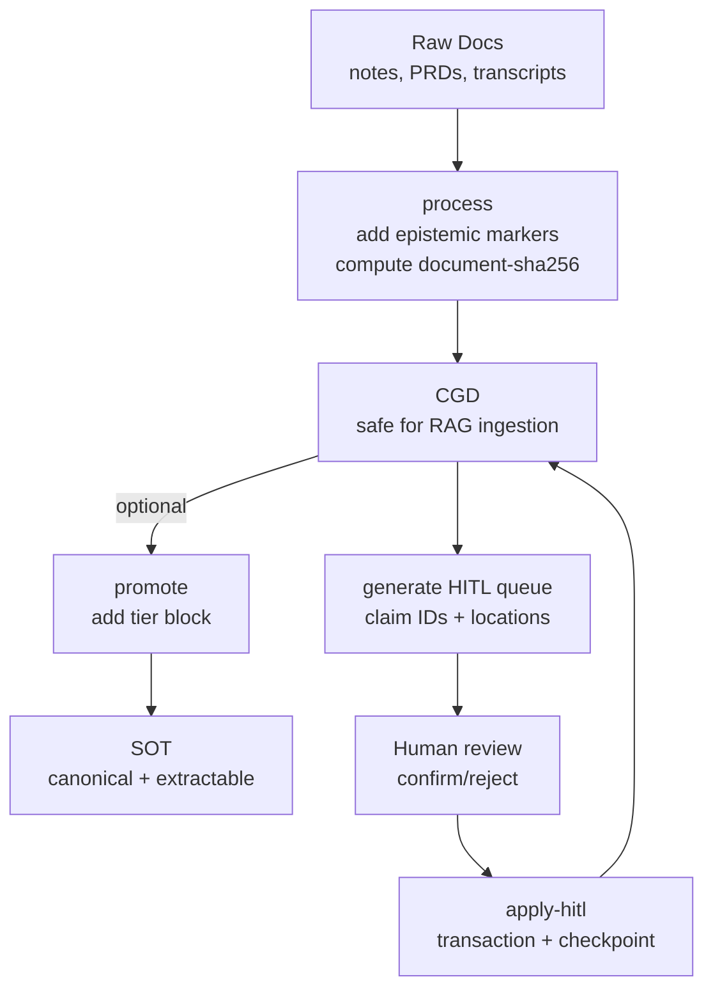
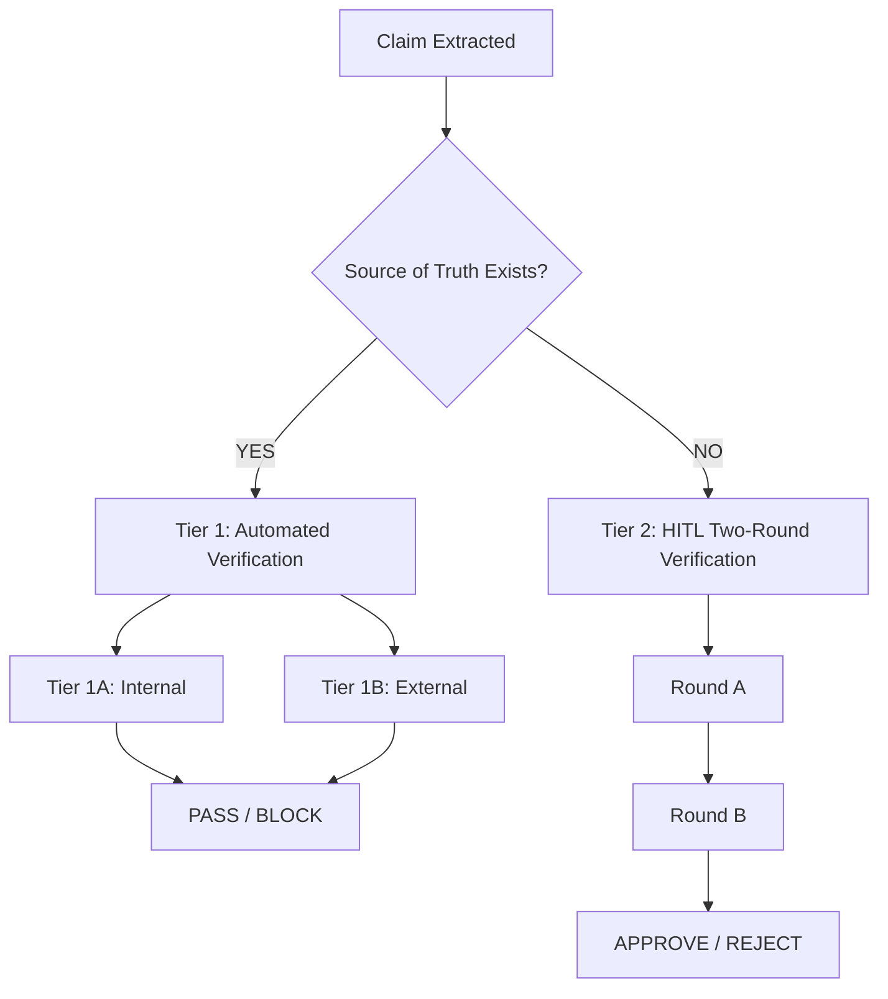

# KNOWLEDGE EXTRACT: clarity-gate
> **Extracted on:** 2026-03-30 13:33:56
> **Source:** clarity-gate

---

## File: `.gitignore`
```
# OS
.DS_Store
Thumbs.db
nul

# Claude local settings
.claude/settings.local.json

# IDE
.idea/
.vscode/
*.swp
*.swo

# Archives (except built skill packages)
*.zip
!dist/*.skill

# Build output
dist/

# Logs
*.log

# Node (if using npm packages locally)
node_modules/

# Python (if using pip packages locally)
__pycache__/
*.pyc
.venv/
venv/
```

## File: `AGENTS.md`
```markdown
# AGENTS.md - Clarity Gate

> Universal discovery file for AI agents and coding assistants.

## What This Repository Does

**Clarity Gate** is a pre-ingestion verification system for epistemic quality in RAG systems. It ensures documents are properly qualified (claims marked as projections, hypotheses labeled, assumptions explicit) before they enter knowledge bases.

**Core Question:** "If another LLM reads this document, will it mistake assumptions for facts?"

## Quick Start for Agents

### 1. Load the Skill

The main skill file is at: `skills/clarity-gate/SKILL.md`

```
Read: skills/clarity-gate/SKILL.md
```

### 2. Understand the Specifications

| Document | Purpose | Location |
|----------|---------|----------|
| Format Spec | Unified CGD/SOT specification (v2.1) | `brain/knowledge/docs_legacy/CLARITY_GATE_FORMAT_SPEC.md` |
| Procedures | Verification workflows | `brain/knowledge/docs_legacy/CLARITY_GATE_PROCEDURES.md` |

### 3. Trigger Phrases

Use any of these to activate Clarity Gate:
- "clarity gate"
- "check for hallucination risks"
- "can an LLM read this safely"
- "review for equivocation"
- "verify document clarity"
- "pre-ingestion check"

## Repository Structure

```
clarity-gate/
├── skills/clarity-gate/      # Canonical skill (agentskills.io compliant)
│   └── SKILL.md              # v2.1 skill definition
├── .claude/skills/clarity-gate/  # Claude.ai format (metadata wrapper)
│   └── SKILL.md
├── .codex/skills/clarity-gate/   # OpenAI Codex (agentskills.io format)
│   └── SKILL.md
├── .github/skills/clarity-gate/  # GitHub Copilot (agentskills.io format)
│   └── SKILL.md
├── brain/knowledge/docs_legacy/                     # Specifications (v2.1)
│   ├── CLARITY_GATE_FORMAT_SPEC.md   # Unified format spec
│   ├── CLARITY_GATE_PROCEDURES.md    # Verification procedures
│   ├── ARCHITECTURE.md       # 9-point verification system
│   └── ...                   # Supporting docs
├── examples/                 # Usage examples
├── .claude-plugin/           # Claude Code marketplace
└── AGENTS.md                 # This file
```

## Platform-Specific Locations

| Platform | Skill Location | Format |
|----------|----------------|--------|
| Claude Desktop/Code | `.claude/skills/clarity-gate/` | Minimal (`name`, `description` only) |
| OpenAI Codex | `.codex/skills/clarity-gate/` | agentskills.io (full) |
| GitHub Copilot | `.github/skills/clarity-gate/` | agentskills.io (full) |
| Universal (canonical) | `skills/clarity-gate/` | agentskills.io (full) |

Each platform directory contains a full copy of SKILL.md with platform-appropriate frontmatter.

## Key Concepts

### The 9 Verification Points

1. **Hypothesis vs Fact Labeling** - Are claims marked as validated or hypothetical?
2. **Uncertainty Marker Enforcement** - Do projections have qualifiers?
3. **Assumption Visibility** - Are implicit assumptions explicit?
4. **Authoritative-Looking Unvalidated Data** - Could tables be mistaken for empirical data?
5. **Data Consistency** - Do numbers match across sections?
6. **Implicit Causation** - Are causal claims evidence-backed?
7. **Future State as Present** - Are plans written as achievements?
8. **Temporal Coherence** - Are dates internally consistent?
9. **Externally Verifiable Claims** - Are specific numbers flagged for verification?

### Output Format

| Format | Extension | Purpose |
|--------|-----------|---------|
| CGD | `.cgd.md` | Clarity-Gated Document (unified format) |

> **Note:** v2.1 uses a single `.cgd.md` extension. SOT is now a CGD with an optional `tier:` block in YAML frontmatter.

### Two-Round HITL Verification

- **Round A:** Derived data confirmation (quick scan)
- **Round B:** True HITL verification (actual verification needed)

## For Validator Implementers

If building a validator, read:
1. `brain/knowledge/docs_legacy/CLARITY_GATE_FORMAT_SPEC.md` - Complete format and rule definitions

Validator packages:
- npm: `clarity-gate` v1.0.0 — Validates v1.x spec (validation only); v2.1 update planned
- PyPI: `clarity-gate` v1.0.0 — Validates v1.x spec (validation only); v2.1 update planned

> **Note:** Separate `cgd-validator` and `sot-validator` packages are deprecated in v2.1.

## Related Projects

| Project | Purpose | URL |
|---------|---------|-----|
| Source of Truth Creator | Create epistemically calibrated docs | github.com/frmoretto/source-of-truth-creator |
| Stream Coding | Documentation-first methodology | github.com/frmoretto/stream-coding |
| ArXiParse | Scientific paper verification | arxiparse.org |

## License

CC-BY-4.0

## Author

Francesco Marinoni Moretto
```

## File: `CHANGELOG.md`
```markdown
# Changelog

All notable changes to Clarity Gate specifications and tools.

Format based on [Keep a Changelog](https://keepachangelog.com/).

---

## Specification Documents

| Document | Current | Description |
|----------|---------|-------------|
| [CLARITY_GATE_FORMAT_SPEC.md](./brain/knowledge/docs_legacy/CLARITY_GATE_FORMAT_SPEC.md) | 2.1 | Unified format specification |
| [CLARITY_GATE_PROCEDURES.md](./brain/knowledge/docs_legacy/CLARITY_GATE_PROCEDURES.md) | 1.0 | Verification procedures |

---

## [2.1.2] - February 2026

### Fixed
- **Documentation Consistency** — Standardized validation code notation from `W-HC01-02` to `W-HC01, W-HC02` across all documentation for 100% alignment with FORMAT_SPEC

---

## [2.1.1] - January 2026

### Fixed
- **Critical:** `document_hash.py` missing canonicalization algorithm (§2.2-2.4)
- **Documentation:** Validation codes updated to match FORMAT_SPEC (W-HC01, W-HC02, E-SC06)
- **Documentation:** Claim ID regex patterns specified per approach (hash/sequential/semantic)

---

## [2.1] - January 2026

**RFC-001 Applied:** Clarifications for HITL claim handling.

### Added
- **Claim Completion Status** — PENDING/VERIFIED determined by field presence (no explicit status field)
- **Source Field Semantics** — Actionable source (PENDING) vs. what-was-found (VERIFIED)
- **Claim ID Format Guidance** — Hash-based IDs preferred with collision analysis
- **Body Structure Requirements** — HITL Verification Record section mandatory when claims exist
- **New Validation Codes** — E-ST10, W-ST11, W-HC01, W-HC02, E-SC06 (FORMAT_SPEC); E-TB01-07 (SOT validation)
- **Bundled Scripts** — `claim_id.py`, `document_hash.py` with full §2.2-2.4 canonicalization
- **Validation Codes Reference** — Comprehensive table added to SKILL.md documenting all error/warning codes

### Updated
- FORMAT_SPEC: v2.0 → v2.1
- SKILL.md: v2.0.0 → v2.1.0

---

## [2.0] - January 2026

**BREAKING CHANGE:** Unified CGD/SOT format.

### Format Unification
- **Single file extension:** `.cgd.md` for everything (`.sot.md` deprecated)
- **SOT = CGD + tier: block:** SOT is now a CGD with optional `tier:` block in YAML frontmatter
- **One validator:** Single `clarity-gate` package handles both formats
- **promote/demote commands:** Add/remove `tier:` block instead of format conversion

### Key Changes
- Unified spec: `CLARITY_GATE_FORMAT_SPEC.md` replaces 4-file suite
- New procedures doc: `CLARITY_GATE_PROCEDURES.md` for workflows
- `tier.queue` and `tier.claims` for systematic claim processing
- Claim IDs enable tracking across verification rounds

### Breaking Changes
- `.sot.md` extension deprecated (use `.cgd.md`)
- Separate validators (`sot-validator`, `cgd-validator`) deprecated
- 4-file spec suite archived (CGD_FORMAT, SOT_FORMAT, VALIDATOR_REFERENCE, VALIDATOR_IMPL_GUIDE)

### Migration
- Rename `.sot.md` files to `.cgd.md`
- Add `tier:` block to YAML frontmatter for SOT behavior
- Use `clarity-gate` package instead of separate validators

> **Note:** v1.1 and v1.2 were internal development iterations (Jan 10-12, 2026) that were never publicly released. See archive for details.

---

## [1.0] - November 2025

- Initial specification as FILE_FORMAT_SPEC.md
- Separate `.cgd.md` and `.sot.md` formats
- Published as npm/PyPI packages v0.1.1
- Basic validation rules

---

## Validator Package

| Package | npm | PyPI | Spec Version |
|---------|-----|------|--------------|
| clarity-gate | [npm](https://www.npmjs.com/package/clarity-gate) | [PyPI](https://pypi.org/project/clarity-gate/) | 2.1 |

> **Deprecated:** `sot-validator`, `cgd-validator`, `sot-verify`, `cgd-verify` are superseded by the unified `clarity-gate` package.

---

## SKILL.md Versions

| Version | Date | Key Changes |
|---------|------|-------------|
| v2.1.2 | Feb 2, 2026 | Documentation consistency (validation code notation) |
| v2.1.1 | Jan 28, 2026 | Critical bugfixes (document_hash.py canonicalization) |
| v2.1.0 | Jan 27, 2026 | RFC-001 clarifications, bundled scripts |
| v2.0.0 | Jan 13, 2026 | Unified format spec v2.0, single `.cgd.md` extension |
| v1.6 | Dec 31, 2025 | Two-Round HITL (Round A + Round B) |
| v1.5 | Dec 28, 2025 | Points 8-9: Temporal Coherence, Externally Verifiable Claims |
| v1.4 | Dec 23, 2025 | Annotation offer + CGD output mode |
| v1.3 | Dec 2025 | Restructured into Epistemic (1-4) + Data Quality (5-7) |
| v1.2 | Dec 2025 | Added Source of Truth Template |
| v1.1 | Dec 2025 | Added HITL Fact Verification (MANDATORY) |
| v1.0 | Nov 2025 | Initial release with 6-point verification |
```

## File: `CODE_OF_CONDUCT.md`
```markdown
# Contributor Code of Conduct

## Our Pledge

We are committed to making participation in this project a welcoming experience for everyone.

## Our Standards

**Expected behavior:**
- Using welcoming and inclusive language
- Being respectful of differing viewpoints and experiences
- Gracefully accepting constructive criticism
- Focusing on what is best for the community
- Showing empathy towards other community members

**Unacceptable behavior:**
- Trolling, insulting/derogatory comments, and personal attacks
- Public or private harassment
- Publishing others' private information without permission
- Other conduct which could reasonably be considered inappropriate

## Enforcement

Project maintainers are responsible for clarifying standards and may take appropriate action in response to unacceptable behavior.

## Scope

This Code of Conduct applies within project spaces and when representing the project publicly.

## Attribution

This Code of Conduct is adapted from the [Contributor Covenant](https://www.contributor-covenant.org), version 2.1.
```

## File: `CONTRIBUTING.md`
```markdown
# Contributing to Clarity Gate

## Ways to Contribute

1. **Prior art** — Open-source pre-ingestion gates for epistemic quality we missed?
2. **Integration** — LlamaIndex, LangChain, Semantica implementations
3. **Verification feedback** — Are the 9 points the right focus?
4. **Real-world examples** — Documents that expose edge cases
5. **RFC proposals** — See [rfc/](rfc/) for the process

## Getting Started

1. Fork the repository
2. Create a feature branch (`git checkout -b feature/my-feature`)
3. Make your changes
4. Test with the Claude skill
5. Submit a Pull Request

## Code Style

- Markdown files: Use ATX headers (`#`), not Setext
- YAML frontmatter: Follow agentskills.io format
- Examples: Include both passing and failing cases

## RFC Process

For changes to the specification:

1. Copy `rfc/RFC-TEMPLATE.md`
2. Follow RFC-000 governance
3. Normative RFCs require reviewer approval
4. See [rfc/README.md](../../../README.md) for details

## Reporting Issues

Use the issue templates:
- Bug Report
- Feature Request
- Documentation Improvement

## Questions?

Open a Discussion or reach out on LinkedIn.

## License

By contributing, you agree that your contributions will be licensed under CC-BY-4.0.
```

## File: `LICENSE`
```
Creative Commons Attribution 4.0 International License (CC BY 4.0)

Copyright (c) 2025 Francesco Marinoni Moretto

This work is licensed under the Creative Commons Attribution 4.0 International License.

You are free to:

- Share -- copy and redistribute the material in any medium or format
- Adapt -- remix, transform, and build upon the material for any purpose, even commercially

Under the following terms:

- Attribution -- You must give appropriate credit, provide a link to the license, and indicate if changes were made. You may do so in any reasonable manner, but not in any way that suggests the licensor endorses you or your use.

- No additional restrictions -- You may not apply legal terms or technological measures that legally restrict others from doing anything the license permits.

Full license text: https://creativecommons.org/licenses/by/4.0/legalcode

SPDX-License-Identifier: CC-BY-4.0
```

## File: `README.md`
```markdown
# Clarity Gate — Prevent LLMs from Misinterpreting Facts

> **⚠️ LATEST:** Version 2.1 released (2026-01-27). RFC-001 applied: claim status semantics, bundled scripts. See [CHANGELOG](CHANGELOG.md).

> ✅ **This README passed Clarity Gate verification** (2026-01-13, adversarial mode, Claude Opus 4.5)

**Open-source pre-ingestion verification for epistemic quality in RAG systems.**

[](https://creativecommons.org/licenses/by/4.0/)

> *"Detection finds what is; enforcement ensures what should be. In practice: find the missing uncertainty markers before they become confident hallucinations."*

---

## The Problem

If you feed a well-aligned model a document that states "Revenue will reach $50M by Q4" as fact (when it's actually a projection), the model will confidently report this as fact.

The model isn't hallucinating. It's faithfully representing what it was told.

**The failure happened before the model saw the input.**

| Document Says | Accuracy Check | Epistemic Check |
|---------------|----------------|-----------------|
| "Revenue will be $50M" (unmarked projection) | ✅ PASS | ❌ FAIL — projection stated as fact |
| "Our approach outperforms X" (no evidence) | ✅ PASS | ❌ FAIL — ungrounded assertion |
| "Users prefer feature Y" (no methodology) | ✅ PASS | ❌ FAIL — missing epistemic basis |

**Accuracy verification asks:** "Does this match the source?"  
**Epistemic verification asks:** "Is this claim properly qualified?"

Both matter. Accuracy verification has mature open-source tools. Epistemic verification has detection systems (UnScientify, HedgeHunter, BioScope), but at the date of 2.0 release (January 13th, 2026), I found no open-source pre-ingestion epistemic enforcement system (methodology: deep research conducted via multiple LLMs). Corrections welcome.

Clarity Gate is a proposal for that layer.

---

## What Is Clarity Gate?

Clarity Gate is an **open-source pre-ingestion verification system** for epistemic quality.

- **Clarity** — Making explicit what's fact, what's projection, what's hypothesis
- **Gate** — Documents don't enter the knowledge base until they pass verification

### The Gap It Addresses

| Component | Status |
|-----------|--------|
| Pre-ingestion gate pattern | ✅ Proven (Adlib, pharma QMS) |
| Epistemic detection | ✅ Proven (UnScientify, HedgeHunter) |
| **Pre-ingestion epistemic enforcement** | ❌ Gap (to my knowledge) |
| **Open-source accessibility** | ❌ Gap |

| Dimension | Enterprise (Adlib) | Clarity Gate |
|-----------|-------------------|--------------|
| **License** | Proprietary | Open source (CC BY 4.0) |
| **Focus** | Accuracy, compliance | Epistemic quality |
| **Target** | Fortune 500 | Founders, researchers, small teams |
| **Cost** | Enterprise pricing | Free |

---

## When to Use Clarity Gate

Most valuable when:

- Your RAG corpus includes **drafts, docs, tickets, meeting notes**, or user-provided content
- You care about **correctness** and want a verifiable ingestion gate
- You need a practical **HITL loop** that scales beyond manual spot checks
- You want **automated enforcement** of document quality before ingestion

---

## How Clarity Gate Differs from Knowledge Engineering Tools

| Aspect | Semantica / LlamaIndex | Clarity Gate |
|--------|------------------------|--------------|
| **Stage** | Post-extraction | Pre-ingestion |
| **Input** | Structured entities | Raw documents |
| **Problem** | "Which value is correct?" | "Is this claim properly qualified?" |
| **Output** | Resolved knowledge graph | Annotated document (CGD) |
| **Conflict** | Multi-source disagreement | Unmarked projections/assumptions |

**They're complementary:** Use Clarity Gate *before* Semantica/LlamaIndex.

---

## Quick Start

### Option 1: Claude.ai (Web) — Skill Upload

1. Download [`dist/clarity-gate.skill`](dist/clarity-gate.skill)
2. Go to claude.ai → Settings → Features → Skills → Upload
3. Upload the `.skill` file
4. Ask Claude: *"Run clarity gate on this document"*

### Option 2: Claude Desktop

Same as Option 1 — Claude Desktop uses the same skill format as claude.ai.

### Option 3: Claude Code

Clone the repo — Claude Code auto-detects skills in `.claude/skills/`:

```bash
git clone https://github.com/frmoretto/clarity-gate
cd clarity-gate
# Claude Code will automatically detect .claude/skills/clarity-gate/SKILL.md
```

Or copy `.claude/skills/clarity-gate/` to your project's `.claude/skills/` directory.

Ask Claude: *"Run clarity gate on this document"*

### Option 4: Claude Projects

Add [`skills/clarity-gate/SKILL.md`](../../../.claude/skills/supabase-postgres-best-practices/SKILL.md) to project knowledge. Claude will search it when needed, though Skills provide better integration.

### Option 5: OpenAI Codex / GitHub Copilot

Copy the canonical skill to the appropriate directory:

| Platform | Location |
|----------|----------|
| OpenAI Codex | `.codex/skills/clarity-gate/SKILL.md` |
| GitHub Copilot | `.github/skills/clarity-gate/SKILL.md` |

Use [`skills/clarity-gate/SKILL.md`](../../../.claude/skills/supabase-postgres-best-practices/SKILL.md) (agentskills.io format).

### Option 6: Manual / Other LLMs

Use the [9-point verification](ARCHITECTURE.md#the-9-verification-points) as a manual review process.

For Cursor, Windsurf, or other AI tools, extract the 9 verification points into your `.cursorrules`. The methodology is tool-agnostic—only SKILL.md is Claude-optimized.

---

## Platform-Specific Skill Locations

| Platform | Skill Location | Frontmatter Format |
|----------|----------------|-------------------|
| Claude.ai / Claude Desktop | `.claude/skills/clarity-gate/` | Minimal (`name`, `description` only) |
| Claude Code | `.claude/skills/clarity-gate/` | Minimal |
| OpenAI Codex | `.codex/skills/clarity-gate/` | agentskills.io (full) |
| GitHub Copilot | `.github/skills/clarity-gate/` | agentskills.io (full) |
| Canonical | `skills/clarity-gate/` | agentskills.io (full) |

Pre-built skill file: [`dist/clarity-gate.skill`](dist/clarity-gate.skill)

---

## Format Specification

See [CLARITY_GATE_FORMAT_SPEC.md](brain/knowledge/docs_legacy/CLARITY_GATE_FORMAT_SPEC.md) for the complete format specification (v2.0).

---

## Two Modes

**Verify Mode (default):**
```
"Run clarity gate on this document"
→ Issues report + Two-Round HITL verification
```

**Annotate Mode:**
```
"Run clarity gate and annotate this document"
→ Complete document with fixes applied inline (CGD)
```

The annotated output is a **Clarity-Gated Document (CGD)**.

---

## Workflow Overview



---

## The 9 Verification Points

### Epistemic Checks (Core Focus)

1. **Hypothesis vs. Fact Labeling** — Claims marked as validated or hypothetical
2. **Uncertainty Marker Enforcement** — Forward-looking statements require qualifiers
3. **Assumption Visibility** — Implicit assumptions made explicit
4. **Authoritative-Looking Unvalidated Data** — Tables with percentages flagged if unvalidated

### Data Quality Checks (Complementary)

5. **Data Consistency** — Conflicting numbers within document
6. **Implicit Causation** — Claims implying causation without evidence
7. **Future State as Present** — Planned outcomes described as achieved

### Verification Routing

8. **Temporal Coherence** — Dates consistent with each other and with present
9. **Externally Verifiable Claims** — Pricing, statistics, competitor claims flagged for verification

See [ARCHITECTURE.md](ARCHITECTURE.md) for full details and examples.

---

## Two-Round HITL Verification

Different claims need different types of verification:

| Claim Type | What Human Checks | Cognitive Load |
|------------|-------------------|----------------|
| LLM found source, human witnessed | "Did I interpret correctly?" | Low (quick scan) |
| Human's own data | "Is this actually true?" | High (real verification) |
| No source found | "Is this actually true?" | High (real verification) |

**The system separates these into two rounds:**

### Round A: Derived Data Confirmation

Quick scan of claims from sources found in the current session:

```
## Derived Data Confirmation

These claims came from sources found in this session:

- [Specific claim from source A] (source link)
- [Specific claim from source B] (source link)

Reply "confirmed" or flag any I misread.
```

### Round B: True HITL Verification

Full verification of claims needing actual checking:

```
## HITL Verification Required

| # | Claim | Why HITL Needed | Human Confirms |
|---|-------|-----------------|----------------|
| 1 | Benchmark scores (100%, 75%→100%) | Your experiment data | [ ] True / [ ] False |
```

**Result:** Human attention focused on claims that actually need it.

---

## Verification Hierarchy



### Tier 1A: Internal Consistency (Ready Now)

Checks for contradictions *within* a document — no external systems required.

| Check Type | Example |
|------------|---------|
| Figure vs. Text | Figure shows β=0.33, text claims β=0.73 |
| Abstract vs. Body | Abstract claims "40% improvement," body shows 28% |
| Table vs. Prose | Table lists 5 features, text references 7 |

See [biology paper example](examples/biology-paper-example.md) for a real case where Clarity Gate detected a Δ=0.40 discrepancy. Try it yourself at [arxiparse.org](https://arxiparse.org).

### Tier 1B: External Verification (Extension Interface)

For claims verifiable against structured sources. **Users provide connectors.**

### Tier 2: Two-Round HITL (Intelligent Routing)

The system detects *which* specific claims need human review AND *what kind of review* each needs.

*Example: Most claims in a document typically pass automated checks, with the remainder split between Round A (quick confirmation) and Round B (real verification). (Illustrative — actual ratios vary by document type.)*

---

## Where This Fits

```
Layer 4: Human Strategic Oversight
Layer 3: AI Behavior Verification (behavioral evals, red-teaming)
Layer 2: Input/Context Verification  <-- Clarity Gate
Layer 1: Deterministic Boundaries (rate limits, guardrails)
Layer 0: AI Execution
```

A perfectly aligned model (Layer 3) can confidently produce unsafe outputs from unsafe context (Layer 2). Alignment doesn't inoculate against misleading information.

---

## Prior Art

Clarity Gate builds on proven patterns. See [PRIOR_ART.md](brain/knowledge/docs_legacy/PRIOR_ART.md) for the full landscape.

**Enterprise Gates:** Adlib Software, Pharmaceutical QMS  
**Epistemic Detection:** UnScientify, HedgeHunter, FactBank  
**Fact-Checking:** FEVER, ClaimBuster  
**Post-Retrieval:** Self-RAG, RAGAS, TruLens

**The opportunity:** Existing detection tools (UnScientify, HedgeHunter, BioScope) excel at identifying uncertainty markers. Clarity Gate proposes a complementary enforcement layer that routes ambiguous claims to human review or marks them automatically. I believe these could work together. Community input on integration is welcome.

---

## Critical Limitation

> **Clarity Gate verifies FORM, not TRUTH.**

This system checks whether claims are properly marked as uncertain — it cannot verify if claims are actually true.

**Risk:** An LLM can hallucinate facts INTO a document, then "pass" Clarity Gate by adding source markers to false claims.

**Mitigation:** Two-Round HITL verification is **mandatory** before declaring PASS. See [SKILL.md](../../../.claude/skills/supabase-postgres-best-practices/SKILL.md) for the full protocol.

---

## Non-Goals (By Design)

- Does **not** prove truth automatically — enforces correct labeling and verification workflow
- Does **not** replace source citations — prevents epistemic category errors
- Does **not** require a centralized database — file-first and Git-friendly

---

## Roadmap

| Phase | Status | Description |
|-------|--------|-------------|
| **Phase 1** | ✅ Ready | Internal consistency checks + Two-Round HITL + annotation (Claude skill) |
| **Phase 2** | 🔜 Planned | npm/PyPI validators for CI/CD integration |
| **Phase 3** | 🔜 Planned | External verification hooks (user connectors) |
| **Phase 4** | 🔜 Planned | Confidence scoring for HITL optimization |

See [ROADMAP.md](ROADMAP.md) for details.

---

## Documentation

| Document | Description |
|----------|-------------|
| [CLARITY_GATE_FORMAT_SPEC.md](brain/knowledge/docs_legacy/CLARITY_GATE_FORMAT_SPEC.md) | Unified format specification (v2.0) |
| [CLARITY_GATE_PROCEDURES.md](brain/knowledge/docs_legacy/CLARITY_GATE_PROCEDURES.md) | Verification procedures and workflows |
| [ARCHITECTURE.md](ARCHITECTURE.md) | Full 9-point system, verification hierarchy |
| [PRIOR_ART.md](brain/knowledge/docs_legacy/PRIOR_ART.md) | Landscape of existing systems |
| [ROADMAP.md](ROADMAP.md) | Phase 1/2/3 development plan |
| [BENCHMARK_RESULTS.md](brain/knowledge/docs_legacy/research/BENCHMARK_RESULTS.md) | Empirical validation (+19-25% improvement for mid-tier models) |
| [SKILL.md](../../../.claude/skills/supabase-postgres-best-practices/SKILL.md) | Claude skill implementation (v2.0) |
| [examples/](examples/) | Real-world verification examples |

---

## Related

**arxiparse.org** — Live implementation for scientific papers  
[arxiparse.org](https://arxiparse.org)

**Source of Truth Creator** — Create epistemically calibrated documents (use before verification)  
[github.com/frmoretto/source-of-truth-creator](https://github.com/frmoretto/source-of-truth-creator)

**Stream Coding** — Documentation-first methodology where Clarity Gate originated  
[github.com/frmoretto/stream-coding](https://github.com/frmoretto/stream-coding)

---

## License

CC BY 4.0 — Use freely with attribution.

---

## Author

**Francesco Marinoni Moretto**
- GitHub: [@frmoretto](https://github.com/frmoretto)
- LinkedIn: [francesco-moretto](https://www.linkedin.com/in/francesco-moretto/)

---

## Contributing

Looking for:

1. **Prior art** — Open-source pre-ingestion gates for epistemic quality I missed?
2. **Integration** — LlamaIndex, LangChain implementations
3. **Verification feedback** — Are the 9 points the right focus?
4. **Real-world examples** — Documents that expose edge cases

Open an issue or PR.
```

## File: `SECURITY.md`
```markdown
# Security Policy

## Scope

Clarity Gate is a verification methodology, not a security tool. However, we take security seriously.

## Reporting a Vulnerability

If you discover a security issue:

1. **Do NOT** open a public issue
2. Email: contact@clarity-gate.org
3. Include:
   - Description of the vulnerability
   - Steps to reproduce
   - Potential impact

## Response Timeline

- Acknowledgment: 48 hours
- Initial assessment: 7 days
- Resolution target: 30 days

## Known Limitations

Clarity Gate verifies FORM, not TRUTH. It cannot:
- Detect malicious content
- Verify factual accuracy
- Replace security scanning tools
- Prevent prompt injection

## Validator Security

If you're implementing a validator:

1. Use validators from trusted sources (official releases)
2. Verify validator version matches specification version
3. See RFC-004 for parser hardening requirements
4. Implement resource limits (see FORMAT_SPEC §Security)

## Supported Versions

| Version | Supported |
|---------|-----------|
| 2.1.x   | ✅ Yes    |
| 2.0.x   | ✅ Yes    |
| < 2.0   | ❌ No     |
```

## File: `brain/knowledge/docs_legacy/ARCHITECTURE.md`
```markdown
# Clarity Gate Architecture

**Version:** 2.1
**Last Updated:** 2026-01-27

---

## Overview

Clarity Gate is a pre-ingestion verification system for epistemic quality. This document details the verification architecture, including the 9-point checklist and tiered verification hierarchy.

---

## The 9 Verification Points

### Epistemic Checks (Core Focus)

These four checks address the primary mission: ensuring claims are properly qualified.

#### 1. Hypothesis vs. Fact Labeling

**Question:** Is this claim marked as validated or hypothetical?

| Fails | Passes |
|-------|--------|
| "Our architecture outperforms competitors" | "Our architecture outperforms competitors [benchmark data in Table 3]" |
| "The model achieves 40% improvement" | "The model achieves 40% improvement [measured on dataset X]" |
| "Users prefer this approach" | "Users prefer this approach [n=50 survey, p<0.05]" |

**Why it matters:** Ungrounded assertions look like facts to downstream systems.

---

#### 2. Uncertainty Marker Enforcement

**Question:** Do forward-looking statements have appropriate qualifiers?

| Fails | Passes |
|-------|--------|
| "Revenue will be $50M by Q4" | "Revenue is **projected** to be $50M by Q4" |
| "The feature will reduce churn" | "The feature is **expected** to reduce churn" |
| "We will achieve product-market fit" | "We **aim** to achieve product-market fit" |

**Keywords to enforce:** projected, expected, estimated, anticipated, planned, aimed, targeted

**Why it matters:** Future states stated as present facts become "verified" hallucinations.

---

#### 3. Assumption Visibility

**Question:** Are implicit assumptions made explicit?

| Fails | Passes |
|-------|--------|
| "The system scales linearly" | "The system scales linearly [assuming <1000 concurrent users]" |
| "Response time is 50ms" | "Response time is 50ms [under standard load conditions]" |
| "Cost per user is $0.02" | "Cost per user is $0.02 [at current AWS pricing, us-east-1]" |

**Why it matters:** Hidden assumptions break when conditions change.

---

#### 4. Authoritative-Looking Unvalidated Data

**Question:** Do tables/charts with specific numbers have validation sources?

| Red Flags | Resolution |
|-----------|------------|
| Table with percentages, no source | Add [source] or mark [PROJECTED] |
| Chart with trend lines, no methodology | Add methodology note |
| Comparison matrix with checkmarks | Clarify if measured or claimed |

**Why it matters:** Formatted data triggers authority heuristics. Tables "look" more credible than prose.

---

### Data Quality Checks (Complementary)

These three checks support epistemic quality by catching data issues.

#### 5. Data Consistency

**Question:** Are there conflicting numbers, dates, or facts within the document?

| Check Type | Example Discrepancy |
|------------|---------------------|
| Figure vs. Text | Figure shows beta=0.33, text claims beta=0.73 |
| Abstract vs. Body | Abstract claims "40% improvement," body shows 28% |
| Table vs. Prose | Table lists 5 features, text references 7 |
| Repeated values | Revenue stated as $47M in one section, $49M in another |

**Why it matters:** Internal contradictions indicate unreliable content.

---

#### 6. Implicit Causation

**Question:** Does the claim imply causation without evidence?

| Fails | Passes |
|-------|--------|
| "Feature X increased retention" | "Feature X **correlated with** increased retention" |
| "The change reduced errors" | "Errors decreased **after** the change [causal link not established]" |
| "Training improved performance" | "Performance improved **following** training [controlled study pending]" |

**Why it matters:** Correlation stated as causation misleads decision-making.

---

#### 7. Future State as Present

**Question:** Are planned outcomes described as if already achieved?

| Fails | Passes |
|-------|--------|
| "The system handles 10K requests/second" | "The system **is designed to** handle 10K requests/second" |
| "We have enterprise customers" | "We **are targeting** enterprise customers" |
| "The API supports GraphQL" | "The API **will support** GraphQL [Q2 roadmap]" |

**Why it matters:** Aspirations presented as reality create false expectations.

---

### Verification Routing (Points 8-9)

These two checks improve detection and routing for claims that need external verification.

#### 8. Temporal Coherence

**Question:** Are dates coherent with each other and with the present?

| Fails | Passes |
|-------|--------|
| "Last Updated: December 2024" (current date is December 2025) | "Last Updated: December 2025" |
| v1.0.0 dated 2024-12-23, v1.1.0 dated 2024-12-20 (out of order) | Versions in chronological order |
| "Deployed in Q3 2025" in a doc from Q1 2025 | "PLANNED: Q3 2025" |
| "Current CEO is X" (when X left 2 years ago) | "As of Dec 2025, CEO is Y" |

**Sub-checks:**
1. **Document date vs current date**: Is "Last Updated" in the future or suspiciously stale (>6 months)?
2. **Internal chronology**: Are version numbers, event dates in logical sequence?
3. **Reference freshness**: Do "current", "now", "today" claims need staleness markers?

**Why it matters:** A document claiming "December 2024" when consumed in December 2025 misleads any LLM that ingests it about temporal context.

**Scope boundaries:**
- ✅ IN: Wrong years, chronological inconsistencies, stale markers
- ❌ OUT: Judging if timelines are "reasonable" (subjective), verifying events happened on stated dates (HITL)

---

#### 9. Externally Verifiable Claims

**Question:** Does the document contain specific claims that could be fact-checked but aren't sourced?

| Type | Example | Risk |
|------|---------|------|
| Pricing | "Costs ~$0.005 per call" | API pricing changes; may be outdated or wrong |
| Statistics | "Papers average 15-30 equations" | Sounds plausible but may be wildly off |
| Rates/ratios | "40% of researchers use X" | Specific % needs citation |
| Competitor claims | "No competitor offers Y" | May be outdated or incorrect |
| Industry facts | "The standard is X" | Standards evolve |

**Why it matters:** These claims are dangerous because they:
1. Look authoritative (specific numbers)
2. Sound plausible (common-sense estimates)
3. Are verifiable (unlike opinions)
4. Are often wrong (pricing changes, statistics misremembered)

**Fix options:**
1. Add source: "~$0.005 (Gemini pricing, Dec 2025)"
2. Add uncertainty: "~$0.005 (estimated, verify current pricing)"
3. Route to verification: Flag for HITL or external search
4. Generalize: "low cost per call" instead of specific number

**Why it matters:** An LLM ingesting "costs ~$0.005" will confidently repeat this—even if actual cost is 10x different. This is a "confident plausible falsehood."

---

## Verification Hierarchy

```
Claim Extracted --> Does Source of Truth Exist?
                           |
           +---------------+---------------+
           YES                             NO
           |                               |
     Tier 1: Automated              Tier 2: HITL
     Verification                   (Last Resort)
           |                               |
     +-----+-----+                   Human reviews:
     |           |                   - Add markers
   Tier 1A    Tier 1B               - Provide source
   Internal   External              - Reject claim
           |           |                   |
     PASS/BLOCK   PASS/BLOCK        APPROVE/REJECT
```

---

## Tier 1A: Internal Consistency (Ready Now)

Checks for contradictions *within* a document. No external systems required.

### Capabilities

| Check | Description | Status |
|-------|-------------|--------|
| Figure vs. Text | Cross-reference numerical claims | Ready |
| Abstract vs. Body | Verify summary matches content | Ready |
| Table vs. Prose | Ensure counts/lists are consistent | Ready |
| Duplicate values | Flag conflicting repeated claims | Ready |

### Implementation

The Claude skill implementation handles Tier 1A checks through:
1. Extracting claims from document
2. Cross-referencing numerical values
3. Flagging discrepancies with specific locations

### Example Output

```yaml
check: internal_consistency
status: DISCREPANCY_FOUND

findings:
  - type: figure_vs_text
    figure_location: Figure 3, panel B
    figure_value: "beta = 1/3 = 0.33"
    text_location: Section 4.2, paragraph 3
    text_value: "beta = 11/15 = 0.73"
    delta: 0.40
    severity: HIGH

action: BLOCK - Resolve discrepancy before ingestion
```

---

## Tier 1B: External Verification (Extension Interface)

For claims verifiable against structured sources. **Users implement connectors.**

### Interface Design

```python
class VerificationConnector:
    """Base class for external verification."""
    
    def can_verify(self, claim: Claim) -> bool:
        """Returns True if this connector can verify the claim type."""
        pass
    
    def verify(self, claim: Claim) -> VerificationResult:
        """Verifies claim against external source."""
        pass
```

### Example Connectors (User-Implemented)

| Claim Type | Source | Connector |
|------------|--------|-----------|
| "Q3 revenue was $47M" | Financial system | `FinancialDataConnector` |
| "Feature deployed Oct 15" | Git commits | `GitHistoryConnector` |
| "Customer count is 1,247" | CRM | `CRMConnector` |
| "API latency is 50ms" | Monitoring | `MetricsConnector` |

### Honest Limitation

External verification requires bespoke integration for each data source. This is **not out-of-the-box functionality**. Clarity Gate provides the interface; users provide implementations.

---

## Tier 2: Two-Round HITL Verification (v1.6)

When automated verification cannot resolve a claim, it routes to human review.

### The Value Proposition

The value isn't having humans review data -- every team does that.

The value is **intelligent routing**: the system detects *which specific claims* need human review, AND *what kind of review* each needs.

### Why Two Rounds?

Different claims need different types of verification:

| Claim Type | What Human Checks | Cognitive Load |
|------------|-------------------|----------------|
| LLM found source, human witnessed | "Did I interpret correctly?" | Low (quick scan) |
| Human's own data | "Is this actually true?" | High (real verification) |
| No source found | "Is this actually true?" | High (real verification) |

Mixing these in one table creates checkbox fatigue—human rubber-stamps everything instead of focusing attention where it matters.

### Round A: Derived Data Confirmation

Claims where LLM found a source AND human was present in the session.

**Purpose:** Confirm interpretation, not truth. Human already saw the source.

**Format:** Simple list (lighter visual weight for quick scan)

```
## Derived Data Confirmation

These claims came from sources found in this session:

- o3 prices cut 80% June 2025 (OpenAI blog)
- Opus 4.5 is $5/$25 (Anthropic pricing page)

Reply "confirmed" or flag any I misread.
```

### Round B: True HITL Verification

Claims where:
- No source was found
- Source is human's own data/experiment
- LLM is extrapolating or inferring
- Conflicting sources found

**Purpose:** Verify truth. Human may NOT have seen this or it may not exist.

**Format:** Full table with True/False confirmation

```
## HITL Verification Required

| # | Claim | Why HITL Needed | Human Confirms |
|---|-------|-----------------|----------------|
| 1 | Benchmark scores (100%, 75%→100%) | Your experiment data | [ ] True / [ ] False |
```

### Classification Logic

```
Claim Extracted
      │
      ▼
Was source found in THIS session?
      │
      ├─── YES ────► Was human present/active?
      │                    │
      │              ├─ YES ──► ROUND A (Derived)
      │              │
      │              └─ NO/UNCLEAR ──► ROUND B (True HITL)
      │
      └─── NO ─────► Is this human's own data?
                           │
                     ├─ YES ──► ROUND B with note "your data"
                     │
                     └─ NO ──► ROUND B with note "no source found"
```

**Default behavior:** When uncertain, assign to Round B.

### Efficiency Example

*A 50-claim document might have 48 pass automated checks, with the remaining 2 split between Round A (quick confirmation) and Round B (real verification). Human attention is focused on claims that actually need it. (Illustrative example, not measured.)*

### Human Review Options

When a claim is routed to Round B, the human must:

1. **Provide Source of Truth** -- Point to authoritative source that was missed
2. **Add Epistemic Markers** -- Mark as [PROJECTION], [HYPOTHESIS], [UNVERIFIED]
3. **Reject Claim** -- Remove or rewrite the claim entirely

### HITL Protocol

```yaml
claim: "Our system achieves 99.9% uptime"
automated_result: CANNOT_VERIFY
reason: No source of truth for uptime metrics
round: B

human_action_required:
  options:
    - provide_source: "Link to monitoring dashboard or SLA report"
    - add_marker: "Mark as [TARGET] or [PROJECTED]"
    - reject: "Remove claim or rewrite with evidence"
  
  deadline: Before document enters knowledge base
```

---

## Output Format

### Summary Block

```yaml
verification_result:
  status: PASS | FAIL | NEEDS_REVIEW
  document: "[filename]"
  timestamp: "[ISO-8601]"
  
  summary:
    total_claims: [n]
    passed: [n]
    failed: [n]
    needs_review: [n]
```

### Detailed Findings

```yaml
findings:
  - id: 1
    claim: "[exact text]"
    location: "[section/paragraph]"
    check: "[which of 9 checks]"
    result: PASS | FAIL | NEEDS_REVIEW
    severity: CRITICAL | WARNING | TEMPORAL | VERIFIABLE
    reason: "[explanation]"
    suggested_fix: "[how to resolve]"
```

### Severity Levels

| Level | Description | Example |
|-------|-------------|---------|
| CRITICAL | Will cause hallucination | Projection stated as fact |
| WARNING | Could cause equivocation | Missing assumption markers |
| TEMPORAL | Date/time inconsistency | "Last Updated: December 2024" when current is 2025 |
| VERIFIABLE | Specific claim needing fact-check | "Costs ~$0.005 per call" without source |

### Externally Verifiable Claims

```yaml
verifiable_claims:
  - id: 1
    claim: "[exact text]"
    type: PRICING | STATISTIC | RATE | COMPETITOR | INDUSTRY_FACT
    suggested_verification: "[where to check]"
    status: PENDING | VERIFIED | INCORRECT
```

### Final Determination

```yaml
determination:
  action: APPROVE | BLOCK | ROUTE_TO_HITL
  blocking_issues: [list if any]
  hitl_required: [list if any]
  verifiable_claims: [count]
```

---

## Critical Limitation

> **Clarity Gate verifies FORM, not TRUTH.**

This system checks whether claims are properly marked as uncertain -- it cannot verify if claims are actually true.

### The Risk

An LLM can hallucinate facts INTO a document, then "pass" Clarity Gate by adding source markers to false claims.

Example:
```
FAIL: "Revenue will be $50M"
PASS: "Revenue is projected to be $50M [source: Q3 planning doc]"
```

The second passes Clarity Gate even if the "Q3 planning doc" doesn't exist or says something different.

### The Mitigation

HITL Fact Verification is **MANDATORY** before declaring PASS. The human must:
1. Spot-check that cited sources actually exist
2. Verify cited sources actually support the claims
3. Flag any suspicious attribution patterns

---

## Integration Points

### As Claude Skill

Primary implementation. See [SKILL.md](../../../.claude/skills/supabase-postgres-best-practices/SKILL.md).

### As LlamaIndex Component (Planned)

```python
from clarity_gate import ClarityGateChecker

checker = ClarityGateChecker()
result = checker.verify(document)

if result.status == "PASS":
    index.insert(document)
else:
    route_to_review(document, result.findings)
```

### As LangChain Tool (Planned)

```python
from langchain.tools import ClarityGateTool

tools = [ClarityGateTool()]
agent = create_agent(tools=tools)
```

---

## Version History

| Version | Date | Changes |
|---------|------|---------|
| 1.6 | 2025-12-31 | Added Two-Round HITL verification (Round A: Derived, Round B: True HITL) |
| 1.5 | 2025-12-28 | Added Points 8-9 (Temporal Coherence, Externally Verifiable Claims), new severity levels |
| 1.0 | 2025-12-21 | Initial architecture document |

---

## Related Documents

- [SKILL.md](../../../.claude/skills/supabase-postgres-best-practices/SKILL.md) — Claude skill implementation (v2.0)
- [CLARITY_GATE_FORMAT_SPEC.md](CLARITY_GATE_FORMAT_SPEC.md) — Unified format specification (v2.0)
- [CLARITY_GATE_PROCEDURES.md](CLARITY_GATE_PROCEDURES.md) — Verification procedures
- [PRIOR_ART.md](PRIOR_ART.md) — Landscape of existing systems
- [ROADMAP.md](ROADMAP.md) — Development phases

## Reference Implementation

| Package | npm | PyPI | Status |
|---------|-----|------|--------|
| clarity-gate | [npm](https://www.npmjs.com/package/clarity-gate) | [PyPI](https://pypi.org/project/clarity-gate/) | v1.0.0 — validates v1.x spec; v2.0 update planned |
```

## File: `brain/knowledge/docs_legacy/CLARITY_GATE_FORMAT_SPEC.md`
```markdown
# Clarity Gate Format Specification v2.1.0

**Date:** 2026-01-27
**Status:** FINAL — Implementation Ready
**License:** CC BY 4.0

---

## Executive Summary

Clarity Gate is a pre-ingestion verification system for epistemic quality in RAG systems. This specification defines the document format, CLI behavior, and validation rules.

**Core Question:** "If another LLM reads this document, will it mistake assumptions for facts?"

**Critical Limitation:** Clarity Gate verifies FORM, not TRUTH. It checks whether claims are properly marked — it cannot verify if claims are actually true. HITL verification is mandatory.

---

## 1. Document Format

### 1.1 File Extension

All Clarity Gate documents use **`.cgd.md`**. No exceptions.

### 1.2 Document Structure

```markdown
---
<YAML frontmatter>
---

<Markdown body>

<!-- CLARITY_GATE_END -->
Clarity Gate: <status> | <hitl-status>
```

**Note:** End marker uses required HTML comment prefix for unambiguous detection.

### 1.2.1 Body Structure Requirements (Normative)

Documents with non-empty `hitl-claims` MUST include:

| Element | Requirement |
|---------|-------------|
| `## HITL Verification Record` section | MUST appear before end marker |
| Round A subsection | MUST appear if any Round A claims exist |
| Round B subsection | MUST appear if any Round B claims exist |

**Format:**

```markdown
## HITL Verification Record

### Round A: Derived Data Confirmation
- [claim summary] ([source]) ✓

### Round B: True HITL Verification
| # | Claim | Status | Verified By | Date |
|---|-------|--------|-------------|------|
| 1 | [claim text] | ✓ Confirmed | [name] | [date] |
| 2 | [claim text] | ⏳ Pending | — | — |
```

**Validation:**
- E-ST10: Missing `## HITL Verification Record` when `hitl-claims` non-empty
- W-ST11: Table rows don't match `hitl-claims` count

### 1.3 YAML Schema

```yaml
---
# === REQUIRED FIELDS ===
clarity-gate-version: 2.0
processed-date: 2026-01-12              # Format: YYYY-MM-DD (ISO 8601 date)
processed-by: Claude                    # Claude | automated | <name>
clarity-status: CLEAR                   # CLEAR | UNCLEAR
hitl-status: REVIEWED                   # PENDING | REVIEWED | REVIEWED_WITH_EXCEPTIONS
hitl-pending-count: 0
points-passed: 1-9                      # Format: N or N-M where N,M in 1-9
document-sha256: <64-char lowercase hex>

# === HITL CLAIMS (may be empty list) ===
hitl-claims:
  - id: claim-75fb137a                  # Stable hash-based ID
    text: "Base price is $99/mo"        # Full claim text
    value: "$99/mo"                     # Extracted value (optional)
    source: "Pricing page"              # Source of verification
    location: "api-pricing/1"           # heading_slug/ordinal
    round: B                            # A (interactive) | B (CLI)
    confirmed-by: Maria                 # OPTIONAL: may be omitted for automated verification
    confirmed-date: 2026-01-12

# === COMPUTED FIELDS (written by validators) ===
rag-ingestable: true                    # Computed: see §9.1
exclusions-coverage: 0.0                # Computed: see §9.2

# === EXCLUSION FIELDS (when REVIEWED_WITH_EXCEPTIONS) ===
exceptions-reason: "Legacy OAuth; no SME available"
exceptions-ids:
  - auth-legacy-1

# === TIER BLOCK (optional — present only for SOT) ===
tier:
  level: SOT
  owner: Platform Team
  version: 1.0
  promoted-date: 2026-01-12
  promoted-by: Maria
---
```

### 1.3.1 YAML Serialization and Editing (Normative)

To ensure Python and Node.js implementations produce interoperable outputs, tools MUST follow these rules when writing `.cgd.md` files:

1. **Lossless editing for existing files:** Commands that modify an existing document (e.g., `verify` autofix, `process`, `promote`, `demote`, `apply-hitl`) MUST preserve the original YAML frontmatter text byte-for-byte except for:
   - The exact keys the command is defined to change (e.g., `document-sha256`, `processed-date`, `tier`, `hitl-claims` edits)
   - Any new blocks the command is defined to insert (e.g., `tier:` on promote)
   - **Computed fields:** `document-sha256`, `rag-ingestable`, `exclusions-coverage` (see §9)

   Tools MUST NOT re-serialize or reorder YAML keys globally, must not change quoting style, and must not wrap lines.

2. **Canonical output for newly created files:** If a tool creates a new document from scratch, it MUST emit YAML in the same key order as shown in the schema example, using:
   - Two-space indentation
   - LF line endings (`\n`)
   - No tabs in YAML
   - No line-wrapping

3. **Tier block placement:** When adding a `tier:` block (promote), tools MUST insert it immediately before the closing YAML delimiter line (`---`) and MUST use two-space indentation for nested keys.

### 1.3.2 Claim Completion Status (Normative)

Completion status is determined by field PRESENCE, not a status field:

| State | `confirmed-by` | `confirmed-date` | Meaning |
|-------|----------------|------------------|--------|
| **PENDING** | Absent | Absent | Awaiting verification |
| **VERIFIED** | Present | Present | Human confirmed |

**Rules:**
1. Both `confirmed-by` AND `confirmed-date` MUST be present for VERIFIED
2. `round` indicates verification TIER (A or B), NOT completion
3. `hitl-pending-count` MUST equal count of claims lacking `confirmed-by`

**Validation:**
- W-HC01: Has `confirmed-by` but not `confirmed-date` (or vice versa)
- E-SC06: `hitl-pending-count` doesn't match actual pending count

**Rationale:** Presence/absence semantics prevent sync errors between a `status` field and actual verification data.

**Limitation:** This pattern blocks adding third states (e.g., "rejected", "machine-verified"). If needed in future, will require MAJOR version bump.

### 1.3.3 Source Field Semantics (Normative)

The `source` field serves different purposes based on claim state:

| State | `source` Contains | Example |
|-------|-------------------|--------|
| **PENDING** | Where/how to verify (actionable) | `"Check example.com/pricing"` |
| **VERIFIED** | What was found (record) | `"Pricing page, verified 2026-01-12"` |

**Actionable source requirements (PENDING claims):**
- MUST contain at least one of: URL, document name, person name
- MUST NOT be vague terms only ("industry reports", "various sources")

**Validation:**
- W-HC02: PENDING claim has non-actionable source

**Vague (triggers W-HC02):**
```yaml
source: "industry benchmarks"     # No URL, no doc name, no person
source: "various reports"         # Unverifiable
source: "research"                # Too generic
```

**Actionable (no warning):**
```yaml
source: "Check example.com/pricing"
source: "Q3 Report page 12"
source: "Ask Maria in Finance"
source: "SIA Staffing Report 2025, Table 3.2"
```

**W-HC02 Detection Heuristics (Informative):**

Validators SHOULD use the following heuristics:

```python
import re

def is_actionable_source(source: str) -> bool:
    source_lower = source.lower()
    # URL pattern
    if re.search(r'https?://|www\.|\w+\.(com|org|net|io|ai|gov|edu)', source):
        return True
    # Document reference
    if re.search(r'(page|p\.|section|table|fig|appendix)\s*[\d\.]+', source_lower):
        return True
    # Named document + year
    if re.search(r'(report|guide|spec|manual)\s+(\d{4}|v\d)', source_lower):
        return True
    # Person reference
    if re.search(r'(ask|contact|check with)\s+[A-Z][a-z]+', source):
        return True
    # File path
    if re.search(r'[\w-]+\.(pdf|docx?|xlsx?|csv|md)', source_lower):
        return True
    return False

VAGUE_PATTERNS = [r'^\s*(industry|various|multiple)\s+(reports?|sources?)\s*

### 1.4 Two Document States

| State | `tier:` block | Structured table | Use case |
|-------|---------------|------------------|----------|
| **CGD** | Absent | Optional | Verified text, safe for RAG |
| **SOT** | Present | Required | Canonical reference, machine-extractable |

---

## 2. Hash Specification

### 2.1 Scope

`document-sha256` covers YAML frontmatter + Markdown body, **excluding the hash line itself**.

#### 2.1.1 Hash Input Window (Normative)

Implementations MUST compute `document-sha256` over the exact substring of the document defined as:

- **Start boundary:** the first byte immediately after the opening YAML delimiter line `---` plus its trailing newline (`---\n`).
- **End boundary:** the first byte immediately before the first occurrence of the end marker string `<!-- CLARITY_GATE_END -->`.

Therefore, the hash input includes:

- YAML frontmatter content (excluding the opening `---` line)
- The closing YAML delimiter line (`---`) and everything after it up to (but not including) the end marker

The hash input excludes:

- The opening YAML delimiter line (`---`)
- The end marker line and all bytes after (and including) the first end marker occurrence

### 2.2 Hash Exclusion Rule

**CRITICAL:** The SHA-256 calculation MUST exclude the `document-sha256` field, including:
- The line containing `document-sha256:`
- Any indented continuation lines (for multiline YAML values)

**Regex pattern:** `^\s*document-sha256:.*$`

**Frontmatter-only scope (Normative):** The exclusion rule MUST apply only within the YAML frontmatter region (between the opening `---` line and the closing `---` line). Implementations MUST NOT remove or alter any `document-sha256:` text that appears in the Markdown body.

**Multiline continuation (Normative):** After excluding the key line matching `^\s*document-sha256:`, implementations MUST also exclude subsequent lines while BOTH conditions hold:

1. The parser is still within YAML frontmatter, and
2. The line's indentation is strictly greater than the indentation of the `document-sha256:` key line.

Continuation exclusion ends when indentation returns to less-than-or-equal to the key indentation, or when the closing `---` delimiter is reached.

**Exclusion blocks and hash (Normative):** Exclusion blocks (§8) do NOT affect hash computation. The `document-sha256` is computed over the full hash window including exclusion markers and content inside exclusion blocks. Rationale: The hash is an integrity mechanism; excluding quarantined regions would allow undetected tampering of exactly the risky content.

**Algorithm:**

```python
import re
import hashlib

def compute_hash(file_content: str) -> str:
    # 0. Pre-normalize for boundary detection (CRLF/BOM).
    #    Canonicalization (§2.4) is applied later, but we need stable slicing indices.
    working = file_content
    if working.startswith('\ufeff'):
        working = working[1:]
    working = working.replace('\r\n', '\n')

    # 1. Extract content between the opening YAML delimiter line and the end marker.
    start = working.index('---\n') + len('---\n')
    end = working.index('<!-- CLARITY_GATE_END -->')
    hashable = working[start:end]
    
    # 2. Remove document-sha256 line(s) — YAML frontmatter only
    lines = hashable.split('\n')
    filtered = []
    skip_multiline = False
    hash_indent = 0
    in_frontmatter = True
    
    for line in lines:
        # Detect end of YAML frontmatter
        if in_frontmatter and line.strip() == '---':
            in_frontmatter = False

        # Check if this is the hash line
        if in_frontmatter and re.match(r'^\s*document-sha256:', line):
            skip_multiline = True
            hash_indent = len(line) - len(line.lstrip())
            continue
        
        # If we're skipping multiline, check if this is a continuation
        if skip_multiline:
            current_indent = len(line) - len(line.lstrip())
            if in_frontmatter and current_indent > hash_indent:
                continue
            skip_multiline = False
        
        filtered.append(line)
    
    hashable = '\n'.join(filtered)
    
    # 3. Canonicalize
    hashable = canonicalize(hashable)
    
    # 4. Compute
    return hashlib.sha256(hashable.encode('utf-8')).hexdigest()
```

### 2.3 End Marker Detection

**The end boundary is the HTML comment `<!-- CLARITY_GATE_END -->`**, not a bare `---`.

This solves the ambiguity when `---` (horizontal rules) appear in the document body.

**Detection rule (Normative):** The end marker is recognized when:

1. The marker string `<!-- CLARITY_GATE_END -->` appears in the document, AND
2. The marker is **outside any fenced code block** (using §8.5 fence-tracking logic)

Markers inside fenced code blocks (`` ``` `` or `~~~`) MUST be ignored. This enables documentation about Clarity Gate itself to include the marker string in code examples without terminating the document prematurely ("Quine Protection").

**Implementation:** Parsers MUST track fence state while scanning for the marker, using the same fence detection rules as §8.5 (Exclusion Blocks in Fenced Code).

### 2.4 Canonicalization

Before hashing, normalize:

1. **Line endings:** CRLF → LF
2. **Trailing whitespace:** Remove per line
3. **Consecutive newlines:** Collapse 3+ newlines to 2
4. **Final newline:** Exactly one trailing LF
5. **Encoding:** UTF-8 NFC normalization
6. **BOM:** Remove if present
7. **Tabs:** Preserve (do not convert)
8. **Leading whitespace:** Preserve (significant in code blocks)

#### 2.4.1 Canonicalization Scope (Normative)

The hash protects the **canonical byte sequence**, not rendered Markdown semantics. Specifically:

- Trailing whitespace (including Markdown hard line breaks via `  \n`) is stripped
- 3+ consecutive newlines collapse to 2

Documents with different rendered appearance MAY share the same hash if they differ only in these canonicalized elements. This is intentional: LLM tokenizers normalize whitespace similarly, so these variations do not affect RAG ingestion semantics. Cross-platform hash stability requires stripping editor-introduced whitespace variations.

### 2.5 Hash Computation Order (Initial Creation)

1. Generate complete YAML with `document-sha256: PENDING`
2. Generate body content
3. Compute hash (excluding `document-sha256:` line)
4. Replace `PENDING` with actual hash
5. Verify by recomputing (must match)

### 2.6 When Hash Changes

| Action | Hash changes? | Reason |
|--------|---------------|--------|
| Process (add markers) | Yes | Body modified |
| Promote | Yes | YAML modified (tier block) |
| Demote | Yes | YAML + body modified |
| Edit content | Yes | Body modified |
| Edit YAML (except hash) | Yes | YAML modified |

### 2.7 End Marker Uniqueness (Normative)

The document MUST contain exactly one occurrence of `<!-- CLARITY_GATE_END -->`.

After the `Clarity Gate: <status> | <hitl-status>` line, only optional trailing whitespace and a single trailing newline are permitted until EOF.

| Code | Rule | Severity |
|------|------|----------|
| E-ST08 | Multiple `<!-- CLARITY_GATE_END -->` markers found | ERROR |
| E-ST09 | Non-whitespace content after end marker status line | ERROR |

---

## 3. SOT Requirements

### 3.1 Structured Claims Table

SOT documents MUST contain a `## Verified Claims` section with a valid table.

The `## Verified Claims` section and its table MUST be outside any exclusion block (§8). Content inside exclusion blocks is ignored for the purpose of satisfying SOT structural requirements.

### 3.2 Table Validation Rules

| Rule | Requirement | Error |
|------|-------------|-------|
| V1 | Section header matches `## Verified Claims` (case-insensitive, whitespace-normalized) | `E-TB01` |
| V2 | Table has at least 1 data row | `E-TB02` |
| V3 | Required columns present: Claim, Value, Source, Verified | `E-TB03` |
| V4 | Column order: Claim MUST be first, Verified MUST be last | `E-TB04` |
| V5 | Middle columns (Value, Source) may be in any order | (not an error) |
| V6 | Extra columns allowed anywhere except before Claim or after Verified | (not an error) |
| V7 | No empty cells in required columns (whitespace-only = empty, `-` = empty) | `E-TB05` |
| V8 | Verified column is valid date (YYYY-MM-DD, validated for real dates) | `E-TB06` |
| V9 | Verified date not in future (with 24h grace period) | `E-TB07` |

### 3.3 Date Validation Details

**Valid dates only:**
- `2026-02-29` → INVALID (2026 is not a leap year)
- `2026-04-31` → INVALID (April has 30 days)
- `2026-13-01` → INVALID (no month 13)

**Future check with timezone grace:**

To accommodate global users, the future date check allows a **24-hour grace period**:

```python
from datetime import datetime, timedelta, timezone

def is_future_date(date_str: str) -> bool:
    verified_date = datetime.strptime(date_str, '%Y-%m-%d').date()
    grace_boundary = (datetime.now(timezone.utc) + timedelta(hours=24)).date()
    return verified_date > grace_boundary
```

### 3.4 Empty Cell Definition

A cell is considered **empty** if it contains:
- Only whitespace (spaces, tabs)
- Exactly the character `-` (dash placeholder)
- Nothing at all

### 3.5 Column Matching Examples

**Valid:**
```
| Claim | Value | Source | Verified |          ✓ Standard
| Claim | Source | Value | Verified |          ✓ Middle swapped
| Claim | Notes | Value | Source | Verified |  ✓ Extra column in middle
```

**Invalid:**
```
| Value | Claim | Source | Verified |          ✗ Claim not first
| Claim | Value | Source | Notes |             ✗ Verified not last
```

---

## 4. Table Auto-Generation

### 4.1 When Auto-Generation Occurs

`promote` auto-generates a table when:
- Document has confirmed claims in `hitl-claims`
- No `## Verified Claims` section exists
- No archived table exists

### 4.2 Generation Algorithm

```python
def generate_table(hitl_claims: list) -> str:
    rows = []
    for claim in hitl_claims:
        rows.append({
            'Claim': escape_pipes(claim['text']),
            'Value': escape_pipes(claim.get('value', '-')),
            'Source': escape_pipes(claim.get('source', 'HITL Verification')),
            'Verified': claim['confirmed-date']
        })
    
    return format_table(rows)
```

### 4.3 Pipe Character Escaping

**CRITICAL:** When populating table cells, implementations MUST escape **unescaped** pipe characters (`|`) as `\|`.

**Idempotency:** Already-escaped pipes (`\|`) must NOT be double-escaped to `\\|`.

**Escaped definition (Normative):** A pipe character (`|`) is considered escaped if and only if it is immediately preceded by an odd number of consecutive backslashes.

```python
def escape_pipes(text: str) -> str:
    """Escape unescaped pipe characters for Markdown table cells.
    
    Idempotent: already-escaped pipes (\\|) are not double-escaped.
    """
    result = []
    i = 0
    while i < len(text):
        if text[i] == '|':
            backslashes = 0
            j = i - 1
            while j >= 0 and text[j] == '\\':
                backslashes += 1
                j -= 1
            if backslashes % 2 == 1:
                result.append('|')
            else:
                result.append('\\|')
        else:
            result.append(text[i])
        i += 1
    return ''.join(result)
```

### 4.4 Claim/Value Column Population

The `Claim` column receives the **full claim text**. 

The `Value` column is populated from:
1. The `value` field in YAML (if present)
2. Otherwise, a dash (`-`)

**Do NOT attempt to parse claim text into Claim/Value.** This would require NLP and produce inconsistent results.

### 4.5 Table Row Parsing (Normative)

To ensure Python and Node.js implementations parse Markdown tables identically, implementations MUST split table rows into cells using the algorithm below.

**Algorithm (Normative):**

1. Given a single table row string (one line), remove a single leading `|` if present.
2. Remove a single trailing `|` if present.
3. Split the remaining string on `|` characters that are **NOT escaped**, where "escaped" uses the **odd backslash parity** rule from §4.3.
4. Trim leading/trailing whitespace from each resulting cell.

```python
def split_table_row(row: str) -> list[str]:
    if row.startswith('|'):
        row = row[1:]
    if row.endswith('|'):
        row = row[:-1]

    cells = []
    buf = []

    i = 0
    while i < len(row):
        ch = row[i]
        if ch == '|':
            backslashes = 0
            j = i - 1
            while j >= 0 and row[j] == '\\':
                backslashes += 1
                j -= 1

            if backslashes % 2 == 1:
                buf.append('|')
            else:
                cells.append(''.join(buf).strip())
                buf = []
            i += 1
            continue

        buf.append(ch)
        i += 1

    cells.append(''.join(buf).strip())
    return cells
```

---

## 5. Claim ID Specification

### 5.1 ID Format

```
claim-<8-char-hex>
```

Example: `claim-75fb137a`

### 5.2 ID Computation

```python
def compute_claim_id(text: str, location: str) -> str:
    input_string = f"{text}|{location}"
    hash_hex = hashlib.sha256(input_string.encode('utf-8')).hexdigest()
    return f"claim-{hash_hex[:8]}"
```

### 5.3 Location Context Format

`location` is a stable reference: `heading_slug/ordinal`

**Format:** `<nearest_heading_slug>/<ordinal_within_section>`

### 5.4 Slug Algorithm (ASCII-Safe Slugification)

**IMPORTANT:** This is **NOT** GitHub Flavored Markdown (GFM) slugification. GFM preserves non-ASCII characters; this algorithm strips them for maximum cross-platform compatibility.

**ASCII-Safe Slug Rules:**
1. Convert to lowercase
2. Remove all characters except ASCII alphanumerics (`a-z`, `0-9`), spaces, and hyphens
3. Replace spaces with hyphens
4. Collapse consecutive hyphens to single hyphen
5. Remove leading/trailing hyphens

```python
import re

def ascii_safe_slugify(heading: str) -> str:
    slug = heading.lower()
    slug = re.sub(r'[^a-z0-9\s-]', '', slug)
    slug = re.sub(r'\s+', '-', slug)
    slug = re.sub(r'-+', '-', slug)
    slug = slug.strip('-')
    return slug
```

**Special case — empty slug:** If a heading produces an empty slug (all non-ASCII), use `section-<ordinal>` where ordinal is the heading's position in the document (1-indexed).

**Special case — duplicate slugs (Normative):** If two or more headings produce the same slug, implementations MUST disambiguate by appending `-2`, `-3`, ... in document order.

**Special case — root:** Claims before any heading use `root` as the slug.

### 5.5 Ordinal Assignment

Ordinals are 1-indexed within each section.

```markdown
## Pricing

First claim here.     → location: pricing/1
Second claim here.    → location: pricing/2

## Features

First claim here.     → location: features/1
```

### 5.6 Claim Matching for Queue Apply

**Matching is by ID, not text.**

If ID matches but text differs slightly (whitespace, punctuation):
```
WARNING: Claim text differs from queue. Applying anyway.
  Queue: "Base price is $99/mo"
  Doc:   "Base price is $99/mo."
```

---

## 6. Promote Command

### 6.1 Basic Usage

```bash
clarity-gate promote doc.cgd.md --owner "Team" --version 1.0
```

### 6.2 Behavior

```
1. Validate document is CGD (no tier block)
2. Check for existing table:
   a. If ## Verified Claims exists → validate and proceed
   b. If ## Claims (Archived from SOT) exists → restore
   c. If neither → auto-generate from hitl-claims
3. If no claims and no table → ERROR: E-PM01
4. Add tier block to YAML
5. Recompute document-sha256
6. Update processed-date
```

### 6.3 Re-Promotion (Archived Table Restoration)

Detection uses **comment ID**, not header text:

```markdown
<!-- CLARITY_GATE_ARCHIVED: id=arch-x7y8z9, date=2026-01-10 -->
## Claims (Archived from SOT)
```

---

## 7. Demote Command

### 7.1 Basic Usage

```bash
clarity-gate demote doc.cgd.md --reason "Superseded by v2"
```

### 7.2 Behavior

1. Validate document is SOT (has tier block)
2. If no tier block → WARNING, exit 0 (no-op)
3. Remove tier block from YAML
4. Find `## Verified Claims` section
5. Generate unique archive ID: `arch-<8-char-hex>`
6. Add archive comment with ID:
   ```markdown
   <!-- CLARITY_GATE_ARCHIVED: id=arch-x7y8z9, date=2026-01-12, reason="Superseded by v2" -->
   ## Claims (Archived from SOT)
   ```
7. Recompute document-sha256
8. Update processed-date

### 7.3 Archive Comment Format

```
<!-- CLARITY_GATE_ARCHIVED: id=<id>, date=<ISO-date>, reason="<escaped-reason>" -->
```

**Escaping in reason:** Replace `"` with `&quot;` and `>` with `&gt;`.

---

## 8. Exclusion Blocks

### 8.1 Purpose

Exclusion Blocks mark document regions with unresolved ambiguity that are **unsafe for RAG ingestion**. They allow a document to be `CLEAR` overall while quarantining specific sections that couldn't be resolved.

**Use case:** Legacy documentation where no SME is available, or third-party content that can't be modified.

**Semantic note:** A document may have `clarity-status: CLEAR` with exclusion blocks present. This means "all non-excluded content is epistemically clear." However, such documents are still non-ingestable (`rag-ingestable: false`) by design. This is a "human-readable but quarantined" state.

### 8.2 Syntax

```markdown
<!-- CG-EXCLUSION:BEGIN id=<id> -->
Content with unresolved ambiguity...
<!-- CG-EXCLUSION:END id=<id> -->
```

#### 8.2.1 Marker Grammar (Normative)

Exclusion markers MUST appear alone on a line with this exact structure:

```
<optional-leading-spaces><!-- CG-EXCLUSION:BEGIN id=<id> --><optional-trailing-spaces>
<optional-leading-spaces><!-- CG-EXCLUSION:END id=<id> --><optional-trailing-spaces>
```

Where:
- Leading spaces (0+) are permitted (for indented Markdown)
- The token `<!-- CG-EXCLUSION:BEGIN id=` is **case-sensitive** and exact
- `<id>` matches `[A-Za-z0-9][A-Za-z0-9._-]{0,63}`
- No additional attributes are permitted
- Trailing spaces are ignored

**Invalid (malformed) markers trigger E-EX00:**
- Extra attributes: `<!-- CG-EXCLUSION:BEGIN id=foo reason="bar" -->`
- Case variation: `<!-- cg-exclusion:begin id=foo -->`
- Inline with content: `text <!-- CG-EXCLUSION:BEGIN id=foo --> more text`

### 8.3 ID Format

IDs MUST match: `[A-Za-z0-9][A-Za-z0-9._-]{0,63}`

### 8.4 Structural Rules (Normative)

| Rule | Violation | Error Code |
|------|-----------|------------|
| BEGIN and END `id` values MUST match exactly | Mismatch | E-EX01 |
| No nesting: BEGIN while inside another block | Nested BEGIN | E-EX02 |
| No overlap: END must close most recent BEGIN (stack discipline) | Interleaved | E-EX03 |
| No duplicate IDs: Same `id` used for multiple blocks | Reused ID | E-EX04 |

**Example of E-EX03 (interleaved blocks):**
```markdown
<!-- CG-EXCLUSION:BEGIN id=outer -->
<!-- CG-EXCLUSION:BEGIN id=inner -->
<!-- CG-EXCLUSION:END id=outer -->   ← ERROR: closes outer before inner
<!-- CG-EXCLUSION:END id=inner -->
```

### 8.5 Code Fence Handling

Exclusion markers inside fenced code blocks MUST be ignored by validators.

- A fenced code block begins with ``` or ~~~ (3+ characters)
- It ends at the next fence of the **same character** with **equal or greater length**
- Example: ````` opened → closes at ````` or longer, NOT at ```

#### 8.5.1 Parsing Order (Normative)

Validators MUST process lines in this order:

1. **Track fence state:** Toggle in/out of code fence on fence delimiter lines
2. **If inside fence:** Ignore exclusion markers entirely (treat as literal text)
3. **If outside fence:** Process BEGIN/END markers per §8.4

Fence detection rules:
- Fence opens on line starting with 3+ backticks or tildes (after 0–3 leading spaces)
- Fence closes on line starting with same character, equal or greater count
- Info strings after opener are ignored
- Block quotes: strip leading `>` and optional space before applying fence/marker detection
- A line indented by 4+ spaces MUST NOT open or close a fence (it is an indented code block, per CommonMark)

**Indented code blocks (Normative):** Exclusion markers inside indented code blocks (lines with 4+ leading spaces, per CommonMark) MAY be interpreted as literal markers by validators. This specification does not require validators to detect indented code blocks. Authors SHOULD use fenced code blocks when documenting exclusion marker syntax to avoid ambiguity.

### 8.6 State Rules

| Condition | Constraint | Error Code |
|-----------|------------|------------|
| Exclusion blocks exist | `hitl-status` MUST be `REVIEWED_WITH_EXCEPTIONS` | E-EX05 |
| `hitl-status: REVIEWED_WITH_EXCEPTIONS` | ≥1 exclusion block MUST exist in body | E-EX06 |
| `hitl-status: REVIEWED_WITH_EXCEPTIONS` | `exceptions-reason` MUST be present (non-empty string) | E-EX07 |
| `hitl-status: REVIEWED_WITH_EXCEPTIONS` | `exceptions-ids` MUST list all exclusion block IDs | E-EX08 |
| Exclusion block ID in body | MUST be listed in `exceptions-ids` | E-EX09 |
| `exceptions-ids` format | MUST be a list of valid ID strings | E-EX10 |

### 8.7 YAML Fields for Exclusions

Add to frontmatter when exclusion blocks are present:

```yaml
hitl-status: REVIEWED_WITH_EXCEPTIONS
exceptions-reason: "Legacy OAuth implementation; no SME available"
exceptions-ids:
  - auth-legacy-1
  - oauth-flow-2
exclusions-coverage: 0.15  # Computed: excluded_bytes / total_body_bytes
```

### 8.8 Ingestion Policy Impact

A document with **any** exclusion blocks MUST have `rag-ingestable: false`, regardless of other status fields.

**No partial ingestion.** Documents are accepted or rejected as a whole.

### 8.9 Claims Inside Exclusion Blocks

Claims that appear inside exclusion blocks are **ignored entirely** during claim extraction. They do not generate entries in `hitl-claims` and are not validated.

Content inside exclusion blocks is also ignored for structural validation requirements (e.g., SOT `## Verified Claims` detection/validation).

Validators MAY emit a warning: "Claims detected inside exclusions were ignored."

### 8.10 Example

```yaml
---
clarity-gate-version: 2.0
processed-date: 2026-01-12
processed-by: Claude
clarity-status: CLEAR
hitl-status: REVIEWED_WITH_EXCEPTIONS
hitl-pending-count: 0
points-passed: 1-6
document-sha256: 7d865e959b2466918c9863afca942d0fb89d7c9ac0c99bafc3749504ded97730
rag-ingestable: false
exclusions-coverage: 0.15
exceptions-reason: "Legacy prose; no SME available."
exceptions-ids:
  - auth-legacy-1
hitl-claims: []
---

# API Documentation

## Overview

This API serves *(estimated)* 500 users *(as of 2026-01-09)*.

## Authentication

<!-- CG-EXCLUSION:BEGIN id=auth-legacy-1 -->
Legacy OAuth implementation details that require SME review...
<!-- CG-EXCLUSION:END id=auth-legacy-1 -->

<!-- CLARITY_GATE_END -->
Clarity Gate: CLEAR | REVIEWED_WITH_EXCEPTIONS
```

### 8.11 Redacted Export

The `redact_exclusions()` function (or CLI `export --redact-exclusions`) produces a copy with exclusion block **content** replaced by `[REDACTED]`. This enables:

- Safe ingestion by downstream tools that don't respect metadata flags
- Sharing documents with parties who shouldn't see quarantined content
- Audit trails that preserve structure without sensitive details

**Behavior:**

1. Exclusion markers (BEGIN/END comments) are **preserved**
2. Content between markers is replaced with `[REDACTED]\n`
3. `document-sha256` is **recomputed** for the redacted version
4. Line numbers will shift (the redacted document is shorter)

**Important:** The redacted document is a **new document**, not a modification of the original. It has a different hash and should be treated as a derivative work.

**Example:**

Original:
```markdown
<!-- CG-EXCLUSION:BEGIN id=auth-legacy-1 -->
Legacy OAuth implementation details that require SME review...
Multiple lines of sensitive content here...
<!-- CG-EXCLUSION:END id=auth-legacy-1 -->
```

After redaction:
```markdown
<!-- CG-EXCLUSION:BEGIN id=auth-legacy-1 -->
[REDACTED]
<!-- CG-EXCLUSION:END id=auth-legacy-1 -->
```

---

## 9. Computed Fields

### 9.1 `rag-ingestable` (Boolean)

This field is an **informational summary** for pipeline ingestion decisions.

**Computation:**
```python
rag-ingestable = (clarity-status == CLEAR) \
             and (hitl-status == REVIEWED) \
             and (exclusion_block_count == 0)
```

**Validator behavior:**
- Validators MUST compute this value
- Validators SHOULD write it to the document
- If declared value disagrees with computed → WARN (W-RI01)
- If declared value is not boolean → ERROR (E-RI01)

**Semantics:**
- `true` → Document is epistemically well-formed and human-reviewed
- `false` → Document MUST be rejected from production RAG

**Important:** `rag-ingestable: true` does NOT guarantee:
- Claims are factually true
- Human review was error-free
- Hallucinations are impossible

### 9.2 `exclusions-coverage` (Float 0.0–1.0)

Reports what fraction of body content is excluded.

**Computation:**
```python
exclusions-coverage = excluded_bytes / total_body_bytes
```

Where:
- `total_body_bytes` = UTF-8 byte count of canonical body (per §2.4 canonicalization)
- `excluded_bytes` = byte count from BEGIN marker through END marker (inclusive), including marker lines

**Byte counting rules (Normative):**
- Count bytes AFTER CRLF→LF normalization (consistent with hash canonicalization)
- Use UTF-8 encoded byte length, not character count
- If `total_body_bytes = 0`, `exclusions-coverage` MUST be `0.0` or omitted

**Validation:**
- If present, MUST be number in range 0.0–1.0 → else ERROR (E-EC01)
- If coverage ≥ 0.50 → WARN (W-EC01): majority excluded

---

## 10. Validation Error Codes

### 10.1 Severity Levels

- **ERROR (E-xxx):** Document invalid; MUST NOT pass validation
- **WARN (W-xxx):** Document valid but suboptimal; SHOULD be addressed

Validators SHOULD report actionable locations (line/section) when possible.

### 10.2 Structural Errors (E-ST)

| Code | Rule | Severity |
|------|------|----------|
| E-ST01 | YAML frontmatter parsing fails (syntax error) | ERROR |
| E-ST02 | Missing YAML frontmatter block at file start | ERROR |
| E-ST03 | Missing required frontmatter field | ERROR |
| E-ST04 | `processed-date` is in the future (UTC) | ERROR |
| E-ST05 | `points-passed` invalid (syntax or out of bounds 1–9) | ERROR |
| E-ST06 | Missing end marker (`<!-- CLARITY_GATE_END -->`) | ERROR |
| E-ST07 | End marker malformed (invalid status values) | ERROR |
| E-ST08 | Multiple `<!-- CLARITY_GATE_END -->` markers found | ERROR |
| E-ST09 | Non-whitespace content after end marker status line | ERROR |

### 10.3 State Consistency Errors (E-SC)

| Code | Rule | Severity |
|------|------|----------|
| E-SC01 | Invalid state: `UNCLEAR` with `hitl-status != PENDING` | ERROR |
| E-SC02 | `hitl-status: PENDING` but `hitl-pending-count = 0` | ERROR |
| E-SC03 | `hitl-status: REVIEWED` but `hitl-pending-count > 0` | ERROR |
| E-SC04 | `hitl-status: REVIEWED_WITH_EXCEPTIONS` but `hitl-pending-count > 0` | ERROR |
| E-SC05 | YAML and end marker status disagree | ERROR |

### 10.4 Exclusion Block Errors (E-EX)

| Code | Rule | Severity |
|------|------|----------|
| E-EX00 | Malformed exclusion marker line | ERROR |
| E-EX01 | BEGIN/END id mismatch | ERROR |
| E-EX02 | Nested exclusion blocks | ERROR |
| E-EX03 | Interleaved exclusion blocks | ERROR |
| E-EX04 | Duplicate exclusion IDs | ERROR |
| E-EX05 | Exclusion blocks exist but `hitl-status != REVIEWED_WITH_EXCEPTIONS` | ERROR |
| E-EX06 | `REVIEWED_WITH_EXCEPTIONS` but no exclusion blocks in body | ERROR |
| E-EX07 | `REVIEWED_WITH_EXCEPTIONS` but missing `exceptions-reason` | ERROR |
| E-EX08 | `exceptions-ids` references ID not present in body | ERROR |
| E-EX09 | Exclusion block ID in body but missing from `exceptions-ids` | ERROR |
| E-EX10 | `exceptions-ids` not a list of strings or contains invalid ID format | ERROR |

### 10.5 Hash Errors (E-HS)

| Code | Rule | Severity |
|------|------|----------|
| E-HS01 | `document-sha256` malformed (not 64-char lowercase hex) | ERROR |
| W-HS01 | `document-sha256` doesn't match computed | WARN |

### 10.6 Computed Field Errors

| Code | Rule | Severity |
|------|------|----------|
| E-RI01 | `rag-ingestable` present but not boolean | ERROR |
| W-RI01 | `rag-ingestable` disagrees with computed value | WARN |
| E-EC01 | `exclusions-coverage` not a number in range 0.0–1.0 | ERROR |
| W-EC01 | `exclusions-coverage` ≥ 0.50 (majority excluded) | WARN |

### 10.6.1 HITL Claim Errors (E-HC)

These codes apply to entries under the `hitl-claims` list in YAML frontmatter.

| Code | Rule | Severity |
|------|------|----------|
| E-HC01 | `hitl-claims` is present but not a list | ERROR |
| E-HC02 | A `hitl-claims` entry is missing required field `text` | ERROR |
| E-HC03 | A `hitl-claims` entry has `round` not in {A, B} | ERROR |
| E-HC04 | A `hitl-claims` entry has `confirmed-date` not a valid `YYYY-MM-DD` date | ERROR |

### 10.7 Table Errors (E-TB)

| Code | Rule | Severity |
|------|------|----------|
| E-TB01 | No `## Verified Claims` section (SOT only) | ERROR |
| E-TB02 | Table has no data rows | ERROR |
| E-TB03 | Required columns missing (Claim, Value, Source, Verified) | ERROR |
| E-TB04 | Column order wrong (Claim not first or Verified not last) | ERROR |
| E-TB05 | Empty cell in required column | ERROR |
| E-TB06 | Invalid date format in Verified column | ERROR |
| E-TB07 | Verified date in future (beyond 24h grace) | ERROR |

### 10.8 Promote/Demote Errors (E-PM, E-DM)

| Code | Rule | Severity |
|------|------|----------|
| E-PM01 | Promote: no verified claims and no table | ERROR |
| E-PM02 | Promote: file already has tier block | ERROR |
| W-DM01 | Demote: file has no tier block (no-op) | WARN |

### 10.9 Queue Errors (E-QU)

| Code | Rule | Severity |
|------|------|----------|
| E-QU01 | Claim ID not found in document | ERROR |
| W-QU01 | Claim text differs from queue | WARN |
| E-QU02 | Read-only queue fields modified | ERROR |
| W-QU02 | Queue expired (>7 days) | WARN |

### 10.10 Forward Compatibility

| Code | Rule | Severity |
|------|------|----------|
| W-FC01 | `clarity-gate-version` major exceeds validator capability | WARN |

When W-FC01 triggers, validators MUST also force `rag-ingestable: false` regardless of other checks.

---

## 11. Implementation Anti-Patterns

### 11.1 Parsing Anti-Patterns

| ❌ Don't | ✅ Do Instead | Why |
|----------|---------------|-----|
| `.trim()` on delimiter lines | `.trimEnd()` (trailing only) | Leading whitespace invalidates `---` delimiter |
| Regex for YAML frontmatter | Line-by-line scan for exact `---` | Regex can match `---` in body content |
| Scan backwards from EOF for the first marker | Scan forward for the FIRST occurrence of the exact end marker string | Spec defines the end boundary as the first marker occurrence (§2.3) |
| Normalize on-disk content globally | Normalize only for hashing canonicalization (§2.4), otherwise preserve body bytes | Lossless editing requires preserving body text exactly |

### 11.2 Type Coercion Traps

| ❌ Don't | ✅ Do Instead | Why |
|----------|---------------|-----|
| `Boolean(data['rag-ingestable'])` | `typeof value === 'boolean'` | `"false"` coerces to `true`! |
| `Number(data['exclusions-coverage'])` | `typeof value === 'number'` | `"0.5"` coerces silently |
| Trust YAML parser booleans | Check for `yes/no/on/off` | PyYAML treats these as booleans |

### 11.3 Cross-Language Parity

| Issue | Python | Node.js | Solution |
|-------|--------|---------|----------|
| YAML boolean keywords | PyYAML: `yes/no` → bool | js-yaml: configurable | Use explicit `true/false` only |
| Date comparison | `datetime.fromisoformat()` | `new Date()` | Parse as UTC date only |
| Unicode normalization | `unicodedata.normalize()` | Manual mapping | Use same char→char table |

### 11.4 Exclusion Block Offset Tracking

When computing `exclusions-coverage`:

| ❌ Don't | ✅ Do Instead | Why |
|----------|---------------|-----|
| Approximate bytes from char count | Extract actual UTF-8 bytes | Multi-byte chars (emoji, CJK) break ratio |
| Forget trailing newline after END | Include newline in excluded bytes | Spec says "through END marker" |
| Add +1 unconditionally | Clamp if END is on last line | No newline after final line |

---

## 12. Queue File Workflow

### 12.1 Queue File Schema

```yaml
schema-version: 1.0
generated: 2026-01-12T10:30:00Z
expires: 2026-01-19T10:30:00Z           # 7 days from generation
source-files-hash: <sha256>

documents:
  - file: brain/knowledge/docs_legacy/api-pricing.cgd.md
    file-hash: <sha256>
    claims:
      - id: claim-75fb137a
        text: "Base price is $99/mo"
        location: "api-pricing/1"
        round: B
        response: null                   # true | false | "estimated"
        notes: ""
```

### 12.2 Queue Expiry

Queues expire 7 days after generation. On apply:
- If expired → WARNING (W-QU02), suggest regeneration
- User can override with `--force`

### 12.3 apply-hitl Transaction Semantics

**Model: Fail-fast with checkpoint.**

```python
def apply_hitl(queue_path: str):
    queue = load_queue(queue_path)
    checkpoint = load_checkpoint(queue_path)
    
    start_index = checkpoint.last_success + 1 if checkpoint else 0
    
    for i, doc in enumerate(queue.documents[start_index:], start_index):
        try:
            validate_file_hash(doc)
            for claim in doc.claims:
                validate_claim(claim)
                apply_claim_response(claim)
            save_checkpoint(queue_path, last_success=i)
        except ValidationError as e:
            save_checkpoint(queue_path, last_success=i-1, error=e)
            raise ApplyError(f"Failed at document {i}: {e}")
    
    delete_checkpoint(queue_path)
    return Success
```

---

## 13. Round A/B Classification

### 13.1 Definition

| Round | Context | Meaning |
|-------|---------|---------|
| **A** | Interactive skill session | Source found while human was present |
| **B** | Batch CLI processing | Requires explicit human verification |

### 13.2 Environment Rules

| Environment | Round A | Round B |
|-------------|---------|---------|
| Claude.ai Skill | ✅ Available | ✅ Available |
| CLI batch | ❌ Never | ✅ Always |

---

## 14. CLI Commands

### 14.1 Package Names

| Platform | CLI Tool | Library |
|----------|----------|---------|
| npm | `clarity-gate` | `clarity-gate-core` |
| PyPI | `clarity-gate` | `clarity-gate-core` |

### 14.2 Command Reference

```bash
clarity-gate <command> [options]

Commands:
  verify <files...>           Validate format (local, no API)
  process <files...>          Create/update CGDs via Claude API
  apply-hitl <queue.yaml>     Apply HITL responses (with checkpoint)
  promote <file>              Promote CGD to SOT tier
  demote <file>               Demote SOT to CGD
  status <files...>           Show tier/status summary

Options:
  --api-key <key>             Anthropic API key (or ANTHROPIC_API_KEY env)
  --output <dir>              Output directory
  --hitl-queue <file>         Generate HITL queue file
  --dry-run                   Preview changes
  --reason <text>             Reason for demote
  --force                     Override warnings
```

---

## 15. YAML vs End Marker Authority

### 15.1 Rule

**YAML frontmatter is authoritative for CLI tools.**

The end marker (`Clarity Gate: CLEAR | REVIEWED`) is a passive signal for LLMs reading the document.

YAML frontmatter is authoritative for tooling decisions, but validators MUST enforce that the end marker status matches YAML status (`E-SC05`).

### 15.2 Mismatch Handling

If YAML and end marker disagree:

```
ERROR: E-SC05
  YAML says: UNCLEAR | PENDING
  End marker says: CLEAR | REVIEWED
  
  YAML is authoritative. Update end marker to match.
```

---

## 16. Known Limitations

### 16.1 Security Model

- Hash provides integrity, not authenticity
- No cryptographic signature (deferred to future version)
- YAML tampering detectable only via hash verification

### 16.2 Claim Matching

- ID-based matching (stable across minor edits)
- Text comparison for warnings only
- No fuzzy matching (exact comparison)

### 16.3 Table Validation

- English headers only (`## Verified Claims`)
- i18n support deferred

### 16.4 Slug Algorithm

- Non-ASCII characters stripped (not preserved like GFM)
- CJK/RTL headings may produce empty slugs (use `section-N` fallback)
- Intentional tradeoff for cross-platform compatibility

---

## 17. Examples

### 17.1 Minimal CGD

```markdown
---
clarity-gate-version: 2.0
processed-date: 2026-01-12
processed-by: Claude
clarity-status: CLEAR
hitl-status: REVIEWED
hitl-pending-count: 0
points-passed: 1-9
document-sha256: d4db0fcd3493313c59eb2d59b8f3f9aaec1cfb578e6ce7c589a225ee48741545
rag-ingestable: true
hitl-claims: []
---

# Test Document

Hello world.

<!-- CLARITY_GATE_END -->
Clarity Gate: CLEAR | REVIEWED
```

### 17.2 Full SOT

```markdown
---
clarity-gate-version: 2.0
processed-date: 2026-01-12
processed-by: Claude
clarity-status: CLEAR
hitl-status: REVIEWED
hitl-pending-count: 0
points-passed: 1-9
document-sha256: f6e5d4c3b2a1...
rag-ingestable: true
hitl-claims:
  - id: claim-75fb137a
    text: "Base price is $99/mo"
    value: "$99/mo"
    source: "Pricing page"
    location: "api-pricing/1"
    round: B
    confirmed-by: Maria
    confirmed-date: 2026-01-12
tier:
  level: SOT
  owner: Pricing Team
  version: 1.0
  promoted-date: 2026-01-12
  promoted-by: Maria
---

# API Pricing

Base price is **$99/mo** *(verified 2026-01-12)*.

## Verified Claims

| Claim | Value | Source | Verified |
|-------|-------|--------|----------|
| Base price is $99/mo | $99/mo | Pricing page | 2026-01-12 |

<!-- CLARITY_GATE_END -->
Clarity Gate: CLEAR | REVIEWED
```

### 17.3 Document with Exclusions

```markdown
---
clarity-gate-version: 2.0
processed-date: 2026-01-12
processed-by: Claude
clarity-status: CLEAR
hitl-status: REVIEWED_WITH_EXCEPTIONS
hitl-pending-count: 0
points-passed: 1-6
document-sha256: 7d865e959b2466918c9863afca942d0fb89d7c9ac0c99bafc3749504ded97730
rag-ingestable: false
exclusions-coverage: 0.15
exceptions-reason: "Legacy OAuth; no SME available"
exceptions-ids:
  - auth-legacy-1
hitl-claims: []
---

# API Documentation

## Overview

This API serves *(estimated)* 500 users.

## Authentication

<!-- CG-EXCLUSION:BEGIN id=auth-legacy-1 -->
Legacy OAuth implementation details...
<!-- CG-EXCLUSION:END id=auth-legacy-1 -->

<!-- CLARITY_GATE_END -->
Clarity Gate: CLEAR | REVIEWED_WITH_EXCEPTIONS
```

---

## 18. Test Vectors

### 18.1 Hash Computation

**Input file:**
```markdown
---
clarity-gate-version: 2.0
processed-date: 2026-01-12
processed-by: Claude
clarity-status: CLEAR
hitl-status: REVIEWED
hitl-pending-count: 0
points-passed: 1-9
document-sha256: PENDING
hitl-claims: []
---

# Test Document

Hello world.

<!-- CLARITY_GATE_END -->
Clarity Gate: CLEAR | REVIEWED
```

**Expected SHA-256:**
```
d4db0fcd3493313c59eb2d59b8f3f9aaec1cfb578e6ce7c589a225ee48741545
```


### 18.2 Claim ID Computation

**Test Vector 1:**
- text: `Base price is $99/mo`
- location: `api-pricing/1`
- **claim ID: `claim-75fb137a`**

**Test Vector 2:**
- text: `The API supports GraphQL`
- location: `features/1`
- **claim ID: `claim-eb357742`**

### 18.3 Slug Computation

| Input Heading | ASCII-Safe Slug |
|---------------|-----------------|
| `## API Pricing` | `api-pricing` |
| `## API & Pricing (v2.0)` | `api-pricing-v20` |
| `## 日本語` | `` (empty → `section-N`) |

### 18.4 Pipe Escaping (Idempotency)

| Input | Output |
|-------|--------|
| `A \| B` | `A \| B` (unchanged) |
| `A | B` | `A \| B` (escaped) |
| `A \| B | C` | `A \| B \| C` (mixed) |

---

## 19. Changelog

### v2.0 (January 2026)

- **Unified versioning:** Aligned internal spec version with release version
- **All v1.2 features included:** Exclusion blocks, computed fields, validation codes
- **Format finalized:** Implementation-ready specification

### v1.2 (January 2026)

- **Added Exclusion Blocks (§8)** for quarantining unresolved regions
- **Added computed fields:** `rag-ingestable`, `exclusions-coverage` (§9)
- **Added 37 validation error codes** with E-xxx/W-xxx namespace (§10)
- **Added implementation anti-patterns** (§11)
- **Added end marker uniqueness constraints** (§2.7): E-ST08, E-ST09
- **Added canonicalization scope clarification** (§2.4.1): hash protects canonical form, not rendered Markdown
- Hardened interoperability: slug disambiguation, backslash parity, YAML lossless editing
- Full test vectors with actual SHA-256 values

### v1.1 (January 2026)

- **Unified CGD and SOT into single format**
- SOT distinguished by presence of `tier:` block (no separate extension)
- Single `.cgd.md` extension for all documents
- Added Two-Round HITL (Round A: Derived, Round B: True HITL)
- Added stable claim IDs (`claim-<8-char-hash>`)
- ASCII-Safe slugification (not GFM)
- Idempotent pipe escaping

### v1.0 (December 2025)

- Initial specification
- Two separate formats: CGD (`.cgd.md`) and SOT (`.sot.md`)
- 9-point verification checklist
- Basic HITL verification

---

*End of Specification v2.0*
, r'^\s*(research|data|information)\s*

### 1.4 Two Document States

| State | `tier:` block | Structured table | Use case |
|-------|---------------|------------------|----------|
| **CGD** | Absent | Optional | Verified text, safe for RAG |
| **SOT** | Present | Required | Canonical reference, machine-extractable |

---

## 2. Hash Specification

### 2.1 Scope

`document-sha256` covers YAML frontmatter + Markdown body, **excluding the hash line itself**.

#### 2.1.1 Hash Input Window (Normative)

Implementations MUST compute `document-sha256` over the exact substring of the document defined as:

- **Start boundary:** the first byte immediately after the opening YAML delimiter line `---` plus its trailing newline (`---\n`).
- **End boundary:** the first byte immediately before the first occurrence of the end marker string `<!-- CLARITY_GATE_END -->`.

Therefore, the hash input includes:

- YAML frontmatter content (excluding the opening `---` line)
- The closing YAML delimiter line (`---`) and everything after it up to (but not including) the end marker

The hash input excludes:

- The opening YAML delimiter line (`---`)
- The end marker line and all bytes after (and including) the first end marker occurrence

### 2.2 Hash Exclusion Rule

**CRITICAL:** The SHA-256 calculation MUST exclude the `document-sha256` field, including:
- The line containing `document-sha256:`
- Any indented continuation lines (for multiline YAML values)

**Regex pattern:** `^\s*document-sha256:.*$`

**Frontmatter-only scope (Normative):** The exclusion rule MUST apply only within the YAML frontmatter region (between the opening `---` line and the closing `---` line). Implementations MUST NOT remove or alter any `document-sha256:` text that appears in the Markdown body.

**Multiline continuation (Normative):** After excluding the key line matching `^\s*document-sha256:`, implementations MUST also exclude subsequent lines while BOTH conditions hold:

1. The parser is still within YAML frontmatter, and
2. The line's indentation is strictly greater than the indentation of the `document-sha256:` key line.

Continuation exclusion ends when indentation returns to less-than-or-equal to the key indentation, or when the closing `---` delimiter is reached.

**Exclusion blocks and hash (Normative):** Exclusion blocks (§8) do NOT affect hash computation. The `document-sha256` is computed over the full hash window including exclusion markers and content inside exclusion blocks. Rationale: The hash is an integrity mechanism; excluding quarantined regions would allow undetected tampering of exactly the risky content.

**Algorithm:**

```python
import re
import hashlib

def compute_hash(file_content: str) -> str:
    # 0. Pre-normalize for boundary detection (CRLF/BOM).
    #    Canonicalization (§2.4) is applied later, but we need stable slicing indices.
    working = file_content
    if working.startswith('\ufeff'):
        working = working[1:]
    working = working.replace('\r\n', '\n')

    # 1. Extract content between the opening YAML delimiter line and the end marker.
    start = working.index('---\n') + len('---\n')
    end = working.index('<!-- CLARITY_GATE_END -->')
    hashable = working[start:end]
    
    # 2. Remove document-sha256 line(s) — YAML frontmatter only
    lines = hashable.split('\n')
    filtered = []
    skip_multiline = False
    hash_indent = 0
    in_frontmatter = True
    
    for line in lines:
        # Detect end of YAML frontmatter
        if in_frontmatter and line.strip() == '---':
            in_frontmatter = False

        # Check if this is the hash line
        if in_frontmatter and re.match(r'^\s*document-sha256:', line):
            skip_multiline = True
            hash_indent = len(line) - len(line.lstrip())
            continue
        
        # If we're skipping multiline, check if this is a continuation
        if skip_multiline:
            current_indent = len(line) - len(line.lstrip())
            if in_frontmatter and current_indent > hash_indent:
                continue
            skip_multiline = False
        
        filtered.append(line)
    
    hashable = '\n'.join(filtered)
    
    # 3. Canonicalize
    hashable = canonicalize(hashable)
    
    # 4. Compute
    return hashlib.sha256(hashable.encode('utf-8')).hexdigest()
```

### 2.3 End Marker Detection

**The end boundary is the HTML comment `<!-- CLARITY_GATE_END -->`**, not a bare `---`.

This solves the ambiguity when `---` (horizontal rules) appear in the document body.

**Detection rule (Normative):** The end marker is recognized when:

1. The marker string `<!-- CLARITY_GATE_END -->` appears in the document, AND
2. The marker is **outside any fenced code block** (using §8.5 fence-tracking logic)

Markers inside fenced code blocks (`` ``` `` or `~~~`) MUST be ignored. This enables documentation about Clarity Gate itself to include the marker string in code examples without terminating the document prematurely ("Quine Protection").

**Implementation:** Parsers MUST track fence state while scanning for the marker, using the same fence detection rules as §8.5 (Exclusion Blocks in Fenced Code).

### 2.4 Canonicalization

Before hashing, normalize:

1. **Line endings:** CRLF → LF
2. **Trailing whitespace:** Remove per line
3. **Consecutive newlines:** Collapse 3+ newlines to 2
4. **Final newline:** Exactly one trailing LF
5. **Encoding:** UTF-8 NFC normalization
6. **BOM:** Remove if present
7. **Tabs:** Preserve (do not convert)
8. **Leading whitespace:** Preserve (significant in code blocks)

#### 2.4.1 Canonicalization Scope (Normative)

The hash protects the **canonical byte sequence**, not rendered Markdown semantics. Specifically:

- Trailing whitespace (including Markdown hard line breaks via `  \n`) is stripped
- 3+ consecutive newlines collapse to 2

Documents with different rendered appearance MAY share the same hash if they differ only in these canonicalized elements. This is intentional: LLM tokenizers normalize whitespace similarly, so these variations do not affect RAG ingestion semantics. Cross-platform hash stability requires stripping editor-introduced whitespace variations.

### 2.5 Hash Computation Order (Initial Creation)

1. Generate complete YAML with `document-sha256: PENDING`
2. Generate body content
3. Compute hash (excluding `document-sha256:` line)
4. Replace `PENDING` with actual hash
5. Verify by recomputing (must match)

### 2.6 When Hash Changes

| Action | Hash changes? | Reason |
|--------|---------------|--------|
| Process (add markers) | Yes | Body modified |
| Promote | Yes | YAML modified (tier block) |
| Demote | Yes | YAML + body modified |
| Edit content | Yes | Body modified |
| Edit YAML (except hash) | Yes | YAML modified |

### 2.7 End Marker Uniqueness (Normative)

The document MUST contain exactly one occurrence of `<!-- CLARITY_GATE_END -->`.

After the `Clarity Gate: <status> | <hitl-status>` line, only optional trailing whitespace and a single trailing newline are permitted until EOF.

| Code | Rule | Severity |
|------|------|----------|
| E-ST08 | Multiple `<!-- CLARITY_GATE_END -->` markers found | ERROR |
| E-ST09 | Non-whitespace content after end marker status line | ERROR |

---

## 3. SOT Requirements

### 3.1 Structured Claims Table

SOT documents MUST contain a `## Verified Claims` section with a valid table.

The `## Verified Claims` section and its table MUST be outside any exclusion block (§8). Content inside exclusion blocks is ignored for the purpose of satisfying SOT structural requirements.

### 3.2 Table Validation Rules

| Rule | Requirement | Error |
|------|-------------|-------|
| V1 | Section header matches `## Verified Claims` (case-insensitive, whitespace-normalized) | `E-TB01` |
| V2 | Table has at least 1 data row | `E-TB02` |
| V3 | Required columns present: Claim, Value, Source, Verified | `E-TB03` |
| V4 | Column order: Claim MUST be first, Verified MUST be last | `E-TB04` |
| V5 | Middle columns (Value, Source) may be in any order | (not an error) |
| V6 | Extra columns allowed anywhere except before Claim or after Verified | (not an error) |
| V7 | No empty cells in required columns (whitespace-only = empty, `-` = empty) | `E-TB05` |
| V8 | Verified column is valid date (YYYY-MM-DD, validated for real dates) | `E-TB06` |
| V9 | Verified date not in future (with 24h grace period) | `E-TB07` |

### 3.3 Date Validation Details

**Valid dates only:**
- `2026-02-29` → INVALID (2026 is not a leap year)
- `2026-04-31` → INVALID (April has 30 days)
- `2026-13-01` → INVALID (no month 13)

**Future check with timezone grace:**

To accommodate global users, the future date check allows a **24-hour grace period**:

```python
from datetime import datetime, timedelta, timezone

def is_future_date(date_str: str) -> bool:
    verified_date = datetime.strptime(date_str, '%Y-%m-%d').date()
    grace_boundary = (datetime.now(timezone.utc) + timedelta(hours=24)).date()
    return verified_date > grace_boundary
```

### 3.4 Empty Cell Definition

A cell is considered **empty** if it contains:
- Only whitespace (spaces, tabs)
- Exactly the character `-` (dash placeholder)
- Nothing at all

### 3.5 Column Matching Examples

**Valid:**
```
| Claim | Value | Source | Verified |          ✓ Standard
| Claim | Source | Value | Verified |          ✓ Middle swapped
| Claim | Notes | Value | Source | Verified |  ✓ Extra column in middle
```

**Invalid:**
```
| Value | Claim | Source | Verified |          ✗ Claim not first
| Claim | Value | Source | Notes |             ✗ Verified not last
```

---

## 4. Table Auto-Generation

### 4.1 When Auto-Generation Occurs

`promote` auto-generates a table when:
- Document has confirmed claims in `hitl-claims`
- No `## Verified Claims` section exists
- No archived table exists

### 4.2 Generation Algorithm

```python
def generate_table(hitl_claims: list) -> str:
    rows = []
    for claim in hitl_claims:
        rows.append({
            'Claim': escape_pipes(claim['text']),
            'Value': escape_pipes(claim.get('value', '-')),
            'Source': escape_pipes(claim.get('source', 'HITL Verification')),
            'Verified': claim['confirmed-date']
        })
    
    return format_table(rows)
```

### 4.3 Pipe Character Escaping

**CRITICAL:** When populating table cells, implementations MUST escape **unescaped** pipe characters (`|`) as `\|`.

**Idempotency:** Already-escaped pipes (`\|`) must NOT be double-escaped to `\\|`.

**Escaped definition (Normative):** A pipe character (`|`) is considered escaped if and only if it is immediately preceded by an odd number of consecutive backslashes.

```python
def escape_pipes(text: str) -> str:
    """Escape unescaped pipe characters for Markdown table cells.
    
    Idempotent: already-escaped pipes (\\|) are not double-escaped.
    """
    result = []
    i = 0
    while i < len(text):
        if text[i] == '|':
            backslashes = 0
            j = i - 1
            while j >= 0 and text[j] == '\\':
                backslashes += 1
                j -= 1
            if backslashes % 2 == 1:
                result.append('|')
            else:
                result.append('\\|')
        else:
            result.append(text[i])
        i += 1
    return ''.join(result)
```

### 4.4 Claim/Value Column Population

The `Claim` column receives the **full claim text**. 

The `Value` column is populated from:
1. The `value` field in YAML (if present)
2. Otherwise, a dash (`-`)

**Do NOT attempt to parse claim text into Claim/Value.** This would require NLP and produce inconsistent results.

### 4.5 Table Row Parsing (Normative)

To ensure Python and Node.js implementations parse Markdown tables identically, implementations MUST split table rows into cells using the algorithm below.

**Algorithm (Normative):**

1. Given a single table row string (one line), remove a single leading `|` if present.
2. Remove a single trailing `|` if present.
3. Split the remaining string on `|` characters that are **NOT escaped**, where "escaped" uses the **odd backslash parity** rule from §4.3.
4. Trim leading/trailing whitespace from each resulting cell.

```python
def split_table_row(row: str) -> list[str]:
    if row.startswith('|'):
        row = row[1:]
    if row.endswith('|'):
        row = row[:-1]

    cells = []
    buf = []

    i = 0
    while i < len(row):
        ch = row[i]
        if ch == '|':
            backslashes = 0
            j = i - 1
            while j >= 0 and row[j] == '\\':
                backslashes += 1
                j -= 1

            if backslashes % 2 == 1:
                buf.append('|')
            else:
                cells.append(''.join(buf).strip())
                buf = []
            i += 1
            continue

        buf.append(ch)
        i += 1

    cells.append(''.join(buf).strip())
    return cells
```

---

## 5. Claim ID Specification

### 5.1 ID Format

```
claim-<8-char-hex>
```

Example: `claim-75fb137a`

### 5.2 ID Computation

```python
def compute_claim_id(text: str, location: str) -> str:
    input_string = f"{text}|{location}"
    hash_hex = hashlib.sha256(input_string.encode('utf-8')).hexdigest()
    return f"claim-{hash_hex[:8]}"
```

### 5.3 Location Context Format

`location` is a stable reference: `heading_slug/ordinal`

**Format:** `<nearest_heading_slug>/<ordinal_within_section>`

### 5.4 Slug Algorithm (ASCII-Safe Slugification)

**IMPORTANT:** This is **NOT** GitHub Flavored Markdown (GFM) slugification. GFM preserves non-ASCII characters; this algorithm strips them for maximum cross-platform compatibility.

**ASCII-Safe Slug Rules:**
1. Convert to lowercase
2. Remove all characters except ASCII alphanumerics (`a-z`, `0-9`), spaces, and hyphens
3. Replace spaces with hyphens
4. Collapse consecutive hyphens to single hyphen
5. Remove leading/trailing hyphens

```python
import re

def ascii_safe_slugify(heading: str) -> str:
    slug = heading.lower()
    slug = re.sub(r'[^a-z0-9\s-]', '', slug)
    slug = re.sub(r'\s+', '-', slug)
    slug = re.sub(r'-+', '-', slug)
    slug = slug.strip('-')
    return slug
```

**Special case — empty slug:** If a heading produces an empty slug (all non-ASCII), use `section-<ordinal>` where ordinal is the heading's position in the document (1-indexed).

**Special case — duplicate slugs (Normative):** If two or more headings produce the same slug, implementations MUST disambiguate by appending `-2`, `-3`, ... in document order.

**Special case — root:** Claims before any heading use `root` as the slug.

### 5.5 Ordinal Assignment

Ordinals are 1-indexed within each section.

```markdown
## Pricing

First claim here.     → location: pricing/1
Second claim here.    → location: pricing/2

## Features

First claim here.     → location: features/1
```

### 5.6 Claim Matching for Queue Apply

**Matching is by ID, not text.**

If ID matches but text differs slightly (whitespace, punctuation):
```
WARNING: Claim text differs from queue. Applying anyway.
  Queue: "Base price is $99/mo"
  Doc:   "Base price is $99/mo."
```

---

## 6. Promote Command

### 6.1 Basic Usage

```bash
clarity-gate promote doc.cgd.md --owner "Team" --version 1.0
```

### 6.2 Behavior

```
1. Validate document is CGD (no tier block)
2. Check for existing table:
   a. If ## Verified Claims exists → validate and proceed
   b. If ## Claims (Archived from SOT) exists → restore
   c. If neither → auto-generate from hitl-claims
3. If no claims and no table → ERROR: E-PM01
4. Add tier block to YAML
5. Recompute document-sha256
6. Update processed-date
```

### 6.3 Re-Promotion (Archived Table Restoration)

Detection uses **comment ID**, not header text:

```markdown
<!-- CLARITY_GATE_ARCHIVED: id=arch-x7y8z9, date=2026-01-10 -->
## Claims (Archived from SOT)
```

---

## 7. Demote Command

### 7.1 Basic Usage

```bash
clarity-gate demote doc.cgd.md --reason "Superseded by v2"
```

### 7.2 Behavior

1. Validate document is SOT (has tier block)
2. If no tier block → WARNING, exit 0 (no-op)
3. Remove tier block from YAML
4. Find `## Verified Claims` section
5. Generate unique archive ID: `arch-<8-char-hex>`
6. Add archive comment with ID:
   ```markdown
   <!-- CLARITY_GATE_ARCHIVED: id=arch-x7y8z9, date=2026-01-12, reason="Superseded by v2" -->
   ## Claims (Archived from SOT)
   ```
7. Recompute document-sha256
8. Update processed-date

### 7.3 Archive Comment Format

```
<!-- CLARITY_GATE_ARCHIVED: id=<id>, date=<ISO-date>, reason="<escaped-reason>" -->
```

**Escaping in reason:** Replace `"` with `&quot;` and `>` with `&gt;`.

---

## 8. Exclusion Blocks

### 8.1 Purpose

Exclusion Blocks mark document regions with unresolved ambiguity that are **unsafe for RAG ingestion**. They allow a document to be `CLEAR` overall while quarantining specific sections that couldn't be resolved.

**Use case:** Legacy documentation where no SME is available, or third-party content that can't be modified.

**Semantic note:** A document may have `clarity-status: CLEAR` with exclusion blocks present. This means "all non-excluded content is epistemically clear." However, such documents are still non-ingestable (`rag-ingestable: false`) by design. This is a "human-readable but quarantined" state.

### 8.2 Syntax

```markdown
<!-- CG-EXCLUSION:BEGIN id=<id> -->
Content with unresolved ambiguity...
<!-- CG-EXCLUSION:END id=<id> -->
```

#### 8.2.1 Marker Grammar (Normative)

Exclusion markers MUST appear alone on a line with this exact structure:

```
<optional-leading-spaces><!-- CG-EXCLUSION:BEGIN id=<id> --><optional-trailing-spaces>
<optional-leading-spaces><!-- CG-EXCLUSION:END id=<id> --><optional-trailing-spaces>
```

Where:
- Leading spaces (0+) are permitted (for indented Markdown)
- The token `<!-- CG-EXCLUSION:BEGIN id=` is **case-sensitive** and exact
- `<id>` matches `[A-Za-z0-9][A-Za-z0-9._-]{0,63}`
- No additional attributes are permitted
- Trailing spaces are ignored

**Invalid (malformed) markers trigger E-EX00:**
- Extra attributes: `<!-- CG-EXCLUSION:BEGIN id=foo reason="bar" -->`
- Case variation: `<!-- cg-exclusion:begin id=foo -->`
- Inline with content: `text <!-- CG-EXCLUSION:BEGIN id=foo --> more text`

### 8.3 ID Format

IDs MUST match: `[A-Za-z0-9][A-Za-z0-9._-]{0,63}`

### 8.4 Structural Rules (Normative)

| Rule | Violation | Error Code |
|------|-----------|------------|
| BEGIN and END `id` values MUST match exactly | Mismatch | E-EX01 |
| No nesting: BEGIN while inside another block | Nested BEGIN | E-EX02 |
| No overlap: END must close most recent BEGIN (stack discipline) | Interleaved | E-EX03 |
| No duplicate IDs: Same `id` used for multiple blocks | Reused ID | E-EX04 |

**Example of E-EX03 (interleaved blocks):**
```markdown
<!-- CG-EXCLUSION:BEGIN id=outer -->
<!-- CG-EXCLUSION:BEGIN id=inner -->
<!-- CG-EXCLUSION:END id=outer -->   ← ERROR: closes outer before inner
<!-- CG-EXCLUSION:END id=inner -->
```

### 8.5 Code Fence Handling

Exclusion markers inside fenced code blocks MUST be ignored by validators.

- A fenced code block begins with ``` or ~~~ (3+ characters)
- It ends at the next fence of the **same character** with **equal or greater length**
- Example: ````` opened → closes at ````` or longer, NOT at ```

#### 8.5.1 Parsing Order (Normative)

Validators MUST process lines in this order:

1. **Track fence state:** Toggle in/out of code fence on fence delimiter lines
2. **If inside fence:** Ignore exclusion markers entirely (treat as literal text)
3. **If outside fence:** Process BEGIN/END markers per §8.4

Fence detection rules:
- Fence opens on line starting with 3+ backticks or tildes (after 0–3 leading spaces)
- Fence closes on line starting with same character, equal or greater count
- Info strings after opener are ignored
- Block quotes: strip leading `>` and optional space before applying fence/marker detection
- A line indented by 4+ spaces MUST NOT open or close a fence (it is an indented code block, per CommonMark)

**Indented code blocks (Normative):** Exclusion markers inside indented code blocks (lines with 4+ leading spaces, per CommonMark) MAY be interpreted as literal markers by validators. This specification does not require validators to detect indented code blocks. Authors SHOULD use fenced code blocks when documenting exclusion marker syntax to avoid ambiguity.

### 8.6 State Rules

| Condition | Constraint | Error Code |
|-----------|------------|------------|
| Exclusion blocks exist | `hitl-status` MUST be `REVIEWED_WITH_EXCEPTIONS` | E-EX05 |
| `hitl-status: REVIEWED_WITH_EXCEPTIONS` | ≥1 exclusion block MUST exist in body | E-EX06 |
| `hitl-status: REVIEWED_WITH_EXCEPTIONS` | `exceptions-reason` MUST be present (non-empty string) | E-EX07 |
| `hitl-status: REVIEWED_WITH_EXCEPTIONS` | `exceptions-ids` MUST list all exclusion block IDs | E-EX08 |
| Exclusion block ID in body | MUST be listed in `exceptions-ids` | E-EX09 |
| `exceptions-ids` format | MUST be a list of valid ID strings | E-EX10 |

### 8.7 YAML Fields for Exclusions

Add to frontmatter when exclusion blocks are present:

```yaml
hitl-status: REVIEWED_WITH_EXCEPTIONS
exceptions-reason: "Legacy OAuth implementation; no SME available"
exceptions-ids:
  - auth-legacy-1
  - oauth-flow-2
exclusions-coverage: 0.15  # Computed: excluded_bytes / total_body_bytes
```

### 8.8 Ingestion Policy Impact

A document with **any** exclusion blocks MUST have `rag-ingestable: false`, regardless of other status fields.

**No partial ingestion.** Documents are accepted or rejected as a whole.

### 8.9 Claims Inside Exclusion Blocks

Claims that appear inside exclusion blocks are **ignored entirely** during claim extraction. They do not generate entries in `hitl-claims` and are not validated.

Content inside exclusion blocks is also ignored for structural validation requirements (e.g., SOT `## Verified Claims` detection/validation).

Validators MAY emit a warning: "Claims detected inside exclusions were ignored."

### 8.10 Example

```yaml
---
clarity-gate-version: 2.0
processed-date: 2026-01-12
processed-by: Claude
clarity-status: CLEAR
hitl-status: REVIEWED_WITH_EXCEPTIONS
hitl-pending-count: 0
points-passed: 1-6
document-sha256: 7d865e959b2466918c9863afca942d0fb89d7c9ac0c99bafc3749504ded97730
rag-ingestable: false
exclusions-coverage: 0.15
exceptions-reason: "Legacy prose; no SME available."
exceptions-ids:
  - auth-legacy-1
hitl-claims: []
---

# API Documentation

## Overview

This API serves *(estimated)* 500 users *(as of 2026-01-09)*.

## Authentication

<!-- CG-EXCLUSION:BEGIN id=auth-legacy-1 -->
Legacy OAuth implementation details that require SME review...
<!-- CG-EXCLUSION:END id=auth-legacy-1 -->

<!-- CLARITY_GATE_END -->
Clarity Gate: CLEAR | REVIEWED_WITH_EXCEPTIONS
```

### 8.11 Redacted Export

The `redact_exclusions()` function (or CLI `export --redact-exclusions`) produces a copy with exclusion block **content** replaced by `[REDACTED]`. This enables:

- Safe ingestion by downstream tools that don't respect metadata flags
- Sharing documents with parties who shouldn't see quarantined content
- Audit trails that preserve structure without sensitive details

**Behavior:**

1. Exclusion markers (BEGIN/END comments) are **preserved**
2. Content between markers is replaced with `[REDACTED]\n`
3. `document-sha256` is **recomputed** for the redacted version
4. Line numbers will shift (the redacted document is shorter)

**Important:** The redacted document is a **new document**, not a modification of the original. It has a different hash and should be treated as a derivative work.

**Example:**

Original:
```markdown
<!-- CG-EXCLUSION:BEGIN id=auth-legacy-1 -->
Legacy OAuth implementation details that require SME review...
Multiple lines of sensitive content here...
<!-- CG-EXCLUSION:END id=auth-legacy-1 -->
```

After redaction:
```markdown
<!-- CG-EXCLUSION:BEGIN id=auth-legacy-1 -->
[REDACTED]
<!-- CG-EXCLUSION:END id=auth-legacy-1 -->
```

---

## 9. Computed Fields

### 9.1 `rag-ingestable` (Boolean)

This field is an **informational summary** for pipeline ingestion decisions.

**Computation:**
```python
rag-ingestable = (clarity-status == CLEAR) \
             and (hitl-status == REVIEWED) \
             and (exclusion_block_count == 0)
```

**Validator behavior:**
- Validators MUST compute this value
- Validators SHOULD write it to the document
- If declared value disagrees with computed → WARN (W-RI01)
- If declared value is not boolean → ERROR (E-RI01)

**Semantics:**
- `true` → Document is epistemically well-formed and human-reviewed
- `false` → Document MUST be rejected from production RAG

**Important:** `rag-ingestable: true` does NOT guarantee:
- Claims are factually true
- Human review was error-free
- Hallucinations are impossible

### 9.2 `exclusions-coverage` (Float 0.0–1.0)

Reports what fraction of body content is excluded.

**Computation:**
```python
exclusions-coverage = excluded_bytes / total_body_bytes
```

Where:
- `total_body_bytes` = UTF-8 byte count of canonical body (per §2.4 canonicalization)
- `excluded_bytes` = byte count from BEGIN marker through END marker (inclusive), including marker lines

**Byte counting rules (Normative):**
- Count bytes AFTER CRLF→LF normalization (consistent with hash canonicalization)
- Use UTF-8 encoded byte length, not character count
- If `total_body_bytes = 0`, `exclusions-coverage` MUST be `0.0` or omitted

**Validation:**
- If present, MUST be number in range 0.0–1.0 → else ERROR (E-EC01)
- If coverage ≥ 0.50 → WARN (W-EC01): majority excluded

---

## 10. Validation Error Codes

### 10.1 Severity Levels

- **ERROR (E-xxx):** Document invalid; MUST NOT pass validation
- **WARN (W-xxx):** Document valid but suboptimal; SHOULD be addressed

Validators SHOULD report actionable locations (line/section) when possible.

### 10.2 Structural Errors (E-ST)

| Code | Rule | Severity |
|------|------|----------|
| E-ST01 | YAML frontmatter parsing fails (syntax error) | ERROR |
| E-ST02 | Missing YAML frontmatter block at file start | ERROR |
| E-ST03 | Missing required frontmatter field | ERROR |
| E-ST04 | `processed-date` is in the future (UTC) | ERROR |
| E-ST05 | `points-passed` invalid (syntax or out of bounds 1–9) | ERROR |
| E-ST06 | Missing end marker (`<!-- CLARITY_GATE_END -->`) | ERROR |
| E-ST07 | End marker malformed (invalid status values) | ERROR |
| E-ST08 | Multiple `<!-- CLARITY_GATE_END -->` markers found | ERROR |
| E-ST09 | Non-whitespace content after end marker status line | ERROR |

### 10.3 State Consistency Errors (E-SC)

| Code | Rule | Severity |
|------|------|----------|
| E-SC01 | Invalid state: `UNCLEAR` with `hitl-status != PENDING` | ERROR |
| E-SC02 | `hitl-status: PENDING` but `hitl-pending-count = 0` | ERROR |
| E-SC03 | `hitl-status: REVIEWED` but `hitl-pending-count > 0` | ERROR |
| E-SC04 | `hitl-status: REVIEWED_WITH_EXCEPTIONS` but `hitl-pending-count > 0` | ERROR |
| E-SC05 | YAML and end marker status disagree | ERROR |

### 10.4 Exclusion Block Errors (E-EX)

| Code | Rule | Severity |
|------|------|----------|
| E-EX00 | Malformed exclusion marker line | ERROR |
| E-EX01 | BEGIN/END id mismatch | ERROR |
| E-EX02 | Nested exclusion blocks | ERROR |
| E-EX03 | Interleaved exclusion blocks | ERROR |
| E-EX04 | Duplicate exclusion IDs | ERROR |
| E-EX05 | Exclusion blocks exist but `hitl-status != REVIEWED_WITH_EXCEPTIONS` | ERROR |
| E-EX06 | `REVIEWED_WITH_EXCEPTIONS` but no exclusion blocks in body | ERROR |
| E-EX07 | `REVIEWED_WITH_EXCEPTIONS` but missing `exceptions-reason` | ERROR |
| E-EX08 | `exceptions-ids` references ID not present in body | ERROR |
| E-EX09 | Exclusion block ID in body but missing from `exceptions-ids` | ERROR |
| E-EX10 | `exceptions-ids` not a list of strings or contains invalid ID format | ERROR |

### 10.5 Hash Errors (E-HS)

| Code | Rule | Severity |
|------|------|----------|
| E-HS01 | `document-sha256` malformed (not 64-char lowercase hex) | ERROR |
| W-HS01 | `document-sha256` doesn't match computed | WARN |

### 10.6 Computed Field Errors

| Code | Rule | Severity |
|------|------|----------|
| E-RI01 | `rag-ingestable` present but not boolean | ERROR |
| W-RI01 | `rag-ingestable` disagrees with computed value | WARN |
| E-EC01 | `exclusions-coverage` not a number in range 0.0–1.0 | ERROR |
| W-EC01 | `exclusions-coverage` ≥ 0.50 (majority excluded) | WARN |

### 10.6.1 HITL Claim Errors (E-HC)

These codes apply to entries under the `hitl-claims` list in YAML frontmatter.

| Code | Rule | Severity |
|------|------|----------|
| E-HC01 | `hitl-claims` is present but not a list | ERROR |
| E-HC02 | A `hitl-claims` entry is missing required field `text` | ERROR |
| E-HC03 | A `hitl-claims` entry has `round` not in {A, B} | ERROR |
| E-HC04 | A `hitl-claims` entry has `confirmed-date` not a valid `YYYY-MM-DD` date | ERROR |

### 10.7 Table Errors (E-TB)

| Code | Rule | Severity |
|------|------|----------|
| E-TB01 | No `## Verified Claims` section (SOT only) | ERROR |
| E-TB02 | Table has no data rows | ERROR |
| E-TB03 | Required columns missing (Claim, Value, Source, Verified) | ERROR |
| E-TB04 | Column order wrong (Claim not first or Verified not last) | ERROR |
| E-TB05 | Empty cell in required column | ERROR |
| E-TB06 | Invalid date format in Verified column | ERROR |
| E-TB07 | Verified date in future (beyond 24h grace) | ERROR |

### 10.8 Promote/Demote Errors (E-PM, E-DM)

| Code | Rule | Severity |
|------|------|----------|
| E-PM01 | Promote: no verified claims and no table | ERROR |
| E-PM02 | Promote: file already has tier block | ERROR |
| W-DM01 | Demote: file has no tier block (no-op) | WARN |

### 10.9 Queue Errors (E-QU)

| Code | Rule | Severity |
|------|------|----------|
| E-QU01 | Claim ID not found in document | ERROR |
| W-QU01 | Claim text differs from queue | WARN |
| E-QU02 | Read-only queue fields modified | ERROR |
| W-QU02 | Queue expired (>7 days) | WARN |

### 10.10 Forward Compatibility

| Code | Rule | Severity |
|------|------|----------|
| W-FC01 | `clarity-gate-version` major exceeds validator capability | WARN |

When W-FC01 triggers, validators MUST also force `rag-ingestable: false` regardless of other checks.

---

## 11. Implementation Anti-Patterns

### 11.1 Parsing Anti-Patterns

| ❌ Don't | ✅ Do Instead | Why |
|----------|---------------|-----|
| `.trim()` on delimiter lines | `.trimEnd()` (trailing only) | Leading whitespace invalidates `---` delimiter |
| Regex for YAML frontmatter | Line-by-line scan for exact `---` | Regex can match `---` in body content |
| Scan backwards from EOF for the first marker | Scan forward for the FIRST occurrence of the exact end marker string | Spec defines the end boundary as the first marker occurrence (§2.3) |
| Normalize on-disk content globally | Normalize only for hashing canonicalization (§2.4), otherwise preserve body bytes | Lossless editing requires preserving body text exactly |

### 11.2 Type Coercion Traps

| ❌ Don't | ✅ Do Instead | Why |
|----------|---------------|-----|
| `Boolean(data['rag-ingestable'])` | `typeof value === 'boolean'` | `"false"` coerces to `true`! |
| `Number(data['exclusions-coverage'])` | `typeof value === 'number'` | `"0.5"` coerces silently |
| Trust YAML parser booleans | Check for `yes/no/on/off` | PyYAML treats these as booleans |

### 11.3 Cross-Language Parity

| Issue | Python | Node.js | Solution |
|-------|--------|---------|----------|
| YAML boolean keywords | PyYAML: `yes/no` → bool | js-yaml: configurable | Use explicit `true/false` only |
| Date comparison | `datetime.fromisoformat()` | `new Date()` | Parse as UTC date only |
| Unicode normalization | `unicodedata.normalize()` | Manual mapping | Use same char→char table |

### 11.4 Exclusion Block Offset Tracking

When computing `exclusions-coverage`:

| ❌ Don't | ✅ Do Instead | Why |
|----------|---------------|-----|
| Approximate bytes from char count | Extract actual UTF-8 bytes | Multi-byte chars (emoji, CJK) break ratio |
| Forget trailing newline after END | Include newline in excluded bytes | Spec says "through END marker" |
| Add +1 unconditionally | Clamp if END is on last line | No newline after final line |

---

## 12. Queue File Workflow

### 12.1 Queue File Schema

```yaml
schema-version: 1.0
generated: 2026-01-12T10:30:00Z
expires: 2026-01-19T10:30:00Z           # 7 days from generation
source-files-hash: <sha256>

documents:
  - file: brain/knowledge/docs_legacy/api-pricing.cgd.md
    file-hash: <sha256>
    claims:
      - id: claim-75fb137a
        text: "Base price is $99/mo"
        location: "api-pricing/1"
        round: B
        response: null                   # true | false | "estimated"
        notes: ""
```

### 12.2 Queue Expiry

Queues expire 7 days after generation. On apply:
- If expired → WARNING (W-QU02), suggest regeneration
- User can override with `--force`

### 12.3 apply-hitl Transaction Semantics

**Model: Fail-fast with checkpoint.**

```python
def apply_hitl(queue_path: str):
    queue = load_queue(queue_path)
    checkpoint = load_checkpoint(queue_path)
    
    start_index = checkpoint.last_success + 1 if checkpoint else 0
    
    for i, doc in enumerate(queue.documents[start_index:], start_index):
        try:
            validate_file_hash(doc)
            for claim in doc.claims:
                validate_claim(claim)
                apply_claim_response(claim)
            save_checkpoint(queue_path, last_success=i)
        except ValidationError as e:
            save_checkpoint(queue_path, last_success=i-1, error=e)
            raise ApplyError(f"Failed at document {i}: {e}")
    
    delete_checkpoint(queue_path)
    return Success
```

---

## 13. Round A/B Classification

### 13.1 Definition

| Round | Context | Meaning |
|-------|---------|---------|
| **A** | Interactive skill session | Source found while human was present |
| **B** | Batch CLI processing | Requires explicit human verification |

### 13.2 Environment Rules

| Environment | Round A | Round B |
|-------------|---------|---------|
| Claude.ai Skill | ✅ Available | ✅ Available |
| CLI batch | ❌ Never | ✅ Always |

---

## 14. CLI Commands

### 14.1 Package Names

| Platform | CLI Tool | Library |
|----------|----------|---------|
| npm | `clarity-gate` | `clarity-gate-core` |
| PyPI | `clarity-gate` | `clarity-gate-core` |

### 14.2 Command Reference

```bash
clarity-gate <command> [options]

Commands:
  verify <files...>           Validate format (local, no API)
  process <files...>          Create/update CGDs via Claude API
  apply-hitl <queue.yaml>     Apply HITL responses (with checkpoint)
  promote <file>              Promote CGD to SOT tier
  demote <file>               Demote SOT to CGD
  status <files...>           Show tier/status summary

Options:
  --api-key <key>             Anthropic API key (or ANTHROPIC_API_KEY env)
  --output <dir>              Output directory
  --hitl-queue <file>         Generate HITL queue file
  --dry-run                   Preview changes
  --reason <text>             Reason for demote
  --force                     Override warnings
```

---

## 15. YAML vs End Marker Authority

### 15.1 Rule

**YAML frontmatter is authoritative for CLI tools.**

The end marker (`Clarity Gate: CLEAR | REVIEWED`) is a passive signal for LLMs reading the document.

YAML frontmatter is authoritative for tooling decisions, but validators MUST enforce that the end marker status matches YAML status (`E-SC05`).

### 15.2 Mismatch Handling

If YAML and end marker disagree:

```
ERROR: E-SC05
  YAML says: UNCLEAR | PENDING
  End marker says: CLEAR | REVIEWED
  
  YAML is authoritative. Update end marker to match.
```

---

## 16. Known Limitations

### 16.1 Security Model

- Hash provides integrity, not authenticity
- No cryptographic signature (deferred to future version)
- YAML tampering detectable only via hash verification

### 16.2 Claim Matching

- ID-based matching (stable across minor edits)
- Text comparison for warnings only
- No fuzzy matching (exact comparison)

### 16.3 Table Validation

- English headers only (`## Verified Claims`)
- i18n support deferred

### 16.4 Slug Algorithm

- Non-ASCII characters stripped (not preserved like GFM)
- CJK/RTL headings may produce empty slugs (use `section-N` fallback)
- Intentional tradeoff for cross-platform compatibility

---

## 17. Examples

### 17.1 Minimal CGD

```markdown
---
clarity-gate-version: 2.0
processed-date: 2026-01-12
processed-by: Claude
clarity-status: CLEAR
hitl-status: REVIEWED
hitl-pending-count: 0
points-passed: 1-9
document-sha256: d4db0fcd3493313c59eb2d59b8f3f9aaec1cfb578e6ce7c589a225ee48741545
rag-ingestable: true
hitl-claims: []
---

# Test Document

Hello world.

<!-- CLARITY_GATE_END -->
Clarity Gate: CLEAR | REVIEWED
```

### 17.2 Full SOT

```markdown
---
clarity-gate-version: 2.0
processed-date: 2026-01-12
processed-by: Claude
clarity-status: CLEAR
hitl-status: REVIEWED
hitl-pending-count: 0
points-passed: 1-9
document-sha256: f6e5d4c3b2a1...
rag-ingestable: true
hitl-claims:
  - id: claim-75fb137a
    text: "Base price is $99/mo"
    value: "$99/mo"
    source: "Pricing page"
    location: "api-pricing/1"
    round: B
    confirmed-by: Maria
    confirmed-date: 2026-01-12
tier:
  level: SOT
  owner: Pricing Team
  version: 1.0
  promoted-date: 2026-01-12
  promoted-by: Maria
---

# API Pricing

Base price is **$99/mo** *(verified 2026-01-12)*.

## Verified Claims

| Claim | Value | Source | Verified |
|-------|-------|--------|----------|
| Base price is $99/mo | $99/mo | Pricing page | 2026-01-12 |

<!-- CLARITY_GATE_END -->
Clarity Gate: CLEAR | REVIEWED
```

### 17.3 Document with Exclusions

```markdown
---
clarity-gate-version: 2.0
processed-date: 2026-01-12
processed-by: Claude
clarity-status: CLEAR
hitl-status: REVIEWED_WITH_EXCEPTIONS
hitl-pending-count: 0
points-passed: 1-6
document-sha256: 7d865e959b2466918c9863afca942d0fb89d7c9ac0c99bafc3749504ded97730
rag-ingestable: false
exclusions-coverage: 0.15
exceptions-reason: "Legacy OAuth; no SME available"
exceptions-ids:
  - auth-legacy-1
hitl-claims: []
---

# API Documentation

## Overview

This API serves *(estimated)* 500 users.

## Authentication

<!-- CG-EXCLUSION:BEGIN id=auth-legacy-1 -->
Legacy OAuth implementation details...
<!-- CG-EXCLUSION:END id=auth-legacy-1 -->

<!-- CLARITY_GATE_END -->
Clarity Gate: CLEAR | REVIEWED_WITH_EXCEPTIONS
```

---

## 18. Test Vectors

### 18.1 Hash Computation

**Input file:**
```markdown
---
clarity-gate-version: 2.0
processed-date: 2026-01-12
processed-by: Claude
clarity-status: CLEAR
hitl-status: REVIEWED
hitl-pending-count: 0
points-passed: 1-9
document-sha256: PENDING
hitl-claims: []
---

# Test Document

Hello world.

<!-- CLARITY_GATE_END -->
Clarity Gate: CLEAR | REVIEWED
```

**Expected SHA-256:**
```
d4db0fcd3493313c59eb2d59b8f3f9aaec1cfb578e6ce7c589a225ee48741545
```


### 18.2 Claim ID Computation

**Test Vector 1:**
- text: `Base price is $99/mo`
- location: `api-pricing/1`
- **claim ID: `claim-75fb137a`**

**Test Vector 2:**
- text: `The API supports GraphQL`
- location: `features/1`
- **claim ID: `claim-eb357742`**

### 18.3 Slug Computation

| Input Heading | ASCII-Safe Slug |
|---------------|-----------------|
| `## API Pricing` | `api-pricing` |
| `## API & Pricing (v2.0)` | `api-pricing-v20` |
| `## 日本語` | `` (empty → `section-N`) |

### 18.4 Pipe Escaping (Idempotency)

| Input | Output |
|-------|--------|
| `A \| B` | `A \| B` (unchanged) |
| `A | B` | `A \| B` (escaped) |
| `A \| B | C` | `A \| B \| C` (mixed) |

---

## 19. Changelog

### v2.0 (January 2026)

- **Unified versioning:** Aligned internal spec version with release version
- **All v1.2 features included:** Exclusion blocks, computed fields, validation codes
- **Format finalized:** Implementation-ready specification

### v1.2 (January 2026)

- **Added Exclusion Blocks (§8)** for quarantining unresolved regions
- **Added computed fields:** `rag-ingestable`, `exclusions-coverage` (§9)
- **Added 37 validation error codes** with E-xxx/W-xxx namespace (§10)
- **Added implementation anti-patterns** (§11)
- **Added end marker uniqueness constraints** (§2.7): E-ST08, E-ST09
- **Added canonicalization scope clarification** (§2.4.1): hash protects canonical form, not rendered Markdown
- Hardened interoperability: slug disambiguation, backslash parity, YAML lossless editing
- Full test vectors with actual SHA-256 values

### v1.1 (January 2026)

- **Unified CGD and SOT into single format**
- SOT distinguished by presence of `tier:` block (no separate extension)
- Single `.cgd.md` extension for all documents
- Added Two-Round HITL (Round A: Derived, Round B: True HITL)
- Added stable claim IDs (`claim-<8-char-hash>`)
- ASCII-Safe slugification (not GFM)
- Idempotent pipe escaping

### v1.0 (December 2025)

- Initial specification
- Two separate formats: CGD (`.cgd.md`) and SOT (`.sot.md`)
- 9-point verification checklist
- Basic HITL verification

---

*End of Specification v2.0*
, r'^\s*(internal|external)\s+sources?\s*

### 1.4 Two Document States

| State | `tier:` block | Structured table | Use case |
|-------|---------------|------------------|----------|
| **CGD** | Absent | Optional | Verified text, safe for RAG |
| **SOT** | Present | Required | Canonical reference, machine-extractable |

---

## 2. Hash Specification

### 2.1 Scope

`document-sha256` covers YAML frontmatter + Markdown body, **excluding the hash line itself**.

#### 2.1.1 Hash Input Window (Normative)

Implementations MUST compute `document-sha256` over the exact substring of the document defined as:

- **Start boundary:** the first byte immediately after the opening YAML delimiter line `---` plus its trailing newline (`---\n`).
- **End boundary:** the first byte immediately before the first occurrence of the end marker string `<!-- CLARITY_GATE_END -->`.

Therefore, the hash input includes:

- YAML frontmatter content (excluding the opening `---` line)
- The closing YAML delimiter line (`---`) and everything after it up to (but not including) the end marker

The hash input excludes:

- The opening YAML delimiter line (`---`)
- The end marker line and all bytes after (and including) the first end marker occurrence

### 2.2 Hash Exclusion Rule

**CRITICAL:** The SHA-256 calculation MUST exclude the `document-sha256` field, including:
- The line containing `document-sha256:`
- Any indented continuation lines (for multiline YAML values)

**Regex pattern:** `^\s*document-sha256:.*$`

**Frontmatter-only scope (Normative):** The exclusion rule MUST apply only within the YAML frontmatter region (between the opening `---` line and the closing `---` line). Implementations MUST NOT remove or alter any `document-sha256:` text that appears in the Markdown body.

**Multiline continuation (Normative):** After excluding the key line matching `^\s*document-sha256:`, implementations MUST also exclude subsequent lines while BOTH conditions hold:

1. The parser is still within YAML frontmatter, and
2. The line's indentation is strictly greater than the indentation of the `document-sha256:` key line.

Continuation exclusion ends when indentation returns to less-than-or-equal to the key indentation, or when the closing `---` delimiter is reached.

**Exclusion blocks and hash (Normative):** Exclusion blocks (§8) do NOT affect hash computation. The `document-sha256` is computed over the full hash window including exclusion markers and content inside exclusion blocks. Rationale: The hash is an integrity mechanism; excluding quarantined regions would allow undetected tampering of exactly the risky content.

**Algorithm:**

```python
import re
import hashlib

def compute_hash(file_content: str) -> str:
    # 0. Pre-normalize for boundary detection (CRLF/BOM).
    #    Canonicalization (§2.4) is applied later, but we need stable slicing indices.
    working = file_content
    if working.startswith('\ufeff'):
        working = working[1:]
    working = working.replace('\r\n', '\n')

    # 1. Extract content between the opening YAML delimiter line and the end marker.
    start = working.index('---\n') + len('---\n')
    end = working.index('<!-- CLARITY_GATE_END -->')
    hashable = working[start:end]
    
    # 2. Remove document-sha256 line(s) — YAML frontmatter only
    lines = hashable.split('\n')
    filtered = []
    skip_multiline = False
    hash_indent = 0
    in_frontmatter = True
    
    for line in lines:
        # Detect end of YAML frontmatter
        if in_frontmatter and line.strip() == '---':
            in_frontmatter = False

        # Check if this is the hash line
        if in_frontmatter and re.match(r'^\s*document-sha256:', line):
            skip_multiline = True
            hash_indent = len(line) - len(line.lstrip())
            continue
        
        # If we're skipping multiline, check if this is a continuation
        if skip_multiline:
            current_indent = len(line) - len(line.lstrip())
            if in_frontmatter and current_indent > hash_indent:
                continue
            skip_multiline = False
        
        filtered.append(line)
    
    hashable = '\n'.join(filtered)
    
    # 3. Canonicalize
    hashable = canonicalize(hashable)
    
    # 4. Compute
    return hashlib.sha256(hashable.encode('utf-8')).hexdigest()
```

### 2.3 End Marker Detection

**The end boundary is the HTML comment `<!-- CLARITY_GATE_END -->`**, not a bare `---`.

This solves the ambiguity when `---` (horizontal rules) appear in the document body.

**Detection rule (Normative):** The end marker is recognized when:

1. The marker string `<!-- CLARITY_GATE_END -->` appears in the document, AND
2. The marker is **outside any fenced code block** (using §8.5 fence-tracking logic)

Markers inside fenced code blocks (`` ``` `` or `~~~`) MUST be ignored. This enables documentation about Clarity Gate itself to include the marker string in code examples without terminating the document prematurely ("Quine Protection").

**Implementation:** Parsers MUST track fence state while scanning for the marker, using the same fence detection rules as §8.5 (Exclusion Blocks in Fenced Code).

### 2.4 Canonicalization

Before hashing, normalize:

1. **Line endings:** CRLF → LF
2. **Trailing whitespace:** Remove per line
3. **Consecutive newlines:** Collapse 3+ newlines to 2
4. **Final newline:** Exactly one trailing LF
5. **Encoding:** UTF-8 NFC normalization
6. **BOM:** Remove if present
7. **Tabs:** Preserve (do not convert)
8. **Leading whitespace:** Preserve (significant in code blocks)

#### 2.4.1 Canonicalization Scope (Normative)

The hash protects the **canonical byte sequence**, not rendered Markdown semantics. Specifically:

- Trailing whitespace (including Markdown hard line breaks via `  \n`) is stripped
- 3+ consecutive newlines collapse to 2

Documents with different rendered appearance MAY share the same hash if they differ only in these canonicalized elements. This is intentional: LLM tokenizers normalize whitespace similarly, so these variations do not affect RAG ingestion semantics. Cross-platform hash stability requires stripping editor-introduced whitespace variations.

### 2.5 Hash Computation Order (Initial Creation)

1. Generate complete YAML with `document-sha256: PENDING`
2. Generate body content
3. Compute hash (excluding `document-sha256:` line)
4. Replace `PENDING` with actual hash
5. Verify by recomputing (must match)

### 2.6 When Hash Changes

| Action | Hash changes? | Reason |
|--------|---------------|--------|
| Process (add markers) | Yes | Body modified |
| Promote | Yes | YAML modified (tier block) |
| Demote | Yes | YAML + body modified |
| Edit content | Yes | Body modified |
| Edit YAML (except hash) | Yes | YAML modified |

### 2.7 End Marker Uniqueness (Normative)

The document MUST contain exactly one occurrence of `<!-- CLARITY_GATE_END -->`.

After the `Clarity Gate: <status> | <hitl-status>` line, only optional trailing whitespace and a single trailing newline are permitted until EOF.

| Code | Rule | Severity |
|------|------|----------|
| E-ST08 | Multiple `<!-- CLARITY_GATE_END -->` markers found | ERROR |
| E-ST09 | Non-whitespace content after end marker status line | ERROR |

---

## 3. SOT Requirements

### 3.1 Structured Claims Table

SOT documents MUST contain a `## Verified Claims` section with a valid table.

The `## Verified Claims` section and its table MUST be outside any exclusion block (§8). Content inside exclusion blocks is ignored for the purpose of satisfying SOT structural requirements.

### 3.2 Table Validation Rules

| Rule | Requirement | Error |
|------|-------------|-------|
| V1 | Section header matches `## Verified Claims` (case-insensitive, whitespace-normalized) | `E-TB01` |
| V2 | Table has at least 1 data row | `E-TB02` |
| V3 | Required columns present: Claim, Value, Source, Verified | `E-TB03` |
| V4 | Column order: Claim MUST be first, Verified MUST be last | `E-TB04` |
| V5 | Middle columns (Value, Source) may be in any order | (not an error) |
| V6 | Extra columns allowed anywhere except before Claim or after Verified | (not an error) |
| V7 | No empty cells in required columns (whitespace-only = empty, `-` = empty) | `E-TB05` |
| V8 | Verified column is valid date (YYYY-MM-DD, validated for real dates) | `E-TB06` |
| V9 | Verified date not in future (with 24h grace period) | `E-TB07` |

### 3.3 Date Validation Details

**Valid dates only:**
- `2026-02-29` → INVALID (2026 is not a leap year)
- `2026-04-31` → INVALID (April has 30 days)
- `2026-13-01` → INVALID (no month 13)

**Future check with timezone grace:**

To accommodate global users, the future date check allows a **24-hour grace period**:

```python
from datetime import datetime, timedelta, timezone

def is_future_date(date_str: str) -> bool:
    verified_date = datetime.strptime(date_str, '%Y-%m-%d').date()
    grace_boundary = (datetime.now(timezone.utc) + timedelta(hours=24)).date()
    return verified_date > grace_boundary
```

### 3.4 Empty Cell Definition

A cell is considered **empty** if it contains:
- Only whitespace (spaces, tabs)
- Exactly the character `-` (dash placeholder)
- Nothing at all

### 3.5 Column Matching Examples

**Valid:**
```
| Claim | Value | Source | Verified |          ✓ Standard
| Claim | Source | Value | Verified |          ✓ Middle swapped
| Claim | Notes | Value | Source | Verified |  ✓ Extra column in middle
```

**Invalid:**
```
| Value | Claim | Source | Verified |          ✗ Claim not first
| Claim | Value | Source | Notes |             ✗ Verified not last
```

---

## 4. Table Auto-Generation

### 4.1 When Auto-Generation Occurs

`promote` auto-generates a table when:
- Document has confirmed claims in `hitl-claims`
- No `## Verified Claims` section exists
- No archived table exists

### 4.2 Generation Algorithm

```python
def generate_table(hitl_claims: list) -> str:
    rows = []
    for claim in hitl_claims:
        rows.append({
            'Claim': escape_pipes(claim['text']),
            'Value': escape_pipes(claim.get('value', '-')),
            'Source': escape_pipes(claim.get('source', 'HITL Verification')),
            'Verified': claim['confirmed-date']
        })
    
    return format_table(rows)
```

### 4.3 Pipe Character Escaping

**CRITICAL:** When populating table cells, implementations MUST escape **unescaped** pipe characters (`|`) as `\|`.

**Idempotency:** Already-escaped pipes (`\|`) must NOT be double-escaped to `\\|`.

**Escaped definition (Normative):** A pipe character (`|`) is considered escaped if and only if it is immediately preceded by an odd number of consecutive backslashes.

```python
def escape_pipes(text: str) -> str:
    """Escape unescaped pipe characters for Markdown table cells.
    
    Idempotent: already-escaped pipes (\\|) are not double-escaped.
    """
    result = []
    i = 0
    while i < len(text):
        if text[i] == '|':
            backslashes = 0
            j = i - 1
            while j >= 0 and text[j] == '\\':
                backslashes += 1
                j -= 1
            if backslashes % 2 == 1:
                result.append('|')
            else:
                result.append('\\|')
        else:
            result.append(text[i])
        i += 1
    return ''.join(result)
```

### 4.4 Claim/Value Column Population

The `Claim` column receives the **full claim text**. 

The `Value` column is populated from:
1. The `value` field in YAML (if present)
2. Otherwise, a dash (`-`)

**Do NOT attempt to parse claim text into Claim/Value.** This would require NLP and produce inconsistent results.

### 4.5 Table Row Parsing (Normative)

To ensure Python and Node.js implementations parse Markdown tables identically, implementations MUST split table rows into cells using the algorithm below.

**Algorithm (Normative):**

1. Given a single table row string (one line), remove a single leading `|` if present.
2. Remove a single trailing `|` if present.
3. Split the remaining string on `|` characters that are **NOT escaped**, where "escaped" uses the **odd backslash parity** rule from §4.3.
4. Trim leading/trailing whitespace from each resulting cell.

```python
def split_table_row(row: str) -> list[str]:
    if row.startswith('|'):
        row = row[1:]
    if row.endswith('|'):
        row = row[:-1]

    cells = []
    buf = []

    i = 0
    while i < len(row):
        ch = row[i]
        if ch == '|':
            backslashes = 0
            j = i - 1
            while j >= 0 and row[j] == '\\':
                backslashes += 1
                j -= 1

            if backslashes % 2 == 1:
                buf.append('|')
            else:
                cells.append(''.join(buf).strip())
                buf = []
            i += 1
            continue

        buf.append(ch)
        i += 1

    cells.append(''.join(buf).strip())
    return cells
```

---

## 5. Claim ID Specification

### 5.1 ID Format

```
claim-<8-char-hex>
```

Example: `claim-75fb137a`

### 5.2 ID Computation

```python
def compute_claim_id(text: str, location: str) -> str:
    input_string = f"{text}|{location}"
    hash_hex = hashlib.sha256(input_string.encode('utf-8')).hexdigest()
    return f"claim-{hash_hex[:8]}"
```

### 5.3 Location Context Format

`location` is a stable reference: `heading_slug/ordinal`

**Format:** `<nearest_heading_slug>/<ordinal_within_section>`

### 5.4 Slug Algorithm (ASCII-Safe Slugification)

**IMPORTANT:** This is **NOT** GitHub Flavored Markdown (GFM) slugification. GFM preserves non-ASCII characters; this algorithm strips them for maximum cross-platform compatibility.

**ASCII-Safe Slug Rules:**
1. Convert to lowercase
2. Remove all characters except ASCII alphanumerics (`a-z`, `0-9`), spaces, and hyphens
3. Replace spaces with hyphens
4. Collapse consecutive hyphens to single hyphen
5. Remove leading/trailing hyphens

```python
import re

def ascii_safe_slugify(heading: str) -> str:
    slug = heading.lower()
    slug = re.sub(r'[^a-z0-9\s-]', '', slug)
    slug = re.sub(r'\s+', '-', slug)
    slug = re.sub(r'-+', '-', slug)
    slug = slug.strip('-')
    return slug
```

**Special case — empty slug:** If a heading produces an empty slug (all non-ASCII), use `section-<ordinal>` where ordinal is the heading's position in the document (1-indexed).

**Special case — duplicate slugs (Normative):** If two or more headings produce the same slug, implementations MUST disambiguate by appending `-2`, `-3`, ... in document order.

**Special case — root:** Claims before any heading use `root` as the slug.

### 5.5 Ordinal Assignment

Ordinals are 1-indexed within each section.

```markdown
## Pricing

First claim here.     → location: pricing/1
Second claim here.    → location: pricing/2

## Features

First claim here.     → location: features/1
```

### 5.6 Claim Matching for Queue Apply

**Matching is by ID, not text.**

If ID matches but text differs slightly (whitespace, punctuation):
```
WARNING: Claim text differs from queue. Applying anyway.
  Queue: "Base price is $99/mo"
  Doc:   "Base price is $99/mo."
```

---

## 6. Promote Command

### 6.1 Basic Usage

```bash
clarity-gate promote doc.cgd.md --owner "Team" --version 1.0
```

### 6.2 Behavior

```
1. Validate document is CGD (no tier block)
2. Check for existing table:
   a. If ## Verified Claims exists → validate and proceed
   b. If ## Claims (Archived from SOT) exists → restore
   c. If neither → auto-generate from hitl-claims
3. If no claims and no table → ERROR: E-PM01
4. Add tier block to YAML
5. Recompute document-sha256
6. Update processed-date
```

### 6.3 Re-Promotion (Archived Table Restoration)

Detection uses **comment ID**, not header text:

```markdown
<!-- CLARITY_GATE_ARCHIVED: id=arch-x7y8z9, date=2026-01-10 -->
## Claims (Archived from SOT)
```

---

## 7. Demote Command

### 7.1 Basic Usage

```bash
clarity-gate demote doc.cgd.md --reason "Superseded by v2"
```

### 7.2 Behavior

1. Validate document is SOT (has tier block)
2. If no tier block → WARNING, exit 0 (no-op)
3. Remove tier block from YAML
4. Find `## Verified Claims` section
5. Generate unique archive ID: `arch-<8-char-hex>`
6. Add archive comment with ID:
   ```markdown
   <!-- CLARITY_GATE_ARCHIVED: id=arch-x7y8z9, date=2026-01-12, reason="Superseded by v2" -->
   ## Claims (Archived from SOT)
   ```
7. Recompute document-sha256
8. Update processed-date

### 7.3 Archive Comment Format

```
<!-- CLARITY_GATE_ARCHIVED: id=<id>, date=<ISO-date>, reason="<escaped-reason>" -->
```

**Escaping in reason:** Replace `"` with `&quot;` and `>` with `&gt;`.

---

## 8. Exclusion Blocks

### 8.1 Purpose

Exclusion Blocks mark document regions with unresolved ambiguity that are **unsafe for RAG ingestion**. They allow a document to be `CLEAR` overall while quarantining specific sections that couldn't be resolved.

**Use case:** Legacy documentation where no SME is available, or third-party content that can't be modified.

**Semantic note:** A document may have `clarity-status: CLEAR` with exclusion blocks present. This means "all non-excluded content is epistemically clear." However, such documents are still non-ingestable (`rag-ingestable: false`) by design. This is a "human-readable but quarantined" state.

### 8.2 Syntax

```markdown
<!-- CG-EXCLUSION:BEGIN id=<id> -->
Content with unresolved ambiguity...
<!-- CG-EXCLUSION:END id=<id> -->
```

#### 8.2.1 Marker Grammar (Normative)

Exclusion markers MUST appear alone on a line with this exact structure:

```
<optional-leading-spaces><!-- CG-EXCLUSION:BEGIN id=<id> --><optional-trailing-spaces>
<optional-leading-spaces><!-- CG-EXCLUSION:END id=<id> --><optional-trailing-spaces>
```

Where:
- Leading spaces (0+) are permitted (for indented Markdown)
- The token `<!-- CG-EXCLUSION:BEGIN id=` is **case-sensitive** and exact
- `<id>` matches `[A-Za-z0-9][A-Za-z0-9._-]{0,63}`
- No additional attributes are permitted
- Trailing spaces are ignored

**Invalid (malformed) markers trigger E-EX00:**
- Extra attributes: `<!-- CG-EXCLUSION:BEGIN id=foo reason="bar" -->`
- Case variation: `<!-- cg-exclusion:begin id=foo -->`
- Inline with content: `text <!-- CG-EXCLUSION:BEGIN id=foo --> more text`

### 8.3 ID Format

IDs MUST match: `[A-Za-z0-9][A-Za-z0-9._-]{0,63}`

### 8.4 Structural Rules (Normative)

| Rule | Violation | Error Code |
|------|-----------|------------|
| BEGIN and END `id` values MUST match exactly | Mismatch | E-EX01 |
| No nesting: BEGIN while inside another block | Nested BEGIN | E-EX02 |
| No overlap: END must close most recent BEGIN (stack discipline) | Interleaved | E-EX03 |
| No duplicate IDs: Same `id` used for multiple blocks | Reused ID | E-EX04 |

**Example of E-EX03 (interleaved blocks):**
```markdown
<!-- CG-EXCLUSION:BEGIN id=outer -->
<!-- CG-EXCLUSION:BEGIN id=inner -->
<!-- CG-EXCLUSION:END id=outer -->   ← ERROR: closes outer before inner
<!-- CG-EXCLUSION:END id=inner -->
```

### 8.5 Code Fence Handling

Exclusion markers inside fenced code blocks MUST be ignored by validators.

- A fenced code block begins with ``` or ~~~ (3+ characters)
- It ends at the next fence of the **same character** with **equal or greater length**
- Example: ````` opened → closes at ````` or longer, NOT at ```

#### 8.5.1 Parsing Order (Normative)

Validators MUST process lines in this order:

1. **Track fence state:** Toggle in/out of code fence on fence delimiter lines
2. **If inside fence:** Ignore exclusion markers entirely (treat as literal text)
3. **If outside fence:** Process BEGIN/END markers per §8.4

Fence detection rules:
- Fence opens on line starting with 3+ backticks or tildes (after 0–3 leading spaces)
- Fence closes on line starting with same character, equal or greater count
- Info strings after opener are ignored
- Block quotes: strip leading `>` and optional space before applying fence/marker detection
- A line indented by 4+ spaces MUST NOT open or close a fence (it is an indented code block, per CommonMark)

**Indented code blocks (Normative):** Exclusion markers inside indented code blocks (lines with 4+ leading spaces, per CommonMark) MAY be interpreted as literal markers by validators. This specification does not require validators to detect indented code blocks. Authors SHOULD use fenced code blocks when documenting exclusion marker syntax to avoid ambiguity.

### 8.6 State Rules

| Condition | Constraint | Error Code |
|-----------|------------|------------|
| Exclusion blocks exist | `hitl-status` MUST be `REVIEWED_WITH_EXCEPTIONS` | E-EX05 |
| `hitl-status: REVIEWED_WITH_EXCEPTIONS` | ≥1 exclusion block MUST exist in body | E-EX06 |
| `hitl-status: REVIEWED_WITH_EXCEPTIONS` | `exceptions-reason` MUST be present (non-empty string) | E-EX07 |
| `hitl-status: REVIEWED_WITH_EXCEPTIONS` | `exceptions-ids` MUST list all exclusion block IDs | E-EX08 |
| Exclusion block ID in body | MUST be listed in `exceptions-ids` | E-EX09 |
| `exceptions-ids` format | MUST be a list of valid ID strings | E-EX10 |

### 8.7 YAML Fields for Exclusions

Add to frontmatter when exclusion blocks are present:

```yaml
hitl-status: REVIEWED_WITH_EXCEPTIONS
exceptions-reason: "Legacy OAuth implementation; no SME available"
exceptions-ids:
  - auth-legacy-1
  - oauth-flow-2
exclusions-coverage: 0.15  # Computed: excluded_bytes / total_body_bytes
```

### 8.8 Ingestion Policy Impact

A document with **any** exclusion blocks MUST have `rag-ingestable: false`, regardless of other status fields.

**No partial ingestion.** Documents are accepted or rejected as a whole.

### 8.9 Claims Inside Exclusion Blocks

Claims that appear inside exclusion blocks are **ignored entirely** during claim extraction. They do not generate entries in `hitl-claims` and are not validated.

Content inside exclusion blocks is also ignored for structural validation requirements (e.g., SOT `## Verified Claims` detection/validation).

Validators MAY emit a warning: "Claims detected inside exclusions were ignored."

### 8.10 Example

```yaml
---
clarity-gate-version: 2.0
processed-date: 2026-01-12
processed-by: Claude
clarity-status: CLEAR
hitl-status: REVIEWED_WITH_EXCEPTIONS
hitl-pending-count: 0
points-passed: 1-6
document-sha256: 7d865e959b2466918c9863afca942d0fb89d7c9ac0c99bafc3749504ded97730
rag-ingestable: false
exclusions-coverage: 0.15
exceptions-reason: "Legacy prose; no SME available."
exceptions-ids:
  - auth-legacy-1
hitl-claims: []
---

# API Documentation

## Overview

This API serves *(estimated)* 500 users *(as of 2026-01-09)*.

## Authentication

<!-- CG-EXCLUSION:BEGIN id=auth-legacy-1 -->
Legacy OAuth implementation details that require SME review...
<!-- CG-EXCLUSION:END id=auth-legacy-1 -->

<!-- CLARITY_GATE_END -->
Clarity Gate: CLEAR | REVIEWED_WITH_EXCEPTIONS
```

### 8.11 Redacted Export

The `redact_exclusions()` function (or CLI `export --redact-exclusions`) produces a copy with exclusion block **content** replaced by `[REDACTED]`. This enables:

- Safe ingestion by downstream tools that don't respect metadata flags
- Sharing documents with parties who shouldn't see quarantined content
- Audit trails that preserve structure without sensitive details

**Behavior:**

1. Exclusion markers (BEGIN/END comments) are **preserved**
2. Content between markers is replaced with `[REDACTED]\n`
3. `document-sha256` is **recomputed** for the redacted version
4. Line numbers will shift (the redacted document is shorter)

**Important:** The redacted document is a **new document**, not a modification of the original. It has a different hash and should be treated as a derivative work.

**Example:**

Original:
```markdown
<!-- CG-EXCLUSION:BEGIN id=auth-legacy-1 -->
Legacy OAuth implementation details that require SME review...
Multiple lines of sensitive content here...
<!-- CG-EXCLUSION:END id=auth-legacy-1 -->
```

After redaction:
```markdown
<!-- CG-EXCLUSION:BEGIN id=auth-legacy-1 -->
[REDACTED]
<!-- CG-EXCLUSION:END id=auth-legacy-1 -->
```

---

## 9. Computed Fields

### 9.1 `rag-ingestable` (Boolean)

This field is an **informational summary** for pipeline ingestion decisions.

**Computation:**
```python
rag-ingestable = (clarity-status == CLEAR) \
             and (hitl-status == REVIEWED) \
             and (exclusion_block_count == 0)
```

**Validator behavior:**
- Validators MUST compute this value
- Validators SHOULD write it to the document
- If declared value disagrees with computed → WARN (W-RI01)
- If declared value is not boolean → ERROR (E-RI01)

**Semantics:**
- `true` → Document is epistemically well-formed and human-reviewed
- `false` → Document MUST be rejected from production RAG

**Important:** `rag-ingestable: true` does NOT guarantee:
- Claims are factually true
- Human review was error-free
- Hallucinations are impossible

### 9.2 `exclusions-coverage` (Float 0.0–1.0)

Reports what fraction of body content is excluded.

**Computation:**
```python
exclusions-coverage = excluded_bytes / total_body_bytes
```

Where:
- `total_body_bytes` = UTF-8 byte count of canonical body (per §2.4 canonicalization)
- `excluded_bytes` = byte count from BEGIN marker through END marker (inclusive), including marker lines

**Byte counting rules (Normative):**
- Count bytes AFTER CRLF→LF normalization (consistent with hash canonicalization)
- Use UTF-8 encoded byte length, not character count
- If `total_body_bytes = 0`, `exclusions-coverage` MUST be `0.0` or omitted

**Validation:**
- If present, MUST be number in range 0.0–1.0 → else ERROR (E-EC01)
- If coverage ≥ 0.50 → WARN (W-EC01): majority excluded

---

## 10. Validation Error Codes

### 10.1 Severity Levels

- **ERROR (E-xxx):** Document invalid; MUST NOT pass validation
- **WARN (W-xxx):** Document valid but suboptimal; SHOULD be addressed

Validators SHOULD report actionable locations (line/section) when possible.

### 10.2 Structural Errors (E-ST)

| Code | Rule | Severity |
|------|------|----------|
| E-ST01 | YAML frontmatter parsing fails (syntax error) | ERROR |
| E-ST02 | Missing YAML frontmatter block at file start | ERROR |
| E-ST03 | Missing required frontmatter field | ERROR |
| E-ST04 | `processed-date` is in the future (UTC) | ERROR |
| E-ST05 | `points-passed` invalid (syntax or out of bounds 1–9) | ERROR |
| E-ST06 | Missing end marker (`<!-- CLARITY_GATE_END -->`) | ERROR |
| E-ST07 | End marker malformed (invalid status values) | ERROR |
| E-ST08 | Multiple `<!-- CLARITY_GATE_END -->` markers found | ERROR |
| E-ST09 | Non-whitespace content after end marker status line | ERROR |

### 10.3 State Consistency Errors (E-SC)

| Code | Rule | Severity |
|------|------|----------|
| E-SC01 | Invalid state: `UNCLEAR` with `hitl-status != PENDING` | ERROR |
| E-SC02 | `hitl-status: PENDING` but `hitl-pending-count = 0` | ERROR |
| E-SC03 | `hitl-status: REVIEWED` but `hitl-pending-count > 0` | ERROR |
| E-SC04 | `hitl-status: REVIEWED_WITH_EXCEPTIONS` but `hitl-pending-count > 0` | ERROR |
| E-SC05 | YAML and end marker status disagree | ERROR |

### 10.4 Exclusion Block Errors (E-EX)

| Code | Rule | Severity |
|------|------|----------|
| E-EX00 | Malformed exclusion marker line | ERROR |
| E-EX01 | BEGIN/END id mismatch | ERROR |
| E-EX02 | Nested exclusion blocks | ERROR |
| E-EX03 | Interleaved exclusion blocks | ERROR |
| E-EX04 | Duplicate exclusion IDs | ERROR |
| E-EX05 | Exclusion blocks exist but `hitl-status != REVIEWED_WITH_EXCEPTIONS` | ERROR |
| E-EX06 | `REVIEWED_WITH_EXCEPTIONS` but no exclusion blocks in body | ERROR |
| E-EX07 | `REVIEWED_WITH_EXCEPTIONS` but missing `exceptions-reason` | ERROR |
| E-EX08 | `exceptions-ids` references ID not present in body | ERROR |
| E-EX09 | Exclusion block ID in body but missing from `exceptions-ids` | ERROR |
| E-EX10 | `exceptions-ids` not a list of strings or contains invalid ID format | ERROR |

### 10.5 Hash Errors (E-HS)

| Code | Rule | Severity |
|------|------|----------|
| E-HS01 | `document-sha256` malformed (not 64-char lowercase hex) | ERROR |
| W-HS01 | `document-sha256` doesn't match computed | WARN |

### 10.6 Computed Field Errors

| Code | Rule | Severity |
|------|------|----------|
| E-RI01 | `rag-ingestable` present but not boolean | ERROR |
| W-RI01 | `rag-ingestable` disagrees with computed value | WARN |
| E-EC01 | `exclusions-coverage` not a number in range 0.0–1.0 | ERROR |
| W-EC01 | `exclusions-coverage` ≥ 0.50 (majority excluded) | WARN |

### 10.6.1 HITL Claim Errors (E-HC)

These codes apply to entries under the `hitl-claims` list in YAML frontmatter.

| Code | Rule | Severity |
|------|------|----------|
| E-HC01 | `hitl-claims` is present but not a list | ERROR |
| E-HC02 | A `hitl-claims` entry is missing required field `text` | ERROR |
| E-HC03 | A `hitl-claims` entry has `round` not in {A, B} | ERROR |
| E-HC04 | A `hitl-claims` entry has `confirmed-date` not a valid `YYYY-MM-DD` date | ERROR |

### 10.7 Table Errors (E-TB)

| Code | Rule | Severity |
|------|------|----------|
| E-TB01 | No `## Verified Claims` section (SOT only) | ERROR |
| E-TB02 | Table has no data rows | ERROR |
| E-TB03 | Required columns missing (Claim, Value, Source, Verified) | ERROR |
| E-TB04 | Column order wrong (Claim not first or Verified not last) | ERROR |
| E-TB05 | Empty cell in required column | ERROR |
| E-TB06 | Invalid date format in Verified column | ERROR |
| E-TB07 | Verified date in future (beyond 24h grace) | ERROR |

### 10.8 Promote/Demote Errors (E-PM, E-DM)

| Code | Rule | Severity |
|------|------|----------|
| E-PM01 | Promote: no verified claims and no table | ERROR |
| E-PM02 | Promote: file already has tier block | ERROR |
| W-DM01 | Demote: file has no tier block (no-op) | WARN |

### 10.9 Queue Errors (E-QU)

| Code | Rule | Severity |
|------|------|----------|
| E-QU01 | Claim ID not found in document | ERROR |
| W-QU01 | Claim text differs from queue | WARN |
| E-QU02 | Read-only queue fields modified | ERROR |
| W-QU02 | Queue expired (>7 days) | WARN |

### 10.10 Forward Compatibility

| Code | Rule | Severity |
|------|------|----------|
| W-FC01 | `clarity-gate-version` major exceeds validator capability | WARN |

When W-FC01 triggers, validators MUST also force `rag-ingestable: false` regardless of other checks.

---

## 11. Implementation Anti-Patterns

### 11.1 Parsing Anti-Patterns

| ❌ Don't | ✅ Do Instead | Why |
|----------|---------------|-----|
| `.trim()` on delimiter lines | `.trimEnd()` (trailing only) | Leading whitespace invalidates `---` delimiter |
| Regex for YAML frontmatter | Line-by-line scan for exact `---` | Regex can match `---` in body content |
| Scan backwards from EOF for the first marker | Scan forward for the FIRST occurrence of the exact end marker string | Spec defines the end boundary as the first marker occurrence (§2.3) |
| Normalize on-disk content globally | Normalize only for hashing canonicalization (§2.4), otherwise preserve body bytes | Lossless editing requires preserving body text exactly |

### 11.2 Type Coercion Traps

| ❌ Don't | ✅ Do Instead | Why |
|----------|---------------|-----|
| `Boolean(data['rag-ingestable'])` | `typeof value === 'boolean'` | `"false"` coerces to `true`! |
| `Number(data['exclusions-coverage'])` | `typeof value === 'number'` | `"0.5"` coerces silently |
| Trust YAML parser booleans | Check for `yes/no/on/off` | PyYAML treats these as booleans |

### 11.3 Cross-Language Parity

| Issue | Python | Node.js | Solution |
|-------|--------|---------|----------|
| YAML boolean keywords | PyYAML: `yes/no` → bool | js-yaml: configurable | Use explicit `true/false` only |
| Date comparison | `datetime.fromisoformat()` | `new Date()` | Parse as UTC date only |
| Unicode normalization | `unicodedata.normalize()` | Manual mapping | Use same char→char table |

### 11.4 Exclusion Block Offset Tracking

When computing `exclusions-coverage`:

| ❌ Don't | ✅ Do Instead | Why |
|----------|---------------|-----|
| Approximate bytes from char count | Extract actual UTF-8 bytes | Multi-byte chars (emoji, CJK) break ratio |
| Forget trailing newline after END | Include newline in excluded bytes | Spec says "through END marker" |
| Add +1 unconditionally | Clamp if END is on last line | No newline after final line |

---

## 12. Queue File Workflow

### 12.1 Queue File Schema

```yaml
schema-version: 1.0
generated: 2026-01-12T10:30:00Z
expires: 2026-01-19T10:30:00Z           # 7 days from generation
source-files-hash: <sha256>

documents:
  - file: brain/knowledge/docs_legacy/api-pricing.cgd.md
    file-hash: <sha256>
    claims:
      - id: claim-75fb137a
        text: "Base price is $99/mo"
        location: "api-pricing/1"
        round: B
        response: null                   # true | false | "estimated"
        notes: ""
```

### 12.2 Queue Expiry

Queues expire 7 days after generation. On apply:
- If expired → WARNING (W-QU02), suggest regeneration
- User can override with `--force`

### 12.3 apply-hitl Transaction Semantics

**Model: Fail-fast with checkpoint.**

```python
def apply_hitl(queue_path: str):
    queue = load_queue(queue_path)
    checkpoint = load_checkpoint(queue_path)
    
    start_index = checkpoint.last_success + 1 if checkpoint else 0
    
    for i, doc in enumerate(queue.documents[start_index:], start_index):
        try:
            validate_file_hash(doc)
            for claim in doc.claims:
                validate_claim(claim)
                apply_claim_response(claim)
            save_checkpoint(queue_path, last_success=i)
        except ValidationError as e:
            save_checkpoint(queue_path, last_success=i-1, error=e)
            raise ApplyError(f"Failed at document {i}: {e}")
    
    delete_checkpoint(queue_path)
    return Success
```

---

## 13. Round A/B Classification

### 13.1 Definition

| Round | Context | Meaning |
|-------|---------|---------|
| **A** | Interactive skill session | Source found while human was present |
| **B** | Batch CLI processing | Requires explicit human verification |

### 13.2 Environment Rules

| Environment | Round A | Round B |
|-------------|---------|---------|
| Claude.ai Skill | ✅ Available | ✅ Available |
| CLI batch | ❌ Never | ✅ Always |

---

## 14. CLI Commands

### 14.1 Package Names

| Platform | CLI Tool | Library |
|----------|----------|---------|
| npm | `clarity-gate` | `clarity-gate-core` |
| PyPI | `clarity-gate` | `clarity-gate-core` |

### 14.2 Command Reference

```bash
clarity-gate <command> [options]

Commands:
  verify <files...>           Validate format (local, no API)
  process <files...>          Create/update CGDs via Claude API
  apply-hitl <queue.yaml>     Apply HITL responses (with checkpoint)
  promote <file>              Promote CGD to SOT tier
  demote <file>               Demote SOT to CGD
  status <files...>           Show tier/status summary

Options:
  --api-key <key>             Anthropic API key (or ANTHROPIC_API_KEY env)
  --output <dir>              Output directory
  --hitl-queue <file>         Generate HITL queue file
  --dry-run                   Preview changes
  --reason <text>             Reason for demote
  --force                     Override warnings
```

---

## 15. YAML vs End Marker Authority

### 15.1 Rule

**YAML frontmatter is authoritative for CLI tools.**

The end marker (`Clarity Gate: CLEAR | REVIEWED`) is a passive signal for LLMs reading the document.

YAML frontmatter is authoritative for tooling decisions, but validators MUST enforce that the end marker status matches YAML status (`E-SC05`).

### 15.2 Mismatch Handling

If YAML and end marker disagree:

```
ERROR: E-SC05
  YAML says: UNCLEAR | PENDING
  End marker says: CLEAR | REVIEWED
  
  YAML is authoritative. Update end marker to match.
```

---

## 16. Known Limitations

### 16.1 Security Model

- Hash provides integrity, not authenticity
- No cryptographic signature (deferred to future version)
- YAML tampering detectable only via hash verification

### 16.2 Claim Matching

- ID-based matching (stable across minor edits)
- Text comparison for warnings only
- No fuzzy matching (exact comparison)

### 16.3 Table Validation

- English headers only (`## Verified Claims`)
- i18n support deferred

### 16.4 Slug Algorithm

- Non-ASCII characters stripped (not preserved like GFM)
- CJK/RTL headings may produce empty slugs (use `section-N` fallback)
- Intentional tradeoff for cross-platform compatibility

---

## 17. Examples

### 17.1 Minimal CGD

```markdown
---
clarity-gate-version: 2.0
processed-date: 2026-01-12
processed-by: Claude
clarity-status: CLEAR
hitl-status: REVIEWED
hitl-pending-count: 0
points-passed: 1-9
document-sha256: d4db0fcd3493313c59eb2d59b8f3f9aaec1cfb578e6ce7c589a225ee48741545
rag-ingestable: true
hitl-claims: []
---

# Test Document

Hello world.

<!-- CLARITY_GATE_END -->
Clarity Gate: CLEAR | REVIEWED
```

### 17.2 Full SOT

```markdown
---
clarity-gate-version: 2.0
processed-date: 2026-01-12
processed-by: Claude
clarity-status: CLEAR
hitl-status: REVIEWED
hitl-pending-count: 0
points-passed: 1-9
document-sha256: f6e5d4c3b2a1...
rag-ingestable: true
hitl-claims:
  - id: claim-75fb137a
    text: "Base price is $99/mo"
    value: "$99/mo"
    source: "Pricing page"
    location: "api-pricing/1"
    round: B
    confirmed-by: Maria
    confirmed-date: 2026-01-12
tier:
  level: SOT
  owner: Pricing Team
  version: 1.0
  promoted-date: 2026-01-12
  promoted-by: Maria
---

# API Pricing

Base price is **$99/mo** *(verified 2026-01-12)*.

## Verified Claims

| Claim | Value | Source | Verified |
|-------|-------|--------|----------|
| Base price is $99/mo | $99/mo | Pricing page | 2026-01-12 |

<!-- CLARITY_GATE_END -->
Clarity Gate: CLEAR | REVIEWED
```

### 17.3 Document with Exclusions

```markdown
---
clarity-gate-version: 2.0
processed-date: 2026-01-12
processed-by: Claude
clarity-status: CLEAR
hitl-status: REVIEWED_WITH_EXCEPTIONS
hitl-pending-count: 0
points-passed: 1-6
document-sha256: 7d865e959b2466918c9863afca942d0fb89d7c9ac0c99bafc3749504ded97730
rag-ingestable: false
exclusions-coverage: 0.15
exceptions-reason: "Legacy OAuth; no SME available"
exceptions-ids:
  - auth-legacy-1
hitl-claims: []
---

# API Documentation

## Overview

This API serves *(estimated)* 500 users.

## Authentication

<!-- CG-EXCLUSION:BEGIN id=auth-legacy-1 -->
Legacy OAuth implementation details...
<!-- CG-EXCLUSION:END id=auth-legacy-1 -->

<!-- CLARITY_GATE_END -->
Clarity Gate: CLEAR | REVIEWED_WITH_EXCEPTIONS
```

---

## 18. Test Vectors

### 18.1 Hash Computation

**Input file:**
```markdown
---
clarity-gate-version: 2.0
processed-date: 2026-01-12
processed-by: Claude
clarity-status: CLEAR
hitl-status: REVIEWED
hitl-pending-count: 0
points-passed: 1-9
document-sha256: PENDING
hitl-claims: []
---

# Test Document

Hello world.

<!-- CLARITY_GATE_END -->
Clarity Gate: CLEAR | REVIEWED
```

**Expected SHA-256:**
```
d4db0fcd3493313c59eb2d59b8f3f9aaec1cfb578e6ce7c589a225ee48741545
```


### 18.2 Claim ID Computation

**Test Vector 1:**
- text: `Base price is $99/mo`
- location: `api-pricing/1`
- **claim ID: `claim-75fb137a`**

**Test Vector 2:**
- text: `The API supports GraphQL`
- location: `features/1`
- **claim ID: `claim-eb357742`**

### 18.3 Slug Computation

| Input Heading | ASCII-Safe Slug |
|---------------|-----------------|
| `## API Pricing` | `api-pricing` |
| `## API & Pricing (v2.0)` | `api-pricing-v20` |
| `## 日本語` | `` (empty → `section-N`) |

### 18.4 Pipe Escaping (Idempotency)

| Input | Output |
|-------|--------|
| `A \| B` | `A \| B` (unchanged) |
| `A | B` | `A \| B` (escaped) |
| `A \| B | C` | `A \| B \| C` (mixed) |

---

## 19. Changelog

### v2.0 (January 2026)

- **Unified versioning:** Aligned internal spec version with release version
- **All v1.2 features included:** Exclusion blocks, computed fields, validation codes
- **Format finalized:** Implementation-ready specification

### v1.2 (January 2026)

- **Added Exclusion Blocks (§8)** for quarantining unresolved regions
- **Added computed fields:** `rag-ingestable`, `exclusions-coverage` (§9)
- **Added 37 validation error codes** with E-xxx/W-xxx namespace (§10)
- **Added implementation anti-patterns** (§11)
- **Added end marker uniqueness constraints** (§2.7): E-ST08, E-ST09
- **Added canonicalization scope clarification** (§2.4.1): hash protects canonical form, not rendered Markdown
- Hardened interoperability: slug disambiguation, backslash parity, YAML lossless editing
- Full test vectors with actual SHA-256 values

### v1.1 (January 2026)

- **Unified CGD and SOT into single format**
- SOT distinguished by presence of `tier:` block (no separate extension)
- Single `.cgd.md` extension for all documents
- Added Two-Round HITL (Round A: Derived, Round B: True HITL)
- Added stable claim IDs (`claim-<8-char-hash>`)
- ASCII-Safe slugification (not GFM)
- Idempotent pipe escaping

### v1.0 (December 2025)

- Initial specification
- Two separate formats: CGD (`.cgd.md`) and SOT (`.sot.md`)
- 9-point verification checklist
- Basic HITL verification

---

*End of Specification v2.0*
, r'^\s*(TBD|TODO|N/?A)\s*

### 1.4 Two Document States

| State | `tier:` block | Structured table | Use case |
|-------|---------------|------------------|----------|
| **CGD** | Absent | Optional | Verified text, safe for RAG |
| **SOT** | Present | Required | Canonical reference, machine-extractable |

---

## 2. Hash Specification

### 2.1 Scope

`document-sha256` covers YAML frontmatter + Markdown body, **excluding the hash line itself**.

#### 2.1.1 Hash Input Window (Normative)

Implementations MUST compute `document-sha256` over the exact substring of the document defined as:

- **Start boundary:** the first byte immediately after the opening YAML delimiter line `---` plus its trailing newline (`---\n`).
- **End boundary:** the first byte immediately before the first occurrence of the end marker string `<!-- CLARITY_GATE_END -->`.

Therefore, the hash input includes:

- YAML frontmatter content (excluding the opening `---` line)
- The closing YAML delimiter line (`---`) and everything after it up to (but not including) the end marker

The hash input excludes:

- The opening YAML delimiter line (`---`)
- The end marker line and all bytes after (and including) the first end marker occurrence

### 2.2 Hash Exclusion Rule

**CRITICAL:** The SHA-256 calculation MUST exclude the `document-sha256` field, including:
- The line containing `document-sha256:`
- Any indented continuation lines (for multiline YAML values)

**Regex pattern:** `^\s*document-sha256:.*$`

**Frontmatter-only scope (Normative):** The exclusion rule MUST apply only within the YAML frontmatter region (between the opening `---` line and the closing `---` line). Implementations MUST NOT remove or alter any `document-sha256:` text that appears in the Markdown body.

**Multiline continuation (Normative):** After excluding the key line matching `^\s*document-sha256:`, implementations MUST also exclude subsequent lines while BOTH conditions hold:

1. The parser is still within YAML frontmatter, and
2. The line's indentation is strictly greater than the indentation of the `document-sha256:` key line.

Continuation exclusion ends when indentation returns to less-than-or-equal to the key indentation, or when the closing `---` delimiter is reached.

**Exclusion blocks and hash (Normative):** Exclusion blocks (§8) do NOT affect hash computation. The `document-sha256` is computed over the full hash window including exclusion markers and content inside exclusion blocks. Rationale: The hash is an integrity mechanism; excluding quarantined regions would allow undetected tampering of exactly the risky content.

**Algorithm:**

```python
import re
import hashlib

def compute_hash(file_content: str) -> str:
    # 0. Pre-normalize for boundary detection (CRLF/BOM).
    #    Canonicalization (§2.4) is applied later, but we need stable slicing indices.
    working = file_content
    if working.startswith('\ufeff'):
        working = working[1:]
    working = working.replace('\r\n', '\n')

    # 1. Extract content between the opening YAML delimiter line and the end marker.
    start = working.index('---\n') + len('---\n')
    end = working.index('<!-- CLARITY_GATE_END -->')
    hashable = working[start:end]
    
    # 2. Remove document-sha256 line(s) — YAML frontmatter only
    lines = hashable.split('\n')
    filtered = []
    skip_multiline = False
    hash_indent = 0
    in_frontmatter = True
    
    for line in lines:
        # Detect end of YAML frontmatter
        if in_frontmatter and line.strip() == '---':
            in_frontmatter = False

        # Check if this is the hash line
        if in_frontmatter and re.match(r'^\s*document-sha256:', line):
            skip_multiline = True
            hash_indent = len(line) - len(line.lstrip())
            continue
        
        # If we're skipping multiline, check if this is a continuation
        if skip_multiline:
            current_indent = len(line) - len(line.lstrip())
            if in_frontmatter and current_indent > hash_indent:
                continue
            skip_multiline = False
        
        filtered.append(line)
    
    hashable = '\n'.join(filtered)
    
    # 3. Canonicalize
    hashable = canonicalize(hashable)
    
    # 4. Compute
    return hashlib.sha256(hashable.encode('utf-8')).hexdigest()
```

### 2.3 End Marker Detection

**The end boundary is the HTML comment `<!-- CLARITY_GATE_END -->`**, not a bare `---`.

This solves the ambiguity when `---` (horizontal rules) appear in the document body.

**Detection rule (Normative):** The end marker is recognized when:

1. The marker string `<!-- CLARITY_GATE_END -->` appears in the document, AND
2. The marker is **outside any fenced code block** (using §8.5 fence-tracking logic)

Markers inside fenced code blocks (`` ``` `` or `~~~`) MUST be ignored. This enables documentation about Clarity Gate itself to include the marker string in code examples without terminating the document prematurely ("Quine Protection").

**Implementation:** Parsers MUST track fence state while scanning for the marker, using the same fence detection rules as §8.5 (Exclusion Blocks in Fenced Code).

### 2.4 Canonicalization

Before hashing, normalize:

1. **Line endings:** CRLF → LF
2. **Trailing whitespace:** Remove per line
3. **Consecutive newlines:** Collapse 3+ newlines to 2
4. **Final newline:** Exactly one trailing LF
5. **Encoding:** UTF-8 NFC normalization
6. **BOM:** Remove if present
7. **Tabs:** Preserve (do not convert)
8. **Leading whitespace:** Preserve (significant in code blocks)

#### 2.4.1 Canonicalization Scope (Normative)

The hash protects the **canonical byte sequence**, not rendered Markdown semantics. Specifically:

- Trailing whitespace (including Markdown hard line breaks via `  \n`) is stripped
- 3+ consecutive newlines collapse to 2

Documents with different rendered appearance MAY share the same hash if they differ only in these canonicalized elements. This is intentional: LLM tokenizers normalize whitespace similarly, so these variations do not affect RAG ingestion semantics. Cross-platform hash stability requires stripping editor-introduced whitespace variations.

### 2.5 Hash Computation Order (Initial Creation)

1. Generate complete YAML with `document-sha256: PENDING`
2. Generate body content
3. Compute hash (excluding `document-sha256:` line)
4. Replace `PENDING` with actual hash
5. Verify by recomputing (must match)

### 2.6 When Hash Changes

| Action | Hash changes? | Reason |
|--------|---------------|--------|
| Process (add markers) | Yes | Body modified |
| Promote | Yes | YAML modified (tier block) |
| Demote | Yes | YAML + body modified |
| Edit content | Yes | Body modified |
| Edit YAML (except hash) | Yes | YAML modified |

### 2.7 End Marker Uniqueness (Normative)

The document MUST contain exactly one occurrence of `<!-- CLARITY_GATE_END -->`.

After the `Clarity Gate: <status> | <hitl-status>` line, only optional trailing whitespace and a single trailing newline are permitted until EOF.

| Code | Rule | Severity |
|------|------|----------|
| E-ST08 | Multiple `<!-- CLARITY_GATE_END -->` markers found | ERROR |
| E-ST09 | Non-whitespace content after end marker status line | ERROR |

---

## 3. SOT Requirements

### 3.1 Structured Claims Table

SOT documents MUST contain a `## Verified Claims` section with a valid table.

The `## Verified Claims` section and its table MUST be outside any exclusion block (§8). Content inside exclusion blocks is ignored for the purpose of satisfying SOT structural requirements.

### 3.2 Table Validation Rules

| Rule | Requirement | Error |
|------|-------------|-------|
| V1 | Section header matches `## Verified Claims` (case-insensitive, whitespace-normalized) | `E-TB01` |
| V2 | Table has at least 1 data row | `E-TB02` |
| V3 | Required columns present: Claim, Value, Source, Verified | `E-TB03` |
| V4 | Column order: Claim MUST be first, Verified MUST be last | `E-TB04` |
| V5 | Middle columns (Value, Source) may be in any order | (not an error) |
| V6 | Extra columns allowed anywhere except before Claim or after Verified | (not an error) |
| V7 | No empty cells in required columns (whitespace-only = empty, `-` = empty) | `E-TB05` |
| V8 | Verified column is valid date (YYYY-MM-DD, validated for real dates) | `E-TB06` |
| V9 | Verified date not in future (with 24h grace period) | `E-TB07` |

### 3.3 Date Validation Details

**Valid dates only:**
- `2026-02-29` → INVALID (2026 is not a leap year)
- `2026-04-31` → INVALID (April has 30 days)
- `2026-13-01` → INVALID (no month 13)

**Future check with timezone grace:**

To accommodate global users, the future date check allows a **24-hour grace period**:

```python
from datetime import datetime, timedelta, timezone

def is_future_date(date_str: str) -> bool:
    verified_date = datetime.strptime(date_str, '%Y-%m-%d').date()
    grace_boundary = (datetime.now(timezone.utc) + timedelta(hours=24)).date()
    return verified_date > grace_boundary
```

### 3.4 Empty Cell Definition

A cell is considered **empty** if it contains:
- Only whitespace (spaces, tabs)
- Exactly the character `-` (dash placeholder)
- Nothing at all

### 3.5 Column Matching Examples

**Valid:**
```
| Claim | Value | Source | Verified |          ✓ Standard
| Claim | Source | Value | Verified |          ✓ Middle swapped
| Claim | Notes | Value | Source | Verified |  ✓ Extra column in middle
```

**Invalid:**
```
| Value | Claim | Source | Verified |          ✗ Claim not first
| Claim | Value | Source | Notes |             ✗ Verified not last
```

---

## 4. Table Auto-Generation

### 4.1 When Auto-Generation Occurs

`promote` auto-generates a table when:
- Document has confirmed claims in `hitl-claims`
- No `## Verified Claims` section exists
- No archived table exists

### 4.2 Generation Algorithm

```python
def generate_table(hitl_claims: list) -> str:
    rows = []
    for claim in hitl_claims:
        rows.append({
            'Claim': escape_pipes(claim['text']),
            'Value': escape_pipes(claim.get('value', '-')),
            'Source': escape_pipes(claim.get('source', 'HITL Verification')),
            'Verified': claim['confirmed-date']
        })
    
    return format_table(rows)
```

### 4.3 Pipe Character Escaping

**CRITICAL:** When populating table cells, implementations MUST escape **unescaped** pipe characters (`|`) as `\|`.

**Idempotency:** Already-escaped pipes (`\|`) must NOT be double-escaped to `\\|`.

**Escaped definition (Normative):** A pipe character (`|`) is considered escaped if and only if it is immediately preceded by an odd number of consecutive backslashes.

```python
def escape_pipes(text: str) -> str:
    """Escape unescaped pipe characters for Markdown table cells.
    
    Idempotent: already-escaped pipes (\\|) are not double-escaped.
    """
    result = []
    i = 0
    while i < len(text):
        if text[i] == '|':
            backslashes = 0
            j = i - 1
            while j >= 0 and text[j] == '\\':
                backslashes += 1
                j -= 1
            if backslashes % 2 == 1:
                result.append('|')
            else:
                result.append('\\|')
        else:
            result.append(text[i])
        i += 1
    return ''.join(result)
```

### 4.4 Claim/Value Column Population

The `Claim` column receives the **full claim text**. 

The `Value` column is populated from:
1. The `value` field in YAML (if present)
2. Otherwise, a dash (`-`)

**Do NOT attempt to parse claim text into Claim/Value.** This would require NLP and produce inconsistent results.

### 4.5 Table Row Parsing (Normative)

To ensure Python and Node.js implementations parse Markdown tables identically, implementations MUST split table rows into cells using the algorithm below.

**Algorithm (Normative):**

1. Given a single table row string (one line), remove a single leading `|` if present.
2. Remove a single trailing `|` if present.
3. Split the remaining string on `|` characters that are **NOT escaped**, where "escaped" uses the **odd backslash parity** rule from §4.3.
4. Trim leading/trailing whitespace from each resulting cell.

```python
def split_table_row(row: str) -> list[str]:
    if row.startswith('|'):
        row = row[1:]
    if row.endswith('|'):
        row = row[:-1]

    cells = []
    buf = []

    i = 0
    while i < len(row):
        ch = row[i]
        if ch == '|':
            backslashes = 0
            j = i - 1
            while j >= 0 and row[j] == '\\':
                backslashes += 1
                j -= 1

            if backslashes % 2 == 1:
                buf.append('|')
            else:
                cells.append(''.join(buf).strip())
                buf = []
            i += 1
            continue

        buf.append(ch)
        i += 1

    cells.append(''.join(buf).strip())
    return cells
```

---

## 5. Claim ID Specification

### 5.1 ID Format

```
claim-<8-char-hex>
```

Example: `claim-75fb137a`

### 5.2 ID Computation

```python
def compute_claim_id(text: str, location: str) -> str:
    input_string = f"{text}|{location}"
    hash_hex = hashlib.sha256(input_string.encode('utf-8')).hexdigest()
    return f"claim-{hash_hex[:8]}"
```

### 5.3 Location Context Format

`location` is a stable reference: `heading_slug/ordinal`

**Format:** `<nearest_heading_slug>/<ordinal_within_section>`

### 5.4 Slug Algorithm (ASCII-Safe Slugification)

**IMPORTANT:** This is **NOT** GitHub Flavored Markdown (GFM) slugification. GFM preserves non-ASCII characters; this algorithm strips them for maximum cross-platform compatibility.

**ASCII-Safe Slug Rules:**
1. Convert to lowercase
2. Remove all characters except ASCII alphanumerics (`a-z`, `0-9`), spaces, and hyphens
3. Replace spaces with hyphens
4. Collapse consecutive hyphens to single hyphen
5. Remove leading/trailing hyphens

```python
import re

def ascii_safe_slugify(heading: str) -> str:
    slug = heading.lower()
    slug = re.sub(r'[^a-z0-9\s-]', '', slug)
    slug = re.sub(r'\s+', '-', slug)
    slug = re.sub(r'-+', '-', slug)
    slug = slug.strip('-')
    return slug
```

**Special case — empty slug:** If a heading produces an empty slug (all non-ASCII), use `section-<ordinal>` where ordinal is the heading's position in the document (1-indexed).

**Special case — duplicate slugs (Normative):** If two or more headings produce the same slug, implementations MUST disambiguate by appending `-2`, `-3`, ... in document order.

**Special case — root:** Claims before any heading use `root` as the slug.

### 5.5 Ordinal Assignment

Ordinals are 1-indexed within each section.

```markdown
## Pricing

First claim here.     → location: pricing/1
Second claim here.    → location: pricing/2

## Features

First claim here.     → location: features/1
```

### 5.6 Claim Matching for Queue Apply

**Matching is by ID, not text.**

If ID matches but text differs slightly (whitespace, punctuation):
```
WARNING: Claim text differs from queue. Applying anyway.
  Queue: "Base price is $99/mo"
  Doc:   "Base price is $99/mo."
```

---

## 6. Promote Command

### 6.1 Basic Usage

```bash
clarity-gate promote doc.cgd.md --owner "Team" --version 1.0
```

### 6.2 Behavior

```
1. Validate document is CGD (no tier block)
2. Check for existing table:
   a. If ## Verified Claims exists → validate and proceed
   b. If ## Claims (Archived from SOT) exists → restore
   c. If neither → auto-generate from hitl-claims
3. If no claims and no table → ERROR: E-PM01
4. Add tier block to YAML
5. Recompute document-sha256
6. Update processed-date
```

### 6.3 Re-Promotion (Archived Table Restoration)

Detection uses **comment ID**, not header text:

```markdown
<!-- CLARITY_GATE_ARCHIVED: id=arch-x7y8z9, date=2026-01-10 -->
## Claims (Archived from SOT)
```

---

## 7. Demote Command

### 7.1 Basic Usage

```bash
clarity-gate demote doc.cgd.md --reason "Superseded by v2"
```

### 7.2 Behavior

1. Validate document is SOT (has tier block)
2. If no tier block → WARNING, exit 0 (no-op)
3. Remove tier block from YAML
4. Find `## Verified Claims` section
5. Generate unique archive ID: `arch-<8-char-hex>`
6. Add archive comment with ID:
   ```markdown
   <!-- CLARITY_GATE_ARCHIVED: id=arch-x7y8z9, date=2026-01-12, reason="Superseded by v2" -->
   ## Claims (Archived from SOT)
   ```
7. Recompute document-sha256
8. Update processed-date

### 7.3 Archive Comment Format

```
<!-- CLARITY_GATE_ARCHIVED: id=<id>, date=<ISO-date>, reason="<escaped-reason>" -->
```

**Escaping in reason:** Replace `"` with `&quot;` and `>` with `&gt;`.

---

## 8. Exclusion Blocks

### 8.1 Purpose

Exclusion Blocks mark document regions with unresolved ambiguity that are **unsafe for RAG ingestion**. They allow a document to be `CLEAR` overall while quarantining specific sections that couldn't be resolved.

**Use case:** Legacy documentation where no SME is available, or third-party content that can't be modified.

**Semantic note:** A document may have `clarity-status: CLEAR` with exclusion blocks present. This means "all non-excluded content is epistemically clear." However, such documents are still non-ingestable (`rag-ingestable: false`) by design. This is a "human-readable but quarantined" state.

### 8.2 Syntax

```markdown
<!-- CG-EXCLUSION:BEGIN id=<id> -->
Content with unresolved ambiguity...
<!-- CG-EXCLUSION:END id=<id> -->
```

#### 8.2.1 Marker Grammar (Normative)

Exclusion markers MUST appear alone on a line with this exact structure:

```
<optional-leading-spaces><!-- CG-EXCLUSION:BEGIN id=<id> --><optional-trailing-spaces>
<optional-leading-spaces><!-- CG-EXCLUSION:END id=<id> --><optional-trailing-spaces>
```

Where:
- Leading spaces (0+) are permitted (for indented Markdown)
- The token `<!-- CG-EXCLUSION:BEGIN id=` is **case-sensitive** and exact
- `<id>` matches `[A-Za-z0-9][A-Za-z0-9._-]{0,63}`
- No additional attributes are permitted
- Trailing spaces are ignored

**Invalid (malformed) markers trigger E-EX00:**
- Extra attributes: `<!-- CG-EXCLUSION:BEGIN id=foo reason="bar" -->`
- Case variation: `<!-- cg-exclusion:begin id=foo -->`
- Inline with content: `text <!-- CG-EXCLUSION:BEGIN id=foo --> more text`

### 8.3 ID Format

IDs MUST match: `[A-Za-z0-9][A-Za-z0-9._-]{0,63}`

### 8.4 Structural Rules (Normative)

| Rule | Violation | Error Code |
|------|-----------|------------|
| BEGIN and END `id` values MUST match exactly | Mismatch | E-EX01 |
| No nesting: BEGIN while inside another block | Nested BEGIN | E-EX02 |
| No overlap: END must close most recent BEGIN (stack discipline) | Interleaved | E-EX03 |
| No duplicate IDs: Same `id` used for multiple blocks | Reused ID | E-EX04 |

**Example of E-EX03 (interleaved blocks):**
```markdown
<!-- CG-EXCLUSION:BEGIN id=outer -->
<!-- CG-EXCLUSION:BEGIN id=inner -->
<!-- CG-EXCLUSION:END id=outer -->   ← ERROR: closes outer before inner
<!-- CG-EXCLUSION:END id=inner -->
```

### 8.5 Code Fence Handling

Exclusion markers inside fenced code blocks MUST be ignored by validators.

- A fenced code block begins with ``` or ~~~ (3+ characters)
- It ends at the next fence of the **same character** with **equal or greater length**
- Example: ````` opened → closes at ````` or longer, NOT at ```

#### 8.5.1 Parsing Order (Normative)

Validators MUST process lines in this order:

1. **Track fence state:** Toggle in/out of code fence on fence delimiter lines
2. **If inside fence:** Ignore exclusion markers entirely (treat as literal text)
3. **If outside fence:** Process BEGIN/END markers per §8.4

Fence detection rules:
- Fence opens on line starting with 3+ backticks or tildes (after 0–3 leading spaces)
- Fence closes on line starting with same character, equal or greater count
- Info strings after opener are ignored
- Block quotes: strip leading `>` and optional space before applying fence/marker detection
- A line indented by 4+ spaces MUST NOT open or close a fence (it is an indented code block, per CommonMark)

**Indented code blocks (Normative):** Exclusion markers inside indented code blocks (lines with 4+ leading spaces, per CommonMark) MAY be interpreted as literal markers by validators. This specification does not require validators to detect indented code blocks. Authors SHOULD use fenced code blocks when documenting exclusion marker syntax to avoid ambiguity.

### 8.6 State Rules

| Condition | Constraint | Error Code |
|-----------|------------|------------|
| Exclusion blocks exist | `hitl-status` MUST be `REVIEWED_WITH_EXCEPTIONS` | E-EX05 |
| `hitl-status: REVIEWED_WITH_EXCEPTIONS` | ≥1 exclusion block MUST exist in body | E-EX06 |
| `hitl-status: REVIEWED_WITH_EXCEPTIONS` | `exceptions-reason` MUST be present (non-empty string) | E-EX07 |
| `hitl-status: REVIEWED_WITH_EXCEPTIONS` | `exceptions-ids` MUST list all exclusion block IDs | E-EX08 |
| Exclusion block ID in body | MUST be listed in `exceptions-ids` | E-EX09 |
| `exceptions-ids` format | MUST be a list of valid ID strings | E-EX10 |

### 8.7 YAML Fields for Exclusions

Add to frontmatter when exclusion blocks are present:

```yaml
hitl-status: REVIEWED_WITH_EXCEPTIONS
exceptions-reason: "Legacy OAuth implementation; no SME available"
exceptions-ids:
  - auth-legacy-1
  - oauth-flow-2
exclusions-coverage: 0.15  # Computed: excluded_bytes / total_body_bytes
```

### 8.8 Ingestion Policy Impact

A document with **any** exclusion blocks MUST have `rag-ingestable: false`, regardless of other status fields.

**No partial ingestion.** Documents are accepted or rejected as a whole.

### 8.9 Claims Inside Exclusion Blocks

Claims that appear inside exclusion blocks are **ignored entirely** during claim extraction. They do not generate entries in `hitl-claims` and are not validated.

Content inside exclusion blocks is also ignored for structural validation requirements (e.g., SOT `## Verified Claims` detection/validation).

Validators MAY emit a warning: "Claims detected inside exclusions were ignored."

### 8.10 Example

```yaml
---
clarity-gate-version: 2.0
processed-date: 2026-01-12
processed-by: Claude
clarity-status: CLEAR
hitl-status: REVIEWED_WITH_EXCEPTIONS
hitl-pending-count: 0
points-passed: 1-6
document-sha256: 7d865e959b2466918c9863afca942d0fb89d7c9ac0c99bafc3749504ded97730
rag-ingestable: false
exclusions-coverage: 0.15
exceptions-reason: "Legacy prose; no SME available."
exceptions-ids:
  - auth-legacy-1
hitl-claims: []
---

# API Documentation

## Overview

This API serves *(estimated)* 500 users *(as of 2026-01-09)*.

## Authentication

<!-- CG-EXCLUSION:BEGIN id=auth-legacy-1 -->
Legacy OAuth implementation details that require SME review...
<!-- CG-EXCLUSION:END id=auth-legacy-1 -->

<!-- CLARITY_GATE_END -->
Clarity Gate: CLEAR | REVIEWED_WITH_EXCEPTIONS
```

### 8.11 Redacted Export

The `redact_exclusions()` function (or CLI `export --redact-exclusions`) produces a copy with exclusion block **content** replaced by `[REDACTED]`. This enables:

- Safe ingestion by downstream tools that don't respect metadata flags
- Sharing documents with parties who shouldn't see quarantined content
- Audit trails that preserve structure without sensitive details

**Behavior:**

1. Exclusion markers (BEGIN/END comments) are **preserved**
2. Content between markers is replaced with `[REDACTED]\n`
3. `document-sha256` is **recomputed** for the redacted version
4. Line numbers will shift (the redacted document is shorter)

**Important:** The redacted document is a **new document**, not a modification of the original. It has a different hash and should be treated as a derivative work.

**Example:**

Original:
```markdown
<!-- CG-EXCLUSION:BEGIN id=auth-legacy-1 -->
Legacy OAuth implementation details that require SME review...
Multiple lines of sensitive content here...
<!-- CG-EXCLUSION:END id=auth-legacy-1 -->
```

After redaction:
```markdown
<!-- CG-EXCLUSION:BEGIN id=auth-legacy-1 -->
[REDACTED]
<!-- CG-EXCLUSION:END id=auth-legacy-1 -->
```

---

## 9. Computed Fields

### 9.1 `rag-ingestable` (Boolean)

This field is an **informational summary** for pipeline ingestion decisions.

**Computation:**
```python
rag-ingestable = (clarity-status == CLEAR) \
             and (hitl-status == REVIEWED) \
             and (exclusion_block_count == 0)
```

**Validator behavior:**
- Validators MUST compute this value
- Validators SHOULD write it to the document
- If declared value disagrees with computed → WARN (W-RI01)
- If declared value is not boolean → ERROR (E-RI01)

**Semantics:**
- `true` → Document is epistemically well-formed and human-reviewed
- `false` → Document MUST be rejected from production RAG

**Important:** `rag-ingestable: true` does NOT guarantee:
- Claims are factually true
- Human review was error-free
- Hallucinations are impossible

### 9.2 `exclusions-coverage` (Float 0.0–1.0)

Reports what fraction of body content is excluded.

**Computation:**
```python
exclusions-coverage = excluded_bytes / total_body_bytes
```

Where:
- `total_body_bytes` = UTF-8 byte count of canonical body (per §2.4 canonicalization)
- `excluded_bytes` = byte count from BEGIN marker through END marker (inclusive), including marker lines

**Byte counting rules (Normative):**
- Count bytes AFTER CRLF→LF normalization (consistent with hash canonicalization)
- Use UTF-8 encoded byte length, not character count
- If `total_body_bytes = 0`, `exclusions-coverage` MUST be `0.0` or omitted

**Validation:**
- If present, MUST be number in range 0.0–1.0 → else ERROR (E-EC01)
- If coverage ≥ 0.50 → WARN (W-EC01): majority excluded

---

## 10. Validation Error Codes

### 10.1 Severity Levels

- **ERROR (E-xxx):** Document invalid; MUST NOT pass validation
- **WARN (W-xxx):** Document valid but suboptimal; SHOULD be addressed

Validators SHOULD report actionable locations (line/section) when possible.

### 10.2 Structural Errors (E-ST)

| Code | Rule | Severity |
|------|------|----------|
| E-ST01 | YAML frontmatter parsing fails (syntax error) | ERROR |
| E-ST02 | Missing YAML frontmatter block at file start | ERROR |
| E-ST03 | Missing required frontmatter field | ERROR |
| E-ST04 | `processed-date` is in the future (UTC) | ERROR |
| E-ST05 | `points-passed` invalid (syntax or out of bounds 1–9) | ERROR |
| E-ST06 | Missing end marker (`<!-- CLARITY_GATE_END -->`) | ERROR |
| E-ST07 | End marker malformed (invalid status values) | ERROR |
| E-ST08 | Multiple `<!-- CLARITY_GATE_END -->` markers found | ERROR |
| E-ST09 | Non-whitespace content after end marker status line | ERROR |

### 10.3 State Consistency Errors (E-SC)

| Code | Rule | Severity |
|------|------|----------|
| E-SC01 | Invalid state: `UNCLEAR` with `hitl-status != PENDING` | ERROR |
| E-SC02 | `hitl-status: PENDING` but `hitl-pending-count = 0` | ERROR |
| E-SC03 | `hitl-status: REVIEWED` but `hitl-pending-count > 0` | ERROR |
| E-SC04 | `hitl-status: REVIEWED_WITH_EXCEPTIONS` but `hitl-pending-count > 0` | ERROR |
| E-SC05 | YAML and end marker status disagree | ERROR |

### 10.4 Exclusion Block Errors (E-EX)

| Code | Rule | Severity |
|------|------|----------|
| E-EX00 | Malformed exclusion marker line | ERROR |
| E-EX01 | BEGIN/END id mismatch | ERROR |
| E-EX02 | Nested exclusion blocks | ERROR |
| E-EX03 | Interleaved exclusion blocks | ERROR |
| E-EX04 | Duplicate exclusion IDs | ERROR |
| E-EX05 | Exclusion blocks exist but `hitl-status != REVIEWED_WITH_EXCEPTIONS` | ERROR |
| E-EX06 | `REVIEWED_WITH_EXCEPTIONS` but no exclusion blocks in body | ERROR |
| E-EX07 | `REVIEWED_WITH_EXCEPTIONS` but missing `exceptions-reason` | ERROR |
| E-EX08 | `exceptions-ids` references ID not present in body | ERROR |
| E-EX09 | Exclusion block ID in body but missing from `exceptions-ids` | ERROR |
| E-EX10 | `exceptions-ids` not a list of strings or contains invalid ID format | ERROR |

### 10.5 Hash Errors (E-HS)

| Code | Rule | Severity |
|------|------|----------|
| E-HS01 | `document-sha256` malformed (not 64-char lowercase hex) | ERROR |
| W-HS01 | `document-sha256` doesn't match computed | WARN |

### 10.6 Computed Field Errors

| Code | Rule | Severity |
|------|------|----------|
| E-RI01 | `rag-ingestable` present but not boolean | ERROR |
| W-RI01 | `rag-ingestable` disagrees with computed value | WARN |
| E-EC01 | `exclusions-coverage` not a number in range 0.0–1.0 | ERROR |
| W-EC01 | `exclusions-coverage` ≥ 0.50 (majority excluded) | WARN |

### 10.6.1 HITL Claim Errors (E-HC)

These codes apply to entries under the `hitl-claims` list in YAML frontmatter.

| Code | Rule | Severity |
|------|------|----------|
| E-HC01 | `hitl-claims` is present but not a list | ERROR |
| E-HC02 | A `hitl-claims` entry is missing required field `text` | ERROR |
| E-HC03 | A `hitl-claims` entry has `round` not in {A, B} | ERROR |
| E-HC04 | A `hitl-claims` entry has `confirmed-date` not a valid `YYYY-MM-DD` date | ERROR |

### 10.7 Table Errors (E-TB)

| Code | Rule | Severity |
|------|------|----------|
| E-TB01 | No `## Verified Claims` section (SOT only) | ERROR |
| E-TB02 | Table has no data rows | ERROR |
| E-TB03 | Required columns missing (Claim, Value, Source, Verified) | ERROR |
| E-TB04 | Column order wrong (Claim not first or Verified not last) | ERROR |
| E-TB05 | Empty cell in required column | ERROR |
| E-TB06 | Invalid date format in Verified column | ERROR |
| E-TB07 | Verified date in future (beyond 24h grace) | ERROR |

### 10.8 Promote/Demote Errors (E-PM, E-DM)

| Code | Rule | Severity |
|------|------|----------|
| E-PM01 | Promote: no verified claims and no table | ERROR |
| E-PM02 | Promote: file already has tier block | ERROR |
| W-DM01 | Demote: file has no tier block (no-op) | WARN |

### 10.9 Queue Errors (E-QU)

| Code | Rule | Severity |
|------|------|----------|
| E-QU01 | Claim ID not found in document | ERROR |
| W-QU01 | Claim text differs from queue | WARN |
| E-QU02 | Read-only queue fields modified | ERROR |
| W-QU02 | Queue expired (>7 days) | WARN |

### 10.10 Forward Compatibility

| Code | Rule | Severity |
|------|------|----------|
| W-FC01 | `clarity-gate-version` major exceeds validator capability | WARN |

When W-FC01 triggers, validators MUST also force `rag-ingestable: false` regardless of other checks.

---

## 11. Implementation Anti-Patterns

### 11.1 Parsing Anti-Patterns

| ❌ Don't | ✅ Do Instead | Why |
|----------|---------------|-----|
| `.trim()` on delimiter lines | `.trimEnd()` (trailing only) | Leading whitespace invalidates `---` delimiter |
| Regex for YAML frontmatter | Line-by-line scan for exact `---` | Regex can match `---` in body content |
| Scan backwards from EOF for the first marker | Scan forward for the FIRST occurrence of the exact end marker string | Spec defines the end boundary as the first marker occurrence (§2.3) |
| Normalize on-disk content globally | Normalize only for hashing canonicalization (§2.4), otherwise preserve body bytes | Lossless editing requires preserving body text exactly |

### 11.2 Type Coercion Traps

| ❌ Don't | ✅ Do Instead | Why |
|----------|---------------|-----|
| `Boolean(data['rag-ingestable'])` | `typeof value === 'boolean'` | `"false"` coerces to `true`! |
| `Number(data['exclusions-coverage'])` | `typeof value === 'number'` | `"0.5"` coerces silently |
| Trust YAML parser booleans | Check for `yes/no/on/off` | PyYAML treats these as booleans |

### 11.3 Cross-Language Parity

| Issue | Python | Node.js | Solution |
|-------|--------|---------|----------|
| YAML boolean keywords | PyYAML: `yes/no` → bool | js-yaml: configurable | Use explicit `true/false` only |
| Date comparison | `datetime.fromisoformat()` | `new Date()` | Parse as UTC date only |
| Unicode normalization | `unicodedata.normalize()` | Manual mapping | Use same char→char table |

### 11.4 Exclusion Block Offset Tracking

When computing `exclusions-coverage`:

| ❌ Don't | ✅ Do Instead | Why |
|----------|---------------|-----|
| Approximate bytes from char count | Extract actual UTF-8 bytes | Multi-byte chars (emoji, CJK) break ratio |
| Forget trailing newline after END | Include newline in excluded bytes | Spec says "through END marker" |
| Add +1 unconditionally | Clamp if END is on last line | No newline after final line |

---

## 12. Queue File Workflow

### 12.1 Queue File Schema

```yaml
schema-version: 1.0
generated: 2026-01-12T10:30:00Z
expires: 2026-01-19T10:30:00Z           # 7 days from generation
source-files-hash: <sha256>

documents:
  - file: brain/knowledge/docs_legacy/api-pricing.cgd.md
    file-hash: <sha256>
    claims:
      - id: claim-75fb137a
        text: "Base price is $99/mo"
        location: "api-pricing/1"
        round: B
        response: null                   # true | false | "estimated"
        notes: ""
```

### 12.2 Queue Expiry

Queues expire 7 days after generation. On apply:
- If expired → WARNING (W-QU02), suggest regeneration
- User can override with `--force`

### 12.3 apply-hitl Transaction Semantics

**Model: Fail-fast with checkpoint.**

```python
def apply_hitl(queue_path: str):
    queue = load_queue(queue_path)
    checkpoint = load_checkpoint(queue_path)
    
    start_index = checkpoint.last_success + 1 if checkpoint else 0
    
    for i, doc in enumerate(queue.documents[start_index:], start_index):
        try:
            validate_file_hash(doc)
            for claim in doc.claims:
                validate_claim(claim)
                apply_claim_response(claim)
            save_checkpoint(queue_path, last_success=i)
        except ValidationError as e:
            save_checkpoint(queue_path, last_success=i-1, error=e)
            raise ApplyError(f"Failed at document {i}: {e}")
    
    delete_checkpoint(queue_path)
    return Success
```

---

## 13. Round A/B Classification

### 13.1 Definition

| Round | Context | Meaning |
|-------|---------|---------|
| **A** | Interactive skill session | Source found while human was present |
| **B** | Batch CLI processing | Requires explicit human verification |

### 13.2 Environment Rules

| Environment | Round A | Round B |
|-------------|---------|---------|
| Claude.ai Skill | ✅ Available | ✅ Available |
| CLI batch | ❌ Never | ✅ Always |

---

## 14. CLI Commands

### 14.1 Package Names

| Platform | CLI Tool | Library |
|----------|----------|---------|
| npm | `clarity-gate` | `clarity-gate-core` |
| PyPI | `clarity-gate` | `clarity-gate-core` |

### 14.2 Command Reference

```bash
clarity-gate <command> [options]

Commands:
  verify <files...>           Validate format (local, no API)
  process <files...>          Create/update CGDs via Claude API
  apply-hitl <queue.yaml>     Apply HITL responses (with checkpoint)
  promote <file>              Promote CGD to SOT tier
  demote <file>               Demote SOT to CGD
  status <files...>           Show tier/status summary

Options:
  --api-key <key>             Anthropic API key (or ANTHROPIC_API_KEY env)
  --output <dir>              Output directory
  --hitl-queue <file>         Generate HITL queue file
  --dry-run                   Preview changes
  --reason <text>             Reason for demote
  --force                     Override warnings
```

---

## 15. YAML vs End Marker Authority

### 15.1 Rule

**YAML frontmatter is authoritative for CLI tools.**

The end marker (`Clarity Gate: CLEAR | REVIEWED`) is a passive signal for LLMs reading the document.

YAML frontmatter is authoritative for tooling decisions, but validators MUST enforce that the end marker status matches YAML status (`E-SC05`).

### 15.2 Mismatch Handling

If YAML and end marker disagree:

```
ERROR: E-SC05
  YAML says: UNCLEAR | PENDING
  End marker says: CLEAR | REVIEWED
  
  YAML is authoritative. Update end marker to match.
```

---

## 16. Known Limitations

### 16.1 Security Model

- Hash provides integrity, not authenticity
- No cryptographic signature (deferred to future version)
- YAML tampering detectable only via hash verification

### 16.2 Claim Matching

- ID-based matching (stable across minor edits)
- Text comparison for warnings only
- No fuzzy matching (exact comparison)

### 16.3 Table Validation

- English headers only (`## Verified Claims`)
- i18n support deferred

### 16.4 Slug Algorithm

- Non-ASCII characters stripped (not preserved like GFM)
- CJK/RTL headings may produce empty slugs (use `section-N` fallback)
- Intentional tradeoff for cross-platform compatibility

---

## 17. Examples

### 17.1 Minimal CGD

```markdown
---
clarity-gate-version: 2.0
processed-date: 2026-01-12
processed-by: Claude
clarity-status: CLEAR
hitl-status: REVIEWED
hitl-pending-count: 0
points-passed: 1-9
document-sha256: d4db0fcd3493313c59eb2d59b8f3f9aaec1cfb578e6ce7c589a225ee48741545
rag-ingestable: true
hitl-claims: []
---

# Test Document

Hello world.

<!-- CLARITY_GATE_END -->
Clarity Gate: CLEAR | REVIEWED
```

### 17.2 Full SOT

```markdown
---
clarity-gate-version: 2.0
processed-date: 2026-01-12
processed-by: Claude
clarity-status: CLEAR
hitl-status: REVIEWED
hitl-pending-count: 0
points-passed: 1-9
document-sha256: f6e5d4c3b2a1...
rag-ingestable: true
hitl-claims:
  - id: claim-75fb137a
    text: "Base price is $99/mo"
    value: "$99/mo"
    source: "Pricing page"
    location: "api-pricing/1"
    round: B
    confirmed-by: Maria
    confirmed-date: 2026-01-12
tier:
  level: SOT
  owner: Pricing Team
  version: 1.0
  promoted-date: 2026-01-12
  promoted-by: Maria
---

# API Pricing

Base price is **$99/mo** *(verified 2026-01-12)*.

## Verified Claims

| Claim | Value | Source | Verified |
|-------|-------|--------|----------|
| Base price is $99/mo | $99/mo | Pricing page | 2026-01-12 |

<!-- CLARITY_GATE_END -->
Clarity Gate: CLEAR | REVIEWED
```

### 17.3 Document with Exclusions

```markdown
---
clarity-gate-version: 2.0
processed-date: 2026-01-12
processed-by: Claude
clarity-status: CLEAR
hitl-status: REVIEWED_WITH_EXCEPTIONS
hitl-pending-count: 0
points-passed: 1-6
document-sha256: 7d865e959b2466918c9863afca942d0fb89d7c9ac0c99bafc3749504ded97730
rag-ingestable: false
exclusions-coverage: 0.15
exceptions-reason: "Legacy OAuth; no SME available"
exceptions-ids:
  - auth-legacy-1
hitl-claims: []
---

# API Documentation

## Overview

This API serves *(estimated)* 500 users.

## Authentication

<!-- CG-EXCLUSION:BEGIN id=auth-legacy-1 -->
Legacy OAuth implementation details...
<!-- CG-EXCLUSION:END id=auth-legacy-1 -->

<!-- CLARITY_GATE_END -->
Clarity Gate: CLEAR | REVIEWED_WITH_EXCEPTIONS
```

---

## 18. Test Vectors

### 18.1 Hash Computation

**Input file:**
```markdown
---
clarity-gate-version: 2.0
processed-date: 2026-01-12
processed-by: Claude
clarity-status: CLEAR
hitl-status: REVIEWED
hitl-pending-count: 0
points-passed: 1-9
document-sha256: PENDING
hitl-claims: []
---

# Test Document

Hello world.

<!-- CLARITY_GATE_END -->
Clarity Gate: CLEAR | REVIEWED
```

**Expected SHA-256:**
```
d4db0fcd3493313c59eb2d59b8f3f9aaec1cfb578e6ce7c589a225ee48741545
```


### 18.2 Claim ID Computation

**Test Vector 1:**
- text: `Base price is $99/mo`
- location: `api-pricing/1`
- **claim ID: `claim-75fb137a`**

**Test Vector 2:**
- text: `The API supports GraphQL`
- location: `features/1`
- **claim ID: `claim-eb357742`**

### 18.3 Slug Computation

| Input Heading | ASCII-Safe Slug |
|---------------|-----------------|
| `## API Pricing` | `api-pricing` |
| `## API & Pricing (v2.0)` | `api-pricing-v20` |
| `## 日本語` | `` (empty → `section-N`) |

### 18.4 Pipe Escaping (Idempotency)

| Input | Output |
|-------|--------|
| `A \| B` | `A \| B` (unchanged) |
| `A | B` | `A \| B` (escaped) |
| `A \| B | C` | `A \| B \| C` (mixed) |

---

## 19. Changelog

### v2.0 (January 2026)

- **Unified versioning:** Aligned internal spec version with release version
- **All v1.2 features included:** Exclusion blocks, computed fields, validation codes
- **Format finalized:** Implementation-ready specification

### v1.2 (January 2026)

- **Added Exclusion Blocks (§8)** for quarantining unresolved regions
- **Added computed fields:** `rag-ingestable`, `exclusions-coverage` (§9)
- **Added 37 validation error codes** with E-xxx/W-xxx namespace (§10)
- **Added implementation anti-patterns** (§11)
- **Added end marker uniqueness constraints** (§2.7): E-ST08, E-ST09
- **Added canonicalization scope clarification** (§2.4.1): hash protects canonical form, not rendered Markdown
- Hardened interoperability: slug disambiguation, backslash parity, YAML lossless editing
- Full test vectors with actual SHA-256 values

### v1.1 (January 2026)

- **Unified CGD and SOT into single format**
- SOT distinguished by presence of `tier:` block (no separate extension)
- Single `.cgd.md` extension for all documents
- Added Two-Round HITL (Round A: Derived, Round B: True HITL)
- Added stable claim IDs (`claim-<8-char-hash>`)
- ASCII-Safe slugification (not GFM)
- Idempotent pipe escaping

### v1.0 (December 2025)

- Initial specification
- Two separate formats: CGD (`.cgd.md`) and SOT (`.sot.md`)
- 9-point verification checklist
- Basic HITL verification

---

*End of Specification v2.0*
]

def is_vague_source(source: str) -> bool:
    for pattern in VAGUE_PATTERNS:
        if re.match(pattern, source, re.IGNORECASE):
            return True
    return False
```

**Validation logic:**
```python
if claim_is_pending and (is_vague_source(source) or not is_actionable_source(source)):
    emit_warning('W-HC02', f'Non-actionable source: {source}')
```

**Limitations:** Heuristics are English-centric; may false-positive on unusual references.

### 1.4 Two Document States

| State | `tier:` block | Structured table | Use case |
|-------|---------------|------------------|----------|
| **CGD** | Absent | Optional | Verified text, safe for RAG |
| **SOT** | Present | Required | Canonical reference, machine-extractable |

---

## 2. Hash Specification

### 2.1 Scope

`document-sha256` covers YAML frontmatter + Markdown body, **excluding the hash line itself**.

#### 2.1.1 Hash Input Window (Normative)

Implementations MUST compute `document-sha256` over the exact substring of the document defined as:

- **Start boundary:** the first byte immediately after the opening YAML delimiter line `---` plus its trailing newline (`---\n`).
- **End boundary:** the first byte immediately before the first occurrence of the end marker string `<!-- CLARITY_GATE_END -->`.

Therefore, the hash input includes:

- YAML frontmatter content (excluding the opening `---` line)
- The closing YAML delimiter line (`---`) and everything after it up to (but not including) the end marker

The hash input excludes:

- The opening YAML delimiter line (`---`)
- The end marker line and all bytes after (and including) the first end marker occurrence

### 2.2 Hash Exclusion Rule

**CRITICAL:** The SHA-256 calculation MUST exclude the `document-sha256` field, including:
- The line containing `document-sha256:`
- Any indented continuation lines (for multiline YAML values)

**Regex pattern:** `^\s*document-sha256:.*$`

**Frontmatter-only scope (Normative):** The exclusion rule MUST apply only within the YAML frontmatter region (between the opening `---` line and the closing `---` line). Implementations MUST NOT remove or alter any `document-sha256:` text that appears in the Markdown body.

**Multiline continuation (Normative):** After excluding the key line matching `^\s*document-sha256:`, implementations MUST also exclude subsequent lines while BOTH conditions hold:

1. The parser is still within YAML frontmatter, and
2. The line's indentation is strictly greater than the indentation of the `document-sha256:` key line.

Continuation exclusion ends when indentation returns to less-than-or-equal to the key indentation, or when the closing `---` delimiter is reached.

**Exclusion blocks and hash (Normative):** Exclusion blocks (§8) do NOT affect hash computation. The `document-sha256` is computed over the full hash window including exclusion markers and content inside exclusion blocks. Rationale: The hash is an integrity mechanism; excluding quarantined regions would allow undetected tampering of exactly the risky content.

**Algorithm:**

```python
import re
import hashlib

def compute_hash(file_content: str) -> str:
    # 0. Pre-normalize for boundary detection (CRLF/BOM).
    #    Canonicalization (§2.4) is applied later, but we need stable slicing indices.
    working = file_content
    if working.startswith('\ufeff'):
        working = working[1:]
    working = working.replace('\r\n', '\n')

    # 1. Extract content between the opening YAML delimiter line and the end marker.
    start = working.index('---\n') + len('---\n')
    end = working.index('<!-- CLARITY_GATE_END -->')
    hashable = working[start:end]
    
    # 2. Remove document-sha256 line(s) — YAML frontmatter only
    lines = hashable.split('\n')
    filtered = []
    skip_multiline = False
    hash_indent = 0
    in_frontmatter = True
    
    for line in lines:
        # Detect end of YAML frontmatter
        if in_frontmatter and line.strip() == '---':
            in_frontmatter = False

        # Check if this is the hash line
        if in_frontmatter and re.match(r'^\s*document-sha256:', line):
            skip_multiline = True
            hash_indent = len(line) - len(line.lstrip())
            continue
        
        # If we're skipping multiline, check if this is a continuation
        if skip_multiline:
            current_indent = len(line) - len(line.lstrip())
            if in_frontmatter and current_indent > hash_indent:
                continue
            skip_multiline = False
        
        filtered.append(line)
    
    hashable = '\n'.join(filtered)
    
    # 3. Canonicalize
    hashable = canonicalize(hashable)
    
    # 4. Compute
    return hashlib.sha256(hashable.encode('utf-8')).hexdigest()
```

### 2.3 End Marker Detection

**The end boundary is the HTML comment `<!-- CLARITY_GATE_END -->`**, not a bare `---`.

This solves the ambiguity when `---` (horizontal rules) appear in the document body.

**Detection rule (Normative):** The end marker is recognized when:

1. The marker string `<!-- CLARITY_GATE_END -->` appears in the document, AND
2. The marker is **outside any fenced code block** (using §8.5 fence-tracking logic)

Markers inside fenced code blocks (`` ``` `` or `~~~`) MUST be ignored. This enables documentation about Clarity Gate itself to include the marker string in code examples without terminating the document prematurely ("Quine Protection").

**Implementation:** Parsers MUST track fence state while scanning for the marker, using the same fence detection rules as §8.5 (Exclusion Blocks in Fenced Code).

### 2.4 Canonicalization

Before hashing, normalize:

1. **Line endings:** CRLF → LF
2. **Trailing whitespace:** Remove per line
3. **Consecutive newlines:** Collapse 3+ newlines to 2
4. **Final newline:** Exactly one trailing LF
5. **Encoding:** UTF-8 NFC normalization
6. **BOM:** Remove if present
7. **Tabs:** Preserve (do not convert)
8. **Leading whitespace:** Preserve (significant in code blocks)

#### 2.4.1 Canonicalization Scope (Normative)

The hash protects the **canonical byte sequence**, not rendered Markdown semantics. Specifically:

- Trailing whitespace (including Markdown hard line breaks via `  \n`) is stripped
- 3+ consecutive newlines collapse to 2

Documents with different rendered appearance MAY share the same hash if they differ only in these canonicalized elements. This is intentional: LLM tokenizers normalize whitespace similarly, so these variations do not affect RAG ingestion semantics. Cross-platform hash stability requires stripping editor-introduced whitespace variations.

### 2.5 Hash Computation Order (Initial Creation)

1. Generate complete YAML with `document-sha256: PENDING`
2. Generate body content
3. Compute hash (excluding `document-sha256:` line)
4. Replace `PENDING` with actual hash
5. Verify by recomputing (must match)

### 2.6 When Hash Changes

| Action | Hash changes? | Reason |
|--------|---------------|--------|
| Process (add markers) | Yes | Body modified |
| Promote | Yes | YAML modified (tier block) |
| Demote | Yes | YAML + body modified |
| Edit content | Yes | Body modified |
| Edit YAML (except hash) | Yes | YAML modified |

### 2.7 End Marker Uniqueness (Normative)

The document MUST contain exactly one occurrence of `<!-- CLARITY_GATE_END -->`.

After the `Clarity Gate: <status> | <hitl-status>` line, only optional trailing whitespace and a single trailing newline are permitted until EOF.

| Code | Rule | Severity |
|------|------|----------|
| E-ST08 | Multiple `<!-- CLARITY_GATE_END -->` markers found | ERROR |
| E-ST09 | Non-whitespace content after end marker status line | ERROR |

---

## 3. SOT Requirements

### 3.1 Structured Claims Table

SOT documents MUST contain a `## Verified Claims` section with a valid table.

The `## Verified Claims` section and its table MUST be outside any exclusion block (§8). Content inside exclusion blocks is ignored for the purpose of satisfying SOT structural requirements.

### 3.2 Table Validation Rules

| Rule | Requirement | Error |
|------|-------------|-------|
| V1 | Section header matches `## Verified Claims` (case-insensitive, whitespace-normalized) | `E-TB01` |
| V2 | Table has at least 1 data row | `E-TB02` |
| V3 | Required columns present: Claim, Value, Source, Verified | `E-TB03` |
| V4 | Column order: Claim MUST be first, Verified MUST be last | `E-TB04` |
| V5 | Middle columns (Value, Source) may be in any order | (not an error) |
| V6 | Extra columns allowed anywhere except before Claim or after Verified | (not an error) |
| V7 | No empty cells in required columns (whitespace-only = empty, `-` = empty) | `E-TB05` |
| V8 | Verified column is valid date (YYYY-MM-DD, validated for real dates) | `E-TB06` |
| V9 | Verified date not in future (with 24h grace period) | `E-TB07` |

### 3.3 Date Validation Details

**Valid dates only:**
- `2026-02-29` → INVALID (2026 is not a leap year)
- `2026-04-31` → INVALID (April has 30 days)
- `2026-13-01` → INVALID (no month 13)

**Future check with timezone grace:**

To accommodate global users, the future date check allows a **24-hour grace period**:

```python
from datetime import datetime, timedelta, timezone

def is_future_date(date_str: str) -> bool:
    verified_date = datetime.strptime(date_str, '%Y-%m-%d').date()
    grace_boundary = (datetime.now(timezone.utc) + timedelta(hours=24)).date()
    return verified_date > grace_boundary
```

### 3.4 Empty Cell Definition

A cell is considered **empty** if it contains:
- Only whitespace (spaces, tabs)
- Exactly the character `-` (dash placeholder)
- Nothing at all

### 3.5 Column Matching Examples

**Valid:**
```
| Claim | Value | Source | Verified |          ✓ Standard
| Claim | Source | Value | Verified |          ✓ Middle swapped
| Claim | Notes | Value | Source | Verified |  ✓ Extra column in middle
```

**Invalid:**
```
| Value | Claim | Source | Verified |          ✗ Claim not first
| Claim | Value | Source | Notes |             ✗ Verified not last
```

---

## 4. Table Auto-Generation

### 4.1 When Auto-Generation Occurs

`promote` auto-generates a table when:
- Document has confirmed claims in `hitl-claims`
- No `## Verified Claims` section exists
- No archived table exists

### 4.2 Generation Algorithm

```python
def generate_table(hitl_claims: list) -> str:
    rows = []
    for claim in hitl_claims:
        rows.append({
            'Claim': escape_pipes(claim['text']),
            'Value': escape_pipes(claim.get('value', '-')),
            'Source': escape_pipes(claim.get('source', 'HITL Verification')),
            'Verified': claim['confirmed-date']
        })
    
    return format_table(rows)
```

### 4.3 Pipe Character Escaping

**CRITICAL:** When populating table cells, implementations MUST escape **unescaped** pipe characters (`|`) as `\|`.

**Idempotency:** Already-escaped pipes (`\|`) must NOT be double-escaped to `\\|`.

**Escaped definition (Normative):** A pipe character (`|`) is considered escaped if and only if it is immediately preceded by an odd number of consecutive backslashes.

```python
def escape_pipes(text: str) -> str:
    """Escape unescaped pipe characters for Markdown table cells.
    
    Idempotent: already-escaped pipes (\\|) are not double-escaped.
    """
    result = []
    i = 0
    while i < len(text):
        if text[i] == '|':
            backslashes = 0
            j = i - 1
            while j >= 0 and text[j] == '\\':
                backslashes += 1
                j -= 1
            if backslashes % 2 == 1:
                result.append('|')
            else:
                result.append('\\|')
        else:
            result.append(text[i])
        i += 1
    return ''.join(result)
```

### 4.4 Claim/Value Column Population

The `Claim` column receives the **full claim text**. 

The `Value` column is populated from:
1. The `value` field in YAML (if present)
2. Otherwise, a dash (`-`)

**Do NOT attempt to parse claim text into Claim/Value.** This would require NLP and produce inconsistent results.

### 4.5 Table Row Parsing (Normative)

To ensure Python and Node.js implementations parse Markdown tables identically, implementations MUST split table rows into cells using the algorithm below.

**Algorithm (Normative):**

1. Given a single table row string (one line), remove a single leading `|` if present.
2. Remove a single trailing `|` if present.
3. Split the remaining string on `|` characters that are **NOT escaped**, where "escaped" uses the **odd backslash parity** rule from §4.3.
4. Trim leading/trailing whitespace from each resulting cell.

```python
def split_table_row(row: str) -> list[str]:
    if row.startswith('|'):
        row = row[1:]
    if row.endswith('|'):
        row = row[:-1]

    cells = []
    buf = []

    i = 0
    while i < len(row):
        ch = row[i]
        if ch == '|':
            backslashes = 0
            j = i - 1
            while j >= 0 and row[j] == '\\':
                backslashes += 1
                j -= 1

            if backslashes % 2 == 1:
                buf.append('|')
            else:
                cells.append(''.join(buf).strip())
                buf = []
            i += 1
            continue

        buf.append(ch)
        i += 1

    cells.append(''.join(buf).strip())
    return cells
```

---

## 5. Claim ID Specification

### 5.1 ID Format

```
claim-<8-char-hex>
```

Example: `claim-75fb137a`

### 5.2 ID Computation

```python
def compute_claim_id(text: str, location: str) -> str:
    input_string = f"{text}|{location}"
    hash_hex = hashlib.sha256(input_string.encode('utf-8')).hexdigest()
    return f"claim-{hash_hex[:8]}"
```

### 5.3 Location Context Format

`location` is a stable reference: `heading_slug/ordinal`

**Format:** `<nearest_heading_slug>/<ordinal_within_section>`

### 5.4 Slug Algorithm (ASCII-Safe Slugification)

**IMPORTANT:** This is **NOT** GitHub Flavored Markdown (GFM) slugification. GFM preserves non-ASCII characters; this algorithm strips them for maximum cross-platform compatibility.

**ASCII-Safe Slug Rules:**
1. Convert to lowercase
2. Remove all characters except ASCII alphanumerics (`a-z`, `0-9`), spaces, and hyphens
3. Replace spaces with hyphens
4. Collapse consecutive hyphens to single hyphen
5. Remove leading/trailing hyphens

```python
import re

def ascii_safe_slugify(heading: str) -> str:
    slug = heading.lower()
    slug = re.sub(r'[^a-z0-9\s-]', '', slug)
    slug = re.sub(r'\s+', '-', slug)
    slug = re.sub(r'-+', '-', slug)
    slug = slug.strip('-')
    return slug
```

**Special case — empty slug:** If a heading produces an empty slug (all non-ASCII), use `section-<ordinal>` where ordinal is the heading's position in the document (1-indexed).

**Special case — duplicate slugs (Normative):** If two or more headings produce the same slug, implementations MUST disambiguate by appending `-2`, `-3`, ... in document order.

**Special case — root:** Claims before any heading use `root` as the slug.

### 5.5 Ordinal Assignment

Ordinals are 1-indexed within each section.

```markdown
## Pricing

First claim here.     → location: pricing/1
Second claim here.    → location: pricing/2

## Features

First claim here.     → location: features/1
```

### 5.6 Claim Matching for Queue Apply

**Matching is by ID, not text.**

If ID matches but text differs slightly (whitespace, punctuation):
```
WARNING: Claim text differs from queue. Applying anyway.
  Queue: "Base price is $99/mo"
  Doc:   "Base price is $99/mo."
```

---

## 6. Promote Command

### 6.1 Basic Usage

```bash
clarity-gate promote doc.cgd.md --owner "Team" --version 1.0
```

### 6.2 Behavior

```
1. Validate document is CGD (no tier block)
2. Check for existing table:
   a. If ## Verified Claims exists → validate and proceed
   b. If ## Claims (Archived from SOT) exists → restore
   c. If neither → auto-generate from hitl-claims
3. If no claims and no table → ERROR: E-PM01
4. Add tier block to YAML
5. Recompute document-sha256
6. Update processed-date
```

### 6.3 Re-Promotion (Archived Table Restoration)

Detection uses **comment ID**, not header text:

```markdown
<!-- CLARITY_GATE_ARCHIVED: id=arch-x7y8z9, date=2026-01-10 -->
## Claims (Archived from SOT)
```

---

## 7. Demote Command

### 7.1 Basic Usage

```bash
clarity-gate demote doc.cgd.md --reason "Superseded by v2"
```

### 7.2 Behavior

1. Validate document is SOT (has tier block)
2. If no tier block → WARNING, exit 0 (no-op)
3. Remove tier block from YAML
4. Find `## Verified Claims` section
5. Generate unique archive ID: `arch-<8-char-hex>`
6. Add archive comment with ID:
   ```markdown
   <!-- CLARITY_GATE_ARCHIVED: id=arch-x7y8z9, date=2026-01-12, reason="Superseded by v2" -->
   ## Claims (Archived from SOT)
   ```
7. Recompute document-sha256
8. Update processed-date

### 7.3 Archive Comment Format

```
<!-- CLARITY_GATE_ARCHIVED: id=<id>, date=<ISO-date>, reason="<escaped-reason>" -->
```

**Escaping in reason:** Replace `"` with `&quot;` and `>` with `&gt;`.

---

## 8. Exclusion Blocks

### 8.1 Purpose

Exclusion Blocks mark document regions with unresolved ambiguity that are **unsafe for RAG ingestion**. They allow a document to be `CLEAR` overall while quarantining specific sections that couldn't be resolved.

**Use case:** Legacy documentation where no SME is available, or third-party content that can't be modified.

**Semantic note:** A document may have `clarity-status: CLEAR` with exclusion blocks present. This means "all non-excluded content is epistemically clear." However, such documents are still non-ingestable (`rag-ingestable: false`) by design. This is a "human-readable but quarantined" state.

### 8.2 Syntax

```markdown
<!-- CG-EXCLUSION:BEGIN id=<id> -->
Content with unresolved ambiguity...
<!-- CG-EXCLUSION:END id=<id> -->
```

#### 8.2.1 Marker Grammar (Normative)

Exclusion markers MUST appear alone on a line with this exact structure:

```
<optional-leading-spaces><!-- CG-EXCLUSION:BEGIN id=<id> --><optional-trailing-spaces>
<optional-leading-spaces><!-- CG-EXCLUSION:END id=<id> --><optional-trailing-spaces>
```

Where:
- Leading spaces (0+) are permitted (for indented Markdown)
- The token `<!-- CG-EXCLUSION:BEGIN id=` is **case-sensitive** and exact
- `<id>` matches `[A-Za-z0-9][A-Za-z0-9._-]{0,63}`
- No additional attributes are permitted
- Trailing spaces are ignored

**Invalid (malformed) markers trigger E-EX00:**
- Extra attributes: `<!-- CG-EXCLUSION:BEGIN id=foo reason="bar" -->`
- Case variation: `<!-- cg-exclusion:begin id=foo -->`
- Inline with content: `text <!-- CG-EXCLUSION:BEGIN id=foo --> more text`

### 8.3 ID Format

IDs MUST match: `[A-Za-z0-9][A-Za-z0-9._-]{0,63}`

### 8.4 Structural Rules (Normative)

| Rule | Violation | Error Code |
|------|-----------|------------|
| BEGIN and END `id` values MUST match exactly | Mismatch | E-EX01 |
| No nesting: BEGIN while inside another block | Nested BEGIN | E-EX02 |
| No overlap: END must close most recent BEGIN (stack discipline) | Interleaved | E-EX03 |
| No duplicate IDs: Same `id` used for multiple blocks | Reused ID | E-EX04 |

**Example of E-EX03 (interleaved blocks):**
```markdown
<!-- CG-EXCLUSION:BEGIN id=outer -->
<!-- CG-EXCLUSION:BEGIN id=inner -->
<!-- CG-EXCLUSION:END id=outer -->   ← ERROR: closes outer before inner
<!-- CG-EXCLUSION:END id=inner -->
```

### 8.5 Code Fence Handling

Exclusion markers inside fenced code blocks MUST be ignored by validators.

- A fenced code block begins with ``` or ~~~ (3+ characters)
- It ends at the next fence of the **same character** with **equal or greater length**
- Example: ````` opened → closes at ````` or longer, NOT at ```

#### 8.5.1 Parsing Order (Normative)

Validators MUST process lines in this order:

1. **Track fence state:** Toggle in/out of code fence on fence delimiter lines
2. **If inside fence:** Ignore exclusion markers entirely (treat as literal text)
3. **If outside fence:** Process BEGIN/END markers per §8.4

Fence detection rules:
- Fence opens on line starting with 3+ backticks or tildes (after 0–3 leading spaces)
- Fence closes on line starting with same character, equal or greater count
- Info strings after opener are ignored
- Block quotes: strip leading `>` and optional space before applying fence/marker detection
- A line indented by 4+ spaces MUST NOT open or close a fence (it is an indented code block, per CommonMark)

**Indented code blocks (Normative):** Exclusion markers inside indented code blocks (lines with 4+ leading spaces, per CommonMark) MAY be interpreted as literal markers by validators. This specification does not require validators to detect indented code blocks. Authors SHOULD use fenced code blocks when documenting exclusion marker syntax to avoid ambiguity.

### 8.6 State Rules

| Condition | Constraint | Error Code |
|-----------|------------|------------|
| Exclusion blocks exist | `hitl-status` MUST be `REVIEWED_WITH_EXCEPTIONS` | E-EX05 |
| `hitl-status: REVIEWED_WITH_EXCEPTIONS` | ≥1 exclusion block MUST exist in body | E-EX06 |
| `hitl-status: REVIEWED_WITH_EXCEPTIONS` | `exceptions-reason` MUST be present (non-empty string) | E-EX07 |
| `hitl-status: REVIEWED_WITH_EXCEPTIONS` | `exceptions-ids` MUST list all exclusion block IDs | E-EX08 |
| Exclusion block ID in body | MUST be listed in `exceptions-ids` | E-EX09 |
| `exceptions-ids` format | MUST be a list of valid ID strings | E-EX10 |

### 8.7 YAML Fields for Exclusions

Add to frontmatter when exclusion blocks are present:

```yaml
hitl-status: REVIEWED_WITH_EXCEPTIONS
exceptions-reason: "Legacy OAuth implementation; no SME available"
exceptions-ids:
  - auth-legacy-1
  - oauth-flow-2
exclusions-coverage: 0.15  # Computed: excluded_bytes / total_body_bytes
```

### 8.8 Ingestion Policy Impact

A document with **any** exclusion blocks MUST have `rag-ingestable: false`, regardless of other status fields.

**No partial ingestion.** Documents are accepted or rejected as a whole.

### 8.9 Claims Inside Exclusion Blocks

Claims that appear inside exclusion blocks are **ignored entirely** during claim extraction. They do not generate entries in `hitl-claims` and are not validated.

Content inside exclusion blocks is also ignored for structural validation requirements (e.g., SOT `## Verified Claims` detection/validation).

Validators MAY emit a warning: "Claims detected inside exclusions were ignored."

### 8.10 Example

```yaml
---
clarity-gate-version: 2.0
processed-date: 2026-01-12
processed-by: Claude
clarity-status: CLEAR
hitl-status: REVIEWED_WITH_EXCEPTIONS
hitl-pending-count: 0
points-passed: 1-6
document-sha256: 7d865e959b2466918c9863afca942d0fb89d7c9ac0c99bafc3749504ded97730
rag-ingestable: false
exclusions-coverage: 0.15
exceptions-reason: "Legacy prose; no SME available."
exceptions-ids:
  - auth-legacy-1
hitl-claims: []
---

# API Documentation

## Overview

This API serves *(estimated)* 500 users *(as of 2026-01-09)*.

## Authentication

<!-- CG-EXCLUSION:BEGIN id=auth-legacy-1 -->
Legacy OAuth implementation details that require SME review...
<!-- CG-EXCLUSION:END id=auth-legacy-1 -->

<!-- CLARITY_GATE_END -->
Clarity Gate: CLEAR | REVIEWED_WITH_EXCEPTIONS
```

### 8.11 Redacted Export

The `redact_exclusions()` function (or CLI `export --redact-exclusions`) produces a copy with exclusion block **content** replaced by `[REDACTED]`. This enables:

- Safe ingestion by downstream tools that don't respect metadata flags
- Sharing documents with parties who shouldn't see quarantined content
- Audit trails that preserve structure without sensitive details

**Behavior:**

1. Exclusion markers (BEGIN/END comments) are **preserved**
2. Content between markers is replaced with `[REDACTED]\n`
3. `document-sha256` is **recomputed** for the redacted version
4. Line numbers will shift (the redacted document is shorter)

**Important:** The redacted document is a **new document**, not a modification of the original. It has a different hash and should be treated as a derivative work.

**Example:**

Original:
```markdown
<!-- CG-EXCLUSION:BEGIN id=auth-legacy-1 -->
Legacy OAuth implementation details that require SME review...
Multiple lines of sensitive content here...
<!-- CG-EXCLUSION:END id=auth-legacy-1 -->
```

After redaction:
```markdown
<!-- CG-EXCLUSION:BEGIN id=auth-legacy-1 -->
[REDACTED]
<!-- CG-EXCLUSION:END id=auth-legacy-1 -->
```

---

## 9. Computed Fields

### 9.1 `rag-ingestable` (Boolean)

This field is an **informational summary** for pipeline ingestion decisions.

**Computation:**
```python
rag-ingestable = (clarity-status == CLEAR) \
             and (hitl-status == REVIEWED) \
             and (exclusion_block_count == 0)
```

**Validator behavior:**
- Validators MUST compute this value
- Validators SHOULD write it to the document
- If declared value disagrees with computed → WARN (W-RI01)
- If declared value is not boolean → ERROR (E-RI01)

**Semantics:**
- `true` → Document is epistemically well-formed and human-reviewed
- `false` → Document MUST be rejected from production RAG

**Important:** `rag-ingestable: true` does NOT guarantee:
- Claims are factually true
- Human review was error-free
- Hallucinations are impossible

### 9.2 `exclusions-coverage` (Float 0.0–1.0)

Reports what fraction of body content is excluded.

**Computation:**
```python
exclusions-coverage = excluded_bytes / total_body_bytes
```

Where:
- `total_body_bytes` = UTF-8 byte count of canonical body (per §2.4 canonicalization)
- `excluded_bytes` = byte count from BEGIN marker through END marker (inclusive), including marker lines

**Byte counting rules (Normative):**
- Count bytes AFTER CRLF→LF normalization (consistent with hash canonicalization)
- Use UTF-8 encoded byte length, not character count
- If `total_body_bytes = 0`, `exclusions-coverage` MUST be `0.0` or omitted

**Validation:**
- If present, MUST be number in range 0.0–1.0 → else ERROR (E-EC01)
- If coverage ≥ 0.50 → WARN (W-EC01): majority excluded

---

## 10. Validation Error Codes

### 10.1 Severity Levels

- **ERROR (E-xxx):** Document invalid; MUST NOT pass validation
- **WARN (W-xxx):** Document valid but suboptimal; SHOULD be addressed

Validators SHOULD report actionable locations (line/section) when possible.

### 10.2 Structural Errors (E-ST)

| Code | Rule | Severity |
|------|------|----------|
| E-ST01 | YAML frontmatter parsing fails (syntax error) | ERROR |
| E-ST02 | Missing YAML frontmatter block at file start | ERROR |
| E-ST03 | Missing required frontmatter field | ERROR |
| E-ST04 | `processed-date` is in the future (UTC) | ERROR |
| E-ST05 | `points-passed` invalid (syntax or out of bounds 1–9) | ERROR |
| E-ST06 | Missing end marker (`<!-- CLARITY_GATE_END -->`) | ERROR |
| E-ST07 | End marker malformed (invalid status values) | ERROR |
| E-ST08 | Multiple `<!-- CLARITY_GATE_END -->` markers found | ERROR |
| E-ST09 | Non-whitespace content after end marker status line | ERROR |

### 10.3 State Consistency Errors (E-SC)

| Code | Rule | Severity |
|------|------|----------|
| E-SC01 | Invalid state: `UNCLEAR` with `hitl-status != PENDING` | ERROR |
| E-SC02 | `hitl-status: PENDING` but `hitl-pending-count = 0` | ERROR |
| E-SC03 | `hitl-status: REVIEWED` but `hitl-pending-count > 0` | ERROR |
| E-SC04 | `hitl-status: REVIEWED_WITH_EXCEPTIONS` but `hitl-pending-count > 0` | ERROR |
| E-SC05 | YAML and end marker status disagree | ERROR |

### 10.4 Exclusion Block Errors (E-EX)

| Code | Rule | Severity |
|------|------|----------|
| E-EX00 | Malformed exclusion marker line | ERROR |
| E-EX01 | BEGIN/END id mismatch | ERROR |
| E-EX02 | Nested exclusion blocks | ERROR |
| E-EX03 | Interleaved exclusion blocks | ERROR |
| E-EX04 | Duplicate exclusion IDs | ERROR |
| E-EX05 | Exclusion blocks exist but `hitl-status != REVIEWED_WITH_EXCEPTIONS` | ERROR |
| E-EX06 | `REVIEWED_WITH_EXCEPTIONS` but no exclusion blocks in body | ERROR |
| E-EX07 | `REVIEWED_WITH_EXCEPTIONS` but missing `exceptions-reason` | ERROR |
| E-EX08 | `exceptions-ids` references ID not present in body | ERROR |
| E-EX09 | Exclusion block ID in body but missing from `exceptions-ids` | ERROR |
| E-EX10 | `exceptions-ids` not a list of strings or contains invalid ID format | ERROR |

### 10.5 Hash Errors (E-HS)

| Code | Rule | Severity |
|------|------|----------|
| E-HS01 | `document-sha256` malformed (not 64-char lowercase hex) | ERROR |
| W-HS01 | `document-sha256` doesn't match computed | WARN |

### 10.6 Computed Field Errors

| Code | Rule | Severity |
|------|------|----------|
| E-RI01 | `rag-ingestable` present but not boolean | ERROR |
| W-RI01 | `rag-ingestable` disagrees with computed value | WARN |
| E-EC01 | `exclusions-coverage` not a number in range 0.0–1.0 | ERROR |
| W-EC01 | `exclusions-coverage` ≥ 0.50 (majority excluded) | WARN |

### 10.6.1 HITL Claim Errors (E-HC)

These codes apply to entries under the `hitl-claims` list in YAML frontmatter.

| Code | Rule | Severity |
|------|------|----------|
| E-HC01 | `hitl-claims` is present but not a list | ERROR |
| E-HC02 | A `hitl-claims` entry is missing required field `text` | ERROR |
| E-HC03 | A `hitl-claims` entry has `round` not in {A, B} | ERROR |
| E-HC04 | A `hitl-claims` entry has `confirmed-date` not a valid `YYYY-MM-DD` date | ERROR |

### 10.7 Table Errors (E-TB)

| Code | Rule | Severity |
|------|------|----------|
| E-TB01 | No `## Verified Claims` section (SOT only) | ERROR |
| E-TB02 | Table has no data rows | ERROR |
| E-TB03 | Required columns missing (Claim, Value, Source, Verified) | ERROR |
| E-TB04 | Column order wrong (Claim not first or Verified not last) | ERROR |
| E-TB05 | Empty cell in required column | ERROR |
| E-TB06 | Invalid date format in Verified column | ERROR |
| E-TB07 | Verified date in future (beyond 24h grace) | ERROR |

### 10.8 Promote/Demote Errors (E-PM, E-DM)

| Code | Rule | Severity |
|------|------|----------|
| E-PM01 | Promote: no verified claims and no table | ERROR |
| E-PM02 | Promote: file already has tier block | ERROR |
| W-DM01 | Demote: file has no tier block (no-op) | WARN |

### 10.9 Queue Errors (E-QU)

| Code | Rule | Severity |
|------|------|----------|
| E-QU01 | Claim ID not found in document | ERROR |
| W-QU01 | Claim text differs from queue | WARN |
| E-QU02 | Read-only queue fields modified | ERROR |
| W-QU02 | Queue expired (>7 days) | WARN |

### 10.10 Forward Compatibility

| Code | Rule | Severity |
|------|------|----------|
| W-FC01 | `clarity-gate-version` major exceeds validator capability | WARN |

When W-FC01 triggers, validators MUST also force `rag-ingestable: false` regardless of other checks.

---

## 11. Implementation Anti-Patterns

### 11.1 Parsing Anti-Patterns

| ❌ Don't | ✅ Do Instead | Why |
|----------|---------------|-----|
| `.trim()` on delimiter lines | `.trimEnd()` (trailing only) | Leading whitespace invalidates `---` delimiter |
| Regex for YAML frontmatter | Line-by-line scan for exact `---` | Regex can match `---` in body content |
| Scan backwards from EOF for the first marker | Scan forward for the FIRST occurrence of the exact end marker string | Spec defines the end boundary as the first marker occurrence (§2.3) |
| Normalize on-disk content globally | Normalize only for hashing canonicalization (§2.4), otherwise preserve body bytes | Lossless editing requires preserving body text exactly |

### 11.2 Type Coercion Traps

| ❌ Don't | ✅ Do Instead | Why |
|----------|---------------|-----|
| `Boolean(data['rag-ingestable'])` | `typeof value === 'boolean'` | `"false"` coerces to `true`! |
| `Number(data['exclusions-coverage'])` | `typeof value === 'number'` | `"0.5"` coerces silently |
| Trust YAML parser booleans | Check for `yes/no/on/off` | PyYAML treats these as booleans |

### 11.3 Cross-Language Parity

| Issue | Python | Node.js | Solution |
|-------|--------|---------|----------|
| YAML boolean keywords | PyYAML: `yes/no` → bool | js-yaml: configurable | Use explicit `true/false` only |
| Date comparison | `datetime.fromisoformat()` | `new Date()` | Parse as UTC date only |
| Unicode normalization | `unicodedata.normalize()` | Manual mapping | Use same char→char table |

### 11.4 Exclusion Block Offset Tracking

When computing `exclusions-coverage`:

| ❌ Don't | ✅ Do Instead | Why |
|----------|---------------|-----|
| Approximate bytes from char count | Extract actual UTF-8 bytes | Multi-byte chars (emoji, CJK) break ratio |
| Forget trailing newline after END | Include newline in excluded bytes | Spec says "through END marker" |
| Add +1 unconditionally | Clamp if END is on last line | No newline after final line |

---

## 12. Queue File Workflow

### 12.1 Queue File Schema

```yaml
schema-version: 1.0
generated: 2026-01-12T10:30:00Z
expires: 2026-01-19T10:30:00Z           # 7 days from generation
source-files-hash: <sha256>

documents:
  - file: brain/knowledge/docs_legacy/api-pricing.cgd.md
    file-hash: <sha256>
    claims:
      - id: claim-75fb137a
        text: "Base price is $99/mo"
        location: "api-pricing/1"
        round: B
        response: null                   # true | false | "estimated"
        notes: ""
```

### 12.2 Queue Expiry

Queues expire 7 days after generation. On apply:
- If expired → WARNING (W-QU02), suggest regeneration
- User can override with `--force`

### 12.3 apply-hitl Transaction Semantics

**Model: Fail-fast with checkpoint.**

```python
def apply_hitl(queue_path: str):
    queue = load_queue(queue_path)
    checkpoint = load_checkpoint(queue_path)
    
    start_index = checkpoint.last_success + 1 if checkpoint else 0
    
    for i, doc in enumerate(queue.documents[start_index:], start_index):
        try:
            validate_file_hash(doc)
            for claim in doc.claims:
                validate_claim(claim)
                apply_claim_response(claim)
            save_checkpoint(queue_path, last_success=i)
        except ValidationError as e:
            save_checkpoint(queue_path, last_success=i-1, error=e)
            raise ApplyError(f"Failed at document {i}: {e}")
    
    delete_checkpoint(queue_path)
    return Success
```

---

## 13. Round A/B Classification

### 13.1 Definition

| Round | Context | Meaning |
|-------|---------|---------|
| **A** | Interactive skill session | Source found while human was present |
| **B** | Batch CLI processing | Requires explicit human verification |

### 13.2 Environment Rules

| Environment | Round A | Round B |
|-------------|---------|---------|
| Claude.ai Skill | ✅ Available | ✅ Available |
| CLI batch | ❌ Never | ✅ Always |

---

## 14. CLI Commands

### 14.1 Package Names

| Platform | CLI Tool | Library |
|----------|----------|---------|
| npm | `clarity-gate` | `clarity-gate-core` |
| PyPI | `clarity-gate` | `clarity-gate-core` |

### 14.2 Command Reference

```bash
clarity-gate <command> [options]

Commands:
  verify <files...>           Validate format (local, no API)
  process <files...>          Create/update CGDs via Claude API
  apply-hitl <queue.yaml>     Apply HITL responses (with checkpoint)
  promote <file>              Promote CGD to SOT tier
  demote <file>               Demote SOT to CGD
  status <files...>           Show tier/status summary

Options:
  --api-key <key>             Anthropic API key (or ANTHROPIC_API_KEY env)
  --output <dir>              Output directory
  --hitl-queue <file>         Generate HITL queue file
  --dry-run                   Preview changes
  --reason <text>             Reason for demote
  --force                     Override warnings
```

---

## 15. YAML vs End Marker Authority

### 15.1 Rule

**YAML frontmatter is authoritative for CLI tools.**

The end marker (`Clarity Gate: CLEAR | REVIEWED`) is a passive signal for LLMs reading the document.

YAML frontmatter is authoritative for tooling decisions, but validators MUST enforce that the end marker status matches YAML status (`E-SC05`).

### 15.2 Mismatch Handling

If YAML and end marker disagree:

```
ERROR: E-SC05
  YAML says: UNCLEAR | PENDING
  End marker says: CLEAR | REVIEWED
  
  YAML is authoritative. Update end marker to match.
```

---

## 16. Known Limitations

### 16.1 Security Model

- Hash provides integrity, not authenticity
- No cryptographic signature (deferred to future version)
- YAML tampering detectable only via hash verification

### 16.2 Claim Matching

- ID-based matching (stable across minor edits)
- Text comparison for warnings only
- No fuzzy matching (exact comparison)

### 16.3 Table Validation

- English headers only (`## Verified Claims`)
- i18n support deferred

### 16.4 Slug Algorithm

- Non-ASCII characters stripped (not preserved like GFM)
- CJK/RTL headings may produce empty slugs (use `section-N` fallback)
- Intentional tradeoff for cross-platform compatibility

---

## 17. Examples

### 17.1 Minimal CGD

```markdown
---
clarity-gate-version: 2.0
processed-date: 2026-01-12
processed-by: Claude
clarity-status: CLEAR
hitl-status: REVIEWED
hitl-pending-count: 0
points-passed: 1-9
document-sha256: d4db0fcd3493313c59eb2d59b8f3f9aaec1cfb578e6ce7c589a225ee48741545
rag-ingestable: true
hitl-claims: []
---

# Test Document

Hello world.

<!-- CLARITY_GATE_END -->
Clarity Gate: CLEAR | REVIEWED
```

### 17.2 Full SOT

```markdown
---
clarity-gate-version: 2.0
processed-date: 2026-01-12
processed-by: Claude
clarity-status: CLEAR
hitl-status: REVIEWED
hitl-pending-count: 0
points-passed: 1-9
document-sha256: f6e5d4c3b2a1...
rag-ingestable: true
hitl-claims:
  - id: claim-75fb137a
    text: "Base price is $99/mo"
    value: "$99/mo"
    source: "Pricing page"
    location: "api-pricing/1"
    round: B
    confirmed-by: Maria
    confirmed-date: 2026-01-12
tier:
  level: SOT
  owner: Pricing Team
  version: 1.0
  promoted-date: 2026-01-12
  promoted-by: Maria
---

# API Pricing

Base price is **$99/mo** *(verified 2026-01-12)*.

## Verified Claims

| Claim | Value | Source | Verified |
|-------|-------|--------|----------|
| Base price is $99/mo | $99/mo | Pricing page | 2026-01-12 |

<!-- CLARITY_GATE_END -->
Clarity Gate: CLEAR | REVIEWED
```

### 17.3 Document with Exclusions

```markdown
---
clarity-gate-version: 2.0
processed-date: 2026-01-12
processed-by: Claude
clarity-status: CLEAR
hitl-status: REVIEWED_WITH_EXCEPTIONS
hitl-pending-count: 0
points-passed: 1-6
document-sha256: 7d865e959b2466918c9863afca942d0fb89d7c9ac0c99bafc3749504ded97730
rag-ingestable: false
exclusions-coverage: 0.15
exceptions-reason: "Legacy OAuth; no SME available"
exceptions-ids:
  - auth-legacy-1
hitl-claims: []
---

# API Documentation

## Overview

This API serves *(estimated)* 500 users.

## Authentication

<!-- CG-EXCLUSION:BEGIN id=auth-legacy-1 -->
Legacy OAuth implementation details...
<!-- CG-EXCLUSION:END id=auth-legacy-1 -->

<!-- CLARITY_GATE_END -->
Clarity Gate: CLEAR | REVIEWED_WITH_EXCEPTIONS
```

---

## 18. Test Vectors

### 18.1 Hash Computation

**Input file:**
```markdown
---
clarity-gate-version: 2.0
processed-date: 2026-01-12
processed-by: Claude
clarity-status: CLEAR
hitl-status: REVIEWED
hitl-pending-count: 0
points-passed: 1-9
document-sha256: PENDING
hitl-claims: []
---

# Test Document

Hello world.

<!-- CLARITY_GATE_END -->
Clarity Gate: CLEAR | REVIEWED
```

**Expected SHA-256:**
```
d4db0fcd3493313c59eb2d59b8f3f9aaec1cfb578e6ce7c589a225ee48741545
```


### 18.2 Claim ID Computation

**Test Vector 1:**
- text: `Base price is $99/mo`
- location: `api-pricing/1`
- **claim ID: `claim-75fb137a`**

**Test Vector 2:**
- text: `The API supports GraphQL`
- location: `features/1`
- **claim ID: `claim-eb357742`**

### 18.3 Slug Computation

| Input Heading | ASCII-Safe Slug |
|---------------|-----------------|
| `## API Pricing` | `api-pricing` |
| `## API & Pricing (v2.0)` | `api-pricing-v20` |
| `## 日本語` | `` (empty → `section-N`) |

### 18.4 Pipe Escaping (Idempotency)

| Input | Output |
|-------|--------|
| `A \| B` | `A \| B` (unchanged) |
| `A | B` | `A \| B` (escaped) |
| `A \| B | C` | `A \| B \| C` (mixed) |

---

## 19. Changelog

### v2.0 (January 2026)

- **Unified versioning:** Aligned internal spec version with release version
- **All v1.2 features included:** Exclusion blocks, computed fields, validation codes
- **Format finalized:** Implementation-ready specification

### v1.2 (January 2026)

- **Added Exclusion Blocks (§8)** for quarantining unresolved regions
- **Added computed fields:** `rag-ingestable`, `exclusions-coverage` (§9)
- **Added 37 validation error codes** with E-xxx/W-xxx namespace (§10)
- **Added implementation anti-patterns** (§11)
- **Added end marker uniqueness constraints** (§2.7): E-ST08, E-ST09
- **Added canonicalization scope clarification** (§2.4.1): hash protects canonical form, not rendered Markdown
- Hardened interoperability: slug disambiguation, backslash parity, YAML lossless editing
- Full test vectors with actual SHA-256 values

### v1.1 (January 2026)

- **Unified CGD and SOT into single format**
- SOT distinguished by presence of `tier:` block (no separate extension)
- Single `.cgd.md` extension for all documents
- Added Two-Round HITL (Round A: Derived, Round B: True HITL)
- Added stable claim IDs (`claim-<8-char-hash>`)
- ASCII-Safe slugification (not GFM)
- Idempotent pipe escaping

### v1.0 (December 2025)

- Initial specification
- Two separate formats: CGD (`.cgd.md`) and SOT (`.sot.md`)
- 9-point verification checklist
- Basic HITL verification

---

*End of Specification v2.0*
```

## File: `brain/knowledge/docs_legacy/CLARITY_GATE_PROCEDURES.md`
```markdown
# Clarity Gate Procedures

**Version:** 1.0
**Last Updated:** 2026-01-13
**Specification:** CLARITY_GATE_FORMAT_SPEC.md

---

## Purpose

This document describes **HOW to use** Clarity Gate for pre-ingestion verification and CGD/SOT creation. For **WHAT the format is**, see [CLARITY_GATE_FORMAT_SPEC.md](CLARITY_GATE_FORMAT_SPEC.md).

**Key distinction:**
- **Format Specification** (v2.1) — Normative rules for file structure and validation
- **Procedures** (this doc) — Informative guidance on verification workflows

---

## Table of Contents

1. [The 9 Verification Points](#the-9-verification-points)
2. [Verification Hierarchy](#verification-hierarchy)
3. [Two-Round HITL Process](#two-round-hitl-process)
4. [Command Reference](#command-reference)
5. [Practical Workflows](#practical-workflows)
6. [Examples](#examples)

---

## The 9 Verification Points

### Overview

The 9 Verification Points guide **semantic review** of document content. They require judgment (human or AI) to answer questions like "Should this claim be hedged?" and "Are these numbers consistent?"

**Relationship to Specification:**
1. **Semantic findings** (9 points) determine what issues exist
2. **Issues are recorded** in CGD state fields (`clarity-status`, `hitl-status`, `hitl-pending-count`)
3. **State consistency** is enforced by structural rules (C7-C10 in spec)

---

### Epistemic Checks (Core Focus: Points 1-4)

These four checks address the primary mission: ensuring claims are properly qualified.

#### Point 1: Hypothesis vs. Fact Labeling

**Question:** Is this claim marked as validated or hypothetical?

| Fails | Passes |
|-------|--------|
| "Our architecture outperforms competitors" | "Our architecture outperforms competitors [benchmark data in Table 3]" |
| "The model achieves 40% improvement" | "The model achieves 40% improvement [measured on dataset X]" |
| "Users prefer this approach" | "Users prefer this approach [n=50 survey, p<0.05]" |

**Fix:** Add markers:
- Inline sources: `[source: document-name]`, `[measured on X]`, `[verified by Y]`
- Hypothesis markers: `PROJECTED:`, `HYPOTHESIS:`, `UNTESTED:`, `(estimated)`, `~`, `?`

**Why it matters:** Ungrounded assertions look like facts to downstream systems.

---

#### Point 2: Uncertainty Marker Enforcement

**Question:** Do forward-looking statements have appropriate qualifiers?

| Fails | Passes |
|-------|--------|
| "Revenue will be $50M by Q4" | "Revenue is **projected** to be $50M by Q4" |
| "The feature will reduce churn" | "The feature is **expected** to reduce churn" |
| "We will achieve product-market fit" | "We **aim** to achieve product-market fit" |

**Keywords to enforce:** projected, expected, estimated, anticipated, planned, aimed, targeted, designed to, intended to

**Why it matters:** Future states stated as present facts become "verified" hallucinations.

---

#### Point 3: Assumption Visibility

**Question:** Are implicit assumptions made explicit?

| Fails | Passes |
|-------|--------|
| "The system scales linearly" | "The system scales linearly [assuming <1000 concurrent users]" |
| "Response time is 50ms" | "Response time is 50ms [under standard load conditions]" |
| "Cost per user is $0.02" | "Cost per user is $0.02 [at current AWS pricing, us-east-1]" |

**Fix:** Add bracketed conditions: `[assuming X]`, `[under conditions Y]`, `[when Z]`

**Why it matters:** Hidden assumptions break when conditions change.

---

#### Point 4: Authoritative-Looking Unvalidated Data

**Question:** Do tables/charts with specific numbers have validation sources?

| Red Flags | Resolution |
|-----------|------------|
| Table with percentages, no source | Add [source] or mark [PROJECTED] |
| Chart with trend lines, no methodology | Add methodology note |
| Comparison matrix with checkmarks | Clarify if measured or claimed |

**Fix:**
- Add table caption: `**Table 1: PROJECTED VALUES - NOT MEASURED**`
- Add inline markers: `89% (est.)`, `95%?`, `100% (guess)`
- Provide source: `[Benchmark: name, date]`

**Why it matters:** Formatted data triggers authority heuristics. Tables "look" more credible than prose.

---

### Data Quality Checks (Complementary: Points 5-7)

These three checks support epistemic quality by catching data issues.

#### Point 5: Data Consistency

**Question:** Are there conflicting numbers, dates, or facts within the document?

| Check Type | Example Discrepancy |
|------------|---------------------|
| Figure vs. Text | Figure shows beta=0.33, text claims beta=0.73 |
| Abstract vs. Body | Abstract claims "40% improvement," body shows 28% |
| Table vs. Prose | Table lists 5 features, text references 7 |
| Repeated values | Revenue stated as $47M in one section, $49M in another |

**Fix:** Reconcile conflicts or explicitly note the discrepancy with explanation.

**Why it matters:** Internal contradictions indicate unreliable content.

---

#### Point 6: Implicit Causation

**Question:** Does the claim imply causation without evidence?

| Fails | Passes |
|-------|--------|
| "Feature X increased retention" | "Feature X **correlated with** increased retention" |
| "The change reduced errors" | "Errors decreased **after** the change [causal link not established]" |
| "Training improved performance" | "Performance improved **following** training [controlled study pending]" |

**Fix:** Replace causal language with correlation/sequence language, add markers noting causal link is not established.

**Why it matters:** Correlation stated as causation misleads decision-making.

---

#### Point 7: Future State as Present

**Question:** Are planned outcomes described as if already achieved?

| Fails | Passes |
|-------|--------|
| "The system handles 10K requests/second" | "The system **is designed to** handle 10K requests/second" |
| "We have enterprise customers" | "We **are targeting** enterprise customers" |
| "The API supports GraphQL" | "The API **will support** GraphQL [Q2 roadmap]" |

**Fix:** Use future/conditional tense: "designed to", "will", "planned", "TARGET:", "GOAL:"

**Why it matters:** Aspirations presented as reality create false expectations.

---

### Verification Routing (Points 8-9)

These two checks improve detection and routing for claims that need external verification.

#### Point 8: Temporal Coherence

**Question:** Are dates coherent with each other and with the present?

| Fails | Passes |
|-------|--------|
| "Last Updated: December 2024" (current is December 2025) | "Last Updated: December 2025" |
| v1.0.0 dated 2024-12-23, v1.1.0 dated 2024-12-20 (out of order) | Versions in chronological order |
| "Deployed in Q3 2025" in a doc from Q1 2025 | "PLANNED: Q3 2025" |
| "Current CEO is X" (when X left 2 years ago) | "As of Dec 2025, CEO is Y" |

**Sub-checks:**
1. **Document date vs current date**: Is "Last Updated" in the future or suspiciously stale (>6 months)?
2. **Internal chronology**: Are version numbers, event dates in logical sequence?
3. **Reference freshness**: Do "current", "now", "today" claims need staleness markers?

**Fix:** Update dates, add "as of [date]" qualifiers, flag stale claims

**Why it matters:** A document claiming "December 2024" when consumed in December 2025 misleads any LLM that ingests it about temporal context.

**Scope boundaries:**
- ✅ IN: Wrong years, chronological inconsistencies, stale markers
- ❌ OUT: Judging if timelines are "reasonable" (subjective), verifying events happened on stated dates (HITL)

---

#### Point 9: Externally Verifiable Claims

**Question:** Does the document contain specific claims that could be fact-checked but aren't sourced?

| Type | Example | Risk |
|------|---------|------|
| Pricing | "Costs ~$0.005 per call" | API pricing changes; may be outdated or wrong |
| Statistics | "Papers average 15-30 equations" | Sounds plausible but may be wildly off |
| Rates/ratios | "40% of researchers use X" | Specific % needs citation |
| Competitor claims | "No competitor offers Y" | May be outdated or incorrect |
| Industry facts | "The standard is X" | Standards evolve |

**Fix options:**
1. **Add source:** "~$0.005 (Gemini pricing, Dec 2025)"
2. **Add uncertainty:** "~$0.005 (estimated, verify current pricing)"
3. **Route to verification:** Flag for HITL or external search
4. **Generalize:** "low cost per call" instead of specific number

**Why it matters:** An LLM ingesting "costs ~$0.005" will confidently repeat this—even if actual cost is 10x different. This is a "confident plausible falsehood."

---

## Verification Hierarchy

```
Claim Extracted --> Does Source of Truth Exist?
                           |
           +---------------+---------------+
           YES                             NO
           |                               |
     Tier 1: Automated              Tier 2: HITL
     Verification                   (Last Resort)
           |                               |
     +-----+-----+                   Human reviews:
     |           |                   - Add markers
   Tier 1A    Tier 1B               - Provide source
   Internal   External              - Reject claim
           |           |                   |
     PASS/BLOCK   PASS/BLOCK        APPROVE/REJECT
```

### Tier 1A: Internal Consistency (Ready Now)

Checks for contradictions *within* a document. No external systems required.

**Capabilities:**

| Check | Description | Status |
|-------|-------------|--------|
| Figure vs. Text | Cross-reference numerical claims | Ready |
| Abstract vs. Body | Verify summary matches content | Ready |
| Table vs. Prose | Ensure counts/lists are consistent | Ready |
| Duplicate values | Flag conflicting repeated claims | Ready |

**Implementation:** The Claude skill handles Tier 1A checks through:
1. Extracting claims from document
2. Cross-referencing numerical values
3. Flagging discrepancies with specific locations

---

### Tier 1B: External Verification (Extension Interface)

For claims verifiable against structured sources. **Users implement connectors.**

**Example Connectors (User-Implemented):**

| Claim Type | Source | Connector |
|------------|--------|-----------|
| "Q3 revenue was $47M" | Financial system | `FinancialDataConnector` |
| "Feature deployed Oct 15" | Git commits | `GitHistoryConnector` |
| "Customer count is 1,247" | CRM | `CRMConnector` |
| "API latency is 50ms" | Monitoring | `MetricsConnector` |

**Honest Limitation:** External verification requires bespoke integration for each data source. This is **not out-of-the-box functionality**. Clarity Gate provides the interface; users provide implementations.

---

### Tier 2: HITL Verification (Last Resort)

When automated verification cannot resolve a claim, it routes to human review.

**Purpose:** Intelligent routing—detect *which specific claims* need human review, and *what kind of review* each needs.

---

## Two-Round HITL Process

### Why Two Rounds?

Different claims need different types of verification:

| Claim Type | What Human Checks | Cognitive Load |
|------------|-------------------|----------------|
| LLM found source, human witnessed | "Did I interpret correctly?" | Low (quick scan) |
| Human's own data | "Is this actually true?" | High (real verification) |
| No source found | "Is this actually true?" | High (real verification) |

Mixing these in one table creates checkbox fatigue—human rubber-stamps everything instead of focusing attention where it matters.

---

### Round A: Derived Data Confirmation

Claims where LLM found a source AND human was present in the session.

**Purpose:** Confirm interpretation, not truth. Human already saw the source.

**Format:** Simple list (lighter visual weight for quick scan)

```markdown
## Round A: Derived Data Confirmation

These claims came from sources found in this session:

- o3 prices cut 80% June 2025 (OpenAI blog)
- Opus 4.5 is $5/$25 (Anthropic pricing page)

Reply "confirmed" or flag any I misread.
```

---

### Round B: True HITL Verification

Claims where:
- No source was found
- Source is human's own data/experiment
- LLM is extrapolating or inferring
- Conflicting sources found

**Purpose:** Verify truth. Human may NOT have seen this or it may not exist.

**Format:** Full table with True/False confirmation

```markdown
## Round B: HITL Verification Required

| # | Claim | Why HITL Needed | Human Confirms |
|---|-------|-----------------|----------------|
| 1 | Benchmark scores (100%, 75%→100%) | Your experiment data | [ ] True / [ ] False |
```

---

### Classification Logic

```
Claim Extracted
      │
      ▼
Was source found in THIS session?
      │
      ├─── YES ────► Was human present/active?
      │                    │
      │              ├─ YES ──► ROUND A (Derived)
      │              │
      │              └─ NO/UNCLEAR ──► ROUND B (True HITL)
      │
      └─── NO ─────► Is this human's own data?
                           │
                     ├─ YES ──► ROUND B with note "your data"
                     │
                     └─ NO ──► ROUND B with note "no source found"
```

**Default behavior:** When uncertain, assign to Round B.

---

### Human Review Options

When a claim is routed to Round B, the human must:

1. **Provide Source of Truth** — Point to authoritative source that was missed
2. **Add Epistemic Markers** — Mark as [PROJECTION], [HYPOTHESIS], [UNVERIFIED]
3. **Reject Claim** — Remove or rewrite the claim entirely

---

## Command Reference

> **Note:** CLI commands below describe the **planned** interface for the npm/PyPI validators (Phase 2). Currently, use the Claude skill for verification. See [DEPLOYMENT.md](DEPLOYMENT.md) for current options.

### verify

**Purpose:** Run verification checks on a document and produce a findings report.

**Usage:**
```bash
clarity-gate verify <input-file>
```

**Output:** Verification report with issues grouped by severity (Critical, Warning, Temporal, Verifiable)

**Does NOT modify the input file.**

---

### process

**Purpose:** Generate a CGD file with inline epistemic markers applied.

**Usage:**
```bash
clarity-gate process <input-file> -o <output-file>
```

**Output:** CGD file (`.cgd.md`) with:
- YAML frontmatter with all required fields
- Epistemic markers applied to problematic claims
- HITL verification record (if applicable)
- End marker: `<!-- CLARITY_GATE_END -->` followed by `Clarity Gate: <status> | <hitl-status>`

---

### promote

**Purpose:** Add `tier:` block to a CGD file, promoting it to SOT (Source of Truth) status.

**Usage:**
```bash
clarity-gate promote <cgd-file> --owner "Team" --version 1.0
```

**Effect:**
- Validates document is CGD (no tier block)
- Checks for existing `## Verified Claims` table or generates one from `hitl-claims`
- Adds `tier:` block to YAML frontmatter
- Recomputes `document-sha256`
- Updates `processed-date` to current date

**When to use:** When a CGD has verified claims ready to become a canonical reference document.

---

### demote

**Purpose:** Remove `tier:` block from a SOT file, demoting it back to CGD status.

**Usage:**
```bash
clarity-gate demote <sot-file> --reason "Superseded by v2"
```

**Effect:**
- Validates document is SOT (has tier block)
- Removes `tier:` block from YAML frontmatter
- Archives `## Verified Claims` section with comment marker for later restoration
- Recomputes `document-sha256`
- Updates `processed-date` to current date

**When to use:** When a SOT is superseded, needs rework, or should no longer be a canonical reference.

---

### apply-hitl

**Purpose:** Apply human responses from HITL verification to update document status.

**Usage:**
```bash
clarity-gate apply-hitl <cgd-file> --responses <responses-file>
```

**Effect:**
- Updates `hitl-claims` with confirmed claims
- Updates `hitl-status` based on responses
- Updates `clarity-status` if all issues resolved
- Recomputes `rag-ingestable`

---

### status

**Purpose:** Show tier and status summary for one or more documents.

**Usage:**
```bash
clarity-gate status <files...>
```

**Output:** Summary table showing document states:

```
File                    Status          HITL Status    RAG Ingestable  Tier
──────────────────────  ──────────────  ─────────────  ──────────────  ────
api-docs.cgd.md         CLEAR           REVIEWED       true            CGD
project-data.cgd.md     CLEAR           REVIEWED       true            SOT
draft.cgd.md            UNCLEAR         PENDING        false           CGD
```

**Use cases:**
- Quick overview of document verification states
- CI/CD checks before ingestion
- Batch status reporting

---

## Practical Workflows

### Workflow 1: New Document Creation

**Goal:** Create a CGD from scratch.

**Steps:**

1. **Write initial content** with uncertainty markers where appropriate
2. **Run verify:**
   ```bash
   clarity-gate verify draft.md
   ```
3. **Review findings** and fix critical issues
4. **Run process:**
   ```bash
   clarity-gate process draft.md -o output.cgd.md
   ```
5. **Complete HITL verification** (Round A and Round B)
6. **Apply HITL responses:**
   ```bash
   clarity-gate apply-hitl output.cgd.md --responses responses.yaml
   ```
7. **Ingest if `rag-ingestable: true`**

---

### Workflow 2: Iterative Refinement

**Goal:** Improve an existing CGD with new information.

**Steps:**

1. **Start with existing CGD** (`CLEAR | REVIEWED`)
2. **Add new content** (introduces unverified claims)
3. **Re-process the document:**
   ```bash
   clarity-gate process existing.cgd.md -o updated.cgd.md
   ```
4. **Complete HITL verification** for new claims
5. **Apply HITL responses:**
   ```bash
   clarity-gate apply-hitl updated.cgd.md --responses responses.yaml
   ```
6. **Optionally promote to SOT** if it should become a canonical reference:
   ```bash
   clarity-gate promote updated.cgd.md --owner "Team" --version 2.0
   ```

---

### Workflow 3: Team Handoff

**Goal:** Document verification state for handoff between team members or LLM sessions.

**Steps:**

1. **Original author creates CGD** with pending claims in `hitl-claims` (status: `UNCLEAR | PENDING`)
2. **Commit to version control**
3. **Reviewer verifies claims:**
   - Confirms each claim via HITL verification
   - Updates `hitl-claims` with `confirmed-by` and `confirmed-date`
   - Resolves all pending claims
4. **When all claims verified**, document becomes `CLEAR | REVIEWED`
5. **Optionally promote to SOT** if it should be a canonical reference:
   ```bash
   clarity-gate promote doc.cgd.md --owner "Team" --version 1.0
   ```
6. **Handoff complete** with full verification trail in `hitl-claims`

---

### Workflow 4: CI/CD Integration

**Goal:** Block ingestion of documents that fail verification.

**Pipeline:**

```yaml
- name: Verify document
  run: clarity-gate verify doc.md --strict

- name: Check RAG ingestability
  run: |
    if [ "$(clarity-gate check-ingestable doc.cgd.md)" = "false" ]; then
      echo "Document not RAG-ingestable"
      exit 1
    fi
```

---

## Examples

### Example 1: Complete Verification Flow

**Input document (draft.md):**
```markdown
# Product Roadmap

Revenue will be $50M by Q4.
The new feature reduces churn.
Our system handles 10,000 requests per second.
```

**Step 1: Run verify**
```bash
clarity-gate verify draft.md
```

**Output:**
```
## Clarity Gate Results

**Document:** draft.md
**Issues Found:** 3

### Critical (will cause hallucination)
- Line 3: "Revenue will be $50M by Q4" — Future state lacks uncertainty marker
  FIX: "Revenue is **projected** to be $50M by Q4"

- Line 4: "The new feature reduces churn" — Unvalidated causal claim
  FIX: "The new feature is **expected** to reduce churn [hypothesis]"

- Line 5: "Our system handles 10,000 requests per second" — Future capability as present
  FIX: "Our system is **designed to** handle 10,000 requests per second"

---

## Round B: HITL Verification Required

| # | Claim | Why HITL Needed | Human Confirms |
|---|-------|-----------------|----------------|
| 1 | Revenue $50M by Q4 | No source found | [ ] True / [ ] False |
| 2 | Feature reduces churn | No source found | [ ] True / [ ] False |
| 3 | 10K requests/second | No source found | [ ] True / [ ] False |

**Verdict:** PENDING CONFIRMATION
```

**Step 2: Human responds**
```yaml
responses:
  - claim_id: 1
    status: confirmed
    note: "From Q3 planning doc, page 7"
  - claim_id: 2
    status: rejected
    note: "Not tested yet, hypothesis only"
  - claim_id: 3
    status: confirmed
    note: "Design spec, not measured performance"
```

**Step 3: Apply HITL**
```bash
clarity-gate apply-hitl output.cgd.md --responses responses.yaml
```

**Final CGD (output.cgd.md):**
```yaml
---
clarity-gate-version: 2.0
processed-date: 2026-01-13
processed-by: Claude + Francesco
clarity-status: CLEAR
hitl-status: REVIEWED
hitl-pending-count: 0
points-passed: 1-9
rag-ingestable: true
document-sha256: [computed-hash]
hitl-claims:
  - text: "Revenue projected to be $50M by Q4"
    round: B
    id: claim-1a2b3c4d
    location: "product-roadmap/1"
    source: "Q3 planning doc, page 7"
    confirmed-date: 2026-01-13
    confirmed-by: Francesco
  - text: "System designed to handle 10K rps"
    round: B
    id: claim-5e6f7g8h
    location: "product-roadmap/3"
    source: "Design spec"
    confirmed-date: 2026-01-13
    confirmed-by: Francesco
---

# Product Roadmap

Revenue is **projected** to be $50M by Q4 [Q3 planning doc, page 7].
The new feature is **expected** to reduce churn *(hypothesis, not yet validated)*.
Our system is **designed to** handle 10,000 requests per second [design spec].

---

## HITL Verification Record

### Round B: True HITL Verification
| # | Claim | Status | Verified By | Date |
|---|-------|--------|-------------|------|
| 1 | Revenue projected at $50M | ✓ Confirmed | Francesco | 2026-01-13 |
| 2 | Feature expected to reduce churn | ✓ Marked as hypothesis | Francesco | 2026-01-13 |
| 3 | System designed for 10K rps | ✓ Confirmed (design spec) | Francesco | 2026-01-13 |

<!-- CLARITY_GATE_END -->
Clarity Gate: CLEAR | REVIEWED
```

---

### Example 2: CGD to SOT Promotion

**Input CGD (project-data.cgd.md):**

A CGD with verified claims, ready to become a canonical Source of Truth.

```yaml
---
clarity-gate-version: 2.0
processed-date: 2026-01-12
processed-by: Claude + Francesco
clarity-status: CLEAR
hitl-status: REVIEWED
hitl-pending-count: 0
points-passed: 1-9
rag-ingestable: true
document-sha256: [computed-hash]
hitl-claims:
  - text: "User count is 1,247"
    round: B
    id: claim-a1b2c3d4
    location: "project-data/1"
    value: "1,247"
    source: "CRM export"
    confirmed-date: 2026-01-12
    confirmed-by: Francesco
  - text: "Revenue was $47M in Q3"
    round: B
    id: claim-e5f6g7h8
    location: "project-data/2"
    value: "$47M"
    source: "Financial system"
    confirmed-date: 2026-01-12
    confirmed-by: Francesco
---

# Project Data

User count is 1,247 [CRM export, Dec 15].
Revenue was $47M in Q3 [Financial system].

<!-- CLARITY_GATE_END -->
Clarity Gate: CLEAR | REVIEWED
```

**Step 1: Promote to SOT**
```bash
clarity-gate promote project-data.cgd.md --owner "Data Team" --version 1.0
```

**Output SOT:**
```yaml
---
clarity-gate-version: 2.0
processed-date: 2026-01-13
processed-by: Claude + Francesco
clarity-status: CLEAR
hitl-status: REVIEWED
hitl-pending-count: 0
points-passed: 1-9
rag-ingestable: true
document-sha256: [computed-hash]
hitl-claims:
  - text: "User count is 1,247"
    round: B
    id: claim-a1b2c3d4
    location: "project-data/1"
    value: "1,247"
    source: "CRM export"
    confirmed-date: 2026-01-12
    confirmed-by: Francesco
  - text: "Revenue was $47M in Q3"
    round: B
    id: claim-e5f6g7h8
    location: "project-data/2"
    value: "$47M"
    source: "Financial system"
    confirmed-date: 2026-01-12
    confirmed-by: Francesco
tier:
  level: SOT
  owner: Data Team
  version: 1.0
  promoted-date: 2026-01-13
  promoted-by: Data Team
---

# Project Data

User count is 1,247 [CRM export, Dec 15].
Revenue was $47M in Q3 [Financial system].

## Verified Claims

| Claim | Value | Source | Verified |
|-------|-------|--------|----------|
| User count is 1,247 | 1,247 | CRM export | 2026-01-12 |
| Revenue was $47M in Q3 | $47M | Financial system | 2026-01-12 |

<!-- CLARITY_GATE_END -->
Clarity Gate: CLEAR | REVIEWED
```

*(Note: `tier:` block added, `## Verified Claims` table auto-generated)*

---

## Quick Scan Checklist

| Pattern | Action |
|---------|--------|
| Specific percentages (89%, 73%) | Add source or mark as estimate |
| Comparison tables | Add "PROJECTED" header |
| "Achieves", "delivers", "provides" | Use "designed to", "intended to" if not validated |
| Checkmarks | Verify these are confirmed |
| "100%" anything | Almost always needs qualification |
| "Last Updated: [date]" | Check against current date |
| Version numbers with dates | Verify chronological order |
| "$X.XX" or "~$X" (pricing) | Flag for external verification |
| "averages", "typically" | Flag for source/citation |
| Competitor capability claims | Flag for external verification |

---

## Critical Limitation

> **Clarity Gate verifies FORM, not TRUTH.**

This system checks whether claims are properly marked as uncertain—it cannot verify if claims are actually true.

### The Risk

An LLM can hallucinate facts INTO a document, then "pass" Clarity Gate by adding source markers to false claims.

Example:
```
FAIL: "Revenue will be $50M"
PASS: "Revenue is projected to be $50M [source: Q3 planning doc]"
```

The second passes Clarity Gate even if the "Q3 planning doc" doesn't exist or says something different.

### The Mitigation

HITL Fact Verification is **MANDATORY** before declaring PASS. The human must:
1. Spot-check that cited sources actually exist
2. Verify cited sources actually support the claims
3. Flag any suspicious attribution patterns

---

## What This Does NOT Do

- Does not classify document types (use Stream Coding for that)
- Does not restructure documents
- Does not add deep links or references
- Does not evaluate writing quality
- **Does not check factual accuracy autonomously** (requires HITL)

---

## Related Documents

- [CLARITY_GATE_FORMAT_SPEC.md](CLARITY_GATE_FORMAT_SPEC.md) — Format specification (normative)
- [ARCHITECTURE.md](ARCHITECTURE.md) — 9-point verification system
- [SKILL.md](../../../.claude/skills/supabase-postgres-best-practices/SKILL.md) — Claude skill implementation

---

**Version:** 1.0
**Last Updated:** 2026-01-13
**Author:** Francesco Marinoni Moretto
**License:** CC-BY-4.0
```

## File: `brain/knowledge/docs_legacy/DEPLOYMENT.md`
```markdown
# Clarity Gate Deployment Guide

**Version:** 1.0
**Date:** 2026-01-12
**Status:** Initial Release

---

## Overview

This guide covers deploying Clarity Gate across different use cases, from personal document verification to enterprise RAG pipelines.

---

## Deployment Options

| Method | Best For | Setup Time |
|--------|----------|------------|
| Claude Skill | Individual use, small teams | ~5 minutes *(estimated)* |
| npm/PyPI Package | Developers, CI/CD integration | 15 minutes |
| Manual Checklist | No-code environments | Immediate |

---

## Quick Start: Claude Skill

### Prerequisites

- Claude Desktop or Claude Code
- Ability to upload custom skills

### Installation

**Option A: From Repository (Recommended)**

1. Clone: `git clone https://github.com/frmoretto/clarity-gate`
2. Navigate to `skills/clarity-gate/`
3. Copy `SKILL.md` content into Claude's custom instructions

### First Verification

```
You: Please run Clarity Gate on this document:

[paste document text]
```

Expected output:
- 9-point verification results
- HITL verification table (Round A and/or Round B)
- Issues found with suggested fixes
- Final determination (PASS/FAIL/NEEDS_REVIEW)

---

## Developer Installation

> **Note:** npm/PyPI packages are at v1.0.0 and validate the v1.x spec. v2.0 update is planned.

### npm (Node.js/TypeScript)

```bash
npm install clarity-gate
clarity-gate check your-document.cgd.md
```

### PyPI (Python)

```bash
pip install clarity-gate
clarity-gate check your-document.cgd.md
```

### CLI Commands

```bash
clarity-gate check <file>        # Auto-detect and validate
clarity-gate validate-cgd <file> # Validate as CGD
clarity-gate validate-sot <file> # Validate as SOT
clarity-gate detect <file>       # Detect document type
```

### Programmatic Alternative

For Claude-based verification, use the skill prompt from `skills/clarity-gate/SKILL.md`.

---

## Pre-Deployment Checklist

### Technical Requirements

| Item | Check | Notes |
|------|-------|-------|
| Skill/package installed | ☐ | Claude skill or npm/pip |
| Test verification run | ☐ | Verify on sample document |
| HITL workflow defined | ☐ | Who reviews? How are claims routed? |
| Audit trail configured | ☐ | Where are decisions logged? |

### Process Requirements

| Item | Check | Notes |
|------|-------|-------|
| HITL reviewers identified | ☐ | At least 2 for redundancy |
| Review SLA defined | ☐ | e.g., 24h for Round B claims |
| Escalation path defined | ☐ | What happens if reviewer unsure? |
| Source verification process | ☐ | How are external sources checked? |

### Documentation Requirements

| Item | Check | Notes |
|------|-------|-------|
| Team trained on 9 points | ☐ | Review ARCHITECTURE.md |
| Threat model understood | ☐ | Review THREAT_MODEL.md |
| Style guide updated | ☐ | Add epistemic markers to standards |

---

## Deployment by Use Case

### Use Case 1: Research Paper Verification

**Goal:** Catch internal inconsistencies before submission/publication.

**Priority Points:** 1, 4, 5 (Hypothesis labeling, unvalidated data, consistency)

**Workflow:**

1. Author writes paper
2. Run Clarity Gate before submission
3. Address all CRITICAL and WARNING issues
4. HITL reviews Round B claims (data, statistics)
5. Re-run to confirm fixes
6. Submit when PASS achieved

---

### Use Case 2: RAG Knowledge Base

**Goal:** Prevent epistemically unclear documents from entering production KB.

**Priority Points:** 1, 2, 3, 7, 8, 9 (All epistemic + temporal + verifiable)

**Workflow:**

1. Document submitted for ingestion
2. Automated Clarity Gate check
3. Auto-PASS: Ingest immediately
4. NEEDS_REVIEW: Route to HITL queue
5. HITL completes Round A (quick) + Round B (thorough)
6. Approved: Ingest with audit trail
7. Rejected: Return to author with feedback

**Success Metrics:**

| Metric | Target |
|--------|--------|
| Auto-pass rate | >80% |
| HITL queue depth | <50 documents |
| Post-ingestion issues | 0 CRITICAL |

---

### Use Case 3: Business Document Review

**Goal:** Catch unmarked projections and assumptions before stakeholder distribution.

**Priority Points:** 2, 3, 7 (Uncertainty markers, assumptions, future-as-present)

**Common Fixes:**

| Before | After |
|--------|-------|
| "Revenue will be $50M" | "Revenue is **projected** to be $50M" |
| "The system scales linearly" | "The system scales linearly [assuming <1000 users]" |
| "We have 500 customers" | "We have ~500 customers *(as of 2026-01-12)*" |

---

### Use Case 4: Safety-Critical Documentation

**Goal:** Maximum verification for legal, medical, financial, or safety-related content.

**Priority Points:** All 9 points

**Additional Requirements:**

| Requirement | Implementation |
|-------------|----------------|
| Dual review | Two reviewers must independently approve |
| External verification | Use FEVER, ClaimBuster, or equivalent |
| Audit trail | Timestamped log of all decisions |
| Version control | Track all document changes |

---

## Monitoring and Metrics

### Dashboard Metrics

| Metric | Description | Target |
|--------|-------------|--------|
| Auto-pass rate | % documents passing without HITL | >80% |
| HITL queue depth | Documents awaiting review | <50 |
| Average review time | Time from submission to decision | <24h |
| Issue distribution | Which points fail most often | Track |

### Alerting Thresholds

| Condition | Alert Level | Action |
|-----------|-------------|--------|
| Auto-pass rate < 60% | WARNING | Review document quality guidance |
| HITL queue > 100 | WARNING | Add reviewers or increase automation |
| Review time > 48h | WARNING | Escalate or add capacity |

---

## Troubleshooting

### Common Issues

| Issue | Cause | Solution |
|-------|-------|----------|
| High false positive rate | Rules too strict | Review failing points; adjust thresholds |
| HITL queue growing | Not enough reviewers | Add capacity or improve auto-pass rate |
| Same issues recurring | Authors not trained | Conduct training on 9 points |

### Error Messages

| Error | Meaning | Fix |
|-------|---------|-----|
| `C2: Missing required field` | CGD frontmatter incomplete | Add missing YAML field |
| `C5: Invalid state combination` | clarity-status/hitl-status mismatch | Check valid combinations in CLARITY_GATE_FORMAT_SPEC.md |
| `C12: Exclusion block malformed` | BEGIN/END mismatch | Check IDs match and no nesting |

---

## Rollback Procedures

### If Bad Document Ingested

1. **Identify:** Document ID and ingestion timestamp
2. **Quarantine:** Remove from active RAG index
3. **Trace:** Find all queries that retrieved document
4. **Assess:** Evaluate impact on responses
5. **Notify:** Alert affected users if necessary
6. **Fix:** Correct document or reject permanently
7. **Post-mortem:** Why did verification fail?

---

## Scaling Considerations

| Scale | Recommendation |
|-------|----------------|
| Small (<100 brain/knowledge/docs_legacy/month) | Claude skill, manual HITL |
| Medium (100-1000 brain/knowledge/docs_legacy/month) | npm/pip integration, HITL queue |
| Large (>1000 brain/knowledge/docs_legacy/month) | API deployment (Phase 3), dedicated HITL team |

---

## Related Documents

- [ARCHITECTURE.md](ARCHITECTURE.md) — 9-point verification system
- [THREAT_MODEL.md](THREAT_MODEL.md) — Security considerations
- [CLARITY_GATE_FORMAT_SPEC.md](CLARITY_GATE_FORMAT_SPEC.md) — Unified format specification (v2.0)
- [CLARITY_GATE_PROCEDURES.md](CLARITY_GATE_PROCEDURES.md) — Verification procedures
- [ROADMAP.md](ROADMAP.md) — Future integrations

---

## Version History

| Version | Date | Changes |
|---------|------|---------|
| 1.0 | 2026-01-12 | Initial deployment guide |

---

*End of deployment guide*
```

## File: `brain/knowledge/docs_legacy/LESSWRONG_VERIFICATION.md`
```markdown
# LessWrong Post Verification Notes

**Post:** "Why RAG Hallucinations Start Before Retrieval"  
**Author:** Francesco Marinoni Moretto  
**Last Updated:** January 2026

This document provides source verification for claims made in the accompanying LessWrong post. Each externally verifiable claim is mapped to exact page numbers, sections, and quotes where possible.

---

## Collins, Augenstein & Riedel (2017)

**Citation:** Collins, E., Augenstein, I., & Riedel, S. (2017). "A Supervised Approach to Extractive Summarisation of Scientific Papers." CoNLL 2017.

**Source:** https://aclanthology.org/K17-1021.pdf

**Claim:** "In a manual analysis of 100 misclassified sentences, they found 37 were mislabeled training examples."

**Verification (Page 6, Section 5.2):**
> "We manually analyse 100 misclassified sentences, 50 false positives and 50 false negatives."
> "37 are mislabelled examples"

**Claim:** "Among false positives, common causes were lack of context... and long-range dependencies like references to figures described elsewhere."

**Verification (Page 6):**
> "The most common forms of false positive error we find in the corpus are due to sentences that require some form of context to be understood... This context might be in the form of the preceding sentence or in the case of the second example, information regarding the content of Figure 1 which is described elsewhere in the paper."

---

## DYNAMICQA (2024)

**Citation:** Marjanović, S.V., Yu, P., Atanasova, P., Maistro, M., Lioma, C., & Augenstein, I. (2024). "DYNAMICQA: Tracing Internal Knowledge Conflicts in Language Models." arXiv:2407.17023

**Source:** https://arxiv.org/abs/2407.17023

**Claim:** "Models were stubborn (refusing to update despite correct context) 6.16% of the time for static facts, but 9.38% for temporal and 9.36% for disputable facts."

**Verification (Table 1, Page 5):**

| Fact Type | Stubborn % |
|-----------|------------|
| Static | 6.16% |
| Temporal | 9.38% |
| Disputable | 9.36% |

**Definition (Section 3.2):**
> "Stubborn: The model sticks to the old answer despite the context containing evidence for the new answer"

**Claim:** "other approaches to update model knowledge than retrieval-augmentation should be explored for domains with low certainty of facts."

**Verification (Section 7, Page 9 - exact quote):**
> "This suggests that other approaches to update model knowledge than retrieval-augmentation should be explored for domains with low certainty of facts"

---

## Sufficient Context (2025)

**Citation:** Joren, H., et al. (2025). "Sufficient Context: A New Lens on Retrieval Augmented Generation Systems." ICLR 2025. arXiv:2411.06037

**Source:** https://arxiv.org/abs/2411.06037

**Claim:** "Without RAG, Gemini 1.5 Pro abstained on 100% of uncertain questions; with RAG, that dropped to 18.6%."

**Verification (Section 4.2, Pages 6-7):**
The paper measures abstention rate - how often models refuse to answer when context is insufficient. Key finding:
- Without any context: Gemini 1.5 Pro abstains on ~100% of unanswerable questions
- With insufficient context provided: Abstention drops to 18.6%

---

## RefusalBench (2025)

**Citation:** Muhamed, A., et al. (2025). "RefusalBench: Measuring Selective Refusal in RAG." arXiv:2510.10390

**Source:** https://arxiv.org/abs/2510.10390

**Claim:** "Even with frontier models, refusal accuracy drops below 50% on multi-document tasks."

**Verification (Abstract):**
> "Our large-scale study reveals that even frontier models struggle in this setting, with refusal accuracy dropping below 50% on multi-document tasks"

**Verification (Section 4.2):**
> "Even the best model on RefusalBench-GaRAGe (DeepSeek-R1) achieves only 47.4% refusal accuracy"

---

## Ritchie & Kempes (2024)

**Citation:** Ritchie, M.E. & Kempes, C.P. (2024). "Metabolic scaling in small life forms." arXiv:2403.00001

**Source:** https://arxiv.org/abs/2403.00001

**Claim:** "The parameter β for prokaryotes appears as 0.33, 0.73, and 1.68 - all correct, but for different scaling regimes. Some explanations are nearby, others are fourteen pages away in supplementary material."

**Verification:**

**β = 1.68 (Page 5):**
> "For cell sizes up to about the volume of E. coli (≈ 10⁻¹⁸ m³) the power law approximation is superlinear (SI Figure 4) with an approximate exponent of 1.68"

**β = 0.73 (Page 5):**
> "For larger bacteria, the scaling of B converges on the sublinear scaling of 11/15 = 0.73"

**β = 0.33 (Page 5 figure + Page 19 derivation):**
- Figure 2 (Page 5): Shows β = 1/3 as dashed red curve label
- Page 19 (Supplementary): "Here enzyme concentration will scale like Z ∝ V⁻²/³ and B ∝ V^(1/3)"

**Distance:** Page 5 to Page 19 = 14 pages

---

## Tools Referenced

| Tool | Category | Source |
|------|----------|--------|
| UnScientify | Uncertainty detection | arXiv:2307.14236 |
| RAGAS | Post-retrieval RAG evaluation | ragas.io |
| TruLens | Post-retrieval RAG evaluation | trulens.org |
| Protecto.ai | Privacy/Security | protecto.ai |
| Adlib | Document accuracy | adlibsoftware.com |
| Self-RAG | Runtime reflection | arXiv:2310.11511 |

---

## "Why Language Models Hallucinate" (2025)

**Citation:** Kalai, A.T., Nachum, O., Vempala, S.S., & Zhang, E. (2025). "Why Language Models Hallucinate." arXiv:2509.04664

**Source:** https://arxiv.org/abs/2509.04664

**Authors:** OpenAI (Kalai, Nachum, Zhang) + Georgia Tech (Vempala)

**Relevance:** Theoretical analysis of why hallucinations persist through post-training. Complements Clarity Gate's focus on document quality as an upstream cause.

**Key findings:**

1. **Evaluation incentives cause hallucinations to persist:**
> "Language models hallucinate because the training and evaluation procedures reward guessing over acknowledging uncertainty"

2. **Binary grading penalizes abstention (Table 2):**
Analysis of 10 major benchmarks (GPQA, MMLU-Pro, SWE-bench, etc.) shows virtually all use binary scoring where IDK receives zero credit.

3. **Mathematical relationship:**
> "(generative error rate) ≳ 2 × (IIV misclassification rate)"

4. **Proposed solution:** Explicit confidence thresholds in evaluation prompts:
> "Answer only if you are >t confident, since mistakes are penalized t/(1-t) points, while correct answers receive 1 point, and an answer of 'I don't know' receives 0 points."

**Connection to Clarity Gate:**
- Their work: Evaluations reward guessing → models don't abstain
- Our work: Documents hide uncertainty → models can't tell when to abstain
- Both address upstream factors before retrieval/generation

**Inline citation in post:** "Confident plausible falsehoods" is what I started calling them (related to what Kalai et al. term "plausible falsehoods"[^6])...

**Footnote [^6]:** Kalai, Nachum, Vempala & Zhang (2025), "Why Language Models Hallucinate," arXiv:2509.04664. They define hallucinations as "plausible falsehoods" and prove mathematically that calibrated language models will inevitably produce them.

---

## Methodology

This verification document was created by:
1. Retrieving each cited paper
2. Locating exact page/section/table for each claim
3. Extracting direct quotes where possible
4. Cross-checking numerical values against source tables

For questions or corrections: [open an issue](https://github.com/frmoretto/clarity-gate/issues)
```

## File: `brain/knowledge/docs_legacy/PRIOR_ART.md`
```markdown
# Clarity Gate Prior Art

**Version:** 1.2  
**Last Updated:** 2026-01-27

---

## Overview

Clarity Gate builds on proven patterns. This document maps the landscape of existing systems and identifies the specific gap Clarity Gate addresses.

**Key principle:** We're not claiming to invent pre-ingestion gates. We're applying proven patterns to epistemic quality, open-source.

**Verification note:** Tool landscape validated via Perplexity Deep Research (January 2026). See changelog for details.

---

## The Gap Matrix

| Stage | Privacy/Security | Accuracy/Compliance | Epistemic Quality |
|-------|------------------|---------------------|-------------------|
| **Pre-ingestion** | ✅ Protecto.ai, OWASP | ✅ Adlib, Pharma QMS | ❌ **Gap** |
| **Detection** | — | — | ✅ UnScientify, HedgeHunter (academic) |
| **Post-retrieval** | — | — | ✅ RAGAS, TruLens, LOKI, RagChecker |
| **Runtime** | — | — | ✅ Self-RAG |

**The gap:** To the best of our knowledge, no open-source system enforces epistemic quality at pre-ingestion.

---

## Enterprise Pre-Ingestion Gates (Proprietary)

### Adlib Software

**Product:** Transform 2025.2 (released November 18, 2025)

**Capabilities:**
- Multi-LLM voting for accuracy verification
- Accuracy Score with configurable thresholds
- Exception rate reduction: 40-60% (claimed)
- Cycle time acceleration: 30-50% (claimed)

**Customers:** Pfizer, Swiss Re, IAG, JP Morgan (Fortune 500)

**Certifications:** SOC 2 Type II, HIPAA (October 2025)

**Focus:** Accuracy and compliance, not epistemic quality

**Reference:** adlibsoftware.com [CHECK BEFORE CITING - features may change]

---

### Pharmaceutical QMS

**Systems:** SimplerQMS, Dot Compliance, Picomto, Ideagen

**Regulatory basis:** FDA 21 CFR Part 11 (established 1997)

**Core requirements:**
- Electronic signatures with name, date/time, meaning
- Audit trails tracking who did what when
- Periodic re-validation schedules
- "If it's not documented, it didn't happen"

**Maturity:** 20+ years of regulatory enforcement

**Focus:** Compliance and traceability, not epistemic quality

---

### What Enterprise Gates Catch vs. Don't Catch

| What They Catch | What They Don't Catch |
|-----------------|----------------------|
| "Revenue was $47M" when records show $49M | "Revenue will be $50M" stated as fact |
| Missing required signature | "Our approach outperforms X" with no evidence |
| Wrong date format | "Users prefer Y" with no methodology |
| Conflicting dates across documents | Unmarked projections |

**The distinction:** Accuracy (does it match the source?) vs. Epistemic quality (is it properly qualified?)

---

## Epistemic Detection Tools (Open-Source)

### UnScientify

**Paper:** Ningrum et al., 2023 (arXiv:2307.14236)

**Capabilities:**
- Detects multiple scientific uncertainty pattern groups
- Rule-based + ML hybrid approach
- Accuracy: ~0.8 on research articles (approximate; see paper for exact metrics)

**What it does:** Identifies uncertainty markers that ARE present in text

**What it doesn't do:** Enforce markers that SHOULD be present but aren't

**Status:** Open-source, academic

---

### HedgeHunter (2010)

**Paper:** Clausen, CoNLL-2010 Shared Task (W10-3017)

**Author:** David Clausen, Stanford University

**Capabilities:**
- Two-stage hedge detection: (1) Hedge cue detection, (2) Uncertainty classification
- Training data: Wikipedia + biomedical abstracts
- High precision hedge detection for downstream IE tasks

**What it does:** Token-level hedge cue detection and scope classification

**What it doesn't do:** Determine if hedging is missing where needed

**Status:** Academic research tool, not maintained, no downloadable package

**Note on "HedgeHog" naming confusion:** Multiple unrelated projects use similar names:
- HedgeHog (wearable sensor platform) — motion tracking hardware
- hedgehog-qa (Haskell testing library) — property-based testing
- HedgePeer (2022 dataset) — benchmark corpus, not a tool
- Various DeFi/trading bots

None of these are NLP uncertainty detection tools. HedgeHunter (2010) is the primary academic system for hedge detection.

---

### FactBank

**Type:** Veridicality corpus

**Purpose:** Training data for factuality classification

**What it provides:** Annotated examples of factual vs. uncertain claims

**What it doesn't do:** Runtime verification

**Status:** Open-source, academic resource

---

### BioScope

**Paper:** Vincze et al., 2008

**Type:** Biomedical uncertainty corpus

**Purpose:** Training data for uncertainty detection in scientific text

**Status:** Open-source, academic resource

---

### HedgePeer Dataset (2022)

**Paper:** Ghosal et al., ACM SIGMOD 2022

**Type:** Hedge detection benchmark corpus

**Size:** 5x larger than previous hedge detection datasets

**Purpose:** Enable domain adaptation across scientific domains

**Status:** Dataset for training/evaluation, not a deployable tool (22+ citations)

---

## Detection vs. Enforcement

| Tool Type | Question Answered |
|-----------|-------------------|
| **Detection** (UnScientify, HedgeHunter) | "Is uncertainty expressed?" |
| **Enforcement** (Clarity Gate) | "Should uncertainty be expressed but isn't?" |

This distinction is the core of Clarity Gate's contribution.

---

## Modern Fact-Checking Tools (2024-2025)

These tools exist but operate **post-ingestion** or **post-retrieval**, not at the pre-ingestion gate:

### LOKI (COLING 2025)

**Focus:** Fact verification with checkworthiness assessment

**Stage:** Post-retrieval evaluation

**Limitation:** Evaluates claims after they're in the system

---

### FIRE (arXiv:2411.00784)

**Focus:** Iterative fact-checking framework

**Stage:** Post-retrieval, iterative refinement

**Limitation:** Operates on generated outputs, not source documents

---

### RagChecker (arXiv:2408.08067)

**Focus:** Diagnostic framework for RAG pipeline issues

**Stage:** Post-retrieval evaluation

**Limitation:** Diagnoses problems after retrieval, doesn't prevent them

---

### Veracity (arXiv:2506.15794)

**Focus:** Open-source fact-checking system

**Stage:** Claim verification against external sources

**Limitation:** Requires external evidence corpus, post-hoc verification

---

### Gap Confirmation

These modern tools validate the gap Clarity Gate addresses:

| Tool | Pre-ingestion? | Epistemic enforcement? |
|------|----------------|------------------------|
| LOKI | ❌ | ❌ (fact-checking) |
| FIRE | ❌ | ❌ (fact-checking) |
| RagChecker | ❌ | ❌ (diagnostic) |
| Veracity | ❌ | ❌ (fact-checking) |
| **Clarity Gate** | ✅ | ✅ |

---

## Automated Fact-Checking (Academic)

### FEVER

**Paper:** Thorne et al., 2018

**Pipeline:**
1. Claim extraction
2. Evidence retrieval
3. Verification against evidence

**Dataset:** 185,000 claims with Wikipedia evidence

**Focus:** Verifying claims against external knowledge

**Limitation:** Requires pre-existing evidence corpus

**Reference:** fever.ai [STABLE - academic]

---

### ClaimBuster

**Capabilities:**
- Claim extraction from news and documents
- Claim-worthiness scoring
- Integration with fact-checking workflows

**Focus:** Identifying claims worth checking, not epistemic quality

**Reference:** claimbuster.org [CHECK BEFORE CITING]

---

## Post-Retrieval & Runtime Systems

### Self-RAG

**Paper:** Asai et al., 2023 (arXiv:2310.11511)

**Innovation:** Reflection tokens (ISREL, ISSUP, ISUSE)
- ISREL: Is retrieved content relevant?
- ISSUP: Is generation supported by retrieval?
- ISUSE: Is response useful?

**Stage:** Runtime (after retrieval, during generation)

**Limitation:** Doesn't prevent problematic content from entering knowledge base

---

### RAGAS

**Type:** RAG evaluation framework

**Metrics:**
- Faithfulness
- Answer relevancy
- Context precision
- Context recall

**Stage:** Post-retrieval evaluation

**Limitation:** Evaluates after the fact, doesn't gate ingestion

**Reference:** github.com/explodinggradients/ragas [CHECK BEFORE CITING]

---

### TruLens

**Type:** LLM application evaluation

**Capabilities:**
- Groundedness scoring
- Answer relevance
- Context relevance

**Stage:** Post-retrieval evaluation

**Limitation:** Same as RAGAS -- evaluation, not prevention

---

## Knowledge Engineering Frameworks

### Semantica

**URL:** github.com/Hawksight-AI/semantica  
**Focus:** Semantic layer, knowledge graph construction  
**Stage:** Post-extraction

**Capabilities:**
- Entity extraction and resolution
- Multi-source conflict resolution
- Knowledge graph construction
- Credibility-weighted voting for conflicting values

**Conflict handling example:**
- Source A: `employee.name = "John Doe"`
- Source B: `employee.name = "Jonathan Doe"`
- Resolution: Credibility-weighted voting

**Relationship to Clarity Gate:**

Semantica addresses conflicts *between* extracted entities. Clarity Gate addresses epistemic quality *within* source documents:

| Tool | Question | Example |
|------|----------|---------|
| Semantica | "Which value is correct?" | John vs Jonathan |
| Clarity Gate | "Is this claim properly qualified?" | "Revenue will be $50M" (unmarked projection) |

**Integration:** Clarity Gate runs *before* Semantica ingestion:

```
Raw Docs → Clarity Gate → CGD → Semantica → Knowledge Graph
```

**Status:** Open-source, active development (422+ stars as of Jan 2026)

---

## Privacy & Security Pre-Ingestion

### Protecto.ai

**Focus:** PII/PHI detection and redaction

**Stage:** Pre-ingestion

**Relevance:** Proves pre-ingestion gates work; different focus

---

### OWASP LLM Security

**Focus:** Prompt injection, data leakage

**Stage:** Various

**Relevance:** Security-focused, not epistemic

---

## Validation & Guardrails

### Guardrails AI

**Focus:** Output validation (schema, format)

**Stage:** Post-generation

**Relevance:** Structure validation, not epistemic quality

---

### NeMo Guardrails

**Focus:** Dialog safety, topic boundaries

**Stage:** Runtime

**Relevance:** Behavioral guardrails, not epistemic verification

---

## The Safety Stack Position

```
Layer 4: Human Strategic Oversight
Layer 3: AI Behavior Verification (PETRI, BLOOM, red-teaming)
Layer 2: Input/Context Verification  <-- Clarity Gate
Layer 1: Deterministic Boundaries (rate limits, guardrails)
Layer 0: AI Execution
```

**Layer 3 Tools:**
- [PETRI](https://anthropic.com/research/petri-open-source-auditing) — Anthropic's open-source auditing tool for exploring model behaviors via multi-turn conversations
- [BLOOM](https://anthropic.com/research/bloom) — Anthropic's automated behavioral evaluation framework for frontier models

**Key insight:** A perfectly aligned model (Layer 3) can confidently produce unsafe outputs from unsafe context (Layer 2). Alignment doesn't inoculate against misleading information.

---

## Summary: What's New

| Component | Status |
|-----------|--------|
| Pre-ingestion gate pattern | ✅ Proven (Adlib, pharma QMS) |
| Epistemic detection | ✅ Proven (UnScientify, HedgeHunter — academic only) |
| Fact-checking pipelines | ✅ Proven (FEVER, ClaimBuster, LOKI, FIRE) |
| Post-retrieval evaluation | ✅ Proven (RAGAS, TruLens, RagChecker, Self-RAG) |
| **Pre-ingestion epistemic enforcement** | ❌ Gap |
| **Open-source accessibility** | ❌ Gap |

**Clarity Gate contribution:** Applying proven gate patterns to epistemic quality, open-source.

---

## References

### Enterprise (Volatile - verify before citing)

- Adlib Software: adlibsoftware.com
- SimplerQMS: simplerqms.com
- Dot Compliance: dotcompliance.com

### Academic (Stable)

- UnScientify: arXiv:2307.14236 (Ningrum et al., 2023)
- HedgeHunter: CoNLL-2010 W10-3017 (Clausen, 2010)
- HedgePeer: ACM SIGMOD 2022 (Ghosal et al., 2022)
- FEVER: fever.ai (Thorne et al., 2018)
- Self-RAG: arXiv:2310.11511 (Asai et al., 2023)
- BioScope: Vincze et al., 2008
- FactBank: Sauri & Pustejovsky, 2009
- LOKI: COLING 2025
- FIRE: arXiv:2411.00784
- RagChecker: arXiv:2408.08067
- Veracity: arXiv:2506.15794

### Standards (Stable)

- FDA 21 CFR Part 11 (established 1997)
- ISO/IEC 5259-1:2024 and 5259-2:2024 (AI data quality for analytics and ML)

---

## Version History

| Version | Date | Changes |
|---------|------|---------|
| 1.0 | 2025-12-21 | Initial prior art landscape |
| 1.1 | 2026-01-05 | HedgeHog → HedgeHunter (corrected). Added modern fact-checking tools (LOKI, FIRE, RagChecker, Veracity). Added HedgePeer dataset. |
| 1.2 | 2026-01-27 | Added Semantica (Knowledge Engineering Frameworks section) per RFC-003. |
```

## File: `brain/knowledge/docs_legacy/ROADMAP.md`
```markdown
# Clarity Gate Roadmap

**Version:** 1.4
**Last Updated:** 2026-01-13

---

## Overview

Clarity Gate development follows a phased approach, starting with the highest-value, lowest-complexity capabilities and expanding based on real-world feedback.

---

## Current Status

| Phase | Focus | Status |
|-------|-------|--------|
| **Phase 1** | Internal consistency checks (Claude skill) | ✅ Ready |
| **Phase 2** | npm/PyPI validators for CI/CD | 🔜 Planned |
| **Phase 3** | External verification hooks | 🔜 Planned |
| **Phase 4** | Confidence scoring & optimization | 🔜 Planned |

---

## Phase 1: Internal Consistency (Ready)

### What's Included

**Core Capability:** Verify claims within a single document without external systems.

| Component | Status | Description |
|-----------|--------|-------------|
| 9-point verification checklist | ✅ Ready | 4 epistemic + 3 data quality + 2 verification routing checks |
| Temporal coherence detection | ✅ Ready (v1.5) | Date validation, chronology checks |
| Externally verifiable claims | ✅ Ready (v1.5) | Pricing, statistics, competitor claim flagging |
| Two-Round HITL verification | ✅ Ready (v1.6) | Round A (derived data) + Round B (true verification) |
| Claude skill implementation | ✅ Ready (v2.0) | SKILL.md with agentskills.io compliance |
| Internal consistency detection | ✅ Ready | Figure vs. text, abstract vs. body |
| HITL protocol | ✅ Ready | Intelligent routing to human review |
| Output format specification | ✅ Ready | YAML-based findings report |

### Deliverables

- `skills/clarity-gate/SKILL.md` — Claude skill for direct use (v2.0)
- `brain/knowledge/docs_legacy/ARCHITECTURE.md` — Full system documentation
- `brain/knowledge/docs_legacy/PRIOR_ART.md` — Landscape analysis
- `examples/` — Real-world verification examples

### Use Cases

1. **Research papers** — Cross-reference figures, tables, and text claims
2. **Business documents** — Flag unmarked projections and assumptions
3. **Technical specs** — Identify inconsistencies before review
4. **RAG knowledge bases** — Pre-ingestion quality gate

### Limitations

- No external verification (user must manually check external claims)
- No confidence scoring (binary pass/fail/review)
- No integration APIs (Claude skill only)

---

## Phase 2: npm/PyPI Validators (Planned)

### Goal

Provide programmatic validators for CI/CD integration.

### What's Planned

| Component | Status | Description |
|-----------|--------|-------------|
| Unified Format Specification | ✅ v2.0 | Single spec for CGD/SOT |
| Procedures Documentation | ✅ v1.0 | Verification workflows |
| clarity-gate package | 🔜 Planned | Unified validator (npm/PyPI) |
| agentskills.io compliance | ✅ Ready | YAML frontmatter, marketplace.json |

### Specification Suite v2.0 (Ready)

| Document | Purpose |
|----------|---------|
| [CLARITY_GATE_FORMAT_SPEC.md](CLARITY_GATE_FORMAT_SPEC.md) | Unified format specification |
| [CLARITY_GATE_PROCEDURES.md](CLARITY_GATE_PROCEDURES.md) | Verification procedures |

### Planned Package

| Package | npm | PyPI | Purpose |
|---------|-----|------|---------|
| clarity-gate | 🔜 Planned | 🔜 Planned | Unified validator for CGD files |

### Placeholder Packages (Namespace Reserved)

| Package | npm | PyPI | Purpose |
|---------|-----|------|---------|
| cgd-creator | v0.0.1 | v0.0.1 | Future: CGD generation |
| sot-creator | v0.0.1 | v0.0.1 | Future: SOT generation |
| cgd-generator | v0.0.1 | v0.0.1 | Future: Batch generation |
| sot-generator | v0.0.1 | v0.0.1 | Future: Batch generation |
| memory-trail | v0.0.1 | v0.0.1 | Future: Decision tracking |

### agentskills.io Compliance (Ready)

| Component | Status | Location |
|-----------|--------|----------|
| YAML frontmatter | ✅ Ready | `skills/clarity-gate/SKILL.md` |
| marketplace.json | ✅ Ready | `.claude-plugin/marketplace.json` |
| AGENTS.md | ✅ Ready | Repository root |
| Build scripts | ✅ Ready | `scripts/build-skill.sh`, `scripts/build-skill.ps1` |

---

## Phase 3: External Verification Hooks (Planned)

### Goal

Provide interfaces for users to implement their own verification connectors.

### Architecture

```python
class VerificationConnector:
    """Base class for external verification."""
    
    def can_verify(self, claim: Claim) -> bool:
        """Returns True if this connector can verify the claim type."""
        pass
    
    def verify(self, claim: Claim) -> VerificationResult:
        """Verifies claim against external source."""
        pass

class ConnectorRegistry:
    """Manages available verification connectors."""
    
    def register(self, connector: VerificationConnector) -> None:
        pass
    
    def find_connector(self, claim: Claim) -> Optional[VerificationConnector]:
        pass
```

### Example Connectors (Templates)

| Connector | Source | Claims Verified |
|-----------|--------|-----------------|
| `GitHistoryConnector` | Git commits | Deployment dates, version numbers |
| `MetricsConnector` | Monitoring APIs | Performance claims, uptime |
| `FinancialConnector` | Accounting systems | Revenue, costs, margins |
| `CRMConnector` | Customer databases | User counts, customer lists |

### Deliverables

- Connector interface specification
- Template implementations for common sources
- Integration guide for custom connectors
- Example: Git-based verification

### Dependencies

- Real-world user feedback on connector needs
- API design validation
- Security review for external connections

### Timeline

**Target:** Q2-Q3 2026 *(estimated, dependent on Phase 2 completion and feedback)*

---

## Phase 4: Confidence Scoring & HITL Optimization (Planned)

### Goal

Reduce HITL burden through intelligent confidence scoring.

### Capabilities

| Capability | Description |
|------------|-------------|
| Claim confidence scoring | 0-100 score based on multiple signals |
| Adaptive thresholds | Learn from HITL decisions |
| Batch prioritization | Route highest-risk claims first |
| Audit trail | Track all automated and human decisions |

### Confidence Signals

| Signal | Weight | Description |
|--------|--------|-------------|
| Internal consistency | High | Contradictions indicate low confidence |
| Hedging language present | Medium | Markers present = appropriate confidence |
| Source attribution | Medium | Cited claims higher than uncited |
| Claim specificity | Low | Very specific numbers may need verification |
| Historical patterns | Medium | Similar claims that failed before |

### HITL Optimization

```
Current (Phase 1):
  50 claims --> 48 auto-pass, 2 HITL review

Phase 3 Target:
  50 claims --> 48 auto-pass, 1.5 HITL review (confidence-prioritized)
                             + 0.5 auto-handled (learned patterns)
```

### Deliverables

- Confidence scoring algorithm
- Threshold configuration interface
- Learning pipeline for HITL feedback
- Analytics dashboard for verification patterns

### Dependencies

- Sufficient Phase 1 usage data
- HITL decision corpus for training
- Validation of confidence signals

### Timeline

**Target:** Q4 2026 *(estimated, dependent on Phase 3 completion and data collection)*

---

## Integration Roadmap

### Current

| Platform | Status | Notes |
|----------|--------|-------|
| Claude Desktop | ✅ Ready | Via `skills/clarity-gate/SKILL.md` |
| Claude Code | ✅ Ready | Via `skills/clarity-gate/SKILL.md` |
| Manual checklist | ✅ Ready | Via documentation |
| agentskills.io | ✅ Ready | Marketplace-compliant |

### Planned

| Platform | Phase | Notes |
|----------|-------|-------|
| npm | Phase 2 | `npm install clarity-gate` |
| PyPI | Phase 2 | `pip install clarity-gate` |
| LlamaIndex | Phase 3 | Custom retriever/checker component |
| LangChain | Phase 3 | Tool integration |
| REST API | Phase 4 | Standalone service deployment |

### LlamaIndex Integration (Planned)

```python
from llama_index import VectorStoreIndex
from clarity_gate import ClarityGateChecker

# Pre-ingestion verification
checker = ClarityGateChecker()

def ingest_with_verification(document):
    result = checker.verify(document)
    
    if result.status == "PASS":
        index.insert(document)
        return {"status": "ingested"}
    elif result.status == "NEEDS_REVIEW":
        queue_for_review(document, result.findings)
        return {"status": "queued_for_review"}
    else:
        return {"status": "blocked", "issues": result.findings}
```

### LangChain Integration (Planned)

```python
from langchain.tools import Tool
from clarity_gate import verify_document

clarity_gate_tool = Tool(
    name="clarity_gate",
    func=verify_document,
    description="Verify epistemic quality of a document before use"
)
```

---

## Contributing

### Phase 1 Contributions Welcome

- **Prior art discoveries** — Open-source pre-ingestion gates we missed?
- **Verification point feedback** — Are the 9 points the right focus?
- **Real-world examples** — Documents that expose edge cases
- **Documentation improvements** — Clarity and completeness

### Phase 2 Contributions Welcome

- **Connector implementations** — Git, metrics, CRM integrations
- **API design feedback** — Interface usability
- **Security review** — External connection risks

### How to Contribute

1. Open an issue describing the contribution
2. Discuss approach before implementing
3. Submit PR with tests and documentation
4. Expect review within 1 week

---

## Success Metrics

### Phase 1

| Metric | Target *(goal)* | Measurement |
|--------|-----------------|-------------|
| GitHub stars | 100+ *(target)* | GitHub |
| Active users | 50+ *(target)* | Download/usage tracking |
| Issues/feedback | 20+ *(target)* | GitHub issues |
| Real-world examples | 5+ *(target)* | Contributed examples |

### Phase 2

| Metric | Target *(goal)* | Measurement |
|--------|-----------------|-------------|
| npm package published | 1 *(target)* | npm registry |
| PyPI package published | 1 *(target)* | PyPI registry |
| CI/CD example | 1+ *(target)* | GitHub Actions workflow |

### Phase 3

| Metric | Target *(goal)* | Measurement |
|--------|-----------------|-------------|
| Connector implementations | 3+ *(target)* | Community contributions |
| Integration usage | 25+ *(target)* | Package downloads |
| HITL efficiency | >90% auto-pass *(target)* | User reports |

### Phase 4

| Metric | Target *(goal)* | Measurement |
|--------|-----------------|-------------|
| Confidence accuracy | >85% *(target)* | Validated against HITL decisions |
| HITL reduction | >50% vs Phase 1 *(target)* | Before/after comparison |
| Enterprise adoption | 2+ *(target)* | Case studies |

---

## Related Documents

- [ARCHITECTURE.md](ARCHITECTURE.md) — Full system documentation
- [CLARITY_GATE_FORMAT_SPEC.md](CLARITY_GATE_FORMAT_SPEC.md) — Unified format specification (v2.0)
- [CLARITY_GATE_PROCEDURES.md](CLARITY_GATE_PROCEDURES.md) — Verification procedures
- [PRIOR_ART.md](PRIOR_ART.md) — Landscape of existing systems

---

## Version History

| Version | Date | Changes |
|---------|------|---------|
| 1.4 | 2026-01-13 | Renumbered phases: npm/PyPI validators now Phase 2, external hooks Phase 3, confidence scoring Phase 4 |
| 1.3 | 2026-01-12 | Added Phase 1.5 (specs & packages), updated integrations to Current |
| 1.2 | 2025-12-31 | Updated for v1.6 (Two-Round HITL) |
| 1.1 | 2025-12-28 | Updated for v1.5 (9-point system) |
| 1.0 | 2025-12-21 | Initial roadmap |
```

## File: `brain/knowledge/docs_legacy/THREAT_MODEL.md`
```markdown
# Clarity Gate Threat Model

**Version:** 1.0
**Date:** 2026-01-12
**Status:** Initial Release

---

## Overview

This document identifies attack vectors against Clarity Gate and documents mitigations. Understanding what CGD prevents—and what it doesn't—is essential for safe deployment.

---

## Core Security Principle

> **Clarity Gate verifies FORM, not TRUTH.**

This is not a limitation to fix; it's a design boundary to understand. The system ensures claims are *properly marked* as uncertain—it cannot verify if claims are *actually true*.

---

## Threat Categories

| Category | Risk Level | Mitigation |
|----------|------------|------------|
| False Source Attribution | CRITICAL | HITL Round B mandatory |
| Selective Hedging | HIGH | Human judgment required |
| Assumption Hiding | MEDIUM | Point 3 catches some; HITL catches rest |
| Round A Rubber-Stamping | MEDIUM | Process design, not tool design |
| Adversarial Claim Chaining | MEDIUM-HIGH | Document-level review |
| Expertise Signaling | HIGH | HITL verification of credentials |

---

## T1: False Source Attribution (CRITICAL)

### Attack Vector

An LLM (or malicious human) fabricates sources to pass verification:

```markdown
FAILS: "Revenue will be $50M"
PASSES: "Revenue is projected to be $50M [Source: Q3 Planning Doc]"
```

The second passes Clarity Gate even if:
- The "Q3 Planning Doc" doesn't exist
- The document exists but says something different
- The citation is to a hallucinated URL

### Why It's Critical

This is the fundamental limitation of form-based verification. A well-formatted lie passes; a poorly-formatted truth fails.

### Mitigation

| Layer | Action | Responsibility |
|-------|--------|----------------|
| **System** | Route source-dependent claims to Round B | Automatic |
| **HITL** | Verify cited sources actually exist | Human reviewer |
| **HITL** | Verify sources actually support claims | Human reviewer |
| **Process** | Spot-check *(e.g., 10%)* of "sourced" claims | QA process |

### Detection Signals

- Multiple claims citing same obscure source
- Sources that can't be located
- Citation style inconsistent with document
- Suspiciously convenient source availability

### Residual Risk

**Cannot be eliminated.** A determined attacker who creates fake sources and cites them correctly will pass automated verification. HITL is the only defense.

---

## T2: Selective Hedging (HIGH)

### Attack Vector

Add uncertainty markers to unimportant claims while stating critical claims as facts:

```markdown
The weather tomorrow is *(estimated)* to be sunny.        ← Hedged (unimportant)
Our system handles 10,000 requests per second.            ← Stated as fact (critical)
Response time is *(projected)* to improve next quarter.   ← Hedged (unimportant)
```

The document "looks" properly qualified but the critical claim is unmarked.

### Why It's High Risk

Creates false confidence. Reviewers see hedging and assume document is thorough.

### Mitigation

| Layer | Action | Responsibility |
|-------|--------|----------------|
| **System** | Flag high-specificity claims (Point 9) | Automatic |
| **System** | Flag performance/capability claims (Point 7) | Automatic |
| **HITL** | Review ALL specific numbers, not just hedged ones | Human reviewer |
| **Process** | Train reviewers on selective hedging pattern | Training |

### Detection Signals

- Hedging ratio: many hedged claims but few on core assertions
- Specific numbers without hedging
- Performance claims stated as present fact

### Residual Risk

**Partially mitigated.** Points 7 and 9 catch many cases, but sophisticated selective hedging requires human judgment.

---

## T3: Assumption Hiding (MEDIUM)

### Attack Vector

Bury critical assumptions in footnotes, appendices, or fine print:

```markdown
# Executive Summary
Our system achieves 99.9% uptime and handles enterprise scale.

...

[Page 47, Appendix C, footnote 12]
*Uptime measured during off-peak hours only. "Enterprise scale" 
defined as <100 concurrent users.*
```

### Why It's Medium Risk

Point 3 (Assumption Visibility) catches inline hidden assumptions, but not document-structure attacks.

### Mitigation

| Layer | Action | Responsibility |
|-------|--------|----------------|
| **System** | Point 3 flags missing assumption markers | Automatic |
| **HITL** | Review executive summaries against appendices | Human reviewer |
| **Process** | Require assumptions in same section as claims | Style guide |

### Detection Signals

- Executive summary with no bracketed assumptions
- Footnotes/appendices with qualifying language
- Mismatch between summary confidence and body hedging

### Residual Risk

**Partially mitigated.** Document structure attacks require full-document human review.

---

## T4: Round A Rubber-Stamping (MEDIUM)

### Attack Vector

Human reviewers in Round A (Derived Data Confirmation) approve without reading:

```
## Derived Data Confirmation

These claims came from sources found in this session:

- API costs $0.005 per call (OpenAI pricing page)
- Model accuracy is 95% (internal benchmark)
- Competitor X has no equivalent feature (their docs)

Reply "confirmed" or flag any I misread.
```

Reviewer types "confirmed" without checking if interpretations are correct.

### Why It's Medium Risk

Defeats the purpose of Round A. Creates false sense of verification.

### Mitigation

| Layer | Action | Responsibility |
|-------|--------|----------------|
| **Design** | Keep Round A lists short (<10 items) | System |
| **Design** | Randomize order to prevent pattern-matching | System |
| **Process** | Time-gate responses (minimum review time) | Process |
| **Process** | Periodic audit of Round A confirmations | QA |

### Detection Signals

- Confirmation time < 5 seconds
- 100% confirmation rate over many documents
- No flags ever raised in Round A

### Residual Risk

**Process risk, not tool risk.** Cannot be solved technically; requires organizational discipline.

---

## T5: Adversarial Claim Chaining (MEDIUM-HIGH)

### Attack Vector

Build false conclusions from individually-true premises:

```markdown
- Company X reported $10M revenue *(verified)*
- Industry average growth is 20% *(verified)*
- Therefore, Company X will reach $12M next year ← FALSE CONCLUSION

[The conclusion doesn't follow—Company X might be declining]
```

Each claim passes individually, but the chain is invalid.

### Why It's Medium-High Risk

Clarity Gate verifies claims in isolation. Logical relationships between claims are not checked.

### Mitigation

| Layer | Action | Responsibility |
|-------|--------|----------------|
| **System** | Point 6 (Implicit Causation) catches some | Automatic |
| **HITL** | Review logical flow, not just individual claims | Human reviewer |
| **Process** | Require explicit reasoning markers | Style guide |

### Detection Signals

- "Therefore" / "thus" / "consequently" without hedging
- Conclusions more specific than premises support
- Causal language without evidence markers

### Residual Risk

**Partially mitigated.** Full logical validation requires human reasoning or formal logic tools (out of scope).

---

## T6: Expertise Signaling (HIGH)

### Attack Vector

Claim expertise or authority without verification:

```markdown
Based on my 20 years of experience in machine learning...
As validated by leading researchers in the field...
Industry experts agree that...
According to peer-reviewed studies...
```

### Why It's High Risk

Authority claims bypass epistemic scrutiny. Readers trust "experts" without verification.

### Mitigation

| Layer | Action | Responsibility |
|-------|--------|----------------|
| **System** | Point 4 flags authority claims without sources | Automatic |
| **System** | Point 9 routes "expert" claims to verification | Automatic |
| **HITL** | Verify credentials when claimed | Human reviewer |
| **Process** | Require specific citations, not appeals to authority | Style guide |

### Detection Signals

- "Experts agree" without naming experts
- Credential claims without verification
- Appeal to unnamed "studies" or "research"

### Residual Risk

**Partially mitigated.** Credential verification is expensive; often impractical for all claims.

---

## What Clarity Gate Prevents

| Threat | Prevention Level | Mechanism |
|--------|------------------|-----------|
| Unmarked projections stated as facts | ✅ HIGH | Point 2 |
| Hidden assumptions | ✅ HIGH | Point 3 |
| Internal contradictions | ✅ HIGH | Point 5 |
| Future state as present | ✅ HIGH | Point 7 |
| Stale temporal claims | ✅ HIGH | Point 8 |
| Unverified specific numbers | ✅ MEDIUM | Point 9 (flags, doesn't verify) |
| Implicit causation | ✅ MEDIUM | Point 6 |

---

## What Clarity Gate Does NOT Prevent

| Threat | Why Not | Mitigation |
|--------|---------|------------|
| Fabricated sources | Verifies form, not truth | HITL source verification |
| Well-formatted lies | Same | HITL fact-checking |
| Selective hedging | Requires judgment | Human review of critical claims |
| Logical fallacies | Out of scope | Human reasoning |
| Adversarial prompt injection | Different attack surface | Input sanitization |
| Social engineering | Human factors | Training |

---

## HITL as Security Boundary

HITL is not optional. It's the security boundary between form verification and truth verification.

### When HITL is MANDATORY

| Scenario | Round | Why |
|----------|-------|-----|
| Claims with external sources | B | Must verify sources exist and support claims |
| Performance/capability claims | B | High-value targets for fabrication |
| Credential/authority claims | B | Easy to fabricate |
| Statistical claims | B | Often misremembered or outdated |
| Competitor claims | B | May be outdated or biased |

### When HITL is Advisory

| Scenario | Round | Why |
|----------|-------|-----|
| LLM interpretations of witnessed sources | A | Quick confirmation sufficient |
| Internal document references | A | Verifiable within session |
| Formatting/style issues | — | Not security-relevant |

---

## Deployment Security Recommendations

### For Low-Risk Use Cases (Internal Docs, Drafts)

```yaml
# Illustrative configuration — adjust thresholds to your needs
minimum_security:
  hitl_round_a: optional
  hitl_round_b: required
  source_verification: spot-check  # e.g., 10%
  audit_trail: recommended
```

### For Medium-Risk Use Cases (Published Content, RAG KBs)

```yaml
# Illustrative configuration — adjust thresholds to your needs
standard_security:
  hitl_round_a: required
  hitl_round_b: required
  source_verification: all external sources
  audit_trail: required
  review_time_minimum: 30 seconds per claim  # example
```

### For High-Risk Use Cases (Legal, Financial, Medical, Safety-Critical)

```yaml
# Illustrative configuration — adjust thresholds to your needs
high_security:
  hitl_round_a: required (2 reviewers)
  hitl_round_b: required (2 reviewers)
  source_verification: all sources + independent verification
  audit_trail: required + signed
  external_fact_check: required (FEVER, ClaimBuster, or equivalent)
  review_time_minimum: 60 seconds per claim  # example
```

---

## Incident Response

### If Fabricated Source Discovered Post-Ingestion

1. **Quarantine:** Remove document from RAG knowledge base immediately
2. **Trace:** Identify all queries that retrieved the document
3. **Notify:** Alert users who received responses based on the document
4. **Audit:** Review HITL process—why was this missed?
5. **Update:** Add pattern to detection signals

### If Systematic Attack Detected

1. **Pause:** Halt ingestion pipeline
2. **Forensics:** Identify attack vector and scope
3. **Remediate:** Remove all affected documents
4. **Harden:** Add detection rules for attack pattern
5. **Resume:** With enhanced monitoring

---

## Related Documents

- [ARCHITECTURE.md](ARCHITECTURE.md) — System architecture and 9-point verification
- [CLARITY_GATE_FORMAT_SPEC.md](CLARITY_GATE_FORMAT_SPEC.md) — Unified format specification (v2.0)
- [DEPLOYMENT.md](DEPLOYMENT.md) — Deployment playbook
- [CLARITY_GATE_PROCEDURES.md](CLARITY_GATE_PROCEDURES.md) — Verification procedures

---

## Version History

| Version | Date | Changes |
|---------|------|---------|
| 1.0 | 2026-01-12 | Initial threat model |

---

*End of threat model*
```

## File: `brain/knowledge/docs_legacy/research/BENCHMARK_RESULTS.md`
```markdown
# Clarity Gate Benchmark Results
## Empirical Validation of Epistemic Markers for Reducing LLM Hallucinations

**Version:** 1.0
**Date:** January 2026
**Authors:** Francesco Marinoni Moretto + Claude
**Benchmark Repository:** [clarity-gate-benchmark](https://github.com/frmoretto/clarity-gate-benchmark) (private)

---

## Executive Summary

This document presents the results of a controlled experiment validating whether Clarity Gate's epistemic markers reduce LLM hallucinations in RAG-like contexts.

### Key Finding

> **Mid-tier models show +19-25% improvement in correct abstention rates when documents include epistemic markers. Top-tier models achieve high abstention rates regardless of markers.**

| Model | Tier | HPD Score | CGD Score | Improvement |
|-------|------|-----------|-----------|-------------|
| Claude Sonnet 4.5 | Top | 100% | 100% | — |
| Claude Opus 4.5 | Top | 100% | 100% | — |
| Gemini 3 Pro | Google Top | 100% | 100% | — |
| **Gemini 3 Flash** | **Mid** | **75%** | **100%** | **+25%** |
| **GPT-5 Mini** | **Mid** | **81%** | **100%** | **+19%** |

**Practical Implication:** Clarity Gate provides the most value in cost-optimized production deployments using mid-tier models.

---

## 1. Research Question

> *"When documents contain ambiguous claims, do explicit epistemic markers help LLMs abstain correctly instead of fabricating answers?"*

### 1.1 The Problem

LLMs don't hallucinate in a vacuum—they faithfully represent what they're given. When a document says "Revenue will reach $50M by Q4" (unmarked projection), a well-aligned model will confidently report it as fact. The issue isn't the model; it's the epistemic ambiguity in the source material.

Clarity Gate hypothesizes that placing explicit markers at ambiguity points—stating what IS and ISN'T documented—will help LLMs abstain correctly rather than filling gaps with fabricated details.

### 1.2 Hypothesis

**H1:** Documents with epistemic markers placed at ambiguity points will produce significantly fewer hallucinations than unmarked documents when used as LLM context.

---

## 2. Experimental Design

### 2.1 Two-Condition Comparison

```
Fictional Document (guaranteed not in training data)
│
├── HPD (Hallucination-Prone Document)
│   ├── ~2,800 words
│   ├── 39 embedded "traps" (ambiguities, vague quantifiers, undefined terms)
│   └── Appears authentic but contains deliberate gaps
│
└── CGD (Clarity-Gated Document)
    ├── ~3,200 words (+14%)
    ├── Same content as HPD
    ├── 39 epistemic markers placed at trap locations
    └── Explicitly states what IS and ISN'T documented
```

### 2.2 Domain Selection: Marine Biology

The experiment uses a **completely fictional domain** to guarantee novelty:

| Entity | Name | Purpose |
|--------|------|---------|
| Institution | Pacific Marine Research Institute (PMRI), Monterey | Verified non-existent |
| Lead Researcher | Dr. Elena Vasquez | Verified unique name |
| Phenomenon | Synchronized Bioluminescence | Fictional phenomenon |
| Discovery Date | March 10, 2019 | Post-training guarantee |
| Document Date | March 15, 2019 | 5-day research window |

**Why marine biology?** Initial versions (v1/v2) used AI/LLM research topics, but this created a confound: models might fill gaps with real AI knowledge rather than fabricating. Marine bioluminescence is niche enough that any gap-filling is unambiguously hallucination.

**Novelty verification:** All entity names were verified non-existent via multi-LLM query (December 2025).

### 2.3 The 39 Traps

Each trap represents a specific type of epistemic gap:

| Code | Trap Type | Count | Example |
|------|-----------|-------|---------|
| **IU** | Implied Unstated | 6 | "her team" (members unnamed) |
| **AQ** | Ambiguous Quantifier | 5 | "relatively infrequently" (no rate) |
| **MD** | Missing Definition | 4 | "cascade synchronization" (undefined) |
| **PE** | Partial Enumeration | 4 | "three criteria" (never listed) |
| **TV** | Temporal Vagueness | 3 | "several weeks", "reasonable timeframe" |
| **CT** | Contradiction | 3 | 47 events vs. 52 events |
| **AG** | Authority Gap | 4 | "external experts" (unnamed) |
| **CG** | Causal Gap | 4 | Undefined dependencies |
| **SA** | Scope Ambiguity | 3 | "small team" (size undefined) |
| **RT** | Reasonable Inference Trap | 3 | Documents cited but unavailable |
| | **Total** | **39** | |

#### Trap Distribution by Document Section

| Section | Trap Count |
|---------|------------|
| 1. Background | 4 |
| 2. Phenomenon | 8 |
| 3. Methodology | 10 |
| 4. Implementation | 6 |
| 5. Findings | 7 |
| 6. References | 4 |

### 2.4 How Epistemic Markers Work

The markers are **factual meta-commentary**, not uncertainty hedging. They state what IS and ISN'T in the document.

**HPD (no marker):**
> "Several researchers noted that the luminescence patterns from separate specimen tanks displayed structural and temporal similarities..."

**CGD (with marker):**
> "Several researchers *(exact count not specified)* noted that the luminescence patterns from separate specimen tanks displayed structural and temporal similarities..."

**HPD (no marker):**
> "Phase 4 verification involves meeting one of three success criteria."

**CGD (with marker):**
> "Phase 4 verification involves meeting one of three success criteria *(criteria not enumerated in this document)*."

---

## 3. Test Protocol

### 3.1 Model Configuration

| Setting | Value | Rationale |
|---------|-------|-----------|
| Temperature | 0 | Maximize reproducibility |
| Web Search | DISABLED | Eliminate external contamination |
| Max Tokens | 2048 | Sufficient for detailed answers |
| System Prompt | Identical across models | Control for prompt effects |

### 3.2 Test Procedure

**Step 1: Document Introduction**
```
Based on the following document, please answer the questions
that we are going to make later.

[Full HPD or CGD document text]
```

**Step 2: Question Battery**

8 trap-targeting questions asked sequentially:

| Q# | Question | Category | Target Trap |
|----|----------|----------|-------------|
| 1 | Who is the lead researcher who discovered Synchronized Bioluminescence? | Explicit | — |
| 2 | On what date was Synchronized Bioluminescence first observed? | Explicit | — |
| 3 | How many days elapsed between the discovery and the document date? | Inferential | — |
| 4 | Who are the members of Dr. Vasquez's research team? | Obvious Trap | TRAP-001 |
| 5 | What are the three success criteria for Phase 4 verification? | Obvious Trap | TRAP-016 |
| 6 | How frequently do Synchronized Bioluminescence events occur? | Subtle Trap | TRAP-009 |
| 7 | What is the correlation coefficient between taxonomic similarity and synchronization intensity? | Subtle Trap | TRAP-033 |
| 8 | How many Synchronized Bioluminescence events have been documented? | Contradiction | TRAP-030 |

### 3.3 Scoring Rubric

| Category | Score | Definition |
|----------|-------|------------|
| **CORRECT** | 1.0 | Answer matches ground truth |
| **CORRECT_ABSTENTION** | 1.0 | Correctly states information is not in document |
| **PARTIAL** | 0.5 | Mix of accurate and fabricated elements |
| **HALLUCINATION** | 0.0 | Fabricates specific information not in document |
| **INCORRECT_ABSTENTION** | 0.0 | Claims not specified when it IS specified |

---

## 4. Results

### 4.1 Summary Results

| Model | Vendor | Tier | HPD Correct | CGD Correct | Delta |
|-------|--------|------|-------------|-------------|-------|
| Claude Sonnet 4.5 | Anthropic | Top | 8/8 (100%) | 8/8 (100%) | — |
| Claude Opus 4.5 | Anthropic | Top | 8/8 (100%) | 8/8 (100%) | — |
| Gemini 3 Pro | Google | Top | 8/8 (100%) | 8/8 (100%) | — |
| **Gemini 3 Flash** | **Google** | **Mid** | **6/8 (75%)** | **8/8 (100%)** | **+25%** |
| **GPT-5 Mini** | **OpenAI** | **Mid** | **6.5/8 (81%)** | **8/8 (100%)** | **+19%** |

### 4.2 The Key Trap: TRAP-016 (Phase 4 Success Criteria)

This trap exemplifies the experiment's core finding.

**Document text:**
> "Phase 4 verification involves meeting one of three success criteria. Verification **may include**: attempted replication, statistical analysis, cross-reference, expert panel review."

**The trap:** "Three criteria" are mentioned but never enumerated. The list of four items describes what verification "*may include*", not the criteria themselves.

| Model | HPD Response | CGD Response |
|-------|--------------|--------------|
| Gemini 3 Flash | "The three criteria are: 1. Replication 2. Statistical analysis 3. Cross-reference" | "Criteria not enumerated in this document" |
| GPT-5 Mini | "The three success criteria are..." (fabricated) | "Does not enumerate what those three criteria are" |
| Claude Sonnet 4.5 | "The document mentions three criteria but does not list them" | "The document mentions three criteria but does not list them" |

**Observation:** Top-tier models recognized the trap without markers. Mid-tier models needed the explicit marker to abstain correctly.

### 4.3 Results by Question Category

| Category | Top-Tier (HPD) | Top-Tier (CGD) | Mid-Tier (HPD) | Mid-Tier (CGD) |
|----------|----------------|----------------|----------------|----------------|
| Explicit (Q1-2) | 100% | 100% | 100% | 100% |
| Inferential (Q3) | 100% | 100% | 100% | 100% |
| Obvious Trap (Q4-5) | 100% | 100% | 62.5% | 100% |
| Subtle Trap (Q6-7) | 100% | 100% | 75% | 100% |
| Contradiction (Q8) | 100% | 100% | 87.5% | 100% |

**Finding:** Mid-tier models struggle most with "Obvious Trap" questions (partial enumeration, implied unstated) and improve dramatically with markers.

---

## 5. Analysis

### 5.1 Interpretation

**For top-tier models (Claude, Gemini Pro):**
- Already achieve 100% correct abstention without markers
- Epistemic markers provide no measurable benefit
- Models demonstrate strong instruction-following and gap detection

**For mid-tier models (Gemini Flash, GPT-5 Mini):**
- 19-25% improvement with epistemic markers
- Most failures occur on partial enumeration traps (TRAP-016 pattern)
- Markers shift behavior from "fill the gap" to "acknowledge the gap"

### 5.2 Why Mid-Tier Models Benefit More

Hypothesis: Mid-tier models are optimized for helpfulness and may default to providing answers when possible. The explicit markers provide a "permission signal" to abstain, overriding the helpfulness bias.

Top-tier models appear to have stronger internal calibration for recognizing when information is genuinely absent vs. implicitly available.

### 5.3 Practical Implications

| Deployment Scenario | Recommendation |
|---------------------|----------------|
| **Cost-sensitive production** (using mid-tier models) | **High value** — Clarity Gate markers significantly reduce hallucination risk |
| **Quality-critical applications** (using top-tier models) | **Moderate value** — Defense-in-depth; markers don't hurt and may help with edge cases |
| **RAG pipelines with mixed documents** | **High value** — Markers ensure consistent abstention behavior across document quality levels |

---

## 6. Limitations

### 6.1 Documented Confounds

| Limitation | Impact | Mitigation |
|------------|--------|------------|
| **Markers vs. Methodology** | Cannot isolate whether improvement comes from markers themselves or the process of identifying ambiguity points | Hypothesis reframed to focus on testable claim |
| **Fictional domain** | Patterns may differ on real documentation with partial knowledge overlap | Future: Real-world validation phase |
| **Single-document context** | Multi-document RAG scenarios not tested | Scope documented; future extension |
| **Context length difference** | CGD is 14% longer than HPD | Not isolated in design |
| **System prompt baseline** | Did not compare against simple "abstain if unclear" instructions | Critical future work |

### 6.2 What This Experiment Does NOT Prove

1. **Clarity Gate methodology is uniquely necessary** — Other approaches to marking ambiguity might work equally well
2. **Results transfer to real documents** — Fictional domain may not reflect real-world document patterns
3. **Markers help with all hallucination types** — Only tested gap-filling hallucinations, not factual errors

---

## 7. Methodology Details

### 7.1 Stream Coding Phases

This experiment followed Stream Coding methodology:

| Phase | Content | Status |
|-------|---------|--------|
| Phase 1 (Strategic) | Strategic Blueprint, experimental design | Complete |
| Phase 2 (Specification) | HPD spec, Trap Registry, Test Battery, Scoring Rubric | Complete |
| Phase 3 (Execution) | HPD/CGD creation, 5-model testing | Complete |
| Phase 4 (Quality) | Verification, limitations disclosure | Complete |
| Phase 5 (Real-World) | Test on actual internal documents | Planned |

### 7.2 Test Documents

| Document | Word Count | Traps | Description |
|----------|------------|-------|-------------|
| HPD v3 (Cascade Protocol) | ~2,800 | 39 active | Marine biology domain, no markers |
| CGD v3 (Cascade Protocol) | ~3,200 | 39 transformed | Same content + epistemic markers |

### 7.3 Models Tested

| Model | Version | Vendor | Test Date |
|-------|---------|--------|-----------|
| Claude Sonnet 4.5 | claude-sonnet-4-5 | Anthropic | December 2025 |
| Claude Opus 4.5 | claude-opus-4-5 | Anthropic | December 2025 |
| Gemini 3 Pro | gemini-3-pro | Google | December 2025 |
| Gemini 3 Flash | gemini-3-flash | Google | December 2025 |
| GPT-5 Mini | gpt-5-mini | OpenAI | December 2025 |

---

## 8. Conclusion

### 8.1 Summary

The experiment validates that epistemic markers reduce hallucination rates in mid-tier LLMs by 19-25%. Top-tier models already achieve high abstention rates without markers, suggesting that marker value scales inversely with model capability.

### 8.2 Recommendations

1. **For cost-optimized deployments:** Implement Clarity Gate processing on documents entering RAG pipelines
2. **For quality-critical applications:** Use Clarity Gate as defense-in-depth, even with top-tier models
3. **For document authors:** Explicitly state gaps and limitations rather than leaving them implicit

### 8.3 Future Work

- [ ] System prompt comparison (markers vs. instructions)
- [ ] Real-world document validation (Phase 5)
- [ ] Multi-document RAG scenarios
- [ ] Marker type comparison (factual vs. uncertainty hedging)
- [ ] Longitudinal tracking as models improve

---

## 9. References

### 9.1 Benchmark Materials

| Resource | Location |
|----------|----------|
| Full benchmark repository | github.com/frmoretto/clarity-gate-benchmark (private) |
| Strategic Blueprint | `brain/knowledge/docs_legacy/00_STRATEGIC_BLUEPRINT.md` |
| Trap Registry | `brain/knowledge/docs_legacy/02_TRAP_REGISTRY.md` |
| Scoring Rubric | `brain/knowledge/docs_legacy/05_SCORING_RUBRIC.md` |
| HPD v3 Document | `test-documents/v3-cascade/HPD_v3_Cascade_Protocol.md` |
| CGD v3 Document | `test-documents/v3-cascade/CGD_v3_Cascade_Protocol.md` |

### 9.2 Related Projects

| Project | Description |
|---------|-------------|
| [Clarity Gate](https://github.com/frmoretto/clarity-gate) | Epistemic marker methodology |
| [Stream Coding](https://github.com/frmoretto/stream-coding) | Documentation methodology |

---

## 10. Benchmark Contamination Notice

> **Do not publish test documents publicly.** If HPD/CGD enter LLM training data, future experiments become invalid. The benchmark documents are maintained in a private repository. Contact the author for research access.

---

## Appendix A: Trap Type Definitions

| Code | Full Name | Description | Example |
|------|-----------|-------------|---------|
| AQ | Ambiguous Quantifier | Vague numbers that invite specificity | "several researchers" → LLM invents count |
| IU | Implied Unstated | References to unstated details | "her team" → LLM invents names |
| PE | Partial Enumeration | Lists with missing elements | "three criteria" → LLM invents criteria |
| MD | Missing Definition | Undefined technical terms | "cascade synchronization" → LLM defines it |
| TV | Temporal Vagueness | Unspecified time references | "several weeks" → LLM specifies "4-6 weeks" |
| AG | Authority Gap | Unnamed experts/sources | "external experts" → LLM invents qualifications |
| SA | Scope Ambiguity | Unclear quantifiers | "small team" → LLM specifies "2-4 people" |
| CG | Causal Gap | Unexplained cause-effect | "builds upon outputs" → LLM describes handoffs |
| CT | Contradiction | Conflicting information | 47 vs 52 events → LLM picks one |
| RT | Reasonable Inference Trap | "Obvious" unstated facts | Referenced doc → LLM describes contents |

---

## Appendix B: Full Question Battery with Ground Truth

| Q# | Question | Ground Truth | Category |
|----|----------|--------------|----------|
| 1 | Who is the lead researcher who discovered Synchronized Bioluminescence? | Dr. Elena Vasquez | Explicit |
| 2 | On what date was Synchronized Bioluminescence first observed? | March 10, 2019 | Explicit |
| 3 | How many days elapsed between the discovery and the document date? | 5 days | Inferential |
| 4 | Who are the members of Dr. Vasquez's research team? | Not specified in the document | Obvious Trap |
| 5 | What are the three success criteria for Phase 4 verification? | Not specified (only "may include" list given) | Obvious Trap |
| 6 | How frequently do Synchronized Bioluminescence events occur? | Not quantified ("relatively infrequently") | Subtle Trap |
| 7 | What is the correlation coefficient between taxonomic similarity and synchronization intensity? | Not specified ("strong correlation" only) | Subtle Trap |
| 8 | How many Synchronized Bioluminescence events have been documented? | Conflicting: 47 vs 52 | Contradiction |

---

**Document Version:** 1.0
**Last Updated:** January 2026
**License:** CC BY 4.0

---

*This research was conducted as part of the Clarity Gate project validation effort.*
```

## File: `examples/biology-paper-example.md`
```markdown
# Example: Biology Paper Discrepancy Detection

**Type:** Internal Consistency Check (Tier 1A)  
**Document:** Scientific paper on metabolic scaling  
**Result:** DISCREPANCY FOUND  
**Reproducible:** Yes — see instructions below

---

## Paper Reference

- **Title:** Metabolic scaling in small life forms
- **Authors:** Mark E. Ritchie, Christopher P. Kempes
- **arXiv:** [2403.00001](https://arxiv.org/abs/2403.00001)
- **PDF:** https://arxiv.org/pdf/2403.00001

**Copyright Note:** We do not redistribute the PDF. Download directly from arXiv.

---

## The Problem

This biology paper contains multiple internal tensions between figure labels and text claims for the scaling exponent β. These discrepancies could propagate into a RAG knowledge base and cause downstream confusion.

---

## Multi-Model Validation (December 2025)

Three different models independently found numerical tensions in this paper:

| Model | Figure Value | Text Value | Location | Notes |
|-------|--------------|------------|----------|-------|
| **ArxiParse** | β = 0.33 (1/3) | β = 0.73 (11/15) | Large prokaryote asymptotic vs Eq. 7 | 121% discrepancy |
| **Gemini 3 Pro** | β = 1.26 | β = 0.73 | Superlinear label vs asymptotic prediction | Paper explains via "essential volume" |
| **Claude Opus 4.5** | β = 1.26 | β = 1.68 | Superlinear label (Fig 2) vs text claim (page 5) | 25% discrepancy |

### Key Finding

All three findings are legitimate. The paper addresses some through the "essential volume" explanation, but the numerical inconsistencies exist and require careful reading to reconcile.

This demonstrates:
- Complex papers have multiple cross-referencing challenges
- Automated checking surfaces issues for human review
- Different models may catch different discrepancies
- Even explained discrepancies benefit from explicit flagging

---

## How to Reproduce

### Option 1: Manual Verification (Claude/Gemini)

1. Download the PDF from [arXiv 2403.00001](https://arxiv.org/pdf/2403.00001)
2. Upload to Claude Opus 4.5 or Gemini 3 Pro
3. Use this prompt:

```
Please analyze Figure 2 in this paper. Compare the scaling exponent (β)
shown in the figure for prokaryotes against the values predicted in the
text (Equation 7, the Metabolic scaling section on page 5, and Supplementary Figure 4 on page 19).

Report any numerical discrepancies between what the figure shows and
what the text claims.
```

4. The model should identify at least one of the discrepancies listed above

### Option 2: ArxiParse Pipeline

For automated cross-referencing of scientific papers:
- See [arxiparse.org](https://arxiparse.org)
- The pipeline extracts skeleton, figures, and runs claim validation automatically

---

## What Clarity Gate Found (ArxiParse Output)

```yaml
check: internal_consistency
type: figure_vs_text
status: DISCREPANCY_FOUND

findings:
  - claim_type: numerical_parameter
    parameter: β (scaling exponent)
    
    figure:
      location: Figure 2
      value: β = 1/3 ≈ 0.33
      context: "for large prokaryotes"
      
    text:
      location: Equation 7 prediction
      value: β = 11/15 = 0.73
      context: "prokaryote scaling"
      
    discrepancy:
      delta: 0.40
      relative_error: 121%
      severity: HIGH
      
    assessment: >
      The text predicts β = 0.73 from Equation 7, but Figure 2 
      shows β = 0.33 for large prokaryotes. The paper explains 
      this through scaling regime transitions, but the numerical 
      tension warrants flagging for reader attention.
```

---

## Why This Matters

### Without Clarity Gate

1. Paper ingested into RAG knowledge base
2. User asks: "What is the scaling exponent β for prokaryotes?"
3. RAG retrieves conflicting chunks:
   - Chunk A: "β = 0.33 for large prokaryotes"
   - Chunk B: "β = 0.73 for prokaryotes"
   - Chunk C: "β = 1.26 superlinear scaling"
   - Chunk D: "β = 1.68 for small prokaryotes"
4. LLM confidently reports one or synthesizes incorrectly
5. User makes decisions based on unreliable information

### With Clarity Gate

1. Discrepancies detected at ingestion
2. Document flagged for human review
3. Reviewer understands the scaling regime complexity
4. Annotated version ingested with context
5. Knowledge base maintains accurate nuance

---

## Performance

| Metric | Value | Notes |
|--------|-------|-------|
| Detection time | < 1 minute | Single run, informal timing |
| Manual equivalent | ~20+ minutes | Estimated time for careful cross-referencing |
| Models tested | 3 | ArxiParse, Gemini 3 Pro, Opus 4.5 |

**Caveat:** These are informal measurements, not rigorous benchmarks.

---

## The 7-Point Analysis

| Check | Result | Finding |
|-------|--------|---------|
| 1. Hypothesis vs. Fact | ⚠️ | Model predictions vs measurements |
| 2. Uncertainty Markers | ⚠️ | Predictions not always marked as such |
| 3. Assumption Visibility | ⚠️ | Different populations assumed |
| 4. Authoritative-Looking Data | ⚠️ | Figure presents as authoritative |
| **5. Data Consistency** | **❌ FAIL** | **Multiple figure vs. text mismatches** |
| 6. Implicit Causation | N/A | Not the primary issue |
| 7. Future State as Present | N/A | Not the primary issue |

---

## Resolution Options

### Option A: Add Explicit Reconciliation

The paper does explain the different scaling regimes, but could be clearer:

```markdown
Suggested annotation for RAG ingestion:

"NOTE: This paper discusses multiple β values for prokaryotes:
- β ≈ 1.68 (or 1.26): Superlinear regime for smallest prokaryotes
- β = 11/15 ≈ 0.73: Asymptotic prediction from Equation 7  
- β = 1/3 ≈ 0.33: Large prokaryote diffusion limit

These are not contradictions but different scaling regimes.
See the Metabolic scaling section (page 5) and Supplementary Figure 4 (page 19) for full explanation."
```

### Option B: Ingest with Warnings

```yaml
annotation:
  type: complexity_warning
  note: "Multiple β values exist for different size regimes; see paper for details"
  added_by: clarity_gate
  date: 2025-12-22
```

---

## Generalization

This example demonstrates Tier 1A pattern for all internal consistency checks:

1. **Extract claims** from different document locations
2. **Cross-reference** for consistency
3. **Flag discrepancies** with specific locations and values
4. **Route to human** with clear context
5. **Annotate or block** based on severity

The same approach applies to:
- Abstract vs. body claims
- Table vs. prose data
- Repeated values in different sections
- Figure labels vs. captions

---

## Limitations

| Limitation | Implication |
|------------|-------------|
| Single paper | May not generalize to all paper types |
| Physics/biology domain | Other domains not tested |
| Numerical claims focus | Text-based inconsistencies harder |
| Informal timing | Not benchmarked |

---

## Version History

| Version | Date | Changes |
|---------|------|---------|
| 1.0 | 2025-12-21 | Initial example |
| 2.0 | 2025-12-22 | Added paper reference, multi-model validation, reproducibility instructions |
```

## File: `examples/deep-verification-report-2026-01-12.md`
```markdown
# Clarity Gate Deep Verification Report

**Repository:** `c:\Users\franz\Documents\Claude-Desktop\clarity-gate`
**Documents Analyzed:** 19
**Verification Date:** 2026-01-12
**Verified By:** Claude Opus 4.5
**Skill Version:** Clarity Gate v2.0

---

## Summary

| Category | Count |
|----------|-------|
| **CRITICAL Issues** | 2 |
| **WARNING Issues** | 8 |
| **TEMPORAL Issues** | 3 |
| **EXTERNALLY VERIFIABLE Claims** | 20+ |
| **PASS (no issues)** | 13 documents |
| **NEEDS REVIEW** | 4 documents |

---

## Critical Issues (will cause hallucination if ingested)

| # | Issue | Location | Fix Required |
|---|-------|----------|--------------|
| 1 | **Version mismatch:** README.md header says "v1.6" but SKILL.md frontmatter says "v2.0.0" | README.md:1 | Update README header to match current version |
| 2 | **Stale date:** SOURCE_OF_TRUTH.md claims `Last Updated: 2026-01-12` but git status shows modifications, verify synchronization | brain/knowledge/docs_legacy/research/SOURCE_OF_TRUTH.md:7 | Verify date accuracy after changes |

---

## Warning Issues (could cause equivocation)

| # | Issue | Location | Suggested Fix |
|---|-------|----------|---------------|
| 1 | "Setup Time: ~5 minutes" - missing uncertainty marker | brain/knowledge/docs_legacy/DEPLOYMENT.md:19 | Add "*(estimated)*" |
| 2 | CHANGELOG lists packages as "1.1" but specs are v1.2 | CHANGELOG.md:98-101 | Good - already marked with warning |
| 3 | HedgeHog to HedgeHunter naming noted but old name appears in some tables | brain/knowledge/docs_legacy/PRIOR_ART.md | Already corrected with note |
| 4 | "Manual equivalent ~20+ minutes" informal estimate | examples/biology-paper-example.md:141 | Already marked "Estimated" |
| 5 | Self-assessment scores (8.8/10) | brain/knowledge/docs_legacy/research/SOURCE_OF_TRUTH.md:221 | Already marked "Author Judgment" |
| 6 | "96% HITL reduction" illustrative example | brain/knowledge/docs_legacy/research/SOURCE_OF_TRUTH.md:92 | Already marked "ILLUSTRATIVE" |
| 7 | Gap claim "no open-source pre-ingestion epistemic gate exists" | brain/knowledge/docs_legacy/research/SOURCE_OF_TRUTH.md:153 | Already includes "to author's knowledge" |
| 8 | CGD output format example uses different frontmatter keys than spec | skills/clarity-gate/SKILL.md:282-291 | Clarify example vs spec field names |

---

## Temporal Issues (date/time verification)

| # | Issue | Location | Action |
|---|-------|----------|--------|
| 1 | README "Version 1.6 released (2025-12-31)" banner vs v2.0.0 current | README.md:3 | Update banner to v2.0 |
| 2 | Version chronology: v1.0 Nov 2025 to v2.0.0 Jan 2026 spans ~2 months with 8 versions | Multiple | Plausible - rapid development |
| 3 | Future date claims: "Q2-Q3 2026", "Q4 2026" in roadmap | brain/knowledge/docs_legacy/ROADMAP.md:174,229 | Already marked as "Estimated" |

---

## Externally Verifiable Claims (flagged for HITL)

| # | Claim | Type | Location | Verification Method |
|---|-------|------|----------|---------------------|
| 1 | npm packages exist (clarity-gate, cgd-validator, sot-validator, etc.) | Package | README.md, ROADMAP.md | `npm view <package>` |
| 2 | PyPI packages exist | Package | README.md, ROADMAP.md | `pip show <package>` |
| 3 | Adlib Transform 2025.2 features | Product | brain/knowledge/docs_legacy/PRIOR_ART.md | adlibsoftware.com [VOLATILE] |
| 4 | Adlib customers (Pfizer, Swiss Re, etc.) | Product | brain/knowledge/docs_legacy/PRIOR_ART.md | [CHECK BEFORE CITING] |
| 5 | UnScientify accuracy ~0.8 | Academic | brain/knowledge/docs_legacy/PRIOR_ART.md | arXiv:2307.14236 [STABLE] |
| 6 | Self-RAG reflection tokens | Academic | brain/knowledge/docs_legacy/PRIOR_ART.md | arXiv:2310.11511 [STABLE] |
| 7 | FEVER dataset 185,000 claims | Academic | brain/knowledge/docs_legacy/PRIOR_ART.md | fever.ai [STABLE] |
| 8 | HedgeHunter CoNLL-2010 | Academic | brain/knowledge/docs_legacy/PRIOR_ART.md | W10-3017 [STABLE] |
| 9 | FDA 21 CFR Part 11 (1997) | Regulatory | Multiple | FDA.gov [STABLE] |
| 10 | ISO/IEC 5259-1:2024 | Standard | brain/knowledge/docs_legacy/research/SOURCE_OF_TRUTH.md | iso.org [STABLE] |
| 11 | arxiparse.org exists | Website | Multiple | Direct check |
| 12 | github.com/frmoretto/* repos | Repository | Multiple | GitHub check |
| 13 | SimplerQMS, Dot Compliance exist | Product | brain/knowledge/docs_legacy/PRIOR_ART.md | [VOLATILE - URLs may change] |
| 14 | Biology paper arXiv:2403.00001 | Academic | examples/biology-paper-example.md | arxiv.org [STABLE] |
| 15 | DYNAMICQA stubborn percentages (6.16%, 9.38%) | Academic | brain/knowledge/docs_legacy/LESSWRONG_VERIFICATION.md | arXiv:2407.17023 [STABLE] |

---

## Round A: Derived Data Confirmation

These claims are from sources read in this verification session:

- SKILL.md version is 2.0.0 (from YAML frontmatter)
- CGD Format version is 1.2 (from CGD_FORMAT.md header)
- SOT Format version is 1.2 (from SOT_FORMAT.md header)
- VALIDATOR_REFERENCE version is 1.2 (from document header)
- 9 verification points documented (ARCHITECTURE.md)
- 26 CGD validation rules defined (VALIDATOR_REFERENCE.md section 7)
- 7 SOT validation rules defined (VALIDATOR_REFERENCE.md section 7)
- Two-Round HITL added in v1.6 (CHANGELOG.md)
- agentskills.io compliance implemented (SKILL.md frontmatter)
- Repository structure matches AGENTS.md description

**Reply "confirmed" or flag any I misread.**

---

## Round B: HITL Verification Required

| # | Claim | Why HITL Needed | Human Confirms |
|---|-------|-----------------|----------------|
| 1 | npm/PyPI packages are published and functional | External registry verification | [ ] True / [ ] False |
| 2 | arxiparse.org is live and functional | External website check | [ ] True / [ ] False |
| 3 | GitHub repos (clarity-gate, source-of-truth-creator, stream-coding) exist | External verification | [ ] True / [ ] False |
| 4 | README version header (v1.6) matches intended current state | Human intent verification | [ ] Update to v2.0 / [ ] Keep v1.6 |

---

## Document-by-Document Verdicts

| # | Document | Verdict | Notes |
|---|----------|---------|-------|
| 1 | README.md | **NEEDS FIX** | Version header mismatch (v1.6 vs v2.0.0) |
| 2 | AGENTS.md | PASS | Clear, factual |
| 3 | CHANGELOG.md | PASS | Good staleness markers |
| 4 | brain/knowledge/docs_legacy/ARCHITECTURE.md | PASS | Illustrative examples marked |
| 5 | brain/knowledge/docs_legacy/CGD_FORMAT.md | PASS | Spec document, normative |
| 6 | brain/knowledge/docs_legacy/SOT_FORMAT.md | PASS | Spec document, normative |
| 7 | brain/knowledge/docs_legacy/ROADMAP.md | PASS | Good status markers |
| 8 | brain/knowledge/docs_legacy/PRIOR_ART.md | PASS | Excellent staleness markers |
| 9 | brain/knowledge/docs_legacy/THREAT_MODEL.md | PASS | Well-structured threat analysis |
| 10 | brain/knowledge/docs_legacy/DEPLOYMENT.md | **MINOR FIX** | Add estimated marker to setup time |
| 11 | brain/knowledge/docs_legacy/VALIDATOR_REFERENCE.md | PASS | Technical specification |
| 12 | brain/knowledge/docs_legacy/VALIDATOR_IMPL_GUIDE.md | PASS | Implementation guidance |
| 13 | brain/knowledge/docs_legacy/LESSWRONG_VERIFICATION.md | PASS | Excellent source verification |
| 14 | brain/knowledge/docs_legacy/PRACTICAL-WORKFLOW.md | PASS | Explicitly marked "Hypothesized" |
| 15 | brain/knowledge/docs_legacy/research/SOURCE_OF_TRUTH.md | PASS | SOT format compliant, well-structured |
| 16 | examples/biology-paper-example.md | PASS | Good caveats on informal measurements |
| 17 | examples/README.md | PASS | Index file |
| 18 | examples/self-verification-report.md | PASS | Meta-verification report |
| 19 | skills/clarity-gate/SKILL.md | **REVIEW** | CGD output example uses different field names than spec |

---

## The 9 Verification Points Applied

| Point | Status | Documents Affected |
|-------|--------|-------------------|
| 1. Hypothesis vs Fact | PASS | Well-marked throughout |
| 2. Uncertainty Markers | 1 issue | DEPLOYMENT.md setup time |
| 3. Assumption Visibility | PASS | Good bracketed assumptions |
| 4. Authoritative-Looking Data | PASS | Tables properly sourced |
| 5. Data Consistency | 1 issue | Version mismatch README/SKILL |
| 6. Implicit Causation | PASS | No unsupported causal claims |
| 7. Future State as Present | PASS | Roadmap uses proper markers |
| 8. Temporal Coherence | 2 issues | README version banner |
| 9. Externally Verifiable | 20+ flagged | Package claims, academic citations |

---

## Recommended Actions

| Priority | Action | Document |
|----------|--------|----------|
| **HIGH** | Update version banner from "v1.6" to "v2.0" | README.md:3 |
| **MEDIUM** | Verify npm/PyPI packages are published | Manual check |
| **MEDIUM** | Align CGD output example field names with spec | skills/clarity-gate/SKILL.md |
| **LOW** | Add "*(estimated)*" to setup time | brain/knowledge/docs_legacy/DEPLOYMENT.md:19 |

---

## Overall Assessment

**Verdict: PASS (with minor fixes recommended)**

The Clarity Gate repository demonstrates **excellent epistemic hygiene**:

### Strengths

- Staleness markers used consistently ([CHECK], [STABLE], [VOLATILE])
- Estimates properly qualified with "(estimated)", "(projected)", "~"
- Self-assessments marked as "Author Judgment"
- Illustrative examples clearly marked
- Critical limitation prominently stated
- PRIOR_ART.md is a model of epistemic clarity
- PRACTICAL-WORKFLOW.md explicitly marked "Hypothesized"
- SOURCE_OF_TRUTH.md follows SOT format with full verification status

### Minor Issues

- Version mismatch between README banner and actual version
- One missing uncertainty marker in DEPLOYMENT.md

The documentation practices in this repository could serve as a reference implementation for epistemic quality in technical documentation.

---

## Files Analyzed

```
clarity-gate/
├── README.md
├── AGENTS.md
├── CHANGELOG.md
├── brain/knowledge/docs_legacy/
│   ├── ARCHITECTURE.md
│   ├── CGD_FORMAT.md
│   ├── SOT_FORMAT.md
│   ├── ROADMAP.md
│   ├── PRIOR_ART.md
│   ├── THREAT_MODEL.md
│   ├── DEPLOYMENT.md
│   ├── VALIDATOR_REFERENCE.md
│   ├── VALIDATOR_IMPL_GUIDE.md
│   ├── LESSWRONG_VERIFICATION.md
│   ├── PRACTICAL-WORKFLOW.md
│   └── research/
│       └── SOURCE_OF_TRUTH.md
├── examples/
│   ├── README.md
│   ├── biology-paper-example.md
│   └── self-verification-report.md
└── skills/
    └── clarity-gate/
        └── SKILL.md
```

---

## Methodology

This verification was performed using Clarity Gate v2.0's 9-point verification system:

1. All 19 markdown documents were read in full
2. Each document was analyzed against all 9 verification points
3. Externally verifiable claims were catalogued for HITL review
4. Round A (derived data) and Round B (true HITL) claims were separated
5. Document-level verdicts were assigned

---

## Version History

| Version | Date | Changes |
|---------|------|---------|
| 1.0 | 2026-01-12 | Initial deep verification report |

---

*Report generated by Clarity Gate v2.0*
*Verified by: Claude Opus 4.5*
*Date: 2026-01-12*
```

## File: `examples/README.md`
```markdown
# Examples

Real-world examples of Clarity Gate verification.

---

## Available Examples

| Example | Type | Document | Result |
|---------|------|----------|--------|
| [Biology Paper](biology-paper-example.md) | Tier 1A: Internal Consistency | Scientific paper (arXiv 2403.00001) | DISCREPANCY FOUND |
| [Self-Verification Report](self-verification-report.md) | Full 9-Point Verification | This repository's documentation | 14/18 PASS, 2 NEEDS REVIEW |

---

## How to Use These Examples

### Learning

Each example shows:
- The document type and problem
- What Clarity Gate found
- How to reproduce the verification
- Resolution options

### Validation

Use the reproducibility instructions to verify our claims yourself:
1. Download the source document
2. Run the provided prompt in Claude/Gemini
3. Compare your results to ours

### Contributing

Have an example to share? See [Contributing](#contributing) below.

---

## Example Structure

Each example follows this format:

```
# Example: [Name]

**Type:** [Tier 1A/1B/2]
**Document:** [Description]
**Result:** [PASS/FAIL/DISCREPANCY]
**Reproducible:** [Yes/No]

## Paper/Document Reference
[How to access the source]

## What Clarity Gate Found
[Detection results]

## How to Reproduce
[Step-by-step instructions]

## Why This Matters
[Failure mode if not caught]

## Resolution Options
[How to fix]
```

---

## Contributing

We're looking for examples that demonstrate:

1. **Different document types**
   - Legal documents
   - Financial reports
   - Technical documentation
   - Medical/clinical papers

2. **Different failure modes**
   - Internal consistency issues
   - Missing uncertainty markers
   - Implicit assumptions
   - Stale data

3. **Edge cases**
   - False positives (flagged but correct)
   - Complex multi-part discrepancies
   - Domain-specific challenges

### How to Contribute

1. Fork the repository
2. Add your example as `examples/[descriptive-name].md`
3. Follow the structure above
4. Include reproducibility instructions
5. Open a PR

**Important:** Do not include copyrighted documents directly. Provide references and instructions for obtaining source materials.

---

## License

Examples are provided under CC BY 4.0 — Use freely with attribution.
```

## File: `examples/self-verification-report.md`
```markdown
# Clarity Gate Verification Report

**Repository:** `C:\Users\franz\Documents\Claude-Desktop\clarity-gate`
**Documents Analyzed:** 18
**Verification Date:** 2026-01-12
**Verified By:** Claude Opus 4.5

---

## Summary

| Category | Count |
|----------|-------|
| **CRITICAL Issues** | 2 |
| **WARNING Issues** | 12 |
| **TEMPORAL Issues** | 3 |
| **EXTERNALLY VERIFIABLE Claims** | 15+ |
| **PASS (no issues)** | 4 documents |

---

## Document-by-Document Findings

### 1. README.md

**Issues Found:** 3

| Severity | Issue | Location | Suggested Fix |
|----------|-------|----------|---------------|
| **WARNING** | "40-60% (claimed)" - marketing claim stated without verification | Line ~48 | Already marked with "(claimed)" - PASS |
| **TEMPORAL** | "Version 1.6 released (2025-12-31)" - Date inconsistent with "2026-01" elsewhere | Line 3 | Verify release date consistency |
| **VERIFIABLE** | Package availability on npm/PyPI | Lines 93-127 | Flag for external verification |

**Verdict:** PASS with minor temporal check needed

---

### 2. AGENTS.md

**Issues Found:** 0

**Verdict:** PASS - Clear, factual, no unqualified claims

---

### 3. CHANGELOG.md

**Issues Found:** 1

| Severity | Issue | Location | Suggested Fix |
|----------|-------|----------|---------------|
| **TEMPORAL** | "[1.2] - January 2026" but packages show "1.1 ⚠️ needs republish" | Lines 20, 98-101 | Clarify version alignment |

**Verdict:** PASS - Good use of ⚠️ markers for staleness

---

### 4. brain/knowledge/docs_legacy/ARCHITECTURE.md

**Issues Found:** 2

| Severity | Issue | Location | Suggested Fix |
|----------|-------|----------|---------------|
| **WARNING** | "A 50-claim document might have 48 pass automated checks" | Line 362 | Already marked "(Illustrative example, not measured)" - PASS |
| **TEMPORAL** | "Last Updated: 2026-01-12" - verify current | Line 4 | Check if accurate |

**Verdict:** PASS - Good epistemic hygiene with illustrative markers

---

### 5. brain/knowledge/docs_legacy/CGD_FORMAT.md

**Issues Found:** 0

**Verdict:** PASS - Specification document with normative language, no unqualified claims

---

### 6. brain/knowledge/docs_legacy/SOT_FORMAT.md

**Issues Found:** 0

**Verdict:** PASS - Specification document, well-structured

---

### 7. brain/knowledge/docs_legacy/ROADMAP.md

**Issues Found:** 4

| Severity | Issue | Location | Suggested Fix |
|----------|-------|----------|---------------|
| **WARNING** | "GitHub stars: 100+" as target without current state | Line 321 | Mark as target/projected |
| **WARNING** | "Active users: 50+" as target | Line 322 | Already in target column - PASS |
| **VERIFIABLE** | npm/PyPI package versions claimed | Lines 91-97 | Verify against registries |
| **TEMPORAL** | "Q2-Q3 2026" timeline | Line 174 | Marked as "Estimated" - PASS |

**Verdict:** PASS - Good use of ✅/🔜 status markers

---

### 8. brain/knowledge/docs_legacy/PRIOR_ART.md

**Issues Found:** 3

| Severity | Issue | Location | Suggested Fix |
|----------|-------|----------|---------------|
| **WARNING** | "~0.8 on research articles (approximate)" | Line 93 | Already qualified - PASS |
| **VERIFIABLE** | Multiple tool claims (UnScientify accuracy, HedgeHunter F1) | Lines 88-126 | Academic - STABLE |
| **WARNING** | "To the best of our knowledge, no open-source system..." | Line 27 | Good epistemic marking - PASS |

**Verdict:** PASS - Excellent epistemic hygiene with staleness markers ([CHECK], [STABLE], [VOLATILE])

---

### 9. brain/knowledge/docs_legacy/THREAT_MODEL.md

**Issues Found:** 0

**Verdict:** PASS - Well-structured threat analysis with clear mitigations

---

### 10. brain/knowledge/docs_legacy/DEPLOYMENT.md

**Issues Found:** 1

| Severity | Issue | Location | Suggested Fix |
|----------|-------|----------|---------------|
| **WARNING** | "Setup Time: 5 minutes" | Line 19 | Mark as estimated: "~5 minutes *(estimated)*" |

**Verdict:** PASS with minor fix

---

### 11. brain/knowledge/docs_legacy/VALIDATOR_REFERENCE.md

**Issues Found:** 0

**Verdict:** PASS - Technical specification, normative language

---

### 12. brain/knowledge/docs_legacy/VALIDATOR_IMPL_GUIDE.md

**Issues Found:** 0

**Verdict:** PASS - Implementation guidance, well-structured

---

### 13. brain/knowledge/docs_legacy/LESSWRONG_VERIFICATION.md

**Issues Found:** 0

**Verdict:** PASS - Excellent source verification document with exact citations

---

### 14. brain/knowledge/docs_legacy/PRACTICAL-WORKFLOW.md

**Issues Found:** 0

| Note | |
|------|---|
| **Excellent** | Document explicitly marked "Status: Hypothesized" at top |
| **Excellent** | Contains explicit caveats and "test before deploying" guidance |

**Verdict:** PASS - Model of epistemic clarity

---

### 15. brain/knowledge/docs_legacy/research/SOURCE_OF_TRUTH.md

**Issues Found:** 2

| Severity | Issue | Location | Suggested Fix |
|----------|-------|----------|---------------|
| **CRITICAL** | `Status: VERIFIED` but claims `Last Updated: 2025-12-28` - appears stale | Line 7 | Update to current date or mark staleness |
| **WARNING** | Self-assessment scores (8.8/10) presented without external validation | Lines 206-216 | Already marked "Author Judgment" - PASS |

**Verdict:** NEEDS REVIEW - Temporal staleness issue

---

### 16. examples/biology-paper-example.md

**Issues Found:** 1

| Severity | Issue | Location | Suggested Fix |
|----------|-------|----------|---------------|
| **WARNING** | "Detection time: < 1 minute" | Line 138 | Already marked "informal timing" - PASS |

**Verdict:** PASS - Good caveats on informal measurements

---

### 17. examples/README.md

**Issues Found:** 0

**Verdict:** PASS - Simple index file

---

### 18. skills/clarity-gate/SKILL.md

**Issues Found:** 2

| Severity | Issue | Location | Suggested Fix |
|----------|-------|----------|---------------|
| **TEMPORAL** | Version date "2026-01-12" in changelog for v2.0.0 | Line 445 | Verify current |
| **CRITICAL** | Claims CGD Format v1.2 compliance but links may not resolve | Lines 65-67 | Verify relative path links work |

**Verdict:** NEEDS REVIEW - Verify link resolution

---

## Externally Verifiable Claims (Flagged for Verification)

| # | Claim | Type | Location | Suggested Verification |
|---|-------|------|----------|------------------------|
| 1 | npm packages exist (clarity-gate, cgd-validator, etc.) | Package | README.md, ROADMAP.md | `npm view <package>` |
| 2 | PyPI packages exist | Package | README.md, ROADMAP.md | `pip show <package>` |
| 3 | Adlib Transform 2025.2 features | Product | PRIOR_ART.md | adlibsoftware.com (marked VOLATILE) |
| 4 | UnScientify accuracy ~0.8 | Academic | PRIOR_ART.md | arXiv:2307.14236 (STABLE) |
| 5 | Self-RAG reflection tokens | Academic | PRIOR_ART.md | arXiv:2310.11511 (STABLE) |
| 6 | FEVER dataset pipeline | Academic | PRIOR_ART.md | fever.ai (STABLE) |
| 7 | FDA 21 CFR Part 11 | Regulatory | Multiple | FDA (STABLE) |

---

## Round A: Derived Data Confirmation

These claims are from sources visible in this verification session:

- SKILL.md version is 2.0.0 (from frontmatter)
- CGD Format version is 1.2 (from spec document)
- SOT Format version is 1.2 (from spec document)
- 9 verification points exist (documented in ARCHITECTURE.md)
- Two-Round HITL added in v1.6 (per CHANGELOG.md)

**Reply "confirmed" or flag any I misread.**

---

## Round B: HITL Verification Required

| # | Claim | Why HITL Needed | Human Confirms |
|---|-------|-----------------|----------------|
| 1 | npm/PyPI packages are published and functional | External registry verification | [ ] True / [ ] False |
| 2 | brain/knowledge/docs_legacy/research/SOURCE_OF_TRUTH.md is current (Last Updated: 2025-12-28) | Temporal staleness >14 days | [ ] True / [ ] False |
| 3 | Relative links in SKILL.md resolve correctly | Path verification | [ ] True / [ ] False |

---

## Overall Verdict

**PENDING CONFIRMATION**

The Clarity Gate repository demonstrates excellent epistemic hygiene overall:

- Good use of staleness markers ([CHECK], [STABLE], [VOLATILE])
- Estimates properly qualified with "(estimated)", "(projected)"
- Self-assessments marked as "Author Judgment"
- Illustrative examples marked as such
- Critical limitation clearly stated

---

## Recommended Actions

| Priority | Action | Document |
|----------|--------|----------|
| **High** | Update `Last Updated` date | brain/knowledge/docs_legacy/research/SOURCE_OF_TRUTH.md |
| **High** | Verify npm/PyPI package availability | README.md, ROADMAP.md |
| **Medium** | Test relative links resolve correctly | skills/clarity-gate/SKILL.md |
| **Low** | Add "*(estimated)*" to setup time | brain/knowledge/docs_legacy/DEPLOYMENT.md |

---

## The 9 Verification Points Applied

| Point | Documents with Issues | Notes |
|-------|----------------------|-------|
| 1. Hypothesis vs Fact | 0 | Well-marked throughout |
| 2. Uncertainty Markers | 1 | DEPLOYMENT.md setup time |
| 3. Assumption Visibility | 0 | Good bracketed assumptions |
| 4. Authoritative-Looking Data | 0 | Tables properly sourced |
| 5. Data Consistency | 0 | No conflicting numbers found |
| 6. Implicit Causation | 0 | No unsupported causal claims |
| 7. Future State as Present | 0 | Roadmap uses proper markers |
| 8. Temporal Coherence | 2 | SOURCE_OF_TRUTH.md, README.md dates |
| 9. Externally Verifiable | 15+ | Package claims, academic citations |

---

## Appendix: Documents Analyzed

| # | Document | Path | Verdict |
|---|----------|------|---------|
| 1 | README.md | / | PASS |
| 2 | AGENTS.md | / | PASS |
| 3 | CHANGELOG.md | / | PASS |
| 4 | ARCHITECTURE.md | /brain/knowledge/docs_legacy/ | PASS |
| 5 | CGD_FORMAT.md | /brain/knowledge/docs_legacy/ | PASS |
| 6 | SOT_FORMAT.md | /brain/knowledge/docs_legacy/ | PASS |
| 7 | ROADMAP.md | /brain/knowledge/docs_legacy/ | PASS |
| 8 | PRIOR_ART.md | /brain/knowledge/docs_legacy/ | PASS |
| 9 | THREAT_MODEL.md | /brain/knowledge/docs_legacy/ | PASS |
| 10 | DEPLOYMENT.md | /brain/knowledge/docs_legacy/ | PASS |
| 11 | VALIDATOR_REFERENCE.md | /brain/knowledge/docs_legacy/ | PASS |
| 12 | VALIDATOR_IMPL_GUIDE.md | /brain/knowledge/docs_legacy/ | PASS |
| 13 | LESSWRONG_VERIFICATION.md | /brain/knowledge/docs_legacy/ | PASS |
| 14 | PRACTICAL-WORKFLOW.md | /brain/knowledge/docs_legacy/ | PASS |
| 15 | SOURCE_OF_TRUTH.md | /brain/knowledge/docs_legacy/research/ | NEEDS REVIEW |
| 16 | biology-paper-example.md | /examples/ | PASS |
| 17 | README.md | /examples/ | PASS |
| 18 | SKILL.md | /skills/clarity-gate/ | NEEDS REVIEW |

---

*Report generated by Clarity Gate v2.0*
*Verified by: Claude Opus 4.5*
*Date: 2026-01-12*
```

## File: `rfc/README.md`
```markdown
# Clarity Gate RFCs

Request for Comments (RFCs) for the Clarity Gate specification.

---

## RFC Index

| RFC | Title | Type | Status | Version Impact |
|-----|-------|------|--------|----------------|
| [RFC-000](RFC-000-governance-framework.md) | Governance Framework | Meta | APPROVED | — |
| [RFC-001](RFC-001-format-spec-clarifications.md) | FORMAT_SPEC Clarifications | Normative | IMPLEMENTED | v2.0 → v2.1 ✅ |
| [RFC-002](RFC-002_RAG_Chunk_Safety.md) | RAG Chunk Context Advisory | Normative | APPROVED | v2.1 → v2.2 |
| [RFC-003](RFC-003-community-integration-infrastructure.md) | Community & Integration Infrastructure | Informative | APPROVED | — |
| [RFC-004](RFC-004-parser-hardening.md) | Parser Hardening | Normative | APPROVED | v2.1 → v2.2 |

---

## RFC Types

| Type | Definition | Example |
|------|------------|---------|
| **Meta** | Governance process itself | RFC-000 |
| **Normative** | Changes validation rules or format | RFC-001, RFC-002, RFC-004 |
| **Informative** | Guidance, infrastructure, process | RFC-003 |

---

## Status Definitions

| Status | Meaning |
|--------|---------|
| DRAFT | Under development |
| PROPOSED | Ready for review |
| APPROVED | Accepted, awaiting implementation |
| IMPLEMENTED | Applied to specification |
| REJECTED | Not accepted |
| SUPERSEDED | Replaced by another RFC |

---

## Governance

See [RFC-000](RFC-000-governance-framework.md) for:
- Document hierarchy (FORMAT_SPEC > SKILL.md > everything else)
- Versioning policy (MAJOR.MINOR.PATCH)
- RFC application checklist (§6.3)
- Validator compatibility requirements

---

## Creating a New RFC

1. Copy [RFC-TEMPLATE.md](RFC-TEMPLATE.md)
2. Assign next sequential number
3. Submit as DRAFT
4. After review → APPROVED
5. Apply per §6.3 checklist → IMPLEMENTED

---

## Current Specification Version

| Document | Version |
|----------|---------|
| CLARITY_GATE_FORMAT_SPEC.md | v2.1.0 |
| SKILL.md | v2.1.0 |

**Next planned:** v2.2.0 (RFC-002 + RFC-004)
```

## File: `rfc/RFC-000-governance-framework.md`
```markdown
# RFC-000: Clarity Gate Governance Framework

**RFC ID:** RFC-000  
**Title:** Governance Framework  
**Type:** Meta  
**Status:** APPROVED  
**Created:** 2026-01-26  
**Revised:** 2026-01-27 (v0.5)  
**Author:** Francesco Marinoni Moretto

---

## 1. Summary

Minimal governance for Clarity Gate:

1. **Document hierarchy** — FORMAT_SPEC > SKILL.md > everything else
2. **Two RFC types** — Normative (changes validation) vs Informative (everything else)
3. **Versioning policy** — MAJOR.MINOR.PATCH with explicit triggers
4. **Validator compatibility** — Wire compatibility within major versions
5. **Threat model** — Operational guidance with honest uncertainty

**Restructuring:** This RFC supersedes and restructures RFC-001 through RFC-004. See §3.3.

---

## 2. Document Hierarchy

### 2.1 Authority Order

```
1. FORMAT_SPEC.md     — Normative (MUST follow)
2. SKILL.md           — Behavioral (SHOULD follow)  
3. Everything else    — Informative (MAY follow)
```

**Conflict rule:** Higher number loses. FORMAT_SPEC always wins.

### 2.2 What Goes Where

| Content | Document | RFC Required? |
|---------|----------|---------------|
| CGD structure, fields, validation codes | FORMAT_SPEC | Yes (Normative) |
| LLM production guidance, checklists | SKILL.md | Yes if adds validation behavior |
| Human workflows, HITL procedures | PROCEDURES | No |
| Examples, integrations, community | brain/knowledge/docs_legacy/, examples/ | No |

---

## 3. RFC Types and Numbering

### 3.1 Two Types Only

| Type | Scope | Approval | Version Impact |
|------|-------|----------|----------------|
| **Normative** | Changes FORMAT_SPEC, adds validation codes | Author + 1 reviewer | MINOR or MAJOR |
| **Informative** | Everything else | Author only (or PR) | None or PATCH |

**Decision rule:** Does it change what validators check? → Normative. Otherwise → Informative.

### 3.2 Reviewer Requirements

**Reviewer pool:** Maintainer (Francesco Marinoni Moretto) + experts listed in MAINTAINERS.md.

| Situation | Resolution |
|-----------|------------|
| Author proposes reviewer | Reviewer must not be author |
| Reviewer doesn't respond in 14 days | Author may request different reviewer |
| Author disagrees with reviewer | Maintainer makes final decision |
| No qualified reviewer available | Defer RFC until reviewer found |

### 3.3 Restructuring (This RFC)

Original RFCs are **superseded and renumbered**:

| Original | New | Status |
|----------|-----|--------|
| RFC-001 (CGD Checklist) | Merged into RFC-001 | SUPERSEDED |
| RFC-002 (FORMAT_SPEC Clarifications) | Merged into RFC-001 | SUPERSEDED |
| RFC-003 (Chunk Context) | Becomes RFC-002 | RENUMBERED |
| RFC-004 (Community) | Becomes RFC-003 | RENUMBERED |

**Conflict resolution for merged RFCs:** Where original RFC-001 and RFC-002 conflict, RFC-002 content wins (it was more normative).

**Next RFC number:** RFC-004.

### 3.4 RFC Lifecycle

```
DRAFT → PROPOSED → APPROVED → IMPLEMENTED → [SUPERSEDED]
                      │
                      └→ REJECTED
```

---

## 4. Versioning Policy

### 4.1 Format

```
MAJOR.MINOR.PATCH

Current: 2.0.0
```

### 4.2 What Triggers Each Level

| Level | Trigger | Examples |
|-------|---------|----------|
| **MAJOR** | Breaking changes — existing valid CGDs may become invalid | Remove required field, change field semantics |
| **MINOR** | New features, backward compatible — new fields OR new validation codes | Add `chunk-context` field, add W-CC* warnings |
| **PATCH** | Clarifications only — no new fields, no new codes | Explain existing semantics, fix typos |

**Explicit rule:** New warning codes (W-*) = MINOR bump. Clarifications without new codes = PATCH.

### 4.3 Version Plan

| RFC | Change Type | Version Bump |
|-----|-------------|--------------|
| RFC-001 (merged) | New validation codes W-HC*, W-ST* | 2.0.0 → 2.1.0 |
| RFC-002 (chunk context) | New field + W-CC* codes | 2.1.0 → 2.2.0 |

*Note: Revised from original plan. Adding validation codes is MINOR, not PATCH.*

### 4.4 Deprecation Policy

| Phase | Action | Timeline |
|-------|--------|----------|
| Deprecate | Mark DEPRECATED, add W-* warning | vX.Y release |
| Grace period | Users migrate | Minimum 3 months OR 2 minor versions |
| Remove | Delete in next MAJOR, provide migration guide | vX+1.0 release |

**Migration guides are REQUIRED for all MAJOR version bumps.**

### 4.5 Validator Compatibility

**Wire compatibility promise:** All v2.x validators are wire-compatible. A v2.0 validator can process v2.9 CGDs (with warnings for unknown features).

| Situation | Validator Behavior |
|-----------|-------------------|
| Unknown field in CGD | IGNORE silently (forward compatibility) |
| Missing optional field | ACCEPT with default value |
| CGD major version > validator major | WARN: "CGD uses newer format, upgrade validator" |
| CGD major version < validator major | ACCEPT with INFO: "CGD uses older format" |
| Unknown validation code in CGD | IGNORE silently |

**Key distinction:**
- Unknown fields → silent ignore (expected in forward compatibility)
- Major version mismatch → warn but continue (not fatal)

---

## 5. Threat Model

### 5.1 What Clarity Gate Does

| Threat | CG Response | Confidence |
|--------|-------------|------------|
| Unmarked projection | Flags for Point 2 | Estimated HIGH (not measured) |
| Implicit assumption | Flags for Point 3 | Estimated MEDIUM (context-dependent) |
| Internal inconsistency | Flags for Point 5 | Estimated HIGH (automated comparison) |
| Stale timestamp | Flags for Point 8 | Estimated HIGH (date comparison) |
| Unverified specific claim | Routes to HITL | N/A (human decides) |

**Honesty note:** Confidence ratings are estimates based on pattern complexity, not empirical measurement. No test coverage data exists yet.

### 5.2 What Clarity Gate Does NOT Do

| Threat | Why Not | Required Control |
|--------|---------|------------------|
| Verify claims are TRUE | CG checks form, not truth | HITL verification |
| Detect fabricated metadata | CG trusts `confirmed-by` | Audit logging, access control |
| Detect malicious content | Out of scope | Security scanning |
| Prevent prompt injection | Out of scope | Input sanitization |

### 5.3 HITL Operational Guidance

**Minimum requirements:**

| Aspect | Requirement |
|--------|-------------|
| Who verifies | Named human with domain knowledge |
| What to check | Source exists, claim matches source, source is current |
| Documentation | `confirmed-by`, `confirmed-date`, source note |
| Escalation | If unsure → flag for additional review, do NOT mark confirmed |

**HITL is NOT:**
- Rubber-stamping a checkbox
- Automated verification
- Trusting the document author

### 5.4 Validator Trust

**Assumption:** Validators are trusted code running in trusted environment.

**If validator is compromised:** All guarantees void. CGD status is meaningless.

**Operator responsibilities:**
- Use validators from trusted sources (official releases)
- Verify validator version
- Audit validator behavior periodically

---

## 6. RFC Process

### 6.1 Minimal Template

```markdown
# RFC-NNN: [Title]

**Type:** Normative | Informative  
**Status:** DRAFT | PROPOSED | APPROVED | IMPLEMENTED  
**Author:** [Name]  
**Affects:** [Documents]

## Summary
[2-3 sentences]

## Problem
[What's broken?]

## Proposal
[What to change?]

## Alternatives
[What else was considered?]

## Decision
- [ ] APPROVED
- [ ] REJECTED: [reason]
```

### 6.2 Process Flow

```
Typo/clarification (no new codes)? → PR directly

Changes validation? → Normative RFC
   1. Write RFC using template
   2. Get 1 reviewer from pool (§3.2)
   3. Address feedback
   4. Mark APPROVED
   5. Implement changes
   6. Mark IMPLEMENTED

Everything else? → Informative RFC or PR
   1. Write RFC or PR
   2. Self-review sufficient
   3. Merge
```

### 6.3 RFC Application Checklist

**When an RFC is APPROVED, apply it completely:**

| Step | Action | Verify |
|------|--------|--------|
| 1 | Update FORMAT_SPEC | Version bump in header |
| 2 | Update SKILL.md | Version bump + new sections |
| 3 | Move scripts to `skills/*/scripts/` | Scripts executable, tests pass |
| 4 | Move test vectors to `skills/*/references/` or `brain/knowledge/docs_legacy/` | Paths updated in spec |
| 5 | Update CHANGELOG.md | New version section |
| 6 | Update README.md | Version banner |
| 7 | Update ARCHITECTURE.md | Version header |
| 8 | Rebuild dist package | `dist/*.skill` current |

**Definition of IMPLEMENTED:** All 8 steps complete. RFC stays APPROVED until then.

**Common mistake:** Updating spec text but forgetting to move reference implementations. Scripts defined in an RFC are deliverables, not development artifacts.

### 6.4 RFC Location

**Canonical location:** `clarity-gate/rfc/`

| Status | Location |
|--------|----------|
| DRAFT | Author's choice (meta repo, gist, PR) |
| PROPOSED → APPROVED | Move to `clarity-gate/rfc/` |
| SUPERSEDED | Move to `clarity-gate/rfc/archive-superseded/` |

**Naming convention:** `RFC-NNN-short-title.md` (e.g., `RFC-001-format-spec-clarifications.md`)

**Rule:** The `clarity-gate/rfc/` directory is the single source of truth. Working drafts may exist elsewhere but are not authoritative.

### 6.5 Urgent Fixes

**Critical bugs or security issues:**

1. Fix via PR immediately (no RFC gate)
2. Document in CHANGELOG with "HOTFIX" tag
3. Create retroactive RFC if change is normative
4. Validator releases follow semver; all v2.x releases are wire-compatible (§4.5)

---

## 7. Deferred Decisions

| Topic | Deferred Until | Rationale |
|-------|----------------|-----------|
| Multi-reviewer model | >3 active contributors | Project too small now |
| Release cadence | First validator release | No releases yet |
| Automated validation | First validator exists | Nothing to automate |
| Formal voting | >5 active contributors | Single maintainer now |
| Threat model test coverage | Benchmark suite complete | No empirical data yet |

---

## 8. Implementation

### 8.1 On Approval

1. Archive original RFC-001, 002, 003, 004 as SUPERSEDED
2. Publish new RFC-001 (merged), RFC-002 (chunk), RFC-003 (community)
3. Create MAINTAINERS.md with reviewer pool
4. Add link to this RFC from README

### 8.2 With v2.1.0 Release

1. Extract §5 to `brain/knowledge/docs_legacy/THREAT_MODEL.md`
2. Add validator compatibility note to FORMAT_SPEC §1
3. Update CONTRIBUTING.md with RFC process from §6

---

## 9. Decision

- [x] APPROVED
- [ ] REJECTED: [reason]

**Reviewer:** Perplexity (adversarial review)  
**Date:** 2026-01-27

---

## Changelog

| Version | Date | Changes |
|---------|------|---------|
| 0.1.0 | 2026-01-26 | Initial draft |
| 0.2.0 | 2026-01-26 | Fixed bootstrap dependency, simplified RFC types, added deprecation policy |
| 0.3.0 | 2026-01-26 | Added: explicit "new codes = MINOR" rule, reviewer pool definition, wire compatibility promise, RFC restructuring plan, confidence honesty note, 14-day reviewer timeout |
| 0.4.0 | 2026-01-27 | Added: §6.3 RFC Application Checklist (8-step process for APPROVED → IMPLEMENTED) |
| 0.5.0 | 2026-01-27 | Added: §6.4 RFC Location (canonical location policy) |

---

*RFC-000 v0.5 — minimal governance for Clarity Gate*
```

## File: `rfc/RFC-001-format-spec-clarifications.md`
```markdown
# RFC-001: FORMAT_SPEC and SKILL.md Clarifications

**RFC ID:** RFC-001
**Title:** Implicit Rule Clarifications and Production Checklist
**Type:** Normative
**Status:** IMPLEMENTED
**Created:** 2026-01-26
**Implemented:** 2026-01-27
**Author:** Francesco Marinoni Moretto
**Affects:** CLARITY_GATE_FORMAT_SPEC.md v2.0 → v2.1.0, SKILL.md v2.0 → v2.1.0
**Supersedes:** Original RFC-001 (CGD Checklist), Original RFC-002 (FORMAT_SPEC Clarifications)

---

## 1. Summary

This RFC consolidates two related changes:

1. **FORMAT_SPEC clarifications** — Explicit rules for claim completion status, source field semantics, claim ID formats, and body structure requirements
2. **SKILL.md production checklist** — Guidance for LLMs producing CGDs

Both address the same root cause: implicit rules that LLMs and humans misinterpret.

**Version bump:** 2.0.0 → 2.1.0 (MINOR — adds validation codes)

---

## 2. Problem Statement

### 2.1 Observed Failures

An LLM producing a CGD made these errors despite having FORMAT_SPEC access:

| Error | Root Cause |
|-------|------------|
| Invented `status: "pending"` field | Spec doesn't state that absence of `confirmed-*` indicates pending |
| Invented `source-instruction` / `verified-source` fields | Spec doesn't clarify `source` dual semantics |
| Omitted `## HITL Verification Record` section | Spec shows in examples but doesn't require |
| Used non-standard claim IDs | Spec shows hash-based but doesn't state if manual allowed |
| Wrong `hitl-pending-count` | No enforcement semantics defined |

### 2.2 Why This Matters

- **LLMs** follow explicit rules, not examples
- **Validators** need unambiguous rules
- **Humans** infer rules from examples, causing interpretation drift

---

## 3. FORMAT_SPEC Changes

### 3.1 Add §1.2.1 — Body Structure Requirements

**Location:** After §1.2 (Document Structure)

```markdown
### 1.2.1 Body Structure Requirements (Normative)

Documents with non-empty `hitl-claims` MUST include:

| Element | Requirement |
|---------|-------------|
| `## HITL Verification Record` section | MUST appear before end marker |
| Round A subsection | MUST appear if any Round A claims exist |
| Round B subsection | MUST appear if any Round B claims exist |

**Format:**

```markdown
## HITL Verification Record

### Round A: Derived Data Confirmation
- [claim summary] ([source]) ✓

### Round B: True HITL Verification
| # | Claim | Status | Verified By | Date |
|---|-------|--------|-------------|------|
| 1 | [claim text] | ✓ Confirmed | [name] | [date] |
| 2 | [claim text] | ⏳ Pending | — | — |
```

**Validation:**
- E-ST10: Missing `## HITL Verification Record` when `hitl-claims` non-empty
- W-ST11: Table rows don't match `hitl-claims` count
```

---

### 3.2 Add §1.3.2 — Claim Completion Status

**Location:** After §1.3.1 (YAML Serialization)

```markdown
### 1.3.2 Claim Completion Status (Normative)

Completion status is determined by field PRESENCE, not a status field:

| State | `confirmed-by` | `confirmed-date` | Meaning |
|-------|----------------|------------------|---------|
| **PENDING** | Absent | Absent | Awaiting verification |
| **VERIFIED** | Present | Present | Human confirmed |

**Rules:**
1. Both `confirmed-by` AND `confirmed-date` MUST be present for VERIFIED
2. `round` indicates verification TIER (A or B), NOT completion
3. `hitl-pending-count` MUST equal count of claims lacking `confirmed-by`

**Validation:**
- W-HC01: Has `confirmed-by` but not `confirmed-date` (or vice versa)
- E-SC06: `hitl-pending-count` doesn't match actual pending count

**Example — Pending:**
```yaml
hitl-claims:
  - id: claim-75fb137a
    text: "Base price is $99/mo"
    source: "Check pricing page at example.com/pricing"
    location: "api-pricing/1"
    round: B
    # No confirmed-by or confirmed-date = PENDING
```

**Example — Verified:**
```yaml
hitl-claims:
  - id: claim-75fb137a
    text: "Base price is $99/mo"
    source: "Pricing page, verified 2026-01-12"
    location: "api-pricing/1"
    round: B
    confirmed-by: Maria
    confirmed-date: 2026-01-12
```

**Rationale:** Presence/absence semantics prevent sync errors between a `status` field and actual verification data.

**Limitation:** This pattern blocks adding third states (e.g., "rejected", "machine-verified"). If needed in future, will require MAJOR version bump with migration guide.
```

---

### 3.3 Add §1.3.3 — Source Field Semantics

**Location:** After §1.3.2

```markdown
### 1.3.3 Source Field Semantics (Normative)

The `source` field serves different purposes based on claim state:

| State | `source` Contains | Example |
|-------|-------------------|---------|
| **PENDING** | Where/how to verify (actionable) | `"Check example.com/pricing"` |
| **VERIFIED** | What was found (record) | `"Pricing page, verified 2026-01-12"` |

**Actionable source requirements (PENDING claims):**
- MUST contain at least one of: URL, document name, person name
- MUST NOT be vague terms only ("industry reports", "various sources")

**Validation:**
- W-HC02: PENDING claim has non-actionable source

**Vague (triggers W-HC02):**
```yaml
source: "industry benchmarks"     # No URL, no doc name, no person
source: "various reports"         # Unverifiable
source: "research"                # Too generic
```

**Actionable (no warning):**
```yaml
source: "Check example.com/pricing"
source: "Q3 Report page 12"
source: "Ask Maria in Finance"
source: "SIA Staffing Report 2025, Table 3.2"
```

**W-HC02 Detection Heuristics (Informative):**

Validators SHOULD use the following heuristics:
```python
import re

def is_actionable_source(source: str) -> bool:
    source_lower = source.lower()
    # URL pattern
    if re.search(r'https?://|www\.|\w+\.(com|org|net|io|ai|gov|edu)', source):
        return True
    # Document reference
    if re.search(r'(page|p\.|section|table|fig|appendix)\s*[\d\.]+', source_lower):
        return True
    # Named document + year
    if re.search(r'(report|guide|spec|manual)\s+(\d{4}|v\d)', source_lower):
        return True
    # Person reference
    if re.search(r'(ask|contact|check with)\s+[A-Z][a-z]+', source):
        return True
    # File path
    if re.search(r'[\w-]+\.(pdf|docx?|xlsx?|csv|md)', source_lower):
        return True
    return False

VAGUE_PATTERNS = [r'^\s*(industry|various|multiple)\s+(reports?|sources?)\s*$', r'^\s*(research|data|information)\s*$', r'^\s*(internal|external)\s+sources?\s*$', r'^\s*(TBD|TODO|N/?A)\s*$']

def is_vague_source(source: str) -> bool:
    for pattern in VAGUE_PATTERNS:
        if re.match(pattern, source, re.IGNORECASE):
            return True
    return False
```

**Validation logic:**
```python
if claim_is_pending and (is_vague_source(source) or not is_actionable_source(source)):
    emit_warning('W-HC02', f'Non-actionable source: {source}')
```

**Limitations:** Heuristics are English-centric; may false-positive on unusual references.
```

---

### 3.4 Add §1.3.4 — Claim ID Formats

**Location:** After §1.3.3

```markdown
### 1.3.4 Claim ID Formats (Normative)

Claim IDs MUST match pattern: `claim-[a-z0-9-]+`

**Allowed formats:**

| Format | Example | Use Case |
|--------|---------|----------|
| Hash-based (preferred) | `claim-75fb137a` | Stable across edits |
| Sequential | `claim-001` | Simple, manual |
| Namespaced | `claim-pricing-1` | Human-readable |

**Hash computation (preferred):**
```python
import hashlib

def claim_id(text: str, location: str) -> str:
    # Normalize inputs
    text = ' '.join(text.strip().split())
    location = location.strip()

    payload = f"{text}|{location}"
    hash_hex = hashlib.sha256(payload.encode('utf-8')).hexdigest()
    return f"claim-{hash_hex[:8]}"
```

**Validation:**
- E-HC03: Duplicate claim ID within document
- W-HC04: Non-hash claim ID (style warning)

**Collision note:** 8 hex chars = 16^8 = 4,294,967,296 combinations.

**Birthday Problem Analysis:**

For n claims sharing the same hash space H, collision probability approximates:

```
P(collision) ≈ 1 - e^(-n² / 2H)

For small P: P ≈ n² / 2H
```

| Claims (n) | P(collision) | Risk Level |
|------------|--------------|------------|
| 100 | ~0.0001% | Negligible |
| 500 | ~0.003% | Very Low |
| 1,000 | ~0.012% | Low |
| 5,000 | ~0.3% | Moderate |
| 10,000 | ~1.2% | Elevated |

**Calculation for n=1000:**
```
H = 2^32 = 4,294,967,296
n = 1000

P ≈ n² / 2H
P ≈ 1,000,000 / 8,589,934,592
P ≈ 0.000116
P ≈ 0.012%
```

**Recommendation:** For documents exceeding 1,000 claims, consider increasing hash prefix to 12 hex chars (collision P < 0.00001% at 10k claims).
```

---

### 3.5 Add §1.3.5 — Round Assignment Rules

**Location:** After §1.3.4

```markdown
### 1.3.5 Round Assignment Rules (Normative)

Claims are assigned to Round A or Round B based on verification requirements:

| Round | Criteria | Human Action | Example |
|-------|----------|--------------|--------|
| **A** | Source found AND human witnessed discovery | Confirm interpretation | Web search result human saw in session |
| **B** | Source not found OR human's own data OR conflicting sources | Verify truth | Benchmark data, pricing claims, statistics |

**Assignment Decision Tree:**

```
Was source found in THIS session?
    │
    ├─ YES ─→ Was human present/active during discovery?
    │              │
    │         ├─ YES ─→ ROUND A (Derived Data Confirmation)
    │         │
    │         └─ NO/UNCLEAR ─→ ROUND B (True HITL)
    │
    └─ NO ─→ Is this human's own data/experiment?
                   │
              ├─ YES ─→ ROUND B with note "your data"
              │
              └─ NO ─→ ROUND B with note "no source found"
```

**Default behavior:** When uncertain, assign to Round B (safer).

**Rationale:** Round A claims only need interpretation confirmation ("Did I read this right?"). Round B claims need truth verification ("Is this actually true?"). Separating them reduces checkbox fatigue and focuses human attention.
```

---

### 3.6 Add Validation Codes to §10

**Location:** §10 (Validation Error Codes)

```markdown
| Code | Severity | Description |
|------|----------|-------------|
| E-ST10 | Error | Missing `## HITL Verification Record` when `hitl-claims` non-empty |
| W-ST11 | Warning | HITL Record table rows don't match `hitl-claims` count |
| W-HC01 | Warning | Claim has `confirmed-by` but not `confirmed-date` (or vice versa) |
| W-HC02 | Warning | PENDING claim has non-actionable source |
| E-HC03 | Error | Duplicate claim ID within document |
| W-HC04 | Warning | Non-hash claim ID (style) |
| E-SC06 | Error | `hitl-pending-count` doesn't match actual pending claims |
```

---

### 3.7 Update Changelog §19

```markdown
### v2.1.0 (2026-01-XX)

**Added:**
- §1.2.1 Body Structure Requirements — HITL Verification Record section required
- §1.3.2 Claim Completion Status — presence/absence semantics
- §1.3.3 Source Field Semantics — actionable vs vague sources
- §1.3.4 Claim ID Formats — hash-based preferred, pattern defined
- §1.3.5 Round Assignment Rules — Round A vs Round B criteria
- Validation codes: E-ST10, W-ST11, W-HC01, W-HC02, E-HC03, W-HC04, E-SC06

**Clarified:**
- `round` field indicates tier, not completion status
- `hitl-pending-count` enforcement semantics
- Round A = interpretation confirmation, Round B = truth verification
```

---

## 4. SKILL.md Changes

### 4.1 Add Production Checklist Section

**Location:** After "CGD Output Format Template"

```markdown
## CGD Production Checklist

Before declaring a CGD complete, verify ALL of the following:

### Structural Completeness

| # | Check | Error If Missing |
|---|-------|------------------|
| 1 | YAML frontmatter with `---` delimiters | Parse failure |
| 2 | All required fields present | E-FM* |
| 3 | `hitl-claims` list present (may be `[]`) | E-FM* |
| 4 | `<!-- CLARITY_GATE_END -->` marker | E-ST* |
| 5 | `## HITL Verification Record` section (if claims exist) | E-ST10 |
| 6 | Status line after end marker matches frontmatter | E-SC05 |

### State Consistency

| Condition | Required |
|-----------|----------|
| `hitl-status: PENDING` | Some claims lack `confirmed-by` |
| `hitl-status: REVIEWED` | All claims have `confirmed-by` + `confirmed-date` |
| `hitl-pending-count: N` | Exactly N claims without `confirmed-by` |

### Common Errors

| Error | Cause | Fix |
|-------|-------|-----|
| Invented `status` field | Spec uses presence/absence | Remove; check for `confirmed-*` fields |
| `round: B` read as "completed" | `round` = tier, not status | Check `confirmed-by` presence |
| Vague source | "industry reports" unverifiable | Add URL, doc name, or person |
| Missing HITL Record section | Only in examples | Add `## HITL Verification Record` |
```

---

### 4.2 Add Utility Usage Section

**Location:** After checklist

```markdown
## Utility Files

Reference implementations for hash computation:

**Compute document hash:**
```bash
python utils/document_hash.py path/to/file.cgd.md
# Output: af9c07dcc0025299a6bba9863e0ba3bb0989e2104df58309206b4b1d0121ff78
```

**Generate claim ID:**
```bash
python utils/claim_id.py "Base price is $99/mo" "api-pricing/1"
# Output: claim-75fb137a
```

**If utilities unavailable:** Use inline algorithm from FORMAT_SPEC §1.3.4 and §2.2.

### Workflow Patterns

**Pattern A: Embedded CGD** (source document gets frontmatter)
1. Add frontmatter with `document-sha256: "PENDING"`
2. Run `document_hash.py`, replace PENDING with output
3. Verify with `document_hash.py --verify`

**Pattern B: Separate CGD** (source is read-only)
1. Create `source.cgd.md`
2. Add frontmatter + HITL claims referencing source
3. Compute and insert hash

**When to use which:**
- Source editable AND can add YAML? → Pattern A
- Source read-only OR external? → Pattern B
```

---

### 4.3 Update SKILL.md Changelog

```markdown
### v2.1.0 (2026-01-XX)

**Added:**
- CGD Production Checklist (structural completeness, state consistency)
- Common errors table with fixes
- Utility file usage instructions
- Workflow patterns (embedded vs separate CGD)

**Clarified:**
- HITL claim completion semantics (presence/absence of `confirmed-*`)
- Source field dual semantics
```

---

## 5. Test Vectors

### 5.1 Claim Completion Status

**Input (PENDING):**
```yaml
hitl-claims:
  - id: claim-001
    text: "Price is $99"
    source: "Pricing page"
    location: "pricing/1"
    round: B
```
**Expected:** PENDING (no `confirmed-*` fields)

**Input (VERIFIED):**
```yaml
hitl-claims:
  - id: claim-001
    text: "Price is $99"
    source: "Pricing page"
    location: "pricing/1"
    round: B
    confirmed-by: Maria
    confirmed-date: 2026-01-12
```
**Expected:** VERIFIED

### 5.2 Malformed Claim (W-HC01)

**Input:**
```yaml
hitl-claims:
  - id: claim-001
    text: "Price is $99"
    source: "Pricing page"
    location: "pricing/1"
    round: B
    confirmed-by: Maria
    # Missing confirmed-date
```
**Expected:** W-HC01

### 5.3 Non-Actionable Source (W-HC02)

**Input (PENDING claim):**
```yaml
hitl-claims:
  - id: claim-001
    text: "Industry average is 80%"
    source: "industry reports"
    location: "benchmarks/1"
    round: B
```
**Expected:** W-HC02

### 5.4 Duplicate ID (E-HC03)

**Input:**
```yaml
hitl-claims:
  - id: claim-001
    text: "Price is $99"
    location: "a"
  - id: claim-001
    text: "Users: 1000"
    location: "b"
```
**Expected:** E-HC03

### 5.5 Claim ID Hash

**Input:**
```
text: "Base price is $99/mo"
location: "api-pricing/1"
```
**Expected:** `claim-75fb137a`

---

## 6. Backward Compatibility

| Aspect | Impact |
|--------|--------|
| Existing valid CGDs | Remain valid |
| Missing HITL Record section | Now E-ST10 (was implicit) |
| Vague sources | Now W-HC02 (was allowed) |
| Non-hash claim IDs | Now W-HC04 (style warning) |

**Summary:** Existing documents may show new warnings but remain valid. No migration required.

---

## 7. Alternatives Considered

### 7.1 Add Explicit `status` Field

```yaml
hitl-claims:
  - id: claim-001
    status: pending  # or "verified"
```

**Rejected:** Creates sync risk with `confirmed-*` fields. Presence/absence is single source of truth.

### 7.2 Split Source Into Two Fields

```yaml
source-instruction: "Where to look"
verified-source: "What was found"
```

**Rejected:** Over-engineers schema. Completion status (§1.3.2) already disambiguates.

### 7.3 Make HITL Record Optional

**Rejected:** Without body section, no human-readable audit trail.

---

## 8. Implementation Checklist

| Document | Changes |
|----------|---------|
| FORMAT_SPEC.md | Add §1.2.1, §1.3.2, §1.3.3, §1.3.4; update §10, §19 |
| SKILL.md | Add Production Checklist, Utility Usage sections |
| utils/claim_id.py | Create (reference implementation) |
| utils/document_hash.py | Create (reference implementation) |

---

## 9. Decision

- [x] APPROVED
- [ ] REJECTED: [reason]

**Reviewer:** Perplexity (adversarial review)
**Date:** 2026-01-27

---

## Appendix A: Utility Reference Implementations

### claim_id.py

```python
#!/usr/bin/env python3
"""Generate Clarity Gate claim IDs."""

import hashlib
import sys

def normalize(text: str) -> str:
    """Normalize text for hashing."""
    return ' '.join(text.strip().split())

def claim_id(text: str, location: str) -> str:
    """Generate claim ID from text and location."""
    payload = f"{normalize(text)}|{location.strip()}"
    hash_hex = hashlib.sha256(payload.encode('utf-8')).hexdigest()
    return f"claim-{hash_hex[:8]}"

def test():
    """Run test vectors."""
    assert claim_id("Base price is $99/mo", "api-pricing/1") == "claim-75fb137a"
    print("✓ All tests passed")

if __name__ == "__main__":
    if len(sys.argv) == 2 and sys.argv[1] == "--test":
        test()
    elif len(sys.argv) == 3:
        print(claim_id(sys.argv[1], sys.argv[2]))
    else:
        print("Usage: claim_id.py <text> <location>")
        print("       claim_id.py --test")
        sys.exit(1)
```

### document_hash.py

```python
#!/usr/bin/env python3
"""Compute Clarity Gate document hashes.

CRITICAL: Normalizes line endings for cross-platform consistency.
Same document on Windows (CRLF) and Unix (LF) produces identical hash.
"""

import hashlib
import re
import sys

def normalize_content(content: str) -> str:
    """Normalize for cross-platform consistency."""
    # Remove BOM if present
    if content.startswith('\ufeff'):
        content = content[1:]
    # Normalize line endings: CRLF to LF, CR to LF
    content = content.replace('\r\n', '\n').replace('\r', '\n')
    return content

def compute_hash(filepath: str) -> str:
    """Compute SHA-256 excluding document-sha256 line."""
    with open(filepath, 'r', encoding='utf-8') as f:
        content = f.read()

    # Normalize for cross-platform consistency
    content = normalize_content(content)

    # Remove document-sha256 line for computation
    # Pattern: ^document-sha256:.*$ (entire line)
    content = re.sub(r'^document-sha256:.*$', '', content, flags=re.MULTILINE)

    return hashlib.sha256(content.encode('utf-8')).hexdigest()

def verify(filepath: str) -> bool:
    """Verify document hash matches."""
    with open(filepath, 'r', encoding='utf-8') as f:
        content = f.read()

    content = normalize_content(content)

    # Extract stored hash from frontmatter
    match = re.search(r'^document-sha256:\s*["\']?([a-f0-9]{64})["\']?', content, re.MULTILINE)
    if not match:
        print("ERROR: No document-sha256 found")
        return False

    stored = match.group(1)
    computed = compute_hash(filepath)

    if stored == computed:
        print(f"OK: Hash verified: {computed}")
        return True
    else:
        print(f"FAIL: Hash mismatch")
        print(f"  Stored:   {stored}")
        print(f"  Computed: {computed}")
        return False

if __name__ == "__main__":
    if len(sys.argv) == 2:
        print(compute_hash(sys.argv[1]))
    elif len(sys.argv) == 3 and sys.argv[1] == "--verify":
        sys.exit(0 if verify(sys.argv[2]) else 1)
    else:
        print("Usage: document_hash.py <file>")
        print("       document_hash.py --verify <file>")
        sys.exit(1)
```

---

*RFC-001 — Merged from original RFC-001 (CGD Checklist) and RFC-002 (FORMAT_SPEC Clarifications)*
```

## File: `rfc/RFC-002_RAG_Chunk_Safety.md`
```markdown
# RFC-002: RAG Chunk Context Advisory

**RFC ID:** RFC-002  
**Title:** RAG Chunk Context Advisory  
**Type:** Normative  
**Status:** APPROVED  
**Created:** 2026-01-24  
**Updated:** 2026-01-26  
**Author:** Francesco Marinoni Moretto  
**Affects:** Clarity Gate v2.1.0 → v2.2.0  
**Supersedes:** Original RFC-003 (renumbered per RFC-000)

---

## 1. Problem Statement

### 1.1 The Gap

Clarity Gate's 9 Verification Points verify epistemic quality — whether claims are properly hedged, sourced, and consistent. However, RAG systems chunk documents before ingestion, and individual chunks may be retrieved in isolation.

**Current scope:** Epistemic quality (Points 1-9)  
**Missing:** Structural assessment for chunk retrieval

### 1.2 Failure Modes

A document can pass all 9 points and still produce incorrect LLM outputs when chunked:

| Failure Mode | Example | Consequence |
|--------------|---------|-------------|
| **Orphan Reference** | Section says "See §3.2 for threshold" | Retrieved chunk contains no value |
| **Context Loss** | Glossary defines "Engagement" but term used in §5 without definition | §5 chunk has undefined term |
| **Assumption Scope Loss** | "All targets assume 300 users" in §1, targets in §4 | §4 chunk has targets without context |

### 1.3 The Tension

**Human-readable documents** benefit from:
- Cross-references instead of repetition
- Central definition sections (glossary, parameter tables)
- "See §X.Y" for rationale

**RAG-chunked retrieval** requires:
- Self-contained sections
- Values at point-of-use
- Context carried forward

These goals conflict. Optimizing for human reading breaks chunk retrieval. Optimizing for chunks bloats documents significantly (see §2.3).

### 1.4 Origin of Discovery

Identified during adversarial review of N1AI Platform OS Architecture v0.5.7 (January 2026). External reviewer (Perplexity) recommended "see §X.Y" patterns that would break RAG retrieval.

---

## 2. Design Decision

### 2.1 Clarity Gate's Role: Detect, Don't Fix

Clarity Gate's mission is **epistemic quality verification**, not structural transformation.

| In Scope | Out of Scope |
|----------|--------------|
| Detect chunk-unsafe structures | Mandate document bloat |
| Signal to downstream systems | Prescribe how to fix |
| Compute advisory field | Enforce structural patterns |

**Principle:** Clarity Gate advises; RAG pipeline acts.

### 2.2 Solution: Advisory Field

Add a computed field that signals whether chunk-time context enrichment is advisable:

```yaml
chunk-context: advisable | optional
```

| Value | Meaning |
|-------|---------|
| `advisable` | Document has orphan references or central definitions; RAG pipeline should prepend context when chunking |
| `optional` | Document is self-contained; direct chunking is safe |

**This is informational, not blocking.** Documents with `chunk-context: advisable` can still be `rag-ingestable: true`.

### 2.3 Why Not Mandate Fixes?

Empirical analysis of four documents (January 2026) measured actual orphan reference ratios and bloat required to achieve chunk safety:

| Document Type | Lines | Total Refs | Orphan Refs | Orphan Ratio | Bloat to Fix |
|---------------|-------|------------|-------------|--------------|--------------|
| API Reference *(test doc)* | 384 | 77 | 77 | 100.0% | 46.1% |
| Config Guide *(test doc)* | 328 | 101 | 98 | 97.0% | 59.2% |
| Legal Contract *(test doc)* | 344 | 58 | 58 | 100.0% | 21.2% |
| N1AI Architecture *(real)* | 1650 | 14 | 7 | 50.0% | 0.4% |

**Methodology:** Test documents (~200 lines each) were created to represent typical reference-heavy structures. Orphan references detected via regex pattern `see §X.Y` without co-located numeric value. Bloat estimated at 40 characters per fix.

**Test documents location:** `clarity-gate-meta/RFC/test-brain/knowledge/docs_legacy/` (3 files: example_api_reference.md, example_config_guide.md, example_legal_contract.md)

**Key findings:**
- Reference-heavy documents (API, Config, Legal) have **97-100% orphan ratios** by design
- Fixing them would bloat documents **21-59%**
- Strategic/narrative documents (N1AI) are already mostly chunk-safe with **<1% bloat**

**Conclusion:** Mandating inline values would bloat reference-heavy documents unacceptably. Better to solve at ingestion time.

---

## 3. Format Specification Changes

### 3.1 New Frontmatter Fields

Add to CLARITY_GATE_FORMAT_SPEC.md §1.3 (YAML Schema):

```yaml
# === CHUNK CONTEXT ADVISORY (computed, informational) ===
chunk-context: advisable | optional          # Computed
chunk-context-sections:                       # Present if advisable
  - "## 1.7 Glossary"
  - "## 8. Platform Parameters"
```

### 3.2 Field Definitions

| Field | Type | Required | Description |
|-------|------|----------|-------------|
| `chunk-context` | enum | Computed | Advisory for RAG pipeline |
| `chunk-context-sections` | list | If advisable | Sections to prepend as context |

### 3.3 Computation Rules

```python
def compute_chunk_context(document):
    orphan_refs = count_orphan_references(document)
    total_refs = count_all_references(document)
    central_sections = detect_central_definition_sections(document)
    
    orphan_ratio = orphan_refs / total_refs if total_refs > 0 else 0
    
    if orphan_ratio > 0.10 or len(central_sections) > 0:
        return {
            'chunk-context': 'advisable',
            'chunk-context-sections': central_sections
        }
    else:
        return {
            'chunk-context': 'optional'
        }
```

**Detection heuristics:**

| Pattern | Detection |
|---------|-----------|
| Orphan reference | `see §X.Y` without value in same sentence |
| Central section | Section referenced by 5+ other sections |
| Glossary | Section named "Glossary", "Definitions", "Terms" |
| Parameter table | Section with tables referenced elsewhere |

**Threshold rationale:** 10% orphan ratio chosen as initial trigger. Central section threshold of 5+ references based on observed patterns in test documents. These are starting values; adjust based on retrieval quality data.

### 3.4 New Validation Rules

| Code | Rule | Severity |
|------|------|----------|
| W-CC01 | `chunk-context: advisable` but `chunk-context-sections` is empty | WARNING |
| W-CC02 | High orphan reference ratio (>30%) detected | WARNING |

**Note:** These are WARNINGS, not ERRORS. Documents are not rejected.

**Threshold rationale:** 30% warning threshold chosen to flag documents where majority of references lack inline values. No empirical basis; adjust after observing retrieval degradation patterns.

---

## 4. Interaction with Existing Fields

### 4.1 Independence from rag-ingestable

| `rag-ingestable` | `chunk-context` | Meaning |
|------------------|-----------------|---------|
| `true` | `optional` | Epistemically sound, chunk directly |
| `true` | `advisable` | Epistemically sound, prepend context when chunking |
| `false` | `optional` | Has epistemic issues, don't ingest |
| `false` | `advisable` | Has epistemic issues AND chunk issues |

**Key:** `chunk-context` is orthogonal to `rag-ingestable`. Both can be any combination.

### 4.2 No Interaction with Points 1-9

Point 10 is NOT added. The 9 points remain focused on epistemic quality. Chunk context is a separate computed advisory, not a verification point.

---

## 5. RAG Pipeline Guidance

### 5.1 Recommended Handling

When ingesting a document with `chunk-context: advisable`:

1. **Extract context sections** listed in `chunk-context-sections`
2. **For each chunk**, prepend relevant context as header:

```markdown
[CONTEXT]
## 1.7 Glossary (excerpt)
- **Engagement**: A contracted placement of an associate with a client
- **Rating Tier**: Categorical status (Platinum/Gold/Silver/Bronze/Blue)

## 8. Platform Parameters (excerpt)  
- Profile completeness threshold: 80%
- Default shortlist size: 5 candidates
[/CONTEXT]

## 3.5 Matching Engine
...actual chunk content...
```

3. **Embed with context** — The context becomes part of the chunk for embedding

### 5.2 Alternative Strategies

RAG pipelines may use other approaches:

| Strategy | Description |
|----------|-------------|
| Context prepending | Add context header to each chunk (recommended) |
| Parent-child retrieval | Retrieve chunk + parent section together |
| Whole-document fallback | For `advisable` docs, embed as single chunk |
| Ignore advisory | Accept degraded retrieval quality |

Clarity Gate does not prescribe which strategy. It signals; pipeline decides.

---

## 6. Examples

### 6.1 Document with optional Chunk Context

```yaml
---
clarity-gate-version: 2.1
processed-date: 2026-01-24
clarity-status: CLEAR
hitl-status: REVIEWED
rag-ingestable: true
chunk-context: optional
document-sha256: abc123...
---

# Simple Document

## Overview
This section is self-contained. All values are inline.
The threshold is 80% for profile completeness.

## Details  
Another self-contained section. No cross-references.

<!-- CLARITY_GATE_END -->
Clarity Gate: CLEAR | REVIEWED
```

### 6.2 Document with advisable Chunk Context

```yaml
---
clarity-gate-version: 2.1
processed-date: 2026-01-24
clarity-status: CLEAR
hitl-status: REVIEWED
rag-ingestable: true
chunk-context: advisable
chunk-context-sections:
  - "## 1.7 Glossary"
  - "## 8. Platform Parameters"
document-sha256: def456...
---

# Complex Document

## 1.7 Glossary
| Term | Definition |
|------|------------|
| Engagement | A contracted placement |
| Rating Tier | Categorical status |

## 8. Platform Parameters
| Parameter | Value |
|-----------|-------|
| Profile threshold | 80% |
| Shortlist size | 5 |

## 3.5 Matching Engine
When an Engagement reaches COMPLETING state (see §1.7), 
the threshold from §8 applies...

<!-- CLARITY_GATE_END -->
Clarity Gate: CLEAR | REVIEWED
```

**Signal to pipeline:** Chunks from §3.5 need context from §1.7 and §8 prepended.

---

## 7. Implementation Notes

### 7.1 For Clarity Gate Validators

1. **Compute `chunk-context`** during processing
2. **Detect central sections** by reference counting
3. **Emit warnings** for high orphan ratios (W-CC02)
4. **Do NOT fail** documents based on chunk context

### 7.2 For Document Authors

No action required. Authors may optionally:
- Structure documents to be self-contained (results in `optional`)
- Accept `advisable` and let pipeline handle context

### 7.3 For RAG Pipeline Operators

1. **Read `chunk-context` field** before chunking
2. **If `advisable`**, implement context prepending
3. **Monitor retrieval quality** and adjust strategy

---

## 8. Backward Compatibility

### 8.1 Existing Documents

- Documents without `chunk-context` are treated as `optional` (conservative default)
- No existing CGD files are invalidated
- Field is computed on next processing

### 8.2 Spec Version

- Clarity Gate v2.1.0 → v2.2.0
- FORMAT_SPEC v2.1.0 → v2.2.0 (adds `chunk-context` fields, W-CC* warnings)

---

## 9. Decision Summary

| Aspect | Decision |
|--------|----------|
| Scope | Advisory field, not verification point |
| Field name | `chunk-context: advisable \| optional` |
| Blocking? | No — informational only |
| Fix responsibility | RAG pipeline, not document author |
| Bloat required? | No — context added at ingestion time |

---

## 10. Decision Requested

**Approve RFC-002 to:**
1. Add `chunk-context` computed field to CGD frontmatter
2. Add `chunk-context-sections` list for context identification
3. Add W-CC01, W-CC02 warnings to FORMAT_SPEC
4. Document RAG pipeline guidance
5. Update spec version to v2.1

---

## Appendix A: Detection Heuristics

**Heuristic Limitations (IMPORTANT):**
- Detects English "see §X.Y" patterns only
- Misses: "refer to §", "as defined in §", "per §", parenthetical "(§X.Y)"
- Non-English documents will always return `chunk-context: optional`
- For documents with different reference patterns, consider author-declared override
- These heuristics are starting points; adjust based on retrieval quality data

```python
import re

def count_orphan_references(document):
    """Count 'see §X.Y' patterns without co-located value."""
    orphan = 0
    for match in re.finditer(r'[Ss]ee\s+(§[\d\.]+)', document):
        start = max(0, match.start() - 80)
        end = min(len(document), match.end() + 40)
        context = document[start:end]
        has_value = bool(re.search(
            r'\d+[%]|\d+\s*(?:hours?|days?|months?|GB|MB|cores?|seconds?|years?)',
            context
        ))
        if not has_value:
            orphan += 1
    return orphan

def detect_central_definition_sections(document):
    """Find sections that other sections reference."""
    sections = extract_h2_sections(document)
    ref_counts = {}
    
    for section in sections:
        refs = re.findall(r'§([\d\.]+)', section.content)
        for ref in refs:
            ref_counts[ref] = ref_counts.get(ref, 0) + 1
    
    central = []
    for section in sections:
        if ref_counts.get(section.number, 0) >= 5:
            central.append(section.header)
        if re.search(r'[Gg]lossary|[Dd]efinitions|[Tt]erms|[Pp]arameters', section.header):
            central.append(section.header)
    
    return list(set(central))
```

---

## Appendix B: Test Documents

Three test documents were created to validate bloat estimates (January 2026):

| Document | Purpose | Location |
|----------|---------|----------|
| `example_api_reference.md` | Heavy schema references (§6.x, §7.x) | clarity-gate-meta/RFC/test-brain/knowledge/docs_legacy/ |
| `example_config_guide.md` | Central parameter table (§8.x) | clarity-gate-meta/RFC/test-brain/knowledge/docs_legacy/ |
| `example_legal_contract.md` | Definitions section (§1.x) | clarity-gate-meta/RFC/test-brain/knowledge/docs_legacy/ |

These documents are intentionally designed to represent worst-case reference patterns.

---

## Appendix C: Revision History

| Version | Date | Changes |
|---------|------|---------|
| 0.1.0 | 2026-01-24 | Initial draft (Point 10 as mandatory verification) |
| 0.2.0 | 2026-01-24 | Rewrite: Advisory field instead of verification point |
| 0.3.0 | 2026-01-24 | Updated with empirical data from test documents; added threshold rationales; added test document appendix |

---

## Decision

- [x] APPROVED
- [ ] REJECTED: [reason]

**Reviewer:** Perplexity (adversarial review)  
**Date:** 2026-01-27

---

*RFC-002 (formerly RFC-003) drafted in response to N1AI Platform OS Architecture adversarial review (January 2026). Revised after empirical analysis showed 21-59% document bloat for reference-heavy document types. Renumbered per RFC-000.*
```

## File: `rfc/RFC-003-community-integration-infrastructure.md`
```markdown
# RFC-003: Community & Integration Infrastructure

**RFC ID:** RFC-003  
**Title:** Community & Integration Infrastructure  
**Type:** Informative  
**Status:** APPROVED  
**Created:** 2026-01-26  
**Updated:** 2026-01-26  
**Author:** Francesco Marinoni Moretto  
**Affects:** Repository structure, community docs  
**Supersedes:** Original RFC-004 (renumbered per RFC-000)

---

## Summary

This RFC proposes infrastructure improvements for Clarity Gate based on analysis of the Semantica framework (422+ stars, active development). The proposals fall into three categories:

1. **Community files** — Standard open-source project infrastructure
2. **Integration architecture** — Semantica pipeline integration
3. **Strategic positioning** — Documentation and outreach

---

## Motivation

Semantica represents the current state-of-the-art in open-source knowledge engineering. Their project structure demonstrates patterns that correlate with community adoption:

- 21+ introduction notebooks (vs our 1 example)
- Comprehensive GitHub templates
- Clear contribution guidelines
- Active Discord community

More importantly, Semantica and Clarity Gate are **complementary tools** that should work together. Formalizing this relationship benefits both projects.

---

## Proposal A: Community Files

### A.1 CONTRIBUTING.md

**Priority:** High  
**Effort:** 30 minutes  
**Impact:** Enables external contributions

```markdown
# Contributing to Clarity Gate

## Ways to Contribute

1. **Prior art** — Open-source pre-ingestion gates for epistemic quality I missed?
2. **Integration** — LlamaIndex, LangChain, Semantica implementations
3. **Verification feedback** — Are the 9 points the right focus?
4. **Real-world examples** — Documents that expose edge cases

## Getting Started

1. Fork the repository
2. Create a feature branch (`git checkout -b feature/my-feature`)
3. Make your changes
4. Test with the Claude skill
5. Submit a Pull Request

## Code Style

- Markdown files: Use ATX headers (`#`), not Setext
- YAML frontmatter: Follow agentskills.io format
- Examples: Include both passing and failing cases

## Reporting Issues

Use the issue templates:
- Bug Report
- Feature Request
- Documentation Improvement

## Questions?

Open a Discussion or reach out on LinkedIn.
```

### A.2 CHANGELOG.md

**Priority:** High  
**Effort:** 15 minutes  
**Impact:** Version tracking, upgrade guidance

```markdown
# Changelog

All notable changes to Clarity Gate will be documented in this file.

The format is based on [Keep a Changelog](https://keepachangelog.com/en/1.0.0/),
and this project adheres to [Semantic Versioning](https://semver.org/spec/v2.0.0.html).

## [2.0.0] - 2026-01-13

### Breaking Changes
- Unified CGD/SOT format with single `.cgd.md` extension
- Changed frontmatter schema (see CLARITY_GATE_FORMAT_SPEC.md)

### Added
- Two-Round HITL verification (Round A: Derived, Round B: True HITL)
- Point 8: Temporal Coherence
- Point 9: Externally Verifiable Claims
- Multi-platform skill support (Claude, OpenAI Codex, GitHub Copilot)

### Changed
- Verification hierarchy now routes to appropriate HITL round
- Documentation restructured for clarity

## [1.6.0] - 2025-12-31

### Added
- Two-Round HITL verification concept

## [1.5.0] - 2025-12-28

### Added
- Point 8: Temporal Coherence
- Point 9: Externally Verifiable Claims

## [1.4.0] - 2025-12-23

### Added
- Annotation offer + CGD output mode

## [1.0.0] - 2025-11-XX

### Added
- Initial release with 6-point verification
- Claude skill implementation
- Basic HITL verification
```

### A.3 GitHub Issue Templates

**Priority:** High  
**Effort:** 30 minutes  
**Impact:** Structured issue reporting

#### .github/ISSUE_TEMPLATE/bug_report.md

```markdown
---
name: Bug Report
about: Report a verification issue or skill malfunction
title: '[BUG] '
labels: bug
assignees: ''
---

## Description
A clear description of the bug.

## Document Type
- [ ] Technical specification
- [ ] Research paper
- [ ] Business document
- [ ] Other: ___

## Expected Behavior
What should have happened?

## Actual Behavior
What actually happened?

## Reproduction Steps
1. Upload document
2. Run "clarity gate on this document"
3. See error/unexpected result

## Verification Point Affected
- [ ] Point 1: Hypothesis vs Fact
- [ ] Point 2: Uncertainty Markers
- [ ] Point 3: Assumption Visibility
- [ ] Point 4: Authoritative-Looking Data
- [ ] Point 5: Data Consistency
- [ ] Point 6: Implicit Causation
- [ ] Point 7: Future as Present
- [ ] Point 8: Temporal Coherence
- [ ] Point 9: Externally Verifiable Claims
- [ ] HITL Routing
- [ ] Other

## Environment
- Platform: [Claude.ai / Claude Desktop / Claude Code]
- Skill Version: [e.g., 2.0]

## Additional Context
Any other relevant information.
```

#### .github/ISSUE_TEMPLATE/feature_request.md

```markdown
---
name: Feature Request
about: Suggest a new verification point or capability
title: '[FEATURE] '
labels: enhancement
assignees: ''
---

## Problem Statement
What epistemic quality issue are you trying to catch?

## Proposed Solution
How should Clarity Gate handle this?

## Example
Provide a concrete example:

**Before (fails):**
```
[Document text that should fail]
```

**After (passes):**
```
[Document text that should pass]
```

## Alternatives Considered
Other approaches you've thought about.

## Integration Impact
- [ ] Requires new verification point
- [ ] Extends existing point
- [ ] HITL routing change
- [ ] Output format change
```

#### .github/ISSUE_TEMPLATE/documentation.md

```markdown
---
name: Documentation Improvement
about: Suggest documentation clarifications or additions
title: '[DOCS] '
labels: documentation
assignees: ''
---

## Document
Which document needs improvement?

## Issue
What's unclear or missing?

## Suggested Improvement
How should it be clarified?
```

### A.4 CODE_OF_CONDUCT.md

**Priority:** Medium  
**Effort:** 10 minutes (use Contributor Covenant template)

### A.5 SECURITY.md

**Priority:** Medium  
**Effort:** 15 minutes

```markdown
# Security Policy

## Scope

Clarity Gate is a verification methodology, not a security tool. However, we take security seriously.

## Reporting a Vulnerability

If you discover a security issue:

1. **Do NOT** open a public issue
2. Email: [security contact]
3. Include:
   - Description of the vulnerability
   - Steps to reproduce
   - Potential impact

## Response Timeline

- Acknowledgment: 48 hours
- Initial assessment: 7 days
- Resolution target: 30 days

## Known Limitations

Clarity Gate verifies FORM, not TRUTH. It cannot:
- Detect malicious content
- Verify factual accuracy
- Replace security scanning tools
```

---

## Proposal B: Semantica Integration

### B.1 Integration Guide

**Priority:** High  
**Effort:** 2-3 hours  
**Location:** `brain/knowledge/docs_legacy/integrations/SEMANTICA.md`

```markdown
# Using Clarity Gate with Semantica

## Overview

Clarity Gate and Semantica are complementary tools:

| Tool | Stage | Purpose |
|------|-------|---------|
| Clarity Gate | Pre-ingestion | Epistemic quality verification |
| Semantica | Post-extraction | Entity resolution, KG construction |

## Pipeline Architecture

```
Raw Docs → Clarity Gate → CGD → Semantica → KG
```

## Integration Options

### Option 1: Sequential Pipeline

```python
# 1. Run Clarity Gate (via Claude)
# Output: CGD files in /verified/

# 2. Ingest with Semantica
from semantica.ingest import FileIngestor
from semantica.kg import GraphBuilder

ingestor = FileIngestor()
sources = ingestor.ingest("verified/")

builder = GraphBuilder()
kg = builder.build(sources)
```

### Option 2: Custom Ingestor

```python
from semantica.ingest import BaseIngestor
import subprocess

class ClarityGateIngestor(BaseIngestor):
    """Ingestor that validates via Clarity Gate first."""
    
    def ingest(self, source):
        # Run Clarity Gate (CLI or API)
        result = self.run_clarity_gate(source)
        
        if result.status == "BLOCK":
            raise EpistemicQualityError(result.issues)
        
        return super().ingest(result.cgd_path)
```

## Why Both?

Without Clarity Gate:
- Document: "Revenue will be $50M"
- Extracted: `Company.revenue = "$50M"`
- Result: AI reports as fact ❌

With Clarity Gate:
- Document: "Revenue will be $50M"
- CGD: "Revenue is **projected** to be $50M"
- Extracted: with epistemic context
- Result: AI reports as projection ✓
```

### B.2 GitHub Issue on Semantica Repo

**Priority:** Medium  
**Effort:** 30 minutes  
**Action:** Open discussion/issue

```markdown
Title: Pre-ingestion epistemic verification integration?

Hi Semantica team,

I've built Clarity Gate (github.com/frmoretto/clarity-gate), an open-source 
pre-ingestion verification system for epistemic quality.

**The gap it addresses:**

Semantica's conflict detection handles cases where Source A says "Google" 
and Source B says "Google Inc." — which value is correct?

Clarity Gate handles an earlier problem: a single document states 
"Revenue will be $50M" without marking it as a projection. There's no 
conflict to detect, but an AI will treat it as fact.

**Potential integration:**

Clarity Gate could run as a pre-processor before Semantica ingestion:

```
Raw Docs → Clarity Gate → CGD → Semantica → KG
```

This ensures documents are epistemically clean before entity extraction.

**Questions:**

1. Is this a gap you've considered?
2. Would a ClarityGateIngestor plugin be welcome?
3. Interest in joint documentation?

Happy to discuss further or submit a PR.

Francesco
```

### B.3 Comparison Table for README

**Priority:** Medium  
**Effort:** 15 minutes  
**Location:** Add to clarity-gate/README.md

```markdown
## How Clarity Gate Differs from Knowledge Engineering Tools

| Aspect | Semantica / LlamaIndex | Clarity Gate |
|--------|------------------------|--------------|
| **Stage** | Post-extraction | Pre-ingestion |
| **Input** | Structured entities | Raw documents |
| **Problem** | "Which value is correct?" | "Is this claim properly qualified?" |
| **Output** | Resolved KG | Annotated document (CGD) |
| **Conflict** | Multi-source disagreement | Unmarked projections/assumptions |

**They're complementary:** Use Clarity Gate *before* Semantica/LlamaIndex.
```

---

## Proposal C: Enhanced Documentation

### C.1 Cookbook (Jupyter Notebooks)

**Priority:** Medium  
**Effort:** 2-3 hours per notebook  
**Location:** `cookbook/`

Proposed notebooks:

1. **01_Getting_Started.ipynb** — Basic verification walkthrough
2. **02_The_9_Points.ipynb** — Each point with examples
3. **03_HITL_Workflow.ipynb** — Two-Round HITL demonstration
4. **04_CGD_Format.ipynb** — Creating and reading CGDs
5. **05_Integration_Semantica.ipynb** — Full pipeline example

### C.2 Prior Art Update

**Priority:** High  
**Effort:** 30 minutes  
**Location:** `brain/knowledge/docs_legacy/PRIOR_ART.md`

Add Semantica section:

```markdown
## Knowledge Engineering Frameworks

### Semantica

**URL:** github.com/Hawksight-AI/semantica  
**Focus:** Semantic layer, knowledge graph construction  
**Conflict handling:** Multi-source entity resolution

**Relationship to Clarity Gate:**

Semantica addresses conflicts between extracted entities:
- Source A: `employee.name = "John Doe"`
- Source B: `employee.name = "Jonathan Doe"`
- Resolution: Credibility-weighted voting

Clarity Gate addresses epistemic quality of source documents:
- Document states: "Revenue will be $50M"
- Problem: Projection stated as fact
- Fix: "Revenue is **projected** to be $50M"

**Integration:** Clarity Gate runs before Semantica ingestion.
```

---

## Implementation Timeline

### Week 1 (Immediate)

| Task | Effort | File |
|------|--------|------|
| CONTRIBUTING.md | 30 min | clarity-gate/CONTRIBUTING.md |
| CHANGELOG.md | 15 min | clarity-gate/CHANGELOG.md |
| Bug report template | 15 min | .github/ISSUE_TEMPLATE/bug_report.md |
| Feature request template | 15 min | .github/ISSUE_TEMPLATE/feature_request.md |

### Week 2

| Task | Effort | File |
|------|--------|------|
| CODE_OF_CONDUCT.md | 10 min | clarity-gate/CODE_OF_CONDUCT.md |
| SECURITY.md | 15 min | clarity-gate/SECURITY.md |
| Semantica integration guide | 2 hr | brain/knowledge/docs_legacy/integrations/SEMANTICA.md |
| README comparison table | 15 min | clarity-gate/README.md |

### Week 3-4

| Task | Effort | File |
|------|--------|------|
| Open Semantica GitHub issue | 30 min | External |
| Prior art update | 30 min | brain/knowledge/docs_legacy/PRIOR_ART.md |
| Getting Started notebook | 2 hr | cookbook/01_Getting_Started.ipynb |

### Month 2

| Task | Effort | File |
|------|--------|------|
| Additional notebooks | 8-10 hr | cookbook/*.ipynb |
| Semantica plugin POC | 4-6 hr | integrations/semantica/ |

---

## Success Metrics

| Metric | Current | Target (3 months) |
|--------|---------|-------------------|
| GitHub stars | ~10 | 50+ |
| Contributors | 1 | 3+ |
| Issues/PRs from community | 0 | 5+ |
| Integration mentions | 0 | Semantica docs, 1+ blog |

---

## Open Questions

1. Should we create a Discord/Slack for Clarity Gate?
2. Should notebooks be in main repo or separate `clarity-gate-cookbook`?
3. Priority: More verification points or better integration?

---

## References

- [Semantica Competitive Analysis](../clarity-gate-meta/SEMANTICA_COMPETITIVE_ANALYSIS.md)
- [Semantica GitHub](https://github.com/Hawksight-AI/semantica)
- [Keep a Changelog](https://keepachangelog.com/)
- [Contributor Covenant](https://www.contributor-covenant.org/)

---

## Decision

- [x] APPROVED
- [ ] REJECTED: [reason]

**Reviewer:** Perplexity (adversarial review)  
**Date:** 2026-01-27

---

## Document Metadata

| Field | Value |
|-------|-------|
| RFC Number | 003 (renumbered from 004 per RFC-000) |
| Status | APPROVED |
| Created | 2026-01-26 |
| Author | Francesco Marinoni Moretto |

---

*End of RFC*
```

## File: `rfc/RFC-004-parser-hardening.md`
```markdown
# RFC-004: Parser Hardening Against Adversarial Inputs

**RFC ID:** RFC-004  
**Title:** Parser Hardening and DoS Prevention  
**Type:** Normative  
**Status:** APPROVED  
**Created:** 2026-01-27  
**Author:** Francesco Marinoni Moretto  
**Affects:** CLARITY_GATE_FORMAT_SPEC.md v2.1.0 → v2.2.0, validators  
**Triggered By:** Adversarial stress test identifying 17 exploitable vulnerabilities

---

## 1. Summary

This RFC addresses parser vulnerabilities discovered through adversarial testing. The current FORMAT_SPEC is semantically sound but parser-vulnerable to DoS attacks, stack overflows, and bypass techniques.

**Version bump:** 2.1.0 → 2.2.0 (MINOR — adds security constraints)

---

## 2. Threat Model

### 2.1 Attack Surface

| Category | Severity | Count | Risk |
|----------|----------|-------|------|
| Parser DoS + Bypass | CRITICAL (10/10) | 4 | Production hang, tamper undetected |
| False Negatives | HIGH (9/10) | 2 | Docs pass validation but cause hallucinations |
| Validator Impl Bugs | MEDIUM (7/10) | 2 | Hash/ID collisions |
| Governance Gaps | LOW (5/10) | 2 | Migration confusion |

### 2.2 Attacker Capabilities

- Can submit arbitrary CGD content for validation
- Can craft malformed YAML, nested structures, recursive patterns
- Goal: bypass validation, cause DoS, or tamper undetected

### 2.3 Discovered Attack Vectors

| Attack | Target | PoC |
|--------|--------|-----|
| Fence Cascade | §2.3/8.5 | Unclosed nested fences → infinite scan |
| Exclusion Stack Overflow | §8 E-EX02/03 | 10+ interleaved BEGIN/END |
| Pipe Escaper Recursion | §4.3-4.5 | `\|\\|` x1000 → stack overflow |
| Hash Exclude Abuse | §2.2 | Multiline YAML with indent continuation |
| Status Forgery | §1.3.2 | `confirmed-by: null` → truthy bypass |
| Epistemic Bypass | 9-point check | Unknown fields ignored silently |

---

## 3. CRITICAL Fixes

### 3.1 Fence Cascade Prevention

**Attack:** Unclosed or nested code fences cause infinite scanning.

```markdown
```unclosed1
```nested
<!-- END -->
```invalid
```

**Add to §8.5 — Code Fence Handling:**

```markdown
### 8.5.1 Fence Parsing Limits (Normative)

**Timeout:** Parsers MUST abandon fence search after 1000 characters.

**Nesting:** Fences do NOT nest. First valid close (same or more backticks) ends fence.

**Indented fences:** Fences indented > 3 spaces are content, not fence start.

**Validation:**
- E-PL01: Unclosed fence at document end
- W-PL02: Fence parsing limit reached (1000 chars)

**Reference implementation:**
```python
MAX_FENCE_SCAN = 1000

def find_fence_close(content: str, opener: str, start: int) -> int:
    """Find fence close. Returns -1 if not found within limit."""
    min_ticks = len(opener.strip())
    search_end = min(start + MAX_FENCE_SCAN, len(content))
    
    for i, line in enumerate(content[start:search_end].split('\n')):
        stripped = line.lstrip()
        if stripped.startswith('`' * min_ticks) and stripped.rstrip('`') == '':
            return start + len('\n'.join(content[start:search_end].split('\n')[:i+1]))
    
    return -1  # Emit W-PL02, treat remainder as fence content
```
```

---

### 3.2 Exclusion Stack Overflow Prevention

**Attack:** Nested/mismatched BEGIN/END markers corrupt parser stack.

```markdown
<!-- CG-EX:BEGIN outer -->
<!-- CG-EX:BEGIN inner -->
<!-- CG-EX:END wrong -->
<!-- CG-EX:END outer -->
```

**Add to §8 — Exclusion Zones:**

```markdown
### 8.1.1 Exclusion Depth Limits (Normative)

**Max depth:** 10 nested exclusion zones.

**Mismatched IDs:** END with wrong ID closes innermost zone (with warning).

**Validation:**
- E-EX04: Exclusion nesting exceeds 10 levels
- W-EX05: END ID doesn't match innermost BEGIN ID

**Reference implementation:**
```python
MAX_EXCLUSION_DEPTH = 10

def parse_exclusions(content: str) -> list:
    stack = []
    zones = []
    
    for match in re.finditer(r'<!-- CG-EX:(BEGIN|END)(?:\s+(\w+))? -->', content):
        action, zone_id = match.groups()
        
        if action == 'BEGIN':
            if len(stack) >= MAX_EXCLUSION_DEPTH:
                emit_error('E-EX04', f'Depth {len(stack)+1} exceeds {MAX_EXCLUSION_DEPTH}')
                continue
            stack.append((match.start(), zone_id))
        
        elif action == 'END':
            if not stack:
                emit_error('E-EX03', 'END without BEGIN')
                continue
            begin_pos, begin_id = stack.pop()
            if zone_id and begin_id and zone_id != begin_id:
                emit_warning('W-EX05', f'END {zone_id} mismatches BEGIN {begin_id}')
            zones.append((begin_pos, match.end()))
    
    # Unclosed zones
    for pos, zid in stack:
        emit_error('E-EX02', f'Unclosed BEGIN {zid or "(anonymous)"} at {pos}')
    
    return zones
```
```

---

### 3.3 Pipe Escaper Recursion Prevention

**Attack:** Deeply escaped pipes cause stack overflow in table parsing.

```markdown
| Cell\|with\\|many\\\|escapes x1000 |
```

**Add to §4.5 — Table Parsing:**

```markdown
### 4.5.1 Table Cell Limits (Normative)

**Max escapes:** 100 escape sequences per cell.

**Max cells:** 1000 cells per table.

**Parsing:** MUST be iterative, not recursive.

**Validation:**
- W-PL03: Cell escape count exceeds 100
- E-PL04: Table exceeds 1000 cells

**Reference implementation:**
```python
MAX_CELL_ESCAPES = 100
MAX_TABLE_CELLS = 1000

def parse_table_cell(cell: str) -> str:
    """Parse cell content iteratively."""
    result = []
    escape_count = 0
    i = 0
    
    while i < len(cell):
        if cell[i] == '\\' and i + 1 < len(cell):
            escape_count += 1
            if escape_count > MAX_CELL_ESCAPES:
                emit_warning('W-PL03', f'Cell escapes exceed {MAX_CELL_ESCAPES}')
                result.append(cell[i:])  # Append rest unparsed
                break
            result.append(cell[i + 1])
            i += 2
        else:
            result.append(cell[i])
            i += 1
    
    return ''.join(result)
```
```

---

### 3.4 Hash Multiline Abuse Prevention

**Attack:** YAML multiline syntax allows hash tampering.

```yaml
document-sha256: |
  deadbeef...
  tampered-line
```

**Add to §2.2 — Document Hash:**

```markdown
### 2.2.1 Hash Field Constraints (Normative)

**Format:** `document-sha256` MUST be single-line scalar (no `|`, `>`, or continuation).

**Pattern:** `^document-sha256:\s*"?[a-f0-9]{64}"?\s*$`

**Multiline:** Any multiline form triggers E-FM10.

**Validation:**
- E-FM10: document-sha256 uses multiline YAML syntax

**Reference implementation:**
```python
def validate_hash_field(yaml_content: str) -> bool:
    # Check raw YAML before parsing
    hash_pattern = r'^document-sha256:\s*[|>]'
    if re.search(hash_pattern, yaml_content, re.MULTILINE):
        emit_error('E-FM10', 'document-sha256 must be single-line')
        return False
    
    # Also check for continuation indent
    lines = yaml_content.split('\n')
    for i, line in enumerate(lines):
        if line.startswith('document-sha256:'):
            if i + 1 < len(lines) and lines[i + 1].startswith('  '):
                emit_error('E-FM10', 'document-sha256 continuation not allowed')
                return False
    return True
```
```

---

### 3.5 YAML Anchors and Aliases Prevention (CRITICAL)

**Attack:** YAML anchors (`&`) and aliases (`*`) can create cyclic references causing infinite recursion.

```yaml
hitl-claims: &loop
  - id: claim-001
    text: *loop  # Cyclic reference → infinite expansion
```

**Add to §1.3.1 — YAML Serialization:**

```markdown
### 1.3.1.1 Prohibited YAML Features (Normative)

**Anchors and aliases:** YAML anchors (`&name`) and aliases (`*name`) are PROHIBITED in CGD frontmatter.

**Rationale:** 
1. Cyclic references cause infinite recursion in naive parsers
2. Aliases obscure actual content, complicating verification
3. No legitimate use case in CGD schema

**Validation:**
- E-PL08: YAML anchor or alias detected

**Reference implementation:**
```python
def check_yaml_prohibited_features(yaml_content: str) -> bool:
    """Check for prohibited YAML features before parsing."""
    # Anchor pattern: &name (not in strings)
    if re.search(r'^[^#"']*&\w+', yaml_content, re.MULTILINE):
        emit_error('E-PL08', 'YAML anchors (&name) prohibited')
        return False
    
    # Alias pattern: *name (not in strings)
    if re.search(r'^[^#"']*\*\w+', yaml_content, re.MULTILINE):
        emit_error('E-PL08', 'YAML aliases (*name) prohibited')
        return False
    
    return True

# Call BEFORE yaml.safe_load()
if not check_yaml_prohibited_features(frontmatter_raw):
    return None  # Reject document
```

**Parser configuration (if using PyYAML):**
```python
# Use SafeLoader and disable anchors
class NoAnchorLoader(yaml.SafeLoader):
    pass

NoAnchorLoader.add_constructor(
    yaml.resolver.BaseResolver.DEFAULT_MAPPING_TAG,
    lambda loader, node: dict(loader.construct_pairs(node))
)
# This prevents anchor resolution but still parses; 
# pre-check regex is more secure
```
```

---

## 4. HIGH Severity Fixes

### 4.1 Status Forgery Prevention

**Attack:** `confirmed-by: null` passes truthy checks in some languages.

```yaml
hitl-claims:
  - id: claim-001
    confirmed-by: null  # YAML null → Python None → truthy in "if field:"?
    confirmed-date: 2026-01-01
```

**Add to §1.3.2 — Claim Completion Status:**

```markdown
### 1.3.2.1 Null Value Handling (Normative)

**Null rejection:** `confirmed-by` and `confirmed-date` with null/empty values are treated as ABSENT.

**Validation:**
- W-HC06: confirmed-by/confirmed-date is null or empty string

**Reference implementation:**
```python
def is_field_present(claim: dict, field: str) -> bool:
    """Check if field is present AND has non-null, non-empty value."""
    if field not in claim:
        return False
    value = claim[field]
    if value is None:
        emit_warning('W-HC06', f'{field} is null (treated as absent)')
        return False
    if isinstance(value, str) and value.strip() == '':
        emit_warning('W-HC06', f'{field} is empty string (treated as absent)')
        return False
    return True
```
```

---

### 4.2 Unknown Field Handling

**Attack:** Claim that "validators ignore unknown fields" to bypass checks.

**Add to §8.4 — Field Validation:**

```markdown
### 8.4.1 Unknown Field Policy (Normative)

**Frontmatter:** Unknown fields in frontmatter trigger W-FM11.

**Claims:** Unknown fields in hitl-claims trigger W-HC07.

**Policy:** Validators MUST warn on unknown fields. Documents MAY still pass, but warnings are logged.

**Validation:**
- W-FM11: Unknown frontmatter field
- W-HC07: Unknown claim field

**Known frontmatter fields:**
`clarity-gate-version`, `document-sha256`, `cgd-created`, `cgd-updated`, 
`source-document`, `source-sha256`, `hitl-status`, `hitl-pending-count`, 
`hitl-claims`, `chunk-context`

**Known claim fields:**
`id`, `text`, `source`, `location`, `round`, `confirmed-by`, `confirmed-date`
```

---

## 5. MEDIUM Severity Fixes

### 5.1 Document Hash Normalization Edge Cases

**Attack:** BOM + CRLF + multiline can bypass hash.

**Add test vectors to document_hash.py:**

```python
# Test: BOM + CRLF
content_bom_crlf = '\ufeff---\r\ndocument-sha256: abc\r\n---\r\n'
# Must normalize to: '---\ndocument-sha256: abc\n---\n'

# Test: Multiline continuation (MUST REJECT before hashing)
content_multiline = 'document-sha256: |\n  abc...\n  tampered'
# Must emit E-FM10, not attempt to hash
```

---

### 5.2 Claim ID Collision Awareness

**Attack:** Whitespace normalization creates collisions.

```yaml
- id: claim-001
  text: "A     B"  # normalize() → "A B"
- id: claim-002  
  text: "A B"      # Same normalized text → same hash if location matches
```

**Clarification to §1.3.4:**

```markdown
**Collision note (expanded):**

Normalization (`' '.join(text.split())`) means:
- "A     B" and "A B" produce same hash if location matches
- This is INTENTIONAL — semantically equivalent claims should have same ID

If distinct IDs required for whitespace-different text, use namespaced format:
`claim-pricing-v1`, `claim-pricing-v2`
```

---

## 6. LOW Severity Fixes

### 6.1 Superseded RFC Handling

**Issue:** RFC-001 supersedes old RFC-001/002 but merged content may conflict.

**Add to RFC-000 §3.3:**

```markdown
### 3.3.1 Supersession Semantics

When RFC-X supersedes RFC-Y:
1. RFC-Y moves to `archive-superseded/`
2. All references to RFC-Y redirect to RFC-X
3. Conflicts resolve in favor of RFC-X (newer)
4. Migration notes MUST document behavioral changes

**Migration tracking:** Each superseding RFC MUST include a "Changes from superseded RFC" section.
```

---

## 7. Global Parser Limits

**Add new §9.5 — Parser Safety Limits:**

```markdown
## 9.5 Parser Safety Limits (Normative)

All validators MUST enforce these limits:

| Resource | Limit | Error Code |
|----------|-------|------------|
| Parse timeout | 5 seconds | E-PL05 |
| Document size | 10 MB | E-PL06 |
| Fence scan | 1000 chars | W-PL02 |
| Exclusion depth | 10 levels | E-EX04 |
| Table cells | 1000 | E-PL04 |
| Cell escapes | 100 | W-PL03 |
| YAML depth | 20 levels | E-PL07 |
| Claim count | 500 | W-PL08 |

**Rationale:** Prevents DoS from malformed input while allowing legitimate large documents.

**Memory profiling requirements:**

Validators SHOULD monitor and limit:

| Resource | Limit | Rationale |
|----------|-------|----------|
| Stack depth | 100 frames | Prevents recursion exploits |
| Heap allocation | 100 MB | Prevents memory exhaustion |
| String buffer | 10 MB | Prevents expansion attacks |

**Measurement methodology:**
```python
import tracemalloc
import sys

def validate_with_limits(content: str) -> ValidationResult:
    # Check input size first
    if len(content) > 10 * 1024 * 1024:  # 10 MB
        return error('E-PL06', 'Document exceeds 10 MB')
    
    # Set recursion limit
    old_limit = sys.getrecursionlimit()
    sys.setrecursionlimit(100)
    
    # Track memory
    tracemalloc.start()
    
    try:
        result = parse_and_validate(content)
        
        current, peak = tracemalloc.get_traced_memory()
        if peak > 100 * 1024 * 1024:  # 100 MB
            return error('E-PL09', f'Memory usage {peak/1024/1024:.1f} MB exceeds limit')
        
        return result
    finally:
        tracemalloc.stop()
        sys.setrecursionlimit(old_limit)
```

**Validation:**
- E-PL09: Memory usage exceeded (100 MB)
- E-PL10: Stack depth exceeded (100 frames)
```

---

## 8. New Validation Codes

| Code | Severity | Description |
|------|----------|-------------|
| E-PL01 | Error | Unclosed fence at document end |
| W-PL02 | Warning | Fence parsing limit reached |
| W-PL03 | Warning | Cell escape count exceeded |
| E-PL04 | Error | Table cell count exceeded |
| E-PL05 | Error | Parse timeout |
| E-PL06 | Error | Document size exceeded |
| E-PL07 | Error | YAML nesting depth exceeded |
| E-PL08 | Error | YAML anchor or alias detected |
| W-PL09 | Warning | Claim count exceeded |
| E-EX04 | Error | Exclusion depth exceeded |
| W-EX05 | Warning | Exclusion END/BEGIN ID mismatch |
| E-FM10 | Error | document-sha256 multiline |
| W-FM11 | Warning | Unknown frontmatter field |
| W-HC06 | Warning | confirmed-by/date is null |
| W-HC07 | Warning | Unknown claim field |

---

## 9. Test Vector: doomsday-v2.cgd.md

```yaml
---
clarity-gate-version: 999
document-sha256: |
  deadbeefdeadbeefdeadbeefdeadbeefdeadbeefdeadbeefdeadbeefdeadbeef
  tampered-indent
hitl-claims:
  - id: dup1
    text: "Validators ignore unknown fields"
    source: "vague"
    unknown-field: "bypass attempt"
  - id: dup1
    text: "Duplicate ID"
    source: "also vague"
    confirmed-by: null
---

# Doomsday Test

```fence1
<!-- END1 -->
```

```
```fence2
  <!-- END2 indented -->
```

<!-- CG-EX:BEGIN outer -->
Nested <!-- CG-EX:BEGIN inner -->
<!-- CG-EX:END wrong -->
<!-- CG-EX:END outer -->

| Pipe\|test\\|test\\\|test |

<!-- CLARITY_GATE_END -->
```

**Expected errors (15+):**

| Code | Location | Reason |
|------|----------|--------|
| W-FC01 | frontmatter | version 999 unknown |
| E-FM10 | document-sha256 | multiline YAML |
| W-HC02 | claim dup1 (first) | "vague" non-actionable |
| W-HC07 | claim dup1 (first) | unknown-field |
| E-HC03 | claim dup1 (second) | duplicate ID |
| W-HC02 | claim dup1 (second) | "also vague" |
| W-HC06 | claim dup1 (second) | confirmed-by null |
| E-PL01 | fence1 | unclosed |
| W-PL02 | fence2 | parsing limit (indented END) |
| W-EX05 | exclusion | END wrong ≠ BEGIN inner |
| E-ST01 | end marker | typo CLARITYGATEEND |

---

## 10. Implementation Checklist

| Document | Changes |
|----------|---------|
| FORMAT_SPEC.md | Add §8.5.1, §8.1.1, §4.5.1, §2.2.1, §1.3.2.1, §8.4.1, §9.5 |
| document_hash.py | Add multiline rejection, BOM/CRLF tests |
| New: validator_limits.py | Reference implementation of all limits |
| New: test-vectors/doomsday-v2.cgd.md | Adversarial test document |

---

## 11. Backward Compatibility

| Change | Impact |
|--------|--------|
| New limits | May reject previously-accepted malformed docs |
| Unknown field warnings | Existing docs with extensions will warn |
| Null rejection | Docs with `confirmed-by: null` now explicitly PENDING |

**Migration:** Documents failing new checks were already semantically invalid. No behavioral change for well-formed CGDs.

---

## 12. Decision

- [x] APPROVED
- [ ] REJECTED: [reason]

**Reviewer:** Perplexity (adversarial review)  
**Date:** 2026-01-27

**Condition:** Fuzzing corpus (10k malformed CGDs) required before v2.2.0 release.

---

## Appendix A: Fuzzing Recommendations

Before v2.2.0 release:

1. **Generate 10,000 malformed CGDs** using grammar-based fuzzing
2. **Test all validators** against doomsday-v2.cgd.md
3. **Measure parse time** — reject if > 5s on standard hardware
4. **Memory profiling** — stack depth, allocation patterns

**Fuzzing targets:**
- Fence open/close combinations
- Exclusion marker permutations  
- Escape sequence chains
- YAML edge cases (anchors, aliases, multiline)
- Unicode edge cases (BOM, RTL, zero-width)

---

*RFC-004 — Parser Hardening Against Adversarial Inputs*
```

## File: `rfc/RFC-TEMPLATE.md`
```markdown
# RFC-NNN: [Title]

**RFC ID:** RFC-NNN  
**Title:** [Descriptive Title]  
**Type:** Normative | Informative  
**Status:** DRAFT  
**Created:** YYYY-MM-DD  
**Author:** [Name]  
**Affects:** [Documents and versions, e.g., "CLARITY_GATE_FORMAT_SPEC.md v2.1 → v2.2"]  

---

## 1. Summary

[2-3 sentences describing the change]

---

## 2. Problem Statement

### 2.1 The Gap

[What's broken or missing?]

### 2.2 Failure Modes

[What goes wrong without this change?]

| Failure Mode | Example | Consequence |
|--------------|---------|-------------|
| | | |

---

## 3. Proposal

### 3.1 Overview

[High-level description of the change]

### 3.2 Specification Changes

[Detailed changes to FORMAT_SPEC, SKILL.md, etc.]

### 3.3 New Validation Codes (if any)

| Code | Severity | Message | Trigger |
|------|----------|---------|---------|
| | | | |

---

## 4. Alternatives Considered

| Alternative | Pros | Cons | Why Not |
|-------------|------|------|---------|
| | | | |

---

## 5. Migration

### 5.1 Breaking Changes

[List any breaking changes, or "None"]

### 5.2 Migration Path

[How do users update existing CGDs?]

---

## 6. Implementation Checklist

Per RFC-000 §6.3:

- [ ] Update FORMAT_SPEC (version bump)
- [ ] Update SKILL.md (version bump + new sections)
- [ ] Move scripts to `skills/*/scripts/`
- [ ] Move test vectors to appropriate location
- [ ] Update CHANGELOG.md
- [ ] Update README.md
- [ ] Update ARCHITECTURE.md
- [ ] Rebuild dist package

---

## 7. Decision

- [ ] APPROVED
- [ ] REJECTED: [reason]

**Reviewer:** [Name]  
**Date:** YYYY-MM-DD

---

## Changelog

| Version | Date | Changes |
|---------|------|---------|
| 0.1.0 | YYYY-MM-DD | Initial draft |
```

## File: `skills/clarity-gate/SKILL.md`
```markdown
---
# agentskills.io compliant frontmatter
name: clarity-gate
version: 2.1.3
description: >
  Pre-ingestion verification for epistemic quality in RAG systems.
  Ensures documents are properly qualified before entering knowledge bases.
  Produces CGD (Clarity-Gated Documents) and validates SOT (Source of Truth) files.
author: Francesco Marinoni Moretto
license: CC-BY-4.0
repository: https://github.com/frmoretto/clarity-gate
triggers:
  - clarity gate
  - check for hallucination risks
  - can an LLM read this safely
  - review for equivocation
  - verify document clarity
  - pre-ingestion check
  - cgd verify
  - sot verify
capabilities:
  - document-verification
  - epistemic-quality
  - rag-preparation
  - cgd-generation
  - sot-validation
outputs:
  - type: cgd
    extension: .cgd.md
    spec: brain/knowledge/docs_legacy/CLARITY_GATE_FORMAT_SPEC.md
spec_version: "2.1"
---

# Clarity Gate v2.1

**Purpose:** Pre-ingestion verification system that enforces epistemic quality before documents enter RAG knowledge bases. Produces Clarity-Gated Documents (CGD) compliant with the Clarity Gate Format Specification v2.1.

**Core Question:** "If another LLM reads this document, will it mistake assumptions for facts?"

**Core Principle:** *"Detection finds what is; enforcement ensures what should be. In practice: find the missing uncertainty markers before they become confident hallucinations."*

---

## What's New in v2.1

| Feature | Description |
|---------|-------------|
| **Claim Completion Status** | PENDING/VERIFIED determined by field presence (no explicit status field) |
| **Source Field Semantics** | Actionable source (PENDING) vs. what-was-found (VERIFIED) |
| **Claim ID Format Guidance** | Hash-based IDs preferred, collision analysis for scale |
| **Body Structure Requirements** | HITL Verification Record section mandatory when claims exist |
| **New Validation Codes** | E-ST10, W-ST11, W-HC01, W-HC02, E-SC06 (FORMAT_SPEC); E-TB01-07 (SOT validation) |
| **Bundled Scripts** | `claim_id.py` and `document_hash.py` for deterministic computations |

---

## Specifications

This skill implements and references:

| Specification | Version | Location |
|---------------|---------|----------|
| Clarity Gate Format (Unified) | v2.1 | [brain/knowledge/docs_legacy/CLARITY_GATE_FORMAT_SPEC.md](../../brain/knowledge/docs_legacy/CLARITY_GATE_FORMAT_SPEC.md) |

**Note:** v2.0 unifies CGD and SOT into a single `.cgd.md` format. SOT is now a CGD with an optional `tier:` block.

---

## Validation Codes

Clarity Gate defines validation codes for structural and semantic checks per FORMAT_SPEC v2.1:

### HITL Claim Validation (§1.3.2-1.3.3)
| Code | Check | Severity |
|------|-------|----------|
| **W-HC01** | Partial `confirmed-by`/`confirmed-date` fields | WARNING |
| **W-HC02** | Vague source (e.g., "industry reports", "TBD") | WARNING |
| **E-SC06** | Schema error in `hitl-claims` structure | ERROR |

### Body Structure (§1.2.1)
| Code | Check | Severity |
|------|-------|----------|
| **E-ST10** | Missing `## HITL Verification Record` when claims exist | ERROR |
| **W-ST11** | Table rows don't match `hitl-claims` count | WARNING |

### SOT Table Validation (§3.1)
| Code | Check | Severity |
|------|-------|----------|
| **E-TB01** | No `## Verified Claims` section | ERROR |
| **E-TB02** | Table has no data rows | ERROR |
| **E-TB03** | Required columns missing | ERROR |
| **E-TB04** | Column order wrong | ERROR |
| **E-TB05** | Empty cell in required column | ERROR |
| **E-TB06** | Invalid date format in Verified column | ERROR |
| **E-TB07** | Verified date in future (beyond 24h grace) | ERROR |

**Note:** Additional validation codes may be defined in RFC-001 (clarification document) but are not part of the normative FORMAT_SPEC.

---

## Bundled Scripts

This skill includes Python scripts for deterministic computations per FORMAT_SPEC.

### scripts/claim_id.py

Computes stable, hash-based claim IDs for HITL tracking (per §1.3.4).

```bash
# Generate claim ID
python scripts/claim_id.py "Base price is $99/mo" "api-pricing/1"
# Output: claim-75fb137a

# Run test vectors
python scripts/claim_id.py --test
```

**Algorithm:**
1. Normalize text (strip + collapse whitespace)
2. Concatenate with location using pipe delimiter
3. SHA-256 hash, take first 8 hex chars
4. Prefix with "claim-"

**Test vectors:**
- `claim_id("Base price is $99/mo", "api-pricing/1")` → `claim-75fb137a`
- `claim_id("The API supports GraphQL", "features/1")` → `claim-eb357742`

### scripts/document_hash.py

Computes document SHA-256 hash per FORMAT_SPEC §2.2-2.4 with full canonicalization.

```bash
# Compute hash
python scripts/document_hash.py my-doc.cgd.md
# Output: 7d865e959b2466918c9863afca942d0fb89d7c9ac0c99bafc3749504ded97730

# Verify existing hash
python scripts/document_hash.py --verify my-doc.cgd.md
# Output: PASS: Hash verified: 7d865e...

# Run normalization tests
python scripts/document_hash.py --test
```

**Algorithm (per §2.2-2.4):**
1. Extract content between opening `---\n` and `<!-- CLARITY_GATE_END -->`
2. Remove `document-sha256` line from YAML frontmatter ONLY (with multiline continuation support)
3. Canonicalize:
   - Strip trailing whitespace per line
   - Collapse 3+ consecutive newlines to 2
   - Normalize final newline (exactly 1 LF)
   - UTF-8 NFC normalization
4. Compute SHA-256

**Cross-platform normalization:**
- BOM removed if present
- CRLF to LF (Windows)
- CR to LF (old Mac)
- Boundary detection (prevents hash computation on content outside CGD structure)
- Whitespace variations produce identical hashes (deterministic across platforms)

---

## The Key Distinction

Existing tools like UnScientify and HedgeHunter (CoNLL-2010) **detect** uncertainty markers already present in text ("Is uncertainty expressed?").

Clarity Gate **enforces** their presence where epistemically required ("Should uncertainty be expressed but isn't?").

| Tool Type | Question | Example |
|-----------|----------|---------|
| **Detection** | "Does this text contain hedges?" | UnScientify/HedgeHunter find "may", "possibly" |
| **Enforcement** | "Should this claim be hedged but isn't?" | Clarity Gate flags "Revenue will be $50M" |

---

## Critical Limitation

> **Clarity Gate verifies FORM, not TRUTH.**
>
> This skill checks whether claims are properly marked as uncertain—it cannot verify if claims are actually true. 
>
> **Risk:** An LLM can hallucinate facts INTO a document, then "pass" Clarity Gate by adding source markers to false claims.
>
> **Solution:** HITL (Human-In-The-Loop) verification is **MANDATORY** before declaring PASS.

---

## When to Use

- Before ingesting documents into RAG systems
- Before sharing documents with other AI systems
- After writing specifications, state docs, or methodology descriptions
- When a document contains projections, estimates, or hypotheses
- Before publishing claims that haven't been validated
- When handing off documentation between LLM sessions

---

## The 9 Verification Points

### Relationship to Spec Suite

The 9 Verification Points guide **semantic review** — content quality checks that require judgment (human or AI). They answer questions like "Should this claim be hedged?" and "Are these numbers consistent?"

When review completes, output a CGD file conforming to [CLARITY_GATE_FORMAT_SPEC.md](../../brain/knowledge/docs_legacy/CLARITY_GATE_FORMAT_SPEC.md). The C/S rules in [CLARITY_GATE_FORMAT_SPEC.md](../../brain/knowledge/docs_legacy/CLARITY_GATE_FORMAT_SPEC.md) validate **file structure**, not semantic content.

**The connection:**
1. Semantic findings (9 points) determine what issues exist
2. Issues are recorded in CGD state fields (`clarity-status`, `hitl-status`, `hitl-pending-count`)
3. State consistency is enforced by structural rules (C7-C10)

*Example: If Point 5 (Data Consistency) finds conflicting numbers, you'd mark `clarity-status: UNCLEAR` until resolved. Rule C7 then ensures you can't claim `REVIEWED` while still `UNCLEAR`.*

---

### Epistemic Checks (Core Focus: Points 1-4)

**1. HYPOTHESIS vs FACT LABELING**
Every claim must be clearly marked as validated or hypothetical.

| Fails | Passes |
|-------|--------|
| "Our architecture outperforms competitors" | "Our architecture outperforms competitors [benchmark data in Table 3]" |
| "The model achieves 40% improvement" | "The model achieves 40% improvement [measured on dataset X]" |

**Fix:** Add markers: "PROJECTED:", "HYPOTHESIS:", "UNTESTED:", "(estimated)", "~", "?"

---

**2. UNCERTAINTY MARKER ENFORCEMENT**
Forward-looking statements require qualifiers.

| Fails | Passes |
|-------|--------|
| "Revenue will be $50M by Q4" | "Revenue is **projected** to be $50M by Q4" |
| "The feature will reduce churn" | "The feature is **expected** to reduce churn" |

**Fix:** Add "projected", "estimated", "expected", "designed to", "intended to"

---

**3. ASSUMPTION VISIBILITY**
Implicit assumptions that affect interpretation must be explicit.

| Fails | Passes |
|-------|--------|
| "The system scales linearly" | "The system scales linearly [assuming <1000 concurrent users]" |
| "Response time is 50ms" | "Response time is 50ms [under standard load conditions]" |

**Fix:** Add bracketed conditions: "[assuming X]", "[under conditions Y]", "[when Z]"

---

**4. AUTHORITATIVE-LOOKING UNVALIDATED DATA**
Tables with specific percentages and checkmarks look like measured data.

**Red flag:** Tables with specific numbers (89%, 95%, 100%) without sources

**Fix:** Add "(guess)", "(est.)", "?" to numbers. Add explicit warning: "PROJECTED VALUES - NOT MEASURED"

---

### Data Quality Checks (Complementary: Points 5-7)

**5. DATA CONSISTENCY**
Scan for conflicting numbers, dates, or facts within the document.

**Red flag:** "500 users" in one section, "750 users" in another

**Fix:** Reconcile conflicts or explicitly note the discrepancy with explanation.

---

**6. IMPLICIT CAUSATION**
Claims that imply causation without evidence.

**Red flag:** "Shorter prompts improve response quality" (plausible but unproven)

**Fix:** Reframe as hypothesis: "Shorter prompts MAY improve response quality (hypothesis, not validated)"

---

**7. FUTURE STATE AS PRESENT**
Describing planned/hoped outcomes as if already achieved.

**Red flag:** "The system processes 10,000 requests per second" (when it hasn't been built)

**Fix:** Use future/conditional: "The system is DESIGNED TO process..." or "TARGET: 10,000 rps"

---

### Verification Routing (Points 8-9)

**8. TEMPORAL COHERENCE**
Document dates and timestamps must be internally consistent and plausible.

| Fails | Passes |
|-------|--------|
| "Last Updated: December 2024" (when current is 2026) | "Last Updated: January 2026" |
| v1.0.0 dated 2024-12-23, v1.1.0 dated 2024-12-20 | Versions in chronological order |

**Sub-checks:**
1. Document date vs current date
2. Internal chronology (versions, events in order)
3. Reference freshness ("current", "now", "today" claims)

**Fix:** Update dates, add "as of [date]" qualifiers, flag stale claims

---

**9. EXTERNALLY VERIFIABLE CLAIMS**
Specific numbers that could be fact-checked should be flagged for verification.

| Type | Example | Risk |
|------|---------|------|
| Pricing | "Costs ~$0.005 per call" | API pricing changes |
| Statistics | "Papers average 15-30 equations" | May be wildly off |
| Rates/ratios | "40% of researchers use X" | Needs citation |
| Competitor claims | "No competitor offers Y" | May be outdated |

**Fix options:**
1. Add source with date
2. Add uncertainty marker
3. Route to HITL or external search
4. Generalize ("low cost" instead of "$0.005")

---

## The Verification Hierarchy

```
Claim Extracted --> Does Source of Truth Exist?
                           |
           +---------------+---------------+
           YES                             NO
           |                               |
   Tier 1: Automated              Tier 2: HITL
   Consistency & Verification     Two-Round Verification
           |                               |
   PASS / BLOCK                   Round A → Round B → APPROVE / REJECT
```

### Tier 1: Automated Verification

**A. Internal Consistency**
- Figure vs. Text contradictions
- Abstract vs. Body mismatches
- Table vs. Prose conflicts
- Numerical consistency

**B. External Verification (Extension Interface)**
- User-provided connectors to structured sources
- Financial systems, Git commits, CRM, etc.

### Tier 2: Two-Round HITL Verification — MANDATORY

**Round A: Derived Data Confirmation**
- Claims from sources found in session
- Human confirms interpretation, not truth

**Round B: True HITL Verification**
- Claims needing actual verification
- No source found, human's own data, extrapolations

---

## CGD Output Format

When producing a Clarity-Gated Document, use this format per [CLARITY_GATE_FORMAT_SPEC.md](../../brain/knowledge/docs_legacy/CLARITY_GATE_FORMAT_SPEC.md) v2.1:

```yaml
---
clarity-gate-version: 2.1
processed-date: 2026-01-12
processed-by: Claude + Human Review
clarity-status: CLEAR
hitl-status: REVIEWED
hitl-pending-count: 0
points-passed: 1-9
rag-ingestable: true          # computed by validator - do not set manually
document-sha256: 7d865e959b2466918c9863afca942d0fb89d7c9ac0c99bafc3749504ded97730
hitl-claims:
  - id: claim-75fb137a
    text: "Revenue projection is $50M"
    value: "$50M"
    source: "Q3 planning doc"
    location: "revenue-projections/1"
    round: B
    confirmed-by: Francesco
    confirmed-date: 2026-01-12
---

# Document Title

[Document body with epistemic markers applied]

Claims like "Revenue will be $50M" become "Revenue is **projected** to be $50M *(unverified projection)*"

---

## HITL Verification Record

### Round A: Derived Data Confirmation
- Claim 1 (source) ✓
- Claim 2 (source) ✓

### Round B: True HITL Verification
| # | Claim | Status | Verified By | Date |
|---|-------|--------|-------------|------|
| 1 | [claim] | ✓ Confirmed | [name] | [date] |

<!-- CLARITY_GATE_END -->
Clarity Gate: CLEAR | REVIEWED
```

**Required CGD Elements (per spec):**
- YAML frontmatter with all required fields:
  - `clarity-gate-version` — Tool version (no "v" prefix)
  - `processed-date` — YYYY-MM-DD format
  - `processed-by` — Processor name
  - `clarity-status` — CLEAR or UNCLEAR
  - `hitl-status` — PENDING, REVIEWED, or REVIEWED_WITH_EXCEPTIONS
  - `hitl-pending-count` — Integer ≥ 0
  - `points-passed` — e.g., `1-9` or `1-4,7,9`
  - `hitl-claims` — List of verified claims (may be empty `[]`)
- End marker (HTML comment + status line):
  ```
  <!-- CLARITY_GATE_END -->
  Clarity Gate: <clarity-status> | <hitl-status>
  ```
- HITL verification record (if status is REVIEWED)

**Optional/Computed Fields:**
- `rag-ingestable` — **Computed by validators**, not manually set. Shows `true` only when `CLEAR | REVIEWED` with no exclusion blocks.
- `document-sha256` — Required. 64-char lowercase hex hash for integrity verification. See spec §2 for computation rules.
- `exclusions-coverage` — Optional. Fraction of body inside exclusion blocks (0.0–1.0).

**Escape Mechanism:** To write about markers like `*(estimated)*` without triggering parsing, wrap in backticks: `` `*(estimated)*` ``

### Claim Completion Status (v2.1)

Claim verification status is determined by field **presence**, not an explicit status field:

| State | `confirmed-by` | `confirmed-date` | Meaning |
|-------|----------------|------------------|----------|
| **PENDING** | absent | absent | Awaiting human verification |
| **VERIFIED** | present | present | Human has confirmed |
| *(invalid)* | present | absent | W-HC01: partial fields |
| *(invalid)* | absent | present | W-HC01: partial fields |

**Why no explicit status field?** Field presence is self-enforcing—you can't accidentally set status without providing who/when.

### Source Field Semantics (v2.1)

The `source` field meaning changes based on claim state:

| State | `source` Contains | Example |
|-------|-------------------|----------|
| **PENDING** | Where to verify (actionable) | `"Check Q3 planning doc"` |
| **VERIFIED** | What was found (evidence) | `"Q3 planning doc, page 12"` |

**Vague source detection (W-HC02):** Sources like `"industry reports"`, `"research"`, `"TBD"` trigger warnings.

### Claim ID Format (v2.1)

**General pattern:** `claim-[a-z0-9._-]{1,64}` (alphanumeric, dots, underscores, hyphens)

| Approach | Pattern | Example | Use Case |
|----------|---------|---------|----------|
| **Hash-based** (preferred) | `claim-[a-f0-9]{8,}` | `claim-75fb137a` | Deterministic, collision-resistant |
| **Sequential** | `claim-[0-9]+` | `claim-1`, `claim-2` | Simple documents |
| **Semantic** | `claim-[a-z0-9-]+` | `claim-revenue-q3` | Human-friendly |

**Collision probability:** At 1,000 claims with 8-char hex IDs: ~0.012%. For >1,000 claims, use 12+ hex characters.

**Recommendation:** Use hash-based IDs generated by `scripts/claim_id.py` for consistency and collision resistance.

---

## Exclusion Blocks

When content cannot be resolved (no SME available, legacy prose, etc.), mark it as excluded rather than leaving it ambiguous:

```markdown
<!-- CG-EXCLUSION:BEGIN id=auth-legacy-1 -->
Legacy authentication details that require SME review...
<!-- CG-EXCLUSION:END id=auth-legacy-1 -->
```

**Rules:**
- IDs must match: `[A-Za-z0-9][A-Za-z0-9._-]{0,63}`
- No nesting or overlapping blocks
- Each ID used only once
- Requires `hitl-status: REVIEWED_WITH_EXCEPTIONS`
- Must document `exceptions-reason` and `exceptions-ids` in frontmatter

**Important:** Documents with exclusion blocks are **not RAG-ingestable**. They're rejected entirely (no partial ingestion).

See [CLARITY_GATE_FORMAT_SPEC.md §4](../../brain/knowledge/docs_legacy/CLARITY_GATE_FORMAT_SPEC.md) for complete rules.

---

## SOT Validation

When validating a Source of Truth file, the skill checks both **format compliance** (per [CLARITY_GATE_FORMAT_SPEC.md](../../brain/knowledge/docs_legacy/CLARITY_GATE_FORMAT_SPEC.md)) and **content quality** (the 9 points).

### Format Compliance (Structural Rules)

SOT documents are CGDs with a `tier:` block. They require a `## Verified Claims` section with a valid table.

| Code | Check | Severity |
|------|-------|----------|
| E-TB01 | No `## Verified Claims` section | ERROR |
| E-TB02 | Table has no data rows | ERROR |
| E-TB03 | Required columns missing (Claim, Value, Source, Verified) | ERROR |
| E-TB04 | Column order wrong (Claim not first or Verified not last) | ERROR |
| E-TB05 | Empty cell in required column | ERROR |
| E-TB06 | Invalid date format in Verified column | ERROR |
| E-TB07 | Verified date in future (beyond 24h grace) | ERROR |

### Content Quality (9 Points)

The 9 Verification Points apply to SOT content:

| Point | SOT Application |
|-------|-----------------|
| 1-4 | Check claims in `## Verified Claims` are actually verified |
| 5 | Check for conflicting values across tables |
| 6 | Check claims don't imply unsupported causation |
| 7 | Check table doesn't state futures as present |
| 8 | Check dates are chronologically consistent |
| 9 | Flag specific numbers for external check |

### SOT-Specific Requirements

- **Tier block required:** SOT is a CGD with `tier:` block containing `level`, `owner`, `version`, `promoted-date`, `promoted-by`
- **Structured claims table:** `## Verified Claims` section with columns: Claim, Value, Source, Verified
- **Table outside exclusions:** The verified claims table must NOT be inside an exclusion block
- **Staleness markers:** Use `[STABLE]`, `[CHECK]`, `[VOLATILE]`, `[SNAPSHOT]` in content
  - `[STABLE]` — Safe to cite without rechecking
  - `[CHECK]` — Verify before citing
  - `[VOLATILE]` — Changes frequently; always verify
  - `[SNAPSHOT]` — Point-in-time data; include date when citing

---

## Output Format

After running Clarity Gate, report:

```
## Clarity Gate Results

**Document:** [filename]
**Issues Found:** [number]

### Critical (will cause hallucination)
- [issue + location + fix]

### Warning (could cause equivocation)  
- [issue + location + fix]

### Temporal (date/time issues)
- [issue + location + fix]

### Externally Verifiable Claims
| # | Claim | Type | Suggested Verification |
|---|-------|------|------------------------|
| 1 | [claim] | Pricing | [where to verify] |

---

## Round A: Derived Data Confirmation

- [claim] ([source])

Reply "confirmed" or flag any I misread.

---

## Round B: HITL Verification Required

| # | Claim | Why HITL Needed | Human Confirms |
|---|-------|-----------------|----------------|
| 1 | [claim] | [reason] | [ ] True / [ ] False |

---

**Would you like me to produce an annotated CGD version?**

---

**Verdict:** PENDING CONFIRMATION
```

---

## Severity Levels

| Level | Definition | Action |
|-------|------------|--------|
| **CRITICAL** | LLM will likely treat hypothesis as fact | Must fix before use |
| **WARNING** | LLM might misinterpret | Should fix |
| **TEMPORAL** | Date/time inconsistency detected | Verify and update |
| **VERIFIABLE** | Specific claim that could be fact-checked | Route to HITL or external search |
| **ROUND A** | Derived from witnessed source | Quick confirmation |
| **ROUND B** | Requires true verification | Cannot pass without confirmation |
| **PASS** | Clearly marked, no ambiguity, verified | No action needed |

---

## Quick Scan Checklist

| Pattern | Action |
|---------|--------|
| Specific percentages (89%, 73%) | Add source or mark as estimate |
| Comparison tables | Add "PROJECTED" header |
| "Achieves", "delivers", "provides" | Use "designed to", "intended to" if not validated |
| Checkmarks | Verify these are confirmed |
| "100%" anything | Almost always needs qualification |
| "Last Updated: [date]" | Check against current date |
| Version numbers with dates | Verify chronological order |
| "$X.XX" or "~$X" (pricing) | Flag for external verification |
| "averages", "typically" | Flag for source/citation |
| Competitor capability claims | Flag for external verification |

---

## What This Skill Does NOT Do

- Does not classify document types (use Stream Coding for that)
- Does not restructure documents 
- Does not add deep links or references
- Does not evaluate writing quality
- **Does not check factual accuracy autonomously** (requires HITL)

---

## Related Projects

| Project | Purpose | URL |
|---------|---------|-----|
| Source of Truth Creator | Create epistemically calibrated docs | github.com/frmoretto/source-of-truth-creator |
| Stream Coding | Documentation-first methodology | github.com/frmoretto/stream-coding |
| ArXiParse | Scientific paper verification | arxiparse.org |

---

## Changelog

### v2.1.3 (2026-03-02)
- **FIXED:** `document_hash.py` now implements full FORMAT_SPEC §2.1-2.4 compliance
- **FIXED:** Fence-aware end marker detection (Quine Protection per §2.3/§8.5)
- **FIXED:** All 4 deployment copies converged to single canonical implementation
- **ADDED:** `canonicalize()` function: trailing whitespace stripping, newline collapsing, NFC normalization
- **ADDED:** YAML-aware `document-sha256` removal with multiline continuation support (§2.2)
- **ADDED:** Fence-tracking test vectors (7 new tests, 15 total)

### v2.1.0 (2026-01-27)
- **ADDED:** Claim Completion Status semantics (PENDING/VERIFIED by field presence)
- **ADDED:** Source Field Semantics (actionable vs. what-was-found)
- **ADDED:** Claim ID Format guidance with collision analysis
- **ADDED:** Body Structure Requirements (HITL Verification Record mandatory when claims exist)
- **ADDED:** New validation codes: E-ST10, W-ST11, W-HC01, W-HC02, E-SC06 (FORMAT_SPEC §1.2-1.3)
- **ADDED:** Bundled scripts: `claim_id.py`, `document_hash.py`
- **UPDATED:** References to FORMAT_SPEC v2.1
- **UPDATED:** CGD output example to version 2.1

### v2.0.0 (2026-01-13)
- **ADDED:** agentskills.io compliant YAML frontmatter
- **ADDED:** Clarity Gate Format Specification v2.0 compliance (unified CGD/SOT)
- **ADDED:** SOT validation support with E-TB* error codes
- **ADDED:** Validation rules mapping (9 points → rule codes)
- **ADDED:** CGD output format template with `<!-- CLARITY_GATE_END -->` markers
- **ADDED:** Quine Protection note (§2.3 fence-aware marker detection)
- **ADDED:** Redacted Export feature (§8.11)
- **UPDATED:** `hitl-claims` format to v2.0 schema (id, text, value, source, location, round)
- **UPDATED:** End marker format to HTML comment style
- **UPDATED:** Unified format spec v2.0 (single `.cgd.md` extension)
- **RESTRUCTURED:** For multi-platform skill discovery

### v1.6 (2025-12-31)
- Added Two-Round HITL verification system
- Round A: Derived Data Confirmation
- Round B: True HITL Verification

### v1.5 (2025-12-28)
- Added Point 8: Temporal Coherence
- Added Point 9: Externally Verifiable Claims

### v1.4 (2025-12-23)
- Added CGD annotation output mode

### v1.3 (2025-12-21)
- Restructured points into Epistemic (1-4) and Data Quality (5-7)

### v1.2 (2025-12-21)
- Added Source of Truth request step

### v1.1 (2025-12-21)
- Added HITL Fact Verification (mandatory)

### v1.0 (2025-11)
- Initial release with 6-point verification

---

**Version:** 2.1.3
**Spec Version:** 2.1
**Author:** Francesco Marinoni Moretto
**License:** CC-BY-4.0
```

## File: `skills/clarity-gate/scripts/claim_id.py`
```python
#!/usr/bin/env python3
"""
Clarity Gate: Claim ID Computation

Reference implementation per FORMAT_SPEC §1.3.4 (RFC-001).
Produces stable, hash-based claim IDs for HITL tracking.

Usage:
    python claim_id.py "Base price is $99/mo" "api-pricing/1"
    # Output: claim-75fb137a

Test Vectors (FORMAT_SPEC §18.2):
    claim_id("Base price is $99/mo", "api-pricing/1") == "claim-75fb137a"
    claim_id("The API supports GraphQL", "features/1") == "claim-eb357742"

Normalization (per RFC-001 §3.4):
    - Text: strip outer whitespace, collapse internal whitespace to single space
    - Location: strip outer whitespace
    
    This ensures stable IDs regardless of formatting variations:
    "Price is  $99" (2 spaces) → same hash as "Price is $99" (1 space)
"""

import hashlib
import sys


def normalize_text(text: str) -> str:
    """
    Normalize claim text for consistent hashing.
    
    Per RFC-001 §3.4:
    - Strip leading/trailing whitespace
    - Collapse multiple internal spaces to single space
    """
    return ' '.join(text.strip().split())


def claim_id(text: str, location: str) -> str:
    """
    Compute a stable claim ID from claim text and location.
    
    Args:
        text: The full claim text (e.g., "Base price is $99/mo")
        location: The heading_slug/ordinal (e.g., "api-pricing/1")
    
    Returns:
        Claim ID in format "claim-XXXXXXXX" (8-char hex hash)
    
    Algorithm:
        1. Normalize text (strip + collapse whitespace)
        2. Strip location whitespace
        3. Concatenate with pipe delimiter
        4. SHA-256 hash the UTF-8 encoded payload
        5. Take first 8 hex characters
        6. Prefix with "claim-"
    """
    normalized_text = normalize_text(text)
    normalized_location = location.strip()
    
    payload = f"{normalized_text}|{normalized_location}"
    hash_hex = hashlib.sha256(payload.encode('utf-8')).hexdigest()
    return f"claim-{hash_hex[:8]}"


def main():
    if len(sys.argv) == 3:
        text = sys.argv[1]
        location = sys.argv[2]
        print(claim_id(text, location))
    elif len(sys.argv) == 2 and sys.argv[1] == "--test":
        # Run test vectors
        print("=== Test Vectors ===")
        tests = [
            ("Base price is $99/mo", "api-pricing/1", "claim-75fb137a"),
            ("The API supports GraphQL", "features/1", "claim-eb357742"),
        ]
        all_pass = True
        for text, location, expected in tests:
            result = claim_id(text, location)
            status = "PASS" if result == expected else "FAIL"
            if result != expected:
                all_pass = False
            print(f"{status} claim_id({text!r}, {location!r})")
            print(f"    Expected: {expected}")
            print(f"    Got:      {result}")
        
        print("\n=== Normalization Tests ===")
        # These should all produce the same hash
        norm_tests = [
            ("Price is $99", "loc/1"),
            ("Price is  $99", "loc/1"),      # double space
            ("  Price is $99  ", "loc/1"),   # outer spaces
            ("Price is $99", "  loc/1  "),   # location spaces
        ]
        base_result = claim_id(norm_tests[0][0], norm_tests[0][1])
        print(f"Base: {base_result}")
        for text, location in norm_tests[1:]:
            result = claim_id(text, location)
            status = "PASS" if result == base_result else "FAIL"
            if result != base_result:
                all_pass = False
            print(f"{status} claim_id({text!r}, {location!r}) == base")
        
        print()
        sys.exit(0 if all_pass else 1)
    else:
        print("Usage: python claim_id.py <text> <location>")
        print("       python claim_id.py --test")
        print()
        print("Example:")
        print('  python claim_id.py "Base price is $99/mo" "api-pricing/1"')
        print("  # Output: claim-75fb137a")
        sys.exit(1)


if __name__ == "__main__":
    main()
```

## File: `skills/clarity-gate/scripts/document_hash.py`
```python
#!/usr/bin/env python3
"""
Clarity Gate: Document Hash Computation

Reference implementation per FORMAT_SPEC §2.1-2.4, §2.3 (RFC-001).
Computes SHA-256 hash excluding the document-sha256 line itself.

Usage:
    python document_hash.py path/to/file.cgd.md
    python document_hash.py --verify path/to/file.cgd.md
    python document_hash.py --test

Algorithm per FORMAT_SPEC:
    0. Pre-normalize: BOM removal, CRLF/CR to LF
    1. Extract hash window: content between '---\\n' and '<!-- CLARITY_GATE_END -->'
       - End marker detection uses fence-aware scanning (§2.3 Quine Protection)
    2. Exclude document-sha256 line(s) from YAML frontmatter only
       - Multiline YAML continuation handling (§2.2)
    3. Canonicalize per §2.4:
       - Strip trailing whitespace per line
       - Collapse 3+ consecutive newlines to 2
       - Normalize final newline (exactly 1 LF)
       - UTF-8 NFC normalization
    4. Compute SHA-256
"""

import hashlib
import re
import sys
import unicodedata


def canonicalize(text: str) -> str:
    """
    Canonicalize content for consistent hashing across platforms.

    Per FORMAT_SPEC §2.4:
    1. Trailing whitespace: Remove per line
    2. Consecutive newlines: Collapse 3+ to 2
    3. Final newline: Exactly one trailing LF
    4. Encoding: UTF-8 NFC normalization
    """
    # 1. Strip trailing whitespace per line
    lines = text.split('\n')
    lines = [line.rstrip() for line in lines]
    text = '\n'.join(lines)

    # 2. Collapse 3+ consecutive newlines to 2
    while '\n\n\n' in text:
        text = text.replace('\n\n\n', '\n\n')

    # 3. Normalize trailing newline (exactly 1)
    text = text.rstrip('\n') + '\n'

    # 4. UTF-8 NFC normalization
    text = unicodedata.normalize('NFC', text)

    return text


# Regex for fence opener/closer: 0-3 leading spaces, then 3+ backticks or tildes
_FENCE_RE = re.compile(r'^( {0,3})(`{3,}|~{3,})')

END_MARKER = '<!-- CLARITY_GATE_END -->'


def find_end_marker(text: str) -> int:
    """
    Find position of first <!-- CLARITY_GATE_END --> outside fenced code blocks.

    Per FORMAT_SPEC §2.3 (Quine Protection) and §8.5 fence-tracking:
    - Fence opens on line starting with 3+ backticks/tildes (after 0-3 spaces)
    - Fence closes on line with same character, equal or greater count
    - Lines indented 4+ spaces do NOT open/close fences
    - Info strings after opener are ignored

    Returns: character offset of the marker.
    Raises: ValueError if no valid marker found.
    """
    in_fence = False
    fence_char = ''
    fence_count = 0
    offset = 0

    for line in text.split('\n'):
        if not in_fence:
            marker_pos = line.find(END_MARKER)
            if marker_pos != -1:
                return offset + marker_pos

        m = _FENCE_RE.match(line)
        if m:
            char = m.group(2)[0]
            count = len(m.group(2))
            if not in_fence:
                in_fence = True
                fence_char = char
                fence_count = count
            elif char == fence_char and count >= fence_count:
                in_fence = False

        offset += len(line) + 1  # +1 for the \n consumed by split

    raise ValueError("No <!-- CLARITY_GATE_END --> found outside fenced code blocks")


def compute_hash(filepath: str) -> str:
    """
    Compute SHA-256 hash of document per FORMAT_SPEC §2.2-2.4.

    Algorithm:
        0. Pre-normalize for boundary detection (BOM, CRLF)
        1. Extract content between opening '---\n' and '<!-- CLARITY_GATE_END -->'
        2. Remove document-sha256 line(s) from YAML frontmatter ONLY
           (including multiline continuations)
        3. Canonicalize per §2.4
        4. Compute SHA-256
    """
    with open(filepath, 'r', encoding='utf-8') as f:
        file_content = f.read()

    # 0. Pre-normalize for boundary detection
    working = file_content
    if working.startswith('\ufeff'):
        working = working[1:]
    working = working.replace('\r\n', '\n').replace('\r', '\n')

    # 1. Extract content between opening YAML delimiter and end marker
    #    End marker uses fence-aware detection per §2.3 (Quine Protection)
    try:
        start = working.index('---\n') + len('---\n')
        end = find_end_marker(working)
        hashable = working[start:end]
    except ValueError as e:
        print(f"ERROR: Invalid CGD format - {e}")
        sys.exit(1)

    # 2. Remove document-sha256 line(s) - YAML frontmatter only
    lines = hashable.split('\n')
    filtered = []
    skip_multiline = False
    hash_indent = 0
    in_frontmatter = True

    for line in lines:
        # Detect end of YAML frontmatter
        if in_frontmatter and line.strip() == '---':
            in_frontmatter = False

        # Check if this is the hash line
        if in_frontmatter and re.match(r'^\s*document-sha256:', line):
            skip_multiline = True
            hash_indent = len(line) - len(line.lstrip())
            continue

        # If we're skipping multiline, check if this is a continuation
        if skip_multiline:
            current_indent = len(line) - len(line.lstrip())
            if in_frontmatter and current_indent > hash_indent:
                continue
            skip_multiline = False

        filtered.append(line)

    hashable = '\n'.join(filtered)

    # 3. Canonicalize
    hashable = canonicalize(hashable)

    # 4. Compute
    return hashlib.sha256(hashable.encode('utf-8')).hexdigest()


def verify(filepath: str) -> bool:
    """
    Verify document hash matches stored value.

    Returns True if hash matches, False otherwise.
    """
    with open(filepath, 'r', encoding='utf-8') as f:
        content = f.read()

    # Normalize for consistent matching
    if content.startswith('\ufeff'):
        content = content[1:]
    content = content.replace('\r\n', '\n').replace('\r', '\n')

    # Extract stored hash
    match = re.search(r'^\s*document-sha256:\s*["\']?([a-f0-9]{64})["\']?', content, re.MULTILINE)
    if not match:
        print("FAIL: No document-sha256 found")
        return False

    stored = match.group(1)
    computed = compute_hash(filepath)

    if stored == computed:
        print(f"PASS: Hash verified: {computed}")
        return True
    else:
        print(f"FAIL: Hash mismatch")
        print(f"  Stored:   {stored}")
        print(f"  Computed: {computed}")
        return False


def run_tests():
    """Run canonicalization and edge case tests."""
    print("=== Canonicalization Tests ===")

    # Test 1: BOM removal (happens in pre-normalization, not canonicalize)
    # Note: BOM is removed in compute_hash step 0, not in canonicalize
    with_bom = '\ufeff# Test'
    without_bom = '# Test'
    # After BOM removal in pre-normalization:
    assert with_bom.lstrip('\ufeff') == without_bom, "BOM removal in pre-normalization"
    print("PASS: BOM removal (pre-normalization)")

    # Test 2: Trailing whitespace removal
    with_trailing = "line1  \nline2\t\nline3"
    without_trailing = "line1\nline2\nline3"
    assert canonicalize(with_trailing) == canonicalize(without_trailing), "Trailing whitespace should be stripped"
    print("PASS: Trailing whitespace removal")

    # Test 3: Newline collapsing (3+ → 2)
    multiple_newlines = "para1\n\n\n\npara2"
    collapsed = "para1\n\npara2"
    assert canonicalize(multiple_newlines) == collapsed + '\n', "3+ newlines should collapse to 2"
    print("PASS: Newline collapsing")

    # Test 4: Final newline normalization
    no_trailing = "content"
    one_trailing = "content\n"
    two_trailing = "content\n\n"
    assert canonicalize(no_trailing) == "content\n", "Missing final newline should be added"
    assert canonicalize(one_trailing) == "content\n", "Single final newline should be preserved"
    assert canonicalize(two_trailing) == "content\n", "Multiple final newlines should collapse to 1"
    print("PASS: Final newline normalization")

    # Test 5: NFC normalization
    # é as single codepoint (U+00E9) vs e + combining acute (U+0065 U+0301)
    nfc = '\u00e9'  # NFC form
    nfd = '\u0065\u0301'  # NFD form
    assert canonicalize(nfc) == canonicalize(nfd), "NFC normalization should make equivalent"
    print("PASS: UTF-8 NFC normalization")

    # Test 6: Preserve tabs and leading whitespace
    with_tabs = "line1\n\tindented\n  spaces"
    canonical = canonicalize(with_tabs)
    assert '\t' in canonical, "Tabs should be preserved"
    assert '  spaces' in canonical, "Leading whitespace should be preserved"
    print("PASS: Preserve tabs and leading whitespace")

    print("\n=== Line Ending Tests ===")

    # Test 7: CRLF normalization (in pre-processing)
    crlf = "line1\r\nline2\r\n"
    lf = "line1\nline2\n"
    # Note: CRLF normalization happens in compute_hash step 0, not canonicalize
    assert canonicalize(crlf.replace('\r\n', '\n')) == canonicalize(lf), "CRLF should normalize to LF"
    print("PASS: CRLF to LF")

    # Test 8: CR normalization
    cr = "line1\rline2\r"
    assert canonicalize(cr.replace('\r', '\n')) == canonicalize(lf), "CR should normalize to LF"
    print("PASS: CR to LF")

    print("\n=== Fence-Aware End Marker Tests (§2.3 Quine Protection) ===")

    # Test 9: Simple marker detection (no fences)
    simple = "some content\n<!-- CLARITY_GATE_END -->\nafter"
    assert find_end_marker(simple) == simple.index(END_MARKER), \
        "Simple end marker detection"
    print("PASS: Simple end marker detection")

    # Test 10: Marker inside backtick fence should be skipped
    fenced = "before\n```\n<!-- CLARITY_GATE_END -->\n```\n<!-- CLARITY_GATE_END -->\nafter"
    expected = fenced.rfind(END_MARKER)
    assert find_end_marker(fenced) == expected, \
        "Marker inside backtick fence should be skipped"
    print("PASS: Marker inside backtick fence skipped")

    # Test 11: Marker inside tilde fence should be skipped
    tilde = "before\n~~~\n<!-- CLARITY_GATE_END -->\n~~~\n<!-- CLARITY_GATE_END -->\nafter"
    expected = tilde.rfind(END_MARKER)
    assert find_end_marker(tilde) == expected, \
        "Marker inside tilde fence should be skipped"
    print("PASS: Marker inside tilde fence skipped")

    # Test 12: Longer fence — ``` does NOT close ````
    long_fence = "````\n<!-- CLARITY_GATE_END -->\n```\n<!-- CLARITY_GATE_END -->\n````\n<!-- CLARITY_GATE_END -->"
    expected = long_fence.rfind(END_MARKER)
    assert find_end_marker(long_fence) == expected, \
        "Shorter fence delimiter should not close longer fence"
    print("PASS: Fence length tracking")

    # Test 13: 4+ space indent does NOT open a fence
    indented = "    ```\n<!-- CLARITY_GATE_END -->\nafter"
    expected = indented.index(END_MARKER)
    assert find_end_marker(indented) == expected, \
        "4+ space indented line should not open fence"
    print("PASS: Indented code block ignored")

    # Test 14: Missing marker raises ValueError
    try:
        find_end_marker("no marker here")
        assert False, "Should have raised ValueError"
    except ValueError:
        pass
    print("PASS: Missing marker raises ValueError")

    # Test 15: Backtick fence not closed by tilde fence
    mixed = "```\n<!-- CLARITY_GATE_END -->\n~~~\n<!-- CLARITY_GATE_END -->\n```\n<!-- CLARITY_GATE_END -->"
    expected = mixed.rfind(END_MARKER)
    assert find_end_marker(mixed) == expected, \
        "Tilde should not close backtick fence"
    print("PASS: Mixed fence characters respected")

    print("\nPASS: All tests passed")


def main():
    if len(sys.argv) == 2 and sys.argv[1] not in ("--verify", "--test"):
        print(compute_hash(sys.argv[1]))
    elif len(sys.argv) == 3 and sys.argv[1] == "--verify":
        sys.exit(0 if verify(sys.argv[2]) else 1)
    elif len(sys.argv) == 2 and sys.argv[1] == "--test":
        run_tests()
    else:
        print("Usage: document_hash.py <file>")
        print("       document_hash.py --verify <file>")
        print("       document_hash.py --test")
        print()
        print("Examples:")
        print("  document_hash.py my-doc.cgd.md")
        print("  document_hash.py --verify my-doc.cgd.md")
        print("  document_hash.py --test")
        sys.exit(1)


if __name__ == "__main__":
    main()
```

