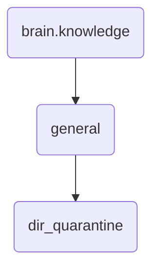

# Dir Quarantine Identity

The dir_quarantine directory serves as a holding area for files that are suspicious or require further analysis. It ensures that potentially harmful or irrelevant data is isolated from the main knowledge base until it can be reviewed and processed.

---

## Topological View

---
*OmniClaw V5.0 | Forged by OMA AI Architect | brain.knowledge.general.dir_quarantine | 2026-04-10*
