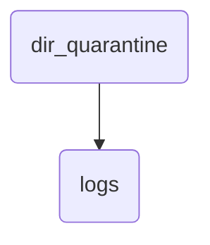

# Logs Identity

This directory holds logs related to the quarantine process, including pending reports and intake records.

---

## Topological View

---
*OmniClaw V5.0 | Forged by OMA AI Architect | brain.knowledge.general.dir_quarantine.logs | 2026-04-10*
