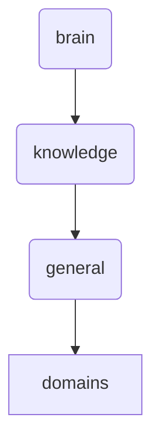

# Domains Identity

This directory is responsible for organizing and managing domain-specific knowledge within OmniClaw, ensuring that information related to AI integration, databases, frontend development, and security is structured and accessible.

---

## Topological View

---
*OmniClaw V5.0 | Forged by OMA AI Architect | brain.knowledge.general.domains | 2026-04-10*
