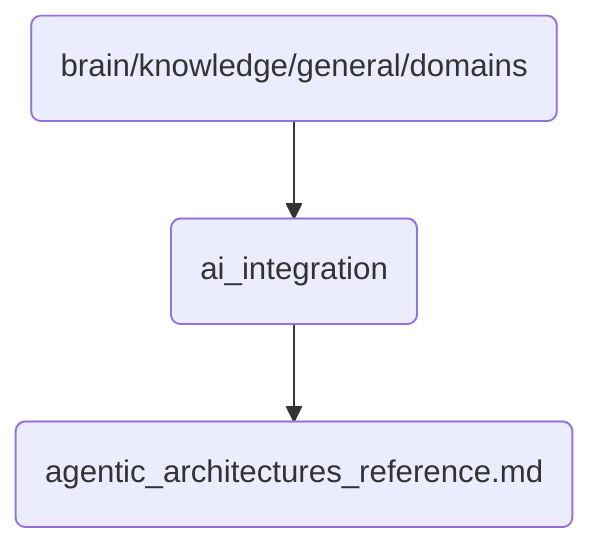

# Ai Integration Identity

This directory contains foundational documents related to the integration of AI technologies within OmniClaw v5.0, focusing on agentic architectures that enable autonomous decision-making and task execution.

## Topological View

---
*OmniClaw V5.0 | Forged by AI Architect | Evaluated dynamically*
