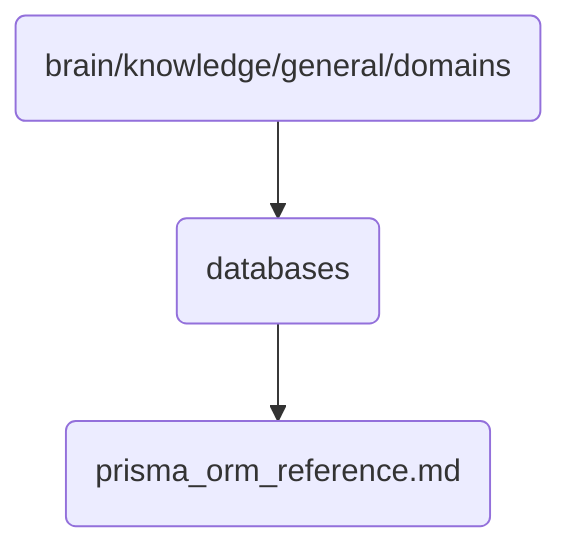

# Databases Identity

This directory contains reference materials for the database management system used in OmniClaw v5.0, focusing on Prisma ORM.

## Topological View

---
*OmniClaw V5.0 | Forged by AI Architect | Evaluated dynamically*
