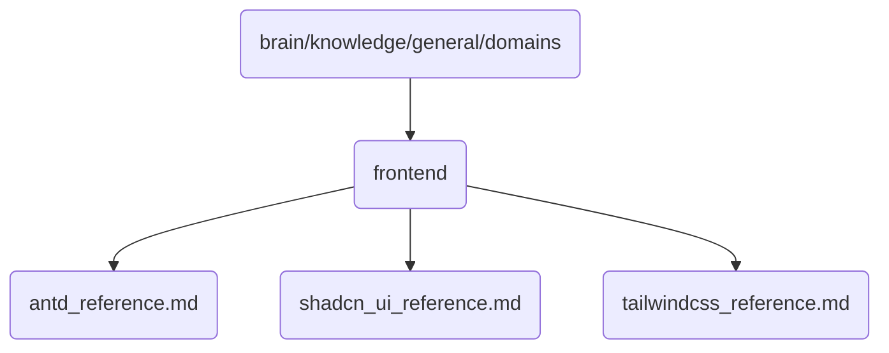

# Frontend Identity

Contains references and documentation for frontend frameworks and libraries used in OmniClaw v5.0.

## Topological View

---
*OmniClaw V5.0 | Forged by AI Architect | Evaluated dynamically*
