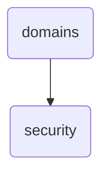

# Security Identity

The 'security' directory within OmniClaw v5.0 is responsible for managing and providing references related to security scanning procedures and best practices.

---

## Topological View

---
*OmniClaw V5.0 | Forged by OMA AI Architect | brain.knowledge.general.domains.security | 2026-04-10*
