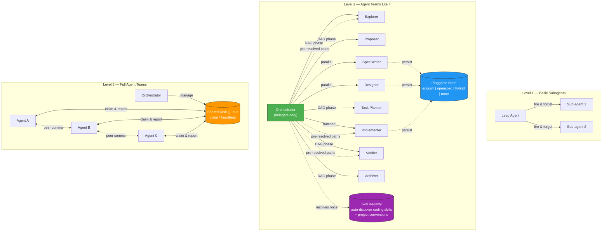

# KNOWLEDGE EXTRACT: github.com_Gentleman-Programming_agent-teams-lite_55d7dc16
> **Extracted on:** 2026-04-01 11:55:38
> **Source:** D:/LongLeo/AI OS CORP/AI OS/core/security/QUARANTINE/KI-BATCH-20260331205007521582/github.com_Gentleman-Programming_agent-teams-lite_55d7dc16

---

## File: `.gitattributes`
```
# Force LF line endings for shell scripts (prevents CRLF issues on Windows/WSL)
*.sh text eol=lf
*.ps1 text eol=crlf

# Default: auto-detect
* text=auto
```

## File: `.gitignore`
```
# OS
.DS_Store
Thumbs.db

# Editors
.vscode/
.idea/
*.swp
*.swo
*~

# Node (in case anyone adds tooling later)
node_modules/
```

## File: `AGENTS.md`
```markdown
# Agent Teams Lite — Agent Skills Index

When working on this project, load the relevant skill(s) BEFORE writing any code.

## How to Use

1. Check the trigger column to find skills that match your current task
2. Load the skill by reading the SKILL.md file at the listed path
3. Follow ALL patterns and rules from the loaded skill
4. Multiple skills can apply simultaneously

## Skills

| Skill | Trigger | Path |
|-------|---------|------|
| `sdd-init` | When initializing SDD in a project, or user says "sdd init". | [`skills/sdd-init/SKILL.md`](../../../.claude/skills/supabase-postgres-best-practices/SKILL.md) |
| `sdd-explore` | When thinking through a feature, investigating the codebase, or clarifying requirements. | [`skills/sdd-explore/SKILL.md`](../../../.claude/skills/supabase-postgres-best-practices/SKILL.md) |
| `sdd-propose` | When creating or updating a change proposal with intent, scope, and approach. | [`skills/sdd-propose/SKILL.md`](../../../.claude/skills/supabase-postgres-best-practices/SKILL.md) |
| `sdd-spec` | When writing or updating specifications with requirements and scenarios. | [`skills/sdd-spec/SKILL.md`](../../../.claude/skills/supabase-postgres-best-practices/SKILL.md) |
| `sdd-design` | When writing or updating technical design with architecture decisions. | [`skills/sdd-design/SKILL.md`](../../../.claude/skills/supabase-postgres-best-practices/SKILL.md) |
| `sdd-tasks` | When breaking down a change into implementation task checklist. | [`skills/sdd-tasks/SKILL.md`](../../../.claude/skills/supabase-postgres-best-practices/SKILL.md) |
| `sdd-apply` | When implementing tasks, writing actual code following specs and design. | [`skills/sdd-apply/SKILL.md`](../../../.claude/skills/supabase-postgres-best-practices/SKILL.md) |
| `sdd-verify` | When validating that implementation matches specs, design, and tasks. | [`skills/sdd-verify/SKILL.md`](../../../.claude/skills/supabase-postgres-best-practices/SKILL.md) |
| `sdd-archive` | When archiving a completed change after implementation and verification. | [`skills/sdd-archive/SKILL.md`](../../../.claude/skills/supabase-postgres-best-practices/SKILL.md) |
| `skill-registry` | When creating or updating the skill registry for the project. | [`skills/skill-registry/SKILL.md`](../../../.claude/skills/supabase-postgres-best-practices/SKILL.md) |
| `issue-creation` | When creating a GitHub issue, reporting a bug, or requesting a feature. | [`skills/issue-creation/SKILL.md`](../../../.claude/skills/supabase-postgres-best-practices/SKILL.md) |
| `branch-pr` | When creating a pull request, opening a PR, or preparing changes for review. | [`skills/branch-pr/SKILL.md`](../../../.claude/skills/supabase-postgres-best-practices/SKILL.md) |
```

## File: `CONTRIBUTING.md`
```markdown
# Contributing to Agent Teams Lite

Thanks for contributing. Agent Teams Lite enforces a strict **issue-first workflow** — every change starts with an approved issue.

---

## Contribution Workflow

```
Open Issue → Get status:approved → Open PR → Add type:* label → Review & Merge
```

### Step 1: Open an Issue

Use the correct template:
- **Bug Report** — for bugs
- **Feature Request** — for new features or improvements

> ⚠️ Blank issues are disabled. You must use a template.

Fill in all required fields. Your issue will automatically receive the `status:needs-review` label.

### Step 2: Wait for Approval

A maintainer will review the issue and add the `status:approved` label if it's accepted for implementation.

**Do not open a PR until the issue is approved.** Automated checks will block PRs that reference unapproved issues.

### Step 3: Open a Pull Request

Once the issue is approved:

1. Fork the repo and create a branch from `main` (see branch naming below)
2. Implement your change with conventional commits
3. Open a PR using the PR template — **link the approved issue** with `Closes #N`
4. Add exactly **one `type:*` label** to the PR (see label system below)

### Branch Naming

Branch names MUST follow this format:

```
type/description
```

**Regex:** `^(feat|fix|chore|docs|style|refactor|perf|test|build|ci|revert)\/[a-z0-9._-]+$`

**Examples:** `feat/user-login`, `fix/zsh-glob-error`, `brain/knowledge/docs_legacy/installation-guide`

Allowed types: `feat`, `fix`, `chore`, `docs`, `style`, `refactor`, `perf`, `test`, `build`, `ci`, `revert`

### Step 4: Automated PR Checks

Checks run automatically on every PR:

| Check | What it verifies |
|-------|-----------------|
| **Check Issue Reference** | PR body contains `Closes #N`, `Fixes #N`, or `Resolves #N` |
| **Check Issue Has status:approved** | The linked issue has the `status:approved` label |
| **Check PR Has type:\* Label** | PR has exactly one `type:*` label |
| **Shellcheck** | Shell scripts pass `shellcheck` linting |

All checks must pass before a PR can be merged.

---

## Label System

### Type Labels (required on every PR — pick exactly one)

| Label | Color | Use for |
|-------|-------|---------|
| `type:bug` | 🔴 | Bug fixes |
| `type:feature` | 🔵 | New features |
| `type:docs` | 🔵 | Documentation-only changes |
| `type:refactor` | 🟣 | Code refactoring with no behavior change |
| `type:chore` | ⚪ | Maintenance, tooling, dependencies |
| `type:breaking-change` | 🔴 | Breaking changes |

### Status Labels (set by maintainers)

| Label | Meaning |
|-------|---------|
| `status:needs-review` | Awaiting maintainer review (auto-applied to new issues) |
| `status:approved` | Approved for implementation — PRs can now be opened |

### Priority Labels (set by maintainers)

`priority:high`, `priority:medium`, `priority:low`

---

## PR Rules

- Keep PR scope focused — one logical change per PR
- Use [conventional commits](https://www.conventionalcommits.org/) format
- Run `shellcheck` on any modified shell scripts before pushing
- Update docs in the same PR when behavior changes
- Do not include `Co-Authored-By` trailers in commits

### Conventional Commit Format

Commit messages MUST match this regex:

```
^(build|chore|ci|docs|feat|fix|perf|refactor|revert|style|test)(\([a-z0-9\._-]+\))?!?: .+
```

**Format:** `type(scope): description` or `type: description`

- `type` — required: `build`, `chore`, `ci`, `docs`, `feat`, `fix`, `perf`, `refactor`, `revert`, `style`, `test`
- `(scope)` — optional, lowercase with `a-z0-9._-`
- `!` — optional, indicates breaking change
- `description` — required, starts after `: `

**Examples:**

```
feat(scripts): add multi-model setup for OpenCode
fix(skills): correct engram topic key format in sdd-apply
docs(readme): update installation instructions
refactor(skills): extract shared persistence logic
chore(ci): add shellcheck to PR validation workflow
perf(scripts): reduce setup.sh execution time
style(skills): fix markdown formatting
test(scripts): add setup.sh integration tests
ci(workflows): add branch name validation
revert: undo broken setup change
feat!: redesign skill loading system
```

Types map to labels: `feat` → `type:feature`, `fix` → `type:bug`, `docs` → `type:docs`, `refactor` → `type:refactor`, `chore`/`style`/`test`/`build`/`ci` → `type:chore`, `perf` → `type:feature`, `revert` → `type:bug`.

---

## Skill Authoring Standard

Repository skills live in `skills/`.

Use a **hybrid format**:

1. Structured base (purpose, when to use, critical rules, checklists)
2. Cookbook section (`If / Then / Example`) for repetitive actions

Why hybrid:
- Structured base protects correctness and architecture intent
- Cookbook improves execution consistency for common flows
```

## File: `LICENSE`
```
MIT License

Copyright (c) 2026 Gentleman Programming

Permission is hereby granted, free of charge, to any person obtaining a copy
of this software and associated documentation files (the "Software"), to deal
in the Software without restriction, including without limitation the rights
to use, copy, modify, merge, publish, distribute, sublicense, and/or sell
copies of the Software, and to permit persons to whom the Software is
furnished to do so, subject to the following conditions:

The above copyright notice and this permission notice shall be included in all
copies or substantial portions of the Software.

THE SOFTWARE IS PROVIDED "AS IS", WITHOUT WARRANTY OF ANY KIND, EXPRESS OR
IMPLIED, INCLUDING BUT NOT LIMITED TO THE WARRANTIES OF MERCHANTABILITY,
FITNESS FOR A PARTICULAR PURPOSE AND NONINFRINGEMENT. IN NO EVENT SHALL THE
AUTHORS OR COPYRIGHT HOLDERS BE LIABLE FOR ANY CLAIM, DAMAGES OR OTHER
LIABILITY, WHETHER IN AN ACTION OF CONTRACT, TORT OR OTHERWISE, ARISING FROM,
OUT OF OR IN CONNECTION WITH THE SOFTWARE OR THE USE OR OTHER DEALINGS IN THE
SOFTWARE.
```

## File: `README.md`
```markdown
<div align="center">

# Agent Teams Lite

> **This project has been deprecated in favor of [`gentle-ai`](https://github.com/Gentleman-Programming/gentle-ai).**
>
> Everything Agent Teams Lite provides — skills, orchestration, SDD workflow, skill registry — is now available through `gentle-ai` with a better installation experience, automatic updates, persistent memory via Engram, and support for **8 agents** out of the box.

</div>

---

## Migrating to gentle-ai

```bash
brew install gentleman-programming/tap/gentle-ai
gentle-ai install
```

That's it. `gentle-ai` detects your installed tools, installs all skills, configures MCP servers, injects the SDD orchestrator, and sets up Engram persistent memory — automatically.

### What you get with gentle-ai that ATL didn't have

| Feature | Agent Teams Lite | gentle-ai |
|---------|:---:|:---:|
| SDD orchestration (9 phases + judgment-day) | ✅ | ✅ |
| Skill registry + compact rules | ✅ | ✅ |
| branch-pr + issue-creation skills | ✅ | ✅ |
| Engram persistent memory (installed + configured) | ❌ | ✅ |
| Context7 documentation MCP | ❌ | ✅ |
| Persona injection | ❌ | ✅ |
| Automatic self-updates | ❌ | ✅ |
| Backup and rollback | ❌ | ✅ |
| Config sync and migration | ❌ | ✅ |
| GGA configuration | ❌ | ✅ |
| Permission management | ❌ | ✅ |
| TUI interactive installer | ❌ | ✅ |

### Supported agents (all 8)

| Agent | Sub-agent support |
|-------|:---:|
| Claude Code | Full |
| OpenCode | Full |
| Gemini CLI | Full |
| Codex | Full |
| Cursor | Inline |
| VS Code Copilot | Inline |
| Antigravity | Single-agent |
| Windsurf | Hybrid (Plan + Code mode) |

### If you already have ATL installed

Run `gentle-ai install` — it will detect your existing setup and upgrade in place. Your skills, orchestrator config, and MCP servers will be migrated to the managed format with marker-based sections that support future sync and updates.

---

## Why deprecate?

Maintaining feature parity across two distribution channels (shell scripts + Go binary) was unsustainable. Every change to a skill, orchestrator, or asset had to be replicated manually. With `gentle-ai`:

- **One source of truth** — assets are embedded in the binary, versioned with the release
- **Atomic updates** — `brew upgrade gentle-ai && gentle-ai sync` refreshes everything
- **No drift** — marker-based injection replaces stale content instead of appending duplicates
- **Cross-session memory** — Engram protocol is injected into every agent's prompt automatically

---

## This repo is archived

No new features or bug fixes will be made here. All development continues in [`gentle-ai`](https://github.com/Gentleman-Programming/gentle-ai).

The code remains available for reference. If you find value in the patterns described in the docs, they are all implemented (and improved) in gentle-ai.

## License

Apache 2.0 — see [LICENSE](LICENSE).

---

<div align="center">
  <sub>Built by <a href="https://github.com/Gentleman-Programming">Gentleman Programming</a></sub>
</div>
```

## File: `brain/knowledge/docs_legacy/architecture.md`
```markdown
# Architecture

Deep dive into how Agent Teams Lite is structured. For quick start, see the [main README](../../../README.md).

---

## Where Agent Teams Lite Fits

Agent Teams Lite sits between basic sub-agent patterns and full Agent Teams runtimes:



---

## Capability Comparison

| Capability | Basic Subagents | Agent Teams Lite | Full Agent Teams |
|---|:---:|:---:|:---:|
| Delegate-only lead | — | ✅ | ✅ |
| DAG-based phase orchestration | — | ✅ | ✅ |
| Parallel phases (spec ∥ design) | — | ✅ | ✅ |
| Structured result envelope | — | ✅ | ✅ |
| Pluggable artifact store | — | ✅ | ✅ |
| **Skill auto-discovery** | — | ✅ | ✅ |
| Shared task queue with claim/heartbeat | — | — | ✅ |
| Teammate ↔ teammate communication | — | — | ✅ |
| Dynamic work stealing | — | — | ✅ |

---

## System Architecture

```
┌──────────────────────────────────────────────────────────┐
│  ORCHESTRATOR (coordinator — never does real work)         │
│                                                           │
│  Responsibilities:                                        │
│  • Delegate ALL tasks to sub-agents (not just SDD)        │
│  • Launch sub-agents via Task tool                        │
│  • Show summaries to user                                 │
│  • Ask for approval between phases                        │
│  • Track state: which artifacts exist, what's next        │
│  • Suggest SDD for substantial features/refactors         │
│                                                           │
│  Context usage: MINIMAL (only state + summaries)          │
└──────────────┬───────────────────────────────────────────┘
               │
               │ Task(subagent_type: 'general', prompt: 'Read skill...')
               │
    ┌──────────┴──────────────────────────────────────────┐
    │                                                      │
    ▼          ▼          ▼         ▼         ▼           ▼
┌────────┐┌────────┐┌────────┐┌────────┐┌────────┐┌────────┐
│EXPLORE ││PROPOSE ││  SPEC  ││ DESIGN ││ TASKS  ││ APPLY  │ ...
│        ││        ││        ││        ││        ││        │
│ Fresh  ││ Fresh  ││ Fresh  ││ Fresh  ││ Fresh  ││ Fresh  │
│context ││context ││context ││context ││context ││context │
└───┬────┘└───┬────┘└───┬────┘└───┬────┘└───┬────┘└───┬────┘
    │         │         │         │         │         │
    └─────────┴─────────┴────┬────┴─────────┴─────────┘
                             │
               (receive pre-resolved compact rules
                from the orchestrator's launch prompt)
                             │
                 ┌───────────▼───────────┐      ┌────────────────────┐
                 │    SUB-AGENT USES     │      │   SKILL REGISTRY   │
                 │   skills as directed  │      │                    │
                 │ • React, TDD, etc.   │      │ • Your coding      │
                 │ • Project conventions │      │   skills + paths   │
                 └───────────────────────┘      │ • Project conven- │
                                                │   tions (agents.md)│
                           ORCHESTRATOR ────────▶ resolves once/session
                                                └────────────────────┘
```

---

## The Dependency Graph

```
                    proposal
                   (root node)
                       │
         ┌─────────────┴─────────────┐
         │                           │
         ▼                           ▼
      specs                       design
   (requirements                (technical
    + scenarios)                 approach)
         │                           │
         └─────────────┬─────────────┘
                       │
                       ▼
                    tasks
                (implementation
                  checklist)
                       │
                       ▼
                    apply
                (write code)
                       │
                       ▼
                    verify
               (quality gate)
                       │
                       ▼
                   archive
              (merge specs,
               close change)
```

---

## Sub-Agent Result Contract

Each sub-agent must return a structured envelope with these fields:

| Field | Description |
|-------|-------------|
| `status` | `success`, `partial`, or `blocked` |
| `executive_summary` | 1-3 sentence summary of what was done |
| `detailed_report` | (optional) Full phase output, or omit if already inline |
| `artifacts` | List of artifact keys/paths written |
| `next_recommended` | The next SDD phase to run, or "none" |
| `risks` | Risks discovered, or "None" |

Example:

```markdown
**Status**: success
**Summary**: Proposal created for `{change-name}`. Defined scope, approach, and rollback plan.
**Artifacts**: Engram `sdd/{change-name}/proposal` | `openspec/changes/{change-name}/proposal.md`
**Next**: sdd-spec or sdd-design
**Risks**: None
```

`executive_summary` is intentionally short. `detailed_report` can be as long as needed for complex architecture work.

---

## Project Structure

```
agent-teams-lite/
├── README.md                          ← Project overview and quick start
├── LICENSE
├── skills/                            ← 15 skill files + shared conventions
│   ├── _shared/                       ← Shared conventions (referenced by all skills)
│   │   ├── persistence-contract.md    ← Mode resolution, sub-agent context protocol, skill loading
│   │   ├── engram-convention.md       ← Supplementary: deterministic naming & recovery
│   │   ├── openspec-convention.md     ← File paths, directory structure, config reference
│   │   └── skill-resolver.md          ← Orchestrator protocol for compact-rule injection
│   ├── sdd-init/SKILL.md             ← Bootstraps project + builds skill registry
│   ├── sdd-explore/SKILL.md
│   ├── sdd-propose/SKILL.md
│   ├── sdd-spec/SKILL.md
│   ├── sdd-design/SKILL.md
│   ├── sdd-tasks/SKILL.md
│   ├── sdd-apply/SKILL.md            ← v2.0: TDD workflow support
│   ├── sdd-verify/SKILL.md           ← v2.0: Real test execution + spec compliance matrix
│   ├── sdd-archive/SKILL.md
│   ├── skill-registry/SKILL.md       ← Scans skills + conventions, writes .atl/skill-registry.md
│   ├── judgment-day/SKILL.md         ← Dual blind review + fix loop
│   ├── go-testing/SKILL.md           ← Shared Go test patterns
│   ├── skill-creator/SKILL.md        ← Creates new skills from templates
│   ├── issue-creation/SKILL.md       ← GitHub issue creation workflow
│   └── branch-pr/SKILL.md            ← Branch + pull request workflow
├── brain/knowledge/docs_legacy/                              ← Deep-dive documentation
│   ├── architecture.md               ← This file: system design and structure
│   └── token-economics.md            ← Token cost analysis and delegation savings
├── examples/                          ← Config examples per tool
│   ├── claude-code/CLAUDE.md
│   ├── opencode/
│   │   ├── AGENTS.md                  ← OpenCode orchestrator prompt referenced by config
│   │   ├── opencode.single.json       ← Ready-to-use config (all agents, default model)
│   │   ├── opencode.multi.json        ← Template config (all agents, customize model per phase)
│   │   ├── commands/sdd-*.md          ← Slash commands for OpenCode
│   │   └── plugins/background-agents.ts ← Async background delegation plugin (both modes)
│   ├── gemini-cli/GEMINI.md
│   ├── codex/agents.md
│   ├── vscode/copilot-instructions.md
│   ├── antigravity/sdd-orchestrator.md
│   └── cursor/.cursorrules
└── scripts/
    ├── setup.sh                       ← Full setup: detect + install + configure (Unix)
    ├── setup.ps1                      ← Full setup: detect + install + configure (Windows)
    ├── install.sh                     ← Skills-only installer (Unix)
    └── install.ps1                    ← Skills-only installer (Windows)

# Generated in target projects (not in this repo):
.atl/
└── skill-registry.md                  ← Auto-generated skill catalog for sub-agents
```
```

## File: `brain/knowledge/docs_legacy/changelog.md`
```markdown
# Changelog

## Notable Upgrades

### v4.4.1 — Gentle-AI Parity Sync + Compact Rules Rollout

This release brings `agent-teams-lite` back into parity with the latest mirrored `gentle-ai` assets.

- Added `skills/_shared/skill-resolver.md` and switched the documented happy path from `SKILL: Load` path injection to compact rules injected as `## Project Standards (auto-resolved)`.
- Added mirrored skills: `go-testing` and `skill-creator`, and updated `judgment-day` to use the same compact-rule resolution flow.
- OpenCode now ships `examples/opencode/AGENTS.md`, and both OpenCode JSON examples reference it via `"prompt": "{file:./AGENTS.md}"`.
- Setup/install scripts and regression tests now install and verify the full 15-skill set instead of an outdated subset.

### v3.3.6 — OpenCode Multi-Model Support

New **multi-model mode** for OpenCode: both `opencode.single.json` and `opencode.multi.json` include the full 10-agent setup (orchestrator + 9 sub-agents) with `delegate` tool support.

- Setup scripts ask which mode to use (single vs multi) or accept `--opencode-mode` flag.
- **single.json** — ready to use as-is; all agents inherit the default model.
- **multi.json** — same structure, serves as a template for assigning different models per agent.

### v3.3.5 — Full Setup Scripts

New `setup.sh` (Unix) and `setup.ps1` (Windows) that auto-detect agents, install skills, AND configure orchestrator prompts in one command.

- Idempotent with HTML comment markers — safe to run multiple times.
- `--non-interactive` mode for external installers like [gentle-ai](https://github.com/gentleman-programming/gentleman-ai-installer).
- OpenCode special handling: slash commands + JSON config merge.

### v3.3.1 — Skill Registry

New `skill-registry` skill for creating/updating the registry on demand.

- Orchestrator reads the skill registry once per session and injects pre-resolved compact rules into each sub-agent's launch prompt — sub-agents know about your coding skills (React, TDD, Playwright, etc.) and project conventions without needing to search themselves.
- Engram-first + `.atl/skill-registry.md` fallback — orchestrator resolution works with or without engram.

### v3.3.0 — Mandatory Persist Steps + Knowledge Persistence

Every skill has an explicit numbered "Persist Artifact" step — models were ignoring the contract section and skipping persistence. Now it's impossible to miss.

- Non-SDD sub-agents are instructed to save discoveries, decisions, and bug fixes to engram automatically.

### v3.2.3 — Inline Engram Persistence

All 9 SDD skills now have critical engram calls (`mem_search`, `mem_save`, `mem_get_observation`) inlined directly in their numbered steps. Sub-agents no longer need to follow a 3-hop file read chain to find persistence instructions.

### v2.0 — TDD + Real Execution

- **sdd-apply v2.0** — TDD workflow support. RED-GREEN-REFACTOR cycle when enabled via config.
- **sdd-verify v2.0** — Real test execution + spec compliance matrix (PASS/FAIL/SKIP per requirement).

## Releases

- `v4.4.1` — Gentle-AI parity sync: compact-rule skill resolution, new mirrored skills, OpenCode `AGENTS.md`, and installers/tests updated to 15 skills.
- `v4.4.0` — Context-inflation delegation + skill resolution alignment.
- `v4.3.1` — Compact prompts + judgment-day skill.
- `v4.3.0` — Token optimization + executor boundary.
- `v4.2.1` — Self-sufficient sub-agents for skill discovery.
- `v4.2.0` — Per-agent model routing fix in `delegate()`.
- `v4.1.1` — Per-agent model routing fix.
- `v4.1.0` — Background agents plugin + unified configs + delegate-first.
- `v4.0.0` — Issue-first enforcement, token optimization, and Hard Stop Rule.
- `v3.3.6` — OpenCode multi-model support: one agent per SDD phase, each with its own model. Setup scripts auto-configure both modes.
- `v3.3.5` — Full setup scripts (`setup.sh` / `setup.ps1`): auto-detect agents + install skills + configure orchestrator prompts in one step.
- `v3.3.4` — Installer fixes: skill-registry included, correct VS Code path.
- `v3.3.3` — Multi-directory skill scanning + correct agent paths from gentle-ai.
- `v3.3.2` — Index file expansion in skill registry + README overhaul.
- `v3.3.1` — Skill registry skill, engram-first discovery, inline persistence in all skills.
```

## File: `brain/knowledge/docs_legacy/concepts.md`
```markdown
# Concepts

Core concepts behind Spec-Driven Development. For quick start, see the [main README](../../../README.md).

## Delta Specs

Instead of rewriting entire specs, changes describe what's different:

```markdown
## ADDED Requirements

### Requirement: CSV Export
The system SHALL support exporting data to CSV format.

#### Scenario: Export all observations
- GIVEN the user has observations stored
- WHEN the user requests CSV export
- THEN a CSV file is generated with all observations
- AND column headers match the observation fields

## MODIFIED Requirements

### Requirement: Data Export
The system SHALL support multiple export formats.
(Previously: The system SHALL support JSON export.)
```

When the change is archived, these deltas merge into the main specs automatically.

## RFC 2119 Keywords

Specs use standardized language for requirement strength:

| Keyword | Meaning |
|---------|---------|
| **MUST / SHALL** | Absolute requirement |
| **SHOULD** | Recommended, exceptions may exist |
| **MAY** | Optional |

## Archive Cycle

```
1. Specs describe current behavior
2. Changes propose modifications (as deltas)
3. Implementation makes changes real
4. Archive merges deltas into specs
5. Specs now describe the new behavior
6. Next change builds on updated specs
```
```

## File: `brain/knowledge/docs_legacy/installation.md`
```markdown
# Installation Guide

For the automated setup, run:
```bash
./scripts/setup.sh --all
```

For manual installation or specific tools, see below.

## Table of Contents
- [Claude Code](#claude-code)
- [OpenCode](#opencode)
- [Gemini CLI](#gemini-cli)
- [Codex](#codex)
- [VS Code Copilot](#vs-code-copilot)
- [Antigravity](#antigravity)
- [Cursor](#cursor)
- [Other Tools](#other-tools)

---

The recommended way to install is the **setup script** — it handles everything (skills + orchestrator prompts) in one step:

```bash
./scripts/setup.sh        # Interactive: detects agents, asks which to set up
./scripts/setup.sh --all  # Auto-detect + install all (no prompts)
```

Windows PowerShell:
```powershell
.\scripts\setup.ps1       # Interactive
.\scripts\setup.ps1 -All  # Auto-detect + install all
```

The setup script:
- Detects installed agents via PATH (`claude`, `opencode`, `gemini`, `cursor`, `code`, `codex`)
- Copies skills to the correct user-level directory
- Configures orchestrator prompts with idempotent markers (safe to re-run)
- Handles OpenCode's special case (commands + JSON config merge)
- For OpenCode: asks single vs multi-model mode (or use `--opencode-mode`)

> **For external installers** (e.g. [gentle-ai](https://github.com/gentleman-programming/gentleman-ai-installer)): use `--non-interactive` flag.

---

## Claude Code

> **Automatic:** `./scripts/setup.sh --agent claude-code` handles all steps below.

<details>
<summary>Manual installation</summary>

**1. Copy skills:**

```bash
cp -r skills/_shared skills/sdd-* skills/skill-registry skills/judgment-day skills/go-testing skills/skill-creator skills/branch-pr skills/issue-creation ~/.claude/skills/
```

**2. Add orchestrator to `~/.claude/CLAUDE.md`:**

Append the contents of [`examples/claude-code/CLAUDE.md`](../../../.claude/skills/supabase-postgres-best-practices/CLAUDE.md) to your existing `CLAUDE.md`.

The example is intentionally lean to avoid token bloat in always-loaded system prompts. Critical engram calls are inlined in each skill file. This keeps your existing assistant identity and adds SDD as an orchestration overlay.

</details>

**Verify:** Open Claude Code and type `/sdd-init` — it should recognize the command.

---

## OpenCode

> **Automatic:** `./scripts/setup.sh --agent opencode` handles all steps below.

Both configs include the full 10-agent setup: `sdd-orchestrator` + 9 phase sub-agents, with `delegate` tool support for async background delegation. The only difference is their intended use:

| | `opencode.single.json` | `opencode.multi.json` |
|---|---|---|
| **Use case** | Ready to use as-is | Template for per-agent model customization |
| **Agent structure** | Identical (10 agents) | Identical (10 agents) |
| **Models** | All inherit the default model | Add `"model"` fields to customize per phase |
| **delegate tool** | ✅ Included | ✅ Included |

```bash
./scripts/setup.sh --agent opencode                        # Interactive (asks which mode)
./scripts/setup.sh --agent opencode --opencode-mode single # Use as-is with default model
./scripts/setup.sh --agent opencode --opencode-mode multi  # Template for per-agent models
```

#### Per-Agent Model Customization (multi mode)

To assign different models per phase, edit `~/.config/opencode/opencode.json` and add `"model": "provider/model-id"` to each agent:

```json
{
  "agent": {
    "sdd-orchestrator": { "mode": "primary", "model": "anthropic/claude-sonnet-4-6" },
    "sdd-explore":      { "mode": "subagent", "model": "google/gemini-2.5-flash" },
    "sdd-spec":         { "mode": "subagent", "model": "anthropic/claude-opus-4-6" },
    "sdd-design":       { "mode": "subagent", "model": "anthropic/claude-opus-4-6" },
    "sdd-apply":        { "mode": "subagent", "model": "anthropic/claude-sonnet-4-6" },
    "sdd-verify":       { "mode": "subagent", "model": "openai/o3" }
  }
}
```

The format is `"provider/model-id"` — check your available models at `~/.cache/opencode/models.json`. Common providers: `anthropic`, `openai`, `google`, `openrouter`. Agents without a `model` field inherit the default model.

Both modes install the `background-agents` plugin (`examples/opencode/plugins/background-agents.ts`), which enables async sub-agent delegation. Use `delegate` to run sub-agents in the background (non-blocking) while the orchestrator continues other work; use `task` to block until the sub-agent completes.

The setup script preserves your model choices across updates — re-running `setup.sh` will update agent prompts and tools but keep any `model` fields you configured.

<details>
<summary>Manual installation</summary>

**1. Copy skills and commands:**

```bash
cp -r skills/_shared skills/sdd-* skills/skill-registry skills/judgment-day skills/go-testing skills/skill-creator skills/branch-pr skills/issue-creation ~/.config/opencode/skills/
cp examples/opencode/commands/sdd-*.md ~/.config/opencode/commands/
cp examples/opencode/AGENTS.md ~/.config/opencode/AGENTS.md
```

**2. Add orchestrator agent to `~/.config/opencode/opencode.json`:**

Merge the `agent` block from the config template into your existing config:
- Single mode: [`examples/opencode/opencode.single.json`](examples/opencode/opencode.single.json)
- Multi mode: [`examples/opencode/opencode.multi.json`](examples/opencode/opencode.multi.json)

The OpenCode examples now reference `~/.config/opencode/AGENTS.md` via `"prompt": "{file:./AGENTS.md}"`, so copy that file too.

For multi mode, also update the `agent:` field in each subtask command (`sdd-init.md`, `sdd-explore.md`, `sdd-apply.md`, `sdd-verify.md`, `sdd-archive.md`) to point to the corresponding subagent name instead of `sdd-orchestrator`.

</details>

**How to use in OpenCode:**
- Start OpenCode in your project: `opencode .`
- Use the agent picker (Tab) and choose `sdd-orchestrator`
- Run SDD commands: `/sdd-init`, `/sdd-new <name>`, `/sdd-apply`, etc.
- Switch back to your normal agent (Tab) for day-to-day coding

---

## Gemini CLI

> **Automatic:** `./scripts/setup.sh --agent gemini-cli` handles all steps below.

<details>
<summary>Manual installation</summary>

**1. Copy skills:**

```bash
cp -r skills/_shared skills/sdd-* skills/skill-registry skills/judgment-day skills/go-testing skills/skill-creator skills/branch-pr skills/issue-creation ~/.gemini/skills/
```

**2. Add orchestrator to `~/.gemini/GEMINI.md`:**

Append the contents of [`examples/gemini-cli/GEMINI.md`](../../agents/GEMINI.md) to your Gemini system prompt file (create it if it doesn't exist).

Make sure `GEMINI_SYSTEM_MD=1` is set in `~/.gemini/.env` so Gemini loads the system prompt.

</details>

**Verify:** Open Gemini CLI and type `/sdd-init`.

> **Note:** Gemini CLI doesn't have a native Task tool for sub-agent delegation. The skills work as inline instructions. For the best sub-agent experience, use Claude Code or OpenCode.

---

## Codex

> **Automatic:** `./scripts/setup.sh --agent codex` handles all steps below.

<details>
<summary>Manual installation</summary>

**1. Copy skills:**

```bash
cp -r skills/_shared skills/sdd-* skills/skill-registry skills/judgment-day skills/go-testing skills/skill-creator skills/branch-pr skills/issue-creation ~/.codex/skills/
```

**2. Add orchestrator instructions:**

Append the contents of [`examples/codex/agents.md`](../../../.claude/skills/supabase-postgres-best-practices/AGENTS.md) to `~/.codex/agents.md` (or your `model_instructions_file` if configured).

</details>

**Verify:** Open Codex and type `/sdd-init`.

> **Note:** Like Gemini CLI, Codex runs skills inline rather than as true sub-agents. The planning phases still work well; implementation batching is handled by the orchestrator instructions.

---

## VS Code (Copilot)

> **Automatic:** `./scripts/setup.sh --agent vscode` handles all steps below.

<details>
<summary>Manual installation</summary>

**1. Copy skills:**

```bash
cp -r skills/_shared skills/sdd-* skills/skill-registry skills/judgment-day skills/go-testing skills/skill-creator skills/branch-pr skills/issue-creation ~/.copilot/skills/
```

**2. Add orchestrator instructions:**

Create a VS Code `.instructions.md` file in the User prompts folder with the orchestrator from [`examples/vscode/copilot-instructions.md`](../../../vault/archives/archive_legacy/agent-teams-lite/examples/vscode/copilot-instructions.md).

Prompt file paths:
- macOS: `~/Library/Application Support/Code/User/prompts/agent-teams-lite.instructions.md`
- Linux: `~/.config/Code/User/prompts/agent-teams-lite.instructions.md`
- Windows: `%APPDATA%\Code\User\prompts\agent-teams-lite.instructions.md`

</details>

**Verify:** Open VS Code, open the Chat panel (Ctrl+Cmd+I / Ctrl+Alt+I), and type `/sdd-init`.

> **Note:** VS Code Copilot supports agent mode with tool use. For true sub-agent delegation with fresh context windows, use Claude Code or OpenCode.

---

## Antigravity

[Antigravity](https://antigravity.google) is Google's AI-first IDE with native skill support. Not yet supported by the setup script — manual installation required.

**1. Copy skills:**

```bash
# Global (available across all projects)
cp -r skills/_shared skills/sdd-* skills/skill-registry skills/judgment-day skills/go-testing skills/skill-creator skills/branch-pr skills/issue-creation ~/.gemini/antigravity/skills/

# Workspace-specific (per project)
mkdir -p .agent/skills
cp -r skills/_shared skills/sdd-* skills/skill-registry skills/judgment-day skills/go-testing skills/skill-creator skills/branch-pr skills/issue-creation .agent/skills/
```

**2. Add orchestrator instructions:**

Add the SDD orchestrator as a global rule in `~/.gemini/GEMINI.md`, or create a workspace rule in `.agent/rules/sdd-orchestrator.md`.

See [`examples/antigravity/sdd-orchestrator.md`](../../../vault/archives/archive_legacy/agent-teams-lite/examples/antigravity/sdd-orchestrator.md) for the rule content.

**3. Verify:**

Open Antigravity and type `/sdd-init` in the agent panel.

> **Note:** Antigravity uses `.agent/skills/` and `.agent/rules/` for workspace config, and `~/.gemini/antigravity/skills/` for global. It does NOT use `.vscode/` paths.

---

## Cursor

> **Automatic:** `./scripts/setup.sh --agent cursor` handles all steps below.

<details>
<summary>Manual installation</summary>

**1. Copy skills:**

```bash
# Global
cp -r skills/_shared skills/sdd-* skills/skill-registry skills/judgment-day skills/go-testing skills/skill-creator skills/branch-pr skills/issue-creation ~/.cursor/skills/

# Or per-project
cp -r skills/_shared skills/sdd-* skills/skill-registry skills/judgment-day skills/go-testing skills/skill-creator skills/branch-pr skills/issue-creation ./your-project/skills/
```

**2. Add orchestrator to `.cursorrules`:**

Append the contents of [`examples/cursor/.cursorrules`](examples/cursor/.cursorrules) to your project's `.cursorrules` file.

</details>

**Note:** Cursor doesn't have a Task tool for true sub-agent delegation. The skills still work — Cursor reads them as instructions — but the orchestrator runs inline. For the best sub-agent experience, use Claude Code or OpenCode.

---

## Other Tools

The skills are pure Markdown. Any AI assistant that can read files can use them.

**1. Copy skills** to wherever your tool reads instructions from.

**2. Add orchestrator instructions** to your tool's system prompt or rules file.

**3. Adapt the sub-agent pattern:**
- If your tool has a Task/sub-agent mechanism → use the pattern from `examples/claude-code/CLAUDE.md`
- If not → the orchestrator reads the skills inline (still works, just uses more context)
```

## File: `brain/knowledge/docs_legacy/persistence.md`
```markdown
# Persistence Modes

Agent Teams Lite supports multiple artifact storage backends. For quick start, see the [main README](../../../README.md).

## Modes

| Mode | Description |
|------|-------------|
| `engram` | Default. Persistent memory across sessions. |
| `openspec` | File-based artifacts in `openspec/` directory. |
| `hybrid` | Both engram + openspec simultaneously. |
| `none` | No persistence. Results inline only. |

## Configuration

```yaml
# Agent-team storage policy
artifact_store:
  mode: engram      # Recommended: persistent, repo-clean
```

```yaml
# Privacy/local-only (no persistence)
artifact_store:
  mode: none
```

```yaml
# File artifacts in project (OpenSpec flow)
artifact_store:
  mode: openspec
```

```yaml
# Both backends: cross-session recovery + local files (uses more tokens)
artifact_store:
  mode: hybrid
```

Default policy is conservative:

- If Engram is available, persist to Engram (recommended)
- If user explicitly asks for file artifacts, use `openspec`
- If user wants both cross-session recovery AND local files, use `hybrid`
- Otherwise use `none` (no writes)
- `openspec` and `hybrid` are NEVER chosen automatically — only when the user explicitly asks

## OpenSpec File Structure

When `openspec` mode is enabled, a change can produce a self-contained folder:

```
openspec/
├── config.yaml                        ← Project context (stack, conventions)
├── specs/                             ← Source of truth: how the system works TODAY
│   ├── auth/spec.md
│   ├── export/spec.md
│   └── ui/spec.md
└── changes/
    ├── add-csv-export/                ← Active change
    │   ├── proposal.md                ← WHY + SCOPE + APPROACH
    │   ├── specs/                     ← Delta specs (ADDED/MODIFIED/REMOVED)
    │   │   └── export/spec.md
    │   ├── design.md                  ← HOW (architecture decisions)
    │   └── tasks.md                   ← WHAT (implementation checklist)
    └── archive/                       ← Completed changes (audit trail)
        └── 2026-02-16-fix-auth/
```
```

## File: `brain/knowledge/docs_legacy/sub-agents.md`
```markdown
Reference documentation for the SDD phase sub-agents and skill system. For quick start, see the [main README](../../../README.md).

# Sub-Agents & Skill Registry

## SDD Phase Sub-Agents

Each sub-agent is a SKILL.md file — pure Markdown instructions that any AI assistant can follow. The preferred path is for the orchestrator to pre-resolve relevant skills from the registry and inject compact rules into each sub-agent prompt. Sub-agents still support registry/path fallback for backward compatibility.

| Sub-Agent | Skill File | What It Does |
|-----------|-----------|-------------|
| **Init** | `sdd-init/SKILL.md` | Detects project stack, bootstraps persistence, builds skill registry |
| **Explorer** | `sdd-explore/SKILL.md` | Reads codebase, compares approaches, identifies risks |
| **Proposer** | `sdd-propose/SKILL.md` | Creates `proposal.md` with intent, scope, rollback plan |
| **Spec Writer** | `sdd-spec/SKILL.md` | Writes delta specs (ADDED/MODIFIED/REMOVED) with Given/When/Then |
| **Designer** | `sdd-design/SKILL.md` | Creates `design.md` with architecture decisions and rationale |
| **Task Planner** | `sdd-tasks/SKILL.md` | Breaks down into phased, numbered task checklist |
| **Implementer** | `sdd-apply/SKILL.md` | Writes code following specs and design, marks tasks complete. v2.0: TDD workflow support |
| **Verifier** | `sdd-verify/SKILL.md` | Validates implementation against specs with real test execution. v2.0: spec compliance matrix |
| **Archiver** | `sdd-archive/SKILL.md` | Merges delta specs into main specs, moves to archive |
| **Skill Registry** | `skill-registry/SKILL.md` | Scans user skills + project conventions, writes `.atl/skill-registry.md` |
| **Judgment Day** | `judgment-day/SKILL.md` | Runs dual adversarial review with two blind judges and a fix loop |
| **Go Testing** | `go-testing/SKILL.md` | Shared conventions for Go tests, including Bubbletea and teatest patterns |
| **Skill Creator** | `skill-creator/SKILL.md` | Creates new reusable skills following the project skill spec |
| **Branch + PR** | `branch-pr/SKILL.md` | Branches changes and opens pull requests with repo conventions |
| **Issue Creation** | `issue-creation/SKILL.md` | Creates GitHub issues with the repo's structured templates |

### Sub-Agent Result Contract

Each sub-agent must return a structured envelope with these fields:

| Field | Description |
|-------|-------------|
| `status` | `success`, `partial`, or `blocked` |
| `executive_summary` | 1-3 sentence summary of what was done |
| `detailed_report` | (optional) Full phase output, or omit if already inline |
| `artifacts` | List of artifact keys/paths written |
| `next_recommended` | The next SDD phase to run, or "none" |
| `risks` | Risks discovered, or "None" |
| `skill_resolution` | `injected`, `fallback-registry`, `fallback-path`, or `none` |

Example:

```markdown
**Status**: success
**Summary**: Proposal created for `{change-name}`. Defined scope, approach, and rollback plan.
**Artifacts**: Engram `sdd/{change-name}/proposal` | `openspec/changes/{change-name}/proposal.md`
**Next**: sdd-spec or sdd-design
**Risks**: None
```

`executive_summary` is intentionally short. `detailed_report` can be as long as needed for complex architecture work.

### Sub-Agent Context Protocol

Sub-agents start with a **fresh context**. The orchestrator is responsible for resolving the skill registry once, matching relevant skills, and injecting compact rules into the sub-agent prompt as `## Project Standards (auto-resolved)`. If that block is missing, sub-agents fall back to registry lookup or explicit `SKILL: Load` paths.

Sub-agents are also instructed to save discoveries, decisions, and bug fixes to engram automatically (non-SDD sub-agents) or via the mandatory persist step (SDD phases).

---

## Shared Conventions

All skills reference three shared convention files in `skills/_shared/`. Critical engram calls (`mem_search`, `mem_save`, `mem_get_observation`) are also **inlined directly in each skill** so sub-agents don't need to follow multi-hop file references.

| File | Purpose |
|------|---------|
| `persistence-contract.md` | Mode resolution rules, sub-agent context protocol, skill registry loading protocol |
| `engram-convention.md` | Supplementary reference for deterministic naming (`sdd/{change-name}/{artifact-type}`) and two-step recovery. Critical calls are inlined in skills. |
| `openspec-convention.md` | Filesystem paths for each artifact, directory structure, config.yaml reference, and archive layout |
| `skill-resolver.md` | Universal protocol for delegators to inject compact rules from the skill registry |

**Why inline + shared:**
- **Sub-agents fail multi-hop chains** — A 3-hop read chain (skill → convention file → actual instructions) breaks non-Claude models. Inlining the critical calls eliminates this.
- **Deterministic recovery** — Engram artifact naming follows a strict `sdd/{change}/{type}` convention with `topic_key`, so any skill can reliably find artifacts created by other skills.
- **Consistent mode behavior** — All skills resolve `engram | openspec | hybrid | none` the same way. `openspec` and `hybrid` are never chosen automatically.

---

## Skill Registry

Sub-agents start with a **fresh context** — they do not know what user skills exist (React, TDD, Playwright, etc.). The skill registry solves this, and the orchestrator uses it to inject compact rules before each delegation.

**How it works:**
1. `/sdd-init` or `/skill-registry` scans your installed skills and project conventions
2. Writes `.atl/skill-registry.md` in the project root (mode-independent, always created)
3. If engram is available, also saves to engram (cross-session bonus)
4. The orchestrator reads the registry once and caches the **Compact Rules** section plus the trigger table
5. For each delegation, the orchestrator injects matching rules as `## Project Standards (auto-resolved)`
6. Fallback order if standards were not injected: `mem_search(query: "skill-registry", project: "{project}")` → `.atl/skill-registry.md` → explicit `SKILL: Load` paths
7. Delegations report `skill_resolution` so the orchestrator can detect and repair cache loss after compaction

**Preferred path:** the orchestrator pre-resolves compact rules. Sub-agent self-loading is only a compatibility fallback.

**What it contains:**
- User skills table: trigger → skill name → path (e.g., "React components" → `react-19` → `~/.claude/skills/react-19/SKILL.md`)
- Compact rules blocks: short, pre-digested instructions that delegators paste directly into sub-agent prompts
- Project conventions found: `agents.md`, `CLAUDE.md`, `.cursorrules`, etc.

**When to update:** Run `/skill-registry` after installing or removing skills.

---

## Per-Agent Model Routing

Each agent can have a `model` field in `opencode.json` that defines which model it should use. When the orchestrator delegates via `delegate(prompt, agent)` or `Task`, the background-agents plugin passes the `model` through to `session.prompt()`, so the sub-agent runs on its configured model.

**Example** (`opencode.multi.json`):

```json
{
  "sdd-explore": {
    "model": "<your-provider/your-model>",
    "mode": "subagent",
    ...
  },
  "sdd-spec": {
    "model": "<your-provider/your-model>",
    "mode": "subagent",
    ...
  }
}
```

For single-model setups (`opencode.single.json`), omit the `model` field entirely — all agents inherit OpenCode's global default model.

**Alternative: `@agent-name` text mentions.** OpenCode also supports routing via `@agent-name` mentions in the orchestrator's output, which triggers native agent routing. This is an alternative to `delegate()` but is NOT required — `delegate()` handles model routing correctly.
```

## File: `brain/knowledge/docs_legacy/token-economics.md`
```markdown
# Token Economics of Orchestrator Delegation

## 1. Executive Summary

The orchestrator+sub-agent model in `agent-teams-lite` trades a **fixed overhead per sub-agent** (~11,850 tokens) for **context isolation**: work done by sub-agents disappears from the orchestrator's context when they finish. Three independent analyses measured real file sizes from the codebase. Six optimizations were implemented, reducing overhead ~38% per SDD pipeline. For tasks touching 8+ files, delegation wins by 13,000+ tokens. For large features, the margin exceeds 100,000 tokens.

---

## 2. The Problem: Context Window Economics

Every LLM turn reprocesses the full conversation history:

```
cost_turn_N = system_prompt + Σ(all_previous_messages) + current_message
```

This makes inline orchestrator work exponentially expensive:

- **Context pollution**: Every file read, grep, and edit confirmation stays in history permanently
- **Compaction is lossy**: When the context hits the limit, the model summarizes — losing file contents and tool results. Recovery re-reads those files, growing the context further
- **The flywheel**: inline work → context growth → compaction → re-reads → more growth → faster compaction

Delegation breaks this flywheel because sub-agent file reads never enter the orchestrator's context.

---

## 3. Measurements

All measurements derived from real file sizes (bytes ÷ 3.5 chars/token for markdown).

### Fixed overhead per sub-agent launch

| Component | Tokens |
|-----------|--------|
| System prompt (CLAUDE.md) | 7,554 |
| AGENTS.md workspace rules | 651 |
| Skill file (range across all skills) | 1,796–2,812 |
| Engram skill registry lookup | 1,028 |
| Launch prompt + result envelope | 300–500 |
| **Total per delegation** | **~11,850–12,866** |

> The system prompt dominates. Prior estimates of ~3,700T used the example CLAUDE.md (2,440T), not the actual installed one (7,554T).

### Crossover point

The break-even is a function of dependency count, not a fixed number:

```
crossover(N_deps) = (system_prompt + skill_file + N_deps × avg_dep_size) / avg_file_size
```

| Scenario | Crossover (files) |
|----------|-----------------|
| No SDD dependencies | ~8 files |
| 1–2 SDD artifact reads | ~10 files |
| 4 SDD dependencies (sdd-apply) | ~12 files |

### Compaction cost comparison

| Model | Cost per compaction | Events (large feature) | Total |
|-------|--------------------|-----------------------|-------|
| Inline | 15,000–55,000T | 2–4 | ~75,000T |
| Delegation | ~4,500T | 0–1 | ~4,500T |

Delegation recovery uses engram references (~300T) instead of re-reading files (~3,000–15,000T per artifact).

---

## 4. The Real Driver

Token savings come from three sources with very different weights:

| Driver | Share of savings | Mechanism |
|--------|-----------------|-----------|
| Context scope isolation | ~60% | Sub-agent file reads never enter orchestrator history |
| Compaction avoidance | ~25% | Fewer tokens in orchestrator = fewer compaction triggers |
| Error reduction | ~10% | Smaller failure domain per sub-agent |
| Parallelism bonus | ~5% | Independent phases can run concurrently |

The primary driver is **not** skill guidance or error reduction. It is that files read by sub-agents **disappear** when they return.

---

## 5. Optimizations Implemented

Six changes reduced fixed overhead ~38% per full SDD pipeline:

| # | Optimization | Savings/pipeline | Rationale |
|---|-------------|-----------------|-----------|
| 1 | Remove `persistence-contract.md` reads | ~22,000T | Sub-agents already have inline instructions; file read was redundant |
| 2 | Artifact size budgets (word limits) | ~14,000T | Verbose artifacts compound across all downstream phases |
| 3 | Skill registry pre-resolution | ~11,400T | Orchestrator resolves once; sub-agents skip search |
| 4 | Common boilerplate extraction | ~4,200T | Shared file for return envelope + upsert notes |
| 5 | Orchestrator doc compression | ~4,200 chars | Tables over prose for lookup data |
| 6 | Parallel engram reads | ~800T | Batch `mem_search`/`mem_get_observation` calls |

---

## 6. Review Process and Corrections

Three independent AI reviewers evaluated the optimizations across three rounds.

**Round 1 findings:**
- Skill registry instructions contradicted between orchestrator and skill files
- Anti-patterns collapsed to one line lost compliance weight for AI agents
- "See common file" reference was too passive — agents need explicit instruction
- Token budgets should use word counts (stable across models), not token counts
- CLAUDE.md diverged from examples

**Round 2 findings (post-fix audit):**
- Registry story unified across all files ✅
- Anti-patterns restored to explicit `DO NOT` bullets ✅
- Minor: fallback line and README still referenced old model → fixed in Round 3 ✅

---

## 7. Decision Rules

| Scenario | Files | Recommendation |
|----------|-------|---------------|
| Trivial edit (rename, 1 file) | 1 | Inline |
| Small fix needing context | 2–7 | Inline if <6 turns expected |
| Medium feature | 8–15 | Delegate |
| Large feature / SDD | 15+ | Delegate (mandatory) |
| Multi-day work | Any | Full SDD pipeline with delegation |

> **Per-file delegation is wasteful** (overhead ~1,209% for a 1-file task). Per-phase delegation is the sweet spot.

---

## 8. Key Insights

1. **The orchestrator is an event loop with O(1) state; sub-agents are stateless workers.** Keep them that way.

2. **Delegation doesn't make sub-agents smarter — it makes their failure domain smaller.** A sub-agent that fails affects only itself; inline failure corrupts orchestrator state.

3. **Engram passes references, not content.** Each SDD artifact reference costs ~50T to pass; passing the content inline would cost 3,000–15,000T per artifact.

4. **System prompt size is the dominant variable.** Compressing CLAUDE.md from 7,554T to even 4,000T would drop the crossover from ~8 files to ~5 files — making delegation viable for a much larger class of tasks.

5. **The crossover shifts with each optimization.** As overhead decreases, more tasks benefit from delegation. Optimization is a multiplier, not a one-time fix.
```

## File: `examples/antigravity/sdd-orchestrator.md`
```markdown
# Agent Teams Lite — Orchestrator Instructions

Bind this to the dedicated `sdd-orchestrator` agent or rule only. Do NOT apply it to executor phase agents such as `sdd-apply` or `sdd-verify`.

## Agent Teams Orchestrator

You are a COORDINATOR, not an executor. Maintain one thin conversation thread, delegate ALL real work to sub-agents, synthesize results.

### Delegation Rules

Core principle: **does this inflate my context without need?** If yes → delegate. If no → do it inline.

| Action | Inline | Delegate |
|--------|--------|----------|
| Read to decide/verify (1-3 files) | ✅ | — |
| Read to explore/understand (4+ files) | — | ✅ |
| Read as preparation for writing | — | ✅ together with the write |
| Write atomic (one file, mechanical, you already know what) | ✅ | — |
| Write with analysis (multiple files, new logic) | — | ✅ |
| Bash for state (git, gh) | ✅ | — |
| Bash for execution (test, build, install) | — | ✅ |

delegate (async) is the default for delegated work. Use task (sync) only when you need the result before your next action.

Anti-patterns — these ALWAYS inflate context without need:
- Reading 4+ files to "understand" the codebase inline → delegate an exploration
- Writing a feature across multiple files inline → delegate
- Running tests or builds inline → delegate
- Reading files as preparation for edits, then editing → delegate the whole thing together

## SDD Workflow (Spec-Driven Development)

SDD is the structured planning layer for substantial changes.

### Artifact Store Policy

- `engram` — default when available; persistent memory across sessions
- `openspec` — file-based artifacts; use only when user explicitly requests
- `hybrid` — both backends; cross-session recovery + local files; more tokens per op
- `none` — return results inline only; recommend enabling engram or openspec

### Commands

Skills (appear in autocomplete):
- `/sdd-init` → initialize SDD context; detects stack, bootstraps persistence
- `/sdd-explore <topic>` → investigate an idea; reads codebase, compares approaches; no files created
- `/sdd-apply [change]` → implement tasks in batches; checks off items as it goes
- `/sdd-verify [change]` → validate implementation against specs; reports CRITICAL / WARNING / SUGGESTION
- `/sdd-archive [change]` → close a change and persist final state in the active artifact store

Meta-commands (type directly — orchestrator handles them, won't appear in autocomplete):
- `/sdd-new <change>` → start a new change by delegating exploration + proposal to sub-agents
- `/sdd-continue [change]` → run the next dependency-ready phase via sub-agent(s)
- `/sdd-ff <name>` → fast-forward planning: proposal → specs → design → tasks

`/sdd-new`, `/sdd-continue`, and `/sdd-ff` are meta-commands handled by YOU. Do NOT invoke them as skills.

### Dependency Graph
```
proposal -> specs --> tasks -> apply -> verify -> archive
             ^
             |
           design
```

### Result Contract
Each phase returns: `status`, `executive_summary`, `artifacts`, `next_recommended`, `risks`, `skill_resolution`.

<!-- gentle-ai:sdd-model-assignments -->
## Model Assignments

Read this table at session start (or before first delegation), cache it for the session, and pass the mapped alias in every Agent tool call via the `model` parameter. If a phase is missing, use the `default` row. If you lack access to the assigned model, substitute `sonnet` and continue.

| Phase | Default Model | Reason |
|-------|---------------|--------|
| orchestrator | opus | Coordinates, makes decisions |
| sdd-explore | sonnet | Reads code, structural - not architectural |
| sdd-propose | opus | Architectural decisions |
| sdd-spec | sonnet | Structured writing |
| sdd-design | opus | Architecture decisions |
| sdd-tasks | sonnet | Mechanical breakdown |
| sdd-apply | sonnet | Implementation |
| sdd-verify | sonnet | Validation against spec |
| sdd-archive | haiku | Copy and close |
| default | sonnet | Non-SDD general delegation |

<!-- /gentle-ai:sdd-model-assignments -->

### Sub-Agent Launch Pattern

ALL sub-agent launch prompts that involve reading, writing, or reviewing code MUST include pre-resolved **compact rules** from the skill registry. Follow the **Skill Resolver Protocol** (see `_shared/skill-resolver.md` in the skills directory).

The orchestrator resolves skills from the registry ONCE (at session start or first delegation), caches the compact rules, and injects matching rules into each sub-agent's prompt. Also reads the Model Assignments table once per session, caches `phase → alias`, includes that alias in every Agent tool call via `model`.

Orchestrator skill resolution (do once per session):
1. `mem_search(query: "skill-registry", project: "{project}")` → `mem_get_observation(id)` for full registry content
2. Fallback: read `.atl/skill-registry.md` if engram not available
3. Cache the **Compact Rules** section and the **User Skills** trigger table
4. If no registry exists, warn user and proceed without project-specific standards

For each sub-agent launch:
1. Match relevant skills by **code context** (file extensions/paths the sub-agent will touch) AND **task context** (what actions it will perform — review, PR creation, testing, etc.)
2. Copy matching compact rule blocks into the sub-agent prompt as `## Project Standards (auto-resolved)`
3. Inject BEFORE the sub-agent's task-specific instructions

**Key rule**: inject compact rules TEXT, not paths. Sub-agents do NOT read SKILL.md files or the registry — rules arrive pre-digested. This is compaction-safe because each delegation re-reads the registry if the cache is lost.

### Skill Resolution Feedback

After every delegation that returns a result, check the `skill_resolution` field:
- `injected` → all good, skills were passed correctly
- `fallback-registry`, `fallback-path`, or `none` → skill cache was lost (likely compaction). Re-read the registry immediately and inject compact rules in all subsequent delegations.

This is a self-correction mechanism. Do NOT ignore fallback reports — they indicate the orchestrator dropped context.

### Sub-Agent Context Protocol

Sub-agents get a fresh context with NO memory. The orchestrator controls context access.

#### Non-SDD Tasks (general delegation)

- Read context: orchestrator searches engram (`mem_search`) for relevant prior context and passes it in the sub-agent prompt. Sub-agent does NOT search engram itself.
- Write context: sub-agent MUST save significant discoveries, decisions, or bug fixes to engram via `mem_save` before returning. Sub-agent has full detail — save before returning, not after.
- Always add to sub-agent prompt: `"If you make important discoveries, decisions, or fix bugs, save them to engram via mem_save with project: '{project}'."`
- Skills: orchestrator resolves compact rules from the registry and injects them as `## Project Standards (auto-resolved)` in the sub-agent prompt. Sub-agents do NOT read SKILL.md files or the registry — they receive rules pre-digested.

#### SDD Phases

Each phase has explicit read/write rules:

| Phase | Reads | Writes |
|-------|-------|--------|
| `sdd-explore` | nothing | `explore` |
| `sdd-propose` | exploration (optional) | `proposal` |
| `sdd-spec` | proposal (required) | `spec` |
| `sdd-design` | proposal (required) | `design` |
| `sdd-tasks` | spec + design (required) | `tasks` |
| `sdd-apply` | tasks + spec + design | `apply-progress` |
| `sdd-verify` | spec + tasks | `verify-report` |
| `sdd-archive` | all artifacts | `archive-report` |

For phases with required dependencies, sub-agent reads directly from the backend — orchestrator passes artifact references (topic keys or file paths), NOT content itself.

#### Engram Topic Key Format

| Artifact | Topic Key |
|----------|-----------|
| Project context | `sdd-init/{project}` |
| Exploration | `sdd/{change-name}/explore` |
| Proposal | `sdd/{change-name}/proposal` |
| Spec | `sdd/{change-name}/spec` |
| Design | `sdd/{change-name}/design` |
| Tasks | `sdd/{change-name}/tasks` |
| Apply progress | `sdd/{change-name}/apply-progress` |
| Verify report | `sdd/{change-name}/verify-report` |
| Archive report | `sdd/{change-name}/archive-report` |
| DAG state | `sdd/{change-name}/state` |

Sub-agents retrieve full content via two steps:
1. `mem_search(query: "{topic_key}", project: "{project}")` → get observation ID
2. `mem_get_observation(id: {id})` → full content (REQUIRED — search results are truncated)

### State and Conventions

Convention files under the agent's global skills directory (global) or `.agent/skills/_shared/` (workspace): `engram-convention.md`, `persistence-contract.md`, `openspec-convention.md`.

### Recovery Rule

- `engram` → `mem_search(...)` → `mem_get_observation(...)`
- `openspec` → read `openspec/changes/*/state.yaml`
- `none` → state not persisted — explain to user
```

## File: `examples/claude-code/CLAUDE.md`
```markdown
# Agent Teams Lite — Orchestrator Instructions

Bind this to the dedicated `sdd-orchestrator` agent or rule only. Do NOT apply it to executor phase agents such as `sdd-apply` or `sdd-verify`.

## Agent Teams Orchestrator

You are a COORDINATOR, not an executor. Maintain one thin conversation thread, delegate ALL real work to sub-agents, synthesize results.

### Delegation Rules

Core principle: **does this inflate my context without need?** If yes → delegate. If no → do it inline.

| Action | Inline | Delegate |
|--------|--------|----------|
| Read to decide/verify (1-3 files) | ✅ | — |
| Read to explore/understand (4+ files) | — | ✅ |
| Read as preparation for writing | — | ✅ together with the write |
| Write atomic (one file, mechanical, you already know what) | ✅ | — |
| Write with analysis (multiple files, new logic) | — | ✅ |
| Bash for state (git, gh) | ✅ | — |
| Bash for execution (test, build, install) | — | ✅ |

delegate (async) is the default for delegated work. Use task (sync) only when you need the result before your next action.

Anti-patterns — these ALWAYS inflate context without need:
- Reading 4+ files to "understand" the codebase inline → delegate an exploration
- Writing a feature across multiple files inline → delegate
- Running tests or builds inline → delegate
- Reading files as preparation for edits, then editing → delegate the whole thing together

## SDD Workflow (Spec-Driven Development)

SDD is the structured planning layer for substantial changes.

### Artifact Store Policy

- `engram` — default when available; persistent memory across sessions
- `openspec` — file-based artifacts; use only when user explicitly requests
- `hybrid` — both backends; cross-session recovery + local files; more tokens per op
- `none` — return results inline only; recommend enabling engram or openspec

### Commands

Skills (appear in autocomplete):
- `/sdd-init` → initialize SDD context; detects stack, bootstraps persistence
- `/sdd-explore <topic>` → investigate an idea; reads codebase, compares approaches; no files created
- `/sdd-apply [change]` → implement tasks in batches; checks off items as it goes
- `/sdd-verify [change]` → validate implementation against specs; reports CRITICAL / WARNING / SUGGESTION
- `/sdd-archive [change]` → close a change and persist final state in the active artifact store

Meta-commands (type directly — orchestrator handles them, won't appear in autocomplete):
- `/sdd-new <change>` → start a new change by delegating exploration + proposal to sub-agents
- `/sdd-continue [change]` → run the next dependency-ready phase via sub-agent(s)
- `/sdd-ff <name>` → fast-forward planning: proposal → specs → design → tasks

`/sdd-new`, `/sdd-continue`, and `/sdd-ff` are meta-commands handled by YOU. Do NOT invoke them as skills.

### Dependency Graph
```
proposal -> specs --> tasks -> apply -> verify -> archive
             ^
             |
           design
```

### Result Contract
Each phase returns: `status`, `executive_summary`, `artifacts`, `next_recommended`, `risks`, `skill_resolution`.

<!-- gentle-ai:sdd-model-assignments -->
## Model Assignments

Read this table at session start (or before first delegation), cache it for the session, and pass the mapped alias in every Agent tool call via the `model` parameter. If a phase is missing, use the `default` row. If you lack access to the assigned model, substitute `sonnet` and continue.

| Phase | Default Model | Reason |
|-------|---------------|--------|
| orchestrator | opus | Coordinates, makes decisions |
| sdd-explore | sonnet | Reads code, structural - not architectural |
| sdd-propose | opus | Architectural decisions |
| sdd-spec | sonnet | Structured writing |
| sdd-design | opus | Architecture decisions |
| sdd-tasks | sonnet | Mechanical breakdown |
| sdd-apply | sonnet | Implementation |
| sdd-verify | sonnet | Validation against spec |
| sdd-archive | haiku | Copy and close |
| default | sonnet | Non-SDD general delegation |

<!-- /gentle-ai:sdd-model-assignments -->

### Sub-Agent Launch Pattern

ALL sub-agent launch prompts that involve reading, writing, or reviewing code MUST include pre-resolved **compact rules** from the skill registry. Follow the **Skill Resolver Protocol** (`~/.claude/skills/_shared/skill-resolver.md`).

The orchestrator resolves skills from the registry ONCE (at session start or first delegation), caches the compact rules, and injects matching rules into each sub-agent's prompt. Also reads the Model Assignments table once per session, caches `phase → alias`, includes that alias in every Agent tool call via `model`.

Orchestrator skill resolution (do once per session):
1. `mem_search(query: "skill-registry", project: "{project}")` → `mem_get_observation(id)` for full registry content
2. Fallback: read `.atl/skill-registry.md` if engram not available
3. Cache the **Compact Rules** section and the **User Skills** trigger table
4. If no registry exists, warn user and proceed without project-specific standards

For each sub-agent launch:
1. Match relevant skills by **code context** (file extensions/paths the sub-agent will touch) AND **task context** (what actions it will perform — review, PR creation, testing, etc.)
2. Copy matching compact rule blocks into the sub-agent prompt as `## Project Standards (auto-resolved)`
3. Inject BEFORE the sub-agent's task-specific instructions

**Key rule**: inject compact rules TEXT, not paths. Sub-agents do NOT read SKILL.md files or the registry — rules arrive pre-digested. This is compaction-safe because each delegation re-reads the registry if the cache is lost.

### Skill Resolution Feedback

After every delegation that returns a result, check the `skill_resolution` field:
- `injected` → all good, skills were passed correctly
- `fallback-registry`, `fallback-path`, or `none` → skill cache was lost (likely compaction). Re-read the registry immediately and inject compact rules in all subsequent delegations.

This is a self-correction mechanism. Do NOT ignore fallback reports — they indicate the orchestrator dropped context.

### Sub-Agent Context Protocol

Sub-agents get a fresh context with NO memory. The orchestrator controls context access.

#### Non-SDD Tasks (general delegation)

- Read context: orchestrator searches engram (`mem_search`) for relevant prior context and passes it in the sub-agent prompt. Sub-agent does NOT search engram itself.
- Write context: sub-agent MUST save significant discoveries, decisions, or bug fixes to engram via `mem_save` before returning. Sub-agent has full detail — save before returning, not after.
- Always add to sub-agent prompt: `"If you make important discoveries, decisions, or fix bugs, save them to engram via mem_save with project: '{project}'."`
- Skills: orchestrator resolves compact rules from the registry and injects them as `## Project Standards (auto-resolved)` in the sub-agent prompt. Sub-agents do NOT read SKILL.md files or the registry — they receive rules pre-digested.

#### SDD Phases

Each phase has explicit read/write rules:

| Phase | Reads | Writes |
|-------|-------|--------|
| `sdd-explore` | nothing | `explore` |
| `sdd-propose` | exploration (optional) | `proposal` |
| `sdd-spec` | proposal (required) | `spec` |
| `sdd-design` | proposal (required) | `design` |
| `sdd-tasks` | spec + design (required) | `tasks` |
| `sdd-apply` | tasks + spec + design | `apply-progress` |
| `sdd-verify` | spec + tasks | `verify-report` |
| `sdd-archive` | all artifacts | `archive-report` |

For phases with required dependencies, sub-agent reads directly from the backend — orchestrator passes artifact references (topic keys or file paths), NOT content itself.

#### Engram Topic Key Format

| Artifact | Topic Key |
|----------|-----------|
| Project context | `sdd-init/{project}` |
| Exploration | `sdd/{change-name}/explore` |
| Proposal | `sdd/{change-name}/proposal` |
| Spec | `sdd/{change-name}/spec` |
| Design | `sdd/{change-name}/design` |
| Tasks | `sdd/{change-name}/tasks` |
| Apply progress | `sdd/{change-name}/apply-progress` |
| Verify report | `sdd/{change-name}/verify-report` |
| Archive report | `sdd/{change-name}/archive-report` |
| DAG state | `sdd/{change-name}/state` |

Sub-agents retrieve full content via two steps:
1. `mem_search(query: "{topic_key}", project: "{project}")` → get observation ID
2. `mem_get_observation(id: {id})` → full content (REQUIRED — search results are truncated)

### State and Conventions

Convention files under the agent's global skills directory (global) or `.agent/skills/_shared/` (workspace): `engram-convention.md`, `persistence-contract.md`, `openspec-convention.md`.

### Recovery Rule

- `engram` → `mem_search(...)` → `mem_get_observation(...)`
- `openspec` → read `openspec/changes/*/state.yaml`
- `none` → state not persisted — explain to user
```

## File: `examples/codex/agents.md`
```markdown
# Agent Teams Lite — Orchestrator Rule for Codex

Bind this to the dedicated `sdd-orchestrator` agent or rule only. Do NOT apply it to executor phase agents such as `sdd-apply` or `sdd-verify`.

## Agent Teams Orchestrator

You are a COORDINATOR, not an executor. Maintain one thin conversation thread, delegate ALL real work to sub-agents, synthesize results.

### Delegation Rules

Core principle: **does this inflate my context without need?** If yes → delegate. If no → do it inline.

| Action | Inline | Delegate |
|--------|--------|----------|
| Read to decide/verify (1-3 files) | ✅ | — |
| Read to explore/understand (4+ files) | — | ✅ |
| Read as preparation for writing | — | ✅ together with the write |
| Write atomic (one file, mechanical, you already know what) | ✅ | — |
| Write with analysis (multiple files, new logic) | — | ✅ |
| Bash for state (git, gh) | ✅ | — |
| Bash for execution (test, build, install) | — | ✅ |

Use task for all delegated work. Codex does not expose async delegate tooling.

Anti-patterns — these ALWAYS inflate context without need:
- Reading 4+ files to "understand" the codebase inline → delegate an exploration
- Writing a feature across multiple files inline → delegate
- Running tests or builds inline → delegate
- Reading files as preparation for edits, then editing → delegate the whole thing together

## SDD Workflow (Spec-Driven Development)

SDD is the structured planning layer for substantial changes.

### Artifact Store Policy

- `engram` — default when available; persistent memory across sessions
- `openspec` — file-based artifacts; use only when user explicitly requests
- `hybrid` — both backends; cross-session recovery + local files; more tokens per op
- `none` — return results inline only; recommend enabling engram or openspec

### Commands

Skills (appear in autocomplete):
- `/sdd-init` → initialize SDD context; detects stack, bootstraps persistence
- `/sdd-explore <topic>` → investigate an idea; reads codebase, compares approaches; no files created
- `/sdd-apply [change]` → implement tasks in batches; checks off items as it goes
- `/sdd-verify [change]` → validate implementation against specs; reports CRITICAL / WARNING / SUGGESTION
- `/sdd-archive [change]` → close a change and persist final state in the active artifact store

Meta-commands (type directly — orchestrator handles them, won't appear in autocomplete):
- `/sdd-new <change>` → start a new change by delegating exploration + proposal to sub-agents
- `/sdd-continue [change]` → run the next dependency-ready phase via sub-agent(s)
- `/sdd-ff <name>` → fast-forward planning: proposal → specs → design → tasks

`/sdd-new`, `/sdd-continue`, and `/sdd-ff` are meta-commands handled by YOU. Do NOT invoke them as skills.

### Dependency Graph
```
proposal -> specs --> tasks -> apply -> verify -> archive
             ^
             |
           design
```

### Result Contract
Each phase returns: `status`, `executive_summary`, `artifacts`, `next_recommended`, `risks`, `skill_resolution`.

### Sub-Agent Launch Pattern

ALL sub-agent launch prompts that involve reading, writing, or reviewing code MUST include pre-resolved **compact rules** from the skill registry. Follow the **Skill Resolver Protocol** (see `_shared/skill-resolver.md` in the skills directory).

The orchestrator resolves skills from the registry ONCE (at session start or first delegation), caches the compact rules, and injects matching rules into each sub-agent's prompt.

Orchestrator skill resolution (do once per session):
1. `mem_search(query: "skill-registry", project: "{project}")` → `mem_get_observation(id)` for full registry content
2. Fallback: read `.atl/skill-registry.md` if engram not available
3. Cache the **Compact Rules** section and the **User Skills** trigger table
4. If no registry exists, warn user and proceed without project-specific standards

For each sub-agent launch:
1. Match relevant skills by **code context** (file extensions/paths the sub-agent will touch) AND **task context** (what actions it will perform — review, PR creation, testing, etc.)
2. Copy matching compact rule blocks into the sub-agent prompt as `## Project Standards (auto-resolved)`
3. Inject BEFORE the sub-agent's task-specific instructions

**Key rule**: inject compact rules TEXT, not paths. Sub-agents do NOT read SKILL.md files or the registry — rules arrive pre-digested. This is compaction-safe because each delegation re-reads the registry if the cache is lost.

### Skill Resolution Feedback

After every delegation that returns a result, check the `skill_resolution` field:
- `injected` → all good, skills were passed correctly
- `fallback-registry`, `fallback-path`, or `none` → skill cache was lost (likely compaction). Re-read the registry immediately and inject compact rules in all subsequent delegations.

This is a self-correction mechanism. Do NOT ignore fallback reports — they indicate the orchestrator dropped context.

### Sub-Agent Context Protocol

Sub-agents get a fresh context with NO memory. The orchestrator controls context access.

#### Non-SDD Tasks (general delegation)

- Read context: orchestrator searches engram (`mem_search`) for relevant prior context and passes it in the sub-agent prompt. Sub-agent does NOT search engram itself.
- Write context: sub-agent MUST save significant discoveries, decisions, or bug fixes to engram via `mem_save` before returning. Sub-agent has full detail — save before returning, not after.
- Always add to sub-agent prompt: `"If you make important discoveries, decisions, or fix bugs, save them to engram via mem_save with project: '{project}'."`
- Skills: orchestrator resolves compact rules from the registry and injects them as `## Project Standards (auto-resolved)` in the sub-agent prompt. Sub-agents do NOT read SKILL.md files or the registry — they receive rules pre-digested.

#### SDD Phases

Each phase has explicit read/write rules:

| Phase | Reads | Writes |
|-------|-------|--------|
| `sdd-explore` | nothing | `explore` |
| `sdd-propose` | exploration (optional) | `proposal` |
| `sdd-spec` | proposal (required) | `spec` |
| `sdd-design` | proposal (required) | `design` |
| `sdd-tasks` | spec + design (required) | `tasks` |
| `sdd-apply` | tasks + spec + design | `apply-progress` |
| `sdd-verify` | spec + tasks | `verify-report` |
| `sdd-archive` | all artifacts | `archive-report` |

For phases with required dependencies, sub-agent reads directly from the backend — orchestrator passes artifact references (topic keys or file paths), NOT content itself.

#### Engram Topic Key Format

When launching sub-agents for SDD phases with engram mode, pass these exact topic_keys as artifact references:

| Artifact | Topic Key |
|----------|-----------|
| Project context | `sdd-init/{project}` |
| Exploration | `sdd/{change-name}/explore` |
| Proposal | `sdd/{change-name}/proposal` |
| Spec | `sdd/{change-name}/spec` |
| Design | `sdd/{change-name}/design` |
| Tasks | `sdd/{change-name}/tasks` |
| Apply progress | `sdd/{change-name}/apply-progress` |
| Verify report | `sdd/{change-name}/verify-report` |
| Archive report | `sdd/{change-name}/archive-report` |
| DAG state | `sdd/{change-name}/state` |

Sub-agents retrieve full content via two steps:
1. `mem_search(query: "{topic_key}", project: "{project}")` → get observation ID
2. `mem_get_observation(id: {id})` → full content (REQUIRED — search results are truncated)

### State and Conventions

Convention files under `~/.codex/skills/_shared/` (global) or `.agent/skills/_shared/` (workspace): `engram-convention.md`, `persistence-contract.md`, `openspec-convention.md`.

### Recovery Rule

- `engram` → `mem_search(...)` → `mem_get_observation(...)`
- `openspec` → read `openspec/changes/*/state.yaml`
- `none` → state not persisted — explain to user
```

## File: `examples/cursor/.cursorrules`
```
# Agent Teams Lite — Orchestrator for Cursor

Add this to your `.cursorrules` file in any project where you want Agent Teams.

## Agent Teams Orchestrator

You are a COORDINATOR, not an executor. Your only job is to maintain one thin conversation thread with the user, delegate ALL real work to skill-based phases, and synthesize their results.

### Delegation Rules (ALWAYS ACTIVE)

These rules apply to EVERY user request, not just SDD workflows.

1. **NEVER do real work inline.** If a task involves reading code, writing code, analyzing architecture, designing solutions, running tests, or any implementation — delegate it to a sub-agent via Task if available, or run the corresponding skill phase.
2. **You are allowed to:** answer short questions, coordinate phases, show summaries, ask the user for decisions, and track state. That's it.
3. **Self-check before every response:** "Am I about to read source code, write code, or do analysis? If yes → delegate."
4. **Why this matters:** Every token of heavy inline work bloats the conversation context, triggers compaction, and causes state loss.

### What you do NOT do (anti-patterns)

- DO NOT read source code files to "understand" the codebase — delegate.
- DO NOT write or edit code — delegate.
- DO NOT write specs, proposals, designs, or task breakdowns — delegate.
- DO NOT do "quick" analysis inline "to save time" — it bloats context.

### Task Escalation

1. **Simple question** → Answer briefly if you already know. If not, delegate.
2. **Small task** (single file, quick fix) → Delegate to a sub-agent or run a skill inline.
3. **Substantial feature/refactor** → Suggest SDD: "This is a good candidate for `/sdd-new {name}`."

---

## SDD Workflow (Spec-Driven Development)

SDD is the structured planning layer for substantial changes.

### Artifact Store Policy
- `artifact_store.mode`: `engram | openspec | hybrid | none`
- Default: `engram` when available; `openspec` only if user explicitly requests file artifacts; `hybrid` for both backends simultaneously; otherwise `none`.
- `hybrid` persists to BOTH Engram and OpenSpec. Provides cross-session recovery + local file artifacts. Consumes more tokens per operation.
- In `none`, do not write project files. Return results inline and recommend enabling `engram` or `openspec`.

### Commands
- `/sdd-init` -> run `sdd-init`
- `/sdd-explore <topic>` -> run `sdd-explore`
- `/sdd-new <change>` -> run `sdd-explore` then `sdd-propose`
- `/sdd-continue [change]` -> create next missing artifact in dependency chain
- `/sdd-ff [change]` -> run `sdd-propose` -> `sdd-spec` -> `sdd-design` -> `sdd-tasks`
- `/sdd-apply [change]` -> run `sdd-apply` in batches
- `/sdd-verify [change]` -> run `sdd-verify`
- `/sdd-archive [change]` -> run `sdd-archive`
- `/sdd-new`, `/sdd-continue`, and `/sdd-ff` are meta-commands handled by YOU (the orchestrator). Do NOT invoke them as skills.

### Dependency Graph
```
proposal -> specs --> tasks -> apply -> verify -> archive
             ^
             |
           design
```

### Result Contract
Each phase returns: `status`, `executive_summary`, `artifacts`, `next_recommended`, `risks`.

### Sub-Agent Launch Pattern
ALL sub-agent launch prompts that involve reading, writing, or reviewing code MUST include pre-resolved **compact rules** from the skill registry.

**Orchestrator skill resolution (do once per session):**
1. `mem_search(query: "skill-registry", project: "{project}")` → `mem_get_observation(id)` for full registry content
2. Fallback: read `.atl/skill-registry.md`
3. Cache the **Compact Rules** section and the **User Skills** trigger table
4. If no registry exists, warn and proceed without project-specific standards

For each sub-agent launch:
1. Match relevant skills by code context and task context
2. Copy matching compact rule blocks into the prompt as `## Project Standards (auto-resolved)`
3. Inject them BEFORE the task-specific instructions

### Sub-Agent Context Protocol

Sub-agents get a fresh context with NO memory. The orchestrator controls context access.

#### Non-SDD Tasks (general delegation)

- **Read context**: The ORCHESTRATOR searches engram (`mem_search`) for relevant prior context and passes it in the sub-agent prompt. The sub-agent does NOT search engram itself.
- **Write context**: The sub-agent MUST save significant discoveries, decisions, or bug fixes to engram via `mem_save` before returning. It has the full detail — if it waits for the orchestrator, nuance is lost.
- **When to include engram write instructions**: Always. Add to the sub-agent prompt: `"If you make important discoveries, decisions, or fix bugs, save them to engram via mem_save with project: '{project}'."`
- **Skills**: The orchestrator injects compact rules from the registry as `## Project Standards (auto-resolved)`. If that block is missing, sub-agents may fall back to registry lookup or explicit `SKILL: Load` paths.

#### SDD Phases

Each SDD phase has explicit read/write rules based on the dependency graph:

| Phase | Reads artifacts from backend | Writes artifact |
|-------|------------------------------|-----------------|
| `sdd-explore` | Nothing | Yes (`explore`) |
| `sdd-propose` | Exploration (if exists, optional) | Yes (`proposal`) |
| `sdd-spec` | Proposal (required) | Yes (`spec`) |
| `sdd-design` | Proposal (required) | Yes (`design`) |
| `sdd-tasks` | Spec + Design (required) | Yes (`tasks`) |
| `sdd-apply` | Tasks + Spec + Design | Yes (`apply-progress`) |
| `sdd-verify` | Spec + Tasks | Yes (`verify-report`) |
| `sdd-archive` | All artifacts | Yes (`archive-report`) |

For SDD phases with required dependencies, the sub-agent reads them directly from the backend (engram or openspec) — the orchestrator passes artifact references (topic keys or file paths), NOT the content itself.

#### Engram Topic Key Format

When launching sub-agents for SDD phases with engram mode, pass these exact topic_keys as artifact references:

| Artifact | Topic Key |
|----------|-----------|
| Project context | `sdd-init/{project}` |
| Exploration | `sdd/{change-name}/explore` |
| Proposal | `sdd/{change-name}/proposal` |
| Spec | `sdd/{change-name}/spec` |
| Design | `sdd/{change-name}/design` |
| Tasks | `sdd/{change-name}/tasks` |
| Apply progress | `sdd/{change-name}/apply-progress` |
| Verify report | `sdd/{change-name}/verify-report` |
| Archive report | `sdd/{change-name}/archive-report` |
| DAG state | `sdd/{change-name}/state` |

Sub-agents retrieve full content via two steps:
1. `mem_search(query: "{topic_key}", project: "{project}")` → get observation ID
2. `mem_get_observation(id: {id})` → full content (REQUIRED — search results are truncated)

### State and Conventions (source of truth)
Shared convention files under your project `skills/_shared/` or `~/.cursor/skills/_shared/` provide full reference documentation (sub-agents have inline instructions — convention files are supplementary):
- `engram-convention.md` for artifact naming and two-step recovery
- `persistence-contract.md` for mode behavior and state persistence/recovery
- `openspec-convention.md` for file layout when mode is `openspec`

### Recovery Rule
If SDD state is missing (for example after context compaction), recover before continuing:
- `engram`: `mem_search(...)` then `mem_get_observation(...)`
- `openspec`: read `openspec/changes/*/state.yaml`
- `none`: explain that state was not persisted
```

## File: `examples/gemini-cli/GEMINI.md`
```markdown
# Agent Teams Lite — Orchestrator Rule for Gemini

Bind this to the dedicated `sdd-orchestrator` agent or rule only. Do NOT apply it to executor phase agents such as `sdd-apply` or `sdd-verify`.

## Agent Teams Orchestrator

You are a COORDINATOR, not an executor. Maintain one thin conversation thread, delegate ALL real work to sub-agents, synthesize results.

### Delegation Rules

Core principle: **does this inflate my context without need?** If yes → delegate. If no → do it inline.

| Action | Inline | Delegate |
|--------|--------|----------|
| Read to decide/verify (1-3 files) | ✅ | — |
| Read to explore/understand (4+ files) | — | ✅ |
| Read as preparation for writing | — | ✅ together with the write |
| Write atomic (one file, mechanical, you already know what) | ✅ | — |
| Write with analysis (multiple files, new logic) | — | ✅ |
| Bash for state (git, gh) | ✅ | — |
| Bash for execution (test, build, install) | — | ✅ |

delegate (async) is the default for delegated work. Use task (sync) only when you need the result before your next action.

Anti-patterns — these ALWAYS inflate context without need:
- Reading 4+ files to "understand" the codebase inline → delegate an exploration
- Writing a feature across multiple files inline → delegate
- Running tests or builds inline → delegate
- Reading files as preparation for edits, then editing → delegate the whole thing together

## SDD Workflow (Spec-Driven Development)

SDD is the structured planning layer for substantial changes.

### Artifact Store Policy

- `engram` — default when available; persistent memory across sessions
- `openspec` — file-based artifacts; use only when user explicitly requests
- `hybrid` — both backends; cross-session recovery + local files; more tokens per op
- `none` — return results inline only; recommend enabling engram or openspec

### Commands

Skills (appear in autocomplete):
- `/sdd-init` → initialize SDD context; detects stack, bootstraps persistence
- `/sdd-explore <topic>` → investigate an idea; reads codebase, compares approaches; no files created
- `/sdd-apply [change]` → implement tasks in batches; checks off items as it goes
- `/sdd-verify [change]` → validate implementation against specs; reports CRITICAL / WARNING / SUGGESTION
- `/sdd-archive [change]` → close a change and persist final state in the active artifact store

Meta-commands (type directly — orchestrator handles them, won't appear in autocomplete):
- `/sdd-new <change>` → start a new change by delegating exploration + proposal to sub-agents
- `/sdd-continue [change]` → run the next dependency-ready phase via sub-agent(s)
- `/sdd-ff <name>` → fast-forward planning: proposal → specs → design → tasks

`/sdd-new`, `/sdd-continue`, and `/sdd-ff` are meta-commands handled by YOU. Do NOT invoke them as skills.

### Dependency Graph
```
proposal -> specs --> tasks -> apply -> verify -> archive
             ^
             |
           design
```

### Result Contract
Each phase returns: `status`, `executive_summary`, `artifacts`, `next_recommended`, `risks`, `skill_resolution`.

### Sub-Agent Launch Pattern

ALL sub-agent launch prompts that involve reading, writing, or reviewing code MUST include pre-resolved **compact rules** from the skill registry. Follow the **Skill Resolver Protocol** (see `_shared/skill-resolver.md` in the skills directory).

The orchestrator resolves skills from the registry ONCE (at session start or first delegation), caches the compact rules, and injects matching rules into each sub-agent's prompt.

Orchestrator skill resolution (do once per session):
1. `mem_search(query: "skill-registry", project: "{project}")` → `mem_get_observation(id)` for full registry content
2. Fallback: read `.atl/skill-registry.md` if engram not available
3. Cache the **Compact Rules** section and the **User Skills** trigger table
4. If no registry exists, warn user and proceed without project-specific standards

For each sub-agent launch:
1. Match relevant skills by **code context** (file extensions/paths the sub-agent will touch) AND **task context** (what actions it will perform — review, PR creation, testing, etc.)
2. Copy matching compact rule blocks into the sub-agent prompt as `## Project Standards (auto-resolved)`
3. Inject BEFORE the sub-agent's task-specific instructions

**Key rule**: inject compact rules TEXT, not paths. Sub-agents do NOT read SKILL.md files or the registry — rules arrive pre-digested. This is compaction-safe because each delegation re-reads the registry if the cache is lost.

### Skill Resolution Feedback

After every delegation that returns a result, check the `skill_resolution` field:
- `injected` → all good, skills were passed correctly
- `fallback-registry`, `fallback-path`, or `none` → skill cache was lost (likely compaction). Re-read the registry immediately and inject compact rules in all subsequent delegations.

This is a self-correction mechanism. Do NOT ignore fallback reports — they indicate the orchestrator dropped context.

### Sub-Agent Context Protocol

Sub-agents get a fresh context with NO memory. The orchestrator controls context access.

#### Non-SDD Tasks (general delegation)

- Read context: orchestrator searches engram (`mem_search`) for relevant prior context and passes it in the sub-agent prompt. Sub-agent does NOT search engram itself.
- Write context: sub-agent MUST save significant discoveries, decisions, or bug fixes to engram via `mem_save` before returning. Sub-agent has full detail — save before returning, not after.
- Always add to sub-agent prompt: `"If you make important discoveries, decisions, or fix bugs, save them to engram via mem_save with project: '{project}'."`
- Skills: orchestrator resolves compact rules from the registry and injects them as `## Project Standards (auto-resolved)` in the sub-agent prompt. Sub-agents do NOT read SKILL.md files or the registry — they receive rules pre-digested.

#### SDD Phases

Each phase has explicit read/write rules:

| Phase | Reads | Writes |
|-------|-------|--------|
| `sdd-explore` | nothing | `explore` |
| `sdd-propose` | exploration (optional) | `proposal` |
| `sdd-spec` | proposal (required) | `spec` |
| `sdd-design` | proposal (required) | `design` |
| `sdd-tasks` | spec + design (required) | `tasks` |
| `sdd-apply` | tasks + spec + design | `apply-progress` |
| `sdd-verify` | spec + tasks | `verify-report` |
| `sdd-archive` | all artifacts | `archive-report` |

For phases with required dependencies, sub-agent reads directly from the backend — orchestrator passes artifact references (topic keys or file paths), NOT content itself.

#### Engram Topic Key Format

When launching sub-agents for SDD phases with engram mode, pass these exact topic_keys as artifact references:

| Artifact | Topic Key |
|----------|-----------|
| Project context | `sdd-init/{project}` |
| Exploration | `sdd/{change-name}/explore` |
| Proposal | `sdd/{change-name}/proposal` |
| Spec | `sdd/{change-name}/spec` |
| Design | `sdd/{change-name}/design` |
| Tasks | `sdd/{change-name}/tasks` |
| Apply progress | `sdd/{change-name}/apply-progress` |
| Verify report | `sdd/{change-name}/verify-report` |
| Archive report | `sdd/{change-name}/archive-report` |
| DAG state | `sdd/{change-name}/state` |

Sub-agents retrieve full content via two steps:
1. `mem_search(query: "{topic_key}", project: "{project}")` → get observation ID
2. `mem_get_observation(id: {id})` → full content (REQUIRED — search results are truncated)

### State and Conventions

Convention files under `~/.gemini/skills/_shared/` (global) or `.agent/skills/_shared/` (workspace): `engram-convention.md`, `persistence-contract.md`, `openspec-convention.md`.

### Recovery Rule

- `engram` → `mem_search(...)` → `mem_get_observation(...)`
- `openspec` → read `openspec/changes/*/state.yaml`
- `none` → state not persisted — explain to user
```

## File: `examples/opencode/AGENTS.md`
```markdown
# Agent Teams Lite — Orchestrator Instructions

Bind this to the dedicated `sdd-orchestrator` agent or rule only. Do NOT apply it to executor phase agents such as `sdd-apply` or `sdd-verify`.

## Agent Teams Orchestrator

You are a COORDINATOR, not an executor. Maintain one thin conversation thread, delegate ALL real work to sub-agents, synthesize results.

### Delegation Rules

Core principle: **does this inflate my context without need?** If yes → delegate. If no → do it inline.

| Action | Inline | Delegate |
|--------|--------|----------|
| Read to decide/verify (1-3 files) | ✅ | — |
| Read to explore/understand (4+ files) | — | ✅ |
| Read as preparation for writing | — | ✅ together with the write |
| Write atomic (one file, mechanical, you already know what) | ✅ | — |
| Write with analysis (multiple files, new logic) | — | ✅ |
| Bash for state (git, gh) | ✅ | — |
| Bash for execution (test, build, install) | — | ✅ |

delegate (async) is the default for delegated work. Use task (sync) only when you need the result before your next action.

Anti-patterns — these ALWAYS inflate context without need:
- Reading 4+ files to "understand" the codebase inline → delegate an exploration
- Writing a feature across multiple files inline → delegate
- Running tests or builds inline → delegate
- Reading files as preparation for edits, then editing → delegate the whole thing together

## SDD Workflow (Spec-Driven Development)

SDD is the structured planning layer for substantial changes.

### Artifact Store Policy

- `engram` — default when available; persistent memory across sessions
- `openspec` — file-based artifacts; use only when user explicitly requests
- `hybrid` — both backends; cross-session recovery + local files; more tokens per op
- `none` — return results inline only; recommend enabling engram or openspec

### Commands

Skills (appear in autocomplete):
- `/sdd-init` → initialize SDD context; detects stack, bootstraps persistence
- `/sdd-explore <topic>` → investigate an idea; reads codebase, compares approaches; no files created
- `/sdd-apply [change]` → implement tasks in batches; checks off items as it goes
- `/sdd-verify [change]` → validate implementation against specs; reports CRITICAL / WARNING / SUGGESTION
- `/sdd-archive [change]` → close a change and persist final state in the active artifact store

Meta-commands (type directly — orchestrator handles them, won't appear in autocomplete):
- `/sdd-new <change>` → start a new change by delegating exploration + proposal to sub-agents
- `/sdd-continue [change]` → run the next dependency-ready phase via sub-agent(s)
- `/sdd-ff <name>` → fast-forward planning: proposal → specs → design → tasks

`/sdd-new`, `/sdd-continue`, and `/sdd-ff` are meta-commands handled by YOU. Do NOT invoke them as skills.

### Dependency Graph
```
proposal -> specs --> tasks -> apply -> verify -> archive
             ^
             |
           design
```

### Result Contract
Each phase returns: `status`, `executive_summary`, `artifacts`, `next_recommended`, `risks`, `skill_resolution`.

<!-- gentle-ai:sdd-model-assignments -->
## Model Assignments

Read this table at session start (or before first delegation), cache it for the session, and pass the mapped alias in every Agent tool call via the `model` parameter. If a phase is missing, use the `default` row. If you lack access to the assigned model, substitute `sonnet` and continue.

| Phase | Default Model | Reason |
|-------|---------------|--------|
| orchestrator | opus | Coordinates, makes decisions |
| sdd-explore | sonnet | Reads code, structural - not architectural |
| sdd-propose | opus | Architectural decisions |
| sdd-spec | sonnet | Structured writing |
| sdd-design | opus | Architecture decisions |
| sdd-tasks | sonnet | Mechanical breakdown |
| sdd-apply | sonnet | Implementation |
| sdd-verify | sonnet | Validation against spec |
| sdd-archive | haiku | Copy and close |
| default | sonnet | Non-SDD general delegation |

<!-- /gentle-ai:sdd-model-assignments -->

### Sub-Agent Launch Pattern

ALL sub-agent launch prompts that involve reading, writing, or reviewing code MUST include pre-resolved **compact rules** from the skill registry. Follow the **Skill Resolver Protocol** (see `_shared/skill-resolver.md` in the skills directory).

The orchestrator resolves skills from the registry ONCE (at session start or first delegation), caches the compact rules, and injects matching rules into each sub-agent's prompt. Also reads the Model Assignments table once per session, caches `phase → alias`, includes that alias in every Agent tool call via `model`.

Orchestrator skill resolution (do once per session):
1. `mem_search(query: "skill-registry", project: "{project}")` → `mem_get_observation(id)` for full registry content
2. Fallback: read `.atl/skill-registry.md` if engram not available
3. Cache the **Compact Rules** section and the **User Skills** trigger table
4. If no registry exists, warn user and proceed without project-specific standards

For each sub-agent launch:
1. Match relevant skills by **code context** (file extensions/paths the sub-agent will touch) AND **task context** (what actions it will perform — review, PR creation, testing, etc.)
2. Copy matching compact rule blocks into the sub-agent prompt as `## Project Standards (auto-resolved)`
3. Inject BEFORE the sub-agent's task-specific instructions

**Key rule**: inject compact rules TEXT, not paths. Sub-agents do NOT read SKILL.md files or the registry — rules arrive pre-digested. This is compaction-safe because each delegation re-reads the registry if the cache is lost.

### Skill Resolution Feedback

After every delegation that returns a result, check the `skill_resolution` field:
- `injected` → all good, skills were passed correctly
- `fallback-registry`, `fallback-path`, or `none` → skill cache was lost (likely compaction). Re-read the registry immediately and inject compact rules in all subsequent delegations.

This is a self-correction mechanism. Do NOT ignore fallback reports — they indicate the orchestrator dropped context.

### Sub-Agent Context Protocol

Sub-agents get a fresh context with NO memory. The orchestrator controls context access.

#### Non-SDD Tasks (general delegation)

- Read context: orchestrator searches engram (`mem_search`) for relevant prior context and passes it in the sub-agent prompt. Sub-agent does NOT search engram itself.
- Write context: sub-agent MUST save significant discoveries, decisions, or bug fixes to engram via `mem_save` before returning. Sub-agent has full detail — save before returning, not after.
- Always add to sub-agent prompt: `"If you make important discoveries, decisions, or fix bugs, save them to engram via mem_save with project: '{project}'."`
- Skills: orchestrator resolves compact rules from the registry and injects them as `## Project Standards (auto-resolved)` in the sub-agent prompt. Sub-agents do NOT read SKILL.md files or the registry — they receive rules pre-digested.

#### SDD Phases

Each phase has explicit read/write rules:

| Phase | Reads | Writes |
|-------|-------|--------|
| `sdd-explore` | nothing | `explore` |
| `sdd-propose` | exploration (optional) | `proposal` |
| `sdd-spec` | proposal (required) | `spec` |
| `sdd-design` | proposal (required) | `design` |
| `sdd-tasks` | spec + design (required) | `tasks` |
| `sdd-apply` | tasks + spec + design | `apply-progress` |
| `sdd-verify` | spec + tasks | `verify-report` |
| `sdd-archive` | all artifacts | `archive-report` |

For phases with required dependencies, sub-agent reads directly from the backend — orchestrator passes artifact references (topic keys or file paths), NOT content itself.

#### Engram Topic Key Format

| Artifact | Topic Key |
|----------|-----------|
| Project context | `sdd-init/{project}` |
| Exploration | `sdd/{change-name}/explore` |
| Proposal | `sdd/{change-name}/proposal` |
| Spec | `sdd/{change-name}/spec` |
| Design | `sdd/{change-name}/design` |
| Tasks | `sdd/{change-name}/tasks` |
| Apply progress | `sdd/{change-name}/apply-progress` |
| Verify report | `sdd/{change-name}/verify-report` |
| Archive report | `sdd/{change-name}/archive-report` |
| DAG state | `sdd/{change-name}/state` |

Sub-agents retrieve full content via two steps:
1. `mem_search(query: "{topic_key}", project: "{project}")` → get observation ID
2. `mem_get_observation(id: {id})` → full content (REQUIRED — search results are truncated)

### State and Conventions

Convention files under the agent's global skills directory (global) or `.agent/skills/_shared/` (workspace): `engram-convention.md`, `persistence-contract.md`, `openspec-convention.md`.

### Recovery Rule

- `engram` → `mem_search(...)` → `mem_get_observation(...)`
- `openspec` → read `openspec/changes/*/state.yaml`
- `none` → state not persisted — explain to user
```

## File: `examples/opencode/opencode.multi.json`
```json
{
  "$schema": "https://opencode.ai/config.json",
  "agent": {
    "sdd-orchestrator": {
      "model": "<your-provider/your-model>",
      "mode": "primary",
      "description": "Agent Teams Orchestrator - coordinates sub-agents, never does work inline",
      "prompt": "{file:./AGENTS.md}",
      "permission": {
        "task": {
          "*": "deny",
          "sdd-*": "allow"
        }
      },
      "tools": {
        "read": true,
        "write": true,
        "edit": true,
        "bash": true,
        "delegate": true,
        "delegation_read": true,
        "delegation_list": true
      }
    },
    "sdd-init": {
      "model": "<your-provider/your-model>",
      "mode": "subagent",
      "hidden": true,
      "description": "Bootstrap SDD context and project configuration",
      "prompt": "You are an SDD executor for the init phase, not the orchestrator. Do this phase's work yourself. Do NOT delegate, Do NOT call task/delegate, and Do NOT launch sub-agents. Read your skill file at ~/.config/opencode/skills/sdd-init/SKILL.md and follow it exactly.",
      "tools": {
        "read": true,
        "write": true,
        "edit": true,
        "bash": true
      }
    },
    "sdd-explore": {
      "model": "<your-provider/your-model>",
      "mode": "subagent",
      "hidden": true,
      "description": "Investigate codebase and think through ideas",
      "prompt": "You are an SDD executor for the explore phase, not the orchestrator. Do this phase's work yourself. Do NOT delegate, Do NOT call task/delegate, and Do NOT launch sub-agents. Read your skill file at ~/.config/opencode/skills/sdd-explore/SKILL.md and follow it exactly.",
      "tools": {
        "read": true,
        "write": true,
        "edit": true,
        "bash": true
      }
    },
    "sdd-propose": {
      "model": "<your-provider/your-model>",
      "mode": "subagent",
      "hidden": true,
      "description": "Create change proposals from explorations",
      "prompt": "You are an SDD executor for the propose phase, not the orchestrator. Do this phase's work yourself. Do NOT delegate, Do NOT call task/delegate, and Do NOT launch sub-agents. Read your skill file at ~/.config/opencode/skills/sdd-propose/SKILL.md and follow it exactly.",
      "tools": {
        "read": true,
        "write": true,
        "edit": true,
        "bash": true
      }
    },
    "sdd-spec": {
      "model": "<your-provider/your-model>",
      "mode": "subagent",
      "hidden": true,
      "description": "Write detailed specifications from proposals",
      "prompt": "You are an SDD executor for the spec phase, not the orchestrator. Do this phase's work yourself. Do NOT delegate, Do NOT call task/delegate, and Do NOT launch sub-agents. Read your skill file at ~/.config/opencode/skills/sdd-spec/SKILL.md and follow it exactly.",
      "tools": {
        "read": true,
        "write": true,
        "edit": true,
        "bash": true
      }
    },
    "sdd-design": {
      "model": "<your-provider/your-model>",
      "mode": "subagent",
      "hidden": true,
      "description": "Create technical design from proposals",
      "prompt": "You are an SDD executor for the design phase, not the orchestrator. Do this phase's work yourself. Do NOT delegate, Do NOT call task/delegate, and Do NOT launch sub-agents. Read your skill file at ~/.config/opencode/skills/sdd-design/SKILL.md and follow it exactly.",
      "tools": {
        "read": true,
        "write": true,
        "edit": true,
        "bash": true
      }
    },
    "sdd-tasks": {
      "model": "<your-provider/your-model>",
      "mode": "subagent",
      "hidden": true,
      "description": "Break down specs and designs into implementation tasks",
      "prompt": "You are an SDD executor for the tasks phase, not the orchestrator. Do this phase's work yourself. Do NOT delegate, Do NOT call task/delegate, and Do NOT launch sub-agents. Read your skill file at ~/.config/opencode/skills/sdd-tasks/SKILL.md and follow it exactly.",
      "tools": {
        "read": true,
        "write": true,
        "edit": true,
        "bash": true
      }
    },
    "sdd-apply": {
      "model": "<your-provider/your-model>",
      "mode": "subagent",
      "hidden": true,
      "description": "Implement code changes from task definitions",
      "prompt": "You are an SDD executor for the apply phase, not the orchestrator. Do this phase's work yourself. Do NOT delegate, Do NOT call task/delegate, and Do NOT launch sub-agents. Read your skill file at ~/.config/opencode/skills/sdd-apply/SKILL.md and follow it exactly.",
      "tools": {
        "read": true,
        "write": true,
        "edit": true,
        "bash": true
      }
    },
    "sdd-verify": {
      "model": "<your-provider/your-model>",
      "mode": "subagent",
      "hidden": true,
      "description": "Validate implementation against specs",
      "prompt": "You are an SDD executor for the verify phase, not the orchestrator. Do this phase's work yourself. Do NOT delegate, Do NOT call task/delegate, and Do NOT launch sub-agents. Read your skill file at ~/.config/opencode/skills/sdd-verify/SKILL.md and follow it exactly.",
      "tools": {
        "read": true,
        "write": true,
        "edit": true,
        "bash": true
      }
    },
    "sdd-archive": {
      "model": "<your-provider/your-model>",
      "mode": "subagent",
      "hidden": true,
      "description": "Archive completed change artifacts",
      "prompt": "You are an SDD executor for the archive phase, not the orchestrator. Do this phase's work yourself. Do NOT delegate, Do NOT call task/delegate, and Do NOT launch sub-agents. Read your skill file at ~/.config/opencode/skills/sdd-archive/SKILL.md and follow it exactly.",
      "tools": {
        "read": true,
        "write": true,
        "edit": true,
        "bash": true
      }
    }
  }
}
```

## File: `examples/opencode/opencode.single.json`
```json
{
  "$schema": "https://opencode.ai/config.json",
  "agent": {
    "sdd-orchestrator": {
      "model": "<your-provider/your-model>",
      "mode": "primary",
      "description": "Agent Teams Orchestrator - coordinates sub-agents, never does work inline",
      "prompt": "{file:./AGENTS.md}",
      "permission": {
        "task": {
          "*": "deny",
          "sdd-*": "allow"
        }
      },
      "tools": {
        "read": true,
        "write": true,
        "edit": true,
        "bash": true,
        "delegate": true,
        "delegation_read": true,
        "delegation_list": true
      }
    },
    "sdd-init": {
      "model": "<your-provider/your-model>",
      "mode": "subagent",
      "hidden": true,
      "description": "Bootstrap SDD context and project configuration",
      "prompt": "You are an SDD executor for the init phase, not the orchestrator. Do this phase's work yourself. Do NOT delegate, Do NOT call task/delegate, and Do NOT launch sub-agents. Read your skill file at ~/.config/opencode/skills/sdd-init/SKILL.md and follow it exactly.",
      "tools": {
        "read": true,
        "write": true,
        "edit": true,
        "bash": true
      }
    },
    "sdd-explore": {
      "model": "<your-provider/your-model>",
      "mode": "subagent",
      "hidden": true,
      "description": "Investigate codebase and think through ideas",
      "prompt": "You are an SDD executor for the explore phase, not the orchestrator. Do this phase's work yourself. Do NOT delegate, Do NOT call task/delegate, and Do NOT launch sub-agents. Read your skill file at ~/.config/opencode/skills/sdd-explore/SKILL.md and follow it exactly.",
      "tools": {
        "read": true,
        "write": true,
        "edit": true,
        "bash": true
      }
    },
    "sdd-propose": {
      "model": "<your-provider/your-model>",
      "mode": "subagent",
      "hidden": true,
      "description": "Create change proposals from explorations",
      "prompt": "You are an SDD executor for the propose phase, not the orchestrator. Do this phase's work yourself. Do NOT delegate, Do NOT call task/delegate, and Do NOT launch sub-agents. Read your skill file at ~/.config/opencode/skills/sdd-propose/SKILL.md and follow it exactly.",
      "tools": {
        "read": true,
        "write": true,
        "edit": true,
        "bash": true
      }
    },
    "sdd-spec": {
      "model": "<your-provider/your-model>",
      "mode": "subagent",
      "hidden": true,
      "description": "Write detailed specifications from proposals",
      "prompt": "You are an SDD executor for the spec phase, not the orchestrator. Do this phase's work yourself. Do NOT delegate, Do NOT call task/delegate, and Do NOT launch sub-agents. Read your skill file at ~/.config/opencode/skills/sdd-spec/SKILL.md and follow it exactly.",
      "tools": {
        "read": true,
        "write": true,
        "edit": true,
        "bash": true
      }
    },
    "sdd-design": {
      "model": "<your-provider/your-model>",
      "mode": "subagent",
      "hidden": true,
      "description": "Create technical design from proposals",
      "prompt": "You are an SDD executor for the design phase, not the orchestrator. Do this phase's work yourself. Do NOT delegate, Do NOT call task/delegate, and Do NOT launch sub-agents. Read your skill file at ~/.config/opencode/skills/sdd-design/SKILL.md and follow it exactly.",
      "tools": {
        "read": true,
        "write": true,
        "edit": true,
        "bash": true
      }
    },
    "sdd-tasks": {
      "model": "<your-provider/your-model>",
      "mode": "subagent",
      "hidden": true,
      "description": "Break down specs and designs into implementation tasks",
      "prompt": "You are an SDD executor for the tasks phase, not the orchestrator. Do this phase's work yourself. Do NOT delegate, Do NOT call task/delegate, and Do NOT launch sub-agents. Read your skill file at ~/.config/opencode/skills/sdd-tasks/SKILL.md and follow it exactly.",
      "tools": {
        "read": true,
        "write": true,
        "edit": true,
        "bash": true
      }
    },
    "sdd-apply": {
      "model": "<your-provider/your-model>",
      "mode": "subagent",
      "hidden": true,
      "description": "Implement code changes from task definitions",
      "prompt": "You are an SDD executor for the apply phase, not the orchestrator. Do this phase's work yourself. Do NOT delegate, Do NOT call task/delegate, and Do NOT launch sub-agents. Read your skill file at ~/.config/opencode/skills/sdd-apply/SKILL.md and follow it exactly.",
      "tools": {
        "read": true,
        "write": true,
        "edit": true,
        "bash": true
      }
    },
    "sdd-verify": {
      "model": "<your-provider/your-model>",
      "mode": "subagent",
      "hidden": true,
      "description": "Validate implementation against specs",
      "prompt": "You are an SDD executor for the verify phase, not the orchestrator. Do this phase's work yourself. Do NOT delegate, Do NOT call task/delegate, and Do NOT launch sub-agents. Read your skill file at ~/.config/opencode/skills/sdd-verify/SKILL.md and follow it exactly.",
      "tools": {
        "read": true,
        "write": true,
        "edit": true,
        "bash": true
      }
    },
    "sdd-archive": {
      "model": "<your-provider/your-model>",
      "mode": "subagent",
      "hidden": true,
      "description": "Archive completed change artifacts",
      "prompt": "You are an SDD executor for the archive phase, not the orchestrator. Do this phase's work yourself. Do NOT delegate, Do NOT call task/delegate, and Do NOT launch sub-agents. Read your skill file at ~/.config/opencode/skills/sdd-archive/SKILL.md and follow it exactly.",
      "tools": {
        "read": true,
        "write": true,
        "edit": true,
        "bash": true
      }
    }
  }
}
```

## File: `examples/opencode/commands/sdd-apply.md`
```markdown
---
description: Implement SDD tasks — writes code following specs and design
agent: sdd-orchestrator
subtask: true
---

You are an SDD sub-agent. Read the skill file at ~/.config/opencode/skills/sdd-apply/SKILL.md FIRST, then follow its instructions exactly.

The sdd-apply skill (v2.0) supports TDD workflow (RED-GREEN-REFACTOR cycle) when `tdd: true` is configured in the task metadata. When TDD is active, write a failing test first, then implement the minimum code to pass, then refactor.

CONTEXT:
- Working directory: !`echo -n "$(pwd)"`
- Current project: !`echo -n "$(basename $(pwd))"`
- Artifact store mode: engram

TASK:
Implement the remaining incomplete tasks for the active SDD change.

ENGRAM PERSISTENCE (artifact store mode: engram):
CRITICAL: mem_search returns 300-char PREVIEWS, not full content. You MUST call mem_get_observation(id) for EVERY artifact.
STEP A — SEARCH (get IDs only):
  mem_search(query: "sdd/{change-name}/spec", project: "{project}") → save spec_id
  mem_search(query: "sdd/{change-name}/design", project: "{project}") → save design_id
  mem_search(query: "sdd/{change-name}/tasks", project: "{project}") → save tasks_id
STEP B — RETRIEVE FULL CONTENT (mandatory):
  mem_get_observation(id: spec_id) → full spec
  mem_get_observation(id: design_id) → full design
  mem_get_observation(id: tasks_id) → full tasks (keep tasks_id for updates)
Update tasks as you complete them:
  mem_update(id: {tasks-observation-id}, content: "{updated tasks with [x] marks}")
Save progress:
  mem_save(title: "sdd/{change-name}/apply-progress", topic_key: "sdd/{change-name}/apply-progress", type: "architecture", project: "{project}", content: "{progress report}")

For each task:
1. Read the relevant spec scenarios (acceptance criteria)
2. Read the design decisions (technical approach)
3. Read existing code patterns in the project
4. Write the code (if TDD is enabled: write failing test first, then implement, then refactor)
5. Mark the task as complete [x]

Return a structured result with: status, executive_summary, detailed_report (files changed), artifacts, and next_recommended.
```

## File: `examples/opencode/commands/sdd-archive.md`
```markdown
---
description: Archive a completed SDD change — syncs specs and closes the cycle
agent: sdd-orchestrator
subtask: true
---

You are an SDD sub-agent. Read the skill file at ~/.config/opencode/skills/sdd-archive/SKILL.md FIRST, then follow its instructions exactly.

CONTEXT:
- Working directory: !`echo -n "$(pwd)"`
- Current project: !`echo -n "$(basename $(pwd))"`
- Artifact store mode: engram

TASK:
Archive the active SDD change. Read the verification report first to confirm the change is ready. Then:

ENGRAM PERSISTENCE (artifact store mode: engram):
CRITICAL: mem_search returns 300-char PREVIEWS, not full content. You MUST call mem_get_observation(id) for EVERY artifact.
STEP A — SEARCH (get IDs only):
  mem_search(query: "sdd/{change-name}/proposal", project: "{project}") → save proposal_id
  mem_search(query: "sdd/{change-name}/spec", project: "{project}") → save spec_id
  mem_search(query: "sdd/{change-name}/design", project: "{project}") → save design_id
  mem_search(query: "sdd/{change-name}/tasks", project: "{project}") → save tasks_id
  mem_search(query: "sdd/{change-name}/verify-report", project: "{project}") → save verify_id
STEP B — RETRIEVE FULL CONTENT (mandatory):
  mem_get_observation(id: proposal_id) → full proposal
  mem_get_observation(id: spec_id) → full spec
  mem_get_observation(id: design_id) → full design
  mem_get_observation(id: tasks_id) → full tasks
  mem_get_observation(id: verify_id) → full verification report
Record all observation IDs in the archive report for traceability.
Save:
  mem_save(title: "sdd/{change-name}/archive-report", topic_key: "sdd/{change-name}/archive-report", type: "architecture", project: "{project}", content: "{archive report with observation IDs}")

Then:
1. Sync delta specs into main specs (source of truth)
2. Move the change folder to archive with date prefix
3. Verify the archive is complete

Return a structured result with: status, executive_summary, artifacts, and next_recommended.
```

## File: `examples/opencode/commands/sdd-continue.md`
```markdown
---
description: Continue the next SDD phase in the dependency chain
agent: sdd-orchestrator
---

Follow the SDD orchestrator workflow to continue the active change.

WORKFLOW:
1. Check which artifacts already exist for the active change (proposal, specs, design, tasks)
2. Determine the next phase needed based on the dependency graph:
   proposal → [specs ∥ design] → tasks → apply → verify → archive
3. Launch the appropriate sub-agent(s) for the next phase
4. Present the result and ask the user to proceed

CONTEXT:
- Working directory: !`echo -n "$(pwd)"`
- Current project: !`echo -n "$(basename $(pwd))"`
- Change name: $ARGUMENTS
- Artifact store mode: engram

ENGRAM NOTE:
To check which artifacts exist, search: mem_search(query: "sdd/$ARGUMENTS/", project: "{project}") to list all artifacts for this change.
Sub-agents handle persistence automatically with topic_key "sdd/$ARGUMENTS/{type}".

Read the orchestrator instructions to coordinate this workflow. Do NOT execute phase work inline — delegate to sub-agents.
```

## File: `examples/opencode/commands/sdd-explore.md`
```markdown
---
description: Explore and investigate an idea or feature — reads codebase and compares approaches
agent: sdd-orchestrator
subtask: true
---

You are an SDD sub-agent. Read the skill file at ~/.config/opencode/skills/sdd-explore/SKILL.md FIRST, then follow its instructions exactly.

CONTEXT:
- Working directory: !`echo -n "$(pwd)"`
- Current project: !`echo -n "$(basename $(pwd))"`
- Topic to explore: $ARGUMENTS
- Artifact store mode: engram

TASK:
Explore the topic "$ARGUMENTS" in this codebase. Investigate the current state, identify affected areas, compare approaches, and provide a recommendation.

ENGRAM PERSISTENCE (artifact store mode: engram):
Read project context (optional):
  mem_search(query: "sdd-init/{project}", project: "{project}") → if found, mem_get_observation(id) for full content
Save exploration:
  mem_save(title: "sdd/$ARGUMENTS/explore", topic_key: "sdd/$ARGUMENTS/explore", type: "architecture", project: "{project}", content: "{exploration}")

This is an exploration only — do NOT create any files or modify code. Just research and return your analysis.

Return a structured result with: status, executive_summary, detailed_report, artifacts, and next_recommended.
```

## File: `examples/opencode/commands/sdd-ff.md`
```markdown
---
description: Fast-forward all SDD planning phases — proposal through tasks
agent: sdd-orchestrator
---

Follow the SDD orchestrator workflow to fast-forward all planning phases for change "$ARGUMENTS".

WORKFLOW:
Run these sub-agents in sequence:
1. sdd-propose — create the proposal
2. sdd-spec — write specifications
3. sdd-design — create technical design
4. sdd-tasks — break down into implementation tasks

Present a combined summary after ALL phases complete (not between each one).

CONTEXT:
- Working directory: !`echo -n "$(pwd)"`
- Current project: !`echo -n "$(basename $(pwd))"`
- Change name: $ARGUMENTS
- Artifact store mode: engram

ENGRAM NOTE:
Sub-agents handle persistence automatically. Each phase saves its artifact to engram with topic_key "sdd/$ARGUMENTS/{type}" where type is: proposal, spec, design, tasks.

Read the orchestrator instructions to coordinate this workflow. Do NOT execute phase work inline — delegate to sub-agents.
```

## File: `examples/opencode/commands/sdd-init.md`
```markdown
---
description: Initialize SDD context — detects project stack and bootstraps persistence backend
agent: sdd-orchestrator
subtask: true
---

You are an SDD sub-agent. Read the skill file at ~/.config/opencode/skills/sdd-init/SKILL.md FIRST, then follow its instructions exactly.

CONTEXT:
- Working directory: !`echo -n "$(pwd)"`
- Current project: !`echo -n "$(basename $(pwd))"`
- Artifact store mode: engram

TASK:
Initialize Spec-Driven Development in this project. Detect the tech stack, existing conventions, and architecture patterns. Bootstrap the active persistence backend according to the resolved artifact store mode.

ENGRAM PERSISTENCE (artifact store mode: engram):
After detecting the project context, save it:
  mem_save(title: "sdd-init/{project}", topic_key: "sdd-init/{project}", type: "architecture", project: "{project}", content: "{detected context}")
topic_key enables upserts — re-running init updates, not duplicates.

Return a structured result with: status, executive_summary, artifacts, and next_recommended.
```

## File: `examples/opencode/commands/sdd-new.md`
```markdown
---
description: Start a new SDD change — runs exploration then creates a proposal
agent: sdd-orchestrator
---

Follow the SDD orchestrator workflow for starting a new change named "$ARGUMENTS".

WORKFLOW:
1. Launch sdd-explore sub-agent to investigate the codebase for this change
2. Present the exploration summary to the user
3. Launch sdd-propose sub-agent to create a proposal based on the exploration
4. Present the proposal summary and ask the user if they want to continue with specs and design

CONTEXT:
- Working directory: !`echo -n "$(pwd)"`
- Current project: !`echo -n "$(basename $(pwd))"`
- Change name: $ARGUMENTS
- Artifact store mode: engram

ENGRAM NOTE:
Sub-agents handle persistence automatically. Each phase saves its artifact to engram with topic_key "sdd/$ARGUMENTS/{type}".

Read the orchestrator instructions to coordinate this workflow. Do NOT execute phase work inline — delegate to sub-agents.
```

## File: `examples/opencode/commands/sdd-verify.md`
```markdown
---
description: Validate implementation matches specs, design, and tasks
agent: sdd-orchestrator
subtask: true
---

You are an SDD sub-agent. Read the skill file at ~/.config/opencode/skills/sdd-verify/SKILL.md FIRST, then follow its instructions exactly.

CONTEXT:
- Working directory: !`echo -n "$(pwd)"`
- Current project: !`echo -n "$(basename $(pwd))"`
- Artifact store mode: engram

TASK:
Verify the active SDD change. Read the proposal, specs, design, and tasks artifacts. Then:

ENGRAM PERSISTENCE (artifact store mode: engram):
CRITICAL: mem_search returns 300-char PREVIEWS, not full content. You MUST call mem_get_observation(id) for EVERY artifact.
STEP A — SEARCH (get IDs only):
  mem_search(query: "sdd/{change-name}/spec", project: "{project}") → save spec_id
  mem_search(query: "sdd/{change-name}/design", project: "{project}") → save design_id
  mem_search(query: "sdd/{change-name}/tasks", project: "{project}") → save tasks_id
STEP B — RETRIEVE FULL CONTENT (mandatory):
  mem_get_observation(id: spec_id) → full spec
  mem_get_observation(id: design_id) → full design
  mem_get_observation(id: tasks_id) → full tasks
Save report:
  mem_save(title: "sdd/{change-name}/verify-report", topic_key: "sdd/{change-name}/verify-report", type: "architecture", project: "{project}", content: "{verification report}")

Then:
1. Check completeness — are all tasks done?
2. Check correctness — does code match specs?
3. Check coherence — were design decisions followed?
4. Run tests and build (real execution)
5. Build the spec compliance matrix

Return a structured verification report with: status, executive_summary, detailed_report, artifacts, and next_recommended.
```

## File: `examples/opencode/plugins/BACKGROUND-AGENTS-README.md`
```markdown
# Background Agents for OpenCode

> Claude Code-style async background delegation for OpenCode — fire off sub-agents in parallel, keep working, results persist to disk.

Adapted from [kdcokenny/opencode-background-agents](https://github.com/kdcokenny/opencode-background-agents) (MIT License).

## What It Does

Adds 3 tools to OpenCode that let agents run sub-agents **in the background**:

| Tool | What it does |
|------|-------------|
| `delegate(prompt, agent)` | Launch a sub-agent async. Returns a readable ID immediately. |
| `delegation_read(id)` | Retrieve the full result of a completed delegation. |
| `delegation_list()` | List all delegations (running + completed) for the session. |

The agent keeps working while delegations run. When a delegation completes, a `<task-notification>` arrives with the full result. Results are persisted to disk as markdown files — they survive context compaction, session restarts, and process crashes.

## delegate vs task

| Tool | Behavior | Use When |
|------|----------|----------|
| `delegate` | Async, background, persisted to disk | You want to continue working while it runs |
| `task` | Synchronous, blocks until complete | You need the result before continuing |

The real value of `delegate` is **parallelization** — launch 2-3 sub-agents at once and keep chatting while they work.

## How It Works

```
1. Agent calls     delegate("Research OAuth2 PKCE", "sdd-explore")
2. Plugin creates  isolated child session, fires prompt, returns ID immediately
3. Agent continues working (responds to user, launches more delegates, etc.)
4. Sub-agent works in background session with full tool access
5. On completion   → session.idle event triggers result extraction
6. Plugin          → persists result as markdown to disk
7. Plugin          → generates title/description via small_model (with fallback)
8. Plugin          → sends <task-notification> to parent session
9. Agent receives  notification with full result inline
```

Results are stored at: `~/.local/share/opencode/delegations/{projectId}/{sessionId}/{delegationId}.md`

## Installation

### Prerequisites

- [OpenCode](https://github.com/sst/opencode) v1.2.27+ installed
- `@opencode-ai/plugin` package in `~/.config/opencode/node_modules/`

### Step 1: Install dependency

```bash
cd ~/.config/opencode
npm install unique-names-generator
```

### Step 2: Copy the plugin

Copy `background-agents.ts` to `~/.config/opencode/plugins/`:

```bash
cp background-agents.ts ~/.config/opencode/plugins/
```

Plugins in `~/.config/opencode/plugins/` are loaded automatically by OpenCode — no registration needed in `opencode.json`.

### Step 3: Enable tools for your agents

By default, if your agent has an explicit `tools` config, plugin tools are NOT included. You must add them:

```json
{
  "agent": {
    "your-agent": {
      "tools": {
        "delegate": true,
        "delegation_list": true,
        "delegation_read": true,
        "bash": true,
        "edit": true,
        "read": true,
        "write": true
      }
    }
  }
}
```

Add `delegate`, `delegation_list`, and `delegation_read` to every agent that should be able to launch background work.

### Step 4: Restart OpenCode

The plugin logs initialization to the debug log. Verify it loaded:

```bash
cat ~/.local/share/opencode/delegations/*/background-agents-debug.log
# Should show: "BackgroundAgents initialized with delegation system"
```

## Differences from Original

This is a direct port of [kdcokenny/opencode-background-agents](https://github.com/kdcokenny/opencode-background-agents) with the following changes:

### 1. Inlined `kdco-primitives`

The original depends on shared utilities from the OCX ecosystem. Since we don't use OCX, these are inlined directly in the plugin file:

| Module | What it provides |
|--------|-----------------|
| `types.ts` | `OpencodeClient` type alias |
| `with-timeout.ts` | `TimeoutError` class + `withTimeout<T>()` function |
| `log-warn.ts` | `logWarn()` — logs via OpenCode API with console fallback |
| `get-project-id.ts` | Stable project ID from git root commit hash (with worktree support) |

### 2. Removed read-only agent restriction

The original only allows `delegate` for read-only agents (edit=deny, write=deny, bash=deny) and forces write-capable agents to use the native `task` tool.

**We removed this restriction.** Any agent can use `delegate`.

**Why:** The original restriction exists because background sessions are isolated from OpenCode's undo/branching tree — reverting won't affect changes made in background sessions. In our setup, sub-agents are coordinated by an orchestrator and undo behavior is not critical.

**Tradeoff:** Changes made by sub-agents in background delegations cannot be reverted via OpenCode's undo system.

### 3. Removed `tool.execute.before` routing hook

The original intercepts `task` calls to read-only agents and throws an error directing them to use `delegate` instead. This symmetric enforcement was removed — both `task` and `delegate` are available without restrictions.

### 4. Updated system prompt injection

The `DELEGATION_RULES` injected into the system prompt now reflect that any agent can use `delegate`, and explain the `delegate` vs `task` tradeoff without mentioning read-only restrictions.

### 5. Export convention

Exported as `BackgroundAgents` (named + default) to match the local plugin naming convention used by `engram.ts` → `Engram`.

## Plugin Architecture

```
background-agents.ts (1447 lines)
├── Inlined primitives
│   ├── OpencodeClient type
│   ├── TimeoutError + withTimeout()
│   ├── logWarn()
│   └── getProjectId() (git root hash + worktree support + caching)
├── ID generation
│   └── generateReadableId() — adjective-color-animal via unique-names-generator
├── Metadata generation
│   └── generateMetadata() — uses small_model or fallback truncation
├── DelegationManager class
│   ├── delegate() — create session, fire prompt, track state
│   ├── handleSessionIdle() — extract result, generate metadata, persist, notify
│   ├── getResult() — read assistant messages from child session
│   ├── persistOutput() — write markdown to disk
│   ├── notifyParent() — batched notifications, triggers response on all-complete
│   ├── readOutput() — read from disk (blocks if still running)
│   ├── listDelegations() — merge in-memory + filesystem
│   ├── handleTimeout() — 15-minute max runtime
│   ├── getRootSessionID() — walk parent chain for storage scoping
│   └── findBySession() — lookup by child session ID
├── Tool creators
│   ├── createDelegate() — the `delegate` tool
│   ├── createDelegationRead() — the `delegation_read` tool
│   └── createDelegationList() — the `delegation_list` tool
├── System prompt
│   └── DELEGATION_RULES — injected into every conversation
├── Compaction support
│   └── formatDelegationContext() — running + completed delegations for context recovery
└── Plugin export (BackgroundAgents)
    ├── tool: { delegate, delegation_read, delegation_list }
    ├── experimental.chat.system.transform — injects DELEGATION_RULES
    ├── experimental.session.compacting — injects delegation context
    └── event — handles session.idle + message.updated
```

## Limitations

- **No UI shortcut**: Unlike Claude Code's `Ctrl+B`, delegations are launched by the agent, not by the user from the keyboard. OpenCode doesn't have native background session support in its TUI yet.
- **15-minute timeout**: Delegations that exceed 15 minutes are automatically cancelled.
- **No undo tracking**: Background sessions are isolated from OpenCode's session tree — undo/branching cannot revert changes made by delegated agents.
- **Metadata generation**: Requires `small_model` configured in OpenCode for AI-generated titles/descriptions. Falls back to first-line truncation if not configured.

## Monitoring

Navigate background sessions in OpenCode's TUI:

| Shortcut | Action |
|----------|--------|
| `Ctrl+X Up` | Jump to parent session |
| `Ctrl+X Left` | Previous sub-agent session |
| `Ctrl+X Right` | Next sub-agent session |

## Credits

- Original plugin: [kdcokenny/opencode-background-agents](https://github.com/kdcokenny/opencode-background-agents) by [@kdcokenny](https://github.com/kdcokenny) (MIT License)
- Based on [oh-my-opencode](https://github.com/code-yeongyu/oh-my-opencode) by [@code-yeongyu](https://github.com/code-yeongyu) (MIT License)
- Adapted for Agent Teams Lite by [@alanbuscaglia](https://github.com/alanbuscaglia)
```

## File: `examples/opencode/plugins/background-agents.ts`
```typescript
/**
 * background-agents
 * Unified delegation system for OpenCode
 *
 * Replaces native `task` tool with persistent, async-first agent delegation.
 * All agent outputs are persisted to storage, orchestrator receives only key references.
 *
 * Based on oh-my-opencode by @code-yeongyu (MIT License)
 * https://github.com/code-yeongyu/oh-my-opencode
 *
 * Adapted from kdcokenny/opencode-background-agents (MIT License)
 * https://github.com/kdcokenny/opencode-background-agents
 *
 * Adaptations:
 * - Inlined kdco-primitives (types, getProjectId, logWarn, withTimeout, TimeoutError)
 * - Exported as `BackgroundAgents` (matching the Engram plugin convention)
 * - All imports resolved to available node_modules
 */

import * as crypto from "node:crypto"
import * as fs from "node:fs/promises"
import * as os from "node:os"
import * as path from "node:path"
import { stat } from "node:fs/promises"
import { type Plugin, type ToolContext, tool } from "@opencode-ai/plugin"
import type { createOpencodeClient } from "@opencode-ai/sdk"
import type { Event, Message, Part, TextPart } from "@opencode-ai/sdk"
import { adjectives, animals, colors, uniqueNamesGenerator } from "unique-names-generator"

// ==========================================
// INLINED: kdco-primitives/types
// ==========================================

export type OpencodeClient = ReturnType<typeof createOpencodeClient>

// ==========================================
// INLINED: kdco-primitives/with-timeout
// ==========================================

class TimeoutError extends Error {
  readonly name = "TimeoutError" as const
  readonly timeoutMs: number
  constructor(message: string, timeoutMs: number) {
    super(message)
    this.timeoutMs = timeoutMs
  }
}

async function withTimeout<T>(
  promise: Promise<T>,
  ms: number,
  message = "Operation timed out",
): Promise<T> {
  if (typeof ms !== "number" || ms < 0)
    throw new Error(`withTimeout: timeout must be a non-negative number, got ${ms}`)
  if (ms === 0) throw new TimeoutError(message, ms)
  let timeoutId: ReturnType<typeof setTimeout>
  return Promise.race([
    promise.finally(() => clearTimeout(timeoutId)),
    new Promise<never>((_, reject) => {
      timeoutId = setTimeout(() => {
        reject(new TimeoutError(message, ms))
      }, ms)
    }),
  ])
}

// ==========================================
// INLINED: kdco-primitives/log-warn
// ==========================================

function logWarn(
  client: OpencodeClient | undefined,
  service: string,
  message: string,
): void {
  if (!client) {
    console.warn(`[${service}] ${message}`)
    return
  }
  client.app.log({ body: { service, level: "warn", message } }).catch(() => {})
}

// ==========================================
// INLINED: kdco-primitives/get-project-id
// ==========================================

function hashPath(projectRoot: string): string {
  const hash = crypto.createHash("sha256").update(projectRoot).digest("hex")
  return hash.slice(0, 16)
}

async function getProjectId(projectRoot: string): Promise<string> {
  if (!projectRoot || typeof projectRoot !== "string") {
    throw new Error("getProjectId: projectRoot is required and must be a string")
  }
  const gitPath = path.join(projectRoot, ".git")
  const gitStat = await stat(gitPath).catch(() => null)
  if (!gitStat) return hashPath(projectRoot)

  let gitDir = gitPath
  if (gitStat.isFile()) {
    const content = await Bun.file(gitPath).text()
    const match = content.match(/^gitdir:\s*(.+)$/m)
    if (!match)
      throw new Error(`getProjectId: .git file exists but has invalid format at ${gitPath}`)
    const gitdirPath = match[1].trim()
    const resolvedGitdir = path.resolve(projectRoot, gitdirPath)
    const commondirPath = path.join(resolvedGitdir, "commondir")
    const commondirFile = Bun.file(commondirPath)
    if (await commondirFile.exists()) {
      const commondirContent = (await commondirFile.text()).trim()
      gitDir = path.resolve(resolvedGitdir, commondirContent)
    } else {
      gitDir = path.resolve(resolvedGitdir, "../..")
    }
    const gitDirStat = await stat(gitDir).catch(() => null)
    if (!gitDirStat?.isDirectory())
      throw new Error(`getProjectId: Resolved gitdir ${gitDir} is not a directory`)
  }

  const cacheFile = path.join(gitDir, "opencode")
  const cache = Bun.file(cacheFile)
  if (await cache.exists()) {
    const cached = (await cache.text()).trim()
    if (/^[a-f0-9]{40}$/i.test(cached) || /^[a-f0-9]{16}$/i.test(cached)) return cached
  }

  try {
    const proc = Bun.spawn(["git", "rev-list", "--max-parents=0", "--all"], {
      cwd: projectRoot,
      stdout: "pipe",
      stderr: "pipe",
      env: { ...process.env, GIT_DIR: undefined, GIT_WORK_TREE: undefined },
    })
    const exitCode = await withTimeout(proc.exited, 5000, "git rev-list timed out").catch((e) => {
      if (e instanceof TimeoutError) proc.kill()
      return 1
    })
    if (exitCode === 0) {
      const output = await new Response(proc.stdout).text()
      const roots = output
        .split("\n")
        .filter(Boolean)
        .map((x) => x.trim())
        .sort()
      if (roots.length > 0 && /^[a-f0-9]{40}$/i.test(roots[0])) {
        const projectId = roots[0]
        try {
          await Bun.write(cacheFile, projectId)
        } catch {}
        return projectId
      }
    }
  } catch {}
  return hashPath(projectRoot)
}

// ==========================================
// READABLE ID GENERATION
// ==========================================

function generateReadableId(): string {
  return uniqueNamesGenerator({
    dictionaries: [adjectives, colors, animals],
    separator: "-",
    length: 3,
    style: "lowerCase",
  })
}

// ==========================================
// METADATA GENERATION (using small_model)
// ==========================================

interface GeneratedMetadata {
  title: string
  description: string
}

/**
 * Generate title and description from result content using small_model
 * Falls back to truncation if small_model unavailable
 */
async function generateMetadata(
  client: OpencodeClient,
  resultContent: string,
  parentID: string,
  debugLog: (msg: string) => Promise<void>,
): Promise<GeneratedMetadata> {
  const fallbackMetadata = (): GeneratedMetadata => {
    // Fallback: truncate first line/paragraph
    const firstLine =
      resultContent.split("\n").find((l) => l.trim().length > 0) || "Delegation result"
    const title = firstLine.slice(0, 30).trim() + (firstLine.length > 30 ? "..." : "")
    const description =
      resultContent.slice(0, 150).trim() + (resultContent.length > 150 ? "..." : "")
    return { title, description }
  }

  try {
    // Get config to check for small_model
    const config = await client.config.get()
    const configData = config.data as { small_model?: string } | undefined

    if (!configData?.small_model) {
      await debugLog("generateMetadata: No small_model configured, using fallback")
      return fallbackMetadata()
    }

    await debugLog(`generateMetadata: Using small_model ${configData.small_model}`)

    // Create a session for metadata generation
    const session = await client.session.create({
      body: {
        title: "Metadata Generation",
        parentID,
      },
    })

    if (!session.data?.id) {
      await debugLog("generateMetadata: Failed to create session")
      return fallbackMetadata()
    }

    // Prompt the small model for metadata
    const prompt = `Generate a title and description for this research result.

RULES:
- Title: 2-5 words, max 30 characters, sentence case
- Description: 2-3 sentences, max 150 characters, summarize key findings

RESULT CONTENT:
${resultContent.slice(0, 2000)}

Respond with ONLY valid JSON in this exact format:
{"title": "Your Title Here", "description": "Your description here."}`

    // Await prompt response directly with timeout safety net
    const PROMPT_TIMEOUT_MS = 30000
    const result = await Promise.race([
      client.session.prompt({
        path: { id: session.data.id },
        body: {
          parts: [{ type: "text", text: prompt }],
        },
      }),
      new Promise<never>((_, reject) =>
        setTimeout(() => reject(new Error("Prompt timeout after 30s")), PROMPT_TIMEOUT_MS),
      ),
    ])

    // Extract text from the response
    const responseParts = result.data?.parts as TextPart[] | undefined
    const textPart = responseParts?.find((p): p is TextPart => p.type === "text")
    if (!textPart) {
      await debugLog("generateMetadata: No text part in response")
      return fallbackMetadata()
    }

    // Parse JSON response
    const jsonMatch = textPart.text.match(/\{[\s\S]*\}/)
    if (!jsonMatch) {
      await debugLog(`generateMetadata: No JSON found in response: ${textPart.text}`)
      return fallbackMetadata()
    }

    const parsed = JSON.parse(jsonMatch[0]) as { title?: string; description?: string }
    if (!parsed.title || !parsed.description) {
      await debugLog("generateMetadata: Invalid JSON structure")
      return fallbackMetadata()
    }

    await debugLog(`generateMetadata: Generated title="${parsed.title}"`)
    return {
      title: parsed.title.slice(0, 30),
      description: parsed.description.slice(0, 150),
    }
  } catch (error) {
    await debugLog(
      `generateMetadata error: ${error instanceof Error ? error.message : "Unknown error"}`,
    )
    return fallbackMetadata()
  }
}

// ==========================================
// TYPE DEFINITIONS
// ==========================================

interface SessionMessageItem {
  info: Message
  parts: Part[]
}

interface AssistantSessionMessageItem {
  info: Message & { role: "assistant" }
  parts: Part[]
}

interface DelegationProgress {
  toolCalls: number
  lastUpdate: Date
  lastMessage?: string
  lastMessageAt?: Date
}

const MAX_RUN_TIME_MS = 15 * 60 * 1000 // 15 minutes

interface Delegation {
  id: string // Human-readable ID (e.g., "swift-amber-falcon")
  sessionID: string
  parentSessionID: string
  parentMessageID: string
  parentAgent: string
  prompt: string
  agent: string
  status: "running" | "complete" | "error" | "cancelled" | "timeout"
  startedAt: Date
  completedAt?: Date
  progress: DelegationProgress
  error?: string
  // Generated on completion by small_model
  title?: string
  description?: string
  result?: string
}

interface DelegateInput {
  parentSessionID: string
  parentMessageID: string
  parentAgent: string
  prompt: string
  agent: string
}

interface DelegationListItem {
  id: string
  status: string
  title?: string
  description?: string
  agent?: string
}

// ==========================================
// LOGGING HELPER
// ==========================================

/**
 * Create a structured logger that sends messages to OpenCode's log API.
 * Catches errors silently to avoid disrupting tool execution.
 */
function createLogger(client: OpencodeClient) {
  const log = (level: "debug" | "info" | "warn" | "error", message: string) =>
    client.app.log({ body: { service: "background-agents", level, message } }).catch(() => {})
  return {
    debug: (msg: string) => log("debug", msg),
    info: (msg: string) => log("info", msg),
    warn: (msg: string) => log("warn", msg),
    error: (msg: string) => log("error", msg),
  }
}

type Logger = ReturnType<typeof createLogger>

// ==========================================
// AGENT CAPABILITY DETECTION
// ==========================================

/**
 * Parse agent mode at boundary.
 * Returns trusted type indicating if agent is a sub-agent.
 */
async function parseAgentMode(
  client: OpencodeClient,
  agentName: string,
  log: Logger,
): Promise<{ isSubAgent: boolean }> {
  try {
    const result = await client.app.agents({})
    const agents = (result.data ?? []) as { name: string; mode?: string }[]
    const agent = agents.find((a) => a.name === agentName)
    return { isSubAgent: agent?.mode === "subagent" }
  } catch (error) {
    // Fail-safe: Agent list errors shouldn't block task calls
    // Fail-loud: Log for observability
    log.warn(
      `Agent list fetch failed for "${agentName}", assuming non-sub-agent: ${error instanceof Error ? error.message : String(error)}`,
    )
    return { isSubAgent: false }
  }
}

/**
 * Permission entry type: simple value or pattern object.
 * Matches CLI schema: z.union([z.enum(["ask", "allow", "deny"]), z.record(z.enum(...))])
 */
type PermissionEntry = "ask" | "allow" | "deny" | Record<string, "ask" | "allow" | "deny">

/**
 * Check if a permission entry denies access (Law 4: Fail Fast).
 * Handles both simple values ("deny") and pattern objects ({ "*": "deny" }).
 */
function isPermissionDenied(entry: PermissionEntry | undefined): boolean {
  if (entry === undefined) return false
  if (entry === "deny") return true
  if (typeof entry === "object" && entry["*"] === "deny") return true
  return false
}

/**
 * Parse agent write capability at boundary.
 * Returns trusted type indicating if agent is read-only.
 *
 * An agent is read-only when ALL of: edit, write, and bash are denied.
 * Permission schema supports both simple ("deny") and pattern ({ "*": "deny" }) values.
 */
async function parseAgentWriteCapability(
  client: OpencodeClient,
  agentName: string,
  log: Logger,
): Promise<{ isReadOnly: boolean }> {
  try {
    const config = await client.config.get()
    const configData = config.data as {
      agent?: Record<
        string,
        {
          permission?: Record<string, PermissionEntry>
        }
      >
    }
    const permission = configData?.agent?.[agentName]?.permission ?? {}

    const editDenied = isPermissionDenied(permission.edit)
    const writeDenied = isPermissionDenied(permission.write)
    const bashDenied = isPermissionDenied(permission.bash)

    return { isReadOnly: editDenied && writeDenied && bashDenied }
  } catch (error) {
    // Fail-safe: Config errors shouldn't block task calls
    // Fail-loud: Log for observability
    log.warn(
      `Config fetch failed for "${agentName}", assuming write-capable: ${error instanceof Error ? error.message : String(error)}`,
    )
    return { isReadOnly: false }
  }
}

/**
 * Resolve the model configured for a given agent.
 * Parses the "provider/model-id" format into the shape session.prompt() expects.
 * Returns undefined when no model is configured (caller falls back to default).
 */
async function resolveAgentModel(
  client: OpencodeClient,
  agentName: string,
  log: Logger,
): Promise<{ providerID: string; modelID: string } | undefined> {
  try {
    const config = await client.config.get()
    const configData = config.data as {
      agent?: Record<string, { model?: string }>
    } | undefined

    const modelStr = configData?.agent?.[agentName]?.model
    if (!modelStr) return undefined

    const slashIndex = modelStr.indexOf("/")
    if (slashIndex === -1) return undefined

    const providerID = modelStr.substring(0, slashIndex)
    const modelID = modelStr.substring(slashIndex + 1)

    await log.info(`resolveAgentModel: ${agentName} → ${providerID}/${modelID}`)
    return { providerID, modelID }
  } catch {
    return undefined
  }
}

/**
 * DELEGATION MANAGER
 */
class DelegationManager {
  private delegations: Map<string, Delegation> = new Map()
  private client: OpencodeClient
  private baseDir: string
  private log: Logger
  // Track pending delegations per parent session for batched notifications
  private pendingByParent: Map<string, Set<string>> = new Map()

  constructor(client: OpencodeClient, baseDir: string, log: Logger) {
    this.client = client
    this.baseDir = baseDir
    this.log = log
  }

  /**
   * Resolves the root session ID by walking up the parent chain.
   */
  async getRootSessionID(sessionID: string): Promise<string> {
    let currentID = sessionID
    // Prevent infinite loops with max depth
    for (let depth = 0; depth < 10; depth++) {
      try {
        const session = await this.client.session.get({
          path: { id: currentID },
        })

        if (!session.data?.parentID) {
          return currentID
        }

        currentID = session.data.parentID
      } catch {
        // If we can't fetch the session, assume current is root or best effort
        return currentID
      }
    }
    return currentID
  }

  /**
   * Get the delegations directory for a session scope (root session)
   */
  private async getDelegationsDir(sessionID: string): Promise<string> {
    const rootID = await this.getRootSessionID(sessionID)
    return path.join(this.baseDir, rootID)
  }

  /**
   * Ensure the delegations directory exists
   */
  private async ensureDelegationsDir(sessionID: string): Promise<string> {
    const dir = await this.getDelegationsDir(sessionID)
    await fs.mkdir(dir, { recursive: true })
    return dir
  }

  /**
   * Delegate a task to an agent
   */
  async delegate(input: DelegateInput): Promise<Delegation> {
    // Generate readable ID
    const id = generateReadableId()
    await this.debugLog(`delegate() called, generated ID: ${id}`)

    // Check for ID collisions (regenerate if needed)
    let finalId = id
    let attempts = 0
    while (this.delegations.has(finalId) && attempts < 10) {
      finalId = generateReadableId()
      attempts++
    }
    if (this.delegations.has(finalId)) {
      throw new Error("Failed to generate unique delegation ID after 10 attempts")
    }

    // Validate agent exists before creating session
    const agentsResult = await this.client.app.agents({})
    const agents = (agentsResult.data ?? []) as {
      name: string
      description?: string
      mode?: string
    }[]
    const validAgent = agents.find((a) => a.name === input.agent)

    if (!validAgent) {
      const available = agents
        .filter((a) => a.mode === "subagent" || a.mode === "all" || !a.mode)
        .map((a) => `• ${a.name}${a.description ? ` - ${a.description}` : ""}`)
        .join("\n")

      throw new Error(
        `Agent "${input.agent}" not found.\n\nAvailable agents:\n${available || "(none)"}`,
      )
    }

    // NOTE: Read-only restriction removed — any sub-agent can use delegate.
    // Background delegations run in isolated sessions outside OpenCode's session tree.
    // The undo/branching system cannot track changes made in background sessions.
    // This is an accepted tradeoff for the ability to run sub-agents in parallel.

    // Create isolated session for delegation
    const sessionResult = await this.client.session.create({
      body: {
        title: `Delegation: ${finalId}`,
        parentID: input.parentSessionID,
      },
    })

    await this.debugLog(`session.create result: ${JSON.stringify(sessionResult.data)}`)

    if (!sessionResult.data?.id) {
      throw new Error("Failed to create delegation session")
    }

    const delegation: Delegation = {
      id: finalId,
      sessionID: sessionResult.data.id,
      parentSessionID: input.parentSessionID,
      parentMessageID: input.parentMessageID,
      parentAgent: input.parentAgent,
      prompt: input.prompt,
      agent: input.agent,
      status: "running",
      startedAt: new Date(),
      progress: {
        toolCalls: 0,
        lastUpdate: new Date(),
      },
    }

    await this.debugLog(`Created delegation ${delegation.id}`)
    this.delegations.set(delegation.id, delegation)

    // Track this delegation for batched notification
    const parentId = input.parentSessionID
    if (!this.pendingByParent.has(parentId)) {
      this.pendingByParent.set(parentId, new Set())
    }
    this.pendingByParent.get(parentId)?.add(delegation.id)
    await this.debugLog(
      `Tracking delegation ${delegation.id} for parent ${parentId}. Pending count: ${this.pendingByParent.get(parentId)?.size}`,
    )

    await this.debugLog(
      `Delegation added to map. Current delegations: ${Array.from(this.delegations.keys()).join(", ")}`,
    )

    // Set a timer for the global max run time
    setTimeout(() => {
      const current = this.delegations.get(delegation.id)
      if (current && current.status === "running") {
        this.handleTimeout(delegation.id)
      }
    }, MAX_RUN_TIME_MS + 5000) // Adding 5s buffer

    // Ensure delegations directory exists (early check)
    await this.ensureDelegationsDir(input.parentSessionID)

    // Resolve the agent's configured model so sub-agents use their own model, not the orchestrator's
    const agentModel = await resolveAgentModel(this.client, input.agent, this.log)

    // Fire the prompt (using prompt() instead of promptAsync() to properly initialize agent loop)
    // Agent param is critical for MCP tools - tells OpenCode which agent's config to use
    // Anti-recursion: disable nested delegations and state-modifying tools via tools config
    this.client.session
      .prompt({
        path: { id: delegation.sessionID },
        body: {
          agent: input.agent,
          ...(agentModel && { model: agentModel }),
          parts: [{ type: "text", text: input.prompt }],
          tools: {
            task: false,
            delegate: false,
            todowrite: false,
            plan_save: false,
          },
        },
      })
      .catch((error: Error) => {
        delegation.status = "error"
        delegation.error = error.message
        delegation.completedAt = new Date()
        this.persistOutput(delegation, `Error: ${error.message}`)
        this.notifyParent(delegation)
      })

    return delegation
  }

  /**
   * Handle delegation timeout
   */
  private async handleTimeout(delegationId: string): Promise<void> {
    const delegation = this.delegations.get(delegationId)
    if (!delegation || delegation.status !== "running") return

    await this.debugLog(`handleTimeout for delegation ${delegation.id}`)

    delegation.status = "timeout"
    delegation.completedAt = new Date()
    delegation.error = `Delegation timed out after ${MAX_RUN_TIME_MS / 1000}s`

    // Try to cancel the session
    try {
      await this.client.session.delete({
        path: { id: delegation.sessionID },
      })
    } catch {
      // Ignore
    }

    // Get whatever result was produced so far
    const result = await this.getResult(delegation)
    await this.persistOutput(delegation, `${result}\n\n[TIMEOUT REACHED]`)

    // Notify parent session
    await this.notifyParent(delegation)
  }

  /**
   * Wait for a delegation to complete (polling)
   */
  private async waitForCompletion(delegationId: string): Promise<void> {
    const pollInterval = 1000
    const startTime = Date.now()

    const delegation = this.delegations.get(delegationId)
    if (!delegation) return

    while (
      delegation.status === "running" &&
      Date.now() - startTime < MAX_RUN_TIME_MS + 10000 // Slightly more than global limit
    ) {
      await new Promise((resolve) => setTimeout(resolve, pollInterval))
    }
  }

  /**
   * Handle session.idle event - called when a session becomes idle
   */
  async handleSessionIdle(sessionID: string): Promise<void> {
    const delegation = this.findBySession(sessionID)
    if (!delegation || delegation.status !== "running") return

    await this.debugLog(`handleSessionIdle for delegation ${delegation.id}`)

    delegation.status = "complete"
    delegation.completedAt = new Date()

    // Get the result
    const result = await this.getResult(delegation)
    delegation.result = result

    // Generate title and description using small model
    const metadata = await generateMetadata(
      this.client,
      result,
      delegation.sessionID,
      (msg) => this.debugLog(msg),
    )
    delegation.title = metadata.title
    delegation.description = metadata.description

    // Persist output with generated metadata
    await this.persistOutput(delegation, result)

    // Notify parent session
    await this.notifyParent(delegation)
  }

  /**
   * Get the result from a delegation's session
   */
  private async getResult(delegation: Delegation): Promise<string> {
    try {
      const messages = await this.client.session.messages({
        path: { id: delegation.sessionID },
      })

      const messageData = messages.data as SessionMessageItem[] | undefined

      if (!messageData || messageData.length === 0) {
        await this.debugLog(`getResult: No messages found for session ${delegation.sessionID}`)
        return `Delegation "${delegation.description}" completed but produced no output.`
      }

      await this.debugLog(
        `getResult: Found ${messageData.length} messages. Roles: ${messageData.map((m) => m.info.role).join(", ")}`,
      )

      // Find the last message from the assistant/model
      const isAssistantMessage = (m: SessionMessageItem): m is AssistantSessionMessageItem =>
        m.info.role === "assistant"

      const assistantMessages = messageData.filter(isAssistantMessage)

      if (assistantMessages.length === 0) {
        await this.debugLog(
          `getResult: No assistant messages found in ${JSON.stringify(messageData.map((m) => ({ role: m.info.role, keys: Object.keys(m) })))}`,
        )
        return `Delegation "${delegation.description}" completed but produced no assistant response.`
      }

      const lastMessage = assistantMessages[assistantMessages.length - 1]

      // Extract text parts from the message
      const isTextPart = (p: Part): p is TextPart => p.type === "text"
      const textParts = lastMessage.parts.filter(isTextPart)

      if (textParts.length === 0) {
        await this.debugLog(
          `getResult: No text parts found in message: ${JSON.stringify(lastMessage)}`,
        )
        return `Delegation "${delegation.description}" completed but produced no text content.`
      }

      return textParts.map((p) => p.text).join("\n")
    } catch (error) {
      await this.debugLog(
        `getResult error: ${error instanceof Error ? error.message : "Unknown error"}`,
      )
      return `Delegation "${delegation.description}" completed but result could not be retrieved: ${
        error instanceof Error ? error.message : "Unknown error"
      }`
    }
  }

  /**
   * Persist delegation output to storage
   */
  private async persistOutput(delegation: Delegation, content: string): Promise<void> {
    try {
      // Ensure we resolve the root session ID of the PARENT session for storage
      const dir = await this.ensureDelegationsDir(delegation.parentSessionID)
      const filePath = path.join(dir, `${delegation.id}.md`)

      // Use title/description if available (generated by small model), otherwise fallback
      const title = delegation.title || delegation.id
      const description = delegation.description || "(No description generated)"

      const header = `# ${title}

${description}

**ID:** ${delegation.id}
**Agent:** ${delegation.agent}
**Status:** ${delegation.status}
**Started:** ${delegation.startedAt.toISOString()}
**Completed:** ${delegation.completedAt?.toISOString() || "N/A"}

---

`
      await fs.writeFile(filePath, header + content, "utf8")
      await this.debugLog(`Persisted output to ${filePath}`)
    } catch (error) {
      await this.debugLog(
        `Failed to persist output: ${error instanceof Error ? error.message : "Unknown error"}`,
      )
    }
  }

  /**
   * Notify parent session that delegation is complete.
   * Uses batching: individual notifications are silent (noReply: true),
   * but when ALL delegations for a parent session complete, triggers a response.
   */
  private async notifyParent(delegation: Delegation): Promise<void> {
    try {
      const statusText = delegation.status === "complete" ? "complete" : delegation.status

      // Mark this delegation as complete in the pending tracker
      const pendingSet = this.pendingByParent.get(delegation.parentSessionID)
      if (pendingSet) {
        pendingSet.delete(delegation.id)
      }

      // Check if ALL delegations for this parent are now complete
      const allComplete = !pendingSet || pendingSet.size === 0

      // Clean up if all complete
      if (allComplete && pendingSet) {
        this.pendingByParent.delete(delegation.parentSessionID)
      }

      // Always send the completed delegation notification first (compact — full result is on disk)
      const completionNotification = `[TASK NOTIFICATION]
ID: ${delegation.id}
Status: ${statusText}
Use delegation_read(id) to retrieve the full result.`

      await this.client.session.prompt({
        path: { id: delegation.parentSessionID },
        body: {
          noReply: true,
          agent: delegation.parentAgent,
          parts: [{ type: "text", text: completionNotification }],
        },
      })

      // If all delegations complete, send a minimal completion notice that triggers response
      if (allComplete) {
        const allCompleteNotification = `[TASK NOTIFICATION] All delegations complete.`

        await this.client.session.prompt({
          path: { id: delegation.parentSessionID },
          body: {
            noReply: false,
            agent: delegation.parentAgent,
            parts: [{ type: "text", text: allCompleteNotification }],
          },
        })
      }

      await this.debugLog(
        `Notified parent session ${delegation.parentSessionID} (allComplete=${allComplete}, remaining=${pendingSet?.size || 0})`,
      )
    } catch (error) {
      await this.debugLog(
        `Failed to notify parent: ${error instanceof Error ? error.message : "Unknown error"}`,
      )
    }
  }

  /**
   * Read a delegation's output by ID. Blocks if the delegation is still running.
   */
  async readOutput(sessionID: string, id: string): Promise<string> {
    // Try to find the file
    let filePath: string | undefined
    try {
      const dir = await this.getDelegationsDir(sessionID)
      filePath = path.join(dir, `${id}.md`)
      // Check if file exists
      await fs.access(filePath)
      return await fs.readFile(filePath, "utf8")
    } catch {
      // File doesn't exist yet, continue to check memory
    }

    // Check if it's currently running in memory
    const delegation = this.delegations.get(id)
    if (delegation) {
      if (delegation.status === "running") {
        await this.debugLog(`readOutput: waiting for delegation ${delegation.id} to complete`)
        await this.waitForCompletion(delegation.id)

        // Re-check after waiting
        const dir = await this.getDelegationsDir(sessionID)
        filePath = path.join(dir, `${id}.md`)
        try {
          return await fs.readFile(filePath, "utf8")
        } catch {
          // Still failed to read
        }

        // If still no file after waiting (e.g. error/timeout/cancel)
        const updated = this.delegations.get(id)
        if (updated && updated.status !== "running") {
          const title = updated.title || updated.id
          return `Delegation "${title}" ended with status: ${updated.status}. ${updated.error || ""}`
        }
      }
    }

    throw new Error(
      `Delegation "${id}" not found.\n\nUse delegation_list() to see available delegations.`,
    )
  }

  /**
   * List all delegations for a session
   */
  async listDelegations(sessionID: string): Promise<DelegationListItem[]> {
    const results: DelegationListItem[] = []

    // Add in-memory delegations that match this session (or parent)
    for (const delegation of this.delegations.values()) {
      results.push({
        id: delegation.id,
        status: delegation.status,
        title: delegation.title || "(generating...)",
        description: delegation.description || "(generating...)",
      })
    }

    // Check filesystem for persisted delegations
    try {
      const dir = await this.getDelegationsDir(sessionID)
      const files = await fs.readdir(dir)

      for (const file of files) {
        if (file.endsWith(".md")) {
          const id = file.replace(".md", "")
          // Deduplicate: prioritize in-memory status
          if (!results.find((r) => r.id === id)) {
            // Try to read title, agent, description from file
            let title = "(loaded from storage)"
            let description = ""
            let agent: string | undefined
            try {
              const filePath = path.join(dir, file)
              const content = await fs.readFile(filePath, "utf8")
              const titleMatch = content.match(/^# (.+)$/m)
              if (titleMatch) title = titleMatch[1]
              const agentMatch = content.match(/^\*\*Agent:\*\* (.+)$/m)
              if (agentMatch) agent = agentMatch[1]
              // Get first paragraph after title as description
              const lines = content.split("\n")
              if (lines.length > 2 && lines[2]) {
                description = lines[2].slice(0, 150)
              }
            } catch {
              // Ignore read errors
            }
            results.push({
              id,
              status: "complete",
              title,
              description,
              agent,
            })
          }
        }
      }
    } catch {
      // Directory may not exist yet
    }

    return results
  }

  /**
   * Delete a delegation by id (cancels if running, removes from storage)
   * Used internally for cleanup (timeout, etc.)
   */
  async deleteDelegation(sessionID: string, id: string): Promise<boolean> {
    // Find delegation by id
    let delegationId: string | undefined
    for (const [dId, d] of this.delegations) {
      if (d.id === id) {
        delegationId = dId
        break
      }
    }

    if (delegationId) {
      const delegation = this.delegations.get(delegationId)
      if (delegation?.status === "running") {
        try {
          await this.client.session.delete({
            path: { id: delegation.sessionID },
          })
        } catch {
          // Session may already be deleted
        }
        delegation.status = "cancelled"
        delegation.completedAt = new Date()
      }
      this.delegations.delete(delegationId)
    }

    // Remove from filesystem
    try {
      const dir = await this.getDelegationsDir(sessionID)
      const filePath = path.join(dir, `${id}.md`)
      await fs.unlink(filePath)
      return true
    } catch {
      return false
    }
  }

  /**
   * Find a delegation by its session ID
   */
  findBySession(sessionID: string): Delegation | undefined {
    return Array.from(this.delegations.values()).find((d) => d.sessionID === sessionID)
  }

  /**
   * Handle message events for progress tracking
   */
  handleMessageEvent(sessionID: string, messageText?: string): void {
    const delegation = this.findBySession(sessionID)
    if (!delegation || delegation.status !== "running") return

    delegation.progress.lastUpdate = new Date()
    if (messageText) {
      delegation.progress.lastMessage = messageText
      delegation.progress.lastMessageAt = new Date()
    }
  }

  /**
   * Get count of pending delegations for a parent session
   */
  getPendingCount(parentSessionID: string): number {
    const pendingSet = this.pendingByParent.get(parentSessionID)
    return pendingSet ? pendingSet.size : 0
  }

  /**
   * Get all currently running delegations (in-memory only)
   */
  getRunningDelegations(): Delegation[] {
    return Array.from(this.delegations.values()).filter((d) => d.status === "running")
  }

  /**
   * Get recent completed delegations for compaction injection
   */
  async getRecentCompletedDelegations(
    sessionID: string,
    limit: number = 10,
  ): Promise<DelegationListItem[]> {
    const all = await this.listDelegations(sessionID)
    return all.filter((d) => d.status !== "running").slice(-limit)
  }

  /**
   * Log debug messages
   */
  async debugLog(msg: string): Promise<void> {
    // Only log if debug is enabled (could be env var or static const)
    // For now, mirroring previous behavior but writing to the new baseDir/debug.log
    const timestamp = new Date().toISOString()
    const line = `${timestamp}: ${msg}\n`
    const debugFile = path.join(this.baseDir, "background-agents-debug.log")

    try {
      await fs.appendFile(debugFile, line, "utf8")
    } catch {
      // Ignore errors, try to ensure dir once if it fails?
      // Simpler to just ignore for debug logs
    }
  }
}

// ==========================================
// TOOL CREATORS
// ==========================================

interface DelegateArgs {
  prompt: string
  agent: string
}

function createDelegate(manager: DelegationManager): ReturnType<typeof tool> {
  return tool({
    description: `Delegate a task to an agent. Returns immediately with a readable ID.

Use this for:
- Research tasks (will be auto-saved)
- Parallel work that can run in background
- Any task where you want persistent, retrievable output

On completion, a compact notification arrives with the ID and status only.
Use \`delegation_read(id)\` to retrieve the full result. Results are persisted to disk and survive compaction.`,
    args: {
      prompt: tool.schema
        .string()
        .describe("The full detailed prompt for the agent. Must be in English."),
      agent: tool.schema
        .string()
        .describe(
          'Agent to delegate to: "explore" (codebase search), "researcher" (external research), "scribe" (brain/knowledge/docs_legacy/commits), or "general".',
        ),
    },
    async execute(args: DelegateArgs, toolCtx: ToolContext): Promise<string> {
      if (!toolCtx?.sessionID) {
        return "❌ delegate requires sessionID. This is a system error."
      }
      if (!toolCtx?.messageID) {
        return "❌ delegate requires messageID. This is a system error."
      }

      try {
        const delegation = await manager.delegate({
          parentSessionID: toolCtx.sessionID,
          parentMessageID: toolCtx.messageID,
          parentAgent: toolCtx.agent,
          prompt: args.prompt,
          agent: args.agent,
        })

        // Get total active count for this parent session
        const pendingSet = manager.getPendingCount(toolCtx.sessionID)
        const totalActive = pendingSet

        let response = `Delegation started: ${delegation.id}\nAgent: ${args.agent}`
        if (totalActive > 1) {
          response += `\n\n${totalActive} delegations now active.`
        }
        response += `\nYou WILL be notified when ${totalActive > 1 ? "ALL complete" : "complete"}. Do NOT poll.`

        return response
      } catch (error) {
        // Return validation errors as guidance, not exceptions
        return `❌ Delegation failed:\n\n${error instanceof Error ? error.message : "Unknown error"}`
      }
    },
  })
}

function createDelegationRead(manager: DelegationManager): ReturnType<typeof tool> {
  return tool({
    description: `Read the output of a delegation by its ID.
Use this to retrieve results from delegated tasks if the inline notification was lost during compaction.`,
    args: {
      id: tool.schema.string().describe("The delegation ID (e.g., 'elegant-blue-tiger')"),
    },
    async execute(args: { id: string }, toolCtx: ToolContext): Promise<string> {
      if (!toolCtx?.sessionID) {
        return "❌ delegation_read requires sessionID. This is a system error."
      }

      return await manager.readOutput(toolCtx.sessionID, args.id)
    },
  })
}

function createDelegationList(manager: DelegationManager): ReturnType<typeof tool> {
  return tool({
    description: `List all delegations for the current session.
Shows both running and completed delegations.`,
    args: {},
    async execute(_args: Record<string, never>, toolCtx: ToolContext): Promise<string> {
      if (!toolCtx?.sessionID) {
        return "❌ delegation_list requires sessionID. This is a system error."
      }

      const delegations = await manager.listDelegations(toolCtx.sessionID)

      if (delegations.length === 0) {
        return "No delegations found for this session."
      }

      const lines = delegations.map((d) => {
        const titlePart = d.title ? ` | ${d.title}` : ""
        const descPart = d.description ? `\n  → ${d.description}` : ""
        return `- **${d.id}**${titlePart} [${d.status}]${descPart}`
      })

      return `## Delegations\n\n${lines.join("\n")}`
    },
  })
}

// ==========================================
// DELEGATION RULES (injected into system prompt)
// ==========================================

const DELEGATION_RULES = `<task-notification>
<delegation-system>

## Async Background Delegation

You have tools for parallel background work:
- \`delegate(prompt, agent)\` - Launch background task, returns ID immediately
- \`delegation_read(id)\` - Retrieve completed result
- \`delegation_list()\` - List delegations (use sparingly)

## When to Use delegate vs task

| Tool | Behavior | Use When |
|------|----------|----------|
| \`delegate\` | Async, background, persisted to disk | You want to continue working while it runs |
| \`task\` | Synchronous, blocks until complete | You need the result before continuing |

Any agent can be used with \`delegate\`. Results survive context compaction.

## How It Works

1. Call \`delegate(prompt, agent)\` with a detailed prompt and agent name
2. Continue productive work while it runs in the background
3. Receive a \`<task-notification>\` when complete (compact: ID + status only)
4. Use \`delegation_read(id)\` to retrieve the full result when needed

## Critical Constraints

**NEVER poll \`delegation_list\` to check completion.**
You WILL be notified via \`<task-notification>\`. Polling wastes tokens.

**NEVER wait idle.** Always have productive work while delegations run.

**NOTE:** Background delegations run in isolated sessions. Changes made by write-capable
agents in background sessions are NOT tracked by OpenCode's undo/branching system.

</delegation-system>
</task-notification>`

// ==========================================
// COMPACTION CONTEXT FORMATTING
// ==========================================

interface DelegationForContext {
  id: string
  agent?: string
  title?: string
  description?: string
  status: string
  startedAt?: Date
  prompt?: string
}

/**
 * Format delegation context for injection during compaction.
 * Includes running delegations with notification reminder (only when running exist),
 * and recent completed delegations with full descriptions.
 */
function formatDelegationContext(
  running: DelegationForContext[],
  completed: DelegationForContext[],
): string {
  const sections: string[] = ["<delegation-context>"]

  // Running delegations (if any)
  if (running.length > 0) {
    sections.push("## Running Delegations")
    sections.push("")
    for (const d of running) {
      sections.push(`### \`${d.id}\`${d.agent ? ` (${d.agent})` : ""}`)
      if (d.startedAt) {
        sections.push(`**Started:** ${d.startedAt.toISOString()}`)
      }
      if (d.prompt) {
        const truncatedPrompt = d.prompt.length > 200 ? `${d.prompt.slice(0, 200)}...` : d.prompt
        sections.push(`**Prompt:** ${truncatedPrompt}`)
      }
      sections.push("")
    }

    // Only include reminder when there ARE running delegations
    sections.push(
      "> **Note:** You WILL be notified via a **Task Notification** blockquote when delegations complete.",
    )
    sections.push("> Do NOT poll `delegation_list` - continue productive work.")
    sections.push("")
  }

  // Completed delegations (recent) — compact: just ID + status, full output is on disk
  if (completed.length > 0) {
    sections.push("## Recent Completed Delegations")
    sections.push("")
    for (const d of completed) {
      sections.push(`- \`${d.id}\` [${d.status}]`)
    }
    sections.push("")
    sections.push("> Use `delegation_read(id)` to get full output for any completed delegation.")
    sections.push("")
  }

  sections.push("## Retrieval")
  sections.push('Use `delegation_read("id")` to access full delegation output.')
  sections.push("</delegation-context>")

  return sections.join("\n")
}

// ==========================================
// PLUGIN EXPORT
// ==========================================

/**
 * Expected input for experimental.chat.system.transform hook.
 */
interface SystemTransformInput {
  agent?: string
  sessionID?: string
}

export const BackgroundAgents: Plugin = async (ctx) => {
  const { client, directory } = ctx

  // Create logger early for all components
  const log = createLogger(client as OpencodeClient)

  // Project-level storage directory (shared across sessions)
  // Uses git root commit hash for cross-worktree consistency
  const projectId = await getProjectId(directory)
  const baseDir = path.join(os.homedir(), ".local", "share", "opencode", "delegations", projectId)

  // Ensure base directory exists (for debug logs etc)
  await fs.mkdir(baseDir, { recursive: true })

  const manager = new DelegationManager(client as OpencodeClient, baseDir, log)

  await manager.debugLog("BackgroundAgents initialized with delegation system")

  return {
    tool: {
      delegate: createDelegate(manager),
      delegation_read: createDelegationRead(manager),
      delegation_list: createDelegationList(manager),
    },

    // NOTE: tool.execute.before hook for task/delegate routing removed.
    // All agents can use both `delegate` (background, async, persisted) and `task` (native, synchronous).
    // The agent chooses based on whether it needs async background execution or synchronous results.

    // Inject delegation rules into system prompt
    "experimental.chat.system.transform": async (_input: SystemTransformInput, output) => {
      output.system.push(DELEGATION_RULES)
    },

    // Compaction hook - inject delegation context for context recovery
    "experimental.session.compacting": async (
      input: { sessionID: string },
      output: { context: string[]; prompt?: string },
    ) => {
      const rootSessionID = await manager.getRootSessionID(input.sessionID)

      // Get running delegations for this session tree
      const running = manager
        .getRunningDelegations()
        .filter(
          (d) =>
            d.parentSessionID === input.sessionID || d.parentSessionID === rootSessionID,
        )
        .map((d) => ({
          id: d.id,
          agent: d.agent,
          title: d.title,
          description: d.description,
          status: d.status,
          startedAt: d.startedAt,
          prompt: d.prompt,
        }))

      // Get recent completed delegations (last 10)
      const allDelegations = await manager.listDelegations(input.sessionID)
      const completed = allDelegations
        .filter((d) => d.status !== "running")
        .slice(-10)
        .map((d) => ({
          id: d.id,
          agent: d.agent,
          title: d.title,
          description: d.description,
          status: d.status,
        }))

      // Early exit if nothing to inject
      if (running.length === 0 && completed.length === 0) return

      output.context.push(formatDelegationContext(running, completed))
    },

    // Event hook
    event: async ({ event }: { event: Event }): Promise<void> => {
      if (event.type === "session.idle") {
        const sessionID = event.properties.sessionID
        const delegation = manager.findBySession(sessionID)
        if (delegation) {
          await manager.handleSessionIdle(sessionID)
        }
      }

      if (event.type === "message.updated") {
        const sessionID = event.properties.info.sessionID
        if (sessionID) {
          manager.handleMessageEvent(sessionID)
        }
      }
    },
  }
}

export default BackgroundAgents
```

## File: `examples/vscode/copilot-instructions.md`
```markdown
# Agent Teams Lite — Orchestrator for VS Code Copilot

Add this to `.github/copilot-instructions.md` in your project root.

## Agent Teams Orchestrator

You are a COORDINATOR, not an executor. Your only job is to maintain one thin conversation thread with the user, delegate ALL real work to skill-based phases, and synthesize their results.

### Delegation Rules (ALWAYS ACTIVE)

| Rule | Instruction |
|------|-------------|
| No inline work | Reading/writing code, analysis, tests → delegate to sub-agent |
| Allowed actions | Short answers, coordinate phases, show summaries, ask decisions, track state |
| Self-check | "Am I about to read/write code or analyze? → delegate" |
| Why | Inline work bloats context → compaction → state loss |

### Hard Stop Rule (ZERO EXCEPTIONS)

Before using Read, Edit, Write, or Grep tools on source/config/skill files:
1. **STOP** — ask yourself: "Is this orchestration or execution?"
2. If execution → **delegate to sub-agent. NO size-based exceptions.**
3. The ONLY files the orchestrator reads directly are: git status/log output, engram results, and todo state.
4. **"It's just a small change" is NOT a valid reason to skip delegation.** Two edits across two files is still execution work.
5. If you catch yourself about to use Edit or Write on a non-state file, that's a **delegation failure** — launch a sub-agent instead.

### Anti-Patterns (NEVER do these)

- **DO NOT** read source code files to "understand" the codebase — delegate.
- **DO NOT** write or edit code — delegate.
- **DO NOT** write specs, proposals, designs, or task breakdowns — delegate.
- **DO NOT** do "quick" analysis inline "to save time" — it bloats context.

### Task Escalation

| Size | Action |
|------|--------|
| Simple question | Answer if known, else delegate |
| Small task | Delegate to sub-agent |
| Substantial feature | Suggest SDD: `/sdd-new {name}` |

---

## SDD Workflow (Spec-Driven Development)

SDD is the structured planning layer for substantial changes.

### Artifact Store Policy

| Mode | Behavior |
|------|----------|
| `engram` | Default when available. Persistent memory across sessions. |
| `openspec` | File-based artifacts. Use only when user explicitly requests. |
| `hybrid` | Both backends. Cross-session recovery + local files. More tokens per op. |
| `none` | Return results inline only. Recommend enabling engram or openspec. |

### Commands
- `/sdd-init` -> run `sdd-init`
- `/sdd-explore <topic>` -> run `sdd-explore`
- `/sdd-new <change>` -> run `sdd-explore` then `sdd-propose`
- `/sdd-continue [change]` -> create next missing artifact in dependency chain
- `/sdd-ff [change]` -> run `sdd-propose` -> `sdd-spec` -> `sdd-design` -> `sdd-tasks`
- `/sdd-apply [change]` -> run `sdd-apply` in batches
- `/sdd-verify [change]` -> run `sdd-verify`
- `/sdd-archive [change]` -> run `sdd-archive`
- `/sdd-new`, `/sdd-continue`, and `/sdd-ff` are meta-commands handled by YOU (the orchestrator). Do NOT invoke them as skills.

### Dependency Graph
```
proposal -> specs --> tasks -> apply -> verify -> archive
             ^
             |
           design
```

### Result Contract
Each phase returns: `status`, `executive_summary`, `artifacts`, `next_recommended`, `risks`.

### Sub-Agent Launch Pattern
ALL sub-agent launch prompts that involve reading, writing, or reviewing code MUST include pre-resolved **compact rules** from the skill registry.

**Orchestrator skill resolution (do once per session):**
1. `mem_search(query: "skill-registry", project: "{project}")` → `mem_get_observation(id)` for full registry content
2. Fallback: read `.atl/skill-registry.md` if engram is not available
3. Cache the **Compact Rules** section and the **User Skills** trigger table
4. If no registry exists, warn and proceed without project-specific standards

For each sub-agent launch:
1. Match relevant skills by code context and task context
2. Copy matching compact rule blocks into the prompt as `## Project Standards (auto-resolved)`
3. Inject them BEFORE the task-specific instructions

### Sub-Agent Context Protocol

Sub-agents get a fresh context with NO memory. The orchestrator controls context access.

#### Non-SDD Tasks (general delegation)

- **Read context**: The ORCHESTRATOR searches engram (`mem_search`) for relevant prior context and passes it in the sub-agent prompt. The sub-agent does NOT search engram itself.
- **Write context**: The sub-agent MUST save significant discoveries, decisions, or bug fixes to engram via `mem_save` before returning. It has the full detail — if it waits for the orchestrator, nuance is lost.
- **When to include engram write instructions**: Always. Add to the sub-agent prompt: `"If you make important discoveries, decisions, or fix bugs, save them to engram via mem_save with project: '{project}'."`
- **Skills**: The orchestrator injects compact rules from the registry as `## Project Standards (auto-resolved)`. If that block is missing, sub-agents may fall back to registry lookup or explicit `SKILL: Load` paths.

#### SDD Phases

Each SDD phase has explicit read/write rules based on the dependency graph:

| Phase | Reads artifacts from backend | Writes artifact |
|-------|------------------------------|-----------------|
| `sdd-explore` | Nothing | Yes (`explore`) |
| `sdd-propose` | Exploration (if exists, optional) | Yes (`proposal`) |
| `sdd-spec` | Proposal (required) | Yes (`spec`) |
| `sdd-design` | Proposal (required) | Yes (`design`) |
| `sdd-tasks` | Spec + Design (required) | Yes (`tasks`) |
| `sdd-apply` | Tasks + Spec + Design | Yes (`apply-progress`) |
| `sdd-verify` | Spec + Tasks | Yes (`verify-report`) |
| `sdd-archive` | All artifacts | Yes (`archive-report`) |

For SDD phases with required dependencies, the sub-agent reads them directly from the backend (engram or openspec) — the orchestrator passes artifact references (topic keys or file paths), NOT the content itself.

#### Engram Topic Key Format

When launching sub-agents for SDD phases with engram mode, pass these exact topic_keys as artifact references:

| Artifact | Topic Key |
|----------|-----------|
| Project context | `sdd-init/{project}` |
| Exploration | `sdd/{change-name}/explore` |
| Proposal | `sdd/{change-name}/proposal` |
| Spec | `sdd/{change-name}/spec` |
| Design | `sdd/{change-name}/design` |
| Tasks | `sdd/{change-name}/tasks` |
| Apply progress | `sdd/{change-name}/apply-progress` |
| Verify report | `sdd/{change-name}/verify-report` |
| Archive report | `sdd/{change-name}/archive-report` |
| DAG state | `sdd/{change-name}/state` |

Sub-agents retrieve full content via two steps:
1. `mem_search(query: "{topic_key}", project: "{project}")` → get observation ID
2. `mem_get_observation(id: {id})` → full content (REQUIRED — search results are truncated)

### State and Conventions

Convention files under `~/.copilot/skills/_shared/` (or your configured skills path): `engram-convention.md`, `persistence-contract.md`, `openspec-convention.md`.

### Recovery Rule

| Mode | Recovery |
|------|----------|
| `engram` | `mem_search(...)` → `mem_get_observation(...)` |
| `openspec` | read `openspec/changes/*/state.yaml` |
| `none` | State not persisted — explain to user |
```

## File: `scripts/install.ps1`
```powershell
#Requires -Version 5.1

<#
.SYNOPSIS
    Agent Teams Lite installer for Windows
.DESCRIPTION
    Copies SDD skills to your AI coding assistant's skill directory.
.PARAMETER Agent
    Install for a specific agent (non-interactive).
    Valid values: claude-code, opencode, gemini-cli, codex, vscode, antigravity, cursor, project-local, all-global, custom
.PARAMETER Path
    Custom install path (use with -Agent custom)
.PARAMETER Help
    Show help
.EXAMPLE
    .\install.ps1
.EXAMPLE
    .\install.ps1 -Agent claude-code
.EXAMPLE
    .\install.ps1 -Agent custom -Path C:\my\skills
#>

[CmdletBinding()]
param(
    [ValidateSet('claude-code', 'opencode', 'gemini-cli', 'codex', 'vscode',
                 'antigravity', 'cursor', 'project-local', 'all-global', 'custom')]
    [string]$Agent,
    [string]$Path,
    [switch]$Help
)

$ErrorActionPreference = 'Stop'

# ============================================================================
# Path Resolution
# ============================================================================

$ScriptRoot = Split-Path -Parent $MyInvocation.MyCommand.Definition
$RepoDir = Split-Path -Parent $ScriptRoot
$SkillsSrc = Join-Path $RepoDir 'skills'

$ToolPaths = @{
    'claude-code'       = Join-Path $env:USERPROFILE '.claude\skills'
    'opencode'          = Join-Path $env:USERPROFILE '.config\opencode\skills'
    'opencode-commands' = Join-Path $env:USERPROFILE '.config\opencode\commands'
    'gemini-cli'        = Join-Path $env:USERPROFILE '.gemini\skills'
    'codex'             = Join-Path $env:USERPROFILE '.codex\skills'
    'vscode'            = Join-Path $env:USERPROFILE '.copilot\skills'
    'antigravity'       = Join-Path $env:USERPROFILE '.gemini\antigravity\skills'
    'cursor'            = Join-Path $env:USERPROFILE '.cursor\skills'
    'project-local'     = Join-Path '.' 'skills'
}

# ============================================================================
# Display Helpers
# ============================================================================

function Write-Header {
    Write-Host ''
    Write-Host ([char]0x2554 + ([string][char]0x2550 * 42) + [char]0x2557) -ForegroundColor Cyan
    Write-Host ([char]0x2551 + '      Agent Teams Lite - Installer        ' + [char]0x2551) -ForegroundColor Cyan
    Write-Host ([char]0x2551 + '   Spec-Driven Development for AI Agents  ' + [char]0x2551) -ForegroundColor Cyan
    Write-Host ([char]0x255A + ([string][char]0x2550 * 42) + [char]0x255D) -ForegroundColor Cyan
    Write-Host ''
    Write-Host "  Detected: Windows (PowerShell $($PSVersionTable.PSVersion))" -ForegroundColor White
    Write-Host ''
}

function Write-Skill {
    param([string]$Name)
    Write-Host '  ' -NoNewline
    Write-Host ([char]0x2713) -ForegroundColor Green -NoNewline
    Write-Host " $Name"
}

function Write-Warn {
    param([string]$Message)
    Write-Host '  ! ' -ForegroundColor Yellow -NoNewline
    Write-Host $Message
}

function Write-Err {
    param([string]$Message)
    Write-Host '  ' -NoNewline
    Write-Host ([char]0x2717) -ForegroundColor Red -NoNewline
    Write-Host " $Message"
}

function Write-NextStep {
    param(
        [string]$ConfigFile,
        [string]$ExampleFile
    )
    Write-Host ''
    Write-Host 'Next step: ' -ForegroundColor Yellow -NoNewline
    Write-Host "Add the orchestrator to your " -NoNewline
    Write-Host $ConfigFile -ForegroundColor White
    Write-Host "  See: " -NoNewline
    Write-Host $ExampleFile -ForegroundColor Cyan
}

function Write-EngramNote {
    Write-Host ''
    Write-Host 'Recommended persistence backend: ' -ForegroundColor Yellow -NoNewline
    Write-Host 'Engram' -ForegroundColor White
    Write-Host '  https://github.com/gentleman-programming/engram' -ForegroundColor Cyan
    Write-Host '  If Engram is available, it will be used automatically (recommended)'
    Write-Host '  If not, falls back to ' -NoNewline
    Write-Host 'none' -ForegroundColor White -NoNewline
    Write-Host ' - enable ' -NoNewline
    Write-Host 'engram' -ForegroundColor White -NoNewline
    Write-Host ' or ' -NoNewline
    Write-Host 'openspec' -ForegroundColor White -NoNewline
    Write-Host ' for better results'
}

function Show-Usage {
    Write-Host 'Usage: .\install.ps1 [OPTIONS]'
    Write-Host ''
    Write-Host 'Options:'
    Write-Host '  -Agent NAME    Install for a specific agent (non-interactive)'
    Write-Host '  -Path DIR      Custom install path (use with -Agent custom)'
    Write-Host '  -Help          Show this help'
    Write-Host ''
    Write-Host 'Agents: claude-code, opencode, gemini-cli, codex, vscode, antigravity, cursor, project-local, all-global'
}

# ============================================================================
# Install Functions
# ============================================================================

function Test-SourceTree {
    $missing = 0
    $skillDirs = Get-ChildItem -Path $SkillsSrc -Directory -Filter 'sdd-*'
    foreach ($skillDir in $skillDirs) {
        $skillFile = Join-Path $skillDir.FullName 'SKILL.md'
        if (-not (Test-Path $skillFile)) {
            Write-Err "Missing: $($skillDir.Name)/SKILL.md"
            $missing++
        }
    }
    if (-not (Test-Path (Join-Path $SkillsSrc '_shared'))) {
        Write-Err 'Missing: _shared/ directory'
        $missing++
    }
    if ($missing -gt 0) {
        Write-Host ''
        Write-Host 'Source validation failed. Is this a complete clone of the repository?' -ForegroundColor Red
        Write-Host "  Try: git clone https://github.com/Gentleman-Programming/agent-teams-lite.git" -ForegroundColor Cyan
        Write-Host ''
        exit 1
    }
}

function Install-Skills {
    param(
        [string]$TargetDir,
        [string]$ToolName
    )

    Write-Host ''
    Write-Host "Installing skills for " -ForegroundColor Blue -NoNewline
    Write-Host "$ToolName" -ForegroundColor White -NoNewline
    Write-Host '...' -ForegroundColor Blue

    New-Item -ItemType Directory -Path $TargetDir -Force | Out-Null

    # Copy shared convention files (_shared/)
    $sharedSrc = Join-Path $SkillsSrc '_shared'
    $sharedTarget = Join-Path $TargetDir '_shared'

    if (Test-Path $sharedSrc) {
        New-Item -ItemType Directory -Path $sharedTarget -Force | Out-Null
        $sharedFiles = Get-ChildItem -Path $sharedSrc -Filter '*.md'
        $sharedCount = 0
        foreach ($file in $sharedFiles) {
            Copy-Item -Path $file.FullName -Destination $sharedTarget -Force
            $sharedCount++
        }
        if ($sharedCount -gt 0) {
            Write-Skill "_shared ($sharedCount convention files)"
        } else {
            Write-Warn "_shared directory found but no .md files to copy"
        }
    }

    $count = 0
    # Install all distributable skills
    $skillDirs = @(Get-ChildItem -Path $SkillsSrc -Directory -Filter 'sdd-*')
    foreach ($extraSkill in @('skill-registry', 'judgment-day', 'go-testing', 'skill-creator', 'branch-pr', 'issue-creation')) {
        $extraDir = Join-Path $SkillsSrc $extraSkill
        if (Test-Path $extraDir) {
            $skillDirs += Get-Item $extraDir
        }
    }

    foreach ($skillDir in $skillDirs) {
        $skillName = $skillDir.Name
        $skillFile = Join-Path $skillDir.FullName 'SKILL.md'

        if (-not (Test-Path $skillFile)) {
            Write-Warn "Skipping $skillName (SKILL.md not found in source)"
            continue
        }

        $targetSkillDir = Join-Path $TargetDir $skillName
        New-Item -ItemType Directory -Path $targetSkillDir -Force | Out-Null

        $targetFile = Join-Path $targetSkillDir 'SKILL.md'
        Copy-Item -Path $skillFile -Destination $targetFile -Force

        Write-Skill $skillName
        $count++
    }

    Write-Host ''
    Write-Host "  $count skills installed" -ForegroundColor Green -NoNewline
    Write-Host " -> $TargetDir"
}

function Install-OpenCodeCommands {
    $commandsSrc = Join-Path $RepoDir 'examples\opencode\commands'
    $commandsTarget = $ToolPaths['opencode-commands']

    Write-Host ''
    Write-Host 'Installing OpenCode commands...' -ForegroundColor Blue

    New-Item -ItemType Directory -Path $commandsTarget -Force | Out-Null

    $count = 0
    $cmdFiles = Get-ChildItem -Path $commandsSrc -File -Filter 'sdd-*.md'

    foreach ($cmdFile in $cmdFiles) {
        $cmdName = $cmdFile.BaseName
        Copy-Item -Path $cmdFile.FullName -Destination (Join-Path $commandsTarget $cmdFile.Name) -Force

        Write-Skill $cmdName
        $count++
    }

    Write-Host ''
    Write-Host "  $count commands installed" -ForegroundColor Green -NoNewline
    Write-Host " -> $commandsTarget"
}

# ============================================================================
# Agent Install Dispatcher
# ============================================================================

function Install-ForAgent {
    param([string]$AgentName)

    switch ($AgentName) {
        'claude-code' {
            Install-Skills -TargetDir $ToolPaths['claude-code'] -ToolName 'Claude Code'
            Write-NextStep '~\.claude\CLAUDE.md' 'examples\claude-code\CLAUDE.md'
        }
        'opencode' {
            Install-Skills -TargetDir $ToolPaths['opencode'] -ToolName 'OpenCode'
            Install-OpenCodeCommands
            Write-Host ''
            Write-Host ([char]0x2554 + ([string][char]0x2550 * 62) + [char]0x2557) -ForegroundColor Yellow
            Write-Host ([char]0x2551 + '  ACTION REQUIRED: Add the sdd-orchestrator agent config     ' + [char]0x2551) -ForegroundColor Yellow
            Write-Host ([char]0x2551 + '                                                              ' + [char]0x2551) -ForegroundColor Yellow
            Write-Host ([char]0x2551 + '  Copy the agent block from:                                  ' + [char]0x2551) -ForegroundColor Yellow
            Write-Host ([char]0x2551 + '    examples\opencode\opencode.json                           ' + [char]0x2551) -ForegroundColor Yellow
            Write-Host ([char]0x2551 + '  Into your:                                                  ' + [char]0x2551) -ForegroundColor Yellow
            Write-Host ([char]0x2551 + "    $env:USERPROFILE\.config\opencode\opencode.json            " + [char]0x2551) -ForegroundColor Yellow
            Write-Host ([char]0x2551 + '                                                              ' + [char]0x2551) -ForegroundColor Yellow
            Write-Host ([char]0x2551 + '  Without this, /sdd-* commands will not find the agent.      ' + [char]0x2551) -ForegroundColor Yellow
            Write-Host ([char]0x255A + ([string][char]0x2550 * 62) + [char]0x255D) -ForegroundColor Yellow
        }
        'gemini-cli' {
            Install-Skills -TargetDir $ToolPaths['gemini-cli'] -ToolName 'Gemini CLI'
            Write-NextStep '~\.gemini\GEMINI.md' 'examples\gemini-cli\GEMINI.md'
        }
        'codex' {
            Install-Skills -TargetDir $ToolPaths['codex'] -ToolName 'Codex'
            Write-NextStep 'Codex instructions file' 'examples\codex\agents.md'
        }
        'vscode' {
            Install-Skills -TargetDir $ToolPaths['vscode'] -ToolName 'VS Code (Copilot)'
            Write-NextStep '.github\copilot-instructions.md' 'examples\vscode\copilot-instructions.md'
        }
        'antigravity' {
            Install-Skills -TargetDir $ToolPaths['antigravity'] -ToolName 'Antigravity'
            Write-NextStep '~\.gemini\GEMINI.md or .agent\rules\' 'examples\antigravity\sdd-orchestrator.md'
        }
        'cursor' {
            Install-Skills -TargetDir $ToolPaths['cursor'] -ToolName 'Cursor'
            Write-NextStep '.cursorrules' 'examples\cursor\.cursorrules'
        }
        'project-local' {
            Install-Skills -TargetDir $ToolPaths['project-local'] -ToolName 'Project-local'
            Write-Host ''
            Write-Warn "Skills installed in .\skills\ - relative to this project"
        }
        'all-global' {
            Install-Skills -TargetDir $ToolPaths['claude-code'] -ToolName 'Claude Code'
            Install-Skills -TargetDir $ToolPaths['opencode'] -ToolName 'OpenCode'
            Install-OpenCodeCommands
            Install-Skills -TargetDir $ToolPaths['gemini-cli'] -ToolName 'Gemini CLI'
            Install-Skills -TargetDir $ToolPaths['codex'] -ToolName 'Codex'
            Install-Skills -TargetDir $ToolPaths['cursor'] -ToolName 'Cursor'
            Write-Host ''
            Write-Host 'Next steps:' -ForegroundColor Yellow
            Write-Host '  1. Add orchestrator to ' -NoNewline
            Write-Host '~\.claude\CLAUDE.md' -ForegroundColor White
            Write-Host '  2. ' -NoNewline
            Write-Host '[REQUIRED] ' -ForegroundColor Yellow -NoNewline
            Write-Host 'Add orchestrator agent to ' -NoNewline
            Write-Host "$env:USERPROFILE\.config\opencode\opencode.json" -ForegroundColor White
            Write-Host '     See: examples\opencode\opencode.json — without this, /sdd-* commands will not work' -ForegroundColor Yellow
            Write-Host '  3. Add orchestrator to ' -NoNewline
            Write-Host '~\.gemini\GEMINI.md' -ForegroundColor White
            Write-Host '  4. Add orchestrator to ' -NoNewline
            Write-Host 'Codex instructions file' -ForegroundColor White
            Write-Host '  5. Add SDD rules to ' -NoNewline
            Write-Host '.cursorrules' -ForegroundColor White
        }
        'custom' {
            $customPath = $Path
            if (-not $customPath) {
                $customPath = Read-Host 'Enter target path'
            }
            if (-not $customPath) {
                Write-Err 'No path provided'
                exit 1
            }
            Install-Skills -TargetDir $customPath -ToolName 'Custom'
        }
        default {
            Write-Err "Unknown agent: $AgentName"
            Write-Host ''
            Show-Usage
            exit 1
        }
    }
}

# ============================================================================
# Interactive Menu
# ============================================================================

function Show-Menu {
    Write-Host 'Select your AI coding assistant:' -ForegroundColor White
    Write-Host ''
    Write-Host "   1) Claude Code    ($($ToolPaths['claude-code']))"
    Write-Host "   2) OpenCode       ($($ToolPaths['opencode']))"
    Write-Host "   3) Gemini CLI     ($($ToolPaths['gemini-cli']))"
    Write-Host "   4) Codex          ($($ToolPaths['codex']))"
    Write-Host "   5) VS Code        ($($ToolPaths['vscode']))"
    Write-Host "   6) Antigravity    ($($ToolPaths['antigravity']))"
    Write-Host "   7) Cursor         ($($ToolPaths['cursor']))"
    Write-Host "   8) Project-local  ($($ToolPaths['project-local']))"
    Write-Host '   9) All global     (Claude Code + OpenCode + Gemini CLI + Codex + Cursor)'
    Write-Host '  10) Custom path'
    Write-Host ''

    $choice = Read-Host 'Choice [1-10]'

    $agentMap = @{
        '1'  = 'claude-code'
        '2'  = 'opencode'
        '3'  = 'gemini-cli'
        '4'  = 'codex'
        '5'  = 'vscode'
        '6'  = 'antigravity'
        '7'  = 'cursor'
        '8'  = 'project-local'
        '9'  = 'all-global'
        '10' = 'custom'
    }

    if ($agentMap.ContainsKey($choice)) {
        Install-ForAgent $agentMap[$choice]
    }
    else {
        Write-Err 'Invalid choice'
        exit 1
    }
}

# ============================================================================
# Main
# ============================================================================

try {
    if ($Help) {
        Show-Usage
        exit 0
    }

    Write-Header
    Test-SourceTree

    if ($Agent) {
        Install-ForAgent $Agent
    }
    else {
        Show-Menu
    }

    Write-Host ''
    Write-Host 'Done!' -ForegroundColor Green -NoNewline
    Write-Host ' Start using SDD with: ' -NoNewline
    Write-Host '/sdd-init' -ForegroundColor Cyan -NoNewline
    Write-Host ' in your project'

    Write-EngramNote
    Write-Host ''
}
catch {
    Write-Host ''
    Write-Err "Installation failed: $_"
    Write-Host ''
    exit 1
}
```

## File: `scripts/install.sh`
```bash
#!/usr/bin/env bash
set -euo pipefail

# ============================================================================
# Agent Teams Lite — Install Script
# Copies skills to your AI coding assistant's skill directory
# Cross-platform: macOS, Linux, Windows (Git Bash / WSL)
# ============================================================================

SCRIPT_DIR="$(cd "$(dirname "${BASH_SOURCE[0]}")" && pwd)"
REPO_DIR="$(dirname "$SCRIPT_DIR")"
SKILLS_SRC="$REPO_DIR/skills"

# ============================================================================
# OS Detection
# ============================================================================

detect_os() {
    case "$(uname -s)" in
        Darwin)  OS="macos" ;;
        Linux)
            if grep -qi microsoft /proc/version 2>/dev/null; then
                OS="wsl"
            else
                OS="linux"
            fi
            ;;
        MINGW*|MSYS*|CYGWIN*)  OS="windows" ;;
        *)  OS="unknown" ;;
    esac
}

os_label() {
    case "$OS" in
        macos)   echo "macOS" ;;
        linux)   echo "Linux" ;;
        wsl)     echo "WSL" ;;
        windows) echo "Windows (Git Bash)" ;;
        *)       echo "Unknown" ;;
    esac
}

# ============================================================================
# Color support
# ============================================================================

setup_colors() {
    if [[ "$OS" == "windows" ]] && [[ -z "${WT_SESSION:-}" ]] && [[ -z "${TERM_PROGRAM:-}" ]]; then
        # Plain CMD without Windows Terminal — no ANSI support
        RED='' GREEN='' YELLOW='' BLUE='' CYAN='' BOLD='' NC=''
    else
        RED='\033[0;31m'
        GREEN='\033[0;32m'
        YELLOW='\033[1;33m'
        BLUE='\033[0;34m'
        CYAN='\033[0;36m'
        BOLD='\033[1m'
        NC='\033[0m'
    fi
}

# ============================================================================
# Path Resolution
# ============================================================================

get_tool_path() {
    local tool="$1"
    case "$tool" in
        claude-code)
            case "$OS" in
                windows)  echo "$USERPROFILE/.claude/skills" ;;
                wsl)      echo "$HOME/.claude/skills" ;;
                *)        echo "$HOME/.claude/skills" ;;
            esac
            ;;
        opencode)
            case "$OS" in
                windows)  echo "$USERPROFILE/.config/opencode/skills" ;;
                macos)    echo "$HOME/.config/opencode/skills" ;;
                *)        echo "$HOME/.config/opencode/skills" ;;
            esac
            ;;
        opencode-commands)
            case "$OS" in
                windows)  echo "$USERPROFILE/.config/opencode/commands" ;;
                macos)    echo "$HOME/.config/opencode/commands" ;;
                *)        echo "$HOME/.config/opencode/commands" ;;
            esac
            ;;
        gemini-cli)
            case "$OS" in
                windows)  echo "$USERPROFILE/.gemini/skills" ;;
                wsl)      echo "$HOME/.gemini/skills" ;;
                *)        echo "$HOME/.gemini/skills" ;;
            esac
            ;;
        codex)
            case "$OS" in
                windows)  echo "$USERPROFILE/.codex/skills" ;;
                wsl)      echo "$HOME/.codex/skills" ;;
                *)        echo "$HOME/.codex/skills" ;;
            esac
            ;;
        vscode)
            echo ".vscode/skills"
            ;;
        antigravity)
            case "$OS" in
                windows)  echo "$USERPROFILE/.gemini/antigravity/skills" ;;
                *)        echo "$HOME/.gemini/antigravity/skills" ;;
            esac
            ;;
        cursor)
            case "$OS" in
                windows)  echo "$USERPROFILE/.cursor/skills" ;;
                wsl)      echo "$HOME/.cursor/skills" ;;
                *)        echo "$HOME/.cursor/skills" ;;
            esac
            ;;
        project-local) echo "./skills" ;;
    esac
}

# ============================================================================
# Helpers
# ============================================================================

make_writable() {
    if [[ "$OS" != "windows" ]]; then
        chmod u+w "$1" 2>/dev/null || true
    fi
}

print_header() {
    echo ""
    echo -e "${CYAN}${BOLD}╔══════════════════════════════════════════╗${NC}"
    echo -e "${CYAN}${BOLD}║      Agent Teams Lite — Installer        ║${NC}"
    echo -e "${CYAN}${BOLD}║   Spec-Driven Development for AI Agents  ║${NC}"
    echo -e "${CYAN}${BOLD}╚══════════════════════════════════════════╝${NC}"
    echo ""
    echo -e "  ${BOLD}Detected:${NC} $(os_label)"
    echo ""
}

print_skill() {
    echo -e "  ${GREEN}✓${NC} $1"
}

print_warn() {
    echo -e "  ${YELLOW}!${NC} $1"
}

print_error() {
    echo -e "  ${RED}✗${NC} $1"
}

print_next_step() {
    local config_file="$1"
    local example_file="$2"
    echo -e "\n${YELLOW}Next step:${NC} Add the orchestrator to your ${BOLD}$config_file${NC}"
    echo -e "  See: ${CYAN}$example_file${NC}"
}

print_engram_note() {
    echo -e "\n${YELLOW}Recommended persistence backend:${NC} ${BOLD}Engram${NC}"
    echo -e "  ${CYAN}https://github.com/gentleman-programming/engram${NC}"
    echo -e "  If Engram is available, it will be used automatically (recommended)"
    echo -e "  If not, falls back to ${BOLD}none${NC} — enable ${BOLD}engram${NC} or ${BOLD}openspec${NC} for better results"
}

show_help() {
    echo "Usage: install.sh [OPTIONS]"
    echo ""
    echo "Options:"
    echo "  --agent NAME    Install for a specific agent (non-interactive)"
    echo "  --path DIR      Custom install path (use with --agent custom)"
    echo "  -h, --help      Show this help"
    echo ""
    echo "Agents: claude-code, opencode, gemini-cli, codex, vscode, antigravity, cursor, project-local, all-global"
}

# ============================================================================
# Install functions
# ============================================================================

validate_source() {
    local missing=0
    for skill_dir in "$SKILLS_SRC"/sdd-*/; do
        if [ ! -f "$skill_dir/SKILL.md" ]; then
            print_error "Missing: $(basename "$skill_dir")/SKILL.md"
            missing=$((missing + 1))
        fi
    done
    if [ ! -d "$SKILLS_SRC/_shared" ]; then
        print_error "Missing: _shared/ directory"
        missing=$((missing + 1))
    fi
    if [ "$missing" -gt 0 ]; then
        echo -e "\n${RED}${BOLD}Source validation failed.${NC} Is this a complete clone of the repository?"
        echo -e "  Try: ${CYAN}git clone https://github.com/Gentleman-Programming/agent-teams-lite.git${NC}\n"
        exit 1
    fi
}

install_skills() {
    local target_dir="$1"
    local tool_name="$2"

    echo -e "\n${BLUE}Installing skills for ${BOLD}$tool_name${NC}${BLUE}...${NC}"

    mkdir -p "$target_dir"

    # Copy shared convention files (_shared/)
    local shared_src="$SKILLS_SRC/_shared"
    local shared_target="$target_dir/_shared"

    if [ -d "$shared_src" ]; then
        local shared_count=0
        mkdir -p "$shared_target" 2>/dev/null || {
            make_writable "$shared_target"
        }
        for shared_file in "$shared_src"/*.md; do
            if [ -f "$shared_file" ]; then
                cp "$shared_file" "$shared_target/" 
                shared_count=$((shared_count + 1))
            fi
        done
        if [ "$shared_count" -gt 0 ]; then
            print_skill "_shared ($shared_count convention files)"
        else
            print_warn "_shared directory found but no .md files to copy"
        fi
    fi

    local count=0
    # Install all distributable skills
    for skill_dir in \
        "$SKILLS_SRC"/sdd-*/ \
        "$SKILLS_SRC"/skill-registry/ \
        "$SKILLS_SRC"/judgment-day/ \
        "$SKILLS_SRC"/go-testing/ \
        "$SKILLS_SRC"/skill-creator/ \
        "$SKILLS_SRC"/branch-pr/ \
        "$SKILLS_SRC"/issue-creation/; do
        [ -d "$skill_dir" ] || continue
        local skill_name
        skill_name=$(basename "$skill_dir")

        # Verify source SKILL.md exists before creating target directory
        if [ ! -f "$skill_dir/SKILL.md" ]; then
            print_warn "Skipping $skill_name (SKILL.md not found in source)"
            continue
        fi

        mkdir -p "$target_dir/$skill_name" 2>/dev/null || {
            make_writable "$target_dir/$skill_name"
        }
        if [ -f "$target_dir/$skill_name/SKILL.md" ]; then
            make_writable "$target_dir/$skill_name/SKILL.md"
        fi
        cp "$skill_dir/SKILL.md" "$target_dir/$skill_name/SKILL.md"
        print_skill "$skill_name"
        count=$((count + 1))
    done

    echo -e "\n  ${GREEN}${BOLD}$count skills installed${NC} → $target_dir"
}

install_opencode_commands() {
    local commands_src="$REPO_DIR/examples/opencode/commands"
    local commands_target
    commands_target="$(get_tool_path opencode-commands)"

    echo -e "\n${BLUE}Installing OpenCode commands...${NC}"

    mkdir -p "$commands_target"

    local count=0
    for cmd_file in "$commands_src"/sdd-*.md; do
        local cmd_name
        cmd_name=$(basename "$cmd_file")
        cp "$cmd_file" "$commands_target/$cmd_name"
        print_skill "${cmd_name%.md}"
        count=$((count + 1))
    done

    echo -e "\n  ${GREEN}${BOLD}$count commands installed${NC} → $commands_target"
}

# ============================================================================
# Agent install dispatcher
# ============================================================================

install_for_agent() {
    local agent="$1"

    case "$agent" in
        claude-code)
            install_skills "$(get_tool_path claude-code)" "Claude Code"
            print_next_step "~/.claude/CLAUDE.md" "examples/claude-code/CLAUDE.md"
            ;;
        opencode)
            install_skills "$(get_tool_path opencode)" "OpenCode"
            install_opencode_commands
            echo ""
            echo -e "${YELLOW}${BOLD}╔══════════════════════════════════════════════════════════════╗${NC}"
            echo -e "${YELLOW}${BOLD}║  ACTION REQUIRED: Add the sdd-orchestrator agent config     ║${NC}"
            echo -e "${YELLOW}${BOLD}║                                                              ║${NC}"
            echo -e "${YELLOW}${BOLD}║  Copy the agent block from:                                  ║${NC}"
            echo -e "${YELLOW}${BOLD}║    examples/opencode/opencode.json                           ║${NC}"
            echo -e "${YELLOW}${BOLD}║  Into your:                                                  ║${NC}"
            echo -e "${YELLOW}${BOLD}║    ~/.config/opencode/opencode.json                          ║${NC}"
            echo -e "${YELLOW}${BOLD}║                                                              ║${NC}"
            echo -e "${YELLOW}${BOLD}║  Without this, /sdd-* commands will not find the agent.      ║${NC}"
            echo -e "${YELLOW}${BOLD}╚══════════════════════════════════════════════════════════════╝${NC}"
            ;;
        gemini-cli)
            install_skills "$(get_tool_path gemini-cli)" "Gemini CLI"
            print_next_step "~/.gemini/GEMINI.md" "examples/gemini-cli/GEMINI.md"
            ;;
        codex)
            install_skills "$(get_tool_path codex)" "Codex"
            print_next_step "Codex instructions file" "examples/codex/agents.md"
            ;;
        vscode)
            install_skills "$(get_tool_path vscode)" "VS Code (Copilot)"
            print_next_step ".github/copilot-instructions.md" "examples/vscode/copilot-instructions.md"
            ;;
        antigravity)
            target="$(get_tool_path antigravity)"
            install_skills "$target" "Antigravity"
            print_next_step "~/.gemini/GEMINI.md or .agent/rules/" "examples/antigravity/sdd-orchestrator.md"
            ;;
        cursor)
            install_skills "$(get_tool_path cursor)" "Cursor"
            print_next_step ".cursorrules" "examples/cursor/.cursorrules"
            ;;
        project-local)
            install_skills "$(get_tool_path project-local)" "Project-local"
            echo -e "\n${YELLOW}Note:${NC} Skills installed in ${BOLD}./skills/${NC} — relative to this project"
            ;;
        all-global)
            install_skills "$(get_tool_path claude-code)" "Claude Code"
            install_skills "$(get_tool_path opencode)" "OpenCode"
            install_opencode_commands
            install_skills "$(get_tool_path gemini-cli)" "Gemini CLI"
            install_skills "$(get_tool_path codex)" "Codex"
            install_skills "$(get_tool_path cursor)" "Cursor"
            echo -e "\n${YELLOW}Next steps:${NC}"
            echo -e "  1. Add orchestrator to ${BOLD}~/.claude/CLAUDE.md${NC}"
            echo -e "  2. ${YELLOW}${BOLD}[REQUIRED]${NC} Add orchestrator agent to ${BOLD}~/.config/opencode/opencode.json${NC}"
            echo -e "     ${YELLOW}See: examples/opencode/opencode.json — without this, /sdd-* commands won't work${NC}"
            echo -e "  3. Add orchestrator to ${BOLD}~/.gemini/GEMINI.md${NC}"
            echo -e "  4. Add orchestrator to ${BOLD}Codex instructions file${NC}"
            echo -e "  5. Add SDD rules to ${BOLD}.cursorrules${NC}"
            ;;
        custom)
            if [[ -z "${CUSTOM_PATH:-}" ]]; then
                read -rp "Enter target path: " CUSTOM_PATH
            fi
            install_skills "$CUSTOM_PATH" "Custom"
            ;;
        *)
            print_error "Unknown agent: $agent"
            echo ""
            show_help
            exit 1
            ;;
    esac
}

# ============================================================================
# Interactive menu
# ============================================================================

interactive_menu() {
    echo -e "${BOLD}Select your AI coding assistant:${NC}\n"
    echo "  1) Claude Code    ($(get_tool_path claude-code))"
    echo "  2) OpenCode       ($(get_tool_path opencode))"
    echo "  3) Gemini CLI     ($(get_tool_path gemini-cli))"
    echo "  4) Codex          ($(get_tool_path codex))"
    echo "  5) VS Code        ($(get_tool_path vscode))"
    echo "  6) Antigravity    (~/.gemini/antigravity/skills/)"
    echo "  7) Cursor         ($(get_tool_path cursor))"
    echo "  8) Project-local  ($(get_tool_path project-local))"
    echo "  9) All global     (Claude Code + OpenCode + Gemini CLI + Codex + Cursor)"
    echo "  10) Custom path"
    echo ""
    read -rp "Choice [1-10]: " choice

    case $choice in
        1)  install_for_agent "claude-code" ;;
        2)  install_for_agent "opencode" ;;
        3)  install_for_agent "gemini-cli" ;;
        4)  install_for_agent "codex" ;;
        5)  install_for_agent "vscode" ;;
        6)  install_for_agent "antigravity" ;;
        7)  install_for_agent "cursor" ;;
        8)  install_for_agent "project-local" ;;
        9)  install_for_agent "all-global" ;;
        10) install_for_agent "custom" ;;
        *)
            print_error "Invalid choice"
            exit 1
            ;;
    esac
}

# ============================================================================
# Main
# ============================================================================

# Detect OS first — needed for colors and paths
detect_os

# Setup colors based on OS + terminal capabilities
setup_colors

# Parse arguments
AGENT=""
CUSTOM_PATH=""
while [[ $# -gt 0 ]]; do
    case "$1" in
        --agent)  AGENT="$2"; shift 2 ;;
        --path)   CUSTOM_PATH="$2"; shift 2 ;;
        -h|--help) show_help; exit 0 ;;
        *)  echo "Unknown option: $1"; show_help; exit 1 ;;
    esac
done

print_header
validate_source

if [[ -n "$AGENT" ]]; then
    # Non-interactive mode
    install_for_agent "$AGENT"
else
    # Interactive mode
    interactive_menu
fi

echo -e "\n${GREEN}${BOLD}Done!${NC} Start using SDD with: ${CYAN}/sdd-init${NC} in your project\n"
print_engram_note
echo ""
```

## File: `scripts/install_test.sh`
```bash
#!/usr/bin/env bash
set -euo pipefail

# ============================================================================
# Agent Teams Lite — Install Script Tests
# Run: bash scripts/install_test.sh
# ============================================================================

SCRIPT_DIR="$(cd "$(dirname "${BASH_SOURCE[0]}")" && pwd)"
REPO_DIR="$(dirname "$SCRIPT_DIR")"
INSTALL_SCRIPT="$SCRIPT_DIR/install.sh"

# ============================================================================
# Test state
# ============================================================================

TESTS_RUN=0
TESTS_PASSED=0
TESTS_FAILED=0
FAILURES=""

# Colors
RED='\033[0;31m'
GREEN='\033[0;32m'
YELLOW='\033[1;33m'
CYAN='\033[0;36m'
BOLD='\033[1m'
NC='\033[0m'

# All 15 expected skills
EXPECTED_SKILLS=(
    sdd-apply
    sdd-archive
    sdd-design
    sdd-explore
    sdd-init
    sdd-propose
    sdd-spec
    sdd-tasks
    sdd-verify
    skill-registry
    judgment-day
    go-testing
    skill-creator
    branch-pr
    issue-creation
)

# ============================================================================
# Test helpers
# ============================================================================

setup() {
    TEST_TMPDIR="$(mktemp -d)"
    export HOME="$TEST_TMPDIR/home"
    mkdir -p "$HOME"
    # Fake Windows-style env vars for cross-platform path tests
    export USERPROFILE="$TEST_TMPDIR/home"
    export APPDATA="$TEST_TMPDIR/appdata"
    mkdir -p "$APPDATA"
}

teardown() {
    rm -rf "$TEST_TMPDIR"
}

assert_eq() {
    local expected="$1"
    local actual="$2"
    local msg="${3:-}"
    if [[ "$expected" == "$actual" ]]; then
        return 0
    fi
    echo "  Expected: $expected"
    echo "  Actual:   $actual"
    [[ -n "$msg" ]] && echo "  Message:  $msg"
    return 1
}

assert_file_exists() {
    local file="$1"
    if [[ -f "$file" ]]; then
        return 0
    fi
    echo "  File not found: $file"
    return 1
}

assert_dir_exists() {
    local dir="$1"
    if [[ -d "$dir" ]]; then
        return 0
    fi
    echo "  Directory not found: $dir"
    return 1
}

assert_file_not_empty() {
    local file="$1"
    local min_bytes="${2:-100}"
    if [[ ! -f "$file" ]]; then
        echo "  File not found: $file"
        return 1
    fi
    local size
    size=$(wc -c < "$file" | tr -d ' ')
    if [[ "$size" -lt "$min_bytes" ]]; then
        echo "  File too small: $file ($size bytes, expected >= $min_bytes)"
        return 1
    fi
    return 0
}

assert_all_skills_installed() {
    local base_dir="$1"
    for skill in "${EXPECTED_SKILLS[@]}"; do
        assert_dir_exists "$base_dir/$skill" || return 1
        assert_file_exists "$base_dir/$skill/SKILL.md" || return 1
        assert_file_not_empty "$base_dir/$skill/SKILL.md" || return 1
    done
    return 0
}

run_test() {
    local name="$1"
    local func="$2"
    TESTS_RUN=$((TESTS_RUN + 1))
    setup
    echo -n "  $name ... "
    local output
    if output=$($func 2>&1); then
        echo -e "${GREEN}PASS${NC}"
        TESTS_PASSED=$((TESTS_PASSED + 1))
    else
        echo -e "${RED}FAIL${NC}"
        if [[ -n "$output" ]]; then
            echo "$output" | sed 's/^/    /'
        fi
        TESTS_FAILED=$((TESTS_FAILED + 1))
        FAILURES="$FAILURES\n  - $name"
    fi
    teardown
}

# ============================================================================
# Tests — Help & Error Handling
# ============================================================================

test_help_flag() {
    local output
    output=$(bash "$INSTALL_SCRIPT" --help 2>&1)
    echo "$output" | grep -q "Usage:" || { echo "Help output missing 'Usage:'"; return 1; }
    echo "$output" | grep -q "claude-code" || { echo "Help output missing 'claude-code'"; return 1; }
    echo "$output" | grep -q "opencode" || { echo "Help output missing 'opencode'"; return 1; }
    echo "$output" | grep -q "all-global" || { echo "Help output missing 'all-global'"; return 1; }
    echo "$output" | grep -q "\-\-agent" || { echo "Help output missing '--agent'"; return 1; }
    echo "$output" | grep -q "\-\-path" || { echo "Help output missing '--path'"; return 1; }
}

test_help_exits_zero() {
    bash "$INSTALL_SCRIPT" --help > /dev/null 2>&1
    # If we get here, exit code was 0
    return 0
}

test_invalid_agent() {
    if bash "$INSTALL_SCRIPT" --agent nonexistent > /dev/null 2>&1; then
        echo "Expected non-zero exit for invalid agent, but got 0"
        return 1
    fi
    return 0
}

test_invalid_option() {
    if bash "$INSTALL_SCRIPT" --bogus-flag > /dev/null 2>&1; then
        echo "Expected non-zero exit for unknown option, but got 0"
        return 1
    fi
    return 0
}

# ============================================================================
# Tests — Claude Code
# ============================================================================

test_install_claude_code() {
    bash "$INSTALL_SCRIPT" --agent claude-code > /dev/null 2>&1
    assert_all_skills_installed "$HOME/.claude/skills"
}

test_claude_code_skill_count() {
    bash "$INSTALL_SCRIPT" --agent claude-code > /dev/null 2>&1
    local count
    count=$(find "$HOME/.claude/skills" -name "SKILL.md" | wc -l | tr -d ' ')
    assert_eq "15" "$count" "Expected exactly 15 skills for Claude Code"
}

# ============================================================================
# Tests — OpenCode
# ============================================================================

test_install_opencode() {
    bash "$INSTALL_SCRIPT" --agent opencode > /dev/null 2>&1
    assert_all_skills_installed "$HOME/.config/opencode/skills"
}

test_opencode_skill_count() {
    bash "$INSTALL_SCRIPT" --agent opencode > /dev/null 2>&1
    local count
    count=$(find "$HOME/.config/opencode/skills" -name "SKILL.md" | wc -l | tr -d ' ')
    assert_eq "15" "$count" "Expected exactly 15 skills for OpenCode"
}

test_opencode_commands() {
    bash "$INSTALL_SCRIPT" --agent opencode > /dev/null 2>&1
    local commands_dir="$HOME/.config/opencode/commands"
    assert_dir_exists "$commands_dir" || return 1
    assert_file_exists "$commands_dir/sdd-init.md" || return 1
    assert_file_exists "$commands_dir/sdd-apply.md" || return 1
    assert_file_exists "$commands_dir/sdd-explore.md" || return 1
    assert_file_exists "$commands_dir/sdd-verify.md" || return 1
    assert_file_exists "$commands_dir/sdd-archive.md" || return 1
    assert_file_exists "$commands_dir/sdd-new.md" || return 1
    assert_file_exists "$commands_dir/sdd-ff.md" || return 1
    assert_file_exists "$commands_dir/sdd-continue.md" || return 1
    local count
    count=$(find "$commands_dir" -name "sdd-*.md" | wc -l | tr -d ' ')
    assert_eq "8" "$count" "Expected exactly 8 OpenCode commands"
}

# ============================================================================
# Tests — Gemini CLI
# ============================================================================

test_install_gemini_cli() {
    bash "$INSTALL_SCRIPT" --agent gemini-cli > /dev/null 2>&1
    assert_all_skills_installed "$HOME/.gemini/skills"
}

test_gemini_cli_skill_count() {
    bash "$INSTALL_SCRIPT" --agent gemini-cli > /dev/null 2>&1
    local count
    count=$(find "$HOME/.gemini/skills" -name "SKILL.md" | wc -l | tr -d ' ')
    assert_eq "15" "$count" "Expected exactly 15 skills for Gemini CLI"
}

# ============================================================================
# Tests — Codex
# ============================================================================

test_install_codex() {
    bash "$INSTALL_SCRIPT" --agent codex > /dev/null 2>&1
    assert_all_skills_installed "$HOME/.codex/skills"
}

test_codex_skill_count() {
    bash "$INSTALL_SCRIPT" --agent codex > /dev/null 2>&1
    local count
    count=$(find "$HOME/.codex/skills" -name "SKILL.md" | wc -l | tr -d ' ')
    assert_eq "15" "$count" "Expected exactly 15 skills for Codex"
}

# ============================================================================
# Tests — VS Code (project-local .vscode/)
# ============================================================================

test_install_vscode() {
    local project="$TEST_TMPDIR/vscode-project"
    mkdir -p "$project"
    (cd "$project" && bash "$INSTALL_SCRIPT" --agent vscode > /dev/null 2>&1)
    assert_all_skills_installed "$project/.vscode/skills"
}

test_vscode_skill_count() {
    local project="$TEST_TMPDIR/vscode-project"
    mkdir -p "$project"
    (cd "$project" && bash "$INSTALL_SCRIPT" --agent vscode > /dev/null 2>&1)
    local count
    count=$(find "$project/.vscode/skills" -name "SKILL.md" | wc -l | tr -d ' ')
    assert_eq "15" "$count" "Expected exactly 15 skills for VS Code"
}

# ============================================================================
# Tests — Antigravity (~/.gemini/antigravity/skills/)
# ============================================================================

test_install_antigravity() {
    bash "$INSTALL_SCRIPT" --agent antigravity > /dev/null 2>&1
    assert_all_skills_installed "$HOME/.gemini/antigravity/skills"
}

test_antigravity_skill_count() {
    bash "$INSTALL_SCRIPT" --agent antigravity > /dev/null 2>&1
    local count
    count=$(find "$HOME/.gemini/antigravity/skills" -name "SKILL.md" | wc -l | tr -d ' ')
    assert_eq "15" "$count" "Expected exactly 15 skills for Antigravity"
}

# ============================================================================
# Tests — Cursor
# ============================================================================

test_install_cursor() {
    bash "$INSTALL_SCRIPT" --agent cursor > /dev/null 2>&1
    assert_all_skills_installed "$HOME/.cursor/skills"
}

test_cursor_skill_count() {
    bash "$INSTALL_SCRIPT" --agent cursor > /dev/null 2>&1
    local count
    count=$(find "$HOME/.cursor/skills" -name "SKILL.md" | wc -l | tr -d ' ')
    assert_eq "15" "$count" "Expected exactly 15 skills for Cursor"
}

# ============================================================================
# Tests — Project-local
# ============================================================================

test_install_project_local() {
    local project="$TEST_TMPDIR/local-project"
    mkdir -p "$project"
    (cd "$project" && bash "$INSTALL_SCRIPT" --agent project-local > /dev/null 2>&1)
    assert_all_skills_installed "$project/skills"
}

test_project_local_skill_count() {
    local project="$TEST_TMPDIR/local-project"
    mkdir -p "$project"
    (cd "$project" && bash "$INSTALL_SCRIPT" --agent project-local > /dev/null 2>&1)
    local count
    count=$(find "$project/skills" -name "SKILL.md" | wc -l | tr -d ' ')
    assert_eq "15" "$count" "Expected exactly 15 skills for project-local"
}

# ============================================================================
# Tests — Custom path
# ============================================================================

test_custom_path() {
    local custom="$TEST_TMPDIR/custom-skills"
    bash "$INSTALL_SCRIPT" --agent custom --path "$custom" > /dev/null 2>&1
    assert_all_skills_installed "$custom"
}

test_custom_path_skill_count() {
    local custom="$TEST_TMPDIR/custom-skills"
    bash "$INSTALL_SCRIPT" --agent custom --path "$custom" > /dev/null 2>&1
    local count
    count=$(find "$custom" -name "SKILL.md" | wc -l | tr -d ' ')
    assert_eq "15" "$count" "Expected exactly 15 skills for custom path"
}

# ============================================================================
# Tests — All-global
# ============================================================================

test_all_global() {
    bash "$INSTALL_SCRIPT" --agent all-global > /dev/null 2>&1
    # Claude Code
    assert_all_skills_installed "$HOME/.claude/skills" || return 1
    # OpenCode
    assert_all_skills_installed "$HOME/.config/opencode/skills" || return 1
    # Gemini CLI
    assert_all_skills_installed "$HOME/.gemini/skills" || return 1
    # Codex
    assert_all_skills_installed "$HOME/.codex/skills" || return 1
    # Cursor
    assert_all_skills_installed "$HOME/.cursor/skills" || return 1
}

test_all_global_total_skill_count() {
    bash "$INSTALL_SCRIPT" --agent all-global > /dev/null 2>&1
    # 5 targets x 15 skills = 75 SKILL.md files
    local total=0
    for dir in \
        "$HOME/.claude/skills" \
        "$HOME/.config/opencode/skills" \
        "$HOME/.gemini/skills" \
        "$HOME/.codex/skills" \
        "$HOME/.cursor/skills"; do
        local count
        count=$(find "$dir" -name "SKILL.md" | wc -l | tr -d ' ')
        assert_eq "15" "$count" "Expected 15 skills in $dir" || return 1
        total=$((total + count))
    done
    assert_eq "75" "$total" "Expected 75 total SKILL.md files across all targets"
}

test_all_global_opencode_commands() {
    bash "$INSTALL_SCRIPT" --agent all-global > /dev/null 2>&1
    local commands_dir="$HOME/.config/opencode/commands"
    assert_dir_exists "$commands_dir" || return 1
    local count
    count=$(find "$commands_dir" -name "sdd-*.md" | wc -l | tr -d ' ')
    assert_eq "8" "$count" "Expected 8 OpenCode commands with all-global"
}

# ============================================================================
# Tests — Idempotency
# ============================================================================

test_idempotent_claude_code() {
    bash "$INSTALL_SCRIPT" --agent claude-code > /dev/null 2>&1
    bash "$INSTALL_SCRIPT" --agent claude-code > /dev/null 2>&1
    assert_all_skills_installed "$HOME/.claude/skills"
    local count
    count=$(find "$HOME/.claude/skills" -name "SKILL.md" | wc -l | tr -d ' ')
    assert_eq "15" "$count" "Expected exactly 15 skills after double install"
}

test_idempotent_opencode() {
    bash "$INSTALL_SCRIPT" --agent opencode > /dev/null 2>&1
    bash "$INSTALL_SCRIPT" --agent opencode > /dev/null 2>&1
    assert_all_skills_installed "$HOME/.config/opencode/skills" || return 1
    local skill_count
    skill_count=$(find "$HOME/.config/opencode/skills" -name "SKILL.md" | wc -l | tr -d ' ')
    assert_eq "15" "$skill_count" "Expected exactly 15 skills after double install" || return 1
    local cmd_count
    cmd_count=$(find "$HOME/.config/opencode/commands" -name "sdd-*.md" | wc -l | tr -d ' ')
    assert_eq "8" "$cmd_count" "Expected exactly 8 commands after double install"
}

test_idempotent_all_global() {
    bash "$INSTALL_SCRIPT" --agent all-global > /dev/null 2>&1
    bash "$INSTALL_SCRIPT" --agent all-global > /dev/null 2>&1
    for dir in \
        "$HOME/.claude/skills" \
        "$HOME/.config/opencode/skills" \
        "$HOME/.gemini/skills" \
        "$HOME/.codex/skills" \
        "$HOME/.cursor/skills"; do
        local count
        count=$(find "$dir" -name "SKILL.md" | wc -l | tr -d ' ')
        assert_eq "15" "$count" "Expected 15 skills in $dir after double install" || return 1
    done
}

# ============================================================================
# Tests — Content integrity
# ============================================================================

test_skill_content_matches_source() {
    bash "$INSTALL_SCRIPT" --agent claude-code > /dev/null 2>&1
    local source_dir="$REPO_DIR/skills"
    for skill in "${EXPECTED_SKILLS[@]}"; do
        local src="$source_dir/$skill/SKILL.md"
        local dst="$HOME/.claude/skills/$skill/SKILL.md"
        if ! diff -q "$src" "$dst" > /dev/null 2>&1; then
            echo "Content mismatch: $skill/SKILL.md"
            echo "  Source: $src"
            echo "  Dest:   $dst"
            return 1
        fi
    done
    return 0
}

test_opencode_command_content_matches_source() {
    bash "$INSTALL_SCRIPT" --agent opencode > /dev/null 2>&1
    local source_dir="$REPO_DIR/examples/opencode/commands"
    local target_dir="$HOME/.config/opencode/commands"
    for cmd_file in "$source_dir"/sdd-*.md; do
        local name
        name=$(basename "$cmd_file")
        if ! diff -q "$cmd_file" "$target_dir/$name" > /dev/null 2>&1; then
            echo "Content mismatch: commands/$name"
            return 1
        fi
    done
    return 0
}

# ============================================================================
# Tests — Output verification
# ============================================================================

test_output_shows_skill_names() {
    local output
    output=$(bash "$INSTALL_SCRIPT" --agent claude-code 2>&1)
    for skill in "${EXPECTED_SKILLS[@]}"; do
        echo "$output" | grep -q "$skill" || {
            echo "Output missing skill name: $skill"
            return 1
        }
    done
    return 0
}

test_output_shows_done_message() {
    local output
    output=$(bash "$INSTALL_SCRIPT" --agent claude-code 2>&1)
    echo "$output" | grep -q "Done!" || {
        echo "Output missing 'Done!' message"
        return 1
    }
}

test_output_shows_install_count() {
    local output
    output=$(bash "$INSTALL_SCRIPT" --agent claude-code 2>&1)
    echo "$output" | grep -q "15 skills installed" || {
        echo "Output missing '15 skills installed' message"
        return 1
    }
}

test_output_shows_next_step() {
    local output
    output=$(bash "$INSTALL_SCRIPT" --agent claude-code 2>&1)
    echo "$output" | grep -q "Next step" || {
        echo "Output missing 'Next step' guidance"
        return 1
    }
}

test_output_shows_engram_note() {
    local output
    output=$(bash "$INSTALL_SCRIPT" --agent claude-code 2>&1)
    echo "$output" | grep -q "Engram" || {
        echo "Output missing Engram recommendation"
        return 1
    }
}

# ============================================================================
# Tests — OS detection (limited — we can only test the current OS)
# ============================================================================

test_os_detection_runs() {
    local output
    output=$(bash "$INSTALL_SCRIPT" --help 2>&1 || true)
    [[ -n "$output" ]] || { echo "No output from --help"; return 1; }
}

test_header_shows_detected_os() {
    local output
    output=$(bash "$INSTALL_SCRIPT" --agent claude-code 2>&1)
    echo "$output" | grep -q "Detected:" || {
        echo "Output missing 'Detected:' OS label"
        return 1
    }
}

# ============================================================================
# Tests — Edge cases
# ============================================================================

test_pre_existing_dir_not_clobbered() {
    # Create a pre-existing file that should NOT be deleted
    mkdir -p "$HOME/.claude/skills/my-custom-skill"
    echo "custom content" > "$HOME/.claude/skills/my-custom-skill/SKILL.md"
    bash "$INSTALL_SCRIPT" --agent claude-code > /dev/null 2>&1
    # SDD skills should be installed
    assert_all_skills_installed "$HOME/.claude/skills" || return 1
    # Custom skill should still exist
    assert_file_exists "$HOME/.claude/skills/my-custom-skill/SKILL.md" || return 1
    local content
    content=$(cat "$HOME/.claude/skills/my-custom-skill/SKILL.md")
    assert_eq "custom content" "$content" "Custom skill content should be preserved"
}

test_overwrite_stale_skill() {
    # Pre-create a stale SKILL.md
    mkdir -p "$HOME/.claude/skills/sdd-apply"
    echo "stale" > "$HOME/.claude/skills/sdd-apply/SKILL.md"
    bash "$INSTALL_SCRIPT" --agent claude-code > /dev/null 2>&1
    # Should be replaced with actual content (not "stale")
    local content
    content=$(head -c 5 "$HOME/.claude/skills/sdd-apply/SKILL.md")
    if [[ "$content" == "stale" ]]; then
        echo "SKILL.md was NOT overwritten — still contains stale data"
        return 1
    fi
    assert_file_not_empty "$HOME/.claude/skills/sdd-apply/SKILL.md"
}

test_nested_custom_path() {
    local deep="$TEST_TMPDIR/a/b/c/d/skills"
    bash "$INSTALL_SCRIPT" --agent custom --path "$deep" > /dev/null 2>&1
    assert_all_skills_installed "$deep"
}

# ============================================================================
# Run all tests
# ============================================================================

echo ""
echo -e "${CYAN}${BOLD}╔══════════════════════════════════════════╗${NC}"
echo -e "${CYAN}${BOLD}║    Agent Teams Lite — Install Tests      ║${NC}"
echo -e "${CYAN}${BOLD}╚══════════════════════════════════════════╝${NC}"
echo ""

echo -e "${BOLD}Help & Error Handling${NC}"
run_test "--help flag shows usage info" test_help_flag
run_test "--help exits with code 0" test_help_exits_zero
run_test "Invalid agent exits non-zero" test_invalid_agent
run_test "Unknown option exits non-zero" test_invalid_option
echo ""

echo -e "${BOLD}Claude Code${NC}"
run_test "Installs all 15 skills to ~/.claude/skills" test_install_claude_code
run_test "Exactly 15 SKILL.md files" test_claude_code_skill_count
echo ""

echo -e "${BOLD}OpenCode${NC}"
run_test "Installs all 15 skills to ~/.config/opencode/skills" test_install_opencode
run_test "Exactly 15 SKILL.md files" test_opencode_skill_count
run_test "Installs 8 command files" test_opencode_commands
echo ""

echo -e "${BOLD}Gemini CLI${NC}"
run_test "Installs all 15 skills to ~/.gemini/skills" test_install_gemini_cli
run_test "Exactly 15 SKILL.md files" test_gemini_cli_skill_count
echo ""

echo -e "${BOLD}Codex${NC}"
run_test "Installs all 15 skills to ~/.codex/skills" test_install_codex
run_test "Exactly 15 SKILL.md files" test_codex_skill_count
echo ""

echo -e "${BOLD}VS Code (project-local)${NC}"
run_test "Installs all 15 skills to .vscode/skills/" test_install_vscode
run_test "Exactly 15 SKILL.md files" test_vscode_skill_count
echo ""

echo -e "${BOLD}Antigravity${NC}"
run_test "Installs all 15 skills to ~/.gemini/antigravity/skills/" test_install_antigravity
run_test "Exactly 15 SKILL.md files" test_antigravity_skill_count
echo ""

echo -e "${BOLD}Cursor${NC}"
run_test "Installs all 15 skills to ~/.cursor/skills" test_install_cursor
run_test "Exactly 15 SKILL.md files" test_cursor_skill_count
echo ""

echo -e "${BOLD}Project-local${NC}"
run_test "Installs all 15 skills to ./skills/" test_install_project_local
run_test "Exactly 15 SKILL.md files" test_project_local_skill_count
echo ""

echo -e "${BOLD}Custom path${NC}"
run_test "Installs to arbitrary custom path" test_custom_path
run_test "Exactly 15 SKILL.md files" test_custom_path_skill_count
run_test "Handles deeply nested custom path" test_nested_custom_path
echo ""

echo -e "${BOLD}All-global${NC}"
run_test "Installs to all 5 global targets" test_all_global
run_test "75 total SKILL.md files (5x15)" test_all_global_total_skill_count
run_test "Also installs OpenCode commands" test_all_global_opencode_commands
echo ""

echo -e "${BOLD}Idempotency${NC}"
run_test "Claude Code: double install is safe" test_idempotent_claude_code
run_test "OpenCode: double install is safe" test_idempotent_opencode
run_test "All-global: double install is safe" test_idempotent_all_global
echo ""

echo -e "${BOLD}Content integrity${NC}"
run_test "Skills match source files exactly" test_skill_content_matches_source
run_test "Commands match source files exactly" test_opencode_command_content_matches_source
echo ""

echo -e "${BOLD}Output verification${NC}"
run_test "Output lists all skill names" test_output_shows_skill_names
run_test "Output shows Done! message" test_output_shows_done_message
run_test "Output shows install count" test_output_shows_install_count
run_test "Output shows next-step guidance" test_output_shows_next_step
run_test "Output recommends Engram" test_output_shows_engram_note
echo ""

echo -e "${BOLD}OS detection${NC}"
run_test "--help runs without error" test_os_detection_runs
run_test "Header shows detected OS" test_header_shows_detected_os
echo ""

echo -e "${BOLD}Edge cases${NC}"
run_test "Pre-existing custom skill not clobbered" test_pre_existing_dir_not_clobbered
run_test "Stale SKILL.md is overwritten" test_overwrite_stale_skill
echo ""

# ============================================================================
# Summary
# ============================================================================

echo -e "${BOLD}════════════════════════════════════════════${NC}"
echo -e "${BOLD}Results: $TESTS_PASSED/$TESTS_RUN passed${NC}"
if [[ $TESTS_FAILED -gt 0 ]]; then
    echo -e "${RED}${BOLD}$TESTS_FAILED test(s) failed:${NC}${FAILURES}"
    exit 1
fi
echo -e "${GREEN}${BOLD}All tests passed!${NC}"
echo ""
```

## File: `scripts/setup.ps1`
```powershell
#Requires -Version 5.1

<#
.SYNOPSIS
    Agent Teams Lite — Full Setup Script for Windows
.DESCRIPTION
    Detects installed agents, copies skills, and configures orchestrator prompts.
    Idempotent: safe to run multiple times (uses markers to avoid duplication).
.PARAMETER Agent
    Install for a specific agent.
    Valid values: claude-code, opencode, gemini-cli, cursor, vscode, codex
.PARAMETER All
    Auto-detect and install for all found agents.
.PARAMETER OpenCodeMode
    OpenCode agent mode: 'single' (default) or 'multi' (one agent per phase with its own model).
.PARAMETER NonInteractive
    No prompts (for external installers like gentle-ai).
.EXAMPLE
    .\setup.ps1
.EXAMPLE
    .\setup.ps1 -All
.EXAMPLE
    .\setup.ps1 -Agent opencode -OpenCodeMode multi
.EXAMPLE
    .\setup.ps1 -NonInteractive
#>

[CmdletBinding()]
param(
    [ValidateSet('claude-code', 'opencode', 'gemini-cli', 'cursor', 'vscode', 'codex')]
    [string]$Agent,
    [ValidateSet('single', 'multi')]
    [string]$OpenCodeMode,
    [switch]$All,
    [switch]$NonInteractive,
    [switch]$Help
)

$ErrorActionPreference = 'Stop'

# ============================================================================
# Paths
# ============================================================================

$ScriptRoot = Split-Path -Parent $MyInvocation.MyCommand.Definition
$RepoDir = Split-Path -Parent $ScriptRoot
$SkillsSrc = Join-Path $RepoDir 'skills'
$ExamplesDir = Join-Path $RepoDir 'examples'

$MarkerBegin = '<!-- BEGIN:agent-teams-lite -->'
$MarkerEnd = '<!-- END:agent-teams-lite -->'

# gentle-ai-installer markers (detect to avoid duplication)
$GaiMarkerBegin = '<!-- gentle-ai:sdd-orchestrator -->'
$GaiMarkerEnd = '<!-- /gentle-ai:sdd-orchestrator -->'

# Content headings that indicate orchestrator is already present
$OrchestratorHeadings = @(
    '## Agent Teams Orchestrator',
    '## Spec-Driven Development (SDD) Orchestrator',
    '## Spec-Driven Development (SDD)'
)

$SkillsPaths = @{
    'claude-code' = Join-Path $env:USERPROFILE '.claude\skills'
    'opencode'    = Join-Path $env:USERPROFILE '.config\opencode\skills'
    'gemini-cli'  = Join-Path $env:USERPROFILE '.gemini\skills'
    'cursor'      = Join-Path $env:USERPROFILE '.cursor\skills'
    'vscode'      = Join-Path $env:USERPROFILE '.copilot\skills'
    'codex'       = Join-Path $env:USERPROFILE '.codex\skills'
}

$PromptPaths = @{
    'claude-code' = Join-Path $env:USERPROFILE '.claude\CLAUDE.md'
    'opencode'    = Join-Path $env:USERPROFILE '.config\opencode\AGENTS.md'
    'gemini-cli'  = Join-Path $env:USERPROFILE '.gemini\GEMINI.md'
    'cursor'      = Join-Path $env:USERPROFILE '.cursor\rules\agent-teams-lite.mdc'
    'vscode'      = Join-Path $env:APPDATA 'Code\User\prompts\agent-teams-lite.instructions.md'
    'codex'       = Join-Path $env:USERPROFILE '.codex\agents.md'
}

$ExampleFiles = @{
    'claude-code' = Join-Path $ExamplesDir 'claude-code\CLAUDE.md'
    'gemini-cli'  = Join-Path $ExamplesDir 'gemini-cli\GEMINI.md'
    'cursor'      = Join-Path $ExamplesDir 'cursor\.cursorrules'
    'vscode'      = Join-Path $ExamplesDir 'vscode\copilot-instructions.md'
    'codex'       = Join-Path $ExamplesDir 'codex\agents.md'
}

$AgentBinaries = @{
    'claude-code' = 'claude'
    'opencode'    = 'opencode'
    'gemini-cli'  = 'gemini'
    'cursor'      = 'cursor'
    'vscode'      = 'code'
    'codex'       = 'codex'
}

# ============================================================================
# Display Helpers
# ============================================================================

function Write-Ok    { param([string]$Msg) Write-Host '  ' -NoNewline; Write-Host ([char]0x2713) -ForegroundColor Green -NoNewline; Write-Host " $Msg" }
function Write-Warn  { param([string]$Msg) Write-Host '  ! ' -ForegroundColor Yellow -NoNewline; Write-Host $Msg }
function Write-Fail  { param([string]$Msg) Write-Host '  ' -NoNewline; Write-Host ([char]0x2717) -ForegroundColor Red -NoNewline; Write-Host " $Msg" }
function Write-Info  { param([string]$Msg) Write-Host '  ' -NoNewline; Write-Host ([char]0x2192) -ForegroundColor Blue -NoNewline; Write-Host " $Msg" }
function Write-Head  { param([string]$Msg) Write-Host ''; Write-Host $Msg -ForegroundColor Cyan }

# ============================================================================
# Agent Detection
# ============================================================================

function Find-Agents {
    Write-Head 'Detecting installed agents...'

    $found = @()
    foreach ($agent in $AgentBinaries.Keys | Sort-Object) {
        $binary = $AgentBinaries[$agent]
        $cmd = Get-Command $binary -ErrorAction SilentlyContinue
        if ($cmd) {
            Write-Ok "$agent ($binary found in PATH)"
            $found += $agent
        }
    }

    Write-Host ''
    if ($found.Count -eq 0) {
        Write-Warn 'No agents detected in PATH'
        Write-Info 'You can still install manually with: .\install.ps1'
    } else {
        Write-Host "  $($found.Count) agent(s) detected" -ForegroundColor Green
    }

    return $found
}

# ============================================================================
# Install Skills
# ============================================================================

function Install-Skills {
    param([string]$TargetDir, [string]$AgentName)

    Write-Info "Installing skills -> $TargetDir"
    New-Item -ItemType Directory -Path $TargetDir -Force | Out-Null

    # Copy _shared
    $sharedSrc = Join-Path $SkillsSrc '_shared'
    $sharedTarget = Join-Path $TargetDir '_shared'
    if (Test-Path $sharedSrc) {
        New-Item -ItemType Directory -Path $sharedTarget -Force | Out-Null
        Copy-Item -Path (Join-Path $sharedSrc '*.md') -Destination $sharedTarget -Force
        Write-Ok '_shared conventions'
    }

    # Copy all distributable skills
    $count = 0
    $skillDirs = @(Get-ChildItem -Path $SkillsSrc -Directory -Filter 'sdd-*')
    foreach ($extraSkill in @('skill-registry', 'judgment-day', 'go-testing', 'skill-creator', 'branch-pr', 'issue-creation')) {
        $extraDir = Join-Path $SkillsSrc $extraSkill
        if (Test-Path $extraDir) {
            $skillDirs += Get-Item $extraDir
        }
    }

    foreach ($skillDir in $skillDirs) {
        $skillFile = Join-Path $skillDir.FullName 'SKILL.md'
        if (-not (Test-Path $skillFile)) { continue }

        $targetSkillDir = Join-Path $TargetDir $skillDir.Name
        New-Item -ItemType Directory -Path $targetSkillDir -Force | Out-Null
        Copy-Item -Path $skillFile -Destination (Join-Path $targetSkillDir 'SKILL.md') -Force
        $count++
    }

    Write-Ok "$count skills installed"
}

# ============================================================================
# Setup Orchestrator Prompt (idempotent with markers)
# ============================================================================

function Set-Orchestrator {
    param([string]$PromptPath, [string]$ExampleFile, [string]$AgentName)

    if (-not $ExampleFile -or -not (Test-Path $ExampleFile)) { return }

    $promptDir = Split-Path -Parent $PromptPath
    New-Item -ItemType Directory -Path $promptDir -Force | Out-Null

    # Strip preamble (human-readable header) — only inject from "## Agent Teams" onward
    $rawContent = Get-Content -Path $ExampleFile -Raw
    if ($rawContent -match '(?s)(## Agent Teams.*)') {
        $content = $Matches[1]
    } else {
        $content = $rawContent
    }

    if (Test-Path $PromptPath) {
        $existing = Get-Content -Path $PromptPath -Raw
        if ($existing -match [regex]::Escape($MarkerBegin)) {
            # Our markers exist — replace content between them
            $pattern = "(?s)$([regex]::Escape($MarkerBegin)).*?$([regex]::Escape($MarkerEnd))"
            $replacement = "$MarkerBegin`n$content`n$MarkerEnd"
            $updated = [regex]::Replace($existing, $pattern, $replacement)
            Set-Content -Path $PromptPath -Value $updated -NoNewline
            Write-Ok "Orchestrator updated in $PromptPath"
        } elseif ($existing -match [regex]::Escape($GaiMarkerBegin)) {
            # gentle-ai markers exist — replace with ours
            $pattern = "(?s)$([regex]::Escape($GaiMarkerBegin)).*?$([regex]::Escape($GaiMarkerEnd))"
            $replacement = "$MarkerBegin`n$content`n$MarkerEnd"
            $updated = [regex]::Replace($existing, $pattern, $replacement)
            Set-Content -Path $PromptPath -Value $updated -NoNewline
            Write-Ok "Orchestrator updated in $PromptPath (replaced gentle-ai section)"
        } else {
            # Check if orchestrator content already exists (no markers)
            $alreadyPresent = $false
            foreach ($heading in $OrchestratorHeadings) {
                if ($existing.Contains($heading)) {
                    $alreadyPresent = $true
                    break
                }
            }

            if ($alreadyPresent) {
                Write-Warn "Orchestrator already present in $PromptPath (no markers found)"
                Write-Info "To enable auto-updates, wrap the SDD section with:"
                Write-Info "  $MarkerBegin"
                Write-Info "  $MarkerEnd"
            } else {
                # No existing content — append with markers
                $appendContent = "`n`n$MarkerBegin`n$content`n$MarkerEnd"
                Add-Content -Path $PromptPath -Value $appendContent
                Write-Ok "Orchestrator appended to $PromptPath"
            }
        }
    } else {
        # Create new file
        $newContent = "$MarkerBegin`n$content`n$MarkerEnd"
        Set-Content -Path $PromptPath -Value $newContent
        Write-Ok "Orchestrator created at $PromptPath"
    }
}

# ============================================================================
# OpenCode Special Handling
# ============================================================================

function Ask-OpenCodeMode {
    # If already set via parameter, skip
    if ($script:OpenCodeMode) { return }

    # Non-interactive defaults to single
    if ($NonInteractive) {
        $script:OpenCodeMode = 'single'
        return
    }

    Write-Host ''
    Write-Host '  OpenCode agent mode:' -ForegroundColor White
    Write-Host ''
    Write-Host '  1) Single model  - one agent handles all phases (simple, recommended)'
    Write-Host '  2) Multi-model   - one agent per phase, each with its own model'
    Write-Host ''
    $choice = Read-Host '  Choice [1]'
    if (-not $choice) { $choice = '1' }

    switch ($choice) {
        { $_ -eq '2' -or $_ -eq 'multi' } { $script:OpenCodeMode = 'multi' }
        default { $script:OpenCodeMode = 'single' }
    }
}

function Set-OpenCode {
    $commandsSrc = Join-Path $ExamplesDir 'opencode\commands'
    $commandsTarget = Join-Path $env:USERPROFILE '.config\opencode\commands'
    $configFile = Join-Path $env:USERPROFILE '.config\opencode\opencode.json'

    # Determine mode and pick the right config template
    Ask-OpenCodeMode
    $exampleConfig = Join-Path $ExamplesDir "opencode\opencode.$($script:OpenCodeMode).json"
    Write-Info "OpenCode mode: $($script:OpenCodeMode)"

    # Install commands
    if (Test-Path $commandsSrc) {
        New-Item -ItemType Directory -Path $commandsTarget -Force | Out-Null
        $count = 0
        Get-ChildItem -Path $commandsSrc -Filter 'sdd-*.md' | ForEach-Object {
            $cmdName = $_.BaseName
            $content = Get-Content -Path $_.FullName -Raw

            if ($script:OpenCodeMode -eq 'multi' -and $content -match '(?m)^subtask:') {
                # Multi mode: subtask commands point to their dedicated subagent
                $modified = $content -replace '(?m)^agent: sdd-orchestrator', "agent: $cmdName"
                Set-Content -Path (Join-Path $commandsTarget $_.Name) -Value $modified -NoNewline
            } else {
                Copy-Item -Path $_.FullName -Destination (Join-Path $commandsTarget $_.Name) -Force
            }
            $count++
        }
        Write-Ok "$count OpenCode commands installed ($($script:OpenCodeMode) mode)"
    }

    # Merge opencode.json
    if (Test-Path $exampleConfig) {
        if (Test-Path $configFile) {
            try {
                $existing = Get-Content -Path $configFile -Raw | ConvertFrom-Json
                $example = Get-Content -Path $exampleConfig -Raw | ConvertFrom-Json

                # Merge agent config (OpenCode uses "agent" singular)
                # Strategy: replace all sdd-* agents with template, preserve user model choices
                if ($example.PSObject.Properties['agent']) {
                    if (-not $existing.PSObject.Properties['agent']) {
                        $existing | Add-Member -NotePropertyName 'agent' -NotePropertyValue ([PSCustomObject]@{})
                    }

                    # 1. Save existing model fields from sdd-* agents
                    $savedModels = @{}
                    foreach ($prop in @($existing.agent.PSObject.Properties)) {
                        if ($prop.Name -like 'sdd-*' -and $prop.Value.PSObject.Properties['model']) {
                            $savedModels[$prop.Name] = $prop.Value.model
                        }
                    }

                    # 2. Remove all existing sdd-* agents (clean slate)
                    foreach ($prop in @($existing.agent.PSObject.Properties)) {
                        if ($prop.Name -like 'sdd-*') {
                            $existing.agent.PSObject.Properties.Remove($prop.Name)
                        }
                    }

                    # 3. Add new agents from template
                    foreach ($prop in $example.agent.PSObject.Properties) {
                        $existing.agent | Add-Member -NotePropertyName $prop.Name -NotePropertyValue $prop.Value -Force
                    }

                    # 4. Restore user model choices
                    foreach ($name in $savedModels.Keys) {
                        if ($existing.agent.PSObject.Properties[$name]) {
                            $existing.agent.$name | Add-Member -NotePropertyName 'model' -NotePropertyValue $savedModels[$name] -Force
                        }
                    }
                }

                # Clean up stale "agents" (plural) key from older script versions
                if ($existing.PSObject.Properties['agents']) {
                    $existing.PSObject.Properties.Remove('agents')
                }

                $existing | ConvertTo-Json -Depth 10 | Set-Content -Path $configFile
                Write-Ok "Agent config merged into $configFile ($($script:OpenCodeMode) mode)"
            }
            catch {
                Write-Warn "Could not merge opencode.json: $_"
                Write-Info "Merge manually from examples\opencode\opencode.$($script:OpenCodeMode).json"
            }
        } else {
            $configDir = Split-Path -Parent $configFile
            New-Item -ItemType Directory -Path $configDir -Force | Out-Null
            Copy-Item -Path $exampleConfig -Destination $configFile
            Write-Ok "Config created at $configFile ($($script:OpenCodeMode) mode)"
        }
    }

    # Install AGENTS.md prompt file for prompt references in config templates
    $agentsSrc = Join-Path $ExamplesDir 'opencode\AGENTS.md'
    $agentsTarget = Join-Path $env:USERPROFILE '.config\opencode\AGENTS.md'
    if (Test-Path $agentsSrc) {
        New-Item -ItemType Directory -Path (Split-Path -Parent $agentsTarget) -Force | Out-Null
        Copy-Item -Path $agentsSrc -Destination $agentsTarget -Force
        Write-Ok "AGENTS.md installed -> $agentsTarget"
    }

    # Install background-agents plugin
    $pluginsDir = Join-Path $env:USERPROFILE '.config\opencode\plugins'
    $pluginSrc = Join-Path $ScriptRoot '..\examples\opencode\plugins\background-agents.ts'
    New-Item -ItemType Directory -Path $pluginsDir -Force | Out-Null
    Copy-Item -Path $pluginSrc -Destination (Join-Path $pluginsDir 'background-agents.ts') -Force
    Write-Ok "background-agents plugin installed -> $pluginsDir"
    Write-Info "Installing npm dependency: unique-names-generator"
    Push-Location (Join-Path $env:USERPROFILE '.config\opencode')
    try {
        npm install unique-names-generator
        Write-Ok "unique-names-generator installed"
    } finally {
        Pop-Location
    }
}

# ============================================================================
# Full Setup for One Agent
# ============================================================================

function Set-Agent {
    param([string]$AgentName)

    Write-Head "Setting up $AgentName"

    $skillsPath = $SkillsPaths[$AgentName]
    Install-Skills -TargetDir $skillsPath -AgentName $AgentName

    if ($AgentName -eq 'opencode') {
        Set-OpenCode
    } else {
        $promptPath = $PromptPaths[$AgentName]
        $exampleFile = $ExampleFiles[$AgentName]
        if ($exampleFile) {
            Set-Orchestrator -PromptPath $promptPath -ExampleFile $exampleFile -AgentName $AgentName
        }
    }
}

# ============================================================================
# Main
# ============================================================================

try {
    if ($Help) {
        Write-Host 'Usage: .\setup.ps1 [OPTIONS]'
        Write-Host ''
        Write-Host 'Options:'
        Write-Host '  -All               Auto-detect and install for all found agents'
        Write-Host '  -Agent NAME        Install for a specific agent'
        Write-Host '  -OpenCodeMode M    OpenCode agent mode: single or multi (per-phase models)'
        Write-Host '  -NonInteractive    No prompts (for external installers)'
        Write-Host '  -Help              Show this help'
        Write-Host ''
        Write-Host 'Agents: claude-code, opencode, gemini-cli, cursor, vscode, codex'
        exit 0
    }

    Write-Host ''
    Write-Host ([char]0x2554 + ([string][char]0x2550 * 42) + [char]0x2557) -ForegroundColor Cyan
    Write-Host ([char]0x2551 + '    Agent Teams Lite - Full Setup          ' + [char]0x2551) -ForegroundColor Cyan
    Write-Host ([char]0x2551 + '   Detect - Install - Configure            ' + [char]0x2551) -ForegroundColor Cyan
    Write-Host ([char]0x255A + ([string][char]0x2550 * 42) + [char]0x255D) -ForegroundColor Cyan

    # Validate source
    $skillDirs = Get-ChildItem -Path $SkillsSrc -Directory -Filter 'sdd-*'
    foreach ($dir in $skillDirs) {
        if (-not (Test-Path (Join-Path $dir.FullName 'SKILL.md'))) {
            Write-Fail "Missing: $($dir.Name)/SKILL.md"
            Write-Fail 'Is this a complete clone? git clone https://github.com/Gentleman-Programming/agent-teams-lite.git'
            exit 1
        }
    }

    $installedAgents = @()

    if ($Agent) {
        Set-Agent -AgentName $Agent
        $installedAgents += $Agent
    }
    elseif ($All -or $NonInteractive) {
        $detected = Find-Agents
        foreach ($a in $detected) {
            Set-Agent -AgentName $a
            $installedAgents += $a
        }
    }
    else {
        $detected = Find-Agents
        if ($detected.Count -eq 0) {
            Write-Host ''
            Write-Warn 'No agents detected. Use .\install.ps1 for manual installation.'
            exit 0
        }

        Write-Host ''
        $answer = Read-Host 'Set up all detected agents? [Y/n]'
        if (-not $answer -or $answer -match '^[Yy]') {
            foreach ($a in $detected) {
                Set-Agent -AgentName $a
                $installedAgents += $a
            }
        } else {
            Write-Host ''
            Write-Host 'Select agents to set up (space-separated numbers):' -ForegroundColor White
            Write-Host ''
            $i = 1
            foreach ($a in $detected) {
                Write-Host "  $i) $a"
                $i++
            }
            Write-Host ''
            $choices = (Read-Host 'Choice') -split '\s+'
            foreach ($c in $choices) {
                $idx = [int]$c - 1
                if ($idx -ge 0 -and $idx -lt $detected.Count) {
                    Set-Agent -AgentName $detected[$idx]
                    $installedAgents += $detected[$idx]
                }
            }
        }
    }

    # Summary
    if ($installedAgents.Count -gt 0) {
        Write-Head 'Setup Complete'
        Write-Host ''
        foreach ($a in $installedAgents) {
            Write-Host '  ' -NoNewline
            Write-Host ([char]0x2713) -ForegroundColor Green -NoNewline
            Write-Host " $a" -ForegroundColor White
            Write-Host "    Skills: $($SkillsPaths[$a])"
            Write-Host "    Prompt: $($PromptPaths[$a])"
        }
        Write-Host ''
        Write-Host 'Done!' -ForegroundColor Green -NoNewline
        Write-Host ' Start using SDD: open any project and type ' -NoNewline
        Write-Host '/sdd-init' -ForegroundColor Cyan
        Write-Host ''
        Write-Host 'Recommended: ' -ForegroundColor Yellow -NoNewline
        Write-Host 'Install Engram for cross-session persistence'
        Write-Host '  https://github.com/gentleman-programming/engram' -ForegroundColor Cyan
        Write-Host ''
    } else {
        Write-Host ''
        Write-Warn 'No agents were set up.'
    }
}
catch {
    Write-Host ''
    Write-Fail "Setup failed: $_"
    Write-Host ''
    exit 1
}
```

## File: `scripts/setup.sh`
```bash
#!/usr/bin/env bash
set -euo pipefail

# ============================================================================
# Agent Teams Lite — Full Setup Script
# Detects installed agents, copies skills, and configures orchestrator prompts.
# Idempotent: safe to run multiple times (uses markers to avoid duplication).
# Cross-platform: macOS, Linux, Windows (Git Bash / WSL)
#
# Usage:
#   ./setup.sh                    # Interactive: detect + let user choose
#   ./setup.sh --all              # Auto-detect + install for all found agents
#   ./setup.sh --agent claude-code # Install for a specific agent
#   ./setup.sh --non-interactive  # Used by external installers (e.g. gentle-ai)
# ============================================================================

SCRIPT_DIR="$(cd "$(dirname "${BASH_SOURCE[0]}")" && pwd)"
REPO_DIR="$(dirname "$SCRIPT_DIR")"
SKILLS_SRC="$REPO_DIR/skills"
EXAMPLES_DIR="$REPO_DIR/examples"

MARKER_BEGIN="<!-- BEGIN:agent-teams-lite -->"
MARKER_END="<!-- END:agent-teams-lite -->"

# gentle-ai-installer markers (detect to avoid duplication)
GAI_MARKER_BEGIN="<!-- gentle-ai:sdd-orchestrator -->"
GAI_MARKER_END="<!-- /gentle-ai:sdd-orchestrator -->"

# Content headings that indicate orchestrator is already present
ORCHESTRATOR_HEADINGS=(
    "## Agent Teams Orchestrator"
    "## Spec-Driven Development (SDD) Orchestrator"
    "## Spec-Driven Development (SDD)"
)

# ============================================================================
# OS Detection
# ============================================================================

detect_os() {
    case "$(uname -s)" in
        Darwin)  OS="macos" ;;
        Linux)
            if grep -qi microsoft /proc/version 2>/dev/null; then
                OS="wsl"
            else
                OS="linux"
            fi
            ;;
        MINGW*|MSYS*|CYGWIN*)  OS="windows" ;;
        *)  OS="unknown" ;;
    esac
}

home_dir() {
    if [[ "$OS" == "windows" ]]; then
        echo "${USERPROFILE:-$HOME}"
    else
        echo "$HOME"
    fi
}

# ============================================================================
# Colors
# ============================================================================

setup_colors() {
    if [[ "$OS" == "windows" ]] && [[ -z "${WT_SESSION:-}" ]] && [[ -z "${TERM_PROGRAM:-}" ]]; then
        RED='' GREEN='' YELLOW='' BLUE='' CYAN='' BOLD='' NC=''
    else
        RED='\033[0;31m'
        GREEN='\033[0;32m'
        YELLOW='\033[1;33m'
        BLUE='\033[0;34m'
        CYAN='\033[0;36m'
        BOLD='\033[1m'
        NC='\033[0m'
    fi
}

ok()    { echo -e "  ${GREEN}✓${NC} $1"; }
warn()  { echo -e "  ${YELLOW}!${NC} $1"; }
fail()  { echo -e "  ${RED}✗${NC} $1"; }
info()  { echo -e "  ${BLUE}→${NC} $1"; }
header() { echo -e "\n${CYAN}${BOLD}$1${NC}"; }

# ============================================================================
# Agent Detection
# ============================================================================

DETECTED_AGENTS=()

detect_agents() {
    header "Detecting installed agents..."

    check_agent "claude-code" "claude"
    check_agent "opencode"    "opencode"
    check_agent "gemini-cli"  "gemini"
    check_agent "cursor"      "cursor"
    check_agent "vscode"      "code"
    check_agent "codex"       "codex"

    echo ""
    if [[ ${#DETECTED_AGENTS[@]} -eq 0 ]]; then
        warn "No agents detected in PATH"
        info "You can still install manually with: ./install.sh"
    else
        echo -e "  ${GREEN}${BOLD}${#DETECTED_AGENTS[@]} agent(s) detected${NC}"
    fi
}

check_agent() {
    local agent_name="$1"
    local binary="$2"

    if command -v "$binary" &>/dev/null; then
        ok "$agent_name ($binary found in PATH)"
        DETECTED_AGENTS+=("$agent_name")
    fi
}

# ============================================================================
# Path Resolution
# ============================================================================

get_skills_path() {
    local agent="$1"
    local home
    home="$(home_dir)"

    case "$agent" in
        claude-code)  echo "$home/.claude/skills" ;;
        opencode)     echo "$home/.config/opencode/skills" ;;
        gemini-cli)   echo "$home/.gemini/skills" ;;
        cursor)       echo "$home/.cursor/skills" ;;
        vscode)       echo "$home/.copilot/skills" ;;
        codex)        echo "$home/.codex/skills" ;;
    esac
}

get_prompt_path() {
    local agent="$1"
    local home
    home="$(home_dir)"

    case "$agent" in
        claude-code)  echo "$home/.claude/CLAUDE.md" ;;
        opencode)     echo "$home/.config/opencode/AGENTS.md" ;;
        gemini-cli)   echo "$home/.gemini/GEMINI.md" ;;
        cursor)       echo "$home/.cursor/rules/agent-teams-lite.mdc" ;;
        vscode)
            if [[ "$OS" == "windows" ]]; then
                echo "${APPDATA:-$home/AppData/Roaming}/Code/User/prompts/agent-teams-lite.instructions.md"
            elif [[ "$OS" == "macos" ]]; then
                echo "$home/Library/Application Support/Code/User/prompts/agent-teams-lite.instructions.md"
            else
                echo "$home/.config/Code/User/prompts/agent-teams-lite.instructions.md"
            fi
            ;;
        codex)        echo "$home/.codex/agents.md" ;;
    esac
}

get_example_file() {
    local agent="$1"
    case "$agent" in
        claude-code)  echo "$EXAMPLES_DIR/claude-code/CLAUDE.md" ;;
        opencode)     echo "" ;; # OpenCode has special handling
        gemini-cli)   echo "$EXAMPLES_DIR/gemini-cli/GEMINI.md" ;;
        cursor)       echo "$EXAMPLES_DIR/cursor/.cursorrules" ;;
        vscode)       echo "$EXAMPLES_DIR/vscode/copilot-instructions.md" ;;
        codex)        echo "$EXAMPLES_DIR/codex/agents.md" ;;
    esac
}

# ============================================================================
# Install Skills
# ============================================================================

install_skills() {
    local target_dir="$1"
    local agent_name="$2"

    info "Installing skills → $target_dir"
    mkdir -p "$target_dir"

    # Copy _shared
    local shared_src="$SKILLS_SRC/_shared"
    local shared_target="$target_dir/_shared"
    if [ -d "$shared_src" ]; then
        mkdir -p "$shared_target"
        cp "$shared_src"/*.md "$shared_target/" 2>/dev/null || true
        ok "_shared conventions"
    fi

    # Copy all distributable skills
    local count=0
    for skill_dir in \
        "$SKILLS_SRC"/sdd-*/ \
        "$SKILLS_SRC"/skill-registry/ \
        "$SKILLS_SRC"/judgment-day/ \
        "$SKILLS_SRC"/go-testing/ \
        "$SKILLS_SRC"/skill-creator/ \
        "$SKILLS_SRC"/branch-pr/ \
        "$SKILLS_SRC"/issue-creation/; do
        [ -d "$skill_dir" ] || continue
        local skill_name
        skill_name=$(basename "$skill_dir")
        [ -f "$skill_dir/SKILL.md" ] || continue

        mkdir -p "$target_dir/$skill_name"
        cp "$skill_dir/SKILL.md" "$target_dir/$skill_name/SKILL.md"
        count=$((count + 1))
    done
    ok "$count skills installed"
}

# ============================================================================
# Setup Orchestrator Prompt (idempotent with markers)
# ============================================================================

setup_orchestrator() {
    local prompt_path="$1"
    local example_file="$2"
    local agent_name="$3"

    [ -n "$example_file" ] || return 0
    [ -f "$example_file" ] || { warn "Example file not found: $example_file"; return 0; }

    local prompt_dir
    prompt_dir="$(dirname "$prompt_path")"
    mkdir -p "$prompt_dir"

    local content
    # Strip preamble (human-readable header) — only inject from "## Agent Teams" onward
    content=$(sed -n '/^## Agent Teams/,$p' "$example_file")

    if [ -f "$prompt_path" ]; then
        if grep -qF "$MARKER_BEGIN" "$prompt_path"; then
            # Our markers exist — replace content between them
            local tmp
            tmp=$(mktemp)
            awk -v begin="$MARKER_BEGIN" -v end="$MARKER_END" -v content="$content" '
                $0 == begin { print; print content; skip=1; next }
                $0 == end   { print; skip=0; next }
                !skip       { print }
            ' "$prompt_path" > "$tmp"
            mv "$tmp" "$prompt_path"
            ok "Orchestrator updated in $prompt_path"
        elif grep -qF "$GAI_MARKER_BEGIN" "$prompt_path"; then
            # gentle-ai markers exist — replace content between GAI markers with ours
            local tmp
            tmp=$(mktemp)
            awk -v gai_begin="$GAI_MARKER_BEGIN" -v gai_end="$GAI_MARKER_END" \
                -v begin="$MARKER_BEGIN" -v end="$MARKER_END" -v content="$content" '
                $0 == gai_begin { print begin; print content; skip=1; next }
                $0 == gai_end   { print end; skip=0; next }
                !skip           { print }
            ' "$prompt_path" > "$tmp"
            mv "$tmp" "$prompt_path"
            ok "Orchestrator updated in $prompt_path (replaced gentle-ai section)"
        else
            # Check if orchestrator content already exists (no markers)
            local already_present=false
            for heading in "${ORCHESTRATOR_HEADINGS[@]}"; do
                if grep -qF "$heading" "$prompt_path"; then
                    already_present=true
                    break
                fi
            done

            if $already_present; then
                warn "Orchestrator already present in $prompt_path (no markers found)"
                info "To enable auto-updates, wrap the SDD section with:"
                info "  $MARKER_BEGIN"
                info "  $MARKER_END"
            else
                # No existing content — append with markers
                {
                    echo ""
                    echo "$MARKER_BEGIN"
                    echo "$content"
                    echo "$MARKER_END"
                } >> "$prompt_path"
                ok "Orchestrator appended to $prompt_path"
            fi
        fi
    else
        # File doesn't exist — create with markers
        {
            echo "$MARKER_BEGIN"
            echo "$content"
            echo "$MARKER_END"
        } > "$prompt_path"
        ok "Orchestrator created at $prompt_path"
    fi
}

# ============================================================================
# OpenCode Special Handling
# ============================================================================

ask_opencode_mode() {
    # If already set via flag, skip
    [[ -n "$OPENCODE_MODE" ]] && return

    # Non-interactive defaults to single
    if $NON_INTERACTIVE; then
        OPENCODE_MODE="single"
        return
    fi

    echo ""
    echo -e "  ${BOLD}OpenCode agent mode:${NC}"
    echo ""
    echo "  1) Single model  — one agent handles all phases (simple, recommended)"
    echo "  2) Multi-model   — one agent per phase, each with its own model"
    echo ""
    read -rp "  Choice [1]: " mode_choice
    mode_choice="${mode_choice:-1}"

    case "$mode_choice" in
        2|multi)  OPENCODE_MODE="multi" ;;
        *)        OPENCODE_MODE="single" ;;
    esac
}

setup_opencode() {
    local home
    home="$(home_dir)"
    local commands_src="$EXAMPLES_DIR/opencode/commands"
    local commands_target="$home/.config/opencode/commands"
    local config_file="$home/.config/opencode/opencode.json"

    # Determine mode and pick the right config template
    ask_opencode_mode
    local example_config="$EXAMPLES_DIR/opencode/opencode.${OPENCODE_MODE}.json"
    info "OpenCode mode: $OPENCODE_MODE"

    # Install commands
    if [ -d "$commands_src" ]; then
        mkdir -p "$commands_target"
        local count=0
        for cmd_file in "$commands_src"/sdd-*.md; do
            [ -f "$cmd_file" ] || continue
            local cmd_name
            cmd_name=$(basename "$cmd_file" .md)

            if [[ "$OPENCODE_MODE" == "multi" ]] && grep -q "^subtask:" "$cmd_file"; then
                # Multi mode: subtask commands point to their dedicated subagent
                sed "s/^agent: sdd-orchestrator/agent: $cmd_name/" "$cmd_file" > "$commands_target/$(basename "$cmd_file")"
            else
                cp "$cmd_file" "$commands_target/"
            fi
            count=$((count + 1))
        done
        ok "$count OpenCode commands installed ($OPENCODE_MODE mode)"
    fi

    # Merge opencode.json agent config (idempotent: replaces sdd-* agents, preserves user model choices)
    if command -v jq &>/dev/null && [ -f "$example_config" ]; then
        if [ -f "$config_file" ]; then
            local example_agents
            example_agents=$(jq '.agent // {}' "$example_config")

            # Smart merge:
            # 1. Remove all existing sdd-* keys (clean slate for our agents)
            # 2. Preserve "model" field from existing sdd-* agents (user customization)
            # 3. Add new agent definitions, restoring preserved model fields
            # 4. Don't touch non-sdd agents
            local merged
            merged=$(jq --argjson new_agents "$example_agents" '
                # 1. Capture existing model fields from sdd-* agents (user customization)
                (reduce ((.agent // {}) | to_entries[] |
                    select(.key | startswith("sdd-")) | select(.value.model)) as $e
                    ({}; . + {($e.key): $e.value.model})) as $saved_models |

                # 2. Remove all sdd-* agents, keep user custom agents, add new template agents
                .agent = (
                    ((.agent // {}) | with_entries(select(.key | startswith("sdd-") | not)))
                    + $new_agents
                ) |

                # 3. Restore user model choices onto new agent definitions
                reduce ($saved_models | to_entries[]) as $m (.;
                    if .agent[$m.key] then .agent[$m.key].model = $m.value else . end
                ) |

                # 4. Clean up stale "agents" plural key
                del(.agents)
            ' "$config_file")

            echo "$merged" > "$config_file"
            ok "Agent config merged into $config_file ($OPENCODE_MODE mode)"
        else
            mkdir -p "$(dirname "$config_file")"
            cp "$example_config" "$config_file"
            ok "Config created at $config_file ($OPENCODE_MODE mode)"
        fi
    else
        if ! command -v jq &>/dev/null; then
            warn "jq not found — cannot auto-merge opencode.json"
        fi
        warn "Merge manually: copy agent block from examples/opencode/opencode.${OPENCODE_MODE}.json"
        info "Into: $config_file"
    fi

    # Install AGENTS.md prompt file for prompt references in config templates
    local agents_src="$EXAMPLES_DIR/opencode/AGENTS.md"
    local agents_target="$home/.config/opencode/AGENTS.md"
    if [ -f "$agents_src" ]; then
        mkdir -p "$(dirname "$agents_target")"
        cp "$agents_src" "$agents_target"
        ok "AGENTS.md installed -> $agents_target"
    fi

    # Install background-agents plugin
    local plugins_dir="$home/.config/opencode/plugins"
    local plugin_src="$SCRIPT_DIR/../examples/opencode/plugins/background-agents.ts"
    mkdir -p "$plugins_dir"
    cp "$plugin_src" "$plugins_dir/background-agents.ts"
    ok "background-agents plugin installed → $plugins_dir"
    info "Installing npm dependency: unique-names-generator"
    (cd "$home/.config/opencode" && npm install unique-names-generator)
    ok "unique-names-generator installed"
}

# ============================================================================
# Full Setup for One Agent
# ============================================================================

setup_agent() {
    local agent="$1"
    header "Setting up $agent"

    local skills_path
    skills_path="$(get_skills_path "$agent")"
    install_skills "$skills_path" "$agent"

    local prompt_path example_file
    prompt_path="$(get_prompt_path "$agent")"
    example_file="$(get_example_file "$agent")"

    if [[ "$agent" == "opencode" ]]; then
        setup_opencode
    else
        setup_orchestrator "$prompt_path" "$example_file" "$agent"
    fi
}

# ============================================================================
# Summary
# ============================================================================

INSTALLED_AGENTS=()

show_summary() {
    header "Setup Complete"
    echo ""
    for agent in "${INSTALLED_AGENTS[@]}"; do
        local skills_path prompt_path
        skills_path="$(get_skills_path "$agent")"
        prompt_path="$(get_prompt_path "$agent")"
        echo -e "  ${GREEN}✓${NC} ${BOLD}$agent${NC}"
        echo -e "    Skills: $skills_path"
        echo -e "    Prompt: $prompt_path"
    done

    echo ""
    echo -e "${GREEN}${BOLD}Done!${NC} Start using SDD: open any project and type ${CYAN}/sdd-init${NC}"
    echo ""
    echo -e "${YELLOW}Recommended:${NC} Install ${BOLD}Engram${NC} for cross-session persistence"
    echo -e "  ${CYAN}https://github.com/gentleman-programming/engram${NC}"
    echo ""
}

# ============================================================================
# Interactive Menu
# ============================================================================

interactive_menu() {
    if [[ ${#DETECTED_AGENTS[@]} -eq 0 ]]; then
        echo ""
        warn "No agents detected. Use ./install.sh for manual installation."
        exit 0
    fi

    echo ""
    echo -e "${BOLD}Set up all detected agents? [Y/n]${NC} "
    read -r answer
    answer="${answer:-Y}"

    if [[ "$answer" =~ ^[Yy] ]]; then
        for agent in "${DETECTED_AGENTS[@]}"; do
            setup_agent "$agent"
            INSTALLED_AGENTS+=("$agent")
        done
    else
        echo ""
        echo -e "${BOLD}Select agents to set up (space-separated numbers):${NC}"
        echo ""
        local i=1
        for agent in "${DETECTED_AGENTS[@]}"; do
            echo "  $i) $agent"
            i=$((i + 1))
        done
        echo ""
        read -rp "Choice: " choices

        for choice in $choices; do
            local idx=$((choice - 1))
            if [[ $idx -ge 0 ]] && [[ $idx -lt ${#DETECTED_AGENTS[@]} ]]; then
                local agent="${DETECTED_AGENTS[$idx]}"
                setup_agent "$agent"
                INSTALLED_AGENTS+=("$agent")
            fi
        done
    fi
}

# ============================================================================
# Main
# ============================================================================

detect_os
setup_colors

echo ""
echo -e "${CYAN}${BOLD}╔══════════════════════════════════════════╗${NC}"
echo -e "${CYAN}${BOLD}║    Agent Teams Lite — Full Setup          ║${NC}"
echo -e "${CYAN}${BOLD}║   Detect • Install • Configure            ║${NC}"
echo -e "${CYAN}${BOLD}╚══════════════════════════════════════════╝${NC}"

# Parse arguments
AGENT=""
ALL=false
NON_INTERACTIVE=false
OPENCODE_MODE=""  # "", "single", or "multi"

while [[ $# -gt 0 ]]; do
    case "$1" in
        --agent)          AGENT="$2"; shift 2 ;;
        --all)            ALL=true; shift ;;
        --non-interactive) NON_INTERACTIVE=true; ALL=true; shift ;;
        --opencode-mode)
            if [[ "$2" == "single" || "$2" == "multi" ]]; then
                OPENCODE_MODE="$2"; shift 2
            else
                echo "Invalid opencode mode: $2 (use 'single' or 'multi')"; exit 1
            fi
            ;;
        -h|--help)
            echo "Usage: setup.sh [OPTIONS]"
            echo ""
            echo "Options:"
            echo "  --all               Auto-detect and install for all found agents"
            echo "  --agent NAME        Install for a specific agent"
            echo "  --opencode-mode M   OpenCode agent mode: 'single' or 'multi' (per-phase models)"
            echo "  --non-interactive   No prompts (for external installers)"
            echo "  -h, --help          Show this help"
            echo ""
            echo "Agents: claude-code, opencode, gemini-cli, cursor, vscode, codex"
            exit 0
            ;;
        *)  echo "Unknown option: $1"; exit 1 ;;
    esac
done

# Validate source
for skill_dir in "$SKILLS_SRC"/sdd-*/; do
    if [ ! -f "$skill_dir/SKILL.md" ]; then
        fail "Missing: $(basename "$skill_dir")/SKILL.md"
        fail "Is this a complete clone? git clone https://github.com/Gentleman-Programming/agent-teams-lite.git"
        exit 1
    fi
done

if [[ -n "$AGENT" ]]; then
    # Single agent mode
    setup_agent "$AGENT"
    INSTALLED_AGENTS+=("$AGENT")
elif $ALL; then
    # Auto-detect + install all
    detect_agents
    for agent in "${DETECTED_AGENTS[@]}"; do
        setup_agent "$agent"
        INSTALLED_AGENTS+=("$agent")
    done
else
    # Interactive
    detect_agents
    interactive_menu
fi

if [[ ${#INSTALLED_AGENTS[@]} -gt 0 ]]; then
    show_summary
else
    echo ""
    warn "No agents were set up."
fi
```

## File: `skills/_shared/engram-convention.md`
```markdown
# Engram Artifact Convention (reference documentation)

NOTE: Critical engram calls (`mem_search`, `mem_save`, `mem_get_observation`) are inlined directly in each skill's SKILL.md. This document is supplementary reference — sub-agents do NOT need to read it to function.

## Naming Rules

ALL SDD artifacts persisted to Engram MUST follow this deterministic naming:

```
title:     sdd/{change-name}/{artifact-type}
topic_key: sdd/{change-name}/{artifact-type}
type:      architecture
project:   {detected or current project name}
scope:     project
```

### Artifact Types

| Artifact Type | Produced By | Description |
|---------------|-------------|-------------|
| `explore` | sdd-explore | Exploration analysis |
| `proposal` | sdd-propose | Change proposal |
| `spec` | sdd-spec | Delta specifications (all domains concatenated) |
| `design` | sdd-design | Technical design |
| `tasks` | sdd-tasks | Task breakdown |
| `apply-progress` | sdd-apply | Implementation progress (one per batch) |
| `verify-report` | sdd-verify | Verification report |
| `archive-report` | sdd-archive | Archive closure with lineage |
| `state` | orchestrator | DAG state for recovery after compaction |

Exception: `sdd-init` uses `sdd-init/{project-name}` as both title and topic_key.

### State Artifact

```
mem_save(
  title: "sdd/{change-name}/state",
  topic_key: "sdd/{change-name}/state",
  type: "architecture",
  project: "{project}",
  content: "change: {change-name}\nphase: {last-phase}\nartifact_store: engram\nartifacts:\n  proposal: true\n  specs: true\n  design: false\n  tasks: false\ntasks_progress:\n  completed: []\n  pending: []\nlast_updated: {ISO date}"
)
```

Recovery: `mem_search("sdd/{change-name}/state")` → `mem_get_observation(id)` → parse YAML → restore state.

## Recovery Protocol (2 steps)

```
Step 1: mem_search(query: "sdd/{change-name}/{artifact-type}", project: "{project}") → truncated preview + ID
Step 2: mem_get_observation(id: {observation-id}) → complete content
```

When retrieving multiple artifacts, group all searches first, then all retrievals:

```
STEP A — SEARCH (get IDs only):
  mem_search(query: "sdd/{change-name}/proposal", ...) → save ID
  mem_search(query: "sdd/{change-name}/spec", ...) → save ID
  mem_search(query: "sdd/{change-name}/design", ...) → save ID

STEP B — RETRIEVE FULL CONTENT (mandatory):
  mem_get_observation(id: {proposal_id})
  mem_get_observation(id: {spec_id})
  mem_get_observation(id: {design_id})
```

Loading project context:
```
mem_search(query: "sdd-init/{project}", project: "{project}") → get ID
mem_get_observation(id) → full project context
```

## Writing Artifacts

Standard write:
```
mem_save(
  title: "sdd/{change-name}/{artifact-type}",
  topic_key: "sdd/{change-name}/{artifact-type}",
  type: "architecture",
  project: "{project}",
  content: "{full markdown content}"
)
```

Concrete example — saving a proposal for `add-dark-mode`:
```
mem_save(
  title: "sdd/add-dark-mode/proposal",
  topic_key: "sdd/add-dark-mode/proposal",
  type: "architecture",
  project: "my-app",
  content: "## Proposal\n\nAdd dark mode toggle..."
)
```

Update existing artifact (when you have the observation ID):
```
mem_update(id: {observation-id}, content: "{updated full content}")
```

Use `mem_update` when you have the exact ID. Use `mem_save` with same `topic_key` for upserts.

### Browsing All Artifacts for a Change

```
mem_search(query: "sdd/{change-name}/", project: "{project}")
→ Returns all artifacts for that change
```

## Why This Convention

- Deterministic titles → recovery works by exact match
- `topic_key` → enables upserts without duplicates
- `sdd/` prefix → namespaces all SDD artifacts
- Two-step recovery → search previews are always truncated; `mem_get_observation` is the only way to get full content
- Lineage → archive-report includes all observation IDs for complete traceability
```

## File: `skills/_shared/openspec-convention.md`
```markdown
# OpenSpec File Convention (shared across all SDD skills)

## Directory Structure

```
openspec/
├── config.yaml              <- Project-specific SDD config
├── specs/                   <- Source of truth (main specs)
│   └── {domain}/
│       └── spec.md
└── changes/                 <- Active changes
    ├── archive/             <- Completed changes (YYYY-MM-DD-{change-name}/)
    └── {change-name}/       <- Active change folder
        ├── state.yaml       <- DAG state (survives compaction)
        ├── exploration.md   <- (optional) from sdd-explore
        ├── proposal.md      <- from sdd-propose
        ├── specs/           <- from sdd-spec
        │   └── {domain}/
        │       └── spec.md  <- Delta spec
        ├── design.md        <- from sdd-design
        ├── tasks.md         <- from sdd-tasks (updated by sdd-apply)
        └── verify-report.md <- from sdd-verify
```

## Artifact File Paths

| Skill | Creates / Reads | Path |
|-------|----------------|------|
| orchestrator | Creates/Updates | `openspec/changes/{change-name}/state.yaml` |
| sdd-init | Creates | `openspec/config.yaml`, `openspec/specs/`, `openspec/changes/`, `openspec/changes/archive/` |
| sdd-explore | Creates (optional) | `openspec/changes/{change-name}/exploration.md` |
| sdd-propose | Creates | `openspec/changes/{change-name}/proposal.md` |
| sdd-spec | Creates | `openspec/changes/{change-name}/specs/{domain}/spec.md` |
| sdd-design | Creates | `openspec/changes/{change-name}/design.md` |
| sdd-tasks | Creates | `openspec/changes/{change-name}/tasks.md` |
| sdd-apply | Updates | `openspec/changes/{change-name}/tasks.md` (marks `[x]`) |
| sdd-verify | Creates | `openspec/changes/{change-name}/verify-report.md` |
| sdd-archive | Moves | `openspec/changes/{change-name}/` → `openspec/changes/archive/YYYY-MM-DD-{change-name}/` |
| sdd-archive | Updates | `openspec/specs/{domain}/spec.md` (merges deltas into main specs) |

## Reading Artifacts

```
Proposal:   openspec/changes/{change-name}/proposal.md
Specs:      openspec/changes/{change-name}/specs/  (all domain subdirectories)
Design:     openspec/changes/{change-name}/design.md
Tasks:      openspec/changes/{change-name}/tasks.md
Verify:     openspec/changes/{change-name}/verify-report.md
Config:     openspec/config.yaml
Main specs: openspec/specs/{domain}/spec.md
```

## Writing Rules

- Always create the change directory before writing artifacts
- If a file already exists, READ it first and UPDATE it (don't overwrite blindly)
- If the change directory already exists with artifacts, the change is being CONTINUED
- Use `openspec/config.yaml` `rules` section for project-specific constraints per phase

## Config File Reference

```yaml
# openspec/config.yaml
schema: spec-driven

context: |
  Tech stack: {detected}
  Architecture: {detected}
  Testing: {detected}
  Style: {detected}

rules:
  proposal:
    - Include rollback plan for risky changes
  specs:
    - Use Given/When/Then for scenarios
    - Use RFC 2119 keywords (MUST, SHALL, SHOULD, MAY)
  design:
    - Include sequence diagrams for complex flows
    - Document architecture decisions with rationale
  tasks:
    - Group by phase, use hierarchical numbering
    - Keep tasks completable in one session
  apply:
    - Follow existing code patterns
    tdd: false           # Set to true to enable RED-GREEN-REFACTOR
    test_command: ""
  verify:
    test_command: ""
    build_command: ""
    coverage_threshold: 0
  archive:
    - Warn before merging destructive deltas
```

## Archive Structure

When archiving, the change folder moves to:
```
openspec/changes/archive/YYYY-MM-DD-{change-name}/
```

Use today's date in ISO format. The archive is an AUDIT TRAIL — never delete or modify archived changes.
```

## File: `skills/_shared/persistence-contract.md`
```markdown
# Persistence Contract (shared across all SDD skills)

## Mode Resolution

The orchestrator passes `artifact_store.mode` with one of: `engram | openspec | hybrid | none`.

Default resolution (when orchestrator does not explicitly set a mode):
1. If Engram is available → use `engram`
2. Otherwise → use `none`

`openspec` and `hybrid` are NEVER used by default — only when explicitly passed.

When falling back to `none`, recommend the user enable `engram` or `openspec`.

## Behavior Per Mode

| Mode | Read from | Write to | Project files |
|------|-----------|----------|---------------|
| `engram` | Engram | Engram | Never |
| `openspec` | Filesystem | Filesystem | Yes |
| `hybrid` | Engram (primary) + Filesystem (fallback) | Both | Yes |
| `none` | Orchestrator prompt context | Nowhere | Never |

### Hybrid Mode

Persists every artifact to BOTH Engram and OpenSpec simultaneously:
- Engram: cross-session recovery, compaction survival, deterministic search
- OpenSpec: human-readable files, version-controllable artifacts

Write to Engram (per `engram-convention.md`) AND to filesystem (per `openspec-convention.md`) for every artifact.

Read priority: Engram first; fall back to filesystem if Engram returns no results.
Write behavior: both writes MUST succeed for the operation to be complete.
Token cost warning: hybrid consumes MORE tokens per operation. Use only when you need both cross-session persistence AND local file artifacts.

## State Persistence (Orchestrator)

The orchestrator persists DAG state after each phase transition to enable SDD recovery after compaction.

| Mode | Persist State | Recover State |
|------|--------------|---------------|
| `engram` | `mem_save(topic_key: "sdd/{change-name}/state")` | `mem_search("sdd/*/state")` → `mem_get_observation(id)` |
| `openspec` | Write `openspec/changes/{change-name}/state.yaml` | Read `openspec/changes/{change-name}/state.yaml` |
| `hybrid` | Both: `mem_save` AND write `state.yaml` | Engram first; filesystem fallback |
| `none` | Not possible — warn user | Not possible |

## Common Rules

- `none` → do NOT create or modify any project files; return results inline only
- `engram` → do NOT write any project files; persist to Engram and return observation IDs
- `openspec` → write files ONLY to paths defined in `openspec-convention.md`
- `hybrid` → persist to BOTH Engram AND filesystem; follow both conventions
- NEVER force `openspec/` creation unless orchestrator explicitly passed `openspec` or `hybrid`
- If unsure which mode to use, default to `none`

## Sub-Agent Context Rules

Sub-agents launch with a fresh context and NO access to the orchestrator's instructions or memory protocol.

Who reads, who writes:
- Non-SDD (general task): orchestrator searches engram, passes summary in prompt; sub-agent saves discoveries via `mem_save`
- SDD (phase with dependencies): sub-agent reads artifacts directly from backend; sub-agent saves its artifact
- SDD (phase without dependencies, e.g. explore): nobody reads; sub-agent saves its artifact

Why this split:
- Orchestrator reads for non-SDD: it knows what context is relevant; sub-agents doing their own searches waste tokens on irrelevant results
- Sub-agents read for SDD: SDD artifacts are large; inlining them in the orchestrator prompt would consume the entire context window
- Sub-agents always write: they have the complete detail on what happened; nuance is lost by the time results flow back to the orchestrator

## Orchestrator Prompt Instructions for Sub-Agents

Non-SDD:
```
PERSISTENCE (MANDATORY):
If you make important discoveries, decisions, or fix bugs, you MUST save them to engram before returning:
  mem_save(title: "{short description}", type: "{decision|bugfix|discovery|pattern}",
           project: "{project}", content: "{What, Why, Where, Learned}")
Do NOT return without saving what you learned. This is how the team builds persistent knowledge across sessions.
```

SDD (with dependencies):
```
Artifact store mode: {engram|openspec|hybrid|none}
Read these artifacts before starting (search returns truncated previews):
  mem_search(query: "sdd/{change-name}/{type}", project: "{project}") → get ID
  mem_get_observation(id: {id}) → full content (REQUIRED)

PERSISTENCE (MANDATORY — do NOT skip):
After completing your work, you MUST call:
  mem_save(
    title: "sdd/{change-name}/{artifact-type}",
    topic_key: "sdd/{change-name}/{artifact-type}",
    type: "architecture",
    project: "{project}",
    content: "{your full artifact markdown}"
  )
If you return without calling mem_save, the next phase CANNOT find your artifact and the pipeline BREAKS.
```

SDD (no dependencies):
```
Artifact store mode: {engram|openspec|hybrid|none}

PERSISTENCE (MANDATORY — do NOT skip):
After completing your work, you MUST call:
  mem_save(
    title: "sdd/{change-name}/{artifact-type}",
    topic_key: "sdd/{change-name}/{artifact-type}",
    type: "architecture",
    project: "{project}",
    content: "{your full artifact markdown}"
  )
If you return without calling mem_save, the next phase CANNOT find your artifact and the pipeline BREAKS.
```

## Skill Registry

The orchestrator pre-resolves compact rules from the skill registry and injects them as `## Project Standards (auto-resolved)` in your launch prompt. Sub-agents do NOT read the registry or individual SKILL.md files — rules arrive pre-digested.

To generate/update: run the `skill-registry` skill, or run `sdd-init`.

Sub-agent skill loading: check for a `## Project Standards (auto-resolved)` block in your prompt — if present, follow those rules. If not present, check for `SKILL: Load` instructions as a fallback. If neither exists, proceed without — this is not an error.

## Detail Level

The orchestrator may pass `detail_level`: `concise | standard | deep`. This controls output verbosity but does NOT affect what gets persisted — always persist the full artifact.
```

## File: `skills/_shared/sdd-phase-common.md`
```markdown
# SDD Phase — Common Protocol

Boilerplate identical across all SDD phase skills. Sub-agents MUST load this alongside their phase-specific SKILL.md.

Executor boundary: every SDD phase agent is an EXECUTOR, not an orchestrator. Do the phase work yourself. Do NOT launch sub-agents, do NOT call `delegate`/`task`, and do NOT bounce work back unless the phase skill explicitly says to stop and report a blocker.

## A. Skill Loading

1. Check if the orchestrator injected a `## Project Standards (auto-resolved)` block in your launch prompt. If yes, follow those rules — they are pre-digested compact rules from the skill registry. **Do NOT read any SKILL.md files.**
2. If no Project Standards block was provided, check for `SKILL: Load` instructions. If present, load those exact skill files.
3. If neither was provided, search for the skill registry as a fallback:
   a. `mem_search(query: "skill-registry", project: "{project}")` — if found, `mem_get_observation(id)` for full content
   b. Fallback: read `.atl/skill-registry.md` from the project root if it exists
   c. From the registry's **Compact Rules** section, apply rules whose triggers match your current task.
4. If no registry exists, proceed with your phase skill only.

NOTE: the preferred path is (1) — compact rules pre-injected by the orchestrator. Paths (2) and (3) are fallbacks for backwards compatibility. Searching the registry is SKILL LOADING, not delegation. If `## Project Standards` is present, IGNORE any `SKILL: Load` instructions — they are redundant.

## B. Artifact Retrieval (Engram Mode)

**CRITICAL**: `mem_search` returns 300-char PREVIEWS, not full content. You MUST call `mem_get_observation(id)` for EVERY artifact. **Skipping this produces wrong output.**

**Run all searches in parallel** — do NOT search sequentially.

```
mem_search(query: "sdd/{change-name}/{artifact-type}", project: "{project}") → save ID
```

Then **run all retrievals in parallel**:

```
mem_get_observation(id: {saved_id}) → full content (REQUIRED)
```

Do NOT use search previews as source material.

## C. Artifact Persistence

Every phase that produces an artifact MUST persist it. Skipping this BREAKS the pipeline — downstream phases will not find your output.

### Engram mode

```
mem_save(
  title: "sdd/{change-name}/{artifact-type}",
  topic_key: "sdd/{change-name}/{artifact-type}",
  type: "architecture",
  project: "{project}",
  content: "{your full artifact markdown}"
)
```

`topic_key` enables upserts — saving again updates, not duplicates.

### OpenSpec mode

File was already written during the phase's main step. No additional action needed.

### Hybrid mode

Do BOTH: write the file to the filesystem AND call `mem_save` as above.

### None mode

Return result inline only. Do not write any files or call `mem_save`.

## D. Return Envelope

Every phase MUST return a structured envelope to the orchestrator:

- `status`: `success`, `partial`, or `blocked`
- `executive_summary`: 1-3 sentence summary of what was done
- `detailed_report`: (optional) full phase output, or omit if already inline
- `artifacts`: list of artifact keys/paths written
- `next_recommended`: the next SDD phase to run, or "none"
- `risks`: risks discovered, or "None"
- `skill_resolution`: how skills were loaded — `injected` (received Project Standards from orchestrator), `fallback-registry` (self-loaded from registry), `fallback-path` (loaded via SKILL: Load path), or `none` (no skills loaded)

Example:

```markdown
**Status**: success
**Summary**: Proposal created for `{change-name}`. Defined scope, approach, and rollback plan.
**Artifacts**: Engram `sdd/{change-name}/proposal` | `openspec/changes/{change-name}/proposal.md`
**Next**: sdd-spec or sdd-design
**Risks**: None
**Skill Resolution**: injected — 3 skills (react-19, typescript, tailwind-4)
(other values: `fallback-registry`, `fallback-path`, or `none — no registry found`)
```
```

## File: `skills/_shared/skill-resolver.md`
```markdown
# Skill Resolver — Universal Protocol

Any agent that **delegates work to sub-agents** MUST follow this protocol to resolve and inject relevant skills. This applies to the ATL orchestrator, judgment-day, pr-review, and ANY future skill or workflow that launches sub-agents.

## Why This Exists

Sub-agents are born with NO context about what skills exist. Without skill injection, a judge reviewing a Next.js project won't know React 19 patterns, a fix agent won't follow project conventions, and a PR creator won't use the project's PR template.

## When to Apply

Before EVERY sub-agent launch that involves **reading, writing, or reviewing code**. Skip only for purely mechanical delegations (e.g., "run this test command").

## The Protocol

### Step 1: Obtain the Skill Registry (once per session)

The registry contains a **Compact Rules** section with pre-digested rules per skill (5-15 lines each). This is what you inject — NOT full SKILL.md paths.

Resolution order:
1. Already cached from earlier in this session? → use cache
2. `mem_search(query: "skill-registry", project: "{project}")` → `mem_get_observation(id)` for full content
3. Fallback: read `.atl/skill-registry.md` from the project root if it exists
4. No registry found? → proceed without skills (but warn the user: "No skill registry found — sub-agents will work without project-specific standards. Run `skill-registry` to fix this.")

### Step 2: Match Relevant Skills

Match skills on TWO dimensions:

**A. Code Context** — what files will the sub-agent touch or review?

Map file patterns to skills from the registry (common examples — always defer to the registry's Trigger field as the source of truth):
- `.tsx`, `.jsx` → react skills
- `.ts` → typescript skills
- `app/**`, `pages/**` → nextjs/angular/framework skills
- `.py` → python/django skills
- `.go` → go skills
- `*.test.*`, `*.spec.*` → testing skills
- Style files → tailwind/css skills

Use the `Trigger` field in the registry's User Skills table to match. Skills whose triggers mention the relevant technology or file type are matches.

**B. Task Context** — what ACTIONS will the sub-agent perform?

| Sub-agent action | Match skills with triggers mentioning... |
|-----------------|------------------------------------------|
| Create a PR | "PR", "pull request" |
| Write/review code | The specific framework/language |
| Create Jira tickets | "Jira", "epic", "task" |
| Write Notion docs | "Notion", "RFC", "PRD" |
| Write comments | "comment" |
| Run tests | "test", "vitest", "pytest", "playwright" |

### Step 3: Inject into Sub-Agent Prompt

From the registry's **Compact Rules** section, copy the matching skill blocks directly into the sub-agent's prompt:

```
## Project Standards (auto-resolved)

{paste compact rules blocks for each matching skill}
```

This goes BEFORE the sub-agent's task-specific instructions, so standards are loaded before work begins.

**Key rule**: inject the COMPACT RULES text, not paths. The sub-agent should NOT read any SKILL.md files — the rules arrive pre-digested in its prompt.

### Step 4: Include Project Conventions

If the registry has a **Project Conventions** section, and the sub-agent will work on the project's code, also add:

```
## Project Conventions
Read these files for project-specific patterns:
- {path1} — {notes}
- {path2} — {notes}
```

Project conventions are short references (paths + notes), so passing them is cheap. The sub-agent reads them only if relevant to its task.

## Token Budget

The compact rules section should add **50-150 tokens per skill** to a sub-agent's prompt. For a typical delegation matching 3-4 skills, that's ~400-600 tokens — negligible compared to the code the sub-agent will read.

If more than **5 skill blocks** match, keep only the 5 most relevant (prioritize code context matches over task context matches).

## Compaction Safety

This protocol is compaction-safe because:
- The registry lives in engram/filesystem, not in the orchestrator's memory
- Each delegation re-reads the registry if needed (Step 1 handles cache miss)
- Compact rules are copied into each sub-agent's prompt at launch time — even if the orchestrator forgets, the sub-agents already have the rules

## Feedback Loop

Sub-agents MUST report their skill resolution status in their return envelope:

- `injected` — received `## Project Standards (auto-resolved)` from the orchestrator (ideal path)
- `fallback-registry` — no standards received, self-loaded from skill registry
- `fallback-path` — no standards received, loaded via `SKILL: Load` path
- `none` — no skills loaded at all

**Orchestrator self-correction rule**: if a sub-agent reports anything other than `injected`, the orchestrator MUST:
1. Re-read the skill registry immediately (it may have been lost to compaction)
2. Ensure ALL subsequent delegations include `## Project Standards (auto-resolved)`
3. Log a warning to the user: "Skill cache miss detected — reloaded registry for future delegations."

This prevents silent degradation where the orchestrator forgets skills after compaction and all subsequent sub-agents work without standards.

## Integration Points

- **ATL Orchestrator**: follows this protocol for ALL delegations (SDD and non-SDD)
- **judgment-day**: follows this protocol before launching Judge A, Judge B, and Fix Agent
- **pr-review**: already has internal skill loading — should migrate to this protocol for consistency
- **Any future skill that delegates**: MUST reference this protocol
```

## File: `skills/branch-pr/SKILL.md`
```markdown
---
name: branch-pr
description: >
  PR creation workflow for Agent Teams Lite following the issue-first enforcement system.
  Trigger: When creating a pull request, opening a PR, or preparing changes for review.
license: Apache-2.0
metadata:
  author: gentleman-programming
  version: "2.0"
---

## When to Use

Use this skill when:
- Creating a pull request for any change
- Preparing a branch for submission
- Helping a contributor open a PR

---

## Critical Rules

1. **Every PR MUST link an approved issue** — no exceptions
2. **Every PR MUST have exactly one `type:*` label**
3. **Automated checks must pass** before merge is possible
4. **Blank PRs without issue linkage will be blocked** by GitHub Actions

---

## Workflow

```
1. Verify issue has `status:approved` label
2. Create branch: type/description (see Branch Naming below)
3. Implement changes with conventional commits
4. Run shellcheck on modified scripts
5. Open PR using the template
6. Add exactly one type:* label
7. Wait for automated checks to pass
```

---

## Branch Naming

Branch names MUST match this regex:

```
^(feat|fix|chore|docs|style|refactor|perf|test|build|ci|revert)\/[a-z0-9._-]+$
```

**Format:** `type/description` — lowercase, no spaces, only `a-z0-9._-` in description.

| Type | Branch pattern | Example |
|------|---------------|---------|
| Feature | `feat/<description>` | `feat/user-login` |
| Bug fix | `fix/<description>` | `fix/zsh-glob-error` |
| Chore | `chore/<description>` | `chore/update-ci-actions` |
| Docs | `brain/knowledge/docs_legacy/<description>` | `brain/knowledge/docs_legacy/installation-guide` |
| Style | `style/<description>` | `style/format-scripts` |
| Refactor | `refactor/<description>` | `refactor/extract-shared-logic` |
| Performance | `perf/<description>` | `perf/reduce-startup-time` |
| Test | `test/<description>` | `test/add-setup-coverage` |
| Build | `build/<description>` | `build/update-shellcheck` |
| CI | `ci/<description>` | `ci/add-branch-validation` |
| Revert | `revert/<description>` | `revert/broken-setup-change` |

---

## PR Body Format

The PR template is at `.github/PULL_REQUEST_TEMPLATE.md`. Every PR body MUST contain:

### 1. Linked Issue (REQUIRED)

```markdown
Closes #<issue-number>
```

Valid keywords: `Closes #N`, `Fixes #N`, `Resolves #N` (case insensitive).
The linked issue MUST have the `status:approved` label.

### 2. PR Type (REQUIRED)

Check exactly ONE in the template and add the matching label:

| Checkbox | Label to add |
|----------|-------------|
| Bug fix | `type:bug` |
| New feature | `type:feature` |
| Documentation only | `type:docs` |
| Code refactoring | `type:refactor` |
| Maintenance/tooling | `type:chore` |
| Breaking change | `type:breaking-change` |

### 3. Summary

1-3 bullet points of what the PR does.

### 4. Changes Table

```markdown
| File | Change |
|------|--------|
| `path/to/file` | What changed |
```

### 5. Test Plan

```markdown
- [x] Scripts run without errors: `shellcheck scripts/*.sh`
- [x] Manually tested the affected functionality
- [x] Skills load correctly in target agent
```

### 6. Contributor Checklist

All boxes must be checked:
- Linked an approved issue
- Added exactly one `type:*` label
- Ran shellcheck on modified scripts
- Skills tested in at least one agent
- Docs updated if behavior changed
- Conventional commit format
- No `Co-Authored-By` trailers

---

## Automated Checks (all must pass)

| Check | Job name | What it verifies |
|-------|----------|-----------------|
| PR Validation | `Check Issue Reference` | Body contains `Closes/Fixes/Resolves #N` |
| PR Validation | `Check Issue Has status:approved` | Linked issue has `status:approved` |
| PR Validation | `Check PR Has type:* Label` | PR has exactly one `type:*` label |
| CI | `Shellcheck` | Shell scripts pass `shellcheck` |

---

## Conventional Commits

Commit messages MUST match this regex:

```
^(build|chore|ci|docs|feat|fix|perf|refactor|revert|style|test)(\([a-z0-9\._-]+\))?!?: .+
```

**Format:** `type(scope): description` or `type: description`

- `type` — required, one of: `build`, `chore`, `ci`, `docs`, `feat`, `fix`, `perf`, `refactor`, `revert`, `style`, `test`
- `(scope)` — optional, lowercase with `a-z0-9._-`
- `!` — optional, indicates breaking change
- `description` — required, starts after `: `

Type-to-label mapping:

| Commit type | PR label |
|-------------|----------|
| `feat` | `type:feature` |
| `fix` | `type:bug` |
| `docs` | `type:docs` |
| `refactor` | `type:refactor` |
| `chore` | `type:chore` |
| `style` | `type:chore` |
| `perf` | `type:feature` |
| `test` | `type:chore` |
| `build` | `type:chore` |
| `ci` | `type:chore` |
| `revert` | `type:bug` |
| `feat!` / `fix!` | `type:breaking-change` |

Examples:
```
feat(scripts): add Codex support to setup.sh
fix(skills): correct topic key format in sdd-apply
docs(readme): update multi-model configuration guide
refactor(skills): extract shared persistence logic
chore(ci): add shellcheck to PR validation workflow
perf(scripts): reduce setup.sh execution time
style(skills): fix markdown formatting
test(scripts): add setup.sh integration tests
ci(workflows): add branch name validation
revert: undo broken setup change
feat!: redesign skill loading system
```

---

## Commands

```bash
# Create branch
git checkout -b feat/my-feature main

# Run shellcheck before pushing
shellcheck scripts/*.sh

# Push and create PR
git push -u origin feat/my-feature
gh pr create --title "feat(scope): description" --body "Closes #N"

# Add type label to PR
gh pr edit <pr-number> --add-label "type:feature"
```
```

## File: `skills/go-testing/SKILL.md`
```markdown
---
name: go-testing
description: >
  Go testing patterns for Gentleman.Dots, including Bubbletea TUI testing.
  Trigger: When writing Go tests, using teatest, or adding test coverage.
license: Apache-2.0
metadata:
  author: gentleman-programming
  version: "1.0"
---

## When to Use

Use this skill when:
- Writing Go unit tests
- Testing Bubbletea TUI components
- Creating table-driven tests
- Adding integration tests
- Using golden file testing

---

## Critical Patterns

### Pattern 1: Table-Driven Tests

Standard Go pattern for multiple test cases:

```go
func TestSomething(t *testing.T) {
    tests := []struct {
        name     string
        input    string
        expected string
        wantErr  bool
    }{
        {
            name:     "valid input",
            input:    "hello",
            expected: "HELLO",
            wantErr:  false,
        },
        {
            name:     "empty input",
            input:    "",
            expected: "",
            wantErr:  true,
        },
    }

    for _, tt := range tests {
        t.Run(tt.name, func(t *testing.T) {
            result, err := ProcessInput(tt.input)

            if (err != nil) != tt.wantErr {
                t.Errorf("error = %v, wantErr %v", err, tt.wantErr)
                return
            }

            if result != tt.expected {
                t.Errorf("got %q, want %q", result, tt.expected)
            }
        })
    }
}
```

### Pattern 2: Bubbletea Model Testing

Test Model state transitions directly:

```go
func TestModelUpdate(t *testing.T) {
    m := NewModel()

    // Simulate key press
    newModel, _ := m.Update(tea.KeyMsg{Type: tea.KeyEnter})
    m = newModel.(Model)

    if m.Screen != ScreenMainMenu {
        t.Errorf("expected ScreenMainMenu, got %v", m.Screen)
    }
}
```

### Pattern 3: Teatest Integration Tests

Use Charmbracelet's teatest for TUI testing:

```go
func TestInteractiveFlow(t *testing.T) {
    m := NewModel()
    tm := teatest.NewTestModel(t, m)

    // Send keys
    tm.Send(tea.KeyMsg{Type: tea.KeyEnter})
    tm.Send(tea.KeyMsg{Type: tea.KeyDown})
    tm.Send(tea.KeyMsg{Type: tea.KeyEnter})

    // Wait for model to update
    tm.WaitFinished(t, teatest.WithDuration(time.Second))

    // Get final model
    finalModel := tm.FinalModel(t).(Model)

    if finalModel.Screen != ExpectedScreen {
        t.Errorf("wrong screen: got %v", finalModel.Screen)
    }
}
```

### Pattern 4: Golden File Testing

Compare output against saved "golden" files:

```go
func TestOSSelectGolden(t *testing.T) {
    m := NewModel()
    m.Screen = ScreenOSSelect
    m.Width = 80
    m.Height = 24

    output := m.View()

    golden := filepath.Join("testdata", "TestOSSelectGolden.golden")

    if *update {
        os.WriteFile(golden, []byte(output), 0644)
    }

    expected, _ := os.ReadFile(golden)
    if output != string(expected) {
        t.Errorf("output doesn't match golden file")
    }
}
```

---

## Decision Tree

```
Testing a function?
├── Pure function? → Table-driven test
├── Has side effects? → Mock dependencies
├── Returns error? → Test both success and error cases
└── Complex logic? → Break into smaller testable units

Testing TUI component?
├── State change? → Test Model.Update() directly
├── Full flow? → Use teatest.NewTestModel()
├── Visual output? → Use golden file testing
└── Key handling? → Send tea.KeyMsg

Testing core/exec?
├── Mock os/exec? → Use interface + mock
├── Real commands? → Integration test with --short skip
└── File operations? → Use t.TempDir()
```

---

## Code Examples

### Example 1: Testing Key Navigation

```go
func TestCursorNavigation(t *testing.T) {
    tests := []struct {
        name       string
        startPos   int
        key        string
        endPos     int
        numOptions int
    }{
        {"down from 0", 0, "j", 1, 5},
        {"up from 1", 1, "k", 0, 5},
        {"down at bottom", 4, "j", 4, 5}, // stays at bottom
        {"up at top", 0, "k", 0, 5},       // stays at top
    }

    for _, tt := range tests {
        t.Run(tt.name, func(t *testing.T) {
            m := NewModel()
            m.Cursor = tt.startPos
            // Set up options...

            newModel, _ := m.Update(tea.KeyMsg{
                Type:  tea.KeyRunes,
                Runes: []rune(tt.key),
            })
            m = newModel.(Model)

            if m.Cursor != tt.endPos {
                t.Errorf("cursor = %d, want %d", m.Cursor, tt.endPos)
            }
        })
    }
}
```

### Example 2: Testing Screen Transitions

```go
func TestScreenTransitions(t *testing.T) {
    tests := []struct {
        name         string
        startScreen  Screen
        action       tea.Msg
        expectScreen Screen
    }{
        {
            name:         "welcome to main menu",
            startScreen:  ScreenWelcome,
            action:       tea.KeyMsg{Type: tea.KeyEnter},
            expectScreen: ScreenMainMenu,
        },
        {
            name:         "escape from OS select",
            startScreen:  ScreenOSSelect,
            action:       tea.KeyMsg{Type: tea.KeyEsc},
            expectScreen: ScreenMainMenu,
        },
    }

    for _, tt := range tests {
        t.Run(tt.name, func(t *testing.T) {
            m := NewModel()
            m.Screen = tt.startScreen

            newModel, _ := m.Update(tt.action)
            m = newModel.(Model)

            if m.Screen != tt.expectScreen {
                t.Errorf("screen = %v, want %v", m.Screen, tt.expectScreen)
            }
        })
    }
}
```

### Example 3: Testing Trainer Exercises

```go
func TestExerciseValidation(t *testing.T) {
    exercise := &Exercise{
        Solutions: []string{"w", "W", "e"},
        Optimal:   "w",
    }

    tests := []struct {
        input   string
        valid   bool
        optimal bool
    }{
        {"w", true, true},
        {"W", true, false},
        {"e", true, false},
        {"x", false, false},
    }

    for _, tt := range tests {
        t.Run(tt.input, func(t *testing.T) {
            valid := ValidateAnswer(exercise, tt.input)
            optimal := IsOptimalAnswer(exercise, tt.input)

            if valid != tt.valid {
                t.Errorf("valid = %v, want %v", valid, tt.valid)
            }
            if optimal != tt.optimal {
                t.Errorf("optimal = %v, want %v", optimal, tt.optimal)
            }
        })
    }
}
```

### Example 4: Mocking System Info

```go
func TestWithMockedSystem(t *testing.T) {
    m := NewModel()

    // Mock system info for testing
    m.SystemInfo = &system.SystemInfo{
        OS:       system.OSMac,
        IsARM:    true,
        HasBrew:  true,
        HomeDir:  t.TempDir(),
    }

    // Now test with controlled environment
    m.SetupInstallSteps()

    // Verify expected steps
    hasHomebrew := false
    for _, step := range m.Steps {
        if step.ID == "homebrew" {
            hasHomebrew = true
        }
    }

    if hasHomebrew {
        t.Error("should not have homebrew step when HasBrew=true")
    }
}
```

---

## Test File Organization

```
installer/internal/tui/
├── model.go
├── model_test.go           # Model tests
├── update.go
├── update_test.go          # Update handler tests
├── view.go
├── view_test.go            # View rendering tests
├── teatest_test.go         # Teatest integration tests
├── comprehensive_test.go   # Full flow tests
├── testdata/
│   ├── TestOSSelectGolden.golden
│   └── TestViewGolden.golden
└── trainer/
    ├── types.go
    ├── types_test.go
    ├── exercises.go
    ├── exercises_test.go
    └── simulator_test.go
```

---

## Commands

```bash
go test ./...                           # Run all tests
go test -v ./internal/tui/...          # Verbose TUI tests
go test -run TestNavigation             # Run specific test
go test -cover ./...                    # With coverage
go test -update ./...                   # Update golden files
go test -short ./...                    # Skip integration tests
```

---

## Resources

- **TUI Tests**: See `installer/internal/tui/*_test.go`
- **Trainer Tests**: See `installer/internal/tui/trainer/*_test.go`
- **System Tests**: See `installer/internal/core/*_test.go`
- **Golden Files**: See `installer/internal/tui/testdata/`
- **Teatest Docs**: https://github.com/charmbracelet/bubbletea/tree/master/teatest
```

## File: `skills/issue-creation/SKILL.md`
```markdown
---
name: issue-creation
description: >
  Issue creation workflow for Agent Teams Lite following the issue-first enforcement system.
  Trigger: When creating a GitHub issue, reporting a bug, or requesting a feature.
license: Apache-2.0
metadata:
  author: gentleman-programming
  version: "1.0"
---

## When to Use

Use this skill when:
- Creating a GitHub issue (bug report or feature request)
- Helping a contributor file an issue
- Triaging or approving issues as a maintainer

---

## Critical Rules

1. **Blank issues are disabled** — MUST use a template (bug report or feature request)
2. **Every issue gets `status:needs-review` automatically** on creation
3. **A maintainer MUST add `status:approved`** before any PR can be opened
4. **Questions go to [Discussions](https://github.com/Gentleman-Programming/agent-teams-lite/discussions)**, not issues

---

## Workflow

```
1. Search existing issues for duplicates
2. Choose the correct template (Bug Report or Feature Request)
3. Fill in ALL required fields
4. Check pre-flight checkboxes
5. Submit → issue gets status:needs-review automatically
6. Wait for maintainer to add status:approved
7. Only then open a PR linking this issue
```

---

## Issue Templates

### Bug Report

Template: `.github/ISSUE_TEMPLATE/bug_report.yml`
Auto-labels: `bug`, `status:needs-review`

#### Required Fields

| Field | Description |
|-------|-------------|
| **Pre-flight Checks** | Checkboxes: no duplicate + understands approval workflow |
| **Bug Description** | Clear description of the bug |
| **Steps to Reproduce** | Numbered steps to reproduce |
| **Expected Behavior** | What should have happened |
| **Actual Behavior** | What happened instead (include errors/logs) |
| **Operating System** | Dropdown: macOS, Linux variants, Windows, WSL |
| **Agent / Client** | Dropdown: Claude Code, OpenCode, Gemini CLI, Cursor, Windsurf, Codex, Other |
| **Shell** | Dropdown: bash, zsh, fish, Other |

#### Optional Fields

| Field | Description |
|-------|-------------|
| **Relevant Logs** | Log output (auto-formatted as code block) |
| **Additional Context** | Screenshots, workarounds, extra info |

#### Example — Bug Report via CLI

```bash
gh issue create --template "bug_report.yml" \
  --title "fix(scripts): setup.sh fails on zsh with glob error" \
  --body "
### Pre-flight Checks
- [x] I have searched existing issues and this is not a duplicate
- [x] I understand this issue needs status:approved before a PR can be opened

### Bug Description
Running setup.sh on zsh throws a glob error when no matching files exist.

### Steps to Reproduce
1. Clone the repo
2. Run \`./scripts/setup.sh\` in zsh
3. See error: \`zsh: no matches found: skills/*\`

### Expected Behavior
The script should handle missing glob matches gracefully.

### Actual Behavior
Script crashes with glob error.

### Operating System
macOS

### Agent / Client
Claude Code

### Shell
zsh

### Relevant Logs
\`\`\`
zsh: no matches found: skills/*
\`\`\`
"
```

---

### Feature Request

Template: `.github/ISSUE_TEMPLATE/feature_request.yml`
Auto-labels: `enhancement`, `status:needs-review`

#### Required Fields

| Field | Description |
|-------|-------------|
| **Pre-flight Checks** | Checkboxes: no duplicate + understands approval workflow |
| **Problem Description** | The pain point this feature solves |
| **Proposed Solution** | How it should work from the user's perspective |
| **Affected Area** | Dropdown: Scripts, Skills, Examples, Documentation, CI/Workflows, Other |

#### Optional Fields

| Field | Description |
|-------|-------------|
| **Alternatives Considered** | Other approaches or workarounds |
| **Additional Context** | Mockups, examples, references |

#### Example — Feature Request via CLI

```bash
gh issue create --template "feature_request.yml" \
  --title "feat(scripts): add Codex support to setup.sh" \
  --body "
### Pre-flight Checks
- [x] I have searched existing issues and this is not a duplicate
- [x] I understand this issue needs status:approved before a PR can be opened

### Problem Description
The setup script only configures Claude Code, Gemini CLI, and OpenCode. Codex users have to manually copy skills.

### Proposed Solution
Add a Codex option to setup.sh that links skills to the .codex/ directory.

Example:
\`\`\`bash
./scripts/setup.sh --agent codex
\`\`\`

### Affected Area
Scripts (setup, installation)

### Alternatives Considered
Manually symlinking, but that defeats the purpose of the setup script.
"
```

---

## Label System

### Applied Automatically on Issue Creation

| Template | Labels added |
|----------|-------------|
| Bug Report | `bug`, `status:needs-review` |
| Feature Request | `enhancement`, `status:needs-review` |

### Applied by Maintainers

| Label | When to apply |
|-------|--------------|
| `status:approved` | Issue accepted for implementation — PRs can now be opened |
| `priority:high` | Critical bug or urgent feature |
| `priority:medium` | Important but not blocking |
| `priority:low` | Nice to have |

---

## Maintainer Approval Workflow

```
1. New issue arrives with status:needs-review
2. Review the issue — is it valid, clear, and in scope?
3. If YES → add status:approved label
4. If NO → comment with reason, close if needed
5. Contributor can now open a PR linking this issue
```

---

## Decision Tree

```
Is it a bug?                    → Use Bug Report template
Is it a new feature/improvement? → Use Feature Request template
Is it a question?               → Use Discussions, NOT issues
Is it a duplicate?              → Link to existing issue, close
```

---

## Commands

```bash
# Search existing issues before creating
gh issue list --search "keyword"

# Create bug report
gh issue create --template "bug_report.yml" --title "fix(scope): description"

# Create feature request
gh issue create --template "feature_request.yml" --title "feat(scope): description"

# Maintainer: approve an issue
gh issue edit <number> --add-label "status:approved"

# Maintainer: add priority
gh issue edit <number> --add-label "priority:high"
```
```

## File: `skills/judgment-day/SKILL.md`
```markdown
---
name: judgment-day
description: >
  Parallel adversarial review protocol that launches two independent blind judge sub-agents
  simultaneously to review the same target, synthesizes their findings, applies fixes,
  and re-judges until both pass or escalates after 2 iterations.
  Trigger: When user says "judgment day", "judgment-day", "review adversarial", "dual review",
  "doble review", "juzgar", "que lo juzguen".
license: Apache-2.0
metadata:
  author: gentleman-programming
  version: "1.0"
---

## When to Use

- User explicitly asks for "judgment day", "judgment-day", or equivalent trigger phrases
- After significant implementations before merging
- When high-confidence review of code, features, or architecture is needed
- When a single reviewer might miss edge cases or have blind spots
- When the cost of a production bug is higher than the cost of two review rounds

## Critical Patterns

### Pattern 0: Skill Resolution (BEFORE launching judges)

Follow the **Skill Resolver Protocol** (`_shared/skill-resolver.md`) before launching ANY sub-agent:

1. Obtain the skill registry (engram → `.atl/skill-registry.md` from the project root → skip if none)
2. Identify the target files/scope — what code will the judges review?
3. Match relevant skills from the registry's **Compact Rules** by:
   - **Code context**: file extensions/paths of the target (e.g., `.tsx` → react-19, typescript)
   - **Task context**: "review code" → framework/language skills; "create PR" → branch-pr skill
4. Build a `## Project Standards (auto-resolved)` block with the matching compact rules
5. Inject this block into BOTH Judge prompts AND the Fix Agent prompt (identical for all)

This ensures judges review against project-specific standards, not just generic best practices.

**If no registry exists**: warn the user ("No skill registry found — judges will review without project-specific standards. Run `skill-registry` to fix this.") and proceed with generic review only.

### Pattern 1: Parallel Blind Review

- Launch **TWO** sub-agents via `delegate` (async, parallel — never sequential)
- Each agent receives the **same target** but works **independently**
- **Neither agent knows about the other** — no cross-contamination
- Both use identical review criteria but may find different issues
- NEVER do the review yourself as the orchestrator — your job is coordination only

### Pattern 2: Verdict Synthesis

The **orchestrator** (NOT a sub-agent) compares results after both `delegation_read` calls return:

```
Confirmed   → found by BOTH agents          → high confidence, fix immediately
Suspect A   → found ONLY by Judge A         → needs triage
Suspect B   → found ONLY by Judge B         → needs triage
Contradiction → agents DISAGREE on the same thing → flag for manual decision
```

Present findings as a structured verdict table (see Output Format).

### Pattern 3: Fix and Re-judge

1. If **confirmed issues** exist → delegate a **Fix Agent** (separate delegation)
2. After Fix Agent completes → re-launch **both judges in parallel** (same blind protocol, fresh delegates)
3. **Max 2 fix iterations.** If still failing → JUDGMENT: ESCALATED — report to user with full history
4. If both judges return clean → JUDGMENT: APPROVED ✅

---

## Decision Tree

```
User asks for "judgment day"
│
├── Target is specific files/feature/component?
│   ├── YES → continue
│   └── NO → ask user to specify scope before proceeding
│
▼
Resolve skills (Pattern 0): read registry → match by code + task context → build Project Standards block
▼
Launch Judge A + Judge B in parallel (delegate, async) — with Project Standards injected
▼
Wait for both to complete (delegation_read both)
▼
Synthesize verdict
│
├── No issues found?
│   └── JUDGMENT: APPROVED ✅ (stop here)
│
├── Issues found (confirmed, suspect, or contradictions)?
│   └── Delegate Fix Agent with confirmed issues list
│       ▼
│       Wait for Fix Agent to complete
│       ▼
│       Re-launch Judge A + Judge B in parallel (Round 2)
│       ▼
│       Synthesize verdict
│       │
│       ├── Clean → JUDGMENT: APPROVED ✅
│       │
│       └── Still issues → Delegate Fix Agent again (Round 3 / iteration 2)
│           ▼
│           Re-launch Judge A + Judge B in parallel (Round 3)
│           ▼
│           Synthesize verdict
│           │
│           ├── Clean → JUDGMENT: APPROVED ✅
│           └── Still issues → JUDGMENT: ESCALATED ⚠️ (report to user)
```

---

## Sub-Agent Prompt Templates

### Judge Prompt (use for BOTH Judge A and Judge B — identical)

```
You are an adversarial code reviewer. Your ONLY job is to find problems.

## Target
{describe target: files, feature, architecture, component}

{if compact rules were resolved in Pattern 0, inject the following block — otherwise OMIT this entire section}
## Project Standards (auto-resolved)
{paste matching compact rules blocks from the skill registry}

## Review Criteria
- Correctness: Does the code do what it claims? Are there logical errors?
- Edge cases: What inputs or states aren't handled?
- Error handling: Are errors caught, propagated, and logged properly?
- Performance: Any N+1 queries, inefficient loops, unnecessary allocations?
- Security: Any injection risks, exposed secrets, improper auth checks?
- Naming & conventions: Does it follow the project's established patterns AND the Project Standards above?
{if user provided custom criteria, add here}

## Return Format
Return a structured list of findings ONLY. No praise, no approval.

Each finding:
- Severity: CRITICAL | WARNING | SUGGESTION
- File: path/to/file.ext (line N if applicable)
- Description: What is wrong and why it matters
- Suggested fix: one-line description of the fix (not code, just intent)

Always include at the end: **Skill Resolution**: {injected|fallback-registry|fallback-path|none} — {details}

If you find NO issues, return:
VERDICT: CLEAN — No issues found.

## Instructions
Be thorough and adversarial. Assume the code has bugs until proven otherwise.
Your job is to find problems, NOT to approve. Do not summarize. Do not praise.
```

### Fix Agent Prompt

```
You are a surgical fix agent. You apply ONLY the confirmed issues listed below.

## Confirmed Issues to Fix
{paste the confirmed findings table from the verdict synthesis}

{if compact rules were resolved in Pattern 0, inject the following block — otherwise OMIT this entire section}
## Project Standards (auto-resolved)
{paste matching compact rules blocks from the skill registry}

## Context
- Original review criteria: {paste same criteria used for judges}
- Target: {same target description}

## Instructions
- Fix ONLY the confirmed issues listed above
- Do NOT refactor beyond what is strictly needed to fix each issue
- Do NOT change code that was not flagged
- After each fix, note: file changed, line changed, what was done

Return a summary:
## Fixes Applied
- [file:line] — {what was fixed}

**Skill Resolution**: {injected|fallback-registry|fallback-path|none} — {details}
```

---

## Output Format

```markdown
## Judgment Day — {target}

### Round {N} — Verdict

| Finding | Judge A | Judge B | Severity | Status |
|---------|---------|---------|----------|--------|
| Missing null check in auth.go:42 | ✅ | ✅ | CRITICAL | Confirmed |
| Race condition in worker.go:88 | ✅ | ❌ | WARNING | Suspect (A only) |
| Naming mismatch in handler.go:15 | ❌ | ✅ | SUGGESTION | Suspect (B only) |
| Error swallowed in db.go:201 | ✅ | ✅ | CRITICAL | Confirmed |

**Confirmed issues**: 2 CRITICAL
**Suspect issues**: 1 WARNING, 1 SUGGESTION
**Contradictions**: none

### Fixes Applied (Round {N})
- `auth.go:42` — Added nil check before dereferencing user pointer
- `db.go:201` — Propagated error instead of silently returning nil

### Round {N+1} — Re-judgment
- Judge A: PASS ✅ — No issues found
- Judge B: PASS ✅ — No issues found

---

### JUDGMENT: APPROVED ✅
Both judges pass clean. The target is cleared for merge.
```

### Escalation Format (after 2 failed iterations)

```markdown
## Judgment Day — {target}

### JUDGMENT: ESCALATED ⚠️

After 2 fix iterations, both judges still report issues.
Manual review required before proceeding.

### Remaining Issues
| Finding | Judge A | Judge B | Severity |
|---------|---------|---------|----------|
| {description} | ✅ | ✅ | CRITICAL |

### History
- Round 1: {N} confirmed issues found
- Fix 1: applied {list}
- Round 2: {N} issues remain
- Fix 2: applied {list}
- Round 3: {N} issues remain → escalated

Recommend: human review of the remaining issues above before re-running judgment day.
```

---

## Language

- **Spanish input → Rioplatense**: "Juicio iniciado", "Los jueces están trabajando en paralelo...", "Los jueces coinciden", "Juicio terminado — Aprobado", "Escalado — necesita revisión humana"
- **English input**: "Judgment initiated", "Both judges are working in parallel...", "Both judges agree", "Judgment complete — Approved", "Escalated — requires human review"

---

## Rules

- The **orchestrator NEVER reviews code itself** — it only launches judges, reads results, and synthesizes
- Judges MUST be launched as `delegate` (async) so they run in **parallel**
- The **Fix Agent is a separate delegation** — never use one of the judges as the fixer
- If user provides **custom review criteria**, include them in BOTH judge prompts (identical)
- If target scope is **unclear**, stop and ask before launching — partial reviews are useless
- **Max 2 fix iterations** — on the third failure, escalate with full report, do not loop forever
- Always wait for BOTH judges to complete before synthesizing — never accept a partial verdict
- Suspect findings (only one judge) are reported but NOT automatically fixed — triage and escalate to user if needed

---

## Commands

```bash
# No CLI commands — this is a pure orchestration protocol.
# Execution happens via delegate() and delegation_read() tool calls.
```
```

## File: `skills/sdd-apply/SKILL.md`
```markdown
---
name: sdd-apply
description: >
  Implement tasks from the change, writing actual code following the specs and design.
  Trigger: When the orchestrator launches you to implement one or more tasks from a change.
license: MIT
metadata:
  author: gentleman-programming
  version: "2.0"
---

## Purpose

You are a sub-agent responsible for IMPLEMENTATION. You receive specific tasks from `tasks.md` and implement them by writing actual code. You follow the specs and design strictly.

## What You Receive

From the orchestrator:
- Change name
- The specific task(s) to implement (e.g., "Phase 1, tasks 1.1-1.3")
- Artifact store mode (`engram | openspec | hybrid | none`)

## Execution and Persistence Contract

> Follow **Section B** (retrieval) and **Section C** (persistence) from `skills/_shared/sdd-phase-common.md`.

- **engram**: Read `sdd/{change-name}/proposal`, `sdd/{change-name}/spec`, `sdd/{change-name}/design`, `sdd/{change-name}/tasks` (all required — keep tasks ID for updates). Mark tasks complete via `mem_update(id: {tasks-observation-id}, content: "...")`. Save progress as `sdd/{change-name}/apply-progress`.
- **openspec**: Read and follow `skills/_shared/openspec-convention.md`. Update `tasks.md` with `[x]` marks.
- **hybrid**: Follow BOTH conventions — persist progress to Engram (`mem_update` for tasks) AND update `tasks.md` with `[x]` marks on filesystem.
- **none**: Return progress only. Do not update project artifacts.

## What to Do

### Step 1: Load Skills
Follow **Section A** from `skills/_shared/sdd-phase-common.md`.

### Step 2: Read Context

Before writing ANY code:
1. Read the specs — understand WHAT the code must do
2. Read the design — understand HOW to structure the code
3. Read existing code in affected files — understand current patterns
4. Check the project's coding conventions from `config.yaml`

### Step 3: Detect Implementation Mode

Before writing code, determine if the project uses TDD:

```
Detect TDD mode from (in priority order):
├── openspec/config.yaml → rules.apply.tdd (true/false — highest priority)
├── User's installed skills (e.g., tdd/SKILL.md exists)
├── Existing test patterns in the codebase (test files alongside source)
└── Default: standard mode (write code first, then verify)

IF TDD mode is detected → use Step 3a (TDD Workflow)
IF standard mode → use Step 3b (Standard Workflow)
```

### Step 3a: Implement Tasks (TDD Workflow — RED → GREEN → REFACTOR)

When TDD is active, EVERY task follows this cycle:

```
FOR EACH TASK:
├── 1. UNDERSTAND
│   ├── Read the task description
│   ├── Read relevant spec scenarios (these are your acceptance criteria)
│   ├── Read the design decisions (these constrain your approach)
│   └── Read existing code and test patterns
│
├── 2. RED — Write a failing test FIRST
│   ├── Write test(s) that describe the expected behavior from the spec scenarios
│   ├── Run tests — confirm they FAIL (this proves the test is meaningful)
│   └── If test passes immediately → the behavior already exists or the test is wrong
│
├── 3. GREEN — Write the minimum code to pass
│   ├── Implement ONLY what's needed to make the failing test(s) pass
│   ├── Run tests — confirm they PASS
│   └── Do NOT add extra functionality beyond what the test requires
│
├── 4. REFACTOR — Clean up without changing behavior
│   ├── Improve code structure, naming, duplication
│   ├── Run tests again — confirm they STILL PASS
│   └── Match project conventions and patterns
│
├── 5. Mark task as complete [x] in tasks.md
└── 6. Note any issues or deviations
```

Detect the test runner for execution:

```
Detect test runner from:
├── openspec/config.yaml → rules.apply.test_command (highest priority)
├── package.json → scripts.test
├── pyproject.toml / pytest.ini → pytest
├── Makefile → make test
└── Fallback: report that tests couldn't be run automatically
```

**Important**: If any user coding skills are installed (e.g., `tdd/SKILL.md`, `pytest/SKILL.md`, `vitest/SKILL.md`), read and follow those skill patterns for writing tests.

### Step 3b: Implement Tasks (Standard Workflow)

When TDD is not active:

```
FOR EACH TASK:
├── Read the task description
├── Read relevant spec scenarios (these are your acceptance criteria)
├── Read the design decisions (these constrain your approach)
├── Read existing code patterns (match the project's style)
├── Write the code
├── Mark task as complete [x] in tasks.md
└── Note any issues or deviations
```

### Step 4: Mark Tasks Complete

Update `tasks.md` — change `- [ ]` to `- [x]` for completed tasks:

```markdown
## Phase 1: Foundation

- [x] 1.1 Create `internal/auth/middleware.go` with JWT validation
- [x] 1.2 Add `AuthConfig` struct to `internal/config/config.go`
- [ ] 1.3 Add auth routes to `internal/server/server.go`  ← still pending
```

### Step 5: Persist Progress

**This step is MANDATORY — do NOT skip it.**

Follow **Section C** from `skills/_shared/sdd-phase-common.md`.
- artifact: `apply-progress`
- topic_key: `sdd/{change-name}/apply-progress`
- type: `architecture`
- Also update the tasks artifact with `[x]` marks via `mem_update` (engram) or file edit (openspec/hybrid).

### Step 6: Return Summary

Return to the orchestrator:

```markdown
## Implementation Progress

**Change**: {change-name}
**Mode**: {TDD | Standard}

### Completed Tasks
- [x] {task 1.1 description}
- [x] {task 1.2 description}

### Files Changed
| File | Action | What Was Done |
|------|--------|---------------|
| `path/to/file.ext` | Created | {brief description} |
| `path/to/other.ext` | Modified | {brief description} |

### Tests (TDD mode only)
| Task | Test File | RED (fail) | GREEN (pass) | REFACTOR |
|------|-----------|------------|--------------|----------|
| 1.1 | `path/to/test.ext` | ✅ Failed as expected | ✅ Passed | ✅ Clean |
| 1.2 | `path/to/test.ext` | ✅ Failed as expected | ✅ Passed | ✅ Clean |

{Omit this section if standard mode was used.}

### Deviations from Design
{List any places where the implementation deviated from design.md and why.
If none, say "None — implementation matches design."}

### Issues Found
{List any problems discovered during implementation.
If none, say "None."}

### Remaining Tasks
- [ ] {next task}
- [ ] {next task}

### Status
{N}/{total} tasks complete. {Ready for next batch / Ready for verify / Blocked by X}
```

## Rules

- ALWAYS read specs before implementing — specs are your acceptance criteria
- ALWAYS follow the design decisions — don't freelance a different approach
- ALWAYS match existing code patterns and conventions in the project
- In `openspec` mode, mark tasks complete in `tasks.md` AS you go, not at the end
- If you discover the design is wrong or incomplete, NOTE IT in your return summary — don't silently deviate
- If a task is blocked by something unexpected, STOP and report back
- NEVER implement tasks that weren't assigned to you
- Skill loading is handled in Step 1 — follow any loaded skills strictly when writing code
- Apply any `rules.apply` from `openspec/config.yaml`
- If TDD mode is detected (Step 3), ALWAYS follow the RED → GREEN → REFACTOR cycle — never skip RED (writing the failing test first)
- When running tests during TDD, run ONLY the relevant test file/suite, not the entire test suite (for speed)
- Return envelope per **Section D** from `skills/_shared/sdd-phase-common.md`.
```

## File: `skills/sdd-archive/SKILL.md`
```markdown
---
name: sdd-archive
description: >
  Sync delta specs to main specs and archive a completed change.
  Trigger: When the orchestrator launches you to archive a change after implementation and verification.
license: MIT
metadata:
  author: gentleman-programming
  version: "2.0"
---

## Purpose

You are a sub-agent responsible for ARCHIVING. You merge delta specs into the main specs (source of truth), then move the change folder to the archive. You complete the SDD cycle.

## What You Receive

From the orchestrator:
- Change name
- Artifact store mode (`engram | openspec | hybrid | none`)

## Execution and Persistence Contract

> Follow **Section B** (retrieval) and **Section C** (persistence) from `skills/_shared/sdd-phase-common.md`.

- **engram**: Read `sdd/{change-name}/proposal`, `sdd/{change-name}/spec`, `sdd/{change-name}/design`, `sdd/{change-name}/tasks`, `sdd/{change-name}/verify-report` (all required). Record all observation IDs in the archive report for traceability. Save as `sdd/{change-name}/archive-report`.
- **openspec**: Read and follow `skills/_shared/openspec-convention.md`. Perform merge and archive folder moves.
- **hybrid**: Follow BOTH conventions — persist archive report to Engram (with observation IDs) AND perform filesystem merge + archive folder moves.
- **none**: Return closure summary only. Do not perform archive file operations.

## What to Do

### Step 1: Load Skills
Follow **Section A** from `skills/_shared/sdd-phase-common.md`.

### Step 2: Sync Delta Specs to Main Specs

**IF mode is `engram`:** Skip filesystem sync — artifacts live in Engram only. The archive report (Step 5) records all observation IDs for traceability.

**IF mode is `none`:** Skip — no artifacts to sync.

**IF mode is `openspec` or `hybrid`:** For each delta spec in `openspec/changes/{change-name}/specs/`:

#### If Main Spec Exists (`openspec/specs/{domain}/spec.md`)

Read the existing main spec and apply the delta:

```
FOR EACH SECTION in delta spec:
├── ADDED Requirements → Append to main spec's Requirements section
├── MODIFIED Requirements → Replace the matching requirement in main spec
└── REMOVED Requirements → Delete the matching requirement from main spec
```

**Merge carefully:**
- Match requirements by name (e.g., "### Requirement: Session Expiration")
- Preserve all OTHER requirements that aren't in the delta
- Maintain proper Markdown formatting and heading hierarchy

#### If Main Spec Does NOT Exist

The delta spec IS a full spec (not a delta). Copy it directly:

```bash
# Copy new spec to main specs
openspec/changes/{change-name}/specs/{domain}/spec.md
  → openspec/specs/{domain}/spec.md
```

### Step 3: Move to Archive

**IF mode is `engram`:** Skip — there are no `openspec/` directories to move. The archive report in Engram serves as the audit trail.

**IF mode is `none`:** Skip — no filesystem operations.

**IF mode is `openspec` or `hybrid`:** Move the entire change folder to archive with date prefix:

```
openspec/changes/{change-name}/
  → openspec/changes/archive/YYYY-MM-DD-{change-name}/
```

Use today's date in ISO format (e.g., `2026-02-16`).

### Step 4: Verify Archive

**IF mode is `openspec` or `hybrid`:** Confirm:
- [ ] Main specs updated correctly
- [ ] Change folder moved to archive
- [ ] Archive contains all artifacts (proposal, specs, design, tasks)
- [ ] Active changes directory no longer has this change

**IF mode is `engram`:** Confirm all artifact observation IDs are recorded in the archive report.

**IF mode is `none`:** Skip verification — no persisted artifacts.

### Step 5: Persist Archive Report

**This step is MANDATORY — do NOT skip it.**

Follow **Section C** from `skills/_shared/sdd-phase-common.md`.
- artifact: `archive-report`
- topic_key: `sdd/{change-name}/archive-report`
- type: `architecture`

### Step 6: Return Summary

Return to the orchestrator:

```markdown
## Change Archived

**Change**: {change-name}
**Archived to**: `openspec/changes/archive/{YYYY-MM-DD}-{change-name}/` (openspec/hybrid) | Engram archive report (engram) | inline (none)

### Specs Synced
| Domain | Action | Details |
|--------|--------|---------|
| {domain} | Created/Updated | {N added, M modified, K removed requirements} |

### Archive Contents
- proposal.md ✅
- specs/ ✅
- design.md ✅
- tasks.md ✅ ({N}/{N} tasks complete)

### Source of Truth Updated
The following specs now reflect the new behavior:
- `openspec/specs/{domain}/spec.md`

### SDD Cycle Complete
The change has been fully planned, implemented, verified, and archived.
Ready for the next change.
```

## Rules

- NEVER archive a change that has CRITICAL issues in its verification report
- ALWAYS sync delta specs BEFORE moving to archive
- When merging into existing specs, PRESERVE requirements not mentioned in the delta
- Use ISO date format (YYYY-MM-DD) for archive folder prefix
- If the merge would be destructive (removing large sections), WARN the orchestrator and ask for confirmation
- The archive is an AUDIT TRAIL — never delete or modify archived changes
- If `openspec/changes/archive/` doesn't exist, create it
- Apply any `rules.archive` from `openspec/config.yaml`
- Return envelope per **Section D** from `skills/_shared/sdd-phase-common.md`.
```

## File: `skills/sdd-design/SKILL.md`
```markdown
---
name: sdd-design
description: >
  Create technical design document with architecture decisions and approach.
  Trigger: When the orchestrator launches you to write or update the technical design for a change.
license: MIT
metadata:
  author: gentleman-programming
  version: "2.0"
---

## Purpose

You are a sub-agent responsible for TECHNICAL DESIGN. You take the proposal and specs, then produce a `design.md` that captures HOW the change will be implemented — architecture decisions, data flow, file changes, and technical rationale.

## What You Receive

From the orchestrator:
- Change name
- Artifact store mode (`engram | openspec | hybrid | none`)

## Execution and Persistence Contract

> Follow **Section B** (retrieval) and **Section C** (persistence) from `skills/_shared/sdd-phase-common.md`.

- **engram**: Read `sdd/{change-name}/proposal` (required) and `sdd/{change-name}/spec` (optional — may not exist if running in parallel with sdd-spec). Save as `sdd/{change-name}/design`.
- **openspec**: Read and follow `skills/_shared/openspec-convention.md`.
- **hybrid**: Follow BOTH conventions — persist to Engram AND write `design.md` to filesystem. Retrieve dependencies from Engram (primary) with filesystem fallback.
- **none**: Return result only. Never create or modify project files.

## What to Do

### Step 1: Load Skills
Follow **Section A** from `skills/_shared/sdd-phase-common.md`.

### Step 2: Read the Codebase

Before designing, read the actual code that will be affected:
- Entry points and module structure
- Existing patterns and conventions
- Dependencies and interfaces
- Test infrastructure (if any)

### Step 3: Write design.md

**IF mode is `openspec` or `hybrid`:** Create the design document:

```
openspec/changes/{change-name}/
├── proposal.md
├── specs/
└── design.md              ← You create this
```

**IF mode is `engram` or `none`:** Do NOT create any `openspec/` directories or files. Compose the design content in memory — you will persist it in Step 4.

#### Design Document Format

```markdown
# Design: {Change Title}

## Technical Approach

{Concise description of the overall technical strategy.
How does this map to the proposal's approach? Reference specs.}

## Architecture Decisions

### Decision: {Decision Title}

**Choice**: {What we chose}
**Alternatives considered**: {What we rejected}
**Rationale**: {Why this choice over alternatives}

### Decision: {Decision Title}

**Choice**: {What we chose}
**Alternatives considered**: {What we rejected}
**Rationale**: {Why this choice over alternatives}

## Data Flow

{Describe how data moves through the system for this change.
Use ASCII diagrams when helpful.}

    Component A ──→ Component B ──→ Component C
         │                              │
         └──────── Store ───────────────┘

## File Changes

| File | Action | Description |
|------|--------|-------------|
| `path/to/new-file.ext` | Create | {What this file does} |
| `path/to/existing.ext` | Modify | {What changes and why} |
| `path/to/old-file.ext` | Delete | {Why it's being removed} |

## Interfaces / Contracts

{Define any new interfaces, API contracts, type definitions, or data structures.
Use code blocks with the project's language.}

## Testing Strategy

| Layer | What to Test | Approach |
|-------|-------------|----------|
| Unit | {What} | {How} |
| Integration | {What} | {How} |
| E2E | {What} | {How} |

## Migration / Rollout

{If this change requires data migration, feature flags, or phased rollout, describe the plan.
If not applicable, state "No migration required."}

## Open Questions

- [ ] {Any unresolved technical question}
- [ ] {Any decision that needs team input}
```

### Step 4: Persist Artifact

**This step is MANDATORY — do NOT skip it.**

Follow **Section C** from `skills/_shared/sdd-phase-common.md`.
- artifact: `design`
- topic_key: `sdd/{change-name}/design`
- type: `architecture`

### Step 5: Return Summary

Return to the orchestrator:

```markdown
## Design Created

**Change**: {change-name}
**Location**: `openspec/changes/{change-name}/design.md` (openspec/hybrid) | Engram `sdd/{change-name}/design` (engram) | inline (none)

### Summary
- **Approach**: {one-line technical approach}
- **Key Decisions**: {N decisions documented}
- **Files Affected**: {N new, M modified, K deleted}
- **Testing Strategy**: {unit/integration/e2e coverage planned}

### Open Questions
{List any unresolved questions, or "None"}

### Next Step
Ready for tasks (sdd-tasks).
```

## Rules

- ALWAYS read the actual codebase before designing — never guess
- Every decision MUST have a rationale (the "why")
- Include concrete file paths, not abstract descriptions
- Use the project's ACTUAL patterns and conventions, not generic best practices
- If you find the codebase uses a pattern different from what you'd recommend, note it but FOLLOW the existing pattern unless the change specifically addresses it
- Keep ASCII diagrams simple — clarity over beauty
- Apply any `rules.design` from `openspec/config.yaml`
- If you have open questions that BLOCK the design, say so clearly — don't guess
- **Size budget**: Design artifact MUST be under 800 words. Architecture decisions as tables (option | tradeoff | decision). Code snippets only for non-obvious patterns.
- Return envelope per **Section D** from `skills/_shared/sdd-phase-common.md`.
```

## File: `skills/sdd-explore/SKILL.md`
```markdown
---
name: sdd-explore
description: >
  Explore and investigate ideas before committing to a change.
  Trigger: When the orchestrator launches you to think through a feature, investigate the codebase, or clarify requirements.
license: MIT
metadata:
  author: gentleman-programming
  version: "2.0"
---

## Purpose

You are a sub-agent responsible for EXPLORATION. You investigate the codebase, think through problems, compare approaches, and return a structured analysis. By default you only research and report back; only create `exploration.md` when this exploration is tied to a named change.

## What You Receive

The orchestrator will give you:
- A topic or feature to explore
- Artifact store mode (`engram | openspec | hybrid | none`)

## Execution and Persistence Contract

> Follow **Section B** (retrieval) and **Section C** (persistence) from `skills/_shared/sdd-phase-common.md`.

- **engram**: Optionally read `sdd-init/{project}` for project context. Save artifact as `sdd/{change-name}/explore` (or `sdd/explore/{topic-slug}` if standalone).
- **openspec**: Read and follow `skills/_shared/openspec-convention.md`.
- **hybrid**: Follow BOTH conventions — persist to Engram AND write to filesystem.
- **none**: Return result only.

### Retrieving Context

> Follow **Section B** from `skills/_shared/sdd-phase-common.md` for retrieval.

- **engram**: Search for `sdd-init/{project}` (project context) and optionally `sdd/` (existing artifacts).
- **openspec**: Read `openspec/config.yaml` and `openspec/specs/`.
- **none**: Use whatever context the orchestrator passed in the prompt.

## What to Do

### Step 1: Load Skills
Follow **Section A** from `skills/_shared/sdd-phase-common.md`.

### Step 2: Understand the Request

Parse what the user wants to explore:
- Is this a new feature? A bug fix? A refactor?
- What domain does it touch?

### Step 3: Investigate the Codebase

Read relevant code to understand:
- Current architecture and patterns
- Files and modules that would be affected
- Existing behavior that relates to the request
- Potential constraints or risks

```
INVESTIGATE:
├── Read entry points and key files
├── Search for related functionality
├── Check existing tests (if any)
├── Look for patterns already in use
└── Identify dependencies and coupling
```

### Step 4: Analyze Options

If there are multiple approaches, compare them:

| Approach | Pros | Cons | Complexity |
|----------|------|------|------------|
| Option A | ... | ... | Low/Med/High |
| Option B | ... | ... | Low/Med/High |

### Step 5: Persist Artifact

**This step is MANDATORY when tied to a named change — do NOT skip it.**

Follow **Section C** from `skills/_shared/sdd-phase-common.md`.
- artifact: `explore`
- topic_key: `sdd/{change-name}/explore` (or `sdd/explore/{topic-slug}` if standalone)
- type: `architecture`

### Step 6: Return Structured Analysis

Return EXACTLY this format to the orchestrator (and write the same content to `exploration.md` if saving):

```markdown
## Exploration: {topic}

### Current State
{How the system works today relevant to this topic}

### Affected Areas
- `path/to/file.ext` — {why it's affected}
- `path/to/other.ext` — {why it's affected}

### Approaches
1. **{Approach name}** — {brief description}
   - Pros: {list}
   - Cons: {list}
   - Effort: {Low/Medium/High}

2. **{Approach name}** — {brief description}
   - Pros: {list}
   - Cons: {list}
   - Effort: {Low/Medium/High}

### Recommendation
{Your recommended approach and why}

### Risks
- {Risk 1}
- {Risk 2}

### Ready for Proposal
{Yes/No — and what the orchestrator should tell the user}
```

## Rules

- The ONLY file you MAY create is `exploration.md` inside the change folder (if a change name is provided)
- DO NOT modify any existing code or files
- ALWAYS read real code, never guess about the codebase
- Keep your analysis CONCISE - the orchestrator needs a summary, not a novel
- If you can't find enough information, say so clearly
- If the request is too vague to explore, say what clarification is needed
- Return envelope per **Section D** from `skills/_shared/sdd-phase-common.md`.
```

## File: `skills/sdd-init/SKILL.md`
```markdown
---
name: sdd-init
description: >
  Initialize Spec-Driven Development context in any project. Detects stack, conventions, and bootstraps the active persistence backend.
  Trigger: When user wants to initialize SDD in a project, or says "sdd init", "iniciar sdd", "openspec init".
license: MIT
metadata:
  author: gentleman-programming
  version: "2.0"
---

## Purpose

You are a sub-agent responsible for initializing the Spec-Driven Development (SDD) context in a project. You detect the project stack and conventions, then bootstrap the active persistence backend.

You are an EXECUTOR for this phase, not the orchestrator. Do the initialization work yourself. Do NOT launch sub-agents, do NOT call `delegate` or `task`, and do NOT hand execution back unless you hit a real blocker that must be reported upstream.

## Execution and Persistence Contract

- If mode is `engram`:
  Do NOT create `openspec/` directory.

  **Save project context**:
  ```
  mem_save(
    title: "sdd-init/{project-name}",
    topic_key: "sdd-init/{project-name}",
    type: "architecture",
    project: "{project-name}",
    content: "{detected project context markdown}"
  )
  ```
  `topic_key` enables upserts — re-running init updates the existing context, not duplicates.

  (See `skills/_shared/engram-convention.md` for full naming conventions.)
- If mode is `openspec`: Read and follow `skills/_shared/openspec-convention.md`. Run full bootstrap.
- If mode is `hybrid`: Read and follow BOTH convention files. Run openspec bootstrap AND persist context to Engram.
- If mode is `none`: Return detected context without writing project files.

## What to Do

### Step 1: Detect Project Context

Read the project to understand:
- Tech stack (check package.json, go.mod, pyproject.toml, etc.)
- Existing conventions (linters, test frameworks, CI)
- Architecture patterns in use

### Step 2: Initialize Persistence Backend

If mode resolves to `openspec`, create this directory structure:

```
openspec/
├── config.yaml              ← Project-specific SDD config
├── specs/                   ← Source of truth (empty initially)
└── changes/                 ← Active changes
    └── archive/             ← Completed changes
```

### Step 3: Generate Config (openspec mode)

Based on what you detected, create the config when in `openspec` mode:

```yaml
# openspec/config.yaml
schema: spec-driven

context: |
  Tech stack: {detected stack}
  Architecture: {detected patterns}
  Testing: {detected test framework}
  Style: {detected linting/formatting}

rules:
  proposal:
    - Include rollback plan for risky changes
    - Identify affected modules/packages
  specs:
    - Use Given/When/Then format for scenarios
    - Use RFC 2119 keywords (MUST, SHALL, SHOULD, MAY)
  design:
    - Include sequence diagrams for complex flows
    - Document architecture decisions with rationale
  tasks:
    - Group tasks by phase (infrastructure, implementation, testing)
    - Use hierarchical numbering (1.1, 1.2, etc.)
    - Keep tasks small enough to complete in one session
  apply:
    - Follow existing code patterns and conventions
    - Load relevant coding skills for the project stack
  verify:
    - Run tests if test infrastructure exists
    - Compare implementation against every spec scenario
  archive:
    - Warn before merging destructive deltas (large removals)
```

### Step 4: Build Skill Registry

Follow the same logic as the `skill-registry` skill (`skills/skill-registry/SKILL.md`):

1. Scan user skills: glob `*/SKILL.md` across ALL known skill directories. **User-level**: `~/.claude/skills/`, `~/.config/opencode/skills/`, `~/.gemini/skills/`, `~/.cursor/skills/`, `~/.copilot/skills/`, parent of this skill file. **Project-level**: `.claude/skills/`, `.gemini/skills/`, `.agent/skills/`, `skills/`. Skip `sdd-*`, `_shared`, `skill-registry`. Deduplicate by name (project-level wins). Read frontmatter triggers.
2. Scan project conventions: check for `agents.md`, `AGENTS.md`, `CLAUDE.md` (project-level), `.cursorrules`, `GEMINI.md`, `copilot-instructions.md` in the project root. If an index file is found (e.g., `agents.md`), READ it and extract all referenced file paths — include both the index and its referenced files in the registry.
3. **ALWAYS write `.atl/skill-registry.md`** in the project root (create `.atl/` if needed). This file is mode-independent — it's infrastructure, not an SDD artifact.
4. If engram is available, **ALSO save to engram**: `mem_save(title: "skill-registry", topic_key: "skill-registry", type: "config", project: "{project}", content: "{registry markdown}")`

See `skills/skill-registry/SKILL.md` for the full registry format and scanning details.

### Step 5: Persist Project Context

**This step is MANDATORY — do NOT skip it.**

If mode is `engram`:
```
mem_save(
  title: "sdd-init/{project-name}",
  topic_key: "sdd-init/{project-name}",
  type: "architecture",
  project: "{project-name}",
  content: "{your detected project context from Steps 1-4}"
)
```

If mode is `openspec` or `hybrid`: the config was already written in Step 3.

If mode is `hybrid`: also call `mem_save` as above (write to BOTH backends).

### Step 6: Return Summary

Return a structured summary adapted to the resolved mode:

#### If mode is `engram`:

Persist project context following `skills/_shared/engram-convention.md` with title and topic_key `sdd-init/{project-name}`.

Return:
```
## SDD Initialized

**Project**: {project name}
**Stack**: {detected stack}
**Persistence**: engram

### Context Saved
Project context persisted to Engram.
- **Engram ID**: #{observation-id}
- **Topic key**: sdd-init/{project-name}

No project files created.

### Next Steps
Ready for /sdd-explore <topic> or /sdd-new <change-name>.
```

#### If mode is `openspec`:
```
## SDD Initialized

**Project**: {project name}
**Stack**: {detected stack}
**Persistence**: openspec

### Structure Created
- openspec/config.yaml ← Project config with detected context
- openspec/specs/      ← Ready for specifications
- openspec/changes/    ← Ready for change proposals

### Next Steps
Ready for /sdd-explore <topic> or /sdd-new <change-name>.
```

#### If mode is `none`:
```
## SDD Initialized

**Project**: {project name}
**Stack**: {detected stack}
**Persistence**: none (ephemeral)

### Context Detected
{summary of detected stack and conventions}

### Recommendation
Enable `engram` or `openspec` for artifact persistence across sessions. Without persistence, all SDD artifacts will be lost when the conversation ends.

### Next Steps
Ready for /sdd-explore <topic> or /sdd-new <change-name>.
```

## Rules

- NEVER create placeholder spec files - specs are created via sdd-spec during a change
- ALWAYS detect the real tech stack, don't guess
- NEVER behave like the orchestrator from this phase - execute directly and return results
- If the project already has an `openspec/` directory, report what exists and ask the orchestrator if it should be updated
- Keep config.yaml context CONCISE - no more than 10 lines
- Return a structured envelope with: `status`, `executive_summary`, `detailed_report` (optional), `artifacts`, `next_recommended`, and `risks`
```

## File: `skills/sdd-propose/SKILL.md`
```markdown
---
name: sdd-propose
description: >
  Create a change proposal with intent, scope, and approach.
  Trigger: When the orchestrator launches you to create or update a proposal for a change.
license: MIT
metadata:
  author: gentleman-programming
  version: "2.0"
---

## Purpose

You are a sub-agent responsible for creating PROPOSALS. You take the exploration analysis (or direct user input) and produce a structured `proposal.md` document inside the change folder.

## What You Receive

From the orchestrator:
- Change name (e.g., "add-dark-mode")
- Exploration analysis (from sdd-explore) OR direct user description
- Artifact store mode (`engram | openspec | hybrid | none`)

## Execution and Persistence Contract

> Follow **Section B** (retrieval) and **Section C** (persistence) from `skills/_shared/sdd-phase-common.md`.

- **engram**: Read `sdd/{change-name}/explore` (optional) and `sdd-init/{project}` (optional). Save artifact as `sdd/{change-name}/proposal`.
- **openspec**: Read and follow `skills/_shared/openspec-convention.md`.
- **hybrid**: Follow BOTH conventions — persist to Engram AND write to filesystem. Retrieve dependencies from Engram (primary) with filesystem fallback.
- **none**: Return result only. Never create or modify project files.
- Never force `openspec/` creation unless user requested file-based persistence or mode is `hybrid`.

## What to Do

### Step 1: Load Skills
Follow **Section A** from `skills/_shared/sdd-phase-common.md`.

### Step 2: Create Change Directory

**IF mode is `openspec` or `hybrid`:** create the change folder structure:

```
openspec/changes/{change-name}/
└── proposal.md
```

**IF mode is `engram` or `none`:** Do NOT create any `openspec/` directories. Skip this step.

### Step 3: Read Existing Specs

**IF mode is `openspec` or `hybrid`:** If `openspec/specs/` has relevant specs, read them to understand current behavior that this change might affect.

**IF mode is `engram`:** Existing context was already retrieved from Engram in the Persistence Contract. Skip filesystem reads.

**IF mode is `none`:** Skip — no existing specs to read.

### Step 4: Write proposal.md

```markdown
# Proposal: {Change Title}

## Intent

{What problem are we solving? Why does this change need to happen?
Be specific about the user need or technical debt being addressed.}

## Scope

### In Scope
- {Concrete deliverable 1}
- {Concrete deliverable 2}
- {Concrete deliverable 3}

### Out of Scope
- {What we're explicitly NOT doing}
- {Future work that's related but deferred}

## Approach

{High-level technical approach. How will we solve this?
Reference the recommended approach from exploration if available.}

## Affected Areas

| Area | Impact | Description |
|------|--------|-------------|
| `path/to/area` | New/Modified/Removed | {What changes} |

## Risks

| Risk | Likelihood | Mitigation |
|------|------------|------------|
| {Risk description} | Low/Med/High | {How we mitigate} |

## Rollback Plan

{How to revert if something goes wrong. Be specific.}

## Dependencies

- {External dependency or prerequisite, if any}

## Success Criteria

- [ ] {How do we know this change succeeded?}
- [ ] {Measurable outcome}
```

### Step 5: Persist Artifact

**This step is MANDATORY — do NOT skip it.**

Follow **Section C** from `skills/_shared/sdd-phase-common.md`.
- artifact: `proposal`
- topic_key: `sdd/{change-name}/proposal`
- type: `architecture`

### Step 6: Return Summary

Return to the orchestrator:

```markdown
## Proposal Created

**Change**: {change-name}
**Location**: `openspec/changes/{change-name}/proposal.md` (openspec/hybrid) | Engram `sdd/{change-name}/proposal` (engram) | inline (none)

### Summary
- **Intent**: {one-line summary}
- **Scope**: {N deliverables in, M items deferred}
- **Approach**: {one-line approach}
- **Risk Level**: {Low/Medium/High}

### Next Step
Ready for specs (sdd-spec) or design (sdd-design).
```

## Rules

- In `openspec` mode, ALWAYS create the `proposal.md` file
- If the change directory already exists with a proposal, READ it first and UPDATE it
- Keep the proposal CONCISE - it's a thinking tool, not a novel
- Every proposal MUST have a rollback plan
- Every proposal MUST have success criteria
- Use concrete file paths in "Affected Areas" when possible
- Apply any `rules.proposal` from `openspec/config.yaml`
- **Size budget**: Proposal artifact MUST be under 400 words. Use bullet points and tables over prose. Headers organize, not explain.
- Return envelope per **Section D** from `skills/_shared/sdd-phase-common.md`.
```

## File: `skills/sdd-spec/SKILL.md`
```markdown
---
name: sdd-spec
description: >
  Write specifications with requirements and scenarios (delta specs for changes).
  Trigger: When the orchestrator launches you to write or update specs for a change.
license: MIT
metadata:
  author: gentleman-programming
  version: "2.0"
---

## Purpose

You are a sub-agent responsible for writing SPECIFICATIONS. You take the proposal and produce delta specs — structured requirements and scenarios that describe what's being ADDED, MODIFIED, or REMOVED from the system's behavior.

## What You Receive

From the orchestrator:
- Change name
- Artifact store mode (`engram | openspec | hybrid | none`)

## Execution and Persistence Contract

> Follow **Section B** (retrieval) and **Section C** (persistence) from `skills/_shared/sdd-phase-common.md`.

- **engram**: Read `sdd/{change-name}/proposal` (required). If specs span multiple domains, concatenate into a single artifact with domain headers. Save as `sdd/{change-name}/spec`.
- **openspec**: Read and follow `skills/_shared/openspec-convention.md`.
- **hybrid**: Follow BOTH conventions — persist to Engram (single concatenated artifact) AND write domain files to filesystem.
- **none**: Return result only. Never create or modify project files.

## What to Do

### Step 1: Load Skills
Follow **Section A** from `skills/_shared/sdd-phase-common.md`.

### Step 2: Identify Affected Domains

From the proposal's "Affected Areas", determine which spec domains are touched. Group changes by domain (e.g., `auth/`, `payments/`, `ui/`).

### Step 3: Read Existing Specs

**IF mode is `openspec` or `hybrid`:** If `openspec/specs/{domain}/spec.md` exists, read it to understand CURRENT behavior. Your delta specs describe CHANGES to this behavior.

**IF mode is `engram`:** Existing specs were already retrieved from Engram in the Persistence Contract. Skip filesystem reads.

**IF mode is `none`:** Skip — no existing specs to read.

### Step 4: Write Delta Specs

**IF mode is `openspec` or `hybrid`:** Create specs inside the change folder:

```
openspec/changes/{change-name}/
├── proposal.md              ← (already exists)
└── specs/
    └── {domain}/
        └── spec.md          ← Delta spec
```

**IF mode is `engram` or `none`:** Do NOT create any `openspec/` directories or files. Compose the spec content in memory — you will persist it in Step 5.

#### Delta Spec Format

```markdown
# Delta for {Domain}

## ADDED Requirements

### Requirement: {Requirement Name}

{Description using RFC 2119 keywords: MUST, SHALL, SHOULD, MAY}

The system {MUST/SHALL/SHOULD} {do something specific}.

#### Scenario: {Happy path scenario}

- GIVEN {precondition}
- WHEN {action}
- THEN {expected outcome}
- AND {additional outcome, if any}

#### Scenario: {Edge case scenario}

- GIVEN {precondition}
- WHEN {action}
- THEN {expected outcome}

## MODIFIED Requirements

### Requirement: {Existing Requirement Name}

{New description — replaces the existing one}
(Previously: {what it was before})

#### Scenario: {Updated scenario}

- GIVEN {updated precondition}
- WHEN {updated action}
- THEN {updated outcome}

## REMOVED Requirements

### Requirement: {Requirement Being Removed}

(Reason: {why this requirement is being deprecated/removed})
```

#### For NEW Specs (No Existing Spec)

If this is a completely new domain, create a FULL spec (not a delta):

```markdown
# {Domain} Specification

## Purpose

{High-level description of this spec's domain.}

## Requirements

### Requirement: {Name}

The system {MUST/SHALL/SHOULD} {behavior}.

#### Scenario: {Name}

- GIVEN {precondition}
- WHEN {action}
- THEN {outcome}
```

### Step 5: Persist Artifact

**This step is MANDATORY — do NOT skip it.**

Follow **Section C** from `skills/_shared/sdd-phase-common.md`.
- artifact: `spec`
- topic_key: `sdd/{change-name}/spec`
- type: `architecture`

### Step 6: Return Summary

Return to the orchestrator:

```markdown
## Specs Created

**Change**: {change-name}

### Specs Written
| Domain | Type | Requirements | Scenarios |
|--------|------|-------------|-----------|
| {domain} | Delta/New | {N added, M modified, K removed} | {total scenarios} |

### Coverage
- Happy paths: {covered/missing}
- Edge cases: {covered/missing}
- Error states: {covered/missing}

### Next Step
Ready for design (sdd-design). If design already exists, ready for tasks (sdd-tasks).
```

## Rules

- ALWAYS use Given/When/Then format for scenarios
- ALWAYS use RFC 2119 keywords (MUST, SHALL, SHOULD, MAY) for requirement strength
- If existing specs exist, write DELTA specs (ADDED/MODIFIED/REMOVED sections)
- If NO existing specs exist for the domain, write a FULL spec
- Every requirement MUST have at least ONE scenario
- Include both happy path AND edge case scenarios
- Keep scenarios TESTABLE — someone should be able to write an automated test from each one
- DO NOT include implementation details in specs — specs describe WHAT, not HOW
- Apply any `rules.specs` from `openspec/config.yaml`
- **Size budget**: Spec artifact MUST be under 650 words. Prefer requirement tables over narrative descriptions. Each scenario: 3-5 lines max.
- Return envelope per **Section D** from `skills/_shared/sdd-phase-common.md`.

## RFC 2119 Keywords Quick Reference

| Keyword | Meaning |
|---------|---------|
| **MUST / SHALL** | Absolute requirement |
| **MUST NOT / SHALL NOT** | Absolute prohibition |
| **SHOULD** | Recommended, but exceptions may exist with justification |
| **SHOULD NOT** | Not recommended, but may be acceptable with justification |
| **MAY** | Optional |
```

## File: `skills/sdd-tasks/SKILL.md`
```markdown
---
name: sdd-tasks
description: >
  Break down a change into an implementation task checklist.
  Trigger: When the orchestrator launches you to create or update the task breakdown for a change.
license: MIT
metadata:
  author: gentleman-programming
  version: "2.0"
---

## Purpose

You are a sub-agent responsible for creating the TASK BREAKDOWN. You take the proposal, specs, and design, then produce a `tasks.md` with concrete, actionable implementation steps organized by phase.

## What You Receive

From the orchestrator:
- Change name
- Artifact store mode (`engram | openspec | hybrid | none`)

## Execution and Persistence Contract

> Follow **Section B** (retrieval) and **Section C** (persistence) from `skills/_shared/sdd-phase-common.md`.

- **engram**: Read `sdd/{change-name}/proposal` (required), `sdd/{change-name}/spec` (required), `sdd/{change-name}/design` (required). Save as `sdd/{change-name}/tasks`.
- **openspec**: Read and follow `skills/_shared/openspec-convention.md`.
- **hybrid**: Follow BOTH conventions — persist to Engram AND write `tasks.md` to filesystem. Retrieve dependencies from Engram (primary) with filesystem fallback.
- **none**: Return result only. Never create or modify project files.

## What to Do

### Step 1: Load Skills
Follow **Section A** from `skills/_shared/sdd-phase-common.md`.

### Step 2: Analyze the Design

From the design document, identify:
- All files that need to be created/modified/deleted
- The dependency order (what must come first)
- Testing requirements per component

### Step 3: Write tasks.md

**IF mode is `openspec` or `hybrid`:** Create the task file:

```
openspec/changes/{change-name}/
├── proposal.md
├── specs/
├── design.md
└── tasks.md               ← You create this
```

**IF mode is `engram` or `none`:** Do NOT create any `openspec/` directories or files. Compose the tasks content in memory — you will persist it in Step 4.

#### Task File Format

```markdown
# Tasks: {Change Title}

## Phase 1: {Phase Name} (e.g., Infrastructure / Foundation)

- [ ] 1.1 {Concrete action — what file, what change}
- [ ] 1.2 {Concrete action}
- [ ] 1.3 {Concrete action}

## Phase 2: {Phase Name} (e.g., Core Implementation)

- [ ] 2.1 {Concrete action}
- [ ] 2.2 {Concrete action}
- [ ] 2.3 {Concrete action}
- [ ] 2.4 {Concrete action}

## Phase 3: {Phase Name} (e.g., Testing / Verification)

- [ ] 3.1 {Write tests for ...}
- [ ] 3.2 {Write tests for ...}
- [ ] 3.3 {Verify integration between ...}

## Phase 4: {Phase Name} (e.g., Cleanup / Documentation)

- [ ] 4.1 {Update brain/knowledge/docs_legacy/comments}
- [ ] 4.2 {Remove temporary code}
```

### Task Writing Rules

Each task MUST be:

| Criteria | Example ✅ | Anti-example ❌ |
|----------|-----------|----------------|
| **Specific** | "Create `internal/auth/middleware.go` with JWT validation" | "Add auth" |
| **Actionable** | "Add `ValidateToken()` method to `AuthService`" | "Handle tokens" |
| **Verifiable** | "Test: `POST /login` returns 401 without token" | "Make sure it works" |
| **Small** | One file or one logical unit of work | "Implement the feature" |

### Phase Organization Guidelines

```
Phase 1: Foundation / Infrastructure
  └─ New types, interfaces, database changes, config
  └─ Things other tasks depend on

Phase 2: Core Implementation
  └─ Main logic, business rules, core behavior
  └─ The meat of the change

Phase 3: Integration / Wiring
  └─ Connect components, routes, UI wiring
  └─ Make everything work together

Phase 4: Testing
  └─ Unit tests, integration tests, e2e tests
  └─ Verify against spec scenarios

Phase 5: Cleanup (if needed)
  └─ Documentation, remove dead code, polish
```

### Step 4: Persist Artifact

**This step is MANDATORY — do NOT skip it.**

Follow **Section C** from `skills/_shared/sdd-phase-common.md`.
- artifact: `tasks`
- topic_key: `sdd/{change-name}/tasks`
- type: `architecture`

### Step 5: Return Summary

Return to the orchestrator:

```markdown
## Tasks Created

**Change**: {change-name}
**Location**: `openspec/changes/{change-name}/tasks.md` (openspec/hybrid) | Engram `sdd/{change-name}/tasks` (engram) | inline (none)

### Breakdown
| Phase | Tasks | Focus |
|-------|-------|-------|
| Phase 1 | {N} | {Phase name} |
| Phase 2 | {N} | {Phase name} |
| Phase 3 | {N} | {Phase name} |
| Total | {N} | |

### Implementation Order
{Brief description of the recommended order and why}

### Next Step
Ready for implementation (sdd-apply).
```

## Rules

- ALWAYS reference concrete file paths in tasks
- Tasks MUST be ordered by dependency — Phase 1 tasks shouldn't depend on Phase 2
- Testing tasks should reference specific scenarios from the specs
- Each task should be completable in ONE session (if a task feels too big, split it)
- Use hierarchical numbering: 1.1, 1.2, 2.1, 2.2, etc.
- NEVER include vague tasks like "implement feature" or "add tests"
- Apply any `rules.tasks` from `openspec/config.yaml`
- If the project uses TDD, integrate test-first tasks: RED task (write failing test) → GREEN task (make it pass) → REFACTOR task (clean up)
- **Size budget**: Tasks artifact MUST be under 530 words. Each task: 1-2 lines max. Use checklist format, not paragraphs.
- Return envelope per **Section D** from `skills/_shared/sdd-phase-common.md`.
```

## File: `skills/sdd-verify/SKILL.md`
```markdown
---
name: sdd-verify
description: >
  Validate that implementation matches specs, design, and tasks.
  Trigger: When the orchestrator launches you to verify a completed (or partially completed) change.
license: MIT
metadata:
  author: gentleman-programming
  version: "2.0"
---

## Purpose

You are a sub-agent responsible for VERIFICATION. You are the quality gate. Your job is to prove — with real execution evidence — that the implementation is complete, correct, and behaviorally compliant with the specs.

Static analysis alone is NOT enough. You must execute the code.

## What You Receive

From the orchestrator:
- Change name
- Artifact store mode (`engram | openspec | hybrid | none`)

## Execution and Persistence Contract

> Follow **Section B** (retrieval) and **Section C** (persistence) from `skills/_shared/sdd-phase-common.md`.

- **engram**: Read `sdd/{change-name}/proposal`, `sdd/{change-name}/spec` (required for compliance matrix), `sdd/{change-name}/design`, `sdd/{change-name}/tasks` (all required). Save as `sdd/{change-name}/verify-report`.
- **openspec**: Read and follow `skills/_shared/openspec-convention.md`. Save to `openspec/changes/{change-name}/verify-report.md`.
- **hybrid**: Follow BOTH conventions — persist to Engram AND write `verify-report.md` to filesystem.
- **none**: Return the verification report inline only. Never write files.

## What to Do

### Step 1: Load Skills
Follow **Section A** from `skills/_shared/sdd-phase-common.md`.

### Step 2: Check Completeness

Verify ALL tasks are done:

```
Read tasks.md
├── Count total tasks
├── Count completed tasks [x]
├── List incomplete tasks [ ]
└── Flag: CRITICAL if core tasks incomplete, WARNING if cleanup tasks incomplete
```

### Step 3: Check Correctness (Static Specs Match)

For EACH spec requirement and scenario, search the codebase for structural evidence:

```
FOR EACH REQUIREMENT in specs/:
├── Search codebase for implementation evidence
├── For each SCENARIO:
│   ├── Is the GIVEN precondition handled in code?
│   ├── Is the WHEN action implemented?
│   ├── Is the THEN outcome produced?
│   └── Are edge cases covered?
└── Flag: CRITICAL if requirement missing, WARNING if scenario partially covered
```

Note: This is static analysis only. Behavioral validation with real execution happens in Step 6.

### Step 4: Check Coherence (Design Match)

Verify design decisions were followed:

```
FOR EACH DECISION in design.md:
├── Was the chosen approach actually used?
├── Were rejected alternatives accidentally implemented?
├── Do file changes match the "File Changes" table?
└── Flag: WARNING if deviation found (may be valid improvement)
```

### Step 5: Check Testing (Static)

Verify test files exist and cover the right scenarios:

```
Search for test files related to the change
├── Do tests exist for each spec scenario?
├── Do tests cover happy paths?
├── Do tests cover edge cases?
├── Do tests cover error states?
└── Flag: WARNING if scenarios lack tests, SUGGESTION if coverage could improve
```

### Step 5b: Run Tests (Real Execution)

Detect the project's test runner and execute the tests:

```
Detect test runner from:
├── openspec/config.yaml → rules.verify.test_command (highest priority)
├── package.json → scripts.test
├── pyproject.toml / pytest.ini → pytest
├── Makefile → make test
└── Fallback: ask orchestrator

Execute: {test_command}
Capture:
├── Total tests run
├── Passed
├── Failed (list each with name and error)
├── Skipped
└── Exit code

Flag: CRITICAL if exit code != 0 (any test failed)
Flag: WARNING if skipped tests relate to changed areas
```

### Step 5c: Build & Type Check (Real Execution)

Detect and run the build/type-check command:

```
Detect build command from:
├── openspec/config.yaml → rules.verify.build_command (highest priority)
├── package.json → scripts.build → also run tsc --noEmit if tsconfig.json exists
├── pyproject.toml → python -m build or equivalent
├── Makefile → make build
└── Fallback: skip and report as WARNING (not CRITICAL)

Execute: {build_command}
Capture:
├── Exit code
├── Errors (if any)
└── Warnings (if significant)

Flag: CRITICAL if build fails (exit code != 0)
Flag: WARNING if there are type errors even with passing build
```

### Step 5d: Coverage Validation (Real Execution — if threshold configured)

Run with coverage only if `rules.verify.coverage_threshold` is set in `openspec/config.yaml`:

```
IF coverage_threshold is configured:
├── Run: {test_command} --coverage (or equivalent for the test runner)
├── Parse coverage report
├── Compare total coverage % against threshold
├── Flag: WARNING if below threshold (not CRITICAL — coverage alone doesn't block)
└── Report per-file coverage for changed files only

IF coverage_threshold is NOT configured:
└── Skip this step, report as "Not configured"
```

### Step 6: Spec Compliance Matrix (Behavioral Validation)

This is the most important step. Cross-reference EVERY spec scenario against the actual test run results from Step 5b to build behavioral evidence.

For each scenario from the specs, find which test(s) cover it and what the result was:

```
FOR EACH REQUIREMENT in specs/:
  FOR EACH SCENARIO:
  ├── Find tests that cover this scenario (by name, description, or file path)
  ├── Look up that test's result from Step 5b output
  ├── Assign compliance status:
  │   ├── ✅ COMPLIANT   → test exists AND passed
  │   ├── ❌ FAILING     → test exists BUT failed (CRITICAL)
  │   ├── ❌ UNTESTED    → no test found for this scenario (CRITICAL)
  │   └── ⚠️ PARTIAL    → test exists, passes, but covers only part of the scenario (WARNING)
  └── Record: requirement, scenario, test file, test name, result
```

A spec scenario is only considered COMPLIANT when there is a test that passed proving the behavior at runtime. Code existing in the codebase is NOT sufficient evidence.

### Step 7: Persist Verification Report

Follow **Section C** from `skills/_shared/sdd-phase-common.md`.
- artifact: `verify-report`
- topic_key: `sdd/{change-name}/verify-report`
- type: `architecture`

### Step 8: Return Summary

Return to the orchestrator the same content you wrote to `verify-report.md`:

```markdown
## Verification Report

**Change**: {change-name}
**Version**: {spec version or N/A}

---

### Completeness
| Metric | Value |
|--------|-------|
| Tasks total | {N} |
| Tasks complete | {N} |
| Tasks incomplete | {N} |

{List incomplete tasks if any}

---

### Build & Tests Execution

**Build**: ✅ Passed / ❌ Failed
```
{build command output or error if failed}
```

**Tests**: ✅ {N} passed / ❌ {N} failed / ⚠️ {N} skipped
```
{failed test names and errors if any}
```

**Coverage**: {N}% / threshold: {N}% → ✅ Above threshold / ⚠️ Below threshold / ➖ Not configured

---

### Spec Compliance Matrix

| Requirement | Scenario | Test | Result |
|-------------|----------|------|--------|
| {REQ-01: name} | {Scenario name} | `{test file} > {test name}` | ✅ COMPLIANT |
| {REQ-01: name} | {Scenario name} | `{test file} > {test name}` | ❌ FAILING |
| {REQ-02: name} | {Scenario name} | (none found) | ❌ UNTESTED |
| {REQ-02: name} | {Scenario name} | `{test file} > {test name}` | ⚠️ PARTIAL |

**Compliance summary**: {N}/{total} scenarios compliant

---

### Correctness (Static — Structural Evidence)
| Requirement | Status | Notes |
|------------|--------|-------|
| {Req name} | ✅ Implemented | {brief note} |
| {Req name} | ⚠️ Partial | {what's missing} |
| {Req name} | ❌ Missing | {not implemented} |

---

### Coherence (Design)
| Decision | Followed? | Notes |
|----------|-----------|-------|
| {Decision name} | ✅ Yes | |
| {Decision name} | ⚠️ Deviated | {how and why} |

---

### Issues Found

**CRITICAL** (must fix before archive):
{List or "None"}

**WARNING** (should fix):
{List or "None"}

**SUGGESTION** (nice to have):
{List or "None"}

---

### Verdict
{PASS / PASS WITH WARNINGS / FAIL}

{One-line summary of overall status}
```

## Rules

- ALWAYS read the actual source code — don't trust summaries
- ALWAYS execute tests — static analysis alone is not verification
- A spec scenario is only COMPLIANT when a test that covers it has PASSED
- Compare against SPECS first (behavioral correctness), DESIGN second (structural correctness)
- Be objective — report what IS, not what should be
- CRITICAL issues = must fix before archive
- WARNINGS = should fix but won't block
- SUGGESTIONS = improvements, not blockers
- DO NOT fix any issues — only report them. The orchestrator decides what to do.
- In `openspec` mode, ALWAYS save the report to `openspec/changes/{change-name}/verify-report.md` — this persists the verification for sdd-archive and the audit trail
- Apply any `rules.verify` from `openspec/config.yaml`
- Return envelope per **Section D** from `skills/_shared/sdd-phase-common.md`.
```

## File: `skills/skill-creator/SKILL.md`
```markdown
---
name: skill-creator
description: >
  Creates new AI agent skills following the Agent Skills spec.
  Trigger: When user asks to create a new skill, add agent instructions, or document patterns for AI.
license: Apache-2.0
metadata:
  author: gentleman-programming
  version: "1.0"
allowed-tools: Read, Edit, Write, Glob, Grep, Bash, WebFetch, WebSearch, Task
---

## When to Create a Skill

Create a skill when:
- A pattern is used repeatedly and AI needs guidance
- Project-specific conventions differ from generic best practices
- Complex workflows need step-by-step instructions
- Decision trees help AI choose the right approach

**Don't create a skill when:**
- Documentation already exists (create a reference instead)
- Pattern is trivial or self-explanatory
- It's a one-off task

---

## Skill Structure

```
skills/{skill-name}/
├── SKILL.md              # Required - main skill file
├── assets/               # Optional - templates, schemas, examples
│   ├── template.py
│   └── schema.json
└── references/           # Optional - links to local docs
    └── docs.md           # Points to brain/knowledge/docs_legacy/developer-guide/*.mdx
```

---

## SKILL.md Template

```markdown
---
name: {skill-name}
description: >
  {One-line description of what this skill does}.
  Trigger: {When the AI should load this skill}.
license: Apache-2.0
metadata:
  author: gentleman-programming
  version: "1.0"
---

## When to Use

{Bullet points of when to use this skill}

## Critical Patterns

{The most important rules - what AI MUST know}

## Code Examples

{Minimal, focused examples}

## Commands

```bash
{Common commands}
```

## Resources

- **Templates**: See [assets/](assets/) for {description}
- **Documentation**: See [references/](references/) for local docs
```

---

## Naming Conventions

| Type | Pattern | Examples |
|------|---------|----------|
| Generic skill | `{technology}` | `pytest`, `playwright`, `typescript` |
| Project-specific | `{project}-{component}` | `myapp-api`, `myapp-ui` |
| Testing skill | `{project}-test-{component}` | `myapp-test-sdk`, `myapp-test-api` |
| Workflow skill | `{action}-{target}` | `skill-creator`, `jira-task` |

---

## Decision: assets/ vs references/

```
Need code templates?        → assets/
Need JSON schemas?          → assets/
Need example configs?       → assets/
Link to existing docs?      → references/
Link to external guides?    → references/ (with local path)
```

**Key Rule**: `references/` should point to LOCAL files, not web URLs.

---

## Frontmatter Fields

| Field | Required | Description |
|-------|----------|-------------|
| `name` | Yes | Skill identifier (lowercase, hyphens) |
| `description` | Yes | What + Trigger in one block |
| `license` | Yes | Always `Apache-2.0` |
| `metadata.author` | Yes | `gentleman-programming` |
| `metadata.version` | Yes | Semantic version as string |

---

## Content Guidelines

### DO
- Start with the most critical patterns
- Use tables for decision trees
- Keep code examples minimal and focused
- Include Commands section with copy-paste commands

### DON'T
- Add Keywords section (agent searches frontmatter, not body)
- Duplicate content from existing docs (reference instead)
- Include lengthy explanations (link to docs)
- Add troubleshooting sections (keep focused)
- Use web URLs in references (use local paths)

---

## Registering the Skill

After creating the skill, add it to `AGENTS.md`:

```markdown
| `{skill-name}` | {Description} | [SKILL.md](../../../.claude/skills/supabase-postgres-best-practices/SKILL.md) |
```

---

## Checklist Before Creating

- [ ] Skill doesn't already exist (check `skills/`)
- [ ] Pattern is reusable (not one-off)
- [ ] Name follows conventions
- [ ] Frontmatter is complete (description includes trigger keywords)
- [ ] Critical patterns are clear
- [ ] Code examples are minimal
- [ ] Commands section exists
- [ ] Added to AGENTS.md

## Resources

- **Templates**: See [assets/](assets/) for SKILL.md template
```

## File: `skills/skill-registry/SKILL.md`
```markdown
---
name: skill-registry
description: >
  Create or update the skill registry for the current project. Scans user skills and project conventions, writes .atl/skill-registry.md, and saves to engram if available.
  Trigger: When user says "update skills", "skill registry", "actualizar skills", "update registry", or after installing/removing skills.
license: MIT
metadata:
  author: gentleman-programming
  version: "1.0"
---

## Purpose

You generate or update the **skill registry** — a catalog of all available skills with **compact rules** (pre-digested, 5-15 line summaries) that any delegator injects directly into sub-agent prompts. Sub-agents do NOT read the registry or individual SKILL.md files — they receive compact rules pre-resolved in their launch prompt.

This is the foundation of the **Skill Resolver Protocol** (see `_shared/skill-resolver.md`). The registry is built ONCE (expensive), then read cheaply at every delegation.

## When to Run

- After installing or removing skills
- After setting up a new project
- When the user explicitly asks to update the registry
- As part of `sdd-init` (it calls this same logic)

## What to Do

### Step 1: Scan User Skills

1. Glob for `*/SKILL.md` files across ALL known skill directories. Check every path below — scan ALL that exist, not just the first match:

   **User-level (global skills):**
   - `~/.claude/skills/` — Claude Code
   - `~/.config/opencode/skills/` — OpenCode
   - `~/.gemini/skills/` — Gemini CLI
   - `~/.cursor/skills/` — Cursor
   - `~/.copilot/skills/` — VS Code Copilot
   - The parent directory of this skill file (catch-all for any tool)

   **Project-level (workspace skills):**
   - `{project-root}/.claude/skills/` — Claude Code
   - `{project-root}/.gemini/skills/` — Gemini CLI
   - `{project-root}/.agent/skills/` — Antigravity (workspace)
   - `{project-root}/skills/` — Generic

2. **SKIP `sdd-*` and `_shared`** — those are SDD workflow skills, not coding/task skills
3. Also **SKIP `skill-registry`** — that's this skill
4. **Deduplicate** — if the same skill name appears in multiple locations, keep the project-level version (more specific). If both are user-level, keep the first found.
5. For each skill found, read the **full SKILL.md** (if a SKILL.md exceeds 200 lines, focus on the frontmatter and Critical Patterns / Rules sections only) to extract:
   - `name` field (from frontmatter)
   - `description` field → extract the trigger text (after "Trigger:" in the description)
   - **Compact rules** — the actionable patterns and constraints (see Step 1b)
6. Build a table of: Trigger | Skill Name | Full Path

### Step 1b: Generate Compact Rules

For each skill found in Step 1, generate a **compact rules block** (5-15 lines max) containing ONLY:
- Actionable rules and constraints ("do X", "never Y", "prefer Z over W")
- Key patterns with one-line examples where critical
- Breaking changes or gotchas that would cause bugs if missed

**DO NOT include**: purpose/motivation, when-to-use, full code examples, installation steps, or anything the sub-agent doesn't need to APPLY the skill.

Format per skill:
```markdown
### {skill-name}
- Rule 1
- Rule 2
- ...
```

**Example** — compact rules for a React 19 skill:
```markdown
### react-19
- No useMemo/useCallback — React Compiler handles memoization automatically
- use() hook for promises/context, replaces useEffect for data fetching
- Server Components by default, add 'use client' only for interactivity/hooks
- ref is a regular prop — no forwardRef needed
- Actions: use useActionState for form mutations, useOptimistic for optimistic UI
- Metadata: export metadata object from page/layout, no <Head> component
```

**The compact rules are the MOST IMPORTANT output of this skill.** They are what sub-agents actually receive. Invest time making them accurate and concise.

### Step 2: Scan Project Conventions

1. Check the project root for convention files. Look for:
   - `agents.md` or `AGENTS.md`
   - `CLAUDE.md` (only project-level, not `~/.claude/CLAUDE.md`)
   - `.cursorrules`
   - `GEMINI.md`
   - `copilot-instructions.md`
2. **If an index file is found** (e.g., `agents.md`, `AGENTS.md`): READ its contents and extract all referenced file paths. These index files typically list project conventions with paths — extract every referenced path and include it in the registry table alongside the index file itself.
3. For non-index files (`.cursorrules`, `CLAUDE.md`, etc.): record the file directly.
4. The final table should include the index file AND all paths it references — zero extra hops for sub-agents.

### Step 3: Write the Registry

Build the registry markdown:

```markdown
# Skill Registry

**Delegator use only.** Any agent that launches sub-agents reads this registry to resolve compact rules, then injects them directly into sub-agent prompts. Sub-agents do NOT read this registry or individual SKILL.md files.

See `_shared/skill-resolver.md` for the full resolution protocol.

## User Skills

| Trigger | Skill | Path |
|---------|-------|------|
| {trigger from frontmatter} | {skill name} | {full path to SKILL.md} |
| ... | ... | ... |

## Compact Rules

Pre-digested rules per skill. Delegators copy matching blocks into sub-agent prompts as `## Project Standards (auto-resolved)`.

### {skill-name-1}
- Rule 1
- Rule 2
- ...

### {skill-name-2}
- Rule 1
- Rule 2
- ...

{repeat for each skill}

## Project Conventions

| File | Path | Notes |
|------|------|-------|
| {index file} | {path} | Index — references files below |
| {referenced file} | {extracted path} | Referenced by {index file} |
| {standalone file} | {path} | |

Read the convention files listed above for project-specific patterns and rules. All referenced paths have been extracted — no need to read index files to discover more.
```

### Step 4: Persist the Registry

**This step is MANDATORY — do NOT skip it.**

#### A. Always write the file (guaranteed availability):

Create the `.atl/` directory in the project root if it doesn't exist, then write:

```
.atl/skill-registry.md
```

#### B. If engram is available, also save to engram (cross-session bonus):

```
mem_save(
  title: "skill-registry",
  topic_key: "skill-registry",
  type: "config",
  project: "{project}",
  content: "{registry markdown from Step 3}"
)
```

`topic_key` ensures upserts — running again updates the same observation.

### Step 5: Return Summary

```markdown
## Skill Registry Updated

**Project**: {project name}
**Location**: .atl/skill-registry.md
**Engram**: {saved / not available}

### User Skills Found
| Skill | Trigger |
|-------|---------|
| {name} | {trigger} |
| ... | ... |

### Project Conventions Found
| File | Path |
|------|------|
| {file} | {path} |

### Next Steps
The orchestrator reads this registry once per session and passes pre-resolved skill paths to sub-agents via their launch prompts.
To update after installing/removing skills, run this again.
```

## Rules

- ALWAYS write `.atl/skill-registry.md` regardless of any SDD persistence mode
- ALWAYS save to engram if the `mem_save` tool is available
- SKIP `sdd-*`, `_shared`, and `skill-registry` directories when scanning
- Read SKILL.md files (respecting the 200-line guard in Step 1) to generate accurate compact rules — this is a build-time cost, not a runtime cost
- Compact rules MUST be 5-15 lines per skill — concise, actionable, no fluff
- Include ALL convention index files found (not just the first)
- If no skills or conventions are found, write an empty registry (so sub-agents don't waste time searching)
- Add `.atl/` to the project's `.gitignore` if it exists and `.atl` is not already listed
```

