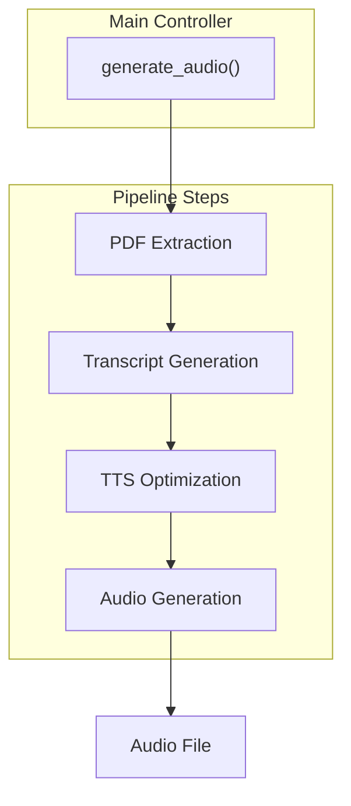

# KNOWLEDGE EXTRACT: github.com_Goekdeniz-Guelmez_Local-NotebookLM_1175fa50
> **Extracted on:** 2026-04-01 12:22:17
> **Source:** D:/LongLeo/AI OS CORP/AI OS/core/security/QUARANTINE/KI-BATCH-20260331205007521818/github.com_Goekdeniz-Guelmez_Local-NotebookLM_1175fa50

---

## File: `.dockerignore`
```
__pycache__/
*.pyc
*.pyo
*.pyd
*.DS_Store
*.git
*.env
/output
```

## File: `.gitignore`
```
__pycache__/
.cache/

.config.json
config.json

.examples/test_output
examples/test_output

.test*
test*

.venv
venv

.conda
conda

local_notebooklm/web_ui/output
.local_notebooklm/web_ui/output

.gradio
gradio

.DS_Store
*.vscode/*

*output/*
*.output/*
```

## File: `.pre-commit-config.yaml`
```yaml
repos:
-   repo: https://github.com/psf/black-pre-commit-mirror
    rev: 24.3.0
    hooks:
    -   id: black
-   repo: https://github.com/pycqa/isort
    rev: 5.13.2
    hooks:
    -   id: isort
        args:
            - --profile=black
-   repo: https://github.com/charliermarsh/ruff-pre-commit
    rev: v0.0.262
    hooks:
    -   id: ruff
        args: [--fix]
-   repo: https://github.com/pre-commit/pre-commit-hooks
    rev: v4.4.0
    hooks:
    -   id: trailing-whitespace
    -   id: end-of-file-fixer
    -   id: check-yaml
    -   id: check-added-large-files
```

## File: `CODE_OF_CONDUCT.md`
```markdown
# Contributor Covenant Code of Conduct

## Our Pledge

We as members, contributors, and leaders pledge to make participation in our
community a harassment-free experience for everyone, regardless of age, body
size, visible or invisible disability, ethnicity, sex characteristics, gender
identity and expression, level of experience, education, socio-economic status,
nationality, personal appearance, race, religion, or sexual identity
and orientation.

We pledge to act and interact in ways that contribute to an open, welcoming,
diverse, inclusive, and healthy community.

## Our Standards

Examples of behavior that contributes to a positive environment for our
community include:

* Demonstrating empathy and kindness toward other people
* Being respectful of differing opinions, viewpoints, and experiences
* Giving and gracefully accepting constructive feedback
* Accepting responsibility and apologizing to those affected by our mistakes,
  and learning from the experience
* Focusing on what is best not just for us as individuals, but for the
  overall community

Examples of unacceptable behavior include:

* The use of sexualized language or imagery, and sexual attention or
  advances of any kind
* Trolling, insulting or derogatory comments, and personal or political attacks
* Public or private harassment
* Publishing others' private information, such as a physical or email
  address, without their explicit permission
* Other conduct which could reasonably be considered inappropriate in a
  professional setting

## Enforcement Responsibilities

Community leaders are responsible for clarifying and enforcing our standards of
acceptable behavior and will take appropriate and fair corrective action in
response to any behavior that they deem inappropriate, threatening, offensive,
or harmful.

Community leaders have the right and responsibility to remove, edit, or reject
comments, commits, code, wiki edits, issues, and other contributions that are
not aligned to this Code of Conduct, and will communicate reasons for moderation
decisions when appropriate.

## Scope

This Code of Conduct applies within all community spaces, and also applies when
an individual is officially representing the community in public spaces.
Examples of representing our community include using an official e-mail address,
posting via an official social media account, or acting as an appointed
representative at an online or offline event.

## Enforcement

Instances of abusive, harassing, or otherwise unacceptable behavior may be
reported to the community leaders responsible for enforcement at
.
All complaints will be reviewed and investigated promptly and fairly.

All community leaders are obligated to respect the privacy and security of the
reporter of any incident.

## Enforcement Guidelines

Community leaders will follow these Community Impact Guidelines in determining
the consequences for any action they deem in violation of this Code of Conduct:

### 1. Correction

**Community Impact**: Use of inappropriate language or other behavior deemed
unprofessional or unwelcome in the community.

**Consequence**: A private, written warning from community leaders, providing
clarity around the nature of the violation and an explanation of why the
behavior was inappropriate. A public apology may be requested.

### 2. Warning

**Community Impact**: A violation through a single incident or series
of actions.

**Consequence**: A warning with consequences for continued behavior. No
interaction with the people involved, including unsolicited interaction with
those enforcing the Code of Conduct, for a specified period of time. This
includes avoiding interactions in community spaces as well as external channels
like social media. Violating these terms may lead to a temporary or
permanent ban.

### 3. Temporary Ban

**Community Impact**: A serious violation of community standards, including
sustained inappropriate behavior.

**Consequence**: A temporary ban from any sort of interaction or public
communication with the community for a specified period of time. No public or
private interaction with the people involved, including unsolicited interaction
with those enforcing the Code of Conduct, is allowed during this period.
Violating these terms may lead to a permanent ban.

### 4. Permanent Ban

**Community Impact**: Demonstrating a pattern of violation of community
standards, including sustained inappropriate behavior,  harassment of an
individual, or aggression toward or disparagement of classes of individuals.

**Consequence**: A permanent ban from any sort of public interaction within
the community.

## Attribution

This Code of Conduct is adapted from the [Contributor Covenant][homepage],
version 2.0, available at
https://www.contributor-covenant.org/version/2/0/code_of_conduct.html.

Community Impact Guidelines were inspired by [Mozilla's code of conduct
enforcement ladder](https://github.com/mozilla/diversity).

[homepage]: https://www.contributor-covenant.org

For answers to common questions about this code of conduct, see the FAQ at
https://www.contributor-covenant.org/faq. Translations are available at
https://www.contributor-covenant.org/translations.
```

## File: `CONTRIBUTING.md`
```markdown
# Contributing to mlx-examples

I want to make contributing to this project as easy and transparent as
possible.

## Pull Requests

1. Fork and submit pull requests to the repo.
2. If you've added code that should be tested, add tests.
3. Every PR should have passing tests and at least one review by me.
4. For code formatting install `pre-commit` using something like `pip install pre-commit` and run `pre-commit install`.
   This should install hooks for running `black` and `clang-format` to ensure
   consistent style for C++ and python code.
 
   You can also run the formatters manually as follows on individual files:
 
     ```bash
     clang-format -i file.cpp
     ```
 
     ```bash
     black file.py
     ```

     or,

     ```bash
     # single file
     pre-commit run --files file1.py 

     # specific files
     pre-commit run --files file1.py file2.py
     ```
 
   or run `pre-commit run --all-files` to check all files in the repo.

## Issues

I use GitHub issues to track public bugs. Please ensure your description is
clear and has sufficient instructions to be able to reproduce the issue.

## License

By contributing to Local-NotebookLM, you agree that your contributions will be licensed
under the LICENSE file in the root directory of this source tree.
```

## File: `Dockerfile`
```
# Use a lightweight Python base
FROM python:3.11-slim

# Prevent Python from writing pyc files and force stdout/stderr flushing
ENV PYTHONDONTWRITEBYTECODE=1
ENV PYTHONUNBUFFERED=1

# Set work directory
WORKDIR /app

# Install system deps (for ffmpeg if audio processing needs it)
RUN apt-get update && apt-get install -y \
    ffmpeg \
    && rm -rf /var/lib/apt/lists/*

# Copy project files
COPY . /app

# Install Python deps
RUN pip install --no-cache-dir --upgrade pip \
    && pip install --no-cache-dir -e . \
    && pip install --no-cache-dir uvicorn

EXPOSE 7860 8000

# Default to Gradio UI, switch to API with APP_MODE=api
CMD if [ "$APP_MODE" = "api" ]; then \
      uvicorn local_notebooklm.server:app --host 0.0.0.0 --port 8000 --reload; \
    else \
      python -m local_notebooklm.web_ui --port 7860; \
    fi
```

## File: `LICENSE`
```
                                 Apache License
                           Version 2.0, January 2004
                        http://www.apache.org/licenses/

   TERMS AND CONDITIONS FOR USE, REPRODUCTION, AND DISTRIBUTION

   1. Definitions.

      "License" shall mean the terms and conditions for use, reproduction,
      and distribution as defined by Sections 1 through 9 of this document.

      "Licensor" shall mean the copyright owner or entity authorized by
      the copyright owner that is granting the License.

      "Legal Entity" shall mean the union of the acting entity and all
      other entities that control, are controlled by, or are under common
      control with that entity. For the purposes of this definition,
      "control" means (i) the power, direct or indirect, to cause the
      direction or management of such entity, whether by contract or
      otherwise, or (ii) ownership of fifty percent (50%) or more of the
      outstanding shares, or (iii) beneficial ownership of such entity.

      "You" (or "Your") shall mean an individual or Legal Entity
      exercising permissions granted by this License.

      "Source" form shall mean the preferred form for making modifications,
      including but not limited to software source code, documentation
      source, and configuration files.

      "Object" form shall mean any form resulting from mechanical
      transformation or translation of a Source form, including but
      not limited to compiled object code, generated documentation,
      and conversions to other media types.

      "Work" shall mean the work of authorship, whether in Source or
      Object form, made available under the License, as indicated by a
      copyright notice that is included in or attached to the work
      (an example is provided in the Appendix below).

      "Derivative Works" shall mean any work, whether in Source or Object
      form, that is based on (or derived from) the Work and for which the
      editorial revisions, annotations, elaborations, or other modifications
      represent, as a whole, an original work of authorship. For the purposes
      of this License, Derivative Works shall not include works that remain
      separable from, or merely link (or bind by name) to the interfaces of,
      the Work and Derivative Works thereof.

      "Contribution" shall mean any work of authorship, including
      the original version of the Work and any modifications or additions
      to that Work or Derivative Works thereof, that is intentionally
      submitted to Licensor for inclusion in the Work by the copyright owner
      or by an individual or Legal Entity authorized to submit on behalf of
      the copyright owner. For the purposes of this definition, "submitted"
      means any form of electronic, verbal, or written communication sent
      to the Licensor or its representatives, including but not limited to
      communication on electronic mailing lists, source code control systems,
      and issue tracking systems that are managed by, or on behalf of, the
      Licensor for the purpose of discussing and improving the Work, but
      excluding communication that is conspicuously marked or otherwise
      designated in writing by the copyright owner as "Not a Contribution."

      "Contributor" shall mean Licensor and any individual or Legal Entity
      on behalf of whom a Contribution has been received by Licensor and
      subsequently incorporated within the Work.

   2. Grant of Copyright License. Subject to the terms and conditions of
      this License, each Contributor hereby grants to You a perpetual,
      worldwide, non-exclusive, no-charge, royalty-free, irrevocable
      copyright license to reproduce, prepare Derivative Works of,
      publicly display, publicly perform, sublicense, and distribute the
      Work and such Derivative Works in Source or Object form.

   3. Grant of Patent License. Subject to the terms and conditions of
      this License, each Contributor hereby grants to You a perpetual,
      worldwide, non-exclusive, no-charge, royalty-free, irrevocable
      (except as stated in this section) patent license to make, have made,
      use, offer to sell, sell, import, and otherwise transfer the Work,
      where such license applies only to those patent claims licensable
      by such Contributor that are necessarily infringed by their
      Contribution(s) alone or by combination of their Contribution(s)
      with the Work to which such Contribution(s) was submitted. If You
      institute patent litigation against any entity (including a
      cross-claim or counterclaim in a lawsuit) alleging that the Work
      or a Contribution incorporated within the Work constitutes direct
      or contributory patent infringement, then any patent licenses
      granted to You under this License for that Work shall terminate
      as of the date such litigation is filed.

   4. Redistribution. You may reproduce and distribute copies of the
      Work or Derivative Works thereof in any medium, with or without
      modifications, and in Source or Object form, provided that You
      meet the following conditions:

      (a) You must give any other recipients of the Work or
          Derivative Works a copy of this License; and

      (b) You must cause any modified files to carry prominent notices
          stating that You changed the files; and

      (c) You must retain, in the Source form of any Derivative Works
          that You distribute, all copyright, patent, trademark, and
          attribution notices from the Source form of the Work,
          excluding those notices that do not pertain to any part of
          the Derivative Works; and

      (d) If the Work includes a "NOTICE" text file as part of its
          distribution, then any Derivative Works that You distribute must
          include a readable copy of the attribution notices contained
          within such NOTICE file, excluding those notices that do not
          pertain to any part of the Derivative Works, in at least one
          of the following places: within a NOTICE text file distributed
          as part of the Derivative Works; within the Source form or
          documentation, if provided along with the Derivative Works; or,
          within a display generated by the Derivative Works, if and
          wherever such third-party notices normally appear. The contents
          of the NOTICE file are for informational purposes only and
          do not modify the License. You may add Your own attribution
          notices within Derivative Works that You distribute, alongside
          or as an addendum to the NOTICE text from the Work, provided
          that such additional attribution notices cannot be construed
          as modifying the License.

      You may add Your own copyright statement to Your modifications and
      may provide additional or different license terms and conditions
      for use, reproduction, or distribution of Your modifications, or
      for any such Derivative Works as a whole, provided Your use,
      reproduction, and distribution of the Work otherwise complies with
      the conditions stated in this License.

   5. Submission of Contributions. Unless You explicitly state otherwise,
      any Contribution intentionally submitted for inclusion in the Work
      by You to the Licensor shall be under the terms and conditions of
      this License, without any additional terms or conditions.
      Notwithstanding the above, nothing herein shall supersede or modify
      the terms of any separate license agreement you may have executed
      with Licensor regarding such Contributions.

   6. Trademarks. This License does not grant permission to use the trade
      names, trademarks, service marks, or product names of the Licensor,
      except as required for reasonable and customary use in describing the
      origin of the Work and reproducing the content of the NOTICE file.

   7. Disclaimer of Warranty. Unless required by applicable law or
      agreed to in writing, Licensor provides the Work (and each
      Contributor provides its Contributions) on an "AS IS" BASIS,
      WITHOUT WARRANTIES OR CONDITIONS OF ANY KIND, either express or
      implied, including, without limitation, any warranties or conditions
      of TITLE, NON-INFRINGEMENT, MERCHANTABILITY, or FITNESS FOR A
      PARTICULAR PURPOSE. You are solely responsible for determining the
      appropriateness of using or redistributing the Work and assume any
      risks associated with Your exercise of permissions under this License.

   8. Limitation of Liability. In no event and under no legal theory,
      whether in tort (including negligence), contract, or otherwise,
      unless required by applicable law (such as deliberate and grossly
      negligent acts) or agreed to in writing, shall any Contributor be
      liable to You for damages, including any direct, indirect, special,
      incidental, or consequential damages of any character arising as a
      result of this License or out of the use or inability to use the
      Work (including but not limited to damages for loss of goodwill,
      work stoppage, computer failure or malfunction, or any and all
      other commercial damages or losses), even if such Contributor
      has been advised of the possibility of such damages.

   9. Accepting Warranty or Additional Liability. While redistributing
      the Work or Derivative Works thereof, You may choose to offer,
      and charge a fee for, acceptance of support, warranty, indemnity,
      or other liability obligations and/or rights consistent with this
      License. However, in accepting such obligations, You may act only
      on Your own behalf and on Your sole responsibility, not on behalf
      of any other Contributor, and only if You agree to indemnify,
      defend, and hold each Contributor harmless for any liability
      incurred by, or claims asserted against, such Contributor by reason
      of your accepting any such warranty or additional liability.

   END OF TERMS AND CONDITIONS

   APPENDIX: How to apply the Apache License to your work.

      To apply the Apache License to your work, attach the following
      boilerplate notice, with the fields enclosed by brackets "[]"
      replaced with your own identifying information. (Don't include
      the brackets!)  The text should be enclosed in the appropriate
      comment syntax for the file format. We also recommend that a
      file or class name and description of purpose be included on the
      same "printed page" as the copyright notice for easier
      identification within third-party archives.

   Copyright [yyyy] [name of copyright owner]

   Licensed under the Apache License, Version 2.0 (the "License");
   you may not use this file except in compliance with the License.
   You may obtain a copy of the License at

       http://www.apache.org/licenses/LICENSE-2.0

   Unless required by applicable law or agreed to in writing, software
   distributed under the License is distributed on an "AS IS" BASIS,
   WITHOUT WARRANTIES OR CONDITIONS OF ANY KIND, either express or implied.
   See the License for the specific language governing permissions and
   limitations under the License.
```

## File: `MANIFEST.in`
```
# Include license and readme
include LICENSE
include README.md

# Include requirements files
include requirements.txt

# Exclude development and CI/CD configurations
exclude .pre-commit-config.yaml
exclude .gitignore
recursive-exclude .github *

# Exclude cache files
global-exclude __pycache__/*
global-exclude *.py[cod]
global-exclude *.so
global-exclude .DS_Store
```

## File: `README.md`
```markdown
# Local-NotebookLM


NEW! A stand-alone app has been released [link](https://github.com/Goekdeniz-Guelmez/Local-Notebook-LM-App).

A local AI-powered tool that converts PDF documents into engaging audio—such as podcasts or custom audio content—using local LLMs and TTS models.

## Features

- PDF text extraction and processing
- Customizable audio generation (podcasts, summaries, interviews, and more) with different styles and lengths
- Support for various LLM providers (OpenAI, Groq, LMStudio, Ollama, Azure)
- Text-to-Speech conversion with voice selection
- Flexible pipeline with many options for content, style, and voices
- Programmatic API for integration in other projects
- FastAPI server for web-based access
- Example podcast included for demonstration

#### Here are quick examples, can you guess what paper they're talking about?

<audio controls>
    <source src="https://raw.githubusercontent.com/Goekdeniz-Guelmez/Local-NotebookLM/main/examples/podcast_example_casual.wav" type="audio/wav">
    Your browser does not support the audio element. You can manually listen/download here: <a href="https://raw.githubusercontent.com/Goekdeniz-Guelmez/Local-NotebookLM/main/examples/podcast_example_casual.wav">Casual example</a>.
</audio>

<audio controls>
    <source src="https://raw.githubusercontent.com/Goekdeniz-Guelmez/Local-NotebookLM/main/examples/podcast_example_genz.wav" type="audio/wav">
    Your browser does not support the audio element. You can manually listen/download here: <a href="https://raw.githubusercontent.com/Goekdeniz-Guelmez/Local-NotebookLM/main/examples/podcast_example_genz.wav">Gen-Z example</a>.
</audio>

If your browser still blocks embedded playback on GitHub, use direct links:
- [Casual example (.wav)](https://raw.githubusercontent.com/Goekdeniz-Guelmez/Local-NotebookLM/main/examples/podcast_example_casual.wav)
- [Gen-Z example (.wav)](https://raw.githubusercontent.com/Goekdeniz-Guelmez/Local-NotebookLM/main/examples/podcast_example_genz.wav)

## Prerequisites

- Python 3.9+
- Local LLM server (optional, for local inference)
- Local TTS server (optional, for local audio generation)
- At least 8GB RAM (32GB+ recommended for local models)
- 10GB+ free disk space

## Installation

### From PyPI

```bash
pip install local-notebooklm
```

### From source

1. Clone the repository:

```bash
git clone https://github.com/Goekdeniz-Guelmez/Local-NotebookLM.git
cd Local-NotebookLM
```

2. Create and activate a virtual environment (conda works too):

```bash
python -m venv venv
source venv/bin/activate  # On Windows, use: venv\Scripts\activate
```

3. Install the required packages:

```bash
pip install -r requirements.txt
```

## Running with Docker

You can run Local-NotebookLM using Docker for both the Web UI and API modes.

### Prerequisites

- Docker installed on your system

### Steps

1. **Build the Docker image:**

    ```bash
    docker build -t local-notebooklm-ui .
    ```

2. **Run the Gradio Web UI:**

    ```bash
    docker run -p 7860:7860 local-notebooklm-ui
    ```
    The Web UI will be available at [http://localhost:7860](http://localhost:7860).

3. **Run the FastAPI API server:**

    ```bash
    docker run -e APP_MODE=api -p 8000:8000 local-notebooklm-ui
    ```
    The API server will be available at [http://localhost:8000](http://localhost:8000).
## Optional pre requisites
### Local TTS server
- Follow one installation type (docker, docker-compose, uv) at https://github.com/remsky/Kokoro-FastAPI
- Test in your browser that http://localhost:8880/v1 return the json: {"detail":"Not Found"}
  
## Example Output

The repository includes an example podcast in `examples/podcast.wav` to demonstrate the quality and format of the output. The models used are: gpt4o and Mini with tts-hs on Azure. You can listen to this example to get a sense of what Local-NotebookLM can produce before running it on your own PDFs.


## Usage

### Command Line Interface

Run the script with the following command:

```bash
python -m local_notebooklm.make_audio --pdf PATH_TO_PDF [options]
```

#### Available Options

| Option | Description | Default |
|--------|-------------|---------|
| `--pdf` | Path to the PDF file (required) | - |
| `--output_dir` | Directory to store output files | ./output |
| `--llm_model` | Ollama LLM model name | gemini-3-flash-preview:cloud |
| `--language` | Language for the audio output | english |
| `--format_type` | Output format type (summary, podcast, article, interview, panel-discussion, debate, narration, storytelling, explainer, lecture, tutorial, q-and-a, news-report, executive-brief, meeting, analysis) | podcast |
| `--style` | Content style (normal, casual, formal, technical, academic, friendly, gen-z, funny) | normal |
| `--length` | Content length (short, medium, long, very-long) | medium |
| `--is-vlm` | Enable vision mode so extracted PDF images are also sent to the LLM | False |
| `--num_speakers` | Number of speakers in audio (1, 2, 3, 4, 5) | 2 (for podcast/interview) |
| `--custom_preferences` | Additional focus preferences or instructions | None |

#### Format Types

Local-NotebookLM supports both single-speaker and multi-speaker formats:

**Single-Speaker Formats:**
- summary
- narration
- storytelling
- explainer
- lecture
- tutorial
- news-report
- executive-brief
- analysis

**Two-Speaker Formats:**
- podcast
- interview
- panel-discussion
- debate
- q-and-a
- meeting

**Multi-Speaker Formats:**
- panel-discussion (3, 4, or 5 speakers)
- debate (3, 4, or 5 speakers)

#### Example Commands

Basic usage:
```bash
python -m local_notebooklm.make_audio --pdf documents/research_paper.pdf
```

Customized podcast:
```bash
python -m local_notebooklm.make_audio --pdf documents/research_paper.pdf --format_type podcast --length long --style casual
```

With custom preferences:
```bash
python -m local_notebooklm.make_audio --pdf documents/research_paper.pdf --custom_preferences "Focus on practical applications and real-world examples"
```

Specify number of speakers:
```bash
python -m local_notebooklm.make_audio --pdf documents/research_paper.pdf --format_type panel-discussion --num_speakers 3
```

Enable multimodal transcript generation (text + PDF images):
```bash
python -m local_notebooklm.make_audio --pdf documents/research_paper.pdf --is-vlm
```

### Programmatic API

You can also use Local-NotebookLM programmatically in your Python code:

```python
from local_notebooklm.processor import generate_audio

generate_audio(
    pdf_path="documents/research_paper.pdf",
    output_dir="./test_output",
    llm_model="qwen3:30b-a3b-instruct-2507-q4_K_M",
    language="english",
    format_type="interview",
    style="professional",
    length="long",
    num_speakers=2,
    custom_preferences="Focus on the key technical aspects"
)
```

### Gradio Web UI

Local-NotebookLM now includes a user-friendly Gradio web interface that makes it easy to use the tool without command line knowledge:

```bash
python -m local_notebooklm.web_ui
```

By default, the web UI runs locally on http://localhost:7860. You can access it from your browser.

#### Web UI Screenshots


*The main interface of the Local-NotebookLM web UI*

#### Web UI Options

| Option | Description | Default |
|--------|-------------|---------|
| `--share` | Make the UI accessible over the network | False |
| `--port` | Specify a custom port | 7860 |

#### Example Commands

Basic local usage:
```bash
python -m local_notebooklm.web_ui
```

Share with others on your network:
```bash
python -m local_notebooklm.web_ui --share
```

Use a custom port:
```bash
python -m local_notebooklm.web_ui --port 8080
```

The web interface provides all the same options as the command line tool in an intuitive UI, making it easier for non-technical users to generate audio content from PDFs.

### FastAPI Server

Start the FastAPI server to access the functionality via a web API:

```bash
 python -m local_notebooklm.server
```

By default, the server runs on http://localhost:8000. You can access the API documentation at http://localhost:8000/docs.

## Pipeline Steps

1. **PDF Extraction**
   - Extracts and cleans text from the provided PDF.
2. **Transcript Generation**
   - Generates a transcript or script based on the extracted content and user options.
3. **Audio Generation**
   - Converts the optimized transcript to audio using the specified TTS model and outputs the final audio file.

### Pipeline Diagram



## Multiple Language Support

Local-NotebookLM now supports multiple languages. You can specify the language when using the programmatic API or through the command line.

**Important Note:** When using a non-English language, ensure that both your selected LLM and TTS models support the desired language. Language support varies significantly between different models and providers. For optimal results, verify that your chosen models have strong capabilities in your target language before processing.


## Output Files

The pipeline generates the following files:

- `segments/podcast_segment_*.wav`: Individual audio segments
- `podcast.wav`: Final concatenated podcast audio file

## Troubleshooting

### Common Issues

1. **PDF Extraction Fails**
   - Try a different PDF file
   - Check if the PDF is password-protected
   - Ensure the PDF contains extractable text (not just images)

2. **API Connection Errors**
   - Verify your API keys are correct
   - Check your internet connection
   - Ensure the API endpoints are accessible

3. **Out of Memory Errors**
   - Reduce the chunk size in the configuration
   - Use a smaller model
   - Close other memory-intensive applications

4. **Audio Quality Issues**
   - Try different TTS voices
   - Adjust the sample rate in the configuration
   - Check if the TTS server is running correctly

### Getting Help

If you encounter issues not covered here, please:
1. Check the logs for detailed error messages
2. Open an issue on the GitHub repository with details about your problem
3. Include the error message and steps to reproduce the issue

## Requirements

- Python 3.9+
- PyPDF2
- tqdm
- numpy
- soundfile
- requests
- pathlib
- fastapi
- uvicorn

Full requirements are listed in `requirements.txt`.

## Acknowledgments

- This project uses various open-source libraries and models
- Special thanks to the developers of LLaMA, OpenAI, and other AI models that make this possible

Best
Gökdeniz Gülmez

---


---

## Citing Local-NotebookLM

The Local-NotebookLM software suite was developed by Gökdeniz Gülmez. If you find Local-NotebookLM useful in your research and wish to cite it, please use the following
BibTex entry:

```text
@software{
  Local-NotebookLM,
  author = {Gökdeniz Gülmez},
  title = {{Local-NotebookLM}: A Local-NotebookLM to convert PDFs into Audio.},
  url = {https://github.com/Goekdeniz-Guelmez/Local-NotebookLM},
  version = {0.1.5},
  year = {2025},
}
```
```

## File: `pyproject.toml`
```
[build-system]
requires = ["setuptools>=42", "wheel"]
build-backend = "setuptools.build_meta"

[project]
name = "local_notebooklm"
dynamic = ["version", "dependencies"]
description = "A local notebook implementation"
readme = "README.md"
authors = [
    {name = "Gökdeniz Gülmez", email = "goekdenizguelmez@gmail.com"}
]
license = {text = "Apache-2.0"}
classifiers = [
    "Programming Language :: Python :: 3.12",
    "License :: OSI Approved :: Apache Software License",
    "Operating System :: OS Independent",
]
requires-python = ">=3.12"

[tool.setuptools.dynamic]
version = {attr = "local_notebooklm.version.__version__"}
dependencies = {file = ["requirements.txt"]}

[project.urls]
"Homepage" = "https://github.com/Goekdeniz-Guelmez//Local-NotebookLM"
"Bug Tracker" = "https://github.com/Goekdeniz-Guelmez//Local-NotebookLM/issues"

[tool.black]
line-length = 88
target-version = ["py312"]

[tool.isort]
profile = "black"
line_length = 88

[tool.ruff]
select = ["E", "F", "B"]
ignore = []
line-length = 88
target-version = "py312"
```

## File: `requirements.txt`
```
PyPDF2
numpy
soundfile
openai
tqdm
pydantic
gradio
fastapi
uvicorn
```

## File: `setup.py`
```python
from pathlib import Path
from setuptools import find_packages, setup
import sys

sys.path.insert(0, str(Path(__file__).parent))
from local_notebooklm.version import __version__

setup(
    name="local-notebooklm",
    version=__version__,
    description="A Local-NotebookLM to convert PDFs into Audio.",
    long_description=open("README.md", encoding="utf-8").read(),
    long_description_content_type="text/markdown",
    author="Gökdeniz Gülmez",
    author_email="goekdenizguelmez@gmail.com",
    url="https://github.com/Goekdeniz-Guelmez/Local-NotebookLM",
    license="Apache-2.0",
    # Remove install_requires=requirements,
    packages=find_packages(),
    python_requires=">=3.9",
    classifiers=[
        "Programming Language :: Python :: 3.12"
    ],
    include_package_data=True
)
```

## File: `local_notebooklm/__init__.py`
```python
from .version import __version__
```

## File: `local_notebooklm/make_audio.py`
```python
import argparse, sys

from .processor import generate_audio


def main():
    parser = argparse.ArgumentParser(description="Generate a podcast from a PDF document")
    
    parser.add_argument("--pdf", type=str, required=True, help="Path to the PDF file")
    parser.add_argument("--output_dir", type=str, default="./output", help="Directory to save output files")
    parser.add_argument("--llm_model", type=str, default="gemini-3-flash-preview:cloud", help="LLM model name")
    parser.add_argument("--language", type=str, default="english", help="Language for generation")
    parser.add_argument("--format_type", type=str, choices=["podcast", "narration", "interview", "panel-discussion", "summary", "article", "lecture", "q-and-a", "tutorial", "debate", "meeting", "analysis"], default="podcast", help="Output format type")
    parser.add_argument("--style", type=str, choices=["normal", "formal", "casual", "enthusiastic", "serious", "humorous", "gen-z", "technical"], default="normal", help="Speaking style")
    parser.add_argument("--length", type=str, choices=["short", "medium", "long"], default="medium", help="Length of output")
    parser.add_argument("--num_speakers", type=int, default=None, help="Number of speakers for multi-speaker formats")
    parser.add_argument("--custom_preferences", type=str, default=None, help="Custom preferences for generation")
    parser.add_argument("--is-vlm", action="store_true", help="Enable multimodal prompting by including extracted PDF images")

    args = parser.parse_args()

    audio_path = generate_audio(
        pdf_path=args.pdf,
        output_dir=args.output_dir,
        llm_model=args.llm_model,
        language=args.language,
        format_type=args.format_type,
        style=args.style,
        length=args.length,
        num_speakers=args.num_speakers,
        custom_preferences=args.custom_preferences,
        is_vlm=args.is_vlm,
    )
    print(f"Audio generated: {audio_path}")


if __name__ == "__main__":
    sys.exit(main())
```

## File: `local_notebooklm/processor.py`
```python
import sys
import json
import logging
import re
import base64
from pathlib import Path
from typing import List, Tuple, Literal, Optional, Any

import PyPDF2
import numpy as np
import soundfile as sf
from openai import OpenAI


ALLOWED_LENGTHS = {"short", "medium", "long"}


# ==== Colored logging formatter ====
class ColoredFormatter(logging.Formatter):
    COLORS = {
        'DEBUG': '\033[36m',    # Cyan
        'INFO': '\033[32m',     # Green
        'WARNING': '\033[33m',  # Yellow
        'ERROR': '\033[31m',    # Red
        'CRITICAL': '\033[41m', # Red background
    }
    RESET = '\033[0m'

    def format(self, record):
        color = self.COLORS.get(record.levelname, self.RESET)
        message = super().format(record)
        return f"{color}{message}{self.RESET}"

handler = logging.StreamHandler(sys.stderr)
handler.setLevel(logging.DEBUG)
formatter = ColoredFormatter("[%(asctime)s] [%(levelname)s] %(name)s: %(message)s", "%Y-%m-%d %H:%M:%S")
handler.setFormatter(formatter)
logger = logging.getLogger("ai_audio")
logger.setLevel(logging.DEBUG)
logger.addHandler(handler)
logger.propagate = False


def _extract_json_candidate(raw: str) -> str:
    if not raw:
        return ""

    text = raw.strip()

    fenced = re.search(r"```(?:json)?\s*([\s\S]*?)\s*```", text, re.IGNORECASE)
    if fenced:
        text = fenced.group(1).strip()

    object_start = text.find("{")
    object_end = text.rfind("}")
    array_start = text.find("[")
    array_end = text.rfind("]")

    object_candidate = (
        text[object_start:object_end + 1]
        if object_start != -1 and object_end != -1 and object_start < object_end
        else ""
    )
    array_candidate = (
        text[array_start:array_end + 1]
        if array_start != -1 and array_end != -1 and array_start < array_end
        else ""
    )

    if object_candidate and array_candidate:
        return object_candidate if len(object_candidate) >= len(array_candidate) else array_candidate
    return object_candidate or array_candidate or text


def _safe_json_loads(raw: str):
    try:
        return json.loads(raw)
    except Exception:
        candidate = _extract_json_candidate(raw)
        if not candidate:
            raise
        return json.loads(candidate)


def _detect_image_mime(image_bytes: bytes) -> str:
    if image_bytes.startswith(b"\x89PNG\r\n\x1a\n"):
        return "image/png"
    if image_bytes.startswith(b"\xff\xd8\xff"):
        return "image/jpeg"
    if image_bytes.startswith(b"GIF87a") or image_bytes.startswith(b"GIF89a"):
        return "image/gif"
    if image_bytes.startswith(b"RIFF") and b"WEBP" in image_bytes[:16]:
        return "image/webp"
    return "application/octet-stream"


def _extract_pdf_images_as_data_urls(pdf_path: str, max_images: int = 4) -> List[str]:
    data_urls: List[str] = []
    if max_images <= 0:
        return data_urls

    with open(pdf_path, "rb") as file:
        reader = PyPDF2.PdfReader(file)
        for page_index, page in enumerate(reader.pages, start=1):
            page_images = getattr(page, "images", [])
            if not page_images:
                continue

            for image in page_images:
                image_bytes = getattr(image, "data", None)
                if not image_bytes:
                    continue

                mime_type = _detect_image_mime(image_bytes)
                encoded = base64.b64encode(image_bytes).decode("utf-8")
                data_urls.append(f"data:{mime_type};base64,{encoded}")

                if len(data_urls) >= max_images:
                    logger.info(f"Reached image limit ({max_images}) while extracting PDF visuals.")
                    return data_urls

            logger.debug(f"Extracted {len(page_images)} image(s) from page {page_index}.")

    logger.info(f"Extracted {len(data_urls)} image(s) from PDF for VLM prompting.")
    return data_urls

# ========== PDF EXTRACTION ==========
def extract_text_from_pdf(pdf_path: str, max_chars: int = 100_000) -> str:
    if not Path(pdf_path).exists():
        raise FileNotFoundError(f"PDF not found: {pdf_path}")

    with open(pdf_path, "rb") as file:
        reader = PyPDF2.PdfReader(file)
        num_pages = len(reader.pages)
        logger.debug(f"PDF has {num_pages} pages.")
        text = []
        total = 0
        for page in reader.pages:
            page_text = page.extract_text() or ""
            if total + len(page_text) > max_chars:
                text.append(page_text[: max_chars - total])
                break
            text.append(page_text)
            total += len(page_text)
    return "\n".join(text)

def chunk_text(
    text: str,
    length: Literal["short", "medium", "long"] = "medium"
) -> List[str]:
    """Split text into overlapping chunks with size based on desired output length.

    The `length` parameter controls how aggressively we chunk the PDF text:
    - short: smaller chunks, fewer total chunks
    - medium: balanced chunk size and count
    - long: larger chunks, allow many chunks
    """
    # Chunking presets tuned for typical LLM context windows (characters approximation)
    presets = {
        "short":  {"max_chunk_size": 30_000, "overlap": 300, "max_chunks": 2},   # biggest chunks → short summary
        "medium": {"max_chunk_size": 15_000, "overlap": 300, "max_chunks": 4},   # balanced
        "long":   {"max_chunk_size": 5_000,  "overlap": 200, "max_chunks": 9999999}, # smallest chunks → detailed
    }
    if length not in presets:
        raise ValueError(f"Unsupported length '{length}'. Allowed values: {sorted(presets.keys())}")

    cfg = presets[length]
    logger.debug(f"Chunking config chosen: {cfg} for length='{length}'")

    chunks: List[str] = []
    start = 0
    text_length = len(text)

    while start < text_length and len(chunks) < cfg["max_chunks"]:
        end = min(start + cfg["max_chunk_size"], text_length)
        chunk = text[start:end]
        chunks.append(chunk)
        if end == text_length:
            break
        start = end - cfg["overlap"]

    logger.info(
        f"Total chunks created: {len(chunks)} (length={length}, max_chunk_size={cfg['max_chunk_size']}, overlap={cfg['overlap']})"
    )
    return chunks

def generate_transcript_from_pdf(
    pdf_path: str,
    client: OpenAI,
    model: str,
    language: str = "english",
    format_type: Literal[
        "podcast", "narration", "interview", "panel-discussion", "summary", "article", "lecture",
        "q-and-a", "tutorial", "debate", "meeting", "analysis"
    ] = "podcast",
    style: Literal[
        "normal", "formal", "casual", "enthusiastic", "serious", "humorous", "gen-z", "technical"
    ] = "normal",
    length: Literal["short", "medium", "long"] = "medium",
    is_vlm: bool = False,
    num_speakers: Optional[int] = None,
    custom_preferences: Optional[str] = None
) -> List[Tuple[str, str]]:
    logger.info("Extracting large text from PDF...")
    length_max_chars = {"short": 200_000, "medium": 600_000, "long": 1_200_000}
    text = extract_text_from_pdf(pdf_path, max_chars=length_max_chars.get(length, 600_000))
    logger.debug(f"Extracted text length: {len(text)} characters.")
    logger.info("Splitting text into chunks...")
    chunks = chunk_text(text, length=length)
    total_chunks = len(chunks)
    pdf_images: Optional[List[str]] = None
    if is_vlm:
        max_images_by_length = {"short": 2, "medium": 4, "long": 8}
        max_images = max_images_by_length.get(length, 4)
        logger.info(f"VLM mode enabled. Extracting up to {max_images} images from PDF...")
        try:
            extracted_images = _extract_pdf_images_as_data_urls(pdf_path, max_images=max_images)
            if extracted_images:
                pdf_images = extracted_images
            else:
                logger.warning("VLM mode is enabled but no extractable images were found in the PDF.")
        except Exception as e:
            logger.warning(f"Image extraction for VLM failed, continuing with text-only prompt. Details: {e}")
    logger.info(f"Starting to process {total_chunks} chunks for transcript generation...")
    # Only generate characters for long transcripts
    characters = None
    if length == "long":
        characters = generate_characters(
            client, model, format_type,
            num_speakers=num_speakers,
            custom_preferences=custom_preferences
        )
    all_transcript = []
    for i, chunk in enumerate(chunks):
        is_first = (i == 0)
        is_last = (i == total_chunks - 1)
        logger.info(f"Generating transcript for chunk {i+1}/{total_chunks}, is_first={is_first}, is_last={is_last}")
        # Build context from previous turns
        prev_context = ""
        if all_transcript:
            context_slice = all_transcript[-3:]
            prev_context = "\n".join([f"{s}: {t}" for s, t in context_slice])
        if prev_context:
            combined_chunk = prev_context + "\n\n[Previous context]\n" + chunk
        else:
            combined_chunk = chunk
        # Append special markers for intro/outro control
        if is_first:
            combined_chunk += "\n\n[Include an opening greeting appropriate to the format.]"
        elif is_last:
            combined_chunk += "\n\n[Include a closing goodbye appropriate to the format.]"
        else:
            combined_chunk += "\n\n[Do not include greetings or closings in this chunk.]"
        # Pass characters to generate_transcript
        chunk_transcript = generate_transcript(
            combined_chunk, client, model, language, format_type=format_type,
            is_first=is_first, is_last=is_last, style=style, length=length,
            num_speakers=num_speakers, custom_preferences=custom_preferences,
            characters=characters,
            images=pdf_images
        )
        all_transcript.extend(chunk_transcript)
    logger.info("Completed generating transcripts for all chunks.")
    return all_transcript

# ========== LLM TRANSCRIPT ==========
def generate_transcript(
    text: str,
    client: OpenAI,
    model: str,
    language: str = "english",
    format_type: Literal[
        "podcast", "narration", "interview", "panel-discussion", "summary", "article", "lecture",
        "q-and-a", "tutorial", "debate", "meeting", "analysis"
    ] = "podcast",
    is_first: bool = False,
    is_last: bool = False,
    style: Literal[
        "normal", "formal", "casual", "enthusiastic", "serious", "humorous", "gen-z", "technical"
    ] = "normal",
    length: Literal["short", "medium", "long"] = "medium",
    num_speakers: Optional[int] = None,
    custom_preferences: Optional[str] = None,
    characters: Optional[list] = None,
    images: Optional[List[str]] = None
) -> List[Tuple[str, str]]:
    """
    Generate a audio transcript as a list of (speaker, text) tuples.
    """
    format_guides = {
        "podcast": "A conversational and engaging format with multiple speakers, natural flow, and informal tone.",
        "narration": "A single speaker delivering clear, concise, and informative narration.",
        "interview": "Two speakers with a question-and-answer format, focused and interactive.",
        "panel-discussion": "Multiple speakers engaging in a dynamic and balanced discussion.",
        "summary": "A brief and clear overview of the main points.",
        "article": "Structured, formal, and informative content suitable for reading.",
        "lecture": "Educational and detailed explanation with a formal tone.",
        "q-and-a": "Question and answer style with clear, concise responses.",
        "tutorial": "Step-by-step instructional content with clear guidance.",
        "debate": "Contrasting viewpoints presented by multiple speakers in a formal style.",
        "meeting": "Professional and concise discussion among participants.",
        "analysis": "In-depth examination and interpretation with expert tone."
    }

    style_guides = {
        "normal": "Use a balanced and natural conversational style appropriate for the format.",
        "formal": "Use a professional and polished tone with proper grammar and vocabulary.",
        "casual": "Use an informal and relaxed tone with colloquial expressions.",
        "enthusiastic": "Use an energetic and engaging tone to captivate the audience.",
        "serious": "Use a solemn and focused tone suitable for important topics.",
        "humorous": "Incorporate light humor and wit to entertain while informing.",
        "gen-z": "Use Gen Z slang, memes, and internet terminology. Keep it casual, fast-paced, full of emojis, and TikTok-era references to resonate with younger audiences.",
        "technical": "Use precise, detailed, and domain-specific language tailored for researchers, engineers, and technical experts. Include terminology, data, and depth suitable for expert audiences."
    }

    length_guides = {
        "short": "Keep the transcript concise and to the point, avoiding unnecessary details. Keep the reading time between 2 to 5 minutes.",
        "medium": "Provide a balanced length with enough detail to be informative and engaging. Keep the reading time between 5 to 10 minutes.",
        "long": "Include comprehensive details and extended dialogue for depth."
    }

    greeting_patterns = [
        r"^\s*(hi|hello|hey|welcome)\b",
        r"\b(welcome\s+back|good\s+(morning|afternoon|evening))\b",
    ]
    closing_patterns = [
        r"\b(thanks?\s+for\s+listening)\b",
        r"\b(see\s+you|talk\s+to\s+you)\s+(next\s+time|soon)\b",
        r"\b(goodbye|bye\b|farewell)\b",
        r"\b(that'?s\s+all\s+for\s+today)\b",
    ]

    def _looks_like_greeting(text: str) -> bool:
        lowered = text.strip().lower()
        return any(re.search(pattern, lowered) for pattern in greeting_patterns)

    def _looks_like_closing(text: str) -> bool:
        lowered = text.strip().lower()
        return any(re.search(pattern, lowered) for pattern in closing_patterns)

    def _strip_middle_chunk_intro_outro(transcript: List[Tuple[str, str]]) -> List[Tuple[str, str]]:
        cleaned = transcript[:]
        if len(cleaned) > 1:
            while len(cleaned) > 1 and _looks_like_greeting(cleaned[0][1]):
                cleaned.pop(0)
            while len(cleaned) > 1 and _looks_like_closing(cleaned[-1][1]):
                cleaned.pop()
        return cleaned

    def safe_json_loads(raw: str):
        try:
            return _safe_json_loads(raw)
        except Exception:
            return {"transcript": []}

    guide_text = f"""
### FORMAT, STYLE & LENGTH GUIDES
- Format guidance: {format_guides.get(format_type, '')}
- Style guidance: {style_guides.get(style, '')}
- Length guidance: {length_guides.get(length, '')}
"""

    system_prompt = f"""You are the world-class {format_type} writer, you have worked as a ghostwriter for Joe Rogan, Lex Fridman, Ben Shapiro, Tim Ferris.
You are an expert content creator. Transform the provided text into a {format_type} 
that matches the requested audio style.
{guide_text}

========================
### CONTENT RULES
- The conversation should sound natural. Filler sounds like "Hmm", "Ahh", "Umm", "Oh", "Yeah", "Haha", "Hehe", "Wow" can appear, but very rarely and only when it feels absolutely natural. Avoid frequent or exaggerated use.

========================
### SPEAKER RULES
- Use between 1 and 6 speakers depending on the format.
- Speakers must be labeled "Speaker 1", "Speaker 2", ... up to "Speaker 6".
- Do not invent or assign real names, only use generic speaker labels.
- If {format_type} is narration, summary, article, or lecture: use at least 1 speaker.
- If {format_type} is podcast, interview, q-and-a, or tutorial: use at least 2 speakers.
- If {format_type} is panel-discussion, debate, meeting, or analysis: use at least 3 speakers (and up to 6).
"""
    # If characters are provided, add a CHARACTER PROFILES section
    if characters is not None:
        system_prompt += "\n========================\n### CHARACTER PROFILES\n"
        for character in characters:
            # Each character is a dict with 'speaker', 'persona', 'expertise', 'style'
            speaker = character.get("speaker", "")
            persona = character.get("persona", "")
            expertise = character.get("expertise", "")
            style_ = character.get("style", "")
            system_prompt += f"- {speaker}: persona: {persona}; expertise: {expertise}; style: {style_}\n"
    if num_speakers is not None:
        system_prompt += f"""
========================
### SPEAKER OVERRIDE
- You MUST use exactly {num_speakers} speakers.
- Speakers must be labeled "Speaker 1" through "Speaker {num_speakers}".
- Do not add or remove speakers beyond this exact count.
"""

    system_prompt += """
========================
### CUSTOM PREFERENCES
"""
    if custom_preferences is not None:
        system_prompt += f"- Apply the following user preferences: {custom_preferences}\n"

    system_prompt += f"""
========================
### OUTPUT RULES
- Always output a **valid JSON object** with a top-level key "transcript".
- "transcript" must be a list of objects with two keys: "speaker" and "text".
- Each object = one speaker turn only.
- No latex, markdown, no commentary, meta-text, explanations, no titles.
- Do NOT include emojis, symbols, or non-speech artifacts.
- your speaker texts are turned directly into Speech using a Text-To-Speak model.

Example:
{{
  "transcript": [
    {{ "speaker": "Speaker 1", "text": "Welcome to Compu-Talk, your internal AI generated {format_type}!" }},
    {{ "speaker": "Speaker 2", "text": "Glad to be here." }},
    {{ "speaker": "Speaker N", "text": "Glad to be here too." }}
  ]
}}

========================
### CONTENT RULES
- Write in {language}.
- Match the conversational style of a real {format_type}.
- Allow interruptions, natural flow, or distinct voices when multiple speakers.
- Make it engaging, natural, and appropriate to the chosen format.
"""
    if is_first:
        system_prompt += "\n- Include an opening greeting appropriate to the format."
    else:
        system_prompt += "\n- Do NOT include any introduction, welcome, or greeting."
    if is_last:
        system_prompt += "\n- Include a closing goodbye appropriate to the format."
    else:
        system_prompt += "\n- Do NOT include any closing, sign-off, or goodbye."
    if not is_first and not is_last:
        system_prompt += "\n- This is a middle chunk. Continue directly from content with no intro/outro text."

    logger.info("Sending request to LLM for transcript generation...")
    user_content: Any = text
    if images:
        user_content = [{"type": "text", "text": text}]
        for image_data_url in images:
            user_content.append(
                {
                    "type": "image_url",
                    "image_url": {"url": image_data_url},
                }
            )

    response = client.chat.completions.create(
        model=model,
        messages=[
            {"role": "system", "content": system_prompt},
            {"role": "user", "content": user_content},
        ],
        temperature=0.6,
        max_tokens=16384,
        response_format={"type": "json_object"},
        stop=["] }"],
    )

    raw = response.choices[0].message.content

    try:
        result = safe_json_loads(raw)
        # Normalize output: wrap fallback keys like "closing", "opening", or "error" into transcript if needed
        if isinstance(result, dict) and "transcript" not in result:
            # Wrap fallback keys into transcript format
            if "closing" in result:
                result = {"transcript": [{"speaker": "Speaker 1", "text": result["closing"]}]}
            elif "opening" in result:
                result = {"transcript": [{"speaker": "Speaker 1", "text": result["opening"]}]}
            elif "error" in result:
                logger.warning(f"LLM returned error instead of transcript: {result['error']}")
                result = {"transcript": [{"speaker": "Speaker 1", "text": f"[Error note: {result['error']}]"}]}
        if not isinstance(result, dict) or "transcript" not in result:
            raise ValueError("Result missing 'transcript' key")
        transcript_list = result["transcript"]
        if not isinstance(transcript_list, list):
            raise ValueError("'transcript' is not a list")
        output = []
        for entry in transcript_list:
            if not (isinstance(entry, dict) and "speaker" in entry and "text" in entry):
                raise ValueError(f"Invalid transcript entry: {entry}")
            output.append((entry["speaker"], entry["text"]))

        if not is_first and not is_last:
            output = _strip_middle_chunk_intro_outro(output)

        logger.info("Successfully parsed transcript from LLM response.")
        return output
    except Exception as e:
        logger.error(f"Transcript parsing failed: {e}\nRaw output: {raw[:300]}")
        raise

# ========== CHARACTER GENERATION ==========
def generate_characters(
    client: OpenAI,
    model: str,
    format_type: str,
    num_speakers: Optional[int] = None,
    custom_preferences: Optional[str] = None
) -> list:
    """
    Generate a list of character descriptions for the transcript, based on the number of speakers and preferences.
    """
    system_prompt = f"You are an expert at creating engaging, realistic podcast or discussion characters for audio. "
    if num_speakers is not None:
        system_prompt += f"Create exactly {num_speakers} distinct speakers for this {format_type}. "
    else:
        system_prompt += "Create a suitable number of distinct speakers for this format. "
    if custom_preferences is not None:
        system_prompt += f"Incorporate the following preferences into the character creation: {custom_preferences} "
    system_prompt += (
        "For each speaker, provide a short description of their persona, expertise, and speaking style. "
        "Return ONLY a valid JSON object with this exact shape: "
        "{\"speakers\": [{\"speaker\": \"Speaker 1\", \"persona\": \"...\", \"expertise\": \"...\", \"style\": \"...\"}]}. "
        "Do not use markdown code fences. Do not return a top-level array."
    )
    user_prompt = "Generate the list of speakers for the transcript."
    response = client.chat.completions.create(
        model=model,
        messages=[
            {"role": "system", "content": system_prompt},
            {"role": "user", "content": user_prompt},
        ],
        temperature=0.6,
        max_tokens=2048,
        response_format={"type": "json_object"},
    )
    content = response.choices[0].message.content
    try:
        result = _safe_json_loads(content)
        if isinstance(result, list):
            return result
        elif isinstance(result, dict) and "speakers" in result:
            speakers = result["speakers"]
            if not isinstance(speakers, list):
                raise ValueError("'speakers' must be a list")
            return speakers
        else:
            raise ValueError("Unexpected response format for characters.")
    except Exception as e:
        logger.error(f"Failed to parse character list: {e}\nRaw: {content[:300]}")
        raise

# ========== TTS ==========
def generate_tts_audio(
        transcript: List[Tuple[str, str]],
        client: OpenAI,
        voices: dict,
        output_dir: Path,
        tts_model: str = "kokoro",
        format: str = "wav"
    ) -> str:
    """
    Generate TTS audio from a transcript and return the path to the final audio file.
    """
    segments_dir = output_dir / "segments"
    segments_dir.mkdir(parents=True, exist_ok=True)

    audio_segments = []
    sample_rate = None
    total_segments = len(transcript)

    for i, (speaker, text) in enumerate(transcript, 1):
        voice = voices.get(speaker, voices.get("default", "alloy"))
        logger.debug(f"Voice mapping for {speaker}: {voice}")
        out_file = segments_dir / f"segment_{i}.{format}"
        logger.info(f"Generating audio segment {i}/{total_segments} for {speaker}...")
        resp = client.audio.speech.create(
            model=tts_model,
            voice=voice,
            input=text,
        )
        with open(out_file, "wb") as f:
            f.write(resp.read())
        logger.info(f"Audio segment {i} written to {out_file}")

        data, sr = sf.read(out_file)
        if sample_rate is None:
            sample_rate = sr
        elif sr != sample_rate:
            raise ValueError(
                f"Mismatched sample rates across generated segments: expected {sample_rate}, got {sr}"
            )
        audio_segments.append(data)

    if not audio_segments:
        raise ValueError("No audio segments were generated from transcript.")

    audio_audio = np.concatenate(audio_segments)
    final_path = output_dir / f"audio.{format}"
    sf.write(final_path, audio_audio, sample_rate)
    logger.info(f"All audio segments concatenated and final audio saved to {final_path}")
    return str(final_path)


def _load_transcript_file(transcript_file: str) -> List[Tuple[str, str]]:
    with open(transcript_file, "r", encoding="utf-8") as f:
        transcript_data = json.load(f)

    if not isinstance(transcript_data, list):
        raise ValueError("Transcript file must contain a JSON list.")

    transcript: List[Tuple[str, str]] = []
    for index, entry in enumerate(transcript_data, start=1):
        if not isinstance(entry, dict):
            raise ValueError(f"Transcript entry #{index} must be an object.")
        speaker = entry.get("speaker")
        text = entry.get("text")
        if not speaker or not text:
            raise ValueError(f"Transcript entry #{index} must include non-empty 'speaker' and 'text'.")
        transcript.append((speaker, text))
    return transcript

# ========== MAIN ==========
def generate_audio(
    pdf_path: str,
    output_dir: str = "./output",
    llm_model: str = "gemini-3-flash-preview:cloud",
    language: str = "english",
    format_type: Literal[
        "podcast", "narration", "interview", "panel-discussion", "summary", "article", "lecture",
        "q-and-a", "tutorial", "debate", "meeting", "analysis"
    ] = "podcast",
    style: Literal[
        "normal", "formal", "casual", "enthusiastic", "serious", "humorous", "gen-z", "technical"
    ] = "normal",
    length: Literal["short", "medium", "long"] = "medium",
    is_vlm: bool = False,
    num_speakers: Optional[int] = None,
    custom_preferences: Optional[str] = None,
    transcript_file: Optional[str] = None,
)-> str:
    logger.info(f"generate_audio called with parameters: pdf_path={pdf_path}, output_dir={output_dir}, llm_model={llm_model}, language={language}, format_type={format_type}, style={style}, length={length}, is_vlm={is_vlm}, num_speakers={num_speakers}, custom_preferences={custom_preferences}, transcript_file={transcript_file}")
    if length not in ALLOWED_LENGTHS:
        raise ValueError(f"Unsupported length '{length}'. Allowed values: {sorted(ALLOWED_LENGTHS)}")

    if num_speakers is not None and num_speakers < 1:
        raise ValueError("num_speakers must be at least 1 when provided.")

    output_dir = Path(output_dir)
    output_dir.mkdir(parents=True, exist_ok=True)

    ollama_client = OpenAI(base_url="http://localhost:11434/v1", api_key="not-needed")  # Ollama API
    kokoro_client = OpenAI(base_url="http://localhost:8880/v1", api_key="not-needed")  # Kokoro API

    transcript = None
    transcript_json_path = output_dir / "transcript.json"
    # Step 1: Load transcript from file if provided, else generate
    if transcript_file is not None and Path(transcript_file).exists():
        logger.info(f"Loading transcript from JSON file: {transcript_file}")
        transcript = _load_transcript_file(transcript_file)
    else:
        logger.info("Step 1 & 2: Extracting PDF text and generating transcript with LLM...")
        try:
            transcript = generate_transcript_from_pdf(
                pdf_path, ollama_client, llm_model, language,
                format_type=format_type, style=style, length=length,
                is_vlm=is_vlm,
                num_speakers=num_speakers, custom_preferences=custom_preferences
            )
            # Save as .txt
            transcript_path = output_dir / "transcript.txt"
            with open(transcript_path, "w", encoding="utf-8") as f:
                for speaker, text in transcript:
                    f.write(f"{speaker}: {text}\n")
            logger.info(f"Transcript saved to {transcript_path}")
            # Save as .json (list of dicts)
            transcript_json = [{"speaker": speaker, "text": text} for speaker, text in transcript]
            with open(transcript_json_path, "w", encoding="utf-8") as f:
                json.dump(transcript_json, f, ensure_ascii=False, indent=2)
            logger.info(f"Transcript JSON saved to {transcript_json_path}")
        except Exception as e:
            import traceback
            error_json_path = output_dir / "transcript_error.json"
            error_info = {
                "error": "Transcript generation failed",
                "details": str(e),
                "traceback": traceback.format_exc()
            }
            with open(error_json_path, "w", encoding="utf-8") as f:
                json.dump(error_info, f, ensure_ascii=False, indent=2)
            logger.error(f"Transcript generation failed. Error details written to {error_json_path}")
            raise

    logger.info("Step 3: Generating TTS audio...")
    voices = {
        "Speaker 1": "af_bella(1.4)+af_sky(0.8)",
        "Speaker 2": "am_michael+am_fenrir",
        "Speaker 4": "af_aoede(1)+af_kore(1)+af_sky(1.6)",
        "Speaker 3": "am_echo",
        "Speaker 6": "af_nova+af_jadzia",
        "Speaker 5": "am_adam",
        "default": "af_nova"
    }
    audio_file = generate_tts_audio(transcript, kokoro_client, voices, output_dir)

    logger.info(f"✅ Audio generated at: {audio_file}")
    return audio_file
```

## File: `local_notebooklm/server.py`
```python
from fastapi import FastAPI, File, UploadFile, Form, HTTPException, BackgroundTasks
from fastapi.responses import FileResponse
from enum import Enum
from typing import Optional
import tempfile
import os
import shutil
from pydantic import BaseModel
import uuid
from threading import Lock

# Import the new audio generator
from .processor import generate_audio

# Create FastAPI app
app = FastAPI(
    title="Audio Generator API",
    description="API for generating audios from PDF documents",
    version="2.0.0"
)

# Define enums for the choices matching generate_audio options
class FormatType(str, Enum):
    podcast = "podcast"
    narration = "narration"
    interview = "interview"
    panel_discussion = "panel-discussion"
    summary = "summary"
    article = "article"
    lecture = "lecture"
    q_and_a = "q-and-a"
    tutorial = "tutorial"
    debate = "debate"
    meeting = "meeting"
    analysis = "analysis"

class ContentLength(str, Enum):
    short = "short"
    medium = "medium"
    long = "long"

class ContentStyle(str, Enum):
    normal = "normal"
    formal = "formal"
    casual = "casual"
    enthusiastic = "enthusiastic"
    serious = "serious"
    humorous = "humorous"
    gen_z = "gen-z"
    technical = "technical"

# Response models
class AudioResponse(BaseModel):
    job_id: str
    status: str
    message: str

class AudioStatusResponse(BaseModel):
    job_id: str
    status: str
    result: Optional[dict] = None
    audio_url: Optional[str] = None

# Dictionary to store job statuses
job_status = {}
job_status_lock = Lock()


def set_job_status(job_id: str, data: dict) -> None:
    with job_status_lock:
        job_status[job_id] = data


def get_job_info(job_id: str) -> Optional[dict]:
    with job_status_lock:
        return job_status.get(job_id)

# Function to process audio in background using generate_audio
def process_audio(
    job_id: str,
    pdf_path: str,
    config_path: Optional[str] = None,
    format_type: FormatType = FormatType.summary,
    length: ContentLength = ContentLength.medium,
    style: ContentStyle = ContentStyle.normal,
    preference: Optional[str] = None,
    output_dir: str = "./output"
):
    job_output_dir = os.path.join(output_dir, job_id)
    try:
        audio_path = generate_audio(
            pdf_path=pdf_path,
            output_dir=job_output_dir,
            format_type=format_type.value,
            length=length.value,
            style=style.value,
            custom_preferences=preference,
        )

        if not os.path.exists(audio_path):
            raise FileNotFoundError(f"Audio file was reported but not found at '{audio_path}'")

        set_job_status(
            job_id,
            {
                "status": "completed",
                "result": {"audio_path": audio_path},
                "audio_path": audio_path,
                "audio_url": f"/download-audio/{job_id}",
            },
        )
            
    except Exception as e:
        set_job_status(job_id, {"status": "failed", "error": str(e)})
    
    # Clean up the temporary files
    try:
        # Clean up input files
        if os.path.exists(pdf_path):
            os.remove(pdf_path)
        if config_path and os.path.exists(config_path):
            os.remove(config_path)
            
    except Exception as e:
        print(f"Error cleaning up: {str(e)}")

@app.post("/generate-audio/", response_model=AudioResponse)
async def generate_audio_endpoint(
    background_tasks: BackgroundTasks,
    pdf_file: UploadFile = File(...),
    config_file: Optional[UploadFile] = None,
    format_type: FormatType = Form(FormatType.summary),
    length: ContentLength = Form(ContentLength.medium),
    style: ContentStyle = Form(ContentStyle.normal),
    preference: Optional[str] = Form(None),
    output_dir: str = Form("./output")
):
    # Generate a unique job ID
    job_id = str(uuid.uuid4())
    
    # Create temp directory if it doesn't exist
    temp_dir = tempfile.gettempdir()
    os.makedirs(temp_dir, exist_ok=True)
    
    # Save the uploaded PDF to a temporary file
    pdf_path = os.path.join(temp_dir, f"{job_id}_{pdf_file.filename}")
    with open(pdf_path, "wb") as buffer:
        shutil.copyfileobj(pdf_file.file, buffer)
    
    # Save the config file if provided
    config_path = None
    if config_file:
        config_path = os.path.join(temp_dir, f"{job_id}_{config_file.filename}")
        with open(config_path, "wb") as buffer:
            shutil.copyfileobj(config_file.file, buffer)
    
    # Create output directory if it doesn't exist
    os.makedirs(output_dir, exist_ok=True)
    
    # Update job status
    set_job_status(job_id, {"status": "processing"})
    
    # Add the task to background tasks
    background_tasks.add_task(
        process_audio,
        job_id=job_id,
        pdf_path=pdf_path,
        config_path=config_path,
        format_type=format_type,
        length=length,
        style=style,
        preference=preference,
        output_dir=output_dir
    )
    
    return AudioResponse(
        job_id=job_id,
        status="processing",
        message="Your audio generation job has been started"
    )

@app.get("/job-status/{job_id}", response_model=AudioStatusResponse)
async def get_job_status(job_id: str):
    job_info = get_job_info(job_id)
    if job_info is None:
        raise HTTPException(status_code=404, detail="Job not found")
    
    return AudioStatusResponse(
        job_id=job_id,
        status=job_info["status"],
        result=job_info.get("result"),
        audio_url=job_info.get("audio_url")
    )

@app.get("/download-audio/{job_id}")
async def download_audio(job_id: str, background_tasks: BackgroundTasks):
    job_info = get_job_info(job_id)
    if job_info is None:
        raise HTTPException(status_code=404, detail="Job not found")
    
    if job_info["status"] != "completed":
        raise HTTPException(status_code=400, detail="Job is not completed yet")
    
    if "audio_path" not in job_info:
        raise HTTPException(status_code=404, detail="Audio file not found")
    
    audio_path = job_info["audio_path"]
    
    if not os.path.exists(audio_path):
        raise HTTPException(status_code=404, detail="Audio file not found on server")
    
    # Schedule file deletion after response is sent
    def delete_file_after_download():
        try:
            # Wait a bit to ensure file is fully sent
            import time
            time.sleep(60)  # Give 60 seconds buffer
            if os.path.exists(audio_path):
                os.remove(audio_path)
        except Exception as e:
            print(f"Error deleting file: {str(e)}")
    
    # Add deletion task to background tasks
    background_tasks.add_task(delete_file_after_download)
    
    return FileResponse(
        path=audio_path, 
        filename=f"audio_{job_id}.wav", 
        media_type="audio/wav"
    )

# Health check endpoint
@app.get("/health")
async def health_check():
    return {"status": "healthy"}

# Root endpoint with API information
@app.get("/")
async def root():
    return {
        "api": "Audio Generator",
        "version": "2.0.0",
        "endpoints": [
            {"path": "/generate-audio/", "method": "POST", "description": "Generate audio from PDF"},
            {"path": "/job-status/{job_id}", "method": "GET", "description": "Check status of a job"},
            {"path": "/download-audio/{job_id}", "method": "GET", "description": "Download the generated audio file"},
            {"path": "/health", "method": "GET", "description": "API health check"}
        ]
    }

if __name__ == "__main__":
    import uvicorn
    uvicorn.run(app, host="0.0.0.0", port=8000)
```

## File: `local_notebooklm/version.py`
```python
__version__ = "2.0.0"
```

## File: `local_notebooklm/web_ui.py`
```python
import os
import gradio as gr
import argparse
from local_notebooklm.processor import generate_audio


def process_audio(pdf_file, format_type, length, style, language, num_speakers, custom_preferences, output_dir):
    if pdf_file is None:
        return "Please upload a PDF file first.", None
    
    if not output_dir:
        output_dir = "./local_notebooklm/web_ui/output"
    
    try:
        os.makedirs(output_dir, exist_ok=True)
        print(f"Created output directory: {output_dir}")
    except Exception as e:
        return f"Failed to create output directory: {str(e)}", None
    
    try:
        if hasattr(pdf_file, 'name'):
            pdf_path = pdf_file.name
        else:
            pdf_path = pdf_file

        if num_speakers is not None:
            num_speakers = int(num_speakers)
            if num_speakers < 1:
                return "Number of speakers must be at least 1.", None
        
        print(f"Processing with output_dir: {output_dir}")
        
        audio_path = generate_audio(
            pdf_path=pdf_path,
            output_dir=output_dir,
            language=language,
            format_type=format_type,
            style=style,
            length=length,
            num_speakers=num_speakers,
            custom_preferences=custom_preferences if custom_preferences else None
        )
        
        if audio_path and os.path.exists(audio_path):
            return "Audio Generated Successfully!", audio_path
        else:
            return "Failed to generate audio.", None
    
    except Exception as e:
        import traceback
        error_details = traceback.format_exc()
        return f"An error occurred: {str(e)}\n\nDetails:\n{error_details}", None

def create_gradio_ui():
    format_options = [
        "podcast", "narration", "interview", "panel-discussion", "summary", "article",
        "lecture", "q-and-a", "tutorial", "debate", "meeting", "analysis"
    ]
    length_options = ["short", "medium", "long"]
    style_options = ["normal", "formal", "casual", "enthusiastic", "serious", "humorous", "gen-z", "technical"]
    
    with gr.Blocks(title="Local-NotebookLM") as app:
        gr.Markdown("# 🎙️ Local-NotebookLM: PDF to Audio Converter")
        
        with gr.Row():
            with gr.Column(scale=1):
                pdf_file = gr.File(label="Upload PDF", file_types=[".pdf"])
                format_type = gr.Dropdown(choices=format_options, label="Select Format", value=format_options[0])
                length = gr.Dropdown(choices=length_options, label="Select Length", value=length_options[0])
                style = gr.Dropdown(choices=style_options, label="Select Style", value=style_options[0])
                language = gr.Dropdown(
                    choices=["english", "german", "french", "spanish", "italian", "portuguese"],
                    label="Select Language",
                    value="english"
                )
                num_speakers = gr.Number(label="Number of Speakers", value=2, precision=0)
                custom_preferences = gr.Textbox(
                    label="Custom Preferences (Optional)",
                    placeholder="Focus on key points, provide examples, etc."
                )
                output_dir = gr.Textbox(
                    label="Output Directory", 
                    value="./local_notebooklm/web_ui/output",
                    placeholder="Enter the path where output files will be saved"
                )
                generate_button = gr.Button("Generate Audio")
            
            with gr.Column(scale=2):
                result_message = gr.Textbox(label="Status")
                audio_output = gr.Audio(label="Generated Audio", type="filepath")
        
        gr.Markdown("---")
        gr.Markdown("Local-NotebookLM by Gökdeniz Gülmez")
        gr.Markdown("[GitHub Repository](https://github.com/Goekdeniz-Guelmez/Local-NotebookLM)")
        
        generate_button.click(
            fn=process_audio,
            inputs=[pdf_file, format_type, length, style, language, num_speakers, custom_preferences, output_dir],
            outputs=[result_message, audio_output]
        )

    return app

def run_gradio_ui(share=False, port=None):
    app = create_gradio_ui()
    app.launch(share=share, server_port=port)

def parse_arguments():
    parser = argparse.ArgumentParser(description="Run Local-NotebookLM web UI")
    parser.add_argument("--share", action="store_true", help="Create a shareable link")
    parser.add_argument("--port", type=int, default=None, help="Port to run the interface on")
    
    return parser.parse_args()

def main():
    args = parse_arguments()
    run_gradio_ui(share=args.share, port=args.port)

if __name__ == "__main__" or __name__ == "local_notebooklm.web_ui":
    main()
```

