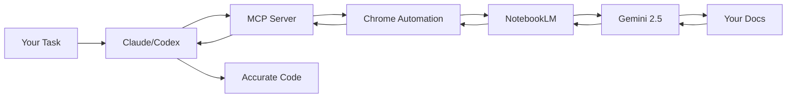

# KNOWLEDGE EXTRACT: github.com_PleasePrompto_notebooklm-mcp_824d9ac8
> **Extracted on:** 2026-04-01 15:50:41
> **Source:** D:/LongLeo/AI OS CORP/AI OS/system/security/QUARANTINE/KI-BATCH-20260331205007524795/github.com_PleasePrompto_notebooklm-mcp_824d9ac8

---

## File: `.gitignore`
```
# Dependencies
node_modules/

# Build output
dist/
*.tsbuildinfo

# Environment
.env
.env.local

# Data directories (auth & sessions)
data/
browser_state/
chrome_profile/
.notebooklm-mcp/
.claude/
CLAUDE.md

# IDE
.vscode/
.idea/
*.swp
*.swo
*~

# OS
.DS_Store
Thumbs.db

# Logs
*.log
npm-debug.log*
screenshots/

# Archives / local notes
*.tar.gz
mcp-add-command.txt
docs/why-notebooklm.md

# Python (from old version)
__pycache__/
*.py[cod]
.venv/
venv/
```

## File: `CHANGELOG.md`
```markdown
# Changelog

All notable changes to this project will be documented in this file.

The format is based on [Keep a Changelog](https://keepachangelog.com/en/1.0.0/),
and this project adheres to [Semantic Versioning](https://semver.org/spec/v2.0.0.html).

## [1.2.0] - 2025-11-21

### Added
- **Tool Profiles System** - Reduce token usage by loading only the tools you need
  - Three profiles: `minimal` (5 tools), `standard` (10 tools), `full` (16 tools)
  - Persistent configuration via `~/.config/notebooklm-mcp/settings.json`
  - Environment variable overrides: `NOTEBOOKLM_PROFILE`, `NOTEBOOKLM_DISABLED_TOOLS`

- **CLI Configuration Commands** - Easy profile management without editing files
  - `npx notebooklm-mcp config get` - Show current configuration
  - `npx notebooklm-mcp config set profile <name>` - Set profile (minimal/standard/full)
  - `npx notebooklm-mcp config set disabled-tools <list>` - Disable specific tools
  - `npx notebooklm-mcp config reset` - Reset to defaults

### Changed
- **Modularized Codebase** - Improved maintainability and code organization
  - Split monolithic `src/tools/index.ts` into `definitions.ts` and `handlers.ts`
  - Extracted resource handling into dedicated `ResourceHandlers` class
  - Cleaner separation of concerns throughout the codebase

### Fixed
- **LibreChat Compatibility** - Fixed "Server does not support completions" error
  - Added `prompts: {}` and `logging: {}` to server capabilities
  - Resolves GitHub Issue #3 for LibreChat integration

- **Thinking Message Detection** - Fixed incomplete answers showing placeholder text
  - Now waits for `div.thinking-message` element to disappear before reading answer
  - Removed unreliable text-based placeholder detection (`PLACEHOLDER_SNIPPETS`)
  - Answers like "Reviewing the content..." or "Looking for answers..." no longer returned prematurely
  - Works reliably across all languages and NotebookLM UI changes

## [1.1.2] - 2025-10-19

### Changed
- **README Documentation** - Added Claude Code Skill reference
  - New badge linking to [notebooklm-skill](https://github.com/PleasePrompto/notebooklm-skill) repository
  - Added prominent callout section explaining Claude Code Skill availability
  - Clarified differences between MCP server and Skill implementations
  - Added navigation link to Skill repository in top menu
  - Both implementations use the same browser automation technology

## [1.1.1] - 2025-10-18

### Fixed
- **Binary executable permissions** - Fixed "Permission denied" error when running via npx
  - Added `postbuild` script that automatically runs `chmod +x dist/index.js`
  - Ensures binary has executable permissions after compilation
  - Fixes installation issue where users couldn't run the MCP server

### Repository
- **Added package-lock.json** - Committed lockfile to repository for reproducible builds
  - Ensures consistent dependency versions across all environments
  - Improves contributor experience with identical development setup
  - Enables `npm ci` for faster, reliable installations in CI/CD
  - Follows npm best practices for library development (2025)

## [1.1.0] - 2025-10-18

### Added
- **Deep Cleanup Tool** - Comprehensive system cleanup for fresh NotebookLM MCP installations
  - Scans entire system for ALL NotebookLM files (installation data, caches, logs, temp files)
  - Finds hidden files in NPM cache, Claude CLI logs, editor logs, system trash, temp backups
  - Shows categorized preview before deletion with exact file list and sizes
  - Safe by design: Always requires explicit confirmation after preview
  - Cross-platform support: Linux, Windows, macOS
  - Enhanced legacy path detection for old config.json files
  - New dependency: globby@^14.0.0 for advanced file pattern matching
- CHANGELOG.md for version tracking
- Changelog badge and link in README.md

### Changed
- **Configuration System Simplified** - No config files needed anymore!
  - `config.json` completely removed - works out of the box with sensible defaults
  - Settings passed as tool parameters (`browser_options`) or environment variables
  - Claude can now control ALL browser settings via tool parameters
  - `saveUserConfig()` and `loadUserConfig()` functions removed
- **Unified Data Paths** - Consolidated from `notebooklm-mcp-nodejs` to `notebooklm-mcp`
  - Linux: `~/.local/share/notebooklm-mcp/` (was: `notebooklm-mcp-nodejs`)
  - macOS: `~/Library/Application Support/notebooklm-mcp/`
  - Windows: `%LOCALAPPDATA%\notebooklm-mcp\`
  - Old paths automatically detected by cleanup tool
- **Advanced Browser Options** - New `browser_options` parameter for browser-based tools
  - Control visibility, typing speed, stealth mode, timeouts, viewport size
  - Stealth settings: Random delays, human typing, mouse movements
  - Typing speed: Configurable WPM range (default: 160-240 WPM)
  - Delays: Configurable min/max delays (default: 100-400ms)
  - Viewport: Configurable size (default: 1024x768, changed from 1920x1080)
  - All settings optional with sensible defaults
- **Default Viewport Size** - Changed from 1920x1080 to 1024x768
  - More reasonable default for most use cases
  - Can be overridden via `browser_options.viewport` parameter
- Config directory (`~/.config/notebooklm-mcp/`) no longer created (not needed)
- Improved logging for sessionStorage (NotebookLM does not use sessionStorage)
- README.md updated to reflect config-less architecture

### Fixed
- **Critical: envPaths() default suffix bug** - `env-paths` library appends `-nodejs` suffix by default
  - All paths were incorrectly created with `-nodejs` suffix
  - Fix: Explicitly pass `{suffix: ""}` to disable default behavior
  - Affects: `config.ts` and `cleanup-manager.ts`
  - Result: Correct paths now used (`notebooklm-mcp` instead of `notebooklm-mcp-nodejs`)
- Enhanced cleanup tool to detect all legacy paths including manual installations
  - Added `getManualLegacyPaths()` method for comprehensive legacy file detection
  - Finds old config.json files across all platforms
  - Cross-platform legacy path detection (Linux XDG dirs, macOS Library, Windows AppData)
- **Library Preservation Option** - cleanup_data can now preserve library.json
  - New parameter: `preserve_library` (default: false)
  - When true: Deletes everything (browser data, caches, logs) EXCEPT library.json
  - Perfect for clean reinstalls without losing notebook configurations
- **Improved Auth Troubleshooting** - Better guidance for authentication issues
  - New `AuthenticationError` class with cleanup suggestions
  - Tool descriptions updated with troubleshooting workflows
  - `get_health` now returns `troubleshooting_tip` when not authenticated
  - Clear workflow: Close Chrome → cleanup_data(preserve_library=true) → setup_auth/re_auth
  - Critical warnings about closing Chrome instances before cleanup
- **Critical: Browser visibility (show_browser) not working** - Fixed headless mode switching
  - **Root cause**: `overrideHeadless` parameter was not passed from `handleAskQuestion` to `SessionManager`
  - **Impact**: `show_browser=true` and `browser_options.show=true` were ignored, browser stayed headless
  - **Solution**:
    - `handleAskQuestion` now calculates and passes `overrideHeadless` parameter correctly
    - `SharedContextManager.getOrCreateContext()` checks for headless mode changes before reusing context
    - `needsHeadlessModeChange()` now checks CONFIG.headless when no override parameter provided
  - **Session behavior**: When browser mode changes (headless ↔ visible):
    - Existing session is automatically closed and recreated with same session ID
    - Browser context is recreated with new visibility mode
    - Chat history is reset (message_count returns to 0)
    - This is necessary because NotebookLM chat state is not persistent across browser restarts
  - **Files changed**: `src/tools/index.ts`, `src/session/shared-context-manager.ts`

### Removed
- Empty postinstall scripts (cleaner codebase)
  - Deleted: `src/postinstall.ts`, `dist/postinstall.js`, type definitions
  - Removed: `postinstall` npm script from package.json
  - Follows DRY & KISS principles

## [1.0.5] - 2025-10-17

### Changed
- Documentation improvements
- Updated README installation instructions

## [1.0.4] - 2025-10-17

### Changed
- Enhanced usage examples in documentation
- Fixed formatting in usage guide

## [1.0.3] - 2025-10-16

### Changed
- Improved troubleshooting guide
- Added common issues and solutions

## [1.0.2] - 2025-10-16

### Fixed
- Fixed typos in documentation
- Clarified authentication flow

## [1.0.1] - 2025-10-16

### Changed
- Enhanced README with better examples
- Added more detailed setup instructions

## [1.0.0] - 2025-10-16

### Added
- Initial release
- NotebookLM integration via Model Context Protocol (MCP)
- Session-based conversations with Gemini 2.5
- Source-grounded answers from notebook documents
- Notebook library management system
- Google authentication with persistent browser sessions
- 16 MCP tools for comprehensive NotebookLM interaction
- Support for Claude Code, Codex, Cursor, and other MCP clients
- TypeScript implementation with full type safety
- Playwright browser automation with stealth mode
```

## File: `LICENSE`
```
MIT License

Copyright (c) 2025 Please Prompto!

Permission is hereby granted, free of charge, to any person obtaining a copy
of this software and associated documentation files (the "Software"), to deal
in the Software without restriction, including without limitation the rights
to use, copy, modify, merge, publish, distribute, sublicense, and/or sell
copies of the Software, and to permit persons to whom the Software is
furnished to do so, subject to the following conditions:

The above copyright notice and this permission notice shall be included in all
copies or substantial portions of the Software.

THE SOFTWARE IS PROVIDED "AS IS", WITHOUT WARRANTY OF ANY KIND, EXPRESS OR
IMPLIED, INCLUDING BUT NOT LIMITED TO THE WARRANTIES OF MERCHANTABILITY,
FITNESS FOR A PARTICULAR PURPOSE AND NONINFRINGEMENT. IN NO EVENT SHALL THE
AUTHORS OR COPYRIGHT HOLDERS BE LIABLE FOR ANY CLAIM, DAMAGES OR OTHER
LIABILITY, WHETHER IN AN ACTION OF CONTRACT, TORT OR OTHERWISE, ARISING FROM,
OUT OF OR IN CONNECTION WITH THE SOFTWARE OR THE USE OR OTHER DEALINGS IN THE
SOFTWARE.
```

## File: `README.md`
```markdown
<div align="center">

# NotebookLM MCP Server

**Let your CLI agents (Claude, Cursor, Codex...) chat directly with NotebookLM for zero-hallucination answers based on your own notebooks**

[](https://www.typescriptlang.org/)
[](https://modelcontextprotocol.io/)
[](https://www.npmjs.com/package/notebooklm-mcp)
[](https://github.com/PleasePrompto/notebooklm-skill)
[](https://github.com/PleasePrompto/notebooklm-mcp)

[Installation](#installation) • [Quick Start](#quick-start) • [Why NotebookLM](#why-notebooklm-not-local-rag) • [Examples](#real-world-example) • [Claude Code Skill](https://github.com/PleasePrompto/notebooklm-skill) • [Documentation](./docs/)

</div>

---

## The Problem

When you tell Claude Code or Cursor to "search through my local documentation", here's what happens:
- **Massive token consumption**: Searching through documentation means reading multiple files repeatedly
- **Inaccurate retrieval**: Searches for keywords, misses context and connections between docs
- **Hallucinations**: When it can't find something, it invents plausible-sounding APIs
- **Expensive & slow**: Each question requires re-reading multiple files

## The Solution

Let your local agents chat directly with [**NotebookLM**](https://notebooklm.google/) — Google's **zero-hallucination knowledge base** powered by Gemini 2.5 that provides intelligent, synthesized answers from your docs.

```
Your Task → Local Agent asks NotebookLM → Gemini synthesizes answer → Agent writes correct code
```

**The real advantage**: No more manual copy-paste between NotebookLM and your editor. Your agent asks NotebookLM directly and gets answers straight back in the CLI. It builds deep understanding through automatic follow-ups — Claude asks multiple questions in sequence, each building on the last, getting specific implementation details, edge cases, and best practices. You can save NotebookLM links to your local library with tags and descriptions, and Claude automatically selects the relevant notebook based on your current task.

---

## Why NotebookLM, Not Local RAG?

| Approach | Token Cost | Setup Time | Hallucinations | Answer Quality |
|----------|------------|------------|----------------|----------------|
| **Feed docs to Claude** | 🔴 Very high (multiple file reads) | Instant | Yes - fills gaps | Variable retrieval |
| **Web search** | 🟡 Medium | Instant | High - unreliable sources | Hit or miss |
| **Local RAG** | 🟡 Medium-High | Hours (embeddings, chunking) | Medium - retrieval gaps | Depends on setup |
| **NotebookLM MCP** | 🟢 Minimal | 5 minutes | **Zero** - refuses if unknown | Expert synthesis |

### What Makes NotebookLM Superior?

1. **Pre-processed by Gemini**: Upload docs once, get instant expert knowledge
2. **Natural language Q&A**: Not just retrieval — actual understanding and synthesis
3. **Multi-source correlation**: Connects information across 50+ documents
4. **Citation-backed**: Every answer includes source references
5. **No infrastructure**: No vector DBs, embeddings, or chunking strategies needed

---

## Installation

### Claude Code
```bash
claude mcp add notebooklm npx notebooklm-mcp@latest
```

### Codex
```bash
codex mcp add notebooklm -- npx notebooklm-mcp@latest
```

<details>
<summary>Gemini</summary>

```bash
gemini mcp add notebooklm npx notebooklm-mcp@latest
```
</details>

<details>
<summary>Cursor</summary>

Add to `~/.cursor/mcp.json`:
```json
{
  "mcpServers": {
    "notebooklm": {
      "command": "npx",
      "args": ["-y", "notebooklm-mcp@latest"]
    }
  }
}
```
</details>

<details>
<summary>amp</summary>

```bash
amp mcp add notebooklm -- npx notebooklm-mcp@latest
```
</details>

<details>
<summary>VS Code</summary>

```bash
code --add-mcp '{"name":"notebooklm","command":"npx","args":["notebooklm-mcp@latest"]}'
```
</details>

<details>
<summary>Other MCP clients</summary>

**Generic MCP config:**
```json
{
  "mcpServers": {
    "notebooklm": {
      "command": "npx",
      "args": ["notebooklm-mcp@latest"]
    }
  }
}
```
</details>

---

## Alternative: Claude Code Skill

**Prefer Claude Code Skills over MCP?** This server is now also available as a native Claude Code Skill with a simpler setup:

**[NotebookLM Claude Code Skill](https://github.com/PleasePrompto/notebooklm-skill)** - Clone to `~/.claude/skills` and start using immediately

**Key differences:**
- **MCP Server** (this repo): Persistent sessions, works with Claude Code, Codex, Cursor, and other MCP clients
- **Claude Code Skill**: Simpler setup, Python-based, stateless queries, works only with local Claude Code

Both use the same browser automation technology and provide zero-hallucination answers from your NotebookLM notebooks.

---

## Quick Start

### 1. Install the MCP server (see [Installation](#installation) above)

### 2. Authenticate (one-time)

Say in your chat (Claude/Codex):
```
"Log me in to NotebookLM"
```
*A Chrome window opens → log in with Google*

### 3. Create your knowledge base
Go to [notebooklm.google.com](https://notebooklm.google.com) → Create notebook → Upload your docs:
- 📄 PDFs, Google Docs, markdown files
- 🔗 Websites, GitHub repos
- 🎥 YouTube videos
- 📚 Multiple sources per notebook

Share: **⚙️ Share → Anyone with link → Copy**

### 4. Let Claude use it
```
"I'm building with [library]. Here's my NotebookLM: [link]"
```

**That's it.** Claude now asks NotebookLM whatever it needs, building expertise before writing code.

---

## Real-World Example

### Building an n8n Workflow Without Hallucinations

**Challenge**: n8n's API is new — Claude hallucinates node names and functions.

**Solution**:
1. Downloaded complete n8n documentation → merged into manageable chunks
2. Uploaded to NotebookLM
3. Told Claude: *"Build me a Gmail spam filter workflow. Use this NotebookLM: [link]"*

**Watch the AI-to-AI conversation:**

```
Claude → "How does Gmail integration work in n8n?"
NotebookLM → "Use Gmail Trigger with polling, or Gmail node with Get Many..."

Claude → "How to decode base64 email body?"
NotebookLM → "Body is base64url encoded in payload.parts, use Function node..."

Claude → "How to parse OpenAI response as JSON?"
NotebookLM → "Set responseFormat to json, use {{ $json.spam }} in IF node..."

Claude → "What about error handling if the API fails?"
NotebookLM → "Use Error Trigger node with Continue On Fail enabled..."

Claude → ✅ "Here's your complete workflow JSON..."
```

**Result**: Perfect workflow on first try. No debugging hallucinated APIs.

---

## Core Features

### **Zero Hallucinations**
NotebookLM refuses to answer if information isn't in your docs. No invented APIs.

### **Autonomous Research**
Claude asks follow-up questions automatically, building complete understanding before coding.

### **Smart Library Management**
Save NotebookLM links with tags and descriptions. Claude auto-selects the right notebook for your task.
```
"Add [link] to library tagged 'frontend, react, components'"
```

### **Deep, Iterative Research**
- Claude automatically asks follow-up questions to build complete understanding
- Each answer triggers deeper questions until Claude has all the details
- Example: For n8n workflow, Claude asked multiple sequential questions about Gmail integration, error handling, and data transformation

### **Cross-Tool Sharing**
Set up once, use everywhere. Claude Code, Codex, Cursor — all share the same library.

### **Deep Cleanup Tool**
Fresh start anytime. Scans entire system for NotebookLM data with categorized preview.

---

## Tool Profiles

Reduce token usage by loading only the tools you need. Each tool consumes context tokens — fewer tools = faster responses and lower costs.

### Available Profiles

| Profile | Tools | Use Case |
|---------|-------|----------|
| **minimal** | 5 | Query-only: `ask_question`, `get_health`, `list_notebooks`, `select_notebook`, `get_notebook` |
| **standard** | 10 | + Library management: `setup_auth`, `list_sessions`, `add_notebook`, `update_notebook`, `search_notebooks` |
| **full** | 16 | All tools including `cleanup_data`, `re_auth`, `remove_notebook`, `reset_session`, `close_session`, `get_library_stats` |

### Configure via CLI

```bash
# Check current settings
npx notebooklm-mcp config get

# Set a profile
npx notebooklm-mcp config set profile minimal
npx notebooklm-mcp config set profile standard
npx notebooklm-mcp config set profile full

# Disable specific tools (comma-separated)
npx notebooklm-mcp config set disabled-tools "cleanup_data,re_auth"

# Reset to defaults
npx notebooklm-mcp config reset
```

### Configure via Environment Variables

```bash
# Set profile
export NOTEBOOKLM_PROFILE=minimal

# Disable specific tools
export NOTEBOOKLM_DISABLED_TOOLS="cleanup_data,re_auth,remove_notebook"
```

Settings are saved to `~/.config/notebooklm-mcp/settings.json` and persist across sessions. Environment variables override file settings.

---

## Architecture



---

## Common Commands

| Intent | Say | Result |
|--------|-----|--------|
| Authenticate | *"Open NotebookLM auth setup"* or *"Log me in to NotebookLM"* | Chrome opens for login |
| Add notebook | *"Add [link] to library"* | Saves notebook with metadata |
| List notebooks | *"Show our notebooks"* | Lists all saved notebooks |
| Research first | *"Research this in NotebookLM before coding"* | Multi-question session |
| Select notebook | *"Use the React notebook"* | Sets active notebook |
| Update notebook | *"Update notebook tags"* | Modify metadata |
| Remove notebook | *"Remove [notebook] from library"* | Deletes from library |
| View browser | *"Show me the browser"* | Watch live NotebookLM chat |
| Fix auth | *"Repair NotebookLM authentication"* | Clears and re-authenticates |
| Switch account | *"Re-authenticate with different Google account"* | Changes account |
| Clean restart | *"Run NotebookLM cleanup"* | Removes all data for fresh start |
| Keep library | *"Cleanup but keep my library"* | Preserves notebooks |
| Delete all data | *"Delete all NotebookLM data"* | Complete removal |

---

## Comparison to Alternatives

### vs. Downloading docs locally
- **You**: Download docs → Claude: "search through these files"
- **Problem**: Claude reads thousands of files → massive token usage, often misses connections
- **NotebookLM**: Pre-indexed by Gemini, semantic understanding across all docs

### vs. Web search
- **You**: "Research X online"
- **Problem**: Outdated info, hallucinated examples, unreliable sources
- **NotebookLM**: Only your trusted docs, always current, with citations

### vs. Local RAG setup
- **You**: Set up embeddings, vector DB, chunking strategy, retrieval pipeline
- **Problem**: Hours of setup, tuning retrieval, still gets "creative" with gaps
- **NotebookLM**: Upload docs → done. Google handles everything.

---

## FAQ

**Is it really zero hallucinations?**
Yes. NotebookLM is specifically designed to only answer from uploaded sources. If it doesn't know, it says so.

**What about rate limits?**
Free tier has daily query limits per Google account. Quick account switching supported for continued research.

**How secure is this?**
Chrome runs locally. Your credentials never leave your machine. Use a dedicated Google account if concerned.

**Can I see what's happening?**
Yes! Say *"Show me the browser"* to watch the live NotebookLM conversation.

**What makes this better than Claude's built-in knowledge?**
Your docs are always current. No training cutoff. No hallucinations. Perfect for new libraries, internal APIs, or fast-moving projects.

---

## Advanced Usage

- 📖 [**Usage Guide**](usage-guide.md) — Patterns, workflows, tips
- 🛠️ [**Tool Reference**](tools.md) — Complete MCP API
- 🔧 [**Configuration**](configuration.md) — Environment variables
- 🐛 [**Troubleshooting**](troubleshooting.md) — Common issues

---

## The Bottom Line

**Without NotebookLM MCP**: Write code → Find it's wrong → Debug hallucinated APIs → Repeat

**With NotebookLM MCP**: Claude researches first → Writes correct code → Ship faster

Stop debugging hallucinations. Start shipping accurate code.

```bash
# Get started in 30 seconds
claude mcp add notebooklm npx notebooklm-mcp@latest
```

---

## Disclaimer

This tool automates browser interactions with NotebookLM to make your workflow more efficient. However, a few friendly reminders:

**About browser automation:**
While I've built in humanization features (realistic typing speeds, natural delays, mouse movements) to make the automation behave more naturally, I can't guarantee Google won't detect or flag automated usage. I recommend using a dedicated Google account for automation rather than your primary account—think of it like web scraping: probably fine, but better safe than sorry!

**About CLI tools and AI agents:**
CLI tools like Claude Code, Codex, and similar AI-powered assistants are incredibly powerful, but they can make mistakes. Please use them with care and awareness:
- Always review changes before committing or deploying
- Test in safe environments first
- Keep backups of important work
- Remember: AI agents are assistants, not infallible oracles

I built this tool for myself because I was tired of the copy-paste dance between NotebookLM and my editor. I'm sharing it in the hope it helps others too, but I can't take responsibility for any issues, data loss, or account problems that might occur. Use at your own discretion and judgment.

That said, if you run into problems or have questions, feel free to open an issue on GitHub. I'm happy to help troubleshoot!

---

## Contributing

Found a bug? Have a feature idea? [Open an issue](https://github.com/PleasePrompto/notebooklm-mcp/issues) or submit a PR!

## License

MIT — Use freely in your projects.

---

<div align="center">

Built with frustration about hallucinated APIs, powered by Google's NotebookLM

⭐ [Star on GitHub](https://github.com/PleasePrompto/notebooklm-mcp) if this saves you debugging time!

</div>
```

## File: `package.json`
```json
{
  "name": "notebooklm-mcp",
  "version": "1.2.1",
  "description": "MCP server for NotebookLM API with session support and human-like behavior",
  "type": "module",
  "bin": {
    "notebooklm-mcp": "dist/index.js"
  },
  "scripts": {
    "build": "tsc",
    "postbuild": "chmod +x dist/index.js",
    "watch": "tsc --watch",
    "dev": "tsx watch src/index.ts",
    "prepare": "npm run build",
    "test": "tsx src/index.ts"
  },
  "keywords": [
    "mcp",
    "notebooklm",
    "gemini",
    "ai",
    "claude"
  ],
  "author": "Gérôme Dexheimer <hello@geromedexheimer.de> (https://github.com/PleasePrompto)",
  "license": "MIT",
  "repository": {
    "type": "git",
    "url": "git+https://github.com/PleasePrompto/notebooklm-mcp.git"
  },
  "homepage": "https://github.com/PleasePrompto/notebooklm-mcp#readme",
  "bugs": {
    "url": "https://github.com/PleasePrompto/notebooklm-mcp/issues"
  },
  "files": [
    "dist",
    "README.md",
    "NOTEBOOKLM_USAGE.md",
    "LICENSE",
    "docs"
  ],
  "dependencies": {
    "@modelcontextprotocol/sdk": "^1.0.0",
    "dotenv": "^16.4.0",
    "env-paths": "^3.0.0",
    "globby": "^14.1.0",
    "patchright": "^1.48.2",
    "zod": "^3.22.0"
  },
  "devDependencies": {
    "@types/node": "^20.11.0",
    "tsx": "^4.7.0",
    "typescript": "^5.3.3"
  },
  "engines": {
    "node": ">=18.0.0"
  }
}
```

## File: `tsconfig.json`
```json
{
  "compilerOptions": {
    "target": "ES2022",
    "module": "Node16",
    "moduleResolution": "Node16",
    "outDir": "./dist",
    "rootDir": "./src",
    "strict": true,
    "esModuleInterop": true,
    "skipLibCheck": true,
    "forceConsistentCasingInFileNames": true,
    "resolveJsonModule": true,
    "declaration": true,
    "declarationMap": true,
    "sourceMap": true,
    "lib": ["ES2022"],
    "types": ["node"],
    "noUnusedLocals": true,
    "noUnusedParameters": true
  },
  "include": ["src/**/*"],
  "exclude": ["node_modules", "dist", "Old_Python_Vesion"]
}
```

## File: `docs/configuration.md`
```markdown
## Configuration

**No config files needed!** The server works out of the box with sensible defaults.

### Configuration Priority (highest to lowest):
1. **Tool Parameters** - Claude passes settings like `browser_options` at runtime
2. **Environment Variables** - Optional overrides for advanced users
3. **Hardcoded Defaults** - Sensible defaults that work for most users

---

## Tool Parameters (Runtime Configuration)

Claude can control browser behavior via the `browser_options` parameter in tools like `ask_question`, `setup_auth`, and `re_auth`:

```typescript
browser_options: {
  show: boolean,              // Show browser window (overrides headless)
  headless: boolean,          // Run in headless mode (default: true)
  timeout_ms: number,         // Browser timeout in ms (default: 30000)

  stealth: {
    enabled: boolean,         // Master switch (default: true)
    random_delays: boolean,   // Random delays between actions (default: true)
    human_typing: boolean,    // Human-like typing (default: true)
    mouse_movements: boolean, // Realistic mouse movements (default: true)
    typing_wpm_min: number,   // Min typing speed (default: 160)
    typing_wpm_max: number,   // Max typing speed (default: 240)
    delay_min_ms: number,     // Min delay between actions (default: 100)
    delay_max_ms: number,     // Max delay between actions (default: 400)
  },

  viewport: {
    width: number,            // Viewport width (default: 1024)
    height: number,           // Viewport height (default: 768)
  }
}
```

**Example usage:**
- "Research this and show me the browser" → Sets `show: true`
- "Use slow typing for this query" → Adjusts typing WPM via stealth settings

---

## Environment Variables (Optional)

For advanced users who want to set global defaults:
- Auth
  - `AUTO_LOGIN_ENABLED` — `true|false` (default `false`)
  - `LOGIN_EMAIL`, `LOGIN_PASSWORD` — for auto‑login if enabled
  - `AUTO_LOGIN_TIMEOUT_MS` (default `120000`)
- Stealth / Human-like behavior
  - `STEALTH_ENABLED` — `true|false` (default `true`) — Master switch for all stealth features
  - `STEALTH_RANDOM_DELAYS` — `true|false` (default `true`)
  - `STEALTH_HUMAN_TYPING` — `true|false` (default `true`)
  - `STEALTH_MOUSE_MOVEMENTS` — `true|false` (default `true`)
- Typing speed (human‑like)
  - `TYPING_WPM_MIN` (default 160), `TYPING_WPM_MAX` (default 240)
- Delays (human‑like)
  - `MIN_DELAY_MS` (default 100), `MAX_DELAY_MS` (default 400)
- Browser
  - `HEADLESS` (default `true`), `BROWSER_TIMEOUT` (ms, default `30000`)
- Sessions
  - `MAX_SESSIONS` (default 10), `SESSION_TIMEOUT` (s, default 900)
- Multi‑instance profile strategy
  - `NOTEBOOK_PROFILE_STRATEGY` — `auto|single|isolated` (default `auto`)
  - `NOTEBOOK_CLONE_PROFILE` — clone base profile into isolated dir (default `false`)
- Cleanup (to prevent disk bloat)
  - `NOTEBOOK_CLEANUP_ON_STARTUP` (default `true`)
  - `NOTEBOOK_CLEANUP_ON_SHUTDOWN` (default `true`)
  - `NOTEBOOK_INSTANCE_TTL_HOURS` (default `72`)
  - `NOTEBOOK_INSTANCE_MAX_COUNT` (default `20`)
- Library metadata (optional hints)
  - `NOTEBOOK_DESCRIPTION`, `NOTEBOOK_TOPICS`, `NOTEBOOK_CONTENT_TYPES`, `NOTEBOOK_USE_CASES`
  - `NOTEBOOK_URL` — optional; leave empty and manage notebooks via the library

---

## Storage Paths

The server uses platform-specific paths via [env-paths](https://github.com/sindresorhus/env-paths)
- **Linux**: `~/.local/share/notebooklm-mcp/`
- **macOS**: `~/Library/Application Support/notebooklm-mcp/`
- **Windows**: `%LOCALAPPDATA%\notebooklm-mcp\`

**What's stored:**
- `chrome_profile/` - Persistent Chrome browser profile with login session
- `browser_state/` - Browser context state and cookies
- `library.json` - Your notebook library with metadata
- `chrome_profile_instances/` - Isolated Chrome profiles for concurrent sessions

**No config.json file** - Configuration is purely via environment variables or tool parameters!

```

## File: `docs/tools.md`
```markdown
## Tools

### Core
- `ask_question`
  - Parameters: `question` (string, required), optional `session_id`, `notebook_id`, `notebook_url`, `show_browser`.
  - Returns NotebookLM's answer plus the follow-up reminder.
- `list_sessions`, `close_session`, `reset_session`
  - Inspect or manage active browser sessions.
- `get_health`
  - Summaries auth status, active sessions, and configuration.
- `setup_auth`
  - Opens the persistent Chrome profile so you can log in manually.
- `re_auth`
  - Switch to a different Google account or re-authenticate.
  - Use when NotebookLM rate limit is reached (50 queries/day for free accounts).
  - Closes all sessions, clears auth data, and opens browser for fresh login.

### Notebook library
- `add_notebook` – Safe conversational add; expects confirmation before writing.
- `list_notebooks` – Returns id, name, topics, URL, metadata for every entry.
- `get_notebook` – Fetch a single notebook by id.
- `select_notebook` – Set the active default notebook.
- `update_notebook` – Modify metadata fields.
- `remove_notebook` – Removes entries from the library (not the original NotebookLM notebook).
- `search_notebooks` – Simple query across name/description/topics/tags.
- `get_library_stats` – Aggregate statistics (total notebooks, usage counts, etc.).

### Resources
- `notebooklm://library`
  - JSON representation of the full library: active notebook, stats, individual notebooks.
- `notebooklm://library/{id}`
  - Fetch metadata for a specific notebook. The `{id}` completion pulls from the library automatically.

**Remember:** Every `ask_question` response ends with a reminder that nudges your agent to keep asking until the user’s task is fully addressed.
```

## File: `docs/troubleshooting.md`
```markdown
## Troubleshooting

### Fresh start / Deep cleanup
If you're experiencing persistent issues, corrupted data, or want to start completely fresh:

**⚠️ CRITICAL: Close ALL Chrome/Chromium instances before cleanup!** Open browsers can prevent cleanup and cause issues.

**Recommended workflow:**
1. Close all Chrome/Chromium windows and instances
2. Ask: "Run NotebookLM cleanup and preserve my library"
3. Review the preview - you'll see exactly what will be deleted
4. Confirm deletion
5. Re-authenticate: "Open NotebookLM auth setup"

**What gets cleaned:**
- Browser data, cache, Chrome profiles
- Temporary files and logs
- Old installation data
- **Preserved:** Your notebook library (when using preserve option)

**Useful for:**
- Authentication problems
- Browser session conflicts
- Corrupted browser profiles
- Clean reinstalls
- Switching between accounts

### Browser closed / `newPage` errors
- Symptom: `browserContext.newPage: Target page/context/browser has been closed`.
- Fix: The server auto‑recovers (recreates context and page). Re‑run the tool.

### Profile lock / `ProcessSingleton` errors
- Cause: Another Chrome is using the base profile.
- Fix: `NOTEBOOK_PROFILE_STRATEGY=auto` (default) falls back to isolated per‑instance profiles; or set `isolated`.

### Authentication issues
**Quick fix:** Ask the agent to repair authentication; it will run `get_health` → `setup_auth` → `get_health`.

**For persistent auth failures:**
1. Close ALL Chrome/Chromium instances
2. Ask: "Run NotebookLM cleanup with library preservation"
3. After cleanup completes, ask: "Open NotebookLM auth setup"
4. This creates a completely fresh browser session while keeping your notebooks

**Auto-login (optional):**
- Set `AUTO_LOGIN_ENABLED=true` with `LOGIN_EMAIL`, `LOGIN_PASSWORD` environment variables
- For automation workflows only

### Typing speed too slow/fast
- Adjust `TYPING_WPM_MIN`/`MAX`; or disable stealth typing by setting `STEALTH_ENABLED=false`.

### Rate limit reached
- Symptom: "NotebookLM rate limit reached (50 queries/day for free accounts)".
- Fix: Use `re_auth` tool to switch to a different Google account, or wait until tomorrow.
- Upgrade: Google AI Pro/Ultra gives 5x higher limits.

### No notebooks found
- Ask to add the NotebookLM link you need.
- Ask to list the stored notebooks, then choose the one to activate.
```

## File: `docs/usage-guide.md`
```markdown
# Advanced Usage Guide

This guide covers advanced usage patterns, best practices, and detailed examples for the NotebookLM MCP server.

> 📘 For installation and quick start, see the main [README](../../../README.md).

## Research Patterns

### The Iterative Research Pattern

The server is designed to make your agent **ask questions automatically** with NotebookLM. Here's how to leverage this:

1. **Start with broad context**
   ```
   "Before implementing the webhook system, research the complete webhook architecture in NotebookLM, including error handling, retry logic, and security considerations."
   ```

2. **The agent will automatically**:
   - Ask an initial question to NotebookLM
   - Read the reminder at the end of each response
   - Ask follow-up questions to gather more details
   - Continue until it has comprehensive understanding
   - Only then provide you with a complete answer

3. **Session management**
   - The agent maintains the same `session_id` throughout the research
   - This preserves context across multiple questions
   - Sessions auto-cleanup after 15 minutes of inactivity

### Deep Dive Example

```
User: "I need to implement OAuth2 with refresh tokens. Research the complete flow first."

Agent behavior:
1. Asks NotebookLM: "How does OAuth2 refresh token flow work?"
2. Gets answer with reminder to ask more
3. Asks: "What are the security best practices for storing refresh tokens?"
4. Asks: "How to handle token expiration and renewal?"
5. Asks: "What are common implementation pitfalls?"
6. Synthesizes all answers into comprehensive implementation plan
```

## Notebook Management Strategies

### Multi-Project Setup

Organize notebooks by project or domain:

```
Production Docs Notebook → APIs, deployment, monitoring
Development Notebook → Local setup, debugging, testing
Architecture Notebook → System design, patterns, decisions
Legacy Code Notebook → Old systems, migration guides
```

### Notebook Switching Patterns

```
"For this bug fix, use the Legacy Code notebook."
"Switch to the Architecture notebook for this design discussion."
"Use the Production Docs for deployment steps."
```

### Metadata Best Practices

When adding notebooks, provide rich metadata:
```
"Add this notebook with description: 'Complete React 18 documentation including hooks, performance, and migration guides' and tags: react, frontend, hooks, performance"
```

## Authentication Management

### Account Rotation Strategy

Free tier provides 50 queries/day per account. Maximize usage:

1. **Primary account** → Main development work
2. **Secondary account** → Testing and validation
3. **Backup account** → Emergency queries when others are exhausted

```
"Switch to secondary account" → When approaching limit
"Check health status" → Verify which account is active
```

### Handling Auth Failures

The agent can self-repair authentication:

```
"NotebookLM says I'm logged out—repair authentication"
```

This triggers: `get_health` → `setup_auth` → `get_health`

## Advanced Configuration

### Performance Optimization

For faster interactions during development:
```bash
STEALTH_ENABLED=false  # Disable human-like typing
TYPING_WPM_MAX=500     # Increase typing speed
HEADLESS=false         # See what's happening
```

### Debugging Sessions

Enable browser visibility to watch the live conversation:
```
"Research this issue and show me the browser"
```

Your agent automatically enables browser visibility for that research session.

### Session Management

Monitor active sessions:
```
"List all active NotebookLM sessions"
"Close inactive sessions to free resources"
"Reset the stuck session for notebook X"
```

## Complex Workflows

### Multi-Stage Research

For complex implementations requiring multiple knowledge sources:

```
Stage 1: "Research the API structure in the API notebook"
Stage 2: "Switch to Architecture notebook and research the service patterns"
Stage 3: "Use the Security notebook to research authentication requirements"
Stage 4: "Synthesize all findings into implementation plan"
```

### Validation Workflow

Cross-reference information across notebooks:

```
1. "In Production notebook, find the current API version"
2. "Switch to Migration notebook, check compatibility notes"
3. "Verify in Architecture notebook if this aligns with our patterns"
```

## Tool Integration Patterns

### Direct Tool Calls

For manual scripting, capture and reuse session IDs:

```json
// First call - capture session_id
{
  "tool": "ask_question",
  "question": "What is the webhook structure?",
  "notebook_id": "abc123"
}

// Follow-up - reuse session_id
{
  "tool": "ask_question",
  "question": "Show me error handling examples",
  "session_id": "captured_session_id_here"
}
```

### Resource URIs

Access library data programmatically:
- `notebooklm://library` - Full library JSON
- `notebooklm://library/{id}` - Specific notebook metadata

## Best Practices

### 1. **Context Preservation**
- Always let the agent complete its research cycle
- Don't interrupt between questions in a research session
- Use descriptive notebook names for easy switching

### 2. **Knowledge Base Quality**
- Upload comprehensive documentation to NotebookLM
- Merge related docs into single notebooks (up to 500k words)
- Update notebooks when documentation changes

### 3. **Error Recovery**
- The server auto-recovers from browser crashes
- Sessions rebuild automatically if context is lost
- Profile corruption triggers automatic cleanup

### 4. **Resource Management**
- Close unused sessions to free memory
- The server maintains max 10 concurrent sessions
- Inactive sessions auto-close after 15 minutes

### 5. **Security Considerations**
- Use dedicated Google accounts for NotebookLM
- Never share authentication profiles between projects
- Backup `library.json` for important notebook collections

## Troubleshooting Patterns

### When NotebookLM returns incomplete answers
```
"The answer seems incomplete. Ask NotebookLM for more specific details about [topic]"
```

### When hitting rate limits
```
"We've hit the rate limit. Re-authenticate with the backup account"
```

### When browser seems stuck
```
"Reset all NotebookLM sessions and try again"
```

## Example Conversations

### Complete Feature Implementation
```
User: "I need to implement a webhook system with retry logic"

You: "Research webhook patterns with retry logic in NotebookLM first"
Agent: [Researches comprehensively, asking 4-5 follow-up questions]
Agent: "Based on my research, here's the implementation..."
[Provides detailed code with patterns from NotebookLM]
```

### Architecture Decision
```
User: "Should we use microservices or monolith for this feature?"

You: "Research our architecture patterns and decision criteria in the Architecture notebook"
Agent: [Gathers context about existing patterns, scalability needs, team constraints]
Agent: "According to our architecture guidelines..."
[Provides recommendation based on documented patterns]
```

---

Remember: The power of this integration lies in letting your agent **ask multiple questions** – gathering context and building comprehensive understanding before responding. Don't rush the research phase!
```

## File: `src/config.ts`
```typescript
/**
 * Configuration for NotebookLM MCP Server
 *
 * Config Priority (highest to lowest):
 * 1. Hardcoded Defaults (works out of the box!)
 * 2. Environment Variables (optional, for advanced users)
 * 3. Tool Parameters (passed by Claude at runtime)
 *
 * No config.json file needed - all settings via ENV or tool parameters!
 */

import envPaths from "env-paths";
import fs from "fs";
import path from "path";

// Cross-platform data paths (unified without -nodejs suffix)
// Linux: ~/.local/share/notebooklm-mcp/
// macOS: ~/Library/Application Support/notebooklm-mcp/
// Windows: %APPDATA%\notebooklm-mcp\
// IMPORTANT: Pass empty string suffix to disable envPaths' default '-nodejs' suffix!
const paths = envPaths("notebooklm-mcp", {suffix: ""});

/**
 * Google NotebookLM Auth URL (used by setup_auth)
 * This is the base Google login URL that redirects to NotebookLM
 */
export const NOTEBOOKLM_AUTH_URL =
  "https://accounts.google.com/v3/signin/identifier?continue=https%3A%2F%2Fnotebooklm.google.com%2F&flowName=GlifWebSignIn&flowEntry=ServiceLogin";

export interface Config {
  // NotebookLM - optional, used for legacy default notebook
  notebookUrl: string;

  // Browser Settings
  headless: boolean;
  browserTimeout: number;
  viewport: { width: number; height: number };

  // Session Management
  maxSessions: number;
  sessionTimeout: number; // in seconds

  // Authentication
  autoLoginEnabled: boolean;
  loginEmail: string;
  loginPassword: string;
  autoLoginTimeoutMs: number;

  // Stealth Settings
  stealthEnabled: boolean;
  stealthRandomDelays: boolean;
  stealthHumanTyping: boolean;
  stealthMouseMovements: boolean;
  typingWpmMin: number;
  typingWpmMax: number;
  minDelayMs: number;
  maxDelayMs: number;

  // Paths
  configDir: string;
  dataDir: string;
  browserStateDir: string;
  chromeProfileDir: string;
  chromeInstancesDir: string;

  // Library Configuration (optional, for default notebook metadata)
  notebookDescription: string;
  notebookTopics: string[];
  notebookContentTypes: string[];
  notebookUseCases: string[];

  // Multi-instance profile strategy
  profileStrategy: "auto" | "single" | "isolated";
  cloneProfileOnIsolated: boolean;
  cleanupInstancesOnStartup: boolean;
  cleanupInstancesOnShutdown: boolean;
  instanceProfileTtlHours: number;
  instanceProfileMaxCount: number;
}

/**
 * Default Configuration (works out of the box!)
 */
const DEFAULTS: Config = {
  // NotebookLM
  notebookUrl: "",

  // Browser Settings
  headless: true,
  browserTimeout: 30000,
  viewport: { width: 1024, height: 768 },

  // Session Management
  maxSessions: 10,
  sessionTimeout: 900, // 15 minutes

  // Authentication
  autoLoginEnabled: false,
  loginEmail: "",
  loginPassword: "",
  autoLoginTimeoutMs: 120000, // 2 minutes

  // Stealth Settings
  stealthEnabled: true,
  stealthRandomDelays: true,
  stealthHumanTyping: true,
  stealthMouseMovements: true,
  typingWpmMin: 160,
  typingWpmMax: 240,
  minDelayMs: 100,
  maxDelayMs: 400,

  // Paths (cross-platform via env-paths)
  configDir: paths.config,
  dataDir: paths.data,
  browserStateDir: path.join(paths.data, "browser_state"),
  chromeProfileDir: path.join(paths.data, "chrome_profile"),
  chromeInstancesDir: path.join(paths.data, "chrome_profile_instances"),

  // Library Configuration
  notebookDescription: "General knowledge base",
  notebookTopics: ["General topics"],
  notebookContentTypes: ["documentation", "examples"],
  notebookUseCases: ["General research"],

  // Multi-instance strategy
  profileStrategy: "auto",
  cloneProfileOnIsolated: false,
  cleanupInstancesOnStartup: true,
  cleanupInstancesOnShutdown: true,
  instanceProfileTtlHours: 72,
  instanceProfileMaxCount: 20,
};


/**
 * Parse boolean from string (for env vars)
 */
function parseBoolean(value: string | undefined, defaultValue: boolean): boolean {
  if (value === undefined) return defaultValue;
  const lower = value.toLowerCase();
  if (lower === "true" || lower === "1") return true;
  if (lower === "false" || lower === "0") return false;
  return defaultValue;
}

/**
 * Parse integer from string (for env vars)
 */
function parseInteger(value: string | undefined, defaultValue: number): number {
  if (value === undefined) return defaultValue;
  const parsed = Number.parseInt(value, 10);
  return Number.isNaN(parsed) ? defaultValue : parsed;
}

/**
 * Parse comma-separated array (for env vars)
 */
function parseArray(value: string | undefined, defaultValue: string[]): string[] {
  if (!value) return defaultValue;
  return value.split(",").map((s) => s.trim()).filter((s) => s.length > 0);
}

/**
 * Apply environment variable overrides (legacy support)
 */
function applyEnvOverrides(config: Config): Config {
  return {
    ...config,
    // Override with env vars if present
    notebookUrl: process.env.NOTEBOOK_URL || config.notebookUrl,
    headless: parseBoolean(process.env.HEADLESS, config.headless),
    browserTimeout: parseInteger(process.env.BROWSER_TIMEOUT, config.browserTimeout),
    maxSessions: parseInteger(process.env.MAX_SESSIONS, config.maxSessions),
    sessionTimeout: parseInteger(process.env.SESSION_TIMEOUT, config.sessionTimeout),
    autoLoginEnabled: parseBoolean(process.env.AUTO_LOGIN_ENABLED, config.autoLoginEnabled),
    loginEmail: process.env.LOGIN_EMAIL || config.loginEmail,
    loginPassword: process.env.LOGIN_PASSWORD || config.loginPassword,
    autoLoginTimeoutMs: parseInteger(process.env.AUTO_LOGIN_TIMEOUT_MS, config.autoLoginTimeoutMs),
    stealthEnabled: parseBoolean(process.env.STEALTH_ENABLED, config.stealthEnabled),
    stealthRandomDelays: parseBoolean(process.env.STEALTH_RANDOM_DELAYS, config.stealthRandomDelays),
    stealthHumanTyping: parseBoolean(process.env.STEALTH_HUMAN_TYPING, config.stealthHumanTyping),
    stealthMouseMovements: parseBoolean(process.env.STEALTH_MOUSE_MOVEMENTS, config.stealthMouseMovements),
    typingWpmMin: parseInteger(process.env.TYPING_WPM_MIN, config.typingWpmMin),
    typingWpmMax: parseInteger(process.env.TYPING_WPM_MAX, config.typingWpmMax),
    minDelayMs: parseInteger(process.env.MIN_DELAY_MS, config.minDelayMs),
    maxDelayMs: parseInteger(process.env.MAX_DELAY_MS, config.maxDelayMs),
    notebookDescription: process.env.NOTEBOOK_DESCRIPTION || config.notebookDescription,
    notebookTopics: parseArray(process.env.NOTEBOOK_TOPICS, config.notebookTopics),
    notebookContentTypes: parseArray(process.env.NOTEBOOK_CONTENT_TYPES, config.notebookContentTypes),
    notebookUseCases: parseArray(process.env.NOTEBOOK_USE_CASES, config.notebookUseCases),
    profileStrategy: (process.env.NOTEBOOK_PROFILE_STRATEGY as any) || config.profileStrategy,
    cloneProfileOnIsolated: parseBoolean(process.env.NOTEBOOK_CLONE_PROFILE, config.cloneProfileOnIsolated),
    cleanupInstancesOnStartup: parseBoolean(process.env.NOTEBOOK_CLEANUP_ON_STARTUP, config.cleanupInstancesOnStartup),
    cleanupInstancesOnShutdown: parseBoolean(process.env.NOTEBOOK_CLEANUP_ON_SHUTDOWN, config.cleanupInstancesOnShutdown),
    instanceProfileTtlHours: parseInteger(process.env.NOTEBOOK_INSTANCE_TTL_HOURS, config.instanceProfileTtlHours),
    instanceProfileMaxCount: parseInteger(process.env.NOTEBOOK_INSTANCE_MAX_COUNT, config.instanceProfileMaxCount),
  };
}

/**
 * Build final configuration
 * Priority: Defaults → Environment Variables → Tool Parameters (at runtime)
 * No config.json files - everything via ENV or tool parameters!
 */
function buildConfig(): Config {
  return applyEnvOverrides(DEFAULTS);
}

/**
 * Global configuration instance
 */
export const CONFIG: Config = buildConfig();

/**
 * Ensure all required directories exist
 * NOTE: We do NOT create configDir - it's not needed!
 */
export function ensureDirectories(): void {
  const dirs = [
    CONFIG.dataDir,
    CONFIG.browserStateDir,
    CONFIG.chromeProfileDir,
    CONFIG.chromeInstancesDir,
  ];

  for (const dir of dirs) {
    if (!fs.existsSync(dir)) {
      fs.mkdirSync(dir, { recursive: true });
    }
  }
}


/**
 * Browser options that can be passed via tool parameters
 */
export interface BrowserOptions {
  show?: boolean;
  headless?: boolean;
  timeout_ms?: number;
  stealth?: {
    enabled?: boolean;
    random_delays?: boolean;
    human_typing?: boolean;
    mouse_movements?: boolean;
    typing_wpm_min?: number;
    typing_wpm_max?: number;
    delay_min_ms?: number;
    delay_max_ms?: number;
  };
  viewport?: {
    width?: number;
    height?: number;
  };
}

/**
 * Apply browser options to CONFIG (returns modified copy, doesn't mutate global CONFIG)
 */
export function applyBrowserOptions(
  options?: BrowserOptions,
  legacyShowBrowser?: boolean
): Config {
  const config = { ...CONFIG };

  // Handle legacy show_browser parameter
  if (legacyShowBrowser !== undefined) {
    config.headless = !legacyShowBrowser;
  }

  // Apply browser_options (takes precedence over legacy parameter)
  if (options) {
    if (options.show !== undefined) {
      config.headless = !options.show;
    }
    if (options.headless !== undefined) {
      config.headless = options.headless;
    }
    if (options.timeout_ms !== undefined) {
      config.browserTimeout = options.timeout_ms;
    }
    if (options.stealth) {
      const s = options.stealth;
      if (s.enabled !== undefined) config.stealthEnabled = s.enabled;
      if (s.random_delays !== undefined) config.stealthRandomDelays = s.random_delays;
      if (s.human_typing !== undefined) config.stealthHumanTyping = s.human_typing;
      if (s.mouse_movements !== undefined) config.stealthMouseMovements = s.mouse_movements;
      if (s.typing_wpm_min !== undefined) config.typingWpmMin = s.typing_wpm_min;
      if (s.typing_wpm_max !== undefined) config.typingWpmMax = s.typing_wpm_max;
      if (s.delay_min_ms !== undefined) config.minDelayMs = s.delay_min_ms;
      if (s.delay_max_ms !== undefined) config.maxDelayMs = s.delay_max_ms;
    }
    if (options.viewport) {
      config.viewport = {
        width: options.viewport.width ?? config.viewport.width,
        height: options.viewport.height ?? config.viewport.height,
      };
    }
  }

  return config;
}

// Create directories on import
ensureDirectories();
```

## File: `src/errors.ts`
```typescript
/**
 * Custom Error Types for NotebookLM MCP Server
 */

/**
 * Error thrown when NotebookLM rate limit is exceeded
 *
 * Free users have 50 queries/day limit.
 * This error indicates the user should:
 * - Use re_auth tool to switch Google accounts
 * - Wait until tomorrow for quota reset
 * - Upgrade to Google AI Pro/Ultra for higher limits
 */
export class RateLimitError extends Error {
  constructor(message: string = "NotebookLM rate limit reached (50 queries/day for free accounts)") {
    super(message);
    this.name = "RateLimitError";

    // Maintain proper stack trace for where error was thrown (V8 only)
    if (Error.captureStackTrace) {
      Error.captureStackTrace(this, RateLimitError);
    }
  }
}

/**
 * Error thrown when authentication fails
 *
 * This error can suggest cleanup workflow for persistent issues.
 * Especially useful when upgrading from old installation (notebooklm-mcp-nodejs).
 */
export class AuthenticationError extends Error {
  suggestCleanup: boolean;

  constructor(message: string, suggestCleanup: boolean = false) {
    super(message);
    this.name = "AuthenticationError";
    this.suggestCleanup = suggestCleanup;

    // Maintain proper stack trace for where error was thrown (V8 only)
    if (Error.captureStackTrace) {
      Error.captureStackTrace(this, AuthenticationError);
    }
  }
}
```

## File: `src/index.ts`
```typescript
#!/usr/bin/env node

/**
 * NotebookLM MCP Server
 *
 * MCP Server for Google NotebookLM - Chat with Gemini 2.5 through NotebookLM
 * with session support and human-like behavior!
 *
 * Features:
 * - Session-based contextual conversations
 * - Auto re-login on session expiry
 * - Human-like typing and mouse movements
 * - Persistent browser fingerprint
 * - Stealth mode with Patchright
 * - Claude Code integration via npx
 *
 * Usage:
 *   npx notebooklm-mcp
 *   node dist/index.js
 *
 * Environment Variables:
 *   NOTEBOOK_URL - Default NotebookLM notebook URL
 *   AUTO_LOGIN_ENABLED - Enable automatic login (true/false)
 *   LOGIN_EMAIL - Google email for auto-login
 *   LOGIN_PASSWORD - Google password for auto-login
 *   HEADLESS - Run browser in headless mode (true/false)
 *   MAX_SESSIONS - Maximum concurrent sessions (default: 10)
 *   SESSION_TIMEOUT - Session timeout in seconds (default: 900)
 *
 * Based on the Python NotebookLM API implementation
 */

import { Server } from "@modelcontextprotocol/sdk/server/index.js";
import { StdioServerTransport } from "@modelcontextprotocol/sdk/server/stdio.js";
import {
  CallToolRequestSchema,
  ListToolsRequestSchema,
  Tool,
} from "@modelcontextprotocol/sdk/types.js";

import { AuthManager } from "./auth/auth-manager.js";
import { SessionManager } from "./session/session-manager.js";
import { NotebookLibrary } from "./library/notebook-library.js";
import { ToolHandlers, buildToolDefinitions } from "./tools/index.js";
import { ResourceHandlers } from "./resources/resource-handlers.js";
import { SettingsManager } from "./utils/settings-manager.js";
import { CliHandler } from "./utils/cli-handler.js";
import { CONFIG } from "./config.js";
import { log } from "./utils/logger.js";

/**
 * Main MCP Server Class
 */
class NotebookLMMCPServer {
  private server: Server;
  private authManager: AuthManager;
  private sessionManager: SessionManager;
  private library: NotebookLibrary;
  private toolHandlers: ToolHandlers;
  private resourceHandlers: ResourceHandlers;
  private settingsManager: SettingsManager;
  private toolDefinitions: Tool[];

  constructor() {
    // Initialize MCP Server
    this.server = new Server(
      {
        name: "notebooklm-mcp",
        version: "1.1.0",
      },
      {
        capabilities: {
          tools: {},
          resources: {},
          resourceTemplates: {},
          prompts: {},
          completions: {}, // Required for completion/complete support
          logging: {},
        },
      }
    );

    // Initialize managers
    this.authManager = new AuthManager();
    this.sessionManager = new SessionManager(this.authManager);
    this.library = new NotebookLibrary();
    this.settingsManager = new SettingsManager();
    
    // Initialize handlers
    this.toolHandlers = new ToolHandlers(
      this.sessionManager,
      this.authManager,
      this.library
    );
    this.resourceHandlers = new ResourceHandlers(this.library);

    // Build and Filter tool definitions
    const allTools = buildToolDefinitions(this.library) as Tool[];
    this.toolDefinitions = this.settingsManager.filterTools(allTools);

    // Setup handlers
    this.setupHandlers();
    this.setupShutdownHandlers();

    const activeSettings = this.settingsManager.getEffectiveSettings();
    log.info("🚀 NotebookLM MCP Server initialized");
    log.info(`  Version: 1.1.0`);
    log.info(`  Node: ${process.version}`);
    log.info(`  Platform: ${process.platform}`);
    log.info(`  Profile: ${activeSettings.profile} (${this.toolDefinitions.length} tools active)`);
  }

  /**
   * Setup MCP request handlers
   */
  private setupHandlers(): void {
    // Register Resource Handlers (Resources, Templates, Completions)
    this.resourceHandlers.registerHandlers(this.server);

    // List available tools
    this.server.setRequestHandler(ListToolsRequestSchema, async () => {
      log.info("📋 [MCP] list_tools request received");
      return {
        tools: this.toolDefinitions,
      };
    });

    // Handle tool calls
    this.server.setRequestHandler(CallToolRequestSchema, async (request) => {
      const { name, arguments: args } = request.params;
      const progressToken = (args as any)?._meta?.progressToken;

      log.info(`🔧 [MCP] Tool call: ${name}`);
      if (progressToken) {
        log.info(`  📊 Progress token: ${progressToken}`);
      }

      // Create progress callback function
      const sendProgress = async (message: string, progress?: number, total?: number) => {
        if (progressToken) {
          await this.server.notification({
            method: "notifications/progress",
            params: {
              progressToken,
              message,
              ...(progress !== undefined && { progress }),
              ...(total !== undefined && { total }),
            },
          });
          log.dim(`  📊 Progress: ${message}`);
        }
      };

      try {
        let result;

        switch (name) {
          case "ask_question":
            result = await this.toolHandlers.handleAskQuestion(
              args as {
                question: string;
                session_id?: string;
                notebook_id?: string;
                notebook_url?: string;
                show_browser?: boolean;
              },
              sendProgress
            );
            break;

          case "add_notebook":
            result = await this.toolHandlers.handleAddNotebook(
              args as {
                url: string;
                name: string;
                description: string;
                topics: string[];
                content_types?: string[];
                use_cases?: string[];
                tags?: string[];
              }
            );
            break;

          case "list_notebooks":
            result = await this.toolHandlers.handleListNotebooks();
            break;

          case "get_notebook":
            result = await this.toolHandlers.handleGetNotebook(
              args as { id: string }
            );
            break;

          case "select_notebook":
            result = await this.toolHandlers.handleSelectNotebook(
              args as { id: string }
            );
            break;

          case "update_notebook":
            result = await this.toolHandlers.handleUpdateNotebook(
              args as {
                id: string;
                name?: string;
                description?: string;
                topics?: string[];
                content_types?: string[];
                use_cases?: string[];
                tags?: string[];
                url?: string;
              }
            );
            break;

          case "remove_notebook":
            result = await this.toolHandlers.handleRemoveNotebook(
              args as { id: string }
            );
            break;

          case "search_notebooks":
            result = await this.toolHandlers.handleSearchNotebooks(
              args as { query: string }
            );
            break;

          case "get_library_stats":
            result = await this.toolHandlers.handleGetLibraryStats();
            break;

          case "list_sessions":
            result = await this.toolHandlers.handleListSessions();
            break;

          case "close_session":
            result = await this.toolHandlers.handleCloseSession(
              args as { session_id: string }
            );
            break;

          case "reset_session":
            result = await this.toolHandlers.handleResetSession(
              args as { session_id: string }
            );
            break;

          case "get_health":
            result = await this.toolHandlers.handleGetHealth();
            break;

          case "setup_auth":
            result = await this.toolHandlers.handleSetupAuth(
              args as { show_browser?: boolean },
              sendProgress
            );
            break;

          case "re_auth":
            result = await this.toolHandlers.handleReAuth(
              args as { show_browser?: boolean },
              sendProgress
            );
            break;

          case "cleanup_data":
            result = await this.toolHandlers.handleCleanupData(
              args as { confirm: boolean }
            );
            break;

          default:
            log.error(`❌ [MCP] Unknown tool: ${name}`);
            return {
              content: [
                {
                  type: "text",
                  text: JSON.stringify(
                    {
                      success: false,
                      error: `Unknown tool: ${name}`,
                    },
                    null,
                    2
                  ),
                },
              ],
            };
        }

        // Return result
        return {
          content: [
            {
              type: "text",
              text: JSON.stringify(result, null, 2),
            },
          ],
        };
      } catch (error) {
        const errorMessage =
          error instanceof Error ? error.message : String(error);
        log.error(`❌ [MCP] Tool execution error: ${errorMessage}`);

        return {
          content: [
            {
              type: "text",
              text: JSON.stringify(
                {
                  success: false,
                  error: errorMessage,
                },
                null,
                2
              ),
            },
          ],
        };
      }
    });
  }

  /**
   * Setup graceful shutdown handlers
   */
  private setupShutdownHandlers(): void {
    let shuttingDown = false;

    const shutdown = async (signal: string) => {
      if (shuttingDown) {
        return;
      }
      shuttingDown = true;

      log.info(`\n🛑 Received ${signal}, shutting down gracefully...`);

      try {
        // Cleanup tool handlers (closes all sessions)
        await this.toolHandlers.cleanup();

        // Close server
        await this.server.close();

        log.success("✅ Shutdown complete");
        process.exit(0);
      } catch (error) {
        log.error(`❌ Error during shutdown: ${error}`);
        process.exit(1);
      }
    };

    const requestShutdown = (signal: string) => {
      void shutdown(signal);
    };

    process.on("SIGINT", () => requestShutdown("SIGINT"));
    process.on("SIGTERM", () => requestShutdown("SIGTERM"));

    process.on("uncaughtException", (error) => {
      log.error(`💥 Uncaught exception: ${error}`);
      log.error(error.stack || "");
      requestShutdown("uncaughtException");
    });

    process.on("unhandledRejection", (reason, promise) => {
      log.error(`💥 Unhandled rejection at: ${promise}`);
      log.error(`Reason: ${reason}`);
      requestShutdown("unhandledRejection");
    });
  }

  /**
   * Start the MCP server
   */
  async start(): Promise<void> {
    log.info("🎯 Starting NotebookLM MCP Server...");
    log.info("");
    log.info("📝 Configuration:");
    log.info(`  Config Dir: ${CONFIG.configDir}`);
    log.info(`  Data Dir: ${CONFIG.dataDir}`);
    log.info(`  Headless: ${CONFIG.headless}`);
    log.info(`  Max Sessions: ${CONFIG.maxSessions}`);
    log.info(`  Session Timeout: ${CONFIG.sessionTimeout}s`);
    log.info(`  Stealth: ${CONFIG.stealthEnabled}`);
    log.info("");

    // Create stdio transport
    const transport = new StdioServerTransport();

    // Connect server to transport
    await this.server.connect(transport);

    log.success("✅ MCP Server connected via stdio");
    log.success("🎉 Ready to receive requests from Claude Code!");
    log.info("");
    log.info("💡 Available tools:");
    for (const tool of this.toolDefinitions) {
      const desc = tool.description ? tool.description.split('\n')[0] : 'No description'; // First line only
      log.info(`  - ${tool.name}: ${desc.substring(0, 80)}...`);
    }
    log.info("");
    log.info("📖 For documentation, see: README.md");
    log.info("📖 For MCP details, see: MCP_INFOS.md");
    log.info("");
  }
}

/**
 * Main entry point
 */
async function main() {
  // Handle CLI commands
  const args = process.argv.slice(2);
  if (args.length > 0 && args[0] === "config") {
    const cli = new CliHandler();
    await cli.handleCommand(args);
    process.exit(0);
  }

  // Print banner
  console.error("╔══════════════════════════════════════════════════════════╗");
  console.error("║                                                          ║");
  console.error("║           NotebookLM MCP Server v1.0.0                   ║");
  console.error("║                                                          ║");
  console.error("║   Chat with Gemini 2.5 through NotebookLM via MCP       ║");
  console.error("║                                                          ║");
  console.error("╚══════════════════════════════════════════════════════════╝");
  console.error("");

  try {
    const server = new NotebookLMMCPServer();
    await server.start();
  } catch (error) {
    log.error(`💥 Fatal error starting server: ${error}`);
    if (error instanceof Error) {
      log.error(error.stack || "");
    }
    process.exit(1);
  }
}

// Run the server
main();
```

## File: `src/types.ts`
```typescript
/**
 * Global type definitions for NotebookLM MCP Server
 */

/**
 * Session information returned by the API
 */
export interface SessionInfo {
  id: string;
  created_at: number;
  last_activity: number;
  age_seconds: number;
  inactive_seconds: number;
  message_count: number;
  notebook_url: string;
}

/**
 * Result from asking a question
 */
export interface AskQuestionResult {
  status: "success" | "error";
  question: string;
  answer?: string;
  error?: string;
  notebook_url: string;
  session_id?: string;
  session_info?: {
    age_seconds: number;
    message_count: number;
    last_activity: number;
  };
}

/**
 * Tool call result for MCP (generic wrapper for tool responses)
 */
export interface ToolResult<T = any> {
  success: boolean;
  data?: T;
  error?: string;
}

/**
 * MCP Tool definition
 */
export interface Tool {
  name: string;
  title?: string;
  description: string;
  inputSchema: {
    type: "object";
    properties: Record<string, any>;
    required?: string[];
  };
}

/**
 * Options for human-like typing
 */
export interface TypingOptions {
  wpm?: number; // Words per minute
  withTypos?: boolean;
}

/**
 * Options for waiting for answers
 */
export interface WaitForAnswerOptions {
  question?: string;
  timeoutMs?: number;
  pollIntervalMs?: number;
  ignoreTexts?: string[];
  debug?: boolean;
}

/**
 * Progress callback function for MCP progress notifications
 */
export type ProgressCallback = (
  message: string,
  progress?: number,
  total?: number
) => Promise<void>;

/**
 * Global state for the server
 */
export interface ServerState {
  playwright: any;
  sessionManager: any;
  authManager: any;
}
```

## File: `src/auth/auth-manager.ts`
```typescript
/**
 * Authentication Manager for NotebookLM
 *
 * Handles:
 * - Interactive login (headful browser for setup)
 * - Auto-login with credentials (email/password from ENV)
 * - Browser state persistence (cookies + localStorage + sessionStorage)
 * - Cookie expiry validation
 * - State expiry checks (24h file age)
 * - Hard reset for clean start
 *
 * Based on the Python implementation from auth.py
 */

import type { BrowserContext, Page } from "patchright";
import fs from "fs/promises";
import { existsSync } from "fs";
import path from "path";
import { CONFIG, NOTEBOOKLM_AUTH_URL } from "../config.js";
import { log } from "../utils/logger.js";
import {
  humanType,
  randomDelay,
  realisticClick,
  randomMouseMovement,
} from "../utils/stealth-utils.js";
import type { ProgressCallback } from "../types.js";

/**
 * Critical cookie names for Google authentication
 */
const CRITICAL_COOKIE_NAMES = [
  "SID",
  "HSID",
  "SSID", // Google session
  "APISID",
  "SAPISID", // API auth
  "OSID",
  "__Secure-OSID", // NotebookLM-specific
  "__Secure-1PSID",
  "__Secure-3PSID", // Secure variants
];

export class AuthManager {
  private stateFilePath: string;
  private sessionFilePath: string;

  constructor() {
    this.stateFilePath = path.join(CONFIG.browserStateDir, "state.json");
    this.sessionFilePath = path.join(CONFIG.browserStateDir, "session.json");
  }

  // ============================================================================
  // Browser State Management
  // ============================================================================

  /**
   * Save entire browser state (cookies + localStorage)
   */
  async saveBrowserState(context: BrowserContext, page?: Page): Promise<boolean> {
    try {
      // Save storage state (cookies + localStorage + IndexedDB)
      await context.storageState({ path: this.stateFilePath });

      // Also save sessionStorage if page is provided
      if (page) {
        try {
          const sessionStorageData: string = await page.evaluate((): string => {
            // Properly extract sessionStorage as a plain object
            const storage: Record<string, string> = {};
            // @ts-expect-error - sessionStorage exists in browser context
            for (let i = 0; i < sessionStorage.length; i++) {
              // @ts-expect-error - sessionStorage exists in browser context
              const key = sessionStorage.key(i);
              if (key) {
                // @ts-expect-error - sessionStorage exists in browser context
                storage[key] = sessionStorage.getItem(key) || '';
              }
            }
            return JSON.stringify(storage);
          });

          await fs.writeFile(this.sessionFilePath, sessionStorageData, {
            encoding: "utf-8",
          });

          const entries = Object.keys(JSON.parse(sessionStorageData)).length;
          log.success(`✅ Browser state saved (incl. sessionStorage: ${entries} entries)`);
        } catch (error) {
          log.warning(`⚠️  State saved, but sessionStorage failed: ${error}`);
        }
      } else {
        log.success("✅ Browser state saved");
      }

      return true;
    } catch (error) {
      log.error(`❌ Failed to save browser state: ${error}`);
      return false;
    }
  }

  /**
   * Check if saved browser state exists
   */
  async hasSavedState(): Promise<boolean> {
    try {
      await fs.access(this.stateFilePath);
      return true;
    } catch {
      return false;
    }
  }

  /**
   * Get path to saved browser state
   */
  getStatePath(): string | null {
    // Synchronous check using imported existsSync
    if (existsSync(this.stateFilePath)) {
      return this.stateFilePath;
    }
    return null;
  }

  /**
   * Get valid state path (checks expiry)
   */
  async getValidStatePath(): Promise<string | null> {
    const statePath = this.getStatePath();
    if (!statePath) {
      return null;
    }

    if (await this.isStateExpired()) {
      log.warning("⚠️  Saved state is expired (>24h old)");
      log.info("💡 Run setup_auth tool to re-authenticate");
      return null;
    }

    return statePath;
  }

  /**
   * Load sessionStorage from file
   */
  async loadSessionStorage(): Promise<Record<string, string> | null> {
    try {
      const data = await fs.readFile(this.sessionFilePath, { encoding: "utf-8" });
      const sessionData = JSON.parse(data);
      log.success(`✅ Loaded sessionStorage (${Object.keys(sessionData).length} entries)`);
      return sessionData;
    } catch (error) {
      log.warning(`⚠️  Failed to load sessionStorage: ${error}`);
      return null;
    }
  }

  // ============================================================================
  // Cookie Validation
  // ============================================================================

  /**
   * Validate if saved state is still valid
   */
  async validateState(context: BrowserContext): Promise<boolean> {
    try {
      const cookies = await context.cookies();
      if (cookies.length === 0) {
        log.warning("⚠️  No cookies found in state");
        return false;
      }

      // Check for Google auth cookies
      const googleCookies = cookies.filter((c) =>
        c.domain.includes("google.com")
      );
      if (googleCookies.length === 0) {
        log.warning("⚠️  No Google cookies found");
        return false;
      }

      // Check if important cookies are expired
      const currentTime = Date.now() / 1000;

      for (const cookie of googleCookies) {
        const expires = cookie.expires ?? -1;
        if (expires !== -1 && expires < currentTime) {
          log.warning(`⚠️  Cookie '${cookie.name}' has expired`);
          return false;
        }
      }

      log.success("✅ State validation passed");
      return true;
    } catch (error) {
      log.warning(`⚠️  State validation failed: ${error}`);
      return false;
    }
  }

  /**
   * Validate if critical authentication cookies are still valid
   */
  async validateCookiesExpiry(context: BrowserContext): Promise<boolean> {
    try {
      const cookies = await context.cookies();
      if (cookies.length === 0) {
        log.warning("⚠️  No cookies found");
        return false;
      }

      // Find critical cookies
      const criticalCookies = cookies.filter((c) =>
        CRITICAL_COOKIE_NAMES.includes(c.name)
      );

      if (criticalCookies.length === 0) {
        log.warning("⚠️  No critical auth cookies found");
        return false;
      }

      // Check expiration for each critical cookie
      const currentTime = Date.now() / 1000;
      const expiredCookies: string[] = [];

      for (const cookie of criticalCookies) {
        const expires = cookie.expires ?? -1;

        // -1 means session cookie (valid until browser closes)
        if (expires === -1) {
          continue;
        }

        // Check if cookie is expired
        if (expires < currentTime) {
          expiredCookies.push(cookie.name);
        }
      }

      if (expiredCookies.length > 0) {
        log.warning(`⚠️  Expired cookies: ${expiredCookies.join(", ")}`);
        return false;
      }

      log.success(`✅ All ${criticalCookies.length} critical cookies are valid`);
      return true;
    } catch (error) {
      log.warning(`⚠️  Cookie validation failed: ${error}`);
      return false;
    }
  }

  /**
   * Check if the saved state file is too old (>24 hours)
   */
  async isStateExpired(): Promise<boolean> {
    try {
      const stats = await fs.stat(this.stateFilePath);
      const fileAgeSeconds = (Date.now() - stats.mtimeMs) / 1000;
      const maxAgeSeconds = 24 * 60 * 60; // 24 hours

      if (fileAgeSeconds > maxAgeSeconds) {
        const hoursOld = fileAgeSeconds / 3600;
        log.warning(`⚠️  Saved state is ${hoursOld.toFixed(1)}h old (max: 24h)`);
        return true;
      }

      return false;
    } catch {
      return true; // File doesn't exist = expired
    }
  }

  // ============================================================================
  // Interactive Login
  // ============================================================================

  /**
   * Perform interactive login
   * User will see a browser window and login manually
   *
   * SIMPLE & RELIABLE: Just wait for URL to change to notebooklm.google.com
   */
  async performLogin(page: Page, sendProgress?: ProgressCallback): Promise<boolean> {
    try {
      log.info("🌐 Opening Google login page...");
      log.warning("📝 Please login to your Google account");
      log.warning("⏳ Browser will close automatically once you reach NotebookLM");
      log.info("");

      // Progress: Navigating
      await sendProgress?.("Navigating to Google login...", 3, 10);

      // Navigate to Google login (redirects to NotebookLM after auth)
      await page.goto(NOTEBOOKLM_AUTH_URL, { timeout: 60000 });

      // Progress: Waiting for login
      await sendProgress?.("Waiting for manual login (up to 10 minutes)...", 4, 10);

      // Wait for user to complete login
      log.warning("⏳ Waiting for login (up to 10 minutes)...");

      const checkIntervalMs = 1000; // Check every 1 second
      const maxAttempts = 600; // 10 minutes total
      let lastProgressUpdate = 0;

      for (let attempt = 0; attempt < maxAttempts; attempt++) {
        try {
          const currentUrl = page.url();
          const elapsedSeconds = Math.floor(attempt * (checkIntervalMs / 1000));

          // Send progress every 10 seconds
          if (elapsedSeconds - lastProgressUpdate >= 10) {
            lastProgressUpdate = elapsedSeconds;
            const progressStep = Math.min(8, 4 + Math.floor(elapsedSeconds / 60));
            await sendProgress?.(
              `Waiting for login... (${elapsedSeconds}s elapsed)`,
              progressStep,
              10
            );
          }

          // ✅ SIMPLE: Check if we're on NotebookLM (any path!)
          if (currentUrl.startsWith("https://notebooklm.google.com/")) {
            await sendProgress?.("Login successful! NotebookLM detected!", 9, 10);
            log.success("✅ Login successful! NotebookLM URL detected.");
            log.success(`✅ Current URL: ${currentUrl}`);

            // Short wait to ensure page is loaded
            await page.waitForTimeout(2000);
            return true;
          }

          // Still on accounts.google.com - log periodically
          if (currentUrl.includes("accounts.google.com") && attempt % 30 === 0 && attempt > 0) {
            log.warning(`⏳ Still waiting... (${elapsedSeconds}s elapsed)`);
          }

          await page.waitForTimeout(checkIntervalMs);
        } catch {
          await page.waitForTimeout(checkIntervalMs);
          continue;
        }
      }

      // Timeout reached - final check
      const currentUrl = page.url();
      if (currentUrl.startsWith("https://notebooklm.google.com/")) {
        await sendProgress?.("Login successful (detected on timeout check)!", 9, 10);
        log.success("✅ Login successful (detected on timeout check)");
        return true;
      }

      log.error("❌ Login verification failed - timeout reached");
      log.warning(`Current URL: ${currentUrl}`);
      return false;
    } catch (error) {
      log.error(`❌ Login failed: ${error}`);
      return false;
    }
  }

  // ============================================================================
  // Auto-Login with Credentials
  // ============================================================================

  /**
   * Attempt to authenticate using configured credentials
   */
  async loginWithCredentials(
    context: BrowserContext,
    page: Page,
    email: string,
    password: string
  ): Promise<boolean> {
    const maskedEmail = this.maskEmail(email);
    log.warning(`🔁 Attempting automatic login for ${maskedEmail}...`);

    // Log browser visibility
    if (!CONFIG.headless) {
      log.info("  👁️  Browser is VISIBLE for debugging");
    } else {
      log.info("  🙈 Browser is HEADLESS (invisible)");
    }

    log.info(`  🌐 Navigating to Google login...`);

    try {
      await page.goto(NOTEBOOKLM_AUTH_URL, {
        waitUntil: "domcontentloaded",
        timeout: CONFIG.browserTimeout,
      });
      log.success(`  ✅ Page loaded: ${page.url().slice(0, 80)}...`);
    } catch (error) {
      log.warning(`  ⚠️  Page load timeout (continuing anyway)`);
    }

    const deadline = Date.now() + CONFIG.autoLoginTimeoutMs;
    log.info(`  ⏰ Auto-login timeout: ${CONFIG.autoLoginTimeoutMs / 1000}s`);

    // Already on NotebookLM?
    log.info("  🔍 Checking if already authenticated...");
    if (await this.waitForNotebook(page, CONFIG.autoLoginTimeoutMs)) {
      log.success("✅ Already authenticated");
      await this.saveBrowserState(context, page);
      return true;
    }

    log.warning("  ❌ Not authenticated yet, proceeding with login...");

    // Handle possible account chooser
    log.info("  🔍 Checking for account chooser...");
    if (await this.handleAccountChooser(page, email)) {
      log.success("  ✅ Account selected from chooser");
      if (await this.waitForNotebook(page, CONFIG.autoLoginTimeoutMs)) {
        log.success("✅ Automatic login successful");
        await this.saveBrowserState(context, page);
        return true;
      }
    }

    // Email step
    log.info("  📧 Entering email address...");
    if (!(await this.fillIdentifier(page, email))) {
      if (await this.waitForNotebook(page, CONFIG.autoLoginTimeoutMs)) {
        log.success("✅ Automatic login successful");
        await this.saveBrowserState(context, page);
        return true;
      }
      log.warning("⚠️  Email input not detected");
    }

    // Password step (wait until visible)
    let waitAttempts = 0;
    log.warning("  ⏳ Waiting for password page to load...");

    while (Date.now() < deadline && !(await this.fillPassword(page, password))) {
      waitAttempts++;

      // Log every 10 seconds (20 attempts * 0.5s)
      if (waitAttempts % 20 === 0) {
        const secondsWaited = waitAttempts * 0.5;
        const secondsRemaining = (deadline - Date.now()) / 1000;
        log.warning(
          `  ⏳ Still waiting for password field... (${secondsWaited}s elapsed, ${secondsRemaining.toFixed(0)}s remaining)`
        );
        log.info(`  📍 Current URL: ${page.url().slice(0, 100)}`);
      }

      if (page.url().includes("challenge")) {
        log.warning("⚠️  Additional verification required (Google challenge page).");
        return false;
      }
      await page.waitForTimeout(500);
    }

    // Wait for Google redirect after login
    log.info("  🔄 Waiting for Google redirect to NotebookLM...");

    if (await this.waitForRedirectAfterLogin(page, deadline)) {
      log.success("✅ Automatic login successful");
      await this.saveBrowserState(context, page);
      return true;
    }

    // Login failed - diagnose
    log.error("❌ Automatic login timed out");

    // Take screenshot for debugging
    try {
      const screenshotPath = path.join(
        CONFIG.dataDir,
        `login_failed_${Date.now()}.png`
      );
      await page.screenshot({ path: screenshotPath });
      log.info(`  📸 Screenshot saved: ${screenshotPath}`);
    } catch (error) {
      log.warning(`  ⚠️  Could not save screenshot: ${error}`);
    }

    // Diagnose specific failure reason
    const currentUrl = page.url();
    log.warning("  🔍 Diagnosing failure...");

    if (currentUrl.includes("accounts.google.com")) {
      if (currentUrl.includes("/signin/identifier")) {
        log.error("  ❌ Still on email page - email input might have failed");
        log.info("  💡 Check if email is correct in .env");
      } else if (currentUrl.includes("/challenge")) {
        log.error(
          "  ❌ Google requires additional verification (2FA, CAPTCHA, suspicious login)"
        );
        log.info("  💡 Try logging in manually first: use setup_auth tool");
      } else if (currentUrl.includes("/pwd") || currentUrl.includes("/password")) {
        log.error("  ❌ Still on password page - password input might have failed");
        log.info("  💡 Check if password is correct in .env");
      } else {
        log.error(`  ❌ Stuck on Google accounts page: ${currentUrl.slice(0, 80)}...`);
      }
    } else if (currentUrl.includes("notebooklm.google.com")) {
      log.warning("  ⚠️  Reached NotebookLM but couldn't detect successful login");
      log.info("  💡 This might be a timing issue - try again");
    } else {
      log.error(`  ❌ Unexpected page: ${currentUrl.slice(0, 80)}...`);
    }

    return false;
  }

  // ============================================================================
  // Helper Methods
  // ============================================================================

  /**
   * Wait for Google to redirect to NotebookLM after successful login (SIMPLE & RELIABLE)
   *
   * Just checks if URL changes to notebooklm.google.com - no complex UI element searching!
   * Matches the simplified approach used in performLogin().
   */
  private async waitForRedirectAfterLogin(
    page: Page,
    deadline: number
  ): Promise<boolean> {
    log.info("    ⏳ Waiting for redirect to NotebookLM...");

    while (Date.now() < deadline) {
      try {
        const currentUrl = page.url();

        // Simple check: Are we on NotebookLM?
        if (currentUrl.startsWith("https://notebooklm.google.com/")) {
          log.success("    ✅ NotebookLM URL detected!");
          // Short wait to ensure page is loaded
          await page.waitForTimeout(2000);
          return true;
        }
      } catch {
        // Ignore errors
      }

      await page.waitForTimeout(500);
    }

    log.error("    ❌ Redirect timeout - NotebookLM URL not reached");
    return false;
  }

  /**
   * Wait for NotebookLM to load (SIMPLE & RELIABLE)
   *
   * Just checks if URL starts with notebooklm.google.com - no complex UI element searching!
   * Matches the simplified approach used in performLogin().
   */
  private async waitForNotebook(page: Page, timeoutMs: number): Promise<boolean> {
    const endTime = Date.now() + timeoutMs;

    while (Date.now() < endTime) {
      try {
        const currentUrl = page.url();

        // Simple check: Are we on NotebookLM?
        if (currentUrl.startsWith("https://notebooklm.google.com/")) {
          log.success("  ✅ NotebookLM URL detected");
          return true;
        }
      } catch {
        // Ignore errors
      }

      await page.waitForTimeout(1000);
    }

    return false;
  }

  /**
   * Handle possible account chooser
   */
  private async handleAccountChooser(page: Page, email: string): Promise<boolean> {
    try {
      const chooser = await page.$$("div[data-identifier], li[data-identifier]");

      if (chooser.length > 0) {
        for (const item of chooser) {
          const identifier = (await item.getAttribute("data-identifier"))?.toLowerCase() || "";
          if (identifier === email.toLowerCase()) {
            await item.click();
            await randomDelay(150, 320);
            await page.waitForTimeout(500);
            return true;
          }
        }

        // Click "Use another account"
        await this.clickText(page, [
          "Use another account",
          "Weiteres Konto hinzufügen",
          "Anderes Konto verwenden",
        ]);
        await randomDelay(150, 320);
        return false;
      }

      return false;
    } catch {
      return false;
    }
  }

  /**
   * Fill email identifier field with human-like typing
   */
  private async fillIdentifier(page: Page, email: string): Promise<boolean> {
    log.info("    📧 Looking for email field...");

    const emailSelectors = [
      "input#identifierId",
      "input[name='identifier']",
      "input[type='email']",
    ];

    let emailSelector: string | null = null;
    let emailField: any = null;

    for (const selector of emailSelectors) {
      try {
        const candidate = await page.waitForSelector(selector, {
          state: "attached",
          timeout: 3000,
        });
        if (!candidate) continue;

        try {
          if (!(await candidate.isVisible())) {
            continue; // Hidden field
          }
        } catch {
          continue;
        }

        emailField = candidate;
        emailSelector = selector;
        log.success(`    ✅ Email field visible: ${selector}`);
        break;
      } catch {
        continue;
      }
    }

    if (!emailField || !emailSelector) {
      log.warning("    ℹ️  No visible email field found (likely pre-filled)");
      log.info(`    📍 Current URL: ${page.url().slice(0, 100)}`);
      return false;
    }

    // Human-like mouse movement to field
    try {
      const box = await emailField.boundingBox();
      if (box) {
        const targetX = box.x + box.width / 2;
        const targetY = box.y + box.height / 2;
        await randomMouseMovement(page, targetX, targetY);
        await randomDelay(200, 500);
      }
    } catch {
      // Ignore errors
    }

    // Click to focus
    try {
      await realisticClick(page, emailSelector, false);
    } catch (error) {
      log.warning(`    ⚠️  Could not click email field (${error}); trying direct focus`);
      try {
        await emailField.focus();
      } catch {
        log.error("    ❌ Failed to focus email field");
        return false;
      }
    }

    // ✅ FASTER: Programmer typing speed (90-120 WPM from config)
    log.info(`    ⌨️  Typing email: ${this.maskEmail(email)}`);
    try {
      const wpm = CONFIG.typingWpmMin + Math.floor(Math.random() * (CONFIG.typingWpmMax - CONFIG.typingWpmMin + 1));
      await humanType(page, emailSelector, email, { wpm, withTypos: false });
      log.success("    ✅ Email typed successfully");
    } catch (error) {
      log.error(`    ❌ Typing failed: ${error}`);
      try {
        await page.fill(emailSelector, email);
        log.success("    ✅ Filled email using fallback");
      } catch {
        return false;
      }
    }

    // Human "thinking" pause before clicking Next
    await randomDelay(400, 1200);

    // Click Next button
    log.info("    🔘 Looking for Next button...");

    const nextSelectors = [
      "button:has-text('Next')",
      "button:has-text('Weiter')",
      "#identifierNext",
    ];

    let nextClicked = false;
    for (const selector of nextSelectors) {
      try {
        const button = await page.locator(selector);
        if ((await button.count()) > 0) {
          await realisticClick(page, selector, true);
          log.success(`    ✅ Next button clicked: ${selector}`);
          nextClicked = true;
          break;
        }
      } catch {
        continue;
      }
    }

    if (!nextClicked) {
      log.warning("    ⚠️  Button not found, pressing Enter");
      await emailField.press("Enter");
    }

    // Variable delay
    await randomDelay(800, 1500);
    log.success("    ✅ Email step complete");
    return true;
  }

  /**
   * Fill password field with human-like typing
   */
  private async fillPassword(page: Page, password: string): Promise<boolean> {
    log.info("    🔐 Looking for password field...");

    const passwordSelectors = ["input[name='Passwd']", "input[type='password']"];

    let passwordSelector: string | null = null;
    let passwordField: any = null;

    for (const selector of passwordSelectors) {
      try {
        passwordField = await page.$(selector);
        if (passwordField) {
          passwordSelector = selector;
          log.success(`    ✅ Password field found: ${selector}`);
          break;
        }
      } catch {
        continue;
      }
    }

    if (!passwordField) {
      // Not found yet, but don't fail - this is called in a loop
      return false;
    }

    // Human-like mouse movement to field
    try {
      const box = await passwordField.boundingBox();
      if (box) {
        const targetX = box.x + box.width / 2;
        const targetY = box.y + box.height / 2;
        await randomMouseMovement(page, targetX, targetY);
        await randomDelay(300, 700);
      }
    } catch {
      // Ignore errors
    }

    // Click to focus
    if (passwordSelector) {
      await realisticClick(page, passwordSelector, false);
    }

    // ✅ FASTER: Programmer typing speed (90-120 WPM from config)
    log.info("    ⌨️  Typing password...");
    try {
      const wpm = CONFIG.typingWpmMin + Math.floor(Math.random() * (CONFIG.typingWpmMax - CONFIG.typingWpmMin + 1));
      if (passwordSelector) {
        await humanType(page, passwordSelector, password, { wpm, withTypos: false });
      }
      log.success("    ✅ Password typed successfully");
    } catch (error) {
      log.error(`    ❌ Typing failed: ${error}`);
      return false;
    }

    // Human "review" pause before submitting password
    await randomDelay(300, 1000);

    // Click Next button
    log.info("    🔘 Looking for Next button...");

    const pwdNextSelectors = [
      "button:has-text('Next')",
      "button:has-text('Weiter')",
      "#passwordNext",
    ];

    let pwdNextClicked = false;
    for (const selector of pwdNextSelectors) {
      try {
        const button = await page.locator(selector);
        if ((await button.count()) > 0) {
          await realisticClick(page, selector, true);
          log.success(`    ✅ Next button clicked: ${selector}`);
          pwdNextClicked = true;
          break;
        }
      } catch {
        continue;
      }
    }

    if (!pwdNextClicked) {
      log.warning("    ⚠️  Button not found, pressing Enter");
      await passwordField.press("Enter");
    }

    // Variable delay
    await randomDelay(800, 1500);
    log.success("    ✅ Password step complete");
    return true;
  }

  /**
   * Click text element
   */
  private async clickText(page: Page, texts: string[]): Promise<boolean> {
    for (const text of texts) {
      const selector = `text="${text}"`;
      try {
        const locator = page.locator(selector);
        if ((await locator.count()) > 0) {
          await realisticClick(page, selector, true);
          await randomDelay(120, 260);
          return true;
        }
      } catch {
        continue;
      }
    }
    return false;
  }

  /**
   * Mask email for logging
   */
  private maskEmail(email: string): string {
    if (!email.includes("@")) {
      return "***";
    }
    const [name, domain] = email.split("@");
    if (name.length <= 2) {
      return `${"*".repeat(name.length)}@${domain}`;
    }
    return `${name[0]}${"*".repeat(name.length - 2)}${name[name.length - 1]}@${domain}`;
  }

  // ============================================================================
  // Additional Helper Methods
  // ============================================================================

  /**
   * Load authentication state from a specific file path
   */
  async loadAuthState(context: BrowserContext, statePath: string): Promise<boolean> {
    try {
      // Read state.json
      const stateData = await fs.readFile(statePath, { encoding: "utf-8" });
      const state = JSON.parse(stateData);

      // Add cookies to context
      if (state.cookies) {
        await context.addCookies(state.cookies);
        log.success(`✅ Loaded ${state.cookies.length} cookies from ${statePath}`);
        return true;
      }

      log.warning(`⚠️  No cookies found in state file`);
      return false;
    } catch (error) {
      log.error(`❌ Failed to load auth state: ${error}`);
      return false;
    }
  }

  /**
   * Perform interactive setup (for setup_auth tool)
   * Opens a PERSISTENT browser for manual login
   *
   * CRITICAL: Uses the SAME persistent context as runtime!
   * This ensures cookies are automatically saved to the Chrome profile.
   *
   * Benefits over temporary browser:
   * - Session cookies persist correctly (Playwright bug workaround)
   * - Same fingerprint as runtime
   * - No need for addCookies() workarounds
   * - Automatic cookie persistence via Chrome profile
   *
   * @param sendProgress Optional progress callback
   * @param overrideHeadless Optional override for headless mode (true = visible, false = headless)
   *                         If not provided, defaults to true (visible) for setup
   */
  async performSetup(sendProgress?: ProgressCallback, overrideHeadless?: boolean): Promise<boolean> {
    const { chromium } = await import("patchright");

    // Determine headless mode: override or default to true (visible for setup)
    // overrideHeadless contains show_browser value (true = show, false = hide)
    const shouldShowBrowser = overrideHeadless !== undefined ? overrideHeadless : true;

    try {
      // CRITICAL: Clear ALL old auth data FIRST (for account switching)
      log.info("🔄 Preparing for new account authentication...");
      await sendProgress?.("Clearing old authentication data...", 1, 10);
      await this.clearAllAuthData();

      log.info("🚀 Launching persistent browser for interactive setup...");
      log.info(`  📍 Profile: ${CONFIG.chromeProfileDir}`);
      await sendProgress?.("Launching persistent browser...", 2, 10);

      // ✅ CRITICAL FIX: Use launchPersistentContext (same as runtime!)
      // This ensures session cookies persist correctly
      const context = await chromium.launchPersistentContext(
        CONFIG.chromeProfileDir,
        {
          headless: !shouldShowBrowser, // Use override or default to visible for setup
          channel: "chrome" as const,
          viewport: CONFIG.viewport,
          locale: "en-US",
          timezoneId: "Europe/Berlin",
          args: [
            "--disable-blink-features=AutomationControlled",
            "--disable-dev-shm-usage",
            "--no-first-run",
            "--no-default-browser-check",
          ],
        }
      );

      // Get or create a page
      const pages = context.pages();
      const page = pages.length > 0 ? pages[0] : await context.newPage();

      // Perform login with progress updates
      const loginSuccess = await this.performLogin(page, sendProgress);

      if (loginSuccess) {
        // ✅ Save browser state to state.json (for validation & backup)
        // Chrome ALSO saves everything to the persistent profile automatically!
        await sendProgress?.("Saving authentication state...", 9, 10);
        await this.saveBrowserState(context, page);
        log.success("✅ Setup complete - authentication saved to:");
        log.success(`  📄 State file: ${this.stateFilePath}`);
        log.success(`  📁 Chrome profile: ${CONFIG.chromeProfileDir}`);
        log.info("💡 Session cookies will now persist across restarts!");
      }

      // Close persistent context
      await context.close();

      return loginSuccess;
    } catch (error) {
      log.error(`❌ Setup failed: ${error}`);
      return false;
    }
  }

  // ============================================================================
  // Cleanup
  // ============================================================================

  /**
   * Clear ALL authentication data for account switching
   *
   * CRITICAL: This deletes EVERYTHING to ensure only ONE account is active:
   * - All state.json files (cookies, localStorage)
   * - sessionStorage files
   * - Chrome profile directory (browser fingerprint, cache, etc.)
   *
   * Use this BEFORE authenticating a new account!
   */
  async clearAllAuthData(): Promise<void> {
    log.warning("🗑️  Clearing ALL authentication data for account switch...");

    let deletedCount = 0;

    // 1. Delete all state files in browser_state_dir
    try {
      const files = await fs.readdir(CONFIG.browserStateDir);
      for (const file of files) {
        if (file.endsWith(".json")) {
          await fs.unlink(path.join(CONFIG.browserStateDir, file));
          log.info(`  ✅ Deleted: ${file}`);
          deletedCount++;
        }
      }
    } catch (error) {
      log.warning(`  ⚠️  Could not delete state files: ${error}`);
    }

    // 2. Delete Chrome profile (THE KEY for account switching!)
    // This removes ALL browser data: cookies, cache, fingerprint, etc.
    try {
      const chromeProfileDir = CONFIG.chromeProfileDir;
      if (existsSync(chromeProfileDir)) {
        await fs.rm(chromeProfileDir, { recursive: true, force: true });
        log.success(`  ✅ Deleted Chrome profile: ${chromeProfileDir}`);
        deletedCount++;
      }
    } catch (error) {
      log.warning(`  ⚠️  Could not delete Chrome profile: ${error}`);
    }

    if (deletedCount === 0) {
      log.info("  ℹ️  No old auth data found (already clean)");
    } else {
      log.success(`✅ All auth data cleared (${deletedCount} items) - ready for new account!`);
    }
  }

  /**
   * Clear all saved authentication state
   */
  async clearState(): Promise<boolean> {
    try {
      try {
        await fs.unlink(this.stateFilePath);
      } catch {
        // File doesn't exist
      }

      try {
        await fs.unlink(this.sessionFilePath);
      } catch {
        // File doesn't exist
      }

      log.success("✅ Authentication state cleared");
      return true;
    } catch (error) {
      log.error(`❌ Failed to clear state: ${error}`);
      return false;
    }
  }

  /**
   * HARD RESET: Completely delete ALL authentication state
   */
  async hardResetState(): Promise<boolean> {
    try {
      log.warning("🧹 Performing HARD RESET of all authentication state...");

      let deletedCount = 0;

      // Delete state file
      try {
        await fs.unlink(this.stateFilePath);
        log.info(`  🗑️  Deleted: ${this.stateFilePath}`);
        deletedCount++;
      } catch {
        // File doesn't exist
      }

      // Delete session file
      try {
        await fs.unlink(this.sessionFilePath);
        log.info(`  🗑️  Deleted: ${this.sessionFilePath}`);
        deletedCount++;
      } catch {
        // File doesn't exist
      }

      // Delete entire browser_state_dir
      try {
        const files = await fs.readdir(CONFIG.browserStateDir);
        for (const file of files) {
          await fs.unlink(path.join(CONFIG.browserStateDir, file));
          deletedCount++;
        }
        log.info(`  🗑️  Deleted: ${CONFIG.browserStateDir}/ (${files.length} files)`);
      } catch {
        // Directory doesn't exist or empty
      }

      if (deletedCount === 0) {
        log.info("  ℹ️  No state to delete (already clean)");
      } else {
        log.success(`✅ Hard reset complete: ${deletedCount} items deleted`);
      }

      return true;
    } catch (error) {
      log.error(`❌ Hard reset failed: ${error}`);
      return false;
    }
  }
}
```

## File: `src/library/notebook-library.ts`
```typescript
/**
 * NotebookLM Library Manager
 *
 * Manages a persistent library of NotebookLM notebooks.
 * Allows Claude to autonomously add, remove, and switch between
 * multiple notebooks based on the task at hand.
 */

import fs from "fs";
import path from "path";
import { CONFIG } from "../config.js";
import { log } from "../utils/logger.js";
import type {
  NotebookEntry,
  Library,
  AddNotebookInput,
  UpdateNotebookInput,
  LibraryStats,
} from "./types.js";

export class NotebookLibrary {
  private libraryPath: string;
  private library: Library;

  constructor() {
    this.libraryPath = path.join(CONFIG.dataDir, "library.json");
    this.library = this.loadLibrary();

    log.info("📚 NotebookLibrary initialized");
    log.info(`  Library path: ${this.libraryPath}`);
    log.info(`  Notebooks: ${this.library.notebooks.length}`);
    if (this.library.active_notebook_id) {
      log.info(`  Active: ${this.library.active_notebook_id}`);
    }
  }

  /**
   * Load library from disk, or create default if not exists
   */
  private loadLibrary(): Library {
    try {
      if (fs.existsSync(this.libraryPath)) {
        const data = fs.readFileSync(this.libraryPath, "utf-8");
        const library = JSON.parse(data) as Library;
        log.success(`  ✅ Loaded library with ${library.notebooks.length} notebooks`);
        return library;
      }
    } catch (error) {
      log.warning(`  ⚠️  Failed to load library: ${error}`);
    }

    // Create default library with current CONFIG as first entry
    log.info("  🆕 Creating new library...");
    const defaultLibrary = this.createDefaultLibrary();
    this.saveLibrary(defaultLibrary);
    return defaultLibrary;
  }

  /**
   * Create default library from current CONFIG
   */
  private createDefaultLibrary(): Library {
    const hasConfig =
      CONFIG.notebookUrl &&
      CONFIG.notebookDescription &&
      CONFIG.notebookDescription !== "General knowledge base - configure NOTEBOOK_DESCRIPTION to help Claude understand what's in this notebook";

    const notebooks: NotebookEntry[] = [];

    if (hasConfig) {
      // Create first entry from CONFIG
      const id = this.generateId(CONFIG.notebookDescription);
      notebooks.push({
        id,
        url: CONFIG.notebookUrl,
        name: CONFIG.notebookDescription.substring(0, 50), // First 50 chars as name
        description: CONFIG.notebookDescription,
        topics: CONFIG.notebookTopics,
        content_types: CONFIG.notebookContentTypes,
        use_cases: CONFIG.notebookUseCases,
        added_at: new Date().toISOString(),
        last_used: new Date().toISOString(),
        use_count: 0,
        tags: [],
      });

      log.success(`  ✅ Created default notebook: ${id}`);
    }

    return {
      notebooks,
      active_notebook_id: notebooks.length > 0 ? notebooks[0].id : null,
      last_modified: new Date().toISOString(),
      version: "1.0.0",
    };
  }

  /**
   * Save library to disk
   */
  private saveLibrary(library: Library): void {
    try {
      library.last_modified = new Date().toISOString();
      const data = JSON.stringify(library, null, 2);
      fs.writeFileSync(this.libraryPath, data, "utf-8");
      this.library = library;
      log.success(`  💾 Library saved (${library.notebooks.length} notebooks)`);
    } catch (error) {
      log.error(`  ❌ Failed to save library: ${error}`);
      throw error;
    }
  }

  /**
   * Generate a unique ID from a string (slug format)
   */
  private generateId(name: string): string {
    const base = name
      .toLowerCase()
      .replace(/[^a-z0-9]+/g, "-")
      .replace(/^-+|-+$/g, "")
      .substring(0, 30);

    // Ensure uniqueness
    let id = base;
    let counter = 1;
    while (this.library.notebooks.some((n) => n.id === id)) {
      id = `${base}-${counter}`;
      counter++;
    }

    return id;
  }

  /**
   * Add a new notebook to the library
   */
  addNotebook(input: AddNotebookInput): NotebookEntry {
    log.info(`📝 Adding notebook: ${input.name}`);

    // Generate ID
    const id = this.generateId(input.name);

    // Create entry
    const notebook: NotebookEntry = {
      id,
      url: input.url,
      name: input.name,
      description: input.description,
      topics: input.topics,
      content_types: input.content_types || ["documentation", "examples"],
      use_cases: input.use_cases || [
        `Learning about ${input.name}`,
        `Implementing features with ${input.name}`,
      ],
      added_at: new Date().toISOString(),
      last_used: new Date().toISOString(),
      use_count: 0,
      tags: input.tags || [],
    };

    // Add to library
    const updated = { ...this.library };
    updated.notebooks.push(notebook);

    // Set as active if it's the first notebook
    if (updated.notebooks.length === 1) {
      updated.active_notebook_id = id;
    }

    this.saveLibrary(updated);
    log.success(`✅ Notebook added: ${id}`);

    return notebook;
  }

  /**
   * List all notebooks in library
   */
  listNotebooks(): NotebookEntry[] {
    return this.library.notebooks;
  }

  /**
   * Get a specific notebook by ID
   */
  getNotebook(id: string): NotebookEntry | null {
    return this.library.notebooks.find((n) => n.id === id) || null;
  }

  /**
   * Get the currently active notebook
   */
  getActiveNotebook(): NotebookEntry | null {
    if (!this.library.active_notebook_id) {
      return null;
    }
    return this.getNotebook(this.library.active_notebook_id);
  }

  /**
   * Select a notebook as active
   */
  selectNotebook(id: string): NotebookEntry {
    const notebook = this.getNotebook(id);
    if (!notebook) {
      throw new Error(`Notebook not found: ${id}`);
    }

    log.info(`🎯 Selecting notebook: ${id}`);

    const updated = { ...this.library };
    updated.active_notebook_id = id;

    // Update last_used
    const notebookIndex = updated.notebooks.findIndex((n) => n.id === id);
    updated.notebooks[notebookIndex] = {
      ...notebook,
      last_used: new Date().toISOString(),
    };

    this.saveLibrary(updated);
    log.success(`✅ Active notebook: ${id}`);

    return updated.notebooks[notebookIndex];
  }

  /**
   * Update notebook metadata
   */
  updateNotebook(input: UpdateNotebookInput): NotebookEntry {
    const notebook = this.getNotebook(input.id);
    if (!notebook) {
      throw new Error(`Notebook not found: ${input.id}`);
    }

    log.info(`📝 Updating notebook: ${input.id}`);

    const updated = { ...this.library };
    const index = updated.notebooks.findIndex((n) => n.id === input.id);

    updated.notebooks[index] = {
      ...notebook,
      ...(input.name && { name: input.name }),
      ...(input.description && { description: input.description }),
      ...(input.topics && { topics: input.topics }),
      ...(input.content_types && { content_types: input.content_types }),
      ...(input.use_cases && { use_cases: input.use_cases }),
      ...(input.tags && { tags: input.tags }),
      ...(input.url && { url: input.url }),
    };

    this.saveLibrary(updated);
    log.success(`✅ Notebook updated: ${input.id}`);

    return updated.notebooks[index];
  }

  /**
   * Remove notebook from library
   */
  removeNotebook(id: string): boolean {
    const notebook = this.getNotebook(id);
    if (!notebook) {
      return false;
    }

    log.info(`🗑️  Removing notebook: ${id}`);

    const updated = { ...this.library };
    updated.notebooks = updated.notebooks.filter((n) => n.id !== id);

    // If we removed the active notebook, select another one
    if (updated.active_notebook_id === id) {
      updated.active_notebook_id =
        updated.notebooks.length > 0 ? updated.notebooks[0].id : null;
    }

    this.saveLibrary(updated);
    log.success(`✅ Notebook removed: ${id}`);

    return true;
  }

  /**
   * Increment use count for a notebook
   */
  incrementUseCount(id: string): NotebookEntry | null {
    const notebookIndex = this.library.notebooks.findIndex((n) => n.id === id);
    if (notebookIndex === -1) {
      return null;
    }

    const notebook = this.library.notebooks[notebookIndex];
    const updated = { ...this.library };
    const updatedNotebook: NotebookEntry = {
      ...notebook,
      use_count: notebook.use_count + 1,
      last_used: new Date().toISOString(),
    };

    updated.notebooks[notebookIndex] = updatedNotebook;
    this.saveLibrary(updated);

    return updatedNotebook;
  }

  /**
   * Get library statistics
   */
  getStats(): LibraryStats {
    const totalQueries = this.library.notebooks.reduce(
      (sum, n) => sum + n.use_count,
      0
    );

    const mostUsed = this.library.notebooks.reduce((max, n) =>
      n.use_count > (max?.use_count || 0) ? n : max
    , null as NotebookEntry | null);

    return {
      total_notebooks: this.library.notebooks.length,
      active_notebook: this.library.active_notebook_id,
      most_used_notebook: mostUsed?.id || null,
      total_queries: totalQueries,
      last_modified: this.library.last_modified,
    };
  }

  /**
   * Search notebooks by query (searches name, description, topics)
   */
  searchNotebooks(query: string): NotebookEntry[] {
    const lowerQuery = query.toLowerCase();
    return this.library.notebooks.filter(
      (n) =>
        n.name.toLowerCase().includes(lowerQuery) ||
        n.description.toLowerCase().includes(lowerQuery) ||
        n.topics.some((t) => t.toLowerCase().includes(lowerQuery)) ||
        n.tags?.some((t) => t.toLowerCase().includes(lowerQuery))
    );
  }
}
```

## File: `src/library/types.ts`
```typescript
/**
 * NotebookLM Library Types
 *
 * Defines the structure for managing multiple NotebookLM notebooks
 * in a persistent library that Claude can manage autonomously.
 */

/**
 * Single notebook entry in the library
 */
export interface NotebookEntry {
  // Identification
  id: string; // Unique identifier (slug format, e.g., "n8n-docs")
  url: string; // NotebookLM URL
  name: string; // Display name (e.g., "n8n Workflow Automation")

  // Metadata for Claude's autonomous decision-making
  description: string; // What knowledge is in this notebook
  topics: string[]; // Topics covered
  content_types: string[]; // Types of content (docs, examples, etc.)
  use_cases: string[]; // When to use this notebook

  // Usage tracking
  added_at: string; // ISO timestamp when added
  last_used: string; // ISO timestamp of last use
  use_count: number; // How many times used

  // Optional tags for organization
  tags?: string[]; // Custom tags for filtering
}

/**
 * The complete notebook library
 */
export interface Library {
  notebooks: NotebookEntry[]; // All notebooks in library
  active_notebook_id: string | null; // Currently selected notebook
  last_modified: string; // ISO timestamp of last modification
  version: string; // Library format version (for future migrations)
}

/**
 * Input for adding a new notebook
 */
export interface AddNotebookInput {
  url: string; // Required: NotebookLM URL
  name: string; // Required: Display name
  description: string; // Required: What's in it
  topics: string[]; // Required: Topics covered
  content_types?: string[]; // Optional: defaults to ["documentation", "examples"]
  use_cases?: string[]; // Optional: defaults based on description
  tags?: string[]; // Optional: custom tags
}

/**
 * Input for updating a notebook
 */
export interface UpdateNotebookInput {
  id: string; // Required: which notebook to update
  name?: string;
  description?: string;
  topics?: string[];
  content_types?: string[];
  use_cases?: string[];
  tags?: string[];
  url?: string; // Allow changing URL
}

/**
 * Statistics about library usage
 */
export interface LibraryStats {
  total_notebooks: number;
  active_notebook: string | null;
  most_used_notebook: string | null;
  total_queries: number;
  last_modified: string;
}
```

## File: `src/resources/resource-handlers.ts`
```typescript
import {
  ListResourcesRequestSchema,
  ListResourceTemplatesRequestSchema,
  ReadResourceRequestSchema,
  CompleteRequestSchema,
} from "@modelcontextprotocol/sdk/types.js";
import type { Server } from "@modelcontextprotocol/sdk/server/index.js";
import { NotebookLibrary } from "../library/notebook-library.js";
import { log } from "../utils/logger.js";

/**
 * Handlers for MCP Resource-related requests
 */
export class ResourceHandlers {
  private library: NotebookLibrary;

  constructor(library: NotebookLibrary) {
    this.library = library;
  }

  /**
   * Register all resource handlers to the server
   */
  public registerHandlers(server: Server): void {
    // List available resources
    server.setRequestHandler(ListResourcesRequestSchema, async () => {
      log.info("📚 [MCP] list_resources request received");

      const notebooks = this.library.listNotebooks();
      const resources: any[] = [
        {
          uri: "notebooklm://library",
          name: "Notebook Library",
          description:
            "Complete notebook library with all available knowledge sources. " +
            "Read this to discover what notebooks are available. " +
            "⚠️ If you think a notebook might help with the user's task, " +
            "ASK THE USER FOR PERMISSION before consulting it: " +
            "'Should I consult the [notebook] for this task?'",
          mimeType: "application/json",
        },
      ];

      // Add individual notebook resources
      for (const notebook of notebooks) {
        resources.push({
          uri: `notebooklm://library/${notebook.id}`,
          name: notebook.name,
          description:
            `${notebook.description} | Topics: ${notebook.topics.join(", ")} | ` +
            `💡 Use ask_question to query this notebook (ask user permission first if task isn't explicitly about these topics)`,
          mimeType: "application/json",
        });
      }

      // Add legacy metadata resource for backwards compatibility
      const active = this.library.getActiveNotebook();
      if (active) {
        resources.push({
          uri: "notebooklm://metadata",
          name: "Active Notebook Metadata (Legacy)",
          description:
            "Information about the currently active notebook. " +
            "DEPRECATED: Use notebooklm://library instead for multi-notebook support. " +
            "⚠️ Always ask user permission before using notebooks for tasks they didn't explicitly mention.",
          mimeType: "application/json",
        });
      }

      return { resources };
    });

    // List resource templates
    server.setRequestHandler(ListResourceTemplatesRequestSchema, async () => {
      log.info("📑 [MCP] list_resource_templates request received");

      return {
        resourceTemplates: [
          {
            uriTemplate: "notebooklm://library/{id}",
            name: "Notebook by ID",
            description:
              "Access a specific notebook from your library by ID. " +
              "Provides detailed metadata about the notebook including topics, use cases, and usage statistics. " +
              "💡 Use the 'id' parameter from list_notebooks to access specific notebooks.",
            mimeType: "application/json",
          },
        ],
      };
    });

    // Read resource content
    server.setRequestHandler(ReadResourceRequestSchema, async (request) => {
      const { uri } = request.params;
      log.info(`📖 [MCP] read_resource request: ${uri}`);

      // Handle library resource
      if (uri === "notebooklm://library") {
        const notebooks = this.library.listNotebooks();
        const stats = this.library.getStats();
        const active = this.library.getActiveNotebook();

        const libraryData = {
          active_notebook: active
            ? {
                id: active.id,
                name: active.name,
                description: active.description,
                topics: active.topics,
              }
            : null,
          notebooks: notebooks.map((nb) => ({
            id: nb.id,
            name: nb.name,
            description: nb.description,
            topics: nb.topics,
            content_types: nb.content_types,
            use_cases: nb.use_cases,
            url: nb.url,
            use_count: nb.use_count,
            last_used: nb.last_used,
            tags: nb.tags,
          })),
          stats,
        };

        return {
          contents: [
            {
              uri,
              mimeType: "application/json",
              text: JSON.stringify(libraryData, null, 2),
            },
          ],
        };
      }

      // Handle individual notebook resource
      if (uri.startsWith("notebooklm://library/")) {
        const prefix = "notebooklm://library/";
        const encodedId = uri.slice(prefix.length);
        if (!encodedId) {
          throw new Error(
            "Notebook resource requires an ID (e.g. notebooklm://library/{id})"
          );
        }

        let id: string;
        try {
          id = decodeURIComponent(encodedId);
        } catch {
          throw new Error(`Invalid notebook identifier encoding: ${encodedId}`);
        }

        if (!/^[a-z0-9][a-z0-9-]{0,62}$/i.test(id)) {
          throw new Error(
            `Invalid notebook identifier: ${encodedId}. Notebook IDs may only contain letters, numbers, and hyphens.`
          );
        }

        const notebook = this.library.getNotebook(id);

        if (!notebook) {
          throw new Error(`Notebook not found: ${id}`);
        }

        return {
          contents: [
            {
              uri,
              mimeType: "application/json",
              text: JSON.stringify(notebook, null, 2),
            },
          ],
        };
      }

      // Legacy metadata resource (backwards compatibility)
      if (uri === "notebooklm://metadata") {
        const active = this.library.getActiveNotebook();

        if (!active) {
          throw new Error(
            "No active notebook. Use notebooklm://library to see all notebooks."
          );
        }

        const metadata = {
          description: active.description,
          topics: active.topics,
          content_types: active.content_types,
          use_cases: active.use_cases,
          notebook_url: active.url,
          notebook_id: active.id,
          last_used: active.last_used,
          use_count: active.use_count,
          note: "DEPRECATED: Use notebooklm://library or notebooklm://library/{id} instead",
        };

        return {
          contents: [
            {
              uri,
              mimeType: "application/json",
              text: JSON.stringify(metadata, null, 2),
            },
          ],
        };
      }

      throw new Error(`Unknown resource: ${uri}`);
    });

    // Argument completions (for prompt arguments and resource templates)
    server.setRequestHandler(CompleteRequestSchema, async (request) => {
      const { ref, argument } = request.params as any;
      try {
        if (ref?.type === "ref/resource") {
          // Complete variables for resource templates
          const uri = String(ref.uri || "");
          // Notebook by ID template
          if (uri === "notebooklm://library/{id}" && argument?.name === "id") {
            const values = this.completeNotebookIds(argument?.value);
            return this.buildCompletion(values) as any;
          }
        }
      } catch (e) {
        log.warning(`⚠️  [MCP] completion error: ${e}`);
      }
      return { completion: { values: [], total: 0 } } as any;
    });
  }

  /**
   * Return notebook IDs matching the provided input (case-insensitive contains)
   */
  private completeNotebookIds(input: unknown): string[] {
    const query = String(input ?? "").toLowerCase();
    return this.library
      .listNotebooks()
      .map((nb) => nb.id)
      .filter((id) => id.toLowerCase().includes(query))
      .slice(0, 50);
  }

  /**
   * Build a completion payload for MCP responses
   */
  private buildCompletion(values: string[]) {
    return {
      completion: {
        values,
        total: values.length,
      },
    };
  }
}
```

## File: `src/session/browser-session.ts`
```typescript
/**
 * Browser Session
 *
 * Represents a single browser session for NotebookLM interactions.
 *
 * Features:
 * - Human-like question typing
 * - Streaming response detection
 * - Auto-login on session expiry
 * - Session activity tracking
 * - Chat history reset
 *
 * Based on the Python implementation from browser_session.py
 */

import type { BrowserContext, Page } from "patchright";
import { SharedContextManager } from "./shared-context-manager.js";
import { AuthManager } from "../auth/auth-manager.js";
import { humanType, randomDelay } from "../utils/stealth-utils.js";
import {
  waitForLatestAnswer,
  snapshotAllResponses,
} from "../utils/page-utils.js";
import { CONFIG } from "../config.js";
import { log } from "../utils/logger.js";
import type { SessionInfo, ProgressCallback } from "../types.js";
import { RateLimitError } from "../errors.js";

export class BrowserSession {
  public readonly sessionId: string;
  public readonly notebookUrl: string;
  public readonly createdAt: number;
  public lastActivity: number;
  public messageCount: number;

  private context!: BrowserContext;
  private sharedContextManager: SharedContextManager;
  private authManager: AuthManager;
  private page: Page | null = null;
  private initialized: boolean = false;

  constructor(
    sessionId: string,
    sharedContextManager: SharedContextManager,
    authManager: AuthManager,
    notebookUrl: string
  ) {
    this.sessionId = sessionId;
    this.sharedContextManager = sharedContextManager;
    this.authManager = authManager;
    this.notebookUrl = notebookUrl;
    this.createdAt = Date.now();
    this.lastActivity = Date.now();
    this.messageCount = 0;

    log.info(`🆕 BrowserSession ${sessionId} created`);
  }

  /**
   * Initialize the session by creating a page and navigating to the notebook
   */
  async init(): Promise<void> {
    if (this.initialized) {
      log.warning(`⚠️  Session ${this.sessionId} already initialized`);
      return;
    }

    log.info(`🚀 Initializing session ${this.sessionId}...`);

    try {
      // Ensure a valid shared context
      this.context = await this.sharedContextManager.getOrCreateContext();

      // Create new page (tab) in the shared context (with auto-recovery)
      try {
        this.page = await this.context.newPage();
      } catch (e: any) {
        const msg = String(e?.message || e);
        if (/has been closed|Target .* closed|Browser has been closed|Context .* closed/i.test(msg)) {
          log.warning("  ♻️  Context was closed. Recreating and retrying newPage...");
          this.context = await this.sharedContextManager.getOrCreateContext();
          this.page = await this.context.newPage();
        } else {
          throw e;
        }
      }
      log.success(`  ✅ Created new page`);

      // Navigate to notebook
      log.info(`  🌐 Navigating to: ${this.notebookUrl}`);
      await this.page.goto(this.notebookUrl, {
        waitUntil: "domcontentloaded",
        timeout: CONFIG.browserTimeout,
      });

      // Wait for page to stabilize
      await randomDelay(2000, 3000);

      // Check if we need to login
      const isAuthenticated = await this.authManager.validateCookiesExpiry(
        this.context
      );

      if (!isAuthenticated) {
        log.warning(`  🔑 Session ${this.sessionId} needs authentication`);
        const loginSuccess = await this.ensureAuthenticated();
        if (!loginSuccess) {
          throw new Error("Failed to authenticate session");
        }
      } else {
        log.success(`  ✅ Session already authenticated`);
      }

      // CRITICAL: Restore sessionStorage from saved state
      // This is essential for maintaining Google session state!
      log.info(`  🔄 Restoring sessionStorage...`);
      const sessionData = await this.authManager.loadSessionStorage();
      if (sessionData) {
        const entryCount = Object.keys(sessionData).length;
        if (entryCount > 0) {
          await this.restoreSessionStorage(sessionData, entryCount);
        } else {
          log.info(`  ℹ️  SessionStorage empty (fresh session)`);
        }
      } else {
        log.info(`  ℹ️  No saved sessionStorage found (fresh session)`);
      }

      // Wait for NotebookLM interface to load
      log.info(`  ⏳ Waiting for NotebookLM interface...`);
      await this.waitForNotebookLMReady();

      this.initialized = true;
      this.updateActivity();
      log.success(`✅ Session ${this.sessionId} initialized successfully`);
    } catch (error) {
      log.error(`❌ Failed to initialize session ${this.sessionId}: ${error}`);
      if (this.page) {
        await this.page.close();
        this.page = null;
      }
      throw error;
    }
  }

  /**
   * Wait for NotebookLM interface to be ready
   *
   * IMPORTANT: Matches Python implementation EXACTLY!
   * - Uses SPECIFIC selectors (textarea.query-box-input)
   * - Checks ONLY for "visible" state (NOT disabled!)
   * - NO placeholder checks (let NotebookLM handle that!)
   *
   * Based on Python _wait_for_ready() from browser_session.py:104-113
   */
  private async waitForNotebookLMReady(): Promise<void> {
    if (!this.page) {
      throw new Error("Page not initialized");
    }

    try {
      // PRIMARY: Exact Python selector - textarea.query-box-input
      log.info("  ⏳ Waiting for chat input (textarea.query-box-input)...");
      await this.page.waitForSelector("textarea.query-box-input", {
        timeout: 10000, // Python uses 10s timeout
        state: "visible", // ONLY check visibility (NO disabled check!)
      });
      log.success("  ✅ Chat input ready!");
    } catch {
      // FALLBACK: Python alternative selector
      try {
        log.info("  ⏳ Trying fallback selector (aria-label)...");
        await this.page.waitForSelector('textarea[aria-label="Feld für Anfragen"]', {
          timeout: 5000, // Python uses 5s for fallback
          state: "visible",
        });
        log.success("  ✅ Chat input ready (fallback)!");
      } catch (error) {
        log.error(`  ❌ NotebookLM interface not ready: ${error}`);
        throw new Error(
          "Could not find NotebookLM chat input. " +
          "Please ensure the notebook page has loaded correctly."
        );
      }
    }
  }

  private isPageClosedSafe(): boolean {
    if (!this.page) return true;
    const p: any = this.page as any;
    try {
      if (typeof p.isClosed === 'function') {
        if (p.isClosed()) return true;
      }
      // Accessing URL should be safe; if page is gone, this may throw
      void this.page.url();
      return false;
    } catch {
      return true;
    }
  }

  /**
   * Ensure the session is authenticated, perform auto-login if needed
   */
  private async ensureAuthenticated(): Promise<boolean> {
    if (!this.page) {
      throw new Error("Page not initialized");
    }

    log.info(`🔑 Checking authentication for session ${this.sessionId}...`);

    // Check cookie validity
    const isValid = await this.authManager.validateCookiesExpiry(this.context);

    if (isValid) {
      log.success(`  ✅ Cookies valid`);
      return true;
    }

    log.warning(`  ⚠️  Cookies expired or invalid`);

    // Try to get valid auth state
    const statePath = await this.authManager.getValidStatePath();

    if (statePath) {
      // Load saved state
      log.info(`  📂 Loading auth state from: ${statePath}`);
      await this.authManager.loadAuthState(this.context, statePath);

      // Reload page to apply new auth
      log.info(`  🔄 Reloading page...`);
      await (this.page as Page).reload({ waitUntil: "domcontentloaded" });
      await randomDelay(2000, 3000);

      // Check if it worked
      const nowValid = await this.authManager.validateCookiesExpiry(
        this.context
      );
      if (nowValid) {
        log.success(`  ✅ Auth state loaded successfully`);
        return true;
      }
    }

    // Need fresh login
    log.warning(`  🔑 Fresh login required`);

    if (CONFIG.autoLoginEnabled) {
      log.info(`  🤖 Attempting auto-login...`);
      const loginSuccess = await this.authManager.loginWithCredentials(
        this.context,
        this.page,
        CONFIG.loginEmail,
        CONFIG.loginPassword
      );

      if (loginSuccess) {
        log.success(`  ✅ Auto-login successful`);
        // Navigate back to notebook
        await this.page.goto(this.notebookUrl, {
          waitUntil: "domcontentloaded",
        });
        await randomDelay(2000, 3000);
        return true;
      } else {
        log.error(`  ❌ Auto-login failed`);
        return false;
      }
    } else {
      log.error(
        `  ❌ Auto-login disabled and no valid auth state - manual login required`
      );
      return false;
    }
  }

  private getOriginFromUrl(url: string): string | null {
    try {
      return new URL(url).origin;
    } catch {
      return null;
    }
  }

  /**
   * Safely restore sessionStorage when the page is on the expected origin
   */
  private async restoreSessionStorage(
    sessionData: Record<string, string>,
    entryCount: number
  ): Promise<void> {
    if (!this.page) {
      log.warning(`  ⚠️  Cannot restore sessionStorage without an active page`);
      return;
    }

    const targetOrigin = this.getOriginFromUrl(this.notebookUrl);
    if (!targetOrigin) {
      log.warning(`  ⚠️  Unable to determine target origin for sessionStorage restore`);
      return;
    }

    let restored = false;

    const applyToPage = async (): Promise<boolean> => {
      if (!this.page) {
        return false;
      }

      const currentOrigin = this.getOriginFromUrl(this.page.url());
      if (currentOrigin !== targetOrigin) {
        return false;
      }

      try {
        await this.page.evaluate((data) => {
          for (const [key, value] of Object.entries(data)) {
            // @ts-expect-error - sessionStorage exists in browser context
            sessionStorage.setItem(key, value);
          }
        }, sessionData);
        restored = true;
        log.success(`  ✅ SessionStorage restored: ${entryCount} entries`);
        return true;
      } catch (error) {
        log.warning(`  ⚠️  Failed to restore sessionStorage: ${error}`);
        return false;
      }
    };

    if (await applyToPage()) {
      return;
    }

    log.info(`  ⏳ Waiting for NotebookLM origin before restoring sessionStorage...`);

    const handleNavigation = async () => {
      if (restored) {
        return;
      }

      if (await applyToPage()) {
        this.page?.off("framenavigated", handleNavigation);
      }
    };

    this.page.on("framenavigated", handleNavigation);
  }

  /**
   * Ask a question to NotebookLM
   */
  async ask(question: string, sendProgress?: ProgressCallback): Promise<string> {
    const askOnce = async (): Promise<string> => {
      if (!this.initialized || !this.page || this.isPageClosedSafe()) {
        log.warning(`  ℹ️  Session not initialized or page missing → re-initializing...`);
        await this.init();
      }

      log.info(`💬 [${this.sessionId}] Asking: "${question.substring(0, 100)}..."`);
      const page = this.page!;
      // Ensure we're still authenticated
      await sendProgress?.("Verifying authentication...", 2, 5);
      const isAuth = await this.authManager.validateCookiesExpiry(this.context);
      if (!isAuth) {
        log.warning(`  🔑 Session expired, re-authenticating...`);
        await sendProgress?.("Re-authenticating session...", 2, 5);
        const reAuthSuccess = await this.ensureAuthenticated();
        if (!reAuthSuccess) {
          throw new Error("Failed to re-authenticate session");
        }
      }

      // Snapshot existing responses BEFORE asking
      log.info(`  📸 Snapshotting existing responses...`);
      const existingResponses = await snapshotAllResponses(page);
      log.success(`  ✅ Captured ${existingResponses.length} existing responses`);

      // Find the chat input
      const inputSelector = await this.findChatInput();
      if (!inputSelector) {
        throw new Error(
          "Could not find visible chat input element. " +
          "Please check if the notebook page has loaded correctly."
        );
      }

      log.info(`  ⌨️  Typing question with human-like behavior...`);
      await sendProgress?.("Typing question with human-like behavior...", 2, 5);
      await humanType(page, inputSelector, question, {
        withTypos: true,
        wpm: Math.max(CONFIG.typingWpmMin, CONFIG.typingWpmMax),
      });

      // Small pause before submitting
      await randomDelay(500, 1000);

      // Submit the question (Enter key)
      log.info(`  📤 Submitting question...`);
      await sendProgress?.("Submitting question...", 3, 5);
      await page.keyboard.press("Enter");

      // Small pause after submit
      await randomDelay(1000, 1500);

      // Wait for the response with streaming detection
      log.info(`  ⏳ Waiting for response (with streaming detection)...`);
      await sendProgress?.("Waiting for NotebookLM response (streaming detection active)...", 3, 5);
      const answer = await waitForLatestAnswer(page, {
        question,
        timeoutMs: 120000, // 2 minutes
        pollIntervalMs: 1000,
        ignoreTexts: existingResponses,
        debug: false,
      });

      if (!answer) {
        throw new Error("Timeout waiting for response from NotebookLM");
      }

      // Check for rate limit errors AFTER receiving answer
      log.info(`  🔍 Checking for rate limit errors...`);
      if (await this.detectRateLimitError()) {
        throw new RateLimitError(
          "NotebookLM rate limit reached (50 queries/day for free accounts)"
        );
      }

      // Update session stats
      this.messageCount++;
      this.updateActivity();

      log.success(
        `✅ [${this.sessionId}] Received answer (${answer.length} chars, ${this.messageCount} total messages)`
      );

      return answer;
    };

    try {
      return await askOnce();
    } catch (error: any) {
      const msg = String(error?.message || error);
      if (/has been closed|Target .* closed|Browser has been closed|Context .* closed/i.test(msg)) {
        log.warning(`  ♻️  Detected closed page/context. Recovering session and retrying ask...`);
        try {
          this.initialized = false;
          if (this.page) { try { await this.page.close(); } catch {} }
          this.page = null;
          await this.init();
          return await askOnce();
        } catch (e2) {
          log.error(`❌ Recovery failed: ${e2}`);
          throw e2;
        }
      }
      log.error(`❌ [${this.sessionId}] Failed to ask question: ${msg}`);
      throw error;
    }
  }

  /**
   * Find the chat input element
   *
   * IMPORTANT: Matches Python implementation EXACTLY!
   * - Uses SPECIFIC selectors from Python
   * - Checks ONLY visibility (NOT disabled state!)
   *
   * Based on Python ask() method from browser_session.py:166-171
   */
  private async findChatInput(): Promise<string | null> {
    if (!this.page) {
      return null;
    }

    // Use EXACT Python selectors (in order of preference)
    const selectors = [
      "textarea.query-box-input", // ← PRIMARY Python selector
      'textarea[aria-label="Feld für Anfragen"]', // ← Python fallback
    ];

    for (const selector of selectors) {
      try {
        const element = await this.page.$(selector);
        if (element) {
          const isVisible = await element.isVisible();
          if (isVisible) {
            // NO disabled check! Just like Python!
            log.success(`  ✅ Found chat input: ${selector}`);
            return selector;
          }
        }
      } catch {
        continue;
      }
    }

    log.error(`  ❌ Could not find visible chat input`);
    return null;
  }

  /**
   * Detect if a rate limit error occurred
   *
   * Searches the page for error messages indicating rate limit/quota exhaustion.
   * Free NotebookLM accounts have 50 queries/day limit.
   *
   * @returns true if rate limit error detected, false otherwise
   */
  private async detectRateLimitError(): Promise<boolean> {
    if (!this.page) {
      return false;
    }

    // Error message selectors (common patterns for error containers)
    const errorSelectors = [
      ".error-message",
      ".error-container",
      "[role='alert']",
      ".rate-limit-message",
      "[data-error]",
      ".notification-error",
      ".alert-error",
      ".toast-error",
    ];

    // Keywords that indicate rate limiting
    const keywords = [
      "rate limit",
      "limit exceeded",
      "quota exhausted",
      "daily limit",
      "limit reached",
      "too many requests",
      "ratenlimit",
      "quota",
      "query limit",
      "request limit",
    ];

    // Check error containers for rate limit messages
    for (const selector of errorSelectors) {
      try {
        const elements = await this.page.$$(selector);
        for (const el of elements) {
          try {
            const text = await el.innerText();
            const lower = text.toLowerCase();

            if (keywords.some((k) => lower.includes(k))) {
              log.error(`🚫 Rate limit detected: ${text.slice(0, 100)}`);
              return true;
            }
          } catch {
            continue;
          }
        }
      } catch {
        continue;
      }
    }

    // Also check if chat input is disabled (sometimes NotebookLM disables input when rate limited)
    try {
      const inputSelector = "textarea.query-box-input";
      const input = await this.page.$(inputSelector);
      if (input) {
        const isDisabled = await input.evaluate((el: any) => {
          return el.disabled || el.hasAttribute("disabled");
        });

        if (isDisabled) {
          // Check if there's an error message near the input
          const parent = await input.evaluateHandle((el) => el.parentElement);
          const parentEl = parent.asElement();
          if (parentEl) {
            try {
              const parentText = await parentEl.innerText();
              const lower = parentText.toLowerCase();
              if (keywords.some((k) => lower.includes(k))) {
                log.error(`🚫 Rate limit detected: Chat input disabled with error message`);
                return true;
              }
            } catch {
              // Ignore
            }
          }
        }
      }
    } catch {
      // Ignore errors checking input state
    }

    return false;
  }

  /**
   * Reset the chat history (start a new conversation)
   */
  async reset(): Promise<void> {
    const resetOnce = async (): Promise<void> => {
      if (!this.initialized || !this.page || this.isPageClosedSafe()) {
        await this.init();
      }
      log.info(`🔄 [${this.sessionId}] Resetting chat history...`);
      // Reload the page to clear chat history
      await (this.page as Page).reload({ waitUntil: "domcontentloaded" });
      await randomDelay(2000, 3000);

      // Wait for interface to be ready again
      await this.waitForNotebookLMReady();

      // Reset message count
      this.messageCount = 0;
      this.updateActivity();

      log.success(`✅ [${this.sessionId}] Chat history reset`);
    };

    try {
      await resetOnce();
    } catch (error: any) {
      const msg = String(error?.message || error);
      if (/has been closed|Target .* closed|Browser has been closed|Context .* closed/i.test(msg)) {
        log.warning(`  ♻️  Detected closed page/context during reset. Recovering and retrying...`);
        this.initialized = false;
        if (this.page) { try { await this.page.close(); } catch {} }
        this.page = null;
        await this.init();
        await resetOnce();
        return;
      }
      log.error(`❌ [${this.sessionId}] Failed to reset: ${msg}`);
      throw error;
    }
  }

  /**
   * Close the session
   */
  async close(): Promise<void> {
    log.info(`🛑 Closing session ${this.sessionId}...`);

    if (this.page) {
      try {
        await this.page.close();
        this.page = null;
        log.success(`  ✅ Page closed`);
      } catch (error) {
        log.warning(`  ⚠️  Error closing page: ${error}`);
      }
    }

    this.initialized = false;
    log.success(`✅ Session ${this.sessionId} closed`);
  }

  /**
   * Update last activity timestamp
   */
  updateActivity(): void {
    this.lastActivity = Date.now();
  }

  /**
   * Check if session has expired (inactive for too long)
   */
  isExpired(timeoutSeconds: number): boolean {
    const inactiveSeconds = (Date.now() - this.lastActivity) / 1000;
    return inactiveSeconds > timeoutSeconds;
  }

  /**
   * Get session information
   */
  getInfo(): SessionInfo {
    const now = Date.now();
    return {
      id: this.sessionId,
      created_at: this.createdAt,
      last_activity: this.lastActivity,
      age_seconds: (now - this.createdAt) / 1000,
      inactive_seconds: (now - this.lastActivity) / 1000,
      message_count: this.messageCount,
      notebook_url: this.notebookUrl,
    };
  }

  /**
   * Get the underlying page (for advanced operations)
   */
  getPage(): Page | null {
    return this.page;
  }

  /**
   * Check if session is initialized
   */
  isInitialized(): boolean {
    return this.initialized && this.page !== null;
  }
}
```

## File: `src/session/session-manager.ts`
```typescript
/**
 * Session Manager
 *
 * Manages multiple parallel browser sessions for NotebookLM API
 *
 * Features:
 * - Session lifecycle management
 * - Auto-cleanup of inactive sessions
 * - Resource limits (max concurrent sessions)
 * - Shared PERSISTENT browser fingerprint (ONE context for all sessions)
 *
 * Based on the Python implementation from session_manager.py
 */

import { AuthManager } from "../auth/auth-manager.js";
import { BrowserSession } from "./browser-session.js";
import { SharedContextManager } from "./shared-context-manager.js";
import { CONFIG } from "../config.js";
import { log } from "../utils/logger.js";
import type { SessionInfo } from "../types.js";
import { randomBytes } from "crypto";

export class SessionManager {
  private authManager: AuthManager;
  private sharedContextManager: SharedContextManager;
  private sessions: Map<string, BrowserSession> = new Map();
  private maxSessions: number;
  private sessionTimeout: number;
  private cleanupInterval?: NodeJS.Timeout;

  constructor(authManager: AuthManager) {
    this.authManager = authManager;
    this.sharedContextManager = new SharedContextManager(authManager);
    this.maxSessions = CONFIG.maxSessions;
    this.sessionTimeout = CONFIG.sessionTimeout;

    log.info("🎯 SessionManager initialized");
    log.info(`  Max sessions: ${this.maxSessions}`);
    log.info(
      `  Timeout: ${this.sessionTimeout}s (${Math.floor(this.sessionTimeout / 60)} minutes)`
    );

    const cleanupIntervalSeconds = Math.max(
      60,
      Math.min(Math.floor(this.sessionTimeout / 2), 300)
    );
    this.cleanupInterval = setInterval(() => {
      this.cleanupInactiveSessions().catch((error) => {
        log.warning(`⚠️  Error during automatic session cleanup: ${error}`);
      });
    }, cleanupIntervalSeconds * 1000);
    this.cleanupInterval.unref();
  }

  /**
   * Generate a unique session ID
   */
  private generateSessionId(): string {
    return randomBytes(4).toString("hex");
  }

  /**
   * Get existing session or create a new one
   *
   * @param sessionId Optional session ID to reuse existing session
   * @param notebookUrl Notebook URL for the session
   * @param overrideHeadless Optional override for headless mode (true = show browser)
   */
  async getOrCreateSession(
    sessionId?: string,
    notebookUrl?: string,
    overrideHeadless?: boolean
  ): Promise<BrowserSession> {
    // Determine target notebook URL
    const targetUrl = (notebookUrl || CONFIG.notebookUrl || "").trim();
    if (!targetUrl) {
      throw new Error("Notebook URL is required to create a session");
    }
    if (!targetUrl.startsWith("http")) {
      throw new Error("Notebook URL must be an absolute URL");
    }

    // Generate ID if not provided
    if (!sessionId) {
      sessionId = this.generateSessionId();
      log.info(`🆕 Auto-generated session ID: ${sessionId}`);
    }

    // Check if browser visibility mode needs to change
    if (overrideHeadless !== undefined) {
      if (this.sharedContextManager.needsHeadlessModeChange(overrideHeadless)) {
        log.warning(`🔄 Browser visibility changed - closing all sessions to recreate browser context...`);
        const currentMode = this.sharedContextManager.getCurrentHeadlessMode();
        log.info(`  Switching from ${currentMode ? 'HEADLESS' : 'VISIBLE'} to ${overrideHeadless ? 'VISIBLE' : 'HEADLESS'}`);

        // Close all sessions (they all use the same context)
        await this.closeAllSessions();
        log.success(`  ✅ All sessions closed, browser context will be recreated with new mode`);
      }
    }

    // Return existing session if found
    if (this.sessions.has(sessionId)) {
      const session = this.sessions.get(sessionId)!;
      if (session.notebookUrl !== targetUrl) {
        log.warning(`♻️  Replacing session ${sessionId} with new notebook URL`);
        await session.close();
        this.sessions.delete(sessionId);
      } else {
        session.updateActivity();
        log.success(`♻️  Reusing existing session ${sessionId}`);
        return session;
      }
    }

    // Check if we need to free up space
    if (this.sessions.size >= this.maxSessions) {
      log.warning(`⚠️  Max sessions (${this.maxSessions}) reached, cleaning up...`);
      const freed = await this.cleanupOldestSession();
      if (!freed) {
        throw new Error(
          `Max sessions (${this.maxSessions}) reached and no inactive sessions to clean up`
        );
      }
    }

    // Create new session
    log.info(`🆕 Creating new session ${sessionId}...`);
    if (overrideHeadless !== undefined) {
      log.info(`  Show browser: ${overrideHeadless}`);
    }
    try {
      // Ensure the shared context exists (ONE fingerprint for all sessions!)
      await this.sharedContextManager.getOrCreateContext(overrideHeadless);

      // Create and initialize session
      const session = new BrowserSession(
        sessionId,
        this.sharedContextManager,
        this.authManager,
        targetUrl
      );
      await session.init();

      this.sessions.set(sessionId, session);
      log.success(
        `✅ Session ${sessionId} created (${this.sessions.size}/${this.maxSessions} active)`
      );
      return session;
    } catch (error) {
      log.error(`❌ Failed to create session: ${error}`);
      throw error;
    }
  }

  /**
   * Get an existing session by ID
   */
  getSession(sessionId: string): BrowserSession | null {
    return this.sessions.get(sessionId) || null;
  }

  /**
   * Close and remove a specific session
   */
  async closeSession(sessionId: string): Promise<boolean> {
    if (!this.sessions.has(sessionId)) {
      log.warning(`⚠️  Session ${sessionId} not found`);
      return false;
    }

    const session = this.sessions.get(sessionId)!;
    await session.close();
    this.sessions.delete(sessionId);

    log.success(
      `✅ Session ${sessionId} closed (${this.sessions.size}/${this.maxSessions} active)`
    );
    return true;
  }

  /**
   * Close all sessions that are using the provided notebook URL
   */
  async closeSessionsForNotebook(url: string): Promise<number> {
    let closed = 0;

    for (const [sessionId, session] of Array.from(this.sessions.entries())) {
      if (session.notebookUrl === url) {
        try {
          await session.close();
        } catch (error) {
          log.warning(`  ⚠️  Error closing ${sessionId}: ${error}`);
        } finally {
          this.sessions.delete(sessionId);
          closed++;
        }
      }
    }

    if (closed > 0) {
      log.warning(
        `🧹 Closed ${closed} session(s) using removed notebook (${this.sessions.size}/${this.maxSessions} active)`
      );
    }

    return closed;
  }

  /**
   * Clean up all inactive sessions
   */
  async cleanupInactiveSessions(): Promise<number> {
    const inactiveSessions: string[] = [];

    for (const [sessionId, session] of this.sessions.entries()) {
      if (session.isExpired(this.sessionTimeout)) {
        inactiveSessions.push(sessionId);
      }
    }

    if (inactiveSessions.length === 0) {
      return 0;
    }

    log.warning(`🧹 Cleaning up ${inactiveSessions.length} inactive sessions...`);

    for (const sessionId of inactiveSessions) {
      try {
        const session = this.sessions.get(sessionId)!;
        const age = (Date.now() - session.createdAt) / 1000;
        const inactive = (Date.now() - session.lastActivity) / 1000;

        log.warning(
          `  🗑️  ${sessionId}: age=${age.toFixed(0)}s, inactive=${inactive.toFixed(0)}s, messages=${session.messageCount}`
        );

        await session.close();
        this.sessions.delete(sessionId);
      } catch (error) {
        log.warning(`  ⚠️  Error cleaning up ${sessionId}: ${error}`);
      }
    }

    log.success(
      `✅ Cleaned up ${inactiveSessions.length} sessions (${this.sessions.size}/${this.maxSessions} active)`
    );
    return inactiveSessions.length;
  }

  /**
   * Clean up the oldest session to make space
   */
  private async cleanupOldestSession(): Promise<boolean> {
    if (this.sessions.size === 0) {
      return false;
    }

    // Find oldest session
    let oldestId: string | null = null;
    let oldestTime = Infinity;

    for (const [sessionId, session] of this.sessions.entries()) {
      if (session.createdAt < oldestTime) {
        oldestTime = session.createdAt;
        oldestId = sessionId;
      }
    }

    if (!oldestId) {
      return false;
    }

    const oldestSession = this.sessions.get(oldestId)!;
    const age = (Date.now() - oldestSession.createdAt) / 1000;

    log.warning(`🗑️  Removing oldest session ${oldestId} (age: ${age.toFixed(0)}s)`);

    await oldestSession.close();
    this.sessions.delete(oldestId);

    return true;
  }

  /**
   * Close all sessions (used during shutdown)
   */
  async closeAllSessions(): Promise<void> {
    if (this.cleanupInterval) {
      clearInterval(this.cleanupInterval);
      this.cleanupInterval = undefined;
    }

    if (this.sessions.size === 0) {
      log.warning("🛑 Closing shared context (no active sessions)...");
      await this.sharedContextManager.closeContext();
      log.success("✅ All sessions closed");
      return;
    }

    log.warning(`🛑 Closing all ${this.sessions.size} sessions...`);

    for (const sessionId of Array.from(this.sessions.keys())) {
      try {
        const session = this.sessions.get(sessionId)!;
        await session.close();
        this.sessions.delete(sessionId);
      } catch (error) {
        log.warning(`  ⚠️  Error closing ${sessionId}: ${error}`);
      }
    }

    // Close the shared context
    await this.sharedContextManager.closeContext();

    log.success("✅ All sessions closed");
  }

  /**
   * Get all sessions info
   */
  getAllSessionsInfo(): SessionInfo[] {
    return Array.from(this.sessions.values()).map((session) => session.getInfo());
  }

  /**
   * Get aggregate stats
   */
  getStats(): {
    active_sessions: number;
    max_sessions: number;
    session_timeout: number;
    oldest_session_seconds: number;
    total_messages: number;
  } {
    const sessionsInfo = this.getAllSessionsInfo();

    const totalMessages = sessionsInfo.reduce(
      (sum, info) => sum + info.message_count,
      0
    );
    const oldestSessionSeconds = Math.max(
      ...sessionsInfo.map((info) => info.age_seconds),
      0
    );

    return {
      active_sessions: sessionsInfo.length,
      max_sessions: this.maxSessions,
      session_timeout: this.sessionTimeout,
      oldest_session_seconds: oldestSessionSeconds,
      total_messages: totalMessages,
    };
  }
}
```

## File: `src/session/shared-context-manager.ts`
```typescript
/**
 * Shared Context Manager with Persistent Chrome Profile
 *
 * Manages ONE global persistent BrowserContext for ALL sessions.
 * This is critical for avoiding bot detection:
 *
 * - Google tracks browser fingerprints (Canvas, WebGL, Audio, Fonts, etc.)
 * - Multiple contexts = Multiple fingerprints = Suspicious!
 * - ONE persistent context = ONE consistent fingerprint = Normal user
 * - Persistent user_data_dir = SAME fingerprint across all app restarts!
 *
 * Based on the Python implementation from shared_context_manager.py
 */

import type { BrowserContext } from "patchright";
import { chromium } from "patchright";
import { CONFIG } from "../config.js";
import { log } from "../utils/logger.js";
import { AuthManager } from "../auth/auth-manager.js";
import fs from "fs";
import path from "path";

/**
 * Shared Context Manager
 *
 * Benefits:
 * 1. ONE consistent browser fingerprint for all sessions
 * 2. Fingerprint persists across app restarts (user_data_dir)
 * 3. Mimics real user behavior (one browser, multiple tabs)
 * 4. Google sees: "Same browser since day 1"
 */
export class SharedContextManager {
  private authManager: AuthManager;
  private globalContext: BrowserContext | null = null;
  private contextCreatedAt: number | null = null;
  private currentProfileDir: string | null = null;
  private isIsolatedProfile: boolean = false;
  private currentHeadlessMode: boolean | null = null;

  constructor(authManager: AuthManager) {
    this.authManager = authManager;

    log.info("🌐 SharedContextManager initialized (PERSISTENT MODE)");
    log.info(`  Chrome Profile: ${CONFIG.chromeProfileDir}`);
    log.success("  Fingerprint: PERSISTENT across restarts! 🎯");

    // Cleanup old isolated profiles at startup (best-effort)
    if (CONFIG.cleanupInstancesOnStartup) {
      void this.pruneIsolatedProfiles("startup");
    }
  }

  /**
   * Get the global shared persistent context, or create new if needed
   *
   * Context is recreated only when:
   * - First time (no context exists in this app instance)
   * - Context was closed/invalid
   *
   * Note: Auth expiry does NOT recreate context - we reuse the SAME
   * fingerprint and just re-login!
   *
   * @param overrideHeadless Optional override for headless mode (true = show browser)
   */
  async getOrCreateContext(overrideHeadless?: boolean): Promise<BrowserContext> {
    // Check if headless mode needs to be changed (e.g., show_browser=true)
    // If yes, close the browser so it gets recreated with the new mode
    if (this.needsHeadlessModeChange(overrideHeadless)) {
      log.warning("🔄 Headless mode change detected - recreating browser context...");
      await this.closeContext();
    }

    if (await this.needsRecreation()) {
      log.warning("🔄 Creating/Loading persistent context...");
      await this.recreateContext(overrideHeadless);
    } else {
      log.success("♻️  Reusing existing persistent context");
    }

    return this.globalContext!;
  }

  /**
   * Check if global context needs to be recreated
   */
  private async needsRecreation(): Promise<boolean> {
    // No context exists yet (first time or after manual close)
    if (!this.globalContext) {
      log.info("  ℹ️  No context exists yet");
      return true;
    }

    // Async validity check (will throw if closed)
    try {
      await this.globalContext.cookies();
      log.dim("  ✅ Context still valid (browser open)");
      return false;
    } catch (error) {
      log.warning("  ⚠️  Context appears closed - will recreate");
      this.globalContext = null;
      this.contextCreatedAt = null;
      this.currentHeadlessMode = null;
      return true;
    }
  }

  /**
   * Create/Load the global PERSISTENT context with Chrome user_data_dir
   *
   * This is THE KEY to fingerprint persistence!
   *
   * First time:
   * - Chrome creates new profile in user_data_dir
   * - Generates fingerprint (Canvas, WebGL, Audio, etc.)
   * - Saves everything to disk
   *
   * Subsequent starts:
   * - Chrome loads profile from user_data_dir
   * - SAME fingerprint as before! ✅
   * - Google sees: "Same browser since day 1"
   *
   * @param overrideHeadless Optional override for headless mode (true = show browser)
   */
  private async recreateContext(overrideHeadless?: boolean): Promise<void> {
    // Close old context if exists
    if (this.globalContext) {
      try {
        log.info("  🗑️  Closing old context...");
        await this.globalContext.close();
      } catch (error) {
        log.warning(`  ⚠️  Error closing old context: ${error}`);
      }
    }

    // Check for saved auth
    const statePath = await this.authManager.getValidStatePath();

    if (statePath) {
      log.success(`  📂 Found auth state: ${statePath}`);
      log.info("  💡 Will load cookies into persistent profile");
    } else {
      log.warning("  🆕 No saved auth - fresh persistent profile");
      log.info("  💡 First login will save auth to persistent profile");
    }

    // Determine headless mode: use override if provided, otherwise use CONFIG
    const shouldBeHeadless = overrideHeadless !== undefined ? !overrideHeadless : CONFIG.headless;

    if (overrideHeadless !== undefined) {
      log.info(`  Browser visibility override: ${overrideHeadless ? 'VISIBLE' : 'HEADLESS'}`);
    }

    // Build launch options for persistent context
    // NOTE: userDataDir is passed as first parameter, NOT in options!
    const launchOptions = {
      headless: shouldBeHeadless,
      channel: "chrome" as const,
      viewport: CONFIG.viewport,
      locale: "en-US",
      timezoneId: "Europe/Berlin",
      // ✅ CRITICAL FIX: Pass storageState directly at launch!
      // This is the PROPER way to handle session cookies (Playwright bug workaround)
      // Benefits:
      // - Session cookies persist correctly
      // - No need for addCookies() workarounds
      // - Chrome loads everything automatically
      ...(statePath && { storageState: statePath }),
      args: [
        "--disable-blink-features=AutomationControlled",
        "--disable-dev-shm-usage",
        "--no-first-run",
        "--no-default-browser-check",
      ],
    };

    // 🔥 CRITICAL: launchPersistentContext creates/loads Chrome profile
    // Strategy handling for concurrent instances
    const baseProfile = CONFIG.chromeProfileDir;
    const strategy = CONFIG.profileStrategy;
    const tryLaunch = async (userDataDir: string) => {
      log.info("  🚀 Launching persistent Chrome context...");
      log.dim(`  📍 Profile location: ${userDataDir}`);
      if (statePath) {
        log.info(`  📄 Loading auth state: ${statePath}`);
      }
      return chromium.launchPersistentContext(userDataDir, launchOptions);
    };

    try {
      if (strategy === "isolated") {
        const isolatedDir = await this.prepareIsolatedProfileDir(baseProfile);
        this.globalContext = await tryLaunch(isolatedDir);
        this.currentProfileDir = isolatedDir;
        this.isIsolatedProfile = true;
      } else {
        // single or auto → first try base
        this.globalContext = await tryLaunch(baseProfile);
        this.currentProfileDir = baseProfile;
        this.isIsolatedProfile = false;
      }
    } catch (e: any) {
      const msg = String(e?.message || e);
      const isSingleton = /ProcessSingleton|SingletonLock|profile is already in use/i.test(msg);
      if (strategy === "single" || !isSingleton) {
        // hard fail
        if (isSingleton && strategy === "single") {
          log.error("❌ Chrome profile already in use and strategy=single. Close other instance or set NOTEBOOK_PROFILE_STRATEGY=auto/isolated.");
        }
        throw e;
      }

      // auto strategy with lock → fall back to isolated instance dir
      log.warning("⚠️  Base Chrome profile in use by another process. Falling back to isolated per-instance profile...");
      const isolatedDir = await this.prepareIsolatedProfileDir(baseProfile);
      this.globalContext = await tryLaunch(isolatedDir);
      this.currentProfileDir = isolatedDir;
      this.isIsolatedProfile = true;
    }
    this.contextCreatedAt = Date.now();
    this.currentHeadlessMode = shouldBeHeadless;
    // Track close event to force recreation next time
    try {
      this.globalContext.on("close", () => {
        log.warning("  🛑 Persistent context was closed externally");
        this.globalContext = null;
        this.contextCreatedAt = null;
        this.currentHeadlessMode = null;
      });
    } catch {}

    // Validate cookies if we loaded state
    if (statePath) {
      try {
        if (await this.authManager.validateCookiesExpiry(this.globalContext)) {
          log.success("  ✅ Authentication state loaded successfully");
          log.success("  🎯 Session cookies persisted correctly!");
        } else {
          log.warning("  ⚠️  Cookies expired - will need re-login");
        }
      } catch (error) {
        log.warning(`  ⚠️  Could not validate auth state: ${error}`);
      }
    }

    log.success("✅ Persistent context ready!");
    log.dim(`  Context ID: ${this.getContextId()}`);
    log.dim(`  Chrome Profile: ${CONFIG.chromeProfileDir}`);
    log.success("  🎯 Fingerprint: PERSISTENT (same across restarts!)");
  }

  /**
   * Manually close the global context (e.g., on shutdown)
   *
   * Note: This closes the context for ALL sessions!
   * Chrome will save everything to user_data_dir automatically.
   */
  async closeContext(): Promise<void> {
    if (this.globalContext) {
      log.warning("🛑 Closing persistent context...");
      log.info("  💾 Chrome is saving profile to disk...");
      try {
        await this.globalContext.close();
        this.globalContext = null;
        this.contextCreatedAt = null;
        this.currentHeadlessMode = null;
        log.success("✅ Persistent context closed");
        log.success(`  💾 Profile saved: ${this.currentProfileDir || CONFIG.chromeProfileDir}`);
      } catch (error) {
        log.error(`❌ Error closing context: ${error}`);
      }
    }

    // Best-effort cleanup on shutdown
    if (CONFIG.cleanupInstancesOnShutdown) {
      try {
        // If this process used an isolated profile, remove it now
        if (this.isIsolatedProfile && this.currentProfileDir) {
          await this.safeRemoveIsolatedProfile(this.currentProfileDir);
        }
      } catch (err) {
        log.warning(`  ⚠️  Cleanup (self) failed: ${err}`);
      }
      try {
        await this.pruneIsolatedProfiles("shutdown");
      } catch (err) {
        log.warning(`  ⚠️  Cleanup (prune) failed: ${err}`);
      }
    }
  }

  private async prepareIsolatedProfileDir(baseProfile: string): Promise<string> {
    const stamp = `${process.pid}-${Date.now()}`;
    const dir = path.join(CONFIG.chromeInstancesDir, `instance-${stamp}`);
    try {
      fs.mkdirSync(dir, { recursive: true });
      if (CONFIG.cloneProfileOnIsolated && fs.existsSync(baseProfile)) {
        log.info("  🧬 Cloning base Chrome profile into isolated instance (may take time)...");
        // Best-effort clone without locks
        await (fs.promises as any).cp(baseProfile, dir, {
          recursive: true,
          errorOnExist: false,
          force: true,
          filter: (src: string) => {
            const bn = path.basename(src);
            return !/^Singleton/i.test(bn) && !bn.endsWith(".lock") && !bn.endsWith(".tmp");
          },
        } as any);
        log.success("  ✅ Clone complete");
      } else {
        log.info("  🧪 Using fresh isolated Chrome profile (no clone)");
      }
    } catch (err) {
      log.warning(`  ⚠️  Could not prepare isolated profile: ${err}`);
    }
    return dir;
  }

  private async pruneIsolatedProfiles(phase: "startup" | "shutdown"): Promise<void> {
    const root = CONFIG.chromeInstancesDir;
    let entries: Array<{ path: string; mtimeMs: number }>; 
    try {
      const names = await fs.promises.readdir(root, { withFileTypes: true });
      entries = [];
      for (const d of names) {
        if (!d.isDirectory()) continue;
        const p = path.join(root, d.name);
        try {
          const st = await fs.promises.stat(p);
          entries.push({ path: p, mtimeMs: st.mtimeMs });
        } catch {}
      }
    } catch {
      return; // directory absent is fine
    }

    if (entries.length === 0) return;

    const now = Date.now();
    const ttlMs = CONFIG.instanceProfileTtlHours * 3600 * 1000;
    const maxCount = Math.max(0, CONFIG.instanceProfileMaxCount);

    // Sort newest first
    entries.sort((a, b) => b.mtimeMs - a.mtimeMs);

    const keep: Set<string> = new Set();
    const toDelete: Set<string> = new Set();

    // Keep newest up to maxCount
    for (let i = 0; i < entries.length; i++) {
      const e = entries[i];
      const ageMs = now - e.mtimeMs;
      const overTtl = ttlMs > 0 && ageMs > ttlMs;
      const overCount = i >= maxCount;
      const isCurrent = this.currentProfileDir && path.resolve(e.path) === path.resolve(this.currentProfileDir);
      if (!isCurrent && (overTtl || overCount)) {
        toDelete.add(e.path);
      } else {
        keep.add(e.path);
      }
    }

    if (toDelete.size === 0) return;
    log.info(`🧹 Pruning isolated profiles (${phase})...`);
    for (const p of toDelete) {
      try {
        await this.safeRemoveIsolatedProfile(p);
        log.dim(`  🗑️  removed ${p}`);
      } catch (err) {
        log.warning(`  ⚠️  Failed to remove ${p}: ${err}`);
      }
    }
  }

  private async safeRemoveIsolatedProfile(dir: string): Promise<void> {
    // Never remove the base profile
    if (path.resolve(dir) === path.resolve(CONFIG.chromeProfileDir)) return;
    // Only remove within instances root
    if (!path.resolve(dir).startsWith(path.resolve(CONFIG.chromeInstancesDir))) return;
    // Best-effort: try removing typical lock files first, then the directory
    try {
      await fs.promises.rm(dir, { recursive: true, force: true } as any);
    } catch (err) {
      // If rm is not available in older node, fallback to rmdir
      try {
        await (fs.promises as any).rmdir(dir, { recursive: true });
      } catch {}
    }
  }

  /**
   * Get information about the global persistent context
   */
  getContextInfo(): {
    exists: boolean;
    age_seconds?: number;
    age_hours?: number;
    fingerprint_id?: string;
    user_data_dir: string;
    persistent: boolean;
  } {
    if (!this.globalContext) {
      return {
        exists: false,
        user_data_dir: CONFIG.chromeProfileDir,
        persistent: true,
      };
    }

    const ageSeconds = this.contextCreatedAt
      ? (Date.now() - this.contextCreatedAt) / 1000
      : undefined;
    const ageHours = ageSeconds ? ageSeconds / 3600 : undefined;

    return {
      exists: true,
      age_seconds: ageSeconds,
      age_hours: ageHours,
      fingerprint_id: this.getContextId(),
      user_data_dir: CONFIG.chromeProfileDir,
      persistent: true,
    };
  }

  /**
   * Get the current headless mode of the browser context
   *
   * @returns boolean | null - true if headless, false if visible, null if no context exists
   */
  getCurrentHeadlessMode(): boolean | null {
    return this.currentHeadlessMode;
  }

  /**
   * Check if the browser context needs to be recreated due to headless mode change
   *
   * @param overrideHeadless - Optional override for headless mode (true = show browser)
   * @returns boolean - true if context needs to be recreated with new mode
   */
  needsHeadlessModeChange(overrideHeadless?: boolean): boolean {
    // No context exists yet = will be created with correct mode anyway
    if (this.currentHeadlessMode === null) {
      return false;
    }

    // Calculate target headless mode
    // If override is specified, use it (!overrideHeadless because true = show browser = headless false)
    // Otherwise, use CONFIG.headless (which may have been temporarily modified by browser_options)
    const targetHeadless = overrideHeadless !== undefined
      ? !overrideHeadless
      : CONFIG.headless;

    // Compare with current mode
    const needsChange = this.currentHeadlessMode !== targetHeadless;

    if (needsChange) {
      log.info(`  Browser mode change detected: ${this.currentHeadlessMode ? 'HEADLESS' : 'VISIBLE'} → ${targetHeadless ? 'HEADLESS' : 'VISIBLE'}`);
    }

    return needsChange;
  }

  /**
   * Get context ID for logging
   */
  private getContextId(): string {
    if (!this.globalContext) {
      return "none";
    }
    // Use object hash as ID
    return `ctx-${(this.globalContext as any)._guid || "unknown"}`;
  }
}
```

## File: `src/tools/definitions.ts`
```typescript
/**
 * MCP Tool Definitions
 *
 * Aggregates tool definitions from sub-modules.
 */

import { Tool } from "@modelcontextprotocol/sdk/types.js";
import { NotebookLibrary } from "../library/notebook-library.js";
import {
  askQuestionTool,
  buildAskQuestionDescription,
} from "./definitions/ask-question.js";
import { notebookManagementTools } from "./definitions/notebook-management.js";
import { sessionManagementTools } from "./definitions/session-management.js";
import { systemTools } from "./definitions/system.js";

/**
 * Build Tool Definitions with NotebookLibrary context
 */
export function buildToolDefinitions(library: NotebookLibrary): Tool[] {
  // Update the description for ask_question based on the library state
  const dynamicAskQuestionTool = {
    ...askQuestionTool,
    description: buildAskQuestionDescription(library),
  };

  return [
    dynamicAskQuestionTool,
    ...notebookManagementTools,
    ...sessionManagementTools,
    ...systemTools,
  ];
}
```

## File: `src/tools/handlers.ts`
```typescript
/**
 * MCP Tool Handlers
 *
 * Implements the logic for all MCP tools.
 */

import { SessionManager } from "../session/session-manager.js";
import { AuthManager } from "../auth/auth-manager.js";
import { NotebookLibrary } from "../library/notebook-library.js";
import type { AddNotebookInput, UpdateNotebookInput } from "../library/types.js";
import { CONFIG, applyBrowserOptions, type BrowserOptions } from "../config.js";
import { log } from "../utils/logger.js";
import type {
  AskQuestionResult,
  ToolResult,
  ProgressCallback,
} from "../types.js";
import { RateLimitError } from "../errors.js";
import { CleanupManager } from "../utils/cleanup-manager.js";

const FOLLOW_UP_REMINDER =
  "\n\nEXTREMELY IMPORTANT: Is that ALL you need to know? You can always ask another question using the same session ID! Think about it carefully: before you reply to the user, review their original request and this answer. If anything is still unclear or missing, ask me another question first.";

/**
 * MCP Tool Handlers
 */
export class ToolHandlers {
  private sessionManager: SessionManager;
  private authManager: AuthManager;
  private library: NotebookLibrary;

  constructor(sessionManager: SessionManager, authManager: AuthManager, library: NotebookLibrary) {
    this.sessionManager = sessionManager;
    this.authManager = authManager;
    this.library = library;
  }

  /**
   * Handle ask_question tool
   */
  async handleAskQuestion(
    args: {
      question: string;
      session_id?: string;
      notebook_id?: string;
      notebook_url?: string;
      show_browser?: boolean;
      browser_options?: BrowserOptions;
    },
    sendProgress?: ProgressCallback
  ): Promise<ToolResult<AskQuestionResult>> {
    const { question, session_id, notebook_id, notebook_url, show_browser, browser_options } = args;

    log.info(`🔧 [TOOL] ask_question called`);
    log.info(`  Question: "${question.substring(0, 100)}"...`);
    if (session_id) {
      log.info(`  Session ID: ${session_id}`);
    }
    if (notebook_id) {
      log.info(`  Notebook ID: ${notebook_id}`);
    }
    if (notebook_url) {
      log.info(`  Notebook URL: ${notebook_url}`);
    }

    try {
      // Resolve notebook URL
      let resolvedNotebookUrl = notebook_url;

      if (!resolvedNotebookUrl && notebook_id) {
        const notebook = this.library.incrementUseCount(notebook_id);
        if (!notebook) {
          throw new Error(`Notebook not found in library: ${notebook_id}`);
        }

        resolvedNotebookUrl = notebook.url;
        log.info(`  Resolved notebook: ${notebook.name}`);
      } else if (!resolvedNotebookUrl) {
        const active = this.library.getActiveNotebook();
        if (active) {
          const notebook = this.library.incrementUseCount(active.id);
          if (!notebook) {
            throw new Error(`Active notebook not found: ${active.id}`);
          }
          resolvedNotebookUrl = notebook.url;
          log.info(`  Using active notebook: ${notebook.name}`);
        }
      }

      // Progress: Getting or creating session
      await sendProgress?.("Getting or creating browser session...", 1, 5);

      // Apply browser options temporarily
      const originalConfig = { ...CONFIG };
      const effectiveConfig = applyBrowserOptions(browser_options, show_browser);
      Object.assign(CONFIG, effectiveConfig);

      // Calculate overrideHeadless parameter for session manager
      // show_browser takes precedence over browser_options.headless
      let overrideHeadless: boolean | undefined = undefined;
      if (show_browser !== undefined) {
        overrideHeadless = show_browser;
      } else if (browser_options?.show !== undefined) {
        overrideHeadless = browser_options.show;
      } else if (browser_options?.headless !== undefined) {
        overrideHeadless = !browser_options.headless;
      }

      try {
        // Get or create session (with headless override to handle mode changes)
        const session = await this.sessionManager.getOrCreateSession(
          session_id,
          resolvedNotebookUrl,
          overrideHeadless
        );

      // Progress: Asking question
      await sendProgress?.("Asking question to NotebookLM...", 2, 5);

      // Ask the question (pass progress callback)
      const rawAnswer = await session.ask(question, sendProgress);
      const answer = `${rawAnswer.trimEnd()}${FOLLOW_UP_REMINDER}`;

      // Get session info
      const sessionInfo = session.getInfo();

      const result: AskQuestionResult = {
        status: "success",
        question,
        answer,
        session_id: session.sessionId,
        notebook_url: session.notebookUrl,
        session_info: {
          age_seconds: sessionInfo.age_seconds,
          message_count: sessionInfo.message_count,
          last_activity: sessionInfo.last_activity,
        },
      };

        // Progress: Complete
        await sendProgress?.("Question answered successfully!", 5, 5);

        log.success(`✅ [TOOL] ask_question completed successfully`);
        return {
          success: true,
          data: result,
        };
      } finally {
        // Restore original CONFIG
        Object.assign(CONFIG, originalConfig);
      }
    } catch (error) {
      const errorMessage =
        error instanceof Error ? error.message : String(error);

      // Special handling for rate limit errors
      if (error instanceof RateLimitError || errorMessage.toLowerCase().includes("rate limit")) {
        log.error(`🚫 [TOOL] Rate limit detected`);
        return {
          success: false,
          error:
            "NotebookLM rate limit reached (50 queries/day for free accounts).\n\n" +
            "You can:\n" +
            "1. Use the 're_auth' tool to login with a different Google account\n" +
            "2. Wait until tomorrow for the quota to reset\n" +
            "3. Upgrade to Google AI Pro/Ultra for 5x higher limits\n\n" +
            `Original error: ${errorMessage}`,
        };
      }

      log.error(`❌ [TOOL] ask_question failed: ${errorMessage}`);
      return {
        success: false,
        error: errorMessage,
      };
    }
  }

  /**
   * Handle list_sessions tool
   */
  async handleListSessions(): Promise<
    ToolResult<{
      active_sessions: number;
      max_sessions: number;
      session_timeout: number;
      oldest_session_seconds: number;
      total_messages: number;
      sessions: Array<{
        id: string;
        created_at: number;
        last_activity: number;
        age_seconds: number;
        inactive_seconds: number;
        message_count: number;
        notebook_url: string;
      }>;
    }> 
  > {
    log.info(`🔧 [TOOL] list_sessions called`);

    try {
      const stats = this.sessionManager.getStats();
      const sessions = this.sessionManager.getAllSessionsInfo();

      const result = {
        active_sessions: stats.active_sessions,
        max_sessions: stats.max_sessions,
        session_timeout: stats.session_timeout,
        oldest_session_seconds: stats.oldest_session_seconds,
        total_messages: stats.total_messages,
        sessions: sessions.map((info) => ({
          id: info.id,
          created_at: info.created_at,
          last_activity: info.last_activity,
          age_seconds: info.age_seconds,
          inactive_seconds: info.inactive_seconds,
          message_count: info.message_count,
          notebook_url: info.notebook_url,
        })),
      };

      log.success(
        `✅ [TOOL] list_sessions completed (${result.active_sessions} sessions)`
      );
      return {
        success: true,
        data: result,
      };
    } catch (error) {
      const errorMessage =
        error instanceof Error ? error.message : String(error);
      log.error(`❌ [TOOL] list_sessions failed: ${errorMessage}`);
      return {
        success: false,
        error: errorMessage,
      };
    }
  }

  /**
   * Handle close_session tool
   */
  async handleCloseSession(args: { session_id: string }): Promise<
    ToolResult<{ status: string; message: string; session_id: string }>
  > {
    const { session_id } = args;

    log.info(`🔧 [TOOL] close_session called`);
    log.info(`  Session ID: ${session_id}`);

    try {
      const closed = await this.sessionManager.closeSession(session_id);

      if (closed) {
        log.success(`✅ [TOOL] close_session completed`);
        return {
          success: true,
          data: {
            status: "success",
            message: `Session ${session_id} closed successfully`,
            session_id,
          },
        };
      } else {
        log.warning(`⚠️  [TOOL] Session ${session_id} not found`);
        return {
          success: false,
          error: `Session ${session_id} not found`,
        };
      }
    } catch (error) {
      const errorMessage =
        error instanceof Error ? error.message : String(error);
      log.error(`❌ [TOOL] close_session failed: ${errorMessage}`);
      return {
        success: false,
        error: errorMessage,
      };
    }
  }

  /**
   * Handle reset_session tool
   */
  async handleResetSession(args: { session_id: string }): Promise<
    ToolResult<{ status: string; message: string; session_id: string }>
  > {
    const { session_id } = args;

    log.info(`🔧 [TOOL] reset_session called`);
    log.info(`  Session ID: ${session_id}`);

    try {
      const session = this.sessionManager.getSession(session_id);

      if (!session) {
        log.warning(`⚠️  [TOOL] Session ${session_id} not found`);
        return {
          success: false,
          error: `Session ${session_id} not found`,
        };
      }

      await session.reset();

      log.success(`✅ [TOOL] reset_session completed`);
      return {
        success: true,
        data: {
          status: "success",
          message: `Session ${session_id} reset successfully`,
          session_id,
        },
      };
    } catch (error) {
      const errorMessage =
        error instanceof Error ? error.message : String(error);
      log.error(`❌ [TOOL] reset_session failed: ${errorMessage}`);
      return {
        success: false,
        error: errorMessage,
      };
    }
  }

  /**
   * Handle get_health tool
   */
  async handleGetHealth(): Promise<
    ToolResult<{
      status: string;
      authenticated: boolean;
      notebook_url: string;
      active_sessions: number;
      max_sessions: number;
      session_timeout: number;
      total_messages: number;
      headless: boolean;
      auto_login_enabled: boolean;
      stealth_enabled: boolean;
      troubleshooting_tip?: string;
    }> 
  > {
    log.info(`🔧 [TOOL] get_health called`);

    try {
      // Check authentication status
      const statePath = await this.authManager.getValidStatePath();
      const authenticated = statePath !== null;

      // Get session stats
      const stats = this.sessionManager.getStats();

      const result = {
        status: "ok",
        authenticated,
        notebook_url: CONFIG.notebookUrl || "not configured",
        active_sessions: stats.active_sessions,
        max_sessions: stats.max_sessions,
        session_timeout: stats.session_timeout,
        total_messages: stats.total_messages,
        headless: CONFIG.headless,
        auto_login_enabled: CONFIG.autoLoginEnabled,
        stealth_enabled: CONFIG.stealthEnabled,
        // Add troubleshooting tip if not authenticated
        ...((!authenticated) && {
          troubleshooting_tip:
            "For fresh start with clean browser session: Close all Chrome instances → " +
            "cleanup_data(confirm=true, preserve_library=true) → setup_auth"
        }),
      };

      log.success(`✅ [TOOL] get_health completed`);
      return {
        success: true,
        data: result,
      };
    } catch (error) {
      const errorMessage =
        error instanceof Error ? error.message : String(error);
      log.error(`❌ [TOOL] get_health failed: ${errorMessage}`);
      return {
        success: false,
        error: errorMessage,
      };
    }
  }

  /**
   * Handle setup_auth tool
   *
   * Opens a browser window for manual login with live progress updates.
   * The operation waits synchronously for login completion (up to 10 minutes).
   */
  async handleSetupAuth(
    args: {
      show_browser?: boolean;
      browser_options?: BrowserOptions;
    },
    sendProgress?: ProgressCallback
  ): Promise<
    ToolResult<{
      status: string;
      message: string;
      authenticated: boolean;
      duration_seconds?: number;
    }> 
  > {
    const { show_browser, browser_options } = args;

    // CRITICAL: Send immediate progress to reset timeout from the very start
    await sendProgress?.("Initializing authentication setup...", 0, 10);

    log.info(`🔧 [TOOL] setup_auth called`);
    if (show_browser !== undefined) {
      log.info(`  Show browser: ${show_browser}`);
    }

    const startTime = Date.now();

    // Apply browser options temporarily
    const originalConfig = { ...CONFIG };
    const effectiveConfig = applyBrowserOptions(browser_options, show_browser);
    Object.assign(CONFIG, effectiveConfig);

    try {
      // Progress: Starting
      await sendProgress?.("Preparing authentication browser...", 1, 10);

      log.info(`  🌐 Opening browser for interactive login...`);

      // Progress: Opening browser
      await sendProgress?.("Opening browser window...", 2, 10);

      // Perform setup with progress updates (uses CONFIG internally)
      const success = await this.authManager.performSetup(sendProgress);

      const durationSeconds = (Date.now() - startTime) / 1000;

      if (success) {
        // Progress: Complete
        await sendProgress?.("Authentication saved successfully!", 10, 10);

        log.success(`✅ [TOOL] setup_auth completed (${durationSeconds.toFixed(1)}s)`);
        return {
          success: true,
          data: {
            status: "authenticated",
            message: "Successfully authenticated and saved browser state",
            authenticated: true,
            duration_seconds: durationSeconds,
          },
        };
      } else {
        log.error(`❌ [TOOL] setup_auth failed (${durationSeconds.toFixed(1)}s)`);
        return {
          success: false,
          error: "Authentication failed or was cancelled",
        };
      }
    } catch (error) {
      const errorMessage =
        error instanceof Error ? error.message : String(error);
      const durationSeconds = (Date.now() - startTime) / 1000;
      log.error(`❌ [TOOL] setup_auth failed: ${errorMessage} (${durationSeconds.toFixed(1)}s)`);
      return {
        success: false,
        error: errorMessage,
      };
    } finally {
      // Restore original CONFIG
      Object.assign(CONFIG, originalConfig);
    }
  }

  /**
   * Handle re_auth tool
   *
   * Performs a complete re-authentication:
   * 1. Closes all active browser sessions
   * 2. Deletes all saved authentication data (cookies, Chrome profile)
   * 3. Opens browser for fresh Google login
   *
   * Use for switching Google accounts or recovering from rate limits.
   */
  async handleReAuth(
    args: {
      show_browser?: boolean;
      browser_options?: BrowserOptions;
    },
    sendProgress?: ProgressCallback
  ): Promise<
    ToolResult<{
      status: string;
      message: string;
      authenticated: boolean;
      duration_seconds?: number;
    }> 
  > {
    const { show_browser, browser_options } = args;

    await sendProgress?.("Preparing re-authentication...", 0, 12);
    log.info(`🔧 [TOOL] re_auth called`);
    if (show_browser !== undefined) {
      log.info(`  Show browser: ${show_browser}`);
    }

    const startTime = Date.now();

    // Apply browser options temporarily
    const originalConfig = { ...CONFIG };
    const effectiveConfig = applyBrowserOptions(browser_options, show_browser);
    Object.assign(CONFIG, effectiveConfig);

    try {
      // 1. Close all active sessions
      await sendProgress?.("Closing all active sessions...", 1, 12);
      log.info("  🛑 Closing all sessions...");
      await this.sessionManager.closeAllSessions();
      log.success("  ✅ All sessions closed");

      // 2. Clear all auth data
      await sendProgress?.("Clearing authentication data...", 2, 12);
      log.info("  🗑️  Clearing all auth data...");
      await this.authManager.clearAllAuthData();
      log.success("  ✅ Auth data cleared");

      // 3. Perform fresh setup
      await sendProgress?.("Starting fresh authentication...", 3, 12);
      log.info("  🌐 Starting fresh authentication setup...");
      const success = await this.authManager.performSetup(sendProgress);

      const durationSeconds = (Date.now() - startTime) / 1000;

      if (success) {
        await sendProgress?.("Re-authentication complete!", 12, 12);
        log.success(`✅ [TOOL] re_auth completed (${durationSeconds.toFixed(1)}s)`);
        return {
          success: true,
          data: {
            status: "authenticated",
            message:
              "Successfully re-authenticated with new account. All previous sessions have been closed.",
            authenticated: true,
            duration_seconds: durationSeconds,
          },
        };
      } else {
        log.error(`❌ [TOOL] re_auth failed (${durationSeconds.toFixed(1)}s)`);
        return {
          success: false,
          error: "Re-authentication failed or was cancelled",
        };
      }
    } catch (error) {
      const errorMessage = error instanceof Error ? error.message : String(error);
      const durationSeconds = (Date.now() - startTime) / 1000;
      log.error(
        `❌ [TOOL] re_auth failed: ${errorMessage} (${durationSeconds.toFixed(1)}s)`
      );
      return {
        success: false,
        error: errorMessage,
      };
    } finally {
      // Restore original CONFIG
      Object.assign(CONFIG, originalConfig);
    }
  }

  /**
   * Handle add_notebook tool
   */
  async handleAddNotebook(args: AddNotebookInput): Promise<ToolResult<{ notebook: any }>> {
    log.info(`🔧 [TOOL] add_notebook called`);
    log.info(`  Name: ${args.name}`);

    try {
      const notebook = this.library.addNotebook(args);
      log.success(`✅ [TOOL] add_notebook completed: ${notebook.id}`);
      return {
        success: true,
        data: { notebook },
      };
    } catch (error) {
      const errorMessage = error instanceof Error ? error.message : String(error);
      log.error(`❌ [TOOL] add_notebook failed: ${errorMessage}`);
      return {
        success: false,
        error: errorMessage,
      };
    }
  }

  /**
   * Handle list_notebooks tool
   */
  async handleListNotebooks(): Promise<ToolResult<{ notebooks: any[] }>> {
    log.info(`🔧 [TOOL] list_notebooks called`);

    try {
      const notebooks = this.library.listNotebooks();
      log.success(`✅ [TOOL] list_notebooks completed (${notebooks.length} notebooks)`);
      return {
        success: true,
        data: { notebooks },
      };
    } catch (error) {
      const errorMessage = error instanceof Error ? error.message : String(error);
      log.error(`❌ [TOOL] list_notebooks failed: ${errorMessage}`);
      return {
        success: false,
        error: errorMessage,
      };
    }
  }

  /**
   * Handle get_notebook tool
   */
  async handleGetNotebook(args: { id: string }): Promise<ToolResult<{ notebook: any }>> {
    log.info(`🔧 [TOOL] get_notebook called`);
    log.info(`  ID: ${args.id}`);

    try {
      const notebook = this.library.getNotebook(args.id);
      if (!notebook) {
        log.warning(`⚠️  [TOOL] Notebook not found: ${args.id}`);
        return {
          success: false,
          error: `Notebook not found: ${args.id}`,
        };
      }

      log.success(`✅ [TOOL] get_notebook completed: ${notebook.name}`);
      return {
        success: true,
        data: { notebook },
      };
    } catch (error) {
      const errorMessage = error instanceof Error ? error.message : String(error);
      log.error(`❌ [TOOL] get_notebook failed: ${errorMessage}`);
      return {
        success: false,
        error: errorMessage,
      };
    }
  }

  /**
   * Handle select_notebook tool
   */
  async handleSelectNotebook(args: { id: string }): Promise<ToolResult<{ notebook: any }>> {
    log.info(`🔧 [TOOL] select_notebook called`);
    log.info(`  ID: ${args.id}`);

    try {
      const notebook = this.library.selectNotebook(args.id);
      log.success(`✅ [TOOL] select_notebook completed: ${notebook.name}`);
      return {
        success: true,
        data: { notebook },
      };
    } catch (error) {
      const errorMessage = error instanceof Error ? error.message : String(error);
      log.error(`❌ [TOOL] select_notebook failed: ${errorMessage}`);
      return {
        success: false,
        error: errorMessage,
      };
    }
  }

  /**
   * Handle update_notebook tool
   */
  async handleUpdateNotebook(args: UpdateNotebookInput): Promise<ToolResult<{ notebook: any }>> {
    log.info(`🔧 [TOOL] update_notebook called`);
    log.info(`  ID: ${args.id}`);

    try {
      const notebook = this.library.updateNotebook(args);
      log.success(`✅ [TOOL] update_notebook completed: ${notebook.name}`);
      return {
        success: true,
        data: { notebook },
      };
    } catch (error) {
      const errorMessage = error instanceof Error ? error.message : String(error);
      log.error(`❌ [TOOL] update_notebook failed: ${errorMessage}`);
      return {
        success: false,
        error: errorMessage,
      };
    }
  }

  /**
   * Handle remove_notebook tool
   */
  async handleRemoveNotebook(args: { id: string }): Promise<ToolResult<{ removed: boolean; closed_sessions: number }>> {
    log.info(`🔧 [TOOL] remove_notebook called`);
    log.info(`  ID: ${args.id}`);

    try {
      const notebook = this.library.getNotebook(args.id);
      if (!notebook) {
        log.warning(`⚠️  [TOOL] Notebook not found: ${args.id}`);
        return {
          success: false,
          error: `Notebook not found: ${args.id}`,
        };
      }

      const removed = this.library.removeNotebook(args.id);
      if (removed) {
        const closedSessions = await this.sessionManager.closeSessionsForNotebook(
          notebook.url
        );
        log.success(`✅ [TOOL] remove_notebook completed`);
        return {
          success: true,
          data: { removed: true, closed_sessions: closedSessions },
        };
      } else {
        log.warning(`⚠️  [TOOL] Notebook not found: ${args.id}`);
        return {
          success: false,
          error: `Notebook not found: ${args.id}`,
        };
      }
    } catch (error) {
      const errorMessage = error instanceof Error ? error.message : String(error);
      log.error(`❌ [TOOL] remove_notebook failed: ${errorMessage}`);
      return {
        success: false,
        error: errorMessage,
      };
    }
  }

  /**
   * Handle search_notebooks tool
   */
  async handleSearchNotebooks(args: { query: string }): Promise<ToolResult<{ notebooks: any[] }>> {
    log.info(`🔧 [TOOL] search_notebooks called`);
    log.info(`  Query: "${args.query}"`);

    try {
      const notebooks = this.library.searchNotebooks(args.query);
      log.success(`✅ [TOOL] search_notebooks completed (${notebooks.length} results)`);
      return {
        success: true,
        data: { notebooks },
      };
    } catch (error) {
      const errorMessage = error instanceof Error ? error.message : String(error);
      log.error(`❌ [TOOL] search_notebooks failed: ${errorMessage}`);
      return {
        success: false,
        error: errorMessage,
      };
    }
  }

  /**
   * Handle get_library_stats tool
   */
  async handleGetLibraryStats(): Promise<ToolResult<any>> {
    log.info(`🔧 [TOOL] get_library_stats called`);

    try {
      const stats = this.library.getStats();
      log.success(`✅ [TOOL] get_library_stats completed`);
      return {
        success: true,
        data: stats,
      };
    } catch (error) {
      const errorMessage = error instanceof Error ? error.message : String(error);
      log.error(`❌ [TOOL] get_library_stats failed: ${errorMessage}`);
      return {
        success: false,
        error: errorMessage,
      };
    }
  }

  /**
   * Handle cleanup_data tool
   *
   * ULTRATHINK Deep Cleanup - scans entire system for ALL NotebookLM MCP files
   */
  async handleCleanupData(
    args: { confirm: boolean; preserve_library?: boolean }
  ): Promise<
    ToolResult<{
      status: string;
      mode: string;
      preview?: {
        categories: Array<{ name: string; description: string; paths: string[]; totalBytes: number; optional: boolean }>;
        totalPaths: number;
        totalSizeBytes: number;
      };
      result?: {
        deletedPaths: string[];
        failedPaths: string[];
        totalSizeBytes: number;
        categorySummary: Record<string, { count: number; bytes: number }>;
      };
    }> 
  > {
    const { confirm, preserve_library = false } = args;

    log.info(`🔧 [TOOL] cleanup_data called`);
    log.info(`  Confirm: ${confirm}`);
    log.info(`  Preserve Library: ${preserve_library}`);

    const cleanupManager = new CleanupManager();

    try {
      // Always run in deep mode
      const mode = "deep";

      if (!confirm) {
        // Preview mode - show what would be deleted
        log.info(`  📋 Generating cleanup preview (mode: ${mode})...`);

        const preview = await cleanupManager.getCleanupPaths(mode, preserve_library);
        const platformInfo = cleanupManager.getPlatformInfo();

        log.info(`  Found ${preview.totalPaths.length} items (${cleanupManager.formatBytes(preview.totalSizeBytes)})`);
        log.info(`  Platform: ${platformInfo.platform}`);

        return {
          success: true,
          data: {
            status: "preview",
            mode,
            preview: {
              categories: preview.categories,
              totalPaths: preview.totalPaths.length,
              totalSizeBytes: preview.totalSizeBytes,
            },
          },
        };
      } else {
        // Cleanup mode - actually delete files
        log.info(`  🗑️  Performing cleanup (mode: ${mode})...`);

        const result = await cleanupManager.performCleanup(mode, preserve_library);

        if (result.success) {
          log.success(`✅ [TOOL] cleanup_data completed - deleted ${result.deletedPaths.length} items`);
        } else {
          log.warning(`⚠️  [TOOL] cleanup_data completed with ${result.failedPaths.length} errors`);
        }

        return {
          success: result.success,
          data: {
            status: result.success ? "completed" : "partial",
            mode,
            result: {
              deletedPaths: result.deletedPaths,
              failedPaths: result.failedPaths,
              totalSizeBytes: result.totalSizeBytes,
              categorySummary: result.categorySummary,
            },
          },
        };
      }
    } catch (error) {
      const errorMessage = error instanceof Error ? error.message : String(error);
      log.error(`❌ [TOOL] cleanup_data failed: ${errorMessage}`);
      return {
        success: false,
        error: errorMessage,
      };
    }
  }

  /**
   * Cleanup all resources (called on server shutdown)
   */
  async cleanup(): Promise<void> {
    log.info(`🧹 Cleaning up tool handlers...`);
    await this.sessionManager.closeAllSessions();
    log.success(`✅ Tool handlers cleanup complete`);
  }
}
```

## File: `src/tools/index.ts`
```typescript
/**
 * MCP Tools Module
 *
 * Exports tool definitions and handlers.
 */

export { buildToolDefinitions } from "./definitions.js";
export { ToolHandlers } from "./handlers.js";
```

## File: `src/tools/definitions/ask-question.ts`
```typescript
import { Tool } from "@modelcontextprotocol/sdk/types.js";
import { NotebookLibrary } from "../../library/notebook-library.js";

/**
 * Build dynamic tool description for ask_question based on active notebook or library
 */
export function buildAskQuestionDescription(library: NotebookLibrary): string {
  const active = library.getActiveNotebook();
  const bt = "`"; // Backtick helper to avoid template literal issues

  if (active) {
    const topics = active.topics.join(", ");
    const useCases = active.use_cases.map((uc) => `  - ${uc}`).join("\n");

    return `# Conversational Research Partner (NotebookLM • Gemini 2.5 • Session RAG)

**Active Notebook:** ${active.name}
**Content:** ${active.description}
**Topics:** ${topics}

> Auth tip: If login is required, use the prompt 'notebooklm.auth-setup' and then verify with the 'get_health' tool. If authentication later fails (e.g., expired cookies), use the prompt 'notebooklm.auth-repair'.

## What This Tool Is
- Full conversational research with Gemini (LLM) grounded on your notebook sources
- Session-based: each follow-up uses prior context for deeper, more precise answers
- Source-cited responses designed to minimize hallucinations

## When To Use
${useCases}

## Rules (Important)
- Always prefer continuing an existing session for the same task
- If you start a new thread, create a new session and keep its session_id
- Ask clarifying questions before implementing; do not guess missing details
- If multiple notebooks could apply, propose the top 1–2 and ask which to use
- If task context changes, ask to reset the session or switch notebooks
- If authentication fails, use the prompts 'notebooklm.auth-repair' (or 'notebooklm.auth-setup') and verify with 'get_health'
- After every NotebookLM answer: pause, compare with the user's goal, and only respond if you are 100% sure the information is complete. Otherwise, plan the next NotebookLM question in the same session.

## Session Flow (Recommended)
${bt}${bt}${bt}javascript
// 1) Start broad (no session_id → creates one)
ask_question({ question: "Give me an overview of [topic]" })
// ← Save: result.session_id

// 2) Go specific (same session)
ask_question({ question: "Key APIs/methods?", session_id })

// 3) Cover pitfalls (same session)
ask_question({ question: "Common edge cases + gotchas?", session_id })

// 4) Ask for production example (same session)
ask_question({ question: "Show a production-ready example", session_id })
${bt}${bt}${bt}

## Automatic Multi-Pass Strategy (Host-driven)
- Simple prompts return once-and-done answers.
- For complex prompts, the host should issue follow-up calls:
  1. Implementation plan (APIs, dependencies, configuration, authentication).
  2. Pitfalls, gaps, validation steps, missing prerequisites.
- Keep the same session_id for all follow-ups, review NotebookLM's answer, and ask more questions until the problem is fully resolved.
- Before replying to the user, double-check: do you truly have everything? If not, queue another ask_question immediately.

## 🔥 REAL EXAMPLE

Task: "Implement error handling in n8n workflow"

Bad (shallow):
${bt}${bt}${bt}
Q: "How do I handle errors in n8n?"
A: [basic answer]
→ Implement → Probably missing edge cases!
${bt}${bt}${bt}

Good (deep):
${bt}${bt}${bt}
Q1: "What are n8n's error handling mechanisms?" (session created)
A1: [Overview of error handling]

Q2: "What's the recommended pattern for API errors?" (same session)
A2: [Specific patterns, uses context from Q1]

Q3: "How do I handle retry logic and timeouts?" (same session)
A3: [Detailed approach, builds on Q1+Q2]

Q4: "Show me a production example with all these patterns" (same session)
A4: [Complete example with full context]

→ NOW implement with confidence!
${bt}${bt}${bt}
    
## Notebook Selection
- Default: active notebook (${active.id})
- Or set notebook_id to use a library notebook
- Or set notebook_url for ad-hoc notebooks (not in library)
- If ambiguous which notebook fits, ASK the user which to use`;
  } else {
    return `# Conversational Research Partner (NotebookLM • Gemini 2.5 • Session RAG)

## No Active Notebook
- Visit https://notebooklm.google to create a notebook and get a share link
- Use **add_notebook** to add it to your library (explains how to get the link)
- Use **list_notebooks** to show available sources
- Use **select_notebook** to set one active

> Auth tip: If login is required, use the prompt 'notebooklm.auth-setup' and then verify with the 'get_health' tool. If authentication later fails (e.g., expired cookies), use the prompt 'notebooklm.auth-repair'.

Tip: Tell the user you can manage NotebookLM library and ask which notebook to use for the current task.`;
  }
}

export const askQuestionTool: Tool = {
  name: "ask_question",
  // Description will be set dynamically using buildAskQuestionDescription
  description: "Dynamic description placeholder", 
  inputSchema: {
    type: "object",
    properties: {
      question: {
        type: "string",
        description: "The question to ask NotebookLM",
      },
      session_id: {
        type: "string",
        description:
          "Optional session ID for contextual conversations. If omitted, a new session is created.",
      },
      notebook_id: {
        type: "string",
        description:
          "Optional notebook ID from your library. If omitted, uses the active notebook. " +
          "Use list_notebooks to see available notebooks.",
      },
      notebook_url: {
        type: "string",
        description:
          "Optional notebook URL (overrides notebook_id). Use this for ad-hoc queries to notebooks not in your library.",
      },
      show_browser: {
        type: "boolean",
        description:
          "Show browser window for debugging (simple version). " +
          "For advanced control (typing speed, stealth, etc.), use browser_options instead.",
      },
      browser_options: {
        type: "object",
        description:
          "Optional browser behavior settings. Claude can control everything: " +
          "visibility, typing speed, stealth mode, timeouts. Useful for debugging or fine-tuning.",
        properties: {
          show: {
            type: "boolean",
            description: "Show browser window (default: from ENV or false)",
          },
          headless: {
            type: "boolean",
            description: "Run browser in headless mode (default: true)",
          },
          timeout_ms: {
            type: "number",
            description: "Browser operation timeout in milliseconds (default: 30000)",
          },
          stealth: {
            type: "object",
            description: "Human-like behavior settings to avoid detection",
            properties: {
              enabled: {
                type: "boolean",
                description: "Master switch for all stealth features (default: true)",
              },
              random_delays: {
                type: "boolean",
                description: "Random delays between actions (default: true)",
              },
              human_typing: {
                type: "boolean",
                description: "Human-like typing patterns (default: true)",
              },
              mouse_movements: {
                type: "boolean",
                description: "Realistic mouse movements (default: true)",
              },
              typing_wpm_min: {
                type: "number",
                description: "Minimum typing speed in WPM (default: 160)",
              },
              typing_wpm_max: {
                type: "number",
                description: "Maximum typing speed in WPM (default: 240)",
              },
              delay_min_ms: {
                type: "number",
                description: "Minimum delay between actions in ms (default: 100)",
              },
              delay_max_ms: {
                type: "number",
                description: "Maximum delay between actions in ms (default: 400)",
              },
            },
          },
          viewport: {
            type: "object",
            description: "Browser viewport size",
            properties: {
              width: {
                type: "number",
                description: "Viewport width in pixels (default: 1920)",
              },
              height: {
                type: "number",
                description: "Viewport height in pixels (default: 1080)",
              },
            },
          },
        },
      },
    },
    required: ["question"],
  },
};
```

## File: `src/tools/definitions/notebook-management.ts`
```typescript
import { Tool } from "@modelcontextprotocol/sdk/types.js";

export const notebookManagementTools: Tool[] = [
  {
    name: "add_notebook",
    description:
      `PERMISSION REQUIRED — Only when user explicitly asks to add a notebook.

## Conversation Workflow (Mandatory)
When the user says: "I have a NotebookLM with X"

1) Ask URL: "What is the NotebookLM URL?"
2) Ask content: "What knowledge is inside?" (1–2 sentences)
3) Ask topics: "Which topics does it cover?" (3–5)
4) Ask use cases: "When should we consult it?"
5) Propose metadata and confirm:
   - Name: [suggested]
   - Description: [from user]
   - Topics: [list]
   - Use cases: [list]
   "Add it to your library now?"
6) Only after explicit "Yes" → call this tool

## Rules
- Do not add without user permission
- Do not guess metadata — ask concisely
- Confirm summary before calling the tool

## Example
User: "I have a notebook with n8n docs"
You: Ask URL → content → topics → use cases; propose summary
User: "Yes"
You: Call add_notebook

## How to Get a NotebookLM Share Link

Visit https://notebooklm.google/ → Login (free: 100 notebooks, 50 sources each, 500k words, 50 daily queries)
1) Click "+ New" (top right) → Upload sources (docs, knowledge)
2) Click "Share" (top right) → Select "Anyone with the link"
3) Click "Copy link" (bottom left) → Give this link to Claude

(Upgraded: Google AI Pro/Ultra gives 5x higher limits)`,
    inputSchema: {
      type: "object",
      properties: {
        url: {
          type: "string",
          description: "The NotebookLM notebook URL",
        },
        name: {
          type: "string",
          description: "Display name for the notebook (e.g., 'n8n Documentation')",
        },
        description: {
          type: "string",
          description: "What knowledge/content is in this notebook",
        },
        topics: {
          type: "array",
          items: { type: "string" },
          description: "Topics covered in this notebook",
        },
        content_types: {
          type: "array",
          items: { type: "string" },
          description:
            "Types of content (e.g., ['documentation', 'examples', 'best practices'])",
        },
        use_cases: {
          type: "array",
          items: { type: "string" },
          description: "When should Claude use this notebook (e.g., ['Implementing n8n workflows'])",
        },
        tags: {
          type: "array",
          items: { type: "string" },
          description: "Optional tags for organization",
        },
      },
      required: ["url", "name", "description", "topics"],
    },
  },
  {
    name: "list_notebooks",
    description:
      "List all library notebooks with metadata (name, topics, use cases, URL). " +
      "Use this to present options, then ask which notebook to use for the task.",
    inputSchema: {
      type: "object",
      properties: {},
    },
  },
  {
    name: "get_notebook",
    description: "Get detailed information about a specific notebook by ID",
    inputSchema: {
      type: "object",
      properties: {
        id: {
          type: "string",
          description: "The notebook ID",
        },
      },
      required: ["id"],
    },
  },
  {
    name: "select_notebook",
    description:
      `Set a notebook as the active default (used when ask_question has no notebook_id).

## When To Use
- User switches context: "Let's work on React now"
- User asks explicitly to activate a notebook
- Obvious task change requires another notebook

## Auto-Switching
- Safe to auto-switch if the context is clear and you announce it:
  "Switching to React notebook for this task..."
- If ambiguous, ask: "Switch to [notebook] for this task?"

## Example
User: "Now let's build the React frontend"
You: "Switching to React notebook..." (call select_notebook)`,
    inputSchema: {
      type: "object",
      properties: {
        id: {
          type: "string",
          description: "The notebook ID to activate",
        },
      },
      required: ["id"],
    },
  },
  {
    name: "update_notebook",
    description:
      `Update notebook metadata based on user intent.

## Pattern
1) Identify target notebook and fields (topics, description, use_cases, tags, url)
2) Propose the exact change back to the user
3) After explicit confirmation, call this tool

## Examples
- User: "React notebook also covers Next.js 14"
  You: "Add 'Next.js 14' to topics for React?"
  User: "Yes" → call update_notebook

- User: "Include error handling in n8n description"
  You: "Update the n8n description to mention error handling?"
  User: "Yes" → call update_notebook

Tip: You may update multiple fields at once if requested.`,
    inputSchema: {
      type: "object",
      properties: {
        id: {
          type: "string",
          description: "The notebook ID to update",
        },
        name: {
          type: "string",
          description: "New display name",
        },
        description: {
          type: "string",
          description: "New description",
        },
        topics: {
          type: "array",
          items: { type: "string" },
          description: "New topics list",
        },
        content_types: {
          type: "array",
          items: { type: "string" },
          description: "New content types",
        },
        use_cases: {
          type: "array",
          items: { type: "string" },
          description: "New use cases",
        },
        tags: {
          type: "array",
          items: { type: "string" },
          description: "New tags",
        },
        url: {
          type: "string",
          description: "New notebook URL",
        },
      },
      required: ["id"],
    },
  },
  {
    name: "remove_notebook",
    description:
      `Dangerous — requires explicit user confirmation.

## Confirmation Workflow
1) User requests removal ("Remove the React notebook")
2) Look up full name to confirm
3) Ask: "Remove '[notebook_name]' from your library? (Does not delete the actual NotebookLM notebook)"
4) Only on explicit "Yes" → call remove_notebook

Never remove without permission or based on assumptions.

Example:
User: "Delete the old React notebook"
You: "Remove 'React Best Practices' from your library?"
User: "Yes" → call remove_notebook`,
    inputSchema: {
      type: "object",
      properties: {
        id: {
          type: "string",
          description: "The notebook ID to remove",
        },
      },
      required: ["id"],
    },
  },
  {
    name: "search_notebooks",
    description:
      "Search library by query (name, description, topics, tags). " +
      "Use to propose relevant notebooks for the task and then ask which to use.",
    inputSchema: {
      type: "object",
      properties: {
        query: {
          type: "string",
          description: "Search query",
        },
      },
      required: ["query"],
    },
  },
  {
    name: "get_library_stats",
    description: "Get statistics about your notebook library (total notebooks, usage, etc.)",
    inputSchema: {
      type: "object",
      properties: {},
    },
  },
];
```

## File: `src/tools/definitions/session-management.ts`
```typescript
import { Tool } from "@modelcontextprotocol/sdk/types.js";

export const sessionManagementTools: Tool[] = [
  {
    name: "list_sessions",
    description:
      "List all active sessions with stats (age, message count, last activity). " +
      "Use to continue the most relevant session instead of starting from scratch.",
    inputSchema: {
      type: "object",
      properties: {},
    },
  },
  {
    name: "close_session",
    description: "Close a specific session by session ID. Ask before closing if the user might still need it.",
    inputSchema: {
      type: "object",
      properties: {
        session_id: {
          type: "string",
          description: "The session ID to close",
        },
      },
      required: ["session_id"],
    },
  },
  {
    name: "reset_session",
    description:
      "Reset a session's chat history (keep same session ID). " +
      "Use for a clean slate when the task changes; ask the user before resetting.",
    inputSchema: {
      type: "object",
      properties: {
        session_id: {
          type: "string",
          description: "The session ID to reset",
        },
      },
      required: ["session_id"],
    },
  },
];
```

## File: `src/tools/definitions/system.ts`
```typescript
import { Tool } from "@modelcontextprotocol/sdk/types.js";

export const systemTools: Tool[] = [
  {
    name: "get_health",
    description:
      "Get server health status including authentication state, active sessions, and configuration. " +
      "Use this to verify the server is ready before starting research workflows.\n\n" +
      "If authenticated=false and having persistent issues:\n" +
      "Consider running cleanup_data(preserve_library=true) + setup_auth for fresh start with clean browser session.",
    inputSchema: {
      type: "object",
      properties: {},
    },
  },
  {
    name: "setup_auth",
    description:
      "Google authentication for NotebookLM access - opens a browser window for manual login to your Google account. " +
      "Returns immediately after opening the browser. You have up to 10 minutes to complete the login. " +
      "Use 'get_health' tool afterwards to verify authentication was saved successfully. " +
      "Use this for first-time authentication or when auto-login credentials are not available. " +
      "For switching accounts or rate-limit workarounds, use 're_auth' tool instead.\n\n" +
      "TROUBLESHOOTING for persistent auth issues:\n" +
      "If setup_auth fails or you encounter browser/session issues:\n" +
      "1. Ask user to close ALL Chrome/Chromium instances\n" +
      "2. Run cleanup_data(confirm=true, preserve_library=true) to clean old data\n" +
      "3. Run setup_auth again for fresh start\n" +
      "This helps resolve conflicts from old browser sessions and installation data.",
    inputSchema: {
      type: "object",
      properties: {
        show_browser: {
          type: "boolean",
          description:
            "Show browser window (simple version). Default: true for setup. " +
            "For advanced control, use browser_options instead.",
        },
        browser_options: {
          type: "object",
          description:
            "Optional browser settings. Control visibility, timeouts, and stealth behavior.",
          properties: {
            show: {
              type: "boolean",
              description: "Show browser window (default: true for setup)",
            },
            headless: {
              type: "boolean",
              description: "Run browser in headless mode (default: false for setup)",
            },
            timeout_ms: {
              type: "number",
              description: "Browser operation timeout in milliseconds (default: 30000)",
            },
          },
        },
      },
    },
  },
  {
    name: "re_auth",
    description:
      "Switch to a different Google account or re-authenticate. " +
      "Use this when:\n" +
      "- NotebookLM rate limit is reached (50 queries/day for free accounts)\n" +
      "- You want to switch to a different Google account\n" +
      "- Authentication is broken and needs a fresh start\n\n" +
      "This will:\n" +
      "1. Close all active browser sessions\n" +
      "2. Delete all saved authentication data (cookies, Chrome profile)\n" +
      "3. Open browser for fresh Google login\n\n" +
      "After completion, use 'get_health' to verify authentication.\n\n" +
      "TROUBLESHOOTING for persistent auth issues:\n" +
      "If re_auth fails repeatedly:\n" +
      "1. Ask user to close ALL Chrome/Chromium instances\n" +
      "2. Run cleanup_data(confirm=false, preserve_library=true) to preview old files\n" +
      "3. Run cleanup_data(confirm=true, preserve_library=true) to clean everything except library\n" +
      "4. Run re_auth again for completely fresh start\n" +
      "This removes old installation data and browser sessions that can cause conflicts.",
    inputSchema: {
      type: "object",
      properties: {
        show_browser: {
          type: "boolean",
          description:
            "Show browser window (simple version). Default: true for re-auth. " +
            "For advanced control, use browser_options instead.",
        },
        browser_options: {
          type: "object",
          description:
            "Optional browser settings. Control visibility, timeouts, and stealth behavior.",
          properties: {
            show: {
              type: "boolean",
              description: "Show browser window (default: true for re-auth)",
            },
            headless: {
              type: "boolean",
              description: "Run browser in headless mode (default: false for re-auth)",
            },
            timeout_ms: {
              type: "number",
              description: "Browser operation timeout in milliseconds (default: 30000)",
            },
          },
        },
      },
    },
  },
  {
    name: "cleanup_data",
    description:
      "ULTRATHINK Deep Cleanup - Scans entire system for ALL NotebookLM MCP data files across 8 categories. Always runs in deep mode, shows categorized preview before deletion.\n\n" +
      "⚠️ CRITICAL: Close ALL Chrome/Chromium instances BEFORE running this tool! Open browsers can prevent cleanup and cause issues.\n\n" +
      "Categories scanned:\n" +
      "1. Legacy Installation (notebooklm-mcp-nodejs) - Old paths with -nodejs suffix\n" +
      "2. Current Installation (notebooklm-mcp) - Active data, browser profiles, library\n" +
      "3. NPM/NPX Cache - Cached installations from npx\n" +
      "4. Claude CLI MCP Logs - MCP server logs from Claude CLI\n" +
      "5. Temporary Backups - Backup directories in system temp\n" +
      "6. Claude Projects Cache - Project-specific cache (optional)\n" +
      "7. Editor Logs (Cursor/VSCode) - MCP logs from code editors (optional)\n" +
      "8. Trash Files - Deleted notebooklm files in system trash (optional)\n\n" +
      "Works cross-platform (Linux, Windows, macOS). Safe by design: shows detailed preview before deletion, requires explicit confirmation.\n\n" +
      "LIBRARY PRESERVATION: Set preserve_library=true to keep your notebook library.json file while cleaning everything else.\n\n" +
      "RECOMMENDED WORKFLOW for fresh start:\n" +
      "1. Ask user to close ALL Chrome/Chromium instances\n" +
      "2. Run cleanup_data(confirm=false, preserve_library=true) to preview\n" +
      "3. Run cleanup_data(confirm=true, preserve_library=true) to execute\n" +
      "4. Run setup_auth or re_auth for fresh browser session\n\n" +
      "Use cases: Clean reinstall, troubleshooting auth issues, removing all traces before uninstall, cleaning old browser sessions and installation data.",
    inputSchema: {
      type: "object",
      properties: {
        confirm: {
          type: "boolean",
          description:
            "Confirmation flag. Tool shows preview first, then user confirms deletion. " +
            "Set to true only after user has reviewed the preview and explicitly confirmed.",
        },
        preserve_library: {
          type: "boolean",
          description:
            "Preserve library.json file during cleanup. Default: false. " +
            "Set to true to keep your notebook library while deleting everything else (browser data, caches, logs).",
          default: false,
        },
      },
      required: ["confirm"],
    },
  },
];
```

## File: `src/utils/cleanup-manager.ts`
```typescript
/**
 * Cleanup Manager for NotebookLM MCP Server
 *
 * ULTRATHINK EDITION - Complete cleanup across all platforms!
 *
 * Handles safe removal of:
 * - Legacy data from notebooklm-mcp-nodejs
 * - Current installation data
 * - Browser profiles and session data
 * - NPM/NPX cache
 * - Claude CLI MCP logs
 * - Claude Projects cache
 * - Temporary backups
 * - Editor logs (Cursor, VSCode)
 * - Trash files (optional)
 *
 * Platform support: Linux, Windows, macOS
 */

import fs from "fs/promises";
import path from "path";
import { globby } from "globby";
import envPaths from "env-paths";
import os from "os";
import { log } from "./logger.js";

export type CleanupMode = "legacy" | "all" | "deep";

export interface CleanupResult {
  success: boolean;
  mode: CleanupMode;
  deletedPaths: string[];
  failedPaths: string[];
  totalSizeBytes: number;
  categorySummary: Record<string, { count: number; bytes: number }>;
}

export interface CleanupCategory {
  name: string;
  description: string;
  paths: string[];
  totalBytes: number;
  optional: boolean;
}

interface Paths {
  data: string;
  config: string;
  cache: string;
  log: string;
  temp: string;
}

export class CleanupManager {
  private legacyPaths: Paths;
  private currentPaths: Paths;
  private homeDir: string;
  private tempDir: string;

  constructor() {
    // envPaths() does NOT create directories - it just returns path strings
    // IMPORTANT: envPaths() has a default suffix 'nodejs', so we must explicitly disable it!

    // Legacy paths with -nodejs suffix (using default suffix behavior)
    this.legacyPaths = envPaths("notebooklm-mcp");  // This becomes notebooklm-mcp-nodejs by default
    // Current paths without suffix (disable the default suffix with empty string)
    this.currentPaths = envPaths("notebooklm-mcp", {suffix: ""});
    // Platform-agnostic paths
    this.homeDir = os.homedir();
    this.tempDir = os.tmpdir();
  }

  // ============================================================================
  // Platform-Specific Path Resolution
  // ============================================================================

  /**
   * Get NPM cache directory (platform-specific)
   */
  private getNpmCachePath(): string {
    return path.join(this.homeDir, ".npm");
  }

  /**
   * Get Claude CLI cache directory (platform-specific)
   */
  private getClaudeCliCachePath(): string {
    const platform = process.platform;

    if (platform === "win32") {
      const localAppData = process.env.LOCALAPPDATA || path.join(this.homeDir, "AppData", "Local");
      return path.join(localAppData, "claude-cli-nodejs");
    } else if (platform === "darwin") {
      return path.join(this.homeDir, "Library", "Caches", "claude-cli-nodejs");
    } else {
      // Linux and others
      return path.join(this.homeDir, ".cache", "claude-cli-nodejs");
    }
  }

  /**
   * Get Claude projects directory (platform-specific)
   */
  private getClaudeProjectsPath(): string {
    const platform = process.platform;

    if (platform === "win32") {
      const appData = process.env.APPDATA || path.join(this.homeDir, "AppData", "Roaming");
      return path.join(appData, ".claude", "projects");
    } else if (platform === "darwin") {
      return path.join(this.homeDir, "Library", "Application Support", "claude", "projects");
    } else {
      // Linux and others
      return path.join(this.homeDir, ".claude", "projects");
    }
  }

  /**
   * Get editor config paths (Cursor, VSCode)
   */
  private getEditorConfigPaths(): string[] {
    const platform = process.platform;
    const paths: string[] = [];

    if (platform === "win32") {
      const appData = process.env.APPDATA || path.join(this.homeDir, "AppData", "Roaming");
      paths.push(
        path.join(appData, "Cursor", "logs"),
        path.join(appData, "Code", "logs")
      );
    } else if (platform === "darwin") {
      paths.push(
        path.join(this.homeDir, "Library", "Application Support", "Cursor", "logs"),
        path.join(this.homeDir, "Library", "Application Support", "Code", "logs")
      );
    } else {
      // Linux
      paths.push(
        path.join(this.homeDir, ".config", "Cursor", "logs"),
        path.join(this.homeDir, ".config", "Code", "logs")
      );
    }

    return paths;
  }

  /**
   * Get trash directory (platform-specific)
   */
  private getTrashPath(): string | null {
    const platform = process.platform;

    if (platform === "darwin") {
      return path.join(this.homeDir, ".Trash");
    } else if (platform === "linux") {
      return path.join(this.homeDir, ".local", "share", "Trash");
    } else {
      // Windows Recycle Bin is complex, skip for now
      return null;
    }
  }

  /**
   * Get manual legacy config paths that might not be caught by envPaths
   * This ensures we catch ALL legacy installations including old config.json files
   */
  private getManualLegacyPaths(): string[] {
    const paths: string[] = [];
    const platform = process.platform;

    if (platform === "linux") {
      // Linux-specific paths
      paths.push(
        path.join(this.homeDir, ".config", "notebooklm-mcp"),
        path.join(this.homeDir, ".config", "notebooklm-mcp-nodejs"),
        path.join(this.homeDir, ".local", "share", "notebooklm-mcp"),
        path.join(this.homeDir, ".local", "share", "notebooklm-mcp-nodejs"),
        path.join(this.homeDir, ".cache", "notebooklm-mcp"),
        path.join(this.homeDir, ".cache", "notebooklm-mcp-nodejs"),
        path.join(this.homeDir, ".local", "state", "notebooklm-mcp"),
        path.join(this.homeDir, ".local", "state", "notebooklm-mcp-nodejs")
      );
    } else if (platform === "darwin") {
      // macOS-specific paths
      paths.push(
        path.join(this.homeDir, "Library", "Application Support", "notebooklm-mcp"),
        path.join(this.homeDir, "Library", "Application Support", "notebooklm-mcp-nodejs"),
        path.join(this.homeDir, "Library", "Preferences", "notebooklm-mcp"),
        path.join(this.homeDir, "Library", "Preferences", "notebooklm-mcp-nodejs"),
        path.join(this.homeDir, "Library", "Caches", "notebooklm-mcp"),
        path.join(this.homeDir, "Library", "Caches", "notebooklm-mcp-nodejs"),
        path.join(this.homeDir, "Library", "Logs", "notebooklm-mcp"),
        path.join(this.homeDir, "Library", "Logs", "notebooklm-mcp-nodejs")
      );
    } else if (platform === "win32") {
      // Windows-specific paths
      const localAppData = process.env.LOCALAPPDATA || path.join(this.homeDir, "AppData", "Local");
      const appData = process.env.APPDATA || path.join(this.homeDir, "AppData", "Roaming");
      paths.push(
        path.join(localAppData, "notebooklm-mcp"),
        path.join(localAppData, "notebooklm-mcp-nodejs"),
        path.join(appData, "notebooklm-mcp"),
        path.join(appData, "notebooklm-mcp-nodejs")
      );
    }

    return paths;
  }

  // ============================================================================
  // Search Methods for Different File Types
  // ============================================================================

  /**
   * Find NPM/NPX cache files
   */
  private async findNpmCache(): Promise<string[]> {
    const found: string[] = [];

    try {
      const npmCachePath = this.getNpmCachePath();
      const npxPath = path.join(npmCachePath, "_npx");

      if (!(await this.pathExists(npxPath))) {
        return found;
      }

      // Search for notebooklm-mcp in npx cache
      const pattern = path.join(npxPath, "*/node_modules/notebooklm-mcp");
      const matches = await globby(pattern, { onlyDirectories: true, absolute: true });
      found.push(...matches);
    } catch (error) {
      log.warning(`⚠️  Error searching NPM cache: ${error}`);
    }

    return found;
  }

  /**
   * Find Claude CLI MCP logs
   */
  private async findClaudeCliLogs(): Promise<string[]> {
    const found: string[] = [];

    try {
      const claudeCliPath = this.getClaudeCliCachePath();

      if (!(await this.pathExists(claudeCliPath))) {
        return found;
      }

      // Search for notebooklm MCP logs
      const patterns = [
        path.join(claudeCliPath, "*/mcp-logs-notebooklm"),
        path.join(claudeCliPath, "*notebooklm-mcp*"),
      ];

      for (const pattern of patterns) {
        const matches = await globby(pattern, { onlyDirectories: true, absolute: true });
        found.push(...matches);
      }
    } catch (error) {
      log.warning(`⚠️  Error searching Claude CLI cache: ${error}`);
    }

    return found;
  }

  /**
   * Find Claude projects cache
   */
  private async findClaudeProjects(): Promise<string[]> {
    const found: string[] = [];

    try {
      const projectsPath = this.getClaudeProjectsPath();

      if (!(await this.pathExists(projectsPath))) {
        return found;
      }

      // Search for notebooklm-mcp projects
      const pattern = path.join(projectsPath, "*notebooklm-mcp*");
      const matches = await globby(pattern, { onlyDirectories: true, absolute: true });
      found.push(...matches);
    } catch (error) {
      log.warning(`⚠️  Error searching Claude projects: ${error}`);
    }

    return found;
  }

  /**
   * Find temporary backups
   */
  private async findTemporaryBackups(): Promise<string[]> {
    const found: string[] = [];

    try {
      // Search for notebooklm backup directories in temp
      const pattern = path.join(this.tempDir, "notebooklm-backup-*");
      const matches = await globby(pattern, { onlyDirectories: true, absolute: true });
      found.push(...matches);
    } catch (error) {
      log.warning(`⚠️  Error searching temp backups: ${error}`);
    }

    return found;
  }

  /**
   * Find editor logs (Cursor, VSCode)
   */
  private async findEditorLogs(): Promise<string[]> {
    const found: string[] = [];

    try {
      const editorPaths = this.getEditorConfigPaths();

      for (const editorPath of editorPaths) {
        if (!(await this.pathExists(editorPath))) {
          continue;
        }

        // Search for MCP notebooklm logs
        const pattern = path.join(editorPath, "**/exthost/**/*notebooklm*.log");
        const matches = await globby(pattern, { onlyFiles: true, absolute: true });
        found.push(...matches);
      }
    } catch (error) {
      log.warning(`⚠️  Error searching editor logs: ${error}`);
    }

    return found;
  }

  /**
   * Find trash files
   */
  private async findTrashFiles(): Promise<string[]> {
    const found: string[] = [];

    try {
      const trashPath = this.getTrashPath();
      if (!trashPath || !(await this.pathExists(trashPath))) {
        return found;
      }

      // Search for notebooklm files in trash
      const patterns = [
        path.join(trashPath, "**/*notebooklm*"),
      ];

      for (const pattern of patterns) {
        const matches = await globby(pattern, { absolute: true });
        found.push(...matches);
      }
    } catch (error) {
      log.warning(`⚠️  Error searching trash: ${error}`);
    }

    return found;
  }

  // ============================================================================
  // Main Cleanup Methods
  // ============================================================================

  /**
   * Get all paths that would be deleted for a given mode (with categorization)
   */
  async getCleanupPaths(
    mode: CleanupMode,
    preserveLibrary: boolean = false
  ): Promise<{
    categories: CleanupCategory[];
    totalPaths: string[];
    totalSizeBytes: number;
  }> {
    const categories: CleanupCategory[] = [];
    const allPaths: Set<string> = new Set();
    let totalSizeBytes = 0;

    // Category 1: Legacy Paths (notebooklm-mcp-nodejs & manual legacy paths)
    if (mode === "legacy" || mode === "all" || mode === "deep") {
      const legacyPaths: string[] = [];
      let legacyBytes = 0;

      // Check envPaths-based legacy directories
      const legacyDirs = [
        this.legacyPaths.data,
        this.legacyPaths.config,
        this.legacyPaths.cache,
        this.legacyPaths.log,
        this.legacyPaths.temp,
      ];

      for (const dir of legacyDirs) {
        if (await this.pathExists(dir)) {
          const size = await this.getDirectorySize(dir);
          legacyPaths.push(dir);
          legacyBytes += size;
          allPaths.add(dir);
        }
      }

      // CRITICAL: Also check manual legacy paths to catch old config.json files
      // and any paths that envPaths might miss
      const manualLegacyPaths = this.getManualLegacyPaths();
      for (const dir of manualLegacyPaths) {
        if (await this.pathExists(dir) && !allPaths.has(dir)) {
          const size = await this.getDirectorySize(dir);
          legacyPaths.push(dir);
          legacyBytes += size;
          allPaths.add(dir);
        }
      }

      if (legacyPaths.length > 0) {
        categories.push({
          name: "Legacy Installation (notebooklm-mcp-nodejs)",
          description: "Old installation data with -nodejs suffix and legacy config files",
          paths: legacyPaths,
          totalBytes: legacyBytes,
          optional: false,
        });
        totalSizeBytes += legacyBytes;
      }
    }

    // Category 2: Current Installation
    if (mode === "all" || mode === "deep") {
      const currentPaths: string[] = [];
      let currentBytes = 0;

      // If preserveLibrary is true, don't delete the data directory itself
      // Instead, only delete subdirectories
      const currentDirs = preserveLibrary
        ? [
            // Don't include data directory to preserve library.json
            this.currentPaths.config,
            this.currentPaths.cache,
            this.currentPaths.log,
            this.currentPaths.temp,
            // Only delete subdirectories, not the parent
            path.join(this.currentPaths.data, "browser_state"),
            path.join(this.currentPaths.data, "chrome_profile"),
            path.join(this.currentPaths.data, "chrome_profile_instances"),
          ]
        : [
            // Delete everything including data directory
            this.currentPaths.data,
            this.currentPaths.config,
            this.currentPaths.cache,
            this.currentPaths.log,
            this.currentPaths.temp,
            // Specific subdirectories (only if parent doesn't exist)
            path.join(this.currentPaths.data, "browser_state"),
            path.join(this.currentPaths.data, "chrome_profile"),
            path.join(this.currentPaths.data, "chrome_profile_instances"),
          ];

      for (const dir of currentDirs) {
        if (await this.pathExists(dir) && !allPaths.has(dir)) {
          const size = await this.getDirectorySize(dir);
          currentPaths.push(dir);
          currentBytes += size;
          allPaths.add(dir);
        }
      }

      if (currentPaths.length > 0) {
        const description = preserveLibrary
          ? "Active installation data and browser profiles (library.json will be preserved)"
          : "Active installation data and browser profiles";

        categories.push({
          name: "Current Installation (notebooklm-mcp)",
          description,
          paths: currentPaths,
          totalBytes: currentBytes,
          optional: false,
        });
        totalSizeBytes += currentBytes;
      }
    }

    // Category 3: NPM Cache
    if (mode === "all" || mode === "deep") {
      const npmPaths = await this.findNpmCache();
      if (npmPaths.length > 0) {
        let npmBytes = 0;
        for (const p of npmPaths) {
          if (!allPaths.has(p)) {
            npmBytes += await this.getDirectorySize(p);
            allPaths.add(p);
          }
        }

        if (npmBytes > 0) {
          categories.push({
            name: "NPM/NPX Cache",
            description: "NPX cached installations of notebooklm-mcp",
            paths: npmPaths,
            totalBytes: npmBytes,
            optional: false,
          });
          totalSizeBytes += npmBytes;
        }
      }
    }

    // Category 4: Claude CLI Logs
    if (mode === "all" || mode === "deep") {
      const claudeCliPaths = await this.findClaudeCliLogs();
      if (claudeCliPaths.length > 0) {
        let claudeCliBytes = 0;
        for (const p of claudeCliPaths) {
          if (!allPaths.has(p)) {
            claudeCliBytes += await this.getDirectorySize(p);
            allPaths.add(p);
          }
        }

        if (claudeCliBytes > 0) {
          categories.push({
            name: "Claude CLI MCP Logs",
            description: "MCP server logs from Claude CLI",
            paths: claudeCliPaths,
            totalBytes: claudeCliBytes,
            optional: false,
          });
          totalSizeBytes += claudeCliBytes;
        }
      }
    }

    // Category 5: Temporary Backups
    if (mode === "all" || mode === "deep") {
      const backupPaths = await this.findTemporaryBackups();
      if (backupPaths.length > 0) {
        let backupBytes = 0;
        for (const p of backupPaths) {
          if (!allPaths.has(p)) {
            backupBytes += await this.getDirectorySize(p);
            allPaths.add(p);
          }
        }

        if (backupBytes > 0) {
          categories.push({
            name: "Temporary Backups",
            description: "Temporary backup directories in system temp",
            paths: backupPaths,
            totalBytes: backupBytes,
            optional: false,
          });
          totalSizeBytes += backupBytes;
        }
      }
    }

    // Category 6: Claude Projects (deep mode only)
    if (mode === "deep") {
      const projectPaths = await this.findClaudeProjects();
      if (projectPaths.length > 0) {
        let projectBytes = 0;
        for (const p of projectPaths) {
          if (!allPaths.has(p)) {
            projectBytes += await this.getDirectorySize(p);
            allPaths.add(p);
          }
        }

        if (projectBytes > 0) {
          categories.push({
            name: "Claude Projects Cache",
            description: "Project-specific cache in Claude config",
            paths: projectPaths,
            totalBytes: projectBytes,
            optional: true,
          });
          totalSizeBytes += projectBytes;
        }
      }
    }

    // Category 7: Editor Logs (deep mode only)
    if (mode === "deep") {
      const editorPaths = await this.findEditorLogs();
      if (editorPaths.length > 0) {
        let editorBytes = 0;
        for (const p of editorPaths) {
          if (!allPaths.has(p)) {
            editorBytes += await this.getFileSize(p);
            allPaths.add(p);
          }
        }

        if (editorBytes > 0) {
          categories.push({
            name: "Editor Logs (Cursor/VSCode)",
            description: "MCP logs from code editors",
            paths: editorPaths,
            totalBytes: editorBytes,
            optional: true,
          });
          totalSizeBytes += editorBytes;
        }
      }
    }

    // Category 8: Trash Files (deep mode only)
    if (mode === "deep") {
      const trashPaths = await this.findTrashFiles();
      if (trashPaths.length > 0) {
        let trashBytes = 0;
        for (const p of trashPaths) {
          if (!allPaths.has(p)) {
            trashBytes += await this.getFileSize(p);
            allPaths.add(p);
          }
        }

        if (trashBytes > 0) {
          categories.push({
            name: "Trash Files",
            description: "Deleted notebooklm files in system trash",
            paths: trashPaths,
            totalBytes: trashBytes,
            optional: true,
          });
          totalSizeBytes += trashBytes;
        }
      }
    }

    return {
      categories,
      totalPaths: Array.from(allPaths),
      totalSizeBytes,
    };
  }

  /**
   * Perform cleanup with safety checks and detailed reporting
   */
  async performCleanup(
    mode: CleanupMode,
    preserveLibrary: boolean = false
  ): Promise<CleanupResult> {
    log.info(`🧹 Starting cleanup in "${mode}" mode...`);
    if (preserveLibrary) {
      log.info(`📚 Library preservation enabled - library.json will be kept!`);
    }

    const { categories, totalSizeBytes } = await this.getCleanupPaths(mode, preserveLibrary);
    const deletedPaths: string[] = [];
    const failedPaths: string[] = [];
    const categorySummary: Record<string, { count: number; bytes: number }> = {};

    // Delete by category
    for (const category of categories) {
      log.info(`\n📦 ${category.name} (${category.paths.length} items, ${this.formatBytes(category.totalBytes)})`);

      if (category.optional) {
        log.warning(`  ⚠️  Optional category - ${category.description}`);
      }

      let categoryDeleted = 0;
      let categoryBytes = 0;

      for (const itemPath of category.paths) {
        try {
          if (await this.pathExists(itemPath)) {
            const size = await this.getDirectorySize(itemPath);
            log.info(`  🗑️  Deleting: ${itemPath}`);
            await fs.rm(itemPath, { recursive: true, force: true });
            deletedPaths.push(itemPath);
            categoryDeleted++;
            categoryBytes += size;
            log.success(`  ✅ Deleted: ${itemPath} (${this.formatBytes(size)})`);
          }
        } catch (error) {
          log.error(`  ❌ Failed to delete: ${itemPath} - ${error}`);
          failedPaths.push(itemPath);
        }
      }

      categorySummary[category.name] = {
        count: categoryDeleted,
        bytes: categoryBytes,
      };
    }

    const success = failedPaths.length === 0;

    if (success) {
      log.success(`\n✅ Cleanup complete! Deleted ${deletedPaths.length} items (${this.formatBytes(totalSizeBytes)})`);
    } else {
      log.warning(`\n⚠️  Cleanup completed with ${failedPaths.length} errors`);
      log.success(`  Deleted: ${deletedPaths.length} items`);
      log.error(`  Failed: ${failedPaths.length} items`);
    }

    return {
      success,
      mode,
      deletedPaths,
      failedPaths,
      totalSizeBytes,
      categorySummary,
    };
  }

  // ============================================================================
  // Helper Methods
  // ============================================================================

  /**
   * Check if a path exists
   */
  private async pathExists(dirPath: string): Promise<boolean> {
    try {
      await fs.access(dirPath);
      return true;
    } catch {
      return false;
    }
  }

  /**
   * Get the size of a single file
   */
  private async getFileSize(filePath: string): Promise<number> {
    try {
      const stats = await fs.stat(filePath);
      return stats.size;
    } catch {
      return 0;
    }
  }

  /**
   * Get the total size of a directory (recursive)
   */
  private async getDirectorySize(dirPath: string): Promise<number> {
    try {
      const stats = await fs.stat(dirPath);
      if (!stats.isDirectory()) {
        return stats.size;
      }

      let totalSize = 0;
      const files = await fs.readdir(dirPath);

      for (const file of files) {
        const filePath = path.join(dirPath, file);
        const fileStats = await fs.stat(filePath);

        if (fileStats.isDirectory()) {
          totalSize += await this.getDirectorySize(filePath);
        } else {
          totalSize += fileStats.size;
        }
      }

      return totalSize;
    } catch {
      return 0;
    }
  }

  /**
   * Format bytes to human-readable string
   */
  formatBytes(bytes: number): string {
    if (bytes === 0) return "0 Bytes";
    const k = 1024;
    const sizes = ["Bytes", "KB", "MB", "GB"];
    const i = Math.floor(Math.log(bytes) / Math.log(k));
    return parseFloat((bytes / Math.pow(k, i)).toFixed(2)) + " " + sizes[i];
  }

  /**
   * Get platform-specific path info
   */
  getPlatformInfo(): {
    platform: string;
    legacyBasePath: string;
    currentBasePath: string;
    npmCachePath: string;
    claudeCliCachePath: string;
    claudeProjectsPath: string;
  } {
    const platform = process.platform;
    let platformName = "Unknown";

    switch (platform) {
      case "win32":
        platformName = "Windows";
        break;
      case "darwin":
        platformName = "macOS";
        break;
      case "linux":
        platformName = "Linux";
        break;
    }

    return {
      platform: platformName,
      legacyBasePath: this.legacyPaths.data,
      currentBasePath: this.currentPaths.data,
      npmCachePath: this.getNpmCachePath(),
      claudeCliCachePath: this.getClaudeCliCachePath(),
      claudeProjectsPath: this.getClaudeProjectsPath(),
    };
  }
}
```

## File: `src/utils/cli-handler.ts`
```typescript
/**
 * CLI Handler
 * 
 * Handles CLI commands for configuration management.
 * Executed when the server is run with 'config' arguments.
 */

import { SettingsManager, ProfileName } from "./settings-manager.js";

export class CliHandler {
  private settingsManager: SettingsManager;

  constructor() {
    this.settingsManager = new SettingsManager();
  }

  async handleCommand(args: string[]): Promise<void> {
    const command = args[0];
    const subCommand = args[1];

    if (command !== "config") {
      return;
    }

    try {
      switch (subCommand) {
        case "set":
          await this.handleSet(args.slice(2));
          break;
        case "get":
          this.handleGet();
          break;
        case "reset":
          await this.handleReset();
          break;
        default:
          this.printHelp();
      }
    } catch (error) {
      console.error(`❌ Error: ${error instanceof Error ? error.message : String(error)}`);
      process.exit(1);
    }
  }

  private async handleSet(args: string[]): Promise<void> {
    const key = args[0];
    const value = args[1];

    if (!key || !value) {
      throw new Error("Usage: config set <key> <value>");
    }

    if (key === "profile") {
      if (!["minimal", "standard", "full"].includes(value)) {
        throw new Error("Invalid profile. Allowed: minimal, standard, full");
      }
      await this.settingsManager.saveSettings({ profile: value as ProfileName });
      console.log(`✅ Profile set to: ${value}`);
    } else if (key === "disabled-tools") {
      const tools = value.split(",").map(t => t.trim()).filter(t => t.length > 0);
      await this.settingsManager.saveSettings({ disabledTools: tools });
      console.log(`✅ Disabled tools set to: ${tools.join(", ") || "(none)"}`);
    } else {
      throw new Error(`Unknown setting: ${key}. Allowed: profile, disabled-tools`);
    }
  }

  private handleGet(): void {
    const settings = this.settingsManager.getEffectiveSettings();
    const profiles = this.settingsManager.getProfiles();
    
    console.log("🔧 Current Configuration:");
    console.log(`  Profile: ${settings.profile}`);
    console.log(`  Disabled Tools: ${settings.disabledTools.length > 0 ? settings.disabledTools.join(", ") : "(none)"}`);
    console.log(`  Settings File: ${this.settingsManager.getSettingsPath()}`);
    console.log("");
    console.log("📋 Active Tools in this profile:");
    
    const activeInProfile = profiles[settings.profile];
    if (activeInProfile.includes("*")) {
      console.log("  - All Tools (except disabled)");
    } else {
      activeInProfile.forEach(t => console.log(`  - ${t}`));
    }
  }

  private async handleReset(): Promise<void> {
    await this.settingsManager.saveSettings({
      profile: "full",
      disabledTools: []
    });
    console.log("✅ Configuration reset to defaults (Profile: full, No disabled tools)");
  }

  private printHelp(): void {
    console.log(`
Usage: npx notebooklm-mcp config <command> [args]

Commands:
  config get                       Show current configuration
  config set profile <name>        Set profile (minimal, standard, full)
  config set disabled-tools <list> Set disabled tools (comma-separated)
  config reset                     Reset to default settings

Profiles:
  minimal   Essential read-only tools (low token usage)
  standard  Read + Library management
  full      All tools enabled
    `);
  }
}
```

## File: `src/utils/logger.ts`
```typescript
/**
 * Console logging utilities with colors and formatting
 * Similar to Python's rich.console
 */

type LogLevel = "info" | "success" | "warning" | "error" | "debug" | "dim";

interface LogStyle {
  prefix: string;
  color: string;
}

const STYLES: Record<LogLevel, LogStyle> = {
  info: { prefix: "ℹ️", color: "\x1b[36m" }, // Cyan
  success: { prefix: "✅", color: "\x1b[32m" }, // Green
  warning: { prefix: "⚠️", color: "\x1b[33m" }, // Yellow
  error: { prefix: "❌", color: "\x1b[31m" }, // Red
  debug: { prefix: "🔍", color: "\x1b[35m" }, // Magenta
  dim: { prefix: "  ", color: "\x1b[2m" }, // Dim
};

const RESET = "\x1b[0m";

/**
 * Logger class for consistent console output
 */
export class Logger {
  private enabled: boolean;

  constructor(enabled: boolean = true) {
    this.enabled = enabled;
  }

  /**
   * Log a message with a specific style
   */
  log(message: string, level: LogLevel = "info"): void {
    if (!this.enabled) return;

    const style = STYLES[level];
    const timestamp = new Date().toISOString().split("T")[1].slice(0, 8);
    const formattedMessage = `${style.color}${style.prefix}  [${timestamp}] ${message}${RESET}`;

    // Use stderr for logs to keep stdout clean for MCP JSON-RPC
    console.error(formattedMessage);
  }

  /**
   * Log info message
   */
  info(message: string): void {
    this.log(message, "info");
  }

  /**
   * Log success message
   */
  success(message: string): void {
    this.log(message, "success");
  }

  /**
   * Log warning message
   */
  warning(message: string): void {
    this.log(message, "warning");
  }

  /**
   * Log error message
   */
  error(message: string): void {
    this.log(message, "error");
  }

  /**
   * Log debug message
   */
  debug(message: string): void {
    this.log(message, "debug");
  }

  /**
   * Log dim message (for less important info)
   */
  dim(message: string): void {
    this.log(message, "dim");
  }

  /**
   * Enable or disable logging
   */
  setEnabled(enabled: boolean): void {
    this.enabled = enabled;
  }
}

/**
 * Global logger instance
 */
export const logger = new Logger();

/**
 * Convenience functions for quick logging
 */
export const log = {
  info: (msg: string) => logger.info(msg),
  success: (msg: string) => logger.success(msg),
  warning: (msg: string) => logger.warning(msg),
  error: (msg: string) => logger.error(msg),
  debug: (msg: string) => logger.debug(msg),
  dim: (msg: string) => logger.dim(msg),
};
```

## File: `src/utils/page-utils.ts`
```typescript
/**
 * Page utilities for extracting responses from NotebookLM web UI
 *
 * This module provides functions to:
 * - Extract latest assistant responses from the page
 * - Wait for new responses with streaming detection
 * - Detect placeholders and loading states
 * - Snapshot existing responses for comparison
 *
 * Based on the Python implementation from page_utils.py
 */

import type { Page } from "patchright";
import { log } from "./logger.js";

// ============================================================================
// Constants
// ============================================================================

/**
 * CSS selectors to find assistant response elements
 * Ordered by priority (most specific first)
 */
const RESPONSE_SELECTORS = [
  ".to-user-container .message-text-content",
  "[data-message-author='bot']",
  "[data-message-author='assistant']",
  "[data-message-role='assistant']",
  "[data-author='assistant']",
  "[data-renderer*='assistant']",
  "[data-automation-id='response-text']",
  "[data-automation-id='assistant-response']",
  "[data-automation-id='chat-response']",
  "[data-testid*='assistant']",
  "[data-testid*='response']",
  "[aria-live='polite']",
  "[role='listitem'][data-message-author]",
];


// ============================================================================
// Helper Functions
// ============================================================================

/**
 * Simple string hash function (for efficient comparison)
 */
function hashString(str: string): number {
  let hash = 0;
  for (let i = 0; i < str.length; i++) {
    const char = str.charCodeAt(i);
    hash = (hash << 5) - hash + char;
    hash = hash & hash; // Convert to 32bit integer
  }
  return hash;
}


// ============================================================================
// Main Functions
// ============================================================================

/**
 * Snapshot the latest response text currently visible
 * Returns null if no response found
 */
export async function snapshotLatestResponse(page: Page): Promise<string | null> {
  return await extractLatestText(page, new Set(), false, 0);
}

/**
 * Snapshot ALL existing assistant response texts
 * Used to capture visible responses BEFORE submitting a new question
 */
export async function snapshotAllResponses(page: Page): Promise<string[]> {
  const allTexts: string[] = [];
  const primarySelector = ".to-user-container";

  try {
    const containers = await page.$$(primarySelector);
    if (containers.length > 0) {
      for (const container of containers) {
        try {
          const textElement = await container.$(".message-text-content");
          if (textElement) {
            const text = await textElement.innerText();
            if (text && text.trim()) {
              allTexts.push(text.trim());
            }
          }
        } catch {
          continue;
        }
      }

      log.info(`📸 [SNAPSHOT] Captured ${allTexts.length} existing responses`);
    }
  } catch (error) {
    log.warning(`⚠️ [SNAPSHOT] Failed to snapshot responses: ${error}`);
  }

  return allTexts;
}

/**
 * Count the number of visible assistant response elements
 */
export async function countResponseElements(page: Page): Promise<number> {
  let count = 0;
  for (const selector of RESPONSE_SELECTORS) {
    try {
      const elements = await page.$$(selector);
      if (elements.length > 0) {
        // Count only visible elements
        for (const el of elements) {
          try {
            const isVisible = await el.isVisible();
            if (isVisible) {
              count++;
            }
          } catch {
            continue;
          }
        }
        // If we found elements with this selector, stop trying others
        if (count > 0) {
          break;
        }
      }
    } catch {
      continue;
    }
  }
  return count;
}

/**
 * Wait for a new assistant response with streaming detection
 *
 * This function:
 * 1. Polls the page for new response text
 * 2. Detects streaming (text changes) vs. complete (text stable)
 * 3. Requires text to be stable for 3 consecutive polls before returning
 * 4. Ignores placeholders, question echoes, and known responses
 *
 * @param page Playwright page instance
 * @param options Options for waiting
 * @returns The new response text, or null if timeout
 */
export async function waitForLatestAnswer(
  page: Page,
  options: {
    question?: string;
    timeoutMs?: number;
    pollIntervalMs?: number;
    ignoreTexts?: string[];
    debug?: boolean;
  } = {}
): Promise<string | null> {
  const {
    question = "",
    timeoutMs = 120000,
    pollIntervalMs = 1000,
    ignoreTexts = [],
    debug = false,
  } = options;

  const deadline = Date.now() + timeoutMs;
  const sanitizedQuestion = question.trim().toLowerCase();

  // Track ALL known texts as HASHES (memory efficient!)
  const knownHashes = new Set<number>();
  for (const text of ignoreTexts) {
    if (typeof text === "string" && text.trim()) {
      knownHashes.add(hashString(text.trim()));
    }
  }

  if (debug) {
    log.debug(
      `🔍 [DEBUG] Waiting for NEW answer. Ignoring ${knownHashes.size} known responses`
    );
  }

  let pollCount = 0;
  let lastCandidate: string | null = null;
  let stableCount = 0; // Track how many times we see the same text
  const requiredStablePolls = 3; // Text must be stable for 3 consecutive polls

  while (Date.now() < deadline) {
    pollCount++;

    // Check if NotebookLM is still "thinking" (most reliable indicator)
    try {
      const thinkingElement = await page.$('div.thinking-message');
      if (thinkingElement) {
        const isVisible = await thinkingElement.isVisible();
        if (isVisible) {
          if (debug && pollCount % 5 === 0) {
            log.debug("🔍 [DEBUG] NotebookLM still thinking (div.thinking-message visible)...");
          }
          await page.waitForTimeout(pollIntervalMs);
          continue;
        }
      }
    } catch {
      // Ignore errors checking thinking state
    }

    // Extract latest NEW text
    const candidate = await extractLatestText(
      page,
      knownHashes,
      debug,
      pollCount
    );

    if (candidate) {
      const normalized = candidate.trim();
      if (normalized) {
        const lower = normalized.toLowerCase();

        // Check if it's the question echo
        if (lower === sanitizedQuestion) {
          if (debug) {
            log.debug("🔍 [DEBUG] Found question echo, ignoring");
          }
          knownHashes.add(hashString(normalized)); // Mark as seen
          await page.waitForTimeout(pollIntervalMs);
          continue;
        }

        // ========================================
        // STREAMING DETECTION: Check if text is stable
        // ========================================
        if (normalized === lastCandidate) {
          // Text hasn't changed - it's stable
          stableCount++;
          if (debug && stableCount === requiredStablePolls) {
            log.debug(
              `✅ [DEBUG] Text stable for ${stableCount} polls (${normalized.length} chars)`
            );
          }
        } else {
          // Text changed - streaming in progress
          if (debug && lastCandidate) {
            log.debug(
              `🔄 [DEBUG] Text changed (${normalized.length} chars, was ${lastCandidate.length})`
            );
          }
          stableCount = 1;
          lastCandidate = normalized;
        }

        // Only return once text is stable
        if (stableCount >= requiredStablePolls) {
          if (debug) {
            log.debug(`✅ [DEBUG] Returning stable answer (${normalized.length} chars)`);
          }
          return normalized;
        }
      }
    }

    await page.waitForTimeout(pollIntervalMs);
  }

  if (debug) {
    log.debug(`⏱️ [DEBUG] Timeout after ${pollCount} polls`);
  }
  return null;
}

/**
 * Extract the latest NEW response text from the page
 * Uses hash-based comparison for efficiency
 *
 * @param page Playwright page instance
 * @param knownHashes Set of hashes of already-seen response texts
 * @param debug Enable debug logging
 * @param pollCount Current poll number (for conditional logging)
 * @returns First NEW response text found, or null
 */
async function extractLatestText(
  page: Page,
  knownHashes: Set<number>,
  debug: boolean,
  pollCount: number
): Promise<string | null> {
  // Try the primary selector first (most specific for NotebookLM)
  const primarySelector = ".to-user-container";
  try {
    const containers = await page.$$(primarySelector);
    const totalContainers = containers.length;

    // Early exit if no new containers possible
    if (totalContainers <= knownHashes.size) {
      if (debug && pollCount % 5 === 0) {
        log.dim(
          `⏭️ [EXTRACT] No new containers (${totalContainers} total, ${knownHashes.size} known)`
        );
      }
      return null;
    }

    if (containers.length > 0) {
      // Only log every 5th poll to reduce noise
      if (debug && pollCount % 5 === 0) {
        log.dim(
          `🔍 [EXTRACT] Scanning ${totalContainers} containers (${knownHashes.size} known)`
        );
      }

      let skipped = 0;
      let empty = 0;

      // Scan ALL containers to find the FIRST with NEW text
      for (let idx = 0; idx < containers.length; idx++) {
        const container = containers[idx];
        try {
          const textElement = await container.$(".message-text-content");
          if (textElement) {
            const text = await textElement.innerText();
            if (text && text.trim()) {
              // Hash-based comparison (faster & less memory)
              const textHash = hashString(text.trim());
              if (!knownHashes.has(textHash)) {
                log.success(
                  `✅ [EXTRACT] Found NEW text in container[${idx}]: ${text.trim().length} chars`
                );
                return text.trim();
              } else {
                skipped++;
              }
            } else {
              empty++;
            }
          }
        } catch {
          continue;
        }
      }

      // Only log summary if debug enabled
      if (debug && pollCount % 5 === 0) {
        log.dim(
          `⏭️ [EXTRACT] No NEW text (skipped ${skipped} known, ${empty} empty)`
        );
      }
      return null; // Don't fall through to fallback!
    } else {
      if (debug) {
        log.warning("⚠️ [EXTRACT] No containers found");
      }
    }
  } catch (error) {
    log.error(`❌ [EXTRACT] Primary selector failed: ${error}`);
  }

  // Fallback: Try other selectors (only if primary selector failed/found nothing)
  if (debug) {
    log.dim("🔄 [EXTRACT] Trying fallback selectors...");
  }

  for (const selector of RESPONSE_SELECTORS) {
    try {
      const elements = await page.$$(selector);
      if (elements.length === 0) continue;

      // Scan ALL elements to find the first with NEW text
      for (const element of elements) {
        try {
          // Prefer full container text when available
          let container = element;
          try {
            const closest = await element.evaluateHandle((el) => {
              return el.closest(
                "[data-message-author], [data-message-role], [data-author], " +
                  "[data-testid*='assistant'], [data-automation-id*='response'], article, section"
              );
            });
            if (closest) {
              container = closest.asElement() || element;
            }
          } catch {
            container = element;
          }

          const text = await container.innerText();
          if (text && text.trim() && !knownHashes.has(hashString(text.trim()))) {
            return text.trim();
          }
        } catch {
          continue;
        }
      }
    } catch {
      continue;
    }
  }

  // Final fallback: JavaScript evaluation
  try {
    const fallbackText = await page.evaluate((): string | null => {
      // @ts-expect-error - DOM types available in browser context
      const unique = new Set<Element>();
      // @ts-expect-error - DOM types available in browser context
      const isVisible = (el: Element): boolean => {
        // @ts-expect-error - DOM types available in browser context
        if (!el || !(el as HTMLElement).isConnected) return false;
        const rect = el.getBoundingClientRect();
        if (rect.width === 0 || rect.height === 0) return false;
        // @ts-expect-error - window available in browser context
        const style = window.getComputedStyle(el as HTMLElement);
        if (
          style.visibility === "hidden" ||
          style.display === "none" ||
          parseFloat(style.opacity || "1") === 0
        ) {
          return false;
        }
        return true;
      };

      const selectors = [
        "[data-message-author]",
        "[data-message-role]",
        "[data-author]",
        "[data-renderer*='assistant']",
        "[data-testid*='assistant']",
        "[data-automation-id*='response']",
      ];

      const candidates: string[] = [];
      for (const selector of selectors) {
        // @ts-expect-error - document available in browser context
        for (const el of document.querySelectorAll(selector)) {
          if (!isVisible(el)) continue;
          if (unique.has(el)) continue;
          unique.add(el);

          // @ts-expect-error - DOM types available in browser context
          const text = (el as HTMLElement).innerText || (el as HTMLElement).textContent || "";
          if (!text.trim()) continue;

          candidates.push(text.trim());
        }
      }

      if (candidates.length > 0) {
        return candidates[candidates.length - 1];
      }

      return null;
    });

    if (typeof fallbackText === "string" && fallbackText.trim()) {
      return fallbackText.trim();
    }
  } catch {
    // Ignore evaluation errors
  }

  return null;
}

// ============================================================================
// Exports
// ============================================================================

export default {
  snapshotLatestResponse,
  snapshotAllResponses,
  countResponseElements,
  waitForLatestAnswer,
};
```

## File: `src/utils/settings-manager.ts`
```typescript
/**
 * Settings Manager
 * 
 * Handles persistent configuration for the NotebookLM MCP Server.
 * Manages profiles, disabled tools, and environment variable overrides.
 */

import fs from "fs/promises";
import { existsSync, mkdirSync } from "fs";
import path from "path";
import { CONFIG } from "../config.js";
import { log } from "./logger.js";
import { Tool } from "@modelcontextprotocol/sdk/types.js";

export type ProfileName = "minimal" | "standard" | "full";

export interface Settings {
  profile: ProfileName;
  disabledTools: string[];
  customSettings?: Record<string, any>;
}

const DEFAULT_SETTINGS: Settings = {
  profile: "full",
  disabledTools: [],
};

const PROFILES: Record<ProfileName, string[]> = {
  minimal: [
    "ask_question",
    "get_health",
    "list_notebooks",
    "select_notebook",
    "get_notebook" // Added as it is read-only and useful
  ],
  standard: [
    "ask_question",
    "get_health",
    "list_notebooks",
    "select_notebook",
    "get_notebook",
    "setup_auth",
    "list_sessions",
    "add_notebook",
    "update_notebook",
    "search_notebooks"
  ],
  full: ["*"] // All tools
};

export class SettingsManager {
  private settingsPath: string;
  private settings: Settings;

  constructor() {
    // Use the config directory from env-paths defined in config.ts
    this.settingsPath = path.join(CONFIG.configDir, "settings.json");
    this.settings = this.loadSettings();
  }

  /**
   * Load settings from file, falling back to defaults
   */
  private loadSettings(): Settings {
    try {
      // Ensure config dir exists
      if (!existsSync(CONFIG.configDir)) {
        mkdirSync(CONFIG.configDir, { recursive: true });
      }

      if (existsSync(this.settingsPath)) {
        // Use fs.readFileSync for synchronous initialization in constructor if needed, 
        // but here we used async fs in imports. For simplicity in constructor, 
        // we'll assume the file is read when needed or require explicit init. 
        // Actually, to keep it simple, let's use require/import or readFileSync.
        const fsSync =  require("fs");
        const data = fsSync.readFileSync(this.settingsPath, "utf-8");
        return { ...DEFAULT_SETTINGS, ...JSON.parse(data) };
      }
    } catch (error) {
      log.warning(`⚠️  Failed to load settings: ${error}. Using defaults.`);
    }
    return { ...DEFAULT_SETTINGS };
  }

  /**
   * Save current settings to file
   */
  async saveSettings(newSettings: Partial<Settings>): Promise<void> {
    this.settings = { ...this.settings, ...newSettings };
    try {
      await fs.writeFile(this.settingsPath, JSON.stringify(this.settings, null, 2), "utf-8");
    } catch (error) {
      throw new Error(`Failed to save settings: ${error}`);
    }
  }

  /**
   * Get effective configuration (merging File settings with Env Vars)
   */
  getEffectiveSettings(): Settings {
    const envProfile = process.env.NOTEBOOKLM_PROFILE as ProfileName;
    const envDisabled = process.env.NOTEBOOKLM_DISABLED_TOOLS;

    const effectiveProfile = (envProfile && PROFILES[envProfile]) ? envProfile : this.settings.profile;
    
    let effectiveDisabled = [...this.settings.disabledTools];
    if (envDisabled) {
      const envDisabledList = envDisabled.split(",").map(t => t.trim());
      effectiveDisabled = [...new Set([...effectiveDisabled, ...envDisabledList])];
    }

    return {
      profile: effectiveProfile,
      disabledTools: effectiveDisabled,
      customSettings: this.settings.customSettings
    };
  }

  /**
   * Filter tools based on effective configuration
   */
  filterTools(allTools: Tool[]): Tool[] {
    const { profile, disabledTools } = this.getEffectiveSettings();
    const allowedTools = PROFILES[profile];

    return allTools.filter(tool => {
      // 1. Check if allowed by profile (unless profile is full/wildcard)
      if (!allowedTools.includes("*") && !allowedTools.includes(tool.name)) {
        return false;
      }

      // 2. Check if explicitly disabled
      if (disabledTools.includes(tool.name)) {
        return false;
      }

      return true;
    });
  }

  getSettingsPath(): string {
    return this.settingsPath;
  }

  getProfiles(): Record<ProfileName, string[]> {
    return PROFILES;
  }
}
```

## File: `src/utils/stealth-utils.ts`
```typescript
/**
 * Stealth utilities for human-like browser behavior
 *
 * This module provides functions to simulate realistic human interactions:
 * - Human-like typing (speed configurable via CONFIG.typingWpmMin/Max)
 * - Realistic mouse movements (Bezier curves with jitter)
 * - Random delays (normal distribution)
 * - Smooth scrolling
 * - Reading pauses
 *
 * Based on the Python implementation from stealth_utils.py
 */

import type { Page } from "patchright";
import { CONFIG } from "../config.js";

// ============================================================================
// Helper Functions
// ============================================================================

/**
 * Sleep for specified milliseconds
 */
export async function sleep(ms: number): Promise<void> {
  return new Promise((resolve) => setTimeout(resolve, ms));
}

/**
 * Generate random integer between min and max (inclusive)
 */
export function randomInt(min: number, max: number): number {
  return Math.floor(Math.random() * (max - min + 1)) + min;
}

/**
 * Generate random float between min and max
 */
export function randomFloat(min: number, max: number): number {
  return Math.random() * (max - min) + min;
}

/**
 * Generate random character (for typos)
 */
export function randomChar(): string {
  const chars = "qwertyuiopasdfghjklzxcvbnm";
  return chars[randomInt(0, chars.length - 1)];
}

/**
 * Generate Gaussian (normal) distributed random number
 * Uses Box-Muller transform
 */
export function gaussian(mean: number, stdDev: number): number {
  const u1 = Math.random();
  const u2 = Math.random();
  const z0 = Math.sqrt(-2.0 * Math.log(u1)) * Math.cos(2.0 * Math.PI * u2);
  return z0 * stdDev + mean;
}

// ============================================================================
// Random Delays
// ============================================================================

/**
 * Add a random delay to simulate human thinking/reaction time
 * Uses normal distribution for more realistic delays
 *
 * @param minMs Minimum delay in milliseconds (default: from CONFIG)
 * @param maxMs Maximum delay in milliseconds (default: from CONFIG)
 */
export async function randomDelay(
  minMs?: number,
  maxMs?: number
): Promise<void> {
  minMs = minMs ?? CONFIG.minDelayMs;
  maxMs = maxMs ?? CONFIG.maxDelayMs;

  if (!CONFIG.stealthEnabled || !CONFIG.stealthRandomDelays) {
    // Fixed delay (average)
    const target = minMs === maxMs ? minMs : (minMs + maxMs) / 2;
    if (target > 0) {
      await sleep(target);
    }
    return;
  }

  // Use normal distribution for more realistic delays
  // Mean at 60% of range, standard deviation of 20% of range
  const mean = minMs + (maxMs - minMs) * 0.6;
  const stdDev = (maxMs - minMs) * 0.2;

  let delay = gaussian(mean, stdDev);
  delay = Math.max(minMs, Math.min(maxMs, delay)); // Clamp to range

  await sleep(delay);
}

// ============================================================================
// Human Typing
// ============================================================================

/**
 * Type text in a human-like manner with variable speed and optional typos
 *
 * Simulates realistic typing patterns:
 * - Variable speed (45-65 WPM by default)
 * - Occasional typos (2% chance)
 * - Longer pauses after punctuation
 * - Realistic character delays
 *
 * @param page Playwright page instance
 * @param selector CSS selector of input element
 * @param text Text to type
 * @param options Typing options (wpm, withTypos)
 */
export async function humanType(
  page: Page,
  selector: string,
  text: string,
  options: {
    wpm?: number;
    withTypos?: boolean;
  } = {}
): Promise<void> {
  if (!CONFIG.stealthEnabled || !CONFIG.stealthHumanTyping) {
    // Fast typing without stealth
    await page.fill(selector, text);
    return;
  }

  const wpm = options.wpm ?? randomInt(CONFIG.typingWpmMin, CONFIG.typingWpmMax);
  const withTypos = options.withTypos ?? true;

  // Calculate average delay per character (in ms)
  // WPM = (characters / 5) / minutes
  // Average word length ~5 characters
  const charsPerMinute = wpm * 5;
  const avgDelayMs = (60 * 1000) / charsPerMinute;

  // Clear existing text first
  await page.fill(selector, "");
  await randomDelay(30, 80);

  // Click to focus
  await page.click(selector);
  await randomDelay(20, 60);

  // Type each character
  let currentText = "";
  let i = 0;

  while (i < text.length) {
    const char = text[i];

    // Simulate very rare typo (0.3% chance) and shorter correction
    if (withTypos && Math.random() < 0.003 && i > 0) {
      // Type wrong character
      const wrongChar = randomChar();
      currentText += wrongChar;
      await page.fill(selector, currentText);

      // Shorter notice window for faster typing
      const noticeDelay = randomFloat(avgDelayMs * 0.6, avgDelayMs * 1.1);
      await sleep(noticeDelay);

      // Backspace
      currentText = currentText.slice(0, -1);
      await page.fill(selector, currentText);
      await randomDelay(20, 60);
    }

    // Type correct character
    currentText += char;
    await page.fill(selector, currentText);

    // Variable delay between characters – tuned for faster but still human-like typing
    let delay: number;
    if (char === "." || char === "!" || char === "?") {
      delay = randomFloat(avgDelayMs * 1.05, avgDelayMs * 1.4);
    } else if (char === " ") {
      delay = randomFloat(avgDelayMs * 0.5, avgDelayMs * 0.9);
    } else if (char === ",") {
      delay = randomFloat(avgDelayMs * 0.9, avgDelayMs * 1.2);
    } else {
      // Normal character
      const variation = randomFloat(0.5, 0.9);
      delay = avgDelayMs * variation;
    }

    await sleep(delay);
    i++;
  }

  // Small delay after finishing typing
  await randomDelay(50, 120);
}

// ============================================================================
// Mouse Movement
// ============================================================================

/**
 * Move mouse in a realistic curved path to target coordinates
 * Uses Bezier-like curves with jitter for natural movement
 *
 * @param page Playwright page instance
 * @param targetX Target X coordinate (default: random)
 * @param targetY Target Y coordinate (default: random)
 * @param steps Number of steps in movement (default: random 10-25)
 */
export async function randomMouseMovement(
  page: Page,
  targetX?: number,
  targetY?: number,
  steps?: number
): Promise<void> {
  if (!CONFIG.stealthEnabled || !CONFIG.stealthMouseMovements) {
    return;
  }

  const viewport = page.viewportSize() || CONFIG.viewport;

  targetX = targetX ?? randomInt(100, viewport.width - 100);
  targetY = targetY ?? randomInt(100, viewport.height - 100);
  steps = steps ?? randomInt(10, 25);

  // Start from a random position (we don't know current position)
  const startX = randomInt(0, viewport.width);
  const startY = randomInt(0, viewport.height);

  // Generate curved path using Bezier-like curve
  for (let step = 0; step < steps; step++) {
    const progress = step / steps;

    // Add some randomness to create a natural curve
    const curveOffsetX = Math.sin(progress * Math.PI) * randomInt(-50, 50);
    const curveOffsetY = Math.cos(progress * Math.PI) * randomInt(-30, 30);

    let currentX = startX + (targetX - startX) * progress + curveOffsetX;
    let currentY = startY + (targetY - startY) * progress + curveOffsetY;

    // Add micro-jitter (humans never move in perfectly straight lines)
    const jitterX = randomFloat(-3, 3);
    const jitterY = randomFloat(-3, 3);

    currentX = Math.max(0, Math.min(viewport.width, currentX + jitterX));
    currentY = Math.max(0, Math.min(viewport.height, currentY + jitterY));

    await page.mouse.move(currentX, currentY);

    // Variable delay between movements (faster in middle, slower at ends)
    const delay = 10 + 20 * Math.abs(0.5 - progress);
    await sleep(delay);
  }
}

// ============================================================================
// Realistic Click
// ============================================================================

/**
 * Click an element with realistic human behavior
 * Includes mouse movement, pause, and click
 *
 * @param page Playwright page instance
 * @param selector CSS selector of element to click
 * @param withMouseMovement Whether to move mouse first (default: true)
 */
export async function realisticClick(
  page: Page,
  selector: string,
  withMouseMovement: boolean = true
): Promise<void> {
  if (!CONFIG.stealthEnabled || !CONFIG.stealthMouseMovements) {
    await page.click(selector);
    return;
  }

  if (withMouseMovement) {
    // Move mouse to element
    const element = await page.$(selector);
    if (element) {
      const box = await element.boundingBox();
      if (box) {
        // Don't click exactly in center (humans are imperfect)
        const offsetX = randomFloat(-box.width * 0.2, box.width * 0.2);
        const offsetY = randomFloat(-box.height * 0.2, box.height * 0.2);

        const targetX = box.x + box.width / 2 + offsetX;
        const targetY = box.y + box.height / 2 + offsetY;

        await randomMouseMovement(page, targetX, targetY);
      }
    }
  }

  // Small pause before clicking
  await randomDelay(100, 300);

  // Click
  await page.click(selector);

  // Small pause after clicking
  await randomDelay(150, 400);
}

// ============================================================================
// Smooth Scrolling
// ============================================================================

/**
 * Scroll the page smoothly like a human
 * Uses multiple small steps for smooth animation
 *
 * @param page Playwright page instance
 * @param amount Scroll amount in pixels (default: random 100-400)
 * @param direction Scroll direction ("down" or "up")
 */
export async function smoothScroll(
  page: Page,
  amount?: number,
  direction: "up" | "down" = "down"
): Promise<void> {
  amount = amount ?? randomInt(100, 400);
  amount = Math.abs(amount);
  if (direction === "up") {
    amount = -amount;
  }

  if (!CONFIG.stealthEnabled || !CONFIG.stealthMouseMovements) {
    await page.evaluate((scrollAmount) => {
      // @ts-expect-error - window exists in browser context
      window.scrollBy({ top: scrollAmount, behavior: "auto" });
    }, amount);
    return;
  }

  // Scroll in multiple small steps for smoothness
  const steps = randomInt(8, 15);
  const stepAmount = amount / steps;

  for (let i = 0; i < steps; i++) {
    await page.evaluate((step) => {
      // @ts-expect-error - window exists in browser context
      window.scrollBy({ top: step, behavior: "smooth" });
    }, stepAmount);
    await sleep(randomFloat(20, 50));
  }

  // Pause after scrolling (humans look at content)
  await randomDelay(300, 800);
}

// ============================================================================
// Reading Simulation
// ============================================================================

/**
 * Pause as if reading text, based on length
 * Calculates realistic reading time based on text length and WPM
 *
 * @param textLength Number of characters to "read"
 * @param wpm Reading speed in words per minute (default: random 200-250)
 */
export async function readingPause(textLength: number, wpm?: number): Promise<void> {
  if (!CONFIG.stealthEnabled || !CONFIG.stealthRandomDelays) {
    return;
  }

  wpm = wpm ?? randomInt(200, 250);

  // Calculate reading time
  // Average word length ~5 characters
  const wordCount = textLength / 5;
  const minutes = wordCount / wpm;
  let seconds = minutes * 60;

  // Add some randomness (humans don't read at constant speed)
  seconds *= randomFloat(0.8, 1.2);

  // Cap at reasonable maximum (3 seconds)
  seconds = Math.min(seconds, 3.0);

  await sleep(seconds * 1000);
}

// ============================================================================
// Random Mouse Jitter
// ============================================================================

/**
 * Add small random mouse movements to simulate natural fidgeting
 *
 * @param page Playwright page instance
 * @param iterations Number of small movements (default: 3)
 */
export async function randomMouseJitter(
  page: Page,
  iterations: number = 3
): Promise<void> {
  if (!CONFIG.stealthEnabled || !CONFIG.stealthMouseMovements) {
    return;
  }

  const viewport = page.viewportSize() || CONFIG.viewport;

  for (let i = 0; i < iterations; i++) {
    const targetX = randomInt(0, viewport.width);
    const targetY = randomInt(0, viewport.height);
    await page.mouse.move(targetX, targetY, { steps: randomInt(2, 4) });
    await sleep(randomFloat(100, 300));
  }
}

// ============================================================================
// Hover Element
// ============================================================================

/**
 * Hover over an element with realistic mouse movement
 *
 * @param page Playwright page instance
 * @param selector CSS selector of element to hover
 */
export async function hoverElement(page: Page, selector: string): Promise<void> {
  if (!CONFIG.stealthEnabled || !CONFIG.stealthMouseMovements) {
    await page.hover(selector);
    return;
  }

  const element = await page.$(selector);
  if (element) {
    const box = await element.boundingBox();
    if (box) {
      // Move to center of element
      const targetX = box.x + box.width / 2;
      const targetY = box.y + box.height / 2;

      await randomMouseMovement(page, targetX, targetY);
      await page.hover(selector);
      await randomDelay(200, 500);
    }
  }
}

// ============================================================================
// Simulate Reading Page
// ============================================================================

/**
 * Simulate reading a page with scrolling and pauses
 * Adds realistic behavior of scrolling and reading content
 *
 * @param page Playwright page instance
 */
export async function simulateReadingPage(page: Page): Promise<void> {
  if (!CONFIG.stealthEnabled || !CONFIG.stealthRandomDelays) {
    return;
  }

  // Random number of scroll actions
  const scrollCount = randomInt(1, 3);

  for (let i = 0; i < scrollCount; i++) {
    // Scroll down
    await smoothScroll(page, undefined, "down");

    // "Read" the visible content
    await randomDelay(800, 1500);

    // Sometimes scroll up a bit (humans do this)
    if (Math.random() < 0.3) {
      await smoothScroll(page, randomInt(50, 150), "up");
      await randomDelay(400, 800);
    }
  }
}

// ============================================================================
// Exports
// ============================================================================

export default {
  sleep,
  randomInt,
  randomFloat,
  randomChar,
  gaussian,
  randomDelay,
  humanType,
  randomMouseMovement,
  realisticClick,
  smoothScroll,
  readingPause,
  randomMouseJitter,
  hoverElement,
  simulateReadingPage,
};
```

