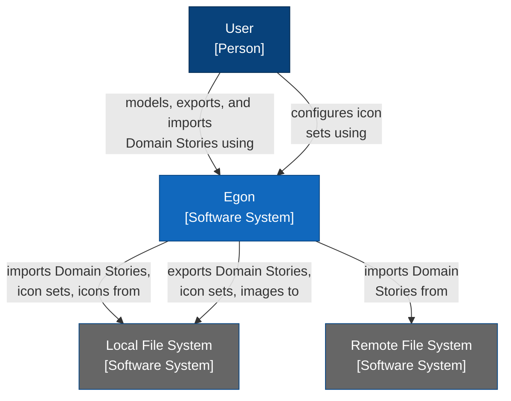
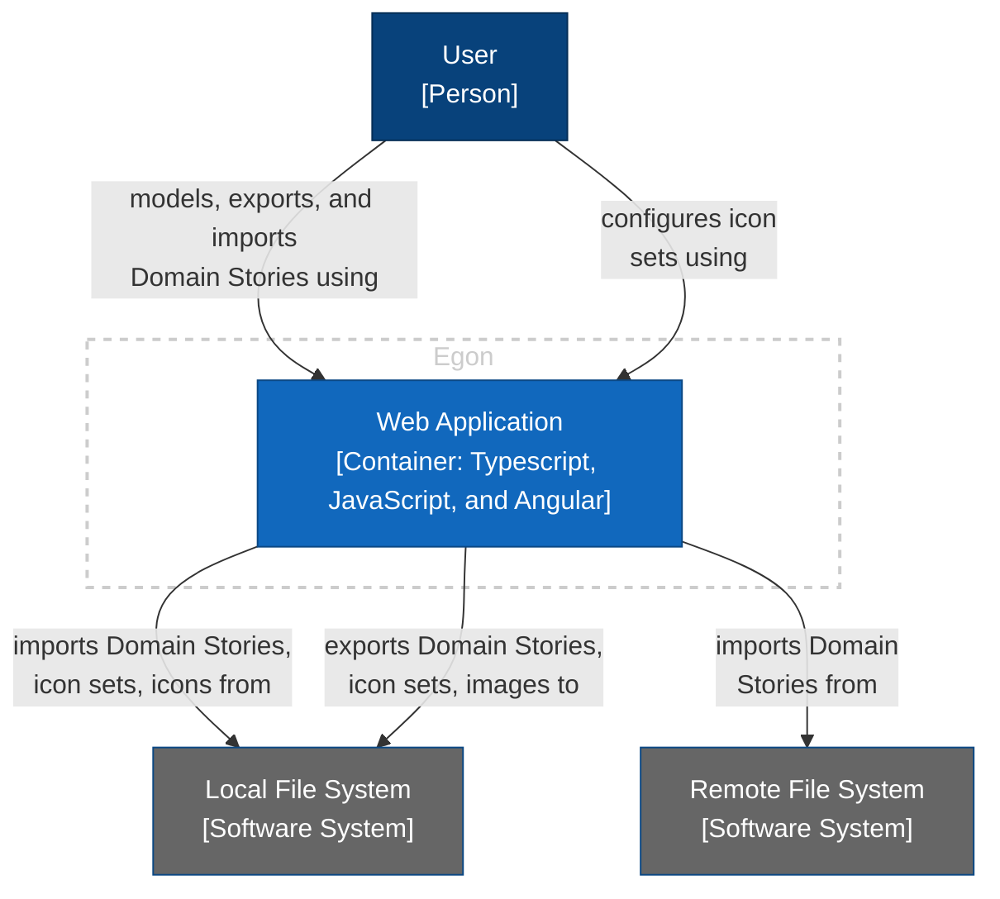
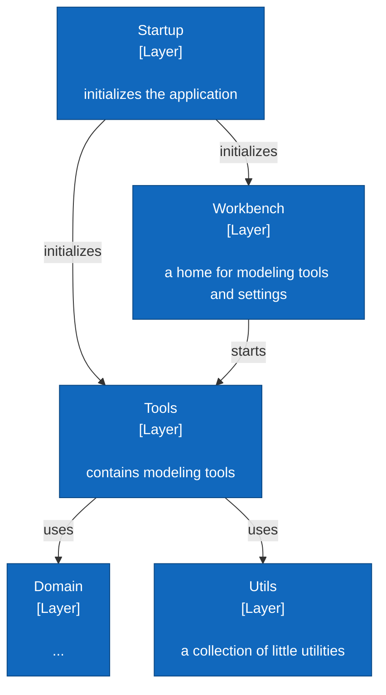
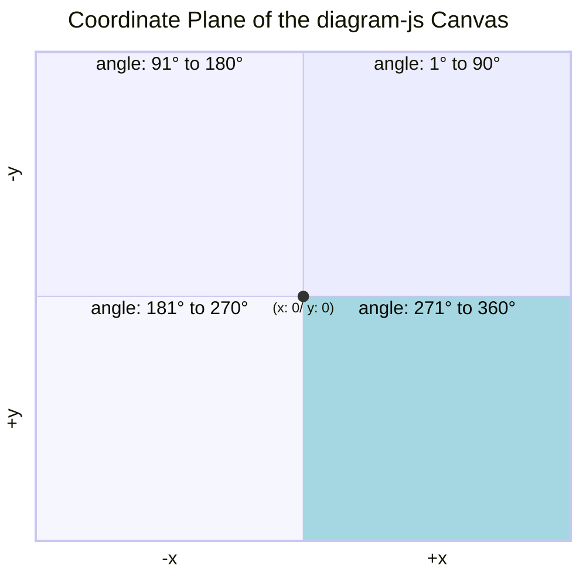

# KNOWLEDGE EXTRACT: github.com_WPS_egon.io_56271561
> **Extracted on:** 2026-04-01 16:29:20
> **Source:** D:/LongLeo/AI OS CORP/AI OS/system/security/QUARANTINE/KI-BATCH-20260331205007525167/github.com_WPS_egon.io_56271561

---

## File: `.editorconfig`
```
# Editor configuration, see https://editorconfig.org
root = true

[*]
charset = utf-8
indent_style = space
indent_size = 2
insert_final_newline = true
trim_trailing_whitespace = true
end_of_line = lf

[*.ts]
quote_type = single

[*.md]
max_line_length = off
trim_trailing_whitespace = false
```

## File: `.gitattributes`
```
* text=auto eol=lf
```

## File: `.gitignore`
```
# See http://help.github.com/ignore-files/ for more about ignoring files.

# compiled output
/build
/dist_build
/dist
/tmp
/out-tsc
# Only exists if Bazel was run
/bazel-out

# dependencies
/node_modules

# profiling files
chrome-profiler-events*.json
speed-measure-plugin*.json

# IDEs and editors
/.project
.idea
.classpath
.c9/
*.launch
.settings/
*.sublime-workspace
*.iml

# IDE - VSCode
.vscode/*
!.vscode/settings.json
!.vscode/tasks.json
!.vscode/launch.json
!.vscode/extensions.json
.history/*

# misc
/.angular/cache
/.sass-cache
/connect.lock
/coverage
/libpeerconnection.log
npm-debug.log
yarn-error.log
testem.log
/typings

# System Files
.DS_Store
Thumbs.db
*.xml
/.angular/
```

## File: `Dockerfile`
```
# Build stage
FROM node:24-alpine AS build-stage
WORKDIR /app

COPY . .
RUN npm ci

RUN npm run build-prod


# Runtime stage
FROM nginx:1.29-alpine
COPY --from=build-stage /app/dist_build/egon /usr/share/nginx/html

EXPOSE 80
```

## File: `README.md`
```markdown
# Egon - The Domain Story Modeler

A tool to visualize Domain Stories in your browser.

## About

- See http://domainstorytelling.org for more information on Domain Storytelling.
- The [Egon.io Website](https://egon.io/) contains a user manual.

## Development

1. Install the dependencies via `npm ci`
2. Build and run Egon on a local development server via `npm run start`. Egon.io is accessible at http://localhost:4200.

Before committing any changes/creating pull requests, you should:
- Run tests via `npm run test`
- Run formatter via `npm run format`
- Check architecture rules via `npm run archlint`

## Architecture

See [architecture documentation](ARCHITECTURE.md).

## Deployment

There are several deployment options:

- Standalone version (Zip file): If your organization already runs a web server, you can copy the zip file to the web server and extract it there to make Egon available to your organization.
- Docker container: If you prefer to provide websites as Docker container, you can build your own.
- If you don't want to build and deploy Egon.io yourself, than use one of the ready-to-use options provided by the Egon.io team:
  - Run [Egon.io online](https://egon.io/)
  - Download a ready-made Docker image `docker pull ghcr.io/wps/egon.io:latest` and run it `docker run -p 4040:80 ghcr.io/wps/egon.io:latest` (replace "4040" with whatever port you want to use)

### Build Standalone Version (Zip file)

1. In the package.json and environment.prod.ts update the version-tag appropriately
2. Run the command **ng build --configuration production**
   - This should create (or update the contents of) the folder **dist_build**
3. Run the command **npm run zip**
   - This should create (or update the contents of) the folder **dist** containing a zip.file named *egon-xxx*, where xxx is the name in the version-tag of the package.json

### Build Docker Container

1. In the root directory of your source code, run `docker build -t egon-dev .`
2. To start the container, run `docker run -p 8080:80 egon-dev`

Adapt container name ("egon-dev" in the above example) and port ("8080") as needed.

## License

Egon - The Domain Story Modeler is licensed under GPLv3.0.

Egon uses...
- [diagram-js](https://github.com/bpmn-io/diagram-js): Copyright (c) 2014—present Camunda Services GmbH
- [ngx-color-picker](https://www.npmjs.com/package/ngx-color-picker): Copyright (c) 2016 Zef Oy

which are licensed under the MIT license.

### GPLv3.0

Copyright (c) 2018-present WPS - Workplace Solutions GmbH

This program is free software: you can redistribute it and/or modify
it under the terms of the GNU General Public License as published by
the Free Software Foundation, either version 3 of the License, or
(at your option) any later version.

This program is distributed in the hope that it will be useful,
but WITHOUT ANY WARRANTY; without even the implied warranty of
MERCHANTABILITY or FITNESS FOR A PARTICULAR PURPOSE. See the
GNU General Public License for more details.

You should have received a copy of the GNU General Public License
along with this program. If not, see <https://www.gnu.org/licenses/>.

### The MIT License

Permission is hereby granted, free of charge, to any person obtaining a copy of this software and associated documentation files (the "Software"), to deal in the Software without restriction, including without limitation the rights to use, copy, modify, merge, publish, distribute, sublicense, and/or sell copies of the Software, and to permit persons to whom the Software is furnished to do so, subject to the following conditions:

The above copyright notice and this permission notice shall be included in all copies or substantial portions of the Software.

THE SOFTWARE IS PROVIDED "AS IS", WITHOUT WARRANTY OF ANY KIND, EXPRESS OR IMPLIED, INCLUDING BUT NOT LIMITED TO THE WARRANTIES OF MERCHANTABILITY, FITNESS FOR A PARTICULAR PURPOSE AND NONINFRINGEMENT. IN NO EVENT SHALL THE AUTHORS OR COPYRIGHT HOLDERS BE LIABLE FOR ANY CLAIM, DAMAGES OR OTHER LIABILITY, WHETHER IN AN ACTION OF CONTRACT, TORT OR OTHERWISE, ARISING FROM, OUT OF OR IN CONNECTION WITH THE SOFTWARE OR THE USE OR OTHER DEALINGS IN THE SOFTWARE.

```

## File: `angular.json`
```json
{
  "$schema": "./node_modules/@angular/cli/lib/config/schema.json",
  "cli": {
    "analytics": false
  },
  "version": 1,
  "newProjectRoot": "projects",
  "projects": {
    "egon": {
      "projectType": "application",
      "schematics": {
        "@schematics/angular:component": {
          "style": "scss"
        },
        "@schematics/angular:application": {
          "strict": true
        }
      },
      "root": "./",
      "sourceRoot": "src",
      "prefix": "app",
      "architect": {
        "build": {
          "builder": "@angular-builders/custom-webpack:browser",
          "options": {
            "customWebpackConfig": {
              "path": "./polyfill-webpack.config.js",
              "replaceDuplicatePlugins": true
            },
            "allowedCommonJsDependencies": ["util", "object-refs", "hammerjs", "css.escape", "path-intersection", "inherits", "dot"],
            "outputPath": "dist_build/egon",
            "index": "src/index.html",
            "main": "src/main.ts",
            "polyfills": "src/polyfills.ts",
            "tsConfig": "tsconfig.app.json",
            "assets": ["src/favicon.ico", "src/assets"],
            "styles": [
              "node_modules/diagram-js/assets/diagram-js.css",
              "node_modules/bpmn-font/dist/css/bpmn.css",
              "src/styles.scss"
            ],
            "scripts": [],
            "vendorChunk": true,
            "extractLicenses": false,
            "buildOptimizer": false,
            "sourceMap": true,
            "optimization": false,
            "namedChunks": true
          },
          "configurations": {
            "production": {
              "fileReplacements": [
                {
                  "replace": "src/environments/environment.ts",
                  "with": "src/environments/environment.prod.ts"
                }
              ],
              "optimization": false,
              "outputHashing": "all",
              "sourceMap": false,
              "namedChunks": false,
              "extractLicenses": true,
              "vendorChunk": false,
              "buildOptimizer": true,
              "budgets": [
                {
                  "type": "initial",
                  "maximumWarning": "1mb",
                  "maximumError": "7mb"
                },
                {
                  "type": "anyComponentStyle",
                  "maximumWarning": "4kb",
                  "maximumError": "8kb"
                }
              ]
            }
          }
        },
        "serve": {
          "builder": "@angular-builders/custom-webpack:dev-server",
          "options": {
            "buildTarget": "egon:build"
          },
          "configurations": {
            "production": {
              "buildTarget": "egon:build:production"
            }
          }
        },
        "extract-i18n": {
          "builder": "@angular/build:extract-i18n",
          "options": {
            "buildTarget": "egon:build"
          }
        },
        "test": {
          "builder": "@angular-builders/custom-webpack:karma",
          "options": {
            "main": "src/test.ts",
            "polyfills": "src/polyfills.ts",
            "tsConfig": "tsconfig.spec.json",
            "karmaConfig": "karma.conf.js",
            "assets": ["src/favicon.ico", "src/assets"],
            "styles": ["src/styles.scss"],
            "scripts": [],
            "customWebpackConfig": {
              "path": "polyfill-webpack.config.js"
            }
          }
        }
      }
    }
  },
  "schematics": {
    "@schematics/angular:component": {
      "type": "component"
    },
    "@schematics/angular:directive": {
      "type": "directive"
    },
    "@schematics/angular:service": {
      "type": "service"
    },
    "@schematics/angular:guard": {
      "typeSeparator": "."
    },
    "@schematics/angular:interceptor": {
      "typeSeparator": "."
    },
    "@schematics/angular:module": {
      "typeSeparator": "."
    },
    "@schematics/angular:pipe": {
      "typeSeparator": "."
    },
    "@schematics/angular:resolver": {
      "typeSeparator": "."
    }
  }
}
```

## File: `architecture.md`
```markdown
# Introduction and Goals

*Describes the relevant requirements and the driving forces that software architects and development team must consider.*

## Requirements Overview {#_requirements_overview}

Egon is a modeling tool that implements the notation and syntactical rules of [Domain Storytelling](https://domainstorytelling.org/). It supports its users when modeling in workshops and sharing workshop results.

## Stakeholders {#_stakeholders}

- Users: Intended users are already familiar with Domain Storytelling. They do not require a technical background.
- Developers: Egon was initiated and developed by German software company *WPS - Workplace Solutions GmbH*. All active developers are employees of this company. Most developers are also users of Egon.
- Contributors: Programmers from all around the world can contribute code to Egon via pull requests. We assume that contributors are also users of Egon.

## Quality Goals {#_quality_goals}

Top quality goals are:
- Functional suitability: System provides functions that meets stated or implied needs.
- Operability: System can be understood, learned, used, and is attractive to its [users](#introduction-and-goals).

# Architecture Constraints {#section-architecture-constraints}

*Any requirement that constrains software architects in their freedom of design and implementation decisions or decision about the development process.*

| Constraint                | Reason                                              |
|---------------------------|-----------------------------------------------------|
| runs in browser           | users do not need to install anything on their machine; developers can deploy new versions easily |
| distributed under liberal open source license | increases adoption by providing Egon free of charge (even for "commercial" use), without risk of vendor lock-in; while Egon is open source, the domain stories created with Egon do *not* fall under an open source license |
| no registration or log-in required | increases adoption; ease of use; avoids security problems; lowers maintenance effort |
| no centralized storage | avoids security problems; lowers maintenance effort |
| can be hosted locally or within company network | avoids vendor lock-in; increases adoption by companies |
| when run locally: can be used without internet connection  | increases robustness       |

# System Scope and Context {#section-system-scope-and-context}

*System scope and context delimits the system from all its communication partners. It thereby specifies the external interfaces.*

The following C4 System Context Diagram shows Egon.io as black box with its communication partners (neighboring systems and users). 


  
# Solution Strategy {#section-solution-strategy}

*A short summary and explanation of the fundamental decisions and solution strategies, that shape the system’s architecture.*

## Decision: Using a Modeling Framework

Domain Storytelling is a modeling language and we wanted to build a proper modeling tool that implements the notation and grammar. We assumed that it was easier to use a modeling framework rather than building this from scratch or using a diagramming library that only knows about boxes and arrows. Hence, we searched for a modeling framework that...

- was flexible enough to support the Domain Storytelling modeling language 
- and fulfilled the [architectural constraints](#section-architecture-constraints).

[diagram-js](https://github.com/bpmn-io/diagram-js) checked all the boxes. It is a JavaScript modeling library, originally developed for the [bpmn-js BPMN editor](https://github.com/bpmn-io/bpmn-js) but now language-agnostic. 

Older versions of Egon (v1 and v2) depended on bpmn-js which had tradeoffs: For some features, Egon developers had to dive deep into the inner workings of bpmn-js and work around the framework's behavior. At the same time, bpmn-js offers a lot of features that are not relevant for Domain Storytelling. Egon v3 marked the shift from using bpmn-js to diagram-js as our modeling framework.

## Decision: Separation Between Egon and diagram-js

Many of Egon's features do not depend on the diagram-js framework. The architecture should reflect that by clearly distinguishing between
- code that deals with core modeling activities and requires knowledge of diagram-js
- and code that is independent of diagram-js

This separation flattens the learning curve for new developers. 

## Decision: Typescript and Angular

Since all developers share a common background (see [Stakeholders](#_stakeholders)) which includes experience with Typescript and Angular, this tech stack has been used since Egon v2. It also enabled us to  express this intended architecture.

## Decision: No Touch Support, no Multi-User Support

Users of Egon facilitate Domain Storytelling workshops by modeling the participant's domain stories. They are supposed to share their screen with the participants so that everyone can see how the domain story evolves. In this setting, collaborative editing by multiple users is not relevant. 

We assume that users prefer to model with devices that have a keyboard and mouse/touch pad rather than on touch devices. Hence, touch support was not a requirement when selecting the framework.

# Building Block View {#section-building-block-view}

*The building block view shows the static decomposition of the system into building blocks (modules, components, subsystems, classes, interfaces, packages, libraries, frameworks, layers, partitions, tiers, functions, macros, operations, data structures, …) as well as their dependencies (relationships, associations, …).*

## Level 1: Overall System

Since there is no backend and only one frontend application, the overall architecture is very simple – it consists of just one building block (in C4: *container*). Here it is depicted as C4 container diagram:



## Level 2: Web Application

On the top level, the web app is organized into a layered architecture. Some layers contain – among other things –  Angular modules and components which themselves are structured into technical layers.

### Layers



The folder structure resembles the layered architecture:

- `app` => Startup layer
  - `workbench` => Workbench layer
  - `tools` => Tools layer
  - `domain` => Domain layer
  - `utils` => Utils layer

The architecture rules are enforced by running `npm run archlint.`


### Technical Layering within Angular Components

## Level 3: Tools

TODO: Show vertical slices and usage of diagram-js. The folder structure resembles the vertical slices. 

## diagram-js

Unfortunately, diagram-js comes with little documentation. We recommend reading the "Diagram Interaction / Modeling (diagram-js)" section in the [bpmn-js documentation](https://bpmn.io/toolkit/bpmn-js/walkthrough/). In short, diagram-js renders diagrams and offers extensible infrastructure (plug-in system, event bus, command stack, and service loop). It handles user interaction (move, connect, hover, select, add, remove) and provides the *canvas*, *palette*, and *context pad*. 

Some more useful information for working on the `modeler` tool:

The *canvas* contains graphical *elements* of different *types* (of which Egon only uses the ones mentioned in the table below). The graphical elements can contain *business objects* that carry the information that is specific to the modeling language. Business object have types too – e.g., `domainStory:workObject` (for the Domain Storytelling modeling language). Domain Storytelling's element types for business objects are defined in `elementTypes.ts`.

| Domain Story Element Types | represented as diagram-js type |
|----------------------------|--------------------------------|
| Actor | shape |
| Work Object | shape |
| Group | shape |
| Textannotation | shape |
| Activity | connection |
| Connection* | connection |

*) This refers to the dashed line that connects annotations with actors, work objects, or groups.

Element positions on the canvas work as shown in this diagram:


Per default, the visible area of the canvas is the bottom right quadrant (+x/+y). That means that 0/0 is in the top left corner of the screen. 

# Runtime View {#section-runtime-view}

*The runtime view describes concrete behavior and interactions of the system’s building blocks in form of scenarios.*

This section is omitted as Egon consists only of one building block.

# Deployment View {#section-deployment-view}

*The deployment view describes the technical infrastructure used to execute your system.*

TODO: Maybe document development pipeline here (Github Action builds and pushes to Github Pages, builds Docker container)

# Architecture Decisions {#section-design-decisions}

*Important, expensive, large scale or risky architecture decisions including rationales. With “decisions” we mean selecting one alternative based on given criteria.*

## Decision: Use Web Storage to Persist User-specific Information

Users can configure their icon set and autosave properties. To avoid having to configure everything again the next time a user uses Egon, the user-specific information must be persisted. 

Also, autosave creates drafts that must be restorable across browser sessions to recover Domain Stories after a browser crash.

Since Egon runs completely in the browser, we must use local means to persist all user-specific information. 

**Decision:** Use *Web Storage* (i.e., `localStorage`) to persist user-specific information across browser sessions. All popular web browsers implement this standard. 

Alternatively, cookies could be used (and in fact were used in earlier Egon versions). Unlike cookies, the storage limit is far larger (at least 5MB).

## Decision: 1 Domain Story = 1 Self-contained File

Since Egon does not use centralized storage (see [architectural constraints](#section-architecture-constraints)), users need to export their Domain Stories to their local file system as files. 

The most simple way of doing that is to put one domain story into one file and make it self-contained, i.e. include the SVG of the icon set (including custom icons). This makes it easy to share domain stories with other users.

Alternatively a one-to-many relationship (one file containing several Domain Stories) would enable references between Domain Stories. However, this would likely make it necessary to build more features for the export and import tools (e.g., export all stories or just specific ones).

**Decision:** We choose simplicity over advanced functionality and persist each domain story as one self-contained file.


## TODO: More decisions
- JSON as file format
- no separation of model and diagram
- Angular-specific patterns

# Quality Requirements {#section-quality-scenarios}

*This section contains all quality requirements as quality tree with scenarios.*

TBD

# Risks and Technical Debts {#section-technical-risks}

*A list of identified technical risks or technical debts, ordered by priority*

TBD

# Glossary

Egon uses terminology of Domain Storytelling in the UI and in the code. See [Domain Storytelling Website](https://domainstorytelling.org/quick-start-guide#the-pictographic-language).
```

## File: `karma.conf.js`
```javascript
// Karma configuration file, see link for more information
// https://karma-runner.github.io/1.0/config/configuration-file.html

module.exports = function (config) {
  config.set({
    basePath: "",
    frameworks: ["jasmine", "@angular-devkit/build-angular"],
    plugins: [
      require("karma-jasmine"),
      require("karma-chrome-launcher"),
      require("karma-jasmine-html-reporter"),
      require("karma-coverage"),
      require("@angular-devkit/build-angular/plugins/karma"),
    ],
    client: {
      captureConsole: true,
      jasmine: {
        // you can add configuration options for Jasmine here
        // the possible options are listed at https://jasmine.github.io/api/edge/Configuration.html
        // for example, you can disable the random execution with `random: false`
        // or set a specific seed with `seed: 4321`
      },
      clearContext: false, // leave Jasmine Spec Runner output visible in browser
    },
    jasmineHtmlReporter: {
      suppressAll: true, // removes the duplicated traces
    },
    coverageReporter: {
      dir: require("path").join(__dirname, "./coverage/egon"),
      subdir: ".",
      reporters: [{ type: "html" }, { type: "text-summary" }],
    },
    reporters: ["progress", "kjhtml"],
    port: 9876,
    colors: true,
    logLevel: config.LOG_INFO,
    autoWatch: true,
    browsers: ["ChromeHeadless"],
    singleRun: true,
    restartOnFileChange: true,
  });
};
```

## File: `layers.json`
```json
{
  "$schema": "../node_modules/ts-archlint/dist/schema.json",
  "name": "layers",
  "failOnUnassigned": false,
  "exclude": [
    "node_modules**",
    "**.spec.ts",
    "../environments/**",
    "app.*.ts",
    "**.providers.ts"
  ],
  "artifacts": [
    {
      "name": "workbench",
      "include": [
        "workbench/**"
      ],
      "mayUseAllBelow": true
    },
    {
      "name": "tools",
      "include": [
        "tools/**"
      ],
      "children": [
        {
          "name": "label-dictionary",
          "include": [
            "*/label-dictionary/**"
          ],
          "mayUseAllBelow": true
        },
        {
          "name": "autosave",
          "include": [
            "*/autosave/**"
          ],
          "mayUseAllBelow": true
        },
        {
          "name": "export",
          "include": [
            "*/export/**"
          ],
          "mayUseAllBelow": true
        },
        {
          "name": "import",
          "include": [
            "*/import/**"
          ],
          "mayUseAllBelow": true
        },
        {
          "name": "modeler",
          "include": [
            "*/modeler/**"
          ],
          "mayUseAllBelow": true
        },
        {
          "name": "icon-set-config",
          "include": [
            "*/icon-set-config/**"
          ],
          "mayUseAllBelow": true
        },
        {
          "name": "title",
          "include": [
            "*/title/**"
          ],
          "mayUseAllBelow": true
        },
        {
          "name": "replay",
          "include": [
            "*/replay/**"
          ],
          "mayUseAllBelow": true
        },
        {
          "name": "unsavedChangesReminder",
          "include": [
            "*/unsavedChangesReminder/**"
          ],
          "mayUseAllBelow": true
        }
      ],
      "mayUseAllBelow": true
    },
    {
      "name": "domain",
      "include": [
        "domain/**"
      ],
      "mayUseAllBelow": true
    },
    {
      "name": "utils",
      "include": [
        "utils/**"
      ],
      "mayUseAllBelow": true
    }
  ]
}
```

## File: `package.json`
```json
{
  "name": "egon",
  "version": "3.1.1-dev",
  "scripts": {
    "ng": "ng",
    "start": "ng serve",
    "format": "prettier --write ./src",
    "format:check": "prettier --check ./src",
    "test": "ng test",
    "build": "ng build",
    "build-prod": "ng build --configuration production",
    "zip": "zip-build dist_build/ dist/ --template '%NAME%-%VERSION%.%EXT%'",
    "archlint": "node ./node_modules/ts-archlint/dist/index.js ./src/app"
  },
  "private": true,
  "dependencies": {
    "@angular/animations": "^20.3.13",
    "@angular/cdk": "^20.2.14",
    "@angular/common": "^20.3.13",
    "@angular/compiler": "^20.3.13",
    "@angular/core": "^20.3.13",
    "@angular/forms": "^20.3.13",
    "@angular/material": "^20.2.14",
    "@angular/platform-browser": "^20.3.13",
    "@angular/platform-browser-dynamic": "^20.3.13",
    "@bpmn-io/align-to-origin": "0.7.0",
    "bpmn-font": "^0.12.1",
    "diagram-js": "^15.4.0",
    "diagram-js-direct-editing": "^3.2.0",
    "diagram-js-minimap": "^5.2.0",
    "dot": "^1.1.3",
    "ids": "^1.0.5",
    "inherits-browser": "^0.1.0",
    "material-icons": "^1.13.14",
    "min-dash": "^4.2.3",
    "ngx-color-picker": "^20.1.1",
    "rxjs": "^7.4.0",
    "tslib": "^2.8.1",
    "zone.js": "~0.15.0"
  },
  "devDependencies": {
    "@angular-builders/custom-webpack": "^20.0.0",
    "@angular/build": "^20.3.11",
    "@angular/cli": "^20.3.16",
    "@angular/compiler-cli": "^20.3.13",
    "@types/jasmine": "^5.1.13",
    "@types/node": "^24.10.1",
    "jasmine-core": "^5.12.1",
    "karma": "^6.4.4",
    "karma-chrome-launcher": "^3.2.0",
    "karma-coverage": "^2.2.1",
    "karma-jasmine": "^5.1.0",
    "karma-jasmine-html-reporter": "^2.1.0",
    "ng-mocks": "^14.14.0",
    "node-polyfill-webpack-plugin": "^4.1.0",
    "prettier": "^3.7.3",
    "ts-archlint": "^0.23.0",
    "ts-node": "^10.9.2",
    "typescript": "^5.9.3",
    "zip-build": "^1.8.0"
  }
}
```

## File: `polyfill-webpack.config.js`
```javascript
const webpack = require('webpack');
const NodePolyFillPlugin = require("node-polyfill-webpack-plugin");

module.exports = {
  plugins: [
    // add node core polyfills
    new NodePolyFillPlugin(),

    // ensure `process` global is provided as the browser shim
    new webpack.ProvidePlugin({
      process: 'process/browser',
    }),
  ],
  resolve: {
    fallback: {
      // explicit fallback to process/browser (helps some tooling resolve it)
      process: require.resolve('process/browser'),
    },
  },
};
```

## File: `technical_layers.json`
```json
{
  "$schema": "../node_modules/ts-archlint/dist/schema.json",
  "name": "technical_layers",
  "failOnUnassigned": false,
  "exclude": [
    "node_modules**",
    "**.spec.ts",
    "../environments/**",
    "app.*.ts",
    "**.providers.ts",
    "tools/import/services/import-domain-story.service.ts",
    "tools/modeler/services/initializer.service.ts",
    "tools/title/presentation/title-dialog/title-dialog.component.ts",
    "tools/export/presentation/export-dialog/export-dialog.component.ts",
    "tools/label-dictionary/presentation/label-dictionary-dialog/label-dictionary-dialog.component.ts",
    "domain/presentation/keyboard-shortcuts-dialog/keyboard-shortcuts/keyboard-shortcuts-dialog.component.ts"
  ],
  "artifacts": [
    {
      "name": "presentation",
      "include": [
        "**/presentation/**"
      ],
      "mayUseAllBelow": true
    },
    {
      "name": "directive",
      "include": [
        "**/directive/**"
      ],
      "mayUseAllBelow": true
    },
    {
      "name": "service",
      "include": [
        "**/services/**",
        "**/*providers.ts"
      ],
      "mayUse": [
        "library",
        "domain",
        "entities",
        "utils"
      ]
    },
    {
      "name": "domain",
      "include": [
        "**/domain/**"
      ],
      "mayUseAllBelow": true
    },
    {
      "name": "entities",
      "include": [
        "**/entities/**"
      ],
      "mayUseAllBelow": true
    },
    {
      "name": "utils",
      "include": [
        "utils/**"
      ],
      "mayBeUsedFromAllAbove": true
    }
  ]
}
```

## File: `tsconfig.app.json`
```json
/* To learn more about this file see: https://angular.io/config/tsconfig. */
{
  "extends": "./tsconfig.json",
  "compilerOptions": {
    "outDir": "./out-tsc/app",
    "types": []
  },
  "files": ["src/main.ts", "src/polyfills.ts"],
  "include": ["src/**/*.d.ts"]
}
```

## File: `tsconfig.json`
```json
/* To learn more about this file see: https://angular.io/config/tsconfig. */
{
  "compileOnSave": false,
  "compilerOptions": {
    "baseUrl": "./",
    "allowJs": true,
    "outDir": "./dist/out-tsc",
    "forceConsistentCasingInFileNames": true,
    "esModuleInterop": true,
    "strict": true,
    "noImplicitReturns": true,
    "noFallthroughCasesInSwitch": true,
    "sourceMap": true,
    "declaration": false,
    "experimentalDecorators": true,
    "moduleResolution": "bundler",
    "importHelpers": true,
    "target": "ES2022",
    "module": "es2020",
    "lib": [
      "es2018",
      "dom"
    ],
    "useDefineForClassFields": false
  },
  "include": ["./src/**/*"],
  "angularCompilerOptions": {
    "enableI18nLegacyMessageIdFormat": false,
    "strictInjectionParameters": true,
    "strictInputAccessModifiers": true,
    "strictTemplates": true
  }
}
```

## File: `tsconfig.spec.json`
```json
/* To learn more about this file see: https://angular.io/config/tsconfig. */
{
  "extends": "./tsconfig.json",
  "compilerOptions": {
    "outDir": "./out-tsc/spec",
    "types": ["jasmine"]
  },
  "files": ["src/test.ts", "src/polyfills.ts"],
  "include": ["src/**/*.spec.ts", "src/**/*.d.ts"]
}
```

## File: `WPS-egon.io-e18dcca/.editorconfig`
```
# Editor configuration, see https://editorconfig.org
root = true

[*]
charset = utf-8
indent_style = space
indent_size = 2
insert_final_newline = true
trim_trailing_whitespace = true
end_of_line = lf

[*.ts]
quote_type = single

[*.md]
max_line_length = off
trim_trailing_whitespace = false
```

## File: `WPS-egon.io-e18dcca/.gitattributes`
```
* text=auto eol=lf
```

## File: `WPS-egon.io-e18dcca/.gitignore`
```
# See http://help.github.com/ignore-files/ for more about ignoring files.

# compiled output
/build
/dist_build
/dist
/tmp
/out-tsc
# Only exists if Bazel was run
/bazel-out

# dependencies
/node_modules

# profiling files
chrome-profiler-events*.json
speed-measure-plugin*.json

# IDEs and editors
/.project
.idea
.classpath
.c9/
*.launch
.settings/
*.sublime-workspace
*.iml

# IDE - VSCode
.vscode/*
!.vscode/settings.json
!.vscode/tasks.json
!.vscode/launch.json
!.vscode/extensions.json
.history/*

# misc
/.angular/cache
/.sass-cache
/connect.lock
/coverage
/libpeerconnection.log
npm-debug.log
yarn-error.log
testem.log
/typings

# System Files
.DS_Store
Thumbs.db
*.xml
/.angular/
```

## File: `WPS-egon.io-e18dcca/Dockerfile`
```
# Build stage
FROM node:24-alpine AS build-stage
WORKDIR /app

COPY . .
RUN npm ci

RUN npm run build-prod


# Runtime stage
FROM nginx:1.29-alpine
COPY --from=build-stage /app/dist_build/egon /usr/share/nginx/html

EXPOSE 80
```

## File: `WPS-egon.io-e18dcca/README.md`
```markdown
# Egon - The Domain Story Modeler

A tool to visualize Domain Stories in your browser.

## About

- See http://domainstorytelling.org for more information on Domain Storytelling.
- The [Egon.io Website](https://egon.io/) contains a user manual.

## Development

1. Install the dependencies via `npm ci`
2. Build and run Egon on a local development server via `npm run start`. Egon.io is accessible at http://localhost:4200.

Before committing any changes/creating pull requests, you should:
- Run tests via `npm run test`
- Run formatter via `npm run format`
- Check architecture rules via `npm run archlint`

## Architecture

See [architecture documentation](ARCHITECTURE.md).

## Deployment

There are several deployment options:

- Standalone version (Zip file): If your organization already runs a web server, you can copy the zip file to the web server and extract it there to make Egon available to your organization.
- Docker container: If you prefer to provide websites as Docker container, you can build your own.
- If you don't want to build and deploy Egon.io yourself, than use one of the ready-to-use options provided by the Egon.io team:
  - Run [Egon.io online](https://egon.io/)
  - Download a ready-made Docker image `docker pull ghcr.io/wps/egon.io:latest` and run it `docker run -p 4040:80 ghcr.io/wps/egon.io:latest` (replace "4040" with whatever port you want to use)

### Build Standalone Version (Zip file)

1. In the package.json and environment.prod.ts update the version-tag appropriately
2. Run the command **ng build --configuration production**
   - This should create (or update the contents of) the folder **dist_build**
3. Run the command **npm run zip**
   - This should create (or update the contents of) the folder **dist** containing a zip.file named *egon-xxx*, where xxx is the name in the version-tag of the package.json

### Build Docker Container

1. In the root directory of your source code, run `docker build -t egon-dev .`
2. To start the container, run `docker run -p 8080:80 egon-dev`

Adapt container name ("egon-dev" in the above example) and port ("8080") as needed.

## License

Egon - The Domain Story Modeler is licensed under GPLv3.0.

Egon uses...
- [diagram-js](https://github.com/bpmn-io/diagram-js): Copyright (c) 2014—present Camunda Services GmbH
- [ngx-color-picker](https://www.npmjs.com/package/ngx-color-picker): Copyright (c) 2016 Zef Oy

which are licensed under the MIT license.

### GPLv3.0

Copyright (c) 2018-present WPS - Workplace Solutions GmbH

This program is free software: you can redistribute it and/or modify
it under the terms of the GNU General Public License as published by
the Free Software Foundation, either version 3 of the License, or
(at your option) any later version.

This program is distributed in the hope that it will be useful,
but WITHOUT ANY WARRANTY; without even the implied warranty of
MERCHANTABILITY or FITNESS FOR A PARTICULAR PURPOSE. See the
GNU General Public License for more details.

You should have received a copy of the GNU General Public License
along with this program. If not, see <https://www.gnu.org/licenses/>.

### The MIT License

Permission is hereby granted, free of charge, to any person obtaining a copy of this software and associated documentation files (the "Software"), to deal in the Software without restriction, including without limitation the rights to use, copy, modify, merge, publish, distribute, sublicense, and/or sell copies of the Software, and to permit persons to whom the Software is furnished to do so, subject to the following conditions:

The above copyright notice and this permission notice shall be included in all copies or substantial portions of the Software.

THE SOFTWARE IS PROVIDED "AS IS", WITHOUT WARRANTY OF ANY KIND, EXPRESS OR IMPLIED, INCLUDING BUT NOT LIMITED TO THE WARRANTIES OF MERCHANTABILITY, FITNESS FOR A PARTICULAR PURPOSE AND NONINFRINGEMENT. IN NO EVENT SHALL THE AUTHORS OR COPYRIGHT HOLDERS BE LIABLE FOR ANY CLAIM, DAMAGES OR OTHER LIABILITY, WHETHER IN AN ACTION OF CONTRACT, TORT OR OTHERWISE, ARISING FROM, OUT OF OR IN CONNECTION WITH THE SOFTWARE OR THE USE OR OTHER DEALINGS IN THE SOFTWARE.

```

## File: `WPS-egon.io-e18dcca/angular.json`
```json
{
  "$schema": "./node_modules/@angular/cli/lib/config/schema.json",
  "cli": {
    "analytics": false
  },
  "version": 1,
  "newProjectRoot": "projects",
  "projects": {
    "egon": {
      "projectType": "application",
      "schematics": {
        "@schematics/angular:component": {
          "style": "scss"
        },
        "@schematics/angular:application": {
          "strict": true
        }
      },
      "root": "./",
      "sourceRoot": "src",
      "prefix": "app",
      "architect": {
        "build": {
          "builder": "@angular-builders/custom-webpack:browser",
          "options": {
            "customWebpackConfig": {
              "path": "./polyfill-webpack.config.js",
              "replaceDuplicatePlugins": true
            },
            "allowedCommonJsDependencies": ["util", "object-refs", "hammerjs", "css.escape", "path-intersection", "inherits", "dot"],
            "outputPath": "dist_build/egon",
            "index": "src/index.html",
            "main": "src/main.ts",
            "polyfills": "src/polyfills.ts",
            "tsConfig": "tsconfig.app.json",
            "assets": ["src/favicon.ico", "src/assets"],
            "styles": [
              "node_modules/diagram-js/assets/diagram-js.css",
              "node_modules/bpmn-font/dist/css/bpmn.css",
              "src/styles.scss"
            ],
            "scripts": [],
            "vendorChunk": true,
            "extractLicenses": false,
            "buildOptimizer": false,
            "sourceMap": true,
            "optimization": false,
            "namedChunks": true
          },
          "configurations": {
            "production": {
              "fileReplacements": [
                {
                  "replace": "src/environments/environment.ts",
                  "with": "src/environments/environment.prod.ts"
                }
              ],
              "optimization": false,
              "outputHashing": "all",
              "sourceMap": false,
              "namedChunks": false,
              "extractLicenses": true,
              "vendorChunk": false,
              "buildOptimizer": true,
              "budgets": [
                {
                  "type": "initial",
                  "maximumWarning": "1mb",
                  "maximumError": "7mb"
                },
                {
                  "type": "anyComponentStyle",
                  "maximumWarning": "4kb",
                  "maximumError": "8kb"
                }
              ]
            }
          }
        },
        "serve": {
          "builder": "@angular-builders/custom-webpack:dev-server",
          "options": {
            "buildTarget": "egon:build"
          },
          "configurations": {
            "production": {
              "buildTarget": "egon:build:production"
            }
          }
        },
        "extract-i18n": {
          "builder": "@angular/build:extract-i18n",
          "options": {
            "buildTarget": "egon:build"
          }
        },
        "test": {
          "builder": "@angular-builders/custom-webpack:karma",
          "options": {
            "main": "src/test.ts",
            "polyfills": "src/polyfills.ts",
            "tsConfig": "tsconfig.spec.json",
            "karmaConfig": "karma.conf.js",
            "assets": ["src/favicon.ico", "src/assets"],
            "styles": ["src/styles.scss"],
            "scripts": [],
            "customWebpackConfig": {
              "path": "polyfill-webpack.config.js"
            }
          }
        }
      }
    }
  },
  "schematics": {
    "@schematics/angular:component": {
      "type": "component"
    },
    "@schematics/angular:directive": {
      "type": "directive"
    },
    "@schematics/angular:service": {
      "type": "service"
    },
    "@schematics/angular:guard": {
      "typeSeparator": "."
    },
    "@schematics/angular:interceptor": {
      "typeSeparator": "."
    },
    "@schematics/angular:module": {
      "typeSeparator": "."
    },
    "@schematics/angular:pipe": {
      "typeSeparator": "."
    },
    "@schematics/angular:resolver": {
      "typeSeparator": "."
    }
  }
}
```

## File: `WPS-egon.io-e18dcca/architecture.md`
```markdown
# Introduction and Goals

*Describes the relevant requirements and the driving forces that software architects and development team must consider.*

## Requirements Overview {#_requirements_overview}

Egon is a modeling tool that implements the notation and syntactical rules of [Domain Storytelling](https://domainstorytelling.org/). It supports its users when modeling in workshops and sharing workshop results.

## Stakeholders {#_stakeholders}

- Users: Intended users are already familiar with Domain Storytelling. They do not require a technical background.
- Developers: Egon was initiated and developed by German software company *WPS - Workplace Solutions GmbH*. All active developers are employees of this company. Most developers are also users of Egon.
- Contributors: Programmers from all around the world can contribute code to Egon via pull requests. We assume that contributors are also users of Egon.

## Quality Goals {#_quality_goals}

Top quality goals are:
- Functional suitability: System provides functions that meets stated or implied needs.
- Operability: System can be understood, learned, used, and is attractive to its [users](#introduction-and-goals).

# Architecture Constraints {#section-architecture-constraints}

*Any requirement that constrains software architects in their freedom of design and implementation decisions or decision about the development process.*

| Constraint                | Reason                                              |
|---------------------------|-----------------------------------------------------|
| runs in browser           | users do not need to install anything on their machine; developers can deploy new versions easily |
| distributed under liberal open source license | increases adoption by providing Egon free of charge (even for "commercial" use), without risk of vendor lock-in; while Egon is open source, the domain stories created with Egon do *not* fall under an open source license |
| no registration or log-in required | increases adoption; ease of use; avoids security problems; lowers maintenance effort |
| no centralized storage | avoids security problems; lowers maintenance effort |
| can be hosted locally or within company network | avoids vendor lock-in; increases adoption by companies |
| when run locally: can be used without internet connection  | increases robustness       |

# System Scope and Context {#section-system-scope-and-context}

*System scope and context delimits the system from all its communication partners. It thereby specifies the external interfaces.*

The following C4 System Context Diagram shows Egon.io as black box with its communication partners (neighboring systems and users). 


  
# Solution Strategy {#section-solution-strategy}

*A short summary and explanation of the fundamental decisions and solution strategies, that shape the system’s architecture.*

## Decision: Using a Modeling Framework

Domain Storytelling is a modeling language and we wanted to build a proper modeling tool that implements the notation and grammar. We assumed that it was easier to use a modeling framework rather than building this from scratch or using a diagramming library that only knows about boxes and arrows. Hence, we searched for a modeling framework that...

- was flexible enough to support the Domain Storytelling modeling language 
- and fulfilled the [architectural constraints](#section-architecture-constraints).

[diagram-js](https://github.com/bpmn-io/diagram-js) checked all the boxes. It is a JavaScript modeling library, originally developed for the [bpmn-js BPMN editor](https://github.com/bpmn-io/bpmn-js) but now language-agnostic. 

Older versions of Egon (v1 and v2) depended on bpmn-js which had tradeoffs: For some features, Egon developers had to dive deep into the inner workings of bpmn-js and work around the framework's behavior. At the same time, bpmn-js offers a lot of features that are not relevant for Domain Storytelling. Egon v3 marked the shift from using bpmn-js to diagram-js as our modeling framework.

## Decision: Separation Between Egon and diagram-js

Many of Egon's features do not depend on the diagram-js framework. The architecture should reflect that by clearly distinguishing between
- code that deals with core modeling activities and requires knowledge of diagram-js
- and code that is independent of diagram-js

This separation flattens the learning curve for new developers. 

## Decision: Typescript and Angular

Since all developers share a common background (see [Stakeholders](#_stakeholders)) which includes experience with Typescript and Angular, this tech stack has been used since Egon v2. It also enabled us to  express this intended architecture.

## Decision: No Touch Support, no Multi-User Support

Users of Egon facilitate Domain Storytelling workshops by modeling the participant's domain stories. They are supposed to share their screen with the participants so that everyone can see how the domain story evolves. In this setting, collaborative editing by multiple users is not relevant. 

We assume that users prefer to model with devices that have a keyboard and mouse/touch pad rather than on touch devices. Hence, touch support was not a requirement when selecting the framework.

# Building Block View {#section-building-block-view}

*The building block view shows the static decomposition of the system into building blocks (modules, components, subsystems, classes, interfaces, packages, libraries, frameworks, layers, partitions, tiers, functions, macros, operations, data structures, …) as well as their dependencies (relationships, associations, …).*

## Level 1: Overall System

Since there is no backend and only one frontend application, the overall architecture is very simple – it consists of just one building block (in C4: *container*). Here it is depicted as C4 container diagram:


## Level 2: Web Application

On the top level, the web app is organized into a layered architecture. Some layers contain – among other things –  Angular modules and components which themselves are structured into technical layers.

### Layers


The folder structure resembles the layered architecture:

- `app` => Startup layer
  - `workbench` => Workbench layer
  - `tools` => Tools layer
  - `domain` => Domain layer
  - `utils` => Utils layer

The architecture rules are enforced by running `npm run archlint.`


### Technical Layering within Angular Components

## Level 3: Tools

TODO: Show vertical slices and usage of diagram-js. The folder structure resembles the vertical slices. 

## diagram-js

Unfortunately, diagram-js comes with little documentation. We recommend reading the "Diagram Interaction / Modeling (diagram-js)" section in the [bpmn-js documentation](https://bpmn.io/toolkit/bpmn-js/walkthrough/). In short, diagram-js renders diagrams and offers extensible infrastructure (plug-in system, event bus, command stack, and service loop). It handles user interaction (move, connect, hover, select, add, remove) and provides the *canvas*, *palette*, and *context pad*. 

Some more useful information for working on the `modeler` tool:

The *canvas* contains graphical *elements* of different *types* (of which Egon only uses the ones mentioned in the table below). The graphical elements can contain *business objects* that carry the information that is specific to the modeling language. Business object have types too – e.g., `domainStory:workObject` (for the Domain Storytelling modeling language). Domain Storytelling's element types for business objects are defined in `elementTypes.ts`.

| Domain Story Element Types | represented as diagram-js type |
|----------------------------|--------------------------------|
| Actor | shape |
| Work Object | shape |
| Group | shape |
| Textannotation | shape |
| Activity | connection |
| Connection* | connection |

*) This refers to the dashed line that connects annotations with actors, work objects, or groups.

Element positions on the canvas work as shown in this diagram:


Per default, the visible area of the canvas is the bottom right quadrant (+x/+y). That means that 0/0 is in the top left corner of the screen. 

# Runtime View {#section-runtime-view}

*The runtime view describes concrete behavior and interactions of the system’s building blocks in form of scenarios.*

This section is omitted as Egon consists only of one building block.

# Deployment View {#section-deployment-view}

*The deployment view describes the technical infrastructure used to execute your system.*

TODO: Maybe document development pipeline here (Github Action builds and pushes to Github Pages, builds Docker container)

# Architecture Decisions {#section-design-decisions}

*Important, expensive, large scale or risky architecture decisions including rationales. With “decisions” we mean selecting one alternative based on given criteria.*

## Decision: Use Web Storage to Persist User-specific Information

Users can configure their icon set and autosave properties. To avoid having to configure everything again the next time a user uses Egon, the user-specific information must be persisted. 

Also, autosave creates drafts that must be restorable across browser sessions to recover Domain Stories after a browser crash.

Since Egon runs completely in the browser, we must use local means to persist all user-specific information. 

**Decision:** Use *Web Storage* (i.e., `localStorage`) to persist user-specific information across browser sessions. All popular web browsers implement this standard. 

Alternatively, cookies could be used (and in fact were used in earlier Egon versions). Unlike cookies, the storage limit is far larger (at least 5MB).

## Decision: 1 Domain Story = 1 Self-contained File

Since Egon does not use centralized storage (see [architectural constraints](#section-architecture-constraints)), users need to export their Domain Stories to their local file system as files. 

The most simple way of doing that is to put one domain story into one file and make it self-contained, i.e. include the SVG of the icon set (including custom icons). This makes it easy to share domain stories with other users.

Alternatively a one-to-many relationship (one file containing several Domain Stories) would enable references between Domain Stories. However, this would likely make it necessary to build more features for the export and import tools (e.g., export all stories or just specific ones).

**Decision:** We choose simplicity over advanced functionality and persist each domain story as one self-contained file.


## TODO: More decisions
- JSON as file format
- no separation of model and diagram
- Angular-specific patterns

# Quality Requirements {#section-quality-scenarios}

*This section contains all quality requirements as quality tree with scenarios.*

TBD

# Risks and Technical Debts {#section-technical-risks}

*A list of identified technical risks or technical debts, ordered by priority*

TBD

# Glossary

Egon uses terminology of Domain Storytelling in the UI and in the code. See [Domain Storytelling Website](https://domainstorytelling.org/quick-start-guide#the-pictographic-language).
```

## File: `WPS-egon.io-e18dcca/karma.conf.js`
```javascript
// Karma configuration file, see link for more information
// https://karma-runner.github.io/1.0/config/configuration-file.html

module.exports = function (config) {
  config.set({
    basePath: "",
    frameworks: ["jasmine", "@angular-devkit/build-angular"],
    plugins: [
      require("karma-jasmine"),
      require("karma-chrome-launcher"),
      require("karma-jasmine-html-reporter"),
      require("karma-coverage"),
      require("@angular-devkit/build-angular/plugins/karma"),
    ],
    client: {
      captureConsole: true,
      jasmine: {
        // you can add configuration options for Jasmine here
        // the possible options are listed at https://jasmine.github.io/api/edge/Configuration.html
        // for example, you can disable the random execution with `random: false`
        // or set a specific seed with `seed: 4321`
      },
      clearContext: false, // leave Jasmine Spec Runner output visible in browser
    },
    jasmineHtmlReporter: {
      suppressAll: true, // removes the duplicated traces
    },
    coverageReporter: {
      dir: require("path").join(__dirname, "./coverage/egon"),
      subdir: ".",
      reporters: [{ type: "html" }, { type: "text-summary" }],
    },
    reporters: ["progress", "kjhtml"],
    port: 9876,
    colors: true,
    logLevel: config.LOG_INFO,
    autoWatch: true,
    browsers: ["ChromeHeadless"],
    singleRun: true,
    restartOnFileChange: true,
  });
};
```

## File: `WPS-egon.io-e18dcca/package.json`
```json
{
  "name": "egon",
  "version": "3.1.1-dev",
  "scripts": {
    "ng": "ng",
    "start": "ng serve",
    "format": "prettier --write ./src",
    "format:check": "prettier --check ./src",
    "test": "ng test",
    "build": "ng build",
    "build-prod": "ng build --configuration production",
    "zip": "zip-build dist_build/ dist/ --template '%NAME%-%VERSION%.%EXT%'",
    "archlint": "node ./node_modules/ts-archlint/dist/index.js ./src/app"
  },
  "private": true,
  "dependencies": {
    "@angular/animations": "^20.3.13",
    "@angular/cdk": "^20.2.14",
    "@angular/common": "^20.3.13",
    "@angular/compiler": "^20.3.13",
    "@angular/core": "^20.3.13",
    "@angular/forms": "^20.3.13",
    "@angular/material": "^20.2.14",
    "@angular/platform-browser": "^20.3.13",
    "@angular/platform-browser-dynamic": "^20.3.13",
    "@bpmn-io/align-to-origin": "0.7.0",
    "bpmn-font": "^0.12.1",
    "diagram-js": "^15.4.0",
    "diagram-js-direct-editing": "^3.2.0",
    "diagram-js-minimap": "^5.2.0",
    "dot": "^1.1.3",
    "ids": "^1.0.5",
    "inherits-browser": "^0.1.0",
    "material-icons": "^1.13.14",
    "min-dash": "^4.2.3",
    "ngx-color-picker": "^20.1.1",
    "rxjs": "^7.4.0",
    "tslib": "^2.8.1",
    "zone.js": "~0.15.0"
  },
  "devDependencies": {
    "@angular-builders/custom-webpack": "^20.0.0",
    "@angular/build": "^20.3.11",
    "@angular/cli": "^20.3.16",
    "@angular/compiler-cli": "^20.3.13",
    "@types/jasmine": "^5.1.13",
    "@types/node": "^24.10.1",
    "jasmine-core": "^5.12.1",
    "karma": "^6.4.4",
    "karma-chrome-launcher": "^3.2.0",
    "karma-coverage": "^2.2.1",
    "karma-jasmine": "^5.1.0",
    "karma-jasmine-html-reporter": "^2.1.0",
    "ng-mocks": "^14.14.0",
    "node-polyfill-webpack-plugin": "^4.1.0",
    "prettier": "^3.7.3",
    "ts-archlint": "^0.23.0",
    "ts-node": "^10.9.2",
    "typescript": "^5.9.3",
    "zip-build": "^1.8.0"
  }
}
```

## File: `WPS-egon.io-e18dcca/polyfill-webpack.config.js`
```javascript
const webpack = require('webpack');
const NodePolyFillPlugin = require("node-polyfill-webpack-plugin");

module.exports = {
  plugins: [
    // add node core polyfills
    new NodePolyFillPlugin(),

    // ensure `process` global is provided as the browser shim
    new webpack.ProvidePlugin({
      process: 'process/browser',
    }),
  ],
  resolve: {
    fallback: {
      // explicit fallback to process/browser (helps some tooling resolve it)
      process: require.resolve('process/browser'),
    },
  },
};
```

## File: `WPS-egon.io-e18dcca/tsconfig.app.json`
```json
/* To learn more about this file see: https://angular.io/config/tsconfig. */
{
  "extends": "./tsconfig.json",
  "compilerOptions": {
    "outDir": "./out-tsc/app",
    "types": []
  },
  "files": ["src/main.ts", "src/polyfills.ts"],
  "include": ["src/**/*.d.ts"]
}
```

## File: `WPS-egon.io-e18dcca/tsconfig.json`
```json
/* To learn more about this file see: https://angular.io/config/tsconfig. */
{
  "compileOnSave": false,
  "compilerOptions": {
    "baseUrl": "./",
    "allowJs": true,
    "outDir": "./dist/out-tsc",
    "forceConsistentCasingInFileNames": true,
    "esModuleInterop": true,
    "strict": true,
    "noImplicitReturns": true,
    "noFallthroughCasesInSwitch": true,
    "sourceMap": true,
    "declaration": false,
    "experimentalDecorators": true,
    "moduleResolution": "bundler",
    "importHelpers": true,
    "target": "ES2022",
    "module": "es2020",
    "lib": [
      "es2018",
      "dom"
    ],
    "useDefineForClassFields": false
  },
  "include": ["./src/**/*"],
  "angularCompilerOptions": {
    "enableI18nLegacyMessageIdFormat": false,
    "strictInjectionParameters": true,
    "strictInputAccessModifiers": true,
    "strictTemplates": true
  }
}
```

## File: `WPS-egon.io-e18dcca/tsconfig.spec.json`
```json
/* To learn more about this file see: https://angular.io/config/tsconfig. */
{
  "extends": "./tsconfig.json",
  "compilerOptions": {
    "outDir": "./out-tsc/spec",
    "types": ["jasmine"]
  },
  "files": ["src/test.ts", "src/polyfills.ts"],
  "include": ["src/**/*.spec.ts", "src/**/*.d.ts"]
}
```

## File: `WPS-egon.io-e18dcca/spec/icon-set/customize-icon-set.feature`
```
Feature: Icon Configuration

  In order to model different domains, the icon set needs to be configurable.

  Scenario: Add pre-built icon to icon set
    Given The icon set is in default configuration
    When I add the "Business" icon as an actor between "Group" and "System"
    And I save the icon set
    Then The pallet contains 4 icons for actors
    And the order of these icons is "Person", "Group", "Business", and "System".

  Scenario: Add custom icon to icon set
    Given The icon set is in default configuration
    And A custom icon named "my-icon.svg" in my available icons
    When I add "my-icon" as a work object to the icon set
    And I save the icon set
    Then the pallet contains 1 more work object than before
    And "my-icon" is at the bottom of the pallet's work objects


  Scenario: Make custom icon available
    Given I have a SVG file named "my-icon.svg" on my harddrive
    And the icon has a square outline
    When I upload "my-icon.svg"
    Then there is 1 more icon available than before
    And the uploaded icon is included in the available icons as "my-icon"
    And the available icons are sorted alphabetically
    And the "my-icon" is not selected for the icon set


  Scenario: Replace available custom icon
    Given The available icons include a custom icon named "my-icon"
    And "my-icon" is not selected for the icon set
    And I have a different icon with the same name "my-icon.svg" on my harddrive
    When I upload "my-icon.svg"
    Then there is the same number of icons available as before
    And the uploaded icon is included in the available icons as "my-icon"
    And the available icons are sorted alphabetically
    And the "my-icon" is not selected for the icon set

```

## File: `WPS-egon.io-e18dcca/spec/icon-set/share-icon-set.feature`
```
Feature: Share icon set

  If multiple users want to use the same, agreed-upon, non-default icon set, they need a way of sharing this icon set.

    Scenario: Export icon set

    Scenario: Import icon set
```

## File: `WPS-egon.io-e18dcca/spec/import-export/import-story.feature`
```
Feature: Import domain story from file

  Scenario: Imported story uses same icon set

  Scenario: Imported story uses different icon set
```

## File: `WPS-egon.io-e18dcca/src/decs.d.ts`
```typescript
declare module 'DomainStoryModeler';
declare module 'dsActivityHandlers';
```

## File: `WPS-egon.io-e18dcca/src/index.html`
```html
<!doctype html>
<html lang="en">
  <head>
    <meta charset="utf-8" />
    <title>egon.io</title>
    <base href="" />
    <meta name="viewport" content="width=device-width, initial-scale=1" />
    <meta charset="utf-8" />
    <meta http-equiv="content-type" content="text/html; charset=utf-8" />
    <meta http-equiv="X-UA-Compatible" content="IE=edge,chrome=1" />

    <link
      id="iconsCss"
      href="assets/icons.css"
      type="text/css"
      rel="stylesheet"
    />
  </head>
  <body class="mat-typography">
    <app-root></app-root>
    <!-- Ignore IDE-Errors, this script does work! -->
    <script type="text/x-dot-template" id="revealjs-template">
      <!doctype html>
      <html>
      <head>
        <meta charset="utf-8">
        <meta name="description" content="{{=it.description}}">
        <meta name="author" content="{{=it.authorname || 'VVC'}}">

        <meta name="apple-mobile-web-app-capable" content="yes">
        <meta name="apple-mobile-web-app-status-bar-style" content="black-translucent">
        <meta name="viewport" content="width=device-width, initial-scale=1.0, maximum-scale=1.0, user-scalable=no">

        <title>{{=it.title}}</title>

        <link rel="stylesheet" href="https://cdnjs.cloudflare.com/ajax/libs/reveal.js/4.1.0/reveal.min.css">
        <link rel="stylesheet" href="https://cdnjs.cloudflare.com/ajax/libs/reveal.js/4.1.0/theme/white.min.css">
        <link rel="stylesheet" href="https://cdnjs.cloudflare.com/ajax/libs/reveal.js/4.1.0/theme/beige.min.css">
        <link rel="stylesheet" href="https://cdnjs.cloudflare.com/ajax/libs/reveal.js/4.1.0/theme/sky.min.css">
        <link rel="stylesheet" href="https://cdnjs.cloudflare.com/ajax/libs/reveal.js/4.1.0/theme/solarized.min.css">
        <!-- link rel="stylesheet" href="../plugin/presentable/presentable.css" -->
        <!-- link rel="stylesheet" href="../css/theme/cr-override.css" id="theme" -->

        <!-- Theme used for syntax highlighting of code -->
        <link rel="stylesheet"
              href="https://cdnjs.cloudflare.com/ajax/libs/reveal.js/4.1.0/plugin/highlight/zenburn.min.css">
        <link rel="stylesheet"
              href="https://cdnjs.cloudflare.com/ajax/libs/reveal.js/4.1.0/plugin/highlight/monokai.min.css">

        <!-- Printing and PDF exports
        <{{=it.script}}>
          var link = document.createElement( 'link' );
          link.rel = 'stylesheet';
          link.type = 'text/css';
          link.href = window.location.search.match( /print-pdf/gi ) ? '../css/print/pdf.css' : '../css/print/paper.css';
          document.getElementsByTagName( 'head' )[0].appendChild( link );
        </{{=it.script}}>
        -->
      </head>
      <body>

      <div class="reveal">
        <div class="slides">
          <section data-transition="slide">
            <!-- .slide: data-state="no-title-footer" -->

            <h1>{{=it.title || 'to be defined'}}</h1>

            {{=it.description}}
          </section>
          <!-- hier kommt dann die eigentliche Präsentation -->
          {{~it.sentences :value:index }}
          <section data-transition="{{=value.transition}}" style="height: 100%">
            <div class="svg" style="height: 100%">
              {{=value.content}}
            </div>
          </section>
          {{~}}
        </div>
      </div>
      <{{=it.script}} src="https://cdnjs.cloudflare.com/ajax/libs/headjs/1.0.3/head.min.js">
      </
      {{=it.script}}>
      <{{=it.script}} src="https://cdnjs.cloudflare.com/ajax/libs/reveal.js/4.1.0/reveal.min.js">
      </{{=it.script}}>
      <!-- {{=it.script}} src="../js/presentable.min.js"></{{=it.script}} -->
      <{{=it.script}} src="https://cdnjs.cloudflare.com/ajax/libs/reveal.js/4.1.0/plugin/markdown/markdown.min.js"></{{=it.script}}>
      <{{=it.script}} src="https://cdnjs.cloudflare.com/ajax/libs/reveal.js/4.1.0/plugin/highlight/highlight.min.js"></{{=it.script}}>
      <{{=it.script}} src="https://cdnjs.cloudflare.com/ajax/libs/reveal.js/4.1.0/plugin/math/math.min.js"></{{=it.script}}>
      <{{=it.script}} src="https://cdnjs.cloudflare.com/ajax/libs/reveal.js/4.1.0/plugin/notes/notes.min.js"></{{=it.script}}>
      <{{=it.script}} src="https://cdnjs.cloudflare.com/ajax/libs/reveal.js/4.1.0/plugin/search/search.min.js"></{{=it.script}}>
      <{{=it.script}} src="https://cdnjs.cloudflare.com/ajax/libs/reveal.js/4.1.0/plugin/zoom/zoom.min.js"></{{=it.script}}>


      <{{=it.script}}>

      /* More info about config & dependencies:
      - https://github.com/hakimel/reveal.js&#35;configuration
      - https://github.com/hakimel/reveal.js&#35;dependencies */
      Reveal.initialize({

      /* Display presentation control arrows */
      controls: true,

      /* Help the user learn the controls by providing hints, for example by
      bouncing the down arrow when they first encounter a vertical slide */
      controlsTutorial: true,

      /* Determines where controls appear, "edges" or "bottom-right" */
      controlsLayout: 'bottom-right',

      /* Visibility rule for backwards navigation arrows; "faded", "hidden" or "visible" */
      controlsBackArrows: 'faded',

      /* Display a presentation progress bar */
      progress: true,

      /* Display the page number of the current slide
      - true:    Show slide number
      - false:   Hide slide number

      Can optionally be set as a string that specifies the number formatting:
      - "h.v":   Horizontal . vertical slide number (default)
      - "h/v":   Horizontal / vertical slide number
      - "c":   Flattened slide number
      - "c/t":   Flattened slide number / total slides

      Alternatively, you can provide a function that returns the slide
      number for the current slide. The function should take in a slide
      object and return an array with one string [slideNumber] or
      three strings [n1,delimiter,n2]. See &#35;formatSlideNumber(). */
      slideNumber: false,

      /* Can be used to limit the contexts in which the slide number appears
      - "all":      Always show the slide number
      - "print":    Only when printing to PDF
      - "speaker":  Only in the speaker view */
      showSlideNumber: 'all',

      /* Use 1 based indexing for &#35; links to match slide number (default is zero based) */
      hashOneBasedIndex: false,

      /* Add the current slide number to the URL hash so that reloading the
      page/copying the URL will return you to the same slide */
      hash: false,

      /* Flags if we should monitor the hash and change slides accordingly */
      respondToHashChanges: true,

      /* Push each slide change to the browser history.  Implies `hash: true` */
      history: false,

      /* Enable keyboard shortcuts for navigation */
      keyboard: true,

      /* Optional function that blocks keyboard events when retuning false

      If you set this to 'foucsed', we will only capture keyboard events
      for embdedded decks when they are in focus */
      keyboardCondition: null,

      /* Disables the default reveal.js slide layout (scaling and centering)
      so that you can use custom CSS layout */
      disableLayout: false,

      /* Enable the slide overview mode */
      overview: true,

      /* Vertical centering of slides */
      center: true,

      /* Enables touch navigation on devices with touch input */
      touch: true,

      /* Loop the presentation */
      loop: false,

      /* Change the presentation direction to be RTL */
      rtl: false,

      /* Changes the behavior of our navigation directions.

      "default"
      Left/right arrow keys step between horizontal slides, up/down
      arrow keys step between vertical slides. Space key steps through
      all slides (both horizontal and vertical).

      "linear"
      Removes the up/down arrows. Left/right arrows step through all
      slides (both horizontal and vertical).

      "grid"
      When this is enabled, stepping left/right from a vertical stack
      to an adjacent vertical stack will land you at the same vertical
      index.

      Consider a deck with six slides ordered in two vertical stacks:
      1.1    2.1
      1.2    2.2
      1.3    2.3

      If you're on slide 1.3 and navigate right, you will normally move
      from 1.3 -> 2.1. If "grid" is used, the same navigation takes you
      from 1.3 -> 2.3. */
      navigationMode: 'default',

      /* Randomizes the order of slides each time the presentation loads */
      shuffle: false,

      /* Turns fragments on and off globally */
      fragments: true,

      /* Flags whether to include the current fragment in the URL,
      so that reloading brings you to the same fragment position */
      fragmentInURL: true,

      /* Flags if the presentation is running in an embedded mode,
      i.e. contained within a limited portion of the screen */
      embedded: false,

      /* Flags if we should show a help overlay when the question-mark
      key is pressed */
      help: true,

      /* Flags if it should be possible to pause the presentation (blackout) */
      pause: true,

      /* Flags if speaker notes should be visible to all viewers */
      showNotes: false,

      /* Global override for autolaying embedded media (video/audio/iframe)
      - null:   Media will only autoplay if data-autoplay is present
      - true:   All media will autoplay, regardless of individual setting
      - false:  No media will autoplay, regardless of individual setting */
      autoPlayMedia: null,

      /* Global override for preloading lazy-loaded iframes
      - null:   Iframes with data-src AND data-preload will be loaded when within
      the viewDistance, iframes with only data-src will be loaded when visible
      - true:   All iframes with data-src will be loaded when within the viewDistance
      - false:  All iframes with data-src will be loaded only when visible */
      preloadIframes: null,

      /* Can be used to globally disable auto-animation */
      autoAnimate: true,

      /* Optionally provide a custom element matcher that will be
      used to dictate which elements we can animate between. */
      autoAnimateMatcher: null,

      /* Default settings for our auto-animate transitions, can be
      overridden per-slide or per-element via data arguments */
      autoAnimateEasing: 'ease',
      autoAnimateDuration: 1.0,
      autoAnimateUnmatched: true,

      /* CSS properties that can be auto-animated. Position & scale
      is matched separately so there's no need to include styles
      like top/right/bottom/left, width/height or margin. */
      autoAnimateStyles: [
      'opacity',
      'color',
      'background-color',
      'padding',
      'font-size',
      'line-height',
      'letter-spacing',
      'border-width',
      'border-color',
      'border-radius',
      'outline',
      'outline-offset'
      ],

      /* Controls automatic progression to the next slide
      - 0:      Auto-sliding only happens if the data-autoslide HTML attribute
      is present on the current slide or fragment
      - 1+:     All slides will progress automatically at the given interval
      - false:  No auto-sliding, even if data-autoslide is present */
      autoSlide: 0,

      /* Stop auto-sliding after user input */
      autoSlideStoppable: true,

      /* Use this method for navigation when auto-sliding (defaults to navigateNext) */
      autoSlideMethod: null,

      /* Specify the average time in seconds that you think you will spend
      presenting each slide. This is used to show a pacing timer in the
      speaker view */
      defaultTiming: null,

      /* Enable slide navigation via mouse wheel */
      mouseWheel: false,

      /* Opens links in an iframe preview overlay
      Add `data-preview-link` and `data-preview-link="false"` to customise each link
      individually */
      previewLinks: false,

      /* Exposes the reveal.js API through window.postMessage */
      postMessage: true,

      /* Dispatches all reveal.js events to the parent window through postMessage */
      postMessageEvents: false,

      /* Focuses body when page changes visibility to ensure keyboard shortcuts work */
      focusBodyOnPageVisibilityChange: true,

      /* Transition style */
      transition: 'none', /* none/fade/slide/convex/concave/zoom */

      /* Transition speed */
      transitionSpeed: 'default', /* default/fast/slow */

      /* Transition style for full page slide backgrounds */
      backgroundTransition: 'fade', /* none/fade/slide/convex/concave/zoom */

      /* The maximum number of pages a single slide can expand onto when printing
      to PDF, unlimited by default */
      pdfMaxPagesPerSlide: Number.POSITIVE_INFINITY,

      /* Prints each fragment on a separate slide */
      pdfSeparateFragments: true,

      /* Offset used to reduce the height of content within exported PDF pages.
      This exists to account for environment differences based on how you
      print to PDF. CLI printing options, like phantomjs and wkpdf, can end
      on precisely the total height of the document whereas in-browser
      printing has to end one pixel before. */
      pdfPageHeightOffset: -1,

      /* Number of slides away from the current that are visible */
      viewDistance: 3,

      /* Number of slides away from the current that are visible on mobile
      devices. It is advisable to set this to a lower number than
      viewDistance in order to save resources. */
      mobileViewDistance: 2,

      /* The display mode that will be used to show slides */
      display: 'block',

      /* Hide cursor if inactive */
      hideInactiveCursor: true,

      /* Time before the cursor is hidden (in ms) */
      hideCursorTime: 5000,

      multiplex: {
      /* Example values. To generate your own, see the socket.io server instructions. */
      secret: '{{=it.multiplexSecret}}', /* Obtained from the socket.io server. Gives this (the master) control of the presentation */
      id: '{{=it.multiplexId}}', /* Obtained from socket.io server */
      url: 'https://reveal-multiplex.glitch.me/' /* Location of socket.io server */
      },

      /* https://revealjs.com/plugins/ */
      plugins: [ RevealMarkdown, RevealHighlight, RevealNotes, RevealMath, RevealZoom, RevealSearch ],

      dependencies: [
      /* Cross-browser shim that fully implements classList - https://github.com/eligrey/classList.js/ */
      { src: 'https://cdnjs.cloudflare.com/ajax/libs/classlist/1.2.20180112/classList.min.js', condition: () => { return !document.body.classList; } },

      /* Interpret Markdown in
      <section> elements */
        /*
        { src: '../plugin/markdown/marked.js', condition: () => { return !!document.querySelector( '[data-markdown]' ); } },
        { src: '../plugin/markdown/markdown.js', condition: () => { return !!document.querySelector( '[data-markdown]' ); }
        },
        */

        /* Syntax highlight for <code> elements */
          /*
          { src: '../plugin/highlight/highlight.js', async: true, callback: () => { hljs.initHighlightingOnLoad(); } },
          */

          /* Zoom in and out with Alt+click */
          /*{ src: '../plugin/zoom-js/zoom.js', async: true },*/

          /* Speaker notes */
          /*{ src: '../plugin/notes/notes.js', async: true },*/

          /* MathJax */
          /*{ src: '../plugin/math/math.js', async: true },*/

          /* title footer and header */
          /*{ src: '../plugin/title-footer/title-footer.js', async: true, callback: () => {
          title_header.initialize('{{=it.title}}', 'rgba(0,141,217,1.0)'); title_footer.initialize(' ',
          'rgba(0,141,217,1.0)');} },*/

          /* TOC generator */
          /*{ src: '../plugin/presentable/presentable.js', callback: () => { presentable.toc({framework: "revealjs",
          hideNoTitle: true, titles: "&#35;presentable-title" }); } },*/

          /* Multiplexing */
          /*
          { src: 'https://reveal-multiplex.glitch.me/socket.io/socket.io.js', async: true },
          { src: 'https://reveal-multiplex.glitch.me/master.js', async: true },
          { src: 'https://reveal-multiplex.glitch.me/client.js', async: true }
          */
          ]
          });
        </{{=it.script}}>
        </body>
        </html>
    </script>
  </body>
</html>
```

## File: `WPS-egon.io-e18dcca/src/main.ts`
```typescript
import { enableProdMode } from '@angular/core';
import { bootstrapApplication } from '@angular/platform-browser';

import { AppComponent } from './app/app.component';
import { environment } from './environments/environment';
import { appConfig } from './app/app.config';

if (environment.production) {
  enableProdMode();
}

bootstrapApplication(AppComponent, appConfig).catch((err) =>
  console.error(err),
);
```

## File: `WPS-egon.io-e18dcca/src/polyfills.ts`
```typescript
/**
 * This file includes polyfills needed by Angular and is loaded before the app.
 * You can add your own extra polyfills to this file.
 *
 * This file is divided into 2 sections:
 *   1. Browser polyfills. These are applied before loading ZoneJS and are sorted by browsers.
 *   2. Application imports. Files imported after ZoneJS that should be loaded before your main
 *      file.
 *
 * The current setup is for so-called "evergreen" browsers; the last versions of browsers that
 * automatically update themselves. This includes Safari >= 10, Chrome >= 55 (including Opera),
 * Edge >= 13 on the desktop, and iOS 10 and Chrome on mobile.
 *
 * Learn more in https://angular.io/guide/browser-support
 */

/***************************************************************************************************
 * BROWSER POLYFILLS
 */

/**
 * By default, zone.js will patch all possible macroTask and DomEvents
 * user can disable parts of macroTask/DomEvents patch by setting following flags
 * because those flags need to be set before `zone.js` being loaded, and webpack
 * will put import in the top of bundle, so user need to create a separate file
 * in this directory (for example: zone-flags.ts), and put the following flags
 * into that file, and then add the following code before importing zone.js.
 * import './zone-flags';
 *
 * The flags allowed in zone-flags.ts are listed here.
 *
 * The following flags will work for all browsers.
 *
 * (window as any).__Zone_disable_requestAnimationFrame = true; // disable patch requestAnimationFrame
 * (window as any).__Zone_disable_on_property = true; // disable patch onProperty such as onclick
 * (window as any).__zone_symbol__UNPATCHED_EVENTS = ['scroll', 'mousemove']; // disable patch specified eventNames
 *
 *  in IE/Edge developer tools, the addEventListener will also be wrapped by zone.js
 *  with the following flag, it will bypass `zone.js` patch for IE/Edge
 *
 *  (window as any).__Zone_enable_cross_context_check = true;
 *
 */

/***************************************************************************************************
 * Zone JS is required by default for Angular itself.
 */
import 'zone.js'; // Included with Angular CLI.

/***************************************************************************************************
 * APPLICATION IMPORTS
 */
```

## File: `WPS-egon.io-e18dcca/src/styles.scss`
```scss
// Custom Theming for Angular Material
// For more information: https://material.angular.io/guide/theming
@use "@angular/material" as mat;
@use "sass:map";
// reduce build size by importing only the needed styles:
@import "material-icons/iconfont/outlined.css";
// Plus imports for other components in your app.
// Include the common styles for Angular Material. We include this here so that you only
// have to load a single css file for Angular Material in your app.
// Be sure that you only ever include this mixin once!
@include mat.all-component-typographies();
@include mat.elevation-classes();
@include mat.app-background();

:root {
  --borderGray10: #e8e9ed;
}
// Define the palettes for your theme using the Material Design palettes available in palette.scss
// (imported above). For each palette, you can optionally specify a default, lighter, and darker
// hue. Available color palettes: https://material.io/design/color/

// This pallette was generated with https://m2.material.io/design/color/the-color-system.html#tools-for-picking-colors,
// using the color of the left part of the Domain Storytelling logo (#A4D7E1) as primary color (nr. 100 in the palette):
$egon-palette: (
  50: #daeff3,
  100: #a4d7e1,
  200: #67bdcd,
  300: #15a3b9,
  400: #0093ac,
  500: #00839f,
  600: #00758f,
  700: #006377,
  800: #005160,
  900: #003139,
  contrast: (
    50: black,
    100: black,
    200: black,
    300: white,
    400: white,
    500: white,
    600: white,
    700: white,
    800: white,
    900: white,
  ),
);

// mdc-filled-text-field-focus-label-text-color: rgba(164, 215, 225, 0.87);

// This was generated (see egon-palette, with 100 as primary color)
$egon-contrast-palette: (
  50: #eedddd,
  100: #e1aea4,
  200: #cb796b,
  300: #b64435,
  400: #a90e10,
  500: #9b0000,
  600: #940000,
  700: #8a0000,
  800: #7c0000,
  900: #660000,
  contrast: (
    50: black,
    100: black,
    200: black,
    300: white,
    400: white,
    500: white,
    600: white,
    700: white,
    800: white,
    900: white,
  ),
);

// @param base-pallette
// @param primary
// @param lighter
// @param darker
$egon-primary: mat.m2-define-palette($egon-palette, 100, 50, 200);
$egon-accent: mat.m2-define-palette($egon-palette, 400, 300, 500);

// The warn palette is optional (defaults to red).
$egon-warn: mat.m2-define-palette($egon-contrast-palette, 200, 100, 300);

// Create the theme object. A theme consists of configurations for individual
// theming systems such as "color" or "typography".
$egon-theme: mat.m2-define-light-theme(
  (
    color: (
      primary: $egon-primary,
      accent: $egon-accent,
      warn: $egon-warn,
    ),
  )
);

// Include theme styles for core and each component used in your app.
// Alternatively, you can import and @include the theme mixins for each component
// that you are using.
@include mat.all-component-themes($egon-theme);

/* FONTS */

@font-face {
  font-family: Roboto;
  font-style: normal;
  font-weight: bold;
  src: local("Roboto-Regular"), url("~src/assets/font/Roboto-Regular.woff");
}

/* You can add global styles to this file, and also import other style files */

html,
body {
  height: 100%;
}

body {
  margin: 0;
  font-family: Roboto, "Helvetica Neue", Arial, sans-serif;
}

.smallScrollbar {
  /* Works on Firefox */
  scrollbar-width: thin;

  /* Works on Chrome, Edge, and Safari */
  *::-webkit-scrollbar {
    width: 12px;
  }
}

.headline {
  font-size: 1.1rem;
  cursor: pointer;
}

.headerButton {
  background-color: transparent;
  border: none;
  letter-spacing: 0.05em;
}

.headerButton:hover {
  color: #0093ac;
  cursor: pointer;
}

.spacer {
  flex: 1 1 auto;
}

.mr-1 {
  margin-right: 8px !important;
}

.mr-10 {
  margin-right: 10px !important;
}

.materialIconButton {
  font-size: 24px !important;
  padding-left: 5px;
  padding-right: 5px;
  margin-top: 9px;
}

.dense-8 {
  @include mat.all-component-densities(-8);
}

app-root {
  display: block;
  height: 100%;
}

a {
  color: map.get($egon-accent, 900);
}

/* Material Design */

mat-dialog-actions.mdc-dialog__actions {
  padding: 0 24px 20px 24px;
  justify-content: end;
}

.mat-mdc-snack-bar-container {
  &.snackbar_success {
    --mat-snackbar-container-color: #a4d7e1;
    --mat-mdc-snack-bar-button-color: black;
    --mat-snackbar-supporting-text-color: black;
  }
  &.snackbar_error {
    --mat-snackbar-container-color: #b64435;
    --mat-mdc-snack-bar-button-color: #fff;
    --mat-snackbar-supporting-text-color: #fff;
  }
  &.snackbar_info {
    --mat-snackbar-container-color: #f7f7f8;
    --mat-mdc-snack-bar-button-color: black;
    --mat-snack-bar-button-color: black;
    --mat-snackbar-supporting-text-color: black;
  }
}

/**
 * from diagram-js
 */

/* context pad */

.djs-context-pad {
  min-width: 7.5rem;
  height: auto;
}

.djs-context-pad.open {
  border: solid 1px #b9bcc6;
}

.djs-context-pad.open > .group {
  border: solid 1px #b9bcc6;
  padding: 1px;
  background-color: #f7f7f8;
}

/**
 * palette
 */

.djs-palette {
  position: absolute;
  left: 20px;
  top: 20px;

  box-sizing: border-box;
  width: 32px;
}

.djs-palette .separator {
  margin: 0 2px;
  padding-top: 0;

  border: none;
  border-bottom: solid 1px #b9bcc6;

  clear: both;
}

.djs-palette .entry:before {
  vertical-align: middle;
}

.djs-palette .djs-palette-toggle {
  cursor: pointer;
}

.djs-palette .entry,
.djs-palette .djs-palette-toggle {
  color: #333;
  font-size: 26px;

  text-align: center;
}

.djs-palette .entry {
  float: left;
}

.djs-palette .entry img {
  max-width: 100%;
}

.djs-palette .djs-palette-entries:after {
  content: "";
  display: table;
  clear: both;
}

.djs-palette .djs-palette-toggle:hover {
  background: #666;
}

.djs-palette .entry:hover {
  fill: #a4d7e1;
}

.djs-palette .highlighted-entry {
  color: #a4d7e1 !important;
}

.djs-palette .entry,
.djs-palette .djs-palette-toggle {
  width: 30px;
  height: 30px;
  line-height: 30px;
  cursor: default;
}

/**
 * Palette open / two-column layout is controlled via
 * classes on the palette. Events to hook into palette
 * changed life-cycle are available in addition.
 */
.djs-palette.two-column.open {
  width: 64px;
}

.djs-palette:not(.open) .djs-palette-entries {
  display: none;
}

.djs-palette:not(.open) {
  overflow: hidden;
}

.djs-palette.open .djs-palette-toggle {
  display: none;
}

/**
 * outline styles
 */

.djs-outline {
  fill: none;
  visibility: hidden;
}

.djs-element.hover .djs-outline,
.djs-element.selected .djs-outline {
  visibility: visible;
  shape-rendering: crispEdges;
  stroke-dasharray: 3, 3;
}

.djs-element.hover .djs-outline {
  stroke: #a4d7e1;
}

.djs-element.attach-ok .djs-visual > :nth-child(1) {
  stroke: #a4d7e1 !important;
}

/**
* Selection box style
*
*/
.djs-lasso-overlay {
  stroke: #a4d7e1;
}

/**
 * Resize styles
 */
.djs-resize-overlay {
  stroke: #a4d7e1;
}

/**
 * drag styles
 */
.djs-dragger .djs-visual circle,
.djs-dragger .djs-visual path,
.djs-dragger .djs-visual polygon,
.djs-dragger .djs-visual polyline,
.djs-dragger .djs-visual rect,
.djs-dragger .djs-visual text {
  fill: none !important;
  stroke: #a4d7e1 !important;
}

/**
 * snapping
 */
.djs-snap-line {
  stroke: #e1aea4;
}

.djs-palette {
  left: 4px;
  top: 12px;
}

.djs-palette .entry:hover {
  color: #a4d7e1;
}

.djs-palette .highlighted-entry {
  color: #a4d7e1 !important;
}

.djs-context-pad .entry:hover {
  background: #a4d7e1;
}

.djs-popup .djs-popup-header .entry.active {
  color: #a4d7e1;
  border: solid 1px #a4d7e1;
  background-color: #f7f7f8;
}

.djs-popup-body .entry {
  width: auto !important;
}

.djs-segment-dragger:hover .djs-visual,
.djs-segment-dragger.djs-dragging .djs-visual,
.djs-bendpoint:hover .djs-visual,
.djs-bendpoint.floating .djs-visual,
.djs-bendpoint.bendpoint-dragging .djs-visual {
  fill: #a4d7e1;
  stroke-opacity: 0.5;
  stroke: black;
}

g.djs-bendpoint.djs-dragging.bendpoint-dragging,
g.djs-bendpoint.djs-dragging.bendpoint-dragging > * {
  display: block;
  opacity: 1 !important;
}

.djs-segment-dragger.djs-dragging .djs-visual,
.djs-bendpoint.djs-dragging .djs-visual {
  fill: #a4d7e1;
}

.djs-tooltip-error > * {
  color: #a4d7e1;
  border-left: solid 5px #a4d7e1;
}

/** Minimap Module **/

.djs-minimap {
  position: absolute;
  bottom: 4px;
  left: 4px;
  overflow: hidden;
  background-color: #f7f7f8;
  border: solid 1px #b9bcc6;
  border-radius: 2px;
  box-sizing: border-box;
  user-select: none;
  -moz-user-select: none;
  -ms-user-select: none;
  -webkit-user-select: none;
}

.djs-minimap:not(.open) {
  overflow: hidden;
}

.djs-minimap .map {
  display: none;
}

.djs-minimap.open .map {
  display: block;
}

.djs-minimap .map {
  width: 300px;
  height: 150px;
}

.djs-minimap:not(.open) .toggle {
  padding: 9px;
  text-align: center;
}

.djs-minimap .toggle:before {
  content: "Map";
}

.djs-minimap.open .toggle:before {
  content: "X";
}

.djs-minimap.open .toggle {
  position: absolute;
  right: 0;
  padding: 6px;
  z-index: 1;
}

.djs-minimap .map {
  cursor: crosshair;
}

.djs-minimap .viewport {
  fill: none;
  stroke: none;
}

.djs-minimap .viewport-dom {
  position: absolute;
  border: solid 2px #0093ac;
  border-radius: 2px;
  box-sizing: border-box;
  cursor: move;
}

.djs-minimap:not(.open) .viewport-dom {
  display: none;
}

.djs-minimap.open .overlay {
  position: absolute;
  top: 0;
  right: 0;
  bottom: 0;
  left: 0;
  background: rgba(255, 255, 255, 0.2);
  pointer-events: none;
}

.djs-minimap .cursor-crosshair {
  cursor: crosshair;
}

.djs-minimap .cursor-move {
  cursor: move;
}

/** Autocomplete **/

.autocomplete-items {
  border: 1px solid #b9bcc6;
  background-color: #f7f7f8;
}

.autocomplete-active {
  background-color: #a4d7e1 !important;
}
```

## File: `WPS-egon.io-e18dcca/src/test.ts`
```typescript
// This file is required by karma.conf.js and loads recursively all the .spec and framework files

import { getTestBed } from '@angular/core/testing';
import {
  BrowserTestingModule,
  platformBrowserTesting,
} from '@angular/platform-browser/testing';

// First, initialize the Angular testing environment.
getTestBed().initTestEnvironment(
  BrowserTestingModule,
  platformBrowserTesting(),
  {
    teardown: { destroyAfterEach: false },
  },
);
```

## File: `WPS-egon.io-e18dcca/src/app/app.component.html`
```html
<div class="content" role="main">
  <input
    id="colorPicker"
    [style.background]="color"
    [cpPresetColors]="colorBox"
    [(colorPicker)]="color"
    (colorPickerClose)="onColorChanged($event)"
    style="display: none; height: 0"
  />

  @if (showSettings$ | async) {
    <app-settings />
  }
  <div
    [class.headerAndCanvas]="
      !(showSettings$ | async) && (showDescription$ | async)
    "
    [class.headerAndCanvasCollapsed]="
      !(showSettings$ | async) && !(showDescription$ | async)
    "
    [class.hidden]="showSettings$ | async"
  >
    <app-header
      [class.header]="showDescription$ | async"
      [class.headerCollapsed]="!(showDescription$ | async)"
    />
    <div appDrag id="canvas"></div>
  </div>

  <div
    [class.logoContainer]="!(showSettings$ | async)"
    [class.hidden]="showSettings$ | async"
  >
    <span>
      
      <a href="https://egon.io" target="_blank"> egon.io</a>
      <span>version: </span>
      <a href="https://egon.io/changelog" target="_blank">{{ version }}</a>
      <span>by </span>
      
      <a href="https://www.wps.de/" target="_blank">WPS</a>
    </span>

    <span>
      <a href="https://www.wps.de/datenschutz/" target="_blank">Privacy</a>
    </span>

    <span>
      <a href="https://www.wps.de/impressum/" target="_blank">Imprint</a>
    </span>
  </div>
</div>
```

## File: `WPS-egon.io-e18dcca/src/app/app.component.scss`
```scss
.content {
  height: 100%;
  overflow: hidden;
}

/* header and Canvas*/

.headerAndCanvas {
  height: 100%;
  width: 100%;
  display: grid;
  grid-template-rows: min-content auto;
  overflow: hidden;
}

.headerAndCanvasCollapsed {
  height: 100%;
  width: 100%;
  display: grid;
  grid-template-rows: min-content auto;
  overflow: hidden;
}

.settings {
  height: 100%;
}

.header {
  display: grid;
  grid-template-rows: min-content 155px;
}

/* Logo Container */

.logoContainer {
  display: flex;
  position: absolute;
  bottom: 0;
  right: 4px;
  align-items: flex-end;
  background-color: #f7f7f8;
  margin-bottom: 4px;
  border-width: 1px;
  border-radius: 2px;
  border-style: solid;
  border-color: #b9bcc6;

  span {
    margin-left: 7px;
    margin-right: 7px;
    margin-top: 7px;
    margin-bottom: 7px;
    align-items: center;
  }
}

.hidden {
  height: 1px;
  width: 1px;
}

// Material Design Overrides
.mat-button-toggle-label-content {
  font-size: 10pt !important;
  padding: 0 5px !important;
  line-height: inherit !important;
}

::ng-deep.mdc-text-field--filled:not(.mdc-text-field--disabled) {
  background-color: white;
}

span * {
  vertical-align: middle;
}

span {
  height: 24px;
}
```

## File: `WPS-egon.io-e18dcca/src/app/app.component.spec.ts`
```typescript
import { TestBed } from '@angular/core/testing';
import { AppComponent } from 'src/app/app.component';
import { MockComponent, MockProviders } from 'ng-mocks';
import { SettingsService } from './workbench/services/settings/settings.service';
import { TitleService } from './tools/title/services/title.service';
import { ExportService } from './tools/export/services/export.service';
import { ReplayService } from 'src/app/tools/replay/services/replay.service';
import { AutosaveService } from './tools/autosave/services/autosave.service';
import { ColorPickerDirective } from 'ngx-color-picker';
import { HeaderComponent } from './workbench/presentation/header/header/header.component';
import { ImportDomainStoryService } from './tools/import/services/import-domain-story.service';
import { DirtyFlagService } from './domain/services/dirty-flag.service';
import { ModelerService } from './tools/modeler/services/modeler.service';

describe('AppComponent', () => {
  let autosaveService: jasmine.SpyObj<AutosaveService>;

  beforeEach(async () => {
    autosaveService = jasmine.createSpyObj('autosaveService', [
      'loadLatestDraft',
    ]);
    await TestBed.configureTestingModule({
      imports: [
        AppComponent,
        MockComponent(HeaderComponent),
        ColorPickerDirective,
      ],
      providers: [
        MockProviders(
          SettingsService,
          TitleService,
          ExportService,
          ReplayService,
          ImportDomainStoryService,
          DirtyFlagService,
          ModelerService,
        ),
        {
          provide: AutosaveService,
          useValue: autosaveService,
        },
      ],
    }).compileComponents();
  });

  it('should create the app', () => {
    const fixture = TestBed.createComponent(AppComponent);
    const app = fixture.componentInstance;
    expect(app).toBeTruthy();
  });

  it('should load latest draft', () => {
    const fixture = TestBed.createComponent(AppComponent);
    fixture.detectChanges();
    expect(autosaveService.loadLatestDraft).toHaveBeenCalled();
  });
});
```

## File: `WPS-egon.io-e18dcca/src/app/app.component.ts`
```typescript
import {
  AfterViewInit,
  ChangeDetectorRef,
  Component,
  HostListener,
  inject,
  OnInit,
  ViewChild,
} from '@angular/core';
import { SettingsService } from 'src/app/workbench/services/settings/settings.service';
import { BehaviorSubject, Observable } from 'rxjs';
import { TitleService } from './tools/title/services/title.service';
import { ExportService } from './tools/export/services/export.service';
import { ReplayService } from './tools/replay/services/replay.service';
import { environment } from '../environments/environment';
import { ColorPickerDirective } from 'ngx-color-picker';
import { AutosaveService } from './tools/autosave/services/autosave.service';
import {
  BLACK,
  BLUE,
  CYAN,
  DARK_PINK,
  GREEN,
  GREY,
  LIGHT_PINK,
  LIME,
  ORANGE,
  PURPLE,
  RED,
  SNACKBAR_DURATION_LONG,
  SNACKBAR_INFO,
  YELLOW,
} from './domain/entities/constants';
import { MatSnackBar } from '@angular/material/snack-bar';
import { ModelerService } from './tools/modeler/services/modeler.service';
import { DirtyFlagService } from './domain/services/dirty-flag.service';

import { CommonModule } from '@angular/common';
import { HeaderComponent } from './workbench/presentation/header/header/header.component';
import { SettingsComponent } from './workbench/presentation/settings/settings.component';
import { DragDirective } from './tools/import/directive/dragDrop.directive';

@Component({
  selector: 'app-root',
  templateUrl: './app.component.html',
  styleUrls: ['./app.component.scss'],
  standalone: true,
  imports: [
    CommonModule,
    HeaderComponent,
    SettingsComponent,
    DragDirective,
    ColorPickerDirective,
  ],
})
export class AppComponent implements OnInit, AfterViewInit {
  showSettings$: Observable<boolean> | BehaviorSubject<boolean>;
  showDescription$: Observable<boolean>;
  version: string = environment.version;
  color: string = BLACK;

  @ViewChild(ColorPickerDirective, { static: false })
  colorPicker!: ColorPickerDirective;

  skipNextColorUpdate = false;

  // define preset colors that have good contrast on white background and are compatible to EventStorming notation
  readonly colorBox: string[] = [
    YELLOW,
    ORANGE,
    RED,
    LIGHT_PINK,
    DARK_PINK,
    PURPLE,
    BLUE,
    CYAN,
    GREEN,
    LIME,
    GREY,
    BLACK,
  ];

  private readonly settingsService = inject(SettingsService);
  private readonly titleService = inject(TitleService);
  private readonly exportService = inject(ExportService);
  private readonly autosaveService = inject(AutosaveService);
  private readonly cd = inject(ChangeDetectorRef);
  private readonly snackbar = inject(MatSnackBar);
  private readonly replayService = inject(ReplayService);
  private readonly modelerService = inject(ModelerService);
  private readonly dirtyFlagService = inject(DirtyFlagService);

  constructor() {
    this.showSettings$ = new BehaviorSubject(false);
    this.showDescription$ = new BehaviorSubject(true);

    document.addEventListener('keydown', (e: KeyboardEvent) => {
      const modifierPressed = e.ctrlKey || e.metaKey;
      if (modifierPressed && e.key === 's' && !e.altKey) {
        e.preventDefault();
        e.stopPropagation();
        if (this.exportService.isDomainStoryExportable()) {
          this.exportService.downloadDST();
        }
      }

      if (modifierPressed && e.altKey && e.key === 's') {
        e.preventDefault();
        e.stopPropagation();
        if (this.exportService.isDomainStoryExportable()) {
          this.exportService.downloadSVG(true, true, undefined);
        }
      }
      if (modifierPressed && e.key === 'l') {
        e.preventDefault();
        e.stopPropagation();
        document.getElementById('import')?.click();
      }
      if (
        (e.key === 'ArrowRight' || e.key === 'ArrowUp') &&
        this.replayService.getReplayOn()
      ) {
        e.preventDefault();
        e.stopPropagation();
        this.replayService.nextSentence();
      }
      if (
        (e.key === 'ArrowLeft' || e.key === 'ArrowDown') &&
        this.replayService.getReplayOn()
      ) {
        e.preventDefault();
        e.stopPropagation();
        this.replayService.previousSentence();
      }
      if (e.key === 'Escape') {
        e.preventDefault();
        e.stopPropagation();
        this.skipNextColorUpdate = true;
        this.colorPicker.closeDialog();
      }
    });

    document.addEventListener('defaultColor', (event: Event) => {
      const customEvent = event as CustomEvent;
      if (customEvent.detail.color === 'black') {
        this.color = BLACK;
      } else {
        this.color = customEvent.detail.color;
      }
    });

    document.addEventListener('openColorPicker', () => {
      this.colorPicker.openDialog();
    });

    document.addEventListener('errorColoringOnlySvg', () => {
      this.snackbar.open('Only SVG icons can be colored', undefined, {
        duration: SNACKBAR_DURATION_LONG,
        panelClass: SNACKBAR_INFO,
      });
    });
  }

  ngOnInit(): void {
    this.modelerService.postInit();
    this.showDescription$ = this.titleService.showDescription$;
    this.showSettings$ = this.settingsService.showSettings$;
  }

  onColorChanged(color: string) {
    if (this.skipNextColorUpdate) {
      this.skipNextColorUpdate = false;
      return;
    }
    document.dispatchEvent(
      new CustomEvent('pickedColor', { detail: { color: color } }),
    );
  }

  ngAfterViewInit(): void {
    this.autosaveService.loadLatestDraft();
    this.cd.detectChanges();
  }

  @HostListener('window:beforeunload', ['$event'])
  onWindowClose(event: any): void {
    if (this.dirtyFlagService.dirty) {
      event.returnValue = true;
    }
  }
}
```

## File: `WPS-egon.io-e18dcca/src/app/app.config.ts`
```typescript
import { ApplicationConfig } from '@angular/core';
import { provideAnimations } from '@angular/platform-browser/animations';
import {
  MAT_CHECKBOX_DEFAULT_OPTIONS,
  MatCheckboxDefaultOptions,
} from '@angular/material/checkbox';
import { UntypedFormBuilder } from '@angular/forms';

import { provideModeler } from './tools/modeler.providers';
import { provideAutosave } from './tools/autosave/autosave.providers';
import { provideImportDomainStory } from './tools/import/import.providers';

export const appConfig: ApplicationConfig = {
  providers: [
    provideAnimations(),
    UntypedFormBuilder,
    {
      provide: MAT_CHECKBOX_DEFAULT_OPTIONS,
      useValue: { clickAction: 'noop' } as MatCheckboxDefaultOptions,
    },
    provideModeler(),
    provideAutosave(),
    provideImportDomainStory(),
  ],
};
```

## File: `WPS-egon.io-e18dcca/src/app/domain/entities/UsedIconList.ts`
```typescript
export interface UsedIconList {
  actors: string[];
  workobjects: string[];
}
```

## File: `WPS-egon.io-e18dcca/src/app/domain/entities/activityBusinessObject.ts`
```typescript
import { BusinessObject, testBusinessObject } from './businessObject';
import { Waypoint } from './waypoint';
import { ElementTypes } from './elementTypes';

export interface ActivityBusinessObject extends BusinessObject {
  number: number | undefined;

  waypoints: Waypoint[];

  source: string;
  target: string;
}

export const testActivityBusinessObject: ActivityBusinessObject = {
  ...testBusinessObject,

  number: undefined,
  waypoints: [],

  type: ElementTypes.ACTIVITY,

  source: '1',
  target: '2',
};
```

## File: `WPS-egon.io-e18dcca/src/app/domain/entities/activityCanvasObject.ts`
```typescript
import { CanvasObject, testCanvasObject } from './canvasObject';
import { Waypoint } from './waypoint';
import {
  ActivityBusinessObject,
  testActivityBusinessObject,
} from './activityBusinessObject';
import { ElementTypes } from './elementTypes';

export interface ActivityCanvasObject extends CanvasObject {
  source: CanvasObject;
  target: CanvasObject;

  waypoints: Waypoint[];
  businessObject: ActivityBusinessObject;
}

export const testActivityCanvasObject: ActivityCanvasObject = {
  ...testCanvasObject,

  source: testCanvasObject,
  target: testCanvasObject,

  type: ElementTypes.ACTIVITY,

  waypoints: [],

  businessObject: testActivityBusinessObject,
};
```

## File: `WPS-egon.io-e18dcca/src/app/domain/entities/businessObject.ts`
```typescript
import { ElementTypes } from './elementTypes';

export interface BusinessObject {
  id: string;
  name: string;

  type: string;

  x: number;
  y: number;
  height: number | undefined;
  width: number | undefined;
  pickedColor: string | undefined;
}

export const testBusinessObject: BusinessObject = {
  id: 'test',
  name: 'test',

  type: ElementTypes.WORKOBJECT,

  x: 0,
  y: 0,
  height: 38,
  width: 38,
  pickedColor: undefined,
};
```

## File: `WPS-egon.io-e18dcca/src/app/domain/entities/canvasObject.ts`
```typescript
import {
  BusinessObject,
  testBusinessObject,
} from 'src/app/domain/entities/businessObject';
import { RootObject, testRoot } from 'src/app/domain/entities/rootObject';
import { ActivityCanvasObject } from './activityCanvasObject';
import { ElementTypes } from './elementTypes';

export interface CanvasObject {
  attachers: any;
  host: any;

  parent: CanvasObject | RootObject;
  businessObject: BusinessObject;
  incoming: ActivityCanvasObject[] | undefined;
  outgoing: ActivityCanvasObject[] | undefined;

  id: string;
  type: string;
  height: number;
  width: number;
  x: number;
  y: number;
  name: string;
  text: string | undefined;

  pickedColor: string | undefined;
}

export const testCanvasObject: CanvasObject = {
  attachers: undefined,
  host: undefined,

  parent: testRoot,
  businessObject: testBusinessObject,
  incoming: [],
  outgoing: [],
  id: 'test',
  type: ElementTypes.WORKOBJECT,
  height: 38,
  width: 38,
  x: 0,
  y: 0,
  name: 'test',
  text: undefined,

  pickedColor: undefined,
};
```

## File: `WPS-egon.io-e18dcca/src/app/domain/entities/constants.ts`
```typescript
/** DEFAULT VALUES **/
export const INITIAL_TITLE = '<title>';
export const INITIAL_DESCRIPTION = '';
export const INITIAL_ICON_SET_NAME = 'default';

/** LocalStorage KEYS **/
export const ICON_SET_CONFIGURATION_KEY = 'iconSetConfiguration';
export const DRAFTS_KEY = 'autosaveDrafts';
export const VERSION_KEY = 'version';

/** AUTOSAVE DEFAULTS **/
export const DEFAULT_AUTOSAVES_ENABLED = true;
export const DEFAULT_AUTOSAVES_MAX_DRAFTS = 5;
export const DEFAULT_AUTOSAVES_INTERVAL = 30;

/** SNACKBAR **/
export const SNACKBAR_DURATION = 2000;
export const SNACKBAR_DURATION_LONG = 4000;
export const SNACKBAR_DURATION_LONGER = 6000;
export const SNACKBAR_SUCCESS = 'snackbar_success';
export const SNACKBAR_ERROR = 'snackbar_error';
export const SNACKBAR_INFO = 'snackbar_info';

/** COLOR PICKER DEFAULT COLORS **/
export const YELLOW = '#FDD835';
export const ORANGE = '#FB8C00';
export const RED = '#D32F2F';
export const LIGHT_PINK = '#F48FB1';
export const DARK_PINK = '#EC407A';
export const PURPLE = '#8E24AA';
export const BLUE = '#1E88E5';
export const CYAN = '#00ACC1';
export const GREEN = '#43A047';
export const LIME = '#C0CA33';
export const GREY = '#9E9E9E';
export const BLACK = '#000000';
```

## File: `WPS-egon.io-e18dcca/src/app/domain/entities/dictionary.spec.ts`
```typescript
import { Dictionary, Entry } from './dictionary';

const key1 = 'key';
const key2 = 'another key';

const value1 = 'value';
const value2 = 'another value';

const testObject = {
  key: value1,
};

describe('Dict', () => {
  it('should create empty Dictionary', () => {
    // when
    const dict = new Dictionary();

    // then
    expect(dict).toBeTruthy();
    expect(dict.length).toEqual(0);
    expect(dict.size()).toEqual(0);
  });

  it('should add Entries', () => {
    // given
    const dict = new Dictionary();

    // when
    dict.add(value1, key1);
    dict.set(key2, value2);

    // then
    expect(dict.length === 2);
    expect(dict.get(key1)).toEqual(value1);
    expect(dict.get(key2)).toEqual(value2);
    expect(dict.has(key1)).toBeTruthy();
    expect(dict.has(key2)).toBeTruthy();
  });

  it('should put Entry', () => {
    // given
    const dict1 = new Dictionary();
    const entry = new Entry(value1, key1);

    // when
    dict1.putEntry(entry);

    // then
    expect(dict1.has(key1)).toBeTruthy();
    expect(dict1.get(key1)).toEqual(value1);
  });

  it('should add Each', () => {
    // given
    const dict1 = new Dictionary();

    // when
    dict1.addEach(testObject);

    // then
    expect(dict1.has(key1)).toBeTruthy();
  });

  it('should append Dict', () => {
    // given
    const dict1 = new Dictionary();
    const dict2 = new Dictionary();

    dict1.set(key1, value1);

    // when
    dict2.appendDict(dict1);

    // then
    expect(dict2.get(key1)).toEqual(dict1.get(key1));
  });

  it('should get keysArray', () => {
    // given
    const dict1 = new Dictionary();

    dict1.set(key1, value1);

    // when
    const keys = dict1.keysArray();

    // then
    expect(keys.length === 1);
    expect(keys[0]).toEqual(key1);
  });

  it('should delete entries', () => {
    // given
    const dict1 = new Dictionary();

    dict1.set(key1, value1);
    dict1.set(key2, value2);

    // when
    dict1.delete(key1);

    // then
    expect(dict1.length === 1);
    expect(dict1.get(key1)).toBeFalsy();
    expect(dict1.get(key2)).toBeTruthy();
  });

  it('should clear dict', () => {
    // given
    const dict1 = new Dictionary();

    dict1.set(key1, value1);

    // when
    dict1.clear();

    // then
    expect(dict1.length === 0).toBeTruthy();
  });
});
```

## File: `WPS-egon.io-e18dcca/src/app/domain/entities/dictionary.ts`
```typescript
export class Dictionary {
  private entries: Entry[];

  constructor() {
    this.entries = [];
  }

  get length(): number {
    return this.entries.length;
  }

  all(): Entry[] {
    return this.entries;
  }

  size(): number {
    return this.entries.length;
  }

  isEmpty(): boolean {
    return this.entries.length <= 0;
  }

  has(key: string): boolean {
    return this.entries.some((entry) => entry.key === key);
  }

  set(key: string, value: any): void {
    if (!this.has(key)) {
      this.entries.push(new Entry(value, key));
    }
  }

  add(value: any, key: string): void {
    this.set(key, value);
  }

  putEntry(entry: Entry): void {
    if (!this.has(entry.key)) {
      this.entries.push(entry);
    }
  }

  keysArray(): string[] {
    return this.entries.map((entry) => entry.key);
  }

  addEach(object: any): void {
    Object.keys(object).forEach((key) => {
      this.set(key, object[key]);
    });
  }

  addBuiltInIcons(builtInIcons: Dictionary): void {
    builtInIcons.entries.forEach((entry) => {
      if (!this.has(entry.key)) {
        this.entries.push(entry);
      }
    });
  }

  appendDict(dict: Dictionary): void {
    dict.entries.forEach((entry) => this.putEntry(entry));
  }

  clear(): void {
    this.entries = [];
  }

  delete(key: string): void {
    this.entries = this.entries.filter((entry) => entry.key !== key);
  }

  get(key: string): any {
    const found = this.entries.filter((entry) => entry.key === key);
    return found[0] ? found[0].value : null;
  }
}

export class Entry {
  value: any; // ToDo: dh, I think type of any is not a good choice. Try to figur out if we can use typed objects here.
  key: string;
  keyWords: string[];

  constructor(value: any, key: string, keyWords: string[] = []) {
    this.value = value;
    this.key = key;
    this.keyWords = keyWords;
  }
}
```

## File: `WPS-egon.io-e18dcca/src/app/domain/entities/elementTypes.spec.ts`
```typescript
import { ElementTypes } from './elementTypes';

describe('getIconId()', () => {
  it('should return "Person"', () => {
    expect(ElementTypes.getIconId('domainStory:actorPerson')).toBe('Person');
  });

  it('should return "Grid"', () => {
    expect(ElementTypes.getIconId('domainStory:workObjectGrid')).toBe('Grid');
  });

  it('should return empty string', () => {
    expect(ElementTypes.getIconId('domainStory:textAnnotation')).toBe('');
  });
});
```

## File: `WPS-egon.io-e18dcca/src/app/domain/entities/elementTypes.ts`
```typescript
export enum ElementTypes {
  ACTIVITY = 'domainStory:activity',
  CONNECTION = 'domainStory:connection',
  ACTOR = 'domainStory:actor',
  WORKOBJECT = 'domainStory:workObject',
  GROUP = 'domainStory:group',
  TEXTANNOTATION = 'domainStory:textAnnotation',
}

export namespace ElementTypes {
  export function getIconId(type: string): string {
    if (type.startsWith(ElementTypes.ACTOR)) {
      return type.replace(ElementTypes.ACTOR, '');
    } else if (type.startsWith(ElementTypes.WORKOBJECT)) {
      return type.replace(ElementTypes.WORKOBJECT, '');
    }
    return '';
  }
}
```

## File: `WPS-egon.io-e18dcca/src/app/domain/entities/groupBusinessObject.ts`
```typescript
import { BusinessObject, testBusinessObject } from './businessObject';

export interface GroupBusinessObject extends BusinessObject {
  children: string[];
}

export const testGroupBusinessObject: GroupBusinessObject = {
  ...testBusinessObject,

  children: [],
};
```

## File: `WPS-egon.io-e18dcca/src/app/domain/entities/groupCanvasObject.ts`
```typescript
import { CanvasObject, testCanvasObject } from './canvasObject';
import {
  GroupBusinessObject,
  testGroupBusinessObject,
} from './groupBusinessObject';
import { ElementTypes } from './elementTypes';

export interface GroupCanvasObject extends CanvasObject {
  businessObject: GroupBusinessObject;
  children: CanvasObject[] | undefined;
}

export const testGroupCanvasObject: GroupCanvasObject = {
  ...testCanvasObject,
  type: ElementTypes.GROUP,

  businessObject: testGroupBusinessObject,
  children: [],
};
```

## File: `WPS-egon.io-e18dcca/src/app/domain/entities/icon-set-configuration-for-export.ts`
```typescript
export interface IconSetConfigurationForExport {
  name: string;
  actors: any;
  workObjects: any;
}
```

## File: `WPS-egon.io-e18dcca/src/app/domain/entities/iconSet.ts`
```typescript
import { Dictionary } from './dictionary';

export interface IconSet {
  name: string;
  actors: Dictionary;
  workObjects: Dictionary;
}
```

## File: `WPS-egon.io-e18dcca/src/app/domain/entities/rootObject.ts`
```typescript
import { CanvasObject } from 'src/app/domain/entities/canvasObject';
export interface RootObject {
  children: CanvasObject[];
  id: string;
}

export const testRoot: RootObject = {
  children: [],
  id: '__implicitroot',
};
```

## File: `WPS-egon.io-e18dcca/src/app/domain/entities/shortcut-dialog-data.ts`
```typescript
export interface ShortCut {
  description: string;
  shortCut: string;
}

export interface ShortcutDialogData {
  title: string;
  shortCuts: ShortCut[];
}
```

## File: `WPS-egon.io-e18dcca/src/app/domain/entities/waypoint.ts`
```typescript
export interface Waypoint {
  x: number;
  y: number;
  original: {
    x: number;
    y: number;
  };
}
```

## File: `WPS-egon.io-e18dcca/src/app/domain/presentation/keyboard-shortcuts-dialog/keyboard-shortcuts/keyboard-shortcuts-dialog.component.html`
```html
<mat-dialog-content class="content">
  <h2 id="info-dialog-title">{{ title }}</h2>

  @for (shortCut of shortCuts; track shortCut.description) {
    <div class="row">
      <span class="description-width">{{ shortCut.description }}:</span>
      <span>{{ shortCut.shortCut }}</span>
    </div>
  }
</mat-dialog-content>
```

## File: `WPS-egon.io-e18dcca/src/app/domain/presentation/keyboard-shortcuts-dialog/keyboard-shortcuts/keyboard-shortcuts-dialog.component.scss`
```scss
.content {
  height: fit-content;
  width: 30vw;
  overflow: hidden;
}

.row {
  display: flex;
  flex-direction: row;
}

.description-width {
  width: 12rem;
}
```

## File: `WPS-egon.io-e18dcca/src/app/domain/presentation/keyboard-shortcuts-dialog/keyboard-shortcuts/keyboard-shortcuts-dialog.component.spec.ts`
```typescript
import { ComponentFixture, TestBed } from '@angular/core/testing';

import { KeyboardShortcutsDialogComponent } from './keyboard-shortcuts-dialog.component';
import {
  MAT_DIALOG_DATA,
  MatDialogModule,
  MatDialogRef,
} from '@angular/material/dialog';
import { MockModule, MockProviders } from 'ng-mocks';
import { ShortcutDialogData } from '../../../entities/shortcut-dialog-data';

describe('KeyboardShortcutsComponent', () => {
  let component: KeyboardShortcutsDialogComponent;
  let fixture: ComponentFixture<KeyboardShortcutsDialogComponent>;

  const keyboardShortCutData: ShortcutDialogData = {
    title: 'Keyboard Shortcuts',
    shortCuts: [{ description: 'Undo', shortCut: 'ctrl + Z' }],
  };

  beforeEach(async () => {
    await TestBed.configureTestingModule({
      imports: [KeyboardShortcutsDialogComponent, MockModule(MatDialogModule)],
      providers: [
        MockProviders(MatDialogRef),
        {
          provide: MAT_DIALOG_DATA,
          useValue: keyboardShortCutData,
        },
      ],
    }).compileComponents();

    fixture = TestBed.createComponent(KeyboardShortcutsDialogComponent);
    component = fixture.componentInstance;
    fixture.detectChanges();
  });

  it('should create', () => {
    expect(component).toBeTruthy();
  });

  it('it should have correct shortcut data', () => {
    expect(component.shortCuts.length).toBe(1);
    expect(component.shortCuts[0].shortCut).toBe('ctrl + Z');
    expect(component.shortCuts[0].description).toBe('Undo');
  });
});
```

## File: `WPS-egon.io-e18dcca/src/app/domain/presentation/keyboard-shortcuts-dialog/keyboard-shortcuts/keyboard-shortcuts-dialog.component.ts`
```typescript
import { Component, inject } from '@angular/core';
import { MAT_DIALOG_DATA, MatDialogModule } from '@angular/material/dialog';
import {
  ShortCut,
  ShortcutDialogData,
} from '../../../entities/shortcut-dialog-data';
import { CommonModule } from '@angular/common';

@Component({
  selector: 'app-keyboard-shortcuts-dialog',
  templateUrl: './keyboard-shortcuts-dialog.component.html',
  styleUrl: './keyboard-shortcuts-dialog.component.scss',
  standalone: true,
  imports: [CommonModule, MatDialogModule],
})
export class KeyboardShortcutsDialogComponent {
  title: string;
  shortCuts: ShortCut[] = [];

  constructor() {
    const data = inject<ShortcutDialogData>(MAT_DIALOG_DATA);
    this.title = data.title;
    this.shortCuts = data.shortCuts ?? [];
  }
}
```

## File: `WPS-egon.io-e18dcca/src/app/domain/services/command-stack.service.spec.ts`
```typescript
import { TestBed } from '@angular/core/testing';

import { CommandStackService } from './command-stack.service';

describe('CommandStackService', () => {
  let service: CommandStackService;

  beforeEach(() => {
    TestBed.configureTestingModule({});
    service = TestBed.inject(CommandStackService);
  });

  it('should be created', () => {
    expect(service).toBeTruthy();
  });
});
```

## File: `WPS-egon.io-e18dcca/src/app/domain/services/command-stack.service.ts`
```typescript
import { Injectable } from '@angular/core';

@Injectable({
  providedIn: 'root',
})
export class CommandStackService {
  private commandStack: any;

  setCommandStack(commandStack: any): void {
    this.commandStack = commandStack;
  }

  execute(action: string, payload: any) {
    this.commandStack.execute(action, payload);
  }
}
```

## File: `WPS-egon.io-e18dcca/src/app/domain/services/dialog.service.spec.ts`
```typescript
import { TestBed } from '@angular/core/testing';

import { DialogService } from 'src/app/domain/services/dialog.service';
import { MatDialog, MatDialogConfig } from '@angular/material/dialog';
import { MockProvider } from 'ng-mocks';
import { of } from 'rxjs';

describe('DialogService', () => {
  let service: DialogService;
  let matDialogSpy: jasmine.Spy;
  let dialogRefSpyObj = jasmine.createSpyObj({
    afterClosed: of({}),
    close: null,
  });
  dialogRefSpyObj.componentInstance = { body: '' };

  beforeEach(() => {
    TestBed.configureTestingModule({
      providers: [MockProvider(MatDialog)],
    });
    matDialogSpy = spyOn(TestBed.inject(MatDialog), 'open');

    service = TestBed.inject(DialogService);
  });

  it('should be created', () => {
    expect(service).toBeTruthy();
  });

  it('should open Keyboard Shortcut Dialog', () => {
    const config = new MatDialogConfig();

    config.data = {
      title: 'Keyboard Shortcuts',
      shortCuts: [],
    };
    service.openKeyboardShortcutsDialog();

    expect(matDialogSpy).toHaveBeenCalled();
  });
});
```

## File: `WPS-egon.io-e18dcca/src/app/domain/services/dialog.service.ts`
```typescript
import { inject, Injectable } from '@angular/core';
import { MatDialog, MatDialogConfig } from '@angular/material/dialog';
import { ComponentType } from '@angular/cdk/overlay';
import { KeyboardShortcutsDialogComponent } from '../presentation/keyboard-shortcuts-dialog/keyboard-shortcuts/keyboard-shortcuts-dialog.component';
import { ShortCut } from '../entities/shortcut-dialog-data';

@Injectable({
  providedIn: 'root',
})
export class DialogService {
  private readonly matDialog = inject(MatDialog);

  openDialog(dialog: ComponentType<any>, config: MatDialogConfig): void {
    this.matDialog.open(dialog, config);
  }

  openKeyboardShortcutsDialog(): void {
    const shortCuts: ShortCut[] = [];
    shortCuts.push({ description: 'Undo', shortCut: 'ctrl + Z' });
    shortCuts.push({
      description: 'Redo',
      shortCut: 'ctrl + Y    OR   ctrl + shift + Z',
    });
    shortCuts.push({ description: 'Select All', shortCut: 'ctrl + A' });
    shortCuts.push({ description: 'Export as EGN', shortCut: 'ctrl + S' });
    shortCuts.push({
      description: 'Export as SVG',
      shortCut: 'ctrl + alt + S',
    });
    shortCuts.push({
      description: 'Import Domain Story',
      shortCut: 'ctrl + L',
    });
    shortCuts.push({ description: 'Search for text', shortCut: 'ctrl + F' });
    shortCuts.push({ description: 'Direct editing', shortCut: 'E' });
    shortCuts.push({ description: 'Hand tool', shortCut: 'H' });
    shortCuts.push({ description: 'Lasso tool', shortCut: 'L' });
    shortCuts.push({ description: 'Space tool', shortCut: 'S' });

    const config = new MatDialogConfig();

    config.data = {
      title: 'Keyboard Shortcuts',
      shortCuts: shortCuts,
    };

    this.openDialog(KeyboardShortcutsDialogComponent, config);
  }
}
```

## File: `WPS-egon.io-e18dcca/src/app/domain/services/dirty-flag.service.spec.ts`
```typescript
import { TestBed } from '@angular/core/testing';

import { DirtyFlagService } from 'src/app/domain/services/dirty-flag.service';

describe('DirtyFlagService', () => {
  let service: DirtyFlagService;

  beforeEach(() => {
    TestBed.configureTestingModule({});
    service = TestBed.inject(DirtyFlagService);
  });

  it('should be created', () => {
    expect(service).toBeTruthy();
  });
});
```

## File: `WPS-egon.io-e18dcca/src/app/domain/services/dirty-flag.service.ts`
```typescript
import { Injectable } from '@angular/core';
import { BehaviorSubject } from 'rxjs';

@Injectable({
  providedIn: 'root',
})
export class DirtyFlagService {
  private readonly isDirtySubject = new BehaviorSubject<boolean>(false);
  readonly dirty$ = this.isDirtySubject.asObservable();

  makeDirty(): void {
    this.isDirtySubject.next(true);
  }

  makeClean(): void {
    this.isDirtySubject.next(false);
  }

  get dirty(): boolean {
    return this.isDirtySubject.value;
  }
}
```

## File: `WPS-egon.io-e18dcca/src/app/domain/services/element-registry.service.spec.ts`
```typescript
import { TestBed } from '@angular/core/testing';

import { ElementRegistryService } from 'src/app/domain/services/element-registry.service';
import {
  ActivityCanvasObject,
  testActivityCanvasObject,
} from '../entities/activityCanvasObject';
import { CanvasObject, testCanvasObject } from '../entities/canvasObject';
import {
  GroupCanvasObject,
  testGroupCanvasObject,
} from '../entities/groupCanvasObject';
import { ElementTypes } from '../entities/elementTypes';
import { MatToolbar, MatToolbarModule } from '@angular/material/toolbar';
import {
  MatButtonToggle,
  MatButtonToggleModule,
} from '@angular/material/button-toggle';
import { MockProviders } from 'ng-mocks';

function resetRegistry(
  registry: any,
  testActivity: ActivityCanvasObject,
  testActor: CanvasObject,
  testWorkobject: CanvasObject,
  testGroup: GroupCanvasObject,
  testConnection: ActivityCanvasObject,
) {
  registry._elements = [];
  registry._elements[testActivity.name] = {
    element: structuredClone(testActivity),
  };
  registry._elements[testActor.name] = { element: structuredClone(testActor) };
  registry._elements[testWorkobject.name] = {
    element: structuredClone(testWorkobject),
  };
  registry._elements[testGroup.name] = { element: structuredClone(testGroup) };

  registry._elements[testConnection.name] = {
    element: structuredClone(testConnection),
  };
}

describe('ElementRegistryService', () => {
  let service: ElementRegistryService;
  let registry: any;

  let testActivity: ActivityCanvasObject;
  let testActor: CanvasObject;
  let testWorkobject: CanvasObject;
  let testGroup: GroupCanvasObject;
  let testConnection: ActivityCanvasObject;

  beforeEach(() => {
    TestBed.configureTestingModule({
      imports: [MatToolbarModule, MatButtonToggleModule],
      providers: [MockProviders(MatButtonToggle, MatToolbar)],
    });
    service = TestBed.inject(ElementRegistryService);

    registry = {
      _elements: [],
    };
  });

  it('should be created', () => {
    expect(service).toBeTruthy();
  });

  beforeEach(() => {
    testActor = structuredClone(testCanvasObject);
    testActor.type = ElementTypes.ACTOR;
    testActor.businessObject.type = ElementTypes.ACTOR;
    testActor.name = 'actor';

    testActivity = structuredClone(testActivityCanvasObject);
    testActivity.source = testActor;
    testActivity.name = 'activity';

    testWorkobject = structuredClone(testCanvasObject);
    testWorkobject.name = 'workobject';

    testGroup = structuredClone(testGroupCanvasObject);
    testGroup.name = 'group';
    testGroup.children?.push(structuredClone(testGroupCanvasObject));

    testConnection = structuredClone(testActivityCanvasObject);
    testConnection.name = 'conntection';
    testConnection.type = ElementTypes.CONNECTION;
    testConnection.businessObject.type = ElementTypes.CONNECTION;
  });

  describe('createObjectListForDSTDownload', () => {
    beforeEach(() => {
      resetRegistry(
        registry,
        testActivity,
        testActor,
        testWorkobject,
        testGroup,
        testConnection,
      );
    });

    it('should return empty if registry not correctly initialized', () => {
      service.setElementRegistry({ _elements: [] });
      const objectListForDSTDownload = service.createObjectListForDSTDownload();
      expect(objectListForDSTDownload).toEqual([]);
    });

    it('should return objectList', () => {
      service.setElementRegistry(registry);

      const objectListForDSTDownload = service.createObjectListForDSTDownload();
      expect(objectListForDSTDownload).toContain(testActivity);
      expect(objectListForDSTDownload).toContain(testActor);
      expect(objectListForDSTDownload).toContain(testWorkobject);
      expect(objectListForDSTDownload).toContain(testGroup);

      service.clear();
    });
  });

  describe('getObjects', () => {
    beforeEach(() => {
      resetRegistry(
        registry,
        testActivity,
        testActor,
        testWorkobject,
        testGroup,
        testConnection,
      );
      service.setElementRegistry(registry);
    });

    it('getAllActivites', () => {
      const activities = service.getAllActivities();

      expect(activities).toContain(testActivity);
    });

    it('getActivitiesFromActors', () => {
      const activities = service.getActivitiesFromActors();

      expect(activities).toContain(testActivity);
    });

    it('getAllCanvasObjects', () => {
      const objects = service.getAllCanvasObjects();

      expect(objects).toContain(testActivity);
      expect(objects).toContain(testActor);
      expect(objects).toContain(testWorkobject);
      expect(objects).toContain(testConnection);
    });

    it('getAllConnections', () => {
      const connections = service.getAllConnections();

      expect(connections).toContain(testConnection);
    });

    it('getAllGroups', () => {
      const groups = service.getAllGroups();

      expect(groups.length).toBe(1);
      expect(groups).toContain(testGroup);
    });

    it('getAllGroups should not contain duplicates', () => {
      const groups = service.getAllGroups();

      expect(testGroup.id).toBe('test');
      expect(testGroup.children![0].id).toBe('test');
      expect(groups.length).toBe(1);
      expect(groups).toContain(testGroup);
    });

    afterAll(() => {
      service.clear();
    });
  });
});
```

## File: `WPS-egon.io-e18dcca/src/app/domain/services/element-registry.service.ts`
```typescript
import { Injectable } from '@angular/core';

import { ElementTypes } from 'src/app/domain/entities/elementTypes';
import { CanvasObject } from 'src/app/domain/entities/canvasObject';
import { GroupCanvasObject } from '../entities/groupCanvasObject';
import { ActivityCanvasObject } from '../entities/activityCanvasObject';
import { UsedIconList } from 'src/app/domain/entities/UsedIconList';

@Injectable({
  providedIn: 'root',
})
export class ElementRegistryService {
  private registry: any;
  private fullyInitialized = false;

  /**
   * Initially the registry has only the root-Element.
   * Once the canvas has bees initialized, we adjust the reference to point to the elements on the canvas for convenience
   */
  correctInitialize(): void {
    if (!this.fullyInitialized) {
      if (this.registry.__implicitroot) {
        this.registry = this.registry.__implicitroot.element.children;
        this.fullyInitialized = true;
      }
    }
  }

  setElementRegistry(registry: any): void {
    this.registry = registry._elements;
  }

  clear(): void {
    this.registry = null;
    this.fullyInitialized = false;
  }

  createObjectListForDSTDownload(): CanvasObject[] {
    if (this.registry) {
      const allObjectsFromCanvas = this.getAllCanvasObjects();
      const groups = this.getAllGroups();
      const objectList: CanvasObject[] = [];

      this.fillListOfCanvasObjects(allObjectsFromCanvas, objectList, groups);

      return objectList;
    }
    return [];
  }

  private fillListOfCanvasObjects(
    allObjectsFromCanvas: CanvasObject[],
    objectList: CanvasObject[],
    groups: GroupCanvasObject[],
  ): void {
    allObjectsFromCanvas.forEach((canvasElement) => {
      if (canvasElement.type === ElementTypes.ACTIVITY) {
        objectList.push(canvasElement);
      }

      // ensure that Activities are always after Actors, Workobjects and Groups in .dst files
      else {
        if (canvasElement.type === ElementTypes.TEXTANNOTATION) {
          canvasElement.businessObject.width = canvasElement.width;
          canvasElement.businessObject.height = canvasElement.height;
        }
        if (!objectList.includes(canvasElement)) {
          objectList.unshift(canvasElement);
        }
      }
    });

    groups.forEach((group) => {
      objectList.push(group);
    });
  }

  getAllActivities(): ActivityCanvasObject[] {
    const activities: ActivityCanvasObject[] = [];

    this.getAllCanvasObjects().forEach((element) => {
      if (element.type.includes(ElementTypes.ACTIVITY)) {
        activities.push(element as ActivityCanvasObject);
      }
    });
    return activities;
  }

  getAllConnections(): ActivityCanvasObject[] {
    const connections: ActivityCanvasObject[] = [];
    this.getAllCanvasObjects().forEach((element) => {
      const type = element.type;
      if (type === ElementTypes.CONNECTION) {
        connections.push(element as ActivityCanvasObject);
      }
    });
    return connections;
  }

  getAllCanvasObjects(): CanvasObject[] {
    const allObjects: CanvasObject[] = [];
    const groupObjects: GroupCanvasObject[] = [];

    this.checkChildForGroup(groupObjects, allObjects);

    // for each memorized group, remove it from the group-array and check its children, whether they are groups or not
    // if a child is a group, memorize it in the group-array
    // other children should already be in the allObjects list
    while (groupObjects.length >= 1) {
      const currentGroup = groupObjects.pop();
      // @ts-ignore
      currentGroup.children.forEach((child: CanvasObject) => {
        const type = child.type;
        if (type.includes(ElementTypes.GROUP)) {
          groupObjects.push(child as GroupCanvasObject);
        }
      });
    }
    return allObjects;
  }

  // returns all groups on the canvas and inside other groups
  getAllGroups(): GroupCanvasObject[] {
    const groupObjects: GroupCanvasObject[] = [];
    const allObjects: CanvasObject[] = [];

    this.checkChildForGroup(groupObjects, allObjects);

    for (const group of groupObjects) {
      group.children?.forEach((child: CanvasObject) => {
        if (child.type.includes(ElementTypes.GROUP)) {
          groupObjects.push(child as GroupCanvasObject);
        }
      });
    }

    const seenIds = new Set<string>();

    return groupObjects.filter((groupObject) => {
      const isNewId = !seenIds.has(groupObject.id);
      if (isNewId) {
        seenIds.add(groupObject.id);
      }
      return isNewId;
    });
  }

  private checkChildForGroup(
    groupObjects: GroupCanvasObject[],
    allObjects: CanvasObject[],
  ): void {
    const registryElementNames = Object.keys(this.registry);
    for (let name of registryElementNames) {
      const entry = this.registry[name].element;
      if (entry.businessObject) {
        const type = entry.type;
        if (type && type.includes(ElementTypes.GROUP)) {
          // if it is a group, memorize this for later
          groupObjects.push(entry);
        } else if (type) {
          allObjects.push(entry);
        }
      }
    }
  }

  // get a list of activities, that originate from an actor-type
  getActivitiesFromActors(): ActivityCanvasObject[] {
    const activitiesFromActors: ActivityCanvasObject[] = [];
    const activities = this.getAllActivities();

    activities.forEach((activity: ActivityCanvasObject) => {
      if (activity.source?.type.includes(ElementTypes.ACTOR)) {
        activitiesFromActors.push(activity);
      }
    });

    // sort by activityBusinessObject number
    activitiesFromActors.sort(
      (
        activityCanvasA: ActivityCanvasObject,
        activityCanvasB: ActivityCanvasObject,
      ) => {
        const activityNumberA = Number(activityCanvasA.businessObject.number);
        const activityNumberB = Number(activityCanvasB.businessObject.number);

        return activityNumberA - activityNumberB;
      },
    );

    return activitiesFromActors;
  }

  getUsedIcons(): UsedIconList {
    const actors = this.getAllActors();
    const workobjects = this.getAllWorkobjects();

    return {
      actors: actors.map((a) => a.type.replace(ElementTypes.ACTOR, '')),
      workobjects: workobjects.map((w) =>
        w.type.replace(ElementTypes.WORKOBJECT, ''),
      ),
    };
  }

  private getAllActors() {
    return this.getAllCanvasObjects().filter((co) =>
      co.type.includes(ElementTypes.ACTOR),
    );
  }

  getAllWorkobjects() {
    return this.getAllCanvasObjects().filter((co) =>
      co.type.includes(ElementTypes.WORKOBJECT),
    );
  }
}
```

## File: `WPS-egon.io-e18dcca/src/app/domain/services/storage.service.spec.ts`
```typescript
import { TestBed } from '@angular/core/testing';

import { StorageService } from './storage.service';

describe('StorageService', () => {
  let service: StorageService;

  beforeEach(() => {
    TestBed.configureTestingModule({});
    service = TestBed.inject(StorageService);
  });

  it('should be created', () => {
    expect(service).toBeTruthy();
  });
});
```

## File: `WPS-egon.io-e18dcca/src/app/domain/services/storage.service.ts`
```typescript
import { Injectable } from '@angular/core';

@Injectable({
  providedIn: 'root',
})
export class StorageService {
  set(key: string, value: any) {
    localStorage.setItem(key, JSON.stringify(value));
  }

  get(key: string): any {
    const json = localStorage.getItem(key);
    if (json) {
      return JSON.parse(json);
    }
    return null;
  }
}
```

## File: `WPS-egon.io-e18dcca/src/app/tools/modeler.providers.ts`
```typescript
import { inject, provideAppInitializer } from '@angular/core';
import { DirtyFlagService } from '../domain/services/dirty-flag.service';
import { IconDictionaryService } from './icon-set-config/services/icon-dictionary.service';
import { ElementRegistryService } from '../domain/services/element-registry.service';
import { LabelDictionaryService } from './label-dictionary/services/label-dictionary.service';
import { initializeContextPadProvider } from './modeler/diagram-js/features/context-pad/domainStoryContextPadProvider';
import { initializePalette } from './modeler/diagram-js/features/palette/domainStoryPalette';
import { initializeRenderer } from './modeler/diagram-js/features/domainStoryRenderer';
import { initializeLabelEditingProvider } from './modeler/diagram-js/features/labeling/dsLabelEditingProvider';
import { initializeReplaceOptions } from './modeler/diagram-js/features/change-icon/replaceOptions';
import { initializeNumbering } from './modeler/diagram-js/features/numbering/numbering';
import { initializeActivityUpdateHandler } from './modeler/diagram-js/features/updateHandler/activityUpdateHandlers';

export function provideModeler() {
  return provideAppInitializer(() => {
    const dirtyFlagService = inject(DirtyFlagService);
    const iconDictionaryService = inject(IconDictionaryService);
    const elementRegistryService = inject(ElementRegistryService);
    const labelDictionaryService = inject(LabelDictionaryService);

    initializeContextPadProvider(dirtyFlagService, iconDictionaryService);
    initializePalette(iconDictionaryService);
    initializeRenderer(
      iconDictionaryService,
      elementRegistryService,
      dirtyFlagService,
    );
    initializeLabelEditingProvider(labelDictionaryService);
    initializeReplaceOptions(iconDictionaryService);
    initializeNumbering(elementRegistryService);
    initializeActivityUpdateHandler(elementRegistryService);
  });
}
```

## File: `WPS-egon.io-e18dcca/src/app/tools/autosave/autosave.providers.ts`
```typescript
import { inject, provideAppInitializer } from '@angular/core';
import { AutosaveService } from './services/autosave.service';

export function provideAutosave() {
  return provideAppInitializer(() => {
    inject(AutosaveService);
  });
}
```

## File: `WPS-egon.io-e18dcca/src/app/tools/autosave/domain/autosave-configuration.ts`
```typescript
export interface AutosaveConfiguration {
  activated: boolean;
  maxDrafts: number;
  interval: number;
}
```

## File: `WPS-egon.io-e18dcca/src/app/tools/autosave/domain/draft.ts`
```typescript
import { ConfigAndDST } from '../../export/domain/export/configAndDst';

export interface Draft {
  title: string;
  description: string;
  configAndDST: ConfigAndDST;
  date: string;
}
```

## File: `WPS-egon.io-e18dcca/src/app/tools/autosave/presentation/AutosaveOptions/autosave-options.component.html`
```html
@if (autosaveConfiguration.configuration$ | async; as configuration) {
  <div class="header">
    <div class="content">
      <div class="heading">Autosave Options</div>
      <div class="option">
        <input #activated type="checkbox" [checked]="configuration.activated" />
        Enabled
      </div>

      <div class="option">
        <mat-form-field color="accent">
          <mat-label>Interval [seconds]</mat-label>
          <input
            matInput
            #interval
            class="numberInput"
            min="1"
            type="number"
            [value]="configuration.interval"
          />
        </mat-form-field>
      </div>
      <div class="option">
        <mat-form-field color="accent">
          <mat-label>Keep last X drafts</mat-label>
          <input
            matInput
            #drafts
            class="numberInput"
            min="1"
            type="number"
            [value]="configuration.maxDrafts"
          />
        </mat-form-field>
      </div>
      <div class="option">
        <span class="spacer"></span>

        <button
          type="button"
          mat-flat-button
          color="primary"
          (click)="save(activated.checked, +drafts.value, +interval.value)"
        >
          Apply
        </button>
      </div>
    </div>
  </div>
}
```

## File: `WPS-egon.io-e18dcca/src/app/tools/autosave/presentation/AutosaveOptions/autosave-options.component.scss`
```scss
.header {
  background-color: #f7f7f8;
  margin: 8px;
}

.content {
  margin: 8px;
  padding: 8px;
}

.heading {
  font-weight: bold;
}

.option {
  margin: 8px;
}

.grid {
  display: grid;
  grid-template-columns: auto;
  row-gap: 8px;
}

.numberInput {
  margin-left: 4px;
  height: inherit;
}

button {
  letter-spacing: 0.05em;
  line-height: 0.9rem;
}
```

## File: `WPS-egon.io-e18dcca/src/app/tools/autosave/presentation/AutosaveOptions/autosave-options.component.spec.ts`
```typescript
import { ComponentFixture, TestBed } from '@angular/core/testing';
import { AutosaveOptionsComponent } from './autosave-options.component';
import { AutosaveConfigurationService } from '../../services/autosave-configuration.service';

describe('AutosaveOptionsComponent', () => {
  let component: AutosaveOptionsComponent;
  let fixture: ComponentFixture<AutosaveOptionsComponent>;

  beforeEach(async () => {
    await TestBed.configureTestingModule({
      imports: [AutosaveOptionsComponent],
      providers: [
        {
          provide: AutosaveConfigurationService,
        },
      ],
    }).compileComponents();
  });

  beforeEach(() => {
    fixture = TestBed.createComponent(AutosaveOptionsComponent);
    component = fixture.componentInstance;
    fixture.detectChanges();
  });

  it('should create', () => {
    expect(component).toBeTruthy();
  });
});
```

## File: `WPS-egon.io-e18dcca/src/app/tools/autosave/presentation/AutosaveOptions/autosave-options.component.ts`
```typescript
import { Component, inject } from '@angular/core';
import { AutosaveConfigurationService } from '../../services/autosave-configuration.service';
import { MatSnackBar } from '@angular/material/snack-bar';
import {
  SNACKBAR_DURATION,
  SNACKBAR_ERROR,
  SNACKBAR_SUCCESS,
} from 'src/app/domain/entities/constants';
import { CommonModule } from '@angular/common';
import { MatFormFieldModule } from '@angular/material/form-field';
import { MatInputModule } from '@angular/material/input';
import { MatButtonModule } from '@angular/material/button';
import { FormsModule } from '@angular/forms';

@Component({
  selector: 'app-autosave-options',
  templateUrl: './autosave-options.component.html',
  styleUrls: ['./autosave-options.component.scss'],
  standalone: true,
  imports: [
    CommonModule,
    MatFormFieldModule,
    MatInputModule,
    MatButtonModule,
    FormsModule,
  ],
})
export class AutosaveOptionsComponent {
  protected readonly autosaveConfiguration = inject(
    AutosaveConfigurationService,
  );
  private readonly snackbar = inject(MatSnackBar);

  save(activated: boolean, maxDrafts: number, interval: number) {
    if (
      this.autosaveConfiguration.setConfiguration({
        activated,
        maxDrafts,
        interval,
      })
    ) {
      this.snackbar.open('Settings for Autosave saved', undefined, {
        duration: SNACKBAR_DURATION,
        panelClass: SNACKBAR_SUCCESS,
      });
    } else {
      this.snackbar.open(
        'Unable to save settings for Autosave - please try again',
        undefined,
        {
          duration: 2 * SNACKBAR_DURATION,
          panelClass: SNACKBAR_ERROR,
        },
      );
    }
  }
}
```

## File: `WPS-egon.io-e18dcca/src/app/tools/autosave/presentation/AutosaveSettings/autosave-settings.component.html`
```html
<div class="content">
  <app-autosaved-drafts />
  <app-autosave-options />
</div>
```

## File: `WPS-egon.io-e18dcca/src/app/tools/autosave/presentation/AutosaveSettings/autosave-settings.component.scss`
```scss
.content {
  display: grid;
  grid-template-columns: auto max-content;
}
```

## File: `WPS-egon.io-e18dcca/src/app/tools/autosave/presentation/AutosaveSettings/autosave-settings.component.spec.ts`
```typescript
import { ComponentFixture, TestBed } from '@angular/core/testing';
import { AutosaveSettingsComponent } from './autosave-settings.component';

describe('AutosaveSettingsComponent', () => {
  let component: AutosaveSettingsComponent;
  let fixture: ComponentFixture<AutosaveSettingsComponent>;

  beforeEach(async () => {
    await TestBed.configureTestingModule({
      imports: [AutosaveSettingsComponent],
    }).compileComponents();
  });

  beforeEach(() => {
    fixture = TestBed.createComponent(AutosaveSettingsComponent);
    component = fixture.componentInstance;
    fixture.detectChanges();
  });

  it('should create', () => {
    expect(component).toBeTruthy();
  });
});
```

## File: `WPS-egon.io-e18dcca/src/app/tools/autosave/presentation/AutosaveSettings/autosave-settings.component.ts`
```typescript
import { Component } from '@angular/core';

import { CommonModule } from '@angular/common';
import { AutosaveOptionsComponent } from '../AutosaveOptions/autosave-options.component';
import { AutosavedDraftsComponent } from '../AutosavedDrafts/autosaved-drafts.component';

@Component({
  selector: 'app-autosave-settings',
  templateUrl: './autosave-settings.component.html',
  styleUrls: ['./autosave-settings.component.scss'],
  standalone: true,
  imports: [CommonModule, AutosaveOptionsComponent, AutosavedDraftsComponent],
})
export class AutosaveSettingsComponent {}
```

## File: `WPS-egon.io-e18dcca/src/app/tools/autosave/presentation/AutosavedDrafts/autosaved-drafts.component.html`
```html
<div class="header">
  <div class="history">
    {{ drafts.length ? drafts.length : "no" }}
    {{ drafts.length > 1 ? "drafts" : "draft" }} saved
  </div>
  <span class="spacer"></span>
  <div class="buttons">
    <button
      type="button"
      mat-stroked-button
      class="mr-1"
      [disabled]="!drafts.length"
      (click)="removeAllDrafts()"
    >
      Remove all drafts
    </button>
  </div>
</div>
@if (drafts.length) {
  <!-- scrollable container for long lists -->
  <div class="draftsList smallScrollbar">
    <mat-list>
      @for (draft of drafts; track draft) {
        <mat-list-item>
          <div class="draft">
            <div class="item-title">{{ draft.title }}</div>
            <div class="item-date">{{ draft.date }}</div>
            <button type="button" mat-stroked-button (click)="loadDraft(draft)">
              Load draft
            </button>
          </div>
        </mat-list-item>
      }
    </mat-list>
  </div>
}
```

## File: `WPS-egon.io-e18dcca/src/app/tools/autosave/presentation/AutosavedDrafts/autosaved-drafts.component.scss`
```scss
.header {
  display: flex;
  height: 46px;
  background-color: #f7f7f8;
  margin-top: 8px;
  margin-left: 8px;
  margin-right: 16px;
}

.history {
  font-weight: bold;
  display: inline-flex;
  margin-left: 16px;
  align-self: center;
  align-items: center;
  justify-self: left;
  height: inherit;
}

button {
  letter-spacing: 0.05em;
  line-height: 0.9rem;
  justify-self: right;
}

.buttons {
  display: inline-flex;
  align-self: center;
  align-items: center;
  justify-self: right;
  height: inherit;
}

mat-list {
  padding-top: 0px;
  padding-bottom: 0px;
}

.draftsList {
  height: calc(100vh - 54px - 4rem);
  margin-top: 8px;
  margin-left: 8px;
  margin-right: 8px;
  /* for scrollbar: */
  overflow: auto;
  padding-right: 8px;
}

mat-list-item {
  margin-bottom: 4px;
  border: 1px solid #b9bcc6;
}

.draft {
  display: grid;
  grid-template-columns: auto max-content max-content;
}

.item-title {
  text-overflow: ellipsis;
  overflow: hidden;
  white-space: nowrap;
}

.item-date {
  font-weight: normal;
  margin-left: 15px;
  margin-right: 15px;
}
```

## File: `WPS-egon.io-e18dcca/src/app/tools/autosave/presentation/AutosavedDrafts/autosaved-drafts.component.spec.ts`
```typescript
import { ComponentFixture, TestBed } from '@angular/core/testing';

import { AutosavedDraftsComponent } from './autosaved-drafts.component';
import { AutosaveService } from '../../services/autosave.service';
import { AutosaveConfigurationService } from '../../services/autosave-configuration.service';
import { of } from 'rxjs';

describe('AutosavedDraftsComponent', () => {
  let component: AutosavedDraftsComponent;
  let fixture: ComponentFixture<AutosavedDraftsComponent>;
  let autosaveServiceSpy: jasmine.SpyObj<AutosaveService>;

  const autosaveConfigurationServiceMock = jasmine.createSpyObj(
    'AutosaveConfigurationService',
    ['setConfiguration'],
    { configuration$: of({ activated: true, maxDrafts: 1, interval: 1 }) },
  );

  const autosaveServiceMock = jasmine.createSpyObj(
    'AutosaveService',
    ['getDrafts', 'loadDraft', 'removeAllDrafts'],
    { autosavedDraftsChanged$: of() },
  );

  beforeEach(async () => {
    await TestBed.configureTestingModule({
      imports: [AutosavedDraftsComponent],
      providers: [
        {
          provide: AutosaveService,
          useValue: autosaveServiceMock,
        },
        {
          provide: AutosaveConfigurationService,
          useValue: autosaveConfigurationServiceMock,
        },
      ],
    }).compileComponents();

    autosaveServiceSpy = TestBed.inject(
      AutosaveService,
    ) as jasmine.SpyObj<AutosaveService>;
    autosaveServiceSpy.getDrafts.and.returnValue([]);
  });

  beforeEach(() => {
    fixture = TestBed.createComponent(AutosavedDraftsComponent);
    component = fixture.componentInstance;
    fixture.detectChanges();
  });

  it('should create', () => {
    expect(component).toBeTruthy();
  });
});
```

## File: `WPS-egon.io-e18dcca/src/app/tools/autosave/presentation/AutosavedDrafts/autosaved-drafts.component.ts`
```typescript
import { Component, inject, OnInit } from '@angular/core';
import { AutosaveService } from '../../services/autosave.service';
import { Draft } from '../../domain/draft';
import { MatSnackBar } from '@angular/material/snack-bar';
import {
  SNACKBAR_DURATION,
  SNACKBAR_SUCCESS,
} from 'src/app/domain/entities/constants';
import { Subscription } from 'rxjs';

import { CommonModule } from '@angular/common';
import { MatButtonModule } from '@angular/material/button';
import { MatListModule } from '@angular/material/list';

@Component({
  selector: 'app-autosaved-drafts',
  templateUrl: './autosaved-drafts.component.html',
  styleUrls: ['./autosaved-drafts.component.scss'],
  standalone: true,
  imports: [CommonModule, MatButtonModule, MatListModule],
})
export class AutosavedDraftsComponent implements OnInit {
  drafts: Draft[] = [];
  subscription: Subscription;

  private autosaveService = inject(AutosaveService);
  private snackbar = inject(MatSnackBar);

  constructor() {
    this.subscription = this.autosaveService.autosavedDraftsChanged$.subscribe(
      () => this.initDrafts(),
    );
  }

  ngOnInit(): void {
    this.initDrafts();
  }

  initDrafts() {
    this.drafts = this.autosaveService.getDrafts();
  }

  loadDraft(draft: Draft): void {
    this.autosaveService.loadDraft(draft);
    this.snackbar.open('Draft loaded', undefined, {
      duration: SNACKBAR_DURATION,
      panelClass: SNACKBAR_SUCCESS,
    });
  }

  removeAllDrafts() {
    this.autosaveService.removeAllDrafts();
  }
}
```

## File: `WPS-egon.io-e18dcca/src/app/tools/autosave/services/autosave-configuration.service.spec.ts`
```typescript
import { TestBed } from '@angular/core/testing';

import { AutosaveConfigurationService } from './autosave-configuration.service';
import { StorageService } from '../../../domain/services/storage.service';
import { MockProvider } from 'ng-mocks';

describe('AutosaveConfigurationService', () => {
  let service: AutosaveConfigurationService;

  beforeEach(() => {
    TestBed.configureTestingModule({
      providers: [MockProvider(StorageService)],
    });

    service = TestBed.inject(AutosaveConfigurationService);
  });

  it('should be created', () => {
    expect(service).toBeTruthy();
  });
});
```

## File: `WPS-egon.io-e18dcca/src/app/tools/autosave/services/autosave-configuration.service.ts`
```typescript
import { inject, Injectable } from '@angular/core';
import { ReplaySubject } from 'rxjs';
import { StorageService } from '../../../domain/services/storage.service';
import { AutosaveConfiguration } from '../domain/autosave-configuration';
import {
  DEFAULT_AUTOSAVES_ENABLED,
  DEFAULT_AUTOSAVES_INTERVAL,
  DEFAULT_AUTOSAVES_MAX_DRAFTS,
} from 'src/app/domain/entities/constants';

const AUTOSAVE_CONFIGURATION_TAG = 'autosaveConfiguration';

const defaultConfiguration: AutosaveConfiguration = {
  activated: DEFAULT_AUTOSAVES_ENABLED,
  interval: DEFAULT_AUTOSAVES_INTERVAL,
  maxDrafts: DEFAULT_AUTOSAVES_MAX_DRAFTS,
};

@Injectable({
  providedIn: 'root',
})
export class AutosaveConfigurationService {
  private configuration = defaultConfiguration;

  private readonly configurationSubject =
    new ReplaySubject<AutosaveConfiguration>(1);
  readonly configuration$ = this.configurationSubject.asObservable();

  private readonly storageService = inject(StorageService);

  constructor() {
    this.initializeConfiguration();
  }

  private initializeConfiguration() {
    this.loadConfiguration();
    this.configurationSubject.next(this.configuration);
  }

  setConfiguration(configuration: AutosaveConfiguration): boolean {
    try {
      this.configuration = configuration;
      this.saveConfiguration();
      this.configurationSubject.next(configuration);
      return true;
    } catch {
      return false;
    }
  }

  private loadConfiguration() {
    this.configuration =
      this.storageService.get(AUTOSAVE_CONFIGURATION_TAG) ??
      defaultConfiguration;
  }

  private saveConfiguration() {
    this.storageService.set(AUTOSAVE_CONFIGURATION_TAG, this.configuration);
  }
}
```

## File: `WPS-egon.io-e18dcca/src/app/tools/autosave/services/autosave.service.spec.ts`
```typescript
import { TestBed } from '@angular/core/testing';

import { AutosaveService } from './autosave.service';
import { MockProviders } from 'ng-mocks';
import { ModelerService } from '../../modeler/services/modeler.service';
import { IconSetImportExportService } from '../../icon-set-config/services/icon-set-import-export.service';
import { ExportService } from '../../export/services/export.service';
import { AutosaveConfigurationService } from './autosave-configuration.service';
import { Draft } from '../domain/draft';
import { testConfigAndDst } from '../../export/domain/export/configAndDst';
import { StorageService } from '../../../domain/services/storage.service';
import { of } from 'rxjs';
import { MatSnackBar } from '@angular/material/snack-bar';
import { DRAFTS_KEY } from 'src/app/domain/entities/constants';

describe('AutosaveService', () => {
  let service: AutosaveService;

  let modelerServiceSpy: jasmine.SpyObj<ModelerService>;
  let autosaveStateSpy: jasmine.SpyObj<AutosaveConfigurationService>;
  let storageServiceSpy: jasmine.SpyObj<StorageService>;
  let iconSetImportExportService: jasmine.SpyObj<IconSetImportExportService>;

  beforeEach(() => {
    const modelerServiceMock = jasmine.createSpyObj(ModelerService.name, [
      'importStory',
      'getStory',
    ]);
    const autosaveConfigurationServiceMock = jasmine.createSpyObj(
      AutosaveConfigurationService.name,
      ['setConfiguration'],
      { configuration$: of({ activated: true, maxDrafts: 1, interval: 1 }) },
    );
    const storageServiceMock = jasmine.createSpyObj(StorageService.name, [
      'get',
      'set',
    ]);
    const iconSetImportExportServiceMock = jasmine.createSpyObj(
      IconSetImportExportService.name,
      ['createIconSetConfiguration'],
    );

    TestBed.configureTestingModule({
      providers: [
        {
          provide: ModelerService,
          useValue: modelerServiceMock,
        },
        {
          provide: AutosaveConfigurationService,
          useValue: autosaveConfigurationServiceMock,
        },
        {
          provide: StorageService,
          useValue: storageServiceMock,
        },
        {
          provide: IconSetImportExportService,
          useValue: iconSetImportExportServiceMock,
        },
        MockProviders(ExportService, MatSnackBar),
      ],
    });
    modelerServiceSpy = TestBed.inject(
      ModelerService,
    ) as jasmine.SpyObj<ModelerService>;
    autosaveStateSpy = TestBed.inject(
      AutosaveConfigurationService,
    ) as jasmine.SpyObj<AutosaveConfigurationService>;
    storageServiceSpy = TestBed.inject(
      StorageService,
    ) as jasmine.SpyObj<StorageService>;
    iconSetImportExportService = TestBed.inject(
      IconSetImportExportService,
    ) as jasmine.SpyObj<IconSetImportExportService>;

    service = TestBed.inject(AutosaveService);
  });

  it('should be created', () => {
    expect(service).toBeTruthy();
  });

  describe('loadDraft', () => {
    beforeEach(() => {
      modelerServiceSpy.importStory.and.returnValue();
    });

    it('should call ModelerService.importStory', () => {
      service.loadDraft(createDraft(Date.now().toString().slice(0, 25)));
      expect(modelerServiceSpy.importStory).toHaveBeenCalled();
    });
  });

  describe('getDrafts', () => {
    let drafts: Draft[] = [];

    beforeEach(() => {
      drafts = [
        createDraft(Date.UTC(2000, 1, 1, 1, 1, 1).toString().slice(0, 25)),
        createDraft(Date.now().toString().slice(0, 25)),
      ];
    });

    it('should getItem from local Storage', () => {
      storageServiceSpy.get.withArgs(DRAFTS_KEY).and.returnValue([]);
      const loadedDrafts = service.getDrafts();

      expect(storageServiceSpy.get).toHaveBeenCalledWith(DRAFTS_KEY);
      expect(loadedDrafts).toEqual([]);
    });

    it('should return sorted drafts', () => {
      storageServiceSpy.get.withArgs(DRAFTS_KEY).and.returnValue(drafts);

      const loadedDrafts = service.getDrafts();

      expect(storageServiceSpy.get).toHaveBeenCalledWith(DRAFTS_KEY);
      expect(loadedDrafts).toEqual(drafts);
    });
  });

  function createDraft(date: string): Draft {
    return {
      description: 'desc',
      title: 'title',
      configAndDST: structuredClone(testConfigAndDst),
      date,
    };
  }
});
```

## File: `WPS-egon.io-e18dcca/src/app/tools/autosave/services/autosave.service.ts`
```typescript
import { inject, Injectable } from '@angular/core';
import { ModelerService } from '../../modeler/services/modeler.service';
import { ExportService } from '../../export/services/export.service';
import { Draft } from '../domain/draft';
import { AutosaveConfigurationService } from './autosave-configuration.service';
import { StorageService } from '../../../domain/services/storage.service';
import { TitleService } from '../../title/services/title.service';
import { AutosaveConfiguration } from '../domain/autosave-configuration';
import { Subject } from 'rxjs';
import {
  DRAFTS_KEY,
  INITIAL_DESCRIPTION,
  INITIAL_TITLE,
  SNACKBAR_DURATION,
  SNACKBAR_INFO,
} from '../../../domain/entities/constants';
import { MatSnackBar } from '@angular/material/snack-bar';
import { IconSetImportExportService } from '../../icon-set-config/services/icon-set-import-export.service';

@Injectable({
  providedIn: 'root',
})
export class AutosaveService {
  private autosaveTimer: any;
  readonly autosavedDraftsChanged$ = new Subject<void>();

  private readonly autosaveConfiguration = inject(AutosaveConfigurationService);
  private readonly exportService = inject(ExportService);
  private readonly modelerService = inject(ModelerService);
  private readonly snackbar = inject(MatSnackBar);
  private readonly storageService = inject(StorageService);
  private readonly titleService = inject(TitleService);
  private readonly iconSetImportExportService = inject(
    IconSetImportExportService,
  );

  constructor() {
    this.autosaveConfiguration.configuration$.subscribe((configuration) =>
      this.updateConfiguration(configuration),
    );
  }

  getDrafts(): Draft[] {
    const drafts = this.readDrafts();
    this.sortDrafts(drafts);
    return drafts;
  }

  loadDraft(draft: Draft): void {
    const configFromFile = draft.configAndDST.domain;
    const config =
      this.iconSetImportExportService.createIconSetConfiguration(
        configFromFile,
      );
    const story = JSON.parse(draft.configAndDST.dst);

    this.titleService.updateTitleAndDescription(
      draft.title,
      draft.description,
      false,
    );

    this.modelerService.importStory(story, config);
  }

  removeAllDrafts() {
    this.storageService.set(DRAFTS_KEY, []);
    this.autosavedDraftsChanged$.next();
  }

  loadLatestDraft() {
    const drafts = this.readDrafts();
    if (drafts.length === 0) {
      return;
    }
    this.loadDraft(drafts[0]);
  }

  private updateConfiguration(configuration: AutosaveConfiguration) {
    this.stopTimer();

    if (configuration.activated) {
      this.startTimer(configuration.interval, configuration.maxDrafts);
    }
  }

  private stopTimer(): void {
    if (this.autosaveTimer) {
      clearInterval(this.autosaveTimer);
      this.autosaveTimer = undefined;
    }
  }

  private startTimer(interval: number, maxDrafts: number): void {
    this.autosaveTimer = setInterval(() => {
      const savedDrafts = this.getDrafts();
      const newDraft = this.createDraft();
      let isChanged = maxDrafts > 0;
      if (savedDrafts.length > 0) {
        isChanged = isChanged && !this.isSame(newDraft, savedDrafts[0]);
      }
      if (isChanged && !this.isDraftEmpty(newDraft)) {
        savedDrafts.unshift(newDraft);
        while (savedDrafts.length > maxDrafts) {
          savedDrafts.pop();
        }
        this.writeDrafts(savedDrafts);
        this.snackbar.open('Draft Saved', undefined, {
          panelClass: SNACKBAR_INFO,
          duration: SNACKBAR_DURATION,
        });
        this.autosavedDraftsChanged$.next();
      }
    }, interval * 1000);
  }

  private isDraftEmpty(draft: Draft) {
    const configAndDST = draft.configAndDST ?? { dst: '[]' };
    return (
      draft.title === INITIAL_TITLE &&
      draft.description === INITIAL_DESCRIPTION &&
      JSON.parse(configAndDST.dst).length === 0
    );
  }

  private isSame(a: Draft, b: Draft) {
    return (
      a.title === b.title &&
      a.description === b.description &&
      JSON.stringify(a.configAndDST) === JSON.stringify(b.configAndDST)
    );
  }

  private writeDrafts(drafts: Draft[]) {
    this.storageService.set(DRAFTS_KEY, drafts);
  }

  private readDrafts(): Draft[] {
    return this.storageService.get(DRAFTS_KEY) ?? [];
  }

  private createDraft(): Draft {
    const dst = JSON.stringify(this.modelerService.getStory(), null, 2);
    const configAndDST = this.exportService.createConfigAndDST(dst);

    const date = new Date().toString().slice(0, 25);

    return {
      title: this.titleService.getTitle(),
      description: this.titleService.getDescription(),
      configAndDST,
      date,
    };
  }

  private sortDrafts(drafts: Draft[]): void {
    drafts.sort((a: Draft, b: Draft) => {
      const aDate = Date.parse(a.date);
      const bDate = Date.parse(b.date);
      return aDate > bDate ? 0 : 1;
    });
  }
}
```

## File: `WPS-egon.io-e18dcca/src/app/tools/export/domain/dialog/exportDialogData.ts`
```typescript
export class ExportDialogData {
  title: string;
  options: ExportOption[];

  constructor(title: string, options: ExportOption[]) {
    this.title = title;
    this.options = options;
  }
}

export class ExportOption {
  text: string;
  fn: any;
  tooltip: string;

  constructor(text: string, tooltip: string, fn: any) {
    this.text = text;
    this.tooltip = tooltip;
    this.fn = fn;
  }
}
```

## File: `WPS-egon.io-e18dcca/src/app/tools/export/domain/export/box.ts`
```typescript
export interface Box {
  xLeft: number;
  xRight: number;
  yUp: number;
  yDown: number;
}
```

## File: `WPS-egon.io-e18dcca/src/app/tools/export/domain/export/browserSpecs.ts`
```typescript
export interface BrowserSpecs {
  name: string;
  version: string;
}
```

## File: `WPS-egon.io-e18dcca/src/app/tools/export/domain/export/configAndDst.ts`
```typescript
export class ConfigAndDST {
  domain: any;
  dst: any;

  constructor(domain: any, dst: any) {
    this.domain = domain;
    this.dst = dst;
  }
}

// TODO: Move to test file location as its only used for testing
export const testConfigAndDst: ConfigAndDST = {
  domain: JSON.parse(
    '{"name":"",' +
      '"actors":{"Person":"<svg viewBox=\\"0 0 24 26\\" xmlns=\\"http://www.w3.org/2000/svg\\">' +
      '<path d=\\"M12 5.9c1.16 0 2.1.94 2.1 2.1s-.94 2.1-2.1 2.1S9.9 9.16 9.9 8s.94-2.1 2.1-2.1m0 9c2.97 0 6.1 1.46 6.1 2.1v1.1H5.9V17c0-.64 3.13-2.1 6.1-2.1M12 4C9.79 4 8 5.79 8 8s1.79 4 4 4 4-1.79 4-4-1.79-4-4-4zm0 9c-2.67 0-8 1.34-8 4v3h16v-3c0-2.66-5.33-4-8-4z\\"/>' +
      '<path d=\\"M0 0h24v24H0z\\" fill=\\"none\\"/></svg>",' +
      '"Group":"<svg xmlns=\\"http://www.w3.org/2000/svg\\" width=\\"48\\" height=\\"48\\" viewBox=\\"0 0 24 26\\">' +
      '<path d=\\"M0 0h24v24H0z\\" fill=\\"none\\"/>' +
      '<path d=\\"M16.5 13c-1.2 0-3.07.34-4.5 1-1.43-.67-3.3-1-4.5-1C5.33 13 1 14.08 1 16.25V19h22v-2.75c0-2.17-4.33-3.25-6.5-3.25zm-4 4.5h-10v-1.25c0-.54 2.56-1.75 5-1.75s5 1.21 5 1.75v1.25zm9 0H14v-1.25c0-.46-.2-.86-.52-1.22.88-.3 1.96-.53 3.02-.53 2.44 0 5 1.21 5 1.75v1.25zM7.5 12c1.93 0 3.5-1.57 3.5-3.5S9.43 5 7.5 5 4 6.57 4 8.5 5.57 12 7.5 12zm0-5.5c1.1 0 2 .9 2 2s-.9 2-2 2-2-.9-2-2 .9-2 2-2zm9 5.5c1.93 0 3.5-1.57 3.5-3.5S18.43 5 16.5 5 13 6.57 13 8.5s1.57 3.5 3.5 3.5zm0-5.5c1.1 0 2 .9 2 2s-.9 2-2 2-2-.9-2-2 .9-2 2-2z\\"/></svg>",' +
      '"System":"<svg viewBox=\\"0 0 24 26\\" xmlns=\\"http://www.w3.org/2000/svg\\">' +
      '<path d=\\"M20,18c1.1,0,2-0.9,2-2V6c0-1.1-0.9-2-2-2H4C2.9,4,2,4.9,2,6v10c0,1.1,0.9,2,2,2H0v2h24v-2H20z M4,6h16v10H4V6z\\"/></svg>"},' +
      '"workObjects":{"Document":"<svg xmlns=\\"http://www.w3.org/2000/svg\\" width=\\"24\\" height=\\"24\\" viewBox=\\"0 0 24 26\\">' +
      '<path fill=\\"none\\" d=\\"M0 0h24v24H0V0z\\"/><path d=\\"M8 16h8v2H8zm0-4h8v2H8zm6-10H6c-1.1 0-2 .9-2 2v16c0 1.1.89 2 1.99 2H18c1.1 0 2-.9 2-2V8l-6-6zm4 18H6V4h7v5h5v11z\\"/></svg>",' +
      '"Folder":"<svg viewBox=\\"0 0 24 26\\" xmlns=\\"http://www.w3.org/2000/svg\\">' +
      '<path fill=\\"none\\" d=\\"M0,0h24v24H0V0z\\"/>' +
      '<path d=\\"M9.17,6l2,2H20v10L4,18V6H9.17 M10,4H4C2.9,4,2.01,4.9,2.01,6L2,18c0,1.1,0.9,2,2,2h16c1.1,0,2-0.9,2-2V8c0-1.1-0.9-2-2-2 h-8L10,4L10,4z\\"/></svg>",' +
      '"Call":"<svg viewBox=\\"0 0 24 26\\" xmlns=\\"http://www.w3.org/2000/svg\\">' +
      '<path fill=\\"none\\" d=\\"M0,0h24v24H0V0z\\"/><path d=\\"M6.54,5C6.6,5.89,6.75,6.76,6.99,7.59l-1.2,1.2C5.38,7.59,5.12,6.32,5.03,5H6.54 M16.4,17.02c0.85,0.24,1.72,0.39,2.6,0.45 v1.49c-1.32-0.09-2.59-0.35-3.8-0.75L16.4,17.02 M7.5,3H4C3.45,3,3,3.45,3,4c0,9.39,7.61,17,17,17c0.55,0,1-0.45,1-1v-3.49\\tc0-0.55-0.45-1-1-1c-1.24,0-2.45-0.2-3.57-0.57c-0.1-0.04-0.21-0.05-0.31-0.05c-0.26,0-0.51,0.1-0.71,0.29l-2.2,2.2 c-2.83-1.45-5.15-3.76-6.59-6.59l2.2-2.2C9.1,8.31,9.18,7.92,9.07,7.57C8.7,6.45,8.5,5.25,8.5,4C8.5,3.45,8.05,3,7.5,3L7.5,3z\\"/></svg>",' +
      '"Email":"<svg viewBox=\\"0 0 24 26\\" xmlns=\\"http://www.w3.org/2000/svg\\"><path fill=\\"none\\" d=\\"M0,0h24v24H0V0z\\"/>' +
      '<path fill-opacity=\\"0.9\\" d=\\"M12,1.95c-5.52,0-10,4.48-10,10s4.48,10,10,10h5v-2h-5c-4.34,0-8-3.66-8-8s3.66-8,8-8s8,3.66,8,8v1.43 c0,0.79-0.71,1.57-1.5,1.57S17,14.17,17,13.38v-1.43c0-2.76-2.24-5-5-5s-5,2.24-5,5s2.24,5,5,5c1.38,0,2.64-0.56,3.54-1.47 c0.65,0.89,1.77,1.47,2.96,1.47c1.97,0,3.5-1.6,3.5-3.57v-1.43C22,6.43,17.52,1.95,12,1.95z M12,14.95c-1.66,0-3-1.34-3-3 s1.34-3,3-3s3,1.34,3,3S13.66,14.95,12,14.95z\\"/></svg>",' +
      '"Conversation":"<svg height=\\"48\\" viewBox=\\"0 0 24 26\\" width=\\"48\\" xmlns=\\"http://www.w3.org/2000/svg\\">' +
      '<path d=\\"M0 0h24v24H0V0z\\" fill=\\"none\\"/><path d=\\"M20 2H4c-1.1 0-2 .9-2 2v18l4-4h14c1.1 0 2-.9 2-2V4c0-1.1-.9-2-2-2zm0 14H6l-2 2V4h16v12z\\"/></svg>",' +
      '"Info":"<svg height=\\"48\\" viewBox=\\"0 0 24 26\\" width=\\"48\\" xmlns=\\"http://www.w3.org/2000/svg\\"><path d=\\"M0 0h24v24H0z\\" fill=\\"none\\"/>' +
      '<path d=\\"M11 17h2v-6h-2v6zm1-15C6.48 2 2 6.48 2 12s4.48 10 10 10 10-4.48 10-10S17.52 2 12 2zm0 18c-4.41 0-8-3.59-8-8s3.59-8 8-8 8 3.59 8 8-3.59 8-8 8zM11 9h2V7h-2v2z\\"/>' +
      '</svg>"}}',
  ),
  dst:
    '[' +
    '{"type":"domainStory:workObjectDocument","name":"","id":"shape_3792","pickedColor":"black","x":302,"y":102},' +
    '{"type":"domainStory:actorPerson","name":"","id":"shape_4666","pickedColor":"black","x":103,"y":93},' +
    '{"type":"domainStory:activity","name":"","id":"connection_4884","pickedColor":"black","number":1,' +
    '"waypoints":[{"original":{"x":141,"y":131},"x":186,"y":133},{"original":{"x":340,"y":140},"x":302,"y":138}],' +
    '"source":"shape_4666","target":"shape_3792"}]',
};
```

## File: `WPS-egon.io-e18dcca/src/app/tools/export/domain/export/exportConstants.ts`
```typescript
export const SVG_LINK = 'http://www.w3.org/2000/svg';
export const X_OFFSET_UTIL = '8';
export const TEXTSPAN_TITLE_HEIGHT = 30;
export const TEXTSPAN_DESCRIPTION_HEIGHT = 15;
export const DEFAULT_PADDING = 15;
```

## File: `WPS-egon.io-e18dcca/src/app/tools/export/presentation/export-dialog/export-dialog.component.html`
```html
<mat-dialog-content>
  <h1>{{ title }}</h1>
  <div class="card">
    <span>Options for image export:</span>
    <label class="row">
      <input
        type="checkbox"
        [checked]="withTitle | async"
        (change)="updateWithTitle($event)"
      />
      Add title and description to image
    </label>
    <label class="row">
      <input
        type="checkbox"
        [checked]="useWhiteBackground | async"
        (change)="updateUseWhiteBackground($event)"
      />
      Add white background to SVG (default: transparent)
    </label>
    <div class="row">
      <input type="checkbox" [(ngModel)]="isAnimatedSvgExport" />
      <span (click)="onExportAnimatedSvg()">Animated SVG</span>
      @if (isAnimatedSvgExport) {
        <span> - animation speed:</span>
        <input
          class="number-input"
          [(ngModel)]="animationSpeed"
          [max]="9"
          [min]="1"
          [maxLength]="1"
          oninput="this.value = this.value.replace(/[^1-9]/g, '')"
        />
        <span (click)="onExportAnimatedSvg()">seconds</span>
      }
    </div>
  </div>
</mat-dialog-content>
<br />
<br />
<mat-dialog-actions>
  <div>
    <button type="button" mat-flat-button (click)="close()">Cancel</button>
    @for (option of options; track option; let i = $index) {
      <button
        type="button"
        mat-stroked-button
        class="mr-1"
        [title]="option.tooltip"
        (click)="doOption(i)"
      >
        {{ option.text }}
      </button>
    }
  </div>
</mat-dialog-actions>
```

## File: `WPS-egon.io-e18dcca/src/app/tools/export/presentation/export-dialog/export-dialog.component.scss`
```scss
.ml-2 {
  margin-left: 2rem;
}

.card {
  border: var(--borderGray10) solid 2px;
  border-radius: 2px;
  padding: 0.5rem;
  -webkit-user-select: none; /* Safari */
  -ms-user-select: none; /* IE 10 and IE 11 */
  user-select: none; /* Standard syntax */
}

.number-input {
  max-width: 1rem;
  text-align: center;
  height: 1rem;
  align-self: center;
  border: var(--borderGray10) solid 2px;
  border-radius: 2px;
  padding: 0 0.25rem;
}

.number-input:focus {
  outline: none; /* Remove default outline */
  border-color: var(--borderGray10); /* Change border color */
  box-shadow: 0 0 5px var(--borderGray10); /* Optional: Add a glowing effect */
}

.row {
  display: flex;
  flex-direction: row;
  gap: 0.25rem;
  cursor: pointer;
}

input {
  margin: 0;
  padding: 0;
}
```

## File: `WPS-egon.io-e18dcca/src/app/tools/export/presentation/export-dialog/export-dialog.component.spec.ts`
```typescript
import { ComponentFixture, TestBed } from '@angular/core/testing';

import { ExportDialogComponent } from 'src/app/tools/export/presentation/export-dialog/export-dialog.component';
import { MockProvider } from 'ng-mocks';
import { MAT_DIALOG_DATA, MatDialogRef } from '@angular/material/dialog';
import { ExportDialogData } from '../../domain/dialog/exportDialogData';

describe('ExportDialogComponent', () => {
  let component: ExportDialogComponent;
  let fixture: ComponentFixture<ExportDialogComponent>;

  const exportData: ExportDialogData = {
    title: '',
    options: [
      {
        text: '1',
        tooltip: '',
        fn: () => {},
      },
      {
        text: '2',
        tooltip: '',
        fn: () => {},
      },
      {
        text: '3',
        tooltip: '',
        fn: () => {},
      },
      {
        text: '4',
        tooltip: '',
        fn: () => {},
      },
    ],
  };

  beforeEach(async () => {
    await TestBed.configureTestingModule({
      imports: [ExportDialogComponent],
      providers: [
        MockProvider(MatDialogRef),
        {
          provide: MAT_DIALOG_DATA,
          useValue: exportData,
        },
      ],
    }).compileComponents();
  });

  beforeEach(() => {
    fixture = TestBed.createComponent(ExportDialogComponent);
    component = fixture.componentInstance;
    fixture.detectChanges();
  });

  it('should create', () => {
    expect(component).toBeTruthy();
  });
});
```

## File: `WPS-egon.io-e18dcca/src/app/tools/export/presentation/export-dialog/export-dialog.component.ts`
```typescript
import { Component, inject } from '@angular/core';
import {
  MAT_DIALOG_DATA,
  MatDialogModule,
  MatDialogRef,
} from '@angular/material/dialog';
import {
  ExportDialogData,
  ExportOption,
} from 'src/app/tools/export/domain/dialog/exportDialogData';
import { BehaviorSubject } from 'rxjs/internal/BehaviorSubject';

import { CommonModule } from '@angular/common';
import { MatButtonModule } from '@angular/material/button';
import { FormsModule } from '@angular/forms';

@Component({
  selector: 'app-export-dialog',
  templateUrl: './export-dialog.component.html',
  styleUrls: ['./export-dialog.component.scss'],
  standalone: true,
  imports: [CommonModule, MatDialogModule, MatButtonModule, FormsModule],
})
export class ExportDialogComponent {
  private readonly dialogRef: MatDialogRef<ExportDialogComponent> = inject(
    MatDialogRef<ExportDialogComponent>,
  );
  private readonly data: ExportDialogData = inject(MAT_DIALOG_DATA);

  protected readonly title: string = this.data.title;
  protected readonly options: ExportOption[] = this.data.options;

  protected readonly withTitle = new BehaviorSubject<boolean>(true);
  protected readonly useWhiteBackground = new BehaviorSubject<boolean>(true);
  protected readonly animationSpeed: number = 2;
  protected isAnimatedSvgExport: boolean = false;

  protected doOption(i: number): void {
    if (this.isAnimatedSvgExport) {
      this.options[i].fn(
        this.withTitle.value,
        this.useWhiteBackground.value,
        this.animationSpeed,
      );
    } else {
      this.options[i].fn(this.withTitle.value, this.useWhiteBackground.value);
    }
    this.close();
  }

  protected close(): void {
    this.dialogRef.close();
  }

  protected updateWithTitle($event: Event) {
    const target = $event.target as HTMLInputElement;
    this.withTitle.next(target.checked);
  }

  protected updateUseWhiteBackground($event: Event) {
    const target = $event.target as HTMLInputElement;
    this.useWhiteBackground.next(target.checked);
  }

  protected onExportAnimatedSvg(): void {
    this.isAnimatedSvgExport = !this.isAnimatedSvgExport;
  }
}
```

## File: `WPS-egon.io-e18dcca/src/app/tools/export/services/export.service.spec.ts`
```typescript
import { TestBed } from '@angular/core/testing';

import { ExportService } from 'src/app/tools/export/services/export.service';
import { HtmlPresentationService } from './html-presentation.service';
import { MockModule, MockService } from 'ng-mocks';
import { IconSetImportExportService } from '../../icon-set-config/services/icon-set-import-export.service';
import { PngService } from './png.service';
import { SvgService } from './svg.service';
import { MatDialogModule } from '@angular/material/dialog';

describe('ExportService', () => {
  let service: ExportService;

  beforeEach(() => {
    TestBed.configureTestingModule({
      imports: [MockModule(MatDialogModule)],
      providers: [
        {
          provide: HtmlPresentationService,
          useValue: MockService(HtmlPresentationService),
        },
        {
          provide: IconSetImportExportService,
          useValue: MockService(IconSetImportExportService),
        },
        {
          provide: PngService,
          useValue: MockService(PngService),
        },
        {
          provide: SvgService,
          useValue: MockService(SvgService),
        },
      ],
    });
    service = TestBed.inject(ExportService);
  });

  it('should be created', () => {
    expect(service).toBeTruthy();
  });
});
```

## File: `WPS-egon.io-e18dcca/src/app/tools/export/services/export.service.ts`
```typescript
import { inject, Injectable } from '@angular/core';
import { IconSetImportExportService } from 'src/app/tools/icon-set-config/services/icon-set-import-export.service';
import { sanitizeForDesktop } from 'src/app/utils/sanitizer';
import { TitleService } from 'src/app/tools/title/services/title.service';
import { ConfigAndDST } from 'src/app/tools/export/domain/export/configAndDst';
import { DirtyFlagService } from 'src/app/domain/services/dirty-flag.service';
import { PngService } from 'src/app/tools/export/services/png.service';
import { SvgService } from 'src/app/tools/export/services/svg.service';
import { HtmlPresentationService } from './html-presentation.service';
import { formatDate } from '@angular/common';
import { environment } from '../../../../environments/environment';
import {
  ExportDialogData,
  ExportOption,
} from '../domain/dialog/exportDialogData';
import { MatDialogConfig } from '@angular/material/dialog';
import { ExportDialogComponent } from '../presentation/export-dialog/export-dialog.component';
import {
  SNACKBAR_DURATION,
  SNACKBAR_INFO,
} from '../../../domain/entities/constants';
import { ModelerService } from '../../modeler/services/modeler.service';
import { MatSnackBar } from '@angular/material/snack-bar';
import { DialogService } from '../../../domain/services/dialog.service';
import { BusinessObject } from '../../../domain/entities/businessObject';
import { toSignal } from '@angular/core/rxjs-interop';

@Injectable({
  providedIn: 'root',
})
export class ExportService {
  private readonly importExportService = inject(IconSetImportExportService);
  private readonly titleService = inject(TitleService);
  private readonly dirtyFlagService = inject(DirtyFlagService);
  private readonly pngService = inject(PngService);
  private readonly svgService = inject(SvgService);
  private readonly htmlPresentationService = inject(HtmlPresentationService);
  private readonly modelerService = inject(ModelerService);
  private readonly dialogService = inject(DialogService);
  private readonly snackbar = inject(MatSnackBar);

  private readonly title = toSignal(this.titleService.title$, {
    initialValue: this.titleService.getTitle(),
  });
  private readonly description = toSignal(this.titleService.description$, {
    initialValue: this.titleService.getDescription(),
  });

  isDomainStoryExportable(): boolean {
    return this.modelerService.getStory().length >= 1;
  }

  createConfigAndDST(DomainStory: any): ConfigAndDST {
    return new ConfigAndDST(
      this.importExportService.getCurrentConfigurationForExport(),
      DomainStory,
    );
  }

  downloadDST(): void {
    const dst = this.getStoryForDownload();
    const configAndDST = this.createConfigAndDST(dst);
    const json = JSON.stringify(configAndDST, null, 2);

    const filename = this.createFileName();

    this.downloadFile(
      json,
      'data:text/plain;charset=utf-8,',
      filename,
      '.egn',
      true,
    );
  }

  downloadSVG(
    withTitle: boolean,
    useWhiteBackground: boolean,
    animationSpeed: number | undefined,
  ): void {
    const story = this.getStoryForDownload();
    const dst = this.createConfigAndDST(story);

    const svgData = this.svgService.createSVGData(
      this.title(),
      this.description(),
      dst,
      withTitle,
      useWhiteBackground,
      animationSpeed,
    );

    const filename = this.createFileName();

    this.downloadFile(
      svgData,
      'data:application/bpmn20-xml;charset=UTF-8,',
      filename,
      '.egn.svg',
      true,
    );
  }

  downloadPNG(withTitle: boolean): void {
    const canvas = document.getElementById('canvas');
    if (canvas) {
      const container = canvas.getElementsByClassName('djs-container');
      const svgElements = container[0].getElementsByTagName('svg');
      const outerSVGElement = svgElements[0];
      const viewport = outerSVGElement.getElementsByClassName('viewport')[0];
      const layerBase = viewport.querySelector('[class^="layer-root-"]');

      const image = document.createElement('img');

      // removes unwanted black dots in image
      let svg = this.pngService.extractSVG(viewport, outerSVGElement);

      svg = this.pngService.prepareSVG(
        svg,
        layerBase,
        this.description(),
        this.title(),
        withTitle,
      );

      image.onload = () => {
        const tempCanvas = document.createElement('canvas');

        const padding = 10;
        tempCanvas.width = this.pngService.getWidth() + padding;
        tempCanvas.height = this.pngService.getHeight() + padding;

        const ctx = tempCanvas.getContext('2d');
        if (ctx) {
          // fill with white background
          ctx.rect(0, 0, tempCanvas.width, tempCanvas.height);
          ctx.fillStyle = 'white';
          ctx.fill();

          ctx.drawImage(image, 0, 0);
        }

        const png64 = tempCanvas.toDataURL('image/png');
        const ele = document.createElement('a');
        ele.setAttribute(
          'download',
          sanitizeForDesktop(this.title()) +
            '_' +
            this.getCurrentDateString() +
            '.png',
        );
        ele.setAttribute('href', png64);
        document.body.appendChild(ele);
        ele.click();
        document.body.removeChild(ele);

        // image source has to be removed to circumvent browser caching
        image.src = '';
      };
      image.onchange = image.onload;

      image.width = this.pngService.getWidth();
      image.height = this.pngService.getHeight();

      image.src = 'data:image/svg+xml,' + svg;
    }
  }

  openDownloadDialog() {
    if (this.isDomainStoryExportable()) {
      const SVGDownloadOption = new ExportOption(
        'SVG',
        'Download an SVG-Image with the Domain-Story embedded. Can be used to save and share your Domain-Story.',
        (
          withTitle: boolean,
          useWhiteBackground: boolean,
          animationSpeed: number | undefined,
        ) => this.downloadSVG(withTitle, useWhiteBackground, animationSpeed),
      );
      const EGNDownloadOption = new ExportOption(
        'EGN',
        'Download an EGN-File with the Domain-Story. Can be used to save and share your Domain-Story.',
        () => this.downloadDST(),
      );
      const PNGDownloadOption = new ExportOption(
        'PNG',
        'Download a PNG-Image of the Domain-Story. This does not include the Domain-Story!',
        (withTitle: boolean) => this.downloadPNG(withTitle),
      );
      const HTMLDownloadOption = new ExportOption(
        'HTML-Presentation',
        'Download an HTML-Presentation. This does not include the Domain-Story!',
        () => this.downloadHTMLPresentation(this.modelerService.getModeler()),
      );

      const config = new MatDialogConfig();
      config.disableClose = false;
      config.autoFocus = true;
      config.data = new ExportDialogData('Export', [
        SVGDownloadOption,
        EGNDownloadOption,
        PNGDownloadOption,
        HTMLDownloadOption,
      ]);

      this.dialogService.openDialog(ExportDialogComponent, config);
    } else {
      this.snackbar.open('No Domain Story to be exported', undefined, {
        duration: SNACKBAR_DURATION,
        panelClass: SNACKBAR_INFO,
      });
    }
  }

  downloadHTMLPresentation(modeler: any): void {
    const filename = this.createFileName();
    this.htmlPresentationService
      .downloadHTMLPresentation(filename, modeler)
      .then();
  }

  private downloadFile(
    data: string,
    datatype: string,
    filename: string,
    fileEnding: string,
    makeClean: boolean,
  ) {
    const element = document.createElement('a');
    element.setAttribute('href', datatype + encodeURIComponent(data));
    element.setAttribute('download', filename + fileEnding);

    element.style.display = 'none';
    document.body.appendChild(element);

    element.click();

    if (makeClean) {
      this.dirtyFlagService.makeClean();
    }

    document.body.removeChild(element);
  }

  private getStoryForDownload(): unknown[] {
    let story = this.modelerService
      .getStory()
      .sort((objA: BusinessObject, objB: BusinessObject) => {
        if (objA.id !== undefined && objB.id !== undefined) {
          return objA.id.localeCompare(objB.id);
        } else {
          return 0;
        }
      }) as unknown[];
    story.push({ info: this.titleService.getDescription() });
    story.push({ version: environment.version });
    return story;
  }

  private getCurrentDateString(): string {
    return formatDate(new Date(), 'yyyy-MM-dd', 'en-GB');
  }

  private createFileName() {
    return sanitizeForDesktop(this.title() + '_' + this.getCurrentDateString());
  }
}
```

## File: `WPS-egon.io-e18dcca/src/app/tools/export/services/exportUtil.js`
```javascript
import {
  SVG_LINK,
  TEXTSPAN_DESCRIPTION_HEIGHT,
  TEXTSPAN_TITLE_HEIGHT,
  X_OFFSET_UTIL,
} from "../domain/export/exportConstants";

let dynamicHeightOffset = 0;

// Has to be js File so we can access te correct non-standard HTML-Properties without excessive usage of ts-ignore
export function createTitleAndDescriptionSVGElement(
  initDynamicHeightOffset,
  title,
  description,
  min_x,
  min_y,
  width,
) {
  dynamicHeightOffset = initDynamicHeightOffset;

  title = title.replace("&lt;", "").replace("&gt;", "");

  let titleElement = createTitle(title, width);

  let descriptionElement = "";
  if (description) {
    descriptionElement = createDescription(description, width);
  }

  // to display the title and description in the SVG-file, we need to add a container for our text-elements

  let insertText =
    '<g class="djs-group"><g class="djs-element djs-shape" style = "display:block" transform="translate(' +
    (min_x - 10) +
    " " +
    (min_y - dynamicHeightOffset) +
    ')"><g class="djs-visual">' +
    titleElement +
    descriptionElement +
    "</g></g></g>";
  return { insertText, dynamicHeightOffset: dynamicHeightOffset };
}

function createTitle(text, width) {
  let tempCanvas = document.createElement("canvas");
  let ctx = tempCanvas.getContext("2d");
  ctx.font = "30px Arial";

  return createTextSpans(text, width, ctx, 10, TEXTSPAN_TITLE_HEIGHT, 30);
}

function createDescription(text, width) {
  let description = "";
  let descriptionParts = text.split("<br>");

  let tempCanvas = document.createElement("canvas");
  let ctx = tempCanvas.getContext("2d");
  ctx.font = "12px Arial";

  for (let i = 0; i < descriptionParts.length; i++) {
    description += createTextSpans(
      descriptionParts[i],
      width,
      ctx,
      0,
      TEXTSPAN_DESCRIPTION_HEIGHT,
      12,
    );
  }
  return description;
}

function createTextSpans(text, width, ctx, yOffset, heightOffset, fontSize) {
  let textSpans = "";
  let words = text.split(" ");

  // every leading empty strings in the array must be removed, otherwise the text elements
  // will not be filled with text
  words = removeLeadingEmptyStrings(words);

  let textTag =
    '<text lineHeight="1.2" class="djs-label" style="font-family: Arial, sans-serif; font-size: ' +
    fontSize +
    '; font-weight: normal; fill: rgb(0, 0, 0);">';

  let textSpan = document.createElementNS(SVG_LINK, "tspan");
  let textNode = document.createTextNode(words[0]);

  textSpan.setAttribute("x", X_OFFSET_UTIL);
  textSpan.setAttribute("y", yOffset + dynamicHeightOffset);
  textSpan.setAttribute("font-size", fontSize);
  textSpan.appendChild(textNode);

  for (let j = 1; j < words.length; j++) {
    if (textSpan.firstChild && textSpan.firstChild.data) {
      let len = textSpan.firstChild.data.length;
      textNode.data += " " + words[j];

      if (ctx.measureText(textNode.data).width > width - 16) {
        dynamicHeightOffset += heightOffset;
        textSpan.firstChild.data = textSpan.firstChild.data.slice(0, len); // remove overflow word

        textSpans += textTag + textSpan.outerHTML + "</text>"; // append line

        // create new textspan for line break
        textSpan = document.createElementNS(SVG_LINK, "tspan");
        textNode = document.createTextNode(words[j]);
        textSpan.setAttribute("x", X_OFFSET_UTIL);
        textSpan.setAttribute("y", yOffset + dynamicHeightOffset);
        textSpan.appendChild(textNode);
      }
    }
  }
  dynamicHeightOffset += heightOffset;

  textSpans += textTag + textSpan.outerHTML + "</text>";
  return textSpans;
}

function removeLeadingEmptyStrings(stringArray) {
  const firstNonEmptyIndex = stringArray.findIndex((string) => string !== "");
  return stringArray.slice(
    firstNonEmptyIndex === -1 ? stringArray.length : firstNonEmptyIndex,
  );
}
```

## File: `WPS-egon.io-e18dcca/src/app/tools/export/services/html-presentation.service.spec.ts`
```typescript
import { TestBed } from '@angular/core/testing';

import { HtmlPresentationService } from './html-presentation.service';
import { MockProviders } from 'ng-mocks';
import { ElementRegistryService } from '../../../domain/services/element-registry.service';
import { DialogService } from '../../../domain/services/dialog.service';
import { StoryCreatorService } from '../../replay/services/story-creator.service';
import { ReplayService } from '../../replay/services/replay.service';
import { TitleService } from '../../title/services/title.service';

describe('HtmlPresentationService', () => {
  let service: HtmlPresentationService;

  beforeEach(() => {
    TestBed.configureTestingModule({
      providers: [
        MockProviders(
          ElementRegistryService,
          DialogService,
          StoryCreatorService,
          ReplayService,
          TitleService,
        ),
      ],
    });
    service = TestBed.inject(HtmlPresentationService);
  });

  it('should be created', () => {
    expect(service).toBeTruthy();
  });
});
```

## File: `WPS-egon.io-e18dcca/src/app/tools/export/services/html-presentation.service.ts`
```typescript
import { inject, Injectable } from '@angular/core';
import { sanitizeForDesktop } from '../../../utils/sanitizer';
import { ReplayService } from '../../replay/services/replay.service';
// @ts-ignore
import doT from 'dot';
import { TitleService } from '../../title/services/title.service';

@Injectable({
  providedIn: 'root',
})
/**
 * Initial idea and PR from https://github.com/indika-dev
 */
export class HtmlPresentationService {
  private readonly replayService = inject(ReplayService);
  private readonly titleService = inject(TitleService);

  private multiplexSecret: any;
  private multiplexId: any;

  private static viewBoxCoordinates(svg: any): any {
    const ViewBoxCoordinate =
      /width="([^"]+)"\s+height="([^"]+)"\s+viewBox="([^"]+)"/;
    const match = svg.match(ViewBoxCoordinate);
    return match[3];
  }

  /*
  ---------------------------
  SVG handling starts here
  ----------------------------
  */

  async downloadHTMLPresentation(
    filename: string,
    modeler: any,
  ): Promise<void> {
    modeler.fitStoryToScreen(); // fixes problem with HTML export when story is not in the visible area of the canvas
    const svgData = [];
    // export all sentences of domain story
    this.replayService.startReplay();
    try {
      const result = await modeler.saveSVG({});
      this.fixActivityMarkersForEachSentence(
        result,
        this.replayService.getCurrentSentenceNumber(),
      );
      svgData.push({
        content: HtmlPresentationService.createSVGData(result.svg),
        transition: 'slide',
      });
    } catch (err) {
      alert('There was an error exporting the SVG.\n' + err);
    }
    while (
      this.replayService.getCurrentSentenceNumber() <
      this.replayService.getMaxSentenceNumber()
    ) {
      this.replayService.nextSentence();
      try {
        const result = await modeler.saveSVG({});
        this.fixActivityMarkersForEachSentence(
          result,
          this.replayService.getCurrentSentenceNumber(),
        );
        svgData.push({
          content: HtmlPresentationService.createSVGData(result.svg),
          transition: 'slide',
        });
      } catch (err) {
        alert('There was an error exporting the SVG.\n' + err);
      }
    }
    this.replayService.stopReplay();

    // create download for presentation
    const revealjsTemplate = document.getElementById('revealjs-template');
    const dots = doT.template(revealjsTemplate?.innerHTML);
    const revealjsData = {
      script: 'script',
      title: this.titleService.getTitle(),
      description: this.titleService.getDescription(),
      sentences: svgData,
      multiplexSecret: this.multiplexSecret,
      multiplexId: this.multiplexId,
    };
    const element = document.createElement('a');
    element.setAttribute(
      'href',
      'data:text/html;charset=UTF-8,' +
        this.fixMalformedHtmlScript(dots, revealjsData),
    );
    element.setAttribute('download', sanitizeForDesktop(filename) + '.html');
    element.style.display = 'none';
    document.body.appendChild(element);
    element.click();
    element.remove();
  }

  private fixMalformedHtmlScript(
    dots: any,
    revealjsData: {
      multiplexId: any;
      sentences: any[];
      multiplexSecret: any;
      description: string;
      title: string;
      script: string;
    },
  ) {
    return dots(revealjsData).replace('</ script', '</script');
  }

  // tslint:disable-next-line:align
  private static createSVGData(svg: any): string {
    let data = structuredClone(svg);

    // to ensure that the title and description are inside the SVG container and do not overlap with any elements,
    // we change the confines of the SVG viewbox
    let viewBoxIndex = data.indexOf('width="');

    const viewBox = HtmlPresentationService.viewBoxCoordinates(data);

    let xLeft: number;
    let width: number;
    let yUp: number;
    let height: number;
    const splitViewBox = viewBox.split(/\s/);

    xLeft = +splitViewBox[0];
    yUp = +splitViewBox[1];
    width = +splitViewBox[2];
    height = +splitViewBox[3];

    if (width < 300) {
      width += 300;
    }

    const dataStart = data.substring(0, viewBoxIndex);
    viewBoxIndex = data.indexOf('" version');
    const dataEnd = data.substring(viewBoxIndex);
    dataEnd.substring(viewBoxIndex);

    data = dataStart + this.createBounds(xLeft, yUp, width, height) + dataEnd;

    return encodeURIComponent(data);
  }

  private static createBounds(
    xLeft: number,
    yUp: number,
    width: number,
    height: number,
  ) {
    return (
      'width="100%"' +
      ' height="100%" ' +
      ' preserveAspectRatio="xMidYMid meet"' +
      ' viewBox="' +
      xLeft +
      ' ' +
      yUp +
      ' ' +
      (xLeft + width) +
      ' ' +
      (yUp + height)
    );
  }

  /**
   * There is a Problem in the HTML-Presentation, where the Arrow-Heads of the Activities are not shown after the 4th sentence
   * This is due to the fact, that the marker for the Arrow-Head is defined in each sentence with the same ID
   * When the 5th sentence is reached, the first marker is set to display none, which propagates to all other markers
   *
   * To fix this, for each sentence the marker and its references are renamed
   */
  private fixActivityMarkersForEachSentence(
    result: { svg: string },
    sectionIndex: number,
  ): void {
    const defs = result.svg.substring(
      result.svg.indexOf('<defs>'),
      result.svg.indexOf('</defs>') + 7,
    );
    const split = defs.split('<marker ');

    let newDefs = split[0];

    for (let i = 1; i < split.length; i++) {
      const ids = split[i].match(/(id="[^"]*")/g);
      ids?.forEach((id) => {
        const idToReplace = id.substring(4, id.length - 1);
        const newId =
          idToReplace.slice(0, id.length - 5) +
          'customId' +
          sectionIndex +
          idToReplace.slice(-2);
        // @ts-ignore
        result.svg = result.svg.replaceAll(idToReplace, newId);
      });
      newDefs += '<marker display= "block !important"; ' + split[i];
    }

    result.svg = result.svg.replace(defs, newDefs);
  }
}
```

## File: `WPS-egon.io-e18dcca/src/app/tools/export/services/png.service.spec.ts`
```typescript
import { TestBed } from '@angular/core/testing';

import { PngService } from 'src/app/tools/export/services/png.service';

describe('SvgService', () => {
  let service: PngService;

  beforeEach(() => {
    TestBed.configureTestingModule({});
    service = TestBed.inject(PngService);
  });

  it('should be created', () => {
    expect(service).toBeTruthy();
  });
});
```

## File: `WPS-egon.io-e18dcca/src/app/tools/export/services/png.service.ts`
```typescript
import { Injectable } from '@angular/core';
import { createTitleAndDescriptionSVGElement } from 'src/app/tools/export/services/exportUtil';
import { BrowserSpecs } from 'src/app/tools/export/domain/export/browserSpecs';
import { Box } from 'src/app/tools/export/domain/export/box';

@Injectable({
  providedIn: 'root',
})
export class PngService {
  private width: number = 0;
  private height: number = 0;

  private browserSpecs(): BrowserSpecs {
    const ua = navigator.userAgent;
    let tem;
    let M =
      ua.match(
        /(opera|chrome|safari|firefox|msie|trident(?=\/))\/?\s*(\d+)/i,
      ) || [];
    if (/trident/i.test(M[1])) {
      tem = /\brv[ :]+(\d+)/g.exec(ua) || [];
      return { name: 'IE', version: tem[1] || '' };
    }
    if (M[1] === 'Chrome') {
      tem = ua.match(/\b(OPR|Edge)\/(\d+)/);
      if (tem != null) {
        return { name: tem[1].replace('OPR', 'Opera'), version: tem[2] };
      }
    }
    M = M[2] ? [M[1], M[2]] : [navigator.appName, navigator.appVersion, '-?'];
    // tslint:disable-next-line:no-conditional-assignment
    if ((tem = ua.match(/version\/(\d+)/i)) != null) {
      M.splice(1, 1, tem[1]);
    }
    return { name: M[0], version: M[1] };
  }

  /** Needed for an SVG-Fix in CHrome where the # needs to be replaced by %23 **/
  private URIHashtagFix(svg: string): string {
    let fix = false;

    const browser = this.browserSpecs();

    const name = browser.name;
    const version = parseInt(browser.version);

    // only implemented in chrome and firefox at the moment
    if (name.includes('Chrome')) {
      if (version >= 72) {
        fix = true;
        // https://www.chromestatus.com/features/5656049583390720
      }
    } else if (name.includes('Firefox')) {
      fix = true;

      // versionNumber of implementation unknown
    }
    if (fix) {
      while (svg.includes('#')) {
        svg = svg.replace('#', '%23');
      }
    }
    return svg;
  }

  private findMostOuterElements(
    svg: HTMLElement,
    includeSpaceForDescription: boolean,
  ): Box {
    let xLeft = 0;
    let xRight = 0;
    let yUp = 0;
    let yDown = 0;

    const elements = svg.getElementsByClassName('djs-group');

    // tslint:disable-next-line:prefer-for-of
    for (let i = 0; i < elements.length; i++) {
      const element = elements[i];
      const sub = element.children;

      let elXLeft: number;
      let elXRight: number;
      let elYUp: number;
      let elYDown: number;

      const transform = sub[0].getAttribute('transform');
      if (transform) {
        let nums;

        if (transform.includes('matrix')) {
          transform.replace('matrix(', '');
          transform.replace(')', '');
          nums = transform.split(' ');
          elXLeft = parseInt(nums[4]);
          elYUp = parseInt(nums[5]);
        } else {
          transform.replace('translate(', '');
          transform.replace(')', '');
          nums = transform.split(' ');
          elXLeft = parseInt(nums[0]);
          elYUp = parseInt(nums[1]);
        }

        const rects = sub[0].getElementsByTagName('rect');
        const outerRect = rects[rects.length - 1];

        const width = outerRect.getAttribute('width');

        elXRight = elXLeft + parseInt(width != null ? width : '0');
        elYDown = elYUp + sub[0].getBoundingClientRect().height;
      } else {
        const rects = element.getElementsByTagName('rect');
        const outerRect = rects[rects.length - 1];

        const x = outerRect.getAttribute('x');
        const y = outerRect.getAttribute('y');

        elXLeft = parseInt(x != null ? x : '0');
        elYUp = parseInt(y != null ? y : '0');

        const width = outerRect.getAttribute('width');
        const height = outerRect.getAttribute('height');

        elXRight = elXLeft + parseInt(width != null ? width : '0');
        elYDown = elYUp + parseInt(height != null ? height : '0') + 20; // Add 20 px as Padding for text at the bottom
      }
      if (elXLeft < xLeft) {
        xLeft = elXLeft;
      }
      if (elXRight > xRight) {
        xRight = elXRight;
      }
      if (elYUp < yUp) {
        yUp = elYUp;
      }
      if (elYDown > yDown) {
        yDown = elYDown;
      }
    }

    // we need to adjust yUp to have space for the description if necessary
    if (includeSpaceForDescription) {
      yUp -= 75;
    }

    return {
      xLeft,
      xRight,
      yUp,
      yDown,
    };
  }

  prepareSVG(
    svg: string,
    layerBase: any,
    description: string,
    title: string,
    withTitle: boolean,
  ): string {
    const box = this.findMostOuterElements(
      layerBase,
      description === undefined,
    );
    let viewBoxIndex = svg.indexOf('width="');

    this.calculateWidthAndHeight(box);

    const { insertText, dynamicHeightOffset } =
      createTitleAndDescriptionSVGElement(
        0,
        title,
        description,
        box.xLeft + 10,
        box.yUp + 20,
        this.width,
      );
    if (withTitle) {
      this.height += dynamicHeightOffset;
    }

    const bounds = this.createBounds(box, withTitle ? dynamicHeightOffset : 0);

    const dataStart = svg.substring(0, viewBoxIndex);
    viewBoxIndex = svg.indexOf('tabindex="');

    const dataEnd = svg.substring(viewBoxIndex);

    svg = dataStart + bounds + dataEnd;

    const insertIndex = svg.indexOf('<g class="viewport">') + 20;

    if (withTitle) {
      svg = [
        svg.slice(0, insertIndex),
        insertText,
        svg.slice(insertIndex),
      ].join('');
    }
    svg = this.URIHashtagFix(svg);

    return svg;
  }

  private createBounds(box: Box, extraHeight: number) {
    return (
      'width="' +
      this.width +
      '" height="' +
      this.height +
      '" viewBox=" ' +
      box.xLeft +
      ' ' +
      (box.yUp - extraHeight) +
      ' ' +
      this.width +
      ' ' +
      this.height +
      '" '
    );
  }

  /**
   * Calculate the Width and Height of the Bounding Box for the PNG so no Parts are cut off
   */
  private calculateWidthAndHeight(box: Box): [number, number] {
    if (box.xLeft < 0) {
      if (box.xRight < 0) {
        this.width = Math.abs(box.xLeft - box.xRight);
      } else {
        this.width = Math.abs(box.xLeft) + box.xRight;
      }
    } else {
      this.width = box.xRight - box.xLeft;
    }

    if (box.yUp < 0) {
      if (box.yDown < 0) {
        this.height = Math.abs(box.yUp - box.yDown);
      } else {
        this.height = Math.abs(box.yUp) + box.yDown;
      }
    } else {
      this.height = box.yDown - box.yUp;
    }

    // if the domain-Story is smaller than 300px in width or height, increase its dimensions
    if (this.height < 300) {
      this.height += 300;
      box.yUp -= 150;
      box.yDown += 150;
    }
    if (this.width < 300) {
      this.width += 300;
      box.xLeft -= 150;
      box.xRight += 150;
    }
    return [this.height, this.width];
  }

  extractSVG(viewport: any, outerSVGElement: any): string {
    const layerResizers = viewport.getElementsByClassName('layer-resizers');
    const layerOverlays = viewport.getElementsByClassName('layer-overlays');
    const transform = viewport.getAttribute('transform');
    const translate = viewport.getAttribute('translate');

    if (layerResizers[0]) {
      layerResizers[0].remove();
    }
    if (layerOverlays[0]) {
      layerOverlays[0].remove();
    }

    // remove canvas scrolling and scaling before serializeToString of SVG
    if (transform) {
      viewport.removeAttribute('transform');
    }
    if (translate) {
      viewport.removeAttribute('translate');
    }

    const svg = new XMLSerializer().serializeToString(outerSVGElement);

    // re-add canvas scrolling and scaling
    if (transform) {
      viewport.setAttribute('transform', transform);
    }
    if (translate) {
      viewport.setAttribute('translate', translate);
    }
    return svg;
  }

  getWidth(): number {
    return this.width;
  }

  getHeight(): number {
    return this.height;
  }
}
```

## File: `WPS-egon.io-e18dcca/src/app/tools/export/services/svg.service.spec.ts`
```typescript
import { TestBed } from '@angular/core/testing';

import { SvgService } from 'src/app/tools/export/services/svg.service';
import { ModelerService } from '../../modeler/services/modeler.service';
import { testConfigAndDst } from '../domain/export/configAndDst';
import { MINIMAL_SVG, TEST_SVG } from './spec/testSVG';

describe('SvgService', () => {
  let service: SvgService;

  let modelerServiceSpy: jasmine.SpyObj<ModelerService>;

  beforeEach(() => {
    const modelerServiceMock = jasmine.createSpyObj('ModelerService', [
      'getEncoded',
    ]);
    TestBed.configureTestingModule({
      providers: [
        {
          provide: ModelerService,
          useValue: modelerServiceMock,
        },
      ],
    });

    modelerServiceSpy = TestBed.inject(
      ModelerService,
    ) as jasmine.SpyObj<ModelerService>;
    modelerServiceSpy.getEncoded.and.returnValue(TEST_SVG);

    service = TestBed.inject(SvgService);
  });

  it('should be created', () => {
    expect(service).toBeTruthy();
  });

  it('should create exportable SVG with simple dst', () => {
    const svgData = service.createSVGData(
      'title',
      'description',
      testConfigAndDst,
      true,
      false,
    );
    expect(svgData).toContain('<?xml version="1.0" encoding="utf-8"?>');
    expect(svgData).toContain('<svg xmlns="http://www.w3.org/2000/svg"');
    expect(svgData).toContain('"dst":');
    expect(svgData).toContain('domainStory:activity');
    expect(svgData).toContain('domainStory:workObjectDocument');
    expect(svgData).toContain('"domain":');
    expect(svgData).toContain('<!-- <DST>');
    expect(svgData).toContain('</DST> -->');
  });

  describe('With minimal DST', () => {
    beforeEach(() => {
      modelerServiceSpy = TestBed.inject(
        ModelerService,
      ) as jasmine.SpyObj<ModelerService>;
      modelerServiceSpy.getEncoded.and.returnValue(MINIMAL_SVG);

      service = TestBed.inject(SvgService);
    });

    it('should create exportable SVG with minimal dst', () => {
      const svgData = service.createSVGData(
        'title',
        'description',
        testConfigAndDst,
        true,
        false,
      );
      expect(svgData).toContain('<?xml version="1.0" encoding="utf-8"?>');
      expect(svgData).toContain('<svg xmlns="http://www.w3.org/2000/svg"');
      expect(svgData).toContain('"dst":');
      expect(svgData).toContain('"domain":');
      expect(svgData).toContain('<!-- <DST>');
      expect(svgData).toContain('</DST> -->');
    });
  });
});
```

## File: `WPS-egon.io-e18dcca/src/app/tools/export/services/svg.service.ts`
```typescript
import { inject, Injectable } from '@angular/core';
import { ConfigAndDST } from 'src/app/tools/export/domain/export/configAndDst';
import { createTitleAndDescriptionSVGElement } from 'src/app/tools/export/services/exportUtil';
import { ModelerService } from '../../modeler/services/modeler.service';
import {
  DEFAULT_PADDING,
  TEXTSPAN_TITLE_HEIGHT,
} from '../domain/export/exportConstants';
import { StoryCreatorService } from '../../replay/services/story-creator.service';
import { StorySentence } from '../../replay/domain/storySentence';
import { sanitizeTextForSVGExport } from 'src/app/utils/sanitizer';

@Injectable({
  providedIn: 'root',
})
export class SvgService {
  private cacheData = '';

  private readonly modelerService = inject(ModelerService);
  private readonly storyCreatorService = inject(StoryCreatorService);

  createSVGData(
    title: string,
    description: string,
    dst: ConfigAndDST,
    withTitle: boolean,
    useWhiteBackground: boolean,
    animationSpeed?: number,
  ): string {
    this.cacheData = this.modelerService.getEncoded();

    let domainStorySvg = structuredClone(this.cacheData);

    if (animationSpeed) {
      domainStorySvg = this.createAnimatedSvg(domainStorySvg, animationSpeed);
    }

    let viewBoxIndex = domainStorySvg.indexOf('width="');

    let { width, height, viewBox } = this.viewBoxCoordinates(domainStorySvg);

    // The value of the viewBox attribute is a list of four numbers separated by whitespace
    // and/or a comma: min-x, min-y, width, and height. min-x and min-y represent the smallest
    // X and Y coordinates that the viewBox may have (the origin coordinates of the viewBox)
    // and the width and height specify the viewBox size. The resulting viewBox is a
    // rectangle in user space mapped to the bounds of the viewport of an SVG element.
    // https://developer.mozilla.org/en-US/docs/Web/SVG/Attribute/viewBox

    let min_x: number;
    let viewBoxWidth: number;
    let min_y: number;
    let viewBoxHeight: number;
    const splitViewBox = viewBox.split(/\s/);

    min_x = +splitViewBox[0];
    min_y = +splitViewBox[1];
    viewBoxWidth = +splitViewBox[2];
    viewBoxHeight = +splitViewBox[3];

    // Set minimum width to ensure title and description are displayed reasonably
    if (viewBoxWidth < 300) {
      viewBoxWidth += 300;
      width += 300;
    }

    const { insertText, dynamicHeightOffset } =
      createTitleAndDescriptionSVGElement(
        0,
        title,
        description,
        min_x,
        min_y,
        width,
      );

    const bounds = this.createBounds(
      width,
      height,
      min_x,
      min_y,
      viewBoxWidth,
      viewBoxHeight,
      withTitle,
      dynamicHeightOffset,
    );

    const dataStart = domainStorySvg.substring(0, viewBoxIndex);
    viewBoxIndex = domainStorySvg.indexOf('" version');

    const dataEnd = domainStorySvg.substring(viewBoxIndex);

    domainStorySvg = dataStart + bounds + dataEnd;

    const insertIndex = this.findIndexToInsertData(domainStorySvg);

    if (withTitle) {
      domainStorySvg =
        domainStorySvg.slice(0, insertIndex) +
        insertText +
        domainStorySvg.slice(insertIndex);
    }

    if (useWhiteBackground) {
      const svgIndex = domainStorySvg.indexOf('width="');
      const backgroundColorWhite = 'style="background-color:white" ';
      domainStorySvg =
        domainStorySvg.slice(0, svgIndex) +
        backgroundColorWhite +
        domainStorySvg.slice(svgIndex);
    }

    return this.appendSourceCode(domainStorySvg, dst);
  }

  private createAnimatedSvg(
    domainStorySvg: string,
    animationSpeed: number = 2,
  ) {
    const story: StorySentence[] =
      this.storyCreatorService.traceActivitiesAndCreateStory();
    const usedElementId: string[] = [];
    const storyLength = story.length;
    const visibleTimeInPercent = Math.floor(100 / storyLength);
    const durationOfAnimation = storyLength * animationSpeed;
    let sentenceCounter = 1;
    let currentVisibleTimeInPercent = visibleTimeInPercent;
    let previousVisibleTimeInPercent = visibleTimeInPercent;
    story.forEach((sentence) => {
      const objects = sentence.objects.filter(
        (it) => !usedElementId.includes(it.id),
      );
      objects.forEach((objectId) => {
        usedElementId.push(objectId.id);
        const idIndex = domainStorySvg.indexOf(objectId.id);
        const insertIdIndex = domainStorySvg.indexOf('>', idIndex);
        domainStorySvg = `${domainStorySvg.slice(0, insertIdIndex)} id="group${sentenceCounter}" ${domainStorySvg.slice(insertIdIndex)}`;

        const index = domainStorySvg.indexOf(objectId.id);
        const insertIndex = domainStorySvg.indexOf('>', index) + 1;
        if (sentenceCounter > 1) {
          domainStorySvg = `${domainStorySvg.slice(0, insertIndex)}
            <style>
              #group${sentenceCounter} {
                  opacity: 0;
                  animation: visibilityControl${sentenceCounter} ${durationOfAnimation}s infinite;
              }
              @keyframes visibilityControl${sentenceCounter} {
                  ${previousVisibleTimeInPercent - 1}% { opacity: 0; }    /* Initially invisible */
                  ${previousVisibleTimeInPercent}% { opacity: 1; }  /* Starts becoming visible */
                  98% { opacity: 1; }   /* Stays visible */
                  99% { opacity: 0; }   /* Starts disappearing */
                  100% { opacity: 0; }  /* Fully invisible */
              }
            </style>  ${domainStorySvg.slice(insertIndex)}`;
        }
      });
      sentenceCounter += 1;
      previousVisibleTimeInPercent = currentVisibleTimeInPercent;
      currentVisibleTimeInPercent = visibleTimeInPercent * sentenceCounter;
    });
    return domainStorySvg;
  }

  private findIndexToInsertData(data: string) {
    let insertIndex = data.indexOf('</defs>');
    if (insertIndex < 0) {
      insertIndex = data.indexOf('version="1.1">') + 14; // diagram-js exports SVG v. 1.1
    } else {
      insertIndex += 7;
    }
    return insertIndex;
  }

  private createBounds(
    width: number,
    height: number,
    min_x: number,
    min_y: number,
    viewBoxWidth: number,
    viewBoxHeight: number,
    withTitle: boolean,
    dynamicHeightOffset: number,
  ): string {
    height = withTitle
      ? height + dynamicHeightOffset + TEXTSPAN_TITLE_HEIGHT
      : height;
    min_x = min_x - DEFAULT_PADDING;
    min_y = withTitle
      ? min_y - dynamicHeightOffset - TEXTSPAN_TITLE_HEIGHT
      : min_y;
    viewBoxHeight = withTitle
      ? viewBoxHeight +
        dynamicHeightOffset +
        TEXTSPAN_TITLE_HEIGHT +
        DEFAULT_PADDING
      : viewBoxHeight;
    viewBoxWidth = viewBoxWidth + DEFAULT_PADDING;

    return `width="${width}" height="${height}" viewBox="${min_x} ${min_y} ${viewBoxWidth} ${viewBoxHeight}`;
  }

  private viewBoxCoordinates(svg: string): {
    width: number;
    height: number;
    viewBox: string;
  } {
    const ViewBoxCoordinate =
      /width="([^"]+)"\s+height="([^"]+)"\s+viewBox="([^"]+)"/;
    const match = svg.match(ViewBoxCoordinate);
    if (match) {
      return { width: +match[1], height: +match[2], viewBox: match[3] };
    }
    return { width: 0, height: 0, viewBox: '' };
  }

  private appendSourceCode(data: string, dst: ConfigAndDST): string {
    data +=
      '\n<!-- <DST>\n' +
      sanitizeTextForSVGExport(JSON.stringify(dst, null, 2)) +
      '\n </DST> -->';
    return data;
  }
}
```

## File: `WPS-egon.io-e18dcca/src/app/tools/export/services/spec/testSVG.ts`
```typescript
export const TEST_SVG =
  '<?xml version="1.0" encoding="utf-8"?>\n' +
  '<!-- created with bpmn-js / http://bpmn.io -->\n' +
  '<!DOCTYPE svg PUBLIC "-//W3C//DTD SVG 1.1//EN" "http://www.w3.org/Graphics/SVG/1.1/DTD/svg11.dtd">\n' +
  '<svg xmlns="http://www.w3.org/2000/svg" xmlns:xlink="http://www.w3.org/1999/xlink" width="596" height=" 300" viewBox="397 49 596 205" version="1.1"><defs><marker id="activity-black-black-6cuehuqlth6cpijekr3zjscku" viewBox="0 0 20 20" refX="11" refY="10" markerWidth="10" markerHeight="10" orient="auto"><path d="M 1 5 L 11 10 L 1 15 Z" style="fill: black; stroke-width: 1px; stroke-linecap: round; stroke-dasharray: 10000px, 1px; stroke: black;"/></marker></defs><g class="djs-group"><g class="djs-element djs-shape" style = "display:block" transform="translate(387 84)"><g class="djs-visual"><text lineHeight="1.2" class="djs-label" style="font-family: Arial, sans-serif; font-size: 30; font-weight: normal; fill: rgb(0, 0, 0);"><tspan x="8" y="10" font-size="30">&lt; title &gt;</tspan></text><text lineHeight="1.2" class="djs-label" style="font-family: Arial, sans-serif; font-size: 12; font-weight: normal; fill: rgb(0, 0, 0);"><tspan x="8" y="30" font-size="12">&lt; description &gt;</tspan></text></g></g></g><g class="djs-group"><g class="djs-element djs-shape" data-element-id="shape_2224" transform="matrix(1, 0, 0, 1, 403, 223)" style="display: block;"><g class="djs-visual"><svg fill=" black" viewBox="0 0 24 26" xmlns="http://www.w3.org/2000/svg" width="75" height="75"><path d="M12 5.9c1.16 0 2.1.94 2.1 2.1s-.94 2.1-2.1 2.1S9.9 9.16 9.9 8s.94-2.1 2.1-2.1m0 9c2.97 0 6.1 1.46 6.1 2.1v1.1H5.9V17c0-.64 3.13-2.1 6.1-2.1M12 4C9.79 4 8 5.79 8 8s1.79 4 4 4 4-1.79 4-4-1.79-4-4-4zm0 9c-2.67 0-8 1.34-8 4v3h16v-3c0-2.66-5.33-4-8-4z"/><path d="M0 0h24v24H0z" fill="none"/></svg><text style="font-family: Arial, sans-serif; font-size: 12px; font-weight: normal; fill: rgb(0, 0, 0);" lineHeight="1.2" class="djs-label"><tspan x="23.5" y="75">actor</tspan></text></g><rect style="fill: none; stroke-opacity: 0; stroke: white; stroke-width: 15px;" class="djs-hit djs-hit-all" x="0" y="0" width="75" height="75"/><rect x="-6" y="-6" width="87" height="87" style="fill: none;" class="djs-outline"/></g></g><g class="djs-group"><g class="djs-element djs-connection" data-element-id="connection_3552" style="display: block;"><g class="djs-visual"><polyline points="480,257 612,244 " style="stroke: black; fill: none; stroke-width: 1.5px; stroke-linejoin: round; marker-end: url(\'#activity-black-black-6cuehuqlth6cpijekr3zjscku\');"/><text style="font-family: Arial, sans-serif; font-size: 11px; font-weight: normal; fill: black;" lineHeight="1.2" wordWrap="break-word" overflowWrap="break-word" hyphens="auto" class="djs-label"><tspan x="564.0625619930923" y="264.56256199309234">test</tspan></text><text style="font-family: Courier; font-size: 150px; font-weight: normal; fill: white;" lineHeight="1.2" position="absolute" class="djs-labelNumber"><tspan x="444" y="254">.</tspan></text><text style="font-family: Courier New; font-size: 50px; font-weight: normal; fill: black;" lineHeight="1.2" position="absolute" class="djs-labelNumber"><tspan x="474" y="257">o</tspan></text><text style="font-family: Arial, sans-serif; font-size: 11px; font-weight: normal; fill: black;" lineHeight="1.2" position="absolute" class="djs-labelNumber"><tspan x="486" y="250">1</tspan></text></g><polyline points="480,257 612,244 " style="fill: none; stroke-opacity: 0; stroke: white; stroke-width: 15px;" class="djs-hit djs-hit-stroke"/><rect x="474" y="238" width="144" height="25" style="fill: none;" class="djs-outline"/></g></g><g class="djs-group"><g class="djs-element djs-shape" data-element-id="shape_4020" transform="matrix(1, 0, 0, 1, 612, 202)" style="display: block;"><g class="djs-visual"><svg fill=" black" xmlns="http://www.w3.org/2000/svg" width="48.75" height="48.75" viewBox="0 0 24 26" x="12.5" y="12.5"><path fill="none" d="M0 0h24v24H0V0z"/><path d="M8 16h8v2H8zm0-4h8v2H8zm6-10H6c-1.1 0-2 .9-2 2v16c0 1.1.89 2 1.99 2H18c1.1 0 2-.9 2-2V8l-6-6zm4 18H6V4h7v5h5v11z"/></svg><text style="font-family: Arial, sans-serif; font-size: 12px; font-weight: normal; fill: rgb(0, 0, 0);" lineHeight="1.2" class="djs-label"><tspan x="6.5" y="74.75">workObject</tspan></text></g><rect style="fill: none; stroke-opacity: 0; stroke: white; stroke-width: 15px;" class="djs-hit djs-hit-all" x="0" y="0" width="75" height="75"/><rect x="-6" y="-6" width="87" height="87" style="fill: none;" class="djs-outline"/></g></g></svg>';

export const MINIMAL_SVG =
  '<?xml version="1.0" encoding="utf-8"?>\n' +
  '<!-- created with bpmn-js / http://bpmn.io -->\n' +
  '<!DOCTYPE svg PUBLIC "-//W3C//DTD SVG 1.1//EN" "http://www.w3.org/Graphics/SVG/1.1/DTD/svg11.dtd">\n' +
  '<svg xmlns="http://www.w3.org/2000/svg" xmlns:xlink="http://www.w3.org/1999/xlink" width="87" height="87" viewBox="727 -33 87 87" version="1.1">' +
  '  <g class="djs-group">' +
  '    <g class="djs-element djs-shape" data-element-id="shape_2827" transform="matrix(1, 0, 0, 1, 733, -27)" style="display: block;">' +
  '      <g class="djs-visual">' +
  '        <svg fill=" #000000" viewBox="0 0 24 26" xmlns="http://www.w3.org/2000/svg" width="75" height="75">' +
  '          <path d="M12 5.9c1.16 0 2.1.94 2.1 2.1s-.94 2.1-2.1 2.1S9.9 9.16 9.9 8s.94-2.1 2.1-2.1m0 9c2.97 0 6.1 1.46 6.1 2.1v1.1H5.9V17c0-.64 3.13-2.1 6.1-2.1M12 4C9.79 4 8 5.79 8 8s1.79 4 4 4 4-1.79 4-4-1.79-4-4-4zm0 9c-2.67 0-8 1.34-8 4v3h16v-3c0-2.66-5.33-4-8-4z"/>' +
  '          <path d="M0 0h24v24H0z" fill="none"/>' +
  '        </svg>' +
  '        <text style="font-family: Arial, sans-serif; font-size: 12px; font-weight: normal; fill: rgb(0, 0, 0);" lineHeight="1.2" class="djs-label">' +
  '          <tspan x="33.875" y="75">x</tspan>' +
  '        </text>' +
  '      </g>' +
  '      <rect style="fill: none; stroke-opacity: 0; stroke: white; stroke-width: 15px;" class="djs-hit djs-hit-all" x="0" y="0" width="75" height="75"/>' +
  '      <rect x="-6" y="-6" width="87" height="87" style="fill: none;" class="djs-outline"/>' +
  '    </g>' +
  '  </g>' +
  '</svg>';
```

## File: `WPS-egon.io-e18dcca/src/app/tools/icon-set-config/domain/builtInIcons.ts`
```typescript
import { Dictionary, Entry } from 'src/app/domain/entities/dictionary';
const people = [
  'person',
  'group',
  'team',
  'community',
  'actor',
  'collective',
  'account circle',
  'avatar',
  'identity',
  'user',
  'network',
  'profile',
  'contacts',
];
const animal = ['animal', 'pet', 'companion', 'friend'];
const vehicle = [
  'car',
  'vehicle',
  'bus',
  'truck',
  'train',
  'motorcycle',
  'taxi',
  'bike',
  'spaceship',
  'rocket',
];
const airport = [
  'plane',
  'airport',
  'take off',
  'landing',
  'departure',
  'arriving',
  'destination',
  'launch',
  'flight',
  'space',
  'science',
];
const driving = [
  'traffic',
  'walk',
  'running',
  'commute',
  'traffic jam',
  'traffic lights',
  'crosswalk',
  'move',
];
const print = [
  'media',
  'pc',
  'computer',
  'update',
  'ink',
  'photo',
  'print',
  'draft',
  'office',
  'attach',
  'edit',
  'pencil',
  'pdf',
  'jpeg',
  'pdf to image',
  'picture as pdf',
  'print to pdf',
  'picture in picture',
  'portrait',
];
const calling = [
  'mobile',
  'cellphone',
  'e-mail',
  'microphone',
  'message',
  'content',
  'contact',
  'letter',
  'sms',
  'communication',
  'letter',
  'notification',
  'inbox',
  'send',
  'incoming',
  'attachments',
];
const computer = [
  'system',
  'security',
  'search',
  'desktop',
  'dashboard',
  'update',
  'computer',
  'pc',
  'signal',
  'wifi',
  'wi-fi',
  'tablet',
];
const speaker = [
  'head',
  'sound',
  'microphone',
  'acoustic',
  'speaker',
  'speak',
  'noise',
  'speaker',
  'speaker phone',
];

const legalSystem = [
  'judge',
  'justice',
  'legal',
  'court',
  'hammer',
  'judgment',
  'lawyer',
  'trial',
  'ruling',
  'judicial',
  'sentence',
  'authority',
  'auction',
  'legal system',
  'courtroom',
  'building',
  'attorney',
  'witness',
  'honor',
  'jury',
];

const infoDialogs = [
  'bug',
  'alert',
  'error',
  'issue',
  'warning',
  'danger',
  'risk',
  'trouble',
  'failure',
  'broken',
  'critical',
  'caution',
  'conflict',
  'problem',
  'info',
];

const finance = [
  'money',
  'symbol',
  'cash',
  'currency',
  'coin',
  'sign',
  'payment',
  'funds',
  'economy',
  'investment',
  'banking',
  'finance',
  'euro',
  'dollar',
  'credit-card',
  'master',
  'visa',
];

const times = [
  'clock',
  'time',
  'timer',
  'smartwatch',
  'hour',
  'minute',
  'second',
  'stopwatch',
  'countdown',
  'clockwise',
  'counter clockwise',
  'schedule',
  'alarm',
  'snooze',
  'devices',
];

const rating = [
  'star',
  'grade',
  'thumb up',
  'bookmark',
  'label',
  'book',
  'hart plus',
  'added',
  'more',
  'shortcut',
  'rate',
  'grading',
  'credits',
  'check',
  'like',
  'feature',
  'priority',
  'loved',
  'save',
  'preferred',
  'highlight',
  'selected',
];

const groceries = [
  'menu',
  'restaurant',
  'lunch',
  'meal',
  'food',
  'brunch',
  'dessert',
  'grocery',
  'pizza',
  'burger',
  'snack',
  'hot dog',
  'soda',
  'chips',
  'restaurant',
  'quick meal',
];

const fingers = [
  'thumb up',
  'handshake',
  'touch',
  'controller',
  'help',
  'symbol',
  'pointing',
  'gesture',
  'wave',
  'fingers',
  'hand',
];

const entertainment = [
  'recording',
  'playback',
  'play',
  'pause',
  'streaming',
  'video',
  'media',
  'home entertainment',
  'cinema',
  'theatre',
  'tv',
  'camera',
  'filming',
  'webcam',
  'digital',
  'film',
  'device',
  'capture',
];

// These SVGs are used to render the actors/work objects on the canvas and in the iconset configuration. For palette and context pad, icons.css is used.
export const builtInIcons = new Dictionary();
const person = new Entry(
  '<svg viewBox="0 0 24 26" xmlns="http://www.w3.org/2000/svg"><path d="M12 5.9c1.16 0 2.1.94 2.1 2.1s-.94 2.1-2.1 2.1S9.9 9.16 9.9 8s.94-2.1 2.1-2.1m0 9c2.97 0 6.1 1.46 6.1 2.1v1.1H5.9V17c0-.64 3.13-2.1 6.1-2.1M12 4C9.79 4 8 5.79 8 8s1.79 4 4 4 4-1.79 4-4-1.79-4-4-4zm0 9c-2.67 0-8 1.34-8 4v3h16v-3c0-2.66-5.33-4-8-4z"/><path d="M0 0h24v24H0z" fill="none"/></svg>',
  'Person',
  [...people],
);
builtInIcons.putEntry(person);
const group = new Entry(
  '<svg xmlns="http://www.w3.org/2000/svg" width="24" height="48" viewBox="0 0 24 26"><path d="M0 0h24v24H0z" fill="none"/><path d="M16.5 13c-1.2 0-3.07.34-4.5 1-1.43-.67-3.3-1-4.5-1C5.33 13 1 14.08 1 16.25V19h22v-2.75c0-2.17-4.33-3.25-6.5-3.25zm-4 4.5h-10v-1.25c0-.54 2.56-1.75 5-1.75s5 1.21 5 1.75v1.25zm9 0H14v-1.25c0-.46-.2-.86-.52-1.22.88-.3 1.96-.53 3.02-.53 2.44 0 5 1.21 5 1.75v1.25zM7.5 12c1.93 0 3.5-1.57 3.5-3.5S9.43 5 7.5 5 4 6.57 4 8.5 5.57 12 7.5 12zm0-5.5c1.1 0 2 .9 2 2s-.9 2-2 2-2-.9-2-2 .9-2 2-2zm9 5.5c1.93 0 3.5-1.57 3.5-3.5S18.43 5 16.5 5 13 6.57 13 8.5s1.57 3.5 3.5 3.5zm0-5.5c1.1 0 2 .9 2 2s-.9 2-2 2-2-.9-2-2 .9-2 2-2z"/></svg>',
  'Group',
  [...people],
);
builtInIcons.putEntry(group);
const pet = new Entry(
  '<svg xmlns="http://www.w3.org/2000/svg" width="24" height="24" viewBox="0 0 24 28"><path fill="none" d="M0 0h24v24H0V0z"/><circle cx="4.5" cy="9.5" r="2.5"/><circle cx="9" cy="5.5" r="2.5"/><circle cx="15" cy="5.5" r="2.5"/><circle cx="19.5" cy="9.5" r="2.5"/><path d="M17.34 14.86c-.87-1.02-1.6-1.89-2.48-2.91-.46-.54-1.05-1.08-1.75-1.32-.11-.04-.22-.07-.33-.09-.25-.04-.52-.04-.78-.04s-.53 0-.79.05c-.11.02-.22.05-.33.09-.7.24-1.28.78-1.75 1.32-.87 1.02-1.6 1.89-2.48 2.91-1.31 1.31-2.92 2.76-2.62 4.79.29 1.02 1.02 2.03 2.33 2.32.73.15 3.06-.44 5.54-.44h.18c2.48 0 4.81.58 5.54.44 1.31-.29 2.04-1.31 2.33-2.32.31-2.04-1.3-3.49-2.61-4.8z"/></svg>',
  'Pet',
  [...animal],
);
builtInIcons.putEntry(pet);
const conversation = new Entry(
  '<svg height="48" viewBox="0 0 24 26" width="24" xmlns="http://www.w3.org/2000/svg"><path d="M0 0h24v24H0V0z" fill="none"/><path d="M20 2H4c-1.1 0-2 .9-2 2v18l4-4h14c1.1 0 2-.9 2-2V4c0-1.1-.9-2-2-2zm0 14H6l-2 2V4h16v12z"/></svg>',
  'Conversation',
  ['mobile', 'email', 'sms', 'office'],
);
builtInIcons.putEntry(conversation);
const world = new Entry(
  '<svg xmlns="http://www.w3.org/2000/svg" width="24" height="24" viewBox="0 0 24 26"><path fill="none" d="M0 0h24v24H0V0z"/><path d="M12 2C6.48 2 2 6.48 2 12s4.48 10 10 10 10-4.48 10-10S17.52 2 12 2zM4 12c0-.61.08-1.21.21-1.78L8.99 15v1c0 1.1.9 2 2 2v1.93C7.06 19.43 4 16.07 4 12zm13.89 5.4c-.26-.81-1-1.4-1.9-1.4h-1v-3c0-.55-.45-1-1-1h-6v-2h2c.55 0 1-.45 1-1V7h2c1.1 0 2-.9 2-2v-.41C17.92 5.77 20 8.65 20 12c0 2.08-.81 3.98-2.11 5.4z"/></svg>',
  'World',
  ['globe', 'language', 'travel', 'public'],
);
builtInIcons.putEntry(world);
const store = new Entry(
  '<svg xmlns="http://www.w3.org/2000/svg" width="24" height="24" viewBox="0 0 24 26"><path fill="none" d="M0 0h24v24H0V0z"/><path d="M18.36 9l.6 3H5.04l.6-3h12.72M20 4H4v2h16V4zm0 3H4l-1 5v2h1v6h10v-6h4v6h2v-6h1v-2l-1-5zM6 18v-4h6v4H6z"/></svg>',
  'Store',
  ['history', 'shopping', 'shop', 'archive'],
);
builtInIcons.putEntry(store);
const theater = new Entry(
  '<svg xmlns="http://www.w3.org/2000/svg" width="24" height="24" viewBox="0 0 24 26"><path fill="none" d="M0 0h24v24H0V0z"/><path d="M18 3v2h-2V3H8v2H6V3H4v18h2v-2h2v2h8v-2h2v2h2V3h-2zM8 17H6v-2h2v2zm0-4H6v-2h2v2zm0-4H6V7h2v2zm6 10h-4V5h4v14zm4-2h-2v-2h2v2zm0-4h-2v-2h2v2zm0-4h-2V7h2v2z"/></svg>',
  'Theater',
  ['stadium', 'cinema', 'comedy', 'video'],
);
builtInIcons.putEntry(theater);
const business = new Entry(
  '<svg xmlns="http://www.w3.org/2000/svg" width="24" height="24" viewBox="0 0 24 26"><path fill="none" d="M0 0h24v24H0V0z"/><path d="M12 7V3H2v18h20V7H12zM6 19H4v-2h2v2zm0-4H4v-2h2v2zm0-4H4V9h2v2zm0-4H4V5h2v2zm4 12H8v-2h2v2zm0-4H8v-2h2v2zm0-4H8V9h2v2zm0-4H8V5h2v2zm10 12h-8v-2h2v-2h-2v-2h2v-2h-2V9h8v10zm-2-8h-2v2h2v-2zm0 4h-2v2h2v-2z"/></svg>',
  'Business',
  ['work', 'meeting-room', 'meeting'],
);
builtInIcons.putEntry(business);
const water = new Entry(
  '<svg xmlns="http://www.w3.org/2000/svg" width="24" height="24" viewBox="0 0 24 26"><path fill="none" d="M0 0h24v24H0V0z"/><path d="M17 16.99c-1.35 0-2.2.42-2.95.8-.65.33-1.18.6-2.05.6-.9 0-1.4-.25-2.05-.6-.75-.38-1.57-.8-2.95-.8s-2.2.42-2.95.8c-.65.33-1.17.6-2.05.6v1.95c1.35 0 2.2-.42 2.95-.8.65-.33 1.17-.6 2.05-.6s1.4.25 2.05.6c.75.38 1.57.8 2.95.8s2.2-.42 2.95-.8c.65-.33 1.18-.6 2.05-.6.9 0 1.4.25 2.05.6.75.38 1.58.8 2.95.8v-1.95c-.9 0-1.4-.25-2.05-.6-.75-.38-1.6-.8-2.95-.8zm0-4.45c-1.35 0-2.2.43-2.95.8-.65.32-1.18.6-2.05.6-.9 0-1.4-.25-2.05-.6-.75-.38-1.57-.8-2.95-.8s-2.2.43-2.95.8c-.65.32-1.17.6-2.05.6v1.95c1.35 0 2.2-.43 2.95-.8.65-.35 1.15-.6 2.05-.6s1.4.25 2.05.6c.75.38 1.57.8 2.95.8s2.2-.43 2.95-.8c.65-.35 1.15-.6 2.05-.6s1.4.25 2.05.6c.75.38 1.58.8 2.95.8v-1.95c-.9 0-1.4-.25-2.05-.6-.75-.38-1.6-.8-2.95-.8zm2.95-8.08c-.75-.38-1.58-.8-2.95-.8s-2.2.42-2.95.8c-.65.32-1.18.6-2.05.6-.9 0-1.4-.25-2.05-.6-.75-.37-1.57-.8-2.95-.8s-2.2.42-2.95.8c-.65.33-1.17.6-2.05.6v1.93c1.35 0 2.2-.43 2.95-.8.65-.33 1.17-.6 2.05-.6s1.4.25 2.05.6c.75.38 1.57.8 2.95.8s2.2-.43 2.95-.8c.65-.32 1.18-.6 2.05-.6.9 0 1.4.25 2.05.6.75.38 1.58.8 2.95.8V5.04c-.9 0-1.4-.25-2.05-.58zM17 8.09c-1.35 0-2.2.43-2.95.8-.65.35-1.15.6-2.05.6s-1.4-.25-2.05-.6c-.75-.38-1.57-.8-2.95-.8s-2.2.43-2.95.8c-.65.35-1.15.6-2.05.6v1.95c1.35 0 2.2-.43 2.95-.8.65-.32 1.18-.6 2.05-.6s1.4.25 2.05.6c.75.38 1.57.8 2.95.8s2.2-.43 2.95-.8c.65-.32 1.18-.6 2.05-.6.9 0 1.4.25 2.05.6.75.38 1.58.8 2.95.8V9.49c-.9 0-1.4-.25-2.05-.6-.75-.38-1.6-.8-2.95-.8z"/></svg>',
  'Water',
  ['pool', 'shower', 'swimming'],
);
builtInIcons.putEntry(water);
const hotel = new Entry(
  '<svg xmlns="http://www.w3.org/2000/svg" width="24" height="24" viewBox="0 0 24 26"><path fill="none" d="M0 0h24v24H0V0z"/><path d="M7 14c1.66 0 3-1.34 3-3S8.66 8 7 8s-3 1.34-3 3 1.34 3 3 3zm0-4c.55 0 1 .45 1 1s-.45 1-1 1-1-.45-1-1 .45-1 1-1zm12-3h-8v8H3V5H1v15h2v-3h18v3h2v-9c0-2.21-1.79-4-4-4zm2 8h-8V9h6c1.1 0 2 .9 2 2v4z"/></svg>',
  'Hotel',
  ['bed', 'concierge', 'room service', 'house keeping'],
);
builtInIcons.putEntry(hotel);
const dining = new Entry(
  '<svg xmlns="http://www.w3.org/2000/svg" width="24" height="24" viewBox="0 0 24 26"><path fill="none" d="M0 0h24v24H0V0z"/><path d="M8.1 13.34l2.83-2.83L3.91 3.5c-1.56 1.56-1.56 4.09 0 5.66l4.19 4.18zm6.78-1.81c1.53.71 3.68.21 5.27-1.38 1.91-1.91 2.28-4.65.81-6.12-1.46-1.46-4.2-1.1-6.12.81-1.59 1.59-2.09 3.74-1.38 5.27L3.7 19.87l1.41 1.41L12 14.41l6.88 6.88 1.41-1.41L13.41 13l1.47-1.47z"/></svg>',
  'Dining',
  [...groceries],
);
builtInIcons.putEntry(dining);
const gasStation = new Entry(
  '<svg xmlns="http://www.w3.org/2000/svg" width="24" height="24" viewBox="0 0 24 26"><path fill="none" d="M0 0h24v24H0V0z"/><path d="M19.77 7.23l.01-.01-3.72-3.72L15 4.56l2.11 2.11c-.94.36-1.61 1.26-1.61 2.33 0 1.38 1.12 2.5 2.5 2.5.36 0 .69-.08 1-.21v7.21c0 .55-.45 1-1 1s-1-.45-1-1V14c0-1.1-.9-2-2-2h-1V5c0-1.1-.9-2-2-2H6c-1.1 0-2 .9-2 2v16h10v-7.5h1.5v5c0 1.38 1.12 2.5 2.5 2.5s2.5-1.12 2.5-2.5V9c0-.69-.28-1.32-.73-1.77zM12 13.5V19H6v-7h6v1.5zm0-3.5H6V5h6v5zm6 0c-.55 0-1-.45-1-1s.45-1 1-1 1 .45 1 1-.45 1-1 1z"/></svg>',
  'Gas-station',
  ['gas', 'fuel', 'petrol'],
);
builtInIcons.putEntry(gasStation);
const meetingRoom = new Entry(
  '<svg xmlns="http://www.w3.org/2000/svg" width="24" height="24" viewBox="0 0 24 26"><path fill="none" d="M0 0h24v24H0V0z"/><path d="M19 19V4h-4V3H5v16H3v2h12V6h2v15h4v-2h-2zm-6 0H7V5h6v14zm-3-8h2v2h-2z"/></svg>',
  'Meeting-room',
  ['office', 'room', 'business', 'work', 'group', 'conversation'],
);
builtInIcons.putEntry(meetingRoom);
const courthouse = new Entry(
  '<svg xmlns="http://www.w3.org/2000/svg" width="24" height="24" viewBox="0 0 24 26"><path fill="none" d="M0 0h24v24H0V0z"/><path d="M6.5 10h-2v7h2v-7zm6 0h-2v7h2v-7zm8.5 9H2v2h19v-2zm-2.5-9h-2v7h2v-7zm-7-6.74L16.71 6H6.29l5.21-2.74m0-2.26L2 6v2h19V6l-9.5-5z"/></svg>',
  'Courthouse',
  [...legalSystem],
);
builtInIcons.putEntry(courthouse);
const flag = new Entry(
  '<svg xmlns="http://www.w3.org/2000/svg" width="24" height="24" viewBox="0 0 24 26"><path fill="none" d="M0 0h24v24H0V0z"/><path d="M12.36 6l.4 2H18v6h-3.36l-.4-2H7V6h5.36M14 4H5v17h2v-7h5.6l.4 2h7V6h-5.6L14 4z"/></svg>',
  'Flag',
  ['bookmark', 'country', 'place'],
);
builtInIcons.putEntry(flag);
const place = new Entry(
  '<svg xmlns="http://www.w3.org/2000/svg" width="24" height="24" viewBox="0 0 24 26"><path fill="none" d="M0 0h24v24H0V0z"/><path d="M12 2C8.13 2 5 5.13 5 9c0 5.25 7 13 7 13s7-7.75 7-13c0-3.87-3.13-7-7-7zM7 9c0-2.76 2.24-5 5-5s5 2.24 5 5c0 2.88-2.88 7.19-5 9.88C9.92 16.21 7 11.85 7 9z"/><circle cx="12" cy="9" r="2.5"/></svg>',
  'Place',
  ['flag', 'location', 'border'],
);
builtInIcons.putEntry(place);
const car = new Entry(
  '<svg xmlns="http://www.w3.org/2000/svg" width="24" height="24" viewBox="0 0 24 26"><path fill="none" d="M0 0h24v24H0V0z"/><path d="M18.92 6.01C18.72 5.42 18.16 5 17.5 5h-11c-.66 0-1.21.42-1.42 1.01L3 12v8c0 .55.45 1 1 1h1c.55 0 1-.45 1-1v-1h12v1c0 .55.45 1 1 1h1c.55 0 1-.45 1-1v-8l-2.08-5.99zM6.85 7h10.29l1.08 3.11H5.77L6.85 7zM19 17H5v-5h14v5z"/><circle cx="7.5" cy="14.5" r="1.5"/><circle cx="16.5" cy="14.5" r="1.5"/></svg>',
  'Car',
  [...vehicle],
);
builtInIcons.putEntry(car);
const bus = new Entry(
  '<svg xmlns="http://www.w3.org/2000/svg" width="24" height="24" viewBox="0 0 24 26"><path fill="none" d="M0 0h24v24H0V0z"/><path d="M12 2c-4.42 0-8 .5-8 4v10c0 .88.39 1.67 1 2.22V20c0 .55.45 1 1 1h1c.55 0 1-.45 1-1v-1h8v1c0 .55.45 1 1 1h1c.55 0 1-.45 1-1v-1.78c.61-.55 1-1.34 1-2.22V6c0-3.5-3.58-4-8-4zm5.66 2.99H6.34C6.89 4.46 8.31 4 12 4s5.11.46 5.66.99zm.34 2V10H6V6.99h12zm-.34 9.74l-.29.27H6.63l-.29-.27C6.21 16.62 6 16.37 6 16v-4h12v4c0 .37-.21.62-.34.73z"/><circle cx="8.5" cy="14.5" r="1.5"/><circle cx="15.5" cy="14.5" r="1.5"/></svg>',
  'Bus',
  [...vehicle],
);
builtInIcons.putEntry(bus);
const train = new Entry(
  '<svg xmlns="http://www.w3.org/2000/svg" width="24" height="24" viewBox="0 0 24 26"><path fill="none" d="M0 0h24v24H0V0z"/><circle cx="8.5" cy="14.5" r="1.5"/><circle cx="15.5" cy="14.5" r="1.5"/><path d="M12 2c-4 0-8 .5-8 4v9.5C4 17.43 5.57 19 7.5 19L6 20.5v.5h2l2-2h4l2 2h2v-.5L16.5 19c1.93 0 3.5-1.57 3.5-3.5V6c0-3.5-4-4-8-4zm0 2c3.51 0 4.96.48 5.57 1H6.43c.61-.52 2.06-1 5.57-1zM6 7h5v3H6V7zm12 8.5c0 .83-.67 1.5-1.5 1.5h-9c-.83 0-1.5-.67-1.5-1.5V12h12v3.5zm0-5.5h-5V7h5v3z"/></svg>',
  'Train',
  [...vehicle],
);
builtInIcons.putEntry(train);
const truck = new Entry(
  '<svg xmlns="http://www.w3.org/2000/svg" width="24" height="24" viewBox="0 0 24 26"><path fill="none" d="M0 0h24v24H0V0z"/><path d="M20 8h-3V4H3c-1.1 0-2 .9-2 2v11h2c0 1.66 1.34 3 3 3s3-1.34 3-3h6c0 1.66 1.34 3 3 3s3-1.34 3-3h2v-5l-3-4zm-.5 1.5l1.96 2.5H17V9.5h2.5zM6 18c-.55 0-1-.45-1-1s.45-1 1-1 1 .45 1 1-.45 1-1 1zm2.22-3c-.55-.61-1.33-1-2.22-1s-1.67.39-2.22 1H3V6h12v9H8.22zM18 18c-.55 0-1-.45-1-1s.45-1 1-1 1 .45 1 1-.45 1-1 1z"/></svg>',
  'Truck',
  [...vehicle],
);
builtInIcons.putEntry(truck);
const taxi = new Entry(
  '<svg xmlns="http://www.w3.org/2000/svg" width="24" height="24" viewBox="0 0 24 26"><path fill="none" d="M0 0h24v24H0V0z"/><path d="M18.92 6.01C18.72 5.42 18.16 5 17.5 5H15V3H9v2H6.5c-.66 0-1.21.42-1.42 1.01L3 12v8c0 .55.45 1 1 1h1c.55 0 1-.45 1-1v-1h12v1c0 .55.45 1 1 1h1c.55 0 1-.45 1-1v-8l-2.08-5.99zM6.85 7h10.29l1.04 3H5.81l1.04-3zM19 17H5v-4.66l.12-.34h13.77l.11.34V17z"/><circle cx="7.5" cy="14.5" r="1.5"/><circle cx="16.5" cy="14.5" r="1.5"/></svg>',
  'Taxi',
  [...vehicle],
);
builtInIcons.putEntry(taxi);
const bike = new Entry(
  '<svg xmlns="http://www.w3.org/2000/svg" width="24" height="24" viewBox="0 0 24 26"><path fill="none" d="M0 0h24v24H0V0z"/><path d="M15.5 5.5c1.1 0 2-.9 2-2s-.9-2-2-2-2 .9-2 2 .9 2 2 2zM5 12c-2.8 0-5 2.2-5 5s2.2 5 5 5 5-2.2 5-5-2.2-5-5-5zm0 8.5c-1.9 0-3.5-1.6-3.5-3.5s1.6-3.5 3.5-3.5 3.5 1.6 3.5 3.5-1.6 3.5-3.5 3.5zm5.8-10l2.4-2.4.8.8c1.3 1.3 3 2.1 5.1 2.1V9c-1.5 0-2.7-.6-3.6-1.5l-1.9-1.9c-.5-.4-1-.6-1.6-.6s-1.1.2-1.4.6L7.8 8.4c-.4.4-.6.9-.6 1.4 0 .6.2 1.1.6 1.4L11 14v5h2v-6.2l-2.2-2.3zM19 12c-2.8 0-5 2.2-5 5s2.2 5 5 5 5-2.2 5-5-2.2-5-5-5zm0 8.5c-1.9 0-3.5-1.6-3.5-3.5s1.6-3.5 3.5-3.5 3.5 1.6 3.5 3.5-1.6 3.5-3.5 3.5z"/></svg>',
  'Bike',
  [...vehicle],
);
builtInIcons.putEntry(bike);
const boat = new Entry(
  '<svg xmlns="http://www.w3.org/2000/svg" width="24" height="24" viewBox="0 0 24 28"><path fill="none" d="M0 0h24v24H0V0z"/><path d="M13 3v1h-2V3h2m-1 7.11l5.38 1.77 2.39.78-1.12 3.97c-.54-.3-.94-.71-1.14-.94L16 13.96l-1.51 1.72c-.34.4-1.28 1.32-2.49 1.32s-2.15-.92-2.49-1.32L8 13.96l-1.51 1.72c-.2.23-.6.63-1.14.93l-1.13-3.96 2.4-.79L12 10.11M15 1H9v3H6c-1.1 0-2 .9-2 2v4.62l-1.29.42c-.26.08-.48.26-.6.5s-.15.52-.06.78L3.95 19H4c1.6 0 3.02-.88 4-2 .98 1.12 2.4 2 4 2s3.02-.88 4-2c.98 1.12 2.4 2 4 2h.05l1.89-6.68c.08-.26.06-.54-.06-.78s-.34-.42-.6-.5L20 10.62V6c0-1.1-.9-2-2-2h-3V1zM6 9.97V6h12v3.97L12 8 6 9.97zm10 9.71c-1.22.85-2.61 1.28-4 1.28s-2.78-.43-4-1.28C6.78 20.53 5.39 21 4 21H2v2h2c1.38 0 2.74-.35 4-.99 1.26.64 2.63.97 4 .97s2.74-.32 4-.97c1.26.65 2.62.99 4 .99h2v-2h-2c-1.39 0-2.78-.47-4-1.32z"/></svg>',
  'Boat',
  [...vehicle],
);
builtInIcons.putEntry(boat);
const motorcycle = new Entry(
  '<svg xmlns="http://www.w3.org/2000/svg" width="24" height="24" viewBox="0 0 24 26"><path fill="none" d="M0 0h24v24H0z"/><path d="M12.72 11l-2 2h-.77l-.25-.69c-.18-.48-.42-.92-.72-1.31h3.74m2.69-6H11v2h3.59l2 2H5c-2.8 0-5 2.2-5 5s2.2 5 5 5c2.46 0 4.45-1.69 4.9-4h1.65l2.77-2.77c-.21.54-.32 1.14-.32 1.77 0 2.8 2.2 5 5 5s5-2.2 5-5c0-2.65-1.97-4.77-4.56-4.97L15.41 5zM19 17c-1.66 0-3-1.34-3-3s1.34-3 3-3 3 1.34 3 3-1.34 3-3 3zM5 17c-1.63 0-3-1.37-3-3s1.37-3 3-3c1.28 0 2.4.85 2.82 2H5v2h2.82C7.4 16.15 6.28 17 5 17z"/></svg>',
  'Motorcycle',
  [...vehicle],
);
builtInIcons.putEntry(motorcycle);
const plane = new Entry(
  '<svg xmlns="http://www.w3.org/2000/svg" width="24" height="24" viewBox="0 0 24 26"><path fill="none" d="M0 0h24v24H0V0z"/><path d="M21 16v-2l-8-5V3.5c0-.83-.67-1.5-1.5-1.5S10 2.67 10 3.5V9l-8 5v2l8-2.5V19l-2 1.5V22l3.5-1 3.5 1v-1.5L13 19v-5.5l8 2.5z"/></svg>',
  'Plane',
  [...vehicle, ...airport],
);
builtInIcons.putEntry(plane);
const flightTakeoff = new Entry(
  '<svg xmlns="http://www.w3.org/2000/svg" width="24" height="24" viewBox="0 0 24 26"><path fill="none" d="M0 0h24v24H0V0z"/><path d="M2.5 19h19v2h-19v-2zm19.57-9.36c-.21-.8-1.04-1.28-1.84-1.06L14.92 10l-6.9-6.43-1.93.51 4.14 7.17-4.97 1.33-1.97-1.54-1.45.39 2.59 4.49L21 11.49c.81-.23 1.28-1.05 1.07-1.85z"/></svg>',
  'Flight-takeoff',
  [...airport],
);
builtInIcons.putEntry(flightTakeoff);
const flightLanding = new Entry(
  '<svg xmlns="http://www.w3.org/2000/svg" width="24" height="24" viewBox="0 0 24 26"><path fill="none" d="M0 0h24v24H0V0z"/><path d="M2.5 19h19v2h-19v-2zm16.84-3.15c.8.21 1.62-.26 1.84-1.06.21-.8-.26-1.62-1.06-1.84l-5.31-1.42-2.76-9.02L10.12 2v8.28L5.15 8.95l-.93-2.32-1.45-.39v5.17l16.57 4.44z"/></svg>',
  'Flight-landing',
  [...airport],
);
builtInIcons.putEntry(flightLanding);
const shuttle = new Entry(
  '<svg xmlns="http://www.w3.org/2000/svg" width="24" height="24" viewBox="0 0 24 26"><path fill="none" d="M0 0h24v24H0V0z"/><path d="M17 5H3c-1.1 0-2 .89-2 2v9h2c0 1.66 1.34 3 3 3s3-1.34 3-3h6c0 1.66 1.34 3 3 3s3-1.34 3-3h2v-5l-6-6zm-2 2h1l3 3h-4V7zM9 7h4v3H9V7zM3 7h4v3H3V7zm3 10.25c-.69 0-1.25-.56-1.25-1.25s.56-1.25 1.25-1.25 1.25.56 1.25 1.25-.56 1.25-1.25 1.25zm12 0c-.69 0-1.25-.56-1.25-1.25s.56-1.25 1.25-1.25 1.25.56 1.25 1.25-.56 1.25-1.25 1.25zM21 14h-.78c-.55-.61-1.34-1-2.22-1s-1.67.39-2.22 1H8.22c-.55-.61-1.33-1-2.22-1s-1.67.39-2.22 1H3v-2h18v2z"/></svg>',
  'Shuttle',
  [...vehicle, ...airport],
);
builtInIcons.putEntry(shuttle);
const walking = new Entry(
  '<svg xmlns="http://www.w3.org/2000/svg" width="24" height="24" viewBox="0 0 24 26"><path fill="none" d="M0 0h24v24H0V0z"/><path d="M13.5 5.5c1.1 0 2-.9 2-2s-.9-2-2-2-2 .9-2 2 .9 2 2 2zM9.8 8.9L7 23h2.1l1.8-8 2.1 2v6h2v-7.5l-2.1-2 .6-3C14.8 12 16.8 13 19 13v-2c-1.9 0-3.5-1-4.3-2.4l-1-1.6c-.56-.89-1.68-1.25-2.65-.84L6 8.3V13h2V9.6l1.8-.7"/></svg>',
  'Walking',
  [...driving],
);
builtInIcons.putEntry(walking);
const traffic = new Entry(
  '<svg xmlns="http://www.w3.org/2000/svg" width="24" height="24" viewBox="0 0 24 26"><path fill="none" d="M0 0h24v24H0V0z"/><path d="M20 10h-3V8.86c1.72-.45 3-2 3-3.86h-3V4c0-.55-.45-1-1-1H8c-.55 0-1 .45-1 1v1H4c0 1.86 1.28 3.41 3 3.86V10H4c0 1.86 1.28 3.41 3 3.86V15H4c0 1.86 1.28 3.41 3 3.86V20c0 .55.45 1 1 1h8c.55 0 1-.45 1-1v-1.14c1.72-.45 3-2 3-3.86h-3v-1.14c1.72-.45 3-2 3-3.86zm-5 9H9V5h6v14zm-3-1c.83 0 1.5-.67 1.5-1.5S12.83 15 12 15s-1.5.67-1.5 1.5.67 1.5 1.5 1.5zm0-4.5c.83 0 1.5-.67 1.5-1.5s-.67-1.5-1.5-1.5-1.5.67-1.5 1.5.67 1.5 1.5 1.5zM12 9c.83 0 1.5-.67 1.5-1.5S12.83 6 12 6s-1.5.67-1.5 1.5S11.17 9 12 9z"/></svg>',
  'Traffic',
  [...driving],
);
builtInIcons.putEntry(traffic);
const commute = new Entry(
  '<svg xmlns="http://www.w3.org/2000/svg" width="24" height="24" viewBox="0 0 24 26"><path fill="none" d="M0 0h24v24H0V0z"/><path d="M12 4H5C3.34 4 2 5.34 2 7v8c0 1.66 1.34 3 3 3l-1 1v1h1l2-2h2v-5H4V6h9v2h2V7c0-1.66-1.34-3-3-3zM5 14c.55 0 1 .45 1 1s-.45 1-1 1-1-.45-1-1 .45-1 1-1zm15.57-4.34c-.14-.4-.52-.66-.97-.66h-7.19c-.46 0-.83.26-.98.66l-1.42 4.11v5.51c0 .38.31.72.69.72h.62c.38 0 .68-.38.68-.76V18h8v1.24c0 .38.31.76.69.76h.61c.38 0 .69-.34.69-.72l.01-1.37v-4.14l-1.43-4.11zm-8.16.34h7.19l1.03 3h-9.25l1.03-3zM12 16c-.55 0-1-.45-1-1s.45-1 1-1 1 .45 1 1-.45 1-1 1zm8 0c-.55 0-1-.45-1-1s.45-1 1-1 1 .45 1 1-.45 1-1 1z"/></svg>',
  'Commute',
  [...driving],
);
builtInIcons.putEntry(commute);
const system = new Entry(
  '<svg viewBox="0 0 24 26" xmlns="http://www.w3.org/2000/svg"><path d="M20,18c1.1,0,2-0.9,2-2V6c0-1.1-0.9-2-2-2H4C2.9,4,2,4.9,2,6v10c0,1.1,0.9,2,2,2H0v2h24v-2H20z M4,6h16v10H4V6z"/></svg>',
  'System',
  ['update', 'media', 'microservice', 'pc', 'computer'],
);
builtInIcons.putEntry(system);
const printer = new Entry(
  '<svg xmlns="http://www.w3.org/2000/svg" width="24" height="24" viewBox="0 0 24 26"><path fill="none" d="M0 0h24v24H0V0z"/><path d="M19 8h-1V3H6v5H5c-1.66 0-3 1.34-3 3v6h4v4h12v-4h4v-6c0-1.66-1.34-3-3-3zM8 5h8v3H8V5zm8 12v2H8v-4h8v2zm2-2v-2H6v2H4v-4c0-.55.45-1 1-1h14c.55 0 1 .45 1 1v4h-2z"/><circle cx="18" cy="11.5" r="1"/></svg>',
  'Printer',
  [...print],
);
builtInIcons.putEntry(printer);
const document = new Entry(
  '<svg xmlns="http://www.w3.org/2000/svg" width="24" height="24" viewBox="0 0 24 26"><path fill="none" d="M0 0h24v24H0V0z"/><path d="M8 16h8v2H8zm0-4h8v2H8zm6-10H6c-1.1 0-2 .9-2 2v16c0 1.1.89 2 1.99 2H18c1.1 0 2-.9 2-2V8l-6-6zm4 18H6V4h7v5h5v11z"/></svg>',
  'Document',
  ['folder', 'article', 'file', 'draft', 'paper', ...print],
);
builtInIcons.putEntry(document);
const folder = new Entry(
  '<svg viewBox="0 0 24 26" xmlns="http://www.w3.org/2000/svg"><path fill="none" d="M0,0h24v24H0V0z"/><path d="M9.17,6l2,2H20v10L4,18V6H9.17 M10,4H4C2.9,4,2.01,4.9,2.01,6L2,18c0,1.1,0.9,2,2,2h16c1.1,0,2-0.9,2-2V8c0-1.1-0.9-2-2-2 h-8L10,4L10,4z"/></svg>',
  'Folder',
  [...print],
);
builtInIcons.putEntry(folder);
const call = new Entry(
  '<svg viewBox="0 0 24 26" xmlns="http://www.w3.org/2000/svg"><path fill="none" d="M0,0h24v24H0V0z"/><path d="M6.54,5C6.6,5.89,6.75,6.76,6.99,7.59l-1.2,1.2C5.38,7.59,5.12,6.32,5.03,5H6.54 M16.4,17.02c0.85,0.24,1.72,0.39,2.6,0.45 v1.49c-1.32-0.09-2.59-0.35-3.8-0.75L16.4,17.02 M7.5,3H4C3.45,3,3,3.45,3,4c0,9.39,7.61,17,17,17c0.55,0,1-0.45,1-1v-3.49\tc0-0.55-0.45-1-1-1c-1.24,0-2.45-0.2-3.57-0.57c-0.1-0.04-0.21-0.05-0.31-0.05c-0.26,0-0.51,0.1-0.71,0.29l-2.2,2.2 c-2.83-1.45-5.15-3.76-6.59-6.59l2.2-2.2C9.1,8.31,9.18,7.92,9.07,7.57C8.7,6.45,8.5,5.25,8.5,4C8.5,3.45,8.05,3,7.5,3L7.5,3z"/></svg>',
  'Call',
  [...calling],
);
builtInIcons.putEntry(call);
const email = new Entry(
  '<svg viewBox="0 0 24 26" xmlns="http://www.w3.org/2000/svg"><path fill="none" d="M0,0h24v24H0V0z"/><path fill-opacity="0.9" d="M12,1.95c-5.52,0-10,4.48-10,10s4.48,10,10,10h5v-2h-5c-4.34,0-8-3.66-8-8s3.66-8,8-8s8,3.66,8,8v1.43 c0,0.79-0.71,1.57-1.5,1.57S17,14.17,17,13.38v-1.43c0-2.76-2.24-5-5-5s-5,2.24-5,5s2.24,5,5,5c1.38,0,2.64-0.56,3.54-1.47 c0.65,0.89,1.77,1.47,2.96,1.47c1.97,0,3.5-1.6,3.5-3.57v-1.43C22,6.43,17.52,1.95,12,1.95z M12,14.95c-1.66,0-3-1.34-3-3 s1.34-3,3-3s3,1.34,3,3S13.66,14.95,12,14.95z"/></svg>',
  'Email',
  [...calling],
);
builtInIcons.putEntry(email);
const copyright = new Entry(
  '<svg xmlns="http://www.w3.org/2000/svg" width="24" height="24" viewBox="0 0 24 26"><path fill="none" d="M0 0h24v24H0V0z"/><path d="M10.08 10.86c.05-.33.16-.62.3-.87s.34-.46.59-.62c.24-.15.54-.22.91-.23.23.01.44.05.63.13.2.09.38.21.52.36s.25.33.34.53.13.42.14.64h1.79c-.02-.47-.11-.9-.28-1.29s-.4-.73-.7-1.01-.66-.5-1.08-.66-.88-.23-1.39-.23c-.65 0-1.22.11-1.7.34s-.88.53-1.2.92-.56.84-.71 1.36S8 11.29 8 11.87v.27c0 .58.08 1.12.23 1.64s.39.97.71 1.35.72.69 1.2.91c.48.22 1.05.34 1.7.34.47 0 .91-.08 1.32-.23s.77-.36 1.08-.63.56-.58.74-.94.29-.74.3-1.15h-1.79c-.01.21-.06.4-.15.58s-.21.33-.36.46-.32.23-.52.3c-.19.07-.39.09-.6.1-.36-.01-.66-.08-.89-.23-.25-.16-.45-.37-.59-.62s-.25-.55-.3-.88-.08-.67-.08-1v-.27c0-.35.03-.68.08-1.01zM12 2C6.48 2 2 6.48 2 12s4.48 10 10 10 10-4.48 10-10S17.52 2 12 2zm0 18c-4.41 0-8-3.59-8-8s3.59-8 8-8 8 3.59 8 8-3.59 8-8 8z"/></svg>',
  'Copyright',
  ['contract', 'legal', 'commercial', 'copyleft'],
);
builtInIcons.putEntry(copyright);
const dns = new Entry(
  '<svg xmlns="http://www.w3.org/2000/svg" width="24" height="24" viewBox="0 0 24 26"><path fill="none" d="M0 0h24v24H0V0z"/><path d="M19 15v4H5v-4h14m1-2H4c-.55 0-1 .45-1 1v6c0 .55.45 1 1 1h16c.55 0 1-.45 1-1v-6c0-.55-.45-1-1-1zM7 18.5c-.82 0-1.5-.67-1.5-1.5s.68-1.5 1.5-1.5 1.5.67 1.5 1.5-.67 1.5-1.5 1.5zM19 5v4H5V5h14m1-2H4c-.55 0-1 .45-1 1v6c0 .55.45 1 1 1h16c.55 0 1-.45 1-1V4c0-.55-.45-1-1-1zM7 8.5c-.82 0-1.5-.67-1.5-1.5S6.18 5.5 7 5.5s1.5.68 1.5 1.5S7.83 8.5 7 8.5z"/></svg>',
  'DNS',
  ['server', 'domain', 'system', 'name', 'cloud'],
);
builtInIcons.putEntry(dns);
const settings = new Entry(
  '<svg xmlns="http://www.w3.org/2000/svg" width="24" height="24" viewBox="0 0 24 26"><path fill="none" d="M0 0h24v24H0V0z"/><path d="M19.43 12.98c.04-.32.07-.64.07-.98 0-.34-.03-.66-.07-.98l2.11-1.65c.19-.15.24-.42.12-.64l-2-3.46c-.09-.16-.26-.25-.44-.25-.06 0-.12.01-.17.03l-2.49 1c-.52-.4-1.08-.73-1.69-.98l-.38-2.65C14.46 2.18 14.25 2 14 2h-4c-.25 0-.46.18-.49.42l-.38 2.65c-.61.25-1.17.59-1.69.98l-2.49-1c-.06-.02-.12-.03-.18-.03-.17 0-.34.09-.43.25l-2 3.46c-.13.22-.07.49.12.64l2.11 1.65c-.04.32-.07.65-.07.98 0 .33.03.66.07.98l-2.11 1.65c-.19.15-.24.42-.12.64l2 3.46c.09.16.26.25.44.25.06 0 .12-.01.17-.03l2.49-1c.52.4 1.08.73 1.69.98l.38 2.65c.03.24.24.42.49.42h4c.25 0 .46-.18.49-.42l.38-2.65c.61-.25 1.17-.59 1.69-.98l2.49 1c.06.02.12.03.18.03.17 0 .34-.09.43-.25l2-3.46c.12-.22.07-.49-.12-.64l-2.11-1.65zm-1.98-1.71c.04.31.05.52.05.73 0 .21-.02.43-.05.73l-.14 1.13.89.7 1.08.84-.7 1.21-1.27-.51-1.04-.42-.9.68c-.43.32-.84.56-1.25.73l-1.06.43-.16 1.13-.2 1.35h-1.4l-.19-1.35-.16-1.13-1.06-.43c-.43-.18-.83-.41-1.23-.71l-.91-.7-1.06.43-1.27.51-.7-1.21 1.08-.84.89-.7-.14-1.13c-.03-.31-.05-.54-.05-.74s.02-.43.05-.73l.14-1.13-.89-.7-1.08-.84.7-1.21 1.27.51 1.04.42.9-.68c.43-.32.84-.56 1.25-.73l1.06-.43.16-1.13.2-1.35h1.39l.19 1.35.16 1.13 1.06.43c.43.18.83.41 1.23.71l.91.7 1.06-.43 1.27-.51.7 1.21-1.07.85-.89.7.14 1.13zM12 8c-2.21 0-4 1.79-4 4s1.79 4 4 4 4-1.79 4-4-1.79-4-4-4zm0 6c-1.1 0-2-.9-2-2s.9-2 2-2 2 .9 2 2-.9 2-2 2z"/></svg>',
  'Settings',
  [...computer],
);
builtInIcons.putEntry(settings);
const cellphone = new Entry(
  '<svg xmlns="http://www.w3.org/2000/svg" width="24" height="24" viewBox="0 0 24 28"><path fill="none" d="M0 0h24v24H0V0z"/><path d="M7 22h2v2H7zm4 0h2v2h-2zm4 0h2v2h-2zM16 .01L8 0C6.9 0 6 .9 6 2v16c0 1.1.9 2 2 2h8c1.1 0 2-.9 2-2V2c0-1.1-.9-1.99-2-1.99zM16 18H8v-1h8v1zm0-3H8V5h8v10zm0-12H8V2h8v1z"/></svg>',
  'Cellphone',
  [...calling],
);
builtInIcons.putEntry(cellphone);
const update = new Entry(
  '<svg xmlns="http://www.w3.org/2000/svg" width="24" height="24" viewBox="0 0 24 26"><path fill="none" d="M0 0h24v24H0V0z"/><path d="M11 8v5l4.25 2.52.77-1.28-3.52-2.09V8zm10 2V3l-2.64 2.64C16.74 4.01 14.49 3 12 3c-4.97 0-9 4.03-9 9s4.03 9 9 9 9-4.03 9-9h-2c0 3.86-3.14 7-7 7s-7-3.14-7-7 3.14-7 7-7c1.93 0 3.68.79 4.95 2.05L14 10h7z"/></svg>',
  'Update',
  [...computer],
);
builtInIcons.putEntry(update);
const briefcase = new Entry(
  '<svg xmlns="http://www.w3.org/2000/svg" width="24" height="24" viewBox="0 0 24 26"><path fill="none" d="M0 0h24v24H0V0z"/><path d="M14 6V4h-4v2h4zM4 8v11h16V8H4zm16-2c1.11 0 2 .89 2 2v11c0 1.11-.89 2-2 2H4c-1.11 0-2-.89-2-2l.01-11c0-1.11.88-2 1.99-2h4V4c0-1.11.89-2 2-2h4c1.11 0 2 .89 2 2v2h4z"/></svg>',
  'Briefcase',
  [...print],
);
builtInIcons.putEntry(briefcase);
const microphone = new Entry(
  '<svg xmlns="http://www.w3.org/2000/svg" width="24" height="24" viewBox="0 0 24 26"><path fill="none" d="M0 0h24v24H0V0z"/><path d="M12 14c1.66 0 3-1.34 3-3V5c0-1.66-1.34-3-3-3S9 3.34 9 5v6c0 1.66 1.34 3 3 3zm-1-9c0-.55.45-1 1-1s1 .45 1 1v6c0 .55-.45 1-1 1s-1-.45-1-1V5zm6 6c0 2.76-2.24 5-5 5s-5-2.24-5-5H5c0 3.53 2.61 6.43 6 6.92V21h2v-3.08c3.39-.49 6-3.39 6-6.92h-2z"/></svg>',
  'Microphone',
  [...print],
);
builtInIcons.putEntry(microphone);
const signal = new Entry(
  '<svg xmlns="http://www.w3.org/2000/svg" width="24" height="24" viewBox="0 0 24 26"><path fill="none" d="M0 0h24v24H0V0z"/><circle cx="6.18" cy="17.82" r="2.18"/><path d="M4 4.44v2.83c7.03 0 12.73 5.7 12.73 12.73h2.83c0-8.59-6.97-15.56-15.56-15.56zm0 5.66v2.83c3.9 0 7.07 3.17 7.07 7.07h2.83c0-5.47-4.43-9.9-9.9-9.9z"/></svg>',
  'Signal',
  [...computer],
);
builtInIcons.putEntry(signal);
const key = new Entry(
  '<svg xmlns="http://www.w3.org/2000/svg" width="24" height="24" viewBox="0 0 24 26"><path fill="none" d="M0 0h24v24H0V0z"/><path d="M22 19h-6v-4h-2.68c-1.14 2.42-3.6 4-6.32 4-3.86 0-7-3.14-7-7s3.14-7 7-7c2.72 0 5.17 1.58 6.32 4H24v6h-2v4zm-4-2h2v-4h2v-2H11.94l-.23-.67C11.01 8.34 9.11 7 7 7c-2.76 0-5 2.24-5 5s2.24 5 5 5c2.11 0 4.01-1.34 4.71-3.33l.23-.67H18v4zM7 15c-1.65 0-3-1.35-3-3s1.35-3 3-3 3 1.35 3 3-1.35 3-3 3zm0-4c-.55 0-1 .45-1 1s.45 1 1 1 1-.45 1-1-.45-1-1-1z"/></svg>',
  'Key',
  ['keyboard', 'lock', 'security'],
);
builtInIcons.putEntry(key);
const pencil = new Entry(
  '<svg xmlns="http://www.w3.org/2000/svg" width="24" height="24" viewBox="0 0 24 26"><path fill="none" d="M0 0h24v24H0V0z"/><path d="M3 17.25V21h3.75L17.81 9.94l-3.75-3.75L3 17.25zM5.92 19H5v-.92l9.06-9.06.92.92L5.92 19zM20.71 5.63l-2.34-2.34c-.2-.2-.45-.29-.71-.29s-.51.1-.7.29l-1.83 1.83 3.75 3.75 1.83-1.83c.39-.39.39-1.02 0-1.41z"/></svg>',
  'Pencil',
  [...print],
);
builtInIcons.putEntry(pencil);
const sum = new Entry(
  '<svg xmlns="http://www.w3.org/2000/svg" width="24" height="24" viewBox="0 0 24 26"><path fill="none" d="M0 0h24v24H0V0z"/><path d="M18 4H6v2l6.5 6L6 18v2h12v-3h-7l5-5-5-5h7V4z"/></svg>',
  'Sum',
  ['subtract', 'result', 'math', 'mathematics'],
);
builtInIcons.putEntry(sum);
const headset = new Entry(
  '<svg xmlns="http://www.w3.org/2000/svg" width="24" height="24" viewBox="0 0 24 28"><path fill="none" d="M0 0h24v24H0V0z"/><path d="M19 14v4h-2v-4h2M7 14v4H6c-.55 0-1-.45-1-1v-3h2m5-13c-4.97 0-9 4.03-9 9v7c0 1.66 1.34 3 3 3h3v-8H5v-2c0-3.87 3.13-7 7-7s7 3.13 7 7v2h-4v8h4v1h-7v2h6c1.66 0 3-1.34 3-3V10c0-4.97-4.03-9-9-9z"/></svg>',
  'Headset',
  ['head', 'sound', 'microphone', 'acoustic', 'speaker', 'speak', 'noise'],
);
builtInIcons.putEntry(headset);
const keyboard = new Entry(
  '<svg xmlns="http://www.w3.org/2000/svg" width="24" height="24" viewBox="0 0 24 26"><path fill="none" d="M0 0h24v24H0V0zm0 0h24v24H0V0z"/><path d="M20 7v10H4V7h16m0-2H4c-1.1 0-1.99.9-1.99 2L2 17c0 1.1.9 2 2 2h16c1.1 0 2-.9 2-2V7c0-1.1-.9-2-2-2zm-9 3h2v2h-2zm0 3h2v2h-2zM8 8h2v2H8zm0 3h2v2H8zm-3 0h2v2H5zm0-3h2v2H5zm3 6h8v2H8zm6-3h2v2h-2zm0-3h2v2h-2zm3 3h2v2h-2zm0-3h2v2h-2z"/></svg>',
  'Keyboard',
  [
    'key',
    'up',
    'down',
    'top',
    'bottom',
    'arrow',
    'space',
    'tab',
    'enter',
    'control',
    'command',
    ...computer,
    'mouse',
  ],
);
builtInIcons.putEntry(keyboard);
const mouse = new Entry(
  '<svg xmlns="http://www.w3.org/2000/svg" width="24" height="24" viewBox="0 0 24 28"><path fill="none" d="M0 0h24v24H0V0z"/><path d="M20 9c-.04-4.39-3.6-7.93-8-7.93S4.04 4.61 4 9v6c0 4.42 3.58 8 8 8s8-3.58 8-8V9zm-2 0h-5V3.16c2.81.47 4.96 2.9 5 5.84zm-7-5.84V9H6c.04-2.94 2.19-5.37 5-5.84zM18 15c0 3.31-2.69 6-6 6s-6-2.69-6-6v-4h12v4z"/></svg>',
  'Mouse',
  ['scrolling', 'click', 'mouse up', 'mouse down', 'move'],
);
builtInIcons.putEntry(mouse);
const router = new Entry(
  '<svg xmlns="http://www.w3.org/2000/svg" width="24" height="24" viewBox="0 0 24 26"><path fill="none" d="M0 0h24v24H0V0zm0 0h24v24H0V0z"/><path d="M16 4.2c1.5 0 3 .6 4.2 1.7l.8-.8C19.6 3.7 17.8 3 16 3s-3.6.7-5 2.1l.8.8C13 4.8 14.5 4.2 16 4.2zm-3.3 2.5l.8.8c.7-.7 1.6-1 2.5-1s1.8.3 2.5 1l.8-.8c-.9-.9-2.1-1.4-3.3-1.4s-2.4.5-3.3 1.4zM19 13h-2V9h-2v4H5c-1.1 0-2 .9-2 2v4c0 1.1.9 2 2 2h14c1.1 0 2-.9 2-2v-4c0-1.1-.9-2-2-2zm0 6H5v-4h14v4zM6 16h2v2H6zm3.5 0h2v2h-2zm3.5 0h2v2h-2z"/></svg>',
  'Router',
  ['net', 'network', 'dns', 'domain', 'wifi', 'wi-fi'],
);
builtInIcons.putEntry(router);
const scanner = new Entry(
  '<svg xmlns="http://www.w3.org/2000/svg" width="24" height="24" viewBox="0 0 24 26"><path fill="none" d="M0 0h24v24H0V0z"/><path d="M19.8 10.7L4.2 5l-.7 1.9L17.6 12H5c-1.1 0-2 .9-2 2v4c0 1.1.9 2 2 2h14c1.1 0 2-.9 2-2v-5.5c0-.8-.5-1.6-1.2-1.8zM19 18H5v-4h14v4zM6 15h2v2H6zm4 0h8v2h-8z"/></svg>',
  'Scanner',
  ['qr code', 'bar code', 'document', ...print],
);
builtInIcons.putEntry(scanner);
const security = new Entry(
  '<svg xmlns="http://www.w3.org/2000/svg" width="24" height="24" viewBox="0 0 24 28"><path fill="none" d="M0 0h24v24H0V0z"/><path d="M12 1L3 5v6c0 5.55 3.84 10.74 9 12 5.16-1.26 9-6.45 9-12V5l-9-4zm0 10.99h7c-.53 4.12-3.28 7.79-7 8.94V12H5V6.3l7-3.11v8.8z"/></svg>',
  'Security',
  [...computer],
);
builtInIcons.putEntry(security);
const desktop = new Entry(
  '<svg xmlns="http://www.w3.org/2000/svg" width="24" height="24" viewBox="0 0 24 26"><path fill="none" d="M0 0h24v24H0V0z"/><path d="M21 2H3c-1.1 0-2 .9-2 2v12c0 1.1.9 2 2 2h7v2H8v2h8v-2h-2v-2h7c1.1 0 2-.9 2-2V4c0-1.1-.9-2-2-2zm0 14H3V4h18v12z"/></svg>',
  'Desktop',
  [...computer],
);
builtInIcons.putEntry(desktop);
const speakerPhone = new Entry(
  '<svg xmlns="http://www.w3.org/2000/svg" width="24" height="24" viewBox="0 0 24 26"><path fill="none" d="M0 0h24v24H0V0z"/><path d="M7 7.07L8.43 8.5c.91-.91 2.18-1.48 3.57-1.48s2.66.57 3.57 1.48L17 7.07C15.72 5.79 13.95 5 12 5s-3.72.79-5 2.07zM12 1C8.98 1 6.24 2.23 4.25 4.21l1.41 1.41C7.28 4 9.53 3 12 3s4.72 1 6.34 2.62l1.41-1.41C17.76 2.23 15.02 1 12 1zm2.86 9.01L9.14 10C8.51 10 8 10.51 8 11.14v9.71c0 .63.51 1.14 1.14 1.14h5.71c.63 0 1.14-.51 1.14-1.14v-9.71c.01-.63-.5-1.13-1.13-1.13zM15 20H9v-8h6v8z"/></svg>',
  'Speaker-phone',
  [...speaker],
);
builtInIcons.putEntry(speakerPhone);
const tablet = new Entry(
  '<svg xmlns="http://www.w3.org/2000/svg" width="24" height="24" viewBox="0 0 24 28"><path fill="none" d="M0 0h24v24H0V0zm0 0h24v24H0V0z"/><path d="M18 0H6C4.34 0 3 1.34 3 3v18c0 1.66 1.34 3 3 3h12c1.66 0 3-1.34 3-3V3c0-1.66-1.34-3-3-3zm-4 22h-4v-1h4v1zm5.25-3H4.75V3h14.5v16z"/></svg>',
  'Tablet',
  [...computer],
);
builtInIcons.putEntry(tablet);
const label = new Entry(
  '<svg xmlns="http://www.w3.org/2000/svg" width="24" height="24" viewBox="0 0 24 26"><path fill="none" d="M0 0h24v24H0V0z"/><path d="M17.63 5.84C17.27 5.33 16.67 5 16 5L5 5.01C3.9 5.01 3 5.9 3 7v10c0 1.1.9 1.99 2 1.99L16 19c.67 0 1.27-.33 1.63-.84L22 12l-4.37-6.16zM16 17H5V7h11l3.55 5L16 17z"/></svg>',
  'Label',
  ['book', 'bookmark', 'flag'],
);
builtInIcons.putEntry(label);
const receipt = new Entry(
  '<svg xmlns="http://www.w3.org/2000/svg" width="24" height="24" viewBox="0 0 24 28"><path fill="none" d="M0 0h24v24H0V0z"/><path d="M19.5 3.5L18 2l-1.5 1.5L15 2l-1.5 1.5L12 2l-1.5 1.5L9 2 7.5 3.5 6 2 4.5 3.5 3 2v20l1.5-1.5L6 22l1.5-1.5L9 22l1.5-1.5L12 22l1.5-1.5L15 22l1.5-1.5L18 22l1.5-1.5L21 22V2l-1.5 1.5zM19 19.09H5V4.91h14v14.18zM6 15h12v2H6zm0-4h12v2H6zm0-4h12v2H6z"/></svg>',
  'Receipt',
  ['order', 'email receipt'],
);
builtInIcons.putEntry(receipt);
const calendar = new Entry(
  '<svg xmlns="http://www.w3.org/2000/svg" width="24" height="24" viewBox="0 0 24 26"><path fill="none" d="M0 0h24v24H0V0z" /><path d="M19 3h-1V1h-2v2H8V1H6v2H5c-1.11 0-2 .9-2 2v14c0 1.1.89 2 2 2h14c1.1 0 2-.9 2-2V5c0-1.1-.9-2-2-2zm0 16H5V9h14v10zm0-12H5V5h14v2zM7 11h5v5H7z" /></svg>',
  'Calendar',
  ['year', 'month', 'day', 'holiday', 'photo', 'meeting'],
);
builtInIcons.putEntry(calendar);
const cloud = new Entry(
  '<svg xmlns="http://www.w3.org/2000/svg" width="24" height="24" viewBox="0 0 24 26"><path fill="none" d="M0 0h24v24H0V0z"/><path d="M12 6c2.62 0 4.88 1.86 5.39 4.43l.3 1.5 1.53.11c1.56.1 2.78 1.41 2.78 2.96 0 1.65-1.35 3-3 3H6c-2.21 0-4-1.79-4-4 0-2.05 1.53-3.76 3.56-3.97l1.07-.11.5-.95C8.08 7.14 9.94 6 12 6m0-2C9.11 4 6.6 5.64 5.35 8.04 2.34 8.36 0 10.91 0 14c0 3.31 2.69 6 6 6h13c2.76 0 5-2.24 5-5 0-2.64-2.05-4.78-4.65-4.96C18.67 6.59 15.64 4 12 4z"/></svg>',
  'Cloud',
  [...computer],
);
builtInIcons.putEntry(cloud);
const assessment = new Entry(
  '<svg xmlns="http://www.w3.org/2000/svg" width="24" height="24" viewBox="0 0 24 26"><path fill="none" d="M0 0h24v24H0V0z"/><path d="M19 3H5c-1.1 0-2 .9-2 2v14c0 1.1.9 2 2 2h14c1.1 0 2-.9 2-2V5c0-1.1-.9-2-2-2zm0 16H5V5h14v14zM7 10h2v7H7zm4-3h2v10h-2zm4 6h2v4h-2z"/></svg>',
  'Assessment',
  ['evaluation', 'rating', 'judgment', 'estimate'],
);
builtInIcons.putEntry(assessment);
const dashboard = new Entry(
  '<svg xmlns="http://www.w3.org/2000/svg" width="24" height="24" viewBox="0 0 24 26"><path fill="none" d="M0 0h24v24H0V0z"/><path d="M19 5v2h-4V5h4M9 5v6H5V5h4m10 8v6h-4v-6h4M9 17v2H5v-2h4M21 3h-8v6h8V3zM11 3H3v10h8V3zm10 8h-8v10h8V11zm-10 4H3v6h8v-6z"/></svg>',
  'Dashboard',
  [...computer],
);
builtInIcons.putEntry(dashboard);
const pieChart = new Entry(
  '<svg xmlns="http://www.w3.org/2000/svg" width="24" height="24" viewBox="0 0 24 26"><path fill="none" d="M0 0h24v24H0V0z"/><path d="M12 2C6.48 2 2 6.48 2 12s4.48 10 10 10 10-4.48 10-10S17.52 2 12 2zm7.93 9H13V4.07c3.61.45 6.48 3.32 6.93 6.93zM4 12c0-4.07 3.06-7.44 7-7.93v15.86c-3.94-.49-7-3.86-7-7.93zm9 7.93V13h6.93c-.45 3.61-3.32 6.48-6.93 6.93z"/></svg>',
  'Pie-chart',
  ['business', 'sales', 'financial', 'commercial', 'demographic', 'market'],
);
builtInIcons.putEntry(pieChart);
const problem = new Entry(
  '<svg xmlns="http://www.w3.org/2000/svg" width="24" height="24" viewBox="0 0 24 26"><path fill="none" d="M0 0h24v24H0V0z"/><path d="M12 5.99L19.53 19H4.47L12 5.99M12 2L1 21h22L12 2zm1 14h-2v2h2v-2zm0-6h-2v4h2v-4z"/></svg>',
  'Problem',
  [...infoDialogs],
);
builtInIcons.putEntry(problem);
const pictureAsPdf = new Entry(
  '<svg xmlns="http://www.w3.org/2000/svg" width="24" height="24" viewBox="0 0 24 28"><path fill="none" d="M0 0h24v24H0V0z"/><path d="M20 2H8c-1.1 0-2 .9-2 2v12c0 1.1.9 2 2 2h12c1.1 0 2-.9 2-2V4c0-1.1-.9-2-2-2zm0 14H8V4h12v12zM4 6H2v14c0 1.1.9 2 2 2h14v-2H4V6zm12 6V9c0-.55-.45-1-1-1h-2v5h2c.55 0 1-.45 1-1zm-2-3h1v3h-1V9zm4 2h1v-1h-1V9h1V8h-2v5h1zm-8 0h1c.55 0 1-.45 1-1V9c0-.55-.45-1-1-1H9v5h1v-2zm0-2h1v1h-1V9z"/></svg>',
  'Picture-as-PDF',
  [...print],
);
builtInIcons.putEntry(pictureAsPdf);
const grid = new Entry(
  '<svg xmlns="http://www.w3.org/2000/svg" width="24" height="24" viewBox="0 0 24 28"><path d="M0 0h24v24H0z" fill="none"/><path d="M20 2H4c-1.1 0-2 .9-2 2v16c0 1.1.9 2 2 2h16c1.1 0 2-.9 2-2V4c0-1.1-.9-2-2-2zM8 20H4v-4h4v4zm0-6H4v-4h4v4zm0-6H4V4h4v4zm6 12h-4v-4h4v4zm0-6h-4v-4h4v4zm0-6h-4V4h4v4zm6 12h-4v-4h4v4zm0-6h-4v-4h4v4zm0-6h-4V4h4v4z"/></svg>',
  'Grid',
  [
    'table',
    'matrix',
    'layout',
    'grid view',
    'mesh',
    'pattern',
    'dashboard',
    'window',
  ],
);
builtInIcons.putEntry(grid);
const watch = new Entry(
  '<svg xmlns="http://www.w3.org/2000/svg" width="24" height="24" viewBox="0 0 24 28"><path fill="none" d="M0 0h24v24H0V0z"/><path d="M14.31 2l.41 2.48C13.87 4.17 12.96 4 12 4c-.95 0-1.87.17-2.71.47L9.7 2h4.61m.41 17.52L14.31 22H9.7l-.41-2.47c.84.3 1.76.47 2.71.47.96 0 1.87-.17 2.72-.48M16 0H8l-.95 5.73C5.19 7.19 4 9.45 4 12s1.19 4.81 3.05 6.27L8 24h8l.96-5.73C18.81 16.81 20 14.54 20 12s-1.19-4.81-3.04-6.27L16 0zm-4 18c-3.31 0-6-2.69-6-6s2.69-6 6-6 6 2.69 6 6-2.69 6-6 6z"/></svg>',
  'Watch',
  [...times],
);
builtInIcons.putEntry(watch);
const euro = new Entry(
  '<svg xmlns="http://www.w3.org/2000/svg" width="24" height="24" viewBox="0 0 24 26"><path fill="none" d="M0 0h24v24H0V0z"/><path d="M15 18.5c-2.51 0-4.68-1.42-5.76-3.5H15v-2H8.58c-.05-.33-.08-.66-.08-1s.03-.67.08-1H15V9H9.24C10.32 6.92 12.5 5.5 15 5.5c1.61 0 3.09.59 4.23 1.57L21 5.3C19.41 3.87 17.3 3 15 3c-3.92 0-7.24 2.51-8.48 6H3v2h3.06c-.04.33-.06.66-.06 1s.02.67.06 1H3v2h3.52c1.24 3.49 4.56 6 8.48 6 2.31 0 4.41-.87 6-2.3l-1.78-1.77c-1.13.98-2.6 1.57-4.22 1.57z"/></svg>',
  'Euro',
  [...finance],
);
builtInIcons.putEntry(euro);
const dollar = new Entry(
  '<svg xmlns="http://www.w3.org/2000/svg" width="24" height="24" viewBox="0 0 24 26"><path fill="none" d="M0 0h24v24H0V0z"/><path d="M11.8 10.9c-2.27-.59-3-1.2-3-2.15 0-1.09 1.01-1.85 2.7-1.85 1.78 0 2.44.85 2.5 2.1h2.21c-.07-1.72-1.12-3.3-3.21-3.81V3h-3v2.16c-1.94.42-3.5 1.68-3.5 3.61 0 2.31 1.91 3.46 4.7 4.13 2.5.6 3 1.48 3 2.41 0 .69-.49 1.79-2.7 1.79-2.06 0-2.87-.92-2.98-2.1h-2.2c.12 2.19 1.76 3.42 3.68 3.83V21h3v-2.15c1.95-.37 3.5-1.5 3.5-3.55 0-2.84-2.43-3.81-4.7-4.4z"/></svg>',
  'Dollar',
  [...finance],
);
builtInIcons.putEntry(dollar);
const info = new Entry(
  '<svg height="48" viewBox="0 0 24 26" width="24" xmlns="http://www.w3.org/2000/svg"><path d="M0 0h24v24H0z" fill="none"/><path d="M11 17h2v-6h-2v6zm1-15C6.48 2 2 6.48 2 12s4.48 10 10 10 10-4.48 10-10S17.52 2 12 2zm0 18c-4.41 0-8-3.59-8-8s3.59-8 8-8 8 3.59 8 8-3.59 8-8 8zM11 9h2V7h-2v2z"/></svg>',
  'Info',
  [...infoDialogs],
);
builtInIcons.putEntry(info);
const alarm = new Entry(
  '<svg xmlns="http://www.w3.org/2000/svg" width="24" height="24" viewBox="0 0 24 26"><path fill="none" d="M0 0h24v24H0V0z"/><path d="M12.5 8H11v6l4.75 2.85.75-1.23-4-2.37zm4.837-6.19l4.607 3.845-1.28 1.535-4.61-3.843zm-10.674 0l1.282 1.536L3.337 7.19l-1.28-1.536zM12 4c-4.97 0-9 4.03-9 9s4.03 9 9 9 9-4.03 9-9-4.03-9-9-9zm0 16c-3.86 0-7-3.14-7-7s3.14-7 7-7 7 3.14 7 7-3.14 7-7 7z"/></svg>',
  'Alarm',
  [...infoDialogs],
);
builtInIcons.putEntry(alarm);
const wrench = new Entry(
  '<svg xmlns="http://www.w3.org/2000/svg" width="24" height="24" viewBox="0 0 24 28"><path fill="none" d="M0 0h24v24H0V0z"/><path d="M22.61 18.99l-9.08-9.08c.93-2.34.45-5.1-1.44-7C9.79.61 6.21.4 3.66 2.26L7.5 6.11 6.08 7.52 2.25 3.69C.39 6.23.6 9.82 2.9 12.11c1.86 1.86 4.57 2.35 6.89 1.48l9.11 9.11c.39.39 1.02.39 1.41 0l2.3-2.3c.4-.38.4-1.01 0-1.41zm-3 1.6l-9.46-9.46c-.61.45-1.29.72-2 .82-1.36.2-2.79-.21-3.83-1.25C3.37 9.76 2.93 8.5 3 7.26l3.09 3.09 4.24-4.24-3.09-3.09c1.24-.07 2.49.37 3.44 1.31 1.08 1.08 1.49 2.57 1.24 3.96-.12.71-.42 1.37-.88 1.96l9.45 9.45-.88.89z"/></svg>',
  'Wrench',
  [
    'reset',
    'build',
    'plumbing',
    'construction',
    'tool',
    'fix',
    'repair',
    'settings',
    'mechanic',
    'hardware',
    'maintenance',
    'spanner',
    'tighten',
  ],
);
builtInIcons.putEntry(wrench);
const circleArrows = new Entry(
  '<svg xmlns="http://www.w3.org/2000/svg" width="24" height="24" viewBox="0 0 24 26"><path fill="none" d="M0 0h24v24H0V0z"/><path d="M19 8l-4 4h3c0 3.31-2.69 6-6 6-1.01 0-1.97-.25-2.8-.7l-1.46 1.46C8.97 19.54 10.43 20 12 20c4.42 0 8-3.58 8-8h3l-4-4zM6 12c0-3.31 2.69-6 6-6 1.01 0 1.97.25 2.8.7l1.46-1.46C15.03 4.46 13.57 4 12 4c-4.42 0-8 3.58-8 8H1l4 4 4-4H6z"/></svg>',
  'Circle-Arrows',
  [
    'refresh',
    'reload',
    'rewind',
    'cycle',
    'rotate',
    'loop',
    'reset',
    'continuous',
    'recycle',
    'sync',
    'return',
  ],
);
builtInIcons.putEntry(circleArrows);
const creditCard = new Entry(
  '<svg xmlns="http://www.w3.org/2000/svg" width="24" height="24" viewBox="0 0 24 26"><path fill="none" d="M0 0h24v24H0V0z"/><path d="M20 4H4c-1.11 0-1.99.89-1.99 2L2 18c0 1.11.89 2 2 2h16c1.11 0 2-.89 2-2V6c0-1.11-.89-2-2-2zm0 14H4v-6h16v6zm0-10H4V6h16v2z"/></svg>',
  'Credit-Card',
  [...finance],
);
builtInIcons.putEntry(creditCard);
const favorite = new Entry(
  '<svg xmlns="http://www.w3.org/2000/svg" width="24" height="24" viewBox="0 0 24 26"><path fill="none" d="M0 0h24v24H0V0z"/><path d="M16.5 3c-1.74 0-3.41.81-4.5 2.09C10.91 3.81 9.24 3 7.5 3 4.42 3 2 5.42 2 8.5c0 3.78 3.4 6.86 8.55 11.54L12 21.35l1.45-1.32C18.6 15.36 22 12.28 22 8.5 22 5.42 19.58 3 16.5 3zm-4.4 15.55l-.1.1-.1-.1C7.14 14.24 4 11.39 4 8.5 4 6.5 5.5 5 7.5 5c1.54 0 3.04.99 3.57 2.36h1.87C13.46 5.99 14.96 5 16.5 5c2 0 3.5 1.5 3.5 3.5 0 2.89-3.14 5.74-7.9 10.05z"/></svg>',
  'Favorite',
  [...rating],
);
builtInIcons.putEntry(favorite);
const gavel = new Entry(
  '<svg xmlns="http://www.w3.org/2000/svg" width="24" height="24" viewBox="0 0 24 28"><path fill="none" d="M0 0h24v24H0V0z"/><path d="M1 21h12v2H1v-2zM5.24 8.07l2.83-2.83 14.14 14.14-2.83 2.83L5.24 8.07zM12.32 1l5.66 5.66-2.83 2.83-5.66-5.66L12.32 1zM3.83 9.48l5.66 5.66-2.83 2.83L1 12.31l2.83-2.83z"/></svg>',
  'Gavel',
  [...legalSystem],
);
builtInIcons.putEntry(gavel);
const blind = new Entry(
  '<svg xmlns="http://www.w3.org/2000/svg" width="24" height="24" viewBox="0 0 24 26"><path fill="none" d="M0 0h24v24H0V0z"/><path d="M12 2C6.48 2 2 6.48 2 12s4.48 10 10 10 10-4.48 10-10S17.52 2 12 2zm0 18c-4.41 0-8-3.59-8-8s3.59-8 8-8 8 3.59 8 8-3.59 8-8 8z"/><circle cx="8" cy="14" r="2"/><circle cx="12" cy="8" r="2"/><circle cx="16" cy="14" r="2"/></svg>',
  'Blind',
  ['curtains', 'blinds', 'roller shades', 'closed', 'no sight', 'low vision'],
);
builtInIcons.putEntry(blind);
const hourglass = new Entry(
  '<svg xmlns="http://www.w3.org/2000/svg" width="24" height="24" viewBox="0 0 24 26"><path fill="none" d="M0 0h24v24H0V0z"/><path d="M6 2v6h.01L6 8.01 10 12l-4 4 .01.01H6V22h12v-5.99h-.01L18 16l-4-4 4-3.99-.01-.01H18V2H6zm10 14.5V20H8v-3.5l4-4 4 4zm-4-5l-4-4V4h8v3.5l-4 4z"/></svg>',
  'Hourglass',
  ['empty', 'top', 'bottom', 'disabled', ...times],
);
builtInIcons.putEntry(hourglass);
const time = new Entry(
  '<svg xmlns="http://www.w3.org/2000/svg" width="24" height="24" viewBox="0 0 24 26"><path fill="none" d="M0 0h24v24H0V0z"/><path d="M11.99 2C6.47 2 2 6.48 2 12s4.47 10 9.99 10C17.52 22 22 17.52 22 12S17.52 2 11.99 2zM12 20c-4.42 0-8-3.58-8-8s3.58-8 8-8 8 3.58 8 8-3.58 8-8 8zm.5-13H11v6l5.25 3.15.75-1.23-4.5-2.67z"/></svg>',
  'Time',
  [...times],
);
builtInIcons.putEntry(time);
const search = new Entry(
  '<svg xmlns="http://www.w3.org/2000/svg" width="24" height="24" viewBox="0 0 24 26"><path fill="none" d="M0 0h24v24H0V0z"/><path d="M15.5 14h-.79l-.28-.27C15.41 12.59 16 11.11 16 9.5 16 5.91 13.09 3 9.5 3S3 5.91 3 9.5 5.91 16 9.5 16c1.61 0 3.09-.59 4.23-1.57l.27.28v.79l5 4.99L20.49 19l-4.99-5zm-6 0C7.01 14 5 11.99 5 9.5S7.01 5 9.5 5 14 7.01 14 9.5 11.99 14 9.5 14z"/></svg>',
  'Search',
  [
    ...computer,
    'query',
    'zoom in',
    'zoom out',
    'since',
    'policy',
    'find',
    'experiment',
    'labs',
    'check',
    'biotech',
    'signal',
  ],
);
builtInIcons.putEntry(search);
const shopping = new Entry(
  '<svg xmlns="http://www.w3.org/2000/svg" width="24" height="24" viewBox="0 0 24 26"><path fill="none" d="M0 0h24v24H0V0z"/><path d="M15.55 13c.75 0 1.41-.41 1.75-1.03l3.58-6.49c.37-.66-.11-1.48-.87-1.48H5.21l-.94-2H1v2h2l3.6 7.59-1.35 2.44C4.52 15.37 5.48 17 7 17h12v-2H7l1.1-2h7.45zM6.16 6h12.15l-2.76 5H8.53L6.16 6zM7 18c-1.1 0-1.99.9-1.99 2S5.9 22 7 22s2-.9 2-2-.9-2-2-2zm10 0c-1.1 0-1.99.9-1.99 2s.89 2 1.99 2 2-.9 2-2-.9-2-2-2z"/></svg>',
  'Shopping',
  [
    ...finance,
    'sopping card',
    'selling',
    'buying',
    'barcode',
    'price',
    'business',
    'mall',
    'paid',
    'scanner',
    'change',
    'store',
  ],
);
builtInIcons.putEntry(shopping);
const thumbUp = new Entry(
  '<svg xmlns="http://www.w3.org/2000/svg" width="24" height="24" viewBox="0 0 24 26"><path fill="none" d="M0 0h24v24H0V0zm0 0h24v24H0V0z"/><path d="M9 21h9c.83 0 1.54-.5 1.84-1.22l3.02-7.05c.09-.23.14-.47.14-.73v-2c0-1.1-.9-2-2-2h-6.31l.95-4.57.03-.32c0-.41-.17-.79-.44-1.06L14.17 1 7.58 7.59C7.22 7.95 7 8.45 7 9v10c0 1.1.9 2 2 2zM9 9l4.34-4.34L12 10h9v2l-3 7H9V9zM1 9h4v12H1z"/></svg>',
  'Thumb-up',
  [...rating, 'thumb down', 'thumb up down'],
);
builtInIcons.putEntry(thumbUp);
const thumbDown = new Entry(
  '<svg xmlns="http://www.w3.org/2000/svg" width="24" height="24" viewBox="0 0 24 28"><path fill="none" d="M0 0h24v24H0V0zm0 0h24v24H0V0z"/><path d="M15 3H6c-.83 0-1.54.5-1.84 1.22l-3.02 7.05c-.09.23-.14.47-.14.73v2c0 1.1.9 2 2 2h6.31l-.95 4.57-.03.32c0 .41.17.79.44 1.06L9.83 23l6.59-6.59c.36-.36.58-.86.58-1.41V5c0-1.1-.9-2-2-2zm0 12l-4.34 4.34L12 14H3v-2l3-7h9v10zm4-12h4v12h-4z"/></svg>',
  'Thumb-down',
  [...rating, 'thumb up', 'thumb up down'],
);
builtInIcons.putEntry(thumbDown);
const thumbUpDown = new Entry(
  '<svg xmlns="http://www.w3.org/2000/svg" width="24" height="24" viewBox="0 0 24 28"><path fill="none" d="M0 0h24v24H0V0zm0 0h24v24H0V0z"/><path d="M12 6c0-.55-.45-1-1-1H5.82l.66-3.18.02-.23c0-.31-.13-.59-.33-.8L5.38 0 .44 4.94C.17 5.21 0 5.59 0 6v6.5c0 .83.67 1.5 1.5 1.5h6.75c.62 0 1.15-.38 1.38-.91l2.26-5.29c.07-.17.11-.36.11-.55V6zm-2 1.13L7.92 12H2V6.21l1.93-1.93L3.36 7H10v.13zM22.5 10h-6.75c-.62 0-1.15.38-1.38.91l-2.26 5.29c-.07.17-.11.36-.11.55V18c0 .55.45 1 1 1h5.18l-.66 3.18-.02.24c0 .31.13.59.33.8l.79.78 4.94-4.94c.27-.27.44-.65.44-1.06v-6.5c0-.83-.67-1.5-1.5-1.5zm-.5 7.79l-1.93 1.93.57-2.72H14v-.13L16.08 12H22v5.79z"/></svg>',
  'Thumb-up-down',
  [...rating, 'thumb down', 'thumb down'],
);
builtInIcons.putEntry(thumbUpDown);
const couch = new Entry(
  '<svg xmlns="http://www.w3.org/2000/svg" width="24" height="24" viewBox="0 0 24 26"><path fill="none" d="M0 0h24v24H0V0z"/><path d="M21 9V7c0-1.65-1.35-3-3-3H6C4.35 4 3 5.35 3 7v2c-1.65 0-3 1.35-3 3v5c0 1.65 1.35 3 3 3h18c1.65 0 3-1.35 3-3v-5c0-1.65-1.35-3-3-3zM5 7c0-.55.45-1 1-1h12c.55 0 1 .45 1 1v2.78c-.61.55-1 1.34-1 2.22v2H6v-2c0-.88-.39-1.67-1-2.22V7zm17 10c0 .55-.45 1-1 1H3c-.55 0-1-.45-1-1v-5c0-.55.45-1 1-1s1 .45 1 1v4h16v-4c0-.55.45-1 1-1s1 .45 1 1v5z"/></svg>',
  'Couch',
  [
    'chair',
    'weekend',
    'scene',
    'living',
    'sofa',
    'furniture',
    'seat',
    'rest',
    'relax',
    'living room',
    'comfort',
    'interior design',
  ],
);
builtInIcons.putEntry(couch);
const attach = new Entry(
  '<svg xmlns="http://www.w3.org/2000/svg" width="24" height="24" viewBox="0 0 24 28"><path fill="none" d="M0 0h24v24H0V0z"/><path d="M16.5 6v11.5c0 2.21-1.79 4-4 4s-4-1.79-4-4V5c0-1.38 1.12-2.5 2.5-2.5s2.5 1.12 2.5 2.5v10.5c0 .55-.45 1-1 1s-1-.45-1-1V6H10v9.5c0 1.38 1.12 2.5 2.5 2.5s2.5-1.12 2.5-2.5V5c0-2.21-1.79-4-4-4S7 2.79 7 5v12.5c0 3.04 2.46 5.5 5.5 5.5s5.5-2.46 5.5-5.5V6h-1.5z"/></svg>',
  'Attach',
  [
    'file',
    'ling',
    'email',
    'media',
    'money',
    'include',
    'pin',
    'append',
    'drag and drop',
    'combine',
    'join',
    'insert',
    'upload',
  ],
);
builtInIcons.putEntry(attach);
const ruler = new Entry(
  '<svg xmlns="http://www.w3.org/2000/svg" width="24" height="24" viewBox="0 0 24 26"><path fill="none" d="M0 0h24v24H0V0z"/><path d="M21 6H3c-1.1 0-2 .9-2 2v8c0 1.1.9 2 2 2h18c1.1 0 2-.9 2-2V8c0-1.1-.9-2-2-2zm0 10H3V8h2v4h2V8h2v4h2V8h2v4h2V8h2v4h2V8h2v8z"/></svg>',
  'Ruler',
  [
    'design service',
    'straighten',
    'square foot',
    'measuring tool',
    'scale',
    'geometry',
    'math',
    'length',
    'inch',
    'meter',
    'line',
    'precision',
  ],
);
builtInIcons.putEntry(ruler);
const education = new Entry(
  '<svg xmlns="http://www.w3.org/2000/svg" width="24" height="24" viewBox="0 0 24 26"><path fill="none" d="M0 0h24v24H0V0z"/><path d="M12 3L1 9l4 2.18v6L12 21l7-3.82v-6l2-1.09V17h2V9L12 3zm6.82 6L12 12.72 5.18 9 12 5.28 18.82 9zM17 15.99l-5 2.73-5-2.73v-3.72L12 15l5-2.73v3.72z"/></svg>',
  'Education',
  [
    'school',
    'learning',
    'books',
    'teacher',
    'student',
    'classroom',
    'knowledge',
    'graduation',
    'academics',
    'academy',
    'university',
    'pencil',
    'e-learning',
    'literacy',
    'research',
    'tutoring',
  ],
);
builtInIcons.putEntry(education);
const howToReg = new Entry(
  '<svg xmlns="http://www.w3.org/2000/svg" width="24" height="24" viewBox="0 0 24 26"><path fill-rule="evenodd" clip-rule="evenodd" fill="none" d="M0 0h24v24H0z"/><g fill-rule="evenodd" clip-rule="evenodd"><path d="M9 17l3-2.94c-.39-.04-.68-.06-1-.06-2.67 0-8 1.34-8 4v2h9l-3-3zm2-5c2.21 0 4-1.79 4-4s-1.79-4-4-4-4 1.79-4 4 1.79 4 4 4"/><path d="M15.47 20.5L12 17l1.4-1.41 2.07 2.08 5.13-5.17 1.4 1.41z"/></g></svg>',
  'How-To-Reg',
  ['registration', 'sign up', 'guid', 'tutorial', 'help', 'support'],
);
builtInIcons.putEntry(howToReg);
const viewList = new Entry(
  '<svg xmlns="http://www.w3.org/2000/svg" width="24" height="24" viewBox="0 0 24 26"><path opacity=".87" fill="none" d="M0 0h24v24H0V0z"/><path d="M3 5v14h17V5H3zm4 2v2H5V7h2zm-2 6v-2h2v2H5zm0 2h2v2H5v-2zm13 2H9v-2h9v2zm0-4H9v-2h9v2zm0-4H9V7h9v2z"/></svg>',
  'View-List',
  [
    'filtered list',
    'sorted',
    'check list',
    'summarized',
    'items',
    'data list',
    'menu',
    'catalog',
    'overview',
    'table',
    'content List',
    'grid view',
  ],
);
builtInIcons.putEntry(viewList);
const accessible = new Entry(
  '<svg xmlns="http://www.w3.org/2000/svg" width="24px" height="24px" viewBox="0 0 24 24"><path d="M0 0h24v24H0V0z" fill="none"/><circle cx="12" cy="4" r="2"/><path d="M19 13v-2c-1.54.02-3.09-.75-4.07-1.83l-1.29-1.43c-.17-.19-.38-.34-.61-.45-.01 0-.01-.01-.02-.01H13c-.35-.2-.75-.3-1.19-.26C10.76 7.11 10 8.04 10 9.09V15c0 1.1.9 2 2 2h5v5h2v-5.5c0-1.1-.9-2-2-2h-3v-3.45c1.29 1.07 3.25 1.94 5 1.95zm-9 7c-1.66 0-3-1.34-3-3 0-1.31.84-2.41 2-2.83V12.1c-2.28.46-4 2.48-4 4.9 0 2.76 2.24 5 5 5 2.42 0 4.44-1.72 4.9-4h-2.07c-.41 1.16-1.52 2-2.83 2z"/></svg>',
  'Accessible',
  [
    'subtitles',
    'caption',
    'forward',
    'blind',
    'disability',
    'wheelchair',
    'hearing',
    'support',
    'handicap',
    'barrier free',
  ],
);
builtInIcons.putEntry(accessible);
const accountCircle = new Entry(
  '<svg xmlns="http://www.w3.org/2000/svg" width="24px" height="24px" viewBox="0 0 24 24"><g><rect fill="none" height="24" width="24"/></g><g><g><path d="M12 2C6.48 2 2 6.48 2 12s4.48 10 10 10 10-4.48 10-10S17.52 2 12 2zM7.35 18.5C8.66 17.56 10.26 17 12 17s3.34.56 4.65 1.5c-1.31.94-2.91 1.5-4.65 1.5s-3.34-.56-4.65-1.5zm10.79-1.38C16.45 15.8 14.32 15 12 15s-4.45.8-6.14 2.12C4.7 15.73 4 13.95 4 12c0-4.42 3.58-8 8-8s8 3.58 8 8c0 1.95-.7 3.73-1.86 5.12z"/><path d="M12 6c-1.93 0-3.5 1.57-3.5 3.5S10.07 13 12 13s3.5-1.57 3.5-3.5S13.93 6 12 6zm0 5c-.83 0-1.5-.67-1.5-1.5S11.17 8 12 8s1.5.67 1.5 1.5S12.83 11 12 11z"/></g></g></svg>',
  'Account-Circle',
  [...people],
);
builtInIcons.putEntry(accountCircle);
const assignment = new Entry(
  '<svg xmlns="http://www.w3.org/2000/svg" width="24px" height="24px" viewBox="0 0 24 24"><path d="M0 0h24v24H0V0z" fill="none"/><path d="M7 15h7v2H7zm0-4h10v2H7zm0-4h10v2H7zm12-4h-4.18C14.4 1.84 13.3 1 12 1c-1.3 0-2.4.84-2.82 2H5c-.14 0-.27.01-.4.04-.39.08-.74.28-1.01.55-.18.18-.33.4-.43.64-.1.23-.16.49-.16.77v14c0 .27.06.54.16.78s.25.45.43.64c.27.27.62.47 1.01.55.13.02.26.03.4.03h14c1.1 0 2-.9 2-2V5c0-1.1-.9-2-2-2zm-7-.25c.41 0 .75.34.75.75s-.34.75-.75.75-.75-.34-.75-.75.34-.75.75-.75zM19 19H5V5h14v14z"/></svg>',
  'Assignment',
  [
    'task',
    'projekt',
    'work',
    'due date',
    'homework',
    'list',
    'checklist',
    'introduction',
    'schedule',
  ],
);
builtInIcons.putEntry(assignment);
const battery = new Entry(
  '<svg xmlns="http://www.w3.org/2000/svg" height="24px" viewBox="0 0 24 24" width="24px"><g><rect fill="none" height="24" width="24"/></g><g><path d="M17,5v16c0,0.55-0.45,1-1,1H8c-0.55,0-1-0.45-1-1V5c0-0.55,0.45-1,1-1h2V2h4v2h2C16.55,4,17,4.45,17,5z M15,6H9v14h6V6z"/></g></svg>',
  'Battery',
  [
    'full',
    'empty',
    'charge',
    'low',
    'charging 90',
    'charging 80',
    'status',
    'power',
    'capacity',
    'recharge',
    'ac/dc',
    'power source',
    'lithium ion',
    'power bank',
    'electronics',
    'energy',
    'voltage',
  ],
);
builtInIcons.putEntry(battery);
const book = new Entry(
  '<svg xmlns="http://www.w3.org/2000/svg" height="24px" viewBox="0 0 24 24" width="24px"><path d="M0 0h24v24H0V0z" fill="none"/><path d="M18 2H6c-1.1 0-2 .9-2 2v16c0 1.1.9 2 2 2h12c1.1 0 2-.9 2-2V4c0-1.1-.9-2-2-2zM9 4h2v5l-1-.75L9 9V4zm9 16H6V4h1v9l3-2.25L13 13V4h5v16z"/></svg>',
  'Book',
  [...rating],
);
builtInIcons.putEntry(book);
const bug = new Entry(
  '<svg xmlns="http://www.w3.org/2000/svg" height="24px" viewBox="0 0 24 24" width="24px"><path d="M0 0h24v24H0V0z" fill="none"/><path d="M20 8h-2.81c-.45-.78-1.07-1.45-1.82-1.96L17 4.41 15.59 3l-2.17 2.17C12.96 5.06 12.49 5 12 5s-.96.06-1.41.17L8.41 3 7 4.41l1.62 1.63C7.88 6.55 7.26 7.22 6.81 8H4v2h2.09c-.05.33-.09.66-.09 1v1H4v2h2v1c0 .34.04.67.09 1H4v2h2.81c1.04 1.79 2.97 3 5.19 3s4.15-1.21 5.19-3H20v-2h-2.09c.05-.33.09-.66.09-1v-1h2v-2h-2v-1c0-.34-.04-.67-.09-1H20V8zm-4 4v3c0 .22-.03.47-.07.7l-.1.65-.37.65c-.72 1.24-2.04 2-3.46 2s-2.74-.77-3.46-2l-.37-.64-.1-.65C8.03 15.48 8 15.23 8 15v-4c0-.23.03-.48.07-.7l.1-.65.37-.65c.3-.52.72-.97 1.21-1.31l.57-.39.74-.18c.31-.08.63-.12.94-.12.32 0 .63.04.95.12l.68.16.61.42c.5.34.91.78 1.21 1.31l.38.65.1.65c.04.22.07.47.07.69v1zm-6 2h4v2h-4zm0-4h4v2h-4z"/></svg>',
  'Bug',
  [
    ...infoDialogs,
    'report',
    'nature',
    'software',
    'code',
    'defect',
    'fault',
    'malfunction',
    'debugging',
    'insect',
  ],
);
builtInIcons.putEntry(bug);
const changeHistory = new Entry(
  '<svg xmlns="http://www.w3.org/2000/svg" height="24px" viewBox="0 0 24 24" width="24px"><path d="M0 0h24v24H0V0z" fill="none"/><path d="M12 7.77L18.39 18H5.61L12 7.77M12 4L2 20h20L12 4z"/></svg>',
  'Change-History',
  [
    'schedule',
    'update',
    'timeline',
    'logging',
    'backup',
    'restore',
    'documentation',
    'tracking',
    'vision control',
  ],
);
builtInIcons.putEntry(changeHistory);
const checkCircle = new Entry(
  '<svg xmlns="http://www.w3.org/2000/svg" height="24px" viewBox="0 0 24 24" width="24px"><path d="M0 0h24v24H0V0z" fill="none"/><path d="M12 2C6.48 2 2 6.48 2 12s4.48 10 10 10 10-4.48 10-10S17.52 2 12 2zm0 18c-4.41 0-8-3.59-8-8s3.59-8 8-8 8 3.59 8 8-3.59 8-8 8zm4.59-12.42L10 14.17l-2.59-2.58L6 13l4 4 8-8z"/></svg>',
  'Check-Circle',
  [
    'confirmation',
    'done',
    'verified',
    'approval',
    'checked',
    'complete',
    'green check',
    'mark',
    'success',
    'finish',
    'good',
  ],
);
builtInIcons.putEntry(checkCircle);
const code = new Entry(
  '<svg xmlns="http://www.w3.org/2000/svg" height="24px" viewBox="0 0 24 24" width="24px"><path d="M0 0h24v24H0V0z" fill="none"/><path d="M9.4 16.6L4.8 12l4.6-4.6L8 6l-6 6 6 6 1.4-1.4zm5.2 0l4.6-4.6-4.6-4.6L16 6l6 6-6 6-1.4-1.4z"/></svg>',
  'Code',
  [
    'terminal',
    'console',
    ...computer,
    'password',
    'barcode',
    'programming',
    'developer',
    'script',
    'software',
    'syntax',
    'security',
  ],
);
builtInIcons.putEntry(code);
const contactMail = new Entry(
  '<svg xmlns="http://www.w3.org/2000/svg" height="24px" viewBox="0 0 24 24" width="24px"><path d="M0 0h24v24H0z" fill="none"/><path d="M22 3H2C.9 3 0 3.9 0 5v14c0 1.1.9 2 2 2h20c1.1 0 1.99-.9 1.99-2L24 5c0-1.1-.9-2-2-2zm0 16H2V5h20v14zM21 6h-7v5h7V6zm-1 2l-2.5 1.75L15 8V7l2.5 1.75L20 7v1zM9 12c1.65 0 3-1.35 3-3s-1.35-3-3-3-3 1.35-3 3 1.35 3 3 3zm0-4c.55 0 1 .45 1 1s-.45 1-1 1-1-.45-1-1 .45-1 1-1zm6 8.59c0-2.5-3.97-3.58-6-3.58s-6 1.08-6 3.58V18h12v-1.41zM5.48 16c.74-.5 2.22-1 3.52-1s2.77.49 3.52 1H5.48z"/></svg>',
  'Contact-Mail',
  [...calling],
);
builtInIcons.putEntry(contactMail);
const crop = new Entry(
  '<svg xmlns="http://www.w3.org/2000/svg" height="24px" viewBox="0 0 24 24" width="24px"><path d="M0 0h24v24H0V0z" fill="none"/><path d="M17 15h2V7c0-1.1-.9-2-2-2H9v2h8v8zM7 17V1H5v4H1v2h4v10c0 1.1.9 2 2 2h10v4h2v-4h4v-2H7z"/></svg>',
  'Crop',
  [
    'screenshot',
    'landscape',
    'transform',
    'cut',
    'framing',
    'select area',
    'trimming',
    'crop tool',
    'rectangle',
    'square',
  ],
);
builtInIcons.putEntry(crop);
const dvr = new Entry(
  '<svg xmlns="http://www.w3.org/2000/svg" height="24px" viewBox="0 0 24 24" width="24px"><path d="M0 0h24v24H0V0z" fill="none"/><path d="M21 3H3c-1.1 0-2 .9-2 2v12c0 1.1.9 2 2 2h5v2h8v-2h5c1.1 0 2-.9 2-2V5c0-1.1-.9-2-2-2zm0 14H3V5h18v12zm-2-9H8v2h11V8zm0 4H8v2h11v-2zM7 8H5v2h2V8zm0 4H5v2h2v-2z"/></svg>',
  'DVR',
  [...entertainment],
);
builtInIcons.putEntry(dvr);
const error = new Entry(
  '<svg xmlns="http://www.w3.org/2000/svg" height="24px" viewBox="0 0 24 24" width="24px"><path d="M11 15h2v2h-2v-2zm0-8h2v6h-2V7zm.99-5C6.47 2 2 6.48 2 12s4.47 10 9.99 10C17.52 22 22 17.52 22 12S17.52 2 11.99 2zM12 20c-4.42 0-8-3.58-8-8s3.58-8 8-8 8 3.58 8 8-3.58 8-8 8z"/></svg>',
  'Error',
  [...infoDialogs],
);
builtInIcons.putEntry(error);
const extension = new Entry(
  '<svg xmlns="http://www.w3.org/2000/svg" height="24px" viewBox="0 0 24 24" width="24px"><path d="M0 0h24v24H0V0z" fill="none"/><path d="M10.5 4.5c.28 0 .5.22.5.5v2h6v6h2c.28 0 .5.22.5.5s-.22.5-.5.5h-2v6h-2.12c-.68-1.75-2.39-3-4.38-3s-3.7 1.25-4.38 3H4v-2.12c1.75-.68 3-2.39 3-4.38 0-1.99-1.24-3.7-2.99-4.38L4 7h6V5c0-.28.22-.5.5-.5m0-2C9.12 2.5 8 3.62 8 5H4c-1.1 0-1.99.9-1.99 2v3.8h.29c1.49 0 2.7 1.21 2.7 2.7s-1.21 2.7-2.7 2.7H2V20c0 1.1.9 2 2 2h3.8v-.3c0-1.49 1.21-2.7 2.7-2.7s2.7 1.21 2.7 2.7v.3H17c1.1 0 2-.9 2-2v-4c1.38 0 2.5-1.12 2.5-2.5S20.38 11 19 11V7c0-1.1-.9-2-2-2h-4c0-1.38-1.12-2.5-2.5-2.5z"/></svg>',
  'Extension',
  [
    'add on',
    'plugin',
    'feature',
    'modification',
    'utility',
    'package',
    'upgrade',
    'update',
    'software',
    'tool',
  ],
);
builtInIcons.putEntry(extension);
const face = new Entry(
  '<svg xmlns="http://www.w3.org/2000/svg" height="24px" viewBox="0 0 24 24" width="24px"><path d="M0 0h24v24H0V0z" fill="none"/><path d="M10.25 13c0 .69-.56 1.25-1.25 1.25S7.75 13.69 7.75 13s.56-1.25 1.25-1.25 1.25.56 1.25 1.25zM15 11.75c-.69 0-1.25.56-1.25 1.25s.56 1.25 1.25 1.25 1.25-.56 1.25-1.25-.56-1.25-1.25-1.25zm7 .25c0 5.52-4.48 10-10 10S2 17.52 2 12 6.48 2 12 2s10 4.48 10 10zM10.66 4.12C12.06 6.44 14.6 8 17.5 8c.46 0 .91-.05 1.34-.12C17.44 5.56 14.9 4 12 4c-.46 0-.91.05-1.34.12zM4.42 9.47c1.71-.97 3.03-2.55 3.66-4.44C6.37 6 5.05 7.58 4.42 9.47zM20 12c0-.78-.12-1.53-.33-2.24-.7.15-1.42.24-2.17.24-3.13 0-5.92-1.44-7.76-3.69C8.69 8.87 6.6 10.88 4 11.86c.01.04 0 .09 0 .14 0 4.41 3.59 8 8 8s8-3.59 8-8z"/></svg>',
  'Face',
  [
    ...people,
    'smile',
    'emotion',
    'expression',
    'head',
    'mask',
    'appearance',
    'character',
  ],
);
builtInIcons.putEntry(face);
const fastfood = new Entry(
  '<svg xmlns="http://www.w3.org/2000/svg" height="24px" viewBox="0 0 24 24" width="24px"><path d="M0 0h24v24H0V0z" fill="none"/><path d="M1 21.98c0 .56.45 1.01 1.01 1.01H15c.56 0 1.01-.45 1.01-1.01V21H1v.98zM8.5 8.99C4.75 8.99 1 11 1 15h15c0-4-3.75-6.01-7.5-6.01zM3.62 13c1.11-1.55 3.47-2.01 4.88-2.01s3.77.46 4.88 2.01H3.62zM1 17h15v2H1zM18 5V1h-2v4h-5l.23 2h9.56l-1.4 14H18v2h1.72c.84 0 1.53-.65 1.63-1.47L23 5h-5z"/></svg>',
  'Fastfood',
  [...groceries],
);
builtInIcons.putEntry(fastfood);
const fingerprint = new Entry(
  '<svg xmlns="http://www.w3.org/2000/svg" height="24px" viewBox="0 0 24 24" width="24px"><path d="M0 0h24v24H0V0z" fill="none"/><path d="M17.81 4.47c-.08 0-.16-.02-.23-.06C15.66 3.42 14 3 12.01 3c-1.98 0-3.86.47-5.57 1.41-.24.13-.54.04-.68-.2-.13-.24-.04-.55.2-.68C7.82 2.52 9.86 2 12.01 2c2.13 0 3.99.47 6.03 1.52.25.13.34.43.21.67-.09.18-.26.28-.44.28zM3.5 9.72c-.1 0-.2-.03-.29-.09-.23-.16-.28-.47-.12-.7.99-1.4 2.25-2.5 3.75-3.27C9.98 4.04 14 4.03 17.15 5.65c1.5.77 2.76 1.86 3.75 3.25.16.22.11.54-.12.7-.23.16-.54.11-.7-.12-.9-1.26-2.04-2.25-3.39-2.94-2.87-1.47-6.54-1.47-9.4.01-1.36.7-2.5 1.7-3.4 2.96-.08.14-.23.21-.39.21zm6.25 12.07c-.13 0-.26-.05-.35-.15-.87-.87-1.34-1.43-2.01-2.64-.69-1.23-1.05-2.73-1.05-4.34 0-2.97 2.54-5.39 5.66-5.39s5.66 2.42 5.66 5.39c0 .28-.22.5-.5.5s-.5-.22-.5-.5c0-2.42-2.09-4.39-4.66-4.39s-4.66 1.97-4.66 4.39c0 1.44.32 2.77.93 3.85.64 1.15 1.08 1.64 1.85 2.42.19.2.19.51 0 .71-.11.1-.24.15-.37.15zm7.17-1.85c-1.19 0-2.24-.3-3.1-.89-1.49-1.01-2.38-2.65-2.38-4.39 0-.28.22-.5.5-.5s.5.22.5.5c0 1.41.72 2.74 1.94 3.56.71.48 1.54.71 2.54.71.24 0 .64-.03 1.04-.1.27-.05.53.13.58.41.05.27-.13.53-.41.58-.57.11-1.07.12-1.21.12zM14.91 22c-.04 0-.09-.01-.13-.02-1.59-.44-2.63-1.03-3.72-2.1-1.4-1.39-2.17-3.24-2.17-5.22 0-1.62 1.38-2.94 3.08-2.94s3.08 1.32 3.08 2.94c0 1.07.93 1.94 2.08 1.94s2.08-.87 2.08-1.94c0-3.77-3.25-6.83-7.25-6.83-2.84 0-5.44 1.58-6.61 4.03-.39.81-.59 1.76-.59 2.8 0 .78.07 2.01.67 3.61.1.26-.03.55-.29.64-.26.1-.55-.04-.64-.29-.49-1.31-.73-2.61-.73-3.96 0-1.2.23-2.29.68-3.24 1.33-2.79 4.28-4.6 7.51-4.6 4.55 0 8.25 3.51 8.25 7.83 0 1.62-1.38 2.94-3.08 2.94s-3.08-1.32-3.08-2.94c0-1.07-.93-1.94-2.08-1.94s-2.08.87-2.08 1.94c0 1.71.66 3.31 1.87 4.51.95.94 1.86 1.46 3.27 1.85.27.07.42.35.35.61-.05.23-.26.38-.47.38z"/></svg>',
  'Fingerprint',
  ['security', 'crime', 'authentication', 'identity', 'access', 'login'],
);
builtInIcons.putEntry(fingerprint);
const hand = new Entry(
  '<svg xmlns="http://www.w3.org/2000/svg" height="24px" viewBox="0 0 24 24" width="24px"><path d="M0 0h24v24H0z" fill="none"/><path d="M18 24h-6.55c-1.08 0-2.14-.45-2.89-1.23l-7.3-7.61 2.07-1.83c.62-.55 1.53-.66 2.26-.27L8 14.34V4.79c0-1.38 1.12-2.5 2.5-2.5.17 0 .34.02.51.05.09-1.3 1.17-2.33 2.49-2.33.86 0 1.61.43 2.06 1.09.29-.12.61-.18.94-.18 1.38 0 2.5 1.12 2.5 2.5v.28c.16-.03.33-.05.5-.05 1.38 0 2.5 1.12 2.5 2.5V20c0 2.21-1.79 4-4 4zM4.14 15.28l5.86 6.1c.38.39.9.62 1.44.62H18c1.1 0 2-.9 2-2V6.15c0-.28-.22-.5-.5-.5s-.5.22-.5.5V12h-2V3.42c0-.28-.22-.5-.5-.5s-.5.22-.5.5V12h-2V2.51c0-.28-.22-.5-.5-.5s-.5.22-.5.5V12h-2V4.79c0-.28-.22-.5-.5-.5s-.5.23-.5.5v12.87l-5.35-2.83-.51.45z"/></svg>',
  'Hand',
  [...fingers],
);
builtInIcons.putEntry(hand);
const help = new Entry(
  '<svg xmlns="http://www.w3.org/2000/svg" height="24px" viewBox="0 0 24 24" width="24px"><path d="M0 0h24v24H0V0z" fill="none"/><path d="M11 18h2v-2h-2v2zm1-16C6.48 2 2 6.48 2 12s4.48 10 10 10 10-4.48 10-10S17.52 2 12 2zm0 18c-4.41 0-8-3.59-8-8s3.59-8 8-8 8 3.59 8 8-3.59 8-8 8zm0-14c-2.21 0-4 1.79-4 4h2c0-1.1.9-2 2-2s2 .9 2 2c0 2-3 1.75-3 5h2c0-2.25 3-2.5 3-5 0-2.21-1.79-4-4-4z"/></svg>',
  'Help',
  [...fingers],
);
builtInIcons.putEntry(help);
const image = new Entry(
  '<svg xmlns="http://www.w3.org/2000/svg" height="24px" viewBox="0 0 24 24" width="24px"><path d="M0 0h24v24H0V0z" fill="none"/><path d="M19 5v14H5V5h14m0-2H5c-1.1 0-2 .9-2 2v14c0 1.1.9 2 2 2h14c1.1 0 2-.9 2-2V5c0-1.1-.9-2-2-2zm-4.86 8.86l-3 3.87L9 13.14 6 17h12l-3.86-5.14z"/></svg>',
  'Image',
  [...print],
);
builtInIcons.putEntry(image);
const lightbulb = new Entry(
  '<svg xmlns="http://www.w3.org/2000/svg" height="24px" viewBox="0 0 24 24" width="24px"><path d="M0 0h24v24H0z" fill="none"/><path d="M9 21c0 .55.45 1 1 1h4c.55 0 1-.45 1-1v-1H9v1zm3-19C8.14 2 5 5.14 5 9c0 2.38 1.19 4.47 3 5.74V17c0 .55.45 1 1 1h6c.55 0 1-.45 1-1v-2.26c1.81-1.27 3-3.36 3-5.74 0-3.86-3.14-7-7-7zm2.85 11.1l-.85.6V16h-4v-2.3l-.85-.6C7.8 12.16 7 10.63 7 9c0-2.76 2.24-5 5-5s5 2.24 5 5c0 1.63-.8 3.16-2.15 4.1z"/></svg>',
  'Lightbulb',
  [
    'fluorescent',
    'circle',
    'idea',
    'inspiration',
    'creativity',
    'illumination',
    'energy',
    'solution',
    'lightning',
    'lamp',
    'vision',
    'glow',
    'light source',
  ],
);
builtInIcons.putEntry(lightbulb);
const lock = new Entry(
  '<svg xmlns="http://www.w3.org/2000/svg" height="24px" viewBox="0 0 24 24" width="24px"><g fill="none"><path d="M0 0h24v24H0V0z"/><path d="M0 0h24v24H0V0z" opacity=".87"/></g><path d="M18 8h-1V6c0-2.76-2.24-5-5-5S7 3.24 7 6v2H6c-1.1 0-2 .9-2 2v10c0 1.1.9 2 2 2h12c1.1 0 2-.9 2-2V10c0-1.1-.9-2-2-2zM9 6c0-1.66 1.34-3 3-3s3 1.34 3 3v2H9V6zm9 14H6V10h12v10zm-6-3c1.1 0 2-.9 2-2s-.9-2-2-2-2 .9-2 2 .9 2 2 2z"/></svg>',
  'Lock',
  [
    'key',
    'timer',
    'schedule',
    'grid view',
    'face',
    'password',
    'security',
    'safety',
    'secure',
    'unlock',
    'access',
    'protection',
  ],
);
builtInIcons.putEntry(lock);
const loyalty = new Entry(
  '<svg xmlns="http://www.w3.org/2000/svg" height="24px" viewBox="0 0 24 24" width="24px"><path d="M0 0h24v24H0V0z" fill="none"/><path d="M21.41 11.58l-9-9C12.05 2.22 11.55 2 11 2H4c-1.1 0-2 .9-2 2v7c0 .55.22 1.05.59 1.42l9 9c.36.36.86.58 1.41.58s1.05-.22 1.41-.59l7-7c.37-.36.59-.86.59-1.41s-.23-1.06-.59-1.42zM13 20.01L4 11V4h7v-.01l9 9-7 7.02z"/><circle cx="6.5" cy="6.5" r="1.5"/><path d="M8.9 12.55c0 .57.23 1.07.6 1.45l3.5 3.5 3.5-3.5c.37-.37.6-.89.6-1.45 0-1.13-.92-2.05-2.05-2.05-.57 0-1.08.23-1.45.6l-.6.6-.6-.59c-.37-.38-.89-.61-1.45-.61-1.13 0-2.05.92-2.05 2.05z"/></svg>',
  'Loyalty',
  ['dog', 'trust', 'partnership', 'honor', 'faithfulness', 'long therm'],
);
builtInIcons.putEntry(loyalty);
const pictureInPicture = new Entry(
  '<svg xmlns="http://www.w3.org/2000/svg" height="24px" viewBox="0 0 24 24" width="24px"><path d="M0 0h24v24H0V0z" fill="none"/><path d="M19 7h-8v6h8V7zm-2 4h-4V9h4v2zm4-8H3c-1.1 0-2 .9-2 2v14c0 1.1.9 1.98 2 1.98h18c1.1 0 2-.88 2-1.98V5c0-1.1-.9-2-2-2zm0 16.01H3V4.98h18v14.03z"/></svg>',
  'Picture-in-Picture',
  [...print],
);
builtInIcons.putEntry(pictureInPicture);
const portrait = new Entry(
  '<svg xmlns="http://www.w3.org/2000/svg" height="24px" viewBox="0 0 24 24" width="24px"><path d="M0 0h24v24H0V0z" fill="none"/><path d="M12 12c1.65 0 3-1.35 3-3s-1.35-3-3-3-3 1.35-3 3 1.35 3 3 3zm0-4c.55 0 1 .45 1 1s-.45 1-1 1-1-.45-1-1 .45-1 1-1zm6 8.58c0-2.5-3.97-3.58-6-3.58s-6 1.08-6 3.58V18h12v-1.42zM8.48 16c.74-.51 2.23-1 3.52-1s2.78.49 3.52 1H8.48zM19 3H5c-1.11 0-2 .9-2 2v14c0 1.1.89 2 2 2h14c1.1 0 2-.9 2-2V5c0-1.1-.9-2-2-2zm0 16H5V5h14v14z"/></svg>',
  'Portrait',
  [...people, ...print],
);
builtInIcons.putEntry(portrait);
const rocket = new Entry(
  '<svg xmlns="http://www.w3.org/2000/svg" height="24px" viewBox="0 0 24 24" width="24px"><g><rect fill="none" height="24" width="24"/></g><g><g><g><path d="M14,11c0-1.1-0.9-2-2-2s-2,0.9-2,2s0.9,2,2,2S14,12.1,14,11z M7.98,18.25c-0.29-0.9-0.57-1.94-0.76-3L6,16.07v2.98 L7.98,18.25z M12,2c0,0,5,2,5,11l2.11,1.41c0.56,0.37,0.89,1,0.89,1.66V22l-5-2H9l-5,2v-5.93c0-0.67,0.33-1.29,0.89-1.66L7,13 C7,4,12,2,12,2z M12,4.36c0,0-3,2.02-3,8.64c0,2.25,1,5,1,5h4c0,0,1-2.75,1-5C15,6.38,12,4.36,12,4.36z M18,19.05v-2.98 l-1.22-0.81c-0.19,1.05-0.47,2.1-0.76,3L18,19.05z"/></g></g></g></svg>',
  'Rocket',
  [...vehicle, ...airport],
);
builtInIcons.putEntry(rocket);
const satellite = new Entry(
  '<svg xmlns="http://www.w3.org/2000/svg" height="24px" viewBox="0 0 24 24" width="24px"><g><rect fill="none" height="24" width="24"/></g><g><path d="M21,14l2,0c0,4.97-4.03,9-9,9l0-2C17.87,21,21,17.87,21,14z M14,17l0,2c2.76,0,5-2.24,5-5l-2,0C17,15.66,15.66,17,14,17z M18.26,0.59l3.54,3.54c0.78,0.78,0.78,2.05,0,2.83l-3.18,3.18c-0.78,0.78-2.05,0.78-2.83,0l-1.24-1.24L13.84,9.6l1.24,1.24 c0.78,0.78,0.78,2.05,0,2.83l-1.41,1.41c-0.78,0.78-2.05,0.78-2.83,0L9.6,13.84l-0.71,0.71l1.24,1.24c0.78,0.78,0.78,2.05,0,2.83 L6.95,21.8c-0.78,0.78-2.05,0.78-2.83,0l-3.54-3.54c-0.78-0.78-0.78-2.05,0-2.83l3.18-3.18c0.78-0.78,2.05-0.78,2.83,0l1.24,1.24 l0.71-0.71L7.3,11.55c-0.78-0.78-0.78-2.05,0-2.83L8.72,7.3c0.78-0.78,2.05-0.78,2.83,0l1.24,1.24l0.71-0.71L12.25,6.6 c-0.78-0.78-0.78-2.05,0-2.83l3.18-3.18C16.22-0.2,17.48-0.2,18.26,0.59z M3.06,15.79L2,16.85l3.54,3.54l1.06-1.06L3.06,15.79z M5.18,13.67l-1.06,1.06l3.54,3.54l1.06-1.06L5.18,13.67z M10.13,8.72l-1.41,1.41l3.54,3.54l1.41-1.41L10.13,8.72z M14.73,4.12 l-1.06,1.06l3.54,3.54l1.06-1.06L14.73,4.12z M16.85,2l-1.06,1.06l3.54,3.54l1.06-1.06L16.85,2z"/></g></svg>',
  'Satellite',
  [...airport],
);
builtInIcons.putEntry(satellite);
const share = new Entry(
  '<svg xmlns="http://www.w3.org/2000/svg" height="24px" viewBox="0 0 24 24" width="24px"><path d="M0 0h24v24H0V0z" fill="none"/><path d="M18 16.08c-.76 0-1.44.3-1.96.77L8.91 12.7c.05-.23.09-.46.09-.7s-.04-.47-.09-.7l7.05-4.11c.54.5 1.25.81 2.04.81 1.66 0 3-1.34 3-3s-1.34-3-3-3-3 1.34-3 3c0 .24.04.47.09.7L8.04 9.81C7.5 9.31 6.79 9 6 9c-1.66 0-3 1.34-3 3s1.34 3 3 3c.79 0 1.5-.31 2.04-.81l7.12 4.16c-.05.21-.08.43-.08.65 0 1.61 1.31 2.92 2.92 2.92s2.92-1.31 2.92-2.92c0-1.61-1.31-2.92-2.92-2.92zM18 4c.55 0 1 .45 1 1s-.45 1-1 1-1-.45-1-1 .45-1 1-1zM6 13c-.55 0-1-.45-1-1s.45-1 1-1 1 .45 1 1-.45 1-1 1zm12 7.02c-.55 0-1-.45-1-1s.45-1 1-1 1 .45 1 1-.45 1-1 1z"/></svg>',
  'Share',
  ['send', 'link', 'mobile', 'location', 'upload', 'download', ...calling],
);
builtInIcons.putEntry(share);
const slideshow = new Entry(
  '<svg xmlns="http://www.w3.org/2000/svg" height="24px" viewBox="0 0 24 24" width="24px"><path d="M0 0h24v24H0V0z" fill="none"/><path d="M10 8v8l5-4-5-4zm9-5H5c-1.1 0-2 .9-2 2v14c0 1.1.9 2 2 2h14c1.1 0 2-.9 2-2V5c0-1.1-.9-2-2-2zm0 16H5V5h14v14z"/></svg>',
  'Slideshow',
  ['send', 'link', 'mobile', 'location', 'upload', 'download', ...calling],
);
builtInIcons.putEntry(slideshow);
const star = new Entry(
  '<svg xmlns="http://www.w3.org/2000/svg" height="24px" viewBox="0 0 24 24" width="24px"><path d="M0 0h24v24H0V0z" fill="none"/><path d="M22 9.24l-7.19-.62L12 2 9.19 8.63 2 9.24l5.46 4.73L5.82 21 12 17.27 18.18 21l-1.63-7.03L22 9.24zM12 15.4l-3.76 2.27 1-4.28-3.32-2.88 4.38-.38L12 6.1l1.71 4.04 4.38.38-3.32 2.88 1 4.28L12 15.4z"/></svg>',
  'Star',
  [...rating],
);
builtInIcons.putEntry(star);
const sun = new Entry(
  '<svg xmlns="http://www.w3.org/2000/svg" height="24px" viewBox="0 0 24 24" width="24px"><path d="M0 0h24v24H0V0z" fill="none"/><path d="M6.76 4.84l-1.8-1.79-1.41 1.41 1.79 1.79zM1 10.5h3v2H1zM11 .55h2V3.5h-2zm8.04 2.495l1.408 1.407-1.79 1.79-1.407-1.408zm-1.8 15.115l1.79 1.8 1.41-1.41-1.8-1.79zM20 10.5h3v2h-3zm-8-5c-3.31 0-6 2.69-6 6s2.69 6 6 6 6-2.69 6-6-2.69-6-6-6zm0 10c-2.21 0-4-1.79-4-4s1.79-4 4-4 4 1.79 4 4-1.79 4-4 4zm-1 4h2v2.95h-2zm-7.45-.96l1.41 1.41 1.79-1.8-1.41-1.41z"/></svg>',
  'Sun',
  [
    'light mode',
    'solar power',
    'clear day',
    'curtains',
    'star',
    'summer',
    'warm',
    'energy',
  ],
);
builtInIcons.putEntry(sun);
const table = new Entry(
  '<svg xmlns="http://www.w3.org/2000/svg" height="24px" viewBox="0 0 24 24" width="24px"><g><rect fill="none" height="24" width="24"/></g><g><g><path d="M21.96,9.73l-1.43-5C20.41,4.3,20.02,4,19.57,4H4.43C3.98,4,3.59,4.3,3.47,4.73l-1.43,5C1.86,10.36,2.34,11,3,11h2.2L4,20 h2l0.67-5h10.67L18,20h2l-1.2-9H21C21.66,11,22.14,10.36,21.96,9.73z M6.93,13l0.27-2h9.6l0.27,2H6.93z M4.33,9l0.86-3h13.63 l0.86,3H4.33z"/></g></g></svg>',
  'Table',
  ['device', 'furniture', 'desk', 'dining', 'meeting'],
);
builtInIcons.putEntry(table);
const videocam = new Entry(
  '<svg xmlns="http://www.w3.org/2000/svg" height="24px" viewBox="0 0 24 24" width="24px"><path d="M0 0h24v24H0V0z" fill="none"/><path d="M15 8v8H5V8h10m1-2H4c-.55 0-1 .45-1 1v10c0 .55.45 1 1 1h12c.55 0 1-.45 1-1v-3.5l4 4v-11l-4 4V7c0-.55-.45-1-1-1z"/></svg>',
  'Videocam',
  [...entertainment],
);
builtInIcons.putEntry(videocam);
const wysiwyg = new Entry(
  '<svg xmlns="http://www.w3.org/2000/svg" height="24px" viewBox="0 0 24 24" width="24px"><g><rect fill="none" height="24" width="24"/><path d="M19,3H5C3.89,3,3,3.9,3,5v14c0,1.1,0.89,2,2,2h14c1.1,0,2-0.9,2-2V5C21,3.9,20.11,3,19,3z M19,19H5V7h14V19z M17,12H7v-2 h10V12z M13,16H7v-2h6V16z"/></g></svg>',
  'Wysiwyg',
  [
    'editor',
    'design',
    'content',
    'user interface',
    'page builder',
    'layout',
    'preview',
    'templates',
  ],
);
builtInIcons.putEntry(wysiwyg);
```

## File: `WPS-egon.io-e18dcca/src/app/tools/icon-set-config/domain/iconFilterOptions.ts`
```typescript
export enum IconFilterOptions {
  ONLY_ACTORS = 'ICON_FILTER_ACTOR',
  ONLY_WORKOBJECTS = 'ICON_FILTER_WORKOBJECT',
  ONLY_UNASSIGNED = 'ICON_FILTER_UNASSIGNED',
  NO_FILTER = '',
}
```

## File: `WPS-egon.io-e18dcca/src/app/tools/icon-set-config/domain/selectableIcon.ts`
```typescript
export interface SelectableIcon {
  name: string;
  svg: string;
  isActor: boolean;
  isWorkObject: boolean;
}
```

## File: `WPS-egon.io-e18dcca/src/app/tools/icon-set-config/presentation/icon-set/icon-set.component.html`
```html
<div class="details smallScrollbar">
  <div>
    <h3>Export as File:</h3>
    <div class="IconSet">
      <mat-form-field class="exportForm" color="accent">
        <mat-label>Icon set name</mat-label>
        <input
          matInput
          type="text"
          subscriptSizing="dynamic"
          class="dense-8"
          (input)="changeName($event)"
          [value]="iconSetName | async"
        />
      </mat-form-field>
      <button
        type="button"
        class="exportForm"
        mat-stroked-button
        title="Export icon set"
        (click)="exportIconSet()"
      >
        <span>Export icon set</span>
      </button>
    </div>
  </div>
  <div class="actorList">
    <h3>Order of Actors:</h3>
    <mat-list>
      @for (
        iconName of selectedActors$ | async;
        track iconName;
        let i = $index
      ) {
        <mat-list-item
          class="compactItem"
          draggable="true"
          (dragover)="allowDrop($event, 'actorList')"
          (dragstart)="onDragStart(i, 'actorList')"
          (drop)="onDrop($event, iconName, true, i)"
        >
          <app-selected-icon [icon]="getIconForName(iconName)" />
        </mat-list-item>
      }
    </mat-list>
  </div>
  <div class="workobjectList">
    <h3>Order of Work Objects:</h3>
    <mat-list>
      @for (
        iconName of selectedWorkobjects$ | async;
        track iconName;
        let i = $index
      ) {
        <mat-list-item
          class="compactItem"
          draggable="true"
          (dragover)="allowDrop($event, 'workobjectList')"
          (dragstart)="onDragStart(i, 'workobjectList')"
          (drop)="onDrop($event, iconName, false, i)"
        >
          <app-selected-icon [icon]="getIconForName(iconName)" />
        </mat-list-item>
      }
    </mat-list>
  </div>
</div>
```

## File: `WPS-egon.io-e18dcca/src/app/tools/icon-set-config/presentation/icon-set/icon-set.component.scss`
```scss
.details {
  display: flex;
  flex-direction: column;
  height: calc(100vh - 46px - 20px);
  grid-row-gap: 4px;
  overflow-y: auto;
  overflow-x: auto;
  background-color: #f7f7f8;
  margin-top: 8px;
  margin-left: 8px;
  margin-right: 8px;
}

.IconSet {
  display: flex;
  flex-direction: column;
  padding-left: 8px;
  padding-right: 8px;
}

.compactItem {
  height: 40px !important;
}

.compactItem:hover {
  cursor: pointer;
}

.fullWidth {
  width: 100%;
  padding-left: 12px;
}

.exportForm {
  margin-left: 12px;
  margin-right: 12px;
  margin-top: 8px;
  margin-bottom: 0;
}

h3 {
  padding-left: 12px;
  margin-top: 8px;
  margin-bottom: 0;
  font-weight: bold;
}

mat-list {
  padding-top: 0;
}

::ng-deep.mat-mdc-form-field-subscript-wrapper {
  height: 0 !important;
}
```

## File: `WPS-egon.io-e18dcca/src/app/tools/icon-set-config/presentation/icon-set/icon-set.component.spec.ts`
```typescript
import { ComponentFixture, TestBed } from '@angular/core/testing';

import { IconSetComponent } from './icon-set.component';
import { MockProviders } from 'ng-mocks';
import { IconSetCustomizationService } from '../../services/icon-set-customization.service';

describe(IconSetComponent.name, () => {
  let component: IconSetComponent;
  let fixture: ComponentFixture<IconSetComponent>;

  beforeEach(async () => {
    await TestBed.configureTestingModule({
      imports: [IconSetComponent],
      providers: [MockProviders(IconSetCustomizationService)],
    }).compileComponents();
  });

  beforeEach(() => {
    fixture = TestBed.createComponent(IconSetComponent);
    component = fixture.componentInstance;
    fixture.detectChanges();
  });

  it('should create', () => {
    expect(component).toBeTruthy();
  });
});
```

## File: `WPS-egon.io-e18dcca/src/app/tools/icon-set-config/presentation/icon-set/icon-set.component.ts`
```typescript
import { Component, inject } from '@angular/core';
import { Observable } from 'rxjs';
import { IconSetCustomizationService } from 'src/app/tools/icon-set-config/services/icon-set-customization.service';
import { IconSetImportExportService } from 'src/app/tools/icon-set-config/services/icon-set-import-export.service';
import { SelectableIcon } from 'src/app/tools/icon-set-config/domain/selectableIcon';

import { CommonModule } from '@angular/common';
import { MatFormFieldModule } from '@angular/material/form-field';
import { MatInputModule } from '@angular/material/input';
import { MatButtonModule } from '@angular/material/button';
import { MatListModule } from '@angular/material/list';
import { SelectedIconComponent } from '../selected-icon/selected-icon.component';

@Component({
  selector: 'app-icon-set',
  templateUrl: './icon-set.component.html',
  styleUrls: ['./icon-set.component.scss'],
  standalone: true,
  imports: [
    CommonModule,
    MatFormFieldModule,
    MatInputModule,
    MatButtonModule,
    MatListModule,
    SelectedIconComponent,
  ],
})
export class IconSetComponent {
  private readonly customizationService = inject(IconSetCustomizationService);
  private readonly importExportService = inject(IconSetImportExportService);

  iconSetName: Observable<string> = this.importExportService.iconSetName$;

  private draggedList: string = '';
  private draggedIndex = 0;

  selectedActors$ = this.customizationService.selectedActors$;
  selectedWorkobjects$ = this.customizationService.selectedWorkobjects$;

  changeName(event: Event): void {
    const target = event.target as HTMLInputElement;
    this.customizationService.changeName(target.value);
  }

  getIconForName(iconName: string): SelectableIcon {
    return this.customizationService.getIconForName(iconName).value;
  }

  allowDrop($event: DragEvent, listName: string) {
    if (this.draggedList === listName) {
      $event.preventDefault();
    }
  }

  onDrop($event: DragEvent, iconName: string, actors: boolean, index: number) {
    let list;
    if (actors) {
      list = this.selectedActors$;
    } else {
      list = this.selectedWorkobjects$;
    }
    const sortedList = list.value;
    const item = sortedList[this.draggedIndex];
    sortedList.splice(this.draggedIndex, 1);
    sortedList.splice(index, 0, item);
    list.next(sortedList);

    if (actors) {
      this.customizationService.setSelectedActors(sortedList);
    } else {
      this.customizationService.setSelectedWorkObject(sortedList);
    }
  }

  onDragStart(index: number, draggedList: string) {
    this.draggedList = draggedList;
    this.draggedIndex = index;
  }

  exportIconSet(): void {
    this.importExportService.exportConfiguration();
  }
}
```

## File: `WPS-egon.io-e18dcca/src/app/tools/icon-set-config/presentation/icon-set-configuration/icon-set-configuration.component.html`
```html
<div class="content">
  <div>
    <div class="header">
      <div class="searchbar">
        <div class="heading">Filter:</div>
        <button
          type="button"
          mat-button
          [class.activeNone]="(filter | async) === 'ICON_FILTER_UNASSIGNED'"
          title="Unassigned Icons"
          (click)="filterForUnassigned()"
        >
          <span>Unassigned</span>
        </button>
        <button
          type="button"
          mat-button
          [class.activeActor]="(filter | async) === 'ICON_FILTER_ACTOR'"
          title="Icons used as actors"
          (click)="filterForActors()"
        >
          <span>Actors</span>
        </button>
        <button
          type="button"
          mat-button
          [class.activeWorkObject]="
            (filter | async) === 'ICON_FILTER_WORKOBJECT'
          "
          title="Icons used as work objects"
          (click)="filterForWorkobjects()"
        >
          <span>Work Objects</span>
        </button>
        <mat-form-field
          class="searchForm dense-8"
          color="accent"
          subscriptSizing="dynamic"
          appearance="outline"
        >
          <mat-label>Search icons</mat-label>
          <input matInput type="text" (input)="filterByNameAndType($event)" />
        </mat-form-field>
      </div>
      <div class="buttons">
        <button
          type="button"
          mat-stroked-button
          class="mr-1"
          title="Import icon set"
          (click)="startIconSetImport()"
        >
          <span>Import icon set</span>
          <input
            type="file"
            accept=".domain, .iconset"
            style="display: none"
            id="importIconSet"
            name="file"
            onclick="this.value = null"
            (change)="importIconSet()"
          />
        </button>
        <button
          type="button"
          mat-stroked-button
          class="mr-1"
          title="Upload icon"
          (click)="startIconUpload()"
        >
          <span>Upload icon</span>
          <input
            type="file"
            multiple
            accept=".svg, image/png, image/jpeg, image/gif"
            style="display: none"
            id="importIcon"
            name="file"
            onclick="this.value = null"
            (change)="importIcon()"
          />
        </button>
        <button
          type="button"
          mat-stroked-button
          class="mr-1"
          title="Reset to default icon set"
          (click)="loadMinimalIconConfigurationWithDefaultIcons()"
        >
          <span>Reset to default</span>
        </button>
        <button
          type="button"
          mat-stroked-button
          class="mr-1"
          title="Cancel changes"
          (click)="loadInitialConfiguration()"
        >
          <span>Cancel changes</span>
        </button>
        <button
          type="button"
          mat-flat-button
          class="mr-1"
          title="Save changes"
          color="primary"
          (click)="saveIconSet()"
        >
          <span>Save changes</span>
        </button>
      </div>
    </div>
    <div class="iconList smallScrollbar">
      @for (iconName of allFilteredIconNames | async; track iconName) {
        <app-selectable-icon [iconName]="iconName"></app-selectable-icon>
      }
    </div>
  </div>
  <app-icon-set></app-icon-set>
</div>
```

## File: `WPS-egon.io-e18dcca/src/app/tools/icon-set-config/presentation/icon-set-configuration/icon-set-configuration.component.scss`
```scss
.content {
  display: grid;
  grid-template-columns: auto max-content;
}

.header {
  display: grid;
  grid-template-columns: max-content auto;
  height: 46px;
  background-color: #f7f7f8;
  margin-top: 8px;
  margin-left: 8px;
  margin-right: 8px;
}

.searchbar {
  display: inline-flex;
  margin-left: 15px;
  margin-right: 15px;
  align-self: center;
  align-items: center;
  justify-self: left;
  height: inherit;
}

.heading {
  font-weight: bold;
  margin-right: 4px;
}

button {
  letter-spacing: 0.05em;
  line-height: 0.9rem;
}

.buttons {
  display: inline-flex;
  align-self: center;
  align-items: center;
  justify-self: right;
  height: inherit;
}

.activeNone {
  background-color: #0093ac;
}

.activeActor {
  background-color: #0093ac;
}

.activeWorkObject {
  background-color: #0093ac;
}

.searchForm {
  background-color: white;
  margin: 4px;
}

.iconList {
  display: flex;
  overflow-y: scroll;
  height: calc(100vh - 130px);
  flex-direction: row;
  flex-wrap: wrap;
  align-content: baseline;
  margin-top: 1rem;
  margin-left: 1rem;
  gap: 1rem;

  :nth-last-child(1) {
    margin-bottom: 1rem;
  }
}

::ng-deep.mat-grid-tile {
  .mat-grid-tile-content {
    justify-content: inherit;
  }
}

::ng-deep.mat-form-field {
  .mat-mdc-text-field-wrapper {
    height: 28px;
  }
  height: 28px;
}
```

## File: `WPS-egon.io-e18dcca/src/app/tools/icon-set-config/presentation/icon-set-configuration/icon-set-configuration.component.spec.ts`
```typescript
import { ComponentFixture, TestBed } from '@angular/core/testing';

import { IconSetConfigurationComponent } from 'src/app/tools/icon-set-config/presentation/icon-set-configuration/icon-set-configuration.component';
import { MockProvider, MockProviders } from 'ng-mocks';
import { IconSetImportExportService } from '../../services/icon-set-import-export.service';
import { IconDictionaryService } from '../../services/icon-dictionary.service';
import { IconSetCustomizationService } from '../../services/icon-set-customization.service';
import { IconSetComponent } from '../icon-set/icon-set.component';
import { Dictionary } from '../../../../domain/entities/dictionary';

describe(IconSetConfigurationComponent.name, () => {
  let component: IconSetConfigurationComponent;
  let fixture: ComponentFixture<IconSetConfigurationComponent>;

  beforeEach(async () => {
    await TestBed.configureTestingModule({
      imports: [IconSetConfigurationComponent, IconSetComponent],
      providers: [
        MockProviders(IconSetImportExportService),
        MockProvider(IconDictionaryService, {
          getFullDictionary(): Dictionary {
            return new Dictionary();
          },
        }),
        MockProvider(IconSetCustomizationService),
      ],
    }).compileComponents();
  });

  beforeEach(() => {
    fixture = TestBed.createComponent(IconSetConfigurationComponent);
    component = fixture.componentInstance;
    fixture.detectChanges();
  });

  it('should create', () => {
    expect(component).toBeTruthy();
  });
});
```

## File: `WPS-egon.io-e18dcca/src/app/tools/icon-set-config/presentation/icon-set-configuration/icon-set-configuration.component.ts`
```typescript
import { Component, inject, OnInit } from '@angular/core';
import { BehaviorSubject } from 'rxjs';
import { Dictionary } from 'src/app/domain/entities/dictionary';
import { IconSetImportExportService } from 'src/app/tools/icon-set-config/services/icon-set-import-export.service';
import { IconDictionaryService } from 'src/app/tools/icon-set-config/services/icon-dictionary.service';
import { ElementRegistryService } from 'src/app/domain/services/element-registry.service';
import { sanitizeIconName } from 'src/app/utils/sanitizer';
import { IconFilterOptions } from '../../domain/iconFilterOptions';
import { IconSetCustomizationService } from '../../services/icon-set-customization.service';
import { CommonModule } from '@angular/common';
import { MatButtonModule } from '@angular/material/button';
import { MatFormFieldModule } from '@angular/material/form-field';
import { MatInputModule } from '@angular/material/input';
import { SelectableIconComponent } from '../selectable-icon/selectable-icon.component';
import { IconSetComponent } from '../icon-set/icon-set.component';

@Component({
  selector: 'app-icon-set-configuration',
  templateUrl: './icon-set-configuration.component.html',
  styleUrls: ['./icon-set-configuration.component.scss'],
  standalone: true,
  imports: [
    CommonModule,
    MatButtonModule,
    MatFormFieldModule,
    MatInputModule,
    SelectableIconComponent,
    IconSetComponent,
  ],
})
export class IconSetConfigurationComponent implements OnInit {
  readonly filter = new BehaviorSubject<IconFilterOptions>(
    IconFilterOptions.NO_FILTER,
  );

  selectedActors = new BehaviorSubject<string[]>([]);
  selectedWorkobjects = new BehaviorSubject<string[]>([]);

  readonly allIcons: BehaviorSubject<Dictionary>;
  readonly allIconNames = new BehaviorSubject<string[]>([]);
  readonly allFilteredIconNames = new BehaviorSubject<string[]>([]);

  private readonly iconSetImportExportService = inject(
    IconSetImportExportService,
  );
  private readonly iconDictionaryService = inject(IconDictionaryService);
  private readonly iconSetCustomizationService = inject(
    IconSetCustomizationService,
  );
  private readonly elementRegistryService = inject(ElementRegistryService);

  constructor() {
    this.allIcons = new BehaviorSubject<Dictionary>(
      this.iconDictionaryService.getFullDictionary(),
    );
    this.allIcons.subscribe((allIcons) => {
      this.allIconNames.next(allIcons.keysArray().sort(this.sortByName));
    });

    this.selectedActors = this.iconSetCustomizationService.selectedActors$;
    this.selectedWorkobjects =
      this.iconSetCustomizationService.selectedWorkobjects$;
  }

  ngOnInit(): void {
    this.filter.subscribe((type) => {
      const allFiltered = this.getFilteredNamesForType(type);
      this.allFilteredIconNames.next([...allFiltered].sort(this.sortByName));
    });
  }

  private sortByName(a: string, b: string): number {
    return a.toLowerCase().localeCompare(b.toLowerCase());
  }

  /** Default Icon Set **/
  loadMinimalIconConfigurationWithDefaultIcons(): void {
    this.iconSetCustomizationService.resetIconSet();
  }

  loadInitialConfiguration(): void {
    this.iconSetCustomizationService.cancel();
  }

  /** Persist Icon Set **/
  saveIconSet(): void {
    this.iconSetCustomizationService.saveIconSet(
      this.elementRegistryService.getUsedIcons(),
    );
  }

  /** Open dialog for uploading custom icon **/
  startIconUpload(): void {
    document.getElementById('importIcon')?.click();
  }

  /** Read icon from file and store it **/
  async importIcon(): Promise<void> {
    // @ts-ignore
    const files = document.getElementById('importIcon').files;
    for (let iconInputFile of files) {
      const name = sanitizeIconName(iconInputFile.name);
      const iconName = name + '-custom'; // this suffix helps users to see which icons they uploaded; it should not be used to check if an icon is actually custom or not since this convention was introduce after v1.3.0 and is therefore not reliable information

      const src = await this.readFileAsDataURL(iconInputFile);
      this.iconDictionaryService.addCustomIcon(src, iconName);
      this.allIcons.next(this.iconDictionaryService.getFullDictionary());
      this.filter.next(this.filter.value);
      this.iconSetCustomizationService.addNewIcon(iconName);
    }
  }

  private readFileAsDataURL(file: File): Promise<string> {
    return new Promise((resolve, reject) => {
      const reader = new FileReader();
      reader.onloadend = (e: ProgressEvent<FileReader>) => {
        if (e.target?.result) {
          resolve(e.target.result as string);
        } else {
          reject(new Error('Failed to read file'));
        }
      };
      reader.onerror = () => reject(reader.error);
      reader.readAsDataURL(file);
    });
  }

  /** Import Icon Set **/
  startIconSetImport(): void {
    document.getElementById('importIconSet')?.click();
  }

  async importIconSet(): Promise<void> {
    // @ts-ignore
    const iconSetInputFile = document.getElementById('importIconSet').files[0];

    const text = await iconSetInputFile.text();
    const configFromFile = JSON.parse(text) as {
      name: string;
      actors: { [key: string]: any };
      workObjects: { [key: string]: any };
    };
    const config =
      this.iconSetImportExportService.createIconSetConfiguration(
        configFromFile,
      );
    this.iconSetImportExportService.loadIconSet(config, false);

    this.iconSetCustomizationService.importConfiguration(config);

    this.allIcons.next(this.iconDictionaryService.getFullDictionary());
    this.filter.next(this.filter.value);
  }

  /** Filter **/
  filterForActors(): void {
    if (this.filter.value === IconFilterOptions.ONLY_ACTORS) {
      this.filter.next(IconFilterOptions.NO_FILTER);
    } else {
      this.filter.next(IconFilterOptions.ONLY_ACTORS);
    }
  }

  filterForWorkobjects(): void {
    if (this.filter.value === IconFilterOptions.ONLY_WORKOBJECTS) {
      this.filter.next(IconFilterOptions.NO_FILTER);
    } else {
      this.filter.next(IconFilterOptions.ONLY_WORKOBJECTS);
    }
  }

  filterForUnassigned(): void {
    if (this.filter.value === IconFilterOptions.ONLY_UNASSIGNED) {
      this.filter.next(IconFilterOptions.NO_FILTER);
    } else {
      this.filter.next(IconFilterOptions.ONLY_UNASSIGNED);
    }
  }

  filterByNameAndType($event: any) {
    const filteredByKeyWord = this.allIcons.value
      .all()
      .filter((entry) =>
        entry.keyWords.some((key) => {
          return key.toLowerCase().includes($event.target.value.toLowerCase());
        }),
      )
      .map((entry) => entry.key);

    const filteredByNameAndType = this.getFilteredNamesForType(
      this.filter.value,
    ).filter(
      (name) =>
        name.toLowerCase().includes($event.target.value.toLowerCase()) ||
        filteredByKeyWord.includes(name),
    );
    this.allFilteredIconNames.next(
      [...filteredByNameAndType].sort(this.sortByName),
    );
  }

  private getFilteredNamesForType(type: IconFilterOptions): string[] {
    let allFiltered: string[] = [];
    switch (type) {
      case IconFilterOptions.NO_FILTER:
        allFiltered = this.allIconNames.value;
        break;
      case IconFilterOptions.ONLY_ACTORS:
        allFiltered = this.allIconNames.value.filter((name) =>
          this.iconSetCustomizationService.isIconActor(name),
        );
        break;
      case IconFilterOptions.ONLY_WORKOBJECTS:
        allFiltered = this.allIconNames.value.filter((name) =>
          this.iconSetCustomizationService.isIconWorkObject(name),
        );
        break;
      case IconFilterOptions.ONLY_UNASSIGNED:
        allFiltered = this.allIconNames.value.filter(
          (name) =>
            !this.iconSetCustomizationService.isIconActor(name) &&
            !this.iconSetCustomizationService.isIconWorkObject(name),
        );
        break;
    }
    return allFiltered;
  }
}
```

## File: `WPS-egon.io-e18dcca/src/app/tools/icon-set-config/presentation/selectable-icon/selectable-icon.component.html`
```html
<div>
  <div class="content">
    
    <div class="name">{{ name }}</div>
  </div>
  <div class="footer">
    <mat-button-toggle-group [hideSingleSelectionIndicator]="true">
      <mat-button-toggle
        type="button"
        (change)="toggleNone()"
        [value]="isNone"
        [checked]="isNone"
      >
        <span class="toggleButtonTitle">None</span>
      </mat-button-toggle>
      <mat-button-toggle
        type="button"
        [class.activeMatButtonActor]="isActor"
        (change)="toggleActor()"
        [value]="isActor"
        [checked]="isActor"
      >
        <span class="toggleButtonTitle">Actor</span>
      </mat-button-toggle>
      <mat-button-toggle
        type="button"
        [class.activeMatButtonWorkObject]="isWorkobject"
        (change)="toggleWorkobject()"
        [value]="isWorkobject"
        [checked]="isWorkobject"
      >
        <span class="toggleButtonTitle">Work Object</span>
      </mat-button-toggle>
    </mat-button-toggle-group>
  </div>
</div>
```

## File: `WPS-egon.io-e18dcca/src/app/tools/icon-set-config/presentation/selectable-icon/selectable-icon.component.scss`
```scss
.content {
  display: grid;
  grid-template-rows: auto auto;
  justify-items: center;
}

.icon {
  width: 50px;
  height: 50px;
}

.name {
  word-wrap: anywhere;
  max-height: 75px;
  overflow: hidden;
  padding-bottom: 2px;
}

.footer {
  display: flex;
  justify-content: center;

  ::ng-deep.mat-button-toggle-label-content {
    font-size: 10pt !important;
    padding: 0 5px !important;
    line-height: inherit !important;
  }

  ::ng-deep.activeMatButtonActor button {
    background-color: #e1aea4;
  }

  ::ng-deep.activeMatButtonWorkObject button {
    background-color: #a4d7e1;
  }
}
```

## File: `WPS-egon.io-e18dcca/src/app/tools/icon-set-config/presentation/selectable-icon/selectable-icon.component.spec.ts`
```typescript
import { ComponentFixture, TestBed } from '@angular/core/testing';

import { SelectableIconComponent } from './selectable-icon.component';
import { MockProvider } from 'ng-mocks';
import { IconSetCustomizationService } from '../../services/icon-set-customization.service';
import { SelectableIcon } from '../../domain/selectableIcon';
import { BehaviorSubject } from 'rxjs';

describe('SelectableIconComponent', () => {
  let component: SelectableIconComponent;
  let fixture: ComponentFixture<SelectableIconComponent>;

  beforeEach(async () => {
    await TestBed.configureTestingModule({
      imports: [SelectableIconComponent],
      providers: [
        MockProvider(IconSetCustomizationService, {
          getIconForName: () => {
            return new BehaviorSubject<SelectableIcon>({} as SelectableIcon);
          },
        }),
      ],
    }).compileComponents();
  });

  beforeEach(() => {
    fixture = TestBed.createComponent(SelectableIconComponent);
    component = fixture.componentInstance;
    fixture.detectChanges();
  });

  it('should create', () => {
    expect(component).toBeTruthy();
  });
});
```

## File: `WPS-egon.io-e18dcca/src/app/tools/icon-set-config/presentation/selectable-icon/selectable-icon.component.ts`
```typescript
import {
  AfterViewChecked,
  Component,
  inject,
  Input,
  OnInit,
} from '@angular/core';
import { SelectableIcon } from '../../domain/selectableIcon';
import { BehaviorSubject } from 'rxjs';
import { IconSetCustomizationService } from '../../services/icon-set-customization.service';

import { CommonModule } from '@angular/common';
import { MatButtonToggleModule } from '@angular/material/button-toggle';

@Component({
  selector: 'app-selectable-icon',
  templateUrl: './selectable-icon.component.html',
  styleUrls: ['./selectable-icon.component.scss'],
  standalone: true,
  imports: [CommonModule, MatButtonToggleModule],
})
export class SelectableIconComponent implements OnInit, AfterViewChecked {
  @Input()
  iconName: string = '';

  private iconInitiated = false;

  // @ts-ignore
  icon = new BehaviorSubject<SelectableIcon>({});

  isActor: boolean = false;
  isWorkobject: boolean = false;
  isNone: boolean = true;

  get name(): string {
    return this.iconName;
  }

  get id() {
    return 'domain-configuration-icon-' + this.iconName;
  }

  private readonly iconSetCustomizationService = inject(
    IconSetCustomizationService,
  );

  ngOnInit(): void {
    this.icon = this.iconSetCustomizationService.getIconForName(this.iconName);
    if (!this.icon) {
      return;
    }

    this.icon.subscribe((value) => {
      this.isActor = value.isActor;
      this.isWorkobject = value.isWorkObject;
      this.isNone = !(value.isActor || value.isWorkObject);
    });
    this.isActor = this.icon.value.isActor;
    this.isWorkobject = this.icon.value.isWorkObject;
    this.isNone = !(this.icon.value.isActor || this.icon.value.isWorkObject);
  }

  ngAfterViewChecked(): void {
    this.createIcon();
  }

  private createIcon(): void {
    const img = document.getElementById(this.id) as HTMLImageElement;
    if (img && !this.iconInitiated) {
      img.src = '' + this.icon?.value?.svg;
      this.iconInitiated = true;
    }
  }

  toggleNone() {
    this.iconSetCustomizationService.setAsUnassigned(
      this.iconName,
      this.icon.value.isActor,
    );
  }

  toggleActor(): void {
    this.iconSetCustomizationService.setAsActor(true, this.iconName);
  }

  toggleWorkobject(): void {
    this.iconSetCustomizationService.setAsWorkobject(true, this.iconName);
  }
}
```

## File: `WPS-egon.io-e18dcca/src/app/tools/icon-set-config/presentation/selected-icon/selected-icon.component.html`
```html
<div class="detailsListItem">
  
  <mat-label class="iconName">{{ icon.name }}</mat-label>
</div>
```

## File: `WPS-egon.io-e18dcca/src/app/tools/icon-set-config/presentation/selected-icon/selected-icon.component.scss`
```scss
.icon {
  width: 20px;
  height: 20px;
  padding-right: 3px;
}

.detailsListItem {
  display: flex;
  justify-items: center;
  align-items: center;
  width: 250px;
}

.iconName {
  max-width: 225px;
  word-wrap: anywhere;
  white-space: pre-wrap !important;
}
```

## File: `WPS-egon.io-e18dcca/src/app/tools/icon-set-config/presentation/selected-icon/selected-icon.component.spec.ts`
```typescript
import { ComponentFixture, TestBed } from '@angular/core/testing';

import { SelectedIconComponent } from './selected-icon.component';
import { SelectableIcon } from '../../domain/selectableIcon';
import { ElementTypes } from '../../../../domain/entities/elementTypes';

const icon: SelectableIcon = {
  svg: '',
  isWorkObject: false,
  isActor: false,
  name: ElementTypes.ACTOR + 'testName',
};

describe('SelectedIconComponent', () => {
  let component: SelectedIconComponent;
  let fixture: ComponentFixture<SelectedIconComponent>;

  beforeEach(async () => {
    await TestBed.configureTestingModule({
      imports: [SelectedIconComponent],
    }).compileComponents();
  });

  beforeEach(() => {
    fixture = TestBed.createComponent(SelectedIconComponent);
    component = fixture.componentInstance;
    component.icon = icon;
    fixture.detectChanges();

    spyOn(document, 'getElementById').and.returnValue({
      src: '',
    } as unknown as HTMLElement);
  });

  it('should create', () => {
    expect(component).toBeTruthy();
  });
});
```

## File: `WPS-egon.io-e18dcca/src/app/tools/icon-set-config/presentation/selected-icon/selected-icon.component.ts`
```typescript
import { AfterViewChecked, Component, Input } from '@angular/core';
import { SelectableIcon } from '../../domain/selectableIcon';

import { CommonModule } from '@angular/common';
import { MatFormFieldModule } from '@angular/material/form-field';

@Component({
  selector: 'app-selected-icon',
  templateUrl: './selected-icon.component.html',
  styleUrls: ['./selected-icon.component.scss'],
  standalone: true,
  imports: [CommonModule, MatFormFieldModule],
})
export class SelectedIconComponent implements AfterViewChecked {
  @Input()
  icon!: SelectableIcon;

  private iconInitiated = false;

  get id(): string {
    return (
      'domain-configuration-details-icon-' +
      this.icon.name.toLowerCase() +
      '-' +
      (this.icon.isWorkObject ? 'workobject' : 'actor')
    );
  }

  get name(): string {
    return this.icon.name;
  }

  ngAfterViewChecked(): void {
    this.createIcon();
  }

  private createIcon(): void {
    const img = document.getElementById(this.id) as HTMLImageElement;
    if (img && !this.iconInitiated) {
      img.src = '' + this.icon.svg;
      this.iconInitiated = true;
    }
  }
}
```

## File: `WPS-egon.io-e18dcca/src/app/tools/icon-set-config/services/icon-dictionary.service.spec.ts`
```typescript
import { TestBed } from '@angular/core/testing';

import { IconDictionaryService } from 'src/app/tools/icon-set-config/services/icon-dictionary.service';
import { ElementTypes } from '../../../domain/entities/elementTypes';
import { INITIAL_ICON_SET_NAME } from '../../../domain/entities/constants';
import { Dictionary } from '../../../domain/entities/dictionary';
import { testBusinessObject } from '../../../domain/entities/businessObject';
import { builtInIcons } from '../domain/builtInIcons';
import { IconSet } from '../../../domain/entities/iconSet';

describe('IconDictionaryService', () => {
  let service: IconDictionaryService;

  beforeEach(() => {
    TestBed.configureTestingModule({});
    service = TestBed.inject(IconDictionaryService);
  });

  it('should be created', () => {
    expect(service).toBeTruthy();
  });

  describe('initTypeDictionaries', () => {
    it('should initialize Dictionaries with default icon set', () => {
      service.initTypeDictionaries();

      const actorsDictionary = service.getActorsDictionary();
      const workObjectsDictionary = service.getWorkObjectsDictionary();

      expect(
        actorsDictionary
          .keysArray()
          .map((e) => e.replace(ElementTypes.ACTOR, '')),
      ).toEqual(['Person', 'Group', 'System']);
      expect(
        workObjectsDictionary
          .keysArray()
          .map((e) => e.replace(ElementTypes.WORKOBJECT, '')),
      ).toEqual([
        'Document',
        'Folder',
        'Call',
        'Email',
        'Conversation',
        'Info',
      ]);
    });

    it('should initialize Dictionaries with customized icon set', () => {
      const actor = structuredClone(testBusinessObject);
      actor.type = ElementTypes.ACTOR + 'Dollar';

      const workObject = structuredClone(testBusinessObject);
      workObject.type = ElementTypes.WORKOBJECT + 'Gavel';

      const actorsDict = new Dictionary();
      const workObjectsDict = new Dictionary();

      actorsDict.add(actor, 'Dollar');
      workObjectsDict.add(workObject, 'Gavel');

      const customizedIconSet: IconSet = {
        name: INITIAL_ICON_SET_NAME,
        actors: actorsDict,
        workObjects: workObjectsDict,
      };

      service.setIconSet(customizedIconSet);
      service.initTypeDictionaries();

      const actorsDictionary = service.getActorsDictionary();
      const workObjectsDictionary = service.getWorkObjectsDictionary();

      expect(actorsDictionary.keysArray).toEqual(actorsDict.keysArray);
      expect(workObjectsDictionary.keysArray).toEqual(
        workObjectsDict.keysArray,
      );
    });
  });

  describe('registerIconForType', () => {
    it('register Icon for WorkObjects', () => {
      service.registerIconForType(
        ElementTypes.WORKOBJECT,
        'Hotel',
        builtInIcons.get('Hotel'),
      );

      expect(service.getWorkObjectsDictionary().has('Hotel')).toBeTruthy();
    });

    it('register Icon for Actors', () => {
      service.registerIconForType(
        ElementTypes.ACTOR,
        'Hotel',
        builtInIcons.get('Hotel'),
      );

      expect(service.getActorsDictionary().has('Hotel')).toBeTruthy();
    });
  });

  describe('updateIconRegistries', () => {
    const actorsDict = new Dictionary();
    const workObjectsDict = new Dictionary();

    actorsDict.add('svg1', 'TestCustomActor');
    workObjectsDict.add('svg2', 'TestCustomWorkObject');

    const config: IconSet = {
      name: INITIAL_ICON_SET_NAME,
      actors: actorsDict,
      workObjects: workObjectsDict,
    };

    it('from iconset file', () => {
      expect(service.getActorsDictionary().isEmpty()).toBeTrue();
      expect(service.getWorkObjectsDictionary().isEmpty()).toBeTrue();

      service.updateIconRegistries(config);

      expect(service.getActorsDictionary().has('Person')).toBeFalse();
      expect(service.getFullDictionary().keysArray()).toContain(
        'TestCustomActor',
      );
      expect(service.getFullDictionary().keysArray()).toContain(
        'TestCustomWorkObject',
      );

      service.updateIconRegistries(service.getDefaultIconSet());
    });
  });
});
```

## File: `WPS-egon.io-e18dcca/src/app/tools/icon-set-config/services/icon-dictionary.service.ts`
```typescript
import { Injectable } from '@angular/core';
import { Dictionary } from 'src/app/domain/entities/dictionary';
import { ElementTypes } from 'src/app/domain/entities/elementTypes';
import { builtInIcons } from 'src/app/tools/icon-set-config/domain/builtInIcons';
import { sanitizeIconName } from '../../../utils/sanitizer';
import { IconSet } from '../../../domain/entities/iconSet';
import { INITIAL_ICON_SET_NAME } from 'src/app/domain/entities/constants';

export const ICON_CSS_CLASS_PREFIX = 'icon-domain-story-';

@Injectable({
  providedIn: 'root',
})
export class IconDictionaryService {
  // The dictionaries hold icons (as SVG) and icon names as key-value pairs

  private readonly customIcons = new Dictionary();

  // these dictionaries make up the current icon set:
  private selectedActorsDictionary = new Dictionary();
  private selectedWorkObjectsDictionary = new Dictionary();

  // default icon sets:
  private readonly NAMES_OF_DEFAULT_ICONS = {
    actors: ['Person', 'Group', 'System'],
    workObjects: [
      'Document',
      'Folder',
      'Call',
      'Email',
      'Conversation',
      'Info',
    ],
  };
  private readonly defaultActorsDictionary = new Dictionary();
  private readonly defaultWorkObjectsDictionary = new Dictionary();
  private readonly defaultIconSet: IconSet = (() => {
    this.initDictionary(
      this.NAMES_OF_DEFAULT_ICONS.actors,
      builtInIcons,
      this.defaultActorsDictionary,
    );
    this.initDictionary(
      this.NAMES_OF_DEFAULT_ICONS.workObjects,
      builtInIcons,
      this.defaultWorkObjectsDictionary,
    );
    return {
      name: INITIAL_ICON_SET_NAME,
      actors: this.defaultActorsDictionary,
      workObjects: this.defaultWorkObjectsDictionary,
    };
  })();

  initTypeDictionaries(): void {
    if (
      this.selectedActorsDictionary.isEmpty() &&
      this.selectedWorkObjectsDictionary.isEmpty()
    ) {
      this.setIconSet(this.defaultIconSet);
    }
  }

  private initDictionary(
    selectedIconNames: string[],
    allIcons: Dictionary,
    dictionary: Dictionary,
  ) {
    dictionary.clear();
    for (const key of selectedIconNames) {
      dictionary.add(allIcons.get(key), key);
    }
  }

  registerIconForType(type: ElementTypes, name: string, src: string): void {
    if (name.includes(type)) {
      throw new Error('Name should not include type!');
    }

    let collection = new Dictionary();
    if (type === ElementTypes.ACTOR) {
      collection = this.selectedActorsDictionary;
    } else if (type === ElementTypes.WORKOBJECT) {
      collection = this.selectedWorkObjectsDictionary;
    }
    collection.add(src, name);
  }

  unregisterIconForType(type: ElementTypes, name: string): void {
    if (name.includes(type)) {
      throw new Error('Name should not include type!');
    }

    let collection = new Dictionary();
    if (type === ElementTypes.ACTOR) {
      collection = this.selectedActorsDictionary;
    } else if (type === ElementTypes.WORKOBJECT) {
      collection = this.selectedWorkObjectsDictionary;
    }
    collection.delete(name);
  }

  // When an icon set or a domain story (which includes its icon set) are imported,
  // we need to...:
  // 1. add new custom icons (if any)
  // 2. update which icons are selected as actors/work objects
  updateIconRegistries(config: IconSet): void {
    const newIcons = new Dictionary();
    this.extractCustomIconsFromDictionary(config.actors, newIcons);
    this.extractCustomIconsFromDictionary(config.workObjects, newIcons);
    this.addCustomIcons(newIcons);
    this.setIconSet(config);
  }

  private extractCustomIconsFromDictionary(
    elementDictionary: Dictionary,
    customIcons: Dictionary,
  ) {
    elementDictionary.keysArray().forEach((name) => {
      const sanitizedName = sanitizeIconName(name);
      if (!this.getFullDictionary().has(sanitizedName)) {
        customIcons.add(elementDictionary.get(name), sanitizedName);
      }
    });
  }

  addCustomIcon(iconSrc: string, name: string) {
    this.customIcons.set(name, iconSrc);
    this.addIconsToCss(iconSrc, name);
  }

  private addCustomIcons(icons: Dictionary) {
    icons.keysArray().forEach((key) => {
      const custom = icons.get(key);
      this.addCustomIcon(custom, key);
    });
  }

  private addIconsToCss(iconSrc: string, iconName: string) {
    const sheetEl = document.getElementById('iconsCss');

    const iconStyle =
      '.' +
      ICON_CSS_CLASS_PREFIX +
      sanitizeIconName(iconName.toLowerCase()) +
      '::before{ content: url("data:image/svg+xml;utf8,' +
      this.wrapSRCInSVG(iconSrc) +
      '"); margin: 3px;}';
    // @ts-ignore
    sheetEl?.sheet?.insertRule(iconStyle, sheetEl.sheet.cssRules.length);
  }

  private wrapSRCInSVG(src: string): string {
    return (
      "<svg viewBox='0 0 22 22' width='22' height='22' xmlns='http://www.w3.org/2000/svg' xmlns:xlink='http://www.w3.org/1999/xlink'><image width='22' height='22' xlink:href='" +
      src +
      "'/></svg>"
    );
  }

  /** Getter & Setter **/

  getFullDictionary(): Dictionary {
    const fullDictionary = new Dictionary();
    fullDictionary.appendDict(builtInIcons);
    fullDictionary.appendDict(this.customIcons);
    return fullDictionary;
  }

  getIconsAssignedAs(type: ElementTypes): Dictionary {
    if (type === ElementTypes.ACTOR) {
      return this.selectedActorsDictionary;
    } else if (type === ElementTypes.WORKOBJECT) {
      return this.selectedWorkObjectsDictionary;
    }
    return new Dictionary();
  }

  getCSSClassOfIcon(name: string): string | null {
    return ICON_CSS_CLASS_PREFIX + sanitizeIconName(name.toLowerCase());
  }

  getIconSource(name: string): string | null {
    if (builtInIcons.has(name)) {
      return builtInIcons.get(name);
    } else if (this.customIcons.has(name)) {
      return this.customIcons.get(name);
    }
    return null;
  }

  getActorsDictionary(): Dictionary {
    return this.selectedActorsDictionary;
  }

  getWorkObjectsDictionary(): Dictionary {
    return this.selectedWorkObjectsDictionary;
  }

  setIconSet(iconSet: IconSet): void {
    this.selectedActorsDictionary = iconSet.actors;
    this.selectedWorkObjectsDictionary = iconSet.workObjects;
  }

  getDefaultIconSet(): IconSet {
    return this.defaultIconSet;
  }
}
```

## File: `WPS-egon.io-e18dcca/src/app/tools/icon-set-config/services/icon-set-customization.service.spec.ts`
```typescript
import { TestBed } from '@angular/core/testing';

import {
  IconSetChangedService,
  IconSetCustomizationService,
} from './icon-set-customization.service';
import { IconDictionaryService } from './icon-dictionary.service';
import { MockProvider, MockProviders } from 'ng-mocks';
import { TitleService } from '../../title/services/title.service';
import { ImportDomainStoryService } from '../../import/services/import-domain-story.service';
import { Dictionary } from '../../../domain/entities/dictionary';
import { Observable, of } from 'rxjs';
import {
  INITIAL_ICON_SET_NAME,
  SNACKBAR_DURATION,
  SNACKBAR_SUCCESS,
} from '../../../domain/entities/constants';
import { MatSnackBar } from '@angular/material/snack-bar';
import { ElementRegistryService } from 'src/app/domain/services/element-registry.service';
import { IconSet } from '../../../domain/entities/iconSet';

describe(IconSetCustomizationService.name, () => {
  let service: IconSetCustomizationService;

  let matSnackbarSpy: jasmine.SpyObj<MatSnackBar>;
  let iconDictionarySpy: jasmine.SpyObj<IconDictionaryService>;

  beforeEach(() => {
    const matSnackbarMock = jasmine.createSpyObj(MatSnackBar.name, ['open']);
    const iconDictionaryMock = jasmine.createSpyObj(
      IconDictionaryService.name,
      [
        'addCustomIcon',
        'getFullDictionary',
        'getActorsDictionary',
        'getWorkObjectsDictionary',
        'getIconSource',
        'addIconsToCss',
        'registerIconForType',
        'unregisterIconForType',
      ],
    );

    const elementRegistryServiceMock = jasmine.createSpyObj(
      ElementRegistryService.name,
      ['getUsedIcons'],
    );

    const actorDefaultDictionary = new Dictionary();
    actorDefaultDictionary.add('actorSvg', 'actorkey');
    const INITIAL_ICON_SET_CONFIGURATION = {
      name: INITIAL_ICON_SET_NAME,
      actors: actorDefaultDictionary,
      workObjects: new Dictionary(),
    };

    TestBed.configureTestingModule({
      providers: [
        MockProviders(TitleService),
        {
          provide: MatSnackBar,
          useValue: matSnackbarMock,
        },
        MockProvider(ImportDomainStoryService),
        MockProvider(IconSetChangedService, {
          iconConfigurationChanged(): Observable<IconSet> {
            const iconSetConfiguration: IconSet =
              INITIAL_ICON_SET_CONFIGURATION;
            return of(iconSetConfiguration);
          },
        }),
        {
          provide: IconDictionaryService,
          useValue: iconDictionaryMock,
        },

        {
          provide: ElementRegistryService,
          useValue: elementRegistryServiceMock,
        },
      ],
    });
    matSnackbarSpy = TestBed.inject(MatSnackBar) as jasmine.SpyObj<MatSnackBar>;
    iconDictionarySpy = TestBed.inject(
      IconDictionaryService,
    ) as jasmine.SpyObj<IconDictionaryService>;

    iconDictionarySpy.getFullDictionary.and.returnValue(new Dictionary());
    iconDictionarySpy.getActorsDictionary.and.returnValue(new Dictionary());
    iconDictionarySpy.getWorkObjectsDictionary.and.returnValue(
      new Dictionary(),
    );
    elementRegistryServiceMock.getUsedIcons.and.returnValue({
      actors: [],
      workobjects: [],
    });

    service = TestBed.inject(IconSetCustomizationService);
  });

  it('should be created', () => {
    expect(service).toBeTruthy();
  });

  describe('import icon set', () => {
    const actors = new Dictionary();
    const workobjects = new Dictionary();

    actors.add('svg1', 'Person');
    actors.add('svg2', 'Pet');

    workobjects.add('svg3', 'Document');
    workobjects.add('svg3', 'Call');

    const customConfig: IconSet = {
      name: INITIAL_ICON_SET_NAME,
      actors: actors,
      workObjects: workobjects,
    };

    it('Should save icon set', () => {
      matSnackbarSpy.open.calls.reset();
      iconDictionarySpy.getIconSource.calls.reset();

      service.importConfiguration(customConfig);

      const selectedActors = service.selectedActors$.value;
      const selectedWorkObjects = service.selectedWorkobjects$.value;

      expect(selectedActors).toContain('Person');
      expect(selectedActors).toContain('Pet');
      expect(selectedWorkObjects).toContain('Document');
      expect(selectedWorkObjects).toContain('Call');

      expect(iconDictionarySpy.getIconSource).toHaveBeenCalledWith('Person');
      expect(iconDictionarySpy.getIconSource).toHaveBeenCalledWith('Pet');
      expect(iconDictionarySpy.getIconSource).toHaveBeenCalledWith('Document');
      expect(iconDictionarySpy.getIconSource).toHaveBeenCalledWith('Call');

      expect(matSnackbarSpy.open).toHaveBeenCalledWith(
        'Configuration imported successfully',
        undefined,
        {
          duration: SNACKBAR_DURATION,
          panelClass: SNACKBAR_SUCCESS,
        },
      );
    });

    // TODO: figure out a better way to test the saveIconSet() method than by spying on the snackbar
    // it('Should not save icon set', () => {
    //   matSnackbarSpy.open.calls.reset();
    //   iconDictionarySpy.getIconSource.calls.reset();
    //   service.importConfiguration(customConfig, false);

    //   const selectedActors = service.selectedActors$.value;
    //   const selectedWorkObjects = service.selectedWorkobjects$.value;

    //   expect(selectedActors).toContain('Person');
    //   expect(selectedActors).toContain('Pet');
    //   expect(selectedWorkObjects).toContain('Document');
    //   expect(selectedWorkObjects).toContain('Call');

    //   expect(iconDictionarySpy.getIconSource).toHaveBeenCalledWith('Person');
    //   expect(iconDictionarySpy.getIconSource).toHaveBeenCalledWith('Pet');
    //   expect(iconDictionarySpy.getIconSource).toHaveBeenCalledWith('Document');
    //   expect(iconDictionarySpy.getIconSource).toHaveBeenCalledWith('Call');
    //   expect(matSnackbarSpy.open).not.toHaveBeenCalled();
    // });
  });

  describe('addNewIcon', () => {
    it('should add Icon', () => {
      service.addNewIcon('test');

      expect(service.getIconForName('test')).toBeTruthy();
    });
  });
});
```

## File: `WPS-egon.io-e18dcca/src/app/tools/icon-set-config/services/icon-set-customization.service.ts`
```typescript
import { inject, Injectable } from '@angular/core';
import { MatSnackBar } from '@angular/material/snack-bar';
import { BehaviorSubject, Observable } from 'rxjs';
import { UsedIconList } from 'src/app/domain/entities/UsedIconList';
import { ElementRegistryService } from 'src/app/domain/services/element-registry.service';
import {
  INITIAL_ICON_SET_NAME,
  SNACKBAR_DURATION,
  SNACKBAR_DURATION_LONGER,
  SNACKBAR_ERROR,
  SNACKBAR_INFO,
  SNACKBAR_SUCCESS,
} from '../../../domain/entities/constants';
import { Dictionary } from '../../../domain/entities/dictionary';
import { ElementTypes } from '../../../domain/entities/elementTypes';
import { SelectableIcon } from '../domain/selectableIcon';
import { IconSetImportExportService } from './icon-set-import-export.service';
import { IconDictionaryService } from './icon-dictionary.service';
import { IconSet } from '../../../domain/entities/iconSet';
import { builtInIcons } from 'src/app/tools/icon-set-config/domain/builtInIcons';

/**
 * We are not allowed to call ImportDomainStoryService directly,
 * so we use this "interface" instead.
 */
export abstract class IconSetChangedService {
  public abstract iconConfigurationChanged(): Observable<IconSet>;
}

// can be used instead of IconSet whenever only the icon names are needed
interface CustomIconSetConfiguration {
  name: string;
  actors: string[];
  workObjects: string[];
}

@Injectable({
  providedIn: 'root',
})
export class IconSetCustomizationService {
  private readonly iconSetConfigurationTypes: BehaviorSubject<CustomIconSetConfiguration>;

  private readonly allIconListItems = new Dictionary();

  private configurationHasChanged = false;

  readonly selectedActors$ = new BehaviorSubject<string[]>([]);
  readonly selectedWorkobjects$ = new BehaviorSubject<string[]>([]);
  private changedIconSetConfiguration: IconSet | undefined;

  private readonly iconSetImportExportService = inject(
    IconSetImportExportService,
  );
  private readonly iconDictionaryService = inject(IconDictionaryService);
  private readonly elementRegistryService = inject(ElementRegistryService);
  private readonly snackbar = inject(MatSnackBar);

  constructor(iconSetChangedService: IconSetChangedService) {
    this.iconSetConfigurationTypes = new BehaviorSubject(
      this.getCurrentConfigurationNamesWithoutPrefix(),
    );

    this.selectedWorkobjects$.next(
      this.iconSetConfigurationTypes.value.workObjects,
    );
    this.selectedActors$.next(this.iconSetConfigurationTypes.value.actors);

    builtInIcons.keysArray().forEach((iconName) => {
      this.addIconToAllIconList(iconName);
    });

    iconSetChangedService.iconConfigurationChanged().subscribe((config) => {
      this.importConfiguration(config);
    });

    const storedIconSetConfiguration =
      this.iconSetImportExportService.getStoredIconSetConfiguration();
    if (storedIconSetConfiguration) {
      this.importConfiguration(storedIconSetConfiguration, false);
    }
  }

  importConfiguration(customConfig: IconSet, saveIconSet = true): void {
    const actorKeys = customConfig.actors.keysArray();
    const workObjectKeys = customConfig.workObjects.keysArray();
    const usedIcons = this.elementRegistryService.getUsedIcons();

    this.changeName(customConfig.name);
    actorKeys.forEach((iconName) => {
      if (!this.allIconListItems.has(iconName)) {
        this.addIconToAllIconList(iconName);
      }
      const selectedActorNames = this.selectedActors$.value;
      if (!selectedActorNames.includes(iconName)) {
        this.selectActor(iconName);
      }
    });
    this.selectedActors$.value.forEach((iconName) => {
      if (
        !actorKeys.includes(iconName) &&
        !usedIcons.actors.includes(iconName)
      ) {
        this.deselectActor(iconName);
      }
    });
    workObjectKeys.forEach((iconName) => {
      if (!this.allIconListItems.has(iconName)) {
        this.addIconToAllIconList(iconName);
      }
      const selectedWorkobjectNames = this.selectedWorkobjects$.value;
      if (!selectedWorkobjectNames.includes(iconName)) {
        this.selectWorkObject(iconName);
      }
    });
    this.selectedWorkobjects$.value.forEach((iconName) => {
      if (
        !workObjectKeys.includes(iconName) &&
        !usedIcons.workobjects.includes(iconName)
      ) {
        this.deselectWorkobject(iconName);
      }
    });
    if (saveIconSet) {
      this.saveIconSet(usedIcons, true);
    }
  }

  /** Getter & Setter **/
  getIconForName(iconName: string): BehaviorSubject<SelectableIcon> {
    return this.allIconListItems.get(iconName);
  }

  isIconActor(iconName: string): boolean {
    return (
      this.iconSetConfigurationTypes.value.actors.filter(
        (actor: string) => actor === iconName,
      ).length > 0
    );
  }

  isIconWorkObject(iconName: string): boolean {
    return (
      this.iconSetConfigurationTypes.value.workObjects.filter(
        (workObject: string) => workObject === iconName,
      ).length > 0
    );
  }

  changeName(iconSetName: string): void {
    this.iconSetImportExportService.setIconSetName(iconSetName);
    const changedIconSet = this.iconSetConfigurationTypes.value;
    changedIconSet.name = iconSetName;
    this.iconSetConfigurationTypes.next(changedIconSet);
  }

  /** Selected Icons **/
  setAsUnassigned(iconName: string, isActor: boolean): void {
    if (isActor) {
      this.deselectActor(iconName);
    } else {
      this.deselectWorkobject(iconName);
    }
    this.updateIcon(false, false, iconName);
  }

  setAsActor(isActor: boolean, actor: string): void {
    if (isActor) {
      this.updateIcon(true, false, actor);
      this.selectActor(actor);
      this.deselectWorkobject(actor);
    } else {
      this.deselectActor(actor);
      this.updateIcon(false, false, actor);
    }
  }

  setAsWorkobject(isWorkobject: boolean, workobject: string): void {
    if (isWorkobject) {
      this.updateIcon(false, true, workobject);
      this.selectWorkObject(workobject);
      this.deselectActor(workobject);
    } else {
      this.deselectWorkobject(workobject);
      this.updateIcon(false, false, workobject);
    }
  }

  selectActor(actor: string): void {
    const value = this.iconSetConfigurationTypes.value;
    if (!value.actors.includes(actor)) {
      value.actors.push(actor);
      this.iconSetConfigurationTypes.next(value);
      this.updateActorSubject();
    }
  }

  selectWorkObject(workObject: string): void {
    const value = this.iconSetConfigurationTypes.value;
    if (!value.workObjects.includes(workObject)) {
      value.workObjects.push(workObject);
      this.iconSetConfigurationTypes.next(value);
      this.updateWorkObjectSubject();
    }
  }

  deselectActor(actor: string): void {
    if (this.iconSetConfigurationTypes) {
      this.iconSetConfigurationTypes.next({
        name: this.iconSetConfigurationTypes.value.name,
        actors: this.iconSetConfigurationTypes.value.actors.filter(
          (a: string) => !a.includes(actor),
        ),
        workObjects: this.iconSetConfigurationTypes.value.workObjects,
      });
    }
    this.updateActorSubject();
  }

  deselectWorkobject(workobject: string): void {
    if (this.iconSetConfigurationTypes) {
      this.iconSetConfigurationTypes.next({
        name: this.iconSetConfigurationTypes.value.name,
        actors: this.iconSetConfigurationTypes.value.actors,
        workObjects: this.iconSetConfigurationTypes.value.workObjects.filter(
          (w: string) => !w.includes(workobject),
        ),
      });
    }
    this.updateWorkObjectSubject();
  }

  setSelectedWorkObject(sortedList: string[]): void {
    const value = this.iconSetConfigurationTypes.value;
    value.workObjects = sortedList;
    this.iconSetConfigurationTypes.next(value);
    this.updateWorkObjectSubject();
  }

  setSelectedActors(sortedList: string[]): void {
    const value = this.iconSetConfigurationTypes.value;
    value.actors = sortedList;
    this.iconSetConfigurationTypes.next(value);
    this.updateActorSubject();
  }

  private updateActorSubject(): void {
    this.selectedActors$.next(this.iconSetConfigurationTypes.value.actors);
    this.configurationHasChanged = true;
  }

  private updateWorkObjectSubject(): void {
    this.selectedWorkobjects$.next(
      this.iconSetConfigurationTypes.value.workObjects,
    );
    this.configurationHasChanged = true;
  }

  resetIconSet(): void {
    const currentIconSet = this.createMinimalIconSet();

    this.selectedWorkobjects$.value.forEach((workObjectName) => {
      if (!currentIconSet.workObjects.has(workObjectName)) {
        this.deselectWorkobject(workObjectName);
      }
    });
    this.selectedActors$.value.forEach((actorName) => {
      if (!currentIconSet.actors.has(actorName)) {
        this.deselectActor(actorName);
      }
    });

    this.iconSetConfigurationTypes.next({
      name: currentIconSet.name,
      actors: currentIconSet.actors.keysArray(),
      workObjects: currentIconSet.workObjects.keysArray(),
    } as CustomIconSetConfiguration);

    this.updateAllIconBehaviourSubjects();
  }

  /* creates an icon set that contains the default icons
     AND all other icons that are actually used on the canvas. */
  private createMinimalIconSet(): IconSet {
    const usedIconSet = this.createIconSetFromCanvas();

    let defaultIconSet = this.iconDictionaryService.getDefaultIconSet();

    defaultIconSet.actors.keysArray().forEach((iconName) => {
      usedIconSet.actors.add(
        this.iconDictionaryService.getIconSource(iconName),
        iconName,
      );
    });
    defaultIconSet.workObjects.keysArray().forEach((iconName) => {
      usedIconSet.workObjects.add(
        this.iconDictionaryService.getIconSource(iconName),
        iconName,
      );
    });

    return usedIconSet;
  }

  /* finds out which icons are actually used on the canvas */
  private createIconSetFromCanvas(): IconSet {
    const config = {
      name: INITIAL_ICON_SET_NAME,
      actors: new Dictionary(),
      workObjects: new Dictionary(),
    };

    let allCanvasObjects = this.elementRegistryService.getAllCanvasObjects();

    allCanvasObjects
      .map((e) => e.businessObject)
      .forEach((element) => {
        const type = element.type
          .replace(ElementTypes.ACTOR, '')
          .replace(ElementTypes.WORKOBJECT, '');
        if (element.type.includes(ElementTypes.ACTOR)) {
          let src = this.iconDictionaryService.getIconSource(type) || '';
          config.actors.add(src, type);
        } else if (element.type.includes(ElementTypes.WORKOBJECT)) {
          let src = this.iconDictionaryService.getIconSource(type) || '';
          config.workObjects.add(src, type);
        }
      });

    return config;
  }

  cancel(): void {
    this.iconSetConfigurationTypes.next(
      this.getCurrentConfigurationNamesWithoutPrefix(),
    );
    this.updateAllIconBehaviourSubjects();
    this.resetToInitialConfiguration();
  }

  private getCurrentConfigurationNamesWithoutPrefix(): CustomIconSetConfiguration {
    return {
      name:
        this.iconSetImportExportService.getIconSetName() ||
        INITIAL_ICON_SET_NAME,
      actors: this.iconDictionaryService
        .getActorsDictionary()
        .keysArray()
        .map((a) => a.replace(ElementTypes.ACTOR, '')),
      workObjects: this.iconDictionaryService
        .getWorkObjectsDictionary()
        .keysArray()
        .map((w) => w.replace(ElementTypes.WORKOBJECT, '')),
    };
  }

  private resetToInitialConfiguration(): void {
    this.updateActorSubject();
    this.updateWorkObjectSubject();
  }

  saveIconSet(usedIcons: UsedIconList, imported = false): void {
    const changedActors: string[] = [];
    const changedWorkobjects: string[] = [];
    if (this.configurationHasChanged) {
      const changedIconSet = this.createIconSetConfiguration();

      const configurationActors = changedIconSet.actors.keysArray();
      usedIcons?.actors.forEach((actor) => {
        if (
          !configurationActors?.includes(actor) &&
          !changedActors.includes(actor)
        ) {
          changedActors.push(actor);
        }
      });
      const configurationWorkobjects = changedIconSet.workObjects.keysArray();
      usedIcons?.workobjects.forEach((workobject) => {
        if (
          !configurationWorkobjects?.includes(workobject) &&
          !changedWorkobjects.includes(workobject)
        ) {
          changedWorkobjects.push(workobject);
        }
      });

      if (!changedActors.length && !changedWorkobjects.length) {
        this.changedIconSetConfiguration = changedIconSet;

        this.updateIcons(changedIconSet);

        this.iconSetImportExportService.setStoredIconSetConfiguration(
          this.changedIconSetConfiguration,
        );
        this.snackbar.open(
          imported
            ? 'Configuration imported successfully'
            : 'Configuration saved successfully',
          undefined,
          {
            duration: SNACKBAR_DURATION,
            panelClass: SNACKBAR_SUCCESS,
          },
        );
      }
    } else {
      this.snackbar.open(
        imported
          ? 'No configuration to be imported'
          : 'No configuration to be saved',
        undefined,
        {
          duration: SNACKBAR_DURATION,
          panelClass: SNACKBAR_INFO,
        },
      );
    }
    if (changedActors.length || changedWorkobjects.length) {
      if (changedActors.length) {
        const actors = changedActors.join(', ');
        this.snackbar.open(
          `The following icons are already in use as actors and cannot be changed: ${actors}`,
          undefined,
          {
            duration: SNACKBAR_DURATION_LONGER,
            panelClass: SNACKBAR_ERROR,
          },
        );
      }
      if (changedWorkobjects.length) {
        const workobjects = changedWorkobjects.join(', ');
        this.snackbar.open(
          `The following icons are already in use as work objects and cannot be changed: ${workobjects}`,
          undefined,
          {
            duration: SNACKBAR_DURATION_LONGER,
            panelClass: SNACKBAR_ERROR,
          },
        );
      }
    }
  }

  getAndClearSavedConfiguration(): IconSet | undefined {
    const temp = this.changedIconSetConfiguration;
    this.changedIconSetConfiguration = undefined;

    return temp;
  }

  private createIconSetConfiguration(): IconSet {
    const actors = new Dictionary();
    const workObjects = new Dictionary();

    this.iconSetConfigurationTypes.value.actors.forEach((name: string) => {
      actors.add(this.iconDictionaryService.getIconSource(name), name);
    });
    this.iconSetConfigurationTypes.value.workObjects.forEach((name: string) => {
      workObjects.add(this.iconDictionaryService.getIconSource(name), name);
    });

    return {
      name: this.iconSetConfigurationTypes.value.name || '',
      actors,
      workObjects,
    };
  }

  addNewIcon(iconName: string): void {
    this.iconDictionaryService.addCustomIcon(
      this.getDataUrlForIcon(iconName),
      iconName,
    );
    this.addIconToAllIconList(iconName);
  }

  private addIconToAllIconList(iconName: string): void {
    this.allIconListItems.add(
      new BehaviorSubject({
        name: iconName,
        svg: this.getDataUrlForIcon(iconName),
        isActor: this.isIconActor(iconName),
        isWorkObject: this.isIconWorkObject(iconName),
      }),
      iconName,
    );
  }

  private updateIcon(
    isActor: boolean,
    isWorkobject: boolean,
    iconName: string,
  ) {
    const iconBehaviourSubject = this.getIconForName(iconName);
    const icon = iconBehaviourSubject.value;
    icon.isActor = isActor;
    icon.isWorkObject = isWorkobject;

    iconBehaviourSubject.next(icon);
  }

  private updateAllIconBehaviourSubjects(): void {
    const customIconSetConfiguration = this.iconSetConfigurationTypes.value;
    this.allIconListItems.keysArray().forEach((iconName) => {
      if (customIconSetConfiguration.actors.includes(iconName)) {
        this.updateIcon(true, false, iconName);
      } else if (customIconSetConfiguration.workObjects.includes(iconName)) {
        this.updateIcon(false, true, iconName);
      } else {
        this.updateIcon(false, false, iconName);
      }
    });
  }

  private getDataUrlForIcon(iconName: string): string {
    const rawSrc = this.iconDictionaryService.getIconSource(iconName);

    if (!rawSrc) {
      return '';
    }

    if (rawSrc.startsWith('data')) {
      return rawSrc;
    } else {
      return 'data:image/svg+xml,' + rawSrc;
    }
  }

  private updateIcons(changedIconSet: IconSet) {
    this.allIconListItems
      .keysArray()
      .forEach((item) => this.setAsUnassigned(item, this.isIconActor(item)));
    changedIconSet.actors.keysArray().forEach((actor) => {
      this.iconDictionaryService.registerIconForType(
        ElementTypes.ACTOR,
        actor,
        this.iconDictionaryService.getFullDictionary().get(actor),
      );
      this.iconDictionaryService.unregisterIconForType(
        ElementTypes.WORKOBJECT,
        actor,
      );
      this.setAsActor(true, actor);
    });
    changedIconSet.workObjects.keysArray().forEach((workObject) => {
      this.iconDictionaryService.registerIconForType(
        ElementTypes.WORKOBJECT,
        workObject,
        this.iconDictionaryService.getFullDictionary().get(workObject),
      );
      this.iconDictionaryService.unregisterIconForType(
        ElementTypes.ACTOR,
        workObject,
      );
      this.setAsWorkobject(true, workObject);
    });
  }
}
```

## File: `WPS-egon.io-e18dcca/src/app/tools/icon-set-config/services/icon-set-import-export.service.spec.ts`
```typescript
import { TestBed } from '@angular/core/testing';

import { IconSetImportExportService } from 'src/app/tools/icon-set-config/services/icon-set-import-export.service';

describe(IconSetImportExportService.name, () => {
  let service: IconSetImportExportService;

  beforeEach(() => {
    TestBed.configureTestingModule({});
    service = TestBed.inject(IconSetImportExportService);
  });

  it('should be created', () => {
    expect(service).toBeTruthy();
  });
});
```

## File: `WPS-egon.io-e18dcca/src/app/tools/icon-set-config/services/icon-set-import-export.service.ts`
```typescript
import { inject, Injectable } from '@angular/core';
import { BehaviorSubject } from 'rxjs';
import { IconDictionaryService } from 'src/app/tools/icon-set-config/services/icon-dictionary.service';
import { Dictionary } from 'src/app/domain/entities/dictionary';
import { ElementTypes } from 'src/app/domain/entities/elementTypes';
import {
  ICON_SET_CONFIGURATION_KEY,
  INITIAL_ICON_SET_NAME,
} from '../../../domain/entities/constants';
import { IconSet } from '../../../domain/entities/iconSet';
import { IconSetConfigurationForExport } from '../../../domain/entities/icon-set-configuration-for-export';
import { StorageService } from '../../../domain/services/storage.service';
import { sanitizeIconName } from '../../../utils/sanitizer';

export interface FileConfiguration {
  name: string;
  actors: { [p: string]: any };
  workObjects: { [p: string]: any };
}

@Injectable({
  providedIn: 'root',
})
export class IconSetImportExportService {
  private readonly iconDictionaryService = inject(IconDictionaryService);
  private readonly storageService = inject(StorageService);

  private readonly iconSetNameSubject = new BehaviorSubject<string>(
    INITIAL_ICON_SET_NAME,
  );

  readonly iconSetName$ = this.iconSetNameSubject.asObservable();

  setIconSetName(name: string): void {
    this.iconSetNameSubject.next(name);
  }

  getIconSetName(): string {
    return this.iconSetNameSubject.getValue();
  }

  exportConfiguration(): void {
    const iconSetConfiguration = this.getCurrentConfigurationForExport();
    if (!iconSetConfiguration) {
      return;
    }

    const configJSONString = JSON.stringify(iconSetConfiguration, null, 2);
    const filename = this.iconSetNameSubject.value;
    const element = document.createElement('a');

    element.setAttribute(
      'href',
      'data:text/plain;charset=utf-8,' + encodeURIComponent(configJSONString),
    );
    element.setAttribute('download', filename + '.iconset');
    element.style.display = 'none';
    document.body.appendChild(element);

    element.click();

    document.body.removeChild(element);
  }

  loadIconSet(iconSet: IconSet, updateIconSetName = true): void {
    this.iconDictionaryService.updateIconRegistries(iconSet);

    if (updateIconSetName) {
      this.setIconSetName(iconSet.name);
    }
  }

  private getCurrentConfiguration(): IconSet | undefined {
    const actors = this.iconDictionaryService.getActorsDictionary();
    const workObjects = this.iconDictionaryService.getWorkObjectsDictionary();

    let iconSetConfiguration;

    if (actors.size() > 0 && workObjects.size() > 0) {
      iconSetConfiguration = this.createConfigFromDictionaries(
        actors,
        workObjects,
      );
    }
    return iconSetConfiguration;
  }

  getCurrentConfigurationForExport():
    | IconSetConfigurationForExport
    | undefined {
    const currentConfiguration = this.getCurrentConfiguration();

    if (currentConfiguration) {
      const actors: any = {};
      const workObjects: any = {};

      currentConfiguration.actors.all().forEach((entry) => {
        actors[entry.key] = entry.value;
      });
      currentConfiguration.workObjects.all().forEach((entry) => {
        workObjects[entry.key] = entry.value;
      });

      return {
        name: currentConfiguration.name,
        actors: actors,
        workObjects: workObjects,
      };
    }
    return;
  }

  private createConfigFromDictionaries(
    actorsDict: Dictionary,
    workObjectsDict: Dictionary,
  ): IconSet {
    const actorNames = actorsDict.keysArray();
    const workobjectNames = workObjectsDict.keysArray();
    const newActors = new Dictionary();
    const newWorkobjects = new Dictionary();

    // Fill Configuration from Canvas-Objects
    actorNames.forEach((actor) => {
      newActors.add(
        actorsDict.get(actor),
        actor.replace(ElementTypes.ACTOR, ''),
      );
    });
    workobjectNames.forEach((workObject) => {
      newWorkobjects.add(
        workObjectsDict.get(workObject),
        workObject.replace(ElementTypes.WORKOBJECT, ''),
      );
    });

    return {
      name: this.iconSetNameSubject.value,
      actors: newActors,
      workObjects: newWorkobjects,
    };
  }

  public createIconSetConfiguration(
    fileConfiguration: FileConfiguration,
  ): IconSet {
    if (fileConfiguration === undefined) {
      return {
        name: '',
        actors: new Dictionary(),
        workObjects: new Dictionary(),
      };
    }

    const actorsDict = new Dictionary();
    const workObjectsDict = new Dictionary();
    Object.keys(fileConfiguration.actors).forEach((key) => {
      let icon = fileConfiguration.actors[key];
      if (icon) {
        // make sure the actor has an icon
        actorsDict.add(icon, sanitizeIconName(key));
      }
    });

    Object.keys(fileConfiguration.workObjects).forEach((key) => {
      let icon = fileConfiguration.workObjects[key];
      if (icon) {
        // make sure the work object has an icon
        workObjectsDict.add(icon, sanitizeIconName(key));
      }
    });

    return {
      name: fileConfiguration.name,
      actors: actorsDict,
      workObjects: workObjectsDict,
    };
  }

  public getStoredIconSetConfiguration(): IconSet | undefined {
    const iconSetString = this.storageService.get(ICON_SET_CONFIGURATION_KEY);

    if (!iconSetString) {
      return;
    } else {
      const configurationFromFile = this.createIconSetConfiguration(
        JSON.parse(iconSetString),
      );
      if (this.checkValidityOfConfiguration(configurationFromFile)) {
        return configurationFromFile;
      }
    }
    return;
  }

  public setStoredIconSetConfiguration(config: IconSet): void {
    const actors: {
      [p: string]: any;
    } = {};
    config.actors.keysArray().forEach((key) => {
      actors[key] = config.actors.get(key);
    });
    const workObjects: {
      [p: string]: any;
    } = {};
    config.workObjects.keysArray().forEach((key) => {
      workObjects[key] = config.workObjects.get(key);
    });

    const configForStorage = {
      name: config.name,
      actors: actors,
      workObjects: workObjects,
    };

    this.storageService.set(
      ICON_SET_CONFIGURATION_KEY,
      JSON.stringify(configForStorage, null, 2),
    );
  }

  private checkValidityOfConfiguration(iconSetConfiguration: IconSet) {
    return (
      iconSetConfiguration.actors.keysArray().length > 1 &&
      iconSetConfiguration.workObjects.keysArray().length > 1 &&
      !iconSetConfiguration.actors
        .all()
        .some((e) => typeof e.value !== 'string') &&
      !iconSetConfiguration.workObjects
        .all()
        .some((e) => typeof e.value !== 'string')
    );
  }
}
```

## File: `WPS-egon.io-e18dcca/src/app/tools/import/import.providers.ts`
```typescript
import { ImportDomainStoryService } from './services/import-domain-story.service';
import { IconSetChangedService } from '../icon-set-config/services/icon-set-customization.service';

export function provideImportDomainStory() {
  return [
    {
      provide: IconSetChangedService,
      useExisting: ImportDomainStoryService,
    },
  ];
}
```

## File: `WPS-egon.io-e18dcca/src/app/tools/import/directive/dragDrop.directive.ts`
```typescript
import { Directive, HostBinding, HostListener, inject } from '@angular/core';
import { ImportDomainStoryService } from '../services/import-domain-story.service';
import {
  SNACKBAR_DURATION_LONG,
  SNACKBAR_ERROR,
} from '../../../domain/entities/constants';
import { MatSnackBar } from '@angular/material/snack-bar';
import { DirtyFlagService } from '../../../domain/services/dirty-flag.service';

@Directive({
  standalone: true,
  selector: '[appDrag]',
})
export class DragDirective {
  @HostBinding('style.background') private background = '';

  private readonly importDomainStoryService = inject(ImportDomainStoryService);
  private readonly snackbar = inject(MatSnackBar);
  private readonly dirtyFlagService = inject(DirtyFlagService);

  @HostListener('dragover', ['$event']) public onDragOver(evt: DragEvent) {
    evt.preventDefault();
    evt.stopPropagation();
    this.background = '#999';
  }

  @HostListener('dragleave', ['$event']) public onDragLeave(evt: DragEvent) {
    evt.preventDefault();
    evt.stopPropagation();
    this.background = '';
  }

  @HostListener('drop', ['$event']) public onDrop(evt: DragEvent) {
    evt.preventDefault();
    evt.stopPropagation();
    this.background = '';

    if (evt.dataTransfer?.files[0]) {
      if (this.dirtyFlagService.dirty) {
        this.importDomainStoryService.openUnsavedChangesReminderDialog(() =>
          this.importDomainStoryService.performDropImport(
            evt.dataTransfer!.files[0],
          ),
        );
      } else {
        this.importDomainStoryService.performDropImport(
          evt.dataTransfer.files[0],
        );
      }
    } else {
      this.snackbar.open('Nothing to import', undefined, {
        duration: SNACKBAR_DURATION_LONG,
        panelClass: SNACKBAR_ERROR,
      });
    }
  }
}
```

## File: `WPS-egon.io-e18dcca/src/app/tools/import/presentation/import-dialog/import-dialog.component.html`
```html
<mat-dialog-content>
  <label for="urlInput">
    <h2>Import Domain Story</h2>
  </label>
  <mat-form-field class="form-width" color="accent">
    <mat-label>URL</mat-label>
    <input
      matInput
      class="dense-8"
      type="url"
      id="urlInput"
      subscriptSizing="dynamic"
      [value]="fileUrl | async"
      (input)="updateUrl($event)"
    />
  </mat-form-field>
</mat-dialog-content>
<mat-dialog-actions>
  <br />
  <div>
    <button type="button" mat-flat-button (click)="close()">Cancel</button>
    <button
      type="button"
      mat-flat-button
      color="primary"
      (click)="doImport()"
      [disabled]="!fileUrl.value"
    >
      Import
    </button>
  </div>
</mat-dialog-actions>
```

## File: `WPS-egon.io-e18dcca/src/app/tools/import/presentation/import-dialog/import-dialog.component.scss`
```scss
.form-width {
  width: 40rem;
}
```

## File: `WPS-egon.io-e18dcca/src/app/tools/import/presentation/import-dialog/import-dialog.component.spec.ts`
```typescript
import { ComponentFixture, TestBed } from '@angular/core/testing';
import { MockModule, MockProvider } from 'ng-mocks';
import {
  MAT_DIALOG_DATA,
  MatDialogModule,
  MatDialogRef,
} from '@angular/material/dialog';
import { MatFormFieldModule } from '@angular/material/form-field';
import { MatInputModule } from '@angular/material/input';
import { MatButtonModule } from '@angular/material/button';
import { ImportDialogComponent } from './import-dialog.component';

describe('ImportDialogComponent', () => {
  let component: ImportDialogComponent;
  let fixture: ComponentFixture<ImportDialogComponent>;

  const importData = () => {};

  beforeEach(async () => {
    await TestBed.configureTestingModule({
      imports: [
        MockModule(MatDialogModule),
        MockModule(MatFormFieldModule),
        MockModule(MatInputModule),
        MockModule(MatButtonModule),
        ImportDialogComponent,
      ],
      providers: [
        MockProvider(MatDialogRef),
        {
          provide: MAT_DIALOG_DATA,
          useValue: importData,
        },
      ],
    }).compileComponents();
  });

  beforeEach(() => {
    fixture = TestBed.createComponent(ImportDialogComponent);
    component = fixture.componentInstance;
    fixture.detectChanges();
  });

  it('should create', () => {
    expect(component).toBeTruthy();
  });
});
```

## File: `WPS-egon.io-e18dcca/src/app/tools/import/presentation/import-dialog/import-dialog.component.ts`
```typescript
import { Component, inject } from '@angular/core';
import {
  MAT_DIALOG_DATA,
  MatDialogModule,
  MatDialogRef,
} from '@angular/material/dialog';
import { BehaviorSubject } from 'rxjs/internal/BehaviorSubject';

import { CommonModule } from '@angular/common';
import { MatFormFieldModule } from '@angular/material/form-field';
import { MatInputModule } from '@angular/material/input';
import { MatButtonModule } from '@angular/material/button';

@Component({
  selector: 'app-import-dialog',
  templateUrl: './import-dialog.component.html',
  styleUrls: ['./import-dialog.component.scss'],
  standalone: true,
  imports: [
    CommonModule,
    MatDialogModule,
    MatFormFieldModule,
    MatInputModule,
    MatButtonModule,
  ],
})
export class ImportDialogComponent {
  private readonly dialogRef = inject(MatDialogRef<ImportDialogComponent>);
  private readonly fn: any = inject(MAT_DIALOG_DATA);

  protected readonly fileUrl = new BehaviorSubject<string>('');

  protected doImport(): void {
    this.fn(this.fileUrl.value);
    this.close();
  }

  protected close(): void {
    this.dialogRef.close();
  }

  protected updateUrl($event: Event) {
    const target = $event.target as HTMLInputElement;
    this.fileUrl.next(target.value);
  }
}
```

## File: `WPS-egon.io-e18dcca/src/app/tools/import/services/import-domain-story.service.spec.ts`
```typescript
import { TestBed } from '@angular/core/testing';

import { ImportDomainStoryService } from 'src/app/tools/import/services/import-domain-story.service';
import { ElementRegistryService } from '../../../domain/services/element-registry.service';
import { IconDictionaryService } from '../../icon-set-config/services/icon-dictionary.service';
import { DirtyFlagService } from '../../../domain/services/dirty-flag.service';
import { ImportRepairService } from './import-repair.service';
import { TitleService } from '../../title/services/title.service';
import { MockService } from 'ng-mocks';
import { DialogService } from '../../../domain/services/dialog.service';
import { MatSnackBar } from '@angular/material/snack-bar';

describe('ImportDomainStoryService', () => {
  let service: ImportDomainStoryService;

  let iconDictionarySpy: jasmine.SpyObj<IconDictionaryService>;

  beforeEach(() => {
    TestBed.configureTestingModule({
      providers: [
        {
          provide: ElementRegistryService,
          useValue: MockService(ElementRegistryService),
        },
        {
          provide: IconDictionaryService,
          useValue: MockService(IconDictionaryService),
        },
        {
          provide: DirtyFlagService,
        },
        {
          provide: ImportRepairService,
          useValue: MockService(ImportRepairService),
        },
        {
          provide: TitleService,
        },
        {
          provide: DialogService,
          useValue: MockService(DialogService),
        },
        {
          provide: MatSnackBar,
          useValue: MockService(MatSnackBar),
        },
      ],
    });
    iconDictionarySpy = TestBed.inject(
      IconDictionaryService,
    ) as jasmine.SpyObj<IconDictionaryService>;
    service = TestBed.inject(ImportDomainStoryService);
  });

  it('should be created', () => {
    expect(service).toBeTruthy();
  });

  describe('should process title of story correctly', () => {
    const input: Blob = new File([], '');
    let filename: string;
    let expectedTitle: string;

    beforeEach(function () {
      spyOn(TitleService.prototype, 'updateTitleAndDescription');
    });

    it('.egn', () => {
      filename = 'meine domain story.egn';
      expectedTitle = 'meine domain story';
      service.import(input, filename);
      expect(
        TitleService.prototype.updateTitleAndDescription,
      ).toHaveBeenCalledWith(expectedTitle, null, false);
    });

    it('.egn.svg', () => {
      filename = 'meine domain story.egn.svg';
      expectedTitle = 'meine domain story';
      service.import(input, filename);
      expect(
        TitleService.prototype.updateTitleAndDescription,
      ).toHaveBeenCalledWith(expectedTitle, null, false);
    });

    it('.dst', () => {
      filename = 'meine domain story.dst';
      expectedTitle = 'meine domain story';
      service.import(input, filename);
      expect(
        TitleService.prototype.updateTitleAndDescription,
      ).toHaveBeenCalledWith(expectedTitle, null, false);
    });

    it('.dst.svg', () => {
      filename = 'meine domain story.dst.svg';
      expectedTitle = 'meine domain story';
      service.import(input, filename);
      expect(
        TitleService.prototype.updateTitleAndDescription,
      ).toHaveBeenCalledWith(expectedTitle, null, false);
    });

    it('.egn mit Datum', () => {
      filename =
        'alphorn-5a-riskassessment-fine-digitalized-tobe-colored_2024-08-08.egn';
      expectedTitle = 'alphorn-5a-riskassessment-fine-digitalized-tobe-colored';
      service.import(input, filename);
      expect(
        TitleService.prototype.updateTitleAndDescription,
      ).toHaveBeenCalledWith(expectedTitle, null, false);
    });

    it('.egn.svg mit Datum', () => {
      filename =
        'alphorn-1a-standardcase-withboundaries-coarse-pure-asis_2024-08-08.egn.svg';
      expectedTitle = 'alphorn-1a-standardcase-withboundaries-coarse-pure-asis';
      service.import(input, filename);
      expect(
        TitleService.prototype.updateTitleAndDescription,
      ).toHaveBeenCalledWith(expectedTitle, null, false);
    });

    it('.dst mit Datum', () => {
      filename = 'Organizing an investment conference_2024-08-08.dst';
      expectedTitle = 'Organizing an investment conference';
      service.import(input, filename);
      expect(
        TitleService.prototype.updateTitleAndDescription,
      ).toHaveBeenCalledWith(expectedTitle, null, false);
    });
  });
});
```

## File: `WPS-egon.io-e18dcca/src/app/tools/import/services/import-domain-story.service.ts`
```typescript
import { EventEmitter, inject, Injectable } from '@angular/core';
import { IconDictionaryService } from 'src/app/tools/icon-set-config/services/icon-dictionary.service';
import { TitleService } from 'src/app/tools/title/services/title.service';
import { ImportRepairService } from 'src/app/tools/import/services/import-repair.service';
import { Observable } from 'rxjs';
import { BusinessObject } from 'src/app/domain/entities/businessObject';
import { DialogService } from '../../../domain/services/dialog.service';
import { MatDialogConfig } from '@angular/material/dialog';
import {
  INITIAL_TITLE,
  SNACKBAR_DURATION,
  SNACKBAR_DURATION_LONG,
  SNACKBAR_DURATION_LONGER,
  SNACKBAR_ERROR,
  SNACKBAR_INFO,
  SNACKBAR_SUCCESS,
} from '../../../domain/entities/constants';
import { IconSetImportExportService } from '../../icon-set-config/services/icon-set-import-export.service';
import { MatSnackBar } from '@angular/material/snack-bar';
import { IconSet } from '../../../domain/entities/iconSet';
import { IconSetChangedService } from '../../icon-set-config/services/icon-set-customization.service';
import { ModelerService } from '../../modeler/services/modeler.service';
import { ImportDialogComponent } from '../presentation/import-dialog/import-dialog.component';
import { UnsavedChangesReminderComponent } from '../../unsavedChangesReminder/presentation/unsavedChangesReminder-dialog/unsaved-changes-reminder/unsaved-changes-reminder.component';
import { toSignal } from '@angular/core/rxjs-interop';

@Injectable({
  providedIn: 'root',
})
export class ImportDomainStoryService implements IconSetChangedService {
  private readonly iconDictionaryService = inject(IconDictionaryService);
  private readonly importRepairService = inject(ImportRepairService);
  private readonly titleService = inject(TitleService);
  private readonly dialogService = inject(DialogService);
  private readonly iconSetImportExportService = inject(
    IconSetImportExportService,
  );
  private readonly modelerService = inject(ModelerService);
  private readonly snackbar = inject(MatSnackBar);

  private readonly title = toSignal(this.titleService.title$, {
    initialValue: INITIAL_TITLE,
  });

  private readonly importedConfigurationEmitter = new EventEmitter<IconSet>();

  iconConfigurationChanged(): Observable<IconSet> {
    return this.importedConfigurationEmitter.asObservable();
  }

  performImport(): void {
    const inputElement = document.getElementById('import');
    if (
      inputElement &&
      inputElement instanceof HTMLInputElement &&
      inputElement.files &&
      inputElement.files.length > 0
    ) {
      const file = inputElement.files[0];
      this.import(file, file.name);
      this.modelerService.commandStackChanged();
    } else {
      this.snackbar.open(
        'No file selected or invalid input element.',
        undefined,
        {
          duration: SNACKBAR_DURATION_LONG,
          panelClass: SNACKBAR_ERROR,
        },
      );
    }
  }

  performDropImport(file: File): void {
    if (this.isSupportedFileEnding(file.name)) {
      this.import(file, file.name);
    } else {
      this.snackbar.open('File type not supported', undefined, {
        duration: SNACKBAR_DURATION_LONG,
        panelClass: SNACKBAR_ERROR,
      });
    }
    this.modelerService.commandStackChanged();
  }

  importNotDirtyFromUrl(fileUrl: string, isDirty: boolean) {
    if (isDirty) {
      this.openUnsavedChangesReminderDialog(() => this.importFromUrl(fileUrl));
    } else {
      this.importFromUrl(fileUrl);
    }
  }

  importFromUrl(fileUrl: string): void {
    if (!fileUrl.startsWith('http')) {
      this.snackbar.open('Url not valid', undefined, {
        duration: SNACKBAR_DURATION_LONG,
        panelClass: SNACKBAR_ERROR,
      });
      return;
    }

    fileUrl = this.convertToDownloadableUrl(fileUrl);

    fetch(fileUrl)
      .then((response) => {
        return response.blob();
      })
      .then((blob) => {
        const string = fileUrl.split('/');
        const filename = string[string.length - 1]
          .replace(/%20/g, ' ')
          .replace(/(\.egn\.svg).*/, '$1');

        if (!filename) {
          throw new Error('Unable to extract filename from URL');
        }

        if (this.isSupportedFileEnding(filename)) {
          this.import(blob, filename);
        } else {
          this.snackbar.open('File type not supported', undefined, {
            duration: SNACKBAR_DURATION_LONG,
            panelClass: SNACKBAR_ERROR,
          });
        }
        this.modelerService.commandStackChanged();
      })
      .catch(() =>
        this.snackbar.open(
          'Request blocked by server (CORS error)',
          undefined,
          {
            duration: SNACKBAR_DURATION_LONG,
            panelClass: SNACKBAR_ERROR,
          },
        ),
      );
  }

  private convertToDownloadableUrl(fileUrl: string): string {
    // Convert GitHub URLs to raw content
    const githubPattern = /https:\/\/github\.com\/(.+)\/(blob|blame)\/(.+)/;
    if (githubPattern.test(fileUrl)) {
      fileUrl = fileUrl.replace(
        githubPattern,
        'https://raw.githubusercontent.com/$1/$3',
      );
    }

    //Convert Dropbox URLs to dl content
    const dropboxPattern = /https:\/\/www\.dropbox\.com\/(.+)/;
    if (dropboxPattern.test(fileUrl)) {
      fileUrl = fileUrl.replace(dropboxPattern, 'https://dl.dropbox.com/$1');
    }

    return fileUrl;
  }

  private isSupportedFileEnding(filename: string) {
    let isSupported = false;

    const dstSvgPattern = /.*(.dst)(\s*\(\d+\)){0,1}\.svg/;
    const egnSvgPattern = /.*(.egn)(\s*\(\d+\)){0,1}\.svg/;

    if (filename != null) {
      isSupported =
        filename.endsWith('.dst') ||
        filename.endsWith('.egn') ||
        filename.match(dstSvgPattern) != null ||
        filename.match(egnSvgPattern) != null;
    }

    return isSupported;
  }

  openImportFromUrlDialog(isDirty: boolean): void {
    const config = new MatDialogConfig();
    config.disableClose = false;
    config.autoFocus = true;
    config.data = (fileUrl: string) =>
      this.importNotDirtyFromUrl(fileUrl, isDirty);
    this.dialogService.openDialog(ImportDialogComponent, config);
  }

  openUnsavedChangesReminderDialog(fn: Function): void {
    const config = new MatDialogConfig();
    config.disableClose = false;
    config.autoFocus = true;
    config.data = fn;
    this.dialogService.openDialog(UnsavedChangesReminderComponent, config);
  }

  import(input: Blob, filename: string): void {
    const egnSvgPattern = /.*(.egn)(\s*\(\d+\)){0,1}\.svg/;
    const isSVG = filename.endsWith('.svg');
    let isEGN = filename.endsWith('.egn');

    if (isSVG) {
      isEGN = filename.match(egnSvgPattern) != null;
    }

    try {
      const fileReader = new FileReader();

      const titleText = this.restoreTitleFromFileName(filename, isSVG);
      // no need to put this on the commandStack
      this.titleService.updateTitleAndDescription(titleText, null, false);

      fileReader.onloadend = (e) => {
        if (e?.target) {
          this.fileReaderFunction(e.target.result, isSVG, isEGN);
        }
      };
      fileReader.readAsText(input);
      this.importSuccessful();
    } catch (error) {
      this.importFailed();
    }
  }

  private fileReaderFunction(
    text: string | ArrayBuffer | null,
    isSvgFile: boolean,
    isEgnFormat: boolean,
  ): void {
    let contentAsJson;
    if (typeof text === 'string') {
      if (isSvgFile) {
        contentAsJson = this.extractJsonFromSvgComment(text);
      } else {
        contentAsJson = text;
      }

      let domainStoryElements: any[];
      let iconSet: IconSet;
      let iconSetFromFile: {
        name: string;
        actors: { [key: string]: any };
        workObjects: { [key: string]: any };
      };

      let storyAndIconSet = this.extractStoryAndIconSet(contentAsJson);
      if (storyAndIconSet == null) {
        return;
      }

      // current implementation
      if (storyAndIconSet.domain) {
        iconSetFromFile = isEgnFormat
          ? storyAndIconSet.domain
          : JSON.parse(storyAndIconSet.domain);
        iconSet =
          this.iconSetImportExportService.createIconSetConfiguration(
            iconSetFromFile,
          );
        domainStoryElements = isEgnFormat
          ? storyAndIconSet.dst
          : JSON.parse(storyAndIconSet.dst);
      } else {
        // legacy implementation
        if (storyAndIconSet.config) {
          iconSetFromFile = JSON.parse(storyAndIconSet.config);
          iconSet =
            this.iconSetImportExportService.createIconSetConfiguration(
              iconSetFromFile,
            );
          domainStoryElements = JSON.parse(storyAndIconSet.dst);
        } else {
          // even older legacy implementation (prior to configurable icon set):
          domainStoryElements = JSON.parse(contentAsJson);
          iconSet = this.iconDictionaryService.getDefaultIconSet();
        }
      }

      this.importRepairService.removeWhitespacesFromIcons(domainStoryElements);
      this.importRepairService.removeUnnecessaryBpmnProperties(
        domainStoryElements,
      );

      let lastElement = domainStoryElements[domainStoryElements.length - 1];
      if (!lastElement.id) {
        lastElement = domainStoryElements.pop();
        let versionInfo = lastElement;

        // if the last element has the tag 'version',
        // then there exists another tag 'info' for the description
        let importVersionNumber: string;
        if (versionInfo.version) {
          lastElement = domainStoryElements.pop();
          importVersionNumber = versionInfo.version as string;
        } else {
          importVersionNumber = '?';
          this.snackbar.open(`The version number is unreadable.`, undefined, {
            duration: SNACKBAR_DURATION,
            panelClass: SNACKBAR_ERROR,
          });
        }
        domainStoryElements = this.handleVersionNumber(
          importVersionNumber,
          domainStoryElements,
        );
      }

      if (
        !this.importRepairService.checkForUnreferencedElementsInActivitiesAndRepair(
          domainStoryElements,
        )
      ) {
        this.showBrokenImportDialog();
      }

      this.titleService.updateTitleAndDescription(
        this.title(),
        lastElement.info,
        false,
      );

      this.updateIconRegistries(iconSet);
      this.modelerService.importStory(domainStoryElements, iconSet);
    }
  }

  private importSuccessful() {
    this.snackbar.open('Import successful', undefined, {
      duration: SNACKBAR_DURATION,
      panelClass: SNACKBAR_SUCCESS,
    });
  }

  private importFailed() {
    this.snackbar.open('Import failed', undefined, {
      duration: SNACKBAR_DURATION,
      panelClass: SNACKBAR_ERROR,
    });
  }

  private handleVersionNumber(
    importVersionNumber: string,
    elements: BusinessObject[],
  ): BusinessObject[] {
    const versionPrefix = +importVersionNumber.substring(
      0,
      importVersionNumber.lastIndexOf('.'),
    );
    if (versionPrefix <= 0.5) {
      elements =
        this.importRepairService.updateCustomElementsPreviousV050(elements);
      this.showPreviousV050Dialog(versionPrefix);
    }
    return elements;
  }

  private extractStoryAndIconSet(dstText: string) {
    let dstAndConfig = null;
    try {
      dstAndConfig = JSON.parse(dstText);
    } catch (e) {
      this.showBrokenImportDialog();
    }
    return dstAndConfig;
  }

  private extractJsonFromSvgComment(xmlText: string): string {
    xmlText = xmlText.substring(xmlText.indexOf('<DST>'));
    while (xmlText.includes('<!--') || xmlText.includes('-->')) {
      xmlText = xmlText.replace('<!--', '').replace('-->', '');
    }
    xmlText = xmlText.replace('<DST>', '');
    xmlText = xmlText.replace('</DST>', '');
    return xmlText;
  }

  private updateIconRegistries(iconSet: IconSet): void {
    this.iconDictionaryService.updateIconRegistries(iconSet);
    this.importedConfigurationEmitter.emit(iconSet);
  }

  private showPreviousV050Dialog(version: number): void {
    const message = `Your domain story was created with Egon version ${version}. The file format has since changed.
    Your Domain Story was converted to the new format. Please check if it is complete.`;

    this.snackbar.open(message, undefined, {
      duration: SNACKBAR_DURATION_LONGER,
      panelClass: SNACKBAR_INFO,
    });
  }

  private showBrokenImportDialog() {
    const message = `Error during import: The imported domain story is not complete. Please check if there are elements missing from the canvas.`;

    this.snackbar.open(message, undefined, {
      duration: SNACKBAR_DURATION_LONGER,
      panelClass: SNACKBAR_ERROR,
    });
  }

  private restoreTitleFromFileName(filename: string, isSVG: boolean): string {
    let title;

    const domainStoryRegex = /_\d+-\d+-\d+( ?_?-?\(\d+\))?(-?\d)?(.dst|.egn)/;
    const svgRegex = /_\d+-\d+-\d+( ?_?-?\(\d+\))?(-?\d)?(.dst|.egn).svg/;

    const egnSuffix = '.egn';
    const dstSuffix = '.dst';
    const svgSuffix = '.svg';

    let filenameWithoutDateSuffix = filename.replace(
      isSVG ? svgRegex : domainStoryRegex,
      '',
    );
    filenameWithoutDateSuffix = filenameWithoutDateSuffix
      .replace(svgSuffix, '')
      .replace(dstSuffix, '')
      .replace(egnSuffix, '');
    title = filenameWithoutDateSuffix;
    return title;
  }
}
```

## File: `WPS-egon.io-e18dcca/src/app/tools/import/services/import-repair.service.spec.ts`
```typescript
import { TestBed } from '@angular/core/testing';

import { ImportRepairService } from 'src/app/tools/import/services/import-repair.service';
import { ElementRegistryService } from '../../../domain/services/element-registry.service';

describe('ImportRepairService', () => {
  let service: ImportRepairService;

  beforeEach(() => {
    TestBed.configureTestingModule({ providers: [ElementRegistryService] });
    service = TestBed.inject(ImportRepairService);
  });

  it('should be created', () => {
    expect(service).toBeTruthy();
  });
});
```

## File: `WPS-egon.io-e18dcca/src/app/tools/import/services/import-repair.service.ts`
```typescript
import { Injectable } from '@angular/core';
import { ElementTypes } from 'src/app/domain/entities/elementTypes';
import { BusinessObject } from 'src/app/domain/entities/businessObject';
import { ActivityBusinessObject } from '../../../domain/entities/activityBusinessObject';

/**
 * Repairs broken Domain Stories so that it can be rendered onto the canvas
 * by removing activities and connections that reference elements that don't exists
 */
@Injectable({
  providedIn: 'root',
})
export class ImportRepairService {
  checkForUnreferencedElementsInActivitiesAndRepair(
    elements: BusinessObject[],
  ): boolean {
    const activities: ActivityBusinessObject[] = [];
    const objectIDs: string[] = [];

    let complete = true;

    elements.forEach((element) => {
      const type = element.type;
      if (type === ElementTypes.ACTIVITY || type === ElementTypes.CONNECTION) {
        activities.push(element as ActivityBusinessObject);
      } else {
        objectIDs.push(element.id);
      }
    });

    activities.forEach((activity) => {
      const source = activity.source;
      const target = activity.target;
      if (!objectIDs.includes(source) || !objectIDs.includes(target)) {
        complete = false;
        const activityIndex = elements.indexOf(activity);
        elements = elements.splice(activityIndex, 1);
      }
    });
    return complete;
  }

  /**
   * Ensure backwards compatibility.
   * Previously Document had no special name and was just addressed as workObject
   * Bubble was renamed to Conversation
   */
  updateCustomElementsPreviousV050(
    elements: BusinessObject[],
  ): BusinessObject[] {
    for (const element of elements) {
      if (element.type === ElementTypes.WORKOBJECT) {
        element.type = ElementTypes.WORKOBJECT + 'Document';
      } else if (element.type === ElementTypes.WORKOBJECT + 'Bubble') {
        element.type = ElementTypes.WORKOBJECT + 'Conversation';
      }
    }
    return elements;
  }

  // Early versions of Egon allowed Whitespaces in Icon names which are now not supported anymore.
  // To find the right icon in the dictionary, they need to be replaced.
  removeWhitespacesFromIcons(elements: BusinessObject[]) {
    elements.forEach((bo) => {
      if (bo.type) {
        bo.type = bo.type.replace(/ /g, '-');
      }
    });
  }

  removeUnnecessaryBpmnProperties(elements: BusinessObject[]) {
    elements.forEach((bo) => {
      // @ts-ignore
      if (bo.$type) {
        // @ts-ignore
        bo.$type = undefined;
      }
      // @ts-ignore
      if (bo.$descriptor) {
        // @ts-ignore
        bo.$descriptor = undefined;
      }
      // @ts-ignore
      if (bo.di) {
        // @ts-ignore
        bo.di = undefined;
      }
    });
  }
}
```

## File: `WPS-egon.io-e18dcca/src/app/tools/label-dictionary/domain/labelEntry.ts`
```typescript
export interface LabelEntry {
  name: string;
  originalName: string;
}
```

## File: `WPS-egon.io-e18dcca/src/app/tools/label-dictionary/domain/workObjectLabelEntry.ts`
```typescript
import { LabelEntry } from './labelEntry';

export interface WorkObjectLabelEntry extends LabelEntry {
  icon: string;
}
```

## File: `WPS-egon.io-e18dcca/src/app/tools/label-dictionary/presentation/label-dictionary/label-dictionary.component.html`
```html
<div class="list-content">
  <div>
    <h3 class="listTitle">Work Objects</h3>
    <mat-list>
      @for (
        workobjectEntry of workobjectEntriesSubject | async;
        track workobjectEntry
      ) {
        <mat-list-item>
          <mat-form-field class="inputText dense-8" color="accent">
            <input
              matInput
              class="inputText"
              [value]="workobjectEntry.name"
              (change)="updateWorkobjectEntry($event, workobjectEntry)"
            />
          </mat-form-field>
        </mat-list-item>
      }
    </mat-list>
  </div>
  <div>
    <h3 class="listTitle">Activities</h3>
    <mat-list>
      @for (
        activityEntry of activityEntriesSubject | async;
        track activityEntry
      ) {
        <mat-list-item>
          <mat-form-field class="inputText dense-8" color="accent">
            <textarea
              matInput
              class="inputText activity"
              [value]="activityEntry.name"
              (change)="updateActivityEntry($event, activityEntry)"
              cdkTextareaAutosize
              cdkAutosizeMinRows="1"
              cdkAutosizeMaxRows="3"
              (keydown.enter)="preventDefault($event)"
              (keyup.enter)="save()"
              (keyup.escape)="close()"
            ></textarea>
          </mat-form-field>
        </mat-list-item>
      }
    </mat-list>
  </div>
</div>
<mat-dialog-actions class="sticky-bottom">
  <button type="button" mat-flat-button (click)="close()">Cancel</button>
  <button type="button" mat-flat-button color="primary" (click)="save()">
    Save
  </button>
</mat-dialog-actions>
```

## File: `WPS-egon.io-e18dcca/src/app/tools/label-dictionary/presentation/label-dictionary/label-dictionary.component.scss`
```scss
.list-content {
  display: grid;
  grid-template-columns: auto auto;
  top: 0;
  bottom: 0;
  grid-column-gap: 4px;
  width: 50vw;

  mat-list-item {
    height: unset !important;
    padding-left: 0;
  }

  mat-list-item-content {
    padding: 0 !important;
  }
}

h3 {
  font-weight: bold;
}

.inputText {
  width: 100%;
}

.listTitle {
  justify-self: left;
}

.activity {
  max-height: 3rem;
}

.sticky-bottom {
  position: sticky;
  bottom: 0;
  background-color: white;
  padding: 10px;
  z-index: 1;
  box-shadow: 0 20px white;
}
```

## File: `WPS-egon.io-e18dcca/src/app/tools/label-dictionary/presentation/label-dictionary/label-dictionary.component.spec.ts`
```typescript
import { ComponentFixture, TestBed } from '@angular/core/testing';
import { LabelDictionaryService } from '../../services/label-dictionary.service';
import { LabelDictionaryComponent } from './label-dictionary.component';
import { LabelEntry } from '../../domain/labelEntry';

describe('LabelDictionaryComponent', () => {
  let component: LabelDictionaryComponent;
  let fixture: ComponentFixture<LabelDictionaryComponent>;

  let labelDictionaryServiceSpy = jasmine.createSpyObj(
    LabelDictionaryService.name,
    [
      'createLabelDictionaries',
      'getWorkObjectLabels',
      'getActivityLabels',
      'massRenameLabels',
    ],
  );

  beforeEach(async () => {
    await TestBed.configureTestingModule({
      imports: [LabelDictionaryComponent],
      providers: [
        {
          provide: LabelDictionaryService,
          useValue: labelDictionaryServiceSpy,
        },
      ],
    }).compileComponents();
  });

  beforeEach(() => {
    labelDictionaryServiceSpy.getWorkObjectLabels.and.returnValue([
      {
        name: 'UNO',
        originalName: 'ONE',
        icon: 'data:image/svg+xml,<svg/>',
      },
      {
        name: 'TWO',
        originalName: 'TWO',
        icon: 'data:image/svg+xml,<svg/>',
      },
      {
        name: '',
        originalName: 'THREE',
        icon: 'data:image/svg+xml,<svg/>',
      },
    ]);
    labelDictionaryServiceSpy.createLabelDictionaries.and.returnValue([]);
    labelDictionaryServiceSpy.getActivityLabels.and.returnValue([
      {
        name: 'uno',
        originalName: 'one',
      },
      {
        name: 'two',
        originalName: 'two',
      },
      {
        name: '',
        originalName: 'three',
      },
    ]);
    fixture = TestBed.createComponent(LabelDictionaryComponent);
    component = fixture.componentInstance;
    fixture.detectChanges();
  });

  it('should create', () => {
    expect(component).toBeTruthy();
  });

  it('should save', () => {
    component.save();
    expect(labelDictionaryServiceSpy.massRenameLabels).toHaveBeenCalledOnceWith(
      ['uno', ''],
      ['one', 'three'],
      ['UNO', ''],
      ['ONE', 'THREE'],
    );
  });

  it('should cancel', () => {
    labelDictionaryServiceSpy.massRenameLabels.calls.reset();
    component.cancel();
    expect(labelDictionaryServiceSpy.massRenameLabels).not.toHaveBeenCalled();
    expect(component.activityEntries.map((entry) => entry.name)).toEqual([
      'one',
      'two',
      'three',
    ]);
    expect(component.workObjectEntries.map((entry) => entry.name)).toEqual([
      'ONE',
      'TWO',
      'THREE',
    ]);
  });

  it('should update activity entries', () => {
    // in order to reset the new names:
    component.cancel();

    let input: EventTarget = { value: 'uno' } as HTMLInputElement;
    let event: Event = { target: input } as Event;
    let activityEntry: LabelEntry = { originalName: 'one', name: 'one' };
    component.updateActivityEntry(event, activityEntry);

    expect(component.activityEntries.map((entry) => entry.name)).toEqual([
      'uno',
      'two',
      'three',
    ]);
  });

  it('should update workobject entries', () => {
    // in order to reset the new names:
    component.cancel();

    let input: EventTarget = { value: 'UNO' } as HTMLInputElement;
    let event: Event = { target: input } as Event;
    let workobjectEntry: LabelEntry = { originalName: 'ONE', name: 'ONE' };
    component.updateWorkobjectEntry(event, workobjectEntry);

    expect(component.workObjectEntries.map((entry) => entry.name)).toEqual([
      'UNO',
      'TWO',
      'THREE',
    ]);
  });
});
```

## File: `WPS-egon.io-e18dcca/src/app/tools/label-dictionary/presentation/label-dictionary/label-dictionary.component.ts`
```typescript
import {
  AfterViewInit,
  ChangeDetectorRef,
  Component,
  EventEmitter,
  inject,
  Output,
} from '@angular/core';
import { BehaviorSubject } from 'rxjs';
import { WorkObjectLabelEntry } from '../../domain/workObjectLabelEntry';
import { LabelEntry } from '../../domain/labelEntry';
import { LabelDictionaryService } from '../../services/label-dictionary.service';
import { CommonModule } from '@angular/common';
import { MatListModule } from '@angular/material/list';
import { MatFormFieldModule } from '@angular/material/form-field';
import { MatInputModule } from '@angular/material/input';
import { MatDialogModule } from '@angular/material/dialog';
import { MatButtonModule } from '@angular/material/button';

@Component({
  selector: 'app-label-dictionary',
  templateUrl: './label-dictionary.component.html',
  styleUrls: ['./label-dictionary.component.scss'],
  standalone: true,
  imports: [
    CommonModule,
    MatListModule,
    MatFormFieldModule,
    MatInputModule,
    MatDialogModule,
    MatButtonModule,
  ],
})
export class LabelDictionaryComponent implements AfterViewInit {
  readonly workobjectEntriesSubject: BehaviorSubject<WorkObjectLabelEntry[]>;
  readonly activityEntriesSubject: BehaviorSubject<LabelEntry[]>;

  workObjectEntries: WorkObjectLabelEntry[];
  activityEntries: LabelEntry[];

  @Output()
  readonly closeEmitter: EventEmitter<void> = new EventEmitter<void>();

  private readonly labelDictionaryService = inject(LabelDictionaryService);
  private readonly cd = inject(ChangeDetectorRef);

  constructor() {
    this.labelDictionaryService.createLabelDictionaries();
    this.workObjectEntries = this.labelDictionaryService.getWorkObjectLabels();
    this.activityEntries = this.labelDictionaryService.getActivityLabels();

    this.workobjectEntriesSubject = new BehaviorSubject(this.workObjectEntries);
    this.activityEntriesSubject = new BehaviorSubject(this.activityEntries);
  }

  ngAfterViewInit(): void {
    this.labelDictionaryService.createLabelDictionaries();
    this.workobjectEntriesSubject.next(
      this.labelDictionaryService.getWorkObjectLabels(),
    );
    this.activityEntriesSubject.next(
      this.labelDictionaryService.getActivityLabels(),
    );
    this.cd.detectChanges();
  }

  save(): void {
    this.workObjectEntries = this.workobjectEntriesSubject.value;
    this.activityEntries = this.activityEntriesSubject.value;

    const activityNames: string[] = [];
    const originalActivityNames: string[] = [];

    const workObjectNames: string[] = [];
    const originalWorkObjectNames: string[] = [];

    this.activityEntries
      .filter((a) => a.name !== a.originalName)
      .forEach((activity) => {
        activityNames.push(activity.name);
        originalActivityNames.push(activity.originalName);
      });

    this.workObjectEntries
      .filter((w) => w.name !== w.originalName)
      .forEach((workobject) => {
        workObjectNames.push(workobject.name);
        originalWorkObjectNames.push(workobject.originalName);
      });

    this.labelDictionaryService.massRenameLabels(
      activityNames,
      originalActivityNames,
      workObjectNames,
      originalWorkObjectNames,
    );
    this.closeEmitter.emit();
  }

  cancel(): void {
    this.workObjectEntries.forEach((w) => {
      w.name = w.originalName;
    });
    this.activityEntries.forEach((a) => {
      a.name = a.originalName;
    });

    this.workobjectEntriesSubject.next(this.workObjectEntries);
    this.activityEntriesSubject.next(this.activityEntries);
  }

  updateActivityEntry($event: Event, activityEntry: LabelEntry) {
    const target = $event.target as HTMLInputElement;
    let entries = this.activityEntriesSubject.value;
    entries.filter(
      (e) => e.originalName === activityEntry.originalName,
    )[0].name = target.value;
    this.activityEntriesSubject.next(entries);
  }

  updateWorkobjectEntry($event: Event, workobjectEntry: LabelEntry) {
    const target = $event.target as HTMLInputElement;
    let entries = this.workobjectEntriesSubject.value;
    entries.filter(
      (e) => e.originalName === workobjectEntry.originalName,
    )[0].name = target.value;
    this.workobjectEntriesSubject.next(entries);
  }

  preventDefault(event: Event): void {
    event.preventDefault();
  }

  close(): void {
    this.closeEmitter.emit();
  }
}
```

## File: `WPS-egon.io-e18dcca/src/app/tools/label-dictionary/presentation/label-dictionary-dialog/label-dictionary-dialog.component.html`
```html
<mat-dialog-content>
  <h2 class="sticky-top">Label Dictionary</h2>
  <app-label-dictionary (closeEmitter)="close()"></app-label-dictionary>
</mat-dialog-content>
```

## File: `WPS-egon.io-e18dcca/src/app/tools/label-dictionary/presentation/label-dictionary-dialog/label-dictionary-dialog.component.scss`
```scss
.sticky-top {
  position: sticky;
  top: 0;
  background-color: white;
  z-index: 1;
  box-shadow: -20px -20px white;
}
```

## File: `WPS-egon.io-e18dcca/src/app/tools/label-dictionary/presentation/label-dictionary-dialog/label-dictionary-dialog.component.spec.ts`
```typescript
import { ComponentFixture, TestBed } from '@angular/core/testing';

import { LabelDictionaryDialogComponent } from './label-dictionary-dialog.component';
import { MatDialogRef } from '@angular/material/dialog';
import { MockComponent, MockProvider } from 'ng-mocks';
import { LabelDictionaryComponent } from '../label-dictionary/label-dictionary.component';

describe('LabelDictionaryDialogComponent', () => {
  let component: LabelDictionaryDialogComponent;
  let fixture: ComponentFixture<LabelDictionaryDialogComponent>;

  beforeEach(async () => {
    await TestBed.configureTestingModule({
      imports: [
        LabelDictionaryDialogComponent,
        MockComponent(LabelDictionaryComponent),
      ],
      providers: [MockProvider(MatDialogRef)],
    }).compileComponents();
  });

  beforeEach(() => {
    fixture = TestBed.createComponent(LabelDictionaryDialogComponent);
    component = fixture.componentInstance;
    fixture.detectChanges();
  });

  it('should create', () => {
    expect(component).toBeTruthy();
  });
});
```

## File: `WPS-egon.io-e18dcca/src/app/tools/label-dictionary/presentation/label-dictionary-dialog/label-dictionary-dialog.component.ts`
```typescript
import { Component, inject } from '@angular/core';
import { MatDialogModule, MatDialogRef } from '@angular/material/dialog';
import { CommonModule } from '@angular/common';
import { LabelDictionaryComponent } from '../label-dictionary/label-dictionary.component';

@Component({
  selector: 'app-label-dictionary-dialog',
  templateUrl: './label-dictionary-dialog.component.html',
  styleUrls: ['./label-dictionary-dialog.component.scss'],
  standalone: true,
  imports: [CommonModule, MatDialogModule, LabelDictionaryComponent],
})
export class LabelDictionaryDialogComponent {
  private readonly dialogRef = inject(
    MatDialogRef<LabelDictionaryDialogComponent>,
  );

  close(): void {
    this.dialogRef.close();
  }
}
```

## File: `WPS-egon.io-e18dcca/src/app/tools/label-dictionary/services/label-dictionary.service.spec.ts`
```typescript
import { TestBed } from '@angular/core/testing';

import { LabelDictionaryService } from 'src/app/tools/label-dictionary/services/label-dictionary.service';
import { ElementRegistryService } from '../../../domain/services/element-registry.service';
import { MatSnackBar } from '@angular/material/snack-bar';
import {
  SNACKBAR_DURATION_LONGER,
  SNACKBAR_INFO,
} from '../../../domain/entities/constants';
import {
  CanvasObject,
  testCanvasObject,
} from '../../../domain/entities/canvasObject';
import { ElementTypes } from '../../../domain/entities/elementTypes';
import { DialogService } from '../../../domain/services/dialog.service';
import { testActivityCanvasObject } from '../../../domain/entities/activityCanvasObject';
import { MassNamingService } from './mass-naming.service';

describe('LabelDictionaryService', () => {
  let service: LabelDictionaryService;

  let massNamingServiceSpy: jasmine.SpyObj<MassNamingService>;
  let elementRegistryService: ElementRegistryService;
  let dialogServiceSpy: DialogService;
  let matSnackbarSpy: jasmine.SpyObj<MatSnackBar>;

  beforeEach(() => {
    const massNamingServiceMock = jasmine.createSpyObj(MassNamingService.name, [
      'massChangeNames',
    ]);
    const dialogServiceMock = jasmine.createSpyObj(DialogService.name, [
      'openDialog',
    ]);
    const matSnackbarMock = jasmine.createSpyObj(MatSnackBar.name, ['open']);
    TestBed.configureTestingModule({
      providers: [
        {
          provide: MassNamingService,
          useValue: massNamingServiceMock,
        },
        {
          provide: DialogService,
          useValue: dialogServiceMock,
        },
        {
          provide: MatSnackBar,
          useValue: matSnackbarMock,
        },
      ],
    });
    massNamingServiceSpy = TestBed.inject(
      MassNamingService,
    ) as jasmine.SpyObj<MassNamingService>;
    dialogServiceSpy = TestBed.inject(
      DialogService,
    ) as jasmine.SpyObj<DialogService>;
    matSnackbarSpy = TestBed.inject(MatSnackBar) as jasmine.SpyObj<MatSnackBar>;
    elementRegistryService = TestBed.inject(ElementRegistryService);
    service = TestBed.inject(LabelDictionaryService);
  });

  it('should be created', () => {
    expect(service).toBeTruthy();
  });

  it('should not open label dictionary when element registry is empty', () => {
    elementRegistryService.setElementRegistry({ _elements: [] });
    service.openLabelDictionary();
    expect(dialogServiceSpy.openDialog).not.toHaveBeenCalled();
    expect(matSnackbarSpy.open).toHaveBeenCalledWith(
      'There are currently no activities or work objects with labels on the canvas',
      undefined,
      {
        duration: SNACKBAR_DURATION_LONGER,
        panelClass: SNACKBAR_INFO,
      },
    );
  });

  it('should open label dictionary when element registry is not empty', () => {
    populateElementRegistry();
    service.openLabelDictionary();
    expect(dialogServiceSpy.openDialog).toHaveBeenCalled();
    expect(matSnackbarSpy.open).not.toHaveBeenCalled();
  });

  it('should create label dictionaries', () => {
    populateElementRegistry();
    service.createLabelDictionaries();
    expect(service.getUniqueWorkObjectNames()).toEqual([
      'ZERO',
      'ONE',
      'TWO',
      'THREE',
    ]);
    expect(service.getWorkObjectLabels().map((entry) => entry.name)).toEqual([
      'ONE',
      'THREE',
      'TWO',
    ]);
    expect(service.getActivityLabels().map((entry) => entry.name)).toEqual([
      'one',
      'three',
      'two',
    ]);
  });

  it('should rename lables', () => {
    populateElementRegistry();
    service.createLabelDictionaries();
    service.massRenameLabels(
      ['uno', 'two'],
      ['one', 'two', 'three'],
      ['UNO', 'TWO'],
      ['ONE', 'TWO', 'THREE'],
    );
    expect(massNamingServiceSpy.massChangeNames).toHaveBeenCalledTimes(4);
    let args: Array<Array<any>> = massNamingServiceSpy.massChangeNames.calls
      .all()
      .map((obj) => obj.args);
    expect(args).toEqual([
      ['one', 'uno', ElementTypes.ACTIVITY],
      ['three', '', ElementTypes.ACTIVITY],
      ['ONE', 'UNO', ElementTypes.WORKOBJECT],
      ['THREE', '', ElementTypes.WORKOBJECT],
    ]);
  });

  function populateElementRegistry() {
    let workObject: CanvasObject = structuredClone(testCanvasObject);
    workObject.type = ElementTypes.WORKOBJECT + 'Info';
    let activity: CanvasObject = structuredClone(testActivityCanvasObject);
    activity.type = ElementTypes.ACTIVITY;

    let elements: { [key: string]: { element: CanvasObject } } = {
      ZERO: { element: structuredClone(workObject) },
      ONE: { element: structuredClone(workObject) },
      TWO: { element: structuredClone(workObject) },
      THREE: { element: structuredClone(workObject) },
      one: { element: structuredClone(activity) },
      two: { element: structuredClone(activity) },
      three: { element: structuredClone(activity) },
    };
    elements['ZERO'].element.type = ElementTypes.WORKOBJECT;
    for (let key of Object.keys(elements)) {
      elements[key].element.name = key;
      elements[key].element.businessObject.name = key;
    }

    elementRegistryService.setElementRegistry({ _elements: elements });
  }
});
```

## File: `WPS-egon.io-e18dcca/src/app/tools/label-dictionary/services/label-dictionary.service.ts`
```typescript
import { inject, Injectable } from '@angular/core';
import { ElementRegistryService } from 'src/app/domain/services/element-registry.service';
import { ElementTypes } from 'src/app/domain/entities/elementTypes';
import { MassNamingService } from 'src/app/tools/label-dictionary/services/mass-naming.service';
import { IconDictionaryService } from '../../icon-set-config/services/icon-dictionary.service';
import { WorkObjectLabelEntry } from '../domain/workObjectLabelEntry';
import { LabelEntry } from '../domain/labelEntry';
import { MatDialogConfig } from '@angular/material/dialog';
import { LabelDictionaryDialogComponent } from '../presentation/label-dictionary-dialog/label-dictionary-dialog.component';
import {
  SNACKBAR_DURATION_LONGER,
  SNACKBAR_INFO,
} from '../../../domain/entities/constants';
import { DialogService } from '../../../domain/services/dialog.service';
import { MatSnackBar } from '@angular/material/snack-bar';
import { CanvasObject } from '../../../domain/entities/canvasObject';

@Injectable({
  providedIn: 'root',
})
export class LabelDictionaryService {
  activityLabels: LabelEntry[] = [];
  workObjektLabels: WorkObjectLabelEntry[] = [];

  private readonly massNamingService = inject(MassNamingService);
  private readonly elementRegistryService = inject(ElementRegistryService);
  private readonly iconDictionaryService = inject(IconDictionaryService);
  private readonly dialogService = inject(DialogService);
  private readonly snackbar = inject(MatSnackBar);

  openLabelDictionary() {
    const isActivityWithLabel = (element: CanvasObject) =>
      element.type.includes(ElementTypes.ACTIVITY) &&
      element.businessObject.name;
    const isWorkObjectWithLabel = (element: CanvasObject) =>
      element.type.includes(ElementTypes.WORKOBJECT) &&
      element.businessObject.name;

    const hasAtLeastOneLabel = this.elementRegistryService
      .getAllCanvasObjects()
      .some(
        (element) =>
          isActivityWithLabel(element) || isWorkObjectWithLabel(element),
      );
    if (hasAtLeastOneLabel) {
      const config = new MatDialogConfig();
      config.disableClose = false;
      config.autoFocus = true;

      this.dialogService.openDialog(LabelDictionaryDialogComponent, config);
    } else {
      this.snackbar.open(
        'There are currently no activities or work objects with labels on the canvas',
        undefined,
        {
          duration: SNACKBAR_DURATION_LONGER,
          panelClass: SNACKBAR_INFO,
        },
      );
    }
  }

  createLabelDictionaries(): void {
    this.activityLabels = [];
    this.workObjektLabels = [];

    const allObjects = this.elementRegistryService.getAllCanvasObjects();

    allObjects.forEach((element) => {
      const name = element.businessObject.name;
      if (
        name &&
        name.length > 0 &&
        element.type.includes(ElementTypes.ACTIVITY) &&
        !this.activityLabels.map((a) => a.name).includes(name)
      ) {
        this.activityLabels.push({
          name,
          originalName: name,
        });
      } else if (
        name &&
        name.length > 0 &&
        element.type.includes(ElementTypes.WORKOBJECT) &&
        !this.workObjektLabels.map((e) => e.name).includes(name)
      ) {
        const iconName = element.type.replace(ElementTypes.WORKOBJECT, '');
        let icon = this.iconDictionaryService.getIconSource(iconName);
        if (!icon) {
          return;
        }
        if (!icon.startsWith('data')) {
          icon = 'data:image/svg+xml,' + icon;
        }
        this.workObjektLabels.push({
          name,
          originalName: name,
          icon,
        });
      }
    });
    this.activityLabels.sort((a, b) => {
      return a.name.toLowerCase().localeCompare(b.name.toLowerCase());
    });
    this.workObjektLabels.sort((a, b) => {
      return a.name.toLowerCase().localeCompare(b.name.toLowerCase());
    });
  }

  getActivityLabels(): LabelEntry[] {
    return this.activityLabels.slice();
  }

  getWorkObjectLabels(): WorkObjectLabelEntry[] {
    return this.workObjektLabels.slice();
  }

  getUniqueWorkObjectNames(): String[] {
    const workObjects = this.elementRegistryService.getAllWorkobjects();
    return [
      ...new Set(
        workObjects
          .filter((workObject) => {
            return !!workObject.businessObject.name;
          })
          .map((workObject) => workObject.businessObject.name),
      ),
    ];
  }

  massRenameLabels(
    activityNames: string[],
    originalActivityNames: string[],
    workObjectNames: string[],
    originalWorkObjectNames: string[],
  ): void {
    for (let i = 0; i < originalActivityNames.length; i++) {
      if (!activityNames[i]) {
        activityNames[i] = '';
      }
      if (!(activityNames[i] == originalActivityNames[i])) {
        this.massNamingService.massChangeNames(
          originalActivityNames[i],
          activityNames[i],
          ElementTypes.ACTIVITY,
        );
      }
    }
    for (let i = 0; i < originalWorkObjectNames.length; i++) {
      if (!workObjectNames[i]) {
        workObjectNames[i] = '';
      }
      if (!(workObjectNames[i] == originalWorkObjectNames[i])) {
        this.massNamingService.massChangeNames(
          originalWorkObjectNames[i],
          workObjectNames[i],
          ElementTypes.WORKOBJECT,
        );
      }
    }
  }
}
```

## File: `WPS-egon.io-e18dcca/src/app/tools/label-dictionary/services/mass-naming.service.spec.ts`
```typescript
import { TestBed } from '@angular/core/testing';

import { MassNamingService } from 'src/app/tools/label-dictionary/services/mass-naming.service';

describe('MassNamingService', () => {
  let service: MassNamingService;

  beforeEach(() => {
    TestBed.configureTestingModule({});
    service = TestBed.inject(MassNamingService);
  });

  it('should be created', () => {
    expect(service).toBeTruthy();
  });
});
```

## File: `WPS-egon.io-e18dcca/src/app/tools/label-dictionary/services/mass-naming.service.ts`
```typescript
import { inject, Injectable } from '@angular/core';
import { ElementRegistryService } from 'src/app/domain/services/element-registry.service';
import { CanvasObject } from 'src/app/domain/entities/canvasObject';
import { ElementTypes } from '../../../domain/entities/elementTypes';
import { CommandStackService } from '../../../domain/services/command-stack.service';

@Injectable({
  providedIn: 'root',
})
export class MassNamingService {
  private readonly elementRegistryService = inject(ElementRegistryService);
  private readonly commandStackService = inject(CommandStackService);

  massChangeNames(
    oldValue: string,
    newValue: string,
    type: ElementTypes,
  ): void {
    const allRelevantObjects: CanvasObject[] = [];

    this.elementRegistryService.getAllCanvasObjects().forEach((element) => {
      if (
        element.type.includes(type) &&
        element.businessObject.name === oldValue
      ) {
        allRelevantObjects.push(element);
      }
    });

    const context = {
      elements: allRelevantObjects,
      newValue,
    };

    this.commandStackService.execute('domainStoryObjects.massRename', context);
  }
}
```

## File: `WPS-egon.io-e18dcca/src/app/tools/modeler/diagram-js/BaseViewer.js`
```javascript
import { assign, isNumber, omit } from "min-dash";

import {
  domify,
  assignStyle,
  query as domQuery,
  remove as domRemove,
} from "min-dom";

import { innerSVG } from "tiny-svg";

import Diagram from "diagram-js";

import inherits from "inherits-browser";

export default function BaseViewer(options) {
  options = assign({}, DEFAULT_OPTIONS, options);
  this._container = this._createContainer(options);
  this._init(this._container, options);
}

inherits(BaseViewer, Diagram);

BaseViewer.prototype.saveSVG = async function saveSVG() {
  this._emit("saveSVG.start");

  let svg, err;

  try {
    const canvas = this.get("canvas");

    const contentNode = canvas.getActiveLayer(),
      defsNode = domQuery(":scope > defs", canvas._svg);

    const contents = innerSVG(contentNode),
      defs = defsNode ? "<defs>" + innerSVG(defsNode) + "</defs>" : "";

    const bbox = contentNode.getBBox();

    svg =
      '<?xml version="1.0" encoding="utf-8"?>\n' +
      "<!-- created with diagram-js / http://bpmn.io -->\n" +
      '<!DOCTYPE svg PUBLIC "-//W3C//DTD SVG 1.1//EN" "http://www.w3.org/Graphics/SVG/1.1/DTD/svg11.dtd">\n' +
      '<svg xmlns="http://www.w3.org/2000/svg" xmlns:xlink="http://www.w3.org/1999/xlink" ' +
      'width="' +
      bbox.width +
      '" height="' +
      bbox.height +
      '" ' +
      'viewBox="' +
      bbox.x +
      " " +
      bbox.y +
      " " +
      bbox.width +
      " " +
      bbox.height +
      '" version="1.1">' +
      defs +
      contents +
      "</svg>";
  } catch (e) {
    err = e;
  }

  this._emit("saveSVG.done", {
    error: err,
    svg: svg,
  });

  if (err) {
    throw err;
  }

  return { svg };
};

BaseViewer.prototype.getModules = function () {
  return this._modules;
};

BaseViewer.prototype.clear = function () {
  if (!this.getDefinitions()) {
    // no diagram to clear
    return;
  }

  // remove drawn elements
  Diagram.prototype.clear.call(this);
};

BaseViewer.prototype.destroy = function () {
  // diagram destroy
  Diagram.prototype.destroy.call(this);

  // dom detach
  domRemove(this._container);
};

BaseViewer.prototype.on = function (events, priority, callback, that) {
  return this.get("eventBus").on(events, priority, callback, that);
};

BaseViewer.prototype.off = function (events, callback) {
  this.get("eventBus").off(events, callback);
};

BaseViewer.prototype.attachTo = function (parentNode) {
  if (!parentNode) {
    throw new Error("parentNode required");
  }

  // ensure we detach from the
  // previous, old parent
  this.detach();

  // unwrap jQuery if provided
  if (parentNode.get && parentNode.constructor.prototype.jquery) {
    parentNode = parentNode.get(0);
  }

  if (typeof parentNode === "string") {
    parentNode = domQuery(parentNode);
  }

  parentNode.appendChild(this._container);

  this._emit("attach", {});

  this.get("canvas").resized();
};

BaseViewer.prototype.detach = function () {
  const container = this._container,
    parentNode = container.parentNode;

  if (!parentNode) {
    return;
  }
  this._emit("detach", {});

  parentNode.removeChild(container);
};

BaseViewer.prototype._init = function (container, options) {
  const baseModules = options.modules || this.getModules(options),
    additionalModules = options.additionalModules || [],
    staticModules = [
      {
        egon: ["value", this],
      },
    ];

  const diagramModules = [].concat(
    staticModules,
    baseModules,
    additionalModules,
  );

  const diagramOptions = assign(omit(options, ["additionalModules"]), {
    canvas: assign({}, options.canvas, { container: container }),
    modules: diagramModules,
  });

  // invoke diagram constructor
  Diagram.call(this, diagramOptions);

  if (options && options.container) {
    this.attachTo(options.container);
  }
};

BaseViewer.prototype._emit = function (type, event) {
  return this.get("eventBus").fire(type, event);
};

BaseViewer.prototype._createContainer = function (options) {
  const container = domify('<div class="egon-container"></div>');

  assignStyle(container, {
    width: ensureUnit(options.width),
    height: ensureUnit(options.height),
    position: options.position,
  });

  return container;
};

BaseViewer.prototype._modules = [];

// helpers ///////////////

const DEFAULT_OPTIONS = {
  width: "100%",
  height: "100%",
  position: "relative",
};

/**
 * Ensure the passed argument is a proper unit (defaulting to px)
 */
function ensureUnit(val) {
  return val + (isNumber(val) ? "px" : "");
}
```

## File: `WPS-egon.io-e18dcca/src/app/tools/modeler/diagram-js/index.js`
```javascript
import BaseViewer from "./BaseViewer";
import ResizeModule from "diagram-js/lib/features/resize";
import { assign, isArray } from "min-dash";
import inherits from "inherits";

import DomainStoryModule from "./features";
import LabelEditingModule from "./features/labeling";
import ModelingModule from "./features/modeling";
import { ElementTypes } from "../../../domain/entities/elementTypes";

import MoveCanvasModule from "diagram-js/lib/navigation/movecanvas";
import KeyboardMoveModule from "diagram-js/lib/navigation/keyboard-move";
import ZoomScrollModule from "diagram-js/lib/navigation/zoomscroll";

import MoveModule from "diagram-js/lib/features/move";
import Bendpoints from "diagram-js/lib/features/bendpoints";
import ConnectionPreview from "diagram-js/lib/features/connection-preview";
import CopyPasteModule from "./features/copyPaste";
import SpaceToolModule from "diagram-js/lib/features/space-tool";
import LassoToolModule from "diagram-js/lib/features/lasso-tool";
import HandToolModule from "diagram-js/lib/features/hand-tool";
import ConnectModule from "diagram-js/lib/features/connect";
import KeyboardModule from "diagram-js/lib/features/keyboard";
import EditorActionsModule from "diagram-js/lib/features/editor-actions";
import SnappingModule from "diagram-js/lib/features/snapping";
import AdditionalShortcuts from "./features/shortcuts";
import minimapModule from "diagram-js-minimap";
import AlignToOrigin from "@bpmn-io/align-to-origin";

export default function DomainStoryModeler(options) {
  BaseViewer.call(this, options);
  this._elements = [];
  this._groupElements = [];
}

inherits(DomainStoryModeler, BaseViewer);

DomainStoryModeler.prototype._modules = [].concat(
  [DomainStoryModule, LabelEditingModule, ModelingModule],
  [ResizeModule],
  [SpaceToolModule, LassoToolModule, HandToolModule],
  [MoveCanvasModule, KeyboardMoveModule, ZoomScrollModule], // Navigation on Canvas
  [MoveModule, Bendpoints, ConnectionPreview, CopyPasteModule, ConnectModule], // Move/Create/Alter Elements
  [KeyboardModule, EditorActionsModule, AdditionalShortcuts], // Shortcuts
  [SnappingModule], // Alignment
  [AlignToOrigin], // places diagram in the lower right quadrant (+x/+y) of the canvas
  [minimapModule],
);

DomainStoryModeler.prototype._createElementFromBusinessObject = function (bo) {
  let parentId = bo.parent;
  delete bo.children;
  delete bo.parent;
  this._elements.push(bo);

  let canvas = this.get("canvas"),
    elementFactory = this.get("elementFactory");

  let attributes = assign({ businessObject: bo }, bo);
  let shape = elementFactory.create("shape", attributes);

  if (isOfTypeGroup(bo)) {
    this._groupElements[bo.id] = shape;
  }

  if (parentId) {
    let parentShape = this._groupElements[parentId];

    if (isOfTypeGroup(parentShape)) {
      return canvas.addShape(shape, parentShape, parentShape.id);
    }
  }
  return canvas.addShape(shape);
};

DomainStoryModeler.prototype._addConnection = function (element) {
  this._elements.push(element);

  let canvas = this.get("canvas"),
    elementFactory = this.get("elementFactory"),
    elementRegistry = this.get("elementRegistry");

  let attributes = assign({ businessObject: element }, element);

  let connection = elementFactory.create(
    "connection",
    assign(attributes, {
      source: elementRegistry.get(element.source),
      target: elementRegistry.get(element.target),
    }),
    elementRegistry.get(element.source).parent,
  );

  return canvas.addConnection(connection);
};

DomainStoryModeler.prototype.importBusinessObjects = function (
  businessObjects,
) {
  this.get("eventBus").fire("diagram.clear", {});
  this._elements = [];
  this._groupElements = [];

  if (!isArray(businessObjects)) {
    throw new Error("argument must be an array");
  }

  let connections = [],
    groups = [],
    otherElementTypes = [];

  businessObjects.forEach(function (bo) {
    if (isOfTypeConnection(bo)) {
      connections.push(bo);
    } else if (isOfTypeGroup(bo)) {
      groups.push(bo);
    } else {
      otherElementTypes.push(bo);
    }
  });

  // add groups before shapes and other element types before connections so that connections
  // can already rely on the shapes being part of the diagram
  groups.forEach(this._createElementFromBusinessObject, this);
  otherElementTypes.forEach(this._createElementFromBusinessObject, this);
  connections.forEach(this._addConnection, this);
};

/**
 * Make sure that the whole story is in the visible quadrant of the canvas.
 * To achieve this, the element coordinates are manipulated so that coordinate 0/0 is in the top left corner (avoids problems with HTML export)
 * Then, the canvas is scrolled and zoom level adjusted so that the whole story is visible.
 */
DomainStoryModeler.prototype.fitStoryToScreen = function () {
  this.get("alignToOrigin").align();
  this.get("canvas")._fitViewport({ x: 0, y: 0 });
};

function isOfTypeConnection(element) {
  return (
    element.type === ElementTypes.ACTIVITY ||
    element.type === ElementTypes.CONNECTION
  );
}

function isOfTypeGroup(element) {
  return element && element.type === ElementTypes.GROUP;
}
```

## File: `WPS-egon.io-e18dcca/src/app/tools/modeler/diagram-js/features/domainStoryElementFactory.js`
```javascript
"use strict";

import { assign } from "min-dash";

import inherits from "inherits";

import BaseElementFactory from "diagram-js/lib/core/ElementFactory";

import DomainStoryIdFactory from "./domainStoryIdFactory";
import { ElementTypes } from "src/app/domain/entities/elementTypes";

export default function DomainStoryElementFactory() {
  let self = this;
  let domainStoryIdFactory = new DomainStoryIdFactory();

  /**
   * create a diagram-js element
   *
   * @param  {String} djsElementType
   * @param  {Object} attrs
   *
   * @return {djs.model.Base}
   */
  this.create = function (djsElementType, attrs) {
    let dstElementType = attrs.type;

    if (!attrs.businessObject) {
      attrs.businessObject = {
        type: dstElementType,
        name: attrs.name ? attrs.name : "",
      };
    }

    if (attrs.id) {
      domainStoryIdFactory.registerId(attrs.id);
    } else {
      attrs.id = domainStoryIdFactory.getId(djsElementType);
    }
    assign(attrs.businessObject, {
      id: attrs.id,
    });

    let id = attrs.id;
    attrs.businessObject.get = function (key) {
      if (key === "id") {
        return id;
      }
    };
    attrs.businessObject.set = function (key, value) {
      if (key === "id") {
        assign(attrs.businessObject, { id: value });
      }
    };

    // add width and height if shape
    if (djsElementType === "shape") {
      let alreadyHasSize = attrs.height || attrs.width; // if a story is imported, groups and annotations already have dimensions; we must not overwrite them with default values

      if (!alreadyHasSize) {
        assign(attrs, self._getShapeSize(dstElementType));
      }
    }

    if (!("$instanceOf" in attrs.businessObject)) {
      // ensure we can use ModelUtil#is for type checks
      Object.defineProperty(attrs.businessObject, "$instanceOf", {
        value: function (type) {
          return this.type === type;
        },
      });
    }

    return self.baseCreate(djsElementType, attrs);
  };
}

inherits(DomainStoryElementFactory, BaseElementFactory);

DomainStoryElementFactory.prototype.baseCreate =
  BaseElementFactory.prototype.create;

/**
 * returns the default size for shapes.
 * *
 * @param {String} dstElementType
 *
 * @return {width, height} object representing the size of the element
 */
DomainStoryElementFactory.prototype._getShapeSize = function (dstElementType) {
  let shapes = {
    __default: { width: 75, height: 75 },
    [ElementTypes.TEXTANNOTATION]: { width: 100, height: 30 },
    [ElementTypes.GROUP]: { width: 300, height: 200 },
  };

  return shapes[dstElementType] || shapes.__default;
};
```

## File: `WPS-egon.io-e18dcca/src/app/tools/modeler/diagram-js/features/domainStoryIdFactory.js`
```javascript
"use strict";

let idList = [];

export default function DomainStoryIdFactory() {}

DomainStoryIdFactory.prototype.getId = function (type) {
  return generateId(type);
};

DomainStoryIdFactory.prototype.registerId = function (id) {
  idList.push(id);
};

function generateId(type) {
  let idNumber = fourDigitsId();

  let id = type + "_" + idSuffix(idNumber);

  while (containsId(id)) {
    idNumber++;

    id = type + "_" + idSuffix(idNumber);
  }

  idList.push(id);
  return id;
}

function idSuffix(idNumber) {
  let id;
  if (idNumber > 9999) {
    id = 0;
  } else if (idNumber < 10) {
    id = "000" + idNumber;
  } else if (idNumber < 100) {
    id = "00" + idNumber;
  } else if (idNumber < 1000) {
    id = "0" + idNumber;
  } else {
    id = "" + idNumber;
  }
  return id;
}

function fourDigitsId() {
  return Math.floor(Math.random() * 10000);
}

export function containsId(id) {
  let same = false;
  idList.forEach((element) => {
    if (id === element) {
      same = true;
    }
  });
  return same;
}
```

## File: `WPS-egon.io-e18dcca/src/app/tools/modeler/diagram-js/features/domainStoryRenderer.js`
```javascript
"use strict";

import inherits from "inherits-browser";
import BaseRenderer from "diagram-js/lib/draw/BaseRenderer";
import Ids from "ids";
import { componentsToPath, createLine } from "diagram-js/lib/util/RenderUtil";
import {
  append as svgAppend,
  attr as svgAttr,
  classes as svgClasses,
  create as svgCreate,
} from "tiny-svg";
import { query as domQuery } from "min-dom";
import { assign, isObject } from "min-dash";
import { getNumberStash } from "src/app/tools/modeler/diagram-js/features/labeling/dsLabelEditingProvider";
import {
  addNumberToRegistry,
  generateAutomaticNumber,
  numberBoxDefinitions,
} from "src/app/tools/modeler/diagram-js/features/numbering/numbering";

import { calculateTextWidth } from "src/app/tools/modeler/diagram-js/features/labeling/dsLabelUtil";
import {
  countLines,
  labelPosition,
} from "src/app/tools/modeler/diagram-js/features/labeling/position";
import { ElementTypes } from "src/app/domain/entities/elementTypes";
import { angleBetween } from "../../../../utils/mathExtensions";
import {
  isCustomIcon,
  isCustomSvgIcon,
  getAnnotationBracketSvg,
} from "./util/util";

let RENDERER_IDS = new Ids();
let numbers = [];
const DEFAULT_COLOR = "#000000";

let _iconDictionaryService;
let _elementRegistryService;
let _dirtyFlagService;

export function initializeRenderer(
  iconDictionaryService,
  elementRegistryService,
  dirtyFlagService,
) {
  _iconDictionaryService = iconDictionaryService;
  _elementRegistryService = elementRegistryService;
  _dirtyFlagService = dirtyFlagService;
}

export default function DomainStoryRenderer(
  eventBus,
  styles,
  canvas,
  textRenderer,
  commandStack,
) {
  BaseRenderer.call(this, eventBus, 2000);

  let rendererId = RENDERER_IDS.next();
  let markers = {};
  let computeStyle = styles.computeStyle;

  // generate the automatic Number for an activity originating from an actor
  function generateActivityNumber(parentGfx, element, box) {
    // whenever we want to edit an activity, it gets redrawn as a new object
    // and the custom information is lost,
    // so we stash it before the editing occurs and set the value here

    let numberStash = getNumberStash();
    let semantic = element.businessObject;

    if (numberStash.use) {
      semantic.number = numberStash.number;
    }

    numbers[semantic.number] = true;
    box.x -= 26;
    box.y -= 16;

    if (semantic.number < 10) {
      box.x += 3;
    }

    let newRenderedNumber = renderNumber(
      parentGfx,
      semantic.number,
      numberStyle(box),
      element.type,
    );
    addNumberToRegistry(newRenderedNumber, semantic.number);
  }

  // style functions
  function numberStyle(box) {
    return {
      box: box,
      fitBox: true,
      style: assign({}, textRenderer.getExternalStyle(), {
        fill: "black",
        position: "absolute",
      }),
    };
  }

  function renderActorAndWorkObjectLabel(parentGfx, element, align, padding) {
    let businessObject = element.businessObject;
    return renderLabel(
      parentGfx,
      businessObject.name,
      {
        box: element,
        align: align,
        padding: padding ? padding : 0,
        style: {
          fill: "#000000",
        },
      },
      element.type,
    );
  }

  function renderActivityLabel(parentGfx, element) {
    let semantic = element.businessObject;
    let waypoints = element.waypoints;
    let lines = countLines(semantic.name);

    if (element.waypoints != null) {
      let position = labelPosition(waypoints, lines);
      let startPoint = element.waypoints[position.selected];
      let endPoint = element.waypoints[position.selected + 1];
      let angle = angleBetween(startPoint, endPoint);
      let alignment = "left";
      let boxWidth = 500;
      let xStart = position.x;

      // if the activity is horizontal, we want to center the label
      if (angle === 0 || angle === 180) {
        boxWidth = Math.abs(startPoint.x - endPoint.x);
        alignment = "center";
        xStart =
          (startPoint.x + endPoint.x) / 2 - calculateTextWidth(semantic.name);
      }

      let box = {
        textAlign: alignment,
        width: boxWidth,
        height: 30,
        x: xStart,
        y: position.y,
      };

      if (semantic.name && semantic.name.length) {
        return renderLabel(
          parentGfx,
          semantic.name,
          {
            box: box,
            fitBox: true,
            style: assign({}, textRenderer.getExternalStyle(), {
              fill: "black",
              wordWrap: "break-word",
              overflowWrap: "break-word",
              hyphens: "auto",
            }),
          },
          element.type,
        );
      }
    }
  }

  // render the number associated with an activity
  function renderExternalNumber(parentGfx, element) {
    if (element && element.source) {
      let semantic = element.businessObject;

      let box = numberBoxDefinitions(element);

      if (
        semantic.number == null &&
        element.source.type &&
        element.source.type.includes(ElementTypes.ACTOR)
      ) {
        generateAutomaticNumber(element, commandStack);
      }

      // render the background for the number
      if (semantic.number && element.source.type.includes(ElementTypes.ACTOR)) {
        generateActivityNumber(parentGfx, element, box);
      } else {
        semantic.number = null;
      }
    }
  }

  // render a number on the canvas
  function renderNumber(parentGfx, number, options, type) {
    if (number < 10) {
      number = String(number);
    }
    number = String(number);
    let text = textRenderer.createText(number || "", options);
    let height = 0;

    svgClasses(text).add("djs-labelNumber");

    setCoordinates(type, text, options, height, parentGfx);

    // !IMPORTANT!
    // When converting svg-files via Inkscape or Photoshop the svg-circle is converted to a black dot that obscures the number.
    // To circumvent this, we draw an arc.
    let circle = svgCreate("path");
    let radius = 11;
    let x = options.box.x + 18 + (number > 9 ? 3 : 0);
    let y = options.box.y - radius + 7;
    svgAttr(circle, {
      d: `
      M ${x} ${y}
      m ${radius},0
      a ${radius},${radius} 0 1,0 ${-radius * 2},0
      a ${radius},${radius} 0 1,0 ${radius * 2},0
      `,
      fill: "white",
      stroke: "black",
    });

    svgAppend(parentGfx, circle);
    svgAppend(parentGfx, text);

    return text;
  }

  // the coordinates of the activity label must be set directly and will not be taken from the box
  function setCoordinates(type, text, options, height, parentGfx) {
    if (/:activity$/.test(type)) {
      text.innerHTML = manipulateInnerHTMLXLabel(
        text.children,
        options.box.x,
        0,
      );
      text.innerHTML = manipulateInnerHTMLYLabel(
        text.children,
        options.box.y,
        0,
      );
    } else if (/:actor/.test(type)) {
      height = parentGfx.firstChild.attributes.height.nodeValue;
      text.innerHTML = manipulateInnerHTMLYLabel(text.children, height, 0);
    } else if (/:workObject/.test(type)) {
      height = parentGfx.firstChild.attributes.height.nodeValue;
      text.innerHTML = manipulateInnerHTMLYLabel(text.children, height, 26);
    }
  }

  // render a label on the canvas
  function renderLabel(parentGfx, label, options, type) {
    let text = textRenderer.createText(label || "", options);
    let height = 0;

    svgClasses(text).add("djs-label");
    setCoordinates(type, text, options, height, parentGfx);

    svgAppend(parentGfx, text);
    return text;
  }

  // determine the Y-coordinate of the label / number to be rendered
  function manipulateInnerHTMLYLabel(children, y, offset) {
    if (children) {
      let result = "";
      for (let i = 0; i < children.length; i++) {
        result += children[i].outerHTML.replace(
          /y="-?\d*.\d*"/,
          'y="' + (Number(y) + offset + 14 * i) + '"',
        );
      }
      return result;
    }
  }

  // determine the X-coordinate of the label / number to be rendered
  function manipulateInnerHTMLXLabel(children, x, offset) {
    if (children) {
      let result = "";
      for (let i = 0; i < children.length; i++) {
        result += children[i].outerHTML.replace(
          /x="-?\d*.\d*"/,
          'x="' + (Number(x) + offset + 14) + '"',
        );
      }
      return result;
    }
  }

  // draw functions
  this.drawGroup = function (parentGfx, element) {
    if (!element.businessObject.pickedColor) {
      element.businessObject.pickedColor = DEFAULT_COLOR;
    }
    let rect = drawRect(
      parentGfx,
      element.width,
      element.height,
      0,
      assign(
        {
          fill: "none",
          stroke: element.businessObject.pickedColor,
        },
        element.attrs,
      ),
    );
    renderActorAndWorkObjectLabel(parentGfx, element, "left-top", 8);

    return rect;
  };

  function applyColorToCustomSvgIcon(pickedColor, iconSvg) {
    if (!pickedColor) {
      return iconSvg;
    }
    const [rest, base64Svg] = iconSvg.split("base64,");
    const svg = atob(base64Svg);
    const coloredSvg = applyColorToIcon(pickedColor, svg);
    const encodedColoredSvg = btoa(coloredSvg);
    return rest + "base64," + encodedColoredSvg;
  }

  function applyColorToIcon(pickedColor = DEFAULT_COLOR, iconSvg) {
    const match = iconSvg.match(
      /fill=\s*"(?!none).*?"|fill:\s*[#r]\w*[;\s]{1}/,
    );
    if (match && match.some((it) => it)) {
      return iconSvg
        .replaceAll(/fill=\s*"(?!none).*?"/g, `fill="${pickedColor} "`)
        .replaceAll(/fill:\s*[#r]\w*[;\s]{1}/g, `fill:${pickedColor};`);
    } else {
      const index = iconSvg.indexOf("<svg ") + 5;
      return (
        iconSvg.substring(0, index) +
        ' fill=" ' +
        pickedColor +
        '" ' +
        iconSvg.substring(index)
      );
    }
  }

  function getIconSvg(icon, element) {
    const pickedColor = element.businessObject.pickedColor;
    if (isCustomIcon(icon)) {
      let dataURL;
      if (isCustomSvgIcon(icon)) {
        dataURL = applyColorToCustomSvgIcon(pickedColor, icon);
      } else {
        dataURL = icon;
        if (pickedColor && pickedColor !== DEFAULT_COLOR) {
          document.dispatchEvent(new CustomEvent("errorColoringOnlySvg"));
        }
      }
      return (
        '<svg viewBox="0 0 24 24" width="48" height="48" xmlns="http://www.w3.org/2000/svg" xmlns:xlink="http://www.w3.org/1999/xlink">' +
        '<image width="24" height="24" xlink:href="' +
        dataURL +
        '"/></svg>'
      );
    } else {
      return applyColorToIcon(pickedColor, icon);
    }
  }

  this.drawActor = function (parent, element) {
    let svgDynamicSizeAttributes = {
      width: element.width,
      height: element.height,
    };
    let iconSRC = _iconDictionaryService.getIconSource(
      ElementTypes.getIconId(element.type),
    );
    iconSRC = getIconSvg(iconSRC, element);
    let actor = svgCreate(iconSRC);

    svgAttr(actor, svgDynamicSizeAttributes);
    svgAppend(parent, actor);

    renderActorAndWorkObjectLabel(parent, element, "center", -5);
    return actor;
  };

  this.drawWorkObject = function (parent, element) {
    let svgDynamicSizeAttributes = {
        width: element.width * 0.65,
        height: element.height * 0.65,
        x: element.width / 2 - 25,
        y: element.height / 2 - 25,
      },
      workObject;
    let iconSRC = _iconDictionaryService.getIconSource(
      ElementTypes.getIconId(element.type),
    );
    iconSRC = getIconSvg(iconSRC, element);
    workObject = svgCreate(iconSRC);

    svgAttr(workObject, svgDynamicSizeAttributes);
    svgAppend(parent, workObject);
    renderActorAndWorkObjectLabel(parent, element, "center", -5);

    return workObject;
  };

  function useColorForActivity(element) {
    if (!element.businessObject.pickedColor) {
      element.businessObject.pickedColor = "black";
    }
    let attrs = "";
    return computeStyle(attrs, {
      stroke: element.businessObject.pickedColor,
      fill: "none",
      strokeWidth: 1.5,
      strokeLinejoin: "round",
      markerEnd: marker(
        "activity",
        "black",
        element.businessObject.pickedColor,
      ),
    });
  }

  this.drawActivity = function (p, element) {
    adjustForTextOverlap(element);

    if (element) {
      let attrs = useColorForActivity(element);

      let x = svgAppend(p, createLine(element.waypoints, attrs));
      renderActivityLabel(p, element);
      renderExternalNumber(p, element);

      // just adjusting the start- and endpoint of the connection-element moves only the drawn connection,
      // not the interactive line. This can be fixed by manually overriding the points of the interactive polyline
      // in the HTMl with the points of the drawn one.
      // this however does not adjust the surrounding box of the connection.
      fixConnectionInHTML(p.parentElement);

      // changes the color of the moved activity back to original instead of blue
      if (p.className.baseVal === "djs-dragger") {
        svgClasses(p).remove("djs-dragger");
        svgClasses(p).add("djs-connection-preview");
      }

      return x;
    }
  };

  function checkIfPointOverlapsText(point, source) {
    if (point.y > source.y + 60) {
      if (point.x > source.x + 3 && point.x < source.x + 72) {
        let lineOffset = getLineOffset(source);
        if (source.y + 75 + lineOffset > point.y) {
          point.y += lineOffset;
        }
      }
    }
  }

  function adjustForTextOverlap(element) {
    let source = element.source;
    let target = element.target;

    let waypoints = element.waypoints;
    let startPoint = waypoints[0];
    let endPoint = waypoints[waypoints.length - 1];

    if (startPoint && endPoint && source && target) {
      checkIfPointOverlapsText(startPoint, source);
      checkIfPointOverlapsText(endPoint, source);
    }
  }

  function getLineOffset(element) {
    let id = element.id;
    let offset = 0;

    let objects = document.getElementsByClassName("djs-element djs-shape");
    for (let i = 0; i < objects.length; i++) {
      let data_id = objects.item(i).getAttribute("data-element-id");
      if (data_id === id) {
        let object = objects.item(i);
        let text = object.getElementsByTagName("text")[0];
        let tspans = text.getElementsByTagName("tspan");
        let tspan = tspans[tspans.length - 1];
        offset = tspan.getAttribute("y");
      }
    }
    return offset - 70;
  }

  function fixConnectionInHTML(wantedConnection) {
    if (wantedConnection) {
      let polylines = wantedConnection.getElementsByTagName("polyline");
      if (polylines.length > 1) {
        polylines[1].setAttribute(
          "points",
          polylines[0].getAttribute("points"),
        );
      }
    }
  }

  this.drawDSConnection = function (p, element) {
    let attrs = "";
    attrs = computeStyle(attrs, {
      stroke: element.businessObject.pickedColor ?? "black",
      strokeWidth: 1.5,
      strokeLinejoin: "round",
      strokeDasharray: "5, 5",
    });

    return svgAppend(p, createLine(element.waypoints, attrs));
  };

  this.drawAnnotation = function (parentGfx, element) {
    let style = {
      fill: "none",
      stroke: "none",
    };

    let text = element.businessObject.text || "";
    if (element.businessObject.text) {
      let height = element.height ?? 0;

      if (height === 0 && element.businessObject.number) {
        height = element.businessObject.number;
      }
      assign(element, {
        height: height,
      });

      // for some reason the keyword height is not exported, so we use another, which we know will be exported,
      // to ensure persistent annotation heights between sessions
      assign(element.businessObject, {
        number: height,
      });
    }

    let textElement = drawRect(
      parentGfx,
      element.width,
      element.height,
      0,
      0,
      style,
    );
    let bracketPath = getAnnotationBracketSvg(element.height);

    drawPath(parentGfx, bracketPath, {
      stroke: element.businessObject.pickedColor ?? "black",
    });

    renderLabel(parentGfx, text, {
      box: element,
      align: "left-top",
      padding: 5,
      style: {
        fill: element.businessObject.pickedColor ?? "black",
      },
    });

    return textElement;
  };

  // draw helper functions
  function drawPath(parentGfx, d, attrs) {
    attrs = computeStyle(attrs, ["no-fill"], {
      strokeWidth: 2,
      stroke: "black",
    });

    let path = svgCreate("path");
    svgAttr(path, { d: d });
    svgAttr(path, attrs);

    svgAppend(parentGfx, path);

    return path;
  }

  function drawRect(parentGfx, width, height, r, offset, attrs) {
    if (isObject(offset)) {
      attrs = offset;
      offset = 0;
    }

    offset = offset || 0;
    attrs = computeStyle(attrs, {
      stroke: "black",
      strokeWidth: 2,
      fill: "white",
    });

    let rect = svgCreate("rect");
    svgAttr(rect, {
      x: offset,
      y: offset,
      width: width - offset * 2,
      height: height - offset * 2,
      rx: r,
      ry: r,
    });

    svgAttr(rect, attrs);
    svgAppend(parentGfx, rect);

    return rect;
  }

  // marker functions ("markers" are arrowheads of activities)
  function marker(type, fill, stroke) {
    let id = type + "-" + fill + "-" + stroke + "-" + rendererId;

    if (!markers[id]) {
      createMarker(type, fill, stroke);
    }
    return "url(#" + id + ")";
  }

  function createMarker(type, fill, stroke) {
    let id = type + "-" + fill + "-" + stroke + "-" + rendererId;

    if (type === "activity") {
      let activityArrow = svgCreate("path");
      svgAttr(activityArrow, { d: "M 1 5 L 11 10 L 1 15 Z" });

      addMarker(id, {
        element: activityArrow,
        ref: { x: 11, y: 10 },
        scale: 0.5,
        attrs: {
          fill: stroke,
          stroke: stroke,
        },
      });
    }
  }

  function addMarker(id, options) {
    let attrs = assign(
      {
        fill: "black",
        strokeWidth: 1,
        strokeLinecap: "round",
        strokeDasharray: "none",
      },
      options.attrs,
    );

    let ref = options.ref || { x: 0, y: 0 };
    let scale = options.scale || 1;

    // resetting stroke dash array
    if (attrs.strokeDasharray === "none") {
      attrs.strokeDasharray = [10000, 1];
    }

    let marker = svgCreate("marker");

    svgAttr(options.element, attrs);
    svgAppend(marker, options.element);
    svgAttr(marker, {
      id: id,
      viewBox: "0 0 20 20",
      refX: ref.x,
      refY: ref.y,
      markerWidth: 20 * scale,
      markerHeight: 20 * scale,
      orient: "auto",
    });

    let defs = domQuery("defs", canvas._svg);
    if (!defs) {
      defs = svgCreate("defs");
      svgAppend(canvas._svg, defs);
    }
    svgAppend(defs, marker);
    markers[id] = marker;
  }

  // path functions
  this.getWorkObjectPath = function (shape) {
    let rectangle = getRectPath(shape);
    return componentsToPath(rectangle);
  };

  this.getGroupPath = function (shape) {
    let rectangle = getRectPath(shape);
    return componentsToPath(rectangle);
  };

  this.getActivityPath = function (connection) {
    let waypoints = connection.waypoints.map(function (p) {
      return p.original || p;
    });

    let activityPath = [["M", waypoints[0].x, waypoints[0].y]];

    waypoints.forEach(function (waypoint, index) {
      if (index !== 0) {
        activityPath.push(["L", waypoint.x, waypoint.y]);
      }
    });
    return componentsToPath(activityPath);
  };

  this.getActorPath = function (shape) {
    let rectangle = getRectPath(shape);
    return componentsToPath(rectangle);
  };

  eventBus.on("bendpoint.move.start", 200, function (event) {
    // the bendpoint which we are dragging will otherwise be displayed with 0.3 opacity
    // through bendpoint-dragging we match the css class more specificly, hence our style applies
    svgClasses(event.context.draggerGfx).add("bendpoint-dragging");
    // the old path of the activity will otherwise be displayed in gray
    canvas.addMarker(event.context.connection, "djs-element-hidden");
  });

  eventBus.on("bendpoint.move.end", 2000, function (event) {
    // the acitvity will not be displayed if we don't remove the marker we added during bendpoint.move.start
    // high priority is neccessary, so we come before something that might stop the execution
    canvas.removeMarker(event.context.connection, "djs-element-hidden");
  });
}

inherits(DomainStoryRenderer, BaseRenderer);

DomainStoryRenderer.$inject = [
  "eventBus",
  "styles",
  "canvas",
  "textRenderer",
  "commandStack",
];

DomainStoryRenderer.prototype.canRender = function (element) {
  return /^domainStory:/.test(element.type);
};

DomainStoryRenderer.prototype.drawShape = function (p, element) {
  // polyfill for tests
  if (!String.prototype.startsWith) {
    Object.defineProperty(String.prototype, "startsWith", {
      value: function (search, pos) {
        pos = !pos || pos < 0 ? 0 : +pos;
        return this.substring(pos, pos + search.length) === search;
      },
    });
  }

  let type = element.type;
  element.businessObject.type = type;

  _elementRegistryService.correctInitialize();
  _dirtyFlagService.makeDirty();

  if (type.includes(ElementTypes.ACTOR)) {
    return this.drawActor(p, element);
  } else if (type.includes(ElementTypes.WORKOBJECT)) {
    return this.drawWorkObject(p, element);
  } else if (type.includes(ElementTypes.TEXTANNOTATION)) {
    return this.drawAnnotation(p, element);
  } else if (type.includes(ElementTypes.GROUP)) {
    return this.drawGroup(p, element);
  }
};

DomainStoryRenderer.prototype.getShapePath = function (shape) {
  let type = shape.type;

  if (type.includes(ElementTypes.ACTOR)) {
    return this.getActorPath(shape);
  } else if (type.includes(ElementTypes.WORKOBJECT)) {
    return this.getWorkObjectPath(shape);
  } else if (type.includes(ElementTypes.GROUP)) {
    return this.getGroupPath(shape);
  }
};

DomainStoryRenderer.prototype.drawConnection = function (p, element) {
  let type = element.type;

  _dirtyFlagService.makeDirty();

  // fixes activities that were copy-pasted
  if (!element.businessObject.type) {
    element.businessObject.type = type;
  }
  if (type === ElementTypes.ACTIVITY) {
    return this.drawActivity(p, element);
  } else if (type === ElementTypes.CONNECTION) {
    return this.drawDSConnection(p, element);
  }
};

// creates a SVG path that describes a rectangle which encloses the given shape.
function getRectPath(shape) {
  let offset = 5;
  let x = shape.x,
    y = shape.y,
    width = shape.width / 2 + offset,
    height = shape.height / 2 + offset;

  return [
    ["M", x, y],
    ["l", width, 0],
    ["l", width, height],
    ["l", -width, height],
    ["l", -width, 0],
    ["z"],
  ];
}
```

## File: `WPS-egon.io-e18dcca/src/app/tools/modeler/diagram-js/features/domainStoryRules.js`
```javascript
"use strict";

import { assign, every, reduce } from "min-dash";

import inherits from "inherits";

import RuleProvider from "diagram-js/lib/features/rules/RuleProvider";
import { ElementTypes } from "src/app/domain/entities/elementTypes";
import { is } from "./util/util";

const HIGH_PRIORITY = 1500;
const MIN_SIZE = 125;

export function isGroup(element) {
  return element && /^domainStory:group/.test(element.type);
}

function isActor(element) {
  return element && /^domainStory:actor\w*/.test(element.type);
}

function isWorkObject(element) {
  return element && /^domainStory:workObject/.test(element.type);
}

function isActivity(element) {
  return element && /^domainStory:activity/.test(element.type);
}

function isConnection(element) {
  return element && /^domainStory:connection/.test(element.type);
}

function isAnnotation(element) {
  return element && /^domainStory:textAnnotation/.test(element.type);
}

// indirect usage of IMPLICIT_ROOT_ID, constant not used because of Regex
export function isBackground(element) {
  return element && /^__implicitroot/.test(element.id);
}

export function isLabel(element) {
  return element && !!element.labelTarget;
}

function nonExistingOrLabel(element) {
  return !element || isLabel(element);
}

function canStartConnection(element) {
  if (nonExistingOrLabel(element)) {
    return null;
  }
  return false;
}

/**
 * can source and target be connected?
 */
function canConnect(source, target) {
  // never connect to background; since the direction of the activity can get reversed during dragging, we also have to check if the source
  if (isBackground(target) || isBackground(source)) {
    return false;
  }

  if (isGroup(target)) {
    return false;
  }

  // do not allow a connection from one element to itself
  if (source === target) {
    return false;
  }

  // do not allow a connection between two actors
  if (isActor(source) && isActor(target)) {
    return false;
  }

  // do not allow a connection, where the source or target is an activity
  if (isActivity(source) || isActivity(target)) {
    return false;
  }

  // do not allow a connection, where the source or target is an annotation connection
  if (isConnection(source) || isConnection(target)) {
    return false;
  }

  // do not allow a connection to a connection(the special type of connection between an element and a comment box)
  // when the target is an annotation, the connection type is an annotation connection instead of an activity
  if (isAnnotation(target)) {
    return { type: ElementTypes.CONNECTION };
  }

  return { type: ElementTypes.ACTIVITY };
}

function canResize(shape, newBounds) {
  if (is(shape, ElementTypes.GROUP)) {
    if (newBounds) {
      let lowerLeft = { x: shape.x, y: shape.y + shape.height };
      let lowerRight = { x: shape.x + shape.width, y: shape.y + shape.height };
      let upperRight = { x: shape.x + shape.width, y: shape.y };

      if (newBounds.x !== shape.x && newBounds.y !== shape.y) {
        // upper left
        if (newBounds.x > lowerRight.x - MIN_SIZE) {
          assign(newBounds, { x: lowerRight.x - MIN_SIZE });
        }
        if (newBounds.y > lowerRight.y - MIN_SIZE) {
          assign(newBounds, { y: lowerRight.y - MIN_SIZE });
        }
      }

      if (newBounds.x !== shape.x && newBounds.y === shape.y) {
        // lower left
        if (newBounds.x > upperRight.x - MIN_SIZE) {
          assign(newBounds, { x: upperRight.x - MIN_SIZE });
        }
      }

      if (newBounds.x === shape.x && newBounds.y !== shape.y) {
        // upper right
        if (newBounds.y > lowerLeft.y - MIN_SIZE) {
          assign(newBounds, { y: lowerLeft.y - MIN_SIZE });
        }
      }

      if (newBounds.height < MIN_SIZE) {
        assign(newBounds, {
          height: MIN_SIZE,
        });
      }
      if (newBounds.width < MIN_SIZE) {
        assign(newBounds, {
          width: MIN_SIZE,
        });
      }
    }
    return true;
  }

  return false;
}

function canConnectToAnnotation(source, target, connection) {
  // do not allow an activity connect to an annotation
  if (isActivity(connection) && isAnnotation(target)) {
    return false;
  }

  // do not allow an annotation connection between two annotations
  if (
    isConnection(connection) &&
    isAnnotation(source) &&
    isAnnotation(target)
  ) {
    return false;
  }

  // do not allow an annotation connection between an actor or workObject and anything except an annotation
  return !(
    isConnection(connection) &&
    !isAnnotation(target) &&
    (isActor(source) || isWorkObject(source))
  );
}

export default function DomainStoryRules(eventBus) {
  RuleProvider.call(this, eventBus);
}

inherits(DomainStoryRules, RuleProvider);

DomainStoryRules.$inject = ["eventBus"];

DomainStoryRules.prototype.init = function () {
  /**
   * can a shape be created on target?
   */
  function canCreate(shape, target) {
    // allow creation on canvas ||  allow groups on everything || allow everything on groups
    return isBackground(target) || isGroup(shape) || isGroup(target);
  }

  this.addRule("elements.create", function (context) {
    const elements = context.elements,
      target = context.target;

    return every(elements, function (element) {
      if (isConnection(element)) {
        return canConnect(element.source, element.target, element);
      }

      return canCreate(element, target);
    });
  });

  this.addRule("elements.move", HIGH_PRIORITY, function (context) {
    let target = context.target,
      shapes = context.shapes;

    // The idea of this code is to make sure that if any of the selected shapes cannot be moved,
    // then the whole selection cannot be moved. However, it actually only checks
    // if the shape that is under the mouse cursor is over another shape.
    // This is probably enough as a full detection over overlapping shapes might make it hard
    // to move large selections
    return reduce(
      shapes,
      function (result, s) {
        if (result === false) {
          return false;
        }
        return canCreate(s, target);
      },
      undefined,
    );
  });

  this.addRule("shape.create", HIGH_PRIORITY, function (context) {
    let target = context.target,
      shape = context.shape;

    return canCreate(shape, target);
  });

  this.addRule("connection.create", HIGH_PRIORITY, function (context) {
    let source = context.source,
      target = context.target;

    return canConnect(source, target);
  });

  this.addRule("connection.reconnect", HIGH_PRIORITY, function (context) {
    let connection = context.connection,
      source = context.hover || context.source,
      target = context.target;

    let result = canConnectToAnnotation(source, target, connection);

    if (!result) {
      return;
    }

    return canConnect(source, target, connection);
  });

  this.addRule("shape.resize", function (context) {
    let shape = context.shape,
      newBounds = context.newBounds;

    return canResize(shape, newBounds);
  });

  this.addRule("connection.start", function (context) {
    var source = context.source;

    return canStartConnection(source);
  });

  this.addRule("connection.updateWaypoints", function (context) {
    return {
      type: context.connection.type,
    };
  });

  // CopyPaste.js requires this empty-looking rule to exist
  this.addRule("element.copy", function (context) {
    return true;
  });
};

DomainStoryRules.prototype.canConnect = canConnect;
DomainStoryRules.prototype.canResize = canResize;
```

## File: `WPS-egon.io-e18dcca/src/app/tools/modeler/diagram-js/features/domainStoryUpdater.js`
```javascript
"use strict";

import inherits from "inherits";

import { pick, assign } from "min-dash";

import CommandInterceptor from "diagram-js/lib/command/CommandInterceptor";

import {
  add as collectionAdd,
  remove as collectionRemove,
} from "diagram-js/lib/util/Collections";

import { reworkGroupElements } from "./util/util";
import { isBackground, isGroup } from "./domainStoryRules";
import { ElementTypes } from "../../../../domain/entities/elementTypes";

/**
 * a handler responsible for updating the element's businessObject
 * once changes on the diagram happen.
 */
export default function DomainStoryUpdater(eventBus, egon, connectionDocking) {
  CommandInterceptor.call(this, eventBus);

  function updateElement(e) {
    let context = e.context,
      shape = context.shape;

    if (!shape) {
      return;
    }
    let businessObject = shape.businessObject;
    let parent = shape.parent;
    let elements = egon._elements;

    // make sure element is added / removed from egon._elements
    if (!parent) {
      collectionRemove(elements, businessObject);
    } else {
      collectionAdd(elements, businessObject);
    }

    // save element position
    assign(businessObject, pick(shape, ["x", "y"]));

    if (shape.type === ElementTypes.GROUP) {
      // save element size if resizable
      assign(businessObject, pick(shape, ["height", "width"]));

      // rework the child-parent relations if a group was moved, such that all Objects that are visually in the group are also associated with it
      if (isBackground(parent) || isGroup(parent)) {
        reworkGroupElements(parent, shape);
      } else if (parent != null) {
        // the group is created on top of a shape or connection which makes it their child; we need to invert the child-parent relationship
        shape.parent = parent.parent;
        reworkGroupElements(parent.parent, shape);
      }
    }
    if (
      shape &&
      shape.parent &&
      "type" in shape.parent &&
      shape.parent.type === ElementTypes.GROUP
    ) {
      assign(businessObject, {
        parent: shape.parent.id,
      });
    }
  }

  function updateConnection(e) {
    let context = e.context,
      connection = context.connection,
      source = connection.source,
      target = connection.target,
      businessObject = connection.businessObject;

    if (e.newTarget) {
      target = e.newTarget;
    }
    if (e.newSource) {
      source = e.newSource;
    }

    let parent = connection.parent;
    let elements = egon._elements;

    // make sure element is added / removed from egon._elements
    if (!parent) {
      collectionRemove(elements, businessObject);
    } else {
      collectionAdd(elements, businessObject);
    }

    // update waypoints
    assign(businessObject, {
      waypoints: copyWaypoints(connection),
    });

    if (source) {
      if (!businessObject.source) {
        assign(businessObject, { source: source.id });
      } else {
        businessObject.source = source.id;
      }
    }
    if (target) {
      if (!businessObject.target) {
        assign(businessObject, { target: target.id });
      } else {
        businessObject.target = target.id;
      }
    }
  }

  function copyWaypoints(connection) {
    return connection.waypoints.map(function (p) {
      if (p.original) {
        return {
          original: {
            x: p.original.x,
            y: p.original.y,
          },
          x: p.x,
          y: p.y,
        };
      } else {
        return {
          x: p.x,
          y: p.y,
        };
      }
    });
  }

  // crop connection ends during create/update
  function cropConnection(e) {
    var context = e.context,
      hints = context.hints || {},
      connection;

    if (!context.cropped && hints.createElementsBehavior !== false) {
      connection = context.connection;
      connection.waypoints = connectionDocking.getCroppedWaypoints(connection);
      context.cropped = true;
    }
  }

  // cropping must be done before updateElement
  // do not change the order of these .executed calls
  this.executed(["connection.layout", "connection.create"], cropConnection);

  this.reverted(["connection.layout"], function (e) {
    delete e.context.cropped;
  });

  this.executed(
    [
      "shape.create",
      "shape.move",
      "shape.delete",
      "shape.resize",
      "shape.removeGroupWithChildren",
    ],
    updateElement,
  );

  this.reverted(
    [
      "shape.create",
      "shape.move",
      "shape.delete",
      "shape.resize",
      "shape.removeGroupWithChildren",
    ],
    updateElement,
  );

  this.executed(
    [
      "connection.create",
      "connection.reconnect",
      "connection.updateWaypoints",
      "connection.delete",
      "connection.layout",
      "connection.move",
    ],
    updateConnection,
  );

  this.reverted(
    [
      "connection.create",
      "connection.reconnect",
      "connection.updateWaypoints",
      "connection.delete",
      "connection.layout",
      "connection.move",
    ],
    updateConnection,
  );
}

inherits(DomainStoryUpdater, CommandInterceptor);

DomainStoryUpdater.$inject = ["eventBus", "egon", "connectionDocking"];
```

## File: `WPS-egon.io-e18dcca/src/app/tools/modeler/diagram-js/features/index.js`
```javascript
"use strict";

import LassoTool from "diagram-js/lib/features/lasso-tool";
import SpaceTool from "diagram-js/lib/features/space-tool";
import Palette from "diagram-js/lib/features/palette";
import TextRenderer from "./util/TextRenderer";
import DomainStoryElementFactory from "./domainStoryElementFactory";
import DomainStoryRenderer from "./domainStoryRenderer";
import DomainStoryPalette from "./palette/domainStoryPalette";
import DomainStoryRules from "./domainStoryRules";
import DomainStoryUpdater from "./domainStoryUpdater";
import CreateModule from "diagram-js/lib/features/create";
import ContextPadModule from "diagram-js/lib/features/context-pad";
import CommandStack from "diagram-js/lib/command/CommandStack";
import UpdateLabelHandler from "./updateHandler/updateLabelHandler";
import headlineAndDescriptionUpdateHandler from "./updateHandler/headlineAndDescriptionUpdateHandler";
import DomainStoryContextPadProvider from "./context-pad/domainStoryContextPadProvider";
import ReplaceMenuProvider from "./change-icon/replaceMenuProvider";
import DSModeling from "./modeling/dSModeling";
import BaseLayouter from "diagram-js/lib/layout/BaseLayouter";
import CroppingConnectionDocking from "diagram-js/lib/layout/CroppingConnectionDocking";

export default {
  __depends__: [CreateModule, ContextPadModule, Palette, SpaceTool, LassoTool],
  __init__: [
    "domainStoryRenderer",
    "paletteProvider",
    "domainStoryRules",
    "domainStoryUpdater",
    "contextPadProvider",
    "replaceMenuProvider",
  ],
  connectionDocking: ["type", CroppingConnectionDocking],
  layouter: ["type", BaseLayouter],
  textRenderer: ["type", TextRenderer],
  elementFactory: ["type", DomainStoryElementFactory],
  domainStoryRenderer: ["type", DomainStoryRenderer],
  paletteProvider: ["type", DomainStoryPalette],
  domainStoryRules: ["type", DomainStoryRules],
  domainStoryUpdater: ["type", DomainStoryUpdater],
  contextPadProvider: ["type", DomainStoryContextPadProvider],
  replaceMenuProvider: ["type", ReplaceMenuProvider],
  commandStack: ["type", CommandStack],
  updateLabelHandler: ["type", UpdateLabelHandler],
  headlineAndDescriptionUpdateHandler: [
    "type",
    headlineAndDescriptionUpdateHandler,
  ],
  modeling: ["type", DSModeling],
};
```

## File: `WPS-egon.io-e18dcca/src/app/tools/modeler/diagram-js/features/change-icon/index.js`
```javascript
"use strict";

import ReplaceMenuProvider from "./replaceMenuProvider";
import DSModeling from "../modeling/dSModeling";

export default {
  __depends__: [],
  __init__: ["replaceMenuProvider"],
  replaceMenuProvider: ["type", ReplaceMenuProvider],
  modeling: ["type", DSModeling],
};
```

## File: `WPS-egon.io-e18dcca/src/app/tools/modeler/diagram-js/features/change-icon/replace.js`
```javascript
"use strict";

import { assign } from "min-dash";

/**
 * service that allow replacing of elements.
 */
export default function Replace(modeling) {
  this._modeling = modeling;
}

/**
 * @param {Element} oldElement - element to be replaced
 * @param {Object}  newElementData - containing information about the new Element, for example height, width, type.
 * @param modeling
 */
function replaceElement(oldElement, newElementData, modeling) {
  let newElement = setCenterOfElement(newElementData, oldElement, modeling);
  let outgoingActivities = newElement.outgoing;
  let incomingActivities = newElement.incoming;

  outgoingActivities.forEach((element) => {
    element.businessObject.source = newElement.id;
  });

  incomingActivities.forEach((element) => {
    element.businessObject.target = newElement.id;
  });

  return newElement;
}

function setCenterOfElement(newElementData, oldElement, modeling) {
  newElementData.x = Math.ceil(
    oldElement.x + (newElementData.width || oldElement.width) / 2,
  );
  newElementData.y = Math.ceil(
    oldElement.y + (newElementData.height || oldElement.height) / 2,
  );

  assign(newElementData, { name: oldElement.businessObject.name });

  return modeling.replaceShape(oldElement, newElementData, {});
}

Replace.prototype.replaceElement = replaceElement;
```

## File: `WPS-egon.io-e18dcca/src/app/tools/modeler/diagram-js/features/change-icon/replaceMenuProvider.js`
```javascript
"use strict";

import { ElementTypes } from "src/app/domain/entities/elementTypes";
import Replace from "./replace";
import * as replaceOptions from "./replaceOptions";

import { forEach } from "min-dash";

/**
 * This module is an element agnostic replace menu provider for the popup menu.
 */
export default function ReplaceMenuProvider(modeling) {
  this._dsReplace = new Replace(modeling);
  this._modeling = modeling;
}

ReplaceMenuProvider.$inject = ["modeling"];

/**
 * Get all entries from replaceOptions for the given element and apply filters
 * on them. Get for example only elements, which are different from the current one.
 *
 * @param {djs.model.Base} element
 *
 * @return {Array<Object>} a list of menu entry items
 */
ReplaceMenuProvider.prototype.getEntries = function (element) {
  let entries;
  if (element.type.includes(ElementTypes.ACTOR)) {
    entries = replaceOptions.actorReplaceOptions(element.type);
  } else if (element.type.includes(ElementTypes.WORKOBJECT)) {
    entries = replaceOptions.workObjectReplaceOptions(element.type);
  }

  return this._createEntries(element, entries);
};

/**
 * Creates an array of menu entry objects for a given element and filters the replaceOptions
 * according to a filter function.
 *
 * @param  {djs.model.Base} element
 * @param  {Object} replaceOptions
 *
 * @return {Array<Object>} a list of menu items
 */
ReplaceMenuProvider.prototype._createEntries = function (
  element,
  replaceOptions,
) {
  let menuEntries = [];

  let self = this;

  forEach(replaceOptions, function (definition) {
    let entry = self._createMenuEntry(definition, element);

    menuEntries.push(entry);
  });

  return menuEntries;
};

/**
 * Creates and returns a single menu entry item.
 *
 * @param  {Object} definition a single replace options definition object
 * @param  {djs.model.Base} element
 * @param  {Function} [action] an action callback function which gets called when
 *                             the menu entry is being triggered.
 *
 * @return {Object} menu entry item
 */
ReplaceMenuProvider.prototype._createMenuEntry = function (
  definition,
  element,
  action,
) {
  let replaceElement = this._dsReplace.replaceElement;
  let modeling = this._modeling;
  let replaceAction = function () {
    return replaceElement(element, definition.target, modeling);
  };

  action = action || replaceAction;

  return {
    label: definition.label,
    className: definition.className,
    id: definition.actionName,
    action: action,
  };
};
```

## File: `WPS-egon.io-e18dcca/src/app/tools/modeler/diagram-js/features/change-icon/replaceOptions.js`
```javascript
import { ElementTypes } from "src/app/domain/entities/elementTypes";

let iconDictionaryService;

export function initializeReplaceOptions(iconDictionary) {
  iconDictionaryService = iconDictionary;
}

export function actorReplaceOptions(name) {
  const actors = iconDictionaryService.getIconsAssignedAs(ElementTypes.ACTOR);

  let replaceOption = {};
  let i = 0;

  actors.keysArray().forEach((actorType) => {
    if (!name.includes(actorType)) {
      const typeName = actorType;
      replaceOption[i] = {
        label: "Change to " + typeName,
        actionName: "replace-with-actor-" + typeName.toLowerCase(),
        className: iconDictionaryService.getCSSClassOfIcon(actorType),
        target: {
          type: `${ElementTypes.ACTOR}${actorType}`,
        },
      };
      i++;
    }
  });
  return replaceOption;
}

export function workObjectReplaceOptions(name) {
  const workObjects = iconDictionaryService.getIconsAssignedAs(
    ElementTypes.WORKOBJECT,
  );

  let replaceOption = {};
  let i = 0;

  workObjects.keysArray().forEach((workObjectType) => {
    if (!name.includes(workObjectType)) {
      const typeName = workObjectType;
      replaceOption[i] = {
        label: "Change to " + typeName,
        actionName: "replace-with-actor-" + typeName,
        className: iconDictionaryService.getCSSClassOfIcon(workObjectType),
        target: {
          type: `${ElementTypes.WORKOBJECT}${workObjectType}`,
        },
      };
    }
    i++;
  });
  return replaceOption;
}
```

## File: `WPS-egon.io-e18dcca/src/app/tools/modeler/diagram-js/features/context-pad/domainStoryContextPadProvider.js`
```javascript
"use strict";

import { assign, isArray } from "min-dash";
import { generateAutomaticNumber } from "../numbering/numbering";
import { ElementTypes } from "src/app/domain/entities/elementTypes";
import {
  hexToRGBA,
  isHexWithAlpha,
  rgbaToHex,
} from "../../../../../utils/colorConverter";
import { hasPrimaryModifier } from "diagram-js/lib/util/Mouse";

let dirtyFlagService;
let iconDictionaryService;

export function initializeContextPadProvider(dirtyFlag, iconDictionary) {
  dirtyFlagService = dirtyFlag;
  iconDictionaryService = iconDictionary;
}

export default function DomainStoryContextPadProvider(
  connect,
  translate,
  elementFactory,
  create,
  canvas,
  contextPad,
  popupMenu,
  replaceMenuProvider,
  commandStack,
  eventBus,
  modeling,
  rules,
) {
  contextPad.registerProvider(this);
  popupMenu.registerProvider("ds-replace", replaceMenuProvider);

  let _selectedElement;
  let startConnect;

  eventBus.on("create.end", 250, function (event) {
    var context = event.context,
      shape = context.shape;

    if (!hasPrimaryModifier(event) || !contextPad.isOpen(shape)) {
      return;
    }

    var entries = contextPad.getEntries(shape);

    if (entries.replace) {
      entries.replace.action.click(event, shape);
    }
  });

  document.addEventListener("pickedColor", (event) => {
    if (_selectedElement) {
      executeCommandStack(event);
    }
  });

  this.getContextPadEntries = function (element) {
    let actions = {};

    startConnect = function (event, element, autoActivate) {
      connect.start(event, element, autoActivate);
    };

    if (element.type.includes(ElementTypes.WORKOBJECT)) {
      addDelete(actions, element);
      addColorChange(actions, element);
      addConnectWithActivity(actions, startConnect);
      addTextAnnotation(actions);
      addActors(appendAction, actions);
      addWorkObjects(appendAction, actions);
      addChangeWorkObjectTypeMenu(actions);
    } else if (element.type.includes(ElementTypes.ACTOR)) {
      addDelete(actions, element);
      addColorChange(actions, element);
      addConnectWithActivity(actions, startConnect);
      addTextAnnotation(actions);
      addWorkObjects(appendAction, actions);
      addChangeActorTypeMenu(actions);
    } else if (element.type.includes(ElementTypes.GROUP)) {
      addTextAnnotation(actions);
      addDeleteGroupWithoutChildren(actions, element);
      addColorChange(actions, element);
    } else if (element.type.includes(ElementTypes.ACTIVITY)) {
      addChangeDirection(actions);
      addColorChange(actions, element);
      addDelete(actions, element);
    } else if (element.type.includes(ElementTypes.TEXTANNOTATION)) {
      addDelete(actions, element);
      addColorChange(actions, element);
    } else if (element.type.includes(ElementTypes.CONNECTION)) {
      addDelete(actions, element);
    }

    notifyColorPickerOfCurrentElementColor();

    return actions;

    /* When the color picker is opened, the current element color should be selected. */
    function notifyColorPickerOfCurrentElementColor() {
      let currentColor = _selectedElement.businessObject.pickedColor;

      if (isHexWithAlpha(currentColor)) {
        currentColor = hexToRGBA(currentColor);
      }
      document.dispatchEvent(
        new CustomEvent("defaultColor", {
          detail: {
            color: currentColor ?? "#000000",
          },
        }),
      );
    }
  };

  this.getMultiElementContextPadEntries = function (elements) {
    let actions = {};
    addDelete(actions, elements);
    addColorChange(actions, elements);
    return actions;
  };

  function addDelete(actions, element) {
    // delete element entry, only show if allowed by rules
    var deleteAllowed = rules.allowed("elements.delete", {
      elements: { element },
    });

    if (isArray(deleteAllowed)) {
      // was the element returned as a deletion candidate?
      deleteAllowed = deleteAllowed[0] === element;
    }

    if (deleteAllowed) {
      assign(actions, {
        delete: {
          group: "edit",
          className: "bpmn-icon-trash",
          title: translate("Remove"),
          action: {
            click: function (event, element) {
              if (isArray(element)) {
                const groups = element.filter((el) =>
                  el.type.includes(ElementTypes.GROUP),
                );
                const otherElements = element.filter(
                  (el) => !el.type.includes(ElementTypes.GROUP),
                );
                groups.forEach((group) => modeling.removeGroup(group));
                modeling.removeElements(otherElements.slice());
              } else {
                modeling.removeElements({ element });
              }
              dirtyFlagService.makeDirty();
            },
          },
        },
      });
    }
  }

  function addDeleteGroupWithoutChildren(actions, element) {
    assign(actions, {
      deleteGroup: {
        group: "edit",
        className: "bpmn-icon-trash",
        title: translate("Remove Group without Child-Elements"),
        action: {
          click: function (event, element) {
            modeling.removeGroup(element);
            dirtyFlagService.makeDirty();
          },
        },
      },
    });
  }

  function addChangeDirection(actions) {
    assign(actions, {
      changeDirection: {
        group: "edit",
        className: "icon-domain-story-changeDirection",
        title: translate("Change direction"),
        action: {
          // event needs to be addressed
          click: function (event, element) {
            changeDirection(element);
            dirtyFlagService.makeDirty();
          },
        },
      },
    });
  }

  function addChangeActorTypeMenu(actions) {
    assign(actions, {
      replace: {
        group: "edit",
        className: "bpmn-icon-screw-wrench",
        title: translate("Change type"),
        action: {
          click: function (event, element) {
            let position = assign(getReplaceMenuPosition(element), {
              cursor: { x: event.x, y: event.y },
            });
            popupMenu.open(element, "ds-replace", position);
          },
        },
      },
    });
  }

  function addColorChange(actions, elements) {
    _selectedElement = elements;
    assign(actions, {
      colorChange: {
        group: "edit",
        className: "icon-domain-story-color-picker",
        title: translate("Change color"),
        action: {
          click: function (event, element) {
            document.dispatchEvent(new CustomEvent("openColorPicker"));
          },
        },
      },
    });
  }

  function addTextAnnotation(actions) {
    assign(actions, {
      "append.text-annotation": appendAction(
        ElementTypes.TEXTANNOTATION,
        "bpmn-icon-text-annotation",
        "textannotation",
        "connect",
      ),
    });
  }

  function addConnectWithActivity(actions, startConnect) {
    assign(actions, {
      connect: {
        group: "connect",
        className: "bpmn-icon-connection",
        title: translate("Connect with activity"),
        action: {
          click: startConnect,
          dragstart: startConnect,
        },
      },
    });
  }

  function addWorkObjects(appendAction, actions) {
    let workObjects = iconDictionaryService.getIconsAssignedAs(
      ElementTypes.WORKOBJECT,
    );
    workObjects.keysArray().forEach((workObjectType) => {
      let name = workObjectType;
      let icon = iconDictionaryService.getCSSClassOfIcon(workObjectType);
      let action = [];
      action["append.workObject" + name] = appendAction(
        `${ElementTypes.WORKOBJECT}${workObjectType}`,
        icon,
        name,
        "workObjects",
      );
      assign(actions, action);
    });
  }

  function addActors(appendAction, actions) {
    let actors = iconDictionaryService.getIconsAssignedAs(ElementTypes.ACTOR);
    actors.keysArray().forEach((actorType) => {
      let name = actorType;
      let icon = iconDictionaryService.getCSSClassOfIcon(actorType);
      let action = [];
      action["append.actor" + name] = appendAction(
        `${ElementTypes.ACTOR}${actorType}`,
        icon,
        name,
        "actors",
      );
      assign(actions, action);
    });
  }

  function addChangeWorkObjectTypeMenu(actions) {
    assign(actions, {
      replace: {
        group: "edit",
        className: "bpmn-icon-screw-wrench",
        title: translate("Change type"),
        action: {
          click: function (event, element) {
            let position = assign(getReplaceMenuPosition(element), {
              cursor: { x: event.x, y: event.y },
            });
            popupMenu.open(element, "ds-replace", position);
          },
        },
      },
    });
  }

  function changeDirection(element) {
    let context;
    let businessObject = element.businessObject;
    let newNumber;

    if (element.source.type.includes(ElementTypes.ACTOR)) {
      newNumber = 0;
    } else {
      newNumber = generateAutomaticNumber(element, commandStack);
    }
    context = {
      businessObject: businessObject,
      newNumber: newNumber,
      element: element,
    };
    commandStack.execute("activity.directionChange", context);
  }

  function getReplaceMenuPosition(element) {
    let Y_OFFSET = 5;

    let diagramContainer = canvas.getContainer(),
      pad = contextPad.getPad(element).html;

    let diagramRect = diagramContainer.getBoundingClientRect(),
      padRect = pad.getBoundingClientRect();

    let top = padRect.top - diagramRect.top;
    let left = padRect.left - diagramRect.left;

    return {
      x: left,
      y: top + padRect.height + Y_OFFSET,
    };
  }

  function appendAction(type, className, title, group, options) {
    if (typeof title !== "string") {
      options = title;
      title = translate("{type}", { type: type.replace(/^domainStory:/, "") });
    }

    function appendStart(event, element) {
      let shape = elementFactory.createShape(assign({ type: type }, options));
      let context = {
        elements: [shape],
        hints: {},
        source: element,
      };
      create.start(event, shape, context);
    }

    return {
      group: group,
      className: className,
      title: "Append " + title,
      action: {
        dragstart: startConnect,
        click: appendStart,
      },
    };
  }

  /* builds a payload describing a color change */
  function getColorChangeDescription(element, newColor) {
    const oldColor = element.businessObject.pickedColor;
    if (isHexWithAlpha(oldColor)) {
      newColor = rgbaToHex(newColor);
    }

    return {
      businessObject: element.businessObject,
      newColor: newColor,
      element: element,
    };
  }

  function executeCommandStack(colorChangedEvent) {
    const commandName = "element.colorChange";
    let newColor = colorChangedEvent.detail.color;
    if (isArray(_selectedElement)) {
      _selectedElement.forEach((el) =>
        commandStack.execute(
          commandName,
          getColorChangeDescription(el, newColor),
        ),
      );
    } else {
      const colorChangeDescription = getColorChangeDescription(
        _selectedElement,
        newColor,
      );
      commandStack.execute(commandName, colorChangeDescription);
    }

    dirtyFlagService.makeDirty();
  }
}

DomainStoryContextPadProvider.$inject = [
  "connect",
  "translate",
  "elementFactory",
  "create",
  "canvas",
  "contextPad",
  "popupMenu",
  "replaceMenuProvider",
  "commandStack",
  "eventBus",
  "modeling",
  "rules",
];
```

## File: `WPS-egon.io-e18dcca/src/app/tools/modeler/diagram-js/features/context-pad/index.js`
```javascript
import CommandStack from "diagram-js/lib/command/CommandStack";
import DSModeling from "../modeling/dSModeling";

export default {
  __depends__: [],
  __init__: [
    "domainStoryRenderer",
    "paletteProvider",
    "domainStoryRules",
    "domainStoryUpdater",
    "contextPadProvider",
    "replaceMenuProvider",
  ],
  commandStack: ["type", CommandStack],
  modeling: ["type", DSModeling],
};
```

## File: `WPS-egon.io-e18dcca/src/app/tools/modeler/diagram-js/features/copyPaste/EgonCopyPaste.js`
```javascript
import { getBusinessObject } from "../util/util";

import { forEach, isArray, isUndefined, omit, reduce } from "min-dash";

function copyProperties(source, target, properties) {
  if (!isArray(properties)) {
    properties = [properties];
  }

  forEach(properties, function (property) {
    if (!isUndefined(source[property])) {
      target[property] = source[property];
    }
  });
}

function removeProperties(element, properties) {
  if (!isArray(properties)) {
    properties = [properties];
  }

  forEach(properties, function (property) {
    if (element[property]) {
      delete element[property];
    }
  });
}

var LOW_PRIORITY = 750;

export default function EgonCopyPaste(eventBus, propertyCopy) {
  eventBus.on("copyPaste.copyElement", LOW_PRIORITY, function (context) {
    var descriptor = context.descriptor,
      element = context.element;

    var businessObject = (descriptor.oldBusinessObject =
      getBusinessObject(element));

    descriptor.type = element.type;

    copyProperties(businessObject, descriptor, "name");

    if (isLabel(descriptor)) {
      return descriptor;
    }
  });

  var references;

  function resolveReferences(descriptor, cache) {
    var businessObject = getBusinessObject(descriptor);

    // boundary events
    if (descriptor.host) {
      // relationship can be resolved immediately
      getBusinessObject(descriptor).attachedToRef = getBusinessObject(
        cache[descriptor.host],
      );
    }

    references = omit(
      references,
      reduce(
        references,
        function (array, reference, key) {
          var element = reference.element,
            property = reference.property;

          if (key === descriptor.id) {
            element[property] = businessObject;

            array.push(descriptor.id);
          }

          return array;
        },
        [],
      ),
    );
  }

  eventBus.on("copyPaste.pasteElements", function () {
    references = {};
  });

  eventBus.on("copyPaste.pasteElement", function (context) {
    var cache = context.cache,
      descriptor = context.descriptor,
      oldBusinessObject = descriptor.oldBusinessObject,
      newBusinessObject;

    // do NOT copy business object if external label
    if (isLabel(descriptor)) {
      descriptor.businessObject = getBusinessObject(
        cache[descriptor.labelTarget],
      );

      return;
    }

    newBusinessObject = {};

    descriptor.businessObject = propertyCopy.copyElement(
      oldBusinessObject,
      newBusinessObject,
    );

    // resolve references e.g. default sequence flow
    resolveReferences(descriptor, cache);

    copyProperties(descriptor, newBusinessObject, ["name"]);

    removeProperties(descriptor, "oldBusinessObject");
  });
}

EgonCopyPaste.$inject = ["eventBus", "propertyCopy"];

// helpers //////////

function isLabel(element) {
  return !!element.labelTarget;
}
```

## File: `WPS-egon.io-e18dcca/src/app/tools/modeler/diagram-js/features/copyPaste/PropertyCopy.js`
```javascript
import {
  forEach,
  isArray,
  isDefined,
  isObject,
  reduce,
  has,
  sortBy,
} from "min-dash";

var DISALLOWED_PROPERTIES = ["incoming", "outgoing"];

export default function PropertyCopy(eventBus) {
  this._eventBus = eventBus;

  // copy extension elements last
  eventBus.on("propertyCopy.canCopyProperties", function (context) {
    var propertyNames = context.propertyNames;

    if (!propertyNames || !propertyNames.length) {
      return;
    }

    return sortBy(propertyNames, function (propertyName) {
      return propertyName === "extensionElements";
    });
  });

  // default check whether property can be copied
  eventBus.on("propertyCopy.canCopyProperty", function (context) {
    var propertyName = context.propertyName;

    if (propertyName && DISALLOWED_PROPERTIES.indexOf(propertyName) !== -1) {
      // disallow copying property
      return false;
    }
  });
}

PropertyCopy.$inject = ["eventBus"];

PropertyCopy.prototype.copyElement = function (
  sourceElement,
  targetElement,
  propertyNames,
) {
  var self = this;

  if (propertyNames && !isArray(propertyNames)) {
    propertyNames = [propertyNames];
  }

  var canCopyProperties = this._eventBus.fire(
    "propertyCopy.canCopyProperties",
    {
      propertyNames: propertyNames,
      sourceElement: sourceElement,
      targetElement: targetElement,
    },
  );

  if (canCopyProperties === false) {
    return targetElement;
  }

  if (isArray(canCopyProperties)) {
    propertyNames = canCopyProperties;
  }

  // copy properties
  forEach(propertyNames, function (propertyName) {
    var sourceProperty;

    if (has(sourceElement, propertyName)) {
      sourceProperty = sourceElement.get(propertyName);
    }

    var copiedProperty = self.copyProperty(
      sourceProperty,
      targetElement,
      propertyName,
    );

    var canSetProperty = self._eventBus.fire(
      "propertyCopy.canSetCopiedProperty",
      {
        parent: targetElement,
        property: copiedProperty,
        propertyName: propertyName,
      },
    );

    if (canSetProperty === false) {
      return;
    }

    if (isDefined(copiedProperty)) {
      targetElement.set(propertyName, copiedProperty);
    }
  });

  return targetElement;
};

PropertyCopy.prototype.copyProperty = function (
  property,
  parent,
  propertyName,
) {
  var self = this;

  // allow others to copy property
  var copiedProperty = this._eventBus.fire("propertyCopy.canCopyProperty", {
    parent: parent,
    property: property,
    propertyName: propertyName,
  });

  // return if copying is NOT allowed
  if (copiedProperty === false) {
    return;
  }

  if (copiedProperty) {
    if (isObject(copiedProperty) && !copiedProperty.$parent) {
      copiedProperty.$parent = parent;
    }

    return copiedProperty;
  }

  // copy arrays
  if (isArray(property)) {
    return reduce(
      property,
      function (childProperties, childProperty) {
        // recursion
        copiedProperty = self.copyProperty(childProperty, parent, propertyName);

        // copying might NOT be allowed
        if (copiedProperty) {
          copiedProperty.$parent = parent;

          return childProperties.concat(copiedProperty);
        }

        return childProperties;
      },
      [],
    );
  }

  // copy model elements
  if (isObject(property)) {
    copiedProperty = {};

    copiedProperty.$parent = parent;

    // recursion
    copiedProperty = self.copyElement(property, copiedProperty);

    return copiedProperty;
  }

  // copy primitive properties
  return property;
};
```

## File: `WPS-egon.io-e18dcca/src/app/tools/modeler/diagram-js/features/copyPaste/index.js`
```javascript
import CopyPasteModule from "diagram-js/lib/features/copy-paste";

import EgonCopyPaste from "./EgonCopyPaste";
import PropertyCopy from "./PropertyCopy";

export default {
  __depends__: [CopyPasteModule],
  __init__: ["egonCopyPaste", "propertyCopy"],
  egonCopyPaste: ["type", EgonCopyPaste],
  propertyCopy: ["type", PropertyCopy],
};
```

## File: `WPS-egon.io-e18dcca/src/app/tools/modeler/diagram-js/features/labeling/dsLabelEditingPreview.js`
```javascript
"use strict";

import {
  append as svgAppend,
  attr as svgAttr,
  create as svgCreate,
  remove as svgRemove,
} from "tiny-svg";

import { translate } from "diagram-js/lib/util/SvgTransformUtil";
import { ElementTypes } from "src/app/domain/entities/elementTypes";
import { is, getAnnotationBracketSvg } from "../util/util";

const MARKER_HIDDEN = "djs-element-hidden",
  MARKER_LABEL_HIDDEN = "djs-label-hidden";

export default function DSLabelEditingPreview(eventBus, canvas) {
  let self = this;

  let defaultLayer = canvas.getDefaultLayer();
  let element, absoluteElementBBox, gfx;

  eventBus.on("directEditing.activate", function (context) {
    let activeProvider = context.active;

    element = activeProvider.element.label || activeProvider.element;

    if (is(element, ElementTypes.TEXTANNOTATION)) {
      absoluteElementBBox = canvas.getAbsoluteBBox(element);
      gfx = svgCreate("g");

      let bracketPath = getAnnotationBracketSvg(element.height);
      let path = (self.path = svgCreate("path"));

      svgAttr(path, {
        d: bracketPath,
        strokeWidth: 2,
        stroke: "black",
      });

      svgAppend(gfx, path);

      svgAppend(defaultLayer, gfx);

      translate(gfx, element.x, element.y);
    }

    if (is(element, ElementTypes.TEXTANNOTATION) || element.labelTarget) {
      canvas.addMarker(element, MARKER_HIDDEN);
    } else if (
      element.type.includes(ElementTypes.ACTOR) ||
      element.type.includes(ElementTypes.WORKOBJECT) ||
      element.type.includes(ElementTypes.ACTIVITY) ||
      element.type.includes(ElementTypes.GROUP)
    ) {
      canvas.addMarker(element, MARKER_LABEL_HIDDEN);
    }
  });

  eventBus.on("directEditing.resize", function (context) {
    if (is(element, ElementTypes.TEXTANNOTATION)) {
      let height = context.height,
        dy = context.dy;

      let newElementHeight = Math.max(
        (element.height / absoluteElementBBox.height) * (height + dy),
        0,
      );

      let bracketPath = getAnnotationBracketSvg(newElementHeight);

      svgAttr(self.path, {
        d: bracketPath,
      });
    }
  });

  eventBus.on(
    ["directEditing.complete", "directEditing.cancel"],
    function (context) {
      let activeProvider = context.active;

      if (activeProvider) {
        canvas.removeMarker(
          activeProvider.element.label || activeProvider.element,
          MARKER_HIDDEN,
        );
        canvas.removeMarker(element, MARKER_LABEL_HIDDEN);
      }

      element = undefined;
      absoluteElementBBox = undefined;

      if (gfx) {
        svgRemove(gfx);

        gfx = undefined;
      }
    },
  );
}

DSLabelEditingPreview.$inject = ["eventBus", "canvas"];
```

## File: `WPS-egon.io-e18dcca/src/app/tools/modeler/diagram-js/features/labeling/dsLabelEditingProvider.js`
```javascript
"use strict";

import { assign } from "min-dash";

import { autocomplete, getLabel } from "./dsLabelUtil";

import { ElementTypes } from "src/app/domain/entities/elementTypes";
import { sanitizeTextForSVGExport } from "src/app/utils/sanitizer";
import { is } from "../util/util";
import { isBackground } from "../domainStoryRules";

let dictionaryService;

let numberStash = 0;
let stashUse = false;

export function initializeLabelEditingProvider(labelingDictionary) {
  dictionaryService = labelingDictionary;
}

export function getNumberStash() {
  let number = { use: stashUse, number: numberStash };
  stashUse = false;
  return number;
}

export function toggleStashUse(use) {
  stashUse = use;
}

export function focusElement(element) {
  // Opening a Angular Dialog seems to mess with the focus logic somehow.
  // My guess is that is makes the mousedown event passive, which prevents "preventDefault" from intercepting.
  // I am not sure how to fix it, but this seems to be a workaround.
  setTimeout(() => element.focus(), 0);
}

export default function DSLabelEditingProvider(
  eventBus,
  canvas,
  directEditing,
  modeling,
  resizeHandles,
  textRenderer,
  updateLabelHandler,
) {
  this._canvas = canvas;
  this._modeling = modeling;
  this._textRenderer = textRenderer;
  this._updateLabelHandler = updateLabelHandler;

  directEditing.registerProvider(this);

  // listen to dblclick on non-root elements
  eventBus.on("element.dblclick", function (event) {
    activateDirectEdit(event.element);
    if (is(event.element, ElementTypes.ACTIVITY)) {
      // if we edit an activity, we do not want the standard editing box
      numberStash = event.element.businessObject.number;
      stashUse = true;
      directEditing.complete();
    }
  });

  // complete on followup canvas operation
  eventBus.on(
    [
      "element.mousedown",
      "drag.init",
      "canvas.viewbox.changing",
      "autoPlace",
      "popupMenu.open",
    ],
    function () {
      if (directEditing.isActive()) {
        directEditing.complete();
      }
    },
  );

  // cancel on command stack changes
  eventBus.on(["commandStack.changed"], function () {
    if (directEditing.isActive()) {
      directEditing.cancel();
    }
  });

  eventBus.on("directEditing.activate", function (event) {
    resizeHandles.removeResizers();
    let element = event.active.element;
    createAutocomplete(element);
  });

  eventBus.on("create.end", 500, function (event) {
    let element = event.shape,
      canExecute = event.context.canExecute;

    if (!canExecute) {
      return;
    }
    if (!is(element, ElementTypes.ACTIVITY)) {
      activateDirectEdit(element);
    }
    let editingBox = document.getElementsByClassName(
      "djs-direct-editing-content",
    );
    focusElement(editingBox.item(0));
  });

  eventBus.on("autoPlace.end", 500, function (event) {
    activateDirectEdit(event.shape);
  });

  function activateDirectEdit(element) {
    directEditing.activate(element);
  }

  function createAutocomplete(element) {
    let editingBox = document.getElementsByClassName(
      "djs-direct-editing-content",
    );
    focusElement(editingBox.item(0));
    autocomplete(
      editingBox[0],
      dictionaryService.getUniqueWorkObjectNames(),
      element,
      eventBus,
    );
  }
}

DSLabelEditingProvider.$inject = [
  "eventBus",
  "canvas",
  "directEditing",
  "modeling",
  "resizeHandles",
  "textRenderer",
  "updateLabelHandler",
];

/**
 * activate direct editing for activities and text annotations.
 *
 * @param  {djs.model.Base} element
 *
 * @return {Object} an object with properties bounds (position and size), text and options
 */
DSLabelEditingProvider.prototype.activate = function (element) {
  // text
  if (isBackground(element)) {
    return;
  }
  let text = getLabel(element);

  if (text === undefined) {
    return;
  }

  let context = {
    text: text,
  };

  // bounds
  let bounds = this.getEditingBBox(element);

  assign(context, bounds);

  let options = {};

  if (is(element, ElementTypes.TEXTANNOTATION)) {
    assign(options, {
      resizable: true,
      autoResize: true,
    });
  }

  assign(context, {
    options: options,
  });

  return context;
};

/**
 * get the editing bounding box based on the element's size and position
 *
 * @param  {djs.model.Base} element
 *
 * @return {Object} an object containing information about position
 *                  and size (fixed or minimum and/or maximum)
 */
DSLabelEditingProvider.prototype.getEditingBBox = function (element) {
  let canvas = this._canvas;

  let target = element.label || element;

  let bbox = canvas.getAbsoluteBBox(target);

  // default position
  let bounds = { x: bbox.x, y: bbox.y };

  /** The canvas is an object from diagram-js. The IDE might say that zoom is deprecated,
   * because it thinks that canvas is the standard HTML element.**/
  let zoom = canvas.zoom();
  let defaultStyle = this._textRenderer.getDefaultStyle();

  // take zoom into account
  let defaultFontSize = defaultStyle.fontSize * zoom,
    defaultLineHeight = defaultStyle.lineHeight;

  let style = {
    fontFamily: this._textRenderer.getDefaultStyle().fontFamily,
    fontWeight: this._textRenderer.getDefaultStyle().fontWeight,
  };

  // adjust for groups
  if (is(element, ElementTypes.GROUP)) {
    assign(bounds, {
      minWidth: bbox.width / 2.5 > 125 ? bbox.width / 2.5 : 125,
      maxWidth: bbox.width,
      minHeight: 30 * zoom,
      x: bbox.x,
      y: bbox.y,
    });

    assign(style, {
      fontSize: defaultFontSize + "px",
      lineHeight: defaultLineHeight,
      paddingTop: 7 * zoom + "px",
      paddingBottom: 7 * zoom + "px",
      paddingLeft: 5 * zoom + "px",
      paddingRight: 5 * zoom + "px",
      textAlign: "left",
    });
  }

  if (
    // we can't use util's is() function here because the type contains the name of the icon
    /^domainStory:actor\w*/.test(element.type) ||
    /^domainStory:workObject\w*/.test(element.type)
  ) {
    assign(bounds, {
      width: bbox.width,
      minHeight: 30,
      y: bbox.y + bbox.height - 20,
      x: bbox.x,
    });

    assign(style, {
      fontSize: defaultFontSize + "px",
      lineHeight: defaultLineHeight,
      paddingTop: 7 * zoom + "px",
      paddingBottom: 7 * zoom + "px",
      paddingLeft: 5 * zoom + "px",
      paddingRight: 5 * zoom + "px",
    });
  }

  // text annotations
  if (is(element, ElementTypes.TEXTANNOTATION)) {
    assign(bounds, {
      width: bbox.width,
      height: bbox.height,
      minWidth: 30 * zoom,
      minHeight: 10 * zoom,
    });

    assign(style, {
      textAlign: "left",
      paddingTop: 7 * zoom + "px",
      paddingBottom: 7 * zoom + "px",
      paddingLeft: 5 * zoom + "px",
      paddingRight: 5 * zoom + "px",
      fontSize: defaultFontSize + "px",
      lineHeight: defaultLineHeight,
    });
  }

  return { bounds: bounds, style: style };
};

DSLabelEditingProvider.prototype.update = function (
  element,
  newLabel,
  activeContextText,
  bounds,
) {
  let newBounds, bbox;

  if (is(element, ElementTypes.TEXTANNOTATION)) {
    bbox = this._canvas.getAbsoluteBBox(element);

    newBounds = {
      x: element.x,
      y: element.y,
      width: (element.width / bbox.width) * bounds.width,
      height: (element.height / bbox.height) * bounds.height,
    };
  }

  this._modeling.updateLabel(
    element,
    sanitizeTextForSVGExport(newLabel),
    newBounds,
  );
};
```

## File: `WPS-egon.io-e18dcca/src/app/tools/modeler/diagram-js/features/labeling/dsLabelUtil.js`
```javascript
"use strict";

import { ElementTypes } from "src/app/domain/entities/elementTypes";
import { is } from "../util/util";

function getLabelAttr(semantic) {
  if (
    semantic.type.includes(ElementTypes.ACTOR) ||
    semantic.type.includes(ElementTypes.WORKOBJECT) ||
    semantic.type.includes(ElementTypes.ACTIVITY) ||
    semantic.type.includes(ElementTypes.GROUP)
  ) {
    return "name";
  }
  if (semantic.type.includes(ElementTypes.TEXTANNOTATION)) {
    return "text";
  }
}

function getNumberAttr(semantic) {
  if (is(semantic, ElementTypes.ACTIVITY)) {
    return "number";
  }
}

export function getLabel(element) {
  let semantic;
  if (element.businessObject) {
    semantic = element.businessObject;
  } else {
    semantic = element;
  }
  let attr = getLabelAttr(semantic);
  if (attr && semantic) {
    return semantic[attr] || "";
  }
}

export function getNumber(element) {
  let semantic = element.businessObject,
    attr = getNumberAttr(semantic);

  if (attr) {
    return semantic[attr] || "";
  }
}

export function setLabel(element, text) {
  let semantic;
  if (element.businessObject) {
    semantic = element.businessObject;
  } else {
    semantic = element;
  }
  let attr = getLabelAttr(semantic);

  if (attr) {
    semantic[attr] = text;
  }
  return element;
}

export function setNumber(element, textNumber) {
  let semantic = element.businessObject,
    attr = getNumberAttr(semantic);

  if (attr) {
    semantic[attr] = textNumber;
  }

  return element;
}

// select at which part of the activity the label should be attached to
export function selectPartOfActivity(waypoints, angleActivity) {
  let selectedActivity = 0;
  let linelength = 49;

  for (let i = 0; i < waypoints.length; i++) {
    if (angleActivity[i] === 0 || angleActivity[i] === 180) {
      let length = Math.abs(waypoints[i].x - waypoints[i + 1].x);
      if (length > linelength) {
        selectedActivity = i;
      }
    }
  }
  return selectedActivity;
}

// approximate the width of the label text, standard fontsize: 11
export function calculateTextWidth(text) {
  if (!text) {
    return 0;
  }

  let fontsize = text.length * 5.1;
  fontsize = fontsize / 2;

  // add an initial offset to the absolute middle of the activity
  fontsize += 20;
  return fontsize;
}

/**
 * copied from https://www.w3schools.com/howto/howto_js_autocomplete.asp on 18.09.2018
 */
export function autocomplete(input, workObjectNames, element, eventBus) {
  closeAllLists();

  /* the autocomplete function takes three arguments,
  the text field element and an array of possible autocompleted values and an optional element to which it is appended:*/
  let currentFocus, filteredWorkObjectNames;

  /* execute a function when someone writes in the text field:*/
  input.addEventListener("input", function () {
    if (workObjectNames.length === 0) {
      return;
    }

    /* the direct editing field of actors and workobjects is a recycled html-element and has old values that need to be overridden*/
    if (element.type.includes(ElementTypes.WORKOBJECT)) {
      this.value = this.innerHTML;
    }
    let autocompleteList,
      autocompleteItem,
      val = this.value;

    /* close any already open lists of autocompleted values*/
    closeAllLists();
    currentFocus = -1;

    /* create a DIV element that will contain the items (values):*/
    autocompleteList = document.createElement("DIV");
    autocompleteList.setAttribute("id", "autocomplete-list");
    autocompleteList.setAttribute("class", "autocomplete-items");

    /* append the DIV element as a child of the autocomplete container:*/
    this.parentNode.appendChild(autocompleteList);

    /* for each item in the array...*/
    filteredWorkObjectNames = [];
    for (const name of workObjectNames) {
      /* check if the item starts with the same letters as the text field value:*/
      if (val) {
        if (name.substring(0, val.length).toUpperCase() === val.toUpperCase()) {
          /* create a DIV element for each matching element:*/
          autocompleteItem = document.createElement("DIV");

          /* make the matching letters bold:*/
          autocompleteItem.innerHTML =
            "<strong>" +
            name.substring(0, val.length) +
            "</strong>" +
            name.substring(val.length);

          /* insert an input field that will hold the current name:*/
          autocompleteItem.innerHTML +=
            "<input type='hidden' value='" + name + "'>";
          autocompleteList.appendChild(autocompleteItem);

          filteredWorkObjectNames.push(name);
        }
      }
    }

    // if we edit an actor, we do not want auto-complete, since actors generally are unique
    if (element.type.includes(ElementTypes.ACTOR)) {
      autocompleteList.style.visibility = "hidden";
    }
  });

  /* execute a function presses a key on the keyboard:*/
  input.onkeydown = function (e) {
    let autocompleteList = document.getElementById("autocomplete-list");
    if (autocompleteList) {
      autocompleteList = autocompleteList.getElementsByTagName("div");
    }
    if (e.keyCode === 40) {
      /* If the arrow DOWN key is pressed,
        increase the currentFocus letiable:*/
      currentFocus++;

      /* and and make the current item more visible:*/
      addActive(autocompleteList);
    } else if (e.keyCode === 38) {
      // up
      /* If the arrow UP key is pressed,
        decrease the currentFocus letiable:*/
      currentFocus--;

      /* and and make the current item more visible:*/
      addActive(autocompleteList);
    } else if (e.keyCode === 13) {
      e.preventDefault();
      /* If the ENTER key is pressed, prevent the form from being submitted,*/
      if (currentFocus > -1) {
        element.businessObject.name = filteredWorkObjectNames[currentFocus];
        eventBus.fire("element.changed", { element });
      }
    }
  };

  function addActive(autocompleteList) {
    /* a function to classify an item as "active":*/
    if (!autocompleteList || autocompleteList.length < 1) return false;

    /* start by removing the "active" class on all items:*/
    removeActive(autocompleteList);
    if (currentFocus >= autocompleteList.length) currentFocus = 0;
    if (currentFocus < 0) currentFocus = autocompleteList.length - 1;

    /* add class "autocomplete-active":*/
    autocompleteList[currentFocus].classList.add("autocomplete-active");
  }

  function removeActive(autocompleteList) {
    /* a function to remove the "active" class from all autocomplete items:*/
    if (autocompleteList.length > 1) {
      for (const item of autocompleteList) {
        item.classList.remove("autocomplete-active");
      }
    }
  }

  function closeAllLists(survivor) {
    /* close all autocomplete lists in the document,
    except the one passed as an argument:*/
    let autocompleteList =
      document.getElementsByClassName("autocomplete-items");
    for (const item of autocompleteList) {
      if (survivor != item && survivor != input) {
        item.parentNode.removeChild(item);
      }
    }
  }

  /* execute a function when someone clicks in the document:*/
  document.addEventListener("click", function (e) {
    closeAllLists(e.target);
  });
}
```

## File: `WPS-egon.io-e18dcca/src/app/tools/modeler/diagram-js/features/labeling/index.js`
```javascript
"use strict";

import ChangeSupportModule from "diagram-js/lib/features/change-support";
import ResizeModule from "diagram-js/lib/features/resize";
import DirectEditingModule from "diagram-js-direct-editing";

import CommandStack from "diagram-js/lib/command/CommandStack";
import UpdateLabelHandler from "../updateHandler/updateLabelHandler";
import DSLabelEditingPreview from "./dsLabelEditingPreview";
import DSLabelEditingProvider from "./dsLabelEditingProvider";
import DSModeling from "../modeling/dSModeling";

export default {
  __depends__: [ChangeSupportModule, ResizeModule, DirectEditingModule],
  __init__: ["dSlabelEditingProvider", "dSlabelEditingPreview"],
  dSlabelEditingProvider: ["type", DSLabelEditingProvider],
  dSlabelEditingPreview: ["type", DSLabelEditingPreview],
  updateLabelHandler: ["type", UpdateLabelHandler],
  commandStack: ["type", CommandStack],
  modeling: ["type ", DSModeling],
};
```

## File: `WPS-egon.io-e18dcca/src/app/tools/modeler/diagram-js/features/labeling/position.js`
```javascript
"use strict";

import { selectPartOfActivity } from "./dsLabelUtil";
import { angleBetween } from "src/app/utils/mathExtensions";

export function countLines(str) {
  return str.split(/\r\n|\r|\n/).length;
}

// determine the position of the label at the activity
export function labelPosition(waypoints, lines = 1) {
  let amountWaypoints = waypoints.length;
  let determinedPosition;
  let xPos;
  let yPos;

  if (amountWaypoints > 2) {
    let angleActivity = new Array(amountWaypoints - 1);
    for (let i = 0; i < amountWaypoints - 1; i++) {
      // calculate the angles of the activities
      angleActivity[i] = angleBetween(waypoints[i], waypoints[i + 1]);
    }

    let selectedActivity = selectPartOfActivity(waypoints, angleActivity);

    xPos = labelPositionX(
      waypoints[selectedActivity],
      waypoints[selectedActivity + 1],
    );
    yPos = labelPositionY(
      waypoints[selectedActivity],
      waypoints[selectedActivity + 1],
      lines,
    );

    determinedPosition = {
      x: xPos,
      y: yPos,
      selected: selectedActivity,
    };

    return determinedPosition;
  } else {
    xPos = labelPositionX(waypoints[0], waypoints[1]);
    yPos = labelPositionY(waypoints[0], waypoints[1], lines);

    determinedPosition = {
      x: xPos,
      y: yPos,
      selected: 0,
    };

    return determinedPosition;
  }
}

// calculate the X position of the label
export function labelPositionX(startPoint, endPoint) {
  let angle = angleBetween(startPoint, endPoint);
  let offsetX = 0;
  let scaledAngle = 0;
  if (angle === 0 || angle === 180 || angle === 90 || angle === 270) {
    offsetX = 0;
  } else if (angle > 0 && angle < 90) {
    // endpoint in upper right quadrant
    offsetX = 5 - angle / 6;
  } else if (angle > 90 && angle < 180) {
    // endpoint in upper left quadrant
    scaledAngle = angle - 90;
    offsetX = 5 - scaledAngle / 18;
  } else if (angle > 180 && angle < 270) {
    // endpoint in lower left quadrant
    scaledAngle = angle - 180;
    offsetX = scaledAngle / 18;
  } else if (angle > 270) {
    // endpoint in lower right quadrant
    scaledAngle = angle - 270;
    offsetX = 5 - scaledAngle / 6;
  }
  return offsetX + (startPoint.x + endPoint.x) / 2;
}

// calculate the Y position of the label
export function labelPositionY(startPoint, endPoint, lines = 1) {
  let angle = angleBetween(startPoint, endPoint);
  let offsetY = 0;
  let scaledAngle = 0;

  if (angle === 0 || angle === 180) {
    offsetY = 15;
  } else if (angle === 90 || angle === 270) {
    offsetY = 0;
  } else if (angle > 0 && angle < 90) {
    // endpoint in upper right quadrant
    offsetY = 15 - angle / 6;
  } else if (angle > 90 && angle < 180) {
    // endpoint in upper left quadrant
    scaledAngle = angle - 90;
    offsetY = (-scaledAngle / 9) * lines;
  } else if (angle > 180 && angle < 270) {
    // endpoint in lower left quadrant
    scaledAngle = angle - 180;
    offsetY = 15 - scaledAngle / 3;
  } else if (angle > 270) {
    // endpoint in lower right quadrant
    scaledAngle = angle - 270;
    offsetY = (-scaledAngle / 9) * lines;
  }
  return offsetY + (startPoint.y + endPoint.y) / 2;
}
```

## File: `WPS-egon.io-e18dcca/src/app/tools/modeler/diagram-js/features/modeling/dSModeling.js`
```javascript
"use strict";

import Modeling from "diagram-js/lib/features/modeling/Modeling";

import { inherits } from "util";

export default function DSModeling(
  eventBus,
  elementFactory,
  commandStack,
  domainStoryRules,
) {
  Modeling.call(this, eventBus, elementFactory, commandStack, domainStoryRules);
}

Modeling.prototype.updateLabel = function (element, newLabel, newBounds) {
  if (
    element.businessObject
      ? newLabel !== element.businessObject.name
      : newLabel !== element.name
  ) {
    this._commandStack.execute("element.updateLabel", {
      element: element,
      newLabel: newLabel,
      newBounds: newBounds,
    });
  }
};

Modeling.prototype.updateNumber = function (element, newNumber, newBounds) {
  if (
    element.businessObject
      ? newNumber !== element.businessObject.number
      : newNumber !== element.number
  ) {
    this._commandStack.execute("element.updateLabel", {
      element: element,
      newNumber: newNumber,
      newBounds: newBounds,
    });
  }
};

Modeling.prototype.replaceShape = function (oldShape, newShape, hints) {
  let context = {
    oldShape: oldShape,
    newData: newShape,
    hints: hints || {},
  };

  this._commandStack.execute("shape.replace", context);
  return context.newShape;
};

Modeling.prototype.removeGroup = function (element) {
  this._commandStack.execute("shape.removeGroupWithoutChildren", {
    element: element,
  });
  this.removeElements({ element });
};

inherits(DSModeling, Modeling);

DSModeling.$inject = [
  "eventBus",
  "elementFactory",
  "commandStack",
  "domainStoryRules",
];
```

## File: `WPS-egon.io-e18dcca/src/app/tools/modeler/diagram-js/features/modeling/index.js`
```javascript
"use strict";

import DomainStoryPalette from "../palette/domainStoryPalette";
import CreateModule from "diagram-js/lib/features/create";
import Connect from "diagram-js/lib/features/connect";
import Translate from "diagram-js/lib/i18n/translate";
import ContextPadModule from "diagram-js/lib/features/context-pad";
import PopupMenu from "diagram-js/lib/features/popup-menu";
import CommandStack from "diagram-js/lib/command/CommandStack";
import UpdateLabelHandler from "../updateHandler/updateLabelHandler";
import DomainStoryUpdater from "../domainStoryUpdater";
import DomainStoryElementFactory from "../domainStoryElementFactory";
import headlineAndDescriptionUpdateHandler from "../updateHandler/headlineAndDescriptionUpdateHandler";
import DomainStoryRenderer from "../domainStoryRenderer";
import DSModeling from "./dSModeling";
import DomainStoryRules from "../domainStoryRules";
import ReplaceMenuProvider from "../change-icon/replaceMenuProvider";
import DomainStoryContextPadProvider from "../context-pad/domainStoryContextPadProvider";

export default {
  __depends__: [CreateModule, ContextPadModule, Connect, Translate, PopupMenu],
  __init__: [
    "domainStoryRenderer",
    "paletteProvider",
    "domainStoryRules",
    "domainStoryUpdater",
    "contextPadProvider",
    "replaceMenuProvider",
  ],
  elementFactory: ["type", DomainStoryElementFactory],
  domainStoryRenderer: ["type", DomainStoryRenderer],
  paletteProvider: ["type", DomainStoryPalette],
  domainStoryRules: ["type", DomainStoryRules],
  domainStoryUpdater: ["type", DomainStoryUpdater],
  contextPadProvider: ["type", DomainStoryContextPadProvider],
  replaceMenuProvider: ["type", ReplaceMenuProvider],
  commandStack: ["type", CommandStack],
  updateLabelHandler: ["type", UpdateLabelHandler],
  headlineAndDescriptionUpdateHandler: [
    "type",
    headlineAndDescriptionUpdateHandler,
  ],
  modeling: ["type", DSModeling],
};
```

## File: `WPS-egon.io-e18dcca/src/app/tools/modeler/diagram-js/features/numbering/numbering.js`
```javascript
"use strict";

import { angleBetween } from "src/app/utils/mathExtensions";

let numberRegistry = [];
let multipleNumberRegistry = [false];

let canvasElementRegistry;

export function initializeNumbering(canvasElementRegistryService) {
  canvasElementRegistry = canvasElementRegistryService;
}

export function updateMultipleNumberRegistry(activityBusinessObjects) {
  activityBusinessObjects.forEach(
    (activity) =>
      (multipleNumberRegistry[activity.number] =
        activity.multipleNumberAllowed),
  );
}

// defines the box for activity numbers
export function numberBoxDefinitions(element) {
  let alignment = "center";
  let boxWidth = 30;
  let boxHeight = 30;
  let angle = 0;
  if (element.waypoints.length > 1) {
    angle = angleBetween(
      // Start of first arrow segment
      element.waypoints[0],
      // End of first arrow segment
      element.waypoints[1],
    );
  }
  let x = element.waypoints[0].x;
  let y = element.waypoints[0].y;

  let fixedOffsetX = 0;
  let fixedOffsetY = 0;
  let angleDependantOffsetX = 0;
  let angleDependantOffsetY = 0;

  // Fine tune positioning of sequence number above beginning of first arrow segment
  if (angle >= 0 && angle <= 45) {
    fixedOffsetX = 25;
    angleDependantOffsetY = 20 * (1 - angle / 45);
  } else if (angle <= 90) {
    fixedOffsetX = 5;
    angleDependantOffsetX = 15 * (1 - (angle - 45) / 45);
  } else if (angle <= 135) {
    fixedOffsetX = 5;
    angleDependantOffsetX = -20 * ((angle - 90) / 45);
  } else if (angle <= 180) {
    fixedOffsetX = -15;
    angleDependantOffsetY = 20 * ((angle - 135) / 45);
  } else if (angle <= 225) {
    fixedOffsetX = -15;
    fixedOffsetY = 15;
    angleDependantOffsetY = 25 * ((angle - 180) / 45);
  } else if (angle <= 270) {
    fixedOffsetX = 5;
    angleDependantOffsetX = -20 * (1 - (angle - 225) / 45);
    fixedOffsetY = 40;
  } else if (angle <= 315) {
    fixedOffsetX = 5;
    angleDependantOffsetX = 25 * ((angle - 270) / 45);
    fixedOffsetY = 40;
  } else {
    fixedOffsetX = 25;
    fixedOffsetY = 20;
    angleDependantOffsetY = 15 * (1 - (angle - 315) / 45);
  }

  x = x + fixedOffsetX + angleDependantOffsetX;
  y = y + fixedOffsetY + angleDependantOffsetY;

  return {
    textAlign: alignment,
    width: boxWidth,
    height: boxHeight,
    x: x,
    y: y,
  };
}

// determine the next available number that is not yet used
export function generateAutomaticNumber(elementActivity, commandStack) {
  const semantic = elementActivity.businessObject;
  const usedNumbers = [0];
  let wantedNumber = -1;

  const activitiesFromActors = canvasElementRegistry.getActivitiesFromActors();

  activitiesFromActors.forEach((element) => {
    if (element.businessObject.number) {
      usedNumbers.push(+element.businessObject.number);
    }
  });
  for (let i = 0; i < usedNumbers.length; i++) {
    if (!usedNumbers.includes(i)) {
      if (!usedNumbers.includes(i)) {
        wantedNumber = i;
        i = usedNumbers.length;
      }
    }
  }
  if (wantedNumber === -1) {
    wantedNumber = usedNumbers.length;
  }

  updateExistingNumbersAtGeneration(
    activitiesFromActors,
    wantedNumber,
    commandStack,
  );
  semantic.number = wantedNumber;
  return wantedNumber;
}

// update the numbers at the activities when generating a new activity
export function updateExistingNumbersAtGeneration(
  activitiesFromActors,
  wantedNumber,
  commandStack,
) {
  activitiesFromActors.forEach((element) => {
    let number = +element.businessObject.number;

    if (number >= wantedNumber) {
      wantedNumber++;
      setTimeout(function () {
        commandStack.execute("activity.changed", {
          businessObject: element.businessObject,
          newLabel: element.businessObject.name,
          newNumber: number,
          element: element,
        });
      }, 10);
    }
  });
}

// update the numbers at the activities when editing an activity
export function updateExistingNumbersAtEditing(
  activitiesFromActors,
  wantedNumber,
  eventBus,
) {
  // get a sorted list of all activities that could need changing
  let sortedActivities = [[]];
  activitiesFromActors.forEach((activity) => {
    if (!sortedActivities[activity.businessObject.number]) {
      sortedActivities[activity.businessObject.number] = [];
    }
    sortedActivities[activity.businessObject.number].push(activity);
  });

  // set the number of each activity to the next highest number, starting from the number, we overrode
  let oldMultipleNumberRegistry = [...multipleNumberRegistry];
  let currentNumber = wantedNumber;
  for (
    currentNumber;
    currentNumber < sortedActivities.length;
    currentNumber++
  ) {
    if (sortedActivities[currentNumber]) {
      wantedNumber++;
      multipleNumberRegistry[wantedNumber] =
        oldMultipleNumberRegistry[currentNumber];
      setNumberOfActivity(
        sortedActivities[currentNumber],
        wantedNumber,
        eventBus,
      );
    }
  }
}

// get the IDs of activities with their associated number, only returns activities that are originating from an actor
export function getNumbersAndIDs() {
  let iDWithNumber = [];
  let activities = canvasElementRegistry.getActivitiesFromActors();

  for (let i = activities.length - 1; i >= 0; i--) {
    let id = activities[i].businessObject.id;
    let number = activities[i].businessObject.number;
    iDWithNumber.push({ id: id, number: number });
  }
  return iDWithNumber;
}

export function addNumberToRegistry(renderedNumber, number) {
  numberRegistry[number] = renderedNumber;
}

export function setNumberIsMultiple(number, multi) {
  multipleNumberRegistry[number] = multi;
}

/**
 * @returns copy of registry
 */
export function getNumberRegistry() {
  return numberRegistry.slice(0);
}

export function getMultipleNumberRegistry() {
  return multipleNumberRegistry.slice(0);
}

function setNumberOfActivity(elementArray, wantedNumber, eventBus) {
  if (elementArray) {
    elementArray.forEach((element) => {
      if (element) {
        let businessObject = element.businessObject;
        if (businessObject) {
          businessObject.number = wantedNumber;
        }
        eventBus.fire("element.changed", { element });
      }
    });
  }
}
```

## File: `WPS-egon.io-e18dcca/src/app/tools/modeler/diagram-js/features/palette/domainStoryPalette.js`
```javascript
"use strict";

import { assign } from "min-dash";
import { ElementTypes } from "src/app/domain/entities/elementTypes";

let iconDictionary;

export function initializePalette(iconDictionaryService) {
  iconDictionary = iconDictionaryService;
}

export default function PaletteProvider(
  palette,
  create,
  elementFactory,
  spaceTool,
  lassoTool,
) {
  this._create = create;
  this._elementFactory = elementFactory;
  this._spaceTool = spaceTool;
  this._lassoTool = lassoTool;

  palette.registerProvider(this);
}

PaletteProvider.$inject = [
  "palette",
  "create",
  "elementFactory",
  "spaceTool",
  "lassoTool",
  "modeling",
];

PaletteProvider.prototype.getPaletteEntries = function () {
  let actions = {},
    create = this._create,
    elementFactory = this._elementFactory,
    spaceTool = this._spaceTool,
    lassoTool = this._lassoTool;

  function createAction(type, group, className, title, options) {
    function createListener(event) {
      let shape = elementFactory.createShape(assign({ type: type }, options));

      assign(shape.businessObject, {
        id: shape.id,
      });

      create.start(event, shape);
    }

    let shortType = type.replace(/^domainStory:/, "");

    return {
      group: group,
      className: className,
      title: "Create " + title || "Create " + shortType,
      action: {
        dragstart: createListener,
        click: createListener,
      },
    };
  }

  return initPalette(actions, spaceTool, lassoTool, createAction);
};

function initPalette(actions, spaceTool, lassoTool, createAction) {
  iconDictionary?.initTypeDictionaries();

  let actorTypes = iconDictionary?.getIconsAssignedAs(ElementTypes.ACTOR);

  actorTypes?.keysArray().forEach((name) => {
    addCanvasObjectTypes(
      name,
      createAction,
      actions,
      "actor",
      ElementTypes.ACTOR,
    );
  });

  assign(actions, {
    "actor-separator": {
      group: "actor",
      separator: true,
    },
  });

  let workObjectTypes = iconDictionary?.getIconsAssignedAs(
    ElementTypes.WORKOBJECT,
  );

  workObjectTypes?.keysArray().forEach((name) => {
    addCanvasObjectTypes(
      name,
      createAction,
      actions,
      "actor",
      ElementTypes.WORKOBJECT,
    );
  });

  assign(actions, {
    "workObject-separator": {
      group: "workObject",
      separator: true,
    },
    "domainStory-group": createAction(
      ElementTypes.GROUP,
      "group",
      "icon-domain-story-tool-group",
      "group",
    ),
    "group-separator": {
      group: "group",
      separator: true,
    },
    "lasso-tool": {
      group: "tools",
      className: "bpmn-icon-lasso-tool",
      title: "Activate the lasso tool",
      action: {
        click: function (event) {
          lassoTool.activateSelection(event);
        },
      },
    },
    "space-tool": {
      group: "tools",
      className: "bpmn-icon-space-tool",
      title: "Activate the create/remove space tool",
      action: {
        click: function (event) {
          spaceTool.activateSelection(event);
        },
      },
    },
  });

  return actions;
}

function addCanvasObjectTypes(
  name,
  createAction,
  actions,
  className,
  elementType,
) {
  let icon = iconDictionary.getCSSClassOfIcon(name);

  let action = [];
  action["domainStory-" + className + name] = createAction(
    `${elementType}${name}`,
    className,
    icon,
    name,
  );
  assign(actions, action);
}
```

## File: `WPS-egon.io-e18dcca/src/app/tools/modeler/diagram-js/features/palette/index.js`
```javascript
import DSModeling from "../modeling/dSModeling";

export default {
  __depends__: [],
  __init__: ["paletteProvider"],
  modeling: ["type", DSModeling],
};
```

## File: `WPS-egon.io-e18dcca/src/app/tools/modeler/diagram-js/features/shortcuts/AdditionalEditorActions.js`
```javascript
import inherits from "inherits-browser";

import EditorActions from "diagram-js/lib/features/editor-actions/EditorActions";

export default function AdditionalEditorActions(injector) {
  injector.invoke(EditorActions, this);
}

inherits(AdditionalEditorActions, EditorActions);

AdditionalEditorActions.$inject = ["injector"];

/**
 * Register default actions.
 *
 * @param {Injector} injector
 */
AdditionalEditorActions.prototype._registerDefaultActions = function (
  injector,
) {
  // (0) invoke super method

  EditorActions.prototype._registerDefaultActions.call(this, injector);

  // (1) retrieve optional components to integrate with

  var canvas = injector.get("canvas", false);
  var elementRegistry = injector.get("elementRegistry", false);
  var selection = injector.get("selection", false);
  var spaceTool = injector.get("spaceTool", false);
  var lassoTool = injector.get("lassoTool", false);
  var handTool = injector.get("handTool", false);
  var directEditing = injector.get("directEditing", false);

  if (canvas && elementRegistry && selection) {
    this._registerAction("selectElements", function () {
      // select all elements except for the invisible
      // root element
      var rootElement = canvas.getRootElement();

      var elements = elementRegistry.filter(function (element) {
        return element !== rootElement;
      });

      selection.select(elements);

      return elements;
    });
  }

  if (spaceTool) {
    this._registerAction("spaceTool", function () {
      spaceTool.toggle();
    });
  }

  if (lassoTool) {
    this._registerAction("lassoTool", function () {
      lassoTool.toggle();
    });
  }

  if (handTool) {
    this._registerAction("handTool", function () {
      handTool.toggle();
    });
  }

  if (selection && directEditing) {
    this._registerAction("directEditing", function () {
      var currentSelection = selection.get();

      if (currentSelection.length) {
        directEditing.activate(currentSelection[0]);
      }
    });
  }
};
```

## File: `WPS-egon.io-e18dcca/src/app/tools/modeler/diagram-js/features/shortcuts/AdditionalKeyboardBindings.js`
```javascript
import inherits from "inherits-browser";

import KeyboardBindings from "diagram-js/lib/features/keyboard/KeyboardBindings";

export default function AdditionalKeyboardBindings(injector) {
  injector.invoke(KeyboardBindings, this);
}

inherits(AdditionalKeyboardBindings, KeyboardBindings);

AdditionalKeyboardBindings.$inject = ["injector"];

AdditionalKeyboardBindings.prototype.registerBindings = function (
  keyboard,
  editorActions,
) {
  // inherit default bindings
  KeyboardBindings.prototype.registerBindings.call(
    this,
    keyboard,
    editorActions,
  );

  function addListener(action, fn) {
    if (editorActions.isRegistered(action)) {
      keyboard.addListener(fn);
    }
  }

  // select all elements
  // CTRL + A
  addListener("selectElements", function (context) {
    var event = context.keyEvent;

    if (keyboard.isKey(["a", "A"], event) && keyboard.isCmd(event)) {
      editorActions.trigger("selectElements");

      return true;
    }
  });

  // activate space tool
  // S
  addListener("spaceTool", function (context) {
    var event = context.keyEvent;

    if (keyboard.hasModifier(event)) {
      return;
    }

    if (keyboard.isKey(["s", "S"], event)) {
      editorActions.trigger("spaceTool");

      return true;
    }
  });

  // activate lasso tool
  // L
  addListener("lassoTool", function (context) {
    var event = context.keyEvent;

    if (keyboard.hasModifier(event)) {
      return;
    }

    if (keyboard.isKey(["l", "L"], event)) {
      editorActions.trigger("lassoTool");

      return true;
    }
  });

  // activate hand tool
  // H
  addListener("handTool", function (context) {
    var event = context.keyEvent;

    if (keyboard.hasModifier(event)) {
      return;
    }

    if (keyboard.isKey(["h", "H"], event)) {
      editorActions.trigger("handTool");

      return true;
    }
  });

  // activate direct editing
  // E
  addListener("directEditing", function (context) {
    var event = context.keyEvent;

    if (keyboard.hasModifier(event)) {
      return;
    }

    if (keyboard.isKey(["e", "E"], event)) {
      editorActions.trigger("directEditing");

      return true;
    }
  });
};
```

## File: `WPS-egon.io-e18dcca/src/app/tools/modeler/diagram-js/features/shortcuts/index.js`
```javascript
import EditorActionsModule from "diagram-js/lib/features/editor-actions";
import KeyboardModule from "diagram-js/lib/features/keyboard";
import AdditionalEditorActions from "./AdditionalEditorActions";
import AdditionalKeyboardBindings from "./AdditionalKeyboardBindings";

export default {
  __depends__: [EditorActionsModule, KeyboardModule],
  __init__: ["additionalEditorActions", "additionalKeyBindings"],
  additionalEditorActions: ["type", AdditionalEditorActions],
  additionalKeyBindings: ["type", AdditionalKeyboardBindings],
};
```

## File: `WPS-egon.io-e18dcca/src/app/tools/modeler/diagram-js/features/updateHandler/activityUpdateHandlers.js`
```javascript
"use strict";

import { getNumbersAndIDs } from "../numbering/numbering";

/**
 * commandStack Handler for changes at activities
 */

let canvasElementRegistry;
export function initializeActivityUpdateHandler(canvasElementRegistryService) {
  canvasElementRegistry = canvasElementRegistryService;
}

export default function activityUpdateHandler(commandStack, eventBus) {
  commandStack.registerHandler(
    "activity.directionChange",
    activity_directionChange,
  );
  commandStack.registerHandler("activity.changed", activity_changed);

  // update the activity from the activity-dialog, either with or without number
  // and change other activities too, to keep the numbers consistent
  function activity_changed(modeling) {
    this.preExecute = function (context) {
      context.oldLabel = context.businessObject.name || " ";

      let oldNumbersWithIDs = getNumbersAndIDs();
      modeling.updateLabel(context.businessObject, context.newLabel);
      modeling.updateNumber(context.businessObject, context.newNumber);

      context.oldNumber = context.businessObject.number;
      context.oldNumbersWithIDs = oldNumbersWithIDs;
    };

    this.execute = function (context) {
      let businessObject = context.businessObject;
      let element = context.element;

      if (context.newLabel && context.newLabel.length < 1) {
        context.newLabel = " ";
      }

      businessObject.name = context.newLabel;
      businessObject.number = context.newNumber;

      eventBus.fire("element.changed", { element });
    };

    this.revert = function (context) {
      let semantic = context.businessObject;
      let element = context.element;
      semantic.name = context.oldLabel;
      semantic.number = context.oldNumber;

      revertAutomaticNumberGenerationChange(
        context.oldNumbersWithIDs,
        eventBus,
      );

      eventBus.fire("element.changed", { element });
    };
  }

  // change the direction of a single activity without affecting other activities
  function activity_directionChange(modeling) {
    this.preExecute = function (context) {
      context.oldNumber = context.businessObject.number;
      context.oldWaypoints = context.element.waypoints;
      context.name = context.businessObject.name;

      if (!context.oldNumber) {
        context.oldNumber = 0;
      }
      modeling.updateNumber(context.businessObject, context.newNumber);
    };

    this.execute = function (context) {
      let businessObject = context.businessObject;
      let element = context.element;
      let swapSource = element.source;
      let newWaypoints = [];
      let waypoints = element.waypoints;

      for (let i = waypoints.length - 1; i >= 0; i--) {
        newWaypoints.push(waypoints[i]);
      }

      element.source = element.target;
      businessObject.source = businessObject.target;
      element.target = swapSource;
      businessObject.target = swapSource.id;

      businessObject.name = context.name;
      businessObject.number = context.newNumber;
      element.waypoints = newWaypoints;

      eventBus.fire("element.changed", { element });
    };

    this.revert = function (context) {
      let semantic = context.businessObject;
      let element = context.element;
      let swapSource = element.source;

      element.source = element.target;
      semantic.source = semantic.target;
      element.target = swapSource;
      semantic.target = swapSource.id;

      semantic.name = context.name;

      semantic.number = context.oldNumber;
      element.waypoints = context.oldWaypoints;

      eventBus.fire("element.changed", { element });
    };
  }
}

// reverts the automatic changed done by the automatic number-generation at editing
function revertAutomaticNumberGenerationChange(iDWithNumber, eventBus) {
  let activities = canvasElementRegistry?.getActivitesFromActors();
  for (let i = activities.length - 1; i >= 0; i--) {
    for (let j = iDWithNumber.length - 1; j >= 0; j--) {
      if (iDWithNumber[j].id.includes(activities[i].businessObject.id)) {
        let element = activities[i];
        element.businessObject.number = iDWithNumber[j].number;
        j = -5;
        eventBus.fire("element.changed", { element });
        iDWithNumber.splice(j, 1);
      }
    }
  }
}
```

## File: `WPS-egon.io-e18dcca/src/app/tools/modeler/diagram-js/features/updateHandler/elementUpdateHandler.js`
```javascript
"use strict";

import { undoGroupRework } from "../util/util";
import { ElementTypes } from "../../../../../domain/entities/elementTypes";

export default function elementUpdateHandler(commandStack, eventBus) {
  commandStack.registerHandler("element.colorChange", element_colorChange);
  commandStack.registerHandler(
    "shape.removeGroupWithoutChildren",
    removeGroupWithoutChildren,
  );

  function element_colorChange() {
    this.preExecute = function (context) {
      context.oldColor = context.businessObject.pickedColor;
    };

    this.execute = function (context) {
      let semantic = context.businessObject;
      let element = context.element;

      if (
        semantic.type.includes(ElementTypes.TEXTANNOTATION) &&
        element.incoming[0]
      ) {
        element.incoming[0].businessObject.pickedColor = context.newColor;
        eventBus.fire("element.changed", { element: element.incoming[0] });
      }

      semantic.pickedColor = context.newColor;

      eventBus.fire("element.changed", { element });
    };

    this.revert = function (context) {
      let semantic = context.businessObject;
      let element = context.element;

      if (
        semantic.type.includes(ElementTypes.TEXTANNOTATION) &&
        element.incoming[0]
      ) {
        element.incoming[0].businessObject.pickedColor = context.oldColor;
        eventBus.fire("element.changed", { element: element.incoming[0] });
      }

      semantic.pickedColor = context.oldColor;

      eventBus.fire("element.changed", { element });
    };
  }

  function removeGroupWithoutChildren() {
    this.preExecute = function (ctx) {
      ctx.parent = ctx.element.parent;
      ctx.children = ctx.element.children.slice();
    };

    this.execute = function (ctx) {
      let element = ctx.element;
      ctx.children.forEach((child) => {
        undoGroupRework(element, child);
        eventBus.fire("element.changed", { element: child });
      });
      eventBus.fire("shape.remove", { element });
    };

    this.revert = function (ctx) {
      let element = ctx.element;
      eventBus.fire("shape.added", { element });

      ctx.element.children.forEach((child) => {
        reworkGroupElements(element, child);
      });
    };
  }
}
```

## File: `WPS-egon.io-e18dcca/src/app/tools/modeler/diagram-js/features/updateHandler/headlineAndDescriptionUpdateHandler.js`
```javascript
import { sanitizeTextForSVGExport } from "src/app/utils/sanitizer";

export default function headlineAndDescriptionUpdateHandler(
  commandStack,
  titleService,
) {
  commandStack.registerHandler(
    "story.updateHeadlineAndDescription",
    handlerFunction,
  );

  function handlerFunction() {
    this.execute = function (ctx) {
      ctx.oldTitle = titleService.getTitle();
      ctx.oldDescription = titleService.getDescription();

      titleService.updateTitleAndDescription(
        sanitizeTextForSVGExport(ctx.newTitle),
        sanitizeTextForSVGExport(ctx.newDescription),
        false,
      );
    };

    this.revert = function (ctx) {
      titleService.updateTitleAndDescription(
        ctx.oldTitle,
        ctx.oldDescription,
        false,
      );
    };
  }
}
```

## File: `WPS-egon.io-e18dcca/src/app/tools/modeler/diagram-js/features/updateHandler/massRenameHandler.js`
```javascript
"use strict";

export default function DSMassRenameHandler(commandStack, eventBus) {
  commandStack.registerHandler("domainStoryObjects.massRename", massRename);

  function massRename(modeling) {
    this.preExecute = function (context) {
      let relevantElements = context.elements;

      context.oldLabel = relevantElements[0].businessObject.name;

      relevantElements.forEach((element) => {
        modeling.updateLabel(element.businessObject, confirm.newValue);
      });
    };

    this.execute = function (context) {
      let relevantElements = context.elements;
      relevantElements.forEach((element) => {
        let semantic = element.businessObject;
        semantic.name = context.newValue;

        eventBus.fire("element.changed", { element });
      });
    };

    this.revert = function (context) {
      let relevantElements = context.elements;
      relevantElements.forEach((element) => {
        let semantic = element.businessObject;
        semantic.name = context.oldLabel;

        eventBus.fire("element.changed", { element });
      });
    };
  }
}
```

## File: `WPS-egon.io-e18dcca/src/app/tools/modeler/diagram-js/features/updateHandler/updateLabelHandler.js`
```javascript
"use strict";

import {
  setLabel,
  getLabel,
  setNumber,
  getNumber,
} from "../labeling/dsLabelUtil";

import { ElementTypes } from "src/app/domain/entities/elementTypes";
import { getBusinessObject, is } from "../util/util";

const NULL_DIMENSIONS = {
  width: 0,
  height: 0,
};

/**
 * a handler that updates the text or label of an element.
 */
export default function UpdateLabelHandler(
  modeling,
  textRenderer,
  commandStack,
) {
  commandStack.registerHandler("element.updateLabel", handlerFunction);

  function handlerFunction() {
    this.execute = function (ctx) {
      ctx.oldLabel = getLabel(ctx.element);
      ctx.oldNumber = getNumber(ctx.element);
      return setText(ctx.element, ctx.newLabel, ctx.newNumber);
    };

    this.revert = function (ctx) {
      return setText(ctx.element, ctx.oldLabel, ctx.oldNumber);
    };

    this.postExecute = function (ctx) {
      let element = ctx.element,
        label = element.label || element,
        newBounds = ctx.newBounds;

      // resize text annotation to amount of text that is entered
      if (is(element, ElementTypes.TEXTANNOTATION)) {
        let bo = getBusinessObject(label);

        let text = bo.name || bo.text;

        // don't resize without text
        if (!text) {
          return;
        }

        // resize element based on label _or_ pre-defined bounds
        if (typeof newBounds === "undefined") {
          newBounds = textRenderer.getLayoutedBounds(label, text);
        }

        // setting newBounds to false or _null_ will
        // disable the postExecute resize operation
        if (newBounds) {
          modeling.resizeShape(label, newBounds, NULL_DIMENSIONS);
        }
      }
    };
  }
}

function setText(element, text, textNumber) {
  let label = element.label || element;

  let number = element.number || element;

  let labelTarget = element.labelTarget || element;

  let numberTarget = element.numberTarget || element;
  setLabel(label, text);
  setNumber(number, textNumber);

  return [label, labelTarget, number, numberTarget];
}

UpdateLabelHandler.$inject = ["modeling", "textRenderer", "commandStack"];
```

## File: `WPS-egon.io-e18dcca/src/app/tools/modeler/diagram-js/features/util/TextRenderer.js`
```javascript
import { assign } from "min-dash";

import TextUtil from "diagram-js/lib/util/Text";

var DEFAULT_FONT_SIZE = 12;
var LINE_HEIGHT_RATIO = 1.2;

var MIN_TEXT_ANNOTATION_HEIGHT = 30;

/**
 * @typedef { {
 *   fontFamily: string;
 *   fontSize: number;
 *   fontWeight: string;
 *   lineHeight: number;
 * } } TextRendererStyle
 *
 * @typedef { {
 *   defaultStyle?: Partial<TextRendererStyle>;
 *   externalStyle?: Partial<TextRendererStyle>;
 * } } TextRendererConfig
 *
 * @typedef { import('diagram-js/lib/util/Text').TextLayoutConfig } TextLayoutConfig
 *
 * @typedef { import('diagram-js/lib/util/Types').Rect } Rect
 */

/**
 * Renders text and computes text bounding boxes.
 *
 * @param {TextRendererConfig} [config]
 */
export default function TextRenderer(config) {
  var defaultStyle = assign(
    {
      fontFamily: "Arial, sans-serif",
      fontSize: DEFAULT_FONT_SIZE,
      fontWeight: "normal",
      lineHeight: LINE_HEIGHT_RATIO,
    },
    (config && config.defaultStyle) || {},
  );

  var fontSize = parseInt(defaultStyle.fontSize, 10) - 1;

  var externalStyle = assign(
    {},
    defaultStyle,
    {
      fontSize: fontSize,
    },
    (config && config.externalStyle) || {},
  );

  var textUtil = new TextUtil({
    style: defaultStyle,
  });

  /**
   * Get the new bounds of an externally rendered,
   * layouted label.
   *
   * @param {Rect} bounds
   * @param {string} text
   *
   * @return {Rect}
   */
  this.getExternalLabelBounds = function (bounds, text) {
    var layoutedDimensions = textUtil.getDimensions(text, {
      box: {
        width: 90,
        height: 30,
      },
      style: externalStyle,
    });

    // resize label shape to fit label text
    return {
      x: Math.round(bounds.x + bounds.width / 2 - layoutedDimensions.width / 2),
      y: Math.round(bounds.y),
      width: Math.ceil(layoutedDimensions.width),
      height: Math.ceil(layoutedDimensions.height),
    };
  };

  /**
   * Get the new bounds of text annotation.
   *
   * @param {Rect} bounds
   * @param {string} text
   *
   * @return {Rect}
   */
  this.getTextAnnotationBounds = function (bounds, text) {
    var layoutedDimensions = textUtil.getDimensions(text, {
      box: bounds,
      style: defaultStyle,
      align: "left-top",
      padding: 5,
    });

    return {
      x: bounds.x,
      y: bounds.y,
      width: bounds.width,
      height: Math.max(
        MIN_TEXT_ANNOTATION_HEIGHT,
        Math.round(layoutedDimensions.height),
      ),
    };
  };

  /**
   * Create a layouted text element.
   *
   * @param {string} text
   * @param {TextLayoutConfig} [options]
   *
   * @return {SVGElement} rendered text
   */
  this.createText = function (text, options) {
    return textUtil.createText(text, options || {});
  };

  /**
   * Get default text style.
   */
  this.getDefaultStyle = function () {
    return defaultStyle;
  };

  /**
   * Get the external text style.
   */
  this.getExternalStyle = function () {
    return externalStyle;
  };
}

TextRenderer.$inject = ["config.textRenderer"];
```

## File: `WPS-egon.io-e18dcca/src/app/tools/modeler/diagram-js/features/util/util.js`
```javascript
// TODO: this will not work for actors and work objects as the name of the icon is part of the type
export function is(element, type) {
  const bo = getBusinessObject(element);

  return bo && bo.type === type;
}

export function getBusinessObject(element) {
  return (element && element.businessObject) || element;
}

export function reworkGroupElements(parent, shape) {
  parent.children.slice().forEach((innerShape) => {
    if (innerShape.id !== shape.id) {
      if (innerShape.x >= shape.x && innerShape.x <= shape.x + shape.width) {
        if (innerShape.y >= shape.y && innerShape.y <= shape.y + shape.height) {
          if (innerShape.children.includes(shape)) {
            innerShape.children.remove(shape);
          }
          innerShape.parent = shape;
          if (!shape.children.includes(innerShape)) {
            shape.children.push(innerShape);
          }
        }
      }
    }
  });
}

export function undoGroupRework(parent, shape) {
  const superParent = parent.parent;

  parent.children.remove(shape);
  superParent.children.add(shape);

  shape.parent = superParent;

  const svgShape = document.querySelector(
    "[data-element-id=" + shape.id + "]",
  ).parentElement;
  const svgGroup = svgShape.parentElement;
  const svgGroupParent = svgGroup.parentElement.parentElement;
  svgGroup.removeChild(svgShape);
  svgGroupParent.appendChild(svgShape);
}

export function isCustomIcon(icon) {
  // default icons are provided as SVG
  // custom icons are provided as "Data URL" with a base64-encoded image as payload
  return icon.startsWith("data");
}

export function isCustomSvgIcon(icon) {
  // default icons are provided as SVG
  // custom icons are provided as "Data URL" with a base64-encoded image as payload
  return icon.startsWith("data:image/svg");
}

/**
 * Annotations have a bracket on the left side.
 */
export function getAnnotationBracketSvg(height) {
  return `m 0, 0 m 10,0 l -10,0 l 0,${height} l 10,0`;
}
```

## File: `WPS-egon.io-e18dcca/src/app/tools/modeler/diagram-js/test/dSLabelUtil.spec.ts`
```typescript
import '../../../../utils/mathExtensions';
import {
  calculateTextWidth,
  selectPartOfActivity,
} from '../features/labeling/dsLabelUtil';
import { angleBetween } from '../../../../utils/mathExtensions';

describe('DSLabelUtil', function () {
  // will only be used for three or more waypoints
  it('selectActivity bothSlanted test', function () {
    const startPoint = {
      x: 10,
      y: 10,
    };

    const endPoint = {
      x: 30,
      y: 30,
    };

    const midPoint = {
      x: 30,
      y: 20,
    };

    const waypoints = [startPoint, midPoint, endPoint];
    let angleActivity = [];

    for (let i = 0; i < 3 - 1; i++) {
      // calculate the angles of the activity
      angleActivity[i] = angleBetween(waypoints[i], waypoints[i + 1]);
    }

    const res = selectPartOfActivity(waypoints, angleActivity);

    expect(res).toEqual(0);
  });

  it('selectActivity secondStraight test', function () {
    const startPoint = {
      x: 10,
      y: 10,
    };

    const endPoint = {
      x: 100,
      y: 30,
    };

    const midPoint = {
      x: 20,
      y: 30,
    };

    const waypoints = [startPoint, midPoint, endPoint];
    let angleActivity = [];

    for (let i = 0; i < 3 - 1; i++) {
      // calculate the angles of the activity
      angleActivity[i] = angleBetween(waypoints[i], waypoints[i + 1]);
    }
    const res = selectPartOfActivity(waypoints, angleActivity);

    expect(res).toEqual(1);
  });

  it('selectActivity firstStraight test', function () {
    const startPoint = {
      x: 10,
      y: 10,
    };

    const endPoint = {
      x: 30,
      y: 30,
    };

    const midPoint = {
      x: 30,
      y: 10,
    };

    const waypoints = [startPoint, midPoint, endPoint];
    let angleActivity = [];

    for (let i = 0; i < 3 - 1; i++) {
      // calculate the angles of the activity
      angleActivity[i] = angleBetween(waypoints[i], waypoints[i + 1]);
    }

    const res = selectPartOfActivity(waypoints, angleActivity);

    expect(res).toEqual(0);
  });
});

describe('calculateTextWidth', function () {
  it('returns 0 for empty text', function () {
    expect(calculateTextWidth('')).toEqual(0);
  });

  it('returns 0 for null', function () {
    expect(calculateTextWidth(null)).toEqual(0);
  });

  it('returns 0 for undefined', function () {
    expect(calculateTextWidth(undefined)).toEqual(0);
  });

  it('returns same value for same characters', function () {
    expect(calculateTextWidth('AIW')).toEqual(calculateTextWidth('AIW'));
    expect(calculateTextWidth('AIW')).toEqual(calculateTextWidth('IWA'));
  });

  it('distinguishes casing', function () {
    expect(calculateTextWidth('abcdefghi')).toEqual(
      calculateTextWidth('ABCDEFGHI'),
    );
  });
});
```

## File: `WPS-egon.io-e18dcca/src/app/tools/modeler/diagram-js/test/domainStoryIdFactory.spec.ts`
```typescript
import DomainStoryIdFactory from '../features/domainStoryIdFactory';

describe('DomainStoryIdFactory', function () {
  it('generateId', function () {
    const idFactory = new DomainStoryIdFactory();
    const res = idFactory.getId('shape');
    expect(res).not.toEqual('shape_0001');
  });

  it('generateId equal length', function () {
    const idFactory = new DomainStoryIdFactory();
    const res = idFactory.getId('shape');
    const otherId = 'shape_0001';
    expect(res.length).toEqual(otherId.length);
  });

  it('generateId short length 001', function () {
    const idFactory = new DomainStoryIdFactory();
    const res = idFactory.getId('shape');
    const otherId = 'shape_001';
    expect(res.length).not.toEqual(otherId.length);
  });

  it('generateId long length 00001', function () {
    const idFactory = new DomainStoryIdFactory();
    const res = idFactory.getId('shape');
    const otherId = 'shape_00001';
    expect(res.length).not.toEqual(otherId.length);
  });

  it('generateId unique iD amount 5k', function () {
    const idFactory = new DomainStoryIdFactory();
    const resultSet = new Set();
    for (let i = 0; i < 5000; i++) {
      resultSet.add(idFactory.getId(''));
    }
    // we are sure all ids are unique because the set doesnt allow duplicates
    expect(resultSet.size).toEqual(5000);
  });
});
```

## File: `WPS-egon.io-e18dcca/src/app/tools/modeler/diagram-js/test/dstJsons.js`
```javascript
"use strict";

export const jsonString =
  '[{"type":"domainStory:actorPerson","name":"","id":"shape_3050","x":178,"y":133,"width":30,"height":30,"pickedColor":"black"},' +
  '{"type":"domainStory:workObjectDocument","name":"","id":"shape_8681","x":508,"y":133,"width":30,"height":30,"pickedColor":"black"},' +
  '{"type":"domainStory:activity","name":"","id":"connection_3004","number":1,"waypoints":[{"original":{"x":216,"y":171},"x":259,"y":171},{"original":{"x":546,"y":171},"x":508,"y":171}],"source":"shape_3050","target":"shape_8681","pickedColor":"black"},' +
  '{"info":"test"}]';

export const brokenJsonString =
  '[{"type":"domainStory:actorPerson","name":"","id":"shape_3050","x":178,"y":133,"width":30,"height":30},' +
  '{"type":"domainStory:workObjectDocument","name":"","id":"shape_8681","x":508,"y":133,"width":30,"height":30},' +
  '{"type":"domainStory:activity","name":"","id":"connection_0001","number":1,"waypoints":[{"original":{"x":216,"y":171},"x":259,"y":171},{"original":{"x":546,"y":171},"x":508,"y":171}],"source":"shape_0001","target":"shape_0002"},' +
  '{"type":"domainStory:activity","name":"","id":"connection_3004","number":1,"waypoints":[{"original":{"x":216,"y":171},"x":259,"y":171},{"original":{"x":546,"y":171},"x":508,"y":171}],"source":"shape_3050","target":"shape_8681"},' +
  '{"info":"test"}]';

export const oldIntricateV_0_2_0_JsonString =
  '[{"type":"domainStory:group","name":"ein gruppenname","id":"shape_9638","x":751,"y":330,"height":275,"width":525},' +
  '{"type":"domainStory:actorPerson","name":"ein actor name","id":"shape_6458","x":547,"y":223},' +
  '{"type":"domainStory:workObject","name":"","id":"shape_8970","x":681,"y":223},' +
  '{"type":"domainStory:actorSystem","name":"","id":"shape_8118","x":976,"y":223},' +
  '{"type":"domainStory:workObject","name":"","id":"shape_9327","x":987,"y":346},' +
  '{"type":"domainStory:workObject","name":"ein workobject name","id":"shape_5439","x":681,"y":371},' +
  '{"type":"domainStory:workObjectCall","name":"","id":"shape_5296","x":681,"y":506},' +
  '{"type":"domainStory:workObject","name":"","id":"shape_8808","x":1193,"y":506},' +
  '{"type":"domainStory:actorPerson","name":"","id":"shape_3974","x":987,"y":506},' +
  '{"type":"domainStory:activity","name":"ein labeltext","id":"connection_6847","waypoints":[{"original":{"x":585,"y":261},"x":628,"y":261},{"original":{"x":719,"y":261},"x":681,"y":261}],"source":"shape_6458","target":"shape_8970","number":1},' +
  '{"type":"domainStory:activity","name":"","id":"connection_0720","waypoints":[{"original":{"x":719,"y":261},"x":762,"y":261},{"original":{"x":1014,"y":261},"x":976,"y":261}],"source":"shape_8970","target":"shape_8118"},' +
  '{"type":"domainStory:activity","name":"","id":"connection_9638","waypoints":[{"original":{"x":1014,"y":261},"x":1018,"y":308},{"original":{"x":1025,"y":384},"x":1022,"y":346}],"source":"shape_8118","target":"shape_9327","number":2},' +
  '{"type":"domainStory:activity","name":"","id":"connection_8306","waypoints":[{"original":{"x":719,"y":261},"x":719,"y":308},{"original":{"x":719,"y":409},"x":719,"y":371}],"source":"shape_8970","target":"shape_5439"},' +
  '{"type":"domainStory:activity","name":"","id":"connection_6550","waypoints":[{"original":{"x":719,"y":409},"x":719,"y":456},{"original":{"x":719,"y":544},"x":719,"y":506}],"source":"shape_5439","target":"shape_5296"},' +
  '{"type":"domainStory:activity","name":"","id":"connection_0196","waypoints":[{"original":{"x":1025,"y":384},"x":1025,"y":431},{"original":{"x":1025,"y":544},"x":1025,"y":506}],"source":"shape_9327","target":"shape_3974"},' +
  '{"type":"domainStory:activity","name":"","id":"connection_2991","waypoints":[{"original":{"x":1025,"y":544},"x":1072,"y":548},{"original":{"x":1226,"y":563},"x":1193,"y":560}],"source":"shape_3974","target":"shape_8808","number":3},' +
  '{"type":"domainStory:activity","name":"","id":"connection_9263","waypoints":[{"original":{"x":719,"y":544},"x":764,"y":547},{"original":{"x":1005,"y":560},"x":987,"y":559}],"source":"shape_5296","target":"shape_3974"},' +
  '{"type":"domainStory:textAnnotation","name":"","id":"shape_5750","x":1106,"y":382,"text":"ein weiteres kommentar","number":42},' +
  '{"type":"domainStory:connection","name":"","id":"connection_6966","waypoints":[{"original":{"x":1025,"y":544},"x":1045,"y":522},{"original":{"x":1156,"y":397},"x":1143,"y":412}],"source":"shape_3974","target":"shape_5750"},' +
  '{"type":"domainStory:textAnnotation","name":"","id":"shape_3367","x":1109,"y":201,"text":"ein kommentar","number":30},' +
  '{"type":"domainStory:connection","name":"","id":"connection_0733","waypoints":[{"original":{"x":1014,"y":261},"x":1046,"y":251},{"original":{"x":1159,"y":216},"x":1111,"y":231}],"source":"shape_8118","target":"shape_3367"},' +
  '{"info":"Eine Beschreibung"}]';

export const oldIntricateV_0_3_0_JsonString =
  '[{"type":"domainStory:group","name":"ein gruppenname","id":"shape_9638","x":751,"y":330,"height":275,"width":525},' +
  '{"type":"domainStory:actorPerson","name":"ein actor name","id":"shape_6458","x":547,"y":223},' +
  '{"type":"domainStory:workObject","name":"","id":"shape_8970","x":681,"y":223},' +
  '{"type":"domainStory:actorSystem","name":"","id":"shape_8118","x":976,"y":223},' +
  '{"type":"domainStory:workObject","name":"","id":"shape_9327","x":987,"y":346},' +
  '{"type":"domainStory:workObject","name":"ein workobject name","id":"shape_5439","x":681,"y":371},' +
  '{"type":"domainStory:workObjectCall","name":"","id":"shape_5296","x":681,"y":506},' +
  '{"type":"domainStory:workObject","name":"","id":"shape_8808","x":1193,"y":506},' +
  '{"type":"domainStory:actorPerson","name":"","id":"shape_3974","x":987,"y":506},' +
  '{"type":"domainStory:textAnnotation","name":"","id":"shape_5750","x":1106,"y":382,"text":"ein weiteres kommentar","number":42},' +
  '{"type":"domainStory:textAnnotation","name":"","id":"shape_3367","x":1109,"y":201,"text":"ein kommentar","number":30},' +
  '{"type":"domainStory:activity","name":"ein labeltext","id":"connection_6847","waypoints":[{"original":{"x":585,"y":261},"x":628,"y":261},{"original":{"x":719,"y":261},"x":681,"y":261}],"source":"shape_6458","target":"shape_8970","number":1},' +
  '{"type":"domainStory:activity","name":"","id":"connection_0720","waypoints":[{"original":{"x":719,"y":261},"x":762,"y":261},{"original":{"x":1014,"y":261},"x":976,"y":261}],"source":"shape_8970","target":"shape_8118","number":null},' +
  '{"type":"domainStory:activity","name":"","id":"connection_9638","waypoints":[{"original":{"x":1014,"y":261},"x":1018,"y":308},{"original":{"x":1025,"y":384},"x":1022,"y":346}],"source":"shape_8118","target":"shape_9327","number":2},' +
  '{"type":"domainStory:activity","name":"","id":"connection_8306","waypoints":[{"original":{"x":719,"y":261},"x":719,"y":308},{"original":{"x":719,"y":409},"x":719,"y":371}],"source":"shape_8970","target":"shape_5439","number":null},' +
  '{"type":"domainStory:activity","name":"","id":"connection_6550","waypoints":[{"original":{"x":719,"y":409},"x":719,"y":456},{"original":{"x":719,"y":544},"x":719,"y":506}],"source":"shape_5439","target":"shape_5296","number":null},' +
  '{"type":"domainStory:activity","name":"","id":"connection_0196","waypoints":[{"original":{"x":1025,"y":384},"x":1025,"y":431},{"original":{"x":1025,"y":544},"x":1025,"y":506}],"source":"shape_9327","target":"shape_3974","number":null},' +
  '{"type":"domainStory:activity","name":"","id":"connection_2991","waypoints":[{"original":{"x":1025,"y":544},"x":1072,"y":548},{"original":{"x":1226,"y":563},"x":1193,"y":560}],"source":"shape_3974","target":"shape_8808","number":3},' +
  '{"type":"domainStory:activity","name":"","id":"connection_9263","waypoints":[{"original":{"x":719,"y":544},"x":764,"y":547},{"original":{"x":1005,"y":560},"x":987,"y":559}],"source":"shape_5296","target":"shape_3974","number":null},' +
  '{"type":"domainStory:connection","name":"","id":"connection_6966","waypoints":[{"original":{"x":1025,"y":544},"x":1045,"y":522},{"original":{"x":1156,"y":397},"x":1143,"y":412}],"source":"shape_3974","target":"shape_5750"},' +
  '{"type":"domainStory:connection","name":"","id":"connection_0733","waypoints":[{"original":{"x":1014,"y":261},"x":1046,"y":251},{"original":{"x":1159,"y":216},"x":1111,"y":231}],"source":"shape_8118","target":"shape_3367"},' +
  '{"info":"Eine Beschreibung"}]';

export const intricateV0_5_0_JsonString =
  '[{"type":"domainStory:actorPerson","name":"movie-goer","id":"shape_9977","x":214,"y":164},' +
  '{"type":"domainStory:workObjectDocument","name":"schedule","id":"shape_3526","x":214,"y":-45},' +
  '{"type":"domainStory:textAnnotation","name":"","id":"shape_1144","x":316,"y":-43,"text":"e.g. on billboard","number":27.874564459930312},' +
  '{"type":"domainStory:actorPerson","name":"cashier","id":"shape_4658","x":672,"y":164},' +
  '{"type":"domainStory:workObjectConversation","name":"movie, # of seats, time,..","id":"shape_5151","x":522,"y":-45},' +
  '{"type":"domainStory:actorSystem","name":"ticket system","id":"shape_6138","x":920,"y":164},' +
  '{"type":"domainStory:workObjectInfo","name":"available seats","id":"shape_8031","x":803,"y":-45},' +
  '{"type":"domainStory:workObjectDocument","name":"available seats","id":"shape_3387","x":522,"y":77},' +
  '{"type":"domainStory:workObjectConversation","name":"seats","id":"shape_7904","x":522,"y":190},' +
  '{"type":"domainStory:workObjectDocument","name":"ticket","id":"shape_8152","x":803,"y":99},' +
  '{"type":"domainStory:workObjectInfo","name":"chosen seats","id":"shape_4138","x":1071,"y":164},' +
  '{"type":"domainStory:workObjectConversation","name":"price","id":"shape_9422","x":522,"y":283},' +
  '{"type":"domainStory:workObjectConversation","name":"price","id":"shape_5209","x":522,"y":390},' +
  '{"type":"domainStory:workObjectDocument","name":"ticket","id":"shape_2043","x":803,"y":264},' +
  '{"type":"domainStory:workObjectDocument","name":"ticket","id":"shape_7902","x":522,"y":475},' +
  '{"type":"domainStory:activity","name":"chooses movie from","id":"connection_5202","number":"1","waypoints":[{"original":{"x":252,"y":202},"x":252,"y":164},{"original":{"x":252,"y":-7},"x":252,"y":40}],"source":"shape_9977","target":"shape_3526"},' +
  '{"type":"domainStory:connection","name":"","id":"connection_7380","waypoints":[{"original":{"x":252,"y":-7},"x":288,"y":-14},{"original":{"x":366,"y":-29},"x":316,"y":-19}],"source":"shape_3526","target":"shape_1144"},' +
  '{"type":"domainStory:activity","name":"asks for","id":"connection_7781","number":"2","waypoints":[{"original":{"x":252,"y":202},"x":277,"y":185},{"original":{"x":560,"y":-7},"x":522,"y":19}],"source":"shape_9977","target":"shape_5151"},' +
  '{"type":"domainStory:activity","name":"","id":"connection_3361","number":null,"waypoints":[{"original":{"x":560,"y":-7},"x":602,"y":-7},{"x":697,"y":-7},{"original":{"x":697,"y":215},"x":697,"y":164}],"source":"shape_5151","target":"shape_4658"},' +
  '{"type":"domainStory:activity","name":"in","id":"connection_5224","number":null,"waypoints":[{"original":{"x":841,"y":-7},"x":883,"y":-7},{"x":925,"y":-7},{"original":{"x":958,"y":202},"x":952,"y":164}],"source":"shape_8031","target":"shape_6138"},' +
  '{"type":"domainStory:activity","name":"looks up","id":"connection_9708","number":3,"waypoints":[{"original":{"x":710,"y":202},"x":718,"y":167},{"x":755,"y":-7},{"original":{"x":809,"y":-7},"x":803,"y":-7}],"source":"shape_4658","target":"shape_8031"},' +
  '{"type":"domainStory:activity","name":"shows","id":"connection_2251","number":4,"waypoints":[{"original":{"x":710,"y":202},"x":672,"y":180},{"original":{"x":560,"y":115},"x":593,"y":134}],"source":"shape_4658","target":"shape_3387"},' +
  '{"type":"domainStory:activity","name":"to","id":"connection_6291","number":null,"waypoints":[{"original":{"x":560,"y":115},"x":522,"y":128},{"original":{"x":248,"y":219},"x":296,"y":203}],"source":"shape_3387","target":"shape_9977"},' +
  '{"type":"domainStory:activity","name":"selects","id":"connection_8965","number":5,"waypoints":[{"original":{"x":252,"y":202},"x":294,"y":211},{"x":369,"y":228},{"original":{"x":560,"y":228},"x":522,"y":228}],"source":"shape_9977","target":"shape_7904"},' +
  '{"type":"domainStory:activity","name":"","id":"connection_3680","number":null,"waypoints":[{"original":{"x":560,"y":228},"x":597,"y":222},{"original":{"x":713,"y":204},"x":672,"y":210}],"source":"shape_7904","target":"shape_4658"},' +
  '{"type":"domainStory:activity","name":"issues","id":"connection_7770","number":6,"waypoints":[{"original":{"x":710,"y":202},"x":738,"y":188},{"original":{"x":841,"y":137},"x":803,"y":156}],"source":"shape_4658","target":"shape_8152"},' +
  '{"type":"domainStory:activity","name":"","id":"connection_2904","number":null,"waypoints":[{"original":{"x":841,"y":137},"x":874,"y":156},{"original":{"x":954,"y":201},"x":920,"y":182}],"source":"shape_8152","target":"shape_6138"},' +
  '{"type":"domainStory:activity","name":"reserves","id":"connection_8784","number":7,"waypoints":[{"original":{"x":958,"y":202},"x":1000,"y":202},{"original":{"x":1109,"y":202},"x":1071,"y":202}],"source":"shape_6138","target":"shape_4138"},' +
  '{"type":"domainStory:activity","name":"tells","id":"connection_6154","number":8,"waypoints":[{"original":{"x":710,"y":202},"x":672,"y":232},{"original":{"x":560,"y":321},"x":584,"y":302}],"source":"shape_4658","target":"shape_9422"},' +
  '{"type":"domainStory:activity","name":"","id":"connection_6050","number":null,"waypoints":[{"original":{"x":560,"y":321},"x":522,"y":321},{"x":469,"y":321},{"original":{"x":245,"y":216},"x":275,"y":230}],"source":"shape_9422","target":"shape_9977"},' +
  '{"type":"domainStory:activity","name":"pays","id":"connection_7890","number":9,"waypoints":[{"original":{"x":252,"y":202},"x":265,"y":241},{"x":328,"y":428},{"original":{"x":560,"y":428},"x":522,"y":428}],"source":"shape_9977","target":"shape_5209"},' +
  '{"type":"domainStory:activity","name":"","id":"connection_7262","number":null,"waypoints":[{"original":{"x":560,"y":428},"x":602,"y":428},{"x":661,"y":428},{"original":{"x":699,"y":239},"x":697,"y":249}],"source":"shape_5209","target":"shape_4658"},' +
  '{"type":"domainStory:activity","name":"prints","id":"connection_8506","number":10,"waypoints":[{"original":{"x":710,"y":202},"x":739,"y":224},{"original":{"x":841,"y":302},"x":803,"y":273}],"source":"shape_4658","target":"shape_2043"},' +
  '{"type":"domainStory:activity","name":"with","id":"connection_0126","number":null,"waypoints":[{"original":{"x":841,"y":302},"x":866,"y":284},{"original":{"x":971,"y":209},"x":920,"y":245}],"source":"shape_2043","target":"shape_6138"},' +
  '{"type":"domainStory:activity","name":"hands over","id":"connection_1646","number":"11","waypoints":[{"original":{"x":710,"y":202},"x":710,"y":249},{"x":710,"y":513},{"original":{"x":560,"y":513},"x":603,"y":513}],"source":"shape_4658","target":"shape_7902"},' +
  '{"info":"Assumption: no line at box office, seats available, cash payment"},' +
  '{"version":"0.5.0"}]';

export const intricateConfig = {
  actors: {
    Person:
      '<svg viewBox="0 0 24 24" xmlns="http: //www.w3.org/2000/svg"><path d="M12 5.9c1.16 0 2.1.94 2.1 2.1s-.94 2.1-2.1 2.1S9.9 9.16 9.9 8s.94-2.1 2.1-2.1m0 9c2.97 0 6.1 1.46 6.1 2.1v1.1H5.9V17c0-.64 3.13-2.1 6.1-2.1M12 4C9.79 4 8 5.79 8 8s1.79 4 4 4 4-1.79 4-4-1.79-4-4-4zm0 9c-2.67 0-8 1.34-8 4v3h16v-3c0-2.66-5.33-4-8-4z"/><path d="M0 0h24v24H0z" fill="none"/></svg>',
    Group:
      '<svg xmlns="http://www.w3.org/2000/svg" width="48" height="48" viewBox="0 0 24 24"><path d="M0 0h24v24H0z" fill="none"/><path d="M16.5 13c-1.2 0-3.07.34-4.5 1-1.43-.67-3.3-1-4.5-1C5.33 13 1 14.08 1 16.25V19h22v-2.75c0-2.17-4.33-3.25-6.5-3.25zm-4 4.5h-10v-1.25c0-.54 2.56-1.75 5-1.75s5 1.21 5 1.75v1.25zm9 0H14v-1.25c0-.46-.2-.86-.52-1.22.88-.3 1.96-.53 3.02-.53 2.44 0 5 1.21 5 1.75v1.25zM7.5 12c1.93 0 3.5-1.57 3.5-3.5S9.43 5 7.5 5 4 6.57 4 8.5 5.57 12 7.5 12zm0-5.5c1.1 0 2 .9 2 2s-.9 2-2 2-2-.9-2-2 .9-2 2-2zm9 5.5c1.93 0 3.5-1.57 3.5-3.5S18.43 5 16.5 5 13 6.57 13 8.5s1.57 3.5 3.5 3.5zm0-5.5c1.1 0 2 .9 2 2s-.9 2-2 2-2-.9-2-2 .9-2 2-2z"/></svg>',
    System:
      '<svg viewBox="0 0 24 24" xmlns="http://www.w3.org/2000/svg"><path d="M20,18c1.1,0,2-0.9,2-2V6c0-1.1-0.9-2-2-2H4C2.9,4,2,4.9,2,6v10c0,1.1,0.9,2,2,2H0v2h24v-2H20z M4,6h16v10H4V6z"/></svg>',
    Pet: '<svg xmlns="http://www.w3.org/2000/svg" width="24" height="24" viewBox="0 0 24 24"><path fill="none" d="M0 0h24v24H0V0z"/><circle cx="4.5" cy="9.5" r="2.5"/><circle cx="9" cy="5.5" r="2.5"/><circle cx="15" cy="5.5" r="2.5"/><circle cx="19.5" cy="9.5" r="2.5"/><path d="M17.34 14.86c-.87-1.02-1.6-1.89-2.48-2.91-.46-.54-1.05-1.08-1.75-1.32-.11-.04-.22-.07-.33-.09-.25-.04-.52-.04-.78-.04s-.53 0-.79.05c-.11.02-.22.05-.33.09-.7.24-1.28.78-1.75 1.32-.87 1.02-1.6 1.89-2.48 2.91-1.31 1.31-2.92 2.76-2.62 4.79.29 1.02 1.02 2.03 2.33 2.32.73.15 3.06-.44 5.54-.44h.18c2.48 0 4.81.58 5.54.44 1.31-.29 2.04-1.31 2.33-2.32.31-2.04-1.3-3.49-2.61-4.8z"/></svg>',
  },
  workObjects: {
    Conversation:
      '<svg height="48" viewBox="0 0 24 24" width="48" xmlns="http://www.w3.org/2000/svg"><path d="M0 0h24v24H0V0z" fill="none"/><path d="M20 2H4c-1.1 0-2 .9-2 2v18l4-4h14c1.1 0 2-.9 2-2V4c0-1.1-.9-2-2-2zm0 14H6l-2 2V4h16v12z"/></svg>',
    Document:
      '<svg xmlns="http://www.w3.org/2000/svg" width="24" height="24" viewBox="0 0 24 24"><path fill="none" d="M0 0h24v24H0V0z"/><path d="M8 16h8v2H8zm0-4h8v2H8zm6-10H6c-1.1 0-2 .9-2 2v16c0 1.1.89 2 1.99 2H18c1.1 0 2-.9 2-2V8l-6-6zm4 18H6V4h7v5h5v11z"/></svg>',
    Folder:
      '<svg viewBox="0 0 24 24" xmlns="http://www.w3.org/2000/svg"><path fill="none" d="M0,0h24v24H0V0z"/><path d="M9.17,6l2,2H20v10L4,18V6H9.17 M10,4H4C2.9,4,2.01,4.9,2.01,6L2,18c0,1.1,0.9,2,2,2h16c1.1,0,2-0.9,2-2V8c0-1.1-0.9-2-2-2 h-8L10,4L10,4z"/></svg>',
    Call: '<svg viewBox="0 0 24 24" xmlns="http://www.w3.org/2000/svg"><path fill="none" d="M0,0h24v24H0V0z"/><path d="M6.54,5C6.6,5.89,6.75,6.76,6.99,7.59l-1.2,1.2C5.38,7.59,5.12,6.32,5.03,5H6.54 M16.4,17.02c0.85,0.24,1.72,0.39,2.6,0.45 v1.49c-1.32-0.09-2.59-0.35-3.8-0.75L16.4,17.02 M7.5,3H4C3.45,3,3,3.45,3,4c0,9.39,7.61,17,17,17c0.55,0,1-0.45,1-1v-3.49tc0-0.55-0.45-1-1-1c-1.24,0-2.45-0.2-3.57-0.57c-0.1-0.04-0.21-0.05-0.31-0.05c-0.26,0-0.51,0.1-0.71,0.29l-2.2,2.2 c-2.83-1.45-5.15-3.76-6.59-6.59l2.2-2.2C9.1,8.31,9.18,7.92,9.07,7.57C8.7,6.45,8.5,5.25,8.5,4C8.5,3.45,8.05,3,7.5,3L7.5,3z"/></svg>',
    Email:
      '<svg viewBox="0 0 24 24" xmlns="http://www.w3.org/2000/svg"><path fill="none" d="M0,0h24v24H0V0z"/><path fill-opacity="0.9" d="M12,1.95c-5.52,0-10,4.48-10,10s4.48,10,10,10h5v-2h-5c-4.34,0-8-3.66-8-8s3.66-8,8-8s8,3.66,8,8v1.43 c0,0.79-0.71,1.57-1.5,1.57S17,14.17,17,13.38v-1.43c0-2.76-2.24-5-5-5s-5,2.24-5,5s2.24,5,5,5c1.38,0,2.64-0.56,3.54-1.47 c0.65,0.89,1.77,1.47,2.96,1.47c1.97,0,3.5-1.6,3.5-3.57v-1.43C22,6.43,17.52,1.95,12,1.95z M12,14.95c-1.66,0-3-1.34-3-3 s1.34-3,3-3s3,1.34,3,3S13.66,14.95,12,14.95z"/></svg>',
    Info: '<svg height="48" viewBox="0 0 24 24" width="48" xmlns="http://www.w3.org/2000/svg"><path d="M0 0h24v24H0z" fill="none"/><path d="M11 17h2v-6h-2v6zm1-15C6.48 2 2 6.48 2 12s4.48 10 10 10 10-4.48 10-10S17.52 2 12 2zm0 18c-4.41 0-8-3.59-8-8s3.59-8 8-8 8 3.59 8 8-3.59 8-8 8zM11 9h2V7h-2v2z"/></svg>',
    Flag: '<svg xmlns="http://www.w3.org/2000/svg" width="24" height="24" viewBox="0 0 24 24"><path d="M0 0h24v24H0z" fill="none"/><path d="M14.4 6L14 4H5v17h2v-7h5.6l.4 2h7V6z"/></svg>',
  },
};

export const intricateV0_6_0_JSONString =
  "[" +
  '{"type":"domainStory:workObjectFlag","name":"","id":"shape_2670","x":795,"y":-51},' +
  '{"type":"domainStory:actorPet","name":"","id":"shape_4433","x":474,"y":-51},' +
  '{"type":"domainStory:actorPerson","name":"movie-goer","id":"shape_9977","x":214,"y":164},' +
  '{"type":"domainStory:workObjectDocument","name":"schedule","id":"shape_3526","x":214,"y":-45},' +
  '{"type":"domainStory:textAnnotation","name":"","id":"shape_1144","x":316,"y":-43,"text":"e.g. on billboard","number":27.874564459930312},' +
  '{"type":"domainStory:actorPerson","name":"cashier","id":"shape_4658","x":672,"y":164},' +
  '{"type":"domainStory:workObjectConversation","name":"movie, # of seats, time,..","id":"shape_5151","x":522,"y":-45},' +
  '{"type":"domainStory:actorSystem","name":"ticket system","id":"shape_6138","x":920,"y":164},' +
  '{"type":"domainStory:workObjectInfo","name":"available seats","id":"shape_8031","x":803,"y":-45},' +
  '{"type":"domainStory:workObjectDocument","name":"available seats","id":"shape_3387","x":522,"y":77},' +
  '{"type":"domainStory:workObjectConversation","name":"seats","id":"shape_7904","x":522,"y":190},' +
  '{"type":"domainStory:workObjectDocument","name":"ticket","id":"shape_8152","x":803,"y":99},' +
  '{"type":"domainStory:workObjectInfo","name":"chosen seats","id":"shape_4138","x":1071,"y":164},' +
  '{"type":"domainStory:workObjectConversation","name":"price","id":"shape_9422","x":522,"y":283},' +
  '{"type":"domainStory:workObjectConversation","name":"price","id":"shape_5209","x":522,"y":390},' +
  '{"type":"domainStory:workObjectDocument","name":"ticket","id":"shape_2043","x":803,"y":264},' +
  '{"type":"domainStory:workObjectDocument","name":"ticket","id":"shape_7902","x":522,"y":475},' +
  '{"type":"domainStory:activity","name":"chooses movie from","id":"connection_5202","number":"1","waypoints":[{"original":{"x":252,"y":202},"x":252,"y":164},{"original":{"x":252,"y":-7},"x":252,"y":40}],"source":"shape_9977","target":"shape_3526"},' +
  '{"type":"domainStory:connection","name":"","id":"connection_7380","waypoints":[{"original":{"x":252,"y":-7},"x":288,"y":-14},{"original":{"x":366,"y":-29},"x":316,"y":-19}],"source":"shape_3526","target":"shape_1144"},' +
  '{"type":"domainStory:activity","name":"asks for","id":"connection_7781","number":"2","waypoints":[{"original":{"x":252,"y":202},"x":277,"y":185},{"original":{"x":560,"y":-7},"x":522,"y":19}],"source":"shape_9977","target":"shape_5151"},' +
  '{"type":"domainStory:activity","name":"","id":"connection_3361","number":null,"waypoints":[{"original":{"x":560,"y":-7},"x":602,"y":-7},{"x":697,"y":-7},{"original":{"x":697,"y":215},"x":697,"y":164}],"source":"shape_5151","target":"shape_4658"},' +
  '{"type":"domainStory:activity","name":"in","id":"connection_5224","number":null,"waypoints":[{"original":{"x":841,"y":-7},"x":883,"y":-7},{"x":925,"y":-7},{"original":{"x":958,"y":202},"x":952,"y":164}],"source":"shape_8031","target":"shape_6138"},' +
  '{"type":"domainStory:activity","name":"looks up","id":"connection_9708","number":3,"waypoints":[{"original":{"x":710,"y":202},"x":718,"y":167},{"x":755,"y":-7},{"original":{"x":809,"y":-7},"x":803,"y":-7}],"source":"shape_4658","target":"shape_8031"},' +
  '{"type":"domainStory:activity","name":"shows","id":"connection_2251","number":4,"waypoints":[{"original":{"x":710,"y":202},"x":672,"y":180},{"original":{"x":560,"y":115},"x":593,"y":134}],"source":"shape_4658","target":"shape_3387"},' +
  '{"type":"domainStory:activity","name":"to","id":"connection_6291","number":null,"waypoints":[{"original":{"x":560,"y":115},"x":522,"y":128},{"original":{"x":248,"y":219},"x":296,"y":203}],"source":"shape_3387","target":"shape_9977"},' +
  '{"type":"domainStory:activity","name":"selects","id":"connection_8965","number":5,"waypoints":[{"original":{"x":252,"y":202},"x":294,"y":211},{"x":369,"y":228},{"original":{"x":560,"y":228},"x":522,"y":228}],"source":"shape_9977","target":"shape_7904"},' +
  '{"type":"domainStory:activity","name":"","id":"connection_3680","number":null,"waypoints":[{"original":{"x":560,"y":228},"x":597,"y":222},{"original":{"x":713,"y":204},"x":672,"y":210}],"source":"shape_7904","target":"shape_4658"},' +
  '{"type":"domainStory:activity","name":"issues","id":"connection_7770","number":6,"waypoints":[{"original":{"x":710,"y":202},"x":738,"y":188},{"original":{"x":841,"y":137},"x":803,"y":156}],"source":"shape_4658","target":"shape_8152"},' +
  '{"type":"domainStory:activity","name":"","id":"connection_2904","number":null,"waypoints":[{"original":{"x":841,"y":137},"x":874,"y":156},{"original":{"x":954,"y":201},"x":920,"y":182}],"source":"shape_8152","target":"shape_6138"},' +
  '{"type":"domainStory:activity","name":"reserves","id":"connection_8784","number":7,"waypoints":[{"original":{"x":958,"y":202},"x":1000,"y":202},{"original":{"x":1109,"y":202},"x":1071,"y":202}],"source":"shape_6138","target":"shape_4138"},' +
  '{"type":"domainStory:activity","name":"tells","id":"connection_6154","number":8,"waypoints":[{"original":{"x":710,"y":202},"x":672,"y":232},{"original":{"x":560,"y":321},"x":584,"y":302}],"source":"shape_4658","target":"shape_9422"},' +
  '{"type":"domainStory:activity","name":"","id":"connection_6050","number":null,"waypoints":[{"original":{"x":560,"y":321},"x":522,"y":321},{"x":469,"y":321},{"original":{"x":245,"y":216},"x":275,"y":230}],"source":"shape_9422","target":"shape_9977"},' +
  '{"type":"domainStory:activity","name":"pays","id":"connection_7890","number":9,"waypoints":[{"original":{"x":252,"y":202},"x":265,"y":241},{"x":328,"y":428},{"original":{"x":560,"y":428},"x":522,"y":428}],"source":"shape_9977","target":"shape_5209"},' +
  '{"type":"domainStory:activity","name":"","id":"connection_7262","number":null,"waypoints":[{"original":{"x":560,"y":428},"x":602,"y":428},{"x":661,"y":428},{"original":{"x":699,"y":239},"x":697,"y":249}],"source":"shape_5209","target":"shape_4658"},' +
  '{"type":"domainStory:activity","name":"prints","id":"connection_8506","number":10,"waypoints":[{"original":{"x":710,"y":202},"x":739,"y":224},{"original":{"x":841,"y":302},"x":803,"y":273}],"source":"shape_4658","target":"shape_2043"},' +
  '{"type":"domainStory:activity","name":"with","id":"connection_0126","number":null,"waypoints":[{"original":{"x":841,"y":302},"x":866,"y":284},{"original":{"x":971,"y":209},"x":920,"y":245}],"source":"shape_2043","target":"shape_6138"},' +
  '{"type":"domainStory:activity","name":"hands over","id":"connection_1646","number":"11","waypoints":[{"original":{"x":710,"y":202},"x":710,"y":249},{"x":710,"y":513},{"original":{"x":560,"y":513},"x":603,"y":513}],"source":"shape_4658","target":"shape_7902"},' +
  '{"info":"Assumption: no line at box office, seats available, cash payment"},' +
  '{"version":"0.5.0"}]';
```

## File: `WPS-egon.io-e18dcca/src/app/tools/modeler/diagram-js/test/numbering.spec.ts`
```typescript
import { numberBoxDefinitions } from '../features/numbering/numbering';

describe('numbering', function () {
  it('numberBoxDefinitions angle 270', function () {
    // Given
    const activityArrow = {
      waypoints: [
        {
          original: {
            x: 10,
            y: 10,
          },
          x: 10,
          y: 10,
        },
        {
          original: {
            x: 10,
            y: 20,
          },
          x: 10,
          y: 20,
        },
      ],
    };

    // When
    const box = numberBoxDefinitions(activityArrow);

    // Then
    expect(box.x).toEqual(15);
    expect(box.y).toEqual(50);
  });

  it('numberBoxDefinitions angle 315', function () {
    // Given
    const activityArrow = {
      waypoints: [
        {
          original: {
            x: 10,
            y: 10,
          },
          x: 10,
          y: 10,
        },
        {
          original: {
            x: 20,
            y: 20,
          },
          x: 20,
          y: 20,
        },
      ],
    };

    // When
    const box = numberBoxDefinitions(activityArrow);

    // Then
    expect(box.x).toEqual(40);
    expect(box.y).toEqual(50);
  });
});
```

## File: `WPS-egon.io-e18dcca/src/app/tools/modeler/diagram-js/test/position.spec.ts`
```typescript
import { selectPartOfActivity } from '../features/labeling/dsLabelUtil';
import {
  labelPosition,
  labelPositionX,
  labelPositionY,
} from '../features/labeling/position';
import { angleBetween } from '../../../../utils/mathExtensions';

describe('position', function () {
  it('labelPosition test', function () {
    const startPoint = {
      x: 10,
      y: 10,
    };

    const endPoint = {
      x: 30,
      y: 30,
    };

    const midPoint = {
      x: 30,
      y: 20,
    };
    const waypoints = [startPoint, midPoint, endPoint];

    let angleActivity = [];
    for (let i = 0; i < 3 - 1; i++) {
      // calculate the angles of the activity
      angleActivity[i] = angleBetween(waypoints[i], waypoints[i + 1]);
    }
    const segment = selectPartOfActivity(waypoints, angleActivity);

    const xPos = labelPositionX(waypoints[segment], waypoints[segment + 1]);
    const yPos = labelPositionY(waypoints[segment], waypoints[segment + 1]);

    const supposed = {
      x: xPos,
      y: yPos,
      selected: segment,
    };

    const res = labelPosition(waypoints);

    expect(res).toEqual(supposed);
  });

  it('labelPosition test1', function () {
    const startPoint = {
      x: 10,
      y: 10,
    };

    const endPoint = {
      x: 30,
      y: 30,
    };

    const midPoint = {
      x: 20,
      y: 30,
    };

    const waypoints = [startPoint, midPoint, endPoint];

    let angleActivity = [];
    for (let i = 0; i < 3 - 1; i++) {
      // calculate the angles of the activity
      angleActivity[i] = angleBetween(waypoints[i], waypoints[i + 1]);
    }
    const segment = selectPartOfActivity(waypoints, angleActivity);

    const xPos = labelPositionX(waypoints[segment], waypoints[segment + 1]);
    const yPos = labelPositionY(waypoints[segment], waypoints[segment + 1]);

    const supposed = {
      x: xPos,
      y: yPos,
      selected: segment,
    };

    const res = labelPosition(waypoints);

    expect(res).toEqual(supposed);
  });

  it('labelPosition test2', function () {
    const startPoint = {
      x: 10,
      y: 10,
    };

    const endPoint = {
      x: 30,
      y: 30,
    };

    const midPoint = {
      x: 15,
      y: 15,
    };

    const waypoints = [startPoint, midPoint, endPoint];

    let angleActivity = [];
    for (let i = 0; i < 3 - 1; i++) {
      // calculate the angles of the activity
      angleActivity[i] = angleBetween(waypoints[i], waypoints[i + 1]);
    }
    const segment = selectPartOfActivity(waypoints, angleActivity);

    const xPos = labelPositionX(waypoints[segment], waypoints[segment + 1]);
    const yPos = labelPositionY(waypoints[segment], waypoints[segment + 1]);

    const supposed = {
      x: xPos,
      y: yPos,
      selected: segment,
    };

    const res = labelPosition(waypoints);

    expect(res).toEqual(supposed);
  });

  it('labelPosition two waypoints', function () {
    const startPoint = {
      x: 10,
      y: 10,
    };

    const endPoint = {
      x: 20,
      y: 20,
    };

    const waypoints = [startPoint, endPoint];
    const segment = 0;

    const xPos = labelPositionX(waypoints[segment], waypoints[segment + 1]);
    const yPos = labelPositionY(waypoints[segment], waypoints[segment + 1]);

    const supposed = {
      x: xPos,
      y: yPos,
      selected: segment,
    };

    const res = labelPosition(waypoints);

    expect(res).toEqual(supposed);
  });
});
```

## File: `WPS-egon.io-e18dcca/src/app/tools/modeler/diagram-js/test/util.spec.ts`
```typescript
import { isCustomIcon } from '../features/util/util';
import { isCustomSvgIcon } from '../features/util/util';

describe('isCustomIcon', function () {
  it('empty string is not a custom icon', function () {
    const icon = '';
    expect(isCustomIcon(icon)).toBeFalse();
  });

  it('data URL with SVG payload is a custom icon', function () {
    const icon =
      'data:image/svg+xml;base64,PHN2ZyB4bWxucz0iaHR0cDovL3d3dy53My5vcmcvMjAwMC9zdmciIGVuYWJsZS1iYWNrZ3JvdW5kPSJuZXcgMCAwIDI0IDI0IiBoZWlnaHQ9IjQ4cHgiIHZpZXdCb3g9IjAgMCAyNCAyNCIgd2lkdGg9IjQ4cHgiIGZpbGw9IiMwMDAwMDAiPjxnPjxyZWN0IGZpbGw9Im5vbmUiIGhlaWdodD0iMjQiIHdpZHRoPSIyNCIvPjxwYXRoIGQ9Ik0xOSwzSDVDMy44OSwzLDMsMy45LDMsNXYxNGMwLDEuMSwwLjg5LDIsMiwyaDE0YzEuMSwwLDItMC45LDItMlY1QzIxLDMuOSwyMC4xMSwzLDE5LDN6IE0xOSwxOUg1VjdoMTRWMTl6IE0xNywxMkg3di0yIGgxMFYxMnogTTEzLDE2SDd2LTJoNlYxNnoiLz48L2c+PC9zdmc+';
    expect(isCustomIcon(icon)).toBeTrue();
  });

  it('data URL with PNG payload is a custom icon', function () {
    const icon =
      'data:image/png;base64,iVBORw0KGgoAAAANSUhEUgAAAVUAAAFrCAYAAABhfBrzAAAAAXNSR0IArs4c6QAAAARnQU1BAACxjwv8YQUAAAAJcEhZcwAALiMAAC4jAXilP3YAABmVSURBVHhe7d17jFxXYYBx33nP7Mw+nXhdY3ttYhyHxFmjUJoX3kgBBVoRI5GKtGnjpKrog4fVEqQQtXWI6rZJI1weBVogdukDUCs2qkjc8ForhJCSkl0DxeDEsR3S2MaPfc/Ou3PWZxLbOzt77p17Z+495/tJq7nn+I8gsfvNue9lAAAAAAAAAAAAAAAAAAAAAAAAAAAAgH2W/AR8IxSODkRiqaFQJDYYjiQGw9HEYMgKdcl/vkCpmD9aLhePlArZkWJ+dv5H/hPQFkQVvmBZoe5Ysmt7tPoTicSvltOO5HPTjxayE3sKuelhOQW0DFFFW4lVabyjb2c82XWnnHKNWMXms+O789XAVirlcTkNeIqooi2qK9NMPN33QCLV+yE55RkR19zsmZ0irnIK8AxRRcuFo4lrUp0r/z0cia2VUy1RyM/unx1/+Teqq9ZpOQW4jqiipeIdvfck05c8KIctV66UJ6ZPvXh5uVw8LqcAVxFVtIqVyFzy8Vbs7quYPPXihnIp/7wcAq4hqmgFq6PrV74STWRuk2NfmDr94htLxfz/yiHgipD8BLziy6AKmb51P4lEkzfIIeAKVqrwkm+Der7pM8duLBay35VDoClEFV4JRFBrCCvcQlThhUAFtYawwg1EFW4LZFBrCCuaRVThpkAHtYawohlEFW7RIqg1hBVOEVW4Qaug1hBWOEFU0Swtg1pDWGEXUUUztA5qDWGFHUQVThkR1BrCClVEFU4YFdQawgoVRBV2GRnUGsKKpRBV2GF0UGsIKxohqlBFUM9DWLEYogoVBLUOwop6iCqWQlAbIKy4GFFFIwRVAWHF+YgqFkNQbSCsqCGqqIegOkBYIRBVXIygNoGwgqjifATVBYTVbEQVNQTVRYTVXEQVAkH1AGE1E1EFQfUQYTUPUTUbQW0BwmoWomougtpChNUcRNVMBLUNCKsZiKp5CGobEVb9EVWzEFQfIKx6I6rmIKg+Qlj1RVTNQFB9iLDqiajqj6D6GGHVT0h+QlOpzhWfJ6j+le5d82QkmrxBDqEBoqqxRHr5A7Fk991yCJ8irHph919TkVjqpnTP6m/LIQKAQwF6IKoasqxQJnPJ618KWaEuOYWAIKzBx+6/hpJdK79EUIOJQwHBR1Q1U93tH4rF07fKIQKIsAYbUdVMvKNvp9xEgBHW4CKqGglH4oPRWGqrHCLgCGswEVWNxFI9O+QmNEFYg4eoaiSayGyTm9AIYQ0WoqqJaDy9jTP++iKswUFUNRGOJYfkJjRFWIOBqGoiHEkMyk1ojLD6H3dUaaJ7xcaK3IQBuPPKv1ipaiAUjg7ITRiCFat/EVUNEFUzEVZ/IqpAgBFW/yGqQMARVn8hqoAGCKt/EFVAE4TVH4gqoBHC2n5EVQOVcmlcbgKEtc2IqgZKxdyo3ATmEdb2IaqaKBZzY3ITmEdY24OoaqKYnxmRm8CrCGvrEVVNlPJZooq6CGtrEVVNFPOzRBWLIqytQ1Q1UamUx3PZib1yCCxAWFuDqGqkMDe5R24CdRFW7xFVjYhDAFwFgKUQVm8RVc3kpk/x3n8sibB6h6hqppCbHi7kZ/fLIbAowuoNoqqhuamTO+Qm0BBhdV9YfkIjlXLp+DLLsiKxFG9YxZJiya67i/nZb5XLxWNyCk3gxX8aS3WvGo7F07fKIdAQLxN0B1HVmGWFujt614xEIvGr5RTQEGFtHlHVHGGFXYS1OUTVAIQVdhFW54iqIQgr7CKszhBVgxBW2EVY7SOqhiGssIuw2kNUDURYYRdhVUdUDUVYYRdhVUNUDUZYYRdhXRpRNRxhhV2EtTEeqGI48caA6dNHBnlrAFTxEJbGeKAK5hVz08NWOLouEk0MyilgUTyEZXFEFa8irLCDsNZHVHEBwgo7COtCRBULEFbYQVgvRFRRF2GFHYT1NUQViyKssIOwnkNU0RBhhR2ElahCAWGFHaaHlahCCWGFHSaHlahCGWGFHaaGlajCFsIKO0wMK1GFbSKslUp5IhrvuEVOAYsyLaxEFY6UCnPfr/6RHI3G09vkFLAok8JKVOFYqZgbJaxQZUpYefTfIsLpdLfcRAP57MSe2cnjd8kh0JAJjw00+iHVqddvGOzcvGUoc/WWodiKlQMd6y9b9EHNuZOvHM0fP3Fk8sAPR6bGnhuZPPDciPwnVFVXIdtTnf2PyCHQkM4PujYuqvFqPFfdcffOnutu3FZdjXbJadtK09MTZ7/35PCpbzy2h8CeQ1hhh65hNSaqIqbrP3zfnszmwa1yyjVTB0b3v/ylL+wkroQV9ugYVu2jGk6mMqvu/P0H+t9924fklGdOPfH43qOf+7sd1VXsuJwyEmGFHbqFVeuoJl63ZuPGv3r4v+KXrlwrpzwnDgscuv/ebaavWgkr7NAprNpeUtVz7Q3vuuLjn3kq0pFp6Vn8UCyWWP72d26vfl1ZUwaHlcutYEf1S1iby620jOrrqrv7Ax/48GfksC3EVQWpyzZsmXj2mX2VfH5OThuFsMIOXcKq1+6/ZVmXffRjX+l96023yZm2mzn8/NjBe94/ZPJxVg4FwI6gHwrQJ6o+DGqNOM760498YGj2hUOjcso4hBV2BDmsWkTVCoXCmx769P70lVddL6d8h7ASVtgT1LAGPqpBCGoNYSWssCeIYQ30iaogBVUQVwb0bb359rlfHD0499Kxg3LaKJy8gh1BPHkV2KgGLag182Eduvm9uZPHj5q6YiWssEOENT839S+VSumMnPK1QEY1qEE9n3j2AGElrFATT/V8MChhDVxUdQhqDWElrFAXlLAGKqo6BbWGsBJWqAtCWAMTVR2DWkNYc6PiOuNILDUkp4BF+T2sgYiqFQ5HdA1qjelhLeZnR3hLK1T5Oay+j6oVicau+NTnf5DeuOnNckpbxoeV11/DBr+G1ddRnQ/qJ//xvxu95kQ3hJWwQp0fw+rbqJoY1BrCSlihzm9h9WVUTQ5qDWElrFDnp7D6LqoE9TWElbBC3bmwTj5SqZQn5FRb+CqqBHUhwkpYoS4qbmnNTvzDskolK6dazjdRJaiLI6yEFWosy0rEUt1/0M6w+uLRfwRVzeGHd9116onH9sihcdJ9A6ORSJzfESypXClPTJ06vL5Sbv0x1ravVAmqOtNXrIW5yS9H4ul3hEKRfjkF1CVWrNF4+r35uYm/rw5L52Zbo61RJaj2mR3WyhxhhapQKNxd/V15VzWsX6wOWxbWtkXVikSiV3zy8z8gqPYRVsIKNeJ3ZD6s2fHPyinPtSWq8w9HefBTIybceuoVwkpYoUb8jogTneKEp5zyVMujqvPTplrN9LCWCtnvR5Odt4vjZ3ISqGv+ypHqL4p4cI+c8kxLo0pQ3WdyWCvl0vFibmYfYYUK8WhJ8eze+UdNeqhlUSWo3iGshBVqwrHUTeL3RfzeyCnXtSSqBNV7poe1VJj7vnj9tZwC6pq/1Kr6BZyfFSeuKnNy2lWeR5Wgto7JYS2XCkd4LQtUiLCKk5xeXRHgaVQJauuZHFbedwVV81eNhEI9xfzsPjnlGs+iSlDbx/Sw8pwAqIhEk79W/X0ZK5fyB+WUKzyJKkFtP5PDygNYoGr+MIDLx1ddjypB9Q+jV6z52RFuDsBSxPHVcDR5bWFu0rUHFbkb1er/wss++rEvd735LbfIGbSZuWE9d9dVNJ65vfo93y0ngQXC4eiAeLC1uIJETjXFvUf/nQvqV3rfetNtcgY+8uM/umuLiSvWcCQ+2NG7ZiRkhbrkFLCAeFTg9Okjg+IqEjnlWEh+Nm3N+z74cYLqX5se/ORI6vUbjDvGKE5czU2d3CGHQF3iSzeRuXS3HDbFld3/lbf91j2rfnv7n8khfCgUiyX6tt58+8T/PLOvcPaMZ3eT+BFXBEBFOBK7vFjI7m92tdr07n/n1W+66fIHP/FtOYTPlaanJ0bvfM9A9XNcThnBskLd6d61o9U/nLVyCligWMyNicMAcuhIU7v/sb7lv7Lhz3d9TQ4RAOF0uuvyhz41Uv006uRNpVIez06d4DZWNCRe19Ps7c5N7f6/4WMP/mdi9ZqNcoiAiPX09ifXrN10ZuRbX5ZTRhC7dRwGwFJC4diWfHbc8fFVxytVcalOZvPgVjlEwPRce+Ot/e/+TeNO4IiTVuJMrxwCC4hDROIxgXJom+OV6sZdD++LdGS4/i/Auq55yy1nn37yUbNOXFXmLCuUaOaPBgYIhXsKc1OO9uQcrVSXv/2d2+OXruSAvwbWffg+4155nZs5s7tUzB+VQ2CBWDx9aygcHZBDWxytVDfs3DXMKlUP4viqeXdcifu8K+M8zQqNlEuFo07usrK9UhUXkLNK1cuq37lrp9w0RnXXbphjq2gk4vBL13ZUl7/tnVyWohnxJSlOPMqhEcQlVvnsuHGHPqAuGks5OhFvO6qZq7dwgF9DPde+1bhd4ULWvScTQU9OTmjajmrH+suulpvQiGkrVUHcvsoJKzQiHsgjN5XZimrnZlapuhJ3Wpn4wJVCfnpYbgILWOGI7SsAbEXVtFsbTWPil2a5mDfucYhQF47Yv/vOVlRNXMmYxMQvTTeenwmcz/YxVeirc/ObjFupFvOzI3ITcAVRBQAXEVUAcBFRxauKM1NGPbga8AJRxatMfTGg3ARcYSuqU2PPcVBfY6a9YkWweH01GigVsrabZyuqxRnz/uhMMnnAvC9NnquKRirlku3m2YqqibuHphAvBDTx/1+nTyKCGcStzHJTme1jqlMHRvfLTWjk7PeeNO52TfGGVfGiNzkEFnByHbPtqE4e+CHHVTV06huPGffEpmbfmgm95XPTj8pNW2xH1cQVje5yJ185auLx1Fiy27gXH0JdyeHddrajKo67zRx+fkwOoYGXv/SIcU/+FyeoxFsz5RBYoJBz9gQz21EVTnztq47fiQ1/EcfITz1h3q5/vKPPuC8SqBO7/k4ftuMoquKPUOwyyiECSpzxP/y3f2nccUWxSnX6qgyYoZCdcLzQcBRV4cWHdnGQP+COfu4TO3InXjHu0XfJzApeo4JFibdBON31FxxHVZzYOPv0k47OjqH9Tj3x+F4jd/tTPTs4lopGcrNnmjo0ZMlPR8Id6a4rP/vIGK+sDhZxovEnf7jduHveQ+HoQLpvYDRkhbrkFHABsUqdOv2i7VeonM/xSlUozUxPHP6bB+6QQwSACOrBe95v5K2Zyc7+PQQVjWSnTjR9WDMsPx3LnzxxrDB+9mT3W677dTkFnxInpg7df++2/Injxh1HFbv98VT3++QQWKCQn92fmznd9FUhTUdVmPn5wWejvT39HW/YdI2cgs+IoP70Ix8YMvXxfsmulXssy0rIKeAC5Up5Ynb8F7dUKuWmHxrlSlSF8Wee/nrHxst/NbFq9QY5BZ8wOaji/v5Uz+uGw+Eox/2xqLnpX95bzM/sk8OmNHWi6mJWKBTe9NCn96evvOp6OYU2MzmoQqp71XAsnr5VDoEFxG7/zNmXXDvP0NSJqotVyuXST+/5463TP/7RU3IKbWR6UBOZS3YTVDQidvuzk8ddvebe1agKIqwHP7rjbflfnnxJTqENTA+qeAJVItX7ITkE6pqbOrnD6e2oi3F19/98oXg8ufkL//az2CWXrpZTaBHTgypuQ033rP6OHAJ15bITe91epQqeRVUgrK1nelDFmf6O3jUjXI+KRorF3NjMmWNDbpztv5inURUIa+sQVIKKpYnjqNOnjwy6vdtf4/ox1YuVc7nsgd+7fSPHWL1lelDFpVPiWlSCiqXMjr+8zaugCp5HVSCs3iKooW6xQuV9U1jK7OTxu5y8d8qOlkRVIKzeIKgEFWrEial8E89JVdWyqAqE1V2mB1VIZC7dTVCxFPEkfy/O9Nfj+Ymqejh51TyCeu6pU/Fk151yCNTl5Zn+etoSVYGwOkdQCSrUtDqoQkt3/8/HoQBnCCpBhZr5W1AnXtneyqAKbYuqQFjtIajyuagEFUsQQRUr1FIx1/K/lbbt/p+PQwFLI6jn7udPdfY/IodAXe0MqtDWlWoNK9bGCCpBhTrxkJR2BVXwxUq1hhXrQgSVoEKduLi/FdeiNuKrqAqE9TUElaBCnR+CKvguqgJhJagCQYUqvwRV8GVUBZPDSlAJKtT5KaiCb6MqmBhWgsoj/KDOb0EVfHH2fzGmXRVAUAkq1LXqASl2+XqlWmPCipWgElSo8+pVKG4IRFQFncNKUAkq1Pk5qEJgoiroGFaCSlChzu9BFQIVVUGnsBJUggp1QQiqELioCjqElaASVKgLSlCFQEZVCHJYCSpBhbogBVUIbFSFIIaVoBJUqAtaUIVAR1UIUlgJKkGFuiAGVfD1xf8qxA0CY7/7nnXTP/7RU3LKlwgqQYW6oAZVCPxKtcYKhcKbHvr0/vSVV10vp3xj5vDzYwfvef9QNawtfa2DnxBUqApyUIWw/Ay+SqVy6puP702sWr0htW79VXK27aYOjO7/2X1/cgtBJahYWtCDKugTVaEa1rPfHfkPcZw188bNN8jZtjn1xON7D91/77ZKPj8np4xDUKFKh6AKekVVmnzu2W/OvfzSoa7Ba24OxWIJOd1Shx/eddfL//zFnXJoJIIKVboEVdAyqkL2yOEfTfzg6a93XHHVdbGe3n457Tlx/PTn9/3pOyaefWafnDISQYUqnYIqaBtVoTB+9uQvvz782WXWMqtj/YYtXq9aqyvT+1/Y9RfvLZw9c1xOGYmgQpVuQRW0Ofu/lPiKlQOr7rh75/K3v8P1d8aLY6diVz934pUjcspYBBWqdAyqYExUa0Rcq2HdLn7il65cK6dty5185ejZp747fOJrX91NTM8hqFCla1AF46J6PhHYnutu3JZav2Ew3r9yILX+ssFwOr0gCCKg+eMnjsy8cGh09vCh0amx50YI6YUIKlTpHFTB6KjCHQQVqnQPqkBU0RSCClUmBFUgqnCMoEKVKUEViCocIahQZVJQBaIK2wgqVJkWVIGowhaCClUmBlUgqlBGUKHK1KAKRBVKCCpUmRxUgahiSQQVqkwPqhD416nAW7Fk1/ZM38BzBBVLIajnsFLFokRQU539j8ghsCiC+hqiiroIKlQR1AsRVSxAUKGKoC5EVHEBggpVBLU+oopXEVSoIqiLI6qYR1ChiqA2RlRBUKGMoC6NqBqOoEIVQVVDVA1GUKGKoKrjjipDJTKX7CaoUEFQ7WGlaqBkZ/+eeLLL9Vd1Qz8E1T6iahiCClUE1RmiahCCClUE1TmiagiCClUEtTlE1QAEFaoIavOIquYIKlQRVHdwSZXG4qmeHQQVKgiqe1ipaioSSw2le1Z/Rw6BRRFUd7FS1ZBlhbqTmRV75BBYFEF1H1HVUDzdtzMcia2VQ6AuguoNdv81EwpHBzqXr39RDoG6CKp3WKlqJt7Rt1NuAnUV8rP7Cap3WKlqhFUqllIs5sZmzhy7sVIpT8kpuIyVqkZiqe4dchNYgKC2BlHVSDSW3iY3gQsQ1NYhqpoIR+KDnPFHPQS1tYiqJqKJDKtULEBQW4+oaiIcTQ7JTWAeQW0Pzv5ronvFxorcBAhqG7FS1YC4LVVuAgS1zYiqBsLRxKDchOEIavsRVUATBNUfiCqgAYLqH0QVCDiC6i9EFQgwguo/RBUIKILqT0RVA5VyaVxuwhAE1b+IqgZKxdyo3IQBCKq/EVVNlIr5o3ITGiOo/kdUNVEsZEfkJjRFUIOBqGqiRFS1RlCDg6hqojA3NSw3oRmCGixEVRPVP7jxfG76UTmEJghq8BBVjRRz06xWNUJQg4nnqWom07fuCK9VCT6CGlxh+QltVMajcV4AGGQENdhYqWqI1WpwEdTg45iqhrKTx++QmwgQgqoHdv81VC4Xj1lWKBmJJW+QU/A5gqoPdv/1FU73rtkfiSavl2P4FEHVC1HVmWXFMr3rnw9HIqvlDHyGoOqHY6o6q1Ty02cObywViy/JGfgIQdUTK1UDWJaVTPeu/xkrVv8gqPoiqoYgrP5BUPVGVA1CWNuPoOqPqBqGsLYPQTUDUTUQYW09gmoOomoowto6BNUsRNVghNV7BNU8RNVwhNU7BNVMRBWE1QME1VxEFfMIq3sIqtmIKl5FWJtHUEFUcQHC6hxBhUBUsQBhtY+gooaooi7Cqo6g4nxEFYsirEsjqLgYUUVDhHVxBBX1EFUsibAuRFCxGKIKJYT1NQQVjRBVKCOsBBVLI6qwxeSwElSoIKqwzcSwElSoIqpwxKSwElTYQVThmAlhJaiwi6iiKTqHlaDCCaKKpukYVoIKp4gqXKFTWAkqmkFU4RodwkpQ0SyiClcFOawEFW4gqnBdEMNKUOEWogpPBCmsBBVuIqrwTBDCSlDhNqIKT/k5rAQVXiCq8Jwfw0pQ4RWiipbwU1gJKrwUkp+ApyqVSnbq9AvrCrmZx+RUW+SyE3sJKrwUlp9AK1QKc5P/Wv3IRWIdN8u5lihXyhOzE/93e272zF9X//t5OQ24jt1/tEUoHF2T7Oz/p2gstVVOeUasTuemTu6ork7H5RTgGaKKtorEUkPxjr6dXsRVxDQ3c3pnuVQ4IqcAzxFV+EJ15ToQS3XviMbS28KR2Fo5bZs4CVXITuzJV39YmaIdiCp8RwRWrGBDkdhgOJIYDIUiA/VCKwJaKZfGS4XsSKkwN1rMz44QUgAAAAAAAAAAAAAAAAAAAAAAAAAAAAAAAAAAAAAAAAAAAAAAAAAAAAAAAAAAAAAAAAAAAAAAAAAAAAAAAGeWLft/CFWqmcYS5E0AAAAASUVORK5CYII=';
    expect(isCustomIcon(icon)).toBeTrue();
  });

  it('SVG is not a custom icon', function () {
    const icon =
      '<svg viewBox="0 0 24 26" xmlns="http://www.w3.org/2000/svg"><path d="M12 5.9c1.16 0 2.1.94 2.1 2.1s-.94 2.1-2.1 2.1S9.9 9.16 9.9 8s.94-2.1 2.1-2.1m0 9c2.97 0 6.1 1.46 6.1 2.1v1.1H5.9V17c0-.64 3.13-2.1 6.1-2.1M12 4C9.79 4 8 5.79 8 8s1.79 4 4 4 4-1.79 4-4-1.79-4-4-4zm0 9c-2.67 0-8 1.34-8 4v3h16v-3c0-2.66-5.33-4-8-4z"/><path d="M0 0h24v24H0z" fill="none"/></svg>';
    expect(isCustomIcon(icon)).toBeFalse();
  });
});

describe('isCustomSvgIcon', function () {
  it('empty string is not a custom svg icon', function () {
    const icon = '';
    expect(isCustomSvgIcon(icon)).toBeFalse();
  });

  it('data URL with SVG payload is a custom svg icon', function () {
    const icon =
      'data:image/svg+xml;base64,PHN2ZyB4bWxucz0iaHR0cDovL3d3dy53My5vcmcvMjAwMC9zdmciIGVuYWJsZS1iYWNrZ3JvdW5kPSJuZXcgMCAwIDI0IDI0IiBoZWlnaHQ9IjQ4cHgiIHZpZXdCb3g9IjAgMCAyNCAyNCIgd2lkdGg9IjQ4cHgiIGZpbGw9IiMwMDAwMDAiPjxnPjxyZWN0IGZpbGw9Im5vbmUiIGhlaWdodD0iMjQiIHdpZHRoPSIyNCIvPjxwYXRoIGQ9Ik0xOSwzSDVDMy44OSwzLDMsMy45LDMsNXYxNGMwLDEuMSwwLjg5LDIsMiwyaDE0YzEuMSwwLDItMC45LDItMlY1QzIxLDMuOSwyMC4xMSwzLDE5LDN6IE0xOSwxOUg1VjdoMTRWMTl6IE0xNywxMkg3di0yIGgxMFYxMnogTTEzLDE2SDd2LTJoNlYxNnoiLz48L2c+PC9zdmc+';
    expect(isCustomSvgIcon(icon)).toBeTrue();
  });

  it('data URL with PNG payload is not a custom svg icon', function () {
    const icon =
      'data:image/png;base64,iVBORw0KGgoAAAANSUhEUgAAAVUAAAFrCAYAAABhfBrzAAAAAXNSR0IArs4c6QAAAARnQU1BAACxjwv8YQUAAAAJcEhZcwAALiMAAC4jAXilP3YAABmVSURBVHhe7d17jFxXYYBx33nP7Mw+nXhdY3ttYhyHxFmjUJoX3kgBBVoRI5GKtGnjpKrog4fVEqQQtXWI6rZJI1weBVogdukDUCs2qkjc8ForhJCSkl0DxeDEsR3S2MaPfc/Ou3PWZxLbOzt77p17Z+495/tJq7nn+I8gsfvNue9lAAAAAAAAAAAAAAAAAAAAAAAAAAAAgH2W/AR8IxSODkRiqaFQJDYYjiQGw9HEYMgKdcl/vkCpmD9aLhePlArZkWJ+dv5H/hPQFkQVvmBZoe5Ysmt7tPoTicSvltOO5HPTjxayE3sKuelhOQW0DFFFW4lVabyjb2c82XWnnHKNWMXms+O789XAVirlcTkNeIqooi2qK9NMPN33QCLV+yE55RkR19zsmZ0irnIK8AxRRcuFo4lrUp0r/z0cia2VUy1RyM/unx1/+Teqq9ZpOQW4jqiipeIdvfck05c8KIctV66UJ6ZPvXh5uVw8LqcAVxFVtIqVyFzy8Vbs7quYPPXihnIp/7wcAq4hqmgFq6PrV74STWRuk2NfmDr94htLxfz/yiHgipD8BLziy6AKmb51P4lEkzfIIeAKVqrwkm+Der7pM8duLBay35VDoClEFV4JRFBrCCvcQlThhUAFtYawwg1EFW4LZFBrCCuaRVThpkAHtYawohlEFW7RIqg1hBVOEVW4Qaug1hBWOEFU0Swtg1pDWGEXUUUztA5qDWGFHUQVThkR1BrCClVEFU4YFdQawgoVRBV2GRnUGsKKpRBV2GF0UGsIKxohqlBFUM9DWLEYogoVBLUOwop6iCqWQlAbIKy4GFFFIwRVAWHF+YgqFkNQbSCsqCGqqIegOkBYIRBVXIygNoGwgqjifATVBYTVbEQVNQTVRYTVXEQVAkH1AGE1E1EFQfUQYTUPUTUbQW0BwmoWomougtpChNUcRNVMBLUNCKsZiKp5CGobEVb9EVWzEFQfIKx6I6rmIKg+Qlj1RVTNQFB9iLDqiajqj6D6GGHVT0h+QlOpzhWfJ6j+le5d82QkmrxBDqEBoqqxRHr5A7Fk991yCJ8irHph919TkVjqpnTP6m/LIQKAQwF6IKoasqxQJnPJ618KWaEuOYWAIKzBx+6/hpJdK79EUIOJQwHBR1Q1U93tH4rF07fKIQKIsAYbUdVMvKNvp9xEgBHW4CKqGglH4oPRWGqrHCLgCGswEVWNxFI9O+QmNEFYg4eoaiSayGyTm9AIYQ0WoqqJaDy9jTP++iKswUFUNRGOJYfkJjRFWIOBqGoiHEkMyk1ojLD6H3dUaaJ7xcaK3IQBuPPKv1ipaiAUjg7ITRiCFat/EVUNEFUzEVZ/IqpAgBFW/yGqQMARVn8hqoAGCKt/EFVAE4TVH4gqoBHC2n5EVQOVcmlcbgKEtc2IqgZKxdyo3ATmEdb2IaqaKBZzY3ITmEdY24OoaqKYnxmRm8CrCGvrEVVNlPJZooq6CGtrEVVNFPOzRBWLIqytQ1Q1UamUx3PZib1yCCxAWFuDqGqkMDe5R24CdRFW7xFVjYhDAFwFgKUQVm8RVc3kpk/x3n8sibB6h6hqppCbHi7kZ/fLIbAowuoNoqqhuamTO+Qm0BBhdV9YfkIjlXLp+DLLsiKxFG9YxZJiya67i/nZb5XLxWNyCk3gxX8aS3WvGo7F07fKIdAQLxN0B1HVmGWFujt614xEIvGr5RTQEGFtHlHVHGGFXYS1OUTVAIQVdhFW54iqIQgr7CKszhBVgxBW2EVY7SOqhiGssIuw2kNUDURYYRdhVUdUDUVYYRdhVUNUDUZYYRdhXRpRNRxhhV2EtTEeqGI48caA6dNHBnlrAFTxEJbGeKAK5hVz08NWOLouEk0MyilgUTyEZXFEFa8irLCDsNZHVHEBwgo7COtCRBULEFbYQVgvRFRRF2GFHYT1NUQViyKssIOwnkNU0RBhhR2ElahCAWGFHaaHlahCCWGFHSaHlahCGWGFHaaGlajCFsIKO0wMK1GFbSKslUp5IhrvuEVOAYsyLaxEFY6UCnPfr/6RHI3G09vkFLAok8JKVOFYqZgbJaxQZUpYefTfIsLpdLfcRAP57MSe2cnjd8kh0JAJjw00+iHVqddvGOzcvGUoc/WWodiKlQMd6y9b9EHNuZOvHM0fP3Fk8sAPR6bGnhuZPPDciPwnVFVXIdtTnf2PyCHQkM4PujYuqvFqPFfdcffOnutu3FZdjXbJadtK09MTZ7/35PCpbzy2h8CeQ1hhh65hNSaqIqbrP3zfnszmwa1yyjVTB0b3v/ylL+wkroQV9ugYVu2jGk6mMqvu/P0H+t9924fklGdOPfH43qOf+7sd1VXsuJwyEmGFHbqFVeuoJl63ZuPGv3r4v+KXrlwrpzwnDgscuv/ebaavWgkr7NAprNpeUtVz7Q3vuuLjn3kq0pFp6Vn8UCyWWP72d26vfl1ZUwaHlcutYEf1S1iby620jOrrqrv7Ax/48GfksC3EVQWpyzZsmXj2mX2VfH5OThuFsMIOXcKq1+6/ZVmXffRjX+l96023yZm2mzn8/NjBe94/ZPJxVg4FwI6gHwrQJ6o+DGqNOM760498YGj2hUOjcso4hBV2BDmsWkTVCoXCmx769P70lVddL6d8h7ASVtgT1LAGPqpBCGoNYSWssCeIYQ30iaogBVUQVwb0bb359rlfHD0499Kxg3LaKJy8gh1BPHkV2KgGLag182Eduvm9uZPHj5q6YiWssEOENT839S+VSumMnPK1QEY1qEE9n3j2AGElrFATT/V8MChhDVxUdQhqDWElrFAXlLAGKqo6BbWGsBJWqAtCWAMTVR2DWkNYc6PiOuNILDUkp4BF+T2sgYiqFQ5HdA1qjelhLeZnR3hLK1T5Oay+j6oVicau+NTnf5DeuOnNckpbxoeV11/DBr+G1ddRnQ/qJ//xvxu95kQ3hJWwQp0fw+rbqJoY1BrCSlihzm9h9WVUTQ5qDWElrFDnp7D6LqoE9TWElbBC3bmwTj5SqZQn5FRb+CqqBHUhwkpYoS4qbmnNTvzDskolK6dazjdRJaiLI6yEFWosy0rEUt1/0M6w+uLRfwRVzeGHd9116onH9sihcdJ9A6ORSJzfESypXClPTJ06vL5Sbv0x1ravVAmqOtNXrIW5yS9H4ul3hEKRfjkF1CVWrNF4+r35uYm/rw5L52Zbo61RJaj2mR3WyhxhhapQKNxd/V15VzWsX6wOWxbWtkXVikSiV3zy8z8gqPYRVsIKNeJ3ZD6s2fHPyinPtSWq8w9HefBTIybceuoVwkpYoUb8jogTneKEp5zyVMujqvPTplrN9LCWCtnvR5Odt4vjZ3ISqGv+ypHqL4p4cI+c8kxLo0pQ3WdyWCvl0vFibmYfYYUK8WhJ8eze+UdNeqhlUSWo3iGshBVqwrHUTeL3RfzeyCnXtSSqBNV7poe1VJj7vnj9tZwC6pq/1Kr6BZyfFSeuKnNy2lWeR5Wgto7JYS2XCkd4LQtUiLCKk5xeXRHgaVQJauuZHFbedwVV81eNhEI9xfzsPjnlGs+iSlDbx/Sw8pwAqIhEk79W/X0ZK5fyB+WUKzyJKkFtP5PDygNYoGr+MIDLx1ddjypB9Q+jV6z52RFuDsBSxPHVcDR5bWFu0rUHFbkb1er/wss++rEvd735LbfIGbSZuWE9d9dVNJ65vfo93y0ngQXC4eiAeLC1uIJETjXFvUf/nQvqV3rfetNtcgY+8uM/umuLiSvWcCQ+2NG7ZiRkhbrkFLCAeFTg9Okjg+IqEjnlWEh+Nm3N+z74cYLqX5se/ORI6vUbjDvGKE5czU2d3CGHQF3iSzeRuXS3HDbFld3/lbf91j2rfnv7n8khfCgUiyX6tt58+8T/PLOvcPaMZ3eT+BFXBEBFOBK7vFjI7m92tdr07n/n1W+66fIHP/FtOYTPlaanJ0bvfM9A9XNcThnBskLd6d61o9U/nLVyCligWMyNicMAcuhIU7v/sb7lv7Lhz3d9TQ4RAOF0uuvyhz41Uv006uRNpVIez06d4DZWNCRe19Ps7c5N7f6/4WMP/mdi9ZqNcoiAiPX09ifXrN10ZuRbX5ZTRhC7dRwGwFJC4diWfHbc8fFVxytVcalOZvPgVjlEwPRce+Ot/e/+TeNO4IiTVuJMrxwCC4hDROIxgXJom+OV6sZdD++LdGS4/i/Auq55yy1nn37yUbNOXFXmLCuUaOaPBgYIhXsKc1OO9uQcrVSXv/2d2+OXruSAvwbWffg+4155nZs5s7tUzB+VQ2CBWDx9aygcHZBDWxytVDfs3DXMKlUP4viqeXdcifu8K+M8zQqNlEuFo07usrK9UhUXkLNK1cuq37lrp9w0RnXXbphjq2gk4vBL13ZUl7/tnVyWohnxJSlOPMqhEcQlVvnsuHGHPqAuGks5OhFvO6qZq7dwgF9DPde+1bhd4ULWvScTQU9OTmjajmrH+suulpvQiGkrVUHcvsoJKzQiHsgjN5XZimrnZlapuhJ3Wpn4wJVCfnpYbgILWOGI7SsAbEXVtFsbTWPil2a5mDfucYhQF47Yv/vOVlRNXMmYxMQvTTeenwmcz/YxVeirc/ObjFupFvOzI3ITcAVRBQAXEVUAcBFRxauKM1NGPbga8AJRxatMfTGg3ARcYSuqU2PPcVBfY6a9YkWweH01GigVsrabZyuqxRnz/uhMMnnAvC9NnquKRirlku3m2YqqibuHphAvBDTx/1+nTyKCGcStzHJTme1jqlMHRvfLTWjk7PeeNO52TfGGVfGiNzkEFnByHbPtqE4e+CHHVTV06huPGffEpmbfmgm95XPTj8pNW2xH1cQVje5yJ185auLx1Fiy27gXH0JdyeHddrajKo67zRx+fkwOoYGXv/SIcU/+FyeoxFsz5RBYoJBz9gQz21EVTnztq47fiQ1/EcfITz1h3q5/vKPPuC8SqBO7/k4ftuMoquKPUOwyyiECSpzxP/y3f2nccUWxSnX6qgyYoZCdcLzQcBRV4cWHdnGQP+COfu4TO3InXjHu0XfJzApeo4JFibdBON31FxxHVZzYOPv0k47OjqH9Tj3x+F4jd/tTPTs4lopGcrNnmjo0ZMlPR8Id6a4rP/vIGK+sDhZxovEnf7jduHveQ+HoQLpvYDRkhbrkFHABsUqdOv2i7VeonM/xSlUozUxPHP6bB+6QQwSACOrBe95v5K2Zyc7+PQQVjWSnTjR9WDMsPx3LnzxxrDB+9mT3W677dTkFnxInpg7df++2/Injxh1HFbv98VT3++QQWKCQn92fmznd9FUhTUdVmPn5wWejvT39HW/YdI2cgs+IoP70Ix8YMvXxfsmulXssy0rIKeAC5Up5Ynb8F7dUKuWmHxrlSlSF8Wee/nrHxst/NbFq9QY5BZ8wOaji/v5Uz+uGw+Eox/2xqLnpX95bzM/sk8OmNHWi6mJWKBTe9NCn96evvOp6OYU2MzmoQqp71XAsnr5VDoEFxG7/zNmXXDvP0NSJqotVyuXST+/5463TP/7RU3IKbWR6UBOZS3YTVDQidvuzk8ddvebe1agKIqwHP7rjbflfnnxJTqENTA+qeAJVItX7ITkE6pqbOrnD6e2oi3F19/98oXg8ufkL//az2CWXrpZTaBHTgypuQ033rP6OHAJ15bITe91epQqeRVUgrK1nelDFmf6O3jUjXI+KRorF3NjMmWNDbpztv5inURUIa+sQVIKKpYnjqNOnjwy6vdtf4/ox1YuVc7nsgd+7fSPHWL1lelDFpVPiWlSCiqXMjr+8zaugCp5HVSCs3iKooW6xQuV9U1jK7OTxu5y8d8qOlkRVIKzeIKgEFWrEial8E89JVdWyqAqE1V2mB1VIZC7dTVCxFPEkfy/O9Nfj+Ymqejh51TyCeu6pU/Fk151yCNTl5Zn+etoSVYGwOkdQCSrUtDqoQkt3/8/HoQBnCCpBhZr5W1AnXtneyqAKbYuqQFjtIajyuagEFUsQQRUr1FIx1/K/lbbt/p+PQwFLI6jn7udPdfY/IodAXe0MqtDWlWoNK9bGCCpBhTrxkJR2BVXwxUq1hhXrQgSVoEKduLi/FdeiNuKrqAqE9TUElaBCnR+CKvguqgJhJagCQYUqvwRV8GVUBZPDSlAJKtT5KaiCb6MqmBhWgsoj/KDOb0EVfHH2fzGmXRVAUAkq1LXqASl2+XqlWmPCipWgElSo8+pVKG4IRFQFncNKUAkq1Pk5qEJgoiroGFaCSlChzu9BFQIVVUGnsBJUggp1QQiqELioCjqElaASVKgLSlCFQEZVCHJYCSpBhbogBVUIbFSFIIaVoBJUqAtaUIVAR1UIUlgJKkGFuiAGVfD1xf8qxA0CY7/7nnXTP/7RU3LKlwgqQYW6oAZVCPxKtcYKhcKbHvr0/vSVV10vp3xj5vDzYwfvef9QNawtfa2DnxBUqApyUIWw/Ay+SqVy6puP702sWr0htW79VXK27aYOjO7/2X1/cgtBJahYWtCDKugTVaEa1rPfHfkPcZw188bNN8jZtjn1xON7D91/77ZKPj8np4xDUKFKh6AKekVVmnzu2W/OvfzSoa7Ba24OxWIJOd1Shx/eddfL//zFnXJoJIIKVboEVdAyqkL2yOEfTfzg6a93XHHVdbGe3n457Tlx/PTn9/3pOyaefWafnDISQYUqnYIqaBtVoTB+9uQvvz782WXWMqtj/YYtXq9aqyvT+1/Y9RfvLZw9c1xOGYmgQpVuQRW0Ofu/lPiKlQOr7rh75/K3v8P1d8aLY6diVz934pUjcspYBBWqdAyqYExUa0Rcq2HdLn7il65cK6dty5185ejZp747fOJrX91NTM8hqFCla1AF46J6PhHYnutu3JZav2Ew3r9yILX+ssFwOr0gCCKg+eMnjsy8cGh09vCh0amx50YI6YUIKlTpHFTB6KjCHQQVqnQPqkBU0RSCClUmBFUgqnCMoEKVKUEViCocIahQZVJQBaIK2wgqVJkWVIGowhaCClUmBlUgqlBGUKHK1KAKRBVKCCpUmRxUgahiSQQVqkwPqhD416nAW7Fk1/ZM38BzBBVLIajnsFLFokRQU539j8ghsCiC+hqiiroIKlQR1AsRVSxAUKGKoC5EVHEBggpVBLU+oopXEVSoIqiLI6qYR1ChiqA2RlRBUKGMoC6NqBqOoEIVQVVDVA1GUKGKoKrjjipDJTKX7CaoUEFQ7WGlaqBkZ/+eeLLL9Vd1Qz8E1T6iahiCClUE1RmiahCCClUE1TmiagiCClUEtTlE1QAEFaoIavOIquYIKlQRVHdwSZXG4qmeHQQVKgiqe1ipaioSSw2le1Z/Rw6BRRFUd7FS1ZBlhbqTmRV75BBYFEF1H1HVUDzdtzMcia2VQ6AuguoNdv81EwpHBzqXr39RDoG6CKp3WKlqJt7Rt1NuAnUV8rP7Cap3WKlqhFUqllIs5sZmzhy7sVIpT8kpuIyVqkZiqe4dchNYgKC2BlHVSDSW3iY3gQsQ1NYhqpoIR+KDnPFHPQS1tYiqJqKJDKtULEBQW4+oaiIcTQ7JTWAeQW0Pzv5ronvFxorcBAhqG7FS1YC4LVVuAgS1zYiqBsLRxKDchOEIavsRVUATBNUfiCqgAYLqH0QVCDiC6i9EFQgwguo/RBUIKILqT0RVA5VyaVxuwhAE1b+IqgZKxdyo3IQBCKq/EVVNlIr5o3ITGiOo/kdUNVEsZEfkJjRFUIOBqGqiRFS1RlCDg6hqojA3NSw3oRmCGixEVRPVP7jxfG76UTmEJghq8BBVjRRz06xWNUJQg4nnqWom07fuCK9VCT6CGlxh+QltVMajcV4AGGQENdhYqWqI1WpwEdTg45iqhrKTx++QmwgQgqoHdv81VC4Xj1lWKBmJJW+QU/A5gqoPdv/1FU73rtkfiSavl2P4FEHVC1HVmWXFMr3rnw9HIqvlDHyGoOqHY6o6q1Ty02cObywViy/JGfgIQdUTK1UDWJaVTPeu/xkrVv8gqPoiqoYgrP5BUPVGVA1CWNuPoOqPqBqGsLYPQTUDUTUQYW09gmoOomoowto6BNUsRNVghNV7BNU8RNVwhNU7BNVMRBWE1QME1VxEFfMIq3sIqtmIKl5FWJtHUEFUcQHC6hxBhUBUsQBhtY+gooaooi7Cqo6g4nxEFYsirEsjqLgYUUVDhHVxBBX1EFUsibAuRFCxGKIKJYT1NQQVjRBVKCOsBBVLI6qwxeSwElSoIKqwzcSwElSoIqpwxKSwElTYQVThmAlhJaiwi6iiKTqHlaDCCaKKpukYVoIKp4gqXKFTWAkqmkFU4RodwkpQ0SyiClcFOawEFW4gqnBdEMNKUOEWogpPBCmsBBVuIqrwTBDCSlDhNqIKT/k5rAQVXiCq8Jwfw0pQ4RWiipbwU1gJKrwUkp+ApyqVSnbq9AvrCrmZx+RUW+SyE3sJKrwUlp9AK1QKc5P/Wv3IRWIdN8u5lihXyhOzE/93e272zF9X//t5OQ24jt1/tEUoHF2T7Oz/p2gstVVOeUasTuemTu6ork7H5RTgGaKKtorEUkPxjr6dXsRVxDQ3c3pnuVQ4IqcAzxFV+EJ15ToQS3XviMbS28KR2Fo5bZs4CVXITuzJV39YmaIdiCp8RwRWrGBDkdhgOJIYDIUiA/VCKwJaKZfGS4XsSKkwN1rMz44QUgAAAAAAAAAAAAAAAAAAAAAAAAAAAAAAAAAAAAAAAAAAAAAAAAAAAAAAAAAAAAAAAAAAAAAAAAAAAAAAAGeWLft/CFWqmcYS5E0AAAAASUVORK5CYII=';
    expect(isCustomSvgIcon(icon)).toBeFalse();
  });

  it('SVG is not a custom svg icon', function () {
    const icon =
      '<svg viewBox="0 0 24 26" xmlns="http://www.w3.org/2000/svg"><path d="M12 5.9c1.16 0 2.1.94 2.1 2.1s-.94 2.1-2.1 2.1S9.9 9.16 9.9 8s.94-2.1 2.1-2.1m0 9c2.97 0 6.1 1.46 6.1 2.1v1.1H5.9V17c0-.64 3.13-2.1 6.1-2.1M12 4C9.79 4 8 5.79 8 8s1.79 4 4 4 4-1.79 4-4-1.79-4-4-4zm0 9c-2.67 0-8 1.34-8 4v3h16v-3c0-2.66-5.33-4-8-4z"/><path d="M0 0h24v24H0z" fill="none"/></svg>';
    expect(isCustomSvgIcon(icon)).toBeFalse();
  });
});
```

## File: `WPS-egon.io-e18dcca/src/app/tools/modeler/domain/activity-dialog-form.ts`
```typescript
import { FormControl, FormGroup, Validators } from '@angular/forms';

export interface ActivityDialogForm {
  activityLabel: FormControl<string>;
  activityNumber: FormControl<number | null>;
  multipleNumbers: FormControl<boolean>;
}

export namespace ActivityDialogForm {
  export function create(
    activityLabel: string,
    activityNumber: number | null,
    numberIsAllowedMultipleTimes: boolean,
  ): FormGroup<ActivityDialogForm> {
    return new FormGroup<ActivityDialogForm>({
      activityLabel: new FormControl<string>(activityLabel, {
        nonNullable: true,
      }),
      activityNumber: new FormControl<number | null>(activityNumber, [
        Validators.required,
      ]),
      multipleNumbers: new FormControl<boolean>(numberIsAllowedMultipleTimes, {
        nonNullable: true,
      }),
    });
  }
}
```

## File: `WPS-egon.io-e18dcca/src/app/tools/modeler/domain/activityDialogData.ts`
```typescript
import { ActivityCanvasObject } from '../../../domain/entities/activityCanvasObject';

export class ActivityDialogData {
  activity: ActivityCanvasObject;
  numberIsAllowedMultipleTimes: boolean;
  showNumberFields: boolean;

  saveFN: any;

  constructor(
    activity: ActivityCanvasObject,
    numberIsAllowedMultipleTimes: boolean,
    showNumberFields: boolean,
    saveFN: any,
  ) {
    this.activity = activity;
    this.numberIsAllowedMultipleTimes = numberIsAllowedMultipleTimes;
    this.showNumberFields = showNumberFields;
    this.saveFN = saveFN;
  }
}
```

## File: `WPS-egon.io-e18dcca/src/app/tools/modeler/presentation/activity-dialog/activity-dialog.component.html`
```html
<mat-dialog-content>
  <h2>Edit Activity</h2>
  <form [formGroup]="form">
    <div [hidden]="!showNumberFields">
      <mat-form-field color="accent">
        <mat-label>Number</mat-label>
        <input matInput type="number" formControlName="activityNumber" />
      </mat-form-field>
      <input
        type="checkbox"
        formControlName="multipleNumbers"
        (change)="onSubmit()"
      />
      multiple
    </div>
    <mat-form-field class="fullWidth" color="accent">
      <mat-label>Label</mat-label>
      <textarea
        matInput
        type="text"
        formControlName="activityLabel"
        autofocus
        cdkFocusInitial
        (keydown.enter)="preventDefault($event)"
        (keyup.enter)="save()"
        (keyup.escape)="close()"
      ></textarea>
    </mat-form-field>
  </form>
</mat-dialog-content>

<mat-dialog-actions>
  <button type="button" mat-flat-button (click)="close()">Cancel</button>
  <button type="button" mat-flat-button color="primary" (click)="save()">
    Save
  </button>
</mat-dialog-actions>
```

## File: `WPS-egon.io-e18dcca/src/app/tools/modeler/presentation/activity-dialog/activity-dialog.component.scss`
```scss
.fullWidth {
  width: 100%;
}
```

## File: `WPS-egon.io-e18dcca/src/app/tools/modeler/presentation/activity-dialog/activity-dialog.component.spec.ts`
```typescript
import { ComponentFixture, inject, TestBed } from '@angular/core/testing';

import { ActivityDialogComponent } from 'src/app/tools/modeler/presentation/activity-dialog/activity-dialog.component';
import { ReactiveFormsModule, UntypedFormBuilder } from '@angular/forms';
import { MockModule, MockProviders } from 'ng-mocks';
import {
  MAT_DIALOG_DATA,
  MatDialog,
  MatDialogModule,
  MatDialogRef,
} from '@angular/material/dialog';
import { MatFormFieldModule } from '@angular/material/form-field';
import { MatInputModule } from '@angular/material/input';
import { MatButtonModule } from '@angular/material/button';
import { ActivityDialogData } from '../../domain/activityDialogData';
import { testActivityCanvasObject } from '../../../../domain/entities/activityCanvasObject';

describe('ActivityDialogComponent', () => {
  let component: ActivityDialogComponent;
  let fixture: ComponentFixture<ActivityDialogComponent>;

  const activityData: ActivityDialogData = {
    activity: testActivityCanvasObject,
    numberIsAllowedMultipleTimes: false,
    showNumberFields: false,
    saveFN: () => {},
  };

  beforeEach(async () => {
    await TestBed.configureTestingModule({
      imports: [
        MockModule(MatDialogModule),
        MockModule(MatFormFieldModule),
        MockModule(MatInputModule),
        MockModule(MatButtonModule),
        ReactiveFormsModule,
        ActivityDialogComponent,
      ],
      providers: [
        MockProviders(MatDialog, MatDialogRef),
        {
          provide: MAT_DIALOG_DATA,
          useValue: activityData,
        },
        UntypedFormBuilder,
      ],
    }).compileComponents();
  });

  beforeEach(inject([UntypedFormBuilder], (formBuilder: UntypedFormBuilder) => {
    fixture = TestBed.createComponent(ActivityDialogComponent);
    component = fixture.componentInstance;
    fixture.detectChanges();
  }));

  it('should create', () => {
    expect(component).toBeTruthy();
  });
});
```

## File: `WPS-egon.io-e18dcca/src/app/tools/modeler/presentation/activity-dialog/activity-dialog.component.ts`
```typescript
import { Component, inject } from '@angular/core';
import {
  MAT_DIALOG_DATA,
  MatDialogModule,
  MatDialogRef,
} from '@angular/material/dialog';
import { FormGroup, ReactiveFormsModule } from '@angular/forms';
import { ActivityDialogData } from 'src/app/tools/modeler/domain/activityDialogData';
import { ActivityCanvasObject } from '../../../../domain/entities/activityCanvasObject';
import { ActivityDialogForm } from '../../domain/activity-dialog-form';

import { CommonModule } from '@angular/common';
import { MatFormFieldModule } from '@angular/material/form-field';
import { MatInputModule } from '@angular/material/input';
import { MatButtonModule } from '@angular/material/button';

@Component({
  selector: 'app-activity-dialog',
  templateUrl: './activity-dialog.component.html',
  styleUrls: ['./activity-dialog.component.scss'],
  standalone: true,
  imports: [
    CommonModule,
    ReactiveFormsModule,
    MatDialogModule,
    MatFormFieldModule,
    MatInputModule,
    MatButtonModule,
  ],
})
export class ActivityDialogComponent {
  form: FormGroup<ActivityDialogForm>;
  activityLabel: string;
  activityNumber: number | null;
  numberIsAllowedMultipleTimes: boolean;
  showNumberFields: boolean;
  activity: ActivityCanvasObject;

  saveFN: any;

  private dialogRef = inject(MatDialogRef<ActivityDialogComponent>);

  constructor() {
    const data = inject<ActivityDialogData>(MAT_DIALOG_DATA);
    this.activity = data.activity;
    this.activityLabel = data.activity.businessObject.name;
    this.numberIsAllowedMultipleTimes = data.numberIsAllowedMultipleTimes;
    this.activityNumber = data.activity.businessObject.number ?? null;
    this.showNumberFields = data.showNumberFields;

    this.saveFN = data.saveFN;

    this.form = ActivityDialogForm.create(
      this.activityLabel,
      this.activityNumber,
      this.numberIsAllowedMultipleTimes,
    );

    this.form.controls.activityNumber.valueChanges.subscribe(
      (activityNumber) => {
        if (activityNumber !== null) {
          if (activityNumber < 1) {
            this.form.controls.activityNumber.setValue(1);
          }
        }
      },
    );
  }

  onSubmit(): void {
    this.numberIsAllowedMultipleTimes = !this.numberIsAllowedMultipleTimes;
    this.form.patchValue({
      multipleNumbers: this.numberIsAllowedMultipleTimes,
    });
  }

  save(): void {
    this.saveFN({
      activity: this.activity,
      ...this.form.value,
    });
    this.dialogRef.close();
  }

  close(): void {
    this.dialogRef.close();
  }

  preventDefault(event: Event) {
    event.preventDefault();
  }
}
```

## File: `WPS-egon.io-e18dcca/src/app/tools/modeler/services/initializer.service.spec.ts`
```typescript
import { TestBed } from '@angular/core/testing';

import { InitializerService } from './initializer.service';
import { ElementRegistryService } from '../../../domain/services/element-registry.service';
import { DialogService } from '../../../domain/services/dialog.service';
import { TitleService } from '../../title/services/title.service';
import { MassNamingService } from '../../label-dictionary/services/mass-naming.service';
import { HtmlPresentationService } from '../../export/services/html-presentation.service';
import { MockService } from 'ng-mocks';
import { ReplayService } from '../../replay/services/replay.service';

describe('InitializerService', () => {
  let service: InitializerService;

  beforeEach(() => {
    TestBed.configureTestingModule({
      providers: [
        {
          provide: ElementRegistryService,
          useValue: MockService(ElementRegistryService),
        },
        {
          provide: DialogService,
          useValue: MockService(DialogService),
        },
        {
          provide: HtmlPresentationService,
          useValue: MockService(HtmlPresentationService),
        },
        {
          provide: MassNamingService,
          useValue: MockService(MassNamingService),
        },
        {
          provide: ReplayService,
          useValue: MockService(ReplayService),
        },
        TitleService,
      ],
    });
    service = TestBed.inject(InitializerService);
  });

  it('should be created', () => {
    expect(service).toBeTruthy();
  });
});
```

## File: `WPS-egon.io-e18dcca/src/app/tools/modeler/services/initializer.service.ts`
```typescript
import { inject, Injectable } from '@angular/core';
import { ElementRegistryService } from '../../../domain/services/element-registry.service';
import { ElementTypes } from '../../../domain/entities/elementTypes';
import { MatDialogConfig } from '@angular/material/dialog';
import { ActivityDialogData } from '../domain/activityDialogData';
import { ActivityDialogComponent } from '../presentation/activity-dialog/activity-dialog.component';
import { DialogService } from '../../../domain/services/dialog.service';
import { TitleService } from '../../title/services/title.service';
import { ActivityCanvasObject } from '../../../domain/entities/activityCanvasObject';
import { positionsMatch } from '../../../utils/mathExtensions';
import { CommandStackService } from '../../../domain/services/command-stack.service';

import { toggleStashUse } from 'src/app/tools/modeler/diagram-js/features/labeling/dsLabelEditingProvider';
import {
  getMultipleNumberRegistry,
  getNumberRegistry,
  setNumberIsMultiple,
  updateExistingNumbersAtEditing,
} from 'src/app/tools/modeler/diagram-js/features/numbering/numbering';
import activityUpdateHandler from 'src/app/tools/modeler/diagram-js/features/updateHandler/activityUpdateHandlers';

import massRenameHandler from 'src/app/tools/modeler/diagram-js/features/updateHandler/massRenameHandler';
import elementUpdateHandler from 'src/app/tools/modeler/diagram-js/features/updateHandler/elementUpdateHandler';
import headlineAndDescriptionUpdateHandler from 'src/app/tools/modeler/diagram-js/features/updateHandler/headlineAndDescriptionUpdateHandler';
import { ReplayService } from '../../replay/services/replay.service';

@Injectable({
  providedIn: 'root',
})
export class InitializerService {
  private readonly elementRegistryService = inject(ElementRegistryService);
  private readonly replayService = inject(ReplayService);
  private readonly dialogService = inject(DialogService);
  private readonly commandStackService = inject(CommandStackService);
  private readonly titleService = inject(TitleService);

  propagateDomainStoryModelerClassesToServices(
    commandStack: any,
    elementRegistry: any,
  ): void {
    this.commandStackService.setCommandStack(commandStack);
    this.elementRegistryService.setElementRegistry(elementRegistry);
  }

  initializeDomainStoryModelerEventHandlers(
    commandStack: any,
    eventBus: any,
  ): void {
    activityUpdateHandler(commandStack, eventBus);
    massRenameHandler(commandStack, eventBus);
    elementUpdateHandler(commandStack, eventBus);
    headlineAndDescriptionUpdateHandler(commandStack, this.titleService);
  }

  initiateEventBusListeners(eventBus: any, commandStack: any): void {
    eventBus.on('element.dblclick', (e: any) => {
      if (!this.replayService.getReplayOn()) {
        const element = e.element;
        if (element.type === ElementTypes.ACTIVITY) {
          // override the doubleClickListener on activities
          this.activityDoubleClick(element, eventBus, commandStack);
        } else {
          const renderedNumberRegistry = getNumberRegistry();

          // add a DoubleClickListener to the number on activities
          if (renderedNumberRegistry.length > 1) {
            const allActivities =
              this.elementRegistryService.getActivitiesFromActors();

            if (allActivities.length > 0) {
              const htmlCanvas = document.getElementById('canvas');
              if (htmlCanvas) {
                const container =
                  htmlCanvas.getElementsByClassName('djs-container');
                const svgElements = container[0].getElementsByTagName('svg');
                const outerSVGElement = svgElements[0];
                const viewport =
                  outerSVGElement.getElementsByClassName('viewport')[0];
                let transform = viewport.getAttribute('transform');

                let transformX = 0;
                let transformY = 0;
                let zoomX = 1;
                let zoomY = 1;
                let nums;

                const clickX = e.originalEvent.offsetX;
                const clickY = e.originalEvent.offsetY;

                // adjust for zoom and panning
                if (transform) {
                  transform = transform.replace('matrix(', '');
                  transform.replace(')', '');
                  nums = transform.split(',');
                  zoomX = parseFloat(nums[0]);
                  zoomY = parseFloat(nums[3]);
                  transformX = parseInt(nums[4], undefined);
                  transformY = parseInt(nums[5], undefined);
                }

                const width = 25 * zoomX;
                const height = 22 * zoomY;

                for (let i = 1; i < renderedNumberRegistry.length; i++) {
                  const currentNum = renderedNumberRegistry[i];
                  if (currentNum) {
                    const tspan = currentNum.getElementsByTagName('tspan')[0];
                    const tx = tspan.getAttribute('x');
                    const ty = tspan.getAttribute('y');
                    const tNumber = parseInt(tspan.innerHTML, undefined);

                    const elementX = Math.floor(
                      tx * zoomX + (transformX - 11 * zoomX),
                    );
                    const elementY = Math.floor(
                      ty * zoomY + (transformY - 15 * zoomY),
                    );

                    allActivities.forEach((activity: ActivityCanvasObject) => {
                      const activityNumber = activity.businessObject.number;
                      if (activityNumber === tNumber) {
                        if (
                          positionsMatch(
                            width,
                            height,
                            elementX,
                            elementY,
                            clickX,
                            clickY,
                          )
                        ) {
                          this.activityDoubleClick(
                            activity,
                            eventBus,
                            commandStack,
                          );
                        }
                      }
                    });
                  }
                }
              }
            }
          }
        }
      }
    });

    // while replaying, we only allow editing labels but no other changes (to avoid accidentally modeling on top of hidden model elements)
    eventBus.on(
      [
        'shape.move.start', // move existing shapes
        'bendpoint.move.start', // move and create bendpoints
        'connectionSegment.move.start', // move horizontal/vertical segments of connections
        'element.click', // click on existing element (opens context pad if element is actor or work object)
        'element.hover', // show outline around element
        'interactionEvents.createHit', // use palette to create new element
        'spaceTool.selection.start', // use space tool
        'lasso.selection.start', // use lasso tool
        // TODO:
        // 1. instead of preventing lasso & space tools from selecting anything, they should be disabled.
        //    Right now, they can still be activated and the palette shows them as active (even after replay ended)
        // 2. enable editing of connection labels
      ],
      10000000000,
      (event: any) => {
        if (this.replayService.getReplayOn()) {
          event.stopPropagation();
          event.preventDefault();
        }
      },
    );

    let pasteColor: string[] = [];
    let pasteText: string[] = [];
    let pasteHeight: number[] = [];
    eventBus.on('copyPaste.pasteElement', 10000, (e: any) => {
      pasteColor.push(e.descriptor.oldBusinessObject.pickedColor);
      if (
        e.descriptor.oldBusinessObject.type.includes(
          ElementTypes.TEXTANNOTATION,
        )
      ) {
        pasteText.push(e.descriptor.oldBusinessObject.text ?? '');
        pasteHeight.push(e.descriptor.oldBusinessObject.height);
      }
    });

    eventBus.on('create.end', (e: any) => {
      if (!pasteColor) {
        return;
      }
      for (let elementsKey in e.elements) {
        const element = e.elements[elementsKey];
        if (element.businessObject.type.includes(ElementTypes.TEXTANNOTATION)) {
          element.businessObject.text = pasteText[0];
          element.businessObject.number = pasteHeight[0];
          element.businessObject.height = pasteHeight[0];
          pasteText.shift();
          pasteHeight.shift();
        }
        element.businessObject.pickedColor = pasteColor[parseInt(elementsKey)];
        eventBus.fire('element.changed', { element });
      }
      pasteColor = [];
      pasteText = [];
      pasteHeight = [];
    });
  }

  /** Overrrides for Canvas Functions **/
  private activityDoubleClick(
    activity: ActivityCanvasObject,
    eventBus: any,
    commandStack: any,
  ): void {
    const source = activity.source;

    // ensure the right number when changing the direction of an activity
    toggleStashUse(false);

    const config = new MatDialogConfig();
    config.disableClose = false;
    config.autoFocus = true;

    if (
      activity.businessObject.number &&
      source &&
      source.type.includes(ElementTypes.ACTOR)
    ) {
      config.data = new ActivityDialogData(
        activity,
        getMultipleNumberRegistry()[activity.businessObject.number],
        true,
        (data: any) =>
          this.saveActivityInputLabel(data, eventBus, commandStack),
      );
    } else if (source && source.type.includes(ElementTypes.WORKOBJECT)) {
      config.data = new ActivityDialogData(
        activity,
        false,
        false,
        (activityData: any) =>
          this.saveActivityInputLabel(activityData, eventBus, commandStack),
      );
    }
    this.dialogService.openDialog(ActivityDialogComponent, config);
  }

  private saveActivityInputLabel(
    activityData: any,
    eventBus: any,
    commandStack: any,
  ): void {
    const label = activityData.activityLabel;
    const hasNumber = activityData.activityNumber ?? false;
    const activityNumber = activityData.activityNumber;
    const multipleNumberAllowed = activityData.multipleNumbers ?? false;
    const element = activityData.activity;

    const activitiesFromActors =
      this.elementRegistryService.getActivitiesFromActors();
    const index = activitiesFromActors.indexOf(element);

    activitiesFromActors.splice(index, 1);
    if (hasNumber) {
      setNumberIsMultiple(activityNumber, multipleNumberAllowed);
    }
    element.businessObject.multipleNumberAllowed = multipleNumberAllowed;

    let options: any;
    if (hasNumber) {
      options = {
        businessObject: element.businessObject,
        newLabel: label,
        newNumber: activityNumber,
        element,
      };
    } else {
      options = {
        businessObject: element.businessObject,
        newLabel: label,
        element,
      };
    }

    commandStack.execute('activity.changed', options);
    if (element.businessObject.multipleNumberAllowed !== false) {
      if (getMultipleNumberRegistry()[activityNumber] === false) {
        updateExistingNumbersAtEditing(
          activitiesFromActors,
          activityNumber,
          eventBus,
        );
      }
    } else if (element.businessObject.multipleNumberAllowed === false) {
      updateExistingNumbersAtEditing(
        activitiesFromActors,
        activityNumber,
        eventBus,
      );
    }
  }
}
```

## File: `WPS-egon.io-e18dcca/src/app/tools/modeler/services/modeler.service.spec.ts`
```typescript
import { TestBed } from '@angular/core/testing';

import { ModelerService } from 'src/app/tools/modeler/services/modeler.service';
import { InitializerService } from './initializer.service';
import { ElementRegistryService } from '../../../domain/services/element-registry.service';
import { IconDictionaryService } from '../../icon-set-config/services/icon-dictionary.service';
import { IconSetImportExportService } from '../../icon-set-config/services/icon-set-import-export.service';
import { createTestCanvasObjects } from '../../../utils/testHelpers.spec';
import {
  BusinessObject,
  testBusinessObject,
} from '../../../domain/entities/businessObject';
import { INITIAL_ICON_SET_NAME } from '../../../domain/entities/constants';
import { ElementTypes } from '../../../domain/entities/elementTypes';
import { Dictionary } from 'src/app/domain/entities/dictionary';
import { IconSet } from '../../../domain/entities/iconSet';
import BaseViewer from '../diagram-js/BaseViewer';
import { DirtyFlagService } from 'src/app/domain/services/dirty-flag.service';

describe('ModelerService', () => {
  let service: ModelerService;

  let elementRegistrySpy: jasmine.SpyObj<ElementRegistryService>;
  let iconDictionarySpy: jasmine.SpyObj<IconDictionaryService>;
  let iconSetConfigurationSpy: jasmine.SpyObj<IconSetImportExportService>;
  let initializerSpy: jasmine.SpyObj<InitializerService>;
  let dirtyFlagSpy: jasmine.SpyObj<DirtyFlagService>;

  const actorsDict = new Dictionary();
  actorsDict.add('', ElementTypes.ACTOR);

  const workObjectsDict = new Dictionary();
  workObjectsDict.add('', ElementTypes.WORKOBJECT);

  let testIconSet: IconSet = {
    name: INITIAL_ICON_SET_NAME,
    actors: actorsDict,
    workObjects: workObjectsDict,
  };

  const actor = structuredClone(testBusinessObject);
  actor.type = ElementTypes.ACTOR + 'Person';
  const workObject = structuredClone(testBusinessObject);
  workObject.type = ElementTypes.WORKOBJECT + 'Document';
  let storyToImport: BusinessObject[] = [actor, workObject];

  beforeEach(() => {
    BaseViewer.prototype.get = undefined;
    const elementRegistryMock = jasmine.createSpyObj(
      ElementRegistryService.name,
      ['createObjectListForDSTDownload', 'clear', 'correctInitialize'],
    );
    const iconDictionaryMock = jasmine.createSpyObj(
      IconDictionaryService.name,
      ['setIconSet', 'createIconConfiguration'],
    );
    const iconSetConfigurationMock = jasmine.createSpyObj(
      IconSetImportExportService.name,
      [
        'loadIconSet',
        'getStoredIconSetConfiguration',
        'setStoredIconSetConfiguration',
      ],
    );
    const initializerMock = jasmine.createSpyObj(InitializerService.name, [
      'initializeDomainStoryModelerClasses',
      'initializeDomainStoryModelerEventHandlers',
      'propagateDomainStoryModelerClassesToServices',
      'initiateEventBusListeners',
    ]);
    const dirtyFlagServiceMock = jasmine.createSpyObj('DirtyFlagService', [
      'makeClean',
    ]);

    TestBed.configureTestingModule({
      providers: [
        {
          provide: InitializerService,
          useValue: initializerMock,
        },
        {
          provide: ElementRegistryService,
          useValue: elementRegistryMock,
        },
        {
          provide: IconDictionaryService,
          useValue: iconDictionaryMock,
        },
        {
          provide: IconSetImportExportService,
          useValue: iconSetConfigurationMock,
        },
        {
          provide: DirtyFlagService,
          useValue: dirtyFlagServiceMock,
        },
      ],
    });
    elementRegistrySpy = TestBed.inject(
      ElementRegistryService,
    ) as jasmine.SpyObj<ElementRegistryService>;

    elementRegistrySpy.createObjectListForDSTDownload.and.returnValue(
      createTestCanvasObjects(1),
    );

    iconDictionarySpy = TestBed.inject(
      IconDictionaryService,
    ) as jasmine.SpyObj<IconDictionaryService>;
    iconSetConfigurationSpy = TestBed.inject(
      IconSetImportExportService,
    ) as jasmine.SpyObj<IconSetImportExportService>;
    initializerSpy = TestBed.inject(
      InitializerService,
    ) as jasmine.SpyObj<InitializerService>;
    dirtyFlagSpy = TestBed.inject(
      DirtyFlagService,
    ) as jasmine.SpyObj<DirtyFlagService>;
    service = TestBed.inject(ModelerService);

    spyOn(document, 'getElementById').and.returnValue({
      onchange,
    } as HTMLElement);
    // @ts-ignore
    spyOn(BaseViewer, 'call').and.returnValue({
      get: () => {
        return undefined;
      },
    });
  });

  it('should be created', () => {
    expect(service).toBeTruthy();
  });

  describe('postInit', () => {
    it('should call correct functions', () => {
      service.postInit();

      expect(
        initializerSpy.initializeDomainStoryModelerEventHandlers,
      ).toHaveBeenCalled();
      expect(
        initializerSpy.propagateDomainStoryModelerClassesToServices,
      ).toHaveBeenCalled();
      expect(initializerSpy.initiateEventBusListeners).toHaveBeenCalled();
    });
  });

  describe('restart', () => {
    it('with story and no configuration', () => {
      service.restart(undefined, storyToImport);

      expect(
        elementRegistrySpy.createObjectListForDSTDownload,
      ).toHaveBeenCalledTimes(0);
      expect(iconDictionarySpy.setIconSet).toHaveBeenCalledTimes(0);
      expect(iconSetConfigurationSpy.loadIconSet).toHaveBeenCalledTimes(0);
      expect(elementRegistrySpy.clear).toHaveBeenCalled();

      expect(
        initializerSpy.initializeDomainStoryModelerEventHandlers,
      ).toHaveBeenCalled();
      expect(
        initializerSpy.propagateDomainStoryModelerClassesToServices,
      ).toHaveBeenCalled();
      expect(initializerSpy.initiateEventBusListeners).toHaveBeenCalled();
    });

    it('with configuration and no story', () => {
      service.restart(testIconSet);

      expect(
        elementRegistrySpy.createObjectListForDSTDownload,
      ).toHaveBeenCalled();
      expect(iconDictionarySpy.setIconSet).toHaveBeenCalledWith(testIconSet);
      expect(iconSetConfigurationSpy.loadIconSet).toHaveBeenCalledWith(
        testIconSet,
      );
      expect(elementRegistrySpy.clear).toHaveBeenCalled();

      expect(
        initializerSpy.initializeDomainStoryModelerEventHandlers,
      ).toHaveBeenCalled();
      expect(
        initializerSpy.propagateDomainStoryModelerClassesToServices,
      ).toHaveBeenCalled();
      expect(initializerSpy.initiateEventBusListeners).toHaveBeenCalled();
    });

    it('with no story and no configuration', () => {
      service.restart();

      expect(
        elementRegistrySpy.createObjectListForDSTDownload,
      ).toHaveBeenCalled();
      expect(iconDictionarySpy.setIconSet).toHaveBeenCalledTimes(0);
      expect(iconSetConfigurationSpy.loadIconSet).toHaveBeenCalledTimes(0);
      expect(elementRegistrySpy.clear).toHaveBeenCalled();

      expect(
        initializerSpy.initializeDomainStoryModelerEventHandlers,
      ).toHaveBeenCalled();
      expect(
        initializerSpy.propagateDomainStoryModelerClassesToServices,
      ).toHaveBeenCalled();
      expect(initializerSpy.initiateEventBusListeners).toHaveBeenCalled();
    });
  });

  // TODO: find a way to Mock this or initialize the ModelerService properly
  // describe('importStory', () => {
  //   beforeEach(() => {
  //     DomainStoryModeler.prototype.importBusinessObjects = function (story: any) { };
  //     DomainStoryModeler.prototype.fitStoryToScreen = function () { };
  //     elementRegistrySpy.correctInitialize.and.returnValue();
  //     dirtyFlagSpy.makeClean.and.returnValue();
  //   });

  //   it('should return imported story', () => {
  //     service.importStory(storyToImport, testIconSet);

  //     expect(service.restart).toHaveBeenCalled();
  //     expect(elementRegistrySpy.correctInitialize).toHaveBeenCalledTimes(1);
  //     expect(service.commandStackChanged).toHaveBeenCalledTimes(1);
  //     expect(service.startDebounce).toHaveBeenCalledTimes(1);
  //     expect(dirtyFlagSpy.makeClean).toHaveBeenCalledTimes(1);

  //     let result = service.getStory();
  //     expect(result).toEqual(storyToImport);
  //   });
  // });
});
```

## File: `WPS-egon.io-e18dcca/src/app/tools/modeler/services/modeler.service.ts`
```typescript
import { inject, Injectable } from '@angular/core';
import { assign } from 'min-dash';
import DomainStoryModeler from 'src/app/tools/modeler/diagram-js';
import { InitializerService } from './initializer.service';
import { ElementRegistryService } from '../../../domain/services/element-registry.service';
import { IconDictionaryService } from '../../icon-set-config/services/icon-dictionary.service';
import { IconSetImportExportService } from '../../icon-set-config/services/icon-set-import-export.service';
import { BusinessObject } from '../../../domain/entities/businessObject';
import { ActivityBusinessObject } from '../../../domain/entities/activityBusinessObject';
import { updateMultipleNumberRegistry } from 'src/app/tools/modeler/diagram-js/features/numbering/numbering';
import { IconSet } from '../../../domain/entities/iconSet';
import { StorageService } from '../../../domain/services/storage.service';
import {
  SNACKBAR_DURATION_LONGER,
  SNACKBAR_INFO,
  VERSION_KEY,
} from '../../../domain/entities/constants';
import { environment } from '../../../../environments/environment';
import { MatSnackBar } from '@angular/material/snack-bar';
import { DirtyFlagService } from 'src/app/domain/services/dirty-flag.service';

@Injectable({
  providedIn: 'root',
})
export class ModelerService {
  private readonly initializerService = inject(InitializerService);
  private readonly elementRegistryService = inject(ElementRegistryService);
  private readonly iconDictionaryService = inject(IconDictionaryService);
  private readonly iconSetImportExportService = inject(
    IconSetImportExportService,
  );
  private readonly dirtyFlagService = inject(DirtyFlagService);
  private readonly storageService = inject(StorageService);
  private readonly snackbar = inject(MatSnackBar);

  private modeler: any;
  private elementRegistry: any;
  private commandStack: any;
  private eventBus: any;

  private encoded: string | undefined;

  postInit(): void {
    this.checkCurrentVersion();

    const lastUsedIconSet =
      this.iconSetImportExportService.getStoredIconSetConfiguration();
    if (lastUsedIconSet) {
      this.iconSetImportExportService.loadIconSet(lastUsedIconSet);
    }
    this.modeler = new DomainStoryModeler({
      container: '#canvas',
      keyboard: {
        bind: true,
      },
      canvas: {
        autoFocus: true, // see https://github.com/bpmn-io/diagram-js/pull/956 (setting autoFocus to 'true' might cause problems with future integrations)
      },
    });

    if (this.modeler.get) {
      this.elementRegistry = this.modeler.get('elementRegistry');
      this.eventBus = this.modeler.get('eventBus');
      this.commandStack = this.modeler.get('commandStack');
    }

    this.initializerService.initializeDomainStoryModelerEventHandlers(
      this.commandStack,
      this.eventBus,
    );
    this.initializerService.propagateDomainStoryModelerClassesToServices(
      this.commandStack,
      this.elementRegistry,
    );

    const exportArtifacts = this.debounce(this.saveSVG, 500);
    if (this.modeler.get) {
      this.modeler.on('commandStack.changed', exportArtifacts);
    }

    this.initializerService.initiateEventBusListeners(
      this.eventBus,
      this.commandStack,
    );

    // expose modeler to window for debugging purposes
    assign(window, { egon: this.modeler });

    this.startDebounce();
  }

  private checkCurrentVersion() {
    const version = this.storageService.get(VERSION_KEY);
    if (version === null) {
      this.storageService.set(VERSION_KEY, environment.version);
    }

    if (version !== null && version !== environment.version) {
      this.snackbar
        .open(
          "Egon was updated. Clear your browser's local storage.",
          'More information',
          {
            duration: SNACKBAR_DURATION_LONGER,
            panelClass: SNACKBAR_INFO,
          },
        )
        .onAction()
        .subscribe(() => {
          window.open('https://egon.io/howto#launching-egon');
        });
    }
  }

  restart(
    iconSetConfiguration?: IconSet,
    domainStory?: BusinessObject[],
  ): void {
    const currentStory =
      domainStory != undefined
        ? domainStory
        : this.elementRegistryService
            .createObjectListForDSTDownload()
            .map((e) => e.businessObject);
    if (!iconSetConfiguration) {
      iconSetConfiguration =
        this.iconSetImportExportService.getStoredIconSetConfiguration();
    }
    if (iconSetConfiguration) {
      this.iconSetImportExportService.setStoredIconSetConfiguration(
        iconSetConfiguration,
      );
      this.iconDictionaryService.setIconSet(iconSetConfiguration);
      this.iconSetImportExportService.loadIconSet(iconSetConfiguration);
    }

    this.elementRegistryService.clear();
    this.modeler?.destroy();
    this.postInit();
    updateMultipleNumberRegistry(
      currentStory
        .filter((bo) => bo.type === 'domainStory:activity')
        .map((bo) => <ActivityBusinessObject>bo)
        .filter((bo) => bo.number !== null),
    );
    if (currentStory && this.modeler.get) {
      this.renderStory(currentStory);
    }
  }

  private fitStoryToScreen() {
    this.modeler.fitStoryToScreen();
  }

  getModeler(): any {
    return this.modeler;
  }

  commandStackChanged(): void {
    // to update the title of the svg, we need to tell the command stack, that a value has changed
    this.eventBus.fire(
      'commandStack.changed',
      this.debounce(this.saveSVG, 500),
    );
  }

  startDebounce(): void {
    this.debounce(this.saveSVG, 500);
  }

  debounce(fn: any, timeout: number): any {
    return () => {
      let timer;
      timer = setTimeout(() => {
        // tslint:disable-next-line:no-unused-expression
        fn(this.modeler).then((svg: string) => {
          this.encoded = svg;
        }) as Promise<any>;
      }, timeout);
    };
  }

  getEncoded(): string {
    return this.encoded ? this.encoded : '';
  }

  async saveSVG(modeler: any): Promise<any> {
    try {
      const result = await modeler.saveSVG();
      return result.svg;
    } catch (err) {
      alert('There was an error saving the SVG.\n' + err);
    }
  }

  reset(): void {
    this.renderStory([]);
    this.dirtyFlagService.makeClean();
  }

  importStory(domainStory: BusinessObject[], config: IconSet): void {
    this.restart(config, domainStory);
    this.fitStoryToScreen();
    this.elementRegistryService.correctInitialize();
    this.commandStackChanged();
    this.startDebounce();
    this.dirtyFlagService.makeClean();
  }

  getStory(): BusinessObject[] {
    return this.elementRegistryService
      .createObjectListForDSTDownload()
      .map((c) => c.businessObject);
  }

  private renderStory(domainStory: BusinessObject[]): void {
    this.modeler.importBusinessObjects(domainStory);
  }
}
```

## File: `WPS-egon.io-e18dcca/src/app/tools/replay/domain/replayConstants.ts`
```typescript
export const LABEL_FONT_WEIGHT = 'normal';
export const NUMBER_BACKGROUND_COLOR = 'white';
export const NUMBER_COLOR = 'black';
export const STROKE_WIDTH = '1.5';

export const HIGHLIGHT_LABEL_FONT_WEIGHT = 'bold';
export const HIGHLIGHT_NUMBER_BACKGROUND_COLOR = '#a4d7e1';
export const HIGHLIGHT_NUMBER_COLOR = 'black';
export const HIGHLIGHT_STROKE_WIDTH = '4';

export const CONNECTION_PATH_DOM_SELECTOR = 'path';
```

## File: `WPS-egon.io-e18dcca/src/app/tools/replay/domain/storySentence.ts`
```typescript
import { BusinessObject } from 'src/app/domain/entities/businessObject';

export interface StorySentence {
  objects: BusinessObject[];
  highlightedObjects: string[];
}
```

## File: `WPS-egon.io-e18dcca/src/app/tools/replay/services/dom-manipulation.service.spec.ts`
```typescript
import { TestBed } from '@angular/core/testing';

import { DomManipulationService } from 'src/app/tools/replay/services/dom-manipulation.service';
import { ElementRegistryService } from '../../../domain/services/element-registry.service';
import { preBuildTestStory } from '../../../utils/testHelpers.spec';

describe('DomManipulationService', () => {
  let domManipulationService: DomManipulationService;

  let elementRegistryServiceSpy: jasmine.SpyObj<ElementRegistryService>;

  beforeEach(() => {
    const elementRegistryServiceMock = jasmine.createSpyObj(
      'ElementRegsitryService',
      [
        'getAllCanvasObjects',
        'getAllGroups',
        'getAllActivities',
        'getAllConnections',
      ],
    );

    TestBed.configureTestingModule({
      providers: [
        {
          provide: ElementRegistryService,
          useValue: elementRegistryServiceMock,
        },
      ],
    });
    domManipulationService = TestBed.inject(DomManipulationService);
    elementRegistryServiceSpy = TestBed.inject(
      ElementRegistryService,
    ) as jasmine.SpyObj<ElementRegistryService>;
    spyOn(document, 'querySelector').and.returnValue(null);
  });

  it('should be created', () => {
    expect(domManipulationService).toBeTruthy();
  });

  beforeEach(() => {
    elementRegistryServiceSpy.getAllConnections.and.returnValue([]);
    elementRegistryServiceSpy.getAllActivities.and.returnValue([]);
    elementRegistryServiceSpy.getAllGroups.and.returnValue([]);
    elementRegistryServiceSpy.getAllCanvasObjects.and.returnValue([]);
  });

  it('showAll', () => {
    domManipulationService.showAll();

    expect(elementRegistryServiceSpy.getAllCanvasObjects).toHaveBeenCalled();
    expect(elementRegistryServiceSpy.getAllActivities).toHaveBeenCalled();
    expect(elementRegistryServiceSpy.getAllGroups).toHaveBeenCalled();
    expect(elementRegistryServiceSpy.getAllConnections).toHaveBeenCalled();
  });

  it('showSentence', () => {
    domManipulationService.showSentence(preBuildTestStory(2)[1]);

    expect(elementRegistryServiceSpy.getAllCanvasObjects).toHaveBeenCalled();
    expect(elementRegistryServiceSpy.getAllActivities).toHaveBeenCalled();
    expect(elementRegistryServiceSpy.getAllGroups).toHaveBeenCalled();
    expect(elementRegistryServiceSpy.getAllConnections).toHaveBeenCalled();
  });
});
```

## File: `WPS-egon.io-e18dcca/src/app/tools/replay/services/dom-manipulation.service.ts`
```typescript
import { inject, Injectable } from '@angular/core';
import { BusinessObject } from 'src/app/domain/entities/businessObject';
import { ElementRegistryService } from 'src/app/domain/services/element-registry.service';
import { ElementTypes } from 'src/app/domain/entities/elementTypes';
import { StorySentence } from 'src/app/tools/replay/domain/storySentence';
import {
  CONNECTION_PATH_DOM_SELECTOR,
  HIGHLIGHT_LABEL_FONT_WEIGHT,
  HIGHLIGHT_NUMBER_BACKGROUND_COLOR,
  HIGHLIGHT_NUMBER_COLOR,
  HIGHLIGHT_STROKE_WIDTH,
  LABEL_FONT_WEIGHT,
  NUMBER_BACKGROUND_COLOR,
  NUMBER_COLOR,
  STROKE_WIDTH,
} from '../domain/replayConstants';

@Injectable({
  providedIn: 'root',
})
/**
 * Manipulates the DOM during replay to only show the elements of the current Sentence
 */
export class DomManipulationService {
  private readonly elementRegistryService = inject(ElementRegistryService);

  showAll(): void {
    this.removeHighlights();
    this.elementRegistryService
      .getAllCanvasObjects()
      .slice()
      .concat(this.elementRegistryService.getAllGroups().slice())
      .map((e) => e.businessObject)
      .forEach((element) => {
        const domObject = document.querySelector(
          '[data-element-id=' + element.id + ']',
        );
        // @ts-ignore
        domObject.style.display = 'block';
      });
  }

  showSentence(
    replaySentence: StorySentence,
    previousSentence?: StorySentence,
  ): void {
    this.removeHighlights();
    const notShown = this.getAllNotShown(replaySentence.objects);

    notShown.forEach((element) => {
      const domObject = document.querySelector(
        '[data-element-id=' + element.id + ']',
      );
      if (domObject) {
        // @ts-ignore
        domObject.style.display = 'none';
      }
    });

    this.highlightSentence(
      previousSentence
        ? replaySentence.objects.filter(
            (o) => !previousSentence.objects.includes(o),
          )
        : replaySentence.objects,
    );

    replaySentence.objects.forEach((element) => {
      const domObject = document.querySelector(
        '[data-element-id=' + element.id + ']',
      );
      if (domObject) {
        // @ts-ignore
        domObject.style.display = 'block';
      }
    });
  }

  private getNumberDomForActivity(activity: SVGPathElement): any {
    const numberText =
      activity.parentElement?.getElementsByClassName('djs-labelNumber')[0] ??
      '';
    const circle = (numberText as HTMLElement)?.previousSibling ?? '';
    return {
      numberBackgroundDom: circle,
      numberTextDom: numberText,
    };
  }

  private getLabelDomForActivity(activity: SVGPathElement): any {
    return activity.parentElement?.getElementsByClassName('djs-label')[0] ?? '';
  }

  private removeHighlights(): void {
    const allActivities = this.elementRegistryService.getAllActivities();
    const allConnections = this.elementRegistryService.getAllConnections();

    allActivities.forEach((activity) => {
      const querySelector = document.querySelector(
        '[data-element-id=' + activity.id + ']',
      );
      if (querySelector) {
        const activityDomObject = querySelector.getElementsByTagName(
          CONNECTION_PATH_DOM_SELECTOR,
        )[0];

        activityDomObject.style.stroke =
          activity.businessObject.pickedColor || 'black';
        activityDomObject.style.strokeWidth = STROKE_WIDTH;

        const activityLabelDom = this.getLabelDomForActivity(activityDomObject);
        if (activityLabelDom) {
          activityLabelDom.style.fontWeight = LABEL_FONT_WEIGHT;
        }

        const { numberBackgroundDom, numberTextDom } =
          this.getNumberDomForActivity(activityDomObject);
        if (numberBackgroundDom && numberTextDom) {
          numberBackgroundDom.style.fill = NUMBER_BACKGROUND_COLOR;
          numberTextDom.style.fill = NUMBER_COLOR;
        }
      }
    });

    allConnections.forEach((connection) => {
      // @ts-ignore
      const connectionDomObject = document
        .querySelector('[data-element-id=' + connection.id + ']')
        .getElementsByTagName(CONNECTION_PATH_DOM_SELECTOR)[0];

      connectionDomObject.style.stroke =
        connection.businessObject.pickedColor || 'black';
      connectionDomObject.style.strokeWidth = '1.5';
    });
  }

  private highlightSentence(sentenceObjects: BusinessObject[]): void {
    sentenceObjects
      .filter((e) => e.type === ElementTypes.ACTIVITY)
      .forEach((activity) => {
        const querySelector = document.querySelector(
          '[data-element-id=' + activity.id + ']',
        );
        if (querySelector) {
          const activityDomObject = querySelector.getElementsByTagName(
            CONNECTION_PATH_DOM_SELECTOR,
          )[0];

          activityDomObject.style.strokeWidth = HIGHLIGHT_STROKE_WIDTH;

          const activityLabelDom =
            this.getLabelDomForActivity(activityDomObject);
          if (activityLabelDom) {
            activityLabelDom.style.fontWeight = HIGHLIGHT_LABEL_FONT_WEIGHT;
          }

          const { numberBackgroundDom, numberTextDom } =
            this.getNumberDomForActivity(activityDomObject);
          if (numberTextDom && numberBackgroundDom) {
            numberBackgroundDom.style.fill = HIGHLIGHT_NUMBER_BACKGROUND_COLOR;
            numberTextDom.style.fill = HIGHLIGHT_NUMBER_COLOR;
          }
        }
      });
  }

  private getAllNotShown(shownElements: BusinessObject[]): BusinessObject[] {
    const notShownElements: BusinessObject[] = [];
    const allObjects = this.elementRegistryService
      .getAllCanvasObjects()
      .concat(this.elementRegistryService.getAllGroups());

    allObjects.forEach((element) => {
      if (!shownElements.includes(element.businessObject)) {
        notShownElements.push(element.businessObject);
      }
    });
    return notShownElements;
  }
}
```

## File: `WPS-egon.io-e18dcca/src/app/tools/replay/services/replay.service.spec.ts`
```typescript
import { ReplayService } from './replay.service';
import { StoryCreatorService } from './story-creator.service';
import { MatSnackBar } from '@angular/material/snack-bar';
import { preBuildTestStory } from '../../../utils/testHelpers.spec';
import { DomManipulationService } from './dom-manipulation.service';
import { TestBed } from '@angular/core/testing';

describe(ReplayService.name, () => {
  let service: ReplayService;

  let storyCreatorService: jasmine.SpyObj<StoryCreatorService>;
  let domManipulationService: jasmine.SpyObj<DomManipulationService>;
  let snackbar: jasmine.SpyObj<MatSnackBar>;

  beforeEach(() => {
    storyCreatorService = jasmine.createSpyObj('StoryCreatorService', [
      'traceActivitiesAndCreateStory',
      'getMissingSentences',
    ]);
    storyCreatorService.traceActivitiesAndCreateStory.and.returnValue(
      preBuildTestStory(2),
    );

    domManipulationService = jasmine.createSpyObj('domManipulationService', [
      'showSentence',
    ]);

    snackbar = jasmine.createSpyObj('snackbar', ['open']);

    TestBed.configureTestingModule({
      providers: [
        ReplayService,
        { provide: DomManipulationService, useValue: domManipulationService },
        { provide: StoryCreatorService, useValue: storyCreatorService },
        { provide: MatSnackBar, useValue: snackbar },
      ],
    });

    service = TestBed.inject(ReplayService);
  });

  it('should be created', () => {
    expect(service).toBeTruthy();
  });

  it('should return value', () => {
    expect(service.getReplayOn()).toBeFalse();
  });

  it('should return Observable', () => {
    service.replayOn$.subscribe((value) => expect(value).toBeFalse());
  });

  it('should set value', () => {
    service.setReplayState(true);
    expect(service.getReplayOn()).toBeTrue();
  });

  describe('with checkSequenceNumbers = true', () => {
    const checkSequenceNumbers = true;
    it('can start replay for consecutively numbered stories', () => {
      storyCreatorService.getMissingSentences.and.returnValue([]);
      service.startReplay(checkSequenceNumbers);

      expect(storyCreatorService.getMissingSentences).toHaveBeenCalled();
      expect(snackbar.open).not.toHaveBeenCalled();
    });

    it('cannot start replay for non-consecutively numbered stories', () => {
      storyCreatorService.getMissingSentences.and.returnValue([2]);
      service.startReplay(checkSequenceNumbers);

      expect(storyCreatorService.getMissingSentences).toHaveBeenCalled();
      expect(snackbar.open).toHaveBeenCalled();
    });
  });

  describe('with checkSequenceNumbers = false', () => {
    const checkSequenceNumbers = false;
    it('can start replay for consecutively numbered stories', () => {
      storyCreatorService.getMissingSentences.and.returnValue([]);
      service.startReplay(checkSequenceNumbers);

      expect(storyCreatorService.getMissingSentences).not.toHaveBeenCalled();
      expect(snackbar.open).not.toHaveBeenCalled();
    });

    it('cannot start replay for non-consecutively numbered stories', () => {
      storyCreatorService.getMissingSentences.and.returnValue([2]);
      service.startReplay(checkSequenceNumbers);

      expect(storyCreatorService.getMissingSentences).not.toHaveBeenCalled();
      expect(snackbar.open).not.toHaveBeenCalled();
    });
  });
});
```

## File: `WPS-egon.io-e18dcca/src/app/tools/replay/services/replay.service.ts`
```typescript
import { inject, Injectable } from '@angular/core';
import { DomManipulationService } from 'src/app/tools/replay/services/dom-manipulation.service';
import { StorySentence } from 'src/app/tools/replay/domain/storySentence';
import { StoryCreatorService } from './story-creator.service';
import { BehaviorSubject, Observable } from 'rxjs';
import { MatSnackBar } from '@angular/material/snack-bar';
import {
  SNACKBAR_DURATION_LONG,
  SNACKBAR_ERROR,
  SNACKBAR_INFO,
} from '../../../domain/entities/constants';

@Injectable({
  providedIn: 'root',
})
export class ReplayService {
  private story: StorySentence[] = [];
  private readonly currentSentence = new BehaviorSubject<number>(-1);
  private readonly maxSentenceNumber = new BehaviorSubject<number>(0);
  private readonly replayOnSubject = new BehaviorSubject<boolean>(false);

  readonly currentSentence$: Observable<number> =
    this.currentSentence.asObservable();
  readonly maxSentenceNumber$: Observable<number> =
    this.maxSentenceNumber.asObservable();
  readonly replayOn$ = this.replayOnSubject.asObservable();

  private readonly domManipulationService = inject(DomManipulationService);
  private readonly storyCreatorService = inject(StoryCreatorService);
  private readonly snackbar = inject(MatSnackBar);

  setReplayState(state: boolean): void {
    this.replayOnSubject.next(state);
  }

  getReplayOn(): boolean {
    return this.replayOnSubject.value;
  }

  isReplayable(): boolean {
    return this.storyCreatorService.traceActivitiesAndCreateStory().length > 0;
  }

  initializeReplay(story: StorySentence[]): void {
    this.currentSentence.next(1);
    this.story = story;
    this.maxSentenceNumber.next(this.story.length);
  }

  getCurrentSentenceNumber(): number {
    return this.currentSentence.value;
  }

  getMaxSentenceNumber(): number {
    return this.maxSentenceNumber.value;
  }

  nextSentence(): void {
    if (this.currentSentence.value < this.story.length) {
      this.currentSentence.next(this.currentSentence.value + 1);
      this.showCurrentSentence();
    }
  }

  previousSentence(): void {
    if (this.currentSentence.value > 1) {
      this.currentSentence.next(this.currentSentence.value - 1);
      this.showCurrentSentence();
    }
  }

  private showCurrentSentence() {
    this.domManipulationService.showSentence(
      this.story[this.currentSentence.value - 1],
      this.currentSentence.value > 1
        ? this.story[this.currentSentence.value - 2]
        : undefined,
    );
  }

  startReplay(checkSequenceNumbers = false): void {
    const story = this.storyCreatorService.traceActivitiesAndCreateStory();

    if (checkSequenceNumbers) {
      const missingSentences =
        this.storyCreatorService.getMissingSentences(story);
      if (missingSentences.length > 0) {
        const sentence = missingSentences.join(', ');
        this.snackbar.open(
          missingSentences.length === 1
            ? `The Domain Story is not complete. Sentence ${sentence} is missing.`
            : `The Domain Story is not complete. Sentences ${sentence} are missing.`,
          undefined,
          {
            duration: SNACKBAR_DURATION_LONG,
            panelClass: SNACKBAR_ERROR,
          },
        );
        return;
      }
    }

    this.initializeReplay(story);
    if (this.story.length > 0) {
      this.setReplayState(true);
      this.domManipulationService.showSentence(
        this.story[this.currentSentence.getValue() - 1],
      );
    } else {
      this.snackbar.open('You need a Domain Story for replay.', undefined, {
        duration: SNACKBAR_DURATION_LONG,
        panelClass: SNACKBAR_INFO,
      });
    }
  }

  stopReplay(): void {
    this.currentSentence.next(-1);
    this.maxSentenceNumber.next(0);
    this.setReplayState(false);
    this.domManipulationService.showAll();
  }
}
```

## File: `WPS-egon.io-e18dcca/src/app/tools/replay/services/story-creator.service.spec.ts`
```typescript
import { TestBed } from '@angular/core/testing';

import { StoryCreatorService } from './story-creator.service';
import { ElementRegistryService } from '../../../domain/services/element-registry.service';
import { StorySentence } from '../domain/storySentence';
import { ActivityCanvasObject } from '../../../domain/entities/activityCanvasObject';
import { CanvasObject } from '../../../domain/entities/canvasObject';
import { ElementTypes } from '../../../domain/entities/elementTypes';
import { testGroupCanvasObject } from '../../../domain/entities/groupCanvasObject';
import {
  createReplaySentenceObjects,
  preBuildTestStory,
} from '../../../utils/testHelpers.spec';

describe('StoryCreatorService', () => {
  let service: StoryCreatorService;
  let elementRegistryServiceSpy: jasmine.SpyObj<ElementRegistryService>;

  beforeEach(() => {
    const elementRegistryServiceMock = jasmine.createSpyObj(
      'ElementRegistryService',
      ['getActivitiesFromActors', 'getAllGroups'],
    );
    TestBed.configureTestingModule({
      providers: [
        {
          provide: ElementRegistryService,
          useValue: elementRegistryServiceMock,
        },
      ],
    });
    service = TestBed.inject(StoryCreatorService);
    elementRegistryServiceSpy = TestBed.inject(
      ElementRegistryService,
    ) as jasmine.SpyObj<ElementRegistryService>;
  });

  it('should be created', () => {
    expect(service).toBeTruthy();
  });

  describe('traceActivitiesAndCreateStory', () => {
    const story: StorySentence[] = [];

    beforeEach(() => {
      let objects: CanvasObject[] = [];
      const group = structuredClone(testGroupCanvasObject);

      let i = 1;
      while (i <= 3) {
        const previousSentence = i > 1 ? story[i - 1] : undefined;
        const sentenceObjects = createReplaySentenceObjects(
          i,
          previousSentence,
        );

        objects
          ? (objects = objects.concat(sentenceObjects))
          : (objects = sentenceObjects);

        let storyObjects = sentenceObjects.map((o) => o.businessObject);
        if (previousSentence) {
          storyObjects = storyObjects.concat(previousSentence.objects);
        }
        story.push({
          objects: storyObjects,
          highlightedObjects: sentenceObjects.map((o) => o.id),
        });
        i++;
      }

      group.children!.push(objects[2]);

      elementRegistryServiceSpy.getActivitiesFromActors.and.returnValue(
        (
          objects.filter(
            (o) => o.type === ElementTypes.ACTIVITY,
          ) as ActivityCanvasObject[]
        ).filter((o) => o.businessObject.number != null),
      );
      // No Idea why this works!
      elementRegistryServiceSpy.getAllGroups.and.returnValue([group] as any);
    });

    it('should trace activities and create Story', () => {
      const tracedStory = service.traceActivitiesAndCreateStory();

      for (let i = 0; i < tracedStory.length; i++) {
        const sentence = tracedStory[i];
        const refSentence = story[i];

        const ids = sentence.highlightedObjects.sort();
        const refIds = refSentence.highlightedObjects.sort();

        expect(ids).toEqual(refIds);
      }
    });
  });

  describe('isStoryConsecutivelyNumbered', () => {
    let story: StorySentence[];

    beforeEach(() => {
      story = preBuildTestStory(7);
    });

    it('should be missing sequence number 2, 4 und 6 in sorting order', () => {
      story[1].objects = [];
      story[3].objects = [];
      story[5].objects = [];

      const missingSequenceNumbers = service.getMissingSentences(story);

      expect(missingSequenceNumbers.length).toBe(3);
      expect(missingSequenceNumbers[0]).toBe(2);
      expect(missingSequenceNumbers[1]).toBe(4);
      expect(missingSequenceNumbers[2]).toBe(6);
    });

    it('should be true', () => {
      expect(service.getMissingSentences(story).length).toBe(0);
    });

    it(' should be false', () => {
      story[1].objects = [];
      expect(service.getMissingSentences(story).length > 0).toBeTrue();
    });
  });
});
```

## File: `WPS-egon.io-e18dcca/src/app/tools/replay/services/story-creator.service.ts`
```typescript
import { inject, Injectable } from '@angular/core';
import { ElementTypes } from '../../../domain/entities/elementTypes';
import { ActivityCanvasObject } from '../../../domain/entities/activityCanvasObject';
import { BusinessObject } from '../../../domain/entities/businessObject';
import { CanvasObject } from '../../../domain/entities/canvasObject';
import { ElementRegistryService } from '../../../domain/services/element-registry.service';
import { StorySentence } from '../domain/storySentence';
import { Dictionary } from '../../../domain/entities/dictionary';
import { ActivityBusinessObject } from '../../../domain/entities/activityBusinessObject';

@Injectable({
  providedIn: 'root',
})
export class StoryCreatorService {
  private readonly elementRegistryService = inject(ElementRegistryService);

  traceActivitiesAndCreateStory(): StorySentence[] {
    const tracedActivityMap = new Dictionary();
    const story: StorySentence[] = [];
    const activities = this.elementRegistryService.getActivitiesFromActors();
    const tracedActivityMapKeys: number[] = [];
    activities.forEach((activity) => {
      const activityNumber = Number(activity.businessObject.number); // Sometimes the activityNumber is a string for some reason
      const tracedItem = tracedActivityMap.get(`${activityNumber}`) ?? [];
      if (!tracedActivityMapKeys.includes(activityNumber)) {
        tracedActivityMapKeys.push(activityNumber);
      }
      tracedItem.push(activity);
      tracedActivityMap.set(`${activityNumber}`, tracedItem);
    });

    let storyIndex = 0;
    tracedActivityMapKeys.forEach((key) => {
      this.createSentence(tracedActivityMap, key, story, storyIndex);
      storyIndex++;
    });

    this.addGroupsToLastSentence(story);
    return story;
  }

  private createSentence(
    tracedActivityMap: Dictionary,
    tracedActivityMapKey: number,
    story: StorySentence[],
    storyIndex: number,
  ): void {
    let tracedActivity = tracedActivityMap.get(`${tracedActivityMapKey}`) ?? [];
    const sentenceObjects = this.getSentenceObjects(tracedActivity);
    const highlightedElements = sentenceObjects.map((t) => t.id);
    if (storyIndex > 0) {
      story[storyIndex - 1].objects.forEach((object) => {
        if (!sentenceObjects.includes(object)) {
          sentenceObjects.push(object);
        }
      });
    }
    story[storyIndex] = {
      highlightedObjects: highlightedElements,
      objects: sentenceObjects,
    };
  }

  getMissingSentences(story: StorySentence[]): number[] {
    // if the story is empty, no sequence number is missing
    if (!story || story.length === 0) {
      return [];
    }

    // collect all sequence numbers of the story
    const allActivityNumbersFromActors: number[] = story.map((sentence) => {
      // find all activity numbers of the ActivityBusinessObject
      // and returned the highest one
      const allActivityNumbers = sentence.objects.map((businessObject) => {
        if (businessObject.type.includes('activity')) {
          const activity = businessObject as ActivityBusinessObject;
          return activity.number ?? 0;
        } else {
          return 0;
        }
      });
      return Math.max(...allActivityNumbers);
    });

    const highestSequenceNumber: number = Math.max(
      ...allActivityNumbersFromActors,
    );

    const missingSentences: number[] = [];
    // with a high sequence number like 1_000_000, this could be led
    // to long calculation or completely stop from Egon.io
    for (let i = 1; i <= highestSequenceNumber; i++) {
      if (!allActivityNumbersFromActors.includes(i)) {
        missingSentences.push(i);
      }
    }
    return missingSentences;
  }

  private getSentenceObjects(
    tracedActivity: ActivityCanvasObject[],
  ): BusinessObject[] {
    const actorsAndWorkObjects: CanvasObject[] = [];
    const activities = tracedActivity;
    const actorTextAnnotations: CanvasObject[] = [];

    tracedActivity.forEach((parallelSentence: ActivityCanvasObject) => {
      const parallelSentenceTargetObjects: CanvasObject[] = [];

      if (!actorsAndWorkObjects.includes(parallelSentence.source)) {
        actorsAndWorkObjects.push(parallelSentence.source);
      }

      const firstTarget = parallelSentence.target;
      actorsAndWorkObjects.push(firstTarget);
      parallelSentenceTargetObjects.push(firstTarget);

      // check the outgoing activities for each target
      for (const checkTarget of parallelSentenceTargetObjects) {
        if (
          checkTarget.businessObject &&
          !checkTarget.businessObject.type.includes('actor') &&
          checkTarget.outgoing
        ) {
          // check the target for each outgoing activity
          checkTarget.outgoing.forEach((activity: ActivityCanvasObject) => {
            activities.push(activity);
            const activityTarget = activity.target;
            if (
              activityTarget &&
              !actorsAndWorkObjects.includes(activityTarget)
            ) {
              actorsAndWorkObjects.push(activityTarget);
              parallelSentenceTargetObjects.push(activityTarget);
            }
          });
        }
      }
    });
    actorsAndWorkObjects.forEach((object) => {
      if (object.businessObject.type.includes(ElementTypes.ACTOR)) {
        this.addTextAnnotationsForActorOrGroup(object, actorTextAnnotations);
      }
    });

    return actorsAndWorkObjects
      .map((e) => e.businessObject)
      .concat(activities.map((a) => a.businessObject))
      .concat(actorTextAnnotations.map((ta) => ta.businessObject));
  }

  private addTextAnnotationsForActorOrGroup(
    object: CanvasObject,
    objectTextAnnotations: CanvasObject[],
  ) {
    object.outgoing?.forEach((connection) => {
      // connections outgoing from actors or groups without number must be connections to text annotations
      if (!connection.businessObject.number) {
        objectTextAnnotations.push(connection, connection.target);
      }
    });
  }

  private addGroupsToLastSentence(story: StorySentence[]): void {
    const groups = this.elementRegistryService.getAllGroups() as CanvasObject[];
    const annotationsForGroups: CanvasObject[] = [];
    groups.forEach((group) =>
      this.addTextAnnotationsForActorOrGroup(group, annotationsForGroups),
    );
    if (groups.length > 0 && story.length > 0) {
      story[story.length - 1].objects = story[story.length - 1].objects
        .concat(groups.map((g) => g.businessObject))
        .concat(annotationsForGroups.map((a) => a.businessObject));
    }
  }
}
```

## File: `WPS-egon.io-e18dcca/src/app/tools/title/domain/title-dialog-form.ts`
```typescript
import { FormControl, FormGroup } from '@angular/forms';

export interface TitleDialogForm {
  title: FormControl<string | null>;
  description: FormControl<string | null>;
}

export namespace TitleDialogForm {
  export function create(
    titel: string,
    description: string,
  ): FormGroup<TitleDialogForm> {
    return new FormGroup<TitleDialogForm>({
      title: new FormControl<string | null>(titel),
      description: new FormControl<string | null>(description),
    });
  }
}
```

## File: `WPS-egon.io-e18dcca/src/app/tools/title/presentation/title-dialog/title-dialog.component.html`
```html
<mat-dialog-content>
  <form [formGroup]="form">
    <mat-form-field class="dialogWidth" color="accent">
      <mat-label>Title</mat-label>
      <input matInput type="text" formControlName="title" />
    </mat-form-field>
    <br />
    <mat-form-field class="dialogWidth" color="accent">
      <mat-label>Description</mat-label>
      <textarea
        maxlength="2000"
        matInput
        class="descriptionInput"
        formControlName="description"
        (keydown.enter)="preventDefault($event)"
        (keyup.enter)="save()"
        (keyup.escape)="close()"
      ></textarea>
    </mat-form-field>
  </form>
</mat-dialog-content>

<mat-dialog-actions>
  <button type="button" mat-flat-button (click)="close()">Cancel</button>
  <button type="button" mat-flat-button color="primary" (click)="save()">
    Save
  </button>
</mat-dialog-actions>
```

## File: `WPS-egon.io-e18dcca/src/app/tools/title/presentation/title-dialog/title-dialog.component.scss`
```scss
.dialogWidth {
  width: 50vw;
  mat-label {
    font-size: 12pt;
  }
}

.descriptionInput {
  min-height: 75px;
}
```

## File: `WPS-egon.io-e18dcca/src/app/tools/title/presentation/title-dialog/title-dialog.component.spec.ts`
```typescript
import { ComponentFixture, TestBed } from '@angular/core/testing';

import { TitleDialogComponent } from 'src/app/tools/title/presentation/title-dialog/title-dialog.component';
import { MockModule, MockProviders, MockService } from 'ng-mocks';
import { ReactiveFormsModule } from '@angular/forms';
import {
  MatDialog,
  MatDialogModule,
  MatDialogRef,
} from '@angular/material/dialog';
import { MatFormFieldModule } from '@angular/material/form-field';
import { MatInputModule } from '@angular/material/input';
import { MatButtonModule } from '@angular/material/button';
import { TitleService } from '../../services/title.service';
import { DirtyFlagService } from '../../../../domain/services/dirty-flag.service';
import {
  INITIAL_DESCRIPTION,
  INITIAL_TITLE,
} from '../../../../domain/entities/constants';

describe('HeaderDialogComponent', () => {
  let component: TitleDialogComponent;
  let fixture: ComponentFixture<TitleDialogComponent>;

  let titleService: TitleService;
  let dirtyFlagService: DirtyFlagService;
  let dialogRef: MatDialogRef<TitleDialogComponent>;

  beforeEach(async () => {
    await TestBed.configureTestingModule({
      imports: [
        TitleDialogComponent,
        MockModule(MatDialogModule),
        MockModule(MatFormFieldModule),
        MockModule(MatInputModule),
        MockModule(MatButtonModule),
        MockModule(ReactiveFormsModule),
      ],
      providers: [
        {
          provide: TitleService,
          useValue: MockService(TitleService),
        },
        {
          provide: DirtyFlagService,
          useValue: MockService(DirtyFlagService),
        },
        {
          provide: MatDialogRef,
          useValue: MockService(MatDialogRef),
        },
        MockProviders(MatDialog),
      ],
    }).compileComponents();
  });

  beforeEach(() => {
    fixture = TestBed.createComponent(TitleDialogComponent);
    component = fixture.componentInstance;
    titleService = TestBed.inject(TitleService);
    dirtyFlagService = TestBed.inject(DirtyFlagService);
    dialogRef = TestBed.inject(MatDialogRef);

    spyOn(titleService, 'updateTitleAndDescription');
    spyOn(dirtyFlagService, 'makeDirty');
    spyOn(titleService, 'getTitle').and.returnValue(INITIAL_TITLE);
    spyOn(titleService, 'getDescription').and.returnValue(INITIAL_DESCRIPTION);
    spyOn(dialogRef, 'close');

    component.ngOnInit();
    fixture.detectChanges();
  });

  it('should initialize component with correct form', () => {
    expect(component.form.getRawValue().title).toBe('<title>');
    expect(component.form.getRawValue().description).toBe('');
    expect(component.form.dirty).toBe(false);
  });

  describe('apply save with form marks as DIRTY', () => {
    beforeEach(() => {
      component.form.markAsDirty();
      component.save();
    });

    it('should call updateTitleAndDescription', () => {
      expect(titleService.updateTitleAndDescription).toHaveBeenCalled();
    });

    it('should call markDirty', () => {
      expect(dirtyFlagService.makeDirty).toHaveBeenCalled();
    });

    it('should close the dialog', () => {
      expect(dialogRef.close).toHaveBeenCalled();
    });
  });

  describe('apply save with form NOT TO BE marks as DIRTY', () => {
    beforeEach(() => {
      component.save();
    });

    it('should NOT call updateTitleAndDescription', () => {
      expect(titleService.updateTitleAndDescription).not.toHaveBeenCalled();
    });
    it('should NOT call markDirty', () => {
      expect(dirtyFlagService.makeDirty).not.toHaveBeenCalled();
    });
    //
    it('should close the dialog', () => {
      expect(dialogRef.close).toHaveBeenCalled();
    });
  });

  it('apply close, should close the dialog', () => {
    component.close();

    expect(dialogRef.close).toHaveBeenCalled();
  });

  it('', () => {
    const event = new KeyboardEvent('keydown', { key: 'Enter' });
    spyOn(event, 'preventDefault');

    component.preventDefault(event);

    expect(event.preventDefault).toHaveBeenCalled();
  });
});
```

## File: `WPS-egon.io-e18dcca/src/app/tools/title/presentation/title-dialog/title-dialog.component.ts`
```typescript
import { Component, inject, OnInit } from '@angular/core';
import { MatDialogModule, MatDialogRef } from '@angular/material/dialog';
import { FormGroup, ReactiveFormsModule } from '@angular/forms';
import { TitleService } from 'src/app/tools/title/services/title.service';
import { TitleDialogForm } from '../../domain/title-dialog-form';
import { DirtyFlagService } from '../../../../domain/services/dirty-flag.service';
import { CommonModule } from '@angular/common';
import { MatFormFieldModule } from '@angular/material/form-field';
import { MatInputModule } from '@angular/material/input';
import { MatButtonModule } from '@angular/material/button';

@Component({
  selector: 'app-header-dialog',
  templateUrl: './title-dialog.component.html',
  styleUrls: ['./title-dialog.component.scss'],
  standalone: true,
  imports: [
    CommonModule,
    ReactiveFormsModule,
    MatDialogModule,
    MatFormFieldModule,
    MatInputModule,
    MatButtonModule,
  ],
})
export class TitleDialogComponent implements OnInit {
  form!: FormGroup<TitleDialogForm>;

  private dialogRef = inject(MatDialogRef<TitleDialogComponent>);
  private titleService = inject(TitleService);
  private dirtyFlagService = inject(DirtyFlagService);

  ngOnInit(): void {
    const title = this.titleService.getTitle();
    const description = this.titleService.getDescription();

    this.form = TitleDialogForm.create(title, description);
  }

  save(): void {
    if (this.form.dirty) {
      this.dirtyFlagService.makeDirty();

      this.titleService.updateTitleAndDescription(
        this.form.getRawValue().title,
        this.form.getRawValue().description,
        true,
      );
    }
    this.dialogRef.close();
  }

  close(): void {
    this.dialogRef.close();
  }

  preventDefault(event: Event) {
    event.preventDefault();
  }
}
```

## File: `WPS-egon.io-e18dcca/src/app/tools/title/services/title.service.spec.ts`
```typescript
import { TestBed } from '@angular/core/testing';

import { TitleService } from 'src/app/tools/title/services/title.service';
import {
  INITIAL_DESCRIPTION,
  INITIAL_TITLE,
} from '../../../domain/entities/constants';
import { environment } from '../../../../environments/environment';

describe(TitleService.name, () => {
  let service: TitleService;

  beforeEach(() => {
    TestBed.configureTestingModule({});
    service = TestBed.inject(TitleService);
  });

  it('should be created', () => {
    expect(service).toBeTruthy();
  });

  it('should getVerision', () => {
    expect(service.getVersion()).toEqual(environment.version);
  });

  it('should initialize title and Description', () => {
    expect(service.getDescription()).toEqual(INITIAL_DESCRIPTION);
    expect(service.getTitle()).toEqual(INITIAL_TITLE);
  });

  // allowUndo is untestable due to it is interaction with the commandStack
  // implicitly tests updateTitle & updateDescription
  describe('updateTitleAndDescription', () => {
    it('should update title', () => {
      service.updateTitleAndDescription('title', null, false);

      expect(service.getTitle()).toEqual('title');
      expect(service.getDescription()).toEqual(INITIAL_DESCRIPTION);

      service.title$.subscribe((value) => expect(value).toEqual('title'));
      service.description$.subscribe((value) =>
        expect(value).toEqual(INITIAL_DESCRIPTION),
      );
    });

    it('should update description', () => {
      service.updateTitleAndDescription(null, 'description', false);

      expect(service.getTitle()).toEqual(INITIAL_TITLE);
      expect(service.getDescription()).toEqual('description');

      service.title$.subscribe((value) => expect(value).toEqual(INITIAL_TITLE));
      service.description$.subscribe((value) =>
        expect(value).toEqual('description'),
      );
    });

    it('should update title and description', () => {
      service.updateTitleAndDescription('title', 'description', false);

      expect(service.getTitle()).toEqual('title');
      expect(service.getDescription()).toEqual('description');

      service.title$.subscribe((value) => expect(value).toEqual('title'));
      service.description$.subscribe((value) =>
        expect(value).toEqual('description'),
      );
    });
  });
});
```

## File: `WPS-egon.io-e18dcca/src/app/tools/title/services/title.service.ts`
```typescript
import { inject, Injectable } from '@angular/core';
import { BehaviorSubject } from 'rxjs';
import { environment } from '../../../../environments/environment';
import {
  INITIAL_DESCRIPTION,
  INITIAL_TITLE,
} from '../../../domain/entities/constants';
import { CommandStackService } from '../../../domain/services/command-stack.service';
import { DialogService } from '../../../domain/services/dialog.service';
import { MatDialogConfig } from '@angular/material/dialog';
import { TitleDialogComponent } from '../presentation/title-dialog/title-dialog.component';

@Injectable({
  providedIn: 'root',
})
export class TitleService {
  private readonly commandStackService = inject(CommandStackService);
  private readonly dialogService = inject(DialogService);

  private readonly titleSubject = new BehaviorSubject<string>(INITIAL_TITLE);
  private readonly descriptionSubject = new BehaviorSubject<string>(
    INITIAL_DESCRIPTION,
  );
  private readonly showDescriptionSubject = new BehaviorSubject<boolean>(true);

  readonly title$ = this.titleSubject.asObservable();
  readonly description$ = this.descriptionSubject.asObservable();
  readonly showDescription$ = this.showDescriptionSubject.asObservable();

  openHeaderDialog(): void {
    const config = new MatDialogConfig();
    config.disableClose = false;
    config.autoFocus = true;
    this.dialogService.openDialog(TitleDialogComponent, config);
  }

  updateTitleAndDescription(
    title: string | null,
    description: string | null,
    allowUndo: boolean,
  ): void {
    if (allowUndo) {
      this.fireTitleAndDescriptionUpdate(title, description);
    } else {
      this.updateTitle(title);
      this.updateDescription(description);
    }
  }

  reset(): void {
    this.updateTitleAndDescription(INITIAL_TITLE, INITIAL_DESCRIPTION, false);
  }

  private updateTitle(inputTitle: string | null): void {
    const title =
      !inputTitle || inputTitle.trim().length === 0
        ? INITIAL_TITLE
        : inputTitle;

    this.titleSubject.next(title);
    document.title = title === INITIAL_TITLE ? 'egon.io' : title;
  }

  private updateDescription(description: string | null): void {
    this.descriptionSubject.next(description ?? this.descriptionSubject.value);
  }

  setShowDescription(show: boolean): void {
    this.showDescriptionSubject.next(show);
  }

  getTitle(): string {
    return this.titleSubject.value;
  }

  getDescription(): string {
    return this.descriptionSubject.value;
  }

  getVersion(): string {
    return environment.version;
  }

  hasTitleOrDescription(): boolean {
    return (
      (this.getTitle().trim().length > 0 &&
        this.getTitle() !== INITIAL_TITLE) ||
      (this.getDescription().trim().length > 0 &&
        this.getDescription() !== INITIAL_DESCRIPTION)
    );
  }

  private fireTitleAndDescriptionUpdate(
    newTitle: string | null,
    newDescription: string | null,
  ): void {
    const context = {
      newTitle,
      newDescription,
    };
    this.commandStackService.execute(
      'story.updateHeadlineAndDescription',
      context,
    );
  }
}
```

## File: `WPS-egon.io-e18dcca/src/app/tools/unsavedChangesReminder/presentation/unsavedChangesReminder-dialog/unsaved-changes-reminder/unsaved-changes-reminder.component.html`
```html
<mat-dialog-content>
  <label>
    <h2>Attention</h2>
  </label>

  <p>There are some unsaved changes. Do you want to discard them?</p>
</mat-dialog-content>
<mat-dialog-actions>
  <br />
  <div>
    <button type="button" mat-flat-button (click)="close()">Cancel</button>
    <button
      type="button"
      mat-flat-button
      color="primary"
      (click)="continueAction()"
    >
      Discard changes
    </button>
  </div>
</mat-dialog-actions>
```

## File: `WPS-egon.io-e18dcca/src/app/tools/unsavedChangesReminder/presentation/unsavedChangesReminder-dialog/unsaved-changes-reminder/unsaved-changes-reminder.component.spec.ts`
```typescript
import { ComponentFixture, TestBed } from '@angular/core/testing';

import { UnsavedChangesReminderComponent } from './unsaved-changes-reminder.component';
import { MAT_DIALOG_DATA, MatDialogRef } from '@angular/material/dialog';
import { MockProvider } from 'ng-mocks';

describe('UnsavedChangesReminderComponent', () => {
  let component: UnsavedChangesReminderComponent;
  let fixture: ComponentFixture<UnsavedChangesReminderComponent>;

  const importData = () => {};

  beforeEach(async () => {
    await TestBed.configureTestingModule({
      imports: [UnsavedChangesReminderComponent],
      providers: [
        MockProvider(MatDialogRef),
        {
          provide: MAT_DIALOG_DATA,
          useValue: importData,
        },
      ],
    }).compileComponents();

    fixture = TestBed.createComponent(UnsavedChangesReminderComponent);
    component = fixture.componentInstance;
    fixture.detectChanges();
  });

  it('should create', () => {
    expect(component).toBeTruthy();
  });
});
```

## File: `WPS-egon.io-e18dcca/src/app/tools/unsavedChangesReminder/presentation/unsavedChangesReminder-dialog/unsaved-changes-reminder/unsaved-changes-reminder.component.ts`
```typescript
import { Component, inject, OnInit } from '@angular/core';
import { MatButton } from '@angular/material/button';
import {
  MAT_DIALOG_DATA,
  MatDialogActions,
  MatDialogContent,
  MatDialogRef,
} from '@angular/material/dialog';

@Component({
  selector: 'app-unsaved-changes-reminder',
  standalone: true,
  imports: [MatButton, MatDialogActions, MatDialogContent],
  templateUrl: './unsaved-changes-reminder.component.html',
  styleUrl: './unsaved-changes-reminder.component.scss',
})
export class UnsavedChangesReminderComponent implements OnInit {
  fn: any;

  private dialogRef = inject(MatDialogRef<UnsavedChangesReminderComponent>);

  constructor() {
    this.fn = inject(MAT_DIALOG_DATA);
  }

  ngOnInit(): void {}

  continueAction(): void {
    this.fn();
    this.close();
  }

  close(): void {
    this.dialogRef.close();
  }
}
```

## File: `WPS-egon.io-e18dcca/src/app/utils/colorConverter.spec.ts`
```typescript
import { rgbaToHex, hexToRGBA, isHexWithAlpha } from './colorConverter';

describe('colorConverter Test', () => {
  describe('rgbaToHex Test', () => {
    it('case1', () => {
      expect(rgbaToHex('rgba(0, 136, 255, 1)')).toEqual('#0088ffff');
    });

    it('case2', () => {
      expect(rgbaToHex('rgba(0, 136, 255, 0.53125)')).toEqual('#0088ff87');
    });

    it('case3', () => {
      expect(rgbaToHex('rgba(255, 15, 15, 1)')).toEqual('#ff0f0fff');
    });

    it('was already hex', () => {
      expect(rgbaToHex('#0fff00ff')).toEqual('#0fff00ff');
    });
  });

  describe('hexToRGBA Test', () => {
    it('case1', () => {
      expect(hexToRGBA('#0088ffff')).toEqual('rgba(0,136,255,1)');
    });

    it('rundet auf 2 Nachkommastellen', () => {
      expect(hexToRGBA('#0088ff87')).toEqual('rgba(0,136,255,0.53)');
    });

    it('case3', () => {
      expect(hexToRGBA('#ff0f0fff')).toEqual('rgba(255,15,15,1)');
    });

    it('3 Zeichen', () => {
      expect(hexToRGBA('#f80')).toEqual('rgba(255,136,0,1)');
    });

    it('4 Zeichen', () => {
      expect(hexToRGBA('#f808')).toEqual('rgba(255,136,0,0.53)');
    });

    it('6 Zeichen', () => {
      expect(hexToRGBA('#0088ff')).toEqual('rgba(0,136,255,1)');
    });

    it('nur eine Nachkommastelle', () => {
      expect(hexToRGBA('#0088ff80')).toEqual('rgba(0,136,255,0.5)');
    });
  });

  describe('isHexWithAlpha', () => {
    it('short hex', () => {
      expect(isHexWithAlpha('#fff')).toBeFalse();
      expect(isHexWithAlpha('#fffa')).toBeTrue();
    });

    it('hex', () => {
      expect(isHexWithAlpha('#ff00ff')).toBeFalse();
      expect(isHexWithAlpha('#ff0f0fff')).toBeTrue();
    });
  });
});
```

## File: `WPS-egon.io-e18dcca/src/app/utils/colorConverter.ts`
```typescript
export function rgbaToHex(rgba: string) {
  if (isValidHex(rgba)) {
    return rgba;
  }
  const [r, g, b, a] = rgba.match(/\d+(\.\d+)?/g)!.map((it) => +it);
  const red = r.toString(16).padStart(2, '0');
  const green = g.toString(16).padStart(2, '0');
  const blue = b.toString(16).padStart(2, '0');
  const alpha = Math.round(a * 255)
    .toString(16)
    .padStart(2, '0');
  return `#${red}${green}${blue}${alpha}`;
}

const isValidHex = (hex: string) => /^#([A-Fa-f0-9]{3,4}){1,2}$/.test(hex);
const getChunksFromString = (st: string, chunkSize: number) =>
  st.match(new RegExp(`.{${chunkSize}}`, 'g')) ?? [];
const convertHexUnitTo256 = (hexStr: string) =>
  parseInt(hexStr.repeat(2 / hexStr.length), 16);
const getAlphafloat = (a: number | undefined) => {
  if (typeof a !== 'undefined') {
    return Math.round((a / 255 + Number.EPSILON) * 100) / 100; // Runden auf 2 oder weniger Nachkommastellen
  }
  return 1;
};

export const isHexWithAlpha = (hex: string | null | undefined) =>
  hex?.startsWith('#') && (hex?.length === 5 || hex?.length === 9);

export const hexToRGBA = (hex: string) => {
  if (!isValidHex(hex)) {
    throw new Error('Invalid HEX');
  }
  const chunkSize = Math.floor((hex.length - 1) / 3); // 1 falls hex 3-4 Stellen, 2 falls hex 6 oder 8 Stellen
  const hexArr = getChunksFromString(hex.slice(1), chunkSize);
  const [r, g, b, a] = hexArr.map(convertHexUnitTo256);
  return `rgba(${r},${g},${b},${getAlphafloat(a)})`;
};
```

## File: `WPS-egon.io-e18dcca/src/app/utils/mathExtensions.spec.ts`
```typescript
import { angleBetween, degrees, positionsMatch } from './mathExtensions';

describe('angleBetween', function () {
  it('quadrant 0, angle 0', function () {
    expect(angleBetween({ x: 0, y: 0 }, { x: 10, y: 0 })).toEqual(0);
  });
  it('quadrant 0, angle 45', function () {
    expect(angleBetween({ x: 10, y: -10 }, { x: 20, y: -20 })).toEqual(45);
  });
  it('quadrant 0, angle 90', function () {
    expect(angleBetween({ x: 10, y: -10 }, { x: 10, y: -20 })).toEqual(90);
  });
  it('quadrant 1, angle 135', function () {
    expect(angleBetween({ x: -10, y: -10 }, { x: -20, y: -20 })).toEqual(135);
  });
  it('quadrant 1, angle 180', function () {
    expect(angleBetween({ x: 10, y: -10 }, { x: 0, y: -10 })).toEqual(180);
  });
  it('quadrant 2, angle 225', function () {
    expect(angleBetween({ x: -10, y: 10 }, { x: -20, y: 20 })).toEqual(225);
  });
  it('quadrant 3, angle 270', function () {
    expect(angleBetween({ x: 10, y: -10 }, { x: 10, y: 0 })).toEqual(270);
  });
  it('quadrant 3, angle 315', function () {
    expect(angleBetween({ x: 10, y: 10 }, { x: 20, y: 20 })).toEqual(315);
  });
  it('quadrant 3, angle 359,99', function () {
    expect(
      angleBetween({ x: 0, y: 0 }, { x: 1000, y: 0.1 })?.toFixed(2),
    ).toEqual('359.99');
  });
});

describe('degrees', function () {
  it('0 -> 0', function () {
    expect(degrees(0)).toEqual(0);
  });
  it('Pi/4 -> 45', function () {
    expect(degrees(Math.PI / 4)).toEqual(45);
  });
  it('Pi/3 -> 60', function () {
    expect(degrees(Math.PI / 3).toPrecision(2)).toEqual('60');
  });
  it('Pi/2 -> 90', function () {
    expect(degrees(Math.PI / 2)).toEqual(90);
  });
  it('Pi -> 180', function () {
    expect(degrees(Math.PI)).toEqual(180);
  });
  it('3/2 Pi -> 270', function () {
    expect(degrees((Math.PI * 3) / 2)).toEqual(270);
  });
  it('2 Pi -> 360', function () {
    expect(degrees(Math.PI * 2)).toEqual(360);
  });
  it('-Pi/2 -> -90', function () {
    expect(degrees(-Math.PI / 2)).toEqual(-90);
  });
});

describe('positionsMatch', function () {
  it('match', function () {
    expect(positionsMatch(10, 10, 10, 10, 10.01, 19.99)).toBeTrue();
  });
  it('clickX < elementX', function () {
    expect(positionsMatch(10, 10, 10, 10, 10, 15)).toBeFalse();
  });
  it('clickY < elementY', function () {
    expect(positionsMatch(10, 10, 10, 10, 15, 10)).toBeFalse();
  });
  it('out of width', function () {
    expect(positionsMatch(10, 10, 10, 10, 20, 15)).toBeFalse();
  });
  it('out of height', function () {
    expect(positionsMatch(10, 10, 10, 10, 15, 20)).toBeFalse();
  });
});
```

## File: `WPS-egon.io-e18dcca/src/app/utils/mathExtensions.ts`
```typescript
'use strict';

// convert rad to deg
export function degrees(radians: number): number {
  return (radians * 180) / Math.PI;
}

// calculate the angle between two points in 2D
export function angleBetween(
  startPoint: Point,
  endPoint: Point,
): number | undefined {
  let quadrant;

  // determine in which quadrant we are
  if (startPoint.x <= endPoint.x) {
    if (startPoint.y >= endPoint.y) {
      quadrant = 0;
    } // upper right quadrant
    else {
      quadrant = 3;
    } // lower right quadrant
  } else {
    if (startPoint.y >= endPoint.y) {
      quadrant = 1;
    } // upper left Quadrant
    else {
      quadrant = 2;
    } // lower left quadrant
  }

  const adjacent = Math.abs(startPoint.y - endPoint.y);
  const opposite = Math.abs(startPoint.x - endPoint.x);

  // since the arcus-tangens only gives values between 0 and 90, we have to adjust for the quadrant we are in

  if (quadrant === 0) {
    return 90 - degrees(Math.atan2(opposite, adjacent));
  }
  if (quadrant === 1) {
    return 90 + degrees(Math.atan2(opposite, adjacent));
  }
  if (quadrant === 2) {
    return 270 - degrees(Math.atan2(opposite, adjacent));
  }
  if (quadrant === 3) {
    return 270 + degrees(Math.atan2(opposite, adjacent));
  }
  return undefined;
}

export function positionsMatch(
  width: number,
  height: number,
  elementX: number,
  elementY: number,
  clickX: number,
  clickY: number,
): boolean {
  if (clickX > elementX && clickX < elementX + width) {
    if (clickY > elementY && clickY < elementY + height) {
      return true;
    }
  }
  return false;
}

export class Point {
  y = 0;
  x = 0;
}
```

## File: `WPS-egon.io-e18dcca/src/app/utils/sanitizer.spec.ts`
```typescript
import {
  sanitizeForDesktop,
  sanitizeIconName,
  sanitizeTextForSVGExport,
} from './sanitizer';

describe('sanitizer', () => {
  describe('sanitize for SVG Export', () => {
    it('should not sanitize', () => {
      const unsanitized = '-test-';
      expect(sanitizeTextForSVGExport(unsanitized)).toEqual('-test-');
    });
  });

  describe('sanitize for SVG Export', () => {
    it('should sanitize', () => {
      const unsanitized = '-test--';
      expect(sanitizeTextForSVGExport(unsanitized)).toEqual('-test––');
    });
  });

  describe('sanitize for SVG Export', () => {
    it('should sanitize multiple times', () => {
      const unsanitized = '------';
      expect(sanitizeTextForSVGExport(unsanitized)).toEqual('––––––');
    });
  });

  describe('sanitize for desktop', () => {
    it('should sanitize', () => {
      const unsanitized = '/\\:*?"><|-test--';
      expect(sanitizeForDesktop(unsanitized)).toEqual('-test––');
    });
  });

  describe('sanitize Icon Name', () => {
    it('should remove illegal characters', () => {
      const unsanitized = '/\\:*?"<>|().-test';
      expect(sanitizeIconName(unsanitized)).toEqual('');
    });

    it('should remove file ending', () => {
      const unsanitized = 'a.svg';
      expect(sanitizeIconName(unsanitized)).toEqual('a');
    });

    it('should remove whitespaces', () => {
      const unsanitized = 'a b .svg';
      expect(sanitizeIconName(unsanitized)).toEqual('a-b');
    });

    it('should not remove hyphens', () => {
      const unsanitized = 'a-b.svg';
      expect(sanitizeIconName(unsanitized)).toEqual('a-b');
    });

    it('should not remove underscores', () => {
      const unsanitized = 'a_b.svg';
      expect(sanitizeIconName(unsanitized)).toEqual('a_b');
    });

    it('should not remove dots', () => {
      const unsanitized = 'a.b.svg';
      expect(sanitizeIconName(unsanitized)).toEqual('a.b');
    });
  });
});
```

## File: `WPS-egon.io-e18dcca/src/app/utils/sanitizer.ts`
```typescript
'use strict';

export function sanitizeTextForSVGExport(str: string): string {
  // @ts-ignore Typescript does not realize that replaceAll exists, no idea why not.
  return str.replaceAll('--', '––');
}

// sanitize user-Input to be Desktop-Filename safe
export function sanitizeForDesktop(str: string): string {
  const map: { [key: string]: string } = {
    '/': '',
    '\\': '',
    ':': '',
    '*': '',
    '?': '',
    '"': '',
    '<': '',
    '>': '',
    '|': '',
  };
  const reg = /[/\\:*?"<>|]/gi;
  return str
    ? sanitizeTextForSVGExport(str.replace(reg, (match) => map[match]))
    : '';
}

export function sanitizeIconName(name: string): string {
  if (!name) {
    return '';
  }
  let nameWithoutFileEnding =
    name.lastIndexOf('.') > 0 ? name.substring(0, name.lastIndexOf('.')) : name;
  const map: { [key: string]: string } = {
    '/': '',
    '\\': '',
    ':': '',
    '*': '',
    '?': '',
    '"': '',
    '<': '',
    '>': '',
    '|': '',
    '(': '',
    ')': '',
    ' ': '-',
  };
  const reg = /[/\\:*?"<>|() ]/gi;
  return nameWithoutFileEnding.trim().replace(reg, (match) => map[match]);
}
```

## File: `WPS-egon.io-e18dcca/src/app/utils/testHelpers.spec.ts`
```typescript
import { testActivityCanvasObject } from '../domain/entities/activityCanvasObject';
import {
  CanvasObject,
  testCanvasObject,
} from '../domain/entities/canvasObject';
import { ElementTypes } from '../domain/entities/elementTypes';
import { StorySentence } from '../tools/replay/domain/storySentence';

export function preBuildTestStory(sentenceAmount: number): StorySentence[] {
  const story: StorySentence[] = [];
  let i = 0;
  while (i < sentenceAmount) {
    const previousSentence = i > 0 ? story[i] : undefined;
    const sentenceObjects = createReplaySentenceObjects(
      i + 1,
      previousSentence,
    );
    const storyObjects = sentenceObjects.map((o) => o.businessObject);
    if (previousSentence) {
      storyObjects.concat(previousSentence.objects);
    }
    story.push({
      objects: storyObjects,
      highlightedObjects: sentenceObjects.map((o) => o.id),
    });
    i++;
  }
  return story;
}

export function createTestCanvasObjects(
  sentenceAmount: number,
): CanvasObject[] {
  const sentences = [createReplaySentenceObjects(1)];

  if (sentenceAmount === 1) {
    return sentences[0];
  }
  let i = 1;
  while (i < sentenceAmount) {
    sentences[i] = createReplaySentenceObjects(i + 1, {
      objects: sentences[i - 1].map((o) => o.businessObject),
      highlightedObjects: [],
    });

    i++;
  }
  let allObjects: CanvasObject[] = [];
  for (const sentence of sentences) {
    allObjects = allObjects.concat(sentence);
  }

  return allObjects;
}

export function createReplaySentenceObjects(
  sentenceNumber: number,
  previousSentence?: StorySentence,
): CanvasObject[] {
  const activityFromActor = structuredClone(testActivityCanvasObject);

  activityFromActor.id = 'activity-' + sentenceNumber;
  activityFromActor.businessObject.id = activityFromActor.id;
  activityFromActor.businessObject.number = sentenceNumber;

  // No idea why this works!
  const source = (
    previousSentence
      ? previousSentence.objects.filter(
          (o) => o.id === previousSentence.highlightedObjects[4],
        )
      : structuredClone(testCanvasObject)
  ) as CanvasObject;
  source.type = ElementTypes.ACTOR;
  if (!previousSentence) {
    source.id = 'source-' + sentenceNumber;
    source.type = ElementTypes.ACTOR;
    source.businessObject.id = source.id;
    source.businessObject.type = ElementTypes.ACTOR;
  }
  if (!source.outgoing) {
    source.outgoing = [];
  }
  source.outgoing.push(activityFromActor);

  const workObject = structuredClone(testCanvasObject);
  workObject.type = ElementTypes.WORKOBJECT;
  workObject.id = 'target-' + sentenceNumber;
  workObject.businessObject.id = workObject.id;
  workObject.businessObject.type = ElementTypes.WORKOBJECT;
  workObject.incoming!.push(activityFromActor);

  activityFromActor.source = source;
  activityFromActor.target = workObject;
  // @ts-ignore
  activityFromActor.businessObject.source = source.businessObject;
  // @ts-ignore
  activityFromActor.businessObject.target = workObject.businessObject;

  const activityFromWorkObject = structuredClone(testActivityCanvasObject);

  activityFromWorkObject.id = 'activity2-' + sentenceNumber;
  activityFromWorkObject.businessObject.id = activityFromWorkObject.id;

  const endActor = structuredClone(testCanvasObject);
  endActor.type = ElementTypes.ACTOR;
  endActor.id = 'source-' + sentenceNumber;
  endActor.businessObject.id = source.id;
  endActor.businessObject.type = ElementTypes.ACTOR;
  endActor.incoming!.push(activityFromWorkObject);

  activityFromWorkObject.source = workObject;
  activityFromWorkObject.target = endActor;
  // @ts-ignore
  activityFromWorkObject.businessObject.source = workObject.businessObject;
  // @ts-ignore
  activityFromWorkObject.businessObject.target = endActor.businessObject;

  workObject.outgoing!.push(activityFromWorkObject);

  return [
    source,
    activityFromActor,
    workObject,
    activityFromWorkObject,
    endActor,
  ];
}
```

## File: `WPS-egon.io-e18dcca/src/app/workbench/presentation/header/header/header.component.html`
```html
<mat-toolbar color="primary">
  <mat-toolbar-row class="firstRow">
    <div class="mr-10 titel-scrollbar">
      <span
        class="headline"
        (click)="openHeaderDialog()"
        title="Edit title and description"
      >
        {{ title$ | async }}
      </span>
    </div>

    <button
      type="button"
      class="headerButton"
      (click)="openHeaderDialog()"
      title="Edit title and description"
    >
      <span class="material-icons-outlined materialIconButton"> edit </span>
      <div class="button-label">Title</div>
    </button>
    @if (showDescription | async) {
      <button
        type="button"
        class="headerButton"
        title="Hide description"
        (click)="setShowDescription(false)"
      >
        <span class="material-icons-outlined materialIconButton">
          visibility_off
        </span>
        <div class="button-label">Description</div>
      </button>
    }
    @if (!(showDescription | async)) {
      <button
        type="button"
        class="headerButton"
        title="Show description"
        (click)="setShowDescription(true)"
      >
        <span class="material-icons-outlined materialIconButton">
          visibility
        </span>
        <div class="button-label">Description</div>
      </button>
    }
    <span class="titleSpacer"></span>

    <app-header-buttons
      class="nowrap"
      [hasDomainStory]="hasDomainStory"
      [hasTitle]="hasTitle"
      [isDirty]="isDirty$ | async"
      [isReplayable]="isReplayable"
      [isReplaying]="isReplay$ | async"
      (import)="onImport()"
      (openSettings)="openSettings()"
      (startReplay)="startReplay()"
      (stopReplay)="stopReplay()"
      (nextSentence)="nextSentence()"
      (previousSentence)="previousSentence()"
      (newStory)="createNewDomainStory()"
      (showKeyboardShortCuts)="openKeyboardShortcutsDialog()"
      (openLabelDictionary)="openLabelDictionary()"
      (openDownloadDialog)="openDownloadDialog()"
      (openImportFromUrlDialog)="openImportFromUrlDialog()"
    />
  </mat-toolbar-row>
</mat-toolbar>
@if (showDescription$ | async) {
  <mat-card class="smallScrollbar description">
    <span class="descriptionText">{{ description$ | async }}</span>
  </mat-card>
}
```

## File: `WPS-egon.io-e18dcca/src/app/workbench/presentation/header/header/header.component.scss`
```scss
.firstRow {
  min-height: 4rem;
}

.description {
  top: 0;
  max-width: 100vw;
  overflow-y: scroll;
  display: grid;
  background-color: #f7f7f8;
}

.descriptionText {
  position: relative;
  font-size: 10pt;
  overflow-wrap: anywhere;
  word-wrap: anywhere;
  white-space: pre-wrap;
  padding-top: 15px;
  padding-left: 27px;
  padding-right: 15px;
  line-height: 12pt;
}

.description:hover {
  cursor: default;
}

.titleSpacer {
  flex: 1 1 auto;
}

.headline > .editIcon {
  display: none;
}

.nowrap {
  white-space: nowrap;
}

.mat-toolbar-row {
  white-space: normal;
  height: min-content;
}

.titel-scrollbar {
  margin-left: 12px;
  max-height: 10rem;
  overflow: auto;
  scrollbar-width: none;
  max-width: 100rem;
}
```

## File: `WPS-egon.io-e18dcca/src/app/workbench/presentation/header/header/header.component.spec.ts`
```typescript
import { ComponentFixture, TestBed } from '@angular/core/testing';
import { TitleService } from '../../../../tools/title/services/title.service';
import { MockService } from 'ng-mocks';
import { ReplayService } from '../../../../tools/replay/services/replay.service';
import { ImportDomainStoryService } from '../../../../tools/import/services/import-domain-story.service';
import { ExportService } from '../../../../tools/export/services/export.service';
import { ModelerService } from '../../../../tools/modeler/services/modeler.service';
import { ElementRegistryService } from '../../../../domain/services/element-registry.service';
import { SettingsService } from '../../../services/settings/settings.service';
import { HeaderComponent } from './header.component';

describe('HeaderComponent', () => {
  let component: HeaderComponent;
  let fixture: ComponentFixture<HeaderComponent>;

  beforeEach(async () => {
    await TestBed.configureTestingModule({
      imports: [HeaderComponent],

      providers: [
        {
          provide: TitleService,
        },
        {
          provide: ReplayService,
          useValue: MockService(ReplayService),
        },
        {
          provide: ImportDomainStoryService,
          useValue: MockService(ImportDomainStoryService),
        },
        {
          provide: ExportService,
          useValue: MockService(ExportService),
        },
        {
          provide: ModelerService,
          useValue: MockService(ModelerService),
        },
        {
          provide: ElementRegistryService,
          useValue: MockService(ElementRegistryService),
        },
        {
          provide: SettingsService,
          useValue: MockService(SettingsService),
        },
      ],
    }).compileComponents();
  });

  beforeEach(() => {
    fixture = TestBed.createComponent(HeaderComponent);
    component = fixture.componentInstance;
    fixture.detectChanges();
  });

  it('should create', () => {
    expect(component).toBeTruthy();
  });
});
```

## File: `WPS-egon.io-e18dcca/src/app/workbench/presentation/header/header/header.component.ts`
```typescript
import { Component, inject } from '@angular/core';
import { Observable } from 'rxjs';
import { TitleService } from '../../../../tools/title/services/title.service';
import { ReplayService } from '../../../../tools/replay/services/replay.service';
import { ImportDomainStoryService } from '../../../../tools/import/services/import-domain-story.service';
import { SettingsService } from '../../../services/settings/settings.service';
import { DirtyFlagService } from '../../../../domain/services/dirty-flag.service';
import { DialogService } from '../../../../domain/services/dialog.service';
import { ExportService } from '../../../../tools/export/services/export.service';
import { LabelDictionaryService } from '../../../../tools/label-dictionary/services/label-dictionary.service';
import { ModelerService } from 'src/app/tools/modeler/services/modeler.service';

import { CommonModule } from '@angular/common';
import { MatToolbarModule } from '@angular/material/toolbar';
import { MatCardModule } from '@angular/material/card';
import { HeaderButtonsComponent } from '../header-buttons/header-buttons.component';

@Component({
  selector: 'app-header',
  templateUrl: './header.component.html',
  styleUrls: ['./header.component.scss'],
  standalone: true,
  imports: [
    CommonModule,
    MatToolbarModule,
    MatCardModule,
    HeaderButtonsComponent,
  ],
})
export class HeaderComponent {
  private readonly titleService = inject(TitleService);
  private readonly replayService = inject(ReplayService);
  private readonly importService = inject(ImportDomainStoryService);
  private readonly settingsService = inject(SettingsService);
  private readonly modelerService = inject(ModelerService);
  private readonly dirtyFlagService = inject(DirtyFlagService);
  private readonly dialogService = inject(DialogService);
  private readonly exportService = inject(ExportService);
  private readonly labelDictionaryService = inject(LabelDictionaryService);

  readonly title$ = this.titleService.title$;
  readonly description$ = this.titleService.description$;
  readonly showDescription$ = this.titleService.showDescription$;

  readonly isReplay$: Observable<boolean>;
  readonly isDirty$: Observable<boolean>;

  readonly showDescription: Observable<boolean>;

  constructor() {
    this.isReplay$ = this.replayService.replayOn$;
    this.isDirty$ = this.dirtyFlagService.dirty$;

    this.showDescription = this.titleService.showDescription$;
  }

  openHeaderDialog(): void {
    this.titleService.openHeaderDialog();
  }

  openSettings(): void {
    this.settingsService.open();
  }

  setShowDescription(show: boolean): void {
    this.titleService.setShowDescription(show);
  }

  createNewDomainStory(): void {
    if (this.dirtyFlagService.dirty) {
      this.importService.openUnsavedChangesReminderDialog(() => {
        this.titleService.reset();
        this.modelerService.reset();
      });
    } else {
      this.titleService.reset();
      this.modelerService.reset();
    }
  }

  onImport(): void {
    if (this.dirtyFlagService.dirty) {
      this.importService.openUnsavedChangesReminderDialog(() =>
        this.importService.performImport(),
      );
    } else {
      this.importService.performImport();
    }
  }

  startReplay(): void {
    this.replayService.startReplay(true);
  }

  stopReplay(): void {
    this.replayService.stopReplay();
  }

  previousSentence(): void {
    this.replayService.previousSentence();
  }

  nextSentence(): void {
    this.replayService.nextSentence();
  }

  openKeyboardShortcutsDialog(): void {
    this.dialogService.openKeyboardShortcutsDialog();
  }

  openLabelDictionary(): void {
    this.labelDictionaryService.openLabelDictionary();
  }

  openDownloadDialog(): void {
    this.exportService.openDownloadDialog();
  }

  openImportFromUrlDialog(): void {
    this.importService.openImportFromUrlDialog(this.dirtyFlagService.dirty);
  }

  get hasDomainStory() {
    return this.exportService.isDomainStoryExportable();
  }

  get hasTitle(): boolean {
    return this.titleService.hasTitleOrDescription();
  }

  get isReplayable() {
    return this.replayService.isReplayable();
  }
}
```

## File: `WPS-egon.io-e18dcca/src/app/workbench/presentation/header/header-buttons/header-buttons.component.html`
```html
@if (!isReplaying) {
  <div>
    <button
      type="button"
      [disabled]="!isReplayable"
      [class.disabled]="!isReplayable"
      id="buttonStartReplay"
      class="headerButton"
      title="Start replay"
      (click)="startReplay.emit()"
    >
      <span class="material-icons-outlined materialIconButton">
        play_arrow
      </span>
      <div class="button-label">Replay</div>
    </button>

    <button
      type="button"
      id="buttonImport"
      class="headerButton"
      title="Import story from file"
      onclick="document.getElementById('import').click()"
    >
      <span class="material-icons-outlined materialIconButton">
        file_upload
      </span>
      <div class="button-label">Import file</div>
    </button>

    <button
      type="button"
      id="buttonUrlImport"
      class="headerButton"
      title="Import story from URL"
      (click)="openImportFromUrlDialog.emit()"
    >
      <span class="material-icons-outlined materialIconButton">
        cloud_upload
      </span>
      <div class="button-label">Import URL</div>
    </button>

    <input
      type="file"
      accept=".dst, .egn, .svg"
      style="display: none"
      id="import"
      onclick="this.value = null"
      (change)="import.emit()"
    />
    <button
      type="button"
      [disabled]="!hasDomainStory && !hasTitle"
      [class.disabled]="!hasDomainStory && !hasTitle"
      class="headerButton"
      [class.dirty]="isDirty"
      id="export"
      title="Export story as .egn, .svg or .png file"
      (click)="openDownloadDialog.emit()"
    >
      <span class="material-icons-outlined materialIconButton">
        file_download
      </span>
      <div class="button-label">Export</div>
    </button>
    <button
      type="button"
      [disabled]="!hasDomainStory"
      [class.disabled]="!hasDomainStory"
      class="headerButton"
      title="Change multiple labels at once"
      (click)="openLabelDictionary.emit()"
    >
      <span class="material-icons-outlined materialIconButton">
        spellcheck
      </span>
      <div class="button-label">Dictionary</div>
    </button>

    <button
      type="button"
      class="headerButton"
      title="Create a new domain story"
      (click)="newStory.emit()"
    >
      <span class="material-icons-outlined materialIconButton"> note_add </span>
      <div class="button-label">New story</div>
    </button>

    <button
      type="button"
      class="headerButton"
      title="Change Icons and Settings"
      (click)="openSettings.emit()"
    >
      <span class="material-icons-outlined materialIconButton"> settings </span>
      <div class="button-label">Settings</div>
    </button>

    <button
      type="button"
      class="headerButton"
      title="Show keyboard shortcuts"
      (click)="showKeyboardShortCuts.emit()"
    >
      <span class="material-icons-outlined materialIconButton"> keyboard </span>
      <div class="button-label">Shortcuts</div>
    </button>
  </div>
}
@if (isReplaying) {
  <div class="replaying">
    <button
      type="button"
      class="headerButton"
      title="Previous sentence"
      (click)="previousSentence.emit()"
    >
      <span class="material-icons-outlined materialIconButton">
        skip_previous
      </span>
      <div class="button-label">Prev.</div>
    </button>
    <button
      type="button"
      class="headerButton"
      title="Next sentence"
      (click)="nextSentence.emit()"
    >
      <span class="material-icons-outlined materialIconButton">
        skip_next
      </span>
      <div class="button-label">Next</div>
    </button>
    <button
      type="button"
      class="headerButton"
      title="Stop replay"
      (click)="stopReplay.emit()"
    >
      <span class="material-icons-outlined materialIconButton"> stop </span>
      <div class="button-label">Stop</div>
    </button>
    <div class="sentences">Sentence: {{ sentenceDescription$ | async }}</div>
  </div>
}
```

## File: `WPS-egon.io-e18dcca/src/app/workbench/presentation/header/header-buttons/header-buttons.component.scss`
```scss
.disabled .button-label,
.disabled span,
.disabled:hover span {
  cursor: initial;
  color: gray;
}

.dirty {
  color: #b64435;
}

.dirty:hover {
  color: #0093ac;
}

.replaying {
  display: flex;
}

/** fixed width avoids "jumping" of label when sequence number reaches double digits**/
.sentences {
  align-self: center;
  margin-left: 16px;
  width: 150px;
}
```

## File: `WPS-egon.io-e18dcca/src/app/workbench/presentation/header/header-buttons/header-buttons.component.spec.ts`
```typescript
import { ComponentFixture, TestBed } from '@angular/core/testing';

import { HeaderButtonsComponent } from './header-buttons.component';
import { MockProviders } from 'ng-mocks';
import { SettingsService } from '../../../services/settings/settings.service';
import { TitleService } from '../../../../tools/title/services/title.service';
import { ModelerService } from '../../../../tools/modeler/services/modeler.service';
import { DirtyFlagService } from '../../../../domain/services/dirty-flag.service';
import { ElementRegistryService } from '../../../../domain/services/element-registry.service';
import { DialogService } from '../../../../domain/services/dialog.service';
import { ReplayService } from '../../../../tools/replay/services/replay.service';
import { ExportService } from '../../../../tools/export/services/export.service';
import { ImportDomainStoryService } from '../../../../tools/import/services/import-domain-story.service';
import { MatSnackBar } from '@angular/material/snack-bar';
import { StoryCreatorService } from '../../../../tools/replay/services/story-creator.service';
import { preBuildTestStory } from '../../../../utils/testHelpers.spec';

describe('HeaderButtonsComponent', () => {
  let component: HeaderButtonsComponent;
  let fixture: ComponentFixture<HeaderButtonsComponent>;

  let storyCreatorService: jasmine.SpyObj<StoryCreatorService>;
  let replayService: jasmine.SpyObj<ReplayService>;
  let snackbar: jasmine.SpyObj<MatSnackBar>;

  beforeEach(async () => {
    storyCreatorService = jasmine.createSpyObj('StoryCreatorService', [
      'traceActivitiesAndCreateStory',
      'getMissingSentences',
    ]);
    storyCreatorService.traceActivitiesAndCreateStory.and.returnValue(
      preBuildTestStory(2),
    );

    replayService = jasmine.createSpyObj('replayService', [
      'startReplay',
      'stopReplay',
      'isReplayable',
    ]);
    replayService.isReplayable.and.returnValue(true);

    snackbar = jasmine.createSpyObj('snackbar', ['open']);

    await TestBed.configureTestingModule({
      imports: [HeaderButtonsComponent],
      providers: [
        { provide: StoryCreatorService, useValue: storyCreatorService },
        { provide: ReplayService, useValue: replayService },
        { provide: MatSnackBar, useValue: snackbar },
        MockProviders(
          SettingsService,
          TitleService,
          ModelerService,
          DirtyFlagService,
          ElementRegistryService,
          DialogService,
          ExportService,
          ImportDomainStoryService,
        ),
      ],
    }).compileComponents();
  });

  beforeEach(() => {
    fixture = TestBed.createComponent(HeaderButtonsComponent);
    component = fixture.componentInstance;
    fixture.detectChanges();
  });

  it('should create', () => {
    expect(component).toBeTruthy();
  });
});
```

## File: `WPS-egon.io-e18dcca/src/app/workbench/presentation/header/header-buttons/header-buttons.component.ts`
```typescript
import { Component, EventEmitter, inject, Input, Output } from '@angular/core';
import { combineLatest, map, Observable } from 'rxjs';
import { ReplayService } from '../../../../tools/replay/services/replay.service';

import { CommonModule } from '@angular/common';

@Component({
  selector: 'app-header-buttons',
  templateUrl: './header-buttons.component.html',
  styleUrls: ['./header-buttons.component.scss'],
  standalone: true,
  imports: [CommonModule],
})
export class HeaderButtonsComponent {
  private readonly replayService = inject(ReplayService);

  readonly sentenceDescription$: Observable<string>;

  constructor() {
    this.sentenceDescription$ = combineLatest([
      this.replayService.currentSentence$,
      this.replayService.maxSentenceNumber$,
    ]).pipe(map(([sentence, count]) => `${sentence}/${count}`));
  }

  @Input()
  hasDomainStory = false;
  @Input()
  hasTitle = false;
  @Input()
  isReplaying: boolean | null = false;
  @Input()
  isDirty: boolean | null = false;
  @Input()
  isReplayable = false;

  @Output()
  import = new EventEmitter<void>();
  @Output()
  openSettings = new EventEmitter<void>();
  @Output()
  startReplay = new EventEmitter<void>();
  @Output()
  stopReplay = new EventEmitter<void>();
  @Output()
  previousSentence = new EventEmitter<void>();
  @Output()
  nextSentence = new EventEmitter<void>();
  @Output()
  newStory = new EventEmitter<void>();
  @Output()
  showKeyboardShortCuts = new EventEmitter<void>();
  @Output()
  openLabelDictionary = new EventEmitter<void>();
  @Output()
  openDownloadDialog = new EventEmitter<void>();
  @Output()
  openImportFromUrlDialog = new EventEmitter<void>();
}
```

## File: `WPS-egon.io-e18dcca/src/app/workbench/presentation/settings/settings.component.html`
```html
<div class="settings">
  <mat-toolbar color="primary">
    <mat-toolbar-row class="firstRow">
      <button
        type="button"
        class="headerButton tab-small"
        mat-button
        (click)="close()"
      >
        <span class="material-icons-outlined alignedWithText"
          >chevron_left</span
        >
        Back
      </button>
      <button
        type="button"
        class="headerButton tab-like"
        [class.highlight]="showIconSetCustomization | async"
        mat-button
        (click)="openIconSetCustomization()"
      >
        <span class="headline">Customize Icon Set</span>
      </button>
      <button
        type="button"
        class="headerButton tab-like"
        [class.highlight]="showAutosaveSettings | async"
        mat-button
        (click)="openGeneralSettings()"
      >
        <span class="headline">Autosave Settings</span>
      </button>
    </mat-toolbar-row>
  </mat-toolbar>

  @if (showAutosaveSettings | async) {
    <app-autosave-settings />
  }
  @if (showIconSetCustomization | async) {
    <app-icon-set-configuration />
  }
</div>
```

## File: `WPS-egon.io-e18dcca/src/app/workbench/presentation/settings/settings.component.scss`
```scss
.firstRow {
  min-height: 4rem;
  padding: 0px;
}

.tab-like {
  width: 100%;
  height: 100%;
  border-radius: 0px;
}

.tab-small {
  height: 100%;
  width: 200px;
  border-radius: 0px;
}

.settings {
  display: grid;
  grid-template-rows: 4rem auto;
  width: 100%;
  height: 100%;
}

.highlight {
  background-color: #0093ac;
}

.alignedWithText {
  vertical-align: middle;
}
```

## File: `WPS-egon.io-e18dcca/src/app/workbench/presentation/settings/settings.component.spec.ts`
```typescript
import { ComponentFixture, TestBed } from '@angular/core/testing';

import { SettingsComponent } from 'src/app/workbench/presentation/settings/settings.component';
import { SettingsService } from '../../services/settings/settings.service';
import { MockProviders } from 'ng-mocks';
import { ModelerService } from '../../../tools/modeler/services/modeler.service';
import { AutosaveConfigurationService } from '../../../tools/autosave/services/autosave-configuration.service';
import { IconSetCustomizationService } from '../../../tools/icon-set-config/services/icon-set-customization.service';
import { MatToolbarModule } from '@angular/material/toolbar';

describe('SettingsComponent', () => {
  let component: SettingsComponent;
  let fixture: ComponentFixture<SettingsComponent>;

  beforeEach(async () => {
    await TestBed.configureTestingModule({
      imports: [MatToolbarModule, SettingsComponent],
      providers: [
        MockProviders(
          SettingsService,
          ModelerService,
          AutosaveConfigurationService,
          IconSetCustomizationService,
        ),
      ],
    }).compileComponents();
  });

  beforeEach(() => {
    fixture = TestBed.createComponent(SettingsComponent);
    component = fixture.componentInstance;
    fixture.detectChanges();
  });

  it('should create', () => {
    expect(component).toBeTruthy();
  });
});
```

## File: `WPS-egon.io-e18dcca/src/app/workbench/presentation/settings/settings.component.ts`
```typescript
import { Component, inject } from '@angular/core';
import { SettingsService } from 'src/app/workbench/services/settings/settings.service';
import { ModelerService } from 'src/app/tools/modeler/services/modeler.service';
import { BehaviorSubject } from 'rxjs';
import { IconSetCustomizationService } from '../../../tools/icon-set-config/services/icon-set-customization.service';
import { IconSet } from '../../../domain/entities/iconSet';

import { CommonModule } from '@angular/common';
import { MatToolbarModule } from '@angular/material/toolbar';
import { MatButtonModule } from '@angular/material/button';
import { AutosaveSettingsComponent } from '../../../tools/autosave/presentation/AutosaveSettings/autosave-settings.component';
import { IconSetConfigurationComponent } from '../../../tools/icon-set-config/presentation/icon-set-configuration/icon-set-configuration.component';

@Component({
  selector: 'app-settings',
  templateUrl: './settings.component.html',
  styleUrls: ['./settings.component.scss'],
  standalone: true,
  imports: [
    CommonModule,
    MatToolbarModule,
    MatButtonModule,
    AutosaveSettingsComponent,
    IconSetConfigurationComponent,
  ],
})
export class SettingsComponent {
  iconSetConfiguration: IconSet | undefined;
  readonly showAutosaveSettings = new BehaviorSubject<boolean>(false);
  readonly showIconSetCustomization = new BehaviorSubject<boolean>(true);

  private readonly settingsService = inject(SettingsService);
  private readonly modelerService = inject(ModelerService);
  private readonly iconSetCustomizationService = inject(
    IconSetCustomizationService,
  );

  close(): void {
    const savedConfiguration =
      this.iconSetCustomizationService.getAndClearSavedConfiguration();
    if (savedConfiguration) {
      this.modelerService.restart(savedConfiguration);
    }
    this.settingsService.close();
  }

  openGeneralSettings() {
    this.showAutosaveSettings.next(true);
    this.showIconSetCustomization.next(false);
  }

  openIconSetCustomization() {
    this.showAutosaveSettings.next(false);
    this.showIconSetCustomization.next(true);
  }
}
```

## File: `WPS-egon.io-e18dcca/src/app/workbench/services/settings/settings.service.spec.ts`
```typescript
import { TestBed } from '@angular/core/testing';

import { SettingsService } from 'src/app/workbench/services/settings/settings.service';

describe('SettingsService', () => {
  let service: SettingsService;

  beforeEach(() => {
    TestBed.configureTestingModule({});
    service = TestBed.inject(SettingsService);
  });

  it('should be created', () => {
    expect(service).toBeTruthy();
  });
});
```

## File: `WPS-egon.io-e18dcca/src/app/workbench/services/settings/settings.service.ts`
```typescript
import { Injectable } from '@angular/core';
import { BehaviorSubject } from 'rxjs';

@Injectable({
  providedIn: 'root',
})
export class SettingsService {
  private readonly showSettings = new BehaviorSubject(false);
  readonly showSettings$ = this.showSettings.asObservable();

  close(): void {
    this.showSettings.next(false);
  }

  open(): void {
    this.showSettings.next(true);
  }
}
```

## File: `WPS-egon.io-e18dcca/src/assets/icons.css`
```css
.icon-domain-story-person::before {
  content: url('data:image/svg+xml;utf8,<svg xmlns="http://www.w3.org/2000/svg" width="24" height="24" viewBox="0 0 24 24"><path d="M12 5.9c1.16 0 2.1.94 2.1 2.1s-.94 2.1-2.1 2.1S9.9 9.16 9.9 8s.94-2.1 2.1-2.1m0 9c2.97 0 6.1 1.46 6.1 2.1v1.1H5.9V17c0-.64 3.13-2.1 6.1-2.1M12 4C9.79 4 8 5.79 8 8s1.79 4 4 4 4-1.79 4-4-1.79-4-4-4zm0 9c-2.67 0-8 1.34-8 4v3h16v-3c0-2.66-5.33-4-8-4z"/><path d="M0 0h24v24H0z" fill="none"/></svg>');
  /* renamed from original Material Icons name: "perm_identity" */
}

.icon-domain-story-group::before {
  content: url('data:image/svg+xml;utf8,<svg xmlns="http://www.w3.org/2000/svg" width="24" height="24" viewBox="0 0 24 24"><path d="M0 0h24v24H0z" fill="none"/><path d="M16.5 13c-1.2 0-3.07.34-4.5 1-1.43-.67-3.3-1-4.5-1C5.33 13 1 14.08 1 16.25V19h22v-2.75c0-2.17-4.33-3.25-6.5-3.25zm-4 4.5h-10v-1.25c0-.54 2.56-1.75 5-1.75s5 1.21 5 1.75v1.25zm9 0H14v-1.25c0-.46-.2-.86-.52-1.22.88-.3 1.96-.53 3.02-.53 2.44 0 5 1.21 5 1.75v1.25zM7.5 12c1.93 0 3.5-1.57 3.5-3.5S9.43 5 7.5 5 4 6.57 4 8.5 5.57 12 7.5 12zm0-5.5c1.1 0 2 .9 2 2s-.9 2-2 2-2-.9-2-2 .9-2 2-2zm9 5.5c1.93 0 3.5-1.57 3.5-3.5S18.43 5 16.5 5 13 6.57 13 8.5s1.57 3.5 3.5 3.5zm0-5.5c1.1 0 2 .9 2 2s-.9 2-2 2-2-.9-2-2 .9-2 2-2z"/></svg>');
}

.icon-domain-story-system::before {
  content: url('data:image/svg+xml;utf8,<svg width="24" height="24" viewBox="0 0 24 24" xmlns="http://www.w3.org/2000/svg"><path d="M0 0h24v24H0z" fill="none"/><path d="M20,18c1.1,0,2-0.9,2-2V6c0-1.1-0.9-2-2-2H4C2.9,4,2,4.9,2,6v10c0,1.1,0.9,2,2,2H0v2h24v-2H20z M4,6h16v10H4V6z"/></svg>');
  /* renamed from original Material Icons name: "computer" */
}

.icon-domain-story-how-to-reg::before {
  content: url('data:image/svg+xml;utf8,<svg xmlns="http://www.w3.org/2000/svg" width="24" height="24" viewBox="0 0 24 24"><path fill-rule="evenodd" clip-rule="evenodd" fill="none" d="M0 0h24v24H0z"/><g fill-rule="evenodd" clip-rule="evenodd"><path d="M9 17l3-2.94c-.39-.04-.68-.06-1-.06-2.67 0-8 1.34-8 4v2h9l-3-3zm2-5c2.21 0 4-1.79 4-4s-1.79-4-4-4-4 1.79-4 4 1.79 4 4 4"/><path d="M15.47 20.5L12 17l1.4-1.41 2.07 2.08 5.13-5.17 1.4 1.41z"/></g></svg>');
}

.icon-domain-story-document::before {
  content: url('data:image/svg+xml;utf8,<svg version="1.1" xmlns="http://www.w3.org/2000/svg" xmlns:xlink="https://www.w3.org/1999/xlink" width="24" height="24" viewBox="0 0 24 24" ><g id="Header_x2F_BG" display="none"><rect x="-402" y="-270" display="inline" width="520" height="520"/></g><g id="Bounding_Boxes"><g id="ui_x5F_spec_x5F_header_copy_3"></g><path fill="none" d="M0,0h24v24H0V0z"/></g><g id="Rounded" display="none"><g id="ui_x5F_spec_x5F_header_copy_5" display="inline"></g><path display="inline" d="M14.59,2.59C14.21,2.21,13.7,2,13.17,2H6C4.9,2,4,2.9,4,4v16c0,1.1,0.89,2,1.99,2H18c1.1,0,2-0.9,2-2V8.83c0-0.53-0.21-1.04-0.59-1.41L14.59,2.59z M15,18H9c-0.55,0-1-0.45-1-1v0c0-0.55,0.45-1,1-1h6c0.55,0,1,0.45,1,1v0C16,17.55,15.55,18,15,18z M15,14H9c-0.55,0-1-0.45-1-1v0c0-0.55,0.45-1,1-1h6c0.55,0,1,0.45,1,1v0C16,13.55,15.55,14,15,14z M13,8V3.5L18.5,9H14C13.45,9,13,8.55,13,8z"/></g><g id="Sharp" display="none"><g id="ui_x5F_spec_x5F_header_copy_4" display="inline"></g><path display="inline" d="M14,2H4v20h16V8L14,2z M16,18H8v-2h8V18z M16,14H8v-2h8V14z M13,9V3.5L18.5,9H13z"/></g><g id="Outline"><g id="ui_x5F_spec_x5F_header"></g><g><rect x="8" y="16" width="8" height="2"/><rect x="8" y="12" width="8" height="2"/><path d="M14,2H6C4.9,2,4,2.9,4,4v16c0,1.1,0.89,2,1.99,2H18c1.1,0,2-0.9,2-2V8L14,2z M18,20L6,20V4h7v5h5V20z"/></g></g><g id="Duotone" display="none"><g id="ui_x5F_spec_x5F_header_copy_2" display="inline"></g><g display="inline"><path opacity="0.3" d="M13,4H6v16l12,0V9h-5V4z M16,18H8v-2h8V18z M16,12v2H8v-2H16z"/><g><rect x="8" y="16" width="8" height="2"/><rect x="8" y="12" width="8" height="2"/><path d="M14,2H6C4.9,2,4,2.9,4,4v16c0,1.1,0.89,2,1.99,2H18c1.1,0,2-0.9,2-2V8L14,2z M18,20L6,20V4h7v5h5V20z"/></g></g></g><g id="Fill" display="none"><g id="ui_x5F_spec_x5F_header_copy" display="inline"></g><path display="inline" d="M14,2H6C4.9,2,4,2.9,4,4v16c0,1.1,0.89,2,1.99,2H18c1.1,0,2-0.9,2-2V8L14,2z M16,18H8v-2h8V18z M16,14H8v-2h8V14z M13,9V3.5L18.5,9H13z"/></g><g id="nyt_x5F_exporter_x5F_info" display="none"></g></svg>');
  /* renamed from original Material Icons name: "description" */
}

.icon-domain-story-folder::before {
  content: url('data:image/svg+xml;utf8,<svg width="24" height="24" viewBox="0 0 24 24"  xmlns="http://www.w3.org/2000/svg"><path fill="none" d="M0,0h24v24H0V0z"/><path d="M9.17,6l2,2H20v10L4,18V6H9.17 M10,4H4C2.9,4,2.01,4.9,2.01,6L2,18c0,1.1,0.9,2,2,2h16c1.1,0,2-0.9,2-2V8c0-1.1-0.9-2-2-2 h-8L10,4L10,4z"/></svg>');
}

.icon-domain-story-call::before {
  content: url('data:image/svg+xml;utf8,<svg width="24" height="24" viewBox="0 0 24 24" xmlns="http://www.w3.org/2000/svg"><path fill="none" d="M0,0h24v24H0V0z"/><path d="M6.54,5C6.6,5.89,6.75,6.76,6.99,7.59l-1.2,1.2C5.38,7.59,5.12,6.32,5.03,5H6.54 M16.4,17.02c0.85,0.24,1.72,0.39,2.6,0.45 v1.49c-1.32-0.09-2.59-0.35-3.8-0.75L16.4,17.02 M7.5,3H4C3.45,3,3,3.45,3,4c0,9.39,7.61,17,17,17c0.55,0,1-0.45,1-1v-3.49	c0-0.55-0.45-1-1-1c-1.24,0-2.45-0.2-3.57-0.57c-0.1-0.04-0.21-0.05-0.31-0.05c-0.26,0-0.51,0.1-0.71,0.29l-2.2,2.2 c-2.83-1.45-5.15-3.76-6.59-6.59l2.2-2.2C9.1,8.31,9.18,7.92,9.07,7.57C8.7,6.45,8.5,5.25,8.5,4C8.5,3.45,8.05,3,7.5,3L7.5,3z"/></svg>');
  /* renamed from original Material Icons name: "phone" */
}

.icon-domain-story-email::before {
  content: url('data:image/svg+xml;utf8,<svg width="24" height="24" viewBox="0 0 24 24" xmlns="http://www.w3.org/2000/svg"><path fill="none" d="M0,0h24v24H0V0z"/><path fill-opacity="0.9" d="M12,1.95c-5.52,0-10,4.48-10,10s4.48,10,10,10h5v-2h-5c-4.34,0-8-3.66-8-8s3.66-8,8-8s8,3.66,8,8v1.43 c0,0.79-0.71,1.57-1.5,1.57S17,14.17,17,13.38v-1.43c0-2.76-2.24-5-5-5s-5,2.24-5,5s2.24,5,5,5c1.38,0,2.64-0.56,3.54-1.47 c0.65,0.89,1.77,1.47,2.96,1.47c1.97,0,3.5-1.6,3.5-3.57v-1.43C22,6.43,17.52,1.95,12,1.95z M12,14.95c-1.66,0-3-1.34-3-3 s1.34-3,3-3s3,1.34,3,3S13.66,14.95,12,14.95z"/></svg>');
  /* renamed from original Material Icons name: "alternate_email" */
}

.icon-domain-story-conversation::before {
  content: url('data:image/svg+xml;utf8,<svg width="24" height="24" viewBox="0 0 24 24" xmlns="http://www.w3.org/2000/svg"><path d="M0 0h24v24H0V0z" fill="none"/><path d="M20 2H4c-1.1 0-2 .9-2 2v18l4-4h14c1.1 0 2-.9 2-2V4c0-1.1-.9-2-2-2zm0 14H6l-2 2V4h16v12z"/></svg>');
  /* renamed from original Material Icons name: "chat_bubble_outline" */
}

.icon-domain-story-info::before {
  content: url('data:image/svg+xml;utf8,<svg width="24" height="24" viewBox="0 0 24 24" xmlns="http://www.w3.org/2000/svg"><path d="M0 0h24v24H0z" fill="none"/><path d="M11 17h2v-6h-2v6zm1-15C6.48 2 2 6.48 2 12s4.48 10 10 10 10-4.48 10-10S17.52 2 12 2zm0 18c-4.41 0-8-3.59-8-8s3.59-8 8-8 8 3.59 8 8-3.59 8-8 8zM11 9h2V7h-2v2z"/></svg>');
}

.icon-domain-story-tool-group::before {
  content: url('data:image/svg+xml;utf8,<svg xmlns="http://www.w3.org/2000/svg" width="24" height="24" viewBox="0 0 24 24"><path fill="none" d="M0 0h24v24H0V0z"/><path d="M19 5H5c-1.1 0-2 .9-2 2v10c0 1.1.9 2 2 2h14c1.1 0 2-.9 2-2V7c0-1.1-.9-2-2-2zm0 12H5V7h14v10z"/></svg>');
  /* renamed from original Material Icons name: "crop_5_4" */
}

.icon-domain-story-changeDirection::before {
  content: url('data:image/svg+xml;utf8,<svg xmlns="http://www.w3.org/2000/svg" width="24" height="24" viewBox="0 0 24 24"><path fill="none" d="M0 0h24v24H0V0z"/><path d="M6.99 11L3 15l3.99 4v-3H14v-2H6.99v-3zM21 9l-3.99-4v3H10v2h7.01v3L21 9z"/></svg>');
  /* renamed from original Material Icons name: "swap_horiz" */
}

.icon-domain-story-spellcheck::before {
  content: url('data:image/svg+xml;utf8,<svg xmlns="http://www.w3.org/2000/svg" width="24" height="24" viewBox="0 0 24 24"><path fill="none" d="M0 0h24v24H0V0z"/><path d="M12.45 16h2.09L9.43 3H7.57L2.46 16h2.09l1.12-3h5.64l1.14 3zm-6.02-5L8.5 5.48 10.57 11H6.43zm15.16.59l-8.09 8.09L9.83 16l-1.41 1.41 5.09 5.09L23 13l-1.41-1.41z"/></svg>');
}

.icon-domain-story-color-picker::before {
  content: url('data:image/svg+xml;utf8,<svg xmlns="http://www.w3.org/2000/svg" width="24" height="24" viewBox="0 0 24 24"><path fill="none" d="M0 0h24v24H0z"/><path d="M12 22C6.49 22 2 17.51 2 12S6.49 2 12 2s10 4.04 10 9c0 3.31-2.69 6-6 6h-1.77c-.28 0-.5.22-.5.5 0 .12.05.23.13.33.41.47.64 1.06.64 1.67 0 1.38-1.12 2.5-2.5 2.5zm0-18c-4.41 0-8 3.59-8 8s3.59 8 8 8c.28 0 .5-.22.5-.5 0-.16-.08-.28-.14-.35-.41-.46-.63-1.05-.63-1.65 0-1.38 1.12-2.5 2.5-2.5H16c2.21 0 4-1.79 4-4 0-3.86-3.59-7-8-7z"/><circle cx="6.5" cy="11.5" r="1.5"/><circle cx="9.5" cy="7.5" r="1.5"/><circle cx="14.5" cy="7.5" r="1.5"/><circle cx="17.5" cy="11.5" r="1.5"/></svg>');
  /* renamed from original Material Icons name: "color_lens" */
}

.icon-domain-story-flag::before {
  content: url('data:image/svg+xml;utf8,<svg xmlns="http://www.w3.org/2000/svg" width="24" height="24" viewBox="0 0 24 24"><path fill="none" d="M0 0h24v24H0V0z"/><path d="M12.36 6l.4 2H18v6h-3.36l-.4-2H7V6h5.36M14 4H5v17h2v-7h5.6l.4 2h7V6h-5.6L14 4z"/></svg>');
}

.icon-domain-story-printer::before {
  content: url('data:image/svg+xml;utf8,<svg xmlns="http://www.w3.org/2000/svg" width="24" height="24" viewBox="0 0 24 24"><path fill="none" d="M0 0h24v24H0V0z"/><path d="M19 8h-1V3H6v5H5c-1.66 0-3 1.34-3 3v6h4v4h12v-4h4v-6c0-1.66-1.34-3-3-3zM8 5h8v3H8V5zm8 12v2H8v-4h8v2zm2-2v-2H6v2H4v-4c0-.55.45-1 1-1h14c.55 0 1 .45 1 1v4h-2z"/><circle cx="18" cy="11.5" r="1"/></svg>');
  /* renamed from original Material Icons name: "print" */
}

.icon-domain-story-euro::before {
  content: url('data:image/svg+xml;utf8,<svg xmlns="http://www.w3.org/2000/svg" width="24" height="24" viewBox="0 0 24 24"><path fill="none" d="M0 0h24v24H0V0z"/><path d="M15 18.5c-2.51 0-4.68-1.42-5.76-3.5H15v-2H8.58c-.05-.33-.08-.66-.08-1s.03-.67.08-1H15V9H9.24C10.32 6.92 12.5 5.5 15 5.5c1.61 0 3.09.59 4.23 1.57L21 5.3C19.41 3.87 17.3 3 15 3c-3.92 0-7.24 2.51-8.48 6H3v2h3.06c-.04.33-.06.66-.06 1s.02.67.06 1H3v2h3.52c1.24 3.49 4.56 6 8.48 6 2.31 0 4.41-.87 6-2.3l-1.78-1.77c-1.13.98-2.6 1.57-4.22 1.57z"/></svg>');
  /* renamed from original Material Icons name: "euro_symbol" */
}

.icon-domain-story-courthouse::before {
  content: url('data:image/svg+xml;utf8,<svg xmlns="http://www.w3.org/2000/svg" width="24" height="24" viewBox="0 0 24 24"><path fill="none" d="M0 0h24v24H0V0z"/><path d="M6.5 10h-2v7h2v-7zm6 0h-2v7h2v-7zm8.5 9H2v2h19v-2zm-2.5-9h-2v7h2v-7zm-7-6.74L16.71 6H6.29l5.21-2.74m0-2.26L2 6v2h19V6l-9.5-5z"/></svg>');
  /* renamed from original Material Icons name: "account_balance" */
}

.icon-domain-story-alarm::before {
  content: url('data:image/svg+xml;utf8,<svg xmlns="http://www.w3.org/2000/svg" width="24" height="24" viewBox="0 0 24 24"><path fill="none" d="M0 0h24v24H0V0z"/><path d="M12.5 8H11v6l4.75 2.85.75-1.23-4-2.37zm4.837-6.19l4.607 3.845-1.28 1.535-4.61-3.843zm-10.674 0l1.282 1.536L3.337 7.19l-1.28-1.536zM12 4c-4.97 0-9 4.03-9 9s4.03 9 9 9 9-4.03 9-9-4.03-9-9-9zm0 16c-3.86 0-7-3.14-7-7s3.14-7 7-7 7 3.14 7 7-3.14 7-7 7z"/></svg>');
}

.icon-domain-story-wrench::before {
  content: url('data:image/svg+xml;utf8,<svg xmlns="http://www.w3.org/2000/svg" width="24" height="24" viewBox="0 0 24 24"><path fill="none" d="M0 0h24v24H0V0z"/><path d="M22.61 18.99l-9.08-9.08c.93-2.34.45-5.1-1.44-7C9.79.61 6.21.4 3.66 2.26L7.5 6.11 6.08 7.52 2.25 3.69C.39 6.23.6 9.82 2.9 12.11c1.86 1.86 4.57 2.35 6.89 1.48l9.11 9.11c.39.39 1.02.39 1.41 0l2.3-2.3c.4-.38.4-1.01 0-1.41zm-3 1.6l-9.46-9.46c-.61.45-1.29.72-2 .82-1.36.2-2.79-.21-3.83-1.25C3.37 9.76 2.93 8.5 3 7.26l3.09 3.09 4.24-4.24-3.09-3.09c1.24-.07 2.49.37 3.44 1.31 1.08 1.08 1.49 2.57 1.24 3.96-.12.71-.42 1.37-.88 1.96l9.45 9.45-.88.89z"/></svg>');
  /* renamed from original Material Icons name: "build" */
}

.icon-domain-story-commute::before {
  content: url('data:image/svg+xml;utf8,<svg xmlns="http://www.w3.org/2000/svg" width="24" height="24" viewBox="0 0 24 24"><path fill="none" d="M0 0h24v24H0V0z"/><path d="M12 4H5C3.34 4 2 5.34 2 7v8c0 1.66 1.34 3 3 3l-1 1v1h1l2-2h2v-5H4V6h9v2h2V7c0-1.66-1.34-3-3-3zM5 14c.55 0 1 .45 1 1s-.45 1-1 1-1-.45-1-1 .45-1 1-1zm15.57-4.34c-.14-.4-.52-.66-.97-.66h-7.19c-.46 0-.83.26-.98.66l-1.42 4.11v5.51c0 .38.31.72.69.72h.62c.38 0 .68-.38.68-.76V18h8v1.24c0 .38.31.76.69.76h.61c.38 0 .69-.34.69-.72l.01-1.37v-4.14l-1.43-4.11zm-8.16.34h7.19l1.03 3h-9.25l1.03-3zM12 16c-.55 0-1-.45-1-1s.45-1 1-1 1 .45 1 1-.45 1-1 1zm8 0c-.55 0-1-.45-1-1s.45-1 1-1 1 .45 1 1-.45 1-1 1z"/></svg>');
}

.icon-domain-story-copyright::before {
  content: url('data:image/svg+xml;utf8,<svg xmlns="http://www.w3.org/2000/svg" width="24" height="24" viewBox="0 0 24 24"><path fill="none" d="M0 0h24v24H0V0z"/><path d="M10.08 10.86c.05-.33.16-.62.3-.87s.34-.46.59-.62c.24-.15.54-.22.91-.23.23.01.44.05.63.13.2.09.38.21.52.36s.25.33.34.53.13.42.14.64h1.79c-.02-.47-.11-.9-.28-1.29s-.4-.73-.7-1.01-.66-.5-1.08-.66-.88-.23-1.39-.23c-.65 0-1.22.11-1.7.34s-.88.53-1.2.92-.56.84-.71 1.36S8 11.29 8 11.87v.27c0 .58.08 1.12.23 1.64s.39.97.71 1.35.72.69 1.2.91c.48.22 1.05.34 1.7.34.47 0 .91-.08 1.32-.23s.77-.36 1.08-.63.56-.58.74-.94.29-.74.3-1.15h-1.79c-.01.21-.06.4-.15.58s-.21.33-.36.46-.32.23-.52.3c-.19.07-.39.09-.6.1-.36-.01-.66-.08-.89-.23-.25-.16-.45-.37-.59-.62s-.25-.55-.3-.88-.08-.67-.08-1v-.27c0-.35.03-.68.08-1.01zM12 2C6.48 2 2 6.48 2 12s4.48 10 10 10 10-4.48 10-10S17.52 2 12 2zm0 18c-4.41 0-8-3.59-8-8s3.59-8 8-8 8 3.59 8 8-3.59 8-8 8z"/></svg>');
}

.icon-domain-story-circle-arrows::before {
  content: url('data:image/svg+xml;utf8,<svg xmlns="http://www.w3.org/2000/svg" width="24" height="24" viewBox="0 0 24 24"><path fill="none" d="M0 0h24v24H0V0z"/><path d="M19 8l-4 4h3c0 3.31-2.69 6-6 6-1.01 0-1.97-.25-2.8-.7l-1.46 1.46C8.97 19.54 10.43 20 12 20c4.42 0 8-3.58 8-8h3l-4-4zM6 12c0-3.31 2.69-6 6-6 1.01 0 1.97.25 2.8.7l1.46-1.46C15.03 4.46 13.57 4 12 4c-4.42 0-8 3.58-8 8H1l4 4 4-4H6z"/></svg>');
  /* renamed from original Material Icons name: "cached" */
}

.icon-domain-story-receipt::before {
  content: url('data:image/svg+xml;utf-8,<svg xmlns="http://www.w3.org/2000/svg" width="24" height="24" viewBox="0 0 24 24"><path fill="none" d="M0 0h24v24H0V0z"/><path d="M19.5 3.5L18 2l-1.5 1.5L15 2l-1.5 1.5L12 2l-1.5 1.5L9 2 7.5 3.5 6 2 4.5 3.5 3 2v20l1.5-1.5L6 22l1.5-1.5L9 22l1.5-1.5L12 22l1.5-1.5L15 22l1.5-1.5L18 22l1.5-1.5L21 22V2l-1.5 1.5zM19 19.09H5V4.91h14v14.18zM6 15h12v2H6zm0-4h12v2H6zm0-4h12v2H6z"/></svg>');
}

.icon-domain-story-calendar::before {
  content: url('data:image/svg+xml;utf6,<svg xmlns="http://www.w3.org/2000/svg" width="24" height="24" viewBox="0 0 24 24"><path fill="none" d="M0 0h24v24H0V0z"/><path d="M19 3h-1V1h-2v2H8V1H6v2H5c-1.11 0-2 .9-2 2v14c0 1.1.89 2 2 2h14c1.1 0 2-.9 2-2V5c0-1.1-.9-2-2-2zm0 16H5V9h14v10zm0-12H5V5h14v2zM7 11h5v5H7z"/></svg>');
  /* renamed from original Material Icons name: "today" */
}

.icon-domain-story-label::before {
  content: url('data:image/svg+xml;utf8,<svg xmlns="http://www.w3.org/2000/svg" width="24" height="24" viewBox="0 0 24 24"><path fill="none" d="M0 0h24v24H0V0z"/><path d="M17.63 5.84C17.27 5.33 16.67 5 16 5L5 5.01C3.9 5.01 3 5.9 3 7v10c0 1.1.9 1.99 2 1.99L16 19c.67 0 1.27-.33 1.63-.84L22 12l-4.37-6.16zM16 17H5V7h11l3.55 5L16 17z"/></svg>');
}

.icon-domain-story-credit-card::before {
  content: url('data:image/svg+xml;utf8,<svg xmlns="http://www.w3.org/2000/svg" width="24" height="24" viewBox="0 0 24 24"><path fill="none" d="M0 0h24v24H0V0z"/><path d="M20 4H4c-1.11 0-1.99.89-1.99 2L2 18c0 1.11.89 2 2 2h16c1.11 0 2-.89 2-2V6c0-1.11-.89-2-2-2zm0 14H4v-6h16v6zm0-10H4V6h16v2z"/></svg>');
}

.icon-domain-story-dns::before {
  content: url('data:image/svg+xml;utf8,<svg xmlns="http://www.w3.org/2000/svg" width="24" height="24" viewBox="0 0 24 24"><path fill="none" d="M0 0h24v24H0V0z"/><path d="M19 15v4H5v-4h14m1-2H4c-.55 0-1 .45-1 1v6c0 .55.45 1 1 1h16c.55 0 1-.45 1-1v-6c0-.55-.45-1-1-1zM7 18.5c-.82 0-1.5-.67-1.5-1.5s.68-1.5 1.5-1.5 1.5.67 1.5 1.5-.67 1.5-1.5 1.5zM19 5v4H5V5h14m1-2H4c-.55 0-1 .45-1 1v6c0 .55.45 1 1 1h16c.55 0 1-.45 1-1V4c0-.55-.45-1-1-1zM7 8.5c-.82 0-1.5-.67-1.5-1.5S6.18 5.5 7 5.5s1.5.68 1.5 1.5S7.83 8.5 7 8.5z"/></svg>');
}

.icon-domain-story-grid::before {
  content: url('data:image/svg+xml;utf8,<svg xmlns="http://www.w3.org/2000/svg" width="24" height="24" viewBox="0 0 24 24"><path d="M0 0h24v24H0z" fill="none"/><path d="M20 2H4c-1.1 0-2 .9-2 2v16c0 1.1.9 2 2 2h16c1.1 0 2-.9 2-2V4c0-1.1-.9-2-2-2zM8 20H4v-4h4v4zm0-6H4v-4h4v4zm0-6H4V4h4v4zm6 12h-4v-4h4v4zm0-6h-4v-4h4v4zm0-6h-4V4h4v4zm6 12h-4v-4h4v4zm0-6h-4v-4h4v4zm0-6h-4V4h4v4z"/></svg>');
  /* font: "Material Icons"  icon_name: "grid_on" */
}

.icon-domain-story-favorite::before {
  content: url('data:image/svg+xml;utf8,<svg xmlns="http://www.w3.org/2000/svg" width="24" height="24" viewBox="0 0 24 24"><path fill="none" d="M0 0h24v24H0V0z"/><path d="M16.5 3c-1.74 0-3.41.81-4.5 2.09C10.91 3.81 9.24 3 7.5 3 4.42 3 2 5.42 2 8.5c0 3.78 3.4 6.86 8.55 11.54L12 21.35l1.45-1.32C18.6 15.36 22 12.28 22 8.5 22 5.42 19.58 3 16.5 3zm-4.4 15.55l-.1.1-.1-.1C7.14 14.24 4 11.39 4 8.5 4 6.5 5.5 5 7.5 5c1.54 0 3.04.99 3.57 2.36h1.87C13.46 5.99 14.96 5 16.5 5c2 0 3.5 1.5 3.5 3.5 0 2.89-3.14 5.74-7.9 10.05z"/></svg>');
  /* renamed from original Material Icons name: "favorite_border" */
}

.icon-domain-story-gavel::before {
  content: url('data:image/svg+xml;utf8,<svg xmlns="http://www.w3.org/2000/svg" width="24" height="24" viewBox="0 0 24 24"><path fill="none" d="M0 0h24v24H0V0z"/><path d="M1 21h12v2H1v-2zM5.24 8.07l2.83-2.83 14.14 14.14-2.83 2.83L5.24 8.07zM12.32 1l5.66 5.66-2.83 2.83-5.66-5.66L12.32 1zM3.83 9.48l5.66 5.66-2.83 2.83L1 12.31l2.83-2.83z"/></svg>');
}

.icon-domain-story-blind::before {
  content: url('data:image/svg+xml;utf8,<svg xmlns="http://www.w3.org/2000/svg" width="24" height="24" viewBox="0 0 24 24"><path fill="none" d="M0 0h24v24H0V0z"/><path d="M12 2C6.48 2 2 6.48 2 12s4.48 10 10 10 10-4.48 10-10S17.52 2 12 2zm0 18c-4.41 0-8-3.59-8-8s3.59-8 8-8 8 3.59 8 8-3.59 8-8 8z"/><circle cx="8" cy="14" r="2"/><circle cx="12" cy="8" r="2"/><circle cx="16" cy="14" r="2"/></svg>');
  /* renamed from original Material Icons name: "group_work" */
}

.icon-domain-story-hourglass::before {
  content: url('data:image/svg+xml;utf8,<svg xmlns="http://www.w3.org/2000/svg" width="24" height="24" viewBox="0 0 24 24"><path fill="none" d="M0 0h24v24H0V0z"/><path d="M6 2v6h.01L6 8.01 10 12l-4 4 .01.01H6V22h12v-5.99h-.01L18 16l-4-4 4-3.99-.01-.01H18V2H6zm10 14.5V20H8v-3.5l4-4 4 4zm-4-5l-4-4V4h8v3.5l-4 4z"/></svg>');
  /* renamed from original Material Icons name: "hourglass_empty" */
}

.icon-domain-story-world::before {
  content: url('data:image/svg+xml;utf8,<svg xmlns="http://www.w3.org/2000/svg" width="24" height="24" viewBox="0 0 24 24"><path fill="none" d="M0 0h24v24H0V0z"/><path d="M12 2C6.48 2 2 6.48 2 12s4.48 10 10 10 10-4.48 10-10S17.52 2 12 2zM4 12c0-.61.08-1.21.21-1.78L8.99 15v1c0 1.1.9 2 2 2v1.93C7.06 19.43 4 16.07 4 12zm13.89 5.4c-.26-.81-1-1.4-1.9-1.4h-1v-3c0-.55-.45-1-1-1h-6v-2h2c.55 0 1-.45 1-1V7h2c1.1 0 2-.9 2-2v-.41C17.92 5.77 20 8.65 20 12c0 2.08-.81 3.98-2.11 5.4z"/></svg>');
  /* renamed from original Material Icons name: "public" */
}

.icon-domain-story-motorcycle::before {
  content: url('data:image/svg+xml;utf8,<svg xmlns="http://www.w3.org/2000/svg" width="24" height="24" viewBox="0 0 24 24"><path fill="none" d="M0 0h24v24H0z"/><path d="M12.72 11l-2 2h-.77l-.25-.69c-.18-.48-.42-.92-.72-1.31h3.74m2.69-6H11v2h3.59l2 2H5c-2.8 0-5 2.2-5 5s2.2 5 5 5c2.46 0 4.45-1.69 4.9-4h1.65l2.77-2.77c-.21.54-.32 1.14-.32 1.77 0 2.8 2.2 5 5 5s5-2.2 5-5c0-2.65-1.97-4.77-4.56-4.97L15.41 5zM19 17c-1.66 0-3-1.34-3-3s1.34-3 3-3 3 1.34 3 3-1.34 3-3 3zM5 17c-1.63 0-3-1.37-3-3s1.37-3 3-3c1.28 0 2.4.85 2.82 2H5v2h2.82C7.4 16.15 6.28 17 5 17z"/></svg>');
}

.icon-domain-story-pet::before {
  content: url('data:image/svg+xml;utf8,<svg xmlns="http://www.w3.org/2000/svg" width="24" height="24" viewBox="0 0 24 24"><path fill="none" d="M0 0h24v24H0V0z"/><circle cx="4.5" cy="9.5" r="2.5"/><circle cx="9" cy="5.5" r="2.5"/><circle cx="15" cy="5.5" r="2.5"/><circle cx="19.5" cy="9.5" r="2.5"/><path d="M17.34 14.86c-.87-1.02-1.6-1.89-2.48-2.91-.46-.54-1.05-1.08-1.75-1.32-.11-.04-.22-.07-.33-.09-.25-.04-.52-.04-.78-.04s-.53 0-.79.05c-.11.02-.22.05-.33.09-.7.24-1.28.78-1.75 1.32-.87 1.02-1.6 1.89-2.48 2.91-1.31 1.31-2.92 2.76-2.62 4.79.29 1.02 1.02 2.03 2.33 2.32.73.15 3.06-.44 5.54-.44h.18c2.48 0 4.81.58 5.54.44 1.31-.29 2.04-1.31 2.33-2.32.31-2.04-1.3-3.49-2.61-4.8z"/></svg>');
  /* renamed from original Material Icons name: "pets" */
}

.icon-domain-story-time::before {
  content: url('data:image/svg+xml;utf8,<svg xmlns="http://www.w3.org/2000/svg" width="24" height="24" viewBox="0 0 24 24"><path fill="none" d="M0 0h24v24H0V0z"/><path d="M11.99 2C6.47 2 2 6.48 2 12s4.47 10 9.99 10C17.52 22 22 17.52 22 12S17.52 2 11.99 2zM12 20c-4.42 0-8-3.58-8-8s3.58-8 8-8 8 3.58 8 8-3.58 8-8 8zm.5-13H11v6l5.25 3.15.75-1.23-4.5-2.67z"/></svg>');
  /* renamed from original Material Icons name: "schedule" */
}

.icon-domain-story-search::before {
  content: url('data:image/svg+xml;utf8,<svg xmlns="http://www.w3.org/2000/svg" width="24" height="24" viewBox="0 0 24 24"><path fill="none" d="M0 0h24v24H0V0z"/><path d="M15.5 14h-.79l-.28-.27C15.41 12.59 16 11.11 16 9.5 16 5.91 13.09 3 9.5 3S3 5.91 3 9.5 5.91 16 9.5 16c1.61 0 3.09-.59 4.23-1.57l.27.28v.79l5 4.99L20.49 19l-4.99-5zm-6 0C7.01 14 5 11.99 5 9.5S7.01 5 9.5 5 14 7.01 14 9.5 11.99 14 9.5 14z"/></svg>');
}

.icon-domain-story-settings::before {
  content: url('data:image/svg+xml;utf8,<svg xmlns="http://www.w3.org/2000/svg" width="24" height="24" viewBox="0 0 24 24"><path fill="none" d="M0 0h24v24H0V0z"/><path d="M19.43 12.98c.04-.32.07-.64.07-.98 0-.34-.03-.66-.07-.98l2.11-1.65c.19-.15.24-.42.12-.64l-2-3.46c-.09-.16-.26-.25-.44-.25-.06 0-.12.01-.17.03l-2.49 1c-.52-.4-1.08-.73-1.69-.98l-.38-2.65C14.46 2.18 14.25 2 14 2h-4c-.25 0-.46.18-.49.42l-.38 2.65c-.61.25-1.17.59-1.69.98l-2.49-1c-.06-.02-.12-.03-.18-.03-.17 0-.34.09-.43.25l-2 3.46c-.13.22-.07.49.12.64l2.11 1.65c-.04.32-.07.65-.07.98 0 .33.03.66.07.98l-2.11 1.65c-.19.15-.24.42-.12.64l2 3.46c.09.16.26.25.44.25.06 0 .12-.01.17-.03l2.49-1c.52.4 1.08.73 1.69.98l.38 2.65c.03.24.24.42.49.42h4c.25 0 .46-.18.49-.42l.38-2.65c.61-.25 1.17-.59 1.69-.98l2.49 1c.06.02.12.03.18.03.17 0 .34-.09.43-.25l2-3.46c.12-.22.07-.49-.12-.64l-2.11-1.65zm-1.98-1.71c.04.31.05.52.05.73 0 .21-.02.43-.05.73l-.14 1.13.89.7 1.08.84-.7 1.21-1.27-.51-1.04-.42-.9.68c-.43.32-.84.56-1.25.73l-1.06.43-.16 1.13-.2 1.35h-1.4l-.19-1.35-.16-1.13-1.06-.43c-.43-.18-.83-.41-1.23-.71l-.91-.7-1.06.43-1.27.51-.7-1.21 1.08-.84.89-.7-.14-1.13c-.03-.31-.05-.54-.05-.74s.02-.43.05-.73l.14-1.13-.89-.7-1.08-.84.7-1.21 1.27.51 1.04.42.9-.68c.43-.32.84-.56 1.25-.73l1.06-.43.16-1.13.2-1.35h1.39l.19 1.35.16 1.13 1.06.43c.43.18.83.41 1.23.71l.91.7 1.06-.43 1.27-.51.7 1.21-1.07.85-.89.7.14 1.13zM12 8c-2.21 0-4 1.79-4 4s1.79 4 4 4 4-1.79 4-4-1.79-4-4-4zm0 6c-1.1 0-2-.9-2-2s.9-2 2-2 2 .9 2 2-.9 2-2 2z"/></svg>');
}

.icon-domain-story-cellphone::before {
  content: url('data:image/svg+xml;utf8,<svg xmlns="http://www.w3.org/2000/svg" width="24" height="24" viewBox="0 0 24 24"><path fill="none" d="M0 0h24v24H0V0z"/><path d="M7 22h2v2H7zm4 0h2v2h-2zm4 0h2v2h-2zM16 .01L8 0C6.9 0 6 .9 6 2v16c0 1.1.9 2 2 2h8c1.1 0 2-.9 2-2V2c0-1.1-.9-1.99-2-1.99zM16 18H8v-1h8v1zm0-3H8V5h8v10zm0-12H8V2h8v1z"/></svg>');
  /* renamed from original Material Icons name: "settings_cell" */
}

.icon-domain-story-shopping::before {
  content: url('data:image/svg+xml;utf8,<svg xmlns="http://www.w3.org/2000/svg" width="24" height="24" viewBox="0 0 24 24"><path fill="none" d="M0 0h24v24H0V0z"/><path d="M15.55 13c.75 0 1.41-.41 1.75-1.03l3.58-6.49c.37-.66-.11-1.48-.87-1.48H5.21l-.94-2H1v2h2l3.6 7.59-1.35 2.44C4.52 15.37 5.48 17 7 17h12v-2H7l1.1-2h7.45zM6.16 6h12.15l-2.76 5H8.53L6.16 6zM7 18c-1.1 0-1.99.9-1.99 2S5.9 22 7 22s2-.9 2-2-.9-2-2-2zm10 0c-1.1 0-1.99.9-1.99 2s.89 2 1.99 2 2-.9 2-2-.9-2-2-2z"/></svg>');
}

.icon-domain-story-store::before {
  content: url('data:image/svg+xml;utf8,<svg xmlns="http://www.w3.org/2000/svg" width="24" height="24" viewBox="0 0 24 24"><path fill="none" d="M0 0h24v24H0V0z"/><path d="M18.36 9l.6 3H5.04l.6-3h12.72M20 4H4v2h16V4zm0 3H4l-1 5v2h1v6h10v-6h4v6h2v-6h1v-2l-1-5zM6 18v-4h6v4H6z"/></svg>');
}

.icon-domain-story-theater::before {
  content: url('data:image/svg+xml;utf8,<svg xmlns="http://www.w3.org/2000/svg" width="24" height="24" viewBox="0 0 24 24"><path fill="none" d="M0 0h24v24H0V0z"/><path d="M18 3v2h-2V3H8v2H6V3H4v18h2v-2h2v2h8v-2h2v2h2V3h-2zM8 17H6v-2h2v2zm0-4H6v-2h2v2zm0-4H6V7h2v2zm6 10h-4V5h4v14zm4-2h-2v-2h2v2zm0-4h-2v-2h2v2zm0-4h-2V7h2v2z"/></svg>');
  /* renamed from original Material Icons name: "theaters" */
}

.icon-domain-story-thumb-up::before {
  content: url('data:image/svg+xml;utf8,<svg xmlns="http://www.w3.org/2000/svg" width="24" height="24" viewBox="0 0 24 24"><path fill="none" d="M0 0h24v24H0V0zm0 0h24v24H0V0z"/><path d="M9 21h9c.83 0 1.54-.5 1.84-1.22l3.02-7.05c.09-.23.14-.47.14-.73v-2c0-1.1-.9-2-2-2h-6.31l.95-4.57.03-.32c0-.41-.17-.79-.44-1.06L14.17 1 7.58 7.59C7.22 7.95 7 8.45 7 9v10c0 1.1.9 2 2 2zM9 9l4.34-4.34L12 10h9v2l-3 7H9V9zM1 9h4v12H1z"/></svg>');
}

.icon-domain-story-thumb-down::before {
  content: url('data:image/svg+xml;utf8,<svg xmlns="http://www.w3.org/2000/svg" width="24" height="24" viewBox="0 0 24 24"><path fill="none" d="M0 0h24v24H0V0zm0 0h24v24H0V0z"/><path d="M15 3H6c-.83 0-1.54.5-1.84 1.22l-3.02 7.05c-.09.23-.14.47-.14.73v2c0 1.1.9 2 2 2h6.31l-.95 4.57-.03.32c0 .41.17.79.44 1.06L9.83 23l6.59-6.59c.36-.36.58-.86.58-1.41V5c0-1.1-.9-2-2-2zm0 12l-4.34 4.34L12 14H3v-2l3-7h9v10zm4-12h4v12h-4z"/></svg>');
}

.icon-domain-story-thumb-up-down::before {
  content: url('data:image/svg+xml;utf8,<svg xmlns="http://www.w3.org/2000/svg" width="24" height="24" viewBox="0 0 24 24"><path fill="none" d="M0 0h24v24H0V0zm0 0h24v24H0V0z"/><path d="M12 6c0-.55-.45-1-1-1H5.82l.66-3.18.02-.23c0-.31-.13-.59-.33-.8L5.38 0 .44 4.94C.17 5.21 0 5.59 0 6v6.5c0 .83.67 1.5 1.5 1.5h6.75c.62 0 1.15-.38 1.38-.91l2.26-5.29c.07-.17.11-.36.11-.55V6zm-2 1.13L7.92 12H2V6.21l1.93-1.93L3.36 7H10v.13zM22.5 10h-6.75c-.62 0-1.15.38-1.38.91l-2.26 5.29c-.07.17-.11.36-.11.55V18c0 .55.45 1 1 1h5.18l-.66 3.18-.02.24c0 .31.13.59.33.8l.79.78 4.94-4.94c.27-.27.44-.65.44-1.06v-6.5c0-.83-.67-1.5-1.5-1.5zm-.5 7.79l-1.93 1.93.57-2.72H14v-.13L16.08 12H22v5.79z"/></svg>');
}

.icon-domain-story-update::before {
  content: url('data:image/svg+xml;utf8,<svg xmlns="http://www.w3.org/2000/svg" width="24" height="24" viewBox="0 0 24 24"><path fill="none" d="M0 0h24v24H0V0z"/><path d="M11 8v5l4.25 2.52.77-1.28-3.52-2.09V8zm10 2V3l-2.64 2.64C16.74 4.01 14.49 3 12 3c-4.97 0-9 4.03-9 9s4.03 9 9 9 9-4.03 9-9h-2c0 3.86-3.14 7-7 7s-7-3.14-7-7 3.14-7 7-7c1.93 0 3.68.79 4.95 2.05L14 10h7z"/></svg>');
}

.icon-domain-story-briefcase::before {
  content: url('data:image/svg+xml;utf8,<svg xmlns="http://www.w3.org/2000/svg" width="24" height="24" viewBox="0 0 24 24"><path fill="none" d="M0 0h24v24H0V0z"/><path d="M14 6V4h-4v2h4zM4 8v11h16V8H4zm16-2c1.11 0 2 .89 2 2v11c0 1.11-.89 2-2 2H4c-1.11 0-2-.89-2-2l.01-11c0-1.11.88-2 1.99-2h4V4c0-1.11.89-2 2-2h4c1.11 0 2 .89 2 2v2h4z"/></svg>');
  /* renamed from original Material Icons name: "work_outline" */
}

.icon-domain-story-microphone::before {
  content: url('data:image/svg+xml;utf8,<svg xmlns="http://www.w3.org/2000/svg" width="24" height="24" viewBox="0 0 24 24"><path fill="none" d="M0 0h24v24H0V0z"/><path d="M12 14c1.66 0 3-1.34 3-3V5c0-1.66-1.34-3-3-3S9 3.34 9 5v6c0 1.66 1.34 3 3 3zm-1-9c0-.55.45-1 1-1s1 .45 1 1v6c0 .55-.45 1-1 1s-1-.45-1-1V5zm6 6c0 2.76-2.24 5-5 5s-5-2.24-5-5H5c0 3.53 2.61 6.43 6 6.92V21h2v-3.08c3.39-.49 6-3.39 6-6.92h-2z"/></svg>');
  /* renamed from original Material Icons name: "mic_none" */
}

.icon-domain-story-business::before {
  content: url('data:image/svg+xml;utf8,<svg xmlns="http://www.w3.org/2000/svg" width="24" height="24" viewBox="0 0 24 24"><path fill="none" d="M0 0h24v24H0V0z"/><path d="M12 7V3H2v18h20V7H12zM6 19H4v-2h2v2zm0-4H4v-2h2v2zm0-4H4V9h2v2zm0-4H4V5h2v2zm4 12H8v-2h2v2zm0-4H8v-2h2v2zm0-4H8V9h2v2zm0-4H8V5h2v2zm10 12h-8v-2h2v-2h-2v-2h2v-2h-2V9h8v10zm-2-8h-2v2h2v-2zm0 4h-2v2h2v-2z"/></svg>');
}

.icon-domain-story-signal::before {
  content: url('data:image/svg+xml;utf8,<svg xmlns="http://www.w3.org/2000/svg" width="24" height="24" viewBox="0 0 24 24"><path fill="none" d="M0 0h24v24H0V0z"/><circle cx="6.18" cy="17.82" r="2.18"/><path d="M4 4.44v2.83c7.03 0 12.73 5.7 12.73 12.73h2.83c0-8.59-6.97-15.56-15.56-15.56zm0 5.66v2.83c3.9 0 7.07 3.17 7.07 7.07h2.83c0-5.47-4.43-9.9-9.9-9.9z"/></svg>');
  /* renamed from original Material Icons name: "rss_feed" */
}

.icon-domain-story-key::before {
  content: url('data:image/svg+xml;utf8,<svg xmlns="http://www.w3.org/2000/svg" width="24" height="24" viewBox="0 0 24 24"><path fill="none" d="M0 0h24v24H0V0z"/><path d="M22 19h-6v-4h-2.68c-1.14 2.42-3.6 4-6.32 4-3.86 0-7-3.14-7-7s3.14-7 7-7c2.72 0 5.17 1.58 6.32 4H24v6h-2v4zm-4-2h2v-4h2v-2H11.94l-.23-.67C11.01 8.34 9.11 7 7 7c-2.76 0-5 2.24-5 5s2.24 5 5 5c2.11 0 4.01-1.34 4.71-3.33l.23-.67H18v4zM7 15c-1.65 0-3-1.35-3-3s1.35-3 3-3 3 1.35 3 3-1.35 3-3 3zm0-4c-.55 0-1 .45-1 1s.45 1 1 1 1-.45 1-1-.45-1-1-1z"/></svg>');
  /* renamed from original Material Icons name: "vpn_key" */
}

.icon-domain-story-pencil::before {
  content: url('data:image/svg+xml;utf8,<svg xmlns="http://www.w3.org/2000/svg" width="24" height="24" viewBox="0 0 24 24"><path fill="none" d="M0 0h24v24H0V0z"/><path d="M3 17.25V21h3.75L17.81 9.94l-3.75-3.75L3 17.25zM5.92 19H5v-.92l9.06-9.06.92.92L5.92 19zM20.71 5.63l-2.34-2.34c-.2-.2-.45-.29-.71-.29s-.51.1-.7.29l-1.83 1.83 3.75 3.75 1.83-1.83c.39-.39.39-1.02 0-1.41z"/></svg>');
  /* renamed from original Material Icons name: "create" */
}

.icon-domain-story-couch::before {
  content: url('data:image/svg+xml;utf8,<svg xmlns="http://www.w3.org/2000/svg" width="24" height="24" viewBox="0 0 24 24"><path fill="none" d="M0 0h24v24H0V0z"/><path d="M21 9V7c0-1.65-1.35-3-3-3H6C4.35 4 3 5.35 3 7v2c-1.65 0-3 1.35-3 3v5c0 1.65 1.35 3 3 3h18c1.65 0 3-1.35 3-3v-5c0-1.65-1.35-3-3-3zM5 7c0-.55.45-1 1-1h12c.55 0 1 .45 1 1v2.78c-.61.55-1 1.34-1 2.22v2H6v-2c0-.88-.39-1.67-1-2.22V7zm17 10c0 .55-.45 1-1 1H3c-.55 0-1-.45-1-1v-5c0-.55.45-1 1-1s1 .45 1 1v4h16v-4c0-.55.45-1 1-1s1 .45 1 1v5z"/></svg>');
  /* renamed from original Material Icons name: "weekend" */
}

.icon-domain-story-water::before {
  content: url('data:image/svg+xml;utf8,<svg xmlns="http://www.w3.org/2000/svg" width="24" height="24" viewBox="0 0 24 24"><path fill="none" d="M0 0h24v24H0V0z"/><path d="M17 16.99c-1.35 0-2.2.42-2.95.8-.65.33-1.18.6-2.05.6-.9 0-1.4-.25-2.05-.6-.75-.38-1.57-.8-2.95-.8s-2.2.42-2.95.8c-.65.33-1.17.6-2.05.6v1.95c1.35 0 2.2-.42 2.95-.8.65-.33 1.17-.6 2.05-.6s1.4.25 2.05.6c.75.38 1.57.8 2.95.8s2.2-.42 2.95-.8c.65-.33 1.18-.6 2.05-.6.9 0 1.4.25 2.05.6.75.38 1.58.8 2.95.8v-1.95c-.9 0-1.4-.25-2.05-.6-.75-.38-1.6-.8-2.95-.8zm0-4.45c-1.35 0-2.2.43-2.95.8-.65.32-1.18.6-2.05.6-.9 0-1.4-.25-2.05-.6-.75-.38-1.57-.8-2.95-.8s-2.2.43-2.95.8c-.65.32-1.17.6-2.05.6v1.95c1.35 0 2.2-.43 2.95-.8.65-.35 1.15-.6 2.05-.6s1.4.25 2.05.6c.75.38 1.57.8 2.95.8s2.2-.43 2.95-.8c.65-.35 1.15-.6 2.05-.6s1.4.25 2.05.6c.75.38 1.58.8 2.95.8v-1.95c-.9 0-1.4-.25-2.05-.6-.75-.38-1.6-.8-2.95-.8zm2.95-8.08c-.75-.38-1.58-.8-2.95-.8s-2.2.42-2.95.8c-.65.32-1.18.6-2.05.6-.9 0-1.4-.25-2.05-.6-.75-.37-1.57-.8-2.95-.8s-2.2.42-2.95.8c-.65.33-1.17.6-2.05.6v1.93c1.35 0 2.2-.43 2.95-.8.65-.33 1.17-.6 2.05-.6s1.4.25 2.05.6c.75.38 1.57.8 2.95.8s2.2-.43 2.95-.8c.65-.32 1.18-.6 2.05-.6.9 0 1.4.25 2.05.6.75.38 1.58.8 2.95.8V5.04c-.9 0-1.4-.25-2.05-.58zM17 8.09c-1.35 0-2.2.43-2.95.8-.65.35-1.15.6-2.05.6s-1.4-.25-2.05-.6c-.75-.38-1.57-.8-2.95-.8s-2.2.43-2.95.8c-.65.35-1.15.6-2.05.6v1.95c1.35 0 2.2-.43 2.95-.8.65-.32 1.18-.6 2.05-.6s1.4.25 2.05.6c.75.38 1.57.8 2.95.8s2.2-.43 2.95-.8c.65-.32 1.18-.6 2.05-.6.9 0 1.4.25 2.05.6.75.38 1.58.8 2.95.8V9.49c-.9 0-1.4-.25-2.05-.6-.75-.38-1.6-.8-2.95-.8z"/></svg>');
  /* renamed from original Material Icons name: "waves" */
}

.icon-domain-story-attach::before {
  content: url('data:image/svg+xml;utf8,<svg xmlns="http://www.w3.org/2000/svg" width="24" height="24" viewBox="0 0 24 24"><path fill="none" d="M0 0h24v24H0V0z"/><path d="M16.5 6v11.5c0 2.21-1.79 4-4 4s-4-1.79-4-4V5c0-1.38 1.12-2.5 2.5-2.5s2.5 1.12 2.5 2.5v10.5c0 .55-.45 1-1 1s-1-.45-1-1V6H10v9.5c0 1.38 1.12 2.5 2.5 2.5s2.5-1.12 2.5-2.5V5c0-2.21-1.79-4-4-4S7 2.79 7 5v12.5c0 3.04 2.46 5.5 5.5 5.5s5.5-2.46 5.5-5.5V6h-1.5z"/></svg>');
  /* renamed from original Material Icons name: "attach_file" */
}

.icon-domain-story-dollar::before {
  content: url('data:image/svg+xml;utf8,<svg xmlns="http://www.w3.org/2000/svg" width="24" height="24" viewBox="0 0 24 24"><path fill="none" d="M0 0h24v24H0V0z"/><path d="M11.8 10.9c-2.27-.59-3-1.2-3-2.15 0-1.09 1.01-1.85 2.7-1.85 1.78 0 2.44.85 2.5 2.1h2.21c-.07-1.72-1.12-3.3-3.21-3.81V3h-3v2.16c-1.94.42-3.5 1.68-3.5 3.61 0 2.31 1.91 3.46 4.7 4.13 2.5.6 3 1.48 3 2.41 0 .69-.49 1.79-2.7 1.79-2.06 0-2.87-.92-2.98-2.1h-2.2c.12 2.19 1.76 3.42 3.68 3.83V21h3v-2.15c1.95-.37 3.5-1.5 3.5-3.55 0-2.84-2.43-3.81-4.7-4.4z"/></svg>');
  /* renamed from original Material Icons name: "attach_money" */
}

.icon-domain-story-sum::before {
  content: url('data:image/svg+xml;utf8,<svg xmlns="http://www.w3.org/2000/svg" width="24" height="24" viewBox="0 0 24 24"><path fill="none" d="M0 0h24v24H0V0z"/><path d="M18 4H6v2l6.5 6L6 18v2h12v-3h-7l5-5-5-5h7V4z"/></svg>');
  /* renamed from original Material Icons name: "functions" */
}

.icon-domain-story-headset::before {
  content: url('data:image/svg+xml;utf8,<svg xmlns="http://www.w3.org/2000/svg" width="24" height="24" viewBox="0 0 24 24"><path fill="none" d="M0 0h24v24H0V0z"/><path d="M19 14v4h-2v-4h2M7 14v4H6c-.55 0-1-.45-1-1v-3h2m5-13c-4.97 0-9 4.03-9 9v7c0 1.66 1.34 3 3 3h3v-8H5v-2c0-3.87 3.13-7 7-7s7 3.13 7 7v2h-4v8h4v1h-7v2h6c1.66 0 3-1.34 3-3V10c0-4.97-4.03-9-9-9z"/></svg>');
  /* renamed from original Material Icons name: "headset_mic" */
}

.icon-domain-story-keyboard::before {
  content: url('data:image/svg+xml;utf8,<svg xmlns="http://www.w3.org/2000/svg" width="24" height="24" viewBox="0 0 24 24"><path fill="none" d="M0 0h24v24H0V0zm0 0h24v24H0V0z"/><path d="M20 7v10H4V7h16m0-2H4c-1.1 0-1.99.9-1.99 2L2 17c0 1.1.9 2 2 2h16c1.1 0 2-.9 2-2V7c0-1.1-.9-2-2-2zm-9 3h2v2h-2zm0 3h2v2h-2zM8 8h2v2H8zm0 3h2v2H8zm-3 0h2v2H5zm0-3h2v2H5zm3 6h8v2H8zm6-3h2v2h-2zm0-3h2v2h-2zm3 3h2v2h-2zm0-3h2v2h-2z"/></svg>');
}

.icon-domain-story-mouse::before {
  content: url('data:image/svg+xml;utf8,<svg xmlns="http://www.w3.org/2000/svg" width="24" height="24" viewBox="0 0 24 24"><path fill="none" d="M0 0h24v24H0V0z"/><path d="M20 9c-.04-4.39-3.6-7.93-8-7.93S4.04 4.61 4 9v6c0 4.42 3.58 8 8 8s8-3.58 8-8V9zm-2 0h-5V3.16c2.81.47 4.96 2.9 5 5.84zm-7-5.84V9H6c.04-2.94 2.19-5.37 5-5.84zM18 15c0 3.31-2.69 6-6 6s-6-2.69-6-6v-4h12v4z"/></svg>');
}

.icon-domain-story-router::before {
  content: url('data:image/svg+xml;utf8,<svg xmlns="http://www.w3.org/2000/svg" width="24" height="24" viewBox="0 0 24 24"><path fill="none" d="M0 0h24v24H0V0zm0 0h24v24H0V0z"/><path d="M16 4.2c1.5 0 3 .6 4.2 1.7l.8-.8C19.6 3.7 17.8 3 16 3s-3.6.7-5 2.1l.8.8C13 4.8 14.5 4.2 16 4.2zm-3.3 2.5l.8.8c.7-.7 1.6-1 2.5-1s1.8.3 2.5 1l.8-.8c-.9-.9-2.1-1.4-3.3-1.4s-2.4.5-3.3 1.4zM19 13h-2V9h-2v4H5c-1.1 0-2 .9-2 2v4c0 1.1.9 2 2 2h14c1.1 0 2-.9 2-2v-4c0-1.1-.9-2-2-2zm0 6H5v-4h14v4zM6 16h2v2H6zm3.5 0h2v2h-2zm3.5 0h2v2h-2z"/></svg>');
}

.icon-domain-story-scanner::before {
  content: url('data:image/svg+xml;utf8,<svg xmlns="http://www.w3.org/2000/svg" width="24" height="24" viewBox="0 0 24 24"><path fill="none" d="M0 0h24v24H0V0z"/><path d="M19.8 10.7L4.2 5l-.7 1.9L17.6 12H5c-1.1 0-2 .9-2 2v4c0 1.1.9 2 2 2h14c1.1 0 2-.9 2-2v-5.5c0-.8-.5-1.6-1.2-1.8zM19 18H5v-4h14v4zM6 15h2v2H6zm4 0h8v2h-8z"/></svg>');
}

.icon-domain-story-security::before {
  content: url('data:image/svg+xml;utf8,<svg xmlns="http://www.w3.org/2000/svg" width="24" height="24" viewBox="0 0 24 24"><path fill="none" d="M0 0h24v24H0V0z"/><path d="M12 1L3 5v6c0 5.55 3.84 10.74 9 12 5.16-1.26 9-6.45 9-12V5l-9-4zm0 10.99h7c-.53 4.12-3.28 7.79-7 8.94V12H5V6.3l7-3.11v8.8z"/></svg>');
}

.icon-domain-story-tv::before {
  content: url('data:image/svg+xml;utf8,<svg xmlns="http://www.w3.org/2000/svg" width="24" height="24" viewBox="0 0 24 24"><path fill="none" d="M0 0h24v24H0V0z"/><path d="M21 3H3c-1.1 0-2 .9-2 2v12c0 1.1.9 2 2 2h5v2h8v-2h5c1.1 0 1.99-.9 1.99-2L23 5c0-1.1-.9-2-2-2zm0 14H3V5h18v12z"/></svg>');
}

.icon-domain-story-watch::before {
  content: url('data:image/svg+xml;utf8,<svg xmlns="http://www.w3.org/2000/svg" width="24" height="24" viewBox="0 0 24 24"><path fill="none" d="M0 0h24v24H0V0z"/><path d="M14.31 2l.41 2.48C13.87 4.17 12.96 4 12 4c-.95 0-1.87.17-2.71.47L9.7 2h4.61m.41 17.52L14.31 22H9.7l-.41-2.47c.84.3 1.76.47 2.71.47.96 0 1.87-.17 2.72-.48M16 0H8l-.95 5.73C5.19 7.19 4 9.45 4 12s1.19 4.81 3.05 6.27L8 24h8l.96-5.73C18.81 16.81 20 14.54 20 12s-1.19-4.81-3.04-6.27L16 0zm-4 18c-3.31 0-6-2.69-6-6s2.69-6 6-6 6 2.69 6 6-2.69 6-6 6z"/></svg>');
}

.icon-domain-story-ruler::before {
  content: url('data:image/svg+xml;utf8,<svg xmlns="http://www.w3.org/2000/svg" width="24" height="24" viewBox="0 0 24 24"><path fill="none" d="M0 0h24v24H0V0z"/><path d="M21 6H3c-1.1 0-2 .9-2 2v8c0 1.1.9 2 2 2h18c1.1 0 2-.9 2-2V8c0-1.1-.9-2-2-2zm0 10H3V8h2v4h2V8h2v4h2V8h2v4h2V8h2v4h2V8h2v8z"/></svg>');
  /* renamed from original Material Icons name: "straighten" */
}

.icon-domain-story-car::before {
  content: url('data:image/svg+xml;utf8,<svg xmlns="http://www.w3.org/2000/svg" width="24" height="24" viewBox="0 0 24 24"><path fill="none" d="M0 0h24v24H0V0z"/><path d="M18.92 6.01C18.72 5.42 18.16 5 17.5 5h-11c-.66 0-1.21.42-1.42 1.01L3 12v8c0 .55.45 1 1 1h1c.55 0 1-.45 1-1v-1h12v1c0 .55.45 1 1 1h1c.55 0 1-.45 1-1v-8l-2.08-5.99zM6.85 7h10.29l1.08 3.11H5.77L6.85 7zM19 17H5v-5h14v5z"/><circle cx="7.5" cy="14.5" r="1.5"/><circle cx="16.5" cy="14.5" r="1.5"/></svg>');
  /* renamed from original Material Icons name: "directions_car" */
}

.icon-domain-story-bus::before {
  content: url('data:image/svg+xml;utf8,<svg xmlns="http://www.w3.org/2000/svg" width="24" height="24" viewBox="0 0 24 24"><path fill="none" d="M0 0h24v24H0V0z"/><path d="M12 2c-4.42 0-8 .5-8 4v10c0 .88.39 1.67 1 2.22V20c0 .55.45 1 1 1h1c.55 0 1-.45 1-1v-1h8v1c0 .55.45 1 1 1h1c.55 0 1-.45 1-1v-1.78c.61-.55 1-1.34 1-2.22V6c0-3.5-3.58-4-8-4zm5.66 2.99H6.34C6.89 4.46 8.31 4 12 4s5.11.46 5.66.99zm.34 2V10H6V6.99h12zm-.34 9.74l-.29.27H6.63l-.29-.27C6.21 16.62 6 16.37 6 16v-4h12v4c0 .37-.21.62-.34.73z"/><circle cx="8.5" cy="14.5" r="1.5"/><circle cx="15.5" cy="14.5" r="1.5"/></svg>');
  /* renamed from original Material Icons name: "directions_bus" */
}

.icon-domain-story-train::before {
  content: url('data:image/svg+xml;utf8,<svg xmlns="http://www.w3.org/2000/svg" width="24" height="24" viewBox="0 0 24 24"><path fill="none" d="M0 0h24v24H0V0z"/><circle cx="8.5" cy="14.5" r="1.5"/><circle cx="15.5" cy="14.5" r="1.5"/><path d="M12 2c-4 0-8 .5-8 4v9.5C4 17.43 5.57 19 7.5 19L6 20.5v.5h2l2-2h4l2 2h2v-.5L16.5 19c1.93 0 3.5-1.57 3.5-3.5V6c0-3.5-4-4-8-4zm0 2c3.51 0 4.96.48 5.57 1H6.43c.61-.52 2.06-1 5.57-1zM6 7h5v3H6V7zm12 8.5c0 .83-.67 1.5-1.5 1.5h-9c-.83 0-1.5-.67-1.5-1.5V12h12v3.5zm0-5.5h-5V7h5v3z"/></svg>');
}

.icon-domain-story-hotel::before {
  content: url('data:image/svg+xml;utf8,<svg xmlns="http://www.w3.org/2000/svg" width="24" height="24" viewBox="0 0 24 24"><path fill="none" d="M0 0h24v24H0V0z"/><path d="M7 14c1.66 0 3-1.34 3-3S8.66 8 7 8s-3 1.34-3 3 1.34 3 3 3zm0-4c.55 0 1 .45 1 1s-.45 1-1 1-1-.45-1-1 .45-1 1-1zm12-3h-8v8H3V5H1v15h2v-3h18v3h2v-9c0-2.21-1.79-4-4-4zm2 8h-8V9h6c1.1 0 2 .9 2 2v4z"/></svg>');
}

.icon-domain-story-dining::before {
  content: url('data:image/svg+xml;utf8,<svg xmlns="http://www.w3.org/2000/svg" width="24" height="24" viewBox="0 0 24 24"><path fill="none" d="M0 0h24v24H0V0z"/><path d="M8.1 13.34l2.83-2.83L3.91 3.5c-1.56 1.56-1.56 4.09 0 5.66l4.19 4.18zm6.78-1.81c1.53.71 3.68.21 5.27-1.38 1.91-1.91 2.28-4.65.81-6.12-1.46-1.46-4.2-1.1-6.12.81-1.59 1.59-2.09 3.74-1.38 5.27L3.7 19.87l1.41 1.41L12 14.41l6.88 6.88 1.41-1.41L13.41 13l1.47-1.47z"/></svg>');
  /* renamed from original Material Icons name: "local_dining" */
}

.icon-domain-story-gas-station::before {
  content: url('data:image/svg+xml;utf8,<svg xmlns="http://www.w3.org/2000/svg" width="24" height="24" viewBox="0 0 24 24"><path fill="none" d="M0 0h24v24H0V0z"/><path d="M19.77 7.23l.01-.01-3.72-3.72L15 4.56l2.11 2.11c-.94.36-1.61 1.26-1.61 2.33 0 1.38 1.12 2.5 2.5 2.5.36 0 .69-.08 1-.21v7.21c0 .55-.45 1-1 1s-1-.45-1-1V14c0-1.1-.9-2-2-2h-1V5c0-1.1-.9-2-2-2H6c-1.1 0-2 .9-2 2v16h10v-7.5h1.5v5c0 1.38 1.12 2.5 2.5 2.5s2.5-1.12 2.5-2.5V9c0-.69-.28-1.32-.73-1.77zM12 13.5V19H6v-7h6v1.5zm0-3.5H6V5h6v5zm6 0c-.55 0-1-.45-1-1s.45-1 1-1 1 .45 1 1-.45 1-1 1z"/></svg>');
  /* renamed from original Material Icons name: "local_gas_station" */
}

.icon-domain-story-truck::before {
  content: url('data:image/svg+xml;utf8,<svg xmlns="http://www.w3.org/2000/svg" width="24" height="24" viewBox="0 0 24 24"><path fill="none" d="M0 0h24v24H0V0z"/><path d="M20 8h-3V4H3c-1.1 0-2 .9-2 2v11h2c0 1.66 1.34 3 3 3s3-1.34 3-3h6c0 1.66 1.34 3 3 3s3-1.34 3-3h2v-5l-3-4zm-.5 1.5l1.96 2.5H17V9.5h2.5zM6 18c-.55 0-1-.45-1-1s.45-1 1-1 1 .45 1 1-.45 1-1 1zm2.22-3c-.55-.61-1.33-1-2.22-1s-1.67.39-2.22 1H3V6h12v9H8.22zM18 18c-.55 0-1-.45-1-1s.45-1 1-1 1 .45 1 1-.45 1-1 1z"/></svg>');
  /* renamed from original Material Icons name: "local_shipping" */
}

.icon-domain-story-taxi::before {
  content: url('data:image/svg+xml;utf8,<svg xmlns="http://www.w3.org/2000/svg" width="24" height="24" viewBox="0 0 24 24"><path fill="none" d="M0 0h24v24H0V0z"/><path d="M18.92 6.01C18.72 5.42 18.16 5 17.5 5H15V3H9v2H6.5c-.66 0-1.21.42-1.42 1.01L3 12v8c0 .55.45 1 1 1h1c.55 0 1-.45 1-1v-1h12v1c0 .55.45 1 1 1h1c.55 0 1-.45 1-1v-8l-2.08-5.99zM6.85 7h10.29l1.04 3H5.81l1.04-3zM19 17H5v-4.66l.12-.34h13.77l.11.34V17z"/><circle cx="7.5" cy="14.5" r="1.5"/><circle cx="16.5" cy="14.5" r="1.5"/></svg>');
  /* renamed from original Material Icons name: "local_taxi" */
}

.icon-domain-story-education::before {
  content: url('data:image/svg+xml;utf8,<svg xmlns="http://www.w3.org/2000/svg" width="24" height="24" viewBox="0 0 24 24"><path fill="none" d="M0 0h24v24H0V0z"/><path d="M12 3L1 9l4 2.18v6L12 21l7-3.82v-6l2-1.09V17h2V9L12 3zm6.82 6L12 12.72 5.18 9 12 5.28 18.82 9zM17 15.99l-5 2.73-5-2.73v-3.72L12 15l5-2.73v3.72z"/></svg>');
  /* renamed from original Material Icons name: "school" */
}

.icon-domain-story-meeting-room::before {
  content: url('data:image/svg+xml;utf8,<svg xmlns="http://www.w3.org/2000/svg" width="24" height="24" viewBox="0 0 24 24"><path fill="none" d="M0 0h24v24H0V0z"/><path d="M19 19V4h-4V3H5v16H3v2h12V6h2v15h4v-2h-2zm-6 0H7V5h6v14zm-3-8h2v2h-2z"/></svg>');
}

.icon-domain-story-bike::before {
  content: url('data:image/svg+xml;utf8,<svg xmlns="http://www.w3.org/2000/svg" width="24" height="24" viewBox="0 0 24 24"><path fill="none" d="M0 0h24v24H0V0z"/><path d="M15.5 5.5c1.1 0 2-.9 2-2s-.9-2-2-2-2 .9-2 2 .9 2 2 2zM5 12c-2.8 0-5 2.2-5 5s2.2 5 5 5 5-2.2 5-5-2.2-5-5-5zm0 8.5c-1.9 0-3.5-1.6-3.5-3.5s1.6-3.5 3.5-3.5 3.5 1.6 3.5 3.5-1.6 3.5-3.5 3.5zm5.8-10l2.4-2.4.8.8c1.3 1.3 3 2.1 5.1 2.1V9c-1.5 0-2.7-.6-3.6-1.5l-1.9-1.9c-.5-.4-1-.6-1.6-.6s-1.1.2-1.4.6L7.8 8.4c-.4.4-.6.9-.6 1.4 0 .6.2 1.1.6 1.4L11 14v5h2v-6.2l-2.2-2.3zM19 12c-2.8 0-5 2.2-5 5s2.2 5 5 5 5-2.2 5-5-2.2-5-5-5zm0 8.5c-1.9 0-3.5-1.6-3.5-3.5s1.6-3.5 3.5-3.5 3.5 1.6 3.5 3.5-1.6 3.5-3.5 3.5z"/></svg>');
  /* renamed from original Material Icons name: "directions_bike" */
}

.icon-domain-story-boat::before {
  content: url('data:image/svg+xml;utf8,<svg xmlns="http://www.w3.org/2000/svg" width="24" height="24" viewBox="0 0 24 24"><path fill="none" d="M0 0h24v24H0V0z"/><path d="M13 3v1h-2V3h2m-1 7.11l5.38 1.77 2.39.78-1.12 3.97c-.54-.3-.94-.71-1.14-.94L16 13.96l-1.51 1.72c-.34.4-1.28 1.32-2.49 1.32s-2.15-.92-2.49-1.32L8 13.96l-1.51 1.72c-.2.23-.6.63-1.14.93l-1.13-3.96 2.4-.79L12 10.11M15 1H9v3H6c-1.1 0-2 .9-2 2v4.62l-1.29.42c-.26.08-.48.26-.6.5s-.15.52-.06.78L3.95 19H4c1.6 0 3.02-.88 4-2 .98 1.12 2.4 2 4 2s3.02-.88 4-2c.98 1.12 2.4 2 4 2h.05l1.89-6.68c.08-.26.06-.54-.06-.78s-.34-.42-.6-.5L20 10.62V6c0-1.1-.9-2-2-2h-3V1zM6 9.97V6h12v3.97L12 8 6 9.97zm10 9.71c-1.22.85-2.61 1.28-4 1.28s-2.78-.43-4-1.28C6.78 20.53 5.39 21 4 21H2v2h2c1.38 0 2.74-.35 4-.99 1.26.64 2.63.97 4 .97s2.74-.32 4-.97c1.26.65 2.62.99 4 .99h2v-2h-2c-1.39 0-2.78-.47-4-1.32z"/></svg>');
  /* renamed from original Material Icons name: "directions_boat" */
}

.icon-domain-story-walking::before {
  content: url('data:image/svg+xml;utf8,<svg xmlns="http://www.w3.org/2000/svg" width="24" height="24" viewBox="0 0 24 24"><path fill="none" d="M0 0h24v24H0V0z"/><path d="M13.5 5.5c1.1 0 2-.9 2-2s-.9-2-2-2-2 .9-2 2 .9 2 2 2zM9.8 8.9L7 23h2.1l1.8-8 2.1 2v6h2v-7.5l-2.1-2 .6-3C14.8 12 16.8 13 19 13v-2c-1.9 0-3.5-1-4.3-2.4l-1-1.6c-.56-.89-1.68-1.25-2.65-.84L6 8.3V13h2V9.6l1.8-.7"/></svg>');
  /* renamed from original Material Icons name: "directions_walk" */
}

.icon-domain-story-traffic::before {
  content: url('data:image/svg+xml;utf8,<svg xmlns="http://www.w3.org/2000/svg" width="24" height="24" viewBox="0 0 24 24"><path fill="none" d="M0 0h24v24H0V0z"/><path d="M20 10h-3V8.86c1.72-.45 3-2 3-3.86h-3V4c0-.55-.45-1-1-1H8c-.55 0-1 .45-1 1v1H4c0 1.86 1.28 3.41 3 3.86V10H4c0 1.86 1.28 3.41 3 3.86V15H4c0 1.86 1.28 3.41 3 3.86V20c0 .55.45 1 1 1h8c.55 0 1-.45 1-1v-1.14c1.72-.45 3-2 3-3.86h-3v-1.14c1.72-.45 3-2 3-3.86zm-5 9H9V5h6v14zm-3-1c.83 0 1.5-.67 1.5-1.5S12.83 15 12 15s-1.5.67-1.5 1.5.67 1.5 1.5 1.5zm0-4.5c.83 0 1.5-.67 1.5-1.5s-.67-1.5-1.5-1.5-1.5.67-1.5 1.5.67 1.5 1.5 1.5zM12 9c.83 0 1.5-.67 1.5-1.5S12.83 6 12 6s-1.5.67-1.5 1.5S11.17 9 12 9z"/></svg>');
}

.icon-domain-story-plane::before {
  content: url('data:image/svg+xml;utf8,<svg xmlns="http://www.w3.org/2000/svg" width="24" height="24" viewBox="0 0 24 24"><path fill="none" d="M0 0h24v24H0V0z"/><path d="M21 16v-2l-8-5V3.5c0-.83-.67-1.5-1.5-1.5S10 2.67 10 3.5V9l-8 5v2l8-2.5V19l-2 1.5V22l3.5-1 3.5 1v-1.5L13 19v-5.5l8 2.5z"/></svg>');
  /* renamed from original Material Icons name: "flight" */
}

.icon-domain-story-shuttle::before {
  content: url('data:image/svg+xml;utf8,<svg xmlns="http://www.w3.org/2000/svg" width="24" height="24" viewBox="0 0 24 24"><path fill="none" d="M0 0h24v24H0V0z"/><path d="M17 5H3c-1.1 0-2 .89-2 2v9h2c0 1.66 1.34 3 3 3s3-1.34 3-3h6c0 1.66 1.34 3 3 3s3-1.34 3-3h2v-5l-6-6zm-2 2h1l3 3h-4V7zM9 7h4v3H9V7zM3 7h4v3H3V7zm3 10.25c-.69 0-1.25-.56-1.25-1.25s.56-1.25 1.25-1.25 1.25.56 1.25 1.25-.56 1.25-1.25 1.25zm12 0c-.69 0-1.25-.56-1.25-1.25s.56-1.25 1.25-1.25 1.25.56 1.25 1.25-.56 1.25-1.25 1.25zM21 14h-.78c-.55-.61-1.34-1-2.22-1s-1.67.39-2.22 1H8.22c-.55-.61-1.33-1-2.22-1s-1.67.39-2.22 1H3v-2h18v2z"/></svg>');
  /* renamed from original Material Icons name: "airport_shuttle" */
}

.icon-domain-story-flight-takeoff::before {
  content: url('data:image/svg+xml;utf8,<svg xmlns="http://www.w3.org/2000/svg" width="24" height="24" viewBox="0 0 24 24"><path fill="none" d="M0 0h24v24H0V0z"/><path d="M2.5 19h19v2h-19v-2zm19.57-9.36c-.21-.8-1.04-1.28-1.84-1.06L14.92 10l-6.9-6.43-1.93.51 4.14 7.17-4.97 1.33-1.97-1.54-1.45.39 2.59 4.49L21 11.49c.81-.23 1.28-1.05 1.07-1.85z"/></svg>');
}

.icon-domain-story-flight-landing::before {
  content: url('data:image/svg+xml;utf8,<svg xmlns="http://www.w3.org/2000/svg" width="24" height="24" viewBox="0 0 24 24"><path fill="none" d="M0 0h24v24H0V0z"/><path d="M2.5 19h19v2h-19v-2zm16.84-3.15c.8.21 1.62-.26 1.84-1.06.21-.8-.26-1.62-1.06-1.84l-5.31-1.42-2.76-9.02L10.12 2v8.28L5.15 8.95l-.93-2.32-1.45-.39v5.17l16.57 4.44z"/></svg>');
  /* renamed from original Material Icons name: "flight_land" */
}

.icon-domain-story-video::before {
  content: url('data:image/svg+xml;utf8,<svg xmlns="http://www.w3.org/2000/svg" width="24" height="24" viewBox="0 0 24 24"><path fill="none" d="M0 0h24v24H0V0z"/><path d="M21 3H3c-1.1 0-2 .9-2 2v14c0 1.1.9 2 2 2h18c1.1 0 2-.9 2-2V5c0-1.1-.9-2-2-2zm0 13H3V5h18v11z"/></svg>');
  /* renamed from original Material Icons name: "video_label" */
}

.icon-domain-story-desktop::before {
  content: url('data:image/svg+xml;utf8,<svg xmlns="http://www.w3.org/2000/svg" width="24" height="24" viewBox="0 0 24 24"><path fill="none" d="M0 0h24v24H0V0z"/><path d="M21 2H3c-1.1 0-2 .9-2 2v12c0 1.1.9 2 2 2h7v2H8v2h8v-2h-2v-2h7c1.1 0 2-.9 2-2V4c0-1.1-.9-2-2-2zm0 14H3V4h18v12z"/></svg>');
  /* renamed from original Material Icons name: "desktop_windows" */
}

.icon-domain-story-speaker-phone::before {
  content: url('data:image/svg+xml;utf8,<svg xmlns="http://www.w3.org/2000/svg" width="24" height="24" viewBox="0 0 24 24"><path fill="none" d="M0 0h24v24H0V0z"/><path d="M7 7.07L8.43 8.5c.91-.91 2.18-1.48 3.57-1.48s2.66.57 3.57 1.48L17 7.07C15.72 5.79 13.95 5 12 5s-3.72.79-5 2.07zM12 1C8.98 1 6.24 2.23 4.25 4.21l1.41 1.41C7.28 4 9.53 3 12 3s4.72 1 6.34 2.62l1.41-1.41C17.76 2.23 15.02 1 12 1zm2.86 9.01L9.14 10C8.51 10 8 10.51 8 11.14v9.71c0 .63.51 1.14 1.14 1.14h5.71c.63 0 1.14-.51 1.14-1.14v-9.71c.01-.63-.5-1.13-1.13-1.13zM15 20H9v-8h6v8z"/></svg>');
}

.icon-domain-story-tablet::before {
  content: url('data:image/svg+xml;utf8,<svg xmlns="http://www.w3.org/2000/svg" width="24" height="24" viewBox="0 0 24 24"><path fill="none" d="M0 0h24v24H0V0zm0 0h24v24H0V0z"/><path d="M18 0H6C4.34 0 3 1.34 3 3v18c0 1.66 1.34 3 3 3h12c1.66 0 3-1.34 3-3V3c0-1.66-1.34-3-3-3zm-4 22h-4v-1h4v1zm5.25-3H4.75V3h14.5v16z"/></svg>');
  /* renamed from original Material Icons name: "tablet_android" */
}

.icon-domain-story-cloud::before {
  content: url('data:image/svg+xml;utf8,<svg xmlns="http://www.w3.org/2000/svg" width="24" height="24" viewBox="0 0 24 24"><path fill="none" d="M0 0h24v24H0V0z"/><path d="M12 6c2.62 0 4.88 1.86 5.39 4.43l.3 1.5 1.53.11c1.56.1 2.78 1.41 2.78 2.96 0 1.65-1.35 3-3 3H6c-2.21 0-4-1.79-4-4 0-2.05 1.53-3.76 3.56-3.97l1.07-.11.5-.95C8.08 7.14 9.94 6 12 6m0-2C9.11 4 6.6 5.64 5.35 8.04 2.34 8.36 0 10.91 0 14c0 3.31 2.69 6 6 6h13c2.76 0 5-2.24 5-5 0-2.64-2.05-4.78-4.65-4.96C18.67 6.59 15.64 4 12 4z"/></svg>');
}

.icon-domain-story-assessment::before {
  content: url('data:image/svg+xml;utf8,<svg xmlns="http://www.w3.org/2000/svg" width="24" height="24" viewBox="0 0 24 24"><path fill="none" d="M0 0h24v24H0V0z"/><path d="M19 3H5c-1.1 0-2 .9-2 2v14c0 1.1.9 2 2 2h14c1.1 0 2-.9 2-2V5c0-1.1-.9-2-2-2zm0 16H5V5h14v14zM7 10h2v7H7zm4-3h2v10h-2zm4 6h2v4h-2z"/></svg>');
}

.icon-domain-story-dashboard::before {
  content: url('data:image/svg+xml;utf8,<svg xmlns="http://www.w3.org/2000/svg" width="24" height="24" viewBox="0 0 24 24"><path fill="none" d="M0 0h24v24H0V0z"/><path d="M19 5v2h-4V5h4M9 5v6H5V5h4m10 8v6h-4v-6h4M9 17v2H5v-2h4M21 3h-8v6h8V3zM11 3H3v10h8V3zm10 8h-8v10h8V11zm-10 4H3v6h8v-6z"/></svg>');
}

.icon-domain-story-pie-chart::before {
  content: url('data:image/svg+xml;utf8,<svg xmlns="http://www.w3.org/2000/svg" width="24" height="24" viewBox="0 0 24 24"><path fill="none" d="M0 0h24v24H0V0z"/><path d="M12 2C6.48 2 2 6.48 2 12s4.48 10 10 10 10-4.48 10-10S17.52 2 12 2zm7.93 9H13V4.07c3.61.45 6.48 3.32 6.93 6.93zM4 12c0-4.07 3.06-7.44 7-7.93v15.86c-3.94-.49-7-3.86-7-7.93zm9 7.93V13h6.93c-.45 3.61-3.32 6.48-6.93 6.93z"/></svg>');
}

.icon-domain-story-insert-chart::before {
  content: url('data:image/svg+xml;utf8,<svg xmlns="http://www.w3.org/2000/svg" width="24" height="24" viewBox="0 0 24 24"><path fill="none" d="M0 0h24v24H0V0z"/><path d="M19 3H5c-1.1 0-2 .9-2 2v14c0 1.1.9 2 2 2h14c1.1 0 2-.9 2-2V5c0-1.1-.9-2-2-2zm0 16H5V5h14v14zM7 10h2v7H7zm4-3h2v10h-2zm4 6h2v4h-2z"/></svg>');
}

.icon-domain-story-picture-as-pdf::before {
  content: url('data:image/svg+xml;utf8,<svg xmlns="http://www.w3.org/2000/svg" width="24" height="24" viewBox="0 0 24 24"><path fill="none" d="M0 0h24v24H0V0z"/><path d="M20 2H8c-1.1 0-2 .9-2 2v12c0 1.1.9 2 2 2h12c1.1 0 2-.9 2-2V4c0-1.1-.9-2-2-2zm0 14H8V4h12v12zM4 6H2v14c0 1.1.9 2 2 2h14v-2H4V6zm12 6V9c0-.55-.45-1-1-1h-2v5h2c.55 0 1-.45 1-1zm-2-3h1v3h-1V9zm4 2h1v-1h-1V9h1V8h-2v5h1zm-8 0h1c.55 0 1-.45 1-1V9c0-.55-.45-1-1-1H9v5h1v-2zm0-2h1v1h-1V9z"/></svg>');
}

.icon-domain-story-view-list::before {
  content: url('data:image/svg+xml;utf8,<svg xmlns="http://www.w3.org/2000/svg" width="24" height="24" viewBox="0 0 24 24"><path opacity=".87" fill="none" d="M0 0h24v24H0V0z"/><path d="M3 5v14h17V5H3zm4 2v2H5V7h2zm-2 6v-2h2v2H5zm0 2h2v2H5v-2zm13 2H9v-2h9v2zm0-4H9v-2h9v2zm0-4H9V7h9v2z"/></svg>');
}

.icon-domain-story-problem::before {
  content: url('data:image/svg+xml;utf8,<svg xmlns="http://www.w3.org/2000/svg" width="24" height="24" viewBox="0 0 24 24"><path fill="none" d="M0 0h24v24H0V0z"/><path d="M12 5.99L19.53 19H4.47L12 5.99M12 2L1 21h22L12 2zm1 14h-2v2h2v-2zm0-6h-2v4h2v-4z"/></svg>');
  /* renamed from original Material Icons name: "report_problem" */
}

.icon-domain-story-place::before {
  content: url('data:image/svg+xml;utf8,<svg xmlns="http://www.w3.org/2000/svg" width="24" height="24" viewBox="0 0 24 24"><path fill="none" d="M0 0h24v24H0V0z"/><path d="M12 2C8.13 2 5 5.13 5 9c0 5.25 7 13 7 13s7-7.75 7-13c0-3.87-3.13-7-7-7zM7 9c0-2.76 2.24-5 5-5s5 2.24 5 5c0 2.88-2.88 7.19-5 9.88C9.92 16.21 7 11.85 7 9z"/><circle cx="12" cy="9" r="2.5"/></svg>');
}

.icon-domain-story-accessible::before {
  content: url('data:image/svg+xml;utf8,<svg xmlns="http://www.w3.org/2000/svg" height="24px" viewBox="0 0 24 24" width="24px"><path d="M0 0h24v24H0V0z" fill="none"/><circle cx="12" cy="4" r="2"/><path d="M19 13v-2c-1.54.02-3.09-.75-4.07-1.83l-1.29-1.43c-.17-.19-.38-.34-.61-.45-.01 0-.01-.01-.02-.01H13c-.35-.2-.75-.3-1.19-.26C10.76 7.11 10 8.04 10 9.09V15c0 1.1.9 2 2 2h5v5h2v-5.5c0-1.1-.9-2-2-2h-3v-3.45c1.29 1.07 3.25 1.94 5 1.95zm-9 7c-1.66 0-3-1.34-3-3 0-1.31.84-2.41 2-2.83V12.1c-2.28.46-4 2.48-4 4.9 0 2.76 2.24 5 5 5 2.42 0 4.44-1.72 4.9-4h-2.07c-.41 1.16-1.52 2-2.83 2z"/></svg>');
}

.icon-domain-story-account-circle::before {
  content: url('data:image/svg+xml;utf8,<svg xmlns="http://www.w3.org/2000/svg" width="24px" height="24px" viewBox="0 0 24 24"><g><rect fill="none" height="24" width="24"/></g><g><g><path d="M12 2C6.48 2 2 6.48 2 12s4.48 10 10 10 10-4.48 10-10S17.52 2 12 2zM7.35 18.5C8.66 17.56 10.26 17 12 17s3.34.56 4.65 1.5c-1.31.94-2.91 1.5-4.65 1.5s-3.34-.56-4.65-1.5zm10.79-1.38C16.45 15.8 14.32 15 12 15s-4.45.8-6.14 2.12C4.7 15.73 4 13.95 4 12c0-4.42 3.58-8 8-8s8 3.58 8 8c0 1.95-.7 3.73-1.86 5.12z"/><path d="M12 6c-1.93 0-3.5 1.57-3.5 3.5S10.07 13 12 13s3.5-1.57 3.5-3.5S13.93 6 12 6zm0 5c-.83 0-1.5-.67-1.5-1.5S11.17 8 12 8s1.5.67 1.5 1.5S12.83 11 12 11z"/></g></g></svg>');
}

.icon-domain-story-assignment::before {
  content: url('data:image/svg+xml;utf8,<svg xmlns="http://www.w3.org/2000/svg" width="24px" height="24px" viewBox="0 0 24 24"><path d="M0 0h24v24H0V0z" fill="none"/><path d="M7 15h7v2H7zm0-4h10v2H7zm0-4h10v2H7zm12-4h-4.18C14.4 1.84 13.3 1 12 1c-1.3 0-2.4.84-2.82 2H5c-.14 0-.27.01-.4.04-.39.08-.74.28-1.01.55-.18.18-.33.4-.43.64-.1.23-.16.49-.16.77v14c0 .27.06.54.16.78s.25.45.43.64c.27.27.62.47 1.01.55.13.02.26.03.4.03h14c1.1 0 2-.9 2-2V5c0-1.1-.9-2-2-2zm-7-.25c.41 0 .75.34.75.75s-.34.75-.75.75-.75-.34-.75-.75.34-.75.75-.75zM19 19H5V5h14v14z"/></svg>');
}

.icon-domain-story-battery::before {
  content: url('data:image/svg+xml;utf8,<svg xmlns="http://www.w3.org/2000/svg" height="24px" viewBox="0 0 24 24" width="24px"><g><rect fill="none" height="24" width="24"/></g><g><path d="M17,5v16c0,0.55-0.45,1-1,1H8c-0.55,0-1-0.45-1-1V5c0-0.55,0.45-1,1-1h2V2h4v2h2C16.55,4,17,4.45,17,5z M15,6H9v14h6V6z"/></g></svg>');
}

.icon-domain-story-book::before {
  content: url('data:image/svg+xml;utf8,<svg xmlns="http://www.w3.org/2000/svg" height="24px" viewBox="0 0 24 24" width="24px"><path d="M0 0h24v24H0V0z" fill="none"/><path d="M18 2H6c-1.1 0-2 .9-2 2v16c0 1.1.9 2 2 2h12c1.1 0 2-.9 2-2V4c0-1.1-.9-2-2-2zM9 4h2v5l-1-.75L9 9V4zm9 16H6V4h1v9l3-2.25L13 13V4h5v16z"/></svg>');
}

.icon-domain-story-bug::before {
  content: url('data:image/svg+xml;utf8,<svg xmlns="http://www.w3.org/2000/svg" height="24px" viewBox="0 0 24 24" width="24px"><path d="M0 0h24v24H0V0z" fill="none"/><path d="M20 8h-2.81c-.45-.78-1.07-1.45-1.82-1.96L17 4.41 15.59 3l-2.17 2.17C12.96 5.06 12.49 5 12 5s-.96.06-1.41.17L8.41 3 7 4.41l1.62 1.63C7.88 6.55 7.26 7.22 6.81 8H4v2h2.09c-.05.33-.09.66-.09 1v1H4v2h2v1c0 .34.04.67.09 1H4v2h2.81c1.04 1.79 2.97 3 5.19 3s4.15-1.21 5.19-3H20v-2h-2.09c.05-.33.09-.66.09-1v-1h2v-2h-2v-1c0-.34-.04-.67-.09-1H20V8zm-4 4v3c0 .22-.03.47-.07.7l-.1.65-.37.65c-.72 1.24-2.04 2-3.46 2s-2.74-.77-3.46-2l-.37-.64-.1-.65C8.03 15.48 8 15.23 8 15v-4c0-.23.03-.48.07-.7l.1-.65.37-.65c.3-.52.72-.97 1.21-1.31l.57-.39.74-.18c.31-.08.63-.12.94-.12.32 0 .63.04.95.12l.68.16.61.42c.5.34.91.78 1.21 1.31l.38.65.1.65c.04.22.07.47.07.69v1zm-6 2h4v2h-4zm0-4h4v2h-4z"/></svg>');
  /* renamed from original Material Icons name: "bug_report" */
}

.icon-domain-story-change-history::before {
  content: url('data:image/svg+xml;utf8,<svg xmlns="http://www.w3.org/2000/svg" height="24px" viewBox="0 0 24 24" width="24px"><path d="M0 0h24v24H0V0z" fill="none"/><path d="M12 7.77L18.39 18H5.61L12 7.77M12 4L2 20h20L12 4z"/></svg>');
}

.icon-domain-story-check-circle::before {
  content: url('data:image/svg+xml;utf8,<svg xmlns="http://www.w3.org/2000/svg" height="24px" viewBox="0 0 24 24" width="24px"><path d="M0 0h24v24H0V0z" fill="none"/><path d="M12 2C6.48 2 2 6.48 2 12s4.48 10 10 10 10-4.48 10-10S17.52 2 12 2zm0 18c-4.41 0-8-3.59-8-8s3.59-8 8-8 8 3.59 8 8-3.59 8-8 8zm4.59-12.42L10 14.17l-2.59-2.58L6 13l4 4 8-8z"/></svg>');
}

.icon-domain-story-crop::before {
  content: url('data:image/svg+xml;utf8,<svg xmlns="http://www.w3.org/2000/svg" height="24px" viewBox="0 0 24 24" width="24px"><path d="M0 0h24v24H0V0z" fill="none"/><path d="M17 15h2V7c0-1.1-.9-2-2-2H9v2h8v8zM7 17V1H5v4H1v2h4v10c0 1.1.9 2 2 2h10v4h2v-4h4v-2H7z"/></svg>');
}

.icon-domain-story-code::before {
  content: url('data:image/svg+xml;utf8,<svg xmlns="http://www.w3.org/2000/svg" height="24px" viewBox="0 0 24 24" width="24px"><path d="M0 0h24v24H0V0z" fill="none"/><path d="M9.4 16.6L4.8 12l4.6-4.6L8 6l-6 6 6 6 1.4-1.4zm5.2 0l4.6-4.6-4.6-4.6L16 6l6 6-6 6-1.4-1.4z"/></svg>');
}

.icon-domain-story-dvr::before {
  content: url('data:image/svg+xml;utf8,<svg xmlns="http://www.w3.org/2000/svg" height="24px" viewBox="0 0 24 24" width="24px"><path d="M0 0h24v24H0V0z" fill="none"/><path d="M21 3H3c-1.1 0-2 .9-2 2v12c0 1.1.9 2 2 2h5v2h8v-2h5c1.1 0 2-.9 2-2V5c0-1.1-.9-2-2-2zm0 14H3V5h18v12zm-2-9H8v2h11V8zm0 4H8v2h11v-2zM7 8H5v2h2V8zm0 4H5v2h2v-2z"/></svg>');
}

.icon-domain-story-error::before {
  content: url('data:image/svg+xml;utf8,<svg xmlns="http://www.w3.org/2000/svg" height="24px" viewBox="0 0 24 24" width="24px"><path d="M11 15h2v2h-2v-2zm0-8h2v6h-2V7zm.99-5C6.47 2 2 6.48 2 12s4.47 10 9.99 10C17.52 22 22 17.52 22 12S17.52 2 11.99 2zM12 20c-4.42 0-8-3.58-8-8s3.58-8 8-8 8 3.58 8 8-3.58 8-8 8z"/></svg>');
  /* renamed from original Material Icons name: "error_outline" */
}

.icon-domain-story-extension::before {
  content: url('data:image/svg+xml;utf8,<svg xmlns="http://www.w3.org/2000/svg" height="24px" viewBox="0 0 24 24" width="24px"><path d="M0 0h24v24H0V0z" fill="none"/><path d="M10.5 4.5c.28 0 .5.22.5.5v2h6v6h2c.28 0 .5.22.5.5s-.22.5-.5.5h-2v6h-2.12c-.68-1.75-2.39-3-4.38-3s-3.7 1.25-4.38 3H4v-2.12c1.75-.68 3-2.39 3-4.38 0-1.99-1.24-3.7-2.99-4.38L4 7h6V5c0-.28.22-.5.5-.5m0-2C9.12 2.5 8 3.62 8 5H4c-1.1 0-1.99.9-1.99 2v3.8h.29c1.49 0 2.7 1.21 2.7 2.7s-1.21 2.7-2.7 2.7H2V20c0 1.1.9 2 2 2h3.8v-.3c0-1.49 1.21-2.7 2.7-2.7s2.7 1.21 2.7 2.7v.3H17c1.1 0 2-.9 2-2v-4c1.38 0 2.5-1.12 2.5-2.5S20.38 11 19 11V7c0-1.1-.9-2-2-2h-4c0-1.38-1.12-2.5-2.5-2.5z"/></svg>');
}

.icon-domain-story-face::before {
  content: url('data:image/svg+xml;utf8,<svg xmlns="http://www.w3.org/2000/svg" height="24px" viewBox="0 0 24 24" width="24px"><path d="M0 0h24v24H0V0z" fill="none"/><path d="M10.25 13c0 .69-.56 1.25-1.25 1.25S7.75 13.69 7.75 13s.56-1.25 1.25-1.25 1.25.56 1.25 1.25zM15 11.75c-.69 0-1.25.56-1.25 1.25s.56 1.25 1.25 1.25 1.25-.56 1.25-1.25-.56-1.25-1.25-1.25zm7 .25c0 5.52-4.48 10-10 10S2 17.52 2 12 6.48 2 12 2s10 4.48 10 10zM10.66 4.12C12.06 6.44 14.6 8 17.5 8c.46 0 .91-.05 1.34-.12C17.44 5.56 14.9 4 12 4c-.46 0-.91.05-1.34.12zM4.42 9.47c1.71-.97 3.03-2.55 3.66-4.44C6.37 6 5.05 7.58 4.42 9.47zM20 12c0-.78-.12-1.53-.33-2.24-.7.15-1.42.24-2.17.24-3.13 0-5.92-1.44-7.76-3.69C8.69 8.87 6.6 10.88 4 11.86c.01.04 0 .09 0 .14 0 4.41 3.59 8 8 8s8-3.59 8-8z"/></svg>');
}

.icon-domain-story-fastfood::before {
  content: url('data:image/svg+xml;utf8,<svg xmlns="http://www.w3.org/2000/svg" height="24px" viewBox="0 0 24 24" width="24px"><path d="M0 0h24v24H0V0z" fill="none"/><path d="M1 21.98c0 .56.45 1.01 1.01 1.01H15c.56 0 1.01-.45 1.01-1.01V21H1v.98zM8.5 8.99C4.75 8.99 1 11 1 15h15c0-4-3.75-6.01-7.5-6.01zM3.62 13c1.11-1.55 3.47-2.01 4.88-2.01s3.77.46 4.88 2.01H3.62zM1 17h15v2H1zM18 5V1h-2v4h-5l.23 2h9.56l-1.4 14H18v2h1.72c.84 0 1.53-.65 1.63-1.47L23 5h-5z"/></svg>');
}

.icon-domain-story-fingerprint::before {
  content: url('data:image/svg+xml;utf8,<svg xmlns="http://www.w3.org/2000/svg" height="24px" viewBox="0 0 24 24" width="24px"><path d="M0 0h24v24H0V0z" fill="none"/><path d="M17.81 4.47c-.08 0-.16-.02-.23-.06C15.66 3.42 14 3 12.01 3c-1.98 0-3.86.47-5.57 1.41-.24.13-.54.04-.68-.2-.13-.24-.04-.55.2-.68C7.82 2.52 9.86 2 12.01 2c2.13 0 3.99.47 6.03 1.52.25.13.34.43.21.67-.09.18-.26.28-.44.28zM3.5 9.72c-.1 0-.2-.03-.29-.09-.23-.16-.28-.47-.12-.7.99-1.4 2.25-2.5 3.75-3.27C9.98 4.04 14 4.03 17.15 5.65c1.5.77 2.76 1.86 3.75 3.25.16.22.11.54-.12.7-.23.16-.54.11-.7-.12-.9-1.26-2.04-2.25-3.39-2.94-2.87-1.47-6.54-1.47-9.4.01-1.36.7-2.5 1.7-3.4 2.96-.08.14-.23.21-.39.21zm6.25 12.07c-.13 0-.26-.05-.35-.15-.87-.87-1.34-1.43-2.01-2.64-.69-1.23-1.05-2.73-1.05-4.34 0-2.97 2.54-5.39 5.66-5.39s5.66 2.42 5.66 5.39c0 .28-.22.5-.5.5s-.5-.22-.5-.5c0-2.42-2.09-4.39-4.66-4.39s-4.66 1.97-4.66 4.39c0 1.44.32 2.77.93 3.85.64 1.15 1.08 1.64 1.85 2.42.19.2.19.51 0 .71-.11.1-.24.15-.37.15zm7.17-1.85c-1.19 0-2.24-.3-3.1-.89-1.49-1.01-2.38-2.65-2.38-4.39 0-.28.22-.5.5-.5s.5.22.5.5c0 1.41.72 2.74 1.94 3.56.71.48 1.54.71 2.54.71.24 0 .64-.03 1.04-.1.27-.05.53.13.58.41.05.27-.13.53-.41.58-.57.11-1.07.12-1.21.12zM14.91 22c-.04 0-.09-.01-.13-.02-1.59-.44-2.63-1.03-3.72-2.1-1.4-1.39-2.17-3.24-2.17-5.22 0-1.62 1.38-2.94 3.08-2.94s3.08 1.32 3.08 2.94c0 1.07.93 1.94 2.08 1.94s2.08-.87 2.08-1.94c0-3.77-3.25-6.83-7.25-6.83-2.84 0-5.44 1.58-6.61 4.03-.39.81-.59 1.76-.59 2.8 0 .78.07 2.01.67 3.61.1.26-.03.55-.29.64-.26.1-.55-.04-.64-.29-.49-1.31-.73-2.61-.73-3.96 0-1.2.23-2.29.68-3.24 1.33-2.79 4.28-4.6 7.51-4.6 4.55 0 8.25 3.51 8.25 7.83 0 1.62-1.38 2.94-3.08 2.94s-3.08-1.32-3.08-2.94c0-1.07-.93-1.94-2.08-1.94s-2.08.87-2.08 1.94c0 1.71.66 3.31 1.87 4.51.95.94 1.86 1.46 3.27 1.85.27.07.42.35.35.61-.05.23-.26.38-.47.38z"/></svg>');
}

.icon-domain-story-hand::before {
  content: url('data:image/svg+xml;utf8,<svg xmlns="http://www.w3.org/2000/svg" height="24px" viewBox="0 0 24 24" width="24px"><path d="M0 0h24v24H0z" fill="none"/><path d="M18 24h-6.55c-1.08 0-2.14-.45-2.89-1.23l-7.3-7.61 2.07-1.83c.62-.55 1.53-.66 2.26-.27L8 14.34V4.79c0-1.38 1.12-2.5 2.5-2.5.17 0 .34.02.51.05.09-1.3 1.17-2.33 2.49-2.33.86 0 1.61.43 2.06 1.09.29-.12.61-.18.94-.18 1.38 0 2.5 1.12 2.5 2.5v.28c.16-.03.33-.05.5-.05 1.38 0 2.5 1.12 2.5 2.5V20c0 2.21-1.79 4-4 4zM4.14 15.28l5.86 6.1c.38.39.9.62 1.44.62H18c1.1 0 2-.9 2-2V6.15c0-.28-.22-.5-.5-.5s-.5.22-.5.5V12h-2V3.42c0-.28-.22-.5-.5-.5s-.5.22-.5.5V12h-2V2.51c0-.28-.22-.5-.5-.5s-.5.22-.5.5V12h-2V4.79c0-.28-.22-.5-.5-.5s-.5.23-.5.5v12.87l-5.35-2.83-.51.45z"/></svg>');
  /* renamed from original Material Icons name: "pan_tool" */
}

.icon-domain-story-help::before {
  content: url('data:image/svg+xml;utf8,<svg xmlns="http://www.w3.org/2000/svg" height="24px" viewBox="0 0 24 24" width="24px"><path d="M0 0h24v24H0V0z" fill="none"/><path d="M11 18h2v-2h-2v2zm1-16C6.48 2 2 6.48 2 12s4.48 10 10 10 10-4.48 10-10S17.52 2 12 2zm0 18c-4.41 0-8-3.59-8-8s3.59-8 8-8 8 3.59 8 8-3.59 8-8 8zm0-14c-2.21 0-4 1.79-4 4h2c0-1.1.9-2 2-2s2 .9 2 2c0 2-3 1.75-3 5h2c0-2.25 3-2.5 3-5 0-2.21-1.79-4-4-4z"/></svg>');
  /* renamed from original Material Icons name: "help_outline" */
}

.icon-domain-story-image::before {
  content: url('data:image/svg+xml;utf8,<svg xmlns="http://www.w3.org/2000/svg" height="24px" viewBox="0 0 24 24" width="24px"><path d="M0 0h24v24H0V0z" fill="none"/><path d="M19 5v14H5V5h14m0-2H5c-1.1 0-2 .9-2 2v14c0 1.1.9 2 2 2h14c1.1 0 2-.9 2-2V5c0-1.1-.9-2-2-2zm-4.86 8.86l-3 3.87L9 13.14 6 17h12l-3.86-5.14z"/></svg>');
}

.icon-domain-story-lightbulb::before {
  content: url('data:image/svg+xml;utf8,<svg xmlns="http://www.w3.org/2000/svg" height="24px" viewBox="0 0 24 24" width="24px"><path d="M0 0h24v24H0z" fill="none"/><path d="M9 21c0 .55.45 1 1 1h4c.55 0 1-.45 1-1v-1H9v1zm3-19C8.14 2 5 5.14 5 9c0 2.38 1.19 4.47 3 5.74V17c0 .55.45 1 1 1h6c.55 0 1-.45 1-1v-2.26c1.81-1.27 3-3.36 3-5.74 0-3.86-3.14-7-7-7zm2.85 11.1l-.85.6V16h-4v-2.3l-.85-.6C7.8 12.16 7 10.63 7 9c0-2.76 2.24-5 5-5s5 2.24 5 5c0 1.63-.8 3.16-2.15 4.1z"/></svg>');
}

.icon-domain-story-lock::before {
  content: url('data:image/svg+xml;utf8,<svg xmlns="http://www.w3.org/2000/svg" height="24px" viewBox="0 0 24 24" width="24px"><g fill="none"><path d="M0 0h24v24H0V0z"/><path d="M0 0h24v24H0V0z" opacity=".87"/></g><path d="M18 8h-1V6c0-2.76-2.24-5-5-5S7 3.24 7 6v2H6c-1.1 0-2 .9-2 2v10c0 1.1.9 2 2 2h12c1.1 0 2-.9 2-2V10c0-1.1-.9-2-2-2zM9 6c0-1.66 1.34-3 3-3s3 1.34 3 3v2H9V6zm9 14H6V10h12v10zm-6-3c1.1 0 2-.9 2-2s-.9-2-2-2-2 .9-2 2 .9 2 2 2z"/></svg>');
}

.icon-domain-story-picture-in-picture::before {
  content: url('data:image/svg+xml;utf8,<svg xmlns="http://www.w3.org/2000/svg" height="24px" viewBox="0 0 24 24" width="24px"><path d="M0 0h24v24H0V0z" fill="none"/><path d="M19 7h-8v6h8V7zm-2 4h-4V9h4v2zm4-8H3c-1.1 0-2 .9-2 2v14c0 1.1.9 1.98 2 1.98h18c1.1 0 2-.88 2-1.98V5c0-1.1-.9-2-2-2zm0 16.01H3V4.98h18v14.03z"/></svg>');
}

.icon-domain-story-portrait::before {
  content: url('data:image/svg+xml;utf8,<svg xmlns="http://www.w3.org/2000/svg" height="24px" viewBox="0 0 24 24" width="24px"><path d="M0 0h24v24H0V0z" fill="none"/><path d="M12 12c1.65 0 3-1.35 3-3s-1.35-3-3-3-3 1.35-3 3 1.35 3 3 3zm0-4c.55 0 1 .45 1 1s-.45 1-1 1-1-.45-1-1 .45-1 1-1zm6 8.58c0-2.5-3.97-3.58-6-3.58s-6 1.08-6 3.58V18h12v-1.42zM8.48 16c.74-.51 2.23-1 3.52-1s2.78.49 3.52 1H8.48zM19 3H5c-1.11 0-2 .9-2 2v14c0 1.1.89 2 2 2h14c1.1 0 2-.9 2-2V5c0-1.1-.9-2-2-2zm0 16H5V5h14v14z"/></svg>');
}

.icon-domain-story-rocket::before {
  content: url('data:image/svg+xml;utf8,<svg xmlns="http://www.w3.org/2000/svg" height="24px" viewBox="0 0 24 24" width="24px"><g><rect fill="none" height="24" width="24"/></g><g><g><g><path d="M14,11c0-1.1-0.9-2-2-2s-2,0.9-2,2s0.9,2,2,2S14,12.1,14,11z M7.98,18.25c-0.29-0.9-0.57-1.94-0.76-3L6,16.07v2.98 L7.98,18.25z M12,2c0,0,5,2,5,11l2.11,1.41c0.56,0.37,0.89,1,0.89,1.66V22l-5-2H9l-5,2v-5.93c0-0.67,0.33-1.29,0.89-1.66L7,13 C7,4,12,2,12,2z M12,4.36c0,0-3,2.02-3,8.64c0,2.25,1,5,1,5h4c0,0,1-2.75,1-5C15,6.38,12,4.36,12,4.36z M18,19.05v-2.98 l-1.22-0.81c-0.19,1.05-0.47,2.1-0.76,3L18,19.05z"/></g></g></g></svg>');
}

.icon-domain-story-satellite::before {
  content: url('data:image/svg+xml;utf8,<svg xmlns="http://www.w3.org/2000/svg" height="24px" viewBox="0 0 24 24" width="24px"><g><rect fill="none" height="24" width="24"/></g><g><path d="M21,14l2,0c0,4.97-4.03,9-9,9l0-2C17.87,21,21,17.87,21,14z M14,17l0,2c2.76,0,5-2.24,5-5l-2,0C17,15.66,15.66,17,14,17z M18.26,0.59l3.54,3.54c0.78,0.78,0.78,2.05,0,2.83l-3.18,3.18c-0.78,0.78-2.05,0.78-2.83,0l-1.24-1.24L13.84,9.6l1.24,1.24 c0.78,0.78,0.78,2.05,0,2.83l-1.41,1.41c-0.78,0.78-2.05,0.78-2.83,0L9.6,13.84l-0.71,0.71l1.24,1.24c0.78,0.78,0.78,2.05,0,2.83 L6.95,21.8c-0.78,0.78-2.05,0.78-2.83,0l-3.54-3.54c-0.78-0.78-0.78-2.05,0-2.83l3.18-3.18c0.78-0.78,2.05-0.78,2.83,0l1.24,1.24 l0.71-0.71L7.3,11.55c-0.78-0.78-0.78-2.05,0-2.83L8.72,7.3c0.78-0.78,2.05-0.78,2.83,0l1.24,1.24l0.71-0.71L12.25,6.6 c-0.78-0.78-0.78-2.05,0-2.83l3.18-3.18C16.22-0.2,17.48-0.2,18.26,0.59z M3.06,15.79L2,16.85l3.54,3.54l1.06-1.06L3.06,15.79z M5.18,13.67l-1.06,1.06l3.54,3.54l1.06-1.06L5.18,13.67z M10.13,8.72l-1.41,1.41l3.54,3.54l1.41-1.41L10.13,8.72z M14.73,4.12 l-1.06,1.06l3.54,3.54l1.06-1.06L14.73,4.12z M16.85,2l-1.06,1.06l3.54,3.54l1.06-1.06L16.85,2z"/></g></svg>');
  /* renamed from original Material Icons name: "satellite_alt" */
}

.icon-domain-story-share::before {
  content: url('data:image/svg+xml;utf8,<svg xmlns="http://www.w3.org/2000/svg" height="24px" viewBox="0 0 24 24" width="24px"><path d="M0 0h24v24H0V0z" fill="none"/><path d="M18 16.08c-.76 0-1.44.3-1.96.77L8.91 12.7c.05-.23.09-.46.09-.7s-.04-.47-.09-.7l7.05-4.11c.54.5 1.25.81 2.04.81 1.66 0 3-1.34 3-3s-1.34-3-3-3-3 1.34-3 3c0 .24.04.47.09.7L8.04 9.81C7.5 9.31 6.79 9 6 9c-1.66 0-3 1.34-3 3s1.34 3 3 3c.79 0 1.5-.31 2.04-.81l7.12 4.16c-.05.21-.08.43-.08.65 0 1.61 1.31 2.92 2.92 2.92s2.92-1.31 2.92-2.92c0-1.61-1.31-2.92-2.92-2.92zM18 4c.55 0 1 .45 1 1s-.45 1-1 1-1-.45-1-1 .45-1 1-1zM6 13c-.55 0-1-.45-1-1s.45-1 1-1 1 .45 1 1-.45 1-1 1zm12 7.02c-.55 0-1-.45-1-1s.45-1 1-1 1 .45 1 1-.45 1-1 1z"/></svg>');
}

.icon-domain-story-slideshow::before {
  content: url('data:image/svg+xml;utf8,<svg xmlns="http://www.w3.org/2000/svg" height="24px" viewBox="0 0 24 24" width="24px"><path d="M0 0h24v24H0V0z" fill="none"/><path d="M10 8v8l5-4-5-4zm9-5H5c-1.1 0-2 .9-2 2v14c0 1.1.9 2 2 2h14c1.1 0 2-.9 2-2V5c0-1.1-.9-2-2-2zm0 16H5V5h14v14z"/></svg>');
}

.icon-domain-story-star::before {
  content: url('data:image/svg+xml;utf8,<svg xmlns="http://www.w3.org/2000/svg" height="24px" viewBox="0 0 24 24" width="24px"><path d="M0 0h24v24H0V0z" fill="none"/><path d="M22 9.24l-7.19-.62L12 2 9.19 8.63 2 9.24l5.46 4.73L5.82 21 12 17.27 18.18 21l-1.63-7.03L22 9.24zM12 15.4l-3.76 2.27 1-4.28-3.32-2.88 4.38-.38L12 6.1l1.71 4.04 4.38.38-3.32 2.88 1 4.28L12 15.4z"/></svg>');
  /* renamed from original Material Icons name: "star_outline" */
}

.icon-domain-story-sun::before {
  content: url('data:image/svg+xml;utf8,<svg xmlns="http://www.w3.org/2000/svg" height="24px" viewBox="0 0 24 24" width="24px"><path d="M0 0h24v24H0V0z" fill="none"/><path d="M6.76 4.84l-1.8-1.79-1.41 1.41 1.79 1.79zM1 10.5h3v2H1zM11 .55h2V3.5h-2zm8.04 2.495l1.408 1.407-1.79 1.79-1.407-1.408zm-1.8 15.115l1.79 1.8 1.41-1.41-1.8-1.79zM20 10.5h3v2h-3zm-8-5c-3.31 0-6 2.69-6 6s2.69 6 6 6 6-2.69 6-6-2.69-6-6-6zm0 10c-2.21 0-4-1.79-4-4s1.79-4 4-4 4 1.79 4 4-1.79 4-4 4zm-1 4h2v2.95h-2zm-7.45-.96l1.41 1.41 1.79-1.8-1.41-1.41z"/></svg>');
  /* renamed from original Material Icons name: "wb_sunny" */
}

.icon-domain-story-table::before {
  content: url('data:image/svg+xml;utf8,<svg xmlns="http://www.w3.org/2000/svg" height="24px" viewBox="0 0 24 24" width="24px"><g><rect fill="none" height="24" width="24"/></g><g><g><path d="M21.96,9.73l-1.43-5C20.41,4.3,20.02,4,19.57,4H4.43C3.98,4,3.59,4.3,3.47,4.73l-1.43,5C1.86,10.36,2.34,11,3,11h2.2L4,20 h2l0.67-5h10.67L18,20h2l-1.2-9H21C21.66,11,22.14,10.36,21.96,9.73z M6.93,13l0.27-2h9.6l0.27,2H6.93z M4.33,9l0.86-3h13.63 l0.86,3H4.33z"/></g></g></svg>');
  /* renamed from original Material Icons name: "table_restaurant" */
}

.icon-domain-story-videocam::before {
  content: url('data:image/svg+xml;utf8,<svg xmlns="http://www.w3.org/2000/svg" height="24px" viewBox="0 0 24 24" width="24px"><path d="M0 0h24v24H0V0z" fill="none"/><path d="M15 8v8H5V8h10m1-2H4c-.55 0-1 .45-1 1v10c0 .55.45 1 1 1h12c.55 0 1-.45 1-1v-3.5l4 4v-11l-4 4V7c0-.55-.45-1-1-1z"/></svg>');
}

.icon-domain-story-wysiwyg::before {
  content: url('data:image/svg+xml;utf8,<svg xmlns="http://www.w3.org/2000/svg" height="24px" viewBox="0 0 24 24" width="24px"><g><rect fill="none" height="24" width="24"/><path d="M19,3H5C3.89,3,3,3.9,3,5v14c0,1.1,0.89,2,2,2h14c1.1,0,2-0.9,2-2V5C21,3.9,20.11,3,19,3z M19,19H5V7h14V19z M17,12H7v-2 h10V12z M13,16H7v-2h6V16z"/></g></svg>');
}

.icon-domain-story-contact-mail::before {
  content: url('data:image/svg+xml;utf8,<svg xmlns="http://www.w3.org/2000/svg" height="24px" viewBox="0 0 24 24" width="24px"><path d="M0 0h24v24H0z" fill="none"/><path d="M22 3H2C.9 3 0 3.9 0 5v14c0 1.1.9 2 2 2h20c1.1 0 1.99-.9 1.99-2L24 5c0-1.1-.9-2-2-2zm0 16H2V5h20v14zM21 6h-7v5h7V6zm-1 2l-2.5 1.75L15 8V7l2.5 1.75L20 7v1zM9 12c1.65 0 3-1.35 3-3s-1.35-3-3-3-3 1.35-3 3 1.35 3 3 3zm0-4c.55 0 1 .45 1 1s-.45 1-1 1-1-.45-1-1 .45-1 1-1zm6 8.59c0-2.5-3.97-3.58-6-3.58s-6 1.08-6 3.58V18h12v-1.41zM5.48 16c.74-.5 2.22-1 3.52-1s2.77.49 3.52 1H5.48z"/></svg>');
  /* renamed from original Material Icons name: "contact_mail" */
}
```

## File: `WPS-egon.io-e18dcca/src/environments/environment.prod.ts`
```typescript
export const environment = {
  production: true,
  version: '3.1.1',
};
```

## File: `WPS-egon.io-e18dcca/src/environments/environment.ts`
```typescript
// This file can be replaced during build by using the `fileReplacements` array.
// `ng build --configuration production` replaces `environment.ts` with `environment.prod.ts`.
// The list of file replacements can be found in `angular.json`.

export const environment = {
  production: false,
  version: '3.1.1-dev',
};

/*
 * For easier debugging in development mode, you can import the following file
 * to ignore zone related error stack frames such as `zone.run`, `zoneDelegate.invokeTask`.
 *
 * This import should be commented out in production mode because it will have a negative impact
 * on performance if an error is thrown.
 */
// import 'zone.js/plugins/zone-error';  // Included with Angular CLI.
```

## File: `spec/icon-set/customize-icon-set.feature`
```
Feature: Icon Configuration

  In order to model different domains, the icon set needs to be configurable.

  Scenario: Add pre-built icon to icon set
    Given The icon set is in default configuration
    When I add the "Business" icon as an actor between "Group" and "System"
    And I save the icon set
    Then The pallet contains 4 icons for actors
    And the order of these icons is "Person", "Group", "Business", and "System".

  Scenario: Add custom icon to icon set
    Given The icon set is in default configuration
    And A custom icon named "my-icon.svg" in my available icons
    When I add "my-icon" as a work object to the icon set
    And I save the icon set
    Then the pallet contains 1 more work object than before
    And "my-icon" is at the bottom of the pallet's work objects


  Scenario: Make custom icon available
    Given I have a SVG file named "my-icon.svg" on my harddrive
    And the icon has a square outline
    When I upload "my-icon.svg"
    Then there is 1 more icon available than before
    And the uploaded icon is included in the available icons as "my-icon"
    And the available icons are sorted alphabetically
    And the "my-icon" is not selected for the icon set


  Scenario: Replace available custom icon
    Given The available icons include a custom icon named "my-icon"
    And "my-icon" is not selected for the icon set
    And I have a different icon with the same name "my-icon.svg" on my harddrive
    When I upload "my-icon.svg"
    Then there is the same number of icons available as before
    And the uploaded icon is included in the available icons as "my-icon"
    And the available icons are sorted alphabetically
    And the "my-icon" is not selected for the icon set

```

## File: `spec/icon-set/share-icon-set.feature`
```
Feature: Share icon set

  If multiple users want to use the same, agreed-upon, non-default icon set, they need a way of sharing this icon set.

    Scenario: Export icon set

    Scenario: Import icon set
```

## File: `spec/import-export/import-story.feature`
```
Feature: Import domain story from file

  Scenario: Imported story uses same icon set

  Scenario: Imported story uses different icon set
```

## File: `src/decs.d.ts`
```typescript
declare module 'DomainStoryModeler';
declare module 'dsActivityHandlers';
```

## File: `src/index.html`
```html
<!doctype html>
<html lang="en">
  <head>
    <meta charset="utf-8" />
    <title>egon.io</title>
    <base href="" />
    <meta name="viewport" content="width=device-width, initial-scale=1" />
    <meta charset="utf-8" />
    <meta http-equiv="content-type" content="text/html; charset=utf-8" />
    <meta http-equiv="X-UA-Compatible" content="IE=edge,chrome=1" />

    <link
      id="iconsCss"
      href="assets/icons.css"
      type="text/css"
      rel="stylesheet"
    />
  </head>
  <body class="mat-typography">
    <app-root></app-root>
    <!-- Ignore IDE-Errors, this script does work! -->
    <script type="text/x-dot-template" id="revealjs-template">
      <!doctype html>
      <html>
      <head>
        <meta charset="utf-8">
        <meta name="description" content="{{=it.description}}">
        <meta name="author" content="{{=it.authorname || 'VVC'}}">

        <meta name="apple-mobile-web-app-capable" content="yes">
        <meta name="apple-mobile-web-app-status-bar-style" content="black-translucent">
        <meta name="viewport" content="width=device-width, initial-scale=1.0, maximum-scale=1.0, user-scalable=no">

        <title>{{=it.title}}</title>

        <link rel="stylesheet" href="https://cdnjs.cloudflare.com/ajax/libs/reveal.js/4.1.0/reveal.min.css">
        <link rel="stylesheet" href="https://cdnjs.cloudflare.com/ajax/libs/reveal.js/4.1.0/theme/white.min.css">
        <link rel="stylesheet" href="https://cdnjs.cloudflare.com/ajax/libs/reveal.js/4.1.0/theme/beige.min.css">
        <link rel="stylesheet" href="https://cdnjs.cloudflare.com/ajax/libs/reveal.js/4.1.0/theme/sky.min.css">
        <link rel="stylesheet" href="https://cdnjs.cloudflare.com/ajax/libs/reveal.js/4.1.0/theme/solarized.min.css">
        <!-- link rel="stylesheet" href="../plugin/presentable/presentable.css" -->
        <!-- link rel="stylesheet" href="../css/theme/cr-override.css" id="theme" -->

        <!-- Theme used for syntax highlighting of code -->
        <link rel="stylesheet"
              href="https://cdnjs.cloudflare.com/ajax/libs/reveal.js/4.1.0/plugin/highlight/zenburn.min.css">
        <link rel="stylesheet"
              href="https://cdnjs.cloudflare.com/ajax/libs/reveal.js/4.1.0/plugin/highlight/monokai.min.css">

        <!-- Printing and PDF exports
        <{{=it.script}}>
          var link = document.createElement( 'link' );
          link.rel = 'stylesheet';
          link.type = 'text/css';
          link.href = window.location.search.match( /print-pdf/gi ) ? '../css/print/pdf.css' : '../css/print/paper.css';
          document.getElementsByTagName( 'head' )[0].appendChild( link );
        </{{=it.script}}>
        -->
      </head>
      <body>

      <div class="reveal">
        <div class="slides">
          <section data-transition="slide">
            <!-- .slide: data-state="no-title-footer" -->

            <h1>{{=it.title || 'to be defined'}}</h1>

            {{=it.description}}
          </section>
          <!-- hier kommt dann die eigentliche Präsentation -->
          {{~it.sentences :value:index }}
          <section data-transition="{{=value.transition}}" style="height: 100%">
            <div class="svg" style="height: 100%">
              {{=value.content}}
            </div>
          </section>
          {{~}}
        </div>
      </div>
      <{{=it.script}} src="https://cdnjs.cloudflare.com/ajax/libs/headjs/1.0.3/head.min.js">
      </
      {{=it.script}}>
      <{{=it.script}} src="https://cdnjs.cloudflare.com/ajax/libs/reveal.js/4.1.0/reveal.min.js">
      </{{=it.script}}>
      <!-- {{=it.script}} src="../js/presentable.min.js"></{{=it.script}} -->
      <{{=it.script}} src="https://cdnjs.cloudflare.com/ajax/libs/reveal.js/4.1.0/plugin/markdown/markdown.min.js"></{{=it.script}}>
      <{{=it.script}} src="https://cdnjs.cloudflare.com/ajax/libs/reveal.js/4.1.0/plugin/highlight/highlight.min.js"></{{=it.script}}>
      <{{=it.script}} src="https://cdnjs.cloudflare.com/ajax/libs/reveal.js/4.1.0/plugin/math/math.min.js"></{{=it.script}}>
      <{{=it.script}} src="https://cdnjs.cloudflare.com/ajax/libs/reveal.js/4.1.0/plugin/notes/notes.min.js"></{{=it.script}}>
      <{{=it.script}} src="https://cdnjs.cloudflare.com/ajax/libs/reveal.js/4.1.0/plugin/search/search.min.js"></{{=it.script}}>
      <{{=it.script}} src="https://cdnjs.cloudflare.com/ajax/libs/reveal.js/4.1.0/plugin/zoom/zoom.min.js"></{{=it.script}}>


      <{{=it.script}}>

      /* More info about config & dependencies:
      - https://github.com/hakimel/reveal.js&#35;configuration
      - https://github.com/hakimel/reveal.js&#35;dependencies */
      Reveal.initialize({

      /* Display presentation control arrows */
      controls: true,

      /* Help the user learn the controls by providing hints, for example by
      bouncing the down arrow when they first encounter a vertical slide */
      controlsTutorial: true,

      /* Determines where controls appear, "edges" or "bottom-right" */
      controlsLayout: 'bottom-right',

      /* Visibility rule for backwards navigation arrows; "faded", "hidden" or "visible" */
      controlsBackArrows: 'faded',

      /* Display a presentation progress bar */
      progress: true,

      /* Display the page number of the current slide
      - true:    Show slide number
      - false:   Hide slide number

      Can optionally be set as a string that specifies the number formatting:
      - "h.v":   Horizontal . vertical slide number (default)
      - "h/v":   Horizontal / vertical slide number
      - "c":   Flattened slide number
      - "c/t":   Flattened slide number / total slides

      Alternatively, you can provide a function that returns the slide
      number for the current slide. The function should take in a slide
      object and return an array with one string [slideNumber] or
      three strings [n1,delimiter,n2]. See &#35;formatSlideNumber(). */
      slideNumber: false,

      /* Can be used to limit the contexts in which the slide number appears
      - "all":      Always show the slide number
      - "print":    Only when printing to PDF
      - "speaker":  Only in the speaker view */
      showSlideNumber: 'all',

      /* Use 1 based indexing for &#35; links to match slide number (default is zero based) */
      hashOneBasedIndex: false,

      /* Add the current slide number to the URL hash so that reloading the
      page/copying the URL will return you to the same slide */
      hash: false,

      /* Flags if we should monitor the hash and change slides accordingly */
      respondToHashChanges: true,

      /* Push each slide change to the browser history.  Implies `hash: true` */
      history: false,

      /* Enable keyboard shortcuts for navigation */
      keyboard: true,

      /* Optional function that blocks keyboard events when retuning false

      If you set this to 'foucsed', we will only capture keyboard events
      for embdedded decks when they are in focus */
      keyboardCondition: null,

      /* Disables the default reveal.js slide layout (scaling and centering)
      so that you can use custom CSS layout */
      disableLayout: false,

      /* Enable the slide overview mode */
      overview: true,

      /* Vertical centering of slides */
      center: true,

      /* Enables touch navigation on devices with touch input */
      touch: true,

      /* Loop the presentation */
      loop: false,

      /* Change the presentation direction to be RTL */
      rtl: false,

      /* Changes the behavior of our navigation directions.

      "default"
      Left/right arrow keys step between horizontal slides, up/down
      arrow keys step between vertical slides. Space key steps through
      all slides (both horizontal and vertical).

      "linear"
      Removes the up/down arrows. Left/right arrows step through all
      slides (both horizontal and vertical).

      "grid"
      When this is enabled, stepping left/right from a vertical stack
      to an adjacent vertical stack will land you at the same vertical
      index.

      Consider a deck with six slides ordered in two vertical stacks:
      1.1    2.1
      1.2    2.2
      1.3    2.3

      If you're on slide 1.3 and navigate right, you will normally move
      from 1.3 -> 2.1. If "grid" is used, the same navigation takes you
      from 1.3 -> 2.3. */
      navigationMode: 'default',

      /* Randomizes the order of slides each time the presentation loads */
      shuffle: false,

      /* Turns fragments on and off globally */
      fragments: true,

      /* Flags whether to include the current fragment in the URL,
      so that reloading brings you to the same fragment position */
      fragmentInURL: true,

      /* Flags if the presentation is running in an embedded mode,
      i.e. contained within a limited portion of the screen */
      embedded: false,

      /* Flags if we should show a help overlay when the question-mark
      key is pressed */
      help: true,

      /* Flags if it should be possible to pause the presentation (blackout) */
      pause: true,

      /* Flags if speaker notes should be visible to all viewers */
      showNotes: false,

      /* Global override for autolaying embedded media (video/audio/iframe)
      - null:   Media will only autoplay if data-autoplay is present
      - true:   All media will autoplay, regardless of individual setting
      - false:  No media will autoplay, regardless of individual setting */
      autoPlayMedia: null,

      /* Global override for preloading lazy-loaded iframes
      - null:   Iframes with data-src AND data-preload will be loaded when within
      the viewDistance, iframes with only data-src will be loaded when visible
      - true:   All iframes with data-src will be loaded when within the viewDistance
      - false:  All iframes with data-src will be loaded only when visible */
      preloadIframes: null,

      /* Can be used to globally disable auto-animation */
      autoAnimate: true,

      /* Optionally provide a custom element matcher that will be
      used to dictate which elements we can animate between. */
      autoAnimateMatcher: null,

      /* Default settings for our auto-animate transitions, can be
      overridden per-slide or per-element via data arguments */
      autoAnimateEasing: 'ease',
      autoAnimateDuration: 1.0,
      autoAnimateUnmatched: true,

      /* CSS properties that can be auto-animated. Position & scale
      is matched separately so there's no need to include styles
      like top/right/bottom/left, width/height or margin. */
      autoAnimateStyles: [
      'opacity',
      'color',
      'background-color',
      'padding',
      'font-size',
      'line-height',
      'letter-spacing',
      'border-width',
      'border-color',
      'border-radius',
      'outline',
      'outline-offset'
      ],

      /* Controls automatic progression to the next slide
      - 0:      Auto-sliding only happens if the data-autoslide HTML attribute
      is present on the current slide or fragment
      - 1+:     All slides will progress automatically at the given interval
      - false:  No auto-sliding, even if data-autoslide is present */
      autoSlide: 0,

      /* Stop auto-sliding after user input */
      autoSlideStoppable: true,

      /* Use this method for navigation when auto-sliding (defaults to navigateNext) */
      autoSlideMethod: null,

      /* Specify the average time in seconds that you think you will spend
      presenting each slide. This is used to show a pacing timer in the
      speaker view */
      defaultTiming: null,

      /* Enable slide navigation via mouse wheel */
      mouseWheel: false,

      /* Opens links in an iframe preview overlay
      Add `data-preview-link` and `data-preview-link="false"` to customise each link
      individually */
      previewLinks: false,

      /* Exposes the reveal.js API through window.postMessage */
      postMessage: true,

      /* Dispatches all reveal.js events to the parent window through postMessage */
      postMessageEvents: false,

      /* Focuses body when page changes visibility to ensure keyboard shortcuts work */
      focusBodyOnPageVisibilityChange: true,

      /* Transition style */
      transition: 'none', /* none/fade/slide/convex/concave/zoom */

      /* Transition speed */
      transitionSpeed: 'default', /* default/fast/slow */

      /* Transition style for full page slide backgrounds */
      backgroundTransition: 'fade', /* none/fade/slide/convex/concave/zoom */

      /* The maximum number of pages a single slide can expand onto when printing
      to PDF, unlimited by default */
      pdfMaxPagesPerSlide: Number.POSITIVE_INFINITY,

      /* Prints each fragment on a separate slide */
      pdfSeparateFragments: true,

      /* Offset used to reduce the height of content within exported PDF pages.
      This exists to account for environment differences based on how you
      print to PDF. CLI printing options, like phantomjs and wkpdf, can end
      on precisely the total height of the document whereas in-browser
      printing has to end one pixel before. */
      pdfPageHeightOffset: -1,

      /* Number of slides away from the current that are visible */
      viewDistance: 3,

      /* Number of slides away from the current that are visible on mobile
      devices. It is advisable to set this to a lower number than
      viewDistance in order to save resources. */
      mobileViewDistance: 2,

      /* The display mode that will be used to show slides */
      display: 'block',

      /* Hide cursor if inactive */
      hideInactiveCursor: true,

      /* Time before the cursor is hidden (in ms) */
      hideCursorTime: 5000,

      multiplex: {
      /* Example values. To generate your own, see the socket.io server instructions. */
      secret: '{{=it.multiplexSecret}}', /* Obtained from the socket.io server. Gives this (the master) control of the presentation */
      id: '{{=it.multiplexId}}', /* Obtained from socket.io server */
      url: 'https://reveal-multiplex.glitch.me/' /* Location of socket.io server */
      },

      /* https://revealjs.com/plugins/ */
      plugins: [ RevealMarkdown, RevealHighlight, RevealNotes, RevealMath, RevealZoom, RevealSearch ],

      dependencies: [
      /* Cross-browser shim that fully implements classList - https://github.com/eligrey/classList.js/ */
      { src: 'https://cdnjs.cloudflare.com/ajax/libs/classlist/1.2.20180112/classList.min.js', condition: () => { return !document.body.classList; } },

      /* Interpret Markdown in
      <section> elements */
        /*
        { src: '../plugin/markdown/marked.js', condition: () => { return !!document.querySelector( '[data-markdown]' ); } },
        { src: '../plugin/markdown/markdown.js', condition: () => { return !!document.querySelector( '[data-markdown]' ); }
        },
        */

        /* Syntax highlight for <code> elements */
          /*
          { src: '../plugin/highlight/highlight.js', async: true, callback: () => { hljs.initHighlightingOnLoad(); } },
          */

          /* Zoom in and out with Alt+click */
          /*{ src: '../plugin/zoom-js/zoom.js', async: true },*/

          /* Speaker notes */
          /*{ src: '../plugin/notes/notes.js', async: true },*/

          /* MathJax */
          /*{ src: '../plugin/math/math.js', async: true },*/

          /* title footer and header */
          /*{ src: '../plugin/title-footer/title-footer.js', async: true, callback: () => {
          title_header.initialize('{{=it.title}}', 'rgba(0,141,217,1.0)'); title_footer.initialize(' ',
          'rgba(0,141,217,1.0)');} },*/

          /* TOC generator */
          /*{ src: '../plugin/presentable/presentable.js', callback: () => { presentable.toc({framework: "revealjs",
          hideNoTitle: true, titles: "&#35;presentable-title" }); } },*/

          /* Multiplexing */
          /*
          { src: 'https://reveal-multiplex.glitch.me/socket.io/socket.io.js', async: true },
          { src: 'https://reveal-multiplex.glitch.me/master.js', async: true },
          { src: 'https://reveal-multiplex.glitch.me/client.js', async: true }
          */
          ]
          });
        </{{=it.script}}>
        </body>
        </html>
    </script>
  </body>
</html>
```

## File: `src/main.ts`
```typescript
import { enableProdMode } from '@angular/core';
import { bootstrapApplication } from '@angular/platform-browser';

import { AppComponent } from './app/app.component';
import { environment } from './environments/environment';
import { appConfig } from './app/app.config';

if (environment.production) {
  enableProdMode();
}

bootstrapApplication(AppComponent, appConfig).catch((err) =>
  console.error(err),
);
```

## File: `src/polyfills.ts`
```typescript
/**
 * This file includes polyfills needed by Angular and is loaded before the app.
 * You can add your own extra polyfills to this file.
 *
 * This file is divided into 2 sections:
 *   1. Browser polyfills. These are applied before loading ZoneJS and are sorted by browsers.
 *   2. Application imports. Files imported after ZoneJS that should be loaded before your main
 *      file.
 *
 * The current setup is for so-called "evergreen" browsers; the last versions of browsers that
 * automatically update themselves. This includes Safari >= 10, Chrome >= 55 (including Opera),
 * Edge >= 13 on the desktop, and iOS 10 and Chrome on mobile.
 *
 * Learn more in https://angular.io/guide/browser-support
 */

/***************************************************************************************************
 * BROWSER POLYFILLS
 */

/**
 * By default, zone.js will patch all possible macroTask and DomEvents
 * user can disable parts of macroTask/DomEvents patch by setting following flags
 * because those flags need to be set before `zone.js` being loaded, and webpack
 * will put import in the top of bundle, so user need to create a separate file
 * in this directory (for example: zone-flags.ts), and put the following flags
 * into that file, and then add the following code before importing zone.js.
 * import './zone-flags';
 *
 * The flags allowed in zone-flags.ts are listed here.
 *
 * The following flags will work for all browsers.
 *
 * (window as any).__Zone_disable_requestAnimationFrame = true; // disable patch requestAnimationFrame
 * (window as any).__Zone_disable_on_property = true; // disable patch onProperty such as onclick
 * (window as any).__zone_symbol__UNPATCHED_EVENTS = ['scroll', 'mousemove']; // disable patch specified eventNames
 *
 *  in IE/Edge developer tools, the addEventListener will also be wrapped by zone.js
 *  with the following flag, it will bypass `zone.js` patch for IE/Edge
 *
 *  (window as any).__Zone_enable_cross_context_check = true;
 *
 */

/***************************************************************************************************
 * Zone JS is required by default for Angular itself.
 */
import 'zone.js'; // Included with Angular CLI.

/***************************************************************************************************
 * APPLICATION IMPORTS
 */
```

## File: `src/styles.scss`
```scss
// Custom Theming for Angular Material
// For more information: https://material.angular.io/guide/theming
@use "@angular/material" as mat;
@use "sass:map";
// reduce build size by importing only the needed styles:
@import "material-icons/iconfont/outlined.css";
// Plus imports for other components in your app.
// Include the common styles for Angular Material. We include this here so that you only
// have to load a single css file for Angular Material in your app.
// Be sure that you only ever include this mixin once!
@include mat.all-component-typographies();
@include mat.elevation-classes();
@include mat.app-background();

:root {
  --borderGray10: #e8e9ed;
}
// Define the palettes for your theme using the Material Design palettes available in palette.scss
// (imported above). For each palette, you can optionally specify a default, lighter, and darker
// hue. Available color palettes: https://material.io/design/color/

// This pallette was generated with https://m2.material.io/design/color/the-color-system.html#tools-for-picking-colors,
// using the color of the left part of the Domain Storytelling logo (#A4D7E1) as primary color (nr. 100 in the palette):
$egon-palette: (
  50: #daeff3,
  100: #a4d7e1,
  200: #67bdcd,
  300: #15a3b9,
  400: #0093ac,
  500: #00839f,
  600: #00758f,
  700: #006377,
  800: #005160,
  900: #003139,
  contrast: (
    50: black,
    100: black,
    200: black,
    300: white,
    400: white,
    500: white,
    600: white,
    700: white,
    800: white,
    900: white,
  ),
);

// mdc-filled-text-field-focus-label-text-color: rgba(164, 215, 225, 0.87);

// This was generated (see egon-palette, with 100 as primary color)
$egon-contrast-palette: (
  50: #eedddd,
  100: #e1aea4,
  200: #cb796b,
  300: #b64435,
  400: #a90e10,
  500: #9b0000,
  600: #940000,
  700: #8a0000,
  800: #7c0000,
  900: #660000,
  contrast: (
    50: black,
    100: black,
    200: black,
    300: white,
    400: white,
    500: white,
    600: white,
    700: white,
    800: white,
    900: white,
  ),
);

// @param base-pallette
// @param primary
// @param lighter
// @param darker
$egon-primary: mat.m2-define-palette($egon-palette, 100, 50, 200);
$egon-accent: mat.m2-define-palette($egon-palette, 400, 300, 500);

// The warn palette is optional (defaults to red).
$egon-warn: mat.m2-define-palette($egon-contrast-palette, 200, 100, 300);

// Create the theme object. A theme consists of configurations for individual
// theming systems such as "color" or "typography".
$egon-theme: mat.m2-define-light-theme(
  (
    color: (
      primary: $egon-primary,
      accent: $egon-accent,
      warn: $egon-warn,
    ),
  )
);

// Include theme styles for core and each component used in your app.
// Alternatively, you can import and @include the theme mixins for each component
// that you are using.
@include mat.all-component-themes($egon-theme);

/* FONTS */

@font-face {
  font-family: Roboto;
  font-style: normal;
  font-weight: bold;
  src: local("Roboto-Regular"), url("~src/assets/font/Roboto-Regular.woff");
}

/* You can add global styles to this file, and also import other style files */

html,
body {
  height: 100%;
}

body {
  margin: 0;
  font-family: Roboto, "Helvetica Neue", Arial, sans-serif;
}

.smallScrollbar {
  /* Works on Firefox */
  scrollbar-width: thin;

  /* Works on Chrome, Edge, and Safari */
  *::-webkit-scrollbar {
    width: 12px;
  }
}

.headline {
  font-size: 1.1rem;
  cursor: pointer;
}

.headerButton {
  background-color: transparent;
  border: none;
  letter-spacing: 0.05em;
}

.headerButton:hover {
  color: #0093ac;
  cursor: pointer;
}

.spacer {
  flex: 1 1 auto;
}

.mr-1 {
  margin-right: 8px !important;
}

.mr-10 {
  margin-right: 10px !important;
}

.materialIconButton {
  font-size: 24px !important;
  padding-left: 5px;
  padding-right: 5px;
  margin-top: 9px;
}

.dense-8 {
  @include mat.all-component-densities(-8);
}

app-root {
  display: block;
  height: 100%;
}

a {
  color: map.get($egon-accent, 900);
}

/* Material Design */

mat-dialog-actions.mdc-dialog__actions {
  padding: 0 24px 20px 24px;
  justify-content: end;
}

.mat-mdc-snack-bar-container {
  &.snackbar_success {
    --mat-snackbar-container-color: #a4d7e1;
    --mat-mdc-snack-bar-button-color: black;
    --mat-snackbar-supporting-text-color: black;
  }
  &.snackbar_error {
    --mat-snackbar-container-color: #b64435;
    --mat-mdc-snack-bar-button-color: #fff;
    --mat-snackbar-supporting-text-color: #fff;
  }
  &.snackbar_info {
    --mat-snackbar-container-color: #f7f7f8;
    --mat-mdc-snack-bar-button-color: black;
    --mat-snack-bar-button-color: black;
    --mat-snackbar-supporting-text-color: black;
  }
}

/**
 * from diagram-js
 */

/* context pad */

.djs-context-pad {
  min-width: 7.5rem;
  height: auto;
}

.djs-context-pad.open {
  border: solid 1px #b9bcc6;
}

.djs-context-pad.open > .group {
  border: solid 1px #b9bcc6;
  padding: 1px;
  background-color: #f7f7f8;
}

/**
 * palette
 */

.djs-palette {
  position: absolute;
  left: 20px;
  top: 20px;

  box-sizing: border-box;
  width: 32px;
}

.djs-palette .separator {
  margin: 0 2px;
  padding-top: 0;

  border: none;
  border-bottom: solid 1px #b9bcc6;

  clear: both;
}

.djs-palette .entry:before {
  vertical-align: middle;
}

.djs-palette .djs-palette-toggle {
  cursor: pointer;
}

.djs-palette .entry,
.djs-palette .djs-palette-toggle {
  color: #333;
  font-size: 26px;

  text-align: center;
}

.djs-palette .entry {
  float: left;
}

.djs-palette .entry img {
  max-width: 100%;
}

.djs-palette .djs-palette-entries:after {
  content: "";
  display: table;
  clear: both;
}

.djs-palette .djs-palette-toggle:hover {
  background: #666;
}

.djs-palette .entry:hover {
  fill: #a4d7e1;
}

.djs-palette .highlighted-entry {
  color: #a4d7e1 !important;
}

.djs-palette .entry,
.djs-palette .djs-palette-toggle {
  width: 30px;
  height: 30px;
  line-height: 30px;
  cursor: default;
}

/**
 * Palette open / two-column layout is controlled via
 * classes on the palette. Events to hook into palette
 * changed life-cycle are available in addition.
 */
.djs-palette.two-column.open {
  width: 64px;
}

.djs-palette:not(.open) .djs-palette-entries {
  display: none;
}

.djs-palette:not(.open) {
  overflow: hidden;
}

.djs-palette.open .djs-palette-toggle {
  display: none;
}

/**
 * outline styles
 */

.djs-outline {
  fill: none;
  visibility: hidden;
}

.djs-element.hover .djs-outline,
.djs-element.selected .djs-outline {
  visibility: visible;
  shape-rendering: crispEdges;
  stroke-dasharray: 3, 3;
}

.djs-element.hover .djs-outline {
  stroke: #a4d7e1;
}

.djs-element.attach-ok .djs-visual > :nth-child(1) {
  stroke: #a4d7e1 !important;
}

/**
* Selection box style
*
*/
.djs-lasso-overlay {
  stroke: #a4d7e1;
}

/**
 * Resize styles
 */
.djs-resize-overlay {
  stroke: #a4d7e1;
}

/**
 * drag styles
 */
.djs-dragger .djs-visual circle,
.djs-dragger .djs-visual path,
.djs-dragger .djs-visual polygon,
.djs-dragger .djs-visual polyline,
.djs-dragger .djs-visual rect,
.djs-dragger .djs-visual text {
  fill: none !important;
  stroke: #a4d7e1 !important;
}

/**
 * snapping
 */
.djs-snap-line {
  stroke: #e1aea4;
}

.djs-palette {
  left: 4px;
  top: 12px;
}

.djs-palette .entry:hover {
  color: #a4d7e1;
}

.djs-palette .highlighted-entry {
  color: #a4d7e1 !important;
}

.djs-context-pad .entry:hover {
  background: #a4d7e1;
}

.djs-popup .djs-popup-header .entry.active {
  color: #a4d7e1;
  border: solid 1px #a4d7e1;
  background-color: #f7f7f8;
}

.djs-popup-body .entry {
  width: auto !important;
}

.djs-segment-dragger:hover .djs-visual,
.djs-segment-dragger.djs-dragging .djs-visual,
.djs-bendpoint:hover .djs-visual,
.djs-bendpoint.floating .djs-visual,
.djs-bendpoint.bendpoint-dragging .djs-visual {
  fill: #a4d7e1;
  stroke-opacity: 0.5;
  stroke: black;
}

g.djs-bendpoint.djs-dragging.bendpoint-dragging,
g.djs-bendpoint.djs-dragging.bendpoint-dragging > * {
  display: block;
  opacity: 1 !important;
}

.djs-segment-dragger.djs-dragging .djs-visual,
.djs-bendpoint.djs-dragging .djs-visual {
  fill: #a4d7e1;
}

.djs-tooltip-error > * {
  color: #a4d7e1;
  border-left: solid 5px #a4d7e1;
}

/** Minimap Module **/

.djs-minimap {
  position: absolute;
  bottom: 4px;
  left: 4px;
  overflow: hidden;
  background-color: #f7f7f8;
  border: solid 1px #b9bcc6;
  border-radius: 2px;
  box-sizing: border-box;
  user-select: none;
  -moz-user-select: none;
  -ms-user-select: none;
  -webkit-user-select: none;
}

.djs-minimap:not(.open) {
  overflow: hidden;
}

.djs-minimap .map {
  display: none;
}

.djs-minimap.open .map {
  display: block;
}

.djs-minimap .map {
  width: 300px;
  height: 150px;
}

.djs-minimap:not(.open) .toggle {
  padding: 9px;
  text-align: center;
}

.djs-minimap .toggle:before {
  content: "Map";
}

.djs-minimap.open .toggle:before {
  content: "X";
}

.djs-minimap.open .toggle {
  position: absolute;
  right: 0;
  padding: 6px;
  z-index: 1;
}

.djs-minimap .map {
  cursor: crosshair;
}

.djs-minimap .viewport {
  fill: none;
  stroke: none;
}

.djs-minimap .viewport-dom {
  position: absolute;
  border: solid 2px #0093ac;
  border-radius: 2px;
  box-sizing: border-box;
  cursor: move;
}

.djs-minimap:not(.open) .viewport-dom {
  display: none;
}

.djs-minimap.open .overlay {
  position: absolute;
  top: 0;
  right: 0;
  bottom: 0;
  left: 0;
  background: rgba(255, 255, 255, 0.2);
  pointer-events: none;
}

.djs-minimap .cursor-crosshair {
  cursor: crosshair;
}

.djs-minimap .cursor-move {
  cursor: move;
}

/** Autocomplete **/

.autocomplete-items {
  border: 1px solid #b9bcc6;
  background-color: #f7f7f8;
}

.autocomplete-active {
  background-color: #a4d7e1 !important;
}
```

## File: `src/test.ts`
```typescript
// This file is required by karma.conf.js and loads recursively all the .spec and framework files

import { getTestBed } from '@angular/core/testing';
import {
  BrowserTestingModule,
  platformBrowserTesting,
} from '@angular/platform-browser/testing';

// First, initialize the Angular testing environment.
getTestBed().initTestEnvironment(
  BrowserTestingModule,
  platformBrowserTesting(),
  {
    teardown: { destroyAfterEach: false },
  },
);
```

## File: `src/app/app.component.html`
```html
<div class="content" role="main">
  <input
    id="colorPicker"
    [style.background]="color"
    [cpPresetColors]="colorBox"
    [(colorPicker)]="color"
    (colorPickerClose)="onColorChanged($event)"
    style="display: none; height: 0"
  />

  @if (showSettings$ | async) {
    <app-settings />
  }
  <div
    [class.headerAndCanvas]="
      !(showSettings$ | async) && (showDescription$ | async)
    "
    [class.headerAndCanvasCollapsed]="
      !(showSettings$ | async) && !(showDescription$ | async)
    "
    [class.hidden]="showSettings$ | async"
  >
    <app-header
      [class.header]="showDescription$ | async"
      [class.headerCollapsed]="!(showDescription$ | async)"
    />
    <div appDrag id="canvas"></div>
  </div>

  <div
    [class.logoContainer]="!(showSettings$ | async)"
    [class.hidden]="showSettings$ | async"
  >
    <span>
      
      <a href="https://egon.io" target="_blank"> egon.io</a>
      <span>version: </span>
      <a href="https://egon.io/changelog" target="_blank">{{ version }}</a>
      <span>by </span>
      
      <a href="https://www.wps.de/" target="_blank">WPS</a>
    </span>

    <span>
      <a href="https://www.wps.de/datenschutz/" target="_blank">Privacy</a>
    </span>

    <span>
      <a href="https://www.wps.de/impressum/" target="_blank">Imprint</a>
    </span>
  </div>
</div>
```

## File: `src/app/app.component.scss`
```scss
.content {
  height: 100%;
  overflow: hidden;
}

/* header and Canvas*/

.headerAndCanvas {
  height: 100%;
  width: 100%;
  display: grid;
  grid-template-rows: min-content auto;
  overflow: hidden;
}

.headerAndCanvasCollapsed {
  height: 100%;
  width: 100%;
  display: grid;
  grid-template-rows: min-content auto;
  overflow: hidden;
}

.settings {
  height: 100%;
}

.header {
  display: grid;
  grid-template-rows: min-content 155px;
}

/* Logo Container */

.logoContainer {
  display: flex;
  position: absolute;
  bottom: 0;
  right: 4px;
  align-items: flex-end;
  background-color: #f7f7f8;
  margin-bottom: 4px;
  border-width: 1px;
  border-radius: 2px;
  border-style: solid;
  border-color: #b9bcc6;

  span {
    margin-left: 7px;
    margin-right: 7px;
    margin-top: 7px;
    margin-bottom: 7px;
    align-items: center;
  }
}

.hidden {
  height: 1px;
  width: 1px;
}

// Material Design Overrides
.mat-button-toggle-label-content {
  font-size: 10pt !important;
  padding: 0 5px !important;
  line-height: inherit !important;
}

::ng-deep.mdc-text-field--filled:not(.mdc-text-field--disabled) {
  background-color: white;
}

span * {
  vertical-align: middle;
}

span {
  height: 24px;
}
```

## File: `src/app/app.component.spec.ts`
```typescript
import { TestBed } from '@angular/core/testing';
import { AppComponent } from 'src/app/app.component';
import { MockComponent, MockProviders } from 'ng-mocks';
import { SettingsService } from './workbench/services/settings/settings.service';
import { TitleService } from './tools/title/services/title.service';
import { ExportService } from './tools/export/services/export.service';
import { ReplayService } from 'src/app/tools/replay/services/replay.service';
import { AutosaveService } from './tools/autosave/services/autosave.service';
import { ColorPickerDirective } from 'ngx-color-picker';
import { HeaderComponent } from './workbench/presentation/header/header/header.component';
import { ImportDomainStoryService } from './tools/import/services/import-domain-story.service';
import { DirtyFlagService } from './domain/services/dirty-flag.service';
import { ModelerService } from './tools/modeler/services/modeler.service';

describe('AppComponent', () => {
  let autosaveService: jasmine.SpyObj<AutosaveService>;

  beforeEach(async () => {
    autosaveService = jasmine.createSpyObj('autosaveService', [
      'loadLatestDraft',
    ]);
    await TestBed.configureTestingModule({
      imports: [
        AppComponent,
        MockComponent(HeaderComponent),
        ColorPickerDirective,
      ],
      providers: [
        MockProviders(
          SettingsService,
          TitleService,
          ExportService,
          ReplayService,
          ImportDomainStoryService,
          DirtyFlagService,
          ModelerService,
        ),
        {
          provide: AutosaveService,
          useValue: autosaveService,
        },
      ],
    }).compileComponents();
  });

  it('should create the app', () => {
    const fixture = TestBed.createComponent(AppComponent);
    const app = fixture.componentInstance;
    expect(app).toBeTruthy();
  });

  it('should load latest draft', () => {
    const fixture = TestBed.createComponent(AppComponent);
    fixture.detectChanges();
    expect(autosaveService.loadLatestDraft).toHaveBeenCalled();
  });
});
```

## File: `src/app/app.component.ts`
```typescript
import {
  AfterViewInit,
  ChangeDetectorRef,
  Component,
  HostListener,
  inject,
  OnInit,
  ViewChild,
} from '@angular/core';
import { SettingsService } from 'src/app/workbench/services/settings/settings.service';
import { BehaviorSubject, Observable } from 'rxjs';
import { TitleService } from './tools/title/services/title.service';
import { ExportService } from './tools/export/services/export.service';
import { ReplayService } from './tools/replay/services/replay.service';
import { environment } from '../environments/environment';
import { ColorPickerDirective } from 'ngx-color-picker';
import { AutosaveService } from './tools/autosave/services/autosave.service';
import {
  BLACK,
  BLUE,
  CYAN,
  DARK_PINK,
  GREEN,
  GREY,
  LIGHT_PINK,
  LIME,
  ORANGE,
  PURPLE,
  RED,
  SNACKBAR_DURATION_LONG,
  SNACKBAR_INFO,
  YELLOW,
} from './domain/entities/constants';
import { MatSnackBar } from '@angular/material/snack-bar';
import { ModelerService } from './tools/modeler/services/modeler.service';
import { DirtyFlagService } from './domain/services/dirty-flag.service';

import { CommonModule } from '@angular/common';
import { HeaderComponent } from './workbench/presentation/header/header/header.component';
import { SettingsComponent } from './workbench/presentation/settings/settings.component';
import { DragDirective } from './tools/import/directive/dragDrop.directive';

@Component({
  selector: 'app-root',
  templateUrl: './app.component.html',
  styleUrls: ['./app.component.scss'],
  standalone: true,
  imports: [
    CommonModule,
    HeaderComponent,
    SettingsComponent,
    DragDirective,
    ColorPickerDirective,
  ],
})
export class AppComponent implements OnInit, AfterViewInit {
  showSettings$: Observable<boolean> | BehaviorSubject<boolean>;
  showDescription$: Observable<boolean>;
  version: string = environment.version;
  color: string = BLACK;

  @ViewChild(ColorPickerDirective, { static: false })
  colorPicker!: ColorPickerDirective;

  skipNextColorUpdate = false;

  // define preset colors that have good contrast on white background and are compatible to EventStorming notation
  readonly colorBox: string[] = [
    YELLOW,
    ORANGE,
    RED,
    LIGHT_PINK,
    DARK_PINK,
    PURPLE,
    BLUE,
    CYAN,
    GREEN,
    LIME,
    GREY,
    BLACK,
  ];

  private readonly settingsService = inject(SettingsService);
  private readonly titleService = inject(TitleService);
  private readonly exportService = inject(ExportService);
  private readonly autosaveService = inject(AutosaveService);
  private readonly cd = inject(ChangeDetectorRef);
  private readonly snackbar = inject(MatSnackBar);
  private readonly replayService = inject(ReplayService);
  private readonly modelerService = inject(ModelerService);
  private readonly dirtyFlagService = inject(DirtyFlagService);

  constructor() {
    this.showSettings$ = new BehaviorSubject(false);
    this.showDescription$ = new BehaviorSubject(true);

    document.addEventListener('keydown', (e: KeyboardEvent) => {
      const modifierPressed = e.ctrlKey || e.metaKey;
      if (modifierPressed && e.key === 's' && !e.altKey) {
        e.preventDefault();
        e.stopPropagation();
        if (this.exportService.isDomainStoryExportable()) {
          this.exportService.downloadDST();
        }
      }

      if (modifierPressed && e.altKey && e.key === 's') {
        e.preventDefault();
        e.stopPropagation();
        if (this.exportService.isDomainStoryExportable()) {
          this.exportService.downloadSVG(true, true, undefined);
        }
      }
      if (modifierPressed && e.key === 'l') {
        e.preventDefault();
        e.stopPropagation();
        document.getElementById('import')?.click();
      }
      if (
        (e.key === 'ArrowRight' || e.key === 'ArrowUp') &&
        this.replayService.getReplayOn()
      ) {
        e.preventDefault();
        e.stopPropagation();
        this.replayService.nextSentence();
      }
      if (
        (e.key === 'ArrowLeft' || e.key === 'ArrowDown') &&
        this.replayService.getReplayOn()
      ) {
        e.preventDefault();
        e.stopPropagation();
        this.replayService.previousSentence();
      }
      if (e.key === 'Escape') {
        e.preventDefault();
        e.stopPropagation();
        this.skipNextColorUpdate = true;
        this.colorPicker.closeDialog();
      }
    });

    document.addEventListener('defaultColor', (event: Event) => {
      const customEvent = event as CustomEvent;
      if (customEvent.detail.color === 'black') {
        this.color = BLACK;
      } else {
        this.color = customEvent.detail.color;
      }
    });

    document.addEventListener('openColorPicker', () => {
      this.colorPicker.openDialog();
    });

    document.addEventListener('errorColoringOnlySvg', () => {
      this.snackbar.open('Only SVG icons can be colored', undefined, {
        duration: SNACKBAR_DURATION_LONG,
        panelClass: SNACKBAR_INFO,
      });
    });
  }

  ngOnInit(): void {
    this.modelerService.postInit();
    this.showDescription$ = this.titleService.showDescription$;
    this.showSettings$ = this.settingsService.showSettings$;
  }

  onColorChanged(color: string) {
    if (this.skipNextColorUpdate) {
      this.skipNextColorUpdate = false;
      return;
    }
    document.dispatchEvent(
      new CustomEvent('pickedColor', { detail: { color: color } }),
    );
  }

  ngAfterViewInit(): void {
    this.autosaveService.loadLatestDraft();
    this.cd.detectChanges();
  }

  @HostListener('window:beforeunload', ['$event'])
  onWindowClose(event: any): void {
    if (this.dirtyFlagService.dirty) {
      event.returnValue = true;
    }
  }
}
```

## File: `src/app/app.config.ts`
```typescript
import { ApplicationConfig } from '@angular/core';
import { provideAnimations } from '@angular/platform-browser/animations';
import {
  MAT_CHECKBOX_DEFAULT_OPTIONS,
  MatCheckboxDefaultOptions,
} from '@angular/material/checkbox';
import { UntypedFormBuilder } from '@angular/forms';

import { provideModeler } from './tools/modeler.providers';
import { provideAutosave } from './tools/autosave/autosave.providers';
import { provideImportDomainStory } from './tools/import/import.providers';

export const appConfig: ApplicationConfig = {
  providers: [
    provideAnimations(),
    UntypedFormBuilder,
    {
      provide: MAT_CHECKBOX_DEFAULT_OPTIONS,
      useValue: { clickAction: 'noop' } as MatCheckboxDefaultOptions,
    },
    provideModeler(),
    provideAutosave(),
    provideImportDomainStory(),
  ],
};
```

## File: `src/app/domain/entities/UsedIconList.ts`
```typescript
export interface UsedIconList {
  actors: string[];
  workobjects: string[];
}
```

## File: `src/app/domain/entities/activityBusinessObject.ts`
```typescript
import { BusinessObject, testBusinessObject } from './businessObject';
import { Waypoint } from './waypoint';
import { ElementTypes } from './elementTypes';

export interface ActivityBusinessObject extends BusinessObject {
  number: number | undefined;

  waypoints: Waypoint[];

  source: string;
  target: string;
}

export const testActivityBusinessObject: ActivityBusinessObject = {
  ...testBusinessObject,

  number: undefined,
  waypoints: [],

  type: ElementTypes.ACTIVITY,

  source: '1',
  target: '2',
};
```

## File: `src/app/domain/entities/activityCanvasObject.ts`
```typescript
import { CanvasObject, testCanvasObject } from './canvasObject';
import { Waypoint } from './waypoint';
import {
  ActivityBusinessObject,
  testActivityBusinessObject,
} from './activityBusinessObject';
import { ElementTypes } from './elementTypes';

export interface ActivityCanvasObject extends CanvasObject {
  source: CanvasObject;
  target: CanvasObject;

  waypoints: Waypoint[];
  businessObject: ActivityBusinessObject;
}

export const testActivityCanvasObject: ActivityCanvasObject = {
  ...testCanvasObject,

  source: testCanvasObject,
  target: testCanvasObject,

  type: ElementTypes.ACTIVITY,

  waypoints: [],

  businessObject: testActivityBusinessObject,
};
```

## File: `src/app/domain/entities/businessObject.ts`
```typescript
import { ElementTypes } from './elementTypes';

export interface BusinessObject {
  id: string;
  name: string;

  type: string;

  x: number;
  y: number;
  height: number | undefined;
  width: number | undefined;
  pickedColor: string | undefined;
}

export const testBusinessObject: BusinessObject = {
  id: 'test',
  name: 'test',

  type: ElementTypes.WORKOBJECT,

  x: 0,
  y: 0,
  height: 38,
  width: 38,
  pickedColor: undefined,
};
```

## File: `src/app/domain/entities/canvasObject.ts`
```typescript
import {
  BusinessObject,
  testBusinessObject,
} from 'src/app/domain/entities/businessObject';
import { RootObject, testRoot } from 'src/app/domain/entities/rootObject';
import { ActivityCanvasObject } from './activityCanvasObject';
import { ElementTypes } from './elementTypes';

export interface CanvasObject {
  attachers: any;
  host: any;

  parent: CanvasObject | RootObject;
  businessObject: BusinessObject;
  incoming: ActivityCanvasObject[] | undefined;
  outgoing: ActivityCanvasObject[] | undefined;

  id: string;
  type: string;
  height: number;
  width: number;
  x: number;
  y: number;
  name: string;
  text: string | undefined;

  pickedColor: string | undefined;
}

export const testCanvasObject: CanvasObject = {
  attachers: undefined,
  host: undefined,

  parent: testRoot,
  businessObject: testBusinessObject,
  incoming: [],
  outgoing: [],
  id: 'test',
  type: ElementTypes.WORKOBJECT,
  height: 38,
  width: 38,
  x: 0,
  y: 0,
  name: 'test',
  text: undefined,

  pickedColor: undefined,
};
```

## File: `src/app/domain/entities/constants.ts`
```typescript
/** DEFAULT VALUES **/
export const INITIAL_TITLE = '<title>';
export const INITIAL_DESCRIPTION = '';
export const INITIAL_ICON_SET_NAME = 'default';

/** LocalStorage KEYS **/
export const ICON_SET_CONFIGURATION_KEY = 'iconSetConfiguration';
export const DRAFTS_KEY = 'autosaveDrafts';
export const VERSION_KEY = 'version';

/** AUTOSAVE DEFAULTS **/
export const DEFAULT_AUTOSAVES_ENABLED = true;
export const DEFAULT_AUTOSAVES_MAX_DRAFTS = 5;
export const DEFAULT_AUTOSAVES_INTERVAL = 30;

/** SNACKBAR **/
export const SNACKBAR_DURATION = 2000;
export const SNACKBAR_DURATION_LONG = 4000;
export const SNACKBAR_DURATION_LONGER = 6000;
export const SNACKBAR_SUCCESS = 'snackbar_success';
export const SNACKBAR_ERROR = 'snackbar_error';
export const SNACKBAR_INFO = 'snackbar_info';

/** COLOR PICKER DEFAULT COLORS **/
export const YELLOW = '#FDD835';
export const ORANGE = '#FB8C00';
export const RED = '#D32F2F';
export const LIGHT_PINK = '#F48FB1';
export const DARK_PINK = '#EC407A';
export const PURPLE = '#8E24AA';
export const BLUE = '#1E88E5';
export const CYAN = '#00ACC1';
export const GREEN = '#43A047';
export const LIME = '#C0CA33';
export const GREY = '#9E9E9E';
export const BLACK = '#000000';
```

## File: `src/app/domain/entities/dictionary.spec.ts`
```typescript
import { Dictionary, Entry } from './dictionary';

const key1 = 'key';
const key2 = 'another key';

const value1 = 'value';
const value2 = 'another value';

const testObject = {
  key: value1,
};

describe('Dict', () => {
  it('should create empty Dictionary', () => {
    // when
    const dict = new Dictionary();

    // then
    expect(dict).toBeTruthy();
    expect(dict.length).toEqual(0);
    expect(dict.size()).toEqual(0);
  });

  it('should add Entries', () => {
    // given
    const dict = new Dictionary();

    // when
    dict.add(value1, key1);
    dict.set(key2, value2);

    // then
    expect(dict.length === 2);
    expect(dict.get(key1)).toEqual(value1);
    expect(dict.get(key2)).toEqual(value2);
    expect(dict.has(key1)).toBeTruthy();
    expect(dict.has(key2)).toBeTruthy();
  });

  it('should put Entry', () => {
    // given
    const dict1 = new Dictionary();
    const entry = new Entry(value1, key1);

    // when
    dict1.putEntry(entry);

    // then
    expect(dict1.has(key1)).toBeTruthy();
    expect(dict1.get(key1)).toEqual(value1);
  });

  it('should add Each', () => {
    // given
    const dict1 = new Dictionary();

    // when
    dict1.addEach(testObject);

    // then
    expect(dict1.has(key1)).toBeTruthy();
  });

  it('should append Dict', () => {
    // given
    const dict1 = new Dictionary();
    const dict2 = new Dictionary();

    dict1.set(key1, value1);

    // when
    dict2.appendDict(dict1);

    // then
    expect(dict2.get(key1)).toEqual(dict1.get(key1));
  });

  it('should get keysArray', () => {
    // given
    const dict1 = new Dictionary();

    dict1.set(key1, value1);

    // when
    const keys = dict1.keysArray();

    // then
    expect(keys.length === 1);
    expect(keys[0]).toEqual(key1);
  });

  it('should delete entries', () => {
    // given
    const dict1 = new Dictionary();

    dict1.set(key1, value1);
    dict1.set(key2, value2);

    // when
    dict1.delete(key1);

    // then
    expect(dict1.length === 1);
    expect(dict1.get(key1)).toBeFalsy();
    expect(dict1.get(key2)).toBeTruthy();
  });

  it('should clear dict', () => {
    // given
    const dict1 = new Dictionary();

    dict1.set(key1, value1);

    // when
    dict1.clear();

    // then
    expect(dict1.length === 0).toBeTruthy();
  });
});
```

## File: `src/app/domain/entities/dictionary.ts`
```typescript
export class Dictionary {
  private entries: Entry[];

  constructor() {
    this.entries = [];
  }

  get length(): number {
    return this.entries.length;
  }

  all(): Entry[] {
    return this.entries;
  }

  size(): number {
    return this.entries.length;
  }

  isEmpty(): boolean {
    return this.entries.length <= 0;
  }

  has(key: string): boolean {
    return this.entries.some((entry) => entry.key === key);
  }

  set(key: string, value: any): void {
    if (!this.has(key)) {
      this.entries.push(new Entry(value, key));
    }
  }

  add(value: any, key: string): void {
    this.set(key, value);
  }

  putEntry(entry: Entry): void {
    if (!this.has(entry.key)) {
      this.entries.push(entry);
    }
  }

  keysArray(): string[] {
    return this.entries.map((entry) => entry.key);
  }

  addEach(object: any): void {
    Object.keys(object).forEach((key) => {
      this.set(key, object[key]);
    });
  }

  addBuiltInIcons(builtInIcons: Dictionary): void {
    builtInIcons.entries.forEach((entry) => {
      if (!this.has(entry.key)) {
        this.entries.push(entry);
      }
    });
  }

  appendDict(dict: Dictionary): void {
    dict.entries.forEach((entry) => this.putEntry(entry));
  }

  clear(): void {
    this.entries = [];
  }

  delete(key: string): void {
    this.entries = this.entries.filter((entry) => entry.key !== key);
  }

  get(key: string): any {
    const found = this.entries.filter((entry) => entry.key === key);
    return found[0] ? found[0].value : null;
  }
}

export class Entry {
  value: any; // ToDo: dh, I think type of any is not a good choice. Try to figur out if we can use typed objects here.
  key: string;
  keyWords: string[];

  constructor(value: any, key: string, keyWords: string[] = []) {
    this.value = value;
    this.key = key;
    this.keyWords = keyWords;
  }
}
```

## File: `src/app/domain/entities/elementTypes.spec.ts`
```typescript
import { ElementTypes } from './elementTypes';

describe('getIconId()', () => {
  it('should return "Person"', () => {
    expect(ElementTypes.getIconId('domainStory:actorPerson')).toBe('Person');
  });

  it('should return "Grid"', () => {
    expect(ElementTypes.getIconId('domainStory:workObjectGrid')).toBe('Grid');
  });

  it('should return empty string', () => {
    expect(ElementTypes.getIconId('domainStory:textAnnotation')).toBe('');
  });
});
```

## File: `src/app/domain/entities/elementTypes.ts`
```typescript
export enum ElementTypes {
  ACTIVITY = 'domainStory:activity',
  CONNECTION = 'domainStory:connection',
  ACTOR = 'domainStory:actor',
  WORKOBJECT = 'domainStory:workObject',
  GROUP = 'domainStory:group',
  TEXTANNOTATION = 'domainStory:textAnnotation',
}

export namespace ElementTypes {
  export function getIconId(type: string): string {
    if (type.startsWith(ElementTypes.ACTOR)) {
      return type.replace(ElementTypes.ACTOR, '');
    } else if (type.startsWith(ElementTypes.WORKOBJECT)) {
      return type.replace(ElementTypes.WORKOBJECT, '');
    }
    return '';
  }
}
```

## File: `src/app/domain/entities/groupBusinessObject.ts`
```typescript
import { BusinessObject, testBusinessObject } from './businessObject';

export interface GroupBusinessObject extends BusinessObject {
  children: string[];
}

export const testGroupBusinessObject: GroupBusinessObject = {
  ...testBusinessObject,

  children: [],
};
```

## File: `src/app/domain/entities/groupCanvasObject.ts`
```typescript
import { CanvasObject, testCanvasObject } from './canvasObject';
import {
  GroupBusinessObject,
  testGroupBusinessObject,
} from './groupBusinessObject';
import { ElementTypes } from './elementTypes';

export interface GroupCanvasObject extends CanvasObject {
  businessObject: GroupBusinessObject;
  children: CanvasObject[] | undefined;
}

export const testGroupCanvasObject: GroupCanvasObject = {
  ...testCanvasObject,
  type: ElementTypes.GROUP,

  businessObject: testGroupBusinessObject,
  children: [],
};
```

## File: `src/app/domain/entities/icon-set-configuration-for-export.ts`
```typescript
export interface IconSetConfigurationForExport {
  name: string;
  actors: any;
  workObjects: any;
}
```

## File: `src/app/domain/entities/iconSet.ts`
```typescript
import { Dictionary } from './dictionary';

export interface IconSet {
  name: string;
  actors: Dictionary;
  workObjects: Dictionary;
}
```

## File: `src/app/domain/entities/rootObject.ts`
```typescript
import { CanvasObject } from 'src/app/domain/entities/canvasObject';
export interface RootObject {
  children: CanvasObject[];
  id: string;
}

export const testRoot: RootObject = {
  children: [],
  id: '__implicitroot',
};
```

## File: `src/app/domain/entities/shortcut-dialog-data.ts`
```typescript
export interface ShortCut {
  description: string;
  shortCut: string;
}

export interface ShortcutDialogData {
  title: string;
  shortCuts: ShortCut[];
}
```

## File: `src/app/domain/entities/waypoint.ts`
```typescript
export interface Waypoint {
  x: number;
  y: number;
  original: {
    x: number;
    y: number;
  };
}
```

## File: `src/app/domain/presentation/keyboard-shortcuts-dialog/keyboard-shortcuts/keyboard-shortcuts-dialog.component.html`
```html
<mat-dialog-content class="content">
  <h2 id="info-dialog-title">{{ title }}</h2>

  @for (shortCut of shortCuts; track shortCut.description) {
    <div class="row">
      <span class="description-width">{{ shortCut.description }}:</span>
      <span>{{ shortCut.shortCut }}</span>
    </div>
  }
</mat-dialog-content>
```

## File: `src/app/domain/presentation/keyboard-shortcuts-dialog/keyboard-shortcuts/keyboard-shortcuts-dialog.component.scss`
```scss
.content {
  height: fit-content;
  width: 30vw;
  overflow: hidden;
}

.row {
  display: flex;
  flex-direction: row;
}

.description-width {
  width: 12rem;
}
```

## File: `src/app/domain/presentation/keyboard-shortcuts-dialog/keyboard-shortcuts/keyboard-shortcuts-dialog.component.spec.ts`
```typescript
import { ComponentFixture, TestBed } from '@angular/core/testing';

import { KeyboardShortcutsDialogComponent } from './keyboard-shortcuts-dialog.component';
import {
  MAT_DIALOG_DATA,
  MatDialogModule,
  MatDialogRef,
} from '@angular/material/dialog';
import { MockModule, MockProviders } from 'ng-mocks';
import { ShortcutDialogData } from '../../../entities/shortcut-dialog-data';

describe('KeyboardShortcutsComponent', () => {
  let component: KeyboardShortcutsDialogComponent;
  let fixture: ComponentFixture<KeyboardShortcutsDialogComponent>;

  const keyboardShortCutData: ShortcutDialogData = {
    title: 'Keyboard Shortcuts',
    shortCuts: [{ description: 'Undo', shortCut: 'ctrl + Z' }],
  };

  beforeEach(async () => {
    await TestBed.configureTestingModule({
      imports: [KeyboardShortcutsDialogComponent, MockModule(MatDialogModule)],
      providers: [
        MockProviders(MatDialogRef),
        {
          provide: MAT_DIALOG_DATA,
          useValue: keyboardShortCutData,
        },
      ],
    }).compileComponents();

    fixture = TestBed.createComponent(KeyboardShortcutsDialogComponent);
    component = fixture.componentInstance;
    fixture.detectChanges();
  });

  it('should create', () => {
    expect(component).toBeTruthy();
  });

  it('it should have correct shortcut data', () => {
    expect(component.shortCuts.length).toBe(1);
    expect(component.shortCuts[0].shortCut).toBe('ctrl + Z');
    expect(component.shortCuts[0].description).toBe('Undo');
  });
});
```

## File: `src/app/domain/presentation/keyboard-shortcuts-dialog/keyboard-shortcuts/keyboard-shortcuts-dialog.component.ts`
```typescript
import { Component, inject } from '@angular/core';
import { MAT_DIALOG_DATA, MatDialogModule } from '@angular/material/dialog';
import {
  ShortCut,
  ShortcutDialogData,
} from '../../../entities/shortcut-dialog-data';
import { CommonModule } from '@angular/common';

@Component({
  selector: 'app-keyboard-shortcuts-dialog',
  templateUrl: './keyboard-shortcuts-dialog.component.html',
  styleUrl: './keyboard-shortcuts-dialog.component.scss',
  standalone: true,
  imports: [CommonModule, MatDialogModule],
})
export class KeyboardShortcutsDialogComponent {
  title: string;
  shortCuts: ShortCut[] = [];

  constructor() {
    const data = inject<ShortcutDialogData>(MAT_DIALOG_DATA);
    this.title = data.title;
    this.shortCuts = data.shortCuts ?? [];
  }
}
```

## File: `src/app/domain/services/command-stack.service.spec.ts`
```typescript
import { TestBed } from '@angular/core/testing';

import { CommandStackService } from './command-stack.service';

describe('CommandStackService', () => {
  let service: CommandStackService;

  beforeEach(() => {
    TestBed.configureTestingModule({});
    service = TestBed.inject(CommandStackService);
  });

  it('should be created', () => {
    expect(service).toBeTruthy();
  });
});
```

## File: `src/app/domain/services/command-stack.service.ts`
```typescript
import { Injectable } from '@angular/core';

@Injectable({
  providedIn: 'root',
})
export class CommandStackService {
  private commandStack: any;

  setCommandStack(commandStack: any): void {
    this.commandStack = commandStack;
  }

  execute(action: string, payload: any) {
    this.commandStack.execute(action, payload);
  }
}
```

## File: `src/app/domain/services/dialog.service.spec.ts`
```typescript
import { TestBed } from '@angular/core/testing';

import { DialogService } from 'src/app/domain/services/dialog.service';
import { MatDialog, MatDialogConfig } from '@angular/material/dialog';
import { MockProvider } from 'ng-mocks';
import { of } from 'rxjs';

describe('DialogService', () => {
  let service: DialogService;
  let matDialogSpy: jasmine.Spy;
  let dialogRefSpyObj = jasmine.createSpyObj({
    afterClosed: of({}),
    close: null,
  });
  dialogRefSpyObj.componentInstance = { body: '' };

  beforeEach(() => {
    TestBed.configureTestingModule({
      providers: [MockProvider(MatDialog)],
    });
    matDialogSpy = spyOn(TestBed.inject(MatDialog), 'open');

    service = TestBed.inject(DialogService);
  });

  it('should be created', () => {
    expect(service).toBeTruthy();
  });

  it('should open Keyboard Shortcut Dialog', () => {
    const config = new MatDialogConfig();

    config.data = {
      title: 'Keyboard Shortcuts',
      shortCuts: [],
    };
    service.openKeyboardShortcutsDialog();

    expect(matDialogSpy).toHaveBeenCalled();
  });
});
```

## File: `src/app/domain/services/dialog.service.ts`
```typescript
import { inject, Injectable } from '@angular/core';
import { MatDialog, MatDialogConfig } from '@angular/material/dialog';
import { ComponentType } from '@angular/cdk/overlay';
import { KeyboardShortcutsDialogComponent } from '../presentation/keyboard-shortcuts-dialog/keyboard-shortcuts/keyboard-shortcuts-dialog.component';
import { ShortCut } from '../entities/shortcut-dialog-data';

@Injectable({
  providedIn: 'root',
})
export class DialogService {
  private readonly matDialog = inject(MatDialog);

  openDialog(dialog: ComponentType<any>, config: MatDialogConfig): void {
    this.matDialog.open(dialog, config);
  }

  openKeyboardShortcutsDialog(): void {
    const shortCuts: ShortCut[] = [];
    shortCuts.push({ description: 'Undo', shortCut: 'ctrl + Z' });
    shortCuts.push({
      description: 'Redo',
      shortCut: 'ctrl + Y    OR   ctrl + shift + Z',
    });
    shortCuts.push({ description: 'Select All', shortCut: 'ctrl + A' });
    shortCuts.push({ description: 'Export as EGN', shortCut: 'ctrl + S' });
    shortCuts.push({
      description: 'Export as SVG',
      shortCut: 'ctrl + alt + S',
    });
    shortCuts.push({
      description: 'Import Domain Story',
      shortCut: 'ctrl + L',
    });
    shortCuts.push({ description: 'Search for text', shortCut: 'ctrl + F' });
    shortCuts.push({ description: 'Direct editing', shortCut: 'E' });
    shortCuts.push({ description: 'Hand tool', shortCut: 'H' });
    shortCuts.push({ description: 'Lasso tool', shortCut: 'L' });
    shortCuts.push({ description: 'Space tool', shortCut: 'S' });

    const config = new MatDialogConfig();

    config.data = {
      title: 'Keyboard Shortcuts',
      shortCuts: shortCuts,
    };

    this.openDialog(KeyboardShortcutsDialogComponent, config);
  }
}
```

## File: `src/app/domain/services/dirty-flag.service.spec.ts`
```typescript
import { TestBed } from '@angular/core/testing';

import { DirtyFlagService } from 'src/app/domain/services/dirty-flag.service';

describe('DirtyFlagService', () => {
  let service: DirtyFlagService;

  beforeEach(() => {
    TestBed.configureTestingModule({});
    service = TestBed.inject(DirtyFlagService);
  });

  it('should be created', () => {
    expect(service).toBeTruthy();
  });
});
```

## File: `src/app/domain/services/dirty-flag.service.ts`
```typescript
import { Injectable } from '@angular/core';
import { BehaviorSubject } from 'rxjs';

@Injectable({
  providedIn: 'root',
})
export class DirtyFlagService {
  private readonly isDirtySubject = new BehaviorSubject<boolean>(false);
  readonly dirty$ = this.isDirtySubject.asObservable();

  makeDirty(): void {
    this.isDirtySubject.next(true);
  }

  makeClean(): void {
    this.isDirtySubject.next(false);
  }

  get dirty(): boolean {
    return this.isDirtySubject.value;
  }
}
```

## File: `src/app/domain/services/element-registry.service.spec.ts`
```typescript
import { TestBed } from '@angular/core/testing';

import { ElementRegistryService } from 'src/app/domain/services/element-registry.service';
import {
  ActivityCanvasObject,
  testActivityCanvasObject,
} from '../entities/activityCanvasObject';
import { CanvasObject, testCanvasObject } from '../entities/canvasObject';
import {
  GroupCanvasObject,
  testGroupCanvasObject,
} from '../entities/groupCanvasObject';
import { ElementTypes } from '../entities/elementTypes';
import { MatToolbar, MatToolbarModule } from '@angular/material/toolbar';
import {
  MatButtonToggle,
  MatButtonToggleModule,
} from '@angular/material/button-toggle';
import { MockProviders } from 'ng-mocks';

function resetRegistry(
  registry: any,
  testActivity: ActivityCanvasObject,
  testActor: CanvasObject,
  testWorkobject: CanvasObject,
  testGroup: GroupCanvasObject,
  testConnection: ActivityCanvasObject,
) {
  registry._elements = [];
  registry._elements[testActivity.name] = {
    element: structuredClone(testActivity),
  };
  registry._elements[testActor.name] = { element: structuredClone(testActor) };
  registry._elements[testWorkobject.name] = {
    element: structuredClone(testWorkobject),
  };
  registry._elements[testGroup.name] = { element: structuredClone(testGroup) };

  registry._elements[testConnection.name] = {
    element: structuredClone(testConnection),
  };
}

describe('ElementRegistryService', () => {
  let service: ElementRegistryService;
  let registry: any;

  let testActivity: ActivityCanvasObject;
  let testActor: CanvasObject;
  let testWorkobject: CanvasObject;
  let testGroup: GroupCanvasObject;
  let testConnection: ActivityCanvasObject;

  beforeEach(() => {
    TestBed.configureTestingModule({
      imports: [MatToolbarModule, MatButtonToggleModule],
      providers: [MockProviders(MatButtonToggle, MatToolbar)],
    });
    service = TestBed.inject(ElementRegistryService);

    registry = {
      _elements: [],
    };
  });

  it('should be created', () => {
    expect(service).toBeTruthy();
  });

  beforeEach(() => {
    testActor = structuredClone(testCanvasObject);
    testActor.type = ElementTypes.ACTOR;
    testActor.businessObject.type = ElementTypes.ACTOR;
    testActor.name = 'actor';

    testActivity = structuredClone(testActivityCanvasObject);
    testActivity.source = testActor;
    testActivity.name = 'activity';

    testWorkobject = structuredClone(testCanvasObject);
    testWorkobject.name = 'workobject';

    testGroup = structuredClone(testGroupCanvasObject);
    testGroup.name = 'group';
    testGroup.children?.push(structuredClone(testGroupCanvasObject));

    testConnection = structuredClone(testActivityCanvasObject);
    testConnection.name = 'conntection';
    testConnection.type = ElementTypes.CONNECTION;
    testConnection.businessObject.type = ElementTypes.CONNECTION;
  });

  describe('createObjectListForDSTDownload', () => {
    beforeEach(() => {
      resetRegistry(
        registry,
        testActivity,
        testActor,
        testWorkobject,
        testGroup,
        testConnection,
      );
    });

    it('should return empty if registry not correctly initialized', () => {
      service.setElementRegistry({ _elements: [] });
      const objectListForDSTDownload = service.createObjectListForDSTDownload();
      expect(objectListForDSTDownload).toEqual([]);
    });

    it('should return objectList', () => {
      service.setElementRegistry(registry);

      const objectListForDSTDownload = service.createObjectListForDSTDownload();
      expect(objectListForDSTDownload).toContain(testActivity);
      expect(objectListForDSTDownload).toContain(testActor);
      expect(objectListForDSTDownload).toContain(testWorkobject);
      expect(objectListForDSTDownload).toContain(testGroup);

      service.clear();
    });
  });

  describe('getObjects', () => {
    beforeEach(() => {
      resetRegistry(
        registry,
        testActivity,
        testActor,
        testWorkobject,
        testGroup,
        testConnection,
      );
      service.setElementRegistry(registry);
    });

    it('getAllActivites', () => {
      const activities = service.getAllActivities();

      expect(activities).toContain(testActivity);
    });

    it('getActivitiesFromActors', () => {
      const activities = service.getActivitiesFromActors();

      expect(activities).toContain(testActivity);
    });

    it('getAllCanvasObjects', () => {
      const objects = service.getAllCanvasObjects();

      expect(objects).toContain(testActivity);
      expect(objects).toContain(testActor);
      expect(objects).toContain(testWorkobject);
      expect(objects).toContain(testConnection);
    });

    it('getAllConnections', () => {
      const connections = service.getAllConnections();

      expect(connections).toContain(testConnection);
    });

    it('getAllGroups', () => {
      const groups = service.getAllGroups();

      expect(groups.length).toBe(1);
      expect(groups).toContain(testGroup);
    });

    it('getAllGroups should not contain duplicates', () => {
      const groups = service.getAllGroups();

      expect(testGroup.id).toBe('test');
      expect(testGroup.children![0].id).toBe('test');
      expect(groups.length).toBe(1);
      expect(groups).toContain(testGroup);
    });

    afterAll(() => {
      service.clear();
    });
  });
});
```

## File: `src/app/domain/services/element-registry.service.ts`
```typescript
import { Injectable } from '@angular/core';

import { ElementTypes } from 'src/app/domain/entities/elementTypes';
import { CanvasObject } from 'src/app/domain/entities/canvasObject';
import { GroupCanvasObject } from '../entities/groupCanvasObject';
import { ActivityCanvasObject } from '../entities/activityCanvasObject';
import { UsedIconList } from 'src/app/domain/entities/UsedIconList';

@Injectable({
  providedIn: 'root',
})
export class ElementRegistryService {
  private registry: any;
  private fullyInitialized = false;

  /**
   * Initially the registry has only the root-Element.
   * Once the canvas has bees initialized, we adjust the reference to point to the elements on the canvas for convenience
   */
  correctInitialize(): void {
    if (!this.fullyInitialized) {
      if (this.registry.__implicitroot) {
        this.registry = this.registry.__implicitroot.element.children;
        this.fullyInitialized = true;
      }
    }
  }

  setElementRegistry(registry: any): void {
    this.registry = registry._elements;
  }

  clear(): void {
    this.registry = null;
    this.fullyInitialized = false;
  }

  createObjectListForDSTDownload(): CanvasObject[] {
    if (this.registry) {
      const allObjectsFromCanvas = this.getAllCanvasObjects();
      const groups = this.getAllGroups();
      const objectList: CanvasObject[] = [];

      this.fillListOfCanvasObjects(allObjectsFromCanvas, objectList, groups);

      return objectList;
    }
    return [];
  }

  private fillListOfCanvasObjects(
    allObjectsFromCanvas: CanvasObject[],
    objectList: CanvasObject[],
    groups: GroupCanvasObject[],
  ): void {
    allObjectsFromCanvas.forEach((canvasElement) => {
      if (canvasElement.type === ElementTypes.ACTIVITY) {
        objectList.push(canvasElement);
      }

      // ensure that Activities are always after Actors, Workobjects and Groups in .dst files
      else {
        if (canvasElement.type === ElementTypes.TEXTANNOTATION) {
          canvasElement.businessObject.width = canvasElement.width;
          canvasElement.businessObject.height = canvasElement.height;
        }
        if (!objectList.includes(canvasElement)) {
          objectList.unshift(canvasElement);
        }
      }
    });

    groups.forEach((group) => {
      objectList.push(group);
    });
  }

  getAllActivities(): ActivityCanvasObject[] {
    const activities: ActivityCanvasObject[] = [];

    this.getAllCanvasObjects().forEach((element) => {
      if (element.type.includes(ElementTypes.ACTIVITY)) {
        activities.push(element as ActivityCanvasObject);
      }
    });
    return activities;
  }

  getAllConnections(): ActivityCanvasObject[] {
    const connections: ActivityCanvasObject[] = [];
    this.getAllCanvasObjects().forEach((element) => {
      const type = element.type;
      if (type === ElementTypes.CONNECTION) {
        connections.push(element as ActivityCanvasObject);
      }
    });
    return connections;
  }

  getAllCanvasObjects(): CanvasObject[] {
    const allObjects: CanvasObject[] = [];
    const groupObjects: GroupCanvasObject[] = [];

    this.checkChildForGroup(groupObjects, allObjects);

    // for each memorized group, remove it from the group-array and check its children, whether they are groups or not
    // if a child is a group, memorize it in the group-array
    // other children should already be in the allObjects list
    while (groupObjects.length >= 1) {
      const currentGroup = groupObjects.pop();
      // @ts-ignore
      currentGroup.children.forEach((child: CanvasObject) => {
        const type = child.type;
        if (type.includes(ElementTypes.GROUP)) {
          groupObjects.push(child as GroupCanvasObject);
        }
      });
    }
    return allObjects;
  }

  // returns all groups on the canvas and inside other groups
  getAllGroups(): GroupCanvasObject[] {
    const groupObjects: GroupCanvasObject[] = [];
    const allObjects: CanvasObject[] = [];

    this.checkChildForGroup(groupObjects, allObjects);

    for (const group of groupObjects) {
      group.children?.forEach((child: CanvasObject) => {
        if (child.type.includes(ElementTypes.GROUP)) {
          groupObjects.push(child as GroupCanvasObject);
        }
      });
    }

    const seenIds = new Set<string>();

    return groupObjects.filter((groupObject) => {
      const isNewId = !seenIds.has(groupObject.id);
      if (isNewId) {
        seenIds.add(groupObject.id);
      }
      return isNewId;
    });
  }

  private checkChildForGroup(
    groupObjects: GroupCanvasObject[],
    allObjects: CanvasObject[],
  ): void {
    const registryElementNames = Object.keys(this.registry);
    for (let name of registryElementNames) {
      const entry = this.registry[name].element;
      if (entry.businessObject) {
        const type = entry.type;
        if (type && type.includes(ElementTypes.GROUP)) {
          // if it is a group, memorize this for later
          groupObjects.push(entry);
        } else if (type) {
          allObjects.push(entry);
        }
      }
    }
  }

  // get a list of activities, that originate from an actor-type
  getActivitiesFromActors(): ActivityCanvasObject[] {
    const activitiesFromActors: ActivityCanvasObject[] = [];
    const activities = this.getAllActivities();

    activities.forEach((activity: ActivityCanvasObject) => {
      if (activity.source?.type.includes(ElementTypes.ACTOR)) {
        activitiesFromActors.push(activity);
      }
    });

    // sort by activityBusinessObject number
    activitiesFromActors.sort(
      (
        activityCanvasA: ActivityCanvasObject,
        activityCanvasB: ActivityCanvasObject,
      ) => {
        const activityNumberA = Number(activityCanvasA.businessObject.number);
        const activityNumberB = Number(activityCanvasB.businessObject.number);

        return activityNumberA - activityNumberB;
      },
    );

    return activitiesFromActors;
  }

  getUsedIcons(): UsedIconList {
    const actors = this.getAllActors();
    const workobjects = this.getAllWorkobjects();

    return {
      actors: actors.map((a) => a.type.replace(ElementTypes.ACTOR, '')),
      workobjects: workobjects.map((w) =>
        w.type.replace(ElementTypes.WORKOBJECT, ''),
      ),
    };
  }

  private getAllActors() {
    return this.getAllCanvasObjects().filter((co) =>
      co.type.includes(ElementTypes.ACTOR),
    );
  }

  getAllWorkobjects() {
    return this.getAllCanvasObjects().filter((co) =>
      co.type.includes(ElementTypes.WORKOBJECT),
    );
  }
}
```

## File: `src/app/domain/services/storage.service.spec.ts`
```typescript
import { TestBed } from '@angular/core/testing';

import { StorageService } from './storage.service';

describe('StorageService', () => {
  let service: StorageService;

  beforeEach(() => {
    TestBed.configureTestingModule({});
    service = TestBed.inject(StorageService);
  });

  it('should be created', () => {
    expect(service).toBeTruthy();
  });
});
```

## File: `src/app/domain/services/storage.service.ts`
```typescript
import { Injectable } from '@angular/core';

@Injectable({
  providedIn: 'root',
})
export class StorageService {
  set(key: string, value: any) {
    localStorage.setItem(key, JSON.stringify(value));
  }

  get(key: string): any {
    const json = localStorage.getItem(key);
    if (json) {
      return JSON.parse(json);
    }
    return null;
  }
}
```

## File: `src/app/tools/modeler.providers.ts`
```typescript
import { inject, provideAppInitializer } from '@angular/core';
import { DirtyFlagService } from '../domain/services/dirty-flag.service';
import { IconDictionaryService } from './icon-set-config/services/icon-dictionary.service';
import { ElementRegistryService } from '../domain/services/element-registry.service';
import { LabelDictionaryService } from './label-dictionary/services/label-dictionary.service';
import { initializeContextPadProvider } from './modeler/diagram-js/features/context-pad/domainStoryContextPadProvider';
import { initializePalette } from './modeler/diagram-js/features/palette/domainStoryPalette';
import { initializeRenderer } from './modeler/diagram-js/features/domainStoryRenderer';
import { initializeLabelEditingProvider } from './modeler/diagram-js/features/labeling/dsLabelEditingProvider';
import { initializeReplaceOptions } from './modeler/diagram-js/features/change-icon/replaceOptions';
import { initializeNumbering } from './modeler/diagram-js/features/numbering/numbering';
import { initializeActivityUpdateHandler } from './modeler/diagram-js/features/updateHandler/activityUpdateHandlers';

export function provideModeler() {
  return provideAppInitializer(() => {
    const dirtyFlagService = inject(DirtyFlagService);
    const iconDictionaryService = inject(IconDictionaryService);
    const elementRegistryService = inject(ElementRegistryService);
    const labelDictionaryService = inject(LabelDictionaryService);

    initializeContextPadProvider(dirtyFlagService, iconDictionaryService);
    initializePalette(iconDictionaryService);
    initializeRenderer(
      iconDictionaryService,
      elementRegistryService,
      dirtyFlagService,
    );
    initializeLabelEditingProvider(labelDictionaryService);
    initializeReplaceOptions(iconDictionaryService);
    initializeNumbering(elementRegistryService);
    initializeActivityUpdateHandler(elementRegistryService);
  });
}
```

## File: `src/app/tools/autosave/autosave.providers.ts`
```typescript
import { inject, provideAppInitializer } from '@angular/core';
import { AutosaveService } from './services/autosave.service';

export function provideAutosave() {
  return provideAppInitializer(() => {
    inject(AutosaveService);
  });
}
```

## File: `src/app/tools/autosave/domain/autosave-configuration.ts`
```typescript
export interface AutosaveConfiguration {
  activated: boolean;
  maxDrafts: number;
  interval: number;
}
```

## File: `src/app/tools/autosave/domain/draft.ts`
```typescript
import { ConfigAndDST } from '../../export/domain/export/configAndDst';

export interface Draft {
  title: string;
  description: string;
  configAndDST: ConfigAndDST;
  date: string;
}
```

## File: `src/app/tools/autosave/presentation/AutosaveOptions/autosave-options.component.html`
```html
@if (autosaveConfiguration.configuration$ | async; as configuration) {
  <div class="header">
    <div class="content">
      <div class="heading">Autosave Options</div>
      <div class="option">
        <input #activated type="checkbox" [checked]="configuration.activated" />
        Enabled
      </div>

      <div class="option">
        <mat-form-field color="accent">
          <mat-label>Interval [seconds]</mat-label>
          <input
            matInput
            #interval
            class="numberInput"
            min="1"
            type="number"
            [value]="configuration.interval"
          />
        </mat-form-field>
      </div>
      <div class="option">
        <mat-form-field color="accent">
          <mat-label>Keep last X drafts</mat-label>
          <input
            matInput
            #drafts
            class="numberInput"
            min="1"
            type="number"
            [value]="configuration.maxDrafts"
          />
        </mat-form-field>
      </div>
      <div class="option">
        <span class="spacer"></span>

        <button
          type="button"
          mat-flat-button
          color="primary"
          (click)="save(activated.checked, +drafts.value, +interval.value)"
        >
          Apply
        </button>
      </div>
    </div>
  </div>
}
```

## File: `src/app/tools/autosave/presentation/AutosaveOptions/autosave-options.component.scss`
```scss
.header {
  background-color: #f7f7f8;
  margin: 8px;
}

.content {
  margin: 8px;
  padding: 8px;
}

.heading {
  font-weight: bold;
}

.option {
  margin: 8px;
}

.grid {
  display: grid;
  grid-template-columns: auto;
  row-gap: 8px;
}

.numberInput {
  margin-left: 4px;
  height: inherit;
}

button {
  letter-spacing: 0.05em;
  line-height: 0.9rem;
}
```

## File: `src/app/tools/autosave/presentation/AutosaveOptions/autosave-options.component.spec.ts`
```typescript
import { ComponentFixture, TestBed } from '@angular/core/testing';
import { AutosaveOptionsComponent } from './autosave-options.component';
import { AutosaveConfigurationService } from '../../services/autosave-configuration.service';

describe('AutosaveOptionsComponent', () => {
  let component: AutosaveOptionsComponent;
  let fixture: ComponentFixture<AutosaveOptionsComponent>;

  beforeEach(async () => {
    await TestBed.configureTestingModule({
      imports: [AutosaveOptionsComponent],
      providers: [
        {
          provide: AutosaveConfigurationService,
        },
      ],
    }).compileComponents();
  });

  beforeEach(() => {
    fixture = TestBed.createComponent(AutosaveOptionsComponent);
    component = fixture.componentInstance;
    fixture.detectChanges();
  });

  it('should create', () => {
    expect(component).toBeTruthy();
  });
});
```

## File: `src/app/tools/autosave/presentation/AutosaveOptions/autosave-options.component.ts`
```typescript
import { Component, inject } from '@angular/core';
import { AutosaveConfigurationService } from '../../services/autosave-configuration.service';
import { MatSnackBar } from '@angular/material/snack-bar';
import {
  SNACKBAR_DURATION,
  SNACKBAR_ERROR,
  SNACKBAR_SUCCESS,
} from 'src/app/domain/entities/constants';
import { CommonModule } from '@angular/common';
import { MatFormFieldModule } from '@angular/material/form-field';
import { MatInputModule } from '@angular/material/input';
import { MatButtonModule } from '@angular/material/button';
import { FormsModule } from '@angular/forms';

@Component({
  selector: 'app-autosave-options',
  templateUrl: './autosave-options.component.html',
  styleUrls: ['./autosave-options.component.scss'],
  standalone: true,
  imports: [
    CommonModule,
    MatFormFieldModule,
    MatInputModule,
    MatButtonModule,
    FormsModule,
  ],
})
export class AutosaveOptionsComponent {
  protected readonly autosaveConfiguration = inject(
    AutosaveConfigurationService,
  );
  private readonly snackbar = inject(MatSnackBar);

  save(activated: boolean, maxDrafts: number, interval: number) {
    if (
      this.autosaveConfiguration.setConfiguration({
        activated,
        maxDrafts,
        interval,
      })
    ) {
      this.snackbar.open('Settings for Autosave saved', undefined, {
        duration: SNACKBAR_DURATION,
        panelClass: SNACKBAR_SUCCESS,
      });
    } else {
      this.snackbar.open(
        'Unable to save settings for Autosave - please try again',
        undefined,
        {
          duration: 2 * SNACKBAR_DURATION,
          panelClass: SNACKBAR_ERROR,
        },
      );
    }
  }
}
```

## File: `src/app/tools/autosave/presentation/AutosaveSettings/autosave-settings.component.html`
```html
<div class="content">
  <app-autosaved-drafts />
  <app-autosave-options />
</div>
```

## File: `src/app/tools/autosave/presentation/AutosaveSettings/autosave-settings.component.scss`
```scss
.content {
  display: grid;
  grid-template-columns: auto max-content;
}
```

## File: `src/app/tools/autosave/presentation/AutosaveSettings/autosave-settings.component.spec.ts`
```typescript
import { ComponentFixture, TestBed } from '@angular/core/testing';
import { AutosaveSettingsComponent } from './autosave-settings.component';

describe('AutosaveSettingsComponent', () => {
  let component: AutosaveSettingsComponent;
  let fixture: ComponentFixture<AutosaveSettingsComponent>;

  beforeEach(async () => {
    await TestBed.configureTestingModule({
      imports: [AutosaveSettingsComponent],
    }).compileComponents();
  });

  beforeEach(() => {
    fixture = TestBed.createComponent(AutosaveSettingsComponent);
    component = fixture.componentInstance;
    fixture.detectChanges();
  });

  it('should create', () => {
    expect(component).toBeTruthy();
  });
});
```

## File: `src/app/tools/autosave/presentation/AutosaveSettings/autosave-settings.component.ts`
```typescript
import { Component } from '@angular/core';

import { CommonModule } from '@angular/common';
import { AutosaveOptionsComponent } from '../AutosaveOptions/autosave-options.component';
import { AutosavedDraftsComponent } from '../AutosavedDrafts/autosaved-drafts.component';

@Component({
  selector: 'app-autosave-settings',
  templateUrl: './autosave-settings.component.html',
  styleUrls: ['./autosave-settings.component.scss'],
  standalone: true,
  imports: [CommonModule, AutosaveOptionsComponent, AutosavedDraftsComponent],
})
export class AutosaveSettingsComponent {}
```

## File: `src/app/tools/autosave/presentation/AutosavedDrafts/autosaved-drafts.component.html`
```html
<div class="header">
  <div class="history">
    {{ drafts.length ? drafts.length : "no" }}
    {{ drafts.length > 1 ? "drafts" : "draft" }} saved
  </div>
  <span class="spacer"></span>
  <div class="buttons">
    <button
      type="button"
      mat-stroked-button
      class="mr-1"
      [disabled]="!drafts.length"
      (click)="removeAllDrafts()"
    >
      Remove all drafts
    </button>
  </div>
</div>
@if (drafts.length) {
  <!-- scrollable container for long lists -->
  <div class="draftsList smallScrollbar">
    <mat-list>
      @for (draft of drafts; track draft) {
        <mat-list-item>
          <div class="draft">
            <div class="item-title">{{ draft.title }}</div>
            <div class="item-date">{{ draft.date }}</div>
            <button type="button" mat-stroked-button (click)="loadDraft(draft)">
              Load draft
            </button>
          </div>
        </mat-list-item>
      }
    </mat-list>
  </div>
}
```

## File: `src/app/tools/autosave/presentation/AutosavedDrafts/autosaved-drafts.component.scss`
```scss
.header {
  display: flex;
  height: 46px;
  background-color: #f7f7f8;
  margin-top: 8px;
  margin-left: 8px;
  margin-right: 16px;
}

.history {
  font-weight: bold;
  display: inline-flex;
  margin-left: 16px;
  align-self: center;
  align-items: center;
  justify-self: left;
  height: inherit;
}

button {
  letter-spacing: 0.05em;
  line-height: 0.9rem;
  justify-self: right;
}

.buttons {
  display: inline-flex;
  align-self: center;
  align-items: center;
  justify-self: right;
  height: inherit;
}

mat-list {
  padding-top: 0px;
  padding-bottom: 0px;
}

.draftsList {
  height: calc(100vh - 54px - 4rem);
  margin-top: 8px;
  margin-left: 8px;
  margin-right: 8px;
  /* for scrollbar: */
  overflow: auto;
  padding-right: 8px;
}

mat-list-item {
  margin-bottom: 4px;
  border: 1px solid #b9bcc6;
}

.draft {
  display: grid;
  grid-template-columns: auto max-content max-content;
}

.item-title {
  text-overflow: ellipsis;
  overflow: hidden;
  white-space: nowrap;
}

.item-date {
  font-weight: normal;
  margin-left: 15px;
  margin-right: 15px;
}
```

## File: `src/app/tools/autosave/presentation/AutosavedDrafts/autosaved-drafts.component.spec.ts`
```typescript
import { ComponentFixture, TestBed } from '@angular/core/testing';

import { AutosavedDraftsComponent } from './autosaved-drafts.component';
import { AutosaveService } from '../../services/autosave.service';
import { AutosaveConfigurationService } from '../../services/autosave-configuration.service';
import { of } from 'rxjs';

describe('AutosavedDraftsComponent', () => {
  let component: AutosavedDraftsComponent;
  let fixture: ComponentFixture<AutosavedDraftsComponent>;
  let autosaveServiceSpy: jasmine.SpyObj<AutosaveService>;

  const autosaveConfigurationServiceMock = jasmine.createSpyObj(
    'AutosaveConfigurationService',
    ['setConfiguration'],
    { configuration$: of({ activated: true, maxDrafts: 1, interval: 1 }) },
  );

  const autosaveServiceMock = jasmine.createSpyObj(
    'AutosaveService',
    ['getDrafts', 'loadDraft', 'removeAllDrafts'],
    { autosavedDraftsChanged$: of() },
  );

  beforeEach(async () => {
    await TestBed.configureTestingModule({
      imports: [AutosavedDraftsComponent],
      providers: [
        {
          provide: AutosaveService,
          useValue: autosaveServiceMock,
        },
        {
          provide: AutosaveConfigurationService,
          useValue: autosaveConfigurationServiceMock,
        },
      ],
    }).compileComponents();

    autosaveServiceSpy = TestBed.inject(
      AutosaveService,
    ) as jasmine.SpyObj<AutosaveService>;
    autosaveServiceSpy.getDrafts.and.returnValue([]);
  });

  beforeEach(() => {
    fixture = TestBed.createComponent(AutosavedDraftsComponent);
    component = fixture.componentInstance;
    fixture.detectChanges();
  });

  it('should create', () => {
    expect(component).toBeTruthy();
  });
});
```

## File: `src/app/tools/autosave/presentation/AutosavedDrafts/autosaved-drafts.component.ts`
```typescript
import { Component, inject, OnInit } from '@angular/core';
import { AutosaveService } from '../../services/autosave.service';
import { Draft } from '../../domain/draft';
import { MatSnackBar } from '@angular/material/snack-bar';
import {
  SNACKBAR_DURATION,
  SNACKBAR_SUCCESS,
} from 'src/app/domain/entities/constants';
import { Subscription } from 'rxjs';

import { CommonModule } from '@angular/common';
import { MatButtonModule } from '@angular/material/button';
import { MatListModule } from '@angular/material/list';

@Component({
  selector: 'app-autosaved-drafts',
  templateUrl: './autosaved-drafts.component.html',
  styleUrls: ['./autosaved-drafts.component.scss'],
  standalone: true,
  imports: [CommonModule, MatButtonModule, MatListModule],
})
export class AutosavedDraftsComponent implements OnInit {
  drafts: Draft[] = [];
  subscription: Subscription;

  private autosaveService = inject(AutosaveService);
  private snackbar = inject(MatSnackBar);

  constructor() {
    this.subscription = this.autosaveService.autosavedDraftsChanged$.subscribe(
      () => this.initDrafts(),
    );
  }

  ngOnInit(): void {
    this.initDrafts();
  }

  initDrafts() {
    this.drafts = this.autosaveService.getDrafts();
  }

  loadDraft(draft: Draft): void {
    this.autosaveService.loadDraft(draft);
    this.snackbar.open('Draft loaded', undefined, {
      duration: SNACKBAR_DURATION,
      panelClass: SNACKBAR_SUCCESS,
    });
  }

  removeAllDrafts() {
    this.autosaveService.removeAllDrafts();
  }
}
```

## File: `src/app/tools/autosave/services/autosave-configuration.service.spec.ts`
```typescript
import { TestBed } from '@angular/core/testing';

import { AutosaveConfigurationService } from './autosave-configuration.service';
import { StorageService } from '../../../domain/services/storage.service';
import { MockProvider } from 'ng-mocks';

describe('AutosaveConfigurationService', () => {
  let service: AutosaveConfigurationService;

  beforeEach(() => {
    TestBed.configureTestingModule({
      providers: [MockProvider(StorageService)],
    });

    service = TestBed.inject(AutosaveConfigurationService);
  });

  it('should be created', () => {
    expect(service).toBeTruthy();
  });
});
```

## File: `src/app/tools/autosave/services/autosave-configuration.service.ts`
```typescript
import { inject, Injectable } from '@angular/core';
import { ReplaySubject } from 'rxjs';
import { StorageService } from '../../../domain/services/storage.service';
import { AutosaveConfiguration } from '../domain/autosave-configuration';
import {
  DEFAULT_AUTOSAVES_ENABLED,
  DEFAULT_AUTOSAVES_INTERVAL,
  DEFAULT_AUTOSAVES_MAX_DRAFTS,
} from 'src/app/domain/entities/constants';

const AUTOSAVE_CONFIGURATION_TAG = 'autosaveConfiguration';

const defaultConfiguration: AutosaveConfiguration = {
  activated: DEFAULT_AUTOSAVES_ENABLED,
  interval: DEFAULT_AUTOSAVES_INTERVAL,
  maxDrafts: DEFAULT_AUTOSAVES_MAX_DRAFTS,
};

@Injectable({
  providedIn: 'root',
})
export class AutosaveConfigurationService {
  private configuration = defaultConfiguration;

  private readonly configurationSubject =
    new ReplaySubject<AutosaveConfiguration>(1);
  readonly configuration$ = this.configurationSubject.asObservable();

  private readonly storageService = inject(StorageService);

  constructor() {
    this.initializeConfiguration();
  }

  private initializeConfiguration() {
    this.loadConfiguration();
    this.configurationSubject.next(this.configuration);
  }

  setConfiguration(configuration: AutosaveConfiguration): boolean {
    try {
      this.configuration = configuration;
      this.saveConfiguration();
      this.configurationSubject.next(configuration);
      return true;
    } catch {
      return false;
    }
  }

  private loadConfiguration() {
    this.configuration =
      this.storageService.get(AUTOSAVE_CONFIGURATION_TAG) ??
      defaultConfiguration;
  }

  private saveConfiguration() {
    this.storageService.set(AUTOSAVE_CONFIGURATION_TAG, this.configuration);
  }
}
```

## File: `src/app/tools/autosave/services/autosave.service.spec.ts`
```typescript
import { TestBed } from '@angular/core/testing';

import { AutosaveService } from './autosave.service';
import { MockProviders } from 'ng-mocks';
import { ModelerService } from '../../modeler/services/modeler.service';
import { IconSetImportExportService } from '../../icon-set-config/services/icon-set-import-export.service';
import { ExportService } from '../../export/services/export.service';
import { AutosaveConfigurationService } from './autosave-configuration.service';
import { Draft } from '../domain/draft';
import { testConfigAndDst } from '../../export/domain/export/configAndDst';
import { StorageService } from '../../../domain/services/storage.service';
import { of } from 'rxjs';
import { MatSnackBar } from '@angular/material/snack-bar';
import { DRAFTS_KEY } from 'src/app/domain/entities/constants';

describe('AutosaveService', () => {
  let service: AutosaveService;

  let modelerServiceSpy: jasmine.SpyObj<ModelerService>;
  let autosaveStateSpy: jasmine.SpyObj<AutosaveConfigurationService>;
  let storageServiceSpy: jasmine.SpyObj<StorageService>;
  let iconSetImportExportService: jasmine.SpyObj<IconSetImportExportService>;

  beforeEach(() => {
    const modelerServiceMock = jasmine.createSpyObj(ModelerService.name, [
      'importStory',
      'getStory',
    ]);
    const autosaveConfigurationServiceMock = jasmine.createSpyObj(
      AutosaveConfigurationService.name,
      ['setConfiguration'],
      { configuration$: of({ activated: true, maxDrafts: 1, interval: 1 }) },
    );
    const storageServiceMock = jasmine.createSpyObj(StorageService.name, [
      'get',
      'set',
    ]);
    const iconSetImportExportServiceMock = jasmine.createSpyObj(
      IconSetImportExportService.name,
      ['createIconSetConfiguration'],
    );

    TestBed.configureTestingModule({
      providers: [
        {
          provide: ModelerService,
          useValue: modelerServiceMock,
        },
        {
          provide: AutosaveConfigurationService,
          useValue: autosaveConfigurationServiceMock,
        },
        {
          provide: StorageService,
          useValue: storageServiceMock,
        },
        {
          provide: IconSetImportExportService,
          useValue: iconSetImportExportServiceMock,
        },
        MockProviders(ExportService, MatSnackBar),
      ],
    });
    modelerServiceSpy = TestBed.inject(
      ModelerService,
    ) as jasmine.SpyObj<ModelerService>;
    autosaveStateSpy = TestBed.inject(
      AutosaveConfigurationService,
    ) as jasmine.SpyObj<AutosaveConfigurationService>;
    storageServiceSpy = TestBed.inject(
      StorageService,
    ) as jasmine.SpyObj<StorageService>;
    iconSetImportExportService = TestBed.inject(
      IconSetImportExportService,
    ) as jasmine.SpyObj<IconSetImportExportService>;

    service = TestBed.inject(AutosaveService);
  });

  it('should be created', () => {
    expect(service).toBeTruthy();
  });

  describe('loadDraft', () => {
    beforeEach(() => {
      modelerServiceSpy.importStory.and.returnValue();
    });

    it('should call ModelerService.importStory', () => {
      service.loadDraft(createDraft(Date.now().toString().slice(0, 25)));
      expect(modelerServiceSpy.importStory).toHaveBeenCalled();
    });
  });

  describe('getDrafts', () => {
    let drafts: Draft[] = [];

    beforeEach(() => {
      drafts = [
        createDraft(Date.UTC(2000, 1, 1, 1, 1, 1).toString().slice(0, 25)),
        createDraft(Date.now().toString().slice(0, 25)),
      ];
    });

    it('should getItem from local Storage', () => {
      storageServiceSpy.get.withArgs(DRAFTS_KEY).and.returnValue([]);
      const loadedDrafts = service.getDrafts();

      expect(storageServiceSpy.get).toHaveBeenCalledWith(DRAFTS_KEY);
      expect(loadedDrafts).toEqual([]);
    });

    it('should return sorted drafts', () => {
      storageServiceSpy.get.withArgs(DRAFTS_KEY).and.returnValue(drafts);

      const loadedDrafts = service.getDrafts();

      expect(storageServiceSpy.get).toHaveBeenCalledWith(DRAFTS_KEY);
      expect(loadedDrafts).toEqual(drafts);
    });
  });

  function createDraft(date: string): Draft {
    return {
      description: 'desc',
      title: 'title',
      configAndDST: structuredClone(testConfigAndDst),
      date,
    };
  }
});
```

## File: `src/app/tools/autosave/services/autosave.service.ts`
```typescript
import { inject, Injectable } from '@angular/core';
import { ModelerService } from '../../modeler/services/modeler.service';
import { ExportService } from '../../export/services/export.service';
import { Draft } from '../domain/draft';
import { AutosaveConfigurationService } from './autosave-configuration.service';
import { StorageService } from '../../../domain/services/storage.service';
import { TitleService } from '../../title/services/title.service';
import { AutosaveConfiguration } from '../domain/autosave-configuration';
import { Subject } from 'rxjs';
import {
  DRAFTS_KEY,
  INITIAL_DESCRIPTION,
  INITIAL_TITLE,
  SNACKBAR_DURATION,
  SNACKBAR_INFO,
} from '../../../domain/entities/constants';
import { MatSnackBar } from '@angular/material/snack-bar';
import { IconSetImportExportService } from '../../icon-set-config/services/icon-set-import-export.service';

@Injectable({
  providedIn: 'root',
})
export class AutosaveService {
  private autosaveTimer: any;
  readonly autosavedDraftsChanged$ = new Subject<void>();

  private readonly autosaveConfiguration = inject(AutosaveConfigurationService);
  private readonly exportService = inject(ExportService);
  private readonly modelerService = inject(ModelerService);
  private readonly snackbar = inject(MatSnackBar);
  private readonly storageService = inject(StorageService);
  private readonly titleService = inject(TitleService);
  private readonly iconSetImportExportService = inject(
    IconSetImportExportService,
  );

  constructor() {
    this.autosaveConfiguration.configuration$.subscribe((configuration) =>
      this.updateConfiguration(configuration),
    );
  }

  getDrafts(): Draft[] {
    const drafts = this.readDrafts();
    this.sortDrafts(drafts);
    return drafts;
  }

  loadDraft(draft: Draft): void {
    const configFromFile = draft.configAndDST.domain;
    const config =
      this.iconSetImportExportService.createIconSetConfiguration(
        configFromFile,
      );
    const story = JSON.parse(draft.configAndDST.dst);

    this.titleService.updateTitleAndDescription(
      draft.title,
      draft.description,
      false,
    );

    this.modelerService.importStory(story, config);
  }

  removeAllDrafts() {
    this.storageService.set(DRAFTS_KEY, []);
    this.autosavedDraftsChanged$.next();
  }

  loadLatestDraft() {
    const drafts = this.readDrafts();
    if (drafts.length === 0) {
      return;
    }
    this.loadDraft(drafts[0]);
  }

  private updateConfiguration(configuration: AutosaveConfiguration) {
    this.stopTimer();

    if (configuration.activated) {
      this.startTimer(configuration.interval, configuration.maxDrafts);
    }
  }

  private stopTimer(): void {
    if (this.autosaveTimer) {
      clearInterval(this.autosaveTimer);
      this.autosaveTimer = undefined;
    }
  }

  private startTimer(interval: number, maxDrafts: number): void {
    this.autosaveTimer = setInterval(() => {
      const savedDrafts = this.getDrafts();
      const newDraft = this.createDraft();
      let isChanged = maxDrafts > 0;
      if (savedDrafts.length > 0) {
        isChanged = isChanged && !this.isSame(newDraft, savedDrafts[0]);
      }
      if (isChanged && !this.isDraftEmpty(newDraft)) {
        savedDrafts.unshift(newDraft);
        while (savedDrafts.length > maxDrafts) {
          savedDrafts.pop();
        }
        this.writeDrafts(savedDrafts);
        this.snackbar.open('Draft Saved', undefined, {
          panelClass: SNACKBAR_INFO,
          duration: SNACKBAR_DURATION,
        });
        this.autosavedDraftsChanged$.next();
      }
    }, interval * 1000);
  }

  private isDraftEmpty(draft: Draft) {
    const configAndDST = draft.configAndDST ?? { dst: '[]' };
    return (
      draft.title === INITIAL_TITLE &&
      draft.description === INITIAL_DESCRIPTION &&
      JSON.parse(configAndDST.dst).length === 0
    );
  }

  private isSame(a: Draft, b: Draft) {
    return (
      a.title === b.title &&
      a.description === b.description &&
      JSON.stringify(a.configAndDST) === JSON.stringify(b.configAndDST)
    );
  }

  private writeDrafts(drafts: Draft[]) {
    this.storageService.set(DRAFTS_KEY, drafts);
  }

  private readDrafts(): Draft[] {
    return this.storageService.get(DRAFTS_KEY) ?? [];
  }

  private createDraft(): Draft {
    const dst = JSON.stringify(this.modelerService.getStory(), null, 2);
    const configAndDST = this.exportService.createConfigAndDST(dst);

    const date = new Date().toString().slice(0, 25);

    return {
      title: this.titleService.getTitle(),
      description: this.titleService.getDescription(),
      configAndDST,
      date,
    };
  }

  private sortDrafts(drafts: Draft[]): void {
    drafts.sort((a: Draft, b: Draft) => {
      const aDate = Date.parse(a.date);
      const bDate = Date.parse(b.date);
      return aDate > bDate ? 0 : 1;
    });
  }
}
```

## File: `src/app/tools/export/domain/dialog/exportDialogData.ts`
```typescript
export class ExportDialogData {
  title: string;
  options: ExportOption[];

  constructor(title: string, options: ExportOption[]) {
    this.title = title;
    this.options = options;
  }
}

export class ExportOption {
  text: string;
  fn: any;
  tooltip: string;

  constructor(text: string, tooltip: string, fn: any) {
    this.text = text;
    this.tooltip = tooltip;
    this.fn = fn;
  }
}
```

## File: `src/app/tools/export/domain/export/box.ts`
```typescript
export interface Box {
  xLeft: number;
  xRight: number;
  yUp: number;
  yDown: number;
}
```

## File: `src/app/tools/export/domain/export/browserSpecs.ts`
```typescript
export interface BrowserSpecs {
  name: string;
  version: string;
}
```

## File: `src/app/tools/export/domain/export/configAndDst.ts`
```typescript
export class ConfigAndDST {
  domain: any;
  dst: any;

  constructor(domain: any, dst: any) {
    this.domain = domain;
    this.dst = dst;
  }
}

// TODO: Move to test file location as its only used for testing
export const testConfigAndDst: ConfigAndDST = {
  domain: JSON.parse(
    '{"name":"",' +
      '"actors":{"Person":"<svg viewBox=\\"0 0 24 26\\" xmlns=\\"http://www.w3.org/2000/svg\\">' +
      '<path d=\\"M12 5.9c1.16 0 2.1.94 2.1 2.1s-.94 2.1-2.1 2.1S9.9 9.16 9.9 8s.94-2.1 2.1-2.1m0 9c2.97 0 6.1 1.46 6.1 2.1v1.1H5.9V17c0-.64 3.13-2.1 6.1-2.1M12 4C9.79 4 8 5.79 8 8s1.79 4 4 4 4-1.79 4-4-1.79-4-4-4zm0 9c-2.67 0-8 1.34-8 4v3h16v-3c0-2.66-5.33-4-8-4z\\"/>' +
      '<path d=\\"M0 0h24v24H0z\\" fill=\\"none\\"/></svg>",' +
      '"Group":"<svg xmlns=\\"http://www.w3.org/2000/svg\\" width=\\"48\\" height=\\"48\\" viewBox=\\"0 0 24 26\\">' +
      '<path d=\\"M0 0h24v24H0z\\" fill=\\"none\\"/>' +
      '<path d=\\"M16.5 13c-1.2 0-3.07.34-4.5 1-1.43-.67-3.3-1-4.5-1C5.33 13 1 14.08 1 16.25V19h22v-2.75c0-2.17-4.33-3.25-6.5-3.25zm-4 4.5h-10v-1.25c0-.54 2.56-1.75 5-1.75s5 1.21 5 1.75v1.25zm9 0H14v-1.25c0-.46-.2-.86-.52-1.22.88-.3 1.96-.53 3.02-.53 2.44 0 5 1.21 5 1.75v1.25zM7.5 12c1.93 0 3.5-1.57 3.5-3.5S9.43 5 7.5 5 4 6.57 4 8.5 5.57 12 7.5 12zm0-5.5c1.1 0 2 .9 2 2s-.9 2-2 2-2-.9-2-2 .9-2 2-2zm9 5.5c1.93 0 3.5-1.57 3.5-3.5S18.43 5 16.5 5 13 6.57 13 8.5s1.57 3.5 3.5 3.5zm0-5.5c1.1 0 2 .9 2 2s-.9 2-2 2-2-.9-2-2 .9-2 2-2z\\"/></svg>",' +
      '"System":"<svg viewBox=\\"0 0 24 26\\" xmlns=\\"http://www.w3.org/2000/svg\\">' +
      '<path d=\\"M20,18c1.1,0,2-0.9,2-2V6c0-1.1-0.9-2-2-2H4C2.9,4,2,4.9,2,6v10c0,1.1,0.9,2,2,2H0v2h24v-2H20z M4,6h16v10H4V6z\\"/></svg>"},' +
      '"workObjects":{"Document":"<svg xmlns=\\"http://www.w3.org/2000/svg\\" width=\\"24\\" height=\\"24\\" viewBox=\\"0 0 24 26\\">' +
      '<path fill=\\"none\\" d=\\"M0 0h24v24H0V0z\\"/><path d=\\"M8 16h8v2H8zm0-4h8v2H8zm6-10H6c-1.1 0-2 .9-2 2v16c0 1.1.89 2 1.99 2H18c1.1 0 2-.9 2-2V8l-6-6zm4 18H6V4h7v5h5v11z\\"/></svg>",' +
      '"Folder":"<svg viewBox=\\"0 0 24 26\\" xmlns=\\"http://www.w3.org/2000/svg\\">' +
      '<path fill=\\"none\\" d=\\"M0,0h24v24H0V0z\\"/>' +
      '<path d=\\"M9.17,6l2,2H20v10L4,18V6H9.17 M10,4H4C2.9,4,2.01,4.9,2.01,6L2,18c0,1.1,0.9,2,2,2h16c1.1,0,2-0.9,2-2V8c0-1.1-0.9-2-2-2 h-8L10,4L10,4z\\"/></svg>",' +
      '"Call":"<svg viewBox=\\"0 0 24 26\\" xmlns=\\"http://www.w3.org/2000/svg\\">' +
      '<path fill=\\"none\\" d=\\"M0,0h24v24H0V0z\\"/><path d=\\"M6.54,5C6.6,5.89,6.75,6.76,6.99,7.59l-1.2,1.2C5.38,7.59,5.12,6.32,5.03,5H6.54 M16.4,17.02c0.85,0.24,1.72,0.39,2.6,0.45 v1.49c-1.32-0.09-2.59-0.35-3.8-0.75L16.4,17.02 M7.5,3H4C3.45,3,3,3.45,3,4c0,9.39,7.61,17,17,17c0.55,0,1-0.45,1-1v-3.49\\tc0-0.55-0.45-1-1-1c-1.24,0-2.45-0.2-3.57-0.57c-0.1-0.04-0.21-0.05-0.31-0.05c-0.26,0-0.51,0.1-0.71,0.29l-2.2,2.2 c-2.83-1.45-5.15-3.76-6.59-6.59l2.2-2.2C9.1,8.31,9.18,7.92,9.07,7.57C8.7,6.45,8.5,5.25,8.5,4C8.5,3.45,8.05,3,7.5,3L7.5,3z\\"/></svg>",' +
      '"Email":"<svg viewBox=\\"0 0 24 26\\" xmlns=\\"http://www.w3.org/2000/svg\\"><path fill=\\"none\\" d=\\"M0,0h24v24H0V0z\\"/>' +
      '<path fill-opacity=\\"0.9\\" d=\\"M12,1.95c-5.52,0-10,4.48-10,10s4.48,10,10,10h5v-2h-5c-4.34,0-8-3.66-8-8s3.66-8,8-8s8,3.66,8,8v1.43 c0,0.79-0.71,1.57-1.5,1.57S17,14.17,17,13.38v-1.43c0-2.76-2.24-5-5-5s-5,2.24-5,5s2.24,5,5,5c1.38,0,2.64-0.56,3.54-1.47 c0.65,0.89,1.77,1.47,2.96,1.47c1.97,0,3.5-1.6,3.5-3.57v-1.43C22,6.43,17.52,1.95,12,1.95z M12,14.95c-1.66,0-3-1.34-3-3 s1.34-3,3-3s3,1.34,3,3S13.66,14.95,12,14.95z\\"/></svg>",' +
      '"Conversation":"<svg height=\\"48\\" viewBox=\\"0 0 24 26\\" width=\\"48\\" xmlns=\\"http://www.w3.org/2000/svg\\">' +
      '<path d=\\"M0 0h24v24H0V0z\\" fill=\\"none\\"/><path d=\\"M20 2H4c-1.1 0-2 .9-2 2v18l4-4h14c1.1 0 2-.9 2-2V4c0-1.1-.9-2-2-2zm0 14H6l-2 2V4h16v12z\\"/></svg>",' +
      '"Info":"<svg height=\\"48\\" viewBox=\\"0 0 24 26\\" width=\\"48\\" xmlns=\\"http://www.w3.org/2000/svg\\"><path d=\\"M0 0h24v24H0z\\" fill=\\"none\\"/>' +
      '<path d=\\"M11 17h2v-6h-2v6zm1-15C6.48 2 2 6.48 2 12s4.48 10 10 10 10-4.48 10-10S17.52 2 12 2zm0 18c-4.41 0-8-3.59-8-8s3.59-8 8-8 8 3.59 8 8-3.59 8-8 8zM11 9h2V7h-2v2z\\"/>' +
      '</svg>"}}',
  ),
  dst:
    '[' +
    '{"type":"domainStory:workObjectDocument","name":"","id":"shape_3792","pickedColor":"black","x":302,"y":102},' +
    '{"type":"domainStory:actorPerson","name":"","id":"shape_4666","pickedColor":"black","x":103,"y":93},' +
    '{"type":"domainStory:activity","name":"","id":"connection_4884","pickedColor":"black","number":1,' +
    '"waypoints":[{"original":{"x":141,"y":131},"x":186,"y":133},{"original":{"x":340,"y":140},"x":302,"y":138}],' +
    '"source":"shape_4666","target":"shape_3792"}]',
};
```

## File: `src/app/tools/export/domain/export/exportConstants.ts`
```typescript
export const SVG_LINK = 'http://www.w3.org/2000/svg';
export const X_OFFSET_UTIL = '8';
export const TEXTSPAN_TITLE_HEIGHT = 30;
export const TEXTSPAN_DESCRIPTION_HEIGHT = 15;
export const DEFAULT_PADDING = 15;
```

## File: `src/app/tools/export/presentation/export-dialog/export-dialog.component.html`
```html
<mat-dialog-content>
  <h1>{{ title }}</h1>
  <div class="card">
    <span>Options for image export:</span>
    <label class="row">
      <input
        type="checkbox"
        [checked]="withTitle | async"
        (change)="updateWithTitle($event)"
      />
      Add title and description to image
    </label>
    <label class="row">
      <input
        type="checkbox"
        [checked]="useWhiteBackground | async"
        (change)="updateUseWhiteBackground($event)"
      />
      Add white background to SVG (default: transparent)
    </label>
    <div class="row">
      <input type="checkbox" [(ngModel)]="isAnimatedSvgExport" />
      <span (click)="onExportAnimatedSvg()">Animated SVG</span>
      @if (isAnimatedSvgExport) {
        <span> - animation speed:</span>
        <input
          class="number-input"
          [(ngModel)]="animationSpeed"
          [max]="9"
          [min]="1"
          [maxLength]="1"
          oninput="this.value = this.value.replace(/[^1-9]/g, '')"
        />
        <span (click)="onExportAnimatedSvg()">seconds</span>
      }
    </div>
  </div>
</mat-dialog-content>
<br />
<br />
<mat-dialog-actions>
  <div>
    <button type="button" mat-flat-button (click)="close()">Cancel</button>
    @for (option of options; track option; let i = $index) {
      <button
        type="button"
        mat-stroked-button
        class="mr-1"
        [title]="option.tooltip"
        (click)="doOption(i)"
      >
        {{ option.text }}
      </button>
    }
  </div>
</mat-dialog-actions>
```

## File: `src/app/tools/export/presentation/export-dialog/export-dialog.component.scss`
```scss
.ml-2 {
  margin-left: 2rem;
}

.card {
  border: var(--borderGray10) solid 2px;
  border-radius: 2px;
  padding: 0.5rem;
  -webkit-user-select: none; /* Safari */
  -ms-user-select: none; /* IE 10 and IE 11 */
  user-select: none; /* Standard syntax */
}

.number-input {
  max-width: 1rem;
  text-align: center;
  height: 1rem;
  align-self: center;
  border: var(--borderGray10) solid 2px;
  border-radius: 2px;
  padding: 0 0.25rem;
}

.number-input:focus {
  outline: none; /* Remove default outline */
  border-color: var(--borderGray10); /* Change border color */
  box-shadow: 0 0 5px var(--borderGray10); /* Optional: Add a glowing effect */
}

.row {
  display: flex;
  flex-direction: row;
  gap: 0.25rem;
  cursor: pointer;
}

input {
  margin: 0;
  padding: 0;
}
```

## File: `src/app/tools/export/presentation/export-dialog/export-dialog.component.spec.ts`
```typescript
import { ComponentFixture, TestBed } from '@angular/core/testing';

import { ExportDialogComponent } from 'src/app/tools/export/presentation/export-dialog/export-dialog.component';
import { MockProvider } from 'ng-mocks';
import { MAT_DIALOG_DATA, MatDialogRef } from '@angular/material/dialog';
import { ExportDialogData } from '../../domain/dialog/exportDialogData';

describe('ExportDialogComponent', () => {
  let component: ExportDialogComponent;
  let fixture: ComponentFixture<ExportDialogComponent>;

  const exportData: ExportDialogData = {
    title: '',
    options: [
      {
        text: '1',
        tooltip: '',
        fn: () => {},
      },
      {
        text: '2',
        tooltip: '',
        fn: () => {},
      },
      {
        text: '3',
        tooltip: '',
        fn: () => {},
      },
      {
        text: '4',
        tooltip: '',
        fn: () => {},
      },
    ],
  };

  beforeEach(async () => {
    await TestBed.configureTestingModule({
      imports: [ExportDialogComponent],
      providers: [
        MockProvider(MatDialogRef),
        {
          provide: MAT_DIALOG_DATA,
          useValue: exportData,
        },
      ],
    }).compileComponents();
  });

  beforeEach(() => {
    fixture = TestBed.createComponent(ExportDialogComponent);
    component = fixture.componentInstance;
    fixture.detectChanges();
  });

  it('should create', () => {
    expect(component).toBeTruthy();
  });
});
```

## File: `src/app/tools/export/presentation/export-dialog/export-dialog.component.ts`
```typescript
import { Component, inject } from '@angular/core';
import {
  MAT_DIALOG_DATA,
  MatDialogModule,
  MatDialogRef,
} from '@angular/material/dialog';
import {
  ExportDialogData,
  ExportOption,
} from 'src/app/tools/export/domain/dialog/exportDialogData';
import { BehaviorSubject } from 'rxjs/internal/BehaviorSubject';

import { CommonModule } from '@angular/common';
import { MatButtonModule } from '@angular/material/button';
import { FormsModule } from '@angular/forms';

@Component({
  selector: 'app-export-dialog',
  templateUrl: './export-dialog.component.html',
  styleUrls: ['./export-dialog.component.scss'],
  standalone: true,
  imports: [CommonModule, MatDialogModule, MatButtonModule, FormsModule],
})
export class ExportDialogComponent {
  private readonly dialogRef: MatDialogRef<ExportDialogComponent> = inject(
    MatDialogRef<ExportDialogComponent>,
  );
  private readonly data: ExportDialogData = inject(MAT_DIALOG_DATA);

  protected readonly title: string = this.data.title;
  protected readonly options: ExportOption[] = this.data.options;

  protected readonly withTitle = new BehaviorSubject<boolean>(true);
  protected readonly useWhiteBackground = new BehaviorSubject<boolean>(true);
  protected readonly animationSpeed: number = 2;
  protected isAnimatedSvgExport: boolean = false;

  protected doOption(i: number): void {
    if (this.isAnimatedSvgExport) {
      this.options[i].fn(
        this.withTitle.value,
        this.useWhiteBackground.value,
        this.animationSpeed,
      );
    } else {
      this.options[i].fn(this.withTitle.value, this.useWhiteBackground.value);
    }
    this.close();
  }

  protected close(): void {
    this.dialogRef.close();
  }

  protected updateWithTitle($event: Event) {
    const target = $event.target as HTMLInputElement;
    this.withTitle.next(target.checked);
  }

  protected updateUseWhiteBackground($event: Event) {
    const target = $event.target as HTMLInputElement;
    this.useWhiteBackground.next(target.checked);
  }

  protected onExportAnimatedSvg(): void {
    this.isAnimatedSvgExport = !this.isAnimatedSvgExport;
  }
}
```

## File: `src/app/tools/export/services/export.service.spec.ts`
```typescript
import { TestBed } from '@angular/core/testing';

import { ExportService } from 'src/app/tools/export/services/export.service';
import { HtmlPresentationService } from './html-presentation.service';
import { MockModule, MockService } from 'ng-mocks';
import { IconSetImportExportService } from '../../icon-set-config/services/icon-set-import-export.service';
import { PngService } from './png.service';
import { SvgService } from './svg.service';
import { MatDialogModule } from '@angular/material/dialog';

describe('ExportService', () => {
  let service: ExportService;

  beforeEach(() => {
    TestBed.configureTestingModule({
      imports: [MockModule(MatDialogModule)],
      providers: [
        {
          provide: HtmlPresentationService,
          useValue: MockService(HtmlPresentationService),
        },
        {
          provide: IconSetImportExportService,
          useValue: MockService(IconSetImportExportService),
        },
        {
          provide: PngService,
          useValue: MockService(PngService),
        },
        {
          provide: SvgService,
          useValue: MockService(SvgService),
        },
      ],
    });
    service = TestBed.inject(ExportService);
  });

  it('should be created', () => {
    expect(service).toBeTruthy();
  });
});
```

## File: `src/app/tools/export/services/export.service.ts`
```typescript
import { inject, Injectable } from '@angular/core';
import { IconSetImportExportService } from 'src/app/tools/icon-set-config/services/icon-set-import-export.service';
import { sanitizeForDesktop } from 'src/app/utils/sanitizer';
import { TitleService } from 'src/app/tools/title/services/title.service';
import { ConfigAndDST } from 'src/app/tools/export/domain/export/configAndDst';
import { DirtyFlagService } from 'src/app/domain/services/dirty-flag.service';
import { PngService } from 'src/app/tools/export/services/png.service';
import { SvgService } from 'src/app/tools/export/services/svg.service';
import { HtmlPresentationService } from './html-presentation.service';
import { formatDate } from '@angular/common';
import { environment } from '../../../../environments/environment';
import {
  ExportDialogData,
  ExportOption,
} from '../domain/dialog/exportDialogData';
import { MatDialogConfig } from '@angular/material/dialog';
import { ExportDialogComponent } from '../presentation/export-dialog/export-dialog.component';
import {
  SNACKBAR_DURATION,
  SNACKBAR_INFO,
} from '../../../domain/entities/constants';
import { ModelerService } from '../../modeler/services/modeler.service';
import { MatSnackBar } from '@angular/material/snack-bar';
import { DialogService } from '../../../domain/services/dialog.service';
import { BusinessObject } from '../../../domain/entities/businessObject';
import { toSignal } from '@angular/core/rxjs-interop';

@Injectable({
  providedIn: 'root',
})
export class ExportService {
  private readonly importExportService = inject(IconSetImportExportService);
  private readonly titleService = inject(TitleService);
  private readonly dirtyFlagService = inject(DirtyFlagService);
  private readonly pngService = inject(PngService);
  private readonly svgService = inject(SvgService);
  private readonly htmlPresentationService = inject(HtmlPresentationService);
  private readonly modelerService = inject(ModelerService);
  private readonly dialogService = inject(DialogService);
  private readonly snackbar = inject(MatSnackBar);

  private readonly title = toSignal(this.titleService.title$, {
    initialValue: this.titleService.getTitle(),
  });
  private readonly description = toSignal(this.titleService.description$, {
    initialValue: this.titleService.getDescription(),
  });

  isDomainStoryExportable(): boolean {
    return this.modelerService.getStory().length >= 1;
  }

  createConfigAndDST(DomainStory: any): ConfigAndDST {
    return new ConfigAndDST(
      this.importExportService.getCurrentConfigurationForExport(),
      DomainStory,
    );
  }

  downloadDST(): void {
    const dst = this.getStoryForDownload();
    const configAndDST = this.createConfigAndDST(dst);
    const json = JSON.stringify(configAndDST, null, 2);

    const filename = this.createFileName();

    this.downloadFile(
      json,
      'data:text/plain;charset=utf-8,',
      filename,
      '.egn',
      true,
    );
  }

  downloadSVG(
    withTitle: boolean,
    useWhiteBackground: boolean,
    animationSpeed: number | undefined,
  ): void {
    const story = this.getStoryForDownload();
    const dst = this.createConfigAndDST(story);

    const svgData = this.svgService.createSVGData(
      this.title(),
      this.description(),
      dst,
      withTitle,
      useWhiteBackground,
      animationSpeed,
    );

    const filename = this.createFileName();

    this.downloadFile(
      svgData,
      'data:application/bpmn20-xml;charset=UTF-8,',
      filename,
      '.egn.svg',
      true,
    );
  }

  downloadPNG(withTitle: boolean): void {
    const canvas = document.getElementById('canvas');
    if (canvas) {
      const container = canvas.getElementsByClassName('djs-container');
      const svgElements = container[0].getElementsByTagName('svg');
      const outerSVGElement = svgElements[0];
      const viewport = outerSVGElement.getElementsByClassName('viewport')[0];
      const layerBase = viewport.querySelector('[class^="layer-root-"]');

      const image = document.createElement('img');

      // removes unwanted black dots in image
      let svg = this.pngService.extractSVG(viewport, outerSVGElement);

      svg = this.pngService.prepareSVG(
        svg,
        layerBase,
        this.description(),
        this.title(),
        withTitle,
      );

      image.onload = () => {
        const tempCanvas = document.createElement('canvas');

        const padding = 10;
        tempCanvas.width = this.pngService.getWidth() + padding;
        tempCanvas.height = this.pngService.getHeight() + padding;

        const ctx = tempCanvas.getContext('2d');
        if (ctx) {
          // fill with white background
          ctx.rect(0, 0, tempCanvas.width, tempCanvas.height);
          ctx.fillStyle = 'white';
          ctx.fill();

          ctx.drawImage(image, 0, 0);
        }

        const png64 = tempCanvas.toDataURL('image/png');
        const ele = document.createElement('a');
        ele.setAttribute(
          'download',
          sanitizeForDesktop(this.title()) +
            '_' +
            this.getCurrentDateString() +
            '.png',
        );
        ele.setAttribute('href', png64);
        document.body.appendChild(ele);
        ele.click();
        document.body.removeChild(ele);

        // image source has to be removed to circumvent browser caching
        image.src = '';
      };
      image.onchange = image.onload;

      image.width = this.pngService.getWidth();
      image.height = this.pngService.getHeight();

      image.src = 'data:image/svg+xml,' + svg;
    }
  }

  openDownloadDialog() {
    if (this.isDomainStoryExportable()) {
      const SVGDownloadOption = new ExportOption(
        'SVG',
        'Download an SVG-Image with the Domain-Story embedded. Can be used to save and share your Domain-Story.',
        (
          withTitle: boolean,
          useWhiteBackground: boolean,
          animationSpeed: number | undefined,
        ) => this.downloadSVG(withTitle, useWhiteBackground, animationSpeed),
      );
      const EGNDownloadOption = new ExportOption(
        'EGN',
        'Download an EGN-File with the Domain-Story. Can be used to save and share your Domain-Story.',
        () => this.downloadDST(),
      );
      const PNGDownloadOption = new ExportOption(
        'PNG',
        'Download a PNG-Image of the Domain-Story. This does not include the Domain-Story!',
        (withTitle: boolean) => this.downloadPNG(withTitle),
      );
      const HTMLDownloadOption = new ExportOption(
        'HTML-Presentation',
        'Download an HTML-Presentation. This does not include the Domain-Story!',
        () => this.downloadHTMLPresentation(this.modelerService.getModeler()),
      );

      const config = new MatDialogConfig();
      config.disableClose = false;
      config.autoFocus = true;
      config.data = new ExportDialogData('Export', [
        SVGDownloadOption,
        EGNDownloadOption,
        PNGDownloadOption,
        HTMLDownloadOption,
      ]);

      this.dialogService.openDialog(ExportDialogComponent, config);
    } else {
      this.snackbar.open('No Domain Story to be exported', undefined, {
        duration: SNACKBAR_DURATION,
        panelClass: SNACKBAR_INFO,
      });
    }
  }

  downloadHTMLPresentation(modeler: any): void {
    const filename = this.createFileName();
    this.htmlPresentationService
      .downloadHTMLPresentation(filename, modeler)
      .then();
  }

  private downloadFile(
    data: string,
    datatype: string,
    filename: string,
    fileEnding: string,
    makeClean: boolean,
  ) {
    const element = document.createElement('a');
    element.setAttribute('href', datatype + encodeURIComponent(data));
    element.setAttribute('download', filename + fileEnding);

    element.style.display = 'none';
    document.body.appendChild(element);

    element.click();

    if (makeClean) {
      this.dirtyFlagService.makeClean();
    }

    document.body.removeChild(element);
  }

  private getStoryForDownload(): unknown[] {
    let story = this.modelerService
      .getStory()
      .sort((objA: BusinessObject, objB: BusinessObject) => {
        if (objA.id !== undefined && objB.id !== undefined) {
          return objA.id.localeCompare(objB.id);
        } else {
          return 0;
        }
      }) as unknown[];
    story.push({ info: this.titleService.getDescription() });
    story.push({ version: environment.version });
    return story;
  }

  private getCurrentDateString(): string {
    return formatDate(new Date(), 'yyyy-MM-dd', 'en-GB');
  }

  private createFileName() {
    return sanitizeForDesktop(this.title() + '_' + this.getCurrentDateString());
  }
}
```

## File: `src/app/tools/export/services/exportUtil.js`
```javascript
import {
  SVG_LINK,
  TEXTSPAN_DESCRIPTION_HEIGHT,
  TEXTSPAN_TITLE_HEIGHT,
  X_OFFSET_UTIL,
} from "../domain/export/exportConstants";

let dynamicHeightOffset = 0;

// Has to be js File so we can access te correct non-standard HTML-Properties without excessive usage of ts-ignore
export function createTitleAndDescriptionSVGElement(
  initDynamicHeightOffset,
  title,
  description,
  min_x,
  min_y,
  width,
) {
  dynamicHeightOffset = initDynamicHeightOffset;

  title = title.replace("&lt;", "").replace("&gt;", "");

  let titleElement = createTitle(title, width);

  let descriptionElement = "";
  if (description) {
    descriptionElement = createDescription(description, width);
  }

  // to display the title and description in the SVG-file, we need to add a container for our text-elements

  let insertText =
    '<g class="djs-group"><g class="djs-element djs-shape" style = "display:block" transform="translate(' +
    (min_x - 10) +
    " " +
    (min_y - dynamicHeightOffset) +
    ')"><g class="djs-visual">' +
    titleElement +
    descriptionElement +
    "</g></g></g>";
  return { insertText, dynamicHeightOffset: dynamicHeightOffset };
}

function createTitle(text, width) {
  let tempCanvas = document.createElement("canvas");
  let ctx = tempCanvas.getContext("2d");
  ctx.font = "30px Arial";

  return createTextSpans(text, width, ctx, 10, TEXTSPAN_TITLE_HEIGHT, 30);
}

function createDescription(text, width) {
  let description = "";
  let descriptionParts = text.split("<br>");

  let tempCanvas = document.createElement("canvas");
  let ctx = tempCanvas.getContext("2d");
  ctx.font = "12px Arial";

  for (let i = 0; i < descriptionParts.length; i++) {
    description += createTextSpans(
      descriptionParts[i],
      width,
      ctx,
      0,
      TEXTSPAN_DESCRIPTION_HEIGHT,
      12,
    );
  }
  return description;
}

function createTextSpans(text, width, ctx, yOffset, heightOffset, fontSize) {
  let textSpans = "";
  let words = text.split(" ");

  // every leading empty strings in the array must be removed, otherwise the text elements
  // will not be filled with text
  words = removeLeadingEmptyStrings(words);

  let textTag =
    '<text lineHeight="1.2" class="djs-label" style="font-family: Arial, sans-serif; font-size: ' +
    fontSize +
    '; font-weight: normal; fill: rgb(0, 0, 0);">';

  let textSpan = document.createElementNS(SVG_LINK, "tspan");
  let textNode = document.createTextNode(words[0]);

  textSpan.setAttribute("x", X_OFFSET_UTIL);
  textSpan.setAttribute("y", yOffset + dynamicHeightOffset);
  textSpan.setAttribute("font-size", fontSize);
  textSpan.appendChild(textNode);

  for (let j = 1; j < words.length; j++) {
    if (textSpan.firstChild && textSpan.firstChild.data) {
      let len = textSpan.firstChild.data.length;
      textNode.data += " " + words[j];

      if (ctx.measureText(textNode.data).width > width - 16) {
        dynamicHeightOffset += heightOffset;
        textSpan.firstChild.data = textSpan.firstChild.data.slice(0, len); // remove overflow word

        textSpans += textTag + textSpan.outerHTML + "</text>"; // append line

        // create new textspan for line break
        textSpan = document.createElementNS(SVG_LINK, "tspan");
        textNode = document.createTextNode(words[j]);
        textSpan.setAttribute("x", X_OFFSET_UTIL);
        textSpan.setAttribute("y", yOffset + dynamicHeightOffset);
        textSpan.appendChild(textNode);
      }
    }
  }
  dynamicHeightOffset += heightOffset;

  textSpans += textTag + textSpan.outerHTML + "</text>";
  return textSpans;
}

function removeLeadingEmptyStrings(stringArray) {
  const firstNonEmptyIndex = stringArray.findIndex((string) => string !== "");
  return stringArray.slice(
    firstNonEmptyIndex === -1 ? stringArray.length : firstNonEmptyIndex,
  );
}
```

## File: `src/app/tools/export/services/html-presentation.service.spec.ts`
```typescript
import { TestBed } from '@angular/core/testing';

import { HtmlPresentationService } from './html-presentation.service';
import { MockProviders } from 'ng-mocks';
import { ElementRegistryService } from '../../../domain/services/element-registry.service';
import { DialogService } from '../../../domain/services/dialog.service';
import { StoryCreatorService } from '../../replay/services/story-creator.service';
import { ReplayService } from '../../replay/services/replay.service';
import { TitleService } from '../../title/services/title.service';

describe('HtmlPresentationService', () => {
  let service: HtmlPresentationService;

  beforeEach(() => {
    TestBed.configureTestingModule({
      providers: [
        MockProviders(
          ElementRegistryService,
          DialogService,
          StoryCreatorService,
          ReplayService,
          TitleService,
        ),
      ],
    });
    service = TestBed.inject(HtmlPresentationService);
  });

  it('should be created', () => {
    expect(service).toBeTruthy();
  });
});
```

## File: `src/app/tools/export/services/html-presentation.service.ts`
```typescript
import { inject, Injectable } from '@angular/core';
import { sanitizeForDesktop } from '../../../utils/sanitizer';
import { ReplayService } from '../../replay/services/replay.service';
// @ts-ignore
import doT from 'dot';
import { TitleService } from '../../title/services/title.service';

@Injectable({
  providedIn: 'root',
})
/**
 * Initial idea and PR from https://github.com/indika-dev
 */
export class HtmlPresentationService {
  private readonly replayService = inject(ReplayService);
  private readonly titleService = inject(TitleService);

  private multiplexSecret: any;
  private multiplexId: any;

  private static viewBoxCoordinates(svg: any): any {
    const ViewBoxCoordinate =
      /width="([^"]+)"\s+height="([^"]+)"\s+viewBox="([^"]+)"/;
    const match = svg.match(ViewBoxCoordinate);
    return match[3];
  }

  /*
  ---------------------------
  SVG handling starts here
  ----------------------------
  */

  async downloadHTMLPresentation(
    filename: string,
    modeler: any,
  ): Promise<void> {
    modeler.fitStoryToScreen(); // fixes problem with HTML export when story is not in the visible area of the canvas
    const svgData = [];
    // export all sentences of domain story
    this.replayService.startReplay();
    try {
      const result = await modeler.saveSVG({});
      this.fixActivityMarkersForEachSentence(
        result,
        this.replayService.getCurrentSentenceNumber(),
      );
      svgData.push({
        content: HtmlPresentationService.createSVGData(result.svg),
        transition: 'slide',
      });
    } catch (err) {
      alert('There was an error exporting the SVG.\n' + err);
    }
    while (
      this.replayService.getCurrentSentenceNumber() <
      this.replayService.getMaxSentenceNumber()
    ) {
      this.replayService.nextSentence();
      try {
        const result = await modeler.saveSVG({});
        this.fixActivityMarkersForEachSentence(
          result,
          this.replayService.getCurrentSentenceNumber(),
        );
        svgData.push({
          content: HtmlPresentationService.createSVGData(result.svg),
          transition: 'slide',
        });
      } catch (err) {
        alert('There was an error exporting the SVG.\n' + err);
      }
    }
    this.replayService.stopReplay();

    // create download for presentation
    const revealjsTemplate = document.getElementById('revealjs-template');
    const dots = doT.template(revealjsTemplate?.innerHTML);
    const revealjsData = {
      script: 'script',
      title: this.titleService.getTitle(),
      description: this.titleService.getDescription(),
      sentences: svgData,
      multiplexSecret: this.multiplexSecret,
      multiplexId: this.multiplexId,
    };
    const element = document.createElement('a');
    element.setAttribute(
      'href',
      'data:text/html;charset=UTF-8,' +
        this.fixMalformedHtmlScript(dots, revealjsData),
    );
    element.setAttribute('download', sanitizeForDesktop(filename) + '.html');
    element.style.display = 'none';
    document.body.appendChild(element);
    element.click();
    element.remove();
  }

  private fixMalformedHtmlScript(
    dots: any,
    revealjsData: {
      multiplexId: any;
      sentences: any[];
      multiplexSecret: any;
      description: string;
      title: string;
      script: string;
    },
  ) {
    return dots(revealjsData).replace('</ script', '</script');
  }

  // tslint:disable-next-line:align
  private static createSVGData(svg: any): string {
    let data = structuredClone(svg);

    // to ensure that the title and description are inside the SVG container and do not overlap with any elements,
    // we change the confines of the SVG viewbox
    let viewBoxIndex = data.indexOf('width="');

    const viewBox = HtmlPresentationService.viewBoxCoordinates(data);

    let xLeft: number;
    let width: number;
    let yUp: number;
    let height: number;
    const splitViewBox = viewBox.split(/\s/);

    xLeft = +splitViewBox[0];
    yUp = +splitViewBox[1];
    width = +splitViewBox[2];
    height = +splitViewBox[3];

    if (width < 300) {
      width += 300;
    }

    const dataStart = data.substring(0, viewBoxIndex);
    viewBoxIndex = data.indexOf('" version');
    const dataEnd = data.substring(viewBoxIndex);
    dataEnd.substring(viewBoxIndex);

    data = dataStart + this.createBounds(xLeft, yUp, width, height) + dataEnd;

    return encodeURIComponent(data);
  }

  private static createBounds(
    xLeft: number,
    yUp: number,
    width: number,
    height: number,
  ) {
    return (
      'width="100%"' +
      ' height="100%" ' +
      ' preserveAspectRatio="xMidYMid meet"' +
      ' viewBox="' +
      xLeft +
      ' ' +
      yUp +
      ' ' +
      (xLeft + width) +
      ' ' +
      (yUp + height)
    );
  }

  /**
   * There is a Problem in the HTML-Presentation, where the Arrow-Heads of the Activities are not shown after the 4th sentence
   * This is due to the fact, that the marker for the Arrow-Head is defined in each sentence with the same ID
   * When the 5th sentence is reached, the first marker is set to display none, which propagates to all other markers
   *
   * To fix this, for each sentence the marker and its references are renamed
   */
  private fixActivityMarkersForEachSentence(
    result: { svg: string },
    sectionIndex: number,
  ): void {
    const defs = result.svg.substring(
      result.svg.indexOf('<defs>'),
      result.svg.indexOf('</defs>') + 7,
    );
    const split = defs.split('<marker ');

    let newDefs = split[0];

    for (let i = 1; i < split.length; i++) {
      const ids = split[i].match(/(id="[^"]*")/g);
      ids?.forEach((id) => {
        const idToReplace = id.substring(4, id.length - 1);
        const newId =
          idToReplace.slice(0, id.length - 5) +
          'customId' +
          sectionIndex +
          idToReplace.slice(-2);
        // @ts-ignore
        result.svg = result.svg.replaceAll(idToReplace, newId);
      });
      newDefs += '<marker display= "block !important"; ' + split[i];
    }

    result.svg = result.svg.replace(defs, newDefs);
  }
}
```

## File: `src/app/tools/export/services/png.service.spec.ts`
```typescript
import { TestBed } from '@angular/core/testing';

import { PngService } from 'src/app/tools/export/services/png.service';

describe('SvgService', () => {
  let service: PngService;

  beforeEach(() => {
    TestBed.configureTestingModule({});
    service = TestBed.inject(PngService);
  });

  it('should be created', () => {
    expect(service).toBeTruthy();
  });
});
```

## File: `src/app/tools/export/services/png.service.ts`
```typescript
import { Injectable } from '@angular/core';
import { createTitleAndDescriptionSVGElement } from 'src/app/tools/export/services/exportUtil';
import { BrowserSpecs } from 'src/app/tools/export/domain/export/browserSpecs';
import { Box } from 'src/app/tools/export/domain/export/box';

@Injectable({
  providedIn: 'root',
})
export class PngService {
  private width: number = 0;
  private height: number = 0;

  private browserSpecs(): BrowserSpecs {
    const ua = navigator.userAgent;
    let tem;
    let M =
      ua.match(
        /(opera|chrome|safari|firefox|msie|trident(?=\/))\/?\s*(\d+)/i,
      ) || [];
    if (/trident/i.test(M[1])) {
      tem = /\brv[ :]+(\d+)/g.exec(ua) || [];
      return { name: 'IE', version: tem[1] || '' };
    }
    if (M[1] === 'Chrome') {
      tem = ua.match(/\b(OPR|Edge)\/(\d+)/);
      if (tem != null) {
        return { name: tem[1].replace('OPR', 'Opera'), version: tem[2] };
      }
    }
    M = M[2] ? [M[1], M[2]] : [navigator.appName, navigator.appVersion, '-?'];
    // tslint:disable-next-line:no-conditional-assignment
    if ((tem = ua.match(/version\/(\d+)/i)) != null) {
      M.splice(1, 1, tem[1]);
    }
    return { name: M[0], version: M[1] };
  }

  /** Needed for an SVG-Fix in CHrome where the # needs to be replaced by %23 **/
  private URIHashtagFix(svg: string): string {
    let fix = false;

    const browser = this.browserSpecs();

    const name = browser.name;
    const version = parseInt(browser.version);

    // only implemented in chrome and firefox at the moment
    if (name.includes('Chrome')) {
      if (version >= 72) {
        fix = true;
        // https://www.chromestatus.com/features/5656049583390720
      }
    } else if (name.includes('Firefox')) {
      fix = true;

      // versionNumber of implementation unknown
    }
    if (fix) {
      while (svg.includes('#')) {
        svg = svg.replace('#', '%23');
      }
    }
    return svg;
  }

  private findMostOuterElements(
    svg: HTMLElement,
    includeSpaceForDescription: boolean,
  ): Box {
    let xLeft = 0;
    let xRight = 0;
    let yUp = 0;
    let yDown = 0;

    const elements = svg.getElementsByClassName('djs-group');

    // tslint:disable-next-line:prefer-for-of
    for (let i = 0; i < elements.length; i++) {
      const element = elements[i];
      const sub = element.children;

      let elXLeft: number;
      let elXRight: number;
      let elYUp: number;
      let elYDown: number;

      const transform = sub[0].getAttribute('transform');
      if (transform) {
        let nums;

        if (transform.includes('matrix')) {
          transform.replace('matrix(', '');
          transform.replace(')', '');
          nums = transform.split(' ');
          elXLeft = parseInt(nums[4]);
          elYUp = parseInt(nums[5]);
        } else {
          transform.replace('translate(', '');
          transform.replace(')', '');
          nums = transform.split(' ');
          elXLeft = parseInt(nums[0]);
          elYUp = parseInt(nums[1]);
        }

        const rects = sub[0].getElementsByTagName('rect');
        const outerRect = rects[rects.length - 1];

        const width = outerRect.getAttribute('width');

        elXRight = elXLeft + parseInt(width != null ? width : '0');
        elYDown = elYUp + sub[0].getBoundingClientRect().height;
      } else {
        const rects = element.getElementsByTagName('rect');
        const outerRect = rects[rects.length - 1];

        const x = outerRect.getAttribute('x');
        const y = outerRect.getAttribute('y');

        elXLeft = parseInt(x != null ? x : '0');
        elYUp = parseInt(y != null ? y : '0');

        const width = outerRect.getAttribute('width');
        const height = outerRect.getAttribute('height');

        elXRight = elXLeft + parseInt(width != null ? width : '0');
        elYDown = elYUp + parseInt(height != null ? height : '0') + 20; // Add 20 px as Padding for text at the bottom
      }
      if (elXLeft < xLeft) {
        xLeft = elXLeft;
      }
      if (elXRight > xRight) {
        xRight = elXRight;
      }
      if (elYUp < yUp) {
        yUp = elYUp;
      }
      if (elYDown > yDown) {
        yDown = elYDown;
      }
    }

    // we need to adjust yUp to have space for the description if necessary
    if (includeSpaceForDescription) {
      yUp -= 75;
    }

    return {
      xLeft,
      xRight,
      yUp,
      yDown,
    };
  }

  prepareSVG(
    svg: string,
    layerBase: any,
    description: string,
    title: string,
    withTitle: boolean,
  ): string {
    const box = this.findMostOuterElements(
      layerBase,
      description === undefined,
    );
    let viewBoxIndex = svg.indexOf('width="');

    this.calculateWidthAndHeight(box);

    const { insertText, dynamicHeightOffset } =
      createTitleAndDescriptionSVGElement(
        0,
        title,
        description,
        box.xLeft + 10,
        box.yUp + 20,
        this.width,
      );
    if (withTitle) {
      this.height += dynamicHeightOffset;
    }

    const bounds = this.createBounds(box, withTitle ? dynamicHeightOffset : 0);

    const dataStart = svg.substring(0, viewBoxIndex);
    viewBoxIndex = svg.indexOf('tabindex="');

    const dataEnd = svg.substring(viewBoxIndex);

    svg = dataStart + bounds + dataEnd;

    const insertIndex = svg.indexOf('<g class="viewport">') + 20;

    if (withTitle) {
      svg = [
        svg.slice(0, insertIndex),
        insertText,
        svg.slice(insertIndex),
      ].join('');
    }
    svg = this.URIHashtagFix(svg);

    return svg;
  }

  private createBounds(box: Box, extraHeight: number) {
    return (
      'width="' +
      this.width +
      '" height="' +
      this.height +
      '" viewBox=" ' +
      box.xLeft +
      ' ' +
      (box.yUp - extraHeight) +
      ' ' +
      this.width +
      ' ' +
      this.height +
      '" '
    );
  }

  /**
   * Calculate the Width and Height of the Bounding Box for the PNG so no Parts are cut off
   */
  private calculateWidthAndHeight(box: Box): [number, number] {
    if (box.xLeft < 0) {
      if (box.xRight < 0) {
        this.width = Math.abs(box.xLeft - box.xRight);
      } else {
        this.width = Math.abs(box.xLeft) + box.xRight;
      }
    } else {
      this.width = box.xRight - box.xLeft;
    }

    if (box.yUp < 0) {
      if (box.yDown < 0) {
        this.height = Math.abs(box.yUp - box.yDown);
      } else {
        this.height = Math.abs(box.yUp) + box.yDown;
      }
    } else {
      this.height = box.yDown - box.yUp;
    }

    // if the domain-Story is smaller than 300px in width or height, increase its dimensions
    if (this.height < 300) {
      this.height += 300;
      box.yUp -= 150;
      box.yDown += 150;
    }
    if (this.width < 300) {
      this.width += 300;
      box.xLeft -= 150;
      box.xRight += 150;
    }
    return [this.height, this.width];
  }

  extractSVG(viewport: any, outerSVGElement: any): string {
    const layerResizers = viewport.getElementsByClassName('layer-resizers');
    const layerOverlays = viewport.getElementsByClassName('layer-overlays');
    const transform = viewport.getAttribute('transform');
    const translate = viewport.getAttribute('translate');

    if (layerResizers[0]) {
      layerResizers[0].remove();
    }
    if (layerOverlays[0]) {
      layerOverlays[0].remove();
    }

    // remove canvas scrolling and scaling before serializeToString of SVG
    if (transform) {
      viewport.removeAttribute('transform');
    }
    if (translate) {
      viewport.removeAttribute('translate');
    }

    const svg = new XMLSerializer().serializeToString(outerSVGElement);

    // re-add canvas scrolling and scaling
    if (transform) {
      viewport.setAttribute('transform', transform);
    }
    if (translate) {
      viewport.setAttribute('translate', translate);
    }
    return svg;
  }

  getWidth(): number {
    return this.width;
  }

  getHeight(): number {
    return this.height;
  }
}
```

## File: `src/app/tools/export/services/svg.service.spec.ts`
```typescript
import { TestBed } from '@angular/core/testing';

import { SvgService } from 'src/app/tools/export/services/svg.service';
import { ModelerService } from '../../modeler/services/modeler.service';
import { testConfigAndDst } from '../domain/export/configAndDst';
import { MINIMAL_SVG, TEST_SVG } from './spec/testSVG';

describe('SvgService', () => {
  let service: SvgService;

  let modelerServiceSpy: jasmine.SpyObj<ModelerService>;

  beforeEach(() => {
    const modelerServiceMock = jasmine.createSpyObj('ModelerService', [
      'getEncoded',
    ]);
    TestBed.configureTestingModule({
      providers: [
        {
          provide: ModelerService,
          useValue: modelerServiceMock,
        },
      ],
    });

    modelerServiceSpy = TestBed.inject(
      ModelerService,
    ) as jasmine.SpyObj<ModelerService>;
    modelerServiceSpy.getEncoded.and.returnValue(TEST_SVG);

    service = TestBed.inject(SvgService);
  });

  it('should be created', () => {
    expect(service).toBeTruthy();
  });

  it('should create exportable SVG with simple dst', () => {
    const svgData = service.createSVGData(
      'title',
      'description',
      testConfigAndDst,
      true,
      false,
    );
    expect(svgData).toContain('<?xml version="1.0" encoding="utf-8"?>');
    expect(svgData).toContain('<svg xmlns="http://www.w3.org/2000/svg"');
    expect(svgData).toContain('"dst":');
    expect(svgData).toContain('domainStory:activity');
    expect(svgData).toContain('domainStory:workObjectDocument');
    expect(svgData).toContain('"domain":');
    expect(svgData).toContain('<!-- <DST>');
    expect(svgData).toContain('</DST> -->');
  });

  describe('With minimal DST', () => {
    beforeEach(() => {
      modelerServiceSpy = TestBed.inject(
        ModelerService,
      ) as jasmine.SpyObj<ModelerService>;
      modelerServiceSpy.getEncoded.and.returnValue(MINIMAL_SVG);

      service = TestBed.inject(SvgService);
    });

    it('should create exportable SVG with minimal dst', () => {
      const svgData = service.createSVGData(
        'title',
        'description',
        testConfigAndDst,
        true,
        false,
      );
      expect(svgData).toContain('<?xml version="1.0" encoding="utf-8"?>');
      expect(svgData).toContain('<svg xmlns="http://www.w3.org/2000/svg"');
      expect(svgData).toContain('"dst":');
      expect(svgData).toContain('"domain":');
      expect(svgData).toContain('<!-- <DST>');
      expect(svgData).toContain('</DST> -->');
    });
  });
});
```

## File: `src/app/tools/export/services/svg.service.ts`
```typescript
import { inject, Injectable } from '@angular/core';
import { ConfigAndDST } from 'src/app/tools/export/domain/export/configAndDst';
import { createTitleAndDescriptionSVGElement } from 'src/app/tools/export/services/exportUtil';
import { ModelerService } from '../../modeler/services/modeler.service';
import {
  DEFAULT_PADDING,
  TEXTSPAN_TITLE_HEIGHT,
} from '../domain/export/exportConstants';
import { StoryCreatorService } from '../../replay/services/story-creator.service';
import { StorySentence } from '../../replay/domain/storySentence';
import { sanitizeTextForSVGExport } from 'src/app/utils/sanitizer';

@Injectable({
  providedIn: 'root',
})
export class SvgService {
  private cacheData = '';

  private readonly modelerService = inject(ModelerService);
  private readonly storyCreatorService = inject(StoryCreatorService);

  createSVGData(
    title: string,
    description: string,
    dst: ConfigAndDST,
    withTitle: boolean,
    useWhiteBackground: boolean,
    animationSpeed?: number,
  ): string {
    this.cacheData = this.modelerService.getEncoded();

    let domainStorySvg = structuredClone(this.cacheData);

    if (animationSpeed) {
      domainStorySvg = this.createAnimatedSvg(domainStorySvg, animationSpeed);
    }

    let viewBoxIndex = domainStorySvg.indexOf('width="');

    let { width, height, viewBox } = this.viewBoxCoordinates(domainStorySvg);

    // The value of the viewBox attribute is a list of four numbers separated by whitespace
    // and/or a comma: min-x, min-y, width, and height. min-x and min-y represent the smallest
    // X and Y coordinates that the viewBox may have (the origin coordinates of the viewBox)
    // and the width and height specify the viewBox size. The resulting viewBox is a
    // rectangle in user space mapped to the bounds of the viewport of an SVG element.
    // https://developer.mozilla.org/en-US/docs/Web/SVG/Attribute/viewBox

    let min_x: number;
    let viewBoxWidth: number;
    let min_y: number;
    let viewBoxHeight: number;
    const splitViewBox = viewBox.split(/\s/);

    min_x = +splitViewBox[0];
    min_y = +splitViewBox[1];
    viewBoxWidth = +splitViewBox[2];
    viewBoxHeight = +splitViewBox[3];

    // Set minimum width to ensure title and description are displayed reasonably
    if (viewBoxWidth < 300) {
      viewBoxWidth += 300;
      width += 300;
    }

    const { insertText, dynamicHeightOffset } =
      createTitleAndDescriptionSVGElement(
        0,
        title,
        description,
        min_x,
        min_y,
        width,
      );

    const bounds = this.createBounds(
      width,
      height,
      min_x,
      min_y,
      viewBoxWidth,
      viewBoxHeight,
      withTitle,
      dynamicHeightOffset,
    );

    const dataStart = domainStorySvg.substring(0, viewBoxIndex);
    viewBoxIndex = domainStorySvg.indexOf('" version');

    const dataEnd = domainStorySvg.substring(viewBoxIndex);

    domainStorySvg = dataStart + bounds + dataEnd;

    const insertIndex = this.findIndexToInsertData(domainStorySvg);

    if (withTitle) {
      domainStorySvg =
        domainStorySvg.slice(0, insertIndex) +
        insertText +
        domainStorySvg.slice(insertIndex);
    }

    if (useWhiteBackground) {
      const svgIndex = domainStorySvg.indexOf('width="');
      const backgroundColorWhite = 'style="background-color:white" ';
      domainStorySvg =
        domainStorySvg.slice(0, svgIndex) +
        backgroundColorWhite +
        domainStorySvg.slice(svgIndex);
    }

    return this.appendSourceCode(domainStorySvg, dst);
  }

  private createAnimatedSvg(
    domainStorySvg: string,
    animationSpeed: number = 2,
  ) {
    const story: StorySentence[] =
      this.storyCreatorService.traceActivitiesAndCreateStory();
    const usedElementId: string[] = [];
    const storyLength = story.length;
    const visibleTimeInPercent = Math.floor(100 / storyLength);
    const durationOfAnimation = storyLength * animationSpeed;
    let sentenceCounter = 1;
    let currentVisibleTimeInPercent = visibleTimeInPercent;
    let previousVisibleTimeInPercent = visibleTimeInPercent;
    story.forEach((sentence) => {
      const objects = sentence.objects.filter(
        (it) => !usedElementId.includes(it.id),
      );
      objects.forEach((objectId) => {
        usedElementId.push(objectId.id);
        const idIndex = domainStorySvg.indexOf(objectId.id);
        const insertIdIndex = domainStorySvg.indexOf('>', idIndex);
        domainStorySvg = `${domainStorySvg.slice(0, insertIdIndex)} id="group${sentenceCounter}" ${domainStorySvg.slice(insertIdIndex)}`;

        const index = domainStorySvg.indexOf(objectId.id);
        const insertIndex = domainStorySvg.indexOf('>', index) + 1;
        if (sentenceCounter > 1) {
          domainStorySvg = `${domainStorySvg.slice(0, insertIndex)}
            <style>
              #group${sentenceCounter} {
                  opacity: 0;
                  animation: visibilityControl${sentenceCounter} ${durationOfAnimation}s infinite;
              }
              @keyframes visibilityControl${sentenceCounter} {
                  ${previousVisibleTimeInPercent - 1}% { opacity: 0; }    /* Initially invisible */
                  ${previousVisibleTimeInPercent}% { opacity: 1; }  /* Starts becoming visible */
                  98% { opacity: 1; }   /* Stays visible */
                  99% { opacity: 0; }   /* Starts disappearing */
                  100% { opacity: 0; }  /* Fully invisible */
              }
            </style>  ${domainStorySvg.slice(insertIndex)}`;
        }
      });
      sentenceCounter += 1;
      previousVisibleTimeInPercent = currentVisibleTimeInPercent;
      currentVisibleTimeInPercent = visibleTimeInPercent * sentenceCounter;
    });
    return domainStorySvg;
  }

  private findIndexToInsertData(data: string) {
    let insertIndex = data.indexOf('</defs>');
    if (insertIndex < 0) {
      insertIndex = data.indexOf('version="1.1">') + 14; // diagram-js exports SVG v. 1.1
    } else {
      insertIndex += 7;
    }
    return insertIndex;
  }

  private createBounds(
    width: number,
    height: number,
    min_x: number,
    min_y: number,
    viewBoxWidth: number,
    viewBoxHeight: number,
    withTitle: boolean,
    dynamicHeightOffset: number,
  ): string {
    height = withTitle
      ? height + dynamicHeightOffset + TEXTSPAN_TITLE_HEIGHT
      : height;
    min_x = min_x - DEFAULT_PADDING;
    min_y = withTitle
      ? min_y - dynamicHeightOffset - TEXTSPAN_TITLE_HEIGHT
      : min_y;
    viewBoxHeight = withTitle
      ? viewBoxHeight +
        dynamicHeightOffset +
        TEXTSPAN_TITLE_HEIGHT +
        DEFAULT_PADDING
      : viewBoxHeight;
    viewBoxWidth = viewBoxWidth + DEFAULT_PADDING;

    return `width="${width}" height="${height}" viewBox="${min_x} ${min_y} ${viewBoxWidth} ${viewBoxHeight}`;
  }

  private viewBoxCoordinates(svg: string): {
    width: number;
    height: number;
    viewBox: string;
  } {
    const ViewBoxCoordinate =
      /width="([^"]+)"\s+height="([^"]+)"\s+viewBox="([^"]+)"/;
    const match = svg.match(ViewBoxCoordinate);
    if (match) {
      return { width: +match[1], height: +match[2], viewBox: match[3] };
    }
    return { width: 0, height: 0, viewBox: '' };
  }

  private appendSourceCode(data: string, dst: ConfigAndDST): string {
    data +=
      '\n<!-- <DST>\n' +
      sanitizeTextForSVGExport(JSON.stringify(dst, null, 2)) +
      '\n </DST> -->';
    return data;
  }
}
```

## File: `src/app/tools/export/services/spec/testSVG.ts`
```typescript
export const TEST_SVG =
  '<?xml version="1.0" encoding="utf-8"?>\n' +
  '<!-- created with bpmn-js / http://bpmn.io -->\n' +
  '<!DOCTYPE svg PUBLIC "-//W3C//DTD SVG 1.1//EN" "http://www.w3.org/Graphics/SVG/1.1/DTD/svg11.dtd">\n' +
  '<svg xmlns="http://www.w3.org/2000/svg" xmlns:xlink="http://www.w3.org/1999/xlink" width="596" height=" 300" viewBox="397 49 596 205" version="1.1"><defs><marker id="activity-black-black-6cuehuqlth6cpijekr3zjscku" viewBox="0 0 20 20" refX="11" refY="10" markerWidth="10" markerHeight="10" orient="auto"><path d="M 1 5 L 11 10 L 1 15 Z" style="fill: black; stroke-width: 1px; stroke-linecap: round; stroke-dasharray: 10000px, 1px; stroke: black;"/></marker></defs><g class="djs-group"><g class="djs-element djs-shape" style = "display:block" transform="translate(387 84)"><g class="djs-visual"><text lineHeight="1.2" class="djs-label" style="font-family: Arial, sans-serif; font-size: 30; font-weight: normal; fill: rgb(0, 0, 0);"><tspan x="8" y="10" font-size="30">&lt; title &gt;</tspan></text><text lineHeight="1.2" class="djs-label" style="font-family: Arial, sans-serif; font-size: 12; font-weight: normal; fill: rgb(0, 0, 0);"><tspan x="8" y="30" font-size="12">&lt; description &gt;</tspan></text></g></g></g><g class="djs-group"><g class="djs-element djs-shape" data-element-id="shape_2224" transform="matrix(1, 0, 0, 1, 403, 223)" style="display: block;"><g class="djs-visual"><svg fill=" black" viewBox="0 0 24 26" xmlns="http://www.w3.org/2000/svg" width="75" height="75"><path d="M12 5.9c1.16 0 2.1.94 2.1 2.1s-.94 2.1-2.1 2.1S9.9 9.16 9.9 8s.94-2.1 2.1-2.1m0 9c2.97 0 6.1 1.46 6.1 2.1v1.1H5.9V17c0-.64 3.13-2.1 6.1-2.1M12 4C9.79 4 8 5.79 8 8s1.79 4 4 4 4-1.79 4-4-1.79-4-4-4zm0 9c-2.67 0-8 1.34-8 4v3h16v-3c0-2.66-5.33-4-8-4z"/><path d="M0 0h24v24H0z" fill="none"/></svg><text style="font-family: Arial, sans-serif; font-size: 12px; font-weight: normal; fill: rgb(0, 0, 0);" lineHeight="1.2" class="djs-label"><tspan x="23.5" y="75">actor</tspan></text></g><rect style="fill: none; stroke-opacity: 0; stroke: white; stroke-width: 15px;" class="djs-hit djs-hit-all" x="0" y="0" width="75" height="75"/><rect x="-6" y="-6" width="87" height="87" style="fill: none;" class="djs-outline"/></g></g><g class="djs-group"><g class="djs-element djs-connection" data-element-id="connection_3552" style="display: block;"><g class="djs-visual"><polyline points="480,257 612,244 " style="stroke: black; fill: none; stroke-width: 1.5px; stroke-linejoin: round; marker-end: url(\'#activity-black-black-6cuehuqlth6cpijekr3zjscku\');"/><text style="font-family: Arial, sans-serif; font-size: 11px; font-weight: normal; fill: black;" lineHeight="1.2" wordWrap="break-word" overflowWrap="break-word" hyphens="auto" class="djs-label"><tspan x="564.0625619930923" y="264.56256199309234">test</tspan></text><text style="font-family: Courier; font-size: 150px; font-weight: normal; fill: white;" lineHeight="1.2" position="absolute" class="djs-labelNumber"><tspan x="444" y="254">.</tspan></text><text style="font-family: Courier New; font-size: 50px; font-weight: normal; fill: black;" lineHeight="1.2" position="absolute" class="djs-labelNumber"><tspan x="474" y="257">o</tspan></text><text style="font-family: Arial, sans-serif; font-size: 11px; font-weight: normal; fill: black;" lineHeight="1.2" position="absolute" class="djs-labelNumber"><tspan x="486" y="250">1</tspan></text></g><polyline points="480,257 612,244 " style="fill: none; stroke-opacity: 0; stroke: white; stroke-width: 15px;" class="djs-hit djs-hit-stroke"/><rect x="474" y="238" width="144" height="25" style="fill: none;" class="djs-outline"/></g></g><g class="djs-group"><g class="djs-element djs-shape" data-element-id="shape_4020" transform="matrix(1, 0, 0, 1, 612, 202)" style="display: block;"><g class="djs-visual"><svg fill=" black" xmlns="http://www.w3.org/2000/svg" width="48.75" height="48.75" viewBox="0 0 24 26" x="12.5" y="12.5"><path fill="none" d="M0 0h24v24H0V0z"/><path d="M8 16h8v2H8zm0-4h8v2H8zm6-10H6c-1.1 0-2 .9-2 2v16c0 1.1.89 2 1.99 2H18c1.1 0 2-.9 2-2V8l-6-6zm4 18H6V4h7v5h5v11z"/></svg><text style="font-family: Arial, sans-serif; font-size: 12px; font-weight: normal; fill: rgb(0, 0, 0);" lineHeight="1.2" class="djs-label"><tspan x="6.5" y="74.75">workObject</tspan></text></g><rect style="fill: none; stroke-opacity: 0; stroke: white; stroke-width: 15px;" class="djs-hit djs-hit-all" x="0" y="0" width="75" height="75"/><rect x="-6" y="-6" width="87" height="87" style="fill: none;" class="djs-outline"/></g></g></svg>';

export const MINIMAL_SVG =
  '<?xml version="1.0" encoding="utf-8"?>\n' +
  '<!-- created with bpmn-js / http://bpmn.io -->\n' +
  '<!DOCTYPE svg PUBLIC "-//W3C//DTD SVG 1.1//EN" "http://www.w3.org/Graphics/SVG/1.1/DTD/svg11.dtd">\n' +
  '<svg xmlns="http://www.w3.org/2000/svg" xmlns:xlink="http://www.w3.org/1999/xlink" width="87" height="87" viewBox="727 -33 87 87" version="1.1">' +
  '  <g class="djs-group">' +
  '    <g class="djs-element djs-shape" data-element-id="shape_2827" transform="matrix(1, 0, 0, 1, 733, -27)" style="display: block;">' +
  '      <g class="djs-visual">' +
  '        <svg fill=" #000000" viewBox="0 0 24 26" xmlns="http://www.w3.org/2000/svg" width="75" height="75">' +
  '          <path d="M12 5.9c1.16 0 2.1.94 2.1 2.1s-.94 2.1-2.1 2.1S9.9 9.16 9.9 8s.94-2.1 2.1-2.1m0 9c2.97 0 6.1 1.46 6.1 2.1v1.1H5.9V17c0-.64 3.13-2.1 6.1-2.1M12 4C9.79 4 8 5.79 8 8s1.79 4 4 4 4-1.79 4-4-1.79-4-4-4zm0 9c-2.67 0-8 1.34-8 4v3h16v-3c0-2.66-5.33-4-8-4z"/>' +
  '          <path d="M0 0h24v24H0z" fill="none"/>' +
  '        </svg>' +
  '        <text style="font-family: Arial, sans-serif; font-size: 12px; font-weight: normal; fill: rgb(0, 0, 0);" lineHeight="1.2" class="djs-label">' +
  '          <tspan x="33.875" y="75">x</tspan>' +
  '        </text>' +
  '      </g>' +
  '      <rect style="fill: none; stroke-opacity: 0; stroke: white; stroke-width: 15px;" class="djs-hit djs-hit-all" x="0" y="0" width="75" height="75"/>' +
  '      <rect x="-6" y="-6" width="87" height="87" style="fill: none;" class="djs-outline"/>' +
  '    </g>' +
  '  </g>' +
  '</svg>';
```

## File: `src/app/tools/icon-set-config/domain/builtInIcons.ts`
```typescript
import { Dictionary, Entry } from 'src/app/domain/entities/dictionary';
const people = [
  'person',
  'group',
  'team',
  'community',
  'actor',
  'collective',
  'account circle',
  'avatar',
  'identity',
  'user',
  'network',
  'profile',
  'contacts',
];
const animal = ['animal', 'pet', 'companion', 'friend'];
const vehicle = [
  'car',
  'vehicle',
  'bus',
  'truck',
  'train',
  'motorcycle',
  'taxi',
  'bike',
  'spaceship',
  'rocket',
];
const airport = [
  'plane',
  'airport',
  'take off',
  'landing',
  'departure',
  'arriving',
  'destination',
  'launch',
  'flight',
  'space',
  'science',
];
const driving = [
  'traffic',
  'walk',
  'running',
  'commute',
  'traffic jam',
  'traffic lights',
  'crosswalk',
  'move',
];
const print = [
  'media',
  'pc',
  'computer',
  'update',
  'ink',
  'photo',
  'print',
  'draft',
  'office',
  'attach',
  'edit',
  'pencil',
  'pdf',
  'jpeg',
  'pdf to image',
  'picture as pdf',
  'print to pdf',
  'picture in picture',
  'portrait',
];
const calling = [
  'mobile',
  'cellphone',
  'e-mail',
  'microphone',
  'message',
  'content',
  'contact',
  'letter',
  'sms',
  'communication',
  'letter',
  'notification',
  'inbox',
  'send',
  'incoming',
  'attachments',
];
const computer = [
  'system',
  'security',
  'search',
  'desktop',
  'dashboard',
  'update',
  'computer',
  'pc',
  'signal',
  'wifi',
  'wi-fi',
  'tablet',
];
const speaker = [
  'head',
  'sound',
  'microphone',
  'acoustic',
  'speaker',
  'speak',
  'noise',
  'speaker',
  'speaker phone',
];

const legalSystem = [
  'judge',
  'justice',
  'legal',
  'court',
  'hammer',
  'judgment',
  'lawyer',
  'trial',
  'ruling',
  'judicial',
  'sentence',
  'authority',
  'auction',
  'legal system',
  'courtroom',
  'building',
  'attorney',
  'witness',
  'honor',
  'jury',
];

const infoDialogs = [
  'bug',
  'alert',
  'error',
  'issue',
  'warning',
  'danger',
  'risk',
  'trouble',
  'failure',
  'broken',
  'critical',
  'caution',
  'conflict',
  'problem',
  'info',
];

const finance = [
  'money',
  'symbol',
  'cash',
  'currency',
  'coin',
  'sign',
  'payment',
  'funds',
  'economy',
  'investment',
  'banking',
  'finance',
  'euro',
  'dollar',
  'credit-card',
  'master',
  'visa',
];

const times = [
  'clock',
  'time',
  'timer',
  'smartwatch',
  'hour',
  'minute',
  'second',
  'stopwatch',
  'countdown',
  'clockwise',
  'counter clockwise',
  'schedule',
  'alarm',
  'snooze',
  'devices',
];

const rating = [
  'star',
  'grade',
  'thumb up',
  'bookmark',
  'label',
  'book',
  'hart plus',
  'added',
  'more',
  'shortcut',
  'rate',
  'grading',
  'credits',
  'check',
  'like',
  'feature',
  'priority',
  'loved',
  'save',
  'preferred',
  'highlight',
  'selected',
];

const groceries = [
  'menu',
  'restaurant',
  'lunch',
  'meal',
  'food',
  'brunch',
  'dessert',
  'grocery',
  'pizza',
  'burger',
  'snack',
  'hot dog',
  'soda',
  'chips',
  'restaurant',
  'quick meal',
];

const fingers = [
  'thumb up',
  'handshake',
  'touch',
  'controller',
  'help',
  'symbol',
  'pointing',
  'gesture',
  'wave',
  'fingers',
  'hand',
];

const entertainment = [
  'recording',
  'playback',
  'play',
  'pause',
  'streaming',
  'video',
  'media',
  'home entertainment',
  'cinema',
  'theatre',
  'tv',
  'camera',
  'filming',
  'webcam',
  'digital',
  'film',
  'device',
  'capture',
];

// These SVGs are used to render the actors/work objects on the canvas and in the iconset configuration. For palette and context pad, icons.css is used.
export const builtInIcons = new Dictionary();
const person = new Entry(
  '<svg viewBox="0 0 24 26" xmlns="http://www.w3.org/2000/svg"><path d="M12 5.9c1.16 0 2.1.94 2.1 2.1s-.94 2.1-2.1 2.1S9.9 9.16 9.9 8s.94-2.1 2.1-2.1m0 9c2.97 0 6.1 1.46 6.1 2.1v1.1H5.9V17c0-.64 3.13-2.1 6.1-2.1M12 4C9.79 4 8 5.79 8 8s1.79 4 4 4 4-1.79 4-4-1.79-4-4-4zm0 9c-2.67 0-8 1.34-8 4v3h16v-3c0-2.66-5.33-4-8-4z"/><path d="M0 0h24v24H0z" fill="none"/></svg>',
  'Person',
  [...people],
);
builtInIcons.putEntry(person);
const group = new Entry(
  '<svg xmlns="http://www.w3.org/2000/svg" width="24" height="48" viewBox="0 0 24 26"><path d="M0 0h24v24H0z" fill="none"/><path d="M16.5 13c-1.2 0-3.07.34-4.5 1-1.43-.67-3.3-1-4.5-1C5.33 13 1 14.08 1 16.25V19h22v-2.75c0-2.17-4.33-3.25-6.5-3.25zm-4 4.5h-10v-1.25c0-.54 2.56-1.75 5-1.75s5 1.21 5 1.75v1.25zm9 0H14v-1.25c0-.46-.2-.86-.52-1.22.88-.3 1.96-.53 3.02-.53 2.44 0 5 1.21 5 1.75v1.25zM7.5 12c1.93 0 3.5-1.57 3.5-3.5S9.43 5 7.5 5 4 6.57 4 8.5 5.57 12 7.5 12zm0-5.5c1.1 0 2 .9 2 2s-.9 2-2 2-2-.9-2-2 .9-2 2-2zm9 5.5c1.93 0 3.5-1.57 3.5-3.5S18.43 5 16.5 5 13 6.57 13 8.5s1.57 3.5 3.5 3.5zm0-5.5c1.1 0 2 .9 2 2s-.9 2-2 2-2-.9-2-2 .9-2 2-2z"/></svg>',
  'Group',
  [...people],
);
builtInIcons.putEntry(group);
const pet = new Entry(
  '<svg xmlns="http://www.w3.org/2000/svg" width="24" height="24" viewBox="0 0 24 28"><path fill="none" d="M0 0h24v24H0V0z"/><circle cx="4.5" cy="9.5" r="2.5"/><circle cx="9" cy="5.5" r="2.5"/><circle cx="15" cy="5.5" r="2.5"/><circle cx="19.5" cy="9.5" r="2.5"/><path d="M17.34 14.86c-.87-1.02-1.6-1.89-2.48-2.91-.46-.54-1.05-1.08-1.75-1.32-.11-.04-.22-.07-.33-.09-.25-.04-.52-.04-.78-.04s-.53 0-.79.05c-.11.02-.22.05-.33.09-.7.24-1.28.78-1.75 1.32-.87 1.02-1.6 1.89-2.48 2.91-1.31 1.31-2.92 2.76-2.62 4.79.29 1.02 1.02 2.03 2.33 2.32.73.15 3.06-.44 5.54-.44h.18c2.48 0 4.81.58 5.54.44 1.31-.29 2.04-1.31 2.33-2.32.31-2.04-1.3-3.49-2.61-4.8z"/></svg>',
  'Pet',
  [...animal],
);
builtInIcons.putEntry(pet);
const conversation = new Entry(
  '<svg height="48" viewBox="0 0 24 26" width="24" xmlns="http://www.w3.org/2000/svg"><path d="M0 0h24v24H0V0z" fill="none"/><path d="M20 2H4c-1.1 0-2 .9-2 2v18l4-4h14c1.1 0 2-.9 2-2V4c0-1.1-.9-2-2-2zm0 14H6l-2 2V4h16v12z"/></svg>',
  'Conversation',
  ['mobile', 'email', 'sms', 'office'],
);
builtInIcons.putEntry(conversation);
const world = new Entry(
  '<svg xmlns="http://www.w3.org/2000/svg" width="24" height="24" viewBox="0 0 24 26"><path fill="none" d="M0 0h24v24H0V0z"/><path d="M12 2C6.48 2 2 6.48 2 12s4.48 10 10 10 10-4.48 10-10S17.52 2 12 2zM4 12c0-.61.08-1.21.21-1.78L8.99 15v1c0 1.1.9 2 2 2v1.93C7.06 19.43 4 16.07 4 12zm13.89 5.4c-.26-.81-1-1.4-1.9-1.4h-1v-3c0-.55-.45-1-1-1h-6v-2h2c.55 0 1-.45 1-1V7h2c1.1 0 2-.9 2-2v-.41C17.92 5.77 20 8.65 20 12c0 2.08-.81 3.98-2.11 5.4z"/></svg>',
  'World',
  ['globe', 'language', 'travel', 'public'],
);
builtInIcons.putEntry(world);
const store = new Entry(
  '<svg xmlns="http://www.w3.org/2000/svg" width="24" height="24" viewBox="0 0 24 26"><path fill="none" d="M0 0h24v24H0V0z"/><path d="M18.36 9l.6 3H5.04l.6-3h12.72M20 4H4v2h16V4zm0 3H4l-1 5v2h1v6h10v-6h4v6h2v-6h1v-2l-1-5zM6 18v-4h6v4H6z"/></svg>',
  'Store',
  ['history', 'shopping', 'shop', 'archive'],
);
builtInIcons.putEntry(store);
const theater = new Entry(
  '<svg xmlns="http://www.w3.org/2000/svg" width="24" height="24" viewBox="0 0 24 26"><path fill="none" d="M0 0h24v24H0V0z"/><path d="M18 3v2h-2V3H8v2H6V3H4v18h2v-2h2v2h8v-2h2v2h2V3h-2zM8 17H6v-2h2v2zm0-4H6v-2h2v2zm0-4H6V7h2v2zm6 10h-4V5h4v14zm4-2h-2v-2h2v2zm0-4h-2v-2h2v2zm0-4h-2V7h2v2z"/></svg>',
  'Theater',
  ['stadium', 'cinema', 'comedy', 'video'],
);
builtInIcons.putEntry(theater);
const business = new Entry(
  '<svg xmlns="http://www.w3.org/2000/svg" width="24" height="24" viewBox="0 0 24 26"><path fill="none" d="M0 0h24v24H0V0z"/><path d="M12 7V3H2v18h20V7H12zM6 19H4v-2h2v2zm0-4H4v-2h2v2zm0-4H4V9h2v2zm0-4H4V5h2v2zm4 12H8v-2h2v2zm0-4H8v-2h2v2zm0-4H8V9h2v2zm0-4H8V5h2v2zm10 12h-8v-2h2v-2h-2v-2h2v-2h-2V9h8v10zm-2-8h-2v2h2v-2zm0 4h-2v2h2v-2z"/></svg>',
  'Business',
  ['work', 'meeting-room', 'meeting'],
);
builtInIcons.putEntry(business);
const water = new Entry(
  '<svg xmlns="http://www.w3.org/2000/svg" width="24" height="24" viewBox="0 0 24 26"><path fill="none" d="M0 0h24v24H0V0z"/><path d="M17 16.99c-1.35 0-2.2.42-2.95.8-.65.33-1.18.6-2.05.6-.9 0-1.4-.25-2.05-.6-.75-.38-1.57-.8-2.95-.8s-2.2.42-2.95.8c-.65.33-1.17.6-2.05.6v1.95c1.35 0 2.2-.42 2.95-.8.65-.33 1.17-.6 2.05-.6s1.4.25 2.05.6c.75.38 1.57.8 2.95.8s2.2-.42 2.95-.8c.65-.33 1.18-.6 2.05-.6.9 0 1.4.25 2.05.6.75.38 1.58.8 2.95.8v-1.95c-.9 0-1.4-.25-2.05-.6-.75-.38-1.6-.8-2.95-.8zm0-4.45c-1.35 0-2.2.43-2.95.8-.65.32-1.18.6-2.05.6-.9 0-1.4-.25-2.05-.6-.75-.38-1.57-.8-2.95-.8s-2.2.43-2.95.8c-.65.32-1.17.6-2.05.6v1.95c1.35 0 2.2-.43 2.95-.8.65-.35 1.15-.6 2.05-.6s1.4.25 2.05.6c.75.38 1.57.8 2.95.8s2.2-.43 2.95-.8c.65-.35 1.15-.6 2.05-.6s1.4.25 2.05.6c.75.38 1.58.8 2.95.8v-1.95c-.9 0-1.4-.25-2.05-.6-.75-.38-1.6-.8-2.95-.8zm2.95-8.08c-.75-.38-1.58-.8-2.95-.8s-2.2.42-2.95.8c-.65.32-1.18.6-2.05.6-.9 0-1.4-.25-2.05-.6-.75-.37-1.57-.8-2.95-.8s-2.2.42-2.95.8c-.65.33-1.17.6-2.05.6v1.93c1.35 0 2.2-.43 2.95-.8.65-.33 1.17-.6 2.05-.6s1.4.25 2.05.6c.75.38 1.57.8 2.95.8s2.2-.43 2.95-.8c.65-.32 1.18-.6 2.05-.6.9 0 1.4.25 2.05.6.75.38 1.58.8 2.95.8V5.04c-.9 0-1.4-.25-2.05-.58zM17 8.09c-1.35 0-2.2.43-2.95.8-.65.35-1.15.6-2.05.6s-1.4-.25-2.05-.6c-.75-.38-1.57-.8-2.95-.8s-2.2.43-2.95.8c-.65.35-1.15.6-2.05.6v1.95c1.35 0 2.2-.43 2.95-.8.65-.32 1.18-.6 2.05-.6s1.4.25 2.05.6c.75.38 1.57.8 2.95.8s2.2-.43 2.95-.8c.65-.32 1.18-.6 2.05-.6.9 0 1.4.25 2.05.6.75.38 1.58.8 2.95.8V9.49c-.9 0-1.4-.25-2.05-.6-.75-.38-1.6-.8-2.95-.8z"/></svg>',
  'Water',
  ['pool', 'shower', 'swimming'],
);
builtInIcons.putEntry(water);
const hotel = new Entry(
  '<svg xmlns="http://www.w3.org/2000/svg" width="24" height="24" viewBox="0 0 24 26"><path fill="none" d="M0 0h24v24H0V0z"/><path d="M7 14c1.66 0 3-1.34 3-3S8.66 8 7 8s-3 1.34-3 3 1.34 3 3 3zm0-4c.55 0 1 .45 1 1s-.45 1-1 1-1-.45-1-1 .45-1 1-1zm12-3h-8v8H3V5H1v15h2v-3h18v3h2v-9c0-2.21-1.79-4-4-4zm2 8h-8V9h6c1.1 0 2 .9 2 2v4z"/></svg>',
  'Hotel',
  ['bed', 'concierge', 'room service', 'house keeping'],
);
builtInIcons.putEntry(hotel);
const dining = new Entry(
  '<svg xmlns="http://www.w3.org/2000/svg" width="24" height="24" viewBox="0 0 24 26"><path fill="none" d="M0 0h24v24H0V0z"/><path d="M8.1 13.34l2.83-2.83L3.91 3.5c-1.56 1.56-1.56 4.09 0 5.66l4.19 4.18zm6.78-1.81c1.53.71 3.68.21 5.27-1.38 1.91-1.91 2.28-4.65.81-6.12-1.46-1.46-4.2-1.1-6.12.81-1.59 1.59-2.09 3.74-1.38 5.27L3.7 19.87l1.41 1.41L12 14.41l6.88 6.88 1.41-1.41L13.41 13l1.47-1.47z"/></svg>',
  'Dining',
  [...groceries],
);
builtInIcons.putEntry(dining);
const gasStation = new Entry(
  '<svg xmlns="http://www.w3.org/2000/svg" width="24" height="24" viewBox="0 0 24 26"><path fill="none" d="M0 0h24v24H0V0z"/><path d="M19.77 7.23l.01-.01-3.72-3.72L15 4.56l2.11 2.11c-.94.36-1.61 1.26-1.61 2.33 0 1.38 1.12 2.5 2.5 2.5.36 0 .69-.08 1-.21v7.21c0 .55-.45 1-1 1s-1-.45-1-1V14c0-1.1-.9-2-2-2h-1V5c0-1.1-.9-2-2-2H6c-1.1 0-2 .9-2 2v16h10v-7.5h1.5v5c0 1.38 1.12 2.5 2.5 2.5s2.5-1.12 2.5-2.5V9c0-.69-.28-1.32-.73-1.77zM12 13.5V19H6v-7h6v1.5zm0-3.5H6V5h6v5zm6 0c-.55 0-1-.45-1-1s.45-1 1-1 1 .45 1 1-.45 1-1 1z"/></svg>',
  'Gas-station',
  ['gas', 'fuel', 'petrol'],
);
builtInIcons.putEntry(gasStation);
const meetingRoom = new Entry(
  '<svg xmlns="http://www.w3.org/2000/svg" width="24" height="24" viewBox="0 0 24 26"><path fill="none" d="M0 0h24v24H0V0z"/><path d="M19 19V4h-4V3H5v16H3v2h12V6h2v15h4v-2h-2zm-6 0H7V5h6v14zm-3-8h2v2h-2z"/></svg>',
  'Meeting-room',
  ['office', 'room', 'business', 'work', 'group', 'conversation'],
);
builtInIcons.putEntry(meetingRoom);
const courthouse = new Entry(
  '<svg xmlns="http://www.w3.org/2000/svg" width="24" height="24" viewBox="0 0 24 26"><path fill="none" d="M0 0h24v24H0V0z"/><path d="M6.5 10h-2v7h2v-7zm6 0h-2v7h2v-7zm8.5 9H2v2h19v-2zm-2.5-9h-2v7h2v-7zm-7-6.74L16.71 6H6.29l5.21-2.74m0-2.26L2 6v2h19V6l-9.5-5z"/></svg>',
  'Courthouse',
  [...legalSystem],
);
builtInIcons.putEntry(courthouse);
const flag = new Entry(
  '<svg xmlns="http://www.w3.org/2000/svg" width="24" height="24" viewBox="0 0 24 26"><path fill="none" d="M0 0h24v24H0V0z"/><path d="M12.36 6l.4 2H18v6h-3.36l-.4-2H7V6h5.36M14 4H5v17h2v-7h5.6l.4 2h7V6h-5.6L14 4z"/></svg>',
  'Flag',
  ['bookmark', 'country', 'place'],
);
builtInIcons.putEntry(flag);
const place = new Entry(
  '<svg xmlns="http://www.w3.org/2000/svg" width="24" height="24" viewBox="0 0 24 26"><path fill="none" d="M0 0h24v24H0V0z"/><path d="M12 2C8.13 2 5 5.13 5 9c0 5.25 7 13 7 13s7-7.75 7-13c0-3.87-3.13-7-7-7zM7 9c0-2.76 2.24-5 5-5s5 2.24 5 5c0 2.88-2.88 7.19-5 9.88C9.92 16.21 7 11.85 7 9z"/><circle cx="12" cy="9" r="2.5"/></svg>',
  'Place',
  ['flag', 'location', 'border'],
);
builtInIcons.putEntry(place);
const car = new Entry(
  '<svg xmlns="http://www.w3.org/2000/svg" width="24" height="24" viewBox="0 0 24 26"><path fill="none" d="M0 0h24v24H0V0z"/><path d="M18.92 6.01C18.72 5.42 18.16 5 17.5 5h-11c-.66 0-1.21.42-1.42 1.01L3 12v8c0 .55.45 1 1 1h1c.55 0 1-.45 1-1v-1h12v1c0 .55.45 1 1 1h1c.55 0 1-.45 1-1v-8l-2.08-5.99zM6.85 7h10.29l1.08 3.11H5.77L6.85 7zM19 17H5v-5h14v5z"/><circle cx="7.5" cy="14.5" r="1.5"/><circle cx="16.5" cy="14.5" r="1.5"/></svg>',
  'Car',
  [...vehicle],
);
builtInIcons.putEntry(car);
const bus = new Entry(
  '<svg xmlns="http://www.w3.org/2000/svg" width="24" height="24" viewBox="0 0 24 26"><path fill="none" d="M0 0h24v24H0V0z"/><path d="M12 2c-4.42 0-8 .5-8 4v10c0 .88.39 1.67 1 2.22V20c0 .55.45 1 1 1h1c.55 0 1-.45 1-1v-1h8v1c0 .55.45 1 1 1h1c.55 0 1-.45 1-1v-1.78c.61-.55 1-1.34 1-2.22V6c0-3.5-3.58-4-8-4zm5.66 2.99H6.34C6.89 4.46 8.31 4 12 4s5.11.46 5.66.99zm.34 2V10H6V6.99h12zm-.34 9.74l-.29.27H6.63l-.29-.27C6.21 16.62 6 16.37 6 16v-4h12v4c0 .37-.21.62-.34.73z"/><circle cx="8.5" cy="14.5" r="1.5"/><circle cx="15.5" cy="14.5" r="1.5"/></svg>',
  'Bus',
  [...vehicle],
);
builtInIcons.putEntry(bus);
const train = new Entry(
  '<svg xmlns="http://www.w3.org/2000/svg" width="24" height="24" viewBox="0 0 24 26"><path fill="none" d="M0 0h24v24H0V0z"/><circle cx="8.5" cy="14.5" r="1.5"/><circle cx="15.5" cy="14.5" r="1.5"/><path d="M12 2c-4 0-8 .5-8 4v9.5C4 17.43 5.57 19 7.5 19L6 20.5v.5h2l2-2h4l2 2h2v-.5L16.5 19c1.93 0 3.5-1.57 3.5-3.5V6c0-3.5-4-4-8-4zm0 2c3.51 0 4.96.48 5.57 1H6.43c.61-.52 2.06-1 5.57-1zM6 7h5v3H6V7zm12 8.5c0 .83-.67 1.5-1.5 1.5h-9c-.83 0-1.5-.67-1.5-1.5V12h12v3.5zm0-5.5h-5V7h5v3z"/></svg>',
  'Train',
  [...vehicle],
);
builtInIcons.putEntry(train);
const truck = new Entry(
  '<svg xmlns="http://www.w3.org/2000/svg" width="24" height="24" viewBox="0 0 24 26"><path fill="none" d="M0 0h24v24H0V0z"/><path d="M20 8h-3V4H3c-1.1 0-2 .9-2 2v11h2c0 1.66 1.34 3 3 3s3-1.34 3-3h6c0 1.66 1.34 3 3 3s3-1.34 3-3h2v-5l-3-4zm-.5 1.5l1.96 2.5H17V9.5h2.5zM6 18c-.55 0-1-.45-1-1s.45-1 1-1 1 .45 1 1-.45 1-1 1zm2.22-3c-.55-.61-1.33-1-2.22-1s-1.67.39-2.22 1H3V6h12v9H8.22zM18 18c-.55 0-1-.45-1-1s.45-1 1-1 1 .45 1 1-.45 1-1 1z"/></svg>',
  'Truck',
  [...vehicle],
);
builtInIcons.putEntry(truck);
const taxi = new Entry(
  '<svg xmlns="http://www.w3.org/2000/svg" width="24" height="24" viewBox="0 0 24 26"><path fill="none" d="M0 0h24v24H0V0z"/><path d="M18.92 6.01C18.72 5.42 18.16 5 17.5 5H15V3H9v2H6.5c-.66 0-1.21.42-1.42 1.01L3 12v8c0 .55.45 1 1 1h1c.55 0 1-.45 1-1v-1h12v1c0 .55.45 1 1 1h1c.55 0 1-.45 1-1v-8l-2.08-5.99zM6.85 7h10.29l1.04 3H5.81l1.04-3zM19 17H5v-4.66l.12-.34h13.77l.11.34V17z"/><circle cx="7.5" cy="14.5" r="1.5"/><circle cx="16.5" cy="14.5" r="1.5"/></svg>',
  'Taxi',
  [...vehicle],
);
builtInIcons.putEntry(taxi);
const bike = new Entry(
  '<svg xmlns="http://www.w3.org/2000/svg" width="24" height="24" viewBox="0 0 24 26"><path fill="none" d="M0 0h24v24H0V0z"/><path d="M15.5 5.5c1.1 0 2-.9 2-2s-.9-2-2-2-2 .9-2 2 .9 2 2 2zM5 12c-2.8 0-5 2.2-5 5s2.2 5 5 5 5-2.2 5-5-2.2-5-5-5zm0 8.5c-1.9 0-3.5-1.6-3.5-3.5s1.6-3.5 3.5-3.5 3.5 1.6 3.5 3.5-1.6 3.5-3.5 3.5zm5.8-10l2.4-2.4.8.8c1.3 1.3 3 2.1 5.1 2.1V9c-1.5 0-2.7-.6-3.6-1.5l-1.9-1.9c-.5-.4-1-.6-1.6-.6s-1.1.2-1.4.6L7.8 8.4c-.4.4-.6.9-.6 1.4 0 .6.2 1.1.6 1.4L11 14v5h2v-6.2l-2.2-2.3zM19 12c-2.8 0-5 2.2-5 5s2.2 5 5 5 5-2.2 5-5-2.2-5-5-5zm0 8.5c-1.9 0-3.5-1.6-3.5-3.5s1.6-3.5 3.5-3.5 3.5 1.6 3.5 3.5-1.6 3.5-3.5 3.5z"/></svg>',
  'Bike',
  [...vehicle],
);
builtInIcons.putEntry(bike);
const boat = new Entry(
  '<svg xmlns="http://www.w3.org/2000/svg" width="24" height="24" viewBox="0 0 24 28"><path fill="none" d="M0 0h24v24H0V0z"/><path d="M13 3v1h-2V3h2m-1 7.11l5.38 1.77 2.39.78-1.12 3.97c-.54-.3-.94-.71-1.14-.94L16 13.96l-1.51 1.72c-.34.4-1.28 1.32-2.49 1.32s-2.15-.92-2.49-1.32L8 13.96l-1.51 1.72c-.2.23-.6.63-1.14.93l-1.13-3.96 2.4-.79L12 10.11M15 1H9v3H6c-1.1 0-2 .9-2 2v4.62l-1.29.42c-.26.08-.48.26-.6.5s-.15.52-.06.78L3.95 19H4c1.6 0 3.02-.88 4-2 .98 1.12 2.4 2 4 2s3.02-.88 4-2c.98 1.12 2.4 2 4 2h.05l1.89-6.68c.08-.26.06-.54-.06-.78s-.34-.42-.6-.5L20 10.62V6c0-1.1-.9-2-2-2h-3V1zM6 9.97V6h12v3.97L12 8 6 9.97zm10 9.71c-1.22.85-2.61 1.28-4 1.28s-2.78-.43-4-1.28C6.78 20.53 5.39 21 4 21H2v2h2c1.38 0 2.74-.35 4-.99 1.26.64 2.63.97 4 .97s2.74-.32 4-.97c1.26.65 2.62.99 4 .99h2v-2h-2c-1.39 0-2.78-.47-4-1.32z"/></svg>',
  'Boat',
  [...vehicle],
);
builtInIcons.putEntry(boat);
const motorcycle = new Entry(
  '<svg xmlns="http://www.w3.org/2000/svg" width="24" height="24" viewBox="0 0 24 26"><path fill="none" d="M0 0h24v24H0z"/><path d="M12.72 11l-2 2h-.77l-.25-.69c-.18-.48-.42-.92-.72-1.31h3.74m2.69-6H11v2h3.59l2 2H5c-2.8 0-5 2.2-5 5s2.2 5 5 5c2.46 0 4.45-1.69 4.9-4h1.65l2.77-2.77c-.21.54-.32 1.14-.32 1.77 0 2.8 2.2 5 5 5s5-2.2 5-5c0-2.65-1.97-4.77-4.56-4.97L15.41 5zM19 17c-1.66 0-3-1.34-3-3s1.34-3 3-3 3 1.34 3 3-1.34 3-3 3zM5 17c-1.63 0-3-1.37-3-3s1.37-3 3-3c1.28 0 2.4.85 2.82 2H5v2h2.82C7.4 16.15 6.28 17 5 17z"/></svg>',
  'Motorcycle',
  [...vehicle],
);
builtInIcons.putEntry(motorcycle);
const plane = new Entry(
  '<svg xmlns="http://www.w3.org/2000/svg" width="24" height="24" viewBox="0 0 24 26"><path fill="none" d="M0 0h24v24H0V0z"/><path d="M21 16v-2l-8-5V3.5c0-.83-.67-1.5-1.5-1.5S10 2.67 10 3.5V9l-8 5v2l8-2.5V19l-2 1.5V22l3.5-1 3.5 1v-1.5L13 19v-5.5l8 2.5z"/></svg>',
  'Plane',
  [...vehicle, ...airport],
);
builtInIcons.putEntry(plane);
const flightTakeoff = new Entry(
  '<svg xmlns="http://www.w3.org/2000/svg" width="24" height="24" viewBox="0 0 24 26"><path fill="none" d="M0 0h24v24H0V0z"/><path d="M2.5 19h19v2h-19v-2zm19.57-9.36c-.21-.8-1.04-1.28-1.84-1.06L14.92 10l-6.9-6.43-1.93.51 4.14 7.17-4.97 1.33-1.97-1.54-1.45.39 2.59 4.49L21 11.49c.81-.23 1.28-1.05 1.07-1.85z"/></svg>',
  'Flight-takeoff',
  [...airport],
);
builtInIcons.putEntry(flightTakeoff);
const flightLanding = new Entry(
  '<svg xmlns="http://www.w3.org/2000/svg" width="24" height="24" viewBox="0 0 24 26"><path fill="none" d="M0 0h24v24H0V0z"/><path d="M2.5 19h19v2h-19v-2zm16.84-3.15c.8.21 1.62-.26 1.84-1.06.21-.8-.26-1.62-1.06-1.84l-5.31-1.42-2.76-9.02L10.12 2v8.28L5.15 8.95l-.93-2.32-1.45-.39v5.17l16.57 4.44z"/></svg>',
  'Flight-landing',
  [...airport],
);
builtInIcons.putEntry(flightLanding);
const shuttle = new Entry(
  '<svg xmlns="http://www.w3.org/2000/svg" width="24" height="24" viewBox="0 0 24 26"><path fill="none" d="M0 0h24v24H0V0z"/><path d="M17 5H3c-1.1 0-2 .89-2 2v9h2c0 1.66 1.34 3 3 3s3-1.34 3-3h6c0 1.66 1.34 3 3 3s3-1.34 3-3h2v-5l-6-6zm-2 2h1l3 3h-4V7zM9 7h4v3H9V7zM3 7h4v3H3V7zm3 10.25c-.69 0-1.25-.56-1.25-1.25s.56-1.25 1.25-1.25 1.25.56 1.25 1.25-.56 1.25-1.25 1.25zm12 0c-.69 0-1.25-.56-1.25-1.25s.56-1.25 1.25-1.25 1.25.56 1.25 1.25-.56 1.25-1.25 1.25zM21 14h-.78c-.55-.61-1.34-1-2.22-1s-1.67.39-2.22 1H8.22c-.55-.61-1.33-1-2.22-1s-1.67.39-2.22 1H3v-2h18v2z"/></svg>',
  'Shuttle',
  [...vehicle, ...airport],
);
builtInIcons.putEntry(shuttle);
const walking = new Entry(
  '<svg xmlns="http://www.w3.org/2000/svg" width="24" height="24" viewBox="0 0 24 26"><path fill="none" d="M0 0h24v24H0V0z"/><path d="M13.5 5.5c1.1 0 2-.9 2-2s-.9-2-2-2-2 .9-2 2 .9 2 2 2zM9.8 8.9L7 23h2.1l1.8-8 2.1 2v6h2v-7.5l-2.1-2 .6-3C14.8 12 16.8 13 19 13v-2c-1.9 0-3.5-1-4.3-2.4l-1-1.6c-.56-.89-1.68-1.25-2.65-.84L6 8.3V13h2V9.6l1.8-.7"/></svg>',
  'Walking',
  [...driving],
);
builtInIcons.putEntry(walking);
const traffic = new Entry(
  '<svg xmlns="http://www.w3.org/2000/svg" width="24" height="24" viewBox="0 0 24 26"><path fill="none" d="M0 0h24v24H0V0z"/><path d="M20 10h-3V8.86c1.72-.45 3-2 3-3.86h-3V4c0-.55-.45-1-1-1H8c-.55 0-1 .45-1 1v1H4c0 1.86 1.28 3.41 3 3.86V10H4c0 1.86 1.28 3.41 3 3.86V15H4c0 1.86 1.28 3.41 3 3.86V20c0 .55.45 1 1 1h8c.55 0 1-.45 1-1v-1.14c1.72-.45 3-2 3-3.86h-3v-1.14c1.72-.45 3-2 3-3.86zm-5 9H9V5h6v14zm-3-1c.83 0 1.5-.67 1.5-1.5S12.83 15 12 15s-1.5.67-1.5 1.5.67 1.5 1.5 1.5zm0-4.5c.83 0 1.5-.67 1.5-1.5s-.67-1.5-1.5-1.5-1.5.67-1.5 1.5.67 1.5 1.5 1.5zM12 9c.83 0 1.5-.67 1.5-1.5S12.83 6 12 6s-1.5.67-1.5 1.5S11.17 9 12 9z"/></svg>',
  'Traffic',
  [...driving],
);
builtInIcons.putEntry(traffic);
const commute = new Entry(
  '<svg xmlns="http://www.w3.org/2000/svg" width="24" height="24" viewBox="0 0 24 26"><path fill="none" d="M0 0h24v24H0V0z"/><path d="M12 4H5C3.34 4 2 5.34 2 7v8c0 1.66 1.34 3 3 3l-1 1v1h1l2-2h2v-5H4V6h9v2h2V7c0-1.66-1.34-3-3-3zM5 14c.55 0 1 .45 1 1s-.45 1-1 1-1-.45-1-1 .45-1 1-1zm15.57-4.34c-.14-.4-.52-.66-.97-.66h-7.19c-.46 0-.83.26-.98.66l-1.42 4.11v5.51c0 .38.31.72.69.72h.62c.38 0 .68-.38.68-.76V18h8v1.24c0 .38.31.76.69.76h.61c.38 0 .69-.34.69-.72l.01-1.37v-4.14l-1.43-4.11zm-8.16.34h7.19l1.03 3h-9.25l1.03-3zM12 16c-.55 0-1-.45-1-1s.45-1 1-1 1 .45 1 1-.45 1-1 1zm8 0c-.55 0-1-.45-1-1s.45-1 1-1 1 .45 1 1-.45 1-1 1z"/></svg>',
  'Commute',
  [...driving],
);
builtInIcons.putEntry(commute);
const system = new Entry(
  '<svg viewBox="0 0 24 26" xmlns="http://www.w3.org/2000/svg"><path d="M20,18c1.1,0,2-0.9,2-2V6c0-1.1-0.9-2-2-2H4C2.9,4,2,4.9,2,6v10c0,1.1,0.9,2,2,2H0v2h24v-2H20z M4,6h16v10H4V6z"/></svg>',
  'System',
  ['update', 'media', 'microservice', 'pc', 'computer'],
);
builtInIcons.putEntry(system);
const printer = new Entry(
  '<svg xmlns="http://www.w3.org/2000/svg" width="24" height="24" viewBox="0 0 24 26"><path fill="none" d="M0 0h24v24H0V0z"/><path d="M19 8h-1V3H6v5H5c-1.66 0-3 1.34-3 3v6h4v4h12v-4h4v-6c0-1.66-1.34-3-3-3zM8 5h8v3H8V5zm8 12v2H8v-4h8v2zm2-2v-2H6v2H4v-4c0-.55.45-1 1-1h14c.55 0 1 .45 1 1v4h-2z"/><circle cx="18" cy="11.5" r="1"/></svg>',
  'Printer',
  [...print],
);
builtInIcons.putEntry(printer);
const document = new Entry(
  '<svg xmlns="http://www.w3.org/2000/svg" width="24" height="24" viewBox="0 0 24 26"><path fill="none" d="M0 0h24v24H0V0z"/><path d="M8 16h8v2H8zm0-4h8v2H8zm6-10H6c-1.1 0-2 .9-2 2v16c0 1.1.89 2 1.99 2H18c1.1 0 2-.9 2-2V8l-6-6zm4 18H6V4h7v5h5v11z"/></svg>',
  'Document',
  ['folder', 'article', 'file', 'draft', 'paper', ...print],
);
builtInIcons.putEntry(document);
const folder = new Entry(
  '<svg viewBox="0 0 24 26" xmlns="http://www.w3.org/2000/svg"><path fill="none" d="M0,0h24v24H0V0z"/><path d="M9.17,6l2,2H20v10L4,18V6H9.17 M10,4H4C2.9,4,2.01,4.9,2.01,6L2,18c0,1.1,0.9,2,2,2h16c1.1,0,2-0.9,2-2V8c0-1.1-0.9-2-2-2 h-8L10,4L10,4z"/></svg>',
  'Folder',
  [...print],
);
builtInIcons.putEntry(folder);
const call = new Entry(
  '<svg viewBox="0 0 24 26" xmlns="http://www.w3.org/2000/svg"><path fill="none" d="M0,0h24v24H0V0z"/><path d="M6.54,5C6.6,5.89,6.75,6.76,6.99,7.59l-1.2,1.2C5.38,7.59,5.12,6.32,5.03,5H6.54 M16.4,17.02c0.85,0.24,1.72,0.39,2.6,0.45 v1.49c-1.32-0.09-2.59-0.35-3.8-0.75L16.4,17.02 M7.5,3H4C3.45,3,3,3.45,3,4c0,9.39,7.61,17,17,17c0.55,0,1-0.45,1-1v-3.49\tc0-0.55-0.45-1-1-1c-1.24,0-2.45-0.2-3.57-0.57c-0.1-0.04-0.21-0.05-0.31-0.05c-0.26,0-0.51,0.1-0.71,0.29l-2.2,2.2 c-2.83-1.45-5.15-3.76-6.59-6.59l2.2-2.2C9.1,8.31,9.18,7.92,9.07,7.57C8.7,6.45,8.5,5.25,8.5,4C8.5,3.45,8.05,3,7.5,3L7.5,3z"/></svg>',
  'Call',
  [...calling],
);
builtInIcons.putEntry(call);
const email = new Entry(
  '<svg viewBox="0 0 24 26" xmlns="http://www.w3.org/2000/svg"><path fill="none" d="M0,0h24v24H0V0z"/><path fill-opacity="0.9" d="M12,1.95c-5.52,0-10,4.48-10,10s4.48,10,10,10h5v-2h-5c-4.34,0-8-3.66-8-8s3.66-8,8-8s8,3.66,8,8v1.43 c0,0.79-0.71,1.57-1.5,1.57S17,14.17,17,13.38v-1.43c0-2.76-2.24-5-5-5s-5,2.24-5,5s2.24,5,5,5c1.38,0,2.64-0.56,3.54-1.47 c0.65,0.89,1.77,1.47,2.96,1.47c1.97,0,3.5-1.6,3.5-3.57v-1.43C22,6.43,17.52,1.95,12,1.95z M12,14.95c-1.66,0-3-1.34-3-3 s1.34-3,3-3s3,1.34,3,3S13.66,14.95,12,14.95z"/></svg>',
  'Email',
  [...calling],
);
builtInIcons.putEntry(email);
const copyright = new Entry(
  '<svg xmlns="http://www.w3.org/2000/svg" width="24" height="24" viewBox="0 0 24 26"><path fill="none" d="M0 0h24v24H0V0z"/><path d="M10.08 10.86c.05-.33.16-.62.3-.87s.34-.46.59-.62c.24-.15.54-.22.91-.23.23.01.44.05.63.13.2.09.38.21.52.36s.25.33.34.53.13.42.14.64h1.79c-.02-.47-.11-.9-.28-1.29s-.4-.73-.7-1.01-.66-.5-1.08-.66-.88-.23-1.39-.23c-.65 0-1.22.11-1.7.34s-.88.53-1.2.92-.56.84-.71 1.36S8 11.29 8 11.87v.27c0 .58.08 1.12.23 1.64s.39.97.71 1.35.72.69 1.2.91c.48.22 1.05.34 1.7.34.47 0 .91-.08 1.32-.23s.77-.36 1.08-.63.56-.58.74-.94.29-.74.3-1.15h-1.79c-.01.21-.06.4-.15.58s-.21.33-.36.46-.32.23-.52.3c-.19.07-.39.09-.6.1-.36-.01-.66-.08-.89-.23-.25-.16-.45-.37-.59-.62s-.25-.55-.3-.88-.08-.67-.08-1v-.27c0-.35.03-.68.08-1.01zM12 2C6.48 2 2 6.48 2 12s4.48 10 10 10 10-4.48 10-10S17.52 2 12 2zm0 18c-4.41 0-8-3.59-8-8s3.59-8 8-8 8 3.59 8 8-3.59 8-8 8z"/></svg>',
  'Copyright',
  ['contract', 'legal', 'commercial', 'copyleft'],
);
builtInIcons.putEntry(copyright);
const dns = new Entry(
  '<svg xmlns="http://www.w3.org/2000/svg" width="24" height="24" viewBox="0 0 24 26"><path fill="none" d="M0 0h24v24H0V0z"/><path d="M19 15v4H5v-4h14m1-2H4c-.55 0-1 .45-1 1v6c0 .55.45 1 1 1h16c.55 0 1-.45 1-1v-6c0-.55-.45-1-1-1zM7 18.5c-.82 0-1.5-.67-1.5-1.5s.68-1.5 1.5-1.5 1.5.67 1.5 1.5-.67 1.5-1.5 1.5zM19 5v4H5V5h14m1-2H4c-.55 0-1 .45-1 1v6c0 .55.45 1 1 1h16c.55 0 1-.45 1-1V4c0-.55-.45-1-1-1zM7 8.5c-.82 0-1.5-.67-1.5-1.5S6.18 5.5 7 5.5s1.5.68 1.5 1.5S7.83 8.5 7 8.5z"/></svg>',
  'DNS',
  ['server', 'domain', 'system', 'name', 'cloud'],
);
builtInIcons.putEntry(dns);
const settings = new Entry(
  '<svg xmlns="http://www.w3.org/2000/svg" width="24" height="24" viewBox="0 0 24 26"><path fill="none" d="M0 0h24v24H0V0z"/><path d="M19.43 12.98c.04-.32.07-.64.07-.98 0-.34-.03-.66-.07-.98l2.11-1.65c.19-.15.24-.42.12-.64l-2-3.46c-.09-.16-.26-.25-.44-.25-.06 0-.12.01-.17.03l-2.49 1c-.52-.4-1.08-.73-1.69-.98l-.38-2.65C14.46 2.18 14.25 2 14 2h-4c-.25 0-.46.18-.49.42l-.38 2.65c-.61.25-1.17.59-1.69.98l-2.49-1c-.06-.02-.12-.03-.18-.03-.17 0-.34.09-.43.25l-2 3.46c-.13.22-.07.49.12.64l2.11 1.65c-.04.32-.07.65-.07.98 0 .33.03.66.07.98l-2.11 1.65c-.19.15-.24.42-.12.64l2 3.46c.09.16.26.25.44.25.06 0 .12-.01.17-.03l2.49-1c.52.4 1.08.73 1.69.98l.38 2.65c.03.24.24.42.49.42h4c.25 0 .46-.18.49-.42l.38-2.65c.61-.25 1.17-.59 1.69-.98l2.49 1c.06.02.12.03.18.03.17 0 .34-.09.43-.25l2-3.46c.12-.22.07-.49-.12-.64l-2.11-1.65zm-1.98-1.71c.04.31.05.52.05.73 0 .21-.02.43-.05.73l-.14 1.13.89.7 1.08.84-.7 1.21-1.27-.51-1.04-.42-.9.68c-.43.32-.84.56-1.25.73l-1.06.43-.16 1.13-.2 1.35h-1.4l-.19-1.35-.16-1.13-1.06-.43c-.43-.18-.83-.41-1.23-.71l-.91-.7-1.06.43-1.27.51-.7-1.21 1.08-.84.89-.7-.14-1.13c-.03-.31-.05-.54-.05-.74s.02-.43.05-.73l.14-1.13-.89-.7-1.08-.84.7-1.21 1.27.51 1.04.42.9-.68c.43-.32.84-.56 1.25-.73l1.06-.43.16-1.13.2-1.35h1.39l.19 1.35.16 1.13 1.06.43c.43.18.83.41 1.23.71l.91.7 1.06-.43 1.27-.51.7 1.21-1.07.85-.89.7.14 1.13zM12 8c-2.21 0-4 1.79-4 4s1.79 4 4 4 4-1.79 4-4-1.79-4-4-4zm0 6c-1.1 0-2-.9-2-2s.9-2 2-2 2 .9 2 2-.9 2-2 2z"/></svg>',
  'Settings',
  [...computer],
);
builtInIcons.putEntry(settings);
const cellphone = new Entry(
  '<svg xmlns="http://www.w3.org/2000/svg" width="24" height="24" viewBox="0 0 24 28"><path fill="none" d="M0 0h24v24H0V0z"/><path d="M7 22h2v2H7zm4 0h2v2h-2zm4 0h2v2h-2zM16 .01L8 0C6.9 0 6 .9 6 2v16c0 1.1.9 2 2 2h8c1.1 0 2-.9 2-2V2c0-1.1-.9-1.99-2-1.99zM16 18H8v-1h8v1zm0-3H8V5h8v10zm0-12H8V2h8v1z"/></svg>',
  'Cellphone',
  [...calling],
);
builtInIcons.putEntry(cellphone);
const update = new Entry(
  '<svg xmlns="http://www.w3.org/2000/svg" width="24" height="24" viewBox="0 0 24 26"><path fill="none" d="M0 0h24v24H0V0z"/><path d="M11 8v5l4.25 2.52.77-1.28-3.52-2.09V8zm10 2V3l-2.64 2.64C16.74 4.01 14.49 3 12 3c-4.97 0-9 4.03-9 9s4.03 9 9 9 9-4.03 9-9h-2c0 3.86-3.14 7-7 7s-7-3.14-7-7 3.14-7 7-7c1.93 0 3.68.79 4.95 2.05L14 10h7z"/></svg>',
  'Update',
  [...computer],
);
builtInIcons.putEntry(update);
const briefcase = new Entry(
  '<svg xmlns="http://www.w3.org/2000/svg" width="24" height="24" viewBox="0 0 24 26"><path fill="none" d="M0 0h24v24H0V0z"/><path d="M14 6V4h-4v2h4zM4 8v11h16V8H4zm16-2c1.11 0 2 .89 2 2v11c0 1.11-.89 2-2 2H4c-1.11 0-2-.89-2-2l.01-11c0-1.11.88-2 1.99-2h4V4c0-1.11.89-2 2-2h4c1.11 0 2 .89 2 2v2h4z"/></svg>',
  'Briefcase',
  [...print],
);
builtInIcons.putEntry(briefcase);
const microphone = new Entry(
  '<svg xmlns="http://www.w3.org/2000/svg" width="24" height="24" viewBox="0 0 24 26"><path fill="none" d="M0 0h24v24H0V0z"/><path d="M12 14c1.66 0 3-1.34 3-3V5c0-1.66-1.34-3-3-3S9 3.34 9 5v6c0 1.66 1.34 3 3 3zm-1-9c0-.55.45-1 1-1s1 .45 1 1v6c0 .55-.45 1-1 1s-1-.45-1-1V5zm6 6c0 2.76-2.24 5-5 5s-5-2.24-5-5H5c0 3.53 2.61 6.43 6 6.92V21h2v-3.08c3.39-.49 6-3.39 6-6.92h-2z"/></svg>',
  'Microphone',
  [...print],
);
builtInIcons.putEntry(microphone);
const signal = new Entry(
  '<svg xmlns="http://www.w3.org/2000/svg" width="24" height="24" viewBox="0 0 24 26"><path fill="none" d="M0 0h24v24H0V0z"/><circle cx="6.18" cy="17.82" r="2.18"/><path d="M4 4.44v2.83c7.03 0 12.73 5.7 12.73 12.73h2.83c0-8.59-6.97-15.56-15.56-15.56zm0 5.66v2.83c3.9 0 7.07 3.17 7.07 7.07h2.83c0-5.47-4.43-9.9-9.9-9.9z"/></svg>',
  'Signal',
  [...computer],
);
builtInIcons.putEntry(signal);
const key = new Entry(
  '<svg xmlns="http://www.w3.org/2000/svg" width="24" height="24" viewBox="0 0 24 26"><path fill="none" d="M0 0h24v24H0V0z"/><path d="M22 19h-6v-4h-2.68c-1.14 2.42-3.6 4-6.32 4-3.86 0-7-3.14-7-7s3.14-7 7-7c2.72 0 5.17 1.58 6.32 4H24v6h-2v4zm-4-2h2v-4h2v-2H11.94l-.23-.67C11.01 8.34 9.11 7 7 7c-2.76 0-5 2.24-5 5s2.24 5 5 5c2.11 0 4.01-1.34 4.71-3.33l.23-.67H18v4zM7 15c-1.65 0-3-1.35-3-3s1.35-3 3-3 3 1.35 3 3-1.35 3-3 3zm0-4c-.55 0-1 .45-1 1s.45 1 1 1 1-.45 1-1-.45-1-1-1z"/></svg>',
  'Key',
  ['keyboard', 'lock', 'security'],
);
builtInIcons.putEntry(key);
const pencil = new Entry(
  '<svg xmlns="http://www.w3.org/2000/svg" width="24" height="24" viewBox="0 0 24 26"><path fill="none" d="M0 0h24v24H0V0z"/><path d="M3 17.25V21h3.75L17.81 9.94l-3.75-3.75L3 17.25zM5.92 19H5v-.92l9.06-9.06.92.92L5.92 19zM20.71 5.63l-2.34-2.34c-.2-.2-.45-.29-.71-.29s-.51.1-.7.29l-1.83 1.83 3.75 3.75 1.83-1.83c.39-.39.39-1.02 0-1.41z"/></svg>',
  'Pencil',
  [...print],
);
builtInIcons.putEntry(pencil);
const sum = new Entry(
  '<svg xmlns="http://www.w3.org/2000/svg" width="24" height="24" viewBox="0 0 24 26"><path fill="none" d="M0 0h24v24H0V0z"/><path d="M18 4H6v2l6.5 6L6 18v2h12v-3h-7l5-5-5-5h7V4z"/></svg>',
  'Sum',
  ['subtract', 'result', 'math', 'mathematics'],
);
builtInIcons.putEntry(sum);
const headset = new Entry(
  '<svg xmlns="http://www.w3.org/2000/svg" width="24" height="24" viewBox="0 0 24 28"><path fill="none" d="M0 0h24v24H0V0z"/><path d="M19 14v4h-2v-4h2M7 14v4H6c-.55 0-1-.45-1-1v-3h2m5-13c-4.97 0-9 4.03-9 9v7c0 1.66 1.34 3 3 3h3v-8H5v-2c0-3.87 3.13-7 7-7s7 3.13 7 7v2h-4v8h4v1h-7v2h6c1.66 0 3-1.34 3-3V10c0-4.97-4.03-9-9-9z"/></svg>',
  'Headset',
  ['head', 'sound', 'microphone', 'acoustic', 'speaker', 'speak', 'noise'],
);
builtInIcons.putEntry(headset);
const keyboard = new Entry(
  '<svg xmlns="http://www.w3.org/2000/svg" width="24" height="24" viewBox="0 0 24 26"><path fill="none" d="M0 0h24v24H0V0zm0 0h24v24H0V0z"/><path d="M20 7v10H4V7h16m0-2H4c-1.1 0-1.99.9-1.99 2L2 17c0 1.1.9 2 2 2h16c1.1 0 2-.9 2-2V7c0-1.1-.9-2-2-2zm-9 3h2v2h-2zm0 3h2v2h-2zM8 8h2v2H8zm0 3h2v2H8zm-3 0h2v2H5zm0-3h2v2H5zm3 6h8v2H8zm6-3h2v2h-2zm0-3h2v2h-2zm3 3h2v2h-2zm0-3h2v2h-2z"/></svg>',
  'Keyboard',
  [
    'key',
    'up',
    'down',
    'top',
    'bottom',
    'arrow',
    'space',
    'tab',
    'enter',
    'control',
    'command',
    ...computer,
    'mouse',
  ],
);
builtInIcons.putEntry(keyboard);
const mouse = new Entry(
  '<svg xmlns="http://www.w3.org/2000/svg" width="24" height="24" viewBox="0 0 24 28"><path fill="none" d="M0 0h24v24H0V0z"/><path d="M20 9c-.04-4.39-3.6-7.93-8-7.93S4.04 4.61 4 9v6c0 4.42 3.58 8 8 8s8-3.58 8-8V9zm-2 0h-5V3.16c2.81.47 4.96 2.9 5 5.84zm-7-5.84V9H6c.04-2.94 2.19-5.37 5-5.84zM18 15c0 3.31-2.69 6-6 6s-6-2.69-6-6v-4h12v4z"/></svg>',
  'Mouse',
  ['scrolling', 'click', 'mouse up', 'mouse down', 'move'],
);
builtInIcons.putEntry(mouse);
const router = new Entry(
  '<svg xmlns="http://www.w3.org/2000/svg" width="24" height="24" viewBox="0 0 24 26"><path fill="none" d="M0 0h24v24H0V0zm0 0h24v24H0V0z"/><path d="M16 4.2c1.5 0 3 .6 4.2 1.7l.8-.8C19.6 3.7 17.8 3 16 3s-3.6.7-5 2.1l.8.8C13 4.8 14.5 4.2 16 4.2zm-3.3 2.5l.8.8c.7-.7 1.6-1 2.5-1s1.8.3 2.5 1l.8-.8c-.9-.9-2.1-1.4-3.3-1.4s-2.4.5-3.3 1.4zM19 13h-2V9h-2v4H5c-1.1 0-2 .9-2 2v4c0 1.1.9 2 2 2h14c1.1 0 2-.9 2-2v-4c0-1.1-.9-2-2-2zm0 6H5v-4h14v4zM6 16h2v2H6zm3.5 0h2v2h-2zm3.5 0h2v2h-2z"/></svg>',
  'Router',
  ['net', 'network', 'dns', 'domain', 'wifi', 'wi-fi'],
);
builtInIcons.putEntry(router);
const scanner = new Entry(
  '<svg xmlns="http://www.w3.org/2000/svg" width="24" height="24" viewBox="0 0 24 26"><path fill="none" d="M0 0h24v24H0V0z"/><path d="M19.8 10.7L4.2 5l-.7 1.9L17.6 12H5c-1.1 0-2 .9-2 2v4c0 1.1.9 2 2 2h14c1.1 0 2-.9 2-2v-5.5c0-.8-.5-1.6-1.2-1.8zM19 18H5v-4h14v4zM6 15h2v2H6zm4 0h8v2h-8z"/></svg>',
  'Scanner',
  ['qr code', 'bar code', 'document', ...print],
);
builtInIcons.putEntry(scanner);
const security = new Entry(
  '<svg xmlns="http://www.w3.org/2000/svg" width="24" height="24" viewBox="0 0 24 28"><path fill="none" d="M0 0h24v24H0V0z"/><path d="M12 1L3 5v6c0 5.55 3.84 10.74 9 12 5.16-1.26 9-6.45 9-12V5l-9-4zm0 10.99h7c-.53 4.12-3.28 7.79-7 8.94V12H5V6.3l7-3.11v8.8z"/></svg>',
  'Security',
  [...computer],
);
builtInIcons.putEntry(security);
const desktop = new Entry(
  '<svg xmlns="http://www.w3.org/2000/svg" width="24" height="24" viewBox="0 0 24 26"><path fill="none" d="M0 0h24v24H0V0z"/><path d="M21 2H3c-1.1 0-2 .9-2 2v12c0 1.1.9 2 2 2h7v2H8v2h8v-2h-2v-2h7c1.1 0 2-.9 2-2V4c0-1.1-.9-2-2-2zm0 14H3V4h18v12z"/></svg>',
  'Desktop',
  [...computer],
);
builtInIcons.putEntry(desktop);
const speakerPhone = new Entry(
  '<svg xmlns="http://www.w3.org/2000/svg" width="24" height="24" viewBox="0 0 24 26"><path fill="none" d="M0 0h24v24H0V0z"/><path d="M7 7.07L8.43 8.5c.91-.91 2.18-1.48 3.57-1.48s2.66.57 3.57 1.48L17 7.07C15.72 5.79 13.95 5 12 5s-3.72.79-5 2.07zM12 1C8.98 1 6.24 2.23 4.25 4.21l1.41 1.41C7.28 4 9.53 3 12 3s4.72 1 6.34 2.62l1.41-1.41C17.76 2.23 15.02 1 12 1zm2.86 9.01L9.14 10C8.51 10 8 10.51 8 11.14v9.71c0 .63.51 1.14 1.14 1.14h5.71c.63 0 1.14-.51 1.14-1.14v-9.71c.01-.63-.5-1.13-1.13-1.13zM15 20H9v-8h6v8z"/></svg>',
  'Speaker-phone',
  [...speaker],
);
builtInIcons.putEntry(speakerPhone);
const tablet = new Entry(
  '<svg xmlns="http://www.w3.org/2000/svg" width="24" height="24" viewBox="0 0 24 28"><path fill="none" d="M0 0h24v24H0V0zm0 0h24v24H0V0z"/><path d="M18 0H6C4.34 0 3 1.34 3 3v18c0 1.66 1.34 3 3 3h12c1.66 0 3-1.34 3-3V3c0-1.66-1.34-3-3-3zm-4 22h-4v-1h4v1zm5.25-3H4.75V3h14.5v16z"/></svg>',
  'Tablet',
  [...computer],
);
builtInIcons.putEntry(tablet);
const label = new Entry(
  '<svg xmlns="http://www.w3.org/2000/svg" width="24" height="24" viewBox="0 0 24 26"><path fill="none" d="M0 0h24v24H0V0z"/><path d="M17.63 5.84C17.27 5.33 16.67 5 16 5L5 5.01C3.9 5.01 3 5.9 3 7v10c0 1.1.9 1.99 2 1.99L16 19c.67 0 1.27-.33 1.63-.84L22 12l-4.37-6.16zM16 17H5V7h11l3.55 5L16 17z"/></svg>',
  'Label',
  ['book', 'bookmark', 'flag'],
);
builtInIcons.putEntry(label);
const receipt = new Entry(
  '<svg xmlns="http://www.w3.org/2000/svg" width="24" height="24" viewBox="0 0 24 28"><path fill="none" d="M0 0h24v24H0V0z"/><path d="M19.5 3.5L18 2l-1.5 1.5L15 2l-1.5 1.5L12 2l-1.5 1.5L9 2 7.5 3.5 6 2 4.5 3.5 3 2v20l1.5-1.5L6 22l1.5-1.5L9 22l1.5-1.5L12 22l1.5-1.5L15 22l1.5-1.5L18 22l1.5-1.5L21 22V2l-1.5 1.5zM19 19.09H5V4.91h14v14.18zM6 15h12v2H6zm0-4h12v2H6zm0-4h12v2H6z"/></svg>',
  'Receipt',
  ['order', 'email receipt'],
);
builtInIcons.putEntry(receipt);
const calendar = new Entry(
  '<svg xmlns="http://www.w3.org/2000/svg" width="24" height="24" viewBox="0 0 24 26"><path fill="none" d="M0 0h24v24H0V0z" /><path d="M19 3h-1V1h-2v2H8V1H6v2H5c-1.11 0-2 .9-2 2v14c0 1.1.89 2 2 2h14c1.1 0 2-.9 2-2V5c0-1.1-.9-2-2-2zm0 16H5V9h14v10zm0-12H5V5h14v2zM7 11h5v5H7z" /></svg>',
  'Calendar',
  ['year', 'month', 'day', 'holiday', 'photo', 'meeting'],
);
builtInIcons.putEntry(calendar);
const cloud = new Entry(
  '<svg xmlns="http://www.w3.org/2000/svg" width="24" height="24" viewBox="0 0 24 26"><path fill="none" d="M0 0h24v24H0V0z"/><path d="M12 6c2.62 0 4.88 1.86 5.39 4.43l.3 1.5 1.53.11c1.56.1 2.78 1.41 2.78 2.96 0 1.65-1.35 3-3 3H6c-2.21 0-4-1.79-4-4 0-2.05 1.53-3.76 3.56-3.97l1.07-.11.5-.95C8.08 7.14 9.94 6 12 6m0-2C9.11 4 6.6 5.64 5.35 8.04 2.34 8.36 0 10.91 0 14c0 3.31 2.69 6 6 6h13c2.76 0 5-2.24 5-5 0-2.64-2.05-4.78-4.65-4.96C18.67 6.59 15.64 4 12 4z"/></svg>',
  'Cloud',
  [...computer],
);
builtInIcons.putEntry(cloud);
const assessment = new Entry(
  '<svg xmlns="http://www.w3.org/2000/svg" width="24" height="24" viewBox="0 0 24 26"><path fill="none" d="M0 0h24v24H0V0z"/><path d="M19 3H5c-1.1 0-2 .9-2 2v14c0 1.1.9 2 2 2h14c1.1 0 2-.9 2-2V5c0-1.1-.9-2-2-2zm0 16H5V5h14v14zM7 10h2v7H7zm4-3h2v10h-2zm4 6h2v4h-2z"/></svg>',
  'Assessment',
  ['evaluation', 'rating', 'judgment', 'estimate'],
);
builtInIcons.putEntry(assessment);
const dashboard = new Entry(
  '<svg xmlns="http://www.w3.org/2000/svg" width="24" height="24" viewBox="0 0 24 26"><path fill="none" d="M0 0h24v24H0V0z"/><path d="M19 5v2h-4V5h4M9 5v6H5V5h4m10 8v6h-4v-6h4M9 17v2H5v-2h4M21 3h-8v6h8V3zM11 3H3v10h8V3zm10 8h-8v10h8V11zm-10 4H3v6h8v-6z"/></svg>',
  'Dashboard',
  [...computer],
);
builtInIcons.putEntry(dashboard);
const pieChart = new Entry(
  '<svg xmlns="http://www.w3.org/2000/svg" width="24" height="24" viewBox="0 0 24 26"><path fill="none" d="M0 0h24v24H0V0z"/><path d="M12 2C6.48 2 2 6.48 2 12s4.48 10 10 10 10-4.48 10-10S17.52 2 12 2zm7.93 9H13V4.07c3.61.45 6.48 3.32 6.93 6.93zM4 12c0-4.07 3.06-7.44 7-7.93v15.86c-3.94-.49-7-3.86-7-7.93zm9 7.93V13h6.93c-.45 3.61-3.32 6.48-6.93 6.93z"/></svg>',
  'Pie-chart',
  ['business', 'sales', 'financial', 'commercial', 'demographic', 'market'],
);
builtInIcons.putEntry(pieChart);
const problem = new Entry(
  '<svg xmlns="http://www.w3.org/2000/svg" width="24" height="24" viewBox="0 0 24 26"><path fill="none" d="M0 0h24v24H0V0z"/><path d="M12 5.99L19.53 19H4.47L12 5.99M12 2L1 21h22L12 2zm1 14h-2v2h2v-2zm0-6h-2v4h2v-4z"/></svg>',
  'Problem',
  [...infoDialogs],
);
builtInIcons.putEntry(problem);
const pictureAsPdf = new Entry(
  '<svg xmlns="http://www.w3.org/2000/svg" width="24" height="24" viewBox="0 0 24 28"><path fill="none" d="M0 0h24v24H0V0z"/><path d="M20 2H8c-1.1 0-2 .9-2 2v12c0 1.1.9 2 2 2h12c1.1 0 2-.9 2-2V4c0-1.1-.9-2-2-2zm0 14H8V4h12v12zM4 6H2v14c0 1.1.9 2 2 2h14v-2H4V6zm12 6V9c0-.55-.45-1-1-1h-2v5h2c.55 0 1-.45 1-1zm-2-3h1v3h-1V9zm4 2h1v-1h-1V9h1V8h-2v5h1zm-8 0h1c.55 0 1-.45 1-1V9c0-.55-.45-1-1-1H9v5h1v-2zm0-2h1v1h-1V9z"/></svg>',
  'Picture-as-PDF',
  [...print],
);
builtInIcons.putEntry(pictureAsPdf);
const grid = new Entry(
  '<svg xmlns="http://www.w3.org/2000/svg" width="24" height="24" viewBox="0 0 24 28"><path d="M0 0h24v24H0z" fill="none"/><path d="M20 2H4c-1.1 0-2 .9-2 2v16c0 1.1.9 2 2 2h16c1.1 0 2-.9 2-2V4c0-1.1-.9-2-2-2zM8 20H4v-4h4v4zm0-6H4v-4h4v4zm0-6H4V4h4v4zm6 12h-4v-4h4v4zm0-6h-4v-4h4v4zm0-6h-4V4h4v4zm6 12h-4v-4h4v4zm0-6h-4v-4h4v4zm0-6h-4V4h4v4z"/></svg>',
  'Grid',
  [
    'table',
    'matrix',
    'layout',
    'grid view',
    'mesh',
    'pattern',
    'dashboard',
    'window',
  ],
);
builtInIcons.putEntry(grid);
const watch = new Entry(
  '<svg xmlns="http://www.w3.org/2000/svg" width="24" height="24" viewBox="0 0 24 28"><path fill="none" d="M0 0h24v24H0V0z"/><path d="M14.31 2l.41 2.48C13.87 4.17 12.96 4 12 4c-.95 0-1.87.17-2.71.47L9.7 2h4.61m.41 17.52L14.31 22H9.7l-.41-2.47c.84.3 1.76.47 2.71.47.96 0 1.87-.17 2.72-.48M16 0H8l-.95 5.73C5.19 7.19 4 9.45 4 12s1.19 4.81 3.05 6.27L8 24h8l.96-5.73C18.81 16.81 20 14.54 20 12s-1.19-4.81-3.04-6.27L16 0zm-4 18c-3.31 0-6-2.69-6-6s2.69-6 6-6 6 2.69 6 6-2.69 6-6 6z"/></svg>',
  'Watch',
  [...times],
);
builtInIcons.putEntry(watch);
const euro = new Entry(
  '<svg xmlns="http://www.w3.org/2000/svg" width="24" height="24" viewBox="0 0 24 26"><path fill="none" d="M0 0h24v24H0V0z"/><path d="M15 18.5c-2.51 0-4.68-1.42-5.76-3.5H15v-2H8.58c-.05-.33-.08-.66-.08-1s.03-.67.08-1H15V9H9.24C10.32 6.92 12.5 5.5 15 5.5c1.61 0 3.09.59 4.23 1.57L21 5.3C19.41 3.87 17.3 3 15 3c-3.92 0-7.24 2.51-8.48 6H3v2h3.06c-.04.33-.06.66-.06 1s.02.67.06 1H3v2h3.52c1.24 3.49 4.56 6 8.48 6 2.31 0 4.41-.87 6-2.3l-1.78-1.77c-1.13.98-2.6 1.57-4.22 1.57z"/></svg>',
  'Euro',
  [...finance],
);
builtInIcons.putEntry(euro);
const dollar = new Entry(
  '<svg xmlns="http://www.w3.org/2000/svg" width="24" height="24" viewBox="0 0 24 26"><path fill="none" d="M0 0h24v24H0V0z"/><path d="M11.8 10.9c-2.27-.59-3-1.2-3-2.15 0-1.09 1.01-1.85 2.7-1.85 1.78 0 2.44.85 2.5 2.1h2.21c-.07-1.72-1.12-3.3-3.21-3.81V3h-3v2.16c-1.94.42-3.5 1.68-3.5 3.61 0 2.31 1.91 3.46 4.7 4.13 2.5.6 3 1.48 3 2.41 0 .69-.49 1.79-2.7 1.79-2.06 0-2.87-.92-2.98-2.1h-2.2c.12 2.19 1.76 3.42 3.68 3.83V21h3v-2.15c1.95-.37 3.5-1.5 3.5-3.55 0-2.84-2.43-3.81-4.7-4.4z"/></svg>',
  'Dollar',
  [...finance],
);
builtInIcons.putEntry(dollar);
const info = new Entry(
  '<svg height="48" viewBox="0 0 24 26" width="24" xmlns="http://www.w3.org/2000/svg"><path d="M0 0h24v24H0z" fill="none"/><path d="M11 17h2v-6h-2v6zm1-15C6.48 2 2 6.48 2 12s4.48 10 10 10 10-4.48 10-10S17.52 2 12 2zm0 18c-4.41 0-8-3.59-8-8s3.59-8 8-8 8 3.59 8 8-3.59 8-8 8zM11 9h2V7h-2v2z"/></svg>',
  'Info',
  [...infoDialogs],
);
builtInIcons.putEntry(info);
const alarm = new Entry(
  '<svg xmlns="http://www.w3.org/2000/svg" width="24" height="24" viewBox="0 0 24 26"><path fill="none" d="M0 0h24v24H0V0z"/><path d="M12.5 8H11v6l4.75 2.85.75-1.23-4-2.37zm4.837-6.19l4.607 3.845-1.28 1.535-4.61-3.843zm-10.674 0l1.282 1.536L3.337 7.19l-1.28-1.536zM12 4c-4.97 0-9 4.03-9 9s4.03 9 9 9 9-4.03 9-9-4.03-9-9-9zm0 16c-3.86 0-7-3.14-7-7s3.14-7 7-7 7 3.14 7 7-3.14 7-7 7z"/></svg>',
  'Alarm',
  [...infoDialogs],
);
builtInIcons.putEntry(alarm);
const wrench = new Entry(
  '<svg xmlns="http://www.w3.org/2000/svg" width="24" height="24" viewBox="0 0 24 28"><path fill="none" d="M0 0h24v24H0V0z"/><path d="M22.61 18.99l-9.08-9.08c.93-2.34.45-5.1-1.44-7C9.79.61 6.21.4 3.66 2.26L7.5 6.11 6.08 7.52 2.25 3.69C.39 6.23.6 9.82 2.9 12.11c1.86 1.86 4.57 2.35 6.89 1.48l9.11 9.11c.39.39 1.02.39 1.41 0l2.3-2.3c.4-.38.4-1.01 0-1.41zm-3 1.6l-9.46-9.46c-.61.45-1.29.72-2 .82-1.36.2-2.79-.21-3.83-1.25C3.37 9.76 2.93 8.5 3 7.26l3.09 3.09 4.24-4.24-3.09-3.09c1.24-.07 2.49.37 3.44 1.31 1.08 1.08 1.49 2.57 1.24 3.96-.12.71-.42 1.37-.88 1.96l9.45 9.45-.88.89z"/></svg>',
  'Wrench',
  [
    'reset',
    'build',
    'plumbing',
    'construction',
    'tool',
    'fix',
    'repair',
    'settings',
    'mechanic',
    'hardware',
    'maintenance',
    'spanner',
    'tighten',
  ],
);
builtInIcons.putEntry(wrench);
const circleArrows = new Entry(
  '<svg xmlns="http://www.w3.org/2000/svg" width="24" height="24" viewBox="0 0 24 26"><path fill="none" d="M0 0h24v24H0V0z"/><path d="M19 8l-4 4h3c0 3.31-2.69 6-6 6-1.01 0-1.97-.25-2.8-.7l-1.46 1.46C8.97 19.54 10.43 20 12 20c4.42 0 8-3.58 8-8h3l-4-4zM6 12c0-3.31 2.69-6 6-6 1.01 0 1.97.25 2.8.7l1.46-1.46C15.03 4.46 13.57 4 12 4c-4.42 0-8 3.58-8 8H1l4 4 4-4H6z"/></svg>',
  'Circle-Arrows',
  [
    'refresh',
    'reload',
    'rewind',
    'cycle',
    'rotate',
    'loop',
    'reset',
    'continuous',
    'recycle',
    'sync',
    'return',
  ],
);
builtInIcons.putEntry(circleArrows);
const creditCard = new Entry(
  '<svg xmlns="http://www.w3.org/2000/svg" width="24" height="24" viewBox="0 0 24 26"><path fill="none" d="M0 0h24v24H0V0z"/><path d="M20 4H4c-1.11 0-1.99.89-1.99 2L2 18c0 1.11.89 2 2 2h16c1.11 0 2-.89 2-2V6c0-1.11-.89-2-2-2zm0 14H4v-6h16v6zm0-10H4V6h16v2z"/></svg>',
  'Credit-Card',
  [...finance],
);
builtInIcons.putEntry(creditCard);
const favorite = new Entry(
  '<svg xmlns="http://www.w3.org/2000/svg" width="24" height="24" viewBox="0 0 24 26"><path fill="none" d="M0 0h24v24H0V0z"/><path d="M16.5 3c-1.74 0-3.41.81-4.5 2.09C10.91 3.81 9.24 3 7.5 3 4.42 3 2 5.42 2 8.5c0 3.78 3.4 6.86 8.55 11.54L12 21.35l1.45-1.32C18.6 15.36 22 12.28 22 8.5 22 5.42 19.58 3 16.5 3zm-4.4 15.55l-.1.1-.1-.1C7.14 14.24 4 11.39 4 8.5 4 6.5 5.5 5 7.5 5c1.54 0 3.04.99 3.57 2.36h1.87C13.46 5.99 14.96 5 16.5 5c2 0 3.5 1.5 3.5 3.5 0 2.89-3.14 5.74-7.9 10.05z"/></svg>',
  'Favorite',
  [...rating],
);
builtInIcons.putEntry(favorite);
const gavel = new Entry(
  '<svg xmlns="http://www.w3.org/2000/svg" width="24" height="24" viewBox="0 0 24 28"><path fill="none" d="M0 0h24v24H0V0z"/><path d="M1 21h12v2H1v-2zM5.24 8.07l2.83-2.83 14.14 14.14-2.83 2.83L5.24 8.07zM12.32 1l5.66 5.66-2.83 2.83-5.66-5.66L12.32 1zM3.83 9.48l5.66 5.66-2.83 2.83L1 12.31l2.83-2.83z"/></svg>',
  'Gavel',
  [...legalSystem],
);
builtInIcons.putEntry(gavel);
const blind = new Entry(
  '<svg xmlns="http://www.w3.org/2000/svg" width="24" height="24" viewBox="0 0 24 26"><path fill="none" d="M0 0h24v24H0V0z"/><path d="M12 2C6.48 2 2 6.48 2 12s4.48 10 10 10 10-4.48 10-10S17.52 2 12 2zm0 18c-4.41 0-8-3.59-8-8s3.59-8 8-8 8 3.59 8 8-3.59 8-8 8z"/><circle cx="8" cy="14" r="2"/><circle cx="12" cy="8" r="2"/><circle cx="16" cy="14" r="2"/></svg>',
  'Blind',
  ['curtains', 'blinds', 'roller shades', 'closed', 'no sight', 'low vision'],
);
builtInIcons.putEntry(blind);
const hourglass = new Entry(
  '<svg xmlns="http://www.w3.org/2000/svg" width="24" height="24" viewBox="0 0 24 26"><path fill="none" d="M0 0h24v24H0V0z"/><path d="M6 2v6h.01L6 8.01 10 12l-4 4 .01.01H6V22h12v-5.99h-.01L18 16l-4-4 4-3.99-.01-.01H18V2H6zm10 14.5V20H8v-3.5l4-4 4 4zm-4-5l-4-4V4h8v3.5l-4 4z"/></svg>',
  'Hourglass',
  ['empty', 'top', 'bottom', 'disabled', ...times],
);
builtInIcons.putEntry(hourglass);
const time = new Entry(
  '<svg xmlns="http://www.w3.org/2000/svg" width="24" height="24" viewBox="0 0 24 26"><path fill="none" d="M0 0h24v24H0V0z"/><path d="M11.99 2C6.47 2 2 6.48 2 12s4.47 10 9.99 10C17.52 22 22 17.52 22 12S17.52 2 11.99 2zM12 20c-4.42 0-8-3.58-8-8s3.58-8 8-8 8 3.58 8 8-3.58 8-8 8zm.5-13H11v6l5.25 3.15.75-1.23-4.5-2.67z"/></svg>',
  'Time',
  [...times],
);
builtInIcons.putEntry(time);
const search = new Entry(
  '<svg xmlns="http://www.w3.org/2000/svg" width="24" height="24" viewBox="0 0 24 26"><path fill="none" d="M0 0h24v24H0V0z"/><path d="M15.5 14h-.79l-.28-.27C15.41 12.59 16 11.11 16 9.5 16 5.91 13.09 3 9.5 3S3 5.91 3 9.5 5.91 16 9.5 16c1.61 0 3.09-.59 4.23-1.57l.27.28v.79l5 4.99L20.49 19l-4.99-5zm-6 0C7.01 14 5 11.99 5 9.5S7.01 5 9.5 5 14 7.01 14 9.5 11.99 14 9.5 14z"/></svg>',
  'Search',
  [
    ...computer,
    'query',
    'zoom in',
    'zoom out',
    'since',
    'policy',
    'find',
    'experiment',
    'labs',
    'check',
    'biotech',
    'signal',
  ],
);
builtInIcons.putEntry(search);
const shopping = new Entry(
  '<svg xmlns="http://www.w3.org/2000/svg" width="24" height="24" viewBox="0 0 24 26"><path fill="none" d="M0 0h24v24H0V0z"/><path d="M15.55 13c.75 0 1.41-.41 1.75-1.03l3.58-6.49c.37-.66-.11-1.48-.87-1.48H5.21l-.94-2H1v2h2l3.6 7.59-1.35 2.44C4.52 15.37 5.48 17 7 17h12v-2H7l1.1-2h7.45zM6.16 6h12.15l-2.76 5H8.53L6.16 6zM7 18c-1.1 0-1.99.9-1.99 2S5.9 22 7 22s2-.9 2-2-.9-2-2-2zm10 0c-1.1 0-1.99.9-1.99 2s.89 2 1.99 2 2-.9 2-2-.9-2-2-2z"/></svg>',
  'Shopping',
  [
    ...finance,
    'sopping card',
    'selling',
    'buying',
    'barcode',
    'price',
    'business',
    'mall',
    'paid',
    'scanner',
    'change',
    'store',
  ],
);
builtInIcons.putEntry(shopping);
const thumbUp = new Entry(
  '<svg xmlns="http://www.w3.org/2000/svg" width="24" height="24" viewBox="0 0 24 26"><path fill="none" d="M0 0h24v24H0V0zm0 0h24v24H0V0z"/><path d="M9 21h9c.83 0 1.54-.5 1.84-1.22l3.02-7.05c.09-.23.14-.47.14-.73v-2c0-1.1-.9-2-2-2h-6.31l.95-4.57.03-.32c0-.41-.17-.79-.44-1.06L14.17 1 7.58 7.59C7.22 7.95 7 8.45 7 9v10c0 1.1.9 2 2 2zM9 9l4.34-4.34L12 10h9v2l-3 7H9V9zM1 9h4v12H1z"/></svg>',
  'Thumb-up',
  [...rating, 'thumb down', 'thumb up down'],
);
builtInIcons.putEntry(thumbUp);
const thumbDown = new Entry(
  '<svg xmlns="http://www.w3.org/2000/svg" width="24" height="24" viewBox="0 0 24 28"><path fill="none" d="M0 0h24v24H0V0zm0 0h24v24H0V0z"/><path d="M15 3H6c-.83 0-1.54.5-1.84 1.22l-3.02 7.05c-.09.23-.14.47-.14.73v2c0 1.1.9 2 2 2h6.31l-.95 4.57-.03.32c0 .41.17.79.44 1.06L9.83 23l6.59-6.59c.36-.36.58-.86.58-1.41V5c0-1.1-.9-2-2-2zm0 12l-4.34 4.34L12 14H3v-2l3-7h9v10zm4-12h4v12h-4z"/></svg>',
  'Thumb-down',
  [...rating, 'thumb up', 'thumb up down'],
);
builtInIcons.putEntry(thumbDown);
const thumbUpDown = new Entry(
  '<svg xmlns="http://www.w3.org/2000/svg" width="24" height="24" viewBox="0 0 24 28"><path fill="none" d="M0 0h24v24H0V0zm0 0h24v24H0V0z"/><path d="M12 6c0-.55-.45-1-1-1H5.82l.66-3.18.02-.23c0-.31-.13-.59-.33-.8L5.38 0 .44 4.94C.17 5.21 0 5.59 0 6v6.5c0 .83.67 1.5 1.5 1.5h6.75c.62 0 1.15-.38 1.38-.91l2.26-5.29c.07-.17.11-.36.11-.55V6zm-2 1.13L7.92 12H2V6.21l1.93-1.93L3.36 7H10v.13zM22.5 10h-6.75c-.62 0-1.15.38-1.38.91l-2.26 5.29c-.07.17-.11.36-.11.55V18c0 .55.45 1 1 1h5.18l-.66 3.18-.02.24c0 .31.13.59.33.8l.79.78 4.94-4.94c.27-.27.44-.65.44-1.06v-6.5c0-.83-.67-1.5-1.5-1.5zm-.5 7.79l-1.93 1.93.57-2.72H14v-.13L16.08 12H22v5.79z"/></svg>',
  'Thumb-up-down',
  [...rating, 'thumb down', 'thumb down'],
);
builtInIcons.putEntry(thumbUpDown);
const couch = new Entry(
  '<svg xmlns="http://www.w3.org/2000/svg" width="24" height="24" viewBox="0 0 24 26"><path fill="none" d="M0 0h24v24H0V0z"/><path d="M21 9V7c0-1.65-1.35-3-3-3H6C4.35 4 3 5.35 3 7v2c-1.65 0-3 1.35-3 3v5c0 1.65 1.35 3 3 3h18c1.65 0 3-1.35 3-3v-5c0-1.65-1.35-3-3-3zM5 7c0-.55.45-1 1-1h12c.55 0 1 .45 1 1v2.78c-.61.55-1 1.34-1 2.22v2H6v-2c0-.88-.39-1.67-1-2.22V7zm17 10c0 .55-.45 1-1 1H3c-.55 0-1-.45-1-1v-5c0-.55.45-1 1-1s1 .45 1 1v4h16v-4c0-.55.45-1 1-1s1 .45 1 1v5z"/></svg>',
  'Couch',
  [
    'chair',
    'weekend',
    'scene',
    'living',
    'sofa',
    'furniture',
    'seat',
    'rest',
    'relax',
    'living room',
    'comfort',
    'interior design',
  ],
);
builtInIcons.putEntry(couch);
const attach = new Entry(
  '<svg xmlns="http://www.w3.org/2000/svg" width="24" height="24" viewBox="0 0 24 28"><path fill="none" d="M0 0h24v24H0V0z"/><path d="M16.5 6v11.5c0 2.21-1.79 4-4 4s-4-1.79-4-4V5c0-1.38 1.12-2.5 2.5-2.5s2.5 1.12 2.5 2.5v10.5c0 .55-.45 1-1 1s-1-.45-1-1V6H10v9.5c0 1.38 1.12 2.5 2.5 2.5s2.5-1.12 2.5-2.5V5c0-2.21-1.79-4-4-4S7 2.79 7 5v12.5c0 3.04 2.46 5.5 5.5 5.5s5.5-2.46 5.5-5.5V6h-1.5z"/></svg>',
  'Attach',
  [
    'file',
    'ling',
    'email',
    'media',
    'money',
    'include',
    'pin',
    'append',
    'drag and drop',
    'combine',
    'join',
    'insert',
    'upload',
  ],
);
builtInIcons.putEntry(attach);
const ruler = new Entry(
  '<svg xmlns="http://www.w3.org/2000/svg" width="24" height="24" viewBox="0 0 24 26"><path fill="none" d="M0 0h24v24H0V0z"/><path d="M21 6H3c-1.1 0-2 .9-2 2v8c0 1.1.9 2 2 2h18c1.1 0 2-.9 2-2V8c0-1.1-.9-2-2-2zm0 10H3V8h2v4h2V8h2v4h2V8h2v4h2V8h2v4h2V8h2v8z"/></svg>',
  'Ruler',
  [
    'design service',
    'straighten',
    'square foot',
    'measuring tool',
    'scale',
    'geometry',
    'math',
    'length',
    'inch',
    'meter',
    'line',
    'precision',
  ],
);
builtInIcons.putEntry(ruler);
const education = new Entry(
  '<svg xmlns="http://www.w3.org/2000/svg" width="24" height="24" viewBox="0 0 24 26"><path fill="none" d="M0 0h24v24H0V0z"/><path d="M12 3L1 9l4 2.18v6L12 21l7-3.82v-6l2-1.09V17h2V9L12 3zm6.82 6L12 12.72 5.18 9 12 5.28 18.82 9zM17 15.99l-5 2.73-5-2.73v-3.72L12 15l5-2.73v3.72z"/></svg>',
  'Education',
  [
    'school',
    'learning',
    'books',
    'teacher',
    'student',
    'classroom',
    'knowledge',
    'graduation',
    'academics',
    'academy',
    'university',
    'pencil',
    'e-learning',
    'literacy',
    'research',
    'tutoring',
  ],
);
builtInIcons.putEntry(education);
const howToReg = new Entry(
  '<svg xmlns="http://www.w3.org/2000/svg" width="24" height="24" viewBox="0 0 24 26"><path fill-rule="evenodd" clip-rule="evenodd" fill="none" d="M0 0h24v24H0z"/><g fill-rule="evenodd" clip-rule="evenodd"><path d="M9 17l3-2.94c-.39-.04-.68-.06-1-.06-2.67 0-8 1.34-8 4v2h9l-3-3zm2-5c2.21 0 4-1.79 4-4s-1.79-4-4-4-4 1.79-4 4 1.79 4 4 4"/><path d="M15.47 20.5L12 17l1.4-1.41 2.07 2.08 5.13-5.17 1.4 1.41z"/></g></svg>',
  'How-To-Reg',
  ['registration', 'sign up', 'guid', 'tutorial', 'help', 'support'],
);
builtInIcons.putEntry(howToReg);
const viewList = new Entry(
  '<svg xmlns="http://www.w3.org/2000/svg" width="24" height="24" viewBox="0 0 24 26"><path opacity=".87" fill="none" d="M0 0h24v24H0V0z"/><path d="M3 5v14h17V5H3zm4 2v2H5V7h2zm-2 6v-2h2v2H5zm0 2h2v2H5v-2zm13 2H9v-2h9v2zm0-4H9v-2h9v2zm0-4H9V7h9v2z"/></svg>',
  'View-List',
  [
    'filtered list',
    'sorted',
    'check list',
    'summarized',
    'items',
    'data list',
    'menu',
    'catalog',
    'overview',
    'table',
    'content List',
    'grid view',
  ],
);
builtInIcons.putEntry(viewList);
const accessible = new Entry(
  '<svg xmlns="http://www.w3.org/2000/svg" width="24px" height="24px" viewBox="0 0 24 24"><path d="M0 0h24v24H0V0z" fill="none"/><circle cx="12" cy="4" r="2"/><path d="M19 13v-2c-1.54.02-3.09-.75-4.07-1.83l-1.29-1.43c-.17-.19-.38-.34-.61-.45-.01 0-.01-.01-.02-.01H13c-.35-.2-.75-.3-1.19-.26C10.76 7.11 10 8.04 10 9.09V15c0 1.1.9 2 2 2h5v5h2v-5.5c0-1.1-.9-2-2-2h-3v-3.45c1.29 1.07 3.25 1.94 5 1.95zm-9 7c-1.66 0-3-1.34-3-3 0-1.31.84-2.41 2-2.83V12.1c-2.28.46-4 2.48-4 4.9 0 2.76 2.24 5 5 5 2.42 0 4.44-1.72 4.9-4h-2.07c-.41 1.16-1.52 2-2.83 2z"/></svg>',
  'Accessible',
  [
    'subtitles',
    'caption',
    'forward',
    'blind',
    'disability',
    'wheelchair',
    'hearing',
    'support',
    'handicap',
    'barrier free',
  ],
);
builtInIcons.putEntry(accessible);
const accountCircle = new Entry(
  '<svg xmlns="http://www.w3.org/2000/svg" width="24px" height="24px" viewBox="0 0 24 24"><g><rect fill="none" height="24" width="24"/></g><g><g><path d="M12 2C6.48 2 2 6.48 2 12s4.48 10 10 10 10-4.48 10-10S17.52 2 12 2zM7.35 18.5C8.66 17.56 10.26 17 12 17s3.34.56 4.65 1.5c-1.31.94-2.91 1.5-4.65 1.5s-3.34-.56-4.65-1.5zm10.79-1.38C16.45 15.8 14.32 15 12 15s-4.45.8-6.14 2.12C4.7 15.73 4 13.95 4 12c0-4.42 3.58-8 8-8s8 3.58 8 8c0 1.95-.7 3.73-1.86 5.12z"/><path d="M12 6c-1.93 0-3.5 1.57-3.5 3.5S10.07 13 12 13s3.5-1.57 3.5-3.5S13.93 6 12 6zm0 5c-.83 0-1.5-.67-1.5-1.5S11.17 8 12 8s1.5.67 1.5 1.5S12.83 11 12 11z"/></g></g></svg>',
  'Account-Circle',
  [...people],
);
builtInIcons.putEntry(accountCircle);
const assignment = new Entry(
  '<svg xmlns="http://www.w3.org/2000/svg" width="24px" height="24px" viewBox="0 0 24 24"><path d="M0 0h24v24H0V0z" fill="none"/><path d="M7 15h7v2H7zm0-4h10v2H7zm0-4h10v2H7zm12-4h-4.18C14.4 1.84 13.3 1 12 1c-1.3 0-2.4.84-2.82 2H5c-.14 0-.27.01-.4.04-.39.08-.74.28-1.01.55-.18.18-.33.4-.43.64-.1.23-.16.49-.16.77v14c0 .27.06.54.16.78s.25.45.43.64c.27.27.62.47 1.01.55.13.02.26.03.4.03h14c1.1 0 2-.9 2-2V5c0-1.1-.9-2-2-2zm-7-.25c.41 0 .75.34.75.75s-.34.75-.75.75-.75-.34-.75-.75.34-.75.75-.75zM19 19H5V5h14v14z"/></svg>',
  'Assignment',
  [
    'task',
    'projekt',
    'work',
    'due date',
    'homework',
    'list',
    'checklist',
    'introduction',
    'schedule',
  ],
);
builtInIcons.putEntry(assignment);
const battery = new Entry(
  '<svg xmlns="http://www.w3.org/2000/svg" height="24px" viewBox="0 0 24 24" width="24px"><g><rect fill="none" height="24" width="24"/></g><g><path d="M17,5v16c0,0.55-0.45,1-1,1H8c-0.55,0-1-0.45-1-1V5c0-0.55,0.45-1,1-1h2V2h4v2h2C16.55,4,17,4.45,17,5z M15,6H9v14h6V6z"/></g></svg>',
  'Battery',
  [
    'full',
    'empty',
    'charge',
    'low',
    'charging 90',
    'charging 80',
    'status',
    'power',
    'capacity',
    'recharge',
    'ac/dc',
    'power source',
    'lithium ion',
    'power bank',
    'electronics',
    'energy',
    'voltage',
  ],
);
builtInIcons.putEntry(battery);
const book = new Entry(
  '<svg xmlns="http://www.w3.org/2000/svg" height="24px" viewBox="0 0 24 24" width="24px"><path d="M0 0h24v24H0V0z" fill="none"/><path d="M18 2H6c-1.1 0-2 .9-2 2v16c0 1.1.9 2 2 2h12c1.1 0 2-.9 2-2V4c0-1.1-.9-2-2-2zM9 4h2v5l-1-.75L9 9V4zm9 16H6V4h1v9l3-2.25L13 13V4h5v16z"/></svg>',
  'Book',
  [...rating],
);
builtInIcons.putEntry(book);
const bug = new Entry(
  '<svg xmlns="http://www.w3.org/2000/svg" height="24px" viewBox="0 0 24 24" width="24px"><path d="M0 0h24v24H0V0z" fill="none"/><path d="M20 8h-2.81c-.45-.78-1.07-1.45-1.82-1.96L17 4.41 15.59 3l-2.17 2.17C12.96 5.06 12.49 5 12 5s-.96.06-1.41.17L8.41 3 7 4.41l1.62 1.63C7.88 6.55 7.26 7.22 6.81 8H4v2h2.09c-.05.33-.09.66-.09 1v1H4v2h2v1c0 .34.04.67.09 1H4v2h2.81c1.04 1.79 2.97 3 5.19 3s4.15-1.21 5.19-3H20v-2h-2.09c.05-.33.09-.66.09-1v-1h2v-2h-2v-1c0-.34-.04-.67-.09-1H20V8zm-4 4v3c0 .22-.03.47-.07.7l-.1.65-.37.65c-.72 1.24-2.04 2-3.46 2s-2.74-.77-3.46-2l-.37-.64-.1-.65C8.03 15.48 8 15.23 8 15v-4c0-.23.03-.48.07-.7l.1-.65.37-.65c.3-.52.72-.97 1.21-1.31l.57-.39.74-.18c.31-.08.63-.12.94-.12.32 0 .63.04.95.12l.68.16.61.42c.5.34.91.78 1.21 1.31l.38.65.1.65c.04.22.07.47.07.69v1zm-6 2h4v2h-4zm0-4h4v2h-4z"/></svg>',
  'Bug',
  [
    ...infoDialogs,
    'report',
    'nature',
    'software',
    'code',
    'defect',
    'fault',
    'malfunction',
    'debugging',
    'insect',
  ],
);
builtInIcons.putEntry(bug);
const changeHistory = new Entry(
  '<svg xmlns="http://www.w3.org/2000/svg" height="24px" viewBox="0 0 24 24" width="24px"><path d="M0 0h24v24H0V0z" fill="none"/><path d="M12 7.77L18.39 18H5.61L12 7.77M12 4L2 20h20L12 4z"/></svg>',
  'Change-History',
  [
    'schedule',
    'update',
    'timeline',
    'logging',
    'backup',
    'restore',
    'documentation',
    'tracking',
    'vision control',
  ],
);
builtInIcons.putEntry(changeHistory);
const checkCircle = new Entry(
  '<svg xmlns="http://www.w3.org/2000/svg" height="24px" viewBox="0 0 24 24" width="24px"><path d="M0 0h24v24H0V0z" fill="none"/><path d="M12 2C6.48 2 2 6.48 2 12s4.48 10 10 10 10-4.48 10-10S17.52 2 12 2zm0 18c-4.41 0-8-3.59-8-8s3.59-8 8-8 8 3.59 8 8-3.59 8-8 8zm4.59-12.42L10 14.17l-2.59-2.58L6 13l4 4 8-8z"/></svg>',
  'Check-Circle',
  [
    'confirmation',
    'done',
    'verified',
    'approval',
    'checked',
    'complete',
    'green check',
    'mark',
    'success',
    'finish',
    'good',
  ],
);
builtInIcons.putEntry(checkCircle);
const code = new Entry(
  '<svg xmlns="http://www.w3.org/2000/svg" height="24px" viewBox="0 0 24 24" width="24px"><path d="M0 0h24v24H0V0z" fill="none"/><path d="M9.4 16.6L4.8 12l4.6-4.6L8 6l-6 6 6 6 1.4-1.4zm5.2 0l4.6-4.6-4.6-4.6L16 6l6 6-6 6-1.4-1.4z"/></svg>',
  'Code',
  [
    'terminal',
    'console',
    ...computer,
    'password',
    'barcode',
    'programming',
    'developer',
    'script',
    'software',
    'syntax',
    'security',
  ],
);
builtInIcons.putEntry(code);
const contactMail = new Entry(
  '<svg xmlns="http://www.w3.org/2000/svg" height="24px" viewBox="0 0 24 24" width="24px"><path d="M0 0h24v24H0z" fill="none"/><path d="M22 3H2C.9 3 0 3.9 0 5v14c0 1.1.9 2 2 2h20c1.1 0 1.99-.9 1.99-2L24 5c0-1.1-.9-2-2-2zm0 16H2V5h20v14zM21 6h-7v5h7V6zm-1 2l-2.5 1.75L15 8V7l2.5 1.75L20 7v1zM9 12c1.65 0 3-1.35 3-3s-1.35-3-3-3-3 1.35-3 3 1.35 3 3 3zm0-4c.55 0 1 .45 1 1s-.45 1-1 1-1-.45-1-1 .45-1 1-1zm6 8.59c0-2.5-3.97-3.58-6-3.58s-6 1.08-6 3.58V18h12v-1.41zM5.48 16c.74-.5 2.22-1 3.52-1s2.77.49 3.52 1H5.48z"/></svg>',
  'Contact-Mail',
  [...calling],
);
builtInIcons.putEntry(contactMail);
const crop = new Entry(
  '<svg xmlns="http://www.w3.org/2000/svg" height="24px" viewBox="0 0 24 24" width="24px"><path d="M0 0h24v24H0V0z" fill="none"/><path d="M17 15h2V7c0-1.1-.9-2-2-2H9v2h8v8zM7 17V1H5v4H1v2h4v10c0 1.1.9 2 2 2h10v4h2v-4h4v-2H7z"/></svg>',
  'Crop',
  [
    'screenshot',
    'landscape',
    'transform',
    'cut',
    'framing',
    'select area',
    'trimming',
    'crop tool',
    'rectangle',
    'square',
  ],
);
builtInIcons.putEntry(crop);
const dvr = new Entry(
  '<svg xmlns="http://www.w3.org/2000/svg" height="24px" viewBox="0 0 24 24" width="24px"><path d="M0 0h24v24H0V0z" fill="none"/><path d="M21 3H3c-1.1 0-2 .9-2 2v12c0 1.1.9 2 2 2h5v2h8v-2h5c1.1 0 2-.9 2-2V5c0-1.1-.9-2-2-2zm0 14H3V5h18v12zm-2-9H8v2h11V8zm0 4H8v2h11v-2zM7 8H5v2h2V8zm0 4H5v2h2v-2z"/></svg>',
  'DVR',
  [...entertainment],
);
builtInIcons.putEntry(dvr);
const error = new Entry(
  '<svg xmlns="http://www.w3.org/2000/svg" height="24px" viewBox="0 0 24 24" width="24px"><path d="M11 15h2v2h-2v-2zm0-8h2v6h-2V7zm.99-5C6.47 2 2 6.48 2 12s4.47 10 9.99 10C17.52 22 22 17.52 22 12S17.52 2 11.99 2zM12 20c-4.42 0-8-3.58-8-8s3.58-8 8-8 8 3.58 8 8-3.58 8-8 8z"/></svg>',
  'Error',
  [...infoDialogs],
);
builtInIcons.putEntry(error);
const extension = new Entry(
  '<svg xmlns="http://www.w3.org/2000/svg" height="24px" viewBox="0 0 24 24" width="24px"><path d="M0 0h24v24H0V0z" fill="none"/><path d="M10.5 4.5c.28 0 .5.22.5.5v2h6v6h2c.28 0 .5.22.5.5s-.22.5-.5.5h-2v6h-2.12c-.68-1.75-2.39-3-4.38-3s-3.7 1.25-4.38 3H4v-2.12c1.75-.68 3-2.39 3-4.38 0-1.99-1.24-3.7-2.99-4.38L4 7h6V5c0-.28.22-.5.5-.5m0-2C9.12 2.5 8 3.62 8 5H4c-1.1 0-1.99.9-1.99 2v3.8h.29c1.49 0 2.7 1.21 2.7 2.7s-1.21 2.7-2.7 2.7H2V20c0 1.1.9 2 2 2h3.8v-.3c0-1.49 1.21-2.7 2.7-2.7s2.7 1.21 2.7 2.7v.3H17c1.1 0 2-.9 2-2v-4c1.38 0 2.5-1.12 2.5-2.5S20.38 11 19 11V7c0-1.1-.9-2-2-2h-4c0-1.38-1.12-2.5-2.5-2.5z"/></svg>',
  'Extension',
  [
    'add on',
    'plugin',
    'feature',
    'modification',
    'utility',
    'package',
    'upgrade',
    'update',
    'software',
    'tool',
  ],
);
builtInIcons.putEntry(extension);
const face = new Entry(
  '<svg xmlns="http://www.w3.org/2000/svg" height="24px" viewBox="0 0 24 24" width="24px"><path d="M0 0h24v24H0V0z" fill="none"/><path d="M10.25 13c0 .69-.56 1.25-1.25 1.25S7.75 13.69 7.75 13s.56-1.25 1.25-1.25 1.25.56 1.25 1.25zM15 11.75c-.69 0-1.25.56-1.25 1.25s.56 1.25 1.25 1.25 1.25-.56 1.25-1.25-.56-1.25-1.25-1.25zm7 .25c0 5.52-4.48 10-10 10S2 17.52 2 12 6.48 2 12 2s10 4.48 10 10zM10.66 4.12C12.06 6.44 14.6 8 17.5 8c.46 0 .91-.05 1.34-.12C17.44 5.56 14.9 4 12 4c-.46 0-.91.05-1.34.12zM4.42 9.47c1.71-.97 3.03-2.55 3.66-4.44C6.37 6 5.05 7.58 4.42 9.47zM20 12c0-.78-.12-1.53-.33-2.24-.7.15-1.42.24-2.17.24-3.13 0-5.92-1.44-7.76-3.69C8.69 8.87 6.6 10.88 4 11.86c.01.04 0 .09 0 .14 0 4.41 3.59 8 8 8s8-3.59 8-8z"/></svg>',
  'Face',
  [
    ...people,
    'smile',
    'emotion',
    'expression',
    'head',
    'mask',
    'appearance',
    'character',
  ],
);
builtInIcons.putEntry(face);
const fastfood = new Entry(
  '<svg xmlns="http://www.w3.org/2000/svg" height="24px" viewBox="0 0 24 24" width="24px"><path d="M0 0h24v24H0V0z" fill="none"/><path d="M1 21.98c0 .56.45 1.01 1.01 1.01H15c.56 0 1.01-.45 1.01-1.01V21H1v.98zM8.5 8.99C4.75 8.99 1 11 1 15h15c0-4-3.75-6.01-7.5-6.01zM3.62 13c1.11-1.55 3.47-2.01 4.88-2.01s3.77.46 4.88 2.01H3.62zM1 17h15v2H1zM18 5V1h-2v4h-5l.23 2h9.56l-1.4 14H18v2h1.72c.84 0 1.53-.65 1.63-1.47L23 5h-5z"/></svg>',
  'Fastfood',
  [...groceries],
);
builtInIcons.putEntry(fastfood);
const fingerprint = new Entry(
  '<svg xmlns="http://www.w3.org/2000/svg" height="24px" viewBox="0 0 24 24" width="24px"><path d="M0 0h24v24H0V0z" fill="none"/><path d="M17.81 4.47c-.08 0-.16-.02-.23-.06C15.66 3.42 14 3 12.01 3c-1.98 0-3.86.47-5.57 1.41-.24.13-.54.04-.68-.2-.13-.24-.04-.55.2-.68C7.82 2.52 9.86 2 12.01 2c2.13 0 3.99.47 6.03 1.52.25.13.34.43.21.67-.09.18-.26.28-.44.28zM3.5 9.72c-.1 0-.2-.03-.29-.09-.23-.16-.28-.47-.12-.7.99-1.4 2.25-2.5 3.75-3.27C9.98 4.04 14 4.03 17.15 5.65c1.5.77 2.76 1.86 3.75 3.25.16.22.11.54-.12.7-.23.16-.54.11-.7-.12-.9-1.26-2.04-2.25-3.39-2.94-2.87-1.47-6.54-1.47-9.4.01-1.36.7-2.5 1.7-3.4 2.96-.08.14-.23.21-.39.21zm6.25 12.07c-.13 0-.26-.05-.35-.15-.87-.87-1.34-1.43-2.01-2.64-.69-1.23-1.05-2.73-1.05-4.34 0-2.97 2.54-5.39 5.66-5.39s5.66 2.42 5.66 5.39c0 .28-.22.5-.5.5s-.5-.22-.5-.5c0-2.42-2.09-4.39-4.66-4.39s-4.66 1.97-4.66 4.39c0 1.44.32 2.77.93 3.85.64 1.15 1.08 1.64 1.85 2.42.19.2.19.51 0 .71-.11.1-.24.15-.37.15zm7.17-1.85c-1.19 0-2.24-.3-3.1-.89-1.49-1.01-2.38-2.65-2.38-4.39 0-.28.22-.5.5-.5s.5.22.5.5c0 1.41.72 2.74 1.94 3.56.71.48 1.54.71 2.54.71.24 0 .64-.03 1.04-.1.27-.05.53.13.58.41.05.27-.13.53-.41.58-.57.11-1.07.12-1.21.12zM14.91 22c-.04 0-.09-.01-.13-.02-1.59-.44-2.63-1.03-3.72-2.1-1.4-1.39-2.17-3.24-2.17-5.22 0-1.62 1.38-2.94 3.08-2.94s3.08 1.32 3.08 2.94c0 1.07.93 1.94 2.08 1.94s2.08-.87 2.08-1.94c0-3.77-3.25-6.83-7.25-6.83-2.84 0-5.44 1.58-6.61 4.03-.39.81-.59 1.76-.59 2.8 0 .78.07 2.01.67 3.61.1.26-.03.55-.29.64-.26.1-.55-.04-.64-.29-.49-1.31-.73-2.61-.73-3.96 0-1.2.23-2.29.68-3.24 1.33-2.79 4.28-4.6 7.51-4.6 4.55 0 8.25 3.51 8.25 7.83 0 1.62-1.38 2.94-3.08 2.94s-3.08-1.32-3.08-2.94c0-1.07-.93-1.94-2.08-1.94s-2.08.87-2.08 1.94c0 1.71.66 3.31 1.87 4.51.95.94 1.86 1.46 3.27 1.85.27.07.42.35.35.61-.05.23-.26.38-.47.38z"/></svg>',
  'Fingerprint',
  ['security', 'crime', 'authentication', 'identity', 'access', 'login'],
);
builtInIcons.putEntry(fingerprint);
const hand = new Entry(
  '<svg xmlns="http://www.w3.org/2000/svg" height="24px" viewBox="0 0 24 24" width="24px"><path d="M0 0h24v24H0z" fill="none"/><path d="M18 24h-6.55c-1.08 0-2.14-.45-2.89-1.23l-7.3-7.61 2.07-1.83c.62-.55 1.53-.66 2.26-.27L8 14.34V4.79c0-1.38 1.12-2.5 2.5-2.5.17 0 .34.02.51.05.09-1.3 1.17-2.33 2.49-2.33.86 0 1.61.43 2.06 1.09.29-.12.61-.18.94-.18 1.38 0 2.5 1.12 2.5 2.5v.28c.16-.03.33-.05.5-.05 1.38 0 2.5 1.12 2.5 2.5V20c0 2.21-1.79 4-4 4zM4.14 15.28l5.86 6.1c.38.39.9.62 1.44.62H18c1.1 0 2-.9 2-2V6.15c0-.28-.22-.5-.5-.5s-.5.22-.5.5V12h-2V3.42c0-.28-.22-.5-.5-.5s-.5.22-.5.5V12h-2V2.51c0-.28-.22-.5-.5-.5s-.5.22-.5.5V12h-2V4.79c0-.28-.22-.5-.5-.5s-.5.23-.5.5v12.87l-5.35-2.83-.51.45z"/></svg>',
  'Hand',
  [...fingers],
);
builtInIcons.putEntry(hand);
const help = new Entry(
  '<svg xmlns="http://www.w3.org/2000/svg" height="24px" viewBox="0 0 24 24" width="24px"><path d="M0 0h24v24H0V0z" fill="none"/><path d="M11 18h2v-2h-2v2zm1-16C6.48 2 2 6.48 2 12s4.48 10 10 10 10-4.48 10-10S17.52 2 12 2zm0 18c-4.41 0-8-3.59-8-8s3.59-8 8-8 8 3.59 8 8-3.59 8-8 8zm0-14c-2.21 0-4 1.79-4 4h2c0-1.1.9-2 2-2s2 .9 2 2c0 2-3 1.75-3 5h2c0-2.25 3-2.5 3-5 0-2.21-1.79-4-4-4z"/></svg>',
  'Help',
  [...fingers],
);
builtInIcons.putEntry(help);
const image = new Entry(
  '<svg xmlns="http://www.w3.org/2000/svg" height="24px" viewBox="0 0 24 24" width="24px"><path d="M0 0h24v24H0V0z" fill="none"/><path d="M19 5v14H5V5h14m0-2H5c-1.1 0-2 .9-2 2v14c0 1.1.9 2 2 2h14c1.1 0 2-.9 2-2V5c0-1.1-.9-2-2-2zm-4.86 8.86l-3 3.87L9 13.14 6 17h12l-3.86-5.14z"/></svg>',
  'Image',
  [...print],
);
builtInIcons.putEntry(image);
const lightbulb = new Entry(
  '<svg xmlns="http://www.w3.org/2000/svg" height="24px" viewBox="0 0 24 24" width="24px"><path d="M0 0h24v24H0z" fill="none"/><path d="M9 21c0 .55.45 1 1 1h4c.55 0 1-.45 1-1v-1H9v1zm3-19C8.14 2 5 5.14 5 9c0 2.38 1.19 4.47 3 5.74V17c0 .55.45 1 1 1h6c.55 0 1-.45 1-1v-2.26c1.81-1.27 3-3.36 3-5.74 0-3.86-3.14-7-7-7zm2.85 11.1l-.85.6V16h-4v-2.3l-.85-.6C7.8 12.16 7 10.63 7 9c0-2.76 2.24-5 5-5s5 2.24 5 5c0 1.63-.8 3.16-2.15 4.1z"/></svg>',
  'Lightbulb',
  [
    'fluorescent',
    'circle',
    'idea',
    'inspiration',
    'creativity',
    'illumination',
    'energy',
    'solution',
    'lightning',
    'lamp',
    'vision',
    'glow',
    'light source',
  ],
);
builtInIcons.putEntry(lightbulb);
const lock = new Entry(
  '<svg xmlns="http://www.w3.org/2000/svg" height="24px" viewBox="0 0 24 24" width="24px"><g fill="none"><path d="M0 0h24v24H0V0z"/><path d="M0 0h24v24H0V0z" opacity=".87"/></g><path d="M18 8h-1V6c0-2.76-2.24-5-5-5S7 3.24 7 6v2H6c-1.1 0-2 .9-2 2v10c0 1.1.9 2 2 2h12c1.1 0 2-.9 2-2V10c0-1.1-.9-2-2-2zM9 6c0-1.66 1.34-3 3-3s3 1.34 3 3v2H9V6zm9 14H6V10h12v10zm-6-3c1.1 0 2-.9 2-2s-.9-2-2-2-2 .9-2 2 .9 2 2 2z"/></svg>',
  'Lock',
  [
    'key',
    'timer',
    'schedule',
    'grid view',
    'face',
    'password',
    'security',
    'safety',
    'secure',
    'unlock',
    'access',
    'protection',
  ],
);
builtInIcons.putEntry(lock);
const loyalty = new Entry(
  '<svg xmlns="http://www.w3.org/2000/svg" height="24px" viewBox="0 0 24 24" width="24px"><path d="M0 0h24v24H0V0z" fill="none"/><path d="M21.41 11.58l-9-9C12.05 2.22 11.55 2 11 2H4c-1.1 0-2 .9-2 2v7c0 .55.22 1.05.59 1.42l9 9c.36.36.86.58 1.41.58s1.05-.22 1.41-.59l7-7c.37-.36.59-.86.59-1.41s-.23-1.06-.59-1.42zM13 20.01L4 11V4h7v-.01l9 9-7 7.02z"/><circle cx="6.5" cy="6.5" r="1.5"/><path d="M8.9 12.55c0 .57.23 1.07.6 1.45l3.5 3.5 3.5-3.5c.37-.37.6-.89.6-1.45 0-1.13-.92-2.05-2.05-2.05-.57 0-1.08.23-1.45.6l-.6.6-.6-.59c-.37-.38-.89-.61-1.45-.61-1.13 0-2.05.92-2.05 2.05z"/></svg>',
  'Loyalty',
  ['dog', 'trust', 'partnership', 'honor', 'faithfulness', 'long therm'],
);
builtInIcons.putEntry(loyalty);
const pictureInPicture = new Entry(
  '<svg xmlns="http://www.w3.org/2000/svg" height="24px" viewBox="0 0 24 24" width="24px"><path d="M0 0h24v24H0V0z" fill="none"/><path d="M19 7h-8v6h8V7zm-2 4h-4V9h4v2zm4-8H3c-1.1 0-2 .9-2 2v14c0 1.1.9 1.98 2 1.98h18c1.1 0 2-.88 2-1.98V5c0-1.1-.9-2-2-2zm0 16.01H3V4.98h18v14.03z"/></svg>',
  'Picture-in-Picture',
  [...print],
);
builtInIcons.putEntry(pictureInPicture);
const portrait = new Entry(
  '<svg xmlns="http://www.w3.org/2000/svg" height="24px" viewBox="0 0 24 24" width="24px"><path d="M0 0h24v24H0V0z" fill="none"/><path d="M12 12c1.65 0 3-1.35 3-3s-1.35-3-3-3-3 1.35-3 3 1.35 3 3 3zm0-4c.55 0 1 .45 1 1s-.45 1-1 1-1-.45-1-1 .45-1 1-1zm6 8.58c0-2.5-3.97-3.58-6-3.58s-6 1.08-6 3.58V18h12v-1.42zM8.48 16c.74-.51 2.23-1 3.52-1s2.78.49 3.52 1H8.48zM19 3H5c-1.11 0-2 .9-2 2v14c0 1.1.89 2 2 2h14c1.1 0 2-.9 2-2V5c0-1.1-.9-2-2-2zm0 16H5V5h14v14z"/></svg>',
  'Portrait',
  [...people, ...print],
);
builtInIcons.putEntry(portrait);
const rocket = new Entry(
  '<svg xmlns="http://www.w3.org/2000/svg" height="24px" viewBox="0 0 24 24" width="24px"><g><rect fill="none" height="24" width="24"/></g><g><g><g><path d="M14,11c0-1.1-0.9-2-2-2s-2,0.9-2,2s0.9,2,2,2S14,12.1,14,11z M7.98,18.25c-0.29-0.9-0.57-1.94-0.76-3L6,16.07v2.98 L7.98,18.25z M12,2c0,0,5,2,5,11l2.11,1.41c0.56,0.37,0.89,1,0.89,1.66V22l-5-2H9l-5,2v-5.93c0-0.67,0.33-1.29,0.89-1.66L7,13 C7,4,12,2,12,2z M12,4.36c0,0-3,2.02-3,8.64c0,2.25,1,5,1,5h4c0,0,1-2.75,1-5C15,6.38,12,4.36,12,4.36z M18,19.05v-2.98 l-1.22-0.81c-0.19,1.05-0.47,2.1-0.76,3L18,19.05z"/></g></g></g></svg>',
  'Rocket',
  [...vehicle, ...airport],
);
builtInIcons.putEntry(rocket);
const satellite = new Entry(
  '<svg xmlns="http://www.w3.org/2000/svg" height="24px" viewBox="0 0 24 24" width="24px"><g><rect fill="none" height="24" width="24"/></g><g><path d="M21,14l2,0c0,4.97-4.03,9-9,9l0-2C17.87,21,21,17.87,21,14z M14,17l0,2c2.76,0,5-2.24,5-5l-2,0C17,15.66,15.66,17,14,17z M18.26,0.59l3.54,3.54c0.78,0.78,0.78,2.05,0,2.83l-3.18,3.18c-0.78,0.78-2.05,0.78-2.83,0l-1.24-1.24L13.84,9.6l1.24,1.24 c0.78,0.78,0.78,2.05,0,2.83l-1.41,1.41c-0.78,0.78-2.05,0.78-2.83,0L9.6,13.84l-0.71,0.71l1.24,1.24c0.78,0.78,0.78,2.05,0,2.83 L6.95,21.8c-0.78,0.78-2.05,0.78-2.83,0l-3.54-3.54c-0.78-0.78-0.78-2.05,0-2.83l3.18-3.18c0.78-0.78,2.05-0.78,2.83,0l1.24,1.24 l0.71-0.71L7.3,11.55c-0.78-0.78-0.78-2.05,0-2.83L8.72,7.3c0.78-0.78,2.05-0.78,2.83,0l1.24,1.24l0.71-0.71L12.25,6.6 c-0.78-0.78-0.78-2.05,0-2.83l3.18-3.18C16.22-0.2,17.48-0.2,18.26,0.59z M3.06,15.79L2,16.85l3.54,3.54l1.06-1.06L3.06,15.79z M5.18,13.67l-1.06,1.06l3.54,3.54l1.06-1.06L5.18,13.67z M10.13,8.72l-1.41,1.41l3.54,3.54l1.41-1.41L10.13,8.72z M14.73,4.12 l-1.06,1.06l3.54,3.54l1.06-1.06L14.73,4.12z M16.85,2l-1.06,1.06l3.54,3.54l1.06-1.06L16.85,2z"/></g></svg>',
  'Satellite',
  [...airport],
);
builtInIcons.putEntry(satellite);
const share = new Entry(
  '<svg xmlns="http://www.w3.org/2000/svg" height="24px" viewBox="0 0 24 24" width="24px"><path d="M0 0h24v24H0V0z" fill="none"/><path d="M18 16.08c-.76 0-1.44.3-1.96.77L8.91 12.7c.05-.23.09-.46.09-.7s-.04-.47-.09-.7l7.05-4.11c.54.5 1.25.81 2.04.81 1.66 0 3-1.34 3-3s-1.34-3-3-3-3 1.34-3 3c0 .24.04.47.09.7L8.04 9.81C7.5 9.31 6.79 9 6 9c-1.66 0-3 1.34-3 3s1.34 3 3 3c.79 0 1.5-.31 2.04-.81l7.12 4.16c-.05.21-.08.43-.08.65 0 1.61 1.31 2.92 2.92 2.92s2.92-1.31 2.92-2.92c0-1.61-1.31-2.92-2.92-2.92zM18 4c.55 0 1 .45 1 1s-.45 1-1 1-1-.45-1-1 .45-1 1-1zM6 13c-.55 0-1-.45-1-1s.45-1 1-1 1 .45 1 1-.45 1-1 1zm12 7.02c-.55 0-1-.45-1-1s.45-1 1-1 1 .45 1 1-.45 1-1 1z"/></svg>',
  'Share',
  ['send', 'link', 'mobile', 'location', 'upload', 'download', ...calling],
);
builtInIcons.putEntry(share);
const slideshow = new Entry(
  '<svg xmlns="http://www.w3.org/2000/svg" height="24px" viewBox="0 0 24 24" width="24px"><path d="M0 0h24v24H0V0z" fill="none"/><path d="M10 8v8l5-4-5-4zm9-5H5c-1.1 0-2 .9-2 2v14c0 1.1.9 2 2 2h14c1.1 0 2-.9 2-2V5c0-1.1-.9-2-2-2zm0 16H5V5h14v14z"/></svg>',
  'Slideshow',
  ['send', 'link', 'mobile', 'location', 'upload', 'download', ...calling],
);
builtInIcons.putEntry(slideshow);
const star = new Entry(
  '<svg xmlns="http://www.w3.org/2000/svg" height="24px" viewBox="0 0 24 24" width="24px"><path d="M0 0h24v24H0V0z" fill="none"/><path d="M22 9.24l-7.19-.62L12 2 9.19 8.63 2 9.24l5.46 4.73L5.82 21 12 17.27 18.18 21l-1.63-7.03L22 9.24zM12 15.4l-3.76 2.27 1-4.28-3.32-2.88 4.38-.38L12 6.1l1.71 4.04 4.38.38-3.32 2.88 1 4.28L12 15.4z"/></svg>',
  'Star',
  [...rating],
);
builtInIcons.putEntry(star);
const sun = new Entry(
  '<svg xmlns="http://www.w3.org/2000/svg" height="24px" viewBox="0 0 24 24" width="24px"><path d="M0 0h24v24H0V0z" fill="none"/><path d="M6.76 4.84l-1.8-1.79-1.41 1.41 1.79 1.79zM1 10.5h3v2H1zM11 .55h2V3.5h-2zm8.04 2.495l1.408 1.407-1.79 1.79-1.407-1.408zm-1.8 15.115l1.79 1.8 1.41-1.41-1.8-1.79zM20 10.5h3v2h-3zm-8-5c-3.31 0-6 2.69-6 6s2.69 6 6 6 6-2.69 6-6-2.69-6-6-6zm0 10c-2.21 0-4-1.79-4-4s1.79-4 4-4 4 1.79 4 4-1.79 4-4 4zm-1 4h2v2.95h-2zm-7.45-.96l1.41 1.41 1.79-1.8-1.41-1.41z"/></svg>',
  'Sun',
  [
    'light mode',
    'solar power',
    'clear day',
    'curtains',
    'star',
    'summer',
    'warm',
    'energy',
  ],
);
builtInIcons.putEntry(sun);
const table = new Entry(
  '<svg xmlns="http://www.w3.org/2000/svg" height="24px" viewBox="0 0 24 24" width="24px"><g><rect fill="none" height="24" width="24"/></g><g><g><path d="M21.96,9.73l-1.43-5C20.41,4.3,20.02,4,19.57,4H4.43C3.98,4,3.59,4.3,3.47,4.73l-1.43,5C1.86,10.36,2.34,11,3,11h2.2L4,20 h2l0.67-5h10.67L18,20h2l-1.2-9H21C21.66,11,22.14,10.36,21.96,9.73z M6.93,13l0.27-2h9.6l0.27,2H6.93z M4.33,9l0.86-3h13.63 l0.86,3H4.33z"/></g></g></svg>',
  'Table',
  ['device', 'furniture', 'desk', 'dining', 'meeting'],
);
builtInIcons.putEntry(table);
const videocam = new Entry(
  '<svg xmlns="http://www.w3.org/2000/svg" height="24px" viewBox="0 0 24 24" width="24px"><path d="M0 0h24v24H0V0z" fill="none"/><path d="M15 8v8H5V8h10m1-2H4c-.55 0-1 .45-1 1v10c0 .55.45 1 1 1h12c.55 0 1-.45 1-1v-3.5l4 4v-11l-4 4V7c0-.55-.45-1-1-1z"/></svg>',
  'Videocam',
  [...entertainment],
);
builtInIcons.putEntry(videocam);
const wysiwyg = new Entry(
  '<svg xmlns="http://www.w3.org/2000/svg" height="24px" viewBox="0 0 24 24" width="24px"><g><rect fill="none" height="24" width="24"/><path d="M19,3H5C3.89,3,3,3.9,3,5v14c0,1.1,0.89,2,2,2h14c1.1,0,2-0.9,2-2V5C21,3.9,20.11,3,19,3z M19,19H5V7h14V19z M17,12H7v-2 h10V12z M13,16H7v-2h6V16z"/></g></svg>',
  'Wysiwyg',
  [
    'editor',
    'design',
    'content',
    'user interface',
    'page builder',
    'layout',
    'preview',
    'templates',
  ],
);
builtInIcons.putEntry(wysiwyg);
```

## File: `src/app/tools/icon-set-config/domain/iconFilterOptions.ts`
```typescript
export enum IconFilterOptions {
  ONLY_ACTORS = 'ICON_FILTER_ACTOR',
  ONLY_WORKOBJECTS = 'ICON_FILTER_WORKOBJECT',
  ONLY_UNASSIGNED = 'ICON_FILTER_UNASSIGNED',
  NO_FILTER = '',
}
```

## File: `src/app/tools/icon-set-config/domain/selectableIcon.ts`
```typescript
export interface SelectableIcon {
  name: string;
  svg: string;
  isActor: boolean;
  isWorkObject: boolean;
}
```

## File: `src/app/tools/icon-set-config/presentation/icon-set/icon-set.component.html`
```html
<div class="details smallScrollbar">
  <div>
    <h3>Export as File:</h3>
    <div class="IconSet">
      <mat-form-field class="exportForm" color="accent">
        <mat-label>Icon set name</mat-label>
        <input
          matInput
          type="text"
          subscriptSizing="dynamic"
          class="dense-8"
          (input)="changeName($event)"
          [value]="iconSetName | async"
        />
      </mat-form-field>
      <button
        type="button"
        class="exportForm"
        mat-stroked-button
        title="Export icon set"
        (click)="exportIconSet()"
      >
        <span>Export icon set</span>
      </button>
    </div>
  </div>
  <div class="actorList">
    <h3>Order of Actors:</h3>
    <mat-list>
      @for (
        iconName of selectedActors$ | async;
        track iconName;
        let i = $index
      ) {
        <mat-list-item
          class="compactItem"
          draggable="true"
          (dragover)="allowDrop($event, 'actorList')"
          (dragstart)="onDragStart(i, 'actorList')"
          (drop)="onDrop($event, iconName, true, i)"
        >
          <app-selected-icon [icon]="getIconForName(iconName)" />
        </mat-list-item>
      }
    </mat-list>
  </div>
  <div class="workobjectList">
    <h3>Order of Work Objects:</h3>
    <mat-list>
      @for (
        iconName of selectedWorkobjects$ | async;
        track iconName;
        let i = $index
      ) {
        <mat-list-item
          class="compactItem"
          draggable="true"
          (dragover)="allowDrop($event, 'workobjectList')"
          (dragstart)="onDragStart(i, 'workobjectList')"
          (drop)="onDrop($event, iconName, false, i)"
        >
          <app-selected-icon [icon]="getIconForName(iconName)" />
        </mat-list-item>
      }
    </mat-list>
  </div>
</div>
```

## File: `src/app/tools/icon-set-config/presentation/icon-set/icon-set.component.scss`
```scss
.details {
  display: flex;
  flex-direction: column;
  height: calc(100vh - 46px - 20px);
  grid-row-gap: 4px;
  overflow-y: auto;
  overflow-x: auto;
  background-color: #f7f7f8;
  margin-top: 8px;
  margin-left: 8px;
  margin-right: 8px;
}

.IconSet {
  display: flex;
  flex-direction: column;
  padding-left: 8px;
  padding-right: 8px;
}

.compactItem {
  height: 40px !important;
}

.compactItem:hover {
  cursor: pointer;
}

.fullWidth {
  width: 100%;
  padding-left: 12px;
}

.exportForm {
  margin-left: 12px;
  margin-right: 12px;
  margin-top: 8px;
  margin-bottom: 0;
}

h3 {
  padding-left: 12px;
  margin-top: 8px;
  margin-bottom: 0;
  font-weight: bold;
}

mat-list {
  padding-top: 0;
}

::ng-deep.mat-mdc-form-field-subscript-wrapper {
  height: 0 !important;
}
```

## File: `src/app/tools/icon-set-config/presentation/icon-set/icon-set.component.spec.ts`
```typescript
import { ComponentFixture, TestBed } from '@angular/core/testing';

import { IconSetComponent } from './icon-set.component';
import { MockProviders } from 'ng-mocks';
import { IconSetCustomizationService } from '../../services/icon-set-customization.service';

describe(IconSetComponent.name, () => {
  let component: IconSetComponent;
  let fixture: ComponentFixture<IconSetComponent>;

  beforeEach(async () => {
    await TestBed.configureTestingModule({
      imports: [IconSetComponent],
      providers: [MockProviders(IconSetCustomizationService)],
    }).compileComponents();
  });

  beforeEach(() => {
    fixture = TestBed.createComponent(IconSetComponent);
    component = fixture.componentInstance;
    fixture.detectChanges();
  });

  it('should create', () => {
    expect(component).toBeTruthy();
  });
});
```

## File: `src/app/tools/icon-set-config/presentation/icon-set/icon-set.component.ts`
```typescript
import { Component, inject } from '@angular/core';
import { Observable } from 'rxjs';
import { IconSetCustomizationService } from 'src/app/tools/icon-set-config/services/icon-set-customization.service';
import { IconSetImportExportService } from 'src/app/tools/icon-set-config/services/icon-set-import-export.service';
import { SelectableIcon } from 'src/app/tools/icon-set-config/domain/selectableIcon';

import { CommonModule } from '@angular/common';
import { MatFormFieldModule } from '@angular/material/form-field';
import { MatInputModule } from '@angular/material/input';
import { MatButtonModule } from '@angular/material/button';
import { MatListModule } from '@angular/material/list';
import { SelectedIconComponent } from '../selected-icon/selected-icon.component';

@Component({
  selector: 'app-icon-set',
  templateUrl: './icon-set.component.html',
  styleUrls: ['./icon-set.component.scss'],
  standalone: true,
  imports: [
    CommonModule,
    MatFormFieldModule,
    MatInputModule,
    MatButtonModule,
    MatListModule,
    SelectedIconComponent,
  ],
})
export class IconSetComponent {
  private readonly customizationService = inject(IconSetCustomizationService);
  private readonly importExportService = inject(IconSetImportExportService);

  iconSetName: Observable<string> = this.importExportService.iconSetName$;

  private draggedList: string = '';
  private draggedIndex = 0;

  selectedActors$ = this.customizationService.selectedActors$;
  selectedWorkobjects$ = this.customizationService.selectedWorkobjects$;

  changeName(event: Event): void {
    const target = event.target as HTMLInputElement;
    this.customizationService.changeName(target.value);
  }

  getIconForName(iconName: string): SelectableIcon {
    return this.customizationService.getIconForName(iconName).value;
  }

  allowDrop($event: DragEvent, listName: string) {
    if (this.draggedList === listName) {
      $event.preventDefault();
    }
  }

  onDrop($event: DragEvent, iconName: string, actors: boolean, index: number) {
    let list;
    if (actors) {
      list = this.selectedActors$;
    } else {
      list = this.selectedWorkobjects$;
    }
    const sortedList = list.value;
    const item = sortedList[this.draggedIndex];
    sortedList.splice(this.draggedIndex, 1);
    sortedList.splice(index, 0, item);
    list.next(sortedList);

    if (actors) {
      this.customizationService.setSelectedActors(sortedList);
    } else {
      this.customizationService.setSelectedWorkObject(sortedList);
    }
  }

  onDragStart(index: number, draggedList: string) {
    this.draggedList = draggedList;
    this.draggedIndex = index;
  }

  exportIconSet(): void {
    this.importExportService.exportConfiguration();
  }
}
```

## File: `src/app/tools/icon-set-config/presentation/icon-set-configuration/icon-set-configuration.component.html`
```html
<div class="content">
  <div>
    <div class="header">
      <div class="searchbar">
        <div class="heading">Filter:</div>
        <button
          type="button"
          mat-button
          [class.activeNone]="(filter | async) === 'ICON_FILTER_UNASSIGNED'"
          title="Unassigned Icons"
          (click)="filterForUnassigned()"
        >
          <span>Unassigned</span>
        </button>
        <button
          type="button"
          mat-button
          [class.activeActor]="(filter | async) === 'ICON_FILTER_ACTOR'"
          title="Icons used as actors"
          (click)="filterForActors()"
        >
          <span>Actors</span>
        </button>
        <button
          type="button"
          mat-button
          [class.activeWorkObject]="
            (filter | async) === 'ICON_FILTER_WORKOBJECT'
          "
          title="Icons used as work objects"
          (click)="filterForWorkobjects()"
        >
          <span>Work Objects</span>
        </button>
        <mat-form-field
          class="searchForm dense-8"
          color="accent"
          subscriptSizing="dynamic"
          appearance="outline"
        >
          <mat-label>Search icons</mat-label>
          <input matInput type="text" (input)="filterByNameAndType($event)" />
        </mat-form-field>
      </div>
      <div class="buttons">
        <button
          type="button"
          mat-stroked-button
          class="mr-1"
          title="Import icon set"
          (click)="startIconSetImport()"
        >
          <span>Import icon set</span>
          <input
            type="file"
            accept=".domain, .iconset"
            style="display: none"
            id="importIconSet"
            name="file"
            onclick="this.value = null"
            (change)="importIconSet()"
          />
        </button>
        <button
          type="button"
          mat-stroked-button
          class="mr-1"
          title="Upload icon"
          (click)="startIconUpload()"
        >
          <span>Upload icon</span>
          <input
            type="file"
            multiple
            accept=".svg, image/png, image/jpeg, image/gif"
            style="display: none"
            id="importIcon"
            name="file"
            onclick="this.value = null"
            (change)="importIcon()"
          />
        </button>
        <button
          type="button"
          mat-stroked-button
          class="mr-1"
          title="Reset to default icon set"
          (click)="loadMinimalIconConfigurationWithDefaultIcons()"
        >
          <span>Reset to default</span>
        </button>
        <button
          type="button"
          mat-stroked-button
          class="mr-1"
          title="Cancel changes"
          (click)="loadInitialConfiguration()"
        >
          <span>Cancel changes</span>
        </button>
        <button
          type="button"
          mat-flat-button
          class="mr-1"
          title="Save changes"
          color="primary"
          (click)="saveIconSet()"
        >
          <span>Save changes</span>
        </button>
      </div>
    </div>
    <div class="iconList smallScrollbar">
      @for (iconName of allFilteredIconNames | async; track iconName) {
        <app-selectable-icon [iconName]="iconName"></app-selectable-icon>
      }
    </div>
  </div>
  <app-icon-set></app-icon-set>
</div>
```

## File: `src/app/tools/icon-set-config/presentation/icon-set-configuration/icon-set-configuration.component.scss`
```scss
.content {
  display: grid;
  grid-template-columns: auto max-content;
}

.header {
  display: grid;
  grid-template-columns: max-content auto;
  height: 46px;
  background-color: #f7f7f8;
  margin-top: 8px;
  margin-left: 8px;
  margin-right: 8px;
}

.searchbar {
  display: inline-flex;
  margin-left: 15px;
  margin-right: 15px;
  align-self: center;
  align-items: center;
  justify-self: left;
  height: inherit;
}

.heading {
  font-weight: bold;
  margin-right: 4px;
}

button {
  letter-spacing: 0.05em;
  line-height: 0.9rem;
}

.buttons {
  display: inline-flex;
  align-self: center;
  align-items: center;
  justify-self: right;
  height: inherit;
}

.activeNone {
  background-color: #0093ac;
}

.activeActor {
  background-color: #0093ac;
}

.activeWorkObject {
  background-color: #0093ac;
}

.searchForm {
  background-color: white;
  margin: 4px;
}

.iconList {
  display: flex;
  overflow-y: scroll;
  height: calc(100vh - 130px);
  flex-direction: row;
  flex-wrap: wrap;
  align-content: baseline;
  margin-top: 1rem;
  margin-left: 1rem;
  gap: 1rem;

  :nth-last-child(1) {
    margin-bottom: 1rem;
  }
}

::ng-deep.mat-grid-tile {
  .mat-grid-tile-content {
    justify-content: inherit;
  }
}

::ng-deep.mat-form-field {
  .mat-mdc-text-field-wrapper {
    height: 28px;
  }
  height: 28px;
}
```

## File: `src/app/tools/icon-set-config/presentation/icon-set-configuration/icon-set-configuration.component.spec.ts`
```typescript
import { ComponentFixture, TestBed } from '@angular/core/testing';

import { IconSetConfigurationComponent } from 'src/app/tools/icon-set-config/presentation/icon-set-configuration/icon-set-configuration.component';
import { MockProvider, MockProviders } from 'ng-mocks';
import { IconSetImportExportService } from '../../services/icon-set-import-export.service';
import { IconDictionaryService } from '../../services/icon-dictionary.service';
import { IconSetCustomizationService } from '../../services/icon-set-customization.service';
import { IconSetComponent } from '../icon-set/icon-set.component';
import { Dictionary } from '../../../../domain/entities/dictionary';

describe(IconSetConfigurationComponent.name, () => {
  let component: IconSetConfigurationComponent;
  let fixture: ComponentFixture<IconSetConfigurationComponent>;

  beforeEach(async () => {
    await TestBed.configureTestingModule({
      imports: [IconSetConfigurationComponent, IconSetComponent],
      providers: [
        MockProviders(IconSetImportExportService),
        MockProvider(IconDictionaryService, {
          getFullDictionary(): Dictionary {
            return new Dictionary();
          },
        }),
        MockProvider(IconSetCustomizationService),
      ],
    }).compileComponents();
  });

  beforeEach(() => {
    fixture = TestBed.createComponent(IconSetConfigurationComponent);
    component = fixture.componentInstance;
    fixture.detectChanges();
  });

  it('should create', () => {
    expect(component).toBeTruthy();
  });
});
```

## File: `src/app/tools/icon-set-config/presentation/icon-set-configuration/icon-set-configuration.component.ts`
```typescript
import { Component, inject, OnInit } from '@angular/core';
import { BehaviorSubject } from 'rxjs';
import { Dictionary } from 'src/app/domain/entities/dictionary';
import { IconSetImportExportService } from 'src/app/tools/icon-set-config/services/icon-set-import-export.service';
import { IconDictionaryService } from 'src/app/tools/icon-set-config/services/icon-dictionary.service';
import { ElementRegistryService } from 'src/app/domain/services/element-registry.service';
import { sanitizeIconName } from 'src/app/utils/sanitizer';
import { IconFilterOptions } from '../../domain/iconFilterOptions';
import { IconSetCustomizationService } from '../../services/icon-set-customization.service';
import { CommonModule } from '@angular/common';
import { MatButtonModule } from '@angular/material/button';
import { MatFormFieldModule } from '@angular/material/form-field';
import { MatInputModule } from '@angular/material/input';
import { SelectableIconComponent } from '../selectable-icon/selectable-icon.component';
import { IconSetComponent } from '../icon-set/icon-set.component';

@Component({
  selector: 'app-icon-set-configuration',
  templateUrl: './icon-set-configuration.component.html',
  styleUrls: ['./icon-set-configuration.component.scss'],
  standalone: true,
  imports: [
    CommonModule,
    MatButtonModule,
    MatFormFieldModule,
    MatInputModule,
    SelectableIconComponent,
    IconSetComponent,
  ],
})
export class IconSetConfigurationComponent implements OnInit {
  readonly filter = new BehaviorSubject<IconFilterOptions>(
    IconFilterOptions.NO_FILTER,
  );

  selectedActors = new BehaviorSubject<string[]>([]);
  selectedWorkobjects = new BehaviorSubject<string[]>([]);

  readonly allIcons: BehaviorSubject<Dictionary>;
  readonly allIconNames = new BehaviorSubject<string[]>([]);
  readonly allFilteredIconNames = new BehaviorSubject<string[]>([]);

  private readonly iconSetImportExportService = inject(
    IconSetImportExportService,
  );
  private readonly iconDictionaryService = inject(IconDictionaryService);
  private readonly iconSetCustomizationService = inject(
    IconSetCustomizationService,
  );
  private readonly elementRegistryService = inject(ElementRegistryService);

  constructor() {
    this.allIcons = new BehaviorSubject<Dictionary>(
      this.iconDictionaryService.getFullDictionary(),
    );
    this.allIcons.subscribe((allIcons) => {
      this.allIconNames.next(allIcons.keysArray().sort(this.sortByName));
    });

    this.selectedActors = this.iconSetCustomizationService.selectedActors$;
    this.selectedWorkobjects =
      this.iconSetCustomizationService.selectedWorkobjects$;
  }

  ngOnInit(): void {
    this.filter.subscribe((type) => {
      const allFiltered = this.getFilteredNamesForType(type);
      this.allFilteredIconNames.next([...allFiltered].sort(this.sortByName));
    });
  }

  private sortByName(a: string, b: string): number {
    return a.toLowerCase().localeCompare(b.toLowerCase());
  }

  /** Default Icon Set **/
  loadMinimalIconConfigurationWithDefaultIcons(): void {
    this.iconSetCustomizationService.resetIconSet();
  }

  loadInitialConfiguration(): void {
    this.iconSetCustomizationService.cancel();
  }

  /** Persist Icon Set **/
  saveIconSet(): void {
    this.iconSetCustomizationService.saveIconSet(
      this.elementRegistryService.getUsedIcons(),
    );
  }

  /** Open dialog for uploading custom icon **/
  startIconUpload(): void {
    document.getElementById('importIcon')?.click();
  }

  /** Read icon from file and store it **/
  async importIcon(): Promise<void> {
    // @ts-ignore
    const files = document.getElementById('importIcon').files;
    for (let iconInputFile of files) {
      const name = sanitizeIconName(iconInputFile.name);
      const iconName = name + '-custom'; // this suffix helps users to see which icons they uploaded; it should not be used to check if an icon is actually custom or not since this convention was introduce after v1.3.0 and is therefore not reliable information

      const src = await this.readFileAsDataURL(iconInputFile);
      this.iconDictionaryService.addCustomIcon(src, iconName);
      this.allIcons.next(this.iconDictionaryService.getFullDictionary());
      this.filter.next(this.filter.value);
      this.iconSetCustomizationService.addNewIcon(iconName);
    }
  }

  private readFileAsDataURL(file: File): Promise<string> {
    return new Promise((resolve, reject) => {
      const reader = new FileReader();
      reader.onloadend = (e: ProgressEvent<FileReader>) => {
        if (e.target?.result) {
          resolve(e.target.result as string);
        } else {
          reject(new Error('Failed to read file'));
        }
      };
      reader.onerror = () => reject(reader.error);
      reader.readAsDataURL(file);
    });
  }

  /** Import Icon Set **/
  startIconSetImport(): void {
    document.getElementById('importIconSet')?.click();
  }

  async importIconSet(): Promise<void> {
    // @ts-ignore
    const iconSetInputFile = document.getElementById('importIconSet').files[0];

    const text = await iconSetInputFile.text();
    const configFromFile = JSON.parse(text) as {
      name: string;
      actors: { [key: string]: any };
      workObjects: { [key: string]: any };
    };
    const config =
      this.iconSetImportExportService.createIconSetConfiguration(
        configFromFile,
      );
    this.iconSetImportExportService.loadIconSet(config, false);

    this.iconSetCustomizationService.importConfiguration(config);

    this.allIcons.next(this.iconDictionaryService.getFullDictionary());
    this.filter.next(this.filter.value);
  }

  /** Filter **/
  filterForActors(): void {
    if (this.filter.value === IconFilterOptions.ONLY_ACTORS) {
      this.filter.next(IconFilterOptions.NO_FILTER);
    } else {
      this.filter.next(IconFilterOptions.ONLY_ACTORS);
    }
  }

  filterForWorkobjects(): void {
    if (this.filter.value === IconFilterOptions.ONLY_WORKOBJECTS) {
      this.filter.next(IconFilterOptions.NO_FILTER);
    } else {
      this.filter.next(IconFilterOptions.ONLY_WORKOBJECTS);
    }
  }

  filterForUnassigned(): void {
    if (this.filter.value === IconFilterOptions.ONLY_UNASSIGNED) {
      this.filter.next(IconFilterOptions.NO_FILTER);
    } else {
      this.filter.next(IconFilterOptions.ONLY_UNASSIGNED);
    }
  }

  filterByNameAndType($event: any) {
    const filteredByKeyWord = this.allIcons.value
      .all()
      .filter((entry) =>
        entry.keyWords.some((key) => {
          return key.toLowerCase().includes($event.target.value.toLowerCase());
        }),
      )
      .map((entry) => entry.key);

    const filteredByNameAndType = this.getFilteredNamesForType(
      this.filter.value,
    ).filter(
      (name) =>
        name.toLowerCase().includes($event.target.value.toLowerCase()) ||
        filteredByKeyWord.includes(name),
    );
    this.allFilteredIconNames.next(
      [...filteredByNameAndType].sort(this.sortByName),
    );
  }

  private getFilteredNamesForType(type: IconFilterOptions): string[] {
    let allFiltered: string[] = [];
    switch (type) {
      case IconFilterOptions.NO_FILTER:
        allFiltered = this.allIconNames.value;
        break;
      case IconFilterOptions.ONLY_ACTORS:
        allFiltered = this.allIconNames.value.filter((name) =>
          this.iconSetCustomizationService.isIconActor(name),
        );
        break;
      case IconFilterOptions.ONLY_WORKOBJECTS:
        allFiltered = this.allIconNames.value.filter((name) =>
          this.iconSetCustomizationService.isIconWorkObject(name),
        );
        break;
      case IconFilterOptions.ONLY_UNASSIGNED:
        allFiltered = this.allIconNames.value.filter(
          (name) =>
            !this.iconSetCustomizationService.isIconActor(name) &&
            !this.iconSetCustomizationService.isIconWorkObject(name),
        );
        break;
    }
    return allFiltered;
  }
}
```

## File: `src/app/tools/icon-set-config/presentation/selectable-icon/selectable-icon.component.html`
```html
<div>
  <div class="content">
    
    <div class="name">{{ name }}</div>
  </div>
  <div class="footer">
    <mat-button-toggle-group [hideSingleSelectionIndicator]="true">
      <mat-button-toggle
        type="button"
        (change)="toggleNone()"
        [value]="isNone"
        [checked]="isNone"
      >
        <span class="toggleButtonTitle">None</span>
      </mat-button-toggle>
      <mat-button-toggle
        type="button"
        [class.activeMatButtonActor]="isActor"
        (change)="toggleActor()"
        [value]="isActor"
        [checked]="isActor"
      >
        <span class="toggleButtonTitle">Actor</span>
      </mat-button-toggle>
      <mat-button-toggle
        type="button"
        [class.activeMatButtonWorkObject]="isWorkobject"
        (change)="toggleWorkobject()"
        [value]="isWorkobject"
        [checked]="isWorkobject"
      >
        <span class="toggleButtonTitle">Work Object</span>
      </mat-button-toggle>
    </mat-button-toggle-group>
  </div>
</div>
```

## File: `src/app/tools/icon-set-config/presentation/selectable-icon/selectable-icon.component.scss`
```scss
.content {
  display: grid;
  grid-template-rows: auto auto;
  justify-items: center;
}

.icon {
  width: 50px;
  height: 50px;
}

.name {
  word-wrap: anywhere;
  max-height: 75px;
  overflow: hidden;
  padding-bottom: 2px;
}

.footer {
  display: flex;
  justify-content: center;

  ::ng-deep.mat-button-toggle-label-content {
    font-size: 10pt !important;
    padding: 0 5px !important;
    line-height: inherit !important;
  }

  ::ng-deep.activeMatButtonActor button {
    background-color: #e1aea4;
  }

  ::ng-deep.activeMatButtonWorkObject button {
    background-color: #a4d7e1;
  }
}
```

## File: `src/app/tools/icon-set-config/presentation/selectable-icon/selectable-icon.component.spec.ts`
```typescript
import { ComponentFixture, TestBed } from '@angular/core/testing';

import { SelectableIconComponent } from './selectable-icon.component';
import { MockProvider } from 'ng-mocks';
import { IconSetCustomizationService } from '../../services/icon-set-customization.service';
import { SelectableIcon } from '../../domain/selectableIcon';
import { BehaviorSubject } from 'rxjs';

describe('SelectableIconComponent', () => {
  let component: SelectableIconComponent;
  let fixture: ComponentFixture<SelectableIconComponent>;

  beforeEach(async () => {
    await TestBed.configureTestingModule({
      imports: [SelectableIconComponent],
      providers: [
        MockProvider(IconSetCustomizationService, {
          getIconForName: () => {
            return new BehaviorSubject<SelectableIcon>({} as SelectableIcon);
          },
        }),
      ],
    }).compileComponents();
  });

  beforeEach(() => {
    fixture = TestBed.createComponent(SelectableIconComponent);
    component = fixture.componentInstance;
    fixture.detectChanges();
  });

  it('should create', () => {
    expect(component).toBeTruthy();
  });
});
```

## File: `src/app/tools/icon-set-config/presentation/selectable-icon/selectable-icon.component.ts`
```typescript
import {
  AfterViewChecked,
  Component,
  inject,
  Input,
  OnInit,
} from '@angular/core';
import { SelectableIcon } from '../../domain/selectableIcon';
import { BehaviorSubject } from 'rxjs';
import { IconSetCustomizationService } from '../../services/icon-set-customization.service';

import { CommonModule } from '@angular/common';
import { MatButtonToggleModule } from '@angular/material/button-toggle';

@Component({
  selector: 'app-selectable-icon',
  templateUrl: './selectable-icon.component.html',
  styleUrls: ['./selectable-icon.component.scss'],
  standalone: true,
  imports: [CommonModule, MatButtonToggleModule],
})
export class SelectableIconComponent implements OnInit, AfterViewChecked {
  @Input()
  iconName: string = '';

  private iconInitiated = false;

  // @ts-ignore
  icon = new BehaviorSubject<SelectableIcon>({});

  isActor: boolean = false;
  isWorkobject: boolean = false;
  isNone: boolean = true;

  get name(): string {
    return this.iconName;
  }

  get id() {
    return 'domain-configuration-icon-' + this.iconName;
  }

  private readonly iconSetCustomizationService = inject(
    IconSetCustomizationService,
  );

  ngOnInit(): void {
    this.icon = this.iconSetCustomizationService.getIconForName(this.iconName);
    if (!this.icon) {
      return;
    }

    this.icon.subscribe((value) => {
      this.isActor = value.isActor;
      this.isWorkobject = value.isWorkObject;
      this.isNone = !(value.isActor || value.isWorkObject);
    });
    this.isActor = this.icon.value.isActor;
    this.isWorkobject = this.icon.value.isWorkObject;
    this.isNone = !(this.icon.value.isActor || this.icon.value.isWorkObject);
  }

  ngAfterViewChecked(): void {
    this.createIcon();
  }

  private createIcon(): void {
    const img = document.getElementById(this.id) as HTMLImageElement;
    if (img && !this.iconInitiated) {
      img.src = '' + this.icon?.value?.svg;
      this.iconInitiated = true;
    }
  }

  toggleNone() {
    this.iconSetCustomizationService.setAsUnassigned(
      this.iconName,
      this.icon.value.isActor,
    );
  }

  toggleActor(): void {
    this.iconSetCustomizationService.setAsActor(true, this.iconName);
  }

  toggleWorkobject(): void {
    this.iconSetCustomizationService.setAsWorkobject(true, this.iconName);
  }
}
```

## File: `src/app/tools/icon-set-config/presentation/selected-icon/selected-icon.component.html`
```html
<div class="detailsListItem">
  
  <mat-label class="iconName">{{ icon.name }}</mat-label>
</div>
```

## File: `src/app/tools/icon-set-config/presentation/selected-icon/selected-icon.component.scss`
```scss
.icon {
  width: 20px;
  height: 20px;
  padding-right: 3px;
}

.detailsListItem {
  display: flex;
  justify-items: center;
  align-items: center;
  width: 250px;
}

.iconName {
  max-width: 225px;
  word-wrap: anywhere;
  white-space: pre-wrap !important;
}
```

## File: `src/app/tools/icon-set-config/presentation/selected-icon/selected-icon.component.spec.ts`
```typescript
import { ComponentFixture, TestBed } from '@angular/core/testing';

import { SelectedIconComponent } from './selected-icon.component';
import { SelectableIcon } from '../../domain/selectableIcon';
import { ElementTypes } from '../../../../domain/entities/elementTypes';

const icon: SelectableIcon = {
  svg: '',
  isWorkObject: false,
  isActor: false,
  name: ElementTypes.ACTOR + 'testName',
};

describe('SelectedIconComponent', () => {
  let component: SelectedIconComponent;
  let fixture: ComponentFixture<SelectedIconComponent>;

  beforeEach(async () => {
    await TestBed.configureTestingModule({
      imports: [SelectedIconComponent],
    }).compileComponents();
  });

  beforeEach(() => {
    fixture = TestBed.createComponent(SelectedIconComponent);
    component = fixture.componentInstance;
    component.icon = icon;
    fixture.detectChanges();

    spyOn(document, 'getElementById').and.returnValue({
      src: '',
    } as unknown as HTMLElement);
  });

  it('should create', () => {
    expect(component).toBeTruthy();
  });
});
```

## File: `src/app/tools/icon-set-config/presentation/selected-icon/selected-icon.component.ts`
```typescript
import { AfterViewChecked, Component, Input } from '@angular/core';
import { SelectableIcon } from '../../domain/selectableIcon';

import { CommonModule } from '@angular/common';
import { MatFormFieldModule } from '@angular/material/form-field';

@Component({
  selector: 'app-selected-icon',
  templateUrl: './selected-icon.component.html',
  styleUrls: ['./selected-icon.component.scss'],
  standalone: true,
  imports: [CommonModule, MatFormFieldModule],
})
export class SelectedIconComponent implements AfterViewChecked {
  @Input()
  icon!: SelectableIcon;

  private iconInitiated = false;

  get id(): string {
    return (
      'domain-configuration-details-icon-' +
      this.icon.name.toLowerCase() +
      '-' +
      (this.icon.isWorkObject ? 'workobject' : 'actor')
    );
  }

  get name(): string {
    return this.icon.name;
  }

  ngAfterViewChecked(): void {
    this.createIcon();
  }

  private createIcon(): void {
    const img = document.getElementById(this.id) as HTMLImageElement;
    if (img && !this.iconInitiated) {
      img.src = '' + this.icon.svg;
      this.iconInitiated = true;
    }
  }
}
```

## File: `src/app/tools/icon-set-config/services/icon-dictionary.service.spec.ts`
```typescript
import { TestBed } from '@angular/core/testing';

import { IconDictionaryService } from 'src/app/tools/icon-set-config/services/icon-dictionary.service';
import { ElementTypes } from '../../../domain/entities/elementTypes';
import { INITIAL_ICON_SET_NAME } from '../../../domain/entities/constants';
import { Dictionary } from '../../../domain/entities/dictionary';
import { testBusinessObject } from '../../../domain/entities/businessObject';
import { builtInIcons } from '../domain/builtInIcons';
import { IconSet } from '../../../domain/entities/iconSet';

describe('IconDictionaryService', () => {
  let service: IconDictionaryService;

  beforeEach(() => {
    TestBed.configureTestingModule({});
    service = TestBed.inject(IconDictionaryService);
  });

  it('should be created', () => {
    expect(service).toBeTruthy();
  });

  describe('initTypeDictionaries', () => {
    it('should initialize Dictionaries with default icon set', () => {
      service.initTypeDictionaries();

      const actorsDictionary = service.getActorsDictionary();
      const workObjectsDictionary = service.getWorkObjectsDictionary();

      expect(
        actorsDictionary
          .keysArray()
          .map((e) => e.replace(ElementTypes.ACTOR, '')),
      ).toEqual(['Person', 'Group', 'System']);
      expect(
        workObjectsDictionary
          .keysArray()
          .map((e) => e.replace(ElementTypes.WORKOBJECT, '')),
      ).toEqual([
        'Document',
        'Folder',
        'Call',
        'Email',
        'Conversation',
        'Info',
      ]);
    });

    it('should initialize Dictionaries with customized icon set', () => {
      const actor = structuredClone(testBusinessObject);
      actor.type = ElementTypes.ACTOR + 'Dollar';

      const workObject = structuredClone(testBusinessObject);
      workObject.type = ElementTypes.WORKOBJECT + 'Gavel';

      const actorsDict = new Dictionary();
      const workObjectsDict = new Dictionary();

      actorsDict.add(actor, 'Dollar');
      workObjectsDict.add(workObject, 'Gavel');

      const customizedIconSet: IconSet = {
        name: INITIAL_ICON_SET_NAME,
        actors: actorsDict,
        workObjects: workObjectsDict,
      };

      service.setIconSet(customizedIconSet);
      service.initTypeDictionaries();

      const actorsDictionary = service.getActorsDictionary();
      const workObjectsDictionary = service.getWorkObjectsDictionary();

      expect(actorsDictionary.keysArray).toEqual(actorsDict.keysArray);
      expect(workObjectsDictionary.keysArray).toEqual(
        workObjectsDict.keysArray,
      );
    });
  });

  describe('registerIconForType', () => {
    it('register Icon for WorkObjects', () => {
      service.registerIconForType(
        ElementTypes.WORKOBJECT,
        'Hotel',
        builtInIcons.get('Hotel'),
      );

      expect(service.getWorkObjectsDictionary().has('Hotel')).toBeTruthy();
    });

    it('register Icon for Actors', () => {
      service.registerIconForType(
        ElementTypes.ACTOR,
        'Hotel',
        builtInIcons.get('Hotel'),
      );

      expect(service.getActorsDictionary().has('Hotel')).toBeTruthy();
    });
  });

  describe('updateIconRegistries', () => {
    const actorsDict = new Dictionary();
    const workObjectsDict = new Dictionary();

    actorsDict.add('svg1', 'TestCustomActor');
    workObjectsDict.add('svg2', 'TestCustomWorkObject');

    const config: IconSet = {
      name: INITIAL_ICON_SET_NAME,
      actors: actorsDict,
      workObjects: workObjectsDict,
    };

    it('from iconset file', () => {
      expect(service.getActorsDictionary().isEmpty()).toBeTrue();
      expect(service.getWorkObjectsDictionary().isEmpty()).toBeTrue();

      service.updateIconRegistries(config);

      expect(service.getActorsDictionary().has('Person')).toBeFalse();
      expect(service.getFullDictionary().keysArray()).toContain(
        'TestCustomActor',
      );
      expect(service.getFullDictionary().keysArray()).toContain(
        'TestCustomWorkObject',
      );

      service.updateIconRegistries(service.getDefaultIconSet());
    });
  });
});
```

## File: `src/app/tools/icon-set-config/services/icon-dictionary.service.ts`
```typescript
import { Injectable } from '@angular/core';
import { Dictionary } from 'src/app/domain/entities/dictionary';
import { ElementTypes } from 'src/app/domain/entities/elementTypes';
import { builtInIcons } from 'src/app/tools/icon-set-config/domain/builtInIcons';
import { sanitizeIconName } from '../../../utils/sanitizer';
import { IconSet } from '../../../domain/entities/iconSet';
import { INITIAL_ICON_SET_NAME } from 'src/app/domain/entities/constants';

export const ICON_CSS_CLASS_PREFIX = 'icon-domain-story-';

@Injectable({
  providedIn: 'root',
})
export class IconDictionaryService {
  // The dictionaries hold icons (as SVG) and icon names as key-value pairs

  private readonly customIcons = new Dictionary();

  // these dictionaries make up the current icon set:
  private selectedActorsDictionary = new Dictionary();
  private selectedWorkObjectsDictionary = new Dictionary();

  // default icon sets:
  private readonly NAMES_OF_DEFAULT_ICONS = {
    actors: ['Person', 'Group', 'System'],
    workObjects: [
      'Document',
      'Folder',
      'Call',
      'Email',
      'Conversation',
      'Info',
    ],
  };
  private readonly defaultActorsDictionary = new Dictionary();
  private readonly defaultWorkObjectsDictionary = new Dictionary();
  private readonly defaultIconSet: IconSet = (() => {
    this.initDictionary(
      this.NAMES_OF_DEFAULT_ICONS.actors,
      builtInIcons,
      this.defaultActorsDictionary,
    );
    this.initDictionary(
      this.NAMES_OF_DEFAULT_ICONS.workObjects,
      builtInIcons,
      this.defaultWorkObjectsDictionary,
    );
    return {
      name: INITIAL_ICON_SET_NAME,
      actors: this.defaultActorsDictionary,
      workObjects: this.defaultWorkObjectsDictionary,
    };
  })();

  initTypeDictionaries(): void {
    if (
      this.selectedActorsDictionary.isEmpty() &&
      this.selectedWorkObjectsDictionary.isEmpty()
    ) {
      this.setIconSet(this.defaultIconSet);
    }
  }

  private initDictionary(
    selectedIconNames: string[],
    allIcons: Dictionary,
    dictionary: Dictionary,
  ) {
    dictionary.clear();
    for (const key of selectedIconNames) {
      dictionary.add(allIcons.get(key), key);
    }
  }

  registerIconForType(type: ElementTypes, name: string, src: string): void {
    if (name.includes(type)) {
      throw new Error('Name should not include type!');
    }

    let collection = new Dictionary();
    if (type === ElementTypes.ACTOR) {
      collection = this.selectedActorsDictionary;
    } else if (type === ElementTypes.WORKOBJECT) {
      collection = this.selectedWorkObjectsDictionary;
    }
    collection.add(src, name);
  }

  unregisterIconForType(type: ElementTypes, name: string): void {
    if (name.includes(type)) {
      throw new Error('Name should not include type!');
    }

    let collection = new Dictionary();
    if (type === ElementTypes.ACTOR) {
      collection = this.selectedActorsDictionary;
    } else if (type === ElementTypes.WORKOBJECT) {
      collection = this.selectedWorkObjectsDictionary;
    }
    collection.delete(name);
  }

  // When an icon set or a domain story (which includes its icon set) are imported,
  // we need to...:
  // 1. add new custom icons (if any)
  // 2. update which icons are selected as actors/work objects
  updateIconRegistries(config: IconSet): void {
    const newIcons = new Dictionary();
    this.extractCustomIconsFromDictionary(config.actors, newIcons);
    this.extractCustomIconsFromDictionary(config.workObjects, newIcons);
    this.addCustomIcons(newIcons);
    this.setIconSet(config);
  }

  private extractCustomIconsFromDictionary(
    elementDictionary: Dictionary,
    customIcons: Dictionary,
  ) {
    elementDictionary.keysArray().forEach((name) => {
      const sanitizedName = sanitizeIconName(name);
      if (!this.getFullDictionary().has(sanitizedName)) {
        customIcons.add(elementDictionary.get(name), sanitizedName);
      }
    });
  }

  addCustomIcon(iconSrc: string, name: string) {
    this.customIcons.set(name, iconSrc);
    this.addIconsToCss(iconSrc, name);
  }

  private addCustomIcons(icons: Dictionary) {
    icons.keysArray().forEach((key) => {
      const custom = icons.get(key);
      this.addCustomIcon(custom, key);
    });
  }

  private addIconsToCss(iconSrc: string, iconName: string) {
    const sheetEl = document.getElementById('iconsCss');

    const iconStyle =
      '.' +
      ICON_CSS_CLASS_PREFIX +
      sanitizeIconName(iconName.toLowerCase()) +
      '::before{ content: url("data:image/svg+xml;utf8,' +
      this.wrapSRCInSVG(iconSrc) +
      '"); margin: 3px;}';
    // @ts-ignore
    sheetEl?.sheet?.insertRule(iconStyle, sheetEl.sheet.cssRules.length);
  }

  private wrapSRCInSVG(src: string): string {
    return (
      "<svg viewBox='0 0 22 22' width='22' height='22' xmlns='http://www.w3.org/2000/svg' xmlns:xlink='http://www.w3.org/1999/xlink'><image width='22' height='22' xlink:href='" +
      src +
      "'/></svg>"
    );
  }

  /** Getter & Setter **/

  getFullDictionary(): Dictionary {
    const fullDictionary = new Dictionary();
    fullDictionary.appendDict(builtInIcons);
    fullDictionary.appendDict(this.customIcons);
    return fullDictionary;
  }

  getIconsAssignedAs(type: ElementTypes): Dictionary {
    if (type === ElementTypes.ACTOR) {
      return this.selectedActorsDictionary;
    } else if (type === ElementTypes.WORKOBJECT) {
      return this.selectedWorkObjectsDictionary;
    }
    return new Dictionary();
  }

  getCSSClassOfIcon(name: string): string | null {
    return ICON_CSS_CLASS_PREFIX + sanitizeIconName(name.toLowerCase());
  }

  getIconSource(name: string): string | null {
    if (builtInIcons.has(name)) {
      return builtInIcons.get(name);
    } else if (this.customIcons.has(name)) {
      return this.customIcons.get(name);
    }
    return null;
  }

  getActorsDictionary(): Dictionary {
    return this.selectedActorsDictionary;
  }

  getWorkObjectsDictionary(): Dictionary {
    return this.selectedWorkObjectsDictionary;
  }

  setIconSet(iconSet: IconSet): void {
    this.selectedActorsDictionary = iconSet.actors;
    this.selectedWorkObjectsDictionary = iconSet.workObjects;
  }

  getDefaultIconSet(): IconSet {
    return this.defaultIconSet;
  }
}
```

## File: `src/app/tools/icon-set-config/services/icon-set-customization.service.spec.ts`
```typescript
import { TestBed } from '@angular/core/testing';

import {
  IconSetChangedService,
  IconSetCustomizationService,
} from './icon-set-customization.service';
import { IconDictionaryService } from './icon-dictionary.service';
import { MockProvider, MockProviders } from 'ng-mocks';
import { TitleService } from '../../title/services/title.service';
import { ImportDomainStoryService } from '../../import/services/import-domain-story.service';
import { Dictionary } from '../../../domain/entities/dictionary';
import { Observable, of } from 'rxjs';
import {
  INITIAL_ICON_SET_NAME,
  SNACKBAR_DURATION,
  SNACKBAR_SUCCESS,
} from '../../../domain/entities/constants';
import { MatSnackBar } from '@angular/material/snack-bar';
import { ElementRegistryService } from 'src/app/domain/services/element-registry.service';
import { IconSet } from '../../../domain/entities/iconSet';

describe(IconSetCustomizationService.name, () => {
  let service: IconSetCustomizationService;

  let matSnackbarSpy: jasmine.SpyObj<MatSnackBar>;
  let iconDictionarySpy: jasmine.SpyObj<IconDictionaryService>;

  beforeEach(() => {
    const matSnackbarMock = jasmine.createSpyObj(MatSnackBar.name, ['open']);
    const iconDictionaryMock = jasmine.createSpyObj(
      IconDictionaryService.name,
      [
        'addCustomIcon',
        'getFullDictionary',
        'getActorsDictionary',
        'getWorkObjectsDictionary',
        'getIconSource',
        'addIconsToCss',
        'registerIconForType',
        'unregisterIconForType',
      ],
    );

    const elementRegistryServiceMock = jasmine.createSpyObj(
      ElementRegistryService.name,
      ['getUsedIcons'],
    );

    const actorDefaultDictionary = new Dictionary();
    actorDefaultDictionary.add('actorSvg', 'actorkey');
    const INITIAL_ICON_SET_CONFIGURATION = {
      name: INITIAL_ICON_SET_NAME,
      actors: actorDefaultDictionary,
      workObjects: new Dictionary(),
    };

    TestBed.configureTestingModule({
      providers: [
        MockProviders(TitleService),
        {
          provide: MatSnackBar,
          useValue: matSnackbarMock,
        },
        MockProvider(ImportDomainStoryService),
        MockProvider(IconSetChangedService, {
          iconConfigurationChanged(): Observable<IconSet> {
            const iconSetConfiguration: IconSet =
              INITIAL_ICON_SET_CONFIGURATION;
            return of(iconSetConfiguration);
          },
        }),
        {
          provide: IconDictionaryService,
          useValue: iconDictionaryMock,
        },

        {
          provide: ElementRegistryService,
          useValue: elementRegistryServiceMock,
        },
      ],
    });
    matSnackbarSpy = TestBed.inject(MatSnackBar) as jasmine.SpyObj<MatSnackBar>;
    iconDictionarySpy = TestBed.inject(
      IconDictionaryService,
    ) as jasmine.SpyObj<IconDictionaryService>;

    iconDictionarySpy.getFullDictionary.and.returnValue(new Dictionary());
    iconDictionarySpy.getActorsDictionary.and.returnValue(new Dictionary());
    iconDictionarySpy.getWorkObjectsDictionary.and.returnValue(
      new Dictionary(),
    );
    elementRegistryServiceMock.getUsedIcons.and.returnValue({
      actors: [],
      workobjects: [],
    });

    service = TestBed.inject(IconSetCustomizationService);
  });

  it('should be created', () => {
    expect(service).toBeTruthy();
  });

  describe('import icon set', () => {
    const actors = new Dictionary();
    const workobjects = new Dictionary();

    actors.add('svg1', 'Person');
    actors.add('svg2', 'Pet');

    workobjects.add('svg3', 'Document');
    workobjects.add('svg3', 'Call');

    const customConfig: IconSet = {
      name: INITIAL_ICON_SET_NAME,
      actors: actors,
      workObjects: workobjects,
    };

    it('Should save icon set', () => {
      matSnackbarSpy.open.calls.reset();
      iconDictionarySpy.getIconSource.calls.reset();

      service.importConfiguration(customConfig);

      const selectedActors = service.selectedActors$.value;
      const selectedWorkObjects = service.selectedWorkobjects$.value;

      expect(selectedActors).toContain('Person');
      expect(selectedActors).toContain('Pet');
      expect(selectedWorkObjects).toContain('Document');
      expect(selectedWorkObjects).toContain('Call');

      expect(iconDictionarySpy.getIconSource).toHaveBeenCalledWith('Person');
      expect(iconDictionarySpy.getIconSource).toHaveBeenCalledWith('Pet');
      expect(iconDictionarySpy.getIconSource).toHaveBeenCalledWith('Document');
      expect(iconDictionarySpy.getIconSource).toHaveBeenCalledWith('Call');

      expect(matSnackbarSpy.open).toHaveBeenCalledWith(
        'Configuration imported successfully',
        undefined,
        {
          duration: SNACKBAR_DURATION,
          panelClass: SNACKBAR_SUCCESS,
        },
      );
    });

    // TODO: figure out a better way to test the saveIconSet() method than by spying on the snackbar
    // it('Should not save icon set', () => {
    //   matSnackbarSpy.open.calls.reset();
    //   iconDictionarySpy.getIconSource.calls.reset();
    //   service.importConfiguration(customConfig, false);

    //   const selectedActors = service.selectedActors$.value;
    //   const selectedWorkObjects = service.selectedWorkobjects$.value;

    //   expect(selectedActors).toContain('Person');
    //   expect(selectedActors).toContain('Pet');
    //   expect(selectedWorkObjects).toContain('Document');
    //   expect(selectedWorkObjects).toContain('Call');

    //   expect(iconDictionarySpy.getIconSource).toHaveBeenCalledWith('Person');
    //   expect(iconDictionarySpy.getIconSource).toHaveBeenCalledWith('Pet');
    //   expect(iconDictionarySpy.getIconSource).toHaveBeenCalledWith('Document');
    //   expect(iconDictionarySpy.getIconSource).toHaveBeenCalledWith('Call');
    //   expect(matSnackbarSpy.open).not.toHaveBeenCalled();
    // });
  });

  describe('addNewIcon', () => {
    it('should add Icon', () => {
      service.addNewIcon('test');

      expect(service.getIconForName('test')).toBeTruthy();
    });
  });
});
```

## File: `src/app/tools/icon-set-config/services/icon-set-customization.service.ts`
```typescript
import { inject, Injectable } from '@angular/core';
import { MatSnackBar } from '@angular/material/snack-bar';
import { BehaviorSubject, Observable } from 'rxjs';
import { UsedIconList } from 'src/app/domain/entities/UsedIconList';
import { ElementRegistryService } from 'src/app/domain/services/element-registry.service';
import {
  INITIAL_ICON_SET_NAME,
  SNACKBAR_DURATION,
  SNACKBAR_DURATION_LONGER,
  SNACKBAR_ERROR,
  SNACKBAR_INFO,
  SNACKBAR_SUCCESS,
} from '../../../domain/entities/constants';
import { Dictionary } from '../../../domain/entities/dictionary';
import { ElementTypes } from '../../../domain/entities/elementTypes';
import { SelectableIcon } from '../domain/selectableIcon';
import { IconSetImportExportService } from './icon-set-import-export.service';
import { IconDictionaryService } from './icon-dictionary.service';
import { IconSet } from '../../../domain/entities/iconSet';
import { builtInIcons } from 'src/app/tools/icon-set-config/domain/builtInIcons';

/**
 * We are not allowed to call ImportDomainStoryService directly,
 * so we use this "interface" instead.
 */
export abstract class IconSetChangedService {
  public abstract iconConfigurationChanged(): Observable<IconSet>;
}

// can be used instead of IconSet whenever only the icon names are needed
interface CustomIconSetConfiguration {
  name: string;
  actors: string[];
  workObjects: string[];
}

@Injectable({
  providedIn: 'root',
})
export class IconSetCustomizationService {
  private readonly iconSetConfigurationTypes: BehaviorSubject<CustomIconSetConfiguration>;

  private readonly allIconListItems = new Dictionary();

  private configurationHasChanged = false;

  readonly selectedActors$ = new BehaviorSubject<string[]>([]);
  readonly selectedWorkobjects$ = new BehaviorSubject<string[]>([]);
  private changedIconSetConfiguration: IconSet | undefined;

  private readonly iconSetImportExportService = inject(
    IconSetImportExportService,
  );
  private readonly iconDictionaryService = inject(IconDictionaryService);
  private readonly elementRegistryService = inject(ElementRegistryService);
  private readonly snackbar = inject(MatSnackBar);

  constructor(iconSetChangedService: IconSetChangedService) {
    this.iconSetConfigurationTypes = new BehaviorSubject(
      this.getCurrentConfigurationNamesWithoutPrefix(),
    );

    this.selectedWorkobjects$.next(
      this.iconSetConfigurationTypes.value.workObjects,
    );
    this.selectedActors$.next(this.iconSetConfigurationTypes.value.actors);

    builtInIcons.keysArray().forEach((iconName) => {
      this.addIconToAllIconList(iconName);
    });

    iconSetChangedService.iconConfigurationChanged().subscribe((config) => {
      this.importConfiguration(config);
    });

    const storedIconSetConfiguration =
      this.iconSetImportExportService.getStoredIconSetConfiguration();
    if (storedIconSetConfiguration) {
      this.importConfiguration(storedIconSetConfiguration, false);
    }
  }

  importConfiguration(customConfig: IconSet, saveIconSet = true): void {
    const actorKeys = customConfig.actors.keysArray();
    const workObjectKeys = customConfig.workObjects.keysArray();
    const usedIcons = this.elementRegistryService.getUsedIcons();

    this.changeName(customConfig.name);
    actorKeys.forEach((iconName) => {
      if (!this.allIconListItems.has(iconName)) {
        this.addIconToAllIconList(iconName);
      }
      const selectedActorNames = this.selectedActors$.value;
      if (!selectedActorNames.includes(iconName)) {
        this.selectActor(iconName);
      }
    });
    this.selectedActors$.value.forEach((iconName) => {
      if (
        !actorKeys.includes(iconName) &&
        !usedIcons.actors.includes(iconName)
      ) {
        this.deselectActor(iconName);
      }
    });
    workObjectKeys.forEach((iconName) => {
      if (!this.allIconListItems.has(iconName)) {
        this.addIconToAllIconList(iconName);
      }
      const selectedWorkobjectNames = this.selectedWorkobjects$.value;
      if (!selectedWorkobjectNames.includes(iconName)) {
        this.selectWorkObject(iconName);
      }
    });
    this.selectedWorkobjects$.value.forEach((iconName) => {
      if (
        !workObjectKeys.includes(iconName) &&
        !usedIcons.workobjects.includes(iconName)
      ) {
        this.deselectWorkobject(iconName);
      }
    });
    if (saveIconSet) {
      this.saveIconSet(usedIcons, true);
    }
  }

  /** Getter & Setter **/
  getIconForName(iconName: string): BehaviorSubject<SelectableIcon> {
    return this.allIconListItems.get(iconName);
  }

  isIconActor(iconName: string): boolean {
    return (
      this.iconSetConfigurationTypes.value.actors.filter(
        (actor: string) => actor === iconName,
      ).length > 0
    );
  }

  isIconWorkObject(iconName: string): boolean {
    return (
      this.iconSetConfigurationTypes.value.workObjects.filter(
        (workObject: string) => workObject === iconName,
      ).length > 0
    );
  }

  changeName(iconSetName: string): void {
    this.iconSetImportExportService.setIconSetName(iconSetName);
    const changedIconSet = this.iconSetConfigurationTypes.value;
    changedIconSet.name = iconSetName;
    this.iconSetConfigurationTypes.next(changedIconSet);
  }

  /** Selected Icons **/
  setAsUnassigned(iconName: string, isActor: boolean): void {
    if (isActor) {
      this.deselectActor(iconName);
    } else {
      this.deselectWorkobject(iconName);
    }
    this.updateIcon(false, false, iconName);
  }

  setAsActor(isActor: boolean, actor: string): void {
    if (isActor) {
      this.updateIcon(true, false, actor);
      this.selectActor(actor);
      this.deselectWorkobject(actor);
    } else {
      this.deselectActor(actor);
      this.updateIcon(false, false, actor);
    }
  }

  setAsWorkobject(isWorkobject: boolean, workobject: string): void {
    if (isWorkobject) {
      this.updateIcon(false, true, workobject);
      this.selectWorkObject(workobject);
      this.deselectActor(workobject);
    } else {
      this.deselectWorkobject(workobject);
      this.updateIcon(false, false, workobject);
    }
  }

  selectActor(actor: string): void {
    const value = this.iconSetConfigurationTypes.value;
    if (!value.actors.includes(actor)) {
      value.actors.push(actor);
      this.iconSetConfigurationTypes.next(value);
      this.updateActorSubject();
    }
  }

  selectWorkObject(workObject: string): void {
    const value = this.iconSetConfigurationTypes.value;
    if (!value.workObjects.includes(workObject)) {
      value.workObjects.push(workObject);
      this.iconSetConfigurationTypes.next(value);
      this.updateWorkObjectSubject();
    }
  }

  deselectActor(actor: string): void {
    if (this.iconSetConfigurationTypes) {
      this.iconSetConfigurationTypes.next({
        name: this.iconSetConfigurationTypes.value.name,
        actors: this.iconSetConfigurationTypes.value.actors.filter(
          (a: string) => !a.includes(actor),
        ),
        workObjects: this.iconSetConfigurationTypes.value.workObjects,
      });
    }
    this.updateActorSubject();
  }

  deselectWorkobject(workobject: string): void {
    if (this.iconSetConfigurationTypes) {
      this.iconSetConfigurationTypes.next({
        name: this.iconSetConfigurationTypes.value.name,
        actors: this.iconSetConfigurationTypes.value.actors,
        workObjects: this.iconSetConfigurationTypes.value.workObjects.filter(
          (w: string) => !w.includes(workobject),
        ),
      });
    }
    this.updateWorkObjectSubject();
  }

  setSelectedWorkObject(sortedList: string[]): void {
    const value = this.iconSetConfigurationTypes.value;
    value.workObjects = sortedList;
    this.iconSetConfigurationTypes.next(value);
    this.updateWorkObjectSubject();
  }

  setSelectedActors(sortedList: string[]): void {
    const value = this.iconSetConfigurationTypes.value;
    value.actors = sortedList;
    this.iconSetConfigurationTypes.next(value);
    this.updateActorSubject();
  }

  private updateActorSubject(): void {
    this.selectedActors$.next(this.iconSetConfigurationTypes.value.actors);
    this.configurationHasChanged = true;
  }

  private updateWorkObjectSubject(): void {
    this.selectedWorkobjects$.next(
      this.iconSetConfigurationTypes.value.workObjects,
    );
    this.configurationHasChanged = true;
  }

  resetIconSet(): void {
    const currentIconSet = this.createMinimalIconSet();

    this.selectedWorkobjects$.value.forEach((workObjectName) => {
      if (!currentIconSet.workObjects.has(workObjectName)) {
        this.deselectWorkobject(workObjectName);
      }
    });
    this.selectedActors$.value.forEach((actorName) => {
      if (!currentIconSet.actors.has(actorName)) {
        this.deselectActor(actorName);
      }
    });

    this.iconSetConfigurationTypes.next({
      name: currentIconSet.name,
      actors: currentIconSet.actors.keysArray(),
      workObjects: currentIconSet.workObjects.keysArray(),
    } as CustomIconSetConfiguration);

    this.updateAllIconBehaviourSubjects();
  }

  /* creates an icon set that contains the default icons
     AND all other icons that are actually used on the canvas. */
  private createMinimalIconSet(): IconSet {
    const usedIconSet = this.createIconSetFromCanvas();

    let defaultIconSet = this.iconDictionaryService.getDefaultIconSet();

    defaultIconSet.actors.keysArray().forEach((iconName) => {
      usedIconSet.actors.add(
        this.iconDictionaryService.getIconSource(iconName),
        iconName,
      );
    });
    defaultIconSet.workObjects.keysArray().forEach((iconName) => {
      usedIconSet.workObjects.add(
        this.iconDictionaryService.getIconSource(iconName),
        iconName,
      );
    });

    return usedIconSet;
  }

  /* finds out which icons are actually used on the canvas */
  private createIconSetFromCanvas(): IconSet {
    const config = {
      name: INITIAL_ICON_SET_NAME,
      actors: new Dictionary(),
      workObjects: new Dictionary(),
    };

    let allCanvasObjects = this.elementRegistryService.getAllCanvasObjects();

    allCanvasObjects
      .map((e) => e.businessObject)
      .forEach((element) => {
        const type = element.type
          .replace(ElementTypes.ACTOR, '')
          .replace(ElementTypes.WORKOBJECT, '');
        if (element.type.includes(ElementTypes.ACTOR)) {
          let src = this.iconDictionaryService.getIconSource(type) || '';
          config.actors.add(src, type);
        } else if (element.type.includes(ElementTypes.WORKOBJECT)) {
          let src = this.iconDictionaryService.getIconSource(type) || '';
          config.workObjects.add(src, type);
        }
      });

    return config;
  }

  cancel(): void {
    this.iconSetConfigurationTypes.next(
      this.getCurrentConfigurationNamesWithoutPrefix(),
    );
    this.updateAllIconBehaviourSubjects();
    this.resetToInitialConfiguration();
  }

  private getCurrentConfigurationNamesWithoutPrefix(): CustomIconSetConfiguration {
    return {
      name:
        this.iconSetImportExportService.getIconSetName() ||
        INITIAL_ICON_SET_NAME,
      actors: this.iconDictionaryService
        .getActorsDictionary()
        .keysArray()
        .map((a) => a.replace(ElementTypes.ACTOR, '')),
      workObjects: this.iconDictionaryService
        .getWorkObjectsDictionary()
        .keysArray()
        .map((w) => w.replace(ElementTypes.WORKOBJECT, '')),
    };
  }

  private resetToInitialConfiguration(): void {
    this.updateActorSubject();
    this.updateWorkObjectSubject();
  }

  saveIconSet(usedIcons: UsedIconList, imported = false): void {
    const changedActors: string[] = [];
    const changedWorkobjects: string[] = [];
    if (this.configurationHasChanged) {
      const changedIconSet = this.createIconSetConfiguration();

      const configurationActors = changedIconSet.actors.keysArray();
      usedIcons?.actors.forEach((actor) => {
        if (
          !configurationActors?.includes(actor) &&
          !changedActors.includes(actor)
        ) {
          changedActors.push(actor);
        }
      });
      const configurationWorkobjects = changedIconSet.workObjects.keysArray();
      usedIcons?.workobjects.forEach((workobject) => {
        if (
          !configurationWorkobjects?.includes(workobject) &&
          !changedWorkobjects.includes(workobject)
        ) {
          changedWorkobjects.push(workobject);
        }
      });

      if (!changedActors.length && !changedWorkobjects.length) {
        this.changedIconSetConfiguration = changedIconSet;

        this.updateIcons(changedIconSet);

        this.iconSetImportExportService.setStoredIconSetConfiguration(
          this.changedIconSetConfiguration,
        );
        this.snackbar.open(
          imported
            ? 'Configuration imported successfully'
            : 'Configuration saved successfully',
          undefined,
          {
            duration: SNACKBAR_DURATION,
            panelClass: SNACKBAR_SUCCESS,
          },
        );
      }
    } else {
      this.snackbar.open(
        imported
          ? 'No configuration to be imported'
          : 'No configuration to be saved',
        undefined,
        {
          duration: SNACKBAR_DURATION,
          panelClass: SNACKBAR_INFO,
        },
      );
    }
    if (changedActors.length || changedWorkobjects.length) {
      if (changedActors.length) {
        const actors = changedActors.join(', ');
        this.snackbar.open(
          `The following icons are already in use as actors and cannot be changed: ${actors}`,
          undefined,
          {
            duration: SNACKBAR_DURATION_LONGER,
            panelClass: SNACKBAR_ERROR,
          },
        );
      }
      if (changedWorkobjects.length) {
        const workobjects = changedWorkobjects.join(', ');
        this.snackbar.open(
          `The following icons are already in use as work objects and cannot be changed: ${workobjects}`,
          undefined,
          {
            duration: SNACKBAR_DURATION_LONGER,
            panelClass: SNACKBAR_ERROR,
          },
        );
      }
    }
  }

  getAndClearSavedConfiguration(): IconSet | undefined {
    const temp = this.changedIconSetConfiguration;
    this.changedIconSetConfiguration = undefined;

    return temp;
  }

  private createIconSetConfiguration(): IconSet {
    const actors = new Dictionary();
    const workObjects = new Dictionary();

    this.iconSetConfigurationTypes.value.actors.forEach((name: string) => {
      actors.add(this.iconDictionaryService.getIconSource(name), name);
    });
    this.iconSetConfigurationTypes.value.workObjects.forEach((name: string) => {
      workObjects.add(this.iconDictionaryService.getIconSource(name), name);
    });

    return {
      name: this.iconSetConfigurationTypes.value.name || '',
      actors,
      workObjects,
    };
  }

  addNewIcon(iconName: string): void {
    this.iconDictionaryService.addCustomIcon(
      this.getDataUrlForIcon(iconName),
      iconName,
    );
    this.addIconToAllIconList(iconName);
  }

  private addIconToAllIconList(iconName: string): void {
    this.allIconListItems.add(
      new BehaviorSubject({
        name: iconName,
        svg: this.getDataUrlForIcon(iconName),
        isActor: this.isIconActor(iconName),
        isWorkObject: this.isIconWorkObject(iconName),
      }),
      iconName,
    );
  }

  private updateIcon(
    isActor: boolean,
    isWorkobject: boolean,
    iconName: string,
  ) {
    const iconBehaviourSubject = this.getIconForName(iconName);
    const icon = iconBehaviourSubject.value;
    icon.isActor = isActor;
    icon.isWorkObject = isWorkobject;

    iconBehaviourSubject.next(icon);
  }

  private updateAllIconBehaviourSubjects(): void {
    const customIconSetConfiguration = this.iconSetConfigurationTypes.value;
    this.allIconListItems.keysArray().forEach((iconName) => {
      if (customIconSetConfiguration.actors.includes(iconName)) {
        this.updateIcon(true, false, iconName);
      } else if (customIconSetConfiguration.workObjects.includes(iconName)) {
        this.updateIcon(false, true, iconName);
      } else {
        this.updateIcon(false, false, iconName);
      }
    });
  }

  private getDataUrlForIcon(iconName: string): string {
    const rawSrc = this.iconDictionaryService.getIconSource(iconName);

    if (!rawSrc) {
      return '';
    }

    if (rawSrc.startsWith('data')) {
      return rawSrc;
    } else {
      return 'data:image/svg+xml,' + rawSrc;
    }
  }

  private updateIcons(changedIconSet: IconSet) {
    this.allIconListItems
      .keysArray()
      .forEach((item) => this.setAsUnassigned(item, this.isIconActor(item)));
    changedIconSet.actors.keysArray().forEach((actor) => {
      this.iconDictionaryService.registerIconForType(
        ElementTypes.ACTOR,
        actor,
        this.iconDictionaryService.getFullDictionary().get(actor),
      );
      this.iconDictionaryService.unregisterIconForType(
        ElementTypes.WORKOBJECT,
        actor,
      );
      this.setAsActor(true, actor);
    });
    changedIconSet.workObjects.keysArray().forEach((workObject) => {
      this.iconDictionaryService.registerIconForType(
        ElementTypes.WORKOBJECT,
        workObject,
        this.iconDictionaryService.getFullDictionary().get(workObject),
      );
      this.iconDictionaryService.unregisterIconForType(
        ElementTypes.ACTOR,
        workObject,
      );
      this.setAsWorkobject(true, workObject);
    });
  }
}
```

## File: `src/app/tools/icon-set-config/services/icon-set-import-export.service.spec.ts`
```typescript
import { TestBed } from '@angular/core/testing';

import { IconSetImportExportService } from 'src/app/tools/icon-set-config/services/icon-set-import-export.service';

describe(IconSetImportExportService.name, () => {
  let service: IconSetImportExportService;

  beforeEach(() => {
    TestBed.configureTestingModule({});
    service = TestBed.inject(IconSetImportExportService);
  });

  it('should be created', () => {
    expect(service).toBeTruthy();
  });
});
```

## File: `src/app/tools/icon-set-config/services/icon-set-import-export.service.ts`
```typescript
import { inject, Injectable } from '@angular/core';
import { BehaviorSubject } from 'rxjs';
import { IconDictionaryService } from 'src/app/tools/icon-set-config/services/icon-dictionary.service';
import { Dictionary } from 'src/app/domain/entities/dictionary';
import { ElementTypes } from 'src/app/domain/entities/elementTypes';
import {
  ICON_SET_CONFIGURATION_KEY,
  INITIAL_ICON_SET_NAME,
} from '../../../domain/entities/constants';
import { IconSet } from '../../../domain/entities/iconSet';
import { IconSetConfigurationForExport } from '../../../domain/entities/icon-set-configuration-for-export';
import { StorageService } from '../../../domain/services/storage.service';
import { sanitizeIconName } from '../../../utils/sanitizer';

export interface FileConfiguration {
  name: string;
  actors: { [p: string]: any };
  workObjects: { [p: string]: any };
}

@Injectable({
  providedIn: 'root',
})
export class IconSetImportExportService {
  private readonly iconDictionaryService = inject(IconDictionaryService);
  private readonly storageService = inject(StorageService);

  private readonly iconSetNameSubject = new BehaviorSubject<string>(
    INITIAL_ICON_SET_NAME,
  );

  readonly iconSetName$ = this.iconSetNameSubject.asObservable();

  setIconSetName(name: string): void {
    this.iconSetNameSubject.next(name);
  }

  getIconSetName(): string {
    return this.iconSetNameSubject.getValue();
  }

  exportConfiguration(): void {
    const iconSetConfiguration = this.getCurrentConfigurationForExport();
    if (!iconSetConfiguration) {
      return;
    }

    const configJSONString = JSON.stringify(iconSetConfiguration, null, 2);
    const filename = this.iconSetNameSubject.value;
    const element = document.createElement('a');

    element.setAttribute(
      'href',
      'data:text/plain;charset=utf-8,' + encodeURIComponent(configJSONString),
    );
    element.setAttribute('download', filename + '.iconset');
    element.style.display = 'none';
    document.body.appendChild(element);

    element.click();

    document.body.removeChild(element);
  }

  loadIconSet(iconSet: IconSet, updateIconSetName = true): void {
    this.iconDictionaryService.updateIconRegistries(iconSet);

    if (updateIconSetName) {
      this.setIconSetName(iconSet.name);
    }
  }

  private getCurrentConfiguration(): IconSet | undefined {
    const actors = this.iconDictionaryService.getActorsDictionary();
    const workObjects = this.iconDictionaryService.getWorkObjectsDictionary();

    let iconSetConfiguration;

    if (actors.size() > 0 && workObjects.size() > 0) {
      iconSetConfiguration = this.createConfigFromDictionaries(
        actors,
        workObjects,
      );
    }
    return iconSetConfiguration;
  }

  getCurrentConfigurationForExport():
    | IconSetConfigurationForExport
    | undefined {
    const currentConfiguration = this.getCurrentConfiguration();

    if (currentConfiguration) {
      const actors: any = {};
      const workObjects: any = {};

      currentConfiguration.actors.all().forEach((entry) => {
        actors[entry.key] = entry.value;
      });
      currentConfiguration.workObjects.all().forEach((entry) => {
        workObjects[entry.key] = entry.value;
      });

      return {
        name: currentConfiguration.name,
        actors: actors,
        workObjects: workObjects,
      };
    }
    return;
  }

  private createConfigFromDictionaries(
    actorsDict: Dictionary,
    workObjectsDict: Dictionary,
  ): IconSet {
    const actorNames = actorsDict.keysArray();
    const workobjectNames = workObjectsDict.keysArray();
    const newActors = new Dictionary();
    const newWorkobjects = new Dictionary();

    // Fill Configuration from Canvas-Objects
    actorNames.forEach((actor) => {
      newActors.add(
        actorsDict.get(actor),
        actor.replace(ElementTypes.ACTOR, ''),
      );
    });
    workobjectNames.forEach((workObject) => {
      newWorkobjects.add(
        workObjectsDict.get(workObject),
        workObject.replace(ElementTypes.WORKOBJECT, ''),
      );
    });

    return {
      name: this.iconSetNameSubject.value,
      actors: newActors,
      workObjects: newWorkobjects,
    };
  }

  public createIconSetConfiguration(
    fileConfiguration: FileConfiguration,
  ): IconSet {
    if (fileConfiguration === undefined) {
      return {
        name: '',
        actors: new Dictionary(),
        workObjects: new Dictionary(),
      };
    }

    const actorsDict = new Dictionary();
    const workObjectsDict = new Dictionary();
    Object.keys(fileConfiguration.actors).forEach((key) => {
      let icon = fileConfiguration.actors[key];
      if (icon) {
        // make sure the actor has an icon
        actorsDict.add(icon, sanitizeIconName(key));
      }
    });

    Object.keys(fileConfiguration.workObjects).forEach((key) => {
      let icon = fileConfiguration.workObjects[key];
      if (icon) {
        // make sure the work object has an icon
        workObjectsDict.add(icon, sanitizeIconName(key));
      }
    });

    return {
      name: fileConfiguration.name,
      actors: actorsDict,
      workObjects: workObjectsDict,
    };
  }

  public getStoredIconSetConfiguration(): IconSet | undefined {
    const iconSetString = this.storageService.get(ICON_SET_CONFIGURATION_KEY);

    if (!iconSetString) {
      return;
    } else {
      const configurationFromFile = this.createIconSetConfiguration(
        JSON.parse(iconSetString),
      );
      if (this.checkValidityOfConfiguration(configurationFromFile)) {
        return configurationFromFile;
      }
    }
    return;
  }

  public setStoredIconSetConfiguration(config: IconSet): void {
    const actors: {
      [p: string]: any;
    } = {};
    config.actors.keysArray().forEach((key) => {
      actors[key] = config.actors.get(key);
    });
    const workObjects: {
      [p: string]: any;
    } = {};
    config.workObjects.keysArray().forEach((key) => {
      workObjects[key] = config.workObjects.get(key);
    });

    const configForStorage = {
      name: config.name,
      actors: actors,
      workObjects: workObjects,
    };

    this.storageService.set(
      ICON_SET_CONFIGURATION_KEY,
      JSON.stringify(configForStorage, null, 2),
    );
  }

  private checkValidityOfConfiguration(iconSetConfiguration: IconSet) {
    return (
      iconSetConfiguration.actors.keysArray().length > 1 &&
      iconSetConfiguration.workObjects.keysArray().length > 1 &&
      !iconSetConfiguration.actors
        .all()
        .some((e) => typeof e.value !== 'string') &&
      !iconSetConfiguration.workObjects
        .all()
        .some((e) => typeof e.value !== 'string')
    );
  }
}
```

## File: `src/app/tools/import/import.providers.ts`
```typescript
import { ImportDomainStoryService } from './services/import-domain-story.service';
import { IconSetChangedService } from '../icon-set-config/services/icon-set-customization.service';

export function provideImportDomainStory() {
  return [
    {
      provide: IconSetChangedService,
      useExisting: ImportDomainStoryService,
    },
  ];
}
```

## File: `src/app/tools/import/directive/dragDrop.directive.ts`
```typescript
import { Directive, HostBinding, HostListener, inject } from '@angular/core';
import { ImportDomainStoryService } from '../services/import-domain-story.service';
import {
  SNACKBAR_DURATION_LONG,
  SNACKBAR_ERROR,
} from '../../../domain/entities/constants';
import { MatSnackBar } from '@angular/material/snack-bar';
import { DirtyFlagService } from '../../../domain/services/dirty-flag.service';

@Directive({
  standalone: true,
  selector: '[appDrag]',
})
export class DragDirective {
  @HostBinding('style.background') private background = '';

  private readonly importDomainStoryService = inject(ImportDomainStoryService);
  private readonly snackbar = inject(MatSnackBar);
  private readonly dirtyFlagService = inject(DirtyFlagService);

  @HostListener('dragover', ['$event']) public onDragOver(evt: DragEvent) {
    evt.preventDefault();
    evt.stopPropagation();
    this.background = '#999';
  }

  @HostListener('dragleave', ['$event']) public onDragLeave(evt: DragEvent) {
    evt.preventDefault();
    evt.stopPropagation();
    this.background = '';
  }

  @HostListener('drop', ['$event']) public onDrop(evt: DragEvent) {
    evt.preventDefault();
    evt.stopPropagation();
    this.background = '';

    if (evt.dataTransfer?.files[0]) {
      if (this.dirtyFlagService.dirty) {
        this.importDomainStoryService.openUnsavedChangesReminderDialog(() =>
          this.importDomainStoryService.performDropImport(
            evt.dataTransfer!.files[0],
          ),
        );
      } else {
        this.importDomainStoryService.performDropImport(
          evt.dataTransfer.files[0],
        );
      }
    } else {
      this.snackbar.open('Nothing to import', undefined, {
        duration: SNACKBAR_DURATION_LONG,
        panelClass: SNACKBAR_ERROR,
      });
    }
  }
}
```

## File: `src/app/tools/import/presentation/import-dialog/import-dialog.component.html`
```html
<mat-dialog-content>
  <label for="urlInput">
    <h2>Import Domain Story</h2>
  </label>
  <mat-form-field class="form-width" color="accent">
    <mat-label>URL</mat-label>
    <input
      matInput
      class="dense-8"
      type="url"
      id="urlInput"
      subscriptSizing="dynamic"
      [value]="fileUrl | async"
      (input)="updateUrl($event)"
    />
  </mat-form-field>
</mat-dialog-content>
<mat-dialog-actions>
  <br />
  <div>
    <button type="button" mat-flat-button (click)="close()">Cancel</button>
    <button
      type="button"
      mat-flat-button
      color="primary"
      (click)="doImport()"
      [disabled]="!fileUrl.value"
    >
      Import
    </button>
  </div>
</mat-dialog-actions>
```

## File: `src/app/tools/import/presentation/import-dialog/import-dialog.component.scss`
```scss
.form-width {
  width: 40rem;
}
```

## File: `src/app/tools/import/presentation/import-dialog/import-dialog.component.spec.ts`
```typescript
import { ComponentFixture, TestBed } from '@angular/core/testing';
import { MockModule, MockProvider } from 'ng-mocks';
import {
  MAT_DIALOG_DATA,
  MatDialogModule,
  MatDialogRef,
} from '@angular/material/dialog';
import { MatFormFieldModule } from '@angular/material/form-field';
import { MatInputModule } from '@angular/material/input';
import { MatButtonModule } from '@angular/material/button';
import { ImportDialogComponent } from './import-dialog.component';

describe('ImportDialogComponent', () => {
  let component: ImportDialogComponent;
  let fixture: ComponentFixture<ImportDialogComponent>;

  const importData = () => {};

  beforeEach(async () => {
    await TestBed.configureTestingModule({
      imports: [
        MockModule(MatDialogModule),
        MockModule(MatFormFieldModule),
        MockModule(MatInputModule),
        MockModule(MatButtonModule),
        ImportDialogComponent,
      ],
      providers: [
        MockProvider(MatDialogRef),
        {
          provide: MAT_DIALOG_DATA,
          useValue: importData,
        },
      ],
    }).compileComponents();
  });

  beforeEach(() => {
    fixture = TestBed.createComponent(ImportDialogComponent);
    component = fixture.componentInstance;
    fixture.detectChanges();
  });

  it('should create', () => {
    expect(component).toBeTruthy();
  });
});
```

## File: `src/app/tools/import/presentation/import-dialog/import-dialog.component.ts`
```typescript
import { Component, inject } from '@angular/core';
import {
  MAT_DIALOG_DATA,
  MatDialogModule,
  MatDialogRef,
} from '@angular/material/dialog';
import { BehaviorSubject } from 'rxjs/internal/BehaviorSubject';

import { CommonModule } from '@angular/common';
import { MatFormFieldModule } from '@angular/material/form-field';
import { MatInputModule } from '@angular/material/input';
import { MatButtonModule } from '@angular/material/button';

@Component({
  selector: 'app-import-dialog',
  templateUrl: './import-dialog.component.html',
  styleUrls: ['./import-dialog.component.scss'],
  standalone: true,
  imports: [
    CommonModule,
    MatDialogModule,
    MatFormFieldModule,
    MatInputModule,
    MatButtonModule,
  ],
})
export class ImportDialogComponent {
  private readonly dialogRef = inject(MatDialogRef<ImportDialogComponent>);
  private readonly fn: any = inject(MAT_DIALOG_DATA);

  protected readonly fileUrl = new BehaviorSubject<string>('');

  protected doImport(): void {
    this.fn(this.fileUrl.value);
    this.close();
  }

  protected close(): void {
    this.dialogRef.close();
  }

  protected updateUrl($event: Event) {
    const target = $event.target as HTMLInputElement;
    this.fileUrl.next(target.value);
  }
}
```

## File: `src/app/tools/import/services/import-domain-story.service.spec.ts`
```typescript
import { TestBed } from '@angular/core/testing';

import { ImportDomainStoryService } from 'src/app/tools/import/services/import-domain-story.service';
import { ElementRegistryService } from '../../../domain/services/element-registry.service';
import { IconDictionaryService } from '../../icon-set-config/services/icon-dictionary.service';
import { DirtyFlagService } from '../../../domain/services/dirty-flag.service';
import { ImportRepairService } from './import-repair.service';
import { TitleService } from '../../title/services/title.service';
import { MockService } from 'ng-mocks';
import { DialogService } from '../../../domain/services/dialog.service';
import { MatSnackBar } from '@angular/material/snack-bar';

describe('ImportDomainStoryService', () => {
  let service: ImportDomainStoryService;

  let iconDictionarySpy: jasmine.SpyObj<IconDictionaryService>;

  beforeEach(() => {
    TestBed.configureTestingModule({
      providers: [
        {
          provide: ElementRegistryService,
          useValue: MockService(ElementRegistryService),
        },
        {
          provide: IconDictionaryService,
          useValue: MockService(IconDictionaryService),
        },
        {
          provide: DirtyFlagService,
        },
        {
          provide: ImportRepairService,
          useValue: MockService(ImportRepairService),
        },
        {
          provide: TitleService,
        },
        {
          provide: DialogService,
          useValue: MockService(DialogService),
        },
        {
          provide: MatSnackBar,
          useValue: MockService(MatSnackBar),
        },
      ],
    });
    iconDictionarySpy = TestBed.inject(
      IconDictionaryService,
    ) as jasmine.SpyObj<IconDictionaryService>;
    service = TestBed.inject(ImportDomainStoryService);
  });

  it('should be created', () => {
    expect(service).toBeTruthy();
  });

  describe('should process title of story correctly', () => {
    const input: Blob = new File([], '');
    let filename: string;
    let expectedTitle: string;

    beforeEach(function () {
      spyOn(TitleService.prototype, 'updateTitleAndDescription');
    });

    it('.egn', () => {
      filename = 'meine domain story.egn';
      expectedTitle = 'meine domain story';
      service.import(input, filename);
      expect(
        TitleService.prototype.updateTitleAndDescription,
      ).toHaveBeenCalledWith(expectedTitle, null, false);
    });

    it('.egn.svg', () => {
      filename = 'meine domain story.egn.svg';
      expectedTitle = 'meine domain story';
      service.import(input, filename);
      expect(
        TitleService.prototype.updateTitleAndDescription,
      ).toHaveBeenCalledWith(expectedTitle, null, false);
    });

    it('.dst', () => {
      filename = 'meine domain story.dst';
      expectedTitle = 'meine domain story';
      service.import(input, filename);
      expect(
        TitleService.prototype.updateTitleAndDescription,
      ).toHaveBeenCalledWith(expectedTitle, null, false);
    });

    it('.dst.svg', () => {
      filename = 'meine domain story.dst.svg';
      expectedTitle = 'meine domain story';
      service.import(input, filename);
      expect(
        TitleService.prototype.updateTitleAndDescription,
      ).toHaveBeenCalledWith(expectedTitle, null, false);
    });

    it('.egn mit Datum', () => {
      filename =
        'alphorn-5a-riskassessment-fine-digitalized-tobe-colored_2024-08-08.egn';
      expectedTitle = 'alphorn-5a-riskassessment-fine-digitalized-tobe-colored';
      service.import(input, filename);
      expect(
        TitleService.prototype.updateTitleAndDescription,
      ).toHaveBeenCalledWith(expectedTitle, null, false);
    });

    it('.egn.svg mit Datum', () => {
      filename =
        'alphorn-1a-standardcase-withboundaries-coarse-pure-asis_2024-08-08.egn.svg';
      expectedTitle = 'alphorn-1a-standardcase-withboundaries-coarse-pure-asis';
      service.import(input, filename);
      expect(
        TitleService.prototype.updateTitleAndDescription,
      ).toHaveBeenCalledWith(expectedTitle, null, false);
    });

    it('.dst mit Datum', () => {
      filename = 'Organizing an investment conference_2024-08-08.dst';
      expectedTitle = 'Organizing an investment conference';
      service.import(input, filename);
      expect(
        TitleService.prototype.updateTitleAndDescription,
      ).toHaveBeenCalledWith(expectedTitle, null, false);
    });
  });
});
```

## File: `src/app/tools/import/services/import-domain-story.service.ts`
```typescript
import { EventEmitter, inject, Injectable } from '@angular/core';
import { IconDictionaryService } from 'src/app/tools/icon-set-config/services/icon-dictionary.service';
import { TitleService } from 'src/app/tools/title/services/title.service';
import { ImportRepairService } from 'src/app/tools/import/services/import-repair.service';
import { Observable } from 'rxjs';
import { BusinessObject } from 'src/app/domain/entities/businessObject';
import { DialogService } from '../../../domain/services/dialog.service';
import { MatDialogConfig } from '@angular/material/dialog';
import {
  INITIAL_TITLE,
  SNACKBAR_DURATION,
  SNACKBAR_DURATION_LONG,
  SNACKBAR_DURATION_LONGER,
  SNACKBAR_ERROR,
  SNACKBAR_INFO,
  SNACKBAR_SUCCESS,
} from '../../../domain/entities/constants';
import { IconSetImportExportService } from '../../icon-set-config/services/icon-set-import-export.service';
import { MatSnackBar } from '@angular/material/snack-bar';
import { IconSet } from '../../../domain/entities/iconSet';
import { IconSetChangedService } from '../../icon-set-config/services/icon-set-customization.service';
import { ModelerService } from '../../modeler/services/modeler.service';
import { ImportDialogComponent } from '../presentation/import-dialog/import-dialog.component';
import { UnsavedChangesReminderComponent } from '../../unsavedChangesReminder/presentation/unsavedChangesReminder-dialog/unsaved-changes-reminder/unsaved-changes-reminder.component';
import { toSignal } from '@angular/core/rxjs-interop';

@Injectable({
  providedIn: 'root',
})
export class ImportDomainStoryService implements IconSetChangedService {
  private readonly iconDictionaryService = inject(IconDictionaryService);
  private readonly importRepairService = inject(ImportRepairService);
  private readonly titleService = inject(TitleService);
  private readonly dialogService = inject(DialogService);
  private readonly iconSetImportExportService = inject(
    IconSetImportExportService,
  );
  private readonly modelerService = inject(ModelerService);
  private readonly snackbar = inject(MatSnackBar);

  private readonly title = toSignal(this.titleService.title$, {
    initialValue: INITIAL_TITLE,
  });

  private readonly importedConfigurationEmitter = new EventEmitter<IconSet>();

  iconConfigurationChanged(): Observable<IconSet> {
    return this.importedConfigurationEmitter.asObservable();
  }

  performImport(): void {
    const inputElement = document.getElementById('import');
    if (
      inputElement &&
      inputElement instanceof HTMLInputElement &&
      inputElement.files &&
      inputElement.files.length > 0
    ) {
      const file = inputElement.files[0];
      this.import(file, file.name);
      this.modelerService.commandStackChanged();
    } else {
      this.snackbar.open(
        'No file selected or invalid input element.',
        undefined,
        {
          duration: SNACKBAR_DURATION_LONG,
          panelClass: SNACKBAR_ERROR,
        },
      );
    }
  }

  performDropImport(file: File): void {
    if (this.isSupportedFileEnding(file.name)) {
      this.import(file, file.name);
    } else {
      this.snackbar.open('File type not supported', undefined, {
        duration: SNACKBAR_DURATION_LONG,
        panelClass: SNACKBAR_ERROR,
      });
    }
    this.modelerService.commandStackChanged();
  }

  importNotDirtyFromUrl(fileUrl: string, isDirty: boolean) {
    if (isDirty) {
      this.openUnsavedChangesReminderDialog(() => this.importFromUrl(fileUrl));
    } else {
      this.importFromUrl(fileUrl);
    }
  }

  importFromUrl(fileUrl: string): void {
    if (!fileUrl.startsWith('http')) {
      this.snackbar.open('Url not valid', undefined, {
        duration: SNACKBAR_DURATION_LONG,
        panelClass: SNACKBAR_ERROR,
      });
      return;
    }

    fileUrl = this.convertToDownloadableUrl(fileUrl);

    fetch(fileUrl)
      .then((response) => {
        return response.blob();
      })
      .then((blob) => {
        const string = fileUrl.split('/');
        const filename = string[string.length - 1]
          .replace(/%20/g, ' ')
          .replace(/(\.egn\.svg).*/, '$1');

        if (!filename) {
          throw new Error('Unable to extract filename from URL');
        }

        if (this.isSupportedFileEnding(filename)) {
          this.import(blob, filename);
        } else {
          this.snackbar.open('File type not supported', undefined, {
            duration: SNACKBAR_DURATION_LONG,
            panelClass: SNACKBAR_ERROR,
          });
        }
        this.modelerService.commandStackChanged();
      })
      .catch(() =>
        this.snackbar.open(
          'Request blocked by server (CORS error)',
          undefined,
          {
            duration: SNACKBAR_DURATION_LONG,
            panelClass: SNACKBAR_ERROR,
          },
        ),
      );
  }

  private convertToDownloadableUrl(fileUrl: string): string {
    // Convert GitHub URLs to raw content
    const githubPattern = /https:\/\/github\.com\/(.+)\/(blob|blame)\/(.+)/;
    if (githubPattern.test(fileUrl)) {
      fileUrl = fileUrl.replace(
        githubPattern,
        'https://raw.githubusercontent.com/$1/$3',
      );
    }

    //Convert Dropbox URLs to dl content
    const dropboxPattern = /https:\/\/www\.dropbox\.com\/(.+)/;
    if (dropboxPattern.test(fileUrl)) {
      fileUrl = fileUrl.replace(dropboxPattern, 'https://dl.dropbox.com/$1');
    }

    return fileUrl;
  }

  private isSupportedFileEnding(filename: string) {
    let isSupported = false;

    const dstSvgPattern = /.*(.dst)(\s*\(\d+\)){0,1}\.svg/;
    const egnSvgPattern = /.*(.egn)(\s*\(\d+\)){0,1}\.svg/;

    if (filename != null) {
      isSupported =
        filename.endsWith('.dst') ||
        filename.endsWith('.egn') ||
        filename.match(dstSvgPattern) != null ||
        filename.match(egnSvgPattern) != null;
    }

    return isSupported;
  }

  openImportFromUrlDialog(isDirty: boolean): void {
    const config = new MatDialogConfig();
    config.disableClose = false;
    config.autoFocus = true;
    config.data = (fileUrl: string) =>
      this.importNotDirtyFromUrl(fileUrl, isDirty);
    this.dialogService.openDialog(ImportDialogComponent, config);
  }

  openUnsavedChangesReminderDialog(fn: Function): void {
    const config = new MatDialogConfig();
    config.disableClose = false;
    config.autoFocus = true;
    config.data = fn;
    this.dialogService.openDialog(UnsavedChangesReminderComponent, config);
  }

  import(input: Blob, filename: string): void {
    const egnSvgPattern = /.*(.egn)(\s*\(\d+\)){0,1}\.svg/;
    const isSVG = filename.endsWith('.svg');
    let isEGN = filename.endsWith('.egn');

    if (isSVG) {
      isEGN = filename.match(egnSvgPattern) != null;
    }

    try {
      const fileReader = new FileReader();

      const titleText = this.restoreTitleFromFileName(filename, isSVG);
      // no need to put this on the commandStack
      this.titleService.updateTitleAndDescription(titleText, null, false);

      fileReader.onloadend = (e) => {
        if (e?.target) {
          this.fileReaderFunction(e.target.result, isSVG, isEGN);
        }
      };
      fileReader.readAsText(input);
      this.importSuccessful();
    } catch (error) {
      this.importFailed();
    }
  }

  private fileReaderFunction(
    text: string | ArrayBuffer | null,
    isSvgFile: boolean,
    isEgnFormat: boolean,
  ): void {
    let contentAsJson;
    if (typeof text === 'string') {
      if (isSvgFile) {
        contentAsJson = this.extractJsonFromSvgComment(text);
      } else {
        contentAsJson = text;
      }

      let domainStoryElements: any[];
      let iconSet: IconSet;
      let iconSetFromFile: {
        name: string;
        actors: { [key: string]: any };
        workObjects: { [key: string]: any };
      };

      let storyAndIconSet = this.extractStoryAndIconSet(contentAsJson);
      if (storyAndIconSet == null) {
        return;
      }

      // current implementation
      if (storyAndIconSet.domain) {
        iconSetFromFile = isEgnFormat
          ? storyAndIconSet.domain
          : JSON.parse(storyAndIconSet.domain);
        iconSet =
          this.iconSetImportExportService.createIconSetConfiguration(
            iconSetFromFile,
          );
        domainStoryElements = isEgnFormat
          ? storyAndIconSet.dst
          : JSON.parse(storyAndIconSet.dst);
      } else {
        // legacy implementation
        if (storyAndIconSet.config) {
          iconSetFromFile = JSON.parse(storyAndIconSet.config);
          iconSet =
            this.iconSetImportExportService.createIconSetConfiguration(
              iconSetFromFile,
            );
          domainStoryElements = JSON.parse(storyAndIconSet.dst);
        } else {
          // even older legacy implementation (prior to configurable icon set):
          domainStoryElements = JSON.parse(contentAsJson);
          iconSet = this.iconDictionaryService.getDefaultIconSet();
        }
      }

      this.importRepairService.removeWhitespacesFromIcons(domainStoryElements);
      this.importRepairService.removeUnnecessaryBpmnProperties(
        domainStoryElements,
      );

      let lastElement = domainStoryElements[domainStoryElements.length - 1];
      if (!lastElement.id) {
        lastElement = domainStoryElements.pop();
        let versionInfo = lastElement;

        // if the last element has the tag 'version',
        // then there exists another tag 'info' for the description
        let importVersionNumber: string;
        if (versionInfo.version) {
          lastElement = domainStoryElements.pop();
          importVersionNumber = versionInfo.version as string;
        } else {
          importVersionNumber = '?';
          this.snackbar.open(`The version number is unreadable.`, undefined, {
            duration: SNACKBAR_DURATION,
            panelClass: SNACKBAR_ERROR,
          });
        }
        domainStoryElements = this.handleVersionNumber(
          importVersionNumber,
          domainStoryElements,
        );
      }

      if (
        !this.importRepairService.checkForUnreferencedElementsInActivitiesAndRepair(
          domainStoryElements,
        )
      ) {
        this.showBrokenImportDialog();
      }

      this.titleService.updateTitleAndDescription(
        this.title(),
        lastElement.info,
        false,
      );

      this.updateIconRegistries(iconSet);
      this.modelerService.importStory(domainStoryElements, iconSet);
    }
  }

  private importSuccessful() {
    this.snackbar.open('Import successful', undefined, {
      duration: SNACKBAR_DURATION,
      panelClass: SNACKBAR_SUCCESS,
    });
  }

  private importFailed() {
    this.snackbar.open('Import failed', undefined, {
      duration: SNACKBAR_DURATION,
      panelClass: SNACKBAR_ERROR,
    });
  }

  private handleVersionNumber(
    importVersionNumber: string,
    elements: BusinessObject[],
  ): BusinessObject[] {
    const versionPrefix = +importVersionNumber.substring(
      0,
      importVersionNumber.lastIndexOf('.'),
    );
    if (versionPrefix <= 0.5) {
      elements =
        this.importRepairService.updateCustomElementsPreviousV050(elements);
      this.showPreviousV050Dialog(versionPrefix);
    }
    return elements;
  }

  private extractStoryAndIconSet(dstText: string) {
    let dstAndConfig = null;
    try {
      dstAndConfig = JSON.parse(dstText);
    } catch (e) {
      this.showBrokenImportDialog();
    }
    return dstAndConfig;
  }

  private extractJsonFromSvgComment(xmlText: string): string {
    xmlText = xmlText.substring(xmlText.indexOf('<DST>'));
    while (xmlText.includes('<!--') || xmlText.includes('-->')) {
      xmlText = xmlText.replace('<!--', '').replace('-->', '');
    }
    xmlText = xmlText.replace('<DST>', '');
    xmlText = xmlText.replace('</DST>', '');
    return xmlText;
  }

  private updateIconRegistries(iconSet: IconSet): void {
    this.iconDictionaryService.updateIconRegistries(iconSet);
    this.importedConfigurationEmitter.emit(iconSet);
  }

  private showPreviousV050Dialog(version: number): void {
    const message = `Your domain story was created with Egon version ${version}. The file format has since changed.
    Your Domain Story was converted to the new format. Please check if it is complete.`;

    this.snackbar.open(message, undefined, {
      duration: SNACKBAR_DURATION_LONGER,
      panelClass: SNACKBAR_INFO,
    });
  }

  private showBrokenImportDialog() {
    const message = `Error during import: The imported domain story is not complete. Please check if there are elements missing from the canvas.`;

    this.snackbar.open(message, undefined, {
      duration: SNACKBAR_DURATION_LONGER,
      panelClass: SNACKBAR_ERROR,
    });
  }

  private restoreTitleFromFileName(filename: string, isSVG: boolean): string {
    let title;

    const domainStoryRegex = /_\d+-\d+-\d+( ?_?-?\(\d+\))?(-?\d)?(.dst|.egn)/;
    const svgRegex = /_\d+-\d+-\d+( ?_?-?\(\d+\))?(-?\d)?(.dst|.egn).svg/;

    const egnSuffix = '.egn';
    const dstSuffix = '.dst';
    const svgSuffix = '.svg';

    let filenameWithoutDateSuffix = filename.replace(
      isSVG ? svgRegex : domainStoryRegex,
      '',
    );
    filenameWithoutDateSuffix = filenameWithoutDateSuffix
      .replace(svgSuffix, '')
      .replace(dstSuffix, '')
      .replace(egnSuffix, '');
    title = filenameWithoutDateSuffix;
    return title;
  }
}
```

## File: `src/app/tools/import/services/import-repair.service.spec.ts`
```typescript
import { TestBed } from '@angular/core/testing';

import { ImportRepairService } from 'src/app/tools/import/services/import-repair.service';
import { ElementRegistryService } from '../../../domain/services/element-registry.service';

describe('ImportRepairService', () => {
  let service: ImportRepairService;

  beforeEach(() => {
    TestBed.configureTestingModule({ providers: [ElementRegistryService] });
    service = TestBed.inject(ImportRepairService);
  });

  it('should be created', () => {
    expect(service).toBeTruthy();
  });
});
```

## File: `src/app/tools/import/services/import-repair.service.ts`
```typescript
import { Injectable } from '@angular/core';
import { ElementTypes } from 'src/app/domain/entities/elementTypes';
import { BusinessObject } from 'src/app/domain/entities/businessObject';
import { ActivityBusinessObject } from '../../../domain/entities/activityBusinessObject';

/**
 * Repairs broken Domain Stories so that it can be rendered onto the canvas
 * by removing activities and connections that reference elements that don't exists
 */
@Injectable({
  providedIn: 'root',
})
export class ImportRepairService {
  checkForUnreferencedElementsInActivitiesAndRepair(
    elements: BusinessObject[],
  ): boolean {
    const activities: ActivityBusinessObject[] = [];
    const objectIDs: string[] = [];

    let complete = true;

    elements.forEach((element) => {
      const type = element.type;
      if (type === ElementTypes.ACTIVITY || type === ElementTypes.CONNECTION) {
        activities.push(element as ActivityBusinessObject);
      } else {
        objectIDs.push(element.id);
      }
    });

    activities.forEach((activity) => {
      const source = activity.source;
      const target = activity.target;
      if (!objectIDs.includes(source) || !objectIDs.includes(target)) {
        complete = false;
        const activityIndex = elements.indexOf(activity);
        elements = elements.splice(activityIndex, 1);
      }
    });
    return complete;
  }

  /**
   * Ensure backwards compatibility.
   * Previously Document had no special name and was just addressed as workObject
   * Bubble was renamed to Conversation
   */
  updateCustomElementsPreviousV050(
    elements: BusinessObject[],
  ): BusinessObject[] {
    for (const element of elements) {
      if (element.type === ElementTypes.WORKOBJECT) {
        element.type = ElementTypes.WORKOBJECT + 'Document';
      } else if (element.type === ElementTypes.WORKOBJECT + 'Bubble') {
        element.type = ElementTypes.WORKOBJECT + 'Conversation';
      }
    }
    return elements;
  }

  // Early versions of Egon allowed Whitespaces in Icon names which are now not supported anymore.
  // To find the right icon in the dictionary, they need to be replaced.
  removeWhitespacesFromIcons(elements: BusinessObject[]) {
    elements.forEach((bo) => {
      if (bo.type) {
        bo.type = bo.type.replace(/ /g, '-');
      }
    });
  }

  removeUnnecessaryBpmnProperties(elements: BusinessObject[]) {
    elements.forEach((bo) => {
      // @ts-ignore
      if (bo.$type) {
        // @ts-ignore
        bo.$type = undefined;
      }
      // @ts-ignore
      if (bo.$descriptor) {
        // @ts-ignore
        bo.$descriptor = undefined;
      }
      // @ts-ignore
      if (bo.di) {
        // @ts-ignore
        bo.di = undefined;
      }
    });
  }
}
```

## File: `src/app/tools/label-dictionary/domain/labelEntry.ts`
```typescript
export interface LabelEntry {
  name: string;
  originalName: string;
}
```

## File: `src/app/tools/label-dictionary/domain/workObjectLabelEntry.ts`
```typescript
import { LabelEntry } from './labelEntry';

export interface WorkObjectLabelEntry extends LabelEntry {
  icon: string;
}
```

## File: `src/app/tools/label-dictionary/presentation/label-dictionary/label-dictionary.component.html`
```html
<div class="list-content">
  <div>
    <h3 class="listTitle">Work Objects</h3>
    <mat-list>
      @for (
        workobjectEntry of workobjectEntriesSubject | async;
        track workobjectEntry
      ) {
        <mat-list-item>
          <mat-form-field class="inputText dense-8" color="accent">
            <input
              matInput
              class="inputText"
              [value]="workobjectEntry.name"
              (change)="updateWorkobjectEntry($event, workobjectEntry)"
            />
          </mat-form-field>
        </mat-list-item>
      }
    </mat-list>
  </div>
  <div>
    <h3 class="listTitle">Activities</h3>
    <mat-list>
      @for (
        activityEntry of activityEntriesSubject | async;
        track activityEntry
      ) {
        <mat-list-item>
          <mat-form-field class="inputText dense-8" color="accent">
            <textarea
              matInput
              class="inputText activity"
              [value]="activityEntry.name"
              (change)="updateActivityEntry($event, activityEntry)"
              cdkTextareaAutosize
              cdkAutosizeMinRows="1"
              cdkAutosizeMaxRows="3"
              (keydown.enter)="preventDefault($event)"
              (keyup.enter)="save()"
              (keyup.escape)="close()"
            ></textarea>
          </mat-form-field>
        </mat-list-item>
      }
    </mat-list>
  </div>
</div>
<mat-dialog-actions class="sticky-bottom">
  <button type="button" mat-flat-button (click)="close()">Cancel</button>
  <button type="button" mat-flat-button color="primary" (click)="save()">
    Save
  </button>
</mat-dialog-actions>
```

## File: `src/app/tools/label-dictionary/presentation/label-dictionary/label-dictionary.component.scss`
```scss
.list-content {
  display: grid;
  grid-template-columns: auto auto;
  top: 0;
  bottom: 0;
  grid-column-gap: 4px;
  width: 50vw;

  mat-list-item {
    height: unset !important;
    padding-left: 0;
  }

  mat-list-item-content {
    padding: 0 !important;
  }
}

h3 {
  font-weight: bold;
}

.inputText {
  width: 100%;
}

.listTitle {
  justify-self: left;
}

.activity {
  max-height: 3rem;
}

.sticky-bottom {
  position: sticky;
  bottom: 0;
  background-color: white;
  padding: 10px;
  z-index: 1;
  box-shadow: 0 20px white;
}
```

## File: `src/app/tools/label-dictionary/presentation/label-dictionary/label-dictionary.component.spec.ts`
```typescript
import { ComponentFixture, TestBed } from '@angular/core/testing';
import { LabelDictionaryService } from '../../services/label-dictionary.service';
import { LabelDictionaryComponent } from './label-dictionary.component';
import { LabelEntry } from '../../domain/labelEntry';

describe('LabelDictionaryComponent', () => {
  let component: LabelDictionaryComponent;
  let fixture: ComponentFixture<LabelDictionaryComponent>;

  let labelDictionaryServiceSpy = jasmine.createSpyObj(
    LabelDictionaryService.name,
    [
      'createLabelDictionaries',
      'getWorkObjectLabels',
      'getActivityLabels',
      'massRenameLabels',
    ],
  );

  beforeEach(async () => {
    await TestBed.configureTestingModule({
      imports: [LabelDictionaryComponent],
      providers: [
        {
          provide: LabelDictionaryService,
          useValue: labelDictionaryServiceSpy,
        },
      ],
    }).compileComponents();
  });

  beforeEach(() => {
    labelDictionaryServiceSpy.getWorkObjectLabels.and.returnValue([
      {
        name: 'UNO',
        originalName: 'ONE',
        icon: 'data:image/svg+xml,<svg/>',
      },
      {
        name: 'TWO',
        originalName: 'TWO',
        icon: 'data:image/svg+xml,<svg/>',
      },
      {
        name: '',
        originalName: 'THREE',
        icon: 'data:image/svg+xml,<svg/>',
      },
    ]);
    labelDictionaryServiceSpy.createLabelDictionaries.and.returnValue([]);
    labelDictionaryServiceSpy.getActivityLabels.and.returnValue([
      {
        name: 'uno',
        originalName: 'one',
      },
      {
        name: 'two',
        originalName: 'two',
      },
      {
        name: '',
        originalName: 'three',
      },
    ]);
    fixture = TestBed.createComponent(LabelDictionaryComponent);
    component = fixture.componentInstance;
    fixture.detectChanges();
  });

  it('should create', () => {
    expect(component).toBeTruthy();
  });

  it('should save', () => {
    component.save();
    expect(labelDictionaryServiceSpy.massRenameLabels).toHaveBeenCalledOnceWith(
      ['uno', ''],
      ['one', 'three'],
      ['UNO', ''],
      ['ONE', 'THREE'],
    );
  });

  it('should cancel', () => {
    labelDictionaryServiceSpy.massRenameLabels.calls.reset();
    component.cancel();
    expect(labelDictionaryServiceSpy.massRenameLabels).not.toHaveBeenCalled();
    expect(component.activityEntries.map((entry) => entry.name)).toEqual([
      'one',
      'two',
      'three',
    ]);
    expect(component.workObjectEntries.map((entry) => entry.name)).toEqual([
      'ONE',
      'TWO',
      'THREE',
    ]);
  });

  it('should update activity entries', () => {
    // in order to reset the new names:
    component.cancel();

    let input: EventTarget = { value: 'uno' } as HTMLInputElement;
    let event: Event = { target: input } as Event;
    let activityEntry: LabelEntry = { originalName: 'one', name: 'one' };
    component.updateActivityEntry(event, activityEntry);

    expect(component.activityEntries.map((entry) => entry.name)).toEqual([
      'uno',
      'two',
      'three',
    ]);
  });

  it('should update workobject entries', () => {
    // in order to reset the new names:
    component.cancel();

    let input: EventTarget = { value: 'UNO' } as HTMLInputElement;
    let event: Event = { target: input } as Event;
    let workobjectEntry: LabelEntry = { originalName: 'ONE', name: 'ONE' };
    component.updateWorkobjectEntry(event, workobjectEntry);

    expect(component.workObjectEntries.map((entry) => entry.name)).toEqual([
      'UNO',
      'TWO',
      'THREE',
    ]);
  });
});
```

## File: `src/app/tools/label-dictionary/presentation/label-dictionary/label-dictionary.component.ts`
```typescript
import {
  AfterViewInit,
  ChangeDetectorRef,
  Component,
  EventEmitter,
  inject,
  Output,
} from '@angular/core';
import { BehaviorSubject } from 'rxjs';
import { WorkObjectLabelEntry } from '../../domain/workObjectLabelEntry';
import { LabelEntry } from '../../domain/labelEntry';
import { LabelDictionaryService } from '../../services/label-dictionary.service';
import { CommonModule } from '@angular/common';
import { MatListModule } from '@angular/material/list';
import { MatFormFieldModule } from '@angular/material/form-field';
import { MatInputModule } from '@angular/material/input';
import { MatDialogModule } from '@angular/material/dialog';
import { MatButtonModule } from '@angular/material/button';

@Component({
  selector: 'app-label-dictionary',
  templateUrl: './label-dictionary.component.html',
  styleUrls: ['./label-dictionary.component.scss'],
  standalone: true,
  imports: [
    CommonModule,
    MatListModule,
    MatFormFieldModule,
    MatInputModule,
    MatDialogModule,
    MatButtonModule,
  ],
})
export class LabelDictionaryComponent implements AfterViewInit {
  readonly workobjectEntriesSubject: BehaviorSubject<WorkObjectLabelEntry[]>;
  readonly activityEntriesSubject: BehaviorSubject<LabelEntry[]>;

  workObjectEntries: WorkObjectLabelEntry[];
  activityEntries: LabelEntry[];

  @Output()
  readonly closeEmitter: EventEmitter<void> = new EventEmitter<void>();

  private readonly labelDictionaryService = inject(LabelDictionaryService);
  private readonly cd = inject(ChangeDetectorRef);

  constructor() {
    this.labelDictionaryService.createLabelDictionaries();
    this.workObjectEntries = this.labelDictionaryService.getWorkObjectLabels();
    this.activityEntries = this.labelDictionaryService.getActivityLabels();

    this.workobjectEntriesSubject = new BehaviorSubject(this.workObjectEntries);
    this.activityEntriesSubject = new BehaviorSubject(this.activityEntries);
  }

  ngAfterViewInit(): void {
    this.labelDictionaryService.createLabelDictionaries();
    this.workobjectEntriesSubject.next(
      this.labelDictionaryService.getWorkObjectLabels(),
    );
    this.activityEntriesSubject.next(
      this.labelDictionaryService.getActivityLabels(),
    );
    this.cd.detectChanges();
  }

  save(): void {
    this.workObjectEntries = this.workobjectEntriesSubject.value;
    this.activityEntries = this.activityEntriesSubject.value;

    const activityNames: string[] = [];
    const originalActivityNames: string[] = [];

    const workObjectNames: string[] = [];
    const originalWorkObjectNames: string[] = [];

    this.activityEntries
      .filter((a) => a.name !== a.originalName)
      .forEach((activity) => {
        activityNames.push(activity.name);
        originalActivityNames.push(activity.originalName);
      });

    this.workObjectEntries
      .filter((w) => w.name !== w.originalName)
      .forEach((workobject) => {
        workObjectNames.push(workobject.name);
        originalWorkObjectNames.push(workobject.originalName);
      });

    this.labelDictionaryService.massRenameLabels(
      activityNames,
      originalActivityNames,
      workObjectNames,
      originalWorkObjectNames,
    );
    this.closeEmitter.emit();
  }

  cancel(): void {
    this.workObjectEntries.forEach((w) => {
      w.name = w.originalName;
    });
    this.activityEntries.forEach((a) => {
      a.name = a.originalName;
    });

    this.workobjectEntriesSubject.next(this.workObjectEntries);
    this.activityEntriesSubject.next(this.activityEntries);
  }

  updateActivityEntry($event: Event, activityEntry: LabelEntry) {
    const target = $event.target as HTMLInputElement;
    let entries = this.activityEntriesSubject.value;
    entries.filter(
      (e) => e.originalName === activityEntry.originalName,
    )[0].name = target.value;
    this.activityEntriesSubject.next(entries);
  }

  updateWorkobjectEntry($event: Event, workobjectEntry: LabelEntry) {
    const target = $event.target as HTMLInputElement;
    let entries = this.workobjectEntriesSubject.value;
    entries.filter(
      (e) => e.originalName === workobjectEntry.originalName,
    )[0].name = target.value;
    this.workobjectEntriesSubject.next(entries);
  }

  preventDefault(event: Event): void {
    event.preventDefault();
  }

  close(): void {
    this.closeEmitter.emit();
  }
}
```

## File: `src/app/tools/label-dictionary/presentation/label-dictionary-dialog/label-dictionary-dialog.component.html`
```html
<mat-dialog-content>
  <h2 class="sticky-top">Label Dictionary</h2>
  <app-label-dictionary (closeEmitter)="close()"></app-label-dictionary>
</mat-dialog-content>
```

## File: `src/app/tools/label-dictionary/presentation/label-dictionary-dialog/label-dictionary-dialog.component.scss`
```scss
.sticky-top {
  position: sticky;
  top: 0;
  background-color: white;
  z-index: 1;
  box-shadow: -20px -20px white;
}
```

## File: `src/app/tools/label-dictionary/presentation/label-dictionary-dialog/label-dictionary-dialog.component.spec.ts`
```typescript
import { ComponentFixture, TestBed } from '@angular/core/testing';

import { LabelDictionaryDialogComponent } from './label-dictionary-dialog.component';
import { MatDialogRef } from '@angular/material/dialog';
import { MockComponent, MockProvider } from 'ng-mocks';
import { LabelDictionaryComponent } from '../label-dictionary/label-dictionary.component';

describe('LabelDictionaryDialogComponent', () => {
  let component: LabelDictionaryDialogComponent;
  let fixture: ComponentFixture<LabelDictionaryDialogComponent>;

  beforeEach(async () => {
    await TestBed.configureTestingModule({
      imports: [
        LabelDictionaryDialogComponent,
        MockComponent(LabelDictionaryComponent),
      ],
      providers: [MockProvider(MatDialogRef)],
    }).compileComponents();
  });

  beforeEach(() => {
    fixture = TestBed.createComponent(LabelDictionaryDialogComponent);
    component = fixture.componentInstance;
    fixture.detectChanges();
  });

  it('should create', () => {
    expect(component).toBeTruthy();
  });
});
```

## File: `src/app/tools/label-dictionary/presentation/label-dictionary-dialog/label-dictionary-dialog.component.ts`
```typescript
import { Component, inject } from '@angular/core';
import { MatDialogModule, MatDialogRef } from '@angular/material/dialog';
import { CommonModule } from '@angular/common';
import { LabelDictionaryComponent } from '../label-dictionary/label-dictionary.component';

@Component({
  selector: 'app-label-dictionary-dialog',
  templateUrl: './label-dictionary-dialog.component.html',
  styleUrls: ['./label-dictionary-dialog.component.scss'],
  standalone: true,
  imports: [CommonModule, MatDialogModule, LabelDictionaryComponent],
})
export class LabelDictionaryDialogComponent {
  private readonly dialogRef = inject(
    MatDialogRef<LabelDictionaryDialogComponent>,
  );

  close(): void {
    this.dialogRef.close();
  }
}
```

## File: `src/app/tools/label-dictionary/services/label-dictionary.service.spec.ts`
```typescript
import { TestBed } from '@angular/core/testing';

import { LabelDictionaryService } from 'src/app/tools/label-dictionary/services/label-dictionary.service';
import { ElementRegistryService } from '../../../domain/services/element-registry.service';
import { MatSnackBar } from '@angular/material/snack-bar';
import {
  SNACKBAR_DURATION_LONGER,
  SNACKBAR_INFO,
} from '../../../domain/entities/constants';
import {
  CanvasObject,
  testCanvasObject,
} from '../../../domain/entities/canvasObject';
import { ElementTypes } from '../../../domain/entities/elementTypes';
import { DialogService } from '../../../domain/services/dialog.service';
import { testActivityCanvasObject } from '../../../domain/entities/activityCanvasObject';
import { MassNamingService } from './mass-naming.service';

describe('LabelDictionaryService', () => {
  let service: LabelDictionaryService;

  let massNamingServiceSpy: jasmine.SpyObj<MassNamingService>;
  let elementRegistryService: ElementRegistryService;
  let dialogServiceSpy: DialogService;
  let matSnackbarSpy: jasmine.SpyObj<MatSnackBar>;

  beforeEach(() => {
    const massNamingServiceMock = jasmine.createSpyObj(MassNamingService.name, [
      'massChangeNames',
    ]);
    const dialogServiceMock = jasmine.createSpyObj(DialogService.name, [
      'openDialog',
    ]);
    const matSnackbarMock = jasmine.createSpyObj(MatSnackBar.name, ['open']);
    TestBed.configureTestingModule({
      providers: [
        {
          provide: MassNamingService,
          useValue: massNamingServiceMock,
        },
        {
          provide: DialogService,
          useValue: dialogServiceMock,
        },
        {
          provide: MatSnackBar,
          useValue: matSnackbarMock,
        },
      ],
    });
    massNamingServiceSpy = TestBed.inject(
      MassNamingService,
    ) as jasmine.SpyObj<MassNamingService>;
    dialogServiceSpy = TestBed.inject(
      DialogService,
    ) as jasmine.SpyObj<DialogService>;
    matSnackbarSpy = TestBed.inject(MatSnackBar) as jasmine.SpyObj<MatSnackBar>;
    elementRegistryService = TestBed.inject(ElementRegistryService);
    service = TestBed.inject(LabelDictionaryService);
  });

  it('should be created', () => {
    expect(service).toBeTruthy();
  });

  it('should not open label dictionary when element registry is empty', () => {
    elementRegistryService.setElementRegistry({ _elements: [] });
    service.openLabelDictionary();
    expect(dialogServiceSpy.openDialog).not.toHaveBeenCalled();
    expect(matSnackbarSpy.open).toHaveBeenCalledWith(
      'There are currently no activities or work objects with labels on the canvas',
      undefined,
      {
        duration: SNACKBAR_DURATION_LONGER,
        panelClass: SNACKBAR_INFO,
      },
    );
  });

  it('should open label dictionary when element registry is not empty', () => {
    populateElementRegistry();
    service.openLabelDictionary();
    expect(dialogServiceSpy.openDialog).toHaveBeenCalled();
    expect(matSnackbarSpy.open).not.toHaveBeenCalled();
  });

  it('should create label dictionaries', () => {
    populateElementRegistry();
    service.createLabelDictionaries();
    expect(service.getUniqueWorkObjectNames()).toEqual([
      'ZERO',
      'ONE',
      'TWO',
      'THREE',
    ]);
    expect(service.getWorkObjectLabels().map((entry) => entry.name)).toEqual([
      'ONE',
      'THREE',
      'TWO',
    ]);
    expect(service.getActivityLabels().map((entry) => entry.name)).toEqual([
      'one',
      'three',
      'two',
    ]);
  });

  it('should rename lables', () => {
    populateElementRegistry();
    service.createLabelDictionaries();
    service.massRenameLabels(
      ['uno', 'two'],
      ['one', 'two', 'three'],
      ['UNO', 'TWO'],
      ['ONE', 'TWO', 'THREE'],
    );
    expect(massNamingServiceSpy.massChangeNames).toHaveBeenCalledTimes(4);
    let args: Array<Array<any>> = massNamingServiceSpy.massChangeNames.calls
      .all()
      .map((obj) => obj.args);
    expect(args).toEqual([
      ['one', 'uno', ElementTypes.ACTIVITY],
      ['three', '', ElementTypes.ACTIVITY],
      ['ONE', 'UNO', ElementTypes.WORKOBJECT],
      ['THREE', '', ElementTypes.WORKOBJECT],
    ]);
  });

  function populateElementRegistry() {
    let workObject: CanvasObject = structuredClone(testCanvasObject);
    workObject.type = ElementTypes.WORKOBJECT + 'Info';
    let activity: CanvasObject = structuredClone(testActivityCanvasObject);
    activity.type = ElementTypes.ACTIVITY;

    let elements: { [key: string]: { element: CanvasObject } } = {
      ZERO: { element: structuredClone(workObject) },
      ONE: { element: structuredClone(workObject) },
      TWO: { element: structuredClone(workObject) },
      THREE: { element: structuredClone(workObject) },
      one: { element: structuredClone(activity) },
      two: { element: structuredClone(activity) },
      three: { element: structuredClone(activity) },
    };
    elements['ZERO'].element.type = ElementTypes.WORKOBJECT;
    for (let key of Object.keys(elements)) {
      elements[key].element.name = key;
      elements[key].element.businessObject.name = key;
    }

    elementRegistryService.setElementRegistry({ _elements: elements });
  }
});
```

## File: `src/app/tools/label-dictionary/services/label-dictionary.service.ts`
```typescript
import { inject, Injectable } from '@angular/core';
import { ElementRegistryService } from 'src/app/domain/services/element-registry.service';
import { ElementTypes } from 'src/app/domain/entities/elementTypes';
import { MassNamingService } from 'src/app/tools/label-dictionary/services/mass-naming.service';
import { IconDictionaryService } from '../../icon-set-config/services/icon-dictionary.service';
import { WorkObjectLabelEntry } from '../domain/workObjectLabelEntry';
import { LabelEntry } from '../domain/labelEntry';
import { MatDialogConfig } from '@angular/material/dialog';
import { LabelDictionaryDialogComponent } from '../presentation/label-dictionary-dialog/label-dictionary-dialog.component';
import {
  SNACKBAR_DURATION_LONGER,
  SNACKBAR_INFO,
} from '../../../domain/entities/constants';
import { DialogService } from '../../../domain/services/dialog.service';
import { MatSnackBar } from '@angular/material/snack-bar';
import { CanvasObject } from '../../../domain/entities/canvasObject';

@Injectable({
  providedIn: 'root',
})
export class LabelDictionaryService {
  activityLabels: LabelEntry[] = [];
  workObjektLabels: WorkObjectLabelEntry[] = [];

  private readonly massNamingService = inject(MassNamingService);
  private readonly elementRegistryService = inject(ElementRegistryService);
  private readonly iconDictionaryService = inject(IconDictionaryService);
  private readonly dialogService = inject(DialogService);
  private readonly snackbar = inject(MatSnackBar);

  openLabelDictionary() {
    const isActivityWithLabel = (element: CanvasObject) =>
      element.type.includes(ElementTypes.ACTIVITY) &&
      element.businessObject.name;
    const isWorkObjectWithLabel = (element: CanvasObject) =>
      element.type.includes(ElementTypes.WORKOBJECT) &&
      element.businessObject.name;

    const hasAtLeastOneLabel = this.elementRegistryService
      .getAllCanvasObjects()
      .some(
        (element) =>
          isActivityWithLabel(element) || isWorkObjectWithLabel(element),
      );
    if (hasAtLeastOneLabel) {
      const config = new MatDialogConfig();
      config.disableClose = false;
      config.autoFocus = true;

      this.dialogService.openDialog(LabelDictionaryDialogComponent, config);
    } else {
      this.snackbar.open(
        'There are currently no activities or work objects with labels on the canvas',
        undefined,
        {
          duration: SNACKBAR_DURATION_LONGER,
          panelClass: SNACKBAR_INFO,
        },
      );
    }
  }

  createLabelDictionaries(): void {
    this.activityLabels = [];
    this.workObjektLabels = [];

    const allObjects = this.elementRegistryService.getAllCanvasObjects();

    allObjects.forEach((element) => {
      const name = element.businessObject.name;
      if (
        name &&
        name.length > 0 &&
        element.type.includes(ElementTypes.ACTIVITY) &&
        !this.activityLabels.map((a) => a.name).includes(name)
      ) {
        this.activityLabels.push({
          name,
          originalName: name,
        });
      } else if (
        name &&
        name.length > 0 &&
        element.type.includes(ElementTypes.WORKOBJECT) &&
        !this.workObjektLabels.map((e) => e.name).includes(name)
      ) {
        const iconName = element.type.replace(ElementTypes.WORKOBJECT, '');
        let icon = this.iconDictionaryService.getIconSource(iconName);
        if (!icon) {
          return;
        }
        if (!icon.startsWith('data')) {
          icon = 'data:image/svg+xml,' + icon;
        }
        this.workObjektLabels.push({
          name,
          originalName: name,
          icon,
        });
      }
    });
    this.activityLabels.sort((a, b) => {
      return a.name.toLowerCase().localeCompare(b.name.toLowerCase());
    });
    this.workObjektLabels.sort((a, b) => {
      return a.name.toLowerCase().localeCompare(b.name.toLowerCase());
    });
  }

  getActivityLabels(): LabelEntry[] {
    return this.activityLabels.slice();
  }

  getWorkObjectLabels(): WorkObjectLabelEntry[] {
    return this.workObjektLabels.slice();
  }

  getUniqueWorkObjectNames(): String[] {
    const workObjects = this.elementRegistryService.getAllWorkobjects();
    return [
      ...new Set(
        workObjects
          .filter((workObject) => {
            return !!workObject.businessObject.name;
          })
          .map((workObject) => workObject.businessObject.name),
      ),
    ];
  }

  massRenameLabels(
    activityNames: string[],
    originalActivityNames: string[],
    workObjectNames: string[],
    originalWorkObjectNames: string[],
  ): void {
    for (let i = 0; i < originalActivityNames.length; i++) {
      if (!activityNames[i]) {
        activityNames[i] = '';
      }
      if (!(activityNames[i] == originalActivityNames[i])) {
        this.massNamingService.massChangeNames(
          originalActivityNames[i],
          activityNames[i],
          ElementTypes.ACTIVITY,
        );
      }
    }
    for (let i = 0; i < originalWorkObjectNames.length; i++) {
      if (!workObjectNames[i]) {
        workObjectNames[i] = '';
      }
      if (!(workObjectNames[i] == originalWorkObjectNames[i])) {
        this.massNamingService.massChangeNames(
          originalWorkObjectNames[i],
          workObjectNames[i],
          ElementTypes.WORKOBJECT,
        );
      }
    }
  }
}
```

## File: `src/app/tools/label-dictionary/services/mass-naming.service.spec.ts`
```typescript
import { TestBed } from '@angular/core/testing';

import { MassNamingService } from 'src/app/tools/label-dictionary/services/mass-naming.service';

describe('MassNamingService', () => {
  let service: MassNamingService;

  beforeEach(() => {
    TestBed.configureTestingModule({});
    service = TestBed.inject(MassNamingService);
  });

  it('should be created', () => {
    expect(service).toBeTruthy();
  });
});
```

## File: `src/app/tools/label-dictionary/services/mass-naming.service.ts`
```typescript
import { inject, Injectable } from '@angular/core';
import { ElementRegistryService } from 'src/app/domain/services/element-registry.service';
import { CanvasObject } from 'src/app/domain/entities/canvasObject';
import { ElementTypes } from '../../../domain/entities/elementTypes';
import { CommandStackService } from '../../../domain/services/command-stack.service';

@Injectable({
  providedIn: 'root',
})
export class MassNamingService {
  private readonly elementRegistryService = inject(ElementRegistryService);
  private readonly commandStackService = inject(CommandStackService);

  massChangeNames(
    oldValue: string,
    newValue: string,
    type: ElementTypes,
  ): void {
    const allRelevantObjects: CanvasObject[] = [];

    this.elementRegistryService.getAllCanvasObjects().forEach((element) => {
      if (
        element.type.includes(type) &&
        element.businessObject.name === oldValue
      ) {
        allRelevantObjects.push(element);
      }
    });

    const context = {
      elements: allRelevantObjects,
      newValue,
    };

    this.commandStackService.execute('domainStoryObjects.massRename', context);
  }
}
```

## File: `src/app/tools/modeler/diagram-js/BaseViewer.js`
```javascript
import { assign, isNumber, omit } from "min-dash";

import {
  domify,
  assignStyle,
  query as domQuery,
  remove as domRemove,
} from "min-dom";

import { innerSVG } from "tiny-svg";

import Diagram from "diagram-js";

import inherits from "inherits-browser";

export default function BaseViewer(options) {
  options = assign({}, DEFAULT_OPTIONS, options);
  this._container = this._createContainer(options);
  this._init(this._container, options);
}

inherits(BaseViewer, Diagram);

BaseViewer.prototype.saveSVG = async function saveSVG() {
  this._emit("saveSVG.start");

  let svg, err;

  try {
    const canvas = this.get("canvas");

    const contentNode = canvas.getActiveLayer(),
      defsNode = domQuery(":scope > defs", canvas._svg);

    const contents = innerSVG(contentNode),
      defs = defsNode ? "<defs>" + innerSVG(defsNode) + "</defs>" : "";

    const bbox = contentNode.getBBox();

    svg =
      '<?xml version="1.0" encoding="utf-8"?>\n' +
      "<!-- created with diagram-js / http://bpmn.io -->\n" +
      '<!DOCTYPE svg PUBLIC "-//W3C//DTD SVG 1.1//EN" "http://www.w3.org/Graphics/SVG/1.1/DTD/svg11.dtd">\n' +
      '<svg xmlns="http://www.w3.org/2000/svg" xmlns:xlink="http://www.w3.org/1999/xlink" ' +
      'width="' +
      bbox.width +
      '" height="' +
      bbox.height +
      '" ' +
      'viewBox="' +
      bbox.x +
      " " +
      bbox.y +
      " " +
      bbox.width +
      " " +
      bbox.height +
      '" version="1.1">' +
      defs +
      contents +
      "</svg>";
  } catch (e) {
    err = e;
  }

  this._emit("saveSVG.done", {
    error: err,
    svg: svg,
  });

  if (err) {
    throw err;
  }

  return { svg };
};

BaseViewer.prototype.getModules = function () {
  return this._modules;
};

BaseViewer.prototype.clear = function () {
  if (!this.getDefinitions()) {
    // no diagram to clear
    return;
  }

  // remove drawn elements
  Diagram.prototype.clear.call(this);
};

BaseViewer.prototype.destroy = function () {
  // diagram destroy
  Diagram.prototype.destroy.call(this);

  // dom detach
  domRemove(this._container);
};

BaseViewer.prototype.on = function (events, priority, callback, that) {
  return this.get("eventBus").on(events, priority, callback, that);
};

BaseViewer.prototype.off = function (events, callback) {
  this.get("eventBus").off(events, callback);
};

BaseViewer.prototype.attachTo = function (parentNode) {
  if (!parentNode) {
    throw new Error("parentNode required");
  }

  // ensure we detach from the
  // previous, old parent
  this.detach();

  // unwrap jQuery if provided
  if (parentNode.get && parentNode.constructor.prototype.jquery) {
    parentNode = parentNode.get(0);
  }

  if (typeof parentNode === "string") {
    parentNode = domQuery(parentNode);
  }

  parentNode.appendChild(this._container);

  this._emit("attach", {});

  this.get("canvas").resized();
};

BaseViewer.prototype.detach = function () {
  const container = this._container,
    parentNode = container.parentNode;

  if (!parentNode) {
    return;
  }
  this._emit("detach", {});

  parentNode.removeChild(container);
};

BaseViewer.prototype._init = function (container, options) {
  const baseModules = options.modules || this.getModules(options),
    additionalModules = options.additionalModules || [],
    staticModules = [
      {
        egon: ["value", this],
      },
    ];

  const diagramModules = [].concat(
    staticModules,
    baseModules,
    additionalModules,
  );

  const diagramOptions = assign(omit(options, ["additionalModules"]), {
    canvas: assign({}, options.canvas, { container: container }),
    modules: diagramModules,
  });

  // invoke diagram constructor
  Diagram.call(this, diagramOptions);

  if (options && options.container) {
    this.attachTo(options.container);
  }
};

BaseViewer.prototype._emit = function (type, event) {
  return this.get("eventBus").fire(type, event);
};

BaseViewer.prototype._createContainer = function (options) {
  const container = domify('<div class="egon-container"></div>');

  assignStyle(container, {
    width: ensureUnit(options.width),
    height: ensureUnit(options.height),
    position: options.position,
  });

  return container;
};

BaseViewer.prototype._modules = [];

// helpers ///////////////

const DEFAULT_OPTIONS = {
  width: "100%",
  height: "100%",
  position: "relative",
};

/**
 * Ensure the passed argument is a proper unit (defaulting to px)
 */
function ensureUnit(val) {
  return val + (isNumber(val) ? "px" : "");
}
```

## File: `src/app/tools/modeler/diagram-js/index.js`
```javascript
import BaseViewer from "./BaseViewer";
import ResizeModule from "diagram-js/lib/features/resize";
import { assign, isArray } from "min-dash";
import inherits from "inherits";

import DomainStoryModule from "./features";
import LabelEditingModule from "./features/labeling";
import ModelingModule from "./features/modeling";
import { ElementTypes } from "../../../domain/entities/elementTypes";

import MoveCanvasModule from "diagram-js/lib/navigation/movecanvas";
import KeyboardMoveModule from "diagram-js/lib/navigation/keyboard-move";
import ZoomScrollModule from "diagram-js/lib/navigation/zoomscroll";

import MoveModule from "diagram-js/lib/features/move";
import Bendpoints from "diagram-js/lib/features/bendpoints";
import ConnectionPreview from "diagram-js/lib/features/connection-preview";
import CopyPasteModule from "./features/copyPaste";
import SpaceToolModule from "diagram-js/lib/features/space-tool";
import LassoToolModule from "diagram-js/lib/features/lasso-tool";
import HandToolModule from "diagram-js/lib/features/hand-tool";
import ConnectModule from "diagram-js/lib/features/connect";
import KeyboardModule from "diagram-js/lib/features/keyboard";
import EditorActionsModule from "diagram-js/lib/features/editor-actions";
import SnappingModule from "diagram-js/lib/features/snapping";
import AdditionalShortcuts from "./features/shortcuts";
import minimapModule from "diagram-js-minimap";
import AlignToOrigin from "@bpmn-io/align-to-origin";

export default function DomainStoryModeler(options) {
  BaseViewer.call(this, options);
  this._elements = [];
  this._groupElements = [];
}

inherits(DomainStoryModeler, BaseViewer);

DomainStoryModeler.prototype._modules = [].concat(
  [DomainStoryModule, LabelEditingModule, ModelingModule],
  [ResizeModule],
  [SpaceToolModule, LassoToolModule, HandToolModule],
  [MoveCanvasModule, KeyboardMoveModule, ZoomScrollModule], // Navigation on Canvas
  [MoveModule, Bendpoints, ConnectionPreview, CopyPasteModule, ConnectModule], // Move/Create/Alter Elements
  [KeyboardModule, EditorActionsModule, AdditionalShortcuts], // Shortcuts
  [SnappingModule], // Alignment
  [AlignToOrigin], // places diagram in the lower right quadrant (+x/+y) of the canvas
  [minimapModule],
);

DomainStoryModeler.prototype._createElementFromBusinessObject = function (bo) {
  let parentId = bo.parent;
  delete bo.children;
  delete bo.parent;
  this._elements.push(bo);

  let canvas = this.get("canvas"),
    elementFactory = this.get("elementFactory");

  let attributes = assign({ businessObject: bo }, bo);
  let shape = elementFactory.create("shape", attributes);

  if (isOfTypeGroup(bo)) {
    this._groupElements[bo.id] = shape;
  }

  if (parentId) {
    let parentShape = this._groupElements[parentId];

    if (isOfTypeGroup(parentShape)) {
      return canvas.addShape(shape, parentShape, parentShape.id);
    }
  }
  return canvas.addShape(shape);
};

DomainStoryModeler.prototype._addConnection = function (element) {
  this._elements.push(element);

  let canvas = this.get("canvas"),
    elementFactory = this.get("elementFactory"),
    elementRegistry = this.get("elementRegistry");

  let attributes = assign({ businessObject: element }, element);

  let connection = elementFactory.create(
    "connection",
    assign(attributes, {
      source: elementRegistry.get(element.source),
      target: elementRegistry.get(element.target),
    }),
    elementRegistry.get(element.source).parent,
  );

  return canvas.addConnection(connection);
};

DomainStoryModeler.prototype.importBusinessObjects = function (
  businessObjects,
) {
  this.get("eventBus").fire("diagram.clear", {});
  this._elements = [];
  this._groupElements = [];

  if (!isArray(businessObjects)) {
    throw new Error("argument must be an array");
  }

  let connections = [],
    groups = [],
    otherElementTypes = [];

  businessObjects.forEach(function (bo) {
    if (isOfTypeConnection(bo)) {
      connections.push(bo);
    } else if (isOfTypeGroup(bo)) {
      groups.push(bo);
    } else {
      otherElementTypes.push(bo);
    }
  });

  // add groups before shapes and other element types before connections so that connections
  // can already rely on the shapes being part of the diagram
  groups.forEach(this._createElementFromBusinessObject, this);
  otherElementTypes.forEach(this._createElementFromBusinessObject, this);
  connections.forEach(this._addConnection, this);
};

/**
 * Make sure that the whole story is in the visible quadrant of the canvas.
 * To achieve this, the element coordinates are manipulated so that coordinate 0/0 is in the top left corner (avoids problems with HTML export)
 * Then, the canvas is scrolled and zoom level adjusted so that the whole story is visible.
 */
DomainStoryModeler.prototype.fitStoryToScreen = function () {
  this.get("alignToOrigin").align();
  this.get("canvas")._fitViewport({ x: 0, y: 0 });
};

function isOfTypeConnection(element) {
  return (
    element.type === ElementTypes.ACTIVITY ||
    element.type === ElementTypes.CONNECTION
  );
}

function isOfTypeGroup(element) {
  return element && element.type === ElementTypes.GROUP;
}
```

## File: `src/app/tools/modeler/diagram-js/features/domainStoryElementFactory.js`
```javascript
"use strict";

import { assign } from "min-dash";

import inherits from "inherits";

import BaseElementFactory from "diagram-js/lib/core/ElementFactory";

import DomainStoryIdFactory from "./domainStoryIdFactory";
import { ElementTypes } from "src/app/domain/entities/elementTypes";

export default function DomainStoryElementFactory() {
  let self = this;
  let domainStoryIdFactory = new DomainStoryIdFactory();

  /**
   * create a diagram-js element
   *
   * @param  {String} djsElementType
   * @param  {Object} attrs
   *
   * @return {djs.model.Base}
   */
  this.create = function (djsElementType, attrs) {
    let dstElementType = attrs.type;

    if (!attrs.businessObject) {
      attrs.businessObject = {
        type: dstElementType,
        name: attrs.name ? attrs.name : "",
      };
    }

    if (attrs.id) {
      domainStoryIdFactory.registerId(attrs.id);
    } else {
      attrs.id = domainStoryIdFactory.getId(djsElementType);
    }
    assign(attrs.businessObject, {
      id: attrs.id,
    });

    let id = attrs.id;
    attrs.businessObject.get = function (key) {
      if (key === "id") {
        return id;
      }
    };
    attrs.businessObject.set = function (key, value) {
      if (key === "id") {
        assign(attrs.businessObject, { id: value });
      }
    };

    // add width and height if shape
    if (djsElementType === "shape") {
      let alreadyHasSize = attrs.height || attrs.width; // if a story is imported, groups and annotations already have dimensions; we must not overwrite them with default values

      if (!alreadyHasSize) {
        assign(attrs, self._getShapeSize(dstElementType));
      }
    }

    if (!("$instanceOf" in attrs.businessObject)) {
      // ensure we can use ModelUtil#is for type checks
      Object.defineProperty(attrs.businessObject, "$instanceOf", {
        value: function (type) {
          return this.type === type;
        },
      });
    }

    return self.baseCreate(djsElementType, attrs);
  };
}

inherits(DomainStoryElementFactory, BaseElementFactory);

DomainStoryElementFactory.prototype.baseCreate =
  BaseElementFactory.prototype.create;

/**
 * returns the default size for shapes.
 * *
 * @param {String} dstElementType
 *
 * @return {width, height} object representing the size of the element
 */
DomainStoryElementFactory.prototype._getShapeSize = function (dstElementType) {
  let shapes = {
    __default: { width: 75, height: 75 },
    [ElementTypes.TEXTANNOTATION]: { width: 100, height: 30 },
    [ElementTypes.GROUP]: { width: 300, height: 200 },
  };

  return shapes[dstElementType] || shapes.__default;
};
```

## File: `src/app/tools/modeler/diagram-js/features/domainStoryIdFactory.js`
```javascript
"use strict";

let idList = [];

export default function DomainStoryIdFactory() {}

DomainStoryIdFactory.prototype.getId = function (type) {
  return generateId(type);
};

DomainStoryIdFactory.prototype.registerId = function (id) {
  idList.push(id);
};

function generateId(type) {
  let idNumber = fourDigitsId();

  let id = type + "_" + idSuffix(idNumber);

  while (containsId(id)) {
    idNumber++;

    id = type + "_" + idSuffix(idNumber);
  }

  idList.push(id);
  return id;
}

function idSuffix(idNumber) {
  let id;
  if (idNumber > 9999) {
    id = 0;
  } else if (idNumber < 10) {
    id = "000" + idNumber;
  } else if (idNumber < 100) {
    id = "00" + idNumber;
  } else if (idNumber < 1000) {
    id = "0" + idNumber;
  } else {
    id = "" + idNumber;
  }
  return id;
}

function fourDigitsId() {
  return Math.floor(Math.random() * 10000);
}

export function containsId(id) {
  let same = false;
  idList.forEach((element) => {
    if (id === element) {
      same = true;
    }
  });
  return same;
}
```

## File: `src/app/tools/modeler/diagram-js/features/domainStoryRenderer.js`
```javascript
"use strict";

import inherits from "inherits-browser";
import BaseRenderer from "diagram-js/lib/draw/BaseRenderer";
import Ids from "ids";
import { componentsToPath, createLine } from "diagram-js/lib/util/RenderUtil";
import {
  append as svgAppend,
  attr as svgAttr,
  classes as svgClasses,
  create as svgCreate,
} from "tiny-svg";
import { query as domQuery } from "min-dom";
import { assign, isObject } from "min-dash";
import { getNumberStash } from "src/app/tools/modeler/diagram-js/features/labeling/dsLabelEditingProvider";
import {
  addNumberToRegistry,
  generateAutomaticNumber,
  numberBoxDefinitions,
} from "src/app/tools/modeler/diagram-js/features/numbering/numbering";

import { calculateTextWidth } from "src/app/tools/modeler/diagram-js/features/labeling/dsLabelUtil";
import {
  countLines,
  labelPosition,
} from "src/app/tools/modeler/diagram-js/features/labeling/position";
import { ElementTypes } from "src/app/domain/entities/elementTypes";
import { angleBetween } from "../../../../utils/mathExtensions";
import {
  isCustomIcon,
  isCustomSvgIcon,
  getAnnotationBracketSvg,
} from "./util/util";

let RENDERER_IDS = new Ids();
let numbers = [];
const DEFAULT_COLOR = "#000000";

let _iconDictionaryService;
let _elementRegistryService;
let _dirtyFlagService;

export function initializeRenderer(
  iconDictionaryService,
  elementRegistryService,
  dirtyFlagService,
) {
  _iconDictionaryService = iconDictionaryService;
  _elementRegistryService = elementRegistryService;
  _dirtyFlagService = dirtyFlagService;
}

export default function DomainStoryRenderer(
  eventBus,
  styles,
  canvas,
  textRenderer,
  commandStack,
) {
  BaseRenderer.call(this, eventBus, 2000);

  let rendererId = RENDERER_IDS.next();
  let markers = {};
  let computeStyle = styles.computeStyle;

  // generate the automatic Number for an activity originating from an actor
  function generateActivityNumber(parentGfx, element, box) {
    // whenever we want to edit an activity, it gets redrawn as a new object
    // and the custom information is lost,
    // so we stash it before the editing occurs and set the value here

    let numberStash = getNumberStash();
    let semantic = element.businessObject;

    if (numberStash.use) {
      semantic.number = numberStash.number;
    }

    numbers[semantic.number] = true;
    box.x -= 26;
    box.y -= 16;

    if (semantic.number < 10) {
      box.x += 3;
    }

    let newRenderedNumber = renderNumber(
      parentGfx,
      semantic.number,
      numberStyle(box),
      element.type,
    );
    addNumberToRegistry(newRenderedNumber, semantic.number);
  }

  // style functions
  function numberStyle(box) {
    return {
      box: box,
      fitBox: true,
      style: assign({}, textRenderer.getExternalStyle(), {
        fill: "black",
        position: "absolute",
      }),
    };
  }

  function renderActorAndWorkObjectLabel(parentGfx, element, align, padding) {
    let businessObject = element.businessObject;
    return renderLabel(
      parentGfx,
      businessObject.name,
      {
        box: element,
        align: align,
        padding: padding ? padding : 0,
        style: {
          fill: "#000000",
        },
      },
      element.type,
    );
  }

  function renderActivityLabel(parentGfx, element) {
    let semantic = element.businessObject;
    let waypoints = element.waypoints;
    let lines = countLines(semantic.name);

    if (element.waypoints != null) {
      let position = labelPosition(waypoints, lines);
      let startPoint = element.waypoints[position.selected];
      let endPoint = element.waypoints[position.selected + 1];
      let angle = angleBetween(startPoint, endPoint);
      let alignment = "left";
      let boxWidth = 500;
      let xStart = position.x;

      // if the activity is horizontal, we want to center the label
      if (angle === 0 || angle === 180) {
        boxWidth = Math.abs(startPoint.x - endPoint.x);
        alignment = "center";
        xStart =
          (startPoint.x + endPoint.x) / 2 - calculateTextWidth(semantic.name);
      }

      let box = {
        textAlign: alignment,
        width: boxWidth,
        height: 30,
        x: xStart,
        y: position.y,
      };

      if (semantic.name && semantic.name.length) {
        return renderLabel(
          parentGfx,
          semantic.name,
          {
            box: box,
            fitBox: true,
            style: assign({}, textRenderer.getExternalStyle(), {
              fill: "black",
              wordWrap: "break-word",
              overflowWrap: "break-word",
              hyphens: "auto",
            }),
          },
          element.type,
        );
      }
    }
  }

  // render the number associated with an activity
  function renderExternalNumber(parentGfx, element) {
    if (element && element.source) {
      let semantic = element.businessObject;

      let box = numberBoxDefinitions(element);

      if (
        semantic.number == null &&
        element.source.type &&
        element.source.type.includes(ElementTypes.ACTOR)
      ) {
        generateAutomaticNumber(element, commandStack);
      }

      // render the background for the number
      if (semantic.number && element.source.type.includes(ElementTypes.ACTOR)) {
        generateActivityNumber(parentGfx, element, box);
      } else {
        semantic.number = null;
      }
    }
  }

  // render a number on the canvas
  function renderNumber(parentGfx, number, options, type) {
    if (number < 10) {
      number = String(number);
    }
    number = String(number);
    let text = textRenderer.createText(number || "", options);
    let height = 0;

    svgClasses(text).add("djs-labelNumber");

    setCoordinates(type, text, options, height, parentGfx);

    // !IMPORTANT!
    // When converting svg-files via Inkscape or Photoshop the svg-circle is converted to a black dot that obscures the number.
    // To circumvent this, we draw an arc.
    let circle = svgCreate("path");
    let radius = 11;
    let x = options.box.x + 18 + (number > 9 ? 3 : 0);
    let y = options.box.y - radius + 7;
    svgAttr(circle, {
      d: `
      M ${x} ${y}
      m ${radius},0
      a ${radius},${radius} 0 1,0 ${-radius * 2},0
      a ${radius},${radius} 0 1,0 ${radius * 2},0
      `,
      fill: "white",
      stroke: "black",
    });

    svgAppend(parentGfx, circle);
    svgAppend(parentGfx, text);

    return text;
  }

  // the coordinates of the activity label must be set directly and will not be taken from the box
  function setCoordinates(type, text, options, height, parentGfx) {
    if (/:activity$/.test(type)) {
      text.innerHTML = manipulateInnerHTMLXLabel(
        text.children,
        options.box.x,
        0,
      );
      text.innerHTML = manipulateInnerHTMLYLabel(
        text.children,
        options.box.y,
        0,
      );
    } else if (/:actor/.test(type)) {
      height = parentGfx.firstChild.attributes.height.nodeValue;
      text.innerHTML = manipulateInnerHTMLYLabel(text.children, height, 0);
    } else if (/:workObject/.test(type)) {
      height = parentGfx.firstChild.attributes.height.nodeValue;
      text.innerHTML = manipulateInnerHTMLYLabel(text.children, height, 26);
    }
  }

  // render a label on the canvas
  function renderLabel(parentGfx, label, options, type) {
    let text = textRenderer.createText(label || "", options);
    let height = 0;

    svgClasses(text).add("djs-label");
    setCoordinates(type, text, options, height, parentGfx);

    svgAppend(parentGfx, text);
    return text;
  }

  // determine the Y-coordinate of the label / number to be rendered
  function manipulateInnerHTMLYLabel(children, y, offset) {
    if (children) {
      let result = "";
      for (let i = 0; i < children.length; i++) {
        result += children[i].outerHTML.replace(
          /y="-?\d*.\d*"/,
          'y="' + (Number(y) + offset + 14 * i) + '"',
        );
      }
      return result;
    }
  }

  // determine the X-coordinate of the label / number to be rendered
  function manipulateInnerHTMLXLabel(children, x, offset) {
    if (children) {
      let result = "";
      for (let i = 0; i < children.length; i++) {
        result += children[i].outerHTML.replace(
          /x="-?\d*.\d*"/,
          'x="' + (Number(x) + offset + 14) + '"',
        );
      }
      return result;
    }
  }

  // draw functions
  this.drawGroup = function (parentGfx, element) {
    if (!element.businessObject.pickedColor) {
      element.businessObject.pickedColor = DEFAULT_COLOR;
    }
    let rect = drawRect(
      parentGfx,
      element.width,
      element.height,
      0,
      assign(
        {
          fill: "none",
          stroke: element.businessObject.pickedColor,
        },
        element.attrs,
      ),
    );
    renderActorAndWorkObjectLabel(parentGfx, element, "left-top", 8);

    return rect;
  };

  function applyColorToCustomSvgIcon(pickedColor, iconSvg) {
    if (!pickedColor) {
      return iconSvg;
    }
    const [rest, base64Svg] = iconSvg.split("base64,");
    const svg = atob(base64Svg);
    const coloredSvg = applyColorToIcon(pickedColor, svg);
    const encodedColoredSvg = btoa(coloredSvg);
    return rest + "base64," + encodedColoredSvg;
  }

  function applyColorToIcon(pickedColor = DEFAULT_COLOR, iconSvg) {
    const match = iconSvg.match(
      /fill=\s*"(?!none).*?"|fill:\s*[#r]\w*[;\s]{1}/,
    );
    if (match && match.some((it) => it)) {
      return iconSvg
        .replaceAll(/fill=\s*"(?!none).*?"/g, `fill="${pickedColor} "`)
        .replaceAll(/fill:\s*[#r]\w*[;\s]{1}/g, `fill:${pickedColor};`);
    } else {
      const index = iconSvg.indexOf("<svg ") + 5;
      return (
        iconSvg.substring(0, index) +
        ' fill=" ' +
        pickedColor +
        '" ' +
        iconSvg.substring(index)
      );
    }
  }

  function getIconSvg(icon, element) {
    const pickedColor = element.businessObject.pickedColor;
    if (isCustomIcon(icon)) {
      let dataURL;
      if (isCustomSvgIcon(icon)) {
        dataURL = applyColorToCustomSvgIcon(pickedColor, icon);
      } else {
        dataURL = icon;
        if (pickedColor && pickedColor !== DEFAULT_COLOR) {
          document.dispatchEvent(new CustomEvent("errorColoringOnlySvg"));
        }
      }
      return (
        '<svg viewBox="0 0 24 24" width="48" height="48" xmlns="http://www.w3.org/2000/svg" xmlns:xlink="http://www.w3.org/1999/xlink">' +
        '<image width="24" height="24" xlink:href="' +
        dataURL +
        '"/></svg>'
      );
    } else {
      return applyColorToIcon(pickedColor, icon);
    }
  }

  this.drawActor = function (parent, element) {
    let svgDynamicSizeAttributes = {
      width: element.width,
      height: element.height,
    };
    let iconSRC = _iconDictionaryService.getIconSource(
      ElementTypes.getIconId(element.type),
    );
    iconSRC = getIconSvg(iconSRC, element);
    let actor = svgCreate(iconSRC);

    svgAttr(actor, svgDynamicSizeAttributes);
    svgAppend(parent, actor);

    renderActorAndWorkObjectLabel(parent, element, "center", -5);
    return actor;
  };

  this.drawWorkObject = function (parent, element) {
    let svgDynamicSizeAttributes = {
        width: element.width * 0.65,
        height: element.height * 0.65,
        x: element.width / 2 - 25,
        y: element.height / 2 - 25,
      },
      workObject;
    let iconSRC = _iconDictionaryService.getIconSource(
      ElementTypes.getIconId(element.type),
    );
    iconSRC = getIconSvg(iconSRC, element);
    workObject = svgCreate(iconSRC);

    svgAttr(workObject, svgDynamicSizeAttributes);
    svgAppend(parent, workObject);
    renderActorAndWorkObjectLabel(parent, element, "center", -5);

    return workObject;
  };

  function useColorForActivity(element) {
    if (!element.businessObject.pickedColor) {
      element.businessObject.pickedColor = "black";
    }
    let attrs = "";
    return computeStyle(attrs, {
      stroke: element.businessObject.pickedColor,
      fill: "none",
      strokeWidth: 1.5,
      strokeLinejoin: "round",
      markerEnd: marker(
        "activity",
        "black",
        element.businessObject.pickedColor,
      ),
    });
  }

  this.drawActivity = function (p, element) {
    adjustForTextOverlap(element);

    if (element) {
      let attrs = useColorForActivity(element);

      let x = svgAppend(p, createLine(element.waypoints, attrs));
      renderActivityLabel(p, element);
      renderExternalNumber(p, element);

      // just adjusting the start- and endpoint of the connection-element moves only the drawn connection,
      // not the interactive line. This can be fixed by manually overriding the points of the interactive polyline
      // in the HTMl with the points of the drawn one.
      // this however does not adjust the surrounding box of the connection.
      fixConnectionInHTML(p.parentElement);

      // changes the color of the moved activity back to original instead of blue
      if (p.className.baseVal === "djs-dragger") {
        svgClasses(p).remove("djs-dragger");
        svgClasses(p).add("djs-connection-preview");
      }

      return x;
    }
  };

  function checkIfPointOverlapsText(point, source) {
    if (point.y > source.y + 60) {
      if (point.x > source.x + 3 && point.x < source.x + 72) {
        let lineOffset = getLineOffset(source);
        if (source.y + 75 + lineOffset > point.y) {
          point.y += lineOffset;
        }
      }
    }
  }

  function adjustForTextOverlap(element) {
    let source = element.source;
    let target = element.target;

    let waypoints = element.waypoints;
    let startPoint = waypoints[0];
    let endPoint = waypoints[waypoints.length - 1];

    if (startPoint && endPoint && source && target) {
      checkIfPointOverlapsText(startPoint, source);
      checkIfPointOverlapsText(endPoint, source);
    }
  }

  function getLineOffset(element) {
    let id = element.id;
    let offset = 0;

    let objects = document.getElementsByClassName("djs-element djs-shape");
    for (let i = 0; i < objects.length; i++) {
      let data_id = objects.item(i).getAttribute("data-element-id");
      if (data_id === id) {
        let object = objects.item(i);
        let text = object.getElementsByTagName("text")[0];
        let tspans = text.getElementsByTagName("tspan");
        let tspan = tspans[tspans.length - 1];
        offset = tspan.getAttribute("y");
      }
    }
    return offset - 70;
  }

  function fixConnectionInHTML(wantedConnection) {
    if (wantedConnection) {
      let polylines = wantedConnection.getElementsByTagName("polyline");
      if (polylines.length > 1) {
        polylines[1].setAttribute(
          "points",
          polylines[0].getAttribute("points"),
        );
      }
    }
  }

  this.drawDSConnection = function (p, element) {
    let attrs = "";
    attrs = computeStyle(attrs, {
      stroke: element.businessObject.pickedColor ?? "black",
      strokeWidth: 1.5,
      strokeLinejoin: "round",
      strokeDasharray: "5, 5",
    });

    return svgAppend(p, createLine(element.waypoints, attrs));
  };

  this.drawAnnotation = function (parentGfx, element) {
    let style = {
      fill: "none",
      stroke: "none",
    };

    let text = element.businessObject.text || "";
    if (element.businessObject.text) {
      let height = element.height ?? 0;

      if (height === 0 && element.businessObject.number) {
        height = element.businessObject.number;
      }
      assign(element, {
        height: height,
      });

      // for some reason the keyword height is not exported, so we use another, which we know will be exported,
      // to ensure persistent annotation heights between sessions
      assign(element.businessObject, {
        number: height,
      });
    }

    let textElement = drawRect(
      parentGfx,
      element.width,
      element.height,
      0,
      0,
      style,
    );
    let bracketPath = getAnnotationBracketSvg(element.height);

    drawPath(parentGfx, bracketPath, {
      stroke: element.businessObject.pickedColor ?? "black",
    });

    renderLabel(parentGfx, text, {
      box: element,
      align: "left-top",
      padding: 5,
      style: {
        fill: element.businessObject.pickedColor ?? "black",
      },
    });

    return textElement;
  };

  // draw helper functions
  function drawPath(parentGfx, d, attrs) {
    attrs = computeStyle(attrs, ["no-fill"], {
      strokeWidth: 2,
      stroke: "black",
    });

    let path = svgCreate("path");
    svgAttr(path, { d: d });
    svgAttr(path, attrs);

    svgAppend(parentGfx, path);

    return path;
  }

  function drawRect(parentGfx, width, height, r, offset, attrs) {
    if (isObject(offset)) {
      attrs = offset;
      offset = 0;
    }

    offset = offset || 0;
    attrs = computeStyle(attrs, {
      stroke: "black",
      strokeWidth: 2,
      fill: "white",
    });

    let rect = svgCreate("rect");
    svgAttr(rect, {
      x: offset,
      y: offset,
      width: width - offset * 2,
      height: height - offset * 2,
      rx: r,
      ry: r,
    });

    svgAttr(rect, attrs);
    svgAppend(parentGfx, rect);

    return rect;
  }

  // marker functions ("markers" are arrowheads of activities)
  function marker(type, fill, stroke) {
    let id = type + "-" + fill + "-" + stroke + "-" + rendererId;

    if (!markers[id]) {
      createMarker(type, fill, stroke);
    }
    return "url(#" + id + ")";
  }

  function createMarker(type, fill, stroke) {
    let id = type + "-" + fill + "-" + stroke + "-" + rendererId;

    if (type === "activity") {
      let activityArrow = svgCreate("path");
      svgAttr(activityArrow, { d: "M 1 5 L 11 10 L 1 15 Z" });

      addMarker(id, {
        element: activityArrow,
        ref: { x: 11, y: 10 },
        scale: 0.5,
        attrs: {
          fill: stroke,
          stroke: stroke,
        },
      });
    }
  }

  function addMarker(id, options) {
    let attrs = assign(
      {
        fill: "black",
        strokeWidth: 1,
        strokeLinecap: "round",
        strokeDasharray: "none",
      },
      options.attrs,
    );

    let ref = options.ref || { x: 0, y: 0 };
    let scale = options.scale || 1;

    // resetting stroke dash array
    if (attrs.strokeDasharray === "none") {
      attrs.strokeDasharray = [10000, 1];
    }

    let marker = svgCreate("marker");

    svgAttr(options.element, attrs);
    svgAppend(marker, options.element);
    svgAttr(marker, {
      id: id,
      viewBox: "0 0 20 20",
      refX: ref.x,
      refY: ref.y,
      markerWidth: 20 * scale,
      markerHeight: 20 * scale,
      orient: "auto",
    });

    let defs = domQuery("defs", canvas._svg);
    if (!defs) {
      defs = svgCreate("defs");
      svgAppend(canvas._svg, defs);
    }
    svgAppend(defs, marker);
    markers[id] = marker;
  }

  // path functions
  this.getWorkObjectPath = function (shape) {
    let rectangle = getRectPath(shape);
    return componentsToPath(rectangle);
  };

  this.getGroupPath = function (shape) {
    let rectangle = getRectPath(shape);
    return componentsToPath(rectangle);
  };

  this.getActivityPath = function (connection) {
    let waypoints = connection.waypoints.map(function (p) {
      return p.original || p;
    });

    let activityPath = [["M", waypoints[0].x, waypoints[0].y]];

    waypoints.forEach(function (waypoint, index) {
      if (index !== 0) {
        activityPath.push(["L", waypoint.x, waypoint.y]);
      }
    });
    return componentsToPath(activityPath);
  };

  this.getActorPath = function (shape) {
    let rectangle = getRectPath(shape);
    return componentsToPath(rectangle);
  };

  eventBus.on("bendpoint.move.start", 200, function (event) {
    // the bendpoint which we are dragging will otherwise be displayed with 0.3 opacity
    // through bendpoint-dragging we match the css class more specificly, hence our style applies
    svgClasses(event.context.draggerGfx).add("bendpoint-dragging");
    // the old path of the activity will otherwise be displayed in gray
    canvas.addMarker(event.context.connection, "djs-element-hidden");
  });

  eventBus.on("bendpoint.move.end", 2000, function (event) {
    // the acitvity will not be displayed if we don't remove the marker we added during bendpoint.move.start
    // high priority is neccessary, so we come before something that might stop the execution
    canvas.removeMarker(event.context.connection, "djs-element-hidden");
  });
}

inherits(DomainStoryRenderer, BaseRenderer);

DomainStoryRenderer.$inject = [
  "eventBus",
  "styles",
  "canvas",
  "textRenderer",
  "commandStack",
];

DomainStoryRenderer.prototype.canRender = function (element) {
  return /^domainStory:/.test(element.type);
};

DomainStoryRenderer.prototype.drawShape = function (p, element) {
  // polyfill for tests
  if (!String.prototype.startsWith) {
    Object.defineProperty(String.prototype, "startsWith", {
      value: function (search, pos) {
        pos = !pos || pos < 0 ? 0 : +pos;
        return this.substring(pos, pos + search.length) === search;
      },
    });
  }

  let type = element.type;
  element.businessObject.type = type;

  _elementRegistryService.correctInitialize();
  _dirtyFlagService.makeDirty();

  if (type.includes(ElementTypes.ACTOR)) {
    return this.drawActor(p, element);
  } else if (type.includes(ElementTypes.WORKOBJECT)) {
    return this.drawWorkObject(p, element);
  } else if (type.includes(ElementTypes.TEXTANNOTATION)) {
    return this.drawAnnotation(p, element);
  } else if (type.includes(ElementTypes.GROUP)) {
    return this.drawGroup(p, element);
  }
};

DomainStoryRenderer.prototype.getShapePath = function (shape) {
  let type = shape.type;

  if (type.includes(ElementTypes.ACTOR)) {
    return this.getActorPath(shape);
  } else if (type.includes(ElementTypes.WORKOBJECT)) {
    return this.getWorkObjectPath(shape);
  } else if (type.includes(ElementTypes.GROUP)) {
    return this.getGroupPath(shape);
  }
};

DomainStoryRenderer.prototype.drawConnection = function (p, element) {
  let type = element.type;

  _dirtyFlagService.makeDirty();

  // fixes activities that were copy-pasted
  if (!element.businessObject.type) {
    element.businessObject.type = type;
  }
  if (type === ElementTypes.ACTIVITY) {
    return this.drawActivity(p, element);
  } else if (type === ElementTypes.CONNECTION) {
    return this.drawDSConnection(p, element);
  }
};

// creates a SVG path that describes a rectangle which encloses the given shape.
function getRectPath(shape) {
  let offset = 5;
  let x = shape.x,
    y = shape.y,
    width = shape.width / 2 + offset,
    height = shape.height / 2 + offset;

  return [
    ["M", x, y],
    ["l", width, 0],
    ["l", width, height],
    ["l", -width, height],
    ["l", -width, 0],
    ["z"],
  ];
}
```

## File: `src/app/tools/modeler/diagram-js/features/domainStoryRules.js`
```javascript
"use strict";

import { assign, every, reduce } from "min-dash";

import inherits from "inherits";

import RuleProvider from "diagram-js/lib/features/rules/RuleProvider";
import { ElementTypes } from "src/app/domain/entities/elementTypes";
import { is } from "./util/util";

const HIGH_PRIORITY = 1500;
const MIN_SIZE = 125;

export function isGroup(element) {
  return element && /^domainStory:group/.test(element.type);
}

function isActor(element) {
  return element && /^domainStory:actor\w*/.test(element.type);
}

function isWorkObject(element) {
  return element && /^domainStory:workObject/.test(element.type);
}

function isActivity(element) {
  return element && /^domainStory:activity/.test(element.type);
}

function isConnection(element) {
  return element && /^domainStory:connection/.test(element.type);
}

function isAnnotation(element) {
  return element && /^domainStory:textAnnotation/.test(element.type);
}

// indirect usage of IMPLICIT_ROOT_ID, constant not used because of Regex
export function isBackground(element) {
  return element && /^__implicitroot/.test(element.id);
}

export function isLabel(element) {
  return element && !!element.labelTarget;
}

function nonExistingOrLabel(element) {
  return !element || isLabel(element);
}

function canStartConnection(element) {
  if (nonExistingOrLabel(element)) {
    return null;
  }
  return false;
}

/**
 * can source and target be connected?
 */
function canConnect(source, target) {
  // never connect to background; since the direction of the activity can get reversed during dragging, we also have to check if the source
  if (isBackground(target) || isBackground(source)) {
    return false;
  }

  if (isGroup(target)) {
    return false;
  }

  // do not allow a connection from one element to itself
  if (source === target) {
    return false;
  }

  // do not allow a connection between two actors
  if (isActor(source) && isActor(target)) {
    return false;
  }

  // do not allow a connection, where the source or target is an activity
  if (isActivity(source) || isActivity(target)) {
    return false;
  }

  // do not allow a connection, where the source or target is an annotation connection
  if (isConnection(source) || isConnection(target)) {
    return false;
  }

  // do not allow a connection to a connection(the special type of connection between an element and a comment box)
  // when the target is an annotation, the connection type is an annotation connection instead of an activity
  if (isAnnotation(target)) {
    return { type: ElementTypes.CONNECTION };
  }

  return { type: ElementTypes.ACTIVITY };
}

function canResize(shape, newBounds) {
  if (is(shape, ElementTypes.GROUP)) {
    if (newBounds) {
      let lowerLeft = { x: shape.x, y: shape.y + shape.height };
      let lowerRight = { x: shape.x + shape.width, y: shape.y + shape.height };
      let upperRight = { x: shape.x + shape.width, y: shape.y };

      if (newBounds.x !== shape.x && newBounds.y !== shape.y) {
        // upper left
        if (newBounds.x > lowerRight.x - MIN_SIZE) {
          assign(newBounds, { x: lowerRight.x - MIN_SIZE });
        }
        if (newBounds.y > lowerRight.y - MIN_SIZE) {
          assign(newBounds, { y: lowerRight.y - MIN_SIZE });
        }
      }

      if (newBounds.x !== shape.x && newBounds.y === shape.y) {
        // lower left
        if (newBounds.x > upperRight.x - MIN_SIZE) {
          assign(newBounds, { x: upperRight.x - MIN_SIZE });
        }
      }

      if (newBounds.x === shape.x && newBounds.y !== shape.y) {
        // upper right
        if (newBounds.y > lowerLeft.y - MIN_SIZE) {
          assign(newBounds, { y: lowerLeft.y - MIN_SIZE });
        }
      }

      if (newBounds.height < MIN_SIZE) {
        assign(newBounds, {
          height: MIN_SIZE,
        });
      }
      if (newBounds.width < MIN_SIZE) {
        assign(newBounds, {
          width: MIN_SIZE,
        });
      }
    }
    return true;
  }

  return false;
}

function canConnectToAnnotation(source, target, connection) {
  // do not allow an activity connect to an annotation
  if (isActivity(connection) && isAnnotation(target)) {
    return false;
  }

  // do not allow an annotation connection between two annotations
  if (
    isConnection(connection) &&
    isAnnotation(source) &&
    isAnnotation(target)
  ) {
    return false;
  }

  // do not allow an annotation connection between an actor or workObject and anything except an annotation
  return !(
    isConnection(connection) &&
    !isAnnotation(target) &&
    (isActor(source) || isWorkObject(source))
  );
}

export default function DomainStoryRules(eventBus) {
  RuleProvider.call(this, eventBus);
}

inherits(DomainStoryRules, RuleProvider);

DomainStoryRules.$inject = ["eventBus"];

DomainStoryRules.prototype.init = function () {
  /**
   * can a shape be created on target?
   */
  function canCreate(shape, target) {
    // allow creation on canvas ||  allow groups on everything || allow everything on groups
    return isBackground(target) || isGroup(shape) || isGroup(target);
  }

  this.addRule("elements.create", function (context) {
    const elements = context.elements,
      target = context.target;

    return every(elements, function (element) {
      if (isConnection(element)) {
        return canConnect(element.source, element.target, element);
      }

      return canCreate(element, target);
    });
  });

  this.addRule("elements.move", HIGH_PRIORITY, function (context) {
    let target = context.target,
      shapes = context.shapes;

    // The idea of this code is to make sure that if any of the selected shapes cannot be moved,
    // then the whole selection cannot be moved. However, it actually only checks
    // if the shape that is under the mouse cursor is over another shape.
    // This is probably enough as a full detection over overlapping shapes might make it hard
    // to move large selections
    return reduce(
      shapes,
      function (result, s) {
        if (result === false) {
          return false;
        }
        return canCreate(s, target);
      },
      undefined,
    );
  });

  this.addRule("shape.create", HIGH_PRIORITY, function (context) {
    let target = context.target,
      shape = context.shape;

    return canCreate(shape, target);
  });

  this.addRule("connection.create", HIGH_PRIORITY, function (context) {
    let source = context.source,
      target = context.target;

    return canConnect(source, target);
  });

  this.addRule("connection.reconnect", HIGH_PRIORITY, function (context) {
    let connection = context.connection,
      source = context.hover || context.source,
      target = context.target;

    let result = canConnectToAnnotation(source, target, connection);

    if (!result) {
      return;
    }

    return canConnect(source, target, connection);
  });

  this.addRule("shape.resize", function (context) {
    let shape = context.shape,
      newBounds = context.newBounds;

    return canResize(shape, newBounds);
  });

  this.addRule("connection.start", function (context) {
    var source = context.source;

    return canStartConnection(source);
  });

  this.addRule("connection.updateWaypoints", function (context) {
    return {
      type: context.connection.type,
    };
  });

  // CopyPaste.js requires this empty-looking rule to exist
  this.addRule("element.copy", function (context) {
    return true;
  });
};

DomainStoryRules.prototype.canConnect = canConnect;
DomainStoryRules.prototype.canResize = canResize;
```

## File: `src/app/tools/modeler/diagram-js/features/domainStoryUpdater.js`
```javascript
"use strict";

import inherits from "inherits";

import { pick, assign } from "min-dash";

import CommandInterceptor from "diagram-js/lib/command/CommandInterceptor";

import {
  add as collectionAdd,
  remove as collectionRemove,
} from "diagram-js/lib/util/Collections";

import { reworkGroupElements } from "./util/util";
import { isBackground, isGroup } from "./domainStoryRules";
import { ElementTypes } from "../../../../domain/entities/elementTypes";

/**
 * a handler responsible for updating the element's businessObject
 * once changes on the diagram happen.
 */
export default function DomainStoryUpdater(eventBus, egon, connectionDocking) {
  CommandInterceptor.call(this, eventBus);

  function updateElement(e) {
    let context = e.context,
      shape = context.shape;

    if (!shape) {
      return;
    }
    let businessObject = shape.businessObject;
    let parent = shape.parent;
    let elements = egon._elements;

    // make sure element is added / removed from egon._elements
    if (!parent) {
      collectionRemove(elements, businessObject);
    } else {
      collectionAdd(elements, businessObject);
    }

    // save element position
    assign(businessObject, pick(shape, ["x", "y"]));

    if (shape.type === ElementTypes.GROUP) {
      // save element size if resizable
      assign(businessObject, pick(shape, ["height", "width"]));

      // rework the child-parent relations if a group was moved, such that all Objects that are visually in the group are also associated with it
      if (isBackground(parent) || isGroup(parent)) {
        reworkGroupElements(parent, shape);
      } else if (parent != null) {
        // the group is created on top of a shape or connection which makes it their child; we need to invert the child-parent relationship
        shape.parent = parent.parent;
        reworkGroupElements(parent.parent, shape);
      }
    }
    if (
      shape &&
      shape.parent &&
      "type" in shape.parent &&
      shape.parent.type === ElementTypes.GROUP
    ) {
      assign(businessObject, {
        parent: shape.parent.id,
      });
    }
  }

  function updateConnection(e) {
    let context = e.context,
      connection = context.connection,
      source = connection.source,
      target = connection.target,
      businessObject = connection.businessObject;

    if (e.newTarget) {
      target = e.newTarget;
    }
    if (e.newSource) {
      source = e.newSource;
    }

    let parent = connection.parent;
    let elements = egon._elements;

    // make sure element is added / removed from egon._elements
    if (!parent) {
      collectionRemove(elements, businessObject);
    } else {
      collectionAdd(elements, businessObject);
    }

    // update waypoints
    assign(businessObject, {
      waypoints: copyWaypoints(connection),
    });

    if (source) {
      if (!businessObject.source) {
        assign(businessObject, { source: source.id });
      } else {
        businessObject.source = source.id;
      }
    }
    if (target) {
      if (!businessObject.target) {
        assign(businessObject, { target: target.id });
      } else {
        businessObject.target = target.id;
      }
    }
  }

  function copyWaypoints(connection) {
    return connection.waypoints.map(function (p) {
      if (p.original) {
        return {
          original: {
            x: p.original.x,
            y: p.original.y,
          },
          x: p.x,
          y: p.y,
        };
      } else {
        return {
          x: p.x,
          y: p.y,
        };
      }
    });
  }

  // crop connection ends during create/update
  function cropConnection(e) {
    var context = e.context,
      hints = context.hints || {},
      connection;

    if (!context.cropped && hints.createElementsBehavior !== false) {
      connection = context.connection;
      connection.waypoints = connectionDocking.getCroppedWaypoints(connection);
      context.cropped = true;
    }
  }

  // cropping must be done before updateElement
  // do not change the order of these .executed calls
  this.executed(["connection.layout", "connection.create"], cropConnection);

  this.reverted(["connection.layout"], function (e) {
    delete e.context.cropped;
  });

  this.executed(
    [
      "shape.create",
      "shape.move",
      "shape.delete",
      "shape.resize",
      "shape.removeGroupWithChildren",
    ],
    updateElement,
  );

  this.reverted(
    [
      "shape.create",
      "shape.move",
      "shape.delete",
      "shape.resize",
      "shape.removeGroupWithChildren",
    ],
    updateElement,
  );

  this.executed(
    [
      "connection.create",
      "connection.reconnect",
      "connection.updateWaypoints",
      "connection.delete",
      "connection.layout",
      "connection.move",
    ],
    updateConnection,
  );

  this.reverted(
    [
      "connection.create",
      "connection.reconnect",
      "connection.updateWaypoints",
      "connection.delete",
      "connection.layout",
      "connection.move",
    ],
    updateConnection,
  );
}

inherits(DomainStoryUpdater, CommandInterceptor);

DomainStoryUpdater.$inject = ["eventBus", "egon", "connectionDocking"];
```

## File: `src/app/tools/modeler/diagram-js/features/index.js`
```javascript
"use strict";

import LassoTool from "diagram-js/lib/features/lasso-tool";
import SpaceTool from "diagram-js/lib/features/space-tool";
import Palette from "diagram-js/lib/features/palette";
import TextRenderer from "./util/TextRenderer";
import DomainStoryElementFactory from "./domainStoryElementFactory";
import DomainStoryRenderer from "./domainStoryRenderer";
import DomainStoryPalette from "./palette/domainStoryPalette";
import DomainStoryRules from "./domainStoryRules";
import DomainStoryUpdater from "./domainStoryUpdater";
import CreateModule from "diagram-js/lib/features/create";
import ContextPadModule from "diagram-js/lib/features/context-pad";
import CommandStack from "diagram-js/lib/command/CommandStack";
import UpdateLabelHandler from "./updateHandler/updateLabelHandler";
import headlineAndDescriptionUpdateHandler from "./updateHandler/headlineAndDescriptionUpdateHandler";
import DomainStoryContextPadProvider from "./context-pad/domainStoryContextPadProvider";
import ReplaceMenuProvider from "./change-icon/replaceMenuProvider";
import DSModeling from "./modeling/dSModeling";
import BaseLayouter from "diagram-js/lib/layout/BaseLayouter";
import CroppingConnectionDocking from "diagram-js/lib/layout/CroppingConnectionDocking";

export default {
  __depends__: [CreateModule, ContextPadModule, Palette, SpaceTool, LassoTool],
  __init__: [
    "domainStoryRenderer",
    "paletteProvider",
    "domainStoryRules",
    "domainStoryUpdater",
    "contextPadProvider",
    "replaceMenuProvider",
  ],
  connectionDocking: ["type", CroppingConnectionDocking],
  layouter: ["type", BaseLayouter],
  textRenderer: ["type", TextRenderer],
  elementFactory: ["type", DomainStoryElementFactory],
  domainStoryRenderer: ["type", DomainStoryRenderer],
  paletteProvider: ["type", DomainStoryPalette],
  domainStoryRules: ["type", DomainStoryRules],
  domainStoryUpdater: ["type", DomainStoryUpdater],
  contextPadProvider: ["type", DomainStoryContextPadProvider],
  replaceMenuProvider: ["type", ReplaceMenuProvider],
  commandStack: ["type", CommandStack],
  updateLabelHandler: ["type", UpdateLabelHandler],
  headlineAndDescriptionUpdateHandler: [
    "type",
    headlineAndDescriptionUpdateHandler,
  ],
  modeling: ["type", DSModeling],
};
```

## File: `src/app/tools/modeler/diagram-js/features/change-icon/index.js`
```javascript
"use strict";

import ReplaceMenuProvider from "./replaceMenuProvider";
import DSModeling from "../modeling/dSModeling";

export default {
  __depends__: [],
  __init__: ["replaceMenuProvider"],
  replaceMenuProvider: ["type", ReplaceMenuProvider],
  modeling: ["type", DSModeling],
};
```

## File: `src/app/tools/modeler/diagram-js/features/change-icon/replace.js`
```javascript
"use strict";

import { assign } from "min-dash";

/**
 * service that allow replacing of elements.
 */
export default function Replace(modeling) {
  this._modeling = modeling;
}

/**
 * @param {Element} oldElement - element to be replaced
 * @param {Object}  newElementData - containing information about the new Element, for example height, width, type.
 * @param modeling
 */
function replaceElement(oldElement, newElementData, modeling) {
  let newElement = setCenterOfElement(newElementData, oldElement, modeling);
  let outgoingActivities = newElement.outgoing;
  let incomingActivities = newElement.incoming;

  outgoingActivities.forEach((element) => {
    element.businessObject.source = newElement.id;
  });

  incomingActivities.forEach((element) => {
    element.businessObject.target = newElement.id;
  });

  return newElement;
}

function setCenterOfElement(newElementData, oldElement, modeling) {
  newElementData.x = Math.ceil(
    oldElement.x + (newElementData.width || oldElement.width) / 2,
  );
  newElementData.y = Math.ceil(
    oldElement.y + (newElementData.height || oldElement.height) / 2,
  );

  assign(newElementData, { name: oldElement.businessObject.name });

  return modeling.replaceShape(oldElement, newElementData, {});
}

Replace.prototype.replaceElement = replaceElement;
```

## File: `src/app/tools/modeler/diagram-js/features/change-icon/replaceMenuProvider.js`
```javascript
"use strict";

import { ElementTypes } from "src/app/domain/entities/elementTypes";
import Replace from "./replace";
import * as replaceOptions from "./replaceOptions";

import { forEach } from "min-dash";

/**
 * This module is an element agnostic replace menu provider for the popup menu.
 */
export default function ReplaceMenuProvider(modeling) {
  this._dsReplace = new Replace(modeling);
  this._modeling = modeling;
}

ReplaceMenuProvider.$inject = ["modeling"];

/**
 * Get all entries from replaceOptions for the given element and apply filters
 * on them. Get for example only elements, which are different from the current one.
 *
 * @param {djs.model.Base} element
 *
 * @return {Array<Object>} a list of menu entry items
 */
ReplaceMenuProvider.prototype.getEntries = function (element) {
  let entries;
  if (element.type.includes(ElementTypes.ACTOR)) {
    entries = replaceOptions.actorReplaceOptions(element.type);
  } else if (element.type.includes(ElementTypes.WORKOBJECT)) {
    entries = replaceOptions.workObjectReplaceOptions(element.type);
  }

  return this._createEntries(element, entries);
};

/**
 * Creates an array of menu entry objects for a given element and filters the replaceOptions
 * according to a filter function.
 *
 * @param  {djs.model.Base} element
 * @param  {Object} replaceOptions
 *
 * @return {Array<Object>} a list of menu items
 */
ReplaceMenuProvider.prototype._createEntries = function (
  element,
  replaceOptions,
) {
  let menuEntries = [];

  let self = this;

  forEach(replaceOptions, function (definition) {
    let entry = self._createMenuEntry(definition, element);

    menuEntries.push(entry);
  });

  return menuEntries;
};

/**
 * Creates and returns a single menu entry item.
 *
 * @param  {Object} definition a single replace options definition object
 * @param  {djs.model.Base} element
 * @param  {Function} [action] an action callback function which gets called when
 *                             the menu entry is being triggered.
 *
 * @return {Object} menu entry item
 */
ReplaceMenuProvider.prototype._createMenuEntry = function (
  definition,
  element,
  action,
) {
  let replaceElement = this._dsReplace.replaceElement;
  let modeling = this._modeling;
  let replaceAction = function () {
    return replaceElement(element, definition.target, modeling);
  };

  action = action || replaceAction;

  return {
    label: definition.label,
    className: definition.className,
    id: definition.actionName,
    action: action,
  };
};
```

## File: `src/app/tools/modeler/diagram-js/features/change-icon/replaceOptions.js`
```javascript
import { ElementTypes } from "src/app/domain/entities/elementTypes";

let iconDictionaryService;

export function initializeReplaceOptions(iconDictionary) {
  iconDictionaryService = iconDictionary;
}

export function actorReplaceOptions(name) {
  const actors = iconDictionaryService.getIconsAssignedAs(ElementTypes.ACTOR);

  let replaceOption = {};
  let i = 0;

  actors.keysArray().forEach((actorType) => {
    if (!name.includes(actorType)) {
      const typeName = actorType;
      replaceOption[i] = {
        label: "Change to " + typeName,
        actionName: "replace-with-actor-" + typeName.toLowerCase(),
        className: iconDictionaryService.getCSSClassOfIcon(actorType),
        target: {
          type: `${ElementTypes.ACTOR}${actorType}`,
        },
      };
      i++;
    }
  });
  return replaceOption;
}

export function workObjectReplaceOptions(name) {
  const workObjects = iconDictionaryService.getIconsAssignedAs(
    ElementTypes.WORKOBJECT,
  );

  let replaceOption = {};
  let i = 0;

  workObjects.keysArray().forEach((workObjectType) => {
    if (!name.includes(workObjectType)) {
      const typeName = workObjectType;
      replaceOption[i] = {
        label: "Change to " + typeName,
        actionName: "replace-with-actor-" + typeName,
        className: iconDictionaryService.getCSSClassOfIcon(workObjectType),
        target: {
          type: `${ElementTypes.WORKOBJECT}${workObjectType}`,
        },
      };
    }
    i++;
  });
  return replaceOption;
}
```

## File: `src/app/tools/modeler/diagram-js/features/context-pad/domainStoryContextPadProvider.js`
```javascript
"use strict";

import { assign, isArray } from "min-dash";
import { generateAutomaticNumber } from "../numbering/numbering";
import { ElementTypes } from "src/app/domain/entities/elementTypes";
import {
  hexToRGBA,
  isHexWithAlpha,
  rgbaToHex,
} from "../../../../../utils/colorConverter";
import { hasPrimaryModifier } from "diagram-js/lib/util/Mouse";

let dirtyFlagService;
let iconDictionaryService;

export function initializeContextPadProvider(dirtyFlag, iconDictionary) {
  dirtyFlagService = dirtyFlag;
  iconDictionaryService = iconDictionary;
}

export default function DomainStoryContextPadProvider(
  connect,
  translate,
  elementFactory,
  create,
  canvas,
  contextPad,
  popupMenu,
  replaceMenuProvider,
  commandStack,
  eventBus,
  modeling,
  rules,
) {
  contextPad.registerProvider(this);
  popupMenu.registerProvider("ds-replace", replaceMenuProvider);

  let _selectedElement;
  let startConnect;

  eventBus.on("create.end", 250, function (event) {
    var context = event.context,
      shape = context.shape;

    if (!hasPrimaryModifier(event) || !contextPad.isOpen(shape)) {
      return;
    }

    var entries = contextPad.getEntries(shape);

    if (entries.replace) {
      entries.replace.action.click(event, shape);
    }
  });

  document.addEventListener("pickedColor", (event) => {
    if (_selectedElement) {
      executeCommandStack(event);
    }
  });

  this.getContextPadEntries = function (element) {
    let actions = {};

    startConnect = function (event, element, autoActivate) {
      connect.start(event, element, autoActivate);
    };

    if (element.type.includes(ElementTypes.WORKOBJECT)) {
      addDelete(actions, element);
      addColorChange(actions, element);
      addConnectWithActivity(actions, startConnect);
      addTextAnnotation(actions);
      addActors(appendAction, actions);
      addWorkObjects(appendAction, actions);
      addChangeWorkObjectTypeMenu(actions);
    } else if (element.type.includes(ElementTypes.ACTOR)) {
      addDelete(actions, element);
      addColorChange(actions, element);
      addConnectWithActivity(actions, startConnect);
      addTextAnnotation(actions);
      addWorkObjects(appendAction, actions);
      addChangeActorTypeMenu(actions);
    } else if (element.type.includes(ElementTypes.GROUP)) {
      addTextAnnotation(actions);
      addDeleteGroupWithoutChildren(actions, element);
      addColorChange(actions, element);
    } else if (element.type.includes(ElementTypes.ACTIVITY)) {
      addChangeDirection(actions);
      addColorChange(actions, element);
      addDelete(actions, element);
    } else if (element.type.includes(ElementTypes.TEXTANNOTATION)) {
      addDelete(actions, element);
      addColorChange(actions, element);
    } else if (element.type.includes(ElementTypes.CONNECTION)) {
      addDelete(actions, element);
    }

    notifyColorPickerOfCurrentElementColor();

    return actions;

    /* When the color picker is opened, the current element color should be selected. */
    function notifyColorPickerOfCurrentElementColor() {
      let currentColor = _selectedElement.businessObject.pickedColor;

      if (isHexWithAlpha(currentColor)) {
        currentColor = hexToRGBA(currentColor);
      }
      document.dispatchEvent(
        new CustomEvent("defaultColor", {
          detail: {
            color: currentColor ?? "#000000",
          },
        }),
      );
    }
  };

  this.getMultiElementContextPadEntries = function (elements) {
    let actions = {};
    addDelete(actions, elements);
    addColorChange(actions, elements);
    return actions;
  };

  function addDelete(actions, element) {
    // delete element entry, only show if allowed by rules
    var deleteAllowed = rules.allowed("elements.delete", {
      elements: { element },
    });

    if (isArray(deleteAllowed)) {
      // was the element returned as a deletion candidate?
      deleteAllowed = deleteAllowed[0] === element;
    }

    if (deleteAllowed) {
      assign(actions, {
        delete: {
          group: "edit",
          className: "bpmn-icon-trash",
          title: translate("Remove"),
          action: {
            click: function (event, element) {
              if (isArray(element)) {
                const groups = element.filter((el) =>
                  el.type.includes(ElementTypes.GROUP),
                );
                const otherElements = element.filter(
                  (el) => !el.type.includes(ElementTypes.GROUP),
                );
                groups.forEach((group) => modeling.removeGroup(group));
                modeling.removeElements(otherElements.slice());
              } else {
                modeling.removeElements({ element });
              }
              dirtyFlagService.makeDirty();
            },
          },
        },
      });
    }
  }

  function addDeleteGroupWithoutChildren(actions, element) {
    assign(actions, {
      deleteGroup: {
        group: "edit",
        className: "bpmn-icon-trash",
        title: translate("Remove Group without Child-Elements"),
        action: {
          click: function (event, element) {
            modeling.removeGroup(element);
            dirtyFlagService.makeDirty();
          },
        },
      },
    });
  }

  function addChangeDirection(actions) {
    assign(actions, {
      changeDirection: {
        group: "edit",
        className: "icon-domain-story-changeDirection",
        title: translate("Change direction"),
        action: {
          // event needs to be addressed
          click: function (event, element) {
            changeDirection(element);
            dirtyFlagService.makeDirty();
          },
        },
      },
    });
  }

  function addChangeActorTypeMenu(actions) {
    assign(actions, {
      replace: {
        group: "edit",
        className: "bpmn-icon-screw-wrench",
        title: translate("Change type"),
        action: {
          click: function (event, element) {
            let position = assign(getReplaceMenuPosition(element), {
              cursor: { x: event.x, y: event.y },
            });
            popupMenu.open(element, "ds-replace", position);
          },
        },
      },
    });
  }

  function addColorChange(actions, elements) {
    _selectedElement = elements;
    assign(actions, {
      colorChange: {
        group: "edit",
        className: "icon-domain-story-color-picker",
        title: translate("Change color"),
        action: {
          click: function (event, element) {
            document.dispatchEvent(new CustomEvent("openColorPicker"));
          },
        },
      },
    });
  }

  function addTextAnnotation(actions) {
    assign(actions, {
      "append.text-annotation": appendAction(
        ElementTypes.TEXTANNOTATION,
        "bpmn-icon-text-annotation",
        "textannotation",
        "connect",
      ),
    });
  }

  function addConnectWithActivity(actions, startConnect) {
    assign(actions, {
      connect: {
        group: "connect",
        className: "bpmn-icon-connection",
        title: translate("Connect with activity"),
        action: {
          click: startConnect,
          dragstart: startConnect,
        },
      },
    });
  }

  function addWorkObjects(appendAction, actions) {
    let workObjects = iconDictionaryService.getIconsAssignedAs(
      ElementTypes.WORKOBJECT,
    );
    workObjects.keysArray().forEach((workObjectType) => {
      let name = workObjectType;
      let icon = iconDictionaryService.getCSSClassOfIcon(workObjectType);
      let action = [];
      action["append.workObject" + name] = appendAction(
        `${ElementTypes.WORKOBJECT}${workObjectType}`,
        icon,
        name,
        "workObjects",
      );
      assign(actions, action);
    });
  }

  function addActors(appendAction, actions) {
    let actors = iconDictionaryService.getIconsAssignedAs(ElementTypes.ACTOR);
    actors.keysArray().forEach((actorType) => {
      let name = actorType;
      let icon = iconDictionaryService.getCSSClassOfIcon(actorType);
      let action = [];
      action["append.actor" + name] = appendAction(
        `${ElementTypes.ACTOR}${actorType}`,
        icon,
        name,
        "actors",
      );
      assign(actions, action);
    });
  }

  function addChangeWorkObjectTypeMenu(actions) {
    assign(actions, {
      replace: {
        group: "edit",
        className: "bpmn-icon-screw-wrench",
        title: translate("Change type"),
        action: {
          click: function (event, element) {
            let position = assign(getReplaceMenuPosition(element), {
              cursor: { x: event.x, y: event.y },
            });
            popupMenu.open(element, "ds-replace", position);
          },
        },
      },
    });
  }

  function changeDirection(element) {
    let context;
    let businessObject = element.businessObject;
    let newNumber;

    if (element.source.type.includes(ElementTypes.ACTOR)) {
      newNumber = 0;
    } else {
      newNumber = generateAutomaticNumber(element, commandStack);
    }
    context = {
      businessObject: businessObject,
      newNumber: newNumber,
      element: element,
    };
    commandStack.execute("activity.directionChange", context);
  }

  function getReplaceMenuPosition(element) {
    let Y_OFFSET = 5;

    let diagramContainer = canvas.getContainer(),
      pad = contextPad.getPad(element).html;

    let diagramRect = diagramContainer.getBoundingClientRect(),
      padRect = pad.getBoundingClientRect();

    let top = padRect.top - diagramRect.top;
    let left = padRect.left - diagramRect.left;

    return {
      x: left,
      y: top + padRect.height + Y_OFFSET,
    };
  }

  function appendAction(type, className, title, group, options) {
    if (typeof title !== "string") {
      options = title;
      title = translate("{type}", { type: type.replace(/^domainStory:/, "") });
    }

    function appendStart(event, element) {
      let shape = elementFactory.createShape(assign({ type: type }, options));
      let context = {
        elements: [shape],
        hints: {},
        source: element,
      };
      create.start(event, shape, context);
    }

    return {
      group: group,
      className: className,
      title: "Append " + title,
      action: {
        dragstart: startConnect,
        click: appendStart,
      },
    };
  }

  /* builds a payload describing a color change */
  function getColorChangeDescription(element, newColor) {
    const oldColor = element.businessObject.pickedColor;
    if (isHexWithAlpha(oldColor)) {
      newColor = rgbaToHex(newColor);
    }

    return {
      businessObject: element.businessObject,
      newColor: newColor,
      element: element,
    };
  }

  function executeCommandStack(colorChangedEvent) {
    const commandName = "element.colorChange";
    let newColor = colorChangedEvent.detail.color;
    if (isArray(_selectedElement)) {
      _selectedElement.forEach((el) =>
        commandStack.execute(
          commandName,
          getColorChangeDescription(el, newColor),
        ),
      );
    } else {
      const colorChangeDescription = getColorChangeDescription(
        _selectedElement,
        newColor,
      );
      commandStack.execute(commandName, colorChangeDescription);
    }

    dirtyFlagService.makeDirty();
  }
}

DomainStoryContextPadProvider.$inject = [
  "connect",
  "translate",
  "elementFactory",
  "create",
  "canvas",
  "contextPad",
  "popupMenu",
  "replaceMenuProvider",
  "commandStack",
  "eventBus",
  "modeling",
  "rules",
];
```

## File: `src/app/tools/modeler/diagram-js/features/context-pad/index.js`
```javascript
import CommandStack from "diagram-js/lib/command/CommandStack";
import DSModeling from "../modeling/dSModeling";

export default {
  __depends__: [],
  __init__: [
    "domainStoryRenderer",
    "paletteProvider",
    "domainStoryRules",
    "domainStoryUpdater",
    "contextPadProvider",
    "replaceMenuProvider",
  ],
  commandStack: ["type", CommandStack],
  modeling: ["type", DSModeling],
};
```

## File: `src/app/tools/modeler/diagram-js/features/copyPaste/EgonCopyPaste.js`
```javascript
import { getBusinessObject } from "../util/util";

import { forEach, isArray, isUndefined, omit, reduce } from "min-dash";

function copyProperties(source, target, properties) {
  if (!isArray(properties)) {
    properties = [properties];
  }

  forEach(properties, function (property) {
    if (!isUndefined(source[property])) {
      target[property] = source[property];
    }
  });
}

function removeProperties(element, properties) {
  if (!isArray(properties)) {
    properties = [properties];
  }

  forEach(properties, function (property) {
    if (element[property]) {
      delete element[property];
    }
  });
}

var LOW_PRIORITY = 750;

export default function EgonCopyPaste(eventBus, propertyCopy) {
  eventBus.on("copyPaste.copyElement", LOW_PRIORITY, function (context) {
    var descriptor = context.descriptor,
      element = context.element;

    var businessObject = (descriptor.oldBusinessObject =
      getBusinessObject(element));

    descriptor.type = element.type;

    copyProperties(businessObject, descriptor, "name");

    if (isLabel(descriptor)) {
      return descriptor;
    }
  });

  var references;

  function resolveReferences(descriptor, cache) {
    var businessObject = getBusinessObject(descriptor);

    // boundary events
    if (descriptor.host) {
      // relationship can be resolved immediately
      getBusinessObject(descriptor).attachedToRef = getBusinessObject(
        cache[descriptor.host],
      );
    }

    references = omit(
      references,
      reduce(
        references,
        function (array, reference, key) {
          var element = reference.element,
            property = reference.property;

          if (key === descriptor.id) {
            element[property] = businessObject;

            array.push(descriptor.id);
          }

          return array;
        },
        [],
      ),
    );
  }

  eventBus.on("copyPaste.pasteElements", function () {
    references = {};
  });

  eventBus.on("copyPaste.pasteElement", function (context) {
    var cache = context.cache,
      descriptor = context.descriptor,
      oldBusinessObject = descriptor.oldBusinessObject,
      newBusinessObject;

    // do NOT copy business object if external label
    if (isLabel(descriptor)) {
      descriptor.businessObject = getBusinessObject(
        cache[descriptor.labelTarget],
      );

      return;
    }

    newBusinessObject = {};

    descriptor.businessObject = propertyCopy.copyElement(
      oldBusinessObject,
      newBusinessObject,
    );

    // resolve references e.g. default sequence flow
    resolveReferences(descriptor, cache);

    copyProperties(descriptor, newBusinessObject, ["name"]);

    removeProperties(descriptor, "oldBusinessObject");
  });
}

EgonCopyPaste.$inject = ["eventBus", "propertyCopy"];

// helpers //////////

function isLabel(element) {
  return !!element.labelTarget;
}
```

## File: `src/app/tools/modeler/diagram-js/features/copyPaste/PropertyCopy.js`
```javascript
import {
  forEach,
  isArray,
  isDefined,
  isObject,
  reduce,
  has,
  sortBy,
} from "min-dash";

var DISALLOWED_PROPERTIES = ["incoming", "outgoing"];

export default function PropertyCopy(eventBus) {
  this._eventBus = eventBus;

  // copy extension elements last
  eventBus.on("propertyCopy.canCopyProperties", function (context) {
    var propertyNames = context.propertyNames;

    if (!propertyNames || !propertyNames.length) {
      return;
    }

    return sortBy(propertyNames, function (propertyName) {
      return propertyName === "extensionElements";
    });
  });

  // default check whether property can be copied
  eventBus.on("propertyCopy.canCopyProperty", function (context) {
    var propertyName = context.propertyName;

    if (propertyName && DISALLOWED_PROPERTIES.indexOf(propertyName) !== -1) {
      // disallow copying property
      return false;
    }
  });
}

PropertyCopy.$inject = ["eventBus"];

PropertyCopy.prototype.copyElement = function (
  sourceElement,
  targetElement,
  propertyNames,
) {
  var self = this;

  if (propertyNames && !isArray(propertyNames)) {
    propertyNames = [propertyNames];
  }

  var canCopyProperties = this._eventBus.fire(
    "propertyCopy.canCopyProperties",
    {
      propertyNames: propertyNames,
      sourceElement: sourceElement,
      targetElement: targetElement,
    },
  );

  if (canCopyProperties === false) {
    return targetElement;
  }

  if (isArray(canCopyProperties)) {
    propertyNames = canCopyProperties;
  }

  // copy properties
  forEach(propertyNames, function (propertyName) {
    var sourceProperty;

    if (has(sourceElement, propertyName)) {
      sourceProperty = sourceElement.get(propertyName);
    }

    var copiedProperty = self.copyProperty(
      sourceProperty,
      targetElement,
      propertyName,
    );

    var canSetProperty = self._eventBus.fire(
      "propertyCopy.canSetCopiedProperty",
      {
        parent: targetElement,
        property: copiedProperty,
        propertyName: propertyName,
      },
    );

    if (canSetProperty === false) {
      return;
    }

    if (isDefined(copiedProperty)) {
      targetElement.set(propertyName, copiedProperty);
    }
  });

  return targetElement;
};

PropertyCopy.prototype.copyProperty = function (
  property,
  parent,
  propertyName,
) {
  var self = this;

  // allow others to copy property
  var copiedProperty = this._eventBus.fire("propertyCopy.canCopyProperty", {
    parent: parent,
    property: property,
    propertyName: propertyName,
  });

  // return if copying is NOT allowed
  if (copiedProperty === false) {
    return;
  }

  if (copiedProperty) {
    if (isObject(copiedProperty) && !copiedProperty.$parent) {
      copiedProperty.$parent = parent;
    }

    return copiedProperty;
  }

  // copy arrays
  if (isArray(property)) {
    return reduce(
      property,
      function (childProperties, childProperty) {
        // recursion
        copiedProperty = self.copyProperty(childProperty, parent, propertyName);

        // copying might NOT be allowed
        if (copiedProperty) {
          copiedProperty.$parent = parent;

          return childProperties.concat(copiedProperty);
        }

        return childProperties;
      },
      [],
    );
  }

  // copy model elements
  if (isObject(property)) {
    copiedProperty = {};

    copiedProperty.$parent = parent;

    // recursion
    copiedProperty = self.copyElement(property, copiedProperty);

    return copiedProperty;
  }

  // copy primitive properties
  return property;
};
```

## File: `src/app/tools/modeler/diagram-js/features/copyPaste/index.js`
```javascript
import CopyPasteModule from "diagram-js/lib/features/copy-paste";

import EgonCopyPaste from "./EgonCopyPaste";
import PropertyCopy from "./PropertyCopy";

export default {
  __depends__: [CopyPasteModule],
  __init__: ["egonCopyPaste", "propertyCopy"],
  egonCopyPaste: ["type", EgonCopyPaste],
  propertyCopy: ["type", PropertyCopy],
};
```

## File: `src/app/tools/modeler/diagram-js/features/labeling/dsLabelEditingPreview.js`
```javascript
"use strict";

import {
  append as svgAppend,
  attr as svgAttr,
  create as svgCreate,
  remove as svgRemove,
} from "tiny-svg";

import { translate } from "diagram-js/lib/util/SvgTransformUtil";
import { ElementTypes } from "src/app/domain/entities/elementTypes";
import { is, getAnnotationBracketSvg } from "../util/util";

const MARKER_HIDDEN = "djs-element-hidden",
  MARKER_LABEL_HIDDEN = "djs-label-hidden";

export default function DSLabelEditingPreview(eventBus, canvas) {
  let self = this;

  let defaultLayer = canvas.getDefaultLayer();
  let element, absoluteElementBBox, gfx;

  eventBus.on("directEditing.activate", function (context) {
    let activeProvider = context.active;

    element = activeProvider.element.label || activeProvider.element;

    if (is(element, ElementTypes.TEXTANNOTATION)) {
      absoluteElementBBox = canvas.getAbsoluteBBox(element);
      gfx = svgCreate("g");

      let bracketPath = getAnnotationBracketSvg(element.height);
      let path = (self.path = svgCreate("path"));

      svgAttr(path, {
        d: bracketPath,
        strokeWidth: 2,
        stroke: "black",
      });

      svgAppend(gfx, path);

      svgAppend(defaultLayer, gfx);

      translate(gfx, element.x, element.y);
    }

    if (is(element, ElementTypes.TEXTANNOTATION) || element.labelTarget) {
      canvas.addMarker(element, MARKER_HIDDEN);
    } else if (
      element.type.includes(ElementTypes.ACTOR) ||
      element.type.includes(ElementTypes.WORKOBJECT) ||
      element.type.includes(ElementTypes.ACTIVITY) ||
      element.type.includes(ElementTypes.GROUP)
    ) {
      canvas.addMarker(element, MARKER_LABEL_HIDDEN);
    }
  });

  eventBus.on("directEditing.resize", function (context) {
    if (is(element, ElementTypes.TEXTANNOTATION)) {
      let height = context.height,
        dy = context.dy;

      let newElementHeight = Math.max(
        (element.height / absoluteElementBBox.height) * (height + dy),
        0,
      );

      let bracketPath = getAnnotationBracketSvg(newElementHeight);

      svgAttr(self.path, {
        d: bracketPath,
      });
    }
  });

  eventBus.on(
    ["directEditing.complete", "directEditing.cancel"],
    function (context) {
      let activeProvider = context.active;

      if (activeProvider) {
        canvas.removeMarker(
          activeProvider.element.label || activeProvider.element,
          MARKER_HIDDEN,
        );
        canvas.removeMarker(element, MARKER_LABEL_HIDDEN);
      }

      element = undefined;
      absoluteElementBBox = undefined;

      if (gfx) {
        svgRemove(gfx);

        gfx = undefined;
      }
    },
  );
}

DSLabelEditingPreview.$inject = ["eventBus", "canvas"];
```

## File: `src/app/tools/modeler/diagram-js/features/labeling/dsLabelEditingProvider.js`
```javascript
"use strict";

import { assign } from "min-dash";

import { autocomplete, getLabel } from "./dsLabelUtil";

import { ElementTypes } from "src/app/domain/entities/elementTypes";
import { sanitizeTextForSVGExport } from "src/app/utils/sanitizer";
import { is } from "../util/util";
import { isBackground } from "../domainStoryRules";

let dictionaryService;

let numberStash = 0;
let stashUse = false;

export function initializeLabelEditingProvider(labelingDictionary) {
  dictionaryService = labelingDictionary;
}

export function getNumberStash() {
  let number = { use: stashUse, number: numberStash };
  stashUse = false;
  return number;
}

export function toggleStashUse(use) {
  stashUse = use;
}

export function focusElement(element) {
  // Opening a Angular Dialog seems to mess with the focus logic somehow.
  // My guess is that is makes the mousedown event passive, which prevents "preventDefault" from intercepting.
  // I am not sure how to fix it, but this seems to be a workaround.
  setTimeout(() => element.focus(), 0);
}

export default function DSLabelEditingProvider(
  eventBus,
  canvas,
  directEditing,
  modeling,
  resizeHandles,
  textRenderer,
  updateLabelHandler,
) {
  this._canvas = canvas;
  this._modeling = modeling;
  this._textRenderer = textRenderer;
  this._updateLabelHandler = updateLabelHandler;

  directEditing.registerProvider(this);

  // listen to dblclick on non-root elements
  eventBus.on("element.dblclick", function (event) {
    activateDirectEdit(event.element);
    if (is(event.element, ElementTypes.ACTIVITY)) {
      // if we edit an activity, we do not want the standard editing box
      numberStash = event.element.businessObject.number;
      stashUse = true;
      directEditing.complete();
    }
  });

  // complete on followup canvas operation
  eventBus.on(
    [
      "element.mousedown",
      "drag.init",
      "canvas.viewbox.changing",
      "autoPlace",
      "popupMenu.open",
    ],
    function () {
      if (directEditing.isActive()) {
        directEditing.complete();
      }
    },
  );

  // cancel on command stack changes
  eventBus.on(["commandStack.changed"], function () {
    if (directEditing.isActive()) {
      directEditing.cancel();
    }
  });

  eventBus.on("directEditing.activate", function (event) {
    resizeHandles.removeResizers();
    let element = event.active.element;
    createAutocomplete(element);
  });

  eventBus.on("create.end", 500, function (event) {
    let element = event.shape,
      canExecute = event.context.canExecute;

    if (!canExecute) {
      return;
    }
    if (!is(element, ElementTypes.ACTIVITY)) {
      activateDirectEdit(element);
    }
    let editingBox = document.getElementsByClassName(
      "djs-direct-editing-content",
    );
    focusElement(editingBox.item(0));
  });

  eventBus.on("autoPlace.end", 500, function (event) {
    activateDirectEdit(event.shape);
  });

  function activateDirectEdit(element) {
    directEditing.activate(element);
  }

  function createAutocomplete(element) {
    let editingBox = document.getElementsByClassName(
      "djs-direct-editing-content",
    );
    focusElement(editingBox.item(0));
    autocomplete(
      editingBox[0],
      dictionaryService.getUniqueWorkObjectNames(),
      element,
      eventBus,
    );
  }
}

DSLabelEditingProvider.$inject = [
  "eventBus",
  "canvas",
  "directEditing",
  "modeling",
  "resizeHandles",
  "textRenderer",
  "updateLabelHandler",
];

/**
 * activate direct editing for activities and text annotations.
 *
 * @param  {djs.model.Base} element
 *
 * @return {Object} an object with properties bounds (position and size), text and options
 */
DSLabelEditingProvider.prototype.activate = function (element) {
  // text
  if (isBackground(element)) {
    return;
  }
  let text = getLabel(element);

  if (text === undefined) {
    return;
  }

  let context = {
    text: text,
  };

  // bounds
  let bounds = this.getEditingBBox(element);

  assign(context, bounds);

  let options = {};

  if (is(element, ElementTypes.TEXTANNOTATION)) {
    assign(options, {
      resizable: true,
      autoResize: true,
    });
  }

  assign(context, {
    options: options,
  });

  return context;
};

/**
 * get the editing bounding box based on the element's size and position
 *
 * @param  {djs.model.Base} element
 *
 * @return {Object} an object containing information about position
 *                  and size (fixed or minimum and/or maximum)
 */
DSLabelEditingProvider.prototype.getEditingBBox = function (element) {
  let canvas = this._canvas;

  let target = element.label || element;

  let bbox = canvas.getAbsoluteBBox(target);

  // default position
  let bounds = { x: bbox.x, y: bbox.y };

  /** The canvas is an object from diagram-js. The IDE might say that zoom is deprecated,
   * because it thinks that canvas is the standard HTML element.**/
  let zoom = canvas.zoom();
  let defaultStyle = this._textRenderer.getDefaultStyle();

  // take zoom into account
  let defaultFontSize = defaultStyle.fontSize * zoom,
    defaultLineHeight = defaultStyle.lineHeight;

  let style = {
    fontFamily: this._textRenderer.getDefaultStyle().fontFamily,
    fontWeight: this._textRenderer.getDefaultStyle().fontWeight,
  };

  // adjust for groups
  if (is(element, ElementTypes.GROUP)) {
    assign(bounds, {
      minWidth: bbox.width / 2.5 > 125 ? bbox.width / 2.5 : 125,
      maxWidth: bbox.width,
      minHeight: 30 * zoom,
      x: bbox.x,
      y: bbox.y,
    });

    assign(style, {
      fontSize: defaultFontSize + "px",
      lineHeight: defaultLineHeight,
      paddingTop: 7 * zoom + "px",
      paddingBottom: 7 * zoom + "px",
      paddingLeft: 5 * zoom + "px",
      paddingRight: 5 * zoom + "px",
      textAlign: "left",
    });
  }

  if (
    // we can't use util's is() function here because the type contains the name of the icon
    /^domainStory:actor\w*/.test(element.type) ||
    /^domainStory:workObject\w*/.test(element.type)
  ) {
    assign(bounds, {
      width: bbox.width,
      minHeight: 30,
      y: bbox.y + bbox.height - 20,
      x: bbox.x,
    });

    assign(style, {
      fontSize: defaultFontSize + "px",
      lineHeight: defaultLineHeight,
      paddingTop: 7 * zoom + "px",
      paddingBottom: 7 * zoom + "px",
      paddingLeft: 5 * zoom + "px",
      paddingRight: 5 * zoom + "px",
    });
  }

  // text annotations
  if (is(element, ElementTypes.TEXTANNOTATION)) {
    assign(bounds, {
      width: bbox.width,
      height: bbox.height,
      minWidth: 30 * zoom,
      minHeight: 10 * zoom,
    });

    assign(style, {
      textAlign: "left",
      paddingTop: 7 * zoom + "px",
      paddingBottom: 7 * zoom + "px",
      paddingLeft: 5 * zoom + "px",
      paddingRight: 5 * zoom + "px",
      fontSize: defaultFontSize + "px",
      lineHeight: defaultLineHeight,
    });
  }

  return { bounds: bounds, style: style };
};

DSLabelEditingProvider.prototype.update = function (
  element,
  newLabel,
  activeContextText,
  bounds,
) {
  let newBounds, bbox;

  if (is(element, ElementTypes.TEXTANNOTATION)) {
    bbox = this._canvas.getAbsoluteBBox(element);

    newBounds = {
      x: element.x,
      y: element.y,
      width: (element.width / bbox.width) * bounds.width,
      height: (element.height / bbox.height) * bounds.height,
    };
  }

  this._modeling.updateLabel(
    element,
    sanitizeTextForSVGExport(newLabel),
    newBounds,
  );
};
```

## File: `src/app/tools/modeler/diagram-js/features/labeling/dsLabelUtil.js`
```javascript
"use strict";

import { ElementTypes } from "src/app/domain/entities/elementTypes";
import { is } from "../util/util";

function getLabelAttr(semantic) {
  if (
    semantic.type.includes(ElementTypes.ACTOR) ||
    semantic.type.includes(ElementTypes.WORKOBJECT) ||
    semantic.type.includes(ElementTypes.ACTIVITY) ||
    semantic.type.includes(ElementTypes.GROUP)
  ) {
    return "name";
  }
  if (semantic.type.includes(ElementTypes.TEXTANNOTATION)) {
    return "text";
  }
}

function getNumberAttr(semantic) {
  if (is(semantic, ElementTypes.ACTIVITY)) {
    return "number";
  }
}

export function getLabel(element) {
  let semantic;
  if (element.businessObject) {
    semantic = element.businessObject;
  } else {
    semantic = element;
  }
  let attr = getLabelAttr(semantic);
  if (attr && semantic) {
    return semantic[attr] || "";
  }
}

export function getNumber(element) {
  let semantic = element.businessObject,
    attr = getNumberAttr(semantic);

  if (attr) {
    return semantic[attr] || "";
  }
}

export function setLabel(element, text) {
  let semantic;
  if (element.businessObject) {
    semantic = element.businessObject;
  } else {
    semantic = element;
  }
  let attr = getLabelAttr(semantic);

  if (attr) {
    semantic[attr] = text;
  }
  return element;
}

export function setNumber(element, textNumber) {
  let semantic = element.businessObject,
    attr = getNumberAttr(semantic);

  if (attr) {
    semantic[attr] = textNumber;
  }

  return element;
}

// select at which part of the activity the label should be attached to
export function selectPartOfActivity(waypoints, angleActivity) {
  let selectedActivity = 0;
  let linelength = 49;

  for (let i = 0; i < waypoints.length; i++) {
    if (angleActivity[i] === 0 || angleActivity[i] === 180) {
      let length = Math.abs(waypoints[i].x - waypoints[i + 1].x);
      if (length > linelength) {
        selectedActivity = i;
      }
    }
  }
  return selectedActivity;
}

// approximate the width of the label text, standard fontsize: 11
export function calculateTextWidth(text) {
  if (!text) {
    return 0;
  }

  let fontsize = text.length * 5.1;
  fontsize = fontsize / 2;

  // add an initial offset to the absolute middle of the activity
  fontsize += 20;
  return fontsize;
}

/**
 * copied from https://www.w3schools.com/howto/howto_js_autocomplete.asp on 18.09.2018
 */
export function autocomplete(input, workObjectNames, element, eventBus) {
  closeAllLists();

  /* the autocomplete function takes three arguments,
  the text field element and an array of possible autocompleted values and an optional element to which it is appended:*/
  let currentFocus, filteredWorkObjectNames;

  /* execute a function when someone writes in the text field:*/
  input.addEventListener("input", function () {
    if (workObjectNames.length === 0) {
      return;
    }

    /* the direct editing field of actors and workobjects is a recycled html-element and has old values that need to be overridden*/
    if (element.type.includes(ElementTypes.WORKOBJECT)) {
      this.value = this.innerHTML;
    }
    let autocompleteList,
      autocompleteItem,
      val = this.value;

    /* close any already open lists of autocompleted values*/
    closeAllLists();
    currentFocus = -1;

    /* create a DIV element that will contain the items (values):*/
    autocompleteList = document.createElement("DIV");
    autocompleteList.setAttribute("id", "autocomplete-list");
    autocompleteList.setAttribute("class", "autocomplete-items");

    /* append the DIV element as a child of the autocomplete container:*/
    this.parentNode.appendChild(autocompleteList);

    /* for each item in the array...*/
    filteredWorkObjectNames = [];
    for (const name of workObjectNames) {
      /* check if the item starts with the same letters as the text field value:*/
      if (val) {
        if (name.substring(0, val.length).toUpperCase() === val.toUpperCase()) {
          /* create a DIV element for each matching element:*/
          autocompleteItem = document.createElement("DIV");

          /* make the matching letters bold:*/
          autocompleteItem.innerHTML =
            "<strong>" +
            name.substring(0, val.length) +
            "</strong>" +
            name.substring(val.length);

          /* insert an input field that will hold the current name:*/
          autocompleteItem.innerHTML +=
            "<input type='hidden' value='" + name + "'>";
          autocompleteList.appendChild(autocompleteItem);

          filteredWorkObjectNames.push(name);
        }
      }
    }

    // if we edit an actor, we do not want auto-complete, since actors generally are unique
    if (element.type.includes(ElementTypes.ACTOR)) {
      autocompleteList.style.visibility = "hidden";
    }
  });

  /* execute a function presses a key on the keyboard:*/
  input.onkeydown = function (e) {
    let autocompleteList = document.getElementById("autocomplete-list");
    if (autocompleteList) {
      autocompleteList = autocompleteList.getElementsByTagName("div");
    }
    if (e.keyCode === 40) {
      /* If the arrow DOWN key is pressed,
        increase the currentFocus letiable:*/
      currentFocus++;

      /* and and make the current item more visible:*/
      addActive(autocompleteList);
    } else if (e.keyCode === 38) {
      // up
      /* If the arrow UP key is pressed,
        decrease the currentFocus letiable:*/
      currentFocus--;

      /* and and make the current item more visible:*/
      addActive(autocompleteList);
    } else if (e.keyCode === 13) {
      e.preventDefault();
      /* If the ENTER key is pressed, prevent the form from being submitted,*/
      if (currentFocus > -1) {
        element.businessObject.name = filteredWorkObjectNames[currentFocus];
        eventBus.fire("element.changed", { element });
      }
    }
  };

  function addActive(autocompleteList) {
    /* a function to classify an item as "active":*/
    if (!autocompleteList || autocompleteList.length < 1) return false;

    /* start by removing the "active" class on all items:*/
    removeActive(autocompleteList);
    if (currentFocus >= autocompleteList.length) currentFocus = 0;
    if (currentFocus < 0) currentFocus = autocompleteList.length - 1;

    /* add class "autocomplete-active":*/
    autocompleteList[currentFocus].classList.add("autocomplete-active");
  }

  function removeActive(autocompleteList) {
    /* a function to remove the "active" class from all autocomplete items:*/
    if (autocompleteList.length > 1) {
      for (const item of autocompleteList) {
        item.classList.remove("autocomplete-active");
      }
    }
  }

  function closeAllLists(survivor) {
    /* close all autocomplete lists in the document,
    except the one passed as an argument:*/
    let autocompleteList =
      document.getElementsByClassName("autocomplete-items");
    for (const item of autocompleteList) {
      if (survivor != item && survivor != input) {
        item.parentNode.removeChild(item);
      }
    }
  }

  /* execute a function when someone clicks in the document:*/
  document.addEventListener("click", function (e) {
    closeAllLists(e.target);
  });
}
```

## File: `src/app/tools/modeler/diagram-js/features/labeling/index.js`
```javascript
"use strict";

import ChangeSupportModule from "diagram-js/lib/features/change-support";
import ResizeModule from "diagram-js/lib/features/resize";
import DirectEditingModule from "diagram-js-direct-editing";

import CommandStack from "diagram-js/lib/command/CommandStack";
import UpdateLabelHandler from "../updateHandler/updateLabelHandler";
import DSLabelEditingPreview from "./dsLabelEditingPreview";
import DSLabelEditingProvider from "./dsLabelEditingProvider";
import DSModeling from "../modeling/dSModeling";

export default {
  __depends__: [ChangeSupportModule, ResizeModule, DirectEditingModule],
  __init__: ["dSlabelEditingProvider", "dSlabelEditingPreview"],
  dSlabelEditingProvider: ["type", DSLabelEditingProvider],
  dSlabelEditingPreview: ["type", DSLabelEditingPreview],
  updateLabelHandler: ["type", UpdateLabelHandler],
  commandStack: ["type", CommandStack],
  modeling: ["type ", DSModeling],
};
```

## File: `src/app/tools/modeler/diagram-js/features/labeling/position.js`
```javascript
"use strict";

import { selectPartOfActivity } from "./dsLabelUtil";
import { angleBetween } from "src/app/utils/mathExtensions";

export function countLines(str) {
  return str.split(/\r\n|\r|\n/).length;
}

// determine the position of the label at the activity
export function labelPosition(waypoints, lines = 1) {
  let amountWaypoints = waypoints.length;
  let determinedPosition;
  let xPos;
  let yPos;

  if (amountWaypoints > 2) {
    let angleActivity = new Array(amountWaypoints - 1);
    for (let i = 0; i < amountWaypoints - 1; i++) {
      // calculate the angles of the activities
      angleActivity[i] = angleBetween(waypoints[i], waypoints[i + 1]);
    }

    let selectedActivity = selectPartOfActivity(waypoints, angleActivity);

    xPos = labelPositionX(
      waypoints[selectedActivity],
      waypoints[selectedActivity + 1],
    );
    yPos = labelPositionY(
      waypoints[selectedActivity],
      waypoints[selectedActivity + 1],
      lines,
    );

    determinedPosition = {
      x: xPos,
      y: yPos,
      selected: selectedActivity,
    };

    return determinedPosition;
  } else {
    xPos = labelPositionX(waypoints[0], waypoints[1]);
    yPos = labelPositionY(waypoints[0], waypoints[1], lines);

    determinedPosition = {
      x: xPos,
      y: yPos,
      selected: 0,
    };

    return determinedPosition;
  }
}

// calculate the X position of the label
export function labelPositionX(startPoint, endPoint) {
  let angle = angleBetween(startPoint, endPoint);
  let offsetX = 0;
  let scaledAngle = 0;
  if (angle === 0 || angle === 180 || angle === 90 || angle === 270) {
    offsetX = 0;
  } else if (angle > 0 && angle < 90) {
    // endpoint in upper right quadrant
    offsetX = 5 - angle / 6;
  } else if (angle > 90 && angle < 180) {
    // endpoint in upper left quadrant
    scaledAngle = angle - 90;
    offsetX = 5 - scaledAngle / 18;
  } else if (angle > 180 && angle < 270) {
    // endpoint in lower left quadrant
    scaledAngle = angle - 180;
    offsetX = scaledAngle / 18;
  } else if (angle > 270) {
    // endpoint in lower right quadrant
    scaledAngle = angle - 270;
    offsetX = 5 - scaledAngle / 6;
  }
  return offsetX + (startPoint.x + endPoint.x) / 2;
}

// calculate the Y position of the label
export function labelPositionY(startPoint, endPoint, lines = 1) {
  let angle = angleBetween(startPoint, endPoint);
  let offsetY = 0;
  let scaledAngle = 0;

  if (angle === 0 || angle === 180) {
    offsetY = 15;
  } else if (angle === 90 || angle === 270) {
    offsetY = 0;
  } else if (angle > 0 && angle < 90) {
    // endpoint in upper right quadrant
    offsetY = 15 - angle / 6;
  } else if (angle > 90 && angle < 180) {
    // endpoint in upper left quadrant
    scaledAngle = angle - 90;
    offsetY = (-scaledAngle / 9) * lines;
  } else if (angle > 180 && angle < 270) {
    // endpoint in lower left quadrant
    scaledAngle = angle - 180;
    offsetY = 15 - scaledAngle / 3;
  } else if (angle > 270) {
    // endpoint in lower right quadrant
    scaledAngle = angle - 270;
    offsetY = (-scaledAngle / 9) * lines;
  }
  return offsetY + (startPoint.y + endPoint.y) / 2;
}
```

## File: `src/app/tools/modeler/diagram-js/features/modeling/dSModeling.js`
```javascript
"use strict";

import Modeling from "diagram-js/lib/features/modeling/Modeling";

import { inherits } from "util";

export default function DSModeling(
  eventBus,
  elementFactory,
  commandStack,
  domainStoryRules,
) {
  Modeling.call(this, eventBus, elementFactory, commandStack, domainStoryRules);
}

Modeling.prototype.updateLabel = function (element, newLabel, newBounds) {
  if (
    element.businessObject
      ? newLabel !== element.businessObject.name
      : newLabel !== element.name
  ) {
    this._commandStack.execute("element.updateLabel", {
      element: element,
      newLabel: newLabel,
      newBounds: newBounds,
    });
  }
};

Modeling.prototype.updateNumber = function (element, newNumber, newBounds) {
  if (
    element.businessObject
      ? newNumber !== element.businessObject.number
      : newNumber !== element.number
  ) {
    this._commandStack.execute("element.updateLabel", {
      element: element,
      newNumber: newNumber,
      newBounds: newBounds,
    });
  }
};

Modeling.prototype.replaceShape = function (oldShape, newShape, hints) {
  let context = {
    oldShape: oldShape,
    newData: newShape,
    hints: hints || {},
  };

  this._commandStack.execute("shape.replace", context);
  return context.newShape;
};

Modeling.prototype.removeGroup = function (element) {
  this._commandStack.execute("shape.removeGroupWithoutChildren", {
    element: element,
  });
  this.removeElements({ element });
};

inherits(DSModeling, Modeling);

DSModeling.$inject = [
  "eventBus",
  "elementFactory",
  "commandStack",
  "domainStoryRules",
];
```

## File: `src/app/tools/modeler/diagram-js/features/modeling/index.js`
```javascript
"use strict";

import DomainStoryPalette from "../palette/domainStoryPalette";
import CreateModule from "diagram-js/lib/features/create";
import Connect from "diagram-js/lib/features/connect";
import Translate from "diagram-js/lib/i18n/translate";
import ContextPadModule from "diagram-js/lib/features/context-pad";
import PopupMenu from "diagram-js/lib/features/popup-menu";
import CommandStack from "diagram-js/lib/command/CommandStack";
import UpdateLabelHandler from "../updateHandler/updateLabelHandler";
import DomainStoryUpdater from "../domainStoryUpdater";
import DomainStoryElementFactory from "../domainStoryElementFactory";
import headlineAndDescriptionUpdateHandler from "../updateHandler/headlineAndDescriptionUpdateHandler";
import DomainStoryRenderer from "../domainStoryRenderer";
import DSModeling from "./dSModeling";
import DomainStoryRules from "../domainStoryRules";
import ReplaceMenuProvider from "../change-icon/replaceMenuProvider";
import DomainStoryContextPadProvider from "../context-pad/domainStoryContextPadProvider";

export default {
  __depends__: [CreateModule, ContextPadModule, Connect, Translate, PopupMenu],
  __init__: [
    "domainStoryRenderer",
    "paletteProvider",
    "domainStoryRules",
    "domainStoryUpdater",
    "contextPadProvider",
    "replaceMenuProvider",
  ],
  elementFactory: ["type", DomainStoryElementFactory],
  domainStoryRenderer: ["type", DomainStoryRenderer],
  paletteProvider: ["type", DomainStoryPalette],
  domainStoryRules: ["type", DomainStoryRules],
  domainStoryUpdater: ["type", DomainStoryUpdater],
  contextPadProvider: ["type", DomainStoryContextPadProvider],
  replaceMenuProvider: ["type", ReplaceMenuProvider],
  commandStack: ["type", CommandStack],
  updateLabelHandler: ["type", UpdateLabelHandler],
  headlineAndDescriptionUpdateHandler: [
    "type",
    headlineAndDescriptionUpdateHandler,
  ],
  modeling: ["type", DSModeling],
};
```

## File: `src/app/tools/modeler/diagram-js/features/numbering/numbering.js`
```javascript
"use strict";

import { angleBetween } from "src/app/utils/mathExtensions";

let numberRegistry = [];
let multipleNumberRegistry = [false];

let canvasElementRegistry;

export function initializeNumbering(canvasElementRegistryService) {
  canvasElementRegistry = canvasElementRegistryService;
}

export function updateMultipleNumberRegistry(activityBusinessObjects) {
  activityBusinessObjects.forEach(
    (activity) =>
      (multipleNumberRegistry[activity.number] =
        activity.multipleNumberAllowed),
  );
}

// defines the box for activity numbers
export function numberBoxDefinitions(element) {
  let alignment = "center";
  let boxWidth = 30;
  let boxHeight = 30;
  let angle = 0;
  if (element.waypoints.length > 1) {
    angle = angleBetween(
      // Start of first arrow segment
      element.waypoints[0],
      // End of first arrow segment
      element.waypoints[1],
    );
  }
  let x = element.waypoints[0].x;
  let y = element.waypoints[0].y;

  let fixedOffsetX = 0;
  let fixedOffsetY = 0;
  let angleDependantOffsetX = 0;
  let angleDependantOffsetY = 0;

  // Fine tune positioning of sequence number above beginning of first arrow segment
  if (angle >= 0 && angle <= 45) {
    fixedOffsetX = 25;
    angleDependantOffsetY = 20 * (1 - angle / 45);
  } else if (angle <= 90) {
    fixedOffsetX = 5;
    angleDependantOffsetX = 15 * (1 - (angle - 45) / 45);
  } else if (angle <= 135) {
    fixedOffsetX = 5;
    angleDependantOffsetX = -20 * ((angle - 90) / 45);
  } else if (angle <= 180) {
    fixedOffsetX = -15;
    angleDependantOffsetY = 20 * ((angle - 135) / 45);
  } else if (angle <= 225) {
    fixedOffsetX = -15;
    fixedOffsetY = 15;
    angleDependantOffsetY = 25 * ((angle - 180) / 45);
  } else if (angle <= 270) {
    fixedOffsetX = 5;
    angleDependantOffsetX = -20 * (1 - (angle - 225) / 45);
    fixedOffsetY = 40;
  } else if (angle <= 315) {
    fixedOffsetX = 5;
    angleDependantOffsetX = 25 * ((angle - 270) / 45);
    fixedOffsetY = 40;
  } else {
    fixedOffsetX = 25;
    fixedOffsetY = 20;
    angleDependantOffsetY = 15 * (1 - (angle - 315) / 45);
  }

  x = x + fixedOffsetX + angleDependantOffsetX;
  y = y + fixedOffsetY + angleDependantOffsetY;

  return {
    textAlign: alignment,
    width: boxWidth,
    height: boxHeight,
    x: x,
    y: y,
  };
}

// determine the next available number that is not yet used
export function generateAutomaticNumber(elementActivity, commandStack) {
  const semantic = elementActivity.businessObject;
  const usedNumbers = [0];
  let wantedNumber = -1;

  const activitiesFromActors = canvasElementRegistry.getActivitiesFromActors();

  activitiesFromActors.forEach((element) => {
    if (element.businessObject.number) {
      usedNumbers.push(+element.businessObject.number);
    }
  });
  for (let i = 0; i < usedNumbers.length; i++) {
    if (!usedNumbers.includes(i)) {
      if (!usedNumbers.includes(i)) {
        wantedNumber = i;
        i = usedNumbers.length;
      }
    }
  }
  if (wantedNumber === -1) {
    wantedNumber = usedNumbers.length;
  }

  updateExistingNumbersAtGeneration(
    activitiesFromActors,
    wantedNumber,
    commandStack,
  );
  semantic.number = wantedNumber;
  return wantedNumber;
}

// update the numbers at the activities when generating a new activity
export function updateExistingNumbersAtGeneration(
  activitiesFromActors,
  wantedNumber,
  commandStack,
) {
  activitiesFromActors.forEach((element) => {
    let number = +element.businessObject.number;

    if (number >= wantedNumber) {
      wantedNumber++;
      setTimeout(function () {
        commandStack.execute("activity.changed", {
          businessObject: element.businessObject,
          newLabel: element.businessObject.name,
          newNumber: number,
          element: element,
        });
      }, 10);
    }
  });
}

// update the numbers at the activities when editing an activity
export function updateExistingNumbersAtEditing(
  activitiesFromActors,
  wantedNumber,
  eventBus,
) {
  // get a sorted list of all activities that could need changing
  let sortedActivities = [[]];
  activitiesFromActors.forEach((activity) => {
    if (!sortedActivities[activity.businessObject.number]) {
      sortedActivities[activity.businessObject.number] = [];
    }
    sortedActivities[activity.businessObject.number].push(activity);
  });

  // set the number of each activity to the next highest number, starting from the number, we overrode
  let oldMultipleNumberRegistry = [...multipleNumberRegistry];
  let currentNumber = wantedNumber;
  for (
    currentNumber;
    currentNumber < sortedActivities.length;
    currentNumber++
  ) {
    if (sortedActivities[currentNumber]) {
      wantedNumber++;
      multipleNumberRegistry[wantedNumber] =
        oldMultipleNumberRegistry[currentNumber];
      setNumberOfActivity(
        sortedActivities[currentNumber],
        wantedNumber,
        eventBus,
      );
    }
  }
}

// get the IDs of activities with their associated number, only returns activities that are originating from an actor
export function getNumbersAndIDs() {
  let iDWithNumber = [];
  let activities = canvasElementRegistry.getActivitiesFromActors();

  for (let i = activities.length - 1; i >= 0; i--) {
    let id = activities[i].businessObject.id;
    let number = activities[i].businessObject.number;
    iDWithNumber.push({ id: id, number: number });
  }
  return iDWithNumber;
}

export function addNumberToRegistry(renderedNumber, number) {
  numberRegistry[number] = renderedNumber;
}

export function setNumberIsMultiple(number, multi) {
  multipleNumberRegistry[number] = multi;
}

/**
 * @returns copy of registry
 */
export function getNumberRegistry() {
  return numberRegistry.slice(0);
}

export function getMultipleNumberRegistry() {
  return multipleNumberRegistry.slice(0);
}

function setNumberOfActivity(elementArray, wantedNumber, eventBus) {
  if (elementArray) {
    elementArray.forEach((element) => {
      if (element) {
        let businessObject = element.businessObject;
        if (businessObject) {
          businessObject.number = wantedNumber;
        }
        eventBus.fire("element.changed", { element });
      }
    });
  }
}
```

## File: `src/app/tools/modeler/diagram-js/features/palette/domainStoryPalette.js`
```javascript
"use strict";

import { assign } from "min-dash";
import { ElementTypes } from "src/app/domain/entities/elementTypes";

let iconDictionary;

export function initializePalette(iconDictionaryService) {
  iconDictionary = iconDictionaryService;
}

export default function PaletteProvider(
  palette,
  create,
  elementFactory,
  spaceTool,
  lassoTool,
) {
  this._create = create;
  this._elementFactory = elementFactory;
  this._spaceTool = spaceTool;
  this._lassoTool = lassoTool;

  palette.registerProvider(this);
}

PaletteProvider.$inject = [
  "palette",
  "create",
  "elementFactory",
  "spaceTool",
  "lassoTool",
  "modeling",
];

PaletteProvider.prototype.getPaletteEntries = function () {
  let actions = {},
    create = this._create,
    elementFactory = this._elementFactory,
    spaceTool = this._spaceTool,
    lassoTool = this._lassoTool;

  function createAction(type, group, className, title, options) {
    function createListener(event) {
      let shape = elementFactory.createShape(assign({ type: type }, options));

      assign(shape.businessObject, {
        id: shape.id,
      });

      create.start(event, shape);
    }

    let shortType = type.replace(/^domainStory:/, "");

    return {
      group: group,
      className: className,
      title: "Create " + title || "Create " + shortType,
      action: {
        dragstart: createListener,
        click: createListener,
      },
    };
  }

  return initPalette(actions, spaceTool, lassoTool, createAction);
};

function initPalette(actions, spaceTool, lassoTool, createAction) {
  iconDictionary?.initTypeDictionaries();

  let actorTypes = iconDictionary?.getIconsAssignedAs(ElementTypes.ACTOR);

  actorTypes?.keysArray().forEach((name) => {
    addCanvasObjectTypes(
      name,
      createAction,
      actions,
      "actor",
      ElementTypes.ACTOR,
    );
  });

  assign(actions, {
    "actor-separator": {
      group: "actor",
      separator: true,
    },
  });

  let workObjectTypes = iconDictionary?.getIconsAssignedAs(
    ElementTypes.WORKOBJECT,
  );

  workObjectTypes?.keysArray().forEach((name) => {
    addCanvasObjectTypes(
      name,
      createAction,
      actions,
      "actor",
      ElementTypes.WORKOBJECT,
    );
  });

  assign(actions, {
    "workObject-separator": {
      group: "workObject",
      separator: true,
    },
    "domainStory-group": createAction(
      ElementTypes.GROUP,
      "group",
      "icon-domain-story-tool-group",
      "group",
    ),
    "group-separator": {
      group: "group",
      separator: true,
    },
    "lasso-tool": {
      group: "tools",
      className: "bpmn-icon-lasso-tool",
      title: "Activate the lasso tool",
      action: {
        click: function (event) {
          lassoTool.activateSelection(event);
        },
      },
    },
    "space-tool": {
      group: "tools",
      className: "bpmn-icon-space-tool",
      title: "Activate the create/remove space tool",
      action: {
        click: function (event) {
          spaceTool.activateSelection(event);
        },
      },
    },
  });

  return actions;
}

function addCanvasObjectTypes(
  name,
  createAction,
  actions,
  className,
  elementType,
) {
  let icon = iconDictionary.getCSSClassOfIcon(name);

  let action = [];
  action["domainStory-" + className + name] = createAction(
    `${elementType}${name}`,
    className,
    icon,
    name,
  );
  assign(actions, action);
}
```

## File: `src/app/tools/modeler/diagram-js/features/palette/index.js`
```javascript
import DSModeling from "../modeling/dSModeling";

export default {
  __depends__: [],
  __init__: ["paletteProvider"],
  modeling: ["type", DSModeling],
};
```

## File: `src/app/tools/modeler/diagram-js/features/shortcuts/AdditionalEditorActions.js`
```javascript
import inherits from "inherits-browser";

import EditorActions from "diagram-js/lib/features/editor-actions/EditorActions";

export default function AdditionalEditorActions(injector) {
  injector.invoke(EditorActions, this);
}

inherits(AdditionalEditorActions, EditorActions);

AdditionalEditorActions.$inject = ["injector"];

/**
 * Register default actions.
 *
 * @param {Injector} injector
 */
AdditionalEditorActions.prototype._registerDefaultActions = function (
  injector,
) {
  // (0) invoke super method

  EditorActions.prototype._registerDefaultActions.call(this, injector);

  // (1) retrieve optional components to integrate with

  var canvas = injector.get("canvas", false);
  var elementRegistry = injector.get("elementRegistry", false);
  var selection = injector.get("selection", false);
  var spaceTool = injector.get("spaceTool", false);
  var lassoTool = injector.get("lassoTool", false);
  var handTool = injector.get("handTool", false);
  var directEditing = injector.get("directEditing", false);

  if (canvas && elementRegistry && selection) {
    this._registerAction("selectElements", function () {
      // select all elements except for the invisible
      // root element
      var rootElement = canvas.getRootElement();

      var elements = elementRegistry.filter(function (element) {
        return element !== rootElement;
      });

      selection.select(elements);

      return elements;
    });
  }

  if (spaceTool) {
    this._registerAction("spaceTool", function () {
      spaceTool.toggle();
    });
  }

  if (lassoTool) {
    this._registerAction("lassoTool", function () {
      lassoTool.toggle();
    });
  }

  if (handTool) {
    this._registerAction("handTool", function () {
      handTool.toggle();
    });
  }

  if (selection && directEditing) {
    this._registerAction("directEditing", function () {
      var currentSelection = selection.get();

      if (currentSelection.length) {
        directEditing.activate(currentSelection[0]);
      }
    });
  }
};
```

## File: `src/app/tools/modeler/diagram-js/features/shortcuts/AdditionalKeyboardBindings.js`
```javascript
import inherits from "inherits-browser";

import KeyboardBindings from "diagram-js/lib/features/keyboard/KeyboardBindings";

export default function AdditionalKeyboardBindings(injector) {
  injector.invoke(KeyboardBindings, this);
}

inherits(AdditionalKeyboardBindings, KeyboardBindings);

AdditionalKeyboardBindings.$inject = ["injector"];

AdditionalKeyboardBindings.prototype.registerBindings = function (
  keyboard,
  editorActions,
) {
  // inherit default bindings
  KeyboardBindings.prototype.registerBindings.call(
    this,
    keyboard,
    editorActions,
  );

  function addListener(action, fn) {
    if (editorActions.isRegistered(action)) {
      keyboard.addListener(fn);
    }
  }

  // select all elements
  // CTRL + A
  addListener("selectElements", function (context) {
    var event = context.keyEvent;

    if (keyboard.isKey(["a", "A"], event) && keyboard.isCmd(event)) {
      editorActions.trigger("selectElements");

      return true;
    }
  });

  // activate space tool
  // S
  addListener("spaceTool", function (context) {
    var event = context.keyEvent;

    if (keyboard.hasModifier(event)) {
      return;
    }

    if (keyboard.isKey(["s", "S"], event)) {
      editorActions.trigger("spaceTool");

      return true;
    }
  });

  // activate lasso tool
  // L
  addListener("lassoTool", function (context) {
    var event = context.keyEvent;

    if (keyboard.hasModifier(event)) {
      return;
    }

    if (keyboard.isKey(["l", "L"], event)) {
      editorActions.trigger("lassoTool");

      return true;
    }
  });

  // activate hand tool
  // H
  addListener("handTool", function (context) {
    var event = context.keyEvent;

    if (keyboard.hasModifier(event)) {
      return;
    }

    if (keyboard.isKey(["h", "H"], event)) {
      editorActions.trigger("handTool");

      return true;
    }
  });

  // activate direct editing
  // E
  addListener("directEditing", function (context) {
    var event = context.keyEvent;

    if (keyboard.hasModifier(event)) {
      return;
    }

    if (keyboard.isKey(["e", "E"], event)) {
      editorActions.trigger("directEditing");

      return true;
    }
  });
};
```

## File: `src/app/tools/modeler/diagram-js/features/shortcuts/index.js`
```javascript
import EditorActionsModule from "diagram-js/lib/features/editor-actions";
import KeyboardModule from "diagram-js/lib/features/keyboard";
import AdditionalEditorActions from "./AdditionalEditorActions";
import AdditionalKeyboardBindings from "./AdditionalKeyboardBindings";

export default {
  __depends__: [EditorActionsModule, KeyboardModule],
  __init__: ["additionalEditorActions", "additionalKeyBindings"],
  additionalEditorActions: ["type", AdditionalEditorActions],
  additionalKeyBindings: ["type", AdditionalKeyboardBindings],
};
```

## File: `src/app/tools/modeler/diagram-js/features/updateHandler/activityUpdateHandlers.js`
```javascript
"use strict";

import { getNumbersAndIDs } from "../numbering/numbering";

/**
 * commandStack Handler for changes at activities
 */

let canvasElementRegistry;
export function initializeActivityUpdateHandler(canvasElementRegistryService) {
  canvasElementRegistry = canvasElementRegistryService;
}

export default function activityUpdateHandler(commandStack, eventBus) {
  commandStack.registerHandler(
    "activity.directionChange",
    activity_directionChange,
  );
  commandStack.registerHandler("activity.changed", activity_changed);

  // update the activity from the activity-dialog, either with or without number
  // and change other activities too, to keep the numbers consistent
  function activity_changed(modeling) {
    this.preExecute = function (context) {
      context.oldLabel = context.businessObject.name || " ";

      let oldNumbersWithIDs = getNumbersAndIDs();
      modeling.updateLabel(context.businessObject, context.newLabel);
      modeling.updateNumber(context.businessObject, context.newNumber);

      context.oldNumber = context.businessObject.number;
      context.oldNumbersWithIDs = oldNumbersWithIDs;
    };

    this.execute = function (context) {
      let businessObject = context.businessObject;
      let element = context.element;

      if (context.newLabel && context.newLabel.length < 1) {
        context.newLabel = " ";
      }

      businessObject.name = context.newLabel;
      businessObject.number = context.newNumber;

      eventBus.fire("element.changed", { element });
    };

    this.revert = function (context) {
      let semantic = context.businessObject;
      let element = context.element;
      semantic.name = context.oldLabel;
      semantic.number = context.oldNumber;

      revertAutomaticNumberGenerationChange(
        context.oldNumbersWithIDs,
        eventBus,
      );

      eventBus.fire("element.changed", { element });
    };
  }

  // change the direction of a single activity without affecting other activities
  function activity_directionChange(modeling) {
    this.preExecute = function (context) {
      context.oldNumber = context.businessObject.number;
      context.oldWaypoints = context.element.waypoints;
      context.name = context.businessObject.name;

      if (!context.oldNumber) {
        context.oldNumber = 0;
      }
      modeling.updateNumber(context.businessObject, context.newNumber);
    };

    this.execute = function (context) {
      let businessObject = context.businessObject;
      let element = context.element;
      let swapSource = element.source;
      let newWaypoints = [];
      let waypoints = element.waypoints;

      for (let i = waypoints.length - 1; i >= 0; i--) {
        newWaypoints.push(waypoints[i]);
      }

      element.source = element.target;
      businessObject.source = businessObject.target;
      element.target = swapSource;
      businessObject.target = swapSource.id;

      businessObject.name = context.name;
      businessObject.number = context.newNumber;
      element.waypoints = newWaypoints;

      eventBus.fire("element.changed", { element });
    };

    this.revert = function (context) {
      let semantic = context.businessObject;
      let element = context.element;
      let swapSource = element.source;

      element.source = element.target;
      semantic.source = semantic.target;
      element.target = swapSource;
      semantic.target = swapSource.id;

      semantic.name = context.name;

      semantic.number = context.oldNumber;
      element.waypoints = context.oldWaypoints;

      eventBus.fire("element.changed", { element });
    };
  }
}

// reverts the automatic changed done by the automatic number-generation at editing
function revertAutomaticNumberGenerationChange(iDWithNumber, eventBus) {
  let activities = canvasElementRegistry?.getActivitesFromActors();
  for (let i = activities.length - 1; i >= 0; i--) {
    for (let j = iDWithNumber.length - 1; j >= 0; j--) {
      if (iDWithNumber[j].id.includes(activities[i].businessObject.id)) {
        let element = activities[i];
        element.businessObject.number = iDWithNumber[j].number;
        j = -5;
        eventBus.fire("element.changed", { element });
        iDWithNumber.splice(j, 1);
      }
    }
  }
}
```

## File: `src/app/tools/modeler/diagram-js/features/updateHandler/elementUpdateHandler.js`
```javascript
"use strict";

import { undoGroupRework } from "../util/util";
import { ElementTypes } from "../../../../../domain/entities/elementTypes";

export default function elementUpdateHandler(commandStack, eventBus) {
  commandStack.registerHandler("element.colorChange", element_colorChange);
  commandStack.registerHandler(
    "shape.removeGroupWithoutChildren",
    removeGroupWithoutChildren,
  );

  function element_colorChange() {
    this.preExecute = function (context) {
      context.oldColor = context.businessObject.pickedColor;
    };

    this.execute = function (context) {
      let semantic = context.businessObject;
      let element = context.element;

      if (
        semantic.type.includes(ElementTypes.TEXTANNOTATION) &&
        element.incoming[0]
      ) {
        element.incoming[0].businessObject.pickedColor = context.newColor;
        eventBus.fire("element.changed", { element: element.incoming[0] });
      }

      semantic.pickedColor = context.newColor;

      eventBus.fire("element.changed", { element });
    };

    this.revert = function (context) {
      let semantic = context.businessObject;
      let element = context.element;

      if (
        semantic.type.includes(ElementTypes.TEXTANNOTATION) &&
        element.incoming[0]
      ) {
        element.incoming[0].businessObject.pickedColor = context.oldColor;
        eventBus.fire("element.changed", { element: element.incoming[0] });
      }

      semantic.pickedColor = context.oldColor;

      eventBus.fire("element.changed", { element });
    };
  }

  function removeGroupWithoutChildren() {
    this.preExecute = function (ctx) {
      ctx.parent = ctx.element.parent;
      ctx.children = ctx.element.children.slice();
    };

    this.execute = function (ctx) {
      let element = ctx.element;
      ctx.children.forEach((child) => {
        undoGroupRework(element, child);
        eventBus.fire("element.changed", { element: child });
      });
      eventBus.fire("shape.remove", { element });
    };

    this.revert = function (ctx) {
      let element = ctx.element;
      eventBus.fire("shape.added", { element });

      ctx.element.children.forEach((child) => {
        reworkGroupElements(element, child);
      });
    };
  }
}
```

## File: `src/app/tools/modeler/diagram-js/features/updateHandler/headlineAndDescriptionUpdateHandler.js`
```javascript
import { sanitizeTextForSVGExport } from "src/app/utils/sanitizer";

export default function headlineAndDescriptionUpdateHandler(
  commandStack,
  titleService,
) {
  commandStack.registerHandler(
    "story.updateHeadlineAndDescription",
    handlerFunction,
  );

  function handlerFunction() {
    this.execute = function (ctx) {
      ctx.oldTitle = titleService.getTitle();
      ctx.oldDescription = titleService.getDescription();

      titleService.updateTitleAndDescription(
        sanitizeTextForSVGExport(ctx.newTitle),
        sanitizeTextForSVGExport(ctx.newDescription),
        false,
      );
    };

    this.revert = function (ctx) {
      titleService.updateTitleAndDescription(
        ctx.oldTitle,
        ctx.oldDescription,
        false,
      );
    };
  }
}
```

## File: `src/app/tools/modeler/diagram-js/features/updateHandler/massRenameHandler.js`
```javascript
"use strict";

export default function DSMassRenameHandler(commandStack, eventBus) {
  commandStack.registerHandler("domainStoryObjects.massRename", massRename);

  function massRename(modeling) {
    this.preExecute = function (context) {
      let relevantElements = context.elements;

      context.oldLabel = relevantElements[0].businessObject.name;

      relevantElements.forEach((element) => {
        modeling.updateLabel(element.businessObject, confirm.newValue);
      });
    };

    this.execute = function (context) {
      let relevantElements = context.elements;
      relevantElements.forEach((element) => {
        let semantic = element.businessObject;
        semantic.name = context.newValue;

        eventBus.fire("element.changed", { element });
      });
    };

    this.revert = function (context) {
      let relevantElements = context.elements;
      relevantElements.forEach((element) => {
        let semantic = element.businessObject;
        semantic.name = context.oldLabel;

        eventBus.fire("element.changed", { element });
      });
    };
  }
}
```

## File: `src/app/tools/modeler/diagram-js/features/updateHandler/updateLabelHandler.js`
```javascript
"use strict";

import {
  setLabel,
  getLabel,
  setNumber,
  getNumber,
} from "../labeling/dsLabelUtil";

import { ElementTypes } from "src/app/domain/entities/elementTypes";
import { getBusinessObject, is } from "../util/util";

const NULL_DIMENSIONS = {
  width: 0,
  height: 0,
};

/**
 * a handler that updates the text or label of an element.
 */
export default function UpdateLabelHandler(
  modeling,
  textRenderer,
  commandStack,
) {
  commandStack.registerHandler("element.updateLabel", handlerFunction);

  function handlerFunction() {
    this.execute = function (ctx) {
      ctx.oldLabel = getLabel(ctx.element);
      ctx.oldNumber = getNumber(ctx.element);
      return setText(ctx.element, ctx.newLabel, ctx.newNumber);
    };

    this.revert = function (ctx) {
      return setText(ctx.element, ctx.oldLabel, ctx.oldNumber);
    };

    this.postExecute = function (ctx) {
      let element = ctx.element,
        label = element.label || element,
        newBounds = ctx.newBounds;

      // resize text annotation to amount of text that is entered
      if (is(element, ElementTypes.TEXTANNOTATION)) {
        let bo = getBusinessObject(label);

        let text = bo.name || bo.text;

        // don't resize without text
        if (!text) {
          return;
        }

        // resize element based on label _or_ pre-defined bounds
        if (typeof newBounds === "undefined") {
          newBounds = textRenderer.getLayoutedBounds(label, text);
        }

        // setting newBounds to false or _null_ will
        // disable the postExecute resize operation
        if (newBounds) {
          modeling.resizeShape(label, newBounds, NULL_DIMENSIONS);
        }
      }
    };
  }
}

function setText(element, text, textNumber) {
  let label = element.label || element;

  let number = element.number || element;

  let labelTarget = element.labelTarget || element;

  let numberTarget = element.numberTarget || element;
  setLabel(label, text);
  setNumber(number, textNumber);

  return [label, labelTarget, number, numberTarget];
}

UpdateLabelHandler.$inject = ["modeling", "textRenderer", "commandStack"];
```

## File: `src/app/tools/modeler/diagram-js/features/util/TextRenderer.js`
```javascript
import { assign } from "min-dash";

import TextUtil from "diagram-js/lib/util/Text";

var DEFAULT_FONT_SIZE = 12;
var LINE_HEIGHT_RATIO = 1.2;

var MIN_TEXT_ANNOTATION_HEIGHT = 30;

/**
 * @typedef { {
 *   fontFamily: string;
 *   fontSize: number;
 *   fontWeight: string;
 *   lineHeight: number;
 * } } TextRendererStyle
 *
 * @typedef { {
 *   defaultStyle?: Partial<TextRendererStyle>;
 *   externalStyle?: Partial<TextRendererStyle>;
 * } } TextRendererConfig
 *
 * @typedef { import('diagram-js/lib/util/Text').TextLayoutConfig } TextLayoutConfig
 *
 * @typedef { import('diagram-js/lib/util/Types').Rect } Rect
 */

/**
 * Renders text and computes text bounding boxes.
 *
 * @param {TextRendererConfig} [config]
 */
export default function TextRenderer(config) {
  var defaultStyle = assign(
    {
      fontFamily: "Arial, sans-serif",
      fontSize: DEFAULT_FONT_SIZE,
      fontWeight: "normal",
      lineHeight: LINE_HEIGHT_RATIO,
    },
    (config && config.defaultStyle) || {},
  );

  var fontSize = parseInt(defaultStyle.fontSize, 10) - 1;

  var externalStyle = assign(
    {},
    defaultStyle,
    {
      fontSize: fontSize,
    },
    (config && config.externalStyle) || {},
  );

  var textUtil = new TextUtil({
    style: defaultStyle,
  });

  /**
   * Get the new bounds of an externally rendered,
   * layouted label.
   *
   * @param {Rect} bounds
   * @param {string} text
   *
   * @return {Rect}
   */
  this.getExternalLabelBounds = function (bounds, text) {
    var layoutedDimensions = textUtil.getDimensions(text, {
      box: {
        width: 90,
        height: 30,
      },
      style: externalStyle,
    });

    // resize label shape to fit label text
    return {
      x: Math.round(bounds.x + bounds.width / 2 - layoutedDimensions.width / 2),
      y: Math.round(bounds.y),
      width: Math.ceil(layoutedDimensions.width),
      height: Math.ceil(layoutedDimensions.height),
    };
  };

  /**
   * Get the new bounds of text annotation.
   *
   * @param {Rect} bounds
   * @param {string} text
   *
   * @return {Rect}
   */
  this.getTextAnnotationBounds = function (bounds, text) {
    var layoutedDimensions = textUtil.getDimensions(text, {
      box: bounds,
      style: defaultStyle,
      align: "left-top",
      padding: 5,
    });

    return {
      x: bounds.x,
      y: bounds.y,
      width: bounds.width,
      height: Math.max(
        MIN_TEXT_ANNOTATION_HEIGHT,
        Math.round(layoutedDimensions.height),
      ),
    };
  };

  /**
   * Create a layouted text element.
   *
   * @param {string} text
   * @param {TextLayoutConfig} [options]
   *
   * @return {SVGElement} rendered text
   */
  this.createText = function (text, options) {
    return textUtil.createText(text, options || {});
  };

  /**
   * Get default text style.
   */
  this.getDefaultStyle = function () {
    return defaultStyle;
  };

  /**
   * Get the external text style.
   */
  this.getExternalStyle = function () {
    return externalStyle;
  };
}

TextRenderer.$inject = ["config.textRenderer"];
```

## File: `src/app/tools/modeler/diagram-js/features/util/util.js`
```javascript
// TODO: this will not work for actors and work objects as the name of the icon is part of the type
export function is(element, type) {
  const bo = getBusinessObject(element);

  return bo && bo.type === type;
}

export function getBusinessObject(element) {
  return (element && element.businessObject) || element;
}

export function reworkGroupElements(parent, shape) {
  parent.children.slice().forEach((innerShape) => {
    if (innerShape.id !== shape.id) {
      if (innerShape.x >= shape.x && innerShape.x <= shape.x + shape.width) {
        if (innerShape.y >= shape.y && innerShape.y <= shape.y + shape.height) {
          if (innerShape.children.includes(shape)) {
            innerShape.children.remove(shape);
          }
          innerShape.parent = shape;
          if (!shape.children.includes(innerShape)) {
            shape.children.push(innerShape);
          }
        }
      }
    }
  });
}

export function undoGroupRework(parent, shape) {
  const superParent = parent.parent;

  parent.children.remove(shape);
  superParent.children.add(shape);

  shape.parent = superParent;

  const svgShape = document.querySelector(
    "[data-element-id=" + shape.id + "]",
  ).parentElement;
  const svgGroup = svgShape.parentElement;
  const svgGroupParent = svgGroup.parentElement.parentElement;
  svgGroup.removeChild(svgShape);
  svgGroupParent.appendChild(svgShape);
}

export function isCustomIcon(icon) {
  // default icons are provided as SVG
  // custom icons are provided as "Data URL" with a base64-encoded image as payload
  return icon.startsWith("data");
}

export function isCustomSvgIcon(icon) {
  // default icons are provided as SVG
  // custom icons are provided as "Data URL" with a base64-encoded image as payload
  return icon.startsWith("data:image/svg");
}

/**
 * Annotations have a bracket on the left side.
 */
export function getAnnotationBracketSvg(height) {
  return `m 0, 0 m 10,0 l -10,0 l 0,${height} l 10,0`;
}
```

## File: `src/app/tools/modeler/diagram-js/test/dSLabelUtil.spec.ts`
```typescript
import '../../../../utils/mathExtensions';
import {
  calculateTextWidth,
  selectPartOfActivity,
} from '../features/labeling/dsLabelUtil';
import { angleBetween } from '../../../../utils/mathExtensions';

describe('DSLabelUtil', function () {
  // will only be used for three or more waypoints
  it('selectActivity bothSlanted test', function () {
    const startPoint = {
      x: 10,
      y: 10,
    };

    const endPoint = {
      x: 30,
      y: 30,
    };

    const midPoint = {
      x: 30,
      y: 20,
    };

    const waypoints = [startPoint, midPoint, endPoint];
    let angleActivity = [];

    for (let i = 0; i < 3 - 1; i++) {
      // calculate the angles of the activity
      angleActivity[i] = angleBetween(waypoints[i], waypoints[i + 1]);
    }

    const res = selectPartOfActivity(waypoints, angleActivity);

    expect(res).toEqual(0);
  });

  it('selectActivity secondStraight test', function () {
    const startPoint = {
      x: 10,
      y: 10,
    };

    const endPoint = {
      x: 100,
      y: 30,
    };

    const midPoint = {
      x: 20,
      y: 30,
    };

    const waypoints = [startPoint, midPoint, endPoint];
    let angleActivity = [];

    for (let i = 0; i < 3 - 1; i++) {
      // calculate the angles of the activity
      angleActivity[i] = angleBetween(waypoints[i], waypoints[i + 1]);
    }
    const res = selectPartOfActivity(waypoints, angleActivity);

    expect(res).toEqual(1);
  });

  it('selectActivity firstStraight test', function () {
    const startPoint = {
      x: 10,
      y: 10,
    };

    const endPoint = {
      x: 30,
      y: 30,
    };

    const midPoint = {
      x: 30,
      y: 10,
    };

    const waypoints = [startPoint, midPoint, endPoint];
    let angleActivity = [];

    for (let i = 0; i < 3 - 1; i++) {
      // calculate the angles of the activity
      angleActivity[i] = angleBetween(waypoints[i], waypoints[i + 1]);
    }

    const res = selectPartOfActivity(waypoints, angleActivity);

    expect(res).toEqual(0);
  });
});

describe('calculateTextWidth', function () {
  it('returns 0 for empty text', function () {
    expect(calculateTextWidth('')).toEqual(0);
  });

  it('returns 0 for null', function () {
    expect(calculateTextWidth(null)).toEqual(0);
  });

  it('returns 0 for undefined', function () {
    expect(calculateTextWidth(undefined)).toEqual(0);
  });

  it('returns same value for same characters', function () {
    expect(calculateTextWidth('AIW')).toEqual(calculateTextWidth('AIW'));
    expect(calculateTextWidth('AIW')).toEqual(calculateTextWidth('IWA'));
  });

  it('distinguishes casing', function () {
    expect(calculateTextWidth('abcdefghi')).toEqual(
      calculateTextWidth('ABCDEFGHI'),
    );
  });
});
```

## File: `src/app/tools/modeler/diagram-js/test/domainStoryIdFactory.spec.ts`
```typescript
import DomainStoryIdFactory from '../features/domainStoryIdFactory';

describe('DomainStoryIdFactory', function () {
  it('generateId', function () {
    const idFactory = new DomainStoryIdFactory();
    const res = idFactory.getId('shape');
    expect(res).not.toEqual('shape_0001');
  });

  it('generateId equal length', function () {
    const idFactory = new DomainStoryIdFactory();
    const res = idFactory.getId('shape');
    const otherId = 'shape_0001';
    expect(res.length).toEqual(otherId.length);
  });

  it('generateId short length 001', function () {
    const idFactory = new DomainStoryIdFactory();
    const res = idFactory.getId('shape');
    const otherId = 'shape_001';
    expect(res.length).not.toEqual(otherId.length);
  });

  it('generateId long length 00001', function () {
    const idFactory = new DomainStoryIdFactory();
    const res = idFactory.getId('shape');
    const otherId = 'shape_00001';
    expect(res.length).not.toEqual(otherId.length);
  });

  it('generateId unique iD amount 5k', function () {
    const idFactory = new DomainStoryIdFactory();
    const resultSet = new Set();
    for (let i = 0; i < 5000; i++) {
      resultSet.add(idFactory.getId(''));
    }
    // we are sure all ids are unique because the set doesnt allow duplicates
    expect(resultSet.size).toEqual(5000);
  });
});
```

## File: `src/app/tools/modeler/diagram-js/test/dstJsons.js`
```javascript
"use strict";

export const jsonString =
  '[{"type":"domainStory:actorPerson","name":"","id":"shape_3050","x":178,"y":133,"width":30,"height":30,"pickedColor":"black"},' +
  '{"type":"domainStory:workObjectDocument","name":"","id":"shape_8681","x":508,"y":133,"width":30,"height":30,"pickedColor":"black"},' +
  '{"type":"domainStory:activity","name":"","id":"connection_3004","number":1,"waypoints":[{"original":{"x":216,"y":171},"x":259,"y":171},{"original":{"x":546,"y":171},"x":508,"y":171}],"source":"shape_3050","target":"shape_8681","pickedColor":"black"},' +
  '{"info":"test"}]';

export const brokenJsonString =
  '[{"type":"domainStory:actorPerson","name":"","id":"shape_3050","x":178,"y":133,"width":30,"height":30},' +
  '{"type":"domainStory:workObjectDocument","name":"","id":"shape_8681","x":508,"y":133,"width":30,"height":30},' +
  '{"type":"domainStory:activity","name":"","id":"connection_0001","number":1,"waypoints":[{"original":{"x":216,"y":171},"x":259,"y":171},{"original":{"x":546,"y":171},"x":508,"y":171}],"source":"shape_0001","target":"shape_0002"},' +
  '{"type":"domainStory:activity","name":"","id":"connection_3004","number":1,"waypoints":[{"original":{"x":216,"y":171},"x":259,"y":171},{"original":{"x":546,"y":171},"x":508,"y":171}],"source":"shape_3050","target":"shape_8681"},' +
  '{"info":"test"}]';

export const oldIntricateV_0_2_0_JsonString =
  '[{"type":"domainStory:group","name":"ein gruppenname","id":"shape_9638","x":751,"y":330,"height":275,"width":525},' +
  '{"type":"domainStory:actorPerson","name":"ein actor name","id":"shape_6458","x":547,"y":223},' +
  '{"type":"domainStory:workObject","name":"","id":"shape_8970","x":681,"y":223},' +
  '{"type":"domainStory:actorSystem","name":"","id":"shape_8118","x":976,"y":223},' +
  '{"type":"domainStory:workObject","name":"","id":"shape_9327","x":987,"y":346},' +
  '{"type":"domainStory:workObject","name":"ein workobject name","id":"shape_5439","x":681,"y":371},' +
  '{"type":"domainStory:workObjectCall","name":"","id":"shape_5296","x":681,"y":506},' +
  '{"type":"domainStory:workObject","name":"","id":"shape_8808","x":1193,"y":506},' +
  '{"type":"domainStory:actorPerson","name":"","id":"shape_3974","x":987,"y":506},' +
  '{"type":"domainStory:activity","name":"ein labeltext","id":"connection_6847","waypoints":[{"original":{"x":585,"y":261},"x":628,"y":261},{"original":{"x":719,"y":261},"x":681,"y":261}],"source":"shape_6458","target":"shape_8970","number":1},' +
  '{"type":"domainStory:activity","name":"","id":"connection_0720","waypoints":[{"original":{"x":719,"y":261},"x":762,"y":261},{"original":{"x":1014,"y":261},"x":976,"y":261}],"source":"shape_8970","target":"shape_8118"},' +
  '{"type":"domainStory:activity","name":"","id":"connection_9638","waypoints":[{"original":{"x":1014,"y":261},"x":1018,"y":308},{"original":{"x":1025,"y":384},"x":1022,"y":346}],"source":"shape_8118","target":"shape_9327","number":2},' +
  '{"type":"domainStory:activity","name":"","id":"connection_8306","waypoints":[{"original":{"x":719,"y":261},"x":719,"y":308},{"original":{"x":719,"y":409},"x":719,"y":371}],"source":"shape_8970","target":"shape_5439"},' +
  '{"type":"domainStory:activity","name":"","id":"connection_6550","waypoints":[{"original":{"x":719,"y":409},"x":719,"y":456},{"original":{"x":719,"y":544},"x":719,"y":506}],"source":"shape_5439","target":"shape_5296"},' +
  '{"type":"domainStory:activity","name":"","id":"connection_0196","waypoints":[{"original":{"x":1025,"y":384},"x":1025,"y":431},{"original":{"x":1025,"y":544},"x":1025,"y":506}],"source":"shape_9327","target":"shape_3974"},' +
  '{"type":"domainStory:activity","name":"","id":"connection_2991","waypoints":[{"original":{"x":1025,"y":544},"x":1072,"y":548},{"original":{"x":1226,"y":563},"x":1193,"y":560}],"source":"shape_3974","target":"shape_8808","number":3},' +
  '{"type":"domainStory:activity","name":"","id":"connection_9263","waypoints":[{"original":{"x":719,"y":544},"x":764,"y":547},{"original":{"x":1005,"y":560},"x":987,"y":559}],"source":"shape_5296","target":"shape_3974"},' +
  '{"type":"domainStory:textAnnotation","name":"","id":"shape_5750","x":1106,"y":382,"text":"ein weiteres kommentar","number":42},' +
  '{"type":"domainStory:connection","name":"","id":"connection_6966","waypoints":[{"original":{"x":1025,"y":544},"x":1045,"y":522},{"original":{"x":1156,"y":397},"x":1143,"y":412}],"source":"shape_3974","target":"shape_5750"},' +
  '{"type":"domainStory:textAnnotation","name":"","id":"shape_3367","x":1109,"y":201,"text":"ein kommentar","number":30},' +
  '{"type":"domainStory:connection","name":"","id":"connection_0733","waypoints":[{"original":{"x":1014,"y":261},"x":1046,"y":251},{"original":{"x":1159,"y":216},"x":1111,"y":231}],"source":"shape_8118","target":"shape_3367"},' +
  '{"info":"Eine Beschreibung"}]';

export const oldIntricateV_0_3_0_JsonString =
  '[{"type":"domainStory:group","name":"ein gruppenname","id":"shape_9638","x":751,"y":330,"height":275,"width":525},' +
  '{"type":"domainStory:actorPerson","name":"ein actor name","id":"shape_6458","x":547,"y":223},' +
  '{"type":"domainStory:workObject","name":"","id":"shape_8970","x":681,"y":223},' +
  '{"type":"domainStory:actorSystem","name":"","id":"shape_8118","x":976,"y":223},' +
  '{"type":"domainStory:workObject","name":"","id":"shape_9327","x":987,"y":346},' +
  '{"type":"domainStory:workObject","name":"ein workobject name","id":"shape_5439","x":681,"y":371},' +
  '{"type":"domainStory:workObjectCall","name":"","id":"shape_5296","x":681,"y":506},' +
  '{"type":"domainStory:workObject","name":"","id":"shape_8808","x":1193,"y":506},' +
  '{"type":"domainStory:actorPerson","name":"","id":"shape_3974","x":987,"y":506},' +
  '{"type":"domainStory:textAnnotation","name":"","id":"shape_5750","x":1106,"y":382,"text":"ein weiteres kommentar","number":42},' +
  '{"type":"domainStory:textAnnotation","name":"","id":"shape_3367","x":1109,"y":201,"text":"ein kommentar","number":30},' +
  '{"type":"domainStory:activity","name":"ein labeltext","id":"connection_6847","waypoints":[{"original":{"x":585,"y":261},"x":628,"y":261},{"original":{"x":719,"y":261},"x":681,"y":261}],"source":"shape_6458","target":"shape_8970","number":1},' +
  '{"type":"domainStory:activity","name":"","id":"connection_0720","waypoints":[{"original":{"x":719,"y":261},"x":762,"y":261},{"original":{"x":1014,"y":261},"x":976,"y":261}],"source":"shape_8970","target":"shape_8118","number":null},' +
  '{"type":"domainStory:activity","name":"","id":"connection_9638","waypoints":[{"original":{"x":1014,"y":261},"x":1018,"y":308},{"original":{"x":1025,"y":384},"x":1022,"y":346}],"source":"shape_8118","target":"shape_9327","number":2},' +
  '{"type":"domainStory:activity","name":"","id":"connection_8306","waypoints":[{"original":{"x":719,"y":261},"x":719,"y":308},{"original":{"x":719,"y":409},"x":719,"y":371}],"source":"shape_8970","target":"shape_5439","number":null},' +
  '{"type":"domainStory:activity","name":"","id":"connection_6550","waypoints":[{"original":{"x":719,"y":409},"x":719,"y":456},{"original":{"x":719,"y":544},"x":719,"y":506}],"source":"shape_5439","target":"shape_5296","number":null},' +
  '{"type":"domainStory:activity","name":"","id":"connection_0196","waypoints":[{"original":{"x":1025,"y":384},"x":1025,"y":431},{"original":{"x":1025,"y":544},"x":1025,"y":506}],"source":"shape_9327","target":"shape_3974","number":null},' +
  '{"type":"domainStory:activity","name":"","id":"connection_2991","waypoints":[{"original":{"x":1025,"y":544},"x":1072,"y":548},{"original":{"x":1226,"y":563},"x":1193,"y":560}],"source":"shape_3974","target":"shape_8808","number":3},' +
  '{"type":"domainStory:activity","name":"","id":"connection_9263","waypoints":[{"original":{"x":719,"y":544},"x":764,"y":547},{"original":{"x":1005,"y":560},"x":987,"y":559}],"source":"shape_5296","target":"shape_3974","number":null},' +
  '{"type":"domainStory:connection","name":"","id":"connection_6966","waypoints":[{"original":{"x":1025,"y":544},"x":1045,"y":522},{"original":{"x":1156,"y":397},"x":1143,"y":412}],"source":"shape_3974","target":"shape_5750"},' +
  '{"type":"domainStory:connection","name":"","id":"connection_0733","waypoints":[{"original":{"x":1014,"y":261},"x":1046,"y":251},{"original":{"x":1159,"y":216},"x":1111,"y":231}],"source":"shape_8118","target":"shape_3367"},' +
  '{"info":"Eine Beschreibung"}]';

export const intricateV0_5_0_JsonString =
  '[{"type":"domainStory:actorPerson","name":"movie-goer","id":"shape_9977","x":214,"y":164},' +
  '{"type":"domainStory:workObjectDocument","name":"schedule","id":"shape_3526","x":214,"y":-45},' +
  '{"type":"domainStory:textAnnotation","name":"","id":"shape_1144","x":316,"y":-43,"text":"e.g. on billboard","number":27.874564459930312},' +
  '{"type":"domainStory:actorPerson","name":"cashier","id":"shape_4658","x":672,"y":164},' +
  '{"type":"domainStory:workObjectConversation","name":"movie, # of seats, time,..","id":"shape_5151","x":522,"y":-45},' +
  '{"type":"domainStory:actorSystem","name":"ticket system","id":"shape_6138","x":920,"y":164},' +
  '{"type":"domainStory:workObjectInfo","name":"available seats","id":"shape_8031","x":803,"y":-45},' +
  '{"type":"domainStory:workObjectDocument","name":"available seats","id":"shape_3387","x":522,"y":77},' +
  '{"type":"domainStory:workObjectConversation","name":"seats","id":"shape_7904","x":522,"y":190},' +
  '{"type":"domainStory:workObjectDocument","name":"ticket","id":"shape_8152","x":803,"y":99},' +
  '{"type":"domainStory:workObjectInfo","name":"chosen seats","id":"shape_4138","x":1071,"y":164},' +
  '{"type":"domainStory:workObjectConversation","name":"price","id":"shape_9422","x":522,"y":283},' +
  '{"type":"domainStory:workObjectConversation","name":"price","id":"shape_5209","x":522,"y":390},' +
  '{"type":"domainStory:workObjectDocument","name":"ticket","id":"shape_2043","x":803,"y":264},' +
  '{"type":"domainStory:workObjectDocument","name":"ticket","id":"shape_7902","x":522,"y":475},' +
  '{"type":"domainStory:activity","name":"chooses movie from","id":"connection_5202","number":"1","waypoints":[{"original":{"x":252,"y":202},"x":252,"y":164},{"original":{"x":252,"y":-7},"x":252,"y":40}],"source":"shape_9977","target":"shape_3526"},' +
  '{"type":"domainStory:connection","name":"","id":"connection_7380","waypoints":[{"original":{"x":252,"y":-7},"x":288,"y":-14},{"original":{"x":366,"y":-29},"x":316,"y":-19}],"source":"shape_3526","target":"shape_1144"},' +
  '{"type":"domainStory:activity","name":"asks for","id":"connection_7781","number":"2","waypoints":[{"original":{"x":252,"y":202},"x":277,"y":185},{"original":{"x":560,"y":-7},"x":522,"y":19}],"source":"shape_9977","target":"shape_5151"},' +
  '{"type":"domainStory:activity","name":"","id":"connection_3361","number":null,"waypoints":[{"original":{"x":560,"y":-7},"x":602,"y":-7},{"x":697,"y":-7},{"original":{"x":697,"y":215},"x":697,"y":164}],"source":"shape_5151","target":"shape_4658"},' +
  '{"type":"domainStory:activity","name":"in","id":"connection_5224","number":null,"waypoints":[{"original":{"x":841,"y":-7},"x":883,"y":-7},{"x":925,"y":-7},{"original":{"x":958,"y":202},"x":952,"y":164}],"source":"shape_8031","target":"shape_6138"},' +
  '{"type":"domainStory:activity","name":"looks up","id":"connection_9708","number":3,"waypoints":[{"original":{"x":710,"y":202},"x":718,"y":167},{"x":755,"y":-7},{"original":{"x":809,"y":-7},"x":803,"y":-7}],"source":"shape_4658","target":"shape_8031"},' +
  '{"type":"domainStory:activity","name":"shows","id":"connection_2251","number":4,"waypoints":[{"original":{"x":710,"y":202},"x":672,"y":180},{"original":{"x":560,"y":115},"x":593,"y":134}],"source":"shape_4658","target":"shape_3387"},' +
  '{"type":"domainStory:activity","name":"to","id":"connection_6291","number":null,"waypoints":[{"original":{"x":560,"y":115},"x":522,"y":128},{"original":{"x":248,"y":219},"x":296,"y":203}],"source":"shape_3387","target":"shape_9977"},' +
  '{"type":"domainStory:activity","name":"selects","id":"connection_8965","number":5,"waypoints":[{"original":{"x":252,"y":202},"x":294,"y":211},{"x":369,"y":228},{"original":{"x":560,"y":228},"x":522,"y":228}],"source":"shape_9977","target":"shape_7904"},' +
  '{"type":"domainStory:activity","name":"","id":"connection_3680","number":null,"waypoints":[{"original":{"x":560,"y":228},"x":597,"y":222},{"original":{"x":713,"y":204},"x":672,"y":210}],"source":"shape_7904","target":"shape_4658"},' +
  '{"type":"domainStory:activity","name":"issues","id":"connection_7770","number":6,"waypoints":[{"original":{"x":710,"y":202},"x":738,"y":188},{"original":{"x":841,"y":137},"x":803,"y":156}],"source":"shape_4658","target":"shape_8152"},' +
  '{"type":"domainStory:activity","name":"","id":"connection_2904","number":null,"waypoints":[{"original":{"x":841,"y":137},"x":874,"y":156},{"original":{"x":954,"y":201},"x":920,"y":182}],"source":"shape_8152","target":"shape_6138"},' +
  '{"type":"domainStory:activity","name":"reserves","id":"connection_8784","number":7,"waypoints":[{"original":{"x":958,"y":202},"x":1000,"y":202},{"original":{"x":1109,"y":202},"x":1071,"y":202}],"source":"shape_6138","target":"shape_4138"},' +
  '{"type":"domainStory:activity","name":"tells","id":"connection_6154","number":8,"waypoints":[{"original":{"x":710,"y":202},"x":672,"y":232},{"original":{"x":560,"y":321},"x":584,"y":302}],"source":"shape_4658","target":"shape_9422"},' +
  '{"type":"domainStory:activity","name":"","id":"connection_6050","number":null,"waypoints":[{"original":{"x":560,"y":321},"x":522,"y":321},{"x":469,"y":321},{"original":{"x":245,"y":216},"x":275,"y":230}],"source":"shape_9422","target":"shape_9977"},' +
  '{"type":"domainStory:activity","name":"pays","id":"connection_7890","number":9,"waypoints":[{"original":{"x":252,"y":202},"x":265,"y":241},{"x":328,"y":428},{"original":{"x":560,"y":428},"x":522,"y":428}],"source":"shape_9977","target":"shape_5209"},' +
  '{"type":"domainStory:activity","name":"","id":"connection_7262","number":null,"waypoints":[{"original":{"x":560,"y":428},"x":602,"y":428},{"x":661,"y":428},{"original":{"x":699,"y":239},"x":697,"y":249}],"source":"shape_5209","target":"shape_4658"},' +
  '{"type":"domainStory:activity","name":"prints","id":"connection_8506","number":10,"waypoints":[{"original":{"x":710,"y":202},"x":739,"y":224},{"original":{"x":841,"y":302},"x":803,"y":273}],"source":"shape_4658","target":"shape_2043"},' +
  '{"type":"domainStory:activity","name":"with","id":"connection_0126","number":null,"waypoints":[{"original":{"x":841,"y":302},"x":866,"y":284},{"original":{"x":971,"y":209},"x":920,"y":245}],"source":"shape_2043","target":"shape_6138"},' +
  '{"type":"domainStory:activity","name":"hands over","id":"connection_1646","number":"11","waypoints":[{"original":{"x":710,"y":202},"x":710,"y":249},{"x":710,"y":513},{"original":{"x":560,"y":513},"x":603,"y":513}],"source":"shape_4658","target":"shape_7902"},' +
  '{"info":"Assumption: no line at box office, seats available, cash payment"},' +
  '{"version":"0.5.0"}]';

export const intricateConfig = {
  actors: {
    Person:
      '<svg viewBox="0 0 24 24" xmlns="http: //www.w3.org/2000/svg"><path d="M12 5.9c1.16 0 2.1.94 2.1 2.1s-.94 2.1-2.1 2.1S9.9 9.16 9.9 8s.94-2.1 2.1-2.1m0 9c2.97 0 6.1 1.46 6.1 2.1v1.1H5.9V17c0-.64 3.13-2.1 6.1-2.1M12 4C9.79 4 8 5.79 8 8s1.79 4 4 4 4-1.79 4-4-1.79-4-4-4zm0 9c-2.67 0-8 1.34-8 4v3h16v-3c0-2.66-5.33-4-8-4z"/><path d="M0 0h24v24H0z" fill="none"/></svg>',
    Group:
      '<svg xmlns="http://www.w3.org/2000/svg" width="48" height="48" viewBox="0 0 24 24"><path d="M0 0h24v24H0z" fill="none"/><path d="M16.5 13c-1.2 0-3.07.34-4.5 1-1.43-.67-3.3-1-4.5-1C5.33 13 1 14.08 1 16.25V19h22v-2.75c0-2.17-4.33-3.25-6.5-3.25zm-4 4.5h-10v-1.25c0-.54 2.56-1.75 5-1.75s5 1.21 5 1.75v1.25zm9 0H14v-1.25c0-.46-.2-.86-.52-1.22.88-.3 1.96-.53 3.02-.53 2.44 0 5 1.21 5 1.75v1.25zM7.5 12c1.93 0 3.5-1.57 3.5-3.5S9.43 5 7.5 5 4 6.57 4 8.5 5.57 12 7.5 12zm0-5.5c1.1 0 2 .9 2 2s-.9 2-2 2-2-.9-2-2 .9-2 2-2zm9 5.5c1.93 0 3.5-1.57 3.5-3.5S18.43 5 16.5 5 13 6.57 13 8.5s1.57 3.5 3.5 3.5zm0-5.5c1.1 0 2 .9 2 2s-.9 2-2 2-2-.9-2-2 .9-2 2-2z"/></svg>',
    System:
      '<svg viewBox="0 0 24 24" xmlns="http://www.w3.org/2000/svg"><path d="M20,18c1.1,0,2-0.9,2-2V6c0-1.1-0.9-2-2-2H4C2.9,4,2,4.9,2,6v10c0,1.1,0.9,2,2,2H0v2h24v-2H20z M4,6h16v10H4V6z"/></svg>',
    Pet: '<svg xmlns="http://www.w3.org/2000/svg" width="24" height="24" viewBox="0 0 24 24"><path fill="none" d="M0 0h24v24H0V0z"/><circle cx="4.5" cy="9.5" r="2.5"/><circle cx="9" cy="5.5" r="2.5"/><circle cx="15" cy="5.5" r="2.5"/><circle cx="19.5" cy="9.5" r="2.5"/><path d="M17.34 14.86c-.87-1.02-1.6-1.89-2.48-2.91-.46-.54-1.05-1.08-1.75-1.32-.11-.04-.22-.07-.33-.09-.25-.04-.52-.04-.78-.04s-.53 0-.79.05c-.11.02-.22.05-.33.09-.7.24-1.28.78-1.75 1.32-.87 1.02-1.6 1.89-2.48 2.91-1.31 1.31-2.92 2.76-2.62 4.79.29 1.02 1.02 2.03 2.33 2.32.73.15 3.06-.44 5.54-.44h.18c2.48 0 4.81.58 5.54.44 1.31-.29 2.04-1.31 2.33-2.32.31-2.04-1.3-3.49-2.61-4.8z"/></svg>',
  },
  workObjects: {
    Conversation:
      '<svg height="48" viewBox="0 0 24 24" width="48" xmlns="http://www.w3.org/2000/svg"><path d="M0 0h24v24H0V0z" fill="none"/><path d="M20 2H4c-1.1 0-2 .9-2 2v18l4-4h14c1.1 0 2-.9 2-2V4c0-1.1-.9-2-2-2zm0 14H6l-2 2V4h16v12z"/></svg>',
    Document:
      '<svg xmlns="http://www.w3.org/2000/svg" width="24" height="24" viewBox="0 0 24 24"><path fill="none" d="M0 0h24v24H0V0z"/><path d="M8 16h8v2H8zm0-4h8v2H8zm6-10H6c-1.1 0-2 .9-2 2v16c0 1.1.89 2 1.99 2H18c1.1 0 2-.9 2-2V8l-6-6zm4 18H6V4h7v5h5v11z"/></svg>',
    Folder:
      '<svg viewBox="0 0 24 24" xmlns="http://www.w3.org/2000/svg"><path fill="none" d="M0,0h24v24H0V0z"/><path d="M9.17,6l2,2H20v10L4,18V6H9.17 M10,4H4C2.9,4,2.01,4.9,2.01,6L2,18c0,1.1,0.9,2,2,2h16c1.1,0,2-0.9,2-2V8c0-1.1-0.9-2-2-2 h-8L10,4L10,4z"/></svg>',
    Call: '<svg viewBox="0 0 24 24" xmlns="http://www.w3.org/2000/svg"><path fill="none" d="M0,0h24v24H0V0z"/><path d="M6.54,5C6.6,5.89,6.75,6.76,6.99,7.59l-1.2,1.2C5.38,7.59,5.12,6.32,5.03,5H6.54 M16.4,17.02c0.85,0.24,1.72,0.39,2.6,0.45 v1.49c-1.32-0.09-2.59-0.35-3.8-0.75L16.4,17.02 M7.5,3H4C3.45,3,3,3.45,3,4c0,9.39,7.61,17,17,17c0.55,0,1-0.45,1-1v-3.49tc0-0.55-0.45-1-1-1c-1.24,0-2.45-0.2-3.57-0.57c-0.1-0.04-0.21-0.05-0.31-0.05c-0.26,0-0.51,0.1-0.71,0.29l-2.2,2.2 c-2.83-1.45-5.15-3.76-6.59-6.59l2.2-2.2C9.1,8.31,9.18,7.92,9.07,7.57C8.7,6.45,8.5,5.25,8.5,4C8.5,3.45,8.05,3,7.5,3L7.5,3z"/></svg>',
    Email:
      '<svg viewBox="0 0 24 24" xmlns="http://www.w3.org/2000/svg"><path fill="none" d="M0,0h24v24H0V0z"/><path fill-opacity="0.9" d="M12,1.95c-5.52,0-10,4.48-10,10s4.48,10,10,10h5v-2h-5c-4.34,0-8-3.66-8-8s3.66-8,8-8s8,3.66,8,8v1.43 c0,0.79-0.71,1.57-1.5,1.57S17,14.17,17,13.38v-1.43c0-2.76-2.24-5-5-5s-5,2.24-5,5s2.24,5,5,5c1.38,0,2.64-0.56,3.54-1.47 c0.65,0.89,1.77,1.47,2.96,1.47c1.97,0,3.5-1.6,3.5-3.57v-1.43C22,6.43,17.52,1.95,12,1.95z M12,14.95c-1.66,0-3-1.34-3-3 s1.34-3,3-3s3,1.34,3,3S13.66,14.95,12,14.95z"/></svg>',
    Info: '<svg height="48" viewBox="0 0 24 24" width="48" xmlns="http://www.w3.org/2000/svg"><path d="M0 0h24v24H0z" fill="none"/><path d="M11 17h2v-6h-2v6zm1-15C6.48 2 2 6.48 2 12s4.48 10 10 10 10-4.48 10-10S17.52 2 12 2zm0 18c-4.41 0-8-3.59-8-8s3.59-8 8-8 8 3.59 8 8-3.59 8-8 8zM11 9h2V7h-2v2z"/></svg>',
    Flag: '<svg xmlns="http://www.w3.org/2000/svg" width="24" height="24" viewBox="0 0 24 24"><path d="M0 0h24v24H0z" fill="none"/><path d="M14.4 6L14 4H5v17h2v-7h5.6l.4 2h7V6z"/></svg>',
  },
};

export const intricateV0_6_0_JSONString =
  "[" +
  '{"type":"domainStory:workObjectFlag","name":"","id":"shape_2670","x":795,"y":-51},' +
  '{"type":"domainStory:actorPet","name":"","id":"shape_4433","x":474,"y":-51},' +
  '{"type":"domainStory:actorPerson","name":"movie-goer","id":"shape_9977","x":214,"y":164},' +
  '{"type":"domainStory:workObjectDocument","name":"schedule","id":"shape_3526","x":214,"y":-45},' +
  '{"type":"domainStory:textAnnotation","name":"","id":"shape_1144","x":316,"y":-43,"text":"e.g. on billboard","number":27.874564459930312},' +
  '{"type":"domainStory:actorPerson","name":"cashier","id":"shape_4658","x":672,"y":164},' +
  '{"type":"domainStory:workObjectConversation","name":"movie, # of seats, time,..","id":"shape_5151","x":522,"y":-45},' +
  '{"type":"domainStory:actorSystem","name":"ticket system","id":"shape_6138","x":920,"y":164},' +
  '{"type":"domainStory:workObjectInfo","name":"available seats","id":"shape_8031","x":803,"y":-45},' +
  '{"type":"domainStory:workObjectDocument","name":"available seats","id":"shape_3387","x":522,"y":77},' +
  '{"type":"domainStory:workObjectConversation","name":"seats","id":"shape_7904","x":522,"y":190},' +
  '{"type":"domainStory:workObjectDocument","name":"ticket","id":"shape_8152","x":803,"y":99},' +
  '{"type":"domainStory:workObjectInfo","name":"chosen seats","id":"shape_4138","x":1071,"y":164},' +
  '{"type":"domainStory:workObjectConversation","name":"price","id":"shape_9422","x":522,"y":283},' +
  '{"type":"domainStory:workObjectConversation","name":"price","id":"shape_5209","x":522,"y":390},' +
  '{"type":"domainStory:workObjectDocument","name":"ticket","id":"shape_2043","x":803,"y":264},' +
  '{"type":"domainStory:workObjectDocument","name":"ticket","id":"shape_7902","x":522,"y":475},' +
  '{"type":"domainStory:activity","name":"chooses movie from","id":"connection_5202","number":"1","waypoints":[{"original":{"x":252,"y":202},"x":252,"y":164},{"original":{"x":252,"y":-7},"x":252,"y":40}],"source":"shape_9977","target":"shape_3526"},' +
  '{"type":"domainStory:connection","name":"","id":"connection_7380","waypoints":[{"original":{"x":252,"y":-7},"x":288,"y":-14},{"original":{"x":366,"y":-29},"x":316,"y":-19}],"source":"shape_3526","target":"shape_1144"},' +
  '{"type":"domainStory:activity","name":"asks for","id":"connection_7781","number":"2","waypoints":[{"original":{"x":252,"y":202},"x":277,"y":185},{"original":{"x":560,"y":-7},"x":522,"y":19}],"source":"shape_9977","target":"shape_5151"},' +
  '{"type":"domainStory:activity","name":"","id":"connection_3361","number":null,"waypoints":[{"original":{"x":560,"y":-7},"x":602,"y":-7},{"x":697,"y":-7},{"original":{"x":697,"y":215},"x":697,"y":164}],"source":"shape_5151","target":"shape_4658"},' +
  '{"type":"domainStory:activity","name":"in","id":"connection_5224","number":null,"waypoints":[{"original":{"x":841,"y":-7},"x":883,"y":-7},{"x":925,"y":-7},{"original":{"x":958,"y":202},"x":952,"y":164}],"source":"shape_8031","target":"shape_6138"},' +
  '{"type":"domainStory:activity","name":"looks up","id":"connection_9708","number":3,"waypoints":[{"original":{"x":710,"y":202},"x":718,"y":167},{"x":755,"y":-7},{"original":{"x":809,"y":-7},"x":803,"y":-7}],"source":"shape_4658","target":"shape_8031"},' +
  '{"type":"domainStory:activity","name":"shows","id":"connection_2251","number":4,"waypoints":[{"original":{"x":710,"y":202},"x":672,"y":180},{"original":{"x":560,"y":115},"x":593,"y":134}],"source":"shape_4658","target":"shape_3387"},' +
  '{"type":"domainStory:activity","name":"to","id":"connection_6291","number":null,"waypoints":[{"original":{"x":560,"y":115},"x":522,"y":128},{"original":{"x":248,"y":219},"x":296,"y":203}],"source":"shape_3387","target":"shape_9977"},' +
  '{"type":"domainStory:activity","name":"selects","id":"connection_8965","number":5,"waypoints":[{"original":{"x":252,"y":202},"x":294,"y":211},{"x":369,"y":228},{"original":{"x":560,"y":228},"x":522,"y":228}],"source":"shape_9977","target":"shape_7904"},' +
  '{"type":"domainStory:activity","name":"","id":"connection_3680","number":null,"waypoints":[{"original":{"x":560,"y":228},"x":597,"y":222},{"original":{"x":713,"y":204},"x":672,"y":210}],"source":"shape_7904","target":"shape_4658"},' +
  '{"type":"domainStory:activity","name":"issues","id":"connection_7770","number":6,"waypoints":[{"original":{"x":710,"y":202},"x":738,"y":188},{"original":{"x":841,"y":137},"x":803,"y":156}],"source":"shape_4658","target":"shape_8152"},' +
  '{"type":"domainStory:activity","name":"","id":"connection_2904","number":null,"waypoints":[{"original":{"x":841,"y":137},"x":874,"y":156},{"original":{"x":954,"y":201},"x":920,"y":182}],"source":"shape_8152","target":"shape_6138"},' +
  '{"type":"domainStory:activity","name":"reserves","id":"connection_8784","number":7,"waypoints":[{"original":{"x":958,"y":202},"x":1000,"y":202},{"original":{"x":1109,"y":202},"x":1071,"y":202}],"source":"shape_6138","target":"shape_4138"},' +
  '{"type":"domainStory:activity","name":"tells","id":"connection_6154","number":8,"waypoints":[{"original":{"x":710,"y":202},"x":672,"y":232},{"original":{"x":560,"y":321},"x":584,"y":302}],"source":"shape_4658","target":"shape_9422"},' +
  '{"type":"domainStory:activity","name":"","id":"connection_6050","number":null,"waypoints":[{"original":{"x":560,"y":321},"x":522,"y":321},{"x":469,"y":321},{"original":{"x":245,"y":216},"x":275,"y":230}],"source":"shape_9422","target":"shape_9977"},' +
  '{"type":"domainStory:activity","name":"pays","id":"connection_7890","number":9,"waypoints":[{"original":{"x":252,"y":202},"x":265,"y":241},{"x":328,"y":428},{"original":{"x":560,"y":428},"x":522,"y":428}],"source":"shape_9977","target":"shape_5209"},' +
  '{"type":"domainStory:activity","name":"","id":"connection_7262","number":null,"waypoints":[{"original":{"x":560,"y":428},"x":602,"y":428},{"x":661,"y":428},{"original":{"x":699,"y":239},"x":697,"y":249}],"source":"shape_5209","target":"shape_4658"},' +
  '{"type":"domainStory:activity","name":"prints","id":"connection_8506","number":10,"waypoints":[{"original":{"x":710,"y":202},"x":739,"y":224},{"original":{"x":841,"y":302},"x":803,"y":273}],"source":"shape_4658","target":"shape_2043"},' +
  '{"type":"domainStory:activity","name":"with","id":"connection_0126","number":null,"waypoints":[{"original":{"x":841,"y":302},"x":866,"y":284},{"original":{"x":971,"y":209},"x":920,"y":245}],"source":"shape_2043","target":"shape_6138"},' +
  '{"type":"domainStory:activity","name":"hands over","id":"connection_1646","number":"11","waypoints":[{"original":{"x":710,"y":202},"x":710,"y":249},{"x":710,"y":513},{"original":{"x":560,"y":513},"x":603,"y":513}],"source":"shape_4658","target":"shape_7902"},' +
  '{"info":"Assumption: no line at box office, seats available, cash payment"},' +
  '{"version":"0.5.0"}]';
```

## File: `src/app/tools/modeler/diagram-js/test/numbering.spec.ts`
```typescript
import { numberBoxDefinitions } from '../features/numbering/numbering';

describe('numbering', function () {
  it('numberBoxDefinitions angle 270', function () {
    // Given
    const activityArrow = {
      waypoints: [
        {
          original: {
            x: 10,
            y: 10,
          },
          x: 10,
          y: 10,
        },
        {
          original: {
            x: 10,
            y: 20,
          },
          x: 10,
          y: 20,
        },
      ],
    };

    // When
    const box = numberBoxDefinitions(activityArrow);

    // Then
    expect(box.x).toEqual(15);
    expect(box.y).toEqual(50);
  });

  it('numberBoxDefinitions angle 315', function () {
    // Given
    const activityArrow = {
      waypoints: [
        {
          original: {
            x: 10,
            y: 10,
          },
          x: 10,
          y: 10,
        },
        {
          original: {
            x: 20,
            y: 20,
          },
          x: 20,
          y: 20,
        },
      ],
    };

    // When
    const box = numberBoxDefinitions(activityArrow);

    // Then
    expect(box.x).toEqual(40);
    expect(box.y).toEqual(50);
  });
});
```

## File: `src/app/tools/modeler/diagram-js/test/position.spec.ts`
```typescript
import { selectPartOfActivity } from '../features/labeling/dsLabelUtil';
import {
  labelPosition,
  labelPositionX,
  labelPositionY,
} from '../features/labeling/position';
import { angleBetween } from '../../../../utils/mathExtensions';

describe('position', function () {
  it('labelPosition test', function () {
    const startPoint = {
      x: 10,
      y: 10,
    };

    const endPoint = {
      x: 30,
      y: 30,
    };

    const midPoint = {
      x: 30,
      y: 20,
    };
    const waypoints = [startPoint, midPoint, endPoint];

    let angleActivity = [];
    for (let i = 0; i < 3 - 1; i++) {
      // calculate the angles of the activity
      angleActivity[i] = angleBetween(waypoints[i], waypoints[i + 1]);
    }
    const segment = selectPartOfActivity(waypoints, angleActivity);

    const xPos = labelPositionX(waypoints[segment], waypoints[segment + 1]);
    const yPos = labelPositionY(waypoints[segment], waypoints[segment + 1]);

    const supposed = {
      x: xPos,
      y: yPos,
      selected: segment,
    };

    const res = labelPosition(waypoints);

    expect(res).toEqual(supposed);
  });

  it('labelPosition test1', function () {
    const startPoint = {
      x: 10,
      y: 10,
    };

    const endPoint = {
      x: 30,
      y: 30,
    };

    const midPoint = {
      x: 20,
      y: 30,
    };

    const waypoints = [startPoint, midPoint, endPoint];

    let angleActivity = [];
    for (let i = 0; i < 3 - 1; i++) {
      // calculate the angles of the activity
      angleActivity[i] = angleBetween(waypoints[i], waypoints[i + 1]);
    }
    const segment = selectPartOfActivity(waypoints, angleActivity);

    const xPos = labelPositionX(waypoints[segment], waypoints[segment + 1]);
    const yPos = labelPositionY(waypoints[segment], waypoints[segment + 1]);

    const supposed = {
      x: xPos,
      y: yPos,
      selected: segment,
    };

    const res = labelPosition(waypoints);

    expect(res).toEqual(supposed);
  });

  it('labelPosition test2', function () {
    const startPoint = {
      x: 10,
      y: 10,
    };

    const endPoint = {
      x: 30,
      y: 30,
    };

    const midPoint = {
      x: 15,
      y: 15,
    };

    const waypoints = [startPoint, midPoint, endPoint];

    let angleActivity = [];
    for (let i = 0; i < 3 - 1; i++) {
      // calculate the angles of the activity
      angleActivity[i] = angleBetween(waypoints[i], waypoints[i + 1]);
    }
    const segment = selectPartOfActivity(waypoints, angleActivity);

    const xPos = labelPositionX(waypoints[segment], waypoints[segment + 1]);
    const yPos = labelPositionY(waypoints[segment], waypoints[segment + 1]);

    const supposed = {
      x: xPos,
      y: yPos,
      selected: segment,
    };

    const res = labelPosition(waypoints);

    expect(res).toEqual(supposed);
  });

  it('labelPosition two waypoints', function () {
    const startPoint = {
      x: 10,
      y: 10,
    };

    const endPoint = {
      x: 20,
      y: 20,
    };

    const waypoints = [startPoint, endPoint];
    const segment = 0;

    const xPos = labelPositionX(waypoints[segment], waypoints[segment + 1]);
    const yPos = labelPositionY(waypoints[segment], waypoints[segment + 1]);

    const supposed = {
      x: xPos,
      y: yPos,
      selected: segment,
    };

    const res = labelPosition(waypoints);

    expect(res).toEqual(supposed);
  });
});
```

## File: `src/app/tools/modeler/diagram-js/test/util.spec.ts`
```typescript
import { isCustomIcon } from '../features/util/util';
import { isCustomSvgIcon } from '../features/util/util';

describe('isCustomIcon', function () {
  it('empty string is not a custom icon', function () {
    const icon = '';
    expect(isCustomIcon(icon)).toBeFalse();
  });

  it('data URL with SVG payload is a custom icon', function () {
    const icon =
      'data:image/svg+xml;base64,PHN2ZyB4bWxucz0iaHR0cDovL3d3dy53My5vcmcvMjAwMC9zdmciIGVuYWJsZS1iYWNrZ3JvdW5kPSJuZXcgMCAwIDI0IDI0IiBoZWlnaHQ9IjQ4cHgiIHZpZXdCb3g9IjAgMCAyNCAyNCIgd2lkdGg9IjQ4cHgiIGZpbGw9IiMwMDAwMDAiPjxnPjxyZWN0IGZpbGw9Im5vbmUiIGhlaWdodD0iMjQiIHdpZHRoPSIyNCIvPjxwYXRoIGQ9Ik0xOSwzSDVDMy44OSwzLDMsMy45LDMsNXYxNGMwLDEuMSwwLjg5LDIsMiwyaDE0YzEuMSwwLDItMC45LDItMlY1QzIxLDMuOSwyMC4xMSwzLDE5LDN6IE0xOSwxOUg1VjdoMTRWMTl6IE0xNywxMkg3di0yIGgxMFYxMnogTTEzLDE2SDd2LTJoNlYxNnoiLz48L2c+PC9zdmc+';
    expect(isCustomIcon(icon)).toBeTrue();
  });

  it('data URL with PNG payload is a custom icon', function () {
    const icon =
      'data:image/png;base64,iVBORw0KGgoAAAANSUhEUgAAAVUAAAFrCAYAAABhfBrzAAAAAXNSR0IArs4c6QAAAARnQU1BAACxjwv8YQUAAAAJcEhZcwAALiMAAC4jAXilP3YAABmVSURBVHhe7d17jFxXYYBx33nP7Mw+nXhdY3ttYhyHxFmjUJoX3kgBBVoRI5GKtGnjpKrog4fVEqQQtXWI6rZJI1weBVogdukDUCs2qkjc8ForhJCSkl0DxeDEsR3S2MaPfc/Ou3PWZxLbOzt77p17Z+495/tJq7nn+I8gsfvNue9lAAAAAAAAAAAAAAAAAAAAAAAAAAAAgH2W/AR8IxSODkRiqaFQJDYYjiQGw9HEYMgKdcl/vkCpmD9aLhePlArZkWJ+dv5H/hPQFkQVvmBZoe5Ysmt7tPoTicSvltOO5HPTjxayE3sKuelhOQW0DFFFW4lVabyjb2c82XWnnHKNWMXms+O789XAVirlcTkNeIqooi2qK9NMPN33QCLV+yE55RkR19zsmZ0irnIK8AxRRcuFo4lrUp0r/z0cia2VUy1RyM/unx1/+Teqq9ZpOQW4jqiipeIdvfck05c8KIctV66UJ6ZPvXh5uVw8LqcAVxFVtIqVyFzy8Vbs7quYPPXihnIp/7wcAq4hqmgFq6PrV74STWRuk2NfmDr94htLxfz/yiHgipD8BLziy6AKmb51P4lEkzfIIeAKVqrwkm+Der7pM8duLBay35VDoClEFV4JRFBrCCvcQlThhUAFtYawwg1EFW4LZFBrCCuaRVThpkAHtYawohlEFW7RIqg1hBVOEVW4Qaug1hBWOEFU0Swtg1pDWGEXUUUztA5qDWGFHUQVThkR1BrCClVEFU4YFdQawgoVRBV2GRnUGsKKpRBV2GF0UGsIKxohqlBFUM9DWLEYogoVBLUOwop6iCqWQlAbIKy4GFFFIwRVAWHF+YgqFkNQbSCsqCGqqIegOkBYIRBVXIygNoGwgqjifATVBYTVbEQVNQTVRYTVXEQVAkH1AGE1E1EFQfUQYTUPUTUbQW0BwmoWomougtpChNUcRNVMBLUNCKsZiKp5CGobEVb9EVWzEFQfIKx6I6rmIKg+Qlj1RVTNQFB9iLDqiajqj6D6GGHVT0h+QlOpzhWfJ6j+le5d82QkmrxBDqEBoqqxRHr5A7Fk991yCJ8irHph919TkVjqpnTP6m/LIQKAQwF6IKoasqxQJnPJ618KWaEuOYWAIKzBx+6/hpJdK79EUIOJQwHBR1Q1U93tH4rF07fKIQKIsAYbUdVMvKNvp9xEgBHW4CKqGglH4oPRWGqrHCLgCGswEVWNxFI9O+QmNEFYg4eoaiSayGyTm9AIYQ0WoqqJaDy9jTP++iKswUFUNRGOJYfkJjRFWIOBqGoiHEkMyk1ojLD6H3dUaaJ7xcaK3IQBuPPKv1ipaiAUjg7ITRiCFat/EVUNEFUzEVZ/IqpAgBFW/yGqQMARVn8hqoAGCKt/EFVAE4TVH4gqoBHC2n5EVQOVcmlcbgKEtc2IqgZKxdyo3ATmEdb2IaqaKBZzY3ITmEdY24OoaqKYnxmRm8CrCGvrEVVNlPJZooq6CGtrEVVNFPOzRBWLIqytQ1Q1UamUx3PZib1yCCxAWFuDqGqkMDe5R24CdRFW7xFVjYhDAFwFgKUQVm8RVc3kpk/x3n8sibB6h6hqppCbHi7kZ/fLIbAowuoNoqqhuamTO+Qm0BBhdV9YfkIjlXLp+DLLsiKxFG9YxZJiya67i/nZb5XLxWNyCk3gxX8aS3WvGo7F07fKIdAQLxN0B1HVmGWFujt614xEIvGr5RTQEGFtHlHVHGGFXYS1OUTVAIQVdhFW54iqIQgr7CKszhBVgxBW2EVY7SOqhiGssIuw2kNUDURYYRdhVUdUDUVYYRdhVUNUDUZYYRdhXRpRNRxhhV2EtTEeqGI48caA6dNHBnlrAFTxEJbGeKAK5hVz08NWOLouEk0MyilgUTyEZXFEFa8irLCDsNZHVHEBwgo7COtCRBULEFbYQVgvRFRRF2GFHYT1NUQViyKssIOwnkNU0RBhhR2ElahCAWGFHaaHlahCCWGFHSaHlahCGWGFHaaGlajCFsIKO0wMK1GFbSKslUp5IhrvuEVOAYsyLaxEFY6UCnPfr/6RHI3G09vkFLAok8JKVOFYqZgbJaxQZUpYefTfIsLpdLfcRAP57MSe2cnjd8kh0JAJjw00+iHVqddvGOzcvGUoc/WWodiKlQMd6y9b9EHNuZOvHM0fP3Fk8sAPR6bGnhuZPPDciPwnVFVXIdtTnf2PyCHQkM4PujYuqvFqPFfdcffOnutu3FZdjXbJadtK09MTZ7/35PCpbzy2h8CeQ1hhh65hNSaqIqbrP3zfnszmwa1yyjVTB0b3v/ylL+wkroQV9ugYVu2jGk6mMqvu/P0H+t9924fklGdOPfH43qOf+7sd1VXsuJwyEmGFHbqFVeuoJl63ZuPGv3r4v+KXrlwrpzwnDgscuv/ebaavWgkr7NAprNpeUtVz7Q3vuuLjn3kq0pFp6Vn8UCyWWP72d26vfl1ZUwaHlcutYEf1S1iby620jOrrqrv7Ax/48GfksC3EVQWpyzZsmXj2mX2VfH5OThuFsMIOXcKq1+6/ZVmXffRjX+l96023yZm2mzn8/NjBe94/ZPJxVg4FwI6gHwrQJ6o+DGqNOM760498YGj2hUOjcso4hBV2BDmsWkTVCoXCmx769P70lVddL6d8h7ASVtgT1LAGPqpBCGoNYSWssCeIYQ30iaogBVUQVwb0bb359rlfHD0499Kxg3LaKJy8gh1BPHkV2KgGLag182Eduvm9uZPHj5q6YiWssEOENT839S+VSumMnPK1QEY1qEE9n3j2AGElrFATT/V8MChhDVxUdQhqDWElrFAXlLAGKqo6BbWGsBJWqAtCWAMTVR2DWkNYc6PiOuNILDUkp4BF+T2sgYiqFQ5HdA1qjelhLeZnR3hLK1T5Oay+j6oVicau+NTnf5DeuOnNckpbxoeV11/DBr+G1ddRnQ/qJ//xvxu95kQ3hJWwQp0fw+rbqJoY1BrCSlihzm9h9WVUTQ5qDWElrFDnp7D6LqoE9TWElbBC3bmwTj5SqZQn5FRb+CqqBHUhwkpYoS4qbmnNTvzDskolK6dazjdRJaiLI6yEFWosy0rEUt1/0M6w+uLRfwRVzeGHd9116onH9sihcdJ9A6ORSJzfESypXClPTJ06vL5Sbv0x1ravVAmqOtNXrIW5yS9H4ul3hEKRfjkF1CVWrNF4+r35uYm/rw5L52Zbo61RJaj2mR3WyhxhhapQKNxd/V15VzWsX6wOWxbWtkXVikSiV3zy8z8gqPYRVsIKNeJ3ZD6s2fHPyinPtSWq8w9HefBTIybceuoVwkpYoUb8jogTneKEp5zyVMujqvPTplrN9LCWCtnvR5Odt4vjZ3ISqGv+ypHqL4p4cI+c8kxLo0pQ3WdyWCvl0vFibmYfYYUK8WhJ8eze+UdNeqhlUSWo3iGshBVqwrHUTeL3RfzeyCnXtSSqBNV7poe1VJj7vnj9tZwC6pq/1Kr6BZyfFSeuKnNy2lWeR5Wgto7JYS2XCkd4LQtUiLCKk5xeXRHgaVQJauuZHFbedwVV81eNhEI9xfzsPjnlGs+iSlDbx/Sw8pwAqIhEk79W/X0ZK5fyB+WUKzyJKkFtP5PDygNYoGr+MIDLx1ddjypB9Q+jV6z52RFuDsBSxPHVcDR5bWFu0rUHFbkb1er/wss++rEvd735LbfIGbSZuWE9d9dVNJ65vfo93y0ngQXC4eiAeLC1uIJETjXFvUf/nQvqV3rfetNtcgY+8uM/umuLiSvWcCQ+2NG7ZiRkhbrkFLCAeFTg9Okjg+IqEjnlWEh+Nm3N+z74cYLqX5se/ORI6vUbjDvGKE5czU2d3CGHQF3iSzeRuXS3HDbFld3/lbf91j2rfnv7n8khfCgUiyX6tt58+8T/PLOvcPaMZ3eT+BFXBEBFOBK7vFjI7m92tdr07n/n1W+66fIHP/FtOYTPlaanJ0bvfM9A9XNcThnBskLd6d61o9U/nLVyCligWMyNicMAcuhIU7v/sb7lv7Lhz3d9TQ4RAOF0uuvyhz41Uv006uRNpVIez06d4DZWNCRe19Ps7c5N7f6/4WMP/mdi9ZqNcoiAiPX09ifXrN10ZuRbX5ZTRhC7dRwGwFJC4diWfHbc8fFVxytVcalOZvPgVjlEwPRce+Ot/e/+TeNO4IiTVuJMrxwCC4hDROIxgXJom+OV6sZdD++LdGS4/i/Auq55yy1nn37yUbNOXFXmLCuUaOaPBgYIhXsKc1OO9uQcrVSXv/2d2+OXruSAvwbWffg+4155nZs5s7tUzB+VQ2CBWDx9aygcHZBDWxytVDfs3DXMKlUP4viqeXdcifu8K+M8zQqNlEuFo07usrK9UhUXkLNK1cuq37lrp9w0RnXXbphjq2gk4vBL13ZUl7/tnVyWohnxJSlOPMqhEcQlVvnsuHGHPqAuGks5OhFvO6qZq7dwgF9DPde+1bhd4ULWvScTQU9OTmjajmrH+suulpvQiGkrVUHcvsoJKzQiHsgjN5XZimrnZlapuhJ3Wpn4wJVCfnpYbgILWOGI7SsAbEXVtFsbTWPil2a5mDfucYhQF47Yv/vOVlRNXMmYxMQvTTeenwmcz/YxVeirc/ObjFupFvOzI3ITcAVRBQAXEVUAcBFRxauKM1NGPbga8AJRxatMfTGg3ARcYSuqU2PPcVBfY6a9YkWweH01GigVsrabZyuqxRnz/uhMMnnAvC9NnquKRirlku3m2YqqibuHphAvBDTx/1+nTyKCGcStzHJTme1jqlMHRvfLTWjk7PeeNO52TfGGVfGiNzkEFnByHbPtqE4e+CHHVTV06huPGffEpmbfmgm95XPTj8pNW2xH1cQVje5yJ185auLx1Fiy27gXH0JdyeHddrajKo67zRx+fkwOoYGXv/SIcU/+FyeoxFsz5RBYoJBz9gQz21EVTnztq47fiQ1/EcfITz1h3q5/vKPPuC8SqBO7/k4ftuMoquKPUOwyyiECSpzxP/y3f2nccUWxSnX6qgyYoZCdcLzQcBRV4cWHdnGQP+COfu4TO3InXjHu0XfJzApeo4JFibdBON31FxxHVZzYOPv0k47OjqH9Tj3x+F4jd/tTPTs4lopGcrNnmjo0ZMlPR8Id6a4rP/vIGK+sDhZxovEnf7jduHveQ+HoQLpvYDRkhbrkFHABsUqdOv2i7VeonM/xSlUozUxPHP6bB+6QQwSACOrBe95v5K2Zyc7+PQQVjWSnTjR9WDMsPx3LnzxxrDB+9mT3W677dTkFnxInpg7df++2/Injxh1HFbv98VT3++QQWKCQn92fmznd9FUhTUdVmPn5wWejvT39HW/YdI2cgs+IoP70Ix8YMvXxfsmulXssy0rIKeAC5Up5Ynb8F7dUKuWmHxrlSlSF8Wee/nrHxst/NbFq9QY5BZ8wOaji/v5Uz+uGw+Eox/2xqLnpX95bzM/sk8OmNHWi6mJWKBTe9NCn96evvOp6OYU2MzmoQqp71XAsnr5VDoEFxG7/zNmXXDvP0NSJqotVyuXST+/5463TP/7RU3IKbWR6UBOZS3YTVDQidvuzk8ddvebe1agKIqwHP7rjbflfnnxJTqENTA+qeAJVItX7ITkE6pqbOrnD6e2oi3F19/98oXg8ufkL//az2CWXrpZTaBHTgypuQ033rP6OHAJ15bITe91epQqeRVUgrK1nelDFmf6O3jUjXI+KRorF3NjMmWNDbpztv5inURUIa+sQVIKKpYnjqNOnjwy6vdtf4/ox1YuVc7nsgd+7fSPHWL1lelDFpVPiWlSCiqXMjr+8zaugCp5HVSCs3iKooW6xQuV9U1jK7OTxu5y8d8qOlkRVIKzeIKgEFWrEial8E89JVdWyqAqE1V2mB1VIZC7dTVCxFPEkfy/O9Nfj+Ymqejh51TyCeu6pU/Fk151yCNTl5Zn+etoSVYGwOkdQCSrUtDqoQkt3/8/HoQBnCCpBhZr5W1AnXtneyqAKbYuqQFjtIajyuagEFUsQQRUr1FIx1/K/lbbt/p+PQwFLI6jn7udPdfY/IodAXe0MqtDWlWoNK9bGCCpBhTrxkJR2BVXwxUq1hhXrQgSVoEKduLi/FdeiNuKrqAqE9TUElaBCnR+CKvguqgJhJagCQYUqvwRV8GVUBZPDSlAJKtT5KaiCb6MqmBhWgsoj/KDOb0EVfHH2fzGmXRVAUAkq1LXqASl2+XqlWmPCipWgElSo8+pVKG4IRFQFncNKUAkq1Pk5qEJgoiroGFaCSlChzu9BFQIVVUGnsBJUggp1QQiqELioCjqElaASVKgLSlCFQEZVCHJYCSpBhbogBVUIbFSFIIaVoBJUqAtaUIVAR1UIUlgJKkGFuiAGVfD1xf8qxA0CY7/7nnXTP/7RU3LKlwgqQYW6oAZVCPxKtcYKhcKbHvr0/vSVV10vp3xj5vDzYwfvef9QNawtfa2DnxBUqApyUIWw/Ay+SqVy6puP702sWr0htW79VXK27aYOjO7/2X1/cgtBJahYWtCDKugTVaEa1rPfHfkPcZw188bNN8jZtjn1xON7D91/77ZKPj8np4xDUKFKh6AKekVVmnzu2W/OvfzSoa7Ba24OxWIJOd1Shx/eddfL//zFnXJoJIIKVboEVdAyqkL2yOEfTfzg6a93XHHVdbGe3n457Tlx/PTn9/3pOyaefWafnDISQYUqnYIqaBtVoTB+9uQvvz782WXWMqtj/YYtXq9aqyvT+1/Y9RfvLZw9c1xOGYmgQpVuQRW0Ofu/lPiKlQOr7rh75/K3v8P1d8aLY6diVz934pUjcspYBBWqdAyqYExUa0Rcq2HdLn7il65cK6dty5185ejZp747fOJrX91NTM8hqFCla1AF46J6PhHYnutu3JZav2Ew3r9yILX+ssFwOr0gCCKg+eMnjsy8cGh09vCh0amx50YI6YUIKlTpHFTB6KjCHQQVqnQPqkBU0RSCClUmBFUgqnCMoEKVKUEViCocIahQZVJQBaIK2wgqVJkWVIGowhaCClUmBlUgqlBGUKHK1KAKRBVKCCpUmRxUgahiSQQVqkwPqhD416nAW7Fk1/ZM38BzBBVLIajnsFLFokRQU539j8ghsCiC+hqiiroIKlQR1AsRVSxAUKGKoC5EVHEBggpVBLU+oopXEVSoIqiLI6qYR1ChiqA2RlRBUKGMoC6NqBqOoEIVQVVDVA1GUKGKoKrjjipDJTKX7CaoUEFQ7WGlaqBkZ/+eeLLL9Vd1Qz8E1T6iahiCClUE1RmiahCCClUE1TmiagiCClUEtTlE1QAEFaoIavOIquYIKlQRVHdwSZXG4qmeHQQVKgiqe1ipaioSSw2le1Z/Rw6BRRFUd7FS1ZBlhbqTmRV75BBYFEF1H1HVUDzdtzMcia2VQ6AuguoNdv81EwpHBzqXr39RDoG6CKp3WKlqJt7Rt1NuAnUV8rP7Cap3WKlqhFUqllIs5sZmzhy7sVIpT8kpuIyVqkZiqe4dchNYgKC2BlHVSDSW3iY3gQsQ1NYhqpoIR+KDnPFHPQS1tYiqJqKJDKtULEBQW4+oaiIcTQ7JTWAeQW0Pzv5ronvFxorcBAhqG7FS1YC4LVVuAgS1zYiqBsLRxKDchOEIavsRVUATBNUfiCqgAYLqH0QVCDiC6i9EFQgwguo/RBUIKILqT0RVA5VyaVxuwhAE1b+IqgZKxdyo3IQBCKq/EVVNlIr5o3ITGiOo/kdUNVEsZEfkJjRFUIOBqGqiRFS1RlCDg6hqojA3NSw3oRmCGixEVRPVP7jxfG76UTmEJghq8BBVjRRz06xWNUJQg4nnqWom07fuCK9VCT6CGlxh+QltVMajcV4AGGQENdhYqWqI1WpwEdTg45iqhrKTx++QmwgQgqoHdv81VC4Xj1lWKBmJJW+QU/A5gqoPdv/1FU73rtkfiSavl2P4FEHVC1HVmWXFMr3rnw9HIqvlDHyGoOqHY6o6q1Ty02cObywViy/JGfgIQdUTK1UDWJaVTPeu/xkrVv8gqPoiqoYgrP5BUPVGVA1CWNuPoOqPqBqGsLYPQTUDUTUQYW09gmoOomoowto6BNUsRNVghNV7BNU8RNVwhNU7BNVMRBWE1QME1VxEFfMIq3sIqtmIKl5FWJtHUEFUcQHC6hxBhUBUsQBhtY+gooaooi7Cqo6g4nxEFYsirEsjqLgYUUVDhHVxBBX1EFUsibAuRFCxGKIKJYT1NQQVjRBVKCOsBBVLI6qwxeSwElSoIKqwzcSwElSoIqpwxKSwElTYQVThmAlhJaiwi6iiKTqHlaDCCaKKpukYVoIKp4gqXKFTWAkqmkFU4RodwkpQ0SyiClcFOawEFW4gqnBdEMNKUOEWogpPBCmsBBVuIqrwTBDCSlDhNqIKT/k5rAQVXiCq8Jwfw0pQ4RWiipbwU1gJKrwUkp+ApyqVSnbq9AvrCrmZx+RUW+SyE3sJKrwUlp9AK1QKc5P/Wv3IRWIdN8u5lihXyhOzE/93e272zF9X//t5OQ24jt1/tEUoHF2T7Oz/p2gstVVOeUasTuemTu6ork7H5RTgGaKKtorEUkPxjr6dXsRVxDQ3c3pnuVQ4IqcAzxFV+EJ15ToQS3XviMbS28KR2Fo5bZs4CVXITuzJV39YmaIdiCp8RwRWrGBDkdhgOJIYDIUiA/VCKwJaKZfGS4XsSKkwN1rMz44QUgAAAAAAAAAAAAAAAAAAAAAAAAAAAAAAAAAAAAAAAAAAAAAAAAAAAAAAAAAAAAAAAAAAAAAAAAAAAAAAAGeWLft/CFWqmcYS5E0AAAAASUVORK5CYII=';
    expect(isCustomIcon(icon)).toBeTrue();
  });

  it('SVG is not a custom icon', function () {
    const icon =
      '<svg viewBox="0 0 24 26" xmlns="http://www.w3.org/2000/svg"><path d="M12 5.9c1.16 0 2.1.94 2.1 2.1s-.94 2.1-2.1 2.1S9.9 9.16 9.9 8s.94-2.1 2.1-2.1m0 9c2.97 0 6.1 1.46 6.1 2.1v1.1H5.9V17c0-.64 3.13-2.1 6.1-2.1M12 4C9.79 4 8 5.79 8 8s1.79 4 4 4 4-1.79 4-4-1.79-4-4-4zm0 9c-2.67 0-8 1.34-8 4v3h16v-3c0-2.66-5.33-4-8-4z"/><path d="M0 0h24v24H0z" fill="none"/></svg>';
    expect(isCustomIcon(icon)).toBeFalse();
  });
});

describe('isCustomSvgIcon', function () {
  it('empty string is not a custom svg icon', function () {
    const icon = '';
    expect(isCustomSvgIcon(icon)).toBeFalse();
  });

  it('data URL with SVG payload is a custom svg icon', function () {
    const icon =
      'data:image/svg+xml;base64,PHN2ZyB4bWxucz0iaHR0cDovL3d3dy53My5vcmcvMjAwMC9zdmciIGVuYWJsZS1iYWNrZ3JvdW5kPSJuZXcgMCAwIDI0IDI0IiBoZWlnaHQ9IjQ4cHgiIHZpZXdCb3g9IjAgMCAyNCAyNCIgd2lkdGg9IjQ4cHgiIGZpbGw9IiMwMDAwMDAiPjxnPjxyZWN0IGZpbGw9Im5vbmUiIGhlaWdodD0iMjQiIHdpZHRoPSIyNCIvPjxwYXRoIGQ9Ik0xOSwzSDVDMy44OSwzLDMsMy45LDMsNXYxNGMwLDEuMSwwLjg5LDIsMiwyaDE0YzEuMSwwLDItMC45LDItMlY1QzIxLDMuOSwyMC4xMSwzLDE5LDN6IE0xOSwxOUg1VjdoMTRWMTl6IE0xNywxMkg3di0yIGgxMFYxMnogTTEzLDE2SDd2LTJoNlYxNnoiLz48L2c+PC9zdmc+';
    expect(isCustomSvgIcon(icon)).toBeTrue();
  });

  it('data URL with PNG payload is not a custom svg icon', function () {
    const icon =
      'data:image/png;base64,iVBORw0KGgoAAAANSUhEUgAAAVUAAAFrCAYAAABhfBrzAAAAAXNSR0IArs4c6QAAAARnQU1BAACxjwv8YQUAAAAJcEhZcwAALiMAAC4jAXilP3YAABmVSURBVHhe7d17jFxXYYBx33nP7Mw+nXhdY3ttYhyHxFmjUJoX3kgBBVoRI5GKtGnjpKrog4fVEqQQtXWI6rZJI1weBVogdukDUCs2qkjc8ForhJCSkl0DxeDEsR3S2MaPfc/Ou3PWZxLbOzt77p17Z+495/tJq7nn+I8gsfvNue9lAAAAAAAAAAAAAAAAAAAAAAAAAAAAgH2W/AR8IxSODkRiqaFQJDYYjiQGw9HEYMgKdcl/vkCpmD9aLhePlArZkWJ+dv5H/hPQFkQVvmBZoe5Ysmt7tPoTicSvltOO5HPTjxayE3sKuelhOQW0DFFFW4lVabyjb2c82XWnnHKNWMXms+O789XAVirlcTkNeIqooi2qK9NMPN33QCLV+yE55RkR19zsmZ0irnIK8AxRRcuFo4lrUp0r/z0cia2VUy1RyM/unx1/+Teqq9ZpOQW4jqiipeIdvfck05c8KIctV66UJ6ZPvXh5uVw8LqcAVxFVtIqVyFzy8Vbs7quYPPXihnIp/7wcAq4hqmgFq6PrV74STWRuk2NfmDr94htLxfz/yiHgipD8BLziy6AKmb51P4lEkzfIIeAKVqrwkm+Der7pM8duLBay35VDoClEFV4JRFBrCCvcQlThhUAFtYawwg1EFW4LZFBrCCuaRVThpkAHtYawohlEFW7RIqg1hBVOEVW4Qaug1hBWOEFU0Swtg1pDWGEXUUUztA5qDWGFHUQVThkR1BrCClVEFU4YFdQawgoVRBV2GRnUGsKKpRBV2GF0UGsIKxohqlBFUM9DWLEYogoVBLUOwop6iCqWQlAbIKy4GFFFIwRVAWHF+YgqFkNQbSCsqCGqqIegOkBYIRBVXIygNoGwgqjifATVBYTVbEQVNQTVRYTVXEQVAkH1AGE1E1EFQfUQYTUPUTUbQW0BwmoWomougtpChNUcRNVMBLUNCKsZiKp5CGobEVb9EVWzEFQfIKx6I6rmIKg+Qlj1RVTNQFB9iLDqiajqj6D6GGHVT0h+QlOpzhWfJ6j+le5d82QkmrxBDqEBoqqxRHr5A7Fk991yCJ8irHph919TkVjqpnTP6m/LIQKAQwF6IKoasqxQJnPJ618KWaEuOYWAIKzBx+6/hpJdK79EUIOJQwHBR1Q1U93tH4rF07fKIQKIsAYbUdVMvKNvp9xEgBHW4CKqGglH4oPRWGqrHCLgCGswEVWNxFI9O+QmNEFYg4eoaiSayGyTm9AIYQ0WoqqJaDy9jTP++iKswUFUNRGOJYfkJjRFWIOBqGoiHEkMyk1ojLD6H3dUaaJ7xcaK3IQBuPPKv1ipaiAUjg7ITRiCFat/EVUNEFUzEVZ/IqpAgBFW/yGqQMARVn8hqoAGCKt/EFVAE4TVH4gqoBHC2n5EVQOVcmlcbgKEtc2IqgZKxdyo3ATmEdb2IaqaKBZzY3ITmEdY24OoaqKYnxmRm8CrCGvrEVVNlPJZooq6CGtrEVVNFPOzRBWLIqytQ1Q1UamUx3PZib1yCCxAWFuDqGqkMDe5R24CdRFW7xFVjYhDAFwFgKUQVm8RVc3kpk/x3n8sibB6h6hqppCbHi7kZ/fLIbAowuoNoqqhuamTO+Qm0BBhdV9YfkIjlXLp+DLLsiKxFG9YxZJiya67i/nZb5XLxWNyCk3gxX8aS3WvGo7F07fKIdAQLxN0B1HVmGWFujt614xEIvGr5RTQEGFtHlHVHGGFXYS1OUTVAIQVdhFW54iqIQgr7CKszhBVgxBW2EVY7SOqhiGssIuw2kNUDURYYRdhVUdUDUVYYRdhVUNUDUZYYRdhXRpRNRxhhV2EtTEeqGI48caA6dNHBnlrAFTxEJbGeKAK5hVz08NWOLouEk0MyilgUTyEZXFEFa8irLCDsNZHVHEBwgo7COtCRBULEFbYQVgvRFRRF2GFHYT1NUQViyKssIOwnkNU0RBhhR2ElahCAWGFHaaHlahCCWGFHSaHlahCGWGFHaaGlajCFsIKO0wMK1GFbSKslUp5IhrvuEVOAYsyLaxEFY6UCnPfr/6RHI3G09vkFLAok8JKVOFYqZgbJaxQZUpYefTfIsLpdLfcRAP57MSe2cnjd8kh0JAJjw00+iHVqddvGOzcvGUoc/WWodiKlQMd6y9b9EHNuZOvHM0fP3Fk8sAPR6bGnhuZPPDciPwnVFVXIdtTnf2PyCHQkM4PujYuqvFqPFfdcffOnutu3FZdjXbJadtK09MTZ7/35PCpbzy2h8CeQ1hhh65hNSaqIqbrP3zfnszmwa1yyjVTB0b3v/ylL+wkroQV9ugYVu2jGk6mMqvu/P0H+t9924fklGdOPfH43qOf+7sd1VXsuJwyEmGFHbqFVeuoJl63ZuPGv3r4v+KXrlwrpzwnDgscuv/ebaavWgkr7NAprNpeUtVz7Q3vuuLjn3kq0pFp6Vn8UCyWWP72d26vfl1ZUwaHlcutYEf1S1iby620jOrrqrv7Ax/48GfksC3EVQWpyzZsmXj2mX2VfH5OThuFsMIOXcKq1+6/ZVmXffRjX+l96023yZm2mzn8/NjBe94/ZPJxVg4FwI6gHwrQJ6o+DGqNOM760498YGj2hUOjcso4hBV2BDmsWkTVCoXCmx769P70lVddL6d8h7ASVtgT1LAGPqpBCGoNYSWssCeIYQ30iaogBVUQVwb0bb359rlfHD0499Kxg3LaKJy8gh1BPHkV2KgGLag182Eduvm9uZPHj5q6YiWssEOENT839S+VSumMnPK1QEY1qEE9n3j2AGElrFATT/V8MChhDVxUdQhqDWElrFAXlLAGKqo6BbWGsBJWqAtCWAMTVR2DWkNYc6PiOuNILDUkp4BF+T2sgYiqFQ5HdA1qjelhLeZnR3hLK1T5Oay+j6oVicau+NTnf5DeuOnNckpbxoeV11/DBr+G1ddRnQ/qJ//xvxu95kQ3hJWwQp0fw+rbqJoY1BrCSlihzm9h9WVUTQ5qDWElrFDnp7D6LqoE9TWElbBC3bmwTj5SqZQn5FRb+CqqBHUhwkpYoS4qbmnNTvzDskolK6dazjdRJaiLI6yEFWosy0rEUt1/0M6w+uLRfwRVzeGHd9116onH9sihcdJ9A6ORSJzfESypXClPTJ06vL5Sbv0x1ravVAmqOtNXrIW5yS9H4ul3hEKRfjkF1CVWrNF4+r35uYm/rw5L52Zbo61RJaj2mR3WyhxhhapQKNxd/V15VzWsX6wOWxbWtkXVikSiV3zy8z8gqPYRVsIKNeJ3ZD6s2fHPyinPtSWq8w9HefBTIybceuoVwkpYoUb8jogTneKEp5zyVMujqvPTplrN9LCWCtnvR5Odt4vjZ3ISqGv+ypHqL4p4cI+c8kxLo0pQ3WdyWCvl0vFibmYfYYUK8WhJ8eze+UdNeqhlUSWo3iGshBVqwrHUTeL3RfzeyCnXtSSqBNV7poe1VJj7vnj9tZwC6pq/1Kr6BZyfFSeuKnNy2lWeR5Wgto7JYS2XCkd4LQtUiLCKk5xeXRHgaVQJauuZHFbedwVV81eNhEI9xfzsPjnlGs+iSlDbx/Sw8pwAqIhEk79W/X0ZK5fyB+WUKzyJKkFtP5PDygNYoGr+MIDLx1ddjypB9Q+jV6z52RFuDsBSxPHVcDR5bWFu0rUHFbkb1er/wss++rEvd735LbfIGbSZuWE9d9dVNJ65vfo93y0ngQXC4eiAeLC1uIJETjXFvUf/nQvqV3rfetNtcgY+8uM/umuLiSvWcCQ+2NG7ZiRkhbrkFLCAeFTg9Okjg+IqEjnlWEh+Nm3N+z74cYLqX5se/ORI6vUbjDvGKE5czU2d3CGHQF3iSzeRuXS3HDbFld3/lbf91j2rfnv7n8khfCgUiyX6tt58+8T/PLOvcPaMZ3eT+BFXBEBFOBK7vFjI7m92tdr07n/n1W+66fIHP/FtOYTPlaanJ0bvfM9A9XNcThnBskLd6d61o9U/nLVyCligWMyNicMAcuhIU7v/sb7lv7Lhz3d9TQ4RAOF0uuvyhz41Uv006uRNpVIez06d4DZWNCRe19Ps7c5N7f6/4WMP/mdi9ZqNcoiAiPX09ifXrN10ZuRbX5ZTRhC7dRwGwFJC4diWfHbc8fFVxytVcalOZvPgVjlEwPRce+Ot/e/+TeNO4IiTVuJMrxwCC4hDROIxgXJom+OV6sZdD++LdGS4/i/Auq55yy1nn37yUbNOXFXmLCuUaOaPBgYIhXsKc1OO9uQcrVSXv/2d2+OXruSAvwbWffg+4155nZs5s7tUzB+VQ2CBWDx9aygcHZBDWxytVDfs3DXMKlUP4viqeXdcifu8K+M8zQqNlEuFo07usrK9UhUXkLNK1cuq37lrp9w0RnXXbphjq2gk4vBL13ZUl7/tnVyWohnxJSlOPMqhEcQlVvnsuHGHPqAuGks5OhFvO6qZq7dwgF9DPde+1bhd4ULWvScTQU9OTmjajmrH+suulpvQiGkrVUHcvsoJKzQiHsgjN5XZimrnZlapuhJ3Wpn4wJVCfnpYbgILWOGI7SsAbEXVtFsbTWPil2a5mDfucYhQF47Yv/vOVlRNXMmYxMQvTTeenwmcz/YxVeirc/ObjFupFvOzI3ITcAVRBQAXEVUAcBFRxauKM1NGPbga8AJRxatMfTGg3ARcYSuqU2PPcVBfY6a9YkWweH01GigVsrabZyuqxRnz/uhMMnnAvC9NnquKRirlku3m2YqqibuHphAvBDTx/1+nTyKCGcStzHJTme1jqlMHRvfLTWjk7PeeNO52TfGGVfGiNzkEFnByHbPtqE4e+CHHVTV06huPGffEpmbfmgm95XPTj8pNW2xH1cQVje5yJ185auLx1Fiy27gXH0JdyeHddrajKo67zRx+fkwOoYGXv/SIcU/+FyeoxFsz5RBYoJBz9gQz21EVTnztq47fiQ1/EcfITz1h3q5/vKPPuC8SqBO7/k4ftuMoquKPUOwyyiECSpzxP/y3f2nccUWxSnX6qgyYoZCdcLzQcBRV4cWHdnGQP+COfu4TO3InXjHu0XfJzApeo4JFibdBON31FxxHVZzYOPv0k47OjqH9Tj3x+F4jd/tTPTs4lopGcrNnmjo0ZMlPR8Id6a4rP/vIGK+sDhZxovEnf7jduHveQ+HoQLpvYDRkhbrkFHABsUqdOv2i7VeonM/xSlUozUxPHP6bB+6QQwSACOrBe95v5K2Zyc7+PQQVjWSnTjR9WDMsPx3LnzxxrDB+9mT3W677dTkFnxInpg7df++2/Injxh1HFbv98VT3++QQWKCQn92fmznd9FUhTUdVmPn5wWejvT39HW/YdI2cgs+IoP70Ix8YMvXxfsmulXssy0rIKeAC5Up5Ynb8F7dUKuWmHxrlSlSF8Wee/nrHxst/NbFq9QY5BZ8wOaji/v5Uz+uGw+Eox/2xqLnpX95bzM/sk8OmNHWi6mJWKBTe9NCn96evvOp6OYU2MzmoQqp71XAsnr5VDoEFxG7/zNmXXDvP0NSJqotVyuXST+/5463TP/7RU3IKbWR6UBOZS3YTVDQidvuzk8ddvebe1agKIqwHP7rjbflfnnxJTqENTA+qeAJVItX7ITkE6pqbOrnD6e2oi3F19/98oXg8ufkL//az2CWXrpZTaBHTgypuQ033rP6OHAJ15bITe91epQqeRVUgrK1nelDFmf6O3jUjXI+KRorF3NjMmWNDbpztv5inURUIa+sQVIKKpYnjqNOnjwy6vdtf4/ox1YuVc7nsgd+7fSPHWL1lelDFpVPiWlSCiqXMjr+8zaugCp5HVSCs3iKooW6xQuV9U1jK7OTxu5y8d8qOlkRVIKzeIKgEFWrEial8E89JVdWyqAqE1V2mB1VIZC7dTVCxFPEkfy/O9Nfj+Ymqejh51TyCeu6pU/Fk151yCNTl5Zn+etoSVYGwOkdQCSrUtDqoQkt3/8/HoQBnCCpBhZr5W1AnXtneyqAKbYuqQFjtIajyuagEFUsQQRUr1FIx1/K/lbbt/p+PQwFLI6jn7udPdfY/IodAXe0MqtDWlWoNK9bGCCpBhTrxkJR2BVXwxUq1hhXrQgSVoEKduLi/FdeiNuKrqAqE9TUElaBCnR+CKvguqgJhJagCQYUqvwRV8GVUBZPDSlAJKtT5KaiCb6MqmBhWgsoj/KDOb0EVfHH2fzGmXRVAUAkq1LXqASl2+XqlWmPCipWgElSo8+pVKG4IRFQFncNKUAkq1Pk5qEJgoiroGFaCSlChzu9BFQIVVUGnsBJUggp1QQiqELioCjqElaASVKgLSlCFQEZVCHJYCSpBhbogBVUIbFSFIIaVoBJUqAtaUIVAR1UIUlgJKkGFuiAGVfD1xf8qxA0CY7/7nnXTP/7RU3LKlwgqQYW6oAZVCPxKtcYKhcKbHvr0/vSVV10vp3xj5vDzYwfvef9QNawtfa2DnxBUqApyUIWw/Ay+SqVy6puP702sWr0htW79VXK27aYOjO7/2X1/cgtBJahYWtCDKugTVaEa1rPfHfkPcZw188bNN8jZtjn1xON7D91/77ZKPj8np4xDUKFKh6AKekVVmnzu2W/OvfzSoa7Ba24OxWIJOd1Shx/eddfL//zFnXJoJIIKVboEVdAyqkL2yOEfTfzg6a93XHHVdbGe3n457Tlx/PTn9/3pOyaefWafnDISQYUqnYIqaBtVoTB+9uQvvz782WXWMqtj/YYtXq9aqyvT+1/Y9RfvLZw9c1xOGYmgQpVuQRW0Ofu/lPiKlQOr7rh75/K3v8P1d8aLY6diVz934pUjcspYBBWqdAyqYExUa0Rcq2HdLn7il65cK6dty5185ejZp747fOJrX91NTM8hqFCla1AF46J6PhHYnutu3JZav2Ew3r9yILX+ssFwOr0gCCKg+eMnjsy8cGh09vCh0amx50YI6YUIKlTpHFTB6KjCHQQVqnQPqkBU0RSCClUmBFUgqnCMoEKVKUEViCocIahQZVJQBaIK2wgqVJkWVIGowhaCClUmBlUgqlBGUKHK1KAKRBVKCCpUmRxUgahiSQQVqkwPqhD416nAW7Fk1/ZM38BzBBVLIajnsFLFokRQU539j8ghsCiC+hqiiroIKlQR1AsRVSxAUKGKoC5EVHEBggpVBLU+oopXEVSoIqiLI6qYR1ChiqA2RlRBUKGMoC6NqBqOoEIVQVVDVA1GUKGKoKrjjipDJTKX7CaoUEFQ7WGlaqBkZ/+eeLLL9Vd1Qz8E1T6iahiCClUE1RmiahCCClUE1TmiagiCClUEtTlE1QAEFaoIavOIquYIKlQRVHdwSZXG4qmeHQQVKgiqe1ipaioSSw2le1Z/Rw6BRRFUd7FS1ZBlhbqTmRV75BBYFEF1H1HVUDzdtzMcia2VQ6AuguoNdv81EwpHBzqXr39RDoG6CKp3WKlqJt7Rt1NuAnUV8rP7Cap3WKlqhFUqllIs5sZmzhy7sVIpT8kpuIyVqkZiqe4dchNYgKC2BlHVSDSW3iY3gQsQ1NYhqpoIR+KDnPFHPQS1tYiqJqKJDKtULEBQW4+oaiIcTQ7JTWAeQW0Pzv5ronvFxorcBAhqG7FS1YC4LVVuAgS1zYiqBsLRxKDchOEIavsRVUATBNUfiCqgAYLqH0QVCDiC6i9EFQgwguo/RBUIKILqT0RVA5VyaVxuwhAE1b+IqgZKxdyo3IQBCKq/EVVNlIr5o3ITGiOo/kdUNVEsZEfkJjRFUIOBqGqiRFS1RlCDg6hqojA3NSw3oRmCGixEVRPVP7jxfG76UTmEJghq8BBVjRRz06xWNUJQg4nnqWom07fuCK9VCT6CGlxh+QltVMajcV4AGGQENdhYqWqI1WpwEdTg45iqhrKTx++QmwgQgqoHdv81VC4Xj1lWKBmJJW+QU/A5gqoPdv/1FU73rtkfiSavl2P4FEHVC1HVmWXFMr3rnw9HIqvlDHyGoOqHY6o6q1Ty02cObywViy/JGfgIQdUTK1UDWJaVTPeu/xkrVv8gqPoiqoYgrP5BUPVGVA1CWNuPoOqPqBqGsLYPQTUDUTUQYW09gmoOomoowto6BNUsRNVghNV7BNU8RNVwhNU7BNVMRBWE1QME1VxEFfMIq3sIqtmIKl5FWJtHUEFUcQHC6hxBhUBUsQBhtY+gooaooi7Cqo6g4nxEFYsirEsjqLgYUUVDhHVxBBX1EFUsibAuRFCxGKIKJYT1NQQVjRBVKCOsBBVLI6qwxeSwElSoIKqwzcSwElSoIqpwxKSwElTYQVThmAlhJaiwi6iiKTqHlaDCCaKKpukYVoIKp4gqXKFTWAkqmkFU4RodwkpQ0SyiClcFOawEFW4gqnBdEMNKUOEWogpPBCmsBBVuIqrwTBDCSlDhNqIKT/k5rAQVXiCq8Jwfw0pQ4RWiipbwU1gJKrwUkp+ApyqVSnbq9AvrCrmZx+RUW+SyE3sJKrwUlp9AK1QKc5P/Wv3IRWIdN8u5lihXyhOzE/93e272zF9X//t5OQ24jt1/tEUoHF2T7Oz/p2gstVVOeUasTuemTu6ork7H5RTgGaKKtorEUkPxjr6dXsRVxDQ3c3pnuVQ4IqcAzxFV+EJ15ToQS3XviMbS28KR2Fo5bZs4CVXITuzJV39YmaIdiCp8RwRWrGBDkdhgOJIYDIUiA/VCKwJaKZfGS4XsSKkwN1rMz44QUgAAAAAAAAAAAAAAAAAAAAAAAAAAAAAAAAAAAAAAAAAAAAAAAAAAAAAAAAAAAAAAAAAAAAAAAAAAAAAAAGeWLft/CFWqmcYS5E0AAAAASUVORK5CYII=';
    expect(isCustomSvgIcon(icon)).toBeFalse();
  });

  it('SVG is not a custom svg icon', function () {
    const icon =
      '<svg viewBox="0 0 24 26" xmlns="http://www.w3.org/2000/svg"><path d="M12 5.9c1.16 0 2.1.94 2.1 2.1s-.94 2.1-2.1 2.1S9.9 9.16 9.9 8s.94-2.1 2.1-2.1m0 9c2.97 0 6.1 1.46 6.1 2.1v1.1H5.9V17c0-.64 3.13-2.1 6.1-2.1M12 4C9.79 4 8 5.79 8 8s1.79 4 4 4 4-1.79 4-4-1.79-4-4-4zm0 9c-2.67 0-8 1.34-8 4v3h16v-3c0-2.66-5.33-4-8-4z"/><path d="M0 0h24v24H0z" fill="none"/></svg>';
    expect(isCustomSvgIcon(icon)).toBeFalse();
  });
});
```

## File: `src/app/tools/modeler/domain/activity-dialog-form.ts`
```typescript
import { FormControl, FormGroup, Validators } from '@angular/forms';

export interface ActivityDialogForm {
  activityLabel: FormControl<string>;
  activityNumber: FormControl<number | null>;
  multipleNumbers: FormControl<boolean>;
}

export namespace ActivityDialogForm {
  export function create(
    activityLabel: string,
    activityNumber: number | null,
    numberIsAllowedMultipleTimes: boolean,
  ): FormGroup<ActivityDialogForm> {
    return new FormGroup<ActivityDialogForm>({
      activityLabel: new FormControl<string>(activityLabel, {
        nonNullable: true,
      }),
      activityNumber: new FormControl<number | null>(activityNumber, [
        Validators.required,
      ]),
      multipleNumbers: new FormControl<boolean>(numberIsAllowedMultipleTimes, {
        nonNullable: true,
      }),
    });
  }
}
```

## File: `src/app/tools/modeler/domain/activityDialogData.ts`
```typescript
import { ActivityCanvasObject } from '../../../domain/entities/activityCanvasObject';

export class ActivityDialogData {
  activity: ActivityCanvasObject;
  numberIsAllowedMultipleTimes: boolean;
  showNumberFields: boolean;

  saveFN: any;

  constructor(
    activity: ActivityCanvasObject,
    numberIsAllowedMultipleTimes: boolean,
    showNumberFields: boolean,
    saveFN: any,
  ) {
    this.activity = activity;
    this.numberIsAllowedMultipleTimes = numberIsAllowedMultipleTimes;
    this.showNumberFields = showNumberFields;
    this.saveFN = saveFN;
  }
}
```

## File: `src/app/tools/modeler/presentation/activity-dialog/activity-dialog.component.html`
```html
<mat-dialog-content>
  <h2>Edit Activity</h2>
  <form [formGroup]="form">
    <div [hidden]="!showNumberFields">
      <mat-form-field color="accent">
        <mat-label>Number</mat-label>
        <input matInput type="number" formControlName="activityNumber" />
      </mat-form-field>
      <input
        type="checkbox"
        formControlName="multipleNumbers"
        (change)="onSubmit()"
      />
      multiple
    </div>
    <mat-form-field class="fullWidth" color="accent">
      <mat-label>Label</mat-label>
      <textarea
        matInput
        type="text"
        formControlName="activityLabel"
        autofocus
        cdkFocusInitial
        (keydown.enter)="preventDefault($event)"
        (keyup.enter)="save()"
        (keyup.escape)="close()"
      ></textarea>
    </mat-form-field>
  </form>
</mat-dialog-content>

<mat-dialog-actions>
  <button type="button" mat-flat-button (click)="close()">Cancel</button>
  <button type="button" mat-flat-button color="primary" (click)="save()">
    Save
  </button>
</mat-dialog-actions>
```

## File: `src/app/tools/modeler/presentation/activity-dialog/activity-dialog.component.scss`
```scss
.fullWidth {
  width: 100%;
}
```

## File: `src/app/tools/modeler/presentation/activity-dialog/activity-dialog.component.spec.ts`
```typescript
import { ComponentFixture, inject, TestBed } from '@angular/core/testing';

import { ActivityDialogComponent } from 'src/app/tools/modeler/presentation/activity-dialog/activity-dialog.component';
import { ReactiveFormsModule, UntypedFormBuilder } from '@angular/forms';
import { MockModule, MockProviders } from 'ng-mocks';
import {
  MAT_DIALOG_DATA,
  MatDialog,
  MatDialogModule,
  MatDialogRef,
} from '@angular/material/dialog';
import { MatFormFieldModule } from '@angular/material/form-field';
import { MatInputModule } from '@angular/material/input';
import { MatButtonModule } from '@angular/material/button';
import { ActivityDialogData } from '../../domain/activityDialogData';
import { testActivityCanvasObject } from '../../../../domain/entities/activityCanvasObject';

describe('ActivityDialogComponent', () => {
  let component: ActivityDialogComponent;
  let fixture: ComponentFixture<ActivityDialogComponent>;

  const activityData: ActivityDialogData = {
    activity: testActivityCanvasObject,
    numberIsAllowedMultipleTimes: false,
    showNumberFields: false,
    saveFN: () => {},
  };

  beforeEach(async () => {
    await TestBed.configureTestingModule({
      imports: [
        MockModule(MatDialogModule),
        MockModule(MatFormFieldModule),
        MockModule(MatInputModule),
        MockModule(MatButtonModule),
        ReactiveFormsModule,
        ActivityDialogComponent,
      ],
      providers: [
        MockProviders(MatDialog, MatDialogRef),
        {
          provide: MAT_DIALOG_DATA,
          useValue: activityData,
        },
        UntypedFormBuilder,
      ],
    }).compileComponents();
  });

  beforeEach(inject([UntypedFormBuilder], (formBuilder: UntypedFormBuilder) => {
    fixture = TestBed.createComponent(ActivityDialogComponent);
    component = fixture.componentInstance;
    fixture.detectChanges();
  }));

  it('should create', () => {
    expect(component).toBeTruthy();
  });
});
```

## File: `src/app/tools/modeler/presentation/activity-dialog/activity-dialog.component.ts`
```typescript
import { Component, inject } from '@angular/core';
import {
  MAT_DIALOG_DATA,
  MatDialogModule,
  MatDialogRef,
} from '@angular/material/dialog';
import { FormGroup, ReactiveFormsModule } from '@angular/forms';
import { ActivityDialogData } from 'src/app/tools/modeler/domain/activityDialogData';
import { ActivityCanvasObject } from '../../../../domain/entities/activityCanvasObject';
import { ActivityDialogForm } from '../../domain/activity-dialog-form';

import { CommonModule } from '@angular/common';
import { MatFormFieldModule } from '@angular/material/form-field';
import { MatInputModule } from '@angular/material/input';
import { MatButtonModule } from '@angular/material/button';

@Component({
  selector: 'app-activity-dialog',
  templateUrl: './activity-dialog.component.html',
  styleUrls: ['./activity-dialog.component.scss'],
  standalone: true,
  imports: [
    CommonModule,
    ReactiveFormsModule,
    MatDialogModule,
    MatFormFieldModule,
    MatInputModule,
    MatButtonModule,
  ],
})
export class ActivityDialogComponent {
  form: FormGroup<ActivityDialogForm>;
  activityLabel: string;
  activityNumber: number | null;
  numberIsAllowedMultipleTimes: boolean;
  showNumberFields: boolean;
  activity: ActivityCanvasObject;

  saveFN: any;

  private dialogRef = inject(MatDialogRef<ActivityDialogComponent>);

  constructor() {
    const data = inject<ActivityDialogData>(MAT_DIALOG_DATA);
    this.activity = data.activity;
    this.activityLabel = data.activity.businessObject.name;
    this.numberIsAllowedMultipleTimes = data.numberIsAllowedMultipleTimes;
    this.activityNumber = data.activity.businessObject.number ?? null;
    this.showNumberFields = data.showNumberFields;

    this.saveFN = data.saveFN;

    this.form = ActivityDialogForm.create(
      this.activityLabel,
      this.activityNumber,
      this.numberIsAllowedMultipleTimes,
    );

    this.form.controls.activityNumber.valueChanges.subscribe(
      (activityNumber) => {
        if (activityNumber !== null) {
          if (activityNumber < 1) {
            this.form.controls.activityNumber.setValue(1);
          }
        }
      },
    );
  }

  onSubmit(): void {
    this.numberIsAllowedMultipleTimes = !this.numberIsAllowedMultipleTimes;
    this.form.patchValue({
      multipleNumbers: this.numberIsAllowedMultipleTimes,
    });
  }

  save(): void {
    this.saveFN({
      activity: this.activity,
      ...this.form.value,
    });
    this.dialogRef.close();
  }

  close(): void {
    this.dialogRef.close();
  }

  preventDefault(event: Event) {
    event.preventDefault();
  }
}
```

## File: `src/app/tools/modeler/services/initializer.service.spec.ts`
```typescript
import { TestBed } from '@angular/core/testing';

import { InitializerService } from './initializer.service';
import { ElementRegistryService } from '../../../domain/services/element-registry.service';
import { DialogService } from '../../../domain/services/dialog.service';
import { TitleService } from '../../title/services/title.service';
import { MassNamingService } from '../../label-dictionary/services/mass-naming.service';
import { HtmlPresentationService } from '../../export/services/html-presentation.service';
import { MockService } from 'ng-mocks';
import { ReplayService } from '../../replay/services/replay.service';

describe('InitializerService', () => {
  let service: InitializerService;

  beforeEach(() => {
    TestBed.configureTestingModule({
      providers: [
        {
          provide: ElementRegistryService,
          useValue: MockService(ElementRegistryService),
        },
        {
          provide: DialogService,
          useValue: MockService(DialogService),
        },
        {
          provide: HtmlPresentationService,
          useValue: MockService(HtmlPresentationService),
        },
        {
          provide: MassNamingService,
          useValue: MockService(MassNamingService),
        },
        {
          provide: ReplayService,
          useValue: MockService(ReplayService),
        },
        TitleService,
      ],
    });
    service = TestBed.inject(InitializerService);
  });

  it('should be created', () => {
    expect(service).toBeTruthy();
  });
});
```

## File: `src/app/tools/modeler/services/initializer.service.ts`
```typescript
import { inject, Injectable } from '@angular/core';
import { ElementRegistryService } from '../../../domain/services/element-registry.service';
import { ElementTypes } from '../../../domain/entities/elementTypes';
import { MatDialogConfig } from '@angular/material/dialog';
import { ActivityDialogData } from '../domain/activityDialogData';
import { ActivityDialogComponent } from '../presentation/activity-dialog/activity-dialog.component';
import { DialogService } from '../../../domain/services/dialog.service';
import { TitleService } from '../../title/services/title.service';
import { ActivityCanvasObject } from '../../../domain/entities/activityCanvasObject';
import { positionsMatch } from '../../../utils/mathExtensions';
import { CommandStackService } from '../../../domain/services/command-stack.service';

import { toggleStashUse } from 'src/app/tools/modeler/diagram-js/features/labeling/dsLabelEditingProvider';
import {
  getMultipleNumberRegistry,
  getNumberRegistry,
  setNumberIsMultiple,
  updateExistingNumbersAtEditing,
} from 'src/app/tools/modeler/diagram-js/features/numbering/numbering';
import activityUpdateHandler from 'src/app/tools/modeler/diagram-js/features/updateHandler/activityUpdateHandlers';

import massRenameHandler from 'src/app/tools/modeler/diagram-js/features/updateHandler/massRenameHandler';
import elementUpdateHandler from 'src/app/tools/modeler/diagram-js/features/updateHandler/elementUpdateHandler';
import headlineAndDescriptionUpdateHandler from 'src/app/tools/modeler/diagram-js/features/updateHandler/headlineAndDescriptionUpdateHandler';
import { ReplayService } from '../../replay/services/replay.service';

@Injectable({
  providedIn: 'root',
})
export class InitializerService {
  private readonly elementRegistryService = inject(ElementRegistryService);
  private readonly replayService = inject(ReplayService);
  private readonly dialogService = inject(DialogService);
  private readonly commandStackService = inject(CommandStackService);
  private readonly titleService = inject(TitleService);

  propagateDomainStoryModelerClassesToServices(
    commandStack: any,
    elementRegistry: any,
  ): void {
    this.commandStackService.setCommandStack(commandStack);
    this.elementRegistryService.setElementRegistry(elementRegistry);
  }

  initializeDomainStoryModelerEventHandlers(
    commandStack: any,
    eventBus: any,
  ): void {
    activityUpdateHandler(commandStack, eventBus);
    massRenameHandler(commandStack, eventBus);
    elementUpdateHandler(commandStack, eventBus);
    headlineAndDescriptionUpdateHandler(commandStack, this.titleService);
  }

  initiateEventBusListeners(eventBus: any, commandStack: any): void {
    eventBus.on('element.dblclick', (e: any) => {
      if (!this.replayService.getReplayOn()) {
        const element = e.element;
        if (element.type === ElementTypes.ACTIVITY) {
          // override the doubleClickListener on activities
          this.activityDoubleClick(element, eventBus, commandStack);
        } else {
          const renderedNumberRegistry = getNumberRegistry();

          // add a DoubleClickListener to the number on activities
          if (renderedNumberRegistry.length > 1) {
            const allActivities =
              this.elementRegistryService.getActivitiesFromActors();

            if (allActivities.length > 0) {
              const htmlCanvas = document.getElementById('canvas');
              if (htmlCanvas) {
                const container =
                  htmlCanvas.getElementsByClassName('djs-container');
                const svgElements = container[0].getElementsByTagName('svg');
                const outerSVGElement = svgElements[0];
                const viewport =
                  outerSVGElement.getElementsByClassName('viewport')[0];
                let transform = viewport.getAttribute('transform');

                let transformX = 0;
                let transformY = 0;
                let zoomX = 1;
                let zoomY = 1;
                let nums;

                const clickX = e.originalEvent.offsetX;
                const clickY = e.originalEvent.offsetY;

                // adjust for zoom and panning
                if (transform) {
                  transform = transform.replace('matrix(', '');
                  transform.replace(')', '');
                  nums = transform.split(',');
                  zoomX = parseFloat(nums[0]);
                  zoomY = parseFloat(nums[3]);
                  transformX = parseInt(nums[4], undefined);
                  transformY = parseInt(nums[5], undefined);
                }

                const width = 25 * zoomX;
                const height = 22 * zoomY;

                for (let i = 1; i < renderedNumberRegistry.length; i++) {
                  const currentNum = renderedNumberRegistry[i];
                  if (currentNum) {
                    const tspan = currentNum.getElementsByTagName('tspan')[0];
                    const tx = tspan.getAttribute('x');
                    const ty = tspan.getAttribute('y');
                    const tNumber = parseInt(tspan.innerHTML, undefined);

                    const elementX = Math.floor(
                      tx * zoomX + (transformX - 11 * zoomX),
                    );
                    const elementY = Math.floor(
                      ty * zoomY + (transformY - 15 * zoomY),
                    );

                    allActivities.forEach((activity: ActivityCanvasObject) => {
                      const activityNumber = activity.businessObject.number;
                      if (activityNumber === tNumber) {
                        if (
                          positionsMatch(
                            width,
                            height,
                            elementX,
                            elementY,
                            clickX,
                            clickY,
                          )
                        ) {
                          this.activityDoubleClick(
                            activity,
                            eventBus,
                            commandStack,
                          );
                        }
                      }
                    });
                  }
                }
              }
            }
          }
        }
      }
    });

    // while replaying, we only allow editing labels but no other changes (to avoid accidentally modeling on top of hidden model elements)
    eventBus.on(
      [
        'shape.move.start', // move existing shapes
        'bendpoint.move.start', // move and create bendpoints
        'connectionSegment.move.start', // move horizontal/vertical segments of connections
        'element.click', // click on existing element (opens context pad if element is actor or work object)
        'element.hover', // show outline around element
        'interactionEvents.createHit', // use palette to create new element
        'spaceTool.selection.start', // use space tool
        'lasso.selection.start', // use lasso tool
        // TODO:
        // 1. instead of preventing lasso & space tools from selecting anything, they should be disabled.
        //    Right now, they can still be activated and the palette shows them as active (even after replay ended)
        // 2. enable editing of connection labels
      ],
      10000000000,
      (event: any) => {
        if (this.replayService.getReplayOn()) {
          event.stopPropagation();
          event.preventDefault();
        }
      },
    );

    let pasteColor: string[] = [];
    let pasteText: string[] = [];
    let pasteHeight: number[] = [];
    eventBus.on('copyPaste.pasteElement', 10000, (e: any) => {
      pasteColor.push(e.descriptor.oldBusinessObject.pickedColor);
      if (
        e.descriptor.oldBusinessObject.type.includes(
          ElementTypes.TEXTANNOTATION,
        )
      ) {
        pasteText.push(e.descriptor.oldBusinessObject.text ?? '');
        pasteHeight.push(e.descriptor.oldBusinessObject.height);
      }
    });

    eventBus.on('create.end', (e: any) => {
      if (!pasteColor) {
        return;
      }
      for (let elementsKey in e.elements) {
        const element = e.elements[elementsKey];
        if (element.businessObject.type.includes(ElementTypes.TEXTANNOTATION)) {
          element.businessObject.text = pasteText[0];
          element.businessObject.number = pasteHeight[0];
          element.businessObject.height = pasteHeight[0];
          pasteText.shift();
          pasteHeight.shift();
        }
        element.businessObject.pickedColor = pasteColor[parseInt(elementsKey)];
        eventBus.fire('element.changed', { element });
      }
      pasteColor = [];
      pasteText = [];
      pasteHeight = [];
    });
  }

  /** Overrrides for Canvas Functions **/
  private activityDoubleClick(
    activity: ActivityCanvasObject,
    eventBus: any,
    commandStack: any,
  ): void {
    const source = activity.source;

    // ensure the right number when changing the direction of an activity
    toggleStashUse(false);

    const config = new MatDialogConfig();
    config.disableClose = false;
    config.autoFocus = true;

    if (
      activity.businessObject.number &&
      source &&
      source.type.includes(ElementTypes.ACTOR)
    ) {
      config.data = new ActivityDialogData(
        activity,
        getMultipleNumberRegistry()[activity.businessObject.number],
        true,
        (data: any) =>
          this.saveActivityInputLabel(data, eventBus, commandStack),
      );
    } else if (source && source.type.includes(ElementTypes.WORKOBJECT)) {
      config.data = new ActivityDialogData(
        activity,
        false,
        false,
        (activityData: any) =>
          this.saveActivityInputLabel(activityData, eventBus, commandStack),
      );
    }
    this.dialogService.openDialog(ActivityDialogComponent, config);
  }

  private saveActivityInputLabel(
    activityData: any,
    eventBus: any,
    commandStack: any,
  ): void {
    const label = activityData.activityLabel;
    const hasNumber = activityData.activityNumber ?? false;
    const activityNumber = activityData.activityNumber;
    const multipleNumberAllowed = activityData.multipleNumbers ?? false;
    const element = activityData.activity;

    const activitiesFromActors =
      this.elementRegistryService.getActivitiesFromActors();
    const index = activitiesFromActors.indexOf(element);

    activitiesFromActors.splice(index, 1);
    if (hasNumber) {
      setNumberIsMultiple(activityNumber, multipleNumberAllowed);
    }
    element.businessObject.multipleNumberAllowed = multipleNumberAllowed;

    let options: any;
    if (hasNumber) {
      options = {
        businessObject: element.businessObject,
        newLabel: label,
        newNumber: activityNumber,
        element,
      };
    } else {
      options = {
        businessObject: element.businessObject,
        newLabel: label,
        element,
      };
    }

    commandStack.execute('activity.changed', options);
    if (element.businessObject.multipleNumberAllowed !== false) {
      if (getMultipleNumberRegistry()[activityNumber] === false) {
        updateExistingNumbersAtEditing(
          activitiesFromActors,
          activityNumber,
          eventBus,
        );
      }
    } else if (element.businessObject.multipleNumberAllowed === false) {
      updateExistingNumbersAtEditing(
        activitiesFromActors,
        activityNumber,
        eventBus,
      );
    }
  }
}
```

## File: `src/app/tools/modeler/services/modeler.service.spec.ts`
```typescript
import { TestBed } from '@angular/core/testing';

import { ModelerService } from 'src/app/tools/modeler/services/modeler.service';
import { InitializerService } from './initializer.service';
import { ElementRegistryService } from '../../../domain/services/element-registry.service';
import { IconDictionaryService } from '../../icon-set-config/services/icon-dictionary.service';
import { IconSetImportExportService } from '../../icon-set-config/services/icon-set-import-export.service';
import { createTestCanvasObjects } from '../../../utils/testHelpers.spec';
import {
  BusinessObject,
  testBusinessObject,
} from '../../../domain/entities/businessObject';
import { INITIAL_ICON_SET_NAME } from '../../../domain/entities/constants';
import { ElementTypes } from '../../../domain/entities/elementTypes';
import { Dictionary } from 'src/app/domain/entities/dictionary';
import { IconSet } from '../../../domain/entities/iconSet';
import BaseViewer from '../diagram-js/BaseViewer';
import { DirtyFlagService } from 'src/app/domain/services/dirty-flag.service';

describe('ModelerService', () => {
  let service: ModelerService;

  let elementRegistrySpy: jasmine.SpyObj<ElementRegistryService>;
  let iconDictionarySpy: jasmine.SpyObj<IconDictionaryService>;
  let iconSetConfigurationSpy: jasmine.SpyObj<IconSetImportExportService>;
  let initializerSpy: jasmine.SpyObj<InitializerService>;
  let dirtyFlagSpy: jasmine.SpyObj<DirtyFlagService>;

  const actorsDict = new Dictionary();
  actorsDict.add('', ElementTypes.ACTOR);

  const workObjectsDict = new Dictionary();
  workObjectsDict.add('', ElementTypes.WORKOBJECT);

  let testIconSet: IconSet = {
    name: INITIAL_ICON_SET_NAME,
    actors: actorsDict,
    workObjects: workObjectsDict,
  };

  const actor = structuredClone(testBusinessObject);
  actor.type = ElementTypes.ACTOR + 'Person';
  const workObject = structuredClone(testBusinessObject);
  workObject.type = ElementTypes.WORKOBJECT + 'Document';
  let storyToImport: BusinessObject[] = [actor, workObject];

  beforeEach(() => {
    BaseViewer.prototype.get = undefined;
    const elementRegistryMock = jasmine.createSpyObj(
      ElementRegistryService.name,
      ['createObjectListForDSTDownload', 'clear', 'correctInitialize'],
    );
    const iconDictionaryMock = jasmine.createSpyObj(
      IconDictionaryService.name,
      ['setIconSet', 'createIconConfiguration'],
    );
    const iconSetConfigurationMock = jasmine.createSpyObj(
      IconSetImportExportService.name,
      [
        'loadIconSet',
        'getStoredIconSetConfiguration',
        'setStoredIconSetConfiguration',
      ],
    );
    const initializerMock = jasmine.createSpyObj(InitializerService.name, [
      'initializeDomainStoryModelerClasses',
      'initializeDomainStoryModelerEventHandlers',
      'propagateDomainStoryModelerClassesToServices',
      'initiateEventBusListeners',
    ]);
    const dirtyFlagServiceMock = jasmine.createSpyObj('DirtyFlagService', [
      'makeClean',
    ]);

    TestBed.configureTestingModule({
      providers: [
        {
          provide: InitializerService,
          useValue: initializerMock,
        },
        {
          provide: ElementRegistryService,
          useValue: elementRegistryMock,
        },
        {
          provide: IconDictionaryService,
          useValue: iconDictionaryMock,
        },
        {
          provide: IconSetImportExportService,
          useValue: iconSetConfigurationMock,
        },
        {
          provide: DirtyFlagService,
          useValue: dirtyFlagServiceMock,
        },
      ],
    });
    elementRegistrySpy = TestBed.inject(
      ElementRegistryService,
    ) as jasmine.SpyObj<ElementRegistryService>;

    elementRegistrySpy.createObjectListForDSTDownload.and.returnValue(
      createTestCanvasObjects(1),
    );

    iconDictionarySpy = TestBed.inject(
      IconDictionaryService,
    ) as jasmine.SpyObj<IconDictionaryService>;
    iconSetConfigurationSpy = TestBed.inject(
      IconSetImportExportService,
    ) as jasmine.SpyObj<IconSetImportExportService>;
    initializerSpy = TestBed.inject(
      InitializerService,
    ) as jasmine.SpyObj<InitializerService>;
    dirtyFlagSpy = TestBed.inject(
      DirtyFlagService,
    ) as jasmine.SpyObj<DirtyFlagService>;
    service = TestBed.inject(ModelerService);

    spyOn(document, 'getElementById').and.returnValue({
      onchange,
    } as HTMLElement);
    // @ts-ignore
    spyOn(BaseViewer, 'call').and.returnValue({
      get: () => {
        return undefined;
      },
    });
  });

  it('should be created', () => {
    expect(service).toBeTruthy();
  });

  describe('postInit', () => {
    it('should call correct functions', () => {
      service.postInit();

      expect(
        initializerSpy.initializeDomainStoryModelerEventHandlers,
      ).toHaveBeenCalled();
      expect(
        initializerSpy.propagateDomainStoryModelerClassesToServices,
      ).toHaveBeenCalled();
      expect(initializerSpy.initiateEventBusListeners).toHaveBeenCalled();
    });
  });

  describe('restart', () => {
    it('with story and no configuration', () => {
      service.restart(undefined, storyToImport);

      expect(
        elementRegistrySpy.createObjectListForDSTDownload,
      ).toHaveBeenCalledTimes(0);
      expect(iconDictionarySpy.setIconSet).toHaveBeenCalledTimes(0);
      expect(iconSetConfigurationSpy.loadIconSet).toHaveBeenCalledTimes(0);
      expect(elementRegistrySpy.clear).toHaveBeenCalled();

      expect(
        initializerSpy.initializeDomainStoryModelerEventHandlers,
      ).toHaveBeenCalled();
      expect(
        initializerSpy.propagateDomainStoryModelerClassesToServices,
      ).toHaveBeenCalled();
      expect(initializerSpy.initiateEventBusListeners).toHaveBeenCalled();
    });

    it('with configuration and no story', () => {
      service.restart(testIconSet);

      expect(
        elementRegistrySpy.createObjectListForDSTDownload,
      ).toHaveBeenCalled();
      expect(iconDictionarySpy.setIconSet).toHaveBeenCalledWith(testIconSet);
      expect(iconSetConfigurationSpy.loadIconSet).toHaveBeenCalledWith(
        testIconSet,
      );
      expect(elementRegistrySpy.clear).toHaveBeenCalled();

      expect(
        initializerSpy.initializeDomainStoryModelerEventHandlers,
      ).toHaveBeenCalled();
      expect(
        initializerSpy.propagateDomainStoryModelerClassesToServices,
      ).toHaveBeenCalled();
      expect(initializerSpy.initiateEventBusListeners).toHaveBeenCalled();
    });

    it('with no story and no configuration', () => {
      service.restart();

      expect(
        elementRegistrySpy.createObjectListForDSTDownload,
      ).toHaveBeenCalled();
      expect(iconDictionarySpy.setIconSet).toHaveBeenCalledTimes(0);
      expect(iconSetConfigurationSpy.loadIconSet).toHaveBeenCalledTimes(0);
      expect(elementRegistrySpy.clear).toHaveBeenCalled();

      expect(
        initializerSpy.initializeDomainStoryModelerEventHandlers,
      ).toHaveBeenCalled();
      expect(
        initializerSpy.propagateDomainStoryModelerClassesToServices,
      ).toHaveBeenCalled();
      expect(initializerSpy.initiateEventBusListeners).toHaveBeenCalled();
    });
  });

  // TODO: find a way to Mock this or initialize the ModelerService properly
  // describe('importStory', () => {
  //   beforeEach(() => {
  //     DomainStoryModeler.prototype.importBusinessObjects = function (story: any) { };
  //     DomainStoryModeler.prototype.fitStoryToScreen = function () { };
  //     elementRegistrySpy.correctInitialize.and.returnValue();
  //     dirtyFlagSpy.makeClean.and.returnValue();
  //   });

  //   it('should return imported story', () => {
  //     service.importStory(storyToImport, testIconSet);

  //     expect(service.restart).toHaveBeenCalled();
  //     expect(elementRegistrySpy.correctInitialize).toHaveBeenCalledTimes(1);
  //     expect(service.commandStackChanged).toHaveBeenCalledTimes(1);
  //     expect(service.startDebounce).toHaveBeenCalledTimes(1);
  //     expect(dirtyFlagSpy.makeClean).toHaveBeenCalledTimes(1);

  //     let result = service.getStory();
  //     expect(result).toEqual(storyToImport);
  //   });
  // });
});
```

## File: `src/app/tools/modeler/services/modeler.service.ts`
```typescript
import { inject, Injectable } from '@angular/core';
import { assign } from 'min-dash';
import DomainStoryModeler from 'src/app/tools/modeler/diagram-js';
import { InitializerService } from './initializer.service';
import { ElementRegistryService } from '../../../domain/services/element-registry.service';
import { IconDictionaryService } from '../../icon-set-config/services/icon-dictionary.service';
import { IconSetImportExportService } from '../../icon-set-config/services/icon-set-import-export.service';
import { BusinessObject } from '../../../domain/entities/businessObject';
import { ActivityBusinessObject } from '../../../domain/entities/activityBusinessObject';
import { updateMultipleNumberRegistry } from 'src/app/tools/modeler/diagram-js/features/numbering/numbering';
import { IconSet } from '../../../domain/entities/iconSet';
import { StorageService } from '../../../domain/services/storage.service';
import {
  SNACKBAR_DURATION_LONGER,
  SNACKBAR_INFO,
  VERSION_KEY,
} from '../../../domain/entities/constants';
import { environment } from '../../../../environments/environment';
import { MatSnackBar } from '@angular/material/snack-bar';
import { DirtyFlagService } from 'src/app/domain/services/dirty-flag.service';

@Injectable({
  providedIn: 'root',
})
export class ModelerService {
  private readonly initializerService = inject(InitializerService);
  private readonly elementRegistryService = inject(ElementRegistryService);
  private readonly iconDictionaryService = inject(IconDictionaryService);
  private readonly iconSetImportExportService = inject(
    IconSetImportExportService,
  );
  private readonly dirtyFlagService = inject(DirtyFlagService);
  private readonly storageService = inject(StorageService);
  private readonly snackbar = inject(MatSnackBar);

  private modeler: any;
  private elementRegistry: any;
  private commandStack: any;
  private eventBus: any;

  private encoded: string | undefined;

  postInit(): void {
    this.checkCurrentVersion();

    const lastUsedIconSet =
      this.iconSetImportExportService.getStoredIconSetConfiguration();
    if (lastUsedIconSet) {
      this.iconSetImportExportService.loadIconSet(lastUsedIconSet);
    }
    this.modeler = new DomainStoryModeler({
      container: '#canvas',
      keyboard: {
        bind: true,
      },
      canvas: {
        autoFocus: true, // see https://github.com/bpmn-io/diagram-js/pull/956 (setting autoFocus to 'true' might cause problems with future integrations)
      },
    });

    if (this.modeler.get) {
      this.elementRegistry = this.modeler.get('elementRegistry');
      this.eventBus = this.modeler.get('eventBus');
      this.commandStack = this.modeler.get('commandStack');
    }

    this.initializerService.initializeDomainStoryModelerEventHandlers(
      this.commandStack,
      this.eventBus,
    );
    this.initializerService.propagateDomainStoryModelerClassesToServices(
      this.commandStack,
      this.elementRegistry,
    );

    const exportArtifacts = this.debounce(this.saveSVG, 500);
    if (this.modeler.get) {
      this.modeler.on('commandStack.changed', exportArtifacts);
    }

    this.initializerService.initiateEventBusListeners(
      this.eventBus,
      this.commandStack,
    );

    // expose modeler to window for debugging purposes
    assign(window, { egon: this.modeler });

    this.startDebounce();
  }

  private checkCurrentVersion() {
    const version = this.storageService.get(VERSION_KEY);
    if (version === null) {
      this.storageService.set(VERSION_KEY, environment.version);
    }

    if (version !== null && version !== environment.version) {
      this.snackbar
        .open(
          "Egon was updated. Clear your browser's local storage.",
          'More information',
          {
            duration: SNACKBAR_DURATION_LONGER,
            panelClass: SNACKBAR_INFO,
          },
        )
        .onAction()
        .subscribe(() => {
          window.open('https://egon.io/howto#launching-egon');
        });
    }
  }

  restart(
    iconSetConfiguration?: IconSet,
    domainStory?: BusinessObject[],
  ): void {
    const currentStory =
      domainStory != undefined
        ? domainStory
        : this.elementRegistryService
            .createObjectListForDSTDownload()
            .map((e) => e.businessObject);
    if (!iconSetConfiguration) {
      iconSetConfiguration =
        this.iconSetImportExportService.getStoredIconSetConfiguration();
    }
    if (iconSetConfiguration) {
      this.iconSetImportExportService.setStoredIconSetConfiguration(
        iconSetConfiguration,
      );
      this.iconDictionaryService.setIconSet(iconSetConfiguration);
      this.iconSetImportExportService.loadIconSet(iconSetConfiguration);
    }

    this.elementRegistryService.clear();
    this.modeler?.destroy();
    this.postInit();
    updateMultipleNumberRegistry(
      currentStory
        .filter((bo) => bo.type === 'domainStory:activity')
        .map((bo) => <ActivityBusinessObject>bo)
        .filter((bo) => bo.number !== null),
    );
    if (currentStory && this.modeler.get) {
      this.renderStory(currentStory);
    }
  }

  private fitStoryToScreen() {
    this.modeler.fitStoryToScreen();
  }

  getModeler(): any {
    return this.modeler;
  }

  commandStackChanged(): void {
    // to update the title of the svg, we need to tell the command stack, that a value has changed
    this.eventBus.fire(
      'commandStack.changed',
      this.debounce(this.saveSVG, 500),
    );
  }

  startDebounce(): void {
    this.debounce(this.saveSVG, 500);
  }

  debounce(fn: any, timeout: number): any {
    return () => {
      let timer;
      timer = setTimeout(() => {
        // tslint:disable-next-line:no-unused-expression
        fn(this.modeler).then((svg: string) => {
          this.encoded = svg;
        }) as Promise<any>;
      }, timeout);
    };
  }

  getEncoded(): string {
    return this.encoded ? this.encoded : '';
  }

  async saveSVG(modeler: any): Promise<any> {
    try {
      const result = await modeler.saveSVG();
      return result.svg;
    } catch (err) {
      alert('There was an error saving the SVG.\n' + err);
    }
  }

  reset(): void {
    this.renderStory([]);
    this.dirtyFlagService.makeClean();
  }

  importStory(domainStory: BusinessObject[], config: IconSet): void {
    this.restart(config, domainStory);
    this.fitStoryToScreen();
    this.elementRegistryService.correctInitialize();
    this.commandStackChanged();
    this.startDebounce();
    this.dirtyFlagService.makeClean();
  }

  getStory(): BusinessObject[] {
    return this.elementRegistryService
      .createObjectListForDSTDownload()
      .map((c) => c.businessObject);
  }

  private renderStory(domainStory: BusinessObject[]): void {
    this.modeler.importBusinessObjects(domainStory);
  }
}
```

## File: `src/app/tools/replay/domain/replayConstants.ts`
```typescript
export const LABEL_FONT_WEIGHT = 'normal';
export const NUMBER_BACKGROUND_COLOR = 'white';
export const NUMBER_COLOR = 'black';
export const STROKE_WIDTH = '1.5';

export const HIGHLIGHT_LABEL_FONT_WEIGHT = 'bold';
export const HIGHLIGHT_NUMBER_BACKGROUND_COLOR = '#a4d7e1';
export const HIGHLIGHT_NUMBER_COLOR = 'black';
export const HIGHLIGHT_STROKE_WIDTH = '4';

export const CONNECTION_PATH_DOM_SELECTOR = 'path';
```

## File: `src/app/tools/replay/domain/storySentence.ts`
```typescript
import { BusinessObject } from 'src/app/domain/entities/businessObject';

export interface StorySentence {
  objects: BusinessObject[];
  highlightedObjects: string[];
}
```

## File: `src/app/tools/replay/services/dom-manipulation.service.spec.ts`
```typescript
import { TestBed } from '@angular/core/testing';

import { DomManipulationService } from 'src/app/tools/replay/services/dom-manipulation.service';
import { ElementRegistryService } from '../../../domain/services/element-registry.service';
import { preBuildTestStory } from '../../../utils/testHelpers.spec';

describe('DomManipulationService', () => {
  let domManipulationService: DomManipulationService;

  let elementRegistryServiceSpy: jasmine.SpyObj<ElementRegistryService>;

  beforeEach(() => {
    const elementRegistryServiceMock = jasmine.createSpyObj(
      'ElementRegsitryService',
      [
        'getAllCanvasObjects',
        'getAllGroups',
        'getAllActivities',
        'getAllConnections',
      ],
    );

    TestBed.configureTestingModule({
      providers: [
        {
          provide: ElementRegistryService,
          useValue: elementRegistryServiceMock,
        },
      ],
    });
    domManipulationService = TestBed.inject(DomManipulationService);
    elementRegistryServiceSpy = TestBed.inject(
      ElementRegistryService,
    ) as jasmine.SpyObj<ElementRegistryService>;
    spyOn(document, 'querySelector').and.returnValue(null);
  });

  it('should be created', () => {
    expect(domManipulationService).toBeTruthy();
  });

  beforeEach(() => {
    elementRegistryServiceSpy.getAllConnections.and.returnValue([]);
    elementRegistryServiceSpy.getAllActivities.and.returnValue([]);
    elementRegistryServiceSpy.getAllGroups.and.returnValue([]);
    elementRegistryServiceSpy.getAllCanvasObjects.and.returnValue([]);
  });

  it('showAll', () => {
    domManipulationService.showAll();

    expect(elementRegistryServiceSpy.getAllCanvasObjects).toHaveBeenCalled();
    expect(elementRegistryServiceSpy.getAllActivities).toHaveBeenCalled();
    expect(elementRegistryServiceSpy.getAllGroups).toHaveBeenCalled();
    expect(elementRegistryServiceSpy.getAllConnections).toHaveBeenCalled();
  });

  it('showSentence', () => {
    domManipulationService.showSentence(preBuildTestStory(2)[1]);

    expect(elementRegistryServiceSpy.getAllCanvasObjects).toHaveBeenCalled();
    expect(elementRegistryServiceSpy.getAllActivities).toHaveBeenCalled();
    expect(elementRegistryServiceSpy.getAllGroups).toHaveBeenCalled();
    expect(elementRegistryServiceSpy.getAllConnections).toHaveBeenCalled();
  });
});
```

## File: `src/app/tools/replay/services/dom-manipulation.service.ts`
```typescript
import { inject, Injectable } from '@angular/core';
import { BusinessObject } from 'src/app/domain/entities/businessObject';
import { ElementRegistryService } from 'src/app/domain/services/element-registry.service';
import { ElementTypes } from 'src/app/domain/entities/elementTypes';
import { StorySentence } from 'src/app/tools/replay/domain/storySentence';
import {
  CONNECTION_PATH_DOM_SELECTOR,
  HIGHLIGHT_LABEL_FONT_WEIGHT,
  HIGHLIGHT_NUMBER_BACKGROUND_COLOR,
  HIGHLIGHT_NUMBER_COLOR,
  HIGHLIGHT_STROKE_WIDTH,
  LABEL_FONT_WEIGHT,
  NUMBER_BACKGROUND_COLOR,
  NUMBER_COLOR,
  STROKE_WIDTH,
} from '../domain/replayConstants';

@Injectable({
  providedIn: 'root',
})
/**
 * Manipulates the DOM during replay to only show the elements of the current Sentence
 */
export class DomManipulationService {
  private readonly elementRegistryService = inject(ElementRegistryService);

  showAll(): void {
    this.removeHighlights();
    this.elementRegistryService
      .getAllCanvasObjects()
      .slice()
      .concat(this.elementRegistryService.getAllGroups().slice())
      .map((e) => e.businessObject)
      .forEach((element) => {
        const domObject = document.querySelector(
          '[data-element-id=' + element.id + ']',
        );
        // @ts-ignore
        domObject.style.display = 'block';
      });
  }

  showSentence(
    replaySentence: StorySentence,
    previousSentence?: StorySentence,
  ): void {
    this.removeHighlights();
    const notShown = this.getAllNotShown(replaySentence.objects);

    notShown.forEach((element) => {
      const domObject = document.querySelector(
        '[data-element-id=' + element.id + ']',
      );
      if (domObject) {
        // @ts-ignore
        domObject.style.display = 'none';
      }
    });

    this.highlightSentence(
      previousSentence
        ? replaySentence.objects.filter(
            (o) => !previousSentence.objects.includes(o),
          )
        : replaySentence.objects,
    );

    replaySentence.objects.forEach((element) => {
      const domObject = document.querySelector(
        '[data-element-id=' + element.id + ']',
      );
      if (domObject) {
        // @ts-ignore
        domObject.style.display = 'block';
      }
    });
  }

  private getNumberDomForActivity(activity: SVGPathElement): any {
    const numberText =
      activity.parentElement?.getElementsByClassName('djs-labelNumber')[0] ??
      '';
    const circle = (numberText as HTMLElement)?.previousSibling ?? '';
    return {
      numberBackgroundDom: circle,
      numberTextDom: numberText,
    };
  }

  private getLabelDomForActivity(activity: SVGPathElement): any {
    return activity.parentElement?.getElementsByClassName('djs-label')[0] ?? '';
  }

  private removeHighlights(): void {
    const allActivities = this.elementRegistryService.getAllActivities();
    const allConnections = this.elementRegistryService.getAllConnections();

    allActivities.forEach((activity) => {
      const querySelector = document.querySelector(
        '[data-element-id=' + activity.id + ']',
      );
      if (querySelector) {
        const activityDomObject = querySelector.getElementsByTagName(
          CONNECTION_PATH_DOM_SELECTOR,
        )[0];

        activityDomObject.style.stroke =
          activity.businessObject.pickedColor || 'black';
        activityDomObject.style.strokeWidth = STROKE_WIDTH;

        const activityLabelDom = this.getLabelDomForActivity(activityDomObject);
        if (activityLabelDom) {
          activityLabelDom.style.fontWeight = LABEL_FONT_WEIGHT;
        }

        const { numberBackgroundDom, numberTextDom } =
          this.getNumberDomForActivity(activityDomObject);
        if (numberBackgroundDom && numberTextDom) {
          numberBackgroundDom.style.fill = NUMBER_BACKGROUND_COLOR;
          numberTextDom.style.fill = NUMBER_COLOR;
        }
      }
    });

    allConnections.forEach((connection) => {
      // @ts-ignore
      const connectionDomObject = document
        .querySelector('[data-element-id=' + connection.id + ']')
        .getElementsByTagName(CONNECTION_PATH_DOM_SELECTOR)[0];

      connectionDomObject.style.stroke =
        connection.businessObject.pickedColor || 'black';
      connectionDomObject.style.strokeWidth = '1.5';
    });
  }

  private highlightSentence(sentenceObjects: BusinessObject[]): void {
    sentenceObjects
      .filter((e) => e.type === ElementTypes.ACTIVITY)
      .forEach((activity) => {
        const querySelector = document.querySelector(
          '[data-element-id=' + activity.id + ']',
        );
        if (querySelector) {
          const activityDomObject = querySelector.getElementsByTagName(
            CONNECTION_PATH_DOM_SELECTOR,
          )[0];

          activityDomObject.style.strokeWidth = HIGHLIGHT_STROKE_WIDTH;

          const activityLabelDom =
            this.getLabelDomForActivity(activityDomObject);
          if (activityLabelDom) {
            activityLabelDom.style.fontWeight = HIGHLIGHT_LABEL_FONT_WEIGHT;
          }

          const { numberBackgroundDom, numberTextDom } =
            this.getNumberDomForActivity(activityDomObject);
          if (numberTextDom && numberBackgroundDom) {
            numberBackgroundDom.style.fill = HIGHLIGHT_NUMBER_BACKGROUND_COLOR;
            numberTextDom.style.fill = HIGHLIGHT_NUMBER_COLOR;
          }
        }
      });
  }

  private getAllNotShown(shownElements: BusinessObject[]): BusinessObject[] {
    const notShownElements: BusinessObject[] = [];
    const allObjects = this.elementRegistryService
      .getAllCanvasObjects()
      .concat(this.elementRegistryService.getAllGroups());

    allObjects.forEach((element) => {
      if (!shownElements.includes(element.businessObject)) {
        notShownElements.push(element.businessObject);
      }
    });
    return notShownElements;
  }
}
```

## File: `src/app/tools/replay/services/replay.service.spec.ts`
```typescript
import { ReplayService } from './replay.service';
import { StoryCreatorService } from './story-creator.service';
import { MatSnackBar } from '@angular/material/snack-bar';
import { preBuildTestStory } from '../../../utils/testHelpers.spec';
import { DomManipulationService } from './dom-manipulation.service';
import { TestBed } from '@angular/core/testing';

describe(ReplayService.name, () => {
  let service: ReplayService;

  let storyCreatorService: jasmine.SpyObj<StoryCreatorService>;
  let domManipulationService: jasmine.SpyObj<DomManipulationService>;
  let snackbar: jasmine.SpyObj<MatSnackBar>;

  beforeEach(() => {
    storyCreatorService = jasmine.createSpyObj('StoryCreatorService', [
      'traceActivitiesAndCreateStory',
      'getMissingSentences',
    ]);
    storyCreatorService.traceActivitiesAndCreateStory.and.returnValue(
      preBuildTestStory(2),
    );

    domManipulationService = jasmine.createSpyObj('domManipulationService', [
      'showSentence',
    ]);

    snackbar = jasmine.createSpyObj('snackbar', ['open']);

    TestBed.configureTestingModule({
      providers: [
        ReplayService,
        { provide: DomManipulationService, useValue: domManipulationService },
        { provide: StoryCreatorService, useValue: storyCreatorService },
        { provide: MatSnackBar, useValue: snackbar },
      ],
    });

    service = TestBed.inject(ReplayService);
  });

  it('should be created', () => {
    expect(service).toBeTruthy();
  });

  it('should return value', () => {
    expect(service.getReplayOn()).toBeFalse();
  });

  it('should return Observable', () => {
    service.replayOn$.subscribe((value) => expect(value).toBeFalse());
  });

  it('should set value', () => {
    service.setReplayState(true);
    expect(service.getReplayOn()).toBeTrue();
  });

  describe('with checkSequenceNumbers = true', () => {
    const checkSequenceNumbers = true;
    it('can start replay for consecutively numbered stories', () => {
      storyCreatorService.getMissingSentences.and.returnValue([]);
      service.startReplay(checkSequenceNumbers);

      expect(storyCreatorService.getMissingSentences).toHaveBeenCalled();
      expect(snackbar.open).not.toHaveBeenCalled();
    });

    it('cannot start replay for non-consecutively numbered stories', () => {
      storyCreatorService.getMissingSentences.and.returnValue([2]);
      service.startReplay(checkSequenceNumbers);

      expect(storyCreatorService.getMissingSentences).toHaveBeenCalled();
      expect(snackbar.open).toHaveBeenCalled();
    });
  });

  describe('with checkSequenceNumbers = false', () => {
    const checkSequenceNumbers = false;
    it('can start replay for consecutively numbered stories', () => {
      storyCreatorService.getMissingSentences.and.returnValue([]);
      service.startReplay(checkSequenceNumbers);

      expect(storyCreatorService.getMissingSentences).not.toHaveBeenCalled();
      expect(snackbar.open).not.toHaveBeenCalled();
    });

    it('cannot start replay for non-consecutively numbered stories', () => {
      storyCreatorService.getMissingSentences.and.returnValue([2]);
      service.startReplay(checkSequenceNumbers);

      expect(storyCreatorService.getMissingSentences).not.toHaveBeenCalled();
      expect(snackbar.open).not.toHaveBeenCalled();
    });
  });
});
```

## File: `src/app/tools/replay/services/replay.service.ts`
```typescript
import { inject, Injectable } from '@angular/core';
import { DomManipulationService } from 'src/app/tools/replay/services/dom-manipulation.service';
import { StorySentence } from 'src/app/tools/replay/domain/storySentence';
import { StoryCreatorService } from './story-creator.service';
import { BehaviorSubject, Observable } from 'rxjs';
import { MatSnackBar } from '@angular/material/snack-bar';
import {
  SNACKBAR_DURATION_LONG,
  SNACKBAR_ERROR,
  SNACKBAR_INFO,
} from '../../../domain/entities/constants';

@Injectable({
  providedIn: 'root',
})
export class ReplayService {
  private story: StorySentence[] = [];
  private readonly currentSentence = new BehaviorSubject<number>(-1);
  private readonly maxSentenceNumber = new BehaviorSubject<number>(0);
  private readonly replayOnSubject = new BehaviorSubject<boolean>(false);

  readonly currentSentence$: Observable<number> =
    this.currentSentence.asObservable();
  readonly maxSentenceNumber$: Observable<number> =
    this.maxSentenceNumber.asObservable();
  readonly replayOn$ = this.replayOnSubject.asObservable();

  private readonly domManipulationService = inject(DomManipulationService);
  private readonly storyCreatorService = inject(StoryCreatorService);
  private readonly snackbar = inject(MatSnackBar);

  setReplayState(state: boolean): void {
    this.replayOnSubject.next(state);
  }

  getReplayOn(): boolean {
    return this.replayOnSubject.value;
  }

  isReplayable(): boolean {
    return this.storyCreatorService.traceActivitiesAndCreateStory().length > 0;
  }

  initializeReplay(story: StorySentence[]): void {
    this.currentSentence.next(1);
    this.story = story;
    this.maxSentenceNumber.next(this.story.length);
  }

  getCurrentSentenceNumber(): number {
    return this.currentSentence.value;
  }

  getMaxSentenceNumber(): number {
    return this.maxSentenceNumber.value;
  }

  nextSentence(): void {
    if (this.currentSentence.value < this.story.length) {
      this.currentSentence.next(this.currentSentence.value + 1);
      this.showCurrentSentence();
    }
  }

  previousSentence(): void {
    if (this.currentSentence.value > 1) {
      this.currentSentence.next(this.currentSentence.value - 1);
      this.showCurrentSentence();
    }
  }

  private showCurrentSentence() {
    this.domManipulationService.showSentence(
      this.story[this.currentSentence.value - 1],
      this.currentSentence.value > 1
        ? this.story[this.currentSentence.value - 2]
        : undefined,
    );
  }

  startReplay(checkSequenceNumbers = false): void {
    const story = this.storyCreatorService.traceActivitiesAndCreateStory();

    if (checkSequenceNumbers) {
      const missingSentences =
        this.storyCreatorService.getMissingSentences(story);
      if (missingSentences.length > 0) {
        const sentence = missingSentences.join(', ');
        this.snackbar.open(
          missingSentences.length === 1
            ? `The Domain Story is not complete. Sentence ${sentence} is missing.`
            : `The Domain Story is not complete. Sentences ${sentence} are missing.`,
          undefined,
          {
            duration: SNACKBAR_DURATION_LONG,
            panelClass: SNACKBAR_ERROR,
          },
        );
        return;
      }
    }

    this.initializeReplay(story);
    if (this.story.length > 0) {
      this.setReplayState(true);
      this.domManipulationService.showSentence(
        this.story[this.currentSentence.getValue() - 1],
      );
    } else {
      this.snackbar.open('You need a Domain Story for replay.', undefined, {
        duration: SNACKBAR_DURATION_LONG,
        panelClass: SNACKBAR_INFO,
      });
    }
  }

  stopReplay(): void {
    this.currentSentence.next(-1);
    this.maxSentenceNumber.next(0);
    this.setReplayState(false);
    this.domManipulationService.showAll();
  }
}
```

## File: `src/app/tools/replay/services/story-creator.service.spec.ts`
```typescript
import { TestBed } from '@angular/core/testing';

import { StoryCreatorService } from './story-creator.service';
import { ElementRegistryService } from '../../../domain/services/element-registry.service';
import { StorySentence } from '../domain/storySentence';
import { ActivityCanvasObject } from '../../../domain/entities/activityCanvasObject';
import { CanvasObject } from '../../../domain/entities/canvasObject';
import { ElementTypes } from '../../../domain/entities/elementTypes';
import { testGroupCanvasObject } from '../../../domain/entities/groupCanvasObject';
import {
  createReplaySentenceObjects,
  preBuildTestStory,
} from '../../../utils/testHelpers.spec';

describe('StoryCreatorService', () => {
  let service: StoryCreatorService;
  let elementRegistryServiceSpy: jasmine.SpyObj<ElementRegistryService>;

  beforeEach(() => {
    const elementRegistryServiceMock = jasmine.createSpyObj(
      'ElementRegistryService',
      ['getActivitiesFromActors', 'getAllGroups'],
    );
    TestBed.configureTestingModule({
      providers: [
        {
          provide: ElementRegistryService,
          useValue: elementRegistryServiceMock,
        },
      ],
    });
    service = TestBed.inject(StoryCreatorService);
    elementRegistryServiceSpy = TestBed.inject(
      ElementRegistryService,
    ) as jasmine.SpyObj<ElementRegistryService>;
  });

  it('should be created', () => {
    expect(service).toBeTruthy();
  });

  describe('traceActivitiesAndCreateStory', () => {
    const story: StorySentence[] = [];

    beforeEach(() => {
      let objects: CanvasObject[] = [];
      const group = structuredClone(testGroupCanvasObject);

      let i = 1;
      while (i <= 3) {
        const previousSentence = i > 1 ? story[i - 1] : undefined;
        const sentenceObjects = createReplaySentenceObjects(
          i,
          previousSentence,
        );

        objects
          ? (objects = objects.concat(sentenceObjects))
          : (objects = sentenceObjects);

        let storyObjects = sentenceObjects.map((o) => o.businessObject);
        if (previousSentence) {
          storyObjects = storyObjects.concat(previousSentence.objects);
        }
        story.push({
          objects: storyObjects,
          highlightedObjects: sentenceObjects.map((o) => o.id),
        });
        i++;
      }

      group.children!.push(objects[2]);

      elementRegistryServiceSpy.getActivitiesFromActors.and.returnValue(
        (
          objects.filter(
            (o) => o.type === ElementTypes.ACTIVITY,
          ) as ActivityCanvasObject[]
        ).filter((o) => o.businessObject.number != null),
      );
      // No Idea why this works!
      elementRegistryServiceSpy.getAllGroups.and.returnValue([group] as any);
    });

    it('should trace activities and create Story', () => {
      const tracedStory = service.traceActivitiesAndCreateStory();

      for (let i = 0; i < tracedStory.length; i++) {
        const sentence = tracedStory[i];
        const refSentence = story[i];

        const ids = sentence.highlightedObjects.sort();
        const refIds = refSentence.highlightedObjects.sort();

        expect(ids).toEqual(refIds);
      }
    });
  });

  describe('isStoryConsecutivelyNumbered', () => {
    let story: StorySentence[];

    beforeEach(() => {
      story = preBuildTestStory(7);
    });

    it('should be missing sequence number 2, 4 und 6 in sorting order', () => {
      story[1].objects = [];
      story[3].objects = [];
      story[5].objects = [];

      const missingSequenceNumbers = service.getMissingSentences(story);

      expect(missingSequenceNumbers.length).toBe(3);
      expect(missingSequenceNumbers[0]).toBe(2);
      expect(missingSequenceNumbers[1]).toBe(4);
      expect(missingSequenceNumbers[2]).toBe(6);
    });

    it('should be true', () => {
      expect(service.getMissingSentences(story).length).toBe(0);
    });

    it(' should be false', () => {
      story[1].objects = [];
      expect(service.getMissingSentences(story).length > 0).toBeTrue();
    });
  });
});
```

## File: `src/app/tools/replay/services/story-creator.service.ts`
```typescript
import { inject, Injectable } from '@angular/core';
import { ElementTypes } from '../../../domain/entities/elementTypes';
import { ActivityCanvasObject } from '../../../domain/entities/activityCanvasObject';
import { BusinessObject } from '../../../domain/entities/businessObject';
import { CanvasObject } from '../../../domain/entities/canvasObject';
import { ElementRegistryService } from '../../../domain/services/element-registry.service';
import { StorySentence } from '../domain/storySentence';
import { Dictionary } from '../../../domain/entities/dictionary';
import { ActivityBusinessObject } from '../../../domain/entities/activityBusinessObject';

@Injectable({
  providedIn: 'root',
})
export class StoryCreatorService {
  private readonly elementRegistryService = inject(ElementRegistryService);

  traceActivitiesAndCreateStory(): StorySentence[] {
    const tracedActivityMap = new Dictionary();
    const story: StorySentence[] = [];
    const activities = this.elementRegistryService.getActivitiesFromActors();
    const tracedActivityMapKeys: number[] = [];
    activities.forEach((activity) => {
      const activityNumber = Number(activity.businessObject.number); // Sometimes the activityNumber is a string for some reason
      const tracedItem = tracedActivityMap.get(`${activityNumber}`) ?? [];
      if (!tracedActivityMapKeys.includes(activityNumber)) {
        tracedActivityMapKeys.push(activityNumber);
      }
      tracedItem.push(activity);
      tracedActivityMap.set(`${activityNumber}`, tracedItem);
    });

    let storyIndex = 0;
    tracedActivityMapKeys.forEach((key) => {
      this.createSentence(tracedActivityMap, key, story, storyIndex);
      storyIndex++;
    });

    this.addGroupsToLastSentence(story);
    return story;
  }

  private createSentence(
    tracedActivityMap: Dictionary,
    tracedActivityMapKey: number,
    story: StorySentence[],
    storyIndex: number,
  ): void {
    let tracedActivity = tracedActivityMap.get(`${tracedActivityMapKey}`) ?? [];
    const sentenceObjects = this.getSentenceObjects(tracedActivity);
    const highlightedElements = sentenceObjects.map((t) => t.id);
    if (storyIndex > 0) {
      story[storyIndex - 1].objects.forEach((object) => {
        if (!sentenceObjects.includes(object)) {
          sentenceObjects.push(object);
        }
      });
    }
    story[storyIndex] = {
      highlightedObjects: highlightedElements,
      objects: sentenceObjects,
    };
  }

  getMissingSentences(story: StorySentence[]): number[] {
    // if the story is empty, no sequence number is missing
    if (!story || story.length === 0) {
      return [];
    }

    // collect all sequence numbers of the story
    const allActivityNumbersFromActors: number[] = story.map((sentence) => {
      // find all activity numbers of the ActivityBusinessObject
      // and returned the highest one
      const allActivityNumbers = sentence.objects.map((businessObject) => {
        if (businessObject.type.includes('activity')) {
          const activity = businessObject as ActivityBusinessObject;
          return activity.number ?? 0;
        } else {
          return 0;
        }
      });
      return Math.max(...allActivityNumbers);
    });

    const highestSequenceNumber: number = Math.max(
      ...allActivityNumbersFromActors,
    );

    const missingSentences: number[] = [];
    // with a high sequence number like 1_000_000, this could be led
    // to long calculation or completely stop from Egon.io
    for (let i = 1; i <= highestSequenceNumber; i++) {
      if (!allActivityNumbersFromActors.includes(i)) {
        missingSentences.push(i);
      }
    }
    return missingSentences;
  }

  private getSentenceObjects(
    tracedActivity: ActivityCanvasObject[],
  ): BusinessObject[] {
    const actorsAndWorkObjects: CanvasObject[] = [];
    const activities = tracedActivity;
    const actorTextAnnotations: CanvasObject[] = [];

    tracedActivity.forEach((parallelSentence: ActivityCanvasObject) => {
      const parallelSentenceTargetObjects: CanvasObject[] = [];

      if (!actorsAndWorkObjects.includes(parallelSentence.source)) {
        actorsAndWorkObjects.push(parallelSentence.source);
      }

      const firstTarget = parallelSentence.target;
      actorsAndWorkObjects.push(firstTarget);
      parallelSentenceTargetObjects.push(firstTarget);

      // check the outgoing activities for each target
      for (const checkTarget of parallelSentenceTargetObjects) {
        if (
          checkTarget.businessObject &&
          !checkTarget.businessObject.type.includes('actor') &&
          checkTarget.outgoing
        ) {
          // check the target for each outgoing activity
          checkTarget.outgoing.forEach((activity: ActivityCanvasObject) => {
            activities.push(activity);
            const activityTarget = activity.target;
            if (
              activityTarget &&
              !actorsAndWorkObjects.includes(activityTarget)
            ) {
              actorsAndWorkObjects.push(activityTarget);
              parallelSentenceTargetObjects.push(activityTarget);
            }
          });
        }
      }
    });
    actorsAndWorkObjects.forEach((object) => {
      if (object.businessObject.type.includes(ElementTypes.ACTOR)) {
        this.addTextAnnotationsForActorOrGroup(object, actorTextAnnotations);
      }
    });

    return actorsAndWorkObjects
      .map((e) => e.businessObject)
      .concat(activities.map((a) => a.businessObject))
      .concat(actorTextAnnotations.map((ta) => ta.businessObject));
  }

  private addTextAnnotationsForActorOrGroup(
    object: CanvasObject,
    objectTextAnnotations: CanvasObject[],
  ) {
    object.outgoing?.forEach((connection) => {
      // connections outgoing from actors or groups without number must be connections to text annotations
      if (!connection.businessObject.number) {
        objectTextAnnotations.push(connection, connection.target);
      }
    });
  }

  private addGroupsToLastSentence(story: StorySentence[]): void {
    const groups = this.elementRegistryService.getAllGroups() as CanvasObject[];
    const annotationsForGroups: CanvasObject[] = [];
    groups.forEach((group) =>
      this.addTextAnnotationsForActorOrGroup(group, annotationsForGroups),
    );
    if (groups.length > 0 && story.length > 0) {
      story[story.length - 1].objects = story[story.length - 1].objects
        .concat(groups.map((g) => g.businessObject))
        .concat(annotationsForGroups.map((a) => a.businessObject));
    }
  }
}
```

## File: `src/app/tools/title/domain/title-dialog-form.ts`
```typescript
import { FormControl, FormGroup } from '@angular/forms';

export interface TitleDialogForm {
  title: FormControl<string | null>;
  description: FormControl<string | null>;
}

export namespace TitleDialogForm {
  export function create(
    titel: string,
    description: string,
  ): FormGroup<TitleDialogForm> {
    return new FormGroup<TitleDialogForm>({
      title: new FormControl<string | null>(titel),
      description: new FormControl<string | null>(description),
    });
  }
}
```

## File: `src/app/tools/title/presentation/title-dialog/title-dialog.component.html`
```html
<mat-dialog-content>
  <form [formGroup]="form">
    <mat-form-field class="dialogWidth" color="accent">
      <mat-label>Title</mat-label>
      <input matInput type="text" formControlName="title" />
    </mat-form-field>
    <br />
    <mat-form-field class="dialogWidth" color="accent">
      <mat-label>Description</mat-label>
      <textarea
        maxlength="2000"
        matInput
        class="descriptionInput"
        formControlName="description"
        (keydown.enter)="preventDefault($event)"
        (keyup.enter)="save()"
        (keyup.escape)="close()"
      ></textarea>
    </mat-form-field>
  </form>
</mat-dialog-content>

<mat-dialog-actions>
  <button type="button" mat-flat-button (click)="close()">Cancel</button>
  <button type="button" mat-flat-button color="primary" (click)="save()">
    Save
  </button>
</mat-dialog-actions>
```

## File: `src/app/tools/title/presentation/title-dialog/title-dialog.component.scss`
```scss
.dialogWidth {
  width: 50vw;
  mat-label {
    font-size: 12pt;
  }
}

.descriptionInput {
  min-height: 75px;
}
```

## File: `src/app/tools/title/presentation/title-dialog/title-dialog.component.spec.ts`
```typescript
import { ComponentFixture, TestBed } from '@angular/core/testing';

import { TitleDialogComponent } from 'src/app/tools/title/presentation/title-dialog/title-dialog.component';
import { MockModule, MockProviders, MockService } from 'ng-mocks';
import { ReactiveFormsModule } from '@angular/forms';
import {
  MatDialog,
  MatDialogModule,
  MatDialogRef,
} from '@angular/material/dialog';
import { MatFormFieldModule } from '@angular/material/form-field';
import { MatInputModule } from '@angular/material/input';
import { MatButtonModule } from '@angular/material/button';
import { TitleService } from '../../services/title.service';
import { DirtyFlagService } from '../../../../domain/services/dirty-flag.service';
import {
  INITIAL_DESCRIPTION,
  INITIAL_TITLE,
} from '../../../../domain/entities/constants';

describe('HeaderDialogComponent', () => {
  let component: TitleDialogComponent;
  let fixture: ComponentFixture<TitleDialogComponent>;

  let titleService: TitleService;
  let dirtyFlagService: DirtyFlagService;
  let dialogRef: MatDialogRef<TitleDialogComponent>;

  beforeEach(async () => {
    await TestBed.configureTestingModule({
      imports: [
        TitleDialogComponent,
        MockModule(MatDialogModule),
        MockModule(MatFormFieldModule),
        MockModule(MatInputModule),
        MockModule(MatButtonModule),
        MockModule(ReactiveFormsModule),
      ],
      providers: [
        {
          provide: TitleService,
          useValue: MockService(TitleService),
        },
        {
          provide: DirtyFlagService,
          useValue: MockService(DirtyFlagService),
        },
        {
          provide: MatDialogRef,
          useValue: MockService(MatDialogRef),
        },
        MockProviders(MatDialog),
      ],
    }).compileComponents();
  });

  beforeEach(() => {
    fixture = TestBed.createComponent(TitleDialogComponent);
    component = fixture.componentInstance;
    titleService = TestBed.inject(TitleService);
    dirtyFlagService = TestBed.inject(DirtyFlagService);
    dialogRef = TestBed.inject(MatDialogRef);

    spyOn(titleService, 'updateTitleAndDescription');
    spyOn(dirtyFlagService, 'makeDirty');
    spyOn(titleService, 'getTitle').and.returnValue(INITIAL_TITLE);
    spyOn(titleService, 'getDescription').and.returnValue(INITIAL_DESCRIPTION);
    spyOn(dialogRef, 'close');

    component.ngOnInit();
    fixture.detectChanges();
  });

  it('should initialize component with correct form', () => {
    expect(component.form.getRawValue().title).toBe('<title>');
    expect(component.form.getRawValue().description).toBe('');
    expect(component.form.dirty).toBe(false);
  });

  describe('apply save with form marks as DIRTY', () => {
    beforeEach(() => {
      component.form.markAsDirty();
      component.save();
    });

    it('should call updateTitleAndDescription', () => {
      expect(titleService.updateTitleAndDescription).toHaveBeenCalled();
    });

    it('should call markDirty', () => {
      expect(dirtyFlagService.makeDirty).toHaveBeenCalled();
    });

    it('should close the dialog', () => {
      expect(dialogRef.close).toHaveBeenCalled();
    });
  });

  describe('apply save with form NOT TO BE marks as DIRTY', () => {
    beforeEach(() => {
      component.save();
    });

    it('should NOT call updateTitleAndDescription', () => {
      expect(titleService.updateTitleAndDescription).not.toHaveBeenCalled();
    });
    it('should NOT call markDirty', () => {
      expect(dirtyFlagService.makeDirty).not.toHaveBeenCalled();
    });
    //
    it('should close the dialog', () => {
      expect(dialogRef.close).toHaveBeenCalled();
    });
  });

  it('apply close, should close the dialog', () => {
    component.close();

    expect(dialogRef.close).toHaveBeenCalled();
  });

  it('', () => {
    const event = new KeyboardEvent('keydown', { key: 'Enter' });
    spyOn(event, 'preventDefault');

    component.preventDefault(event);

    expect(event.preventDefault).toHaveBeenCalled();
  });
});
```

## File: `src/app/tools/title/presentation/title-dialog/title-dialog.component.ts`
```typescript
import { Component, inject, OnInit } from '@angular/core';
import { MatDialogModule, MatDialogRef } from '@angular/material/dialog';
import { FormGroup, ReactiveFormsModule } from '@angular/forms';
import { TitleService } from 'src/app/tools/title/services/title.service';
import { TitleDialogForm } from '../../domain/title-dialog-form';
import { DirtyFlagService } from '../../../../domain/services/dirty-flag.service';
import { CommonModule } from '@angular/common';
import { MatFormFieldModule } from '@angular/material/form-field';
import { MatInputModule } from '@angular/material/input';
import { MatButtonModule } from '@angular/material/button';

@Component({
  selector: 'app-header-dialog',
  templateUrl: './title-dialog.component.html',
  styleUrls: ['./title-dialog.component.scss'],
  standalone: true,
  imports: [
    CommonModule,
    ReactiveFormsModule,
    MatDialogModule,
    MatFormFieldModule,
    MatInputModule,
    MatButtonModule,
  ],
})
export class TitleDialogComponent implements OnInit {
  form!: FormGroup<TitleDialogForm>;

  private dialogRef = inject(MatDialogRef<TitleDialogComponent>);
  private titleService = inject(TitleService);
  private dirtyFlagService = inject(DirtyFlagService);

  ngOnInit(): void {
    const title = this.titleService.getTitle();
    const description = this.titleService.getDescription();

    this.form = TitleDialogForm.create(title, description);
  }

  save(): void {
    if (this.form.dirty) {
      this.dirtyFlagService.makeDirty();

      this.titleService.updateTitleAndDescription(
        this.form.getRawValue().title,
        this.form.getRawValue().description,
        true,
      );
    }
    this.dialogRef.close();
  }

  close(): void {
    this.dialogRef.close();
  }

  preventDefault(event: Event) {
    event.preventDefault();
  }
}
```

## File: `src/app/tools/title/services/title.service.spec.ts`
```typescript
import { TestBed } from '@angular/core/testing';

import { TitleService } from 'src/app/tools/title/services/title.service';
import {
  INITIAL_DESCRIPTION,
  INITIAL_TITLE,
} from '../../../domain/entities/constants';
import { environment } from '../../../../environments/environment';

describe(TitleService.name, () => {
  let service: TitleService;

  beforeEach(() => {
    TestBed.configureTestingModule({});
    service = TestBed.inject(TitleService);
  });

  it('should be created', () => {
    expect(service).toBeTruthy();
  });

  it('should getVerision', () => {
    expect(service.getVersion()).toEqual(environment.version);
  });

  it('should initialize title and Description', () => {
    expect(service.getDescription()).toEqual(INITIAL_DESCRIPTION);
    expect(service.getTitle()).toEqual(INITIAL_TITLE);
  });

  // allowUndo is untestable due to it is interaction with the commandStack
  // implicitly tests updateTitle & updateDescription
  describe('updateTitleAndDescription', () => {
    it('should update title', () => {
      service.updateTitleAndDescription('title', null, false);

      expect(service.getTitle()).toEqual('title');
      expect(service.getDescription()).toEqual(INITIAL_DESCRIPTION);

      service.title$.subscribe((value) => expect(value).toEqual('title'));
      service.description$.subscribe((value) =>
        expect(value).toEqual(INITIAL_DESCRIPTION),
      );
    });

    it('should update description', () => {
      service.updateTitleAndDescription(null, 'description', false);

      expect(service.getTitle()).toEqual(INITIAL_TITLE);
      expect(service.getDescription()).toEqual('description');

      service.title$.subscribe((value) => expect(value).toEqual(INITIAL_TITLE));
      service.description$.subscribe((value) =>
        expect(value).toEqual('description'),
      );
    });

    it('should update title and description', () => {
      service.updateTitleAndDescription('title', 'description', false);

      expect(service.getTitle()).toEqual('title');
      expect(service.getDescription()).toEqual('description');

      service.title$.subscribe((value) => expect(value).toEqual('title'));
      service.description$.subscribe((value) =>
        expect(value).toEqual('description'),
      );
    });
  });
});
```

## File: `src/app/tools/title/services/title.service.ts`
```typescript
import { inject, Injectable } from '@angular/core';
import { BehaviorSubject } from 'rxjs';
import { environment } from '../../../../environments/environment';
import {
  INITIAL_DESCRIPTION,
  INITIAL_TITLE,
} from '../../../domain/entities/constants';
import { CommandStackService } from '../../../domain/services/command-stack.service';
import { DialogService } from '../../../domain/services/dialog.service';
import { MatDialogConfig } from '@angular/material/dialog';
import { TitleDialogComponent } from '../presentation/title-dialog/title-dialog.component';

@Injectable({
  providedIn: 'root',
})
export class TitleService {
  private readonly commandStackService = inject(CommandStackService);
  private readonly dialogService = inject(DialogService);

  private readonly titleSubject = new BehaviorSubject<string>(INITIAL_TITLE);
  private readonly descriptionSubject = new BehaviorSubject<string>(
    INITIAL_DESCRIPTION,
  );
  private readonly showDescriptionSubject = new BehaviorSubject<boolean>(true);

  readonly title$ = this.titleSubject.asObservable();
  readonly description$ = this.descriptionSubject.asObservable();
  readonly showDescription$ = this.showDescriptionSubject.asObservable();

  openHeaderDialog(): void {
    const config = new MatDialogConfig();
    config.disableClose = false;
    config.autoFocus = true;
    this.dialogService.openDialog(TitleDialogComponent, config);
  }

  updateTitleAndDescription(
    title: string | null,
    description: string | null,
    allowUndo: boolean,
  ): void {
    if (allowUndo) {
      this.fireTitleAndDescriptionUpdate(title, description);
    } else {
      this.updateTitle(title);
      this.updateDescription(description);
    }
  }

  reset(): void {
    this.updateTitleAndDescription(INITIAL_TITLE, INITIAL_DESCRIPTION, false);
  }

  private updateTitle(inputTitle: string | null): void {
    const title =
      !inputTitle || inputTitle.trim().length === 0
        ? INITIAL_TITLE
        : inputTitle;

    this.titleSubject.next(title);
    document.title = title === INITIAL_TITLE ? 'egon.io' : title;
  }

  private updateDescription(description: string | null): void {
    this.descriptionSubject.next(description ?? this.descriptionSubject.value);
  }

  setShowDescription(show: boolean): void {
    this.showDescriptionSubject.next(show);
  }

  getTitle(): string {
    return this.titleSubject.value;
  }

  getDescription(): string {
    return this.descriptionSubject.value;
  }

  getVersion(): string {
    return environment.version;
  }

  hasTitleOrDescription(): boolean {
    return (
      (this.getTitle().trim().length > 0 &&
        this.getTitle() !== INITIAL_TITLE) ||
      (this.getDescription().trim().length > 0 &&
        this.getDescription() !== INITIAL_DESCRIPTION)
    );
  }

  private fireTitleAndDescriptionUpdate(
    newTitle: string | null,
    newDescription: string | null,
  ): void {
    const context = {
      newTitle,
      newDescription,
    };
    this.commandStackService.execute(
      'story.updateHeadlineAndDescription',
      context,
    );
  }
}
```

## File: `src/app/tools/unsavedChangesReminder/presentation/unsavedChangesReminder-dialog/unsaved-changes-reminder/unsaved-changes-reminder.component.ts`
```typescript
import { Component, inject, OnInit } from '@angular/core';
import { MatButton } from '@angular/material/button';
import {
  MAT_DIALOG_DATA,
  MatDialogActions,
  MatDialogContent,
  MatDialogRef,
} from '@angular/material/dialog';

@Component({
  selector: 'app-unsaved-changes-reminder',
  standalone: true,
  imports: [MatButton, MatDialogActions, MatDialogContent],
  templateUrl: './unsaved-changes-reminder.component.html',
  styleUrl: './unsaved-changes-reminder.component.scss',
})
export class UnsavedChangesReminderComponent implements OnInit {
  fn: any;

  private dialogRef = inject(MatDialogRef<UnsavedChangesReminderComponent>);

  constructor() {
    this.fn = inject(MAT_DIALOG_DATA);
  }

  ngOnInit(): void {}

  continueAction(): void {
    this.fn();
    this.close();
  }

  close(): void {
    this.dialogRef.close();
  }
}
```

## File: `src/app/utils/colorConverter.spec.ts`
```typescript
import { rgbaToHex, hexToRGBA, isHexWithAlpha } from './colorConverter';

describe('colorConverter Test', () => {
  describe('rgbaToHex Test', () => {
    it('case1', () => {
      expect(rgbaToHex('rgba(0, 136, 255, 1)')).toEqual('#0088ffff');
    });

    it('case2', () => {
      expect(rgbaToHex('rgba(0, 136, 255, 0.53125)')).toEqual('#0088ff87');
    });

    it('case3', () => {
      expect(rgbaToHex('rgba(255, 15, 15, 1)')).toEqual('#ff0f0fff');
    });

    it('was already hex', () => {
      expect(rgbaToHex('#0fff00ff')).toEqual('#0fff00ff');
    });
  });

  describe('hexToRGBA Test', () => {
    it('case1', () => {
      expect(hexToRGBA('#0088ffff')).toEqual('rgba(0,136,255,1)');
    });

    it('rundet auf 2 Nachkommastellen', () => {
      expect(hexToRGBA('#0088ff87')).toEqual('rgba(0,136,255,0.53)');
    });

    it('case3', () => {
      expect(hexToRGBA('#ff0f0fff')).toEqual('rgba(255,15,15,1)');
    });

    it('3 Zeichen', () => {
      expect(hexToRGBA('#f80')).toEqual('rgba(255,136,0,1)');
    });

    it('4 Zeichen', () => {
      expect(hexToRGBA('#f808')).toEqual('rgba(255,136,0,0.53)');
    });

    it('6 Zeichen', () => {
      expect(hexToRGBA('#0088ff')).toEqual('rgba(0,136,255,1)');
    });

    it('nur eine Nachkommastelle', () => {
      expect(hexToRGBA('#0088ff80')).toEqual('rgba(0,136,255,0.5)');
    });
  });

  describe('isHexWithAlpha', () => {
    it('short hex', () => {
      expect(isHexWithAlpha('#fff')).toBeFalse();
      expect(isHexWithAlpha('#fffa')).toBeTrue();
    });

    it('hex', () => {
      expect(isHexWithAlpha('#ff00ff')).toBeFalse();
      expect(isHexWithAlpha('#ff0f0fff')).toBeTrue();
    });
  });
});
```

## File: `src/app/utils/colorConverter.ts`
```typescript
export function rgbaToHex(rgba: string) {
  if (isValidHex(rgba)) {
    return rgba;
  }
  const [r, g, b, a] = rgba.match(/\d+(\.\d+)?/g)!.map((it) => +it);
  const red = r.toString(16).padStart(2, '0');
  const green = g.toString(16).padStart(2, '0');
  const blue = b.toString(16).padStart(2, '0');
  const alpha = Math.round(a * 255)
    .toString(16)
    .padStart(2, '0');
  return `#${red}${green}${blue}${alpha}`;
}

const isValidHex = (hex: string) => /^#([A-Fa-f0-9]{3,4}){1,2}$/.test(hex);
const getChunksFromString = (st: string, chunkSize: number) =>
  st.match(new RegExp(`.{${chunkSize}}`, 'g')) ?? [];
const convertHexUnitTo256 = (hexStr: string) =>
  parseInt(hexStr.repeat(2 / hexStr.length), 16);
const getAlphafloat = (a: number | undefined) => {
  if (typeof a !== 'undefined') {
    return Math.round((a / 255 + Number.EPSILON) * 100) / 100; // Runden auf 2 oder weniger Nachkommastellen
  }
  return 1;
};

export const isHexWithAlpha = (hex: string | null | undefined) =>
  hex?.startsWith('#') && (hex?.length === 5 || hex?.length === 9);

export const hexToRGBA = (hex: string) => {
  if (!isValidHex(hex)) {
    throw new Error('Invalid HEX');
  }
  const chunkSize = Math.floor((hex.length - 1) / 3); // 1 falls hex 3-4 Stellen, 2 falls hex 6 oder 8 Stellen
  const hexArr = getChunksFromString(hex.slice(1), chunkSize);
  const [r, g, b, a] = hexArr.map(convertHexUnitTo256);
  return `rgba(${r},${g},${b},${getAlphafloat(a)})`;
};
```

## File: `src/app/utils/mathExtensions.spec.ts`
```typescript
import { angleBetween, degrees, positionsMatch } from './mathExtensions';

describe('angleBetween', function () {
  it('quadrant 0, angle 0', function () {
    expect(angleBetween({ x: 0, y: 0 }, { x: 10, y: 0 })).toEqual(0);
  });
  it('quadrant 0, angle 45', function () {
    expect(angleBetween({ x: 10, y: -10 }, { x: 20, y: -20 })).toEqual(45);
  });
  it('quadrant 0, angle 90', function () {
    expect(angleBetween({ x: 10, y: -10 }, { x: 10, y: -20 })).toEqual(90);
  });
  it('quadrant 1, angle 135', function () {
    expect(angleBetween({ x: -10, y: -10 }, { x: -20, y: -20 })).toEqual(135);
  });
  it('quadrant 1, angle 180', function () {
    expect(angleBetween({ x: 10, y: -10 }, { x: 0, y: -10 })).toEqual(180);
  });
  it('quadrant 2, angle 225', function () {
    expect(angleBetween({ x: -10, y: 10 }, { x: -20, y: 20 })).toEqual(225);
  });
  it('quadrant 3, angle 270', function () {
    expect(angleBetween({ x: 10, y: -10 }, { x: 10, y: 0 })).toEqual(270);
  });
  it('quadrant 3, angle 315', function () {
    expect(angleBetween({ x: 10, y: 10 }, { x: 20, y: 20 })).toEqual(315);
  });
  it('quadrant 3, angle 359,99', function () {
    expect(
      angleBetween({ x: 0, y: 0 }, { x: 1000, y: 0.1 })?.toFixed(2),
    ).toEqual('359.99');
  });
});

describe('degrees', function () {
  it('0 -> 0', function () {
    expect(degrees(0)).toEqual(0);
  });
  it('Pi/4 -> 45', function () {
    expect(degrees(Math.PI / 4)).toEqual(45);
  });
  it('Pi/3 -> 60', function () {
    expect(degrees(Math.PI / 3).toPrecision(2)).toEqual('60');
  });
  it('Pi/2 -> 90', function () {
    expect(degrees(Math.PI / 2)).toEqual(90);
  });
  it('Pi -> 180', function () {
    expect(degrees(Math.PI)).toEqual(180);
  });
  it('3/2 Pi -> 270', function () {
    expect(degrees((Math.PI * 3) / 2)).toEqual(270);
  });
  it('2 Pi -> 360', function () {
    expect(degrees(Math.PI * 2)).toEqual(360);
  });
  it('-Pi/2 -> -90', function () {
    expect(degrees(-Math.PI / 2)).toEqual(-90);
  });
});

describe('positionsMatch', function () {
  it('match', function () {
    expect(positionsMatch(10, 10, 10, 10, 10.01, 19.99)).toBeTrue();
  });
  it('clickX < elementX', function () {
    expect(positionsMatch(10, 10, 10, 10, 10, 15)).toBeFalse();
  });
  it('clickY < elementY', function () {
    expect(positionsMatch(10, 10, 10, 10, 15, 10)).toBeFalse();
  });
  it('out of width', function () {
    expect(positionsMatch(10, 10, 10, 10, 20, 15)).toBeFalse();
  });
  it('out of height', function () {
    expect(positionsMatch(10, 10, 10, 10, 15, 20)).toBeFalse();
  });
});
```

## File: `src/app/utils/mathExtensions.ts`
```typescript
'use strict';

// convert rad to deg
export function degrees(radians: number): number {
  return (radians * 180) / Math.PI;
}

// calculate the angle between two points in 2D
export function angleBetween(
  startPoint: Point,
  endPoint: Point,
): number | undefined {
  let quadrant;

  // determine in which quadrant we are
  if (startPoint.x <= endPoint.x) {
    if (startPoint.y >= endPoint.y) {
      quadrant = 0;
    } // upper right quadrant
    else {
      quadrant = 3;
    } // lower right quadrant
  } else {
    if (startPoint.y >= endPoint.y) {
      quadrant = 1;
    } // upper left Quadrant
    else {
      quadrant = 2;
    } // lower left quadrant
  }

  const adjacent = Math.abs(startPoint.y - endPoint.y);
  const opposite = Math.abs(startPoint.x - endPoint.x);

  // since the arcus-tangens only gives values between 0 and 90, we have to adjust for the quadrant we are in

  if (quadrant === 0) {
    return 90 - degrees(Math.atan2(opposite, adjacent));
  }
  if (quadrant === 1) {
    return 90 + degrees(Math.atan2(opposite, adjacent));
  }
  if (quadrant === 2) {
    return 270 - degrees(Math.atan2(opposite, adjacent));
  }
  if (quadrant === 3) {
    return 270 + degrees(Math.atan2(opposite, adjacent));
  }
  return undefined;
}

export function positionsMatch(
  width: number,
  height: number,
  elementX: number,
  elementY: number,
  clickX: number,
  clickY: number,
): boolean {
  if (clickX > elementX && clickX < elementX + width) {
    if (clickY > elementY && clickY < elementY + height) {
      return true;
    }
  }
  return false;
}

export class Point {
  y = 0;
  x = 0;
}
```

## File: `src/app/utils/sanitizer.spec.ts`
```typescript
import {
  sanitizeForDesktop,
  sanitizeIconName,
  sanitizeTextForSVGExport,
} from './sanitizer';

describe('sanitizer', () => {
  describe('sanitize for SVG Export', () => {
    it('should not sanitize', () => {
      const unsanitized = '-test-';
      expect(sanitizeTextForSVGExport(unsanitized)).toEqual('-test-');
    });
  });

  describe('sanitize for SVG Export', () => {
    it('should sanitize', () => {
      const unsanitized = '-test--';
      expect(sanitizeTextForSVGExport(unsanitized)).toEqual('-test––');
    });
  });

  describe('sanitize for SVG Export', () => {
    it('should sanitize multiple times', () => {
      const unsanitized = '------';
      expect(sanitizeTextForSVGExport(unsanitized)).toEqual('––––––');
    });
  });

  describe('sanitize for desktop', () => {
    it('should sanitize', () => {
      const unsanitized = '/\\:*?"><|-test--';
      expect(sanitizeForDesktop(unsanitized)).toEqual('-test––');
    });
  });

  describe('sanitize Icon Name', () => {
    it('should remove illegal characters', () => {
      const unsanitized = '/\\:*?"<>|().-test';
      expect(sanitizeIconName(unsanitized)).toEqual('');
    });

    it('should remove file ending', () => {
      const unsanitized = 'a.svg';
      expect(sanitizeIconName(unsanitized)).toEqual('a');
    });

    it('should remove whitespaces', () => {
      const unsanitized = 'a b .svg';
      expect(sanitizeIconName(unsanitized)).toEqual('a-b');
    });

    it('should not remove hyphens', () => {
      const unsanitized = 'a-b.svg';
      expect(sanitizeIconName(unsanitized)).toEqual('a-b');
    });

    it('should not remove underscores', () => {
      const unsanitized = 'a_b.svg';
      expect(sanitizeIconName(unsanitized)).toEqual('a_b');
    });

    it('should not remove dots', () => {
      const unsanitized = 'a.b.svg';
      expect(sanitizeIconName(unsanitized)).toEqual('a.b');
    });
  });
});
```

## File: `src/app/utils/sanitizer.ts`
```typescript
'use strict';

export function sanitizeTextForSVGExport(str: string): string {
  // @ts-ignore Typescript does not realize that replaceAll exists, no idea why not.
  return str.replaceAll('--', '––');
}

// sanitize user-Input to be Desktop-Filename safe
export function sanitizeForDesktop(str: string): string {
  const map: { [key: string]: string } = {
    '/': '',
    '\\': '',
    ':': '',
    '*': '',
    '?': '',
    '"': '',
    '<': '',
    '>': '',
    '|': '',
  };
  const reg = /[/\\:*?"<>|]/gi;
  return str
    ? sanitizeTextForSVGExport(str.replace(reg, (match) => map[match]))
    : '';
}

export function sanitizeIconName(name: string): string {
  if (!name) {
    return '';
  }
  let nameWithoutFileEnding =
    name.lastIndexOf('.') > 0 ? name.substring(0, name.lastIndexOf('.')) : name;
  const map: { [key: string]: string } = {
    '/': '',
    '\\': '',
    ':': '',
    '*': '',
    '?': '',
    '"': '',
    '<': '',
    '>': '',
    '|': '',
    '(': '',
    ')': '',
    ' ': '-',
  };
  const reg = /[/\\:*?"<>|() ]/gi;
  return nameWithoutFileEnding.trim().replace(reg, (match) => map[match]);
}
```

## File: `src/app/utils/testHelpers.spec.ts`
```typescript
import { testActivityCanvasObject } from '../domain/entities/activityCanvasObject';
import {
  CanvasObject,
  testCanvasObject,
} from '../domain/entities/canvasObject';
import { ElementTypes } from '../domain/entities/elementTypes';
import { StorySentence } from '../tools/replay/domain/storySentence';

export function preBuildTestStory(sentenceAmount: number): StorySentence[] {
  const story: StorySentence[] = [];
  let i = 0;
  while (i < sentenceAmount) {
    const previousSentence = i > 0 ? story[i] : undefined;
    const sentenceObjects = createReplaySentenceObjects(
      i + 1,
      previousSentence,
    );
    const storyObjects = sentenceObjects.map((o) => o.businessObject);
    if (previousSentence) {
      storyObjects.concat(previousSentence.objects);
    }
    story.push({
      objects: storyObjects,
      highlightedObjects: sentenceObjects.map((o) => o.id),
    });
    i++;
  }
  return story;
}

export function createTestCanvasObjects(
  sentenceAmount: number,
): CanvasObject[] {
  const sentences = [createReplaySentenceObjects(1)];

  if (sentenceAmount === 1) {
    return sentences[0];
  }
  let i = 1;
  while (i < sentenceAmount) {
    sentences[i] = createReplaySentenceObjects(i + 1, {
      objects: sentences[i - 1].map((o) => o.businessObject),
      highlightedObjects: [],
    });

    i++;
  }
  let allObjects: CanvasObject[] = [];
  for (const sentence of sentences) {
    allObjects = allObjects.concat(sentence);
  }

  return allObjects;
}

export function createReplaySentenceObjects(
  sentenceNumber: number,
  previousSentence?: StorySentence,
): CanvasObject[] {
  const activityFromActor = structuredClone(testActivityCanvasObject);

  activityFromActor.id = 'activity-' + sentenceNumber;
  activityFromActor.businessObject.id = activityFromActor.id;
  activityFromActor.businessObject.number = sentenceNumber;

  // No idea why this works!
  const source = (
    previousSentence
      ? previousSentence.objects.filter(
          (o) => o.id === previousSentence.highlightedObjects[4],
        )
      : structuredClone(testCanvasObject)
  ) as CanvasObject;
  source.type = ElementTypes.ACTOR;
  if (!previousSentence) {
    source.id = 'source-' + sentenceNumber;
    source.type = ElementTypes.ACTOR;
    source.businessObject.id = source.id;
    source.businessObject.type = ElementTypes.ACTOR;
  }
  if (!source.outgoing) {
    source.outgoing = [];
  }
  source.outgoing.push(activityFromActor);

  const workObject = structuredClone(testCanvasObject);
  workObject.type = ElementTypes.WORKOBJECT;
  workObject.id = 'target-' + sentenceNumber;
  workObject.businessObject.id = workObject.id;
  workObject.businessObject.type = ElementTypes.WORKOBJECT;
  workObject.incoming!.push(activityFromActor);

  activityFromActor.source = source;
  activityFromActor.target = workObject;
  // @ts-ignore
  activityFromActor.businessObject.source = source.businessObject;
  // @ts-ignore
  activityFromActor.businessObject.target = workObject.businessObject;

  const activityFromWorkObject = structuredClone(testActivityCanvasObject);

  activityFromWorkObject.id = 'activity2-' + sentenceNumber;
  activityFromWorkObject.businessObject.id = activityFromWorkObject.id;

  const endActor = structuredClone(testCanvasObject);
  endActor.type = ElementTypes.ACTOR;
  endActor.id = 'source-' + sentenceNumber;
  endActor.businessObject.id = source.id;
  endActor.businessObject.type = ElementTypes.ACTOR;
  endActor.incoming!.push(activityFromWorkObject);

  activityFromWorkObject.source = workObject;
  activityFromWorkObject.target = endActor;
  // @ts-ignore
  activityFromWorkObject.businessObject.source = workObject.businessObject;
  // @ts-ignore
  activityFromWorkObject.businessObject.target = endActor.businessObject;

  workObject.outgoing!.push(activityFromWorkObject);

  return [
    source,
    activityFromActor,
    workObject,
    activityFromWorkObject,
    endActor,
  ];
}
```

## File: `src/app/workbench/presentation/header/header/header.component.html`
```html
<mat-toolbar color="primary">
  <mat-toolbar-row class="firstRow">
    <div class="mr-10 titel-scrollbar">
      <span
        class="headline"
        (click)="openHeaderDialog()"
        title="Edit title and description"
      >
        {{ title$ | async }}
      </span>
    </div>

    <button
      type="button"
      class="headerButton"
      (click)="openHeaderDialog()"
      title="Edit title and description"
    >
      <span class="material-icons-outlined materialIconButton"> edit </span>
      <div class="button-label">Title</div>
    </button>
    @if (showDescription | async) {
      <button
        type="button"
        class="headerButton"
        title="Hide description"
        (click)="setShowDescription(false)"
      >
        <span class="material-icons-outlined materialIconButton">
          visibility_off
        </span>
        <div class="button-label">Description</div>
      </button>
    }
    @if (!(showDescription | async)) {
      <button
        type="button"
        class="headerButton"
        title="Show description"
        (click)="setShowDescription(true)"
      >
        <span class="material-icons-outlined materialIconButton">
          visibility
        </span>
        <div class="button-label">Description</div>
      </button>
    }
    <span class="titleSpacer"></span>

    <app-header-buttons
      class="nowrap"
      [hasDomainStory]="hasDomainStory"
      [hasTitle]="hasTitle"
      [isDirty]="isDirty$ | async"
      [isReplayable]="isReplayable"
      [isReplaying]="isReplay$ | async"
      (import)="onImport()"
      (openSettings)="openSettings()"
      (startReplay)="startReplay()"
      (stopReplay)="stopReplay()"
      (nextSentence)="nextSentence()"
      (previousSentence)="previousSentence()"
      (newStory)="createNewDomainStory()"
      (showKeyboardShortCuts)="openKeyboardShortcutsDialog()"
      (openLabelDictionary)="openLabelDictionary()"
      (openDownloadDialog)="openDownloadDialog()"
      (openImportFromUrlDialog)="openImportFromUrlDialog()"
    />
  </mat-toolbar-row>
</mat-toolbar>
@if (showDescription$ | async) {
  <mat-card class="smallScrollbar description">
    <span class="descriptionText">{{ description$ | async }}</span>
  </mat-card>
}
```

## File: `src/app/workbench/presentation/header/header/header.component.scss`
```scss
.firstRow {
  min-height: 4rem;
}

.description {
  top: 0;
  max-width: 100vw;
  overflow-y: scroll;
  display: grid;
  background-color: #f7f7f8;
}

.descriptionText {
  position: relative;
  font-size: 10pt;
  overflow-wrap: anywhere;
  word-wrap: anywhere;
  white-space: pre-wrap;
  padding-top: 15px;
  padding-left: 27px;
  padding-right: 15px;
  line-height: 12pt;
}

.description:hover {
  cursor: default;
}

.titleSpacer {
  flex: 1 1 auto;
}

.headline > .editIcon {
  display: none;
}

.nowrap {
  white-space: nowrap;
}

.mat-toolbar-row {
  white-space: normal;
  height: min-content;
}

.titel-scrollbar {
  margin-left: 12px;
  max-height: 10rem;
  overflow: auto;
  scrollbar-width: none;
  max-width: 100rem;
}
```

## File: `src/app/workbench/presentation/header/header/header.component.spec.ts`
```typescript
import { ComponentFixture, TestBed } from '@angular/core/testing';
import { TitleService } from '../../../../tools/title/services/title.service';
import { MockService } from 'ng-mocks';
import { ReplayService } from '../../../../tools/replay/services/replay.service';
import { ImportDomainStoryService } from '../../../../tools/import/services/import-domain-story.service';
import { ExportService } from '../../../../tools/export/services/export.service';
import { ModelerService } from '../../../../tools/modeler/services/modeler.service';
import { ElementRegistryService } from '../../../../domain/services/element-registry.service';
import { SettingsService } from '../../../services/settings/settings.service';
import { HeaderComponent } from './header.component';

describe('HeaderComponent', () => {
  let component: HeaderComponent;
  let fixture: ComponentFixture<HeaderComponent>;

  beforeEach(async () => {
    await TestBed.configureTestingModule({
      imports: [HeaderComponent],

      providers: [
        {
          provide: TitleService,
        },
        {
          provide: ReplayService,
          useValue: MockService(ReplayService),
        },
        {
          provide: ImportDomainStoryService,
          useValue: MockService(ImportDomainStoryService),
        },
        {
          provide: ExportService,
          useValue: MockService(ExportService),
        },
        {
          provide: ModelerService,
          useValue: MockService(ModelerService),
        },
        {
          provide: ElementRegistryService,
          useValue: MockService(ElementRegistryService),
        },
        {
          provide: SettingsService,
          useValue: MockService(SettingsService),
        },
      ],
    }).compileComponents();
  });

  beforeEach(() => {
    fixture = TestBed.createComponent(HeaderComponent);
    component = fixture.componentInstance;
    fixture.detectChanges();
  });

  it('should create', () => {
    expect(component).toBeTruthy();
  });
});
```

## File: `src/app/workbench/presentation/header/header/header.component.ts`
```typescript
import { Component, inject } from '@angular/core';
import { Observable } from 'rxjs';
import { TitleService } from '../../../../tools/title/services/title.service';
import { ReplayService } from '../../../../tools/replay/services/replay.service';
import { ImportDomainStoryService } from '../../../../tools/import/services/import-domain-story.service';
import { SettingsService } from '../../../services/settings/settings.service';
import { DirtyFlagService } from '../../../../domain/services/dirty-flag.service';
import { DialogService } from '../../../../domain/services/dialog.service';
import { ExportService } from '../../../../tools/export/services/export.service';
import { LabelDictionaryService } from '../../../../tools/label-dictionary/services/label-dictionary.service';
import { ModelerService } from 'src/app/tools/modeler/services/modeler.service';

import { CommonModule } from '@angular/common';
import { MatToolbarModule } from '@angular/material/toolbar';
import { MatCardModule } from '@angular/material/card';
import { HeaderButtonsComponent } from '../header-buttons/header-buttons.component';

@Component({
  selector: 'app-header',
  templateUrl: './header.component.html',
  styleUrls: ['./header.component.scss'],
  standalone: true,
  imports: [
    CommonModule,
    MatToolbarModule,
    MatCardModule,
    HeaderButtonsComponent,
  ],
})
export class HeaderComponent {
  private readonly titleService = inject(TitleService);
  private readonly replayService = inject(ReplayService);
  private readonly importService = inject(ImportDomainStoryService);
  private readonly settingsService = inject(SettingsService);
  private readonly modelerService = inject(ModelerService);
  private readonly dirtyFlagService = inject(DirtyFlagService);
  private readonly dialogService = inject(DialogService);
  private readonly exportService = inject(ExportService);
  private readonly labelDictionaryService = inject(LabelDictionaryService);

  readonly title$ = this.titleService.title$;
  readonly description$ = this.titleService.description$;
  readonly showDescription$ = this.titleService.showDescription$;

  readonly isReplay$: Observable<boolean>;
  readonly isDirty$: Observable<boolean>;

  readonly showDescription: Observable<boolean>;

  constructor() {
    this.isReplay$ = this.replayService.replayOn$;
    this.isDirty$ = this.dirtyFlagService.dirty$;

    this.showDescription = this.titleService.showDescription$;
  }

  openHeaderDialog(): void {
    this.titleService.openHeaderDialog();
  }

  openSettings(): void {
    this.settingsService.open();
  }

  setShowDescription(show: boolean): void {
    this.titleService.setShowDescription(show);
  }

  createNewDomainStory(): void {
    if (this.dirtyFlagService.dirty) {
      this.importService.openUnsavedChangesReminderDialog(() => {
        this.titleService.reset();
        this.modelerService.reset();
      });
    } else {
      this.titleService.reset();
      this.modelerService.reset();
    }
  }

  onImport(): void {
    if (this.dirtyFlagService.dirty) {
      this.importService.openUnsavedChangesReminderDialog(() =>
        this.importService.performImport(),
      );
    } else {
      this.importService.performImport();
    }
  }

  startReplay(): void {
    this.replayService.startReplay(true);
  }

  stopReplay(): void {
    this.replayService.stopReplay();
  }

  previousSentence(): void {
    this.replayService.previousSentence();
  }

  nextSentence(): void {
    this.replayService.nextSentence();
  }

  openKeyboardShortcutsDialog(): void {
    this.dialogService.openKeyboardShortcutsDialog();
  }

  openLabelDictionary(): void {
    this.labelDictionaryService.openLabelDictionary();
  }

  openDownloadDialog(): void {
    this.exportService.openDownloadDialog();
  }

  openImportFromUrlDialog(): void {
    this.importService.openImportFromUrlDialog(this.dirtyFlagService.dirty);
  }

  get hasDomainStory() {
    return this.exportService.isDomainStoryExportable();
  }

  get hasTitle(): boolean {
    return this.titleService.hasTitleOrDescription();
  }

  get isReplayable() {
    return this.replayService.isReplayable();
  }
}
```

## File: `src/app/workbench/presentation/header/header-buttons/header-buttons.component.html`
```html
@if (!isReplaying) {
  <div>
    <button
      type="button"
      [disabled]="!isReplayable"
      [class.disabled]="!isReplayable"
      id="buttonStartReplay"
      class="headerButton"
      title="Start replay"
      (click)="startReplay.emit()"
    >
      <span class="material-icons-outlined materialIconButton">
        play_arrow
      </span>
      <div class="button-label">Replay</div>
    </button>

    <button
      type="button"
      id="buttonImport"
      class="headerButton"
      title="Import story from file"
      onclick="document.getElementById('import').click()"
    >
      <span class="material-icons-outlined materialIconButton">
        file_upload
      </span>
      <div class="button-label">Import file</div>
    </button>

    <button
      type="button"
      id="buttonUrlImport"
      class="headerButton"
      title="Import story from URL"
      (click)="openImportFromUrlDialog.emit()"
    >
      <span class="material-icons-outlined materialIconButton">
        cloud_upload
      </span>
      <div class="button-label">Import URL</div>
    </button>

    <input
      type="file"
      accept=".dst, .egn, .svg"
      style="display: none"
      id="import"
      onclick="this.value = null"
      (change)="import.emit()"
    />
    <button
      type="button"
      [disabled]="!hasDomainStory && !hasTitle"
      [class.disabled]="!hasDomainStory && !hasTitle"
      class="headerButton"
      [class.dirty]="isDirty"
      id="export"
      title="Export story as .egn, .svg or .png file"
      (click)="openDownloadDialog.emit()"
    >
      <span class="material-icons-outlined materialIconButton">
        file_download
      </span>
      <div class="button-label">Export</div>
    </button>
    <button
      type="button"
      [disabled]="!hasDomainStory"
      [class.disabled]="!hasDomainStory"
      class="headerButton"
      title="Change multiple labels at once"
      (click)="openLabelDictionary.emit()"
    >
      <span class="material-icons-outlined materialIconButton">
        spellcheck
      </span>
      <div class="button-label">Dictionary</div>
    </button>

    <button
      type="button"
      class="headerButton"
      title="Create a new domain story"
      (click)="newStory.emit()"
    >
      <span class="material-icons-outlined materialIconButton"> note_add </span>
      <div class="button-label">New story</div>
    </button>

    <button
      type="button"
      class="headerButton"
      title="Change Icons and Settings"
      (click)="openSettings.emit()"
    >
      <span class="material-icons-outlined materialIconButton"> settings </span>
      <div class="button-label">Settings</div>
    </button>

    <button
      type="button"
      class="headerButton"
      title="Show keyboard shortcuts"
      (click)="showKeyboardShortCuts.emit()"
    >
      <span class="material-icons-outlined materialIconButton"> keyboard </span>
      <div class="button-label">Shortcuts</div>
    </button>
  </div>
}
@if (isReplaying) {
  <div class="replaying">
    <button
      type="button"
      class="headerButton"
      title="Previous sentence"
      (click)="previousSentence.emit()"
    >
      <span class="material-icons-outlined materialIconButton">
        skip_previous
      </span>
      <div class="button-label">Prev.</div>
    </button>
    <button
      type="button"
      class="headerButton"
      title="Next sentence"
      (click)="nextSentence.emit()"
    >
      <span class="material-icons-outlined materialIconButton">
        skip_next
      </span>
      <div class="button-label">Next</div>
    </button>
    <button
      type="button"
      class="headerButton"
      title="Stop replay"
      (click)="stopReplay.emit()"
    >
      <span class="material-icons-outlined materialIconButton"> stop </span>
      <div class="button-label">Stop</div>
    </button>
    <div class="sentences">Sentence: {{ sentenceDescription$ | async }}</div>
  </div>
}
```

## File: `src/app/workbench/presentation/header/header-buttons/header-buttons.component.scss`
```scss
.disabled .button-label,
.disabled span,
.disabled:hover span {
  cursor: initial;
  color: gray;
}

.dirty {
  color: #b64435;
}

.dirty:hover {
  color: #0093ac;
}

.replaying {
  display: flex;
}

/** fixed width avoids "jumping" of label when sequence number reaches double digits**/
.sentences {
  align-self: center;
  margin-left: 16px;
  width: 150px;
}
```

## File: `src/app/workbench/presentation/header/header-buttons/header-buttons.component.spec.ts`
```typescript
import { ComponentFixture, TestBed } from '@angular/core/testing';

import { HeaderButtonsComponent } from './header-buttons.component';
import { MockProviders } from 'ng-mocks';
import { SettingsService } from '../../../services/settings/settings.service';
import { TitleService } from '../../../../tools/title/services/title.service';
import { ModelerService } from '../../../../tools/modeler/services/modeler.service';
import { DirtyFlagService } from '../../../../domain/services/dirty-flag.service';
import { ElementRegistryService } from '../../../../domain/services/element-registry.service';
import { DialogService } from '../../../../domain/services/dialog.service';
import { ReplayService } from '../../../../tools/replay/services/replay.service';
import { ExportService } from '../../../../tools/export/services/export.service';
import { ImportDomainStoryService } from '../../../../tools/import/services/import-domain-story.service';
import { MatSnackBar } from '@angular/material/snack-bar';
import { StoryCreatorService } from '../../../../tools/replay/services/story-creator.service';
import { preBuildTestStory } from '../../../../utils/testHelpers.spec';

describe('HeaderButtonsComponent', () => {
  let component: HeaderButtonsComponent;
  let fixture: ComponentFixture<HeaderButtonsComponent>;

  let storyCreatorService: jasmine.SpyObj<StoryCreatorService>;
  let replayService: jasmine.SpyObj<ReplayService>;
  let snackbar: jasmine.SpyObj<MatSnackBar>;

  beforeEach(async () => {
    storyCreatorService = jasmine.createSpyObj('StoryCreatorService', [
      'traceActivitiesAndCreateStory',
      'getMissingSentences',
    ]);
    storyCreatorService.traceActivitiesAndCreateStory.and.returnValue(
      preBuildTestStory(2),
    );

    replayService = jasmine.createSpyObj('replayService', [
      'startReplay',
      'stopReplay',
      'isReplayable',
    ]);
    replayService.isReplayable.and.returnValue(true);

    snackbar = jasmine.createSpyObj('snackbar', ['open']);

    await TestBed.configureTestingModule({
      imports: [HeaderButtonsComponent],
      providers: [
        { provide: StoryCreatorService, useValue: storyCreatorService },
        { provide: ReplayService, useValue: replayService },
        { provide: MatSnackBar, useValue: snackbar },
        MockProviders(
          SettingsService,
          TitleService,
          ModelerService,
          DirtyFlagService,
          ElementRegistryService,
          DialogService,
          ExportService,
          ImportDomainStoryService,
        ),
      ],
    }).compileComponents();
  });

  beforeEach(() => {
    fixture = TestBed.createComponent(HeaderButtonsComponent);
    component = fixture.componentInstance;
    fixture.detectChanges();
  });

  it('should create', () => {
    expect(component).toBeTruthy();
  });
});
```

## File: `src/app/workbench/presentation/header/header-buttons/header-buttons.component.ts`
```typescript
import { Component, EventEmitter, inject, Input, Output } from '@angular/core';
import { combineLatest, map, Observable } from 'rxjs';
import { ReplayService } from '../../../../tools/replay/services/replay.service';

import { CommonModule } from '@angular/common';

@Component({
  selector: 'app-header-buttons',
  templateUrl: './header-buttons.component.html',
  styleUrls: ['./header-buttons.component.scss'],
  standalone: true,
  imports: [CommonModule],
})
export class HeaderButtonsComponent {
  private readonly replayService = inject(ReplayService);

  readonly sentenceDescription$: Observable<string>;

  constructor() {
    this.sentenceDescription$ = combineLatest([
      this.replayService.currentSentence$,
      this.replayService.maxSentenceNumber$,
    ]).pipe(map(([sentence, count]) => `${sentence}/${count}`));
  }

  @Input()
  hasDomainStory = false;
  @Input()
  hasTitle = false;
  @Input()
  isReplaying: boolean | null = false;
  @Input()
  isDirty: boolean | null = false;
  @Input()
  isReplayable = false;

  @Output()
  import = new EventEmitter<void>();
  @Output()
  openSettings = new EventEmitter<void>();
  @Output()
  startReplay = new EventEmitter<void>();
  @Output()
  stopReplay = new EventEmitter<void>();
  @Output()
  previousSentence = new EventEmitter<void>();
  @Output()
  nextSentence = new EventEmitter<void>();
  @Output()
  newStory = new EventEmitter<void>();
  @Output()
  showKeyboardShortCuts = new EventEmitter<void>();
  @Output()
  openLabelDictionary = new EventEmitter<void>();
  @Output()
  openDownloadDialog = new EventEmitter<void>();
  @Output()
  openImportFromUrlDialog = new EventEmitter<void>();
}
```

## File: `src/app/workbench/presentation/settings/settings.component.html`
```html
<div class="settings">
  <mat-toolbar color="primary">
    <mat-toolbar-row class="firstRow">
      <button
        type="button"
        class="headerButton tab-small"
        mat-button
        (click)="close()"
      >
        <span class="material-icons-outlined alignedWithText"
          >chevron_left</span
        >
        Back
      </button>
      <button
        type="button"
        class="headerButton tab-like"
        [class.highlight]="showIconSetCustomization | async"
        mat-button
        (click)="openIconSetCustomization()"
      >
        <span class="headline">Customize Icon Set</span>
      </button>
      <button
        type="button"
        class="headerButton tab-like"
        [class.highlight]="showAutosaveSettings | async"
        mat-button
        (click)="openGeneralSettings()"
      >
        <span class="headline">Autosave Settings</span>
      </button>
    </mat-toolbar-row>
  </mat-toolbar>

  @if (showAutosaveSettings | async) {
    <app-autosave-settings />
  }
  @if (showIconSetCustomization | async) {
    <app-icon-set-configuration />
  }
</div>
```

## File: `src/app/workbench/presentation/settings/settings.component.scss`
```scss
.firstRow {
  min-height: 4rem;
  padding: 0px;
}

.tab-like {
  width: 100%;
  height: 100%;
  border-radius: 0px;
}

.tab-small {
  height: 100%;
  width: 200px;
  border-radius: 0px;
}

.settings {
  display: grid;
  grid-template-rows: 4rem auto;
  width: 100%;
  height: 100%;
}

.highlight {
  background-color: #0093ac;
}

.alignedWithText {
  vertical-align: middle;
}
```

## File: `src/app/workbench/presentation/settings/settings.component.spec.ts`
```typescript
import { ComponentFixture, TestBed } from '@angular/core/testing';

import { SettingsComponent } from 'src/app/workbench/presentation/settings/settings.component';
import { SettingsService } from '../../services/settings/settings.service';
import { MockProviders } from 'ng-mocks';
import { ModelerService } from '../../../tools/modeler/services/modeler.service';
import { AutosaveConfigurationService } from '../../../tools/autosave/services/autosave-configuration.service';
import { IconSetCustomizationService } from '../../../tools/icon-set-config/services/icon-set-customization.service';
import { MatToolbarModule } from '@angular/material/toolbar';

describe('SettingsComponent', () => {
  let component: SettingsComponent;
  let fixture: ComponentFixture<SettingsComponent>;

  beforeEach(async () => {
    await TestBed.configureTestingModule({
      imports: [MatToolbarModule, SettingsComponent],
      providers: [
        MockProviders(
          SettingsService,
          ModelerService,
          AutosaveConfigurationService,
          IconSetCustomizationService,
        ),
      ],
    }).compileComponents();
  });

  beforeEach(() => {
    fixture = TestBed.createComponent(SettingsComponent);
    component = fixture.componentInstance;
    fixture.detectChanges();
  });

  it('should create', () => {
    expect(component).toBeTruthy();
  });
});
```

## File: `src/app/workbench/presentation/settings/settings.component.ts`
```typescript
import { Component, inject } from '@angular/core';
import { SettingsService } from 'src/app/workbench/services/settings/settings.service';
import { ModelerService } from 'src/app/tools/modeler/services/modeler.service';
import { BehaviorSubject } from 'rxjs';
import { IconSetCustomizationService } from '../../../tools/icon-set-config/services/icon-set-customization.service';
import { IconSet } from '../../../domain/entities/iconSet';

import { CommonModule } from '@angular/common';
import { MatToolbarModule } from '@angular/material/toolbar';
import { MatButtonModule } from '@angular/material/button';
import { AutosaveSettingsComponent } from '../../../tools/autosave/presentation/AutosaveSettings/autosave-settings.component';
import { IconSetConfigurationComponent } from '../../../tools/icon-set-config/presentation/icon-set-configuration/icon-set-configuration.component';

@Component({
  selector: 'app-settings',
  templateUrl: './settings.component.html',
  styleUrls: ['./settings.component.scss'],
  standalone: true,
  imports: [
    CommonModule,
    MatToolbarModule,
    MatButtonModule,
    AutosaveSettingsComponent,
    IconSetConfigurationComponent,
  ],
})
export class SettingsComponent {
  iconSetConfiguration: IconSet | undefined;
  readonly showAutosaveSettings = new BehaviorSubject<boolean>(false);
  readonly showIconSetCustomization = new BehaviorSubject<boolean>(true);

  private readonly settingsService = inject(SettingsService);
  private readonly modelerService = inject(ModelerService);
  private readonly iconSetCustomizationService = inject(
    IconSetCustomizationService,
  );

  close(): void {
    const savedConfiguration =
      this.iconSetCustomizationService.getAndClearSavedConfiguration();
    if (savedConfiguration) {
      this.modelerService.restart(savedConfiguration);
    }
    this.settingsService.close();
  }

  openGeneralSettings() {
    this.showAutosaveSettings.next(true);
    this.showIconSetCustomization.next(false);
  }

  openIconSetCustomization() {
    this.showAutosaveSettings.next(false);
    this.showIconSetCustomization.next(true);
  }
}
```

## File: `src/app/workbench/services/settings/settings.service.spec.ts`
```typescript
import { TestBed } from '@angular/core/testing';

import { SettingsService } from 'src/app/workbench/services/settings/settings.service';

describe('SettingsService', () => {
  let service: SettingsService;

  beforeEach(() => {
    TestBed.configureTestingModule({});
    service = TestBed.inject(SettingsService);
  });

  it('should be created', () => {
    expect(service).toBeTruthy();
  });
});
```

## File: `src/app/workbench/services/settings/settings.service.ts`
```typescript
import { Injectable } from '@angular/core';
import { BehaviorSubject } from 'rxjs';

@Injectable({
  providedIn: 'root',
})
export class SettingsService {
  private readonly showSettings = new BehaviorSubject(false);
  readonly showSettings$ = this.showSettings.asObservable();

  close(): void {
    this.showSettings.next(false);
  }

  open(): void {
    this.showSettings.next(true);
  }
}
```

## File: `src/assets/icons.css`
```css
.icon-domain-story-person::before {
  content: url('data:image/svg+xml;utf8,<svg xmlns="http://www.w3.org/2000/svg" width="24" height="24" viewBox="0 0 24 24"><path d="M12 5.9c1.16 0 2.1.94 2.1 2.1s-.94 2.1-2.1 2.1S9.9 9.16 9.9 8s.94-2.1 2.1-2.1m0 9c2.97 0 6.1 1.46 6.1 2.1v1.1H5.9V17c0-.64 3.13-2.1 6.1-2.1M12 4C9.79 4 8 5.79 8 8s1.79 4 4 4 4-1.79 4-4-1.79-4-4-4zm0 9c-2.67 0-8 1.34-8 4v3h16v-3c0-2.66-5.33-4-8-4z"/><path d="M0 0h24v24H0z" fill="none"/></svg>');
  /* renamed from original Material Icons name: "perm_identity" */
}

.icon-domain-story-group::before {
  content: url('data:image/svg+xml;utf8,<svg xmlns="http://www.w3.org/2000/svg" width="24" height="24" viewBox="0 0 24 24"><path d="M0 0h24v24H0z" fill="none"/><path d="M16.5 13c-1.2 0-3.07.34-4.5 1-1.43-.67-3.3-1-4.5-1C5.33 13 1 14.08 1 16.25V19h22v-2.75c0-2.17-4.33-3.25-6.5-3.25zm-4 4.5h-10v-1.25c0-.54 2.56-1.75 5-1.75s5 1.21 5 1.75v1.25zm9 0H14v-1.25c0-.46-.2-.86-.52-1.22.88-.3 1.96-.53 3.02-.53 2.44 0 5 1.21 5 1.75v1.25zM7.5 12c1.93 0 3.5-1.57 3.5-3.5S9.43 5 7.5 5 4 6.57 4 8.5 5.57 12 7.5 12zm0-5.5c1.1 0 2 .9 2 2s-.9 2-2 2-2-.9-2-2 .9-2 2-2zm9 5.5c1.93 0 3.5-1.57 3.5-3.5S18.43 5 16.5 5 13 6.57 13 8.5s1.57 3.5 3.5 3.5zm0-5.5c1.1 0 2 .9 2 2s-.9 2-2 2-2-.9-2-2 .9-2 2-2z"/></svg>');
}

.icon-domain-story-system::before {
  content: url('data:image/svg+xml;utf8,<svg width="24" height="24" viewBox="0 0 24 24" xmlns="http://www.w3.org/2000/svg"><path d="M0 0h24v24H0z" fill="none"/><path d="M20,18c1.1,0,2-0.9,2-2V6c0-1.1-0.9-2-2-2H4C2.9,4,2,4.9,2,6v10c0,1.1,0.9,2,2,2H0v2h24v-2H20z M4,6h16v10H4V6z"/></svg>');
  /* renamed from original Material Icons name: "computer" */
}

.icon-domain-story-how-to-reg::before {
  content: url('data:image/svg+xml;utf8,<svg xmlns="http://www.w3.org/2000/svg" width="24" height="24" viewBox="0 0 24 24"><path fill-rule="evenodd" clip-rule="evenodd" fill="none" d="M0 0h24v24H0z"/><g fill-rule="evenodd" clip-rule="evenodd"><path d="M9 17l3-2.94c-.39-.04-.68-.06-1-.06-2.67 0-8 1.34-8 4v2h9l-3-3zm2-5c2.21 0 4-1.79 4-4s-1.79-4-4-4-4 1.79-4 4 1.79 4 4 4"/><path d="M15.47 20.5L12 17l1.4-1.41 2.07 2.08 5.13-5.17 1.4 1.41z"/></g></svg>');
}

.icon-domain-story-document::before {
  content: url('data:image/svg+xml;utf8,<svg version="1.1" xmlns="http://www.w3.org/2000/svg" xmlns:xlink="https://www.w3.org/1999/xlink" width="24" height="24" viewBox="0 0 24 24" ><g id="Header_x2F_BG" display="none"><rect x="-402" y="-270" display="inline" width="520" height="520"/></g><g id="Bounding_Boxes"><g id="ui_x5F_spec_x5F_header_copy_3"></g><path fill="none" d="M0,0h24v24H0V0z"/></g><g id="Rounded" display="none"><g id="ui_x5F_spec_x5F_header_copy_5" display="inline"></g><path display="inline" d="M14.59,2.59C14.21,2.21,13.7,2,13.17,2H6C4.9,2,4,2.9,4,4v16c0,1.1,0.89,2,1.99,2H18c1.1,0,2-0.9,2-2V8.83c0-0.53-0.21-1.04-0.59-1.41L14.59,2.59z M15,18H9c-0.55,0-1-0.45-1-1v0c0-0.55,0.45-1,1-1h6c0.55,0,1,0.45,1,1v0C16,17.55,15.55,18,15,18z M15,14H9c-0.55,0-1-0.45-1-1v0c0-0.55,0.45-1,1-1h6c0.55,0,1,0.45,1,1v0C16,13.55,15.55,14,15,14z M13,8V3.5L18.5,9H14C13.45,9,13,8.55,13,8z"/></g><g id="Sharp" display="none"><g id="ui_x5F_spec_x5F_header_copy_4" display="inline"></g><path display="inline" d="M14,2H4v20h16V8L14,2z M16,18H8v-2h8V18z M16,14H8v-2h8V14z M13,9V3.5L18.5,9H13z"/></g><g id="Outline"><g id="ui_x5F_spec_x5F_header"></g><g><rect x="8" y="16" width="8" height="2"/><rect x="8" y="12" width="8" height="2"/><path d="M14,2H6C4.9,2,4,2.9,4,4v16c0,1.1,0.89,2,1.99,2H18c1.1,0,2-0.9,2-2V8L14,2z M18,20L6,20V4h7v5h5V20z"/></g></g><g id="Duotone" display="none"><g id="ui_x5F_spec_x5F_header_copy_2" display="inline"></g><g display="inline"><path opacity="0.3" d="M13,4H6v16l12,0V9h-5V4z M16,18H8v-2h8V18z M16,12v2H8v-2H16z"/><g><rect x="8" y="16" width="8" height="2"/><rect x="8" y="12" width="8" height="2"/><path d="M14,2H6C4.9,2,4,2.9,4,4v16c0,1.1,0.89,2,1.99,2H18c1.1,0,2-0.9,2-2V8L14,2z M18,20L6,20V4h7v5h5V20z"/></g></g></g><g id="Fill" display="none"><g id="ui_x5F_spec_x5F_header_copy" display="inline"></g><path display="inline" d="M14,2H6C4.9,2,4,2.9,4,4v16c0,1.1,0.89,2,1.99,2H18c1.1,0,2-0.9,2-2V8L14,2z M16,18H8v-2h8V18z M16,14H8v-2h8V14z M13,9V3.5L18.5,9H13z"/></g><g id="nyt_x5F_exporter_x5F_info" display="none"></g></svg>');
  /* renamed from original Material Icons name: "description" */
}

.icon-domain-story-folder::before {
  content: url('data:image/svg+xml;utf8,<svg width="24" height="24" viewBox="0 0 24 24"  xmlns="http://www.w3.org/2000/svg"><path fill="none" d="M0,0h24v24H0V0z"/><path d="M9.17,6l2,2H20v10L4,18V6H9.17 M10,4H4C2.9,4,2.01,4.9,2.01,6L2,18c0,1.1,0.9,2,2,2h16c1.1,0,2-0.9,2-2V8c0-1.1-0.9-2-2-2 h-8L10,4L10,4z"/></svg>');
}

.icon-domain-story-call::before {
  content: url('data:image/svg+xml;utf8,<svg width="24" height="24" viewBox="0 0 24 24" xmlns="http://www.w3.org/2000/svg"><path fill="none" d="M0,0h24v24H0V0z"/><path d="M6.54,5C6.6,5.89,6.75,6.76,6.99,7.59l-1.2,1.2C5.38,7.59,5.12,6.32,5.03,5H6.54 M16.4,17.02c0.85,0.24,1.72,0.39,2.6,0.45 v1.49c-1.32-0.09-2.59-0.35-3.8-0.75L16.4,17.02 M7.5,3H4C3.45,3,3,3.45,3,4c0,9.39,7.61,17,17,17c0.55,0,1-0.45,1-1v-3.49	c0-0.55-0.45-1-1-1c-1.24,0-2.45-0.2-3.57-0.57c-0.1-0.04-0.21-0.05-0.31-0.05c-0.26,0-0.51,0.1-0.71,0.29l-2.2,2.2 c-2.83-1.45-5.15-3.76-6.59-6.59l2.2-2.2C9.1,8.31,9.18,7.92,9.07,7.57C8.7,6.45,8.5,5.25,8.5,4C8.5,3.45,8.05,3,7.5,3L7.5,3z"/></svg>');
  /* renamed from original Material Icons name: "phone" */
}

.icon-domain-story-email::before {
  content: url('data:image/svg+xml;utf8,<svg width="24" height="24" viewBox="0 0 24 24" xmlns="http://www.w3.org/2000/svg"><path fill="none" d="M0,0h24v24H0V0z"/><path fill-opacity="0.9" d="M12,1.95c-5.52,0-10,4.48-10,10s4.48,10,10,10h5v-2h-5c-4.34,0-8-3.66-8-8s3.66-8,8-8s8,3.66,8,8v1.43 c0,0.79-0.71,1.57-1.5,1.57S17,14.17,17,13.38v-1.43c0-2.76-2.24-5-5-5s-5,2.24-5,5s2.24,5,5,5c1.38,0,2.64-0.56,3.54-1.47 c0.65,0.89,1.77,1.47,2.96,1.47c1.97,0,3.5-1.6,3.5-3.57v-1.43C22,6.43,17.52,1.95,12,1.95z M12,14.95c-1.66,0-3-1.34-3-3 s1.34-3,3-3s3,1.34,3,3S13.66,14.95,12,14.95z"/></svg>');
  /* renamed from original Material Icons name: "alternate_email" */
}

.icon-domain-story-conversation::before {
  content: url('data:image/svg+xml;utf8,<svg width="24" height="24" viewBox="0 0 24 24" xmlns="http://www.w3.org/2000/svg"><path d="M0 0h24v24H0V0z" fill="none"/><path d="M20 2H4c-1.1 0-2 .9-2 2v18l4-4h14c1.1 0 2-.9 2-2V4c0-1.1-.9-2-2-2zm0 14H6l-2 2V4h16v12z"/></svg>');
  /* renamed from original Material Icons name: "chat_bubble_outline" */
}

.icon-domain-story-info::before {
  content: url('data:image/svg+xml;utf8,<svg width="24" height="24" viewBox="0 0 24 24" xmlns="http://www.w3.org/2000/svg"><path d="M0 0h24v24H0z" fill="none"/><path d="M11 17h2v-6h-2v6zm1-15C6.48 2 2 6.48 2 12s4.48 10 10 10 10-4.48 10-10S17.52 2 12 2zm0 18c-4.41 0-8-3.59-8-8s3.59-8 8-8 8 3.59 8 8-3.59 8-8 8zM11 9h2V7h-2v2z"/></svg>');
}

.icon-domain-story-tool-group::before {
  content: url('data:image/svg+xml;utf8,<svg xmlns="http://www.w3.org/2000/svg" width="24" height="24" viewBox="0 0 24 24"><path fill="none" d="M0 0h24v24H0V0z"/><path d="M19 5H5c-1.1 0-2 .9-2 2v10c0 1.1.9 2 2 2h14c1.1 0 2-.9 2-2V7c0-1.1-.9-2-2-2zm0 12H5V7h14v10z"/></svg>');
  /* renamed from original Material Icons name: "crop_5_4" */
}

.icon-domain-story-changeDirection::before {
  content: url('data:image/svg+xml;utf8,<svg xmlns="http://www.w3.org/2000/svg" width="24" height="24" viewBox="0 0 24 24"><path fill="none" d="M0 0h24v24H0V0z"/><path d="M6.99 11L3 15l3.99 4v-3H14v-2H6.99v-3zM21 9l-3.99-4v3H10v2h7.01v3L21 9z"/></svg>');
  /* renamed from original Material Icons name: "swap_horiz" */
}

.icon-domain-story-spellcheck::before {
  content: url('data:image/svg+xml;utf8,<svg xmlns="http://www.w3.org/2000/svg" width="24" height="24" viewBox="0 0 24 24"><path fill="none" d="M0 0h24v24H0V0z"/><path d="M12.45 16h2.09L9.43 3H7.57L2.46 16h2.09l1.12-3h5.64l1.14 3zm-6.02-5L8.5 5.48 10.57 11H6.43zm15.16.59l-8.09 8.09L9.83 16l-1.41 1.41 5.09 5.09L23 13l-1.41-1.41z"/></svg>');
}

.icon-domain-story-color-picker::before {
  content: url('data:image/svg+xml;utf8,<svg xmlns="http://www.w3.org/2000/svg" width="24" height="24" viewBox="0 0 24 24"><path fill="none" d="M0 0h24v24H0z"/><path d="M12 22C6.49 22 2 17.51 2 12S6.49 2 12 2s10 4.04 10 9c0 3.31-2.69 6-6 6h-1.77c-.28 0-.5.22-.5.5 0 .12.05.23.13.33.41.47.64 1.06.64 1.67 0 1.38-1.12 2.5-2.5 2.5zm0-18c-4.41 0-8 3.59-8 8s3.59 8 8 8c.28 0 .5-.22.5-.5 0-.16-.08-.28-.14-.35-.41-.46-.63-1.05-.63-1.65 0-1.38 1.12-2.5 2.5-2.5H16c2.21 0 4-1.79 4-4 0-3.86-3.59-7-8-7z"/><circle cx="6.5" cy="11.5" r="1.5"/><circle cx="9.5" cy="7.5" r="1.5"/><circle cx="14.5" cy="7.5" r="1.5"/><circle cx="17.5" cy="11.5" r="1.5"/></svg>');
  /* renamed from original Material Icons name: "color_lens" */
}

.icon-domain-story-flag::before {
  content: url('data:image/svg+xml;utf8,<svg xmlns="http://www.w3.org/2000/svg" width="24" height="24" viewBox="0 0 24 24"><path fill="none" d="M0 0h24v24H0V0z"/><path d="M12.36 6l.4 2H18v6h-3.36l-.4-2H7V6h5.36M14 4H5v17h2v-7h5.6l.4 2h7V6h-5.6L14 4z"/></svg>');
}

.icon-domain-story-printer::before {
  content: url('data:image/svg+xml;utf8,<svg xmlns="http://www.w3.org/2000/svg" width="24" height="24" viewBox="0 0 24 24"><path fill="none" d="M0 0h24v24H0V0z"/><path d="M19 8h-1V3H6v5H5c-1.66 0-3 1.34-3 3v6h4v4h12v-4h4v-6c0-1.66-1.34-3-3-3zM8 5h8v3H8V5zm8 12v2H8v-4h8v2zm2-2v-2H6v2H4v-4c0-.55.45-1 1-1h14c.55 0 1 .45 1 1v4h-2z"/><circle cx="18" cy="11.5" r="1"/></svg>');
  /* renamed from original Material Icons name: "print" */
}

.icon-domain-story-euro::before {
  content: url('data:image/svg+xml;utf8,<svg xmlns="http://www.w3.org/2000/svg" width="24" height="24" viewBox="0 0 24 24"><path fill="none" d="M0 0h24v24H0V0z"/><path d="M15 18.5c-2.51 0-4.68-1.42-5.76-3.5H15v-2H8.58c-.05-.33-.08-.66-.08-1s.03-.67.08-1H15V9H9.24C10.32 6.92 12.5 5.5 15 5.5c1.61 0 3.09.59 4.23 1.57L21 5.3C19.41 3.87 17.3 3 15 3c-3.92 0-7.24 2.51-8.48 6H3v2h3.06c-.04.33-.06.66-.06 1s.02.67.06 1H3v2h3.52c1.24 3.49 4.56 6 8.48 6 2.31 0 4.41-.87 6-2.3l-1.78-1.77c-1.13.98-2.6 1.57-4.22 1.57z"/></svg>');
  /* renamed from original Material Icons name: "euro_symbol" */
}

.icon-domain-story-courthouse::before {
  content: url('data:image/svg+xml;utf8,<svg xmlns="http://www.w3.org/2000/svg" width="24" height="24" viewBox="0 0 24 24"><path fill="none" d="M0 0h24v24H0V0z"/><path d="M6.5 10h-2v7h2v-7zm6 0h-2v7h2v-7zm8.5 9H2v2h19v-2zm-2.5-9h-2v7h2v-7zm-7-6.74L16.71 6H6.29l5.21-2.74m0-2.26L2 6v2h19V6l-9.5-5z"/></svg>');
  /* renamed from original Material Icons name: "account_balance" */
}

.icon-domain-story-alarm::before {
  content: url('data:image/svg+xml;utf8,<svg xmlns="http://www.w3.org/2000/svg" width="24" height="24" viewBox="0 0 24 24"><path fill="none" d="M0 0h24v24H0V0z"/><path d="M12.5 8H11v6l4.75 2.85.75-1.23-4-2.37zm4.837-6.19l4.607 3.845-1.28 1.535-4.61-3.843zm-10.674 0l1.282 1.536L3.337 7.19l-1.28-1.536zM12 4c-4.97 0-9 4.03-9 9s4.03 9 9 9 9-4.03 9-9-4.03-9-9-9zm0 16c-3.86 0-7-3.14-7-7s3.14-7 7-7 7 3.14 7 7-3.14 7-7 7z"/></svg>');
}

.icon-domain-story-wrench::before {
  content: url('data:image/svg+xml;utf8,<svg xmlns="http://www.w3.org/2000/svg" width="24" height="24" viewBox="0 0 24 24"><path fill="none" d="M0 0h24v24H0V0z"/><path d="M22.61 18.99l-9.08-9.08c.93-2.34.45-5.1-1.44-7C9.79.61 6.21.4 3.66 2.26L7.5 6.11 6.08 7.52 2.25 3.69C.39 6.23.6 9.82 2.9 12.11c1.86 1.86 4.57 2.35 6.89 1.48l9.11 9.11c.39.39 1.02.39 1.41 0l2.3-2.3c.4-.38.4-1.01 0-1.41zm-3 1.6l-9.46-9.46c-.61.45-1.29.72-2 .82-1.36.2-2.79-.21-3.83-1.25C3.37 9.76 2.93 8.5 3 7.26l3.09 3.09 4.24-4.24-3.09-3.09c1.24-.07 2.49.37 3.44 1.31 1.08 1.08 1.49 2.57 1.24 3.96-.12.71-.42 1.37-.88 1.96l9.45 9.45-.88.89z"/></svg>');
  /* renamed from original Material Icons name: "build" */
}

.icon-domain-story-commute::before {
  content: url('data:image/svg+xml;utf8,<svg xmlns="http://www.w3.org/2000/svg" width="24" height="24" viewBox="0 0 24 24"><path fill="none" d="M0 0h24v24H0V0z"/><path d="M12 4H5C3.34 4 2 5.34 2 7v8c0 1.66 1.34 3 3 3l-1 1v1h1l2-2h2v-5H4V6h9v2h2V7c0-1.66-1.34-3-3-3zM5 14c.55 0 1 .45 1 1s-.45 1-1 1-1-.45-1-1 .45-1 1-1zm15.57-4.34c-.14-.4-.52-.66-.97-.66h-7.19c-.46 0-.83.26-.98.66l-1.42 4.11v5.51c0 .38.31.72.69.72h.62c.38 0 .68-.38.68-.76V18h8v1.24c0 .38.31.76.69.76h.61c.38 0 .69-.34.69-.72l.01-1.37v-4.14l-1.43-4.11zm-8.16.34h7.19l1.03 3h-9.25l1.03-3zM12 16c-.55 0-1-.45-1-1s.45-1 1-1 1 .45 1 1-.45 1-1 1zm8 0c-.55 0-1-.45-1-1s.45-1 1-1 1 .45 1 1-.45 1-1 1z"/></svg>');
}

.icon-domain-story-copyright::before {
  content: url('data:image/svg+xml;utf8,<svg xmlns="http://www.w3.org/2000/svg" width="24" height="24" viewBox="0 0 24 24"><path fill="none" d="M0 0h24v24H0V0z"/><path d="M10.08 10.86c.05-.33.16-.62.3-.87s.34-.46.59-.62c.24-.15.54-.22.91-.23.23.01.44.05.63.13.2.09.38.21.52.36s.25.33.34.53.13.42.14.64h1.79c-.02-.47-.11-.9-.28-1.29s-.4-.73-.7-1.01-.66-.5-1.08-.66-.88-.23-1.39-.23c-.65 0-1.22.11-1.7.34s-.88.53-1.2.92-.56.84-.71 1.36S8 11.29 8 11.87v.27c0 .58.08 1.12.23 1.64s.39.97.71 1.35.72.69 1.2.91c.48.22 1.05.34 1.7.34.47 0 .91-.08 1.32-.23s.77-.36 1.08-.63.56-.58.74-.94.29-.74.3-1.15h-1.79c-.01.21-.06.4-.15.58s-.21.33-.36.46-.32.23-.52.3c-.19.07-.39.09-.6.1-.36-.01-.66-.08-.89-.23-.25-.16-.45-.37-.59-.62s-.25-.55-.3-.88-.08-.67-.08-1v-.27c0-.35.03-.68.08-1.01zM12 2C6.48 2 2 6.48 2 12s4.48 10 10 10 10-4.48 10-10S17.52 2 12 2zm0 18c-4.41 0-8-3.59-8-8s3.59-8 8-8 8 3.59 8 8-3.59 8-8 8z"/></svg>');
}

.icon-domain-story-circle-arrows::before {
  content: url('data:image/svg+xml;utf8,<svg xmlns="http://www.w3.org/2000/svg" width="24" height="24" viewBox="0 0 24 24"><path fill="none" d="M0 0h24v24H0V0z"/><path d="M19 8l-4 4h3c0 3.31-2.69 6-6 6-1.01 0-1.97-.25-2.8-.7l-1.46 1.46C8.97 19.54 10.43 20 12 20c4.42 0 8-3.58 8-8h3l-4-4zM6 12c0-3.31 2.69-6 6-6 1.01 0 1.97.25 2.8.7l1.46-1.46C15.03 4.46 13.57 4 12 4c-4.42 0-8 3.58-8 8H1l4 4 4-4H6z"/></svg>');
  /* renamed from original Material Icons name: "cached" */
}

.icon-domain-story-receipt::before {
  content: url('data:image/svg+xml;utf-8,<svg xmlns="http://www.w3.org/2000/svg" width="24" height="24" viewBox="0 0 24 24"><path fill="none" d="M0 0h24v24H0V0z"/><path d="M19.5 3.5L18 2l-1.5 1.5L15 2l-1.5 1.5L12 2l-1.5 1.5L9 2 7.5 3.5 6 2 4.5 3.5 3 2v20l1.5-1.5L6 22l1.5-1.5L9 22l1.5-1.5L12 22l1.5-1.5L15 22l1.5-1.5L18 22l1.5-1.5L21 22V2l-1.5 1.5zM19 19.09H5V4.91h14v14.18zM6 15h12v2H6zm0-4h12v2H6zm0-4h12v2H6z"/></svg>');
}

.icon-domain-story-calendar::before {
  content: url('data:image/svg+xml;utf6,<svg xmlns="http://www.w3.org/2000/svg" width="24" height="24" viewBox="0 0 24 24"><path fill="none" d="M0 0h24v24H0V0z"/><path d="M19 3h-1V1h-2v2H8V1H6v2H5c-1.11 0-2 .9-2 2v14c0 1.1.89 2 2 2h14c1.1 0 2-.9 2-2V5c0-1.1-.9-2-2-2zm0 16H5V9h14v10zm0-12H5V5h14v2zM7 11h5v5H7z"/></svg>');
  /* renamed from original Material Icons name: "today" */
}

.icon-domain-story-label::before {
  content: url('data:image/svg+xml;utf8,<svg xmlns="http://www.w3.org/2000/svg" width="24" height="24" viewBox="0 0 24 24"><path fill="none" d="M0 0h24v24H0V0z"/><path d="M17.63 5.84C17.27 5.33 16.67 5 16 5L5 5.01C3.9 5.01 3 5.9 3 7v10c0 1.1.9 1.99 2 1.99L16 19c.67 0 1.27-.33 1.63-.84L22 12l-4.37-6.16zM16 17H5V7h11l3.55 5L16 17z"/></svg>');
}

.icon-domain-story-credit-card::before {
  content: url('data:image/svg+xml;utf8,<svg xmlns="http://www.w3.org/2000/svg" width="24" height="24" viewBox="0 0 24 24"><path fill="none" d="M0 0h24v24H0V0z"/><path d="M20 4H4c-1.11 0-1.99.89-1.99 2L2 18c0 1.11.89 2 2 2h16c1.11 0 2-.89 2-2V6c0-1.11-.89-2-2-2zm0 14H4v-6h16v6zm0-10H4V6h16v2z"/></svg>');
}

.icon-domain-story-dns::before {
  content: url('data:image/svg+xml;utf8,<svg xmlns="http://www.w3.org/2000/svg" width="24" height="24" viewBox="0 0 24 24"><path fill="none" d="M0 0h24v24H0V0z"/><path d="M19 15v4H5v-4h14m1-2H4c-.55 0-1 .45-1 1v6c0 .55.45 1 1 1h16c.55 0 1-.45 1-1v-6c0-.55-.45-1-1-1zM7 18.5c-.82 0-1.5-.67-1.5-1.5s.68-1.5 1.5-1.5 1.5.67 1.5 1.5-.67 1.5-1.5 1.5zM19 5v4H5V5h14m1-2H4c-.55 0-1 .45-1 1v6c0 .55.45 1 1 1h16c.55 0 1-.45 1-1V4c0-.55-.45-1-1-1zM7 8.5c-.82 0-1.5-.67-1.5-1.5S6.18 5.5 7 5.5s1.5.68 1.5 1.5S7.83 8.5 7 8.5z"/></svg>');
}

.icon-domain-story-grid::before {
  content: url('data:image/svg+xml;utf8,<svg xmlns="http://www.w3.org/2000/svg" width="24" height="24" viewBox="0 0 24 24"><path d="M0 0h24v24H0z" fill="none"/><path d="M20 2H4c-1.1 0-2 .9-2 2v16c0 1.1.9 2 2 2h16c1.1 0 2-.9 2-2V4c0-1.1-.9-2-2-2zM8 20H4v-4h4v4zm0-6H4v-4h4v4zm0-6H4V4h4v4zm6 12h-4v-4h4v4zm0-6h-4v-4h4v4zm0-6h-4V4h4v4zm6 12h-4v-4h4v4zm0-6h-4v-4h4v4zm0-6h-4V4h4v4z"/></svg>');
  /* font: "Material Icons"  icon_name: "grid_on" */
}

.icon-domain-story-favorite::before {
  content: url('data:image/svg+xml;utf8,<svg xmlns="http://www.w3.org/2000/svg" width="24" height="24" viewBox="0 0 24 24"><path fill="none" d="M0 0h24v24H0V0z"/><path d="M16.5 3c-1.74 0-3.41.81-4.5 2.09C10.91 3.81 9.24 3 7.5 3 4.42 3 2 5.42 2 8.5c0 3.78 3.4 6.86 8.55 11.54L12 21.35l1.45-1.32C18.6 15.36 22 12.28 22 8.5 22 5.42 19.58 3 16.5 3zm-4.4 15.55l-.1.1-.1-.1C7.14 14.24 4 11.39 4 8.5 4 6.5 5.5 5 7.5 5c1.54 0 3.04.99 3.57 2.36h1.87C13.46 5.99 14.96 5 16.5 5c2 0 3.5 1.5 3.5 3.5 0 2.89-3.14 5.74-7.9 10.05z"/></svg>');
  /* renamed from original Material Icons name: "favorite_border" */
}

.icon-domain-story-gavel::before {
  content: url('data:image/svg+xml;utf8,<svg xmlns="http://www.w3.org/2000/svg" width="24" height="24" viewBox="0 0 24 24"><path fill="none" d="M0 0h24v24H0V0z"/><path d="M1 21h12v2H1v-2zM5.24 8.07l2.83-2.83 14.14 14.14-2.83 2.83L5.24 8.07zM12.32 1l5.66 5.66-2.83 2.83-5.66-5.66L12.32 1zM3.83 9.48l5.66 5.66-2.83 2.83L1 12.31l2.83-2.83z"/></svg>');
}

.icon-domain-story-blind::before {
  content: url('data:image/svg+xml;utf8,<svg xmlns="http://www.w3.org/2000/svg" width="24" height="24" viewBox="0 0 24 24"><path fill="none" d="M0 0h24v24H0V0z"/><path d="M12 2C6.48 2 2 6.48 2 12s4.48 10 10 10 10-4.48 10-10S17.52 2 12 2zm0 18c-4.41 0-8-3.59-8-8s3.59-8 8-8 8 3.59 8 8-3.59 8-8 8z"/><circle cx="8" cy="14" r="2"/><circle cx="12" cy="8" r="2"/><circle cx="16" cy="14" r="2"/></svg>');
  /* renamed from original Material Icons name: "group_work" */
}

.icon-domain-story-hourglass::before {
  content: url('data:image/svg+xml;utf8,<svg xmlns="http://www.w3.org/2000/svg" width="24" height="24" viewBox="0 0 24 24"><path fill="none" d="M0 0h24v24H0V0z"/><path d="M6 2v6h.01L6 8.01 10 12l-4 4 .01.01H6V22h12v-5.99h-.01L18 16l-4-4 4-3.99-.01-.01H18V2H6zm10 14.5V20H8v-3.5l4-4 4 4zm-4-5l-4-4V4h8v3.5l-4 4z"/></svg>');
  /* renamed from original Material Icons name: "hourglass_empty" */
}

.icon-domain-story-world::before {
  content: url('data:image/svg+xml;utf8,<svg xmlns="http://www.w3.org/2000/svg" width="24" height="24" viewBox="0 0 24 24"><path fill="none" d="M0 0h24v24H0V0z"/><path d="M12 2C6.48 2 2 6.48 2 12s4.48 10 10 10 10-4.48 10-10S17.52 2 12 2zM4 12c0-.61.08-1.21.21-1.78L8.99 15v1c0 1.1.9 2 2 2v1.93C7.06 19.43 4 16.07 4 12zm13.89 5.4c-.26-.81-1-1.4-1.9-1.4h-1v-3c0-.55-.45-1-1-1h-6v-2h2c.55 0 1-.45 1-1V7h2c1.1 0 2-.9 2-2v-.41C17.92 5.77 20 8.65 20 12c0 2.08-.81 3.98-2.11 5.4z"/></svg>');
  /* renamed from original Material Icons name: "public" */
}

.icon-domain-story-motorcycle::before {
  content: url('data:image/svg+xml;utf8,<svg xmlns="http://www.w3.org/2000/svg" width="24" height="24" viewBox="0 0 24 24"><path fill="none" d="M0 0h24v24H0z"/><path d="M12.72 11l-2 2h-.77l-.25-.69c-.18-.48-.42-.92-.72-1.31h3.74m2.69-6H11v2h3.59l2 2H5c-2.8 0-5 2.2-5 5s2.2 5 5 5c2.46 0 4.45-1.69 4.9-4h1.65l2.77-2.77c-.21.54-.32 1.14-.32 1.77 0 2.8 2.2 5 5 5s5-2.2 5-5c0-2.65-1.97-4.77-4.56-4.97L15.41 5zM19 17c-1.66 0-3-1.34-3-3s1.34-3 3-3 3 1.34 3 3-1.34 3-3 3zM5 17c-1.63 0-3-1.37-3-3s1.37-3 3-3c1.28 0 2.4.85 2.82 2H5v2h2.82C7.4 16.15 6.28 17 5 17z"/></svg>');
}

.icon-domain-story-pet::before {
  content: url('data:image/svg+xml;utf8,<svg xmlns="http://www.w3.org/2000/svg" width="24" height="24" viewBox="0 0 24 24"><path fill="none" d="M0 0h24v24H0V0z"/><circle cx="4.5" cy="9.5" r="2.5"/><circle cx="9" cy="5.5" r="2.5"/><circle cx="15" cy="5.5" r="2.5"/><circle cx="19.5" cy="9.5" r="2.5"/><path d="M17.34 14.86c-.87-1.02-1.6-1.89-2.48-2.91-.46-.54-1.05-1.08-1.75-1.32-.11-.04-.22-.07-.33-.09-.25-.04-.52-.04-.78-.04s-.53 0-.79.05c-.11.02-.22.05-.33.09-.7.24-1.28.78-1.75 1.32-.87 1.02-1.6 1.89-2.48 2.91-1.31 1.31-2.92 2.76-2.62 4.79.29 1.02 1.02 2.03 2.33 2.32.73.15 3.06-.44 5.54-.44h.18c2.48 0 4.81.58 5.54.44 1.31-.29 2.04-1.31 2.33-2.32.31-2.04-1.3-3.49-2.61-4.8z"/></svg>');
  /* renamed from original Material Icons name: "pets" */
}

.icon-domain-story-time::before {
  content: url('data:image/svg+xml;utf8,<svg xmlns="http://www.w3.org/2000/svg" width="24" height="24" viewBox="0 0 24 24"><path fill="none" d="M0 0h24v24H0V0z"/><path d="M11.99 2C6.47 2 2 6.48 2 12s4.47 10 9.99 10C17.52 22 22 17.52 22 12S17.52 2 11.99 2zM12 20c-4.42 0-8-3.58-8-8s3.58-8 8-8 8 3.58 8 8-3.58 8-8 8zm.5-13H11v6l5.25 3.15.75-1.23-4.5-2.67z"/></svg>');
  /* renamed from original Material Icons name: "schedule" */
}

.icon-domain-story-search::before {
  content: url('data:image/svg+xml;utf8,<svg xmlns="http://www.w3.org/2000/svg" width="24" height="24" viewBox="0 0 24 24"><path fill="none" d="M0 0h24v24H0V0z"/><path d="M15.5 14h-.79l-.28-.27C15.41 12.59 16 11.11 16 9.5 16 5.91 13.09 3 9.5 3S3 5.91 3 9.5 5.91 16 9.5 16c1.61 0 3.09-.59 4.23-1.57l.27.28v.79l5 4.99L20.49 19l-4.99-5zm-6 0C7.01 14 5 11.99 5 9.5S7.01 5 9.5 5 14 7.01 14 9.5 11.99 14 9.5 14z"/></svg>');
}

.icon-domain-story-settings::before {
  content: url('data:image/svg+xml;utf8,<svg xmlns="http://www.w3.org/2000/svg" width="24" height="24" viewBox="0 0 24 24"><path fill="none" d="M0 0h24v24H0V0z"/><path d="M19.43 12.98c.04-.32.07-.64.07-.98 0-.34-.03-.66-.07-.98l2.11-1.65c.19-.15.24-.42.12-.64l-2-3.46c-.09-.16-.26-.25-.44-.25-.06 0-.12.01-.17.03l-2.49 1c-.52-.4-1.08-.73-1.69-.98l-.38-2.65C14.46 2.18 14.25 2 14 2h-4c-.25 0-.46.18-.49.42l-.38 2.65c-.61.25-1.17.59-1.69.98l-2.49-1c-.06-.02-.12-.03-.18-.03-.17 0-.34.09-.43.25l-2 3.46c-.13.22-.07.49.12.64l2.11 1.65c-.04.32-.07.65-.07.98 0 .33.03.66.07.98l-2.11 1.65c-.19.15-.24.42-.12.64l2 3.46c.09.16.26.25.44.25.06 0 .12-.01.17-.03l2.49-1c.52.4 1.08.73 1.69.98l.38 2.65c.03.24.24.42.49.42h4c.25 0 .46-.18.49-.42l.38-2.65c.61-.25 1.17-.59 1.69-.98l2.49 1c.06.02.12.03.18.03.17 0 .34-.09.43-.25l2-3.46c.12-.22.07-.49-.12-.64l-2.11-1.65zm-1.98-1.71c.04.31.05.52.05.73 0 .21-.02.43-.05.73l-.14 1.13.89.7 1.08.84-.7 1.21-1.27-.51-1.04-.42-.9.68c-.43.32-.84.56-1.25.73l-1.06.43-.16 1.13-.2 1.35h-1.4l-.19-1.35-.16-1.13-1.06-.43c-.43-.18-.83-.41-1.23-.71l-.91-.7-1.06.43-1.27.51-.7-1.21 1.08-.84.89-.7-.14-1.13c-.03-.31-.05-.54-.05-.74s.02-.43.05-.73l.14-1.13-.89-.7-1.08-.84.7-1.21 1.27.51 1.04.42.9-.68c.43-.32.84-.56 1.25-.73l1.06-.43.16-1.13.2-1.35h1.39l.19 1.35.16 1.13 1.06.43c.43.18.83.41 1.23.71l.91.7 1.06-.43 1.27-.51.7 1.21-1.07.85-.89.7.14 1.13zM12 8c-2.21 0-4 1.79-4 4s1.79 4 4 4 4-1.79 4-4-1.79-4-4-4zm0 6c-1.1 0-2-.9-2-2s.9-2 2-2 2 .9 2 2-.9 2-2 2z"/></svg>');
}

.icon-domain-story-cellphone::before {
  content: url('data:image/svg+xml;utf8,<svg xmlns="http://www.w3.org/2000/svg" width="24" height="24" viewBox="0 0 24 24"><path fill="none" d="M0 0h24v24H0V0z"/><path d="M7 22h2v2H7zm4 0h2v2h-2zm4 0h2v2h-2zM16 .01L8 0C6.9 0 6 .9 6 2v16c0 1.1.9 2 2 2h8c1.1 0 2-.9 2-2V2c0-1.1-.9-1.99-2-1.99zM16 18H8v-1h8v1zm0-3H8V5h8v10zm0-12H8V2h8v1z"/></svg>');
  /* renamed from original Material Icons name: "settings_cell" */
}

.icon-domain-story-shopping::before {
  content: url('data:image/svg+xml;utf8,<svg xmlns="http://www.w3.org/2000/svg" width="24" height="24" viewBox="0 0 24 24"><path fill="none" d="M0 0h24v24H0V0z"/><path d="M15.55 13c.75 0 1.41-.41 1.75-1.03l3.58-6.49c.37-.66-.11-1.48-.87-1.48H5.21l-.94-2H1v2h2l3.6 7.59-1.35 2.44C4.52 15.37 5.48 17 7 17h12v-2H7l1.1-2h7.45zM6.16 6h12.15l-2.76 5H8.53L6.16 6zM7 18c-1.1 0-1.99.9-1.99 2S5.9 22 7 22s2-.9 2-2-.9-2-2-2zm10 0c-1.1 0-1.99.9-1.99 2s.89 2 1.99 2 2-.9 2-2-.9-2-2-2z"/></svg>');
}

.icon-domain-story-store::before {
  content: url('data:image/svg+xml;utf8,<svg xmlns="http://www.w3.org/2000/svg" width="24" height="24" viewBox="0 0 24 24"><path fill="none" d="M0 0h24v24H0V0z"/><path d="M18.36 9l.6 3H5.04l.6-3h12.72M20 4H4v2h16V4zm0 3H4l-1 5v2h1v6h10v-6h4v6h2v-6h1v-2l-1-5zM6 18v-4h6v4H6z"/></svg>');
}

.icon-domain-story-theater::before {
  content: url('data:image/svg+xml;utf8,<svg xmlns="http://www.w3.org/2000/svg" width="24" height="24" viewBox="0 0 24 24"><path fill="none" d="M0 0h24v24H0V0z"/><path d="M18 3v2h-2V3H8v2H6V3H4v18h2v-2h2v2h8v-2h2v2h2V3h-2zM8 17H6v-2h2v2zm0-4H6v-2h2v2zm0-4H6V7h2v2zm6 10h-4V5h4v14zm4-2h-2v-2h2v2zm0-4h-2v-2h2v2zm0-4h-2V7h2v2z"/></svg>');
  /* renamed from original Material Icons name: "theaters" */
}

.icon-domain-story-thumb-up::before {
  content: url('data:image/svg+xml;utf8,<svg xmlns="http://www.w3.org/2000/svg" width="24" height="24" viewBox="0 0 24 24"><path fill="none" d="M0 0h24v24H0V0zm0 0h24v24H0V0z"/><path d="M9 21h9c.83 0 1.54-.5 1.84-1.22l3.02-7.05c.09-.23.14-.47.14-.73v-2c0-1.1-.9-2-2-2h-6.31l.95-4.57.03-.32c0-.41-.17-.79-.44-1.06L14.17 1 7.58 7.59C7.22 7.95 7 8.45 7 9v10c0 1.1.9 2 2 2zM9 9l4.34-4.34L12 10h9v2l-3 7H9V9zM1 9h4v12H1z"/></svg>');
}

.icon-domain-story-thumb-down::before {
  content: url('data:image/svg+xml;utf8,<svg xmlns="http://www.w3.org/2000/svg" width="24" height="24" viewBox="0 0 24 24"><path fill="none" d="M0 0h24v24H0V0zm0 0h24v24H0V0z"/><path d="M15 3H6c-.83 0-1.54.5-1.84 1.22l-3.02 7.05c-.09.23-.14.47-.14.73v2c0 1.1.9 2 2 2h6.31l-.95 4.57-.03.32c0 .41.17.79.44 1.06L9.83 23l6.59-6.59c.36-.36.58-.86.58-1.41V5c0-1.1-.9-2-2-2zm0 12l-4.34 4.34L12 14H3v-2l3-7h9v10zm4-12h4v12h-4z"/></svg>');
}

.icon-domain-story-thumb-up-down::before {
  content: url('data:image/svg+xml;utf8,<svg xmlns="http://www.w3.org/2000/svg" width="24" height="24" viewBox="0 0 24 24"><path fill="none" d="M0 0h24v24H0V0zm0 0h24v24H0V0z"/><path d="M12 6c0-.55-.45-1-1-1H5.82l.66-3.18.02-.23c0-.31-.13-.59-.33-.8L5.38 0 .44 4.94C.17 5.21 0 5.59 0 6v6.5c0 .83.67 1.5 1.5 1.5h6.75c.62 0 1.15-.38 1.38-.91l2.26-5.29c.07-.17.11-.36.11-.55V6zm-2 1.13L7.92 12H2V6.21l1.93-1.93L3.36 7H10v.13zM22.5 10h-6.75c-.62 0-1.15.38-1.38.91l-2.26 5.29c-.07.17-.11.36-.11.55V18c0 .55.45 1 1 1h5.18l-.66 3.18-.02.24c0 .31.13.59.33.8l.79.78 4.94-4.94c.27-.27.44-.65.44-1.06v-6.5c0-.83-.67-1.5-1.5-1.5zm-.5 7.79l-1.93 1.93.57-2.72H14v-.13L16.08 12H22v5.79z"/></svg>');
}

.icon-domain-story-update::before {
  content: url('data:image/svg+xml;utf8,<svg xmlns="http://www.w3.org/2000/svg" width="24" height="24" viewBox="0 0 24 24"><path fill="none" d="M0 0h24v24H0V0z"/><path d="M11 8v5l4.25 2.52.77-1.28-3.52-2.09V8zm10 2V3l-2.64 2.64C16.74 4.01 14.49 3 12 3c-4.97 0-9 4.03-9 9s4.03 9 9 9 9-4.03 9-9h-2c0 3.86-3.14 7-7 7s-7-3.14-7-7 3.14-7 7-7c1.93 0 3.68.79 4.95 2.05L14 10h7z"/></svg>');
}

.icon-domain-story-briefcase::before {
  content: url('data:image/svg+xml;utf8,<svg xmlns="http://www.w3.org/2000/svg" width="24" height="24" viewBox="0 0 24 24"><path fill="none" d="M0 0h24v24H0V0z"/><path d="M14 6V4h-4v2h4zM4 8v11h16V8H4zm16-2c1.11 0 2 .89 2 2v11c0 1.11-.89 2-2 2H4c-1.11 0-2-.89-2-2l.01-11c0-1.11.88-2 1.99-2h4V4c0-1.11.89-2 2-2h4c1.11 0 2 .89 2 2v2h4z"/></svg>');
  /* renamed from original Material Icons name: "work_outline" */
}

.icon-domain-story-microphone::before {
  content: url('data:image/svg+xml;utf8,<svg xmlns="http://www.w3.org/2000/svg" width="24" height="24" viewBox="0 0 24 24"><path fill="none" d="M0 0h24v24H0V0z"/><path d="M12 14c1.66 0 3-1.34 3-3V5c0-1.66-1.34-3-3-3S9 3.34 9 5v6c0 1.66 1.34 3 3 3zm-1-9c0-.55.45-1 1-1s1 .45 1 1v6c0 .55-.45 1-1 1s-1-.45-1-1V5zm6 6c0 2.76-2.24 5-5 5s-5-2.24-5-5H5c0 3.53 2.61 6.43 6 6.92V21h2v-3.08c3.39-.49 6-3.39 6-6.92h-2z"/></svg>');
  /* renamed from original Material Icons name: "mic_none" */
}

.icon-domain-story-business::before {
  content: url('data:image/svg+xml;utf8,<svg xmlns="http://www.w3.org/2000/svg" width="24" height="24" viewBox="0 0 24 24"><path fill="none" d="M0 0h24v24H0V0z"/><path d="M12 7V3H2v18h20V7H12zM6 19H4v-2h2v2zm0-4H4v-2h2v2zm0-4H4V9h2v2zm0-4H4V5h2v2zm4 12H8v-2h2v2zm0-4H8v-2h2v2zm0-4H8V9h2v2zm0-4H8V5h2v2zm10 12h-8v-2h2v-2h-2v-2h2v-2h-2V9h8v10zm-2-8h-2v2h2v-2zm0 4h-2v2h2v-2z"/></svg>');
}

.icon-domain-story-signal::before {
  content: url('data:image/svg+xml;utf8,<svg xmlns="http://www.w3.org/2000/svg" width="24" height="24" viewBox="0 0 24 24"><path fill="none" d="M0 0h24v24H0V0z"/><circle cx="6.18" cy="17.82" r="2.18"/><path d="M4 4.44v2.83c7.03 0 12.73 5.7 12.73 12.73h2.83c0-8.59-6.97-15.56-15.56-15.56zm0 5.66v2.83c3.9 0 7.07 3.17 7.07 7.07h2.83c0-5.47-4.43-9.9-9.9-9.9z"/></svg>');
  /* renamed from original Material Icons name: "rss_feed" */
}

.icon-domain-story-key::before {
  content: url('data:image/svg+xml;utf8,<svg xmlns="http://www.w3.org/2000/svg" width="24" height="24" viewBox="0 0 24 24"><path fill="none" d="M0 0h24v24H0V0z"/><path d="M22 19h-6v-4h-2.68c-1.14 2.42-3.6 4-6.32 4-3.86 0-7-3.14-7-7s3.14-7 7-7c2.72 0 5.17 1.58 6.32 4H24v6h-2v4zm-4-2h2v-4h2v-2H11.94l-.23-.67C11.01 8.34 9.11 7 7 7c-2.76 0-5 2.24-5 5s2.24 5 5 5c2.11 0 4.01-1.34 4.71-3.33l.23-.67H18v4zM7 15c-1.65 0-3-1.35-3-3s1.35-3 3-3 3 1.35 3 3-1.35 3-3 3zm0-4c-.55 0-1 .45-1 1s.45 1 1 1 1-.45 1-1-.45-1-1-1z"/></svg>');
  /* renamed from original Material Icons name: "vpn_key" */
}

.icon-domain-story-pencil::before {
  content: url('data:image/svg+xml;utf8,<svg xmlns="http://www.w3.org/2000/svg" width="24" height="24" viewBox="0 0 24 24"><path fill="none" d="M0 0h24v24H0V0z"/><path d="M3 17.25V21h3.75L17.81 9.94l-3.75-3.75L3 17.25zM5.92 19H5v-.92l9.06-9.06.92.92L5.92 19zM20.71 5.63l-2.34-2.34c-.2-.2-.45-.29-.71-.29s-.51.1-.7.29l-1.83 1.83 3.75 3.75 1.83-1.83c.39-.39.39-1.02 0-1.41z"/></svg>');
  /* renamed from original Material Icons name: "create" */
}

.icon-domain-story-couch::before {
  content: url('data:image/svg+xml;utf8,<svg xmlns="http://www.w3.org/2000/svg" width="24" height="24" viewBox="0 0 24 24"><path fill="none" d="M0 0h24v24H0V0z"/><path d="M21 9V7c0-1.65-1.35-3-3-3H6C4.35 4 3 5.35 3 7v2c-1.65 0-3 1.35-3 3v5c0 1.65 1.35 3 3 3h18c1.65 0 3-1.35 3-3v-5c0-1.65-1.35-3-3-3zM5 7c0-.55.45-1 1-1h12c.55 0 1 .45 1 1v2.78c-.61.55-1 1.34-1 2.22v2H6v-2c0-.88-.39-1.67-1-2.22V7zm17 10c0 .55-.45 1-1 1H3c-.55 0-1-.45-1-1v-5c0-.55.45-1 1-1s1 .45 1 1v4h16v-4c0-.55.45-1 1-1s1 .45 1 1v5z"/></svg>');
  /* renamed from original Material Icons name: "weekend" */
}

.icon-domain-story-water::before {
  content: url('data:image/svg+xml;utf8,<svg xmlns="http://www.w3.org/2000/svg" width="24" height="24" viewBox="0 0 24 24"><path fill="none" d="M0 0h24v24H0V0z"/><path d="M17 16.99c-1.35 0-2.2.42-2.95.8-.65.33-1.18.6-2.05.6-.9 0-1.4-.25-2.05-.6-.75-.38-1.57-.8-2.95-.8s-2.2.42-2.95.8c-.65.33-1.17.6-2.05.6v1.95c1.35 0 2.2-.42 2.95-.8.65-.33 1.17-.6 2.05-.6s1.4.25 2.05.6c.75.38 1.57.8 2.95.8s2.2-.42 2.95-.8c.65-.33 1.18-.6 2.05-.6.9 0 1.4.25 2.05.6.75.38 1.58.8 2.95.8v-1.95c-.9 0-1.4-.25-2.05-.6-.75-.38-1.6-.8-2.95-.8zm0-4.45c-1.35 0-2.2.43-2.95.8-.65.32-1.18.6-2.05.6-.9 0-1.4-.25-2.05-.6-.75-.38-1.57-.8-2.95-.8s-2.2.43-2.95.8c-.65.32-1.17.6-2.05.6v1.95c1.35 0 2.2-.43 2.95-.8.65-.35 1.15-.6 2.05-.6s1.4.25 2.05.6c.75.38 1.57.8 2.95.8s2.2-.43 2.95-.8c.65-.35 1.15-.6 2.05-.6s1.4.25 2.05.6c.75.38 1.58.8 2.95.8v-1.95c-.9 0-1.4-.25-2.05-.6-.75-.38-1.6-.8-2.95-.8zm2.95-8.08c-.75-.38-1.58-.8-2.95-.8s-2.2.42-2.95.8c-.65.32-1.18.6-2.05.6-.9 0-1.4-.25-2.05-.6-.75-.37-1.57-.8-2.95-.8s-2.2.42-2.95.8c-.65.33-1.17.6-2.05.6v1.93c1.35 0 2.2-.43 2.95-.8.65-.33 1.17-.6 2.05-.6s1.4.25 2.05.6c.75.38 1.57.8 2.95.8s2.2-.43 2.95-.8c.65-.32 1.18-.6 2.05-.6.9 0 1.4.25 2.05.6.75.38 1.58.8 2.95.8V5.04c-.9 0-1.4-.25-2.05-.58zM17 8.09c-1.35 0-2.2.43-2.95.8-.65.35-1.15.6-2.05.6s-1.4-.25-2.05-.6c-.75-.38-1.57-.8-2.95-.8s-2.2.43-2.95.8c-.65.35-1.15.6-2.05.6v1.95c1.35 0 2.2-.43 2.95-.8.65-.32 1.18-.6 2.05-.6s1.4.25 2.05.6c.75.38 1.57.8 2.95.8s2.2-.43 2.95-.8c.65-.32 1.18-.6 2.05-.6.9 0 1.4.25 2.05.6.75.38 1.58.8 2.95.8V9.49c-.9 0-1.4-.25-2.05-.6-.75-.38-1.6-.8-2.95-.8z"/></svg>');
  /* renamed from original Material Icons name: "waves" */
}

.icon-domain-story-attach::before {
  content: url('data:image/svg+xml;utf8,<svg xmlns="http://www.w3.org/2000/svg" width="24" height="24" viewBox="0 0 24 24"><path fill="none" d="M0 0h24v24H0V0z"/><path d="M16.5 6v11.5c0 2.21-1.79 4-4 4s-4-1.79-4-4V5c0-1.38 1.12-2.5 2.5-2.5s2.5 1.12 2.5 2.5v10.5c0 .55-.45 1-1 1s-1-.45-1-1V6H10v9.5c0 1.38 1.12 2.5 2.5 2.5s2.5-1.12 2.5-2.5V5c0-2.21-1.79-4-4-4S7 2.79 7 5v12.5c0 3.04 2.46 5.5 5.5 5.5s5.5-2.46 5.5-5.5V6h-1.5z"/></svg>');
  /* renamed from original Material Icons name: "attach_file" */
}

.icon-domain-story-dollar::before {
  content: url('data:image/svg+xml;utf8,<svg xmlns="http://www.w3.org/2000/svg" width="24" height="24" viewBox="0 0 24 24"><path fill="none" d="M0 0h24v24H0V0z"/><path d="M11.8 10.9c-2.27-.59-3-1.2-3-2.15 0-1.09 1.01-1.85 2.7-1.85 1.78 0 2.44.85 2.5 2.1h2.21c-.07-1.72-1.12-3.3-3.21-3.81V3h-3v2.16c-1.94.42-3.5 1.68-3.5 3.61 0 2.31 1.91 3.46 4.7 4.13 2.5.6 3 1.48 3 2.41 0 .69-.49 1.79-2.7 1.79-2.06 0-2.87-.92-2.98-2.1h-2.2c.12 2.19 1.76 3.42 3.68 3.83V21h3v-2.15c1.95-.37 3.5-1.5 3.5-3.55 0-2.84-2.43-3.81-4.7-4.4z"/></svg>');
  /* renamed from original Material Icons name: "attach_money" */
}

.icon-domain-story-sum::before {
  content: url('data:image/svg+xml;utf8,<svg xmlns="http://www.w3.org/2000/svg" width="24" height="24" viewBox="0 0 24 24"><path fill="none" d="M0 0h24v24H0V0z"/><path d="M18 4H6v2l6.5 6L6 18v2h12v-3h-7l5-5-5-5h7V4z"/></svg>');
  /* renamed from original Material Icons name: "functions" */
}

.icon-domain-story-headset::before {
  content: url('data:image/svg+xml;utf8,<svg xmlns="http://www.w3.org/2000/svg" width="24" height="24" viewBox="0 0 24 24"><path fill="none" d="M0 0h24v24H0V0z"/><path d="M19 14v4h-2v-4h2M7 14v4H6c-.55 0-1-.45-1-1v-3h2m5-13c-4.97 0-9 4.03-9 9v7c0 1.66 1.34 3 3 3h3v-8H5v-2c0-3.87 3.13-7 7-7s7 3.13 7 7v2h-4v8h4v1h-7v2h6c1.66 0 3-1.34 3-3V10c0-4.97-4.03-9-9-9z"/></svg>');
  /* renamed from original Material Icons name: "headset_mic" */
}

.icon-domain-story-keyboard::before {
  content: url('data:image/svg+xml;utf8,<svg xmlns="http://www.w3.org/2000/svg" width="24" height="24" viewBox="0 0 24 24"><path fill="none" d="M0 0h24v24H0V0zm0 0h24v24H0V0z"/><path d="M20 7v10H4V7h16m0-2H4c-1.1 0-1.99.9-1.99 2L2 17c0 1.1.9 2 2 2h16c1.1 0 2-.9 2-2V7c0-1.1-.9-2-2-2zm-9 3h2v2h-2zm0 3h2v2h-2zM8 8h2v2H8zm0 3h2v2H8zm-3 0h2v2H5zm0-3h2v2H5zm3 6h8v2H8zm6-3h2v2h-2zm0-3h2v2h-2zm3 3h2v2h-2zm0-3h2v2h-2z"/></svg>');
}

.icon-domain-story-mouse::before {
  content: url('data:image/svg+xml;utf8,<svg xmlns="http://www.w3.org/2000/svg" width="24" height="24" viewBox="0 0 24 24"><path fill="none" d="M0 0h24v24H0V0z"/><path d="M20 9c-.04-4.39-3.6-7.93-8-7.93S4.04 4.61 4 9v6c0 4.42 3.58 8 8 8s8-3.58 8-8V9zm-2 0h-5V3.16c2.81.47 4.96 2.9 5 5.84zm-7-5.84V9H6c.04-2.94 2.19-5.37 5-5.84zM18 15c0 3.31-2.69 6-6 6s-6-2.69-6-6v-4h12v4z"/></svg>');
}

.icon-domain-story-router::before {
  content: url('data:image/svg+xml;utf8,<svg xmlns="http://www.w3.org/2000/svg" width="24" height="24" viewBox="0 0 24 24"><path fill="none" d="M0 0h24v24H0V0zm0 0h24v24H0V0z"/><path d="M16 4.2c1.5 0 3 .6 4.2 1.7l.8-.8C19.6 3.7 17.8 3 16 3s-3.6.7-5 2.1l.8.8C13 4.8 14.5 4.2 16 4.2zm-3.3 2.5l.8.8c.7-.7 1.6-1 2.5-1s1.8.3 2.5 1l.8-.8c-.9-.9-2.1-1.4-3.3-1.4s-2.4.5-3.3 1.4zM19 13h-2V9h-2v4H5c-1.1 0-2 .9-2 2v4c0 1.1.9 2 2 2h14c1.1 0 2-.9 2-2v-4c0-1.1-.9-2-2-2zm0 6H5v-4h14v4zM6 16h2v2H6zm3.5 0h2v2h-2zm3.5 0h2v2h-2z"/></svg>');
}

.icon-domain-story-scanner::before {
  content: url('data:image/svg+xml;utf8,<svg xmlns="http://www.w3.org/2000/svg" width="24" height="24" viewBox="0 0 24 24"><path fill="none" d="M0 0h24v24H0V0z"/><path d="M19.8 10.7L4.2 5l-.7 1.9L17.6 12H5c-1.1 0-2 .9-2 2v4c0 1.1.9 2 2 2h14c1.1 0 2-.9 2-2v-5.5c0-.8-.5-1.6-1.2-1.8zM19 18H5v-4h14v4zM6 15h2v2H6zm4 0h8v2h-8z"/></svg>');
}

.icon-domain-story-security::before {
  content: url('data:image/svg+xml;utf8,<svg xmlns="http://www.w3.org/2000/svg" width="24" height="24" viewBox="0 0 24 24"><path fill="none" d="M0 0h24v24H0V0z"/><path d="M12 1L3 5v6c0 5.55 3.84 10.74 9 12 5.16-1.26 9-6.45 9-12V5l-9-4zm0 10.99h7c-.53 4.12-3.28 7.79-7 8.94V12H5V6.3l7-3.11v8.8z"/></svg>');
}

.icon-domain-story-tv::before {
  content: url('data:image/svg+xml;utf8,<svg xmlns="http://www.w3.org/2000/svg" width="24" height="24" viewBox="0 0 24 24"><path fill="none" d="M0 0h24v24H0V0z"/><path d="M21 3H3c-1.1 0-2 .9-2 2v12c0 1.1.9 2 2 2h5v2h8v-2h5c1.1 0 1.99-.9 1.99-2L23 5c0-1.1-.9-2-2-2zm0 14H3V5h18v12z"/></svg>');
}

.icon-domain-story-watch::before {
  content: url('data:image/svg+xml;utf8,<svg xmlns="http://www.w3.org/2000/svg" width="24" height="24" viewBox="0 0 24 24"><path fill="none" d="M0 0h24v24H0V0z"/><path d="M14.31 2l.41 2.48C13.87 4.17 12.96 4 12 4c-.95 0-1.87.17-2.71.47L9.7 2h4.61m.41 17.52L14.31 22H9.7l-.41-2.47c.84.3 1.76.47 2.71.47.96 0 1.87-.17 2.72-.48M16 0H8l-.95 5.73C5.19 7.19 4 9.45 4 12s1.19 4.81 3.05 6.27L8 24h8l.96-5.73C18.81 16.81 20 14.54 20 12s-1.19-4.81-3.04-6.27L16 0zm-4 18c-3.31 0-6-2.69-6-6s2.69-6 6-6 6 2.69 6 6-2.69 6-6 6z"/></svg>');
}

.icon-domain-story-ruler::before {
  content: url('data:image/svg+xml;utf8,<svg xmlns="http://www.w3.org/2000/svg" width="24" height="24" viewBox="0 0 24 24"><path fill="none" d="M0 0h24v24H0V0z"/><path d="M21 6H3c-1.1 0-2 .9-2 2v8c0 1.1.9 2 2 2h18c1.1 0 2-.9 2-2V8c0-1.1-.9-2-2-2zm0 10H3V8h2v4h2V8h2v4h2V8h2v4h2V8h2v4h2V8h2v8z"/></svg>');
  /* renamed from original Material Icons name: "straighten" */
}

.icon-domain-story-car::before {
  content: url('data:image/svg+xml;utf8,<svg xmlns="http://www.w3.org/2000/svg" width="24" height="24" viewBox="0 0 24 24"><path fill="none" d="M0 0h24v24H0V0z"/><path d="M18.92 6.01C18.72 5.42 18.16 5 17.5 5h-11c-.66 0-1.21.42-1.42 1.01L3 12v8c0 .55.45 1 1 1h1c.55 0 1-.45 1-1v-1h12v1c0 .55.45 1 1 1h1c.55 0 1-.45 1-1v-8l-2.08-5.99zM6.85 7h10.29l1.08 3.11H5.77L6.85 7zM19 17H5v-5h14v5z"/><circle cx="7.5" cy="14.5" r="1.5"/><circle cx="16.5" cy="14.5" r="1.5"/></svg>');
  /* renamed from original Material Icons name: "directions_car" */
}

.icon-domain-story-bus::before {
  content: url('data:image/svg+xml;utf8,<svg xmlns="http://www.w3.org/2000/svg" width="24" height="24" viewBox="0 0 24 24"><path fill="none" d="M0 0h24v24H0V0z"/><path d="M12 2c-4.42 0-8 .5-8 4v10c0 .88.39 1.67 1 2.22V20c0 .55.45 1 1 1h1c.55 0 1-.45 1-1v-1h8v1c0 .55.45 1 1 1h1c.55 0 1-.45 1-1v-1.78c.61-.55 1-1.34 1-2.22V6c0-3.5-3.58-4-8-4zm5.66 2.99H6.34C6.89 4.46 8.31 4 12 4s5.11.46 5.66.99zm.34 2V10H6V6.99h12zm-.34 9.74l-.29.27H6.63l-.29-.27C6.21 16.62 6 16.37 6 16v-4h12v4c0 .37-.21.62-.34.73z"/><circle cx="8.5" cy="14.5" r="1.5"/><circle cx="15.5" cy="14.5" r="1.5"/></svg>');
  /* renamed from original Material Icons name: "directions_bus" */
}

.icon-domain-story-train::before {
  content: url('data:image/svg+xml;utf8,<svg xmlns="http://www.w3.org/2000/svg" width="24" height="24" viewBox="0 0 24 24"><path fill="none" d="M0 0h24v24H0V0z"/><circle cx="8.5" cy="14.5" r="1.5"/><circle cx="15.5" cy="14.5" r="1.5"/><path d="M12 2c-4 0-8 .5-8 4v9.5C4 17.43 5.57 19 7.5 19L6 20.5v.5h2l2-2h4l2 2h2v-.5L16.5 19c1.93 0 3.5-1.57 3.5-3.5V6c0-3.5-4-4-8-4zm0 2c3.51 0 4.96.48 5.57 1H6.43c.61-.52 2.06-1 5.57-1zM6 7h5v3H6V7zm12 8.5c0 .83-.67 1.5-1.5 1.5h-9c-.83 0-1.5-.67-1.5-1.5V12h12v3.5zm0-5.5h-5V7h5v3z"/></svg>');
}

.icon-domain-story-hotel::before {
  content: url('data:image/svg+xml;utf8,<svg xmlns="http://www.w3.org/2000/svg" width="24" height="24" viewBox="0 0 24 24"><path fill="none" d="M0 0h24v24H0V0z"/><path d="M7 14c1.66 0 3-1.34 3-3S8.66 8 7 8s-3 1.34-3 3 1.34 3 3 3zm0-4c.55 0 1 .45 1 1s-.45 1-1 1-1-.45-1-1 .45-1 1-1zm12-3h-8v8H3V5H1v15h2v-3h18v3h2v-9c0-2.21-1.79-4-4-4zm2 8h-8V9h6c1.1 0 2 .9 2 2v4z"/></svg>');
}

.icon-domain-story-dining::before {
  content: url('data:image/svg+xml;utf8,<svg xmlns="http://www.w3.org/2000/svg" width="24" height="24" viewBox="0 0 24 24"><path fill="none" d="M0 0h24v24H0V0z"/><path d="M8.1 13.34l2.83-2.83L3.91 3.5c-1.56 1.56-1.56 4.09 0 5.66l4.19 4.18zm6.78-1.81c1.53.71 3.68.21 5.27-1.38 1.91-1.91 2.28-4.65.81-6.12-1.46-1.46-4.2-1.1-6.12.81-1.59 1.59-2.09 3.74-1.38 5.27L3.7 19.87l1.41 1.41L12 14.41l6.88 6.88 1.41-1.41L13.41 13l1.47-1.47z"/></svg>');
  /* renamed from original Material Icons name: "local_dining" */
}

.icon-domain-story-gas-station::before {
  content: url('data:image/svg+xml;utf8,<svg xmlns="http://www.w3.org/2000/svg" width="24" height="24" viewBox="0 0 24 24"><path fill="none" d="M0 0h24v24H0V0z"/><path d="M19.77 7.23l.01-.01-3.72-3.72L15 4.56l2.11 2.11c-.94.36-1.61 1.26-1.61 2.33 0 1.38 1.12 2.5 2.5 2.5.36 0 .69-.08 1-.21v7.21c0 .55-.45 1-1 1s-1-.45-1-1V14c0-1.1-.9-2-2-2h-1V5c0-1.1-.9-2-2-2H6c-1.1 0-2 .9-2 2v16h10v-7.5h1.5v5c0 1.38 1.12 2.5 2.5 2.5s2.5-1.12 2.5-2.5V9c0-.69-.28-1.32-.73-1.77zM12 13.5V19H6v-7h6v1.5zm0-3.5H6V5h6v5zm6 0c-.55 0-1-.45-1-1s.45-1 1-1 1 .45 1 1-.45 1-1 1z"/></svg>');
  /* renamed from original Material Icons name: "local_gas_station" */
}

.icon-domain-story-truck::before {
  content: url('data:image/svg+xml;utf8,<svg xmlns="http://www.w3.org/2000/svg" width="24" height="24" viewBox="0 0 24 24"><path fill="none" d="M0 0h24v24H0V0z"/><path d="M20 8h-3V4H3c-1.1 0-2 .9-2 2v11h2c0 1.66 1.34 3 3 3s3-1.34 3-3h6c0 1.66 1.34 3 3 3s3-1.34 3-3h2v-5l-3-4zm-.5 1.5l1.96 2.5H17V9.5h2.5zM6 18c-.55 0-1-.45-1-1s.45-1 1-1 1 .45 1 1-.45 1-1 1zm2.22-3c-.55-.61-1.33-1-2.22-1s-1.67.39-2.22 1H3V6h12v9H8.22zM18 18c-.55 0-1-.45-1-1s.45-1 1-1 1 .45 1 1-.45 1-1 1z"/></svg>');
  /* renamed from original Material Icons name: "local_shipping" */
}

.icon-domain-story-taxi::before {
  content: url('data:image/svg+xml;utf8,<svg xmlns="http://www.w3.org/2000/svg" width="24" height="24" viewBox="0 0 24 24"><path fill="none" d="M0 0h24v24H0V0z"/><path d="M18.92 6.01C18.72 5.42 18.16 5 17.5 5H15V3H9v2H6.5c-.66 0-1.21.42-1.42 1.01L3 12v8c0 .55.45 1 1 1h1c.55 0 1-.45 1-1v-1h12v1c0 .55.45 1 1 1h1c.55 0 1-.45 1-1v-8l-2.08-5.99zM6.85 7h10.29l1.04 3H5.81l1.04-3zM19 17H5v-4.66l.12-.34h13.77l.11.34V17z"/><circle cx="7.5" cy="14.5" r="1.5"/><circle cx="16.5" cy="14.5" r="1.5"/></svg>');
  /* renamed from original Material Icons name: "local_taxi" */
}

.icon-domain-story-education::before {
  content: url('data:image/svg+xml;utf8,<svg xmlns="http://www.w3.org/2000/svg" width="24" height="24" viewBox="0 0 24 24"><path fill="none" d="M0 0h24v24H0V0z"/><path d="M12 3L1 9l4 2.18v6L12 21l7-3.82v-6l2-1.09V17h2V9L12 3zm6.82 6L12 12.72 5.18 9 12 5.28 18.82 9zM17 15.99l-5 2.73-5-2.73v-3.72L12 15l5-2.73v3.72z"/></svg>');
  /* renamed from original Material Icons name: "school" */
}

.icon-domain-story-meeting-room::before {
  content: url('data:image/svg+xml;utf8,<svg xmlns="http://www.w3.org/2000/svg" width="24" height="24" viewBox="0 0 24 24"><path fill="none" d="M0 0h24v24H0V0z"/><path d="M19 19V4h-4V3H5v16H3v2h12V6h2v15h4v-2h-2zm-6 0H7V5h6v14zm-3-8h2v2h-2z"/></svg>');
}

.icon-domain-story-bike::before {
  content: url('data:image/svg+xml;utf8,<svg xmlns="http://www.w3.org/2000/svg" width="24" height="24" viewBox="0 0 24 24"><path fill="none" d="M0 0h24v24H0V0z"/><path d="M15.5 5.5c1.1 0 2-.9 2-2s-.9-2-2-2-2 .9-2 2 .9 2 2 2zM5 12c-2.8 0-5 2.2-5 5s2.2 5 5 5 5-2.2 5-5-2.2-5-5-5zm0 8.5c-1.9 0-3.5-1.6-3.5-3.5s1.6-3.5 3.5-3.5 3.5 1.6 3.5 3.5-1.6 3.5-3.5 3.5zm5.8-10l2.4-2.4.8.8c1.3 1.3 3 2.1 5.1 2.1V9c-1.5 0-2.7-.6-3.6-1.5l-1.9-1.9c-.5-.4-1-.6-1.6-.6s-1.1.2-1.4.6L7.8 8.4c-.4.4-.6.9-.6 1.4 0 .6.2 1.1.6 1.4L11 14v5h2v-6.2l-2.2-2.3zM19 12c-2.8 0-5 2.2-5 5s2.2 5 5 5 5-2.2 5-5-2.2-5-5-5zm0 8.5c-1.9 0-3.5-1.6-3.5-3.5s1.6-3.5 3.5-3.5 3.5 1.6 3.5 3.5-1.6 3.5-3.5 3.5z"/></svg>');
  /* renamed from original Material Icons name: "directions_bike" */
}

.icon-domain-story-boat::before {
  content: url('data:image/svg+xml;utf8,<svg xmlns="http://www.w3.org/2000/svg" width="24" height="24" viewBox="0 0 24 24"><path fill="none" d="M0 0h24v24H0V0z"/><path d="M13 3v1h-2V3h2m-1 7.11l5.38 1.77 2.39.78-1.12 3.97c-.54-.3-.94-.71-1.14-.94L16 13.96l-1.51 1.72c-.34.4-1.28 1.32-2.49 1.32s-2.15-.92-2.49-1.32L8 13.96l-1.51 1.72c-.2.23-.6.63-1.14.93l-1.13-3.96 2.4-.79L12 10.11M15 1H9v3H6c-1.1 0-2 .9-2 2v4.62l-1.29.42c-.26.08-.48.26-.6.5s-.15.52-.06.78L3.95 19H4c1.6 0 3.02-.88 4-2 .98 1.12 2.4 2 4 2s3.02-.88 4-2c.98 1.12 2.4 2 4 2h.05l1.89-6.68c.08-.26.06-.54-.06-.78s-.34-.42-.6-.5L20 10.62V6c0-1.1-.9-2-2-2h-3V1zM6 9.97V6h12v3.97L12 8 6 9.97zm10 9.71c-1.22.85-2.61 1.28-4 1.28s-2.78-.43-4-1.28C6.78 20.53 5.39 21 4 21H2v2h2c1.38 0 2.74-.35 4-.99 1.26.64 2.63.97 4 .97s2.74-.32 4-.97c1.26.65 2.62.99 4 .99h2v-2h-2c-1.39 0-2.78-.47-4-1.32z"/></svg>');
  /* renamed from original Material Icons name: "directions_boat" */
}

.icon-domain-story-walking::before {
  content: url('data:image/svg+xml;utf8,<svg xmlns="http://www.w3.org/2000/svg" width="24" height="24" viewBox="0 0 24 24"><path fill="none" d="M0 0h24v24H0V0z"/><path d="M13.5 5.5c1.1 0 2-.9 2-2s-.9-2-2-2-2 .9-2 2 .9 2 2 2zM9.8 8.9L7 23h2.1l1.8-8 2.1 2v6h2v-7.5l-2.1-2 .6-3C14.8 12 16.8 13 19 13v-2c-1.9 0-3.5-1-4.3-2.4l-1-1.6c-.56-.89-1.68-1.25-2.65-.84L6 8.3V13h2V9.6l1.8-.7"/></svg>');
  /* renamed from original Material Icons name: "directions_walk" */
}

.icon-domain-story-traffic::before {
  content: url('data:image/svg+xml;utf8,<svg xmlns="http://www.w3.org/2000/svg" width="24" height="24" viewBox="0 0 24 24"><path fill="none" d="M0 0h24v24H0V0z"/><path d="M20 10h-3V8.86c1.72-.45 3-2 3-3.86h-3V4c0-.55-.45-1-1-1H8c-.55 0-1 .45-1 1v1H4c0 1.86 1.28 3.41 3 3.86V10H4c0 1.86 1.28 3.41 3 3.86V15H4c0 1.86 1.28 3.41 3 3.86V20c0 .55.45 1 1 1h8c.55 0 1-.45 1-1v-1.14c1.72-.45 3-2 3-3.86h-3v-1.14c1.72-.45 3-2 3-3.86zm-5 9H9V5h6v14zm-3-1c.83 0 1.5-.67 1.5-1.5S12.83 15 12 15s-1.5.67-1.5 1.5.67 1.5 1.5 1.5zm0-4.5c.83 0 1.5-.67 1.5-1.5s-.67-1.5-1.5-1.5-1.5.67-1.5 1.5.67 1.5 1.5 1.5zM12 9c.83 0 1.5-.67 1.5-1.5S12.83 6 12 6s-1.5.67-1.5 1.5S11.17 9 12 9z"/></svg>');
}

.icon-domain-story-plane::before {
  content: url('data:image/svg+xml;utf8,<svg xmlns="http://www.w3.org/2000/svg" width="24" height="24" viewBox="0 0 24 24"><path fill="none" d="M0 0h24v24H0V0z"/><path d="M21 16v-2l-8-5V3.5c0-.83-.67-1.5-1.5-1.5S10 2.67 10 3.5V9l-8 5v2l8-2.5V19l-2 1.5V22l3.5-1 3.5 1v-1.5L13 19v-5.5l8 2.5z"/></svg>');
  /* renamed from original Material Icons name: "flight" */
}

.icon-domain-story-shuttle::before {
  content: url('data:image/svg+xml;utf8,<svg xmlns="http://www.w3.org/2000/svg" width="24" height="24" viewBox="0 0 24 24"><path fill="none" d="M0 0h24v24H0V0z"/><path d="M17 5H3c-1.1 0-2 .89-2 2v9h2c0 1.66 1.34 3 3 3s3-1.34 3-3h6c0 1.66 1.34 3 3 3s3-1.34 3-3h2v-5l-6-6zm-2 2h1l3 3h-4V7zM9 7h4v3H9V7zM3 7h4v3H3V7zm3 10.25c-.69 0-1.25-.56-1.25-1.25s.56-1.25 1.25-1.25 1.25.56 1.25 1.25-.56 1.25-1.25 1.25zm12 0c-.69 0-1.25-.56-1.25-1.25s.56-1.25 1.25-1.25 1.25.56 1.25 1.25-.56 1.25-1.25 1.25zM21 14h-.78c-.55-.61-1.34-1-2.22-1s-1.67.39-2.22 1H8.22c-.55-.61-1.33-1-2.22-1s-1.67.39-2.22 1H3v-2h18v2z"/></svg>');
  /* renamed from original Material Icons name: "airport_shuttle" */
}

.icon-domain-story-flight-takeoff::before {
  content: url('data:image/svg+xml;utf8,<svg xmlns="http://www.w3.org/2000/svg" width="24" height="24" viewBox="0 0 24 24"><path fill="none" d="M0 0h24v24H0V0z"/><path d="M2.5 19h19v2h-19v-2zm19.57-9.36c-.21-.8-1.04-1.28-1.84-1.06L14.92 10l-6.9-6.43-1.93.51 4.14 7.17-4.97 1.33-1.97-1.54-1.45.39 2.59 4.49L21 11.49c.81-.23 1.28-1.05 1.07-1.85z"/></svg>');
}

.icon-domain-story-flight-landing::before {
  content: url('data:image/svg+xml;utf8,<svg xmlns="http://www.w3.org/2000/svg" width="24" height="24" viewBox="0 0 24 24"><path fill="none" d="M0 0h24v24H0V0z"/><path d="M2.5 19h19v2h-19v-2zm16.84-3.15c.8.21 1.62-.26 1.84-1.06.21-.8-.26-1.62-1.06-1.84l-5.31-1.42-2.76-9.02L10.12 2v8.28L5.15 8.95l-.93-2.32-1.45-.39v5.17l16.57 4.44z"/></svg>');
  /* renamed from original Material Icons name: "flight_land" */
}

.icon-domain-story-video::before {
  content: url('data:image/svg+xml;utf8,<svg xmlns="http://www.w3.org/2000/svg" width="24" height="24" viewBox="0 0 24 24"><path fill="none" d="M0 0h24v24H0V0z"/><path d="M21 3H3c-1.1 0-2 .9-2 2v14c0 1.1.9 2 2 2h18c1.1 0 2-.9 2-2V5c0-1.1-.9-2-2-2zm0 13H3V5h18v11z"/></svg>');
  /* renamed from original Material Icons name: "video_label" */
}

.icon-domain-story-desktop::before {
  content: url('data:image/svg+xml;utf8,<svg xmlns="http://www.w3.org/2000/svg" width="24" height="24" viewBox="0 0 24 24"><path fill="none" d="M0 0h24v24H0V0z"/><path d="M21 2H3c-1.1 0-2 .9-2 2v12c0 1.1.9 2 2 2h7v2H8v2h8v-2h-2v-2h7c1.1 0 2-.9 2-2V4c0-1.1-.9-2-2-2zm0 14H3V4h18v12z"/></svg>');
  /* renamed from original Material Icons name: "desktop_windows" */
}

.icon-domain-story-speaker-phone::before {
  content: url('data:image/svg+xml;utf8,<svg xmlns="http://www.w3.org/2000/svg" width="24" height="24" viewBox="0 0 24 24"><path fill="none" d="M0 0h24v24H0V0z"/><path d="M7 7.07L8.43 8.5c.91-.91 2.18-1.48 3.57-1.48s2.66.57 3.57 1.48L17 7.07C15.72 5.79 13.95 5 12 5s-3.72.79-5 2.07zM12 1C8.98 1 6.24 2.23 4.25 4.21l1.41 1.41C7.28 4 9.53 3 12 3s4.72 1 6.34 2.62l1.41-1.41C17.76 2.23 15.02 1 12 1zm2.86 9.01L9.14 10C8.51 10 8 10.51 8 11.14v9.71c0 .63.51 1.14 1.14 1.14h5.71c.63 0 1.14-.51 1.14-1.14v-9.71c.01-.63-.5-1.13-1.13-1.13zM15 20H9v-8h6v8z"/></svg>');
}

.icon-domain-story-tablet::before {
  content: url('data:image/svg+xml;utf8,<svg xmlns="http://www.w3.org/2000/svg" width="24" height="24" viewBox="0 0 24 24"><path fill="none" d="M0 0h24v24H0V0zm0 0h24v24H0V0z"/><path d="M18 0H6C4.34 0 3 1.34 3 3v18c0 1.66 1.34 3 3 3h12c1.66 0 3-1.34 3-3V3c0-1.66-1.34-3-3-3zm-4 22h-4v-1h4v1zm5.25-3H4.75V3h14.5v16z"/></svg>');
  /* renamed from original Material Icons name: "tablet_android" */
}

.icon-domain-story-cloud::before {
  content: url('data:image/svg+xml;utf8,<svg xmlns="http://www.w3.org/2000/svg" width="24" height="24" viewBox="0 0 24 24"><path fill="none" d="M0 0h24v24H0V0z"/><path d="M12 6c2.62 0 4.88 1.86 5.39 4.43l.3 1.5 1.53.11c1.56.1 2.78 1.41 2.78 2.96 0 1.65-1.35 3-3 3H6c-2.21 0-4-1.79-4-4 0-2.05 1.53-3.76 3.56-3.97l1.07-.11.5-.95C8.08 7.14 9.94 6 12 6m0-2C9.11 4 6.6 5.64 5.35 8.04 2.34 8.36 0 10.91 0 14c0 3.31 2.69 6 6 6h13c2.76 0 5-2.24 5-5 0-2.64-2.05-4.78-4.65-4.96C18.67 6.59 15.64 4 12 4z"/></svg>');
}

.icon-domain-story-assessment::before {
  content: url('data:image/svg+xml;utf8,<svg xmlns="http://www.w3.org/2000/svg" width="24" height="24" viewBox="0 0 24 24"><path fill="none" d="M0 0h24v24H0V0z"/><path d="M19 3H5c-1.1 0-2 .9-2 2v14c0 1.1.9 2 2 2h14c1.1 0 2-.9 2-2V5c0-1.1-.9-2-2-2zm0 16H5V5h14v14zM7 10h2v7H7zm4-3h2v10h-2zm4 6h2v4h-2z"/></svg>');
}

.icon-domain-story-dashboard::before {
  content: url('data:image/svg+xml;utf8,<svg xmlns="http://www.w3.org/2000/svg" width="24" height="24" viewBox="0 0 24 24"><path fill="none" d="M0 0h24v24H0V0z"/><path d="M19 5v2h-4V5h4M9 5v6H5V5h4m10 8v6h-4v-6h4M9 17v2H5v-2h4M21 3h-8v6h8V3zM11 3H3v10h8V3zm10 8h-8v10h8V11zm-10 4H3v6h8v-6z"/></svg>');
}

.icon-domain-story-pie-chart::before {
  content: url('data:image/svg+xml;utf8,<svg xmlns="http://www.w3.org/2000/svg" width="24" height="24" viewBox="0 0 24 24"><path fill="none" d="M0 0h24v24H0V0z"/><path d="M12 2C6.48 2 2 6.48 2 12s4.48 10 10 10 10-4.48 10-10S17.52 2 12 2zm7.93 9H13V4.07c3.61.45 6.48 3.32 6.93 6.93zM4 12c0-4.07 3.06-7.44 7-7.93v15.86c-3.94-.49-7-3.86-7-7.93zm9 7.93V13h6.93c-.45 3.61-3.32 6.48-6.93 6.93z"/></svg>');
}

.icon-domain-story-insert-chart::before {
  content: url('data:image/svg+xml;utf8,<svg xmlns="http://www.w3.org/2000/svg" width="24" height="24" viewBox="0 0 24 24"><path fill="none" d="M0 0h24v24H0V0z"/><path d="M19 3H5c-1.1 0-2 .9-2 2v14c0 1.1.9 2 2 2h14c1.1 0 2-.9 2-2V5c0-1.1-.9-2-2-2zm0 16H5V5h14v14zM7 10h2v7H7zm4-3h2v10h-2zm4 6h2v4h-2z"/></svg>');
}

.icon-domain-story-picture-as-pdf::before {
  content: url('data:image/svg+xml;utf8,<svg xmlns="http://www.w3.org/2000/svg" width="24" height="24" viewBox="0 0 24 24"><path fill="none" d="M0 0h24v24H0V0z"/><path d="M20 2H8c-1.1 0-2 .9-2 2v12c0 1.1.9 2 2 2h12c1.1 0 2-.9 2-2V4c0-1.1-.9-2-2-2zm0 14H8V4h12v12zM4 6H2v14c0 1.1.9 2 2 2h14v-2H4V6zm12 6V9c0-.55-.45-1-1-1h-2v5h2c.55 0 1-.45 1-1zm-2-3h1v3h-1V9zm4 2h1v-1h-1V9h1V8h-2v5h1zm-8 0h1c.55 0 1-.45 1-1V9c0-.55-.45-1-1-1H9v5h1v-2zm0-2h1v1h-1V9z"/></svg>');
}

.icon-domain-story-view-list::before {
  content: url('data:image/svg+xml;utf8,<svg xmlns="http://www.w3.org/2000/svg" width="24" height="24" viewBox="0 0 24 24"><path opacity=".87" fill="none" d="M0 0h24v24H0V0z"/><path d="M3 5v14h17V5H3zm4 2v2H5V7h2zm-2 6v-2h2v2H5zm0 2h2v2H5v-2zm13 2H9v-2h9v2zm0-4H9v-2h9v2zm0-4H9V7h9v2z"/></svg>');
}

.icon-domain-story-problem::before {
  content: url('data:image/svg+xml;utf8,<svg xmlns="http://www.w3.org/2000/svg" width="24" height="24" viewBox="0 0 24 24"><path fill="none" d="M0 0h24v24H0V0z"/><path d="M12 5.99L19.53 19H4.47L12 5.99M12 2L1 21h22L12 2zm1 14h-2v2h2v-2zm0-6h-2v4h2v-4z"/></svg>');
  /* renamed from original Material Icons name: "report_problem" */
}

.icon-domain-story-place::before {
  content: url('data:image/svg+xml;utf8,<svg xmlns="http://www.w3.org/2000/svg" width="24" height="24" viewBox="0 0 24 24"><path fill="none" d="M0 0h24v24H0V0z"/><path d="M12 2C8.13 2 5 5.13 5 9c0 5.25 7 13 7 13s7-7.75 7-13c0-3.87-3.13-7-7-7zM7 9c0-2.76 2.24-5 5-5s5 2.24 5 5c0 2.88-2.88 7.19-5 9.88C9.92 16.21 7 11.85 7 9z"/><circle cx="12" cy="9" r="2.5"/></svg>');
}

.icon-domain-story-accessible::before {
  content: url('data:image/svg+xml;utf8,<svg xmlns="http://www.w3.org/2000/svg" height="24px" viewBox="0 0 24 24" width="24px"><path d="M0 0h24v24H0V0z" fill="none"/><circle cx="12" cy="4" r="2"/><path d="M19 13v-2c-1.54.02-3.09-.75-4.07-1.83l-1.29-1.43c-.17-.19-.38-.34-.61-.45-.01 0-.01-.01-.02-.01H13c-.35-.2-.75-.3-1.19-.26C10.76 7.11 10 8.04 10 9.09V15c0 1.1.9 2 2 2h5v5h2v-5.5c0-1.1-.9-2-2-2h-3v-3.45c1.29 1.07 3.25 1.94 5 1.95zm-9 7c-1.66 0-3-1.34-3-3 0-1.31.84-2.41 2-2.83V12.1c-2.28.46-4 2.48-4 4.9 0 2.76 2.24 5 5 5 2.42 0 4.44-1.72 4.9-4h-2.07c-.41 1.16-1.52 2-2.83 2z"/></svg>');
}

.icon-domain-story-account-circle::before {
  content: url('data:image/svg+xml;utf8,<svg xmlns="http://www.w3.org/2000/svg" width="24px" height="24px" viewBox="0 0 24 24"><g><rect fill="none" height="24" width="24"/></g><g><g><path d="M12 2C6.48 2 2 6.48 2 12s4.48 10 10 10 10-4.48 10-10S17.52 2 12 2zM7.35 18.5C8.66 17.56 10.26 17 12 17s3.34.56 4.65 1.5c-1.31.94-2.91 1.5-4.65 1.5s-3.34-.56-4.65-1.5zm10.79-1.38C16.45 15.8 14.32 15 12 15s-4.45.8-6.14 2.12C4.7 15.73 4 13.95 4 12c0-4.42 3.58-8 8-8s8 3.58 8 8c0 1.95-.7 3.73-1.86 5.12z"/><path d="M12 6c-1.93 0-3.5 1.57-3.5 3.5S10.07 13 12 13s3.5-1.57 3.5-3.5S13.93 6 12 6zm0 5c-.83 0-1.5-.67-1.5-1.5S11.17 8 12 8s1.5.67 1.5 1.5S12.83 11 12 11z"/></g></g></svg>');
}

.icon-domain-story-assignment::before {
  content: url('data:image/svg+xml;utf8,<svg xmlns="http://www.w3.org/2000/svg" width="24px" height="24px" viewBox="0 0 24 24"><path d="M0 0h24v24H0V0z" fill="none"/><path d="M7 15h7v2H7zm0-4h10v2H7zm0-4h10v2H7zm12-4h-4.18C14.4 1.84 13.3 1 12 1c-1.3 0-2.4.84-2.82 2H5c-.14 0-.27.01-.4.04-.39.08-.74.28-1.01.55-.18.18-.33.4-.43.64-.1.23-.16.49-.16.77v14c0 .27.06.54.16.78s.25.45.43.64c.27.27.62.47 1.01.55.13.02.26.03.4.03h14c1.1 0 2-.9 2-2V5c0-1.1-.9-2-2-2zm-7-.25c.41 0 .75.34.75.75s-.34.75-.75.75-.75-.34-.75-.75.34-.75.75-.75zM19 19H5V5h14v14z"/></svg>');
}

.icon-domain-story-battery::before {
  content: url('data:image/svg+xml;utf8,<svg xmlns="http://www.w3.org/2000/svg" height="24px" viewBox="0 0 24 24" width="24px"><g><rect fill="none" height="24" width="24"/></g><g><path d="M17,5v16c0,0.55-0.45,1-1,1H8c-0.55,0-1-0.45-1-1V5c0-0.55,0.45-1,1-1h2V2h4v2h2C16.55,4,17,4.45,17,5z M15,6H9v14h6V6z"/></g></svg>');
}

.icon-domain-story-book::before {
  content: url('data:image/svg+xml;utf8,<svg xmlns="http://www.w3.org/2000/svg" height="24px" viewBox="0 0 24 24" width="24px"><path d="M0 0h24v24H0V0z" fill="none"/><path d="M18 2H6c-1.1 0-2 .9-2 2v16c0 1.1.9 2 2 2h12c1.1 0 2-.9 2-2V4c0-1.1-.9-2-2-2zM9 4h2v5l-1-.75L9 9V4zm9 16H6V4h1v9l3-2.25L13 13V4h5v16z"/></svg>');
}

.icon-domain-story-bug::before {
  content: url('data:image/svg+xml;utf8,<svg xmlns="http://www.w3.org/2000/svg" height="24px" viewBox="0 0 24 24" width="24px"><path d="M0 0h24v24H0V0z" fill="none"/><path d="M20 8h-2.81c-.45-.78-1.07-1.45-1.82-1.96L17 4.41 15.59 3l-2.17 2.17C12.96 5.06 12.49 5 12 5s-.96.06-1.41.17L8.41 3 7 4.41l1.62 1.63C7.88 6.55 7.26 7.22 6.81 8H4v2h2.09c-.05.33-.09.66-.09 1v1H4v2h2v1c0 .34.04.67.09 1H4v2h2.81c1.04 1.79 2.97 3 5.19 3s4.15-1.21 5.19-3H20v-2h-2.09c.05-.33.09-.66.09-1v-1h2v-2h-2v-1c0-.34-.04-.67-.09-1H20V8zm-4 4v3c0 .22-.03.47-.07.7l-.1.65-.37.65c-.72 1.24-2.04 2-3.46 2s-2.74-.77-3.46-2l-.37-.64-.1-.65C8.03 15.48 8 15.23 8 15v-4c0-.23.03-.48.07-.7l.1-.65.37-.65c.3-.52.72-.97 1.21-1.31l.57-.39.74-.18c.31-.08.63-.12.94-.12.32 0 .63.04.95.12l.68.16.61.42c.5.34.91.78 1.21 1.31l.38.65.1.65c.04.22.07.47.07.69v1zm-6 2h4v2h-4zm0-4h4v2h-4z"/></svg>');
  /* renamed from original Material Icons name: "bug_report" */
}

.icon-domain-story-change-history::before {
  content: url('data:image/svg+xml;utf8,<svg xmlns="http://www.w3.org/2000/svg" height="24px" viewBox="0 0 24 24" width="24px"><path d="M0 0h24v24H0V0z" fill="none"/><path d="M12 7.77L18.39 18H5.61L12 7.77M12 4L2 20h20L12 4z"/></svg>');
}

.icon-domain-story-check-circle::before {
  content: url('data:image/svg+xml;utf8,<svg xmlns="http://www.w3.org/2000/svg" height="24px" viewBox="0 0 24 24" width="24px"><path d="M0 0h24v24H0V0z" fill="none"/><path d="M12 2C6.48 2 2 6.48 2 12s4.48 10 10 10 10-4.48 10-10S17.52 2 12 2zm0 18c-4.41 0-8-3.59-8-8s3.59-8 8-8 8 3.59 8 8-3.59 8-8 8zm4.59-12.42L10 14.17l-2.59-2.58L6 13l4 4 8-8z"/></svg>');
}

.icon-domain-story-crop::before {
  content: url('data:image/svg+xml;utf8,<svg xmlns="http://www.w3.org/2000/svg" height="24px" viewBox="0 0 24 24" width="24px"><path d="M0 0h24v24H0V0z" fill="none"/><path d="M17 15h2V7c0-1.1-.9-2-2-2H9v2h8v8zM7 17V1H5v4H1v2h4v10c0 1.1.9 2 2 2h10v4h2v-4h4v-2H7z"/></svg>');
}

.icon-domain-story-code::before {
  content: url('data:image/svg+xml;utf8,<svg xmlns="http://www.w3.org/2000/svg" height="24px" viewBox="0 0 24 24" width="24px"><path d="M0 0h24v24H0V0z" fill="none"/><path d="M9.4 16.6L4.8 12l4.6-4.6L8 6l-6 6 6 6 1.4-1.4zm5.2 0l4.6-4.6-4.6-4.6L16 6l6 6-6 6-1.4-1.4z"/></svg>');
}

.icon-domain-story-dvr::before {
  content: url('data:image/svg+xml;utf8,<svg xmlns="http://www.w3.org/2000/svg" height="24px" viewBox="0 0 24 24" width="24px"><path d="M0 0h24v24H0V0z" fill="none"/><path d="M21 3H3c-1.1 0-2 .9-2 2v12c0 1.1.9 2 2 2h5v2h8v-2h5c1.1 0 2-.9 2-2V5c0-1.1-.9-2-2-2zm0 14H3V5h18v12zm-2-9H8v2h11V8zm0 4H8v2h11v-2zM7 8H5v2h2V8zm0 4H5v2h2v-2z"/></svg>');
}

.icon-domain-story-error::before {
  content: url('data:image/svg+xml;utf8,<svg xmlns="http://www.w3.org/2000/svg" height="24px" viewBox="0 0 24 24" width="24px"><path d="M11 15h2v2h-2v-2zm0-8h2v6h-2V7zm.99-5C6.47 2 2 6.48 2 12s4.47 10 9.99 10C17.52 22 22 17.52 22 12S17.52 2 11.99 2zM12 20c-4.42 0-8-3.58-8-8s3.58-8 8-8 8 3.58 8 8-3.58 8-8 8z"/></svg>');
  /* renamed from original Material Icons name: "error_outline" */
}

.icon-domain-story-extension::before {
  content: url('data:image/svg+xml;utf8,<svg xmlns="http://www.w3.org/2000/svg" height="24px" viewBox="0 0 24 24" width="24px"><path d="M0 0h24v24H0V0z" fill="none"/><path d="M10.5 4.5c.28 0 .5.22.5.5v2h6v6h2c.28 0 .5.22.5.5s-.22.5-.5.5h-2v6h-2.12c-.68-1.75-2.39-3-4.38-3s-3.7 1.25-4.38 3H4v-2.12c1.75-.68 3-2.39 3-4.38 0-1.99-1.24-3.7-2.99-4.38L4 7h6V5c0-.28.22-.5.5-.5m0-2C9.12 2.5 8 3.62 8 5H4c-1.1 0-1.99.9-1.99 2v3.8h.29c1.49 0 2.7 1.21 2.7 2.7s-1.21 2.7-2.7 2.7H2V20c0 1.1.9 2 2 2h3.8v-.3c0-1.49 1.21-2.7 2.7-2.7s2.7 1.21 2.7 2.7v.3H17c1.1 0 2-.9 2-2v-4c1.38 0 2.5-1.12 2.5-2.5S20.38 11 19 11V7c0-1.1-.9-2-2-2h-4c0-1.38-1.12-2.5-2.5-2.5z"/></svg>');
}

.icon-domain-story-face::before {
  content: url('data:image/svg+xml;utf8,<svg xmlns="http://www.w3.org/2000/svg" height="24px" viewBox="0 0 24 24" width="24px"><path d="M0 0h24v24H0V0z" fill="none"/><path d="M10.25 13c0 .69-.56 1.25-1.25 1.25S7.75 13.69 7.75 13s.56-1.25 1.25-1.25 1.25.56 1.25 1.25zM15 11.75c-.69 0-1.25.56-1.25 1.25s.56 1.25 1.25 1.25 1.25-.56 1.25-1.25-.56-1.25-1.25-1.25zm7 .25c0 5.52-4.48 10-10 10S2 17.52 2 12 6.48 2 12 2s10 4.48 10 10zM10.66 4.12C12.06 6.44 14.6 8 17.5 8c.46 0 .91-.05 1.34-.12C17.44 5.56 14.9 4 12 4c-.46 0-.91.05-1.34.12zM4.42 9.47c1.71-.97 3.03-2.55 3.66-4.44C6.37 6 5.05 7.58 4.42 9.47zM20 12c0-.78-.12-1.53-.33-2.24-.7.15-1.42.24-2.17.24-3.13 0-5.92-1.44-7.76-3.69C8.69 8.87 6.6 10.88 4 11.86c.01.04 0 .09 0 .14 0 4.41 3.59 8 8 8s8-3.59 8-8z"/></svg>');
}

.icon-domain-story-fastfood::before {
  content: url('data:image/svg+xml;utf8,<svg xmlns="http://www.w3.org/2000/svg" height="24px" viewBox="0 0 24 24" width="24px"><path d="M0 0h24v24H0V0z" fill="none"/><path d="M1 21.98c0 .56.45 1.01 1.01 1.01H15c.56 0 1.01-.45 1.01-1.01V21H1v.98zM8.5 8.99C4.75 8.99 1 11 1 15h15c0-4-3.75-6.01-7.5-6.01zM3.62 13c1.11-1.55 3.47-2.01 4.88-2.01s3.77.46 4.88 2.01H3.62zM1 17h15v2H1zM18 5V1h-2v4h-5l.23 2h9.56l-1.4 14H18v2h1.72c.84 0 1.53-.65 1.63-1.47L23 5h-5z"/></svg>');
}

.icon-domain-story-fingerprint::before {
  content: url('data:image/svg+xml;utf8,<svg xmlns="http://www.w3.org/2000/svg" height="24px" viewBox="0 0 24 24" width="24px"><path d="M0 0h24v24H0V0z" fill="none"/><path d="M17.81 4.47c-.08 0-.16-.02-.23-.06C15.66 3.42 14 3 12.01 3c-1.98 0-3.86.47-5.57 1.41-.24.13-.54.04-.68-.2-.13-.24-.04-.55.2-.68C7.82 2.52 9.86 2 12.01 2c2.13 0 3.99.47 6.03 1.52.25.13.34.43.21.67-.09.18-.26.28-.44.28zM3.5 9.72c-.1 0-.2-.03-.29-.09-.23-.16-.28-.47-.12-.7.99-1.4 2.25-2.5 3.75-3.27C9.98 4.04 14 4.03 17.15 5.65c1.5.77 2.76 1.86 3.75 3.25.16.22.11.54-.12.7-.23.16-.54.11-.7-.12-.9-1.26-2.04-2.25-3.39-2.94-2.87-1.47-6.54-1.47-9.4.01-1.36.7-2.5 1.7-3.4 2.96-.08.14-.23.21-.39.21zm6.25 12.07c-.13 0-.26-.05-.35-.15-.87-.87-1.34-1.43-2.01-2.64-.69-1.23-1.05-2.73-1.05-4.34 0-2.97 2.54-5.39 5.66-5.39s5.66 2.42 5.66 5.39c0 .28-.22.5-.5.5s-.5-.22-.5-.5c0-2.42-2.09-4.39-4.66-4.39s-4.66 1.97-4.66 4.39c0 1.44.32 2.77.93 3.85.64 1.15 1.08 1.64 1.85 2.42.19.2.19.51 0 .71-.11.1-.24.15-.37.15zm7.17-1.85c-1.19 0-2.24-.3-3.1-.89-1.49-1.01-2.38-2.65-2.38-4.39 0-.28.22-.5.5-.5s.5.22.5.5c0 1.41.72 2.74 1.94 3.56.71.48 1.54.71 2.54.71.24 0 .64-.03 1.04-.1.27-.05.53.13.58.41.05.27-.13.53-.41.58-.57.11-1.07.12-1.21.12zM14.91 22c-.04 0-.09-.01-.13-.02-1.59-.44-2.63-1.03-3.72-2.1-1.4-1.39-2.17-3.24-2.17-5.22 0-1.62 1.38-2.94 3.08-2.94s3.08 1.32 3.08 2.94c0 1.07.93 1.94 2.08 1.94s2.08-.87 2.08-1.94c0-3.77-3.25-6.83-7.25-6.83-2.84 0-5.44 1.58-6.61 4.03-.39.81-.59 1.76-.59 2.8 0 .78.07 2.01.67 3.61.1.26-.03.55-.29.64-.26.1-.55-.04-.64-.29-.49-1.31-.73-2.61-.73-3.96 0-1.2.23-2.29.68-3.24 1.33-2.79 4.28-4.6 7.51-4.6 4.55 0 8.25 3.51 8.25 7.83 0 1.62-1.38 2.94-3.08 2.94s-3.08-1.32-3.08-2.94c0-1.07-.93-1.94-2.08-1.94s-2.08.87-2.08 1.94c0 1.71.66 3.31 1.87 4.51.95.94 1.86 1.46 3.27 1.85.27.07.42.35.35.61-.05.23-.26.38-.47.38z"/></svg>');
}

.icon-domain-story-hand::before {
  content: url('data:image/svg+xml;utf8,<svg xmlns="http://www.w3.org/2000/svg" height="24px" viewBox="0 0 24 24" width="24px"><path d="M0 0h24v24H0z" fill="none"/><path d="M18 24h-6.55c-1.08 0-2.14-.45-2.89-1.23l-7.3-7.61 2.07-1.83c.62-.55 1.53-.66 2.26-.27L8 14.34V4.79c0-1.38 1.12-2.5 2.5-2.5.17 0 .34.02.51.05.09-1.3 1.17-2.33 2.49-2.33.86 0 1.61.43 2.06 1.09.29-.12.61-.18.94-.18 1.38 0 2.5 1.12 2.5 2.5v.28c.16-.03.33-.05.5-.05 1.38 0 2.5 1.12 2.5 2.5V20c0 2.21-1.79 4-4 4zM4.14 15.28l5.86 6.1c.38.39.9.62 1.44.62H18c1.1 0 2-.9 2-2V6.15c0-.28-.22-.5-.5-.5s-.5.22-.5.5V12h-2V3.42c0-.28-.22-.5-.5-.5s-.5.22-.5.5V12h-2V2.51c0-.28-.22-.5-.5-.5s-.5.22-.5.5V12h-2V4.79c0-.28-.22-.5-.5-.5s-.5.23-.5.5v12.87l-5.35-2.83-.51.45z"/></svg>');
  /* renamed from original Material Icons name: "pan_tool" */
}

.icon-domain-story-help::before {
  content: url('data:image/svg+xml;utf8,<svg xmlns="http://www.w3.org/2000/svg" height="24px" viewBox="0 0 24 24" width="24px"><path d="M0 0h24v24H0V0z" fill="none"/><path d="M11 18h2v-2h-2v2zm1-16C6.48 2 2 6.48 2 12s4.48 10 10 10 10-4.48 10-10S17.52 2 12 2zm0 18c-4.41 0-8-3.59-8-8s3.59-8 8-8 8 3.59 8 8-3.59 8-8 8zm0-14c-2.21 0-4 1.79-4 4h2c0-1.1.9-2 2-2s2 .9 2 2c0 2-3 1.75-3 5h2c0-2.25 3-2.5 3-5 0-2.21-1.79-4-4-4z"/></svg>');
  /* renamed from original Material Icons name: "help_outline" */
}

.icon-domain-story-image::before {
  content: url('data:image/svg+xml;utf8,<svg xmlns="http://www.w3.org/2000/svg" height="24px" viewBox="0 0 24 24" width="24px"><path d="M0 0h24v24H0V0z" fill="none"/><path d="M19 5v14H5V5h14m0-2H5c-1.1 0-2 .9-2 2v14c0 1.1.9 2 2 2h14c1.1 0 2-.9 2-2V5c0-1.1-.9-2-2-2zm-4.86 8.86l-3 3.87L9 13.14 6 17h12l-3.86-5.14z"/></svg>');
}

.icon-domain-story-lightbulb::before {
  content: url('data:image/svg+xml;utf8,<svg xmlns="http://www.w3.org/2000/svg" height="24px" viewBox="0 0 24 24" width="24px"><path d="M0 0h24v24H0z" fill="none"/><path d="M9 21c0 .55.45 1 1 1h4c.55 0 1-.45 1-1v-1H9v1zm3-19C8.14 2 5 5.14 5 9c0 2.38 1.19 4.47 3 5.74V17c0 .55.45 1 1 1h6c.55 0 1-.45 1-1v-2.26c1.81-1.27 3-3.36 3-5.74 0-3.86-3.14-7-7-7zm2.85 11.1l-.85.6V16h-4v-2.3l-.85-.6C7.8 12.16 7 10.63 7 9c0-2.76 2.24-5 5-5s5 2.24 5 5c0 1.63-.8 3.16-2.15 4.1z"/></svg>');
}

.icon-domain-story-lock::before {
  content: url('data:image/svg+xml;utf8,<svg xmlns="http://www.w3.org/2000/svg" height="24px" viewBox="0 0 24 24" width="24px"><g fill="none"><path d="M0 0h24v24H0V0z"/><path d="M0 0h24v24H0V0z" opacity=".87"/></g><path d="M18 8h-1V6c0-2.76-2.24-5-5-5S7 3.24 7 6v2H6c-1.1 0-2 .9-2 2v10c0 1.1.9 2 2 2h12c1.1 0 2-.9 2-2V10c0-1.1-.9-2-2-2zM9 6c0-1.66 1.34-3 3-3s3 1.34 3 3v2H9V6zm9 14H6V10h12v10zm-6-3c1.1 0 2-.9 2-2s-.9-2-2-2-2 .9-2 2 .9 2 2 2z"/></svg>');
}

.icon-domain-story-picture-in-picture::before {
  content: url('data:image/svg+xml;utf8,<svg xmlns="http://www.w3.org/2000/svg" height="24px" viewBox="0 0 24 24" width="24px"><path d="M0 0h24v24H0V0z" fill="none"/><path d="M19 7h-8v6h8V7zm-2 4h-4V9h4v2zm4-8H3c-1.1 0-2 .9-2 2v14c0 1.1.9 1.98 2 1.98h18c1.1 0 2-.88 2-1.98V5c0-1.1-.9-2-2-2zm0 16.01H3V4.98h18v14.03z"/></svg>');
}

.icon-domain-story-portrait::before {
  content: url('data:image/svg+xml;utf8,<svg xmlns="http://www.w3.org/2000/svg" height="24px" viewBox="0 0 24 24" width="24px"><path d="M0 0h24v24H0V0z" fill="none"/><path d="M12 12c1.65 0 3-1.35 3-3s-1.35-3-3-3-3 1.35-3 3 1.35 3 3 3zm0-4c.55 0 1 .45 1 1s-.45 1-1 1-1-.45-1-1 .45-1 1-1zm6 8.58c0-2.5-3.97-3.58-6-3.58s-6 1.08-6 3.58V18h12v-1.42zM8.48 16c.74-.51 2.23-1 3.52-1s2.78.49 3.52 1H8.48zM19 3H5c-1.11 0-2 .9-2 2v14c0 1.1.89 2 2 2h14c1.1 0 2-.9 2-2V5c0-1.1-.9-2-2-2zm0 16H5V5h14v14z"/></svg>');
}

.icon-domain-story-rocket::before {
  content: url('data:image/svg+xml;utf8,<svg xmlns="http://www.w3.org/2000/svg" height="24px" viewBox="0 0 24 24" width="24px"><g><rect fill="none" height="24" width="24"/></g><g><g><g><path d="M14,11c0-1.1-0.9-2-2-2s-2,0.9-2,2s0.9,2,2,2S14,12.1,14,11z M7.98,18.25c-0.29-0.9-0.57-1.94-0.76-3L6,16.07v2.98 L7.98,18.25z M12,2c0,0,5,2,5,11l2.11,1.41c0.56,0.37,0.89,1,0.89,1.66V22l-5-2H9l-5,2v-5.93c0-0.67,0.33-1.29,0.89-1.66L7,13 C7,4,12,2,12,2z M12,4.36c0,0-3,2.02-3,8.64c0,2.25,1,5,1,5h4c0,0,1-2.75,1-5C15,6.38,12,4.36,12,4.36z M18,19.05v-2.98 l-1.22-0.81c-0.19,1.05-0.47,2.1-0.76,3L18,19.05z"/></g></g></g></svg>');
}

.icon-domain-story-satellite::before {
  content: url('data:image/svg+xml;utf8,<svg xmlns="http://www.w3.org/2000/svg" height="24px" viewBox="0 0 24 24" width="24px"><g><rect fill="none" height="24" width="24"/></g><g><path d="M21,14l2,0c0,4.97-4.03,9-9,9l0-2C17.87,21,21,17.87,21,14z M14,17l0,2c2.76,0,5-2.24,5-5l-2,0C17,15.66,15.66,17,14,17z M18.26,0.59l3.54,3.54c0.78,0.78,0.78,2.05,0,2.83l-3.18,3.18c-0.78,0.78-2.05,0.78-2.83,0l-1.24-1.24L13.84,9.6l1.24,1.24 c0.78,0.78,0.78,2.05,0,2.83l-1.41,1.41c-0.78,0.78-2.05,0.78-2.83,0L9.6,13.84l-0.71,0.71l1.24,1.24c0.78,0.78,0.78,2.05,0,2.83 L6.95,21.8c-0.78,0.78-2.05,0.78-2.83,0l-3.54-3.54c-0.78-0.78-0.78-2.05,0-2.83l3.18-3.18c0.78-0.78,2.05-0.78,2.83,0l1.24,1.24 l0.71-0.71L7.3,11.55c-0.78-0.78-0.78-2.05,0-2.83L8.72,7.3c0.78-0.78,2.05-0.78,2.83,0l1.24,1.24l0.71-0.71L12.25,6.6 c-0.78-0.78-0.78-2.05,0-2.83l3.18-3.18C16.22-0.2,17.48-0.2,18.26,0.59z M3.06,15.79L2,16.85l3.54,3.54l1.06-1.06L3.06,15.79z M5.18,13.67l-1.06,1.06l3.54,3.54l1.06-1.06L5.18,13.67z M10.13,8.72l-1.41,1.41l3.54,3.54l1.41-1.41L10.13,8.72z M14.73,4.12 l-1.06,1.06l3.54,3.54l1.06-1.06L14.73,4.12z M16.85,2l-1.06,1.06l3.54,3.54l1.06-1.06L16.85,2z"/></g></svg>');
  /* renamed from original Material Icons name: "satellite_alt" */
}

.icon-domain-story-share::before {
  content: url('data:image/svg+xml;utf8,<svg xmlns="http://www.w3.org/2000/svg" height="24px" viewBox="0 0 24 24" width="24px"><path d="M0 0h24v24H0V0z" fill="none"/><path d="M18 16.08c-.76 0-1.44.3-1.96.77L8.91 12.7c.05-.23.09-.46.09-.7s-.04-.47-.09-.7l7.05-4.11c.54.5 1.25.81 2.04.81 1.66 0 3-1.34 3-3s-1.34-3-3-3-3 1.34-3 3c0 .24.04.47.09.7L8.04 9.81C7.5 9.31 6.79 9 6 9c-1.66 0-3 1.34-3 3s1.34 3 3 3c.79 0 1.5-.31 2.04-.81l7.12 4.16c-.05.21-.08.43-.08.65 0 1.61 1.31 2.92 2.92 2.92s2.92-1.31 2.92-2.92c0-1.61-1.31-2.92-2.92-2.92zM18 4c.55 0 1 .45 1 1s-.45 1-1 1-1-.45-1-1 .45-1 1-1zM6 13c-.55 0-1-.45-1-1s.45-1 1-1 1 .45 1 1-.45 1-1 1zm12 7.02c-.55 0-1-.45-1-1s.45-1 1-1 1 .45 1 1-.45 1-1 1z"/></svg>');
}

.icon-domain-story-slideshow::before {
  content: url('data:image/svg+xml;utf8,<svg xmlns="http://www.w3.org/2000/svg" height="24px" viewBox="0 0 24 24" width="24px"><path d="M0 0h24v24H0V0z" fill="none"/><path d="M10 8v8l5-4-5-4zm9-5H5c-1.1 0-2 .9-2 2v14c0 1.1.9 2 2 2h14c1.1 0 2-.9 2-2V5c0-1.1-.9-2-2-2zm0 16H5V5h14v14z"/></svg>');
}

.icon-domain-story-star::before {
  content: url('data:image/svg+xml;utf8,<svg xmlns="http://www.w3.org/2000/svg" height="24px" viewBox="0 0 24 24" width="24px"><path d="M0 0h24v24H0V0z" fill="none"/><path d="M22 9.24l-7.19-.62L12 2 9.19 8.63 2 9.24l5.46 4.73L5.82 21 12 17.27 18.18 21l-1.63-7.03L22 9.24zM12 15.4l-3.76 2.27 1-4.28-3.32-2.88 4.38-.38L12 6.1l1.71 4.04 4.38.38-3.32 2.88 1 4.28L12 15.4z"/></svg>');
  /* renamed from original Material Icons name: "star_outline" */
}

.icon-domain-story-sun::before {
  content: url('data:image/svg+xml;utf8,<svg xmlns="http://www.w3.org/2000/svg" height="24px" viewBox="0 0 24 24" width="24px"><path d="M0 0h24v24H0V0z" fill="none"/><path d="M6.76 4.84l-1.8-1.79-1.41 1.41 1.79 1.79zM1 10.5h3v2H1zM11 .55h2V3.5h-2zm8.04 2.495l1.408 1.407-1.79 1.79-1.407-1.408zm-1.8 15.115l1.79 1.8 1.41-1.41-1.8-1.79zM20 10.5h3v2h-3zm-8-5c-3.31 0-6 2.69-6 6s2.69 6 6 6 6-2.69 6-6-2.69-6-6-6zm0 10c-2.21 0-4-1.79-4-4s1.79-4 4-4 4 1.79 4 4-1.79 4-4 4zm-1 4h2v2.95h-2zm-7.45-.96l1.41 1.41 1.79-1.8-1.41-1.41z"/></svg>');
  /* renamed from original Material Icons name: "wb_sunny" */
}

.icon-domain-story-table::before {
  content: url('data:image/svg+xml;utf8,<svg xmlns="http://www.w3.org/2000/svg" height="24px" viewBox="0 0 24 24" width="24px"><g><rect fill="none" height="24" width="24"/></g><g><g><path d="M21.96,9.73l-1.43-5C20.41,4.3,20.02,4,19.57,4H4.43C3.98,4,3.59,4.3,3.47,4.73l-1.43,5C1.86,10.36,2.34,11,3,11h2.2L4,20 h2l0.67-5h10.67L18,20h2l-1.2-9H21C21.66,11,22.14,10.36,21.96,9.73z M6.93,13l0.27-2h9.6l0.27,2H6.93z M4.33,9l0.86-3h13.63 l0.86,3H4.33z"/></g></g></svg>');
  /* renamed from original Material Icons name: "table_restaurant" */
}

.icon-domain-story-videocam::before {
  content: url('data:image/svg+xml;utf8,<svg xmlns="http://www.w3.org/2000/svg" height="24px" viewBox="0 0 24 24" width="24px"><path d="M0 0h24v24H0V0z" fill="none"/><path d="M15 8v8H5V8h10m1-2H4c-.55 0-1 .45-1 1v10c0 .55.45 1 1 1h12c.55 0 1-.45 1-1v-3.5l4 4v-11l-4 4V7c0-.55-.45-1-1-1z"/></svg>');
}

.icon-domain-story-wysiwyg::before {
  content: url('data:image/svg+xml;utf8,<svg xmlns="http://www.w3.org/2000/svg" height="24px" viewBox="0 0 24 24" width="24px"><g><rect fill="none" height="24" width="24"/><path d="M19,3H5C3.89,3,3,3.9,3,5v14c0,1.1,0.89,2,2,2h14c1.1,0,2-0.9,2-2V5C21,3.9,20.11,3,19,3z M19,19H5V7h14V19z M17,12H7v-2 h10V12z M13,16H7v-2h6V16z"/></g></svg>');
}

.icon-domain-story-contact-mail::before {
  content: url('data:image/svg+xml;utf8,<svg xmlns="http://www.w3.org/2000/svg" height="24px" viewBox="0 0 24 24" width="24px"><path d="M0 0h24v24H0z" fill="none"/><path d="M22 3H2C.9 3 0 3.9 0 5v14c0 1.1.9 2 2 2h20c1.1 0 1.99-.9 1.99-2L24 5c0-1.1-.9-2-2-2zm0 16H2V5h20v14zM21 6h-7v5h7V6zm-1 2l-2.5 1.75L15 8V7l2.5 1.75L20 7v1zM9 12c1.65 0 3-1.35 3-3s-1.35-3-3-3-3 1.35-3 3 1.35 3 3 3zm0-4c.55 0 1 .45 1 1s-.45 1-1 1-1-.45-1-1 .45-1 1-1zm6 8.59c0-2.5-3.97-3.58-6-3.58s-6 1.08-6 3.58V18h12v-1.41zM5.48 16c.74-.5 2.22-1 3.52-1s2.77.49 3.52 1H5.48z"/></svg>');
  /* renamed from original Material Icons name: "contact_mail" */
}
```

## File: `src/environments/environment.prod.ts`
```typescript
export const environment = {
  production: true,
  version: '3.1.1',
};
```

## File: `src/environments/environment.ts`
```typescript
// This file can be replaced during build by using the `fileReplacements` array.
// `ng build --configuration production` replaces `environment.ts` with `environment.prod.ts`.
// The list of file replacements can be found in `angular.json`.

export const environment = {
  production: false,
  version: '3.1.1-dev',
};

/*
 * For easier debugging in development mode, you can import the following file
 * to ignore zone related error stack frames such as `zone.run`, `zoneDelegate.invokeTask`.
 *
 * This import should be commented out in production mode because it will have a negative impact
 * on performance if an error is thrown.
 */
// import 'zone.js/plugins/zone-error';  // Included with Angular CLI.
```

